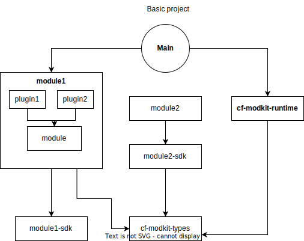
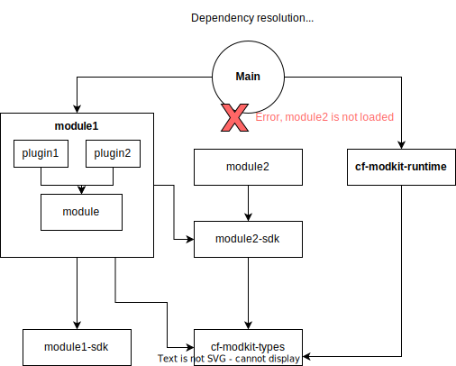
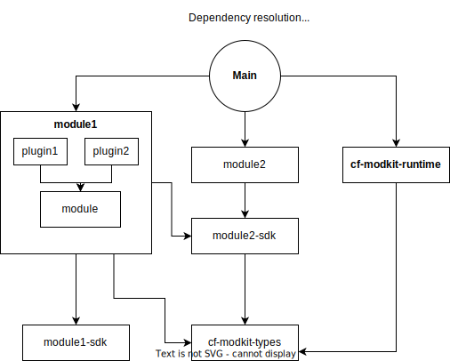

# ADR-0004: Modkit module and plugin declaration and resolution

## Problem Statement

1. There is no distinction at code level between modules and plugins.
2. Types used by the modules are directly attached with the runtime.
    - A breaking change in the runtime will separate crates, even though the module registration is not affected.
3. We want to enforce 1 crate per module, but we want to allow N plugins per crate.
4. We have detached the configuration from the module.

## Proposed Solution

By leveraging types, we can improve the module resolution by types instead of ambiguous names.

Using a reference of the module in the SDK we can detect which **exact** module is missing.
Besides, the plugins require a reference of the module to be registered.



After a change we introduce a dependency:



Modkit will expect our module2, not any module with name "module2".



Based on the previous example, the new API will be:

```rust
// module1_sdk -> src/module.rs
#[derive(Debug)]
struct ModuleRef;

// module2_sdk -> src/module.rs
#[derive(Debug)]
struct ModuleRef;
```

```rust
// module1 -> src/module.rs
#[modkit_types::module(
    ref = module1_sdk::ModuleRef,
    capabilities = [system, rest],
    deps = [module2_sdk::ModuleRef],
)]
struct Module1 {
    #[modkit_config] config: Module1Config, // optional
}
```

```rust
// plugin1 -> module1::src/.../plugin1.rs
#[modkit_types::plugin(
    module = module1_sdk::ModuleRef,
    spec = Module1Plugin1SpecV1,
    instance_id = "cf.builtin.plugin1.plugin.v1", // just an example
)]
struct Plugin1 {
    #[modkit_config] config: Plugin1Config, // optional
}
```

### Reduction of dependencies

With this change, we can load programmatically the modules and plugins without depending on `inventory` crate.

The new macro enforcing one module per crate in `src/module.rs` allow us to load the module by using that reference.

## Implementation

The general idea is to implement it in phases without breaking compatibility, until we are ready to make the change:

- Phase 1: Implement the two macros, `module`(module_v2) and `plugin`, in `cf-modkit-macros` crate.
- Phase 2: Implement the new `cf-modkit-types` crate with the collection of current types + new macros.
- Phase 3: Change the references from `cf-modkit` runtime types to a re-export of `cf-modkit-types`.
- Phase 4: Migrate the modules to use `cf-modkit-types`
- Phase 5: Remove the old types from `cf-modkit` crate.
- Phase 6: Remove the old macros from `cf-modkit-macros` crate.
