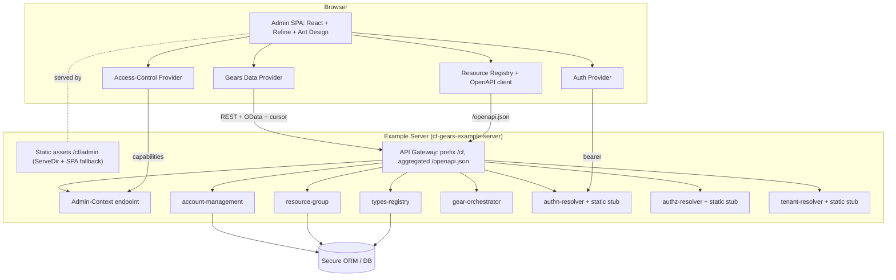
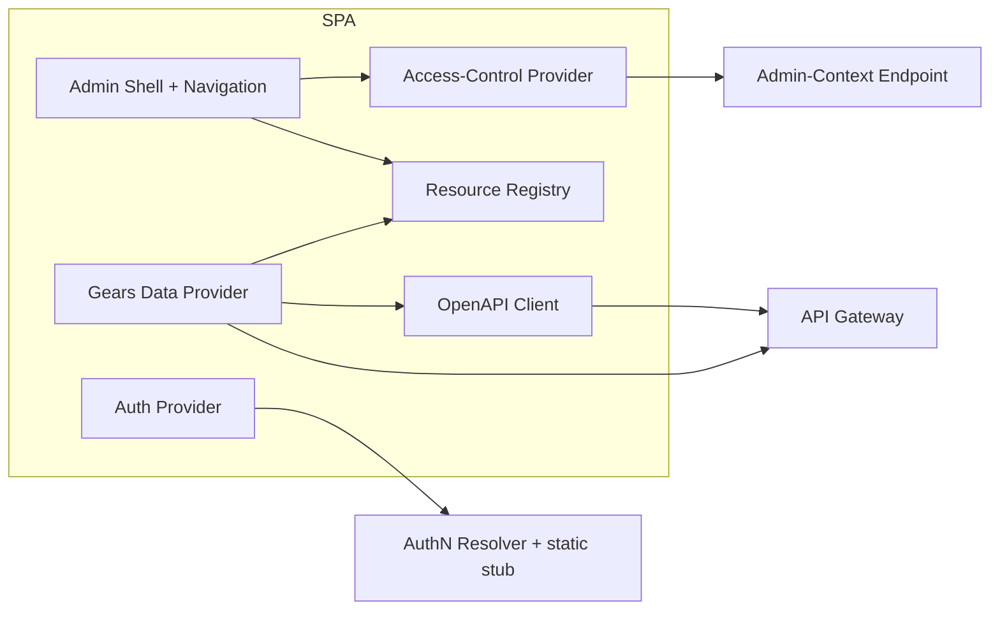
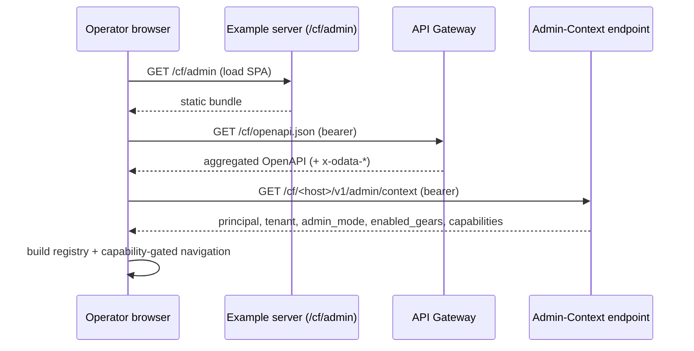

# Technical Design — Integrated Admin Panel


> **Revision (2026-06-30):** placement and discovery were updated after PR review — the panel becomes a **generic, reusable SPA** (runtime `/cf/openapi.json` + gear-emitted metadata) shipped as a **pre-built artifact** with zero per-project TypeScript, eventually extracted to a dedicated `constructorfabric/` repository (kept in-monorepo until fully generic). The in-app curated registry described below is the v0 state and shrinks to near-zero as runtime OpenAPI discovery and gear-contributed metadata land. See the revision notes in [ADR-0001](ADR/0001-cpt-admin-panel-adr-placement-and-delivery.md) and [ADR-0003](ADR/0003-cpt-admin-panel-adr-resource-discovery.md). Metadata transport (config / `x-cf-admin-*` extensions / descriptor endpoint) is pending reviewer confirmation.
>
> **Revision (2026-07-02) — implemented; discovery transport resolved by concern-split.** The metadata-transport question above is closed **without a new backend mechanism** or framework change (see [ADR-0003](ADR/0003-cpt-admin-panel-adr-resource-discovery.md) 2026-07-02). Facts are split by nature: (1) **API-intrinsic** — field types/`required`/`readOnly`, CRUD verb→path mapping, custom actions (`POST …/suspend`), and tenant-scope (the `{tenant_id}` path param) — are derived at runtime from `/cf/openapi.json`; (2) **presentation & policy** — list columns, labels, safety, action wiring, irregular list paths, withheld verbs — live in a declarative JSON config (`apps/admin-panel/src/resources/admin.config.json`) interpreted by a generic loader. The hand-written in-app registry is gone: `registry.ts` shrank from ~336 LOC to ~46 (config import + build + icons). Net result — **registering a resource is a JSON edit with zero per-project TypeScript**, satisfying the genericity driver below. The §3.1/§3.2 "curated in-app registry" wording is superseded by this config-plus-OpenAPI model. Still deferred to follow-ups: extraction to a dedicated `constructorfabric/` repo as a pre-built artifact, a production admin-role model beyond the dev stub, and the raw-DB operator fallback.

<!-- toc -->

- [1. Architecture Overview](#1-architecture-overview)
  - [1.1 Architectural Vision](#11-architectural-vision)
  - [1.2 Architecture Drivers](#12-architecture-drivers)
  - [1.3 Architecture Layers](#13-architecture-layers)
- [2. Principles & Constraints](#2-principles--constraints)
  - [2.1 Design Principles](#21-design-principles)
  - [2.2 Constraints](#22-constraints)
- [3. Technical Architecture](#3-technical-architecture)
  - [3.1 Domain Model](#31-domain-model)
  - [3.2 Component Model](#32-component-model)
  - [3.3 API Contracts](#33-api-contracts)
  - [3.4 Internal Dependencies](#34-internal-dependencies)
  - [3.5 External Dependencies](#35-external-dependencies)
  - [3.6 Interactions & Sequences](#36-interactions--sequences)
  - [3.7 Database schemas & tables](#37-database-schemas--tables)
  - [3.8 Deployment Topology](#38-deployment-topology)
- [4. Additional context](#4-additional-context)
- [5. Traceability](#5-traceability)

<!-- /toc -->

- [ ] `p3` - **ID**: `cpt-admin-panel-design-overview`

## 1. Architecture Overview

### 1.1 Architectural Vision

The Integrated Admin Panel is a metadata-driven, OpenAPI-discovered single-page application (SPA) that manages gear-owned resources through the existing Gears API authority boundary. It is built with React + Refine + Vite + Ant Design (TypeScript), embedded in the `gears-rust` monorepo, and served as a static bundle by the example server under the API Gateway prefix at `/cf/admin` (see `cpt-admin-panel-adr-placement-and-delivery`, `cpt-admin-panel-adr-frontend-framework`). The panel never embeds business logic or tenant-isolation rules: it renders screens from resource metadata, issues authenticated requests to gear REST endpoints, and treats the backend (API Gateway, AuthN/AuthZ/Tenant resolvers, Secure ORM) as the final authority.

Discovery is OpenAPI-first: the panel reads the gateway-aggregated `/openapi.json` (including the `x-odata-*` vendor extensions and cursor-pagination envelope) to derive default fields, operations, filters, and ordering, and overlays a small curated in-app resource registry that supplies what OpenAPI cannot express — resource grouping, tenant-scope strategy, safety levels, custom-action wiring, and layout overrides (see `cpt-admin-panel-adr-resource-discovery`). The registry's descriptor shape is forward-compatible with a future gear-contributed metadata mechanism, which is deferred beyond v0.

Two admin modes — platform and tenant — are selected from a backend-provided admin context fetched at startup, not from a UI toggle. Because the platform's security model has no admin-mode concept today, v0 introduces a clearly non-production role stub in the static auth plugins and a dedicated admin-context endpoint that returns the principal, resolved tenant, admin mode, enabled gears, and capabilities (see `cpt-admin-panel-adr-admin-role-and-context`). The only new backend code for v0 is this endpoint and the two-role static stub; everything else reuses existing gear APIs.

### 1.2 Architecture Drivers

#### Functional Drivers

| Requirement | Design Response |
|-------------|------------------|
| `cpt-admin-panel-fr-admin-modes` | Mode resolved from the admin-context endpoint; no UI toggle. |
| `cpt-admin-panel-fr-platform-mode` | Platform mode enables cross-tenant resources, tenant-context switch, confirmation + audit on destructive/cross-tenant actions. |
| `cpt-admin-panel-fr-tenant-mode` | Tenant mode restricts navigation/resources to the in-scope tenant subtree; backend enforces isolation. |
| `cpt-admin-panel-fr-admin-shell` | Refine shell renders capability-gated navigation from the resource registry + admin context. |
| `cpt-admin-panel-fr-resource-descriptor` | Resource registry implements the descriptor model (key, owning gear, source ops, fields, scope strategy, actions, capabilities, safety level). |
| `cpt-admin-panel-fr-generated-screens` | Refine + Ant Design generate list/detail/create/edit screens from descriptors; per-resource overrides via custom pages. |
| `cpt-admin-panel-fr-openapi-discovery` | Data provider parses `/openapi.json` for fields/operations and `x-odata-*` capabilities. |
| `cpt-admin-panel-fr-partial-crud` | Provider omits methods/actions for missing operations; UI exposes the gap. |
| `cpt-admin-panel-fr-custom-actions` | Refine `custom()` provider method drives suspend/unsuspend/approve/reject/cancel/retry/resolve/deprovision with confirmation. |
| `cpt-admin-panel-fr-pagination-filtering` | Provider maps cursor pagination and OData `$filter`/`$orderby` from advertised extensions. |
| `cpt-admin-panel-fr-error-normalization` | Provider normalizes RFC-9457 problem responses into admin messages. |
| `cpt-admin-panel-fr-admin-context` | Dedicated admin-context endpoint fetched at startup. |
| `cpt-admin-panel-fr-role-stub` | Two non-production roles in the static auth plugins. |
| `cpt-admin-panel-fr-server-side-scope` | Tenant scope resolved server-side; Secure ORM tenant-subtree predicates prevent escalation. |
| `cpt-admin-panel-fr-tenants` / `-resource-groups` / `-types-gts` / `-gear-status` | v0 resources backed by account-management, resource-group, types-registry, gear-orchestrator APIs. |

#### NFR Allocation

| NFR ID | NFR Summary | Allocated To | Design Response | Verification Approach |
|--------|-------------|--------------|-----------------|----------------------|
| `cpt-admin-panel-nfr-auth-required` | Auth on all admin routes; authz on writes; audit destructive/cross-tenant/raw-DB | API Gateway auth middleware + gear handlers + audit sink | All admin API calls carry a bearer token validated by AuthN; writes evaluated by AuthZ; audited actions emit records | e2e tests for unauthenticated/unauthorized; audit-record assertions |
| `cpt-admin-panel-nfr-no-secret-exposure` | No secrets exposed by default | Resource registry field visibility + (later) raw-DB column masking | Secret/security fields are not listed by default; masking required before any opt-in | Review + tests asserting masked fields absent |
| `cpt-admin-panel-nfr-backend-authority` | Isolation enforced backend-side | AuthZ resolver + Secure ORM | No isolation/authorization decision in the SPA; provider only sends scoped requests | e2e: tenant admin cannot reach cross-tenant objects |
| `cpt-admin-panel-nfr-demo-marking` | Demo/static auth clearly marked | SPA banner + docs | Non-production banner when static auth/role stub active | Review + UI test |

#### Key ADRs

| ADR ID | Decision Summary |
|--------|-----------------|
| `cpt-admin-panel-adr-placement-and-delivery` | Embed in monorepo; serve SPA from example server at `/cf/admin`. |
| `cpt-admin-panel-adr-frontend-framework` | React + Refine + Vite + Ant Design (TypeScript). |
| `cpt-admin-panel-adr-resource-discovery` | OpenAPI-first discovery + hardcoded v0 registry; gear-contributed descriptors deferred. |
| `cpt-admin-panel-adr-admin-role-and-context` | Static two-role stub + dedicated admin-context endpoint; `/me` unchanged. |

### 1.3 Architecture Layers



- [ ] `p3` - **ID**: `cpt-admin-panel-tech-layers`

| Layer | Responsibility | Technology |
|-------|---------------|------------|
| Presentation | Generated admin screens, navigation, confirmation flows | React, Refine, Ant Design, Vite (TypeScript) |
| Application (client) | Data/auth/access-control providers, resource registry, OpenAPI client | Refine providers, `openapi-typescript` client |
| Delivery | Serve SPA static bundle; proxy gear routes; aggregate OpenAPI | `cf-gears-example-server`, API Gateway, `tower-http` `ServeDir` |
| API | Gear REST endpoints + new admin-context endpoint | ToolKit `OperationBuilder`, Axum, utoipa OpenAPI |
| Domain/Infra | Business logic, tenant isolation, persistence | Gears, Secure ORM, SeaORM, AuthN/AuthZ/Tenant resolvers |

## 2. Principles & Constraints

### 2.1 Design Principles

#### Backend Is the Authority

- [ ] `p2` - **ID**: `cpt-admin-panel-principle-backend-authority`

The SPA never implements authorization or tenant isolation. It renders what metadata and capabilities allow, but every list, read, write, and action is authorized server-side; the UI showing or hiding a control is a convenience, not a security boundary.

**ADRs**: `cpt-admin-panel-adr-admin-role-and-context`

#### Metadata-Driven, Override-Capable

- [ ] `p2` - **ID**: `cpt-admin-panel-principle-metadata-driven`

Screens are generated from OpenAPI + resource descriptors; bespoke workflows are per-resource overrides, not forks of the core app. New resources are additive.

**ADRs**: `cpt-admin-panel-adr-resource-discovery`

#### API-First, DB-Last

- [ ] `p2` - **ID**: `cpt-admin-panel-principle-api-first`

The panel uses Gears APIs as the authority boundary; raw database access is an operator-only, audited, last-resort fallback for resources with no safe API, and is deferred beyond v0.

**ADRs**: `cpt-admin-panel-adr-resource-discovery`

### 2.2 Constraints

#### JS/TS Toolchain in a Rust Monorepo

- [ ] `p2` - **ID**: `cpt-admin-panel-constraint-js-toolchain`

The admin SPA introduces a Node/TypeScript build confined to the admin subtree, built as a separate CI step and not coupled to the Rust build graph. The repo is otherwise pure Rust.

**ADRs**: `cpt-admin-panel-adr-placement-and-delivery`

#### Non-Production Static Auth for v0

- [ ] `p2` - **ID**: `cpt-admin-panel-constraint-static-auth`

v0 runs against the static (demo) auth/authz/tenant plugins, including the two-role stub. These are not production-grade and must be clearly marked as such.

**ADRs**: `cpt-admin-panel-adr-admin-role-and-context`

## 3. Technical Architecture

### 3.1 Domain Model

**Technology**: TypeScript types (frontend resource descriptors) + existing gear domain models (backend, unchanged).

**Location**: admin SPA resource registry (frontend); gear SDK crates own the backend domain entities.

**Core Entities**:

- [ ] `p2` - **ID**: `cpt-admin-panel-entity-descriptors`

| Entity | Description | Schema |
|--------|-------------|--------|
| ResourceDescriptor | Declares a manageable resource: key, owning gear, source operation IDs, list/detail/create/update fields, search/filter/sort/relation fields, tenant-scope strategy, supported actions, required capabilities, safety level | frontend registry (TS) |
| FieldDescriptor | label, type, visibility, read-only, validation, relation, widget, permission | frontend registry (TS) |
| ActionDescriptor | custom action: name, HTTP operation, confirmation, destructive/cross-tenant flags, required capability | frontend registry (TS) |
| AdminContext | principal, resolved tenant, admin mode, enabled gears, capabilities | admin-context endpoint DTO |

**Relationships**:
- ResourceDescriptor → FieldDescriptor: a resource has list/detail/create/update field sets.
- ResourceDescriptor → ActionDescriptor: a resource exposes zero or more custom actions.
- AdminContext → ResourceDescriptor: capabilities gate which resources/actions are visible.

The admin panel introduces no new persistent gear-owned domain entities for v0 (resources are projections of existing gear data). The admin-context endpoint is computed, not stored.

### 3.2 Component Model



#### Admin Shell

- [ ] `p2` - **ID**: `cpt-admin-panel-component-shell`

##### Why this component exists
Hosts the SPA layout, routing, navigation, and admin-mode presentation; the entry point users interact with.

##### Responsibility scope
Renders capability-gated navigation from the resource registry and admin context; nested tenant routes; mode banner (incl. non-production marking); confirmation dialogs for destructive/cross-tenant actions.

##### Responsibility boundaries
Does not fetch domain data directly (delegates to the data provider) and does not make authorization decisions (delegates to the access-control provider/backend).

##### Related components (by ID)
- `cpt-admin-panel-component-resource-registry` — reads descriptors from
- `cpt-admin-panel-component-access-control-provider` — gates navigation via
- `cpt-admin-panel-component-data-provider` — triggers CRUD/actions through

#### Gears Data Provider

- [ ] `p2` - **ID**: `cpt-admin-panel-component-data-provider`

##### Why this component exists
Translates Refine's list/read/create/update/delete and `custom()` operations into Gears REST requests, hiding gear-specific wire details from screens.

##### Responsibility scope
Builds requests from descriptors + OpenAPI operations; maps OData `$filter`/`$orderby` from `x-odata-*`; handles cursor pagination; attaches bearer token; normalizes RFC-9457 errors and list metadata.

##### Responsibility boundaries
Does not define resources (reads them from the registry/OpenAPI) and does not store auth state (uses the auth provider).

##### Related components (by ID)
- `cpt-admin-panel-component-openapi-client` — issues typed requests via
- `cpt-admin-panel-component-resource-registry` — resolves operation IDs from
- `cpt-admin-panel-component-auth-provider` — obtains bearer token from

#### Auth Provider

- [ ] `p2` - **ID**: `cpt-admin-panel-component-auth-provider`

##### Why this component exists
Implements Refine's auth lifecycle (login/logout/check/getIdentity) over the platform bearer flow.

##### Responsibility scope
Acquires/stores the bearer token; resolves identity; handles unauthenticated/expired-session states.

##### Responsibility boundaries
Does not authorize actions (that is the access-control provider + backend); does not implement an IdP.

##### Related components (by ID)
- `cpt-admin-panel-component-shell` — drives session states for

#### Access-Control Provider

- [ ] `p2` - **ID**: `cpt-admin-panel-component-access-control-provider`

##### Why this component exists
Implements Refine's `can({resource, action})` against backend capabilities to gate navigation and write controls.

##### Responsibility scope
Maps admin-context capabilities + descriptor required-capabilities to allow/deny for UI gating.

##### Responsibility boundaries
Convenience gating only; the backend remains the authority and re-checks every action.

##### Related components (by ID)
- `cpt-admin-panel-component-admin-context` — consumes capabilities from

#### Resource Registry

- [ ] `p2` - **ID**: `cpt-admin-panel-component-resource-registry`

##### Why this component exists
Holds the curated v0 resource/field/action descriptors and overlays them on OpenAPI-derived defaults.

##### Responsibility scope
Declares v0 resources and their source operations, scope strategy, safety levels, custom actions, and layout overrides; shaped to be replaceable by gear-contributed descriptors later.

##### Responsibility boundaries
No network I/O; pure metadata consumed by the shell and data provider.

##### Related components (by ID)
- `cpt-admin-panel-component-openapi-client` — overlays defaults from

#### OpenAPI Client

- [ ] `p2` - **ID**: `cpt-admin-panel-component-openapi-client`

##### Why this component exists
Provides a typed client and schema view generated from the gateway-served `/openapi.json`.

##### Responsibility scope
Generates/loads types and operation metadata (paths, params, schemas, `x-odata-*`); keeps the data provider thin and spec-synced.

##### Responsibility boundaries
Transport only; no business logic.

##### Related components (by ID)
- `cpt-admin-panel-component-data-provider` — supplies typed operations to

#### Admin-Context Endpoint (backend)

- [ ] `p2` - **ID**: `cpt-admin-panel-component-admin-context`

##### Why this component exists
Supplies the startup admin context (principal, tenant, mode, enabled gears, capabilities) that does not exist in the platform today.

##### Responsibility scope
Derives mode and capabilities server-side from the security context + the static role marker; summarizes enabled gears.

##### Responsibility boundaries
Does not replace `/me`; does not store state; does not perform per-request enumeration of authorization for v0 (derives capabilities from role + enabled gears).

##### Related components (by ID)
- `cpt-admin-panel-component-access-control-provider` — serves capabilities to
- `cpt-admin-panel-component-shell` — serves mode + enabled gears to

### 3.3 API Contracts

- [ ] `p2` - **ID**: `cpt-admin-panel-interface-admin-context-api`

- **Contracts**: `cpt-admin-panel-contract-openapi`
- **Technology**: REST / OpenAPI (JSON), served under the API Gateway prefix `/cf`
- **Location**: admin-context endpoint hosted by **account-management** (`GET /cf/account-management/v1/admin/context`).

**Endpoints Overview**:

| Method | Path | Description | Stability |
|--------|------|-------------|-----------|
| `GET` | `/cf/account-management/v1/admin/context` | Returns subject, home tenant, admin mode, capabilities | unstable |
| `GET` | `/cf/gear-orchestrator/v1/gears` | Enabled gears + status (existing; read separately by the panel) | stable |
| `GET` | `/cf/openapi.json` | Aggregated OpenAPI used for discovery (existing) | stable |
| `GET` | `/cf/admin/*` | Static SPA assets with SPA fallback (existing server, new mount) | unstable |
| `GET` | `/cf/account-management/v1/me` | Identity reflection (existing, unchanged) | stable |

Admin-context response (the implemented flat `AdminContextDto`):

```json
{
  "subject_id": "uuid",
  "subject_type": "platform_admin|tenant_admin|null",
  "subject_tenant_id": "uuid",
  "admin_mode": "platform|tenant",
  "capabilities": ["tenants:read", "tenants:write", "tenants:suspend", "resource-groups:read", "..."],
  "non_production_auth": true
}
```

Enabled gears are intentionally **not** part of this response — the panel reads them separately from `GET /cf/gear-orchestrator/v1/gears`, so the admin-context contract stays a thin identity/authorization projection. The v0 resources are driven by existing gear endpoints (account-management tenants/metadata/conversions, resource-group groups/memberships, types-registry entities, gear-orchestrator gears); the data provider consumes them via OpenAPI discovery. No gear API is modified for v0 except the addition of the admin-context endpoint.

### 3.4 Internal Dependencies

| Dependency Gear | Interface Used | Purpose |
|-------------------|----------------|----------|
| api-gateway | aggregated OpenAPI + route proxy under `/cf`; static mount | Discovery surface and SPA delivery |
| account-management | REST (tenants, metadata, conversions, users, `/me`) | Tenant management v0 resources |
| resource-group | REST (groups, descendants/ancestors, memberships) | Resource group v0 resources |
| types-registry | REST (entities register/list/get) | Types/GTS v0 resources |
| gear-orchestrator | REST (`/gears`) | Enabled gears + status summary |
| authn-resolver (+ static stub) | bearer authentication | Principal + bearer for the panel |
| authz-resolver (+ static stub) | authorization decisions | Server-side write/read authorization |
| tenant-resolver (+ static stub) | tenant scope resolution | Server-side tenant scoping |

**Dependency Rules** (per project conventions):
- No circular dependencies.
- Always use SDK modules for inter-gear communication.
- No cross-category sideways deps except through contracts.
- Only integration/adapter gears talk to external systems.
- `SecurityContext` must be propagated across all in-process calls.

### 3.5 External Dependencies

#### Browser runtime

- **Contract**: `cpt-admin-panel-contract-openapi`

The SPA runs in the operator's browser and communicates only with the example server under `/cf` (same-origin). No third-party backend services are introduced. Frontend build-time dependencies (Node, npm registry packages) are confined to the admin subtree.

**Dependency Rules** (per project conventions):
- No circular dependencies.
- Always use SDK modules for inter-gear communication.
- `SecurityContext` must be propagated across all in-process calls.

### 3.6 Interactions & Sequences

#### Startup and Mode Selection

**ID**: `cpt-admin-panel-seq-startup`

**Use cases**: `cpt-admin-panel-usecase-suspend-tenant`, `cpt-admin-panel-usecase-tenant-metadata`

**Actors**: `cpt-admin-panel-actor-platform-operator`, `cpt-admin-panel-actor-tenant-admin`



**Description**: The SPA loads, discovers resources from OpenAPI, fetches admin context, and renders mode-appropriate, capability-gated navigation.

#### Custom Action (Suspend Tenant)

**ID**: `cpt-admin-panel-seq-suspend`

**Use cases**: `cpt-admin-panel-usecase-suspend-tenant`

**Actors**: `cpt-admin-panel-actor-platform-operator`

```mermaid
sequenceDiagram
    participant U as Operator browser
    participant G as API Gateway
    participant AM as account-management
    participant Z as AuthZ resolver
    U->>U: confirm destructive action
    U->>G: POST /cf/account-management/v1/tenants/{id}/suspend (bearer)
    G->>AM: proxy
    AM->>Z: evaluate(suspend, tenant)
    Z-->>AM: allow + constraints
    AM-->>G: 200 (status=suspended) / RFC-9457 on deny
    G-->>U: result; provider normalizes errors
```

**Description**: A custom action routes through the data provider's `custom()` method; the backend authorizes and the provider normalizes the response.

### 3.7 Database schemas & tables

- [ ] `p3` - **ID**: `cpt-admin-panel-db-none`

The admin panel introduces no new database tables for v0. All managed data is owned by existing gears and accessed through their APIs; tenant isolation is enforced by Secure ORM tenant-subtree predicates in those gears. Audit logging for destructive/cross-tenant/raw-DB actions uses the platform's audit sink (target sink confirmed in implementation). The raw-database fallback (`cpt-admin-panel-fr-raw-db`) — with table allowlist, read-only default, secret masking, and write audit — is deferred beyond v0 and will be specified in a feature/ADR when introduced.

### 3.8 Deployment Topology

- [ ] `p3` - **ID**: `cpt-admin-panel-topology-embedded`

Single-process deployment: the `cf-gears-example-server` serves both the gear APIs (under `/cf`) and the admin SPA static bundle (under `/cf/admin`, via `tower-http` `ServeDir` with SPA fallback to `index.html`). A `make admin` target builds the SPA (`vite build` → static assets) and runs the server with an `admin` feature/config (modeled on the `mini-chat` target and a `config/admin.yaml` copied from `config/mini-chat.yaml`); `make example` remains the plain-server path. The SPA build is a separate CI step; whether built assets are committed or built on demand is decided during implementation. The same topology supports the existing Python/pytest e2e harness, with a new `testing/e2e/gears/admin/` suite driving v0 flows against the locally started server.

## 4. Additional context

- v0 backend work is intentionally minimal: the admin-context endpoint and the two-role static stub. Everything else is frontend plus configuration.
- Known backend gaps the registry must accommodate: types-registry and OAGW advertise no OData (limit/offset or simple filters), and there is no global `GET /tenants` list — the tenant tree starts from the root via `/children` unless a list endpoint is added (open question).
- Open questions carried from the PRD: admin-context host gear and exact shape; production representation of admin mode; whether a global tenant list is added; SPA authentication against a non-`auth_disabled` deployment.
- Out of scope for v0 (per PRD): policy/role editor, credential store editor, billing, audit-log UI, password reset, IdP-native group management, tenant-facing raw DB.

## 5. Traceability

- **PRD**: [PRD.md](./PRD.md)
- **ADRs**: [ADR/](./ADR/)
  - [`0001`](./ADR/0001-cpt-admin-panel-adr-placement-and-delivery.md) — placement & delivery
  - [`0002`](./ADR/0002-cpt-admin-panel-adr-frontend-framework.md) — frontend framework
  - [`0003`](./ADR/0003-cpt-admin-panel-adr-resource-discovery.md) — resource discovery
  - [`0004`](./ADR/0004-cpt-admin-panel-adr-admin-role-and-context.md) — admin role & context
- **Issue**: constructorfabric/gears-rust#4144
