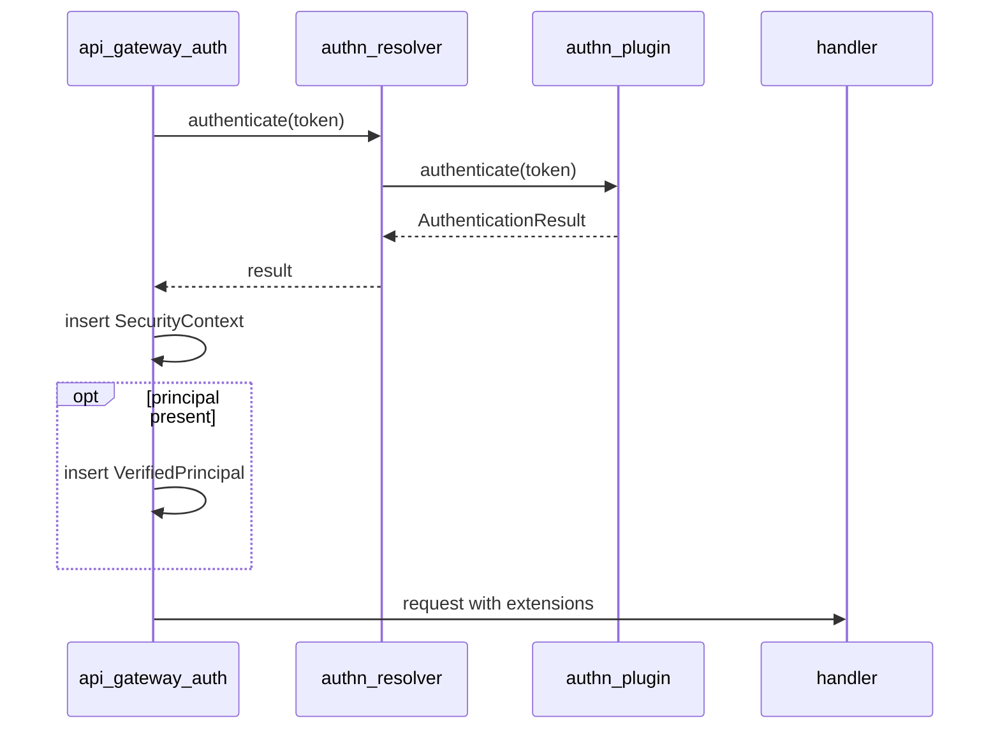

# Verified Principal as a Request Extension

## Context and Problem Statement

Some handlers need verified profile claims about the caller — email, email-verification status,
identity provider, anonymous flag, and token timestamps (`iat`, `auth_time`, `exp`) — for the **same**
token that produced the `SecurityContext`.

These claims back real product features — not merely internal diagnostics. A product-facing
`GET /me`-style endpoint is a first-class API contract: it returns the **server-verified** profile
(`subject_id`, `provider`, `email`, `is_anonymous`, …) so that clients and downstream server features
consume backend-verified identity rather than trusting client-supplied hints. This matters because a
client already holds most of these fields locally (e.g. from its IdP SDK), but those are unverified
hints; the authoritative answer to "who does the backend believe this caller is" requires server-side
token verification. Higher-level features build on that trust anchor — account linking (e.g. anonymous
→ federated), user/installation records, and quota enforcement. The internal `subject_id` in particular
is server-assigned and cannot be derived by the client at all.

`SecurityContext` deliberately does **not** carry these claims. Per [ADR 0002](./0002-split-authn-authz-resolvers.md)
it is the PDP identity that flows AuthN → PEP → AuthZ, and per [DESIGN.md](../DESIGN.md) it is kept
PDP-minimal: token metadata such as `exp` is validated during authentication but intentionally left off
`SecurityContext` (expiration is token metadata, not identity). Widening `SecurityContext` to carry
profile/time claims would bloat the authorization identity and blur the AuthN/AuthZ boundary.

Consumers have worked around this by having the AuthN plugin publish verified identity through a
side-channel — e.g. a process-local `ClientHub` client backed by an in-memory TTL store, keyed by
`subject_id`. This is an **incorrect correctness boundary**: the profile a handler reads is not
guaranteed to be the one derived from the token on the current request (eviction, TTL expiry, cross-
replica misses, or a racing refresh can all return stale or absent data). The verified profile is a
property of *this request's token* and should ride *this request*.

**Key question:** how do handlers obtain verified profile claims for the current token without
polluting `SecurityContext` or relying on a cache side-channel?

## Decision Drivers

- **Correctness** — the profile a handler reads must be the one verified from the current request's token.
- **PDP-minimal `SecurityContext`** — keep authorization identity lean (ADR 0002, DESIGN.md).
- **Compatibility with the minimalist AuthN interface** — do not add methods to the plugin trait
  ([ADR 0003](./0003-authn-resolver-minimalist-interface.md)).
- **Optionality** — most plugins/routes do not need a principal; they must not be forced to produce one.
- **Multi-replica safety** — no dependence on process-local state for request correctness.

## Considered Options

- **Option A** — Extend `AuthenticationResult` with an optional `VerifiedPrincipal`; the gateway inserts
  it into the Axum request extensions alongside `SecurityContext`.
- **Option B** — Extend `SecurityContext` with the profile/time claims.
- **Option C** — Keep a process-local cache (`ClientHub`/LRU) that handlers query by `subject_id`.
- **Option D** — A token-digest handoff: middleware stashes claims keyed by a token hash for the
  handler to look up.

## Decision Outcome

Chosen option: **Option A**, because it puts the verified profile on the request that produced it —
the correct boundary — while keeping `SecurityContext` PDP-minimal and the plugin interface unchanged.

- `AuthenticationResult` gains an optional field: `principal: Option<VerifiedPrincipal>`.
- Plugins that have verified profile claims return `AuthenticationResult::with_principal(ctx, principal)`;
  all others return `AuthenticationResult::authenticated(ctx)` (principal `None`).
- The AuthN middleware inserts `SecurityContext` into the request extensions as today, and additionally
  inserts `VerifiedPrincipal` when present.
- Routes that require a principal treat a **missing** extension on an authenticated request as an
  **internal error (5xx)**, not a 401 — absence indicates a wiring problem, not a failed credential, and
  returning 401 would trigger client token-refresh loops.

This adds a field to the **result payload**, not a method to the trait, so it stays compatible with
ADR 0003. It keeps profile/time claims on the AuthN side of the ADR 0002 boundary.

### Contract

```rust
pub struct VerifiedPrincipal {
    pub subject_id: Uuid,
    pub external_subject: String, // IdP `sub` / provider UID
    pub issuer: String,
    pub email: Option<String>,
    pub email_verified: Option<bool>,
    pub provider: String,
    pub is_anonymous: bool,
    pub issued_at: i64,   // unix seconds (`iat`)
    pub auth_time: i64,   // unix seconds
    pub expires_at: i64,  // unix seconds (`exp`)
}

impl AuthenticationResult {
    pub fn authenticated(security_context: SecurityContext) -> Self { /* principal: None */ }
    pub fn with_principal(security_context: SecurityContext, principal: VerifiedPrincipal) -> Self { /* ... */ }
}
```

Times are unix seconds (`i64`) to match how token claims (`iat`/`exp`/`auth_time`) arrive and how
existing plugin identity types already model them.

**Invariant:** if `principal` is `Some`, then `principal.subject_id == security_context.subject_id()`.
The producing plugin is responsible for upholding this.

### Placement

`VerifiedPrincipal` lives in **`authn-resolver-sdk`** next to `AuthenticationResult` — not in
`toolkit-security`. This keeps `SecurityContext` PDP-minimal and keeps profile/time claims as AuthN
output.

### Request flow



### Consequences

**Good:**

- Correct boundary — the verified profile is scoped to the request that produced it.
- `SecurityContext` stays PDP-minimal; the AuthN/AuthZ split (ADR 0002) is preserved.
- Plugin trait unchanged (ADR 0003); plugins opt in per result.
- Multi-replica safe — no reliance on process-local state for request correctness.

**Bad:**

- Breaking change to `AuthenticationResult` → SDK major bump (`cf-gears-authn-resolver-sdk`
  `0.3.x → 0.4.0`) and a corresponding `cf-gears-api-gateway` bump; all construction sites migrate to
  the constructors.
- Handlers requiring a principal must handle its absence as a 5xx.

### Rejected options

- **Extend `SecurityContext` (B)** — bloats PDP identity with token metadata; contradicts DESIGN.md and
  ADR 0002.
- **Process-local cache (C)** — wrong correctness boundary; stale/missing on eviction, TTL, or across
  replicas; the very failure mode this ADR removes.
- **Token-digest handoff (D)** — extra middleware and a hashing side-channel for no benefit over
  carrying the value on the request directly.
- **Firebase/vendor DTOs in the gateway** — the gateway must stay provider-agnostic; `VerifiedPrincipal`
  is the provider-neutral shape.

## More Information

- [DESIGN.md](../DESIGN.md) — Authentication and authorization design specification (AuthenticationResult, middleware steps).
- [ADR 0002: Split AuthN and AuthZ Resolvers](./0002-split-authn-authz-resolvers.md)
- [ADR 0003: AuthN Resolver Minimalist Interface](./0003-authn-resolver-minimalist-interface.md)
