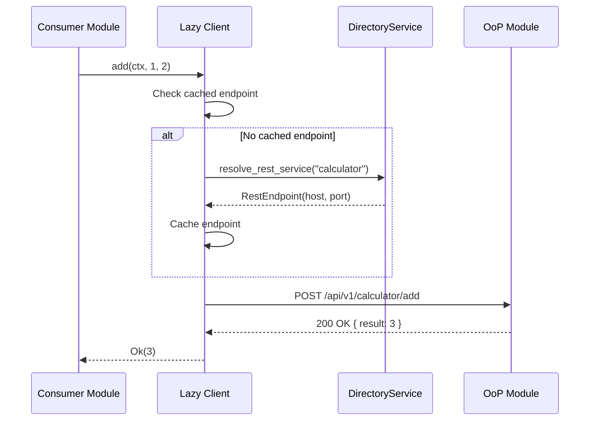
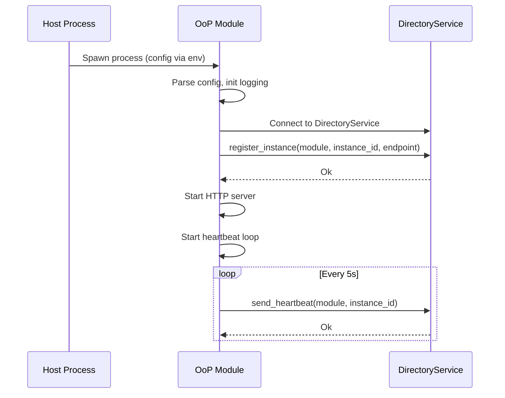
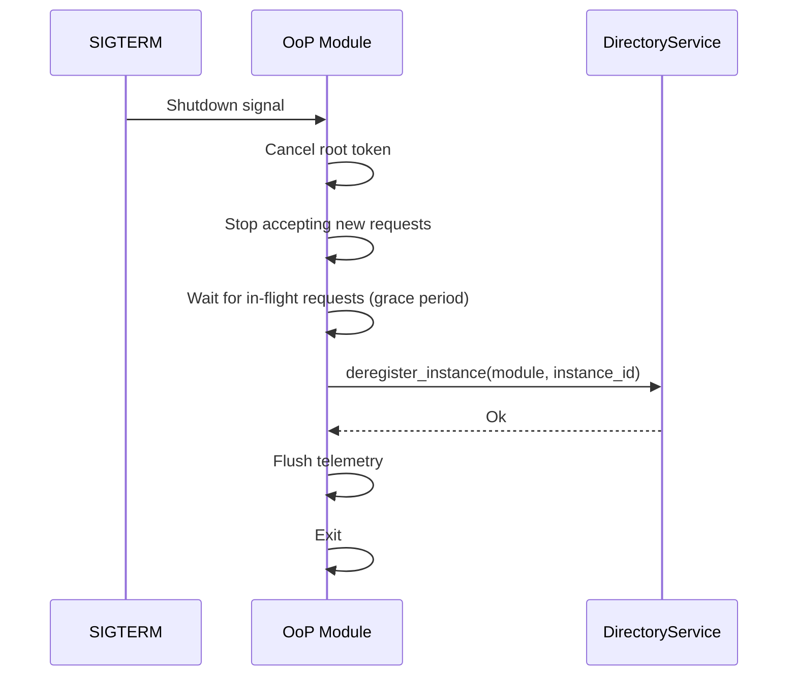

# Technical Design — Out-of-Process (OoP) Modules

## 1. Architecture Overview

### 1.1 Architectural Vision

Out-of-Process (OoP) modules are ModKit modules that run as separate OS processes, communicating with the host and other modules via network protocols (REST by default, gRPC opt-in). This architecture enables process isolation, independent scaling, language flexibility, resource isolation, and independent deployment.

#### OoP Module Categories

We distinguish two categories of OoP modules based on lifecycle ownership:

- **Managed OoP modules** – modules whose lifecycle is controlled by the host process. The host is responsible for configuring, starting, stopping, and supervising them.

- **Unmanaged OoP modules** – modules whose lifecycle is not controlled by the host process. They run independently, but the host can still discover them, register them, and interact with their APIs.

For example, services running in a Kubernetes cluster would be considered unmanaged from the host's perspective. Their lifecycle is handled by Kubernetes, not by the host process. However, the host still needs a mechanism to discover these services, register them, and communicate with them through their APIs.

This distinction affects how the design addresses lifecycle management, resource limits, and fault handling—later sections will approach these two types differently where applicable.

#### System Boundary

The system boundary is the ModKit host process and its spawned OoP module processes (managed) or discovered external services (unmanaged). OoP modules register with a DirectoryService for discovery and communicate via REST (default) or gRPC (opt-in). The architecture follows a lazy client pattern where endpoint resolution happens on first use, not at startup.

### 1.2 Architecture Drivers

#### Product requirements

##### Host management of OoP modules

- [] `p1` - `cpt-oop-fr-host-management`

**Solution**: The ModKit host process must be able to manage (spawn, configure, monitor) the OoP modules. This includes process lifecycle management, configuration injection, and health monitoring with automatic respawn on failure.

##### Process isolation for fault containment

- [] `p1` - `cpt-oop-fr-process-isolation`

**Solution**: Each OoP module runs as a separate OS process. A crash in one module doesn't bring down others.

##### Independent horizontal scaling

- [] `p1` - `cpt-oop-fr-horizontal-scaling`

**Solution**: OoP modules can be scaled horizontally. Multiple instances register with DirectoryService; client-side round-robin distributes load. Modules may expose a capability flag indicating whether they are stateless (safe for round-robin) or stateful (requiring sticky sessions or external state coordination).

##### Language flexibility for module implementation

- [] `p2` - `cpt-oop-fr-language-flexibility`

**Solution**: OoP modules communicate via REST/gRPC. Non-Rust modules can implement the same API contracts and register with DirectoryService.

##### Resource isolation per module

- [] `p1` - `cpt-oop-fr-resource-isolation`

**Solution**: The ModKit host process must be able to configure OoP modules resource limits (memory, CPU) via OS/container mechanisms. Each module runs in its own process with these limits enforced.

##### Independent deployment without full restart (managed only)

- [] `p1` - `cpt-oop-fr-independent-deployment`

**Solution**: For managed OoP modules, the host can update them independently via process restart; no host restart required. For unmanaged modules, deployment is controlled by the external orchestrator (e.g., rolling updates in Kubernetes).

##### Lazy client resolution (managed only)

- [] `p1` - `cpt-oop-fr-lazy-resolution`

**Solution**: For managed OoP modules, endpoint resolution happens on first API call, not at startup. Modules start even if dependencies are unavailable; requests fail gracefully until dependencies are ready.

##### Service discovery and registration (managed and unmanaged)

- [] `p1` - `cpt-oop-fr-service-discovery`

**Solution**: DirectoryService provides central registry. Both managed and unmanaged OoP modules register on startup, send heartbeats, and are discovered by consumers via `resolve_rest_service()`.

##### Fault tolerance with circuit breakers

- [] `p1` - `cpt-oop-nfr-fault-tolerance`

**Solution**: Circuit breaker pattern prevents cascading failures across three scenarios: (1) inter-module communication—when one OoP module calls another and the target is unavailable or slow; (2) host-to-module communication—when the host calls a managed module that becomes unresponsive; (3) external dependency failures—when an OoP module's external dependencies (DB, third-party APIs) fail. Retry with exponential backoff, idempotency keys for safe retries, graceful degradation when dependencies unavailable.

##### Standard health endpoints

- [] `p2` - `cpt-oop-nfr-health-endpoints`

**Solution**: Every OoP module exposes `/health/live` and `/health/ready` endpoints for K8s probes and monitoring.

#### Architecture Decision Records

##### ADR-0003 Universal Lazy Layer

- `cpt-oop-adr-universal-lazy-layer`

Establishes the lazy client pattern where endpoint resolution happens on first use. Clients are registered at module init but don't connect until first API call. This enables graceful startup even when dependencies are unavailable.

**Reference**: [ADR-0003: Universal Lazy Layer](./ADR/0001-universal-lazy-layer.md)

### 1.3 Architecture Layers

| Layer | Responsibility | Technology |
|-------|---------------|------------|
| Host Process Layer | Runs in-process modules, DirectoryService, spawns OoP modules | Rust, ModKit bootstrap |
| OoP Module Layer | Separate process with REST/gRPC API, registers with directory | Rust (or any language), REST/gRPC |
| SDK Layer | Shared contract (API trait, types, lazy client) | Rust crate per module |
| Discovery Layer | Service registry for module instance discovery | DirectoryService (gRPC-based) |
| Communication Layer | Inter-module communication via network protocols | REST (default), gRPC (opt-in) |

---

## 2. Principles & Constraints

### 2.1 Design Principles

#### REST-first communication

- [] `p1` - **ID**: `cpt-oop-principle-rest-first`

Use REST as the default transport for OoP modules. REST provides broad compatibility, easy debugging, and standard tooling. gRPC is opt-in for streaming or high-throughput scenarios.

#### Lazy resolution over eager connection

- [] `p1` - **ID**: `cpt-oop-principle-lazy-resolution`

Resolve endpoints on first use, not at startup. This enables graceful startup when dependencies are unavailable and avoids blocking the module lifecycle.

#### Fail-fast with graceful degradation

- [] `p1` - **ID**: `cpt-oop-principle-fail-fast-graceful`

Detect failures quickly (circuit breaker, timeouts) but degrade gracefully. A failing dependency should not bring down the entire module; only affected endpoints return errors.

#### Standard K8s patterns

- [] `p2` - **ID**: `cpt-oop-principle-k8s-native`

Follow standard Kubernetes patterns: health endpoints, structured logs, env var configuration, stateless design. Don't reinvent K8s primitives.

#### SDK-first API contracts

- [] `p1` - **ID**: `cpt-oop-principle-sdk-first`

Define API contracts in SDK crates with traits, types, and errors. The SDK is the single source of truth for the module's API surface.

### 2.2 Constraints

#### Multi-module executables supported

- [] `p1` - **ID**: `cpt-oop-constraint-multi-module`

The OoP engine must explicitly support multi-module executables. For small or edge systems, multiple modules can be bundled into a single service to minimize the number of deployed services. Single-module executables remain an option for scenarios requiring independent scaling or deployment.

#### DirectoryService for cross-module discovery

- [] `p1` - **ID**: `cpt-oop-constraint-directory-discovery`

OoP modules must register with DirectoryService for discovery. K8s DNS is an alternative for pure-K8s deployments, but DirectoryService is required for local development and hybrid environments.

#### Health endpoints required

- [] `p1` - **ID**: `cpt-oop-constraint-health-endpoints`

Every OoP module must expose `/health/live` and `/health/ready` endpoints. These are required for K8s probes and DirectoryService health tracking.

#### Configuration via environment and files

- [] `p2` - **ID**: `cpt-oop-constraint-config-sources`

OoP modules receive configuration via environment variables (`MODKIT_*`), config files, and CLI arguments. Merge priority: CLI > config file > environment.

---

## 3. Technical Architecture

### 3.1 Domain Model

Core types and invariants for OoP module communication:

**Module Instance**:
- `module_name`: String identifier for the module type
- `instance_id`: Unique identifier for this instance (UUID)
- `rest_endpoint`: Optional REST endpoint (host:port)
- `grpc_services`: List of gRPC service endpoints
- `state`: Instance health state (Registered, Ready, Healthy, Quarantined, Draining)
- `version`: Optional semantic version string

**Client Configuration**:
- `discovery`: Discovery strategy (Directory, KubernetesDns, Static)
- `connect_timeout`: Connection timeout (default: 5s)
- `request_timeout`: Request timeout (default: 30s)
- `retry_policy`: Retry configuration for transient failures
- `circuit_breaker`: Circuit breaker configuration
- `availability_policy`: Required vs Optional dependency

**Instance States**:
```
Registered ──[first heartbeat]──▶ Healthy
Healthy ──[missed heartbeats]──▶ Quarantined
Healthy ──[shutdown signal]──▶ Draining
Quarantined ──[heartbeat resumes]──▶ Healthy
```

**Invariants**:
- Only Healthy and Ready instances receive traffic
- Quarantined instances are excluded from load balancing
- Draining instances complete in-flight requests but accept no new ones

### 3.2 Component Model

```
┌─────────────────────────────────────────────────────────────────────────────┐
│                              Host Process                                   │
│  ┌─────────────┐  ┌─────────────┐  ┌─────────────┐  ┌──────────────────┐    │
│  │ api-gateway │  │  Module A   │  │  Module B   │  │ DirectoryService │    │
│  │ (in-proc)   │  │ (in-proc)   │  │ (in-proc)   │  │   (registry)     │    │
│  └─────────────┘  └─────────────┘  └─────────────┘  └─────────┬────────┘    │
│         │                │                │                   │             │
│         └────────────────┴────────────────┴───────────────────┘             │
│                                   │ ClientHub                               │
└───────────────────────────────────┼─────────────────────────────────────────┘
                                    │
                    ┌───────────────┼───────────────┐
                    │               │               │
                    ▼               ▼               ▼
            ┌─────────────┐ ┌─────────────┐ ┌─────────────┐
            │ Calculator  │ │ FileParser  │ │   LLM       │
            │   (OoP)     │ │   (OoP)     │ │  Gateway    │
            │  REST API   │ │  REST API   │ │   (OoP)     │
            └─────────────┘ └─────────────┘ └─────────────┘
```

#### Host Process

- [] `p1` - **ID**: `cpt-oop-component-host-process`

- **Responsibilities**: Run in-process modules, host DirectoryService, spawn and monitor OoP child processes, provide ClientHub for lazy client resolution.
- **Boundaries**: Does not implement OoP module business logic; only orchestrates lifecycle.
- **Dependencies**: ModKit bootstrap, DirectoryService, configuration system.
- **Key interfaces**: `ModuleRegistry`, `ClientHub`, process spawning via config.

#### DirectoryService

- [] `p1` - **ID**: `cpt-oop-component-directory-service`

- **Responsibilities**: Central registry for module instances, health tracking via heartbeats, endpoint resolution for consumers.
- **Boundaries**: Does not route traffic; only provides endpoint information.
- **Dependencies**: gRPC server (optional), in-memory instance registry.
- **Key interfaces**: `DirectoryClient` trait with `resolve_rest_service()`, `register_instance()`, `send_heartbeat()`.

#### OoP Module

- [] `p1` - **ID**: `cpt-oop-component-oop-module`

- **Responsibilities**: Run as separate process, expose REST/gRPC API, register with DirectoryService, send heartbeats, handle graceful shutdown.
- **Boundaries**: Independent process with own memory space; communicates only via network.
- **Dependencies**: ModKit OoP bootstrap, DirectoryClient, module-specific SDK.
- **Key interfaces**: REST endpoints, health endpoints, gRPC services (optional).

#### SDK Crate

- [] `p1` - **ID**: `cpt-oop-component-sdk-crate`

- **Responsibilities**: Define API trait, request/response types, error types, ClientDescriptor, lazy client implementation.
- **Boundaries**: No business logic; only contracts and client code.
- **Dependencies**: `async_trait`, `thiserror`, ModKit client infrastructure.
- **Key interfaces**: `{Module}ClientV1` trait, `{Module}ClientDescriptor`, `Lazy{Module}Client`.

#### Lazy Client

- [] `p1` - **ID**: `cpt-oop-component-lazy-client`

- **Responsibilities**: Resolve endpoint on first use (when `lazy_start: true`), cache endpoint, make HTTP requests, handle retries and circuit breaker.
- **Boundaries**: Does not know module business logic; only transport.
- **Dependencies**: `RestClientProvider`, `DirectoryClient`, HTTP client (reqwest).
- **Key interfaces**: Implements SDK API trait, delegates to `RestClientProvider`.
- **Configuration**: `lazy_start: bool` — when `true`, endpoint resolution happens on first API call (default); when `false`, the module is started eagerly at host startup. Eager start is recommended for modules with long startup times (e.g., database journal replay, slow outbound connections).

#### Circuit Breaker

- [] `p2` - **ID**: `cpt-oop-component-circuit-breaker`

- **Responsibilities**: Track failure counts, open circuit after threshold, allow probe requests after timeout, close circuit on success.
- **Boundaries**: Per-module state; does not share state across modules.
- **Dependencies**: None (stateful component).
- **Key interfaces**: `is_open()`, `record_success()`, `record_failure()`.

### 3.3 API Contracts

**Technology**: REST (default), gRPC (opt-in)

**SDK API Trait Pattern**:
```rust
#[async_trait]
pub trait CalculatorClientV1: Send + Sync {
    async fn add(&self, ctx: &SecurityContext, a: i64, b: i64) -> Result<i64, CalculatorError>;
    async fn subtract(&self, ctx: &SecurityContext, a: i64, b: i64) -> Result<i64, CalculatorError>;
}
```

**ClientDescriptor Pattern**:
```rust
pub struct CalculatorClientDescriptor;

impl ClientDescriptor for CalculatorClientDescriptor {
    type Api = dyn CalculatorClientV1;
    const MODULE_NAME: &'static str = "calculator";
    
    fn config() -> ClientConfig {
        ClientConfig::rest()
    }
}
```

**DirectoryService gRPC Contract**:
```rust
#[async_trait]
pub trait DirectoryClient: Send + Sync {
    async fn resolve_rest_service(&self, module_name: &str) -> Result<RestEndpoint>;
    async fn resolve_grpc_service(&self, service_name: &str) -> Result<ServiceEndpoint>;
    async fn register_instance(&self, info: RegisterInstanceInfo) -> Result<()>;
    async fn deregister_instance(&self, module: &str, instance_id: &str) -> Result<()>;
    async fn send_heartbeat(&self, module: &str, instance_id: &str) -> Result<()>;
}
```

**Health Endpoints**:
```
GET /health/live   → 200 OK (process is running)
GET /health/ready  → 200 OK (ready to accept traffic)
                   → 503 Service Unavailable (not ready)
```

### 3.4 Internal Dependencies

| Dependency Module | Interface Used | Purpose |
|-------------------|----------------|---------|
| ModKit Core | `ModuleRegistry`, `ClientHub` | Module lifecycle and client management |
| ModKit Bootstrap | `OopRunOptions`, `run_oop_with_options()` | OoP module startup |
| ModKit Clients | `RestClientProvider`, `ClientDescriptor` | Lazy client infrastructure |

### 3.5 External Dependencies

| Dependency | Interface Used | Purpose |
|------------|----------------|---------|
| Kubernetes | K8s DNS, Probes, ConfigMaps | Deployment and discovery (optional) |
| Container Runtime | Docker/containerd | Container packaging |
| systemd | Service units | On-prem process management |

### 3.6 Interactions & Sequences

#### Lazy client resolution and API call

- [] `p1` - **ID**: `cpt-oop-seq-lazy-resolution`



**Components**: Consumer Module, Lazy Client, DirectoryService, OoP Module

**Failure modes**:
- If DirectoryService unavailable: Return `Unavailable` error, do not cache
- If OoP module returns 5xx: Retry with backoff, record circuit breaker failure
- If circuit breaker open: Return `Unavailable` immediately (fail fast)

#### OoP module startup and registration

- [] `p1` - **ID**: `cpt-oop-seq-startup-registration`



**Components**: Host Process, OoP Module, DirectoryService

**Failure modes**:
- If DirectoryService unavailable at startup: Retry with backoff, module stays unhealthy
- If heartbeat fails: Instance marked Quarantined after threshold

#### Graceful shutdown

- [] `p2` - **ID**: `cpt-oop-seq-graceful-shutdown`



**Components**: OoP Module, DirectoryService

**Failure modes**:
- If deregister fails: Log warning, exit anyway (directory will detect via missed heartbeats)

#### Circuit breaker state transitions

- [] `p2` - **ID**: `cpt-oop-seq-circuit-breaker`

```
CLOSED (normal) ──[5 failures]──▶ OPEN (fail fast) ──[30s timeout]──▶ HALF-OPEN (probe)
    ▲                                    ▲                                   │
    │                                    └────────[probe fails]──────────────┤
    └─────────────────────────[2 successful probes]──────────────────────────┘
```

### 3.7 Database schemas & tables

#### Module database configuration

- [] `p2` - **ID**: `cpt-oop-dbtable-config`

Since Cyber Fabric is a collection of libraries rather than a standalone platform, any module can operate as an OoP module. The OoP engine must support modules that require access to databases.

- **Managed modules**: The host provides the necessary configuration (e.g., configuration file, database connection string) to the module at startup.
- **Unmanaged modules**: The module is responsible for obtaining its own configuration from its environment or external configuration sources.

Individual modules may have their own database schemas documented in their respective DESIGN documents.

### 3.8 Topology

**ID**: `cpt-oop-topology-distributed`

OoP modules run as separate processes, either as child processes of the host (local development) or as independent containers/VMs (production). The DirectoryService provides service discovery across all deployment models.

**Local Development**:
- Host process spawns OoP modules as child processes
- DirectoryService runs in-process on host
- Modules connect via localhost

**Kubernetes**:
- Each module is a separate Deployment
- K8s Service for load balancing (or DirectoryService)
- Horizontal Pod Autoscaler for scaling

**On-Premises**:
- Binary distribution via package manager
- systemd for process management
- DirectoryService for discovery

### 3.9 Tech stack

**Status**: Accepted

- **Runtime**: Rust (Tokio async runtime)
- **HTTP Framework**: Axum (REST endpoints)
- **gRPC**: tonic (optional, for streaming)
- **HTTP Client**: reqwest
- **Serialization**: serde + serde_json
- **Configuration**: YAML files, environment variables
- **Container**: Docker (multi-stage builds)
- **Orchestration**: Kubernetes (optional)

---

## 4. Additional Context

### Module Packaging

Each OoP module follows this directory structure:

```
modules/calculator/
├── calculator-sdk/           # Shared SDK crate
│   ├── Cargo.toml
│   └── src/
│       ├── lib.rs
│       ├── api.rs            # API trait + types
│       ├── client.rs         # Lazy REST client
│       └── descriptor.rs     # ClientDescriptor
└── calculator/               # Module implementation
    ├── Cargo.toml
    └── src/
        ├── lib.rs            # Module definition (for in-proc use)
        ├── module.rs         # Module struct + impl
        ├── main.rs           # OoP binary entry point
        └── api/
            └── rest/         # REST handlers
```

### Fault Tolerance Strategies

| Failure Mode | Detection | Mitigation |
|--------------|-----------|------------|
| OoP module crash | Missed heartbeats | Instance quarantined, requests routed to healthy instances |
| Network partition | Connection timeout | Backoff + retry, circuit breaker opens |
| Slow response | Request timeout | Timeout error, retry with backoff |
| Module overload | 503 responses | Circuit breaker, shed load to other instances |
| Directory unavailable | Connection error | Cached endpoints, graceful degradation |

### Default Timeouts

| Timeout | Default | Configurable |
|---------|---------|--------------|
| Connect | 5s | `ClientConfig.connect_timeout` |
| Request | 30s | `ClientConfig.request_timeout` |
| Max backoff | 60s | `ClientConfig.max_backoff` |
| Heartbeat interval | 5s | `OopRunOptions.heartbeat_interval_secs` |
| Circuit reset | 30s | `CircuitBreakerConfig.reset_timeout` |

### Key Files

| File | Purpose |
|------|---------|
| `libs/modkit/src/bootstrap/oop.rs` | OoP bootstrap library |
| `libs/modkit/src/directory.rs` | DirectoryClient trait + LocalDirectoryClient |
| `libs/modkit/src/runtime/module_manager.rs` | Instance tracking, round-robin |
| `libs/modkit/src/clients/rest_provider.rs` | Lazy REST client infrastructure |

## 5. Traceability

- **ADRs**: [ADR-0001: Universal Lazy Layer](./ADR/0001-universal-lazy-layer.md)

**Date**: 2026-02-23
