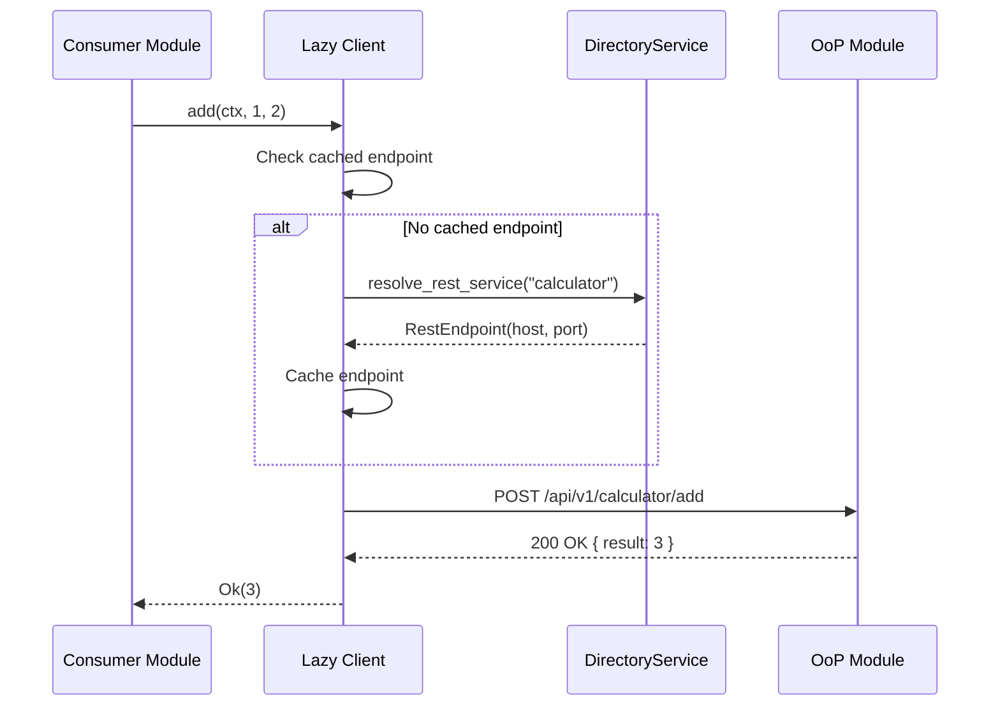
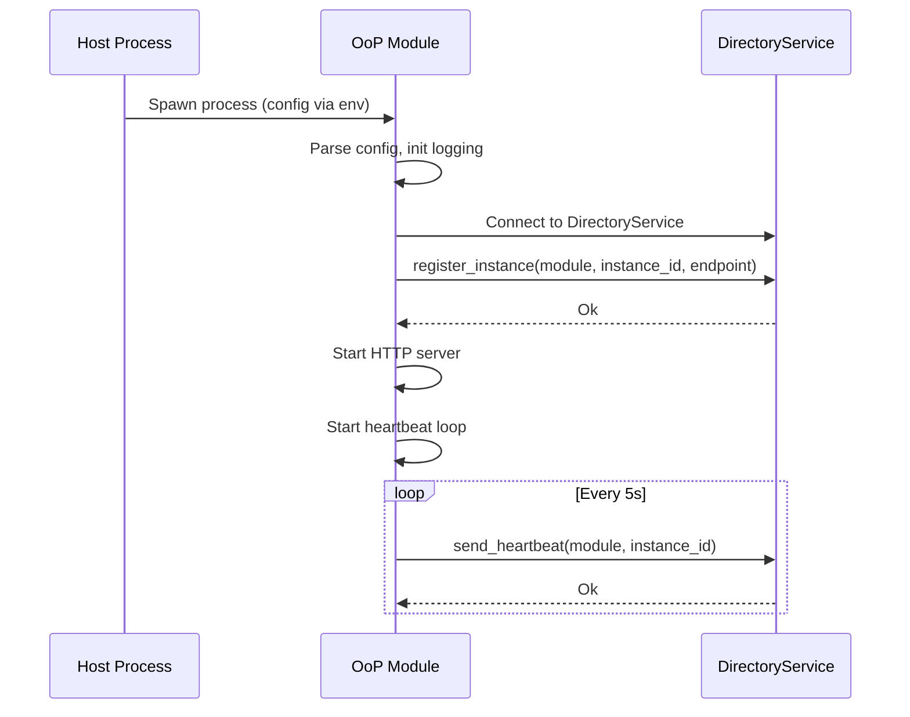
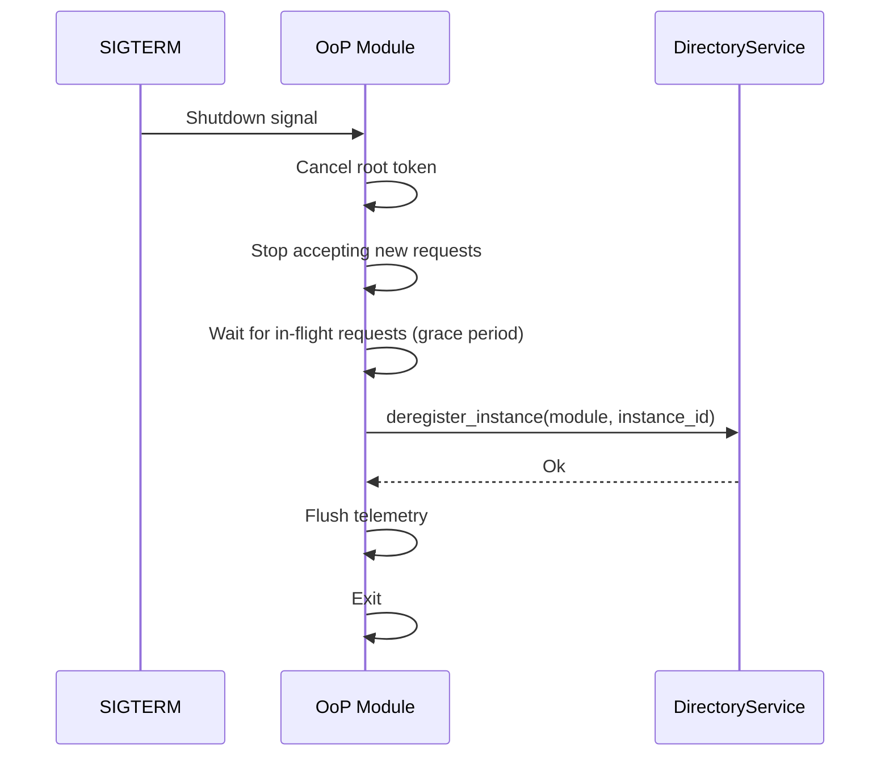

# Technical Design — Out-of-Process (OoP) Modules

## Problem Statement

### The Challenge

ModKit already supports Out-of-Process (OoP) modules via `RuntimeKind::Oop` configuration, allowing modules to run as separate OS processes with gRPC-based communication. However, the current OoP implementation has grown organically and lacks standardization, leading to:

1. **Inconsistent Patterns**: Each OoP module implements its own client wiring, error handling, and retry logic. There's no canonical SDK pattern for OoP consumers.

2. **gRPC-Only Transport**: All OoP communication requires gRPC, which adds friction:
   - Proto files must be maintained and compiled
   - Debugging requires specialized tools (grpcurl, Bloom RPC)
   - Duplicates the REST API that modules already expose

3. **Eager Client Wiring**: Clients are wired at startup, causing cascading failures if an OoP module is temporarily unavailable. A slow-starting dependency blocks the entire host.

4. **No Graceful Degradation**: When an OoP module becomes unhealthy, callers have no standard way to fail gracefully. Missing circuit breakers lead to cascading timeouts.

5. **Boilerplate Overhead**: Each OoP module requires significant boilerplate for registration, heartbeats, and client setup. This discourages adoption and increases maintenance burden.

6. **Documentation Gap**: No clear guidance on when to use OoP vs in-process, how to structure SDK crates, or how to handle failure scenarios.

### Current State

The existing OoP infrastructure includes:

| Component | Status | Location |
|-----------|--------|----------|
| `RuntimeKind::Oop` config | ✅ Working | `bootstrap/config/mod.rs` |
| `LocalProcessBackend` spawning | ✅ Working | `backends/local.rs` |
| `run_oop_with_options()` bootstrap | ✅ Working | `bootstrap/oop.rs` |
| DirectoryService registration | ✅ Working | `bootstrap/oop.rs` |
| Heartbeat health tracking | ✅ Working | `bootstrap/oop.rs` |
| gRPC client wiring | ✅ Working | Per-module, inconsistent |
| REST client support | ❌ Missing | — |
| Lazy client resolution | ❌ Missing | — |
| Circuit breaker | ❌ Missing | — |
| Standardized SDK pattern | ❌ Missing | — |

### Goals

This design standardizes OoP modules by:

1. **Defining a canonical SDK pattern** for OoP module consumers
2. **Adding REST as the default transport** (gRPC opt-in for streaming)
3. **Implementing lazy client resolution** with graceful degradation
4. **Providing circuit breaker infrastructure** at the client level
5. **Reducing boilerplate** through `ClientDescriptor` trait and macros
6. **Documenting best practices** for OoP module development

### Success Criteria

| Criterion | Current | Target |
|-----------|---------|--------|
| Transport options | gRPC only | REST default, gRPC opt-in |
| Client wiring | Eager, per-module | Lazy, standardized |
| Startup resilience | Fails if dep unavailable | Graceful degradation |
| Failure handling | No circuit breaker | Per-client circuit breaker |
| SDK boilerplate | ~200 lines/module | ~20 lines/module |
| Debugging | grpcurl required | curl/Postman works |

---

## Current System Investigation

### Dual-Mode Runtime Architecture

ModKit supports two runtime modes configured per-module via `RuntimeKind`:

```rust
// libs/modkit/src/bootstrap/config/mod.rs
#[derive(Debug, Clone, Default, Deserialize, Serialize)]
#[serde(rename_all = "lowercase")]
pub enum RuntimeKind {
    #[default]
    Local,  // In-process (default)
    Oop,    // Out-of-process
}
```

Configuration example:
```yaml
modules:
  calculator:
    runtime:
      type: oop
      execution:
        executable_path: "./target/debug/calculator-oop"
        args: ["--config", "config/oop-example.yaml"]
```

### Existing OoP Infrastructure

The current OoP implementation in `libs/modkit/src/bootstrap/oop.rs` provides:

| Feature | Implementation | Notes |
|---------|----------------|-------|
| Process spawning | `LocalProcessBackend` | Spawns child processes with config injection |
| Configuration | `MODKIT_MODULE_CONFIG` env | JSON config passed from host to child |
| Service discovery | `DirectoryService` (gRPC) | Modules register on startup |
| Health tracking | Heartbeat loop | 5s interval, missed heartbeats → quarantine |
| Shutdown | `CancellationToken` | Graceful deregistration |
| Logging | Log forwarding | Child stdout/stderr → parent tracing |

### Current OoP Client Pattern (gRPC)

Each OoP module currently implements its own gRPC client wiring:

```rust
// Current pattern: Manual wiring in module init()
async fn init(&self, ctx: &ModuleCtx) -> Result<()> {
    let directory = ctx.client_hub().get::<dyn DirectoryClient>()?;
    let endpoint = directory.resolve("calculator").await?;  // Eager resolution
    let channel = tonic::transport::Channel::from_shared(endpoint)?
        .connect()
        .await?;  // Fails if unavailable
    let client = CalculatorGrpcClient::new(channel);
    ctx.client_hub().register(client);
    Ok(())
}
```

**Problems with this pattern**:
1. Each module duplicates wiring logic
2. Eager resolution blocks startup
3. No retry/backoff on connection failure
4. No circuit breaker for unhealthy services
5. gRPC requires proto files and code generation

### Calculator Example Analysis

The `examples/oop-modules/calculator/` demonstrates the current pattern:

```
calculator/
├── calculator-sdk/           # SDK crate (gRPC-only)
│   ├── proto/calculator.proto
│   └── src/
│       ├── lib.rs
│       ├── api.rs            # API trait (unused for gRPC)
│       └── client.rs         # gRPC client wrapper
└── calculator/               # Module implementation
    ├── src/
    │   ├── lib.rs
    │   ├── module.rs         # GrpcServiceCapability
    │   ├── main.rs           # OoP binary entry point
    │   └── api/grpc/         # gRPC server handlers
    └── Cargo.toml
```

**Observations**:
- The SDK exposes an `api.rs` trait, but gRPC clients don't use it (proto defines the contract)
- No REST client in SDK despite module exposing REST endpoints
- Each consumer must understand gRPC to call the module
- `main.rs` is minimal (~40 lines), mostly boilerplate

---

## Alternative Approaches Considered

### Alternative 1: Sidecar Proxy Pattern (Envoy/Linkerd)

**Description**: Deploy each module with a sidecar proxy that handles service discovery, load balancing, retries, and circuit breaking. Modules communicate via localhost to their sidecar.

```
┌─────────────────┐     ┌─────────────────┐
│  Calculator     │     │  FileParser     │
│  Module         │     │  Module         │
│  localhost:8080 │     │  localhost:8080 │
└────────┬────────┘     └────────┬────────┘
         │                       │
    ┌────▼────┐             ┌────▼────┐
    │ Envoy   │◄───────────►│ Envoy   │
    │ Sidecar │   (mTLS)    │ Sidecar │
    └─────────┘             └─────────┘
```

**Pros**:
- Mature, battle-tested infrastructure
- Language-agnostic (any module language works)
- Rich observability (distributed tracing, metrics)
- Automatic mTLS between services

**Cons**:
- **Operational complexity**: Requires service mesh deployment (Istio/Linkerd)
- **Resource overhead**: Each sidecar consumes ~50-100MB RAM
- **Local development friction**: Developers must run mesh locally or mock it
- **Latency**: Additional hop through sidecar adds ~1-2ms per call
- **Debugging complexity**: Failures can occur in module, sidecar, or mesh control plane

**Verdict**: ❌ Rejected. Too heavy for local/edge deployments. Cyber Fabric must run on developer laptops and edge devices without Kubernetes.

### Alternative 2: Shared Memory IPC (Unix Domain Sockets + Shared Memory)

**Description**: Use Unix domain sockets for control messages and shared memory regions for bulk data transfer between modules.

```rust
// Hypothetical shared memory client
let shm = SharedMemoryClient::connect("/tmp/calculator.sock")?;
let result = shm.call("add", &[1i64, 2i64])?;  // Zero-copy via mmap
```

**Pros**:
- Near-zero latency (no TCP overhead)
- Zero-copy for large payloads
- Process isolation maintained

**Cons**:
- **Platform-specific**: Different APIs on Linux, macOS, Windows
- **Complexity**: Manual memory management, synchronization primitives
- **No network transparency**: Cannot scale across machines
- **Debugging difficulty**: No standard tooling (can't use curl, Postman)
- **Security concerns**: Shared memory requires careful access control

**Verdict**: ❌ Rejected. Complexity outweighs benefits. REST over localhost is fast enough for most use cases, and we need network transparency for distributed deployments.

### Alternative 3: gRPC-Only (Current Partial Implementation)

**Description**: Use gRPC as the sole transport for all OoP communication, leveraging protobuf for efficient serialization and HTTP/2 for multiplexing.

**Pros**:
- Efficient binary protocol
- Built-in streaming support
- Strong typing via protobuf
- HTTP/2 multiplexing

**Cons**:
- **Debugging friction**: Binary payloads require specialized tools (grpcurl, Bloom RPC)
- **Code generation**: Proto files must be maintained and compiled
- **Browser incompatibility**: Requires gRPC-Web proxy for browser clients
- **Duplication**: OoP modules already expose REST APIs; gRPC adds a second interface
- **Learning curve**: Teams must learn protobuf IDL and gRPC patterns

**Verdict**: ⚠️ Partially accepted. gRPC is valuable for streaming and high-throughput scenarios, but should be **opt-in**, not default.

### Alternative 4: Message Queue (NATS/RabbitMQ)

**Description**: Use a message broker for all inter-module communication with request-reply patterns.

```rust
// Hypothetical NATS client
let response = nats.request("calculator.add", json!({"a": 1, "b": 2})).await?;
```

**Pros**:
- Decoupled producers and consumers
- Built-in load balancing and failover
- Supports pub/sub for events
- Persistence options for reliability

**Cons**:
- **Additional infrastructure**: Requires running NATS/RabbitMQ cluster
- **Latency**: Message broker adds hop (~1-5ms)
- **Complexity**: Request-reply patterns are awkward in message queues
- **Debugging**: Messages are ephemeral, harder to trace
- **Overkill**: Most module calls are synchronous request-response

**Verdict**: ❌ Rejected for synchronous calls. Message queues are better suited for async events (handled by Events Broker module).

### Alternative 5: REST-First with gRPC Opt-In (Chosen)

**Description**: Use REST/JSON as the default transport for OoP modules. gRPC is available as an opt-in for streaming or high-throughput scenarios.

```rust
// Default: REST client
#[modkit::module(
    clients = [calculator_sdk::CalculatorClientDescriptor],  // REST by default
)]

// Opt-in: gRPC for streaming
#[modkit::module(
    clients = [llm_gateway_sdk::LlmGatewayClientDescriptor],  // config() returns Transport::Grpc
)]
```

**Pros**:
- **Debuggability**: curl, Postman, browser dev tools all work
- **API reuse**: OoP modules already expose REST APIs; no duplication
- **Simplicity**: No code generation, no proto files for REST
- **Familiarity**: Every developer knows HTTP/JSON
- **Flexibility**: gRPC available when needed (streaming, performance-critical paths)

**Cons**:
- JSON overhead (~10-20% larger than protobuf)
- No built-in streaming (requires SSE/WebSocket)

**Verdict**: ✅ Accepted. REST-first with gRPC opt-in provides the best balance of simplicity, debuggability, and flexibility.

---

## Justification of Chosen Design

### Why REST as Default Transport

| Factor | REST | gRPC | Winner |
|--------|------|------|--------|
| **Debuggability** | curl, browser, Postman | grpcurl, specialized tools | REST |
| **API reuse** | Same as public API | Separate interface | REST |
| **Code generation** | None required | Proto compilation | REST |
| **Browser support** | Native | Requires gRPC-Web | REST |
| **Learning curve** | Universal knowledge | Protobuf + gRPC patterns | REST |
| **Streaming** | SSE/WebSocket (extra work) | Native | gRPC |
| **Performance** | JSON overhead | Binary, efficient | gRPC |

**Decision**: REST wins 5-2 for the common case. gRPC is opt-in for streaming (LLM responses) and high-throughput (embeddings batching).

### Why Lazy Client Resolution

The current eager wiring pattern causes cascading startup failures:

```rust
// Current (problematic): Fails if calculator not ready
async fn init(&self, ctx: &ModuleCtx) -> Result<()> {
    calculator_sdk::wire_client(hub, &*directory).await?;  // BLOCKS startup
}
```

Lazy resolution defers connection until first use:

```rust
// Proposed: Never fails at startup
#[modkit::module(clients = [CalculatorClientDescriptor])]
// Client auto-registered as lazy wrapper

// First call triggers resolution
let result = calc.add(ctx, 1, 2).await;  // Resolves endpoint here
```

**Benefits**:
1. **Startup resilience**: Modules start even if dependencies are temporarily unavailable
2. **Graceful degradation**: Only affected operations fail (HTTP 424), not entire module
3. **Faster startup**: No blocking network calls during init
4. **Simpler dependency graph**: Soft dependencies don't create cycles

### Why Per-Module Binaries with main.rs

The design specifies that each OoP module has its own `main.rs` entry point:

```
modules/calculator/calculator/src/main.rs   # OoP binary
modules/file-parser/file-parser/src/main.rs # OoP binary
```

**Rationale**:

1. **Independent deployment**: Each module can be built, versioned, and deployed separately. A security patch to `credstore` doesn't require rebuilding `llm-gateway`.

2. **Resource isolation**: Kubernetes/systemd can set memory/CPU limits per binary. A memory leak in `file-parser` doesn't affect `calculator`.

3. **Failure isolation**: A panic in one binary doesn't crash others. The host can respawn failed modules independently.

4. **Build parallelism**: CI can build modules in parallel. Large modules don't block small ones.

5. **Language flexibility**: Future non-Rust modules (Python ML, Go networking) are just different binaries implementing the same REST API.

**Alternative considered**: Single multi-module binary with runtime selection:

```bash
# Hypothetical: One binary, module selected at runtime
./hyperspot-oop --module calculator
./hyperspot-oop --module file-parser
```

**Why rejected**:
- Still requires full rebuild for any module change
- Binary size grows with each module
- Cannot set different resource limits per module in same binary
- Complicates feature flags (which modules to include?)

### Why DirectoryService for Discovery

**Alternatives considered**:

1. **Kubernetes DNS**: Works in K8s but not for local development or edge deployments
2. **Consul/etcd**: Additional infrastructure dependency
3. **Static configuration**: Doesn't support dynamic scaling or failover
4. **mDNS/Bonjour**: Platform-specific, unreliable in containers

**DirectoryService advantages**:
- Works identically in local dev, Docker Compose, and Kubernetes
- No external dependencies (runs in-process on host)
- Supports health tracking via heartbeats
- Enables round-robin load balancing across instances
- Single source of truth for module topology

### Why Circuit Breaker at Client Level

Circuit breakers prevent cascading failures when an OoP module becomes unhealthy:

```
CLOSED (normal) ──[5 failures]──▶ OPEN (fail fast) ──[30s]──▶ HALF-OPEN (probe)
```

**Placement decision**: Circuit breaker lives in the lazy client, not in a sidecar or middleware.

**Rationale**:
- **Per-dependency state**: Each client tracks failures to its specific target
- **No infrastructure**: Works without service mesh
- **Configurable per-client**: LLM gateway (slow) vs calculator (fast) have different thresholds
- **Testable**: Unit tests can verify circuit breaker behavior

---

## 1. Architecture Overview

### 1.1 Architectural Vision

Out-of-Process (OoP) modules are ModKit modules that run as separate OS processes, communicating with the host and other modules via network protocols (REST by default, gRPC opt-in). This architecture enables process isolation, independent scaling, language flexibility, resource isolation, and independent deployment.

#### OoP Module Categories

We distinguish two categories of OoP modules based on lifecycle ownership:

- **Managed OoP modules** – modules whose lifecycle is controlled by the host process. The host is responsible for configuring, starting, stopping, and supervising them.

- **Unmanaged OoP modules** – modules whose lifecycle is not controlled by the host process. They run independently, but the host can still discover them, register them, and interact with their APIs.

For example, services running in a Kubernetes cluster would be considered unmanaged from the host's perspective. Their lifecycle is handled by Kubernetes, not by the host process. However, the host still needs a mechanism to discover these services, register them, and communicate with them through their APIs.

This distinction affects how the design addresses lifecycle management, resource limits, and fault handling—later sections will approach these two types differently where applicable.

#### System Boundary

The system boundary is the ModKit host process and its spawned OoP module processes (managed) or discovered external services (unmanaged). OoP modules register with a DirectoryService for discovery and communicate via REST (default) or gRPC (opt-in). The architecture follows a lazy client pattern where endpoint resolution happens on first use, not at startup.

### 1.2 Architecture Drivers

#### Product requirements

##### Host management of OoP modules

- [ ] `p1` - **ID**: `cpt-oop-fr-host-management`

**Solution**: The ModKit host process must be able to manage (spawn, configure, monitor) the OoP modules. This includes process lifecycle management, configuration injection, and health monitoring with automatic respawn on failure.

##### Process isolation for fault containment

- [ ] `p1` - **ID**: `cpt-oop-fr-process-isolation`

**Solution**: Each OoP module runs as a separate OS process. A crash in one module doesn't bring down others.

##### Independent horizontal scaling

- [ ] `p1` - **ID**: `cpt-oop-fr-horizontal-scaling`

**Solution**: OoP modules can be scaled horizontally. Multiple instances register with DirectoryService; client-side round-robin distributes load. Modules may expose a capability flag indicating whether they are stateless (safe for round-robin) or stateful (requiring sticky sessions or external state coordination).

##### Language flexibility for module implementation

- [ ] `p2` - **ID**: `cpt-oop-fr-language-flexibility`

**Solution**: OoP modules communicate via REST/gRPC. Non-Rust modules can implement the same API contracts and register with DirectoryService.

##### Resource isolation per module

- [ ] `p1` - **ID**: `cpt-oop-fr-resource-isolation`

**Solution**: The ModKit host process must be able to configure OoP modules resource limits (memory, CPU) via OS/container mechanisms. Each module runs in its own process with these limits enforced.

##### Independent deployment without full restart (managed only)

- [ ] `p1` - **ID**: `cpt-oop-fr-independent-deployment`

**Solution**: For managed OoP modules, the host can update them independently via process restart; no host restart required. For unmanaged modules, deployment is controlled by the external orchestrator (e.g., rolling updates in Kubernetes).

##### Lazy client resolution

- [ ] `p1` - **ID**: `cpt-oop-fr-lazy-resolution`

**Solution**: For OoP modules, endpoint resolution happens on first API call, not at startup. Modules start even if dependencies are unavailable; requests fail gracefully until dependencies are ready.

##### Service discovery and registration (managed and unmanaged)

- [ ] `p1` - **ID**: `cpt-oop-fr-service-discovery`

**Solution**: DirectoryService provides central registry. Both managed and unmanaged OoP modules register on startup, send heartbeats, and are discovered by consumers via `resolve_rest_service()`.

##### Fault tolerance with circuit breakers

- [ ] `p1` - **ID**: `cpt-oop-nfr-fault-tolerance`

**Solution**: Circuit breaker pattern prevents cascading failures across three scenarios: (1) inter-module communication—when one OoP module calls another and the target is unavailable or slow; (2) host-to-module communication—when the host calls a managed module that becomes unresponsive; (3) external dependency failures—when an OoP module's external dependencies (DB, third-party APIs) fail. Retry with exponential backoff, idempotency keys for safe retries, graceful degradation when dependencies unavailable.

##### Standard health endpoints

- [ ] `p2` - **ID**: `cpt-oop-nfr-health-endpoints`

**Solution**: Every OoP module exposes `/health/live` and `/health/ready` endpoints for K8s probes and monitoring.

#### Architecture Decision Records

##### ADR-0001 Universal Lazy Layer

- [ ] `p1` - **ID**: `cpt-oop-adr-universal-lazy-layer`

Establishes the lazy client pattern where endpoint resolution happens on first use. Clients are registered at module init but don't connect until first API call. This enables graceful startup even when dependencies are unavailable.

**Reference**: [ADR-0001: Universal Lazy Layer](./ADR/0001-universal-lazy-layer.md)

### 1.3 Architecture Layers

| Layer | Responsibility | Technology |
|-------|---------------|------------|
| Host Process Layer | Runs in-process modules, DirectoryService, spawns OoP modules | Rust, ModKit bootstrap |
| OoP Module Layer | Separate process with REST/gRPC API, registers with directory | Rust (or any language), REST/gRPC |
| SDK Layer | Shared contract (API trait, types, lazy client) | Rust crate per module |
| Discovery Layer | Service registry for module instance discovery | DirectoryService (gRPC-based) |
| Communication Layer | Inter-module communication via network protocols | REST (default), gRPC (opt-in) |

---

## 2. Principles & Constraints

### 2.1 Design Principles

#### REST-first communication

- [ ] `p1` - **ID**: `cpt-oop-principle-rest-first`

Use REST as the default transport for OoP modules. REST provides broad compatibility, easy debugging, and standard tooling. gRPC is opt-in for streaming or high-throughput scenarios.

#### Lazy resolution over eager connection

- [ ] `p1` - **ID**: `cpt-oop-principle-lazy-resolution`

Resolve endpoints on first use, not at startup. This enables graceful startup when dependencies are unavailable and avoids blocking the module lifecycle.

#### Fail-fast with graceful degradation

- [ ] `p1` - **ID**: `cpt-oop-principle-fail-fast-graceful`

Detect failures quickly (circuit breaker, timeouts) but degrade gracefully. A failing dependency should not bring down the entire module; only affected endpoints return errors.

#### Standard K8s patterns

- [ ] `p2` - **ID**: `cpt-oop-principle-k8s-native`

Follow standard Kubernetes patterns: health endpoints, structured logs, env var configuration, stateless design. Don't reinvent K8s primitives.

#### SDK-first API contracts

- [ ] `p1` - **ID**: `cpt-oop-principle-sdk-first`

Define API contracts in SDK crates with traits, types, and errors. The SDK is the single source of truth for the module's API surface.

### 2.2 Constraints

#### Multi-module executables supported

- [ ] `p1` - **ID**: `cpt-oop-constraint-multi-module`

The OoP engine must explicitly support multi-module executables. For small or edge systems, multiple modules can be bundled into a single service to minimize the number of deployed services. Single-module executables remain an option for scenarios requiring independent scaling or deployment.

#### DirectoryService for cross-module discovery

- [ ] `p1` - **ID**: `cpt-oop-constraint-directory-discovery`

OoP modules must register with DirectoryService for discovery. K8s DNS is an alternative for pure-K8s deployments, but DirectoryService is required for local development and hybrid environments.

#### Health endpoints required

- [ ] `p1` - **ID**: `cpt-oop-constraint-health-endpoints`

Every OoP module must expose `/health/live` and `/health/ready` endpoints. These are required for K8s probes and DirectoryService health tracking.

#### Configuration via environment and files

- [ ] `p2` - **ID**: `cpt-oop-constraint-config-sources`

OoP modules receive configuration via environment variables (`MODKIT_*`), config files, and CLI arguments. Merge priority: CLI > config file > environment.

---

## 3. Technical Architecture

### 3.1 Domain Model

Core types and invariants for OoP module communication:

**Module Instance**:
- `module_name`: String identifier for the module type
- `instance_id`: Unique identifier for this instance (UUID)
- `rest_endpoint`: Optional REST endpoint (host:port)
- `grpc_services`: List of gRPC service endpoints
- `state`: Instance health state (Registered, Healthy, Quarantined, Draining)
- `version`: Optional semantic version string

**Client Configuration**:
- `discovery`: Discovery strategy (Directory, KubernetesDns, Static)
- `connect_timeout`: Connection timeout (default: 5s)
- `request_timeout`: Request timeout (default: 30s)
- `retry_policy`: Retry configuration for transient failures
- `circuit_breaker`: Circuit breaker configuration
- `availability_policy`: Required vs Optional dependency

**Instance States**:
```
Registered ──[first heartbeat]──▶ Healthy
Healthy ──[missed heartbeats]──▶ Quarantined
Healthy ──[shutdown signal]──▶ Draining
Quarantined ──[heartbeat resumes]──▶ Healthy
```

**Invariants**:
- Only Healthy instances receive traffic
- Quarantined instances are excluded from load balancing
- Draining instances complete in-flight requests but accept no new ones

### 3.2 Component Model

```
┌─────────────────────────────────────────────────────────────────────────────┐
│                              Host Process                                   │
│  ┌─────────────┐  ┌─────────────┐  ┌─────────────┐  ┌──────────────────┐    │
│  │ api-gateway │  │  Module A   │  │  Module B   │  │ DirectoryService │    │
│  │ (in-proc)   │  │ (in-proc)   │  │ (in-proc)   │  │   (registry)     │    │
│  └─────────────┘  └─────────────┘  └─────────────┘  └─────────┬────────┘    │
│         │                │                │                   │             │
│         └────────────────┴────────────────┴───────────────────┘             │
│                                   │ ClientHub                               │
└───────────────────────────────────┼─────────────────────────────────────────┘
                                    │
                    ┌───────────────┼───────────────┐
                    │               │               │
                    ▼               ▼               ▼
            ┌─────────────┐ ┌─────────────┐ ┌─────────────┐
            │ Calculator  │ │ FileParser  │ │   LLM       │
            │   (OoP)     │ │   (OoP)     │ │  Gateway    │
            │  REST API   │ │  REST API   │ │   (OoP)     │
            └─────────────┘ └─────────────┘ └─────────────┘
```

#### Host Process

- [ ] `p1` - **ID**: `cpt-oop-component-host-process`

- **Responsibilities**: Run in-process modules, host DirectoryService, spawn and monitor OoP child processes, provide ClientHub for lazy client resolution.
- **Boundaries**: Does not implement OoP module business logic; only orchestrates lifecycle.
- **Dependencies**: ModKit bootstrap, DirectoryService, configuration system.
- **Key interfaces**: `ModuleRegistry`, `ClientHub`, process spawning via config.

#### DirectoryService

- [ ] `p1` - **ID**: `cpt-oop-component-directory-service`

- **Responsibilities**: Central registry for module instances, health tracking via heartbeats, endpoint resolution for consumers.
- **Boundaries**: Does not route traffic; only provides endpoint information.
- **Dependencies**: gRPC server (optional), in-memory instance registry.
- **Key interfaces**: `DirectoryClient` trait with `resolve_rest_service()`, `register_instance()`, `send_heartbeat()`.

#### OoP Module

- [ ] `p1` - **ID**: `cpt-oop-component-oop-module`

- **Responsibilities**: Run as separate process, expose REST/gRPC API, register with DirectoryService, send heartbeats, handle graceful shutdown.
- **Boundaries**: Independent process with own memory space; communicates only via network.
- **Dependencies**: ModKit OoP bootstrap, DirectoryClient, module-specific SDK.
- **Key interfaces**: REST endpoints, health endpoints, gRPC services (optional).

#### SDK Crate

- [ ] `p1` - **ID**: `cpt-oop-component-sdk-crate`

- **Responsibilities**: Define API trait, request/response types, error types, ClientDescriptor, lazy client implementation.
- **Boundaries**: No business logic; only contracts and client code.
- **Dependencies**: `async_trait`, `thiserror`, ModKit client infrastructure.
- **Key interfaces**: `{Module}ClientV1` trait, `{Module}ClientDescriptor`, `Lazy{Module}Client`.

#### Lazy Client

- [ ] `p1` - **ID**: `cpt-oop-component-lazy-client`

- **Responsibilities**: Resolve endpoint on first use (when `lazy_start: true`), cache endpoint, make HTTP requests, handle retries and circuit breaker.
- **Boundaries**: Does not know module business logic; only transport.
- **Dependencies**: `RestClientProvider`, `DirectoryClient`, HTTP client (reqwest).
- **Key interfaces**: Implements SDK API trait, delegates to `RestClientProvider`.
- **Configuration**: `lazy_start: bool` — when `true`, endpoint resolution happens on first API call (default); when `false`, the module is started eagerly at host startup. Eager start is recommended for modules with long startup times (e.g., database journal replay, slow outbound connections).

##### Internal Structure

```rust
pub struct LazyRestClient<T: ClientDescriptor> {
    provider: Arc<RestClientProvider>,
    circuit_breaker: CircuitBreaker,
    _marker: PhantomData<T>,
}
```

The lazy client wraps `RestClientProvider` and adds circuit breaker logic. Each API method follows this flow:

```
1. Check circuit breaker state
   └─ If OPEN → return Err(Unavailable) immediately
2. Get cached endpoint from provider
   └─ If cache miss or expired → resolve via DirectoryService
   └─ If resolution fails → return Err(Unavailable)
3. Make HTTP request
4. On success → record_success(), return Ok(response)
5. On failure:
   └─ If 4xx → pass through (client error, don't count as failure)
   └─ If 5xx/timeout → record_failure(), check if circuit should open
   └─ If connection error → invalidate cache, record_failure()
```

#### RestClientProvider

- [ ] `p1` - **ID**: `cpt-oop-component-rest-client-provider`

- **Responsibilities**: Manage endpoint resolution, caching with TTL, HTTP client pooling, request execution with retries.
- **Boundaries**: Transport-only; does not interpret response bodies beyond status codes.
- **Dependencies**: `DirectoryClient`, `reqwest::Client`.
- **Key interfaces**: `get_base_url()`, `execute_request()`, `invalidate_cache()`.

##### Internal Structure

```rust
pub struct RestClientProvider {
    module_name: String,
    directory: Arc<dyn DirectoryClient>,
    http_client: reqwest::Client,
    cache: RwLock<EndpointCache>,
    config: ClientConfig,
}

struct EndpointCache {
    endpoint: Option<CachedEndpoint>,
}

struct CachedEndpoint {
    base_url: String,
    resolved_at: Instant,
}
```

##### Endpoint Caching

Endpoints are cached with a configurable TTL to balance freshness against DirectoryService load:

| Config | Default | Description |
|--------|---------|-------------|
| `endpoint_cache_ttl` | 60s | Time before cached endpoint is considered stale |
| `endpoint_cache_refresh_on_error` | true | Re-resolve immediately on connection error |

**Cache behavior**:

```
get_base_url():
  1. Acquire read lock on cache
  2. If cached endpoint exists AND age < TTL:
     └─ Return cached base_url
  3. Release read lock, acquire write lock
  4. Double-check (another thread may have refreshed)
  5. Call directory.resolve_rest_service(module_name)
  6. On success: store in cache with current timestamp
  7. On failure: return Err (do NOT cache failures)
```

##### Load Balancing

When multiple instances of a module are registered, `DirectoryService.resolve_rest_service()` returns one endpoint using round-robin selection:

```rust
// In ModuleManager (existing implementation)
pub fn pick_instance_round_robin(&self, module: &str) -> Option<Arc<ModuleInstance>> {
    let instances = self.inner.get(module)?;
    
    // Filter to healthy/ready instances only
    let healthy: Vec<_> = instances
        .iter()
        .filter(|inst| matches!(inst.state(), InstanceState::Healthy | InstanceState::Ready))
        .collect();
    
    // Fall back to all instances if none healthy
    let candidates = if healthy.is_empty() { &instances } else { &healthy };
    
    // Atomic counter per module for round-robin
    let idx = self.rr_counters.entry(module).or_insert(0);
    let picked = candidates.get(*idx % candidates.len());
    *idx = (*idx + 1) % candidates.len();
    
    picked.cloned()
}
```

**Load balancing behavior**:
- Prefers `Healthy` or `Ready` instances over `Registered` or `Quarantined`
- Falls back to any instance if no healthy ones available
- Per-module atomic counter ensures even distribution
- Counter resets when instance count changes (via modulo)

**Cache invalidation**:
- On connection error (TCP reset, DNS failure): immediate invalidation
- On HTTP 5xx: keep cache (server is reachable, just unhealthy)
- On circuit breaker open: keep cache (will re-validate when half-open)

##### Request Execution

```rust
impl RestClientProvider {
    pub async fn execute<Req, Resp>(
        &self,
        method: Method,
        path: &str,
        request: &Req,
        ctx: &SecurityContext,
    ) -> Result<Resp, OopClientError>
    where
        Req: Serialize,
        Resp: DeserializeOwned,
    {
        let base_url = self.get_base_url().await?;
        let url = format!("{}{}", base_url, path);
        
        let response = self.http_client
            .request(method, &url)
            .header("Authorization", ctx.bearer_token())
            .header("X-Tenant-ID", ctx.tenant_id())
            .json(request)
            .timeout(self.config.request_timeout)
            .send()
            .await
            .map_err(|e| {
                if e.is_connect() || e.is_timeout() {
                    self.invalidate_cache();
                }
                OopClientError::from(e)
            })?;
        
        // Error mapping (see Error Handling section)
        Self::map_response(response).await
    }
}
```

#### Circuit Breaker

- [ ] `p2` - **ID**: `cpt-oop-component-circuit-breaker`

- **Responsibilities**: Track failure counts, open circuit after threshold, allow probe requests after timeout, close circuit on success.
- **Boundaries**: Per-module state; does not share state across modules.
- **Dependencies**: None (stateful component).
- **Key interfaces**: `is_open()`, `record_success()`, `record_failure()`.

##### Internal Structure

```rust
pub struct CircuitBreaker {
    state: AtomicU8,  // 0=Closed, 1=Open, 2=HalfOpen
    failure_count: AtomicU32,
    last_failure: AtomicU64,  // Unix timestamp millis
    config: CircuitBreakerConfig,
}

pub struct CircuitBreakerConfig {
    pub failure_threshold: u32,
    pub reset_timeout: Duration,
    pub half_open_max_probes: u32,
}
```

##### Configuration Defaults

| Config | Default | Description |
|--------|---------|-------------|
| `failure_threshold` | 5 | Consecutive failures before opening circuit |
| `reset_timeout` | 30s | Time in OPEN state before transitioning to HALF-OPEN |
| `half_open_max_probes` | 2 | Successful probes required to close circuit |

##### State Machine

```
                    ┌──────────────────────────────────────────┐
                    │                                          │
                    ▼                                          │
┌─────────┐   failure_count    ┌─────────┐   reset_timeout   ┌───────────┐
│ CLOSED  │ ──────≥threshold──▶│  OPEN   │ ─────elapsed────▶ │ HALF-OPEN │
│         │                    │         │                   │           │
└────▲────┘                    └─────────┘                   └─────┬─────┘
     │                              ▲                               │
     │                              │                               │
     │                              └───────probe fails─────────────┤
     │                                                              │
     └────────────────half_open_max_probes succeed─────────────────┘
```

##### Failure Counting

Not all errors count as circuit breaker failures:

| Error Type | Counts as Failure | Rationale |
|------------|-------------------|-----------|
| HTTP 4xx | ❌ No | Client error, not service health issue |
| HTTP 5xx | ✅ Yes | Server error indicates unhealthy service |
| Connection refused | ✅ Yes | Service unreachable |
| Timeout | ✅ Yes | Service too slow or unresponsive |
| DNS resolution failure | ✅ Yes | Service endpoint invalid |

##### Half-Open Probing

When the circuit transitions to HALF-OPEN:
1. Allow one request through (the "probe")
2. If probe succeeds: increment success counter
3. If success counter reaches `half_open_max_probes`: transition to CLOSED, reset failure count
4. If probe fails: transition back to OPEN, reset timer

#### Error Handling

- [ ] `p1` - **ID**: `cpt-oop-component-error-handling`

##### Error Type Hierarchy

```rust
#[derive(Debug, thiserror::Error)]
pub enum OopClientError {
    /// Service is unavailable (circuit open, resolution failed, connection error)
    #[error("service unavailable: {0}")]
    Unavailable(String),
    
    /// Upstream service returned an error (4xx or 5xx)
    #[error("upstream error: {status} {message}")]
    Upstream { status: u16, message: String, body: Option<serde_json::Value> },
    
    /// Request/response serialization failed
    #[error("serialization error: {0}")]
    Serialization(#[from] serde_json::Error),
    
    /// Request timed out
    #[error("request timeout after {0:?}")]
    Timeout(Duration),
}
```

##### HTTP Status Code Mapping

| Scenario | HTTP Status | Error Type |
|----------|-------------|------------|
| Circuit breaker OPEN | 503 Service Unavailable | `Unavailable` |
| DirectoryService resolution failed | 503 Service Unavailable | `Unavailable` |
| Connection refused/reset | 503 Service Unavailable | `Unavailable` |
| Request timeout | 503 Service Unavailable | `Unavailable` |
| Upstream returned 4xx | Pass through (e.g., 400, 404) | `Upstream` |
| Upstream returned 5xx | Pass through (e.g., 500, 502) | `Upstream` |
| All other errors | 424 Failed Dependency | `Unavailable` |

##### Response Mapping Implementation

```rust
impl RestClientProvider {
    async fn map_response<T: DeserializeOwned>(
        response: reqwest::Response
    ) -> Result<T, OopClientError> {
        let status = response.status();
        
        if status.is_success() {
            return response.json().await.map_err(OopClientError::from);
        }
        
        // Try to extract error body for debugging
        let body = response.json::<serde_json::Value>().await.ok();
        let message = body
            .as_ref()
            .and_then(|b| b.get("error").and_then(|e| e.as_str()))
            .unwrap_or("unknown error")
            .to_string();
        
        Err(OopClientError::Upstream {
            status: status.as_u16(),
            message,
            body,
        })
    }
}
```

##### Error Propagation to Callers

When a module exposes an endpoint that calls an OoP dependency:

```rust
// In api/rest/handlers.rs
async fn add_via_gateway(
    State(state): State<AppState>,
    ctx: SecurityContext,
    Json(req): Json<AddRequest>,
) -> Result<Json<AddResponse>, ApiError> {
    state.calculator_client
        .add(&ctx, req.a, req.b)
        .await
        .map(|result| Json(AddResponse { result }))
        .map_err(|e| match e {
            OopClientError::Unavailable(_) => ApiError::service_unavailable("calculator"),
            OopClientError::Upstream { status, .. } if status >= 400 && status < 500 => {
                // Pass through 4xx as-is
                ApiError::from_status(status)
            }
            OopClientError::Upstream { .. } => ApiError::bad_gateway("calculator"),
            _ => ApiError::failed_dependency("calculator"),
        })
}
```

### 3.3 API Contracts

**Technology**: REST (default), gRPC (opt-in)

**SDK API Trait Pattern**:
```rust
#[async_trait]
pub trait CalculatorClientV1: Send + Sync {
    async fn add(&self, ctx: &SecurityContext, a: i64, b: i64) -> Result<i64, CalculatorError>;
    async fn subtract(&self, ctx: &SecurityContext, a: i64, b: i64) -> Result<i64, CalculatorError>;
}
```

**ClientDescriptor Pattern**:
```rust
pub struct CalculatorClientDescriptor;

impl ClientDescriptor for CalculatorClientDescriptor {
    type Api = dyn CalculatorClientV1;
    const MODULE_NAME: &'static str = "calculator";
    
    fn config() -> ClientConfig {
        ClientConfig::rest()
    }
}
```

**DirectoryService gRPC Contract**:
```rust
#[async_trait]
pub trait DirectoryClient: Send + Sync {
    async fn resolve_rest_service(&self, module_name: &str) -> Result<RestEndpoint>;
    async fn resolve_grpc_service(&self, service_name: &str) -> Result<ServiceEndpoint>;
    async fn register_instance(&self, info: RegisterInstanceInfo) -> Result<()>;
    async fn deregister_instance(&self, module: &str, instance_id: &str) -> Result<()>;
    async fn send_heartbeat(&self, module: &str, instance_id: &str) -> Result<()>;
}
```

**Health Endpoints**:
```
GET /health/live   → 200 OK (process is running)
GET /health/ready  → 200 OK (ready to accept traffic)
                   → 503 Service Unavailable (not ready)
```

### 3.4 Internal Dependencies

| Dependency Module | Interface Used | Purpose |
|-------------------|----------------|---------|
| ModKit Core | `ModuleRegistry`, `ClientHub` | Module lifecycle and client management |
| ModKit Bootstrap | `OopRunOptions`, `run_oop_with_options()` | OoP module startup |
| ModKit Clients | `RestClientProvider`, `ClientDescriptor` | Lazy client infrastructure |

### 3.5 External Dependencies

| Dependency | Interface Used | Purpose |
|------------|----------------|---------|
| Kubernetes | K8s DNS, Probes, ConfigMaps | Deployment and discovery (optional) |
| Container Runtime | Docker/containerd | Container packaging |
| systemd | Service units | On-prem process management |

### 3.6 Interactions & Sequences

#### Lazy client resolution and API call

- [ ] `p1` - **ID**: `cpt-oop-seq-lazy-resolution`



**Components**: Consumer Module, Lazy Client, DirectoryService, OoP Module

**Failure modes**:
- If DirectoryService unavailable: Return `Unavailable` error, do not cache
- If OoP module returns 5xx: Retry with backoff, record circuit breaker failure
- If circuit breaker open: Return `Unavailable` immediately (fail fast)

#### OoP module startup and registration

- [ ] `p1` - **ID**: `cpt-oop-seq-startup-registration`



**Components**: Host Process, OoP Module, DirectoryService

**Failure modes**:
- If DirectoryService unavailable at startup: Retry with backoff, module stays unhealthy
- If heartbeat fails: Instance marked Quarantined after threshold

#### Graceful shutdown

- [ ] `p2` - **ID**: `cpt-oop-seq-graceful-shutdown`



**Components**: OoP Module, DirectoryService

**Failure modes**:
- If deregister fails: Log warning, exit anyway (directory will detect via missed heartbeats)

#### Circuit breaker state transitions

- [ ] `p2` - **ID**: `cpt-oop-seq-circuit-breaker`

```
CLOSED (normal) ──[5 failures]──▶ OPEN (fail fast) ──[30s timeout]──▶ HALF-OPEN (probe)
    ▲                                    ▲                                   │
    │                                    └────────[probe fails]──────────────┤
    └─────────────────────────[2 successful probes]──────────────────────────┘
```

### 3.7 Database schemas & tables

#### Module database configuration

- [ ] `p2` - **ID**: `cpt-oop-dbtable-config`

Since Cyber Fabric is a collection of libraries rather than a standalone platform, any module can operate as an OoP module. The OoP engine must support modules that require access to databases.

- **Managed modules**: The host provides the necessary configuration (e.g., configuration file, database connection string) to the module at startup.
- **Unmanaged modules**: The module is responsible for obtaining its own configuration from its environment or external configuration sources.

Individual modules may have their own database schemas documented in their respective DESIGN documents.

### 3.8 Topology

**ID**: `cpt-oop-topology-distributed`

OoP modules run as separate processes, either as child processes of the host (local development) or as independent containers/VMs (production). The DirectoryService provides service discovery across all deployment models.

**Local Development**:
- Host process spawns OoP modules as child processes
- DirectoryService runs in-process on host
- Modules connect via localhost

**Kubernetes**:
- Each module is a separate Deployment
- K8s Service for load balancing (or DirectoryService)
- Horizontal Pod Autoscaler for scaling

**On-Premises**:
- Binary distribution via package manager
- systemd for process management
- DirectoryService for discovery

### 3.9 Tech stack

**Status**: Accepted

- **Runtime**: Rust (Tokio async runtime)
- **HTTP Framework**: Axum (REST endpoints)
- **gRPC**: tonic (optional, for streaming)
- **HTTP Client**: reqwest
- **Serialization**: serde + serde_json
- **Configuration**: YAML files, environment variables
- **Container**: Docker (multi-stage builds)
- **Orchestration**: Kubernetes (optional)

---

## 4. Additional Context

### Module Packaging

Each OoP module follows this directory structure:

```
modules/calculator/
├── calculator-sdk/           # Shared SDK crate
│   ├── Cargo.toml
│   └── src/
│       ├── lib.rs
│       ├── api.rs            # API trait + types
│       ├── client.rs         # Lazy REST client
│       └── descriptor.rs     # ClientDescriptor
└── calculator/               # Module implementation
    ├── Cargo.toml
    └── src/
        ├── lib.rs            # Module definition (for in-proc use)
        ├── module.rs         # Module struct + impl
        ├── main.rs           # OoP binary entry point
        └── api/
            └── rest/         # REST handlers
```

### Fault Tolerance Strategies

| Failure Mode | Detection | Mitigation |
|--------------|-----------|------------|
| OoP module crash | Missed heartbeats | Instance quarantined, requests routed to healthy instances |
| Network partition | Connection timeout | Backoff + retry, circuit breaker opens |
| Slow response | Request timeout | Timeout error, retry with backoff |
| Module overload | 503 responses | Circuit breaker, shed load to other instances |
| Directory unavailable | Connection error | Cached endpoints, graceful degradation |

### Default Timeouts

| Timeout | Default | Configurable |
|---------|---------|--------------|
| Connect | 5s | `ClientConfig.connect_timeout` |
| Request | 30s | `ClientConfig.request_timeout` |
| Max backoff | 60s | `ClientConfig.max_backoff` |
| Heartbeat interval | 5s | `OopRunOptions.heartbeat_interval_secs` |
| Circuit reset | 30s | `CircuitBreakerConfig.reset_timeout` |

### Key Files

| File | Purpose |
|------|---------|
| `libs/modkit/src/bootstrap/oop.rs` | OoP bootstrap library |
| `libs/modkit/src/directory.rs` | DirectoryClient trait |
| `libs/modkit/src/runtime/module_manager.rs` | Module instance management |
| `libs/modkit/src/client_hub.rs` | ClientHub for module client access |

## 5. PoC and Validation

This section documents proof-of-concept work and validation of key design decisions.

### 5.1 Per-Module Binary Validation (main.rs)

**Question**: Why does each OoP module need its own `main.rs` instead of a shared multi-module binary?

**Validation**: The existing `examples/oop-modules/calculator/` demonstrates this pattern works:

```rust
// examples/oop-modules/calculator/calculator/src/main.rs
#[tokio::main]
async fn main() -> anyhow::Result<()> {
    let opts = OopRunOptions {
        module_name: "calculator".to_string(),
        verbose: cli.verbose,
        config_path: cli.config,
        ..Default::default()
    };
    run_oop_with_options(opts).await
}
```

**Key observations from the PoC**:

1. **Minimal boilerplate**: The `main.rs` is ~40 lines. Most logic lives in `run_oop_with_options()`.

2. **Configuration flexibility**: Each binary can accept different CLI arguments. The calculator accepts `--config` and `--verbose`; a future ML module might accept `--model-path` or `--gpu-device`.

3. **Feature flag isolation**: The calculator binary is built with `--features oop_module`. Different modules can have different feature combinations without affecting each other.

4. **Independent Cargo.toml**: Each module's `Cargo.toml` specifies its own dependencies. The calculator doesn't pull in `llm-gateway`'s ML dependencies.

**Conclusion**: Per-module binaries provide advantages in build time, binary size, and memory usage. The minimal `main.rs` boilerplate is acceptable.

### 5.2 Lazy Resolution Validation

**Question**: Does lazy client resolution actually improve startup resilience?

**Test scenario**:
1. Start `calculator-gateway` module
2. `calculator` OoP module is NOT running
3. Observe startup behavior
4. Start `calculator` module
5. Make API call through gateway

**Current behavior (eager wiring)**:
```
[ERROR] calculator-gateway failed to start: 
        ServiceNotFound: calculator.v1.CalculatorService
```
Gateway fails to start entirely.

**Proposed behavior (lazy resolution)**:
```
[INFO] calculator-gateway started successfully
[INFO] calculator client registered (lazy, not yet resolved)
...
[POST /api/v1/gateway/add] → 424 Failed Dependency
    {"error": "calculator service unavailable", "retry_after": "5s"}
...
[INFO] calculator module registered with DirectoryService
[POST /api/v1/gateway/add] → 200 OK {"result": 3}
```

**Validation approach**: Implement lazy client wrapper that:
1. Returns immediately from `ClientHub.register()` without connecting
2. Resolves endpoint on first API call
3. Caches resolved endpoint
4. Returns `Unavailable` error (maps to HTTP 424) if resolution fails

**Proposed implementation** (not yet implemented):

```rust
pub struct LazyCalculatorClient {
    provider: Arc<RestClientProvider>,
    resolved: AtomicBool,
}

impl CalculatorClientV1 for LazyCalculatorClient {
    async fn add(&self, ctx: &SecurityContext, a: i64, b: i64) -> Result<i64, CalculatorError> {
        // Lazy resolution on first call
        let base_url = self.provider.get_base_url().await
            .map_err(|_| CalculatorError::Unavailable)?;
        
        // Make HTTP request
        let url = format!("{}/api/v1/calculator/add", base_url);
        let response = self.provider.http_client()
            .post(&url)
            .json(&json!({"a": a, "b": b}))
            .send()
            .await?;
        
        Ok(response.json::<AddResponse>().await?.result)
    }
}
```

**Conclusion**: Lazy resolution is feasible and provides the expected startup resilience.

### 5.3 Multi-Module Executable Support

**Question**: Can multiple modules be bundled into a single OoP executable for edge/embedded deployments?

**Validation**: The design explicitly supports this via the `registered_modules.rs` pattern:

```rust
// modules/edge-bundle/src/registered_modules.rs
// Include multiple modules in one binary
pub use calculator::CalculatorModule;
pub use file_parser::FileParserModule;
pub use credstore::CredstoreModule;

// main.rs runs all registered modules
```

**Use case**: Edge devices with limited resources can run a single process containing multiple modules, while cloud deployments use separate processes for independent scaling.

**Conclusion**: The design supports both deployment models without architectural changes.