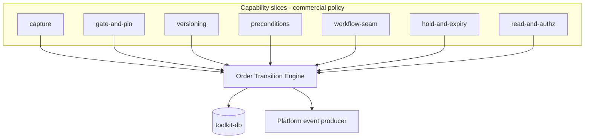
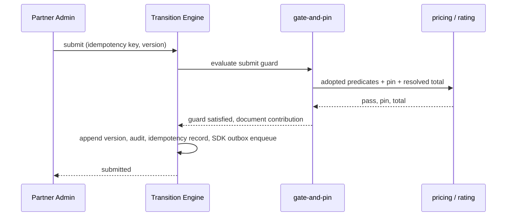
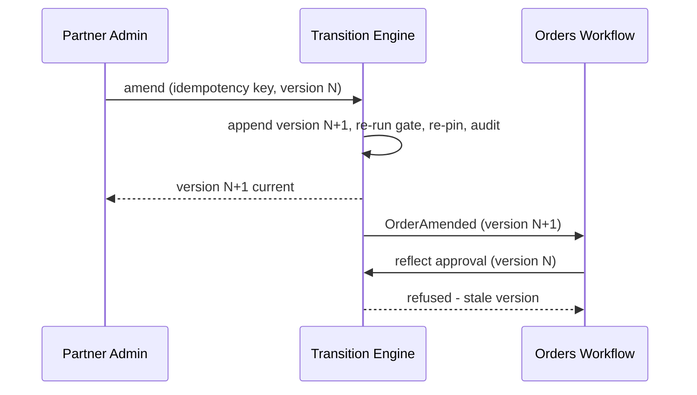
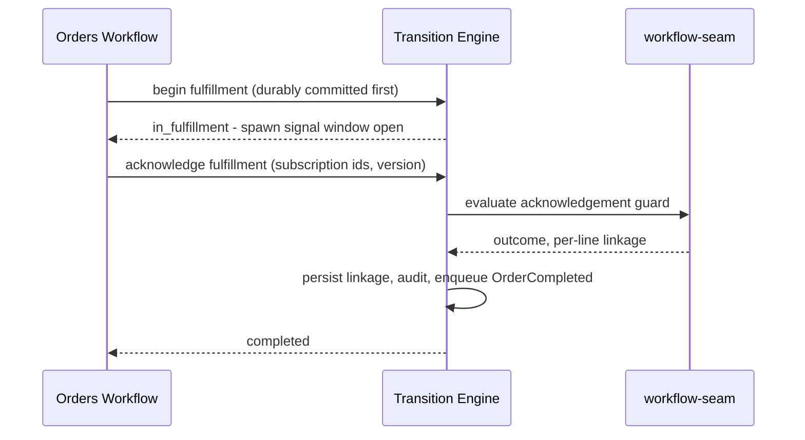
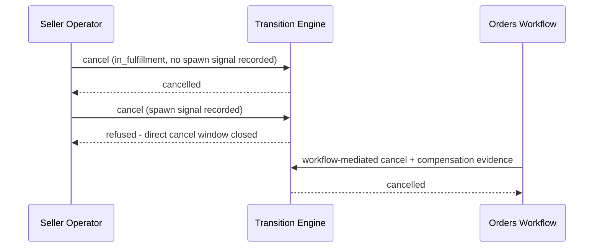
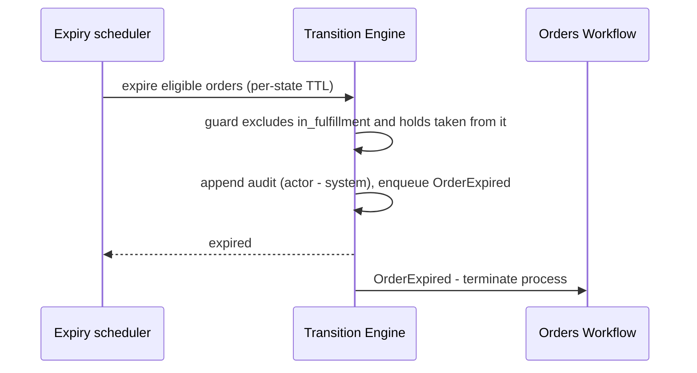
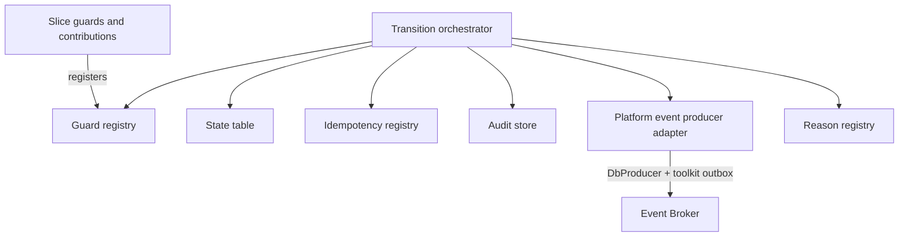

<!-- CONFLUENCE_TITLE: [BSS]: Orders Lifecycle — Technical Design -->
<!-- Related: ./PRD.md, ./features/, ../orders-workflow/docs/PRD.md | Owners: BSS Orders team -->

# Technical Design — Orders Lifecycle


<!-- toc -->

- [1. Architecture Overview](#1-architecture-overview)
  - [1.1 Architectural Vision](#11-architectural-vision)
  - [1.2 Architecture Drivers](#12-architecture-drivers)
  - [1.3 Architecture Layers](#13-architecture-layers)
- [2. Principles & Constraints](#2-principles--constraints)
  - [2.1 Design Principles](#21-design-principles)
  - [2.2 Constraints](#22-constraints)
- [3. Technical Architecture](#3-technical-architecture)
  - [3.1 Domain Model](#31-domain-model)
  - [3.2 Component Model](#32-component-model)
  - [3.3 API Contracts](#33-api-contracts)
  - [3.4 Internal Dependencies](#34-internal-dependencies)
  - [3.5 External Dependencies](#35-external-dependencies)
  - [3.6 Interactions & Sequences](#36-interactions--sequences)
  - [3.7 Database schemas & tables](#37-database-schemas--tables)
  - [3.8 Deployment Topology](#38-deployment-topology)
- [4. Additional context](#4-additional-context)
  - [4.1 Capacity and cost](#41-capacity-and-cost)
  - [4.2 Security posture](#42-security-posture)
  - [4.3 Data protection, residency and retention](#43-data-protection-residency-and-retention)
  - [4.4 Observability](#44-observability)
  - [4.5 Error handling and the platform outbox failure posture](#45-error-handling-and-the-platform-outbox-failure-posture)
  - [4.6 Testability](#46-testability)
  - [4.7 Accepted residual limits](#47-accepted-residual-limits)
  - [4.8 Extension and provenance](#48-extension-and-provenance)
- [5. Traceability](#5-traceability)
- [6. Detailed Architecture Contracts](#6-detailed-architecture-contracts)
  - [Foundation: Architectural Vision](#foundation-architectural-vision)
  - [Foundation: Architecture Drivers](#foundation-architecture-drivers)
  - [Foundation: Architecture Layers](#foundation-architecture-layers)
  - [Foundation: Design Principles](#foundation-design-principles)
  - [Foundation: Constraints](#foundation-constraints)
  - [Foundation: Domain Model](#foundation-domain-model)
  - [Foundation: Component Model](#foundation-component-model)
  - [Foundation: API Contracts](#foundation-api-contracts)
  - [Foundation: Internal Dependencies](#foundation-internal-dependencies)
  - [Foundation: External Dependencies](#foundation-external-dependencies)
  - [Foundation: Database Schemas and Tables](#foundation-database-schemas-and-tables)
  - [Foundation: Deployment Topology](#foundation-deployment-topology)
  - [Foundation: The Transition Contract (normative)](#foundation-the-transition-contract-normative)
  - [Foundation: Events, Audit and the Outbox (normative)](#foundation-events-audit-and-the-outbox-normative)
  - [Foundation: Extension points and stability (normative)](#foundation-extension-points-and-stability-normative)
  - [Foundation: GTS types for the cross-gear contract surface (normative)](#foundation-gts-types-for-the-cross-gear-contract-surface-normative)
  - [Foundation: What is deliberately not GTS](#foundation-what-is-deliberately-not-gts)
  - [Foundation: What this section changed, and why it is recorded](#foundation-what-this-section-changed-and-why-it-is-recorded)
  - [Capture: Architectural Vision](#capture-architectural-vision)
  - [Capture: Architecture Drivers](#capture-architecture-drivers)
  - [Capture: Architecture Layers](#capture-architecture-layers)
  - [Capture: Design Principles](#capture-design-principles)
  - [Capture: Constraints](#capture-constraints)
  - [Capture: Domain Model](#capture-domain-model)
  - [Capture: Component Model](#capture-component-model)
  - [Capture: API Contracts](#capture-api-contracts)
  - [Capture: Internal Dependencies](#capture-internal-dependencies)
  - [Capture: External Dependencies](#capture-external-dependencies)
  - [Capture: Database Schemas and Tables](#capture-database-schemas-and-tables)
  - [Capture: Deployment Topology](#capture-deployment-topology)
  - [Capture: Field classification (normative)](#capture-field-classification-normative)
  - [Capture: Line shapes that are one line (normative)](#capture-line-shapes-that-are-one-line-normative)
  - [Gate and pin: Architectural Vision](#gate-and-pin-architectural-vision)
  - [Gate and pin: Architecture Drivers](#gate-and-pin-architecture-drivers)
  - [Gate and pin: Architecture Layers](#gate-and-pin-architecture-layers)
  - [Gate and pin: Design Principles](#gate-and-pin-design-principles)
  - [Gate and pin: Constraints](#gate-and-pin-constraints)
  - [Gate and pin: Domain Model](#gate-and-pin-domain-model)
  - [Gate and pin: Component Model](#gate-and-pin-component-model)
  - [Gate and pin: API Contracts](#gate-and-pin-api-contracts)
  - [Gate and pin: Internal Dependencies](#gate-and-pin-internal-dependencies)
  - [Gate and pin: External Dependencies](#gate-and-pin-external-dependencies)
  - [Gate and pin: Database Schemas and Tables](#gate-and-pin-database-schemas-and-tables)
  - [Gate and pin: Deployment Topology](#gate-and-pin-deployment-topology)
  - [Gate and pin: The adopted predicate set (normative)](#gate-and-pin-the-adopted-predicate-set-normative)
  - [Gate and pin: The catalog price pin (normative)](#gate-and-pin-the-catalog-price-pin-normative)
  - [Gate and pin: The resolved total and TCV (normative)](#gate-and-pin-the-resolved-total-and-tcv-normative)
  - [Gate and pin: What the order-time total excludes (normative)](#gate-and-pin-what-the-order-time-total-excludes-normative)
  - [Versioning: Architectural Vision](#versioning-architectural-vision)
  - [Versioning: Architecture Drivers](#versioning-architecture-drivers)
  - [Versioning: Architecture Layers](#versioning-architecture-layers)
  - [Versioning: Design Principles](#versioning-design-principles)
  - [Versioning: Constraints](#versioning-constraints)
  - [Versioning: Domain Model](#versioning-domain-model)
  - [Versioning: Component Model](#versioning-component-model)
  - [Versioning: API Contracts](#versioning-api-contracts)
  - [Versioning: Internal Dependencies](#versioning-internal-dependencies)
  - [Versioning: External Dependencies](#versioning-external-dependencies)
  - [Versioning: Database Schemas and Tables](#versioning-database-schemas-and-tables)
  - [Versioning: Deployment Topology](#versioning-deployment-topology)
  - [Preconditions: Architectural Vision](#preconditions-architectural-vision)
  - [Preconditions: Architecture Drivers](#preconditions-architecture-drivers)
  - [Preconditions: Architecture Layers](#preconditions-architecture-layers)
  - [Preconditions: Design Principles](#preconditions-design-principles)
  - [Preconditions: Constraints](#preconditions-constraints)
  - [Preconditions: Domain Model](#preconditions-domain-model)
  - [Preconditions: Component Model](#preconditions-component-model)
  - [Preconditions: API Contracts](#preconditions-api-contracts)
  - [Preconditions: Internal Dependencies](#preconditions-internal-dependencies)
  - [Preconditions: External Dependencies](#preconditions-external-dependencies)
  - [Preconditions: Database Schemas and Tables](#preconditions-database-schemas-and-tables)
  - [Preconditions: Deployment Topology](#preconditions-deployment-topology)
  - [Preconditions: What this design cannot express (normative statement of limitation)](#preconditions-what-this-design-cannot-express-normative-statement-of-limitation)
  - [Workflow seam: Architectural Vision](#workflow-seam-architectural-vision)
  - [Workflow seam: Architecture Drivers](#workflow-seam-architecture-drivers)
  - [Workflow seam: Architecture Layers](#workflow-seam-architecture-layers)
  - [Workflow seam: Design Principles](#workflow-seam-design-principles)
  - [Workflow seam: Constraints](#workflow-seam-constraints)
  - [Workflow seam: Domain Model](#workflow-seam-domain-model)
  - [Workflow seam: Component Model](#workflow-seam-component-model)
  - [Workflow seam: API Contracts](#workflow-seam-api-contracts)
  - [Workflow seam: Internal Dependencies](#workflow-seam-internal-dependencies)
  - [Workflow seam: External Dependencies](#workflow-seam-external-dependencies)
  - [Workflow seam: Database Schemas and Tables](#workflow-seam-database-schemas-and-tables)
  - [Workflow seam: Deployment Topology](#workflow-seam-deployment-topology)
  - [Workflow seam: The five operations are ordinary transitions (normative)](#workflow-seam-the-five-operations-are-ordinary-transitions-normative)
  - [Workflow seam: Verdicts and the deciding authority (normative)](#workflow-seam-verdicts-and-the-deciding-authority-normative)
  - [Workflow seam: The per-line projection is not a state machine (normative)](#workflow-seam-the-per-line-projection-is-not-a-state-machine-normative)
  - [Workflow seam: The upstream asks this slice depends on](#workflow-seam-the-upstream-asks-this-slice-depends-on)
  - [Hold and expiry: Architectural Vision](#hold-and-expiry-architectural-vision)
  - [Hold and expiry: Architecture Drivers](#hold-and-expiry-architecture-drivers)
  - [Hold and expiry: Architecture Layers](#hold-and-expiry-architecture-layers)
  - [Hold and expiry: Design Principles](#hold-and-expiry-design-principles)
  - [Hold and expiry: Constraints](#hold-and-expiry-constraints)
  - [Hold and expiry: Domain Model](#hold-and-expiry-domain-model)
  - [Hold and expiry: Component Model](#hold-and-expiry-component-model)
  - [Hold and expiry: API Contracts](#hold-and-expiry-api-contracts)
  - [Hold and expiry: Internal Dependencies](#hold-and-expiry-internal-dependencies)
  - [Hold and expiry: External Dependencies](#hold-and-expiry-external-dependencies)
  - [Hold and expiry: Database Schemas and Tables](#hold-and-expiry-database-schemas-and-tables)
  - [Hold and expiry: Deployment Topology](#hold-and-expiry-deployment-topology)
  - [Hold and expiry: Policy values (open)](#hold-and-expiry-policy-values-open)
  - [Reads and authorization: Architectural Vision](#reads-and-authorization-architectural-vision)
  - [Reads and authorization: Architecture Drivers](#reads-and-authorization-architecture-drivers)
  - [Reads and authorization: Architecture Layers](#reads-and-authorization-architecture-layers)
  - [Reads and authorization: Design Principles](#reads-and-authorization-design-principles)
  - [Reads and authorization: Constraints](#reads-and-authorization-constraints)
  - [Reads and authorization: Domain Model](#reads-and-authorization-domain-model)
  - [Reads and authorization: Component Model](#reads-and-authorization-component-model)
  - [Reads and authorization: API Contracts](#reads-and-authorization-api-contracts)
  - [Reads and authorization: Internal Dependencies](#reads-and-authorization-internal-dependencies)
  - [Reads and authorization: External Dependencies](#reads-and-authorization-external-dependencies)
  - [Reads and authorization: Database Schemas and Tables](#reads-and-authorization-database-schemas-and-tables)
  - [Reads and authorization: Deployment Topology](#reads-and-authorization-deployment-topology)
  - [Reads and authorization: The read projection (normative)](#reads-and-authorization-the-read-projection-normative)
  - [Reads and authorization: What a read exposes (normative)](#reads-and-authorization-what-a-read-exposes-normative)
  - [Reads and authorization: The permission model (normative)](#reads-and-authorization-the-permission-model-normative)
  - [Reads and authorization: Delegation proof (normative)](#reads-and-authorization-delegation-proof-normative)
  - [Reads and authorization: Policy values](#reads-and-authorization-policy-values)

<!-- /toc -->

- [ ] `p1` - **ID**: `cpt-cf-bss-orders-lifecycle-design-orders-lifecycle`

Implementation scope and build order are in [DECOMPOSITION.md](./DECOMPOSITION.md),
which links to eight [feature specifications](./features/). This document owns architecture and shared contracts; each feature owns its detailed behavior.

## 1. Architecture Overview

### 1.1 Architectural Vision

Orders Lifecycle is the **System of Record** for the order document and its finite-state
machine. It owns WHAT was ordered — line items, parties, pricing references — and the CURRENT
state of the order from capture to a terminal state. It never computes a price, never routes an
approval, and never provisions anything ([`PRD.md`](./PRD.md) §1.1, §6.4).

The design follows the shape its two built BSS siblings already use. Where the Billing Ledger's
contract is *post through the engine* (build balanced lines, then commit) and the Product
Catalog's is *publish through the engine* (author draft, validate fail-closed, freeze, emit),
this gear's contract is **transition through the engine**. One shared **Order Transition
Engine** ([01-foundation architecture](DESIGN.md#contract-01-1-1)) owns the order aggregate and
its append-only version chain, the state-machine table and its guards, the idempotency
registry, the optimistic version check, the transition audit log, and the event contract. Every
state change — a buyer submitting, an operator holding, the sibling Workflow gear reflecting an
approval, the scheduler expiring a stale order — enters through the same engine call and leaves
having done three things atomically on every success — the state or version change, one audit entry
(one per changed field for an administrative edit, D-117) and one settled idempotency record — plus one platform producer-outbox message where the transition
row declares an event type.

Each business capability is a **slice handler** that declares its guard predicates and its
contribution to the order document, then transitions *through* the Engine under the invariants
defined there. The Engine owns no commercial policy — it does not know what a sellability gate
or a catalog price pin is; slices own no transition mechanics — they never write state, never
stamp an audit row, and never emit an event themselves. This keeps the correctness-critical
core (idempotency, versioning, guard evaluation, audit completeness, one-event-per-transition) small
and auditable, and it is what makes the four `p1` non-functional guarantees provable in one
place rather than argued per capability.

Two boundaries are structural rather than stylistic, and both are stated normatively in
[`PRD.md`](./PRD.md) §6.4. The sibling **Orders Workflow** gear drives every approval and
fulfillment transition by calling this gear idempotently and stores no authoritative order
state (R1); and all provisioning reaches OSS only through Subscriptions (R3), so this gear
holds no provisioning logic and learns fulfillment outcomes exclusively from Workflow
acknowledgements. Requirements (WHAT/WHY) live in [`PRD.md`](./PRD.md); per-capability
mechanics live in [features/](features/).

### 1.2 Architecture Drivers

Requirements that significantly influence architecture decisions.

#### Functional Drivers

| Requirement | Design Response |
|-------------|------------------|
| `cpt-cf-bss-orders-lifecycle-fr-order-state-machine` | The state machine is a declarative transition table owned by the Engine (states, guards, terminal set, hold/resume, expiry eligibility). Slices register guards; no slice may add an edge. |
| `cpt-cf-bss-orders-lifecycle-fr-order-idempotency` | An Engine-owned idempotency registry keyed per operation, storing the committed outcome. Replay returns the stored result — including a stored failure; payload mismatch and in-flight arrival are distinct refusals, never a success. |
| `cpt-cf-bss-orders-lifecycle-fr-order-create` | The capture slice authors order and line state in `draft` with no gate evaluation, so basket workflows cost nothing until submit. |
| `cpt-cf-bss-orders-lifecycle-fr-order-submit` | The gate-and-pin slice adopts the published pricing sellability predicates by reference and adds the Orders delta; the Engine commits `draft → submitted` only on a fully passing gate, so no partially validated order can exist. |
| `cpt-cf-bss-orders-lifecycle-fr-order-line-dates` | Line dates, term duration and billing cycle are line-level authored fields with cascading defaults; expected fulfillment time is derived, never stored as authority. |
| `cpt-cf-bss-orders-lifecycle-fr-order-amendment` | Commercial content is immutable from `submitted`: an amendment appends a new version row with a `supersedesVersion` back-reference and re-runs the gate. Administrative content is a separate, non-versioned, audited edit path. |
| `cpt-cf-bss-orders-lifecycle-fr-order-history` | Versions are append-only rows retained in-table, so any historical version is retrievable by order id and version number without reconstruction. |
| `cpt-cf-bss-orders-lifecycle-fr-order-tenant-axes` | The three axes are validated at submit and then frozen by the Engine's guard set; only `payerTenantId` has an amendment path, while cross-seller transfer is refused: the explicit D-62/Q-28 PRD divergence. |
| `cpt-cf-bss-orders-lifecycle-fr-order-acceptance` | The acceptance instant is a first-class recorded fact with its own transition and event, and a begin-fulfillment guard reads it. It has no default value at any layer. |
| `cpt-cf-bss-orders-lifecycle-fr-order-payment-auth` | Payment authorization is consumed as a begin-fulfillment guard input supplied by Workflow, not as an order state; the tolerate-failure election is a seller policy read at guard time. |
| `cpt-cf-bss-orders-lifecycle-fr-order-cancel` | The cancel guard is anchored on the recorded subscription-spawn signal, which is why begin-fulfillment must be durably committed before Workflow issues any activation intent. |
| `cpt-cf-bss-orders-lifecycle-fr-order-hold` | `on_hold` stores the pre-hold state on the order, so resume is a table lookup rather than an inference. |
| `cpt-cf-bss-orders-lifecycle-fr-order-expiry` | A coordinated scheduler drives per-state TTL expiry as an ordinary Engine transition; `in_fulfillment` and holds taken from it are excluded by the transition table itself, not by scheduler logic. |
| `cpt-cf-bss-orders-lifecycle-fr-order-atomic-fulfillment` | The order carries no per-line fulfillment state machine. Terminals are order-level; per-line create/activate results are a read-only projection fed by Workflow acknowledgements. |
| `cpt-cf-bss-orders-lifecycle-fr-order-subscription-linkage` | The per-line line→subscription mapping is persisted on acknowledgement and carried in `OrderCompleted`, so acquisition provenance is answerable from the order side. |
| `cpt-cf-bss-orders-lifecycle-fr-order-events` | The eleven typed state events are enqueued through `event-broker-sdk::DbProducer` backed by `toolkit_db::outbox` inside the transition commit, giving exactly one producer message per committed transition **that declares an event type**, under at-least-once delivery with consumer de-duplication. Six row classes are deliberately event-less (D-15). |
| `cpt-cf-bss-orders-lifecycle-fr-order-authorization` | Per-actor permissions and the cross-tenant delegation-proof requirement are enforced as an Engine pre-guard, so no slice can widen scope. |
| `cpt-cf-bss-orders-lifecycle-fr-orders-boundary-r1-state-sor` | Workflow-only operations are ordinary Engine transitions with the same idempotency and version-check contract as buyer operations; the gear exposes no path that lets a caller assert state without a guard. |
| `cpt-cf-bss-orders-lifecycle-fr-orders-boundary-r2-approval` | The approval-requirement verdict and gate outcomes are stored as received values with their deciding authority recorded. The gear contains no policy evaluation and no threshold comparison. |
| `cpt-cf-bss-orders-lifecycle-fr-orders-boundary-r3-provisioning` | No infrastructure adapter for OSS or the Policy Engine exists in this gear. Fulfillment outcome arrives only as a Workflow acknowledgement. |
| `cpt-cf-bss-orders-lifecycle-fr-orders-boundary-r4-no-price` | Price data is stored as opaque references plus the captured pin and the captured non-authoritative total. The gear has no arithmetic over money beyond persistence at ISO 4217 minor-unit scale. |
| `cpt-cf-bss-orders-lifecycle-fr-orders-boundary-r5-no-mirroring` | The persisted downstream transition-request identifier is a correlation column with no state semantics, and no projection derives order state from it. |

#### NFR Allocation

| NFR ID | NFR Summary | Allocated To | Design Response | Verification Approach |
|--------|-------------|--------------|-----------------|----------------------|
| `cpt-cf-bss-orders-lifecycle-nfr-order-transition-latency` | PRD §7.1 / AC-17 governs: durable write **and event publish** p95 < 1 s. Compliance is unverified; the former separate 30 s p95 delivery target is an unapproved proposal (D-41, Q-16). Guard-input resolution also affects caller latency (Q-11). | Order Transition Engine and platform producer integration | State, audit, idempotency and producer enqueue share one transaction; broker publication follows asynchronously. A successful commit alone does not prove publication. | Correlate operation start, commit and broker acknowledgement at production load; measure the complete write-plus-publish path against the PRD baseline and report component timings separately (§4.1) |
| `cpt-cf-bss-orders-lifecycle-nfr-order-read-latency` | Order read and paginated list p95 < 200 ms | Read-and-authorization slice | Reads are served from a current-version projection carrying the denormalized state, tenant axes and per-line fulfillment status, so no read reconstructs the version chain | Read/list benchmarks at production row counts and page sizes, including the tenancy-scoped filter paths |
| `cpt-cf-bss-orders-lifecycle-nfr-order-audit-completeness` | 100 % of transitions and amendments audited, zero silent drops | Order Transition Engine | The audit append is inside the same transaction as the state change, so an unaudited transition cannot commit; the audit store is append-only and the chain is verifiable | Structural test that every transition-table edge writes an audit row; negative test that a failed audit append aborts the transition |
| `cpt-cf-bss-orders-lifecycle-nfr-order-idempotency` | Zero duplicate orders or duplicate transition effects, **per principal** ([01 §4.2](features/01-foundation.md#contract-01-4-2) discloses the scope's one gap: create) | Order Transition Engine | Idempotency records are written in the transition transaction under a unique constraint on `(operation, principal_scope, idempotency_key)`, making duplicate effect impossible rather than unlikely; the in-flight state is explicit | Concurrency test firing the same key in parallel and asserting one durable effect; replay test asserting stored failures replay as failures; cross-principal test asserting one caller neither reads nor overwrites another's record |
| `cpt-cf-bss-orders-lifecycle-nfr-order-snapshot-integrity` | 100 % of submitted lines carry a resolvable catalog price pin | Gate-and-pin slice | The pin is captured inside the submit transaction; a line without a resolvable pin fails the gate, so `submitted` and "pinned" are the same commit | Invariant test asserting no `submitted`-or-beyond line exists without a pin; re-pin asserted on every amendment |
| `cpt-cf-bss-orders-lifecycle-nfr-order-recovery` | RPO zero for `submitted`+ orders, RTO ≤ 60 min, within residency-bound intra-cell failure domains | Persistence and deployment topology | Committed transitions are synchronously durable before acknowledgement; versions, audit rows and toolkit producer messages share the transaction so a recovered database cannot hold an event-declaring state change without its durable notification | DR exercise restoring to the declared RTO and asserting zero committed-transition loss including queued producer messages |
| `cpt-cf-bss-orders-lifecycle-nfr-order-retention` | Retain all orders and versions per program policy; auto-void abandoned drafts | Persistence and the hold-and-expiry slice | Append-only retention with no destructive path for `submitted`+ orders; the draft auto-void TTL transitions to `expired` rather than deleting, preserving the audit trail | Retention test asserting no delete path reaches a `submitted`+ order; auto-void test asserting the draft remains readable, not removed |

#### Key ADRs

| ADR ID | Decision Summary |
|--------|-----------------|
| `cpt-cf-bss-orders-lifecycle-adr-transition-through-engine` | One engine owns every state change, so the four `p1` guarantees are properties of one code path rather than per-capability discipline |
| `cpt-cf-bss-orders-lifecycle-adr-slice-decomposition` | A foundation slice plus seven capability slices, so the correctness core has an independent review boundary |
| `cpt-cf-bss-orders-lifecycle-adr-fail-closed-gate` | An unevaluable gate input is a refusal, not an admission under a tolerated risk — so no order is pinned against a predicate nobody checked |
| `cpt-cf-bss-orders-lifecycle-adr-closed-enumerations` | The eleven states and eleven events stay closed; new distinctions are guards, recorded facts, reasons and event-less rows |
| `cpt-cf-bss-orders-lifecycle-adr-refusals-commit` | A refused transition audits, settles and commits, which is what makes 100 % audit coverage a property rather than a discipline |
| `cpt-cf-bss-orders-lifecycle-adr-outbox-publication` | Events publish asynchronously through the platform `DbProducer`/toolkit outbox path; meeting the PRD's write-plus-publish latency requires measurement of both stages, with target clarification tracked in Q-16 |
| `cpt-cf-bss-orders-lifecycle-adr-in-transaction-concurrency` | The one-in-flight-order rule is a database constraint inside the transition transaction, not a gate predicate — the predicate is a pre-check that cannot enforce it |

**Seven ADRs, and the reasoning for that number.** An ADR is written where a decision affects the
system's fundamental structure, is hard to reverse, and represents a real choice between
alternatives. For every other entry the register — which carries a decision, its
rationale and its propagation addresses — is the correct and sufficient home; an ADR per decision
would destroy the signal that makes an ADR directory readable. Seven is above the sibling gears'
one to three because Orders is the only state-machine system of record among them and the only one
with three consuming gears. The test above is applied rather than recited: the two added on
2026-09-10 were found by asking which decisions the register was carrying that met all three
conditions, and both did while being recorded as single table rows. **Asynchronous publication**
(`ADR/0006`) separates commit from publication, requires combined latency verification, and binds three
consumer gears to at-least-once delivery. **In-transaction concurrency** (`ADR/0007`) is the gear's
only concurrency-correctness mechanism, and a table row with no alternatives is exactly the shape a
later author deletes as redundant with the gate predicate that does not enforce it. Every other call is in
[`DECISIONS.md`](./DECISIONS.md).

### 1.3 Architecture Layers

- [ ] `p3` - **ID**: `cpt-cf-bss-orders-lifecycle-tech-layering`

```text
Capability slices   capture · gate-and-pin · versioning · preconditions ·
(commercial policy) workflow-seam · hold-and-expiry · read-and-authz
       │   declare guard predicates and document contributions; transition through the
       ▼            Engine API — own no state write, audit row, or event emission
Order Transition    order aggregate · append-only version chain · state-machine table + guards ·
Engine              idempotency registry · optimistic version check · transition audit ·
(shared engine)     typed event contract (11 state events) · machine-readable reason catalogue
       │            — owns no commercial policy
       ▼
Platform egress     event-broker-sdk DbProducer · toolkit-db transactional outbox
       │
       ▼
Persistence         toolkit-db backend (append-only version rows; current-version read
                    projection; append-only audit store; idempotency registry;
                    resolved totals as integer minor units at ISO 4217 scale)
```

| Layer | Responsibility | Technology |
|-------|---------------|------------|
| Presentation | REST order authoring, transition, preview and read surfaces behind the inbound gateway; `OperationBuilder`-registered operations with explicit response metadata; RFC 9457 `application/problem+json` errors; ETag optimistic concurrency | Rust, REST/OpenAPI, inbound API gateway |
| Application | Capability slices declaring guards and document contributions; each is a bounded feature owning its own validation and its own machine-readable reasons | Rust modules in the `orders-lifecycle` gear |
| Domain | The Transition Engine: aggregate and version chain, transition table and guard evaluation, idempotency semantics, version check, audit and event contracts | Rust; GTS for the cross-gear contract surface ([01 §4.7](DESIGN.md#contract-01-4-7)) + Rust domain structs |
| Infrastructure | Append-only version and audit stores, current-version projection, idempotency registry, platform producer outbox, expiry scheduler | PostgreSQL, SecureORM, `event-broker-sdk` (`outbox` feature), `toolkit_db::outbox`, `toolkit_db::Db::lock` ([Foundation contract §3.8](DESIGN.md#contract-01-3-8)) |

## 2. Principles & Constraints

### 2.1 Design Principles

#### Transition through the engine

- [ ] `p1` - **ID**: `cpt-cf-bss-orders-lifecycle-principle-transition-through-engine`

Every order state change is a single Engine call that atomically evaluates the guard, appends
the version or audit entry, commits, and enqueues one platform producer-outbox message **where the transition row
declares an event type** — six row classes are deliberately event-less ([01 §4.4](DESIGN.md#contract-01-4-4), D-15). No slice, migration,
repair script or administrative surface writes order state directly. This is what allows audit
completeness, idempotency and one-producer-message-per-event-declaring-transition to be asserted once
rather than per capability — delivery itself is **at-least-once** with consumer de-duplication
([01 §2.2](DESIGN.md#contract-01-2-2)), never exactly-once
— and it is the reason a new capability cannot regress the correctness core by construction.

#### One state authority, no derived truth

- [ ] `p1` - **ID**: `cpt-cf-bss-orders-lifecycle-principle-single-state-authority`

Order state is stored, not computed. No projection, event replay or downstream identifier
derives it, and the persisted Subscriptions transition-request identifier carries no state
meaning. The corollary bounds this gear from the other side: it stores approval verdicts and
fulfillment outcomes as *received facts with a recorded decider*, and evaluates neither.

#### Commercial content is append-only; administrative content is editable

- [ ] `p1` - **ID**: `cpt-cf-bss-orders-lifecycle-principle-content-immutability-split`

From `submitted` onwards, line items, quantities, plan and price references, tenant axes, dates,
term and category change only by appending a new version. External references, display labels
and internal notes are edited in place and audited separately. The split is enforced at the
field level in the document contribution contract, not by reviewer discipline, because
conflating the two is what makes a commercial audit trail unreliable.

#### Fail closed on absence

- [ ] `p1` - **ID**: `cpt-cf-bss-orders-lifecycle-principle-fail-closed`

An unevaluable predicate is a failed predicate. A submit whose sellability inputs cannot be
resolved is refused, not defaulted — the same posture the published pricing gate takes, where an
unbuilt predicate lane is treated exactly as one that timed out. No layer substitutes a default
for an absent required value; absence must have failed the gate.

#### Reasons are business-level and machine-readable

- [ ] `p2` - **ID**: `cpt-cf-bss-orders-lifecycle-principle-machine-readable-reasons`

Every refusal — gate rejection, guard violation, payload mismatch, stale version, market
divergence, overlap collision — carries a stable machine-readable business reason owned by the
slice that raises it, mapped to an RFC 9457 problem at the wire edge. Transport status codes are
a presentation concern and never the contract a caller keys on.

#### Idempotency is a stored outcome, not a de-duplication guess

- [ ] `p1` - **ID**: `cpt-cf-bss-orders-lifecycle-principle-stored-idempotency`

The registry stores the committed outcome of an operation, so replay returns that outcome —
including a stored failure — rather than re-executing or optimistically assuming success. The
three non-success cases are distinct and none of them may be read as success: payload mismatch,
still-processing conflict, and stale version.

### 2.2 Constraints

#### Approval policy is external and currently unimplemented

- [ ] `p1` - **ID**: `cpt-cf-bss-orders-lifecycle-constraint-external-approval-policy`

The approval-requirement verdict is owned by the Generic Approval service (R2), which has no
authored specification. This gear therefore stores a verdict it cannot validate, and must record
the deciding authority alongside it so a stand-in decision is distinguishable from a policy
decision after the fact. No fallback evaluation may be added here, and the built BSS siblings'
local approval surfaces are not a precedent this gear may follow.

#### Downstream provisioning contracts are unagreed

- [ ] `p1` - **ID**: `cpt-cf-bss-orders-lifecycle-constraint-unagreed-subscription-seams`

The occupancy read (`SUB-O5`, amended by D-126) the submit gate needs, and the compensation cancel reason the failure
path depends on, are asks on the Subscriptions gear that are registered but not agreed, and that
gear has no implementation. The gate and the acknowledgement path are therefore designed against
a specified contract rather than an observed one, and each dependency is isolated behind a port
so an upstream change is a boundary change and not a core change.

#### Payment ordering is provision-then-collect only

- [ ] `p2` - **ID**: `cpt-cf-bss-orders-lifecycle-constraint-payment-ordering`

Only an authorization outcome consumed as a begin-fulfillment guard is expressible; capture,
strong customer authentication and refund-as-reversal have no owning capability in the platform.
A collect-then-provision checkout cannot be built on this design without extending it, and the
gear introduces no `payment_pending` state, so a declined instrument leaves the order `approved`
until its TTL elapses.

#### Money is stored but never computed

- [ ] `p2` - **ID**: `cpt-cf-bss-orders-lifecycle-constraint-no-money-arithmetic`

The resolved total is persisted as integer minor units at the currency's ISO 4217 scale and is
read only for display and for the approval-request context Workflow assembles. The gear performs
no derivation, aggregation or currency conversion over it, and it is never a billing input.

#### Data residency is a hard boundary

- [ ] `p1` - **ID**: `cpt-cf-bss-orders-lifecycle-constraint-data-residency`

For residency-bound tenants every gear-owned store — tables, read projection, audit, idempotency
registry, platform producer queue, backups and the synchronous standby — is pinned to an in-jurisdiction deployment
cell with **zero cross-boundary replication**. This is what forces the recovery standby to be a
second failure domain rather than a second region, and it is the constraint the sibling catalog
gear states in the same terms.

#### Constraint categories not applicable

- [ ] `p3` - **ID**: `cpt-cf-bss-orders-lifecycle-constraint-categories-not-applicable`

Two checklist constraint categories are recorded as inapplicable rather than omitted. **Vendor and
licensing**: the gear introduces no third-party dependency beyond the platform's own ToolKit,
PostgreSQL and toolkit-db advisory locking, all already licensed platform-wide. **Resource
constraints** — budget, team size, delivery window: these are project-level facts owned outside
the design set and would date immediately if restated here; the design's own sequencing
constraint is the phased slice map in [`DECOMPOSITION.md`](./DECOMPOSITION.md).

#### Platform baselines and explicit authorization boundary

- [ ] `p3` - **ID**: `cpt-cf-bss-orders-lifecycle-constraint-platform-baselines`

The gear takes the standard ToolKit posture except for the explicit Pricing-style trusted
internal-maintenance authorization boundary in [08 §3.5](DESIGN.md#contract-08-3-5): SDK-first public
contracts in an `orders-lifecycle-sdk` crate with implementation internals private to the gear
crate; `api` / `domain` / `infra` separation; `OperationBuilder` registration with explicit
response metadata; canonical error mapping to RFC 9457 with no internal diagnostics on the wire;
runtime-owned database privilege with the gear exposing migrations and receiving scoped access;
and `SecurityContext` propagated across every in-process call.

## 3. Technical Architecture

### 3.1 Domain Model

**Technology**: GTS types for cross-gear contracts, specified in [01 §4.7](DESIGN.md#contract-01-4-7); Rust domain structs internally.

**Location**: [01 §3.1](DESIGN.md#contract-01-3-1) is normative for the
aggregate and its invariants.

**Core Entities**: each carries its own stable ID; the normative definitions and the schema they
map to are in [01 §3.1](DESIGN.md#contract-01-3-1) and §3.7.

- [ ] `p1` - **ID**: `cpt-cf-bss-orders-lifecycle-entity-order-aggregate`

`Order` — the aggregate root: identity, human-readable number, category, the three tenant axes,
the initiating actor, the optional contract reference, current state, `state_entered_at`, the
current-version pointer, the pre-hold state, the spawn-signal instant, the tolerated-authorization
risk flag and the audit-sequence counter.

- [ ] `p1` - **ID**: `cpt-cf-bss-orders-lifecycle-entity-order-version`

`OrderVersion` — an immutable snapshot of commercial content with its actor, timestamp, reason,
derived order market and `supersedesVersion` back-reference.

- [ ] `p1` - `cpt-cf-bss-orders-lifecycle-entity-order-line`

`OrderLine` — a version-scoped line under an order-scoped `OrderLineIdentity`: catalog references,
quantity, currency, catalog price pin, the resolved date triple with its governing policy-switch
state, term, cycle and overlap scope key.

- [ ] `p1` - **ID**: `cpt-cf-bss-orders-lifecycle-entity-resolved-total-view`

`ResolvedTotal` — the captured non-authoritative figures, discriminated by line or order scope,
across four charge kinds.

- [ ] `p1` - **ID**: `cpt-cf-bss-orders-lifecycle-entity-transition`

`OrderTransition` — one hash-chained append-only audit entry per transition attempt, committed or
refused.

- [ ] `p1` - **ID**: `cpt-cf-bss-orders-lifecycle-entity-acceptance`

`AcceptanceRecord` — the customer-acceptance instant as a recorded fact, never defaulted, with its
recording actor, path and requirement source.

Acceptance is bound to `accepted_version`, not to the order for all time. Amendments preserve
the earlier evidence but require acceptance of the new version wherever the fulfillment policy
requires it; both sales paths can record that acceptance. Draft assent is not accepted.

- [ ] `p2` - **ID**: `cpt-cf-bss-orders-lifecycle-entity-line-fulfillment`

`LineFulfillment` — the read-only per-line projection of Workflow acknowledgements plus the
spawned subscription identifier and the downstream correlation reference.

It is not a live execution-progress feed. Intermediate steps are obtained from Workflow's
already-specified progress read; absent Lifecycle projection rows mean not acknowledged.
Availability and scoped SDK integration of that Workflow read remain prerequisites, not a new
Lifecycle endpoint. See `UPSTREAM_REQS.md` §2.6.

- [ ] `p2` - **ID**: `cpt-cf-bss-orders-lifecycle-entity-administrative-content-view`

`AdministrativeContent` — mutable, separately audited content carrying no commercial meaning:
external references, display labels and internal notes at order and line level.

**Relationships**:
- `Order` → `OrderVersion`: one-to-many, append-only; exactly one version is current, and every prior version is retained and retrievable.
- `OrderVersion` → `OrderLine`: one-to-many; lines belong to a version, not to the order, which is what makes commercial content immutable without copying the aggregate.
- `OrderVersion` → `ResolvedTotal`: one-to-many — one row per line per charge kind plus the order-level roll-up; captured at submit and recaptured on each amendment.
- `Order` → `OrderTransition`: one-to-many, append-only; the audit trail is complete by construction because the append shares the transition's transaction.
- `OrderVersion` → `AcceptanceRecord`: zero-or-one per immutable version, whether required or volunteered; never defaulted or copied across amendment.
- `OrderLine` → `LineFulfillment`: one-to-one after fulfillment acknowledgement; carries the 1:1 line-to-subscription mapping.

### 3.2 Component Model

Components are slice handlers over the shared Transition Engine, not independently deployable
services. Each carries a stable `cpt-cf-bss-orders-lifecycle-component-{slug}` ID; the linked
slice document is normative for its internals, and the dependency order is in
[`DECOMPOSITION.md`](./DECOMPOSITION.md).



#### Order Transition Engine

- [ ] `p1` - **ID**: `cpt-cf-bss-orders-lifecycle-component-transition-engine`

##### Why this component exists

The four `p1` guarantees this gear is judged on — audit completeness, zero duplicate effects,
transition latency and recoverability — are properties of *how a state change commits*, not of
any single capability. Concentrating the commit in one component makes them assertable once and
unbreakable by a new slice.

##### Responsibility scope

The order aggregate and its append-only version chain; the declarative state-machine table with
its guards, terminal set, hold/resume mapping and expiry eligibility; guard evaluation and
ordering; the idempotency registry and its non-success outcomes; the optimistic version
check and its `version-conflict` refusal — the single registered name D-38 consolidated the
`stale-version` variants into; the append-only transition audit; the typed event contract and the
one-producer-message-per-event-declaring-transition rule; and the registry of machine-readable business reasons.

##### Responsibility boundaries

It knows nothing commercial: not what a sellability predicate is, not what a price pin means,
not whether an approval was warranted. It evaluates guards that slices declare, over document
contributions that slices supply. It performs no money arithmetic, no policy evaluation, no
provisioning, and no outbound call to any other gear.

##### Related components (by ID)

- `cpt-cf-bss-orders-lifecycle-component-capture` — owns data for
- `cpt-cf-bss-orders-lifecycle-component-gate-and-pin` — owns data for
- `cpt-cf-bss-orders-lifecycle-component-versioning` — owns data for
- `cpt-cf-bss-orders-lifecycle-component-workflow-seam` — owns data for
- `cpt-cf-bss-orders-lifecycle-component-hold-and-expiry` — owns data for

#### Capture handler

- [ ] `p1` - **ID**: `cpt-cf-bss-orders-lifecycle-component-capture`

##### Why this component exists

A basket must be assemblable without paying validation cost, and the line model must carry the
quoted commercial shape of the deal — term and cycle — or that shape is lost between order and
subscription.

##### Responsibility scope

Order and line authoring in `draft`; the line model including the mandatory contract-effective
date, the optional service-activation and acceptance-due dates with their cascading defaults,
term duration, billing cycle and external references; the single-currency basket rule; and the
field-level classification of commercial versus administrative content.

##### Responsibility boundaries

It evaluates no sellability predicate, captures no pin, and computes no total — a `draft` is
deliberately unvalidated. It does not decide whether a missing required date blocks submit; that
guard belongs to the gate.

##### Related components (by ID)

- `cpt-cf-bss-orders-lifecycle-component-transition-engine` — depends on
- `cpt-cf-bss-orders-lifecycle-component-gate-and-pin` — shares model with

#### Gate-and-pin handler

- [ ] `p1` - **ID**: `cpt-cf-bss-orders-lifecycle-component-gate-and-pin`

##### Why this component exists

Price integrity between capture and subscription activation is the revenue-integrity risk this
gear exists to close, and the gate is the only place it can be closed atomically with the state
change.

##### Responsibility scope

The submit gate: the published pricing sellability predicates adopted by reference plus the
Orders delta — tenant-axis validity, contract-active where referenced, purchase-quantity floor,
order-market consistency against the payer's profile, reference resolution, single currency,
overlap-rule uniqueness and the one-in-flight-order rule. Capture of the catalog price pin on
every line and of the non-authoritative resolved total. The Preview operation, which creates no
order or commercial artifact, persists bounded-retention gate outcomes and returns no approval
verdict.

##### Responsibility boundaries

It does not author the adopted predicates and must never fork them. It computes no price — the
total arrives from the price-evaluation contract and is stored as received. It returns no
approval-requirement verdict, in Preview or at submit.

##### Related components (by ID)

- `cpt-cf-bss-orders-lifecycle-component-transition-engine` — depends on
- `cpt-cf-bss-orders-lifecycle-component-capture` — shares model with

#### Versioning handler

- [ ] `p1` - **ID**: `cpt-cf-bss-orders-lifecycle-component-versioning`

##### Why this component exists

A commercial change before fulfillment must leave evidence of what changed, who changed it and
what it replaced, without mutating what a reviewer already saw.

##### Responsibility scope

The amendment path from `submitted`, `pending_approval` and `approved`; the new-version append
with its `supersedesVersion` reference; the gate re-run and re-pin trigger; historical version
retrieval; the non-versioned audited administrative edit path; and the absence of any amendment row
from `in_fulfillment` onward (engine `not-admissible`; [04 §2.2](DESIGN.md#contract-04-2-2) *Amendment stops at `in_fulfillment`*).

##### Responsibility boundaries

It does not decide whether the amended order needs re-approval — that verdict is external and
arrives through the workflow seam. It does not delete or rewrite a prior version under any
condition.

##### Related components (by ID)

- `cpt-cf-bss-orders-lifecycle-component-transition-engine` — depends on
- `cpt-cf-bss-orders-lifecycle-component-gate-and-pin` — calls

#### Preconditions handler

- [ ] `p1` - **ID**: `cpt-cf-bss-orders-lifecycle-component-preconditions`

##### Why this component exists

On a partner-placed order the document evidences delegation but not agreement, and without a
money gate before provisioning a non-paying tenant receives resources.

##### Responsibility scope

The customer-acceptance instant as a recorded fact with its own transition and event; the source
of the acceptance-required election; and the begin-fulfillment guard inputs — recorded acceptance
where required, and the payment-authorization outcome with the seller tolerate-failure election
and its risk flag.

##### Responsibility boundaries

It owns no payment mechanism and holds no instrument data. It never defaults the acceptance
instant, under any policy, including the cascade that fills the line-level acceptance-due date.

##### Related components (by ID)

- `cpt-cf-bss-orders-lifecycle-component-transition-engine` — depends on
- `cpt-cf-bss-orders-lifecycle-component-workflow-seam` — shares model with

#### Workflow-seam handler

- [ ] `p1` - **ID**: `cpt-cf-bss-orders-lifecycle-component-workflow-seam`

##### Why this component exists

R1 through R5 are only real if the operations the sibling gear calls are ordinary guarded
transitions rather than privileged state assertions.

##### Responsibility scope

The five workflow-only operations — approval reflection, begin fulfillment, spawn-signal report,
fulfillment acknowledgement, and workflow-mediated cancel with attached compensation evidence;
the recorded spawn signal that anchors the cancel guard; the persisted per-line line-to-subscription
linkage; the read-only per-line fulfillment projection; and the recorded deciding authority on
every stored verdict.

##### Responsibility boundaries

It implements no approval logic, no retry, no compensation and no provisioning. It never mirrors
the downstream `TransitionRequest` status, and it never derives order state from a stored
transition-request identifier.

##### Related components (by ID)

- `cpt-cf-bss-orders-lifecycle-component-transition-engine` — depends on
- `cpt-cf-bss-orders-lifecycle-component-preconditions` — shares model with

#### Hold-and-expiry handler

- [ ] `p2` - **ID**: `cpt-cf-bss-orders-lifecycle-component-hold-and-expiry`

##### Why this component exists

An unbounded in-flight commercial state pins a price, holds an open promise to a customer and
accumulates operational debt — while an order whose subscriptions may already be provisioning
cannot be closed automatically.

##### Responsibility scope

Hold and resume with the stored pre-hold state; the per-state TTL policy for `submitted`,
`pending_approval`, `approved` and `on_hold`; the **resume cap** that stops a hold/resume cycle
restarting the dwell without limit — its sibling, the amendment cap, is owned in
[04 §4.1](features/04-versioning.md#contract-04-4-1) because its value is a commercial
judgment; the coordinated expiry scheduler; and the transition-table
exclusion of `in_fulfillment` and of holds taken from it, together with the handoff of those cases
to the operational escalation owned by the sibling gear. It does **not** supply a fallback duration
for a state whose TTL is unset — such a state is unbounded, disclosed in
[07 §4.2](features/07-hold-and-expiry.md#contract-07-4-2) and routed as
[`DECISIONS.md`](./DECISIONS.md) Q-27.

##### Responsibility boundaries

It does not pause entitlement or billing on already-activated subscriptions, does not extend a
term, and does not void wave-1 subscription drafts. It never auto-terminals an order whose
fulfillment may be in flight.

##### Related components (by ID)

- `cpt-cf-bss-orders-lifecycle-component-transition-engine` — depends on

#### Read-and-authorization handler

- [ ] `p2` - **ID**: `cpt-cf-bss-orders-lifecycle-component-read-and-authz`

##### Why this component exists

Order consoles and downstream systems query state frequently against a strict read budget, and
cross-tenant leakage in a multi-tenant BSS gear is a critical confidentiality failure.

##### Responsibility scope

The current-version read projection and the paginated tenancy-scoped list with its state, date
and contract filters; historical version reads; the exposure of expected fulfillment time and
per-line deferral where the barrier deferred a line; audit-trail retrieval; and the per-actor
permission set including the cross-tenant delegation-proof requirement.

##### Responsibility boundaries

It is read-only and registers no transition. It never serves an order outside the caller's
tenancy scope, and it never exposes internal diagnostics through a read surface.

##### Related components (by ID)

- `cpt-cf-bss-orders-lifecycle-component-transition-engine` — depends on

### 3.3 API Contracts

- [ ] `p1` - **ID**: `cpt-cf-bss-orders-lifecycle-interface-order-operations`

- **Requirement**: `cpt-cf-bss-orders-lifecycle-interface-order-ops` (PRD-defined business-operation set); the event contract `cpt-cf-bss-orders-lifecycle-contract-order-events` (PRD §9.2) is realised by [01 §4.4](DESIGN.md#contract-01-4-4)
- **Technology**: REST/OpenAPI, registered through `OperationBuilder` with explicit response metadata, authentication flags and content-type policy
- **Location**: [01 §3.3](DESIGN.md#contract-01-3-3) is normative for request and response shapes, the concurrency token and the reason catalogue

The PRD specifies thirteen business operations without transport detail
(`cpt-cf-bss-orders-lifecycle-interface-order-ops`). This design binds them to one REST surface;
per-operation payloads and the machine-readable reason catalogue are owned by the slice that
raises each reason.

**Endpoints Overview** — the union of the seven slice surfaces, each owned by exactly one
component:

| Method | Path | Owner | Stability |
|--------|------|-------|-----------|
| `POST` | `/bss-orders-lifecycle/v1/orders` | capture | unstable |
| `GET` | `/bss-orders-lifecycle/v1/orders` | read-and-authz | unstable |
| `GET` | `/bss-orders-lifecycle/v1/orders/{orderId}` | read-and-authz | unstable |
| `PATCH` | `/bss-orders-lifecycle/v1/orders/{orderId}` | capture | unstable |
| `POST` | `/bss-orders-lifecycle/v1/orders/{orderId}/lines` | capture | unstable |
| `PATCH` | `/bss-orders-lifecycle/v1/orders/{orderId}/lines/{lineId}` | capture | unstable |
| `DELETE` | `/bss-orders-lifecycle/v1/orders/{orderId}/lines/{lineId}` | capture | unstable |
| `POST` | `/bss-orders-lifecycle/v1/orders/preview` | gate-and-pin | unstable |
| `POST` | `/bss-orders-lifecycle/v1/orders/{orderId}/submit` | gate-and-pin | unstable |
| `POST` | `/bss-orders-lifecycle/v1/orders/{orderId}/amendments` | versioning | unstable |
| `GET` | `/bss-orders-lifecycle/v1/orders/{orderId}/versions` | read-and-authz | unstable |
| `GET` | `/bss-orders-lifecycle/v1/orders/{orderId}/versions/{version}` | read-and-authz | unstable |
| `POST` | `/bss-orders-lifecycle/v1/orders/{orderId}/cancel` | hold-and-expiry | unstable |
| `POST` | `/bss-orders-lifecycle/v1/orders/{orderId}/hold` | hold-and-expiry | unstable |
| `POST` | `/bss-orders-lifecycle/v1/orders/{orderId}/resume` | hold-and-expiry | unstable |
| `POST` | `/bss-orders-lifecycle/v1/orders/{orderId}/acceptance` | preconditions | unstable |
| `GET` | `/bss-orders-lifecycle/v1/orders/{orderId}/acceptance` | preconditions | unstable |
| `GET` | `/bss-orders-lifecycle/v1/orders/{orderId}/lines` | read-and-authz | unstable |
| `GET` | `/bss-orders-lifecycle/v1/orders/{orderId}/audit` | read-and-authz | unstable |
| `POST` | `/bss-orders-lifecycle/v1/orders/{orderId}/approval-reflection` | workflow-seam | unstable |
| `POST` | `/bss-orders-lifecycle/v1/orders/{orderId}/begin-fulfillment` | workflow-seam | unstable |
| `POST` | `/bss-orders-lifecycle/v1/orders/{orderId}/spawn-signal` | workflow-seam | unstable |
| `POST` | `/bss-orders-lifecycle/v1/orders/{orderId}/fulfillment-acknowledgement` | workflow-seam | unstable |
| `POST` | `/bss-orders-lifecycle/v1/orders/{orderId}/workflow-cancel` | workflow-seam | unstable |

The line `PATCH` serves two operations: commercial line authoring in `draft`, and administrative
line fields in every non-terminal state; a request naming a commercial field is `draft-mutate`
and refuses `not-admissible` outside `draft` (D-117, D-145); the line `DELETE` is draft-only.

Twenty-four endpoints against the PRD's thirteen business operations.
**Eleven** are surfaces the PRD describes in §6 without listing in §9.1 — line authoring
(three), the administrative edit, the acceptance write and read, the per-line read, the audit
read, the **version list** (§9.1's *Get order version* covers the single-version read only), the
spawn-signal report and the workflow-mediated cancel. **Ten of the eleven have an FR basis**; the
**audit read** does not — PRD §6.1 requires every transition to *be recorded* and
`nfr-order-audit-completeness` requires complete logging, but both are obligations on writing, not
on exposing, and §9.1 contains no audit-retrieval operation. It is grounded in a rationale — a
complete audit nobody can read is not an audit — rather than a requirement, and it exposes actor
identities, delegation-proof references and correlation identifiers, so it is a design-introduced
surface needing Product's acknowledgement ([`DECISIONS.md`](./DECISIONS.md) D-70). The other ten
have an FR basis, so §9.1 needs a PRD amendment to remain the normative operation set. Producer
outbox dead letters are inspected and managed through platform `toolkit_db::outbox` operations;
Orders adds no operational REST endpoint.

Every mutating operation requires an idempotency key. Existing-order transitions carry the
engine's `expected_version`; create has its own no-existing-version branch. A missing or
unparseable expected version is rejected by boundary input validation, before authorization,
with `expected-version-required` (HTTP 428), unaudited and without touching idempotency
([01 §4.1](DESIGN.md#contract-01-4-1), D-112). Draft commercial
writes and submit additionally require `expected_draft_revision`, returned as `draftRevision`
with a coherent draft read; on `draft-mutate` it is optional at the boundary and compared only after
admissibility, so a commercial `PATCH` after `draft` refuses `not-admissible` (D-147). The commercial-version ETag alone cannot detect draft edits.
Acceptance recording checks the current immutable version and never accepts a draft. State
expiry and draft auto-void are scheduler-driven and deliberately absent from this surface;
their complete internal engine inputs are specified in [07 §3.6](features/07-hold-and-expiry.md#contract-07-3-6).

#### API evolution and stability

- [ ] `p2` - **ID**: `cpt-cf-bss-orders-lifecycle-interface-api-evolution`

Two **stability zones** carry the gear's compatibility promise, both specified in
[01 §4.6](DESIGN.md#contract-01-4-6): the internal transition API and the
event contract. The REST surface carries per-endpoint stability, and every endpoint is `unstable`
today because no external consumer is in production.

**A change is breaking** if it removes or renames a state, an event type, a registered reason
name, a required envelope attribute, an endpoint or a required field; or if it narrows a value
set a caller may already send. Adding an optional field, a new reason, a new endpoint or a new
event payload member is **additive and non-breaking**.

**Promotion** from `unstable` to `stable` requires two consecutive releases with no breaking
change to that endpoint plus one external consumer in production. **Deprecation** of a `stable`
endpoint runs for two minor releases with the successor available throughout, announced in the
gear's changelog; a breaking change to a stability zone is a **major** version bump, and the
event contract is rolled out by publishing both majors until Workflow, Subscriptions and Billing
have migrated.

### 3.4 Internal Dependencies

| Dependency Gear | Interface Used | Purpose |
|-------------------|----------------|----------|
| `toolkit-db` | Runtime-scoped database access plus `outbox` | Transactional persistence for Orders stores and the platform-managed producer queue |
| `authz-resolver-sdk` | Shared `PolicyEnforcer` adapter | PDP decisions and compiled AccessScopes for reads, transitions and service-owned operations |
| `event-broker-sdk` | `EventBrokerApi`, `DbProducer`, `ProducerOutboxQueue` (`outbox` feature) | Typed event validation, managed chained producer registration, broker partitioning and asynchronous publication |
| `toolkit-db` advisory locks | `Db::lock` / `Db::try_lock`, `DbLockGuard` | Session-bound coordination for the authoritative worker roster in [Foundation contract §3.8](DESIGN.md#contract-01-3-8); toolkit owns outbox coordination |
| `types-registry` | SDK client | Register and resolve event, subject, refusal-reason and category types before readiness; registration failure prevents startup |
| `orders-workflow` | SDK client and published events | Bidirectional seam: Workflow calls transition operations and consumes state notifications. This gear makes no call to Workflow |

**Dependency Rules** (per project conventions):
- No circular dependencies
- Always use sdk modules for inter-gear communication
- No cross-category sideways deps except through contracts
- Only integration/adapter gears talk to external systems
- `SecurityContext` must be propagated across all in-process calls

### 3.5 External Dependencies

These are integration boundaries defined in [`PRD.md`](./PRD.md) §3.2 and §13, not components
owned here. Each is reached through a port so an unagreed or absent counterpart is a boundary
concern rather than a core change.

#### Platform event delivery

| Dependency Gear | Interface Used | Purpose |
|-----------------|----------------|---------|
| `event-broker` | `EventBrokerApi` through `event-broker-sdk` | Receives the GTS-typed Orders notifications. Event types and managed producer registration are prepared before readiness; the transaction only enqueues locally. Runtime availability is a release gate because [docs/GEARS.md](../../../../docs/GEARS.md) currently records the implementation crate as TODO |

#### Pricing and catalog

| Dependency Gear | Interface Used | Purpose |
|-------------------|---------------|---------|
| `pricing` | SDK client | The seller's catalog frontier, the published sellability predicates adopted by reference at submit, and the catalog price pin captured on every line — each read against the seller's catalog named explicitly, not the caller's tenant (D-122); the explicit-tenant operations are unexposed today, raised in `UPSTREAM_REQS.md` §2.2 |
| `rating` | SDK client — **unexposed today** (no Rating SDK crate exists) | The price-evaluation contract producing the non-authoritative resolved total, **including the named TCV figure computed there rather than here**; composition system of record for the full pricing snapshot, which this gear never stores. Raised as `cpt-cf-bss-orders-lifecycle-upreq-rating-evaluation` in `UPSTREAM_REQS.md` §2.2; until exposed the gate refuses `evaluation-unavailable` |
| `products` (Catalog registry, Product & SKU) | SDK client | Each line's `catalogSubscriptionProductKey` at the submit's fixed catalog version — the product half of the overlap key ([03 §3.6](features/03-gate-and-pin.md#contract-03-3-6), D-108); not yet exposed, raised in `UPSTREAM_REQS.md` §2.10 |
| Billing-chain tax owner | SDK client | The **indicative** tax figure Preview returns and never stores; a Preview-only operation with its own unavailability reason |

#### Identity, contracts and downstream fulfillment

| Dependency Gear | Interface Used | Purpose |
|-------------------|---------------|---------|
| `account-management` | SDK client (`AccountManagementClient::get_tenant`); commercial profile **unexposed today** | Validation of the three tenant axes at submit through the existing `get_tenant`; the payer's commercial profile behind the order market has no operation yet — `cpt-cf-bss-orders-lifecycle-upreq-payer-commercial-profile` (`UPSTREAM_REQS.md` §2.4), refusing `identity-party-unavailable` until exposed. Party eligibility is not asked of this gear |
| `authz-resolver` | `AuthZResolverApi` through ClientHub; mandatory gear dependency | Platform PDP authorization; shared adapter wiring, registered resource/action catalog and three-axis scopes are authoritative in [08 §3.5](DESIGN.md#contract-08-3-5) and §4.3 |
| `contracts` | SDK client — **unexposed today** | Contract status, terms and party eligibility where a `contractId` is referenced — the only source of party eligibility; platform defaults govern where none is. The same contract-resolution operation also returns the contract's `acceptance_required` declaration, which [05-preconditions](DESIGN.md#contract-05-1-1) reads live at its acceptance guards outside the gate (D-132). Unimplemented there; raised as `cpt-cf-bss-orders-lifecycle-upreq-contract-party-eligibility` and `cpt-cf-bss-orders-lifecycle-upreq-contract-acceptance-declaration` in `UPSTREAM_REQS.md` §2.11 |
| `subscriptions` | One **read-only** port, plus provisioning reached only through `orders-workflow` | Target of provisioning intents and system of record after spawn. This gear holds **no provisioning or state-mutating adapter** — that is the R3-relevant distinction — but `03` does hold a read-only occupancy-read port (`SUB-O5`, amended by D-126, unagreed), which PRD §13 and §6.1 both anticipate. Fulfilment outcomes are learned only from Workflow acknowledgements |
| Generic Approval service | Reached only through `orders-workflow` | Owner of the approval-requirement verdict. Unspecified today; the verdict arrives as a stored fact with its decider recorded |
| Payments | Reached only through `orders-workflow` | Authorization outcome consumed as a begin-fulfillment guard input. No owning capability exists in the platform |

**Dependency Rules** (per project conventions):
- No circular dependencies
- Always use SDK modules for inter-gear communication
- No cross-category sideways deps except through contracts
- Only integration/adapter gears talk to external systems
- `SecurityContext` must be propagated across all in-process calls

### 3.6 Interactions & Sequences

Per-flow sequences are specified in the corresponding slice documents. The load-bearing ones:

#### Submit through the gate

**ID**: `cpt-cf-bss-orders-lifecycle-seq-submit-gate`

**Use cases**: `cpt-cf-bss-orders-lifecycle-usecase-order-new-acquisition`

**Actors**: `cpt-cf-bss-orders-lifecycle-actor-orders-partner-admin`, `cpt-cf-bss-orders-lifecycle-actor-orders-catalog-pricing`, `cpt-cf-bss-orders-lifecycle-actor-orders-idp-ams`, `cpt-cf-bss-orders-lifecycle-actor-orders-contracts`



**Description**: The pin and the total are captured inside the same transaction that commits
`submitted`, so a submitted line without a resolvable pin is not a state the store can hold. A
failing predicate refuses the whole order with a machine-readable reason and leaves it in
`draft`.

#### Amendment supersedes in-flight work

**ID**: `cpt-cf-bss-orders-lifecycle-seq-amendment-supersession`

**Mechanics specified in**: [04 §3.6](features/04-versioning.md#contract-04-3-6)

**Use cases**: `cpt-cf-bss-orders-lifecycle-usecase-order-amendment`

**Actors**: `cpt-cf-bss-orders-lifecycle-actor-orders-partner-admin`, `cpt-cf-bss-orders-lifecycle-actor-orders-workflow`



**Description**: The version counter is the concurrency and supersession mechanism at once. Once
N+1 exists, any approval reflection or fulfillment acknowledgement carrying N is refused, which
is what makes asynchronous approval safe without distributed locking.

#### Fulfillment acknowledgement and linkage

**ID**: `cpt-cf-bss-orders-lifecycle-seq-fulfillment-acknowledgement`

**Use cases**: `cpt-cf-bss-orders-lifecycle-usecase-order-fulfillment-complete`

**Actors**: `cpt-cf-bss-orders-lifecycle-actor-orders-workflow`, `cpt-cf-bss-orders-lifecycle-actor-orders-subscriptions`



**Description**: Begin fulfillment commits before Workflow may issue any activation intent,
which establishes the cancel guard race-free. The order transitions to `fulfillment_failed`
only on an acknowledgement asserting that operational compensation completed.

#### Cancellation across the spawn boundary

**ID**: `cpt-cf-bss-orders-lifecycle-seq-cancel-guard`

**Use cases**: `cpt-cf-bss-orders-lifecycle-usecase-order-cancel-during-approval`

**Actors**: `cpt-cf-bss-orders-lifecycle-actor-orders-seller-operator`, `cpt-cf-bss-orders-lifecycle-actor-orders-workflow`



**Description**: The guard reads the recorded spawn signal, not the order state, so accepting a
wave-1 draft-create does not close the direct-cancel window. After `completed` there is no
order-side window at all.

#### Scheduler-driven expiry

**ID**: `cpt-cf-bss-orders-lifecycle-seq-state-expiry`

**Use cases**: `cpt-cf-bss-orders-lifecycle-usecase-order-new-acquisition`

**Actors**: `cpt-cf-bss-orders-lifecycle-actor-orders-seller-operator`, `cpt-cf-bss-orders-lifecycle-actor-orders-workflow`



**Description**: Expiry is an ordinary guarded transition with the system as actor. The
exclusions live in the transition table, so a scheduler defect cannot expire an order whose
subscriptions may be provisioning.

### 3.7 Database schemas & tables

- [ ] `p2` - **ID**: `cpt-cf-bss-orders-lifecycle-db-orders-store`

**One ownership rule, stated here and in the foundation and nowhere else:** the **engine owns the
schema and is the sole writer** of every table below; a **slice owns the content** it contributes
and the guards that admit it. Column-level definitions, keys, constraints and indexes are
specified normatively in [01 §3.7](DESIGN.md#contract-01-3-7) for the
engine-owned tables, and in the introducing slice for the six it introduces. Resolved-total
columns are integer minor units at the currency's ISO 4217 scale. Immutability is declared **per
table** rather than globally; the inventory below is authoritative for the Orders-owned tables
and their mutability. Platform producer/outbox tables are not Orders-owned tables.

| Table | Specified in | Content owner | Mutability |
|-------|--------------|---------------|------------|
| `orders_order` | [01 §3.7](DESIGN.md#contract-01-3-7) | engine | mutable — denormalized state, pointers, counters |
| `orders_order_version` | [01 §3.7](DESIGN.md#contract-01-3-7) | versioning | append-only |
| `orders_order_line_identity` | [01 §3.7](DESIGN.md#contract-01-3-7) | capture | append-only; no application/operational UPDATE or DELETE grant |
| `orders_order_line` | [01 §3.7](DESIGN.md#contract-01-3-7) | capture | append-only |
| `orders_draft_content` | [01 §3.7](DESIGN.md#contract-01-3-7) | capture | **mutable** — the pre-submit working set |
| `orders_order_admin` | [01 §3.7](DESIGN.md#contract-01-3-7) | capture | **mutable** — administrative content |
| `orders_order_line_admin` | [01 §3.7](DESIGN.md#contract-01-3-7) | capture | **mutable** — administrative content |
| `orders_resolved_total` | [01 §3.7](DESIGN.md#contract-01-3-7) | gate-and-pin | append-only |
| `orders_transition_audit` | [01 §3.7](DESIGN.md#contract-01-3-7) | engine | append-only, hash-chained over committed entries; no application/operational UPDATE grant or erasure exception (D-96, §4.3), DELETE only to the retention worker for expired refused rows — [01 §3.7](DESIGN.md#contract-01-3-7) is the canonical grant and retention contract |
| `orders_audit_checkpoint` | [01 §3.7](DESIGN.md#contract-01-3-7) | audit worker | append-only tenant roll-up headers; D-100 |
| `orders_audit_checkpoint_member` | [01 §3.7](DESIGN.md#contract-01-3-7) | audit worker | append-only expected order-chain heads; D-100 |
| `orders_idempotency` | [01 §3.7](DESIGN.md#contract-01-3-7) | engine | **mutable** — marker settles |
| `orders_line_fulfillment` | [01 §3.7](DESIGN.md#contract-01-3-7) | workflow-seam | **mutable** — projection advances |
| `orders_inflight_overlap_claim` | [01 §3.7](DESIGN.md#contract-01-3-7) | gate-and-pin | **mutable** — only to set `released_at`; claims are never deleted |
| `orders_acceptance` | [01 §3.7](DESIGN.md#contract-01-3-7) | preconditions | append-only |
| `orders_gate_outcome` | [03 §3.7](DESIGN.md#contract-03-3-7) | gate-and-pin | append-only; Preview rows bounded retention |
| `orders_approval_reflection` | [06 §3.7](DESIGN.md#contract-06-3-7) | workflow-seam | append-only |
| `orders_state_ttl_policy` | [07 §3.7](DESIGN.md#contract-07-3-7) | hold-and-expiry | mutable policy rows |
| `orders_date_policy` | [02 §3.7](DESIGN.md#contract-02-3-7) | capture | mutable policy rows; D-121 |
| `orders_policy_election` | [05 §3.7](DESIGN.md#contract-05-3-7) | preconditions | **mutable** — standing policy elections, changed only by deployment promotion (D-133) |
| `orders_read_access_log` | [08 §3.7](DESIGN.md#contract-08-3-7) | read-and-authz | append-only |

There is no destructive path for any **order-linked commercial** row: an abandoned draft is
auto-voided to `expired` and remains readable. Three stores carry bounded retention by design, each Orders-owned and executed by the retention sweep
of §4.2 and specified in its owning slice rather than here: Preview gate outcomes (7 days),
refused-attempt audit rows (90 days), and read-access-log rows (90 days). Platform producer-message
and dead-letter retention follow `toolkit_db::outbox` operations and platform policy.

**Migration and schema versioning.** Migrations are ordered by the phased slice map: the engine's
Orders-owned Foundation tables in the inventory above land in phase 0/1 before any slice, and each slice's own table lands
with it. Event Broker producer-registration and toolkit outbox migrations run explicitly in that
phase but are platform-owned and excluded from the Orders table count.
Append-only tables need no backfill because a correction is a new row; the two mutable
administrative tables are additive. The gear exposes migrations and the runtime applies them, so
the schema version is the migration set the deployed gear carries, and a rollback is a
forward-only compensating migration rather than a down-migration.

### 3.8 Deployment Topology

- [ ] `p3` - **ID**: `cpt-cf-bss-orders-lifecycle-topology-standard-bss-gear`

The gear runs as a stateless transition and read service over a shared `toolkit-db` backend,
with database privilege runtime-owned and the gear exposing migrations only. The audit role is
granted INSERT and SELECT only, which is half of what makes the trail tamper-evident.

**Orders-owned worker coordination** follows the authoritative roster and contract in
[`Foundation §3.8`](DESIGN.md#contract-01-3-8): toolkit-db session advisory
locks, a direct/session-pooled lock connection, bounded passes and transaction-level rechecks
that remain safe after lock-session loss. Lock ownership alone does not guarantee no duplicate
execution. The audit worker verifies chains and appends checkpoints; it does not repair evidence.
In addition, the process starts
the library-managed `toolkit_db::outbox` sequencer, leased processors and vacuum for the
`bss-orders-events` queue; these are platform workers, not Orders-owned coordination logic. The
platform producer outbox is the only asynchronous egress.

The retention purge sweep exists because the three declared Orders-owned bounded-retention stores
need an executor. It runs under the [Foundation contract §3.8](DESIGN.md#contract-01-3-8) advisory-lock contract on
a daily cadence with a bounded batch per store, and purges Preview gate-outcome rows past 7 days,
refused-attempt audit rows past 90 days, and read-access-log rows past 90 days. It holds the only
DELETE grant on the audit table and only for refused rows ([01 §3.7](DESIGN.md#contract-01-3-7)). **A declared retention with
no worker behind it is an unbounded store**, and ADR-0005's cost argument depends on one of these
three actually running.

**Durability and recovery.** A committed transition is synchronously durable before
acknowledgement, so the write path is served from a primary with **synchronous commit to a quorum
including a standby in a second failure domain inside the residency boundary**, and never from an
asynchronously replicated primary. Recovery promotes that standby within the 60-minute RTO;
nightly base backups with continuous WAL archiving provide point-in-time recovery. A DR drill
runs each release. For residency-bound tenants every gear-local store — Orders tables, audit,
platform producer queue, backups and the standby — is pinned in-jurisdiction with zero cross-boundary replication, which
is why the standby is a second failure domain rather than a second region. **The RPO-zero and
RTO-60-minute claims are therefore scoped to intra-cell failure domains** for a residency-bound
tenant: node and domain loss are covered, and loss of the whole jurisdictional cell has no
recovery path inside the boundary. That is accepted residual risk with the residency constraint as
its cause, and the DR drill's scope is stated to match rather than exercising a case the design
does not cover.

**Read path.** Reads are stateless and scale horizontally. Replica reads are **forbidden**: the
read projection is the aggregate row itself, so there is no lag to tolerate and a lagging replica
would answer successfully with stale state that nothing detects.

**Infrastructure as code** is platform-owned: provisioning, environment parity, auto-scaling
configuration and resource tagging are inherited from the platform's deployment tooling and this
gear declares no infrastructure of its own. The deliberately unchosen policy values of
[07 §4.5](DESIGN.md#contract-07-4-5) and
[08 §4.5](DESIGN.md#contract-08-4-5) are delivered as
`orders_state_ttl_policy` rows and gear configuration, promoted through environments with the
deployment rather than edited at runtime. The same **policy channel** carries the per-tenant date
policy as `orders_date_policy` rows ([02 §3.7](DESIGN.md#contract-02-3-7), D-121)
and the acceptance and tolerate-failure elections as `orders_policy_election` rows — no runtime
endpoint writes them; a seller's election is requested through platform operations and its
`elected_by`/`elected_at` record the promotion's change identity and instant (D-133); the line cap and order-number
format are static gear configuration on the same promotion path.

**Health reporting** distinguishes readiness from liveness: store unavailability makes the
instance **not ready**, so it stops receiving traffic while remaining alive, rather than being
killed and restarted into the same unavailable store. Readiness additionally requires
`EventBrokerApi`, eager preparation of all Orders event types, managed chained producer
registration, declared broker-partition-count agreement and a running toolkit outbox handle. Since
[docs/GEARS.md](../../../../docs/GEARS.md) currently says the Event Broker implementation crate is TODO, event-producing
Orders deployment is blocked until that runtime and its integration tests exist.

The event and assessment integration contracts are owned by [Foundation contract §3.6](features/01-foundation.md#contract-01-3-6) / [Foundation contract §3.7](DESIGN.md#contract-01-3-7) / [Foundation contract §4.4](DESIGN.md#contract-01-4-4).
Settled responses bind replay to an immutable assessment when gate evaluation was reached;
engine-only refusals expose none. Event payload completeness does not eliminate the mandatory
consumer applicability read. Its PRD §9.2 departure is open under D-67/Q-25, with service read
grants and durable unavailable-read recovery required by [UPSTREAM_REQS.md §2.7](UPSTREAM_REQS.md#27-event-broker). Pricing
readiness is split in `DECOMPOSITION.md`: four predicate families exist internally, two lack
inputs, and batched fixed-version predicate/pin-composition SDK publication remains pending.
Bundle coverage additionally requires frozen component/key composition and conjunction execution;
[UPSTREAM_REQS.md §2.2](UPSTREAM_REQS.md#22-rating--price-evaluation) registers that prerequisite and fail-closed behavior. Assessment identity
includes component and scope key so a bundle's repeated predicate results remain distinct.
These are documented contracts and prerequisites, not runtime verification results.

## 4. Additional context

### 4.1 Capacity and cost

Working baselines pending the program-wide NFR workshop, recorded as numbers rather than left
blank because a threshold nobody set is a threshold nobody can verify against
([`DECISIONS.md`](./DECISIONS.md) D-41).

| Dimension | Baseline | Note |
|-----------|----------|------|
| Peak order transitions | **50 / second** | Working production load for validating the PRD's p95 < 1 s write-plus-publish baseline |
| Platform producer throughput | **200 events / second** | Across the 16 toolkit queue partitions; must exceed the transition rate because one transition can emit one event |
| Event-delivery budget | **Unresolved (Q-16)**; 30 s p95 is an unapproved proposal | Borrowed from Orders Workflow's process-event class, not validated for Lifecycle; the PRD's p95 < 1 s write-plus-publish baseline governs until an approved change |
| Orders row growth | **~11 rows** per order at version 1, **~5** per amendment | Aggregate, identity, lines, totals and audit; platform outbox rows are measured separately |
| Archival tier trigger | **24 months** past a terminal state | The append-only model permits it because nothing reads a terminal order's version chain on a hot path |
| List page size | default **50**, maximum **200** | The 200 ms read budget is per page, so an unbounded page would make it meaningless |

Cost is dominated by the shared `toolkit-db` backend and scales with retained order history. The
gear is sized by transition rate rather than data volume: an order is a handful of small rows and
the version chain grows only on amendment, which is rare relative to submit. Read load is absorbed
by the aggregate row rather than the write path. The Orders-owned workers are advisory-lock-coordinated and idle-cheap; toolkit outbox worker cost is
included in the platform producer profile.

**Latency measurement contract.** Record correlated operation-start, transaction-commit and
broker-acknowledgement instants. Request-to-commit includes authorization, guard-input resolution
and database work. Commit-to-broker acceptance includes queue wait and every retry; successful
publish-call duration alone is insufficient. Request-to-broker acceptance measures the complete
write-plus-publish path; separate stage p95 values **MUST NOT** be added to infer its p95.
Downstream processing is a distinct consumer measurement and is not established by broker
acknowledgement. Timestamp acquisition, clock alignment and any approximation error **MUST** be
documented; an enqueue timestamp **MUST NOT** be silently labelled a commit timestamp.

Product and Architecture own Q-16: confirm the PRD measurement boundary, the applicable population
and observation window, and tail-delivery criteria, then approve any target change. Until that
decision, report the complete operation-start-to-broker-acceptance measurement against the PRD's
sub-second baseline, with no claim of compliance from commit latency alone. Capacity validation
**MUST** cover expected production load, backlog, transient failures and recovery. Pending and
dead-lettered events **MUST** remain visible as incomplete deliveries; a histogram of completed
deliveries alone cannot establish compliance. The proposed 30-second target is not a replacement
acceptance criterion. P-1/P-2 design work may continue; production acceptance requires evidence
against the governing requirement or an approved revision.

### 4.2 Security posture

**Authentication** is platform-owned: the inbound gateway terminates OAuth 2.0 and the gear
receives an authenticated `SecurityContext` propagated across every in-process call, never
re-implementing token handling. **Service identity** is separate and explicit: the five
workflow-only operations require a **gateway-asserted service principal plus a scope claim naming
this gear**, checked by the pre-guard. The actor class is not a credential: it is derived from the
authenticated context compared with configured identities (D-115), and there is no Workflow class
— Workflow is one configured `service` principal, so the class adds nothing the principal check
does not already establish.

**Authorization** is deny-by-default and decided by platform PDP through **one shared
PolicyEnforcer adapter** invoked by the engine pre-guard and read paths. Orders enforces the
returned scopes and its business guards; it does not implement an independent permission
evaluator. The wiring and resource/action contract lives in [08 §3.5](DESIGN.md#contract-08-3-5)
and §4.3; remaining write integration work is not implied complete. The five lifecycle-owned
maintenance workers use the bounded trusted-system exception defined there: cross-tenant
discovery, narrowly scoped operations and existing restricted database roles, with real service
actor attribution and transactional audit retained. This does not exempt Workflow, REST or
public SDK callers, and is not an outage fallback. Request-driven audit, idempotency and outbox
persistence are private effects under restricted database authority, not separate PDP actions.
Their scopes are bound to the operation and transaction; denial evidence may be recorded without
granting the caller target access. Audit reads remain separately PDP-authorized ([08 §3.5](DESIGN.md#contract-08-3-5)).
Action through a delegated path requires a **verifiable delegation proof**; direct seller or
current-payer access does not require resource-tenant delegation solely because the order spans
different tenants ([08 §4.4](DESIGN.md#contract-08-4-4)). The proof is a signed assertion from Account
Management naming the delegating tenant, the delegated scope, the delegate, an issue instant and a
finite expiry, verified against a published issuer key and revocable by the delegating tenant,
aligned with BSS manifest §2.1.3. The platform PDP evaluates it: Orders forwards the supplied proof
reference as PolicyEnforcer request context on every read and write, maps PDP's missing/invalid
deny reasons to `delegation-proof-required` / `delegation-proof-invalid` on untargeted requests
(list, create, preview) and to `order-not-found` on targeted ones (D-141), and never classifies a
path as delegated or verifies proof itself (D-111). Its reference is recorded on the audit entry.
Absence, expiry or revocation is a refusal.

The gear stores no cardholder data and holds no payment instrument, so PCI DSS is **not
applicable**; it consumes an authorization *outcome* only.

#### Threat model

| Threat | Vector | Boundary crossed | Mitigation | Residual risk |
|--------|--------|------------------|------------|---------------|
| Cross-tenant order disclosure | A caller reads or lists an order outside their relationship | Tenant boundary | Scope by relationship not tenant equality; not-found rather than forbidden; delegation proof required and audited | A compromised delegation credential reads within its granted scope until revoked |
| A partner manufactures customer consent | The commercial placing party records the acceptance instant themselves | Commercial-evidence boundary | On partner-placed orders the placing/selling party cannot attest customer consent; acceptance requires the resource-tenant party. A self-service buyer may accept an amended version | An offline collusion between partner and a customer principal is out of scope for a technical control |
| State asserted without a guard | A caller reaches a state-setting path directly | Engine boundary | There is no such path: every state change is a guarded transition and the engine is sole writer | A privileged database credential bypasses the engine; mitigated by runtime-owned privilege and the audit hash chain making it detectable |
| Sibling-gear impersonation | A caller that is not the configured Workflow `service` principal attempts a workflow-only operation (the actor class is derived from the authenticated context against configured identities, D-115, and cannot be presented) | Service boundary | Gateway-asserted service principal plus a gear-scoped claim | A compromised platform gateway; out of this gear's control |
| Audit tampering | A holder of database privilege edits or deletes trail rows | Data boundary | No UPDATE or DELETE grant on the audit role, plus a per-order predecessor-hash chain verified by the audit-chain verifier of [01 §3.8](DESIGN.md#contract-01-3-8); identity removal never rewrites the trail (D-96) | A database owner/migration role can alter protections or rewrite a whole chain; local hashes alone do not prove completeness against that authority. Privileged changes require independent monitoring; identity removal grants no verification exemption |
| Preview amplification | Basket calls fan out to nine operations and write outcome rows | Cost and dependency boundary | Preview authorizes resource/payer scope before commercial resolution, carries a rate limit, and its outcome rows have a bounded retention | A high-volume authorised caller can still consume port capacity, bounded by the per-port bulkhead |
| Unbounded audit growth | Repeated refused attempts against one order | Availability boundary | Refusal rows carry 90-day retention and repeated refusals are rate-limited | A distributed low-rate refusal campaign remains possible and is a monitoring concern |
| An order held in-flight indefinitely | An actor cycles the dwell before each TTL elapses — **hold/resume** with hold permission, or **amendment** with amend permission; both reset `state_entered_at` | Commercial-promise boundary | Two counters no transition resets, each with its own guard: `resume_count` (cap 5, [07 §4.2](features/07-hold-and-expiry.md#contract-07-4-2)) and `amendment_count` (cap 20, [04 §4.1](features/04-versioning.md#contract-04-4-1)). At most 74 TTL-covered pre-fulfillment dwell entries; `74 × T_max` sums configured budgets under [07 §4.2](features/07-hold-and-expiry.md#contract-07-4-2)'s assumptions, plus scheduler delay—not an unconditional lifetime bound | Where the states' TTLs are **unset** the caps bound nothing, because the dwell they multiply is itself unbounded; disclosed as [`DECISIONS.md`](./DECISIONS.md) Q-27 and alerted per [07 §3.8](DESIGN.md#contract-07-3-8) |

### 4.3 Data protection, residency and retention

**Encryption**: at rest by the platform storage layer, TLS in transit on every hop including the
outbound SDK operations and the event bus. **Key management** is the platform KMS; the gear holds no
key material.

**Classification**: order content and its resolved totals are **commercial-confidential**; actor
and tenant identifiers in the audit trail are **personal-minimal**; the free-text administrative
fields — display labels and internal notes — are **personal-minimal** and carry length bounds and
input validation. No masking requirement arises, because no surface returns another tenant's data.

**Local audit ownership (D-97).** Orders retains its authoritative transactional audit store,
aggregate-scoped hash chains and authorized local retrieval, following Pricing's implemented
pattern rather than the event-only alternative. Toolkit outbox delivery does not replace that
store. The verifier is Orders-owned work, not a supplied platform capability. D-97 records source
evidence, deliberate differences and remaining hash/pagination/completeness issues; adopting the
pattern does not close those issues.

**Completeness baseline (D-100).** As in Pricing's design, append-only tenant roll-ups capture
committed order-chain heads locally; independent WORM/object-lock anchoring is optional. The
audit worker reconciles snapshots against order counters and prior checkpoints on a 24-hour
design baseline, with full historical verification within 30 days. [01 §3.7](DESIGN.md#contract-01-3-7) owns checkpoint
storage and `§4.4` defines capture, byte encoding, verification, anchoring and acceptance. This
does not prove completeness before capture or against an administrator rewriting all local
evidence; external protection applies only after a checkpoint is independently anchored.
Implementation and capacity validation remain required, as does deployment approval for optional
anchoring. No current platform service or completed Pricing roll-up is presumed.

**Audit ownership axes (D-104).** Immutable `audit_tenant_id`, captured at creation, groups
chains/checkpoints independently of editable draft resource tenancy. Each audit row separately
records the current resource tenant when known and the actor's trusted `subject_tenant_id`.
Unresolved refusals are scoped by the latter through explicit internal append/operational-read
permissions, not by guessed target IDs. Chain namespace is never a read authorization grant.
Committed create uses NULL prior state; only the engine writes transition evidence, while the
audit worker appends checkpoint evidence under its separate grants.

**Immutable audit identity (D-96).** Orders follows Pricing's PII-minimized audit pattern:
`orders_transition_audit.actor` and `orders_read_access_log.actor` store immutable, opaque,
pseudonymous principal references from the trusted security context, never names, emails,
credentials or caller-supplied identity labels. **D-103 reconciles the source with Pricing:**
store `SecurityContext.subject_id()` as lowercase hyphenated UUID text in the existing `actor`
column. Do not mint or concatenate a gear-local namespace. Platform identity stability/non-reuse
is a shared assumption and open follow-up, not a guarantee proved by the UUID type.
Service actors retain their service reference and actor class; they are not invented human identities.
The identity platform owns identifying attributes and any reference-to-person mapping separately;
Orders MUST NOT duplicate that mapping or resolve names into audit responses. Audit access remains
subject to the existing tenant/delegation authorization, and identity resolution requires separate
platform authorization. Resolution failure MUST NOT prevent reading or verifying retained evidence.

**Erasure changes identity data, not audit history.** Subject to the approved retention and
privacy policy, the identity owner removes or restricts identifying data and mappings, including
their replicas, caches and backups under a documented lifecycle. It records the authorized action
in separately protected evidence without copying the erased identity into that evidence. Orders
MUST NOT update audit actors, recalculate historical hashes, grant an erasure role UPDATE, or
exempt an order from verification because an identity was removed. The existing refusal/read-log
retention remains unchanged. This supersedes D-44's in-place erasure exception and D-92's
erasure-aware verifier exception; successful transitions still commit their audit atomically.

**Minimization covers the whole record.** Audit reasons use registered codes; before/after
values MUST use an allowlisted, minimized representation rather than copy unrestricted notes,
names or emails. Proof references MUST NOT embed proof credentials. Other fields, including
correlation and idempotency references, MUST be reviewed for identifying content; an opaque actor
alone does not make the record anonymous. Pseudonymous evidence remains protected data wherever
linkable, and account deletion alone is not proof that an erasure obligation has been satisfied.
Privacy/Legal must approve the retained fields, linkage risks, retention and applicable exceptions.

**Integration and acceptance (D-103).** SecurityContext's subject UUID and AM's IdP-owned
lifecycle are the existing integration surfaces, as in Pricing. Cross-issuer uniqueness,
non-reuse and full deletion lifecycle remain shared platform follow-ups under
`cpt-cf-bss-orders-lifecycle-upreq-audit-identity-lifecycle` in
[`UPSTREAM_REQS.md §2.8`](./UPSTREAM_REQS.md#28-identity-platform).
This is no longer an Orders-only p1 identity-platform release gate or a reason to defer the actor
format. Normal deployment security/privacy review remains required; a known identity collision
or unsafe configuration cannot be waived by this alignment. Orders tests MUST demonstrate that
the actor is the trusted subject, configured system transitions are attributed, and simulated
profile removal leaves both audit stores unchanged with chain verification and authorized reads
still working. Representative payloads must contain no prohibited identifying content, and a
modified chain must still alert. Provider deletion/non-reuse/restore guarantees are tracked
jointly with Pricing, not represented as Orders tests of an unimplemented identity service.
No migration of
existing personal data is presumed complete: any deployed legacy audit data requires a separately
approved remediation plan before claiming this contract is satisfied.

**Residency**: for residency-bound tenants every gear-owned store — tables, read projection,
audit, idempotency registry, platform producer queue, backups and the synchronous standby — is pinned to an
in-jurisdiction deployment cell with zero cross-boundary replication (see
`cpt-cf-bss-orders-lifecycle-constraint-data-residency`).

**Retention**: append-only with no destructive path for any `submitted`-or-beyond order; an
abandoned draft is auto-voided to `expired` and remains readable. Three stores carry bounded
retention by design, all Orders-owned: Preview gate outcomes (7 days), refused-attempt audit rows (90 days), and
read-access-log rows (90 days). Platform outbox and dead-letter retention is platform policy. The commercial retention period itself is a PRD open
question ([`DECISIONS.md`](./DECISIONS.md) Q-07).

### 4.4 Observability

Signals are owned **per slice**, each declaring its own metrics, log fields and alerts in its
`§3.8`; the engine's own are in [01 §3.8](DESIGN.md#contract-01-3-8). The
`correlationId` supplied by the sibling gear is recorded on the audit row, carried in every typed
event, and propagated to logs and to every outbound port call, which is what makes an order's whole approval-to-fulfillment arc
traceable across two gears — propagation onward through Subscriptions is the unagreed `SUB-O9`
ask.

**Alerting** covers both the invariant-bearing signals and latency: write-plus-publish latency
against the governing PRD baseline, read latency, delayed producer delivery, any audit-append
failure, any audit-chain verification mismatch, any
non-zero unaudited-transition count, any pending toolkit producer dead letter, and orders held in `in_fulfillment`
past the overdue window. Health reporting distinguishes readiness from liveness (§3.8).

Delayed-delivery and dead-letter detection **MUST** remain enabled regardless of Q-16's numerical
outcome. Orders owns the delivery objective, queue-specific alert configuration and recovery
runbook; toolkit/SDK measurements and shared operations tooling supply the signals. Alert
thresholds, evaluation windows and operational ownership **MUST** be defined and tested before
production. Queue age is a stuck-delivery signal, not a substitute for delivery-latency percentiles.
The open platform capability and production acceptance evidence are tracked as
`cpt-cf-bss-orders-lifecycle-upreq-event-delivery-observability`
([`UPSTREAM_REQS.md §2.7`](./UPSTREAM_REQS.md#27-event-broker)).

### 4.5 Error handling and the platform outbox failure posture

Errors classify three ways. A **guard refusal** is an expected business outcome carrying a stable
machine-readable reason, mapped to an RFC 9457 problem with no internal diagnostics on the wire.
the platform canonical category supplies `type`, HTTP status and title, while Orders-owned
reasons use `error_domain: orders-lifecycle.v1` and explicit `error_code` values. The GTS reason
key is registry metadata, not the wire `type`; [Foundation contract §4.7](DESIGN.md#contract-01-4-7) defines the complete mapping
and one-name-per-condition rule. Callers key on domain/code, not free-text detail. A **concurrency refusal** — payload
mismatch, still-processing, version conflict — is retryable under the rules in
[01 §4.2](features/01-foundation.md#contract-01-4-2) and must never be read as success. An
**infrastructure fault** aborts the transaction, so a failed audit or platform outbox enqueue
leaves no state change behind.

Outbound port failures are bounded rather than merely reported: **per-port deadlines** inside a
total request budget, bounded retry on transient failure only, a **circuit breaker** per port
mapping to that port's existing fail-closed reason, and a **concurrency bulkhead** per port, all
specified in [03 §2.2](DESIGN.md#contract-03-2-2).

Producer delivery is at-least-once with consumer de-duplication on event ID. Broker idempotency
instead uses managed Chained producer metadata (`producer_id`, `previous`, `sequence`), not
`event.id`; the SDK owns sequence assignment and cursor recovery as specified in [Foundation contract §4.4](DESIGN.md#contract-01-4-4).
The Event Broker SDK
retries transport and rate-limit failures without an Orders attempt cap; `toolkit_db::outbox`
retains the whole queue-partition cursor while such a retry is pending. The SDK permanently rejects
invalid data, unrecoverable producer identity and persistent chain divergence; toolkit-db parks an
inspectable dead letter and advances the partition cursor, so later notifications may proceed. A
dead letter is never an order state, and the committed Orders record remains authoritative.
Operations use the shared operator interface and SDK republication required by
`cpt-cf-bss-orders-lifecycle-upreq-event-broker-dead-letter-recovery`
([`UPSTREAM_REQS.md §2.7`](./UPSTREAM_REQS.md#27-event-broker)); both remain open production
release prerequisites. Recovery preserves event identity and business payload without a new
Orders transition. There is no Orders re-drive endpoint.
Orders publishes internal lifecycle events under explicit platform-root tenancy (D-95). The
envelope tenancy and routing contract is defined in
[`Foundation §4.7`](DESIGN.md#contract-01-4-7);
it follows the SDK's `EventV1` envelope, uses `data` for business content and explicitly declares
`partition_key: /subject` with the order UUID as subject. [Foundation contract §4.4](DESIGN.md#contract-01-4-4) maps the required
envelope fields; §4.7 defines registration and SDK publication acceptance tests, still pending.
The root identity source and broker grants remain an open integration dependency in
[`UPSTREAM_REQS.md §2.7`](./UPSTREAM_REQS.md#27-event-broker).
Compensating-transaction patterns are deliberately absent: this gear holds no distributed saga,
and every failure it can suffer is contained in one database transaction.

### 4.6 Testability

Three test classes are conditions of the guarantees this design claims. The state machine is a
declarative table, so **edge coverage is enumerable**: a structural test asserts every row writes
an audit row on both outcomes and that no edge exists outside the table. Idempotency and the
version check are concurrency properties, verified by **parallel same-key execution** asserting
one durable effect. A crash test asserting a lease-expired marker is recoverable is **planned and not yet written** — this gear has no implementation and no runtime tests, so a claim that one exists would be false. The
unagreed downstream seams are behind ports, so the gate and acknowledgement paths are **testable
against a contract double** before Subscriptions exists. The sibling gears' precedent of jointly-owned golden fixtures before implementation applies to the
gate's adopted predicates, since forking them silently is exactly what a shared fixture catches.

The producer contract suite additionally proves: transition writes and the SDK enqueue commit or
roll back together; accepted/persisted/duplicate outcomes acknowledge once; transport and
rate-limit faults retain queue-partition FIFO; a permanent reject creates an inspectable dead
letter without mutating order state and allows later messages to proceed; Workflow rejects stale or
inapplicable notifications through an authoritative Orders state/version read; the largest
200-line event envelope fits 64 KiB; and readiness fails when Event Broker, schema preparation,
managed producer registration or partition-count configuration is unavailable.

### 4.7 Accepted residual limits

These are **decided, not open**, which is why none carries a `Q-` number — the register is for
questions with an owner, and putting a settled trade-off there would misrepresent it as undecided.
But each is a limit somebody will eventually hit, and a limit with no named party is a limit nobody
answers for. So the party who would have to act is named here, and the row is the whole of the
disclosure.

| Accepted limit | Why it is accepted | Who acts when it bites |
|----------------|--------------------|------------------------|
| A **wedged `in_fulfillment` order holds its overlap key indefinitely**, blocking any new order on that key for that payer | `in_fulfillment` is expiry-exempt because a spawn signal may already have issued and expiry would orphan provisioned resources with no compensation path ([07 §4.3](features/07-hold-and-expiry.md#contract-07-4-3)). No transition in this gear can clear the claim, and ADR-0007 names this its sharpest residual cost | **Orders Workflow operations** — the escalation SLA on an overdue `in_fulfillment` order is the only route. If it proves too slow in practice the fix is an operator-initiated claim release, which is new scope and is not designed |
| A **permanently rejected producer message may leave a gap before later events** | Deliberate platform ordering posture: transient retry preserves FIFO, but toolkit-db advances a queue-partition cursor after `Reject`. Orders is authoritative state, not an event-sourced ledger; blocking unrelated orders indefinitely on an invalid message is the worse failure mode (D-87, ADR-0006) | **Consumers and platform operations** — consumers de-duplicate and reconcile `orderVersion`/state against Orders; operations alert on and recover pending dead letters through the shared tooling and SDK mechanism required by `cpt-cf-bss-orders-lifecycle-upreq-event-broker-dead-letter-recovery` ([UPSTREAM_REQS §2.7](./UPSTREAM_REQS.md#27-event-broker)). This remains a production release prerequisite, including for terminal events |
| **Two principals can each create a duplicate order** from the same request under the same key text | The idempotency key is scoped by principal to close an IDOR (D-88), which makes the same key text from a different principal a different key. For every operation but `create` the fingerprint's `order_id` and `expected_version` still catch the duplicate; on a create there is neither | **Product** — deciding whether a cross-principal create duplicate is a real commercial scenario. If it is, the answer is an upstream de-duplication key on the request, not a change to the registry's scoping |
| The **stored resolved total is not the amount the customer will be invoiced** — non-authoritative, pre-tax, and excluding subscription-scoped overlays | Tax has no order-time owner and overlays need context a subscription has not yet created. Reporting a total that silently omitted them would be worse than declaring the omission ([03 §4.5](DESIGN.md#contract-03-4-5)) | **Every consumer surface** — a buyer portal, partner console or confirmation email. §4.2 of [08-read-and-authz](DESIGN.md#contract-08-1-1) makes rendering the total without its declared exclusions prohibited on this gear's read, and the same obligation is stated as an expectation on surfaces this gear does not own |
| **`new_sale` covers net-new acquisition only**; expansion has no order document, no gate at the point of change, no pin and none of this audit trail | Declared PRD phasing — `change` is modeled and refused at creation, with the enum left open (Q-01). Not a design gap | **Product** — "Orders is live" and "commercial changes are governed by Orders" become true at different times, and only the first is true at the end of this phase |

### 4.8 Extension and provenance

**Extension points** are normative in [01 §4.6](DESIGN.md#contract-01-4-6):
a slice may add a guard, a reason, a document contribution, a policy row or a table of its own
without touching the engine; a state, a transition row, an event type, an envelope attribute or
an engine-owned column requires an engine change, and adding a state or event type is
additionally a PRD question because both sets are enumerated there.

**Decisions** are recorded in [`DECISIONS.md`](./DECISIONS.md) — **one hundred and forty-nine** entries plus **thirty-one**
routed open questions, twenty-six of them still unanswered — with **seven** ADRs in [`ADR/`](./ADR/) carrying full alternatives
analysis. **Upstream asks** are declared in [`UPSTREAM_REQS.md`](./UPSTREAM_REQS.md),
including `SUB-O10`, which this design raises.

**PRD open questions.** Of the fifteen rows in [`PRD.md`](./PRD.md) §15, twelve are unanswered.
Two are resolved by this design and cite their row where they resolve it: the pre-subscription
resolved-total scope ([03 §4.5](DESIGN.md#contract-03-4-5)) and the
missing-required-date behaviour ([02 §4.2](features/02-capture.md#contract-02-4-2)). Three that
this design previously passed over in silence are now explicit deferrals with their PRD owners —
trial-conversion and renewal classification, subscription composition granularity, and the
quantity model — recorded as Q-01, Q-02 and Q-03. **Four of the remaining seven carry design
interim positions**: rows 5 and 7 (retention and per-state TTLs) as Q-07 and Q-06, row 12 (the
overlap-key dimension) as Q-05, and row 3 (the order reference on `create`) as upstream ask
`SUB-O2`. Rows 2, 14 and 15 are genuinely unaffected by this
design.

**Deferred to a later phase by the PRD**, and therefore absent by decision rather than omission:
the `change` order category — **modeled and refused this phase**, with the enum left open to a
third value pending Q-01 — add-on selection on the line, commercial bounds on a usage-bearing
line, partial fulfillment with per-line terminals, deal and quote provenance references, and any
CPQ or quote artifact.

**What that deferral means commercially, stated so the phase is not over-read.** `new_sale` means
**every line spawns a new subscription**, so this gear covers **net-new acquisition only**. An
existing customer adding seats, upgrading a plan, or changing term is a *commercially initiated
change* — `category = change` — and is refused at creation
([02 §2.2](DESIGN.md#contract-02-2-2)). Those motions continue down the
pre-existing direct-subscription path, which means that for the whole of this phase the expansion
half of a subscription business has **no order document, no sellability gate at the point of
change, no price pin, no approval arc and none of the audit trail this gear exists to provide**.
The gap is the PRD's declared phasing and not a design defect; it is recorded here because "Orders
is live" and "commercial changes are governed by Orders" are different claims, and only the first
becomes true at the end of this phase.

**Sibling-gear evidence base.** The engine-shaped core, the append-only history with in-table
supersession, the platform transactional producer outbox, the integer-minor-unit money convention, the
read-projection-for-latency pattern and coordinated background work are all adopted from the
two built BSS gears rather than invented here.

## 5. Traceability

- **PRD**: [`PRD.md`](./PRD.md)
- **ADRs**: [`ADR/0001`](./ADR/0001-cpt-cf-bss-orders-lifecycle-adr-transition-through-engine.md) transition through the engine; [`ADR/0002`](./ADR/0002-cpt-cf-bss-orders-lifecycle-adr-slice-decomposition.md) the foundation-plus-seven-slices decomposition; [`ADR/0003`](./ADR/0003-cpt-cf-bss-orders-lifecycle-adr-fail-closed-gate.md) fail closed on an unevaluable gate input; [`ADR/0004`](./ADR/0004-cpt-cf-bss-orders-lifecycle-adr-closed-enumerations.md) both enumerations stay closed; [`ADR/0005`](./ADR/0005-cpt-cf-bss-orders-lifecycle-adr-refusals-commit.md) a refused transition is a committed outcome; [`ADR/0006`](./ADR/0006-cpt-cf-bss-orders-lifecycle-adr-outbox-publication.md) events publish asynchronously through the platform producer outbox; [`ADR/0007`](./ADR/0007-cpt-cf-bss-orders-lifecycle-adr-in-transaction-concurrency.md) concurrency rules are in-transaction constraints. All seven `accepted`, all seven cited by ID in §1.2
- **Feature specifications**: [`features/`](./features/) — eight implementation contracts with flows, definitions of done and acceptance criteria.
- **Architecture**: this document contains all detailed models, interfaces, schemas and shared constraints; [DECOMPOSITION.md](DECOMPOSITION.md) owns build order and feature coverage.
- **Sibling gear**: [`../../orders-workflow/docs/PRD.md`](../../orders-workflow/docs/PRD.md) — process orchestration; the seam rules R1–R5 are normatively owned by [`PRD.md`](./PRD.md) §6.4 and are not restated here.

## 6. Detailed Architecture Contracts

These sections define the shared and capability-specific architecture. Contract-local numeric
references resolve through the [contract address index](DECOMPOSITION.md#4-contract-address-index). Feature documents
reference these canonical models, interfaces and schemas. Stable CPT IDs are retained.

- [ ] `p1` - **ID**: `cpt-cf-bss-orders-lifecycle-design-foundation`

<a id="contract-01-1-1"></a>

<!-- contract:01-foundation:1.1 -->
### Foundation: Architectural Vision

This slice is the shared engine every other slice transitions through. It owns the order
aggregate and its append-only version chain, the declarative state-machine table and guard
evaluation, the idempotency registry, the optimistic version check, the append-only transition
audit, the event contract, and the registry of machine-readable business reasons. It owns **no
commercial policy**: it cannot evaluate a sellability predicate, does not know what a catalog
price pin means, and never decides whether an approval was warranted
([DESIGN.md](DESIGN.md) §1.1; rationale in
[`../ADR/0001`](ADR/0001-cpt-cf-bss-orders-lifecycle-adr-transition-through-engine.md)).

The engine exists because four of the PRD's `p1` non-functional guarantees are properties of
*how a state change commits* rather than of any capability that requests one. Audit
completeness, zero duplicate effects, transition-commit latency and recoverability are all
decided in a single code path, so this slice makes them assertable once. The **transition
contract** (§4.1) is the whole of that path: one call, one database transaction, and on success
exactly three durable effects on every success — the state or version change, one audit entry (an
administrative edit writes one per changed field, D-117) and one settled idempotency record — plus **one platform producer-outbox message where the transition
row declares an event type**.
There is no partial commit to reconcile, because a failure at any step aborts the transaction
and leaves no state change behind.

Two consequences shape everything downstream. First, **no slice writes order state** — slices
register guard predicates and supply document contributions, and the engine is the only writer,
which is why a new capability cannot regress the correctness core by construction. Second,
**order state is stored, never derived** — no projection, event replay or downstream identifier
reconstructs it, which is what makes Orders Lifecycle a defensible system of record under the
seam rule that forbids the sibling Workflow gear from holding authoritative order state
([PRD.md](PRD.md) §6.4).

The shape is adopted rather than invented. The Billing Ledger commits balanced journal lines
through one posting engine; the Product Catalog publishes through one fail-closed validation
engine with an append-only history and an outbox. This slice is the same pattern applied to a
state machine instead of a posting or a publish.


<!-- /contract -->

<a id="contract-01-1-2"></a>

<!-- contract:01-foundation:1.2 -->
### Foundation: Architecture Drivers

<a id="contract-01-functional-drivers"></a>

#### Functional Drivers

| Requirement | Design Response |
|-------------|------------------|
| `cpt-cf-bss-orders-lifecycle-fr-order-state-machine` | The state machine is data, not control flow: a transition table of `(from, to, trigger, guard set, actor class, versioning behaviour, event type)` rows (§4.3). An edge that is not a row cannot be taken, and no slice may add one. |
| `cpt-cf-bss-orders-lifecycle-fr-order-idempotency` | The idempotency registry stores the committed *outcome* keyed by `(operation, authorized principal, idempotency key)` under a unique constraint — the principal scope is part of the key, so a caller-chosen text value cannot address another caller's record — written inside the transition transaction, and is resolved **before** admissibility and the version check (§4.2). Duplicate effect is impossible rather than unlikely. |
| `cpt-cf-bss-orders-lifecycle-fr-order-history` | Versions are append-only rows retained in-table with a `supersedes_version` back-reference; nothing rewrites or deletes a prior version, so any version is a direct read. |
| `cpt-cf-bss-orders-lifecycle-fr-order-amendment` | The engine distinguishes a **versioning** transition (appends a version row) from a **state-only** transition (appends audit only), so an amendment that does not move state still produces a new version and its event. |
| `cpt-cf-bss-orders-lifecycle-fr-order-events` | A typed event is enqueued through `event-broker-sdk::DbProducer` in the transition transaction and delivered by `toolkit_db::outbox`, giving exactly one producer-outbox message per committed transition **that declares an event type**, under at-least-once delivery with consumer de-duplication by event ID (§4.4). |
| `cpt-cf-bss-orders-lifecycle-fr-order-authorization` | Authorization is an engine pre-guard evaluated before any other check, so scope cannot be widened by a capability. Cross-tenant action additionally requires a verifiable delegation proof, evaluated by PDP policy from the reference the pre-guard forwards (D-111), whose reference is recorded on the audit row. |
| `cpt-cf-bss-orders-lifecycle-fr-order-cancel` | The spawn-signal record is an engine-owned column written by the **spawn-signal transition** and never cleared, which is what lets the cancel guard read a fact rather than infer one from state. |
| `cpt-cf-bss-orders-lifecycle-fr-order-hold` | The pre-hold state is stored on the aggregate by the hold transition and consumed by the resume transition, so resume is a lookup and not an inference. |
| `cpt-cf-bss-orders-lifecycle-fr-order-expiry` | Expiry is an ordinary table row with the system as actor class; the exclusion of `in_fulfillment` and of holds taken from it lives in the table, so a scheduler defect cannot expire an order whose subscriptions may be provisioning. |
| `cpt-cf-bss-orders-lifecycle-fr-orders-boundary-r1-state-sor` | The workflow-only operations are ordinary transition-table rows with the same guard, idempotency and version-check contract as buyer operations. The engine exposes no privileged state-setting path. |
| `cpt-cf-bss-orders-lifecycle-fr-orders-boundary-r5-no-mirroring` | The downstream transition-request identifier is stored on the per-line projection as a correlation column with no state semantics, and the transition table reads no column of it. |

<a id="contract-01-nfr-allocation"></a>

#### NFR Allocation

| NFR ID | NFR Summary | Allocated To | Design Response | Verification Approach |
|--------|-------------|--------------|-----------------|----------------------|
| `cpt-cf-bss-orders-lifecycle-nfr-order-transition-latency` | PRD durable write plus event publish p95 < 1 s; compliance unverified, separate publication target unresolved (D-41, Q-16) | Transition orchestrator and platform producer integration | One transaction, no outbound call inside it: guard inputs and Event Broker types are prepared before it opens; publication follows via platform workers. Commit latency alone does not establish the combined requirement. | At 50 transitions/second, correlate operation start, commit and broker acknowledgement; test full-path latency with backlog/retries, reporting component timings and incomplete deliveries under [DESIGN.md §4.1](DESIGN.md#41-capacity-and-cost) |
| `cpt-cf-bss-orders-lifecycle-nfr-order-audit-completeness` | 100 % of transitions audited, zero silent drops | Audit store | The audit append shares the transition transaction on **every** path, committed and refused alike, so an unaudited transition cannot commit; the store is append-only with a predecessor-hash chain, under the single grant-and-retention contract of §3.7 `orders_transition_audit` | Structural test asserting every table row writes an audit entry on both outcomes; fault-injection test asserting a failed audit append aborts the transition; periodic chain-verification job |
| `cpt-cf-bss-orders-lifecycle-nfr-order-idempotency` | Zero duplicate orders or duplicate transition effects, **per principal** — the scope is part of the key, so the guarantee is disclosed at that granularity and `§4.2` states where it stops (create is the one operation a second principal can duplicate) | Idempotency registry | Unique constraint on `(operation, principal_scope, idempotency_key)`; the marker is inserted if absent and then **re-read**, so a concurrent duplicate resolves to the settled or in-flight case rather than racing it | Parallel same-key concurrency test asserting one durable effect; replay test asserting a stored failure replays as a failure; crash test asserting a lease-expired marker is recoverable; cross-principal test asserting one authorized caller presenting another's key neither reads nor overwrites that caller's record |
| `cpt-cf-bss-orders-lifecycle-nfr-order-recovery` | RPO zero for `submitted`+ orders, RTO ≤ 60 min | Persistence and topology | Version, audit and idempotency writes plus the toolkit producer-outbox enqueue are one transaction, committed synchronously to a quorum with a standby in a second failure domain inside the residency boundary; acknowledgement follows durability | DR exercise promoting the standby within the RTO and asserting zero committed-transition loss including undrained toolkit outbox messages |
| `cpt-cf-bss-orders-lifecycle-nfr-order-read-latency` | Order read and list p95 < 200 ms | Read model | The aggregate row carries denormalized current state, `state_entered_at` and a current-version pointer, so a read never walks the version chain | Read benchmarks at production row counts with the page-size bound of [08-read-and-authz — Policy values](DESIGN.md#contract-08-4-5) |

<a id="contract-01-key-adrs"></a>

#### Key ADRs

| ADR ID | Decision Summary |
|--------|-----------------|
| `cpt-cf-bss-orders-lifecycle-adr-transition-through-engine` | One engine owns every state change, so the four `p1` guarantees are properties of one code path rather than per-capability discipline |
| `cpt-cf-bss-orders-lifecycle-adr-slice-decomposition` | A foundation slice plus seven capability slices, so the correctness core has an independent review boundary |
| `cpt-cf-bss-orders-lifecycle-adr-fail-closed-gate` | An unevaluable gate input is a refusal, which is why absence is a refusal here too |
| `cpt-cf-bss-orders-lifecycle-adr-closed-enumerations` | The eleven states and eleven events stay closed; §4.3, §4.4 and §4.6 are its normative home |
| `cpt-cf-bss-orders-lifecycle-adr-refusals-commit` | A refusal audits, settles and commits; §2.1, §3.6, §4.1 and §4.2 are its normative home |
| `cpt-cf-bss-orders-lifecycle-adr-outbox-publication` | Events publish asynchronously through `event-broker-sdk::DbProducer` backed by `toolkit_db::outbox`; §3.8 and §4.4 are its normative home, and PRD write-plus-publish latency requires full-path verification (Q-16) |
| `cpt-cf-bss-orders-lifecycle-adr-in-transaction-concurrency` | The one-in-flight-order rule is a database constraint inside the transition transaction; §3.7's claim table is its normative home |


<!-- /contract -->

<a id="contract-01-1-3"></a>

<!-- contract:01-foundation:1.3 -->
### Foundation: Architecture Layers

- [ ] `p2` - **ID**: `cpt-cf-bss-orders-lifecycle-tech-foundation-stack`

```text
Slice guards +      declared guard predicates · document contributions
contributions       (registered at startup; evaluated, never invoked, by the engine)
       │
       ▼
Transition          authorization pre-guard → idempotency resolve → state-table lookup →
orchestrator        version check → guard evaluation → append → enqueue → commit
       │
       ▼
Engine stores       aggregate + version chain · line identity · administrative content ·
                    draft working set · transition audit (hash-chained) ·
                    idempotency registry · reason registry
       │
       ▼
Platform egress     event-broker-sdk DbProducer · toolkit-db transactional outbox
       │
       ▼
Persistence         PostgreSQL via SecureORM; runtime-owned privilege; append-only history
                    with no update or delete grant on committed rows
```

| Layer | Responsibility | Technology |
|-------|---------------|------------|
| Presentation | Not owned by this slice; transition entry points are registered by the slices that own each operation | — |
| Application | The transition orchestrator and the guard registry | Rust module in the `orders-lifecycle` gear |
| Domain | Aggregate and version-chain invariants, the state table, idempotency semantics, reason registry | Rust domain structs; GTS for cross-gear contract types (§4.7) |
| Infrastructure | Append-only stores, idempotency registry, platform producer outbox, expiry and window sweeps | PostgreSQL, SecureORM, `event-broker-sdk` with feature `outbox`, `toolkit_db::outbox`, `toolkit_db::Db::lock` (§3.8) |


<!-- /contract -->

<a id="contract-01-2-1"></a>

<!-- contract:01-foundation:2.1 -->
### Foundation: Design Principles

<a id="contract-01-one-transaction-with-a-conditional-fourth-effect"></a>

#### One transaction, with a conditional fourth effect

- [ ] `p1` - **ID**: `cpt-cf-bss-orders-lifecycle-principle-atomic-transition-commit`

A committed transition produces exactly three durable effects in one transaction: the state or
version change, the audit entry and the settled idempotency outcome. Where the row declares an
event type, one platform producer-outbox message is the fourth effect. No required effect may be
deferred to a second transaction. This is the single assumption every `p1` guarantee in §1.2 rests on, and it is why the
engine performs no outbound call inside the transaction — an external dependency inside the
commit would make atomicity a hope.

<a id="contract-01-guards-are-declared-never-embedded"></a>

#### Guards are declared, never embedded

- [ ] `p1` - **ID**: `cpt-cf-bss-orders-lifecycle-principle-guard-declared-not-embedded`

A slice registers a named guard predicate and the engine evaluates it at the point the table
says to. Slices do not call the engine back mid-transition, do not refuse a request before
calling the engine, and the engine does not import slice logic. Guard evaluation order is fixed
by the engine — authorization, then **idempotency resolution**, then state-table admissibility,
then the version check (the other way round for the workflow-trigger class of §4.1, D-110), then
slice guards in registration order — so two capabilities cannot
disagree about precedence. Authorization is evaluated before even the advisory idempotency probe:
an unauthorized caller learns no stored outcome from a key they possess.

<a id="contract-01-idempotency-stores-an-outcome-and-is-resolved-after-authorization"></a>

#### Idempotency stores an outcome, and is resolved after authorization

- [ ] `p1` - **ID**: `cpt-cf-bss-orders-lifecycle-principle-outcome-store-idempotency`

The registry records what a completed operation *decided*, not merely that it was seen. After the
engine authorizes the caller, replay returns the stored outcome, and a stored refusal replays as
that refusal. Resolution happens **before** admissibility and the version check, because a
versioning transition bumps the version on commit — so a retry of a committed submit or amendment
necessarily carries a superseded version, and any order that checked the version first would refuse
the very replay idempotency exists to serve. The three non-success cases are distinct and none may
be reported as success: payload mismatch, still-processing, and stale version.

<a id="contract-01-history-is-append-only-per-table"></a>

#### History is append-only, per table

- [ ] `p1` - **ID**: `cpt-cf-bss-orders-lifecycle-principle-append-only-history`

Versions, line identities, lines, resolved totals, acceptance rows and audit entries are
append-only: they are inserted and never updated or deleted; corrections are new rows. The audit
store's one bounded exception — the purge of time-expired refusal rows — is stated once, on
`orders_transition_audit` in §3.7, and is not restated here. Mutable
Orders-owned state is confined to the aggregate, idempotency registry, draft and administrative
working content, in-flight overlap claims, fulfillment projection and policy rows, each explicitly
marked in §3.7. Producer delivery bookkeeping is platform-owned in `toolkit_db::outbox` tables. This separation keeps commercial history immutable while allowing
operational state to advance.

<a id="contract-01-absence-is-a-refusal"></a>

#### Absence is a refusal

- [ ] `p1` - **ID**: `cpt-cf-bss-orders-lifecycle-principle-absence-is-refusal`

A guard whose inputs cannot be resolved fails. The engine never substitutes a default for a
missing guard input and never treats an unreachable dependency as a pass, matching the
fail-closed posture the published pricing gate takes for an unevaluable predicate.


<!-- /contract -->

<a id="contract-01-2-2"></a>

<!-- contract:01-foundation:2.2 -->
### Foundation: Constraints

<a id="contract-01-the-engine-is-the-single-writer"></a>

#### The engine is the single writer

- [ ] `p1` - **ID**: `cpt-cf-bss-orders-lifecycle-constraint-single-writer`

No migration, repair script, administrative surface or slice may write the aggregate, version,
line, resolved-total, audit or idempotency tables outside a transition. Producer messages may be
enqueued only by the transition transaction through the bound platform outbox API; toolkit workers
alone mutate their delivery bookkeeping. The constraint is
what the audit guarantee means in practice, and it has an operational cost worth stating: a
data-repair need becomes a new transition-table row with its own guard and reason, not a manual
update. Identity removal is managed outside the audit stores: immutable pseudonymous actor
references and historical hashes MUST NOT be rewritten. The identity-lifecycle contract is
specified in [DESIGN.md](DESIGN.md) §4.3 (D-96, superseding D-44's erasure exception).

**Writer boundary (D-104).** The engine-only rule covers transition audit records, not all
audit-related storage: the audit worker alone appends `orders_audit_checkpoint` and
`orders_audit_checkpoint_member`; its verification pass has SELECT only. It cannot append
transitions or update/delete historical evidence. The existing scoped retention role alone
deletes expired refusal rows; read paths append their separate access log. These bounded writers
are not permission to repair business state or broaden any role's grants.

<a id="contract-01-the-idempotency-window-is-24-hours-and-is-not-a-commercial-bound"></a>

#### The idempotency window is 24 hours and is not a commercial bound

- [ ] `p1` - **ID**: `cpt-cf-bss-orders-lifecycle-constraint-idempotency-window`

The registry is request-cache infrastructure with a **24-hour** retention window, matching the
sibling catalog gear's ratified value. Past the window a replayed key is a new operation, so the
window must exceed the longest caller retry horizon — including the sibling gear's reconciliation
sweep, which is explicitly read-only once the window has elapsed. The window is a working
baseline pending the program NFR workshop and **MUST NOT** be conflated with the per-state TTLs
that bound an order's commercial life.

<a id="contract-01-delivery-is-at-least-once-ordering-is-partition-scoped"></a>

#### Delivery is at-least-once; ordering is partition-scoped

- [ ] `p1` - **ID**: `cpt-cf-bss-orders-lifecycle-constraint-outbox-at-least-once`

The platform producer outbox guarantees one message per committed transition that declares an
event and at-least-once delivery of that message. It does **not** guarantee global ordering or a
strict per-order barrier. `orderId` is the event partition key, so events for one order route to one
broker partition and retain FIFO during ordinary processing and transient retries. A permanently
rejected message is dead-lettered and the toolkit partition cursor advances; later events may then
proceed. Consumers **MUST** de-duplicate by event ID and **MUST** validate the event's
`orderVersion` and resulting state against authoritative Orders state before acting. The stream is
a notification channel, not a reconstruction ledger (§4.4).

<a id="contract-01-guard-inputs-from-unimplemented-gears-are-ports"></a>

#### Guard inputs from unimplemented gears are ports

- [ ] `p2` - **ID**: `cpt-cf-bss-orders-lifecycle-constraint-guard-input-ports`

Guard inputs sourced from gears without an implementation — the occupancy read (`SUB-O5`, amended by D-126) and the
party-eligibility check among them — are resolved through ports before the transaction opens,
under the per-port deadlines of [03-gate-and-pin — Constraints](DESIGN.md#contract-03-2-2). The engine treats
an unresolvable input as a refusal (§2.1) rather than blocking, so an absent counterpart degrades
a capability instead of stalling the gear.


<!-- /contract -->

<a id="contract-01-3-1"></a>

<!-- contract:01-foundation:3.1 -->
### Foundation: Domain Model

**Technology**: Rust domain structs internally; GTS types for the cross-gear contract surface, specified in §4.7.

**Core Entities**:

- [ ] `p1` - **ID**: `cpt-cf-bss-orders-lifecycle-entity-order-root`

The aggregate root and the only mutable row among the commercial stores. Carries identity,
human-readable number, category, the three tenant axes, the initiating actor, the optional
contract reference, the current state, `state_entered_at`, the current-version pointer, the
pre-hold state, the spawn-signal instant, the tolerated-authorization risk flag, and the
per-order audit sequence counter.

- [ ] `p1` - **ID**: `cpt-cf-bss-orders-lifecycle-entity-order-version-chain`

An append-only sequence of immutable commercial-content snapshots, each carrying its actor,
timestamp, reason, the derived order market, and a `supersedes_version` back-reference. Exactly
one version is current.

- [ ] `p1` - **ID**: `cpt-cf-bss-orders-lifecycle-entity-order-line-identity`

The order-scoped identity of a line, independent of any version. It is the parent every
version-scoped line row, per-line total and per-line projection references, and it is what makes
"the same line at a different quantity" expressible across an amendment.

- [ ] `p1` - **ID**: `cpt-cf-bss-orders-lifecycle-entity-order-line`

A version-scoped, immutable line: catalog references, quantity, currency, the catalog price pin,
the three resolved dates with the policy-switch state that governed them, term duration, billing
cycle and the overlap scope key.

- [ ] `p1` - **ID**: `cpt-cf-bss-orders-lifecycle-entity-resolved-total`

The captured non-authoritative figures per line and per order, discriminated by scope, carrying
gross and net, the discount component with its promotion reference, and the four charge kinds.

- [ ] `p1` - **ID**: `cpt-cf-bss-orders-lifecycle-entity-administrative-content`

Mutable, separately-audited content that carries no commercial meaning: external references at
order and line level, display labels and internal notes. It lives outside the immutable stores so
that correcting a mistyped purchase-order number requires no version and mutates no history.

- [ ] `p1` - **ID**: `cpt-cf-bss-orders-lifecycle-entity-transition-record`

One append-only audit entry per transition attempt, committed or refused: from-state, to-state,
trigger, outcome, actor identity and class, the delegation-proof reference where one was
required, timestamp, reason, the idempotency key, the process correlation identifier, the version
in force, the changed field with its prior and new value for an administrative edit (which
appends one entry per changed field, D-117), and the
predecessor hash forming a per-order chain.

- [ ] `p1` - **ID**: `cpt-cf-bss-orders-lifecycle-entity-idempotency-record`

The stored outcome of an operation keyed by `(operation, authorized principal, idempotency key)`:
a request fingerprint for mismatch detection binding the record to one target order, a state of in-flight or settled with a lease instant, and the settled
outcome — success with its result reference, or a refusal with its machine-readable reason.

- [ ] `p1` - **ID**: `cpt-cf-bss-orders-lifecycle-entity-outbox-entry`

One `event-broker-sdk` typed-event envelope per committed transition that declares an event type,
holding the event identity, GTS type, `orderId` subject and partition key, version at event time and
payload. It is serialized into the platform producer outbox inside the transaction; Orders owns the
event semantics but no outbox schema or delivery bookkeeping.

**Relationships**:
- `Order root` → `Order version chain`: one-to-many, append-only; exactly one version current, every prior version retained.
- `Order root` → `Order line identity`: one-to-many; the parent of every version-scoped line row.
- `Order line identity` → `Order line`: one-to-many across versions; the identity is stable, each row immutable.
- `Order version` → `Resolved total`: **one-to-many** — one row per line per charge kind, plus the order-level roll-up.
- `Order root` → `Transition record`: one-to-many, append-only and hash-chained; complete by construction because the append shares every transition's transaction.
- `Order root` → `Administrative content`: one-to-one; mutable and audited without a version bump.
- `Idempotency record` → `Transition record`: zero-or-one; a settled outcome references the audit entry it produced, which is what makes replay answerable without re-deriving anything.


<!-- /contract -->

<a id="contract-01-3-2"></a>

<!-- contract:01-foundation:3.2 -->
### Foundation: Component Model



<a id="contract-01-transition-orchestrator"></a>

#### Transition orchestrator

- [ ] `p1` - **ID**: `cpt-cf-bss-orders-lifecycle-component-transition-orchestrator`

<a id="contract-01-why-this-component-exists-6"></a>

##### Why this component exists

The four `p1` guarantees are properties of one code path. Concentrating that path here is what
makes them assertable once and unbreakable by a later capability.

<a id="contract-01-responsibility-scope-6"></a>

##### Responsibility scope

Resolving guard inputs before the transaction opens; opening the transaction and taking the
aggregate row lock; running the fixed evaluation order; appending the version or audit entry;
settling the idempotency outcome; enqueuing a typed event through the bound platform producer
outbox where the row declares an event type;
committing; and mapping any refusal to its registered reason.

<a id="contract-01-responsibility-boundaries-6"></a>

##### Responsibility boundaries

It evaluates guards but authors none. It makes no outbound call inside the transaction, performs
no money arithmetic, and holds no commercial vocabulary.

<a id="contract-01-related-components-by-id-6"></a>

##### Related components (by ID)

- `cpt-cf-bss-orders-lifecycle-component-guard-registry` — calls
- `cpt-cf-bss-orders-lifecycle-component-state-table` — depends on
- `cpt-cf-bss-orders-lifecycle-component-idempotency-registry` — owns data for
- `cpt-cf-bss-orders-lifecycle-component-audit-store` — owns data for
- `cpt-cf-bss-orders-lifecycle-component-outbox-publisher` — owns data for
- `cpt-cf-bss-orders-lifecycle-component-authz-declaration` — depends on

<a id="contract-01-guard-registry"></a>

#### Guard registry

- [ ] `p1` - **ID**: `cpt-cf-bss-orders-lifecycle-component-guard-registry`

<a id="contract-01-why-this-component-exists-6"></a>

##### Why this component exists

Guards must be declarable by slices without letting slices control when or in what order they
run — and without letting a slice refuse a request outside the engine, which would leave the
refusal unaudited and unreplayable.

<a id="contract-01-responsibility-scope-6"></a>

##### Responsibility scope

Startup registration of named guard predicates against transition-table rows; the registration
contract including each guard's declared inputs and its reason on failure; and rejection at
startup of a guard registered against a row that does not exist.

<a id="contract-01-responsibility-boundaries-6"></a>

##### Responsibility boundaries

It contains no predicate logic of its own and no commercial policy. It never invokes a slice
mid-transition.

<a id="contract-01-related-components-by-id-6"></a>

##### Related components (by ID)

- `cpt-cf-bss-orders-lifecycle-component-transition-orchestrator` — depends on
- `cpt-cf-bss-orders-lifecycle-component-reason-registry` — depends on

<a id="contract-01-state-table"></a>

#### State table

- [ ] `p1` - **ID**: `cpt-cf-bss-orders-lifecycle-component-state-table`

<a id="contract-01-why-this-component-exists-6"></a>

##### Why this component exists

An edge that exists only in control flow is an edge nobody can enumerate. Making the machine
data makes coverage testable and makes the expiry exclusions structural.

<a id="contract-01-responsibility-scope-6"></a>

##### Responsibility scope

The declarative rows of `(from, to, trigger, guard set, actor class, versioning behaviour, event
type)`; the terminal set; the hold and resume mapping; expiry eligibility; and the admissibility
check.

<a id="contract-01-responsibility-boundaries-6"></a>

##### Responsibility boundaries

It holds no guard implementations and no scheduling. It does not know why an edge exists.

<a id="contract-01-related-components-by-id-6"></a>

##### Related components (by ID)

- `cpt-cf-bss-orders-lifecycle-component-transition-orchestrator` — depends on

<a id="contract-01-idempotency-registry"></a>

#### Idempotency registry

- [ ] `p1` - **ID**: `cpt-cf-bss-orders-lifecycle-component-idempotency-registry`

<a id="contract-01-why-this-component-exists-6"></a>

##### Why this component exists

Orders drive subscription creation, so a duplicate transition can double-provision and
double-charge. Storing outcomes rather than de-duplicating requests is what makes replay
answerable.

<a id="contract-01-responsibility-scope-6"></a>

##### Responsibility scope

Key resolution ahead of every other check; the binding of a key to the principal authorized to
present it and to the target order (§4.2); the insert-if-absent-then-re-read protocol; the
request fingerprint and mismatch detection; the in-flight marker with its lease; outcome
settlement including refusals; and the 24-hour retention window with its sweep.

<a id="contract-01-responsibility-boundaries-6"></a>

##### Responsibility boundaries

It does not decide whether an operation is admissible and never suppresses a guard. It retains the fingerprint and bounded authorized response snapshot for replay, including
assessment diagnostics when present; it is not the source of current commercial state.

<a id="contract-01-related-components-by-id-6"></a>

##### Related components (by ID)

- `cpt-cf-bss-orders-lifecycle-component-transition-orchestrator` — depends on

<a id="contract-01-audit-store"></a>

#### Audit store

- [ ] `p1` - **ID**: `cpt-cf-bss-orders-lifecycle-component-audit-store`

<a id="contract-01-why-this-component-exists-6"></a>

##### Why this component exists

Financial-grade auditability requires that the record cannot lag the fact it records, and that
tampering is detectable rather than merely forbidden.

<a id="contract-01-responsibility-scope-6"></a>

##### Responsibility scope

The append-only transition log with actor, timestamp, reason, key, correlation identifier,
delegation-proof reference and administrative change payload; the per-order predecessor-hash
chain and its verification job; retrieval by order; and the grant-and-retention contract of §3.7
`orders_transition_audit`, which this component implements and does not restate.

<a id="contract-01-responsibility-boundaries-6"></a>

##### Responsibility boundaries

It stores no commercial content — that is the version chain's job — and it never becomes the
source a read derives state from.

<a id="contract-01-related-components-by-id-6"></a>

##### Related components (by ID)

- `cpt-cf-bss-orders-lifecycle-component-transition-orchestrator` — depends on

<a id="contract-01-platform-event-producer-adapter"></a>

#### Platform event producer adapter

- [ ] `p1` - **ID**: `cpt-cf-bss-orders-lifecycle-component-outbox-publisher`

<a id="contract-01-why-this-component-exists-6"></a>

##### Why this component exists

Publishing inside the transaction would put an external dependency in the commit path, while a
custom Orders outbox would duplicate platform sequencing, leasing, retry and dead-letter
capabilities. The adapter binds Orders events to the supported platform path.

<a id="contract-01-responsibility-scope-6"></a>

##### Responsibility scope

Constructing the eleven `TypedEvent` values; preparing their GTS schemas before readiness;
configuring `event_broker_sdk::DbProducer` with managed `ProducerMode::Chained` and the gear's
gateway-issued service `SecurityContext`; binding one `ProducerOutboxQueue` to `toolkit_db::outbox`; and enqueuing through that bound handle using the
transition's transaction runner. The queue uses 16 toolkit partitions and the high-throughput
profile; `orderId` remains the event type's broker partition key.

<a id="contract-01-responsibility-boundaries-6"></a>

##### Responsibility boundaries

Orders owns event meaning and payload construction, but does not own outbox tables, lease
acquisition, sequence assignment, retry classification, dead-letter lifecycle, vacuuming or a
re-drive API. Those are platform library responsibilities. Publication failure never alters order
state.

<a id="contract-01-related-components-by-id-6"></a>

##### Related components (by ID)

- `cpt-cf-bss-orders-lifecycle-component-transition-orchestrator` — depends on

<a id="contract-01-reason-registry"></a>

#### Reason registry

- [ ] `p2` - **ID**: `cpt-cf-bss-orders-lifecycle-component-reason-registry`

<a id="contract-01-why-this-component-exists-6"></a>

##### Why this component exists

A refusal a caller cannot key on is not a contract, and two names for one condition is a contract
defect rather than a cosmetic one. Centralising the catalogue is what keeps reasons stable across
slices and mappable to one wire envelope.

<a id="contract-01-responsibility-scope-6"></a>

##### Responsibility scope

The registry of machine-readable business reasons with their owning slice and stability, the
one-name-per-condition rule, the mapping to a canonical RFC 9457 category plus Orders error
domain/code at the wire edge, and the
mapping from each PRD reason **descriptor** to the registered identifier that satisfies it
(§4.2).

<a id="contract-01-responsibility-boundaries-6"></a>

##### Responsibility boundaries

It does not author slice reasons and never carries internal diagnostics into a response.

<a id="contract-01-related-components-by-id-6"></a>

##### Related components (by ID)

- `cpt-cf-bss-orders-lifecycle-component-guard-registry` — shares model with


<!-- /contract -->

<a id="contract-01-3-3"></a>

<!-- contract:01-foundation:3.3 -->
### Foundation: API Contracts

- [ ] `p1` - **ID**: `cpt-cf-bss-orders-lifecycle-interface-transition-api`

- **Requirement**: `cpt-cf-bss-orders-lifecycle-interface-order-ops`
- **Technology**: internal Rust API in `gears/bss/orders-lifecycle/orders-lifecycle/src/domain/`; the REST surface is registered by the owning slices through `OperationBuilder` with explicit response metadata

The engine exposes one in-process operation to slices — *attempt a transition* — taking the order
identity, the trigger, the caller's security context, the idempotency key, the expected version,
the optional correlation identifier, and the slice's document contribution. It returns either the
committed outcome or a registered refusal. There is no second entry point, and no variant that
skips a guard.

- [ ] `p1` - **ID**: `cpt-cf-bss-orders-lifecycle-interface-guard-registration`

The startup contract by which a slice registers a named guard against transition-table rows,
declaring the guard's inputs and its failure reason. Registration against a non-existent row
fails startup rather than degrading at runtime.

- [ ] `p2` - **ID**: `cpt-cf-bss-orders-lifecycle-interface-order-read-model`

The engine-owned read of the aggregate row and a named version, on which the read slice builds
its projections. It exposes current state, `state_entered_at`, the current-version pointer and
the version chain; it exposes no guard state and no idempotency content.

**Error surface**: every refusal carries a registered machine-readable reason and maps to an
RFC 9457 `application/problem+json` response at the wire edge, with no internal diagnostics in
the body. The engine contributes `not-admissible`, `version-conflict`, `idempotency-mismatch`,
`still-processing`, `authorization-context-changed`, `expected-version-required` and
`request-invalid`; slices contribute the rest.
No slice may register a second name for these conditions. Refusal reasons are **derived GTS
error types** used as registry keys, not RFC 9457 `type` URIs. The wire `type`, status and title
come from a platform canonical category; the specific reason is identified by `error_domain`
and `error_code`. The authoritative mapping and uniqueness checks are in §4.7.

`authorization-context-changed` maps to canonical `Aborted`, HTTP 409, title "Aborted",
`error_domain: orders-lifecycle.v1` and `error_code: AUTHORIZATION_CONTEXT_CHANGED`, with fixed
detail "Authorization context changed. Refresh the order before retrying." It represents changed authorization
properties between the decision and the locked-row check when no safely reportable version
conflict applies. Its response contains no current state, version, tenant identifiers, policy
details or echoed request payload; only a safe correlation reference may be added. Lost target
access takes the existing non-disclosing authorization/not-found response instead. This reason
audits without settling the key under §3.6; it grants neither automatic retry nor fingerprint
changes. Tests must verify the canonical type/status/title, domain/code and absence of
target-specific details.

`expected-version-required` (D-112) maps to canonical `FailedPrecondition` with the SDK's
same-class transport override `Http::status_code(428)` (Precondition Required), `error_domain:
orders-lifecycle.v1` and `error_code: EXPECTED_VERSION_REQUIRED`. It is the input-validation
rejection of a transition against an existing order whose expected version is missing or
unparseable, raised at the boundary under §4.1 *Expected version is validated at the boundary*
before authorization. It is not one of §4.1's seven refusal classes: it appends no audit entry,
probes, claims or settles no idempotency record, and discloses nothing about the target.

`request-invalid` (D-142) maps to canonical `InvalidArgument`, HTTP 400, `error_domain:
orders-lifecycle.v1` and `error_code: REQUEST_INVALID`. It is the boundary rejection of a request
that fails schema validation and has no more specific registered reason (§4.7 *Validation flow at
the boundary*): a field forbidden for the supplied variant, such as a `denial_reason` with a
non-denied verdict or a `failure_reason` with a completed acknowledgement ([06 §3.6](features/06-workflow-seam.md#contract-06-3-6)), a value
outside a closed enumeration, or a key naming no authored field ([04 §3.6](features/04-versioning.md#contract-04-3-6) *Append Amendment*).
Like `expected-version-required` it is raised before authorization, is not one of §4.1's seven
refusal classes, appends no audit entry, probes, claims or settles no idempotency record, and
discloses nothing about the target. `expected-version-required`, `page-size-exceeded`,
`filter-invalid` and `cursor-invalid` remain the more specific reasons for their conditions and
are never folded into it. It is boundary-only: the administrative edit whose named fields all
already hold their new values is recognisable only after the stored values are read, and is
refused by `04`'s `administrative-edit-unchanged` (D-149), not by this reason.


<!-- /contract -->

<a id="contract-01-3-4"></a>

<!-- contract:01-foundation:3.4 -->
### Foundation: Internal Dependencies

| Dependency Gear | Interface Used | Purpose |
|-------------------|----------------|----------|
| `toolkit-db` | Runtime-scoped database access plus `outbox` | The one transaction per transition, append-only stores, toolkit outbox migrations and the managed producer queue |
| `event-broker-sdk` | `EventBrokerApi`, `DbProducer`, `ProducerOutboxQueue` (`outbox` feature) | Typed validation, managed chained producer registration, broker partitioning and asynchronous publication |
| `types-registry` | SDK client | Resolving and registering the GTS event, subject, error and category types of §4.7; a type that fails to register fails the boot |
| `toolkit-db` advisory locks | `Db::lock` / `Db::try_lock`, `DbLockGuard` | Session-bound coordination for the Orders worker roster in §3.8; toolkit manages its own outbox workers |

**Dependency Rules** (per project conventions):
- No circular dependencies
- Always use sdk modules for inter-gear communication
- No cross-category sideways deps except through contracts
- Only integration/adapter gears talk to external systems
- `SecurityContext` must be propagated across all in-process calls


<!-- /contract -->

<a id="contract-01-3-5"></a>

<!-- contract:01-foundation:3.5 -->
### Foundation: External Dependencies

The producer adapter depends on the platform Event Broker through `EventBrokerApi`, obtained from
`ClientHub`; only the toolkit worker calls it, never the transition transaction. Event Broker type
preparation and managed producer registration happen before the instance becomes ready. Every
guard input sourced outside the gear — catalog and pricing data, tenant-axis validation, contract
status, approval verdicts, payment authorization outcomes, indicative tax — is still resolved by
the owning slice through a port *before* the transaction opens, under that slice's declared
deadline, and reaches the engine as a plain value. The engine therefore makes no network call in
the commit path ([DESIGN.md](DESIGN.md) §3.5).


<!-- /contract -->

<a id="contract-01-3-7"></a>

<!-- contract:01-foundation:3.7 -->
### Foundation: Database Schemas and Tables

- [ ] `p1` - **ID**: `cpt-cf-bss-orders-lifecycle-db-foundation-schema`

The canonical schema. Column types are logical; money is stored as integer minor units at the
currency's ISO 4217 scale. Foundation tables are specified here; additional tables are introduced by slices and
listed in the gear inventory ([DESIGN.md](DESIGN.md) §3.7).

**Foreign keys** are declared throughout: every child references `orders_order(order_id)`, and
every version-scoped child references `orders_order_version(order_id, version)`. The
`orders_order.current_version` reference to `orders_order_version` is a **deferred** constraint,
because the aggregate row and its first version are inserted in one transaction.

**A draft carries version 1.** Creation appends version 1 — an empty commercial document — so
`current_version` is never null and PRD §12 AC-1's "the order version **MUST** be set to 1" holds.
Draft content lives in the mutable `orders_draft_content` working tables and is materialised into
**version 2** by submit. Draft mutation (row 2) and the administrative edit (row 3) are state-only
rows that append no version, and they present the **current version** as their expected version
like any other transition, so the optimistic check applies uniformly and no path bypasses it
([DECISIONS.md](DECISIONS.md) D-64).

**Partitioning: no Orders-owned table is partitioned**, and that is a decision rather than an
omission. Platform-managed toolkit outbox tables are outside this schema inventory and follow the
library migrations. One of its three grounds is worth carrying here because it is the one a future reader
would otherwise re-introduce: **a monthly partition cannot express a 7-day retention.** Preview
outcomes are kept 7 days, and no month contains only rows older than a week, so partition-drop
retention is not merely coarser there — it cannot implement the declared window. The other two
grounds, and the withdrawal itself, are [DECISIONS.md](DECISIONS.md) **D-91**.

Both purges are therefore owned by the existing **retention purge sweep**, run in bounded batches
through the partial indexes their tables declare, which is the same shape the refused-audit purge
already uses.

The transition audit is **not** partitioned for retention: its grants and its retention are stated
once on `orders_transition_audit` below, which is their only normative home, and only its refused
rows are purged — in bounded batches through that table's partial index. Every other Orders-owned
table is sized by order count rather than by traffic and needs no partitioning at this phase.

**Immutability** is per table rather than global. Append-only with **no UPDATE or DELETE grant**:
`orders_order_version`, `orders_order_line_identity`, `orders_order_line`,
`orders_resolved_total`, `orders_acceptance`, `orders_audit_checkpoint` and
`orders_audit_checkpoint_member`.
`orders_transition_audit` has no UPDATE grant; its sole bounded DELETE exception is defined
on that table below. Deliberately **mutable**: `orders_order` (denormalized state),
`orders_idempotency` (marker settlement),
`orders_order_admin` and `orders_order_line_admin` (administrative content),
`orders_draft_content` (pre-submit working set), `orders_line_fulfillment` (projection advance),
and `orders_inflight_overlap_claim` (UPDATE only to set `released_at`, no DELETE).
This register covers every Foundation table; the gear-wide inventory including slice-owned
tables is [DESIGN.md §3.7](DESIGN.md#37-database-schemas--tables). Mutability does not confer unrestricted write or delete authority:
each table's constraints and writer/retention rules still apply.

**Grant verification (required, not yet implemented).** Migration integration tests must
enumerate the canonical inventory and verify application/operational roles cannot UPDATE or
DELETE the append-only tables above, including stable line identities and checkpoint members.
Verify claim updates can change only `released_at` and claims cannot be deleted. For transition
audit, test denied UPDATE (including identity-erasure attempts), denied DELETE of committed or
unexpired refused rows, denied purge by other roles and successful expired-refusal purge only
by the retention role. Exercise both grants and the declared audit/checkpoint triggers; a
complete prose inventory is not evidence that database privileges have been installed.

Six statements are **engine-enforced invariants**, not constraints, because no Orders DDL can
express them; each names its verification test: a pin present on every
`submitted`-or-beyond line (cross-table); `current_version` addressing an existing version
(circular); `supersedes_version` being the immediately prior version (cross-row); one platform
outbox enqueue per event-declaring transition (cross-system cardinality);
`orders_line_fulfillment` being written only by the acknowledgement transition (expresses a
writer); and **`(from-state, trigger)` being unique across the transition table**, verified by a startup check that refuses to boot on a duplicate key —
no DDL can express it because the table is in-code, and without it two rows can share a lookup
key and the engine's choice between them is undefined (`§4.6`).

<a id="contract-01-platform-managed-producer-persistence"></a>

#### Platform-managed producer persistence

**ID**: `cpt-cf-bss-orders-lifecycle-dbtable-event-outbox`

Orders defines no `orders_event_outbox` table. Service migrations run the
`event_broker_sdk::producer_registration_migrations()` and the `toolkit_db::outbox` migrations;
their registration, queue, incoming/outgoing body, partition and dead-letter tables are owned and
migrated by those libraries and **MUST NOT** be forked into Orders-specific DDL. They are
operational infrastructure and are excluded from the Orders-owned inventory in [DESIGN.md §3.7](DESIGN.md#37-database-schemas--tables).

The producer queue name is `bss-orders-events`, with `Partitions::of(16)` and
`OutboxProfile::high_throughput()`. Managed producer registration uses the stable key
`bss-orders-events-v1`, `MissingProducerRegistration::RegisterNew` and
`UnknownProducerRegistration::RegisterNew`; the producer source is `bss-orders-lifecycle`.
Registration rotation affects future enqueues and permanently rejects a message carrying the
unknown old producer identity, which is why consumers cannot treat the stream as a ledger. The SDK
producer declares the actual Event Broker topic partition count
(default 8 only when deployment uses that default); startup **MUST** fail rather than silently use
a count that differs from the broker. Serialized producer envelopes **MUST** remain within the
toolkit outbox's 64 KiB payload limit. Capacity tests cover the largest `OrderSubmitted` and
`OrderCompleted` envelopes at the 200-line order cap.

<a id="contract-01-table-orders_order"></a>

#### Table: orders_order

**ID**: `cpt-cf-bss-orders-lifecycle-dbtable-order`

**Schema**:

| Column | Type | Description |
|--------|------|-------------|
| order_id | uuid | Aggregate identity |
| order_number | text | Human-readable number, unique per seller |
| category | text | The **GTS well-known instance** identifier for the category, e.g. `gts.cf.bss.orders.category.v1~cf.bss.orders.new_sale.v1`; `change` is refused by the capture guard this phase, and a third value is a registry entry rather than an `ALTER TYPE` (§4.7, Q-01) |
| resource_tenant_id | uuid | Resource recipient axis |
| audit_tenant_id | uuid | Immutable chain namespace copied from the authorized resource tenant at creation; never follows later draft tenant edits and grants no read access (D-104) |
| payer_tenant_id | uuid | Billing party axis |
| seller_tenant_id | uuid, **immutable** | Selling party axis; written once at creation and never changed, in `draft` included, because `order_number` is unique per seller (D-119) |
| initiating_actor | text | Recorded for audit and delegation proof; not a tenant axis |
| sales_path | enum, **NOT NULL, immutable** | `self_service` or `partner_placed`. Written once by the create branch (§3.6 *Create Transition* step 6) by one observable rule (D-140, D-146): `partner_placed` **iff** the create request that step 1 allowed carried a delegation proof — the proof the PDP accepted (`UPSTREAM_REQS.md` `cpt-cf-bss-orders-lifecycle-upreq-pdp-policy-integration` item 4); until that is delivered, any supplied proof reference, the same proxy [08 §4.4](DESIGN.md#contract-08-4-4) uses to log a read as delegated — otherwise `self_service`. Orders cannot observe which PDP path allowed the create (D-111), so it never derives the value from the path itself. The value describes the create only and is imprecise in **both** directions (D-146): delegation can begin after create — a partner creates in its own tenant without a proof and then edits `resource_tenant_id` in draft, or a delegated partner submits a buyer's draft — so `self_service` does not prove the buyer placed the order; and a supplied proof on an own-tenant create records `partner_placed`. No acceptance control therefore keys on `sales_path` alone: the submit-time automatic acceptance keys on the submit request's own facts ([05 §4.2](features/05-preconditions.md#contract-05-4-2)), and the recording-party bar also applies wherever a creator, submitter or amender's `orders_order_version.actor_tenant_id` differs from `resource_tenant_id` ([05 §3.6](features/05-preconditions.md#contract-05-3-6) *Record Acceptance* step 4). It is replaced by the PDP's path marker once `UPSTREAM_REQS.md` `cpt-cf-bss-orders-lifecycle-upreq-pdp-policy-integration` item 5 is delivered. Never inferred later from the current actor; no transition updates it. The stored fact that [05 §3.6](features/05-preconditions.md#contract-05-3-6) *Record Acceptance* copies into `orders_acceptance.recording_path` and that the recording-party bar of [05 §4.2](features/05-preconditions.md#contract-05-4-2) keys on (D-106) |
| contract_id | uuid, nullable | Governing contract where one is referenced |
| state | enum | Current state; denormalized for read latency |
| state_entered_at | timestamptz | When the current state was entered; the dwell input for every sweep and the "in this state since" list filter |
| current_version | integer, **NOT NULL, `1` from creation** | Pointer into the version chain (deferred FK). Creation appends version 1 carrying the empty draft; submit appends version 2 carrying the gated content |
| draft_revision | bigint, NOT NULL, CHECK >= 0 | Mutable-draft concurrency token; initialized to 0, incremented by every commercial draft edit under the aggregate lock, retained after submit; §3.6 defines snapshot and locked comparisons |
| pre_hold_state | enum, nullable | Set by a hold, consumed and cleared by a resume |
| resume_count | integer, **NOT NULL, `0` from creation** | Resumes taken on this order. Incremented by row 22 and by nothing else; **no transition decrements or resets it**, which is what makes the resume cap of [07 §4.2](features/07-hold-and-expiry.md#contract-07-4-2) a bound rather than a quota. Read by row 22's guard on the already-locked aggregate row, so the cap costs no scan and no index |
| amendment_count | integer, **NOT NULL, `0` from creation** | Amendments appended to this order. Incremented by rows 18, 19 and 20 and by nothing else; **no transition decrements or resets it**. Read by those rows' guard on the already-locked aggregate row. It is a **separate counter from `resume_count` on purpose** — a resume is a seller-side operational act and an amendment a buyer-side commercial one, so a seller's compliance holds **MUST NOT** consume a buyer's ability to revise the order ([04 §4.1](features/04-versioning.md#contract-04-4-1), [07 §4.2](features/07-hold-and-expiry.md#contract-07-4-2)) |
| spawn_signal_at | timestamptz, nullable | Written by the spawn-signal transition; never cleared |
| authorization_failure_tolerated_at | timestamptz, nullable | The tolerated-authorization risk flag; records a decision taken at an instant and is never cleared |
| compensation_evidence | jsonb, nullable | Workflow-supplied evidence under the closed schema below — drafts voided, activated subscriptions rolled back, whether activation was dispatched, whether at-sale facts were emitted, and the no-active-subscription assertion; recorded only by failure acknowledgement or workflow-mediated cancellation |
| audit_sequence | bigint | Per-order audit counter, initialized to 0; incremented under this row's lock so the first committed audit entry is sequence 1 (D-99) |
| created_at | timestamptz | Creation instant |

**PK**: order_id

**Constraints**: `order_number` UNIQUE per `seller_tenant_id`; `pre_hold_state` NULL unless
`state` is `on_hold`; `resume_count >= 0`; `amendment_count >= 0`.

**Compensation evidence schema (closed).** `compensation_evidence` is one JSON object with
exactly five members and no others: `drafts_voided` (array of subscription identifiers, the
drafts Workflow voided), `activated_rolled_back` (array of subscription identifiers, the activated
subscriptions Workflow rolled back), `activation_dispatched` (boolean, whether any activation
intent was dispatched), `at_sale_facts_emitted` (boolean, whether at-sale billable facts had been
emitted) and `no_active_subscription_remains` (boolean, Workflow's assertion). Every member is
required; an empty array is valid, as it is for a re-check failure before any draft exists or a
cancel whose created set is empty. The evidence guards of [06 §3.6](features/06-workflow-seam.md#contract-06-3-6) read only this shape: absent
or null evidence refuses `compensation-evidence-missing`; evidence that fails the schema, or whose
`no_active_subscription_remains` is not `true`, refuses `compensation-evidence-incomplete`.
Lifecycle validates structure only. It **MUST NOT** reconcile either list against Subscriptions,
since it holds no adapter to it ([06 §3.5](DESIGN.md#contract-06-3-5)).

This CHECK is why `§3.6` *Attempt Transition* step 20.3 clears `pre_hold_state` on **any** transition whose target is not `on_hold`, not only on resume. Rows 23 (`on_hold → cancelled`) and 24 (`on_hold → expired`) move a held order to a terminal state; clearing only on resume would leave the column populated against a non-`on_hold` state, the UPDATE would fail the constraint, and both transitions — one of them the TTL sweep's main path out of `on_hold` — would be unable to commit at all.

**Additional info** — this list is canonical for `orders_order`; [08 §3.7](DESIGN.md#contract-08-3-7) and [07 §3.7](DESIGN.md#contract-07-3-7) state
*why* each index exists and **MUST NOT** restate the set:

| Index | Serves |
|-------|--------|
| `(resource_tenant_id, state, state_entered_at)` | the per-state expiry sweep and the "in this state since" **filter** |
| `(seller_tenant_id, state, state_entered_at, order_id)` | seller-policy expiry keyset traversal; exemption filtering precedes LIMIT |
| `(state, state_entered_at, order_id)` | platform-policy expiry fallback traversal |
| `(state, created_at, order_id)` | platform-policy draft auto-void traversal, restricted to draft by the query |
| `(resource_tenant_id, created_at, order_id)` | the unfiltered scoped page — trailing columns are the list cursor of [08 §2.2](DESIGN.md#contract-08-2-2) |
| `(seller_tenant_id, created_at, order_id)` | the same, on the seller axis |
| `(resource_tenant_id, state, created_at, order_id)` | the state-filtered page |
| `(seller_tenant_id, state, created_at, order_id)` | the same, on the seller axis |
| `(payer_tenant_id, created_at, order_id)` | the current-payer readable keyset page |
| `(payer_tenant_id, state, created_at, order_id)` | the current-payer state-filtered keyset page |
| `(contract_id, created_at, order_id)` | the contract-filtered page; replaces a bare `(contract_id)` |

The partner path uses resource-tenant identifiers; the added payer-reader path uses the current
payer and now has its own keyset indexes. **The `state_entered_at` composites cannot serve a
page**: [08 §2.2](DESIGN.md#contract-08-2-2) orders the list by `(created_at, order_id)` and forbids a mutable sort key, so a
cursor cannot sort on a column the engine rewrites — which is a correctness rule, not a
performance one. The state/creation index now supports draft auto-void, not the withdrawn
absolute-lifetime sweep. These indexes on the gear's hottest write target add write amplification on
every transition, accepted because both alternatives are worse: sorting on `state_entered_at` is
forbidden, and sorting the scoped set per page misses the 200 ms budget. [08 §1.2](DESIGN.md#contract-08-1-2)'s benchmark
**MUST** cover each filter shape at production row counts, since that is what establishes the
planner chooses these. Validate current-payer and mixed resource/seller/payer OR scopes with
EXPLAIN and load tests, including state/date/contract filters and payer reassignment. These
indexes are a design baseline, not proof that every combination avoids sorting or meets latency.

<a id="contract-01-table-orders_order_version"></a>

#### Table: orders_order_version

**ID**: `cpt-cf-bss-orders-lifecycle-dbtable-order-version`

**Schema**:

| Column | Type | Description |
|--------|------|-------------|
| order_id | uuid | Owning aggregate |
| version | integer | Monotonic per order, starting at 1 |
| supersedes_version | integer, nullable | The version this one replaces; NULL on the first |
| market_currency | char(3), nullable | The derived order market, per version, so an amendment does not overwrite the market a prior version was gated against |
| market_region | text, nullable | As above |
| payer_tenant_id | uuid | The payer **at this version** — the one tenant axis PRD §6.1 permits an amendment to change, so the aggregate's current value cannot answer who a prior version was gated and approved against |
| category | text | Same registered GTS well-known instance identifier as the aggregate, captured at this version |
| contract_id | uuid, nullable | The contract reference at this version |
| actor | text | Who created this version |
| actor_tenant_id | uuid, **NOT NULL** | The appending actor's trusted `SecurityContext.subject_tenant_id` at append, written by the engine with `actor` on every version (create, submit, amendment) and never caller-supplied; the stored fact the recording-party bar of [05 §3.6](features/05-preconditions.md#contract-05-3-6) *Record Acceptance* step 4 compares with `orders_order.resource_tenant_id` (D-146) |
| reason | text | Registered reason: create, submit or amendment |
| amendment_reason | text, nullable | Caller explanation, 1–4096 characters on amendment, NULL on create/submit; not a reason code. Engine copies the validated contribution at version insertion |
| created_at | timestamptz | Append instant |

**PK**: (order_id, version)

**Constraints**: append-only, no UPDATE or DELETE grant; FK to `orders_order`.

**Why the payer, category and contract are copied here.** [02 §4.3](DESIGN.md#contract-02-4-3) classifies all three as
**commercial**, and `fr-order-history` requires every version to record the full order content at
that version. They previously lived only on `orders_order`, which [DESIGN.md §3.7](DESIGN.md#37-database-schemas--tables) marks mutable —
so a payer-change amendment overwrote the value in place and `GET /versions/{N}` returned the *new*
payer for a version approved against the old one. The approver of version N could not then show
who they had approved billing for, which is the single thing the version chain exists to make
answerable. The aggregate keeps its own copy as the denormalised current value for read latency;
this column is the historical record, and the two are written in the same transition.

<a id="contract-01-table-orders_order_line_identity"></a>

#### Table: orders_order_line_identity

**ID**: `cpt-cf-bss-orders-lifecycle-dbtable-order-line-identity`

**Schema**:

| Column | Type | Description |
|--------|------|-------------|
| order_id | uuid | Owning aggregate |
| line_id | uuid | Order-scoped line identity, stable across every version |
| created_at | timestamptz | First appearance |

**PK**: (order_id, line_id)

**Index**: `(order_id, created_at, line_id)` serves the scoped line-read cursor.

**Identity writer and membership:** the engine inserts identity on first admitted draft-line
insert or amendment introducing that line, under the aggregate lock, atomically with membership.
IDs are server-generated and never reused. Draft removal deletes only working-set membership;
identity remains reserved, not a visible current line. Submit copies only current members.
Reads join identities to requested/current version lines (or draft working membership), never
paginate all reserved identities alone.

**Constraints**: append-only, no application or operational UPDATE/DELETE grant; FK to
`orders_order`, without cascading deletion. This table is what makes line identity
**order-scoped** rather than version-scoped, and it is the parent every per-line row references —
which is the key the projection and the totals depend on.

<a id="contract-01-table-orders_order_line"></a>

#### Table: orders_order_line

**ID**: `cpt-cf-bss-orders-lifecycle-dbtable-order-line`

**Schema**:

| Column | Type | Description |
|--------|------|-------------|
| order_id, version | uuid, integer | Owning version |
| line_id | uuid | References the order-scoped identity |
| sku_id, plan_id, price_id | text | Opaque catalog references |
| qty | integer | Quantity carried to the spawned subscription; CHECK `qty > 0` — a floor predicate applies only where the price row declares one, so without this a negative or zero quantity passes authoring and the gate and reaches Subscriptions |
| currency | char(3) | The line's currency; the single-currency predicate reads it |
| catalog_price_pin | jsonb | Typed sub-object: `catalog_version`, `price_ids[]` including cohort, `evaluation_policy_version` |
| overlap_scope_key | text | The resolved overlap key: the line's catalog-registry `catalogSubscriptionProductKey` at the version's fixed catalog version, resolved by [03 §3.6](features/03-gate-and-pin.md#contract-03-3-6) *Run Gate and Submit* step 4 (D-108); the submit or amendment contribution claims it in `orders_inflight_overlap_claim` for the payer, and the activation re-check reads it back rather than re-deriving it |
| contract_effective_date | date | Mandatory |
| service_activation_date | date, nullable | Requested activation; retained even when deferred |
| acceptance_due_date | date, nullable | A calendar field; never recorded assent |
| date_policy_switch_state | jsonb | Snapshot of the effective `orders_date_policy` row resolved before the transaction ([Capture contract §3.7](DESIGN.md#contract-02-3-7), [Capture contract §4.2](features/02-capture.md#contract-02-4-2); D-121): its two switches, the source row's scope (tenant row or platform default) and its `revision`; never read from the not-yet-created version; retained after policy changes |
| term_duration | interval | The term the price was quoted against |
| billing_cycle | enum | The cycle the price was quoted against |

**PK**: (order_id, version, line_id)

**Constraints**: append-only, no UPDATE or DELETE grant; FK to `orders_order_version` and to
`orders_order_line_identity`. The pin's presence from `submitted` onward is an engine-enforced
invariant (see preamble), verified by a test asserting no `submitted`-or-beyond line exists
without one.

<a id="contract-01-table-orders_inflight_overlap_claim"></a>

#### Table: orders_inflight_overlap_claim

**ID**: `cpt-cf-bss-orders-lifecycle-dbtable-inflight-overlap-claim`

**Schema**:

| Column | Type | Description |
|--------|------|-------------|
| claim_id | uuid | Claim identity |
| payer_tenant_id | uuid | Billing party that owns the overlap scope |
| overlap_scope_key | text | Resolved key from the proposed version's line contribution |
| order_id, version | uuid, integer | Order and proposed version of the reservation attempt; a refused attempt's version may never materialize and is not proof of admission |
| claimed_at | timestamptz | Server-recorded reservation instant inside the transaction, not an admission or commit timestamp |
| released_at | timestamptz, nullable | Server-recorded release instant; also set on provisional reservations released before committing a refusal |

**PK**: claim_id

**Constraints**: **partial UNIQUE** on
`(payer_tenant_id, overlap_scope_key) WHERE released_at IS NULL`. This is the authoritative
one-in-flight-order constraint, and *exactly one* is what PRD §6.1(g) requires — the in-flight
order cap is fixed there, unlike the concurrent-**subscription** cardinality of §6.1(f), which
Catalog or Contract may configure. A UNIQUE index expresses exactly one, so it expresses the rule
directly ([DECISIONS.md](DECISIONS.md) D-83). The table is mutable only to set
`released_at`; claims are never deleted.

**How the collision is taken, normatively.** The claim is acquired at `§3.6` *Attempt
Transition* **step 17**, which sits **before** the version append of step 18 and before every other
contribution. That ordering is the whole mechanism: a conflict must be able to refuse without
leaving anything behind, and a refusal that ran after step 18 would commit a version row and move
the current-version pointer for a transition nobody admitted — in tables with no DELETE grant, so
permanently. **This table therefore carries no foreign key to `orders_order_version`.** It records
`order_id` and the version the claim was taken for as data, and giving it an FK would force the
version to pre-exist the claim, which is exactly the ordering that produces the phantom version.

Claim identity is the full **`(payer_tenant_id, overlap_scope_key)` tuple** everywhere, not
the overlap key alone. The payer comes from the proposed version on submit/amendment; existing
claims retain their recorded payer. Step 17 retains the intersection of held and proposed
tuples, acquires the proposed-minus-held set and releases the held-minus-proposed set only
after complete acquisition. Duplicate lines resolving to the same tuple offer one claim;
identical overlap keys under different payers are distinct claims. Missing tuples are offered
in a shared total order by payer UUID bytes then overlap-key bytes, preventing opposite-order
acquisition among those tuples. This is not a blanket deadlock-freedom claim for transactions
already holding other claims. Transitions run at **READ
COMMITTED** — under a snapshot isolation level the insert raises a serialisation failure instead of
reporting a shortfall, and the refusal decision would be made on state the transaction can no
longer read.


**Additional info**: a submit or amendment acquires missing proposed tuples and then releases
this order's tuples no longer proposed. A payer change with unchanged overlap key is a tuple
replacement, not retention of the old claim. An unchanged held tuple is
**never re-offered** — a structural property of the partition. **Release on a terminal transition
is its own sub-step, 17.1, ahead of the acquisition branch**: a transition into the terminal set of
`§4.3` marks all of that order's open claims released, in the same transaction as the transition
itself, so no terminal order leaves a live claim behind. The position is deliberate — a terminal row
carries no resolved keys, so a release inside the acquisition branch would never execute (D-86).

**Partial acquisition on refusal — existing-platform solution (OL-2).** Keep the exact fresh
claim IDs returned by this attempt's insert; never reconstruct them by querying all claims for
the order or proposed version. On shortfall, use a scoped update constrained by those IDs,
this order ID and `released_at IS NULL`, setting only `released_at` to server database time.
Skip an empty returned set. Require the affected count to equal the number of inserted IDs;
an error or mismatch rolls back the whole transaction and returns an infrastructure outcome,
not a falsely durable business refusal. Pre-existing claims are never in this update set.
After successful release, append refusal audit and settle idempotency, then commit all effects.

The supplied Secure ORM supports `SecureInsertMany::exec_with_returning` and scoped
`SecureUpdateMany::{col_expr, filter, exec}` through the same `DBRunner`; see
[`db_ops.rs`](../../../../libs/toolkit-db/src/secure/db_ops.rs). With
`SecureConn::in_transaction_mapped`, return `Ok(Refused(...))` (illustrative outcome variant)
to commit the business refusal; callback `Err` rolls back, including when cleanup/audit fails.
No savepoint, raw executor access, DELETE grant, new table or second transaction is needed.

**History semantics.** Released rows include unsuccessful reservation attempts, not only
claims from admitted versions. Such rows are inserted and released in the same transaction
as the refusal and are never externally visible as live reservations. Their proposed version
may be absent or later reused by a successful amendment; consumers must not infer admission
from a claim row or its version number. Orders versions and transition audit remain the
authoritative admission history. This deliberate semantic change preserves the existing
no-DELETE/only-`released_at`-UPDATE grant contract.

**Required regression tests (pending implementation).** Cover unchanged tuples, duplicate line
keys, payer-only changes and payer-plus-key changes. After successful payer reassignment, the old
pair is reusable by another order and only proposed tuples remain live for this order. If the new
pair is occupied, retain the old version/payer/claims and commit the refusal without provisional
live claims. Force a multi-tuple partial insert before a collision: only returned IDs become
released, all pre-existing claims stay unchanged, the blocked tuple is untouched, and newly
released tuples are available to another order after commit. Test zero inserted rows, release
count mismatch, release/audit failure rollback and same-key refusal replay without additional
reservation rows. Also test concurrent amendments, competing tuple acquisition, terminal release across payer
history and transaction failure after acquisition/release; verify no claim leak or partial
amendment survives.
All other in-flight transitions retain the claim. A collision refuses with
`order-in-flight-for-key`, settled and audited in the **same** transaction — the refusal is
decided at 17.5, before any version/document writes and without releasing pre-existing claims.
Provisional reservations are released as above; the refusal is a **failed slice guard** in the seven-class taxonomy of `§4.1` — the
in-transaction enforcement of [03-gate-and-pin — The Orders delta (normative)](features/03-gate-and-pin.md#contract-03-4-2) predicate 9 — so it
settles, audits and commits like any other guard refusal and adds no eighth class. It is therefore
the concurrency enforcement behind the gate's friendly pre-check.

<a id="contract-01-table-orders_draft_content"></a>

#### Table: orders_draft_content

**ID**: `cpt-cf-bss-orders-lifecycle-dbtable-draft-content`

**Schema**: mirrors `orders_order_line`'s authored columns, keyed `(order_id, line_id)` with no
`version`.

**PK**: (order_id, line_id)

**Constraints**: **mutable**; rows are freely inserted, updated and deleted while the order is in
`draft`, and are materialised into version 2 by the submit transition, after which the draft rows
are removed. FK to `orders_order`.

**Additional info**: this table exists so that "a draft is freely modifiable" and "the version
chain is append-only" are both true. Without it the two statements contradict each other.

<a id="contract-01-table-orders_order_admin--orders_order_line_admin"></a>

#### Table: orders_order_admin / orders_order_line_admin

**ID**: `cpt-cf-bss-orders-lifecycle-dbtable-administrative-content`

**Schema**: `order_id` (and `line_id` for the line variant), `external_reference`,
`display_label`, `internal_notes`, `updated_by`, `updated_at`.

**PK**: order_id · (order_id, line_id)

**Constraints**: **mutable** in any non-terminal state; FK to `orders_order` and
`orders_order_line_identity`. Free-text columns carry length bounds and are treated as
**personal-minimal** for classification purposes.

**Additional info**: administrative content lives here rather than on the version row so that an
edit needs no version bump and mutates no immutable history. Every edit is still an audited
transition, and the audit entry carries the changed field with its prior and new value.

<a id="contract-01-table-orders_resolved_total"></a>

#### Table: orders_resolved_total

**ID**: `cpt-cf-bss-orders-lifecycle-dbtable-resolved-total`

**Schema**:

| Column | Type | Description |
|--------|------|-------------|
| order_id, version | uuid, integer | Owning version |
| scope | enum | `line` or `order`, discriminating the roll-up from a per-line row |
| line_id | uuid | The line, or the zero UUID for the order-level roll-up |
| currency | char(3) | ISO 4217 code |
| gross_minor, net_minor | bigint | Integer minor units at the currency's scale |
| discount_minor | bigint | Explicit discount component |
| promotion_ref | text, nullable | Where a promotion applied |
| charge_kind | enum | `recurring`, `usage`, `one_time`, `one_time_setup` |
| tcv_minor | bigint, nullable | The named net pre-tax figure, order scope only, **received computed** from the evaluation contract |

**PK**: (order_id, version, scope, line_id, charge_kind)

**Constraints**: append-only; FK to `orders_order_version`. Pre-tax by construction — there is no
tax column, because tax is the billing chain's at invoice time; `usage` rows carry no committed
amount and are excluded from `tcv_minor`. The `scope` discriminator is what makes the roll-up
storable: a nullable column cannot participate in a primary key.

<a id="contract-01-table-orders_transition_audit"></a>

#### Table: orders_transition_audit

**ID**: `cpt-cf-bss-orders-lifecycle-dbtable-transition-audit`

**Schema**:

| Column | Type | Description |
|--------|------|-------------|
| audit_id | uuid | Entry identity |
| hash_version | smallint | Audit encoding version, not the order version: every writer emits 2, which covers `caller_reason` (D-143); 1 is D-99's frozen encoding, retained so the verifier can select it per entry (§4.4) |
| audit_tenant_id | uuid, nullable | Immutable chain namespace from the resolved aggregate; NULL for unresolved refusals (D-104) |
| subject_tenant_id | uuid | Actor home tenant from trusted SecurityContext, including on unresolved refusals; never copied from requested order tenancy (D-104) |
| resource_tenant_id | uuid, nullable | Resource-tenant snapshot from the resolved aggregate; required for committed entries, NULL for unresolved refusals; not broker-root tenancy or caller-asserted identity |
| order_id | uuid, nullable | Resolved owning aggregate; required for committed entries; NULL on refusals where no aggregate was safely resolved (D-98) |
| requested_order_ref | uuid, nullable | Validated identifier supplied for an order-targeted attempt, without an FK; NULL for create before an identifier is supplied; never treated as proof that the order exists |
| sequence | bigint, nullable | Allocated from `orders_order.audit_sequence` under the aggregate row lock for a **committed** entry; NULL on a refused-attempt row, which takes no sequence and therefore needs no lock |
| prev_hash | bytea, nullable | Hash of the preceding **committed** entry for this order, forming a verifiable chain; NULL on a refused-attempt row, which is outside the chain |
| entry_hash | bytea | 32-byte SHA-256 digest over the canonical fields of the row's `hash_version` encoding and predecessor; encoding defined in §4.4 (D-99, D-143) |
| from_state, to_state | enum, nullable | Observed states; equal on a state-only transition; NULL when the aggregate was not resolved, never inferred from request data |
| trigger | text | The transition trigger |
| outcome | enum | `committed` or `refused` |
| actor | text | Immutable SecurityContext subject UUID rendered as lowercase hyphenated text (D-103); no names/emails; identity lifecycle per `DESIGN.md` §4.3 |
| actor_class | enum | `system`, `service` or `user` — the closed Orders actor class defined below (D-115), derived from the authenticated context and configured identities only |
| delegation_proof_ref | text, nullable | The proof reference PDP reported accepting for a cross-tenant action, else the reference the caller supplied — Orders does not verify it ([08 §4.4](DESIGN.md#contract-08-4-4), D-111) |
| reason | text | Registered machine reason, never caller text and never composed: on a committed entry exactly one closed token per trigger, listed under *Committed audit reason tokens* below (D-148); on a refused entry the registered refusal reason (§4.7) |
| caller_reason | text, nullable | What the caller supplied as its explanation, stored as received and never interpreted (D-143): the cancel reason (mandatory, [07 §4.6](features/07-hold-and-expiry.md#contract-07-4-6) *Cancel Order*), the optional hold reason ([07 §3.6](features/07-hold-and-expiry.md#contract-07-3-6) *Hold Then Resume*, D-138), the amendment explanation (the value a committed amendment also stores on `orders_order_version.amendment_reason`, [04 §3.6](features/04-versioning.md#contract-04-3-6)), or, on a failed acknowledgement, the closed `failure_reason` value ([06 §4.4](features/06-workflow-seam.md#contract-06-4-4), D-136). NULL where the trigger carries no such input or an optional one was not supplied, and on every refused entry, whose `reason` records why the attempt failed; a caller value that failed its own validation is therefore never stored |
| changed_field, prior_value, new_value | text, nullable | Populated for an administrative edit, one entry per changed field; a line-level field is named with its line, as `lines/<line_id>/<field>` (D-117) |
| idempotency_key | text | The key in force |
| correlation_id | uuid, nullable | The sibling gear's process correlation identifier |
| version | integer, nullable | Observed version in force; NULL when the aggregate was not resolved, never copied from an unverified expected_version |
| created_at | timestamptz | Append instant |

**Committed audit reason tokens (D-148).** The committed-entry vocabulary of `reason` is
**closed**: one token per §4.3 trigger, equal to the trigger name, and nothing else — `create`,
`draft-mutate`, `administrative-edit`, `submit`, `cancel`, `auto-void`, `reflect-approval-required`,
`reflect-approval-not-required`, `reflect-approval-granted`, `reflect-approval-denied`,
`begin-fulfillment`, `report-spawn-signal`, `acknowledge-completed`, `acknowledge-failed`,
`cancel-workflow-mediated`, `amendment`, `hold`, `resume`, `expire` and `record-acceptance`. A
trigger that owns several rows (`cancel`, `amendment`, `acknowledge-failed`,
`cancel-workflow-mediated`) writes the same token on each; `from_state` and `to_state` tell the
rows apart. D-82's version-reason vocabulary `{create, submit, amendment}` is unchanged and its
three tokens are the same strings here. The six PRD §6.2 reasons D-82 places on this column map as:
approval reflection → the four `reflect-approval-*` tokens; hold → `hold`; resume → `resume`;
cancel → `cancel` or `cancel-workflow-mediated`; fulfillment outcome → `acknowledge-completed` or
`acknowledge-failed`; expiry → `expire` or, for a draft, `auto-void`. No detail is composed into the
token: an expiry's expired state is `from_state`, and its TTL, policy identity and revisions are
carried by the expiry contribution the request fingerprint covers and by the `OrderExpired`
payload (§4.4, [07 §3.6](features/07-hold-and-expiry.md#contract-07-3-6)), since this table has no detail column. Caller text goes in
`caller_reason` (D-143). A refused entry keeps the registered refusal reason.

**PK**: audit_id

**Constraints**: append-only; `(order_id, sequence)` UNIQUE, which serves the hash chain and the
per-order **committed** lookup. Four indexes. **`(order_id, created_at, audit_id)`** serves the paged audit
read, whose cursor is `(created_at, audit_id)` — see *Ordering with nullable sequences* below. `(order_id, sequence)`
**cannot** serve that page, because a refused entry carries a NULL `sequence` and has no committed
chain position; paging a `created_at`-ordered result through a `sequence` cursor repeats and
skips rows at page boundaries, silently. A **partial index** on
`(created_at) WHERE outcome = 'refused'` serves the 90-day refusal purge, which cannot use the
primary key and must not scan the committed trail.
Nullable FK on `order_id` to `orders_order`; `requested_order_ref` has no FK and is indexed by
`(subject_tenant_id, requested_order_ref, created_at, audit_id)` for authorized inspection of unresolved attempts.
**No UPDATE grant to any application or operational role**, including
identity-erasure operators: D-96 removes the former time-boxed exception. Identity removal does
not change stored audit references or hashes (`DESIGN.md` §4.3).
DELETE is granted to **one** role — the retention worker — and only for rows
whose `outcome` is `refused` and whose `created_at` is past the refusal window. The committed trail
carries no DELETE grant at all.

**Target-shape invariants (D-98/D-99/D-104).** CHECK constraints MUST require non-null
`audit_tenant_id`, `resource_tenant_id`, `order_id`, `sequence`, `prev_hash`, `to_state` and
`version` for committed entries. A committed create MUST have `sequence = 1`, `version = 1`,
`from_state IS NULL` and `to_state = draft`; every other committed entry requires non-null
`from_state` and `sequence > 1`. NULL is the absent prior state, not an extra lifecycle enum.
Refused rows MUST have NULL `sequence`, `prev_hash` and `caller_reason`; when `order_id` is NULL,
`audit_tenant_id`, `resource_tenant_id`, states and `version` MUST also be NULL.
When both references are present they MUST agree. The writer MUST retain `requested_order_ref`
on every validated order-targeted attempt. A committed create links the newly inserted aggregate;
a refused create with no target identifier may leave both references NULL. A resolved business
refusal keeps the known order and observed state/version. No placeholder aggregate or later
backfill of an immutable refusal row is permitted. `hash_version` MUST be 1 or 2, and a
`hash_version = 1` row MUST have NULL `caller_reason`, because v1 does not cover it (D-143).

**Refusal security ownership (D-104).** `subject_tenant_id` is mandatory on every audit record and
comes only from the authenticated actor's SecurityContext. It is the security-ownership axis for
unresolved refusals, not a claim about the target tenant. The engine's audit repository appends
under configured restricted Orders service database authority, with the internal persistence
scope restricted to the verified subject tenant. Per [08 §3.5](DESIGN.md#contract-08-3-5), this supersedes D-104's earlier
separate `audit-unresolved × append` PDP permission; it is not a caller-grantable operation. The
denied caller need not have INSERT permission. Never construct a raw/unscoped database handle,
accept a body-supplied tenant, or reuse an authorization denial as an insertion scope.

Register `audit-unresolved × read` separately for operational audit review, limited by the PDP
to the stored subject tenants the reviewer may inspect; no customer/seller role receives it by
default. An order-trail reader must have both order-read authorization and this permission for
any unresolved rows included via `requested_order_ref`. Neither target UUID equality nor
`audit_tenant_id` grants access. If the extra permission is absent, omit unresolved rows rather
than widen scope. Resolved audit rows retain the existing order/delegation policy. The service
permission and role mappings MUST be registered and tested before enabling this path; these are
Orders authz catalog requirements, not claims of existing SDK convenience methods.

The unresolved lookup index is `(subject_tenant_id, requested_order_ref, created_at, audit_id)`;
scope it before filtering/pagination. Roll-up workers use separate trusted scopes for their
immutable audit namespaces; historical chain ownership never grants access to the current order.

**Actor class (D-115).** One closed enumeration is shared by
`orders_transition_audit.actor_class` and `orders_read_access_log.actor_class` ([08 §3.7](DESIGN.md#contract-08-3-7)). It is
derived **only** from the authenticated SecurityContext compared with configured identities:
`system` is the configured Orders worker actor that runs schedulers and sweeps (expiry,
auto-void, retention); `service` is any of the configured Workflow, Subscriptions and Billing
service principals; `user` is every other authenticated subject. It is **never** derived from
the permission-matrix column that authorized the request, from the PDP path used — which
Orders cannot observe (D-111) — or from any caller-supplied value, and it grants nothing: [08 §4.3](DESIGN.md#contract-08-4-3) decides access. A missing identity configuration fails closed at startup rather than
defaulting a class. Adding a value is a schema and contract change, not a configuration one.

**Acceptance (D-98).** Test an early denial against an existing inaccessible order and against
an unknown identifier: both append a refused row without aggregate lookup/lock or FK failure,
preserve the requested identifier, leave unresolved facts NULL, do not settle idempotency and
return the same authorization refusal. Test refused create, resolved business refusal and
committed create shapes; reject a committed row with a NULL order or mismatched references.
Inject audit-write failure: no state change, placeholder row, success or target disclosure may
result. Verify unauthorized readers cannot retrieve unresolved attempts by guessing identifiers.

**Database enforcement (D-97, Pricing precedent).** Migrations MUST install append-only triggers
as well as restricted grants: reject every UPDATE, reject DELETE of every committed row, and
permit DELETE of a refused row only for the retention role after its retention window expires.
Identity removal supplies no bypass. Integration tests MUST exercise both denied writes and the
permitted expired-refusal purge; Pricing's unconditional DELETE trigger cannot be copied unchanged.

**Why retention has a bounded DELETE grant.** Stating "no UPDATE or DELETE grant" against the whole table made the
90-day refusal retention unimplementable by the only role that owns the table, so the window was
declared and could never run — and ADR-0005 cites that window as the reason writing on every
refusal is a bounded cost rather than an unbounded one. Deleting a chained row would also sever
the predecessor-hash chain at that point and make routine retention indistinguishable from
tampering, which is why the chain now links **committed** entries only and a refused-attempt row
carries a NULL `prev_hash`. There is no identity-erasure UPDATE exception (D-96).
Business refusals remain audited when authorized refusal persistence succeeds. Authorization-
infrastructure failures follow [08 §3.5](DESIGN.md#contract-08-3-5) and may leave only operational telemetry when audit
writer authority or storage is unavailable; they are not reported as durably audited business refusals.
The committed-transition guarantee is unchanged, and refusal retention concerns evidence
existing at the time of the attempt, not retaining it forever. The committed commercial
trail keeps both the chain and the absent DELETE grant that make it tamper-evident.

**Additional info**: refused attempts are recorded as well as committed ones, so a denied
authorization or a failed guard is visible to an auditor. **This paragraph and the constraints
above are the canonical audit-retention contract for the set; every other statement defers to it
and none restates it.** Refusal rows carry a **90-day
retention** distinct from committed transitions, purged by the retention sweep
([DESIGN.md](DESIGN.md) §4.2); committed entries carry the **24-month archival tier** and
no DELETE grant at all. Repeated refusals are **rate-limited at a working
baseline of 20 per minute per (caller, order) pair and 200 per minute per caller**, enforced at
the inbound edge *before* the engine — a limiter refusing inside the engine would write the very
row it exists to prevent. The values are set here so they can be measured and revised rather than
invented by an implementer; ratification sits with Architecture (Q-26). A periodic job verifies the
hash chain **over committed entries**; the PRD's "tamper-evident" requirement is met by the chain
plus the absent UPDATE grant, not by uniqueness alone.

**The denial path deliberately takes no aggregate row lock.** It is the one refusal class an
unauthorised caller can reach on an order they have no relationship to. Authorization denial
does not settle an idempotency key; mismatch, still-processing and authorization-fact conflict
paths also preserve the registry as specified by §3.6/§4.1. A retried authorization denial writes
a fresh row each time. Were it
to lock the aggregate — which also serialises audit-sequence allocation (`§3.6` step 5) — a denial
loop against one order would serialise every legitimate transition on it behind the attacker's lock
acquisitions. A refused entry takes no sequence and joins no chain, so the lock buys nothing and is
not taken; repeated denials are bounded by the rate limit above instead.

**Audit presentation order (D-101).** The mixed audit read orders **all** committed and refused
entries by `(created_at ASC, audit_id ASC)`, and uses exactly that pair as its exclusive keyset
cursor ([08 §2.2](DESIGN.md#contract-08-2-2)). It does not sort the committed subset by sequence or splice two differently
ordered lists. `created_at` is the stored microsecond append instant, not commit order; UUIDs
compare by unsigned binary bytes. Nullable `sequence` remains solely the committed-chain position
for verification, independent of display order. `(order_id, sequence)` uniqueness is unchanged.
The endpoint is a live paged view, not a snapshot/export or complete incremental feed; [08 §2.2](DESIGN.md#contract-08-2-2)
defines concurrent inserts, retention, authorization and cursor validation.

<a id="contract-01-table-orders_audit_checkpoint"></a>

#### Table: orders_audit_checkpoint

**ID**: `cpt-cf-bss-orders-lifecycle-dbtable-audit-checkpoint`

| Column | Type | Description |
|--------|------|-------------|
| audit_tenant_id | uuid | Immutable audit namespace whose committed order chains are summarized |
| checkpoint_sequence | bigint | Positive per-tenant checkpoint counter, starting at 1 |
| format_version | smallint | Roll-up encoding version, initially 1; separate from audit row encoding |
| captured_at | timestamptz | UTC microsecond snapshot-capture instant, not a transition commit watermark |
| member_count | bigint | Number of order heads in this snapshot |
| prev_checkpoint_hash | bytea | 32-byte preceding roll-up digest, or tenant genesis |
| checkpoint_hash | bytea | 32-byte digest of header and sorted members; §4.4 |

**PK**: (audit_tenant_id, checkpoint_sequence)

**Constraints**: append-only, INSERT/SELECT only to the checkpoint writer; no application or
operational UPDATE/DELETE grant. Triggers reject UPDATE/DELETE. Members and header commit in one
transaction; partial snapshots are not visible. Checkpoint history is retained with the committed
evidence it covers, not under the 90-day refusal purge. Storage-tier moves must keep it verifiable (Q-07).

<a id="contract-01-table-orders_audit_checkpoint_member"></a>

#### Table: orders_audit_checkpoint_member

**ID**: `cpt-cf-bss-orders-lifecycle-dbtable-audit-checkpoint-member`

| Column | Type | Description |
|--------|------|-------------|
| audit_tenant_id | uuid | Checkpoint tenant |
| checkpoint_sequence | bigint | Owning checkpoint |
| order_id | uuid | Expected order identity; deliberately no FK to the live order |
| audit_sequence | bigint | Positive committed head sequence observed in the snapshot |
| entry_hash | bytea | Exact 32-byte digest at that sequence |

**PK**: (audit_tenant_id, checkpoint_sequence, order_id)

**Constraints**: FK to the checkpoint header, without cascading deletion. Same append-only grants
and triggers as the header. No live-order FK: loss of an order must leave its checkpoint evidence
intact rather than delete it. Tenant and sequence must match the owning header.

<a id="contract-01-table-orders_idempotency"></a>

#### Table: orders_idempotency

**ID**: `cpt-cf-bss-orders-lifecycle-dbtable-idempotency`

**Schema**:

| Column | Type | Description |
|--------|------|-------------|
| operation | text | The operation the key scopes |
| principal_scope | text | The **authorized principal** the key is bound to: the stable subject identifier taken from the security context by the authorization pre-guard (`§3.6` step 1), never from the request body, and never derived from session, token, delegation-proof, replica or transport identity — a scope that varies between a request and its retry makes the retry a different key and defeats the registry (`§4.2`). It partitions the key space so one caller cannot address another's record |
| idempotency_key | text | Caller-supplied key, unique only **within** `(operation, principal_scope)` |
| order_id | uuid, nullable | Target order; NULL for in-flight/refused create, populated atomically on successful create for replay. Non-create requests bind their target in the fingerprint; create fingerprints use the stable create sentinel, never the generated ID (D-105) |
| request_fingerprint | text | Hash over the inputs `§4.2` enumerates; detects a same-key different-request replay |
| status | enum | `in_flight` or `settled` |
| lease_expires_at | timestamptz, nullable | Required while `in_flight`; initialized/replaced from fresh database time plus configured lease duration under §3.6's registry lock; NULL when settled |
| outcome | enum, nullable | `success` or `refused` once settled |
| outcome_reason | text, nullable | The registered reason on a refusal |
| audit_id | uuid, nullable | The transition a settled record produced |
| settled_response | jsonb, nullable | Immutable versioned response snapshot written at settlement: HTTP status, public body and semantic headers (including returned version/revision); no transport credentials. Includes the assessment result below when gate evaluation was reached; NULL while in flight |
| created_at, expires_at | timestamptz | On new claim, write fresh database time `t` and `t + 24 hours`; replay, reclamation and settlement do not extend the window (§4.2) |

**Persisted response and assessment binding.** Every settled record requires a non-null
`settled_response` with `formatVersion = 1`; readers retain decoders for supported versions.
Replay returns that snapshot after current disclosure authorization, not a response rebuilt from
today's order, predicates or diagnostics. Request-specific transport headers may be regenerated;
business values, status, semantic headers and assessment identity remain unchanged.
For a completed submit/amendment assessment the snapshot additionally contains `assessmentId`,
the assessed input version and draft revision where applicable, the complete ordered outcome
vector and ordered failure list, and the public response selected under §4.7. `assessmentId`
equals `orders_gate_outcome.run_id` for every diagnostic row written by that settlement. It is
an explicit persisted relationship, not a search by order, principal, timestamp or correlation.
All those rows and the response settle atomically. The response remains replayable for the
registry's retention window independently of operational diagnostic queries; it contains only
authorized response data and follows the same principal/target disclosure restrictions.
Engine-only refusals carry no assessment ID/result. An in-flight record has NULL
`settled_response`; CHECK constraints enforce these status/nullability rules. Settlement is
immutable until normal registry expiration/deletion; a retry cannot replace the snapshot.

**PK**: (operation, principal_scope, idempotency_key)

**Constraints**: the primary key is the uniqueness that makes duplicate effect impossible, and
`principal_scope` is **inside** it rather than a column beside it. Keyed on
`(operation, idempotency_key)` alone the registry is addressable by a caller-chosen text value, so
one authorized caller can claim a key another caller is using — turning that caller's next retry
into an idempotency-mismatch, or answering its own request with a stored outcome it never produced.
`principal_scope` is NOT NULL. `order_id` **MUST** be non-null for every operation other than
create. Successful create MUST settle with its generated order_id; in-flight/refused create
keeps it NULL. Create replay compares the fingerprint's sentinel, not its generated order_id
against a new candidate ID. For non-create, a settled record whose `order_id` differs from the request's resolved target **MUST**
refuse as `idempotency-mismatch` and **MUST NOT** be overwritten — the binding of one key to one
aggregate. CHECK constraints require `lease_expires_at IS NOT NULL` when `status = in_flight`
and `lease_expires_at IS NULL` when `status = settled`; an in-flight row has NULL `outcome`,
`outcome_reason` and `audit_id`. `outcome` NOT NULL when `status` is `settled`. Indexed on `expires_at` for the window
sweep. The scoping and the fingerprint contract are stated normatively in `§4.2` *Key scope and the
request fingerprint*.

<a id="contract-01-table-orders_line_fulfillment"></a>

#### Table: orders_line_fulfillment

**ID**: `cpt-cf-bss-orders-lifecycle-dbtable-line-fulfillment`

**Schema**:

| Column | Type | Description |
|--------|------|-------------|
| order_id, line_id | uuid | References the order-scoped line identity |
| version | integer | The version whose line was fulfilled |
| status | enum | `created`, `activated` or `failed` — a projection, not a state machine |
| subscription_id | uuid, nullable | The spawned subscription; 1:1 with the line |
| transition_request_ref | text, nullable | Downstream correlation only; carries no state meaning |
| updated_at | timestamptz | Last acknowledgement instant |

**PK**: (order_id, line_id)

**Constraints**: **mutable** as the projection advances; FK to `orders_order_line_identity`;
**partial UNIQUE** on `(order_id, subscription_id) WHERE subscription_id IS NOT NULL`. That
it is written only by the acknowledgement transition is an engine-enforced invariant, not a
constraint — no DDL expresses a writer. No order state is derived from any column here, which is
the R5 boundary expressed as a schema rule.

**Why the partial UNIQUE exists.** The primary key already gives one row per line, so a line
cannot map to two subscriptions. The reverse — two lines mapping to the **same** subscription —
was asserted only in the `subscription_id` column comment and enforced nowhere, so a sibling gear
that composed two lines into one subscription and reported one identifier twice would have been
accepted silently, leaving `OrderCompleted` carrying a mapping that is not injective. The
constraint is scoped to `order_id` rather than global because a later `category = change` line
targets an **existing** subscription, where the same identifier legitimately appears across
different orders ([DECISIONS.md](DECISIONS.md) D-84, Q-02).

<a id="contract-01-table-orders_acceptance"></a>

#### Table: orders_acceptance

**ID**: `cpt-cf-bss-orders-lifecycle-dbtable-acceptance`

**Schema**:

| Column | Type | Description |
|--------|------|-------------|
| order_id | uuid | Owning aggregate |
| accepted_version | integer | Immutable commercial version whose terms were accepted; mandatory, never inferred from a later current version |
| accepted_at | timestamptz | The recorded instant — never defaulted |
| recorded_by | text | The actor who recorded it |
| recording_path | enum | `self_service` or `partner_placed` |
| requirement_source | enum | `contract`, `seller`, `platform_default` or `volunteered` — resolved by the [05 §4.1](features/05-preconditions.md#contract-05-4-1) precedence (D-107) |

**PK**: (order_id, accepted_version)

**Constraints**: append-only, at most one row per commercial version; composite FK
`(order_id, accepted_version)` to `orders_order_version(order_id, version)`. `accepted_at` NOT
NULL **with no default at any layer** — no column default, no application default, no backfill.
`requirement_source = volunteered` records acceptance that policy did not require;
it is distinct from `contract`, `seller` and `platform_default`. The row exists only because a real instant
was recorded. Draft acceptance is forbidden. Initial submit inserts acceptance for the newly appended version only
under [05 §4.2](features/05-preconditions.md#contract-05-4-2)'s submit-request rule (no proof reference, submitter tenant = resource tenant; D-146), never on `sales_path` alone; later recording is allowed on either sales path for the current
nonterminal, non-draft version, with `expected_version`. Amendment preserves older evidence but
does not copy it forward. Begin-fulfillment checks only acceptance of its current version.


<!-- /contract -->

<a id="contract-01-3-8"></a>

<!-- contract:01-foundation:3.8 -->
### Foundation: Deployment Topology

- [ ] `p3` - **ID**: `cpt-cf-bss-orders-lifecycle-topology-foundation-runtime`

The engine is a library inside the gear process, not a separate deployable. This is the
authoritative roster and coordination contract for the **five Orders-owned workers**:

| Worker | Advisory key within gear namespace `bss-orders-lifecycle` | Correctness check independent of scheduler ownership |
|--------|--------------------------------------------------------|-----------------------------------------------------|
| Per-state TTL expiry | `expiry` | Locked-row eligibility/state/version recheck and deterministic transition idempotency key |
| Draft auto-void | `draft-auto-void` | Locked-row draft/TTL recheck and deterministic transition idempotency key |
| Idempotency-window cleanup | `idempotency-cleanup` | Recheck expiry and settlement under row lock; never delete a live/reclaimed in-flight record |
| Retention purge | `retention-purge` | Conditional bounded deletion of still-eligible rows only; audit deletion restricted to expired refused rows |
| Audit verification/checkpointing | `audit/<canonical audit-tenant UUID>` | Read-only verification; consistent checkpoint snapshot and unique next checkpoint sequence (§4.4) |

**Selected primitive: `toolkit_db::Db::lock(gear, key)`**, or bounded non-blocking acquisition
through `Db::try_lock` with `LockConfig`. Hold the `DbLockGuard` for the bounded pass and await
`release()` on normal completion; release errors are reported, not treated as proof of ownership.
Contended passes skip/reschedule. Use lifecycle cancellation for shutdown and lock waits.
These are PostgreSQL session advisory locks, **not TTL leases**: there is no renewal, deadline
or fencing token. The SDK owns the dedicated lock session and reconnect bookkeeping; Orders
must not implement its own advisory-lock SQL. See
[`toolkit-db/advisory_locks.rs`](../../../../libs/toolkit-db/src/advisory_locks.rs).

**Deployment constraint.** Every replica must coordinate against the same authoritative
PostgreSQL database and use identical gear/key names. The lock connection must be direct or
session-pooled; a transaction-pooling proxy is unsupported for that connection. Ordinary query
connections may use a separately validated pooling configuration. Verify the lock connection
route and a cross-replica contention probe before enabling workers; do not silently substitute
file locks, `cluster-sdk` or another backend. `cluster-sdk` is not selected: its current guard
has no fencing tokens and its critical-section contract forbids database writes.

**Session loss is not fencing.** The lock session is separate from write transactions. A lost
session can release ownership while an old worker is still running; holding a Rust guard does
not prove continued ownership, and the supplied guard exposes no loss-notification guarantee.
Stop scheduling further work on observed coordination/database failure, abandon the pass and
reacquire before retrying. Cancellation or a check just before a write cannot eliminate the
race: correctness rests on the table's transactional checks even when two passes overlap.
Expiry/auto-void always enter the engine, which rechecks current eligibility and serializes the
transition. Cleanup re-evaluates predicates in its deleting transaction. Verification never
repairs evidence. Checkpoint contenders use the same snapshot predecessor's next sequence;
the existing `(audit_tenant_id, checkpoint_sequence)` uniqueness constraint rejects a competing
append, rolling back all members before a fresh snapshot. No new fence table or sixth worker is
introduced. Anchoring/export occurs after commit and must tolerate repeated export of the same
immutable checkpoint identity; it is not protected by this advisory lock.

**Required acceptance evidence (pending implementation).** Run two replicas with identical
keys; verify only one acquires each held lock, while distinct worker/tenant keys can progress.
Kill the lock session during a pass while retaining the old worker's data connection, acquire
from a second replica and resume the old pass: verify no duplicate transition effect, deletion
of a live idempotency record, out-of-policy purge or checkpoint fork. Test process crash,
reconnect/reacquisition, explicit release, cancellation and unsupported pooling configuration.
Outbox takeover, sequencing and lost-response tests use the library-managed producer path
separately; Orders adds no lock around its drain.

In addition, the gear starts and gracefully stops the
platform `toolkit_db::outbox` handle whose sequencer, leased processors and vacuum are
library-managed workers and are not counted as Orders-owned coordination jobs.

**The audit-chain verifier is the fifth Orders-owned worker, and it was previously a job nothing declared.**
`§3.7` requires the predecessor-hash chain to be verified periodically, and this section's
observability list carries "audit-chain verification results" as a metric and alerts on "any
chain-verification mismatch" — so the design monitored an executor it never named. That is not a
documentation gap: `DESIGN.md` §4.2's threat model answers audit tampering with *the chain plus
the absent UPDATE grant*, and a chain nobody checks detects nothing, so the mitigation was resting
on work that had no owner. The worker is therefore declared here with the three properties it needs:

* **Scope is per order, walked in a rolling pass.** The chain is per-order (`§3.7`), so a run verifies one order's committed entries end to end and moves on. Verifying the whole trail in one pass does not scale — at the D-41 capacity baseline the committed trail reaches the order of billions of rows inside the 24-month tier — and a per-order unit is both the natural boundary and independently restartable.
* **Cadence is a full pass within a design-owned window, baseline 30 days**, so the worst-case detection latency for tampering is bounded and stateable rather than emergent. An order under dispute **MAY** additionally be verified on demand; that path is a read, not a mutation.
* **A mismatch alerts and MUST NOT repair.** The verification pass uses SELECT only and cannot silently rewrite a chain. It skips refused rows, whose NULL sequence joins no chain. D-100 adds a separately permissioned checkpoint-append phase to this same advisory-lock-coordinated audit worker; that phase can insert checkpoint headers/members but cannot modify audit rows or old checkpoints.
* **Identity removal MUST NOT change verification.** The verifier hashes stored opaque actor references without resolving their identities. It MUST alert on every chain mismatch, including after identity removal; no erasure record authorizes a mismatch or historical chain rewrite (D-96; `DESIGN.md` §4.3).

* **Checkpoint cadence (D-100/D-104).** Each immutable audit namespace receives a consistent roll-up at least
  once per 24 hours (design-owned baseline, subject to capacity validation). The audit worker
  checks its prior checkpoint and aggregate counters before appending; §4.4 defines the contract.
  Export/anchoring, when configured, occurs after commit and outside business transactions.
  There is no sixth worker or mutation-path tenant-wide chain lock. Monitor last successful
  checkpoint age, checkpoint failures, verifier coverage age and integrity mismatches; alert
  when checkpoint age exceeds 24 hours or full verification exceeds 30 days. A missed deadline
  is degraded integrity coverage, not evidence that a check succeeded.

Database privilege is runtime-owned; the slice exposes Orders migrations and runs the platform
producer-registration and toolkit outbox migrations explicitly before constructing the
`DbProducer`. The audit role is granted INSERT and SELECT only.

**Readiness gate.** Startup obtains `EventBrokerApi` from `ClientHub`, obtains a gateway-issued Orders service
`SecurityContext` for producer calls (distinct from and never substituted for the transition
caller's context), calls eager
`prepare_all()` for the topic and all eleven event types, resolves or registers the durable managed
chained producer identity, verifies the declared broker partition count, registers the
`bss-orders-events` queue and starts its toolkit workers. Any failure leaves the instance not ready.
The repository currently records Event Broker as “SDK landed — impl crate TODO”
([platform inventory](../../../../docs/GEARS.md)); Orders event-producing deployment is
therefore blocked until a runtime implementation is available and passes the integration gate.

**SDK release prerequisite.** The deployed Event Broker SDK revision **MUST** satisfy
`cpt-cf-bss-orders-lifecycle-upreq-event-broker-cursor-retry` in
[`UPSTREAM_REQS.md §2.7`](UPSTREAM_REQS.md#27-event-broker): initial chained-cursor recovery
must retry transient failures without dead-lettering the event or advancing the queue cursor.
The retry guarantee in §4.4 depends on this SDK fix. Release verification requires the fix
PR/revision and passing SDK regression evidence; a successful startup health check does not
establish this behavior.

**Platform recovery release prerequisite.** Production deployment **MUST** also satisfy
`cpt-cf-bss-orders-lifecycle-upreq-event-broker-dead-letter-recovery` in
[`UPSTREAM_REQS.md §2.7`](UPSTREAM_REQS.md#27-event-broker): supported SDK republication and an
authenticated shared operator interface must be available, with implementation revisions,
an operator runbook and passing recovery acceptance evidence. This dependency remains open;
toolkit dead-letter storage and claiming alone do not satisfy it.

**Event tenancy release prerequisite.** Production deployment **MUST** satisfy
`cpt-cf-bss-orders-lifecycle-upreq-event-broker-root-tenancy`
([`UPSTREAM_REQS.md §2.7`](UPSTREAM_REQS.md#27-event-broker)) before enabling the root-scoped
internal stream. The canonical root tenant UUID source and producer/consumer grants remain open
integration dependencies; no service-context default or guessed UUID may substitute for them.

Because a committed transition must be durable before acknowledgement, the write path is served
from a primary with **synchronous commit to a quorum including a standby in a second failure
domain inside the residency boundary**, and never from an asynchronously replicated primary.
Recovery uses that standby for promotion within the 60-minute RTO, with nightly base backups and
continuous WAL archiving for point-in-time recovery.

**Observability owned here**: transition rate and commit latency by from-state, to-state and
outcome class; guard-refusal counts per registered reason; idempotency replay, mismatch and
still-processing counts; version-conflict counts; toolkit producer-queue depth,
oldest-message age, retry count and pending dead-letter count per queue partition; Event Broker
publish outcomes; audit-chain verification results; and sweep outcomes per worker. Alerts fire on
write-plus-publish latency against the governing PRD baseline, delayed producer delivery, any pending
producer dead letter, any audit-append failure, any chain-verification mismatch, and any non-zero
unaudited-transition count.

The latency boundaries and acceptance method are defined in
[`DESIGN.md §4.1`](DESIGN.md#41-capacity-and-cost). The former 30-second publication target is
unapproved and reopened under D-41 / Q-16; it is not an acceptance or alert threshold. Delayed
delivery and dead letters **MUST** remain detectable independently of that decision. Orders owns
the objective, alert thresholds/windows and runbook; the platform supplies supported measurements.
The measurements, owners and acceptance checks are an open production release prerequisite:
`cpt-cf-bss-orders-lifecycle-upreq-event-delivery-observability`
([`UPSTREAM_REQS.md §2.7`](UPSTREAM_REQS.md#27-event-broker)). Current toolkit worker execution
statistics alone do not supply the required queue-age and full-path latency evidence.
Thresholds and their alert behavior **MUST** be specified and verified before production. Queue
age detects stuck work; completed-event latency percentiles alone **MUST NOT** hide pending or
dead-lettered events.


<!-- /contract -->

<a id="contract-01-4-1"></a>

<!-- contract:01-foundation:4.1 -->
### Foundation: The Transition Contract (normative)

Every transition **MUST** enter through the single engine operation of §3.3 and **MUST** produce,
in one database transaction, exactly these effects on success: the state or version change, one audit entry — an
administrative edit appends one per changed field, consecutive in `sequence`, and settles its idempotency
record with the last ([04 §3.6](features/04-versioning.md#contract-04-3-6) *Apply Administrative Edit*, D-117) — and one settled
idempotency record; plus one platform producer-outbox message **where the transition row declares
an event type**. A transition **MUST NOT** perform an outbound call inside the
transaction; guard inputs are resolved before it opens. An administrative edit in which no named
field's value changes has no entry to append and is therefore never a success (D-142): it is
refused `request-invalid` at the boundary when it names no field, and otherwise
`administrative-edit-unchanged` (D-149) by *Apply Administrative Edit*'s last guard, which compares
the named values with the stored ones under the row lock and so is audited and settled like any
guard refusal (§3.6 *Attempt Transition* step 22).

**Every refused transition MUST settle its idempotency record where one exists, append an audit
entry, and commit before returning**, so that a refusal is both replayable and auditable. This
applies to all seven refusal classes. **The seven, and the one scoping caveat**: an unresolvable
guard input; an unauthorized caller; an idempotency-fingerprint mismatch; a still-processing
lease; a not-admissible `(state, trigger)` pair; a version conflict; and a failed slice guard. All
seven append an audit entry and commit. **Four of the seven also settle their idempotency
record when this request owns it** — unresolvable guard input, not-admissible, version conflict
and failed slice guard. The common transactional idempotency gate in §3.6 precedes each new
settlement, including the early input-failure branch; replay is not a new refusal. The
other three do not, each because there is no record it would be correct to settle: **authorization
denial** refuses before the registry is read (step 1), so an unauthorized caller can neither learn
a stored outcome nor preempt an authorized caller's key; an **idempotency-fingerprint mismatch**
finds a record carrying a different request, settled or in-flight, which must not be overwritten; and
**still-processing** finds a record in flight under another request, whose marker must not be
stolen — and it is not a final answer in any case. That carve-out is the whole
point of ordering authorization first
([`../ADR/0005`](ADR/0005-cpt-cf-bss-orders-lifecycle-adr-refusals-commit.md) Confirmation;
[DECISIONS.md](DECISIONS.md) D-65). No component other than the engine **MAY** write the aggregate, version, line, resolved-total,
transition-audit or idempotency tables. The checkpoint writer, read-access-log writer and bounded
refusal-retention exception are scoped explicitly in §2.2 (D-104). No component other than the platform outbox implementation **MAY**
mutate producer delivery bookkeeping.

Guard evaluation order is normative and total, with one declared exception:
**authorization, then idempotency resolution, then — for a workflow-class trigger — the version
check before state-table admissibility, and for every other trigger state-table admissibility then
the version check, then slice guards in registration order.** A workflow result is always computed against a specific
version, so when that version has moved the moved version is the true cause, and it **MUST** be
reported as `version-conflict` naming the current version rather than as a `not-admissible` state
the caller never saw ([DECISIONS.md](DECISIONS.md) D-110; `§3.6` *Attempt Transition* step
10.1). The **workflow-trigger class** is exactly the triggers of the five Workflow seam operations
([06 §4.1](DESIGN.md#contract-06-4-1)), which [08 §4.3](DESIGN.md#contract-08-4-3) grants to the Workflow service principal alone:
`reflect-approval-required`, `reflect-approval-not-required`, `reflect-approval-granted`,
`reflect-approval-denied` (rows 7–10), `begin-fulfillment` (row 11), `report-spawn-signal` (row 12),
`acknowledge-completed` (row 13), `acknowledge-failed` (rows 14, 26) and `cancel-workflow-mediated`
(rows 16, 27). No draft trigger is in the class, so draft-revision handling is unchanged. A
slice **MUST NOT** refuse a request before calling the engine, and **MUST NOT** depend on running
before another slice's guard for the same row.

**Precluded inputs (D-113).** A **precluded input** is a declared guard input a slice
deliberately did not resolve because a guard registered earlier on the same row already fails on
its resolved inputs — for example, Versioning skips the gate once the amendment cap is exhausted.
A precluded input is never *unresolvable*: it does not enter `§3.6` *Attempt Transition* step 3,
and the precluding guard is reached first at step 13. A slice **MAY** preclude only on a guard
whose failure is fixed by the request and by stored content that step 12's version check pins,
so the precluding guard fails again against the locked state before the precluded input is
consulted. When an input is genuinely unresolvable, step 3.1 still honours registration order: it
evaluates every guard registered ahead of the first unresolved input whose own inputs resolved,
and settles the first that fails; only if none fails does it settle the unevaluable reason.

**Expected version is validated at the boundary (D-112).** Every transition against an existing
order — an ordinary, workflow-class or internal worker trigger alike — **MUST** carry an
expected version. A missing or unparseable expected version is rejected during input
validation, **before** authorization and therefore before the engine's guard order begins
(§4.7 *Validation flow at the boundary*: validation precedes authorization), with
`expected-version-required`. The rejection appends no audit entry and probes, claims or settles
no idempotency record, because `expected_version` is part of the §4.2 request fingerprint and a
request lacking it has no fingerprint to compare; it is not one of the seven refusal classes
above, exactly as `page-size-exceeded` is input validation rather than an access decision
([08 §3.6](features/08-read-and-authz.md#contract-08-3-6)). Create has no existing version and is unaffected (§3.6 *Create Transition*). A
present, well-formed expected version that differs from the current one remains the engine's
`version-conflict`.


<!-- /contract -->

<a id="contract-01-4-4"></a>

<!-- contract:01-foundation:4.4 -->
### Foundation: Events, Audit and the Outbox (normative)

<a id="contract-01-the-event-set"></a>

#### The event set

Eleven state events, exactly as the PRD enumerates them. Each is emitted by the rows named here
and by no others:

| Event | Emitted by rows | Payload beyond the envelope |
|-------|-----------------|------------------------------|
| `OrderSubmitted` | 4 | order summary, tenant axes, per-line references and pins, the resolved total's per-line net components, the external reference where present, and accepted_version with the acceptance instant where the submit wrote the automatic acceptance ([05 §4.2](features/05-preconditions.md#contract-05-4-2), D-146) |
| `OrderApproved` | 8, 9 | the deciding authority and the version approved |
| `OrderRejected` | 10 | the deciding authority and the denial reason — the `denial_reason` received with the denied verdict and stored on `orders_approval_reflection`, an opaque received fact ([06 §3.6](features/06-workflow-seam.md#contract-06-3-6) *Reflect Verdict*, D-135) |
| `OrderAmended` | 18, 19, 20 | the new `orderVersion` and `supersedesVersion` |
| `OrderHeld` | 21 | the outgoing state, and the hold reason only when the caller supplied one — it is optional (D-138) — carried from the committed audit entry's `caller_reason` (§3.7, D-143) |
| `OrderResumed` | 22 | the restored state |
| `OrderCancelled` | 5, 15, 16, 17, 23, 27 | the cancelling actor, the mandatory cancel reason carried from the committed audit entry's `caller_reason` (§3.7, D-143), and compensation evidence where the cancel was workflow-mediated |
| `OrderExpired` | 6, 24 | the state that expired and its TTL, with the effective policy identity and its revisions from the expiry contribution ([07 §3.6](features/07-hold-and-expiry.md#contract-07-3-6)); the audit entry's `reason` is only the token `expire` or `auto-void` (§3.7, D-148) |
| `OrderCompleted` | 13 | the per-line line-to-subscription mapping, the per-line net components, and the external reference where present |
| `OrderFulfillmentFailed` | 14, 26 | the failure reason — one value of the closed `failure_reason` enumeration of [06 §4.4](features/06-workflow-seam.md#contract-06-4-4) (D-136), carried from the committed audit entry's `caller_reason` (§3.7, D-143) — and the compensation evidence under the closed schema of §3.7 |
| `OrderAcceptanceRecorded` | 25 | accepted_version, the acceptance instant, the recording actor and the requirement source |

**One disclosed divergence in this table.** PRD §6.5 gives `OrderAmended`'s trigger as "on
creation of a new order version". Under D-64 **five** rows append a version — creation (1), submit
(4) and the three amendment rows — so two of them append a version without publishing
`OrderAmended`: creation is event-less (row 1, below) and submit announces itself as
`OrderSubmitted`. `OrderAmended` therefore fires **only** on an amendment, which is the useful
contract — a consumer keyed on it wants the supersession, not the first materialisation — but it
is not the trigger the PRD states. The §6.5 and §9.2 wording is routed to Product as
[DECISIONS.md](DECISIONS.md) Q-25, alongside Q-24's version-reason narrowing.

**Six row classes are deliberately event-less**: create (1), draft mutation (2), the
administrative edit (3), `submitted → pending_approval` (7), `approved → in_fulfillment` (11), and
the spawn-signal report (12). In each case **the caller caused the transition and already knows**:
rows 7 and 11 are driven by the sibling gear, whose trigger set contains neither event; rows 1, 2
and 3 are driven by the buyer surface synchronously; row 12 is reported by the sibling gear
itself. Emitting an event nobody consumes would enlarge the PRD's event set without a consumer,
so the absence is a decision rather than a gap.

Every payload **MUST** carry the business content needed by its consumers. Before initiating
business effects, consumers still validate current applicability through the authoritative read
specified below; payload completeness does not remove that freshness check. Concretely, every event **MUST** carry the **common order-summary block** — `orderId`,
`orderVersion`, `category`, the resulting `state`, the three tenant axes, the contract reference
where present, and the external reference where present — and the per-event column above lists
only what each event adds *beyond* the envelope and that block. Without the block stated once,
nine of the eleven events specified only their delta. D-67 retains the full summary so a
consumer does not fetch missing event-time business content. The mandatory freshness read is
a deliberate departure from PRD §9.2's literal "without a callback read" wording; reconciliation
with Product/Architecture remains open under `DECISIONS.md` Q-25. It adds read traffic and an
Orders availability dependency; this design does not claim to eliminate callback load. Where a payload carries
figures they are the **current version's** at commit time. The broker envelope follows
`EventV1`; the common block and event-specific fields are its `data`, not extra envelope fields.
The publish-required mapping is:

| Envelope field | Orders / SDK source |
|----------------|---------------------|
| `id` | SDK-generated UUID at event preparation; preserved in the durable producer envelope and across delivery retries and operator recovery |
| `type` | Concrete event's `TypedEvent::TYPE_ID`, derived from `gts.cf.core.events.event.v1~` (§4.7) |
| `tenant_id` | Explicit canonical platform-root UUID from `TypedEvent::tenant_id()` (D-95), never inferred from a business tenant axis |
| `source` | Producer identity configured as `bss-orders-lifecycle` (§3.7) |
| `subject` | Canonical hyphenated order UUID string returned by `subject()`, equal to `data.orderId` |
| `subject_type` | `TypedEvent::SUBJECT_TYPE = gts.cf.bss.orders.order.v1~`, registered as specified in §4.7 |
| `occurred_at` | SDK event-preparation timestamp; not a database commit or broker-acceptance timestamp |

`data.orderVersion` is the business version; `data.occurredAt` is the transition's business
timestamp captured by Orders, not a replacement for `occurred_at` or proof of commit time.
Event schema versions are expressed by the GTS type identifier, not an Orders-specific envelope
version member. Optional `trace_parent` uses the SDK hook. In Chained mode the SDK owns the
publish-only `meta` block, including its protocol version and producer sequencing; Orders does
not populate the broker-stamped read-only `partition`, `sequence` or `sequence_time` fields.
Evolution is **additive-only within a major version**, and a
breaking change is rolled out by publishing both majors until Workflow, Subscriptions and Billing
have migrated.

**Tenancy is deliberately split (OL-38).** The broker-root stream tenant is not the storage
owner of each order. Orders has no designated `tenant_col`: its three named tenant properties
are enforced by PDP scopes, as specified in [08 §4.3](DESIGN.md#contract-08-4-3). This uses toolkit's supported `no_tenant`
mapping, not `unrestricted`. The immutable audit namespace serves audit grouping only.
Partitioning uses `/subject` (order identity), independently of both boundaries. Deployment
must prove root-tenant producer/consumer grants and business-scope enforcement; choosing the
envelope tenant alone does not establish either authorization contract.

<a id="contract-01-audit"></a>

#### Audit

Orders retains local authoritative audit following Pricing's transaction-bound storage pattern
(D-97), rather than replacing it with events for a future platform Audit Gear. D-97 records the
verified implementation precedent and intentional differences; D-96 governs immutable identity.

The audit entry **MUST** be appended in the transition transaction on **every** path, committed
and refused, and a failed append **MUST** abort it — an unaudited transition attempt is not a
permitted outcome. The store **MUST NOT** grant UPDATE to any role, **MUST** carry a per-order
predecessor-hash chain over its committed entries, and **MUST** be verified periodically; that
chain plus the absent UPDATE grant is what makes the record tamper-**evident** as the PRD requires.
Its DELETE grant and its retention are exactly those of `§3.7` `orders_transition_audit`, the one
normative statement of both, which this section defers to rather than repeats. No read **MAY** derive order state
from it.

**Canonical audit hash v1 (D-99).** This is the authoritative byte contract for
`orders_transition_audit`, following Pricing's [domain/audit.rs](../../pricing/pricing/src/domain/audit.rs) framing pattern but not its
field set or domain tag. It does not introduce hashing for `orders_read_access_log`.

* Algorithm: SHA-256 through the platform-approved cryptographic provider. Store digest bytes
  in `bytea`, exactly 32 bytes; hex is presentation only. `hash_version = 1` is required for v1
  and `hash_version = 2` for v2 (below).
* Framing: each field is `0x00` for NULL, otherwise `0x01 || u32_be(byte_length) || value_bytes`.
  Apply this to required fields too. Reject lengths exceeding `u32::MAX`; never truncate or
  substitute empty bytes on an encoding failure. NULL and empty text are distinct.
* UUIDs: their 16 binary bytes in standard UUID/network order, never their formatted text.
  `hash_version`: unsigned 16-bit big-endian. `sequence` and order `version`: unsigned 64-bit
  big-endian, constrained to positive values in the signed database columns when present.
  `created_at`: signed 64-bit two's-complement big-endian microseconds since Unix epoch UTC.
  Normalize once to microsecond precision before both hashing and storage; do not hash a
  higher-precision clock value that the database subsequently rounds.
* Text: exact UTF-8 bytes of the persisted, validated value; no hash-time trimming, case folding
  or Unicode normalization. Enums use their registered persisted tokens, not Rust debug names.
  `prior_value`/`new_value` remain minimized text as declared in this schema, not serialized JSON
  objects; hash their exact stored text. D-96 minimization precedes hashing, never follows it.

`entry_hash = SHA256(ROW_TAG || framed_fields)`, where `ROW_TAG` is the ASCII bytes
`VHP-BSS-ORDERS-AUDIT-ROW-v1` followed by the single byte `0x1f`. Concatenate fields in exactly
this order (commas and whitespace below are notation, not bytes):

```text
hash_version, audit_id, audit_tenant_id, subject_tenant_id, resource_tenant_id, order_id, requested_order_ref,
sequence, from_state, to_state, trigger, outcome, actor, actor_class,
delegation_proof_ref, reason, changed_field, prior_value, new_value,
idempotency_key, correlation_id, version, created_at, prev_hash
```

Every v1 column except `entry_hash` itself is covered.

**Canonical audit hash v2 (D-143).** v2 is v1 with one field appended, because v1 cannot cover
the `caller_reason` column D-143 adds and D-99 forbids changing a frozen encoding in place. Every
rule above applies unchanged except two: `ROW_TAG` is the ASCII bytes
`VHP-BSS-ORDERS-AUDIT-ROW-v2` followed by `0x1f`, and the field list is the v1 list followed by
`caller_reason`, framed like every other field, so a NULL `caller_reason` is the explicit `0x00`
byte and never an omitted field:

```text
hash_version, audit_id, audit_tenant_id, subject_tenant_id, resource_tenant_id, order_id, requested_order_ref,
sequence, from_state, to_state, trigger, outcome, actor, actor_class,
delegation_proof_ref, reason, changed_field, prior_value, new_value,
idempotency_key, correlation_id, version, created_at, prev_hash, caller_reason
```

Every writer emits v2, and every v2 column except `entry_hash` is covered. The verifier selects
the encoding per entry from its stored `hash_version`, so one chain may hold both versions: a
predecessor link is the stored `entry_hash` whatever version produced it, and genesis is
unchanged. No Orders writer has shipped, so no v1 entry exists; v1 stays defined, with its
vectors, so a verifier never has to guess, as D-99's *Failure/evolution* rule requires, and it
rejects any other version as unsupported.

No runtime identity lookup, current order
state, query result ordering, broker sequence or implicit database default contributes bytes.
The writer MUST construct all values before hashing and insert those same values in the caller's
transaction. Implement the encoder over an exhaustively destructured record (no ignored/rest
fields), following Pricing, so adding evidence cannot silently omit it from integrity coverage.

**Genesis and chain checks.** For sequence 1, `prev_hash` is
`SHA256(GENESIS_TAG || F(audit_tenant_id) || F(order_id))`, where `F` is the framing above and
`GENESIS_TAG` is ASCII `VHP-BSS-ORDERS-AUDIT-GENESIS-v1` followed by `0x1f`.
For sequence N > 1 it is the stored `entry_hash` of committed sequence N-1 for the same order.
Counter increment, append and business mutation MUST commit or roll back together; do not use a
nontransactional database sequence. The committed chain starts at 1 and is contiguous. Its
audit-tenant binding is frozen at creation and MUST match on every committed entry. The engine
initializes `orders_order.audit_tenant_id` from the authorized resource tenant at committed create;
draft edits may change `resource_tenant_id` but MUST NOT change this namespace or genesis.
Audit rows snapshot the current resource tenant separately. Verify namespace against the
immutable aggregate field and genesis, not today's resource tenant. Resolved refusals retain
both known fields; unresolved refusals leave both NULL but preserve trusted `subject_tenant_id`.
Roll-ups enumerate orders by `audit_tenant_id`, so draft recipient changes neither remove an
expected order nor create another chain. Namespace membership grants no access to the order.

**Pre-implementation correction (D-104).** The v1 field list/genesis above incorporates these
ownership fields before Orders implementation. Freeze vectors against this corrected contract.
If an earlier v1 writer has been deployed, do not rehash evidence: introduce a new encoding
version and an approved migration/verification plan instead. The same rule covers roll-up v1.

The verifier checks row shape, supported encoding, hash lengths, genesis, sequence continuity,
tenant/order binding, predecessor equality and each recomputed digest. Refusals have NULL
sequence/prev_hash: their standalone digest does not establish ordering or detect deletion, and
they remain outside the committed-chain verifier. This hash contract alone cannot detect a
whole-chain or tail deletion, nor an attacker rewriting all hashes; D-100's roll-ups below add
bounded completeness checks without claiming protection against rewriting all local evidence.

**Evolution and acceptance.** Unknown hash versions MUST produce an explicit unsupported-version
verification failure/alert, never a successful check or fallback to v1. A change to field coverage,
encoding or algorithm requires a new hash version and a documented rollout with old decoders
retained; never rewrite old rows. Define cross-version chaining before enabling a new writer.
Require frozen byte-preimage and digest test vectors for genesis, committed create, later
transition, resolved refusal and unresolved refusal, for each supported `hash_version`, and for
v2 with `caller_reason` both present and NULL. Tests MUST distinguish NULL/empty and
adjacent-field boundaries, mutate every covered field, reject malformed lengths/versions,
verify timestamp round trips through each supported database, and reproduce digests without
identity resolution. Concurrent same-order appends MUST not fork and rollback MUST not consume
an audit sequence; different orders MUST not share a chain lock. These are implementation
acceptance requirements, not claims that Orders runtime tests already exist.

**Tenant roll-ups and completeness (D-100; Pricing D-135 pattern).** Orders implements periodic
per-audit-tenant checkpoints of committed order-chain heads. External WORM/object-lock
anchoring is optional hardening, as in Pricing's design, not a prerequisite for local audit.
Pricing's roll-up and verification job are still implementation gaps; they are not dependencies
or supplied runtime capabilities for Orders.

1. **Capture a consistent snapshot.** Under the audit worker's tenant advisory lock (§3.8), use one consistent
   database snapshot for the prior checkpoint, live order inventory, aggregate counters and
   audit heads. Stream members in ascending binary UUID order into the new checkpoint transaction;
   do not assemble an unbounded in-memory manifest or paginate across unrelated snapshots.
   The header and all members publish atomically. On conflict, observed lock-session loss or failure roll back
   the whole snapshot; do not overwrite a checkpoint. Capacity tests must demonstrate the
   24-hour baseline without unacceptable long-snapshot/storage cost before production acceptance.
2. **Reconcile before recording.** Every live order must have a committed chain whose highest
   sequence equals its `audit_sequence`. Enumerate orders, not only surviving audit rows, so an
   empty/deleted trail is a finding. Also enumerate every order in the previous checkpoint:
   an absent order, missing recorded sequence, smaller counter or changed digest at that exact
   sequence is a finding. A legitimately longer chain must still contain the recorded prefix;
   do not compare the old head with the new head and call ordinary growth tampering. Archiving
   must preserve lookup of covered evidence. Never bless a detected discrepancy with a new
   checkpoint; alert and leave the last successful checkpoint unchanged.
3. **Chain the checkpoint history.** Use D-99's NULL-safe framing `F`, UUID bytes, UTF-8 tags,
   numeric encodings and microsecond instants. The checkpoint genesis is SHA-256 of ASCII
   `VHP-BSS-ORDERS-AUDIT-ROLLUP-GENESIS-v1`, then byte `0x1f`, then `F(audit_tenant_id)`.
   The checkpoint digest is SHA-256 of ASCII `VHP-BSS-ORDERS-AUDIT-ROLLUP-v1`, then `0x1f`,
   then framed fields in this exact order: format_version (u16), audit_tenant_id,
   checkpoint_sequence (u64), captured_at (i64), member_count (u64), prev_checkpoint_hash,
   followed by each sorted member's order_id, audit_sequence (u64), entry_hash. The first
   checkpoint uses genesis; later ones use the preceding checkpoint digest. Reject missing,
   duplicate, mis-scoped or miscounted members and unsupported versions. Freeze byte/digest
   vectors before implementation acceptance, independently of audit-row vectors.
4. **Verify content, not only stored hashes.** The rolling full verifier recomputes every
   committed chain and checkpoint digest, checks checkpoint continuity and compares recomputed
   prefixes with checkpoint members. Comparing stored hashes alone is not verification of the
   underlying record content. Retain the 30-day full-pass bound; the daily reconciliation is
   not a claim that all historical content is rehashed daily.
5. **Bound the guarantee.** An intact order counter detects a shortened or empty trail at
   reconciliation. Intact earlier checkpoints additionally detect a missing previously captured
   order or changed captured prefix. A whole order lost before its first checkpoint, or a newer
   suffix removed together with its counter before capture, is not independently evidenced.
   Local roll-ups cannot prove integrity against an administrator rewriting/deleting both the
   database and its local checkpoints, including the latest checkpoint suffix. Refusals and
   read-access logs remain outside these committed-history completeness guarantees.
6. **Optional independent anchoring.** After local commit, export tenant, checkpoint sequence,
   format, capture instant and digest to residency-compliant immutable storage under credentials
   independent of the Orders database administrator. Verify immutable-object acknowledgement
   before marking an anchor successful; retry idempotently and compare local checkpoints with
   retained external anchors. Monitor failures/anchor age when enabled. A digest anchor protects
   already anchored checkpoints against silent local replacement; it neither restores missing
   records nor proves completeness before capture/anchoring. Provider, retention/hold policy,
   credentials, anchor schedule and restore procedure require deployment approval before claiming
   this stronger guarantee. No WORM capability is presumed available today.

**Acceptance**: test middle/tail/full-trail removal with an intact order; full-order removal after
checkpoint; counter/head rollback; changed row content with the old stored digest; concurrent
legitimate appends; empty tenants and newly created orders; crash/partial checkpoint rollback;
member/header tampering; expired-refusal purge without false alarms; tiered-history verification;
overdue/failing checkpoints and full scans. When anchoring is enabled, test acknowledgement loss,
idempotent export retry and local checkpoint replacement against a retained external anchor.
Tests must demonstrate the pre-capture/privileged-rewrite limitations rather than report them as
covered. Any integrity mismatch alerts and never repairs or rehashes historical evidence.

<a id="contract-01-the-platform-producer-outbox"></a>

#### The platform producer outbox

The envelope tenancy and routing contract is defined in §4.7 (D-95); publication uses explicit
platform-root tenancy while retaining `orderId` as the partition key.

Exactly one typed event **MUST** be enqueued through the bound
`event_broker_sdk::ProducerOutbox` per committed transition **that declares an event type**. The
enqueue uses the transition's transaction runner, so order state cannot commit without its producer
message. `DbProducer` uses managed `ProducerMode::Chained`; producer identity is broker-issued and
persisted by the SDK, and toolkit `OutboxMessage.seq` is the local durable sequence. Orders
**MUST NOT** mint producer IDs, persist a last-sent cursor, or implement outbox SQL.

**Broker idempotency is not event-ID de-duplication.** In Chained mode the broker uses
`meta.producer_id`, `meta.previous` and `meta.sequence`, scoped to the topic/broker partition;
it does **not** de-duplicate by `event.id`. The SDK supplies `meta.sequence` from the durable
`OutboxMessage.seq` and recovers/manages `meta.previous` from the producer's broker cursor.
`previous` is not `orderVersion`, an Orders counter, or necessarily `sequence - 1`. A retry of
the same queued message preserves its producer identity, outbox sequence and event ID; cursor
refresh and reconciliation belong to the SDK. Orders must not re-enqueue an ordinary timed-out
publish as a new message or fall back to Stateless mode. This contract follows
[`ProducerMode`](../../../system/event-broker/event-broker-sdk/src/api.rs) and the
[`SDK outbox processor`](../../../system/event-broker/event-broker-sdk/src/producer/outbox.rs).

**Required regression evidence (not yet implemented for Orders).** Simulate broker persistence
followed by a lost response/transport timeout. Retry the same durable message, both with the
worker still running and after restart/cursor recovery; verify stable producer identity and
`meta.sequence`, SDK predecessor reconciliation, one broker append and eventual queue
acknowledgement. Separately deliver the same event ID twice to a consumer and verify one
business effect. Operator republication may use a new valid producer sequence while preserving
event ID; consumers must still suppress that duplicate. These are implementation/release tests,
not a claim that the deployed broker has been verified.

Delivery is at-least-once. `orderId` **MUST** resolve as the GTS event partition key, routing all
events for an order to one broker partition. FIFO holds during normal processing and transient
retries. The SDK classifies transport and rate-limit failures as `Retry`; toolkit-db retains the
queue-partition cursor and retries without an Orders-imposed attempt cap. Other failures are
`Reject`; toolkit-db stores the inspectable dead letter and advances that partition cursor. A
permanently rejected event may therefore be absent while later events proceed. This is deliberate:
an invalid event or unrecoverable producer-chain fault does not become valid through repeated
attempts, and blocking an entire producer partition indefinitely would reduce availability for
unrelated orders.

Consumers **MUST** de-duplicate by event ID and **MUST** use `orderVersion` plus the resulting
state together with an authoritative Orders read to reject stale or inapplicable work. They
**MUST NOT** reconstruct order state from the stream or assume every prior event was observed.
Workflow, Subscriptions and Billing must use an authenticated, explicitly PDP-authorized
`order × read` service path scoped to the target order; root broker access grants no such read.
The read verifies applicability, not missing historical event content. A successful read proving
that the particular intended action is obsolete retires that work without a business effect.
A different state alone is insufficient: hold may defer work until resume, and a historical
financial effect may remain applicable. Each consumer must declare its event/action-specific
applicability rule; without one it may not silently classify work as obsolete.
A timeout, 503 or authorization/configuration failure is not evidence of stale work: retain the
event in the consumer's durable retry/reconciliation mechanism, perform no effect, and escalate
on its bounded retry budget. Do not mark work complete or discard it because verification is
unavailable. De-duplication marks a business effect complete only after that effect commits;
a pending freshness check remains retryable after restart. A read is no distributed lock:
the downstream operation must still enforce its version/state/concurrency guards at execution.
[UPSTREAM_REQS.md §2.7](UPSTREAM_REQS.md#27-event-broker) records the consumer integration and Q-25 reconciliation requirement.
Test delayed and duplicate events, a recovered dead letter after newer state, Orders outage,
missing read grants and restart while validation is pending. A
dead letter **MUST NOT** alter order state. Recovery uses the shared platform operator interface
and supported SDK republication required by
`cpt-cf-bss-orders-lifecycle-upreq-event-broker-dead-letter-recovery`
([`UPSTREAM_REQS.md §2.7`](UPSTREAM_REQS.md#27-event-broker)); Orders exposes no REST re-drive
wrapper. Recovery preserves the original event ID and business payload while the SDK handles
producer identity and chained sequencing. It requires no new Orders transition, including for a
parked terminal event such as `OrderCompleted`. The dead letter is resolved only after broker
acknowledgement; consumer processing is monitored separately. This is a required platform
capability, not a claim that toolkit's existing dead-letter claim operation republishes events.


<!-- /contract -->

<a id="contract-01-4-6"></a>

<!-- contract:01-foundation:4.6 -->
### Foundation: Extension points and stability (normative)

The engine is deliberately closed, and the boundary is stated rather than implied.

**A slice MAY add, without any engine change**: a guard predicate registered against an existing
row; a machine-readable reason in the registry, subject to the one-name-per-condition rule; a
document contribution written inside an existing transition; a policy row such as a TTL; and a
table of its own with its own content.

**An engine change is REQUIRED to add**: a state, a transition row, an event type, an envelope
attribute, a column on an engine-owned table, or a change to the guard evaluation order. Each of
these is a change to `01-foundation` reviewed as such, and adding a state or an event type is
additionally a PRD question because both sets are enumerated there.

**The trigger vocabulary is closed and every row's key is unique.** A row is addressed by
`(from-state, trigger)`, and `§3.6` *Attempt Transition* step 10 looks up **the** row for that
pair before any guard runs — so a guard can never disambiguate two rows sharing a key. The
twenty triggers are therefore named, not described: `create`, `draft-mutate`,
`administrative-edit`, `submit`, `amendment`, `cancel`, `cancel-workflow-mediated`, `auto-void`, `expire`,
`reflect-approval-required`, `reflect-approval-not-required`, `reflect-approval-granted`,
`reflect-approval-denied`, `begin-fulfillment`, `report-spawn-signal`, `acknowledge-completed`,
`acknowledge-failed`, `hold`, `resume`, `record-acceptance`. Where one caller-facing operation can
produce more than one outcome the **slice maps its input to a trigger** and the engine maps
`(state, trigger)` to a row: *Reflect Verdict* resolves the verdict to one of the four
`reflect-approval-*` triggers, and *Acknowledge Fulfillment* resolves its outcome to
`acknowledge-completed` or `acknowledge-failed`. Four pairs — rows 7/8, 9/10, 13/14 and 15/16 —
would otherwise share a key, which is the defect D-12 removed from the amendment rows and this
paragraph removes from the rest.

**Adding a state or an event type is additive and non-breaking for consumers**, provided the
consumer obligation below is met; **removing or renaming** either is breaking. PRD §8's
Versatility show-stopper requires the state machine to be "extensible without breaking existing
consumers when new states are added", and the breaking-change definition classified only removal
and renaming — leaving the one §8 criterion about forward compatibility with no answer. The
obligation is therefore stated here: **a consumer MUST tolerate an unknown `state` or event-type
value**, treating it as "not one I act on" rather than as an error, and MUST NOT exhaustively
match the enumeration. A consumer that cannot do so is not forward-compatible and its owner must
say so before the set is extended ([DECISIONS.md](DECISIONS.md) D-69).

**Stability zones**: the transition API of §3.3 and the event contract of §4.4 are the gear's two
stability zones — additive changes are non-breaking, and removal or rename of a state, an event
type, a reason name or a required envelope attribute is a **major** version bump defined here.
The REST surface carries per-endpoint stability, and the promotion criterion from `unstable` to
`stable` is two consecutive releases with no breaking change plus one external consumer in
production ([DESIGN.md](DESIGN.md) §3.3).


<!-- /contract -->

<a id="contract-01-4-7"></a>

<!-- contract:01-foundation:4.7 -->
### Foundation: GTS types for the cross-gear contract surface (normative)

`§1.3` names GTS as this slice's domain-layer technology for cross-gear contract types. This
section is what that means concretely; without it the claim is a label. Three surfaces of this gear
cross a gear boundary and are therefore GTS-typed: the **event contract**, the **refusal reason
registry**, and the **order category**. Everything else — the states, the transition table, the
guard set, the permission matrix — stays Rust domain types and configuration, and `§4.6` states
why.

**Identifier ownership.** This gear owns the namespace `orders` inside the `bss` package:
`gts.cf.bss.orders.*`. Vendor `cf`, package `bss` and the version suffix follow the platform
format; the `orders` namespace and every name under it are this gear's to allocate, and no other
gear may define an identifier in it.

<a id="contract-01-the-event-base-type-and-its-derived-types"></a>

#### The event base type and its derived types

**SDK source of truth.** The event envelope and closed trait vocabulary come from
[`event-broker-sdk/src/gts.rs`](../../../system/event-broker/event-broker-sdk/src/gts.rs),
with publication mapping in
[`producer/event_factory.rs`](../../../system/event-broker/event-broker-sdk/src/producer/event_factory.rs).
Where [guidelines/GTS.md](../../../../guidelines/GTS.md) differs, these SDK declarations govern this contract; the shared
documentation correction is tracked separately in [UPSTREAM_REQS.md §2.7](UPSTREAM_REQS.md#27-event-broker).

The eleven events derive from the platform event base type, through one abstract order-event base
so that a consumer can grant or restrict access to the whole family with a single wildcard:

```text
gts.cf.core.events.event.v1~cf.bss.orders.event.v1~                                 -- abstract
gts.cf.core.events.event.v1~cf.bss.orders.event.v1~cf.bss.orders.submitted.v1~      -- final
gts.cf.core.events.event.v1~cf.bss.orders.event.v1~cf.bss.orders.amended.v1~        -- final
gts.cf.core.events.event.v1~cf.bss.orders.event.v1~cf.bss.orders.acceptance_recorded.v1~
```

`cf.bss.orders.event.v1~` is **`x-gts-abstract`**: it is never instantiated, and it carries the
common `data` fields invariant across all eleven — `orderId`, `orderVersion`, `occurredAt`, the correlation
identifier, and the common order-summary block `§4.4` requires so a consumer can act without
fetching the order back. Each of the eleven concrete types is **`x-gts-final`**: they are the
published contract and nothing derives further from them, so a consumer matching on one is matching
on a closed shape.

**`data` is the extension field.** The abstract Orders event schema narrows the platform
envelope's `properties.data` to the common order-summary contract. Each concrete schema further
narrows that same member with its event-specific fields — the deciding authority on
`OrderApproved`, the deciding authority and denial reason on `OrderRejected`, the failure reason
and compensation evidence on `OrderFulfillmentFailed`, the cancel reason on `OrderCancelled`, the
hold reason on `OrderHeld` as an optional member present only when supplied (D-138, D-143), and the per-line subscription
mapping on `OrderCompleted`. Orders schemas require `data` and the mandatory common and
event-specific members. There is no wire member named `payload`; that word elsewhere denotes
the business content. Common and concrete schemas must compose without an ancestor closing off
the concrete fields. Only compatible optional additions qualify for a minor version bump.

**Typed publication.** Each concrete Rust event implements `TypedEvent`; its GTS identifier and
subject type are compile-time constants, and `subject()` returns the canonical order UUID string.
Set `TypedEvent::SOURCE` and the producer identity source to `bss-orders-lifecycle`; the current
factory takes the wire `source` from producer identity, not that trait constant. Type/schema
preparation occurs before the business transaction. At enqueue, the SDK validates serialized
business data against the prepared schema, resolves the prepared partition-key pointer and
serializes the standard producer envelope into toolkit-db's opaque payload. Orders does not
index or query event payloads in its database; Event Broker is the event query and replay surface.

**Subject type.** Orders owns and registers `gts.cf.bss.orders.order.v1~` as the GTS entity type
of an order before registering its event schemas. This is a type identifier, not an event type
or an instance ID; it does not publish order state as a separate event or change the REST model.
All eleven event types use it as `SUBJECT_TYPE` and in `allowed_subject_types`. This registration
is required implementation work, not a claim that the type already exists in the registry.

**Event tenancy and routing (D-95).** All eleven internal lifecycle event types **MUST** explicitly
return the canonical platform-root tenant UUID from `TypedEvent::tenant_id()`. The Event Broker
envelope's `tenant_id` therefore denotes platform-root tenancy; it **MUST NOT** implicitly fall
back to the producer service's tenant. `ROOT_TENANT_ID` names this platform identity here; its
authoritative UUID source remains to be confirmed, and no exported constant or literal UUID is
assumed. Resolution **MUST** occur before accepting event-producing traffic, outside the transition
transaction.

The common payload retains `resourceTenantId`, `sellerTenantId` and `payerTenantId`. These axes
govern business actions; none replaces the root-scoped envelope tenant. `orderId` remains the GTS
partition-key input independently of envelope tenancy, so root tagging does not collapse all
orders into the tenant-default partition. Initial publication and platform recovery **MUST**
preserve this envelope tenancy. Service grants and customer-facing access restrictions are
defined in [Read and authorization contract §4.3](DESIGN.md#contract-08-4-3).
The root identity source and broker authorization behavior remain the open release dependency
`cpt-cf-bss-orders-lifecycle-upreq-event-broker-root-tenancy`
([`UPSTREAM_REQS.md §2.7`](UPSTREAM_REQS.md#27-event-broker)).

<a id="contract-01-refusal-reasons-are-derived-gts-error-types"></a>

#### Refusal reasons are derived GTS error types

The reason registry of `§3.3` is the gear's machine-readable error contract, and `§3.3` already
makes it an open extension point — a slice may add a reason with no engine change, but must
extend the registry and SDK contract mapping. Reasons are derived GTS error **types** under
the Orders error base; their identifiers end in `~`. They are registry keys, **not** wire
`type` values and not instances:

```text
gts.cf.bss.orders.err.v1~                                    -- abstract error base
gts.cf.bss.orders.err.v1~cf.bss.orders.not_admissible.v1~
gts.cf.bss.orders.err.v1~cf.bss.orders.version_conflict.v1~
gts.cf.bss.orders.err.v1~cf.bss.orders.authorization_context_changed.v1~
gts.cf.bss.orders.err.v1~cf.bss.orders.order_in_flight_for_key.v1~
```

**Canonical wire contract.** Use the supplied `#[derive(ContractError)]` with explicit
`#[error_domain("orders-lifecycle.v1")]`, per-variant `#[error_code("...")]` and
`#[canonical(...)]`. The sources of truth are
[`toolkit-canonical-errors/src/problem.rs`](../../../../libs/toolkit-canonical-errors/src/problem.rs)
and [`toolkit-contract-macros`](../../../../libs/toolkit-contract-macros/src/lib.rs).
Do not use a custom `type` URI or the guideline's nonexistent `with_type_uri` builder.

| Wire member | Source |
|-------------|--------|
| `type` | `gts://` plus the selected canonical category's GTS identifier under `gts.cf.core.errors.err.v1~cf.core.err.*` |
| `status`, `title` | The same category's SDK-defined HTTP status and title; no Orders overrides except the one same-class `Http::status_code(428)` override declared for `expected-version-required` (§3.3, D-112) |
| `error_domain` | `orders-lifecycle.v1` for Orders-owned refusal variants |
| `error_code` | Explicit stable code in the table below, not the GTS identifier |
| `detail` | Sanitized explanation; not a discriminator for client logic |
| `context.data` | Only explicitly permitted variant fields, after the applicable authorization/non-disclosure checks; never raw upstream errors or policy diagnostics |

The registry associates each reason with its GTS key, explicit code and canonical category.
For each row below, its GTS key is
`gts.cf.bss.orders.err.v1~cf.bss.orders.<name>.v1~`, where `<name>` is the listed reason with
hyphens replaced by underscores. This defines registry names, not a runtime error-code guessing
algorithm: SDK variants declare the listed codes and categories explicitly. GTS registration
alone does not enforce that mapping; startup/contract tests must reject duplicate reason keys
or domain/code pairs and missing mappings. The registry remains discoverable, while domain/code
pairs distinguish Orders reasons from similarly named failures in other gears.

| Registered reason | `error_code` | Canonical category | HTTP |
|-------------------|--------------|--------------------|------|
| `not-admissible` | `NOT_ADMISSIBLE` | FailedPrecondition | 400 |
| `version-conflict` | `VERSION_CONFLICT` | Aborted | 409 |
| `idempotency-mismatch` | `IDEMPOTENCY_MISMATCH` | AlreadyExists | 409 |
| `still-processing` | `STILL_PROCESSING` | Aborted | 409 |
| `authorization-context-changed` | `AUTHORIZATION_CONTEXT_CHANGED` | Aborted | 409 |
| `expected-version-required` | `EXPECTED_VERSION_REQUIRED` | FailedPrecondition | 428 |
| `request-invalid` | `REQUEST_INVALID` | InvalidArgument | 400 |
| `category-not-admitted` | `CATEGORY_NOT_ADMITTED` | FailedPrecondition | 400 |
| `line-not-found` | `LINE_NOT_FOUND` | NotFound | 404 |
| `commercial-field-immutable` | `COMMERCIAL_FIELD_IMMUTABLE` | FailedPrecondition | 400 |
| `mixed-field-classes` | `MIXED_FIELD_CLASSES` | InvalidArgument | 400 |
| `line-cap-exceeded` | `LINE_CAP_EXCEEDED` | InvalidArgument | 400 |
| `date-cascade-invalid` | `DATE_CASCADE_INVALID` | InvalidArgument | 400 |
| `axis-invalid` | `AXIS_INVALID` | InvalidArgument | 400 |
| `contract-not-active` | `CONTRACT_NOT_ACTIVE` | FailedPrecondition | 400 |
| `contract-party-ineligible` | `CONTRACT_PARTY_INELIGIBLE` | FailedPrecondition | 400 |
| `quantity-below-floor` | `QUANTITY_BELOW_FLOOR` | InvalidArgument | 400 |
| `market-inconsistent` | `MARKET_INCONSISTENT` | FailedPrecondition | 400 |
| `reference-unresolvable` | `REFERENCE_UNRESOLVABLE` | InvalidArgument | 400 |
| `reference-duplicated` | `REFERENCE_DUPLICATED` | InvalidArgument | 400 |
| `currency-mixed` | `CURRENCY_MIXED` | InvalidArgument | 400 |
| `overlap-cardinality-exceeded` | `OVERLAP_CARDINALITY_EXCEEDED` | FailedPrecondition | 400 |
| `order-in-flight-for-key` | `ORDER_IN_FLIGHT_FOR_KEY` | AlreadyExists | 409 |
| `overlap-key-unresolvable` | `OVERLAP_KEY_UNRESOLVABLE` | FailedPrecondition | 400 |
| `pin-unresolvable` | `PIN_UNRESOLVABLE` | FailedPrecondition | 400 |
| `no-lines` | `NO_LINES` | InvalidArgument | 400 |
| `catalog-predicates-unavailable` | `CATALOG_PREDICATES_UNAVAILABLE` | ServiceUnavailable | 503 |
| `catalog-frontier-unavailable` | `CATALOG_FRONTIER_UNAVAILABLE` | ServiceUnavailable | 503 |
| `catalog-frontier-absent` | `CATALOG_FRONTIER_ABSENT` | FailedPrecondition | 400 |
| `catalog-pin-composition-unavailable` | `CATALOG_PIN_COMPOSITION_UNAVAILABLE` | ServiceUnavailable | 503 |
| `catalog-product-key-unavailable` | `CATALOG_PRODUCT_KEY_UNAVAILABLE` | ServiceUnavailable | 503 |
| `catalog-predicate-failed` | `CATALOG_PREDICATE_FAILED` | FailedPrecondition | 400 |
| `catalog-predicate-unevaluable` | `CATALOG_PREDICATE_UNEVALUABLE` | ServiceUnavailable | 503 |
| `identity-party-unavailable` | `IDENTITY_PARTY_UNAVAILABLE` | ServiceUnavailable | 503 |
| `contract-resolution-unavailable` | `CONTRACT_RESOLUTION_UNAVAILABLE` | ServiceUnavailable | 503 |
| `overlap-presence-unevaluable` | `OVERLAP_PRESENCE_UNEVALUABLE` | ServiceUnavailable | 503 |
| `evaluation-unavailable` | `EVALUATION_UNAVAILABLE` | ServiceUnavailable | 503 |
| `indicative-tax-unavailable` | `INDICATIVE_TAX_UNAVAILABLE` | ServiceUnavailable | 503 |
| `market-divergence` | `MARKET_DIVERGENCE` | FailedPrecondition | 400 |
| `overlap-collision` | `OVERLAP_COLLISION` | FailedPrecondition | 400 |
| `payer-rebinding-requires-seller` | `PAYER_REBINDING_REQUIRES_SELLER` | FailedPrecondition | 400 |
| `tenant-axis-immutable` | `TENANT_AXIS_IMMUTABLE` | FailedPrecondition | 400 |
| `administrative-field-in-amendment` | `ADMINISTRATIVE_FIELD_IN_AMENDMENT` | InvalidArgument | 400 |
| `amendment-empty` | `AMENDMENT_EMPTY` | InvalidArgument | 400 |
| `amendment-reason-invalid` | `AMENDMENT_REASON_INVALID` | InvalidArgument | 400 |
| `version-not-found` | `VERSION_NOT_FOUND` | NotFound | 404 |
| `amendment-cap-exhausted` | `AMENDMENT_CAP_EXHAUSTED` | FailedPrecondition | 400 |
| `administrative-edit-unchanged` | `ADMINISTRATIVE_EDIT_UNCHANGED` | FailedPrecondition | 400 |
| `acceptance-already-recorded` | `ACCEPTANCE_ALREADY_RECORDED` | AlreadyExists | 409 |
| `acceptance-recording-party-barred` | `ACCEPTANCE_RECORDING_PARTY_BARRED` | PermissionDenied | 403 |
| `acceptance-required-not-recorded` | `ACCEPTANCE_REQUIRED_NOT_RECORDED` | FailedPrecondition | 400 |
| `authorization-pending` | `AUTHORIZATION_PENDING` | FailedPrecondition | 400 |
| `authorization-failed` | `AUTHORIZATION_FAILED` | FailedPrecondition | 400 |
| `acceptance-requirement-unevaluable` | `ACCEPTANCE_REQUIREMENT_UNEVALUABLE` | ServiceUnavailable | 503 |
| `verdict-authority-missing` | `VERDICT_AUTHORITY_MISSING` | FailedPrecondition | 400 |
| `denial-reason-missing` | `DENIAL_REASON_MISSING` | InvalidArgument | 400 |
| `spawn-signal-already-recorded` | `SPAWN_SIGNAL_ALREADY_RECORDED` | AlreadyExists | 409 |
| `acknowledgement-lines-incomplete` | `ACKNOWLEDGEMENT_LINES_INCOMPLETE` | InvalidArgument | 400 |
| `acknowledgement-subscription-missing` | `ACKNOWLEDGEMENT_SUBSCRIPTION_MISSING` | InvalidArgument | 400 |
| `acknowledgement-subscription-duplicated` | `ACKNOWLEDGEMENT_SUBSCRIPTION_DUPLICATED` | InvalidArgument | 400 |
| `failure-reason-missing` | `FAILURE_REASON_MISSING` | InvalidArgument | 400 |
| `compensation-evidence-missing` | `COMPENSATION_EVIDENCE_MISSING` | FailedPrecondition | 400 |
| `compensation-evidence-incomplete` | `COMPENSATION_EVIDENCE_INCOMPLETE` | FailedPrecondition | 400 |
| `prehold-not-in-fulfillment` | `PREHOLD_NOT_IN_FULFILLMENT` | FailedPrecondition | 400 |
| `resume-target-missing` | `RESUME_TARGET_MISSING` | FailedPrecondition | 400 |
| `resume-cap-exhausted` | `RESUME_CAP_EXHAUSTED` | FailedPrecondition | 400 |
| `expiry-exempt-prehold` | `EXPIRY_EXEMPT_PREHOLD` | FailedPrecondition | 400 |
| `expiry-not-due` | `EXPIRY_NOT_DUE` | FailedPrecondition | 400 |
| `expiry-candidate-stale` | `EXPIRY_CANDIDATE_STALE` | Aborted | 409 |
| `cancel-reason-required` | `CANCEL_REASON_REQUIRED` | InvalidArgument | 400 |
| `direct-cancel-window-closed` | `DIRECT_CANCEL_WINDOW_CLOSED` | FailedPrecondition | 400 |
| `order-not-found` | `ORDER_NOT_FOUND` | NotFound | 404 |
| `delegation-proof-required` | `DELEGATION_PROOF_REQUIRED` | PermissionDenied | 403 |
| `delegation-proof-invalid` | `DELEGATION_PROOF_INVALID` | PermissionDenied | 403 |
| `operation-not-permitted-for-actor` | `OPERATION_NOT_PERMITTED_FOR_ACTOR` | PermissionDenied | 403 |
| `page-size-exceeded` | `PAGE_SIZE_EXCEEDED` | InvalidArgument | 400 |
| `filter-invalid` | `FILTER_INVALID` | InvalidArgument | 400 |
| `cursor-invalid` | `CURSOR_INVALID` | InvalidArgument | 400 |
| `read-store-unavailable` | `READ_STORE_UNAVAILABLE` | ServiceUnavailable | 503 |

`authorization-failed-tolerated` is an admission risk flag, not an error variant; state/version
audit reasons — the closed committed-entry tokens of §3.7 *Committed audit reason tokens*
(D-148) — are also outside this refusal table.
Adopted catalog reasons retain their upstream identifiers and meaning in the gate report; their
adapter must supply the upstream canonical category and domain/code mapping, not invent Orders
aliases or put an upstream reason URI in `type`. Validate that contract during integration.
For an all-failures response, retain the complete authorized report in `context.data`; select
the first unavailable result in declared predicate order as the primary error if any input was
unevaluable, otherwise the first failed result in that order. Its category and domain/code form
the outer Problem. Neither selection nor a 503 status changes refusal audit/idempotency
settlement or authorizes automatic replay with a fresh key.

**Response annotations (non-refusal).** A name listed here annotates a **successful** response; it
is never an error variant, carries no canonical category or HTTP status, and **MUST NOT** appear in
the refusal table above. Each is registered once, here and in its owning slice's list.

| Annotation name | Carried on | Meaning | Owner |
|-----------------|------------|---------|-------|
| `preview-term-or-cycle-missing` | Preview response, `tcvWithheld.reason` | `tcv` is absent because the listed `tcvWithheld.lineIds` omit term duration or billing cycle; every other Preview field is returned | [03-gate-and-pin — Preview (normative)](features/03-gate-and-pin.md#contract-03-4-6) (D-125) |

Platform authentication failures, PDP outages and unexpected infrastructure failures use the
appropriate canonical `Unauthenticated` (401), `ServiceUnavailable` (503) or `Internal` (500)
envelope; they do not acquire fictitious business refusal reasons. Existing non-disclosure
rules take precedence over reason specificity: an invisible order and an absent order return
the same `ORDER_NOT_FOUND` envelope without target data.

**Compatibility and verification.** The canonical SDK fixes `FailedPrecondition` to HTTP 400,
not 409 or 422; the only exception is `expected-version-required`, whose variant declares the
SDK's same-class transport override to 428 (D-112). Concurrency conflicts retain 409; dependency unavailability uses 503. The
authorization-context conflict keeps 409 but now has canonical title "Aborted" and the fixed
detail in §3.3. No Orders runtime has shipped this contract; update response/OpenAPI declarations
when implementing it. Required tests (not yet implemented) cover every listed variant's
domain/code and canonical URI/status/title, typed server-to-client round-trip, registry mapping
completeness/uniqueness, all-failures selection, and absence of sensitive fields. Unknown
domain/code pairs must preserve the original generic `Problem` through the supported fallback.
Canonical conversion rejects a noncanonical `type` as `UnknownProblemType`; generated
`ContractError::try_from` instead matches domain/code, so test these two paths separately.

<a id="contract-01-the-order-category-is-a-well-known-instance-not-a-database-enum"></a>

#### The order category is a well-known instance, not a database enum

`category` was a DB `enum` whose own column comment recorded that it is "open to a third value"
pending `DECISIONS.md` Q-01. Those two facts cannot both hold cheaply: a third value would be an
`ALTER TYPE`, an OpenAPI enum widening and a coordinated release for every client that matches
exhaustively. The guideline's exemption for plain strings requires the set be closed and never
grow, so it does not apply.

`category` is therefore a **well-known instance** of a category base type — types end with `~`,
instances do not:

```text
gts.cf.bss.orders.category.v1~                            -- the type
gts.cf.bss.orders.category.v1~cf.bss.orders.new_sale.v1   -- an instance
gts.cf.bss.orders.category.v1~cf.bss.orders.change.v1     -- an instance
```

The column stores the instance identifier as `text`, indexed, and validity is a registry
resolution rather than a DDL constraint. Answering Q-01 in favour of a third category then costs
one registry entry and no migration, no contract change and no client release.

<a id="contract-01-validation-flow-at-the-boundary"></a>

#### Validation flow at the boundary

An inbound instance carrying a GTS identifier is handled in a fixed order: **parse** the
identifier, **resolve** the type schema from the registry, **validate** the instance against it,
**authorize** the caller, then **process**. Resolution failure for an unknown identifier is a
refusal with a registered reason, never a silent accept. Validation precedes authorization because
an unparseable request has no actor to authorize; authorization precedes any state read, which is
`§4.1`'s existing ordering and is unchanged by this section. A missing or unparseable expected
version on a transition against an existing order is such a validation failure and is rejected
here with `expected-version-required`, unaudited and without touching idempotency (`§4.1`, D-112).
A read's page size, filters and cursor token are validated at the same point: `page-size-exceeded`,
`filter-invalid` and `cursor-invalid` (a token failing [08 §2.2](DESIGN.md#contract-08-2-2)'s cursor contract, D-139) return
before authorization and append no access-log row ([08 §3.6](features/08-read-and-authz.md#contract-08-3-6) common read wrapper item 1).
Every other schema-validation failure that no more specific reason names is rejected here with
`request-invalid` (§3.3, D-142): a field the request's variant forbids (a `denial_reason` on a
non-denied verdict, a `failure_reason` on a completed acknowledgement, [06 §3.6](features/06-workflow-seam.md#contract-06-3-6)), a value outside
a closed enumeration (`failure_reason` outside [06 §4.4](features/06-workflow-seam.md#contract-06-4-4)), a delta or edit key naming no authored
field ([04 §3.6](features/04-versioning.md#contract-04-3-6)), and an administrative edit naming no field. It returns before authorization,
appends no audit entry or access-log row, and probes, claims or settles no idempotency record,
exactly as `expected-version-required` does (D-112). The four specific reasons above take
precedence; `request-invalid` is the fallback, never a second name for them. An absent
`expected_draft_revision` on a `draft-mutate` request is **not** a validation failure: it is
optional here and compared only at §3.6 *Attempt Transition* step 12 (D-147).

The **registry** is the platform `types-registry`, reached as an SDK client (`§3.4`). Consumers
resolve event schemas and reason types there; this gear registers its types at startup, and a
type that fails to register fails the boot rather than a request.

<a id="contract-01-traits-and-versioning"></a>

#### Traits, and versioning

The SDK's `EventTraits` rejects unknown keys. The abstract Orders event declares the following
traits, and each concrete type's resolved schema **MUST** retain these values:

```json
{
  "x-gts-traits": {
    "topic": "gts.cf.core.events.topic.v1~cf.bss._.orders.v1",
    "allowed_subject_types": ["gts.cf.bss.orders.order.v1~"],
    "partition_key": "/subject"
  }
}
```

The `DbProducer` declares this topic and the
`gts.cf.core.events.event.v1~cf.bss.orders.*` event-type pattern. `/subject` explicitly selects
the order UUID independently of root envelope tenancy; omitting it would select the SDK's
`/tenant_id` default. Partitioning co-locates an order's events; the delivery and parked-event
ordering limitations remain those of §4.4. The SDK's `derived_event_type_schema` helper currently
emits `/tenant_id`; implementation must set `/subject` in the registered schema, not accept that
helper default unchanged.

Retention belongs to the registered `TopicV1` instance's optional `retention` property (an
ISO 8601 duration); absence uses the broker-configured default. It is not an event trait or the
local audit retention policy. There is no supported `audit-bearing` trait: these lifecycle
notifications do not replace the local authoritative audit store (§4.4).

Versioning maps onto `§4.6` rather than replacing it: a **minor** bump is additive within a
major — a compatible new optional field in `data` — and consumers ignore what they do not
know. A **major** bump is a breaking change and follows `§4.6`'s dual-publication rule. What GTS
adds is that compatibility is *checked* at registration by the registry rather than asserted in
prose.

**Required implementation verification (not yet implemented).** Register the topic, subject
type, abstract event and all eleven concrete schemas against the deployed registry/broker.
Verify the resolved common and concrete `data` constraints, required members, supported traits
and `/subject` pointer; reject unknown traits and invalid/missing business fields. Serialize
each type through the SDK producer and verify the seven publish-required fields in §4.4,
`data` placement, configured source, explicit root tenant and SDK-managed Chained metadata,
without sending broker read-only fields. Verify matching subject types succeed and mismatches
fail. Verify same-order events resolve to the same broker partition across all eleven types
and compare partition calculation against `/subject`, not `/tenant_id` (different orders may
legitimately collide). Test unchanged event ID, tenant, subject, timestamps and data through
delivery retries and the required operator-recovery path. Broker integration must verify
authorized root-tenant publication succeeds and unauthorized publication fails; root identity,
grants and recovery remain open release dependencies, not capabilities proven by this text.

**Wire representation.** `state` and the event type are published as **open strings**, never as
closed OpenAPI enums. This is load-bearing for `§4.6`'s forward-compatibility obligation: a
generated client whose schema declares a closed enum rejects an unknown value before consumer code
runs, so the obligation to "tolerate an unknown state or event-type value" would be unenforceable
however clearly it is written.


<!-- /contract -->

<a id="contract-01-4-8"></a>

<!-- contract:01-foundation:4.8 -->
### Foundation: What is deliberately not GTS

Stating the boundary is part of answering the guideline, because the alternative is a reader
assuming every enumeration should have been typed.

The **eleven states** and the **transition table** are internal: no other gear addresses a
transition row, the set is closed by `ADR/0004`, and a state's meaning is the engine's behaviour
rather than a schema. The **permission declaration** stays gear-versioned configuration: `§4.3`
of `08-read-and-authz` requires startup to fail where an operation is missing from it, which is a
completeness property over a local set that a registry lookup cannot provide. The identifier
hierarchy still does the access-control work it is good at — a policy may grant a consumer
`gts.cf.core.events.event.v1~cf.bss.orders.*` for the whole event family, or one derived type — but
the actor-to-operation matrix is not a wildcard problem. Small closed internal enums —
`orders_idempotency.status`, `orders_transition_audit.outcome`,
`orders_line_fulfillment.status` — meet the guideline's plain-string exemption on every condition.


<!-- /contract -->

<a id="contract-01-4-9"></a>

<!-- contract:01-foundation:4.9 -->
### Foundation: What this section changed, and why it is recorded

Four places named GTS as this slice's technology and none of it was specified: no base type, no
extension field, no registry, no identifier ownership, no validation flow. The 2026-09-10 review
measured the set against the guideline's DESIGN checklist and found six of seven mandatory items
absent, while the design had hand-built five artefacts the guideline supplies — an envelope
version, a dual-major rollout plan, a bespoke reason registry, a forward-compatibility obligation
pushed onto three consumer teams, and a closed `category` enum documented as open. This section
does not add a capability; it stops re-implementing one. Recorded as `DECISIONS.md` D-85.


<!-- /contract -->

- [ ] `p1` - **ID**: `cpt-cf-bss-orders-lifecycle-design-capture`

<a id="contract-02-1-1"></a>

<!-- contract:02-capture:1.1 -->
### Capture: Architectural Vision

This slice owns everything an order carries **before** anything is validated: the aggregate's
identity and parties, the line model, the three line dates and their cascade, the quoted
commercial shape of the deal, and the field-level classification that later makes commercial
content immutable while administrative content stays editable
([PRD.md](PRD.md) §6.1).

Its governing choice is that a `draft` is **deliberately unvalidated**. No sellability predicate
runs, no catalog price pin is captured, no total is resolved. A basket must be assemblable at
the cost of a row insert, because a partner building a five-line order should not pay five
catalog round-trips per keystroke, and because the pre-submit arc is exactly where a buyer is
still deciding. Validation is one event — submit — and it belongs to
[`03-gate-and-pin`](DESIGN.md#contract-03-1-1).

The second choice is subtler and shapes every later slice: **lines belong to a version, not to
the order**. A line carries a stable `line_id` that survives amendment, so "the same line, at
quantity 25 instead of 10" is expressible and traceable, while the row itself is immutable once
its version is superseded. This is what lets [`04-versioning`](DESIGN.md#contract-04-1-1) append rather
than mutate, and it is why the per-line fulfillment projection can key on `line_id` without
caring which version won.

The slice authors nothing about money beyond persistence. It records `priceId` as an opaque
reference and never derives an amount, per the boundary rule that keeps all price math in the
price-evaluation domain.


<!-- /contract -->

<a id="contract-02-1-2"></a>

<!-- contract:02-capture:1.2 -->
### Capture: Architecture Drivers

<a id="contract-02-functional-drivers"></a>

#### Functional Drivers

| Requirement | Design Response |
|-------------|------------------|
| `cpt-cf-bss-orders-lifecycle-fr-order-create` | Creation is a `draft` transition through the engine with a single admission guard: category admissibility. Identity and the human-readable number are assigned in the same transaction, so a created order is always addressable both ways. |
| `cpt-cf-bss-orders-lifecycle-fr-order-line-dates` | The three dates are line columns with a declared cascade (§4.2) resolved once at submit by the gate, never at authoring or read time, so two readers cannot disagree about an effective date. Term duration and billing cycle are captured as authored values. |
| `cpt-cf-bss-orders-lifecycle-fr-order-tenant-axes` | The three axes and the initiating actor are authored at creation and carried on the aggregate. This slice writes them and fixes `sellerTenantId` at creation, because the order number is unique per seller (§4.1, D-119); freezing the resource and payer axes is the submit guard's job. |
| `cpt-cf-bss-orders-lifecycle-fr-order-amendment` | The commercial-versus-administrative field classification is declared here as data (§4.3) and consumed by the versioning slice, so the immutability split is enforced from one table rather than by reviewer discipline. |
| `cpt-cf-bss-orders-lifecycle-fr-order-submit` | The single-currency basket rule is authored as an admission guard on line insert, so a mixed-currency basket is refused at the point of the mistake rather than surviving to submit. |

<a id="contract-02-nfr-allocation"></a>

#### NFR Allocation

| NFR ID | NFR Summary | Allocated To | Design Response | Verification Approach |
|--------|-------------|--------------|-----------------|----------------------|
| `cpt-cf-bss-orders-lifecycle-nfr-order-transition-latency` | Transition commit p95 < 1 s | Line-model authoring | Draft authoring resolves no external input, so its guard set is local-only and the commit path is a single insert or update | Load test on draft create and line insert at basket sizes up to the declared line cap |
| `cpt-cf-bss-orders-lifecycle-nfr-order-retention` | Abandoned drafts auto-voided | Draft abandonment | Every draft carries its creation instant, which is the only input the auto-void sweep in `07` needs; auto-void is a state transition, never a delete | Test asserting an auto-voided draft remains readable and its audit trail intact |
| `cpt-cf-bss-orders-lifecycle-nfr-order-audit-completeness` | 100 % of amendments audited | Field classifier | Administrative edits are engine transitions like any other, so they audit without a version bump | Test asserting an administrative edit produces an audit row and no new version |

<a id="contract-02-key-adrs"></a>

#### Key ADRs

The seven gear ADRs govern this slice, chiefly [`ADR/0001`](ADR/0001-cpt-cf-bss-orders-lifecycle-adr-transition-through-engine.md)
and [`ADR/0002`](ADR/0002-cpt-cf-bss-orders-lifecycle-adr-slice-decomposition.md). One decision
taken in this slice carries its own register entry: **a missing required line date is refused at
the gate rather than held in a waiting state** (§4.2), whose rejected alternative was a twelfth
order state. Recorded as [DECISIONS.md](DECISIONS.md) D-60, resolving **PRD §15 row 8**,
whose owner is Product with Design; its full alternatives analysis is consolidated into
[`ADR/0004`](ADR/0004-cpt-cf-bss-orders-lifecycle-adr-closed-enumerations.md) alongside D-14,
D-15 and D-16, and §4.2 is one of that ADR's normative design homes.


<!-- /contract -->

<a id="contract-02-1-3"></a>

<!-- contract:02-capture:1.3 -->
### Capture: Architecture Layers

Layering is inherited from [01-foundation — Architecture Layers](DESIGN.md#contract-01-1-3) unchanged. This slice
contributes guard predicates and document contributions at the application layer and adds no
infrastructure of its own.


<!-- /contract -->

<a id="contract-02-2-1"></a>

<!-- contract:02-capture:2.1 -->
### Capture: Design Principles

<a id="contract-02-a-draft-is-unvalidated-by-construction"></a>

#### A draft is unvalidated by construction

- [ ] `p1` - **ID**: `cpt-cf-bss-orders-lifecycle-principle-draft-is-unvalidated`

No sellability predicate, catalog resolution or price evaluation runs while an order is in
`draft`. The only guards on authoring are local and structural: category admissibility, currency
consistency, the declared line cap, line membership (`line-not-found`), one trigger per request
(`mixed-field-classes`), the fixed seller (`tenant-axis-immutable`), and referential shape. A consequence worth stating plainly is that a `draft` may
hold references that no longer resolve — a retired plan, a withdrawn price — and that is
correct: the gate is where that becomes a refusal, and discovering it earlier would mean paying
for validation on every keystroke.

<a id="contract-02-line-identity-is-stable-across-versions"></a>

#### Line identity is stable across versions

- [ ] `p1` - **ID**: `cpt-cf-bss-orders-lifecycle-principle-line-identity-stable`

A line's `line_id` is assigned once and reused by every later version that carries that line.
Version rows are immutable, but the identity is not version-scoped. Without this, an amendment
that changes a quantity would be indistinguishable from one that removed a line and added
another, and the per-line fulfillment projection would have nothing durable to key on.

<a id="contract-02-field-class-is-declared-not-inferred"></a>

#### Field class is declared, not inferred

- [ ] `p1` - **ID**: `cpt-cf-bss-orders-lifecycle-principle-field-class-declared`

Every authored field is declared in exactly one class in one table (§4.3) — **commercial**,
**commercial-frozen** or **administrative**, with read-through fields named as never authored
([DECISIONS.md](DECISIONS.md) D-62). The
versioning slice reads that declaration; it does not maintain its own list. A new field is
unusable until it is classified, which is deliberate — an unclassified field would silently
become editable after `submitted`, quietly breaking the commercial audit trail the gear exists
to provide.


<!-- /contract -->

<a id="contract-02-2-2"></a>

<!-- contract:02-capture:2.2 -->
### Capture: Constraints

<a id="contract-02-the-basket-is-single-currency"></a>

#### The basket is single-currency

- [ ] `p1` - **ID**: `cpt-cf-bss-orders-lifecycle-constraint-single-currency-basket`

All lines of an order share one currency, enforced on line insert rather than only at submit.
This is an MVP basket constraint carried from the PRD, not a platform limit: the downstream
chain binds one currency per invoice, so a mixed basket has no coherent resolved total and no
coherent market. Lines **may** differ in billing frequency — each spawned subscription owns its
own cycle.

<a id="contract-02-the-change-category-is-refused"></a>

#### The `change` category is refused

- [ ] `p1` - **ID**: `cpt-cf-bss-orders-lifecycle-constraint-change-category-refused`

`category` is authored as `new_sale` or `change`, and `change` is **refused on creation, commercial draft edits, submit and amendment** with
the shared `category-not-admitted` reason ([01 §4.1](DESIGN.md#contract-01-4-1)) until the change-order path ships. The field exists in the model
now because the state machine, the event set and the line model all depend on whether a line may
target an existing subscription; admitting the value before that path exists would produce
orders nothing can fulfil.

<a id="contract-02-one-order-one-payer"></a>

#### One order, one payer

- [ ] `p2` - **ID**: `cpt-cf-bss-orders-lifecycle-constraint-single-payer`

All lines share the order's three tenant axes and in particular a single `payerTenantId`. A
buyer purchasing for two different payers authors two orders. The axes are authored here;
`sellerTenantId` is fixed at creation (§4.1, D-119), the other two are editable in `draft` and
frozen by the submit guard, and only `payerTenantId` has an amendment path, owned by
[`04-versioning`](DESIGN.md#contract-04-1-1).

<a id="contract-02-add-on-selection-is-not-expressible"></a>

#### Add-on selection is not expressible

- [ ] `p2` - **ID**: `cpt-cf-bss-orders-lifecycle-constraint-no-addon-selection`

The line carries `skuId`, `planId`, `priceId`, `qty` and the pin, and does **not** express which
plan-scoped add-ons a buyer selected. Add-on rules are authored in the pricing gear and compose
on the subscription downstream. The consequence is stated rather than hidden: a plan carrying a
**required** add-on is not orderable as one commercial intent this phase, and the submit gate
therefore evaluates no add-on bounds.


<!-- /contract -->

<a id="contract-02-3-1"></a>

<!-- contract:02-capture:3.1 -->
### Capture: Domain Model

**Core Entities**: this slice authors the entities the engine persists; it introduces one of its
own.

- [ ] `p1` - **ID**: `cpt-cf-bss-orders-lifecycle-entity-line-date-set`

The resolved triple of contract-effective date, service-activation date and acceptance-due date
for one line, together with the policy switch state that governed whether the latter two were
required. Authored values are retained in draft; **resolution happens at submit**, performed by
the gate and materialised with the admitted version (§4.2), so no reader re-derives a cascade and
no two components can resolve it differently.

It contributes to `cpt-cf-bss-orders-lifecycle-entity-order-root` (identity, number, category,
axes, initiating actor, contract reference) and owns the content of
`cpt-cf-bss-orders-lifecycle-entity-order-version-chain` lines as defined in
[01-foundation — Domain Model](DESIGN.md#contract-01-3-1).

**Relationships**:
- `Order line` → `Line date set`: one-to-one, embedded in the line row rather than a separate table, because the triple has no independent lifecycle.
- `Order line` → `Order version`: many-to-one; the line's `line_id` is stable while the row is version-scoped and immutable.


<!-- /contract -->

<a id="contract-02-3-2"></a>

<!-- contract:02-capture:3.2 -->
### Capture: Component Model

This slice realises `cpt-cf-bss-orders-lifecycle-component-capture`
([DESIGN.md](DESIGN.md) §3.2) as two internal parts.

<a id="contract-02-line-model-authoring"></a>

#### Line-model authoring

- [ ] `p1` - **ID**: `cpt-cf-bss-orders-lifecycle-component-capture-line-model`

<a id="contract-02-why-this-component-exists-1"></a>

##### Why this component exists

The line is where the quoted commercial shape of the deal is either captured or lost. Term and
cycle in particular have no other home: without them a one-year commitment and a monthly rolling
deal are indistinguishable downstream.

<a id="contract-02-responsibility-scope-1"></a>

##### Responsibility scope

Order creation and identity assignment; the human-readable number; order-header edits and line
insert, update and removal while in `draft`; administrative line fields through line `PATCH` in
every non-terminal state (D-117); `line_id` assignment and its stability contract; the date cascade;
term duration and billing cycle; external references; the single-currency and single-payer
guards; bundle and one-time-plan line handling.

<a id="contract-02-responsibility-boundaries-1"></a>

##### Responsibility boundaries

It resolves no catalog reference, captures no pin, computes no total, and evaluates no
sellability predicate. It does not decide whether a missing optional date blocks submit.
Drafts retain authored values; the gate snapshots tenant policy at submission and contributes
it to the admitted version.

<a id="contract-02-related-components-by-id-1"></a>

##### Related components (by ID)

- `cpt-cf-bss-orders-lifecycle-component-transition-orchestrator` — depends on
- `cpt-cf-bss-orders-lifecycle-component-gate-and-pin` — shares model with
- `cpt-cf-bss-orders-lifecycle-component-capture-field-classifier` — depends on

<a id="contract-02-field-classifier"></a>

#### Field classifier

- [ ] `p1` - **ID**: `cpt-cf-bss-orders-lifecycle-component-capture-field-classifier`

<a id="contract-02-why-this-component-exists-1"></a>

##### Why this component exists

The commercial-versus-administrative split is the mechanism behind the whole versioning
contract, and it is only trustworthy if it lives in one declaration that both the capture path
and the amendment path read.

<a id="contract-02-responsibility-scope-1"></a>

##### Responsibility scope

The declaration table of every authored field with its class (§4.3); the trigger selection that
maps any commercial field to `draft-mutate`, whose state-table admissibility refuses it outside
`draft` (D-145); the one-request-one-trigger check that rejects a draft request mixing field
classes (§4.3, D-118); and the startup check that fails
if any authored field is unclassified.

<a id="contract-02-responsibility-boundaries-1"></a>

##### Responsibility boundaries

It holds no field values and performs no edit. It does not decide what an amendment does with a
commercial change — that is [`04-versioning`](DESIGN.md#contract-04-1-1).

<a id="contract-02-related-components-by-id-1"></a>

##### Related components (by ID)

- `cpt-cf-bss-orders-lifecycle-component-versioning` — owns data for


<!-- /contract -->

<a id="contract-02-3-3"></a>

<!-- contract:02-capture:3.3 -->
### Capture: API Contracts

- [ ] `p1` - **ID**: `cpt-cf-bss-orders-lifecycle-interface-capture-ops`

- **Requirement**: `cpt-cf-bss-orders-lifecycle-interface-order-ops`
- **Technology**: REST/OpenAPI registered through `OperationBuilder` with explicit response metadata; RFC 9457 problems

| Method | Path | Description | Stability |
|--------|------|-------------|-----------|
| `POST` | `/bss-orders-lifecycle/v1/orders` | Create an order in `draft` with its axes, category and optional contract reference | unstable |
| `PATCH` | `/bss-orders-lifecycle/v1/orders/{orderId}` | Edit the order header: the named fields' classes alone select the trigger — any commercial field is `draft-mutate`, administrative fields only are `administrative-edit` (any non-terminal state), never both in one request (`mixed-field-classes`); a commercial edit outside `draft` refuses the engine's `not-admissible` (§3.6 *Edit Order*, D-145) | unstable |
| `POST` | `/bss-orders-lifecycle/v1/orders/{orderId}/lines` | Add a line while in `draft` | unstable |
| `PATCH` | `/bss-orders-lifecycle/v1/orders/{orderId}/lines/{lineId}` | Edit a line: the named fields' classes alone select the trigger — any commercial field is `draft-mutate` (draft only), administrative line fields only are `administrative-edit` (every non-terminal state), never both in one request (`mixed-field-classes`); a commercial edit outside `draft` refuses the engine's `not-admissible` (§3.6 *Edit or Remove Line*, D-117, D-145) | unstable |
| `DELETE` | `/bss-orders-lifecycle/v1/orders/{orderId}/lines/{lineId}` | Remove a line while in `draft` | unstable |

**Reasons contributed to the registry**: category-not-admitted, currency-mixed,
line-not-found, mixed-field-classes, commercial-field-immutable,
line-cap-exceeded, date-cascade-invalid (defined once here with the cascade it governs, and
raised at submit, where the cascade resolves, by two raisers: the gate as predicate 8, evaluated in
[03-gate-and-pin — Interactions and Sequences](features/03-gate-and-pin.md#contract-03-3-6) *Run Gate and Submit* step 9, and the engine's
pre-write date-basis check — *Run Gate and Submit* step 15, §4.2 — when the proposed defaults no
longer match the UTC date of the transition timestamp). The `line-not-found` reason (404) refuses a `lineId`
that is not a member of the order's current working set — the draft working membership in
`draft`, the current version's lines afterwards — whether it never existed or was removed; a
removed line's identity stays reserved ([01 §3.7](DESIGN.md#contract-01-3-7)) but is not a member (D-116). The
`mixed-field-classes` reason refuses a draft request naming both commercial and administrative
fields, since one request maps to exactly one trigger (§4.3, D-118). A draft edit naming
`sellerTenantId` raises versioning's registered `tenant-axis-immutable` (§4.1, D-119); a line
operation outside `draft` other than an administrative edit is the engine's `not-admissible`.

**Order number**: assigned at creation, unique per `sellerTenantId`, and treated as a display
and reconciliation handle only — no logic keys on its structure, so its format may change under
the additive-change policy without a major version.


<!-- /contract -->

<a id="contract-02-3-4"></a>

<!-- contract:02-capture:3.4 -->
### Capture: Internal Dependencies

| Dependency Gear | Interface Used | Purpose |
|-------------------|----------------|----------|
| `toolkit-db` | Runtime-scoped database access, via the engine | Line and aggregate persistence inside the transition transaction |

Business input resolution has no other internal dependency. The engine's shared PDP adapter
still authorizes capture operations as defined in [08 §3.5](DESIGN.md#contract-08-3-5).


<!-- /contract -->

<a id="contract-02-3-5"></a>

<!-- contract:02-capture:3.5 -->
### Capture: External Dependencies

No external commercial-reference resolution: an unreachable catalog cannot block basket
assembly. Platform authorization is still required through the engine's shared adapter; a PDP
outage fails closed under [08 §3.5](DESIGN.md#contract-08-3-5). "Local-only" draft guards do not mean authorization is local.


<!-- /contract -->

<a id="contract-02-3-7"></a>

<!-- contract:02-capture:3.7 -->
### Capture: Database Schemas and Tables

This slice introduces one table, `orders_date_policy` below. It owns the content of `orders_order_line`
(`cpt-cf-bss-orders-lifecycle-dbtable-order-line`) and contributes columns to `orders_order`,
both specified normatively in [01-foundation — Database Schemas and Tables](DESIGN.md#contract-01-3-7). Two properties of that
specification originate in this slice (restated here; [01 §3.7](DESIGN.md#contract-01-3-7) is normative):

- Order-scoped line identity is a **real key**: `orders_order_line_identity(order_id, line_id)` is the parent every version-scoped line row, per-line total and per-line projection references. The line row's own key remains `(order_id, version, line_id)`, so the row is version-scoped while the identity is not — and the uniqueness the projection depends on is enforced rather than asserted.
- `orders_order_line` carries the **resolved** date triple plus the policy-switch state that governed it, so the resolution is auditable after the switch changes.

The declared line cap — a working baseline of **200 lines**, chosen so a capped basket's catalog
resolution stays inside the 250 ms port deadline — and the order-number format are configuration
rather than schema: **static per-gear configuration** loaded through the toolkit's typed gear
configuration (`get_gear_config`), deployment-wide and not tenant-scoped. That facility carries no
tenant key and no revision, which is why the per-tenant date policy is a table rather than
configuration ([DECISIONS.md](DECISIONS.md) D-121).

<a id="contract-02-table-orders_date_policy"></a>

#### Table: orders_date_policy

**ID**: `cpt-cf-bss-orders-lifecycle-dbtable-date-policy`

**Schema**:

| Column | Type | Description |
|--------|------|-------------|
| policy_id | uuid | Policy identity |
| resource_tenant_id | uuid, nullable | The resource tenant the row governs; NULL for the platform default row |
| service_activation_required | boolean | Whether a service-activation date must be authored rather than defaulted (§4.2) |
| acceptance_due_required | boolean | Whether an acceptance-due date must be authored rather than defaulted (§4.2) |
| revision | bigint | Positive, monotonic; bumped on every promoted change to the row. Re-creating a deleted tenant row uses a fresh `policy_id` and a revision greater than any the scope has carried |
| updated_at | timestamptz | When the promoted change landed |

**PK**: policy_id

**Constraints**: exactly one platform default row — a partial UNIQUE index on `((true))` where
`resource_tenant_id IS NULL`; `resource_tenant_id` UNIQUE where `resource_tenant_id IS NOT NULL`;
`revision > 0`. The platform default row is created by migration with revision 1 and **MUST NOT**
be deleted; startup checks it exists, and a missing default is a deployment failure, not a
permissive policy.

**Additional info**: the **effective policy** for a line is the row whose `resource_tenant_id`
equals the order's `resourceTenantId` if one exists, else the platform default row. A missing or
invalid effective policy fails the date guard (§4.2); it never invents permissive switches. The
rows are delivered on the same policy channel as `orders_state_ttl_policy` — promoted through
environments with the deployment, not edited at runtime ([DESIGN.md](DESIGN.md) §3.8) —
so no Orders endpoint writes this table. Mutable policy rows ([DECISIONS.md](DECISIONS.md) D-121).


<!-- /contract -->

<a id="contract-02-3-8"></a>

<!-- contract:02-capture:3.8 -->
### Capture: Deployment Topology

Inherited from [01-foundation — Deployment Topology](DESIGN.md#contract-01-3-8) unchanged. This slice adds no
background worker.

**Observability owned here**: draft age distribution and the count of drafts approaching the
auto-void TTL, because a basket abandoned near the boundary is the case the sweep will act on;
line-mutation rate per order, which is what distinguishes normal authoring from a client retry
loop; field-classification refusals split by field, since a rising rate means the classifier and
the caller disagree about what is commercial; and the count of lines whose required dates are
absent at submit, the refusal §4.2 owns. Alerts fire on classification refusals crossing their
threshold and on draft creation succeeding while line insertion fails, which indicates a partial
client flow rather than a gear fault.


<!-- /contract -->

<a id="contract-02-4-3"></a>

<!-- contract:02-capture:4.3 -->
### Capture: Field classification (normative)

Every authored field **MUST** be declared in exactly one class. The declaration is data read by
both this slice and [`04-versioning`](DESIGN.md#contract-04-1-1); neither maintains its own list, and
startup **MUST** fail if an authored field is unclassified.

**Commercial** — immutable from `submitted`; a change appends a new version and re-runs the
gate: line items and their membership, `qty`, `skuId`, `planId`, `priceId`, `payerTenantId`, the
three line dates, term duration, billing cycle, `category`, the line currency, and the contract reference.

**Commercial-frozen** — commercial content that **MUST NOT** change at all after `submitted`,
even by amendment: `resourceTenantId` and `sellerTenantId`. `sellerTenantId` is frozen earlier
still — from creation, because the order number is unique per seller — so a draft edit naming it
is refused with the same `tenant-axis-immutable` (§4.1, D-119); `resourceTenantId` stays editable
in `draft`. PRD §6.1 fixes all three axes at
submit and permits exactly one post-submit mutation, `payerTenantId`, via amendment. A binary
commercial/administrative split had no way to express that, so both axes were classified merely
commercial and an amendment delta naming either was admissible — silently rebinding the resource
recipient or the selling party. The class exists so the classifier can refuse them
([04-versioning — Admissibility (normative)](features/04-versioning.md#contract-04-4-1); [DECISIONS.md](DECISIONS.md) D-62).

**Read-through, never authored** — the contract-governed **auto-renewal election, term windows and
notice ladder**. PRD §6.1 says these "are read and displayed on the order, never authored by it".
The prohibition half holds structurally: no such field exists on the line. The display half is
owned by [08-read-and-authz — What a read exposes (normative)](DESIGN.md#contract-08-4-2), which surfaces them from the
contracts port on a contracted order, so a buyer reading the order can see the renewal terms of
the deal they are committing to without this gear becoming a second authority for them.

**Administrative** — editable in any non-terminal state, audited, no version bump: external
references at order and line level, display labels, and internal notes. These live in the
**mutable** `orders_order_admin` and `orders_order_line_admin` tables, never on the append-only
version or line rows, which is what makes an in-place edit legal. The audit entry carries the
changed field with its prior and new value. Administrative fields are **last-write-wins per
field**: an administrative edit is guarded only by `expected_version`, which it never advances,
so two concurrent edits both commit and the later value stands. Every change is audited per
field with its prior and new value, so an overwrite is always reconstructible; there is no
administrative revision token ([04-versioning — Administrative edits are last-write-wins (normative)](features/04-versioning.md#contract-04-4-6);
[DECISIONS.md](DECISIONS.md) D-120).

**One request, one trigger.** A request **MUST** map to exactly one trigger, selected from the
named fields' classes alone, in every state and with no state read before authorization
([DECISIONS.md](DECISIONS.md) D-145). A request naming any commercial or
commercial-frozen field is `draft-mutate`; one naming only administrative fields is
`administrative-edit`. A `draft` request naming both **MUST** be refused with
`mixed-field-classes` rather than split, because a split would commit two transitions with
different audit and revision semantics under one idempotency key
([DECISIONS.md](DECISIONS.md) D-118). Outside `draft`, `draft-mutate` has no row, so a
request naming a commercial field — mixed or not — refuses the engine's `not-admissible` naming
the state and trigger, ahead of any slice guard ([01 §4.1](DESIGN.md#contract-01-4-1)). A `PATCH` therefore
never reaches `commercial-field-immutable`; that reason stays registered as the defensive
field-classification guard of [04 §3.6](features/04-versioning.md#contract-04-3-6) *Apply Administrative Edit*.
The amendment path keeps its own reason for the mirror case, `administrative-field-in-amendment`
([04-versioning — Admissibility (normative)](features/04-versioning.md#contract-04-4-1)).

Two boundary cases are decided rather than left to reading. The **external reference is
administrative** even though it propagates to billing documents, because it is a buyer-side
reconciliation handle and correcting a mistyped purchase-order number should not invalidate an
approval. The **contract reference is commercial**, because the governing terms of a deal are
part of what was agreed.


<!-- /contract -->

<a id="contract-02-4-4"></a>

<!-- contract:02-capture:4.4 -->
### Capture: Line shapes that are one line (normative)

A **bundle plan is one line item** and **MUST NOT** be expanded into component lines at capture.
The bundle is a first-class sellable plan with its own price basis and its own invoice
itemization owned by the pricing gear, and it spawns exactly one subscription.

**Non-subscription items** — setup fees, hardware, prepaid credit packs — are authored as
ordinary lines bound to a **one-time plan**, which the catalog supports and which Subscriptions
bills once at activation. There is no separate non-subscription line kind this phase; adding one
is an additive change once a Billing gear exists.

Both rules exist so that the 1:1 line-to-subscription cardinality holds without exception, which
every later slice relies on.


<!-- /contract -->

- [ ] `p1` - **ID**: `cpt-cf-bss-orders-lifecycle-design-gate-and-pin`

<a id="contract-03-1-1"></a>

<!-- contract:03-gate-and-pin:1.1 -->
### Gate and pin: Architectural Vision

This slice owns the single moment where an order stops being a draft and becomes a commitment.
It runs the sellability gate, captures the catalog price pin on every line, captures the
non-authoritative resolved total, and exposes the read-only Preview that answers "would this
pass, and what would it cost" without creating anything
([PRD.md](PRD.md) §6.1, §9.1).

Its central design choice is **adopt, don't fork**. The catalog predicates are not
re-implemented here: they are the published pricing sellability gate, invoked through a port,
and this slice adds only the delta the order boundary requires. Forking them would create a
second gate that drifts from the one Subscriptions enforces at `create`, which is precisely the
divergence the platform's seam discipline exists to prevent. The cost of adopting is inherited
honestly: the current pricing implementation reports missing predicate inputs explicitly
as `not_evaluable`, and an unevaluable predicate is a refusal — so this gate refuses in cases a fully
built catalog would admit, and that is correct behaviour rather than a defect.

The second choice is that **the pin and the state change are one commit**. The catalog price pin
is captured inside the submit transaction, so "submitted" and "pinned" are the same fact. A
submitted line without a resolvable pin is not a state the store can hold, which is how the
pin-integrity guarantee becomes an engine-enforced invariant verified within the transaction, not a cross-table NOT NULL claim.

The slice computes no price and performs no arithmetic over money. The resolved total **and** the
named total-contract-value figure both arrive from the price-evaluation contract and are stored as
received; the TCV's summation and its annualisation rule are the evaluation domain's obligation,
not this slice's ([DECISIONS.md](DECISIONS.md) D-40). Neither figure is a billing input.


<!-- /contract -->

<a id="contract-03-1-2"></a>

<!-- contract:03-gate-and-pin:1.2 -->
### Gate and pin: Architecture Drivers

<a id="contract-03-functional-drivers"></a>

#### Functional Drivers

| Requirement | Design Response |
|-------------|------------------|
| `cpt-cf-bss-orders-lifecycle-fr-order-submit` | The gate is a guard set on the single `draft → submitted` transition row. Every predicate is registered with the engine, so the transition cannot commit with a predicate unevaluated. |
| `cpt-cf-bss-orders-lifecycle-nfr-order-snapshot-integrity` | Pin capture is part of the submit contribution, and the engine requires a non-null pin for admitted `submitted`+ lines. The database column is nullable; state-dependent presence is an engine-enforced invariant. |
| `cpt-cf-bss-orders-lifecycle-fr-orders-boundary-r4-no-price` | Prices are opaque references. The resolved total and the TCV figure both arrive computed from the evaluation contract and are stored as received; this slice derives nothing over money (D-40). |
| `cpt-cf-bss-orders-lifecycle-fr-order-tenant-axes` | Axis validity against IdP/Account Management is a gate predicate, and the axes freeze on the same commit that admits them. |
| `cpt-cf-bss-orders-lifecycle-fr-order-atomic-fulfillment` | The overlap and market predicates are re-evaluated immediately before the first activation intent, because both can change after the gate passes; each has its own fulfillment-time refusal reason. |
| `cpt-cf-bss-orders-lifecycle-interface-order-ops` | Preview runs the same predicate set and the same evaluation call with no transition, which is what makes it a truthful preview rather than a second implementation. |

<a id="contract-03-nfr-allocation"></a>

#### NFR Allocation

| NFR ID | NFR Summary | Allocated To | Design Response | Verification Approach |
|--------|-------------|--------------|-----------------|----------------------|
| `cpt-cf-bss-orders-lifecycle-nfr-order-snapshot-integrity` | 100 % of submitted lines carry a resolvable pin | Pin capture | Captured and checked by the engine in the submit transaction for `submitted`+ versions; re-captured on every amendment | Invariant test asserting no `submitted`+ line exists without a pin; amendment test asserting re-pin |
| `cpt-cf-bss-orders-lifecycle-nfr-order-transition-latency` | Transition commit p95 < 1 s | Predicate orchestration | Every external input is resolved **before** the transaction opens, in parallel where independent; the transaction itself performs no network call | Load test measuring resolution and commit separately, so a slow catalog is attributable |
| `cpt-cf-bss-orders-lifecycle-nfr-order-read-latency` | Read p95 < 200 ms | Preview | Preview is bounded by the evaluation contract's own latency and is explicitly excluded from the order-read budget, since it is a computation and not a read | Benchmark reported against the evaluation contract's budget, not the read budget |

<a id="contract-03-key-adrs"></a>

#### Key ADRs

The seven gear ADRs govern this slice. Two decisions taken here are recorded in the register rather than as ADRs: **all-failures
reporting** rather than short-circuit evaluation ([DECISIONS.md](DECISIONS.md) D-75,
§4.2), and **the order-time total excludes subscription-scoped overlays** and says which (D-76,
§4.5). The fail-closed posture on an unevaluable gate input carries its own
[`ADR/0003`](ADR/0003-cpt-cf-bss-orders-lifecycle-adr-fail-closed-gate.md).


<!-- /contract -->

<a id="contract-03-1-3"></a>

<!-- contract:03-gate-and-pin:1.3 -->
### Gate and pin: Architecture Layers

Inherited from [01-foundation — Architecture Layers](DESIGN.md#contract-01-1-3). This slice adds **nine** outbound operations at the
infrastructure layer — the catalog predicate port, the evaluation port, the identity port, the
overlap-occupancy port, the contract-resolution port, catalog frontier, catalog pin composition,
the catalog product-key operation and the indicative-tax port (Preview only) —
all invoked before the transition transaction opens.


<!-- /contract -->

<a id="contract-03-2-1"></a>

<!-- contract:03-gate-and-pin:2.1 -->
### Gate and pin: Design Principles

<a id="contract-03-adopt-the-catalog-gate-never-fork-it"></a>

#### Adopt the catalog gate, never fork it

- [ ] `p1` - **ID**: `cpt-cf-bss-orders-lifecycle-principle-adopt-not-fork-gate`

The catalog predicates are invoked through a port against the published pricing gate. This slice
holds no copy of them, no partial re-implementation and no local override. Where the adopted
gate is stricter than an order-side reading would be, the adopted gate wins. A local fork would
be undetectable at review time and would surface as a purchase that passed the order gate and
failed at subscription `create` — the exact failure mode the two-phase fulfillment design spends
its complexity avoiding.

<a id="contract-03-the-pin-is-the-commit"></a>

#### The pin is the commit

- [ ] `p1` - **ID**: `cpt-cf-bss-orders-lifecycle-principle-pin-is-the-commit`

Pin capture and the state change share one transaction. There is no window in which an order is
`submitted` but unpinned, and no repair path that pins retroactively. An amendment re-pins as
part of its own commit, so every version's pin is contemporaneous with that version.

<a id="contract-03-resolve-outside-decide-inside"></a>

#### Resolve outside, decide inside

- [ ] `p1` - **ID**: `cpt-cf-bss-orders-lifecycle-principle-resolve-outside-decide-inside`

Every external input — catalog predicates, axis validity, contract status, evaluation output,
overlap occupancy — is resolved before the transaction opens and enters the guard as a plain
value. Nothing in the commit path makes a network call. This is what keeps the p95 commit budget
achievable with a slow upstream, and it is why an unreachable dependency degrades this
capability rather than stalling the gear.

<a id="contract-03-preview-and-submit-share-one-implementation"></a>

#### Preview and submit share one implementation

- [ ] `p2` - **ID**: `cpt-cf-bss-orders-lifecycle-principle-preview-shares-implementation`

Preview calls the same predicate set and the same evaluation contract as submit, differing only
in that it creates no order or commercial artifact; it persists its bounded-retention gate outcome
rows for observability. A second implementation would drift, and a
preview that disagrees with submit is worse than no preview.


<!-- /contract -->

<a id="contract-03-2-2"></a>

<!-- contract:03-gate-and-pin:2.2 -->
### Gate and pin: Constraints

<a id="contract-03-ports-are-bounded-by-deadline-breaker-and-bulkhead"></a>

#### Ports are bounded by deadline, breaker and bulkhead

- [ ] `p1` - **ID**: `cpt-cf-bss-orders-lifecycle-constraint-port-budgets`

A **slow** port is the common failure, not an unavailable one, and resolving inputs outside the
transaction bounds the *commit* path without bounding caller-visible latency. Every port therefore
carries a **deadline**. Eight of the nine sit on the submit path; the indicative-tax port is
**Preview only**, so the two surfaces carry two budgets:

| Port | Deadline |
|------|----------|
| Catalog predicates | 250 ms |
| Catalog pin-eligibility frontier | 250 ms |
| Catalog pin composition | 250 ms |
| Catalog product key (registry) | 250 ms |
| Identity (tenant axes and payer profile) | 250 ms |
| Price evaluation | 500 ms |
| Overlap occupancy (`SUB-O5`, amended) | 250 ms |
| Contract resolution | 250 ms |
| Indicative tax (Preview only) | 250 ms |
| **Submit resolution ceiling** (eight operations; tax not invoked) | **2.25 s** |
| **Preview resolution ceiling** (nine operations) | **2.5 s** |

**Every deadline above is per port per run, not per line.** A port whose input scales with the
basket — catalog predicates, catalog product key, price evaluation, overlap occupancy and pin
composition all do —
**MUST** be invoked **once per run with the whole line set**, and **MUST NOT** be invoked once per
line. The line cap of **200** ([02-capture — Database Schemas and Tables](DESIGN.md#contract-02-3-7)) fits the 250 ms catalog
deadline only under a batched call; per-line invocation would need 1.25 ms round trips
([DECISIONS.md](DECISIONS.md) **D-94**).

These are conservative sums of operation deadlines, including retries within each deadline;
parallel execution may finish sooner. The product-key operation runs after the frontier and
before the overlap-occupancy read that consumes its result, so its deadline adds to the critical
path rather than overlapping it ([DECISIONS.md](DECISIONS.md) **D-108**). Pin composition
runs **inside** the parallel step, beside the predicates and the evaluation, because it depends
only on the fixed frontier (**D-123**); its deadline therefore overlaps the critical path instead of
extending it. The sequential critical path is now identity, frontier, product key and the slowest
parallel operation (evaluation, 500 ms), which could justify a lower ceiling; the ceilings above are
deliberately kept as the conservative sum of every operation deadline and are not reduced here.
Preview validates pin resolvability through the same
composition operation without persisting a pin. These are integration baselines, not an
end-to-end latency or PRD-compliance claim.

This budget covers **port resolution only**, which completes before the transaction opens. The
design target of `p95 < 1 s` is measured separately for durable transition writes; publication
and end-to-end caller latency require their own measurements. These baselines do not prove
PRD compliance or bound what the caller experiences end to end. That gap is
routed as [DECISIONS.md](DECISIONS.md) Q-11 rather than resolved here, and this design
makes no claim that a submit returns within one second.

A deadline elapsing is a **refusal** carrying that port's unavailability reason, identical to
unreachability, because what matters is evaluability rather than the reason for silence. Retry is
bounded at two attempts on transient failure only and never on a deadline. Each port carries a
**circuit breaker** opening at a **rolling failure ratio of 0.5 over a 30-second window**, held
open for 10 seconds and mapping to the same reason, and a **concurrency bulkhead of 32 in-flight
calls per port**, so one slow upstream cannot exhaust the request pool for the others. Submit
carries a **rate limit of 10 per minute per caller** and Preview **60 per minute per caller** —
Preview is the cheapest endpoint to call and the most expensive to serve, so it is limited
separately rather than inheriting the submit figure. These are working baselines set here for the
same reason the page-size bounds are: a threshold nobody set is a threshold nobody can verify
against, and ratification sits with Architecture
([DECISIONS.md](DECISIONS.md) Q-26). The platform API
baseline requires shared platform facilities: use SDK clients through `ClientHub`, and
`toolkit-http`/Tower timeout, retry and concurrency middleware for remote adapters. These are
operation policies even where frontier, predicates and composition share one Pricing client;
do not build an Orders-specific transport stack. Circuit-breaker support must be supplied by
the shared adapter/platform before claiming the breaker baseline is implemented.

<a id="contract-03-adopted-predicate-evaluability-and-sdk-readiness"></a>

#### Adopted predicate evaluability and SDK readiness

- [ ] `p1` - **ID**: `cpt-cf-bss-orders-lifecycle-constraint-partial-predicate-evaluability`

The current Pricing implementation distinguishes predicate falsehood from missing inputs:
[pricing/src/domain/sellability.rs](../../pricing/pricing/src/domain/sellability.rs) defines `Satisfied`, `Failed` and `NotEvaluable`, and the
REST `PredicateAnswerView` renders their verdicts and failure/missing-owner detail. The current
read model cannot evaluate GA flags and registry sellability. Orders must preserve that
distinction; missing inputs and transport outages both block admission but are different
diagnostic outcomes.

The consumer SDK currently exposes only `PricingCatalogClientV1::pin_frontier`
([pricing-sdk/src/api.rs](../../pricing/pricing-sdk/src/api.rs)); it does not expose the batched, fixed-version predicate or pin
composition operations required here. Their typed SDK publication is an upstream readiness
blocker in `UPSTREAM_REQS.md`. Orders must not import Pricing internals, replace its predicates,
or silently call a latest-frontier REST surface once per line as a substitute. Until the SDK
operation is available its port outcome is `catalog-predicates-unavailable` (or
`catalog-pin-composition-unavailable`), settled through the engine.

**Every catalog read is scoped to the seller's catalog.** `pin_frontier` reads "the caller's
tenant pin-eligibility frontier" and returns `PermissionDenied` when the PEP denies
([pricing-sdk/src/api.rs](../../pricing/pricing-sdk/src/api.rs)). On the partner and direct paths the caller's tenant is not the seller,
so that frontier names the wrong catalog. The frontier **MUST** be the **seller's** catalog frontier
(`seller_tenant_id`), read through an operation that takes the catalog-owner tenant explicitly
(`pin_frontier_for(ctx, catalog_tenant_id)`), and the same explicit catalog-tenant scoping binds
the adopted predicates, the product key, the price evaluation and pin composition; none of them
**MAY** infer the catalog from the caller's `SecurityContext`. A PEP denial on any of these reads
maps to its port's unavailable reason — `catalog-frontier-unavailable` for the frontier — with an
operator diagnostic naming the denied catalog tenant, and is **never** surfaced to the buyer as a
403. Until the explicit operation is exposed
(`cpt-cf-bss-orders-lifecycle-upreq-pricing-catalog-tenant-reads`), the existing `pin_frontier`
**MAY** be used only when the caller's tenant is the seller; otherwise the frontier outcome is
`catalog-frontier-unavailable` ([DECISIONS.md](DECISIONS.md) **D-122**).

<a id="contract-03-the-overlap-check-depends-on-an-unagreed-upstream-read"></a>

#### The overlap check depends on an unagreed upstream read

- [ ] `p1` - **ID**: `cpt-cf-bss-orders-lifecycle-constraint-overlap-read-unagreed`

The against-existing-subscriptions half of the overlap rule requires an **occupancy read** on the
Subscriptions gear — registered upstream as `SUB-O5` (amended by this design from a presence read
to an occupancy read, D-126), unagreed, and against a gear with no
implementation. Until the amended `SUB-O5` occupancy read exists **both** halves are
**unevaluable and therefore a refusal** — predicate 7 refuses `overlap-presence-unevaluable` —
which fails closed and is consistent with §2.1. The within-basket count is local, but its limit
`maxConcurrentActive` is supplied only by the occupancy read (§4.2 predicate 7, D-126), so the
within-basket half cannot be decided without the port either. The port is defined so that agreement upstream is a boundary change. The
fallback of admitting the submit and relying on the activation-time re-check is **rejected**: it
would move the failure past the first line's provisioning, into precisely the expensive
compensation path the design exists to avoid.

**The activation re-check is a bounding device, not the enforcement point.** The re-read of §3.6
*Re-check Activation Preconditions* and the activation it guards are two operations over state this
gear does not own, so state can move between them and nothing this slice writes can close that
window. The two axes are therefore separated. The **order** axis is closed authoritatively: no
second order may hold an overlap key, enforced by the partial unique index of
[01-foundation — Database Schemas and Tables](DESIGN.md#contract-01-3-7) inside the transition transaction. The **subscription**
axis — `maxConcurrentActive`, §4.2 predicate 7 — can only be closed where the `active` transition
commits, so Subscriptions **MUST** re-evaluate `overlapScopeKey` and commit `active` under one
reservation or serialisation boundary; this slice **MUST NOT** present its re-check as that
boundary, and no implementation **MAY** treat a passing re-check as an admission guarantee. Until
that upstream enforcement is agreed — the same seam as the `SUB-O5` occupancy read, and recorded
against it in [UPSTREAM_REQS.md](UPSTREAM_REQS.md) — **the subscription axis is open, and
this design does not bound it.** That is the honest statement and it replaces an earlier one.

**Why no timed window is stated.** An earlier version gave the proceed verdict a 30-second
validity window and called the result "bounded rather than closed". Two of its four faults are
design constraints a reader needs here, because they are why no *other* duration would work
either. **Nothing carries the deadline**: `§3.6` *Re-check Activation Preconditions* returns
one of `proceed`, `reject`, `not-dispatchable` or `defer` to its caller (D-127), and no declared port operation, event payload
or endpoint response carries a validity origin, and the transition the caller then drives —
`spawn-signal`, [01-foundation — The State Machine (normative)](features/01-foundation.md#contract-01-4-3) row 12 — is deliberately event-less. And
**one verdict cannot cover N activations**: the two-phase barrier of
[06-workflow-seam — Begin fulfillment and the spawn signal (normative)](features/06-workflow-seam.md#contract-06-4-3) puts an entire fulfillment wave between the
re-check and the last line's activation, so a window measured from one read instant says nothing
about the line activated last. The other two faults — that "re-invoke the re-check" places a
**MUST** on a party this gear cannot signal, and that the origin and the deadline would be
evaluated on two gears' clocks with no declared skew bound — are recorded in
[DECISIONS.md](DECISIONS.md) **D-89**.

**What is actually true, and enforceable.** The order axis is closed, in-transaction, by the index
named above. On the subscription axis two obligations remain and both are expressible. Subscriptions
**MUST** close it at the commit that writes `active`, raised as an upstream requirement. And a
collision **MUST** surface rather than over-provision silently — but **how** it surfaces depends on
whether a subscription has committed `active`, and the two cases are different outcomes rather than
one:

* **Before the `active` commit** — the collision is found by this slice's re-check, or by Subscriptions ahead of its own commit. It is a **per-line rejection** and a **pre-activation abort**: no subscription was ever activated, so the compensation evidence is satisfiable by construction and records only the voided wave-1 drafts ([06-workflow-seam — Begin fulfillment and the spawn signal (normative)](features/06-workflow-seam.md#contract-06-4-3)).
* **After the `active` commit** — the collision is found once a subscription already exists. It is **not** a line rejection: the subscription is active, and reporting it as rejected would model one subscription as simultaneously active and refused, which no downstream consumer can reconcile. It is a **fulfillment failure**, and the acknowledgement **MUST NOT** be accepted unless its compensation evidence shows every activated subscription rolled back (§4.4 of the seam slice already requires the evidence to assert that no active subscription remains).

`overlap-collision` is the failure reason in both cases; what differs is the outcome carrying it.
Collapsing the two — reporting a post-activation collision as a line rejection — would model one
subscription as simultaneously active and refused. The re-check remains valuable as an
**early abort** — it catches collisions that already exist and saves the provisioning work — and it
is specified as exactly that, with no admission guarantee attached
([DECISIONS.md](DECISIONS.md) D-89).

The alternative that *would* bound the gap from this side is a **server-side relative TTL enforced
at `spawn-signal`**: the engine records the re-check instant on the order and refuses the spawn
signal if it is older than a configured age, so the deadline is evaluated on one clock, against
persisted state, by the party that owns the transition. That is a real mechanism and it is not in
this design — it needs a column, a guard, a refusal reason and a configured value. It is recorded
as the closable form of this gap rather than adopted here.

<a id="contract-03-the-default-overlap-key-collides-in-the-partner-path"></a>

#### The default overlap key collides in the partner path

- [ ] `p1` - **ID**: `cpt-cf-bss-orders-lifecycle-constraint-overlap-key-partner-collision`

**The commercial rule, before the partner case:** at most **one in-flight order per overlap key**
([01 §3.7](DESIGN.md#contract-01-3-7), predicate 9 in §4.2 below). A buyer who has submitted an order for a product and not yet seen
it reach a terminal state **cannot submit a second order for that product** — they are refused
with `order-in-flight-for-key` until the first completes, is cancelled, or expires. That is the
intended rule and PRD §6.1(g) fixes it at one, but it is a constraint on the sales motion and not
only a concurrency control: a buyer correcting a mistake must amend the in-flight order rather than
place another, and a wedged order blocks the key until an operator clears it (ADR-0007 records the
`in_fulfillment` case, which no expiry row can reach). Any buyer surface **MUST** present the
refusal as "an order for this is already in progress" with a route to that order, rather than as a
generic validation failure.

The default `overlapScopeKey` is `(payerTenantId, catalogSubscriptionProductKey)` at cardinality
one, adopted from the subscriptions gear. `catalogSubscriptionProductKey` is the catalog
registry's stable key for the sellable subscription product/family (Subscriptions `SUB-G1`,
shape agreed on PR #4177); this slice obtains it from the registry at the run's fixed catalog
version (`§3.6` *Run Gate and Submit* step 4) and never derives it from line fields. Read literally it refuses a partner admin buying the
same product for a second customer tenant, because the payer is the same — which contradicts the
partner path the PRD's own actor model assumes. This slice **MUST NOT** fork the default locally;
the dimension binding is an upstream question. Until it is answered the key is applied as
adopted and the collision is a known, reported refusal rather than a silent local widening.

<a id="contract-03-the-order-time-total-is-incomplete-by-construction"></a>

#### The order-time total is incomplete by construction

- [ ] `p2` - **ID**: `cpt-cf-bss-orders-lifecycle-constraint-total-excludes-subscription-overlays`

Overlays scoped to a subscription — brand being the named case — need evaluation context that
does not exist before a subscription does. No pre-subscription evaluation operation exists, so
the order-time total **excludes** them and §4.5 names the exclusion explicitly. The pin is
unaffected: it freezes only the catalog-written segment, which is fully resolvable at submit.


<!-- /contract -->

<a id="contract-03-3-1"></a>

<!-- contract:03-gate-and-pin:3.1 -->
### Gate and pin: Domain Model

- [ ] `p1` - **ID**: `cpt-cf-bss-orders-lifecycle-entity-catalog-price-pin`

The catalog-written segment of the downstream composed pricing snapshot, frozen per line at
submit: the committed catalog version, the resolved price identifiers including cohort, and the
evaluation-policy version. It is the whole of what an order captures about price, and it is
never the composed snapshot reference.

- [ ] `p1` - **ID**: `cpt-cf-bss-orders-lifecycle-entity-order-market`

The derived, non-authoritative `(currency, region)` binding computed at submit from the
**payer's** commercial profile. Gate currency and region checks are consistency assertions
against it. The authoritative binding is frozen downstream by Subscriptions at activation, so
this entity is evidence of what was assumed, not a claim about what will hold.

- [ ] `p1` - **ID**: `cpt-cf-bss-orders-lifecycle-entity-gate-outcome`

The per-line and per-order result of one gate run: each predicate's identity, its verdict, and
its reason where it failed. Retained for a refused submit as well as an admitted one, so a
partner can be told everything that is wrong in one response.

It also populates the line pins and the resolved total whose schema is specified in
[01-foundation — Database Schemas and Tables](DESIGN.md#contract-01-3-7).

**Relationships**:
- `Order line` → `Catalog price pin`: one-to-one per version; NOT NULL from `submitted` onward.
- `Order version` → `Order market`: one-to-one, recomputed on each amendment.
- `Gate outcome` → `Order version`: one-to-one for an admitted submit; standalone for a refusal and for every Preview.


<!-- /contract -->

<a id="contract-03-3-2"></a>

<!-- contract:03-gate-and-pin:3.2 -->
### Gate and pin: Component Model

This slice realises `cpt-cf-bss-orders-lifecycle-component-gate-and-pin`
([DESIGN.md](DESIGN.md) §3.2) as three internal parts.

<a id="contract-03-predicate-orchestrator"></a>

#### Predicate orchestrator

- [ ] `p1` - **ID**: `cpt-cf-bss-orders-lifecycle-component-gate-predicate-orchestrator`

<a id="contract-03-why-this-component-exists-2"></a>

##### Why this component exists

The gate has two sources of truth — the adopted catalog predicates and the Orders delta — and
one answer to produce. Something has to resolve both, in parallel where independent, and combine
them into a single verdict without letting either source's latency dominate.

<a id="contract-03-responsibility-scope-2"></a>

##### Responsibility scope

Resolution of every predicate input before the transaction opens; parallel dispatch of the
independent ports; the adopted-predicate invocation; evaluation of the nine delta predicates;
the all-failures collection contract; and the combined verdict.

<a id="contract-03-responsibility-boundaries-2"></a>

##### Responsibility boundaries

It authors no adopted predicate and copies none. It captures no pin and computes no total. It
does not decide whether approval is required — Preview and submit both return no approval
verdict.

<a id="contract-03-related-components-by-id-2"></a>

##### Related components (by ID)

- `cpt-cf-bss-orders-lifecycle-component-transition-orchestrator` — depends on
- `cpt-cf-bss-orders-lifecycle-component-gate-pin-capture` — calls
- `cpt-cf-bss-orders-lifecycle-component-gate-preview` — shares model with

<a id="contract-03-pin-and-total-capture"></a>

#### Pin and total capture

- [ ] `p1` - **ID**: `cpt-cf-bss-orders-lifecycle-component-gate-pin-capture`

<a id="contract-03-why-this-component-exists-2"></a>

##### Why this component exists

Price integrity between capture and activation is the revenue-integrity risk the gear exists to
close, and it can only be closed atomically with the state change.

<a id="contract-03-responsibility-scope-2"></a>

##### Responsibility scope

Pin composition from the resolved catalog data and the resolvability check; and persistence of
the resolved total as received — gross, net, the discount component, the promotion reference, the
four charge-kind rows and the TCV figure. The summation and annualisation behind that figure are
performed by the evaluation contract, not here (D-40).

<a id="contract-03-responsibility-boundaries-2"></a>

##### Responsibility boundaries

It computes no price and applies no overlay. Usage carries no committed amount and is excluded
from TCV. Nothing it stores may be read as a billing input.

<a id="contract-03-related-components-by-id-2"></a>

##### Related components (by ID)

- `cpt-cf-bss-orders-lifecycle-component-gate-predicate-orchestrator` — depends on

<a id="contract-03-preview"></a>

#### Preview

- [ ] `p2` - **ID**: `cpt-cf-bss-orders-lifecycle-component-gate-preview`

<a id="contract-03-why-this-component-exists-2"></a>

##### Why this component exists

A buyer needs to know whether a basket is purchasable and what it costs before committing to it,
and the answer must be the same answer submit would give.

<a id="contract-03-responsibility-scope-2"></a>

##### Responsibility scope

The read-only run over a supplied basket; per-line gate results; the resolved total including
TCV; the indicative tax figure obtained from the tax owner and never stored; expected
fulfillment time and per-line deferral where line dates differ.

<a id="contract-03-responsibility-boundaries-2"></a>

##### Responsibility boundaries

It creates and mutates nothing, stores no tax, and returns no approval-requirement verdict. When a
basket line omits term duration or billing cycle it still answers successfully with every other
field, omits `tcv` and states why in `tcvWithheld` (§4.6, D-125); it does not refuse the request.

<a id="contract-03-related-components-by-id-2"></a>

##### Related components (by ID)

- `cpt-cf-bss-orders-lifecycle-component-gate-predicate-orchestrator` — depends on


<!-- /contract -->

<a id="contract-03-3-3"></a>

<!-- contract:03-gate-and-pin:3.3 -->
### Gate and pin: API Contracts

- [ ] `p1` - **ID**: `cpt-cf-bss-orders-lifecycle-interface-gate-ops`

- **Requirement**: `cpt-cf-bss-orders-lifecycle-interface-order-ops`
- **Technology**: REST/OpenAPI via `OperationBuilder`; RFC 9457 problems

| Method | Path | Description | Stability |
|--------|------|-------------|-----------|
| `POST` | `/bss-orders-lifecycle/v1/orders/{orderId}/submit` | Run the gate, capture pin and total, transition `draft → submitted` | unstable |
| `POST` | `/bss-orders-lifecycle/v1/orders/preview` | Run the gate and evaluation over a supplied basket, creating no order; rate-limited, and open to PDP-authorized partner admins and direct customers; no seller-only grant | unstable |

**Reasons contributed to the registry**: axis-invalid, contract-not-active, contract-party-ineligible, quantity-below-floor,
market-inconsistent, reference-unresolvable, reference-duplicated,
overlap-cardinality-exceeded, order-in-flight-for-key, overlap-key-unresolvable, pin-unresolvable,
no-lines; and exactly one unavailable reason for each port:
catalog-predicates-unavailable, identity-party-unavailable, contract-resolution-unavailable,
overlap-presence-unevaluable (to which the overlap predicate's unevaluable outcome also resolves,
so the condition has one name and not two), evaluation-unavailable, indicative-tax-unavailable,
catalog-frontier-unavailable, catalog-pin-composition-unavailable and
catalog-product-key-unavailable. `catalog-frontier-absent`
represents the SDK's successful `None` result, distinct from outage, and a PEP denial on the
seller-scoped frontier read is `catalog-frontier-unavailable` with an operator diagnostic, never a
buyer-facing 403 (D-122); `overlap-key-unresolvable`
likewise represents a registry answer carrying no product key for a line, distinct from the
operation's outage. Adopted predicate outcomes
use `catalog-predicate-failed` or `catalog-predicate-unevaluable` with the upstream predicate
identity and original `detail`/`owed_to` unchanged; these strings are not invented upstream codes.

**Response annotation contributed (not a refusal)**: `preview-term-or-cycle-missing` is carried on a
**successful** Preview response as `tcvWithheld.reason` (§4.6) and is registered in the
non-refusal annotation list of [01-foundation — GTS types for the cross-gear contract surface (normative)](DESIGN.md#contract-01-4-7), not in its refusal
table (D-125).

**Reasons reused from capture**: currency-mixed, date-cascade-invalid. These are not owned or registered again here.

**Bundle coverage prerequisite.** The Pricing SDK must supply complete fixed-version bundle
and component/key coverage under [UPSTREAM_REQS.md §2.2](UPSTREAM_REQS.md#22-rating--price-evaluation)'s bundle-sellability requirement.
Until then, bundle submit/amendment refuses and Preview reports unevaluable/unavailable;
a passing own-row predicate cannot establish component sellability. Use the existing normalized
catalog reasons and preserve scope/component identities under §3.7, without an Orders-owned
component evaluator.

**Fulfillment-time reasons**, raised by [`06-workflow-seam`](DESIGN.md#contract-06-1-1) using
predicates owned here: market-divergence, overlap-collision. An exhausted re-check `defer` carries
the port's own unavailable reason listed above (`identity-party-unavailable` or
`overlap-presence-unevaluable`), not a new one (D-127). The date predicate reuses capture's
`date-cascade-invalid`, not a second reason registration.

- [ ] `p1` - **ID**: `cpt-cf-bss-orders-lifecycle-interface-gate-ports`

**Nine** outbound operations, all invoked before the transaction opens and all bounded by §2.2: the
**catalog predicate port** (the adopted gate), the **evaluation port** (resolved total and the TCV
figure), the **identity port** (tenant-axis validity and the payer's commercial profile), the
**overlap-occupancy port** (`SUB-O5`, amended to an occupancy read, unagreed) — per
`(payer_tenant_id, overlap_scope_key)` it returns `(activeCount, maxConcurrentActive, provenance)`,
batched per basket, where `activeCount` is the number of subscriptions `active` on the key (drafts, including this
order's own wave-1 drafts, are not counted, since `maxConcurrentActive` bounds `active`),
`maxConcurrentActive` the effective cardinality and `provenance` the Catalog/Contract policy it was
resolved from (D-126) — the **contract-resolution port** (contract active,
party eligibility and the contract's `acceptance_required` declaration where a contract is
referenced — the only port that answers party eligibility; the gate consumes the first two, and
[05-preconditions — Interactions and Sequences](features/05-preconditions.md#contract-05-3-6) calls the same operation outside the gate, live
at its *Record Acceptance* and begin-fulfillment guards, for the declaration, D-132), and the **tax port** (the
indicative figure Preview returns and never stores), the **catalog frontier operation** (the
**seller's** catalog frontier, read for `seller_tenant_id` through an operation taking the catalog
tenant explicitly — `pin_frontier_for`, pending upstream; today's
`PricingCatalogClientV1::pin_frontier` reads the caller's tenant), **catalog pin composition**
(pending typed SDK), and the
**catalog product-key operation** (each line's `catalogSubscriptionProductKey` from the catalog
registry at the fixed version, batched per basket; pending upstream,
`cpt-cf-bss-orders-lifecycle-upreq-catalog-subscription-product-key`).
Each operation's unavailability or deadline maps to its own
reason, so an operator can tell which upstream refused. Every catalog-facing operation — frontier,
predicates, product key, evaluation and pin composition — names the seller's catalog tenant
explicitly and never infers it from the caller's `SecurityContext`
([DECISIONS.md](DECISIONS.md) D-122).


<!-- /contract -->

<a id="contract-03-3-4"></a>

<!-- contract:03-gate-and-pin:3.4 -->
### Gate and pin: Internal Dependencies

| Dependency Gear | Interface Used | Purpose |
|-------------------|----------------|----------|
| `toolkit-db` | Runtime-scoped access, via the engine | Pin, total and gate-outcome persistence inside the transition transaction |


<!-- /contract -->

<a id="contract-03-3-5"></a>

<!-- contract:03-gate-and-pin:3.5 -->
### Gate and pin: External Dependencies

<a id="contract-03-pricing-and-catalog"></a>

#### Pricing and catalog

| Dependency Gear | Interface Used | Purpose |
|-------------------|---------------|---------|
| `pricing` | SDK client | The seller's catalog frontier, the adopted sellability predicates, and the catalog data the pin is composed from, each naming the catalog tenant explicitly; the explicit-tenant operations are unexposed today — `cpt-cf-bss-orders-lifecycle-upreq-pricing-catalog-tenant-reads` (D-122) |
| `rating` | SDK client — **unexposed today** (no Rating SDK crate exists) | The price-evaluation contract producing the resolved total and the TCV figure; composition owner of the full snapshot, which this slice never stores. Raised as `cpt-cf-bss-orders-lifecycle-upreq-rating-evaluation` (TCV semantics under `cpt-cf-bss-orders-lifecycle-upreq-tcv-with-annualisation`); until exposed the evaluation outcome is `evaluation-unavailable` |
| `products` (Catalog registry, Product & SKU) | SDK client | Each line's `catalogSubscriptionProductKey` at the fixed catalog version, the input of the overlap key (`SUB-G1`, PR #4177); unexposed today — `cpt-cf-bss-orders-lifecycle-upreq-catalog-subscription-product-key` |

<a id="contract-03-identity-contracts-and-fulfillment"></a>

#### Identity, contracts and fulfillment

| Dependency Gear | Interface Used | Purpose |
|-------------------|---------------|---------|
| `account-management` | SDK client (`AccountManagementClient::get_tenant`); commercial profile **unexposed today** | Tenant-axis validity through the existing `get_tenant`. The payer's commercial profile behind the order market has no Account Management operation — `cpt-cf-bss-orders-lifecycle-upreq-payer-commercial-profile`; until exposed the identity outcome is `identity-party-unavailable` |
| `contracts` | SDK client — **unexposed today** | Contract status and party eligibility where a reference is present — the sole owner of party eligibility; the same operation also returns the contract's `acceptance_required` declaration, read by `05`'s acceptance guards outside the gate (D-132). The gear is specified but unimplemented, raised as `cpt-cf-bss-orders-lifecycle-upreq-contract-party-eligibility` and `cpt-cf-bss-orders-lifecycle-upreq-contract-acceptance-declaration`; until exposed the gate outcome is `contract-resolution-unavailable` and `05`'s acceptance outcome is `acceptance-requirement-unevaluable` |
| `subscriptions` | SDK client | The overlap-occupancy read (`SUB-O5`, amended: `(activeCount, maxConcurrentActive, provenance)` per payer/key, D-126), unagreed and unimplemented |
| Billing-chain tax owner | SDK client | The indicative tax figure Preview returns and never stores |

**Dependency Rules** (per project conventions):
- No circular dependencies
- Always use SDK modules for inter-gear communication
- No cross-category sideways deps except through contracts
- Only integration/adapter gears talk to external systems
- `SecurityContext` must be propagated across all in-process calls


<!-- /contract -->

<a id="contract-03-3-7"></a>

<!-- contract:03-gate-and-pin:3.7 -->
### Gate and pin: Database Schemas and Tables

This slice introduces one table and owns columns on two specified in
[01-foundation — Database Schemas and Tables](DESIGN.md#contract-01-3-7): `orders_order_line.catalog_price_pin` and the whole
of `orders_resolved_total`.

<a id="contract-03-table-orders_gate_outcome"></a>

#### Table: orders_gate_outcome

**ID**: `cpt-cf-bss-orders-lifecycle-dbtable-gate-outcome`

**Schema**:

| Column | Type | Description |
|--------|------|-------------|
| outcome_id | uuid | Outcome identity |
| run_id | uuid | Server-generated assessment ID shared by every result in one Preview/submit/amendment run; returned as assessmentId |
| subject_tenant_id, subject_id | uuid, text | Trusted caller namespace and opaque principal copied from SecurityContext, never supplied in basket data |
| resource_tenant_id, seller_tenant_id, payer_tenant_id | uuid | Authorized assessment scope snapshot; not a substitute for current access authorization |
| correlation_id | uuid, nullable | Request correlation for diagnostics; not the unique run key or an access credential |
| order_id | uuid, nullable | NULL for a Preview run, which has no order |
| version | integer, nullable | The version admitted, where the run admitted one |
| line_id | uuid, nullable | NULL for order-level predicates |
| predicate | text | Predicate identity, adopted or delta |
| component_plan_id | uuid, nullable | Pricing-owned component plan identity for a bundle-component result; NULL for the offered plan/order itself |
| catalog_scope_key | text, nullable | Owning Pricing SDK's canonical scope-key encoding for a per-key result; NULL for a plan/order-level result |
| verdict | enum | `passed`, `failed` or `unevaluable` |
| reason | text, nullable | Registered reason on failure or unevaluability |
| upstream_detail | jsonb, nullable | Adopted predicate identity and original `detail` or `owed_to`; never inferred from a transport error |
| evaluated_at | timestamptz | Run instant |

**PK**: outcome_id

**Run contract:** allocate a provisional `run_id` after authorization, before resolution; assign stable
run-local line IDs even without an order. Return it only when the assessment was reached and durably recorded, on success or gate refusal; engine-only refusals carry no assessment ID.
Persist the complete evaluated outcome vector, including `passed`, not merely the failure list;
the latter selects the response reason. A dependent predicate whose required input is missing
is `unevaluable` with the owning port reason, never fabricated as passed. One completed run's
outcomes and trusted metadata are written atomically. A storage failure is an infrastructure
failure, not a successful diagnostic recording. Submit/amendment reuse the engine transaction;
[Foundation contract §3.6](features/01-foundation.md#contract-01-3-6) defines the explicit diagnostic write on early-input, gate and overlap
refusals, before settlement and commit, without commercial contributions. [Foundation contract §3.7](DESIGN.md#contract-01-3-7)'s
`orders_idempotency.settled_response` stores the immutable assessment ID, complete ordered
vector, failure list and original public response; its assessment ID equals this run_id.
Idempotent replay returns that snapshot without another run. Order outcomes by declared
predicate order, then binary line ID, binary component plan ID and canonical scope-key UTF-8
bytes, with NULL first at each level. Foundation uses this same order for replay and primary
failure selection. Include pin composition in every completed assessment: it runs in the
parallel resolve step whatever the other checks answer (D-123), so a refused run persists each
line's pin outcome too; unavailable or invalid pins must have a persisted outcome,
not only a response reason, and a line whose reference is unresolvable records its pin outcome as
`unevaluable` with that same reason rather than as a second failure. The in-transaction overlap check replaces the advisory predicate-9
result before settlement. Input/state/version/date-basis refusals preceding assessment discard
the provisional vector rather than mislabel stale results as a current assessment.
Preview commits its complete vector before returning the assessment ID; it has no idempotency
record and a repeated Preview is a new run. Empty baskets still produce order-level outcomes,
so a completed assessment always has diagnostic rows. An authorization
denial does not persist caller-asserted commercial assessment metadata.

**Evaluation identity.** A bundle remains one order line; do not invent component order lines
or collapse distinct component/key results into one predicate answer. Preserve the owning SDK's
component identity and canonical scope-key encoding on every result, including passed results.
The upstream contract must provide a stable, unambiguous key encoding; Orders must not derive
it from display labels or reimplement Pricing's key model. Plan-level answers carry NULL key;
component plan-level answers still carry component_plan_id. Order-level predicates have NULL
line/component/key; a non-NULL component or key requires a non-NULL line. Ordinary line
predicates have NULL component; per-key predicates require the returned key. Repeated references
to the same component/key may share its one evaluation, but results for distinct components or
keys must remain distinct. The ordered vector in settled_response retains both identity fields.

The unique index below also serves run lookup; all rows of a run carry identical trusted
run metadata. Verify two components with the same predicate, two keys on one component, the
offered plan's own key, and plan/order-level results in one run. All must persist and replay
without collisions or loss of diagnostic identity; reject duplicate result identities and
incomplete upstream coverage before treating an assessment as complete. Reuse platform-scoped
operational inspection, restricted by run subject tenant and
current diagnostic grants. Possession of assessmentId alone grants no access. No public diagnostic
endpoint is added. Preview retains seven days; responses document that later lookup may be gone.
Tests isolate concurrent runs of identical baskets and two tenants, cover passed/failed/missing
inputs, and verify atomic persistence, retention and denial of cross-scope diagnostic lookup.

**Constraints**: append-only;
`(run_id, line_id, predicate, component_plan_id, catalog_scope_key)` UNIQUE NULLS NOT DISTINCT
(one result per complete evaluation identity, including order-level predicates);
`reason` NOT NULL when `verdict` is not `passed`; indexed on
`(evaluated_at) WHERE order_id IS NULL` for the 7-day Preview purge, and on `(order_id)` for the
per-order diagnostic read this table exists to serve. Row volume includes predicates x bound
component/scope keys per line per attempt, on refusals as well as admissions, so it is the highest-growth table in the gear and the
one least able to afford a sequential scan per purge run.

**Additional info**: retained for refused submits as well as admitted ones, which is what makes
"why was this refused last Tuesday" answerable. Preview outcomes carry a shorter retention than
order-linked ones, since they reference no commercial artifact.

The **order market** is stored per version as `orders_order_version.market_currency` and
`orders_order_version.market_region`, recomputed and re-stored on each amendment so a later market
does not overwrite the one a prior version was gated against.


<!-- /contract -->

<a id="contract-03-3-8"></a>

<!-- contract:03-gate-and-pin:3.8 -->
### Gate and pin: Deployment Topology

Inherited from [01-foundation — Deployment Topology](DESIGN.md#contract-01-3-8). This slice adds no background worker;
its nine outbound operations are called synchronously under the budgets of §2.2. Every
catalog-facing operation runs against the **seller's** catalog tenant, named explicitly on the call
rather than inferred from the caller's `SecurityContext` (D-122).

**Observability owned here**: per-port latency, timeout and breaker-state series, so a slow
upstream is attributable rather than surfacing as an unexplained submit latency; gate-refusal
counts broken down by predicate and by adopted-versus-delta origin; the **unevaluable-predicate
rate**, which is the signal that an upstream lane is missing rather than failing; the
pin-unresolvable rate; overlap-occupancy answers lacking `activeCount` or `maxConcurrentActive`, each
refusing `overlap-presence-unevaluable` (D-126); activation re-check outcomes by kind, with `defer`
retries and `activation-recheck-retry-budget` exhaustions counted per port (D-127); PEP denials on seller-scoped catalog reads, counted per catalog tenant as
the operator diagnostic behind `catalog-frontier-unavailable` (the buyer sees no 403); Preview call rate against its limit and its 2.5 s resolution ceiling; and the
submit-path resolution against its 2.25 s ceiling. Alerts fire on any breaker opening, on the unevaluable-predicate rate crossing its
threshold, and on pin-unresolvable being non-zero — the last because it means the price-integrity
guarantee is refusing real purchases.


<!-- /contract -->

<a id="contract-03-4-1"></a>

<!-- contract:03-gate-and-pin:4.1 -->
### Gate and pin: The adopted predicate set (normative)

The catalog half of the gate is **adopted by reference** and comprises the published pricing
predicates: active-window horizon, committed catalog version, availability dates, plan lifecycle,
GA flags and registry sellability. The full conjunction covers every scope key the purchase
binds; conjunction is aggregation, not a replacement for one of the six predicates. This slice
**MUST NOT** hold a copy, a subset or a local override of any of them, and
**MUST** preserve upstream predicate identity and diagnostic detail.

Normalize Pricing's per-predicate `satisfied` → `passed`, `failed` → `failed` with
`catalog-predicate-failed`, and `not_evaluable` → `unevaluable` with
`catalog-predicate-unevaluable`. Preserve `detail` for falsehood and `owed_to` for missing
inputs in `upstream_detail`. A port failure is an operation-level `unevaluable` outcome with
`catalog-predicates-unavailable`, never a fabricated predicate result. Do not use only Pricing's
aggregate verdict: a false predicate may outrank an unevaluable one there, while Orders must
record both. Missing/unknown required predicate results make the response unusable and map to
the port-unavailable outcome. No configuration may convert unevaluable into passed.


<!-- /contract -->

<a id="contract-03-4-3"></a>

<!-- contract:03-gate-and-pin:4.3 -->
### Gate and pin: The catalog price pin (normative)

The pin **MUST** contain exactly the catalog-written segment: the **committed** catalog version,
the resolved price identifiers including cohort, and the evaluation-policy version. It **MUST
NOT** contain the composed pricing snapshot reference, an overlay outcome, a coupon, an
FX lock or a commitment — those segments are written downstream by Subscriptions at activation
and by Rating at evaluation, and Rating is their composition owner.

A pin is **resolvable** when every identifier in it addresses a committed catalog row and the
catalog version is committed rather than pending. Capture **MUST** occur inside the submit
transaction; a line whose pin is not resolvable **MUST** refuse the submit. An amendment **MUST**
re-pin as part of its own commit.

**One catalog version governs a whole submit.** The pin-eligibility frontier is read **once**, at
`§3.6` *Run Gate and Submit* step 3, and the resulting `catalog_version` **MUST** govern every
catalog-facing resolution in that run — the adopted predicates, the price evaluation that produces
the resolved total, the catalog product key behind each overlap key, and the pin itself. No step
**MAY** re-read the frontier, and an advance mid-run
**MUST NOT** be picked up; the frontier and every read under it are the **seller's** catalog
(D-122). The same rule binds an amendment's re-pin and re-evaluation. Without it
the total and the pin — both resolved in step 5's parallel set (D-123) — could each pick up a
different frontier, the frontier advancing between them well inside
the 2.25 s resolution ceiling, and the order commits a total evaluated at one version against a pin frozen at
another ([DECISIONS.md](DECISIONS.md) **D-93**).

Known staleness is accepted, and **what bounds it is the per-state TTL and nothing else**. The pin
is captured at submit and re-composed only on amendment, so it is carried unchanged through **every
pin-retaining state** — `submitted`, `pending_approval`, `approved` and `on_hold` — and the bound is
the sum of those dwells, not one of them. Where their TTLs are configured, [07 §4.2](features/07-hold-and-expiry.md#contract-07-4-2)'s two
re-entry caps bound the TTL-covered dwell entries by 74. Their configured budgets sum to
**74 × T_max**, conservatively, under [07 §4.2](features/07-hold-and-expiry.md#contract-07-4-2)'s graph and policy assumptions. Scheduler delay
must be added; absent a delay bound, no hard wall-clock pin-staleness bound is claimed. One case is
outside it entirely: an `on_hold` order whose pre-hold state was `in_fulfillment` is exempt from
automatic expiry ([07 §4.3](features/07-hold-and-expiry.md#contract-07-4-3)), so its pin has no staleness bound at all — though by then the spawn
signal has usually issued and the pin has already been consumed downstream. **Where the TTL is unset, that limit does not exist and
a pin can be arbitrarily stale**, which is this slice's share of the gap [07 §4.2](features/07-hold-and-expiry.md#contract-07-4-2) discloses and
`DECISIONS.md` Q-27 routes. The absolute-lifetime backstop that once covered the unset case is
withdrawn (D-90) and nothing replaced it, so the staleness question returns to Q-06 unanswered
rather than bounded by a design-owned value. PRD §16 additionally asks for an acceptable staleness window to be
documented in the NFR workshop; that is routed as Q-17 rather than dropped. If the catalog
publishes a change after submit, the
pinned rows are stale relative to the newest version and the customer binds to the pinned rows.
The mitigations are the mandatory re-pin on amendment and the downstream seal at activation.


<!-- /contract -->

<a id="contract-03-4-4"></a>

<!-- contract:03-gate-and-pin:4.4 -->
### Gate and pin: The resolved total and TCV (normative)

The total is **non-authoritative** and is stored as received from the evaluation contract. Per
line and per order it **MUST** carry gross and net figures, an explicit discount component with
its promotion reference where one applied, and all four charge kinds named separately:
`recurring`, `usage`, `one_time` and `one_time_setup`. **Tax MUST NOT** be included — the total
is explicitly pre-tax, and tax is computed by the billing chain at invoice time. **Usage carries
no committed amount**, is excluded from the total and **MUST** be flagged as excluded.

The single named figure exposed to approval policy is **net pre-tax total contract value**, which
**arrives computed from the price-evaluation contract and is stored verbatim** — this gear performs
no arithmetic over money, so the formula below is reproduced from the PRD glossary for the reader
rather than as an instruction to this slice ([DECISIONS.md](DECISIONS.md) D-40). Per line
it is `recurring × periods-in-term + one_time + one_time_setup`, summed across lines, with usage
excluded. For an **open-ended or rolling term** with no finite periods-in-term, the
recurring component **MUST** be annualised at that line's cycle — 12 monthly, 4 quarterly, 1
annual — so the figure is defined and two rolling deals differing only in cycle stay comparable;
`one_time` and `one_time_setup` are still added once. The per-period recurring amount **MUST**
remain stored in the charge-kind decomposition for display.

**TCV is not deal value.** A predominantly usage-based order presents a low or zero TCV, because
committed usage is not representable on the line this phase. The figure **MUST NOT** be read as
the commercial size of the deal, and it **MUST NOT** be used as a billing input. Which threshold
it is compared against is owned by the approval policy owner and is not defined here.


<!-- /contract -->

<a id="contract-03-4-5"></a>

<!-- contract:03-gate-and-pin:4.5 -->
### Gate and pin: What the order-time total excludes (normative)

Overlays requiring subscription-level evaluation context **MUST** be excluded from the order-time
total, and the exclusion **MUST** be stated on the read and Preview responses rather than left
implicit. The named case is **brand**, whose per-sale identifier is owned by Subscriptions and
does not exist before a subscription does.

**Tax is the second exclusion, and it is the one a buyer notices.** The order-time total is
**pre-tax**. Tax is read from the billing-chain owner on **Preview only**, is **indicative**, and
**MUST NOT** be stored on any order (§4.6) — so a submitted order carries no tax figure at all,
not even an indicative one.

**Therefore: the stored resolved total MUST NOT be presented as the amount the customer will be
invoiced**, and any surface that renders it **MUST** render the declared exclusions with it. That
obligation is normative on this gear's own read surface
([08-read-and-authz — What a read exposes (normative)](DESIGN.md#contract-08-4-2)) and is an **explicit expectation on any
consumer surface** — a buyer portal, a partner console, an order confirmation email — none of which
this gear owns. The total is evidence of what was quoted against the catalog at submit; the
invoiceable amount is composed downstream, after Subscriptions seals the pricing snapshot and the
billing chain applies tax. Two numbers that differ and are both correct is a dispute generator
unless the difference is disclosed at the point of display, which is why the obligation is stated
as a requirement rather than left to whoever builds the surface.

This resolves **PRD §15 row 6** in the only way available without a new upstream
operation: rather than reporting a total that silently omits an overlay, the response declares
what it omitted. Should a pre-subscription evaluation operation later accept order-level scope
inputs, this exclusion becomes removable without changing the pin, which is unaffected because
it freezes only the catalog-written segment.


<!-- /contract -->

- [ ] `p1` - **ID**: `cpt-cf-bss-orders-lifecycle-design-versioning`

<a id="contract-04-1-1"></a>

<!-- contract:04-versioning:1.1 -->
### Versioning: Architectural Vision

This slice owns what happens when a committed order needs to change. It admits amendments in
`submitted`, `pending_approval` and `approved`, appends a new version rather than editing the
old one, re-runs the whole gate, re-pins every line, and leaves the amended version in
`submitted` for the sibling workflow to reflect its new approval requirement
([PRD.md](PRD.md) §6.2).

The design rests on one observation: **the version counter is both the audit chain and the
concurrency mechanism**. Appending version N+1 simultaneously records what changed and
invalidates every asynchronous result still in flight against version N. That is why approval
can be a long-running, human-paced process without distributed locking: a decision that arrives
late is refused as stale, and the sibling gear's process instance for the prior version is
superseded by the event this slice publishes. This needs no lock or lease spanning approval;
each short engine transaction still serializes and validates its transition.

The second observation is that an amendment is **not primarily a state change**. From
`submitted` the order's state does not move — the version bumps, `OrderAmended` publishes,
and the process reacts. From `pending_approval` or `approved`, state returns to `submitted`.
Treating amendment as a versioning operation that *sometimes* moves state,
rather than as a state transition that sometimes bumps a version, is what keeps the
transition table honest.

What this slice does not own is whether the amended order needs re-approval. That verdict is
external and arrives through [`06-workflow-seam`](DESIGN.md#contract-06-1-1); this slice always
returns the amended version to `submitted` and never preserves or infers a prior-version verdict.


<!-- /contract -->

<a id="contract-04-1-2"></a>

<!-- contract:04-versioning:1.2 -->
### Versioning: Architecture Drivers

<a id="contract-04-functional-drivers"></a>

#### Functional Drivers

| Requirement | Design Response |
|-------------|------------------|
| `cpt-cf-bss-orders-lifecycle-fr-order-amendment` | Amendment is a versioning transition on three table rows. It appends, re-runs the gate, re-pins, and publishes `OrderAmended` whether or not state moved. |
| `cpt-cf-bss-orders-lifecycle-fr-order-history` | Every version is retained with actor, timestamp, reason and a `supersedesVersion` back-reference, so consumers reconstruct the commercial trail without inferring the chain from ordering. |
| `cpt-cf-bss-orders-lifecycle-fr-order-tenant-axes` | The payer-change amendment is the one axis mutation the design permits, but refuses cross-seller transfer. This narrows the paired-rebinding MUST and remains the D-62/Q-28 divergence. |
| `cpt-cf-bss-orders-lifecycle-fr-order-idempotency` | Stale results are refused by the engine's version check; this slice owns the caller-facing contract that makes the refusal actionable rather than merely correct. |
| `cpt-cf-bss-orders-lifecycle-fr-orders-boundary-r1-state-sor` | Amendment never asks the sibling gear's permission and never reads its process state. It appends and publishes; the process reacts. |

<a id="contract-04-nfr-allocation"></a>

#### NFR Allocation

| NFR ID | NFR Summary | Allocated To | Design Response | Verification Approach |
|--------|-------------|--------------|-----------------|----------------------|
| `cpt-cf-bss-orders-lifecycle-nfr-order-audit-completeness` | 100 % of amendments audited | Version appender | The version append and the audit entry share the engine transaction; an administrative edit audits without a version | Test asserting every amendment yields both a version row and an audit row, and every administrative edit yields an audit row only |
| `cpt-cf-bss-orders-lifecycle-nfr-order-retention` | All versions retained | Version store | Append-only with no update or delete path; retention is the program policy and archival never removes a version | Test asserting no code path deletes a version row |
| `cpt-cf-bss-orders-lifecycle-nfr-order-snapshot-integrity` | Every submitted line pinned | Re-pin on amendment | The gate re-run and re-pin are part of the amendment commit, so version N+1 is pinned contemporaneously with itself | Test asserting a version's pin catalog-version matches the amendment instant, not the original submit |
| `cpt-cf-bss-orders-lifecycle-nfr-order-read-latency` | Version read p95 < 200 ms | Version reader | A version is addressed by `(order_id, version)` and read directly; no chain walk and no event replay | Benchmark on historical version reads at realistic chain depths |

<a id="contract-04-key-adrs"></a>

#### Key ADRs

The seven gear ADRs govern this slice. One decision taken here is recorded in the register: **an amendment carries forward the prior
version's content and re-resolves only what the gate produces**
([DECISIONS.md](DECISIONS.md) D-77, §4.2), whose alternative was requiring the caller to
resubmit the full document.


<!-- /contract -->

<a id="contract-04-1-3"></a>

<!-- contract:04-versioning:1.3 -->
### Versioning: Architecture Layers

Inherited from [01-foundation — Architecture Layers](DESIGN.md#contract-01-1-3). This slice adds no layer; it calls
the gate ports of [`03-gate-and-pin`](DESIGN.md#contract-03-1-1) through that slice rather than
directly.


<!-- /contract -->

<a id="contract-04-2-1"></a>

<!-- contract:04-versioning:2.1 -->
### Versioning: Design Principles

<a id="contract-04-the-version-counter-is-the-concurrency-mechanism"></a>

#### The version counter is the concurrency mechanism

- [ ] `p1` - **ID**: `cpt-cf-bss-orders-lifecycle-principle-version-is-concurrency`

Appending a version invalidates every in-flight asynchronous result against the prior one. There
is no separate lock, lease or generation token. A consequence to hold onto: a caller that omits
the expected version is refused rather than served, because an amendment that races an approval
reflection must have a defined loser. The refusal is `expected-version-required`, raised by
boundary input validation before authorization, unaudited and without touching idempotency
([01 §4.1](DESIGN.md#contract-01-4-1) *Expected version is validated at the boundary*, D-112); a stale version is still the
engine's `version-conflict`.

<a id="contract-04-amend-by-append-never-by-edit"></a>

#### Amend by append, never by edit

- [ ] `p1` - **ID**: `cpt-cf-bss-orders-lifecycle-principle-amend-by-append`

A prior version is never rewritten, re-pinned, corrected or deleted — not by a repair path, not
by a migration. A mistake in version N is fixed by version N+1. This is what makes a reviewer
able to say what they approved, and it is the reason the aggregate row holds a pointer rather
than the content.

<a id="contract-04-carry-forward-re-resolve-the-gate"></a>

#### Carry forward, re-resolve the gate

- [ ] `p1` - **ID**: `cpt-cf-bss-orders-lifecycle-principle-carry-forward-reresolve`

An amendment supplies only the fields it changes. The new version inherits the prior version's
commercial content for everything else, and the gate output — pin, total, market — is
**re-resolved in full** rather than inherited. Inheriting a pin would silently carry a stale
catalog version into a version the buyer believes is current.

<a id="contract-04-an-amendment-is-a-versioning-operation-first"></a>

#### An amendment is a versioning operation first

- [ ] `p2` - **ID**: `cpt-cf-bss-orders-lifecycle-principle-amendment-not-state-first`

Amendment always appends a version and always publishes `OrderAmended`; it moves state from
`pending_approval` and `approved` (rows 19, 20); only `submitted` (row 18) produces no state
change. Consumers subscribe to the event rather than to a state change, because one of the three
admitting states produces no state change at all.


<!-- /contract -->

<a id="contract-04-2-2"></a>

<!-- contract:04-versioning:2.2 -->
### Versioning: Constraints

<a id="contract-04-amendment-stops-at-in_fulfillment"></a>

#### Amendment stops at `in_fulfillment`

- [ ] `p1` - **ID**: `cpt-cf-bss-orders-lifecycle-constraint-no-amendment-in-fulfillment`

There is no amendment row from `in_fulfillment` or from any terminal state — only cancel and
hold remain. The reason is downstream rather than local: a provisioning intent may already be
accepted, and amending the document underneath it would leave the spawned subscriptions
describing a version nobody agreed to. A buyer who needs a change after fulfillment starts
cancels and reorders, or changes the subscription.

<a id="contract-04-the-re-approval-target-is-not-this-slices-decision"></a>

#### The re-approval target is not this slice's decision

- [ ] `p1` - **ID**: `cpt-cf-bss-orders-lifecycle-constraint-reapproval-target-external`

An amendment from `pending_approval` or `approved` transitions the order to **`submitted`
unconditionally**. Whether the **new version** requires approval is a verdict owned by the
approval policy owner, and the sibling gear obtains it on consuming `OrderAmended` and reflects
the order onward through rows 7 and 8. This slice **MUST NOT** compute that verdict, cache the
prior version's answer, assume the previous answer still holds, or make an outbound call to
acquire it — no such port is declared, and no verdict exists for a version that has not yet been
created. The two-step shape is what makes rows 19 and 20 reachable at all
([DECISIONS.md](DECISIONS.md) D-61, Q-12; §4.3).

<a id="contract-04-a-payer-change-must-not-cross-seller-scope"></a>

#### A payer change must not cross seller scope

- [ ] `p2` - **ID**: `cpt-cf-bss-orders-lifecycle-constraint-paired-payer-seller-rebinding`

`payerTenantId` is the only tenant axis with an amendment path, and that path **stops at the
seller boundary**. A payer change that crosses seller scope **MUST** be refused with
`payer-rebinding-requires-seller`, because the paired seller rebinding such a move requires
cannot be performed here at all: `sellerTenantId` is **commercial-frozen** and **MUST NOT** change
after `submitted` by any path, amendment included
([02-capture — Field classification (normative)](DESIGN.md#contract-02-4-3) *Commercial-frozen*; §4.1;
[DECISIONS.md](DECISIONS.md) D-62). So the payer is never silently rebound alone across
sellers — that would move billing attribution without moving the selling relationship — and it is
never rebound *together with* the seller either, because this slice owns no operation that can
move the selling party. A genuine cross-seller transfer is a cancel-and-reorder under the new
seller; it is not an amendment. Since the seller is fixed at creation (D-119), no pre-submit
flow rebinds it either — a draft for the wrong seller is voided and re-created.

**What "crosses seller scope" means.** A payer change **crosses seller scope** when the identity
operation ([03-gate-and-pin — Interactions and Sequences](features/03-gate-and-pin.md#contract-03-3-6) *Run Gate and Submit* step 2) does not
confirm that the proposed payer tenant has a commercial relationship with the order's
`sellerTenantId`, which is immutable from creation (D-119). The answer is part of the payer's
commercial profile that the identity port already returns from Account Management
(`cpt-cf-bss-orders-lifecycle-upreq-payer-commercial-profile`, `UPSTREAM_REQS.md` §2.4); this
slice holds no port of its own (§3.5), so *Append Amendment* step 2 resolves it through 03 once
per run and the gate run reuses it. A confirmed relationship admits the change; an answer that
does not confirm one is refused with `payer-rebinding-requires-seller`. If the operation is
unavailable or misses its deadline, the input is unresolvable and refuses
`identity-party-unavailable`. No new reason is added
([DECISIONS.md](DECISIONS.md) D-128).

**Seller rebinding is therefore not possible at all after submit**, and this constraint no longer
claims otherwise. It previously described a paired payer/seller rebinding while §4.1 and
[02 §4.3](DESIGN.md#contract-02-4-3) prohibited every post-submit `sellerTenantId` change; no implementation could satisfy
both, and a reader could conclude either that the documented payer-transfer path must be rejected
or that an unintended tenant rebinding must be permitted. This deliberately narrows PRD §6.1's
paired-rebinding MUST; it is not evidence of conformance. Product/Architecture reconciliation
remains open under D-62/Q-28. `payer-rebinding-requires-seller` keeps its registered name and its
authorization requirements are those of `amend` itself: a cross-seller payer change needs no extra
authority because it is never admitted.


<!-- /contract -->

<a id="contract-04-3-1"></a>

<!-- contract:04-versioning:3.1 -->
### Versioning: Domain Model

- [ ] `p1` - **ID**: `cpt-cf-bss-orders-lifecycle-entity-amendment-request`

The delta a caller supplies: the changed commercial fields, the amendment reason, the expected
version, and the idempotency key. It is not persisted as itself — it is resolved into a new
version row — but it is the unit the caller-facing contract is written against.

- [ ] `p2` - **ID**: `cpt-cf-bss-orders-lifecycle-entity-administrative-edit`

An in-place change to administrative content, at order or line level, in any non-terminal state:
each changed field with its prior and new value, the actor and the instant. It produces one audit
entry per changed field and no version.

It never appends to `cpt-cf-bss-orders-lifecycle-entity-order-version-chain`; it consumes the field
classification owned by [02-capture — Field classification (normative)](DESIGN.md#contract-02-4-3).

**Relationships**:
- `Amendment request` → `Order version`: one-to-one; each admitted request produces exactly one version.
- `Order version` → `Order version`: `supersedesVersion` forms a linear chain with no branching, because only one version is ever current.
- `Administrative edit` → `Order transition`: one-to-many, one audit entry per changed field (D-117); those entries are the edit's only durable trace beyond the changed values themselves.


<!-- /contract -->

<a id="contract-04-3-2"></a>

<!-- contract:04-versioning:3.2 -->
### Versioning: Component Model

This slice realises `cpt-cf-bss-orders-lifecycle-component-versioning`
([DESIGN.md](DESIGN.md) §3.2) as two internal parts.

<a id="contract-04-version-appender"></a>

#### Version appender

- [ ] `p1` - **ID**: `cpt-cf-bss-orders-lifecycle-component-versioning-appender`

<a id="contract-04-why-this-component-exists-1"></a>

##### Why this component exists

Appending a version correctly means contributing four things — carry forward, apply the delta, re-run
the gate, re-pin — that the engine commits together with its pointer move; getting any one of them wrong produces a
version that misrepresents what was agreed.

<a id="contract-04-responsibility-scope-1"></a>

##### Responsibility scope

Admissibility per state; the carry-forward of unchanged commercial content; delta application;
the gate re-run and re-pin through [`03-gate-and-pin`](DESIGN.md#contract-03-1-1); the
version content contribution; it neither assigns `supersedesVersion` nor moves the pointer.
The engine's transition row determines the target state, including amendment from `approved`.

<a id="contract-04-responsibility-boundaries-1"></a>

##### Responsibility boundaries

It decides no re-approval requirement, evaluates no predicate itself, and never edits a prior
version. It does not publish `OrderAmended` — the engine enqueues the typed event through the
platform producer outbox from the transition.

<a id="contract-04-related-components-by-id-1"></a>

##### Related components (by ID)

- `cpt-cf-bss-orders-lifecycle-component-transition-orchestrator` — depends on
- `cpt-cf-bss-orders-lifecycle-component-gate-and-pin` — calls
- `cpt-cf-bss-orders-lifecycle-component-capture-field-classifier` — depends on

<a id="contract-04-version-reader"></a>

#### Version reader

- [ ] `p2` - **ID**: `cpt-cf-bss-orders-lifecycle-component-versioning-reader`

<a id="contract-04-why-this-component-exists-1"></a>

##### Why this component exists

"What exactly did they agree to, and who changed it" is the question the gear exists to answer,
and answering it must not require reconstructing anything.

<a id="contract-04-responsibility-scope-1"></a>

##### Responsibility scope

Retrieval of any version by order and version number; the version list with actor, timestamp,
reason and supersession; and the administrative-edit trail alongside it.

<a id="contract-04-responsibility-boundaries-1"></a>

##### Responsibility boundaries

It serves no current-state projection — that is
[`08-read-and-authz`](DESIGN.md#contract-08-1-1) — and it applies no access decision of its own
beyond the engine's pre-guard.

<a id="contract-04-related-components-by-id-1"></a>

##### Related components (by ID)

- `cpt-cf-bss-orders-lifecycle-component-read-and-authz` — shares model with


<!-- /contract -->

<a id="contract-04-3-3"></a>

<!-- contract:04-versioning:3.3 -->
### Versioning: API Contracts

- [ ] `p1` - **ID**: `cpt-cf-bss-orders-lifecycle-interface-versioning-ops`

- **Requirement**: `cpt-cf-bss-orders-lifecycle-interface-order-ops`
- **Technology**: REST/OpenAPI via `OperationBuilder`; RFC 9457 problems; ETag carries the expected version

| Method | Path | Description | Stability |
|--------|------|-------------|-----------|
| `POST` | `/bss-orders-lifecycle/v1/orders/{orderId}/amendments` | Append a new version from a delta; re-runs the gate and re-pins | unstable |
| `GET` | `/bss-orders-lifecycle/v1/orders/{orderId}/versions` | List versions with actor, timestamp, reason and supersession — **surface owned by [`08-read-and-authz`](DESIGN.md#contract-08-1-1)**; this slice owns the version reader behind it | unstable |
| `GET` | `/bss-orders-lifecycle/v1/orders/{orderId}/versions/{version}` | Retrieve one historical version in full — **surface owned by [`08-read-and-authz`](DESIGN.md#contract-08-1-1)**; this slice owns the reader | unstable |

The administrative edit is `PATCH /orders/{orderId}` for order-level fields and
`PATCH /orders/{orderId}/lines/{lineId}` for line-level fields, both owned by
[`02-capture`](DESIGN.md#contract-02-1-1) (§3.6 *Edit Order* and *Edit or Remove Line*) and admitted here in
every non-terminal state through the field classifier. The named fields' classes alone select
the trigger: an administrative-only request takes this path in every non-terminal state, while
one naming any commercial field is capture's `draft-mutate`, which outside `draft` refuses the
engine's `not-admissible` ([DECISIONS.md](DECISIONS.md) D-117, D-118, D-145).

**The version reason vocabulary is `{create, submit, amendment}`.** PRD §6.2 lists eight reason
values — submit, amendment, approval reflection, hold, resume, cancel, fulfillment outcome, expiry
— and the design adds `create` because PRD §12 AC-1 requires creation to materialise version 1.
Five transition rows append a version: creation, submit and the three amendment rows. The other six
PRD reasons name state-only transitions, so they live on `orders_transition_audit.reason`, not on
the version chain. That column holds only these machine reasons; what a caller writes — a cancel or
hold reason, the amendment explanation, a failure reason — goes in `caller_reason` ([01 §3.7](DESIGN.md#contract-01-3-7), D-143). Two of those five append a version **without** publishing `OrderAmended`,
against PRD §6.5's stated trigger of "on creation of a new order version": creation is event-less
and submit publishes `OrderSubmitted`. `OrderAmended` fires only on rows 18, 19 and 20
([01 §4.4](DESIGN.md#contract-01-4-4)), and the §6.5 wording is routed as Q-25. A consumer reconstructing the commercial trail keyed on the PRD's list finds
six of eight values on the audit row rather than the version row; the split is stated here so the
two are not read as one vocabulary ([DECISIONS.md](DECISIONS.md) D-82).

**Reasons contributed to the registry**: payer-rebinding-requires-seller,
tenant-axis-immutable, **administrative-field-in-amendment**, amendment-empty,
**amendment-reason-invalid**, version-not-found, **amendment-cap-exhausted**,
**administrative-edit-unchanged**. The shared read wrapper raises version-not-found
only after current-parent authorization when a requested historical version is absent; it is
not a mutation guard. Administrative edits pass expected_version unchanged to the engine and
never advance it, so they are last-write-wins per field (§4.6, D-120). `tenant-axis-immutable`
also refuses a draft edit naming `sellerTenantId`, which capture raises (D-119).
`amendment-cap-exhausted` is registered **here and only here**: it is the refusal of rows 18, 19
and 20 when `orders_order.amendment_count` has reached the cap of §4.1, and it names the cap and
the count so a caller learns the order cannot be revised again and must be cancelled and
re-placed. Like `resume-cap-exhausted` it is deliberately **not** folded into the engine's
`not-admissible` — the row *is* admissible and the state *does* permit amendment; what refuses is a
guard on data. `administrative-edit-unchanged` is registered **here and only here** (D-149): it is
the last guard of §3.6 *Apply Administrative Edit*, refusing an edit whose every named field
already holds its new value; it is audited and settled, and names no stored value. `administrative-field-in-amendment` is registered **here and only here**: it
is the amendment path's refusal for a delta naming any administrative field, and it names the
offending field and directs the caller to `PATCH /orders/{orderId}` (§4.1). It is the mirror of
capture's `commercial-field-immutable` — that reason refuses commercial content on the
administrative-edit trigger (a defensive guard, since capture's trigger selection never routes a
commercial field there, D-145), this one refuses administrative content on the commercial surface — and
the two are distinct names because they refuse on opposite operations and point the caller in
opposite directions. `amendment-reason-invalid` is registered **here and only here** (D-129): it refuses an amendment
whose `amendment_reason` is absent or outside 1–4096 characters, and it is a name distinct from
`amendment-empty`, which refuses an empty delta — two conditions, two names (D-38).
`payer-rebinding-requires-seller` refuses a payer change that crosses seller
scope as §2.2 defines it (D-128), which §2.2 and §4.1 establish is never admissible, since `sellerTenantId` cannot be
rebound to accompany it. An amendment attempted from
`in_fulfillment` or a terminal state resolves to the engine's own `not-admissible`, which carries
the current state and trigger — no row exists for those pairs, so a slice-local
`amendment-not-admitted-in-state` was unreachable from every path and is deleted, matching the
treatment [05-preconditions — API Contracts](DESIGN.md#contract-05-3-3) and
[07-hold-and-expiry — API Contracts](DESIGN.md#contract-07-3-3) give the analogous cases. The
stale-version condition uses the engine's own `version-conflict`, and a commercial field edited
by `PATCH` outside `draft` is the engine's `not-admissible` for `draft-mutate` (D-145) — one name per condition
([DECISIONS.md](DECISIONS.md) D-38). Gate reasons are passed through unchanged from
[`03-gate-and-pin`](DESIGN.md#contract-03-1-1).


<!-- /contract -->

<a id="contract-04-3-4"></a>

<!-- contract:04-versioning:3.4 -->
### Versioning: Internal Dependencies

| Dependency Gear | Interface Used | Purpose |
|-------------------|----------------|----------|
| `toolkit-db` | Runtime-scoped access, via the engine | Version append and read inside the transition transaction |


<!-- /contract -->

<a id="contract-04-3-5"></a>

<!-- contract:04-versioning:3.5 -->
### Versioning: External Dependencies

None directly. The gate re-run reaches pricing, rating, account-management, contracts and
subscriptions, but does so **through** [`03-gate-and-pin`](DESIGN.md#contract-03-1-1), which owns
those ports. This slice holds no adapter of its own, so an upstream contract change lands in one
place.


<!-- /contract -->

<a id="contract-04-3-7"></a>

<!-- contract:04-versioning:3.7 -->
### Versioning: Database Schemas and Tables

This slice introduces no table. It owns the content of `orders_order_version`
(`cpt-cf-bss-orders-lifecycle-dbtable-order-version`) specified normatively in
[01-foundation — Database Schemas and Tables](DESIGN.md#contract-01-3-7), and two additions belong here:

The engine alone assigns `supersedes_version` and moves the current-version pointer. Slice
contributions supply content and the validated `amendment_reason` (1–4096 characters), not
those assignments. Store that explanation on the appended version, separately from the closed
machine reason `amendment`; the committed amendment's audit entry carries the same text as its
`caller_reason`, with `amendment` as its `reason` ([01 §3.7](DESIGN.md#contract-01-3-7), D-143). An absent explanation, or one outside 1–4096 characters, is refused
by the declared guard `amendment-reason-invalid` (§3.6 *Append Amendment* step 1, D-129).

- The `supersedes_version` invariant is **linear**: it references the immediately prior version, and there is no branching. Enforced by the engine as an invariant with its own verification test ([01 §3.7](DESIGN.md#contract-01-3-7): no DDL can express a cross-row rule), not by convention, because a branch would make "the current version" ambiguous.
- An **administrative edit writes no version row** and mutates no append-only row. It writes the mutable administrative tables, and its trace is the audit entry's `changed_field`, `prior_value` and `new_value` columns ([01-foundation — Database Schemas and Tables](DESIGN.md#contract-01-3-7)). A reader reconstructing the commercial trail reads versions; a reader auditing every change reads the audit log.

Version retention follows the program retention policy. There is no delete path.


<!-- /contract -->

<a id="contract-04-3-8"></a>

<!-- contract:04-versioning:3.8 -->
### Versioning: Deployment Topology

Inherited from [01-foundation — Deployment Topology](DESIGN.md#contract-01-3-8). No background worker.

**Observability owned here**: amendments per order and the version-depth distribution, because an
order accumulating versions is either a negotiation or a client defect and the two need
separating; `version-conflict` refusal rate on the workflow-only operations, which is the signal
that the sibling gear is racing an amendment — complete, because the engine checks a
workflow-class trigger's version before admissibility, so a race the amendment also moved out of
the trigger's from-state is counted here rather than as `not-admissible` (D-110); gate re-run outcome on amendment split by
predicate, since an amendment that newly fails the gate is a commercial event, not an error; and
administrative-edit volume by changed field, which is the audit-facing series. Alerts fire on the
`version-conflict` rate crossing its threshold, and on an amended order dwelling in `submitted`
beyond the sibling gear's reflection lead time — which is the signal that the two-step re-approval
of §4.3 has stalled.


<!-- /contract -->

- [ ] `p1` - **ID**: `cpt-cf-bss-orders-lifecycle-design-preconditions`

<a id="contract-05-1-1"></a>

<!-- contract:05-preconditions:1.1 -->
### Preconditions: Architectural Vision

This slice owns the two facts that must be true before an order may begin fulfillment: that the
customer agreed to the purchase, and that the payer can pay for it
([PRD.md](PRD.md) §6.1).

They are different kinds of fact and the design treats them differently. **Acceptance is
recorded**, once per immutable commercial version, as a first-class instant with its own transition and its own event — because in
a dispute over a partner-placed order it is the only evidence that the customer agreed at all.
**Authorization is consumed**, as a guard input supplied by the sibling gear at the moment of
begin-fulfillment — because it is a point-in-time risk answer owned by a capability that does
not exist yet, and storing it would imply an authority this gear does not have.

The governing rule for acceptance is that it **has no default value at any layer**. The line
model carries an acceptance *due date* with a cascade that fills it from the contract-effective
date, and that cascade must never be mistaken for assent. A due date says when agreement is
expected; the instant says it happened. Conflating them would turn a calendar field into
fabricated consent, which is the one failure mode this slice exists to prevent.

The money gate is deliberately thin, and its thinness is a stated limitation rather than an
omission. Only **provision-then-collect** is expressible: an authorization outcome read after
the order is `approved`, with at-sale money posted downstream when Subscriptions emits billable
facts at activation. A self-service card checkout inverts that ordering, and this design cannot
carry it — §4.4 says so explicitly rather than leaving a reader to discover it.


<!-- /contract -->

<a id="contract-05-1-2"></a>

<!-- contract:05-preconditions:1.2 -->
### Preconditions: Architecture Drivers

<a id="contract-05-functional-drivers"></a>

#### Functional Drivers

| Requirement | Design Response |
|-------------|------------------|
| `cpt-cf-bss-orders-lifecycle-fr-order-acceptance` | Acceptance binds to the current immutable commercial version through a state-only transition on a submitted, non-terminal order, publishing `OrderAcceptanceRecorded`; one row per accepted version records the actor and requirement source. Never defaulted. |
| `cpt-cf-bss-orders-lifecycle-fr-order-payment-auth` | Authorization is a begin-fulfillment guard input, not a stored order fact: a three-valued outcome; only `authorized` and `failed` are expected on begin-fulfillment (a `pending` submission is refused defensively, §4.3, D-131); the seller tolerate-failure election is read at guard time and the resulting risk is flagged and audited. |
| `cpt-cf-bss-orders-lifecycle-fr-order-create` | On the self-service path, submit by the buyer *is* acceptance and is recorded as such in the submit commit — no separate field, no second call. A submit counts as the buyer's by §4.2's submit-request rule (no proof reference, submitter tenant = resource tenant, D-146), not by `sales_path`. |
| `cpt-cf-bss-orders-lifecycle-fr-orders-boundary-r3-provisioning` | Nothing here provisions or touches money. The slice supplies guard inputs and records one fact. |

<a id="contract-05-nfr-allocation"></a>

#### NFR Allocation

| NFR ID | NFR Summary | Allocated To | Design Response | Verification Approach |
|--------|-------------|--------------|-----------------|----------------------|
| `cpt-cf-bss-orders-lifecycle-nfr-order-audit-completeness` | 100 % of transitions audited | Acceptance recorder | Recording is an engine transition, so the actor, instant and requirement source audit with it | Test asserting an acceptance record always has a paired audit entry naming its actor |
| `cpt-cf-bss-orders-lifecycle-nfr-order-transition-latency` | Commit p95 < 1 s | Acceptance recorder | Recording resolves the requirement source from already-stored data and makes no outbound call | Load test on the acceptance transition |
| `cpt-cf-bss-orders-lifecycle-nfr-order-idempotency` | Zero duplicate effects | Acceptance recorder | At most one acceptance row per order/version, enforced by the primary key; a replayed recording returns the stored outcome | Concurrency test firing duplicate recordings for one version and asserting one row |

<a id="contract-05-key-adrs"></a>

#### Key ADRs

The seven gear ADRs govern this slice. One decision taken here is recorded in the register: **authorization is consumed as a guard
input and never stored as an order fact** ([DECISIONS.md](DECISIONS.md) D-78, §4.3),
whose alternative was a `payment_pending` order state.


<!-- /contract -->

<a id="contract-05-1-3"></a>

<!-- contract:05-preconditions:1.3 -->
### Preconditions: Architecture Layers

Inherited from [01-foundation — Architecture Layers](DESIGN.md#contract-01-1-3). Lifecycle has no authorization port;
the outcome arrives as a request input, so this slice adds no infrastructure of its own.


<!-- /contract -->

<a id="contract-05-2-1"></a>

<!-- contract:05-preconditions:2.1 -->
### Preconditions: Design Principles

<a id="contract-05-the-acceptance-instant-is-never-defaulted"></a>

#### The acceptance instant is never defaulted

- [ ] `p1` - **ID**: `cpt-cf-bss-orders-lifecycle-principle-acceptance-never-defaulted`

No policy, cascade, migration or convenience path may write an acceptance instant that a party
did not perform. The line-level acceptance **due date** has a cascade; the instant has none.
Because the column exists only when a real instant was recorded, its presence is evidence and
its absence is a truthful answer.

<a id="contract-05-agreement-and-delegation-are-different-facts"></a>

#### Agreement and delegation are different facts

- [ ] `p1` - **ID**: `cpt-cf-bss-orders-lifecycle-principle-agreement-not-delegation`

On the partner-placed path the order evidences the partner's **right to act** — carried by the
initiating actor and the delegation proof PDP policy requires at the engine's authorization pre-guard (D-111). It does
not evidence the customer's **agreement to the purchase**. The two are recorded separately
because a dispute distinguishes them, and a design that conflated them would offer a partner's
own authority as proof of their customer's consent.

<a id="contract-05-authorization-is-read-not-owned"></a>

#### Authorization is read, not owned

- [ ] `p1` - **ID**: `cpt-cf-bss-orders-lifecycle-principle-authorization-read-not-owned`

The authorization outcome is a point-in-time answer from a capability this platform has not
specified. This slice consumes it as a guard input at begin-fulfillment and stores no
instrument, no token and no outcome as an order fact. Storing it would imply this gear could
answer "is the payer good" later, which it cannot.


<!-- /contract -->

<a id="contract-05-2-2"></a>

<!-- contract:05-preconditions:2.2 -->
### Preconditions: Constraints

<a id="contract-05-there-is-no-payment_pending-state"></a>

#### There is no `payment_pending` state

- [ ] `p1` - **ID**: `cpt-cf-bss-orders-lifecycle-constraint-no-payment-pending-state`

A pending authorization leaves the order `approved` with begin-fulfillment simply not called. No
twelfth state is added. The consequence is real and is not hidden: an order awaiting
authorization and a healthy order awaiting the sibling gear's next step are indistinguishable
from the order document alone, and process visibility is the sibling gear's to provide.

<a id="contract-05-a-declined-instrument-exits-by-expiry-and-only-where-the-ttl-is-set"></a>

#### A declined instrument exits by expiry, and only where the TTL is set

- [ ] `p1` - **ID**: `cpt-cf-bss-orders-lifecycle-constraint-declined-instrument-exit`

Where authorization fails and the seller has not elected tolerate-failure, Lifecycle refuses
begin-fulfillment and the order remains `approved` until its TTL elapses. Two qualifications, and both are
this constraint's real content rather than footnotes. The `approved` TTL is a **Product-owned open
question with no code default**, so **while it is unset this order has no automatic exit at all** —
only a caller-driven cancel retires it ([07-hold-and-expiry — Policy values (open)](DESIGN.md#contract-07-4-5)). And
where it *is* set, the **two re-entry caps** of [07 §4.2](features/07-hold-and-expiry.md#contract-07-4-2) are what stop a hold/resume or amendment
cycle restarting dwell without limit. The configured pre-fulfillment dwell budgets sum to at
most `74 × T_max` under [07 §4.2](features/07-hold-and-expiry.md#contract-07-4-2)'s assumptions, plus scheduler delay; this is not an unconditional
calendar exit bound (`DECISIONS.md` D-90). There is no re-authorize
operation, no payment failure event and no order-visible outcome, because there is no Payments
capability to supply one. This is routed as [DECISIONS.md](DECISIONS.md) Q-08 — the PRD
carries **no** §15 row for it — and stated as a designed limitation rather
than deferred silently: the order expires, and the buyer learns nothing from the order document.

<a id="contract-05-payment-collection-is-out-of-scope-entirely"></a>

#### Payment collection is out of scope entirely

- [ ] `p2` - **ID**: `cpt-cf-bss-orders-lifecycle-constraint-no-payment-collection`

Capture, settlement, strong-customer-authentication challenges and their asynchronous return,
retry with an alternative instrument, refunds, chargebacks and provider webhooks are all outside
this gear and outside the sibling gear. The slice consumes an **authorization** outcome and
nothing further. No cardholder data is handled anywhere, so payment-card compliance is not
applicable to this gear.


<!-- /contract -->

<a id="contract-05-3-1"></a>

<!-- contract:05-preconditions:3.1 -->
### Preconditions: Domain Model

- [ ] `p1` - **ID**: `cpt-cf-bss-orders-lifecycle-entity-acceptance-record`

The customer-acceptance instant as a recorded fact: when it happened, which actor recorded it,
and whether the requirement came from a referenced contract, a seller election, the platform
default, or was volunteered where none was required (D-107). At
most one per immutable commercial version. Only acceptance of the current version gates begin-fulfillment where acceptance is required; its
absence is never inferred to be satisfaction.

- [ ] `p2` - **ID**: `cpt-cf-bss-orders-lifecycle-entity-authorization-outcome`

A **transient** guard input, not a persisted entity: the authorization verdict supplied by the
sibling gear at begin-fulfillment — a three-valued outcome (authorized, pending, failed); only
`authorized` and `failed` are expected on begin-fulfillment, and `pending` is refused
defensively (§4.3, D-131). Its only durable trace is
the risk flag and the audit entry written when a tolerate-failure election admits a failed
authorization.

**Relationships**:
- `Order root` → `Acceptance record`: zero-to-many across versions, at most one per version. Present only where a real instant was recorded.
- `Acceptance record` → `Order transition`: one-to-one; the recording is itself an audited transition.
- `Authorization outcome` → `Order transition`: contributes to the begin-fulfillment audit entry, including the risk flag where one applies.


<!-- /contract -->

<a id="contract-05-3-2"></a>

<!-- contract:05-preconditions:3.2 -->
### Preconditions: Component Model

This slice realises `cpt-cf-bss-orders-lifecycle-component-preconditions`
([DESIGN.md](DESIGN.md) §3.2) as two internal parts.

<a id="contract-05-acceptance-recorder"></a>

#### Acceptance recorder

- [ ] `p1` - **ID**: `cpt-cf-bss-orders-lifecycle-component-preconditions-acceptance`

<a id="contract-05-why-this-component-exists-1"></a>

##### Why this component exists

Without a recorded instant there is nothing showing the customer agreed to a partner-placed
purchase, and the order's whole evidentiary value collapses at the point it matters most.

<a id="contract-05-responsibility-scope-1"></a>

##### Responsibility scope

Resolution of the acceptance-required election by the §4.1 precedence (contract, then seller
election, then platform election, then the safe fallback); recording the instant with its actor; the self-service rule that makes buyer submit
constitute acceptance; and the at-most-one-per-order/version invariant.

<a id="contract-05-responsibility-boundaries-1"></a>

##### Responsibility boundaries

It writes no default value under any policy. It does not decide whether fulfillment may begin —
it supplies one of two guard inputs.

<a id="contract-05-related-components-by-id-1"></a>

##### Related components (by ID)

- `cpt-cf-bss-orders-lifecycle-component-transition-orchestrator` — depends on
- `cpt-cf-bss-orders-lifecycle-component-preconditions-money-gate` — shares model with

<a id="contract-05-money-gate"></a>

#### Money gate

- [ ] `p1` - **ID**: `cpt-cf-bss-orders-lifecycle-component-preconditions-money-gate`

<a id="contract-05-why-this-component-exists-1"></a>

##### Why this component exists

Without a money check before provisioning, a non-paying tenant receives resources and the
failure surfaces later as dunning over consumed capacity — the most expensive compensation path
the platform has.

<a id="contract-05-responsibility-scope-1"></a>

##### Responsibility scope

The begin-fulfillment guard: the authorization outcome as input, the three-way distinction
between authorized, pending and failed, the seller tolerate-failure election read at guard time,
and the risk flag recorded when a failed authorization is tolerated.

<a id="contract-05-responsibility-boundaries-1"></a>

##### Responsibility boundaries

It holds no payment mechanism, no instrument and no token, performs no credit scoring, and
stores no authorization outcome as an order fact.

<a id="contract-05-related-components-by-id-1"></a>

##### Related components (by ID)

- `cpt-cf-bss-orders-lifecycle-component-workflow-seam` — shares model with


<!-- /contract -->

<a id="contract-05-3-3"></a>

<!-- contract:05-preconditions:3.3 -->
### Preconditions: API Contracts

- [ ] `p1` - **ID**: `cpt-cf-bss-orders-lifecycle-interface-preconditions-ops`

- **Requirement**: `cpt-cf-bss-orders-lifecycle-interface-order-ops`
- **Technology**: REST/OpenAPI via `OperationBuilder`; RFC 9457 problems

| Method | Path | Description | Stability |
|--------|------|-------------|-----------|
| `POST` | `/bss-orders-lifecycle/v1/orders/{orderId}/acceptance` | Record acceptance of `expected_version`, which must be the current immutable commercial version | unstable |
| `GET` | `/bss-orders-lifecycle/v1/orders/{orderId}/acceptance` | Read current `version`, its acceptance or absence, and prior version-bound records; executes [08 §3.6](features/08-read-and-authz.md#contract-08-3-6)'s common read wrapper under `order × read`, access-logged | unstable |

The begin-fulfillment operation itself is owned by
[`06-workflow-seam`](DESIGN.md#contract-06-1-1); this slice contributes its two guards.

**Reasons contributed to the registry**: acceptance-already-recorded,
acceptance-recording-party-barred (§4.2, D-130),
acceptance-required-not-recorded,
authorization-pending, authorization-failed, authorization-failed-tolerated (an admission
carrying a risk flag, not a refusal), and **acceptance-requirement-unevaluable** — the
unevaluable reason for this slice's guard inputs, required because [01 §3.6](features/01-foundation.md#contract-01-3-6) *Attempt Transition* step 3.1.2 settles an
unresolvable input with its guard's registered unevaluable reason (D-08), and this slice resolves the
acceptance requirement from the contracts port, whose unreachability would otherwise have no
registered name. A terminal order needs no slice reason: transition row 25
admits the acceptance instant **from any non-terminal state except draft**, so a draft or terminal order has no row and
the engine's own `not-admissible` refuses it — matching the treatment
[07-hold-and-expiry — API Contracts](DESIGN.md#contract-07-3-3) gives an ineligible expiry
([DECISIONS.md](DECISIONS.md) D-38).


<!-- /contract -->

<a id="contract-05-3-4"></a>

<!-- contract:05-preconditions:3.4 -->
### Preconditions: Internal Dependencies

| Dependency Gear | Interface Used | Purpose |
|-------------------|----------------|----------|
| `toolkit-db` | Runtime-scoped access, via the engine | The acceptance record, inside the transition transaction |


<!-- /contract -->

<a id="contract-05-3-5"></a>

<!-- contract:05-preconditions:3.5 -->
### Preconditions: External Dependencies

| Dependency Gear | Interface Used | Purpose |
|-------------------|---------------|---------|
| `contracts` | SDK client — **unexposed today** — via the contract-resolution port of [03 §3.3](DESIGN.md#contract-03-3-3), whose output carries `acceptance_required` where a contract is referenced (D-132) | The acceptance-required declaration where a contract is referenced, read live at each guard (*Record Acceptance* step 2, *Evaluate Begin-Fulfillment Preconditions* step 1) and never snapshotted; seller or platform election otherwise (§4.1). Raised as `cpt-cf-bss-orders-lifecycle-upreq-contract-acceptance-declaration`; until the SDK exists a contract-referenced order resolves `acceptance-requirement-unevaluable` (fail closed), never the §4.1 safe fallback |
| Payments | Reached only through `orders-workflow` | The authorization outcome. No gear and no specification exists in this repository; the outcome arrives as a guard input |

**Dependency Rules** (per project conventions):
- No circular dependencies
- Always use SDK modules for inter-gear communication
- No cross-category sideways deps except through contracts
- Only integration/adapter gears talk to external systems
- `SecurityContext` must be propagated across all in-process calls


<!-- /contract -->

<a id="contract-05-3-7"></a>

<!-- contract:05-preconditions:3.7 -->
### Preconditions: Database Schemas and Tables

This slice owns `orders_acceptance` (`cpt-cf-bss-orders-lifecycle-dbtable-acceptance`),
specified normatively in [01-foundation — Database Schemas and Tables](DESIGN.md#contract-01-3-7), and introduces
`orders_policy_election` below. Three additions to the engine-owned tables belong here:

- The primary key is `(order_id, accepted_version)`, with a foreign key to `orders_order_version(order_id, version)`, enforcing **at most one acceptance per immutable commercial version**. Rows are append-only; amendment retains previous rows and never copies acceptance to the new version.
- `accepted_at` is **NOT NULL with no default at any layer** — no column default, no application default, no backfill. The row exists only because an instant was recorded.
- `requirement_source` records whether the requirement came from a contract (`contract`), a seller-scope election (`seller`), the platform-scope election or its unset fallback (`platform_default`), or was not required at all (`volunteered`), so a later change to an election does not rewrite history about why acceptance was demanded (§4.1, D-107).

The **risk flag** for a tolerated authorization failure is
`orders_order.authorization_failure_tolerated_at`, specified in
[01-foundation — Database Schemas and Tables](DESIGN.md#contract-01-3-7), written by the begin-fulfillment transition and never
cleared, since it records a decision taken at a moment rather than a current condition.

<a id="contract-05-table-orders_policy_election"></a>

#### Table: orders_policy_election

**ID**: `cpt-cf-bss-orders-lifecycle-dbtable-policy-election`

**Schema**: `election` enum (`tolerate_authorization_failure`, `acceptance_required`), `scope`
enum (`platform`, `seller`), `scope_id` (null for platform scope), `elected`, `elected_by`,
`elected_at`.

**PK**: (election, scope, scope_id)

**Constraints**: `NULLS NOT DISTINCT` on the key so a second platform row for one election is
impossible; `scope_id` NOT NULL where `scope = 'seller'` and NULL where `scope = 'platform'`.
Mutable only by deployment promotion; a seller's election is requested through platform
operations. `elected_by`/`elected_at` record the promotion's change identity and instant (D-133).
No Orders endpoint writes this table, and no PDP action governs it.

**Additional info**: seller scope overrides platform scope; for `acceptance_required` a referenced
contract's declaration overrides both (§4.1). An election with no row is read as its
safe value (tolerate-failure not elected; acceptance required).
This is the only table this slice introduces; the delivery path is the same policy channel that
carries `orders_state_ttl_policy`, promoted through environments with the deployment rather than
edited at runtime ([DESIGN.md](DESIGN.md) §3.8).


<!-- /contract -->

<a id="contract-05-3-8"></a>

<!-- contract:05-preconditions:3.8 -->
### Preconditions: Deployment Topology

Inherited from [01-foundation — Deployment Topology](DESIGN.md#contract-01-3-8). No background worker.

**Observability owned here**: authorization-outcome distribution across authorized, pending and
failed, kept as three series because collapsing them hides the declined-instrument population
§4.4 says has no exit but expiry; the count of admissions carrying the **tolerated-failure risk
flag**, which is a commercial risk register and not an error rate; acceptance-recording latency
against the acceptance-due date; and recording-party refusals (`acceptance-recording-party-barred`,
D-130), since those are the control preventing a placing party supplying its own customer's
consent. Alerts fire on the tolerated-failure count crossing its threshold, on any sustained
`acceptance-recording-party-barred` rate
(a security signal), and on a sustained `acceptance-requirement-unevaluable` rate, which fails
begin fulfillment closed on a contract/policy input this slice resolves. Unavailability of the
authorization dependency itself is not observable here — Lifecycle holds no authorization port —
and is alerted by Workflow, which owns that call and its retry budget.


<!-- /contract -->

<a id="contract-05-4-4"></a>

<!-- contract:05-preconditions:4.4 -->
### Preconditions: What this design cannot express (normative statement of limitation)

Only **provision-then-collect** is expressible: an authorization read after `approved`, with
at-sale money posted downstream when Subscriptions emits billable facts at activation. A
self-service card checkout **inverts** this — the buyer is charged at checkout and expects
service only if the charge succeeds — and the difference is structural rather than a tuning
parameter, because capture, strong-customer-authentication challenges, retry with an alternative
instrument, and refund-as-reversal have no owning capability.

Two consequences follow and are recorded rather than discovered. A **declined instrument** leaves
the order `approved` with no payment event, no re-authorize operation and expiry as its only
automatic exit, indistinguishable from a healthy order awaiting its next process step.
**Compounded with the unset TTL of `DECISIONS.md` Q-27 it has no automatic exit at all**, and
only a caller-driven cancel retires it — so the two open questions interact, and Q-08 should not be
read as "the order expires eventually" while Q-06 is unanswered. The Workflow manual-task
escalation required by §4.3 makes this wait actionable to operators once that upstream path
exists, but adds no payment outcome to the order document and no customer re-authorization
surface. Those missing capabilities remain launch-relevant prerequisites; specifying process
recovery here does not implement Payments or resolve its customer experience. And a
**reversal after capture** would be a refund through a payment provider rather than a Billing
credit note, which is a different artifact with a different system of record than the compensation
path assumes.

Neither is a PRD open question: PRD §15's fifteen rows carry nothing about payment ordering, a
declined instrument's exit, or refund-as-reversal. Both are routed in this gear's own register as
[DECISIONS.md](DECISIONS.md) Q-08, owned by Architecture with Product, and a PRD amendment
adding the row is the ask. Closing either requires a
Payments capability specification that does not exist in this repository, and this design
**MUST NOT** invent one.


<!-- /contract -->

- [ ] `p1` - **ID**: `cpt-cf-bss-orders-lifecycle-design-workflow-seam`

<a id="contract-06-1-1"></a>

<!-- contract:06-workflow-seam:1.1 -->
### Workflow seam: Architectural Vision

This slice owns the five operations the sibling **Orders Workflow** gear calls, and it is where
the seam rules R1 through R5 stop being principles and become code
([PRD.md](PRD.md) §6.1, §6.4).

Its central claim is that those five operations are **ordinary guarded transitions**. There is no
privileged interface, no state-setting bypass, no trusted caller path. Workflow gets the same
authorization pre-guard, the same state-table admissibility check, the same optimistic version
check and the same idempotency contract as a partner admin clicking submit. That is the entire
mechanism behind R1: the gear cannot hold divergent state because there is no way to assert
state without passing a guard.

Two facts recorded here carry disproportionate weight. The **spawn signal** — set when Workflow
reports its first activation intent — is what the cancellation guard reads, which is why
begin-fulfillment must be durably committed *before* Workflow issues any intent; the ordering is
a requirement, not an implementation detail, and without it the guard is racy. And the **deciding
authority** stored alongside every approval verdict is what keeps a stand-in decision
distinguishable from a policy decision after the fact — necessary because the approval policy
owner does not exist yet and its stand-in returns "approval not required" for everything.

The slice records outcomes and refuses to interpret them. It stores a verdict without evaluating
it (R2), holds no provisioning adapter (R3), performs no price arithmetic (R4), and treats the
downstream transition-request identifier as an opaque join key that no projection reads for
state (R5).


<!-- /contract -->

<a id="contract-06-1-2"></a>

<!-- contract:06-workflow-seam:1.2 -->
### Workflow seam: Architecture Drivers

<a id="contract-06-functional-drivers"></a>

#### Functional Drivers

| Requirement | Design Response |
|-------------|------------------|
| `cpt-cf-bss-orders-lifecycle-fr-orders-boundary-r1-state-sor` | All five operations are transition-table rows with the standard guard, version and idempotency contract. No privileged path exists, so divergent state is unrepresentable rather than merely forbidden. |
| `cpt-cf-bss-orders-lifecycle-fr-orders-boundary-r2-approval` | The verdict is stored with its deciding authority and never evaluated. A stand-in decision is a distinguishable value, not an indistinguishable default. |
| `cpt-cf-bss-orders-lifecycle-fr-orders-boundary-r3-provisioning` | No adapter to Subscriptions, the Policy Engine or OSS exists in this gear. Fulfillment outcome arrives only as an acknowledgement. |
| `cpt-cf-bss-orders-lifecycle-fr-orders-boundary-r5-no-mirroring` | The transition-request identifier is a correlation column on the per-line projection; no guard reads it and no state derives from it. |
| `cpt-cf-bss-orders-lifecycle-fr-order-cancel` | The cancel guard reads the recorded spawn signal rather than the order state, which is why accepting a draft-create does not close the direct-cancel window. |
| `cpt-cf-bss-orders-lifecycle-fr-order-atomic-fulfillment` | Terminals are order-level and atomic. The per-line create/activate result is a read-only projection, deliberately not a state machine. |
| `cpt-cf-bss-orders-lifecycle-fr-order-subscription-linkage` | The per-line line-to-subscription mapping is persisted on acknowledgement and carried in `OrderCompleted`, so acquisition provenance is answerable from the order side. |

<a id="contract-06-nfr-allocation"></a>

#### NFR Allocation

| NFR ID | NFR Summary | Allocated To | Design Response | Verification Approach |
|--------|-------------|--------------|-----------------|----------------------|
| `cpt-cf-bss-orders-lifecycle-nfr-order-idempotency` | Zero duplicate transition effects | All five operations | Each carries the standard idempotency contract, so a Workflow retry after a client-side timeout returns the stored outcome and produces no second event | Concurrency test replaying each operation's key and asserting one durable effect |
| `cpt-cf-bss-orders-lifecycle-nfr-order-audit-completeness` | 100 % of transitions audited | Verdict and outcome recorder | Every operation audits with its actor class, the correlation identifier and the deciding authority | Test asserting each of the five writes an audit row carrying the correlation identifier |
| `cpt-cf-bss-orders-lifecycle-nfr-order-transition-latency` | Commit p95 < 1 s | Begin-fulfillment and spawn-signal report | Begin-fulfillment checks acceptance/payment; its commit changes state and audits. Workflow rechecks activation after this commit, outside Lifecycle's transaction. The separate spawn-signal transition commits its cancellation fence and audit before dispatch | Load test separating re-check latency from each transition's commit latency |
| `cpt-cf-bss-orders-lifecycle-nfr-order-recovery` | RPO zero for `submitted`+ | Spawn-signal report | The spawn-signal write is inside its own transition commit, so a recovered database cannot lose the durable fact the cancel guard depends on | DR test asserting the spawn signal survives with its order |

<a id="contract-06-key-adrs"></a>

#### Key ADRs

The seven gear ADRs govern this slice. Two decisions taken here are recorded in the register: **the deciding authority is stored
alongside every verdict** ([DECISIONS.md](DECISIONS.md) D-73, §4.2), and **the per-line
result is a projection rather than a state machine** (D-74, §4.5).


<!-- /contract -->

<a id="contract-06-1-3"></a>

<!-- contract:06-workflow-seam:1.3 -->
### Workflow seam: Architecture Layers

Inherited from [01-foundation — Architecture Layers](DESIGN.md#contract-01-1-3). This slice adds one inbound surface
and, deliberately, no outbound adapter.


<!-- /contract -->

<a id="contract-06-2-1"></a>

<!-- contract:06-workflow-seam:2.1 -->
### Workflow seam: Design Principles

<a id="contract-06-the-sibling-gear-is-an-ordinary-caller"></a>

#### The sibling gear is an ordinary caller

- [ ] `p1` - **ID**: `cpt-cf-bss-orders-lifecycle-principle-workflow-is-ordinary-caller`

Workflow's five operations pass the same guards as any other. It receives no privileged
interface, no state-setting bypass and no exemption from the version check. R1 is then a
structural property rather than a rule someone must remember: there is no code path by which
Workflow could hold authoritative order state, because there is no code path by which any caller
can set state without a guard.

<a id="contract-06-store-the-verdict-never-the-reasoning"></a>

#### Store the verdict, never the reasoning

- [ ] `p1` - **ID**: `cpt-cf-bss-orders-lifecycle-principle-store-verdict-not-reasoning`

An approval verdict is persisted as a received fact with its deciding authority. This gear does
not evaluate it, does not cache a threshold, does not recompute it on amendment, and does not
infer a later verdict from an earlier one. A denied verdict's `denial_reason` is stored the same
way — as an opaque received fact, never parsed, classified or evaluated (D-135). The corollary
matters while the policy owner is missing: a stand-in decision must be **visibly** a stand-in, or the audit trail will later be
unable to distinguish "policy said no approval was needed" from "nothing was asked".

<a id="contract-06-commit-the-guard-anchor-before-the-risk"></a>

#### Commit the guard anchor before the risk

- [ ] `p1` - **ID**: `cpt-cf-bss-orders-lifecycle-principle-commit-anchor-before-risk`

Begin-fulfillment must be durably committed before Workflow issues any activation intent,
because the cancel guard reads a fact this gear stores. If the intent could precede the commit,
a cancel arriving in the window would be admitted against an order whose subscriptions were
already activating.

<a id="contract-06-an-outcome-is-not-a-mirror"></a>

#### An outcome is not a mirror

- [ ] `p1` - **ID**: `cpt-cf-bss-orders-lifecycle-principle-outcome-not-mirror`

This gear records the **order-level outcome** of downstream work and a per-line projection of it.
It does not mirror the Subscriptions transition-request machine, does not reflect
subscription-level approval holds, and stores the downstream request identifier only as a join
key. Mirroring would recreate the dual-source-of-record hazard that R1 exists to prevent, aimed
at Subscriptions instead of Workflow.


<!-- /contract -->

<a id="contract-06-2-2"></a>

<!-- contract:06-workflow-seam:2.2 -->
### Workflow seam: Constraints

<a id="contract-06-the-approval-policy-owner-does-not-exist"></a>

#### The approval policy owner does not exist

- [ ] `p1` - **ID**: `cpt-cf-bss-orders-lifecycle-constraint-approval-owner-absent`

The Generic Approval service has no authored specification, and until it exists the sibling gear
invokes a stand-in that returns "approval not required" for every order. This gear therefore
stores a verdict it cannot validate. The only defence available is the recorded deciding
authority, which **MUST** be populated on every stored verdict. The built BSS gears' local
approval surfaces are **not** a precedent this gear may follow — a module-local policy owner here
would undo R2.

<a id="contract-06-the-compensation-cancel-reason-is-unagreed"></a>

#### The compensation cancel reason is unagreed

- [ ] `p1` - **ID**: `cpt-cf-bss-orders-lifecycle-constraint-compensation-reason-unagreed`

The acknowledgement path depends on Subscriptions carrying a cancellation reason for
order-fulfillment compensation — registered upstream as `SUB-O1`, marked critical there, and
unagreed. Its absence does not block this slice: the acknowledgement records the compensation
evidence Workflow supplies. But without it a compensating cancel downstream is
indistinguishable from an early termination, which would wrongly derive a termination fee or
credit. The upstream note is explicit that reason values ride event payloads consumers key on,
so adding one after Billing consumes the contract is a breaking change — this is the seam
materially cheaper now than later.

<a id="contract-06-order-reference-provenance-is-not-yet-bidirectional"></a>

#### Order-reference provenance is not yet bidirectional

- [ ] `p2` - **ID**: `cpt-cf-bss-orders-lifecycle-constraint-provenance-one-directional`

This gear persists the line-to-subscription mapping, so "which subscription did this order
produce" is answerable. The reverse — "which order produced this subscription" — requires
Subscriptions to accept an order reference on `create`, registered upstream as `SUB-O2` and
unagreed. Until it lands, provenance is answerable from one side only, and a subscription created
outside the order path is indistinguishable from one created through it.

<a id="contract-06-correlation-propagation-is-not-guaranteed"></a>

#### Correlation propagation is not guaranteed

- [ ] `p2` - **ID**: `cpt-cf-bss-orders-lifecycle-constraint-correlation-propagation-unagreed`

The process correlation identifier is recorded on every audit entry here, which makes the order
side of an acquisition traceable. Propagation onward through Subscriptions to the Policy Engine
and OSS is cited by Workflow as `SUB-O9`, absent from the Subscriptions seam map, and unagreed, so an end-to-end trace currently stops
at the seam.


<!-- /contract -->

<a id="contract-06-3-1"></a>

<!-- contract:06-workflow-seam:3.1 -->
### Workflow seam: Domain Model

- [ ] `p1` - **ID**: `cpt-cf-bss-orders-lifecycle-entity-approval-reflection`

A stored approval fact: the verdict — approval required, not required, granted or denied — the
deciding authority that produced it, the denial reason as received where the verdict is denied, the order version it was decided against, and the instant
it was reflected. Never evaluated, never recomputed.

- [ ] `p1` - **ID**: `cpt-cf-bss-orders-lifecycle-entity-spawn-signal`

The recorded instant at which Workflow reported its first activation intent for the current
fulfillment attempt. A single nullable column on the aggregate, written by begin-fulfillment's
successor report and read by the cancel guard. It is a fact about what has been attempted, not a
state.

- [ ] `p1` - **ID**: `cpt-cf-bss-orders-lifecycle-entity-fulfillment-acknowledgement`

The order-level outcome Workflow reports: completed with the per-line subscription mapping, or
failed with a failure reason from the closed enumeration of §4.4 and the compensation evidence,
under the closed schema of [01 §3.7](DESIGN.md#contract-01-3-7), asserting that no active subscription remains.

- [ ] `p2` - **ID**: `cpt-cf-bss-orders-lifecycle-entity-line-fulfillment-projection`

The read-only per-line view — created, activated or failed — with the spawned subscription
identifier and the downstream transition-request identifier as a join key. Explicitly not a
state machine: nothing transitions it, and no order state derives from it.

**Relationships**:
- `Order root` → `Approval reflection`: one-to-many across versions; at most one requirement verdict and one gate outcome per version.
- `Order root` → `Spawn signal`: zero-or-one, **written once and never cleared** (§4.3, D-13). The earlier clearing rule was unreachable — a workflow-mediated cancel lands in `cancelled`, which is terminal with no row out, so no subsequent attempt exists to re-close the window for.
- `Order line` → `Line fulfillment projection`: one-to-one, 1:1 with the spawned subscription.


<!-- /contract -->

<a id="contract-06-3-2"></a>

<!-- contract:06-workflow-seam:3.2 -->
### Workflow seam: Component Model

This slice realises `cpt-cf-bss-orders-lifecycle-component-workflow-seam`
([DESIGN.md](DESIGN.md) §3.2) as three internal parts.

<a id="contract-06-verdict-reflector"></a>

#### Verdict reflector

- [ ] `p1` - **ID**: `cpt-cf-bss-orders-lifecycle-component-seam-verdict-reflector`

<a id="contract-06-why-this-component-exists-2"></a>

##### Why this component exists

The approval arc is the one place where an external authority moves this gear's state, and it
must do so without this gear acquiring any opinion about approval.

<a id="contract-06-responsibility-scope-2"></a>

##### Responsibility scope

The reflection operation for the requirement verdict and for gate outcomes; storage of the
verdict with its deciding authority and its version; and the guard that refuses a reflection
whose version is superseded.

<a id="contract-06-responsibility-boundaries-2"></a>

##### Responsibility boundaries

It evaluates no policy, compares no threshold, caches no prior verdict, and never derives a
verdict for an amended version from the version it superseded.

<a id="contract-06-related-components-by-id-2"></a>

##### Related components (by ID)

- `cpt-cf-bss-orders-lifecycle-component-transition-orchestrator` — depends on
- `cpt-cf-bss-orders-lifecycle-component-versioning` — shares model with

<a id="contract-06-fulfillment-coordinator"></a>

#### Fulfillment coordinator

- [ ] `p1` - **ID**: `cpt-cf-bss-orders-lifecycle-component-seam-fulfillment-coordinator`

<a id="contract-06-why-this-component-exists-2"></a>

##### Why this component exists

Begin-fulfillment and acknowledgement bracket the only window in which this gear's document can
be overtaken by physical reality, and both ends need to be exact.

<a id="contract-06-responsibility-scope-2"></a>

##### Responsibility scope

Begin-fulfillment with its two guards from [`05-preconditions`](DESIGN.md#contract-05-1-1) and the
activation re-check integration contract in [`03-gate-and-pin`](DESIGN.md#contract-03-1-1), executed by Workflow after begin-fulfillment; the spawn-signal record;
acknowledgement with the per-line subscription mapping; the compensation-evidence check on a
failure acknowledgement and on every workflow-mediated cancel; and the workflow-mediated cancel.

<a id="contract-06-responsibility-boundaries-2"></a>

##### Responsibility boundaries

It performs no retry, no compensation and no provisioning, and it holds no adapter to
Subscriptions or OSS. It does not decide that compensation completed — it verifies that Workflow
asserted it and records the evidence.

<a id="contract-06-related-components-by-id-2"></a>

##### Related components (by ID)

- `cpt-cf-bss-orders-lifecycle-component-preconditions-money-gate` — depends on
- `cpt-cf-bss-orders-lifecycle-component-gate-and-pin` — shares contract with

<a id="contract-06-line-projection-maintainer"></a>

#### Line projection maintainer

- [ ] `p2` - **ID**: `cpt-cf-bss-orders-lifecycle-component-seam-line-projection`

<a id="contract-06-why-this-component-exists-2"></a>

##### Why this component exists

Lifecycle retains acknowledged outcomes and subscription linkage. Live intermediate progress
belongs to Workflow's existing PRD §9.1 progress-read operation (per-line tracking is `fr-owf-line-progress`, PRD §6.3), not to
this acknowledgement-only projection. No intermediate Lifecycle update endpoint is introduced.
Until acknowledgement, absent projection data means "not acknowledged", never "not started".

<a id="contract-06-responsibility-scope-2"></a>

##### Responsibility scope

Maintenance of the per-line projection from acknowledgements; the subscription identifier; and
the transition-request identifier as a join key.

<a id="contract-06-responsibility-boundaries-2"></a>

##### Responsibility boundaries

It exposes no transition, defines no per-line terminal, and is read by no guard. Order terminals
remain atomic and order-level.

<a id="contract-06-related-components-by-id-2"></a>

##### Related components (by ID)

- `cpt-cf-bss-orders-lifecycle-component-read-and-authz` — owns data for


<!-- /contract -->

<a id="contract-06-3-3"></a>

<!-- contract:06-workflow-seam:3.3 -->
### Workflow seam: API Contracts

- [ ] `p1` - **ID**: `cpt-cf-bss-orders-lifecycle-interface-seam-ops`

- **Requirement**: `cpt-cf-bss-orders-lifecycle-interface-order-ops`
- **Technology**: REST/OpenAPI via `OperationBuilder`; RFC 9457 problems. Every call carries an idempotency key, the expected version and the process correlation identifier

| Method | Path | Description | Stability |
|--------|------|-------------|-----------|
| `POST` | `/bss-orders-lifecycle/v1/orders/{orderId}/approval-reflection` | Reflect the requirement verdict or a gate outcome | unstable |
| `POST` | `/bss-orders-lifecycle/v1/orders/{orderId}/begin-fulfillment` | `approved → in_fulfillment`; must commit before any activation intent | unstable |
| `POST` | `/bss-orders-lifecycle/v1/orders/{orderId}/spawn-signal` | Record the first activation intent of the current attempt | unstable |
| `POST` | `/bss-orders-lifecycle/v1/orders/{orderId}/fulfillment-acknowledgement` | `completed` with subscription identifiers, or `fulfillment_failed` with compensation evidence | unstable |
| `POST` | `/bss-orders-lifecycle/v1/orders/{orderId}/workflow-cancel` | Cancel from `in_fulfillment`, or from `on_hold` with pre-hold `in_fulfillment`, with attached compensation evidence — always required, before the spawn signal as after it (D-134) | unstable |

A call that omits the expected version, or carries an unparseable one, is rejected at the
boundary with `expected-version-required` before authorization, unaudited and without touching
idempotency ([01 §4.1](DESIGN.md#contract-01-4-1), D-112); a workflow trigger has no exemption.

Authorization restricts all five to the configured Workflow service principal (`service` actor
class, [01 §3.7](DESIGN.md#contract-01-3-7), D-115) **and** requires the configured Workflow service principal holding the operation-specific PDP
grant (`approval-reflection`, `begin-fulfillment`, `spawn-signal`, `fulfillment-acknowledgement`,
`workflow-cancel`) and target scope of [08 §4.3](DESIGN.md#contract-08-4-3). Actor class alone is insufficient: on its own nothing would
distinguish the sibling gear from the Subscriptions or Billing principals that share that class ([DECISIONS.md](DECISIONS.md) D-33). They are **not** exempt from any guard;
the restriction is on who may call, not on what applies.

**Reasons contributed to the registry**: verdict-authority-missing,
denial-reason-missing, spawn-signal-already-recorded,
acknowledgement-lines-incomplete, acknowledgement-subscription-missing,
acknowledgement-subscription-duplicated, failure-reason-missing,
compensation-evidence-missing, compensation-evidence-incomplete,
prehold-not-in-fulfillment. The cancel-window reason `direct-cancel-window-closed` and the
mandatory-cancel-reason refusal `cancel-reason-required` are owned and registered by
[07-hold-and-expiry — API Contracts](DESIGN.md#contract-07-3-3) and used here unchanged. Begin-fulfillment
refuses with the specific reasons of [05-preconditions — API Contracts](DESIGN.md#contract-05-3-3), which this
slice composes and does not rename (D-134). `line-execution-failed` and `dependency-graph-invalid`
are values of the closed `failure_reason` enumeration of §4.4, not refusal reasons: no guard
refuses with them. The activation re-check codes — market-divergence and overlap-collision — are
Workflow-supplied failure reasons carried on `acknowledge-failed`; they are owned and registered
by [03-gate-and-pin — API Contracts](DESIGN.md#contract-03-3-3), and this slice does not run the re-check. A
re-check `defer` whose `activation-recheck-retry-budget` is exhausted carries the port's own
unavailable reason — `identity-party-unavailable` or `overlap-presence-unevaluable`, likewise
owned by 03 — on `acknowledge-failed` (D-127). The
stale-verdict condition uses the engine's own `version-conflict` rather
than a seam-local name, because it is the same condition the engine raises for every other caller
([DECISIONS.md](DECISIONS.md) D-38; [01-foundation — Idempotency Semantics (normative)](features/01-foundation.md#contract-01-4-2)). Every
trigger of this slice's five operations is in the **workflow-trigger class** of [01 §4.1](DESIGN.md#contract-01-4-1), for
which the engine checks the version **before** state-table admissibility, so a stale result is
always refused `version-conflict` naming the current version — never `not-admissible` because an
amendment also moved the state ([DECISIONS.md](DECISIONS.md) D-110).


<!-- /contract -->

<a id="contract-06-3-4"></a>

<!-- contract:06-workflow-seam:3.4 -->
### Workflow seam: Internal Dependencies

| Dependency Gear | Interface Used | Purpose |
|-------------------|----------------|----------|
| `toolkit-db` | Runtime-scoped access, via the engine | Verdict, spawn signal, acknowledgement and projection writes inside the transition transaction |
| `orders-workflow` | Inbound calls and consumed events | The sibling gear calls these five operations and consumes the state events. **This gear makes no outbound call to it** |


<!-- /contract -->

<a id="contract-06-3-5"></a>

<!-- contract:06-workflow-seam:3.5 -->
### Workflow seam: External Dependencies

None owned here. Workflow performs the activation re-check through the owning SDKs per
[03-gate-and-pin — Interactions and Sequences](features/03-gate-and-pin.md#contract-03-3-6); Lifecycle holds no port for it. This slice deliberately holds
no adapter to Subscriptions, the Policy Engine or OSS — that absence is how R3 is enforced rather
than merely asserted.


<!-- /contract -->

<a id="contract-06-3-7"></a>

<!-- contract:06-workflow-seam:3.7 -->
### Workflow seam: Database Schemas and Tables

This slice introduces one table, `orders_approval_reflection`, specified here. It also owns
`orders_line_fulfillment` (`cpt-cf-bss-orders-lifecycle-dbtable-line-fulfillment`) and writes the
`spawn_signal_at` column on `orders_order`; those two are specified in
[01-foundation — Database Schemas and Tables](DESIGN.md#contract-01-3-7).

<a id="contract-06-table-orders_approval_reflection"></a>

#### Table: orders_approval_reflection

**ID**: `cpt-cf-bss-orders-lifecycle-dbtable-approval-reflection`

**Schema**:

| Column | Type | Description |
|--------|------|-------------|
| reflection_id | uuid | Entry identity |
| order_id | uuid | Owning aggregate |
| version | integer | The order version the verdict was decided against |
| verdict_kind | enum | `requirement` or `gate_outcome`; one reflected fact of each kind may stand for a version |
| verdict | enum | `required`, `not_required`, `granted` or `denied`; admissible values are constrained by `verdict_kind` |
| deciding_authority | text | The named authority — the policy owner, or the stand-in, explicitly |
| denial_reason | text, nullable | The reason received with a denied gate outcome, stored as an opaque fact and never evaluated; carried in `OrderRejected` (D-135) |
| correlation_id | uuid, NOT NULL | Mandatory sibling process correlation, copied from the validated reflection request by the engine in the same transaction |
| reflected_at | timestamptz | Reflection instant |

**PK**: reflection_id

**Constraints**: append-only; FK `(order_id, version)` → `orders_order_version`
([01 §3.7](DESIGN.md#contract-01-3-7)); `deciding_authority` NOT NULL, which is what makes a stand-in
decision permanently distinguishable; **`(order_id, version, verdict_kind)` UNIQUE**, so exactly
one requirement verdict and one gate outcome may stand per version. `requirement` admits only
`required` or `not_required`; `gate_outcome` admits only `granted` or `denied`
([DECISIONS.md](DECISIONS.md) D-28). A CHECK holds `denial_reason` NOT NULL exactly when
`verdict` = `denied`, and NULL on every other verdict (D-135).

**Compensation evidence** is stored as `orders_order.compensation_evidence` (jsonb), written by the
failure-acknowledgement or workflow-cancel transition, under the closed five-member schema of
[01-foundation — Database Schemas and Tables](DESIGN.md#contract-01-3-7): `drafts_voided`, `activated_rolled_back`,
`activation_dispatched`, `at_sale_facts_emitted` and `no_active_subscription_remains`. Lifecycle
validates that structure only and never reconciles the lists against Subscriptions.

**Additional info**: superseded versions' reflections are retained, so the trail shows what was
decided against a version that no longer stands.

Two notes on the tables owned elsewhere. `orders_order.spawn_signal_at` is written by the
**spawn-signal transition** and never cleared. And
`orders_line_fulfillment.transition_request_ref` is a **join key with no state semantics** — no
guard reads it, and no projection derives order state from it, which is R5 expressed as a schema
rule.


<!-- /contract -->

<a id="contract-06-3-8"></a>

<!-- contract:06-workflow-seam:3.8 -->
### Workflow seam: Deployment Topology

Inherited from [01-foundation — Deployment Topology](DESIGN.md#contract-01-3-8). No background worker. The overdue
escalation for an order stuck in `in_fulfillment` is raised by the sibling gear, not here.

**Observability owned here**: per-operation call rate, latency and refusal breakdown for all five
seam operations; the count of verdicts recorded against the **stand-in** authority versus a real
policy owner, which is the signal that approval is still unimplemented; version-conflict rate on
reflections and acknowledgements, which measures how often amendments are racing approvals (every
such race lands here, because the version is checked before admissibility for these triggers, D-110);
acknowledgements refused for incomplete compensation evidence; and the interval between
begin-fulfillment and the spawn-signal report, which is the window the direct-cancel guard is open
for. Alerts fire on a non-zero rate of evidence-incomplete acknowledgements, because each one
means an order is sitting non-terminal awaiting operator action.


<!-- /contract -->

<a id="contract-06-4-1"></a>

<!-- contract:06-workflow-seam:4.1 -->
### Workflow seam: The five operations are ordinary transitions (normative)

Approval reflection, begin fulfillment, **the spawn-signal report**, fulfillment acknowledgement
and the workflow-mediated cancel **MUST** each be a transition-table row subject to the full guard
order — including its one declared exception, that for these workflow-class triggers the version
check precedes state-table admissibility ([01 §4.1](DESIGN.md#contract-01-4-1), D-110) — the optimistic version check and the
standard idempotency contract. The spawn-signal report
is row 12 of [01-foundation — The State Machine (normative)](features/01-foundation.md#contract-01-4-3), a state-only `in_fulfillment →
in_fulfillment` transition — it was previously outside the table and therefore outside this
sentence, which is what let it escape the guard order
([DECISIONS.md](DECISIONS.md) D-11). Authorization **MUST** restrict them to the
authenticated Workflow service principal with the operation-specific PDP grant and target scope
([08 §4.3](DESIGN.md#contract-08-4-3)); actor class alone is insufficient. That restriction **MUST NOT** exempt it from any
guard.

Two of them are rows from `on_hold` as well: fulfillment acknowledgement's failed outcome
(`acknowledge-failed`, row 26) and the workflow-mediated cancel (`cancel-workflow-mediated`,
row 27) are admitted from `on_hold` only when the stored pre-hold state is `in_fulfillment`, under
the guards of rows 14 and 16 unchanged. `acknowledge-completed` has no `on_hold` row, so a held
order **MUST** be resumed before it completes ([DECISIONS.md](DECISIONS.md) D-109).

No operation **MAY** be added that sets order state without passing a guard, for any purpose
including data repair. A repair need becomes a new transition row with its own guard and reason.


<!-- /contract -->

<a id="contract-06-4-2"></a>

<!-- contract:06-workflow-seam:4.2 -->
### Workflow seam: Verdicts and the deciding authority (normative)

Every stored verdict **MUST** carry a named **deciding authority** and the order version it was
decided against, and a reflection lacking an authority **MUST** be refused. This gear **MUST
NOT** evaluate a verdict, compare a threshold, cache a prior verdict, or derive a verdict for an
amended version from the version it superseded.

**Re-approval after an amendment.** An amendment lands the order in `submitted` and publishes
`OrderAmended` ([04-versioning — Re-approval is a two-step seam interaction (normative)](features/04-versioning.md#contract-04-4-3)). On consuming that event the sibling
gear **MUST** obtain the requirement verdict for the **new** version and reflect the order onward
via `submitted → pending_approval` or `submitted → approved`. It **MUST NOT** carry the prior
version's verdict forward, which is the derivation the paragraph above forbids. Until that
reflection lands the order sits in `submitted`, and the `submitted` TTL continues to run — an
amendment does not pause the clock.

A **denied** verdict **MUST** carry a denial reason, and a reflection of `denied` without one
**MUST** be refused `denial-reason-missing`; no other verdict carries one. The reason is stored on
the reflection and published in `OrderRejected` as an opaque received fact. This gear **MUST NOT**
parse, classify or evaluate it (D-135).

While the approval policy owner is unspecified, the sibling gear invokes a stand-in returning
"approval not required" for every order. The stand-in **MUST** be recorded as the authority by
name. Without that, a later audit cannot distinguish an order that policy exempted from an order
nobody ever asked about — and given the stand-in currently exempts everything, that distinction
is the entire audit value of the field.


<!-- /contract -->

<a id="contract-06-4-5"></a>

<!-- contract:06-workflow-seam:4.5 -->
### Workflow seam: The per-line projection is not a state machine (normative)

The order SoR **MUST NOT** contain a per-line fulfillment state machine. The projection carries
three values — created, activated, failed — sourced from acknowledgements, exposed for operator
visibility because two-phase fulfillment makes execution two visible waves.

No guard **MAY** read it, no order state **MAY** derive from it, and it **MUST NOT** define a
per-line terminal. Order terminals remain **atomic and order-level**: lines in one order are one
commercial intent, and partial completion is not representable. The downstream
`TransitionRequest` status **MUST NOT** be mirrored into it, nor **MAY** subscription-level
maker-checker approval holds be reflected into order state.


<!-- /contract -->

<a id="contract-06-4-6"></a>

<!-- contract:06-workflow-seam:4.6 -->
### Workflow seam: The upstream asks this slice depends on

The following dependencies are declared in [UPSTREAM_REQS.md](UPSTREAM_REQS.md) rather than only in prose —
which is how the numbering forked in the first place. `SUB-O1`, the compensation cancel reason, is
the one materially cheaper now than later, because reason values ride event payloads that
downstream consumers key on. `SUB-O2` would make provenance bidirectional. **`SUB-O10`** is new
and raised by this design: `create` and the activation intent must accept an explicit start
instant, so a line deferred past its quoted date cannot be backdated
([DECISIONS.md](DECISIONS.md) D-56).
`SUB-O5` is the overlap-occupancy read the activation re-check needs (amended from a presence read, D-126). `SUB-O9` — **cited by the
sibling Workflow PRD but absent from the seam map, so unregistered upstream** — would carry the
correlation identifier onward so an end-to-end trace does not stop at this seam.

The register itself has **forked**: the Subscriptions seam map defines `SUB-O1` through `SUB-O6`
while the sibling Workflow PRD cites `SUB-O5` through `SUB-O9`, with `SUB-O6`
carrying different meanings on the two sides. Reconciling it is a prerequisite for agreeing any
of them, and it is a document diff rather than a dependency on code.

The sixth ask is `cpt-cf-bss-orders-lifecycle-upreq-workflow-amendment-verdict`: the sibling gear
must consume `OrderAmended`, obtain the new version's requirement verdict and reflect it onward
from `submitted`. The current Workflow PRD limits that action to `OrderSubmitted`, so its PRD
needs amendment; the Lifecycle seam does not assume the missing behavior exists.

The seventh ask is `cpt-cf-bss-orders-lifecycle-upreq-overlap-activation-atomicity`: Subscriptions
must re-evaluate `overlapScopeKey` atomically with committing `active`. Until it does, the §4.3
activation re-check is an early abort only, with no admission guarantee (D-89).


<!-- /contract -->

- [ ] `p1` - **ID**: `cpt-cf-bss-orders-lifecycle-design-hold-and-expiry`

<a id="contract-07-1-1"></a>

<!-- contract:07-hold-and-expiry:1.1 -->
### Hold and expiry: Architectural Vision

This slice owns time. It pauses an order and resumes it to exactly where it was, bounds an
in-flight state by a per-state time-to-live where one is configured, caps how many times an order
may be resumed so the dwell cannot be restarted without limit, sweeps abandoned drafts, and — for
the one state it must not bound — hands off to an operational escalation owned elsewhere
([PRD.md](PRD.md) §6.3). Where a TTL is unset the state is unbounded, and §4.2 says so
rather than asserting a backstop this design cannot enforce.

The reason bounded lifetime matters is commercial rather than hygienic. An order sitting
indefinitely in `submitted` pins a catalog price, holds an open promise to a customer, and
accumulates operational debt nobody is watching. So each in-flight state gets a configurable
TTL and expires to a terminal state with the system as actor.

Every state except one. `in_fulfillment` **must not** be auto-expired, because a subscription
spawn signal may already have been issued and expiring the order would orphan provisioned
resources with nothing to compensate them. The same exemption covers a hold taken *from*
`in_fulfillment`. This is the single place in the design where the bounded-lifetime rule is
deliberately broken, and the engine enforces the exemption through row admissibility and a
registered guard — so a scheduler defect cannot expire such an order, and the bound becomes an operational
SLA raised by the sibling gear instead of an automatic transition.

The bound has **two layers**, and they answer different questions. The **per-state TTL** is
Product-owned configuration with no code default, so it is only in force where it has been
configured. The **re-entry caps** are design-owned baselines on how many times one order may
restart a dwell — **5** resumes and **20** amendments, enforced as guards on those transitions
themselves. They exist because a per-state TTL alone bounds nothing an actor can restart: both
resume and amendment rewrite the dwell input, so either loop was an unbounded lifetime available
to a permitted actor. With both caps in force an order makes at most **74** TTL-covered pre-fulfillment dwell entries. Their configured budgets sum to at most
`74 × T_max`, excluding scheduler delay and fulfillment-exempt states; §4.2 gives all assumptions. Where one is **not** configured, that state has no bound at all and the cap does not
supply one — §4.2 states that residual gap rather than papering over it, which is the difference
between these two layers and the absolute-lifetime backstop an earlier draft claimed.

Hold is narrower than it first appears, and the narrowness is the design. A hold changes **only
the order**. Already-activated subscriptions keep serving and keep billing, the term does not
extend, and wave-1 subscription drafts are not voided. Pausing a live subscription is a
subscription-lifecycle concern with its own posture; conflating the two would let an order-level
compliance hold silently stop a customer's billing.


<!-- /contract -->

<a id="contract-07-1-2"></a>

<!-- contract:07-hold-and-expiry:1.2 -->
### Hold and expiry: Architecture Drivers

<a id="contract-07-functional-drivers"></a>

#### Functional Drivers

| Requirement | Design Response |
|-------------|------------------|
| `cpt-cf-bss-orders-lifecycle-fr-order-hold` | Hold stores the outgoing state on the aggregate; resume reads it as the target. The actor, instant and optional reason live on the hold transition's audit entry, not in hold columns (D-138). Resume is a lookup, not an inference, so a state added later cannot break resume. |
| `cpt-cf-bss-orders-lifecycle-fr-order-expiry` | Expiry is an ordinary transition row with the system actor class, driven by one sweep pass over a per-state TTL that holds where configured. Restarting a dwell is bounded separately, by a cap on the resume transition rather than by a second sweep. `in_fulfillment` has no expiry row; the existing `on_hold` expiry row has a mandatory pre-hold exemption guard. Where a TTL is unset the state is unbounded, disclosed in §4.2 and alerted in §3.8. |
| `cpt-cf-bss-orders-lifecycle-fr-order-cancel` | Cancel from `on_hold` applies the **pre-hold** state's guards, so a hold cannot be used to widen what cancellation is permitted. |
| `cpt-cf-bss-orders-lifecycle-nfr-order-retention` | The abandoned-draft sweep auto-voids to `expired` rather than deleting, preserving the audit trail. |
| `cpt-cf-bss-orders-lifecycle-fr-order-events` | Expiry publishes `OrderExpired`; hold and resume publish `OrderHeld` and `OrderResumed`, which is how the sibling gear knows to suspend or resume its process. |

<a id="contract-07-nfr-allocation"></a>

#### NFR Allocation

| NFR ID | NFR Summary | Allocated To | Design Response | Verification Approach |
|--------|-------------|--------------|-----------------|----------------------|
| `cpt-cf-bss-orders-lifecycle-nfr-order-audit-completeness` | 100 % of transitions audited | Expiry scheduler | An expiry is a normal transition, so it audits with `system` as actor class and the elapsed per-state TTL of §4.2 Layer 1 (state, policy identity and revision) as reason — the Layer 2 caps refuse, they never expire | Test asserting every expired order carries an audit row with the system actor |
| `cpt-cf-bss-orders-lifecycle-nfr-order-idempotency` | Zero duplicate effects | Expiry scheduler | The sweep uses [Foundation contract §3.8](DESIGN.md#contract-01-3-8) advisory locking; each expiry rechecks eligibility under the engine's row lock and uses a key bound to the observed committed generation and effective TTL policy revision (§3.6) | Concurrency test running two sweep instances, including lock-session loss and hold/resume races, and asserting one expiry per order |
| `cpt-cf-bss-orders-lifecycle-nfr-order-retention` | Abandoned drafts auto-voided | Draft sweep | Auto-void is an ordinary transition to `expired`; there is no delete path | Test asserting an auto-voided draft and its audit trail remain readable |
| `cpt-cf-bss-orders-lifecycle-nfr-order-transition-latency` | Commit p95 < 1 s | Hold and resume | Both resolve no external input; resume reads one stored column | Load test on hold and resume |

<a id="contract-07-key-adrs"></a>

#### Key ADRs

The seven gear ADRs govern this slice. One decision taken here is recorded in the register: **the pre-hold state is stored rather than
derived from the audit trail** ([DECISIONS.md](DECISIONS.md) D-80, §4.1), whose
alternative was reconstructing it from the last transition before the hold.


<!-- /contract -->

<a id="contract-07-1-3"></a>

<!-- contract:07-hold-and-expiry:1.3 -->
### Hold and expiry: Architecture Layers

Inherited from [01-foundation — Architecture Layers](DESIGN.md#contract-01-1-3). This slice adds two background
workers at the infrastructure layer, both singleton-coordinated.


<!-- /contract -->

<a id="contract-07-2-1"></a>

<!-- contract:07-hold-and-expiry:2.1 -->
### Hold and expiry: Design Principles

<a id="contract-07-a-hold-changes-only-the-order"></a>

#### A hold changes only the order

- [ ] `p1` - **ID**: `cpt-cf-bss-orders-lifecycle-principle-hold-changes-only-order`

A hold pauses the order document and the sibling gear's process. It does not pause entitlement,
does not pause billing, does not extend a term, and does not void a subscription draft.
Already-activated subscriptions keep serving and keep billing throughout. An operator who needs
a customer's billing paused is asking for a subscription-lifecycle action, and this slice
deliberately cannot provide it.

<a id="contract-07-the-pre-hold-state-is-stored-not-derived"></a>

#### The pre-hold state is stored, not derived

- [ ] `p1` - **ID**: `cpt-cf-bss-orders-lifecycle-principle-prehold-stored`

Hold writes the outgoing state to a column; resume reads it. The rejected alternative was
deriving it from the last transition before the hold, which would make resume depend on audit
interpretation and would break the moment an amendment or an administrative edit landed between
hold and resume.

<a id="contract-07-exemptions-live-in-the-table"></a>

#### Exemptions live in the table

- [ ] `p1` - **ID**: `cpt-cf-bss-orders-lifecycle-principle-exemptions-in-table`

`in_fulfillment` is not expirable because no such transition row exists — not because the
scheduler declines to select it. The distinction matters under defect: a scheduler bug can select
the wrong orders, and the engine refuses them anyway. For `on_hold` the row does exist: its
mandatory guard rejects `pre_hold_state = in_fulfillment` as `expiry-exempt-prehold`, not
`not-admissible`. Both checks run inside the engine; neither relies on scheduler filtering.

<a id="contract-07-a-resume-restarts-the-state-clock-never-the-orders"></a>

#### A resume restarts the state clock, never the order's

- [ ] `p1` - **ID**: `cpt-cf-bss-orders-lifecycle-principle-resume-is-capped`

Resume sets `state_entered_at`, so the **per-state** bound genuinely starts over — that is correct,
because the order has genuinely re-entered the state and the state's TTL asks how long it may
dwell there. What must not be unlimited is the **number of restarts**. `state_entered_at` was the
sole dwell input, and it is writable by an ordinary operation any actor holding `hold` already
has, so hold-then-resume before each TTL elapses was an unbounded lifetime available to a
permitted actor — not an attack, just a loop. **There are two such loops, not one**: amendment
rows 19 and 20 also change state and so also reset the column, which capping resumes alone left
open. Each loop is closed where it is created: `resume`
([01-foundation — The State Machine (normative)](features/01-foundation.md#contract-01-4-3) row 22) and `amendment` (rows 18, 19 and 20) each
carry a **registered guard** that refuses once its own counter — `resume_count` or
`amendment_count` — has reached its cap, and every successful transition increments it. No transition decrements or resets it. The bound is therefore enforced at the operation
that extends the life, its breach is a refused, audited transition with a named reason rather than
an absence of something happening, and the arithmetic is closed: at most `cap` restarts of a
bounded dwell is a bounded total.

<a id="contract-07-a-park-does-not-stop-the-clock"></a>

#### A park does not stop the clock

- [ ] `p1` - **ID**: `cpt-cf-bss-orders-lifecycle-principle-park-does-not-stop-clock`

When the sibling gear cannot obtain an approval-requirement verdict it parks fail-closed, leaving
the order in `submitted`. The `submitted` TTL **continues to elapse**, and expiry is the bound of
that park. An indefinitely parked order would be an unbounded open promise, which is exactly what
bounded lifetime exists to prevent.


<!-- /contract -->

<a id="contract-07-2-2"></a>

<!-- contract:07-hold-and-expiry:2.2 -->
### Hold and expiry: Constraints

<a id="contract-07-in_fulfillment-has-no-automatic-bound"></a>

#### `in_fulfillment` has no automatic bound

- [ ] `p1` - **ID**: `cpt-cf-bss-orders-lifecycle-constraint-in-fulfillment-not-expirable`

Neither `in_fulfillment` nor a hold taken from it may be auto-expired, because a spawn signal
may already have been issued and expiry would orphan provisioned resources with no compensation.
Its bound is an **operational SLA** — a configurable window with a business default of 24 hours
past expected fulfillment time, with the fulfillment operator as named owner — raised by the
sibling gear. Exhausting the SLA **MUST NOT** produce a new order state; the outcome is an
incident or an operator abort.

<a id="contract-07-hold-does-not-pause-the-subscriptions-draft-ttl"></a>

#### Hold does not pause the Subscriptions draft TTL

- [ ] `p1` - **ID**: `cpt-cf-bss-orders-lifecycle-constraint-hold-does-not-pause-draft-ttl`

Wave-1 subscription drafts created during two-phase fulfillment are process artifacts of the
sibling gear. A hold does not void them and **must not be assumed** to pause the Subscriptions
draft auto-void TTL, which this gear neither owns nor can extend. Rebuilding a fulfillment plan
whose drafts expired under a hold is the sibling gear's concern, and this design must not imply
otherwise.

<a id="contract-07-ttl-values-are-unchosen"></a>

#### TTL values are unchosen

- [ ] `p1` - **ID**: `cpt-cf-bss-orders-lifecycle-constraint-ttl-values-unchosen`

The per-state TTL defaults, the draft auto-void TTL and the override scope —
platform versus seller — are all PRD open questions owned by Product. This slice specifies the
**policy model** and leaves the numbers as configuration with no code default, because a code
default would quietly become the answer. The override mechanism is specified and ready, but it
ships disabled: the gear-level `ttl_seller_override_enabled` flag defaults to **off**, so only
platform rows take effect until Product answers Q-06, and that answer becomes configuration
rather than a design change ([DECISIONS.md](DECISIONS.md) D-137).

The **two re-entry caps** are deliberately **not** in that group. Both are design-owned values
with working baselines — the resume cap here (§4.5), the amendment cap in
[04-versioning — Admissibility (normative)](features/04-versioning.md#contract-04-4-1) — because they close a hole this design opened (resume
and amendment both rewrite the dwell input) and a mitigation whose value is also unchosen would be
no mitigation at all. Both bound a **count** rather than a duration, so neither can pre-empt a
per-state TTL Product later chooses, whatever those TTLs turn out to be. The amendment cap's
value is additionally a **commercial** judgment about how often a buyer may revise an order, which
is why [04 §4.1](features/04-versioning.md#contract-04-4-1) owns and argues it rather than this section.

**What remains unbounded, and it is a Product dependency and not a design gap to close here.**
Where no TTL is configured for a state, that state has **no bound**: the per-state pass skips it
(§3.6) and the re-entry caps bound restarts of a dwell that is itself unbounded, so `74 × ∞` is
still ∞. An earlier draft covered this with an absolute order lifetime measured from `created_at`;
§4.2 records why that backstop was withdrawn rather than kept. Until PRD §15 row 7 is answered the
gap is **disclosed** — surfaced as the no-configured-TTL metric and alert of §3.8 — rather than
claimed closed.


<!-- /contract -->

<a id="contract-07-3-1"></a>

<!-- contract:07-hold-and-expiry:3.1 -->
### Hold and expiry: Domain Model

- [ ] `p1` - **ID**: `cpt-cf-bss-orders-lifecycle-entity-hold-record`

The pause. The hold record is `pre_hold_state` plus the hold transition's audit entry, which
carries the actor, the instant and the reason; there is no separate hold column set
([DECISIONS.md](DECISIONS.md) D-138). `pre_hold_state` is the one column, stored as the
resume target, and it needs no table because at most one hold is ever in force. The hold reason is
**optional**: it is recorded on the audit entry, as its `caller_reason` (D-143), and in `OrderHeld` when the caller supplies one,
and no guard requires it, unlike the mandatory cancel reason of §4.6.

- [ ] `p1` - **ID**: `cpt-cf-bss-orders-lifecycle-entity-state-ttl-policy`

The per-state time-to-live configuration: the state it bounds, its duration, and its
configuration scope. Resolved at sweep time rather than stored per order, so a policy change
takes effect on orders already in flight. It is **per-state and optional**; where it is unset the
state is unbounded, and the re-entry caps limit restarts rather than supplying a duration.

- [ ] `p1` - **ID**: `cpt-cf-bss-orders-lifecycle-entity-resume-cap`

The restart bound: a single maximum count of resumes per order, compared against a counter on the
aggregate that only the resume transition increments. It is configuration with a design-owned
baseline rather than a per-order stored value, and the counter it is compared against is written
by exactly one transition and reset by none.

**Relationships**:
- `Order root` → `Hold record`: zero-or-one; the pre-hold column is NULL unless the state is `on_hold`.
- `State TTL policy` → `Order root`: many-to-many by state, resolved at sweep time.
- `Resume cap` → `Order root`: one-to-many; one count applies to every order, compared against `orders_order.resume_count`, which only the resume transition increments and which amendment, administrative edit and hold all leave untouched.
- `Hold record` → `State TTL policy`: an `on_hold` order is bounded by the `on_hold` TTL **unless** its pre-hold state is `in_fulfillment`, in which case it is unbounded and escalated instead.
- `Hold record` → `Resume cap`: indirect and one-way — a hold does not touch the counter, but the resume that ends the hold does, so the cap bounds how many times one order may re-enter a dwell. It does not bound the dwell itself, and the `in_fulfillment` exemption of §4.3 is outside it entirely.


<!-- /contract -->

<a id="contract-07-3-2"></a>

<!-- contract:07-hold-and-expiry:3.2 -->
### Hold and expiry: Component Model

This slice realises `cpt-cf-bss-orders-lifecycle-component-hold-and-expiry`
([DESIGN.md](DESIGN.md) §3.2) as three internal parts.

<a id="contract-07-hold-and-resume-handler"></a>

#### Hold and resume handler

- [ ] `p1` - **ID**: `cpt-cf-bss-orders-lifecycle-component-hold-handler`

<a id="contract-07-why-this-component-exists-2"></a>

##### Why this component exists

Compliance holds, payment verification and operational pauses are needed at any active stage,
and the alternative to a pause is cancelling an order the seller intends to keep.

<a id="contract-07-responsibility-scope-2"></a>

##### Responsibility scope

Hold admissibility from `submitted`, `pending_approval`, `approved` and `in_fulfillment`;
reliance on the engine's storage of the pre-hold state; resume to that stored state; and the cancel-from-`on_hold` path
that applies the pre-hold state's guards.

<a id="contract-07-responsibility-boundaries-2"></a>

##### Responsibility boundaries

It pauses no subscription, no billing and no term, and voids no draft. It does not suspend the
sibling gear's timers — it publishes the event that lets that gear decide.

<a id="contract-07-related-components-by-id-2"></a>

##### Related components (by ID)

- `cpt-cf-bss-orders-lifecycle-component-transition-orchestrator` — depends on

<a id="contract-07-expiry-scheduler"></a>

#### Expiry scheduler

- [ ] `p1` - **ID**: `cpt-cf-bss-orders-lifecycle-component-expiry-scheduler`

<a id="contract-07-why-this-component-exists-2"></a>

##### Why this component exists

Bounded lifetime is only real if something enforces it without a caller, and enforcing it twice
concurrently would double-expire orders.

<a id="contract-07-responsibility-scope-2"></a>

##### Responsibility scope

The advisory-lock-coordinated sweep ([Foundation contract §3.8](DESIGN.md#contract-01-3-8)); TTL policy resolution per state; selection of eligible orders;
deterministic idempotency keys per expiry; and the batch and cadence controls. It has **one**
selection pass — the restart bound lives on the resume transition, not here (§4.2).

<a id="contract-07-responsibility-boundaries-2"></a>

##### Responsibility boundaries

Its SQL excludes exempt holds before pagination to preserve progress, while the engine's
admissibility check and pre-hold guard independently refuse exempt targets regardless of what
the sweep selects. It raises no escalation; that is the sibling gear's.

<a id="contract-07-related-components-by-id-2"></a>

##### Related components (by ID)

- `cpt-cf-bss-orders-lifecycle-component-state-table` — depends on
- `cpt-cf-bss-orders-lifecycle-component-transition-orchestrator` — calls

<a id="contract-07-draft-abandonment-sweep"></a>

#### Draft abandonment sweep

- [ ] `p2` - **ID**: `cpt-cf-bss-orders-lifecycle-component-draft-sweep`

<a id="contract-07-why-this-component-exists-2"></a>

##### Why this component exists

Abandoned baskets accumulate without bound, and deleting them would destroy the audit trail of
what a buyer nearly bought.

<a id="contract-07-responsibility-scope-2"></a>

##### Responsibility scope

The advisory-lock-coordinated sweep over `draft` orders past their auto-void TTL, and the auto-void
transition to `expired` that keeps them readable. Where that TTL is unset the sweep does no work
and `draft` accumulation is unbounded (§4.4).

<a id="contract-07-responsibility-boundaries-2"></a>

##### Responsibility boundaries

It deletes nothing and touches no order past `draft`.

<a id="contract-07-related-components-by-id-2"></a>

##### Related components (by ID)

- `cpt-cf-bss-orders-lifecycle-component-capture` — depends on


<!-- /contract -->

<a id="contract-07-3-3"></a>

<!-- contract:07-hold-and-expiry:3.3 -->
### Hold and expiry: API Contracts

- [ ] `p1` - **ID**: `cpt-cf-bss-orders-lifecycle-interface-hold-ops`

- **Requirement**: `cpt-cf-bss-orders-lifecycle-interface-order-ops`
- **Technology**: REST/OpenAPI via `OperationBuilder`; RFC 9457 problems

| Method | Path | Description | Stability |
|--------|------|-------------|-----------|
| `POST` | `/bss-orders-lifecycle/v1/orders/{orderId}/cancel` | Cancel from any non-terminal state, per guards | unstable |
| `POST` | `/bss-orders-lifecycle/v1/orders/{orderId}/hold` | Pause from an eligible state, storing the outgoing state | unstable |
| `POST` | `/bss-orders-lifecycle/v1/orders/{orderId}/resume` | Return to the stored pre-hold state | unstable |

**State expiry is deliberately not a public operation.** It is scheduler-driven with the system
as actor class, which is what makes "who expired this order" answerable as `system` rather than
as whichever caller happened to trigger it.

**Reasons contributed to the registry**: resume-target-missing,
**resume-cap-exhausted**, **cancel-reason-required**,
**direct-cancel-window-closed** (shared with the seam slice, defined once here),
**expiry-exempt-prehold**, **expiry-not-due**, **expiry-candidate-stale**.
`expiry-exempt-prehold` is the row-24 guard refusal for a hold from `in_fulfillment`.
`expiry-not-due` means the current effective TTL is absent or has not elapsed.
`expiry-candidate-stale` means the observed generation or effective policy identity/revision no
longer matches the locked/current inputs. These are engine-evaluated business refusals, audited
and settled under their attempt key; a later changed generation/policy gets a new key (§3.6).
`resume-cap-exhausted` is registered **here and only here**: it is row 22's guard refusal when
`orders_order.resume_count` has reached the cap of §4.5, and it names the cap and the count so the
caller learns the order cannot re-enter its dwell again and must be cancelled or escalated. It is
deliberately **not** folded into the engine's `not-admissible` — the row *is* admissible and the
state *does* permit resume; what refuses is a guard on data, which is the distinction [01 §4.1](DESIGN.md#contract-01-4-1)
draws between the transition table and the guard set. The engine's own
`not-admissible` covers an inadmissible hold, resume, cancel or expiry alike, so this slice
registers no second name for any of it — the earlier `hold-not-admitted-in-state`,
`cancel-not-admitted-in-state` and **`not-on-hold`** were exactly such second names and are
deleted, matching the treatment [04-versioning — API Contracts](DESIGN.md#contract-04-3-3) records for the
analogous amendment case ([DECISIONS.md](DECISIONS.md) D-38, [01 §3.3](DESIGN.md#contract-01-3-3)). `not-on-hold` went
last, in 2026-09-11: a resume against an order that is not `on_hold` is an inadmissible
`(state, trigger)` pair and nothing more.


<!-- /contract -->

<a id="contract-07-3-4"></a>

<!-- contract:07-hold-and-expiry:3.4 -->
### Hold and expiry: Internal Dependencies

| Dependency Gear | Interface Used | Purpose |
|-------------------|----------------|----------|
| `toolkit-db` | Runtime-scoped access, via the engine | The pre-hold column and the sweep's selection queries |
| `toolkit-db` advisory locks | `Db::lock` / `Db::try_lock`, `DbLockGuard` | Expiry and draft-auto-void coordination under [Foundation contract §3.8](DESIGN.md#contract-01-3-8); correctness also requires transactional eligibility checks |


<!-- /contract -->

<a id="contract-07-3-5"></a>

<!-- contract:07-hold-and-expiry:3.5 -->
### Hold and expiry: External Dependencies

None. Both sweeps are internal and neither reaches outside the gear. The `in_fulfillment`
escalation is raised by the sibling gear, which learns what it needs from the state events this
slice publishes.


<!-- /contract -->

<a id="contract-07-3-7"></a>

<!-- contract:07-hold-and-expiry:3.7 -->
### Hold and expiry: Database Schemas and Tables

This slice introduces one table and owns the `pre_hold_state` column on `orders_order`, both
relative to [01-foundation — Database Schemas and Tables](DESIGN.md#contract-01-3-7).

<a id="contract-07-table-orders_state_ttl_policy"></a>

#### Table: orders_state_ttl_policy

**ID**: `cpt-cf-bss-orders-lifecycle-dbtable-state-ttl-policy`

**Schema**:

| Column | Type | Description |
|--------|------|-------------|
| policy_id | uuid | Policy identity |
| scope | enum | `platform` or `seller` |
| seller_tenant_id | uuid, nullable | NULL for a platform-scope policy |
| state | enum | The bounded state: `submitted`, `pending_approval`, `approved`, `on_hold`, or `draft` for the auto-void sweep |
| ttl_duration | interval, nullable | Positive bound when present; NULL means unset for the permanent platform row. Seller override rows require a positive non-NULL duration; removing one restores platform fallback |
| policy_revision | bigint | Positive revision. Increment a changed row's revision atomically; also increment the permanent platform row's revision on every seller override insertion, update or deletion for this state. Re-creating a deleted seller override uses a fresh `policy_id` |
| updated_by, updated_at | text, timestamptz | Audit of the policy change itself |

**PK**: policy_id

**Constraints**: `(scope, seller_tenant_id, state)` UNIQUE **with `NULLS NOT DISTINCT`**, because
`seller_tenant_id` is NULL for platform scope and SQL otherwise treats those NULLs as distinct,
permitting duplicate platform policies ([DECISIONS.md](DECISIONS.md) D-28);
`seller_tenant_id` NOT NULL exactly when `scope` is `seller`; `state` **MUST NOT** be
`in_fulfillment` — the exemption is a schema constraint as well as a missing transition row, so a
policy cannot be authored for it. `policy_revision > 0`; `ttl_duration IS NULL` is permitted only
for platform scope, and a non-NULL duration must be positive. The platform-scope row for each
of the five admitted states is created by migration with an unset duration and revision 1;
its identity/scope/state are immutable and it **MUST NOT** be deleted. Startup checks all five
rows exist; a missing row is a configuration-integrity failure, not an unset TTL. Existing
`NULLS NOT DISTINCT` uniqueness ensures exactly one platform row per state once seeded.

**Transactional policy serialization.** The permanent platform row is also the serialization
row for all policies of its state; no new table, lease or fence is required. Every policy writer
first locks that row for update through SecureTx, then locks any existing seller override it
changes. This includes inserting an override where no seller row yet exists and deleting an
override. Increment the platform row's revision in the same transaction on every edit, even
where the platform duration is unchanged. Editing its own duration increments that revision
once; changing an existing seller row increments its revision as well. Thus override creation
and removal cannot evade generation checks, and conservative invalidation of other sellers'
candidates is acceptable. Configuration writers never acquire order aggregate locks. Multi-state
configuration writes lock platform rows in ascending state-name order before any seller rows.

An expiry/auto-void transaction locks its aggregate first, then its state's platform row, then
the effective seller override if one exists; all are held until commit/rollback. Re-read the
override after acquiring the platform row, so an absent override is protected against a concurrent
insert by the same writer protocol. Policy writers cannot form an aggregate-policy lock cycle
because they never lock aggregates. Use SeaORM's `QuerySelect::lock_exclusive()` **before**
`.secure().scope_with(...)`, then execute `.one(&secure_tx)`; existing `SecureEntityExt` preserves
the Select and SecureTx implements DBRunner. `SecureSelect` itself exposes no new locking method.
All queries retain the configured narrow internal/configuration scope and execute on the same
transaction connection. Session advisory locks coordinate sweeps only and are not involved in
policy serialization. PostgreSQL race tests must cover platform TTL edits, override creation,
update and deletion against expiry, rollback, and loss of the separate sweep lock session.

**Additional info**: seller scope overrides platform scope for the same state **where Q-06 admits
it and `ttl_seller_override_enabled` is on**; until then only platform rows are effective
([DECISIONS.md](DECISIONS.md) D-137). The flag is static per-gear configuration on the same
promotion path as this table, and it defaults to **off**. While it is off, the policy channel's
validation rejects any `scope = seller` row at promotion, and effective-policy selection — the
seller pass of §3.6 step 2.3, the fallback exclusion of step 2.3a, the draft pass and the engine's
in-transaction re-read — ignores every `scope = seller` row, so the seller pass selects nothing and
the platform rows are effective for every seller. Turning the flag off after seller rows were
promoted therefore reverts to the platform rows without deleting them. There is **no code
default** for any per-state TTL; an unconfigured effective scope is not swept, so an unset duration is
visible as the no-configured-TTL gauge and alert of §3.8 rather than as a silently applied
constant. It is **not** covered by a fallback duration — §4.2 states why the absolute-lifetime
backstop that would have supplied one was withdrawn.

The **resume cap is not a row in this table.** It is a single gear-level configuration value,
platform-scoped, and the table's `state` enum admits no value for it — because it bounds a count
of operations on an order, not a dwell in a state. Its baseline lives in §4.5 and its normative
rule in §4.2, and the counter it reads is `orders_order.resume_count`
([01-foundation — Database Schemas and Tables](DESIGN.md#contract-01-3-7)).

**One dwell input per sweep.** The **per-state** bound (draft auto-void uses `created_at`, §4.4) is measured against
`orders_order.state_entered_at`, maintained by the engine inside the transition that changes state
— not derived from the audit trail, which would be an N+1 correlated subquery over the largest
table in the gear on every sweep, and which would also contradict the rule that no read derives
order state from the audit store. A resumed order restarts its **per-state** bound because resume
sets that column. The same column serves the "in this state since" list filter, so the two slices
no longer specify opposite sources for one fact ([DECISIONS.md](DECISIONS.md) D-22).

**The restart bounds need no dwell input and no index.** `orders_order.resume_count` and
`amendment_count` ([01-foundation — Database Schemas and Tables](DESIGN.md#contract-01-3-7)) are read by their guards on the
aggregate row the transition has already loaded and locked, so the caps cost no scan, no second
sweep pass and no composite index — unlike the withdrawn absolute bound, which needed a
`(state, created_at)` scan across every non-terminal state (D-90); [01 §3.7](DESIGN.md#contract-01-3-7)'s `(state, created_at, order_id)` index now serves draft auto-void only.


<!-- /contract -->

<a id="contract-07-3-8"></a>

<!-- contract:07-hold-and-expiry:3.8 -->
### Hold and expiry: Deployment Topology

Inherited from [01-foundation — Deployment Topology](DESIGN.md#contract-01-3-8), with two of the declared
advisory-lock-coordinated workers owned here: the **expiry sweep** and the **draft auto-void sweep**. Both
take session advisory locks to coordinate discovery. Engine row locks, guards and idempotency
prevent duplicate effects even if a lock session is lost and passes overlap. Both are idle-cheap: a sweep
with no configured TTL does no work at all.

**Observability owned here**: expiry counts per state per sweep, sweep duration, last completed
pass, oldest due candidate and batch saturation, a **sweep-error count** of worker-defect refusals (`idempotency-mismatch`, `authorization-context-changed`) for both sweeps, plus separately scoped counts of **exempt holds**
(excluded before the page limit, never counted as successful expiry) and guard-race refusals for holds
taken from `in_fulfillment`, the number of states with **no configured TTL** — the signal that a
Product-owned value is still unset and those orders are **unbounded**, which is the residual gap
§4.2 discloses — cancel counts by actor class and reason, hold duration distribution (the hold instant read from
the hold transition's audit entry, or from `state_entered_at` while the order is still `on_hold`;
D-138), the **hold
cycles per order** distribution, and the count of `resume` transitions **refused as
`resume-cap-exhausted`**, which is how the restart bound firing becomes visible rather than
inferred. Alerts fire on a sweep
failing to acquire its advisory lock for longer than two cadences, on batch saturation persisting (the
sweep is falling behind), on any state having no configured TTL in a production environment, and
on any **`resume-cap-exhausted` refusal** at all — because the cap is a backstop, so a non-zero rate
means either a per-state TTL is missing or an order is being held and resumed in a loop, and both
are conditions someone should look at rather than metrics to watch drift.


<!-- /contract -->

<a id="contract-07-4-5"></a>

<!-- contract:07-hold-and-expiry:4.5 -->
### Hold and expiry: Policy values (open)

Two groups, distinguished because they have different owners. **PRD open questions owned by
Product**, each cited by its §15 row:

| Value | PRD §15 row | Note |
|-------|-------------|------|
| `submitted` TTL | row 7 | Must exceed the sibling gear's escalation lead time, since expiry bounds the fail-closed park |
| `pending_approval` TTL | row 7 | Should relate to the sibling gear's 72-hour default approval escalation window |
| `approved` TTL | row 7 | The **ordinary** exit for a declined payment instrument, per [05-preconditions — What this design cannot express (normative statement of limitation)](DESIGN.md#contract-05-4-4) — and, while this value is unset, that order's **only** exit is a caller-driven cancel. The resume cap below stops a hold/resume cycle from restarting the TTL without limit, but it supplies no exit where the TTL itself is absent. This is the sharpest consequence of leaving this one value unset, and [05 §4.4](DESIGN.md#contract-05-4-4) states it from the other side |
| `on_hold` TTL | row 7 | The PRD names this the worst case, being deliberately open-ended in intent |
| Override scope | row 7 | Whether seller scope may override platform scope per state. The mechanism is specified (§3.6, §3.7) and ready; it ships behind `ttl_seller_override_enabled`, default **off**, so the open choice is answered by turning the flag on or leaving it off ([DECISIONS.md](DECISIONS.md) D-137, Q-06) |
| `draft` auto-void TTL | row 5 | Bounds unbounded basket accumulation; the same row carries the program retention period, tracked as [DECISIONS.md](DECISIONS.md) Q-07. While unset, the draft sweep does no work and `draft` accumulation is **unbounded** — there is no fallback duration (§4.4) |

Rows 5 and 7 are the two §15 questions this slice waits on. Nothing else here is open: the
idempotency-key window is **24 hours**, settled in [01-foundation — Idempotency Semantics (normative)](features/01-foundation.md#contract-01-4-2)
([DECISIONS.md](DECISIONS.md) D-39), and is not a policy value of this slice.


**Design-owned values**, set here as working baselines rather than left blank:

| Value | Baseline | Note |
|-------|----------|------|
| Sweep cadence | every 5 minutes per worker | Starts the next pass; completion latency also depends on backlog, failures and pass duration |
| Sweep batch size | 500 orders | Bounds each discovery page; keyset traversal continues within the pass, with one engine transaction per order |
| Overdue window | **24 hours** past expected fulfillment time | **Not** an open question: the PRD commits this as a business default; it is recorded here as committed rather than as unchosen |
| **Amendment cap** | **20** amendments per order | The other half of Layer 2, **owned and argued in [04-versioning — Admissibility (normative)](features/04-versioning.md#contract-04-4-1)** because its value is a commercial judgment about how often a buyer may revise an order, not an operational one. Listed here so both re-entry caps are visible in one place |
| **Resume cap** | **5** resumes per order | Layer 2 of §4.2, enforced as a guard on [01 §4.3](features/01-foundation.md#contract-01-4-3) row 22 against `orders_order.resume_count`, which no transition resets. It bounds a **count**, not a duration, so it pre-empts no per-state TTL Product later chooses whatever that value turns out to be — which is why this design can own it while the durations stay open. Five is set from the operational shape the loop has: a compliance or dispute hold that genuinely needs re-taking more than five times on one order is an escalation, not a workflow, and the sixth attempt refuses with `resume-cap-exhausted` and says so on the audit trail. A deployment **MAY** raise or lower it and **MUST NOT** unset it; there is no "unlimited" value. This qualifies PRD §6.3's "A held order **MUST** be resumable", routed as [DECISIONS.md](DECISIONS.md) Q-31 (§4.1) |

Leaving the Product-owned values unset means an unconfigured state is **not swept at all**, and
orders in it **do not expire**. Stated without softening: the re-entry caps bound restarts of a
dwell, so where the dwell has no bound the total has none either. The failure mode is made
**visible** instead — the no-configured-TTL gauge and its production alert (§3.8) fire on the
condition itself rather than on orders eventually reaching a backstop — which is preferable to a
code default silently becoming the platform answer, and honest about what is at stake in answering
PRD §15 row 7.


<!-- /contract -->

- [ ] `p1` - **ID**: `cpt-cf-bss-orders-lifecycle-design-read-and-authz`

<a id="contract-08-1-1"></a>

<!-- contract:08-read-and-authz:1.1 -->
### Reads and authorization: Architectural Vision

This slice owns everything that reads an order and the rules about who may. It serves the
current-version projection, the tenancy-scoped list, historical versions, the per-line
fulfillment view and the audit trail — and it owns the per-actor permission set enforced on every
operation in the gear, not only on reads, through one shared platform PDP adapter that the engine pre-guard
and the read paths both invoke
([PRD.md](PRD.md) §6.6, §9.1).

Two properties drive the design. The first is **latency**: order consoles and downstream systems
query state frequently against a 200 ms budget, and the version chain is the wrong structure to
read from — walking it to find current state would make read cost grow with amendment count. So
the aggregate row carries denormalized current state and a current-version pointer, and reads
resolve one row plus that version's lines. No chain walk, no event replay, no derivation.

The second is **confidentiality**. This is a multi-tenant BSS gear where cross-tenant leakage is
a critical failure, and the partner path makes it non-obvious: a partner admin legitimately reads
orders whose `resourceTenantId` is a customer's, which means scoping cannot be a simple equality
check against the caller's tenant. Scoping is by **relationship** — the caller's delegated scope
for the resource axis, or seller scope for the seller axis — and only an access path exercised on behalf of another tenant requires delegation proof.
Direct seller/current-payer grants remain independent paths; cross-tenant disclosure still logs.

The slice reads and refuses. It registers no transition, derives no state, and exposes nothing
internal: not guard state, not idempotency records, not engine diagnostics.


<!-- /contract -->

<a id="contract-08-1-2"></a>

<!-- contract:08-read-and-authz:1.2 -->
### Reads and authorization: Architecture Drivers

<a id="contract-08-functional-drivers"></a>

#### Functional Drivers

| Requirement | Design Response |
|-------------|------------------|
| `cpt-cf-bss-orders-lifecycle-fr-order-authorization` | The per-actor permission set is declared here as data and enforced for **every** operation through one shared platform PDP adapter — invoked by the engine pre-guard on writes and directly on reads — so no slice can widen scope and reads and writes cannot drift. |
| `cpt-cf-bss-orders-lifecycle-fr-order-history` | Any version is addressed by `(order_id, version)` and read directly, alongside the version list with actor, timestamp, reason and supersession. |
| `cpt-cf-bss-orders-lifecycle-fr-order-line-dates` | The read exposes expected fulfillment time and the per-line deferral wherever the activation barrier deferred a line past its quoted date, so the requested and actual dates are both visible. |
| `cpt-cf-bss-orders-lifecycle-fr-order-subscription-linkage` | The per-line line-to-subscription mapping is exposed on the read, which is what makes "which subscription did this order produce" answerable without consuming an event. |

**One surface in this slice has no requirement basis.** The **audit read** is grounded in a
rationale — a complete audit nobody can read is not an audit — and *not* in a requirement:
PRD §6.1 and `nfr-order-audit-completeness` oblige the system to **record** transitions, not to
**expose** them, and PRD §9.1 contains no audit-retrieval operation. It is therefore a
design-introduced surface needing Product's acknowledgement, disclosed as such in
[DESIGN.md](DESIGN.md) §3.3 and [DECISIONS.md](DECISIONS.md) D-70 and routed as
Q-20. It is deliberately absent from the table above, because listing it would present a reason
as a basis.

<a id="contract-08-nfr-allocation"></a>

#### NFR Allocation

| NFR ID | NFR Summary | Allocated To | Design Response | Verification Approach |
|--------|-------------|--------------|-----------------|----------------------|
| `cpt-cf-bss-orders-lifecycle-nfr-order-read-latency` | Read and paginated list p95 < 200 ms | Read projection | The aggregate row carries denormalized state and a version pointer; a read resolves one row plus its version's lines, never the chain. Filters are index-backed and page size is bounded | Benchmarks at production row counts and page sizes, including the tenancy-scoped filter paths and deep amendment chains |
| Security vector, `cpt-cf-bss-orders-lifecycle-fr-order-authorization` | No cross-tenant readability | Permission model | Scoping is by relationship, not caller equality; every read path applies it through the shared platform PDP adapter, and a delegated read demands verifiable proof, evaluated by PDP policy; delegated and direct cross-tenant reads are recorded in the access log | Negative tests per actor asserting refusal outside scope; a test asserting no read path bypasses PDP; a test asserting every cross-tenant read writes an access-log row |
| `cpt-cf-bss-orders-lifecycle-nfr-order-recovery` | Reads never serve wrong state | Read projection | The projection is the aggregate row itself, so there is no replication lag between state and its read; on store unavailability the read fails rather than serving stale | Fault-injection test asserting the read reports unhealthy rather than degrading |

<a id="contract-08-key-adrs"></a>

#### Key ADRs

The seven gear ADRs govern this slice. One decision taken here is recorded in the register: **the read projection is the aggregate row
rather than a separately maintained materialised view**
([DECISIONS.md](DECISIONS.md) D-81, §4.1), whose alternative was an asynchronously
updated projection.


<!-- /contract -->

<a id="contract-08-1-3"></a>

<!-- contract:08-read-and-authz:1.3 -->
### Reads and authorization: Architecture Layers

Inherited from [01-foundation — Architecture Layers](DESIGN.md#contract-01-1-3). This slice adds read surfaces at the
presentation layer and the permission declaration at the domain layer; it adds no store.


<!-- /contract -->

<a id="contract-08-2-1"></a>

<!-- contract:08-read-and-authz:2.1 -->
### Reads and authorization: Design Principles

<a id="contract-08-read-the-row-never-the-chain"></a>

#### Read the row, never the chain

- [ ] `p1` - **ID**: `cpt-cf-bss-orders-lifecycle-principle-read-row-not-chain`

Current state and the current-version pointer live on the aggregate row, so read cost is
independent of amendment count. No read walks the version chain, replays events or derives state.
The trade is one denormalized column maintained inside the transition that changes it — which is
safe precisely because the engine is the single writer.

<a id="contract-08-scope-by-relationship-not-by-equality"></a>

#### Scope by relationship, not by equality

- [ ] `p1` - **ID**: `cpt-cf-bss-orders-lifecycle-principle-scope-by-relationship`

A caller's readable set is defined by their relationship to the order's axes — delegated scope
over the resource axis, seller scope over the seller axis, ownership of their own orders — not by
their tenant equalling one of them. A naive equality check would either break the partner path
or, if widened to fix it, leak across customers of the same partner.

<a id="contract-08-nothing-internal-is-readable"></a>

#### Nothing internal is readable

- [ ] `p1` - **ID**: `cpt-cf-bss-orders-lifecycle-principle-no-internal-exposure`

Guard state, idempotency records, outbox rows, dead-letter contents and engine diagnostics are
not exposed on any surface, and no error body carries them. What a caller sees is the commercial
document, its history, its audit trail and registered business reasons.

<a id="contract-08-one-pdp-adapter-invoked-from-two-places"></a>

#### One PDP adapter, invoked from two places

- [ ] `p1` - **ID**: `cpt-cf-bss-orders-lifecycle-principle-one-permission-model`

The declaration owned here governs every operation in the gear. Authorization decisions belong
to the platform PDP, reached through **one shared PolicyEnforcer adapter** used by the engine
pre-guard and the read paths. The adapter prepares trusted inputs and enforces returned scopes;
it is not an Orders-owned policy evaluator. Business guards remain in Orders and cannot grant
access. This preserves D-34's single permission model while replacing its local-evaluator
mechanism ([DECISIONS.md](DECISIONS.md) D-34, amended for platform PDP).


<!-- /contract -->

<a id="contract-08-2-2"></a>

<!-- contract:08-read-and-authz:2.2 -->
### Reads and authorization: Constraints

<a id="contract-08-fail-closed-on-store-unavailability"></a>

#### Fail closed on store unavailability

- [ ] `p1` - **ID**: `cpt-cf-bss-orders-lifecycle-constraint-read-fails-closed`

A read whose store is unavailable **MUST** fail rather than serve a cached or stale answer.
Orders are financial commitments and a stale state read can cause a wrong operational decision —
an operator cancelling an order that has already completed, for instance. Unhealthy is a
truthful answer; stale is not.

<a id="contract-08-cross-tenant-access-requires-delegation-proof"></a>

#### Cross-tenant access requires delegation proof

- [ ] `p1` - **ID**: `cpt-cf-bss-orders-lifecycle-constraint-delegation-proof-required`

Delegation is determined by the **authorized access path**, not by comparing the caller's
tenant to a single presumed order owner. Customer access uses the resource-tenant relationship,
seller access the seller relationship, and payer-reader access the current payer relationship,
each subject to its PDP action grant. A seller or payer needs no resource-tenant delegation
merely because that resource tenant differs from its own. Acting on behalf of another tenant
through a delegated path—ordinarily the partner path—**MUST** carry explicit, auditable proof
covering that path and operation. **The platform PDP evaluates that proof** (D-111): Orders passes
the delegation proof reference the caller presents on the request, unvalidated, as request context
on every PolicyEnforcer call, read and write; PDP policy decides whether an authorized path needs
delegation and whether the supplied proof is valid for it, and answers allow with constraints or
deny with a reason. Orders never classifies a path as delegated and never verifies proof itself.
The PDP policy obligation keeps the path semantics: missing or invalid required proof refuses that
path; it does not veto an independently complete non-delegated path. Orders must not choose or
broaden a path locally to evade PDP policy, and it maps PDP delegation denials to
`delegation-proof-required` (proof absent) and `delegation-proof-invalid` (proof supplied but
rejected) on an untargeted request — list, create, preview — only. A targeted request answers
`order-not-found` on any PDP denial, a delegation-proof denial included, because disclosing the
reason would confirm that the target exists (§3.6 common read wrapper item 2, D-141). The proof
reference PDP reports accepting is recorded in the applicable audit/access-log entry; while the PDP
response cannot name it, Orders records the supplied reference and the entry means "supplied on an
allowed request", not "verified by Orders". For the same reason the create's
`orders_order.sales_path` is `partner_placed` iff the allowed create carried a proof reference
([01 §3.7](DESIGN.md#contract-01-3-7), D-140): Orders has no path marker to read. It describes the create only, so no
acceptance control keys on it alone ([05 §4.2](features/05-preconditions.md#contract-05-4-2), D-146).

**The rule is scoped by the axes a request names, not by whether an order exists.** Preview creates
no order, so a requirement phrased against "the order's own" tenant does not reach it — and Preview
resolves axis validity, contract-active status and party eligibility under a referenced contract, the order market from the
**payer's** commercial profile, and overlap presence against existing subscriptions, over a basket
whose tenant axes the caller supplies. Without this clause any authenticated partner could
enumerate baskets against an arbitrary `payerTenantId` and learn whether that tenant exists, holds
an active contract, which market it binds to, and whether it already subscribes to a named
product. Therefore Preview **MUST** establish PDP authority for the requested operation and
named relationships, including payer-use authority, before resolving or disclosing their
commercial facts. If authority relies on delegation, PDP policy decides that the supplied proof
covers that relationship; an independent direct seller/customer relationship is not itself a delegation.
Missing authority or required proof refuses Preview rather than returning a partial verdict.
[03 §4.6](features/03-gate-and-pin.md#contract-03-4-6)'s fourth absolute prohibition remains: Preview **MUST NOT** return, in a gate result,
reason detail or total, any fact about a party or relationship outside the caller's PDP-authorized
assessment scope. This does not give Payer Reader Preview access.

<a id="contract-08-page-size-is-bounded"></a>

#### Page size is bounded

- [ ] `p2` - **ID**: `cpt-cf-bss-orders-lifecycle-constraint-bounded-page-size`

**Every collection response is paged**, not only the order list: the order list, the version
list, the per-line read, the acceptance history and the audit read each take a page size and
return a cursor. Default 50,
maximum 200, set here as working baselines rather than left unchosen, because the 200 ms budget is
stated per page and an unbounded page would make it meaningless. A request exceeding the maximum is refused rather
than silently truncated.

The audit read is the one that makes this load-bearing. ADR-0005 commits a row on **every**
refusal, so that collection grows with request traffic rather than with commercial activity — a
client retrying against a failing guard can put thousands of rows on one order. An unpaged audit
read is therefore a memory-amplification vector for any caller holding the audit-read permission,
and it is the collection least able to assume a small result.

**Cursor ordering is declared for every paged collection, and every sort key is immutable.** All
five collections of the preceding paragraph carry a declared order, because a cursor over an
undeclared order can duplicate or skip rows at a page boundary:

| Collection | Ordering | Immutable tiebreaker |
|------------|----------|----------------------|
| order list | `(created_at, order_id)` | `order_id` |
| version list | `version`, descending | `version` itself — UNIQUE per order under `orders_order_version`'s `(order_id, version)` primary key, so it needs no second key |
| per-line read | `(created_at, line_id)` taken from `orders_order_line_identity` | `line_id` |
| acceptance history | `accepted_version`, descending, as the version list | `accepted_version` itself — UNIQUE per order under `orders_acceptance`'s `(order_id, accepted_version)` primary key ([05-preconditions — Database Schemas and Tables](DESIGN.md#contract-05-3-7)), so it needs no second key |
| audit read | `(created_at ASC, audit_id ASC)` for every outcome (D-101) | `audit_id`, unsigned binary UUID order |

The four per-order collections are bounded to one aggregate by their own table's primary key, so a
page never scans across orders ([01-foundation — Database Schemas and Tables](DESIGN.md#contract-01-3-7)). The per-line read composes
the **mutable** fulfillment projection, so its sort key **MUST** come from the append-only line
identity row rather than from the projection — a line whose fulfillment status advances between
two pages must not move.

A sort key **MUST NOT** be a mutable column. `state_entered_at` is deliberately **not** one: the
engine rewrites it on every state change, so a row could move between pages and be returned twice
or skipped entirely — silently, with a 200 and a valid-looking cursor. The same prohibition rules
out ordering the version or line collections by anything a later transition rewrites, which is why
neither takes its order from the aggregate row.

**Cursor contract, all five paged collections (D-139).** The order list, the version list, the
per-line read, the acceptance history and the audit read share one cursor token contract; each applies it to its own
ordering from the table above.

* **Exact continuation.** For the last returned row's sort tuple, select only rows strictly after
  it in the collection's declared order — for the audit read, rows where `created_at > t` or
  (`created_at = t` and `audit_id > id`); for the version list, `version` below the last one
  returned, and likewise `accepted_version` for the acceptance history. Preserve stored microseconds and UUID binary comparison exactly; never round cursor
  timestamps to milliseconds or use textual UUID collation. Read up to page_size + 1 authorized
  rows; return at most page_size and emit a next cursor from the last returned row only when the
  extra row exists. Existing default 50 and maximum 200 apply. No cursor/empty continuation means
  no further rows in that page's read, not that no future rows can arrive.
* **Cursor is position, not authority.** Use an opaque versioned token containing the tuple and
  binding it to the endpoint, the parent order (for the version, line, acceptance and audit collections), the
  authenticated principal/tenant context, the normalized supported filters and the sort
  direction. Validate its structure, supported version, precision and request binding at input
  validation (§3.6 common read wrapper step 1); any failure returns `cursor-invalid` (400) and
  appends no access-log row, because input validation precedes the access decision. Reauthorize
  every request against current permissions and delegation validity. Never reconstruct an access
  scope from cursor-supplied claims or use a token to preserve revoked access. No new filters are
  introduced by this contract.

**Audit concurrency contract (D-101).** This refines only the audit collection, not the version,
order or line endpoints. One page is one consistent database read of the currently authorized
rows. The next page is a new read, not a continuation of a retained database snapshot.

* **One ordered set.** Apply the order/tenant/delegation scope and any supported filters before
  sorting or limiting. Combine resolved rows for `order_id` with independently authorized
  unresolved rows where `order_id IS NULL` and `requested_order_ref` matches (D-98). These branches
  are disjoint; a row must not appear twice. Merge them by the same timestamp/UUID ordering,
  not by concatenating separately paged result sets. Use the two indexes in [01 §3.7](DESIGN.md#contract-01-3-7).
* **Live-view limits.** Immutable keys prevent previously returned rows from moving and being
  repeated. They do not establish commit ordering: an earlier-timestamp transaction may commit
  after a page is read, placing its row behind the cursor. Such a row is not guaranteed to appear
  in the ongoing walk; a fresh scan is needed. Rows inserted ahead of the cursor may appear on
  later pages. A timestamp upper bound alone would not turn this into a consistent snapshot.
  This endpoint MUST NOT be advertised as a complete incremental consumption/export mechanism;
  a snapshot-complete export would need a separate contract.
* **Retention and changing access.** A refused row may expire between pages; continue from the
  encoded tuple even if the row that issued it no longer exists. Do not fetch that row to validate
  the position, reset the cursor or return expired evidence. Current authorization can narrow
  results or refuse continuation; it never freezes the initial page's disclosure permissions.

**Acceptance**: mixed outcomes with identical timestamps paginate without duplicates or skips
over a fixed authorized dataset; sequence order differing from timestamp order does not change
the result sort. Test microsecond precision, UUID tiebreaks, both D-98 query branches, N/N+1 page
boundaries, malformed/cross-order/cross-principal/filter-mismatched tokens (each `cursor-invalid`
on every paged collection, with no access-log row), revoked delegation,
retention deleting the cursor row, and concurrent commits both ahead of and behind the cursor.
The late-commit test MUST demonstrate the documented live-view limitation, not assert snapshot
completeness. Chain verification must remain sequence-based and independent of this API.


<!-- /contract -->

<a id="contract-08-3-1"></a>

<!-- contract:08-read-and-authz:3.1 -->
### Reads and authorization: Domain Model

- [ ] `p1` - **ID**: `cpt-cf-bss-orders-lifecycle-entity-order-read-view`

The composed read of an order: the aggregate's identity, number, category, axes, state and
contract reference; the current version's lines with their pins and resolved total; the per-line
fulfillment status and subscription linkage; expected fulfillment time and per-line deferral
where they apply; and the declared exclusions on the resolved total.

- [ ] `p1` - **ID**: `cpt-cf-bss-orders-lifecycle-entity-permission-declaration`

The per-actor permission set: for each actor class, the operations permitted, the axis the scope
is evaluated against, and whether delegation proof is required. Declared as data, read by the
shared platform PDP adapter; the delegation-proof requirement is declared for PDP policy to
enforce, not for Orders to check (D-111).

**Relationships**:
- `Order read view` → `Order root`: one-to-one, resolved from the aggregate row and its current version.
- `Permission declaration` → every operation in the gear: many-to-many, evaluated before any slice guard on writes and before anything is disclosed on reads — which on an order-scoped read is immediately after the aggregate's tenant axes are loaded, because the relationship is evaluated against them (§3.6).
- `Order read view` → `Line fulfillment projection`: embeds the projection owned by [`06-workflow-seam`](DESIGN.md#contract-06-1-1), read-only on both sides.


<!-- /contract -->

<a id="contract-08-3-2"></a>

<!-- contract:08-read-and-authz:3.2 -->
### Reads and authorization: Component Model

This slice realises `cpt-cf-bss-orders-lifecycle-component-read-and-authz`
([DESIGN.md](DESIGN.md) §3.2) as two internal parts.

<a id="contract-08-read-projection"></a>

#### Read projection

- [ ] `p1` - **ID**: `cpt-cf-bss-orders-lifecycle-component-read-projection`

<a id="contract-08-why-this-component-exists-1"></a>

##### Why this component exists

Consoles and downstream systems poll order state, and a read that grew with amendment count or
lagged behind the write would either miss the budget or mislead the reader.

<a id="contract-08-responsibility-scope-1"></a>

##### Responsibility scope

The current-version composed read; the paginated tenancy-scoped list with its state, date-range
and contract filters; historical version reads; the audit-trail read; exposure of expected
fulfillment time, per-line deferral and the resolved total's declared exclusions; and the
fail-closed posture on store unavailability.

<a id="contract-08-responsibility-boundaries-1"></a>

##### Responsibility boundaries

It registers no transition, derives no state, and exposes nothing internal. It invokes the shared
PDP adapter but does not declare the model, and it writes exactly one thing — the read access-log
row.

<a id="contract-08-related-components-by-id-1"></a>

##### Related components (by ID)

- `cpt-cf-bss-orders-lifecycle-component-transition-orchestrator` — depends on
- `cpt-cf-bss-orders-lifecycle-component-versioning-reader` — shares model with
- `cpt-cf-bss-orders-lifecycle-component-seam-line-projection` — depends on

<a id="contract-08-permission-declaration"></a>

#### Permission declaration

- [ ] `p1` - **ID**: `cpt-cf-bss-orders-lifecycle-component-authz-declaration`

<a id="contract-08-why-this-component-exists-1"></a>

##### Why this component exists

Per-actor authorization stated once and enforced centrally is the only version of it that cannot
drift between capabilities.

<a id="contract-08-responsibility-scope-1"></a>

##### Responsibility scope

The declaration of every actor class's permitted operations across all twenty-four endpoints, the
axis each scope is evaluated against, the delegation-proof requirement, and the recording-party
rule for acceptance; plus the **shared platform PDP adapter** the engine pre-guard and the read paths both
invoke, and the startup check that fails if an operation exists with no declaration.

<a id="contract-08-responsibility-boundaries-1"></a>

##### Responsibility boundaries

It defines no authentication. Authentication is platform-owned at the gateway, and the
service-principal check for the workflow-only operations is specified in
[06-workflow-seam — API Contracts](DESIGN.md#contract-06-3-3).

<a id="contract-08-related-components-by-id-1"></a>

##### Related components (by ID)

- `cpt-cf-bss-orders-lifecycle-component-transition-orchestrator` — owns data for


<!-- /contract -->

<a id="contract-08-3-3"></a>

<!-- contract:08-read-and-authz:3.3 -->
### Reads and authorization: API Contracts

- [ ] `p1` - **ID**: `cpt-cf-bss-orders-lifecycle-interface-read-ops`

- **Requirement**: `cpt-cf-bss-orders-lifecycle-interface-order-ops`
- **Technology**: REST/OpenAPI via `OperationBuilder`; RFC 9457 problems; ETag carries the current commercial version. Draft reads also expose `draftRevision`; draft commercial writes and submit must supply it as `expected_draft_revision`, separately from expected_version; on `draft-mutate` its absence is not a boundary rejection, and the engine compares it only after admissibility, so a post-draft commercial `PATCH` refuses `not-admissible` (D-147). ETag alone cannot detect mutable draft edits.

| Method | Path | Description | Stability |
|--------|------|-------------|-----------|
| `GET` | `/bss-orders-lifecycle/v1/orders/{orderId}` | The composed current read, including deferral and declared exclusions | unstable |
| `GET` | `/bss-orders-lifecycle/v1/orders` | Paginated list scoped to the caller's relationship; filters on state, date range and contract | unstable |
| `GET` | `/bss-orders-lifecycle/v1/orders/{orderId}/versions` | The version list, **paged**, served with the version reader owned by [`04-versioning`](DESIGN.md#contract-04-1-1) | unstable |
| `GET` | `/bss-orders-lifecycle/v1/orders/{orderId}/versions/{version}` | One historical version, served with the version reader owned by [`04-versioning`](DESIGN.md#contract-04-1-1) | unstable |
| `GET` | `/bss-orders-lifecycle/v1/orders/{orderId}/lines` | Per-line fulfillment status and subscription linkage, **paged** | unstable |
| `GET` | `/bss-orders-lifecycle/v1/orders/{orderId}/audit` | The transition audit trail, including refused attempts; **paged**, because ADR-0005 makes it grow with request traffic | unstable |

**Reasons contributed to the registry**: order-not-found (returned in preference to a
forbidden response where the caller has no relationship to the order, so existence is not
leaked), delegation-proof-required, delegation-proof-invalid, operation-not-permitted-for-actor,
page-size-exceeded, filter-invalid, cursor-invalid (a cursor token that fails §2.2's cursor
contract, D-139), read-store-unavailable.


<!-- /contract -->

<a id="contract-08-3-4"></a>

<!-- contract:08-read-and-authz:3.4 -->
### Reads and authorization: Internal Dependencies

| Dependency Gear | Interface Used | Purpose |
|-------------------|----------------|----------|
| `toolkit-db` | Runtime-scoped access | The aggregate, version, line, projection and audit reads |
| `authz-resolver-sdk` | `PolicyEnforcer`, `ResourceType`, `AccessRequest` | Shared platform authorization adapter and compilation of PDP constraints |


<!-- /contract -->

<a id="contract-08-3-5"></a>

<!-- contract:08-read-and-authz:3.5 -->
### Reads and authorization: External Dependencies

| Dependency Gear | Interface Used | Purpose |
|-------------------|---------------|---------|
| `account-management` | SDK client | Resolution of the caller's delegated scope and the relationships the permission model evaluates |
| `authz-resolver` | `AuthZResolverApi` resolved through ClientHub | Platform PDP decisions for all access paths; mandatory gear dependency |

Authentication is terminated at the inbound gateway and the gear receives an authenticated
`SecurityContext`; this slice re-implements none of it.

**Selected integration pattern: Pricing.** Reuse Pricing's shared `PolicyEnforcer` integration
([pricing/src/authz.rs](../../pricing/pricing/src/authz.rs)), registered permission catalog ([pricing/src/gts/permissions.rs](../../pricing/pricing/src/gts/permissions.rs)) and
PDP-produced database scopes. Orders supplies its own resource/action constants, tenant-axis
properties and business guards. Do not copy Pricing's caller-tenant-only repository predicate
or treat its permission catalog as proof that the deployed PDP enforces role assignments.
This selects an integration pattern, not a new Orders policy engine or a new toolkit API.
Caller-driven operations use PDP; the explicitly bounded internal-worker exception below adopts
Pricing's trusted system-context pattern.

**Trusted internal maintenance (Pricing pattern).** The five Orders-owned workers—per-state
expiry, draft auto-void, idempotency cleanup, retention purge and audit verification/checkpointing—
operate under configured system authority without a per-pass or per-row PDP decision. This is
an explicit exception to blanket PDP-derived scopes, modeled on Pricing's [infra/jobs.rs](../../pricing/pricing/src/infra/jobs.rs):
bounded cross-tenant candidate scans may use `AccessScope::allow_all()`, but each subsequent
operation must narrow to its actual target and applicable scope. It is not an exception for
REST, public SDK calls, administrative requests, Orders Workflow calls or failed user requests.
Never select this authority using a caller-supplied actor class, flag or tenant ID.

Only lifecycle-owned worker code receives the internal capability, through a non-public entry
point and configured restricted database roles. A public caller must not be able to enqueue
arbitrary work under this capability. The allowed work is closed:

| Worker | Authority and mandatory restriction |
|--------|-------------------------------------|
| Per-state expiry / draft auto-void | Discover due orders; invoke only the configured expiry/auto-void transitions through the engine, rechecking current state, deadlines and tenant properties under the aggregate lock |
| Idempotency cleanup | Delete only records eligible under the existing registry retention/lease rules; never execute business transitions |
| Retention purge | Delete only eligible expired rows under the existing table-specific retention grants; no deletion of retained committed audit evidence |
| Audit verifier / checkpoint phase | Verifier SELECT-only; checkpoint phase separately authorized INSERT/SELECT on checkpoint tables, scoped to the immutable audit namespace; no repair, rehash or historical update/delete |

Adapt Pricing's per-tenant narrowing to Orders: the aggregate has `no_tenant` and three custom
properties, so do not use `for_tenant()` as if it selected an Orders business axis. Build the
internal operation's scope from persisted target IDs and the explicitly named properties or
audit/subject namespace appropriate to that table. These locally constructed scopes are allowed
only inside this worker exception. Never carry a broad discovery scope into a write. Existing
[Foundation contract §3.8](DESIGN.md#contract-01-3-8) advisory locks, bounded batches, transactional eligibility checks and database-role separation
remain mandatory; a lease is coordination, not authorization.

Orders intentionally differs from Pricing's nil/anonymous worker attribution: use a real
configured service actor for evidence, never an invented human, nil UUID or caller impersonation.
Expiry and auto-void still use the transition engine and commit audit/outbox effects atomically;
there is no exemption from audit completeness. The verifier must not acquire the retention
role's delete privileges. Detailed per-table scope mappings must be checked in implementation.

These jobs may continue during PDP outages because their authority is configured independently,
not obtained as a fallback after a PDP denial. Missing internal authority or database grants
fails the affected job closed. Request-driven refusal evidence uses the separately bounded
private persistence path below, not a worker capability borrowed by a caller. Tests must prove public callers cannot reach the internal path,
discovery scopes never reach writes, target/retention restrictions hold, and worker transitions
retain configured actor attribution and transactional audit.

The repository donor describes this pattern as sanctioned; this design records the bounded
Orders exception explicitly rather than claiming blanket PDP compliance or independently
verified platform-wide approval.

**Platform authorization wiring (normative).** Declare the `authz-resolver` gear dependency and
use its SDK, not its implementation crate. During initialization resolve `dyn AuthZResolverApi`
from ClientHub, construct one `PolicyEnforcer`, and share it through the Orders authorization
adapter with the engine, read services and internal service entry points. Missing client wiring
is a startup failure, never a switch to local authorization. REST and in-process SDK calls must
use the same service-level enforcement; endpoint authentication alone is not authorization.
Preserve the authenticated caller's SecurityContext and use separately configured service
contexts only for explicitly service-owned work, not to elevate denied user operations.

The adapter accepts a declared resource/action, target ID where applicable, and trusted
authorization properties. Stored properties come from the target order; proposed properties
are validated request values submitted for authorization, not trusted claims of authority.
Use `access_scope_with` and require constraints for the scoped database paths. Pass returned
AccessScopes to SecureConn/SecureTx; do not synthesize grants or scopes from actor classes or
Account Management results. Account Management remains a source of identity/relationship
evidence and the issuer of delegation proof; PDP owns permission decisions, including evaluation
of the supplied delegation proof, which the adapter forwards as request context on every call and
never validates (D-111). The approved minimal point-read prefetch
exception in §3.6 is not a general database bypass. PDP failures never activate a permissive
fallback. PDP outage behavior follows the contract below.

**Business-operation authorization boundary.** Follow Pricing's integration at the business
operation boundary, not at each internal table write. PDP authorizes the requested action and
its relevant existing/proposed tenant relationships; this need not be a single network call.
The engine enforces returned scopes and business guards. Audit append, request-bound idempotency
handling and transactional outbox enqueue are private persistence effects, not independently
grantable caller actions and not additional PDP round trips. They use restricted service database
roles and SecureConn/SecureTx scopes bound to the authorized order, authenticated principal/key,
or configured producer queue, as applicable. Locally derived internal scopes cannot widen the
business decision, return another principal's outcome, or authorize another order mutation.
No PDP call is introduced inside the business transaction for these effects.

Refusal evidence is the narrow exception for an unsuccessful operation: the private audit writer
may append under its configured database authority using the authenticated subject tenant and
validated request reference, without granting the caller access to the target. It does not require
a separate `audit-unresolved × append` PDP permission. This supersedes the earlier per-append
permission proposal while retaining D-104's subject-tenant isolation, restricted writer and
no-target-lookup-for-audit rule. Audit **reads** still require their separate PDP permissions.
Transactional audit/outbox failures still abort business changes. Worker authority remains the
separate bounded exception above; none of these internal paths is a public authorization bypass.

**PDP outage contract (PDP-governed paths).** A timeout or unavailable authorization provider returns a sanitized,
retryable service-unavailable error (HTTP 503), not a business permission denial. Perform no
business mutation, return no protected read/replay payload, and do not settle the idempotency
key or alter a pre-existing registry outcome. Abort any uncommitted effects of the failed
attempt. Retries obtain fresh authorization and retain the existing fingerprint rules. Never
use an Orders-local evaluator, unrestricted scope or emergency service-identity elevation as
a fallback. Invalid constraints also fail closed, but are not automatically classified as a
retryable outage; they remain a policy/integration error.

The private audit writer may record an authenticated failed attempt under its configured
database authority even when business PDP is unavailable; this records failure and cannot
authorize execution or settle the key. There is no separate audit-PDP dependency. If the
writer's authority or storage is unavailable, do not bypass database grants or report the
attempt as durably audited. Emit operational error counters and bounded structured
logs with a safe correlation reference and infrastructure failure class; exclude request
payloads, credentials, delegation proofs and commercial/tenant details. This telemetry is not
the business audit trail and does not promise later reconstruction. If authorized refusal
persistence is available, it may record the failed attempt without settling the key, but a
durable audit claim requires its commit to succeed.

The guarantee remains absolute for committed business transitions: none may commit without its
transactional audit entry. Authorization-infrastructure failures before business commit may
leave only operational telemetry. Test business-PDP timeout, audit-store/grant failure, no business or
outbox effects, unchanged existing registry records, sanitized 503 responses and successful
freshly authorized retry after recovery.

Register these Orders-owned authorization resource labels, separate from event/payload types:

| Logical resource | Registered authorization label |
|------------------|--------------------------------|
| `order` | `gts.cf.bss.orders.order.v1~` |
| `acceptance` | `gts.cf.bss.orders.acceptance.v1~` |
| `audit` | `gts.cf.bss.orders.audit.v1~` |
| `audit-unresolved` | `gts.cf.bss.orders.audit_unresolved.v1~` |

Follow Pricing's registered resource schemas and `AuthzPermissionV1` instances. Use shared
constants for catalog entries, ResourceType descriptors and enforcement calls. Permission
instance IDs use the existing platform `AuthzPermissionV1` schema prefix followed by the
Orders instance suffix `cf.bss.orders.<resource>_<action>.v1`,
with hyphens normalized to underscores only in the instance-name suffix; the action strings
remain those in §4.3. For example, `order × read` registers `...cf.bss.orders.order_read.v1`.
Registration declares available permissions; it does not issue role grants. Platform policy
provisioning must implement the matrix and tenant-axis constraints before deployment; Orders
must not fabricate default grants when provisioning is absent.

**Provider capability must be verified separately.** In the repository implementations inspected
for this decision, the static plugin supplies development tenant constraints and the
tenant-resolver plugin evaluates tenant hierarchy using `owner_tenant_id`; neither establishes
Orders' complete action-specific, three-axis and payer-use policy. The resolver routes to the
selected plugin rather than adding those missing policy decisions itself. Platform ownership
must identify the intended deployed provider and demonstrate that it enforces the declared
permission matrix and tenant relationships. Do not infer capability from successful permission
registration or from a successful call using a development plugin.

This is the same ownership split as Pricing's integration: Orders owns the declared contract,
decision requests and scope enforcement; platform authorization/deployment owners own the
selected provider, policy evaluation and role/relationship provisioning. Track confirmation and
integration evidence under `cpt-cf-bss-orders-lifecycle-upreq-pdp-policy-integration`
([`UPSTREAM_REQS.md §2.9`](UPSTREAM_REQS.md#29-platform-authorization-policy)). This is not
an instruction to implement a policy engine or new validation API in Orders.

Acceptance must include principals with the same tenant relationship but different action
grants, and proposed payer changes where old-order access is allowed but payer-use authority
is denied. A permissive response that ignores supplied properties is not proof of proposed-value
authorization. Keep constraints required for scoped database paths; disabling the requirement
is not a substitute for the missing policy. Proposed-value enforcement remains to be validated
with the existing provider/toolkit APIs before deciding whether any upstream extension is
necessary. No mandatory new proposed-value validation API is selected by this decision.

**Implementation and verification plan (Pricing pattern).** Pricing records shared PEP/catalog
enforcement in [pricing/docs/design/05-governance.md](../../pricing/docs/design/05-governance.md)'s RBAC & Isolation definition of done and
§9 acceptance criteria. Its [pricing/tests/rest_authz.rs](../../pricing/pricing/tests/rest_authz.rs) provides route-set coverage and
explicitly separates gear enforcement tests from the PDP-owned role matrix. Orders adopts
that separation, not a new authorization framework:

| Layer / owner | Required evidence |
|---------------|-------------------|
| Orders implementation | Mandatory AuthZ dependency, shared adapter, registered constants/catalog, service-level enforcement on REST and public SDK paths, scoped database access and bounded internal persistence/worker exceptions |
| Orders catalog and route tests | A recording PDP test double verifies the actual resource/action and properties for every public operation. Compare coverage against registered routes so an added or mis-gated route fails; verify catalog consistency and caller-context propagation |
| Orders enforcement tests | Missing dependency fails initialization; denied operations leave business state/outbox unchanged; missing required constraints and invalid responses fail closed; outages return sanitized 503 without settling keys; refusal persistence follows the private audit contract |
| Orders-specific isolation tests | Resource, seller and current-payer paths; combined complete grants; required delegation; historical child reads; former-payer loss of access including cursor/replay requests; audit-read separation; old-side allow/new-side deny and the reverse |
| Orders database integration tests | On PostgreSQL, race authorization against tenant/version changes and verify conflict without mutation or key settlement, transactional audit/outbox rollback, and isolation of concurrent idempotent attempts. Test worker target/retention limits and rejection of public access to internal capabilities |
| Platform/deployment verification | Against the selected real provider, verify role assignments and action/relationship policy behavior under `cpt-cf-bss-orders-lifecycle-upreq-pdp-policy-integration`; record provider and policy revisions |

An in-process fake PDP proves that Orders asks the correct question and enforces the supplied
answer; it cannot prove the deployed provider makes the correct decision. SQLite tests cannot
prove PostgreSQL lock/isolation behavior. Documentation invariant checks prove neither runtime
integration nor deployed policy enforcement. No test or deployment result is claimed by recording
this plan. Implementation remains pending, and platform verification remains separately owned;
the exact proposed-value enforcement must be demonstrated using the selected provider/toolkit
before implementation acceptance, without assuming a new helper API is required.

**Dependency Rules** (per project conventions):
- No circular dependencies
- Always use SDK modules for inter-gear communication
- No cross-category sideways deps except through contracts
- Only integration/adapter gears talk to external systems
- `SecurityContext` must be propagated across all in-process calls


<!-- /contract -->

<a id="contract-08-3-7"></a>

<!-- contract:08-read-and-authz:3.7 -->
### Reads and authorization: Database Schemas and Tables

This slice introduces **one** table, `orders_read_access_log`, specified at the end of this
section. The rest of its contract is expressed as index requirements on tables owned by
[01-foundation — Database Schemas and Tables](DESIGN.md#contract-01-3-7):

- The canonical `orders_order` index set in [01 §3.7](DESIGN.md#contract-01-3-7) serves resource, seller and current-payer read paths. D-23's earlier removal of an unused payer composite predates payer-reader access; payer keyset indexes are now required. Current-payer scope uses the aggregate, never a historical version's payer.
- **Keyset indexes are a baseline, not a query-plan guarantee.** The cursor sorts by `(created_at, order_id)`, not mutable `state_entered_at`. Foundation declares the index set once. Validate each filter shape and mixed-axis OR scope with PostgreSQL EXPLAIN and production-scale load tests, including deduplication and payer reassignment; do not promise that every combination avoids sorting.
- **The cost of that is stated rather than hidden.** The index count on the gear's hottest write target is real write amplification on every transition, and it is accepted because the alternatives are worse: sorting on `state_entered_at` is forbidden by §2.2 for correctness, not for performance, and sorting the scoped set per page fails the budget. The benchmark of §1.2 **MUST** cover each filter shape at production row counts, since it is what establishes that these indexes are the ones the planner actually chooses.
- The "in this state since" filter reads `orders_order.state_entered_at`, maintained by the engine inside the transition that changes state. It is the same column the expiry sweep reads, so the two slices no longer specify opposite sources for one fact — and it is a *filter* input only, never a sort key (§2.2).
- **`orders_transition_audit` needs an index its unique constraint does not supply.** The audit read is ordered and paged by `(created_at, audit_id)` per §2.2, because a refused entry carries a **NULL `sequence`** and so joins no `sequence` ordering at all ([01-foundation — Database Schemas and Tables](DESIGN.md#contract-01-3-7)). `(order_id, sequence)` UNIQUE therefore serves the chain and the per-order committed lookup, and **cannot** serve this page: a cursor in one order over rows returned in another repeats and skips rows at page boundaries, silently, with a 200 and a valid-looking cursor. The read needs **`(order_id, created_at, audit_id)`**, declared in [01 §3.7](DESIGN.md#contract-01-3-7) with the rest of the audit table's index set.
- The **version list**'s cursor of §2.2 is served by `orders_order_version`'s `(order_id, version)` primary key with no further index, in either direction, and the **acceptance history**'s by `orders_acceptance`'s `(order_id, accepted_version)` primary key likewise. The **per-line read**'s cursor is `(created_at, line_id)` over `orders_order_line_identity`, whose primary key orders by `line_id` instead, so that table **MUST** carry `(order_id, created_at, line_id)`; no line count is bounded anywhere in this design, so the page cannot rely on the set being small enough to sort.

<a id="contract-08-table-orders_read_access_log"></a>

#### Table: orders_read_access_log

**ID**: `cpt-cf-bss-orders-lifecycle-dbtable-read-access-log`

**Schema**: `access_id`, `order_id` (nullable — NULL for a list call, and NULL for an order-scoped
call whose aggregate does not exist, since the FK below cannot be satisfied against a row that is
not there), `requested_order_ref` (nullable — the identifier the caller asked for, carrying **no**
foreign key, populated on every order-scoped call whether or not the aggregate exists, and NULL
only for a list call), `actor`, `actor_class` (`system`, `service` or `user` — the closed class
shared with the transition audit and derived from the authenticated context only, [01 §3.7](DESIGN.md#contract-01-3-7)
*Actor class*, D-115), `operation`, `outcome` (`served` or `refused`),
`refusal_reason` (nullable), `internal_refusal_detail` (text, nullable — on a refused targeted
request whose PDP denial reported delegation proof, the classified reason
`delegation-proof-required` or `delegation-proof-invalid` that `refusal_reason` =
`order-not-found` hides (§3.6 common read wrapper item 3, D-141); NULL otherwise; visible only to
operational readers of this log and **never** returned to the caller or exposed through any read
surface), `delegation_proof_ref` (nullable), `accessed_at`.

**Actor identity (D-96/D-103)**: `actor` is the immutable `SecurityContext.subject_id()` rendered
as lowercase hyphenated UUID text, not a name, email or caller-supplied label. The shared minimization and
identity-lifecycle contract is authoritative in `DESIGN.md` §4.3. Identity removal MUST NOT
update this log, and audit responses MUST NOT enrich it with identifying attributes. Existing
served/refused behavior, access controls and retention are unchanged.

**PK**: access_id

**Indexes**: `(accessed_at)` for the 90-day purge; `(order_id, accessed_at)` for the per-order access history a review asks for; `(requested_order_ref, accessed_at)`, which is the one that answers "who has been asking for orders that do not exist".

**Constraints**: append-only; FK on `order_id` to `orders_order` where present. Written by the read
paths — by §3.6's common wrapper for order detail/list, version detail/list, lines, acceptance
and audit reads on the same served-and-refused pattern — and the reason it exists at all:
reads register no transition, so the audit store
cannot record them, and a cross-tenant read with no record would make the delegation-proof audit
claim untrue ([DECISIONS.md](DECISIONS.md) D-35).

**Why `order_id` and `requested_order_ref` are both there.** They are not redundant, and the
not-found refusal is the case that forces the distinction. `order_id` is the foreign-key column: it
can hold only an identifier that names a real `orders_order` row, so on the missing-aggregate arm of
*Read One Order* step 3 it **MUST** be NULL — writing the requested identifier there would violate
the FK and cost the refusal its log row entirely, which is the one row a probe should always leave.
`requested_order_ref` is a plain value column and therefore records what was asked for without
asserting that it exists. The resulting representation is exact in all four shapes: a list call has
both NULL; a served or refused order-scoped call against an existing order has both set to the same
identifier; a call against an order that does not exist has `requested_order_ref` set and `order_id`
NULL; and no row anywhere loses the identifier the caller supplied. That last shape — `order_id`
NULL with `requested_order_ref` set on an order-scoped `operation` — is the signature of a probe
against a non-existent identifier, so enumeration is countable per `actor` off the
`(requested_order_ref, accessed_at)` index, which a not-found refusal that recorded nothing would
have made impossible. Both refusal arms of step 3 still return the identical response (§3.6); the
distinction is internal to the log.

**Logging scope.** Apply §4.4's decision table on every read surface. Both delegated
and direct cross-tenant served reads log; proof is nullable for direct grants. Refused access
attempts log under the private writer's authority, including a denied list call (*List Orders*
step 4.1, both identifier columns NULL). Non-delegated own-resource-tenant served reads and
input-validation errors — `page-size-exceeded`, `filter-invalid`, `cursor-invalid` — do not log,
nor do missing or invalid PDP constraints, which are an integration failure rather than a
refusal. Collection logging is based on its effective
query scope, not whether a particular page happened to contain foreign rows. This preserves
an operational record for empty and mixed-scope queries without writing one row per result.

**Additional info**: carries a bounded **90-day** retention distinct from the commercial audit
trail, since it grows with traffic rather than with commercial events (§4.5).

The **permission declaration** is configuration rather than schema, versioned with the gear so a
permission change is a reviewable deployment rather than a runtime edit.


<!-- /contract -->

<a id="contract-08-3-8"></a>

<!-- contract:08-read-and-authz:3.8 -->
### Reads and authorization: Deployment Topology

Inherited from [01-foundation — Deployment Topology](DESIGN.md#contract-01-3-8). Read paths are stateless and scale
horizontally. **Replica reads are forbidden.** Because the read projection *is* the aggregate row
there is no lag to tolerate, and a lagging replica would answer *successfully* with stale state
that nothing detects — which is the one failure the fail-closed rule of §2.2 cannot catch, since
it is not an error. The claim in §1.2 that there is no replication lag between state and its read
holds only under this prohibition ([DECISIONS.md](DECISIONS.md) D-51).

**How this satisfies PRD §12 AC-13, AC-16 and AC-21.** AC-21 says a cross-tenant attempt
"**MUST** be denied with an authorization error", AC-13 that a Direct Customer acting on another
tenant's order is denied "with a business-level authorization failure", and both that no data
from the other tenant is disclosed. AC-16's cross-tenant attempt without delegation proof keeps
its `delegation-proof-required` / `delegation-proof-invalid` reason and audit row on an untargeted
request (list, create, preview); on a targeted request it returns `order-not-found`, with the
classified reason kept in the internal log/metric and, for a read, on the refused access-log
row's operational-only `internal_refusal_detail` (§3.6 common read wrapper items 2–3, §3.7, D-141). This design denies with `order-not-found` rather than a forbidden response wherever the caller has no
relationship to the order, because a forbidden response confirms the order exists and turns the
read surface into an enumeration oracle. The confidentiality half of the criterion is met in full;
the literal refusal *kind* differs, so the criteria's wording needs amending and is routed with
the other PRD-fidelity items ([DECISIONS.md](DECISIONS.md) D-68).

**Two boundary notes.** The **Order Console and Customer Order View of PRD §11 are UI surfaces
owned by the frontend design set**, not by this gear; this slice owns the read and API contract
behind them, including the contract-governed renewal terms it surfaces from the contracts port for
[02-capture — Field classification (normative)](DESIGN.md#contract-02-4-3). And PRD §11's console step 4 lists **hold** among a Partner
Admin's actions, while §5.1 and §6.3 name only the seller operator and Orders Workflow as hold
actors; this design follows the stricter reading, and the conflict is routed as
[DECISIONS.md](DECISIONS.md) Q-18 rather than left for a UI team to hit at integration.

**Observability owned here**: read and list latency by shape — single read, list by state, list by
date range, list by contract — because one filter regressing is invisible in an aggregate p95;
refusals split into order-not-found, delegation-proof-required and delegation-proof-invalid, since the last is a
security signal and the first is not; page-size distribution against the maximum; and the
read-access-log write rate. Alerts fire on read-latency SLO burn, on any sustained rate of
delegation-proof-invalid (including failures a targeted request answered `order-not-found`, counted internally, D-141; a credential problem or an attack), and on the read store reporting not
ready.


<!-- /contract -->

<a id="contract-08-4-1"></a>

<!-- contract:08-read-and-authz:4.1 -->
### Reads and authorization: The read projection (normative)

Current state and the current-version pointer **MUST** be denormalized onto the aggregate row
and maintained inside the transition that changes them. A read **MUST NOT** walk the version
chain, replay events or otherwise derive state.

The rejected alternative was an asynchronously maintained materialised view. It was rejected
because it introduces a window in which a committed order reads as its prior state, and an
operator acting on a stale read of a financial commitment can cancel an order that has already
completed. Since the engine is the single writer, maintaining the denormalized column inside the
transition costs one column update and removes the window entirely.

A read **MUST** fail rather than serve a stale or cached answer when its store is unavailable,
and the gear **MUST** report unhealthy in that condition rather than degrading.


<!-- /contract -->

<a id="contract-08-4-2"></a>

<!-- contract:08-read-and-authz:4.2 -->
### Reads and authorization: What a read exposes (normative)

The composed read **MUST** carry the order document at its current version, the per-line pin
references, the stored resolved total, and the per-line fulfillment status with the subscription
linkage.

It **MUST** also carry the **fulfillment inputs** of the current version: each line's stored
`overlap_scope_key`, the version's market (`market_currency`, `market_region`) and the version's
`payer_tenant_id`. Workflow executes the activation re-check that
[03-gate-and-pin — Interactions and Sequences](features/03-gate-and-pin.md#contract-03-3-6) *Re-check Activation Preconditions* specifies —
step 5 compares against the market frozen at submit, step 6 reads occupancy for each line's
stored key with the version's payer — and reaches Lifecycle data only through this read
([06-workflow-seam — Begin fulfillment and the spawn signal (normative)](features/06-workflow-seam.md#contract-06-4-3), `UPSTREAM_REQS.md` §2.6). They are stored
commercial facts of the version, not guard state, so the prohibition below does not reach them.
This slice restricts no composed-read field by principal, and these follow that pattern: every
principal the PDP lets read the order sees them, since none is a secret
([DECISIONS.md](DECISIONS.md) D-144).

It **MUST** expose **expected fulfillment time and the per-line deferral** wherever the
activation barrier deferred a line past its quoted service-activation date, alongside the quoted
date retained as requested — so a reader can see both what was asked for and what will happen.

It **MUST** state the resolved total's **declared exclusions**, per
[03-gate-and-pin — What the order-time total excludes (normative)](DESIGN.md#contract-03-4-5): the total omits overlays needing
subscription-level context and is pre-tax, carrying no tax figure; a response that omitted these exclusions silently would misrepresent itself.

Beyond the fulfillment inputs above, it **MUST NOT** expose guard state, idempotency records,
outbox or dead-letter contents, or any engine diagnostic, and no error body **MAY** carry internal diagnostics.


<!-- /contract -->

<a id="contract-08-4-3"></a>

<!-- contract:08-read-and-authz:4.3 -->
### Reads and authorization: The permission model (normative)

Permissions are declared by the matrix and evaluated by **platform PDP through the shared adapter**
for caller-driven operations, including Workflow; §3.5 defines the bounded exceptions for
private persistence and maintenance. It is invoked by the engine pre-guard **before** any slice guard on
the write path, and invoked directly on the read path **before any part of the store is
disclosed**, because a read registers no transition and so cannot reach the pre-guard. On an
order-scoped read the PDP adapter runs immediately after the aggregate's tenant axes are loaded and
before anything is returned, since the relationship it decides is evaluated against those axes and
cannot be decided without them; the row read to reach the decision **MUST NOT** be disclosed to a
caller the decision refuses (§3.6). Startup **MUST** fail if an operation
exists with no declaration. The matrix below is exhaustive over the twenty-four endpoints of
[DESIGN.md](DESIGN.md) §3.3 — ten matrix rows covering twenty-four endpoints, since the
authoring, read and workflow-only endpoints each share one declaration. An operation absent from
it is a startup failure, not a default-deny.

| Operation | Partner Admin | Direct Customer | Seller Operator | Orders Workflow | Payer Reader | Event Consumers |
|-----------|---------------|-----------------|-----------------|-----------------|--------------| ---------------- |
| create order · commercial draft edit (order or line `PATCH`) · line insert/remove · submit | ✓ delegated scope | ✓ own orders | — | — | — | — |
| amend (append a version) | ✓ delegated scope | — | — | — | — | — |
| administrative edit (order or line `PATCH`, administrative fields, any non-terminal state) | ✓ delegated scope | ✓ own orders | — | — | — | — |
| preview | ✓ authorized resource/payer scope; permitted seller relationship, delegation where acting for another party | ✓ own resource/payer axes; permitted seller may differ | — | — | — | — |
| cancel | ✓ delegated scope | ✓ own orders | ✓ seller scope, reason mandatory | via workflow-cancel only (from `in_fulfillment`, or `on_hold` with pre-hold `in_fulfillment`) | — | — |
| hold · resume | — | — | ✓ seller scope | ✓ with service principal | — | — |
| **record acceptance** | ✓ **only as a `resourceTenantId` principal and not the version-1 creator, the submitter or the amender of `expected_version`** (Lifecycle guard, `acceptance-recording-party-barred`, D-130) | ✓ own orders (initial submit records it; amended-version assent uses this operation) | — | — | — | — |
| read order · list · version list · version read · line read · acceptance read | ✓ delegated scope | ✓ own orders | ✓ seller scope | ✓ with service principal and explicit PDP order-ID constraints | ✓ PDP-granted scope on current `payerTenantId` | ✓ service principal with explicit PDP order-ID constraints |
| audit read | ✓ delegated scope | — | ✓ seller scope | — | — | — |
| approval-reflection · begin-fulfillment · spawn-signal · fulfillment-acknowledgement · workflow-cancel | — | — | — | ✓ with service principal | — | — |

**The Workflow seam reaches two rows from `on_hold`.** The `fulfillment-acknowledgement` and
`workflow-cancel` declarations above cover `acknowledge-failed` and `cancel-workflow-mediated` from
`on_hold` with pre-hold `in_fulfillment` ([01 §4.3](features/01-foundation.md#contract-01-4-3) rows 26 and 27) as well as from
`in_fulfillment` (rows 14 and 16). They add no endpoint, no PDP action and no matrix row: the same
two endpoints and the same service-only grants apply, so only the Workflow service principal can
drive either trigger from a hold, and the seller operator's hold/resume grant confers neither
([DECISIONS.md](DECISIONS.md) D-109).

**Event-consumer read path.** Event Consumers means the explicitly configured Workflow,
Subscriptions and Billing service principals validating lifecycle notifications under Foundation
§4.4. It grants only the existing read row, with the same finite PDP order-ID restrictions as
Workflow below; it grants no authoring, audit access or Workflow mutation seam. This is a
permission path, not a new actor class: access logs record the configured service principal's
`service` class ([01 §3.7](DESIGN.md#contract-01-3-7) *Actor class*, D-115) and its trusted service subject. Root event access or knowledge of an event's order ID creates no grant.
Provisioning these target grants and their deployed verification remain the open integration
requirement in [UPSTREAM_REQS.md §2.9](UPSTREAM_REQS.md#29-platform-authorization-policy) (`cpt-cf-bss-orders-lifecycle-upreq-pdp-policy-integration`);
consumer-side read and retry behaviour stays in [UPSTREAM_REQS.md §2.7](UPSTREAM_REQS.md#27-event-broker). Every consumer read uses the common wrapper and logging
table, including direct cross-tenant service access and read failure behavior.

**Combining permissions.** The columns describe independent authorization paths, not mutually
exclusive actor classifications; Payer Reader is a permission, not a new audit actor class — a
payer reader logs as `user`, since `actor_class` comes from the authenticated context and never
from the column or PDP path that authorized the request (D-115).
For a requested operation, the platform PDP may authorize any complete applicable path. Every
condition within the selected path **MUST** hold; conditions from incomplete paths **MUST NOT**
be combined to manufacture a grant. A dash means that path grants no permission, not that holding
the role vetoes a grant through another path. For example, payer-reader status neither grants
cancellation nor removes cancellation independently authorized through the seller path, including
its seller scope and mandatory reason. Common requirements, such as payer-use authorization
where applicable and business guards, remain mandatory regardless of the access path. This rule
does not override explicit PDP denials or platform policy restrictions. Acceptance tests must
cover overlapping payer/seller permissions and reject combinations of incomplete access paths.

**Single order resource and named properties (normative).** All customer, partner, seller,
payer-reader, Workflow and event-consumer order access uses the same logical `order` resource, not separate
resources per perspective. The PolicyEnforcer ResourceType must advertise the supported named
properties and entity `pep_prop` mappings must resolve them to the current aggregate columns:

| PDP property | Current order column | Access path |
|--------------|----------------------|-------------|
| `resource_tenant_id` | `resource_tenant_id` | Customer or delegated partner |
| `seller_tenant_id` | `seller_tenant_id` | Seller |
| `payer_tenant_id` | `payer_tenant_id` | Current payer-reader |
| Standard resource ID (`id`) | Order primary key | Target-order restriction |

PDP decides the authorized paths and their tenant/resource constraints, including which paths need
delegation and whether the supplied proof satisfies them (§4.4, D-111). Orders compiles and
enforces them through PolicyEnforcer and SecureConn; it does not independently turn actor
classes into grants or construct production AccessScopes. Multiple complete paths are OR
alternatives; all conditions within a path are AND requirements. Requested filters and cursor
boundaries only narrow that scope. Unknown or invalid properties must never broaden access.
Workflow and event-consumer reads require PDP constraints naming a finite explicit set of authorized values of the
standard `id` property, resolved to the existing order primary key. Every OR alternative
authorizing either service read path must contain that restriction; one bounded branch cannot make an
unbounded branch safe. Apply this requirement to point reads, lists and every child read through its
current parent. A tenant-only or unconstrained service read grant is insufficient. The adapter must
reject a Workflow/event-consumer read decision lacking the required resource restriction; requested IDs and
filters may narrow a PDP scope but never create one. Provisioning and revoking the service's
explicit order grants belong to the platform policy owner and must be verified under the PDP
integration requirement before enabling either service read path. A missing grant fails closed.

There is no Orders-owned open execution/correlation relationship to join. The transition-request
correlation is diagnostic data on the seam projection/audit, has no open/closed lifecycle, and
is never authorization evidence. This replaces the earlier unimplementable correlation predicate
without adding a workflow store to Orders. Tests must cover a granted order, another order in
the same seller scope, an arbitrary caller-supplied correlation, missing/revoked grants and all
read variants. Pricing demonstrates the resource-ID property and constrained PolicyEnforcer
mechanism; it does not demonstrate provisioning of these Workflow grants.

The immutable `audit_tenant_id` is not an order-read authorization axis. Nor may the caller's
subject tenant be substituted for all three business axes. **Aggregate storage mapping:**
declare `orders_order` with `no_tenant`, its order primary key as `resource_col`, `no_owner`
and `no_type`, plus explicit `pep_prop` mappings for `resource_tenant_id`, `seller_tenant_id`
and `payer_tenant_id`. No business axis or audit namespace is designated as `tenant_col`, and
no extra storage-owner tenant is introduced. `no_tenant` means there is no single canonical
owner-tenant dimension; it **does not** mean an unrestricted table. `unrestricted` is forbidden
for this aggregate. PDP-produced constraints on the named properties enforce tenant isolation
through SecureConn/SecureTx. Do not add Pricing's caller-tenant-equals-storage-owner predicate,
which would exclude otherwise authorized sellers, payers and delegated partners.

The `order` ResourceType must not advertise `owner_tenant_id` as a substitute for these axes.
Policies must return supported named-property constraints, not a generic owner-tenant scope.
This mapping applies to the aggregate, not automatically to every Orders table: child reads
remain scoped through the current parent, while audit and operational tables retain their
separately defined scopes. Existing business rules still determine whether an axis may change;
omitting `tenant_col` does not relax those rules or the check-both authorization contract below.

This combines existing toolkit capabilities; it is not a proven three-axis mutation pattern
copied from Pricing. Before implementation acceptance, integration tests must demonstrate
custom-property scope enforcement with `no_tenant`, rejection of inappropriate owner-tenant
constraints, and the complete create/update path. Inserts must explicitly populate every
authorization-relevant value: the current toolkit insert validator skips `NotSet` fields.
A scoped existing-row update alone is insufficient proof of proposed-value authorization or
concurrency safety. The exact proposed-value enforcement mechanism and transaction algorithm
remain integration work; do not bypass them with raw writes or locally fabricated scopes.
Audit retains its separate resource/action permissions and unresolved-refusal subject scope.
Validation must exercise each axis independently, multiple simultaneous paths, current-payer
reassignment between pages, scoped historical-child reads, invalid constraints and scoped
pagination without duplicate orders or post-query filtering.

**PDP resource–action catalog (normative).** Follow Pricing's separation of object resources
and grantable actions ([pricing/src/gts/permissions.rs](../../pricing/pricing/src/gts/permissions.rs) and [pricing/src/authz.rs](../../pricing/pricing/src/authz.rs)), not a
generic read/write permission covering every operation. The names below are Orders-local
logical resource/action names; their fully qualified registered labels must be shared by the
permission catalog and enforcement calls. A grouped matrix row does not imply a single grant.

| Logical resource | Action | Covered operation |
|------------------|--------|-------------------|
| `order` | `create` | Create a draft |
| `order` | `write` | Commercial draft edits: line insert, commercial line `PATCH` and line `DELETE` in `draft`, and a commercial order-header `PATCH` in `draft` (`draft-mutate`); also any commercial order or line `PATCH` in any state (refused `not-admissible` outside `draft`, D-145); not post-submit version amendment |
| `order` | `submit` | Submit the commercial document |
| `order` | `amend` | Append a commercial amendment version |
| `order` | `edit` | Administrative-only order or line `PATCH` (`administrative-edit`) in any non-terminal state (D-117); within its existing field restrictions |
| `order` | `preview` | Assess a basket without creating or committing an order |
| `order` | `cancel` | User-facing cancellation; not the workflow-cancel seam |
| `order` | `hold`, `resume` | Separate hold and resume grants |
| `order` | `read` | List/read orders, versions, lines and acceptance information |
| `acceptance` | `record` | Record customer acceptance, subject to the existing party and separation-of-actors rules |
| `audit` | `read` | Read the order audit trail under existing order-access requirements |
| `audit-unresolved` | `read` | Separate operational audit-read permission; append is private persistence, not a PDP action |
| `order` | `approval-reflection`, `begin-fulfillment`, `spawn-signal`, `fulfillment-acknowledgement`, `workflow-cancel` | Separate service-only grants for the five Workflow seam operations |

The actor eligibility and all conditions in the matrix remain binding for each mapped action.
A `PATCH` is authorized under the action of the one trigger its fields select ([02 §4.3](DESIGN.md#contract-02-4-3) *One
request, one trigger*; [02 §3.6](features/02-capture.md#contract-02-3-6) *Edit Order*, *Edit or Remove Line*): `draft-mutate` requires
`order × write`, `administrative-edit` requires `order × edit`, so a draft commercial `PATCH`
never passes on an `edit` grant alone (D-116, D-117). The fields' classes alone select that
trigger, with no state read before authorization: any commercial field selects `draft-mutate`,
administrative fields only select `administrative-edit`, and a commercial `PATCH` outside `draft`
is authorized under `order × write` and then refused `not-admissible` (D-145).
`order × write` does not imply `submit`, `amend` or `edit`; `order × read` does not imply
`audit × read` or `acceptance × record`. Payer Reader is a scoped grant of `order × read`
through the current payer axis, not a separate resource or an unrestricted read grant. A read
grant on `acceptance` is unnecessary: its existing read surface inherits `order × read`.
Self-service submission's automatic acceptance remains part of the authorized submit business
flow; it does not confer permission to invoke the separate acceptance-recording endpoint. It is
written only where the allowed submit carried no delegation proof reference and the submitter's
subject tenant equals the order's `resourceTenantId` ([05-preconditions — Acceptance on the two paths (normative)](features/05-preconditions.md#contract-05-4-2), D-146), so a delegated partner's submit — including one within delegated scope on a
`self_service` order — never writes it.

Register these pairs using the platform's `AuthzPermissionV1` catalog mechanism, with shared
resource/action constants used by `PolicyEnforcer` calls and tests that detect catalog-to-route
drift. As in Pricing, sensitive Orders resources require explicit grants; do not place their
labels under a namespace that automatically gives generic platform Reader/Contributor/Owner
roles these permissions. Do not copy Pricing's single-tenant-per-request repository restriction:
Orders must retain the three-axis relationship scopes defined here. Nor does adopting the
catalog import Pricing's audit-export surface; Orders has no such endpoint in this design.

This catalog settles the public-operation permission boundaries. Payer-use authority is an
additional condition defined below, not a grant implied by any action in the table. Fully
qualified labels are defined in §3.5; deployed PDP policy/relationship behavior must be verified
under the upstream integration requirement. Private persistence and maintenance follow §3.5's
bounded internal authority, not a new per-table PDP catalog. Registration alone is not enforcement.

Two rows warrant their reasons being stated. **`amend` is separated from the authoring row**
because PRD §6.6 grants amendment to Partner Admin and withholds it from Direct Customer, whose
PRD grant names create, submit and cancel but never amendment; the draft-edit, administrative-edit
and acceptance rows derive from that authoring grant (D-117, D-130), and amendment does not; collapsing them into one row silently widened a
privilege the PRD withheld. **Orders Workflow holds and resumes** because PRD §6.6, §12 AC-15,
§5.1 and §6.3 all name it as a hold actor and the sibling gear's remediation path for a
permanently failed line is to hold the order pending operator resolution — so denying it made a
`MUST`-level acceptance criterion unbuildable. Both are gated on the same gateway-asserted
service principal the other seam operations require
([06-workflow-seam — API Contracts](DESIGN.md#contract-06-3-3)).

**Seller scope does not add actions (PRD §6.6).** The seller role grants hold, resume,
reasoned cancel and reads; it grants neither `edit` nor `preview`. The earlier seller cells for
these actions are removed rather than treated as implicit read privileges. In particular a seller
operator cannot use draft `PATCH` to change quantities or pricing references: its request is
denied before field/state guards, in draft and every later state, with
`operation-not-permitted-for-actor` (403): the seller holds `order × read` on the target, so the
§3.6 common read wrapper's denial mapping (step 2, D-114) discloses nothing new. An independently authorized
customer/partner path remains subject to the complete-path rule above; seller authority itself
never supplies buyer authoring rights. Outbox re-drive is already outside the Orders API and
permission matrix; the platform recovery tooling requires its own operational authority, which
the seller role does not confer. Test seller-only PATCH refusal as `operation-not-permitted-for-actor` (403) — and, for a
seller with no read path to the target, as `order-not-found` (404) — and seller-only Preview
refusal as `operation-not-permitted-for-actor`, as well as its permitted reads/hold/resume/cancel. This narrows the design to the PRD, with no additional
seller grant requiring Product approval.

**Must not**, stated positively because these are the constraints that carry weight: a Seller
Operator **MUST NOT** amend commercial content on the buyer's behalf — an operator correcting a
buyer's order would be authoring the buyer's commercial intent. Orders Workflow **MUST NOT**
author commercial content. An actor **MUST NOT** act on or read an order outside their scope.

**The acceptance rule.** On a partner-placed order (`orders_order.sales_path` =
`partner_placed`, fixed at create by [01 §3.7](DESIGN.md#contract-01-3-7)'s observable rule — a delegation proof reference
on the allowed create — D-106, D-140), and on any order where that actor's recorded
`orders_order_version.actor_tenant_id` differs from `resourceTenantId` (D-146), the actor who
**created, submitted or amended** it (`orders_order_version.actor` of version 1, of the submitted
version, or of `expected_version` where an amendment appended it) **MUST NOT** record the
customer's acceptance instant. The split is fixed (D-130): the PDP pre-guard decides
`resourceTenantId` membership and the `acceptance × record` grant (`operation-not-permitted-for-actor`,
or `order-not-found` per D-114); Lifecycle's own recording-party guard
([05-preconditions — Interactions and Sequences](features/05-preconditions.md#contract-05-3-6) *Record Acceptance* step 4) compares the trusted
actor with those stored version actors, which the PDP cannot see (D-111), and refuses
`acceptance-recording-party-barred` (403). Recording requires a principal of the
`resourceTenantId` party. A Seller Operator has no acceptance-recording authority: no verifiable
customer-instruction artifact is specified. Without this, nothing would prevent the placing party
supplying their own customer's consent — the exact
conflation [05-preconditions — Design Principles](DESIGN.md#contract-05-2-1) exists to prevent, and the one review
finding that was a substantive hole rather than a documentation gap
([DECISIONS.md](DECISIONS.md) D-31).

Scope is evaluated **by relationship**: seller operators against `sellerTenantId`, partner admins
against their delegated set of `resourceTenantId` values, direct customers against their own
orders. A caller's tenant equalling an axis is neither necessary nor sufficient.

**Direct Customer: meaning of "own orders".** Ownership is customer-tenant-based, not
creator-based: the order belongs to the customer's `resourceTenantId`, and the platform PDP
**MUST** grant the authenticated principal the requested action for that resource tenant.
Membership in that tenant alone **MUST NOT** grant access. Different users representing the same
customer tenant may work on its orders only within their respective PDP-granted permissions.
Being the creating user, belonging to the payer tenant, or knowing the order ID **MUST NOT**
independently grant access. Partner delegation and seller access remain separate authorization
paths. This definition does not widen the matrix above: Direct Customers still cannot amend
submitted commercial content or read audit, and the acceptance-specific restrictions still apply.
Authority to select a payer is separate, as defined below. The PDP wiring and bounded internal
authority are defined in §3.5; runtime implementation and deployed policy verification remain
pending, not a further choice of an Orders-owned evaluator.

**Create and mutation authorization: check both (normative).** For an existing order, the
platform PDP **MUST** authorize the requested action against the existing order and its current
tenant relationships. If an otherwise permitted mutation changes any tenant axis, PDP **MUST**
also authorize the proposed resulting relationships for that operation, including authority
to use the proposed payer. Both conditions are required: access to the old order cannot grant
authority over a new payer or resource tenant, and authority over proposed values cannot grant
access to an existing order. Construct the proposed values from the stored order plus the
validated delta; omitted fields retain their stored values and must not disappear from the
authorization context. Do not overwrite the existing authorization properties with proposed
ones before checking the existing-order permission.

Creation has no existing-order side: authorize `order × create` and the complete proposed
tenant arrangement before insertion. For mutations without tenant-axis changes, authorize the
operation against the current order; action-specific requirements still apply, including the
submit-time payer-use check below. Authority to use a tenant in an order is not permission to
edit that tenant's account. Neither check widens the actor matrix or overrides business rules
about immutable axes, allowed states, commercial eligibility or seller-scoped payer rebinding.

The mutation transaction **MUST** enforce the PDP-produced current-order scope and verify that
the authorization-relevant stored properties and expected version still match those used for
the decision. A mismatch **MUST** cause a conflict/refusal, with no automatic reauthorization
or silent rebase within that attempt. A subsequent attempt must read fresh facts and obtain
fresh authorization before mutation. A version mismatch uses the existing `version-conflict`
reason where safely observable; otherwise return `authorization-context-changed` (HTTP 409)
as registered in [01 §3.3](DESIGN.md#contract-01-3-3), without new target facts.
If access has been lost, preserve the non-disclosing authorization/not-found response. Audit the
late authorization-fact conflict through the service's authorized path without settling the
idempotency key or altering any existing registry record, as specified in [01 §3.6](features/01-foundation.md#contract-01-3-6). Retries
require fresh authorization and retain the existing fingerprint rules. Locking or equivalent conditional-write
checks must protect those facts
through commit. The proposed arrangement persisted must be the one authorized. Missing or
failed authorization causes no business mutation, even if the other side was allowed.
Foundation's create/transition algorithms carry this contract. The concrete provider request
and SecureORM insertion/update enforcement must still be demonstrated during implementation;
the documented flow is not a claim of implemented enforcement.

Acceptance tests must cover old-side allow/new-side deny, old-side deny/new-side allow,
both sides allowed, prohibited axis changes despite both grants (including a draft
`sellerTenantId` change, refused `tenant-axis-immutable` under D-119), concurrent axis/version
changes, and create with an unauthorized payer. Refusal evidence continues to follow the
private service persistence path of §3.5; the denied caller gains no audit-write permission.

**Authority to select a payer.** `payerTenantId` may differ from `resourceTenantId`, but the
platform PDP **MUST** explicitly authorize the authenticated principal to use the named payer
for the requested operation, based on an approved relationship or valid delegation. Authority
over the resource tenant alone **MUST NOT** confer authority to make another tenant the payer.
This is an additional authorization condition, not an alternative to the operation's existing
permission and resource/seller scope checks. Apply it when creating an order, previewing a
basket, changing its payer through an otherwise permitted edit or amendment, and submitting
the order; an earlier authorization **MUST NOT** substitute for authorization at submit.
Preview authorization permits assessment only and does not authorize a later commitment.
Orders **MUST** authorize use of the requested payer before disclosing payer-related commercial
facts. Knowing the payer's identifier, its eligibility, or the existence of an active contract
**MUST NOT** establish the caller's authority: eligibility and contract validity remain separate
business checks. This rule does not widen actor permissions, permit otherwise prohibited
tenant-axis changes, or override seller-scope restrictions on payer rebinding. Exact PDP action
names, relationship inputs and enforcement wiring remain to be specified in the integration
contract; no Orders-local authorization fallback is implied.

**Payer-reader permission (current payer only).** A principal explicitly granted payer-reader
access by the platform PDP may list and read orders through their **current** `payerTenantId`,
including version lists, version details, lines and acceptance information. Tenant membership
alone is insufficient. This is an additional read authorization path alongside customer,
partner and seller access, not a new audit actor class. It grants no create, Preview, edit,
amend, submit, cancel, hold/resume, acceptance-recording or audit-log permission.

The current aggregate's payer determines access even when reading an older version: a payer
recorded only in historical versions **MUST NOT** grant access. After a payer change commits,
the former payer loses this authorization path; independently granted customer, partner or
seller access remains valid. Each request, including each cursor page, **MUST** enforce the
current payer relationship; a cursor or an earlier authorization cannot preserve former-payer
access. Child-record reads must be scoped through the current parent order, not the child's
historical payer snapshot. Verification must cover successful payer reads, denied writes and
audit reads, and payer reassignment removing former-payer access to both current and historical
versions. The read algorithms above enforce PDP-produced scopes that include this permission
without requiring a new actor class.

The **seller operator's exclusion from amending commercial content** is deliberate and worth
naming: an operator correcting a buyer's order would be authoring the buyer's commercial intent,
which is exactly the evidentiary problem the acceptance instant exists to solve.

**Internal lifecycle stream authorization (D-95).** The root-scoped event contract is defined in
[Foundation contract §4.7](DESIGN.md#contract-01-4-7).
The Orders producer service principal **MUST** have explicit broker authorization to publish the
Orders event family to the Orders topic under platform-root tenancy. Workflow, Subscriptions and
Billing consumer service principals **MUST** each have explicit authorization for their required
Orders event types, topic and consumer group, with root-scoped event access. Merely belonging to
the root tenant **MUST NOT** grant publication or consumption privileges.

Customer, partner and seller user principals **MUST NOT** receive direct access to this internal
stream under their Orders API roles. Their order reads remain subject to the relationship-based
rules above; root-tagged events cannot provide customer isolation through envelope-tenant
filtering. Consuming services **MUST** authorize subsequent business actions against the relevant
resource, seller and payer axes; root event access **MUST NOT** be substituted for business
authorization. Exact deployed identities and grants require platform confirmation and acceptance
tests under `cpt-cf-bss-orders-lifecycle-upreq-event-broker-root-tenancy`
([`UPSTREAM_REQS.md §2.7`](UPSTREAM_REQS.md#27-event-broker)).


<!-- /contract -->

<a id="contract-08-4-4"></a>

<!-- contract:08-read-and-authz:4.4 -->
### Reads and authorization: Delegation proof (normative)

**Served-read logging policy (normative).** "Delegated" means exercising authority on
behalf of another tenant; Orders cannot observe which PDP path was used, so for logging a read is
treated as delegated when the caller supplied a delegation proof reference on the allowed request
(D-111). The create's `sales_path` uses the same proxy ([01 §3.7](DESIGN.md#contract-01-3-7), D-140). "Cross-tenant disclosure" means reading an order whose current
`resourceTenantId` differs from the authenticated `SecurityContext.subject_tenant_id()`.
That comparison classifies logging only; it never grants or denies access. A direct seller or
current-payer grant needs no delegation proof solely because those tenants differ, but the
served read still logs. All point/child reads use the same authorized current-parent snapshot.

| Request / effective authority | Served log | Delegation evidence |
|-------------------------------|------------|---------------------|
| Point read with no supplied proof, current resource tenant equals subject tenant | No | None |
| Direct seller/payer point read, current resource tenant differs | Yes | None |
| Any allowed read on which a delegation proof reference was supplied | Yes | The reference PDP reports accepting, else the supplied reference |
| Collection with no supplied proof, provably confined to the subject's resource tenant | No, including empty pages | None |
| Collection with supplied proof or potentially foreign-resource scope, including mixed/empty pages | Yes, one row per request | The reference PDP reports accepting, else the supplied reference, if any |
| Access refusal, including no relationship or missing/invalid proof | Refused log required; no payload | Presented reference when available; never fabricate proof |
| Input-validation error before an access decision (`page-size-exceeded`, `filter-invalid`, `cursor-invalid`, `request-invalid`, `expected-version-required`) | No | None |

For a collection, classify the effective PDP-authorized query scope after validated filters,
not just the returned rows or the presence of the caller's tenant in a seller/payer axis.
If confinement to the subject's resource tenant cannot be established, log conservatively;
this is not permission to widen the scope. Retain the proof reference covering every delegated
part of a mixed scope; the existing proof reference may identify the supplied evidence bundle.
An independent direct grant cannot hide delegated authority used by the query, which is why a
supplied proof always logs. An own-tenant
page does not erase the logging obligation of a broader scope, and an empty page still logs.
Where a served log is required, persistence failure returns `read-store-unavailable` with no
payload. A refused-log failure preserves the refusal and emits the infrastructure/security
signal. Apply this table to order, version, line, acceptance and audit reads, including SDK
calls; test each row, mixed/empty pages, and served/refused logging failures.

Any operation relying on a delegated access path—ordinarily a partner acting for another
tenant—**MUST** carry explicit, auditable delegation proof for that path. Direct customer,
seller and current-payer paths do not require resource-tenant delegation solely because the
order spans different tenants. PDP grants, action limits and payer-use checks remain mandatory.
**Evaluation is PDP policy, not Orders code** (D-111): the shared adapter forwards the supplied proof
reference as request context on every PolicyEnforcer call, read and write; PDP policy decides
whether the path needs delegation and verifies the proof against the properties below, and Orders
maps its deny reasons to `delegation-proof-required` (absent) and `delegation-proof-invalid`
(supplied but rejected) on an untargeted request, and to `order-not-found` on a targeted one
(§3.6 common read wrapper item 2, D-141). No Orders step verifies a signature, expiry, scope or revocation.
The required proof has a specified form rather than a name only
([DECISIONS.md](DECISIONS.md) D-32; requested upstream as
[UPSTREAM_REQS.md](UPSTREAM_REQS.md) `cpt-cf-bss-orders-lifecycle-upreq-delegation-proof-credential`):

| Property | Requirement |
|----------|-------------|
| Issuer | Account Management; PDP policy verifies it against the published issuer key |
| Subject | The delegate principal presenting it |
| Claims | The delegating tenant, the delegated scope, the issue instant, a finite expiry |
| Validity | Evaluated by PDP policy: signature verifies, not expired, and not revoked — revocation is checked at verification time, not cached past it |
| Revocation | By the delegating tenant, observable at the next verification |
| Alignment | BSS manifest §2.1.3, which the PRD names normatively |

PDP policy **MUST** treat absence, expiry, signature failure or revocation on a path requiring
delegation as a **refusal of that path**, never a warning. Another complete PDP-authorized path may
still permit the operation; incomplete paths cannot be combined. The proof reference PDP reports
accepting — or, while the PDP response cannot name one, the reference the caller supplied on the
allowed request, recorded as supplied rather than verified — **MUST** be recorded on the audit entry in
`orders_transition_audit.delegation_proof_ref` for a write, and in the read access log for a read
— which is where the previous claim that a review could establish "under whose authority an order
was **read**" became true rather than aspirational, since reads register no transition and only
the engine writes the audit store.

Where a caller has **no relationship** to an order, the response **MUST** be not-found rather
than forbidden, because distinguishing the two leaks the existence of another tenant's order.


<!-- /contract -->

<a id="contract-08-4-5"></a>

<!-- contract:08-read-and-authz:4.5 -->
### Reads and authorization: Policy values

**Set by this design**: the **default page size of 50 and maximum of 200** (§2.2; enforced by the common read wrapper, §3.6
common read wrapper item 1), on which the
200 ms per-page budget depends; and the **read-access-log retention of 90 days**, bounded separately
from the commercial audit trail because it grows with traffic rather than with commercial events.

**Set elsewhere and read through this surface**: refusal audit rows carry a **90-day retention**
distinct from committed transitions, specified in [01-foundation — Database Schemas and Tables](DESIGN.md#contract-01-3-7)
([DECISIONS.md](DECISIONS.md) D-49) — it is settled, not open.

**Owned by Product**: the program retention period for completed and cancelled orders, which
governs how far back this surface can read at all. That is **PRD §15 row 5**, tracked as
[DECISIONS.md](DECISIONS.md) Q-07.


<!-- /contract -->
