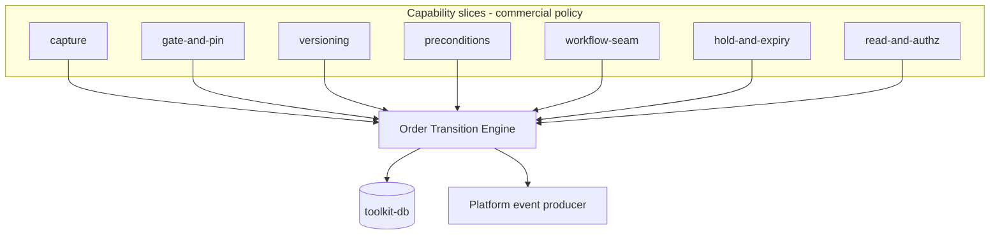
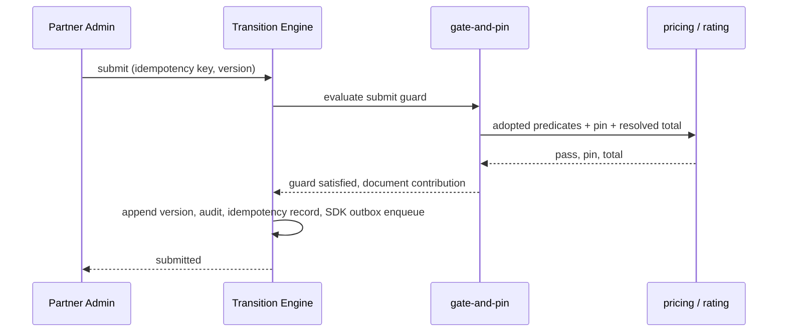
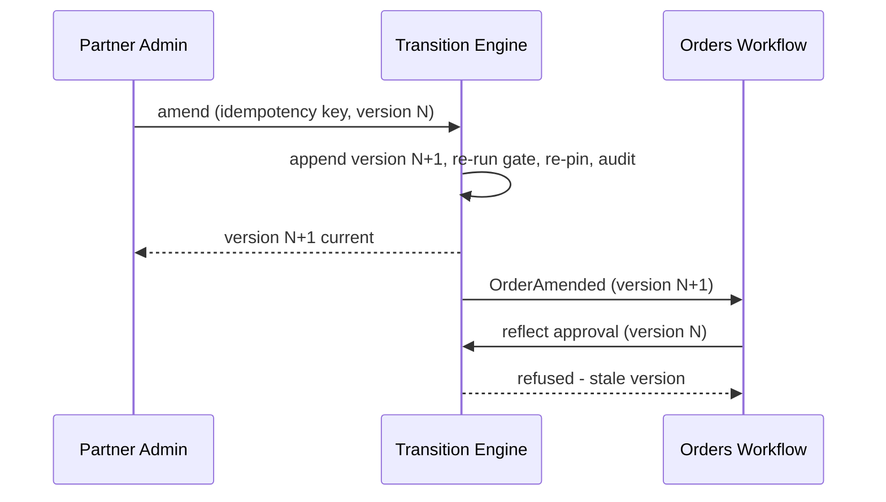
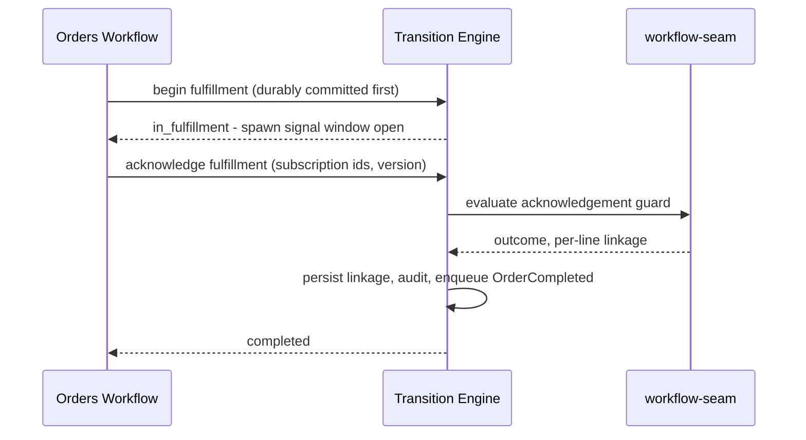
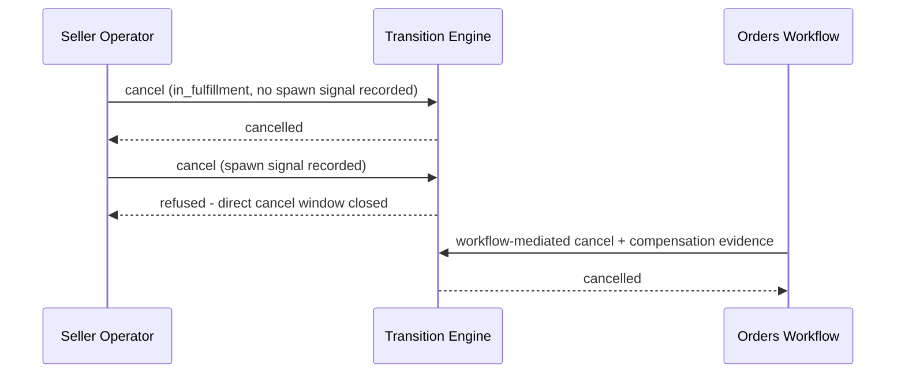
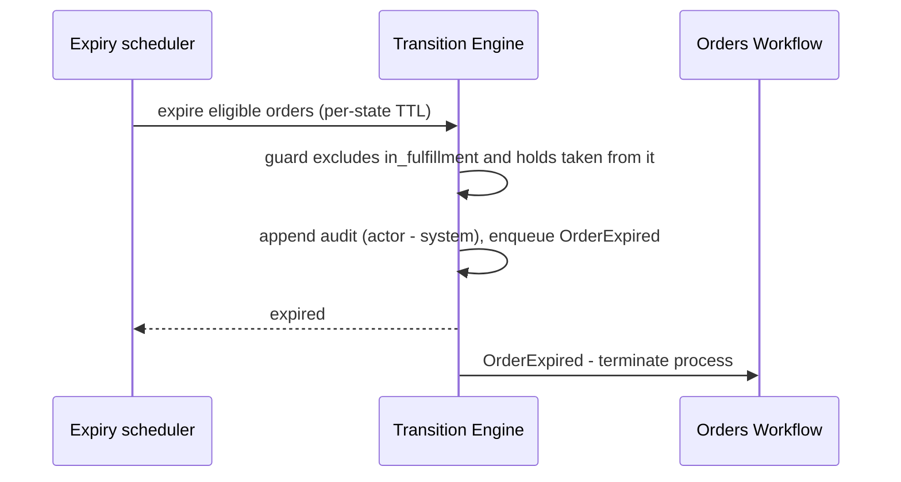

<!-- CONFLUENCE_TITLE: [BSS]: Orders Lifecycle — Technical Design -->
<!-- Related: ./PRD.md, ./design/, ../orders-workflow/docs/PRD.md | Owners: BSS Orders team -->

# Technical Design — Orders Lifecycle


<!-- toc -->

- [1. Architecture Overview](#1-architecture-overview)
  - [1.1 Architectural Vision](#11-architectural-vision)
  - [1.2 Architecture Drivers](#12-architecture-drivers)
  - [1.3 Architecture Layers](#13-architecture-layers)
- [2. Principles & Constraints](#2-principles--constraints)
  - [2.1 Design Principles](#21-design-principles)
  - [2.2 Constraints](#22-constraints)
- [3. Technical Architecture](#3-technical-architecture)
  - [3.1 Domain Model](#31-domain-model)
  - [3.2 Component Model](#32-component-model)
  - [3.3 API Contracts](#33-api-contracts)
  - [3.4 Internal Dependencies](#34-internal-dependencies)
  - [3.5 External Dependencies](#35-external-dependencies)
  - [3.6 Interactions & Sequences](#36-interactions--sequences)
  - [3.7 Database schemas & tables](#37-database-schemas--tables)
  - [3.8 Deployment Topology](#38-deployment-topology)
- [4. Additional context](#4-additional-context)
  - [4.1 Capacity and cost](#41-capacity-and-cost)
  - [4.2 Security posture](#42-security-posture)
  - [4.3 Data protection, residency and retention](#43-data-protection-residency-and-retention)
  - [4.4 Observability](#44-observability)
  - [4.5 Error handling and the platform outbox failure posture](#45-error-handling-and-the-platform-outbox-failure-posture)
  - [4.6 Testability](#46-testability)
  - [4.7 Accepted residual limits](#47-accepted-residual-limits)
  - [4.8 Extension and provenance](#48-extension-and-provenance)
- [5. Traceability](#5-traceability)

<!-- /toc -->

- [ ] `p1` - **ID**: `cpt-cf-bss-orders-lifecycle-design-orders-lifecycle`
## 1. Architecture Overview

### 1.1 Architectural Vision

Orders Lifecycle is the **System of Record** for the order document and its finite-state
machine. It owns WHAT was ordered — line items, parties, pricing references — and the CURRENT
state of the order from capture to a terminal state. It never computes a price, never routes an
approval, and never provisions anything ([`PRD.md`](./PRD.md) §1.1, §6.4).

The design follows the shape its two built BSS siblings already use. Where the Billing Ledger's
contract is *post through the engine* (build balanced lines, then commit) and the Product
Catalog's is *publish through the engine* (author draft, validate fail-closed, freeze, emit),
this gear's contract is **transition through the engine**. One shared **Order Transition
Engine** ([`design/01-foundation`](./design/01-foundation.md)) owns the order aggregate and
its append-only version chain, the state-machine table and its guards, the idempotency
registry, the optimistic version check, the transition audit log, and the event contract. Every
state change — a buyer submitting, an operator holding, the sibling Workflow gear reflecting an
approval, the scheduler expiring a stale order — enters through the same engine call and leaves
having done three things atomically on every success — the state or version change, one audit entry
(one per changed field for an administrative edit, D-117) and one settled idempotency record — plus one platform producer-outbox message where the transition
row declares an event type.

Each business capability is a **slice handler** that declares its guard predicates and its
contribution to the order document, then transitions *through* the Engine under the invariants
defined there. The Engine owns no commercial policy — it does not know what a sellability gate
or a catalog price pin is; slices own no transition mechanics — they never write state, never
stamp an audit row, and never emit an event themselves. This keeps the correctness-critical
core (idempotency, versioning, guard evaluation, audit completeness, one-event-per-transition) small
and auditable, and it is what makes the four `p1` non-functional guarantees provable in one
place rather than argued per capability.

Two boundaries are structural rather than stylistic, and both are stated normatively in
[`PRD.md`](./PRD.md) §6.4. The sibling **Orders Workflow** gear drives every approval and
fulfillment transition by calling this gear idempotently and stores no authoritative order
state (R1); and all provisioning reaches OSS only through Subscriptions (R3), so this gear
holds no provisioning logic and learns fulfillment outcomes exclusively from Workflow
acknowledgements. Requirements (WHAT/WHY) live in [`PRD.md`](./PRD.md); per-capability
mechanics live in [`design/`](./design/).

### 1.2 Architecture Drivers

Requirements that significantly influence architecture decisions.

#### Functional Drivers

| Requirement | Design Response |
|-------------|------------------|
| `cpt-cf-bss-orders-lifecycle-fr-order-state-machine` | The state machine is a declarative transition table owned by the Engine (states, guards, terminal set, hold/resume, expiry eligibility). Slices register guards; no slice may add an edge. |
| `cpt-cf-bss-orders-lifecycle-fr-order-idempotency` | An Engine-owned idempotency registry keyed per operation, storing the committed outcome. Replay returns the stored result — including a stored failure; payload mismatch and in-flight arrival are distinct refusals, never a success. |
| `cpt-cf-bss-orders-lifecycle-fr-order-create` | The capture slice authors order and line state in `draft` with no gate evaluation, so basket workflows cost nothing until submit. |
| `cpt-cf-bss-orders-lifecycle-fr-order-submit` | The gate-and-pin slice adopts the published pricing sellability predicates by reference and adds the Orders delta; the Engine commits `draft → submitted` only on a fully passing gate, so no partially validated order can exist. |
| `cpt-cf-bss-orders-lifecycle-fr-order-line-dates` | Line dates, term duration and billing cycle are line-level authored fields with cascading defaults; expected fulfillment time is derived, never stored as authority. |
| `cpt-cf-bss-orders-lifecycle-fr-order-amendment` | Commercial content is immutable from `submitted`: an amendment appends a new version row with a `supersedesVersion` back-reference and re-runs the gate. Administrative content is a separate, non-versioned, audited edit path. |
| `cpt-cf-bss-orders-lifecycle-fr-order-history` | Versions are append-only rows retained in-table, so any historical version is retrievable by order id and version number without reconstruction. |
| `cpt-cf-bss-orders-lifecycle-fr-order-tenant-axes` | The three axes are validated at submit and then frozen by the Engine's guard set; only `payerTenantId` has an amendment path, while cross-seller transfer is refused: the explicit D-62/Q-28 PRD divergence. |
| `cpt-cf-bss-orders-lifecycle-fr-order-acceptance` | The acceptance instant is a first-class recorded fact with its own transition and event, and a begin-fulfillment guard reads it. It has no default value at any layer. |
| `cpt-cf-bss-orders-lifecycle-fr-order-payment-auth` | Payment authorization is consumed as a begin-fulfillment guard input supplied by Workflow, not as an order state; the tolerate-failure election is a seller policy read at guard time. |
| `cpt-cf-bss-orders-lifecycle-fr-order-cancel` | The cancel guard is anchored on the recorded subscription-spawn signal, which is why begin-fulfillment must be durably committed before Workflow issues any activation intent. |
| `cpt-cf-bss-orders-lifecycle-fr-order-hold` | `on_hold` stores the pre-hold state on the order, so resume is a table lookup rather than an inference. |
| `cpt-cf-bss-orders-lifecycle-fr-order-expiry` | A coordinated scheduler drives per-state TTL expiry as an ordinary Engine transition; `in_fulfillment` and holds taken from it are excluded by the transition table itself, not by scheduler logic. |
| `cpt-cf-bss-orders-lifecycle-fr-order-atomic-fulfillment` | The order carries no per-line fulfillment state machine. Terminals are order-level; per-line create/activate results are a read-only projection fed by Workflow acknowledgements. |
| `cpt-cf-bss-orders-lifecycle-fr-order-subscription-linkage` | The per-line line→subscription mapping is persisted on acknowledgement and carried in `OrderCompleted`, so acquisition provenance is answerable from the order side. |
| `cpt-cf-bss-orders-lifecycle-fr-order-events` | The eleven typed state events are enqueued through `event-broker-sdk::DbProducer` backed by `toolkit_db::outbox` inside the transition commit, giving exactly one producer message per committed transition **that declares an event type**, under at-least-once delivery with consumer de-duplication. Six row classes are deliberately event-less (D-15). |
| `cpt-cf-bss-orders-lifecycle-fr-order-authorization` | Per-actor permissions and the cross-tenant delegation-proof requirement are enforced as an Engine pre-guard, so no slice can widen scope. |
| `cpt-cf-bss-orders-lifecycle-fr-orders-boundary-r1-state-sor` | Workflow-only operations are ordinary Engine transitions with the same idempotency and version-check contract as buyer operations; the gear exposes no path that lets a caller assert state without a guard. |
| `cpt-cf-bss-orders-lifecycle-fr-orders-boundary-r2-approval` | The approval-requirement verdict and gate outcomes are stored as received values with their deciding authority recorded. The gear contains no policy evaluation and no threshold comparison. |
| `cpt-cf-bss-orders-lifecycle-fr-orders-boundary-r3-provisioning` | No infrastructure adapter for OSS or the Policy Engine exists in this gear. Fulfillment outcome arrives only as a Workflow acknowledgement. |
| `cpt-cf-bss-orders-lifecycle-fr-orders-boundary-r4-no-price` | Price data is stored as opaque references plus the captured pin and the captured non-authoritative total. The gear has no arithmetic over money beyond persistence at ISO 4217 minor-unit scale. |
| `cpt-cf-bss-orders-lifecycle-fr-orders-boundary-r5-no-mirroring` | The persisted downstream transition-request identifier is a correlation column with no state semantics, and no projection derives order state from it. |

#### NFR Allocation

| NFR ID | NFR Summary | Allocated To | Design Response | Verification Approach |
|--------|-------------|--------------|-----------------|----------------------|
| `cpt-cf-bss-orders-lifecycle-nfr-order-transition-latency` | PRD §7.1 / AC-17 governs: durable write **and event publish** p95 < 1 s. Compliance is unverified; the former separate 30 s p95 delivery target is an unapproved proposal (D-41, Q-16). Guard-input resolution also affects caller latency (Q-11). | Order Transition Engine and platform producer integration | State, audit, idempotency and producer enqueue share one transaction; broker publication follows asynchronously. A successful commit alone does not prove publication. | Correlate operation start, commit and broker acknowledgement at production load; measure the complete write-plus-publish path against the PRD baseline and report component timings separately (§4.1) |
| `cpt-cf-bss-orders-lifecycle-nfr-order-read-latency` | Order read and paginated list p95 < 200 ms | Read-and-authorization slice | Reads are served from a current-version projection carrying the denormalized state, tenant axes and per-line fulfillment status, so no read reconstructs the version chain | Read/list benchmarks at production row counts and page sizes, including the tenancy-scoped filter paths |
| `cpt-cf-bss-orders-lifecycle-nfr-order-audit-completeness` | 100 % of transitions and amendments audited, zero silent drops | Order Transition Engine | The audit append is inside the same transaction as the state change, so an unaudited transition cannot commit; the audit store is append-only and the chain is verifiable | Structural test that every transition-table edge writes an audit row; negative test that a failed audit append aborts the transition |
| `cpt-cf-bss-orders-lifecycle-nfr-order-idempotency` | Zero duplicate orders or duplicate transition effects, **per principal** (`design/01-foundation.md` §4.2 discloses the scope's one gap: create) | Order Transition Engine | Idempotency records are written in the transition transaction under a unique constraint on `(operation, principal_scope, idempotency_key)`, making duplicate effect impossible rather than unlikely; the in-flight state is explicit | Concurrency test firing the same key in parallel and asserting one durable effect; replay test asserting stored failures replay as failures; cross-principal test asserting one caller neither reads nor overwrites another's record |
| `cpt-cf-bss-orders-lifecycle-nfr-order-snapshot-integrity` | 100 % of submitted lines carry a resolvable catalog price pin | Gate-and-pin slice | The pin is captured inside the submit transaction; a line without a resolvable pin fails the gate, so `submitted` and "pinned" are the same commit | Invariant test asserting no `submitted`-or-beyond line exists without a pin; re-pin asserted on every amendment |
| `cpt-cf-bss-orders-lifecycle-nfr-order-recovery` | RPO zero for `submitted`+ orders, RTO ≤ 60 min, within residency-bound intra-cell failure domains | Persistence and deployment topology | Committed transitions are synchronously durable before acknowledgement; versions, audit rows and toolkit producer messages share the transaction so a recovered database cannot hold an event-declaring state change without its durable notification | DR exercise restoring to the declared RTO and asserting zero committed-transition loss including queued producer messages |
| `cpt-cf-bss-orders-lifecycle-nfr-order-retention` | Retain all orders and versions per program policy; auto-void abandoned drafts | Persistence and the hold-and-expiry slice | Append-only retention with no destructive path for `submitted`+ orders; the draft auto-void TTL transitions to `expired` rather than deleting, preserving the audit trail | Retention test asserting no delete path reaches a `submitted`+ order; auto-void test asserting the draft remains readable, not removed |

#### Key ADRs

| ADR ID | Decision Summary |
|--------|-----------------|
| `cpt-cf-bss-orders-lifecycle-adr-transition-through-engine` | One engine owns every state change, so the four `p1` guarantees are properties of one code path rather than per-capability discipline |
| `cpt-cf-bss-orders-lifecycle-adr-slice-decomposition` | A foundation slice plus seven capability slices, so the correctness core has an independent review boundary |
| `cpt-cf-bss-orders-lifecycle-adr-fail-closed-gate` | An unevaluable gate input is a refusal, not an admission under a tolerated risk — so no order is pinned against a predicate nobody checked |
| `cpt-cf-bss-orders-lifecycle-adr-closed-enumerations` | The eleven states and eleven events stay closed; new distinctions are guards, recorded facts, reasons and event-less rows |
| `cpt-cf-bss-orders-lifecycle-adr-refusals-commit` | A refused transition audits, settles and commits, which is what makes 100 % audit coverage a property rather than a discipline |
| `cpt-cf-bss-orders-lifecycle-adr-outbox-publication` | Events publish asynchronously through the platform `DbProducer`/toolkit outbox path; meeting the PRD's write-plus-publish latency requires measurement of both stages, with target clarification tracked in Q-16 |
| `cpt-cf-bss-orders-lifecycle-adr-in-transaction-concurrency` | The one-in-flight-order rule is a database constraint inside the transition transaction, not a gate predicate — the predicate is a pre-check that cannot enforce it |

**Seven ADRs, and the reasoning for that number.** An ADR is written where a decision affects the
system's fundamental structure, is hard to reverse, and represents a real choice between
alternatives. For every other entry the register — which carries a decision, its
rationale and its propagation addresses — is the correct and sufficient home; an ADR per decision
would destroy the signal that makes an ADR directory readable. Seven is above the sibling gears'
one to three because Orders is the only state-machine system of record among them and the only one
with three consuming gears. The test above is applied rather than recited: the two added on
2026-09-10 were found by asking which decisions the register was carrying that met all three
conditions, and both did while being recorded as single table rows. **Asynchronous publication**
(`ADR/0006`) separates commit from publication, requires combined latency verification, and binds three
consumer gears to at-least-once delivery. **In-transaction concurrency** (`ADR/0007`) is the gear's
only concurrency-correctness mechanism, and a table row with no alternatives is exactly the shape a
later author deletes as redundant with the gate predicate that does not enforce it. Every other call is in
[`DECISIONS.md`](./DECISIONS.md).

### 1.3 Architecture Layers

- [ ] `p3` - **ID**: `cpt-cf-bss-orders-lifecycle-tech-layering`

```text
Capability slices   capture · gate-and-pin · versioning · preconditions ·
(commercial policy) workflow-seam · hold-and-expiry · read-and-authz
       │   declare guard predicates and document contributions; transition through the
       ▼            Engine API — own no state write, audit row, or event emission
Order Transition    order aggregate · append-only version chain · state-machine table + guards ·
Engine              idempotency registry · optimistic version check · transition audit ·
(shared engine)     typed event contract (11 state events) · machine-readable reason catalogue
       │            — owns no commercial policy
       ▼
Platform egress     event-broker-sdk DbProducer · toolkit-db transactional outbox
       │
       ▼
Persistence         toolkit-db backend (append-only version rows; current-version read
                    projection; append-only audit store; idempotency registry;
                    resolved totals as integer minor units at ISO 4217 scale)
```

| Layer | Responsibility | Technology |
|-------|---------------|------------|
| Presentation | REST order authoring, transition, preview and read surfaces behind the inbound gateway; `OperationBuilder`-registered operations with explicit response metadata; RFC 9457 `application/problem+json` errors; ETag optimistic concurrency | Rust, REST/OpenAPI, inbound API gateway |
| Application | Capability slices declaring guards and document contributions; each is a bounded feature owning its own validation and its own machine-readable reasons | Rust modules in the `orders-lifecycle` gear |
| Domain | The Transition Engine: aggregate and version chain, transition table and guard evaluation, idempotency semantics, version check, audit and event contracts | Rust; GTS for the cross-gear contract surface (`01 §4.7`) + Rust domain structs |
| Infrastructure | Append-only version and audit stores, current-version projection, idempotency registry, platform producer outbox, expiry scheduler | PostgreSQL, SecureORM, `event-broker-sdk` (`outbox` feature), `toolkit_db::outbox`, `toolkit_db::Db::lock` (Foundation §3.8) |

## 2. Principles & Constraints

### 2.1 Design Principles

#### Transition through the engine

- [ ] `p1` - **ID**: `cpt-cf-bss-orders-lifecycle-principle-transition-through-engine`

Every order state change is a single Engine call that atomically evaluates the guard, appends
the version or audit entry, commits, and enqueues one platform producer-outbox message **where the transition row
declares an event type** — six row classes are deliberately event-less (`01 §4.4`, D-15). No slice, migration,
repair script or administrative surface writes order state directly. This is what allows audit
completeness, idempotency and one-producer-message-per-event-declaring-transition to be asserted once
rather than per capability — delivery itself is **at-least-once** with consumer de-duplication
(`01 §2.2`), never exactly-once
— and it is the reason a new capability cannot regress the correctness core by construction.

#### One state authority, no derived truth

- [ ] `p1` - **ID**: `cpt-cf-bss-orders-lifecycle-principle-single-state-authority`

Order state is stored, not computed. No projection, event replay or downstream identifier
derives it, and the persisted Subscriptions transition-request identifier carries no state
meaning. The corollary bounds this gear from the other side: it stores approval verdicts and
fulfillment outcomes as *received facts with a recorded decider*, and evaluates neither.

#### Commercial content is append-only; administrative content is editable

- [ ] `p1` - **ID**: `cpt-cf-bss-orders-lifecycle-principle-content-immutability-split`

From `submitted` onwards, line items, quantities, plan and price references, tenant axes, dates,
term and category change only by appending a new version. External references, display labels
and internal notes are edited in place and audited separately. The split is enforced at the
field level in the document contribution contract, not by reviewer discipline, because
conflating the two is what makes a commercial audit trail unreliable.

#### Fail closed on absence

- [ ] `p1` - **ID**: `cpt-cf-bss-orders-lifecycle-principle-fail-closed`

An unevaluable predicate is a failed predicate. A submit whose sellability inputs cannot be
resolved is refused, not defaulted — the same posture the published pricing gate takes, where an
unbuilt predicate lane is treated exactly as one that timed out. No layer substitutes a default
for an absent required value; absence must have failed the gate.

#### Reasons are business-level and machine-readable

- [ ] `p2` - **ID**: `cpt-cf-bss-orders-lifecycle-principle-machine-readable-reasons`

Every refusal — gate rejection, guard violation, payload mismatch, stale version, market
divergence, overlap collision — carries a stable machine-readable business reason owned by the
slice that raises it, mapped to an RFC 9457 problem at the wire edge. Transport status codes are
a presentation concern and never the contract a caller keys on.

#### Idempotency is a stored outcome, not a de-duplication guess

- [ ] `p1` - **ID**: `cpt-cf-bss-orders-lifecycle-principle-stored-idempotency`

The registry stores the committed outcome of an operation, so replay returns that outcome —
including a stored failure — rather than re-executing or optimistically assuming success. The
three non-success cases are distinct and none of them may be read as success: payload mismatch,
still-processing conflict, and stale version.

### 2.2 Constraints

#### Approval policy is external and currently unimplemented

- [ ] `p1` - **ID**: `cpt-cf-bss-orders-lifecycle-constraint-external-approval-policy`

The approval-requirement verdict is owned by the Generic Approval service (R2), which has no
authored specification. This gear therefore stores a verdict it cannot validate, and must record
the deciding authority alongside it so a stand-in decision is distinguishable from a policy
decision after the fact. No fallback evaluation may be added here, and the built BSS siblings'
local approval surfaces are not a precedent this gear may follow.

#### Downstream provisioning contracts are unagreed

- [ ] `p1` - **ID**: `cpt-cf-bss-orders-lifecycle-constraint-unagreed-subscription-seams`

The occupancy read (`SUB-O5`, amended by D-126) the submit gate needs, and the compensation cancel reason the failure
path depends on, are asks on the Subscriptions gear that are registered but not agreed, and that
gear has no implementation. The gate and the acknowledgement path are therefore designed against
a specified contract rather than an observed one, and each dependency is isolated behind a port
so an upstream change is a boundary change and not a core change.

#### Payment ordering is provision-then-collect only

- [ ] `p2` - **ID**: `cpt-cf-bss-orders-lifecycle-constraint-payment-ordering`

Only an authorization outcome consumed as a begin-fulfillment guard is expressible; capture,
strong customer authentication and refund-as-reversal have no owning capability in the platform.
A collect-then-provision checkout cannot be built on this design without extending it, and the
gear introduces no `payment_pending` state, so a declined instrument leaves the order `approved`
until its TTL elapses.

#### Money is stored but never computed

- [ ] `p2` - **ID**: `cpt-cf-bss-orders-lifecycle-constraint-no-money-arithmetic`

The resolved total is persisted as integer minor units at the currency's ISO 4217 scale and is
read only for display and for the approval-request context Workflow assembles. The gear performs
no derivation, aggregation or currency conversion over it, and it is never a billing input.

#### Data residency is a hard boundary

- [ ] `p1` - **ID**: `cpt-cf-bss-orders-lifecycle-constraint-data-residency`

For residency-bound tenants every gear-owned store — tables, read projection, audit, idempotency
registry, platform producer queue, backups and the synchronous standby — is pinned to an in-jurisdiction deployment
cell with **zero cross-boundary replication**. This is what forces the recovery standby to be a
second failure domain rather than a second region, and it is the constraint the sibling catalog
gear states in the same terms.

#### Constraint categories not applicable

- [ ] `p3` - **ID**: `cpt-cf-bss-orders-lifecycle-constraint-categories-not-applicable`

Two checklist constraint categories are recorded as inapplicable rather than omitted. **Vendor and
licensing**: the gear introduces no third-party dependency beyond the platform's own ToolKit,
PostgreSQL and toolkit-db advisory locking, all already licensed platform-wide. **Resource
constraints** — budget, team size, delivery window: these are project-level facts owned outside
the design set and would date immediately if restated here; the design's own sequencing
constraint is the phased slice map in [`design/README.md`](./design/README.md).

#### Platform baselines and explicit authorization boundary

- [ ] `p3` - **ID**: `cpt-cf-bss-orders-lifecycle-constraint-platform-baselines`

The gear takes the standard ToolKit posture except for the explicit Pricing-style trusted
internal-maintenance authorization boundary in `design/08-read-and-authz.md` §3.5: SDK-first public
contracts in an `orders-lifecycle-sdk` crate with implementation internals private to the gear
crate; `api` / `domain` / `infra` separation; `OperationBuilder` registration with explicit
response metadata; canonical error mapping to RFC 9457 with no internal diagnostics on the wire;
runtime-owned database privilege with the gear exposing migrations and receiving scoped access;
and `SecurityContext` propagated across every in-process call.

## 3. Technical Architecture

### 3.1 Domain Model

**Technology**: GTS types for cross-gear contracts, specified in [`design/01-foundation.md`](./design/01-foundation.md) §4.7; Rust domain structs internally.

**Location**: [`design/01-foundation`](./design/01-foundation.md) §3.1 is normative for the
aggregate and its invariants.

**Core Entities**: each carries its own stable ID; the normative definitions and the schema they
map to are in [`design/01-foundation`](./design/01-foundation.md) §3.1 and §3.7.

- [ ] `p1` - **ID**: `cpt-cf-bss-orders-lifecycle-entity-order-aggregate`

`Order` — the aggregate root: identity, human-readable number, category, the three tenant axes,
the initiating actor, the optional contract reference, current state, `state_entered_at`, the
current-version pointer, the pre-hold state, the spawn-signal instant, the tolerated-authorization
risk flag and the audit-sequence counter.

- [ ] `p1` - **ID**: `cpt-cf-bss-orders-lifecycle-entity-order-version`

`OrderVersion` — an immutable snapshot of commercial content with its actor, timestamp, reason,
derived order market and `supersedesVersion` back-reference.

- [ ] `p1` - **ID**: `cpt-cf-bss-orders-lifecycle-entity-order-line`

`OrderLine` — a version-scoped line under an order-scoped `OrderLineIdentity`: catalog references,
quantity, currency, catalog price pin, the resolved date triple with its governing policy-switch
state, term, cycle and overlap scope key.

- [ ] `p1` - **ID**: `cpt-cf-bss-orders-lifecycle-entity-resolved-total-view`

`ResolvedTotal` — the captured non-authoritative figures, discriminated by line or order scope,
across four charge kinds.

- [ ] `p1` - **ID**: `cpt-cf-bss-orders-lifecycle-entity-transition`

`OrderTransition` — one hash-chained append-only audit entry per transition attempt, committed or
refused.

- [ ] `p1` - **ID**: `cpt-cf-bss-orders-lifecycle-entity-acceptance`

`AcceptanceRecord` — the customer-acceptance instant as a recorded fact, never defaulted, with its
recording actor, path and requirement source.

Acceptance is bound to `accepted_version`, not to the order for all time. Amendments preserve
the earlier evidence but require acceptance of the new version wherever the fulfillment policy
requires it; both sales paths can record that acceptance. Draft assent is not accepted.

- [ ] `p2` - **ID**: `cpt-cf-bss-orders-lifecycle-entity-line-fulfillment`

`LineFulfillment` — the read-only per-line projection of Workflow acknowledgements plus the
spawned subscription identifier and the downstream correlation reference.

It is not a live execution-progress feed. Intermediate steps are obtained from Workflow's
already-specified progress read; absent Lifecycle projection rows mean not acknowledged.
Availability and scoped SDK integration of that Workflow read remain prerequisites, not a new
Lifecycle endpoint. See `UPSTREAM_REQS.md` §2.6.

- [ ] `p2` - **ID**: `cpt-cf-bss-orders-lifecycle-entity-administrative-content-view`

`AdministrativeContent` — mutable, separately audited content carrying no commercial meaning:
external references, display labels and internal notes at order and line level.

**Relationships**:
- `Order` → `OrderVersion`: one-to-many, append-only; exactly one version is current, and every prior version is retained and retrievable.
- `OrderVersion` → `OrderLine`: one-to-many; lines belong to a version, not to the order, which is what makes commercial content immutable without copying the aggregate.
- `OrderVersion` → `ResolvedTotal`: one-to-many — one row per line per charge kind plus the order-level roll-up; captured at submit and recaptured on each amendment.
- `Order` → `OrderTransition`: one-to-many, append-only; the audit trail is complete by construction because the append shares the transition's transaction.
- `OrderVersion` → `AcceptanceRecord`: zero-or-one per immutable version, whether required or volunteered; never defaulted or copied across amendment.
- `OrderLine` → `LineFulfillment`: one-to-one after fulfillment acknowledgement; carries the 1:1 line-to-subscription mapping.

### 3.2 Component Model

Components are slice handlers over the shared Transition Engine, not independently deployable
services. Each carries a stable `cpt-cf-bss-orders-lifecycle-component-{slug}` ID; the linked
slice document is normative for its internals, and the dependency order is in
[`design/README.md`](./design/README.md).



#### Order Transition Engine

- [ ] `p1` - **ID**: `cpt-cf-bss-orders-lifecycle-component-transition-engine`

##### Why this component exists

The four `p1` guarantees this gear is judged on — audit completeness, zero duplicate effects,
transition latency and recoverability — are properties of *how a state change commits*, not of
any single capability. Concentrating the commit in one component makes them assertable once and
unbreakable by a new slice.

##### Responsibility scope

The order aggregate and its append-only version chain; the declarative state-machine table with
its guards, terminal set, hold/resume mapping and expiry eligibility; guard evaluation and
ordering; the idempotency registry and its non-success outcomes; the optimistic version
check and its `version-conflict` refusal — the single registered name D-38 consolidated the
`stale-version` variants into; the append-only transition audit; the typed event contract and the
one-producer-message-per-event-declaring-transition rule; and the registry of machine-readable business reasons.

##### Responsibility boundaries

It knows nothing commercial: not what a sellability predicate is, not what a price pin means,
not whether an approval was warranted. It evaluates guards that slices declare, over document
contributions that slices supply. It performs no money arithmetic, no policy evaluation, no
provisioning, and no outbound call to any other gear.

##### Related components (by ID)

- `cpt-cf-bss-orders-lifecycle-component-capture` — owns data for
- `cpt-cf-bss-orders-lifecycle-component-gate-and-pin` — owns data for
- `cpt-cf-bss-orders-lifecycle-component-versioning` — owns data for
- `cpt-cf-bss-orders-lifecycle-component-workflow-seam` — owns data for
- `cpt-cf-bss-orders-lifecycle-component-hold-and-expiry` — owns data for

#### Capture handler

- [ ] `p1` - **ID**: `cpt-cf-bss-orders-lifecycle-component-capture`

##### Why this component exists

A basket must be assemblable without paying validation cost, and the line model must carry the
quoted commercial shape of the deal — term and cycle — or that shape is lost between order and
subscription.

##### Responsibility scope

Order and line authoring in `draft`; the line model including the mandatory contract-effective
date, the optional service-activation and acceptance-due dates with their cascading defaults,
term duration, billing cycle and external references; the single-currency basket rule; and the
field-level classification of commercial versus administrative content.

##### Responsibility boundaries

It evaluates no sellability predicate, captures no pin, and computes no total — a `draft` is
deliberately unvalidated. It does not decide whether a missing required date blocks submit; that
guard belongs to the gate.

##### Related components (by ID)

- `cpt-cf-bss-orders-lifecycle-component-transition-engine` — depends on
- `cpt-cf-bss-orders-lifecycle-component-gate-and-pin` — shares model with

#### Gate-and-pin handler

- [ ] `p1` - **ID**: `cpt-cf-bss-orders-lifecycle-component-gate-and-pin`

##### Why this component exists

Price integrity between capture and subscription activation is the revenue-integrity risk this
gear exists to close, and the gate is the only place it can be closed atomically with the state
change.

##### Responsibility scope

The submit gate: the published pricing sellability predicates adopted by reference plus the
Orders delta — tenant-axis validity, contract-active where referenced, purchase-quantity floor,
order-market consistency against the payer's profile, reference resolution, single currency,
overlap-rule uniqueness and the one-in-flight-order rule. Capture of the catalog price pin on
every line and of the non-authoritative resolved total. The Preview operation, which creates no
order or commercial artifact, persists bounded-retention gate outcomes and returns no approval
verdict.

##### Responsibility boundaries

It does not author the adopted predicates and must never fork them. It computes no price — the
total arrives from the price-evaluation contract and is stored as received. It returns no
approval-requirement verdict, in Preview or at submit.

##### Related components (by ID)

- `cpt-cf-bss-orders-lifecycle-component-transition-engine` — depends on
- `cpt-cf-bss-orders-lifecycle-component-capture` — shares model with

#### Versioning handler

- [ ] `p1` - **ID**: `cpt-cf-bss-orders-lifecycle-component-versioning`

##### Why this component exists

A commercial change before fulfillment must leave evidence of what changed, who changed it and
what it replaced, without mutating what a reviewer already saw.

##### Responsibility scope

The amendment path from `submitted`, `pending_approval` and `approved`; the new-version append
with its `supersedesVersion` reference; the gate re-run and re-pin trigger; historical version
retrieval; the non-versioned audited administrative edit path; and the absence of any amendment row
from `in_fulfillment` onward (engine `not-admissible`; `04 §2.2` *Amendment stops at `in_fulfillment`*).

##### Responsibility boundaries

It does not decide whether the amended order needs re-approval — that verdict is external and
arrives through the workflow seam. It does not delete or rewrite a prior version under any
condition.

##### Related components (by ID)

- `cpt-cf-bss-orders-lifecycle-component-transition-engine` — depends on
- `cpt-cf-bss-orders-lifecycle-component-gate-and-pin` — calls

#### Preconditions handler

- [ ] `p1` - **ID**: `cpt-cf-bss-orders-lifecycle-component-preconditions`

##### Why this component exists

On a partner-placed order the document evidences delegation but not agreement, and without a
money gate before provisioning a non-paying tenant receives resources.

##### Responsibility scope

The customer-acceptance instant as a recorded fact with its own transition and event; the source
of the acceptance-required election; and the begin-fulfillment guard inputs — recorded acceptance
where required, and the payment-authorization outcome with the seller tolerate-failure election
and its risk flag.

##### Responsibility boundaries

It owns no payment mechanism and holds no instrument data. It never defaults the acceptance
instant, under any policy, including the cascade that fills the line-level acceptance-due date.

##### Related components (by ID)

- `cpt-cf-bss-orders-lifecycle-component-transition-engine` — depends on
- `cpt-cf-bss-orders-lifecycle-component-workflow-seam` — shares model with

#### Workflow-seam handler

- [ ] `p1` - **ID**: `cpt-cf-bss-orders-lifecycle-component-workflow-seam`

##### Why this component exists

R1 through R5 are only real if the operations the sibling gear calls are ordinary guarded
transitions rather than privileged state assertions.

##### Responsibility scope

The five workflow-only operations — approval reflection, begin fulfillment, spawn-signal report,
fulfillment acknowledgement, and workflow-mediated cancel with attached compensation evidence;
the recorded spawn signal that anchors the cancel guard; the persisted per-line line-to-subscription
linkage; the read-only per-line fulfillment projection; and the recorded deciding authority on
every stored verdict.

##### Responsibility boundaries

It implements no approval logic, no retry, no compensation and no provisioning. It never mirrors
the downstream `TransitionRequest` status, and it never derives order state from a stored
transition-request identifier.

##### Related components (by ID)

- `cpt-cf-bss-orders-lifecycle-component-transition-engine` — depends on
- `cpt-cf-bss-orders-lifecycle-component-preconditions` — shares model with

#### Hold-and-expiry handler

- [ ] `p2` - **ID**: `cpt-cf-bss-orders-lifecycle-component-hold-and-expiry`

##### Why this component exists

An unbounded in-flight commercial state pins a price, holds an open promise to a customer and
accumulates operational debt — while an order whose subscriptions may already be provisioning
cannot be closed automatically.

##### Responsibility scope

Hold and resume with the stored pre-hold state; the per-state TTL policy for `submitted`,
`pending_approval`, `approved` and `on_hold`; the **resume cap** that stops a hold/resume cycle
restarting the dwell without limit — its sibling, the amendment cap, is owned in
[`design/04-versioning.md`](./design/04-versioning.md) §4.1 because its value is a commercial
judgment; the coordinated expiry scheduler; and the transition-table
exclusion of `in_fulfillment` and of holds taken from it, together with the handoff of those cases
to the operational escalation owned by the sibling gear. It does **not** supply a fallback duration
for a state whose TTL is unset — such a state is unbounded, disclosed in
[`design/07-hold-and-expiry.md`](./design/07-hold-and-expiry.md) §4.2 and routed as
[`DECISIONS.md`](./DECISIONS.md) Q-27.

##### Responsibility boundaries

It does not pause entitlement or billing on already-activated subscriptions, does not extend a
term, and does not void wave-1 subscription drafts. It never auto-terminals an order whose
fulfillment may be in flight.

##### Related components (by ID)

- `cpt-cf-bss-orders-lifecycle-component-transition-engine` — depends on

#### Read-and-authorization handler

- [ ] `p2` - **ID**: `cpt-cf-bss-orders-lifecycle-component-read-and-authz`

##### Why this component exists

Order consoles and downstream systems query state frequently against a strict read budget, and
cross-tenant leakage in a multi-tenant BSS gear is a critical confidentiality failure.

##### Responsibility scope

The current-version read projection and the paginated tenancy-scoped list with its state, date
and contract filters; historical version reads; the exposure of expected fulfillment time and
per-line deferral where the barrier deferred a line; audit-trail retrieval; and the per-actor
permission set including the cross-tenant delegation-proof requirement.

##### Responsibility boundaries

It is read-only and registers no transition. It never serves an order outside the caller's
tenancy scope, and it never exposes internal diagnostics through a read surface.

##### Related components (by ID)

- `cpt-cf-bss-orders-lifecycle-component-transition-engine` — depends on

### 3.3 API Contracts

- [ ] `p1` - **ID**: `cpt-cf-bss-orders-lifecycle-interface-order-operations`

- **Requirement**: `cpt-cf-bss-orders-lifecycle-interface-order-ops` (PRD-defined business-operation set); the event contract `cpt-cf-bss-orders-lifecycle-contract-order-events` (PRD §9.2) is realised by [`design/01-foundation`](./design/01-foundation.md) §4.4
- **Technology**: REST/OpenAPI, registered through `OperationBuilder` with explicit response metadata, authentication flags and content-type policy
- **Location**: [`design/01-foundation`](./design/01-foundation.md) §3.3 is normative for request and response shapes, the concurrency token and the reason catalogue

The PRD specifies thirteen business operations without transport detail
(`cpt-cf-bss-orders-lifecycle-interface-order-ops`). This design binds them to one REST surface;
per-operation payloads and the machine-readable reason catalogue are owned by the slice that
raises each reason.

**Endpoints Overview** — the union of the seven slice surfaces, each owned by exactly one
component:

| Method | Path | Owner | Stability |
|--------|------|-------|-----------|
| `POST` | `/bss-orders-lifecycle/v1/orders` | capture | unstable |
| `GET` | `/bss-orders-lifecycle/v1/orders` | read-and-authz | unstable |
| `GET` | `/bss-orders-lifecycle/v1/orders/{orderId}` | read-and-authz | unstable |
| `PATCH` | `/bss-orders-lifecycle/v1/orders/{orderId}` | capture | unstable |
| `POST` | `/bss-orders-lifecycle/v1/orders/{orderId}/lines` | capture | unstable |
| `PATCH` | `/bss-orders-lifecycle/v1/orders/{orderId}/lines/{lineId}` | capture | unstable |
| `DELETE` | `/bss-orders-lifecycle/v1/orders/{orderId}/lines/{lineId}` | capture | unstable |
| `POST` | `/bss-orders-lifecycle/v1/orders/preview` | gate-and-pin | unstable |
| `POST` | `/bss-orders-lifecycle/v1/orders/{orderId}/submit` | gate-and-pin | unstable |
| `POST` | `/bss-orders-lifecycle/v1/orders/{orderId}/amendments` | versioning | unstable |
| `GET` | `/bss-orders-lifecycle/v1/orders/{orderId}/versions` | read-and-authz | unstable |
| `GET` | `/bss-orders-lifecycle/v1/orders/{orderId}/versions/{version}` | read-and-authz | unstable |
| `POST` | `/bss-orders-lifecycle/v1/orders/{orderId}/cancel` | hold-and-expiry | unstable |
| `POST` | `/bss-orders-lifecycle/v1/orders/{orderId}/hold` | hold-and-expiry | unstable |
| `POST` | `/bss-orders-lifecycle/v1/orders/{orderId}/resume` | hold-and-expiry | unstable |
| `POST` | `/bss-orders-lifecycle/v1/orders/{orderId}/acceptance` | preconditions | unstable |
| `GET` | `/bss-orders-lifecycle/v1/orders/{orderId}/acceptance` | preconditions | unstable |
| `GET` | `/bss-orders-lifecycle/v1/orders/{orderId}/lines` | read-and-authz | unstable |
| `GET` | `/bss-orders-lifecycle/v1/orders/{orderId}/audit` | read-and-authz | unstable |
| `POST` | `/bss-orders-lifecycle/v1/orders/{orderId}/approval-reflection` | workflow-seam | unstable |
| `POST` | `/bss-orders-lifecycle/v1/orders/{orderId}/begin-fulfillment` | workflow-seam | unstable |
| `POST` | `/bss-orders-lifecycle/v1/orders/{orderId}/spawn-signal` | workflow-seam | unstable |
| `POST` | `/bss-orders-lifecycle/v1/orders/{orderId}/fulfillment-acknowledgement` | workflow-seam | unstable |
| `POST` | `/bss-orders-lifecycle/v1/orders/{orderId}/workflow-cancel` | workflow-seam | unstable |

The line `PATCH` serves two operations: commercial line authoring in `draft`, and administrative
line fields in every non-terminal state; a request naming a commercial field is `draft-mutate`
and refuses `not-admissible` outside `draft` (D-117, D-145); the line `DELETE` is draft-only.

Twenty-four endpoints against the PRD's thirteen business operations.
**Eleven** are surfaces the PRD describes in §6 without listing in §9.1 — line authoring
(three), the administrative edit, the acceptance write and read, the per-line read, the audit
read, the **version list** (§9.1's *Get order version* covers the single-version read only), the
spawn-signal report and the workflow-mediated cancel. **Ten of the eleven have an FR basis**; the
**audit read** does not — PRD §6.1 requires every transition to *be recorded* and
`nfr-order-audit-completeness` requires complete logging, but both are obligations on writing, not
on exposing, and §9.1 contains no audit-retrieval operation. It is grounded in a rationale — a
complete audit nobody can read is not an audit — rather than a requirement, and it exposes actor
identities, delegation-proof references and correlation identifiers, so it is a design-introduced
surface needing Product's acknowledgement ([`DECISIONS.md`](./DECISIONS.md) D-70). The other ten
have an FR basis, so §9.1 needs a PRD amendment to remain the normative operation set. Producer
outbox dead letters are inspected and managed through platform `toolkit_db::outbox` operations;
Orders adds no operational REST endpoint.

Every mutating operation requires an idempotency key. Existing-order transitions carry the
engine's `expected_version`; create has its own no-existing-version branch. A missing or
unparseable expected version is rejected by boundary input validation, before authorization,
with `expected-version-required` (HTTP 428), unaudited and without touching idempotency
(`design/01-foundation.md` §4.1, D-112). Draft commercial
writes and submit additionally require `expected_draft_revision`, returned as `draftRevision`
with a coherent draft read; on `draft-mutate` it is optional at the boundary and compared only after
admissibility, so a commercial `PATCH` after `draft` refuses `not-admissible` (D-147). The commercial-version ETag alone cannot detect draft edits.
Acceptance recording checks the current immutable version and never accepts a draft. State
expiry and draft auto-void are scheduler-driven and deliberately absent from this surface;
their complete internal engine inputs are specified in `design/07-hold-and-expiry.md` §3.6.

#### API evolution and stability

- [ ] `p2` - **ID**: `cpt-cf-bss-orders-lifecycle-interface-api-evolution`

Two **stability zones** carry the gear's compatibility promise, both specified in
[`design/01-foundation`](./design/01-foundation.md) §4.6: the internal transition API and the
event contract. The REST surface carries per-endpoint stability, and every endpoint is `unstable`
today because no external consumer is in production.

**A change is breaking** if it removes or renames a state, an event type, a registered reason
name, a required envelope attribute, an endpoint or a required field; or if it narrows a value
set a caller may already send. Adding an optional field, a new reason, a new endpoint or a new
event payload member is **additive and non-breaking**.

**Promotion** from `unstable` to `stable` requires two consecutive releases with no breaking
change to that endpoint plus one external consumer in production. **Deprecation** of a `stable`
endpoint runs for two minor releases with the successor available throughout, announced in the
gear's changelog; a breaking change to a stability zone is a **major** version bump, and the
event contract is rolled out by publishing both majors until Workflow, Subscriptions and Billing
have migrated.

### 3.4 Internal Dependencies

| Dependency Gear | Interface Used | Purpose |
|-------------------|----------------|----------|
| `toolkit-db` | Runtime-scoped database access plus `outbox` | Transactional persistence for Orders stores and the platform-managed producer queue |
| `authz-resolver-sdk` | Shared `PolicyEnforcer` adapter | PDP decisions and compiled AccessScopes for reads, transitions and service-owned operations |
| `event-broker-sdk` | `EventBrokerApi`, `DbProducer`, `ProducerOutboxQueue` (`outbox` feature) | Typed event validation, managed chained producer registration, broker partitioning and asynchronous publication |
| `toolkit-db` advisory locks | `Db::lock` / `Db::try_lock`, `DbLockGuard` | Session-bound coordination for the authoritative worker roster in Foundation §3.8; toolkit owns outbox coordination |
| `types-registry` | SDK client | Register and resolve event, subject, refusal-reason and category types before readiness; registration failure prevents startup |
| `orders-workflow` | SDK client and published events | Bidirectional seam: Workflow calls transition operations and consumes state notifications. This gear makes no call to Workflow |

**Dependency Rules** (per project conventions):
- No circular dependencies
- Always use sdk modules for inter-gear communication
- No cross-category sideways deps except through contracts
- Only integration/adapter gears talk to external systems
- `SecurityContext` must be propagated across all in-process calls

### 3.5 External Dependencies

These are integration boundaries defined in [`PRD.md`](./PRD.md) §3.2 and §13, not components
owned here. Each is reached through a port so an unagreed or absent counterpart is a boundary
concern rather than a core change.

#### Platform event delivery

| Dependency Gear | Interface Used | Purpose |
|-----------------|----------------|---------|
| `event-broker` | `EventBrokerApi` through `event-broker-sdk` | Receives the GTS-typed Orders notifications. Event types and managed producer registration are prepared before readiness; the transaction only enqueues locally. Runtime availability is a release gate because `docs/GEARS.md` currently records the implementation crate as TODO |

#### Pricing and catalog

| Dependency Gear | Interface Used | Purpose |
|-------------------|---------------|---------|
| `pricing` | SDK client | The seller's catalog frontier, the published sellability predicates adopted by reference at submit, and the catalog price pin captured on every line — each read against the seller's catalog named explicitly, not the caller's tenant (D-122); the explicit-tenant operations are unexposed today, raised in `UPSTREAM_REQS.md` §2.2 |
| `rating` | SDK client — **unexposed today** (no Rating SDK crate exists) | The price-evaluation contract producing the non-authoritative resolved total, **including the named TCV figure computed there rather than here**; composition system of record for the full pricing snapshot, which this gear never stores. Raised as `cpt-cf-bss-orders-lifecycle-upreq-rating-evaluation` in `UPSTREAM_REQS.md` §2.2; until exposed the gate refuses `evaluation-unavailable` |
| `products` (Catalog registry, Product & SKU) | SDK client | Each line's `catalogSubscriptionProductKey` at the submit's fixed catalog version — the product half of the overlap key (`design/03-gate-and-pin.md` §3.6, D-108); not yet exposed, raised in `UPSTREAM_REQS.md` §2.10 |
| Billing-chain tax owner | SDK client | The **indicative** tax figure Preview returns and never stores; a Preview-only operation with its own unavailability reason |

#### Identity, contracts and downstream fulfillment

| Dependency Gear | Interface Used | Purpose |
|-------------------|---------------|---------|
| `account-management` | SDK client (`AccountManagementClient::get_tenant`); commercial profile **unexposed today** | Validation of the three tenant axes at submit through the existing `get_tenant`; the payer's commercial profile behind the order market has no operation yet — `cpt-cf-bss-orders-lifecycle-upreq-payer-commercial-profile` (`UPSTREAM_REQS.md` §2.4), refusing `identity-party-unavailable` until exposed. Party eligibility is not asked of this gear |
| `authz-resolver` | `AuthZResolverApi` through ClientHub; mandatory gear dependency | Platform PDP authorization; shared adapter wiring, registered resource/action catalog and three-axis scopes are authoritative in `design/08-read-and-authz.md` §3.5 and §4.3 |
| `contracts` | SDK client — **unexposed today** | Contract status, terms and party eligibility where a `contractId` is referenced — the only source of party eligibility; platform defaults govern where none is. The same contract-resolution operation also returns the contract's `acceptance_required` declaration, which `design/05-preconditions` reads live at its acceptance guards outside the gate (D-132). Unimplemented there; raised as `cpt-cf-bss-orders-lifecycle-upreq-contract-party-eligibility` and `cpt-cf-bss-orders-lifecycle-upreq-contract-acceptance-declaration` in `UPSTREAM_REQS.md` §2.11 |
| `subscriptions` | One **read-only** port, plus provisioning reached only through `orders-workflow` | Target of provisioning intents and system of record after spawn. This gear holds **no provisioning or state-mutating adapter** — that is the R3-relevant distinction — but `03` does hold a read-only occupancy-read port (`SUB-O5`, amended by D-126, unagreed), which PRD §13 and §6.1 both anticipate. Fulfilment outcomes are learned only from Workflow acknowledgements |
| Generic Approval service | Reached only through `orders-workflow` | Owner of the approval-requirement verdict. Unspecified today; the verdict arrives as a stored fact with its decider recorded |
| Payments | Reached only through `orders-workflow` | Authorization outcome consumed as a begin-fulfillment guard input. No owning capability exists in the platform |

**Dependency Rules** (per project conventions):
- No circular dependencies
- Always use SDK modules for inter-gear communication
- No cross-category sideways deps except through contracts
- Only integration/adapter gears talk to external systems
- `SecurityContext` must be propagated across all in-process calls

### 3.6 Interactions & Sequences

Per-flow sequences are specified in the corresponding slice documents. The load-bearing ones:

#### Submit through the gate

**ID**: `cpt-cf-bss-orders-lifecycle-seq-submit-gate`

**Use cases**: `cpt-cf-bss-orders-lifecycle-usecase-order-new-acquisition`

**Actors**: `cpt-cf-bss-orders-lifecycle-actor-orders-partner-admin`, `cpt-cf-bss-orders-lifecycle-actor-orders-catalog-pricing`, `cpt-cf-bss-orders-lifecycle-actor-orders-idp-ams`, `cpt-cf-bss-orders-lifecycle-actor-orders-contracts`



**Description**: The pin and the total are captured inside the same transaction that commits
`submitted`, so a submitted line without a resolvable pin is not a state the store can hold. A
failing predicate refuses the whole order with a machine-readable reason and leaves it in
`draft`.

#### Amendment supersedes in-flight work

**ID**: `cpt-cf-bss-orders-lifecycle-seq-amendment-supersession`

**Mechanics specified in**: [`design/04-versioning`](./design/04-versioning.md) §3.6

**Use cases**: `cpt-cf-bss-orders-lifecycle-usecase-order-amendment`

**Actors**: `cpt-cf-bss-orders-lifecycle-actor-orders-partner-admin`, `cpt-cf-bss-orders-lifecycle-actor-orders-workflow`



**Description**: The version counter is the concurrency and supersession mechanism at once. Once
N+1 exists, any approval reflection or fulfillment acknowledgement carrying N is refused, which
is what makes asynchronous approval safe without distributed locking.

#### Fulfillment acknowledgement and linkage

**ID**: `cpt-cf-bss-orders-lifecycle-seq-fulfillment-acknowledgement`

**Use cases**: `cpt-cf-bss-orders-lifecycle-usecase-order-fulfillment-complete`

**Actors**: `cpt-cf-bss-orders-lifecycle-actor-orders-workflow`, `cpt-cf-bss-orders-lifecycle-actor-orders-subscriptions`



**Description**: Begin fulfillment commits before Workflow may issue any activation intent,
which establishes the cancel guard race-free. The order transitions to `fulfillment_failed`
only on an acknowledgement asserting that operational compensation completed.

#### Cancellation across the spawn boundary

**ID**: `cpt-cf-bss-orders-lifecycle-seq-cancel-guard`

**Use cases**: `cpt-cf-bss-orders-lifecycle-usecase-order-cancel-during-approval`

**Actors**: `cpt-cf-bss-orders-lifecycle-actor-orders-seller-operator`, `cpt-cf-bss-orders-lifecycle-actor-orders-workflow`



**Description**: The guard reads the recorded spawn signal, not the order state, so accepting a
wave-1 draft-create does not close the direct-cancel window. After `completed` there is no
order-side window at all.

#### Scheduler-driven expiry

**ID**: `cpt-cf-bss-orders-lifecycle-seq-state-expiry`

**Use cases**: `cpt-cf-bss-orders-lifecycle-usecase-order-new-acquisition`

**Actors**: `cpt-cf-bss-orders-lifecycle-actor-orders-seller-operator`, `cpt-cf-bss-orders-lifecycle-actor-orders-workflow`



**Description**: Expiry is an ordinary guarded transition with the system as actor. The
exclusions live in the transition table, so a scheduler defect cannot expire an order whose
subscriptions may be provisioning.

### 3.7 Database schemas & tables

- [ ] `p2` - **ID**: `cpt-cf-bss-orders-lifecycle-db-orders-store`

**One ownership rule, stated here and in the foundation and nowhere else:** the **engine owns the
schema and is the sole writer** of every table below; a **slice owns the content** it contributes
and the guards that admit it. Column-level definitions, keys, constraints and indexes are
specified normatively in [`design/01-foundation`](./design/01-foundation.md) §3.7 for the
engine-owned tables, and in the introducing slice for the six it introduces. Resolved-total
columns are integer minor units at the currency's ISO 4217 scale. Immutability is declared **per
table** rather than globally; the inventory below is authoritative for the Orders-owned tables
and their mutability. Platform producer/outbox tables are not Orders-owned tables.

| Table | Specified in | Content owner | Mutability |
|-------|--------------|---------------|------------|
| `orders_order` | `01 §3.7` | engine | mutable — denormalized state, pointers, counters |
| `orders_order_version` | `01 §3.7` | versioning | append-only |
| `orders_order_line_identity` | `01 §3.7` | capture | append-only; no application/operational UPDATE or DELETE grant |
| `orders_order_line` | `01 §3.7` | capture | append-only |
| `orders_draft_content` | `01 §3.7` | capture | **mutable** — the pre-submit working set |
| `orders_order_admin` | `01 §3.7` | capture | **mutable** — administrative content |
| `orders_order_line_admin` | `01 §3.7` | capture | **mutable** — administrative content |
| `orders_resolved_total` | `01 §3.7` | gate-and-pin | append-only |
| `orders_transition_audit` | `01 §3.7` | engine | append-only, hash-chained over committed entries; no application/operational UPDATE grant or erasure exception (D-96, §4.3), DELETE only to the retention worker for expired refused rows — `01 §3.7` is the canonical grant and retention contract |
| `orders_audit_checkpoint` | `01 §3.7` | audit worker | append-only tenant roll-up headers; D-100 |
| `orders_audit_checkpoint_member` | `01 §3.7` | audit worker | append-only expected order-chain heads; D-100 |
| `orders_idempotency` | `01 §3.7` | engine | **mutable** — marker settles |
| `orders_line_fulfillment` | `01 §3.7` | workflow-seam | **mutable** — projection advances |
| `orders_inflight_overlap_claim` | `01 §3.7` | gate-and-pin | **mutable** — only to set `released_at`; claims are never deleted |
| `orders_acceptance` | `01 §3.7` | preconditions | append-only |
| `orders_gate_outcome` | `03 §3.7` | gate-and-pin | append-only; Preview rows bounded retention |
| `orders_approval_reflection` | `06 §3.7` | workflow-seam | append-only |
| `orders_state_ttl_policy` | `07 §3.7` | hold-and-expiry | mutable policy rows |
| `orders_date_policy` | `02 §3.7` | capture | mutable policy rows; D-121 |
| `orders_policy_election` | `05 §3.7` | preconditions | **mutable** — standing policy elections, changed only by deployment promotion (D-133) |
| `orders_read_access_log` | `08 §3.7` | read-and-authz | append-only |

There is no destructive path for any **order-linked commercial** row: an abandoned draft is
auto-voided to `expired` and remains readable. Three stores carry bounded retention by design, each Orders-owned and executed by the retention sweep
of §4.2 and specified in its owning slice rather than here: Preview gate outcomes (7 days),
refused-attempt audit rows (90 days), and read-access-log rows (90 days). Platform producer-message
and dead-letter retention follow `toolkit_db::outbox` operations and platform policy.

**Migration and schema versioning.** Migrations are ordered by the phased slice map: the engine's
Orders-owned Foundation tables in the inventory above land in phase 0/1 before any slice, and each slice's own table lands
with it. Event Broker producer-registration and toolkit outbox migrations run explicitly in that
phase but are platform-owned and excluded from the Orders table count.
Append-only tables need no backfill because a correction is a new row; the two mutable
administrative tables are additive. The gear exposes migrations and the runtime applies them, so
the schema version is the migration set the deployed gear carries, and a rollback is a
forward-only compensating migration rather than a down-migration.

### 3.8 Deployment Topology

- [ ] `p3` - **ID**: `cpt-cf-bss-orders-lifecycle-topology-standard-bss-gear`

The gear runs as a stateless transition and read service over a shared `toolkit-db` backend,
with database privilege runtime-owned and the gear exposing migrations only. The audit role is
granted INSERT and SELECT only, which is half of what makes the trail tamper-evident.

**Orders-owned worker coordination** follows the authoritative roster and contract in
[`Foundation §3.8`](./design/01-foundation.md#38-deployment-topology): toolkit-db session advisory
locks, a direct/session-pooled lock connection, bounded passes and transaction-level rechecks
that remain safe after lock-session loss. Lock ownership alone does not guarantee no duplicate
execution. The audit worker verifies chains and appends checkpoints; it does not repair evidence.
In addition, the process starts
the library-managed `toolkit_db::outbox` sequencer, leased processors and vacuum for the
`bss-orders-events` queue; these are platform workers, not Orders-owned coordination logic. The
platform producer outbox is the only asynchronous egress.

The retention purge sweep exists because the three declared Orders-owned bounded-retention stores
need an executor. It runs under the Foundation §3.8 advisory-lock contract on
a daily cadence with a bounded batch per store, and purges Preview gate-outcome rows past 7 days,
refused-attempt audit rows past 90 days, and read-access-log rows past 90 days. It holds the only
DELETE grant on the audit table and only for refused rows (`01 §3.7`). **A declared retention with
no worker behind it is an unbounded store**, and ADR-0005's cost argument depends on one of these
three actually running.

**Durability and recovery.** A committed transition is synchronously durable before
acknowledgement, so the write path is served from a primary with **synchronous commit to a quorum
including a standby in a second failure domain inside the residency boundary**, and never from an
asynchronously replicated primary. Recovery promotes that standby within the 60-minute RTO;
nightly base backups with continuous WAL archiving provide point-in-time recovery. A DR drill
runs each release. For residency-bound tenants every gear-local store — Orders tables, audit,
platform producer queue, backups and the standby — is pinned in-jurisdiction with zero cross-boundary replication, which
is why the standby is a second failure domain rather than a second region. **The RPO-zero and
RTO-60-minute claims are therefore scoped to intra-cell failure domains** for a residency-bound
tenant: node and domain loss are covered, and loss of the whole jurisdictional cell has no
recovery path inside the boundary. That is accepted residual risk with the residency constraint as
its cause, and the DR drill's scope is stated to match rather than exercising a case the design
does not cover.

**Read path.** Reads are stateless and scale horizontally. Replica reads are **forbidden**: the
read projection is the aggregate row itself, so there is no lag to tolerate and a lagging replica
would answer successfully with stale state that nothing detects.

**Infrastructure as code** is platform-owned: provisioning, environment parity, auto-scaling
configuration and resource tagging are inherited from the platform's deployment tooling and this
gear declares no infrastructure of its own. The deliberately unchosen policy values of
[`design/07-hold-and-expiry`](./design/07-hold-and-expiry.md) §4.5 and
[`design/08-read-and-authz`](./design/08-read-and-authz.md) §4.5 are delivered as
`orders_state_ttl_policy` rows and gear configuration, promoted through environments with the
deployment rather than edited at runtime. The same **policy channel** carries the per-tenant date
policy as `orders_date_policy` rows ([`design/02-capture`](./design/02-capture.md) §3.7, D-121)
and the acceptance and tolerate-failure elections as `orders_policy_election` rows — no runtime
endpoint writes them; a seller's election is requested through platform operations and its
`elected_by`/`elected_at` record the promotion's change identity and instant (D-133); the line cap and order-number
format are static gear configuration on the same promotion path.

**Health reporting** distinguishes readiness from liveness: store unavailability makes the
instance **not ready**, so it stops receiving traffic while remaining alive, rather than being
killed and restarted into the same unavailable store. Readiness additionally requires
`EventBrokerApi`, eager preparation of all Orders event types, managed chained producer
registration, declared broker-partition-count agreement and a running toolkit outbox handle. Since
`docs/GEARS.md` currently says the Event Broker implementation crate is TODO, event-producing
Orders deployment is blocked until that runtime and its integration tests exist.

The event and assessment integration contracts are owned by Foundation §3.6/§3.7/§4.4.
Settled responses bind replay to an immutable assessment when gate evaluation was reached;
engine-only refusals expose none. Event payload completeness does not eliminate the mandatory
consumer applicability read. Its PRD §9.2 departure is open under D-67/Q-25, with service read
grants and durable unavailable-read recovery required by `UPSTREAM_REQS.md §2.7`. Pricing
readiness is split in `design/README.md`: four predicate families exist internally, two lack
inputs, and batched fixed-version predicate/pin-composition SDK publication remains pending.
Bundle coverage additionally requires frozen component/key composition and conjunction execution;
`UPSTREAM_REQS.md §2.2` registers that prerequisite and fail-closed behavior. Assessment identity
includes component and scope key so a bundle's repeated predicate results remain distinct.
These are documented contracts and prerequisites, not runtime verification results.

## 4. Additional context

### 4.1 Capacity and cost

Working baselines pending the program-wide NFR workshop, recorded as numbers rather than left
blank because a threshold nobody set is a threshold nobody can verify against
([`DECISIONS.md`](./DECISIONS.md) D-41).

| Dimension | Baseline | Note |
|-----------|----------|------|
| Peak order transitions | **50 / second** | Working production load for validating the PRD's p95 < 1 s write-plus-publish baseline |
| Platform producer throughput | **200 events / second** | Across the 16 toolkit queue partitions; must exceed the transition rate because one transition can emit one event |
| Event-delivery budget | **Unresolved (Q-16)**; 30 s p95 is an unapproved proposal | Borrowed from Orders Workflow's process-event class, not validated for Lifecycle; the PRD's p95 < 1 s write-plus-publish baseline governs until an approved change |
| Orders row growth | **~11 rows** per order at version 1, **~5** per amendment | Aggregate, identity, lines, totals and audit; platform outbox rows are measured separately |
| Archival tier trigger | **24 months** past a terminal state | The append-only model permits it because nothing reads a terminal order's version chain on a hot path |
| List page size | default **50**, maximum **200** | The 200 ms read budget is per page, so an unbounded page would make it meaningless |

Cost is dominated by the shared `toolkit-db` backend and scales with retained order history. The
gear is sized by transition rate rather than data volume: an order is a handful of small rows and
the version chain grows only on amendment, which is rare relative to submit. Read load is absorbed
by the aggregate row rather than the write path. The Orders-owned workers are advisory-lock-coordinated and idle-cheap; toolkit outbox worker cost is
included in the platform producer profile.

**Latency measurement contract.** Record correlated operation-start, transaction-commit and
broker-acknowledgement instants. Request-to-commit includes authorization, guard-input resolution
and database work. Commit-to-broker acceptance includes queue wait and every retry; successful
publish-call duration alone is insufficient. Request-to-broker acceptance measures the complete
write-plus-publish path; separate stage p95 values **MUST NOT** be added to infer its p95.
Downstream processing is a distinct consumer measurement and is not established by broker
acknowledgement. Timestamp acquisition, clock alignment and any approximation error **MUST** be
documented; an enqueue timestamp **MUST NOT** be silently labelled a commit timestamp.

Product and Architecture own Q-16: confirm the PRD measurement boundary, the applicable population
and observation window, and tail-delivery criteria, then approve any target change. Until that
decision, report the complete operation-start-to-broker-acceptance measurement against the PRD's
sub-second baseline, with no claim of compliance from commit latency alone. Capacity validation
**MUST** cover expected production load, backlog, transient failures and recovery. Pending and
dead-lettered events **MUST** remain visible as incomplete deliveries; a histogram of completed
deliveries alone cannot establish compliance. The proposed 30-second target is not a replacement
acceptance criterion. P-1/P-2 design work may continue; production acceptance requires evidence
against the governing requirement or an approved revision.

### 4.2 Security posture

**Authentication** is platform-owned: the inbound gateway terminates OAuth 2.0 and the gear
receives an authenticated `SecurityContext` propagated across every in-process call, never
re-implementing token handling. **Service identity** is separate and explicit: the five
workflow-only operations require a **gateway-asserted service principal plus a scope claim naming
this gear**, checked by the pre-guard. The actor class is not a credential: it is derived from the
authenticated context compared with configured identities (D-115), and there is no Workflow class
— Workflow is one configured `service` principal, so the class adds nothing the principal check
does not already establish.

**Authorization** is deny-by-default and decided by platform PDP through **one shared
PolicyEnforcer adapter** invoked by the engine pre-guard and read paths. Orders enforces the
returned scopes and its business guards; it does not implement an independent permission
evaluator. The wiring and resource/action contract lives in `design/08-read-and-authz.md` §3.5
and §4.3; remaining write integration work is not implied complete. The five lifecycle-owned
maintenance workers use the bounded trusted-system exception defined there: cross-tenant
discovery, narrowly scoped operations and existing restricted database roles, with real service
actor attribution and transactional audit retained. This does not exempt Workflow, REST or
public SDK callers, and is not an outage fallback. Request-driven audit, idempotency and outbox
persistence are private effects under restricted database authority, not separate PDP actions.
Their scopes are bound to the operation and transaction; denial evidence may be recorded without
granting the caller target access. Audit reads remain separately PDP-authorized (`08 §3.5`).
Action through a delegated path requires a **verifiable delegation proof**; direct seller or
current-payer access does not require resource-tenant delegation solely because the order spans
different tenants (`08 §4.4`). The proof is a signed assertion from Account
Management naming the delegating tenant, the delegated scope, the delegate, an issue instant and a
finite expiry, verified against a published issuer key and revocable by the delegating tenant,
aligned with BSS manifest §2.1.3. The platform PDP evaluates it: Orders forwards the supplied proof
reference as PolicyEnforcer request context on every read and write, maps PDP's missing/invalid
deny reasons to `delegation-proof-required` / `delegation-proof-invalid` on untargeted requests
(list, create, preview) and to `order-not-found` on targeted ones (D-141), and never classifies a
path as delegated or verifies proof itself (D-111). Its reference is recorded on the audit entry.
Absence, expiry or revocation is a refusal.

The gear stores no cardholder data and holds no payment instrument, so PCI DSS is **not
applicable**; it consumes an authorization *outcome* only.

#### Threat model

| Threat | Vector | Boundary crossed | Mitigation | Residual risk |
|--------|--------|------------------|------------|---------------|
| Cross-tenant order disclosure | A caller reads or lists an order outside their relationship | Tenant boundary | Scope by relationship not tenant equality; not-found rather than forbidden; delegation proof required and audited | A compromised delegation credential reads within its granted scope until revoked |
| A partner manufactures customer consent | The commercial placing party records the acceptance instant themselves | Commercial-evidence boundary | On partner-placed orders the placing/selling party cannot attest customer consent; acceptance requires the resource-tenant party. A self-service buyer may accept an amended version | An offline collusion between partner and a customer principal is out of scope for a technical control |
| State asserted without a guard | A caller reaches a state-setting path directly | Engine boundary | There is no such path: every state change is a guarded transition and the engine is sole writer | A privileged database credential bypasses the engine; mitigated by runtime-owned privilege and the audit hash chain making it detectable |
| Sibling-gear impersonation | A caller that is not the configured Workflow `service` principal attempts a workflow-only operation (the actor class is derived from the authenticated context against configured identities, D-115, and cannot be presented) | Service boundary | Gateway-asserted service principal plus a gear-scoped claim | A compromised platform gateway; out of this gear's control |
| Audit tampering | A holder of database privilege edits or deletes trail rows | Data boundary | No UPDATE or DELETE grant on the audit role, plus a per-order predecessor-hash chain verified by the audit-chain verifier of `design/01-foundation.md` §3.8; identity removal never rewrites the trail (D-96) | A database owner/migration role can alter protections or rewrite a whole chain; local hashes alone do not prove completeness against that authority. Privileged changes require independent monitoring; identity removal grants no verification exemption |
| Preview amplification | Basket calls fan out to nine operations and write outcome rows | Cost and dependency boundary | Preview authorizes resource/payer scope before commercial resolution, carries a rate limit, and its outcome rows have a bounded retention | A high-volume authorised caller can still consume port capacity, bounded by the per-port bulkhead |
| Unbounded audit growth | Repeated refused attempts against one order | Availability boundary | Refusal rows carry 90-day retention and repeated refusals are rate-limited | A distributed low-rate refusal campaign remains possible and is a monitoring concern |
| An order held in-flight indefinitely | An actor cycles the dwell before each TTL elapses — **hold/resume** with hold permission, or **amendment** with amend permission; both reset `state_entered_at` | Commercial-promise boundary | Two counters no transition resets, each with its own guard: `resume_count` (cap 5, `design/07-hold-and-expiry.md` §4.2) and `amendment_count` (cap 20, `design/04-versioning.md` §4.1). At most 74 TTL-covered pre-fulfillment dwell entries; `74 × T_max` sums configured budgets under `07 §4.2`'s assumptions, plus scheduler delay—not an unconditional lifetime bound | Where the states' TTLs are **unset** the caps bound nothing, because the dwell they multiply is itself unbounded; disclosed as [`DECISIONS.md`](./DECISIONS.md) Q-27 and alerted per `07 §3.8` |

### 4.3 Data protection, residency and retention

**Encryption**: at rest by the platform storage layer, TLS in transit on every hop including the
outbound SDK operations and the event bus. **Key management** is the platform KMS; the gear holds no
key material.

**Classification**: order content and its resolved totals are **commercial-confidential**; actor
and tenant identifiers in the audit trail are **personal-minimal**; the free-text administrative
fields — display labels and internal notes — are **personal-minimal** and carry length bounds and
input validation. No masking requirement arises, because no surface returns another tenant's data.

**Local audit ownership (D-97).** Orders retains its authoritative transactional audit store,
aggregate-scoped hash chains and authorized local retrieval, following Pricing's implemented
pattern rather than the event-only alternative. Toolkit outbox delivery does not replace that
store. The verifier is Orders-owned work, not a supplied platform capability. D-97 records source
evidence, deliberate differences and remaining hash/pagination/completeness issues; adopting the
pattern does not close those issues.

**Completeness baseline (D-100).** As in Pricing's design, append-only tenant roll-ups capture
committed order-chain heads locally; independent WORM/object-lock anchoring is optional. The
audit worker reconciles snapshots against order counters and prior checkpoints on a 24-hour
design baseline, with full historical verification within 30 days. `01 §3.7` owns checkpoint
storage and `§4.4` defines capture, byte encoding, verification, anchoring and acceptance. This
does not prove completeness before capture or against an administrator rewriting all local
evidence; external protection applies only after a checkpoint is independently anchored.
Implementation and capacity validation remain required, as does deployment approval for optional
anchoring. No current platform service or completed Pricing roll-up is presumed.

**Audit ownership axes (D-104).** Immutable `audit_tenant_id`, captured at creation, groups
chains/checkpoints independently of editable draft resource tenancy. Each audit row separately
records the current resource tenant when known and the actor's trusted `subject_tenant_id`.
Unresolved refusals are scoped by the latter through explicit internal append/operational-read
permissions, not by guessed target IDs. Chain namespace is never a read authorization grant.
Committed create uses NULL prior state; only the engine writes transition evidence, while the
audit worker appends checkpoint evidence under its separate grants.

**Immutable audit identity (D-96).** Orders follows Pricing's PII-minimized audit pattern:
`orders_transition_audit.actor` and `orders_read_access_log.actor` store immutable, opaque,
pseudonymous principal references from the trusted security context, never names, emails,
credentials or caller-supplied identity labels. **D-103 reconciles the source with Pricing:**
store `SecurityContext.subject_id()` as lowercase hyphenated UUID text in the existing `actor`
column. Do not mint or concatenate a gear-local namespace. Platform identity stability/non-reuse
is a shared assumption and open follow-up, not a guarantee proved by the UUID type.
Service actors retain their service reference and actor class; they are not invented human identities.
The identity platform owns identifying attributes and any reference-to-person mapping separately;
Orders MUST NOT duplicate that mapping or resolve names into audit responses. Audit access remains
subject to the existing tenant/delegation authorization, and identity resolution requires separate
platform authorization. Resolution failure MUST NOT prevent reading or verifying retained evidence.

**Erasure changes identity data, not audit history.** Subject to the approved retention and
privacy policy, the identity owner removes or restricts identifying data and mappings, including
their replicas, caches and backups under a documented lifecycle. It records the authorized action
in separately protected evidence without copying the erased identity into that evidence. Orders
MUST NOT update audit actors, recalculate historical hashes, grant an erasure role UPDATE, or
exempt an order from verification because an identity was removed. The existing refusal/read-log
retention remains unchanged. This supersedes D-44's in-place erasure exception and D-92's
erasure-aware verifier exception; successful transitions still commit their audit atomically.

**Minimization covers the whole record.** Audit reasons use registered codes; before/after
values MUST use an allowlisted, minimized representation rather than copy unrestricted notes,
names or emails. Proof references MUST NOT embed proof credentials. Other fields, including
correlation and idempotency references, MUST be reviewed for identifying content; an opaque actor
alone does not make the record anonymous. Pseudonymous evidence remains protected data wherever
linkable, and account deletion alone is not proof that an erasure obligation has been satisfied.
Privacy/Legal must approve the retained fields, linkage risks, retention and applicable exceptions.

**Integration and acceptance (D-103).** SecurityContext's subject UUID and AM's IdP-owned
lifecycle are the existing integration surfaces, as in Pricing. Cross-issuer uniqueness,
non-reuse and full deletion lifecycle remain shared platform follow-ups under
`cpt-cf-bss-orders-lifecycle-upreq-audit-identity-lifecycle` in
[`UPSTREAM_REQS.md §2.8`](./UPSTREAM_REQS.md#28-identity-platform).
This is no longer an Orders-only p1 identity-platform release gate or a reason to defer the actor
format. Normal deployment security/privacy review remains required; a known identity collision
or unsafe configuration cannot be waived by this alignment. Orders tests MUST demonstrate that
the actor is the trusted subject, configured system transitions are attributed, and simulated
profile removal leaves both audit stores unchanged with chain verification and authorized reads
still working. Representative payloads must contain no prohibited identifying content, and a
modified chain must still alert. Provider deletion/non-reuse/restore guarantees are tracked
jointly with Pricing, not represented as Orders tests of an unimplemented identity service.
No migration of
existing personal data is presumed complete: any deployed legacy audit data requires a separately
approved remediation plan before claiming this contract is satisfied.

**Residency**: for residency-bound tenants every gear-owned store — tables, read projection,
audit, idempotency registry, platform producer queue, backups and the synchronous standby — is pinned to an
in-jurisdiction deployment cell with zero cross-boundary replication (see
`cpt-cf-bss-orders-lifecycle-constraint-data-residency`).

**Retention**: append-only with no destructive path for any `submitted`-or-beyond order; an
abandoned draft is auto-voided to `expired` and remains readable. Three stores carry bounded
retention by design, all Orders-owned: Preview gate outcomes (7 days), refused-attempt audit rows (90 days), and
read-access-log rows (90 days). Platform outbox and dead-letter retention is platform policy. The commercial retention period itself is a PRD open
question ([`DECISIONS.md`](./DECISIONS.md) Q-07).

### 4.4 Observability

Signals are owned **per slice**, each declaring its own metrics, log fields and alerts in its
`§3.8`; the engine's own are in [`design/01-foundation`](./design/01-foundation.md) §3.8. The
`correlationId` supplied by the sibling gear is recorded on the audit row, carried in every typed
event, and propagated to logs and to every outbound port call, which is what makes an order's whole approval-to-fulfillment arc
traceable across two gears — propagation onward through Subscriptions is the unagreed `SUB-O9`
ask.

**Alerting** covers both the invariant-bearing signals and latency: write-plus-publish latency
against the governing PRD baseline, read latency, delayed producer delivery, any audit-append
failure, any audit-chain verification mismatch, any
non-zero unaudited-transition count, any pending toolkit producer dead letter, and orders held in `in_fulfillment`
past the overdue window. Health reporting distinguishes readiness from liveness (§3.8).

Delayed-delivery and dead-letter detection **MUST** remain enabled regardless of Q-16's numerical
outcome. Orders owns the delivery objective, queue-specific alert configuration and recovery
runbook; toolkit/SDK measurements and shared operations tooling supply the signals. Alert
thresholds, evaluation windows and operational ownership **MUST** be defined and tested before
production. Queue age is a stuck-delivery signal, not a substitute for delivery-latency percentiles.
The open platform capability and production acceptance evidence are tracked as
`cpt-cf-bss-orders-lifecycle-upreq-event-delivery-observability`
([`UPSTREAM_REQS.md §2.7`](./UPSTREAM_REQS.md#27-event-broker)).

### 4.5 Error handling and the platform outbox failure posture

Errors classify three ways. A **guard refusal** is an expected business outcome carrying a stable
machine-readable reason, mapped to an RFC 9457 problem with no internal diagnostics on the wire.
the platform canonical category supplies `type`, HTTP status and title, while Orders-owned
reasons use `error_domain: orders-lifecycle.v1` and explicit `error_code` values. The GTS reason
key is registry metadata, not the wire `type`; Foundation §4.7 defines the complete mapping
and one-name-per-condition rule. Callers key on domain/code, not free-text detail. A **concurrency refusal** — payload
mismatch, still-processing, version conflict — is retryable under the rules in
[`design/01-foundation`](./design/01-foundation.md) §4.2 and must never be read as success. An
**infrastructure fault** aborts the transaction, so a failed audit or platform outbox enqueue
leaves no state change behind.

Outbound port failures are bounded rather than merely reported: **per-port deadlines** inside a
total request budget, bounded retry on transient failure only, a **circuit breaker** per port
mapping to that port's existing fail-closed reason, and a **concurrency bulkhead** per port, all
specified in [`design/03-gate-and-pin`](./design/03-gate-and-pin.md) §2.2.

Producer delivery is at-least-once with consumer de-duplication on event ID. Broker idempotency
instead uses managed Chained producer metadata (`producer_id`, `previous`, `sequence`), not
`event.id`; the SDK owns sequence assignment and cursor recovery as specified in Foundation §4.4.
The Event Broker SDK
retries transport and rate-limit failures without an Orders attempt cap; `toolkit_db::outbox`
retains the whole queue-partition cursor while such a retry is pending. The SDK permanently rejects
invalid data, unrecoverable producer identity and persistent chain divergence; toolkit-db parks an
inspectable dead letter and advances the partition cursor, so later notifications may proceed. A
dead letter is never an order state, and the committed Orders record remains authoritative.
Operations use the shared operator interface and SDK republication required by
`cpt-cf-bss-orders-lifecycle-upreq-event-broker-dead-letter-recovery`
([`UPSTREAM_REQS.md §2.7`](./UPSTREAM_REQS.md#27-event-broker)); both remain open production
release prerequisites. Recovery preserves event identity and business payload without a new
Orders transition. There is no Orders re-drive endpoint.
Orders publishes internal lifecycle events under explicit platform-root tenancy (D-95). The
envelope tenancy and routing contract is defined in
[`Foundation §4.7`](./design/01-foundation.md#47-gts-types-for-the-cross-gear-contract-surface-normative);
it follows the SDK's `EventV1` envelope, uses `data` for business content and explicitly declares
`partition_key: /subject` with the order UUID as subject. Foundation §4.4 maps the required
envelope fields; §4.7 defines registration and SDK publication acceptance tests, still pending.
The root identity source and broker grants remain an open integration dependency in
[`UPSTREAM_REQS.md §2.7`](./UPSTREAM_REQS.md#27-event-broker).
Compensating-transaction patterns are deliberately absent: this gear holds no distributed saga,
and every failure it can suffer is contained in one database transaction.

### 4.6 Testability

Three test classes are conditions of the guarantees this design claims. The state machine is a
declarative table, so **edge coverage is enumerable**: a structural test asserts every row writes
an audit row on both outcomes and that no edge exists outside the table. Idempotency and the
version check are concurrency properties, verified by **parallel same-key execution** asserting
one durable effect. A crash test asserting a lease-expired marker is recoverable is **planned and not yet written** — this gear has no implementation and no runtime tests, so a claim that one exists would be false. The
unagreed downstream seams are behind ports, so the gate and acknowledgement paths are **testable
against a contract double** before Subscriptions exists. The sibling gears' precedent of jointly-owned golden fixtures before implementation applies to the
gate's adopted predicates, since forking them silently is exactly what a shared fixture catches.

The producer contract suite additionally proves: transition writes and the SDK enqueue commit or
roll back together; accepted/persisted/duplicate outcomes acknowledge once; transport and
rate-limit faults retain queue-partition FIFO; a permanent reject creates an inspectable dead
letter without mutating order state and allows later messages to proceed; Workflow rejects stale or
inapplicable notifications through an authoritative Orders state/version read; the largest
200-line event envelope fits 64 KiB; and readiness fails when Event Broker, schema preparation,
managed producer registration or partition-count configuration is unavailable.

### 4.7 Accepted residual limits

These are **decided, not open**, which is why none carries a `Q-` number — the register is for
questions with an owner, and putting a settled trade-off there would misrepresent it as undecided.
But each is a limit somebody will eventually hit, and a limit with no named party is a limit nobody
answers for. So the party who would have to act is named here, and the row is the whole of the
disclosure.

| Accepted limit | Why it is accepted | Who acts when it bites |
|----------------|--------------------|------------------------|
| A **wedged `in_fulfillment` order holds its overlap key indefinitely**, blocking any new order on that key for that payer | `in_fulfillment` is expiry-exempt because a spawn signal may already have issued and expiry would orphan provisioned resources with no compensation path (`design/07-hold-and-expiry.md` §4.3). No transition in this gear can clear the claim, and ADR-0007 names this its sharpest residual cost | **Orders Workflow operations** — the escalation SLA on an overdue `in_fulfillment` order is the only route. If it proves too slow in practice the fix is an operator-initiated claim release, which is new scope and is not designed |
| A **permanently rejected producer message may leave a gap before later events** | Deliberate platform ordering posture: transient retry preserves FIFO, but toolkit-db advances a queue-partition cursor after `Reject`. Orders is authoritative state, not an event-sourced ledger; blocking unrelated orders indefinitely on an invalid message is the worse failure mode (D-87, ADR-0006) | **Consumers and platform operations** — consumers de-duplicate and reconcile `orderVersion`/state against Orders; operations alert on and recover pending dead letters through the shared tooling and SDK mechanism required by `cpt-cf-bss-orders-lifecycle-upreq-event-broker-dead-letter-recovery` ([UPSTREAM_REQS §2.7](./UPSTREAM_REQS.md#27-event-broker)). This remains a production release prerequisite, including for terminal events |
| **Two principals can each create a duplicate order** from the same request under the same key text | The idempotency key is scoped by principal to close an IDOR (D-88), which makes the same key text from a different principal a different key. For every operation but `create` the fingerprint's `order_id` and `expected_version` still catch the duplicate; on a create there is neither | **Product** — deciding whether a cross-principal create duplicate is a real commercial scenario. If it is, the answer is an upstream de-duplication key on the request, not a change to the registry's scoping |
| The **stored resolved total is not the amount the customer will be invoiced** — non-authoritative, pre-tax, and excluding subscription-scoped overlays | Tax has no order-time owner and overlays need context a subscription has not yet created. Reporting a total that silently omitted them would be worse than declaring the omission (`design/03-gate-and-pin.md` §4.5) | **Every consumer surface** — a buyer portal, partner console or confirmation email. §4.2 of `design/08-read-and-authz.md` makes rendering the total without its declared exclusions prohibited on this gear's read, and the same obligation is stated as an expectation on surfaces this gear does not own |
| **`new_sale` covers net-new acquisition only**; expansion has no order document, no gate at the point of change, no pin and none of this audit trail | Declared PRD phasing — `change` is modeled and refused at creation, with the enum left open (Q-01). Not a design gap | **Product** — "Orders is live" and "commercial changes are governed by Orders" become true at different times, and only the first is true at the end of this phase |

### 4.8 Extension and provenance

**Extension points** are normative in [`design/01-foundation`](./design/01-foundation.md) §4.6:
a slice may add a guard, a reason, a document contribution, a policy row or a table of its own
without touching the engine; a state, a transition row, an event type, an envelope attribute or
an engine-owned column requires an engine change, and adding a state or event type is
additionally a PRD question because both sets are enumerated there.

**Decisions** are recorded in [`DECISIONS.md`](./DECISIONS.md) — **one hundred and forty-nine** entries plus **thirty-one**
routed open questions, twenty-six of them still unanswered — with **seven** ADRs in [`ADR/`](./ADR/) carrying full alternatives
analysis. **Upstream asks** are declared in [`UPSTREAM_REQS.md`](./UPSTREAM_REQS.md),
including `SUB-O10`, which this design raises.

**PRD open questions.** Of the fifteen rows in [`PRD.md`](./PRD.md) §15, twelve are unanswered.
Two are resolved by this design and cite their row where they resolve it: the pre-subscription
resolved-total scope ([`design/03-gate-and-pin`](./design/03-gate-and-pin.md) §4.5) and the
missing-required-date behaviour ([`design/02-capture`](./design/02-capture.md) §4.2). Three that
this design previously passed over in silence are now explicit deferrals with their PRD owners —
trial-conversion and renewal classification, subscription composition granularity, and the
quantity model — recorded as Q-01, Q-02 and Q-03. **Four of the remaining seven carry design
interim positions**: rows 5 and 7 (retention and per-state TTLs) as Q-07 and Q-06, row 12 (the
overlap-key dimension) as Q-05, and row 3 (the order reference on `create`) as upstream ask
`SUB-O2`. Rows 2, 14 and 15 are genuinely unaffected by this
design.

**Deferred to a later phase by the PRD**, and therefore absent by decision rather than omission:
the `change` order category — **modeled and refused this phase**, with the enum left open to a
third value pending Q-01 — add-on selection on the line, commercial bounds on a usage-bearing
line, partial fulfillment with per-line terminals, deal and quote provenance references, and any
CPQ or quote artifact.

**What that deferral means commercially, stated so the phase is not over-read.** `new_sale` means
**every line spawns a new subscription**, so this gear covers **net-new acquisition only**. An
existing customer adding seats, upgrading a plan, or changing term is a *commercially initiated
change* — `category = change` — and is refused at creation
([`design/02-capture.md`](./design/02-capture.md) §2.2). Those motions continue down the
pre-existing direct-subscription path, which means that for the whole of this phase the expansion
half of a subscription business has **no order document, no sellability gate at the point of
change, no price pin, no approval arc and none of the audit trail this gear exists to provide**.
The gap is the PRD's declared phasing and not a design defect; it is recorded here because "Orders
is live" and "commercial changes are governed by Orders" are different claims, and only the first
becomes true at the end of this phase.

**Sibling-gear evidence base.** The engine-shaped core, the append-only history with in-table
supersession, the platform transactional producer outbox, the integer-minor-unit money convention, the
read-projection-for-latency pattern and coordinated background work are all adopted from the
two built BSS gears rather than invented here.

## 5. Traceability

- **PRD**: [`PRD.md`](./PRD.md)
- **ADRs**: [`ADR/0001`](./ADR/0001-cpt-cf-bss-orders-lifecycle-adr-transition-through-engine.md) transition through the engine; [`ADR/0002`](./ADR/0002-cpt-cf-bss-orders-lifecycle-adr-slice-decomposition.md) the foundation-plus-seven-slices decomposition; [`ADR/0003`](./ADR/0003-cpt-cf-bss-orders-lifecycle-adr-fail-closed-gate.md) fail closed on an unevaluable gate input; [`ADR/0004`](./ADR/0004-cpt-cf-bss-orders-lifecycle-adr-closed-enumerations.md) both enumerations stay closed; [`ADR/0005`](./ADR/0005-cpt-cf-bss-orders-lifecycle-adr-refusals-commit.md) a refused transition is a committed outcome; [`ADR/0006`](./ADR/0006-cpt-cf-bss-orders-lifecycle-adr-outbox-publication.md) events publish asynchronously through the platform producer outbox; [`ADR/0007`](./ADR/0007-cpt-cf-bss-orders-lifecycle-adr-in-transaction-concurrency.md) concurrency rules are in-transaction constraints. All seven `accepted`, all seven cited by ID in §1.2
- **Design set**: [`design/`](./design/) — the Transition Engine plus per-capability slice designs; the phased map and dependency order are in [`design/README.md`](./design/README.md), which is the build-order authority.
- **Sibling gear**: [`../../orders-workflow/docs/PRD.md`](../../orders-workflow/docs/PRD.md) — process orchestration; the seam rules R1–R5 are normatively owned by [`PRD.md`](./PRD.md) §6.4 and are not restated here.
