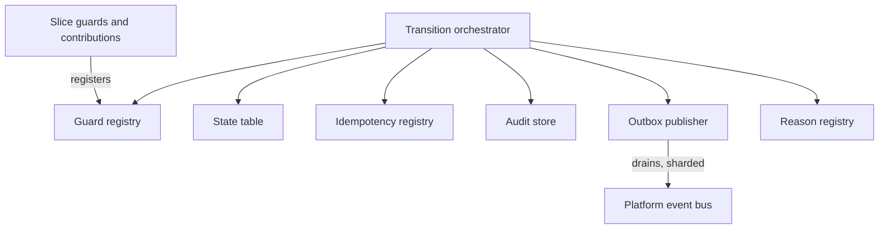
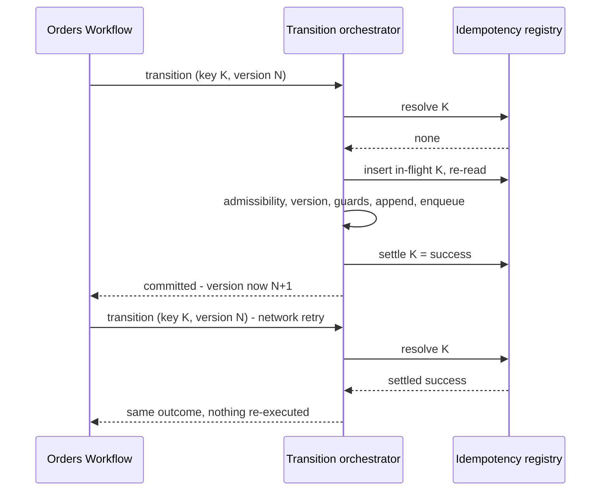

<!-- CONFLUENCE_TITLE: [BSS]: Orders Lifecycle — Order Transition Engine (Slice 1) -->
<!-- Related: ../DESIGN.md, ../PRD.md, ../DECISIONS.md, ./README.md | Owners: BSS Orders team -->

# DESIGN — Order Transition Engine (Slice 1)


<!-- toc -->

- [1. Architecture Overview](#1-architecture-overview)
  - [1.1 Architectural Vision](#11-architectural-vision)
  - [1.2 Architecture Drivers](#12-architecture-drivers)
  - [1.3 Architecture Layers](#13-architecture-layers)
- [2. Principles and Constraints](#2-principles-and-constraints)
  - [2.1 Design Principles](#21-design-principles)
  - [2.2 Constraints](#22-constraints)
- [3. Technical Architecture](#3-technical-architecture)
  - [3.1 Domain Model](#31-domain-model)
  - [3.2 Component Model](#32-component-model)
  - [3.3 API Contracts](#33-api-contracts)
  - [3.4 Internal Dependencies](#34-internal-dependencies)
  - [3.5 External Dependencies](#35-external-dependencies)
  - [3.6 Interactions and Sequences](#36-interactions-and-sequences)
  - [3.7 Database Schemas and Tables](#37-database-schemas-and-tables)
  - [3.8 Deployment Topology](#38-deployment-topology)
- [4. Additional Context](#4-additional-context)
  - [4.1 The Transition Contract (normative)](#41-the-transition-contract-normative)
  - [4.2 Idempotency Semantics (normative)](#42-idempotency-semantics-normative)
  - [4.3 The State Machine (normative)](#43-the-state-machine-normative)
  - [4.4 Events, Audit and the Outbox (normative)](#44-events-audit-and-the-outbox-normative)
  - [4.5 What this slice deliberately does not own](#45-what-this-slice-deliberately-does-not-own)
  - [4.6 Extension points and stability (normative)](#46-extension-points-and-stability-normative)
  - [4.7 GTS types for the cross-gear contract surface (normative)](#47-gts-types-for-the-cross-gear-contract-surface-normative)
  - [4.8 What is deliberately not GTS](#48-what-is-deliberately-not-gts)
  - [4.9 What this section changed, and why it is recorded](#49-what-this-section-changed-and-why-it-is-recorded)
- [5. Traceability](#5-traceability)

<!-- /toc -->

- [ ] `p1` - **ID**: `cpt-cf-bss-orders-lifecycle-design-foundation`

## 1. Architecture Overview

### 1.1 Architectural Vision

This slice is the shared engine every other slice transitions through. It owns the order
aggregate and its append-only version chain, the declarative state-machine table and guard
evaluation, the idempotency registry, the optimistic version check, the append-only transition
audit, the event outbox, and the registry of machine-readable business reasons. It owns **no
commercial policy**: it cannot evaluate a sellability predicate, does not know what a catalog
price pin means, and never decides whether an approval was warranted
([`../DESIGN.md`](../DESIGN.md) §1.1; rationale in
[`../ADR/0001`](../ADR/0001-cpt-cf-bss-orders-lifecycle-adr-transition-through-engine.md)).

The engine exists because four of the PRD's `p1` non-functional guarantees are properties of
*how a state change commits* rather than of any capability that requests one. Audit
completeness, zero duplicate effects, transition-commit latency and recoverability are all
decided in a single code path, so this slice makes them assertable once. The **transition
contract** (§4.1) is the whole of that path: one call, one database transaction, and on success
exactly four durable effects — the state or version change, one audit entry, one settled
idempotency record, and **one outbox row where the transition row declares an event type**.
There is no partial commit to reconcile, because a failure at any step aborts the transaction
and leaves no state change behind.

Two consequences shape everything downstream. First, **no slice writes order state** — slices
register guard predicates and supply document contributions, and the engine is the only writer,
which is why a new capability cannot regress the correctness core by construction. Second,
**order state is stored, never derived** — no projection, event replay or downstream identifier
reconstructs it, which is what makes Orders Lifecycle a defensible system of record under the
seam rule that forbids the sibling Workflow gear from holding authoritative order state
([`../PRD.md`](../PRD.md) §6.4).

The shape is adopted rather than invented. The Billing Ledger commits balanced journal lines
through one posting engine; the Product Catalog publishes through one fail-closed validation
engine with an append-only history and an outbox. This slice is the same pattern applied to a
state machine instead of a posting or a publish.

### 1.2 Architecture Drivers

#### Functional Drivers

| Requirement | Design Response |
|-------------|------------------|
| `cpt-cf-bss-orders-lifecycle-fr-order-state-machine` | The state machine is data, not control flow: a transition table of `(from, to, trigger, guard set, actor class, versioning behaviour, event type)` rows (§4.3). An edge that is not a row cannot be taken, and no slice may add one. |
| `cpt-cf-bss-orders-lifecycle-fr-order-idempotency` | The idempotency registry stores the committed *outcome* keyed by `(operation, authorized principal, idempotency key)` under a unique constraint — the principal scope is part of the key, so a caller-chosen text value cannot address another caller's record — written inside the transition transaction, and is resolved **before** admissibility and the version check (§4.2). Duplicate effect is impossible rather than unlikely. |
| `cpt-cf-bss-orders-lifecycle-fr-order-history` | Versions are append-only rows retained in-table with a `supersedes_version` back-reference; nothing rewrites or deletes a prior version, so any version is a direct read. |
| `cpt-cf-bss-orders-lifecycle-fr-order-amendment` | The engine distinguishes a **versioning** transition (appends a version row) from a **state-only** transition (appends audit only), so an amendment that does not move state still produces a new version and its event. |
| `cpt-cf-bss-orders-lifecycle-fr-order-events` | The outbox row is written in the transition transaction and drained asynchronously, giving exactly one event per committed transition **that declares an event type**, under at-least-once delivery with consumer de-duplication by event ID (§4.4). |
| `cpt-cf-bss-orders-lifecycle-fr-order-authorization` | Authorization is an engine pre-guard evaluated before any other check, so scope cannot be widened by a capability. Cross-tenant action additionally requires a verifiable delegation proof whose reference is recorded on the audit row. |
| `cpt-cf-bss-orders-lifecycle-fr-order-cancel` | The spawn-signal record is an engine-owned column written by the **spawn-signal transition** and never cleared, which is what lets the cancel guard read a fact rather than infer one from state. |
| `cpt-cf-bss-orders-lifecycle-fr-order-hold` | The pre-hold state is stored on the aggregate by the hold transition and consumed by the resume transition, so resume is a lookup and not an inference. |
| `cpt-cf-bss-orders-lifecycle-fr-order-expiry` | Expiry is an ordinary table row with the system as actor class; the exclusion of `in_fulfillment` and of holds taken from it lives in the table, so a scheduler defect cannot expire an order whose subscriptions may be provisioning. |
| `cpt-cf-bss-orders-lifecycle-fr-orders-boundary-r1-state-sor` | The workflow-only operations are ordinary transition-table rows with the same guard, idempotency and version-check contract as buyer operations. The engine exposes no privileged state-setting path. |
| `cpt-cf-bss-orders-lifecycle-fr-orders-boundary-r5-no-mirroring` | The downstream transition-request identifier is stored on the per-line projection as a correlation column with no state semantics, and the transition table reads no column of it. |

#### NFR Allocation

| NFR ID | NFR Summary | Allocated To | Design Response | Verification Approach |
|--------|-------------|--------------|-----------------|----------------------|
| `cpt-cf-bss-orders-lifecycle-nfr-order-transition-latency` | Transition commit p95 < 1 s | Transition orchestrator | One transaction, no outbound call inside it: guard inputs are resolved before the transaction opens, and publication is the outbox drain's job, so the commit path is bounded by local writes | Load test at 50 transitions/second (§3.8) on the commit path; drain lag measured separately against the 30 s event-delivery budget |
| `cpt-cf-bss-orders-lifecycle-nfr-order-audit-completeness` | 100 % of transitions audited, zero silent drops | Audit store | The audit append shares the transition transaction on **every** path, committed and refused alike, so an unaudited transition cannot commit; the store is append-only with a predecessor-hash chain, under the single grant-and-retention contract of §3.7 `orders_transition_audit` | Structural test asserting every table row writes an audit entry on both outcomes; fault-injection test asserting a failed audit append aborts the transition; periodic chain-verification job |
| `cpt-cf-bss-orders-lifecycle-nfr-order-idempotency` | Zero duplicate orders or duplicate transition effects, **per principal** — the scope is part of the key, so the guarantee is disclosed at that granularity and `§4.2` states where it stops (create is the one operation a second principal can duplicate) | Idempotency registry | Unique constraint on `(operation, principal_scope, idempotency_key)`; the marker is inserted if absent and then **re-read**, so a concurrent duplicate resolves to the settled or in-flight case rather than racing it | Parallel same-key concurrency test asserting one durable effect; replay test asserting a stored failure replays as a failure; crash test asserting a lease-expired marker is recoverable; cross-principal test asserting one authorized caller presenting another's key neither reads nor overwrites that caller's record |
| `cpt-cf-bss-orders-lifecycle-nfr-order-recovery` | RPO zero for `submitted`+ orders, RTO ≤ 60 min | Persistence and topology | Version, audit, idempotency and outbox rows are one transaction, committed synchronously to a quorum with a standby in a second failure domain inside the residency boundary; acknowledgement follows durability | DR exercise promoting the standby within the RTO and asserting zero committed-transition loss including undrained outbox rows |
| `cpt-cf-bss-orders-lifecycle-nfr-order-read-latency` | Order read and list p95 < 200 ms | Read model | The aggregate row carries denormalized current state, `state_entered_at` and a current-version pointer, so a read never walks the version chain | Read benchmarks at production row counts with the page-size bound of [`08-read-and-authz`](./08-read-and-authz.md) §4.5 |

#### Key ADRs

| ADR ID | Decision Summary |
|--------|-----------------|
| `cpt-cf-bss-orders-lifecycle-adr-transition-through-engine` | One engine owns every state change, so the four `p1` guarantees are properties of one code path rather than per-capability discipline |
| `cpt-cf-bss-orders-lifecycle-adr-slice-decomposition` | A foundation slice plus seven capability slices, so the correctness core has an independent review boundary |
| `cpt-cf-bss-orders-lifecycle-adr-fail-closed-gate` | An unevaluable gate input is a refusal, which is why absence is a refusal here too |
| `cpt-cf-bss-orders-lifecycle-adr-closed-enumerations` | The eleven states and eleven events stay closed; §4.3, §4.4 and §4.6 are its normative home |
| `cpt-cf-bss-orders-lifecycle-adr-refusals-commit` | A refusal audits, settles and commits; §2.1, §3.6, §4.1 and §4.2 are its normative home |
| `cpt-cf-bss-orders-lifecycle-adr-outbox-publication` | Events publish asynchronously from an outbox; §3.7, §3.8 and §4.4 are its normative home, and it is why the PRD's combined latency threshold cannot hold |
| `cpt-cf-bss-orders-lifecycle-adr-in-transaction-concurrency` | The one-in-flight-order rule is a database constraint inside the transition transaction; §3.7's claim table is its normative home |

### 1.3 Architecture Layers

- [ ] `p2` - **ID**: `cpt-cf-bss-orders-lifecycle-tech-foundation-stack`

```text
Slice guards +      declared guard predicates · document contributions
contributions       (registered at startup; evaluated, never invoked, by the engine)
       │
       ▼
Transition          authorization pre-guard → idempotency resolve → state-table lookup →
orchestrator        version check → guard evaluation → append → enqueue → commit
       │
       ▼
Engine stores       aggregate + version chain · line identity · administrative content ·
                    draft working set · transition audit (hash-chained) ·
                    idempotency registry · event outbox · reason registry
       │
       ▼
Persistence         PostgreSQL via SecureORM; runtime-owned privilege; append-only history
                    with no update or delete grant on committed rows
```

| Layer | Responsibility | Technology |
|-------|---------------|------------|
| Presentation | Not owned by this slice; transition entry points are registered by the slices that own each operation | — |
| Application | The transition orchestrator and the guard registry | Rust module in the `orders-lifecycle` gear |
| Domain | Aggregate and version-chain invariants, the state table, idempotency semantics, reason registry | Rust domain structs; GTS for cross-gear contract types (§4.7) |
| Infrastructure | Append-only stores, idempotency registry, sharded outbox drain, expiry and window sweeps | PostgreSQL, SecureORM, coordination lease library |

## 2. Principles and Constraints

### 2.1 Design Principles

#### One transaction, four effects

- [ ] `p1` - **ID**: `cpt-cf-bss-orders-lifecycle-principle-atomic-transition-commit`

A committed transition produces exactly four durable effects in one transaction: the state or
version change, the audit entry, the settled idempotency outcome, and one outbox row **where the
row declares an event type**. No effect may be deferred to a second transaction and none may be
optional. This is the single assumption every `p1` guarantee in §1.2 rests on, and it is why the
engine performs no outbound call inside the transaction — an external dependency inside the
commit would make atomicity a hope.

#### Guards are declared, never embedded

- [ ] `p1` - **ID**: `cpt-cf-bss-orders-lifecycle-principle-guard-declared-not-embedded`

A slice registers a named guard predicate and the engine evaluates it at the point the table
says to. Slices do not call the engine back mid-transition, do not refuse a request before
calling the engine, and the engine does not import slice logic. Guard evaluation order is fixed
by the engine — authorization, then **idempotency resolution**, then state-table admissibility,
then the version check, then slice guards in registration order — so two capabilities cannot
disagree about precedence. Authorization is evaluated before even the advisory idempotency probe:
an unauthorized caller learns no stored outcome from a key they possess.

#### Idempotency stores an outcome, and is resolved after authorization

- [ ] `p1` - **ID**: `cpt-cf-bss-orders-lifecycle-principle-outcome-store-idempotency`

The registry records what a completed operation *decided*, not merely that it was seen. After the
engine authorizes the caller, replay returns the stored outcome, and a stored refusal replays as
that refusal. Resolution happens **before** admissibility and the version check, because a
versioning transition bumps the version on commit — so a retry of a committed submit or amendment
necessarily carries a superseded version, and any order that checked the version first would refuse
the very replay idempotency exists to serve. The three non-success cases are distinct and none may
be reported as success: payload mismatch, still-processing, and stale version.

#### History is append-only, per table

- [ ] `p1` - **ID**: `cpt-cf-bss-orders-lifecycle-principle-append-only-history`

Versions, line identities, lines, resolved totals, acceptance rows and audit entries are
append-only: they are inserted and never updated or deleted; corrections are new rows. The audit
store's one bounded exception — the purge of time-expired refusal rows — is stated once, on
`orders_transition_audit` in §3.7, and is not restated here. Mutable
state is confined to the aggregate, idempotency registry, outbox delivery bookkeeping, draft and
administrative working content, in-flight overlap claims, fulfillment projection and policy rows,
each explicitly marked in §3.7. This separation keeps commercial history immutable while allowing
operational state to advance.

#### Absence is a refusal

- [ ] `p1` - **ID**: `cpt-cf-bss-orders-lifecycle-principle-absence-is-refusal`

A guard whose inputs cannot be resolved fails. The engine never substitutes a default for a
missing guard input and never treats an unreachable dependency as a pass, matching the
fail-closed posture the published pricing gate takes for an unevaluable predicate.

### 2.2 Constraints

#### The engine is the single writer

- [ ] `p1` - **ID**: `cpt-cf-bss-orders-lifecycle-constraint-single-writer`

No migration, repair script, administrative surface or slice may write the aggregate, version,
line, resolved-total, audit, idempotency or outbox tables outside a transition. The constraint is
what the audit guarantee means in practice, and it has an operational cost worth stating: a
data-repair need becomes a new transition-table row with its own guard and reason, not a manual
update. The one exception is pseudonymisation of actor identifiers to satisfy an erasure
obligation, which is a **privileged out-of-band procedure and not a transition** — the transition
table is closed and no row expresses it — specified with its grant, its own record and its chain
re-derivation in [`../DESIGN.md`](../DESIGN.md) §4.3
([`../DECISIONS.md`](../DECISIONS.md) D-44).

#### The idempotency window is 24 hours and is not a commercial bound

- [ ] `p1` - **ID**: `cpt-cf-bss-orders-lifecycle-constraint-idempotency-window`

The registry is request-cache infrastructure with a **24-hour** retention window, matching the
sibling catalog gear's ratified value. Past the window a replayed key is a new operation, so the
window must exceed the longest caller retry horizon — including the sibling gear's reconciliation
sweep, which is explicitly read-only once the window has elapsed. The window is a working
baseline pending the program NFR workshop and **MUST NOT** be conflated with the per-state TTLs
that bound an order's commercial life.

#### Delivery is at-least-once; ordering is per aggregate

- [ ] `p1` - **ID**: `cpt-cf-bss-orders-lifecycle-constraint-outbox-at-least-once`

The outbox guarantees one row per committed transition that declares an event, and at-least-once
delivery of that row. It does **not** guarantee exactly-once delivery and does not guarantee
global ordering; ordering is per `orderId`, which is the ordering key consumers use and the shard
key of the drain. Holding that per-`orderId` ordering costs head-of-line blocking on the affected
order while a row retries or sits parked — the normative statement is §4.4 — so an event backlog
is per order rather than global. Consumers de-duplicate by event ID, which is also what makes an
operator re-drive of a parked row safe.

#### Guard inputs from unimplemented gears are ports

- [ ] `p2` - **ID**: `cpt-cf-bss-orders-lifecycle-constraint-guard-input-ports`

Guard inputs sourced from gears without an implementation — the overlap-presence read and the
party-eligibility check among them — are resolved through ports before the transaction opens,
under the per-port deadlines of [`03-gate-and-pin`](./03-gate-and-pin.md) §2.2. The engine treats
an unresolvable input as a refusal (§2.1) rather than blocking, so an absent counterpart degrades
a capability instead of stalling the gear.

## 3. Technical Architecture

### 3.1 Domain Model

**Technology**: Rust domain structs internally; GTS types for the cross-gear contract surface, specified in §4.7.

**Core Entities**:

- [ ] `p1` - **ID**: `cpt-cf-bss-orders-lifecycle-entity-order-root`

The aggregate root and the only mutable row among the commercial stores. Carries identity,
human-readable number, category, the three tenant axes, the initiating actor, the optional
contract reference, the current state, `state_entered_at`, the current-version pointer, the
pre-hold state, the spawn-signal instant, the tolerated-authorization risk flag, and the
per-order audit sequence counter.

- [ ] `p1` - **ID**: `cpt-cf-bss-orders-lifecycle-entity-order-version-chain`

An append-only sequence of immutable commercial-content snapshots, each carrying its actor,
timestamp, reason, the derived order market, and a `supersedes_version` back-reference. Exactly
one version is current.

- [ ] `p1` - **ID**: `cpt-cf-bss-orders-lifecycle-entity-order-line-identity`

The order-scoped identity of a line, independent of any version. It is the parent every
version-scoped line row, per-line total and per-line projection references, and it is what makes
"the same line at a different quantity" expressible across an amendment.

- [ ] `p1` - **ID**: `cpt-cf-bss-orders-lifecycle-entity-order-line`

A version-scoped, immutable line: catalog references, quantity, currency, the catalog price pin,
the three resolved dates with the policy-switch state that governed them, term duration, billing
cycle and the overlap scope key.

- [ ] `p1` - **ID**: `cpt-cf-bss-orders-lifecycle-entity-resolved-total`

The captured non-authoritative figures per line and per order, discriminated by scope, carrying
gross and net, the discount component with its promotion reference, and the four charge kinds.

- [ ] `p1` - **ID**: `cpt-cf-bss-orders-lifecycle-entity-administrative-content`

Mutable, separately-audited content that carries no commercial meaning: external references at
order and line level, display labels and internal notes. It lives outside the immutable stores so
that correcting a mistyped purchase-order number requires no version and mutates no history.

- [ ] `p1` - **ID**: `cpt-cf-bss-orders-lifecycle-entity-transition-record`

One append-only audit entry per transition attempt, committed or refused: from-state, to-state,
trigger, outcome, actor identity and class, the delegation-proof reference where one was
required, timestamp, reason, the idempotency key, the process correlation identifier, the version
in force, the changed field with its prior and new value for an administrative edit, and the
predecessor hash forming a per-order chain.

- [ ] `p1` - **ID**: `cpt-cf-bss-orders-lifecycle-entity-idempotency-record`

The stored outcome of an operation keyed by `(operation, authorized principal, idempotency key)`:
a request fingerprint for mismatch detection binding the record to one target order, a state of in-flight or settled with a lease instant, and the settled
outcome — success with its result reference, or a refusal with its machine-readable reason.

- [ ] `p1` - **ID**: `cpt-cf-bss-orders-lifecycle-entity-outbox-entry`

One row per committed transition that declares an event type, holding the event identity, type,
`orderId`, the shard key, the version at event time, the payload, the envelope schema version and
delivery bookkeeping. It is the engine's only asynchronous egress.

**Relationships**:
- `Order root` → `Order version chain`: one-to-many, append-only; exactly one version current, every prior version retained.
- `Order root` → `Order line identity`: one-to-many; the parent of every version-scoped line row.
- `Order line identity` → `Order line`: one-to-many across versions; the identity is stable, each row immutable.
- `Order version` → `Resolved total`: **one-to-many** — one row per line per charge kind, plus the order-level roll-up.
- `Order root` → `Transition record`: one-to-many, append-only and hash-chained; complete by construction because the append shares every transition's transaction.
- `Order root` → `Administrative content`: one-to-one; mutable and audited without a version bump.
- `Idempotency record` → `Transition record`: zero-or-one; a settled outcome references the audit entry it produced, which is what makes replay answerable without re-deriving anything.

### 3.2 Component Model



#### Transition orchestrator

- [ ] `p1` - **ID**: `cpt-cf-bss-orders-lifecycle-component-transition-orchestrator`

##### Why this component exists

The four `p1` guarantees are properties of one code path. Concentrating that path here is what
makes them assertable once and unbreakable by a later capability.

##### Responsibility scope

Resolving guard inputs before the transaction opens; opening the transaction and taking the
aggregate row lock; running the fixed evaluation order; appending the version or audit entry;
settling the idempotency outcome; enqueuing an outbox row where the row declares an event type;
committing; and mapping any refusal to its registered reason.

##### Responsibility boundaries

It evaluates guards but authors none. It makes no outbound call inside the transaction, performs
no money arithmetic, and holds no commercial vocabulary.

##### Related components (by ID)

- `cpt-cf-bss-orders-lifecycle-component-guard-registry` — calls
- `cpt-cf-bss-orders-lifecycle-component-state-table` — depends on
- `cpt-cf-bss-orders-lifecycle-component-idempotency-registry` — owns data for
- `cpt-cf-bss-orders-lifecycle-component-audit-store` — owns data for
- `cpt-cf-bss-orders-lifecycle-component-outbox-publisher` — owns data for
- `cpt-cf-bss-orders-lifecycle-component-authz-declaration` — depends on

#### Guard registry

- [ ] `p1` - **ID**: `cpt-cf-bss-orders-lifecycle-component-guard-registry`

##### Why this component exists

Guards must be declarable by slices without letting slices control when or in what order they
run — and without letting a slice refuse a request outside the engine, which would leave the
refusal unaudited and unreplayable.

##### Responsibility scope

Startup registration of named guard predicates against transition-table rows; the registration
contract including each guard's declared inputs and its reason on failure; and rejection at
startup of a guard registered against a row that does not exist.

##### Responsibility boundaries

It contains no predicate logic of its own and no commercial policy. It never invokes a slice
mid-transition.

##### Related components (by ID)

- `cpt-cf-bss-orders-lifecycle-component-transition-orchestrator` — depends on
- `cpt-cf-bss-orders-lifecycle-component-reason-registry` — depends on

#### State table

- [ ] `p1` - **ID**: `cpt-cf-bss-orders-lifecycle-component-state-table`

##### Why this component exists

An edge that exists only in control flow is an edge nobody can enumerate. Making the machine
data makes coverage testable and makes the expiry exclusions structural.

##### Responsibility scope

The declarative rows of `(from, to, trigger, guard set, actor class, versioning behaviour, event
type)`; the terminal set; the hold and resume mapping; expiry eligibility; and the admissibility
check.

##### Responsibility boundaries

It holds no guard implementations and no scheduling. It does not know why an edge exists.

##### Related components (by ID)

- `cpt-cf-bss-orders-lifecycle-component-transition-orchestrator` — depends on

#### Idempotency registry

- [ ] `p1` - **ID**: `cpt-cf-bss-orders-lifecycle-component-idempotency-registry`

##### Why this component exists

Orders drive subscription creation, so a duplicate transition can double-provision and
double-charge. Storing outcomes rather than de-duplicating requests is what makes replay
answerable.

##### Responsibility scope

Key resolution ahead of every other check; the binding of a key to the principal authorized to
present it and to the target order (§4.2); the insert-if-absent-then-re-read protocol; the
request fingerprint and mismatch detection; the in-flight marker with its lease; outcome
settlement including refusals; and the 24-hour retention window with its sweep.

##### Responsibility boundaries

It does not decide whether an operation is admissible and never suppresses a guard. It holds no
commercial data beyond the fingerprint and outcome reference.

##### Related components (by ID)

- `cpt-cf-bss-orders-lifecycle-component-transition-orchestrator` — depends on

#### Audit store

- [ ] `p1` - **ID**: `cpt-cf-bss-orders-lifecycle-component-audit-store`

##### Why this component exists

Financial-grade auditability requires that the record cannot lag the fact it records, and that
tampering is detectable rather than merely forbidden.

##### Responsibility scope

The append-only transition log with actor, timestamp, reason, key, correlation identifier,
delegation-proof reference and administrative change payload; the per-order predecessor-hash
chain and its verification job; retrieval by order; and the grant-and-retention contract of §3.7
`orders_transition_audit`, which this component implements and does not restate.

##### Responsibility boundaries

It stores no commercial content — that is the version chain's job — and it never becomes the
source a read derives state from.

##### Related components (by ID)

- `cpt-cf-bss-orders-lifecycle-component-transition-orchestrator` — depends on

#### Outbox publisher

- [ ] `p1` - **ID**: `cpt-cf-bss-orders-lifecycle-component-outbox-publisher`

##### Why this component exists

Publishing inside the transaction would put an external dependency in the commit path;
publishing after it without a durable row would lose events on restart; and a single unbatched
publisher would cap the whole gear's event throughput regardless of replica count.

##### Responsibility scope

The **sharded** drain — leases taken per `order_id` hash range, batched publication within a
shard — with backoff, per-`orderId` ordering including the head-of-line suspension that ordering
implies (§4.4), a bounded attempt count, the dead-letter record with its alert, and the operator
re-drive operation.

##### Responsibility boundaries

It does not construct event semantics — the transition supplies the payload — and it never alters
order state, including when an entry dead-letters or is re-driven.

##### Related components (by ID)

- `cpt-cf-bss-orders-lifecycle-component-transition-orchestrator` — depends on

#### Reason registry

- [ ] `p2` - **ID**: `cpt-cf-bss-orders-lifecycle-component-reason-registry`

##### Why this component exists

A refusal a caller cannot key on is not a contract, and two names for one condition is a contract
defect rather than a cosmetic one. Centralising the catalogue is what keeps reasons stable across
slices and mappable to one wire envelope.

##### Responsibility scope

The registry of machine-readable business reasons with their owning slice and stability, the
one-name-per-condition rule, the mapping to an RFC 9457 problem type at the wire edge, and the
mapping from each PRD reason **descriptor** to the registered identifier that satisfies it
(§4.2).

##### Responsibility boundaries

It does not author slice reasons and never carries internal diagnostics into a response.

##### Related components (by ID)

- `cpt-cf-bss-orders-lifecycle-component-guard-registry` — shares model with

### 3.3 API Contracts

- [ ] `p1` - **ID**: `cpt-cf-bss-orders-lifecycle-interface-transition-api`

- **Requirement**: `cpt-cf-bss-orders-lifecycle-interface-order-ops`
- **Technology**: internal Rust API in `gears/bss/orders-lifecycle/orders-lifecycle/src/domain/`; the REST surface is registered by the owning slices through `OperationBuilder` with explicit response metadata

The engine exposes one in-process operation to slices — *attempt a transition* — taking the order
identity, the trigger, the caller's security context, the idempotency key, the expected version,
the optional correlation identifier, and the slice's document contribution. It returns either the
committed outcome or a registered refusal. There is no second entry point, and no variant that
skips a guard.

- [ ] `p1` - **ID**: `cpt-cf-bss-orders-lifecycle-interface-guard-registration`

The startup contract by which a slice registers a named guard against transition-table rows,
declaring the guard's inputs and its failure reason. Registration against a non-existent row
fails startup rather than degrading at runtime.

- [ ] `p2` - **ID**: `cpt-cf-bss-orders-lifecycle-interface-order-read-model`

The engine-owned read of the aggregate row and a named version, on which the read slice builds
its projections. It exposes current state, `state_entered_at`, the current-version pointer and
the version chain; it exposes no guard state and no idempotency content.

- [ ] `p2` - **ID**: `cpt-cf-bss-orders-lifecycle-interface-outbox-redrive`

The operator re-drive of a parked dead-letter row: re-publish under the original event id, so
consumer de-duplication makes replay safe. It republishes in `sequence` order and **MUST NOT** skip
a parked row, because the drain holds that order's later events behind it (§4.4). Audited, and
restricted to the seller-operator actor class.

**Error surface**: every refusal carries a registered machine-readable reason and maps to an
RFC 9457 `application/problem+json` response at the wire edge, with no internal diagnostics in
the body. The engine contributes exactly four reason families of its own — `not-admissible`,
`version-conflict`, `idempotency-mismatch`, `still-processing` — and slices contribute the rest.
No slice may register a second name for any of these four. Every reason is a **GTS error instance** and its identifier is the RFC 9457 `type` URI at the wire edge (§4.7), so the one-name-per-condition rule is a registration constraint rather than reviewer discipline.

### 3.4 Internal Dependencies

| Dependency Gear | Interface Used | Purpose |
|-------------------|----------------|----------|
| `toolkit-db` | Runtime-scoped database access | The one transaction per transition, and the append-only stores |
| `types-registry` | SDK client | Resolving and registering the GTS event, error and category types of §4.7; a type that fails to register fails the boot |
| Coordination lease library | SDK client | Singleton coordination for the sharded outbox drain, the per-state expiry sweep, the draft auto-void sweep, the idempotency-window sweep, the retention purge sweep and the audit-chain verifier — six workers |

**Dependency Rules** (per project conventions):
- No circular dependencies
- Always use sdk modules for inter-gear communication
- No cross-category sideways deps except through contracts
- Only integration/adapter gears talk to external systems
- `SecurityContext` must be propagated across all in-process calls

### 3.5 External Dependencies

This slice has no external dependency of its own. Every guard input sourced outside the gear —
catalog and pricing data, tenant-axis validation, contract status, approval verdicts, payment
authorization outcomes, indicative tax — is resolved by the owning slice through a port *before*
the transaction opens, under that slice's declared deadline, and reaches the engine as a plain
value. The engine therefore has no adapter to any gear, which is what keeps the commit path free
of network calls and keeps an absent counterpart a capability concern rather than an engine
concern ([`../DESIGN.md`](../DESIGN.md) §3.5).

### 3.6 Interactions and Sequences

#### Transition commit

**ID**: `cpt-cf-bss-orders-lifecycle-seq-transition-commit`

**Use cases**: `cpt-cf-bss-orders-lifecycle-usecase-order-new-acquisition`

**Actors**: `cpt-cf-bss-orders-lifecycle-actor-orders-partner-admin`, `cpt-cf-bss-orders-lifecycle-actor-orders-workflow`

**Algorithm: Attempt Transition**

Input: order_id, trigger, security_context, idempotency_key, expected_version, correlation_id, contribution
Output: committed outcome or registered refusal

1. [ ] - `p1` - Evaluate the authorization pre-guard before probing idempotency: actor class, tenancy relationship, and the delegation proof where the action is cross-tenant; **IF** the actor is not permitted, or a required proof is absent, expired or revoked: open a refusal transaction, append the denied-attempt audit entry with the proof reference where one was presented — **without loading or locking the aggregate row**, since a refused entry takes no sequence and joins no hash chain — commit, and **RETURN** the authorization refusal; **ONLY IF** authorization succeeds, probe the idempotency registry for (operation, principal_scope, idempotency_key) — the principal scope taken from the security context just authorized and **never** from the request body — **before resolving any guard input**; **IF** a settled record matches the request fingerprint: **RETURN** its stored outcome - `inst-probe-idempotency`
2. [ ] - `p1` - Resolve every guard input the trigger's guard set declares, outside any transaction, under each port's declared deadline - `inst-resolve-guard-inputs`
3. [ ] - `p1` - **IF** any declared input is unresolvable or its deadline elapses: - `inst-if-input-unresolvable`
   1. [ ] - `p1` - Open a refusal transaction, load the aggregate row taking its row lock, resolve or create the idempotency record, settle it with the guard's registered unevaluable reason, append the refused-attempt audit entry, commit, and **RETURN** that refusal (absence is a refusal) - `inst-return-input-unresolvable`
4. [ ] - `p1` - Open one transaction for everything that follows - `inst-open-transaction`
5. [ ] - `p1` - Load the aggregate row for order_id **taking its row lock**, which also serialises audit-sequence allocation - `inst-load-aggregate-locked`
6. [ ] - `p1` - Resolve the idempotency record for (operation, principal_scope, idempotency_key), the scope taken from the authorized security context - `inst-resolve-idempotency`
7. [ ] - `p1` - **IF** a settled record exists: - `inst-if-idempotency-settled`
   1. [ ] - `p1` - **IF** its request fingerprint differs from this request: - `inst-if-fingerprint-differs`
      1. [ ] - `p1` - Append the audit entry, commit, and **RETURN** idempotency-mismatch refusal - `inst-return-fingerprint-mismatch`
   2. [ ] - `p1` - Commit and **RETURN** the stored outcome unchanged, success or refusal alike - `inst-return-stored-outcome`
8. [ ] - `p1` - **IF** an in-flight record exists **AND** its lease has not expired: - `inst-if-idempotency-in-flight`
   1. [ ] - `p1` - Append the audit entry, commit, and **RETURN** still-processing refusal, never a success - `inst-return-still-processing`
9. [ ] - `p1` - Insert the in-flight record if absent, then **re-read** it; **IF** the re-read shows another writer settled or leased it first, **GO TO** step 7 - `inst-insert-in-flight-and-reread`
10. [ ] - `p1` - Look up the state-table row for (current state, trigger) - `inst-state-table-lookup`
11. [ ] - `p1` - **IF** no row exists: - `inst-if-not-admissible`
    1. [ ] - `p1` - Settle the record with the refusal, append the audit entry, commit, and **RETURN** not-admissible naming current state and trigger - `inst-return-not-admissible`
12. [ ] - `p1` - **IF** expected_version does not match the aggregate's current version: - `inst-if-version-conflict`
    1. [ ] - `p1` - Settle the record with the refusal, append the audit entry, commit, and **RETURN** version-conflict naming the current version - `inst-return-version-conflict`
13. [ ] - `p1` - **FOR EACH** guard in the row's guard set, in registration order: - `inst-for-each-guard`
    1. [ ] - `p1` - Evaluate the guard against committed state and the resolved inputs - `inst-evaluate-guard`
    2. [ ] - `p1` - **IF** the guard fails: - `inst-if-guard-fails`
       1. [ ] - `p1` - Settle the record with the refusal so replay reproduces it - `inst-settle-refusal`
       2. [ ] - `p1` - Append the audit entry recording the refused attempt - `inst-audit-refusal`
       3. [ ] - `p1` - Commit, then **RETURN** the guard's registered reason - `inst-return-guard-refusal`
14. [ ] - `p1` - Resolve the effective target state: the stored pre-hold state when the trigger is resume, otherwise the row's target - `inst-resolve-effective-target`
15. [ ] - `p1` - **IF** the trigger is resume **AND** no pre-hold state is stored: settle, audit, commit and **RETURN** a refusal - `inst-if-resume-target-missing`
16. [ ] - `p1` - Capture the outgoing state before any assignment - `inst-capture-outgoing-state`
17. [ ] - `p1` - Maintain this order's overlap claims; this is where the one-in-flight-order rule of `§3.7` is enforced, and it runs on **every** row rather than only on the acquiring ones: - `inst-maintain-claims`
    1. [ ] - `p1` - **IF** the effective target is in the terminal set of `§4.3`: release every unreleased claim this order holds and **SKIP TO** step 18 — a terminal transition acquires nothing, and releasing here is what keeps a completed order from holding its key forever - `inst-release-on-terminal`
    2. [ ] - `p1` - **IF** the contribution carries no resolved overlap keys — every non-terminal row but submit and amendment: **SKIP TO** step 18, leaving the claim set untouched - `inst-skip-claims`
    3. [ ] - `p1` - Compute the **distinct** resolved key set and partition it into keys this order **already holds** an unreleased claim on and keys it does not - `inst-partition-claim-keys`
    4. [ ] - `p1` - Insert one claim row per key in the **second** partition only, offered in a **total order** — sorted — so two concurrent multi-key orders acquire in the same sequence and cannot deadlock, with `ON CONFLICT (payer_tenant_id, overlap_scope_key) WHERE released_at IS NULL DO NOTHING`, returning the inserted rows - `inst-take-claims`
    5. [ ] - `p1` - **IF** fewer rows return than keys were offered: **delete the rows sub-step 17.4 just returned** — acquisition is **all-or-none**, and `ON CONFLICT … DO NOTHING` inserts the free keys while skipping the conflicting one, so a partial insert left in place would leave a refused order holding keys it was never admitted on — then settle the idempotency record with `order-in-flight-for-key`, append the refused-attempt audit entry, commit, and **RETURN** that refusal. **Nothing acquired before this attempt has been released, so the order still holds every claim it held on entry, and nothing this attempt inserted survives it** - `inst-if-claim-conflict`
    6. [ ] - `p1` - Release this order's unreleased claims on keys **not** in the resolved set; acquisition has already succeeded, so no refusal can reach this step - `inst-release-superseded-claims`
18. [ ] - `p1` - **IF** the row's versioning behaviour is versioning: - `inst-if-versioning-row`
    1. [ ] - `p1` - Append a new version row from the contribution, with supersedes_version set to the outgoing current version - `inst-append-version`
    2. [ ] - `p1` - Move the aggregate's current-version pointer to the new version - `inst-move-version-pointer`
19. [ ] - `p1` - Write every other document contribution the row declares — lines, totals, verdict, linkage, projection, acceptance, gate outcome - `inst-write-contributions`
20. [ ] - `p1` - **IF** the effective target differs from the outgoing state: - `inst-if-state-changes`
    1. [ ] - `p1` - Set the aggregate's state to the effective target and set state_entered_at - `inst-set-state`
    2. [ ] - `p1` - **IF** the effective target is on_hold: store the outgoing state as the pre-hold state - `inst-store-pre-hold`
    3. [ ] - `p1` - **IF** the effective target is not `on_hold`: clear the pre-hold state - `inst-clear-pre-hold`
    4. [ ] - `p1` - **IF** the trigger is resume: increment `resume_count` - `inst-increment-resume-count`
21. [ ] - `p1` - **IF** the trigger is amendment: increment `amendment_count`; this sits outside step 20 because rows 18 and 20 differ in whether the state changes and both **MUST** count - `inst-increment-amendment-count`
22. [ ] - `p1` - Allocate the next audit sequence from the aggregate's counter and append the audit entry with from-state, to-state, trigger, outcome committed, actor, proof reference, reason, key, correlation_id, version in force and the predecessor hash - `inst-append-audit`
23. [ ] - `p1` - **IF** the audit append fails: - `inst-if-audit-fails`
    1. [ ] - `p1` - Abort the transaction so no state change survives without its trail - `inst-abort-on-audit-failure`
24. [ ] - `p1` - **IF** the row declares an event type: enqueue exactly one outbox row for it - `inst-enqueue-outbox`
25. [ ] - `p1` - Settle the idempotency record with the success outcome and a reference to the audit entry - `inst-settle-success`
26. [ ] - `p1` - Commit the transaction - `inst-commit-transaction`
27. [ ] - `p1` - **RETURN** the committed outcome - `inst-return-committed`

**Description**: The evaluation order is fixed and total. Authorization precedes even the
advisory idempotency probe, so an unauthorized caller learns nothing about the order's state or a
stored outcome. **After authorization, idempotency resolution precedes admissibility and the
version check**, because a versioning transition bumps the version on commit — so a retry
necessarily carries a superseded version, and checking the version first would refuse the replay
this registry exists to serve. Every refusal path settles its record where one exists, appends its
audit entry and commits, which is what makes the 100 % audit guarantee true of refusals as well as
successes.

**The overlap claim is enforced first, because it is a constraint and not a guard.** Step 17 sits
ahead of the version append at 18 and ahead of every other contribution, and that position is the
mechanism. Two properties force it. First, the enforcement is a **partial unique index** (`§3.7`
`orders_inflight_overlap_claim`), and a raw unique violation aborts the whole PostgreSQL
transaction — the one that step 22's audit append and step 25's settle still have to run in — so
the claim is taken with `ON CONFLICT … DO NOTHING` and the conflict detected as a **row shortfall**
rather than raised as an error; `order-in-flight-for-key`, the design's only
concurrency-correctness refusal, would otherwise be unwritable. Second, a refusal decided at step
17 has nothing durable to unwind: had the claim been attempted after step 18, the refusal would
have to discard a committed version row and a moved current-version pointer in tables that grant no
DELETE, so a phantom version would survive a transition nobody admitted. Deciding before any
contribution is what makes the refusal path safe without rollback machinery. Two prohibitions
follow: no step **MAY** take the claim after step 17, and no path **MAY** map the collision to an
infrastructure error.

**"Nothing to unwind" is a property of the sub-step order, not a given.** Sub-steps 17.3 to 17.6
are **check-then-mutate**: partition the resolved keys, acquire only the ones not already held,
refuse before touching anything, release superseded claims only after acquisition succeeds. Release
first — the earlier shape — committed the release along with the refusal, so a refused amendment
surrendered its own key ([`../DECISIONS.md`](../DECISIONS.md) **D-86**). Partitioning also removes
the amendment's self-collision **structurally**: a key the order already holds is never re-offered,
so it cannot conflict with itself, and the release no longer has to come first for any reason.

**The one thing that does need unwinding is the partial insert, and it is bounded.** `ON CONFLICT …
DO NOTHING` is not all-or-none by itself: offered a free key and a taken one in the same statement,
it inserts the free key and silently skips the taken one, and the shortfall at 17.5 is exactly that
skip. Committing the refusal over that partial insert would leave the refused order holding a live
claim on the free key with **no transition of its own to release it** — the order stays where it
was, and a `draft` that is never re-submitted holds that key until its auto-void reaches 17.1. The
key is then blocked for every other order in the meantime, which is the collision the rule exists to
prevent, caused by the enforcement of the rule. Sub-step 17.5 therefore deletes the rows 17.4
returned, in the same transaction, before it settles and audits. The unwind needs **no savepoint and
no rollback**: 17.4 returns the rows it inserted, so the set to delete is known exactly, the
transaction was never aborted (that is what `DO NOTHING` bought), and the delete is an ordinary
statement inside it. A test **MUST** offer one conflicting key and one free key in a single
acquisition and assert that the free key carries **no** claim row after the refusal commits.

**Step 17 runs on every row, not only the acquiring ones.** Its first sub-step is the terminal
release. That placement is load-bearing: the acquisition branch is reached only when the
contribution carries resolved keys, which no terminal row does, so a terminal release written as
part of that branch would never execute and every completed order would hold its overlap key
permanently — a leak on the **happy path**, and one indistinguishable from the deliberate
`in_fulfillment` exemption from the outside.

Three properties the step depends on, all stated in `§3.7`: keys are offered **distinct** (a
repeated key inserts one row, and a shortfall count would otherwise read that as the order
colliding with itself), keys are offered in a **total order** (so two concurrent multi-key orders
cannot deadlock acquiring in opposite sequences), and the transaction runs at **READ COMMITTED**
(under snapshot isolation the insert raises a serialisation failure instead of reporting a
shortfall).

#### Idempotent replay

**ID**: `cpt-cf-bss-orders-lifecycle-seq-idempotent-replay`

**Use cases**: `cpt-cf-bss-orders-lifecycle-usecase-order-fulfillment-complete`

**Actors**: `cpt-cf-bss-orders-lifecycle-actor-orders-workflow`



**Description**: The retry carries the *stale* version N, which is precisely why idempotency is
resolved before the version check. Had the first attempt been refused by a guard, the registry
would hold that refusal and the retry would receive it — so a caller cannot convert a refusal
into a success by retrying.

#### Outbox drain

**ID**: `cpt-cf-bss-orders-lifecycle-seq-outbox-drain`

**Use cases**: `cpt-cf-bss-orders-lifecycle-usecase-order-new-acquisition`

**Actors**: `cpt-cf-bss-orders-lifecycle-actor-orders-workflow`, `cpt-cf-bss-orders-lifecycle-actor-orders-subscriptions`

**Algorithm: Drain Outbox Shard**

Input: shard index, undelivered outbox rows in that shard
Output: delivered or dead-lettered rows

1. [ ] - `p1` - Acquire the lease for this shard; **IF** not acquired, **RETURN** without work - `inst-acquire-shard-lease`
2. [ ] - `p1` - Select the **candidate `order_id`s** in this shard — those holding at least one row with `delivered_at` NULL — bounded by a per-cycle order count, using the partial index on undelivered rows, which **retains parked rows** so a blocked stream head is visible to this select rather than invisible to it. The bound is on **orders and not on rows**: a row-bounded select would fill its batch with one blocked order's suspended tail and starve every other order in the shard - `inst-select-undelivered`
3. [ ] - `p1` - **FOR EACH** order_id in the selection, take only the **contiguous prefix** from its lowest undelivered sequence, stopping at the first row that is parked or whose `next_attempt_at` is in the future; group the taken rows into batches that preserve per-order_id ordering - `inst-group-batches`
4. [ ] - `p1` - **FOR EACH** batch: - `inst-for-each-batch`
   1. [ ] - `p1` - **TRY**: publish to the platform event bus with each event id as its de-duplication token - `inst-try-publish`
      1. [ ] - `p1` - Mark the batch delivered - `inst-mark-delivered`
   2. [ ] - `p1` - **CATCH** a delivery failure: - `inst-catch-delivery-failure`
      1. [ ] - `p1` - Increment the attempt count and reschedule with backoff - `inst-backoff-reschedule`
      2. [ ] - `p1` - **IF** the attempt count exceeds the bounded maximum: - `inst-if-attempts-exhausted`
         1. [ ] - `p1` - Park the row as a dead-letter record carrying order_id, version, correlation_id, event id and last error - `inst-park-dead-letter`
         2. [ ] - `p1` - Raise the dead-letter alert to the fulfillment-operator queue - `inst-alert-dead-letter`
         3. [ ] - `p1` - Leave order state untouched — a parked event is not an order state - `inst-preserve-order-state`
         4. [ ] - `p1` - Suspend that order's stream: while the parked row is undelivered the drain **MUST NOT** publish any higher sequence for the same order_id, and every other order in the shard continues unaffected - `inst-suspend-order-stream`
5. [ ] - `p1` - **RETURN** without purging: delivered rows past the outbox retention window are removed by the **retention purge sweep**, not here. Purging inside the drain would have every leaseholder run the same unscoped delete concurrently over the same rows, and the purge predicate carries no shard key - `inst-purge-delivered`
6. [ ] - `p1` - **RETURN** the delivered, parked and purged counts for the drain-lag metric - `inst-return-drain-counts`

**Description**: Sharding by `order_id` hash lets drain throughput scale with replica count while
preserving the only ordering the contract promises. Because the order's own state committed with
the row, a poisoned event cannot corrupt the record it describes — the failure is a delivery
incident, recoverable by the re-drive of §3.3.

**A failing or parked row blocks its own order's stream, and only its own** (§4.4). Steps 3 and
4.2.2.4 make that normative, and the choice is deliberate: the alternative — skipping a parked
sequence and delivering everything after it — breaks the per-order ordering `(order_id, sequence)`
exists to hold, which no consumer can reconstruct once an event has been delivered out of order,
and Subscriptions and Billing act on these events. The block is therefore **bounded, not
unbounded**: it is scoped to one `order_id`, it raises the dead-letter alert of step 4.2.2.2 the
moment it becomes indefinite, and it is closed by the operator re-drive of §3.3, which republishes
the parked row **under its original event id and in sequence order**, after which this drain
resumes that order's suspended stream from the next sequence. The re-drive **MUST NOT** be used to
skip a parked row — skipping is precisely the out-of-order delivery the block prevents. An order
whose stream is suspended keeps its committed state and its audit trail; only its event
*publication* waits.

### 3.7 Database Schemas and Tables

- [ ] `p1` - **ID**: `cpt-cf-bss-orders-lifecycle-db-foundation-schema`

The canonical schema. Column types are logical; money is stored as integer minor units at the
currency's ISO 4217 scale. Fourteen tables are owned here; five more are introduced by slices and
listed in the gear inventory ([`../DESIGN.md`](../DESIGN.md) §3.7).

**Foreign keys** are declared throughout: every child references `orders_order(order_id)`, and
every version-scoped child references `orders_order_version(order_id, version)`. The
`orders_order.current_version` reference to `orders_order_version` is a **deferred** constraint,
because the aggregate row and its first version are inserted in one transaction.

**A draft carries version 1.** Creation appends version 1 — an empty commercial document — so
`current_version` is never null and PRD §12 AC-1's "the order version **MUST** be set to 1" holds.
Draft content lives in the mutable `orders_draft_content` working tables and is materialised into
**version 2** by submit. Draft mutation (row 2) and the administrative edit (row 3) are state-only
rows that append no version, and they present the **current version** as their expected version
like any other transition, so the optimistic check applies uniformly and no path bypasses it
([`../DECISIONS.md`](../DECISIONS.md) D-64).

**Partitioning: no table in this gear is partitioned**, and that is a decision rather than an
omission. One of its three grounds is worth carrying here because it is the one a future reader
would otherwise re-introduce: **a monthly partition cannot express a 7-day retention.** Preview
outcomes are kept 7 days, and no month contains only rows older than a week, so partition-drop
retention is not merely coarser there — it cannot implement the declared window. The other two
grounds, and the withdrawal itself, are [`../DECISIONS.md`](../DECISIONS.md) **D-91**.

Both purges are therefore owned by the existing **retention purge sweep**, run in bounded batches
through the partial indexes their tables declare, which is the same shape the refused-audit purge
already uses.

**The outbox is deliberately not partitioned**, and the reason is a constraint, not a preference.
PostgreSQL requires a unique constraint on a partitioned table to include every partition-key
column, so a monthly-partitioned outbox could only enforce `(order_id, sequence)` UNIQUE *per
partition* — and that uniqueness is exactly what per-order ordering and the drain's contiguous
prefix rest on (`§4.4`). A parked dead-letter row would also pin its month indefinitely, so the
partition could never be dropped, which removes the only benefit. The outbox therefore keeps
row-level purging of delivered rows through its own partial index. The
transition audit is **not** partitioned for retention: its grants and its retention are stated once
on `orders_transition_audit` below, which is their only normative home, and only its refused rows
are purged — in bounded batches through that table's partial index. Every other table is sized by order count rather than by traffic and needs
no partitioning at this phase.

**Immutability** is per table rather than global. Append-only with **no UPDATE or DELETE grant**:
`orders_order_version`, `orders_order_line`, `orders_resolved_total`, `orders_acceptance`.
`orders_transition_audit` is append-only as well, but its grants are **split** rather than absent,
and the split is stated on that table below rather than here. Deliberately **mutable**: `orders_order` (denormalized state),
`orders_event_outbox` (delivery bookkeeping), `orders_idempotency` (marker settlement),
`orders_order_admin` and `orders_order_line_admin` (administrative content),
`orders_draft_content` (pre-submit working set), `orders_line_fulfillment` (projection advance).

Six statements are **engine-enforced invariants**, not constraints, because no DDL can express
them; each names its verification test: a pin present on every `submitted`-or-beyond line
(cross-table); `current_version` addressing an existing version (circular); `supersedes_version`
being the immediately prior version (cross-row); one outbox row per event-declaring transition
(cross-table cardinality); `orders_line_fulfillment` being written only by the
acknowledgement transition (expresses a writer); and **`(from-state, trigger)` being unique across
the transition table**, verified by a startup check that refuses to boot on a duplicate key —
no DDL can express it because the table is in-code, and without it two rows can share a lookup
key and the engine's choice between them is undefined (`§4.6`).

#### Table: orders_order

**ID**: `cpt-cf-bss-orders-lifecycle-dbtable-order`

**Schema**:

| Column | Type | Description |
|--------|------|-------------|
| order_id | uuid | Aggregate identity |
| order_number | text | Human-readable number, unique per seller |
| category | text | The **GTS well-known instance** identifier for the category, e.g. `gts.cf.bss.orders.category.v1~cf.bss.orders.new_sale.v1`; `change` is refused by the capture guard this phase, and a third value is a registry entry rather than an `ALTER TYPE` (§4.7, Q-01) |
| resource_tenant_id | uuid | Resource recipient axis |
| payer_tenant_id | uuid | Billing party axis |
| seller_tenant_id | uuid | Selling party axis |
| initiating_actor | text | Recorded for audit and delegation proof; not a tenant axis |
| contract_id | uuid, nullable | Governing contract where one is referenced |
| state | enum | Current state; denormalized for read latency |
| state_entered_at | timestamptz | When the current state was entered; the dwell input for every sweep and the "in this state since" list filter |
| current_version | integer, **NOT NULL, `1` from creation** | Pointer into the version chain (deferred FK). Creation appends version 1 carrying the empty draft; submit appends version 2 carrying the gated content |
| pre_hold_state | enum, nullable | Set by a hold, consumed and cleared by a resume |
| resume_count | integer, **NOT NULL, `0` from creation** | Resumes taken on this order. Incremented by row 22 and by nothing else; **no transition decrements or resets it**, which is what makes the resume cap of `07 §4.2` a bound rather than a quota. Read by row 22's guard on the already-locked aggregate row, so the cap costs no scan and no index |
| amendment_count | integer, **NOT NULL, `0` from creation** | Amendments appended to this order. Incremented by rows 18, 19 and 20 and by nothing else; **no transition decrements or resets it**. Read by those rows' guard on the already-locked aggregate row. It is a **separate counter from `resume_count` on purpose** — a resume is a seller-side operational act and an amendment a buyer-side commercial one, so a seller's compliance holds **MUST NOT** consume a buyer's ability to revise the order (`04 §4.1`, `07 §4.2`) |
| spawn_signal_at | timestamptz, nullable | Written by the spawn-signal transition; never cleared |
| authorization_failure_tolerated_at | timestamptz, nullable | The tolerated-authorization risk flag; records a decision taken at an instant and is never cleared |
| compensation_evidence | jsonb, nullable | Workflow-supplied evidence of drafts voided, activated subscriptions rolled back and at-sale facts emitted; recorded only by failure acknowledgement or workflow-mediated cancellation |
| audit_sequence | bigint | Per-order audit counter, incremented under this row's lock |
| created_at | timestamptz | Creation instant |

**PK**: order_id

**Constraints**: `order_number` UNIQUE per `seller_tenant_id`; `pre_hold_state` NULL unless
`state` is `on_hold`; `resume_count >= 0`; `amendment_count >= 0`.

This CHECK is why `§3.6` *Attempt Transition* step 20.3 clears `pre_hold_state` on **any** transition whose target is not `on_hold`, not only on resume. Rows 23 (`on_hold → cancelled`) and 24 (`on_hold → expired`) move a held order to a terminal state; clearing only on resume would leave the column populated against a non-`on_hold` state, the UPDATE would fail the constraint, and both transitions — one of them the TTL sweep's main path out of `on_hold` — would be unable to commit at all.

**Additional info** — this list is canonical for `orders_order`; `08 §3.7` and `07 §3.7` state
*why* each index exists and **MUST NOT** restate the set. Seven indexes:

| Index | Serves |
|-------|--------|
| `(resource_tenant_id, state, state_entered_at)` | the per-state expiry sweep and the "in this state since" **filter** |
| `(seller_tenant_id, state, state_entered_at)` | the same, on the seller axis |
| `(resource_tenant_id, created_at, order_id)` | the unfiltered scoped page — trailing columns are the list cursor of `08 §2.2` |
| `(seller_tenant_id, created_at, order_id)` | the same, on the seller axis |
| `(resource_tenant_id, state, created_at, order_id)` | the state-filtered page |
| `(seller_tenant_id, state, created_at, order_id)` | the same, on the seller axis |
| `(contract_id, created_at, order_id)` | the contract-filtered page; replaces a bare `(contract_id)` |

The partner path resolves to a set of resource-tenant identifiers, which is why that axis carries
the composites rather than the payer axis. **The `state_entered_at` composites cannot serve a
page**: `08 §2.2` orders the list by `(created_at, order_id)` and forbids a mutable sort key, so a
cursor cannot sort on a column the engine rewrites — which is a correctness rule, not a
performance one. An eighth index, `(state, created_at)`, was declared here for an
absolute-lifetime sweep pass that `07 §4.2` has since withdrawn; it is removed rather than left as
an unread index on the hottest write path. Seven indexes on the gear's hottest write target is real write amplification on
every transition, accepted because both alternatives are worse: sorting on `state_entered_at` is
forbidden, and sorting the scoped set per page misses the 200 ms budget. `08 §1.2`'s benchmark
**MUST** cover each filter shape at production row counts, since that is what establishes the
planner chooses these.

#### Table: orders_order_version

**ID**: `cpt-cf-bss-orders-lifecycle-dbtable-order-version`

**Schema**:

| Column | Type | Description |
|--------|------|-------------|
| order_id | uuid | Owning aggregate |
| version | integer | Monotonic per order, starting at 1 |
| supersedes_version | integer, nullable | The version this one replaces; NULL on the first |
| market_currency | char(3), nullable | The derived order market, per version, so an amendment does not overwrite the market a prior version was gated against |
| market_region | text, nullable | As above |
| payer_tenant_id | uuid | The payer **at this version** — the one tenant axis PRD §6.1 permits an amendment to change, so the aggregate's current value cannot answer who a prior version was gated and approved against |
| category | enum | The category at this version |
| contract_id | uuid, nullable | The contract reference at this version |
| actor | text | Who created this version |
| reason | text | Registered reason: create, submit or amendment |
| created_at | timestamptz | Append instant |

**PK**: (order_id, version)

**Constraints**: append-only, no UPDATE or DELETE grant; FK to `orders_order`.

**Why the payer, category and contract are copied here.** `02 §4.3` classifies all three as
**commercial**, and `fr-order-history` requires every version to record the full order content at
that version. They previously lived only on `orders_order`, which `DESIGN.md §3.7` marks mutable —
so a payer-change amendment overwrote the value in place and `GET /versions/{N}` returned the *new*
payer for a version approved against the old one. The approver of version N could not then show
who they had approved billing for, which is the single thing the version chain exists to make
answerable. The aggregate keeps its own copy as the denormalised current value for read latency;
this column is the historical record, and the two are written in the same transition.

#### Table: orders_order_line_identity

**ID**: `cpt-cf-bss-orders-lifecycle-dbtable-order-line-identity`

**Schema**:

| Column | Type | Description |
|--------|------|-------------|
| order_id | uuid | Owning aggregate |
| line_id | uuid | Order-scoped line identity, stable across every version |
| created_at | timestamptz | First appearance |

**PK**: (order_id, line_id)

**Constraints**: append-only; FK to `orders_order`. This table is what makes line identity
**order-scoped** rather than version-scoped, and it is the parent every per-line row references —
which is the key the projection and the totals depend on.

#### Table: orders_order_line

**ID**: `cpt-cf-bss-orders-lifecycle-dbtable-order-line`

**Schema**:

| Column | Type | Description |
|--------|------|-------------|
| order_id, version | uuid, integer | Owning version |
| line_id | uuid | References the order-scoped identity |
| sku_id, plan_id, price_id | text | Opaque catalog references |
| qty | integer | Quantity carried to the spawned subscription; CHECK `qty > 0` — a floor predicate applies only where the price row declares one, so without this a negative or zero quantity passes authoring and the gate and reaches Subscriptions |
| currency | char(3) | The line's currency; the single-currency predicate reads it |
| catalog_price_pin | jsonb | Typed sub-object: `catalog_version`, `price_ids[]` including cohort, `evaluation_policy_version` |
| overlap_scope_key | text | The resolved overlap key; the submit or amendment contribution claims it in `orders_inflight_overlap_claim` for the payer |
| contract_effective_date | date | Mandatory |
| service_activation_date | date, nullable | Requested activation; retained even when deferred |
| acceptance_due_date | date, nullable | A calendar field; never recorded assent |
| date_policy_switch_state | jsonb | The tenant policy-switch state that governed the cascade, stored so resolution stays auditable after the switch changes |
| term_duration | interval | The term the price was quoted against |
| billing_cycle | enum | The cycle the price was quoted against |

**PK**: (order_id, version, line_id)

**Constraints**: append-only, no UPDATE or DELETE grant; FK to `orders_order_version` and to
`orders_order_line_identity`. The pin's presence from `submitted` onward is an engine-enforced
invariant (see preamble), verified by a test asserting no `submitted`-or-beyond line exists
without one.

#### Table: orders_inflight_overlap_claim

**ID**: `cpt-cf-bss-orders-lifecycle-dbtable-inflight-overlap-claim`

**Schema**:

| Column | Type | Description |
|--------|------|-------------|
| claim_id | uuid | Claim identity |
| payer_tenant_id | uuid | Billing party that owns the overlap scope |
| overlap_scope_key | text | Resolved key taken from an admitted version line |
| order_id, version | uuid, integer | The order version holding the key |
| claimed_at | timestamptz | Commit instant that admitted the claim |
| released_at | timestamptz, nullable | Commit instant that ended the claim |

**PK**: claim_id

**Constraints**: **partial UNIQUE** on
`(payer_tenant_id, overlap_scope_key) WHERE released_at IS NULL`. This is the authoritative
one-in-flight-order constraint, and *exactly one* is what PRD §6.1(g) requires — the in-flight
order cap is fixed there, unlike the concurrent-**subscription** cardinality of §6.1(f), which
Catalog or Contract may configure. A UNIQUE index expresses exactly one, so it expresses the rule
directly ([`../DECISIONS.md`](../DECISIONS.md) D-83). The table is mutable only to set
`released_at`; an **admitted** claim is never deleted. The one delete the design permits is the
all-or-none unwind of `§3.6` step 17.5 — rows a single acquisition inserted before the same
acquisition refused, removed inside that transaction — and those rows were never admitted claims.

**How the collision is taken, normatively.** The claim is acquired at `§3.6` *Attempt
Transition* **step 17**, which sits **before** the version append of step 18 and before every other
contribution. That ordering is the whole mechanism: a conflict must be able to refuse without
leaving anything behind, and a refusal that ran after step 18 would commit a version row and move
the current-version pointer for a transition nobody admitted — in tables with no DELETE grant, so
permanently. **This table therefore carries no foreign key to `orders_order_version`.** It records
`order_id` and the version the claim was taken for as data, and giving it an FK would force the
version to pre-exist the claim, which is exactly the ordering that produces the phantom version.

Four further properties the mechanism depends on. Acquisition is **check-then-mutate** and
**all-or-none**: step 17 partitions the resolved keys, acquires only those the order does not
already hold, refuses before releasing anything, **deletes every row the refusing attempt inserted**
— `ON CONFLICT … DO NOTHING` takes the free keys and skips the taken one, so without that delete a
refused multi-key order would keep a live claim it was never admitted on — and releases superseded
claims only after acquisition succeeds (D-86 records why releasing first was wrong). Keys are offered **distinct** — two lines of one order
resolving to the same key are one claim, not two, because `ON CONFLICT … DO NOTHING` inserts a
single row for a repeated key and a shortfall count would otherwise read that as a collision and
refuse the order against itself. Keys are offered in a **total order**, so two concurrent multi-key
orders cannot deadlock by acquiring in opposite sequences. And transitions run at **READ
COMMITTED** — under a snapshot isolation level the insert raises a serialisation failure instead of
reporting a shortfall, and the refusal decision would be made on state the transaction can no
longer read.


**Additional info**: a submit or amendment transition acquires claims for the resolved line keys it
does not already hold, and releases only those it holds on keys no longer in the set — in that
order. An amendment re-claiming its own key does not collide with itself because that key is
**never re-offered** — a structural property of the partition. **Release on a terminal transition
is its own sub-step, 17.1, ahead of the acquisition branch**: a transition into the terminal set of
`§4.3` marks all of that order's open claims released, in the same transaction as the transition
itself, so no terminal order leaves a live claim behind. The position is deliberate — a terminal row
carries no resolved keys, so a release inside the acquisition branch would never execute (D-86).
All other in-flight transitions retain the claim. A collision refuses with
`order-in-flight-for-key`, settled and audited in the **same** transaction — the refusal is
decided at 17.5, before anything durable has been contributed **and before any claim has been
released**, and 17.5 removes the rows its own partial insert created, which is why no rollback
machinery is needed to unwind it; the refusal is a **failed slice guard** in the seven-class taxonomy of `§4.1` — the
in-transaction enforcement of [`03-gate-and-pin`](./03-gate-and-pin.md) §4.2 predicate 9 — so it
settles, audits and commits like any other guard refusal and adds no eighth class. It is therefore
the concurrency enforcement behind the gate's friendly pre-check.

#### Table: orders_draft_content

**ID**: `cpt-cf-bss-orders-lifecycle-dbtable-draft-content`

**Schema**: mirrors `orders_order_line`'s authored columns, keyed `(order_id, line_id)` with no
`version`.

**PK**: (order_id, line_id)

**Constraints**: **mutable**; rows are freely inserted, updated and deleted while the order is in
`draft`, and are materialised into version 2 by the submit transition, after which the draft rows
are removed. FK to `orders_order`.

**Additional info**: this table exists so that "a draft is freely modifiable" and "the version
chain is append-only" are both true. Without it the two statements contradict each other.

#### Table: orders_order_admin / orders_order_line_admin

**ID**: `cpt-cf-bss-orders-lifecycle-dbtable-administrative-content`

**Schema**: `order_id` (and `line_id` for the line variant), `external_reference`,
`display_label`, `internal_notes`, `updated_by`, `updated_at`.

**PK**: order_id · (order_id, line_id)

**Constraints**: **mutable** in any non-terminal state; FK to `orders_order` and
`orders_order_line_identity`. Free-text columns carry length bounds and are treated as
**personal-minimal** for classification purposes.

**Additional info**: administrative content lives here rather than on the version row so that an
edit needs no version bump and mutates no immutable history. Every edit is still an audited
transition, and the audit entry carries the changed field with its prior and new value.

#### Table: orders_resolved_total

**ID**: `cpt-cf-bss-orders-lifecycle-dbtable-resolved-total`

**Schema**:

| Column | Type | Description |
|--------|------|-------------|
| order_id, version | uuid, integer | Owning version |
| scope | enum | `line` or `order`, discriminating the roll-up from a per-line row |
| line_id | uuid | The line, or the zero UUID for the order-level roll-up |
| currency | char(3) | ISO 4217 code |
| gross_minor, net_minor | bigint | Integer minor units at the currency's scale |
| discount_minor | bigint | Explicit discount component |
| promotion_ref | text, nullable | Where a promotion applied |
| charge_kind | enum | `recurring`, `usage`, `one_time`, `one_time_setup` |
| tcv_minor | bigint, nullable | The named net pre-tax figure, order scope only, **received computed** from the evaluation contract |

**PK**: (order_id, version, scope, line_id, charge_kind)

**Constraints**: append-only; FK to `orders_order_version`. Pre-tax by construction — there is no
tax column, because tax is the billing chain's at invoice time; `usage` rows carry no committed
amount and are excluded from `tcv_minor`. The `scope` discriminator is what makes the roll-up
storable: a nullable column cannot participate in a primary key.

#### Table: orders_transition_audit

**ID**: `cpt-cf-bss-orders-lifecycle-dbtable-transition-audit`

**Schema**:

| Column | Type | Description |
|--------|------|-------------|
| audit_id | uuid | Entry identity |
| order_id | uuid | Owning aggregate |
| sequence | bigint, nullable | Allocated from `orders_order.audit_sequence` under the aggregate row lock for a **committed** entry; NULL on a refused-attempt row, which takes no sequence and therefore needs no lock |
| prev_hash | bytea, nullable | Hash of the preceding **committed** entry for this order, forming a verifiable chain; NULL on a refused-attempt row, which is outside the chain |
| entry_hash | bytea | Hash over this entry's content and `prev_hash` |
| from_state, to_state | enum | States either side; equal on a state-only transition |
| trigger | text | The transition trigger |
| outcome | enum | `committed` or `refused` |
| actor, actor_class | text, enum | Identity and class, including `system` for scheduler transitions |
| delegation_proof_ref | text, nullable | The proof presented for a cross-tenant action |
| reason | text | Registered reason |
| changed_field, prior_value, new_value | text, nullable | Populated for an administrative edit |
| idempotency_key | text | The key in force |
| correlation_id | uuid, nullable | The sibling gear's process correlation identifier |
| version | integer | Version in force |
| created_at | timestamptz | Append instant |

**PK**: audit_id

**Constraints**: append-only; `(order_id, sequence)` UNIQUE, which serves the hash chain and the
per-order **committed** lookup. Three indexes. **`(order_id, created_at, audit_id)`** serves the paged audit
read, whose cursor is `(created_at, audit_id)` — see *Ordering with nullable sequences* below. `(order_id, sequence)`
**cannot** serve that page, because a refused entry carries a NULL `sequence` and so appears in no
`sequence` ordering; paging a `created_at`-ordered result through a `sequence` cursor repeats and
skips rows at page boundaries, silently. A **partial index** on
`(created_at) WHERE outcome = 'refused'` serves the 90-day refusal purge, which cannot use the
primary key and must not scan the committed trail.
FK to `orders_order`. **No standing UPDATE grant to any role** — the one exception is the
time-boxed grant held by the erasure role for the duration of a single pseudonymisation run, which
`../DESIGN.md` §4.3 specifies as a privileged procedure with its own tamper-proof record and a
declared chain re-derivation; between runs that role holds no UPDATE either, so the steady-state
posture the threat model rests on is unchanged. DELETE is granted to **one** role — the retention worker — and only for rows
whose `outcome` is `refused` and whose `created_at` is past the refusal window. The committed trail
carries no DELETE grant at all.

**Why the grant is split three ways, not two.** Stating "no UPDATE or DELETE grant" against the whole table made the
90-day refusal retention unimplementable by the only role that owns the table, so the window was
declared and could never run — and ADR-0005 cites that window as the reason writing on every
refusal is a bounded cost rather than an unbounded one. Deleting a chained row would also sever
the predecessor-hash chain at that point and make routine retention indistinguishable from
tampering, which is why the chain now links **committed** entries only and a refused-attempt row
carries a NULL `prev_hash`. The third split is the **erasure role's time-boxed UPDATE**, bounded to
one recorded run, because a standing "no UPDATE to any role" made the pseudonymisation
`../DESIGN.md` §4.3 requires unexecutable. Refusals remain fully audited — the 100 % guarantee is about the entry
existing at the time of the attempt, not about retaining it forever — and the committed commercial
trail keeps both the chain and the absent DELETE grant that make it tamper-evident.

**Additional info**: refused attempts are recorded as well as committed ones, so a denied
authorization or a failed guard is visible to an auditor. **This paragraph and the constraints
above are the canonical audit-retention contract for the set; every other statement defers to it
and none restates it.** Refusal rows carry a **90-day
retention** distinct from committed transitions, purged by the retention sweep
([`../DESIGN.md`](../DESIGN.md) §4.2); committed entries carry the **24-month archival tier** and
no DELETE grant at all. Repeated refusals are **rate-limited at a working
baseline of 20 per minute per (caller, order) pair and 200 per minute per caller**, enforced at
the inbound edge *before* the engine — a limiter refusing inside the engine would write the very
row it exists to prevent. The values are set here so they can be measured and revised rather than
invented by an implementer; ratification sits with Architecture (Q-26). A periodic job verifies the
hash chain **over committed entries**; the PRD's "tamper-evident" requirement is met by the chain
plus the absent UPDATE grant, not by uniqueness alone.

**The denial path deliberately takes no aggregate row lock.** It is the one refusal class an
unauthorised caller can reach on an order they have no relationship to, and the one class that does
not settle an idempotency key (`§4.1`), so a retried denial writes a fresh row each time. Were it
to lock the aggregate — which also serialises audit-sequence allocation (`§3.6` step 5) — a denial
loop against one order would serialise every legitimate transition on it behind the attacker's lock
acquisitions. A refused entry takes no sequence and joins no chain, so the lock buys nothing and is
not taken; repeated denials are bounded by the rate limit above instead.

**Ordering with nullable sequences.** The audit read returns committed entries ordered by
`sequence` and interleaves refused entries by `created_at`. **The audit read's page cursor is
therefore `(created_at, audit_id)`, not `(sequence, audit_id)`** (`08 §2.2`): a keyset cursor
cannot sort on a nullable column, and `sequence` is NULL on every refused row, so a
sequence-keyed page would order refusals unpredictably or drop them. `created_at` is present on
every row and `audit_id` is immutable, which is what a cursor needs. `(order_id, sequence)` stays UNIQUE —
repeated NULLs do not collide — so the constraint that makes the committed trail gap-free is
unaffected.

#### Table: orders_idempotency

**ID**: `cpt-cf-bss-orders-lifecycle-dbtable-idempotency`

**Schema**:

| Column | Type | Description |
|--------|------|-------------|
| operation | text | The operation the key scopes |
| principal_scope | text | The **authorized principal** the key is bound to: the stable subject identifier taken from the security context by the authorization pre-guard (`§3.6` step 1), never from the request body, and never derived from session, token, delegation-proof, replica or transport identity — a scope that varies between a request and its retry makes the retry a different key and defeats the registry (`§4.2`). It partitions the key space so one caller cannot address another's record |
| idempotency_key | text | Caller-supplied key, unique only **within** `(operation, principal_scope)` |
| order_id | uuid, nullable | The target order; NULL **only** for create, where no order exists yet. Also covered by `request_fingerprint`, so a same-key replay aimed at another order refuses rather than returning that order's outcome |
| request_fingerprint | text | Hash over the inputs `§4.2` enumerates; detects a same-key different-request replay |
| status | enum | `in_flight` or `settled` |
| lease_expires_at | timestamptz, nullable | Set while `in_flight`; an expired lease is recoverable, which is what makes a crashed request retryable |
| outcome | enum, nullable | `success` or `refused` once settled |
| outcome_reason | text, nullable | The registered reason on a refusal |
| audit_id | uuid, nullable | The transition a settled record produced |
| created_at, expires_at | timestamptz | The 24-hour retention window |

**PK**: (operation, principal_scope, idempotency_key)

**Constraints**: the primary key is the uniqueness that makes duplicate effect impossible, and
`principal_scope` is **inside** it rather than a column beside it. Keyed on
`(operation, idempotency_key)` alone the registry is addressable by a caller-chosen text value, so
one authorized caller can claim a key another caller is using — turning that caller's next retry
into an idempotency-mismatch, or answering its own request with a stored outcome it never produced.
`principal_scope` is NOT NULL. `order_id` **MUST** be non-null for every operation other than
create, and a settled record whose `order_id` differs from the request's resolved target **MUST**
refuse as `idempotency-mismatch` and **MUST NOT** be overwritten — the binding of one key to one
aggregate. `outcome` NOT NULL when `status` is `settled`. Indexed on `expires_at` for the window
sweep. The scoping and the fingerprint contract are stated normatively in `§4.2` *Key scope and the
request fingerprint*.

#### Table: orders_event_outbox

**ID**: `cpt-cf-bss-orders-lifecycle-dbtable-event-outbox`

**Schema**:

| Column | Type | Description |
|--------|------|-------------|
| event_id | uuid | Consumer de-duplication token, stable across a re-drive |
| created_at | timestamptz | Enqueue instant; the second key of the type index and the retention input |
| next_attempt_at | timestamptz, nullable | When this row next becomes eligible for delivery; NULL means immediately. Set by the drain when it reschedules with backoff, so the backoff has somewhere to live |
| order_id | uuid | Ordering key |
| shard_key | smallint | `hash(order_id)` modulo **64** — a fixed bucket count that never changes, so drain parallelism can be re-tuned without rewriting stored keys |
| sequence | bigint | Monotonic per order, allocated from a per-order counter under the aggregate row lock taken at `§3.6` step 5 — the same mechanism as `orders_transition_audit.sequence`, because `(order_id, sequence)` UNIQUE is what per-order ordering rests on and `MAX+1` cannot hold it under concurrency (D-24) |
| type_uuid | uuid | Deterministic UUID of the event's GTS type — the discriminator, indexed with `created_at` (§4.7) |
| event_type | text | The human-readable GTS identifier of the same type, for logs and the operator surface (§4.4) |
| envelope_version | text | Envelope schema version; additive-only within a major |
| version | integer | Order version at event time |
| payload | jsonb | Per-event fields of §4.4 |
| attempts | integer | Delivery attempts so far |
| delivered_at | timestamptz, nullable | Set on successful publication |
| dead_lettered_at | timestamptz, nullable | Set when the bounded attempt count is exhausted |
| last_error | text, nullable | Retained for the dead-letter record |

**PK**: event_id

**Constraints**: `(order_id, sequence)` UNIQUE, which is what per-order ordering rests on; a
second **partial index** on `(delivered_at) WHERE delivered_at IS NOT NULL` serving the 30-day
purge — the drain's own partial index is `WHERE delivered_at IS NULL` and therefore excludes
exactly the rows the purge must find, so without this the purge scans the table's whole history on
every run; FK to
`orders_order`. One row per event-declaring committed transition is an engine-enforced invariant.

**Drain parallelism is a lease-range decision, not a schema decision.** `shard_key` is stored,
so a changing modulus would leave undelivered rows on the old bucket while new rows for the same
order took a new one — two leaseholders draining one order concurrently, silently breaking the
per-order ordering that `(order_id, sequence)` UNIQUE exists to hold. The bucket count is therefore
**fixed at 64** and the drain leases a **contiguous range of buckets**: raising or lowering
parallelism reassigns ranges, moves no data, and can never split one order across two leaseholders.
64 bounds parallelism at 64 concurrent drainers, comfortably above the replica count the 200
events/s target implies.

**Additional info**: a **partial index** on `(shard_key, order_id, sequence) WHERE delivered_at IS
NULL` serves the drain, so its cost is proportional to the backlog rather than to every event ever
emitted. The predicate deliberately stops at `delivered_at`: excluding `dead_lettered_at IS NOT
NULL` rows would hide exactly the blocked stream heads the drain must see to hold per-order
ordering (§4.4), and `dead_lettered_at` is therefore a filter on the candidate row rather than a
predicate on the index. Delivered rows are **purged** after a 30-day window; the
audit trail, not the outbox, is the durable record.

#### Table: orders_line_fulfillment

**ID**: `cpt-cf-bss-orders-lifecycle-dbtable-line-fulfillment`

**Schema**:

| Column | Type | Description |
|--------|------|-------------|
| order_id, line_id | uuid | References the order-scoped line identity |
| version | integer | The version whose line was fulfilled |
| status | enum | `created`, `activated` or `failed` — a projection, not a state machine |
| subscription_id | uuid, nullable | The spawned subscription; 1:1 with the line |
| transition_request_ref | text, nullable | Downstream correlation only; carries no state meaning |
| updated_at | timestamptz | Last acknowledgement instant |

**PK**: (order_id, line_id)

**Constraints**: **mutable** as the projection advances; FK to `orders_order_line_identity`;
**partial UNIQUE** on `(order_id, subscription_id) WHERE subscription_id IS NOT NULL`. That
it is written only by the acknowledgement transition is an engine-enforced invariant, not a
constraint — no DDL expresses a writer. No order state is derived from any column here, which is
the R5 boundary expressed as a schema rule.

**Why the partial UNIQUE exists.** The primary key already gives one row per line, so a line
cannot map to two subscriptions. The reverse — two lines mapping to the **same** subscription —
was asserted only in the `subscription_id` column comment and enforced nowhere, so a sibling gear
that composed two lines into one subscription and reported one identifier twice would have been
accepted silently, leaving `OrderCompleted` carrying a mapping that is not injective. The
constraint is scoped to `order_id` rather than global because a later `category = change` line
targets an **existing** subscription, where the same identifier legitimately appears across
different orders ([`../DECISIONS.md`](../DECISIONS.md) D-84, Q-02).

#### Table: orders_acceptance

**ID**: `cpt-cf-bss-orders-lifecycle-dbtable-acceptance`

**Schema**:

| Column | Type | Description |
|--------|------|-------------|
| order_id | uuid | Owning aggregate |
| accepted_at | timestamptz | The recorded instant — never defaulted |
| recorded_by | text | The actor who recorded it |
| recording_path | enum | `self_service` or `partner_placed` |
| requirement_source | enum | `contract`, `platform_default` or `volunteered` |

**PK**: order_id

**Constraints**: append-only, at most one row per order; FK to `orders_order`. `accepted_at` NOT
NULL **with no default at any layer** — no column default, no application default, no backfill.
`requirement_source = volunteered` records a partner-placed acceptance that policy did not require;
it is distinct from `contract` and `platform_default`. The row exists only because a real instant
was recorded.

### 3.8 Deployment Topology

- [ ] `p3` - **ID**: `cpt-cf-bss-orders-lifecycle-topology-foundation-runtime`

The engine is a library inside the gear process, not a separate deployable. **Six** background
workers run under coordination leases so a multi-replica deployment cannot double-act: the
**sharded** outbox drain (one lease per shard, so throughput scales with replicas), the per-state
expiry sweep, the draft auto-void sweep, the idempotency-window sweep, the retention purge sweep
and the **audit-chain verifier**.

**The audit-chain verifier is the sixth worker, and it was previously a job nothing declared.**
`§3.7` requires the predecessor-hash chain to be verified periodically, and this section's
observability list carries "audit-chain verification results" as a metric and alerts on "any
chain-verification mismatch" — so the design monitored an executor it never named. That is not a
documentation gap: `../DESIGN.md` §4.2's threat model answers audit tampering with *the chain plus
the absent UPDATE grant*, and a chain nobody checks detects nothing, so the mitigation was resting
on work that had no owner. The worker is therefore declared here with the three properties it needs:

* **Scope is per order, walked in a rolling pass.** The chain is per-order (`§3.7`), so a run verifies one order's committed entries end to end and moves on. Verifying the whole trail in one pass does not scale — at the D-41 capacity baseline the committed trail reaches the order of billions of rows inside the 24-month tier — and a per-order unit is both the natural boundary and independently restartable.
* **Cadence is a full pass within a design-owned window, baseline 30 days**, so the worst-case detection latency for tampering is bounded and stateable rather than emergent. An order under dispute **MAY** additionally be verified on demand; that path is a read, not a mutation.
* **A mismatch alerts and MUST NOT repair.** The verifier holds no UPDATE or DELETE grant — it uses the audit role's SELECT — so it cannot silently rewrite a chain it finds broken, which is the only posture consistent with the trail being evidence. It **MUST** skip refused rows: those carry a NULL `sequence` and join no chain (`§3.7`), so including them would report a mismatch on every order that has ever refused an attempt.
* **It MUST consult the erasure record before alerting.** A pseudonymisation run re-derives the chain forward from the row it changed (`../DESIGN.md` §4.3), so on the affected orders the chain legitimately differs from what a naive re-computation expects. The verifier **MUST** treat a re-derivation named in that record as expected, and **MUST** still alert on a mismatch against an order the record does not name — otherwise every lawful erasure fires a tamper alert indistinguishable from an attack, and the alert becomes noise exactly where it needs to be trusted.

Database privilege is
runtime-owned; the slice exposes migrations and receives scoped access, and the audit role is
granted INSERT and SELECT only.

Because a committed transition must be durable before acknowledgement, the write path is served
from a primary with **synchronous commit to a quorum including a standby in a second failure
domain inside the residency boundary**, and never from an asynchronously replicated primary.
Recovery uses that standby for promotion within the 60-minute RTO, with nightly base backups and
continuous WAL archiving for point-in-time recovery.

**Observability owned here**: transition rate and commit latency by from-state, to-state and
outcome class; guard-refusal counts per registered reason; idempotency replay, mismatch and
still-processing counts; version-conflict counts; outbox depth, drain lag and dead-letter counts
per shard; audit-chain verification results; and sweep outcomes per worker. Alerts fire on
commit-latency SLO burn, drain lag beyond the 30-second event-delivery budget, any audit-append
failure, any chain-verification mismatch, and any non-zero unaudited-transition count.

## 4. Additional Context

### 4.1 The Transition Contract (normative)

Every transition **MUST** enter through the single engine operation of §3.3 and **MUST** produce,
in one database transaction, exactly these effects on success: the state or version change, one
audit entry, one settled idempotency record, and one outbox row **where the transition row
declares an event type**. A transition **MUST NOT** perform an outbound call inside the
transaction; guard inputs are resolved before it opens.

**Every refused transition MUST settle its idempotency record where one exists, append an audit
entry, and commit before returning**, so that a refusal is both replayable and auditable. This
applies to all seven refusal classes. **The seven, and the one scoping caveat**: an unresolvable
guard input; an unauthorized caller; an idempotency-fingerprint mismatch; a still-processing
lease; a not-admissible `(state, trigger)` pair; a version conflict; and a failed slice guard. All
seven append an audit entry and commit. **Four of the seven also settle their idempotency
record** — unresolvable guard input, not-admissible, version conflict and failed slice guard. The
other three do not, each because there is no record it would be correct to settle: **authorization
denial** refuses before the registry is read (step 1), so an unauthorized caller can neither learn
a stored outcome nor preempt an authorized caller's key; an **idempotency-fingerprint mismatch**
finds a settled record carrying a different request, which must not be overwritten; and
**still-processing** finds a record in flight under another request, whose marker must not be
stolen — and it is not a final answer in any case. That carve-out is the whole
point of ordering authorization first
([`../ADR/0005`](../ADR/0005-cpt-cf-bss-orders-lifecycle-adr-refusals-commit.md) Confirmation;
[`../DECISIONS.md`](../DECISIONS.md) D-65). No component other than the engine **MAY**
write the aggregate, version, line, resolved-total, audit, idempotency or outbox tables.

Guard evaluation order is normative and total: **authorization, then idempotency resolution, then
state-table admissibility, then the version check, then slice guards in registration order.** A
slice **MUST NOT** refuse a request before calling the engine, and **MUST NOT** depend on running
before another slice's guard for the same row.

### 4.2 Idempotency Semantics (normative)

Every state-changing operation **MUST** accept an idempotency key. The caller **MUST** be
authorized before the key is probed; after authorization, the key is resolved **before**
admissibility and the version check. The four outcomes are exhaustive and **MUST** be
distinguishable by the caller:

| Input | Outcome |
|-------|---------|
| Same key, same fingerprint, settled record | The stored outcome is returned unchanged — a stored refusal replays as that refusal, regardless of the version the retry carries |
| Same key, different fingerprint | Idempotency-mismatch refusal |
| Same key, in-flight record with a live lease | Still-processing refusal; the caller retries with the same key |
| No record for the key, and the expected version is superseded | Version-conflict refusal naming the current version |
| Same key **text**, same fingerprint, **different principal** | **Executed again.** Scoping makes it a different key, so there is no record to replay and the request runs on its merits |

**Key scope and the request fingerprint.** A key is **scoped, never global**. The registry key is
`(operation, principal_scope, idempotency_key)` (`§3.7` `orders_idempotency`), where
`principal_scope` is the authorized principal resolved by the authorization pre-guard of `§3.6`
step 1 and **MUST NOT** be read from the request body. "Same key" in the table above therefore
means the same **scoped** tuple. Without the scope, one authorized caller could claim a key
another caller had chosen — converting that caller's next retry into an idempotency-mismatch, or
having its own request answered by a record it never wrote.

**The scope adds an outcome, and the table's last row is it.** Two principals presenting the same
key text for the same request produce **two executions**, where a global key would have
de-duplicated them. That is correct — neither principal may address the other's record — but it is
a behaviour change, and callers **MUST NOT** read de-duplication as a property of the key text.
Where two principals legitimately need one effect, it must be de-duplicated by something inside the
fingerprint's coverage; the target `order_id` and `expected_version` do that for every operation
except **create**, where the version conflict that would refuse a second submit does not exist.
**Create is therefore the one operation where cross-principal duplication is possible**, this
design does not prevent it, and PRD §12 AC-4's "zero duplicate orders" is accordingly a guarantee
**per principal** ([`../DECISIONS.md`](../DECISIONS.md) **D-88**).

**How `principal_scope` is derived, normatively.** It **MUST** be the **stable subject identifier**
of the authorized principal — the tenant-and-subject pair the platform asserts, for a human caller,
or the service-principal identifier for a gear. It **MUST NOT** incorporate any of: session or
token identity, a token's `jti` or expiry, a delegation-proof identifier, a client instance or
replica identity, a source address, or a user-agent. The rule is not stylistic. Every one of those
values can differ between a request and its own retry, and if the scope changes then the retry
presents a **different key** — so the registry has no record for it, the fifth outcome above
applies, and the retry **executes a second time**. An idempotency scope derived from anything
short-lived silently converts the registry from a de-duplicator into a no-op, in exactly the
crash-and-retry case it exists for. A deployment that cannot supply a stable subject identifier
**MUST** fail startup rather than substitute a per-connection value.

The **request fingerprint MUST** be a hash over exactly: the operation, the trigger, the resolved
target `order_id` (or the create sentinel, where no order exists yet), the three tenant axes in
force, `expected_version`, and the canonicalised document contribution. It **MUST NOT** cover
`correlation_id`, the request instant, transport headers or any server-assigned value, because a
legitimate retry varies those and a fingerprint covering them would report every retry as a
mismatch. It **MUST** cover the target order, which is what binds a settled record to one
aggregate: a replay of the same scoped key against a different order is an idempotency-mismatch
refusal, not a return of the first order's outcome. The fingerprint is stored as a hash, never as
the payload, so the registry holds no commercial content (`§3.2` idempotency registry).

**An authorized replay MUST NOT re-resolve guard inputs.** Authorization is evaluated first; the
registry is then probed *before* guard-input resolution, and a settled record whose fingerprint
matches returns its stored outcome immediately. Without that probe a retry of a committed submit
re-invokes all **five submit-path** outbound ports under the full 1.5 s submit budget before the
registry is consulted —
which PRD §12 AC-4 forbids in terms ("return the same result **without** creating a second order
**or re-running the sellability gate**"), and which additionally lets a retry of a successful submit
meet a port deadline or an adopted-predicate refusal that the engine then discards in favour of
the stored success. The probe is **advisory**: the authoritative resolution still happens inside
the transaction, so a probe that misses a concurrent settle costs one wasted resolution and never
a wrong outcome ([`../DECISIONS.md`](../DECISIONS.md) D-65).

The in-flight marker **MUST** be inserted if absent and then **re-read**, so a concurrent
duplicate resolves to the settled or in-flight case rather than racing a unique-violation. The
marker **MUST** carry a lease, so a crashed request is recoverable rather than leaving the key
permanently unusable. A still-processing outcome **MUST NOT** be reported as success, and a caller
**MUST NOT** infer success from silence.

The retention window is **24 hours** and **MUST** exceed the longest caller retry horizon; past
it, a replayed key is a new operation. It **MUST NOT** be conflated with the per-state TTLs.

**PRD reason phrases are descriptors, not identifiers.** The PRD requires *that* a machine-readable
reason exist and says what condition it denotes — "a machine-readable stale-version reason", "a
machine-readable market-divergence reason" — in running prose, never in code form, and it uses the
same construction for reasons it plainly does not name ("a machine-readable business-level reason
code"). This design therefore **owns the identifiers** and satisfies the PRD by registering one
reason per condition it describes. The mapping is recorded so a later reader does not restore a
descriptor as a name and reintroduce the duplication D-38 removed:

| PRD descriptor | PRD anchor | Registered identifier | Owner |
|----------------|-----------|-----------------------|-------|
| stale-version | §6.2, §12 AC | `version-conflict` | engine |
| business-level rejection reason | §6.1 submit, §12 AC | the gate's own predicate reasons | `03-gate-and-pin` |
| market-divergence | §6.1 fulfillment | `market-divergence` | `03-gate-and-pin` |
| overlap-collision | §6.1 fulfillment | `overlap-collision` | `03-gate-and-pin` |

Where a descriptor is already a good identifier it is adopted verbatim; `stale-version` is the one
that is not, because the engine's optimistic version check raises the identical condition for
five callers and naming it per caller is the defect the registry exists to prevent.

### 4.3 The State Machine (normative)

#### Order State Machine

- [ ] `p1` - **ID**: `cpt-cf-bss-orders-lifecycle-state-order-lifecycle`

**States**: `draft`, `submitted`, `pending_approval`, `approved`, `in_fulfillment`, `on_hold`,
`completed`, `rejected`, `cancelled`, `fulfillment_failed`, `expired`

**Terminal states**: `completed`, `rejected`, `cancelled`, `fulfillment_failed`, `expired`

**Transitions** — twenty-five rows. Each declares its versioning behaviour and its event type;
`—` means the row is deliberately event-less (§4.4).

1. [ ] - `p1` - **FROM** nothing **TO** `draft` **WHEN** `create` (versioning, event —) - `inst-tr-create`
2. [ ] - `p1` - **FROM** `draft` **TO** `draft` **WHEN** `draft-mutate` — draft content is inserted, amended or removed (state-only, event —) - `inst-tr-draft-mutate`
3. [ ] - `p1` - **FROM** any non-terminal state **TO** the same state **WHEN** `administrative-edit` — administrative content is edited (state-only, event —) - `inst-tr-admin-edit`
4. [ ] - `p1` - **FROM** `draft` **TO** `submitted` **WHEN** `submit` — the sellability gate passes (versioning, `OrderSubmitted`) - `inst-tr-submit`
5. [ ] - `p1` - **FROM** `draft` **TO** `cancelled` **WHEN** `cancel` (state-only, `OrderCancelled`) - `inst-tr-draft-cancel`
6. [ ] - `p1` - **FROM** `draft` **TO** `expired` **WHEN** `auto-void` — the auto-void TTL elapses (actor class system, state-only, `OrderExpired`) - `inst-tr-draft-autovoid`
7. [ ] - `p1` - **FROM** `submitted` **TO** `pending_approval` **WHEN** `reflect-approval-required` — the requirement verdict says approval is required (state-only, event —) - `inst-tr-to-pending`
8. [ ] - `p1` - **FROM** `submitted` **TO** `approved` **WHEN** `reflect-approval-not-required` — the requirement verdict says approval is not required (state-only, `OrderApproved`) - `inst-tr-to-approved-direct`
9. [ ] - `p1` - **FROM** `pending_approval` **TO** `approved` **WHEN** `reflect-approval-granted` — the gate outcome is granted (state-only, `OrderApproved`) - `inst-tr-approval-granted`
10. [ ] - `p1` - **FROM** `pending_approval` **TO** `rejected` **WHEN** `reflect-approval-denied` — the gate outcome is denied (state-only, `OrderRejected`) - `inst-tr-approval-denied`
11. [ ] - `p1` - **FROM** `approved` **TO** `in_fulfillment` **WHEN** `begin-fulfillment` — both preconditions are satisfied (state-only, event —) - `inst-tr-begin-fulfillment`
12. [ ] - `p1` - **FROM** `in_fulfillment` **TO** `in_fulfillment` **WHEN** `report-spawn-signal` — the first activation intent is reported (state-only, event —) - `inst-tr-spawn-signal`
13. [ ] - `p1` - **FROM** `in_fulfillment` **TO** `completed` **WHEN** `acknowledge-completed` — fulfillment is acknowledged with every line activated (state-only, `OrderCompleted`) - `inst-tr-completed`
14. [ ] - `p1` - **FROM** `in_fulfillment` **TO** `fulfillment_failed` **WHEN** `acknowledge-failed` — failure is acknowledged and compensation evidence asserts no active subscription remains (state-only, `OrderFulfillmentFailed`) - `inst-tr-fulfillment-failed`
15. [ ] - `p1` - **FROM** `in_fulfillment` **TO** `cancelled` **WHEN** `cancel` — no spawn signal is recorded (state-only, `OrderCancelled`) - `inst-tr-in-fulfillment-direct-cancel`
16. [ ] - `p1` - **FROM** `in_fulfillment` **TO** `cancelled` **WHEN** `cancel-workflow-mediated` — the cancel carries compensation evidence (state-only, `OrderCancelled`) - `inst-tr-in-fulfillment-mediated-cancel`
17. [ ] - `p1` - **FROM** `submitted`, `pending_approval` or `approved` **TO** `cancelled` **WHEN** `cancel` (state-only, `OrderCancelled`) - `inst-tr-pre-fulfillment-cancel`
18. [ ] - `p1` - **FROM** `submitted` **TO** the same state **WHEN** `amendment` — guarded by the amendment cap of [`04-versioning`](./04-versioning.md) §4.1, and incrementing `amendment_count` (versioning, `OrderAmended`) - `inst-tr-amend-in-place`
19. [ ] - `p1` - **FROM** `pending_approval` **TO** `submitted` **WHEN** `amendment` — same guard and increment (versioning, `OrderAmended`) - `inst-tr-amend-from-pending`
20. [ ] - `p1` - **FROM** `approved` **TO** `submitted` **WHEN** `amendment` — same guard and increment (versioning, `OrderAmended`) - `inst-tr-amend-from-approved`
21. [ ] - `p1` - **FROM** `submitted`, `pending_approval`, `approved` or `in_fulfillment` **TO** `on_hold` **WHEN** `hold` — storing the outgoing state (state-only, `OrderHeld`) - `inst-tr-hold`
22. [ ] - `p1` - **FROM** `on_hold` **TO** the stored pre-hold state **WHEN** `resume` — guarded by the resume cap of [`07-hold-and-expiry`](./07-hold-and-expiry.md) §4.2, and incrementing `resume_count` (state-only, `OrderResumed`) - `inst-tr-resume`
23. [ ] - `p1` - **FROM** `on_hold` **TO** `cancelled` **WHEN** `cancel` — the pre-hold state's own cancel guard admits it (state-only, `OrderCancelled`) - `inst-tr-hold-cancel`
24. [ ] - `p1` - **FROM** `submitted`, `pending_approval`, `approved` **TO** `expired`, **OR** **FROM** `on_hold` **TO** `expired` **WHEN** `expire` — the per-state TTL elapses **AND** the pre-hold state is not `in_fulfillment` (actor class system, state-only, `OrderExpired`) - `inst-tr-expire`
25. [ ] - `p1` - **FROM** any non-terminal state **TO** the same state **WHEN** `record-acceptance` — the customer-acceptance instant is recorded on the partner-placed path (state-only, `OrderAcceptanceRecorded`) - `inst-tr-record-acceptance`

**Normative exclusions**: there is **no** row from `in_fulfillment` to `expired`, and **no** row
from `on_hold` to `expired` where the pre-hold state is `in_fulfillment` — the bound on those
cases is an operational SLA raised by the sibling gear, not a transition. There is **no**
amendment row from `in_fulfillment` or from any terminal state, and **no** row out of a terminal
state at all.

**Amendment always lands in `submitted`, and the requirement verdict is never read here.** Rows
18, 19 and 20 carry no verdict guard, because no component of this gear can obtain a verdict for a
version that does not yet exist: verdicts are stored only as reflections keyed `(order_id,
version)`, [`06-workflow-seam`](./06-workflow-seam.md) §4.2 forbids deriving one for an amended
version, and PRD §12 AC-11a forbids this gear to query the approval policy owner. An amended
order therefore re-enters the approval path through rows 7 and 8, which the sibling gear already
drives. **Two divergences, both disclosed.** Row 19 changes state on an amendment from
`pending_approval`, which PRD §6.1 says amendments from `submitted` / `pending_approval` do **not**
do; and there is no direct `approved → pending_approval`
amendment edge, recorded as [`../DECISIONS.md`](../DECISIONS.md) D-61 and routed as Q-12.

### 4.4 Events, Audit and the Outbox (normative)

#### The event set

Eleven state events, exactly as the PRD enumerates them. Each is emitted by the rows named here
and by no others:

| Event | Emitted by rows | Payload beyond the envelope |
|-------|-----------------|------------------------------|
| `OrderSubmitted` | 4 | order summary, tenant axes, per-line references and pins, the resolved total's per-line net components, the external reference where present, and the acceptance instant on the self-service path |
| `OrderApproved` | 8, 9 | the deciding authority and the version approved |
| `OrderRejected` | 10 | the deciding authority and the denial reason |
| `OrderAmended` | 18, 19, 20 | the new `orderVersion` and `supersedesVersion` |

**One disclosed divergence in this table.** PRD §6.5 gives `OrderAmended`'s trigger as "on
creation of a new order version". Under D-64 **five** rows append a version — creation (1), submit
(4) and the three amendment rows — so two of them append a version without publishing
`OrderAmended`: creation is event-less (row 1, below) and submit announces itself as
`OrderSubmitted`. `OrderAmended` therefore fires **only** on an amendment, which is the useful
contract — a consumer keyed on it wants the supersession, not the first materialisation — but it
is not the trigger the PRD states. The §6.5 and §9.2 wording is routed to Product as
[`../DECISIONS.md`](../DECISIONS.md) Q-25, alongside Q-24's version-reason narrowing.
| `OrderHeld` | 21 | the outgoing state and the hold reason |
| `OrderResumed` | 22 | the restored state |
| `OrderCancelled` | 5, 15, 16, 17, 23 | the cancelling actor, the reason, and compensation evidence where the cancel was workflow-mediated |
| `OrderExpired` | 6, 24 | the state that expired and its TTL |
| `OrderCompleted` | 13 | the per-line line-to-subscription mapping, the per-line net components, and the external reference where present |
| `OrderFulfillmentFailed` | 14 | the compensation evidence summary |
| `OrderAcceptanceRecorded` | 25 | the acceptance instant, the recording actor and the requirement source |

**Six row classes are deliberately event-less**: create (1), draft mutation (2), the
administrative edit (3), `submitted → pending_approval` (7), `approved → in_fulfillment` (11), and
the spawn-signal report (12). In each case **the caller caused the transition and already knows**:
rows 7 and 11 are driven by the sibling gear, whose trigger set contains neither event; rows 1, 2
and 3 are driven by the buyer surface synchronously; row 12 is reported by the sibling gear
itself. Emitting an event nobody consumes would enlarge the PRD's event set without a consumer,
so the absence is a decision rather than a gap.

Every payload **MUST** carry sufficient data for a consumer to act without fetching the order
back. Concretely, every event **MUST** carry the **common order-summary block** — `orderId`,
`orderVersion`, `category`, the resulting `state`, the three tenant axes, the contract reference
where present, and the external reference where present — and the per-event column above lists
only what each event adds *beyond* the envelope and that block. Without the block stated once,
nine of the eleven events specified only their delta, so PRD §9.2's "sufficient order summary
fields for consumers to act without a callback read" was unspecified for them and every consumer
of `OrderCancelled` or `OrderRejected` would have had to call back — the thundering herd the
requirement exists to prevent ([`../DECISIONS.md`](../DECISIONS.md) D-67). Where a payload carries
figures they are the **current version's** at commit time. The envelope carries the event
id, `orderId`, the `orderVersion` at event time, the event type, the envelope schema version and
the platform-standard attributes; evolution is **additive-only within a major version**, and a
breaking change is rolled out by publishing both majors until Workflow, Subscriptions and Billing
have migrated.

#### Audit

The audit entry **MUST** be appended in the transition transaction on **every** path, committed
and refused, and a failed append **MUST** abort it — an unaudited transition attempt is not a
permitted outcome. The store **MUST NOT** grant UPDATE to any role, **MUST** carry a per-order
predecessor-hash chain over its committed entries, and **MUST** be verified periodically; that
chain plus the absent UPDATE grant is what makes the record tamper-**evident** as the PRD requires.
Its DELETE grant and its retention are exactly those of `§3.7` `orders_transition_audit`, the one
normative statement of both, which this section defers to rather than repeats. No read **MAY** derive order state
from it.

#### The outbox

Exactly one outbox row **MUST** be written per committed transition **that declares an event
type**. Delivery is at-least-once with consumer de-duplication by event ID, and ordering is
guaranteed per `orderId` only — which is a guarantee about *undelivered* rows as much as delivered
ones: while any row for an order is undelivered, whether in backoff or parked as a dead letter, the
drain **MUST NOT** publish a higher `sequence` for that `orderId`, and **MUST** continue draining
every other order in the shard. Head-of-line blocking per order is chosen over skipping, because a
consumer cannot restore an ordering that has already been broken on the wire. The drain is **sharded** by `order_id` hash so throughput scales
with replicas. An entry that exhausts its bounded attempt count **MUST** be parked as an
inspectable dead-letter record with an alert; a parked entry **MUST NOT** be an order state and
**MUST NOT** alter one, and **MUST** be recoverable by the operator re-drive of §3.3, which
republishes under the original event id so consumers de-duplicate it.

**The re-drive is a write, not just a publish, and it is order-guarded.** On success it **MUST**
set `delivered_at` and clear `dead_lettered_at` and `next_attempt_at`, as an engine write like any
other — without that write the row stays in the drain's selection, the drain keeps stopping on it,
and the operator's remedy silently does nothing. It **MUST** be refused where any lower `sequence`
for the same `order_id` is still undelivered, because the ordering rule is enforced by the drain's
prefix and a per-`eventId` operator call sits outside that path: re-driving sequence 7 while 3 is
parked would put 7 on the wire first, which is the exact reordering the suspension exists to
prevent. Once the row is delivered the drain resumes that order's stream from the next sequence.

**What bounds the suspension, honestly.** The blast radius is bounded — one `order_id`, never the
shard. The **duration is not**: a parked row that nobody re-drives suspends its order's stream
indefinitely, its rows are never purged because the purge takes only delivered rows, and the
drain-lag alert fires for that shard until someone acts. The dead-letter alert is a detector, not a
bound. This is the same shape of residual cost `ADR/0007` records for a wedged order holding its
overlap key — a process answer to a data problem — and it is stated here rather than implied by an
alert.

### 4.5 What this slice deliberately does not own

The sellability gate and the price pin ([`03-gate-and-pin`](./03-gate-and-pin.md)), the
amendment's commercial rules ([`04-versioning`](./04-versioning.md)), acceptance and payment
preconditions ([`05-preconditions`](./05-preconditions.md)), the workflow-only operations'
semantics ([`06-workflow-seam`](./06-workflow-seam.md)), TTL values, the expiry policy and the
ordinary cancel operation ([`07-hold-and-expiry`](./07-hold-and-expiry.md)), and every read
projection and permission set ([`08-read-and-authz`](./08-read-and-authz.md)). The engine holds
their guard *registrations* and their reason *entries*, never their logic.

### 4.6 Extension points and stability (normative)

The engine is deliberately closed, and the boundary is stated rather than implied.

**A slice MAY add, without any engine change**: a guard predicate registered against an existing
row; a machine-readable reason in the registry, subject to the one-name-per-condition rule; a
document contribution written inside an existing transition; a policy row such as a TTL; and a
table of its own with its own content.

**An engine change is REQUIRED to add**: a state, a transition row, an event type, an envelope
attribute, a column on an engine-owned table, or a change to the guard evaluation order. Each of
these is a change to `01-foundation` reviewed as such, and adding a state or an event type is
additionally a PRD question because both sets are enumerated there.

**The trigger vocabulary is closed and every row's key is unique.** A row is addressed by
`(from-state, trigger)`, and `§3.6` *Attempt Transition* step 10 looks up **the** row for that
pair before any guard runs — so a guard can never disambiguate two rows sharing a key. The
twenty triggers are therefore named, not described: `create`, `draft-mutate`,
`administrative-edit`, `submit`, `amendment`, `cancel`, `cancel-workflow-mediated`, `auto-void`, `expire`,
`reflect-approval-required`, `reflect-approval-not-required`, `reflect-approval-granted`,
`reflect-approval-denied`, `begin-fulfillment`, `report-spawn-signal`, `acknowledge-completed`,
`acknowledge-failed`, `hold`, `resume`, `record-acceptance`. Where one caller-facing operation can
produce more than one outcome the **slice maps its input to a trigger** and the engine maps
`(state, trigger)` to a row: *Reflect Verdict* resolves the verdict to one of the four
`reflect-approval-*` triggers, and *Acknowledge Fulfillment* resolves its outcome to
`acknowledge-completed` or `acknowledge-failed`. Four pairs — rows 7/8, 9/10, 13/14 and 15/16 —
would otherwise share a key, which is the defect D-12 removed from the amendment rows and this
paragraph removes from the rest.

**Adding a state or an event type is additive and non-breaking for consumers**, provided the
consumer obligation below is met; **removing or renaming** either is breaking. PRD §8's
Versatility show-stopper requires the state machine to be "extensible without breaking existing
consumers when new states are added", and the breaking-change definition classified only removal
and renaming — leaving the one §8 criterion about forward compatibility with no answer. The
obligation is therefore stated here: **a consumer MUST tolerate an unknown `state` or event-type
value**, treating it as "not one I act on" rather than as an error, and MUST NOT exhaustively
match the enumeration. A consumer that cannot do so is not forward-compatible and its owner must
say so before the set is extended ([`../DECISIONS.md`](../DECISIONS.md) D-69).

**Stability zones**: the transition API of §3.3 and the event contract of §4.4 are the gear's two
stability zones — additive changes are non-breaking, and removal or rename of a state, an event
type, a reason name or a required envelope attribute is a **major** version bump defined here.
The REST surface carries per-endpoint stability, and the promotion criterion from `unstable` to
`stable` is two consecutive releases with no breaking change plus one external consumer in
production ([`../DESIGN.md`](../DESIGN.md) §3.3).

### 4.7 GTS types for the cross-gear contract surface (normative)

`§1.3` names GTS as this slice's domain-layer technology for cross-gear contract types. This
section is what that means concretely; without it the claim is a label. Three surfaces of this gear
cross a gear boundary and are therefore GTS-typed: the **event contract**, the **refusal reason
registry**, and the **order category**. Everything else — the states, the transition table, the
guard set, the permission matrix — stays Rust domain types and configuration, and `§4.6` states
why.

**Identifier ownership.** This gear owns the namespace `orders` inside the `bss` package:
`gts.cf.bss.orders.*`. Vendor `cf`, package `bss` and the version suffix follow the platform
format; the `orders` namespace and every name under it are this gear's to allocate, and no other
gear may define an identifier in it.

#### The event base type and its derived types

The eleven events derive from the platform event base type, through one abstract order-event base
so that a consumer can grant or restrict access to the whole family with a single wildcard:

```text
gts.cf.core.events.type.v1~cf.bss.orders.event.v1~                                  -- abstract
gts.cf.core.events.type.v1~cf.bss.orders.event.v1~cf.bss.orders.submitted.v1~       -- final
gts.cf.core.events.type.v1~cf.bss.orders.event.v1~cf.bss.orders.amended.v1~         -- final
gts.cf.core.events.type.v1~cf.bss.orders.event.v1~cf.bss.orders.acceptance_recorded.v1~
```

`cf.bss.orders.event.v1~` is **`x-gts-abstract`**: it is never instantiated, and it carries the
fields invariant across all eleven — `orderId`, `orderVersion`, `occurredAt`, the correlation
identifier, and the common order-summary block `§4.4` requires so a consumer can act without
fetching the order back. Each of the eleven concrete types is **`x-gts-final`**: they are the
published contract and nothing derives further from them, so a consumer matching on one is matching
on a closed shape.

**`payload` is the extension field.** Everything beyond the invariant block — the deciding
authority on `OrderApproved`, the compensation evidence summary on `OrderFulfillmentFailed`, the
per-line subscription mapping on `OrderCompleted` — lives in the derived type's `payload`. This is
what makes adding a field to one event a **minor** version bump rather than a change to the
envelope every consumer parses.

**Hybrid storage.** `orders_event_outbox` stores the base fields in indexed columns and the
extension in JSONB, per the platform pattern: `type_uuid uuid NOT NULL` — the deterministic UUID
derived from the chained identifier — replaces a bare `event_type text` as the discriminator, with
`event_type` retained as the human-readable identifier for logs and the operator surface. `payload`
stays JSONB. Indexing on `(type_uuid, created_at)` is what makes "every `OrderAmended` since
Tuesday" answerable without a text scan.

#### Refusal reasons are GTS error instances

The reason registry of `§3.3` is the gear's machine-readable error contract, and `§3.3` already
makes it an open extension point — a slice may add a reason with no engine change. Reasons are
therefore GTS instances under one error base type, and the instance identifier **is** the RFC 9457
`type` URI at the wire edge:

```text
gts.cf.bss.orders.err.v1~                                    -- abstract error base
gts.cf.bss.orders.err.v1~cf.bss.orders.not_admissible.v1~
gts.cf.bss.orders.err.v1~cf.bss.orders.version_conflict.v1~
gts.cf.bss.orders.err.v1~cf.bss.orders.order_in_flight_for_key.v1~
```

Two things this buys that a kebab-case string did not. A reason is **discoverable**: a caller reads
the registry rather than nine design documents to learn the valid set, and each carries its
description and its HTTP status mapping as schema properties rather than as a `match` arm. And a
reason is **unambiguous across gears**: `version-conflict` raised by Orders and by Subscriptions
were indistinguishable in a log line or a problem body; the prefixed identifiers are not. The
one-name-per-condition rule of `§3.3` becomes a registry constraint — a duplicate identifier fails
registration — rather than reviewer discipline.

#### The order category is a well-known instance, not a database enum

`category` was a DB `enum` whose own column comment recorded that it is "open to a third value"
pending `DECISIONS.md` Q-01. Those two facts cannot both hold cheaply: a third value would be an
`ALTER TYPE`, an OpenAPI enum widening and a coordinated release for every client that matches
exhaustively. The guideline's exemption for plain strings requires the set be closed and never
grow, so it does not apply.

`category` is therefore a **well-known instance** of a category base type — types end with `~`,
instances do not:

```text
gts.cf.bss.orders.category.v1~                            -- the type
gts.cf.bss.orders.category.v1~cf.bss.orders.new_sale.v1   -- an instance
gts.cf.bss.orders.category.v1~cf.bss.orders.change.v1     -- an instance
```

The column stores the instance identifier as `text`, indexed, and validity is a registry
resolution rather than a DDL constraint. Answering Q-01 in favour of a third category then costs
one registry entry and no migration, no contract change and no client release.

#### Validation flow at the boundary

An inbound instance carrying a GTS identifier is handled in a fixed order: **parse** the
identifier, **resolve** the type schema from the registry, **validate** the instance against it,
**authorize** the caller, then **process**. Resolution failure for an unknown identifier is a
refusal with a registered reason, never a silent accept. Validation precedes authorization because
an unparseable request has no actor to authorize; authorization precedes any state read, which is
`§4.1`'s existing ordering and is unchanged by this section.

The **registry** is the platform `types-registry`, reached as an SDK client (`§3.4`). Consumers
resolve event schemas and reason instances there; this gear registers its types at startup, and a
type that fails to register fails the boot rather than a request.

#### Traits, and versioning

`x-gts-traits` carries the cross-cutting properties of an event that are otherwise scattered:
the routing topic, the retention class, and whether the event is audit-bearing. They are declared
on the abstract base and inherited, so a new event type gets them without a code change. Traits are
structured schema-level semantics — they are not a metadata blob, and no behaviour reads an
undeclared trait key.

Versioning maps onto `§4.6` rather than replacing it: a **minor** bump is additive within a
major — a new optional field in `payload` or a new trait — and consumers ignore what they do not
know. A **major** bump is a breaking change and follows `§4.6`'s dual-publication rule. What GTS
adds is that compatibility is *checked* at registration by the registry rather than asserted in
prose.

**Wire representation.** `state` and the event type are published as **open strings**, never as
closed OpenAPI enums. This is load-bearing for `§4.6`'s forward-compatibility obligation: a
generated client whose schema declares a closed enum rejects an unknown value before consumer code
runs, so the obligation to "tolerate an unknown state or event-type value" would be unenforceable
however clearly it is written.

### 4.8 What is deliberately not GTS

Stating the boundary is part of answering the guideline, because the alternative is a reader
assuming every enumeration should have been typed.

The **eleven states** and the **transition table** are internal: no other gear addresses a
transition row, the set is closed by `ADR/0004`, and a state's meaning is the engine's behaviour
rather than a schema. The **permission declaration** stays gear-versioned configuration: `§4.3`
of `08-read-and-authz` requires startup to fail where an operation is missing from it, which is a
completeness property over a local set that a registry lookup cannot provide. The identifier
hierarchy still does the access-control work it is good at — a policy may grant a consumer
`gts.cf.core.events.type.v1~cf.bss.orders.*` for the whole event family, or one derived type — but
the actor-to-operation matrix is not a wildcard problem. Small closed internal enums —
`orders_idempotency.status`, `orders_transition_audit.outcome`,
`orders_line_fulfillment.status` — meet the guideline's plain-string exemption on every condition.

### 4.9 What this section changed, and why it is recorded

Four places named GTS as this slice's technology and none of it was specified: no base type, no
extension field, no registry, no identifier ownership, no validation flow. The 2026-09-10 review
measured the set against the guideline's DESIGN checklist and found six of seven mandatory items
absent, while the design had hand-built five artefacts the guideline supplies — an envelope
version, a dual-major rollout plan, a bespoke reason registry, a forward-compatibility obligation
pushed onto three consumer teams, and a closed `category` enum documented as open. This section
does not add a capability; it stops re-implementing one. Recorded as `DECISIONS.md` D-85.

## 5. Traceability

- **PRD**: [`../PRD.md`](../PRD.md)
- **Gear design**: [`../DESIGN.md`](../DESIGN.md) — this slice is the Transition Engine named in its §3.2
- **Design set**: [`./README.md`](./README.md) — slice map and dependency order
- **ADRs**: [`ADR/0001`](../ADR/0001-cpt-cf-bss-orders-lifecycle-adr-transition-through-engine.md) transition through the engine; [`ADR/0003`](../ADR/0003-cpt-cf-bss-orders-lifecycle-adr-fail-closed-gate.md) fail closed on an unevaluable gate input; [`ADR/0004`](../ADR/0004-cpt-cf-bss-orders-lifecycle-adr-closed-enumerations.md) the closed state and event enumerations; [`ADR/0005`](../ADR/0005-cpt-cf-bss-orders-lifecycle-adr-refusals-commit.md) a refusal is a committed outcome; [`ADR/0006`](../ADR/0006-cpt-cf-bss-orders-lifecycle-adr-outbox-publication.md) asynchronous publication from an outbox; [`ADR/0007`](../ADR/0007-cpt-cf-bss-orders-lifecycle-adr-in-transaction-concurrency.md) concurrency enforced by an in-transaction constraint
- **Decisions**: [`../DECISIONS.md`](../DECISIONS.md) — D-01, D-04…D-17, D-18…D-30, D-39, D-41…D-49, D-59, D-61, D-64…D-69, D-73, D-74, D-78…D-82
- **Review**: the 2026-09-08 wave — resolves R-01…R-03, R-06…R-08, R-10…R-14, R-16…R-30, R-32…R-36, R-46, R-59, R-62, R-68, R-74
