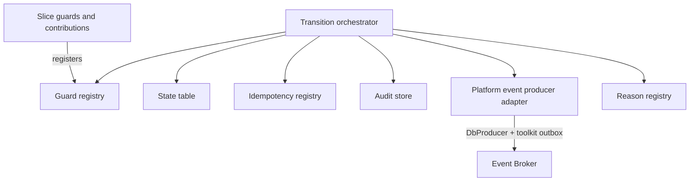
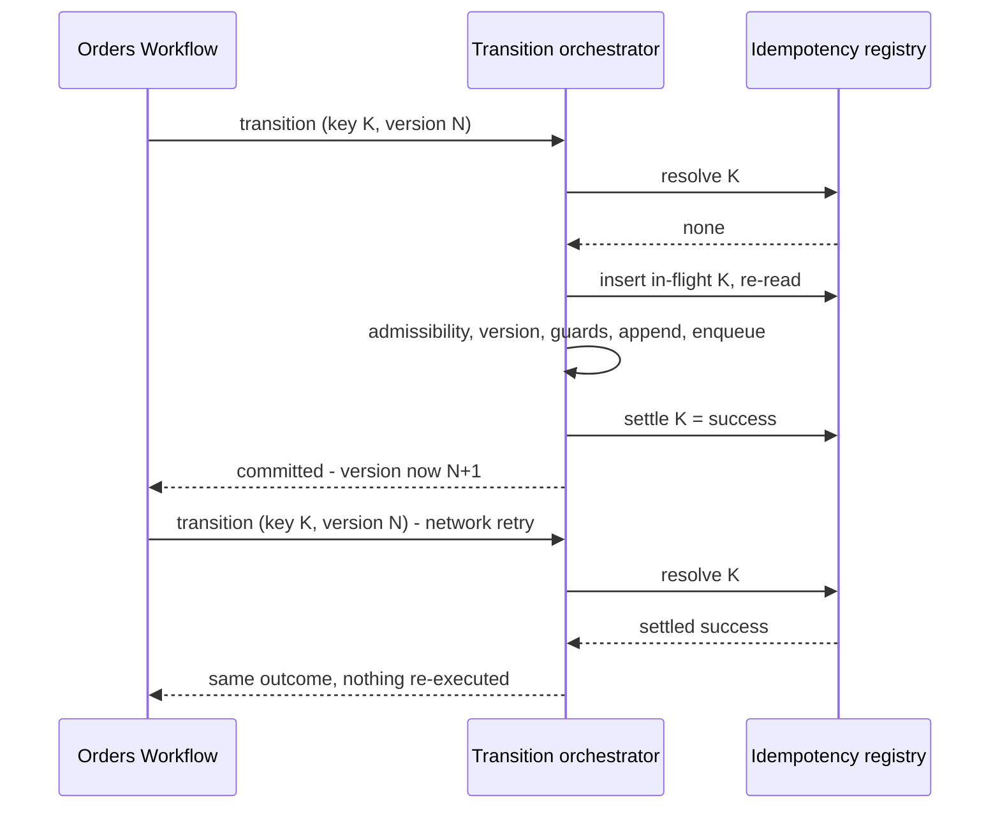

<!-- CONFLUENCE_TITLE: [BSS]: Orders Lifecycle — Order Transition Engine (Slice 1) -->
<!-- Related: ../DESIGN.md, ../PRD.md, ../DECISIONS.md, ./README.md | Owners: BSS Orders team -->

# DESIGN — Order Transition Engine (Slice 1)


<!-- toc -->

- [1. Architecture Overview](#1-architecture-overview)
  - [1.1 Architectural Vision](#11-architectural-vision)
  - [1.2 Architecture Drivers](#12-architecture-drivers)
  - [1.3 Architecture Layers](#13-architecture-layers)
- [2. Principles and Constraints](#2-principles-and-constraints)
  - [2.1 Design Principles](#21-design-principles)
  - [2.2 Constraints](#22-constraints)
- [3. Technical Architecture](#3-technical-architecture)
  - [3.1 Domain Model](#31-domain-model)
  - [3.2 Component Model](#32-component-model)
  - [3.3 API Contracts](#33-api-contracts)
  - [3.4 Internal Dependencies](#34-internal-dependencies)
  - [3.5 External Dependencies](#35-external-dependencies)
  - [3.6 Interactions and Sequences](#36-interactions-and-sequences)
  - [3.7 Database Schemas and Tables](#37-database-schemas-and-tables)
  - [3.8 Deployment Topology](#38-deployment-topology)
- [4. Additional Context](#4-additional-context)
  - [4.1 The Transition Contract (normative)](#41-the-transition-contract-normative)
  - [4.2 Idempotency Semantics (normative)](#42-idempotency-semantics-normative)
  - [4.3 The State Machine (normative)](#43-the-state-machine-normative)
  - [4.4 Events, Audit and the Outbox (normative)](#44-events-audit-and-the-outbox-normative)
  - [4.5 What this slice deliberately does not own](#45-what-this-slice-deliberately-does-not-own)
  - [4.6 Extension points and stability (normative)](#46-extension-points-and-stability-normative)
  - [4.7 GTS types for the cross-gear contract surface (normative)](#47-gts-types-for-the-cross-gear-contract-surface-normative)
  - [4.8 What is deliberately not GTS](#48-what-is-deliberately-not-gts)
  - [4.9 What this section changed, and why it is recorded](#49-what-this-section-changed-and-why-it-is-recorded)
- [5. Traceability](#5-traceability)

<!-- /toc -->

- [ ] `p1` - **ID**: `cpt-cf-bss-orders-lifecycle-design-foundation`

## 1. Architecture Overview

### 1.1 Architectural Vision

This slice is the shared engine every other slice transitions through. It owns the order
aggregate and its append-only version chain, the declarative state-machine table and guard
evaluation, the idempotency registry, the optimistic version check, the append-only transition
audit, the event contract, and the registry of machine-readable business reasons. It owns **no
commercial policy**: it cannot evaluate a sellability predicate, does not know what a catalog
price pin means, and never decides whether an approval was warranted
([`../DESIGN.md`](../DESIGN.md) §1.1; rationale in
[`../ADR/0001`](../ADR/0001-cpt-cf-bss-orders-lifecycle-adr-transition-through-engine.md)).

The engine exists because four of the PRD's `p1` non-functional guarantees are properties of
*how a state change commits* rather than of any capability that requests one. Audit
completeness, zero duplicate effects, transition-commit latency and recoverability are all
decided in a single code path, so this slice makes them assertable once. The **transition
contract** (§4.1) is the whole of that path: one call, one database transaction, and on success
exactly three durable effects on every success — the state or version change, one audit entry (an
administrative edit writes one per changed field, D-117) and one settled idempotency record — plus **one platform producer-outbox message where the transition
row declares an event type**.
There is no partial commit to reconcile, because a failure at any step aborts the transaction
and leaves no state change behind.

Two consequences shape everything downstream. First, **no slice writes order state** — slices
register guard predicates and supply document contributions, and the engine is the only writer,
which is why a new capability cannot regress the correctness core by construction. Second,
**order state is stored, never derived** — no projection, event replay or downstream identifier
reconstructs it, which is what makes Orders Lifecycle a defensible system of record under the
seam rule that forbids the sibling Workflow gear from holding authoritative order state
([`../PRD.md`](../PRD.md) §6.4).

The shape is adopted rather than invented. The Billing Ledger commits balanced journal lines
through one posting engine; the Product Catalog publishes through one fail-closed validation
engine with an append-only history and an outbox. This slice is the same pattern applied to a
state machine instead of a posting or a publish.

### 1.2 Architecture Drivers

#### Functional Drivers

| Requirement | Design Response |
|-------------|------------------|
| `cpt-cf-bss-orders-lifecycle-fr-order-state-machine` | The state machine is data, not control flow: a transition table of `(from, to, trigger, guard set, actor class, versioning behaviour, event type)` rows (§4.3). An edge that is not a row cannot be taken, and no slice may add one. |
| `cpt-cf-bss-orders-lifecycle-fr-order-idempotency` | The idempotency registry stores the committed *outcome* keyed by `(operation, authorized principal, idempotency key)` under a unique constraint — the principal scope is part of the key, so a caller-chosen text value cannot address another caller's record — written inside the transition transaction, and is resolved **before** admissibility and the version check (§4.2). Duplicate effect is impossible rather than unlikely. |
| `cpt-cf-bss-orders-lifecycle-fr-order-history` | Versions are append-only rows retained in-table with a `supersedes_version` back-reference; nothing rewrites or deletes a prior version, so any version is a direct read. |
| `cpt-cf-bss-orders-lifecycle-fr-order-amendment` | The engine distinguishes a **versioning** transition (appends a version row) from a **state-only** transition (appends audit only), so an amendment that does not move state still produces a new version and its event. |
| `cpt-cf-bss-orders-lifecycle-fr-order-events` | A typed event is enqueued through `event-broker-sdk::DbProducer` in the transition transaction and delivered by `toolkit_db::outbox`, giving exactly one producer-outbox message per committed transition **that declares an event type**, under at-least-once delivery with consumer de-duplication by event ID (§4.4). |
| `cpt-cf-bss-orders-lifecycle-fr-order-authorization` | Authorization is an engine pre-guard evaluated before any other check, so scope cannot be widened by a capability. Cross-tenant action additionally requires a verifiable delegation proof, evaluated by PDP policy from the reference the pre-guard forwards (D-111), whose reference is recorded on the audit row. |
| `cpt-cf-bss-orders-lifecycle-fr-order-cancel` | The spawn-signal record is an engine-owned column written by the **spawn-signal transition** and never cleared, which is what lets the cancel guard read a fact rather than infer one from state. |
| `cpt-cf-bss-orders-lifecycle-fr-order-hold` | The pre-hold state is stored on the aggregate by the hold transition and consumed by the resume transition, so resume is a lookup and not an inference. |
| `cpt-cf-bss-orders-lifecycle-fr-order-expiry` | Expiry is an ordinary table row with the system as actor class; the exclusion of `in_fulfillment` and of holds taken from it lives in the table, so a scheduler defect cannot expire an order whose subscriptions may be provisioning. |
| `cpt-cf-bss-orders-lifecycle-fr-orders-boundary-r1-state-sor` | The workflow-only operations are ordinary transition-table rows with the same guard, idempotency and version-check contract as buyer operations. The engine exposes no privileged state-setting path. |
| `cpt-cf-bss-orders-lifecycle-fr-orders-boundary-r5-no-mirroring` | The downstream transition-request identifier is stored on the per-line projection as a correlation column with no state semantics, and the transition table reads no column of it. |

#### NFR Allocation

| NFR ID | NFR Summary | Allocated To | Design Response | Verification Approach |
|--------|-------------|--------------|-----------------|----------------------|
| `cpt-cf-bss-orders-lifecycle-nfr-order-transition-latency` | PRD durable write plus event publish p95 < 1 s; compliance unverified, separate publication target unresolved (D-41, Q-16) | Transition orchestrator and platform producer integration | One transaction, no outbound call inside it: guard inputs and Event Broker types are prepared before it opens; publication follows via platform workers. Commit latency alone does not establish the combined requirement. | At 50 transitions/second, correlate operation start, commit and broker acknowledgement; test full-path latency with backlog/retries, reporting component timings and incomplete deliveries under `DESIGN.md §4.1` |
| `cpt-cf-bss-orders-lifecycle-nfr-order-audit-completeness` | 100 % of transitions audited, zero silent drops | Audit store | The audit append shares the transition transaction on **every** path, committed and refused alike, so an unaudited transition cannot commit; the store is append-only with a predecessor-hash chain, under the single grant-and-retention contract of §3.7 `orders_transition_audit` | Structural test asserting every table row writes an audit entry on both outcomes; fault-injection test asserting a failed audit append aborts the transition; periodic chain-verification job |
| `cpt-cf-bss-orders-lifecycle-nfr-order-idempotency` | Zero duplicate orders or duplicate transition effects, **per principal** — the scope is part of the key, so the guarantee is disclosed at that granularity and `§4.2` states where it stops (create is the one operation a second principal can duplicate) | Idempotency registry | Unique constraint on `(operation, principal_scope, idempotency_key)`; the marker is inserted if absent and then **re-read**, so a concurrent duplicate resolves to the settled or in-flight case rather than racing it | Parallel same-key concurrency test asserting one durable effect; replay test asserting a stored failure replays as a failure; crash test asserting a lease-expired marker is recoverable; cross-principal test asserting one authorized caller presenting another's key neither reads nor overwrites that caller's record |
| `cpt-cf-bss-orders-lifecycle-nfr-order-recovery` | RPO zero for `submitted`+ orders, RTO ≤ 60 min | Persistence and topology | Version, audit and idempotency writes plus the toolkit producer-outbox enqueue are one transaction, committed synchronously to a quorum with a standby in a second failure domain inside the residency boundary; acknowledgement follows durability | DR exercise promoting the standby within the RTO and asserting zero committed-transition loss including undrained toolkit outbox messages |
| `cpt-cf-bss-orders-lifecycle-nfr-order-read-latency` | Order read and list p95 < 200 ms | Read model | The aggregate row carries denormalized current state, `state_entered_at` and a current-version pointer, so a read never walks the version chain | Read benchmarks at production row counts with the page-size bound of [`08-read-and-authz`](./08-read-and-authz.md) §4.5 |

#### Key ADRs

| ADR ID | Decision Summary |
|--------|-----------------|
| `cpt-cf-bss-orders-lifecycle-adr-transition-through-engine` | One engine owns every state change, so the four `p1` guarantees are properties of one code path rather than per-capability discipline |
| `cpt-cf-bss-orders-lifecycle-adr-slice-decomposition` | A foundation slice plus seven capability slices, so the correctness core has an independent review boundary |
| `cpt-cf-bss-orders-lifecycle-adr-fail-closed-gate` | An unevaluable gate input is a refusal, which is why absence is a refusal here too |
| `cpt-cf-bss-orders-lifecycle-adr-closed-enumerations` | The eleven states and eleven events stay closed; §4.3, §4.4 and §4.6 are its normative home |
| `cpt-cf-bss-orders-lifecycle-adr-refusals-commit` | A refusal audits, settles and commits; §2.1, §3.6, §4.1 and §4.2 are its normative home |
| `cpt-cf-bss-orders-lifecycle-adr-outbox-publication` | Events publish asynchronously through `event-broker-sdk::DbProducer` backed by `toolkit_db::outbox`; §3.8 and §4.4 are its normative home, and PRD write-plus-publish latency requires full-path verification (Q-16) |
| `cpt-cf-bss-orders-lifecycle-adr-in-transaction-concurrency` | The one-in-flight-order rule is a database constraint inside the transition transaction; §3.7's claim table is its normative home |

### 1.3 Architecture Layers

- [ ] `p2` - **ID**: `cpt-cf-bss-orders-lifecycle-tech-foundation-stack`

```text
Slice guards +      declared guard predicates · document contributions
contributions       (registered at startup; evaluated, never invoked, by the engine)
       │
       ▼
Transition          authorization pre-guard → idempotency resolve → state-table lookup →
orchestrator        version check → guard evaluation → append → enqueue → commit
       │
       ▼
Engine stores       aggregate + version chain · line identity · administrative content ·
                    draft working set · transition audit (hash-chained) ·
                    idempotency registry · reason registry
       │
       ▼
Platform egress     event-broker-sdk DbProducer · toolkit-db transactional outbox
       │
       ▼
Persistence         PostgreSQL via SecureORM; runtime-owned privilege; append-only history
                    with no update or delete grant on committed rows
```

| Layer | Responsibility | Technology |
|-------|---------------|------------|
| Presentation | Not owned by this slice; transition entry points are registered by the slices that own each operation | — |
| Application | The transition orchestrator and the guard registry | Rust module in the `orders-lifecycle` gear |
| Domain | Aggregate and version-chain invariants, the state table, idempotency semantics, reason registry | Rust domain structs; GTS for cross-gear contract types (§4.7) |
| Infrastructure | Append-only stores, idempotency registry, platform producer outbox, expiry and window sweeps | PostgreSQL, SecureORM, `event-broker-sdk` with feature `outbox`, `toolkit_db::outbox`, `toolkit_db::Db::lock` (§3.8) |

## 2. Principles and Constraints

### 2.1 Design Principles

#### One transaction, with a conditional fourth effect

- [ ] `p1` - **ID**: `cpt-cf-bss-orders-lifecycle-principle-atomic-transition-commit`

A committed transition produces exactly three durable effects in one transaction: the state or
version change, the audit entry and the settled idempotency outcome. Where the row declares an
event type, one platform producer-outbox message is the fourth effect. No required effect may be
deferred to a second transaction. This is the single assumption every `p1` guarantee in §1.2 rests on, and it is why the
engine performs no outbound call inside the transaction — an external dependency inside the
commit would make atomicity a hope.

#### Guards are declared, never embedded

- [ ] `p1` - **ID**: `cpt-cf-bss-orders-lifecycle-principle-guard-declared-not-embedded`

A slice registers a named guard predicate and the engine evaluates it at the point the table
says to. Slices do not call the engine back mid-transition, do not refuse a request before
calling the engine, and the engine does not import slice logic. Guard evaluation order is fixed
by the engine — authorization, then **idempotency resolution**, then state-table admissibility,
then the version check (the other way round for the workflow-trigger class of §4.1, D-110), then
slice guards in registration order — so two capabilities cannot
disagree about precedence. Authorization is evaluated before even the advisory idempotency probe:
an unauthorized caller learns no stored outcome from a key they possess.

#### Idempotency stores an outcome, and is resolved after authorization

- [ ] `p1` - **ID**: `cpt-cf-bss-orders-lifecycle-principle-outcome-store-idempotency`

The registry records what a completed operation *decided*, not merely that it was seen. After the
engine authorizes the caller, replay returns the stored outcome, and a stored refusal replays as
that refusal. Resolution happens **before** admissibility and the version check, because a
versioning transition bumps the version on commit — so a retry of a committed submit or amendment
necessarily carries a superseded version, and any order that checked the version first would refuse
the very replay idempotency exists to serve. The three non-success cases are distinct and none may
be reported as success: payload mismatch, still-processing, and stale version.

#### History is append-only, per table

- [ ] `p1` - **ID**: `cpt-cf-bss-orders-lifecycle-principle-append-only-history`

Versions, line identities, lines, resolved totals, acceptance rows and audit entries are
append-only: they are inserted and never updated or deleted; corrections are new rows. The audit
store's one bounded exception — the purge of time-expired refusal rows — is stated once, on
`orders_transition_audit` in §3.7, and is not restated here. Mutable
Orders-owned state is confined to the aggregate, idempotency registry, draft and administrative
working content, in-flight overlap claims, fulfillment projection and policy rows, each explicitly
marked in §3.7. Producer delivery bookkeeping is platform-owned in `toolkit_db::outbox` tables. This separation keeps commercial history immutable while allowing
operational state to advance.

#### Absence is a refusal

- [ ] `p1` - **ID**: `cpt-cf-bss-orders-lifecycle-principle-absence-is-refusal`

A guard whose inputs cannot be resolved fails. The engine never substitutes a default for a
missing guard input and never treats an unreachable dependency as a pass, matching the
fail-closed posture the published pricing gate takes for an unevaluable predicate.

### 2.2 Constraints

#### The engine is the single writer

- [ ] `p1` - **ID**: `cpt-cf-bss-orders-lifecycle-constraint-single-writer`

No migration, repair script, administrative surface or slice may write the aggregate, version,
line, resolved-total, audit or idempotency tables outside a transition. Producer messages may be
enqueued only by the transition transaction through the bound platform outbox API; toolkit workers
alone mutate their delivery bookkeeping. The constraint is
what the audit guarantee means in practice, and it has an operational cost worth stating: a
data-repair need becomes a new transition-table row with its own guard and reason, not a manual
update. Identity removal is managed outside the audit stores: immutable pseudonymous actor
references and historical hashes MUST NOT be rewritten. The identity-lifecycle contract is
specified in [`../DESIGN.md`](../DESIGN.md) §4.3 (D-96, superseding D-44's erasure exception).

**Writer boundary (D-104).** The engine-only rule covers transition audit records, not all
audit-related storage: the audit worker alone appends `orders_audit_checkpoint` and
`orders_audit_checkpoint_member`; its verification pass has SELECT only. It cannot append
transitions or update/delete historical evidence. The existing scoped retention role alone
deletes expired refusal rows; read paths append their separate access log. These bounded writers
are not permission to repair business state or broaden any role's grants.

#### The idempotency window is 24 hours and is not a commercial bound

- [ ] `p1` - **ID**: `cpt-cf-bss-orders-lifecycle-constraint-idempotency-window`

The registry is request-cache infrastructure with a **24-hour** retention window, matching the
sibling catalog gear's ratified value. Past the window a replayed key is a new operation, so the
window must exceed the longest caller retry horizon — including the sibling gear's reconciliation
sweep, which is explicitly read-only once the window has elapsed. The window is a working
baseline pending the program NFR workshop and **MUST NOT** be conflated with the per-state TTLs
that bound an order's commercial life.

#### Delivery is at-least-once; ordering is partition-scoped

- [ ] `p1` - **ID**: `cpt-cf-bss-orders-lifecycle-constraint-outbox-at-least-once`

The platform producer outbox guarantees one message per committed transition that declares an
event and at-least-once delivery of that message. It does **not** guarantee global ordering or a
strict per-order barrier. `orderId` is the event partition key, so events for one order route to one
broker partition and retain FIFO during ordinary processing and transient retries. A permanently
rejected message is dead-lettered and the toolkit partition cursor advances; later events may then
proceed. Consumers **MUST** de-duplicate by event ID and **MUST** validate the event's
`orderVersion` and resulting state against authoritative Orders state before acting. The stream is
a notification channel, not a reconstruction ledger (§4.4).

#### Guard inputs from unimplemented gears are ports

- [ ] `p2` - **ID**: `cpt-cf-bss-orders-lifecycle-constraint-guard-input-ports`

Guard inputs sourced from gears without an implementation — the occupancy read (`SUB-O5`, amended by D-126) and the
party-eligibility check among them — are resolved through ports before the transaction opens,
under the per-port deadlines of [`03-gate-and-pin`](./03-gate-and-pin.md) §2.2. The engine treats
an unresolvable input as a refusal (§2.1) rather than blocking, so an absent counterpart degrades
a capability instead of stalling the gear.

## 3. Technical Architecture

### 3.1 Domain Model

**Technology**: Rust domain structs internally; GTS types for the cross-gear contract surface, specified in §4.7.

**Core Entities**:

- [ ] `p1` - **ID**: `cpt-cf-bss-orders-lifecycle-entity-order-root`

The aggregate root and the only mutable row among the commercial stores. Carries identity,
human-readable number, category, the three tenant axes, the initiating actor, the optional
contract reference, the current state, `state_entered_at`, the current-version pointer, the
pre-hold state, the spawn-signal instant, the tolerated-authorization risk flag, and the
per-order audit sequence counter.

- [ ] `p1` - **ID**: `cpt-cf-bss-orders-lifecycle-entity-order-version-chain`

An append-only sequence of immutable commercial-content snapshots, each carrying its actor,
timestamp, reason, the derived order market, and a `supersedes_version` back-reference. Exactly
one version is current.

- [ ] `p1` - **ID**: `cpt-cf-bss-orders-lifecycle-entity-order-line-identity`

The order-scoped identity of a line, independent of any version. It is the parent every
version-scoped line row, per-line total and per-line projection references, and it is what makes
"the same line at a different quantity" expressible across an amendment.

- [ ] `p1` - **ID**: `cpt-cf-bss-orders-lifecycle-entity-order-line`

A version-scoped, immutable line: catalog references, quantity, currency, the catalog price pin,
the three resolved dates with the policy-switch state that governed them, term duration, billing
cycle and the overlap scope key.

- [ ] `p1` - **ID**: `cpt-cf-bss-orders-lifecycle-entity-resolved-total`

The captured non-authoritative figures per line and per order, discriminated by scope, carrying
gross and net, the discount component with its promotion reference, and the four charge kinds.

- [ ] `p1` - **ID**: `cpt-cf-bss-orders-lifecycle-entity-administrative-content`

Mutable, separately-audited content that carries no commercial meaning: external references at
order and line level, display labels and internal notes. It lives outside the immutable stores so
that correcting a mistyped purchase-order number requires no version and mutates no history.

- [ ] `p1` - **ID**: `cpt-cf-bss-orders-lifecycle-entity-transition-record`

One append-only audit entry per transition attempt, committed or refused: from-state, to-state,
trigger, outcome, actor identity and class, the delegation-proof reference where one was
required, timestamp, reason, the idempotency key, the process correlation identifier, the version
in force, the changed field with its prior and new value for an administrative edit (which
appends one entry per changed field, D-117), and the
predecessor hash forming a per-order chain.

- [ ] `p1` - **ID**: `cpt-cf-bss-orders-lifecycle-entity-idempotency-record`

The stored outcome of an operation keyed by `(operation, authorized principal, idempotency key)`:
a request fingerprint for mismatch detection binding the record to one target order, a state of in-flight or settled with a lease instant, and the settled
outcome — success with its result reference, or a refusal with its machine-readable reason.

- [ ] `p1` - **ID**: `cpt-cf-bss-orders-lifecycle-entity-outbox-entry`

One `event-broker-sdk` typed-event envelope per committed transition that declares an event type,
holding the event identity, GTS type, `orderId` subject and partition key, version at event time and
payload. It is serialized into the platform producer outbox inside the transaction; Orders owns the
event semantics but no outbox schema or delivery bookkeeping.

**Relationships**:
- `Order root` → `Order version chain`: one-to-many, append-only; exactly one version current, every prior version retained.
- `Order root` → `Order line identity`: one-to-many; the parent of every version-scoped line row.
- `Order line identity` → `Order line`: one-to-many across versions; the identity is stable, each row immutable.
- `Order version` → `Resolved total`: **one-to-many** — one row per line per charge kind, plus the order-level roll-up.
- `Order root` → `Transition record`: one-to-many, append-only and hash-chained; complete by construction because the append shares every transition's transaction.
- `Order root` → `Administrative content`: one-to-one; mutable and audited without a version bump.
- `Idempotency record` → `Transition record`: zero-or-one; a settled outcome references the audit entry it produced, which is what makes replay answerable without re-deriving anything.

### 3.2 Component Model



#### Transition orchestrator

- [ ] `p1` - **ID**: `cpt-cf-bss-orders-lifecycle-component-transition-orchestrator`

##### Why this component exists

The four `p1` guarantees are properties of one code path. Concentrating that path here is what
makes them assertable once and unbreakable by a later capability.

##### Responsibility scope

Resolving guard inputs before the transaction opens; opening the transaction and taking the
aggregate row lock; running the fixed evaluation order; appending the version or audit entry;
settling the idempotency outcome; enqueuing a typed event through the bound platform producer
outbox where the row declares an event type;
committing; and mapping any refusal to its registered reason.

##### Responsibility boundaries

It evaluates guards but authors none. It makes no outbound call inside the transaction, performs
no money arithmetic, and holds no commercial vocabulary.

##### Related components (by ID)

- `cpt-cf-bss-orders-lifecycle-component-guard-registry` — calls
- `cpt-cf-bss-orders-lifecycle-component-state-table` — depends on
- `cpt-cf-bss-orders-lifecycle-component-idempotency-registry` — owns data for
- `cpt-cf-bss-orders-lifecycle-component-audit-store` — owns data for
- `cpt-cf-bss-orders-lifecycle-component-outbox-publisher` — owns data for
- `cpt-cf-bss-orders-lifecycle-component-authz-declaration` — depends on

#### Guard registry

- [ ] `p1` - **ID**: `cpt-cf-bss-orders-lifecycle-component-guard-registry`

##### Why this component exists

Guards must be declarable by slices without letting slices control when or in what order they
run — and without letting a slice refuse a request outside the engine, which would leave the
refusal unaudited and unreplayable.

##### Responsibility scope

Startup registration of named guard predicates against transition-table rows; the registration
contract including each guard's declared inputs and its reason on failure; and rejection at
startup of a guard registered against a row that does not exist.

##### Responsibility boundaries

It contains no predicate logic of its own and no commercial policy. It never invokes a slice
mid-transition.

##### Related components (by ID)

- `cpt-cf-bss-orders-lifecycle-component-transition-orchestrator` — depends on
- `cpt-cf-bss-orders-lifecycle-component-reason-registry` — depends on

#### State table

- [ ] `p1` - **ID**: `cpt-cf-bss-orders-lifecycle-component-state-table`

##### Why this component exists

An edge that exists only in control flow is an edge nobody can enumerate. Making the machine
data makes coverage testable and makes the expiry exclusions structural.

##### Responsibility scope

The declarative rows of `(from, to, trigger, guard set, actor class, versioning behaviour, event
type)`; the terminal set; the hold and resume mapping; expiry eligibility; and the admissibility
check.

##### Responsibility boundaries

It holds no guard implementations and no scheduling. It does not know why an edge exists.

##### Related components (by ID)

- `cpt-cf-bss-orders-lifecycle-component-transition-orchestrator` — depends on

#### Idempotency registry

- [ ] `p1` - **ID**: `cpt-cf-bss-orders-lifecycle-component-idempotency-registry`

##### Why this component exists

Orders drive subscription creation, so a duplicate transition can double-provision and
double-charge. Storing outcomes rather than de-duplicating requests is what makes replay
answerable.

##### Responsibility scope

Key resolution ahead of every other check; the binding of a key to the principal authorized to
present it and to the target order (§4.2); the insert-if-absent-then-re-read protocol; the
request fingerprint and mismatch detection; the in-flight marker with its lease; outcome
settlement including refusals; and the 24-hour retention window with its sweep.

##### Responsibility boundaries

It does not decide whether an operation is admissible and never suppresses a guard. It retains the fingerprint and bounded authorized response snapshot for replay, including
assessment diagnostics when present; it is not the source of current commercial state.

##### Related components (by ID)

- `cpt-cf-bss-orders-lifecycle-component-transition-orchestrator` — depends on

#### Audit store

- [ ] `p1` - **ID**: `cpt-cf-bss-orders-lifecycle-component-audit-store`

##### Why this component exists

Financial-grade auditability requires that the record cannot lag the fact it records, and that
tampering is detectable rather than merely forbidden.

##### Responsibility scope

The append-only transition log with actor, timestamp, reason, key, correlation identifier,
delegation-proof reference and administrative change payload; the per-order predecessor-hash
chain and its verification job; retrieval by order; and the grant-and-retention contract of §3.7
`orders_transition_audit`, which this component implements and does not restate.

##### Responsibility boundaries

It stores no commercial content — that is the version chain's job — and it never becomes the
source a read derives state from.

##### Related components (by ID)

- `cpt-cf-bss-orders-lifecycle-component-transition-orchestrator` — depends on

#### Platform event producer adapter

- [ ] `p1` - **ID**: `cpt-cf-bss-orders-lifecycle-component-outbox-publisher`

##### Why this component exists

Publishing inside the transaction would put an external dependency in the commit path, while a
custom Orders outbox would duplicate platform sequencing, leasing, retry and dead-letter
capabilities. The adapter binds Orders events to the supported platform path.

##### Responsibility scope

Constructing the eleven `TypedEvent` values; preparing their GTS schemas before readiness;
configuring `event_broker_sdk::DbProducer` with managed `ProducerMode::Chained` and the gear's
gateway-issued service `SecurityContext`; binding one `ProducerOutboxQueue` to `toolkit_db::outbox`; and enqueuing through that bound handle using the
transition's transaction runner. The queue uses 16 toolkit partitions and the high-throughput
profile; `orderId` remains the event type's broker partition key.

##### Responsibility boundaries

Orders owns event meaning and payload construction, but does not own outbox tables, lease
acquisition, sequence assignment, retry classification, dead-letter lifecycle, vacuuming or a
re-drive API. Those are platform library responsibilities. Publication failure never alters order
state.

##### Related components (by ID)

- `cpt-cf-bss-orders-lifecycle-component-transition-orchestrator` — depends on

#### Reason registry

- [ ] `p2` - **ID**: `cpt-cf-bss-orders-lifecycle-component-reason-registry`

##### Why this component exists

A refusal a caller cannot key on is not a contract, and two names for one condition is a contract
defect rather than a cosmetic one. Centralising the catalogue is what keeps reasons stable across
slices and mappable to one wire envelope.

##### Responsibility scope

The registry of machine-readable business reasons with their owning slice and stability, the
one-name-per-condition rule, the mapping to a canonical RFC 9457 category plus Orders error
domain/code at the wire edge, and the
mapping from each PRD reason **descriptor** to the registered identifier that satisfies it
(§4.2).

##### Responsibility boundaries

It does not author slice reasons and never carries internal diagnostics into a response.

##### Related components (by ID)

- `cpt-cf-bss-orders-lifecycle-component-guard-registry` — shares model with

### 3.3 API Contracts

- [ ] `p1` - **ID**: `cpt-cf-bss-orders-lifecycle-interface-transition-api`

- **Requirement**: `cpt-cf-bss-orders-lifecycle-interface-order-ops`
- **Technology**: internal Rust API in `gears/bss/orders-lifecycle/orders-lifecycle/src/domain/`; the REST surface is registered by the owning slices through `OperationBuilder` with explicit response metadata

The engine exposes one in-process operation to slices — *attempt a transition* — taking the order
identity, the trigger, the caller's security context, the idempotency key, the expected version,
the optional correlation identifier, and the slice's document contribution. It returns either the
committed outcome or a registered refusal. There is no second entry point, and no variant that
skips a guard.

- [ ] `p1` - **ID**: `cpt-cf-bss-orders-lifecycle-interface-guard-registration`

The startup contract by which a slice registers a named guard against transition-table rows,
declaring the guard's inputs and its failure reason. Registration against a non-existent row
fails startup rather than degrading at runtime.

- [ ] `p2` - **ID**: `cpt-cf-bss-orders-lifecycle-interface-order-read-model`

The engine-owned read of the aggregate row and a named version, on which the read slice builds
its projections. It exposes current state, `state_entered_at`, the current-version pointer and
the version chain; it exposes no guard state and no idempotency content.

**Error surface**: every refusal carries a registered machine-readable reason and maps to an
RFC 9457 `application/problem+json` response at the wire edge, with no internal diagnostics in
the body. The engine contributes `not-admissible`, `version-conflict`, `idempotency-mismatch`,
`still-processing`, `authorization-context-changed`, `expected-version-required` and
`request-invalid`; slices contribute the rest.
No slice may register a second name for these conditions. Refusal reasons are **derived GTS
error types** used as registry keys, not RFC 9457 `type` URIs. The wire `type`, status and title
come from a platform canonical category; the specific reason is identified by `error_domain`
and `error_code`. The authoritative mapping and uniqueness checks are in §4.7.

`authorization-context-changed` maps to canonical `Aborted`, HTTP 409, title "Aborted",
`error_domain: orders-lifecycle.v1` and `error_code: AUTHORIZATION_CONTEXT_CHANGED`, with fixed
detail "Authorization context changed. Refresh the order before retrying." It represents changed authorization
properties between the decision and the locked-row check when no safely reportable version
conflict applies. Its response contains no current state, version, tenant identifiers, policy
details or echoed request payload; only a safe correlation reference may be added. Lost target
access takes the existing non-disclosing authorization/not-found response instead. This reason
audits without settling the key under §3.6; it grants neither automatic retry nor fingerprint
changes. Tests must verify the canonical type/status/title, domain/code and absence of
target-specific details.

`expected-version-required` (D-112) maps to canonical `FailedPrecondition` with the SDK's
same-class transport override `Http::status_code(428)` (Precondition Required), `error_domain:
orders-lifecycle.v1` and `error_code: EXPECTED_VERSION_REQUIRED`. It is the input-validation
rejection of a transition against an existing order whose expected version is missing or
unparseable, raised at the boundary under §4.1 *Expected version is validated at the boundary*
before authorization. It is not one of §4.1's seven refusal classes: it appends no audit entry,
probes, claims or settles no idempotency record, and discloses nothing about the target.

`request-invalid` (D-142) maps to canonical `InvalidArgument`, HTTP 400, `error_domain:
orders-lifecycle.v1` and `error_code: REQUEST_INVALID`. It is the boundary rejection of a request
that fails schema validation and has no more specific registered reason (§4.7 *Validation flow at
the boundary*): a field forbidden for the supplied variant, such as a `denial_reason` with a
non-denied verdict or a `failure_reason` with a completed acknowledgement (`06 §3.6`), a value
outside a closed enumeration, or a key naming no authored field (`04 §3.6` *Append Amendment*).
Like `expected-version-required` it is raised before authorization, is not one of §4.1's seven
refusal classes, appends no audit entry, probes, claims or settles no idempotency record, and
discloses nothing about the target. `expected-version-required`, `page-size-exceeded`,
`filter-invalid` and `cursor-invalid` remain the more specific reasons for their conditions and
are never folded into it. It is boundary-only: the administrative edit whose named fields all
already hold their new values is recognisable only after the stored values are read, and is
refused by `04`'s `administrative-edit-unchanged` (D-149), not by this reason.

### 3.4 Internal Dependencies

| Dependency Gear | Interface Used | Purpose |
|-------------------|----------------|----------|
| `toolkit-db` | Runtime-scoped database access plus `outbox` | The one transaction per transition, append-only stores, toolkit outbox migrations and the managed producer queue |
| `event-broker-sdk` | `EventBrokerApi`, `DbProducer`, `ProducerOutboxQueue` (`outbox` feature) | Typed validation, managed chained producer registration, broker partitioning and asynchronous publication |
| `types-registry` | SDK client | Resolving and registering the GTS event, subject, error and category types of §4.7; a type that fails to register fails the boot |
| `toolkit-db` advisory locks | `Db::lock` / `Db::try_lock`, `DbLockGuard` | Session-bound coordination for the Orders worker roster in §3.8; toolkit manages its own outbox workers |

**Dependency Rules** (per project conventions):
- No circular dependencies
- Always use sdk modules for inter-gear communication
- No cross-category sideways deps except through contracts
- Only integration/adapter gears talk to external systems
- `SecurityContext` must be propagated across all in-process calls

### 3.5 External Dependencies

The producer adapter depends on the platform Event Broker through `EventBrokerApi`, obtained from
`ClientHub`; only the toolkit worker calls it, never the transition transaction. Event Broker type
preparation and managed producer registration happen before the instance becomes ready. Every
guard input sourced outside the gear — catalog and pricing data, tenant-axis validation, contract
status, approval verdicts, payment authorization outcomes, indicative tax — is still resolved by
the owning slice through a port *before* the transaction opens, under that slice's declared
deadline, and reaches the engine as a plain value. The engine therefore makes no network call in
the commit path ([`../DESIGN.md`](../DESIGN.md) §3.5).

### 3.6 Interactions and Sequences

#### Transition commit

**ID**: `cpt-cf-bss-orders-lifecycle-seq-transition-commit`

**Use cases**: `cpt-cf-bss-orders-lifecycle-usecase-order-new-acquisition`

**Actors**: `cpt-cf-bss-orders-lifecycle-actor-orders-partner-admin`, `cpt-cf-bss-orders-lifecycle-actor-orders-workflow`

**Algorithm: Attempt Transition**

**Dispatch (D-105)**: trigger `create` executes the dedicated *Create Transition* branch below
and does not execute this existing-order algorithm. In particular it does not load/lock a
nonexistent aggregate, inspect its prior state or compare an expected existing version.

Input: order_id, trigger, security_context, idempotency_key, expected_version, correlation_id, contribution
Output: committed outcome or registered refusal

`expected_version` is required. Boundary input validation has already rejected a missing or
unparseable one with `expected-version-required` before step 1 — unaudited, with no idempotency
record probed or touched (`§4.1` *Expected version is validated at the boundary*, D-112).

**Mutable-draft concurrency (OL-4).** Commercial version 1 is not a draft-edit token.
`orders_order.draft_revision` starts at 0 and increases exactly once for every committed
commercial draft edit, including header changes and line insertion, replacement or removal.
Administrative edits do not increment it. Draft writes and submit require the client's
`expected_draft_revision`, exposed as `draftRevision` by draft reads, in addition to
`expected_version`. For `draft-mutate` it is **optional at the boundary** (D-147): its absence is
never a boundary rejection, because a client of an order past `draft` has never been shown a
`draftRevision`. The engine compares it only at step 12, after step 11's admissibility check, so a
commercial `PATCH` outside `draft` refuses `not-admissible` (D-145), and in `draft` an absent
value is a mismatch that step 12 refuses `version-conflict` naming the current draft revision.
It is part of the request fingerprint, an absent value taking the not-applicable sentinel. It does not create an immutable
commercial version. Use the existing scoped transaction and aggregate row lock, not a new lock
service. This follows Pricing's distinction between commercial revision and mutable row version
(`pricing/src/domain/concurrency.rs`), with Orders-specific fields.

Before external guard resolution, take a coherent authorized draft snapshot in a short scoped
transaction under that same aggregate lock, including all lines, tenant axes and its
`prepared_draft_revision`; release the transaction before any network calls. All commercial
draft writers take this lock and increment the revision atomically with their writes. After the
authoritative idempotency gate has allowed a **new** execution, compare both the client revision
and the prepared revision with the locked aggregate before consuming any prepared result,
including an unavailable-input result in step 3.1. A mismatch settles `version-conflict`, audits
and returns the authorized current version/revision; it never commits a stale gate outcome or
stale draft contribution. Matching settled outcomes replay first and are not invalidated by a
later edit. Step 12 includes these comparisons. No automatic rebase or reuse of old external
results is permitted. Server snapshot tokens are not part of the client request fingerprint.

Required tests race submit with header/quantity edits and line addition/removal, race two draft
edits at the same revision, and repeat with failed external resolution. Exactly one competing
draft revision may be consumed; stale execution changes no commercial data, claims or events.
Also verify a stored success still replays after the draft revision has changed.

**Unresolved targets (D-98).** On an early authorization denial, persist the validated requested
identifier as `requested_order_ref`, with `order_id`, `from_state`, `to_state` and `version` NULL.
Persist the actor's trusted `subject_tenant_id` under D-104's scoped service append permission;
`audit_tenant_id` and `resource_tenant_id` remain NULL. Committed create initializes its immutable
audit namespace, NULL prior state, `draft` target state and sequence 1 in the creation transaction.
Do not query the aggregate merely to populate the audit record: NULL means **not resolved**, not
proof of nonexistence. No order is created, audit sequence allocated, or idempotency key settled
on this path. This applies identically to an existing inaccessible order and an unknown identifier;
the external authorization refusal is unchanged. A refusal before a create has allocated an
order identifier has both references NULL. Audit-write failure aborts the refusal transaction;
it MUST NOT permit the operation, disclose target existence or be reported as a durably audited
refusal. The common infrastructure-error mapping applies, without target-specific detail.

1. [ ] - `p1` - Evaluate the authorization pre-guard through the shared PolicyEnforcer adapter for the trigger's resource/action from `08 §4.3`, using the authenticated SecurityContext and, as PDP request context, the delegation proof reference the caller supplied — PDP policy decides whether the path needs it and whether it is valid (`08 §4.4`, D-111); the engine never verifies proof itself. Every trigger on this path names a target, so a PDP delegation-proof denial answers `order-not-found`, never `delegation-proof-required` / `delegation-proof-invalid` (D-141); the classified reason is kept only in the scoped internal log/metric (`08 §3.6` common read wrapper item 3). Use only the platform-approved minimal point-target prefetch to obtain current authorization properties, without a row lock or disclosure, then enforce the returned current-order scope. Where the prefetch finds no row, still make this call with the target ID and an empty property set, **and** the D-114 follow-up `order × read` below with the same target ID and an empty property set, discard both results and take the `order-not-found` arm, so both arms make the same PDP calls; a PDP outage on either call returns the sanitized 503 exactly as for an existing order (`08 §3.6` common read wrapper item 2, D-68). Actor class alone grants nothing. If denied, map the denial by `08 §3.6`'s common wrapper denial mapping (D-114, D-141): make the follow-up `order × read` on the target, on this deny path only and whatever the deny reason; a delegation-proof denial answers `order-not-found` (404) whatever the follow-up answers, and any other denial answers `operation-not-permitted-for-actor` (403) where the follow-up allows, otherwise `order-not-found` (404); append refusal evidence under the separately authorized service scope, commit and return without probing or settling idempotency; do not load the aggregate merely for audit enrichment. Only after authorization may the scoped registry be probed for (operation, principal_scope, idempotency_key), with principal_scope from the authenticated context. A matching settled outcome may replay before business guard work only after current access has been rechecked; a stored outcome is not an access grant - `inst-probe-idempotency`
2. [ ] - `p1` - For a new execution, construct the complete proposed arrangement from stored values and validated contribution. Obtain the additional proposed-relationship authorization required by `08 §4.3` before fetching commercial facts about newly named parties; submit also requires current payer-use authority. Denial follows the authorization refusal path, not a tentative business write. Resolve the remaining declared business guard inputs outside any transaction under each port's deadline - `inst-resolve-guard-inputs`
3. [ ] - `p1` - **IF** any declared input is unresolvable or its deadline elapses — a **precluded** input (`§4.1`) is never unresolvable and never enters this branch: - `inst-if-input-unresolvable`
   1. [ ] - `p1` - Open a refusal transaction and apply the same PDP-scoped locked-row and authorization-fact recheck as step 5. Run the common transactional idempotency gate below, equivalent to steps 6–9: return an unchanged matching settled outcome, refuse a fingerprint mismatch without changing the record, or refuse a matching live lease without stealing it. After claiming/reclaiming ownership, apply steps 10–12, including client and prepared draft revisions: changed draft inputs settle version-conflict, not a stale unevaluable reason. Lost access or changed authorization facts take their existing non-settling refusal paths instead. A still-current new execution then settles by `§4.1` precedence: - `inst-return-input-unresolvable`
      1. [ ] - `p1` - **FOR EACH** slice guard in the row's guard set registered **ahead of** the first guard with an unresolved input, in registration order, whose own inputs all resolved: evaluate it against the locked state as step 13 does, and **IF** it fails, settle that engine/guard-only refusal without an assessment exactly as step 13 does, append refusal audit, commit and **RETURN** it — an earlier-registered failing guard is never masked by a later unavailable input (D-113) - `inst-if-earlier-guard-fails`
      2. [ ] - `p1` - Only when none fails, persist the completed gate assessment under the diagnostic settlement contract below, settle the owned record with the complete response and selected unevaluable reason, append refusal audit and commit. Non-gate input failures carry no assessment - `inst-settle-input-unresolvable`
4. [ ] - `p1` - Open one transaction for everything that follows - `inst-open-transaction`
5. [ ] - `p1` - Load the aggregate for order_id through the PDP-produced current-order scope **taking its row lock**, also serialising audit-sequence allocation. If inaccessible, refuse without disclosing current facts. Compare current authorization-relevant properties with those used for the PDP decision. A mismatch refuses as a conflict with no automatic reauthorization/rebase; never continue under a stale decision. Retain the lock through commit. Idempotency replay still precedes the request's expected-version check; a new execution must also pass step 12 before mutation - `inst-load-aggregate-locked`
6. [ ] - `p1` - Resolve and lock the authoritative idempotency record for (operation, principal_scope, idempotency_key), the scope taken from the authorized security context. Steps 7–9 expand the common transactional idempotency gate below; retain the aggregate-before-registry lock order - `inst-resolve-idempotency`
7. [ ] - `p1` - **IF** a record exists, check its fingerprint before interpreting settlement or lease state: - `inst-if-idempotency-settled`
   1. [ ] - `p1` - **IF** its request fingerprint differs from this request: - `inst-if-fingerprint-differs`
      1. [ ] - `p1` - Append the audit entry, commit, and **RETURN** idempotency-mismatch refusal - `inst-return-fingerprint-mismatch`
   2. [ ] - `p1` - **IF** the matching record is settled: commit and **RETURN** the stored outcome unchanged, success or refusal alike, with no new refusal audit or registry mutation - `inst-return-stored-outcome`
8. [ ] - `p1` - **IF** an in-flight record exists **AND** its lease has not expired: - `inst-if-idempotency-in-flight`
   1. [ ] - `p1` - Append the audit entry, commit, and **RETURN** still-processing refusal, never a success - `inst-return-still-processing`
9. [ ] - `p1` - If absent, claim by conflict-safe insert and locked re-read; if matching and expired, reclaim atomically under the registry lock. After an insert conflict, repeat steps 6–8 against the winning record; do not assume ownership from the earlier probe. Continue only as the new/reclaimed owner, retaining the registry lock through settlement and commit - `inst-insert-in-flight-and-reread`
10. [ ] - `p1` - Look up the state-table row for (current state, trigger); for a workflow-class trigger (`§4.1`) compare the version first, because `§4.1` orders the version check ahead of admissibility for that class only: - `inst-state-table-lookup`
    1. [ ] - `p1` - **IF** the trigger is workflow-class **AND** expected_version differs from the current version: - `inst-if-workflow-version-conflict`
       1. [ ] - `p1` - Settle the record with the refusal, append the audit entry, commit, and **RETURN** version-conflict naming the authorized current version, exactly as step 12.1 does — never not-admissible, even when the superseding change also moved the state - `inst-return-workflow-version-conflict`
11. [ ] - `p1` - **IF** no row exists: - `inst-if-not-admissible`
    1. [ ] - `p1` - Settle the record with the refusal, append the audit entry, commit, and **RETURN** not-admissible naming current state and trigger - `inst-return-not-admissible`
12. [ ] - `p1` - **IF** expected_version differs from the current version (a workflow-class trigger reaching here has already passed this comparison at step 10.1), or for draft writes/submit either expected_draft_revision or prepared_draft_revision differs from the locked draft_revision — an absent `draft-mutate` expected_draft_revision differs from every revision, and is only ever compared here, after step 11 (D-147): - `inst-if-version-conflict`
    1. [ ] - `p1` - Settle the record with the refusal, append the audit entry, commit, and **RETURN** version-conflict naming the authorized current version and, for draft operations, draft revision - `inst-return-version-conflict`
13. [ ] - `p1` - **FOR EACH** guard in the row's guard set, in registration order: - `inst-for-each-guard`
    1. [ ] - `p1` - Evaluate the guard against committed state and the resolved inputs - `inst-evaluate-guard`
    2. [ ] - `p1` - **IF** the guard fails: - `inst-if-guard-fails`
       1. [ ] - `p1` - For a gate-assessment refusal, persist its complete diagnostics under the contract below before settling the response snapshot; otherwise settle the engine/guard-only refusal without an assessment. Apply §4.7 to select the primary reason and retain the complete gate failure list - `inst-settle-refusal`
       2. [ ] - `p1` - Append the audit entry recording the refused attempt - `inst-audit-refusal`
       3. [ ] - `p1` - Commit, then **RETURN** the settled response, including every gate failure if assessment was reached - `inst-return-guard-refusal`
14. [ ] - `p1` - Resolve the effective target state: the stored pre-hold state when the trigger is resume, otherwise the row's target - `inst-resolve-effective-target`
15. [ ] - `p1` - **IF** the trigger is resume **AND** no pre-hold state is stored: settle, audit, commit and **RETURN** a refusal - `inst-if-resume-target-missing`
16. [ ] - `p1` - Capture the outgoing state before any assignment - `inst-capture-outgoing-state`
17. [ ] - `p1` - Maintain this order's overlap claims; this is where the one-in-flight-order rule of `§3.7` is enforced, and it runs on **every** row rather than only on the acquiring ones: - `inst-maintain-claims`
    1. [ ] - `p1` - **IF** the effective target is in the terminal set of `§4.3`: release every unreleased claim this order holds and **SKIP TO** step 18 — a terminal transition acquires nothing, and releasing here is what keeps a completed order from holding its key forever - `inst-release-on-terminal`
    2. [ ] - `p1` - **IF** the contribution carries no resolved overlap keys — every non-terminal row but submit and amendment: **SKIP TO** step 18, leaving the claim set untouched - `inst-skip-claims`
    3. [ ] - `p1` - Compute the **distinct** proposed claim tuples `(proposed payer_tenant_id, overlap_scope_key)` from the incoming version. Compare full tuples with this order's unreleased claims and partition them into already-held and missing tuples; never compare overlap keys alone - `inst-partition-claim-keys`
    4. [ ] - `p1` - Insert one claim row per missing tuple only, offered in a common total order by payer UUID bytes then overlap-key bytes, with `ON CONFLICT (payer_tenant_id, overlap_scope_key) WHERE released_at IS NULL DO NOTHING`, returning inserted claim IDs and tuples. Use the proposed version's payer even before the aggregate payer is updated - `inst-take-claims`
    5. [ ] - `p1` - **IF** fewer rows return than distinct tuples were offered: release only the exact claim IDs returned by this attempt's insert, scoped to this order and `released_at IS NULL`, and require the affected count to equal the returned-ID count. Skip the UPDATE if that set is empty. On release error/count mismatch abort the whole transaction with an infrastructure outcome. Otherwise preserve all pre-existing claims, persist the reached assessment with predicate 9 replaced by the authoritative conflict under the diagnostic settlement contract, settle the complete response for `order-in-flight-for-key`, append refusal audit and commit by returning a successful transaction result carrying the refusal; §3.7 defines the released-reservation history - `inst-if-claim-conflict`
    6. [ ] - `p1` - After complete acquisition, release only this order's unreleased claims whose full `(payer_tenant_id, overlap_scope_key)` tuple is absent from the proposed set. A payer-only change therefore releases `(old payer, key)` after acquiring `(new payer, key)`, in the same transaction as the amendment - `inst-release-superseded-claims`
18. [ ] - `p1` - **IF** the row's versioning behaviour is versioning: - `inst-if-versioning-row`
    1. [ ] - `p1` - Append a new version row from the contribution, with supersedes_version set to the outgoing current version - `inst-append-version`
    2. [ ] - `p1` - Move the aggregate's current-version pointer to the new version - `inst-move-version-pointer`
19. [ ] - `p1` - Write every other document contribution the row declares — lines, totals, verdict, linkage, projection, acceptance, gate outcome — including the aggregate fields in the explicit contribution mapping below - `inst-write-contributions`
20. [ ] - `p1` - **IF** the effective target differs from the outgoing state: - `inst-if-state-changes`
    1. [ ] - `p1` - Set the aggregate's state to the effective target and set state_entered_at - `inst-set-state`
    2. [ ] - `p1` - **IF** the effective target is on_hold: store the outgoing state as the pre-hold state - `inst-store-pre-hold`
    3. [ ] - `p1` - **IF** the effective target is not `on_hold`: clear the pre-hold state - `inst-clear-pre-hold`
    4. [ ] - `p1` - **IF** the trigger is resume: increment `resume_count` - `inst-increment-resume-count`
21. [ ] - `p1` - **IF** the trigger is amendment: increment `amendment_count`; this sits outside step 20 because rows 18 and 20 differ in whether the state changes and both **MUST** count - `inst-increment-amendment-count`
22. [ ] - `p1` - Allocate the next audit sequence from the aggregate's counter and append the committed audit entry with from-state, to-state, trigger, outcome committed, actor, proof reference, reason, caller_reason where the caller supplied one (§3.7, D-143), key, correlation_id, version in force and the predecessor hash. For an administrative edit, append **one entry per changed field** instead, each carrying its `changed_field`, `prior_value` and `new_value`, at consecutive sequence numbers with each entry's predecessor hash the entry before it (§4.1, D-117); a named field whose new value equals its stored value writes no entry, and an edit in which no named field changes never reaches this step, because step 13 refuses it `administrative-edit-unchanged` through the change guard `04 §3.6` *Apply Administrative Edit* step 1 declares (D-142, D-149). Every other transition appends exactly one entry - `inst-append-audit`
23. [ ] - `p1` - **IF** the audit append fails: - `inst-if-audit-fails`
    1. [ ] - `p1` - Roll back the entire transaction, including business writes, claims, audit sequence and idempotency changes, then **RETURN** the sanitized canonical infrastructure Problem defined below. Do not proceed to enqueue, settlement, commit or a success response - `inst-abort-on-audit-failure`
24. [ ] - `p1` - **IF** the row declares an event type: construct exactly one typed event and call the bound `ProducerOutbox::enqueue` with this transaction's runner; **IF** validation, serialization or enqueue fails, abort the transaction - `inst-enqueue-outbox`
25. [ ] - `p1` - Settle the idempotency record with the success outcome, immutable settled_response (including the reached assessment), and a reference to the audit entry step 22 appended — the last of them for an administrative edit (D-117) - `inst-settle-success`
26. [ ] - `p1` - Commit the transaction - `inst-commit-transaction`
27. [ ] - `p1` - **RETURN** the committed outcome - `inst-return-committed`

**Diagnostic settlement contract (submit/amendment).** Gate evaluation is one composite
slice guard over the prepared complete vector, not a series of early returns on individual
predicates. Register it after all non-gate slice guards on submit/amendment; those earlier
guards retain their engine-only refusal behavior. Evaluate the vector in declared predicate order,
then binary line ID, binary component plan ID and canonical catalog-scope-key UTF-8 bytes, NULL
first at each level, as specified in `03 §3.7`. Preserve both component/key identity fields in
the stored assessment, public report and replay; the failure list retains this same order.
§4.7 selects its primary Problem while retaining every failed/unevaluable result.
Authorization, authoritative idempotency resolution, state/version/draft-revision checks and
applicable pre-gate structural guards retain precedence, on the early input-failure branch too:
step 3.1.1 settles a failing earlier-registered guard before any unevaluable gate reason (D-113).
Validate the prepared transition-date
basis against the single timestamp `t` before consuming the assessment, including the early
input-failure branch. A failure of these checks returns its own response with no assessment ID
and writes no gate-outcome rows; discard the unconsumed provisional run. A replay also discards
any losing contender's provisional run and returns the winner's stored snapshot.

Once those checks admit gate evaluation, the early input-failure branch and guard-refusal
branch MUST insert the complete `orders_gate_outcome` vector, trusted metadata and run ID,
then settle `settled_response` with that same assessment and audit the refusal, in one
transaction. This is a narrowly defined diagnostic contribution: do not execute step 19's
commercial writes or append versions, lines, totals, acceptance or events on refusal.
The overlap-conflict branch likewise persists the reached assessment with the authoritative
`order-in-flight-for-key` outcome replacing its advisory predicate-9 result, after releasing
only this attempt's provisional claims. Success writes the assessment with step 19 and binds
it to the response at settlement. Audit, diagnostic, response serialization or commit failure
rolls back the entire attempt, including diagnostic rows and idempotency ownership changes.
No response may claim a durable assessment before commit. Preview's standalone transaction
is owned by `03 §3.7` and does not use the transition registry.

Acceptance must trace admitted submit/amendment, mixed failed/unevaluable predicates, pin
composition failure, overlap-claim collision, stale draft/date basis and an advisory probe
losing a race to settlement. Verify the response-to-run relationship, complete diagnostics,
zero commercial effects on refusal, rollback on diagnostic failure, and exact replay of the
original response/assessment without another run.

**Step 19 aggregate contribution mapping.** The engine writes these fields under the aggregate
row lock, in the same transaction as the transition/audit. Slices supply validated contributions
and register guards; they do not update the aggregate independently.

Capture's structural guards are shared by create, commercial draft mutation, submit and
amendment: validate the complete proposed category against this phase's admitted GTS instances
(`new_sale` only) and use `category-not-admitted` for `change` or another unsupported category.
Amendment cannot bypass admission by changing a previously valid category. Mixed-currency
content uses Capture's single `currency-mixed` reason in authoring and the gate. Capture's
`line-cap-exceeded` is shared too: line authoring applies it to the draft, and amendment applies
it to the complete proposed line set, because an amendment can add lines (`04 §3.6` *Append
Amendment* step 1). There is no
line-level payer override; target payer authorization/validity use the existing axis guards,
not an unused `payer-mismatch`. Register these guards once and reuse them across rows, after
the engine's authorization/idempotency/state/version checks.

Submit/amendment contributions include the `orders_date_policy` switches and revision resolved
before the transaction, plus the proposed default-date basis. After the preceding engine checks,
sample one server transition timestamp `t`; the date guard compares transition-date defaults
against `UTC-date(t)` before consuming date-dependent external results. A mismatch settles
`date-cascade-invalid` and requires fresh resolution, never an in-transaction network call or
silent recomputation of dates only. Step 19 writes the validated date fields and exact policy
snapshot on the new lines. This is `02 §4.2`'s timestamp convention, not the future physical commit.

For `expire`/`auto-void`, the configured internal worker supplies the complete engine input
and observed generation/policy contribution specified in `07 §3.6`. After replay handling,
compare locked `audit_sequence`, state, dwell, current version, effective policy revision and
`platform_policy_revision` before the due/exemption guards. Stabilize effective `ttl_duration`
using that section's existing policy-row locking protocol through commit. A stale candidate
settles `expiry-candidate-stale`; fresh discovery gets a new generation-bound key. A transport
retry keeps its original key and input. The worker does not bypass the engine or fabricate a
user SecurityContext.

| Admitted transition | Required aggregate write |
|---------------------|--------------------------|
| Row 2, commercial draft edit | Increment `draft_revision` once after the locked client/prepared-revision checks; apply all declared header and line changes atomically; row 3 administrative edits do not increment it |
| Row 12, `report-spawn-signal` | Set `spawn_signal_at` to the server-recorded report instant; the registered already-recorded guard prevents replacement, and no later transition clears it |
| Row 11, `begin-fulfillment`, with tolerated authorization failure | Set `authorization_failure_tolerated_at` to the server-recorded tolerance-decision instant only when the registered tolerance guard admits that outcome; otherwise preserve its value, never clear it |
| Row 14 or 26, `acknowledge-failed`, or row 16 or 27, `cancel-workflow-mediated` | Persist the validated `compensation_evidence` contribution after its evidence guards pass; other transitions preserve the field |

These writes precede audit and commit. A rollback removes them together with the transition.
Required implementation tests must show that a committed spawn signal blocks direct cancellation,
a tolerated failure retains its flag, and failure/workflow-cancel stores its evidence; refused
or aborted transitions must not leave any of these writes behind.

**Infrastructure-error termination.** An audit-write failure is not an eighth business-refusal
class: no refusal is durably recorded by the failed transaction. After full rollback, map a
known temporary database/storage outage to canonical `ServiceUnavailable` (503), and other
unexpected persistence failures to canonical `Internal` (500), using the shared platform mapper.
Return sanitized detail and a safe correlation reference only; never raw SQL, target data or a
claim of successful auditing. The same termination applies to persistence/enqueue failures.
Do not try to append refusal evidence in an aborted transaction or continue after a savepoint
that discarded the mandatory audit. On a lost commit acknowledgement, report the uncertain
infrastructure outcome, never assert rollback was confirmed; a same-key retry resolves whether
the transaction committed. Test failure injection and that no later algorithm step executes.

**Common transactional idempotency gate.** Normal execution, input-resolution failure and
Create Transition use the same decision order below. The pre-transaction probe grants no
ownership. Existing-order paths first perform step 5's authorization and aggregate lock/recheck,
then lock the registry record; create locks the registry without a nonexistent aggregate.
Successful replay still requires the applicable current-access check. Apply §4.2's retention
expiry rule under the registry lock before classifying a retained record. Compare fingerprints
before testing settlement or expiry, including for expired and live in-flight records.

| Authoritative registry state | Required action |
|------------------------------|-----------------|
| Any record with a different fingerprint | Append mismatch refusal evidence and commit; preserve fingerprint, outcome, ownership and lease |
| Matching settled record | Return the stored success or refusal unchanged; no new refusal audit, business mutation or settlement |
| Matching in-flight record with a live lease | Append still-processing refusal evidence and commit; do not settle, renew or steal the owner's marker |
| No record | Conflict-safe insert with a fresh lease deadline followed by locked re-read; if another request won, evaluate its record through this gate |
| Matching in-flight record with an expired lease | Under the row lock, recheck status/fingerprint and replace the deadline as defined below; lease expiry never bypasses a live transaction's lock |

Only the request that has acquired ownership may settle a new business outcome. The registry
lock is held through the audit append, settlement and commit; audit/persistence failure rolls
back all new effects. Never use an upsert that overwrites a stored outcome. Once ownership is
established, an input-resolution failure takes its unevaluable refusal path; normal execution
continues to state/version/guard evaluation. The gate changes neither authorization precedence
nor the policy that a genuinely settled unevaluable refusal replays for the idempotency window.

**Claim/reclaim mechanics (normative).** `idempotency_lease_duration` is an explicit, positive,
finite deployment setting, validated before accepting mutations; there is no implicit default.
It is distinct from the 24-hour retention window, order-state TTLs and worker advisory locks.
After acquiring the registry row lock, read the current row and obtain fresh database wall-clock
time `t` (PostgreSQL `clock_timestamp()`, not transaction-start `now()` captured before a lock
wait). A matching `in_flight` row is expired exactly when `lease_expires_at <= t`. Reclaim it by
updating `lease_expires_at = t + idempotency_lease_duration` under that lock, preserving the key,
fingerprint, target, status and retention timestamps. A new claim initializes the same deadline.
Insert with `ON CONFLICT (operation, principal_scope, idempotency_key) DO NOTHING RETURNING`
the inserted key, then perform the locked re-read. A returned row identifies this transaction
as the successful inserter; an empty result requires re-evaluation of the winning record. Do
not catch a raw uniqueness violation and continue in an aborted PostgreSQL transaction.
The successful inserter is the owner of its own new row; its locked re-read must not mistake its
own fresh lease for a competing request's lease. An insert loser re-enters the gate against the
winner's locked row instead. Reclaim failure or database error aborts; it never grants ownership.

Ownership is the right of the transaction holding the registry row lock to complete this attempt,
not a separately persisted owner ID or fencing token. Keep that lock through all business writes,
audit append, settlement and commit. Settlement sets `status = settled`, stores the outcome and
clears `lease_expires_at`. No lease renewal is needed during this locked transaction: passing
the deadline does not revoke its lock or let a second recoverer proceed. A competing recoverer
waits, then re-reads and either replays the settled result or re-evaluates the remaining marker.
Bound lock waits/transaction duration through database timeouts; timeout is not permission to
continue without the lock or evidence that the operation succeeded.

Claim/reclaim is **not committed separately** from the attempt. Crash before commit rolls back
the new claim or deadline update and every new business/audit effect; crash after commit leaves
a settled result for replay. This atomic path normally leaves no durable in-flight marker after
a crash. Handling a pre-existing durable marker is an explicit recovery case, not a reason to
add a two-phase ownership protocol. A failed reclamation rolls back to that marker's prior
deadline so a later authorized request can retry the gate.

**Internal worker entry.** The private maintenance capability in `08 §3.5` is the sole exception
to this algorithm's caller-PDP pre-guard. Lifecycle-owned expiry/auto-void workers may enter only
their allowlisted transitions with a real configured service actor and narrowly scoped target
authority, not a user-supplied system flag. They recheck due-state/TTL eligibility and target
properties under the same aggregate lock and keep every business guard, idempotency rule,
transactional audit requirement and outbox obligation. They cannot rebind tenant axes or replay
another principal's outcomes. Orders Workflow remains a PDP-governed external caller. Broad
worker discovery scopes must never reach transition writes. Worker audit persistence uses its
configured restricted internal authority, with the same audit integrity guarantees as the
private request-persistence path; neither path may bypass database grants.

**PDP integration boundary.** The normative adapter, action catalog and three-axis mapping are
in `08 §3.5` and `§4.3`. Steps 1–2 require actual permission enforcement by the selected platform
provider, not merely catalog registration or a permissive development-plugin response.
Proposed-value enforcement with existing platform APIs remains unverified: until demonstrated,
the new-execution write path is not implementation-ready. Do not infer authorization from a
successful scope-compilation call alone, ignore returned constraints, add an Orders evaluator,
or use tentative writes followed by rollback as a substitute for a durable refusal procedure.
No new mandatory toolkit API is selected here.

All persistence uses appropriately authorized SecureConn/SecureTx scopes: the caller's
current-order scope governs the target mutation; child contributions are bound to that order;
idempotency, audit and outbox persistence are private effects under restricted service database
authority, with scopes bound to the authorized target, authenticated principal/key and producer
queue as applicable. They require no separate PDP action or in-transaction PDP call (`08 §3.5`),
and must not accidentally reuse an unrelated entity's scope or broaden the business grant.
The values persisted must be exactly those authorized, and scoped/conditional writes must
preserve the locked-row checks. No outbound commercial action or broker publication may occur
inside this transaction; required events are enqueued transactionally as before.

**Refusal and replay boundaries.** The minimal prefetch needed for PDP is permitted; the
prohibition on denial-time aggregate reads means no additional lookup for audit enrichment and
no aggregate lock for an early authorization denial. A late scope failure or authorization-fact
conflict performs no business mutation and records only evidence that the service may retain,
without leaking new target values. A late authorization-fact conflict is audited but **does not
settle the idempotency key**. Perform this check before acquiring/creating the attempt's registry
claim or applying business changes, including in the input-resolution refusal branch. Leave
any existing registry record unchanged: never overwrite a settled outcome, release another
attempt's lease, or reset a fingerprint. Commit only the permitted refusal evidence. A subsequent
attempt obtains fresh authorization and follows the existing fingerprint, lease and replay
rules; an unsettled conflict does not authorize changing the request under an existing key.

Use `version-conflict` when a changed version is safely observable. Otherwise use a sanitized
conflict response without current state, version, tenant identifiers or policy details. If the
scoped target is no longer accessible, preserve the non-disclosing authorization/not-found
behavior rather than confirming its existence with a conflict. The sanitized reason is
`authorization-context-changed` (HTTP 409), registered in §3.3/§4.7. This late-conflict rule
does not change step 12's ordinary expected-version refusal after authoritative idempotency
resolution. Tests must cover same-key retry with fresh authorization, untouched pre-existing
settled/live records, zero business/outbox effects and durable refusal evidence. PDP outages
follow `08 §3.5`: sanitized retryable service-unavailable, no business mutation or idempotency
settlement, and no business-authorization bypass. The private audit writer may record failure
under configured database authority without an additional PDP call. If that authority or its
storage is unavailable, operational
telemetry is the only evidence promised, not a business-audit row. Do not report a durably recorded refusal unless its audit
transaction commits. Replays execute no new transition or proposed-value mutation; authorize
current access to the target and disclosure of the stored outcome, without treating an old
expected version as a reason to reject an otherwise authorized replay.

**Description**: The evaluation order is fixed and total. Authorization precedes even the
advisory idempotency probe, so an unauthorized caller learns nothing about the order's state or a
stored outcome. **After authorization, idempotency resolution precedes admissibility and the
version check**, because a versioning transition bumps the version on commit — so a retry
necessarily carries a superseded version, and checking the version first would refuse the replay
this registry exists to serve. Business refusal paths settle their owned records, append audit
evidence and commit. Authorization denials and the late authorization-fact conflicts above do
not settle keys; their separately authorized audit evidence still must commit before they are
reported as durably recorded refusals.

**The overlap claim is enforced first, because it is a constraint and not a guard.** Step 17 sits
ahead of the version append at 18 and ahead of every other contribution, and that position is the
mechanism. Two properties force it. First, the enforcement is a **partial unique index** (`§3.7`
`orders_inflight_overlap_claim`), and a raw unique violation aborts the whole PostgreSQL
transaction — the one that step 22's audit append and step 25's settle still have to run in — so
the claim is taken with `ON CONFLICT … DO NOTHING` and the conflict detected as a **row shortfall**
rather than raised as an error; `order-in-flight-for-key`, the design's only
concurrency-correctness refusal, would otherwise be unwritable. Second, a refusal decided at step
17 precedes version and document writes, avoiding a phantom version on refusal. This ordering
does not undo partially inserted claims: §3.7 requires their exact-ID release before refusal commit. Two prohibitions
follow: no step **MAY** take the claim after step 17, and no path **MAY** map the collision to an
infrastructure error.

**Tuple identity and acquisition ordering.** Sub-steps 17.3 to 17.6 compare full
`(payer_tenant_id, overlap_scope_key)` tuples: retain held tuples, acquire missing tuples and
release superseded tuples only after complete acquisition. A refusal preserves all claims held
on entry and releases only this attempt's provisional acquisitions as specified in §3.7. Release
first — the earlier shape — committed the release along with the refusal, so a refused amendment
surrendered its own key ([`../DECISIONS.md`](../DECISIONS.md) **D-86**). Partitioning also removes
the amendment's self-collision **structurally**: a tuple the order already holds is never re-offered,
so it cannot conflict with itself, and the release no longer has to come first for any reason.

**Step 17 runs on every row, not only the acquiring ones.** Its first sub-step is the terminal
release. That placement is load-bearing: the acquisition branch is reached only when the
contribution carries resolved keys, which no terminal row does, so a terminal release written as
part of that branch would never execute and every completed order would hold its overlap key
permanently — a leak on the **happy path**, and one indistinguishable from the deliberate
`in_fulfillment` exemption from the outside.

Three properties the step depends on, all stated in `§3.7`: keys are offered **distinct** (a
repeated key inserts one row, and a shortfall count would otherwise read that as the order
colliding with itself), keys are offered in a **total order** (so two concurrent multi-key orders
cannot deadlock acquiring in opposite sequences), and the transaction runs at **READ COMMITTED**
(under snapshot isolation the insert raises a serialisation failure instead of reporting a
shortfall).

#### Create transition

**ID**: `cpt-cf-bss-orders-lifecycle-seq-create-transition`

**Algorithm: Create Transition (D-105)**

Input: authenticated security context, category, tenant axes, optional contract reference,
commercial contribution, idempotency key and optional correlation identifier.
Output: committed order identity/number or registered refusal. No existing order or
expected existing version is required; use the create sentinel for both target and absent
expected version in the §4.2 fingerprint. Server-generated identity/number are excluded.

1. [ ] - `p1` - Through the shared PolicyEnforcer adapter authorize `order × create` and the complete requested tenant arrangement, including payer-use authority and any delegation PDP policy requires of the supplied proof reference (passed as request context, D-111), before probing idempotency or resolving commercial facts. There is no existing-order permission check for a new create. Apply the proposed-value enforcement prerequisite above. If denied, append an unresolved refusal under D-104's scoped service permission, commit it and return the registered authorization refusal — a create has no target, so under `08 §3.6`'s common wrapper denial mapping a PDP delegation-proof denial discloses its reason, `delegation-proof-required` or `delegation-proof-invalid` (D-141), and any other denial is `operation-not-permitted-for-actor` (403) (D-114); leave both order references, states/version and chain fields NULL and do not settle an idempotency key - `inst-create-authorize`
2. [ ] - `p1` - Probe the scoped registry key. A matching settled outcome replays unchanged before any guard work; success returns its recorded order identity and immutable number, not another generated identity. Do not expose or replay another principal's outcome. Other cases proceed to authoritative transactional resolution - `inst-create-probe`
3. [ ] - `p1` - Resolve declared creation inputs before opening the write transaction. Apart from platform authorization, current Capture has no external business-input calls and does not resolve the optional contract. Preserve any input-resolution failure for the refusal branch below; never attempt to load an aggregate to record it - `inst-create-resolve-inputs`
4. [ ] - `p1` - Open one transaction and run the common transactional idempotency gate, locking the authoritative registry row rather than a nonexistent order. Check fingerprint before settlement/lease state. If settled and matching, return its stored outcome without another mutation/audit entry, subject to replay authorization below. A different fingerprint appends an unresolved idempotency-mismatch audit row and commits without overwriting the registry; a matching live in-flight lease appends still-processing and commits without settling another owner's record. Claim absent records by conflict-safe insert and locked re-read; only a confirmed owner may continue - `inst-create-claim-key`
5. [ ] - `p1` - Only the key owner may continue. An expired matching lease may be reclaimed atomically under the registry lock; retain that lock through the transaction. Evaluate the registered create/category guards. An input-resolution or guard refusal appends unresolved refusal evidence, settles the owned registry record as refused with NULL order_id and its audit_id, commits and returns the registered reason; insert no aggregate, version or placeholder - `inst-create-guard-refusal`
6. [ ] - `p1` - On guard acceptance only, allocate the UUID and seller-unique immutable order number inside this branch. Insert the aggregate in draft with current_version 1, audit_sequence initially 0, immutable audit_tenant_id from the authorized resource tenant and immutable sales_path by the §3.7 `sales_path` rule — `partner_placed` iff this allowed request carried a delegation proof reference, else `self_service` (D-106, D-140); insert its empty version 1 and declared creation contributions using the deferred version FK. Do not run the existing-order state/version checks or increment version to 2 - `inst-create-insert-order`
7. [ ] - `p1` - Set audit_sequence to 1 and append exactly one committed create audit row: order_id is the new ID, requested_order_ref is NULL, from_state is NULL, to_state is draft, version/sequence are 1, and genesis/tenant/actor fields follow D-99/D-104. Settle the registry success with this order_id, audit_id and immutable settled_response, commit all effects together, then return the committed identity and number. Create remains event-less per the state table; do not enqueue a new lifecycle event - `inst-create-audit-and-commit`

**Creation initialization (step 6).** The engine is the sole writer of these initial values.
Capture supplies validated business content, not an independently persisted aggregate. Capture
one server-side creation timestamp `t` inside the transaction; it is not a claim to know the
eventual commit instant. Initialize the aggregate and empty first version explicitly:

| Target | Initial value / trusted source |
|--------|--------------------------------|
| Aggregate `order_id`, `order_number` | Newly allocated UUID and seller-unique number, only after idempotency ownership and guard acceptance |
| Aggregate `category` | Validated, admitted creation category |
| Aggregate `resource_tenant_id`, `seller_tenant_id`, `payer_tenant_id` | The complete authorized proposed tenant arrangement, exactly as checked by the create scope; `seller_tenant_id` is immutable thereafter, because it scopes `order_number`'s uniqueness — a draft edit naming it refuses `tenant-axis-immutable` (`02 §4.1`, D-119) |
| Aggregate `audit_tenant_id` | Copy of the authorized resource tenant; immutable thereafter |
| Aggregate `initiating_actor` | Opaque authenticated principal reference from trusted `SecurityContext`, using the same identity encoding as the audit actor; never a caller-supplied actor override |
| Aggregate `sales_path` | `partner_placed` **iff** the create request step 1 allowed carried a delegation proof reference, otherwise `self_service` — the observable proxy of §3.7 `sales_path` (D-140), since Orders cannot observe which PDP path allowed the create (D-111); immutable thereafter and never re-derived from a later actor (D-106) |
| Aggregate `contract_id` | Supplied optional contract reference, otherwise NULL; no contract resolution during capture |
| Aggregate `state`, `state_entered_at`, `created_at` | `draft`, `t`, `t` |
| Aggregate `current_version` | 1 |
| Aggregate `draft_revision` | 0; independent of commercial version and audit sequence |
| Aggregate `resume_count`, `amendment_count` | 0, 0 |
| Aggregate `pre_hold_state`, `spawn_signal_at`, `authorization_failure_tolerated_at`, `compensation_evidence` | NULL |
| Aggregate `audit_sequence` | 0 on insert, advanced to 1 by step 7 in the same transaction |
| Version `order_id`, `version`, `supersedes_version` | New aggregate ID, 1, NULL |
| Version `payer_tenant_id`, `category`, `contract_id` | Copy the aggregate's creation values; no prior version is read |
| Version `actor`, `actor_tenant_id`, `reason`, `created_at` | Same trusted principal reference, its trusted `subject_tenant_id` (D-146), `create`, `t` |
| Version `market_currency`, `market_region` | NULL: the empty draft has no gated market yet |

The empty first version has no line snapshots, pins or totals. Delegation evidence remains a
separate audit reference; it does not replace the initiating principal. Retries returning a
settled success preserve these original values rather than generating new identities or times.

**Create scope and replay.** Step 6 inserts through the PDP-produced create scope with all
authorization-relevant fields explicitly populated, never `NotSet`. The inserted tenant values
must match the authorized proposal; `audit_tenant_id` is initialized from the authorized resource
tenant but grants no business access. Child/audit/registry scopes follow the service integration
contract above. Before either step 2 or step 4 returns a successful settled result, reauthorize
disclosure against the created order's current relationships; authorization of the original
create payload alone cannot preserve access after tenant reassignment. Never create a replacement
order when a replay's disclosure is refused.

**Failure/concurrency rules.** Every audit failure, persistence failure or failed commit rolls
back the current transaction; no created order or success response survives without its audit
and registry outcome. Insert conflicts must use conflict-safe SQL or whole-transaction retry,
never continue an aborted PostgreSQL transaction. A concurrent same-key create may wait for the
owner and then replay its settled result; it MUST NOT allocate a second durable order. A visible
live lease uses the existing still-processing outcome. Lease expiry alone never permits bypassing
a row lock held by a live owner. A crash before commit rolls back all new effects; a crash after
commit is recovered by replay. A rolled-back number allocation may leave a gap; uniqueness, not
gaplessness, is promised. Authorization is rechecked on every retry.

**Acceptance**: run two concurrent same-key/same-payload creates and observe one aggregate,
version 1 and committed create audit entry; successful retries return its original identity/number.
Test changed payload, denied creation, category/input refusal and replay of a settled refusal;
none may insert a placeholder aggregate. Inject audit and commit failures, test expired/live
lease recovery, and verify no duplicate durable effects after a lost response. Assert that a
new creation never tries to load/lock a nonexistent aggregate, invent a prior state, create
version 2 or enqueue a create lifecycle event. Successful replay may perform the scoped read
needed to authorize disclosure against the already-created order's current relationships;
test that loss of access denies disclosure without creating a replacement order. Verify every
initialization value above, including timestamp equality, NULL predecessor, counter defaults
and trusted actor identity; caller-supplied actor data must not override that identity.

#### Idempotent replay

**ID**: `cpt-cf-bss-orders-lifecycle-seq-idempotent-replay`

**Use cases**: `cpt-cf-bss-orders-lifecycle-usecase-order-fulfillment-complete`

**Actors**: `cpt-cf-bss-orders-lifecycle-actor-orders-workflow`



**Description**: The retry carries the *stale* version N, which is precisely why idempotency is
resolved before the version check. Had the first attempt been refused by a guard, the registry
would hold that refusal and the retry would receive it — so a caller cannot convert a refusal
into a success by retrying.

#### Platform producer-outbox publication

**ID**: `cpt-cf-bss-orders-lifecycle-seq-outbox-drain`

**Use cases**: `cpt-cf-bss-orders-lifecycle-usecase-order-new-acquisition`

**Actors**: `cpt-cf-bss-orders-lifecycle-actor-orders-workflow`, `cpt-cf-bss-orders-lifecycle-actor-orders-subscriptions`

**Algorithm: Process Producer Outbox Message**

Input: the next toolkit outbox message in a producer queue partition
Output: acknowledged, retained for retry, or platform dead-lettered

1. [ ] - `p1` - Let the `toolkit_db::outbox` leased processor select the next FIFO message for the queue partition; Orders implements no selector, shard lease or delivery-bookkeeping SQL - `inst-acquire-shard-lease`
2. [ ] - `p1` - Let the Event Broker SDK decode the producer envelope and publish through `EventBrokerApi` under its registered producer in managed `ProducerMode::Chained`: `meta.sequence` comes from `OutboxMessage.seq`, and `meta.previous` comes from the SDK-managed cursor for that producer/topic/broker partition. Event ID is not a broker de-duplication token - `inst-try-publish`
3. [ ] - `p1` - **IF** Event Broker returns accepted, persisted or duplicate: return `MessageResult::Ok`, allowing toolkit-db to advance the queue cursor - `inst-mark-delivered`
4. [ ] - `p1` - **IF** the SDK classifies the fault as transport or rate limiting: return `MessageResult::Retry`; toolkit-db retains the cursor and applies its retry cadence, so the entire toolkit queue partition remains FIFO-blocked until the message succeeds - `inst-backoff-reschedule`
5. [ ] - `p1` - **IF** the SDK classifies the fault as permanent — including invalid envelope/schema, unrecoverable producer identity or persistent chained-sequence divergence: return `MessageResult::Reject`; toolkit-db writes its dead-letter record and advances the queue-partition cursor - `inst-park-dead-letter`

**Observability is not a fall-through step.** The SDK/worker instrumentation surrounds each
processing attempt and records its outcome before returning or in completion handling that runs
for every result, including decode/cursor-recovery failure. Independent queue measurements expose
depth, oldest-message age and pending dead letters; these do not depend on a later drain step
being reached. Toolkit vacuum owns purging; this processor returns no purge count. §3.8's named
platform observability prerequisite remains open. Acceptance tests must exercise Ok, Retry and
Reject paths and prove each produces the required signals; no branch may bypass instrumentation.

**Description**: This algorithm documents the behavior Orders relies on; its implementation is the
platform `ProducerOutboxProcessor` and toolkit leased worker. There is no Orders-owned drain.
Transient retry is intentionally not capped: an Event Broker outage must not convert valid events
into permanent rejects. Permanent faults are rejected immediately because retry cannot repair
invalid data or producer state.

`orderId` is the typed event's broker partition key. Events for one order therefore share a broker
partition and preserve FIFO in ordinary operation. The toolkit queue has 16 partitions and maps
`(topic, broker partition)` to one of them; a transient retry consequently blocks that whole
toolkit partition, not merely one order. Once a permanent message is dead-lettered, the toolkit
cursor advances and later messages may proceed. Consumers must tolerate that gap by de-duplicating
on event ID and reconciling `orderVersion` and resulting state against the authoritative Orders
read. A dead letter is operational evidence, not an order state and not a replayable order ledger.

### 3.7 Database Schemas and Tables

- [ ] `p1` - **ID**: `cpt-cf-bss-orders-lifecycle-db-foundation-schema`

The canonical schema. Column types are logical; money is stored as integer minor units at the
currency's ISO 4217 scale. Foundation tables are specified here; additional tables are introduced by slices and
listed in the gear inventory ([`../DESIGN.md`](../DESIGN.md) §3.7).

**Foreign keys** are declared throughout: every child references `orders_order(order_id)`, and
every version-scoped child references `orders_order_version(order_id, version)`. The
`orders_order.current_version` reference to `orders_order_version` is a **deferred** constraint,
because the aggregate row and its first version are inserted in one transaction.

**A draft carries version 1.** Creation appends version 1 — an empty commercial document — so
`current_version` is never null and PRD §12 AC-1's "the order version **MUST** be set to 1" holds.
Draft content lives in the mutable `orders_draft_content` working tables and is materialised into
**version 2** by submit. Draft mutation (row 2) and the administrative edit (row 3) are state-only
rows that append no version, and they present the **current version** as their expected version
like any other transition, so the optimistic check applies uniformly and no path bypasses it
([`../DECISIONS.md`](../DECISIONS.md) D-64).

**Partitioning: no Orders-owned table is partitioned**, and that is a decision rather than an
omission. Platform-managed toolkit outbox tables are outside this schema inventory and follow the
library migrations. One of its three grounds is worth carrying here because it is the one a future reader
would otherwise re-introduce: **a monthly partition cannot express a 7-day retention.** Preview
outcomes are kept 7 days, and no month contains only rows older than a week, so partition-drop
retention is not merely coarser there — it cannot implement the declared window. The other two
grounds, and the withdrawal itself, are [`../DECISIONS.md`](../DECISIONS.md) **D-91**.

Both purges are therefore owned by the existing **retention purge sweep**, run in bounded batches
through the partial indexes their tables declare, which is the same shape the refused-audit purge
already uses.

The transition audit is **not** partitioned for retention: its grants and its retention are stated
once on `orders_transition_audit` below, which is their only normative home, and only its refused
rows are purged — in bounded batches through that table's partial index. Every other Orders-owned
table is sized by order count rather than by traffic and needs no partitioning at this phase.

**Immutability** is per table rather than global. Append-only with **no UPDATE or DELETE grant**:
`orders_order_version`, `orders_order_line_identity`, `orders_order_line`,
`orders_resolved_total`, `orders_acceptance`, `orders_audit_checkpoint` and
`orders_audit_checkpoint_member`.
`orders_transition_audit` has no UPDATE grant; its sole bounded DELETE exception is defined
on that table below. Deliberately **mutable**: `orders_order` (denormalized state),
`orders_idempotency` (marker settlement),
`orders_order_admin` and `orders_order_line_admin` (administrative content),
`orders_draft_content` (pre-submit working set), `orders_line_fulfillment` (projection advance),
and `orders_inflight_overlap_claim` (UPDATE only to set `released_at`, no DELETE).
This register covers every Foundation table; the gear-wide inventory including slice-owned
tables is `DESIGN.md §3.7`. Mutability does not confer unrestricted write or delete authority:
each table's constraints and writer/retention rules still apply.

**Grant verification (required, not yet implemented).** Migration integration tests must
enumerate the canonical inventory and verify application/operational roles cannot UPDATE or
DELETE the append-only tables above, including stable line identities and checkpoint members.
Verify claim updates can change only `released_at` and claims cannot be deleted. For transition
audit, test denied UPDATE (including identity-erasure attempts), denied DELETE of committed or
unexpired refused rows, denied purge by other roles and successful expired-refusal purge only
by the retention role. Exercise both grants and the declared audit/checkpoint triggers; a
complete prose inventory is not evidence that database privileges have been installed.

Six statements are **engine-enforced invariants**, not constraints, because no Orders DDL can
express them; each names its verification test: a pin present on every
`submitted`-or-beyond line (cross-table); `current_version` addressing an existing version
(circular); `supersedes_version` being the immediately prior version (cross-row); one platform
outbox enqueue per event-declaring transition (cross-system cardinality);
`orders_line_fulfillment` being written only by the acknowledgement transition (expresses a
writer); and **`(from-state, trigger)` being unique across the transition table**, verified by a startup check that refuses to boot on a duplicate key —
no DDL can express it because the table is in-code, and without it two rows can share a lookup
key and the engine's choice between them is undefined (`§4.6`).

#### Platform-managed producer persistence

**ID**: `cpt-cf-bss-orders-lifecycle-dbtable-event-outbox`

Orders defines no `orders_event_outbox` table. Service migrations run the
`event_broker_sdk::producer_registration_migrations()` and the `toolkit_db::outbox` migrations;
their registration, queue, incoming/outgoing body, partition and dead-letter tables are owned and
migrated by those libraries and **MUST NOT** be forked into Orders-specific DDL. They are
operational infrastructure and are excluded from the Orders-owned inventory in `DESIGN.md §3.7`.

The producer queue name is `bss-orders-events`, with `Partitions::of(16)` and
`OutboxProfile::high_throughput()`. Managed producer registration uses the stable key
`bss-orders-events-v1`, `MissingProducerRegistration::RegisterNew` and
`UnknownProducerRegistration::RegisterNew`; the producer source is `bss-orders-lifecycle`.
Registration rotation affects future enqueues and permanently rejects a message carrying the
unknown old producer identity, which is why consumers cannot treat the stream as a ledger. The SDK
producer declares the actual Event Broker topic partition count
(default 8 only when deployment uses that default); startup **MUST** fail rather than silently use
a count that differs from the broker. Serialized producer envelopes **MUST** remain within the
toolkit outbox's 64 KiB payload limit. Capacity tests cover the largest `OrderSubmitted` and
`OrderCompleted` envelopes at the 200-line order cap.

#### Table: orders_order

**ID**: `cpt-cf-bss-orders-lifecycle-dbtable-order`

**Schema**:

| Column | Type | Description |
|--------|------|-------------|
| order_id | uuid | Aggregate identity |
| order_number | text | Human-readable number, unique per seller |
| category | text | The **GTS well-known instance** identifier for the category, e.g. `gts.cf.bss.orders.category.v1~cf.bss.orders.new_sale.v1`; `change` is refused by the capture guard this phase, and a third value is a registry entry rather than an `ALTER TYPE` (§4.7, Q-01) |
| resource_tenant_id | uuid | Resource recipient axis |
| audit_tenant_id | uuid | Immutable chain namespace copied from the authorized resource tenant at creation; never follows later draft tenant edits and grants no read access (D-104) |
| payer_tenant_id | uuid | Billing party axis |
| seller_tenant_id | uuid, **immutable** | Selling party axis; written once at creation and never changed, in `draft` included, because `order_number` is unique per seller (D-119) |
| initiating_actor | text | Recorded for audit and delegation proof; not a tenant axis |
| sales_path | enum, **NOT NULL, immutable** | `self_service` or `partner_placed`. Written once by the create branch (§3.6 *Create Transition* step 6) by one observable rule (D-140, D-146): `partner_placed` **iff** the create request that step 1 allowed carried a delegation proof — the proof the PDP accepted (`UPSTREAM_REQS.md` `…-upreq-pdp-policy-integration` item 4); until that is delivered, any supplied proof reference, the same proxy `08 §4.4` uses to log a read as delegated — otherwise `self_service`. Orders cannot observe which PDP path allowed the create (D-111), so it never derives the value from the path itself. The value describes the create only and is imprecise in **both** directions (D-146): delegation can begin after create — a partner creates in its own tenant without a proof and then edits `resource_tenant_id` in draft, or a delegated partner submits a buyer's draft — so `self_service` does not prove the buyer placed the order; and a supplied proof on an own-tenant create records `partner_placed`. No acceptance control therefore keys on `sales_path` alone: the submit-time automatic acceptance keys on the submit request's own facts (`05 §4.2`), and the recording-party bar also applies wherever a creator, submitter or amender's `orders_order_version.actor_tenant_id` differs from `resource_tenant_id` (`05 §3.6` *Record Acceptance* step 4). It is replaced by the PDP's path marker once `UPSTREAM_REQS.md` `…-upreq-pdp-policy-integration` item 5 is delivered. Never inferred later from the current actor; no transition updates it. The stored fact that `05 §3.6` *Record Acceptance* copies into `orders_acceptance.recording_path` and that the recording-party bar of `05 §4.2` keys on (D-106) |
| contract_id | uuid, nullable | Governing contract where one is referenced |
| state | enum | Current state; denormalized for read latency |
| state_entered_at | timestamptz | When the current state was entered; the dwell input for every sweep and the "in this state since" list filter |
| current_version | integer, **NOT NULL, `1` from creation** | Pointer into the version chain (deferred FK). Creation appends version 1 carrying the empty draft; submit appends version 2 carrying the gated content |
| draft_revision | bigint, NOT NULL, CHECK >= 0 | Mutable-draft concurrency token; initialized to 0, incremented by every commercial draft edit under the aggregate lock, retained after submit; §3.6 defines snapshot and locked comparisons |
| pre_hold_state | enum, nullable | Set by a hold, consumed and cleared by a resume |
| resume_count | integer, **NOT NULL, `0` from creation** | Resumes taken on this order. Incremented by row 22 and by nothing else; **no transition decrements or resets it**, which is what makes the resume cap of `07 §4.2` a bound rather than a quota. Read by row 22's guard on the already-locked aggregate row, so the cap costs no scan and no index |
| amendment_count | integer, **NOT NULL, `0` from creation** | Amendments appended to this order. Incremented by rows 18, 19 and 20 and by nothing else; **no transition decrements or resets it**. Read by those rows' guard on the already-locked aggregate row. It is a **separate counter from `resume_count` on purpose** — a resume is a seller-side operational act and an amendment a buyer-side commercial one, so a seller's compliance holds **MUST NOT** consume a buyer's ability to revise the order (`04 §4.1`, `07 §4.2`) |
| spawn_signal_at | timestamptz, nullable | Written by the spawn-signal transition; never cleared |
| authorization_failure_tolerated_at | timestamptz, nullable | The tolerated-authorization risk flag; records a decision taken at an instant and is never cleared |
| compensation_evidence | jsonb, nullable | Workflow-supplied evidence under the closed schema below — drafts voided, activated subscriptions rolled back, whether activation was dispatched, whether at-sale facts were emitted, and the no-active-subscription assertion; recorded only by failure acknowledgement or workflow-mediated cancellation |
| audit_sequence | bigint | Per-order audit counter, initialized to 0; incremented under this row's lock so the first committed audit entry is sequence 1 (D-99) |
| created_at | timestamptz | Creation instant |

**PK**: order_id

**Constraints**: `order_number` UNIQUE per `seller_tenant_id`; `pre_hold_state` NULL unless
`state` is `on_hold`; `resume_count >= 0`; `amendment_count >= 0`.

**Compensation evidence schema (closed).** `compensation_evidence` is one JSON object with
exactly five members and no others: `drafts_voided` (array of subscription identifiers, the
drafts Workflow voided), `activated_rolled_back` (array of subscription identifiers, the activated
subscriptions Workflow rolled back), `activation_dispatched` (boolean, whether any activation
intent was dispatched), `at_sale_facts_emitted` (boolean, whether at-sale billable facts had been
emitted) and `no_active_subscription_remains` (boolean, Workflow's assertion). Every member is
required; an empty array is valid, as it is for a re-check failure before any draft exists or a
cancel whose created set is empty. The evidence guards of `06 §3.6` read only this shape: absent
or null evidence refuses `compensation-evidence-missing`; evidence that fails the schema, or whose
`no_active_subscription_remains` is not `true`, refuses `compensation-evidence-incomplete`.
Lifecycle validates structure only. It **MUST NOT** reconcile either list against Subscriptions,
since it holds no adapter to it (`06 §3.5`).

This CHECK is why `§3.6` *Attempt Transition* step 20.3 clears `pre_hold_state` on **any** transition whose target is not `on_hold`, not only on resume. Rows 23 (`on_hold → cancelled`) and 24 (`on_hold → expired`) move a held order to a terminal state; clearing only on resume would leave the column populated against a non-`on_hold` state, the UPDATE would fail the constraint, and both transitions — one of them the TTL sweep's main path out of `on_hold` — would be unable to commit at all.

**Additional info** — this list is canonical for `orders_order`; `08 §3.7` and `07 §3.7` state
*why* each index exists and **MUST NOT** restate the set:

| Index | Serves |
|-------|--------|
| `(resource_tenant_id, state, state_entered_at)` | the per-state expiry sweep and the "in this state since" **filter** |
| `(seller_tenant_id, state, state_entered_at, order_id)` | seller-policy expiry keyset traversal; exemption filtering precedes LIMIT |
| `(state, state_entered_at, order_id)` | platform-policy expiry fallback traversal |
| `(state, created_at, order_id)` | platform-policy draft auto-void traversal, restricted to draft by the query |
| `(resource_tenant_id, created_at, order_id)` | the unfiltered scoped page — trailing columns are the list cursor of `08 §2.2` |
| `(seller_tenant_id, created_at, order_id)` | the same, on the seller axis |
| `(resource_tenant_id, state, created_at, order_id)` | the state-filtered page |
| `(seller_tenant_id, state, created_at, order_id)` | the same, on the seller axis |
| `(payer_tenant_id, created_at, order_id)` | the current-payer readable keyset page |
| `(payer_tenant_id, state, created_at, order_id)` | the current-payer state-filtered keyset page |
| `(contract_id, created_at, order_id)` | the contract-filtered page; replaces a bare `(contract_id)` |

The partner path uses resource-tenant identifiers; the added payer-reader path uses the current
payer and now has its own keyset indexes. **The `state_entered_at` composites cannot serve a
page**: `08 §2.2` orders the list by `(created_at, order_id)` and forbids a mutable sort key, so a
cursor cannot sort on a column the engine rewrites — which is a correctness rule, not a
performance one. The state/creation index now supports draft auto-void, not the withdrawn
absolute-lifetime sweep. These indexes on the gear's hottest write target add write amplification on
every transition, accepted because both alternatives are worse: sorting on `state_entered_at` is
forbidden, and sorting the scoped set per page misses the 200 ms budget. `08 §1.2`'s benchmark
**MUST** cover each filter shape at production row counts, since that is what establishes the
planner chooses these. Validate current-payer and mixed resource/seller/payer OR scopes with
EXPLAIN and load tests, including state/date/contract filters and payer reassignment. These
indexes are a design baseline, not proof that every combination avoids sorting or meets latency.

#### Table: orders_order_version

**ID**: `cpt-cf-bss-orders-lifecycle-dbtable-order-version`

**Schema**:

| Column | Type | Description |
|--------|------|-------------|
| order_id | uuid | Owning aggregate |
| version | integer | Monotonic per order, starting at 1 |
| supersedes_version | integer, nullable | The version this one replaces; NULL on the first |
| market_currency | char(3), nullable | The derived order market, per version, so an amendment does not overwrite the market a prior version was gated against |
| market_region | text, nullable | As above |
| payer_tenant_id | uuid | The payer **at this version** — the one tenant axis PRD §6.1 permits an amendment to change, so the aggregate's current value cannot answer who a prior version was gated and approved against |
| category | text | Same registered GTS well-known instance identifier as the aggregate, captured at this version |
| contract_id | uuid, nullable | The contract reference at this version |
| actor | text | Who created this version |
| actor_tenant_id | uuid, **NOT NULL** | The appending actor's trusted `SecurityContext.subject_tenant_id` at append, written by the engine with `actor` on every version (create, submit, amendment) and never caller-supplied; the stored fact the recording-party bar of `05 §3.6` *Record Acceptance* step 4 compares with `orders_order.resource_tenant_id` (D-146) |
| reason | text | Registered reason: create, submit or amendment |
| amendment_reason | text, nullable | Caller explanation, 1–4096 characters on amendment, NULL on create/submit; not a reason code. Engine copies the validated contribution at version insertion |
| created_at | timestamptz | Append instant |

**PK**: (order_id, version)

**Constraints**: append-only, no UPDATE or DELETE grant; FK to `orders_order`.

**Why the payer, category and contract are copied here.** `02 §4.3` classifies all three as
**commercial**, and `fr-order-history` requires every version to record the full order content at
that version. They previously lived only on `orders_order`, which `DESIGN.md §3.7` marks mutable —
so a payer-change amendment overwrote the value in place and `GET /versions/{N}` returned the *new*
payer for a version approved against the old one. The approver of version N could not then show
who they had approved billing for, which is the single thing the version chain exists to make
answerable. The aggregate keeps its own copy as the denormalised current value for read latency;
this column is the historical record, and the two are written in the same transition.

#### Table: orders_order_line_identity

**ID**: `cpt-cf-bss-orders-lifecycle-dbtable-order-line-identity`

**Schema**:

| Column | Type | Description |
|--------|------|-------------|
| order_id | uuid | Owning aggregate |
| line_id | uuid | Order-scoped line identity, stable across every version |
| created_at | timestamptz | First appearance |

**PK**: (order_id, line_id)

**Index**: `(order_id, created_at, line_id)` serves the scoped line-read cursor.

**Identity writer and membership:** the engine inserts identity on first admitted draft-line
insert or amendment introducing that line, under the aggregate lock, atomically with membership.
IDs are server-generated and never reused. Draft removal deletes only working-set membership;
identity remains reserved, not a visible current line. Submit copies only current members.
Reads join identities to requested/current version lines (or draft working membership), never
paginate all reserved identities alone.

**Constraints**: append-only, no application or operational UPDATE/DELETE grant; FK to
`orders_order`, without cascading deletion. This table is what makes line identity
**order-scoped** rather than version-scoped, and it is the parent every per-line row references —
which is the key the projection and the totals depend on.

#### Table: orders_order_line

**ID**: `cpt-cf-bss-orders-lifecycle-dbtable-order-line`

**Schema**:

| Column | Type | Description |
|--------|------|-------------|
| order_id, version | uuid, integer | Owning version |
| line_id | uuid | References the order-scoped identity |
| sku_id, plan_id, price_id | text | Opaque catalog references |
| qty | integer | Quantity carried to the spawned subscription; CHECK `qty > 0` — a floor predicate applies only where the price row declares one, so without this a negative or zero quantity passes authoring and the gate and reaches Subscriptions |
| currency | char(3) | The line's currency; the single-currency predicate reads it |
| catalog_price_pin | jsonb | Typed sub-object: `catalog_version`, `price_ids[]` including cohort, `evaluation_policy_version` |
| overlap_scope_key | text | The resolved overlap key: the line's catalog-registry `catalogSubscriptionProductKey` at the version's fixed catalog version, resolved by `03 §3.6` *Run Gate and Submit* step 4 (D-108); the submit or amendment contribution claims it in `orders_inflight_overlap_claim` for the payer, and the activation re-check reads it back rather than re-deriving it |
| contract_effective_date | date | Mandatory |
| service_activation_date | date, nullable | Requested activation; retained even when deferred |
| acceptance_due_date | date, nullable | A calendar field; never recorded assent |
| date_policy_switch_state | jsonb | Snapshot of the effective `orders_date_policy` row resolved before the transaction (capture §3.7, §4.2; D-121): its two switches, the source row's scope (tenant row or platform default) and its `revision`; never read from the not-yet-created version; retained after policy changes |
| term_duration | interval | The term the price was quoted against |
| billing_cycle | enum | The cycle the price was quoted against |

**PK**: (order_id, version, line_id)

**Constraints**: append-only, no UPDATE or DELETE grant; FK to `orders_order_version` and to
`orders_order_line_identity`. The pin's presence from `submitted` onward is an engine-enforced
invariant (see preamble), verified by a test asserting no `submitted`-or-beyond line exists
without one.

#### Table: orders_inflight_overlap_claim

**ID**: `cpt-cf-bss-orders-lifecycle-dbtable-inflight-overlap-claim`

**Schema**:

| Column | Type | Description |
|--------|------|-------------|
| claim_id | uuid | Claim identity |
| payer_tenant_id | uuid | Billing party that owns the overlap scope |
| overlap_scope_key | text | Resolved key from the proposed version's line contribution |
| order_id, version | uuid, integer | Order and proposed version of the reservation attempt; a refused attempt's version may never materialize and is not proof of admission |
| claimed_at | timestamptz | Server-recorded reservation instant inside the transaction, not an admission or commit timestamp |
| released_at | timestamptz, nullable | Server-recorded release instant; also set on provisional reservations released before committing a refusal |

**PK**: claim_id

**Constraints**: **partial UNIQUE** on
`(payer_tenant_id, overlap_scope_key) WHERE released_at IS NULL`. This is the authoritative
one-in-flight-order constraint, and *exactly one* is what PRD §6.1(g) requires — the in-flight
order cap is fixed there, unlike the concurrent-**subscription** cardinality of §6.1(f), which
Catalog or Contract may configure. A UNIQUE index expresses exactly one, so it expresses the rule
directly ([`../DECISIONS.md`](../DECISIONS.md) D-83). The table is mutable only to set
`released_at`; claims are never deleted.

**How the collision is taken, normatively.** The claim is acquired at `§3.6` *Attempt
Transition* **step 17**, which sits **before** the version append of step 18 and before every other
contribution. That ordering is the whole mechanism: a conflict must be able to refuse without
leaving anything behind, and a refusal that ran after step 18 would commit a version row and move
the current-version pointer for a transition nobody admitted — in tables with no DELETE grant, so
permanently. **This table therefore carries no foreign key to `orders_order_version`.** It records
`order_id` and the version the claim was taken for as data, and giving it an FK would force the
version to pre-exist the claim, which is exactly the ordering that produces the phantom version.

Claim identity is the full **`(payer_tenant_id, overlap_scope_key)` tuple** everywhere, not
the overlap key alone. The payer comes from the proposed version on submit/amendment; existing
claims retain their recorded payer. Step 17 retains the intersection of held and proposed
tuples, acquires the proposed-minus-held set and releases the held-minus-proposed set only
after complete acquisition. Duplicate lines resolving to the same tuple offer one claim;
identical overlap keys under different payers are distinct claims. Missing tuples are offered
in a shared total order by payer UUID bytes then overlap-key bytes, preventing opposite-order
acquisition among those tuples. This is not a blanket deadlock-freedom claim for transactions
already holding other claims. Transitions run at **READ
COMMITTED** — under a snapshot isolation level the insert raises a serialisation failure instead of
reporting a shortfall, and the refusal decision would be made on state the transaction can no
longer read.


**Additional info**: a submit or amendment acquires missing proposed tuples and then releases
this order's tuples no longer proposed. A payer change with unchanged overlap key is a tuple
replacement, not retention of the old claim. An unchanged held tuple is
**never re-offered** — a structural property of the partition. **Release on a terminal transition
is its own sub-step, 17.1, ahead of the acquisition branch**: a transition into the terminal set of
`§4.3` marks all of that order's open claims released, in the same transaction as the transition
itself, so no terminal order leaves a live claim behind. The position is deliberate — a terminal row
carries no resolved keys, so a release inside the acquisition branch would never execute (D-86).

**Partial acquisition on refusal — existing-platform solution (OL-2).** Keep the exact fresh
claim IDs returned by this attempt's insert; never reconstruct them by querying all claims for
the order or proposed version. On shortfall, use a scoped update constrained by those IDs,
this order ID and `released_at IS NULL`, setting only `released_at` to server database time.
Skip an empty returned set. Require the affected count to equal the number of inserted IDs;
an error or mismatch rolls back the whole transaction and returns an infrastructure outcome,
not a falsely durable business refusal. Pre-existing claims are never in this update set.
After successful release, append refusal audit and settle idempotency, then commit all effects.

The supplied Secure ORM supports `SecureInsertMany::exec_with_returning` and scoped
`SecureUpdateMany::{col_expr, filter, exec}` through the same `DBRunner`; see
[`db_ops.rs`](../../../../../libs/toolkit-db/src/secure/db_ops.rs). With
`SecureConn::in_transaction_mapped`, return `Ok(Refused(...))` (illustrative outcome variant)
to commit the business refusal; callback `Err` rolls back, including when cleanup/audit fails.
No savepoint, raw executor access, DELETE grant, new table or second transaction is needed.

**History semantics.** Released rows include unsuccessful reservation attempts, not only
claims from admitted versions. Such rows are inserted and released in the same transaction
as the refusal and are never externally visible as live reservations. Their proposed version
may be absent or later reused by a successful amendment; consumers must not infer admission
from a claim row or its version number. Orders versions and transition audit remain the
authoritative admission history. This deliberate semantic change preserves the existing
no-DELETE/only-`released_at`-UPDATE grant contract.

**Required regression tests (pending implementation).** Cover unchanged tuples, duplicate line
keys, payer-only changes and payer-plus-key changes. After successful payer reassignment, the old
pair is reusable by another order and only proposed tuples remain live for this order. If the new
pair is occupied, retain the old version/payer/claims and commit the refusal without provisional
live claims. Force a multi-tuple partial insert before a collision: only returned IDs become
released, all pre-existing claims stay unchanged, the blocked tuple is untouched, and newly
released tuples are available to another order after commit. Test zero inserted rows, release
count mismatch, release/audit failure rollback and same-key refusal replay without additional
reservation rows. Also test concurrent amendments, competing tuple acquisition, terminal release across payer
history and transaction failure after acquisition/release; verify no claim leak or partial
amendment survives.
All other in-flight transitions retain the claim. A collision refuses with
`order-in-flight-for-key`, settled and audited in the **same** transaction — the refusal is
decided at 17.5, before any version/document writes and without releasing pre-existing claims.
Provisional reservations are released as above; the refusal is a **failed slice guard** in the seven-class taxonomy of `§4.1` — the
in-transaction enforcement of [`03-gate-and-pin`](./03-gate-and-pin.md) §4.2 predicate 9 — so it
settles, audits and commits like any other guard refusal and adds no eighth class. It is therefore
the concurrency enforcement behind the gate's friendly pre-check.

#### Table: orders_draft_content

**ID**: `cpt-cf-bss-orders-lifecycle-dbtable-draft-content`

**Schema**: mirrors `orders_order_line`'s authored columns, keyed `(order_id, line_id)` with no
`version`.

**PK**: (order_id, line_id)

**Constraints**: **mutable**; rows are freely inserted, updated and deleted while the order is in
`draft`, and are materialised into version 2 by the submit transition, after which the draft rows
are removed. FK to `orders_order`.

**Additional info**: this table exists so that "a draft is freely modifiable" and "the version
chain is append-only" are both true. Without it the two statements contradict each other.

#### Table: orders_order_admin / orders_order_line_admin

**ID**: `cpt-cf-bss-orders-lifecycle-dbtable-administrative-content`

**Schema**: `order_id` (and `line_id` for the line variant), `external_reference`,
`display_label`, `internal_notes`, `updated_by`, `updated_at`.

**PK**: order_id · (order_id, line_id)

**Constraints**: **mutable** in any non-terminal state; FK to `orders_order` and
`orders_order_line_identity`. Free-text columns carry length bounds and are treated as
**personal-minimal** for classification purposes.

**Additional info**: administrative content lives here rather than on the version row so that an
edit needs no version bump and mutates no immutable history. Every edit is still an audited
transition, and the audit entry carries the changed field with its prior and new value.

#### Table: orders_resolved_total

**ID**: `cpt-cf-bss-orders-lifecycle-dbtable-resolved-total`

**Schema**:

| Column | Type | Description |
|--------|------|-------------|
| order_id, version | uuid, integer | Owning version |
| scope | enum | `line` or `order`, discriminating the roll-up from a per-line row |
| line_id | uuid | The line, or the zero UUID for the order-level roll-up |
| currency | char(3) | ISO 4217 code |
| gross_minor, net_minor | bigint | Integer minor units at the currency's scale |
| discount_minor | bigint | Explicit discount component |
| promotion_ref | text, nullable | Where a promotion applied |
| charge_kind | enum | `recurring`, `usage`, `one_time`, `one_time_setup` |
| tcv_minor | bigint, nullable | The named net pre-tax figure, order scope only, **received computed** from the evaluation contract |

**PK**: (order_id, version, scope, line_id, charge_kind)

**Constraints**: append-only; FK to `orders_order_version`. Pre-tax by construction — there is no
tax column, because tax is the billing chain's at invoice time; `usage` rows carry no committed
amount and are excluded from `tcv_minor`. The `scope` discriminator is what makes the roll-up
storable: a nullable column cannot participate in a primary key.

#### Table: orders_transition_audit

**ID**: `cpt-cf-bss-orders-lifecycle-dbtable-transition-audit`

**Schema**:

| Column | Type | Description |
|--------|------|-------------|
| audit_id | uuid | Entry identity |
| hash_version | smallint | Audit encoding version, not the order version: every writer emits 2, which covers `caller_reason` (D-143); 1 is D-99's frozen encoding, retained so the verifier can select it per entry (§4.4) |
| audit_tenant_id | uuid, nullable | Immutable chain namespace from the resolved aggregate; NULL for unresolved refusals (D-104) |
| subject_tenant_id | uuid | Actor home tenant from trusted SecurityContext, including on unresolved refusals; never copied from requested order tenancy (D-104) |
| resource_tenant_id | uuid, nullable | Resource-tenant snapshot from the resolved aggregate; required for committed entries, NULL for unresolved refusals; not broker-root tenancy or caller-asserted identity |
| order_id | uuid, nullable | Resolved owning aggregate; required for committed entries; NULL on refusals where no aggregate was safely resolved (D-98) |
| requested_order_ref | uuid, nullable | Validated identifier supplied for an order-targeted attempt, without an FK; NULL for create before an identifier is supplied; never treated as proof that the order exists |
| sequence | bigint, nullable | Allocated from `orders_order.audit_sequence` under the aggregate row lock for a **committed** entry; NULL on a refused-attempt row, which takes no sequence and therefore needs no lock |
| prev_hash | bytea, nullable | Hash of the preceding **committed** entry for this order, forming a verifiable chain; NULL on a refused-attempt row, which is outside the chain |
| entry_hash | bytea | 32-byte SHA-256 digest over the canonical fields of the row's `hash_version` encoding and predecessor; encoding defined in §4.4 (D-99, D-143) |
| from_state, to_state | enum, nullable | Observed states; equal on a state-only transition; NULL when the aggregate was not resolved, never inferred from request data |
| trigger | text | The transition trigger |
| outcome | enum | `committed` or `refused` |
| actor | text | Immutable SecurityContext subject UUID rendered as lowercase hyphenated text (D-103); no names/emails; identity lifecycle per `../DESIGN.md` §4.3 |
| actor_class | enum | `system`, `service` or `user` — the closed Orders actor class defined below (D-115), derived from the authenticated context and configured identities only |
| delegation_proof_ref | text, nullable | The proof reference PDP reported accepting for a cross-tenant action, else the reference the caller supplied — Orders does not verify it (`08 §4.4`, D-111) |
| reason | text | Registered machine reason, never caller text and never composed: on a committed entry exactly one closed token per trigger, listed under *Committed audit reason tokens* below (D-148); on a refused entry the registered refusal reason (§4.7) |
| caller_reason | text, nullable | What the caller supplied as its explanation, stored as received and never interpreted (D-143): the cancel reason (mandatory, `07 §4.6` *Cancel Order*), the optional hold reason (`07 §3.6` *Hold Then Resume*, D-138), the amendment explanation (the value a committed amendment also stores on `orders_order_version.amendment_reason`, `04 §3.6`), or, on a failed acknowledgement, the closed `failure_reason` value (`06 §4.4`, D-136). NULL where the trigger carries no such input or an optional one was not supplied, and on every refused entry, whose `reason` records why the attempt failed; a caller value that failed its own validation is therefore never stored |
| changed_field, prior_value, new_value | text, nullable | Populated for an administrative edit, one entry per changed field; a line-level field is named with its line, as `lines/<line_id>/<field>` (D-117) |
| idempotency_key | text | The key in force |
| correlation_id | uuid, nullable | The sibling gear's process correlation identifier |
| version | integer, nullable | Observed version in force; NULL when the aggregate was not resolved, never copied from an unverified expected_version |
| created_at | timestamptz | Append instant |

**Committed audit reason tokens (D-148).** The committed-entry vocabulary of `reason` is
**closed**: one token per §4.3 trigger, equal to the trigger name, and nothing else — `create`,
`draft-mutate`, `administrative-edit`, `submit`, `cancel`, `auto-void`, `reflect-approval-required`,
`reflect-approval-not-required`, `reflect-approval-granted`, `reflect-approval-denied`,
`begin-fulfillment`, `report-spawn-signal`, `acknowledge-completed`, `acknowledge-failed`,
`cancel-workflow-mediated`, `amendment`, `hold`, `resume`, `expire` and `record-acceptance`. A
trigger that owns several rows (`cancel`, `amendment`, `acknowledge-failed`,
`cancel-workflow-mediated`) writes the same token on each; `from_state` and `to_state` tell the
rows apart. D-82's version-reason vocabulary `{create, submit, amendment}` is unchanged and its
three tokens are the same strings here. The six PRD §6.2 reasons D-82 places on this column map as:
approval reflection → the four `reflect-approval-*` tokens; hold → `hold`; resume → `resume`;
cancel → `cancel` or `cancel-workflow-mediated`; fulfillment outcome → `acknowledge-completed` or
`acknowledge-failed`; expiry → `expire` or, for a draft, `auto-void`. No detail is composed into the
token: an expiry's expired state is `from_state`, and its TTL, policy identity and revisions are
carried by the expiry contribution the request fingerprint covers and by the `OrderExpired`
payload (§4.4, `07 §3.6`), since this table has no detail column. Caller text goes in
`caller_reason` (D-143). A refused entry keeps the registered refusal reason.

**PK**: audit_id

**Constraints**: append-only; `(order_id, sequence)` UNIQUE, which serves the hash chain and the
per-order **committed** lookup. Four indexes. **`(order_id, created_at, audit_id)`** serves the paged audit
read, whose cursor is `(created_at, audit_id)` — see *Ordering with nullable sequences* below. `(order_id, sequence)`
**cannot** serve that page, because a refused entry carries a NULL `sequence` and has no committed
chain position; paging a `created_at`-ordered result through a `sequence` cursor repeats and
skips rows at page boundaries, silently. A **partial index** on
`(created_at) WHERE outcome = 'refused'` serves the 90-day refusal purge, which cannot use the
primary key and must not scan the committed trail.
Nullable FK on `order_id` to `orders_order`; `requested_order_ref` has no FK and is indexed by
`(subject_tenant_id, requested_order_ref, created_at, audit_id)` for authorized inspection of unresolved attempts.
**No UPDATE grant to any application or operational role**, including
identity-erasure operators: D-96 removes the former time-boxed exception. Identity removal does
not change stored audit references or hashes (`../DESIGN.md` §4.3).
DELETE is granted to **one** role — the retention worker — and only for rows
whose `outcome` is `refused` and whose `created_at` is past the refusal window. The committed trail
carries no DELETE grant at all.

**Target-shape invariants (D-98/D-99/D-104).** CHECK constraints MUST require non-null
`audit_tenant_id`, `resource_tenant_id`, `order_id`, `sequence`, `prev_hash`, `to_state` and
`version` for committed entries. A committed create MUST have `sequence = 1`, `version = 1`,
`from_state IS NULL` and `to_state = draft`; every other committed entry requires non-null
`from_state` and `sequence > 1`. NULL is the absent prior state, not an extra lifecycle enum.
Refused rows MUST have NULL `sequence`, `prev_hash` and `caller_reason`; when `order_id` is NULL,
`audit_tenant_id`, `resource_tenant_id`, states and `version` MUST also be NULL.
When both references are present they MUST agree. The writer MUST retain `requested_order_ref`
on every validated order-targeted attempt. A committed create links the newly inserted aggregate;
a refused create with no target identifier may leave both references NULL. A resolved business
refusal keeps the known order and observed state/version. No placeholder aggregate or later
backfill of an immutable refusal row is permitted. `hash_version` MUST be 1 or 2, and a
`hash_version = 1` row MUST have NULL `caller_reason`, because v1 does not cover it (D-143).

**Refusal security ownership (D-104).** `subject_tenant_id` is mandatory on every audit record and
comes only from the authenticated actor's SecurityContext. It is the security-ownership axis for
unresolved refusals, not a claim about the target tenant. The engine's audit repository appends
under configured restricted Orders service database authority, with the internal persistence
scope restricted to the verified subject tenant. Per `08 §3.5`, this supersedes D-104's earlier
separate `audit-unresolved × append` PDP permission; it is not a caller-grantable operation. The
denied caller need not have INSERT permission. Never construct a raw/unscoped database handle,
accept a body-supplied tenant, or reuse an authorization denial as an insertion scope.

Register `audit-unresolved × read` separately for operational audit review, limited by the PDP
to the stored subject tenants the reviewer may inspect; no customer/seller role receives it by
default. An order-trail reader must have both order-read authorization and this permission for
any unresolved rows included via `requested_order_ref`. Neither target UUID equality nor
`audit_tenant_id` grants access. If the extra permission is absent, omit unresolved rows rather
than widen scope. Resolved audit rows retain the existing order/delegation policy. The service
permission and role mappings MUST be registered and tested before enabling this path; these are
Orders authz catalog requirements, not claims of existing SDK convenience methods.

The unresolved lookup index is `(subject_tenant_id, requested_order_ref, created_at, audit_id)`;
scope it before filtering/pagination. Roll-up workers use separate trusted scopes for their
immutable audit namespaces; historical chain ownership never grants access to the current order.

**Actor class (D-115).** One closed enumeration is shared by
`orders_transition_audit.actor_class` and `orders_read_access_log.actor_class` (`08 §3.7`). It is
derived **only** from the authenticated SecurityContext compared with configured identities:
`system` is the configured Orders worker actor that runs schedulers and sweeps (expiry,
auto-void, retention); `service` is any of the configured Workflow, Subscriptions and Billing
service principals; `user` is every other authenticated subject. It is **never** derived from
the permission-matrix column that authorized the request, from the PDP path used — which
Orders cannot observe (D-111) — or from any caller-supplied value, and it grants nothing: `08
§4.3` decides access. A missing identity configuration fails closed at startup rather than
defaulting a class. Adding a value is a schema and contract change, not a configuration one.

**Acceptance (D-98).** Test an early denial against an existing inaccessible order and against
an unknown identifier: both append a refused row without aggregate lookup/lock or FK failure,
preserve the requested identifier, leave unresolved facts NULL, do not settle idempotency and
return the same authorization refusal. Test refused create, resolved business refusal and
committed create shapes; reject a committed row with a NULL order or mismatched references.
Inject audit-write failure: no state change, placeholder row, success or target disclosure may
result. Verify unauthorized readers cannot retrieve unresolved attempts by guessing identifiers.

**Database enforcement (D-97, Pricing precedent).** Migrations MUST install append-only triggers
as well as restricted grants: reject every UPDATE, reject DELETE of every committed row, and
permit DELETE of a refused row only for the retention role after its retention window expires.
Identity removal supplies no bypass. Integration tests MUST exercise both denied writes and the
permitted expired-refusal purge; Pricing's unconditional DELETE trigger cannot be copied unchanged.

**Why retention has a bounded DELETE grant.** Stating "no UPDATE or DELETE grant" against the whole table made the
90-day refusal retention unimplementable by the only role that owns the table, so the window was
declared and could never run — and ADR-0005 cites that window as the reason writing on every
refusal is a bounded cost rather than an unbounded one. Deleting a chained row would also sever
the predecessor-hash chain at that point and make routine retention indistinguishable from
tampering, which is why the chain now links **committed** entries only and a refused-attempt row
carries a NULL `prev_hash`. There is no identity-erasure UPDATE exception (D-96).
Business refusals remain audited when authorized refusal persistence succeeds. Authorization-
infrastructure failures follow `08 §3.5` and may leave only operational telemetry when audit
writer authority or storage is unavailable; they are not reported as durably audited business refusals.
The committed-transition guarantee is unchanged, and refusal retention concerns evidence
existing at the time of the attempt, not retaining it forever. The committed commercial
trail keeps both the chain and the absent DELETE grant that make it tamper-evident.

**Additional info**: refused attempts are recorded as well as committed ones, so a denied
authorization or a failed guard is visible to an auditor. **This paragraph and the constraints
above are the canonical audit-retention contract for the set; every other statement defers to it
and none restates it.** Refusal rows carry a **90-day
retention** distinct from committed transitions, purged by the retention sweep
([`../DESIGN.md`](../DESIGN.md) §4.2); committed entries carry the **24-month archival tier** and
no DELETE grant at all. Repeated refusals are **rate-limited at a working
baseline of 20 per minute per (caller, order) pair and 200 per minute per caller**, enforced at
the inbound edge *before* the engine — a limiter refusing inside the engine would write the very
row it exists to prevent. The values are set here so they can be measured and revised rather than
invented by an implementer; ratification sits with Architecture (Q-26). A periodic job verifies the
hash chain **over committed entries**; the PRD's "tamper-evident" requirement is met by the chain
plus the absent UPDATE grant, not by uniqueness alone.

**The denial path deliberately takes no aggregate row lock.** It is the one refusal class an
unauthorised caller can reach on an order they have no relationship to. Authorization denial
does not settle an idempotency key; mismatch, still-processing and authorization-fact conflict
paths also preserve the registry as specified by §3.6/§4.1. A retried authorization denial writes
a fresh row each time. Were it
to lock the aggregate — which also serialises audit-sequence allocation (`§3.6` step 5) — a denial
loop against one order would serialise every legitimate transition on it behind the attacker's lock
acquisitions. A refused entry takes no sequence and joins no chain, so the lock buys nothing and is
not taken; repeated denials are bounded by the rate limit above instead.

**Audit presentation order (D-101).** The mixed audit read orders **all** committed and refused
entries by `(created_at ASC, audit_id ASC)`, and uses exactly that pair as its exclusive keyset
cursor (`08 §2.2`). It does not sort the committed subset by sequence or splice two differently
ordered lists. `created_at` is the stored microsecond append instant, not commit order; UUIDs
compare by unsigned binary bytes. Nullable `sequence` remains solely the committed-chain position
for verification, independent of display order. `(order_id, sequence)` uniqueness is unchanged.
The endpoint is a live paged view, not a snapshot/export or complete incremental feed; `08 §2.2`
defines concurrent inserts, retention, authorization and cursor validation.

#### Table: orders_audit_checkpoint

**ID**: `cpt-cf-bss-orders-lifecycle-dbtable-audit-checkpoint`

| Column | Type | Description |
|--------|------|-------------|
| audit_tenant_id | uuid | Immutable audit namespace whose committed order chains are summarized |
| checkpoint_sequence | bigint | Positive per-tenant checkpoint counter, starting at 1 |
| format_version | smallint | Roll-up encoding version, initially 1; separate from audit row encoding |
| captured_at | timestamptz | UTC microsecond snapshot-capture instant, not a transition commit watermark |
| member_count | bigint | Number of order heads in this snapshot |
| prev_checkpoint_hash | bytea | 32-byte preceding roll-up digest, or tenant genesis |
| checkpoint_hash | bytea | 32-byte digest of header and sorted members; §4.4 |

**PK**: (audit_tenant_id, checkpoint_sequence)

**Constraints**: append-only, INSERT/SELECT only to the checkpoint writer; no application or
operational UPDATE/DELETE grant. Triggers reject UPDATE/DELETE. Members and header commit in one
transaction; partial snapshots are not visible. Checkpoint history is retained with the committed
evidence it covers, not under the 90-day refusal purge. Storage-tier moves must keep it verifiable (Q-07).

#### Table: orders_audit_checkpoint_member

**ID**: `cpt-cf-bss-orders-lifecycle-dbtable-audit-checkpoint-member`

| Column | Type | Description |
|--------|------|-------------|
| audit_tenant_id | uuid | Checkpoint tenant |
| checkpoint_sequence | bigint | Owning checkpoint |
| order_id | uuid | Expected order identity; deliberately no FK to the live order |
| audit_sequence | bigint | Positive committed head sequence observed in the snapshot |
| entry_hash | bytea | Exact 32-byte digest at that sequence |

**PK**: (audit_tenant_id, checkpoint_sequence, order_id)

**Constraints**: FK to the checkpoint header, without cascading deletion. Same append-only grants
and triggers as the header. No live-order FK: loss of an order must leave its checkpoint evidence
intact rather than delete it. Tenant and sequence must match the owning header.

#### Table: orders_idempotency

**ID**: `cpt-cf-bss-orders-lifecycle-dbtable-idempotency`

**Schema**:

| Column | Type | Description |
|--------|------|-------------|
| operation | text | The operation the key scopes |
| principal_scope | text | The **authorized principal** the key is bound to: the stable subject identifier taken from the security context by the authorization pre-guard (`§3.6` step 1), never from the request body, and never derived from session, token, delegation-proof, replica or transport identity — a scope that varies between a request and its retry makes the retry a different key and defeats the registry (`§4.2`). It partitions the key space so one caller cannot address another's record |
| idempotency_key | text | Caller-supplied key, unique only **within** `(operation, principal_scope)` |
| order_id | uuid, nullable | Target order; NULL for in-flight/refused create, populated atomically on successful create for replay. Non-create requests bind their target in the fingerprint; create fingerprints use the stable create sentinel, never the generated ID (D-105) |
| request_fingerprint | text | Hash over the inputs `§4.2` enumerates; detects a same-key different-request replay |
| status | enum | `in_flight` or `settled` |
| lease_expires_at | timestamptz, nullable | Required while `in_flight`; initialized/replaced from fresh database time plus configured lease duration under §3.6's registry lock; NULL when settled |
| outcome | enum, nullable | `success` or `refused` once settled |
| outcome_reason | text, nullable | The registered reason on a refusal |
| audit_id | uuid, nullable | The transition a settled record produced |
| settled_response | jsonb, nullable | Immutable versioned response snapshot written at settlement: HTTP status, public body and semantic headers (including returned version/revision); no transport credentials. Includes the assessment result below when gate evaluation was reached; NULL while in flight |
| created_at, expires_at | timestamptz | On new claim, write fresh database time `t` and `t + 24 hours`; replay, reclamation and settlement do not extend the window (§4.2) |

**Persisted response and assessment binding.** Every settled record requires a non-null
`settled_response` with `formatVersion = 1`; readers retain decoders for supported versions.
Replay returns that snapshot after current disclosure authorization, not a response rebuilt from
today's order, predicates or diagnostics. Request-specific transport headers may be regenerated;
business values, status, semantic headers and assessment identity remain unchanged.
For a completed submit/amendment assessment the snapshot additionally contains `assessmentId`,
the assessed input version and draft revision where applicable, the complete ordered outcome
vector and ordered failure list, and the public response selected under §4.7. `assessmentId`
equals `orders_gate_outcome.run_id` for every diagnostic row written by that settlement. It is
an explicit persisted relationship, not a search by order, principal, timestamp or correlation.
All those rows and the response settle atomically. The response remains replayable for the
registry's retention window independently of operational diagnostic queries; it contains only
authorized response data and follows the same principal/target disclosure restrictions.
Engine-only refusals carry no assessment ID/result. An in-flight record has NULL
`settled_response`; CHECK constraints enforce these status/nullability rules. Settlement is
immutable until normal registry expiration/deletion; a retry cannot replace the snapshot.

**PK**: (operation, principal_scope, idempotency_key)

**Constraints**: the primary key is the uniqueness that makes duplicate effect impossible, and
`principal_scope` is **inside** it rather than a column beside it. Keyed on
`(operation, idempotency_key)` alone the registry is addressable by a caller-chosen text value, so
one authorized caller can claim a key another caller is using — turning that caller's next retry
into an idempotency-mismatch, or answering its own request with a stored outcome it never produced.
`principal_scope` is NOT NULL. `order_id` **MUST** be non-null for every operation other than
create. Successful create MUST settle with its generated order_id; in-flight/refused create
keeps it NULL. Create replay compares the fingerprint's sentinel, not its generated order_id
against a new candidate ID. For non-create, a settled record whose `order_id` differs from the request's resolved target **MUST**
refuse as `idempotency-mismatch` and **MUST NOT** be overwritten — the binding of one key to one
aggregate. CHECK constraints require `lease_expires_at IS NOT NULL` when `status = in_flight`
and `lease_expires_at IS NULL` when `status = settled`; an in-flight row has NULL `outcome`,
`outcome_reason` and `audit_id`. `outcome` NOT NULL when `status` is `settled`. Indexed on `expires_at` for the window
sweep. The scoping and the fingerprint contract are stated normatively in `§4.2` *Key scope and the
request fingerprint*.

#### Table: orders_line_fulfillment

**ID**: `cpt-cf-bss-orders-lifecycle-dbtable-line-fulfillment`

**Schema**:

| Column | Type | Description |
|--------|------|-------------|
| order_id, line_id | uuid | References the order-scoped line identity |
| version | integer | The version whose line was fulfilled |
| status | enum | `created`, `activated` or `failed` — a projection, not a state machine |
| subscription_id | uuid, nullable | The spawned subscription; 1:1 with the line |
| transition_request_ref | text, nullable | Downstream correlation only; carries no state meaning |
| updated_at | timestamptz | Last acknowledgement instant |

**PK**: (order_id, line_id)

**Constraints**: **mutable** as the projection advances; FK to `orders_order_line_identity`;
**partial UNIQUE** on `(order_id, subscription_id) WHERE subscription_id IS NOT NULL`. That
it is written only by the acknowledgement transition is an engine-enforced invariant, not a
constraint — no DDL expresses a writer. No order state is derived from any column here, which is
the R5 boundary expressed as a schema rule.

**Why the partial UNIQUE exists.** The primary key already gives one row per line, so a line
cannot map to two subscriptions. The reverse — two lines mapping to the **same** subscription —
was asserted only in the `subscription_id` column comment and enforced nowhere, so a sibling gear
that composed two lines into one subscription and reported one identifier twice would have been
accepted silently, leaving `OrderCompleted` carrying a mapping that is not injective. The
constraint is scoped to `order_id` rather than global because a later `category = change` line
targets an **existing** subscription, where the same identifier legitimately appears across
different orders ([`../DECISIONS.md`](../DECISIONS.md) D-84, Q-02).

#### Table: orders_acceptance

**ID**: `cpt-cf-bss-orders-lifecycle-dbtable-acceptance`

**Schema**:

| Column | Type | Description |
|--------|------|-------------|
| order_id | uuid | Owning aggregate |
| accepted_version | integer | Immutable commercial version whose terms were accepted; mandatory, never inferred from a later current version |
| accepted_at | timestamptz | The recorded instant — never defaulted |
| recorded_by | text | The actor who recorded it |
| recording_path | enum | `self_service` or `partner_placed` |
| requirement_source | enum | `contract`, `seller`, `platform_default` or `volunteered` — resolved by the 05 §4.1 precedence (D-107) |

**PK**: (order_id, accepted_version)

**Constraints**: append-only, at most one row per commercial version; composite FK
`(order_id, accepted_version)` to `orders_order_version(order_id, version)`. `accepted_at` NOT
NULL **with no default at any layer** — no column default, no application default, no backfill.
`requirement_source = volunteered` records acceptance that policy did not require;
it is distinct from `contract`, `seller` and `platform_default`. The row exists only because a real instant
was recorded. Draft acceptance is forbidden. Initial submit inserts acceptance for the newly appended version only
under `05 §4.2`'s submit-request rule (no proof reference, submitter tenant = resource tenant; D-146), never on `sales_path` alone; later recording is allowed on either sales path for the current
nonterminal, non-draft version, with `expected_version`. Amendment preserves older evidence but
does not copy it forward. Begin-fulfillment checks only acceptance of its current version.

### 3.8 Deployment Topology

- [ ] `p3` - **ID**: `cpt-cf-bss-orders-lifecycle-topology-foundation-runtime`

The engine is a library inside the gear process, not a separate deployable. This is the
authoritative roster and coordination contract for the **five Orders-owned workers**:

| Worker | Advisory key within gear namespace `bss-orders-lifecycle` | Correctness check independent of scheduler ownership |
|--------|--------------------------------------------------------|-----------------------------------------------------|
| Per-state TTL expiry | `expiry` | Locked-row eligibility/state/version recheck and deterministic transition idempotency key |
| Draft auto-void | `draft-auto-void` | Locked-row draft/TTL recheck and deterministic transition idempotency key |
| Idempotency-window cleanup | `idempotency-cleanup` | Recheck expiry and settlement under row lock; never delete a live/reclaimed in-flight record |
| Retention purge | `retention-purge` | Conditional bounded deletion of still-eligible rows only; audit deletion restricted to expired refused rows |
| Audit verification/checkpointing | `audit/<canonical audit-tenant UUID>` | Read-only verification; consistent checkpoint snapshot and unique next checkpoint sequence (§4.4) |

**Selected primitive: `toolkit_db::Db::lock(gear, key)`**, or bounded non-blocking acquisition
through `Db::try_lock` with `LockConfig`. Hold the `DbLockGuard` for the bounded pass and await
`release()` on normal completion; release errors are reported, not treated as proof of ownership.
Contended passes skip/reschedule. Use lifecycle cancellation for shutdown and lock waits.
These are PostgreSQL session advisory locks, **not TTL leases**: there is no renewal, deadline
or fencing token. The SDK owns the dedicated lock session and reconnect bookkeeping; Orders
must not implement its own advisory-lock SQL. See
[`toolkit-db/advisory_locks.rs`](../../../../../libs/toolkit-db/src/advisory_locks.rs).

**Deployment constraint.** Every replica must coordinate against the same authoritative
PostgreSQL database and use identical gear/key names. The lock connection must be direct or
session-pooled; a transaction-pooling proxy is unsupported for that connection. Ordinary query
connections may use a separately validated pooling configuration. Verify the lock connection
route and a cross-replica contention probe before enabling workers; do not silently substitute
file locks, `cluster-sdk` or another backend. `cluster-sdk` is not selected: its current guard
has no fencing tokens and its critical-section contract forbids database writes.

**Session loss is not fencing.** The lock session is separate from write transactions. A lost
session can release ownership while an old worker is still running; holding a Rust guard does
not prove continued ownership, and the supplied guard exposes no loss-notification guarantee.
Stop scheduling further work on observed coordination/database failure, abandon the pass and
reacquire before retrying. Cancellation or a check just before a write cannot eliminate the
race: correctness rests on the table's transactional checks even when two passes overlap.
Expiry/auto-void always enter the engine, which rechecks current eligibility and serializes the
transition. Cleanup re-evaluates predicates in its deleting transaction. Verification never
repairs evidence. Checkpoint contenders use the same snapshot predecessor's next sequence;
the existing `(audit_tenant_id, checkpoint_sequence)` uniqueness constraint rejects a competing
append, rolling back all members before a fresh snapshot. No new fence table or sixth worker is
introduced. Anchoring/export occurs after commit and must tolerate repeated export of the same
immutable checkpoint identity; it is not protected by this advisory lock.

**Required acceptance evidence (pending implementation).** Run two replicas with identical
keys; verify only one acquires each held lock, while distinct worker/tenant keys can progress.
Kill the lock session during a pass while retaining the old worker's data connection, acquire
from a second replica and resume the old pass: verify no duplicate transition effect, deletion
of a live idempotency record, out-of-policy purge or checkpoint fork. Test process crash,
reconnect/reacquisition, explicit release, cancellation and unsupported pooling configuration.
Outbox takeover, sequencing and lost-response tests use the library-managed producer path
separately; Orders adds no lock around its drain.

In addition, the gear starts and gracefully stops the
platform `toolkit_db::outbox` handle whose sequencer, leased processors and vacuum are
library-managed workers and are not counted as Orders-owned coordination jobs.

**The audit-chain verifier is the fifth Orders-owned worker, and it was previously a job nothing declared.**
`§3.7` requires the predecessor-hash chain to be verified periodically, and this section's
observability list carries "audit-chain verification results" as a metric and alerts on "any
chain-verification mismatch" — so the design monitored an executor it never named. That is not a
documentation gap: `../DESIGN.md` §4.2's threat model answers audit tampering with *the chain plus
the absent UPDATE grant*, and a chain nobody checks detects nothing, so the mitigation was resting
on work that had no owner. The worker is therefore declared here with the three properties it needs:

* **Scope is per order, walked in a rolling pass.** The chain is per-order (`§3.7`), so a run verifies one order's committed entries end to end and moves on. Verifying the whole trail in one pass does not scale — at the D-41 capacity baseline the committed trail reaches the order of billions of rows inside the 24-month tier — and a per-order unit is both the natural boundary and independently restartable.
* **Cadence is a full pass within a design-owned window, baseline 30 days**, so the worst-case detection latency for tampering is bounded and stateable rather than emergent. An order under dispute **MAY** additionally be verified on demand; that path is a read, not a mutation.
* **A mismatch alerts and MUST NOT repair.** The verification pass uses SELECT only and cannot silently rewrite a chain. It skips refused rows, whose NULL sequence joins no chain. D-100 adds a separately permissioned checkpoint-append phase to this same advisory-lock-coordinated audit worker; that phase can insert checkpoint headers/members but cannot modify audit rows or old checkpoints.
* **Identity removal MUST NOT change verification.** The verifier hashes stored opaque actor references without resolving their identities. It MUST alert on every chain mismatch, including after identity removal; no erasure record authorizes a mismatch or historical chain rewrite (D-96; `../DESIGN.md` §4.3).

* **Checkpoint cadence (D-100/D-104).** Each immutable audit namespace receives a consistent roll-up at least
  once per 24 hours (design-owned baseline, subject to capacity validation). The audit worker
  checks its prior checkpoint and aggregate counters before appending; §4.4 defines the contract.
  Export/anchoring, when configured, occurs after commit and outside business transactions.
  There is no sixth worker or mutation-path tenant-wide chain lock. Monitor last successful
  checkpoint age, checkpoint failures, verifier coverage age and integrity mismatches; alert
  when checkpoint age exceeds 24 hours or full verification exceeds 30 days. A missed deadline
  is degraded integrity coverage, not evidence that a check succeeded.

Database privilege is runtime-owned; the slice exposes Orders migrations and runs the platform
producer-registration and toolkit outbox migrations explicitly before constructing the
`DbProducer`. The audit role is granted INSERT and SELECT only.

**Readiness gate.** Startup obtains `EventBrokerApi` from `ClientHub`, obtains a gateway-issued Orders service
`SecurityContext` for producer calls (distinct from and never substituted for the transition
caller's context), calls eager
`prepare_all()` for the topic and all eleven event types, resolves or registers the durable managed
chained producer identity, verifies the declared broker partition count, registers the
`bss-orders-events` queue and starts its toolkit workers. Any failure leaves the instance not ready.
The repository currently records Event Broker as “SDK landed — impl crate TODO”
([platform inventory](../../../../../docs/GEARS.md)); Orders event-producing deployment is
therefore blocked until a runtime implementation is available and passes the integration gate.

**SDK release prerequisite.** The deployed Event Broker SDK revision **MUST** satisfy
`cpt-cf-bss-orders-lifecycle-upreq-event-broker-cursor-retry` in
[`UPSTREAM_REQS.md §2.7`](../UPSTREAM_REQS.md#27-event-broker): initial chained-cursor recovery
must retry transient failures without dead-lettering the event or advancing the queue cursor.
The retry guarantee in §4.4 depends on this SDK fix. Release verification requires the fix
PR/revision and passing SDK regression evidence; a successful startup health check does not
establish this behavior.

**Platform recovery release prerequisite.** Production deployment **MUST** also satisfy
`cpt-cf-bss-orders-lifecycle-upreq-event-broker-dead-letter-recovery` in
[`UPSTREAM_REQS.md §2.7`](../UPSTREAM_REQS.md#27-event-broker): supported SDK republication and an
authenticated shared operator interface must be available, with implementation revisions,
an operator runbook and passing recovery acceptance evidence. This dependency remains open;
toolkit dead-letter storage and claiming alone do not satisfy it.

**Event tenancy release prerequisite.** Production deployment **MUST** satisfy
`cpt-cf-bss-orders-lifecycle-upreq-event-broker-root-tenancy`
([`UPSTREAM_REQS.md §2.7`](../UPSTREAM_REQS.md#27-event-broker)) before enabling the root-scoped
internal stream. The canonical root tenant UUID source and producer/consumer grants remain open
integration dependencies; no service-context default or guessed UUID may substitute for them.

Because a committed transition must be durable before acknowledgement, the write path is served
from a primary with **synchronous commit to a quorum including a standby in a second failure
domain inside the residency boundary**, and never from an asynchronously replicated primary.
Recovery uses that standby for promotion within the 60-minute RTO, with nightly base backups and
continuous WAL archiving for point-in-time recovery.

**Observability owned here**: transition rate and commit latency by from-state, to-state and
outcome class; guard-refusal counts per registered reason; idempotency replay, mismatch and
still-processing counts; version-conflict counts; toolkit producer-queue depth,
oldest-message age, retry count and pending dead-letter count per queue partition; Event Broker
publish outcomes; audit-chain verification results; and sweep outcomes per worker. Alerts fire on
write-plus-publish latency against the governing PRD baseline, delayed producer delivery, any pending
producer dead letter, any audit-append failure, any chain-verification mismatch, and any non-zero
unaudited-transition count.

The latency boundaries and acceptance method are defined in
[`DESIGN.md §4.1`](../DESIGN.md#41-capacity-and-cost). The former 30-second publication target is
unapproved and reopened under D-41 / Q-16; it is not an acceptance or alert threshold. Delayed
delivery and dead letters **MUST** remain detectable independently of that decision. Orders owns
the objective, alert thresholds/windows and runbook; the platform supplies supported measurements.
The measurements, owners and acceptance checks are an open production release prerequisite:
`cpt-cf-bss-orders-lifecycle-upreq-event-delivery-observability`
([`UPSTREAM_REQS.md §2.7`](../UPSTREAM_REQS.md#27-event-broker)). Current toolkit worker execution
statistics alone do not supply the required queue-age and full-path latency evidence.
Thresholds and their alert behavior **MUST** be specified and verified before production. Queue
age detects stuck work; completed-event latency percentiles alone **MUST NOT** hide pending or
dead-lettered events.

## 4. Additional Context

### 4.1 The Transition Contract (normative)

Every transition **MUST** enter through the single engine operation of §3.3 and **MUST** produce,
in one database transaction, exactly these effects on success: the state or version change, one audit entry — an
administrative edit appends one per changed field, consecutive in `sequence`, and settles its idempotency
record with the last (`04 §3.6` *Apply Administrative Edit*, D-117) — and one settled
idempotency record; plus one platform producer-outbox message **where the transition row declares
an event type**. A transition **MUST NOT** perform an outbound call inside the
transaction; guard inputs are resolved before it opens. An administrative edit in which no named
field's value changes has no entry to append and is therefore never a success (D-142): it is
refused `request-invalid` at the boundary when it names no field, and otherwise
`administrative-edit-unchanged` (D-149) by *Apply Administrative Edit*'s last guard, which compares
the named values with the stored ones under the row lock and so is audited and settled like any
guard refusal (§3.6 *Attempt Transition* step 22).

**Every refused transition MUST settle its idempotency record where one exists, append an audit
entry, and commit before returning**, so that a refusal is both replayable and auditable. This
applies to all seven refusal classes. **The seven, and the one scoping caveat**: an unresolvable
guard input; an unauthorized caller; an idempotency-fingerprint mismatch; a still-processing
lease; a not-admissible `(state, trigger)` pair; a version conflict; and a failed slice guard. All
seven append an audit entry and commit. **Four of the seven also settle their idempotency
record when this request owns it** — unresolvable guard input, not-admissible, version conflict
and failed slice guard. The common transactional idempotency gate in §3.6 precedes each new
settlement, including the early input-failure branch; replay is not a new refusal. The
other three do not, each because there is no record it would be correct to settle: **authorization
denial** refuses before the registry is read (step 1), so an unauthorized caller can neither learn
a stored outcome nor preempt an authorized caller's key; an **idempotency-fingerprint mismatch**
finds a record carrying a different request, settled or in-flight, which must not be overwritten; and
**still-processing** finds a record in flight under another request, whose marker must not be
stolen — and it is not a final answer in any case. That carve-out is the whole
point of ordering authorization first
([`../ADR/0005`](../ADR/0005-cpt-cf-bss-orders-lifecycle-adr-refusals-commit.md) Confirmation;
[`../DECISIONS.md`](../DECISIONS.md) D-65). No component other than the engine **MAY** write the aggregate, version, line, resolved-total,
transition-audit or idempotency tables. The checkpoint writer, read-access-log writer and bounded
refusal-retention exception are scoped explicitly in §2.2 (D-104). No component other than the platform outbox implementation **MAY**
mutate producer delivery bookkeeping.

Guard evaluation order is normative and total, with one declared exception:
**authorization, then idempotency resolution, then — for a workflow-class trigger — the version
check before state-table admissibility, and for every other trigger state-table admissibility then
the version check, then slice guards in registration order.** A workflow result is always computed against a specific
version, so when that version has moved the moved version is the true cause, and it **MUST** be
reported as `version-conflict` naming the current version rather than as a `not-admissible` state
the caller never saw ([`../DECISIONS.md`](../DECISIONS.md) D-110; `§3.6` *Attempt Transition* step
10.1). The **workflow-trigger class** is exactly the triggers of the five Workflow seam operations
(`06 §4.1`), which `08 §4.3` grants to the Workflow service principal alone:
`reflect-approval-required`, `reflect-approval-not-required`, `reflect-approval-granted`,
`reflect-approval-denied` (rows 7–10), `begin-fulfillment` (row 11), `report-spawn-signal` (row 12),
`acknowledge-completed` (row 13), `acknowledge-failed` (rows 14, 26) and `cancel-workflow-mediated`
(rows 16, 27). No draft trigger is in the class, so draft-revision handling is unchanged. A
slice **MUST NOT** refuse a request before calling the engine, and **MUST NOT** depend on running
before another slice's guard for the same row.

**Precluded inputs (D-113).** A **precluded input** is a declared guard input a slice
deliberately did not resolve because a guard registered earlier on the same row already fails on
its resolved inputs — for example, Versioning skips the gate once the amendment cap is exhausted.
A precluded input is never *unresolvable*: it does not enter `§3.6` *Attempt Transition* step 3,
and the precluding guard is reached first at step 13. A slice **MAY** preclude only on a guard
whose failure is fixed by the request and by stored content that step 12's version check pins,
so the precluding guard fails again against the locked state before the precluded input is
consulted. When an input is genuinely unresolvable, step 3.1 still honours registration order: it
evaluates every guard registered ahead of the first unresolved input whose own inputs resolved,
and settles the first that fails; only if none fails does it settle the unevaluable reason.

**Expected version is validated at the boundary (D-112).** Every transition against an existing
order — an ordinary, workflow-class or internal worker trigger alike — **MUST** carry an
expected version. A missing or unparseable expected version is rejected during input
validation, **before** authorization and therefore before the engine's guard order begins
(§4.7 *Validation flow at the boundary*: validation precedes authorization), with
`expected-version-required`. The rejection appends no audit entry and probes, claims or settles
no idempotency record, because `expected_version` is part of the §4.2 request fingerprint and a
request lacking it has no fingerprint to compare; it is not one of the seven refusal classes
above, exactly as `page-size-exceeded` is input validation rather than an access decision
(`08 §3.6`). Create has no existing version and is unaffected (§3.6 *Create Transition*). A
present, well-formed expected version that differs from the current one remains the engine's
`version-conflict`.

### 4.2 Idempotency Semantics (normative)

Every state-changing operation **MUST** accept an idempotency key. The caller **MUST** be
authorized before the key is probed; after authorization, the key is resolved **before**
admissibility and the version check. The four outcomes are exhaustive and **MUST** be
distinguishable by the caller:

| Input | Outcome |
|-------|---------|
| Same key, same fingerprint, settled record | The stored outcome is returned unchanged — a stored refusal replays as that refusal, regardless of the version the retry carries |
| Same key, different fingerprint | Idempotency-mismatch refusal |
| Same key, in-flight record with a live lease | Still-processing refusal; the caller retries with the same key |
| No record for the key, and the expected version is superseded | Version-conflict refusal naming the current version |
| Same key **text**, same fingerprint, **different principal** | **Executed again.** Scoping makes it a different key, so there is no record to replay and the request runs on its merits |

**Key scope and the request fingerprint.** A key is **scoped, never global**. The registry key is
`(operation, principal_scope, idempotency_key)` (`§3.7` `orders_idempotency`), where
`principal_scope` is the authorized principal resolved by the authorization pre-guard of `§3.6`
step 1 and **MUST NOT** be read from the request body. "Same key" in the table above therefore
means the same **scoped** tuple. Without the scope, one authorized caller could claim a key
another caller had chosen — converting that caller's next retry into an idempotency-mismatch, or
having its own request answered by a record it never wrote.

**The scope adds an outcome, and the table's last row is it.** Two principals presenting the same
key text for the same request produce **two executions**, where a global key would have
de-duplicated them. That is correct — neither principal may address the other's record — but it is
a behaviour change, and callers **MUST NOT** read de-duplication as a property of the key text.
Where two principals legitimately need one effect, it must be de-duplicated by something inside the
fingerprint's coverage; the target `order_id` and `expected_version` do that for every operation
except **create**, where the version conflict that would refuse a second submit does not exist.
**Create is therefore the one operation where cross-principal duplication is possible**, this
design does not prevent it. This qualifies the broader §7 idempotency NFR's "zero duplicate
orders or duplicate transition effects", not §12 AC-4's same-request replay scenario.
Product/Architecture must ratify the per-principal qualification or specify a cross-principal
business identity before claiming full NFR compliance (D-88).

**How `principal_scope` is derived, normatively.** It **MUST** be the **stable subject identifier**
of the authorized principal — the tenant-and-subject pair the platform asserts, for a human caller,
or the service-principal identifier for a gear. It **MUST NOT** incorporate any of: session or
token identity, a token's `jti` or expiry, a delegation-proof identifier, a client instance or
replica identity, a source address, or a user-agent. The rule is not stylistic. Every one of those
values can differ between a request and its own retry, and if the scope changes then the retry
presents a **different key** — so the registry has no record for it, the fifth outcome above
applies, and the retry **executes a second time**. An idempotency scope derived from anything
short-lived silently converts the registry from a de-duplicator into a no-op, in exactly the
crash-and-retry case it exists for. A deployment that cannot supply a stable subject identifier
**MUST** fail startup rather than substitute a per-connection value.

The **request fingerprint MUST** be a hash over exactly: the operation, the trigger, the resolved
target `order_id` (or the create sentinel, where no order exists yet), the three tenant axes in
force, `expected_version`, `expected_draft_revision` for draft writes/submit (otherwise, and for a
`draft-mutate` request that omits it, D-147, a fixed not-applicable sentinel), and the canonicalised document contribution. It **MUST NOT** cover
`correlation_id`, the request instant, transport headers or any server-assigned value, because a
legitimate retry varies those and a fingerprint covering them would report every retry as a
mismatch. It **MUST** cover the target order, which is what binds a settled record to one
aggregate: a replay of the same scoped key against a different order is an idempotency-mismatch
refusal, not a return of the first order's outcome. The fingerprint is stored as a hash, never as
the payload, so the registry holds no commercial content (`§3.2` idempotency registry).

**An authorized replay MUST NOT re-resolve guard inputs.** Authorization is evaluated first; the
registry is then probed *before* guard-input resolution, and a settled record whose fingerprint
matches returns its stored outcome immediately. Without that probe a retry of a committed submit
re-invokes the submit-path outbound ports under the full 2.25 s resolution ceiling before the
registry is consulted —
which PRD §12 AC-4 forbids in terms ("return the same result **without** creating a second order
**or re-running the sellability gate**"), and which additionally lets a retry of a successful submit
meet a port deadline or an adopted-predicate refusal that the engine then discards in favour of
the stored success. The probe is **advisory**: the authoritative resolution still happens inside
the transaction, so a probe that misses a concurrent settle costs one wasted resolution and never
a wrong outcome ([`../DECISIONS.md`](../DECISIONS.md) D-65).

**Concurrent-settlement regression requirements (pending implementation).** Force the advisory
probe to miss, then let another request settle success before the first request encounters an
unavailable port. Step 3.1 must return that exact success and leave the stored fingerprint,
outcome and audit reference unchanged, without a new unevaluable-refusal audit. Repeat with a
stored refusal. Test differing fingerprints against settled, live and expired records: each
returns mismatch without altering the winner. Test a matching live lease (still-processing,
no ownership change), a matching expired lease (one atomic reclaimer), and two absent-key
contenders, including requests targeting different aggregates. Inject audit failure after a
new claim/reclaim and verify rollback. Exercise both the early-refusal and normal paths, plus
create's shared gate; preserve authorization-before-replay and aggregate-before-registry lock
ordering. No port failure may convert another request's stored success into a refusal.

The in-flight marker **MUST** be inserted if absent and then **re-read**, so a concurrent
duplicate resolves to the settled or in-flight case rather than racing a unique-violation. The
marker **MUST** carry a lease and use §3.6's explicit locked reclamation rules. Crash recovery
normally relies on transaction rollback or settled-outcome replay; a pre-existing durable
expired marker is reclaimable without leaving the key permanently unusable. A still-processing outcome **MUST NOT** be reported as success, and a caller
**MUST NOT** infer success from silence.

**Lease-recovery regression requirements (pending implementation).** Seed a valid matching
expired marker and race two authorized recoverers: only one may execute and settle, and the
other must re-read and replay. Pause the first while it holds the registry lock past the new
deadline; the second must not bypass the lock. Test settlement while a contender waits and
fresh database-time evaluation after that wait. Crash after reclaim but before commit, then
recover again: the deadline update and all effects must have rolled back. Crash after commit
and verify replay. Test mismatched fingerprints on expired markers, live markers, the exact
expiry boundary and new-claim ownership after re-read. Reject missing/non-positive lease
configuration and invalid status/deadline combinations. Run these cases through the shared
gate for normal execution, input-resolution refusal and create; no extra order, version,
committed audit entry or producer-outbox message may result.

The retention window is **24 hours** and **MUST** exceed the longest caller retry horizon; past
it, a replayed key is a new operation. It **MUST NOT** be conflated with the per-state TTLs.

**Expiry is logical, not dependent on sweep timing.** New-claim insertion writes `created_at`
and `expires_at` as specified in §3.7. The advisory probe must not replay an expired record.
In the transactional gate, lock and re-read the row, then compare its expiry against fresh
database time. If the retention deadline has passed, a settled record may be deleted and
replaced by a new claim in this transaction. An in-flight record may be replaced only when
both retention and lease deadlines have passed; otherwise preserve it and use the normal
fingerprint/live-lease rules. Hold the row lock through deletion and conflict-safe replacement;
re-evaluate any winning concurrent insertion. This is ordinary retention expiry, not overwriting
a retained settled outcome. Authorization still precedes the registry and a successful old
create may be followed by a genuinely new create after the window, as the contract permits.

**Idempotency-window cleanup executor.** The existing worker in §3.8 uses advisory key
`idempotency-cleanup` in namespace `bss-orders-lifecycle`. Design-selected configurable baseline:
run every 60 seconds, at most 500 rows per pass, using the `expires_at` index and deterministic
ordering by expiry then primary key. Select candidates under row locks with `SKIP LOCKED`,
recheck against fresh database time, and delete only rows with `expires_at <= t` that are either
settled or also have an expired in-flight lease. Commit the bounded batch and explicitly release
the advisory guard; on failure roll back and retry on a later scheduled pass. Never acquire an
aggregate lock from this worker, delete a live/reclaimed marker, or delete its referenced audit
or order. Its restricted service role needs DELETE only on eligible registry rows. The request
path also requires this narrowly scoped expiry deletion for atomic key reuse. Pause on observed
coordination/database failure under §3.8; row locks and predicate rechecks protect overlapping
passes after lock-session loss. No separate worker or outbox purge is introduced.

Measure cleanup last success/failure, eligible backlog, oldest overdue expiry and deleted rows;
validate batch/cadence capacity against the request-rate baseline and alert on a growing overdue
backlog. Required tests (pending implementation): timestamp initialization, no window extension
on replay/reclaim, expiry/reuse while the sweep is paused, bounded deletion, preservation of
live leases, cleanup racing reclaim/settlement and concurrent new claims, crash rollback, and
absence of cascading deletion. Audit-refusal purge remains a different worker and policy.

**PRD reason phrases are descriptors, not identifiers.** The PRD requires *that* a machine-readable
reason exist and says what condition it denotes — "a machine-readable stale-version reason", "a
machine-readable market-divergence reason" — in running prose, never in code form, and it uses the
same construction for reasons it plainly does not name ("a machine-readable business-level reason
code"). This design therefore **owns the identifiers** and satisfies the PRD by registering one
reason per condition it describes. The mapping is recorded so a later reader does not restore a
descriptor as a name and reintroduce the duplication D-38 removed:

| PRD descriptor | PRD anchor | Registered identifier | Owner |
|----------------|-----------|-----------------------|-------|
| stale-version | §6.2, §12 AC | `version-conflict` | engine |
| business-level rejection reason | §6.1 submit, §12 AC | the gate's own predicate reasons | `03-gate-and-pin` |
| market-divergence | §6.1 fulfillment | `market-divergence` | `03-gate-and-pin` |
| overlap-collision | §6.1 fulfillment | `overlap-collision` | `03-gate-and-pin` |

Where a descriptor is already a good identifier it is adopted verbatim; `stale-version` is the one
that is not, because the engine's optimistic version check raises the identical condition for
five callers and naming it per caller is the defect the registry exists to prevent.

### 4.3 The State Machine (normative)

#### Order State Machine

- [ ] `p1` - **ID**: `cpt-cf-bss-orders-lifecycle-state-order-lifecycle`

**States**: `draft`, `submitted`, `pending_approval`, `approved`, `in_fulfillment`, `on_hold`,
`completed`, `rejected`, `cancelled`, `fulfillment_failed`, `expired`

**Terminal states**: `completed`, `rejected`, `cancelled`, `fulfillment_failed`, `expired`

**Transitions** — twenty-seven rows. Each declares its versioning behaviour and its event type;
`—` means the row is deliberately event-less (§4.4).

1. [ ] - `p1` - **FROM** nothing **TO** `draft` **WHEN** `create` (versioning, event —) - `inst-tr-create`
2. [ ] - `p1` - **FROM** `draft` **TO** `draft` **WHEN** `draft-mutate` — draft content is inserted, amended or removed (state-only, event —) - `inst-tr-draft-mutate`
3. [ ] - `p1` - **FROM** any non-terminal state **TO** the same state **WHEN** `administrative-edit` — administrative content is edited (state-only, event —) - `inst-tr-admin-edit`
4. [ ] - `p1` - **FROM** `draft` **TO** `submitted` **WHEN** `submit` — the sellability gate passes (versioning, `OrderSubmitted`) - `inst-tr-submit`
5. [ ] - `p1` - **FROM** `draft` **TO** `cancelled` **WHEN** `cancel` (state-only, `OrderCancelled`) - `inst-tr-draft-cancel`
6. [ ] - `p1` - **FROM** `draft` **TO** `expired` **WHEN** `auto-void` — the auto-void TTL elapses (actor class system, state-only, `OrderExpired`) - `inst-tr-draft-autovoid`
7. [ ] - `p1` - **FROM** `submitted` **TO** `pending_approval` **WHEN** `reflect-approval-required` — the requirement verdict says approval is required (state-only, event —) - `inst-tr-to-pending`
8. [ ] - `p1` - **FROM** `submitted` **TO** `approved` **WHEN** `reflect-approval-not-required` — the requirement verdict says approval is not required (state-only, `OrderApproved`) - `inst-tr-to-approved-direct`
9. [ ] - `p1` - **FROM** `pending_approval` **TO** `approved` **WHEN** `reflect-approval-granted` — the gate outcome is granted (state-only, `OrderApproved`) - `inst-tr-approval-granted`
10. [ ] - `p1` - **FROM** `pending_approval` **TO** `rejected` **WHEN** `reflect-approval-denied` — the gate outcome is denied (state-only, `OrderRejected`) - `inst-tr-approval-denied`
11. [ ] - `p1` - **FROM** `approved` **TO** `in_fulfillment` **WHEN** `begin-fulfillment` — both preconditions are satisfied, the guards of `05 §3.6` *Evaluate Begin-Fulfillment Preconditions* composed by `06 §3.6` *Begin Fulfillment* (state-only, event —) - `inst-tr-begin-fulfillment`
12. [ ] - `p1` - **FROM** `in_fulfillment` **TO** `in_fulfillment` **WHEN** `report-spawn-signal` — the first activation intent is reported, guarded by `spawn_signal_at` IS NULL (else `spawn-signal-already-recorded`) (state-only, event —) - `inst-tr-spawn-signal`
13. [ ] - `p1` - **FROM** `in_fulfillment` **TO** `completed` **WHEN** `acknowledge-completed` — fulfillment is acknowledged with every line activated (state-only, `OrderCompleted`) - `inst-tr-completed`
14. [ ] - `p1` - **FROM** `in_fulfillment` **TO** `fulfillment_failed` **WHEN** `acknowledge-failed` — failure is acknowledged and compensation evidence asserts no active subscription remains (state-only, `OrderFulfillmentFailed`) - `inst-tr-fulfillment-failed`
15. [ ] - `p1` - **FROM** `in_fulfillment` **TO** `cancelled` **WHEN** `cancel` — no spawn signal is recorded (state-only, `OrderCancelled`) - `inst-tr-in-fulfillment-direct-cancel`
16. [ ] - `p1` - **FROM** `in_fulfillment` **TO** `cancelled` **WHEN** `cancel-workflow-mediated` — the cancel carries a cancel reason and complete compensation evidence, required whether or not the spawn signal is recorded (else `compensation-evidence-missing` or `compensation-evidence-incomplete`, D-134), and the shared cancel guard of `06 §3.6` admits it (state-only, `OrderCancelled`) - `inst-tr-in-fulfillment-mediated-cancel`
17. [ ] - `p1` - **FROM** `submitted`, `pending_approval` or `approved` **TO** `cancelled` **WHEN** `cancel` (state-only, `OrderCancelled`) - `inst-tr-pre-fulfillment-cancel`
18. [ ] - `p1` - **FROM** `submitted` **TO** the same state **WHEN** `amendment` — guarded by the amendment cap of [`04-versioning`](./04-versioning.md) §4.1, and incrementing `amendment_count` (versioning, `OrderAmended`) - `inst-tr-amend-in-place`
19. [ ] - `p1` - **FROM** `pending_approval` **TO** `submitted` **WHEN** `amendment` — same guard and increment (versioning, `OrderAmended`) - `inst-tr-amend-from-pending`
20. [ ] - `p1` - **FROM** `approved` **TO** `submitted` **WHEN** `amendment` — same guard and increment (versioning, `OrderAmended`) - `inst-tr-amend-from-approved`
21. [ ] - `p1` - **FROM** `submitted`, `pending_approval`, `approved` or `in_fulfillment` **TO** `on_hold` **WHEN** `hold` — storing the outgoing state (state-only, `OrderHeld`) - `inst-tr-hold`
22. [ ] - `p1` - **FROM** `on_hold` **TO** the stored pre-hold state **WHEN** `resume` — guarded by the resume cap of [`07-hold-and-expiry`](./07-hold-and-expiry.md) §4.2, and incrementing `resume_count` (state-only, `OrderResumed`) - `inst-tr-resume`
23. [ ] - `p1` - **FROM** `on_hold` **TO** `cancelled` **WHEN** `cancel` — the pre-hold state's own cancel guard admits it (state-only, `OrderCancelled`) - `inst-tr-hold-cancel`
24. [ ] - `p1` - **FROM** `submitted`, `pending_approval`, `approved` **TO** `expired`, **OR** **FROM** `on_hold` **TO** `expired` **WHEN** `expire` — the per-state TTL elapses **AND** the pre-hold state is not `in_fulfillment` (actor class system, state-only, `OrderExpired`) - `inst-tr-expire`
25. [ ] - `p1` - **FROM** any non-terminal state except `draft` **TO** the same state **WHEN** `record-acceptance` — record acceptance of the current immutable version on either sales path, guarded by expected_version (state-only, `OrderAcceptanceRecorded`) - `inst-tr-record-acceptance`
26. [ ] - `p1` - **FROM** `on_hold` **TO** `fulfillment_failed` **WHEN** `acknowledge-failed` — only when the stored pre-hold state is `in_fulfillment` (else `prehold-not-in-fulfillment`); failure is acknowledged and compensation evidence asserts no active subscription remains, the same evidence guards as row 14 (state-only, `OrderFulfillmentFailed`) - `inst-tr-hold-fulfillment-failed`
27. [ ] - `p1` - **FROM** `on_hold` **TO** `cancelled` **WHEN** `cancel-workflow-mediated` — only when the stored pre-hold state is `in_fulfillment` (else `prehold-not-in-fulfillment`); the cancel carries a cancel reason and complete compensation evidence, the same evidence guard and shared cancel guard as row 16 (state-only, `OrderCancelled`) - `inst-tr-hold-mediated-cancel`

**Normative exclusions**: there is **no** row from `in_fulfillment` to `expired`. The `on_hold`
expiry row exists, but its guard refuses `expiry-exempt-prehold` when the pre-hold state is
`in_fulfillment`; it is not a state-table miss. Those exempt orders are bounded by an operational
SLA raised by the sibling gear, not automatic expiry. There is **no**
amendment row from `in_fulfillment` or from any terminal state, and **no** row out of a terminal
state at all.

**`on_hold` has five exits, and the resume cap never leaves a held order without a terminal one.** A held order leaves
`on_hold` by resume (row 22), by cancel (row 23), by expiry (row 24, refused for a pre-hold
`in_fulfillment`), or — only when the stored pre-hold state is `in_fulfillment` — by Workflow's
failure acknowledgement (row 26) or workflow-mediated cancel (row 27), which carry the guards of
rows 14 and 16 unchanged. Rows 26 and 27 exist because a hold taken from `in_fulfillment` after
the spawn signal otherwise has no terminal exit once row 22's resume cap is exhausted: row 23's
shared cancel guard refuses every non-Workflow caller after the spawn signal, and row 24 refuses the
expiry. **There is no `on_hold` row for `acknowledge-completed`**: a held order must be resumed
to `in_fulfillment` (row 22) before it can complete, because completion asserts an activated
fulfillment that a hold has suspended ([`../DECISIONS.md`](../DECISIONS.md) D-109).

**Amendment always lands in `submitted`, and the requirement verdict is never read here.** Rows
18, 19 and 20 carry no verdict guard, because no component of this gear can obtain a verdict for a
version that does not yet exist: verdicts are stored only as reflections keyed `(order_id,
version)`, [`06-workflow-seam`](./06-workflow-seam.md) §4.2 forbids deriving one for an amended
version, and PRD §12 AC-11a forbids this gear to query the approval policy owner. An amended
order therefore re-enters the approval path through rows 7 and 8, which the sibling gear already
drives. **Four state-diagram divergences, all disclosed.** Row 19 changes state on an amendment from
`pending_approval`, which PRD §6.1 says amendments from `submitted` / `pending_approval` do **not**
do; and there is no direct `approved → pending_approval`
amendment edge, recorded as [`../DECISIONS.md`](../DECISIONS.md) D-61 and routed as Q-12.
The third is row 6, `draft → expired` on auto-void, absent from the PRD diagram and routed as Q-22.
The fourth is row 26, `on_hold → fulfillment_failed`, absent from the PRD diagram and recorded as D-109;
row 27 is the PRD's own `on_hold → cancelled` edge reached through the workflow-mediated trigger.
**One requirement divergence, also disclosed.** Row 22's resume-cap guard (`resume-cap-exhausted`)
qualifies PRD §6.3's "A held order **MUST** be resumable": a held order at the cap exits only by
cancel, expiry or, from an `in_fulfillment`-origin hold, rows 26 and 27, never by completion. It is
routed as [`../DECISIONS.md`](../DECISIONS.md) Q-31.

### 4.4 Events, Audit and the Outbox (normative)

#### The event set

Eleven state events, exactly as the PRD enumerates them. Each is emitted by the rows named here
and by no others:

| Event | Emitted by rows | Payload beyond the envelope |
|-------|-----------------|------------------------------|
| `OrderSubmitted` | 4 | order summary, tenant axes, per-line references and pins, the resolved total's per-line net components, the external reference where present, and accepted_version with the acceptance instant where the submit wrote the automatic acceptance (`05 §4.2`, D-146) |
| `OrderApproved` | 8, 9 | the deciding authority and the version approved |
| `OrderRejected` | 10 | the deciding authority and the denial reason — the `denial_reason` received with the denied verdict and stored on `orders_approval_reflection`, an opaque received fact (`06 §3.6` *Reflect Verdict*, D-135) |
| `OrderAmended` | 18, 19, 20 | the new `orderVersion` and `supersedesVersion` |
| `OrderHeld` | 21 | the outgoing state, and the hold reason only when the caller supplied one — it is optional (D-138) — carried from the committed audit entry's `caller_reason` (§3.7, D-143) |
| `OrderResumed` | 22 | the restored state |
| `OrderCancelled` | 5, 15, 16, 17, 23, 27 | the cancelling actor, the mandatory cancel reason carried from the committed audit entry's `caller_reason` (§3.7, D-143), and compensation evidence where the cancel was workflow-mediated |
| `OrderExpired` | 6, 24 | the state that expired and its TTL, with the effective policy identity and its revisions from the expiry contribution (`07 §3.6`); the audit entry's `reason` is only the token `expire` or `auto-void` (§3.7, D-148) |
| `OrderCompleted` | 13 | the per-line line-to-subscription mapping, the per-line net components, and the external reference where present |
| `OrderFulfillmentFailed` | 14, 26 | the failure reason — one value of the closed `failure_reason` enumeration of `06 §4.4` (D-136), carried from the committed audit entry's `caller_reason` (§3.7, D-143) — and the compensation evidence under the closed schema of §3.7 |
| `OrderAcceptanceRecorded` | 25 | accepted_version, the acceptance instant, the recording actor and the requirement source |

**One disclosed divergence in this table.** PRD §6.5 gives `OrderAmended`'s trigger as "on
creation of a new order version". Under D-64 **five** rows append a version — creation (1), submit
(4) and the three amendment rows — so two of them append a version without publishing
`OrderAmended`: creation is event-less (row 1, below) and submit announces itself as
`OrderSubmitted`. `OrderAmended` therefore fires **only** on an amendment, which is the useful
contract — a consumer keyed on it wants the supersession, not the first materialisation — but it
is not the trigger the PRD states. The §6.5 and §9.2 wording is routed to Product as
[`../DECISIONS.md`](../DECISIONS.md) Q-25, alongside Q-24's version-reason narrowing.

**Six row classes are deliberately event-less**: create (1), draft mutation (2), the
administrative edit (3), `submitted → pending_approval` (7), `approved → in_fulfillment` (11), and
the spawn-signal report (12). In each case **the caller caused the transition and already knows**:
rows 7 and 11 are driven by the sibling gear, whose trigger set contains neither event; rows 1, 2
and 3 are driven by the buyer surface synchronously; row 12 is reported by the sibling gear
itself. Emitting an event nobody consumes would enlarge the PRD's event set without a consumer,
so the absence is a decision rather than a gap.

Every payload **MUST** carry the business content needed by its consumers. Before initiating
business effects, consumers still validate current applicability through the authoritative read
specified below; payload completeness does not remove that freshness check. Concretely, every event **MUST** carry the **common order-summary block** — `orderId`,
`orderVersion`, `category`, the resulting `state`, the three tenant axes, the contract reference
where present, and the external reference where present — and the per-event column above lists
only what each event adds *beyond* the envelope and that block. Without the block stated once,
nine of the eleven events specified only their delta. D-67 retains the full summary so a
consumer does not fetch missing event-time business content. The mandatory freshness read is
a deliberate departure from PRD §9.2's literal "without a callback read" wording; reconciliation
with Product/Architecture remains open under `DECISIONS.md` Q-25. It adds read traffic and an
Orders availability dependency; this design does not claim to eliminate callback load. Where a payload carries
figures they are the **current version's** at commit time. The broker envelope follows
`EventV1`; the common block and event-specific fields are its `data`, not extra envelope fields.
The publish-required mapping is:

| Envelope field | Orders / SDK source |
|----------------|---------------------|
| `id` | SDK-generated UUID at event preparation; preserved in the durable producer envelope and across delivery retries and operator recovery |
| `type` | Concrete event's `TypedEvent::TYPE_ID`, derived from `gts.cf.core.events.event.v1~` (§4.7) |
| `tenant_id` | Explicit canonical platform-root UUID from `TypedEvent::tenant_id()` (D-95), never inferred from a business tenant axis |
| `source` | Producer identity configured as `bss-orders-lifecycle` (§3.7) |
| `subject` | Canonical hyphenated order UUID string returned by `subject()`, equal to `data.orderId` |
| `subject_type` | `TypedEvent::SUBJECT_TYPE = gts.cf.bss.orders.order.v1~`, registered as specified in §4.7 |
| `occurred_at` | SDK event-preparation timestamp; not a database commit or broker-acceptance timestamp |

`data.orderVersion` is the business version; `data.occurredAt` is the transition's business
timestamp captured by Orders, not a replacement for `occurred_at` or proof of commit time.
Event schema versions are expressed by the GTS type identifier, not an Orders-specific envelope
version member. Optional `trace_parent` uses the SDK hook. In Chained mode the SDK owns the
publish-only `meta` block, including its protocol version and producer sequencing; Orders does
not populate the broker-stamped read-only `partition`, `sequence` or `sequence_time` fields.
Evolution is **additive-only within a major version**, and a
breaking change is rolled out by publishing both majors until Workflow, Subscriptions and Billing
have migrated.

**Tenancy is deliberately split (OL-38).** The broker-root stream tenant is not the storage
owner of each order. Orders has no designated `tenant_col`: its three named tenant properties
are enforced by PDP scopes, as specified in `08 §4.3`. This uses toolkit's supported `no_tenant`
mapping, not `unrestricted`. The immutable audit namespace serves audit grouping only.
Partitioning uses `/subject` (order identity), independently of both boundaries. Deployment
must prove root-tenant producer/consumer grants and business-scope enforcement; choosing the
envelope tenant alone does not establish either authorization contract.

#### Audit

Orders retains local authoritative audit following Pricing's transaction-bound storage pattern
(D-97), rather than replacing it with events for a future platform Audit Gear. D-97 records the
verified implementation precedent and intentional differences; D-96 governs immutable identity.

The audit entry **MUST** be appended in the transition transaction on **every** path, committed
and refused, and a failed append **MUST** abort it — an unaudited transition attempt is not a
permitted outcome. The store **MUST NOT** grant UPDATE to any role, **MUST** carry a per-order
predecessor-hash chain over its committed entries, and **MUST** be verified periodically; that
chain plus the absent UPDATE grant is what makes the record tamper-**evident** as the PRD requires.
Its DELETE grant and its retention are exactly those of `§3.7` `orders_transition_audit`, the one
normative statement of both, which this section defers to rather than repeats. No read **MAY** derive order state
from it.

**Canonical audit hash v1 (D-99).** This is the authoritative byte contract for
`orders_transition_audit`, following Pricing's `domain/audit.rs` framing pattern but not its
field set or domain tag. It does not introduce hashing for `orders_read_access_log`.

* Algorithm: SHA-256 through the platform-approved cryptographic provider. Store digest bytes
  in `bytea`, exactly 32 bytes; hex is presentation only. `hash_version = 1` is required for v1
  and `hash_version = 2` for v2 (below).
* Framing: each field is `0x00` for NULL, otherwise `0x01 || u32_be(byte_length) || value_bytes`.
  Apply this to required fields too. Reject lengths exceeding `u32::MAX`; never truncate or
  substitute empty bytes on an encoding failure. NULL and empty text are distinct.
* UUIDs: their 16 binary bytes in standard UUID/network order, never their formatted text.
  `hash_version`: unsigned 16-bit big-endian. `sequence` and order `version`: unsigned 64-bit
  big-endian, constrained to positive values in the signed database columns when present.
  `created_at`: signed 64-bit two's-complement big-endian microseconds since Unix epoch UTC.
  Normalize once to microsecond precision before both hashing and storage; do not hash a
  higher-precision clock value that the database subsequently rounds.
* Text: exact UTF-8 bytes of the persisted, validated value; no hash-time trimming, case folding
  or Unicode normalization. Enums use their registered persisted tokens, not Rust debug names.
  `prior_value`/`new_value` remain minimized text as declared in this schema, not serialized JSON
  objects; hash their exact stored text. D-96 minimization precedes hashing, never follows it.

`entry_hash = SHA256(ROW_TAG || framed_fields)`, where `ROW_TAG` is the ASCII bytes
`VHP-BSS-ORDERS-AUDIT-ROW-v1` followed by the single byte `0x1f`. Concatenate fields in exactly
this order (commas and whitespace below are notation, not bytes):

```text
hash_version, audit_id, audit_tenant_id, subject_tenant_id, resource_tenant_id, order_id, requested_order_ref,
sequence, from_state, to_state, trigger, outcome, actor, actor_class,
delegation_proof_ref, reason, changed_field, prior_value, new_value,
idempotency_key, correlation_id, version, created_at, prev_hash
```

Every v1 column except `entry_hash` itself is covered.

**Canonical audit hash v2 (D-143).** v2 is v1 with one field appended, because v1 cannot cover
the `caller_reason` column D-143 adds and D-99 forbids changing a frozen encoding in place. Every
rule above applies unchanged except two: `ROW_TAG` is the ASCII bytes
`VHP-BSS-ORDERS-AUDIT-ROW-v2` followed by `0x1f`, and the field list is the v1 list followed by
`caller_reason`, framed like every other field, so a NULL `caller_reason` is the explicit `0x00`
byte and never an omitted field:

```text
hash_version, audit_id, audit_tenant_id, subject_tenant_id, resource_tenant_id, order_id, requested_order_ref,
sequence, from_state, to_state, trigger, outcome, actor, actor_class,
delegation_proof_ref, reason, changed_field, prior_value, new_value,
idempotency_key, correlation_id, version, created_at, prev_hash, caller_reason
```

Every writer emits v2, and every v2 column except `entry_hash` is covered. The verifier selects
the encoding per entry from its stored `hash_version`, so one chain may hold both versions: a
predecessor link is the stored `entry_hash` whatever version produced it, and genesis is
unchanged. No Orders writer has shipped, so no v1 entry exists; v1 stays defined, with its
vectors, so a verifier never has to guess, as D-99's *Failure/evolution* rule requires, and it
rejects any other version as unsupported.

No runtime identity lookup, current order
state, query result ordering, broker sequence or implicit database default contributes bytes.
The writer MUST construct all values before hashing and insert those same values in the caller's
transaction. Implement the encoder over an exhaustively destructured record (no ignored/rest
fields), following Pricing, so adding evidence cannot silently omit it from integrity coverage.

**Genesis and chain checks.** For sequence 1, `prev_hash` is
`SHA256(GENESIS_TAG || F(audit_tenant_id) || F(order_id))`, where `F` is the framing above and
`GENESIS_TAG` is ASCII `VHP-BSS-ORDERS-AUDIT-GENESIS-v1` followed by `0x1f`.
For sequence N > 1 it is the stored `entry_hash` of committed sequence N-1 for the same order.
Counter increment, append and business mutation MUST commit or roll back together; do not use a
nontransactional database sequence. The committed chain starts at 1 and is contiguous. Its
audit-tenant binding is frozen at creation and MUST match on every committed entry. The engine
initializes `orders_order.audit_tenant_id` from the authorized resource tenant at committed create;
draft edits may change `resource_tenant_id` but MUST NOT change this namespace or genesis.
Audit rows snapshot the current resource tenant separately. Verify namespace against the
immutable aggregate field and genesis, not today's resource tenant. Resolved refusals retain
both known fields; unresolved refusals leave both NULL but preserve trusted `subject_tenant_id`.
Roll-ups enumerate orders by `audit_tenant_id`, so draft recipient changes neither remove an
expected order nor create another chain. Namespace membership grants no access to the order.

**Pre-implementation correction (D-104).** The v1 field list/genesis above incorporates these
ownership fields before Orders implementation. Freeze vectors against this corrected contract.
If an earlier v1 writer has been deployed, do not rehash evidence: introduce a new encoding
version and an approved migration/verification plan instead. The same rule covers roll-up v1.

The verifier checks row shape, supported encoding, hash lengths, genesis, sequence continuity,
tenant/order binding, predecessor equality and each recomputed digest. Refusals have NULL
sequence/prev_hash: their standalone digest does not establish ordering or detect deletion, and
they remain outside the committed-chain verifier. This hash contract alone cannot detect a
whole-chain or tail deletion, nor an attacker rewriting all hashes; D-100's roll-ups below add
bounded completeness checks without claiming protection against rewriting all local evidence.

**Evolution and acceptance.** Unknown hash versions MUST produce an explicit unsupported-version
verification failure/alert, never a successful check or fallback to v1. A change to field coverage,
encoding or algorithm requires a new hash version and a documented rollout with old decoders
retained; never rewrite old rows. Define cross-version chaining before enabling a new writer.
Require frozen byte-preimage and digest test vectors for genesis, committed create, later
transition, resolved refusal and unresolved refusal, for each supported `hash_version`, and for
v2 with `caller_reason` both present and NULL. Tests MUST distinguish NULL/empty and
adjacent-field boundaries, mutate every covered field, reject malformed lengths/versions,
verify timestamp round trips through each supported database, and reproduce digests without
identity resolution. Concurrent same-order appends MUST not fork and rollback MUST not consume
an audit sequence; different orders MUST not share a chain lock. These are implementation
acceptance requirements, not claims that Orders runtime tests already exist.

**Tenant roll-ups and completeness (D-100; Pricing D-135 pattern).** Orders implements periodic
per-audit-tenant checkpoints of committed order-chain heads. External WORM/object-lock
anchoring is optional hardening, as in Pricing's design, not a prerequisite for local audit.
Pricing's roll-up and verification job are still implementation gaps; they are not dependencies
or supplied runtime capabilities for Orders.

1. **Capture a consistent snapshot.** Under the audit worker's tenant advisory lock (§3.8), use one consistent
   database snapshot for the prior checkpoint, live order inventory, aggregate counters and
   audit heads. Stream members in ascending binary UUID order into the new checkpoint transaction;
   do not assemble an unbounded in-memory manifest or paginate across unrelated snapshots.
   The header and all members publish atomically. On conflict, observed lock-session loss or failure roll back
   the whole snapshot; do not overwrite a checkpoint. Capacity tests must demonstrate the
   24-hour baseline without unacceptable long-snapshot/storage cost before production acceptance.
2. **Reconcile before recording.** Every live order must have a committed chain whose highest
   sequence equals its `audit_sequence`. Enumerate orders, not only surviving audit rows, so an
   empty/deleted trail is a finding. Also enumerate every order in the previous checkpoint:
   an absent order, missing recorded sequence, smaller counter or changed digest at that exact
   sequence is a finding. A legitimately longer chain must still contain the recorded prefix;
   do not compare the old head with the new head and call ordinary growth tampering. Archiving
   must preserve lookup of covered evidence. Never bless a detected discrepancy with a new
   checkpoint; alert and leave the last successful checkpoint unchanged.
3. **Chain the checkpoint history.** Use D-99's NULL-safe framing `F`, UUID bytes, UTF-8 tags,
   numeric encodings and microsecond instants. The checkpoint genesis is SHA-256 of ASCII
   `VHP-BSS-ORDERS-AUDIT-ROLLUP-GENESIS-v1`, then byte `0x1f`, then `F(audit_tenant_id)`.
   The checkpoint digest is SHA-256 of ASCII `VHP-BSS-ORDERS-AUDIT-ROLLUP-v1`, then `0x1f`,
   then framed fields in this exact order: format_version (u16), audit_tenant_id,
   checkpoint_sequence (u64), captured_at (i64), member_count (u64), prev_checkpoint_hash,
   followed by each sorted member's order_id, audit_sequence (u64), entry_hash. The first
   checkpoint uses genesis; later ones use the preceding checkpoint digest. Reject missing,
   duplicate, mis-scoped or miscounted members and unsupported versions. Freeze byte/digest
   vectors before implementation acceptance, independently of audit-row vectors.
4. **Verify content, not only stored hashes.** The rolling full verifier recomputes every
   committed chain and checkpoint digest, checks checkpoint continuity and compares recomputed
   prefixes with checkpoint members. Comparing stored hashes alone is not verification of the
   underlying record content. Retain the 30-day full-pass bound; the daily reconciliation is
   not a claim that all historical content is rehashed daily.
5. **Bound the guarantee.** An intact order counter detects a shortened or empty trail at
   reconciliation. Intact earlier checkpoints additionally detect a missing previously captured
   order or changed captured prefix. A whole order lost before its first checkpoint, or a newer
   suffix removed together with its counter before capture, is not independently evidenced.
   Local roll-ups cannot prove integrity against an administrator rewriting/deleting both the
   database and its local checkpoints, including the latest checkpoint suffix. Refusals and
   read-access logs remain outside these committed-history completeness guarantees.
6. **Optional independent anchoring.** After local commit, export tenant, checkpoint sequence,
   format, capture instant and digest to residency-compliant immutable storage under credentials
   independent of the Orders database administrator. Verify immutable-object acknowledgement
   before marking an anchor successful; retry idempotently and compare local checkpoints with
   retained external anchors. Monitor failures/anchor age when enabled. A digest anchor protects
   already anchored checkpoints against silent local replacement; it neither restores missing
   records nor proves completeness before capture/anchoring. Provider, retention/hold policy,
   credentials, anchor schedule and restore procedure require deployment approval before claiming
   this stronger guarantee. No WORM capability is presumed available today.

**Acceptance**: test middle/tail/full-trail removal with an intact order; full-order removal after
checkpoint; counter/head rollback; changed row content with the old stored digest; concurrent
legitimate appends; empty tenants and newly created orders; crash/partial checkpoint rollback;
member/header tampering; expired-refusal purge without false alarms; tiered-history verification;
overdue/failing checkpoints and full scans. When anchoring is enabled, test acknowledgement loss,
idempotent export retry and local checkpoint replacement against a retained external anchor.
Tests must demonstrate the pre-capture/privileged-rewrite limitations rather than report them as
covered. Any integrity mismatch alerts and never repairs or rehashes historical evidence.

#### The platform producer outbox

The envelope tenancy and routing contract is defined in §4.7 (D-95); publication uses explicit
platform-root tenancy while retaining `orderId` as the partition key.

Exactly one typed event **MUST** be enqueued through the bound
`event_broker_sdk::ProducerOutbox` per committed transition **that declares an event type**. The
enqueue uses the transition's transaction runner, so order state cannot commit without its producer
message. `DbProducer` uses managed `ProducerMode::Chained`; producer identity is broker-issued and
persisted by the SDK, and toolkit `OutboxMessage.seq` is the local durable sequence. Orders
**MUST NOT** mint producer IDs, persist a last-sent cursor, or implement outbox SQL.

**Broker idempotency is not event-ID de-duplication.** In Chained mode the broker uses
`meta.producer_id`, `meta.previous` and `meta.sequence`, scoped to the topic/broker partition;
it does **not** de-duplicate by `event.id`. The SDK supplies `meta.sequence` from the durable
`OutboxMessage.seq` and recovers/manages `meta.previous` from the producer's broker cursor.
`previous` is not `orderVersion`, an Orders counter, or necessarily `sequence - 1`. A retry of
the same queued message preserves its producer identity, outbox sequence and event ID; cursor
refresh and reconciliation belong to the SDK. Orders must not re-enqueue an ordinary timed-out
publish as a new message or fall back to Stateless mode. This contract follows
[`ProducerMode`](../../../../system/event-broker/event-broker-sdk/src/api.rs) and the
[`SDK outbox processor`](../../../../system/event-broker/event-broker-sdk/src/producer/outbox.rs).

**Required regression evidence (not yet implemented for Orders).** Simulate broker persistence
followed by a lost response/transport timeout. Retry the same durable message, both with the
worker still running and after restart/cursor recovery; verify stable producer identity and
`meta.sequence`, SDK predecessor reconciliation, one broker append and eventual queue
acknowledgement. Separately deliver the same event ID twice to a consumer and verify one
business effect. Operator republication may use a new valid producer sequence while preserving
event ID; consumers must still suppress that duplicate. These are implementation/release tests,
not a claim that the deployed broker has been verified.

Delivery is at-least-once. `orderId` **MUST** resolve as the GTS event partition key, routing all
events for an order to one broker partition. FIFO holds during normal processing and transient
retries. The SDK classifies transport and rate-limit failures as `Retry`; toolkit-db retains the
queue-partition cursor and retries without an Orders-imposed attempt cap. Other failures are
`Reject`; toolkit-db stores the inspectable dead letter and advances that partition cursor. A
permanently rejected event may therefore be absent while later events proceed. This is deliberate:
an invalid event or unrecoverable producer-chain fault does not become valid through repeated
attempts, and blocking an entire producer partition indefinitely would reduce availability for
unrelated orders.

Consumers **MUST** de-duplicate by event ID and **MUST** use `orderVersion` plus the resulting
state together with an authoritative Orders read to reject stale or inapplicable work. They
**MUST NOT** reconstruct order state from the stream or assume every prior event was observed.
Workflow, Subscriptions and Billing must use an authenticated, explicitly PDP-authorized
`order × read` service path scoped to the target order; root broker access grants no such read.
The read verifies applicability, not missing historical event content. A successful read proving
that the particular intended action is obsolete retires that work without a business effect.
A different state alone is insufficient: hold may defer work until resume, and a historical
financial effect may remain applicable. Each consumer must declare its event/action-specific
applicability rule; without one it may not silently classify work as obsolete.
A timeout, 503 or authorization/configuration failure is not evidence of stale work: retain the
event in the consumer's durable retry/reconciliation mechanism, perform no effect, and escalate
on its bounded retry budget. Do not mark work complete or discard it because verification is
unavailable. De-duplication marks a business effect complete only after that effect commits;
a pending freshness check remains retryable after restart. A read is no distributed lock:
the downstream operation must still enforce its version/state/concurrency guards at execution.
`UPSTREAM_REQS.md §2.7` records the consumer integration and Q-25 reconciliation requirement.
Test delayed and duplicate events, a recovered dead letter after newer state, Orders outage,
missing read grants and restart while validation is pending. A
dead letter **MUST NOT** alter order state. Recovery uses the shared platform operator interface
and supported SDK republication required by
`cpt-cf-bss-orders-lifecycle-upreq-event-broker-dead-letter-recovery`
([`UPSTREAM_REQS.md §2.7`](../UPSTREAM_REQS.md#27-event-broker)); Orders exposes no REST re-drive
wrapper. Recovery preserves the original event ID and business payload while the SDK handles
producer identity and chained sequencing. It requires no new Orders transition, including for a
parked terminal event such as `OrderCompleted`. The dead letter is resolved only after broker
acknowledgement; consumer processing is monitored separately. This is a required platform
capability, not a claim that toolkit's existing dead-letter claim operation republishes events.

### 4.5 What this slice deliberately does not own

The sellability gate and the price pin ([`03-gate-and-pin`](./03-gate-and-pin.md)), the
amendment's commercial rules ([`04-versioning`](./04-versioning.md)), acceptance and payment
preconditions ([`05-preconditions`](./05-preconditions.md)), the workflow-only operations'
semantics ([`06-workflow-seam`](./06-workflow-seam.md)), TTL values, the expiry policy and the
ordinary cancel operation ([`07-hold-and-expiry`](./07-hold-and-expiry.md)), and every read
projection and permission set ([`08-read-and-authz`](./08-read-and-authz.md)). The engine holds
their guard *registrations* and their reason *entries*, never their logic.

### 4.6 Extension points and stability (normative)

The engine is deliberately closed, and the boundary is stated rather than implied.

**A slice MAY add, without any engine change**: a guard predicate registered against an existing
row; a machine-readable reason in the registry, subject to the one-name-per-condition rule; a
document contribution written inside an existing transition; a policy row such as a TTL; and a
table of its own with its own content.

**An engine change is REQUIRED to add**: a state, a transition row, an event type, an envelope
attribute, a column on an engine-owned table, or a change to the guard evaluation order. Each of
these is a change to `01-foundation` reviewed as such, and adding a state or an event type is
additionally a PRD question because both sets are enumerated there.

**The trigger vocabulary is closed and every row's key is unique.** A row is addressed by
`(from-state, trigger)`, and `§3.6` *Attempt Transition* step 10 looks up **the** row for that
pair before any guard runs — so a guard can never disambiguate two rows sharing a key. The
twenty triggers are therefore named, not described: `create`, `draft-mutate`,
`administrative-edit`, `submit`, `amendment`, `cancel`, `cancel-workflow-mediated`, `auto-void`, `expire`,
`reflect-approval-required`, `reflect-approval-not-required`, `reflect-approval-granted`,
`reflect-approval-denied`, `begin-fulfillment`, `report-spawn-signal`, `acknowledge-completed`,
`acknowledge-failed`, `hold`, `resume`, `record-acceptance`. Where one caller-facing operation can
produce more than one outcome the **slice maps its input to a trigger** and the engine maps
`(state, trigger)` to a row: *Reflect Verdict* resolves the verdict to one of the four
`reflect-approval-*` triggers, and *Acknowledge Fulfillment* resolves its outcome to
`acknowledge-completed` or `acknowledge-failed`. Four pairs — rows 7/8, 9/10, 13/14 and 15/16 —
would otherwise share a key, which is the defect D-12 removed from the amendment rows and this
paragraph removes from the rest.

**Adding a state or an event type is additive and non-breaking for consumers**, provided the
consumer obligation below is met; **removing or renaming** either is breaking. PRD §8's
Versatility show-stopper requires the state machine to be "extensible without breaking existing
consumers when new states are added", and the breaking-change definition classified only removal
and renaming — leaving the one §8 criterion about forward compatibility with no answer. The
obligation is therefore stated here: **a consumer MUST tolerate an unknown `state` or event-type
value**, treating it as "not one I act on" rather than as an error, and MUST NOT exhaustively
match the enumeration. A consumer that cannot do so is not forward-compatible and its owner must
say so before the set is extended ([`../DECISIONS.md`](../DECISIONS.md) D-69).

**Stability zones**: the transition API of §3.3 and the event contract of §4.4 are the gear's two
stability zones — additive changes are non-breaking, and removal or rename of a state, an event
type, a reason name or a required envelope attribute is a **major** version bump defined here.
The REST surface carries per-endpoint stability, and the promotion criterion from `unstable` to
`stable` is two consecutive releases with no breaking change plus one external consumer in
production ([`../DESIGN.md`](../DESIGN.md) §3.3).

### 4.7 GTS types for the cross-gear contract surface (normative)

`§1.3` names GTS as this slice's domain-layer technology for cross-gear contract types. This
section is what that means concretely; without it the claim is a label. Three surfaces of this gear
cross a gear boundary and are therefore GTS-typed: the **event contract**, the **refusal reason
registry**, and the **order category**. Everything else — the states, the transition table, the
guard set, the permission matrix — stays Rust domain types and configuration, and `§4.6` states
why.

**Identifier ownership.** This gear owns the namespace `orders` inside the `bss` package:
`gts.cf.bss.orders.*`. Vendor `cf`, package `bss` and the version suffix follow the platform
format; the `orders` namespace and every name under it are this gear's to allocate, and no other
gear may define an identifier in it.

#### The event base type and its derived types

**SDK source of truth.** The event envelope and closed trait vocabulary come from
[`event-broker-sdk/src/gts.rs`](../../../../system/event-broker/event-broker-sdk/src/gts.rs),
with publication mapping in
[`producer/event_factory.rs`](../../../../system/event-broker/event-broker-sdk/src/producer/event_factory.rs).
Where `guidelines/GTS.md` differs, these SDK declarations govern this contract; the shared
documentation correction is tracked separately in `UPSTREAM_REQS.md §2.7`.

The eleven events derive from the platform event base type, through one abstract order-event base
so that a consumer can grant or restrict access to the whole family with a single wildcard:

```text
gts.cf.core.events.event.v1~cf.bss.orders.event.v1~                                 -- abstract
gts.cf.core.events.event.v1~cf.bss.orders.event.v1~cf.bss.orders.submitted.v1~      -- final
gts.cf.core.events.event.v1~cf.bss.orders.event.v1~cf.bss.orders.amended.v1~        -- final
gts.cf.core.events.event.v1~cf.bss.orders.event.v1~cf.bss.orders.acceptance_recorded.v1~
```

`cf.bss.orders.event.v1~` is **`x-gts-abstract`**: it is never instantiated, and it carries the
common `data` fields invariant across all eleven — `orderId`, `orderVersion`, `occurredAt`, the correlation
identifier, and the common order-summary block `§4.4` requires so a consumer can act without
fetching the order back. Each of the eleven concrete types is **`x-gts-final`**: they are the
published contract and nothing derives further from them, so a consumer matching on one is matching
on a closed shape.

**`data` is the extension field.** The abstract Orders event schema narrows the platform
envelope's `properties.data` to the common order-summary contract. Each concrete schema further
narrows that same member with its event-specific fields — the deciding authority on
`OrderApproved`, the deciding authority and denial reason on `OrderRejected`, the failure reason
and compensation evidence on `OrderFulfillmentFailed`, the cancel reason on `OrderCancelled`, the
hold reason on `OrderHeld` as an optional member present only when supplied (D-138, D-143), and the per-line subscription
mapping on `OrderCompleted`. Orders schemas require `data` and the mandatory common and
event-specific members. There is no wire member named `payload`; that word elsewhere denotes
the business content. Common and concrete schemas must compose without an ancestor closing off
the concrete fields. Only compatible optional additions qualify for a minor version bump.

**Typed publication.** Each concrete Rust event implements `TypedEvent`; its GTS identifier and
subject type are compile-time constants, and `subject()` returns the canonical order UUID string.
Set `TypedEvent::SOURCE` and the producer identity source to `bss-orders-lifecycle`; the current
factory takes the wire `source` from producer identity, not that trait constant. Type/schema
preparation occurs before the business transaction. At enqueue, the SDK validates serialized
business data against the prepared schema, resolves the prepared partition-key pointer and
serializes the standard producer envelope into toolkit-db's opaque payload. Orders does not
index or query event payloads in its database; Event Broker is the event query and replay surface.

**Subject type.** Orders owns and registers `gts.cf.bss.orders.order.v1~` as the GTS entity type
of an order before registering its event schemas. This is a type identifier, not an event type
or an instance ID; it does not publish order state as a separate event or change the REST model.
All eleven event types use it as `SUBJECT_TYPE` and in `allowed_subject_types`. This registration
is required implementation work, not a claim that the type already exists in the registry.

**Event tenancy and routing (D-95).** All eleven internal lifecycle event types **MUST** explicitly
return the canonical platform-root tenant UUID from `TypedEvent::tenant_id()`. The Event Broker
envelope's `tenant_id` therefore denotes platform-root tenancy; it **MUST NOT** implicitly fall
back to the producer service's tenant. `ROOT_TENANT_ID` names this platform identity here; its
authoritative UUID source remains to be confirmed, and no exported constant or literal UUID is
assumed. Resolution **MUST** occur before accepting event-producing traffic, outside the transition
transaction.

The common payload retains `resourceTenantId`, `sellerTenantId` and `payerTenantId`. These axes
govern business actions; none replaces the root-scoped envelope tenant. `orderId` remains the GTS
partition-key input independently of envelope tenancy, so root tagging does not collapse all
orders into the tenant-default partition. Initial publication and platform recovery **MUST**
preserve this envelope tenancy. Service grants and customer-facing access restrictions are
defined in [`08-read-and-authz.md §4.3`](./08-read-and-authz.md#43-the-permission-model-normative).
The root identity source and broker authorization behavior remain the open release dependency
`cpt-cf-bss-orders-lifecycle-upreq-event-broker-root-tenancy`
([`UPSTREAM_REQS.md §2.7`](../UPSTREAM_REQS.md#27-event-broker)).

#### Refusal reasons are derived GTS error types

The reason registry of `§3.3` is the gear's machine-readable error contract, and `§3.3` already
makes it an open extension point — a slice may add a reason with no engine change, but must
extend the registry and SDK contract mapping. Reasons are derived GTS error **types** under
the Orders error base; their identifiers end in `~`. They are registry keys, **not** wire
`type` values and not instances:

```text
gts.cf.bss.orders.err.v1~                                    -- abstract error base
gts.cf.bss.orders.err.v1~cf.bss.orders.not_admissible.v1~
gts.cf.bss.orders.err.v1~cf.bss.orders.version_conflict.v1~
gts.cf.bss.orders.err.v1~cf.bss.orders.authorization_context_changed.v1~
gts.cf.bss.orders.err.v1~cf.bss.orders.order_in_flight_for_key.v1~
```

**Canonical wire contract.** Use the supplied `#[derive(ContractError)]` with explicit
`#[error_domain("orders-lifecycle.v1")]`, per-variant `#[error_code("...")]` and
`#[canonical(...)]`. The sources of truth are
[`toolkit-canonical-errors/src/problem.rs`](../../../../../libs/toolkit-canonical-errors/src/problem.rs)
and [`toolkit-contract-macros`](../../../../../libs/toolkit-contract-macros/src/lib.rs).
Do not use a custom `type` URI or the guideline's nonexistent `with_type_uri` builder.

| Wire member | Source |
|-------------|--------|
| `type` | `gts://` plus the selected canonical category's GTS identifier under `gts.cf.core.errors.err.v1~cf.core.err.*` |
| `status`, `title` | The same category's SDK-defined HTTP status and title; no Orders overrides except the one same-class `Http::status_code(428)` override declared for `expected-version-required` (§3.3, D-112) |
| `error_domain` | `orders-lifecycle.v1` for Orders-owned refusal variants |
| `error_code` | Explicit stable code in the table below, not the GTS identifier |
| `detail` | Sanitized explanation; not a discriminator for client logic |
| `context.data` | Only explicitly permitted variant fields, after the applicable authorization/non-disclosure checks; never raw upstream errors or policy diagnostics |

The registry associates each reason with its GTS key, explicit code and canonical category.
For each row below, its GTS key is
`gts.cf.bss.orders.err.v1~cf.bss.orders.<name>.v1~`, where `<name>` is the listed reason with
hyphens replaced by underscores. This defines registry names, not a runtime error-code guessing
algorithm: SDK variants declare the listed codes and categories explicitly. GTS registration
alone does not enforce that mapping; startup/contract tests must reject duplicate reason keys
or domain/code pairs and missing mappings. The registry remains discoverable, while domain/code
pairs distinguish Orders reasons from similarly named failures in other gears.

| Registered reason | `error_code` | Canonical category | HTTP |
|-------------------|--------------|--------------------|------|
| `not-admissible` | `NOT_ADMISSIBLE` | FailedPrecondition | 400 |
| `version-conflict` | `VERSION_CONFLICT` | Aborted | 409 |
| `idempotency-mismatch` | `IDEMPOTENCY_MISMATCH` | AlreadyExists | 409 |
| `still-processing` | `STILL_PROCESSING` | Aborted | 409 |
| `authorization-context-changed` | `AUTHORIZATION_CONTEXT_CHANGED` | Aborted | 409 |
| `expected-version-required` | `EXPECTED_VERSION_REQUIRED` | FailedPrecondition | 428 |
| `request-invalid` | `REQUEST_INVALID` | InvalidArgument | 400 |
| `category-not-admitted` | `CATEGORY_NOT_ADMITTED` | FailedPrecondition | 400 |
| `line-not-found` | `LINE_NOT_FOUND` | NotFound | 404 |
| `commercial-field-immutable` | `COMMERCIAL_FIELD_IMMUTABLE` | FailedPrecondition | 400 |
| `mixed-field-classes` | `MIXED_FIELD_CLASSES` | InvalidArgument | 400 |
| `line-cap-exceeded` | `LINE_CAP_EXCEEDED` | InvalidArgument | 400 |
| `date-cascade-invalid` | `DATE_CASCADE_INVALID` | InvalidArgument | 400 |
| `axis-invalid` | `AXIS_INVALID` | InvalidArgument | 400 |
| `contract-not-active` | `CONTRACT_NOT_ACTIVE` | FailedPrecondition | 400 |
| `contract-party-ineligible` | `CONTRACT_PARTY_INELIGIBLE` | FailedPrecondition | 400 |
| `quantity-below-floor` | `QUANTITY_BELOW_FLOOR` | InvalidArgument | 400 |
| `market-inconsistent` | `MARKET_INCONSISTENT` | FailedPrecondition | 400 |
| `reference-unresolvable` | `REFERENCE_UNRESOLVABLE` | InvalidArgument | 400 |
| `reference-duplicated` | `REFERENCE_DUPLICATED` | InvalidArgument | 400 |
| `currency-mixed` | `CURRENCY_MIXED` | InvalidArgument | 400 |
| `overlap-cardinality-exceeded` | `OVERLAP_CARDINALITY_EXCEEDED` | FailedPrecondition | 400 |
| `order-in-flight-for-key` | `ORDER_IN_FLIGHT_FOR_KEY` | AlreadyExists | 409 |
| `overlap-key-unresolvable` | `OVERLAP_KEY_UNRESOLVABLE` | FailedPrecondition | 400 |
| `pin-unresolvable` | `PIN_UNRESOLVABLE` | FailedPrecondition | 400 |
| `no-lines` | `NO_LINES` | InvalidArgument | 400 |
| `catalog-predicates-unavailable` | `CATALOG_PREDICATES_UNAVAILABLE` | ServiceUnavailable | 503 |
| `catalog-frontier-unavailable` | `CATALOG_FRONTIER_UNAVAILABLE` | ServiceUnavailable | 503 |
| `catalog-frontier-absent` | `CATALOG_FRONTIER_ABSENT` | FailedPrecondition | 400 |
| `catalog-pin-composition-unavailable` | `CATALOG_PIN_COMPOSITION_UNAVAILABLE` | ServiceUnavailable | 503 |
| `catalog-product-key-unavailable` | `CATALOG_PRODUCT_KEY_UNAVAILABLE` | ServiceUnavailable | 503 |
| `catalog-predicate-failed` | `CATALOG_PREDICATE_FAILED` | FailedPrecondition | 400 |
| `catalog-predicate-unevaluable` | `CATALOG_PREDICATE_UNEVALUABLE` | ServiceUnavailable | 503 |
| `identity-party-unavailable` | `IDENTITY_PARTY_UNAVAILABLE` | ServiceUnavailable | 503 |
| `contract-resolution-unavailable` | `CONTRACT_RESOLUTION_UNAVAILABLE` | ServiceUnavailable | 503 |
| `overlap-presence-unevaluable` | `OVERLAP_PRESENCE_UNEVALUABLE` | ServiceUnavailable | 503 |
| `evaluation-unavailable` | `EVALUATION_UNAVAILABLE` | ServiceUnavailable | 503 |
| `indicative-tax-unavailable` | `INDICATIVE_TAX_UNAVAILABLE` | ServiceUnavailable | 503 |
| `market-divergence` | `MARKET_DIVERGENCE` | FailedPrecondition | 400 |
| `overlap-collision` | `OVERLAP_COLLISION` | FailedPrecondition | 400 |
| `payer-rebinding-requires-seller` | `PAYER_REBINDING_REQUIRES_SELLER` | FailedPrecondition | 400 |
| `tenant-axis-immutable` | `TENANT_AXIS_IMMUTABLE` | FailedPrecondition | 400 |
| `administrative-field-in-amendment` | `ADMINISTRATIVE_FIELD_IN_AMENDMENT` | InvalidArgument | 400 |
| `amendment-empty` | `AMENDMENT_EMPTY` | InvalidArgument | 400 |
| `amendment-reason-invalid` | `AMENDMENT_REASON_INVALID` | InvalidArgument | 400 |
| `version-not-found` | `VERSION_NOT_FOUND` | NotFound | 404 |
| `amendment-cap-exhausted` | `AMENDMENT_CAP_EXHAUSTED` | FailedPrecondition | 400 |
| `administrative-edit-unchanged` | `ADMINISTRATIVE_EDIT_UNCHANGED` | FailedPrecondition | 400 |
| `acceptance-already-recorded` | `ACCEPTANCE_ALREADY_RECORDED` | AlreadyExists | 409 |
| `acceptance-recording-party-barred` | `ACCEPTANCE_RECORDING_PARTY_BARRED` | PermissionDenied | 403 |
| `acceptance-required-not-recorded` | `ACCEPTANCE_REQUIRED_NOT_RECORDED` | FailedPrecondition | 400 |
| `authorization-pending` | `AUTHORIZATION_PENDING` | FailedPrecondition | 400 |
| `authorization-failed` | `AUTHORIZATION_FAILED` | FailedPrecondition | 400 |
| `acceptance-requirement-unevaluable` | `ACCEPTANCE_REQUIREMENT_UNEVALUABLE` | ServiceUnavailable | 503 |
| `verdict-authority-missing` | `VERDICT_AUTHORITY_MISSING` | FailedPrecondition | 400 |
| `denial-reason-missing` | `DENIAL_REASON_MISSING` | InvalidArgument | 400 |
| `spawn-signal-already-recorded` | `SPAWN_SIGNAL_ALREADY_RECORDED` | AlreadyExists | 409 |
| `acknowledgement-lines-incomplete` | `ACKNOWLEDGEMENT_LINES_INCOMPLETE` | InvalidArgument | 400 |
| `acknowledgement-subscription-missing` | `ACKNOWLEDGEMENT_SUBSCRIPTION_MISSING` | InvalidArgument | 400 |
| `acknowledgement-subscription-duplicated` | `ACKNOWLEDGEMENT_SUBSCRIPTION_DUPLICATED` | InvalidArgument | 400 |
| `failure-reason-missing` | `FAILURE_REASON_MISSING` | InvalidArgument | 400 |
| `compensation-evidence-missing` | `COMPENSATION_EVIDENCE_MISSING` | FailedPrecondition | 400 |
| `compensation-evidence-incomplete` | `COMPENSATION_EVIDENCE_INCOMPLETE` | FailedPrecondition | 400 |
| `prehold-not-in-fulfillment` | `PREHOLD_NOT_IN_FULFILLMENT` | FailedPrecondition | 400 |
| `resume-target-missing` | `RESUME_TARGET_MISSING` | FailedPrecondition | 400 |
| `resume-cap-exhausted` | `RESUME_CAP_EXHAUSTED` | FailedPrecondition | 400 |
| `expiry-exempt-prehold` | `EXPIRY_EXEMPT_PREHOLD` | FailedPrecondition | 400 |
| `expiry-not-due` | `EXPIRY_NOT_DUE` | FailedPrecondition | 400 |
| `expiry-candidate-stale` | `EXPIRY_CANDIDATE_STALE` | Aborted | 409 |
| `cancel-reason-required` | `CANCEL_REASON_REQUIRED` | InvalidArgument | 400 |
| `direct-cancel-window-closed` | `DIRECT_CANCEL_WINDOW_CLOSED` | FailedPrecondition | 400 |
| `order-not-found` | `ORDER_NOT_FOUND` | NotFound | 404 |
| `delegation-proof-required` | `DELEGATION_PROOF_REQUIRED` | PermissionDenied | 403 |
| `delegation-proof-invalid` | `DELEGATION_PROOF_INVALID` | PermissionDenied | 403 |
| `operation-not-permitted-for-actor` | `OPERATION_NOT_PERMITTED_FOR_ACTOR` | PermissionDenied | 403 |
| `page-size-exceeded` | `PAGE_SIZE_EXCEEDED` | InvalidArgument | 400 |
| `filter-invalid` | `FILTER_INVALID` | InvalidArgument | 400 |
| `cursor-invalid` | `CURSOR_INVALID` | InvalidArgument | 400 |
| `read-store-unavailable` | `READ_STORE_UNAVAILABLE` | ServiceUnavailable | 503 |

`authorization-failed-tolerated` is an admission risk flag, not an error variant; state/version
audit reasons — the closed committed-entry tokens of §3.7 *Committed audit reason tokens*
(D-148) — are also outside this refusal table.
Adopted catalog reasons retain their upstream identifiers and meaning in the gate report; their
adapter must supply the upstream canonical category and domain/code mapping, not invent Orders
aliases or put an upstream reason URI in `type`. Validate that contract during integration.
For an all-failures response, retain the complete authorized report in `context.data`; select
the first unavailable result in declared predicate order as the primary error if any input was
unevaluable, otherwise the first failed result in that order. Its category and domain/code form
the outer Problem. Neither selection nor a 503 status changes refusal audit/idempotency
settlement or authorizes automatic replay with a fresh key.

**Response annotations (non-refusal).** A name listed here annotates a **successful** response; it
is never an error variant, carries no canonical category or HTTP status, and **MUST NOT** appear in
the refusal table above. Each is registered once, here and in its owning slice's list.

| Annotation name | Carried on | Meaning | Owner |
|-----------------|------------|---------|-------|
| `preview-term-or-cycle-missing` | Preview response, `tcvWithheld.reason` | `tcv` is absent because the listed `tcvWithheld.lineIds` omit term duration or billing cycle; every other Preview field is returned | [`03-gate-and-pin`](./03-gate-and-pin.md) §4.6 (D-125) |

Platform authentication failures, PDP outages and unexpected infrastructure failures use the
appropriate canonical `Unauthenticated` (401), `ServiceUnavailable` (503) or `Internal` (500)
envelope; they do not acquire fictitious business refusal reasons. Existing non-disclosure
rules take precedence over reason specificity: an invisible order and an absent order return
the same `ORDER_NOT_FOUND` envelope without target data.

**Compatibility and verification.** The canonical SDK fixes `FailedPrecondition` to HTTP 400,
not 409 or 422; the only exception is `expected-version-required`, whose variant declares the
SDK's same-class transport override to 428 (D-112). Concurrency conflicts retain 409; dependency unavailability uses 503. The
authorization-context conflict keeps 409 but now has canonical title "Aborted" and the fixed
detail in §3.3. No Orders runtime has shipped this contract; update response/OpenAPI declarations
when implementing it. Required tests (not yet implemented) cover every listed variant's
domain/code and canonical URI/status/title, typed server-to-client round-trip, registry mapping
completeness/uniqueness, all-failures selection, and absence of sensitive fields. Unknown
domain/code pairs must preserve the original generic `Problem` through the supported fallback.
Canonical conversion rejects a noncanonical `type` as `UnknownProblemType`; generated
`ContractError::try_from` instead matches domain/code, so test these two paths separately.

#### The order category is a well-known instance, not a database enum

`category` was a DB `enum` whose own column comment recorded that it is "open to a third value"
pending `DECISIONS.md` Q-01. Those two facts cannot both hold cheaply: a third value would be an
`ALTER TYPE`, an OpenAPI enum widening and a coordinated release for every client that matches
exhaustively. The guideline's exemption for plain strings requires the set be closed and never
grow, so it does not apply.

`category` is therefore a **well-known instance** of a category base type — types end with `~`,
instances do not:

```text
gts.cf.bss.orders.category.v1~                            -- the type
gts.cf.bss.orders.category.v1~cf.bss.orders.new_sale.v1   -- an instance
gts.cf.bss.orders.category.v1~cf.bss.orders.change.v1     -- an instance
```

The column stores the instance identifier as `text`, indexed, and validity is a registry
resolution rather than a DDL constraint. Answering Q-01 in favour of a third category then costs
one registry entry and no migration, no contract change and no client release.

#### Validation flow at the boundary

An inbound instance carrying a GTS identifier is handled in a fixed order: **parse** the
identifier, **resolve** the type schema from the registry, **validate** the instance against it,
**authorize** the caller, then **process**. Resolution failure for an unknown identifier is a
refusal with a registered reason, never a silent accept. Validation precedes authorization because
an unparseable request has no actor to authorize; authorization precedes any state read, which is
`§4.1`'s existing ordering and is unchanged by this section. A missing or unparseable expected
version on a transition against an existing order is such a validation failure and is rejected
here with `expected-version-required`, unaudited and without touching idempotency (`§4.1`, D-112).
A read's page size, filters and cursor token are validated at the same point: `page-size-exceeded`,
`filter-invalid` and `cursor-invalid` (a token failing `08 §2.2`'s cursor contract, D-139) return
before authorization and append no access-log row (`08 §3.6` common read wrapper item 1).
Every other schema-validation failure that no more specific reason names is rejected here with
`request-invalid` (§3.3, D-142): a field the request's variant forbids (a `denial_reason` on a
non-denied verdict, a `failure_reason` on a completed acknowledgement, `06 §3.6`), a value outside
a closed enumeration (`failure_reason` outside `06 §4.4`), a delta or edit key naming no authored
field (`04 §3.6`), and an administrative edit naming no field. It returns before authorization,
appends no audit entry or access-log row, and probes, claims or settles no idempotency record,
exactly as `expected-version-required` does (D-112). The four specific reasons above take
precedence; `request-invalid` is the fallback, never a second name for them. An absent
`expected_draft_revision` on a `draft-mutate` request is **not** a validation failure: it is
optional here and compared only at §3.6 *Attempt Transition* step 12 (D-147).

The **registry** is the platform `types-registry`, reached as an SDK client (`§3.4`). Consumers
resolve event schemas and reason types there; this gear registers its types at startup, and a
type that fails to register fails the boot rather than a request.

#### Traits, and versioning

The SDK's `EventTraits` rejects unknown keys. The abstract Orders event declares the following
traits, and each concrete type's resolved schema **MUST** retain these values:

```json
{
  "x-gts-traits": {
    "topic": "gts.cf.core.events.topic.v1~cf.bss._.orders.v1",
    "allowed_subject_types": ["gts.cf.bss.orders.order.v1~"],
    "partition_key": "/subject"
  }
}
```

The `DbProducer` declares this topic and the
`gts.cf.core.events.event.v1~cf.bss.orders.*` event-type pattern. `/subject` explicitly selects
the order UUID independently of root envelope tenancy; omitting it would select the SDK's
`/tenant_id` default. Partitioning co-locates an order's events; the delivery and parked-event
ordering limitations remain those of §4.4. The SDK's `derived_event_type_schema` helper currently
emits `/tenant_id`; implementation must set `/subject` in the registered schema, not accept that
helper default unchanged.

Retention belongs to the registered `TopicV1` instance's optional `retention` property (an
ISO 8601 duration); absence uses the broker-configured default. It is not an event trait or the
local audit retention policy. There is no supported `audit-bearing` trait: these lifecycle
notifications do not replace the local authoritative audit store (§4.4).

Versioning maps onto `§4.6` rather than replacing it: a **minor** bump is additive within a
major — a compatible new optional field in `data` — and consumers ignore what they do not
know. A **major** bump is a breaking change and follows `§4.6`'s dual-publication rule. What GTS
adds is that compatibility is *checked* at registration by the registry rather than asserted in
prose.

**Required implementation verification (not yet implemented).** Register the topic, subject
type, abstract event and all eleven concrete schemas against the deployed registry/broker.
Verify the resolved common and concrete `data` constraints, required members, supported traits
and `/subject` pointer; reject unknown traits and invalid/missing business fields. Serialize
each type through the SDK producer and verify the seven publish-required fields in §4.4,
`data` placement, configured source, explicit root tenant and SDK-managed Chained metadata,
without sending broker read-only fields. Verify matching subject types succeed and mismatches
fail. Verify same-order events resolve to the same broker partition across all eleven types
and compare partition calculation against `/subject`, not `/tenant_id` (different orders may
legitimately collide). Test unchanged event ID, tenant, subject, timestamps and data through
delivery retries and the required operator-recovery path. Broker integration must verify
authorized root-tenant publication succeeds and unauthorized publication fails; root identity,
grants and recovery remain open release dependencies, not capabilities proven by this text.

**Wire representation.** `state` and the event type are published as **open strings**, never as
closed OpenAPI enums. This is load-bearing for `§4.6`'s forward-compatibility obligation: a
generated client whose schema declares a closed enum rejects an unknown value before consumer code
runs, so the obligation to "tolerate an unknown state or event-type value" would be unenforceable
however clearly it is written.

### 4.8 What is deliberately not GTS

Stating the boundary is part of answering the guideline, because the alternative is a reader
assuming every enumeration should have been typed.

The **eleven states** and the **transition table** are internal: no other gear addresses a
transition row, the set is closed by `ADR/0004`, and a state's meaning is the engine's behaviour
rather than a schema. The **permission declaration** stays gear-versioned configuration: `§4.3`
of `08-read-and-authz` requires startup to fail where an operation is missing from it, which is a
completeness property over a local set that a registry lookup cannot provide. The identifier
hierarchy still does the access-control work it is good at — a policy may grant a consumer
`gts.cf.core.events.event.v1~cf.bss.orders.*` for the whole event family, or one derived type — but
the actor-to-operation matrix is not a wildcard problem. Small closed internal enums —
`orders_idempotency.status`, `orders_transition_audit.outcome`,
`orders_line_fulfillment.status` — meet the guideline's plain-string exemption on every condition.

### 4.9 What this section changed, and why it is recorded

Four places named GTS as this slice's technology and none of it was specified: no base type, no
extension field, no registry, no identifier ownership, no validation flow. The 2026-09-10 review
measured the set against the guideline's DESIGN checklist and found six of seven mandatory items
absent, while the design had hand-built five artefacts the guideline supplies — an envelope
version, a dual-major rollout plan, a bespoke reason registry, a forward-compatibility obligation
pushed onto three consumer teams, and a closed `category` enum documented as open. This section
does not add a capability; it stops re-implementing one. Recorded as `DECISIONS.md` D-85.

## 5. Traceability

- **PRD**: [`../PRD.md`](../PRD.md)
- **Gear design**: [`../DESIGN.md`](../DESIGN.md) — this slice is the Transition Engine named in its §3.2
- **Design set**: [`./README.md`](./README.md) — slice map and dependency order
- **ADRs**: [`ADR/0001`](../ADR/0001-cpt-cf-bss-orders-lifecycle-adr-transition-through-engine.md) transition through the engine; [`ADR/0003`](../ADR/0003-cpt-cf-bss-orders-lifecycle-adr-fail-closed-gate.md) fail closed on an unevaluable gate input; [`ADR/0004`](../ADR/0004-cpt-cf-bss-orders-lifecycle-adr-closed-enumerations.md) the closed state and event enumerations; [`ADR/0005`](../ADR/0005-cpt-cf-bss-orders-lifecycle-adr-refusals-commit.md) a refusal is a committed outcome; [`ADR/0006`](../ADR/0006-cpt-cf-bss-orders-lifecycle-adr-outbox-publication.md) asynchronous publication from an outbox; [`ADR/0007`](../ADR/0007-cpt-cf-bss-orders-lifecycle-adr-in-transaction-concurrency.md) concurrency enforced by an in-transaction constraint
- **Decisions**: [`../DECISIONS.md`](../DECISIONS.md) — D-01, D-04…D-17, D-18…D-30, D-39, D-41…D-49, D-59, D-61, D-64…D-69, D-73, D-74, D-78…D-82
- **Review**: the 2026-09-08 wave — resolves R-01…R-03, R-06…R-08, R-10…R-14, R-16…R-30, R-32…R-36, R-46, R-59, R-62, R-68, R-74
