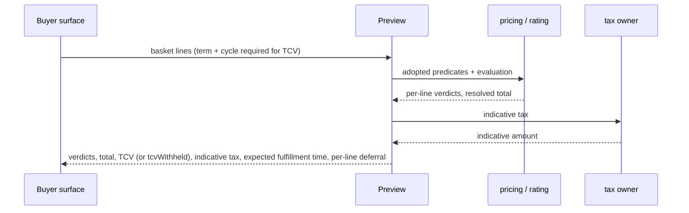

<!-- CONFLUENCE_TITLE: [BSS]: Orders Lifecycle — Sellability Gate, Price Pin and Preview (Slice 3) -->
<!-- Related: ../DESIGN.md, ../PRD.md, ./README.md, ./01-foundation.md | Owners: BSS Orders team -->

# DESIGN — Sellability Gate, Price Pin and Preview (Slice 3)

<!-- toc -->

- [1. Architecture Overview](#1-architecture-overview)
  - [1.1 Architectural Vision](#11-architectural-vision)
  - [1.2 Architecture Drivers](#12-architecture-drivers)
  - [1.3 Architecture Layers](#13-architecture-layers)
- [2. Principles and Constraints](#2-principles-and-constraints)
  - [2.1 Design Principles](#21-design-principles)
  - [2.2 Constraints](#22-constraints)
- [3. Technical Architecture](#3-technical-architecture)
  - [3.1 Domain Model](#31-domain-model)
  - [3.2 Component Model](#32-component-model)
  - [3.3 API Contracts](#33-api-contracts)
  - [3.4 Internal Dependencies](#34-internal-dependencies)
  - [3.5 External Dependencies](#35-external-dependencies)
  - [3.6 Interactions and Sequences](#36-interactions-and-sequences)
  - [3.7 Database Schemas and Tables](#37-database-schemas-and-tables)
  - [3.8 Deployment Topology](#38-deployment-topology)
- [4. Additional Context](#4-additional-context)
  - [4.1 The adopted predicate set (normative)](#41-the-adopted-predicate-set-normative)
  - [4.2 The Orders delta (normative)](#42-the-orders-delta-normative)
  - [4.3 The catalog price pin (normative)](#43-the-catalog-price-pin-normative)
  - [4.4 The resolved total and TCV (normative)](#44-the-resolved-total-and-tcv-normative)
  - [4.5 What the order-time total excludes (normative)](#45-what-the-order-time-total-excludes-normative)
  - [4.6 Preview (normative)](#46-preview-normative)
- [5. Traceability](#5-traceability)

<!-- /toc -->

- [ ] `p1` - **ID**: `cpt-cf-bss-orders-lifecycle-design-gate-and-pin`

## 1. Architecture Overview

### 1.1 Architectural Vision

This slice owns the single moment where an order stops being a draft and becomes a commitment.
It runs the sellability gate, captures the catalog price pin on every line, captures the
non-authoritative resolved total, and exposes the read-only Preview that answers "would this
pass, and what would it cost" without creating anything
([`../PRD.md`](../PRD.md) §6.1, §9.1).

Its central design choice is **adopt, don't fork**. The catalog predicates are not
re-implemented here: they are the published pricing sellability gate, invoked through a port,
and this slice adds only the delta the order boundary requires. Forking them would create a
second gate that drifts from the one Subscriptions enforces at `create`, which is precisely the
divergence the platform's seam discipline exists to prevent. The cost of adopting is inherited
honestly: the current pricing implementation reports missing predicate inputs explicitly
as `not_evaluable`, and an unevaluable predicate is a refusal — so this gate refuses in cases a fully
built catalog would admit, and that is correct behaviour rather than a defect.

The second choice is that **the pin and the state change are one commit**. The catalog price pin
is captured inside the submit transaction, so "submitted" and "pinned" are the same fact. A
submitted line without a resolvable pin is not a state the store can hold, which is how the
pin-integrity guarantee becomes an engine-enforced invariant verified within the transaction, not a cross-table NOT NULL claim.

The slice computes no price and performs no arithmetic over money. The resolved total **and** the
named total-contract-value figure both arrive from the price-evaluation contract and are stored as
received; the TCV's summation and its annualisation rule are the evaluation domain's obligation,
not this slice's ([`../DECISIONS.md`](../DECISIONS.md) D-40). Neither figure is a billing input.

### 1.2 Architecture Drivers

#### Functional Drivers

| Requirement | Design Response |
|-------------|------------------|
| `cpt-cf-bss-orders-lifecycle-fr-order-submit` | The gate is a guard set on the single `draft → submitted` transition row. Every predicate is registered with the engine, so the transition cannot commit with a predicate unevaluated. |
| `cpt-cf-bss-orders-lifecycle-nfr-order-snapshot-integrity` | Pin capture is part of the submit contribution, and the engine requires a non-null pin for admitted `submitted`+ lines. The database column is nullable; state-dependent presence is an engine-enforced invariant. |
| `cpt-cf-bss-orders-lifecycle-fr-orders-boundary-r4-no-price` | Prices are opaque references. The resolved total and the TCV figure both arrive computed from the evaluation contract and are stored as received; this slice derives nothing over money (D-40). |
| `cpt-cf-bss-orders-lifecycle-fr-order-tenant-axes` | Axis validity against IdP/Account Management is a gate predicate, and the axes freeze on the same commit that admits them. |
| `cpt-cf-bss-orders-lifecycle-fr-order-atomic-fulfillment` | The overlap and market predicates are re-evaluated immediately before the first activation intent, because both can change after the gate passes; each has its own fulfillment-time refusal reason. |
| `cpt-cf-bss-orders-lifecycle-interface-order-ops` | Preview runs the same predicate set and the same evaluation call with no transition, which is what makes it a truthful preview rather than a second implementation. |

#### NFR Allocation

| NFR ID | NFR Summary | Allocated To | Design Response | Verification Approach |
|--------|-------------|--------------|-----------------|----------------------|
| `cpt-cf-bss-orders-lifecycle-nfr-order-snapshot-integrity` | 100 % of submitted lines carry a resolvable pin | Pin capture | Captured and checked by the engine in the submit transaction for `submitted`+ versions; re-captured on every amendment | Invariant test asserting no `submitted`+ line exists without a pin; amendment test asserting re-pin |
| `cpt-cf-bss-orders-lifecycle-nfr-order-transition-latency` | Transition commit p95 < 1 s | Predicate orchestration | Every external input is resolved **before** the transaction opens, in parallel where independent; the transaction itself performs no network call | Load test measuring resolution and commit separately, so a slow catalog is attributable |
| `cpt-cf-bss-orders-lifecycle-nfr-order-read-latency` | Read p95 < 200 ms | Preview | Preview is bounded by the evaluation contract's own latency and is explicitly excluded from the order-read budget, since it is a computation and not a read | Benchmark reported against the evaluation contract's budget, not the read budget |

#### Key ADRs

The seven gear ADRs govern this slice. Two decisions taken here are recorded in the register rather than as ADRs: **all-failures
reporting** rather than short-circuit evaluation ([`../DECISIONS.md`](../DECISIONS.md) D-75,
§4.2), and **the order-time total excludes subscription-scoped overlays** and says which (D-76,
§4.5). The fail-closed posture on an unevaluable gate input carries its own
[`ADR/0003`](../ADR/0003-cpt-cf-bss-orders-lifecycle-adr-fail-closed-gate.md).

### 1.3 Architecture Layers

Inherited from [`01-foundation`](./01-foundation.md) §1.3. This slice adds **nine** outbound operations at the
infrastructure layer — the catalog predicate port, the evaluation port, the identity port, the
overlap-occupancy port, the contract-resolution port, catalog frontier, catalog pin composition,
the catalog product-key operation and the indicative-tax port (Preview only) —
all invoked before the transition transaction opens.

## 2. Principles and Constraints

### 2.1 Design Principles

#### Adopt the catalog gate, never fork it

- [ ] `p1` - **ID**: `cpt-cf-bss-orders-lifecycle-principle-adopt-not-fork-gate`

The catalog predicates are invoked through a port against the published pricing gate. This slice
holds no copy of them, no partial re-implementation and no local override. Where the adopted
gate is stricter than an order-side reading would be, the adopted gate wins. A local fork would
be undetectable at review time and would surface as a purchase that passed the order gate and
failed at subscription `create` — the exact failure mode the two-phase fulfillment design spends
its complexity avoiding.

#### The pin is the commit

- [ ] `p1` - **ID**: `cpt-cf-bss-orders-lifecycle-principle-pin-is-the-commit`

Pin capture and the state change share one transaction. There is no window in which an order is
`submitted` but unpinned, and no repair path that pins retroactively. An amendment re-pins as
part of its own commit, so every version's pin is contemporaneous with that version.

#### Resolve outside, decide inside

- [ ] `p1` - **ID**: `cpt-cf-bss-orders-lifecycle-principle-resolve-outside-decide-inside`

Every external input — catalog predicates, axis validity, contract status, evaluation output,
overlap occupancy — is resolved before the transaction opens and enters the guard as a plain
value. Nothing in the commit path makes a network call. This is what keeps the p95 commit budget
achievable with a slow upstream, and it is why an unreachable dependency degrades this
capability rather than stalling the gear.

#### Preview and submit share one implementation

- [ ] `p2` - **ID**: `cpt-cf-bss-orders-lifecycle-principle-preview-shares-implementation`

Preview calls the same predicate set and the same evaluation contract as submit, differing only
in that it creates no order or commercial artifact; it persists its bounded-retention gate outcome
rows for observability. A second implementation would drift, and a
preview that disagrees with submit is worse than no preview.

### 2.2 Constraints

#### Ports are bounded by deadline, breaker and bulkhead

- [ ] `p1` - **ID**: `cpt-cf-bss-orders-lifecycle-constraint-port-budgets`

A **slow** port is the common failure, not an unavailable one, and resolving inputs outside the
transaction bounds the *commit* path without bounding caller-visible latency. Every port therefore
carries a **deadline**. Eight of the nine sit on the submit path; the indicative-tax port is
**Preview only**, so the two surfaces carry two budgets:

| Port | Deadline |
|------|----------|
| Catalog predicates | 250 ms |
| Catalog pin-eligibility frontier | 250 ms |
| Catalog pin composition | 250 ms |
| Catalog product key (registry) | 250 ms |
| Identity (tenant axes and payer profile) | 250 ms |
| Price evaluation | 500 ms |
| Overlap occupancy (`SUB-O5`, amended) | 250 ms |
| Contract resolution | 250 ms |
| Indicative tax (Preview only) | 250 ms |
| **Submit resolution ceiling** (eight operations; tax not invoked) | **2.25 s** |
| **Preview resolution ceiling** (nine operations) | **2.5 s** |

**Every deadline above is per port per run, not per line.** A port whose input scales with the
basket — catalog predicates, catalog product key, price evaluation, overlap occupancy and pin
composition all do —
**MUST** be invoked **once per run with the whole line set**, and **MUST NOT** be invoked once per
line. The line cap of **200** ([`02-capture`](./02-capture.md) §3.7) fits the 250 ms catalog
deadline only under a batched call; per-line invocation would need 1.25 ms round trips
([`../DECISIONS.md`](../DECISIONS.md) **D-94**).

These are conservative sums of operation deadlines, including retries within each deadline;
parallel execution may finish sooner. The product-key operation runs after the frontier and
before the overlap-occupancy read that consumes its result, so its deadline adds to the critical
path rather than overlapping it ([`../DECISIONS.md`](../DECISIONS.md) **D-108**). Pin composition
runs **inside** the parallel step, beside the predicates and the evaluation, because it depends
only on the fixed frontier (**D-123**); its deadline therefore overlaps the critical path instead of
extending it. The sequential critical path is now identity, frontier, product key and the slowest
parallel operation (evaluation, 500 ms), which could justify a lower ceiling; the ceilings above are
deliberately kept as the conservative sum of every operation deadline and are not reduced here.
Preview validates pin resolvability through the same
composition operation without persisting a pin. These are integration baselines, not an
end-to-end latency or PRD-compliance claim.

This budget covers **port resolution only**, which completes before the transaction opens. The
design target of `p95 < 1 s` is measured separately for durable transition writes; publication
and end-to-end caller latency require their own measurements. These baselines do not prove
PRD compliance or bound what the caller experiences end to end. That gap is
routed as [`../DECISIONS.md`](../DECISIONS.md) Q-11 rather than resolved here, and this design
makes no claim that a submit returns within one second.

A deadline elapsing is a **refusal** carrying that port's unavailability reason, identical to
unreachability, because what matters is evaluability rather than the reason for silence. Retry is
bounded at two attempts on transient failure only and never on a deadline. Each port carries a
**circuit breaker** opening at a **rolling failure ratio of 0.5 over a 30-second window**, held
open for 10 seconds and mapping to the same reason, and a **concurrency bulkhead of 32 in-flight
calls per port**, so one slow upstream cannot exhaust the request pool for the others. Submit
carries a **rate limit of 10 per minute per caller** and Preview **60 per minute per caller** —
Preview is the cheapest endpoint to call and the most expensive to serve, so it is limited
separately rather than inheriting the submit figure. These are working baselines set here for the
same reason the page-size bounds are: a threshold nobody set is a threshold nobody can verify
against, and ratification sits with Architecture
([`../DECISIONS.md`](../DECISIONS.md) Q-26). The platform API
baseline requires shared platform facilities: use SDK clients through `ClientHub`, and
`toolkit-http`/Tower timeout, retry and concurrency middleware for remote adapters. These are
operation policies even where frontier, predicates and composition share one Pricing client;
do not build an Orders-specific transport stack. Circuit-breaker support must be supplied by
the shared adapter/platform before claiming the breaker baseline is implemented.

#### Adopted predicate evaluability and SDK readiness

- [ ] `p1` - **ID**: `cpt-cf-bss-orders-lifecycle-constraint-partial-predicate-evaluability`

The current Pricing implementation distinguishes predicate falsehood from missing inputs:
`pricing/src/domain/sellability.rs` defines `Satisfied`, `Failed` and `NotEvaluable`, and the
REST `PredicateAnswerView` renders their verdicts and failure/missing-owner detail. The current
read model cannot evaluate GA flags and registry sellability. Orders must preserve that
distinction; missing inputs and transport outages both block admission but are different
diagnostic outcomes.

The consumer SDK currently exposes only `PricingCatalogClientV1::pin_frontier`
(`pricing-sdk/src/api.rs`); it does not expose the batched, fixed-version predicate or pin
composition operations required here. Their typed SDK publication is an upstream readiness
blocker in `UPSTREAM_REQS.md`. Orders must not import Pricing internals, replace its predicates,
or silently call a latest-frontier REST surface once per line as a substitute. Until the SDK
operation is available its port outcome is `catalog-predicates-unavailable` (or
`catalog-pin-composition-unavailable`), settled through the engine.

**Every catalog read is scoped to the seller's catalog.** `pin_frontier` reads "the caller's
tenant pin-eligibility frontier" and returns `PermissionDenied` when the PEP denies
(`pricing-sdk/src/api.rs`). On the partner and direct paths the caller's tenant is not the seller,
so that frontier names the wrong catalog. The frontier **MUST** be the **seller's** catalog frontier
(`seller_tenant_id`), read through an operation that takes the catalog-owner tenant explicitly
(`pin_frontier_for(ctx, catalog_tenant_id)`), and the same explicit catalog-tenant scoping binds
the adopted predicates, the product key, the price evaluation and pin composition; none of them
**MAY** infer the catalog from the caller's `SecurityContext`. A PEP denial on any of these reads
maps to its port's unavailable reason — `catalog-frontier-unavailable` for the frontier — with an
operator diagnostic naming the denied catalog tenant, and is **never** surfaced to the buyer as a
403. Until the explicit operation is exposed
(`cpt-cf-bss-orders-lifecycle-upreq-pricing-catalog-tenant-reads`), the existing `pin_frontier`
**MAY** be used only when the caller's tenant is the seller; otherwise the frontier outcome is
`catalog-frontier-unavailable` ([`../DECISIONS.md`](../DECISIONS.md) **D-122**).

#### The overlap check depends on an unagreed upstream read

- [ ] `p1` - **ID**: `cpt-cf-bss-orders-lifecycle-constraint-overlap-read-unagreed`

The against-existing-subscriptions half of the overlap rule requires an **occupancy read** on the
Subscriptions gear — registered upstream as `SUB-O5` (amended by this design from a presence read
to an occupancy read, D-126), unagreed, and against a gear with no
implementation. Until the amended `SUB-O5` occupancy read exists **both** halves are
**unevaluable and therefore a refusal** — predicate 7 refuses `overlap-presence-unevaluable` —
which fails closed and is consistent with §2.1. The within-basket count is local, but its limit
`maxConcurrentActive` is supplied only by the occupancy read (§4.2 predicate 7, D-126), so the
within-basket half cannot be decided without the port either. The port is defined so that agreement upstream is a boundary change. The
fallback of admitting the submit and relying on the activation-time re-check is **rejected**: it
would move the failure past the first line's provisioning, into precisely the expensive
compensation path the design exists to avoid.

**The activation re-check is a bounding device, not the enforcement point.** The re-read of §3.6
*Re-check Activation Preconditions* and the activation it guards are two operations over state this
gear does not own, so state can move between them and nothing this slice writes can close that
window. The two axes are therefore separated. The **order** axis is closed authoritatively: no
second order may hold an overlap key, enforced by the partial unique index of
[`01-foundation`](./01-foundation.md) §3.7 inside the transition transaction. The **subscription**
axis — `maxConcurrentActive`, §4.2 predicate 7 — can only be closed where the `active` transition
commits, so Subscriptions **MUST** re-evaluate `overlapScopeKey` and commit `active` under one
reservation or serialisation boundary; this slice **MUST NOT** present its re-check as that
boundary, and no implementation **MAY** treat a passing re-check as an admission guarantee. Until
that upstream enforcement is agreed — the same seam as the `SUB-O5` occupancy read, and recorded
against it in [`../UPSTREAM_REQS.md`](../UPSTREAM_REQS.md) — **the subscription axis is open, and
this design does not bound it.** That is the honest statement and it replaces an earlier one.

**Why no timed window is stated.** An earlier version gave the proceed verdict a 30-second
validity window and called the result "bounded rather than closed". Two of its four faults are
design constraints a reader needs here, because they are why no *other* duration would work
either. **Nothing carries the deadline**: `§3.6` *Re-check Activation Preconditions* returns
one of `proceed`, `reject`, `not-dispatchable` or `defer` to its caller (D-127), and no declared port operation, event payload
or endpoint response carries a validity origin, and the transition the caller then drives —
`spawn-signal`, [`01-foundation`](./01-foundation.md) §4.3 row 12 — is deliberately event-less. And
**one verdict cannot cover N activations**: the two-phase barrier of
[`06-workflow-seam`](./06-workflow-seam.md) §4.3 puts an entire fulfillment wave between the
re-check and the last line's activation, so a window measured from one read instant says nothing
about the line activated last. The other two faults — that "re-invoke the re-check" places a
**MUST** on a party this gear cannot signal, and that the origin and the deadline would be
evaluated on two gears' clocks with no declared skew bound — are recorded in
[`../DECISIONS.md`](../DECISIONS.md) **D-89**.

**What is actually true, and enforceable.** The order axis is closed, in-transaction, by the index
named above. On the subscription axis two obligations remain and both are expressible. Subscriptions
**MUST** close it at the commit that writes `active`, raised as an upstream requirement. And a
collision **MUST** surface rather than over-provision silently — but **how** it surfaces depends on
whether a subscription has committed `active`, and the two cases are different outcomes rather than
one:

* **Before the `active` commit** — the collision is found by this slice's re-check, or by Subscriptions ahead of its own commit. It is a **per-line rejection** and a **pre-activation abort**: no subscription was ever activated, so the compensation evidence is satisfiable by construction and records only the voided wave-1 drafts ([`06-workflow-seam`](./06-workflow-seam.md) §4.3).
* **After the `active` commit** — the collision is found once a subscription already exists. It is **not** a line rejection: the subscription is active, and reporting it as rejected would model one subscription as simultaneously active and refused, which no downstream consumer can reconcile. It is a **fulfillment failure**, and the acknowledgement **MUST NOT** be accepted unless its compensation evidence shows every activated subscription rolled back (§4.4 of the seam slice already requires the evidence to assert that no active subscription remains).

`overlap-collision` is the failure reason in both cases; what differs is the outcome carrying it.
Collapsing the two — reporting a post-activation collision as a line rejection — would model one
subscription as simultaneously active and refused. The re-check remains valuable as an
**early abort** — it catches collisions that already exist and saves the provisioning work — and it
is specified as exactly that, with no admission guarantee attached
([`../DECISIONS.md`](../DECISIONS.md) D-89).

The alternative that *would* bound the gap from this side is a **server-side relative TTL enforced
at `spawn-signal`**: the engine records the re-check instant on the order and refuses the spawn
signal if it is older than a configured age, so the deadline is evaluated on one clock, against
persisted state, by the party that owns the transition. That is a real mechanism and it is not in
this design — it needs a column, a guard, a refusal reason and a configured value. It is recorded
as the closable form of this gap rather than adopted here.

#### The default overlap key collides in the partner path

- [ ] `p1` - **ID**: `cpt-cf-bss-orders-lifecycle-constraint-overlap-key-partner-collision`

**The commercial rule, before the partner case:** at most **one in-flight order per overlap key**
(`01 §3.7`, predicate 9 in §4.2 below). A buyer who has submitted an order for a product and not yet seen
it reach a terminal state **cannot submit a second order for that product** — they are refused
with `order-in-flight-for-key` until the first completes, is cancelled, or expires. That is the
intended rule and PRD §6.1(g) fixes it at one, but it is a constraint on the sales motion and not
only a concurrency control: a buyer correcting a mistake must amend the in-flight order rather than
place another, and a wedged order blocks the key until an operator clears it (ADR-0007 records the
`in_fulfillment` case, which no expiry row can reach). Any buyer surface **MUST** present the
refusal as "an order for this is already in progress" with a route to that order, rather than as a
generic validation failure.

The default `overlapScopeKey` is `(payerTenantId, catalogSubscriptionProductKey)` at cardinality
one, adopted from the subscriptions gear. `catalogSubscriptionProductKey` is the catalog
registry's stable key for the sellable subscription product/family (Subscriptions `SUB-G1`,
shape agreed on PR #4177); this slice obtains it from the registry at the run's fixed catalog
version (`§3.6` *Run Gate and Submit* step 4) and never derives it from line fields. Read literally it refuses a partner admin buying the
same product for a second customer tenant, because the payer is the same — which contradicts the
partner path the PRD's own actor model assumes. This slice **MUST NOT** fork the default locally;
the dimension binding is an upstream question. Until it is answered the key is applied as
adopted and the collision is a known, reported refusal rather than a silent local widening.

#### The order-time total is incomplete by construction

- [ ] `p2` - **ID**: `cpt-cf-bss-orders-lifecycle-constraint-total-excludes-subscription-overlays`

Overlays scoped to a subscription — brand being the named case — need evaluation context that
does not exist before a subscription does. No pre-subscription evaluation operation exists, so
the order-time total **excludes** them and §4.5 names the exclusion explicitly. The pin is
unaffected: it freezes only the catalog-written segment, which is fully resolvable at submit.

## 3. Technical Architecture

### 3.1 Domain Model

- [ ] `p1` - **ID**: `cpt-cf-bss-orders-lifecycle-entity-catalog-price-pin`

The catalog-written segment of the downstream composed pricing snapshot, frozen per line at
submit: the committed catalog version, the resolved price identifiers including cohort, and the
evaluation-policy version. It is the whole of what an order captures about price, and it is
never the composed snapshot reference.

- [ ] `p1` - **ID**: `cpt-cf-bss-orders-lifecycle-entity-order-market`

The derived, non-authoritative `(currency, region)` binding computed at submit from the
**payer's** commercial profile. Gate currency and region checks are consistency assertions
against it. The authoritative binding is frozen downstream by Subscriptions at activation, so
this entity is evidence of what was assumed, not a claim about what will hold.

- [ ] `p1` - **ID**: `cpt-cf-bss-orders-lifecycle-entity-gate-outcome`

The per-line and per-order result of one gate run: each predicate's identity, its verdict, and
its reason where it failed. Retained for a refused submit as well as an admitted one, so a
partner can be told everything that is wrong in one response.

It also populates the line pins and the resolved total whose schema is specified in
[`01-foundation`](./01-foundation.md) §3.7.

**Relationships**:
- `Order line` → `Catalog price pin`: one-to-one per version; NOT NULL from `submitted` onward.
- `Order version` → `Order market`: one-to-one, recomputed on each amendment.
- `Gate outcome` → `Order version`: one-to-one for an admitted submit; standalone for a refusal and for every Preview.

### 3.2 Component Model

This slice realises `cpt-cf-bss-orders-lifecycle-component-gate-and-pin`
([`../DESIGN.md`](../DESIGN.md) §3.2) as three internal parts.

#### Predicate orchestrator

- [ ] `p1` - **ID**: `cpt-cf-bss-orders-lifecycle-component-gate-predicate-orchestrator`

##### Why this component exists

The gate has two sources of truth — the adopted catalog predicates and the Orders delta — and
one answer to produce. Something has to resolve both, in parallel where independent, and combine
them into a single verdict without letting either source's latency dominate.

##### Responsibility scope

Resolution of every predicate input before the transaction opens; parallel dispatch of the
independent ports; the adopted-predicate invocation; evaluation of the nine delta predicates;
the all-failures collection contract; and the combined verdict.

##### Responsibility boundaries

It authors no adopted predicate and copies none. It captures no pin and computes no total. It
does not decide whether approval is required — Preview and submit both return no approval
verdict.

##### Related components (by ID)

- `cpt-cf-bss-orders-lifecycle-component-transition-orchestrator` — depends on
- `cpt-cf-bss-orders-lifecycle-component-gate-pin-capture` — calls
- `cpt-cf-bss-orders-lifecycle-component-gate-preview` — shares model with

#### Pin and total capture

- [ ] `p1` - **ID**: `cpt-cf-bss-orders-lifecycle-component-gate-pin-capture`

##### Why this component exists

Price integrity between capture and activation is the revenue-integrity risk the gear exists to
close, and it can only be closed atomically with the state change.

##### Responsibility scope

Pin composition from the resolved catalog data and the resolvability check; and persistence of
the resolved total as received — gross, net, the discount component, the promotion reference, the
four charge-kind rows and the TCV figure. The summation and annualisation behind that figure are
performed by the evaluation contract, not here (D-40).

##### Responsibility boundaries

It computes no price and applies no overlay. Usage carries no committed amount and is excluded
from TCV. Nothing it stores may be read as a billing input.

##### Related components (by ID)

- `cpt-cf-bss-orders-lifecycle-component-gate-predicate-orchestrator` — depends on

#### Preview

- [ ] `p2` - **ID**: `cpt-cf-bss-orders-lifecycle-component-gate-preview`

##### Why this component exists

A buyer needs to know whether a basket is purchasable and what it costs before committing to it,
and the answer must be the same answer submit would give.

##### Responsibility scope

The read-only run over a supplied basket; per-line gate results; the resolved total including
TCV; the indicative tax figure obtained from the tax owner and never stored; expected
fulfillment time and per-line deferral where line dates differ.

##### Responsibility boundaries

It creates and mutates nothing, stores no tax, and returns no approval-requirement verdict. When a
basket line omits term duration or billing cycle it still answers successfully with every other
field, omits `tcv` and states why in `tcvWithheld` (§4.6, D-125); it does not refuse the request.

##### Related components (by ID)

- `cpt-cf-bss-orders-lifecycle-component-gate-predicate-orchestrator` — depends on

### 3.3 API Contracts

- [ ] `p1` - **ID**: `cpt-cf-bss-orders-lifecycle-interface-gate-ops`

- **Requirement**: `cpt-cf-bss-orders-lifecycle-interface-order-ops`
- **Technology**: REST/OpenAPI via `OperationBuilder`; RFC 9457 problems

| Method | Path | Description | Stability |
|--------|------|-------------|-----------|
| `POST` | `/bss-orders-lifecycle/v1/orders/{orderId}/submit` | Run the gate, capture pin and total, transition `draft → submitted` | unstable |
| `POST` | `/bss-orders-lifecycle/v1/orders/preview` | Run the gate and evaluation over a supplied basket, creating no order; rate-limited, and open to PDP-authorized partner admins and direct customers; no seller-only grant | unstable |

**Reasons contributed to the registry**: axis-invalid, contract-not-active, contract-party-ineligible, quantity-below-floor,
market-inconsistent, reference-unresolvable, reference-duplicated,
overlap-cardinality-exceeded, order-in-flight-for-key, overlap-key-unresolvable, pin-unresolvable,
no-lines; and exactly one unavailable reason for each port:
catalog-predicates-unavailable, identity-party-unavailable, contract-resolution-unavailable,
overlap-presence-unevaluable (to which the overlap predicate's unevaluable outcome also resolves,
so the condition has one name and not two), evaluation-unavailable, indicative-tax-unavailable,
catalog-frontier-unavailable, catalog-pin-composition-unavailable and
catalog-product-key-unavailable. `catalog-frontier-absent`
represents the SDK's successful `None` result, distinct from outage, and a PEP denial on the
seller-scoped frontier read is `catalog-frontier-unavailable` with an operator diagnostic, never a
buyer-facing 403 (D-122); `overlap-key-unresolvable`
likewise represents a registry answer carrying no product key for a line, distinct from the
operation's outage. Adopted predicate outcomes
use `catalog-predicate-failed` or `catalog-predicate-unevaluable` with the upstream predicate
identity and original `detail`/`owed_to` unchanged; these strings are not invented upstream codes.

**Response annotation contributed (not a refusal)**: `preview-term-or-cycle-missing` is carried on a
**successful** Preview response as `tcvWithheld.reason` (§4.6) and is registered in the
non-refusal annotation list of [`01-foundation`](./01-foundation.md) §4.7, not in its refusal
table (D-125).

**Reasons reused from capture**: currency-mixed, date-cascade-invalid. These are not owned or registered again here.

**Bundle coverage prerequisite.** The Pricing SDK must supply complete fixed-version bundle
and component/key coverage under `../UPSTREAM_REQS.md §2.2`'s bundle-sellability requirement.
Until then, bundle submit/amendment refuses and Preview reports unevaluable/unavailable;
a passing own-row predicate cannot establish component sellability. Use the existing normalized
catalog reasons and preserve scope/component identities under §3.7, without an Orders-owned
component evaluator.

**Fulfillment-time reasons**, raised by [`06-workflow-seam`](./06-workflow-seam.md) using
predicates owned here: market-divergence, overlap-collision. An exhausted re-check `defer` carries
the port's own unavailable reason listed above (`identity-party-unavailable` or
`overlap-presence-unevaluable`), not a new one (D-127). The date predicate reuses capture's
`date-cascade-invalid`, not a second reason registration.

- [ ] `p1` - **ID**: `cpt-cf-bss-orders-lifecycle-interface-gate-ports`

**Nine** outbound operations, all invoked before the transaction opens and all bounded by §2.2: the
**catalog predicate port** (the adopted gate), the **evaluation port** (resolved total and the TCV
figure), the **identity port** (tenant-axis validity and the payer's commercial profile), the
**overlap-occupancy port** (`SUB-O5`, amended to an occupancy read, unagreed) — per
`(payer_tenant_id, overlap_scope_key)` it returns `(activeCount, maxConcurrentActive, provenance)`,
batched per basket, where `activeCount` is the number of subscriptions `active` on the key (drafts, including this
order's own wave-1 drafts, are not counted, since `maxConcurrentActive` bounds `active`),
`maxConcurrentActive` the effective cardinality and `provenance` the Catalog/Contract policy it was
resolved from (D-126) — the **contract-resolution port** (contract active,
party eligibility and the contract's `acceptance_required` declaration where a contract is
referenced — the only port that answers party eligibility; the gate consumes the first two, and
[`05-preconditions`](./05-preconditions.md) §3.6 calls the same operation outside the gate, live
at its *Record Acceptance* and begin-fulfillment guards, for the declaration, D-132), and the **tax port** (the
indicative figure Preview returns and never stores), the **catalog frontier operation** (the
**seller's** catalog frontier, read for `seller_tenant_id` through an operation taking the catalog
tenant explicitly — `pin_frontier_for`, pending upstream; today's
`PricingCatalogClientV1::pin_frontier` reads the caller's tenant), **catalog pin composition**
(pending typed SDK), and the
**catalog product-key operation** (each line's `catalogSubscriptionProductKey` from the catalog
registry at the fixed version, batched per basket; pending upstream,
`cpt-cf-bss-orders-lifecycle-upreq-catalog-subscription-product-key`).
Each operation's unavailability or deadline maps to its own
reason, so an operator can tell which upstream refused. Every catalog-facing operation — frontier,
predicates, product key, evaluation and pin composition — names the seller's catalog tenant
explicitly and never infers it from the caller's `SecurityContext`
([`../DECISIONS.md`](../DECISIONS.md) D-122).

### 3.4 Internal Dependencies

| Dependency Gear | Interface Used | Purpose |
|-------------------|----------------|----------|
| `toolkit-db` | Runtime-scoped access, via the engine | Pin, total and gate-outcome persistence inside the transition transaction |

### 3.5 External Dependencies

#### Pricing and catalog

| Dependency Gear | Interface Used | Purpose |
|-------------------|---------------|---------|
| `pricing` | SDK client | The seller's catalog frontier, the adopted sellability predicates, and the catalog data the pin is composed from, each naming the catalog tenant explicitly; the explicit-tenant operations are unexposed today — `cpt-cf-bss-orders-lifecycle-upreq-pricing-catalog-tenant-reads` (D-122) |
| `rating` | SDK client — **unexposed today** (no Rating SDK crate exists) | The price-evaluation contract producing the resolved total and the TCV figure; composition owner of the full snapshot, which this slice never stores. Raised as `cpt-cf-bss-orders-lifecycle-upreq-rating-evaluation` (TCV semantics under `…-upreq-tcv-with-annualisation`); until exposed the evaluation outcome is `evaluation-unavailable` |
| `products` (Catalog registry, Product & SKU) | SDK client | Each line's `catalogSubscriptionProductKey` at the fixed catalog version, the input of the overlap key (`SUB-G1`, PR #4177); unexposed today — `cpt-cf-bss-orders-lifecycle-upreq-catalog-subscription-product-key` |

#### Identity, contracts and fulfillment

| Dependency Gear | Interface Used | Purpose |
|-------------------|---------------|---------|
| `account-management` | SDK client (`AccountManagementClient::get_tenant`); commercial profile **unexposed today** | Tenant-axis validity through the existing `get_tenant`. The payer's commercial profile behind the order market has no Account Management operation — `cpt-cf-bss-orders-lifecycle-upreq-payer-commercial-profile`; until exposed the identity outcome is `identity-party-unavailable` |
| `contracts` | SDK client — **unexposed today** | Contract status and party eligibility where a reference is present — the sole owner of party eligibility; the same operation also returns the contract's `acceptance_required` declaration, read by `05`'s acceptance guards outside the gate (D-132). The gear is specified but unimplemented, raised as `cpt-cf-bss-orders-lifecycle-upreq-contract-party-eligibility` and `cpt-cf-bss-orders-lifecycle-upreq-contract-acceptance-declaration`; until exposed the gate outcome is `contract-resolution-unavailable` and `05`'s acceptance outcome is `acceptance-requirement-unevaluable` |
| `subscriptions` | SDK client | The overlap-occupancy read (`SUB-O5`, amended: `(activeCount, maxConcurrentActive, provenance)` per payer/key, D-126), unagreed and unimplemented |
| Billing-chain tax owner | SDK client | The indicative tax figure Preview returns and never stores |

**Dependency Rules** (per project conventions):
- No circular dependencies
- Always use SDK modules for inter-gear communication
- No cross-category sideways deps except through contracts
- Only integration/adapter gears talk to external systems
- `SecurityContext` must be propagated across all in-process calls

### 3.6 Interactions and Sequences

#### Submit through the gate

**ID**: `cpt-cf-bss-orders-lifecycle-seq-gate-submit`

**Use cases**: `cpt-cf-bss-orders-lifecycle-usecase-order-new-acquisition`

**Actors**: `cpt-cf-bss-orders-lifecycle-actor-orders-partner-admin`, `cpt-cf-bss-orders-lifecycle-actor-orders-catalog-pricing`, `cpt-cf-bss-orders-lifecycle-actor-orders-idp-ams`, `cpt-cf-bss-orders-lifecycle-actor-orders-contracts`

**Algorithm: Run Gate and Submit**

Input: order_id, security_context, idempotency_key, expected_version, expected_draft_revision
Output: submitted order with pin and total, or a refusal listing every failure

1. [ ] - `p1` - Declare the at-least-one-line guard; after engine authorization/idempotency preparation, snapshot the authored basket with its server `prepared_draft_revision`, snapshot the resource tenant's effective `orders_date_policy` row (switches, scope, revision) and prepare all proposed dates under capture §4.2 before any date-dependent external call. Bind resolved results to this basket/date basis and carry both revisions into the engine; its locked revision check precedes using any result, including a gate refusal, and returns `version-conflict` for stale input - `inst-gs-declare-lines-guard`
2. [ ] - `p1` - Resolve the identity operation once under its deadline, including tenant-axis validity and the payer's commercial profile; derive the order market from that result before market-dependent calls. Party eligibility is not an identity answer: it belongs to the contract-resolution port alone - `inst-gs-derive-market`
3. [ ] - `p1` - Read the **seller's** catalog **pin-eligibility frontier** once under its operation deadline and fix the run's `catalog_version`. The frontier **MUST** be the seller's catalog frontier (`seller_tenant_id`), read through an operation that takes the catalog-owner tenant explicitly (D-122); every catalog-facing resolution below — product key, predicates, evaluation and pin — **MUST** use that one version of that one catalog. `None` contributes `catalog-frontier-absent`; outage/deadline contributes `catalog-frontier-unavailable`. A PEP denial maps to `catalog-frontier-unavailable` with an operator diagnostic and is never surfaced to the buyer as 403. Skip dependent operations without a frontier, still evaluate independent inputs and route every refusal through the engine - `inst-gs-fix-catalog-version`
4. [ ] - `p1` - Resolve each line's **`catalogSubscriptionProductKey`** from the catalog registry **at the `catalog_version` fixed in step 3**, in the seller's catalog, in one call batched for the whole basket under its own §2.2 deadline, and build each line's overlap key `(payer_tenant_id, catalogSubscriptionProductKey)` from it: the resolved product key is the line's `overlap_scope_key` and the payer is the claim tuple's `payer_tenant_id` ([`01-foundation`](./01-foundation.md) §3.7). Every later use of an overlap key — the overlap-occupancy read, predicates 7 and 9 and the claim set of step 15 — consumes this resolved key; none derives its own. A line the registry answers with no key contributes `overlap-key-unresolvable`; outage/deadline contributes `catalog-product-key-unavailable`; without a frontier the operation is skipped as a dependent one. Skip only the overlap-dependent inputs of an unkeyed line, still evaluate independent inputs and route every refusal through the engine - `inst-gs-resolve-overlap-key`
5. [ ] - `p1` - **PARALLEL** resolve the independent port inputs, each **batched into one call per port** for the whole basket and each catalog-facing one scoped to the seller's catalog at the fixed version: - `inst-gs-parallel-resolve`
   - [ ] - `p1` - adopted catalog predicates over every line's scope key, at the fixed version, returning for each line the market scope (currency and region) of its resolved price row - `inst-gs-resolve-catalog`
   - [ ] - `p1` - reuse step 2's tenant-axis validity and payer-profile result without a second identity call - `inst-gs-resolve-identity`
   - [ ] - `p1` - contract status and party eligibility, only where a contract reference is present - `inst-gs-resolve-contract`
   - [ ] - `p1` - overlap occupancy `(activeCount, maxConcurrentActive, provenance)` for each distinct `(payer_tenant_id, overlap_scope_key)` **as resolved in step 4**, in one batched call, skipped for a line without one; an answer missing `activeCount` or `maxConcurrentActive` is `overlap-presence-unevaluable` (D-126) - `inst-gs-resolve-overlap`
   - [ ] - `p1` - the resolved total from the evaluation contract, **at the fixed version** - `inst-gs-resolve-total`
   - [ ] - `p1` - the catalog price pin for each line, composed **at the version fixed in step 3** under its §2.2 deadline, and its resolvability; composition depends only on the fixed frontier, so it runs whatever the other inputs answer (D-123) - `inst-gs-compose-pin`
6. [ ] - `p1` - Retain step 1's policy snapshot, resolved cascade and proposed UTC date basis for engine validation under [`02-capture`](./02-capture.md) §4.2; every date-dependent predicate/evaluation uses those same proposed dates - `inst-gs-resolve-cascade`
7. [ ] - `p1` - Initialize the complete per-predicate outcome vector and a separate empty failure list - `inst-gs-init-failures`
8. [ ] - `p1` - **FOR EACH** adopted predicate result: normalize its tri-state outcome under §4.1 and record every passed/failed/unevaluable result in the outcome vector and collect failures separately, preserving upstream detail - `inst-gs-collect-adopted`
9. [ ] - `p1` - **FOR EACH** of the nine delta predicates: evaluate, record its outcome including passed, and add any failure to the separate failure list; predicates 7 and 9 evaluate over step 4's resolved overlap keys - `inst-gs-collect-delta`
10. [ ] - `p1` - **FOR EACH** line: record its pin-composition outcome in the vector. An unavailable or deadline-exhausted composition contributes `catalog-pin-composition-unavailable`; an invalid returned pin contributes `pin-unresolvable`. Where the line's reference is unresolvable (predicate 5), record the pin outcome as `unevaluable` carrying that same `reference-unresolvable` reason and add **no second failure**; without a frontier it is `unevaluable` with the frontier's reason - `inst-gs-collect-pin`
11. [ ] - `p1` - **IF** any other port was unresolvable: add its unevaluable reason (absence is a refusal); pin composition's was recorded at step 10 and is not added twice - `inst-gs-collect-unevaluable`
12. [ ] - `p1` - Predicate 8's `date-cascade-invalid` failure was recorded by step 9 and is not added again - `inst-gs-collect-cascade-invalid`
13. [ ] - `p1` - **IF** the failure list is non-empty: - `inst-gs-if-failures`
    1. [ ] - `p1` - Pass the complete outcome vector and failure set as the contribution so the engine persists the gate outcome, audits the refusal and settles the idempotency record in one transaction - `inst-gs-contribute-refusal-outcome`
    2. [ ] - `p1` - **RETURN** the engine's settled response, including every gate failure when gate guards were reached; engine authorization/admissibility/version checks retain precedence - `inst-gs-return-all-failures`
14. [ ] - `p1` - Assemble the resolved total rows and the TCV figure per §4.4 - `inst-gs-assemble-total`
15. [ ] - `p1` - Request the submit transition with both draft revisions, pin, total, market, proposed dates/date basis and policy snapshot, gate outcome, each line's resolved `overlap_scope_key` from step 4 (persisted on `orders_order_line`), the complete resolved `(payer_tenant_id, overlap_scope_key)` claim set built from it and the **submitting principal as the initiating actor**. Before accepting date-dependent results, the engine checks defaults against the UTC date of its single pre-write transition timestamp `t`; a changed date basis refuses with `date-cascade-invalid`. On admission it persists the validated dates and snapshot atomically with the version. The transition carries `05`'s automatic acceptance contribution only where [`05-preconditions`](./05-preconditions.md) §4.2's submit-request rule holds — the allowed submit carried no delegation proof reference and the submitting principal's subject tenant equals the order's `resourceTenantId` (D-146) — never on `orders_order.sales_path` alone; otherwise it carries none - `inst-gs-request-transition`
16. [ ] - `p1` - **RETURN** the submitted order - `inst-gs-return-submitted`

**Description**: Steps 7 through 13 are the all-failures contract, and pin composition is one of
its checks rather than a step reached only on success. Every input is resolved before
*Run Gate and Submit* step 15, so the transaction that commits `submitted` performs no network call and the pin lands
in the same commit as the state.

Verification includes frontier `None`, frontier outage, a line with no registry product key,
product-key operation outage, composition timeout after passing
predicates, a failing predicate whose run still persists every line's pin outcome, an unresolvable
reference yielding one failure and an `unevaluable` pin outcome rather than two failures, a
frontier read for a caller tenant that is not the seller (the seller's catalog is read, and a PEP
denial refuses `catalog-frontier-unavailable`, never 403), mixed failed/unevaluable Pricing answers, and concurrent draft mutation during
resolution. Each refuses through the engine with the specified reason and no admitted pin or
version; a settled idempotent replay performs no upstream calls. Date-policy verification starts
from an authored draft with no versioned line row, changes configuration after the snapshot,
and checks that the admitted dates and stored policy use the same snapshot. A run crossing UTC
midnight with defaulted dates must refuse before consuming the old date-dependent results;
a fresh attempt must re-resolve them for the new day.

#### Preview a basket

**ID**: `cpt-cf-bss-orders-lifecycle-seq-gate-preview`

**Use cases**: `cpt-cf-bss-orders-lifecycle-usecase-order-new-acquisition`

**Actors**: `cpt-cf-bss-orders-lifecycle-actor-orders-partner-admin`, `cpt-cf-bss-orders-lifecycle-actor-orders-direct-customer`

**Description**: No order is created and no order is mutated; the indicative tax figure is never stored. The gate outcomes are persisted under their own bounded retention. Preview returns no
approval-requirement verdict — that belongs to the policy owner and is obtained by the sibling
gear — and it withholds TCV entirely when a line omits term or cycle, rather than reporting a
figure computed from an assumed term. Withholding is a **successful** response, not a refusal:
`tcv` is absent and `tcvWithheld: {reason: "preview-term-or-cycle-missing", lineIds: […]}` names
the lines that caused it, while every other field is returned (§4.6, D-125).

#### Re-check before first activation

**ID**: `cpt-cf-bss-orders-lifecycle-seq-gate-fulfillment-recheck`

**Use cases**: `cpt-cf-bss-orders-lifecycle-usecase-order-fulfillment-complete`

**Actors**: `cpt-cf-bss-orders-lifecycle-actor-orders-workflow`, `cpt-cf-bss-orders-lifecycle-actor-orders-subscriptions`

**Algorithm: Re-check Activation Preconditions**

Integration algorithm executed by Workflow after begin-fulfillment commits, through the same
owning upstream SDKs as submit. It is not a Lifecycle endpoint or a begin-fulfillment guard.
Missing upstream SDK operations remain release gates; do not import gear internals.

Input: order_id, current_version, authenticated Workflow SecurityContext
Output: exactly one of `proceed` | `reject` (per-line reasons) | `not-dispatchable` (state or version) | `defer` (port reason) — [`../DECISIONS.md`](../DECISIONS.md) D-127

1. [ ] - `p1` - Read the PDP-authorized current order and its current version through the composed read of [`08-read-and-authz`](./08-read-and-authz.md) §4.2, which carries the fulfillment inputs steps 5 and 6 use — each line's stored `overlap_scope_key`, the version's `market_currency`, `market_region` and `payer_tenant_id` ([`../DECISIONS.md`](../DECISIONS.md) D-144) - `inst-rc-read-order`
2. [ ] - `p1` - **IF** the order is `on_hold`, is terminal, or its current version differs from `current_version` (superseded): - `inst-rc-if-not-dispatchable`
   1. [ ] - `p1` - **RETURN** `not-dispatchable` carrying the observed state or current version - `inst-rc-return-not-dispatchable`
3. [ ] - `p1` - Re-derive the order market from the payer's **current** commercial profile through the identity port under its §2.2 deadline - `inst-rc-rederive-market`
4. [ ] - `p1` - **IF** the identity port is unavailable or its deadline elapsed: - `inst-rc-if-identity-unavailable`
   1. [ ] - `p1` - **RETURN** `defer` carrying `identity-party-unavailable`; never fabricate a divergence - `inst-rc-return-defer-identity`
5. [ ] - `p1` - **IF** it diverges from the market frozen at submit: - `inst-rc-if-market-diverged`
   1. [ ] - `p1` - **RETURN** `reject` with market-divergence for the affected lines - `inst-rc-return-market-divergence`
6. [ ] - `p1` - Re-read overlap **occupancy** `(activeCount, maxConcurrentActive, provenance)` in one batched call for each line's overlap key **as stored on `orders_order_line.overlap_scope_key`** with the order's payer at submit/amendment; do not re-resolve the product key from the registry, so the re-check tests the same key the claim holds - `inst-rc-reread-overlap`
7. [ ] - `p1` - **IF** the occupancy port is unavailable, its deadline elapsed, or an answer lacks `activeCount` or `maxConcurrentActive`: - `inst-rc-if-occupancy-unavailable`
   1. [ ] - `p1` - **RETURN** `defer` carrying `overlap-presence-unevaluable`; never default the limit to one and never fabricate a collision - `inst-rc-return-defer-occupancy`
8. [ ] - `p1` - **IF** for any key `activeCount + pending > maxConcurrentActive`, where `pending` is the number of this order's lines carrying the key that are not yet activated (all of them, before the first activation): - `inst-rc-if-overlap-collision`
   1. [ ] - `p1` - **RETURN** `reject` with overlap-collision for the affected lines - `inst-rc-return-overlap-collision`
9. [ ] - `p1` - **RETURN** `proceed`, which is an **early-abort pass and not an admission guarantee**: the caller **MUST NOT** treat it as one, and **MUST** be able to handle an `overlap-collision` raised later by Subscriptions on the failure-acknowledgement path of [`06-workflow-seam`](./06-workflow-seam.md) §4.4 - `inst-rc-return-proceed`

**What Workflow does with each outcome** (normative; the transitions are those of
[`06-workflow-seam`](./06-workflow-seam.md) §4.3 and §4.4):

| Outcome | Workflow's next action | Transition driven |
|---------|------------------------|-------------------|
| `proceed` | Request `report-spawn-signal`, then dispatch the activation wave | `spawn-signal` (`01 §4.3` row 12) |
| `reject` | Stop dispatch, void the wave-1 drafts, and acknowledge failure carrying each line's reason with compensation evidence recording the voided drafts | `acknowledge-failed` (row 14) |
| `not-dispatchable` | Stop dispatch and **do not** call acknowledge; re-read the order. `on_hold`: wait for resume (row 22), then re-run the re-check from step 1 against the resumed version. Superseded: abandon this version's attempt and follow the amendment seam for the current version. Terminal: end the attempt — the transition that made it terminal carried its own compensation evidence | none |
| `defer` | Retry the re-check from step 1 with bounded exponential backoff under **`activation-recheck-retry-budget`**; no spawn signal and no dispatch meanwhile. A retry that returns any other outcome is handled by its row. Once the budget is exhausted, void the wave-1 drafts and acknowledge failure carrying the port's unevaluable reason (`identity-party-unavailable` or `overlap-presence-unevaluable`) | none while retrying; `acknowledge-failed` (row 14) on exhaustion |

**`activation-recheck-retry-budget`** is a named deployment value owned by this slice and executed
by Workflow: the maximum number of re-check attempts and the wall-clock bound across them,
**baseline 3 attempts over ≤ 60 s**. Neither this set nor `UPSTREAM_REQS.md §2.6` defines an
existing Workflow retry budget to reuse. Because every retry restarts at step 1, a hold or a
supersession during backoff surfaces as `not-dispatchable` rather than being overtaken by the
exhaustion path. Rejected alternative: aborting on the first port unavailability — it turns a
transient upstream blip after a successful submit into a failed order (D-127).

**Description**: Both predicates read state owned elsewhere that can move between submit and
activation, which is why passing the gate is necessary but not sufficient. The sibling gear
invokes this immediately before dispatching the first activation intent and treats either
rejection as a pre-activation abort rather than a line-execution failure.

**Why this algorithm cannot be made atomic here, and what bounds it instead.** Step 6 is a read and
the activation it guards is a later call into another gear, so the check and the action it guards
are separated by construction — two waves passing step 6 concurrently can both proceed and together
exceed `maxConcurrentActive`. The re-check therefore **MUST NOT** be implemented or relied on as
the enforcement point. What closes each axis, and what merely bounds it, is stated normatively in
`§2.2` *The activation re-check is a bounding device, not the enforcement point*: the **order** axis
is closed in-transaction by `01 §3.7`'s claim index; the **subscription** axis **MUST** be closed by
Subscriptions inside the transaction that commits `active`; and until it is, **this design does not
bound the gap** — §2.2 states why no timed validity window is asserted, and what a closable
server-side form would need. What remains normative here is that a collision surfaces as
`overlap-collision` through failure acknowledgement rather than as an over-provision nobody
refused.

### 3.7 Database Schemas and Tables

This slice introduces one table and owns columns on two specified in
[`01-foundation`](./01-foundation.md) §3.7: `orders_order_line.catalog_price_pin` and the whole
of `orders_resolved_total`.

#### Table: orders_gate_outcome

**ID**: `cpt-cf-bss-orders-lifecycle-dbtable-gate-outcome`

**Schema**:

| Column | Type | Description |
|--------|------|-------------|
| outcome_id | uuid | Outcome identity |
| run_id | uuid | Server-generated assessment ID shared by every result in one Preview/submit/amendment run; returned as assessmentId |
| subject_tenant_id, subject_id | uuid, text | Trusted caller namespace and opaque principal copied from SecurityContext, never supplied in basket data |
| resource_tenant_id, seller_tenant_id, payer_tenant_id | uuid | Authorized assessment scope snapshot; not a substitute for current access authorization |
| correlation_id | uuid, nullable | Request correlation for diagnostics; not the unique run key or an access credential |
| order_id | uuid, nullable | NULL for a Preview run, which has no order |
| version | integer, nullable | The version admitted, where the run admitted one |
| line_id | uuid, nullable | NULL for order-level predicates |
| predicate | text | Predicate identity, adopted or delta |
| component_plan_id | uuid, nullable | Pricing-owned component plan identity for a bundle-component result; NULL for the offered plan/order itself |
| catalog_scope_key | text, nullable | Owning Pricing SDK's canonical scope-key encoding for a per-key result; NULL for a plan/order-level result |
| verdict | enum | `passed`, `failed` or `unevaluable` |
| reason | text, nullable | Registered reason on failure or unevaluability |
| upstream_detail | jsonb, nullable | Adopted predicate identity and original `detail` or `owed_to`; never inferred from a transport error |
| evaluated_at | timestamptz | Run instant |

**PK**: outcome_id

**Run contract:** allocate a provisional `run_id` after authorization, before resolution; assign stable
run-local line IDs even without an order. Return it only when the assessment was reached and durably recorded, on success or gate refusal; engine-only refusals carry no assessment ID.
Persist the complete evaluated outcome vector, including `passed`, not merely the failure list;
the latter selects the response reason. A dependent predicate whose required input is missing
is `unevaluable` with the owning port reason, never fabricated as passed. One completed run's
outcomes and trusted metadata are written atomically. A storage failure is an infrastructure
failure, not a successful diagnostic recording. Submit/amendment reuse the engine transaction;
Foundation §3.6 defines the explicit diagnostic write on early-input, gate and overlap
refusals, before settlement and commit, without commercial contributions. Foundation §3.7's
`orders_idempotency.settled_response` stores the immutable assessment ID, complete ordered
vector, failure list and original public response; its assessment ID equals this run_id.
Idempotent replay returns that snapshot without another run. Order outcomes by declared
predicate order, then binary line ID, binary component plan ID and canonical scope-key UTF-8
bytes, with NULL first at each level. Foundation uses this same order for replay and primary
failure selection. Include pin composition in every completed assessment: it runs in the
parallel resolve step whatever the other checks answer (D-123), so a refused run persists each
line's pin outcome too; unavailable or invalid pins must have a persisted outcome,
not only a response reason, and a line whose reference is unresolvable records its pin outcome as
`unevaluable` with that same reason rather than as a second failure. The in-transaction overlap check replaces the advisory predicate-9
result before settlement. Input/state/version/date-basis refusals preceding assessment discard
the provisional vector rather than mislabel stale results as a current assessment.
Preview commits its complete vector before returning the assessment ID; it has no idempotency
record and a repeated Preview is a new run. Empty baskets still produce order-level outcomes,
so a completed assessment always has diagnostic rows. An authorization
denial does not persist caller-asserted commercial assessment metadata.

**Evaluation identity.** A bundle remains one order line; do not invent component order lines
or collapse distinct component/key results into one predicate answer. Preserve the owning SDK's
component identity and canonical scope-key encoding on every result, including passed results.
The upstream contract must provide a stable, unambiguous key encoding; Orders must not derive
it from display labels or reimplement Pricing's key model. Plan-level answers carry NULL key;
component plan-level answers still carry component_plan_id. Order-level predicates have NULL
line/component/key; a non-NULL component or key requires a non-NULL line. Ordinary line
predicates have NULL component; per-key predicates require the returned key. Repeated references
to the same component/key may share its one evaluation, but results for distinct components or
keys must remain distinct. The ordered vector in settled_response retains both identity fields.

The unique index below also serves run lookup; all rows of a run carry identical trusted
run metadata. Verify two components with the same predicate, two keys on one component, the
offered plan's own key, and plan/order-level results in one run. All must persist and replay
without collisions or loss of diagnostic identity; reject duplicate result identities and
incomplete upstream coverage before treating an assessment as complete. Reuse platform-scoped
operational inspection, restricted by run subject tenant and
current diagnostic grants. Possession of assessmentId alone grants no access. No public diagnostic
endpoint is added. Preview retains seven days; responses document that later lookup may be gone.
Tests isolate concurrent runs of identical baskets and two tenants, cover passed/failed/missing
inputs, and verify atomic persistence, retention and denial of cross-scope diagnostic lookup.

**Constraints**: append-only;
`(run_id, line_id, predicate, component_plan_id, catalog_scope_key)` UNIQUE NULLS NOT DISTINCT
(one result per complete evaluation identity, including order-level predicates);
`reason` NOT NULL when `verdict` is not `passed`; indexed on
`(evaluated_at) WHERE order_id IS NULL` for the 7-day Preview purge, and on `(order_id)` for the
per-order diagnostic read this table exists to serve. Row volume includes predicates x bound
component/scope keys per line per attempt, on refusals as well as admissions, so it is the highest-growth table in the gear and the
one least able to afford a sequential scan per purge run.

**Additional info**: retained for refused submits as well as admitted ones, which is what makes
"why was this refused last Tuesday" answerable. Preview outcomes carry a shorter retention than
order-linked ones, since they reference no commercial artifact.

The **order market** is stored per version as `orders_order_version.market_currency` and
`orders_order_version.market_region`, recomputed and re-stored on each amendment so a later market
does not overwrite the one a prior version was gated against.

### 3.8 Deployment Topology

Inherited from [`01-foundation`](./01-foundation.md) §3.8. This slice adds no background worker;
its nine outbound operations are called synchronously under the budgets of §2.2. Every
catalog-facing operation runs against the **seller's** catalog tenant, named explicitly on the call
rather than inferred from the caller's `SecurityContext` (D-122).

**Observability owned here**: per-port latency, timeout and breaker-state series, so a slow
upstream is attributable rather than surfacing as an unexplained submit latency; gate-refusal
counts broken down by predicate and by adopted-versus-delta origin; the **unevaluable-predicate
rate**, which is the signal that an upstream lane is missing rather than failing; the
pin-unresolvable rate; overlap-occupancy answers lacking `activeCount` or `maxConcurrentActive`, each
refusing `overlap-presence-unevaluable` (D-126); activation re-check outcomes by kind, with `defer`
retries and `activation-recheck-retry-budget` exhaustions counted per port (D-127); PEP denials on seller-scoped catalog reads, counted per catalog tenant as
the operator diagnostic behind `catalog-frontier-unavailable` (the buyer sees no 403); Preview call rate against its limit and its 2.5 s resolution ceiling; and the
submit-path resolution against its 2.25 s ceiling. Alerts fire on any breaker opening, on the unevaluable-predicate rate crossing its
threshold, and on pin-unresolvable being non-zero — the last because it means the price-integrity
guarantee is refusing real purchases.

## 4. Additional Context

### 4.1 The adopted predicate set (normative)

The catalog half of the gate is **adopted by reference** and comprises the published pricing
predicates: active-window horizon, committed catalog version, availability dates, plan lifecycle,
GA flags and registry sellability. The full conjunction covers every scope key the purchase
binds; conjunction is aggregation, not a replacement for one of the six predicates. This slice
**MUST NOT** hold a copy, a subset or a local override of any of them, and
**MUST** preserve upstream predicate identity and diagnostic detail.

Normalize Pricing's per-predicate `satisfied` → `passed`, `failed` → `failed` with
`catalog-predicate-failed`, and `not_evaluable` → `unevaluable` with
`catalog-predicate-unevaluable`. Preserve `detail` for falsehood and `owed_to` for missing
inputs in `upstream_detail`. A port failure is an operation-level `unevaluable` outcome with
`catalog-predicates-unavailable`, never a fabricated predicate result. Do not use only Pricing's
aggregate verdict: a false predicate may outrank an unevaluable one there, while Orders must
record both. Missing/unknown required predicate results make the response unusable and map to
the port-unavailable outcome. No configuration may convert unevaluable into passed.

### 4.2 The Orders delta (normative)

Nine predicates are this gear's own. Each **MUST** carry its own machine-readable reason:

1. **Axis validity** — all three tenant axes resolve against IdP/Account Management.
2. **Contract active** — where a contract reference is present it resolves to an **active** contract (`contract-not-active`) under which the payer is party-eligible (`contract-party-ineligible`). Party-eligibility policy is owned by Contracts and consulted only when a contract is referenced, through the contract-resolution port alone — never the identity port; its unevaluability there is a refusal (`contract-resolution-unavailable`). This is a predicate of its own because it carries its own registered reason, and folding it into axis validity was what made the predicate count and the reason count disagree.
3. **Purchase-quantity floor** — `qty` satisfies the floor the price row declares, and the declared bounds on one-time plans. There is **no plan-level maximum**: upper bounds are resource quotas enforced at fulfillment, not here.
4. **Order-market consistency** — each line's currency and region are consistent with the market derived from the **payer's** profile, which in the partner path is not the calling tenant's. No line stores a region: a line's region is the **market scope of its resolved price row at the fixed catalog version**, returned by the reference-resolution/predicate port (`§3.6` *Run Gate and Submit* step 5), and the gate compares it with the version's `market_region`; a line's currency is compared with `market_currency` the same way. A missing market scope in the port's answer makes the predicate `unevaluable` with `catalog-predicates-unavailable` ([`../DECISIONS.md`](../DECISIONS.md) D-124).
5. **Reference resolution** — every `skuId`, `planId` and `priceId` resolves, with no collision or duplication across lines.
6. **Single currency** — all lines share one currency. Authoring already refuses a mixed basket; this predicate is the backstop for a basket assembled before the rule existed.
7. **Overlap uniqueness** — projected activation does not violate the configured concurrent-active cardinality per `overlapScopeKey`, evaluated **within the basket** and **against existing subscriptions**.

   The input is the **occupancy read** of `§3.3` (`SUB-O5`, amended): per
   `(payer_tenant_id, overlap_scope_key)` the batched owning Subscriptions contract returns
   `(activeCount, maxConcurrentActive, provenance)`, the limit resolved using its Catalog/Contract
   policy. For each key, with `proposed` the number of basket lines carrying it, the predicate
   passes iff `activeCount + proposed ≤ maxConcurrentActive`, preserving declared unbounded
   semantics if supported. A boolean presence read is insufficient, which is why the port is not
   one (D-126). A missing `activeCount` or `maxConcurrentActive` refuses
   `overlap-presence-unevaluable` — the name is kept for stability — and never silently defaults
   the limit to one. The owning
   activation commit still enforces concurrency; this read is not a reservation.
8. **Required line dates resolvable** — evaluate authored values and the run's snapshot of the resource tenant's effective `orders_date_policy` row, never a future version row. A policy-required service-activation or acceptance-due date must be authored — a cascade default never satisfies the requirement (capture §4.2, D-60); every other field resolves to its authored value or its default, including proposed transition-date defaults prepared before dependent external calls under capture §4.2. The engine checks that those defaults equal the UTC date of its pre-write transition timestamp `t`, then stores the validated dates and identical snapshot with the admitted version. An invalid cascade or stale date basis refuses with `date-cascade-invalid`; an amendment takes a new policy snapshot while retaining carried-forward date values unless its delta changes them.
9. **One in-flight order per overlap key** — **no other order** in the in-flight set holds the same key. The exclusion of the requesting order itself is load-bearing: an amendment is issued by an order that is *already* in-flight and already holds its key, so a predicate counting all holders without excluding the subject refuses every amendment against itself. Predicate 7 bounds concurrent **subscriptions** and is configurable via `maxConcurrentActive`; this one bounds concurrent **orders** and PRD §6.1(g) fixes it at one with no configurability clause. The two are deliberately separate rules and **MUST NOT** be given a shared cardinality (D-83). **The in-flight set is `submitted`, `pending_approval`, `approved`, `in_fulfillment` and `on_hold`** — `on_hold` is included because a held order resumes onto its pre-hold state and still holds its key, so excluding it would admit a second order that collides at the activation re-check, the expensive path §2.2 refuses to defer failures into. The partial unique index in [`01-foundation`](./01-foundation.md) §3.7 covers exactly those five states. Idempotency keys protect against a repeated call; this protects against **more distinct orders on one key than the key permits**. The key resolved at `§3.6` *Run Gate and Submit* step 4 is **persisted** on the line and the rule is enforced by an `orders_inflight_overlap_claim`
**partial unique index over `(payer_tenant_id, overlap_scope_key)` inside the transition
transaction**; this predicate is the friendly pre-check,
not the enforcement, because a predicate resolved outside the transaction would let two concurrent
identical submits both pass. The transaction creates claims on submit or amendment and releases
them only on a terminal transition ([`../DECISIONS.md`](../DECISIONS.md) D-26).

**All failures are reported together.** The gate **MUST** evaluate every predicate it can and
return every failure in one response, rather than short-circuiting on the first. The rejected
alternative was short-circuit evaluation; it was rejected because a five-line basket with three
independent problems would otherwise require three round trips to discover, and because the
predicates are resolved in parallel anyway, so the marginal cost of completing evaluation is
near zero. A single failure still refuses the whole order — reporting is exhaustive, admission
is not partial.

### 4.3 The catalog price pin (normative)

The pin **MUST** contain exactly the catalog-written segment: the **committed** catalog version,
the resolved price identifiers including cohort, and the evaluation-policy version. It **MUST
NOT** contain the composed pricing snapshot reference, an overlay outcome, a coupon, an
FX lock or a commitment — those segments are written downstream by Subscriptions at activation
and by Rating at evaluation, and Rating is their composition owner.

A pin is **resolvable** when every identifier in it addresses a committed catalog row and the
catalog version is committed rather than pending. Capture **MUST** occur inside the submit
transaction; a line whose pin is not resolvable **MUST** refuse the submit. An amendment **MUST**
re-pin as part of its own commit.

**One catalog version governs a whole submit.** The pin-eligibility frontier is read **once**, at
`§3.6` *Run Gate and Submit* step 3, and the resulting `catalog_version` **MUST** govern every
catalog-facing resolution in that run — the adopted predicates, the price evaluation that produces
the resolved total, the catalog product key behind each overlap key, and the pin itself. No step
**MAY** re-read the frontier, and an advance mid-run
**MUST NOT** be picked up; the frontier and every read under it are the **seller's** catalog
(D-122). The same rule binds an amendment's re-pin and re-evaluation. Without it
the total and the pin — both resolved in step 5's parallel set (D-123) — could each pick up a
different frontier, the frontier advancing between them well inside
the 2.25 s resolution ceiling, and the order commits a total evaluated at one version against a pin frozen at
another ([`../DECISIONS.md`](../DECISIONS.md) **D-93**).

Known staleness is accepted, and **what bounds it is the per-state TTL and nothing else**. The pin
is captured at submit and re-composed only on amendment, so it is carried unchanged through **every
pin-retaining state** — `submitted`, `pending_approval`, `approved` and `on_hold` — and the bound is
the sum of those dwells, not one of them. Where their TTLs are configured, `07 §4.2`'s two
re-entry caps bound the TTL-covered dwell entries by 74. Their configured budgets sum to
**74 × T_max**, conservatively, under `07 §4.2`'s graph and policy assumptions. Scheduler delay
must be added; absent a delay bound, no hard wall-clock pin-staleness bound is claimed. One case is
outside it entirely: an `on_hold` order whose pre-hold state was `in_fulfillment` is exempt from
automatic expiry (`07 §4.3`), so its pin has no staleness bound at all — though by then the spawn
signal has usually issued and the pin has already been consumed downstream. **Where the TTL is unset, that limit does not exist and
a pin can be arbitrarily stale**, which is this slice's share of the gap `07 §4.2` discloses and
`DECISIONS.md` Q-27 routes. The absolute-lifetime backstop that once covered the unset case is
withdrawn (D-90) and nothing replaced it, so the staleness question returns to Q-06 unanswered
rather than bounded by a design-owned value. PRD §16 additionally asks for an acceptable staleness window to be
documented in the NFR workshop; that is routed as Q-17 rather than dropped. If the catalog
publishes a change after submit, the
pinned rows are stale relative to the newest version and the customer binds to the pinned rows.
The mitigations are the mandatory re-pin on amendment and the downstream seal at activation.

### 4.4 The resolved total and TCV (normative)

The total is **non-authoritative** and is stored as received from the evaluation contract. Per
line and per order it **MUST** carry gross and net figures, an explicit discount component with
its promotion reference where one applied, and all four charge kinds named separately:
`recurring`, `usage`, `one_time` and `one_time_setup`. **Tax MUST NOT** be included — the total
is explicitly pre-tax, and tax is computed by the billing chain at invoice time. **Usage carries
no committed amount**, is excluded from the total and **MUST** be flagged as excluded.

The single named figure exposed to approval policy is **net pre-tax total contract value**, which
**arrives computed from the price-evaluation contract and is stored verbatim** — this gear performs
no arithmetic over money, so the formula below is reproduced from the PRD glossary for the reader
rather than as an instruction to this slice ([`../DECISIONS.md`](../DECISIONS.md) D-40). Per line
it is `recurring × periods-in-term + one_time + one_time_setup`, summed across lines, with usage
excluded. For an **open-ended or rolling term** with no finite periods-in-term, the
recurring component **MUST** be annualised at that line's cycle — 12 monthly, 4 quarterly, 1
annual — so the figure is defined and two rolling deals differing only in cycle stay comparable;
`one_time` and `one_time_setup` are still added once. The per-period recurring amount **MUST**
remain stored in the charge-kind decomposition for display.

**TCV is not deal value.** A predominantly usage-based order presents a low or zero TCV, because
committed usage is not representable on the line this phase. The figure **MUST NOT** be read as
the commercial size of the deal, and it **MUST NOT** be used as a billing input. Which threshold
it is compared against is owned by the approval policy owner and is not defined here.

### 4.5 What the order-time total excludes (normative)

Overlays requiring subscription-level evaluation context **MUST** be excluded from the order-time
total, and the exclusion **MUST** be stated on the read and Preview responses rather than left
implicit. The named case is **brand**, whose per-sale identifier is owned by Subscriptions and
does not exist before a subscription does.

**Tax is the second exclusion, and it is the one a buyer notices.** The order-time total is
**pre-tax**. Tax is read from the billing-chain owner on **Preview only**, is **indicative**, and
**MUST NOT** be stored on any order (§4.6) — so a submitted order carries no tax figure at all,
not even an indicative one.

**Therefore: the stored resolved total MUST NOT be presented as the amount the customer will be
invoiced**, and any surface that renders it **MUST** render the declared exclusions with it. That
obligation is normative on this gear's own read surface
([`08-read-and-authz`](./08-read-and-authz.md) §4.2) and is an **explicit expectation on any
consumer surface** — a buyer portal, a partner console, an order confirmation email — none of which
this gear owns. The total is evidence of what was quoted against the catalog at submit; the
invoiceable amount is composed downstream, after Subscriptions seals the pricing snapshot and the
billing chain applies tax. Two numbers that differ and are both correct is a dispute generator
unless the difference is disclosed at the point of display, which is why the obligation is stated
as a requirement rather than left to whoever builds the surface.

This resolves **PRD §15 row 6** in the only way available without a new upstream
operation: rather than reporting a total that silently omits an overlay, the response declares
what it omitted. Should a pre-subscription evaluation operation later accept order-level scope
inputs, this exclusion becomes removable without changing the pin, which is unaffected because
it freezes only the catalog-written segment.

### 4.6 Preview (normative)

Preview **MUST** create no order and mutate no order. It **does** persist its per-predicate gate
outcomes to `orders_gate_outcome` with a **7-day retention** and a rate limit, because "why was
this basket refused last Tuesday" is a support question worth answering and an unbounded
write path open to every PDP-authorized buyer is not ([`../DECISIONS.md`](../DECISIONS.md) D-52). It **MUST** return
per-line gate results, the
resolved total including the named TCV figure, an **indicative** tax amount per line and in
total sourced from the tax owner, and — when line service-activation dates differ — expected
fulfillment time plus a per-line deferral where a quoted date is earlier.

**Preview uses the same axis-specific authorization as purchase.** Acting for a foreign
`payerTenantId` or `resourceTenantId` requires PDP-validated authority/delegation for that axis
before upstream facts are resolved. `sellerTenantId` selects the permitted seller/catalog
relationship; selecting a different seller does not mean representing that seller. Preview
reads that seller's catalog frontier and catalog data exactly as submit does, through operations
naming the catalog tenant explicitly; a PEP denial on those reads is `catalog-frontier-unavailable`
(or the port's own unavailable reason) with an operator diagnostic, never a 403 to the buyer
([`../DECISIONS.md`](../DECISIONS.md) D-122). A direct
customer T may preview `resource=T, payer=T, seller=S` when that selling relationship is
authorized, without S delegating its identity to T. `resource=T, payer=U, seller=S` requires
authority to act for U and refuses without it. A seller-only role grants no Preview permission;
any independent buyer permission must satisfy the same complete authorization path in
[`08-read-and-authz`](./08-read-and-authz.md) §4.3.

Four prohibitions are absolute. The indicative tax **MUST NOT** be stored on any order. Preview
**MUST NOT** return an approval-requirement verdict. Preview **MUST NOT** return a TCV figure
when a basket line omits term duration or billing cycle — the figure is undefined without them,
and returning one computed from an assumed term would be a worse answer than none. Withholding it
is **not a refusal**: the response is successful, carries every other field, omits `tcv`, and
carries `tcvWithheld: {reason: "preview-term-or-cycle-missing", lineIds: […]}` listing every line
that omits either input. The name is a response annotation registered in
[`01-foundation`](./01-foundation.md) §4.7's non-refusal list, never an error variant
([`../DECISIONS.md`](../DECISIONS.md) D-125). And Preview
**MUST NOT** return, in a gate result, reason detail or total, any fact about a party or
relationship outside the caller's PDP-authorized assessment scope.

**Preview is not a quote, and this gear has no quote.** The distinction is worth stating plainly,
because PRD §1.1 says the order "does double duty as **quote and order**" with "validity/expiry
[as] the per-state TTL", and no state in this design delivers what a quote is commercially — a
**priced, non-binding, time-bounded offer**. Three facts make that so, and each is a rule stated
elsewhere in this set rather than an oversight here:

* A `draft` carries **no price**. It "resolves no catalog reference, captures no pin, computes no total" ([`02-capture`](./02-capture.md) §3.2), so the pre-commitment state is unpriced.
* Submit is where the price appears — and on the self-service path **submit *is* the commitment** ([`05-preconditions`](./05-preconditions.md) §4.2), so the priced state is not an offer.
* Preview prices a basket but **persists only its per-predicate verdicts** to `orders_gate_outcome` (§3.7). The resolved total, the TCV and the indicative tax are returned and **not stored**, so the number Preview quoted is not recoverable afterwards, is bound for no period, and no order references it.

The consequence is operational rather than theoretical: a partner-led sale that needs "here is your
price, valid for thirty days" must hold that figure **outside** this system of record, with its
validity unenforced — which is the outcome PRD §1.1 gives as the reason a separate quote artifact
is unnecessary. This slice **MUST NOT** close the gap locally by storing Preview's total and
calling it an offer: an offer needs a validity rule, an expiry actor, a re-price rule on expiry and
a binding-on-acceptance rule, none of which any document in this set carries. The reconciliation —
amend §1.1 to stop claiming quote coverage, or specify a priced offer artifact with a validity
bound — is routed as [`../DECISIONS.md`](../DECISIONS.md) **Q-29**.

## 5. Traceability

- **PRD**: [`../PRD.md`](../PRD.md) — §6.1 submit gate and pin, §9.1 Preview
- **Gear design**: [`../DESIGN.md`](../DESIGN.md) — realises `cpt-cf-bss-orders-lifecycle-component-gate-and-pin`
- **Engine**: [`01-foundation`](./01-foundation.md) — transition contract, reason registry, resolved-total schema
- **Producers**: [`02-capture`](./02-capture.md) authors the lines and the policy-switch state this gate reads
- **Consumers**: [`04-versioning`](./04-versioning.md) re-runs this gate on amendment; [`05-preconditions`](./05-preconditions.md) contributes the self-service acceptance instant to the submit transition this slice owns; [`06-workflow-seam`](./06-workflow-seam.md) consumes the activation re-check outcome (specified by 03, executed by Workflow)
- **Upstream asks**: `SUB-O5` overlap occupancy (amended from presence, D-126); `cpt-cf-bss-orders-lifecycle-upreq-catalog-subscription-product-key` (the registry's `catalogSubscriptionProductKey`, `SUB-G1` / PR #4177); `cpt-cf-bss-orders-lifecycle-upreq-pricing-catalog-tenant-reads` (seller-scoped frontier and catalog reads, each line's price-row market scope); `cpt-cf-bss-orders-lifecycle-upreq-rating-evaluation`; `cpt-cf-bss-orders-lifecycle-upreq-payer-commercial-profile`; `cpt-cf-bss-orders-lifecycle-upreq-contract-party-eligibility`; `cpt-cf-bss-orders-lifecycle-upreq-contract-acceptance-declaration` (the port's `acceptance_required` output, read by `05`, D-132); the overlap **dimension** binding for the partner path
- **ADRs**: [`ADR/0001`](../ADR/0001-cpt-cf-bss-orders-lifecycle-adr-transition-through-engine.md) transition through the engine; [`ADR/0002`](../ADR/0002-cpt-cf-bss-orders-lifecycle-adr-slice-decomposition.md) the foundation-plus-seven-slices decomposition; [`ADR/0003`](../ADR/0003-cpt-cf-bss-orders-lifecycle-adr-fail-closed-gate.md) fail closed on an unevaluable gate input; [`ADR/0007`](../ADR/0007-cpt-cf-bss-orders-lifecycle-adr-in-transaction-concurrency.md) concurrency enforced by the in-transaction overlap constraint behind predicate 9
