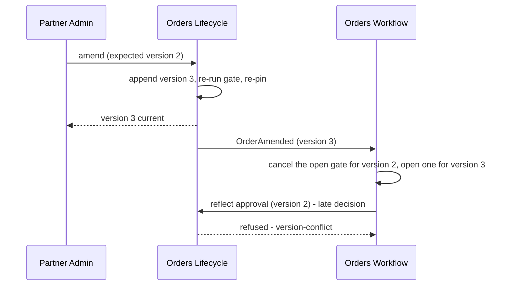

<!-- CONFLUENCE_TITLE: [BSS]: Orders Lifecycle — Amendment and Version History (Slice 4) -->
<!-- Related: ../DESIGN.md, ../PRD.md, ./README.md, ./01-foundation.md | Owners: BSS Orders team -->

# DESIGN — Amendment and Version History (Slice 4)

<!-- toc -->

- [1. Architecture Overview](#1-architecture-overview)
  - [1.1 Architectural Vision](#11-architectural-vision)
  - [1.2 Architecture Drivers](#12-architecture-drivers)
  - [1.3 Architecture Layers](#13-architecture-layers)
- [2. Principles and Constraints](#2-principles-and-constraints)
  - [2.1 Design Principles](#21-design-principles)
  - [2.2 Constraints](#22-constraints)
- [3. Technical Architecture](#3-technical-architecture)
  - [3.1 Domain Model](#31-domain-model)
  - [3.2 Component Model](#32-component-model)
  - [3.3 API Contracts](#33-api-contracts)
  - [3.4 Internal Dependencies](#34-internal-dependencies)
  - [3.5 External Dependencies](#35-external-dependencies)
  - [3.6 Interactions and Sequences](#36-interactions-and-sequences)
  - [3.7 Database Schemas and Tables](#37-database-schemas-and-tables)
  - [3.8 Deployment Topology](#38-deployment-topology)
- [4. Additional Context](#4-additional-context)
  - [4.1 Admissibility (normative)](#41-admissibility-normative)
  - [4.2 Carry forward and re-resolve (normative)](#42-carry-forward-and-re-resolve-normative)
  - [4.3 Re-approval is a two-step seam interaction (normative)](#43-re-approval-is-a-two-step-seam-interaction-normative)
  - [4.4 Stale results (normative)](#44-stale-results-normative)
  - [4.5 Version history (normative)](#45-version-history-normative)
- [5. Traceability](#5-traceability)

<!-- /toc -->

- [ ] `p1` - **ID**: `cpt-cf-bss-orders-lifecycle-design-versioning`

## 1. Architecture Overview

### 1.1 Architectural Vision

This slice owns what happens when a committed order needs to change. It admits amendments in
`submitted`, `pending_approval` and `approved`, appends a new version rather than editing the
old one, re-runs the whole gate, re-pins every line, and leaves the amended version in
`submitted` for the sibling workflow to reflect its new approval requirement
([`../PRD.md`](../PRD.md) §6.2).

The design rests on one observation: **the version counter is both the audit chain and the
concurrency mechanism**. Appending version N+1 simultaneously records what changed and
invalidates every asynchronous result still in flight against version N. That is why approval
can be a long-running, human-paced process without distributed locking: a decision that arrives
late is refused as stale, and the sibling gear's process instance for the prior version is
superseded by the event this slice publishes. No lock, no lease, no compare-and-swap beyond the
one the engine already performs.

The second observation is that an amendment is **not primarily a state change**. From
`submitted` and `pending_approval` the order's state does not move at all — the version bumps,
`OrderAmended` publishes, and the process reacts. Only from `approved` does state move, and
then only backwards. Treating amendment as a versioning operation that *sometimes* moves state,
rather than as a state transition that sometimes bumps a version, is what keeps the
transition table honest.

What this slice does not own is whether the amended order needs re-approval. That verdict is
external and arrives through [`06-workflow-seam`](./06-workflow-seam.md); this slice always
returns the amended version to `submitted` and never preserves or infers a prior-version verdict.

### 1.2 Architecture Drivers

#### Functional Drivers

| Requirement | Design Response |
|-------------|------------------|
| `cpt-cf-bss-orders-lifecycle-fr-order-amendment` | Amendment is a versioning transition on three table rows. It appends, re-runs the gate, re-pins, and publishes `OrderAmended` whether or not state moved. |
| `cpt-cf-bss-orders-lifecycle-fr-order-history` | Every version is retained with actor, timestamp, reason and a `supersedesVersion` back-reference, so consumers reconstruct the commercial trail without inferring the chain from ordering. |
| `cpt-cf-bss-orders-lifecycle-fr-order-tenant-axes` | The payer-change amendment is the one axis mutation the design permits, and it carries the paired payer/seller rebinding predicate so a payer is never silently rebound alone across sellers. |
| `cpt-cf-bss-orders-lifecycle-fr-order-idempotency` | Stale results are refused by the engine's version check; this slice owns the caller-facing contract that makes the refusal actionable rather than merely correct. |
| `cpt-cf-bss-orders-lifecycle-fr-orders-boundary-r1-state-sor` | Amendment never asks the sibling gear's permission and never reads its process state. It appends and publishes; the process reacts. |

#### NFR Allocation

| NFR ID | NFR Summary | Allocated To | Design Response | Verification Approach |
|--------|-------------|--------------|-----------------|----------------------|
| `cpt-cf-bss-orders-lifecycle-nfr-order-audit-completeness` | 100 % of amendments audited | Version appender | The version append and the audit entry share the engine transaction; an administrative edit audits without a version | Test asserting every amendment yields both a version row and an audit row, and every administrative edit yields an audit row only |
| `cpt-cf-bss-orders-lifecycle-nfr-order-retention` | All versions retained | Version store | Append-only with no update or delete path; retention is the program policy and archival never removes a version | Test asserting no code path deletes a version row |
| `cpt-cf-bss-orders-lifecycle-nfr-order-snapshot-integrity` | Every submitted line pinned | Re-pin on amendment | The gate re-run and re-pin are part of the amendment commit, so version N+1 is pinned contemporaneously with itself | Test asserting a version's pin catalog-version matches the amendment instant, not the original submit |
| `cpt-cf-bss-orders-lifecycle-nfr-order-read-latency` | Version read p95 < 200 ms | Version reader | A version is addressed by `(order_id, version)` and read directly; no chain walk and no event replay | Benchmark on historical version reads at realistic chain depths |

#### Key ADRs

The seven gear ADRs govern this slice. One decision taken here is recorded in the register: **an amendment carries forward the prior
version's content and re-resolves only what the gate produces**
([`../DECISIONS.md`](../DECISIONS.md) D-77, §4.2), whose alternative was requiring the caller to
resubmit the full document.

### 1.3 Architecture Layers

Inherited from [`01-foundation`](./01-foundation.md) §1.3. This slice adds no layer; it calls
the gate ports of [`03-gate-and-pin`](./03-gate-and-pin.md) through that slice rather than
directly.

## 2. Principles and Constraints

### 2.1 Design Principles

#### The version counter is the concurrency mechanism

- [ ] `p1` - **ID**: `cpt-cf-bss-orders-lifecycle-principle-version-is-concurrency`

Appending a version invalidates every in-flight asynchronous result against the prior one. There
is no separate lock, lease or generation token. A consequence to hold onto: a caller that omits
the expected version is refused rather than served, because an amendment that races an approval
reflection must have a defined loser.

#### Amend by append, never by edit

- [ ] `p1` - **ID**: `cpt-cf-bss-orders-lifecycle-principle-amend-by-append`

A prior version is never rewritten, re-pinned, corrected or deleted — not by a repair path, not
by a migration. A mistake in version N is fixed by version N+1. This is what makes a reviewer
able to say what they approved, and it is the reason the aggregate row holds a pointer rather
than the content.

#### Carry forward, re-resolve the gate

- [ ] `p1` - **ID**: `cpt-cf-bss-orders-lifecycle-principle-carry-forward-reresolve`

An amendment supplies only the fields it changes. The new version inherits the prior version's
commercial content for everything else, and the gate output — pin, total, market — is
**re-resolved in full** rather than inherited. Inheriting a pin would silently carry a stale
catalog version into a version the buyer believes is current.

#### An amendment is a versioning operation first

- [ ] `p2` - **ID**: `cpt-cf-bss-orders-lifecycle-principle-amendment-not-state-first`

Amendment always appends a version and always publishes `OrderAmended`; it moves state only from
`approved`. Consumers subscribe to the event rather than to a state change, because two of the
three admitting states produce no state change at all.

### 2.2 Constraints

#### Amendment stops at `in_fulfillment`

- [ ] `p1` - **ID**: `cpt-cf-bss-orders-lifecycle-constraint-no-amendment-in-fulfillment`

There is no amendment row from `in_fulfillment` or from any terminal state — only cancel and
hold remain. The reason is downstream rather than local: a provisioning intent may already be
accepted, and amending the document underneath it would leave the spawned subscriptions
describing a version nobody agreed to. A buyer who needs a change after fulfillment starts
cancels and reorders, or changes the subscription.

#### The re-approval target is not this slice's decision

- [ ] `p1` - **ID**: `cpt-cf-bss-orders-lifecycle-constraint-reapproval-target-external`

An amendment from `pending_approval` or `approved` transitions the order to **`submitted`
unconditionally**. Whether the **new version** requires approval is a verdict owned by the
approval policy owner, and the sibling gear obtains it on consuming `OrderAmended` and reflects
the order onward through rows 7 and 8. This slice **MUST NOT** compute that verdict, cache the
prior version's answer, assume the previous answer still holds, or make an outbound call to
acquire it — no such port is declared, and no verdict exists for a version that has not yet been
created. The two-step shape is what makes rows 19 and 20 reachable at all
([`../DECISIONS.md`](../DECISIONS.md) D-61, Q-12; §4.3).

#### A payer change must not cross seller scope

- [ ] `p2` - **ID**: `cpt-cf-bss-orders-lifecycle-constraint-paired-payer-seller-rebinding`

`payerTenantId` is the only tenant axis with an amendment path, and that path **stops at the
seller boundary**. A payer change that crosses seller scope **MUST** be refused with
`payer-rebinding-requires-seller`, because the paired seller rebinding such a move requires
cannot be performed here at all: `sellerTenantId` is **commercial-frozen** and **MUST NOT** change
after `submitted` by any path, amendment included
([`02-capture`](./02-capture.md) §4.3 *Commercial-frozen*; §4.1;
[`../DECISIONS.md`](../DECISIONS.md) D-62). So the payer is never silently rebound alone across
sellers — that would move billing attribution without moving the selling relationship — and it is
never rebound *together with* the seller either, because this slice owns no operation that can
move the selling party. A genuine cross-seller transfer is a cancel-and-reorder under the new
seller, or the platform's ownership-transfer flow acting **before** submit; it is not an amendment.

**Seller rebinding is therefore not possible at all after submit**, and this constraint no longer
claims otherwise. It previously described a paired payer/seller rebinding while §4.1 and
`02 §4.3` prohibited every post-submit `sellerTenantId` change; no implementation could satisfy
both, and a reader could conclude either that the documented payer-transfer path must be rejected
or that an unintended tenant rebinding must be permitted. The prohibition wins, because it is the
rule PRD §6.1 states — all three axes fixed at submit, exactly one post-submit mutation,
`payerTenantId` — and because the commercial-frozen guard that enforces it already exists (§3.6
*Append Amendment* step 1). `payer-rebinding-requires-seller` keeps its registered name and its
authorization requirements are those of `amend` itself: a cross-seller payer change needs no extra
authority because it is never admitted.

## 3. Technical Architecture

### 3.1 Domain Model

- [ ] `p1` - **ID**: `cpt-cf-bss-orders-lifecycle-entity-amendment-request`

The delta a caller supplies: the changed commercial fields, the amendment reason, the expected
version, and the idempotency key. It is not persisted as itself — it is resolved into a new
version row — but it is the unit the caller-facing contract is written against.

- [ ] `p2` - **ID**: `cpt-cf-bss-orders-lifecycle-entity-administrative-edit`

An in-place change to administrative content in any non-terminal state: the field, its prior and
new values, the actor and the instant. It produces an audit entry and no version.

It appends to `cpt-cf-bss-orders-lifecycle-entity-order-version-chain` and consumes the field
classification owned by [`02-capture`](./02-capture.md) §4.3.

**Relationships**:
- `Amendment request` → `Order version`: one-to-one; each admitted request produces exactly one version.
- `Order version` → `Order version`: `supersedesVersion` forms a linear chain with no branching, because only one version is ever current.
- `Administrative edit` → `Order transition`: one-to-one; the audit entry is the edit's only durable trace beyond the changed value itself.

### 3.2 Component Model

This slice realises `cpt-cf-bss-orders-lifecycle-component-versioning`
([`../DESIGN.md`](../DESIGN.md) §3.2) as two internal parts.

#### Version appender

- [ ] `p1` - **ID**: `cpt-cf-bss-orders-lifecycle-component-versioning-appender`

##### Why this component exists

Appending a version correctly means doing five things in one commit — carry forward, apply the
delta, re-run the gate, re-pin, move the pointer — and getting any one of them wrong produces a
version that misrepresents what was agreed.

##### Responsibility scope

Admissibility per state; the carry-forward of unchanged commercial content; delta application;
the gate re-run and re-pin through [`03-gate-and-pin`](./03-gate-and-pin.md); the
`supersedesVersion` invariant; the pointer move; and target-state resolution for an amendment
from `approved`.

##### Responsibility boundaries

It decides no re-approval requirement, evaluates no predicate itself, and never edits a prior
version. It does not publish `OrderAmended` — the engine's outbox does, from the transition.

##### Related components (by ID)

- `cpt-cf-bss-orders-lifecycle-component-transition-orchestrator` — depends on
- `cpt-cf-bss-orders-lifecycle-component-gate-and-pin` — calls
- `cpt-cf-bss-orders-lifecycle-component-capture-field-classifier` — depends on

#### Version reader

- [ ] `p2` - **ID**: `cpt-cf-bss-orders-lifecycle-component-versioning-reader`

##### Why this component exists

"What exactly did they agree to, and who changed it" is the question the gear exists to answer,
and answering it must not require reconstructing anything.

##### Responsibility scope

Retrieval of any version by order and version number; the version list with actor, timestamp,
reason and supersession; and the administrative-edit trail alongside it.

##### Responsibility boundaries

It serves no current-state projection — that is
[`08-read-and-authz`](./08-read-and-authz.md) — and it applies no access decision of its own
beyond the engine's pre-guard.

##### Related components (by ID)

- `cpt-cf-bss-orders-lifecycle-component-read-and-authz` — shares model with

### 3.3 API Contracts

- [ ] `p1` - **ID**: `cpt-cf-bss-orders-lifecycle-interface-versioning-ops`

- **Requirement**: `cpt-cf-bss-orders-lifecycle-interface-order-ops`
- **Technology**: REST/OpenAPI via `OperationBuilder`; RFC 9457 problems; ETag carries the expected version

| Method | Path | Description | Stability |
|--------|------|-------------|-----------|
| `POST` | `/bss-orders-lifecycle/v1/orders/{orderId}/amendments` | Append a new version from a delta; re-runs the gate and re-pins | unstable |
| `GET` | `/bss-orders-lifecycle/v1/orders/{orderId}/versions` | List versions with actor, timestamp, reason and supersession — **surface owned by [`08-read-and-authz`](./08-read-and-authz.md)**; this slice owns the version reader behind it | unstable |
| `GET` | `/bss-orders-lifecycle/v1/orders/{orderId}/versions/{version}` | Retrieve one historical version in full — **surface owned by [`08-read-and-authz`](./08-read-and-authz.md)**; this slice owns the reader | unstable |

The administrative edit is `PATCH /orders/{orderId}`, owned by
[`02-capture`](./02-capture.md) and admitted here in non-`draft` states through the field
classifier.

**The version reason vocabulary is `{create, submit, amendment}`.** PRD §6.2 lists eight reason
values — submit, amendment, approval reflection, hold, resume, cancel, fulfillment outcome, expiry
— and the design adds `create` because PRD §12 AC-1 requires creation to materialise version 1.
Five transition rows append a version: creation, submit and the three amendment rows. The other six
PRD reasons name state-only transitions, so they live on `orders_transition_audit.reason`, not on
the version chain. Two of those five append a version **without** publishing `OrderAmended`,
against PRD §6.5's stated trigger of "on creation of a new order version": creation is event-less
and submit publishes `OrderSubmitted`. `OrderAmended` fires only on rows 18, 19 and 20
(`01 §4.4`), and the §6.5 wording is routed as Q-25. A consumer reconstructing the commercial trail keyed on the PRD's list finds
six of eight values on the audit row rather than the version row; the split is stated here so the
two are not read as one vocabulary ([`../DECISIONS.md`](../DECISIONS.md) D-82).

**Reasons contributed to the registry**: payer-rebinding-requires-seller,
tenant-axis-immutable, **administrative-field-in-amendment**, amendment-empty,
version-not-found, **amendment-cap-exhausted**.
`amendment-cap-exhausted` is registered **here and only here**: it is the refusal of rows 18, 19
and 20 when `orders_order.amendment_count` has reached the cap of §4.1, and it names the cap and
the count so a caller learns the order cannot be revised again and must be cancelled and
re-placed. Like `resume-cap-exhausted` it is deliberately **not** folded into the engine's
`not-admissible` — the row *is* admissible and the state *does* permit amendment; what refuses is a
guard on data. `administrative-field-in-amendment` is registered **here and only here**: it
is the amendment path's refusal for a delta naming any administrative field, and it names the
offending field and directs the caller to `PATCH /orders/{orderId}` (§4.1). It is the mirror of
capture's `commercial-field-immutable` — that reason refuses commercial content on the
administrative surface, this one refuses administrative content on the commercial surface — and
the two are distinct names because they refuse on opposite operations and point the caller in
opposite directions. `payer-rebinding-requires-seller` refuses a payer change that crosses seller
scope, which §2.2 and §4.1 establish is never admissible, since `sellerTenantId` cannot be
rebound to accompany it. An amendment attempted from
`in_fulfillment` or a terminal state resolves to the engine's own `not-admissible`, which carries
the current state and trigger — no row exists for those pairs, so a slice-local
`amendment-not-admitted-in-state` was unreachable from every path and is deleted, matching the
treatment [`05-preconditions`](./05-preconditions.md) §3.3 and
[`07-hold-and-expiry`](./07-hold-and-expiry.md) §3.3 give the analogous cases. The
stale-version condition uses the engine's own `version-conflict`, and a commercial field touched
outside an amendment uses capture's `commercial-field-immutable` — one name per condition
([`../DECISIONS.md`](../DECISIONS.md) D-38). Gate reasons are passed through unchanged from
[`03-gate-and-pin`](./03-gate-and-pin.md).

### 3.4 Internal Dependencies

| Dependency Gear | Interface Used | Purpose |
|-------------------|----------------|----------|
| `toolkit-db` | Runtime-scoped access, via the engine | Version append and read inside the transition transaction |

### 3.5 External Dependencies

None directly. The gate re-run reaches pricing, rating, account-management, contracts and
subscriptions, but does so **through** [`03-gate-and-pin`](./03-gate-and-pin.md), which owns
those ports. This slice holds no adapter of its own, so an upstream contract change lands in one
place.

### 3.6 Interactions and Sequences

#### Amend an order

**ID**: `cpt-cf-bss-orders-lifecycle-seq-amend-order`

**Use cases**: `cpt-cf-bss-orders-lifecycle-usecase-order-amendment`

**Actors**: `cpt-cf-bss-orders-lifecycle-actor-orders-partner-admin`, `cpt-cf-bss-orders-lifecycle-actor-orders-seller-operator`

**Algorithm: Append Amendment**

Input: order_id, delta, amendment_reason, expected_version, idempotency_key, security_context
Output: the new version, or a registered refusal

1. [ ] - `p1` - Declare **six** guards the engine evaluates and audits, **in this registration order** (`01 §4.1`), so a delta failing more than one refuses deterministically on the first — the **amendment cap** of §4.1 runs **first**, because an order at the cap cannot be amended whatever the delta says and evaluating the delta would cost a full gate run to reach the same refusal; then admissibility, non-empty delta (`amendment-empty`), **no administrative field in the delta** (`administrative-field-in-amendment`, naming the field and directing the caller to `PATCH /orders/{orderId}`), **no commercial-frozen field in the delta** (`tenant-axis-immutable`, naming the field), and **no cross-seller payer change** (`payer-rebinding-requires-seller`) - `inst-am-declare-guards`
2. [ ] - `p1` - Resolve those guards' inputs: classify every delta field through the shared declaration, and determine whether a `payer_tenant_id` change crosses seller scope — no paired seller rebinding is looked for, because `sellerTenantId` is commercial-frozen and the guard above it has already refused any delta naming it (§2.2, §4.1) - `inst-am-resolve-guard-inputs`
3. [ ] - `p1` - Carry forward the current version's commercial content - `inst-am-carry-forward`
4. [ ] - `p1` - Apply the delta over the carried-forward content - `inst-am-apply-delta`
5. [ ] - `p1` - Run the full gate over the amended content, re-deriving the order market - `inst-am-rerun-gate`
6. [ ] - `p1` - **IF** the gate refuses: **RETURN** every failure; the current version stands unchanged - `inst-am-if-gate-refuses`
7. [ ] - `p1` - Re-compose the catalog price pin for every line at the current catalog version - `inst-am-repin`
8. [ ] - `p1` - Re-capture the resolved total and the TCV figure - `inst-am-recapture-total`
9. [ ] - `p1` - **IF** the current state is `pending_approval` or `approved`: the transition target is `submitted`, and no verdict is read - `inst-am-target-submitted`
10. [ ] - `p1` - **ELSE** the current state is `submitted` and the target is the current state - `inst-am-target-unchanged`
11. [ ] - `p1` - Request the amendment transition, contributing the new version with supersedes_version - `inst-am-request-transition`
12. [ ] - `p1` - **RETURN** the new version - `inst-am-return-version`

**Description**: Steps 3 through 8 are the carry-forward-and-re-resolve contract: content is
inherited, gate output never is. Step 9 is the only place amendment moves state, and the target
is always `submitted` — this slice reads no verdict and makes no outbound call. Every refusal this
algorithm can produce is a **declared guard**, so none of them returns ahead of the engine and
each one audits and settles (`01 §4.1`,
[`../ADR/0005-cpt-cf-bss-orders-lifecycle-adr-refusals-commit.md`](../ADR/0005-cpt-cf-bss-orders-lifecycle-adr-refusals-commit.md)).

#### Amendment supersedes in-flight approval

**Sequence ID**: defined in [`../DESIGN.md`](../DESIGN.md) §3.6 as `cpt-cf-bss-orders-lifecycle-seq-amendment-supersession`; this section specifies its mechanics

**Use cases**: `cpt-cf-bss-orders-lifecycle-usecase-order-amendment`

**Actors**: `cpt-cf-bss-orders-lifecycle-actor-orders-partner-admin`, `cpt-cf-bss-orders-lifecycle-actor-orders-workflow`

**Description**: No lock is taken anywhere. The late decision is refused because the version it
names is superseded, and the sibling gear learns of the supersession from the event rather than
from a callback. This is the whole of the concurrency design for a human-paced approval.

#### Administrative edit

**ID**: `cpt-cf-bss-orders-lifecycle-seq-administrative-edit`

**Use cases**: `cpt-cf-bss-orders-lifecycle-usecase-order-amendment`

**Actors**: `cpt-cf-bss-orders-lifecycle-actor-orders-partner-admin`, `cpt-cf-bss-orders-lifecycle-actor-orders-seller-operator`

**Algorithm: Apply Administrative Edit**

Input: order_id, field, new_value, security_context, idempotency_key
Output: applied, or a registered refusal

1. [ ] - `p1` - Declare two guards the engine evaluates and audits: the current state is non-terminal (an inadmissible state resolves to the engine's own `not-admissible`), and the field is not classified commercial (refusing with capture's `commercial-field-immutable`) - `inst-ae-declare-guards`
2. [ ] - `p1` - Resolve those guards' inputs: classify the named field through the shared declaration - `inst-ae-resolve-guard-inputs`
3. [ ] - `p1` - Pass the new value as the contribution to the administrative-edit transition, which writes it to `orders_order_admin` or `orders_order_line_admin` - `inst-ae-contribute-value`
4. [ ] - `p1` - The engine writes the value, appends the audit entry carrying the changed field with its prior and new value, and commits - `inst-ae-engine-writes`
5. [ ] - `p1` - **RETURN** applied; no version was appended and no OrderAmended was published - `inst-ae-return-applied`

**Description**: The absence of a version bump and of an event is the point. Correcting a
mistyped purchase-order number must not invalidate an approval or restart a process, and the
audit entry is sufficient trace for a field that carries no commercial meaning.

### 3.7 Database Schemas and Tables

This slice introduces no table. It owns the content of `orders_order_version`
(`cpt-cf-bss-orders-lifecycle-dbtable-order-version`) specified normatively in
[`01-foundation`](./01-foundation.md) §3.7, and two additions belong here:

- The `supersedes_version` invariant is **linear**: it references the immediately prior version, and there is no branching. Enforced as a constraint rather than by convention, because a branch would make "the current version" ambiguous.
- An **administrative edit writes no version row** and mutates no append-only row. It writes the mutable administrative tables, and its trace is the audit entry's `changed_field`, `prior_value` and `new_value` columns ([`01-foundation`](./01-foundation.md) §3.7). A reader reconstructing the commercial trail reads versions; a reader auditing every change reads the audit log.

Version retention follows the program retention policy. There is no delete path.

### 3.8 Deployment Topology

Inherited from [`01-foundation`](./01-foundation.md) §3.8. No background worker.

**Observability owned here**: amendments per order and the version-depth distribution, because an
order accumulating versions is either a negotiation or a client defect and the two need
separating; `version-conflict` refusal rate on the workflow-only operations, which is the signal
that the sibling gear is racing an amendment; gate re-run outcome on amendment split by
predicate, since an amendment that newly fails the gate is a commercial event, not an error; and
administrative-edit volume by changed field, which is the audit-facing series. Alerts fire on the
`version-conflict` rate crossing its threshold, and on an amended order dwelling in `submitted`
beyond the sibling gear's reflection lead time — which is the signal that the two-step re-approval
of §4.3 has stalled.

## 4. Additional Context

### 4.1 Admissibility (normative)

**The number of amendments per order is capped, and the cap is a commercial value owned here.**
`orders_order.amendment_count` ([`01-foundation`](./01-foundation.md) §3.7) is incremented by rows
18, 19 and 20 and reset by no transition, and all three rows carry a registered guard refusing
`amendment-cap-exhausted` once it reaches the cap. The baseline is **20 amendments per order**.

*Why a cap exists at all.* Rows 19 and 20 target `submitted` from `pending_approval` and
`approved`, so the effective target differs from the outgoing state and `01 §3.6` *Attempt
Transition* step 20.1 **resets `state_entered_at`**. `approved → submitted → approved` therefore restarts the dwell
clock on every cycle, which is the same unbounded-lifetime loop D-90 closed for hold/resume,
available through a second operation. Capping resumes alone left it open
([`../DECISIONS.md`](../DECISIONS.md) D-90).

*Why the cap is separate from the resume cap rather than one shared budget.* A shared counter would
be structurally tidier — one column, and any future clock-resetting row covered by construction —
and it is rejected on commercial grounds: a resume is a **seller-side operational** act (a
compliance hold, a dispute) and an amendment a **buyer-side commercial** one (negotiation). One
budget would let a seller's holds silently consume a buyer's ability to correct their own order,
which is the wrong failure to design in.

*Why 20.* Negotiated orders revise two to five times in practice, so twenty is roughly four times
the plausible upper end and never fires in honest commerce. An amendment is a **re-quote, not an
edit** — it re-runs all nine gate predicates, re-pins every line and resets the approval clock
(§3.6) — so nobody reaches twenty by accident, and the cap also bounds a cost nothing else bounded:
repeated amendments are repeated six-port fan-outs. It bounds a **buyer-facing** action, unlike the
resume cap, so it is deliberately generous: an order a buyer cannot correct is a worse outcome than
a long-lived order. A twenty-first revision is a signal to re-place the deal as a new order, and
the refusal names the cap and the count so the caller can tell which. A deployment **MAY** raise or
lower it and **MUST NOT** unset it; there is no unlimited value.

Amendment **MUST** be admitted from `submitted`, `pending_approval` and `approved`, and **MUST
NOT** be admitted from `draft`, `on_hold`, `in_fulfillment` or any terminal state. From `draft`
the content is freely editable and no version is warranted. From `on_hold` the order is paused
and the pre-hold state governs what is permitted, so an amendment resumes first. From
`in_fulfillment` onward only cancel and hold remain.

An amendment **MUST** carry a non-empty delta and an expected version. An amendment whose delta
names **any** administrative field **MUST** be refused with `administrative-field-in-amendment`,
naming the offending field and directing the caller to `PATCH /orders/{orderId}` — rather than
silently appending a version that changes no commercial content, or writing administrative content
onto an append-only version row where §3.7 says it never lives.

**The rule is "any", not "only".** A **mixed** delta naming both an administrative field and a
commercial one is refused on the same reason: the caller is asking for two operations with
different audit semantics — one appends a version and re-runs the gate, the other does neither —
and splitting it silently would either bump a version for an administrative correction or apply an
administrative change with no `PATCH` audit entry. The caller **MUST** send the two separately.
Where a delta names both an administrative field and a commercial-frozen axis, the refusal is
`administrative-field-in-amendment`, because slice guards refuse in **registration order**
(`01 §4.1`) and §3.6 *Append Amendment* step 1 registers the administrative guard ahead of the
commercial-frozen one — the outcome is therefore deterministic rather than
implementation-dependent.

**The tenant axes are not uniformly amendable.** `payerTenantId` **MAY** change through an
amendment **only where the change does not cross seller scope**; a cross-seller payer change
**MUST** be refused with `payer-rebinding-requires-seller`, because the paired seller rebinding it
would require is unavailable — see §2.2 *A payer change must not cross seller scope*.
`resourceTenantId` and `sellerTenantId` **MUST NOT** change through any path once the order is
`submitted`, and an amendment delta naming either **MUST** be refused with
`tenant-axis-immutable`. **No seller rebinding is possible after submit**, so nothing in this
slice pairs one with a payer change. This slice previously asserted that payer was the only axis
with an amendment path and registered no guard for it, so the assertion was unenforced and a delta
rebinding the resource recipient or the selling party would have committed
([`02-capture`](./02-capture.md) §4.3 *Commercial-frozen*;
[`../DECISIONS.md`](../DECISIONS.md) D-62).

### 4.2 Carry forward and re-resolve (normative)

The new version **MUST** inherit every commercial field the delta does not name, and **MUST
NOT** inherit any gate output. Specifically, the catalog price pin, the resolved total, the TCV
figure and the order market **MUST** be re-resolved in full as part of the amendment commit.

The rejected alternative was requiring the caller to resubmit the whole document. It was
rejected because a caller reconstructing an unchanged five-line basket to alter one quantity
will eventually reconstruct it wrongly, and because the diff between versions is then the
caller's artefact rather than the store's. The rejected shortcut in the other direction —
inheriting the pin to avoid a catalog round trip — is worse: it would carry a stale catalog
version into a version the buyer believes is current, defeating the pin's only purpose.

An amendment **MUST** publish `OrderAmended` carrying the new version, **even when the order's
state does not change**, so a consumer never has to infer that a version bumped from the absence
of a state event.

### 4.3 Re-approval is a two-step seam interaction (normative)

An amendment from `pending_approval` or `approved` **MUST** transition the order to `submitted`
and publish `OrderAmended`. This slice **MUST NOT** read, derive or request an
approval-requirement verdict for the new version. The sibling gear, on consuming `OrderAmended`,
obtains the verdict for the new version and reflects the order onward through the rows that
already exist: `submitted → pending_approval` where approval is required (row 7) or
`submitted → approved` where it is not (row 8).

**Why the verdict cannot be a guard here.** A verdict for version N+1 is unobtainable at the
moment the amendment commits, because version N+1 does not exist until it does. Verdicts are
stored only as reflections keyed `(order_id, version)`
([`06-workflow-seam`](./06-workflow-seam.md) §3.7), that slice's §4.2 forbids deriving one for an
amended version from the version it superseded, this gear declares no port to the approval policy
owner ([`../DESIGN.md`](../DESIGN.md) §3.5), and PRD §12 AC-11a forbids it to *query* that owner.
A guard on the new version's verdict is therefore not a hard guard to satisfy — it is one nothing
in the specified system can ever satisfy, which made the previous rows 19 and 20 unreachable and
amendment from `approved` impossible.

**The objection this answers.** The earlier design rejected landing in `submitted`
unconditionally on the grounds that it "left row 20's `pending_approval` target unreachable and
silently narrowed a PRD edge". Half of that objection is now moot and half is met head-on. The
earlier two-row split is folded into current row 20, the unguarded `approved → submitted` row,
and `pending_approval` is reached by row 7, a real edge the sibling gear already drives. What
remains is a genuine divergence: PRD §6.1's diagram declares a **direct**
`approved → pending_approval` amendment edge, and this design reaches that state in two steps
instead. That divergence is **disclosed, not silent** — recorded as
[`../DECISIONS.md`](../DECISIONS.md) D-61 and routed to Product as Q-12. The same route discloses
that this design's `pending_approval → submitted` amendment transition conflicts with PRD §6.1's
statement that amendments from `pending_approval` do not change order state; §10 UC-002 step 3
and §12 AC-5 then require a return to the pre-approval state, while §5.1 and §6.2 scope that
clause to `approved` only.

**What a caller observes.** An amendment returns the new version with the order in `submitted`.
An order that requires approval is briefly in `submitted` before the sibling gear reflects it to
`pending_approval`; consumers keyed on `OrderAmended` see the version, and consumers keyed on
state see one extra transition. Nothing is lost: the audit trail records both, and the two-step
path is why no amendment can ever be refused for want of a verdict.

### 4.4 Stale results (normative)

Once version N+1 exists, an approval reflection or fulfillment acknowledgement carrying version
N **MUST** be refused with the engine's `version-conflict` reason — the identifier for the
PRD's stale-version condition ([`01-foundation`](./01-foundation.md) §4.2). The engine performs the check; this slice
owns the caller contract, which has two obligations. The refusal **MUST** name the current
version, so a caller can re-read and retry rather than poll blindly. And a refused stale result
**MUST NOT** be treated as a failure of the operation it reports — the approval that was granted
against version N really was granted, and the sibling gear's correct response is to open a gate
against version N+1, not to record a denial.

### 4.5 Version history (normative)

Every version **MUST** record the full commercial content at that version, the actor who created
it, the timestamp, the version reason (`create`, `submit` or `amendment`), and the
`supersedesVersion` reference. Every version
**MUST** remain retrievable by order identity and version number for the retention period. No
path **MAY** update or delete a version row.

The reason vocabulary is registered rather than free text — `create`, `submit` and `amendment` —
because a consumer reconstructing the commercial trail keys on it.

## 5. Traceability

- **PRD**: [`../PRD.md`](../PRD.md) — §6.2 amendment and version history
- **Gear design**: [`../DESIGN.md`](../DESIGN.md) — realises `cpt-cf-bss-orders-lifecycle-component-versioning`
- **Engine**: [`01-foundation`](./01-foundation.md) — version chain, version check, audit
- **Depends on**: [`02-capture`](./02-capture.md) field classification; [`03-gate-and-pin`](./03-gate-and-pin.md) for the gate re-run and re-pin
- **Consumers**: [`06-workflow-seam`](./06-workflow-seam.md) reacts to `OrderAmended` and receives the `version-conflict` refusal; [`08-read-and-authz`](./08-read-and-authz.md) serves the version reads
- **ADRs**: [`ADR/0001`](../ADR/0001-cpt-cf-bss-orders-lifecycle-adr-transition-through-engine.md) transition through the engine; [`ADR/0002`](../ADR/0002-cpt-cf-bss-orders-lifecycle-adr-slice-decomposition.md) the foundation-plus-seven-slices decomposition