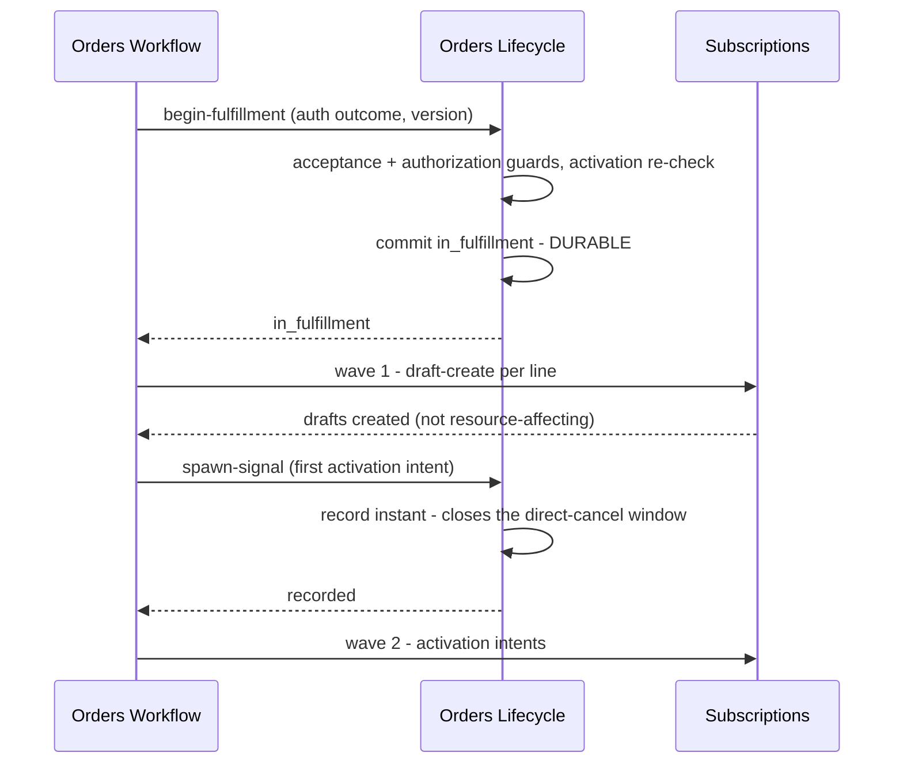

<!-- CONFLUENCE_TITLE: [BSS]: Orders Lifecycle — The Workflow Seam (Slice 6) -->
<!-- Related: ../DESIGN.md, ../PRD.md, ./README.md, ./01-foundation.md | Owners: BSS Orders team -->

# DESIGN — The Workflow Seam (Slice 6)

<!-- toc -->

- [1. Architecture Overview](#1-architecture-overview)
  - [1.1 Architectural Vision](#11-architectural-vision)
  - [1.2 Architecture Drivers](#12-architecture-drivers)
  - [1.3 Architecture Layers](#13-architecture-layers)
- [2. Principles and Constraints](#2-principles-and-constraints)
  - [2.1 Design Principles](#21-design-principles)
  - [2.2 Constraints](#22-constraints)
- [3. Technical Architecture](#3-technical-architecture)
  - [3.1 Domain Model](#31-domain-model)
  - [3.2 Component Model](#32-component-model)
  - [3.3 API Contracts](#33-api-contracts)
  - [3.4 Internal Dependencies](#34-internal-dependencies)
  - [3.5 External Dependencies](#35-external-dependencies)
  - [3.6 Interactions and Sequences](#36-interactions-and-sequences)
  - [3.7 Database Schemas and Tables](#37-database-schemas-and-tables)
  - [3.8 Deployment Topology](#38-deployment-topology)
- [4. Additional Context](#4-additional-context)
  - [4.1 The five operations are ordinary transitions (normative)](#41-the-five-operations-are-ordinary-transitions-normative)
  - [4.2 Verdicts and the deciding authority (normative)](#42-verdicts-and-the-deciding-authority-normative)
  - [4.3 Begin fulfillment and the spawn signal (normative)](#43-begin-fulfillment-and-the-spawn-signal-normative)
  - [4.4 Acknowledgement (normative)](#44-acknowledgement-normative)
  - [4.5 The per-line projection is not a state machine (normative)](#45-the-per-line-projection-is-not-a-state-machine-normative)
  - [4.6 The upstream asks this slice depends on](#46-the-upstream-asks-this-slice-depends-on)
- [5. Traceability](#5-traceability)

<!-- /toc -->

- [ ] `p1` - **ID**: `cpt-cf-bss-orders-lifecycle-design-workflow-seam`

## 1. Architecture Overview

### 1.1 Architectural Vision

This slice owns the five operations the sibling **Orders Workflow** gear calls, and it is where
the seam rules R1 through R5 stop being principles and become code
([`../PRD.md`](../PRD.md) §6.1, §6.4).

Its central claim is that those five operations are **ordinary guarded transitions**. There is no
privileged interface, no state-setting bypass, no trusted caller path. Workflow gets the same
authorization pre-guard, the same state-table admissibility check, the same optimistic version
check and the same idempotency contract as a partner admin clicking submit. That is the entire
mechanism behind R1: the gear cannot hold divergent state because there is no way to assert
state without passing a guard.

Two facts recorded here carry disproportionate weight. The **spawn signal** — set when Workflow
reports its first activation intent — is what the cancellation guard reads, which is why
begin-fulfillment must be durably committed *before* Workflow issues any intent; the ordering is
a requirement, not an implementation detail, and without it the guard is racy. And the **deciding
authority** stored alongside every approval verdict is what keeps a stand-in decision
distinguishable from a policy decision after the fact — necessary because the approval policy
owner does not exist yet and its stand-in returns "approval not required" for everything.

The slice records outcomes and refuses to interpret them. It stores a verdict without evaluating
it (R2), holds no provisioning adapter (R3), performs no price arithmetic (R4), and treats the
downstream transition-request identifier as an opaque join key that no projection reads for
state (R5).

### 1.2 Architecture Drivers

#### Functional Drivers

| Requirement | Design Response |
|-------------|------------------|
| `cpt-cf-bss-orders-lifecycle-fr-orders-boundary-r1-state-sor` | All five operations are transition-table rows with the standard guard, version and idempotency contract. No privileged path exists, so divergent state is unrepresentable rather than merely forbidden. |
| `cpt-cf-bss-orders-lifecycle-fr-orders-boundary-r2-approval` | The verdict is stored with its deciding authority and never evaluated. A stand-in decision is a distinguishable value, not an indistinguishable default. |
| `cpt-cf-bss-orders-lifecycle-fr-orders-boundary-r3-provisioning` | No adapter to Subscriptions, the Policy Engine or OSS exists in this gear. Fulfillment outcome arrives only as an acknowledgement. |
| `cpt-cf-bss-orders-lifecycle-fr-orders-boundary-r5-no-mirroring` | The transition-request identifier is a correlation column on the per-line projection; no guard reads it and no state derives from it. |
| `cpt-cf-bss-orders-lifecycle-fr-order-cancel` | The cancel guard reads the recorded spawn signal rather than the order state, which is why accepting a draft-create does not close the direct-cancel window. |
| `cpt-cf-bss-orders-lifecycle-fr-order-atomic-fulfillment` | Terminals are order-level and atomic. The per-line create/activate result is a read-only projection, deliberately not a state machine. |
| `cpt-cf-bss-orders-lifecycle-fr-order-subscription-linkage` | The per-line line-to-subscription mapping is persisted on acknowledgement and carried in `OrderCompleted`, so acquisition provenance is answerable from the order side. |

#### NFR Allocation

| NFR ID | NFR Summary | Allocated To | Design Response | Verification Approach |
|--------|-------------|--------------|-----------------|----------------------|
| `cpt-cf-bss-orders-lifecycle-nfr-order-idempotency` | Zero duplicate transition effects | All five operations | Each carries the standard idempotency contract, so a Workflow retry after a client-side timeout returns the stored outcome and produces no second event | Concurrency test replaying each operation's key and asserting one durable effect |
| `cpt-cf-bss-orders-lifecycle-nfr-order-audit-completeness` | 100 % of transitions audited | Verdict and outcome recorder | Every operation audits with its actor class, the correlation identifier and the deciding authority | Test asserting each of the five writes an audit row carrying the correlation identifier |
| `cpt-cf-bss-orders-lifecycle-nfr-order-transition-latency` | Commit p95 < 1 s | Begin-fulfillment | The activation re-check runs before the transaction opens; the commit itself writes the spawn signal and audits | Load test separating re-check latency from commit latency |
| `cpt-cf-bss-orders-lifecycle-nfr-order-recovery` | RPO zero for `submitted`+ | Begin-fulfillment | The spawn-signal write is inside the commit, so a recovered database cannot have lost the fact the cancel guard depends on | DR test asserting the spawn signal survives with its order |

#### Key ADRs

The seven gear ADRs govern this slice. Two decisions taken here are recorded in the register: **the deciding authority is stored
alongside every verdict** ([`../DECISIONS.md`](../DECISIONS.md) D-73, §4.2), and **the per-line
result is a projection rather than a state machine** (D-74, §4.5).

### 1.3 Architecture Layers

Inherited from [`01-foundation`](./01-foundation.md) §1.3. This slice adds one inbound surface
and, deliberately, no outbound adapter.

## 2. Principles and Constraints

### 2.1 Design Principles

#### The sibling gear is an ordinary caller

- [ ] `p1` - **ID**: `cpt-cf-bss-orders-lifecycle-principle-workflow-is-ordinary-caller`

Workflow's five operations pass the same guards as any other. It receives no privileged
interface, no state-setting bypass and no exemption from the version check. R1 is then a
structural property rather than a rule someone must remember: there is no code path by which
Workflow could hold authoritative order state, because there is no code path by which any caller
can set state without a guard.

#### Store the verdict, never the reasoning

- [ ] `p1` - **ID**: `cpt-cf-bss-orders-lifecycle-principle-store-verdict-not-reasoning`

An approval verdict is persisted as a received fact with its deciding authority. This gear does
not evaluate it, does not cache a threshold, does not recompute it on amendment, and does not
infer a later verdict from an earlier one. The corollary matters while the policy owner is
missing: a stand-in decision must be **visibly** a stand-in, or the audit trail will later be
unable to distinguish "policy said no approval was needed" from "nothing was asked".

#### Commit the guard anchor before the risk

- [ ] `p1` - **ID**: `cpt-cf-bss-orders-lifecycle-principle-commit-anchor-before-risk`

Begin-fulfillment must be durably committed before Workflow issues any activation intent,
because the cancel guard reads a fact this gear stores. If the intent could precede the commit,
a cancel arriving in the window would be admitted against an order whose subscriptions were
already activating.

#### An outcome is not a mirror

- [ ] `p1` - **ID**: `cpt-cf-bss-orders-lifecycle-principle-outcome-not-mirror`

This gear records the **order-level outcome** of downstream work and a per-line projection of it.
It does not mirror the Subscriptions transition-request machine, does not reflect
subscription-level approval holds, and stores the downstream request identifier only as a join
key. Mirroring would recreate the dual-source-of-record hazard that R1 exists to prevent, aimed
at Subscriptions instead of Workflow.

### 2.2 Constraints

#### The approval policy owner does not exist

- [ ] `p1` - **ID**: `cpt-cf-bss-orders-lifecycle-constraint-approval-owner-absent`

The Generic Approval service has no authored specification, and until it exists the sibling gear
invokes a stand-in that returns "approval not required" for every order. This gear therefore
stores a verdict it cannot validate. The only defence available is the recorded deciding
authority, which **MUST** be populated on every stored verdict. The built BSS gears' local
approval surfaces are **not** a precedent this gear may follow — a module-local policy owner here
would undo R2.

#### The compensation cancel reason is unagreed

- [ ] `p1` - **ID**: `cpt-cf-bss-orders-lifecycle-constraint-compensation-reason-unagreed`

The acknowledgement path depends on Subscriptions carrying a cancellation reason for
order-fulfillment compensation — registered upstream as `SUB-O1`, marked critical there, and
unagreed. Its absence does not block this slice: the acknowledgement records the compensation
evidence Workflow supplies. But without it a compensating cancel downstream is
indistinguishable from an early termination, which would wrongly derive a termination fee or
credit. The upstream note is explicit that reason values ride event payloads consumers key on,
so adding one after Billing consumes the contract is a breaking change — this is the seam
materially cheaper now than later.

#### Order-reference provenance is not yet bidirectional

- [ ] `p2` - **ID**: `cpt-cf-bss-orders-lifecycle-constraint-provenance-one-directional`

This gear persists the line-to-subscription mapping, so "which subscription did this order
produce" is answerable. The reverse — "which order produced this subscription" — requires
Subscriptions to accept an order reference on `create`, registered upstream as `SUB-O2` and
unagreed. Until it lands, provenance is answerable from one side only, and a subscription created
outside the order path is indistinguishable from one created through it.

#### Correlation propagation is not guaranteed

- [ ] `p2` - **ID**: `cpt-cf-bss-orders-lifecycle-constraint-correlation-propagation-unagreed`

The process correlation identifier is recorded on every audit entry here, which makes the order
side of an acquisition traceable. Propagation onward through Subscriptions to the Policy Engine
and OSS is registered upstream as `SUB-O9` and unagreed, so an end-to-end trace currently stops
at the seam.

## 3. Technical Architecture

### 3.1 Domain Model

- [ ] `p1` - **ID**: `cpt-cf-bss-orders-lifecycle-entity-approval-reflection`

A stored approval fact: the verdict — approval required, not required, granted or denied — the
deciding authority that produced it, the order version it was decided against, and the instant
it was reflected. Never evaluated, never recomputed.

- [ ] `p1` - **ID**: `cpt-cf-bss-orders-lifecycle-entity-spawn-signal`

The recorded instant at which Workflow reported its first activation intent for the current
fulfillment attempt. A single nullable column on the aggregate, written by begin-fulfillment's
successor report and read by the cancel guard. It is a fact about what has been attempted, not a
state.

- [ ] `p1` - **ID**: `cpt-cf-bss-orders-lifecycle-entity-fulfillment-acknowledgement`

The order-level outcome Workflow reports: completed with the per-line subscription mapping, or
failed with the compensation evidence asserting that no active subscription remains.

- [ ] `p2` - **ID**: `cpt-cf-bss-orders-lifecycle-entity-line-fulfillment-projection`

The read-only per-line view — created, activated or failed — with the spawned subscription
identifier and the downstream transition-request identifier as a join key. Explicitly not a
state machine: nothing transitions it, and no order state derives from it.

**Relationships**:
- `Order root` → `Approval reflection`: one-to-many across versions; at most one requirement verdict and one gate outcome per version.
- `Order root` → `Spawn signal`: zero-or-one, **written once and never cleared** (§4.3, D-13). The earlier clearing rule was unreachable — a workflow-mediated cancel lands in `cancelled`, which is terminal with no row out, so no subsequent attempt exists to re-close the window for.
- `Order line` → `Line fulfillment projection`: one-to-one, 1:1 with the spawned subscription.

### 3.2 Component Model

This slice realises `cpt-cf-bss-orders-lifecycle-component-workflow-seam`
([`../DESIGN.md`](../DESIGN.md) §3.2) as three internal parts.

#### Verdict reflector

- [ ] `p1` - **ID**: `cpt-cf-bss-orders-lifecycle-component-seam-verdict-reflector`

##### Why this component exists

The approval arc is the one place where an external authority moves this gear's state, and it
must do so without this gear acquiring any opinion about approval.

##### Responsibility scope

The reflection operation for the requirement verdict and for gate outcomes; storage of the
verdict with its deciding authority and its version; and the guard that refuses a reflection
whose version is superseded.

##### Responsibility boundaries

It evaluates no policy, compares no threshold, caches no prior verdict, and never derives a
verdict for an amended version from the version it superseded.

##### Related components (by ID)

- `cpt-cf-bss-orders-lifecycle-component-transition-orchestrator` — depends on
- `cpt-cf-bss-orders-lifecycle-component-versioning` — shares model with

#### Fulfillment coordinator

- [ ] `p1` - **ID**: `cpt-cf-bss-orders-lifecycle-component-seam-fulfillment-coordinator`

##### Why this component exists

Begin-fulfillment and acknowledgement bracket the only window in which this gear's document can
be overtaken by physical reality, and both ends need to be exact.

##### Responsibility scope

Begin-fulfillment with its two guards from [`05-preconditions`](./05-preconditions.md) and the
activation re-check from [`03-gate-and-pin`](./03-gate-and-pin.md); the spawn-signal record;
acknowledgement with the per-line subscription mapping; the compensation-evidence check on a
failure acknowledgement; and the workflow-mediated cancel.

##### Responsibility boundaries

It performs no retry, no compensation and no provisioning, and it holds no adapter to
Subscriptions or OSS. It does not decide that compensation completed — it verifies that Workflow
asserted it and records the evidence.

##### Related components (by ID)

- `cpt-cf-bss-orders-lifecycle-component-preconditions-money-gate` — depends on
- `cpt-cf-bss-orders-lifecycle-component-gate-and-pin` — calls

#### Line projection maintainer

- [ ] `p2` - **ID**: `cpt-cf-bss-orders-lifecycle-component-seam-line-projection`

##### Why this component exists

With two-phase fulfillment, execution is two visible waves and an operator needs to see which
lines are where — without that visibility becoming a second authority on order state.

##### Responsibility scope

Maintenance of the per-line projection from acknowledgements; the subscription identifier; and
the transition-request identifier as a join key.

##### Responsibility boundaries

It exposes no transition, defines no per-line terminal, and is read by no guard. Order terminals
remain atomic and order-level.

##### Related components (by ID)

- `cpt-cf-bss-orders-lifecycle-component-read-and-authz` — owns data for

### 3.3 API Contracts

- [ ] `p1` - **ID**: `cpt-cf-bss-orders-lifecycle-interface-seam-ops`

- **Requirement**: `cpt-cf-bss-orders-lifecycle-interface-order-ops`
- **Technology**: REST/OpenAPI via `OperationBuilder`; RFC 9457 problems. Every call carries an idempotency key, the expected version and the process correlation identifier

| Method | Path | Description | Stability |
|--------|------|-------------|-----------|
| `POST` | `/bss-orders-lifecycle/v1/orders/{orderId}/approval-reflection` | Reflect the requirement verdict or a gate outcome | unstable |
| `POST` | `/bss-orders-lifecycle/v1/orders/{orderId}/begin-fulfillment` | `approved → in_fulfillment`; must commit before any activation intent | unstable |
| `POST` | `/bss-orders-lifecycle/v1/orders/{orderId}/spawn-signal` | Record the first activation intent of the current attempt | unstable |
| `POST` | `/bss-orders-lifecycle/v1/orders/{orderId}/fulfillment-acknowledgement` | `completed` with subscription identifiers, or `fulfillment_failed` with compensation evidence | unstable |
| `POST` | `/bss-orders-lifecycle/v1/orders/{orderId}/workflow-cancel` | Cancel from `in_fulfillment` with attached compensation evidence | unstable |

Authorization restricts all five to the Workflow system actor **and** requires a
gateway-asserted **service principal** carrying a scope claim naming this gear. Actor class alone
is insufficient: on its own nothing would distinguish the sibling gear from any caller presenting
that class ([`../DECISIONS.md`](../DECISIONS.md) D-33). They are **not** exempt from any guard;
the restriction is on who may call, not on what applies.

**Reasons contributed to the registry**: verdict-authority-missing,
begin-fulfillment-preconditions-unmet, spawn-signal-already-recorded,
acknowledgement-lines-incomplete, acknowledgement-subscription-missing,
acknowledgement-subscription-duplicated,
compensation-evidence-missing, compensation-evidence-incomplete,
workflow-cancel-requires-evidence. The cancel-window reason `direct-cancel-window-closed` is
owned and registered by [`07-hold-and-expiry`](./07-hold-and-expiry.md) §3.3 and used here
unchanged. The re-check rejections this
slice surfaces at the activation wave — market-divergence and overlap-collision — are owned and
registered by [`03-gate-and-pin`](./03-gate-and-pin.md) §3.3 and passed through unchanged. The
stale-verdict condition uses the engine's own `version-conflict` rather
than a seam-local name, because it is the same condition the engine raises for every other caller
([`../DECISIONS.md`](../DECISIONS.md) D-38; [`01-foundation`](./01-foundation.md) §4.2).

### 3.4 Internal Dependencies

| Dependency Gear | Interface Used | Purpose |
|-------------------|----------------|----------|
| `toolkit-db` | Runtime-scoped access, via the engine | Verdict, spawn signal, acknowledgement and projection writes inside the transition transaction |
| `orders-workflow` | Inbound calls and consumed events | The sibling gear calls these five operations and consumes the state events. **This gear makes no outbound call to it** |

### 3.5 External Dependencies

None owned here. The activation re-check reaches account-management and subscriptions **through**
[`03-gate-and-pin`](./03-gate-and-pin.md), which owns those ports. This slice deliberately holds
no adapter to Subscriptions, the Policy Engine or OSS — that absence is how R3 is enforced rather
than merely asserted.

### 3.6 Interactions and Sequences

#### Reflect an approval verdict

**ID**: `cpt-cf-bss-orders-lifecycle-seq-reflect-verdict`

**Use cases**: `cpt-cf-bss-orders-lifecycle-usecase-order-new-acquisition`

**Actors**: `cpt-cf-bss-orders-lifecycle-actor-orders-workflow`

**Algorithm: Reflect Verdict**

Input: order_id, verdict, deciding_authority, expected_version, idempotency_key, correlation_id
Output: the resulting state, or a registered refusal

1. [ ] - `p1` - Declare two guards the engine evaluates and audits: **deciding_authority present** (`verdict-authority-missing`), and expected_version current — the latter is the engine's own `version-conflict`, already evaluated at `01 §3.6` *Attempt Transition* step 12, so this slice pre-checks neither and returns no refusal of its own - `inst-rv-declare-guards`
2. [ ] - `p1` - **MATCH** the verdict to a **trigger**, which is what the engine looks the row up by — this slice resolves the trigger and never the target state (`01 §4.6`): - `inst-rv-match-verdict`
   1. [ ] - `p1` - **WHEN** approval required: trigger `reflect-approval-required` - `inst-rv-when-required`
   2. [ ] - `p1` - **WHEN** approval not required: trigger `reflect-approval-not-required` - `inst-rv-when-not-required`
   3. [ ] - `p1` - **WHEN** granted: trigger `reflect-approval-granted` - `inst-rv-when-granted`
   4. [ ] - `p1` - **WHEN** denied: trigger `reflect-approval-denied` - `inst-rv-when-denied`
3. [ ] - `p1` - Classify `required` or `not_required` as `requirement`, and `granted` or `denied` as `gate_outcome`; pass that verdict kind, the verdict, its deciding authority and the version as the contribution to the reflection transition, so the engine writes it inside the same transaction - `inst-rv-contribute-verdict`
4. [ ] - `p1` - **RETURN** the resulting state - `inst-rv-return-state`

**Description**: Step 1's authority guard is the whole defence against an absent policy owner. A
verdict without a named authority is refused — by the engine, so the refusal audits and settles
like every other — and a stand-in decision is therefore recorded as a stand-in decision rather
than being indistinguishable from a policy one.

#### Begin fulfillment and record the spawn signal

**ID**: `cpt-cf-bss-orders-lifecycle-seq-begin-and-spawn`

**Use cases**: `cpt-cf-bss-orders-lifecycle-usecase-order-fulfillment-complete`

**Actors**: `cpt-cf-bss-orders-lifecycle-actor-orders-workflow`, `cpt-cf-bss-orders-lifecycle-actor-orders-subscriptions`

**Description**: The ordering is the design. `in_fulfillment` commits before any intent exists,
and the spawn signal is recorded at the first *activation* intent — not at draft-create — which
is why a cancel during wave 1 is still admitted and compensated by a cheap draft void.

#### Acknowledge the fulfillment outcome

**ID**: `cpt-cf-bss-orders-lifecycle-seq-acknowledge-fulfillment`

**Use cases**: `cpt-cf-bss-orders-lifecycle-usecase-order-fulfillment-complete`

**Actors**: `cpt-cf-bss-orders-lifecycle-actor-orders-workflow`, `cpt-cf-bss-orders-lifecycle-actor-orders-subscriptions`

**Algorithm: Acknowledge Fulfillment**

Input: order_id, outcome, per_line_results, compensation_evidence, expected_version, idempotency_key
Output: completed or fulfillment_failed, or a registered refusal

1. [ ] - `p1` - Declare the guards the engine evaluates and audits: expected_version current (the engine's own `version-conflict` at `01 §3.6` *Attempt Transition* step 12, so this slice does not pre-check it); on the **completed** outcome, every line carrying an activated result (`acknowledgement-lines-incomplete`), every activated line carrying a subscription identifier (`acknowledgement-subscription-missing`), and those identifiers being distinct across the order's lines (`acknowledgement-subscription-duplicated`); on the **failed** outcome, compensation evidence present (`compensation-evidence-missing`) and asserting that no active subscription remains (`compensation-evidence-incomplete`) - `inst-af-declare-guards`
2. [ ] - `p1` - **MATCH** the outcome: - `inst-af-match-outcome`
   1. [ ] - `p1` - **WHEN** completed: - `inst-af-when-completed`
      1. [ ] - `p1` - Resolve the completed-outcome guards' inputs from per_line_results - `inst-af-resolve-completed-inputs`
      2. [ ] - `p1` - Add the per-line line-to-subscription mapping to the contribution - `inst-af-contribute-linkage`
      3. [ ] - `p1` - Set the **trigger** to `acknowledge-completed`; the engine resolves the target from the row (`01 §4.6`) - `inst-af-target-completed`
   2. [ ] - `p1` - **WHEN** failed: - `inst-af-when-failed`
      1. [ ] - `p1` - Resolve the evidence guards' inputs from compensation_evidence; where the evidence is absent or does not assert that no active subscription remains, the engine refuses and the order stays `in_fulfillment` - `inst-af-resolve-evidence-inputs`
      2. [ ] - `p1` - Add the compensation evidence to the contribution: drafts voided, activated subscriptions rolled back, at-sale facts emitted or not - `inst-af-contribute-evidence`
      3. [ ] - `p1` - Set the **trigger** to `acknowledge-failed`; the engine resolves the target from the row (`01 §4.6`) - `inst-af-target-failed`
3. [ ] - `p1` - Add the per-line projection update to the contribution - `inst-af-contribute-projection`
4. [ ] - `p1` - Request the acknowledgement transition, which writes every contribution and audits in one transaction - `inst-af-request-transition`
5. [ ] - `p1` - **RETURN** the resulting terminal state - `inst-af-return-terminal`

**Description**: Step 2.2 is the invariant that ties the two gears together: `fulfillment_failed`
presupposes completed operational compensation, so an acknowledgement that cannot assert it
leaves the order non-terminal under the sibling gear's escalation SLA. The order never waits on a
Billing credit note — money reverse is a billing-chain concern.

#### Cancel across the spawn boundary (the shared cancel guard)

**ID**: `cpt-cf-bss-orders-lifecycle-seq-seam-cancel-guard`

**Use cases**: `cpt-cf-bss-orders-lifecycle-usecase-order-cancel-during-approval`

**Actors**: `cpt-cf-bss-orders-lifecycle-actor-orders-seller-operator`, `cpt-cf-bss-orders-lifecycle-actor-orders-workflow`

**Algorithm: Evaluate Cancel From In-Fulfillment (shared guard)**

**This is a shared guard, not the `/workflow-cancel` handler.** Both cancel entry points defer to
it for an order in `in_fulfillment`: the **ordinary** `POST /cancel` owned by
[`07-hold-and-expiry`](./07-hold-and-expiry.md) §3.6 *Cancel Order* step 2, and the
**workflow-mediated** `POST /workflow-cancel` declared in §3.3. It therefore **MUST NOT** be read
as the authorization boundary of either path. Who may call each operation is settled **before**
this guard runs, by the permission matrix of [`08-read-and-authz`](./08-read-and-authz.md) §4.3
enforced as the engine's authorization pre-guard ahead of every slice guard
(`01 §4.1` *Guard evaluation order*, `01 §3.6` *Attempt Transition* step 1) — and that matrix
restricts `/workflow-cancel` to the Workflow service principal. What `requesting_actor_class`
decides **here** is only *which cancel window applies* to a caller already authorized for the
operation they invoked, which is why step 3 reads it after step 2 rather than before.

Input: order_id, requesting_actor_class (of the already-authorized caller, supplied by whichever
cancel entry point invoked this guard), compensation_evidence
Output: admit or a registered refusal

1. [ ] - `p1` - Read the recorded spawn signal - `inst-cg-read-spawn-signal`
2. [ ] - `p1` - **IF** no spawn signal is recorded: - `inst-cg-if-no-spawn`
   1. [ ] - `p1` - **RETURN** admit; the direct-cancel window is still open, so **either** entry point's caller may cancel and wave-1 drafts are compensated by void. This admits on the window, not on the actor: it is not an authorization decision and does not widen who may call `/workflow-cancel` - `inst-cg-return-direct-admit`
3. [ ] - `p1` - **IF** the requesting actor class is not the Workflow system actor: - `inst-cg-if-not-workflow`
   1. [ ] - `p1` - **RETURN** direct-cancel-window-closed refusal - `inst-cg-return-window-closed`
4. [ ] - `p1` - **IF** compensation evidence is absent or incomplete: - `inst-cg-if-no-evidence`
   1. [ ] - `p1` - **RETURN** workflow-cancel-requires-evidence refusal - `inst-cg-return-requires-evidence`
5. [ ] - `p1` - **RETURN** admit; record the evidence with the cancellation - `inst-cg-return-mediated-admit`

**Description**: The guard reads a recorded fact rather than inferring from state, so the window
closes exactly when the first activation intent is reported and not when `in_fulfillment` is
entered. After `completed` there is no order-side cancellation window at all — post-purchase
rights are exercised on the spawned subscriptions.

Because the guard is shared, the step order is deliberate and **MUST NOT** be rewritten as an
actor check ahead of the window check: hoisting step 3 above step 2 would make the ordinary
`POST /cancel` of `07 §3.6` refuse every pre-spawn cancellation by a seller operator or partner
admin — the cancel path PRD §6.3 requires — and it would not add any authorization the engine
pre-guard does not already enforce. The two callers are distinguished by **permission** at the
pre-guard and by **window** here, and those are separate concerns
([`../DECISIONS.md`](../DECISIONS.md) D-33).

### 3.7 Database Schemas and Tables

This slice introduces one table, owns `orders_line_fulfillment`
(`cpt-cf-bss-orders-lifecycle-dbtable-line-fulfillment`) and writes the `spawn_signal_at` column
on `orders_order`, all specified in [`01-foundation`](./01-foundation.md) §3.7.

#### Table: orders_approval_reflection

**ID**: `cpt-cf-bss-orders-lifecycle-dbtable-approval-reflection`

**Schema**:

| Column | Type | Description |
|--------|------|-------------|
| reflection_id | uuid | Entry identity |
| order_id | uuid | Owning aggregate |
| version | integer | The order version the verdict was decided against |
| verdict_kind | enum | `requirement` or `gate_outcome`; one reflected fact of each kind may stand for a version |
| verdict | enum | `required`, `not_required`, `granted` or `denied`; admissible values are constrained by `verdict_kind` |
| deciding_authority | text | The named authority — the policy owner, or the stand-in, explicitly |
| correlation_id | uuid, nullable | The sibling gear's process correlation identifier |
| reflected_at | timestamptz | Reflection instant |

**PK**: reflection_id

**Constraints**: append-only; `deciding_authority` NOT NULL, which is what makes a stand-in
decision permanently distinguishable; **`(order_id, version, verdict_kind)` UNIQUE**, so exactly
one requirement verdict and one gate outcome may stand per version. `requirement` admits only
`required` or `not_required`; `gate_outcome` admits only `granted` or `denied`
([`../DECISIONS.md`](../DECISIONS.md) D-28).

**Compensation evidence** is stored as `orders_order.compensation_evidence` (jsonb), written by the
acknowledgement or workflow-cancel transition, recording which drafts were voided, which activated
subscriptions were rolled back, and whether at-sale billable facts had been emitted. It previously
had no column anywhere.

**Additional info**: superseded versions' reflections are retained, so the trail shows what was
decided against a version that no longer stands.

Two notes on the tables owned elsewhere. `orders_order.spawn_signal_at` is written by the
**spawn-signal transition** and never cleared. And
`orders_line_fulfillment.transition_request_ref` is a **join key with no state semantics** — no
guard reads it, and no projection derives order state from it, which is R5 expressed as a schema
rule.

### 3.8 Deployment Topology

Inherited from [`01-foundation`](./01-foundation.md) §3.8. No background worker. The overdue
escalation for an order stuck in `in_fulfillment` is raised by the sibling gear, not here.

**Observability owned here**: per-operation call rate, latency and refusal breakdown for all five
seam operations; the count of verdicts recorded against the **stand-in** authority versus a real
policy owner, which is the signal that approval is still unimplemented; version-conflict rate on
reflections and acknowledgements, which measures how often amendments are racing approvals;
acknowledgements refused for incomplete compensation evidence; and the interval between
begin-fulfillment and the spawn-signal report, which is the window the direct-cancel guard is open
for. Alerts fire on a non-zero rate of evidence-incomplete acknowledgements, because each one
means an order is sitting non-terminal awaiting operator action.

## 4. Additional Context

### 4.1 The five operations are ordinary transitions (normative)

Approval reflection, begin fulfillment, **the spawn-signal report**, fulfillment acknowledgement
and the workflow-mediated cancel **MUST** each be a transition-table row subject to the full guard
order, the optimistic version check and the standard idempotency contract. The spawn-signal report
is row 12 of [`01-foundation`](./01-foundation.md) §4.3, a state-only `in_fulfillment →
in_fulfillment` transition — it was previously outside the table and therefore outside this
sentence, which is what let it escape the guard order
([`../DECISIONS.md`](../DECISIONS.md) D-11). Authorization **MUST** restrict them to the
Workflow system actor, and that restriction **MUST NOT** be implemented as an exemption from any
guard.

No operation **MAY** be added that sets order state without passing a guard, for any purpose
including data repair. A repair need becomes a new transition row with its own guard and reason.

### 4.2 Verdicts and the deciding authority (normative)

Every stored verdict **MUST** carry a named **deciding authority** and the order version it was
decided against, and a reflection lacking an authority **MUST** be refused. This gear **MUST
NOT** evaluate a verdict, compare a threshold, cache a prior verdict, or derive a verdict for an
amended version from the version it superseded.

**Re-approval after an amendment.** An amendment lands the order in `submitted` and publishes
`OrderAmended` ([`04-versioning`](./04-versioning.md) §4.3). On consuming that event the sibling
gear **MUST** obtain the requirement verdict for the **new** version and reflect the order onward
via `submitted → pending_approval` or `submitted → approved`. It **MUST NOT** carry the prior
version's verdict forward, which is the derivation the paragraph above forbids. Until that
reflection lands the order sits in `submitted`, and the `submitted` TTL continues to run — an
amendment does not pause the clock.

While the approval policy owner is unspecified, the sibling gear invokes a stand-in returning
"approval not required" for every order. The stand-in **MUST** be recorded as the authority by
name. Without that, a later audit cannot distinguish an order that policy exempted from an order
nobody ever asked about — and given the stand-in currently exempts everything, that distinction
is the entire audit value of the field.

### 4.3 Begin fulfillment and the spawn signal (normative)

Begin fulfillment **MUST** be durably committed before Workflow issues any activation intent.
The spawn signal **MUST** be recorded when Workflow reports its **first activation intent** of
the current attempt, and **MUST NOT** be recorded on draft-create acceptance.

Its guards are the two from [`05-preconditions`](./05-preconditions.md) — recorded acceptance
where required, and the authorization outcome — plus the activation re-check owned by
[`03-gate-and-pin`](./03-gate-and-pin.md) for market divergence and overlap collision. A
re-check rejection is a **pre-activation abort**: the affected lines are rejected before any
activation intent, rather than being treated as line-execution failures.

**It still has an order-level outcome, and that outcome is row 14.** PRD §6.1 requires market
divergence and overlap collision at activation to be "surfaced as a fulfillment failure", and
without a named route the order would sit in `in_fulfillment` indefinitely — a non-terminal state
the design deliberately exempts from expiry, so nothing would ever move it. Workflow therefore
acknowledges failure through `acknowledge-failed` (row 14), carrying compensation evidence. The
evidence requirement is satisfiable by construction here: the re-check runs **before** the first
activation intent, so no subscription was ever activated and the evidence records the voided wave-1
drafts and asserts that no active subscription remains. No new transition row is needed — the
existing failure path already expresses this, and routing it explicitly is what closes the gap.
The refusing predicate's reason (`market-divergence` or `overlap-collision`) is carried as the
failure reason so the cause survives on the audit entry.

**The activation re-check verdict is an early abort, and it does not expire.** This gear cannot
make the check atomic with the transaction that commits a subscription to `active`, and it also
cannot express a deadline: the re-check returns proceed or a per-line rejection to its caller, and
the transition Workflow then drives — `spawn-signal`, `01 §4.3` row 12 — is event-less, so no
declared interface carries a validity origin or a window (`03 §2.2`, D-89). What Workflow **MUST**
do is narrower and checkable: **MUST NOT** treat a proceed verdict as an admission guarantee, and **MUST** handle
an `overlap-collision` raised by Subscriptions at any point after the re-check — including after
lines the two-phase barrier deferred, which is precisely the case one window could never have
covered. Such a collision arrives on the failure-acknowledgement path of §4.4 with compensation
evidence, rather than as a silent partial activation
([`../DECISIONS.md`](../DECISIONS.md) D-89).

**The activation intent carries the start instant.** Each activation intent **MUST** carry the
**actual activation instant** as the spawned subscription's start, and **MUST NOT** derive that
start from any date carried on the order. Where the two-phase barrier defers a line past its
quoted service-activation date, the quoted date travels separately as the *requested* date and
the subscription's start is the instant activation actually occurred — billing and entitlement
**MUST NOT** be backdated to the earlier quoted date ([`../PRD.md`](../PRD.md) §6.1, §12 AC 8g).
This gear cannot enforce it alone, because Subscriptions owns the start: the obligation is raised
as [`../UPSTREAM_REQS.md`](../UPSTREAM_REQS.md) `…-upreq-subscription-start-instant` (**`SUB-O10`**),
and until it lands the requirement is stated here and unenforceable from this side
([`../DECISIONS.md`](../DECISIONS.md) D-56).

The signal is **written once and never cleared**. The previous rule cleared it on a
workflow-mediated cancel "so a subsequent attempt re-closes the window" — but that cancel lands in
`cancelled`, which is terminal with no row out, so no subsequent attempt exists and the rule was
unreachable ([`../DECISIONS.md`](../DECISIONS.md) D-13).

### 4.4 Acknowledgement (normative)

A **completed** acknowledgement **MUST** report every line as activated and **MUST** carry a
subscription identifier for each, and those identifiers **MUST** be **distinct across the order's
lines**; an incomplete report, or one reusing an identifier, **MUST** be refused rather than
partially applied. Distinctness is what makes the 1:1 line-to-subscription mapping an enforced
invariant rather than a documented expectation: requiring *an* identifier per line permits one
subscription to answer for two lines, which is exactly the composition Q-02 asked about and D-84
declined ([`../DECISIONS.md`](../DECISIONS.md) D-84). The per-line line-to-subscription mapping **MUST** be persisted and **MUST** be carried
in `OrderCompleted`.

A **failed** acknowledgement **MUST** carry compensation evidence asserting that no active
subscription remains, and **MUST** be refused where the evidence is absent or does not assert it
— leaving the order in `in_fulfillment`, non-terminal, under the sibling gear's escalation SLA.
The evidence **MUST** record which drafts were voided, which activated subscriptions were rolled
back, and whether at-sale billable facts had been emitted.

The order **MUST NOT** wait on a Billing credit note. Operational compensation and financial
reversal are different concerns with different owners, and coupling order state to the second
would leave orders non-terminal for reasons the order has no visibility into.

### 4.5 The per-line projection is not a state machine (normative)

The order SoR **MUST NOT** contain a per-line fulfillment state machine. The projection carries
three values — created, activated, failed — sourced from acknowledgements, exposed for operator
visibility because two-phase fulfillment makes execution two visible waves.

No guard **MAY** read it, no order state **MAY** derive from it, and it **MUST NOT** define a
per-line terminal. Order terminals remain **atomic and order-level**: lines in one order are one
commercial intent, and partial completion is not representable. The downstream
`TransitionRequest` status **MUST NOT** be mirrored into it, nor **MAY** subscription-level
maker-checker approval holds be reflected into order state.

### 4.6 The upstream asks this slice depends on

**Six**, now declared in [`../UPSTREAM_REQS.md`](../UPSTREAM_REQS.md) rather than only in prose —
which is how the numbering forked in the first place. `SUB-O1`, the compensation cancel reason, is
the one materially cheaper now than later, because reason values ride event payloads that
downstream consumers key on. `SUB-O2` would make provenance bidirectional. **`SUB-O10`** is new
and raised by this design: `create` and the activation intent must accept an explicit start
instant, so a line deferred past its quoted date cannot be backdated
([`../DECISIONS.md`](../DECISIONS.md) D-56).
`SUB-O5` is the overlap-presence read the activation re-check needs. `SUB-O9` — **cited by the
sibling Workflow PRD but absent from the seam map, so unregistered upstream** — would carry the
correlation identifier onward so an end-to-end trace does not stop at this seam.

The register itself has **forked**: the Subscriptions seam map defines `SUB-O1` through `SUB-O6`
while the sibling Workflow PRD cites `SUB-O1` and `SUB-O5` through `SUB-O9`, with `SUB-O6`
carrying different meanings on the two sides. Reconciling it is a prerequisite for agreeing any
of them, and it is a document diff rather than a dependency on code.

The sixth ask is `cpt-cf-bss-orders-lifecycle-upreq-workflow-amendment-verdict`: the sibling gear
must consume `OrderAmended`, obtain the new version's requirement verdict and reflect it onward
from `submitted`. The current Workflow PRD limits that action to `OrderSubmitted`, so its PRD
needs amendment; the Lifecycle seam does not assume the missing behavior exists.

## 5. Traceability

- **PRD**: [`../PRD.md`](../PRD.md) — §6.1 atomic fulfillment and subscription linkage, §6.4 seam rules R1–R5
- **Gear design**: [`../DESIGN.md`](../DESIGN.md) — realises `cpt-cf-bss-orders-lifecycle-component-workflow-seam`
- **Engine**: [`01-foundation`](./01-foundation.md) — transition contract, version check, audit, spawn-signal column
- **Depends on**: [`05-preconditions`](./05-preconditions.md) for both begin-fulfillment guards; [`03-gate-and-pin`](./03-gate-and-pin.md) for the activation re-check
- **Consumers**: [`08-read-and-authz`](./08-read-and-authz.md) serves the per-line projection; [`07-hold-and-expiry`](./07-hold-and-expiry.md) reads the spawn signal for the `in_fulfillment` expiry exemption and defers to §3.6 *Evaluate Cancel From In-Fulfillment (shared guard)* from its ordinary `POST /cancel`
- **Sibling gear**: [`orders-workflow/docs/PRD.md`](../../../orders-workflow/docs/PRD.md)
- **Upstream asks**: `SUB-O1`, `SUB-O2`, `SUB-O5`, `SUB-O9`, `SUB-O10`, and `…-upreq-workflow-amendment-verdict` — all six, per §4.6
- **ADRs**: [`ADR/0001`](../ADR/0001-cpt-cf-bss-orders-lifecycle-adr-transition-through-engine.md) transition through the engine; [`ADR/0002`](../ADR/0002-cpt-cf-bss-orders-lifecycle-adr-slice-decomposition.md) the foundation-plus-seven-slices decomposition