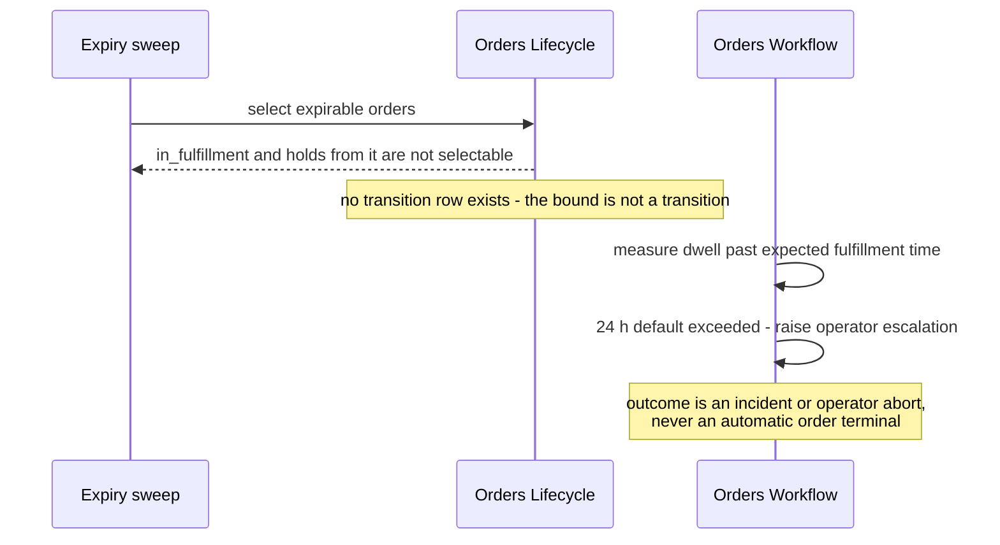

<!-- CONFLUENCE_TITLE: [BSS]: Orders Lifecycle — Hold, Resume and Bounded Lifetime (Slice 7) -->
<!-- Related: ../DESIGN.md, ../PRD.md, ./README.md, ./01-foundation.md | Owners: BSS Orders team -->

# DESIGN — Hold, Resume and Bounded Lifetime (Slice 7)

<!-- toc -->

- [1. Architecture Overview](#1-architecture-overview)
  - [1.1 Architectural Vision](#11-architectural-vision)
  - [1.2 Architecture Drivers](#12-architecture-drivers)
  - [1.3 Architecture Layers](#13-architecture-layers)
- [2. Principles and Constraints](#2-principles-and-constraints)
  - [2.1 Design Principles](#21-design-principles)
  - [2.2 Constraints](#22-constraints)
- [3. Technical Architecture](#3-technical-architecture)
  - [3.1 Domain Model](#31-domain-model)
  - [3.2 Component Model](#32-component-model)
  - [3.3 API Contracts](#33-api-contracts)
  - [3.4 Internal Dependencies](#34-internal-dependencies)
  - [3.5 External Dependencies](#35-external-dependencies)
  - [3.6 Interactions and Sequences](#36-interactions-and-sequences)
  - [3.7 Database Schemas and Tables](#37-database-schemas-and-tables)
  - [3.8 Deployment Topology](#38-deployment-topology)
- [4. Additional Context](#4-additional-context)
  - [4.1 Hold and resume (normative)](#41-hold-and-resume-normative)
  - [4.2 Bounded lifetime (normative)](#42-bounded-lifetime-normative)
  - [4.3 The `in_fulfillment` exemption (normative)](#43-the-in_fulfillment-exemption-normative)
  - [4.4 Draft abandonment (normative)](#44-draft-abandonment-normative)
  - [4.5 Policy values (open)](#45-policy-values-open)
  - [4.6 The ordinary cancel operation (normative)](#46-the-ordinary-cancel-operation-normative)
- [5. Traceability](#5-traceability)

<!-- /toc -->

- [ ] `p1` - **ID**: `cpt-cf-bss-orders-lifecycle-design-hold-and-expiry`

## 1. Architecture Overview

### 1.1 Architectural Vision

This slice owns time. It pauses an order and resumes it to exactly where it was, bounds an
in-flight state by a per-state time-to-live where one is configured, caps how many times an order
may be resumed so the dwell cannot be restarted without limit, sweeps abandoned drafts, and — for
the one state it must not bound — hands off to an operational escalation owned elsewhere
([`../PRD.md`](../PRD.md) §6.3). Where a TTL is unset the state is unbounded, and §4.2 says so
rather than asserting a backstop this design cannot enforce.

The reason bounded lifetime matters is commercial rather than hygienic. An order sitting
indefinitely in `submitted` pins a catalog price, holds an open promise to a customer, and
accumulates operational debt nobody is watching. So each in-flight state gets a configurable
TTL and expires to a terminal state with the system as actor.

Every state except one. `in_fulfillment` **must not** be auto-expired, because a subscription
spawn signal may already have been issued and expiring the order would orphan provisioned
resources with nothing to compensate them. The same exemption covers a hold taken *from*
`in_fulfillment`. This is the single place in the design where the bounded-lifetime rule is
deliberately broken, and the exemption lives in the transition table rather than in scheduler
logic — so a scheduler defect cannot expire such an order, and the bound becomes an operational
SLA raised by the sibling gear instead of an automatic transition.

The bound has **two layers**, and they answer different questions. The **per-state TTL** is
Product-owned configuration with no code default, so it is only in force where it has been
configured. The **re-entry caps** are design-owned baselines on how many times one order may
restart a dwell — **5** resumes and **20** amendments, enforced as guards on those transitions
themselves. They exist because a per-state TTL alone bounds nothing an actor can restart: both
resume and amendment rewrite the dwell input, so either loop was an unbounded lifetime available
to a permitted actor. With both caps in force an order makes at most **31** visits to TTL-bearing states — the first
entry, one per capped amendment, and a hold **and** a resume per capped resume cycle — so its
in-flight life is bounded by `Σ TTL` over those visits, and coarsely by `31 × the largest
configured TTL`. Where one is **not** configured, that state has no bound at all and the cap does not
supply one — §4.2 states that residual gap rather than papering over it, which is the difference
between these two layers and the absolute-lifetime backstop an earlier draft claimed.

Hold is narrower than it first appears, and the narrowness is the design. A hold changes **only
the order**. Already-activated subscriptions keep serving and keep billing, the term does not
extend, and wave-1 subscription drafts are not voided. Pausing a live subscription is a
subscription-lifecycle concern with its own posture; conflating the two would let an order-level
compliance hold silently stop a customer's billing.

### 1.2 Architecture Drivers

#### Functional Drivers

| Requirement | Design Response |
|-------------|------------------|
| `cpt-cf-bss-orders-lifecycle-fr-order-hold` | Hold stores the outgoing state on the aggregate; resume reads it as the target. Resume is a lookup, not an inference, so a state added later cannot break resume. |
| `cpt-cf-bss-orders-lifecycle-fr-order-expiry` | Expiry is an ordinary transition row with the system actor class, driven by one sweep pass over a per-state TTL that holds where configured. Restarting a dwell is bounded separately, by a cap on the resume transition rather than by a second sweep. The `in_fulfillment` exemption and the hold-taken-from-`in_fulfillment` exemption are table rows that do not exist, not scheduler conditions. Where a TTL is unset the state is unbounded, disclosed in §4.2 and alerted in §3.8. |
| `cpt-cf-bss-orders-lifecycle-fr-order-cancel` | Cancel from `on_hold` applies the **pre-hold** state's guards, so a hold cannot be used to widen what cancellation is permitted. |
| `cpt-cf-bss-orders-lifecycle-nfr-order-retention` | The abandoned-draft sweep auto-voids to `expired` rather than deleting, preserving the audit trail. |
| `cpt-cf-bss-orders-lifecycle-fr-order-events` | Expiry publishes `OrderExpired`; hold and resume publish `OrderHeld` and `OrderResumed`, which is how the sibling gear knows to suspend or resume its process. |

#### NFR Allocation

| NFR ID | NFR Summary | Allocated To | Design Response | Verification Approach |
|--------|-------------|--------------|-----------------|----------------------|
| `cpt-cf-bss-orders-lifecycle-nfr-order-audit-completeness` | 100 % of transitions audited | Expiry scheduler | An expiry is a normal transition, so it audits with `system` as actor class and the elapsed bound as reason, naming which of the two bounds of §4.2 elapsed | Test asserting every expired order carries an audit row with the system actor |
| `cpt-cf-bss-orders-lifecycle-nfr-order-idempotency` | Zero duplicate effects | Expiry scheduler | The sweep runs under a singleton lease and each expiry uses a deterministic idempotency key derived from order and version, so a re-run is absorbed | Concurrency test running two sweep instances and asserting one expiry per order |
| `cpt-cf-bss-orders-lifecycle-nfr-order-retention` | Abandoned drafts auto-voided | Draft sweep | Auto-void is an ordinary transition to `expired`; there is no delete path | Test asserting an auto-voided draft and its audit trail remain readable |
| `cpt-cf-bss-orders-lifecycle-nfr-order-transition-latency` | Commit p95 < 1 s | Hold and resume | Both resolve no external input; resume reads one stored column | Load test on hold and resume |

#### Key ADRs

The seven gear ADRs govern this slice. One decision taken here is recorded in the register: **the pre-hold state is stored rather than
derived from the audit trail** ([`../DECISIONS.md`](../DECISIONS.md) D-80, §4.1), whose
alternative was reconstructing it from the last transition before the hold.

### 1.3 Architecture Layers

Inherited from [`01-foundation`](./01-foundation.md) §1.3. This slice adds two background
workers at the infrastructure layer, both singleton-coordinated.

## 2. Principles and Constraints

### 2.1 Design Principles

#### A hold changes only the order

- [ ] `p1` - **ID**: `cpt-cf-bss-orders-lifecycle-principle-hold-changes-only-order`

A hold pauses the order document and the sibling gear's process. It does not pause entitlement,
does not pause billing, does not extend a term, and does not void a subscription draft.
Already-activated subscriptions keep serving and keep billing throughout. An operator who needs
a customer's billing paused is asking for a subscription-lifecycle action, and this slice
deliberately cannot provide it.

#### The pre-hold state is stored, not derived

- [ ] `p1` - **ID**: `cpt-cf-bss-orders-lifecycle-principle-prehold-stored`

Hold writes the outgoing state to a column; resume reads it. The rejected alternative was
deriving it from the last transition before the hold, which would make resume depend on audit
interpretation and would break the moment an amendment or an administrative edit landed between
hold and resume.

#### Exemptions live in the table

- [ ] `p1` - **ID**: `cpt-cf-bss-orders-lifecycle-principle-exemptions-in-table`

`in_fulfillment` is not expirable because no such transition row exists — not because the
scheduler declines to select it. The distinction matters under defect: a scheduler bug can select
the wrong orders, and the transition table is the thing that refuses them anyway.

#### A resume restarts the state clock, never the order's

- [ ] `p1` - **ID**: `cpt-cf-bss-orders-lifecycle-principle-resume-is-capped`

Resume sets `state_entered_at`, so the **per-state** bound genuinely starts over — that is correct,
because the order has genuinely re-entered the state and the state's TTL asks how long it may
dwell there. What must not be unlimited is the **number of restarts**. `state_entered_at` was the
sole dwell input, and it is writable by an ordinary operation any actor holding `hold` already
has, so hold-then-resume before each TTL elapses was an unbounded lifetime available to a
permitted actor — not an attack, just a loop. **There are two such loops, not one**: amendment
rows 19 and 20 also change state and so also reset the column, which capping resumes alone left
open. Each loop is closed where it is created: `resume`
([`01-foundation`](./01-foundation.md) §4.3 row 22) and `amendment` (rows 18, 19 and 20) each
carry a **registered guard** that refuses once its own counter — `resume_count` or
`amendment_count` — has reached its cap, and every successful transition increments it. No transition decrements or resets it. The bound is therefore enforced at the operation
that extends the life, its breach is a refused, audited transition with a named reason rather than
an absence of something happening, and the arithmetic is closed: at most `cap` restarts of a
bounded dwell is a bounded total.

#### A park does not stop the clock

- [ ] `p1` - **ID**: `cpt-cf-bss-orders-lifecycle-principle-park-does-not-stop-clock`

When the sibling gear cannot obtain an approval-requirement verdict it parks fail-closed, leaving
the order in `submitted`. The `submitted` TTL **continues to elapse**, and expiry is the bound of
that park. An indefinitely parked order would be an unbounded open promise, which is exactly what
bounded lifetime exists to prevent.

### 2.2 Constraints

#### `in_fulfillment` has no automatic bound

- [ ] `p1` - **ID**: `cpt-cf-bss-orders-lifecycle-constraint-in-fulfillment-not-expirable`

Neither `in_fulfillment` nor a hold taken from it may be auto-expired, because a spawn signal
may already have been issued and expiry would orphan provisioned resources with no compensation.
Its bound is an **operational SLA** — a configurable window with a business default of 24 hours
past expected fulfillment time, with the fulfillment operator as named owner — raised by the
sibling gear. Exhausting the SLA **MUST NOT** produce a new order state; the outcome is an
incident or an operator abort.

#### Hold does not pause the Subscriptions draft TTL

- [ ] `p1` - **ID**: `cpt-cf-bss-orders-lifecycle-constraint-hold-does-not-pause-draft-ttl`

Wave-1 subscription drafts created during two-phase fulfillment are process artifacts of the
sibling gear. A hold does not void them and **must not be assumed** to pause the Subscriptions
draft auto-void TTL, which this gear neither owns nor can extend. Rebuilding a fulfillment plan
whose drafts expired under a hold is the sibling gear's concern, and this design must not imply
otherwise.

#### TTL values are unchosen

- [ ] `p1` - **ID**: `cpt-cf-bss-orders-lifecycle-constraint-ttl-values-unchosen`

The per-state TTL defaults, the draft auto-void TTL and the override scope —
platform versus seller — are all PRD open questions owned by Product. This slice specifies the
**policy model** and leaves the numbers as configuration with no code default, because a code
default would quietly become the answer.

The **two re-entry caps** are deliberately **not** in that group. Both are design-owned values
with working baselines — the resume cap here (§4.5), the amendment cap in
[`04-versioning`](./04-versioning.md) §4.1 — because they close a hole this design opened (resume
and amendment both rewrite the dwell input) and a mitigation whose value is also unchosen would be
no mitigation at all. Both bound a **count** rather than a duration, so neither can pre-empt a
per-state TTL Product later chooses, whatever those TTLs turn out to be. The amendment cap's
value is additionally a **commercial** judgment about how often a buyer may revise an order, which
is why `04 §4.1` owns and argues it rather than this section.

**What remains unbounded, and it is a Product dependency and not a design gap to close here.**
Where no TTL is configured for a state, that state has **no bound**: the per-state pass skips it
(§3.6) and the re-entry caps bound restarts of a dwell that is itself unbounded, so `31 × ∞` is
still ∞. An earlier draft covered this with an absolute order lifetime measured from `created_at`;
§4.2 records why that backstop was withdrawn rather than kept. Until PRD §15 row 7 is answered the
gap is **disclosed** — surfaced as the no-configured-TTL metric and alert of §3.8 — rather than
claimed closed.

## 3. Technical Architecture

### 3.1 Domain Model

- [ ] `p1` - **ID**: `cpt-cf-bss-orders-lifecycle-entity-hold-record`

The pause: the outgoing state stored as the resume target, the holding actor, the instant, and
the audited reason. It is a column set on the aggregate rather than a table, because at most one
hold is ever in force.

- [ ] `p1` - **ID**: `cpt-cf-bss-orders-lifecycle-entity-state-ttl-policy`

The per-state time-to-live configuration: the state it bounds, its duration, and its
configuration scope. Resolved at sweep time rather than stored per order, so a policy change
takes effect on orders already in flight. It is **per-state and optional**; where it is unset the
state is unbounded, and the re-entry caps limit restarts rather than supplying a duration.

- [ ] `p1` - **ID**: `cpt-cf-bss-orders-lifecycle-entity-resume-cap`

The restart bound: a single maximum count of resumes per order, compared against a counter on the
aggregate that only the resume transition increments. It is configuration with a design-owned
baseline rather than a per-order stored value, and the counter it is compared against is written
by exactly one transition and reset by none.

**Relationships**:
- `Order root` → `Hold record`: zero-or-one; the pre-hold column is NULL unless the state is `on_hold`.
- `State TTL policy` → `Order root`: many-to-many by state, resolved at sweep time.
- `Resume cap` → `Order root`: one-to-many; one count applies to every order, compared against `orders_order.resume_count`, which only the resume transition increments and which amendment, administrative edit and hold all leave untouched.
- `Hold record` → `State TTL policy`: an `on_hold` order is bounded by the `on_hold` TTL **unless** its pre-hold state is `in_fulfillment`, in which case it is unbounded and escalated instead.
- `Hold record` → `Resume cap`: indirect and one-way — a hold does not touch the counter, but the resume that ends the hold does, so the cap bounds how many times one order may re-enter a dwell. It does not bound the dwell itself, and the `in_fulfillment` exemption of §4.3 is outside it entirely.

### 3.2 Component Model

This slice realises `cpt-cf-bss-orders-lifecycle-component-hold-and-expiry`
([`../DESIGN.md`](../DESIGN.md) §3.2) as three internal parts.

#### Hold and resume handler

- [ ] `p1` - **ID**: `cpt-cf-bss-orders-lifecycle-component-hold-handler`

##### Why this component exists

Compliance holds, payment verification and operational pauses are needed at any active stage,
and the alternative to a pause is cancelling an order the seller intends to keep.

##### Responsibility scope

Hold admissibility from `submitted`, `pending_approval`, `approved` and `in_fulfillment`;
storage of the pre-hold state; resume to that stored state; and the cancel-from-`on_hold` path
that applies the pre-hold state's guards.

##### Responsibility boundaries

It pauses no subscription, no billing and no term, and voids no draft. It does not suspend the
sibling gear's timers — it publishes the event that lets that gear decide.

##### Related components (by ID)

- `cpt-cf-bss-orders-lifecycle-component-transition-orchestrator` — depends on

#### Expiry scheduler

- [ ] `p1` - **ID**: `cpt-cf-bss-orders-lifecycle-component-expiry-scheduler`

##### Why this component exists

Bounded lifetime is only real if something enforces it without a caller, and enforcing it twice
concurrently would double-expire orders.

##### Responsibility scope

The singleton-leased sweep; TTL policy resolution per state; selection of eligible orders;
deterministic idempotency keys per expiry; and the batch and cadence controls. It has **one**
selection pass — the restart bound lives on the resume transition, not here (§4.2).

##### Responsibility boundaries

It holds no exemption logic — the transition table refuses `in_fulfillment` regardless of what
the sweep selects. It raises no escalation; that is the sibling gear's.

##### Related components (by ID)

- `cpt-cf-bss-orders-lifecycle-component-state-table` — depends on
- `cpt-cf-bss-orders-lifecycle-component-transition-orchestrator` — calls

#### Draft abandonment sweep

- [ ] `p2` - **ID**: `cpt-cf-bss-orders-lifecycle-component-draft-sweep`

##### Why this component exists

Abandoned baskets accumulate without bound, and deleting them would destroy the audit trail of
what a buyer nearly bought.

##### Responsibility scope

The lease-coordinated sweep over `draft` orders past their auto-void TTL, and the auto-void
transition to `expired` that keeps them readable. Where that TTL is unset the sweep does no work
and `draft` accumulation is unbounded (§4.4).

##### Responsibility boundaries

It deletes nothing and touches no order past `draft`.

##### Related components (by ID)

- `cpt-cf-bss-orders-lifecycle-component-capture` — depends on

### 3.3 API Contracts

- [ ] `p1` - **ID**: `cpt-cf-bss-orders-lifecycle-interface-hold-ops`

- **Requirement**: `cpt-cf-bss-orders-lifecycle-interface-order-ops`
- **Technology**: REST/OpenAPI via `OperationBuilder`; RFC 9457 problems

| Method | Path | Description | Stability |
|--------|------|-------------|-----------|
| `POST` | `/bss-orders-lifecycle/v1/orders/{orderId}/cancel` | Cancel from any non-terminal state, per guards | unstable |
| `POST` | `/bss-orders-lifecycle/v1/orders/{orderId}/hold` | Pause from an eligible state, storing the outgoing state | unstable |
| `POST` | `/bss-orders-lifecycle/v1/orders/{orderId}/resume` | Return to the stored pre-hold state | unstable |

**State expiry is deliberately not a public operation.** It is scheduler-driven with the system
as actor class, which is what makes "who expired this order" answerable as `system` rather than
as whichever caller happened to trigger it.

**Reasons contributed to the registry**: already-on-hold, resume-target-missing,
**resume-cap-exhausted**, hold-cancel-refused-by-prehold-guard, **cancel-reason-required**,
**direct-cancel-window-closed** (shared with the seam slice, defined once here).
`resume-cap-exhausted` is registered **here and only here**: it is row 22's guard refusal when
`orders_order.resume_count` has reached the cap of §4.5, and it names the cap and the count so the
caller learns the order cannot re-enter its dwell again and must be cancelled or escalated. It is
deliberately **not** folded into the engine's `not-admissible` — the row *is* admissible and the
state *does* permit resume; what refuses is a guard on data, which is the distinction `01 §4.1`
draws between the transition table and the guard set. The engine's own
`not-admissible` covers an inadmissible hold, resume, cancel or expiry alike, so this slice
registers no second name for any of it — the earlier `hold-not-admitted-in-state`,
`cancel-not-admitted-in-state` and **`not-on-hold`** were exactly such second names and are
deleted, matching the treatment [`04-versioning`](./04-versioning.md) §3.3 records for the
analogous amendment case ([`../DECISIONS.md`](../DECISIONS.md) D-38, `01 §3.3`). `not-on-hold` went
last, in 2026-09-11: a resume against an order that is not `on_hold` is an inadmissible
`(state, trigger)` pair and nothing more.

### 3.4 Internal Dependencies

| Dependency Gear | Interface Used | Purpose |
|-------------------|----------------|----------|
| `toolkit-db` | Runtime-scoped access, via the engine | Hold columns and the sweep's selection queries |
| Coordination lease library | SDK client | Singleton coordination for the expiry sweep and the draft-abandonment sweep |

### 3.5 External Dependencies

None. Both sweeps are internal and neither reaches outside the gear. The `in_fulfillment`
escalation is raised by the sibling gear, which learns what it needs from the state events this
slice publishes.

### 3.6 Interactions and Sequences

#### Hold and resume

**ID**: `cpt-cf-bss-orders-lifecycle-seq-hold-resume`

**Use cases**: `cpt-cf-bss-orders-lifecycle-usecase-order-cancel-during-approval`

**Actors**: `cpt-cf-bss-orders-lifecycle-actor-orders-seller-operator`, `cpt-cf-bss-orders-lifecycle-actor-orders-workflow`

**Algorithm: Hold Then Resume**

Input: order_id, holding_actor, reason, security_context, idempotency_key, **expected_version** —
one per request, since hold and resume are two calls and each carries its own
Output: on_hold then the restored state, or a registered refusal

1. [ ] - `p1` - Declare hold admissibility as an engine guard: the current state is `submitted`, `pending_approval`, `approved` or `in_fulfillment`; an inadmissible state refuses with the engine's `not-admissible` - `inst-hr-declare-admissibility-guard`
2. [ ] - `p1` - Supply the current state as the **pre-hold contribution** to the hold transition; the engine writes the column inside the transition transaction (`01 §3.6` *Attempt Transition* step 20.2) - `inst-hr-store-prehold`
3. [ ] - `p1` - Request the hold transition with the request's `expected_version`; the engine publishes OrderHeld - `inst-hr-request-hold`
4. [ ] - `p1` - **RETURN** on_hold - `inst-hr-return-on-hold`
5. [ ] - `p1` - **WHEN** resume is later requested: - `inst-hr-when-resume`
   1. [ ] - `p1` - Declare the **resume-cap guard** on row 22, so the engine evaluates it under the aggregate row lock: it fails with `resume-cap-exhausted`, naming the cap and the count, when `orders_order.resume_count` is at or above the cap of §4.5 - `inst-hr-declare-resume-cap`
   2. [ ] - `p1` - Request the resume transition with the request's `expected_version`, resolving no state and reading no column first — **an order that is not `on_hold` is refused by the engine as `not-admissible`, and one with no stored pre-hold state by `§3.6` step 15** - `inst-hr-request-resume`
   3. [ ] - `p1` - The engine reads the stored pre-hold state as the effective target, clears the pre-hold column, increments `resume_count` and publishes OrderResumed, all inside the transition transaction (`01 §3.6` *Attempt Transition* steps 14, 20.3 and 20.4) — both the target and the counter are engine-owned and this slice contributes neither - `inst-hr-engine-resolves-resume`
   4. [ ] - `p1` - **RETURN** the restored state - `inst-hr-return-restored`

**Description**: Nothing about the spawned subscriptions changes at either end. A hold from
`in_fulfillment` leaves activated subscriptions serving and billing, and leaves wave-1 drafts
alone — including their own auto-void TTL, which this gear cannot pause.

**No step here refuses ahead of the engine, and two that did have been removed.** Earlier versions
of this algorithm returned `not-on-hold` and `resume-target-missing` from the slice before the
engine was called. Both violated `01 §2.1`: a check that refuses before the engine produces **no
audit entry and no settled idempotency record**, which is precisely the silent drop ADR-0005 exists
to prevent, and `not-on-hold` was additionally a **second name** for the engine's `not-admissible`,
which D-38's one-name-per-condition rule forbids. The engine already decides both — admissibility
at step 11 on the `(state, trigger)` lookup, and the missing pre-hold target at step 15 — and
decides them with an audit row and a settlement. `not-on-hold` is therefore deregistered as a
reason; `resume-target-missing` stays registered, because it names a condition the engine has no
other name for, and the engine returns it.

**Why the cap is a guard rather than a pre-check.** Step 5.1 declares it, so the engine evaluates it
at `01 §3.6` *Attempt Transition* step 13 — under the aggregate row lock taken at step 5 — and
increments the counter at step 20.4 under that same lock, in the same transaction. A pre-check outside the
transaction would let two concurrent resumes both read a count below the cap and both commit, so
the cap would be exceeded by exactly the concurrency the engine's single-writer rule exists to
exclude — and a slice check that refuses ahead of the engine produces no audit row and no settled
idempotency record, which `01 §2.1` forbids for that reason.

#### The expiry sweep

**ID**: `cpt-cf-bss-orders-lifecycle-seq-expiry-sweep`

**Use cases**: `cpt-cf-bss-orders-lifecycle-usecase-order-new-acquisition`

**Actors**: `cpt-cf-bss-orders-lifecycle-actor-orders-seller-operator`, `cpt-cf-bss-orders-lifecycle-actor-orders-workflow`

**Algorithm: Sweep Expired Orders**

Input: current time
Output: expired count

1. [ ] - `p1` - Acquire the singleton sweep lease; **IF** not acquired, **RETURN** without work - `inst-es-acquire-lease`
1a. [ ] - `p1` - Initialize `remaining` to the sweep batch size of §4.5 — **one budget for the whole run**, not one per state and not one per seller scope - `inst-es-init-budget`
2. [ ] - `p1` - **FOR EACH** expirable state — `submitted`, `pending_approval`, `approved`, `on_hold` — **beginning at the state after the one the previous run stopped on**, recorded with the lease, so a saturated cadence cannot starve the states behind it: - `inst-es-for-each-state`
   1. [ ] - `p1` - Resolve the TTL policy for that state at its configuration scope - `inst-es-resolve-ttl`
   2. [ ] - `p1` - **IF** no TTL is configured: increment the no-configured-TTL gauge of `§3.8` and **SKIP TO** the next state (no code default); that state has **no bound at all** this cadence, which §4.2 discloses rather than covers - `inst-es-if-no-ttl`
   3. [ ] - `p1` - **FOR EACH** seller scope with its own policy for this state: select orders in that state, for that seller, whose `state_entered_at` is older by that seller's TTL, **up to `remaining`**, using the `(seller_tenant_id, state, state_entered_at)` index; decrement `remaining` by the number selected - `inst-es-select-eligible`
   3a. [ ] - `p1` - Then, once for the platform fallback, **up to the `remaining` the seller selections left**, select orders in that state whose `state_entered_at` is older by the **platform** TTL **and whose `seller_tenant_id` has no policy of its own for this state** — the exclusion is required, not an optimisation: without it an order whose seller configured a longer TTL is selected by the platform pass and expired under the shorter one, silently overriding the override `§3.7` grants - `inst-es-select-platform-fallback`
   4. [ ] - `p1` - **FOR EACH** selected order: - `inst-es-for-each-order`
      1. [ ] - `p1` - **IF** the state is `on_hold` **AND** its pre-hold state is `in_fulfillment`: - `inst-es-if-hold-from-fulfillment`
         1. [ ] - `p1` - **SKIP TO** the next order; this case is escalated, never expired - `inst-es-skip-exempt-hold`
      2. [ ] - `p1` - Derive a deterministic idempotency key from order and version - `inst-es-derive-key`
      3. [ ] - `p1` - Request the expiry transition with actor class `system`, passing **the version the order was selected at as `expected_version`** - `inst-es-request-expiry`
      4. [ ] - `p1` - **IF** the engine refuses as not-admissible: record and continue — the table is the authority - `inst-es-if-refused`
   5. [ ] - `p1` - **IF** `remaining` has reached zero: record this state as the run's stopping point, raise the batch-saturation signal of `§3.8`, and **SKIP TO** step 3 — the orders not reached are expired one cadence later, which is the latency §4.2 already bounds at one cadence past the TTL - `inst-es-if-budget-exhausted`
3. [ ] - `p1` - **RETURN** the expired count for the sweep metric - `inst-es-return-count`

**Description**: The two selection steps are separate because **seller scope overrides platform
scope** (`§3.7`), and a fallback that did not exclude seller-policied orders would not be a fallback
— it would be a second, shorter, unconditional TTL applied behind the seller's back. Resolving the
effective policy per order before selection is the equivalent formulation and is equally
acceptable; what is not acceptable is two unqualified queries whose union is wider than either.

Step 2.4.4 is deliberate. The sweep's own exemption check at 2.4.1 is a
performance optimisation, not the safety mechanism — the safety mechanism is that no
`in_fulfillment` expiry row exists, so a sweep defect produces a refusal rather than an orphaned
order. The sweep therefore has **one pass**, over `state_entered_at`, and it bounds exactly what a
configured TTL bounds.

**The batch size is a budget for the run, not a limit per query.** §4.5 sets **one** sweep batch,
chosen to keep the run short enough not to hold aggregate locks across the cadence. Applied
per selection it would not be that bound at all: a state with fifty seller policies plus the
platform fallback would admit fifty-one batches in one pass, and the run would overrun the
five-minute cadence that makes "expiry latency is one cadence past the TTL" true. Step 1a therefore
takes the budget once and every selection spends from it, seller scopes and platform fallback
alike. Exhausting it is **not** an error: it stops the run at a recorded state, raises the
saturation signal §3.8 already alerts on, and the remainder expires on the next cadence. The
rotation in step 2 exists because a fixed state order plus a shared budget would let a permanently
saturated `submitted` starve `on_hold` indefinitely — the budget bounds the run, and the rotation
keeps it fair.

**Expiry carries the optimistic version check, because the idempotency key is not one.** Selection
at 2.3 and the transition request at 2.4.3 are separate statements, and an order can transition
between them — a buyer submits an amendment, an operator resumes a hold. The deterministic key of
2.4.2 makes a **re-run** of the same attempt absorb rather than duplicate; it does not detect that
the order has moved on, so without `expected_version` the sweep would expire a state the order is
no longer in, off a stale read. The singleton lease does not help either: it serialises sweep
workers against each other, not against ordinary callers. Passing the selected version makes the
engine's version check refuse the stale attempt, which the sweep records at 2.4.4 and continues —
the order is simply re-examined next cadence against its new `state_entered_at`.

**There is deliberately no second pass.** An earlier draft added an absolute-lifetime pass
selecting on `orders_order.created_at`; it shared one deterministic idempotency key with this pass,
and because a refusal settles and replays under its key, a per-state attempt refused as
not-admissible made every later absolute-pass request replay that refusal instead of attempting.
The backstop was inert for exactly the orders something had already gone wrong with.
[`../DECISIONS.md`](../DECISIONS.md) **D-90** carries the reasoning; the restart bound lives on
`resume` and `amendment` instead, which needs no second pass and therefore no key to share.

#### Overdue escalation handoff

**ID**: `cpt-cf-bss-orders-lifecycle-seq-overdue-handoff`

**Use cases**: `cpt-cf-bss-orders-lifecycle-usecase-order-fulfillment-complete`

**Actors**: `cpt-cf-bss-orders-lifecycle-actor-orders-workflow`, `cpt-cf-bss-orders-lifecycle-actor-orders-seller-operator`

**Description**: The handoff is by absence. This gear provides no expiry for the state and
publishes the events the sibling gear needs; that gear measures the window and raises the
escalation. Exhausting the SLA produces no new order state.

### 3.7 Database Schemas and Tables

This slice introduces one table and owns the `pre_hold_state` column on `orders_order`, both
relative to [`01-foundation`](./01-foundation.md) §3.7.

#### Table: orders_state_ttl_policy

**ID**: `cpt-cf-bss-orders-lifecycle-dbtable-state-ttl-policy`

**Schema**:

| Column | Type | Description |
|--------|------|-------------|
| policy_id | uuid | Policy identity |
| scope | enum | `platform` or `seller` |
| seller_tenant_id | uuid, nullable | NULL for a platform-scope policy |
| state | enum | The bounded state: `submitted`, `pending_approval`, `approved`, `on_hold`, or `draft` for the auto-void sweep |
| ttl | interval | The bound |
| updated_by, updated_at | text, timestamptz | Audit of the policy change itself |

**PK**: policy_id

**Constraints**: `(scope, seller_tenant_id, state)` UNIQUE **with `NULLS NOT DISTINCT`**, because
`seller_tenant_id` is NULL for platform scope and SQL otherwise treats those NULLs as distinct,
permitting duplicate platform policies ([`../DECISIONS.md`](../DECISIONS.md) D-28);
`seller_tenant_id` NOT NULL exactly when `scope` is `seller`; `state` **MUST NOT** be
`in_fulfillment` — the exemption is a schema constraint as well as a missing transition row, so a
policy cannot be authored for it.

**Additional info**: seller scope overrides platform scope for the same state. There is **no code
default** for any per-state TTL; an unconfigured state is not swept, so the absence of a policy is
visible as the no-configured-TTL gauge and alert of §3.8 rather than as a silently applied
constant. It is **not** covered by a fallback duration — §4.2 states why the absolute-lifetime
backstop that would have supplied one was withdrawn.

The **resume cap is not a row in this table.** It is a single gear-level configuration value,
platform-scoped, and the table's `state` enum admits no value for it — because it bounds a count
of operations on an order, not a dwell in a state. Its baseline lives in §4.5 and its normative
rule in §4.2, and the counter it reads is `orders_order.resume_count`
([`01-foundation`](./01-foundation.md) §3.7).

**One dwell input.** The **per-state** bound is measured against
`orders_order.state_entered_at`, maintained by the engine inside the transition that changes state
— not derived from the audit trail, which would be an N+1 correlated subquery over the largest
table in the gear on every sweep, and which would also contradict the rule that no read derives
order state from the audit store. A resumed order restarts its **per-state** bound because resume
sets that column. The same column serves the "in this state since" list filter, so the two slices
no longer specify opposite sources for one fact ([`../DECISIONS.md`](../DECISIONS.md) D-22).

**The restart bounds need no dwell input and no index.** `orders_order.resume_count` and
`amendment_count` ([`01-foundation`](./01-foundation.md) §3.7) are read by their guards on the
aggregate row the transition has already loaded and locked, so the caps cost no scan, no second
sweep pass and no composite index — unlike the withdrawn absolute bound, which needed a
`(state, created_at)` composite that `01 §3.7` no longer carries (D-90).

### 3.8 Deployment Topology

Inherited from [`01-foundation`](./01-foundation.md) §3.8, with two of the gear's **six**
lease-coordinated workers owned here: the **expiry sweep** and the **draft auto-void sweep**. Both
take a lease, so a multi-replica deployment cannot double-expire. Both are idle-cheap: a sweep
with no configured TTL does no work at all.

**Observability owned here**: expiry counts per state per sweep, sweep duration and batch
saturation, the count of orders **skipped as exempt** (which should be non-zero only for holds
taken from `in_fulfillment`), the number of states with **no configured TTL** — the signal that a
Product-owned value is still unset and those orders are **unbounded**, which is the residual gap
§4.2 discloses — cancel counts by actor class and reason, hold duration distribution, the **hold
cycles per order** distribution, and the count of `resume` transitions **refused as
`resume-cap-exhausted`**, which is how the restart bound firing becomes visible rather than
inferred. Alerts fire on a sweep
failing to acquire its lease for longer than two cadences, on batch saturation persisting (the
sweep is falling behind), on any state having no configured TTL in a production environment, and
on any **`resume-cap-exhausted` refusal** at all — because the cap is a backstop, so a non-zero rate
means either a per-state TTL is missing or an order is being held and resumed in a loop, and both
are conditions someone should look at rather than metrics to watch drift.

## 4. Additional Context

### 4.1 Hold and resume (normative)

Hold **MUST** be admitted from `submitted`, `pending_approval`, `approved` and `in_fulfillment`,
and the outgoing state **MUST** be stored as the resume target rather than derived. Resume
**MUST** return the order to exactly that state and clear the stored value. Both **MUST** be
idempotent and audited, and both publish their event so the sibling gear can suspend and resume
its process.

Cancel from `on_hold` **MUST** apply the **pre-hold state's** cancel guards. In particular a
hold taken from `in_fulfillment` after a spawn signal does **not** re-open the direct-cancel
window: the guard reads the recorded spawn signal, and a hold does not clear it.

A hold **MUST NOT**: pause entitlement or billing on any activated subscription, extend a term,
void a wave-1 subscription draft, or be assumed to pause the Subscriptions draft auto-void TTL.
Already-activated subscriptions keep serving and keep billing for the duration of the hold.

**Hold and resume extend the order's life, and the number of extensions is capped.** Resume
**MUST** set `state_entered_at`, so the restored state's **per-state** TTL starts over; that is
intended, since the order has genuinely re-entered the state. What is bounded is the count: resume
**MUST** increment `orders_order.resume_count` in the same transaction that changes state, and the
resume transition ([`01-foundation`](./01-foundation.md) §4.3 row 22) **MUST** carry a registered
guard that refuses with `resume-cap-exhausted` when that counter has already reached the cap of
§4.5. No transition — hold, resume, cancel, amendment or administrative edit — **MAY** decrement or
reset the counter. An order at the cap can still be cancelled, and its per-state TTL still
elapses; what it cannot do is re-enter a dwell again. See §4.2 for why this is the enforcement
point and why the absolute-lifetime backstop was withdrawn.

### 4.2 Bounded lifetime (normative)

Bounded lifetime is delivered in **two layers**, and **neither is unconditional** — which is the
point of stating them separately. Together they bound every order whose states have configured
TTLs, and disclose the orders they do not bound. Two earlier statements of this section got it
wrong in opposite directions, and D-90 records both.

**Layer 1 — the per-state TTL, which holds only where it is configured.** A configurable TTL
**MAY** be set per state for `submitted`, `pending_approval`, `approved` and `on_hold`. Where a
TTL **is** configured for a state, an order dwelling in that state past it **MUST** transition to
`expired`, publish `OrderExpired`, and audit with actor class `system`. Where a TTL is **not**
configured, that state has **no per-state bound at all**: there is no code default (§3.7), the
per-state pass skips the state (§3.6 step 2.2), and the gap is surfaced as the no-configured-TTL
metric and alert of §3.8. This is a **qualified** guarantee, deliberately, because an unset TTL is
tolerated rather than fatal — a missing TTL **MUST NOT** block startup, since the numbers are
Product-owned PRD open questions (§2.2, §4.5) and refusing to start would make an unanswered
question an outage.

**Layer 2 — two re-entry caps, which hold unconditionally and bound counts rather than durations.**
Two transitions restart a dwell by resetting `orders_order.state_entered_at`, and each is capped
separately:

* **Resume.** `orders_order.resume_count` **MUST** be incremented by row 22 ([`01-foundation`](./01-foundation.md) §4.3), which **MUST** carry a registered guard refusing `resume-cap-exhausted` at the cap of §4.5 — baseline **5**.
* **Amendment.** `orders_order.amendment_count` **MUST** be incremented by rows 18, 19 and 20, which **MUST** carry a registered guard refusing `amendment-cap-exhausted` at the cap owned in [`04-versioning`](./04-versioning.md) §4.1 — baseline **20**. Rows 19 and 20 target `submitted` from `pending_approval` and `approved`, so the target differs from the outgoing state and step 20.1 resets the clock; capping resumes alone left this loop open through a second operation.

Both counters are resolved from configuration and are **never unset**. No transition **MAY**
decrement or reset either. Guards and increments are all engine-side and all under the aggregate
row lock (`01 §3.6` *Attempt Transition* steps 13, 20.4 and 21), so two concurrent re-entries
cannot both observe a count below its cap. The two budgets are **separate on purpose**: a resume is
a seller-side operational act and an amendment a buyer-side commercial one, so a seller's
compliance holds **MUST NOT** consume a buyer's ability to revise the order (`04 §4.1`).

**What the caps actually bound, stated as arithmetic.** The quantity to bound is the number of
**visits an order can make to TTL-bearing states** over a valid transition path, because one visit is
bounded by that state's TTL and the order's life is the **sum of its visits**: `Σ TTL(state_i)` over
the path. The caps bound the number of terms in that sum, not the terms themselves.

A hold/resume cycle contributes **two** visits, not one, and that is where an earlier `1 + 20 + 5 =
26` undercounted: hold enters `on_hold`, which is itself TTL-bearing, and resume then re-enters the
pre-hold state. So the worst case is `1 + 20 + 5 + 5 = 31` — the first entry, plus one re-entry per
capped amendment, plus one `on_hold` visit **and** one re-entry per capped resume. Therefore **an
order's total in-flight life is at most `Σ TTL` over 31 visits, and at most `31 × the largest
configured TTL` among the expirable states** as the coarse upper bound. Two earlier statements of
this arithmetic were wrong in the same direction: `(cap + 1) × TTL` bounded *one state's* repeated
dwell rather than the order, and `26 × TTL` counted the resume but not the hold it returns from.
Both understated pin staleness (`03 §4.4`) and the documented in-flight lifetime.

**What neither layer bounds, disclosed rather than covered.** Where a state's TTL is unset, that
state has no bound, and the re-entry caps supply none — they multiply a dwell that is itself
unbounded. Two states are outside both layers entirely by §4.3's exemption: `in_fulfillment`, and
an `on_hold` order whose pre-hold state is `in_fulfillment`. Those remain bounded by the
operational SLA and by no transition in this gear. So the unqualified sentence "an in-flight order
does not live forever" is **not** asserted by this design. What is asserted is the arithmetic
above, its precondition (a configured TTL), and the visibility of the precondition failing
(§3.8's no-configured-TTL alert). Closing the residual gap is PRD §15 row 7, a Product decision,
and this design **MUST NOT** pre-empt it with a code default (§2.2).

**Why re-entry caps rather than an absolute order lifetime.** An earlier version of this section
made Layer 2 an absolute lifetime measured from `orders_order.created_at`. It is withdrawn on four
grounds — it could not fire where it mattered, it did not close the loop it was created for, it
pre-empted orders nobody was cycling, and its value had no PRD basis — each recorded in
[`../DECISIONS.md`](../DECISIONS.md) **D-90**, which is the single home for that argument. The cost
of the caps, stated here because it is caller-visible: an order needing one more resume or
amendment than its cap allows must be cancelled and re-placed, or the cap raised. That is a
visible, audited refusal with a named reason — the property the absolute bound lacked.

Expiry **MUST** be scheduler-driven and **MUST NOT** be a public operation. Its idempotency key
**MUST** be deterministic from order and version so a re-run is absorbed rather than duplicated, and
it **MUST** additionally carry the selected version as `expected_version` so an order that moved
between selection and request is refused rather than expired off a stale read — the key absorbs a
repeat of the same attempt, it does not detect a changed order (§3.6).
There is **one** expiry pass, so no two passes can select one order and no key is shared.

A **fail-closed park does not suspend the clock**: where the sibling gear cannot obtain an
approval-requirement verdict, the order remains `submitted` and the `submitted` TTL continues to
elapse. Expiry is the bound of that park, and the sibling gear is required to escalate before it
fires.

### 4.3 The `in_fulfillment` exemption (normative)

`in_fulfillment` **MUST NOT** be auto-expired, and neither **MUST** an `on_hold` order whose
pre-hold state is `in_fulfillment`. **The exemption is from automatic expiry only.** It covers
Layer 1 of §4.2 — the per-state TTL — and it does **not** reach Layer 2: row 22 carries the
resume-cap guard unconditionally, so a hold taken from `in_fulfillment` and resumed still increments
`resume_count` and still refuses at the cap like any other. An earlier version of this paragraph
said the exemption covered "both layers alike", which would have left exactly one hold/resume cycle
uncapped — the `in_fulfillment` one, which is the cycle an operator is most able to repeat and the
one D-90 was written to close. The exemption is taken because a
subscription spawn signal may already have been issued and expiry would orphan provisioned
resources with no compensation path.

The exemption **MUST** be structural: no such transition row exists, and no TTL policy may be
authored for the state. A sweep that selects such an order **MUST** receive a not-admissible
refusal rather than succeeding.

The bound for these cases is an **operational SLA** raised by the sibling gear: a configurable
window with a business default of **24 hours past expected fulfillment time**, where expected
fulfillment time is `max(now, latest service-activation date among the order's lines)` at
begin-fulfillment. A legitimately future-dated line therefore does not start the clock until its
date. The named owner is the fulfillment operator. **Exhausting the SLA MUST NOT auto-terminal
the order**: the outcome is an incident or an operator abort, not a new order state. The same
window bounds a stalled operational compensation.

### 4.4 Draft abandonment (normative)

A `draft` not submitted within its configurable auto-void TTL **MUST** transition
`draft → expired` with actor class `system`, publishing `OrderExpired`. It is **auto-voided**, and
that is the only term used for the outcome across the set — "archived" is not a state and there is
no `archived` state in the machine. Auto-void deletes nothing: the order and its trail remain
readable in the terminal state, so what a buyer nearly bought survives
([`../DECISIONS.md`](../DECISIONS.md) D-14). The sweep **MUST**
be singleton-coordinated and **MUST NOT** touch any order past `draft`.

Dwell is measured from the order's creation instant for this sweep specifically, since a `draft`
has had no state transition since creation.

**Singleton coordination is not idempotency, and the auto-void needs both.** The lease of §3.8 stops
two replicas sweeping at once; it says nothing about the same order being swept twice, which is the
case a lease expiring mid-batch produces. The sweep therefore carries the same three rules the
expiry sweep of §3.6 carries, stated here because the auto-void has its own worker:

* **A deterministic idempotency key.** Each auto-void attempt **MUST** derive its key from the order
  and its current version, exactly as §3.6 step 2.4.2 does. A `draft` carries version 1
  ([`01-foundation`](./01-foundation.md) §3.7), so the key is stable across re-runs of the same
  order and distinct across orders, and a re-run resolves against the stored outcome rather than
  opening a second attempt.
* **Replay returns the stored outcome.** A second attempt under that key **MUST** be settled by
  `01 §4.2`'s idempotent-replay path — it returns the first attempt's result and performs no second
  transition, so a re-swept order produces neither a duplicate `OrderExpired` nor a second refusal
  row. An order already auto-voided by an earlier pass is a terminal order, and the engine refuses
  it as `not-admissible`; the sweep records that and continues, as §3.6 step 2.4.4 does.
* **Lease loss is not a reason to keep working.** A worker that loses or cannot renew its lease
  **MUST** stop before its next transition request rather than finish the batch. The keys above make
  the successor's overlap harmless, so the two rules are complementary: the lease bounds the
  duplicate work, the key bounds its effect.

Those rules are why the auto-void is safe to run on a schedule at all, and they are the reason the
transition is absent from the public surface ([`../DESIGN.md`](../DESIGN.md) §3.3) — there is no
caller to supply a key, so the sweep **MUST** supply one.

**Where the auto-void TTL is unset, `draft` is unbounded, and there is no fallback.** Neither
re-entry cap applies — a `draft` is never held, resumed or amended — and the absolute-lifetime
backstop that once covered this case is withdrawn (D-90). `draft` is therefore the state with the
largest exposure to an unanswered Product value: baskets accumulate until the auto-void TTL of
§4.5 is chosen. The §3.8 alert covers it, no code default closes it (§2.2), and
[`../DECISIONS.md`](../DECISIONS.md) **Q-07** is where it is answered.

### 4.5 Policy values (open)

Two groups, distinguished because they have different owners. **PRD open questions owned by
Product**, each cited by its §15 row:

| Value | PRD §15 row | Note |
|-------|-------------|------|
| `submitted` TTL | row 7 | Must exceed the sibling gear's escalation lead time, since expiry bounds the fail-closed park |
| `pending_approval` TTL | row 7 | Should relate to the sibling gear's 72-hour default approval escalation window |
| `approved` TTL | row 7 | The **ordinary** exit for a declined payment instrument, per [`05-preconditions`](./05-preconditions.md) §4.4 — and, while this value is unset, that order's **only** exit is a caller-driven cancel. The resume cap below stops a hold/resume cycle from restarting the TTL without limit, but it supplies no exit where the TTL itself is absent. This is the sharpest consequence of leaving this one value unset, and `05 §4.4` states it from the other side |
| `on_hold` TTL | row 7 | The PRD names this the worst case, being deliberately open-ended in intent |
| Override scope | row 7 | Whether seller scope may override platform scope per state |
| `draft` auto-void TTL | row 5 | Bounds unbounded basket accumulation; the same row carries the program retention period, tracked as [`../DECISIONS.md`](../DECISIONS.md) Q-07. While unset, the draft sweep does no work and `draft` accumulation is **unbounded** — there is no fallback duration (§4.4) |

Rows 5 and 7 are the two §15 questions this slice waits on. Nothing else here is open: the
idempotency-key window is **24 hours**, settled in [`01-foundation`](./01-foundation.md) §4.2
([`../DECISIONS.md`](../DECISIONS.md) D-39), and is not a policy value of this slice.

**Design-owned values**, set here as working baselines rather than left blank:

| Value | Baseline | Note |
|-------|----------|------|
| Sweep cadence | every 5 minutes per worker | Bounds expiry latency to one cadence past the TTL |
| Sweep batch size | 500 orders | Keeps a sweep transaction short enough not to hold the aggregate locks it takes |
| Overdue window | **24 hours** past expected fulfillment time | **Not** an open question: the PRD commits this as a business default; it is recorded here as committed rather than as unchosen |
| **Amendment cap** | **20** amendments per order | The other half of Layer 2, **owned and argued in [`04-versioning`](./04-versioning.md) §4.1** because its value is a commercial judgment about how often a buyer may revise an order, not an operational one. Listed here so both re-entry caps are visible in one place |
| **Resume cap** | **5** resumes per order | Layer 2 of §4.2, enforced as a guard on `01 §4.3` row 22 against `orders_order.resume_count`, which no transition resets. It bounds a **count**, not a duration, so it pre-empts no per-state TTL Product later chooses whatever that value turns out to be — which is why this design can own it while the durations stay open. Five is set from the operational shape the loop has: a compliance or dispute hold that genuinely needs re-taking more than five times on one order is an escalation, not a workflow, and the sixth attempt refuses with `resume-cap-exhausted` and says so on the audit trail. A deployment **MAY** raise or lower it and **MUST NOT** unset it; there is no "unlimited" value |

Leaving the Product-owned values unset means an unconfigured state is **not swept at all**, and
orders in it **do not expire**. Stated without softening: the re-entry caps bound restarts of a
dwell, so where the dwell has no bound the total has none either. The failure mode is made
**visible** instead — the no-configured-TTL gauge and its production alert (§3.8) fire on the
condition itself rather than on orders eventually reaching a backstop — which is preferable to a
code default silently becoming the platform answer, and honest about what is at stake in answering
PRD §15 row 7.

### 4.6 The ordinary cancel operation (normative)

This slice owns `POST /cancel`, because it already owns the cancel-from-`on_hold` guard and the
bounded-lifetime machinery cancellation sits alongside. It previously belonged to no slice: three
transition rows and three actor permissions depended on an operation with no algorithm, no guards
and no registered reasons ([`../DECISIONS.md`](../DECISIONS.md) D-36).

**Algorithm: Cancel Order**

Input: order_id, cancelling_actor, reason, security_context, idempotency_key, expected_version
Output: cancelled, or a registered refusal

1. [ ] - `p1` - Declare the guards the engine evaluates: non-terminal state, a **mandatory** cancel reason, and the pre-hold guard where the state is `on_hold` - `inst-co-declare-guards`
2. [ ] - `p1` - **IF** the current state is `in_fulfillment`: defer to the spawn-signal guard owned by [`06-workflow-seam`](./06-workflow-seam.md) §3.6 *Evaluate Cancel From In-Fulfillment (shared guard)* — a guard **shared** with `/workflow-cancel`, not that operation's handler; who may call this `/cancel` is settled by the engine's authorization pre-guard against [`08-read-and-authz`](./08-read-and-authz.md) §4.3 before the guard runs (with `06 §4.3` for the write-once spawn-signal rule) - `inst-co-defer-spawn-guard`
3. [ ] - `p1` - Request the cancel transition; the engine records the actor and the reason on the audit entry and publishes `OrderCancelled` - `inst-co-request-transition`
4. [ ] - `p1` - **RETURN** cancelled - `inst-co-return-cancelled`

A cancel reason is **mandatory** for every actor, not only the seller operator, because the audit
value of a cancellation is the reason. After `completed` there is no cancellation window at all:
post-purchase rights are exercised on the spawned subscriptions, and the money reverse is a
Billing credit note.

## 5. Traceability

- **PRD**: [`../PRD.md`](../PRD.md) — §6.3 cancellation, hold and state expiry
- **Gear design**: [`../DESIGN.md`](../DESIGN.md) — realises `cpt-cf-bss-orders-lifecycle-component-hold-and-expiry`
- **Engine**: [`01-foundation`](./01-foundation.md) — the hold and expiry transition rows, the pre-hold column, the missing `in_fulfillment` expiry row
- **Depends on**: [`02-capture`](./02-capture.md) for the draft creation instant, which is the draft sweep's dwell input; [`06-workflow-seam`](./06-workflow-seam.md) for the spawn signal the hold-cancel guard reads
- **Consumers**: [`05-preconditions`](./05-preconditions.md) relies on the `approved` TTL as a declined instrument's ordinary exit; the resume cap of §4.2 stops that TTL being restarted without limit, and where the TTL is unset there is no automatic exit at all
- **Sibling gear**: raises the overdue escalation and suspends its process on `OrderHeld`
- **ADRs**: [`ADR/0001`](../ADR/0001-cpt-cf-bss-orders-lifecycle-adr-transition-through-engine.md) transition through the engine; [`ADR/0002`](../ADR/0002-cpt-cf-bss-orders-lifecycle-adr-slice-decomposition.md) the foundation-plus-seven-slices decomposition; [`ADR/0004`](../ADR/0004-cpt-cf-bss-orders-lifecycle-adr-closed-enumerations.md) the closed state and event enumerations