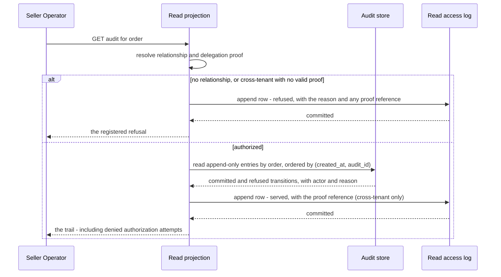

<!-- CONFLUENCE_TITLE: [BSS]: Orders Lifecycle — Read Surfaces and Authorization (Slice 8) -->
<!-- Related: ../DESIGN.md, ../PRD.md, ./README.md, ./01-foundation.md | Owners: BSS Orders team -->

# DESIGN — Read Surfaces and Authorization (Slice 8)

<!-- toc -->

- [1. Architecture Overview](#1-architecture-overview)
  - [1.1 Architectural Vision](#11-architectural-vision)
  - [1.2 Architecture Drivers](#12-architecture-drivers)
  - [1.3 Architecture Layers](#13-architecture-layers)
- [2. Principles and Constraints](#2-principles-and-constraints)
  - [2.1 Design Principles](#21-design-principles)
  - [2.2 Constraints](#22-constraints)
- [3. Technical Architecture](#3-technical-architecture)
  - [3.1 Domain Model](#31-domain-model)
  - [3.2 Component Model](#32-component-model)
  - [3.3 API Contracts](#33-api-contracts)
  - [3.4 Internal Dependencies](#34-internal-dependencies)
  - [3.5 External Dependencies](#35-external-dependencies)
  - [3.6 Interactions and Sequences](#36-interactions-and-sequences)
  - [3.7 Database Schemas and Tables](#37-database-schemas-and-tables)
  - [3.8 Deployment Topology](#38-deployment-topology)
- [4. Additional Context](#4-additional-context)
  - [4.1 The read projection (normative)](#41-the-read-projection-normative)
  - [4.2 What a read exposes (normative)](#42-what-a-read-exposes-normative)
  - [4.3 The permission model (normative)](#43-the-permission-model-normative)
  - [4.4 Delegation proof (normative)](#44-delegation-proof-normative)
  - [4.5 Policy values](#45-policy-values)
- [5. Traceability](#5-traceability)

<!-- /toc -->

- [ ] `p1` - **ID**: `cpt-cf-bss-orders-lifecycle-design-read-and-authz`

## 1. Architecture Overview

### 1.1 Architectural Vision

This slice owns everything that reads an order and the rules about who may. It serves the
current-version projection, the tenancy-scoped list, historical versions, the per-line
fulfillment view and the audit trail — and it owns the per-actor permission set enforced on every
operation in the gear, not only on reads, through one shared evaluator that the engine pre-guard
and the read paths both invoke
([`../PRD.md`](../PRD.md) §6.6, §9.1).

Two properties drive the design. The first is **latency**: order consoles and downstream systems
query state frequently against a 200 ms budget, and the version chain is the wrong structure to
read from — walking it to find current state would make read cost grow with amendment count. So
the aggregate row carries denormalized current state and a current-version pointer, and reads
resolve one row plus that version's lines. No chain walk, no event replay, no derivation.

The second is **confidentiality**. This is a multi-tenant BSS gear where cross-tenant leakage is
a critical failure, and the partner path makes it non-obvious: a partner admin legitimately reads
orders whose `resourceTenantId` is a customer's, which means scoping cannot be a simple equality
check against the caller's tenant. Scoping is by **relationship** — the caller's delegated scope
for the resource axis, or seller scope for the seller axis — and a cross-tenant read requires the
same auditable delegation proof as a cross-tenant write.

The slice reads and refuses. It registers no transition, derives no state, and exposes nothing
internal: not guard state, not idempotency records, not engine diagnostics.

### 1.2 Architecture Drivers

#### Functional Drivers

| Requirement | Design Response |
|-------------|------------------|
| `cpt-cf-bss-orders-lifecycle-fr-order-authorization` | The per-actor permission set is declared here as data and enforced for **every** operation through one shared evaluator — invoked by the engine pre-guard on writes and directly on reads — so no slice can widen scope and reads and writes cannot drift. |
| `cpt-cf-bss-orders-lifecycle-fr-order-history` | Any version is addressed by `(order_id, version)` and read directly, alongside the version list with actor, timestamp, reason and supersession. |
| `cpt-cf-bss-orders-lifecycle-fr-order-line-dates` | The read exposes expected fulfillment time and the per-line deferral wherever the activation barrier deferred a line past its quoted date, so the requested and actual dates are both visible. |
| `cpt-cf-bss-orders-lifecycle-fr-order-subscription-linkage` | The per-line line-to-subscription mapping is exposed on the read, which is what makes "which subscription did this order produce" answerable without consuming an event. |

**One surface in this slice has no requirement basis.** The **audit read** is grounded in a
rationale — a complete audit nobody can read is not an audit — and *not* in a requirement:
PRD §6.1 and `nfr-order-audit-completeness` oblige the system to **record** transitions, not to
**expose** them, and PRD §9.1 contains no audit-retrieval operation. It is therefore a
design-introduced surface needing Product's acknowledgement, disclosed as such in
[`../DESIGN.md`](../DESIGN.md) §3.3 and [`../DECISIONS.md`](../DECISIONS.md) D-70 and routed as
Q-20. It is deliberately absent from the table above, because listing it would present a reason
as a basis.

#### NFR Allocation

| NFR ID | NFR Summary | Allocated To | Design Response | Verification Approach |
|--------|-------------|--------------|-----------------|----------------------|
| `cpt-cf-bss-orders-lifecycle-nfr-order-read-latency` | Read and paginated list p95 < 200 ms | Read projection | The aggregate row carries denormalized state and a version pointer; a read resolves one row plus its version's lines, never the chain. Filters are index-backed and page size is bounded | Benchmarks at production row counts and page sizes, including the tenancy-scoped filter paths and deep amendment chains |
| Security vector, `cpt-cf-bss-orders-lifecycle-fr-order-authorization` | No cross-tenant readability | Permission model | Scoping is by relationship, not caller equality; every read path applies it through the shared evaluator, and a cross-tenant read demands verifiable delegation proof recorded in the read access log | Negative tests per actor asserting refusal outside scope; a test asserting no read path bypasses the evaluator; a test asserting every cross-tenant read writes an access-log row |
| `cpt-cf-bss-orders-lifecycle-nfr-order-recovery` | Reads never serve wrong state | Read projection | The projection is the aggregate row itself, so there is no replication lag between state and its read; on store unavailability the read fails rather than serving stale | Fault-injection test asserting the read reports unhealthy rather than degrading |

#### Key ADRs

The seven gear ADRs govern this slice. One decision taken here is recorded in the register: **the read projection is the aggregate row
rather than a separately maintained materialised view**
([`../DECISIONS.md`](../DECISIONS.md) D-81, §4.1), whose alternative was an asynchronously
updated projection.

### 1.3 Architecture Layers

Inherited from [`01-foundation`](./01-foundation.md) §1.3. This slice adds read surfaces at the
presentation layer and the permission declaration at the domain layer; it adds no store.

## 2. Principles and Constraints

### 2.1 Design Principles

#### Read the row, never the chain

- [ ] `p1` - **ID**: `cpt-cf-bss-orders-lifecycle-principle-read-row-not-chain`

Current state and the current-version pointer live on the aggregate row, so read cost is
independent of amendment count. No read walks the version chain, replays events or derives state.
The trade is one denormalized column maintained inside the transition that changes it — which is
safe precisely because the engine is the single writer.

#### Scope by relationship, not by equality

- [ ] `p1` - **ID**: `cpt-cf-bss-orders-lifecycle-principle-scope-by-relationship`

A caller's readable set is defined by their relationship to the order's axes — delegated scope
over the resource axis, seller scope over the seller axis, ownership of their own orders — not by
their tenant equalling one of them. A naive equality check would either break the partner path
or, if widened to fix it, leak across customers of the same partner.

#### Nothing internal is readable

- [ ] `p1` - **ID**: `cpt-cf-bss-orders-lifecycle-principle-no-internal-exposure`

Guard state, idempotency records, outbox rows, dead-letter contents and engine diagnostics are
not exposed on any surface, and no error body carries them. What a caller sees is the commercial
document, its history, its audit trail and registered business reasons.

#### One evaluator, invoked from two places

- [ ] `p1` - **ID**: `cpt-cf-bss-orders-lifecycle-principle-one-permission-model`

The declaration owned here governs every operation in the gear, and it is evaluated by **one
authorization evaluator** — a component invoked both by the engine pre-guard on the write path and
directly by the read paths. This matters because the engine's only entry point is *attempt a
transition*, so a read cannot reach the pre-guard: without a shared evaluator the read paths would
necessarily implement a second model, and the drift would be invisible until someone could write
what they could not read, or the reverse ([`../DECISIONS.md`](../DECISIONS.md) D-34).

### 2.2 Constraints

#### Fail closed on store unavailability

- [ ] `p1` - **ID**: `cpt-cf-bss-orders-lifecycle-constraint-read-fails-closed`

A read whose store is unavailable **MUST** fail rather than serve a cached or stale answer.
Orders are financial commitments and a stale state read can cause a wrong operational decision —
an operator cancelling an order that has already completed, for instance. Unhealthy is a
truthful answer; stale is not.

#### Cross-tenant access requires delegation proof

- [ ] `p1` - **ID**: `cpt-cf-bss-orders-lifecycle-constraint-delegation-proof-required`

Any access where the caller's tenant is not the order's own — the partner path being the ordinary
case — **MUST** carry explicit, auditable delegation proof. Its absence is a refusal, never a
warning, and the proof **MUST** be recorded on the audit entry so a later review can ask under
whose authority an order was read or changed.

**The rule is scoped by the axes a request names, not by whether an order exists.** Preview creates
no order, so a requirement phrased against "the order's own" tenant does not reach it — and Preview
resolves axis validity, party eligibility, contract-active status, the order market from the
**payer's** commercial profile, and overlap presence against existing subscriptions, over a basket
whose tenant axes the caller supplies. Without this clause any authenticated partner could
enumerate baskets against an arbitrary `payerTenantId` and learn whether that tenant exists, holds
an active contract, which market it binds to, and whether it already subscribes to a named
product. Therefore: a Preview naming any axis outside the caller's own tenant **MUST** carry the
same delegation proof as a cross-tenant read, and where proof is absent Preview **MUST** refuse
rather than degrade — returning a partial verdict would still confirm existence. `03 §4.6`'s
absolute prohibitions are extended accordingly: Preview **MUST NOT** disclose any fact about a
tenant the caller cannot prove delegation for.

#### Page size is bounded

- [ ] `p2` - **ID**: `cpt-cf-bss-orders-lifecycle-constraint-bounded-page-size`

**Every collection response is paged**, not only the order list: the order list, the version
list, the per-line read and the audit read each take a page size and return a cursor. Default 50,
maximum 200, set here as working baselines rather than left unchosen, because the 200 ms budget is
stated per page and an unbounded page would make it meaningless
([`../DECISIONS.md`](../DECISIONS.md) D-41). A request exceeding the maximum is refused rather
than silently truncated.

The audit read is the one that makes this load-bearing. ADR-0005 commits a row on **every**
refusal, so that collection grows with request traffic rather than with commercial activity — a
client retrying against a failing guard can put thousands of rows on one order. An unpaged audit
read is therefore a memory-amplification vector for any caller holding the audit-read permission,
and it is the collection least able to assume a small result.

**Cursor ordering is declared for every paged collection, and every sort key is immutable.** All
four collections of the preceding paragraph carry a declared order, because a cursor over an
undeclared order can duplicate or skip rows at a page boundary:

| Collection | Ordering | Immutable tiebreaker |
|------------|----------|----------------------|
| order list | `(created_at, order_id)` | `order_id` |
| version list | `version`, descending | `version` itself — UNIQUE per order under `orders_order_version`'s `(order_id, version)` primary key, so it needs no second key |
| per-line read | `(created_at, line_id)` taken from `orders_order_line_identity` | `line_id` |
| audit read | `(created_at, audit_id)` | `audit_id` |

Both per-order collections are bounded to one aggregate by their own table's primary key, so a
page never scans across orders ([`01-foundation`](./01-foundation.md) §3.7). The per-line read composes
the **mutable** fulfillment projection, so its sort key **MUST** come from the append-only line
identity row rather than from the projection — a line whose fulfillment status advances between
two pages must not move.

A sort key **MUST NOT** be a mutable column. `state_entered_at` is deliberately **not** one: the
engine rewrites it on every state change, so a row could move between pages and be returned twice
or skipped entirely — silently, with a 200 and a valid-looking cursor. The same prohibition rules
out ordering the version or line collections by anything a later transition rewrites, which is why
neither takes its order from the aggregate row.

## 3. Technical Architecture

### 3.1 Domain Model

- [ ] `p1` - **ID**: `cpt-cf-bss-orders-lifecycle-entity-order-read-view`

The composed read of an order: the aggregate's identity, number, category, axes, state and
contract reference; the current version's lines with their pins and resolved total; the per-line
fulfillment status and subscription linkage; expected fulfillment time and per-line deferral
where they apply; and the declared exclusions on the resolved total.

- [ ] `p1` - **ID**: `cpt-cf-bss-orders-lifecycle-entity-permission-declaration`

The per-actor permission set: for each actor class, the operations permitted, the axis the scope
is evaluated against, and whether delegation proof is required. Declared as data, read by the
shared authorization evaluator.

**Relationships**:
- `Order read view` → `Order root`: one-to-one, resolved from the aggregate row and its current version.
- `Permission declaration` → every operation in the gear: many-to-many, evaluated before any slice guard on writes and before anything is disclosed on reads — which on an order-scoped read is immediately after the aggregate's tenant axes are loaded, because the relationship is evaluated against them (§3.6).
- `Order read view` → `Line fulfillment projection`: embeds the projection owned by [`06-workflow-seam`](./06-workflow-seam.md), read-only on both sides.

### 3.2 Component Model

This slice realises `cpt-cf-bss-orders-lifecycle-component-read-and-authz`
([`../DESIGN.md`](../DESIGN.md) §3.2) as two internal parts.

#### Read projection

- [ ] `p1` - **ID**: `cpt-cf-bss-orders-lifecycle-component-read-projection`

##### Why this component exists

Consoles and downstream systems poll order state, and a read that grew with amendment count or
lagged behind the write would either miss the budget or mislead the reader.

##### Responsibility scope

The current-version composed read; the paginated tenancy-scoped list with its state, date-range
and contract filters; historical version reads; the audit-trail read; exposure of expected
fulfillment time, per-line deferral and the resolved total's declared exclusions; and the
fail-closed posture on store unavailability.

##### Responsibility boundaries

It registers no transition, derives no state, and exposes nothing internal. It invokes the shared
evaluator but does not declare the model, and it writes exactly one thing — the read access-log
row.

##### Related components (by ID)

- `cpt-cf-bss-orders-lifecycle-component-transition-orchestrator` — depends on
- `cpt-cf-bss-orders-lifecycle-component-versioning-reader` — shares model with
- `cpt-cf-bss-orders-lifecycle-component-seam-line-projection` — depends on

#### Permission declaration

- [ ] `p1` - **ID**: `cpt-cf-bss-orders-lifecycle-component-authz-declaration`

##### Why this component exists

Per-actor authorization stated once and enforced centrally is the only version of it that cannot
drift between capabilities.

##### Responsibility scope

The declaration of every actor class's permitted operations across all twenty-five endpoints, the
axis each scope is evaluated against, the delegation-proof requirement, and the recording-party
rule for acceptance; plus the **shared evaluator** the engine pre-guard and the read paths both
invoke, and the startup check that fails if an operation exists with no declaration.

##### Responsibility boundaries

It defines no authentication. Authentication is platform-owned at the gateway, and the
service-principal check for the workflow-only operations is specified in
[`06-workflow-seam`](./06-workflow-seam.md) §3.3.

##### Related components (by ID)

- `cpt-cf-bss-orders-lifecycle-component-transition-orchestrator` — owns data for

### 3.3 API Contracts

- [ ] `p1` - **ID**: `cpt-cf-bss-orders-lifecycle-interface-read-ops`

- **Requirement**: `cpt-cf-bss-orders-lifecycle-interface-order-ops`
- **Technology**: REST/OpenAPI via `OperationBuilder`; RFC 9457 problems; ETag carries the current version so a reader can pass it back as the expected version

| Method | Path | Description | Stability |
|--------|------|-------------|-----------|
| `GET` | `/bss-orders-lifecycle/v1/orders/{orderId}` | The composed current read, including deferral and declared exclusions | unstable |
| `GET` | `/bss-orders-lifecycle/v1/orders` | Paginated list scoped to the caller's relationship; filters on state, date range and contract | unstable |
| `GET` | `/bss-orders-lifecycle/v1/orders/{orderId}/versions` | The version list, **paged**, served with the version reader owned by [`04-versioning`](./04-versioning.md) | unstable |
| `GET` | `/bss-orders-lifecycle/v1/orders/{orderId}/versions/{version}` | One historical version, served with the version reader owned by [`04-versioning`](./04-versioning.md) | unstable |
| `GET` | `/bss-orders-lifecycle/v1/orders/{orderId}/lines` | Per-line fulfillment status and subscription linkage, **paged** | unstable |
| `GET` | `/bss-orders-lifecycle/v1/orders/{orderId}/audit` | The transition audit trail, including refused attempts; **paged**, because ADR-0005 makes it grow with request traffic | unstable |

**Reasons contributed to the registry**: order-not-found (returned in preference to a
forbidden response where the caller has no relationship to the order, so existence is not
leaked), delegation-proof-required, delegation-proof-invalid, operation-not-permitted-for-actor,
page-size-exceeded, filter-invalid, read-store-unavailable.

### 3.4 Internal Dependencies

| Dependency Gear | Interface Used | Purpose |
|-------------------|----------------|----------|
| `toolkit-db` | Runtime-scoped access | The aggregate, version, line, projection and audit reads |

### 3.5 External Dependencies

| Dependency Gear | Interface Used | Purpose |
|-------------------|---------------|---------|
| `account-management` | SDK client | Resolution of the caller's delegated scope and the relationships the permission model evaluates |

Authentication is terminated at the inbound gateway and the gear receives an authenticated
`SecurityContext`; this slice re-implements none of it.

**Dependency Rules** (per project conventions):
- No circular dependencies
- Always use SDK modules for inter-gear communication
- No cross-category sideways deps except through contracts
- Only integration/adapter gears talk to external systems
- `SecurityContext` must be propagated across all in-process calls

### 3.6 Interactions and Sequences

#### Scoped read

**ID**: `cpt-cf-bss-orders-lifecycle-seq-scoped-read`

**Use cases**: `cpt-cf-bss-orders-lifecycle-usecase-order-new-acquisition`

**Actors**: `cpt-cf-bss-orders-lifecycle-actor-orders-partner-admin`, `cpt-cf-bss-orders-lifecycle-actor-orders-direct-customer`, `cpt-cf-bss-orders-lifecycle-actor-orders-seller-operator`

**Algorithm: Read One Order**

Input: order_id, security_context
Output: the composed read view, or a registered refusal

1. [ ] - `p1` - Resolve the caller's actor class and delegated scope - `inst-sr-resolve-actor`
2. [ ] - `p1` - Load the aggregate row, whose tenant axes are the input the relationship check of step 3 is evaluated against. The row loaded here serves the authorization decision **only**: no part of it, and no fact derived from it — not its existence, not its state, not its axes — **MUST** reach a caller who fails step 3 or step 4 - `inst-sr-load-aggregate`
3. [ ] - `p1` - **IF** no aggregate row exists for order_id **OR** the caller has no relationship to any of the order's axes: - `inst-sr-if-no-relationship`
   1. [ ] - `p1` - Append the read access-log row: this operation, `outcome` = `refused`, `refusal_reason` = order-not-found, `requested_order_ref` = the requested identifier, `order_id` = that identifier where the row exists and NULL where it does not (§3.7), and the delegation proof reference where one was presented - `inst-sr-log-not-found`
   2. [ ] - `p1` - **RETURN** order-not-found, so existence is not leaked - `inst-sr-return-not-found`
4. [ ] - `p1` - **IF** the relationship is cross-tenant **AND** no valid delegation proof is present: - `inst-sr-if-no-delegation`
   1. [ ] - `p1` - Append the read access-log row: `outcome` = `refused`, `refusal_reason` = delegation-proof-required, with `order_id` and `requested_order_ref` both carrying the requested identifier — this arm is only reachable where the row exists - `inst-sr-log-delegation-required`
   2. [ ] - `p1` - **RETURN** delegation-proof-required refusal - `inst-sr-return-delegation-required`
5. [ ] - `p1` - Load the current version's lines with their pins and resolved total - `inst-sr-load-current-version`
6. [ ] - `p1` - Load the per-line fulfillment projection - `inst-sr-load-projection`
7. [ ] - `p1` - **IF** any line's quoted service-activation date precedes expected fulfillment time: - `inst-sr-if-deferred`
   1. [ ] - `p1` - Include expected fulfillment time and the per-line deferral - `inst-sr-include-deferral`
8. [ ] - `p1` - Include the resolved total's declared exclusions - `inst-sr-include-exclusions`
9. [ ] - `p1` - **IF** the read was cross-tenant: append the read access-log row — `outcome` = `served`, with the delegation proof reference. An **own-tenant** read appends nothing: the log exists to make the delegation-proof claim true, which is a claim about cross-tenant access only (§4.4) - `inst-sr-log-served`
10. [ ] - `p1` - **RETURN** the composed view with the current version as the ETag - `inst-sr-return-view`

**Description**: Step 3 returns not-found rather than forbidden by design: to a caller with no
relationship, the difference between "this order is not yours" and "no such order" is itself
information about another tenant's activity. Its two arms — no row, and a row the caller has no
relationship to — **MUST** be indistinguishable in the response: same reason, same body, same
status, and no timing or error-shape difference a caller could read the distinction out of.

**Why the row is loaded before the check, and what that does not permit.** The relationship of
step 3 is evaluated *against the order's tenant axes*, so those axes have to be read before the
decision can be taken; there is no ordering in which an order-scoped read authorizes without
resolving the row it is scoped to. The aggregate row loaded at step 2 is therefore an input to the
authorization decision and nothing else — it is **never** returned, in whole or in part, to a
caller who fails step 3 or step 4, and §4.2's exposure rules apply only from step 5 onward. This is
what §4.3's requirement that the evaluator runs "before any part of the store is disclosed" means
on this path: nothing is disclosed before authorization, and the pre-decision load is confined to
the row whose axes the decision is taken against.

#### Paginated list

**ID**: `cpt-cf-bss-orders-lifecycle-seq-list-orders`

**Use cases**: `cpt-cf-bss-orders-lifecycle-usecase-order-new-acquisition`

**Actors**: `cpt-cf-bss-orders-lifecycle-actor-orders-partner-admin`, `cpt-cf-bss-orders-lifecycle-actor-orders-seller-operator`

**Algorithm: List Orders**

Input: security_context, filters, page_size, cursor
Output: a page of order summaries, or a registered refusal

1. [ ] - `p1` - **IF** page_size exceeds the configured maximum: **RETURN** page-size-exceeded refusal. This is input validation, not an access decision, so it appends no access-log row — logging it would let an unauthenticated-shaped caller drive one durable write per malformed request - `inst-lo-if-page-too-large`
2. [ ] - `p1` - Resolve the caller's readable scope into an axis predicate - `inst-lo-resolve-scope`
3. [ ] - `p1` - **MATCH** the actor class; the match **MUST** be exhaustive over the classes the permission declaration grants `list` to, and its default arm refuses rather than falling through to an unscoped query - `inst-lo-match-actor`
   1. [ ] - `p1` - **WHEN** seller operator: scope on seller_tenant_id - `inst-lo-when-seller`
   2. [ ] - `p1` - **WHEN** partner admin: scope on the delegated resource-axis set - `inst-lo-when-partner`
   3. [ ] - `p1` - **WHEN** direct customer: scope on their own orders only - `inst-lo-when-customer`
   4. [ ] - `p1` - **WHEN** the Orders Workflow service principal: scope on orders carrying an open transition-request correlation for the calling execution - `inst-lo-when-workflow`
   5. [ ] - `p1` - **OTHERWISE**: **RETURN** a refusal; no arm means no scope predicate, and a missing predicate is an unscoped read of every tenant's orders - `inst-lo-otherwise-refuse`
4. [ ] - `p1` - **IF** a filter names an unsupported field or value: **RETURN** filter-invalid refusal; input validation, so no access-log row - `inst-lo-if-filter-invalid`
5. [ ] - `p1` - Apply the scope predicate and the filters against the index-backed columns - `inst-lo-apply-predicate`
6. [ ] - `p1` - **IF** the resolved scope was delegated: append the read access-log row with a null `order_id` — `outcome` = `served`, with the delegation proof reference. A list over the caller's own axes appends nothing - `inst-lo-log-served`
7. [ ] - `p1` - **RETURN** the page with a cursor for the next - `inst-lo-return-page`

**Description**: The scope predicate is part of the query rather than a post-filter, so a page is
never partially discarded and the page size means what it says. Scoping is by relationship, which
is what makes the partner path work without widening to the partner's whole customer base.

#### Audit retrieval

**ID**: `cpt-cf-bss-orders-lifecycle-seq-audit-read`

**Use cases**: `cpt-cf-bss-orders-lifecycle-usecase-order-amendment`

**Actors**: `cpt-cf-bss-orders-lifecycle-actor-orders-seller-operator`, `cpt-cf-bss-orders-lifecycle-actor-orders-partner-admin`

**Description**: Refused transitions are in the trail alongside committed ones, which is what
makes a denied authorization attempt or a failed guard visible to a reviewer rather than
invisible. The trail carries actors, reasons, idempotency keys and correlation identifiers, and
carries no internal diagnostics.

**The audit read writes the access log on the same served-and-refused pattern as the other read
paths.** A **cross-tenant** audit read **MUST** append its `orders_read_access_log` row —
`operation` = the audit read, `outcome` = `served`, with the delegation proof reference — and that
row **MUST** be committed **before** the trail is returned. A refused audit read appends its row on
exactly the terms of *Read One Order* steps 3.1 and 4.1, including the `requested_order_ref` rule of
§3.7 for an order that does not exist. An **own-tenant** audit read appends nothing, per §3.7. Of all
the read surfaces this is the one where the omission mattered most: the audit trail is the widest
disclosure the gear makes, and an unlogged cross-tenant read of it would leave the §4.4 claim —
that a review can establish under whose authority an order was read — untrue precisely where it is
most often asked.

**A failed access-log write blocks a served response and never blocks a refusal.** The write-path
twin aborts its transaction when the audit append fails, so no state change survives without its
trail ([`01-foundation`](./01-foundation.md) §3.6 *Attempt Transition* step 23.1). A read has no state change to roll
back, so the rule is stated on disclosure instead. Where the append fails on a **served**
cross-tenant read — the audit read or any other — the read **MUST** fail with
read-store-unavailable and **MUST NOT** return the payload: returning it would produce exactly the
unlogged cross-tenant access §4.4 asserts cannot happen, and §2.2's fail-closed constraint already
prefers an unhealthy answer to an untruthful one. Where the append fails on a **refused** read the
refusal **MUST** still be returned unchanged — a log-write failure **MUST NOT** make a response
more disclosive than it would otherwise have been — and the failure is raised on the
read-access-log write-rate signal of §3.8 rather than converted into a different refusal.

### 3.7 Database Schemas and Tables

This slice introduces **one** table, `orders_read_access_log`, specified at the end of this
section. The rest of its contract is expressed as index requirements on tables owned by
[`01-foundation`](./01-foundation.md) §3.7:

- `orders_order` is indexed on `(resource_tenant_id, state, state_entered_at)` and `(seller_tenant_id, state, state_entered_at)`, which serve the sweeps **and** the "in this state since" filter, and the partner path's predicate is an `IN` over `resource_tenant_id`, which is why that axis carries a composite at all; the previous `payer_tenant_id` composite served no path any slice describes and is removed ([`../DECISIONS.md`](../DECISIONS.md) D-23).
- **The paged list needs its own indexes, because its cursor does not sort on `state_entered_at`.** §2.2 orders the order list by `(created_at, order_id)` and forbids a mutable sort key, so neither `state_entered_at` composite above can serve a page: they order rows by a column the cursor does not use, which would force a sort of the whole scoped set per page and put the 200 ms budget out of reach. `orders_order` therefore carries a keyset index per declared filter shape, whose trailing columns *are* the cursor keys, so a page is an index range scan from the cursor and no filtered path falls back to a sort. **The index set itself is declared once, in [`01-foundation`](./01-foundation.md) §3.7**, and is not restated here.
- **The cost of that is stated rather than hidden.** The index count on the gear's hottest write target is real write amplification on every transition, and it is accepted because the alternatives are worse: sorting on `state_entered_at` is forbidden by §2.2 for correctness, not for performance, and sorting the scoped set per page fails the budget. The benchmark of §1.2 **MUST** cover each filter shape at production row counts, since it is what establishes that these indexes are the ones the planner actually chooses.
- The "in this state since" filter reads `orders_order.state_entered_at`, maintained by the engine inside the transition that changes state. It is the same column the expiry sweep reads, so the two slices no longer specify opposite sources for one fact — and it is a *filter* input only, never a sort key (§2.2).
- **`orders_transition_audit` needs an index its unique constraint does not supply.** The audit read is ordered and paged by `(created_at, audit_id)` per §2.2, because a refused entry carries a **NULL `sequence`** and so joins no `sequence` ordering at all ([`01-foundation`](./01-foundation.md) §3.7). `(order_id, sequence)` UNIQUE therefore serves the chain and the per-order committed lookup, and **cannot** serve this page: a cursor in one order over rows returned in another repeats and skips rows at page boundaries, silently, with a 200 and a valid-looking cursor. The read needs **`(order_id, created_at, audit_id)`**, declared in `01 §3.7` with the rest of the audit table's index set.
- The **version list**'s cursor of §2.2 is served by `orders_order_version`'s `(order_id, version)` primary key with no further index, in either direction. The **per-line read**'s cursor is `(created_at, line_id)` over `orders_order_line_identity`, whose primary key orders by `line_id` instead, so that table **MUST** carry `(order_id, created_at, line_id)`; no line count is bounded anywhere in this design, so the page cannot rely on the set being small enough to sort.

#### Table: orders_read_access_log

**ID**: `cpt-cf-bss-orders-lifecycle-dbtable-read-access-log`

**Schema**: `access_id`, `order_id` (nullable — NULL for a list call, and NULL for an order-scoped
call whose aggregate does not exist, since the FK below cannot be satisfied against a row that is
not there), `requested_order_ref` (nullable — the identifier the caller asked for, carrying **no**
foreign key, populated on every order-scoped call whether or not the aggregate exists, and NULL
only for a list call), `actor`, `actor_class`, `operation`, `outcome` (`served` or `refused`),
`refusal_reason` (nullable), `delegation_proof_ref` (nullable), `accessed_at`.

**PK**: access_id

**Indexes**: `(accessed_at)` for the 90-day purge; `(order_id, accessed_at)` for the per-order access history a review asks for; `(requested_order_ref, accessed_at)`, which is the one that answers "who has been asking for orders that do not exist".

**Constraints**: append-only; FK on `order_id` to `orders_order` where present. Written by the read
paths — by §3.6 *Read One Order* steps 3.1, 4.1 and 9, *List Orders* step 6, and by the audit read
of §3.6 *Audit retrieval* on the same served-and-refused pattern — and the reason it exists at all:
reads register no transition, so the audit store
cannot record them, and a cross-tenant read with no record would make the delegation-proof audit
claim untrue ([`../DECISIONS.md`](../DECISIONS.md) D-35).

**Why `order_id` and `requested_order_ref` are both there.** They are not redundant, and the
not-found refusal is the case that forces the distinction. `order_id` is the foreign-key column: it
can hold only an identifier that names a real `orders_order` row, so on the missing-aggregate arm of
*Read One Order* step 3 it **MUST** be NULL — writing the requested identifier there would violate
the FK and cost the refusal its log row entirely, which is the one row a probe should always leave.
`requested_order_ref` is a plain value column and therefore records what was asked for without
asserting that it exists. The resulting representation is exact in all four shapes: a list call has
both NULL; a served or refused order-scoped call against an existing order has both set to the same
identifier; a call against an order that does not exist has `requested_order_ref` set and `order_id`
NULL; and no row anywhere loses the identifier the caller supplied. That last shape — `order_id`
NULL with `requested_order_ref` set on an order-scoped `operation` — is the signature of a probe
against a non-existent identifier, so enumeration is countable per `actor` off the
`(requested_order_ref, accessed_at)` index, which a not-found refusal that recorded nothing would
have made impossible. Both refusal arms of step 3 still return the identical response (§3.6); the
distinction is internal to the log.

**Only cross-tenant access is logged, and that is deliberate.** The row is appended when the read
crosses a tenant boundary, when it is refused for having no relationship to the order, and when it
is refused for absent delegation proof — the three cases the delegation-proof claim is about. An
**own-tenant** read appends nothing, and neither does an input-validation refusal such as a
page-size or filter error. Logging every read would make each one a durable write on the primary
while §4.4 forbids replica reads, so read capacity would be bounded by primary write capacity and
the horizontal-scaling claim in §4.4 would be false; logging a malformed request would let any
caller drive one write per attempt. The verification this slice declares — "every **cross-tenant**
read writes an access-log row" (§1.2) — is scoped exactly this way, and the algorithms now match
it rather than exceeding it.

**Additional info**: carries a bounded **90-day** retention distinct from the commercial audit
trail, since it grows with traffic rather than with commercial events (§4.5).

The **permission declaration** is configuration rather than schema, versioned with the gear so a
permission change is a reviewable deployment rather than a runtime edit.

### 3.8 Deployment Topology

Inherited from [`01-foundation`](./01-foundation.md) §3.8. Read paths are stateless and scale
horizontally. **Replica reads are forbidden.** Because the read projection *is* the aggregate row
there is no lag to tolerate, and a lagging replica would answer *successfully* with stale state
that nothing detects — which is the one failure the fail-closed rule of §2.2 cannot catch, since
it is not an error. The claim in §1.2 that there is no replication lag between state and its read
holds only under this prohibition ([`../DECISIONS.md`](../DECISIONS.md) D-51).

**How this satisfies PRD §12 AC-21.** The criterion says a cross-tenant attempt "**MUST** be
denied with an authorization error" and that no data from the other tenant is disclosed. This
design denies with `order-not-found` rather than a forbidden response wherever the caller has no
relationship to the order, because a forbidden response confirms the order exists and turns the
read surface into an enumeration oracle. The confidentiality half of the criterion is met in full;
the literal refusal *kind* differs, so the criterion's wording needs amending and is routed with
the other PRD-fidelity items ([`../DECISIONS.md`](../DECISIONS.md) D-68).

**Two boundary notes.** The **Order Console and Customer Order View of PRD §11 are UI surfaces
owned by the frontend design set**, not by this gear; this slice owns the read and API contract
behind them, including the contract-governed renewal terms it surfaces from the contracts port for
[`02-capture`](./02-capture.md) §4.3. And PRD §11's console step 4 lists **hold** among a Partner
Admin's actions, while §5.1 and §6.3 name only the seller operator and Orders Workflow as hold
actors; this design follows the stricter reading, and the conflict is routed as
[`../DECISIONS.md`](../DECISIONS.md) Q-18 rather than left for a UI team to hit at integration.

**Observability owned here**: read and list latency by shape — single read, list by state, list by
date range, list by contract — because one filter regressing is invisible in an aggregate p95;
refusals split into not-found, delegation-required and delegation-invalid, since the last is a
security signal and the first is not; page-size distribution against the maximum; and the
read-access-log write rate. Alerts fire on read-latency SLO burn, on any sustained rate of
delegation-invalid (a credential problem or an attack), and on the read store reporting not
ready.

## 4. Additional Context

### 4.1 The read projection (normative)

Current state and the current-version pointer **MUST** be denormalized onto the aggregate row
and maintained inside the transition that changes them. A read **MUST NOT** walk the version
chain, replay events or otherwise derive state.

The rejected alternative was an asynchronously maintained materialised view. It was rejected
because it introduces a window in which a committed order reads as its prior state, and an
operator acting on a stale read of a financial commitment can cancel an order that has already
completed. Since the engine is the single writer, maintaining the denormalized column inside the
transition costs one column update and removes the window entirely.

A read **MUST** fail rather than serve a stale or cached answer when its store is unavailable,
and the gear **MUST** report unhealthy in that condition rather than degrading.

### 4.2 What a read exposes (normative)

The composed read **MUST** carry the order document at its current version, the per-line pin
references, the stored resolved total, and the per-line fulfillment status with the subscription
linkage.

It **MUST** expose **expected fulfillment time and the per-line deferral** wherever the
activation barrier deferred a line past its quoted service-activation date, alongside the quoted
date retained as requested — so a reader can see both what was asked for and what will happen.

It **MUST** state the resolved total's **declared exclusions**, per
[`03-gate-and-pin`](./03-gate-and-pin.md) §4.5: the total omits overlays needing
subscription-level context, and a response that omitted them silently would misrepresent itself.

It **MUST NOT** expose guard state, idempotency records, outbox or dead-letter contents, or any
engine diagnostic, and no error body **MAY** carry internal diagnostics.

### 4.3 The permission model (normative)

Permissions are declared per actor class and evaluated by the **shared authorization evaluator**
for every operation in the gear — invoked by the engine pre-guard **before** any slice guard on
the write path, and invoked directly on the read path **before any part of the store is
disclosed**, because a read registers no transition and so cannot reach the pre-guard. On an
order-scoped read the evaluator runs immediately after the aggregate's tenant axes are loaded and
before anything is returned, since the relationship it decides is evaluated against those axes and
cannot be decided without them; the row read to reach the decision **MUST NOT** be disclosed to a
caller the decision refuses (§3.6). Startup **MUST** fail if an operation
exists with no declaration. The matrix below is exhaustive over the twenty-five endpoints of
[`../DESIGN.md`](../DESIGN.md) §3.3 — eleven matrix rows covering twenty-five endpoints, since the
authoring, read and workflow-only endpoints each share one declaration. An operation absent from
it is a startup failure, not a default-deny.

| Operation | Partner Admin | Direct Customer | Seller Operator | Orders Workflow |
|-----------|---------------|-----------------|-----------------|-----------------|
| create order · line insert/amend/remove · submit | ✓ delegated scope | ✓ own orders | — | — |
| amend (append a version) | ✓ delegated scope | — | — | — |
| administrative edit (`PATCH`) | ✓ delegated scope | ✓ own orders | ✓ seller scope | — |
| preview | ✓ delegated scope over every axis the basket names | ✓ own axes only | ✓ seller scope | — |
| cancel | ✓ delegated scope | ✓ own orders | ✓ seller scope, reason mandatory | via workflow-cancel only |
| hold · resume | — | — | ✓ seller scope | ✓ with service principal |
| **record acceptance** | ✓ **only as a `resourceTenantId` principal and not the placing actor** | ✓ own orders (self-service submit records it) | — | — |
| read order · list · version list · version read · line read · acceptance read | ✓ delegated scope | ✓ own orders | ✓ seller scope | ✓ with service principal, **scoped to orders carrying an open transition-request correlation for that execution** |
| audit read | ✓ delegated scope | — | ✓ seller scope | — |
| outbox re-drive | — | — | ✓ seller scope | — |
| approval-reflection · begin-fulfillment · spawn-signal · fulfillment-acknowledgement · workflow-cancel | — | — | — | ✓ with service principal |

Two rows warrant their reasons being stated. **`amend` is separated from the authoring row**
because PRD §6.6 grants amendment to Partner Admin and withholds it from Direct Customer, whose
grant is create, submit and cancel only; collapsing them into one row silently widened a
privilege the PRD withheld. **Orders Workflow holds and resumes** because PRD §6.6, §12 AC-15,
§5.1 and §6.3 all name it as a hold actor and the sibling gear's remediation path for a
permanently failed line is to hold the order pending operator resolution — so denying it made a
`MUST`-level acceptance criterion unbuildable. Both are gated on the same gateway-asserted
service principal the other seam operations require
([`06-workflow-seam`](./06-workflow-seam.md) §3.3).

**Must not**, stated positively because these are the constraints that carry weight: a Seller
Operator **MUST NOT** amend commercial content on the buyer's behalf — an operator correcting a
buyer's order would be authoring the buyer's commercial intent. Orders Workflow **MUST NOT**
author commercial content. No actor **MUST** act on or read an order outside their scope.

**The acceptance rule.** On a partner-placed order the actor who **created or submitted** it
**MUST NOT** record the customer's acceptance instant. Recording requires a principal of the
`resourceTenantId` party. A Seller Operator has no acceptance-recording authority: no verifiable
customer-instruction artifact is specified. Without this, nothing would prevent the placing party
supplying their own customer's consent — the exact
conflation [`05-preconditions`](./05-preconditions.md) §2.1 exists to prevent, and the one review
finding that was a substantive hole rather than a documentation gap
([`../DECISIONS.md`](../DECISIONS.md) D-31).

Scope is evaluated **by relationship**: seller operators against `sellerTenantId`, partner admins
against their delegated set of `resourceTenantId` values, direct customers against their own
orders. A caller's tenant equalling an axis is neither necessary nor sufficient.

The **seller operator's exclusion from amending commercial content** is deliberate and worth
naming: an operator correcting a buyer's order would be authoring the buyer's commercial intent,
which is exactly the evidentiary problem the acceptance instant exists to solve.

### 4.4 Delegation proof (normative)

Any cross-tenant operation — the partner path in the ordinary case — **MUST** carry explicit,
auditable delegation proof, and the proof has a specified form rather than a name only
([`../DECISIONS.md`](../DECISIONS.md) D-32; requested upstream as
[`../UPSTREAM_REQS.md`](../UPSTREAM_REQS.md) `…-upreq-delegation-proof-credential`):

| Property | Requirement |
|----------|-------------|
| Issuer | Account Management, verified against its published issuer key |
| Subject | The delegate principal presenting it |
| Claims | The delegating tenant, the delegated scope, the issue instant, a finite expiry |
| Validity | Signature verifies, not expired, and not revoked — revocation is checked at verification time, not cached past it |
| Revocation | By the delegating tenant, observable at the next verification |
| Alignment | BSS manifest §2.1.3, which the PRD names normatively |

Absence, expiry, signature failure or revocation is a **refusal**, never a warning. The proof
reference **MUST** be recorded on the audit entry in
`orders_transition_audit.delegation_proof_ref` for a write, and in the read access log for a read
— which is where the previous claim that a review could establish "under whose authority an order
was **read**" became true rather than aspirational, since reads register no transition and only
the engine writes the audit store.

Where a caller has **no relationship** to an order, the response **MUST** be not-found rather
than forbidden, because distinguishing the two leaks the existence of another tenant's order.

### 4.5 Policy values

**Set by this design**: the **default page size of 50 and maximum of 200** (§4.3), on which the
200 ms per-page budget depends; and the **read-access-log retention of 90 days**, bounded separately
from the commercial audit trail because it grows with traffic rather than with commercial events.

**Set elsewhere and read through this surface**: refusal audit rows carry a **90-day retention**
distinct from committed transitions, specified in [`01-foundation`](./01-foundation.md) §3.7
([`../DECISIONS.md`](../DECISIONS.md) D-49) — it is settled, not open.

**Owned by Product**: the program retention period for completed and cancelled orders, which
governs how far back this surface can read at all. That is **PRD §15 row 5**, tracked as
[`../DECISIONS.md`](../DECISIONS.md) Q-07.

## 5. Traceability

- **PRD**: [`../PRD.md`](../PRD.md) — §6.6 authorization, §9.1 read operations, §11 the order console and customer order view
- **Gear design**: [`../DESIGN.md`](../DESIGN.md) — realises `cpt-cf-bss-orders-lifecycle-component-read-and-authz`
- **Engine**: [`01-foundation`](./01-foundation.md) — the authorization pre-guard, the aggregate row, the audit store
- **Depends on**: [`02-capture`](./02-capture.md) and [`03-gate-and-pin`](./03-gate-and-pin.md) for the content read; [`04-versioning`](./04-versioning.md) for the version reader; [`06-workflow-seam`](./06-workflow-seam.md) for the per-line projection
- **ADRs**: [`ADR/0001`](../ADR/0001-cpt-cf-bss-orders-lifecycle-adr-transition-through-engine.md) transition through the engine; [`ADR/0002`](../ADR/0002-cpt-cf-bss-orders-lifecycle-adr-slice-decomposition.md) the foundation-plus-seven-slices decomposition