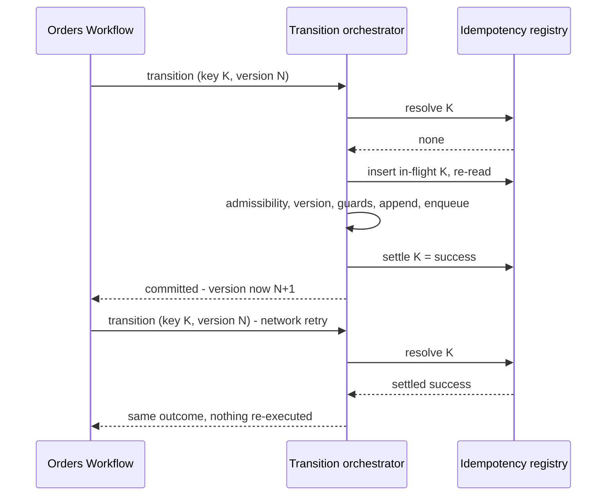

# Feature: Order Transition Engine

- [ ] `p1` - **ID**: `cpt-cf-bss-orders-lifecycle-featstatus-foundation-implemented`

- [ ] `p1` - `cpt-cf-bss-orders-lifecycle-feature-foundation`

## Table of Contents

<!-- toc -->

- [1. Feature Context](#1-feature-context)
  - [1.1 Overview](#11-overview)
  - [1.2 Purpose](#12-purpose)
  - [1.3 Actors](#13-actors)
  - [1.4 References](#14-references)
- [2. Actor Flows (CDSL)](#2-actor-flows-cdsl)
  - [2.1 Attempt an existing-order transition](#21-attempt-an-existing-order-transition)
  - [2.2 Create and retry an order](#22-create-and-retry-an-order)
- [3. Processes / Business Logic (CDSL)](#3-processes--business-logic-cdsl)
  - [3.1 Resolve idempotency ownership and retention](#31-resolve-idempotency-ownership-and-retention)
  - [3.2 Maintain overlap claims](#32-maintain-overlap-claims)
  - [3.3 Append and verify audit evidence](#33-append-and-verify-audit-evidence)
  - [3.4 Publish events and coordinate maintenance](#34-publish-events-and-coordinate-maintenance)
- [4. States (CDSL)](#4-states-cdsl)
  - [4.1 Authoritative order lifecycle](#41-authoritative-order-lifecycle)
  - [4.2 Idempotency record lifecycle](#42-idempotency-record-lifecycle)
- [5. Definitions of Done](#5-definitions-of-done)
  - [5.1 Atomic engine and persistence](#51-atomic-engine-and-persistence)
  - [5.2 Replay and evidence](#52-replay-and-evidence)
  - [5.3 Delivery and operational verification](#53-delivery-and-operational-verification)
- [6. Acceptance Criteria](#6-acceptance-criteria)
- [7. Detailed Behavior Contracts](#7-detailed-behavior-contracts)
  - [Foundation: Interactions and Sequences](#foundation-interactions-and-sequences)
  - [Foundation: Idempotency Semantics (normative)](#foundation-idempotency-semantics-normative)
  - [Foundation: The State Machine (normative)](#foundation-the-state-machine-normative)
  - [Foundation: What this slice deliberately does not own](#foundation-what-this-slice-deliberately-does-not-own)
  - [Foundation: Traceability](#foundation-traceability)

<!-- /toc -->

## 1. Feature Context

### 1.1 Overview

Provide the shared transition engine through which every Orders Lifecycle mutation commits. The engine owns state, versions, concurrency, idempotency, audit and transactional event enqueue; capability features supply guards and contributions.

### 1.2 Purpose

Make durable order effects, replayable outcomes and complete committed audit evidence properties of one implementation path. This feature implements the foundation slice without relocating its schema, event catalog or architectural decisions.

**Requirements**: `cpt-cf-bss-orders-lifecycle-fr-order-state-machine`, `cpt-cf-bss-orders-lifecycle-fr-order-idempotency`, `cpt-cf-bss-orders-lifecycle-fr-order-history`, `cpt-cf-bss-orders-lifecycle-fr-order-amendment`, `cpt-cf-bss-orders-lifecycle-fr-order-events`, `cpt-cf-bss-orders-lifecycle-fr-order-authorization`, `cpt-cf-bss-orders-lifecycle-fr-orders-boundary-r1-state-sor`, `cpt-cf-bss-orders-lifecycle-fr-orders-boundary-r5-no-mirroring`, `cpt-cf-bss-orders-lifecycle-nfr-order-audit-completeness`, `cpt-cf-bss-orders-lifecycle-nfr-order-idempotency`, `cpt-cf-bss-orders-lifecycle-nfr-order-transition-latency`, `cpt-cf-bss-orders-lifecycle-nfr-order-recovery`.

**Principles**: `cpt-cf-bss-orders-lifecycle-principle-atomic-transition-commit`, `cpt-cf-bss-orders-lifecycle-principle-guard-declared-not-embedded`, `cpt-cf-bss-orders-lifecycle-principle-outcome-store-idempotency`, `cpt-cf-bss-orders-lifecycle-principle-append-only-history`, `cpt-cf-bss-orders-lifecycle-principle-absence-is-refusal`.

### 1.3 Actors

| Actor | Role in Feature |
|-------|-----------------|
| `cpt-cf-bss-orders-lifecycle-actor-orders-partner-admin` | Requests authorized capture and commercial transitions |
| `cpt-cf-bss-orders-lifecycle-actor-orders-direct-customer` | Requests authorized self-service transitions |
| `cpt-cf-bss-orders-lifecycle-actor-orders-seller-operator` | Requests authorized operational transitions |
| `cpt-cf-bss-orders-lifecycle-actor-orders-workflow` | Requests version-bound approval and fulfillment transitions; retries outcomes |
| `cpt-cf-bss-orders-lifecycle-actor-orders-subscriptions` | Consumes applicable lifecycle notifications through its authorized service path |

Configured Lifecycle maintenance workers are internal executors, not a new public actor or a permission bypass.

### 1.4 References

- **PRD**: [PRD.md](../PRD.md), §§6–7, 12.
- **Architecture**: [DESIGN.md](../DESIGN.md), including [01 models](../DESIGN.md#contract-01-3-1), [01 interfaces](../DESIGN.md#contract-01-3-3), and [01 persistence](../DESIGN.md#contract-01-3-7). Complete behavior is in [§7](#7-detailed-behavior-contracts).
- **Decomposition**: [DECOMPOSITION.md](../DECOMPOSITION.md).
- **Dependencies**: None among features. Every feature consumes this engine; [Read and Authorization](08-read-and-authz.md) supplies the shared authorization policy integration.
- **Unresolved prerequisites**: [UPSTREAM_REQS.md](../UPSTREAM_REQS.md), including actual PDP proposed-value enforcement, Event Broker runtime, cursor-retry fix, root tenancy/grants, shared dead-letter recovery and delivery observability. [DECISIONS.md](../DECISIONS.md) retains the per-principal idempotency qualification, latency and PRD transition/event divergences; this feature does not resolve them.

**UI applicability**: UI layout, keyboard navigation, screen-reader behavior and visual accessibility are not applicable because this feature specifies backend contracts, not a user interface. API usability, actionable errors and non-disclosing diagnostics remain applicable; consuming consoles own their UI requirements.

## 2. Actor Flows (CDSL)

**Use cases**: `cpt-cf-bss-orders-lifecycle-usecase-order-new-acquisition`, `cpt-cf-bss-orders-lifecycle-usecase-order-amendment`, `cpt-cf-bss-orders-lifecycle-usecase-order-cancel-during-approval`, `cpt-cf-bss-orders-lifecycle-usecase-order-fulfillment-complete`.

### 2.1 Attempt an existing-order transition

- [ ] `p1` - **ID**: `cpt-cf-bss-orders-lifecycle-flow-foundation-attempt-transition`

**Actor**: An authorized buyer, seller operator or Workflow principal listed above.

**Success Scenarios**: An admissible transition commits its effects together; a matching retained outcome replays unchanged.

**Error Scenarios**: Invalid boundary input; denied or changed authorization; fingerprint mismatch; live competing lease; inadmissible trigger; stale version/revision; failed or unevaluable guard; persistence failure.

**Steps**:
1. Validate the request. Missing/unparseable expected version yields `expected-version-required` before engine entry, without audit or idempotency access; other schema failures use the canonical boundary mapping.
2. Authorize the operation using the shared PDP adapter and trusted context before probing idempotency. Enforce the point-target denial/non-disclosure rules in foundation §3.6; denial does not settle a key.
3. Reauthorize disclosure before returning a matching settled response. Replay performs no new transition, gate resolution, audit append or event enqueue.
4. For a new execution, authorize the complete proposed relationship and resolve guard inputs outside the write transaction. For draft operations, take a coherent authorized working-set snapshot under the aggregate lock, release it before external calls, and retain its prepared revision.
5. Lock the scoped aggregate and recheck authorization facts, then apply the transactional idempotency gate (§3.1). Changed authorization facts take the documented non-settling refusal path, not automatic reauthorization or rebasing.
6. For Workflow-class triggers, check expected version before admissibility. For other triggers, check admissibility before expected version. Compare client and prepared draft revisions before using prepared results, including failed external resolutions.
7. Evaluate registered guards in order. Earlier resolved guards outrank later unavailable inputs. A precluded input is not an unavailable input. Settle/audit a business refusal only while owning its key; persist a reached gate assessment atomically without commercial contributions.
8. Resolve the target state, maintain overlap claims (§3.2), append a version only for a versioning row, and apply the declared contributions.
9. Update state-entry time only on state change, store/clear pre-hold state correctly, and update the declared monotonic counters and irreversible spawn/tolerance facts. Append audit, conditionally enqueue exactly one declared event, settle the response and commit.
10. Return success only after commit. Audit, contribution, serialization, enqueue or commit failure aborts the attempt; an uncertain commit acknowledgement requires same-key resolution and is never reported as a confirmed rollback.

The full precedence, private persistence scopes, diagnostic settlement and aggregate contribution mapping are [foundation §3.6](01-foundation.md#contract-01-3-6).

### 2.2 Create and retry an order

- [ ] `p1` - **ID**: `cpt-cf-bss-orders-lifecycle-flow-foundation-create-transition`

**Actor**: Partner Admin or Direct Customer with the complete `order × create` authorization path. The Seller Operator path grants no creation permission; a principal with a seller role must independently satisfy a complete permitted path.

**Success Scenarios**: One new draft; retry returns its original identity/number.

**Error Scenarios**: Denied proposed tenant arrangement, refused category, mismatch/live lease, audit or commit failure.

**Steps**:
1. Authorize the complete creation arrangement and resolve the principal-scoped key before guards. Create uses the target/version sentinels in its fingerprint and never locks a nonexistent aggregate.
2. Under the authoritative registry lock, replay, refuse mismatch/live lease, or establish ownership. A guard refusal creates no aggregate or placeholder and settles only the owned record.
3. On admission, allocate identity and seller-unique number; initialize the aggregate and empty version 1 exactly as foundation §3.6's creation table specifies: `draft_revision=0`, counters zero, trusted actor/actor tenant, immutable audit namespace and sales-path evidence, and no pin, market, total or line snapshot.
4. Append committed create audit sequence 1, settle identity/number in the immutable response, and commit. Create is event-less.
5. A successful retry checks current disclosure access to the created order and returns the original response; it never creates a replacement if access was lost.

## 3. Processes / Business Logic (CDSL)

### 3.1 Resolve idempotency ownership and retention

- [ ] `p1` - **ID**: `cpt-cf-bss-orders-lifecycle-algo-foundation-idempotency`

**Input**: Authorized stable principal, operation/key, canonical request fingerprint, locked target where applicable.

**Output**: Stored response, non-owning conflict, or ownership of a new execution.

1. Scope the key by `(operation, principal_scope, idempotency_key)`; derive the principal from stable authenticated identity, never token/session/delegation identity. Fingerprint exactly the [Foundation contract §4.2](01-foundation.md#contract-01-4-2) input set, excluding correlation, transport and server-assigned values.
2. Under the registry lock apply logical retention expiry using fresh database time. Expired settled rows may be replaced; an in-flight row requires both expired retention and lease. Neither replay nor reclaim extends the 24-hour window.
3. Compare fingerprints before settlement/lease state: mismatches audit without changing the winner; matching settled rows return the stored response; matching live leases audit `still-processing` without stealing or settling ownership.
4. Claim absence with conflict-safe insert and locked re-read. Reclaim matching expired leases atomically using the configured positive finite lease duration and fresh database wall-clock time; distinguish one's own successful insert from a competing lease.
5. Hold the lock through writes, audit and settlement. Claim/reclaim never commits separately. A competitor cannot bypass a live transaction because its lease time elapsed.
6. Settle success or an owned business refusal with its immutable public response and assessment, if reached. Cleanup uses the existing bounded worker (baseline every 60 seconds, 500 rows), row locks and expiry rechecks; it never deletes live markers or referenced evidence.

Cross-principal create duplication and post-window re-execution remain disclosed limitations, not covered guarantees.

### 3.2 Maintain overlap claims

- [ ] `p1` - **ID**: `cpt-cf-bss-orders-lifecycle-algo-foundation-overlap-claims`

**Input**: Locked order, target state, distinct proposed `(payer_tenant_id, overlap_scope_key)` tuples.

**Output**: Complete admitted claim set, or audited/settled `order-in-flight-for-key` with prior claims intact.

1. On every terminal transition, release all live claims before the acquisition branch. Other non-acquiring transitions retain claims.
2. For submit/amendment, retain already-held full tuples and insert missing tuples in payer UUID/key byte order under `READ COMMITTED`, using the partial unique constraint and conflict-safe insert with returned IDs.
3. On shortfall, release exactly this attempt's returned fresh IDs, checking the affected count; preserve every pre-existing claim. Persist the assessment with authoritative predicate-9 conflict, audit and settle refusal before any version/contribution append. Cleanup failure aborts the whole transaction.
4. Only after full acquisition release superseded tuples. A payer change replaces the full tuple; duplicate line keys offer one claim. No claim row proves that its proposed version was admitted.

### 3.3 Append and verify audit evidence

- [ ] `p1` - **ID**: `cpt-cf-bss-orders-lifecycle-algo-foundation-audit-integrity`

**Input**: Validated transition evidence; stored chains and checkpoint inventory for verification.

**Output**: Atomic append, or integrity finding with no historical repair.

1. Append one committed audit entry per transition, except administrative changes append one per changed field at consecutive sequences. Use the closed trigger token as machine reason and the separately validated caller explanation as `caller_reason`.
2. Allocate committed sequences under the aggregate lock. Emit hash v2 over the exact stored fields, canonical microsecond timestamp and predecessor defined in [Foundation contract §4.4](../DESIGN.md#contract-01-4-4); retain v1 verification. Identity removal never changes stored references/hashes.
3. Keep refused entries outside the committed chain with NULL sequence/predecessor; unresolved targets retain the trusted subject tenant/requested reference without invented target facts or aggregate lookup for enrichment.
4. Enforce append-only grants and triggers. Only the restricted retention role may purge expired refusal rows under [Foundation contract §3.7](../DESIGN.md#contract-01-3-7)'s canonical retention policy.
5. Verify committed chains read-only and alert on any mismatch, unsupported hash version or incomplete sequence. The audit worker captures atomic daily namespace checkpoints from one consistent snapshot, reconciles current orders and previous members, and never blesses a discrepancy.
6. Enforce the shared repeated-refusal limiter at the inbound edge before engine entry: working baselines are 20 per minute per (caller, order) and 200 per minute per caller. A limiter must not enter the engine and append the refusal row it is intended to avoid. Architecture ratification remains Q-26.
7. Meet the design baselines of a checkpoint within 24 hours and full verification within 30 days with measured capacity. Checkpoints detect the specified bounded completeness failures; optional external anchoring and protection against rewriting all local evidence are not presumed delivered.

### 3.4 Publish events and coordinate maintenance

- [ ] `p1` - **ID**: `cpt-cf-bss-orders-lifecycle-algo-foundation-publication-workers`

**Input**: Prepared typed event, transition transaction, platform producer queue; bounded maintenance work.

**Output**: Durable enqueue and eventual platform acknowledgement/retry/dead letter; bounded worker pass.

1. Before readiness, prepare the topic/subject and eleven event schemas, explicit root tenancy, broker partition count and managed Chained producer. Startup validation rejects incomplete registrations, unknown guard rows, duplicate transition keys or unmapped reasons.
2. Enqueue through the bound platform producer using the transition runner. Preserve the [Foundation contract §4.4](../DESIGN.md#contract-01-4-4) payload/envelope contract; validate maximum basket events against the 64 KiB envelope limit.
3. Let toolkit workers own sequencing, leases, retries, rejection and queue storage. Transient failures retry; permanent faults dead-letter and advance the cursor. Instrument every outcome. Orders owns no drain SQL or re-drive endpoint.
4. Consumers deduplicate by event ID and verify action applicability against an authorized current read. Read failure keeps work pending; it is not proof of obsolete work. Recovery preserves event identity through the shared platform path.
5. Coordinate exactly the five Orders workers named in [Foundation contract §3.8](../DESIGN.md#contract-01-3-8) through its toolkit advisory keys and lifecycle cancellation. Session locks are not fencing: each write remains protected by transactional eligibility/idempotency checks; verification never repairs evidence.

## 4. States (CDSL)

### 4.1 Authoritative order lifecycle

- [ ] `p1` - **ID**: `cpt-cf-bss-orders-lifecycle-state-foundation-transition-contract`

**States**: `draft`, `submitted`, `pending_approval`, `approved`, `in_fulfillment`, `on_hold`, `completed`, `rejected`, `cancelled`, `fulfillment_failed`, `expired`.

**Initial State**: `draft`, created with empty version 1.

**Terminal States**: `completed`, `rejected`, `cancelled`, `fulfillment_failed`, `expired`.

Implement the exact **27 rows and 20 trigger tokens** of [`cpt-cf-bss-orders-lifecycle-state-order-lifecycle`](01-foundation.md#contract-01-4-3), including guards, actor classes, versioning behavior and event declarations. Expand multi-state rows into unique `(from-state, trigger)` lookup keys and reject duplicate keys at startup. There are no inferred transitions or terminal exits.

Create, submit and amendment append versions; draft and administrative edits do not. Submit materializes version 2. Resume uses stored pre-hold state. `in_fulfillment` has no expiry row, and expiry of a hold from fulfillment is guard-refused. Held fulfillment can fail/cancel through the Workflow rows but cannot acknowledge completion while held. Amendment lands in `submitted` under the design's disclosed PRD reconciliation items.

### 4.2 Idempotency record lifecycle

- [ ] `p1` - **ID**: `cpt-cf-bss-orders-lifecycle-state-foundation-idempotency-record`

**States**: absent, `in_flight`, `settled`.

**Transitions**: absent → owned `in_flight` after conflict-safe claim; matching expired `in_flight` → reclaimed `in_flight` under lock; owned `in_flight` → `settled` with success/refusal in the same transaction; eligible expired record → absent/replacement under locked retention checks. A settled response remains immutable until normal retention expiry. Rollback removes the attempt's new effects.

## 5. Definitions of Done

### 5.1 Atomic engine and persistence

- [ ] `p1` - **ID**: `cpt-cf-bss-orders-lifecycle-dod-foundation-atomic-engine`

The system **MUST** implement both transition branches, shared guard precedence, authorization rechecks, full rollback and owned-refusal settlement. It **MUST** enforce the schema inventory's immutable/mutable writer boundaries and exact claim cleanup.

**Implements**: `cpt-cf-bss-orders-lifecycle-flow-foundation-attempt-transition`, `cpt-cf-bss-orders-lifecycle-flow-foundation-create-transition`, `cpt-cf-bss-orders-lifecycle-algo-foundation-overlap-claims`.

**Constraints**: `cpt-cf-bss-orders-lifecycle-constraint-single-writer`, `cpt-cf-bss-orders-lifecycle-constraint-guard-input-ports`.

**Touches**: internal transition/registration API; `cpt-cf-bss-orders-lifecycle-db-foundation-schema`; aggregate, versions, lines, contributions and claims. Endpoint contracts remain with their owning features.

### 5.2 Replay and evidence

- [ ] `p1` - **ID**: `cpt-cf-bss-orders-lifecycle-dod-foundation-replay-evidence`

The system **MUST** preserve principal/target isolation, immutable response replay and the documented retention/lease behavior; commit audit evidence with each admitted transition and eligible refusal, enforce grants/triggers and implement canonical hashing/checkpoints without historical rewrites.

**Implements**: `cpt-cf-bss-orders-lifecycle-algo-foundation-idempotency`, `cpt-cf-bss-orders-lifecycle-algo-foundation-audit-integrity`.

**Constraints**: `cpt-cf-bss-orders-lifecycle-constraint-idempotency-window`, `cpt-cf-bss-orders-lifecycle-constraint-single-writer`.

**Touches**: `cpt-cf-bss-orders-lifecycle-dbtable-idempotency`, `cpt-cf-bss-orders-lifecycle-dbtable-transition-audit`, `cpt-cf-bss-orders-lifecycle-dbtable-audit-checkpoint`, `cpt-cf-bss-orders-lifecycle-dbtable-audit-checkpoint-member`.

### 5.3 Delivery and operational verification

- [ ] `p1` - **ID**: `cpt-cf-bss-orders-lifecycle-dod-foundation-delivery-readiness`

The system **MUST** register and enqueue the existing event/error/category contracts using the platform implementation, coordinate the declared maintenance roster, and verify the documented recovery and observability requirements. Open upstream release prerequisites remain blockers; commit-only measurements do not establish the PRD write-plus-publish latency guarantee.

**Implements**: `cpt-cf-bss-orders-lifecycle-algo-foundation-publication-workers`.

**Constraints**: `cpt-cf-bss-orders-lifecycle-constraint-outbox-at-least-once`.

**Touches**: `cpt-cf-bss-orders-lifecycle-dbtable-event-outbox` (platform-managed persistence), typed event/error/category registration, readiness, maintenance and recovery integration.

## 6. Acceptance Criteria

- [ ] Concurrent same-principal/key creates commit one aggregate, empty version 1 and create audit; retries return identical identity/number. Denied/refused creation inserts no placeholder.
- [ ] Same-key success and refusal replay verbatim after state/version change without external guard calls. Fingerprint mismatch, live/expired lease and concurrent settle during failed resolution preserve the winning record.
- [ ] Two principals cannot read or overwrite each other's keys; tests explicitly demonstrate the documented cross-principal create limitation.
- [ ] Race draft edits and submit with successful and failed resolution: stale client/prepared revisions settle `version-conflict` without stale assessment, version, claims or event.
- [ ] Every transition row has admitted/refused coverage, correct guard precedence, version effect and event cardinality; invalid row/guard/reason registration fails startup.
- [ ] Force multi-key partial claim acquisition, payer-only replacement and terminal release. Refusal preserves old claims and releases only returned fresh IDs; cleanup-count mismatch and persistence failure roll back everything.
- [ ] Denied/missing targets share non-disclosing responses and unresolved audit shapes. Late authorization changes leave idempotency untouched and commit only permitted refusal evidence.
- [ ] Faults at audit, diagnostics, response serialization, enqueue and commit leave no partial effects; an uncertain commit response is resolved through the original key.
- [ ] Migration tests enforce append-only grants/triggers and bounded purge authority. Frozen hash/checkpoint vectors, field mutation tests and deletion/tampering tests verify integrity without identity resolution or repairs.
- [ ] Two-worker lock-session loss tests prove transactional safety despite overlapping passes; cleanup cannot delete a live/reclaimed marker and checkpoint writers cannot fork history.
- [ ] Event integration verifies eleven schemas, root grants, subject partitioning, retry after broker persistence/lost response, consumer deduplication and dead-letter recovery; pending SDK/runtime/recovery dependencies are not reported as passed.
- [ ] Measure resolution, commit and broker acknowledgement separately and together at the design load; include backlog and failed deliveries. Demonstrate RPO zero and RTO ≤60 minutes for committed orders and pending producer messages within the declared residency boundary.

- [ ] Inbound integration tests exercise both repeated-refusal rate limits and show that throttled attempts do not enter the engine or amplify transition-audit writes. Baseline values remain subject to Q-26; this document does not ratify them.

## 7. Detailed Behavior Contracts

**Contract namespace 01.** Section numbers inside the detailed contracts below resolve
through the [contract address index](../DECOMPOSITION.md#4-contract-address-index),
not the overview section numbers above.

The following sections retain the complete algorithms, guards, state transitions and
feature-local rules. The preceding flows and acceptance criteria summarize these contracts;
shared schemas and interfaces are defined in [DESIGN.md](../DESIGN.md).

<!-- contract:01-foundation:3.6 -->
### Foundation: Interactions and Sequences

#### Transition commit

**ID**: `cpt-cf-bss-orders-lifecycle-seq-transition-commit`

**Use cases**: `cpt-cf-bss-orders-lifecycle-usecase-order-new-acquisition`

**Actors**: `cpt-cf-bss-orders-lifecycle-actor-orders-partner-admin`, `cpt-cf-bss-orders-lifecycle-actor-orders-workflow`

**Algorithm: Attempt Transition**

**Dispatch (D-105)**: trigger `create` executes the dedicated *Create Transition* branch below
and does not execute this existing-order algorithm. In particular it does not load/lock a
nonexistent aggregate, inspect its prior state or compare an expected existing version.

Input: order_id, trigger, security_context, idempotency_key, expected_version, correlation_id, contribution
Output: committed outcome or registered refusal

`expected_version` is required. Boundary input validation has already rejected a missing or
unparseable one with `expected-version-required` before step 1 — unaudited, with no idempotency
record probed or touched (`§4.1` *Expected version is validated at the boundary*, D-112).

**Mutable-draft concurrency (OL-4).** Commercial version 1 is not a draft-edit token.
`orders_order.draft_revision` starts at 0 and increases exactly once for every committed
commercial draft edit, including header changes and line insertion, replacement or removal.
Administrative edits do not increment it. Draft writes and submit require the client's
`expected_draft_revision`, exposed as `draftRevision` by draft reads, in addition to
`expected_version`. For `draft-mutate` it is **optional at the boundary** (D-147): its absence is
never a boundary rejection, because a client of an order past `draft` has never been shown a
`draftRevision`. The engine compares it only at step 12, after step 11's admissibility check, so a
commercial `PATCH` outside `draft` refuses `not-admissible` (D-145), and in `draft` an absent
value is a mismatch that step 12 refuses `version-conflict` naming the current draft revision.
It is part of the request fingerprint, an absent value taking the not-applicable sentinel. It does not create an immutable
commercial version. Use the existing scoped transaction and aggregate row lock, not a new lock
service. This follows Pricing's distinction between commercial revision and mutable row version
(`pricing/src/domain/concurrency.rs`), with Orders-specific fields.

Before external guard resolution, take a coherent authorized draft snapshot in a short scoped
transaction under that same aggregate lock, including all lines, tenant axes and its
`prepared_draft_revision`; release the transaction before any network calls. All commercial
draft writers take this lock and increment the revision atomically with their writes. After the
authoritative idempotency gate has allowed a **new** execution, compare both the client revision
and the prepared revision with the locked aggregate before consuming any prepared result,
including an unavailable-input result in step 3.1. A mismatch settles `version-conflict`, audits
and returns the authorized current version/revision; it never commits a stale gate outcome or
stale draft contribution. Matching settled outcomes replay first and are not invalidated by a
later edit. Step 12 includes these comparisons. No automatic rebase or reuse of old external
results is permitted. Server snapshot tokens are not part of the client request fingerprint.

Required tests race submit with header/quantity edits and line addition/removal, race two draft
edits at the same revision, and repeat with failed external resolution. Exactly one competing
draft revision may be consumed; stale execution changes no commercial data, claims or events.
Also verify a stored success still replays after the draft revision has changed.

**Unresolved targets (D-98).** On an early authorization denial, persist the validated requested
identifier as `requested_order_ref`, with `order_id`, `from_state`, `to_state` and `version` NULL.
Persist the actor's trusted `subject_tenant_id` under D-104's scoped service append permission;
`audit_tenant_id` and `resource_tenant_id` remain NULL. Committed create initializes its immutable
audit namespace, NULL prior state, `draft` target state and sequence 1 in the creation transaction.
Do not query the aggregate merely to populate the audit record: NULL means **not resolved**, not
proof of nonexistence. No order is created, audit sequence allocated, or idempotency key settled
on this path. This applies identically to an existing inaccessible order and an unknown identifier;
the external authorization refusal is unchanged. A refusal before a create has allocated an
order identifier has both references NULL. Audit-write failure aborts the refusal transaction;
it MUST NOT permit the operation, disclose target existence or be reported as a durably audited
refusal. The common infrastructure-error mapping applies, without target-specific detail.

1. [ ] - `p1` - Evaluate the authorization pre-guard through the shared PolicyEnforcer adapter for the trigger's resource/action from [08 §4.3](../DESIGN.md#contract-08-4-3), using the authenticated SecurityContext and, as PDP request context, the delegation proof reference the caller supplied — PDP policy decides whether the path needs it and whether it is valid ([08 §4.4](../DESIGN.md#contract-08-4-4), D-111); the engine never verifies proof itself. Every trigger on this path names a target, so a PDP delegation-proof denial answers `order-not-found`, never `delegation-proof-required` / `delegation-proof-invalid` (D-141); the classified reason is kept only in the scoped internal log/metric ([08 §3.6](08-read-and-authz.md#contract-08-3-6) common read wrapper item 3). Use only the platform-approved minimal point-target prefetch to obtain current authorization properties, without a row lock or disclosure, then enforce the returned current-order scope. Where the prefetch finds no row, still make this call with the target ID and an empty property set, **and** the D-114 follow-up `order × read` below with the same target ID and an empty property set, discard both results and take the `order-not-found` arm, so both arms make the same PDP calls; a PDP outage on either call returns the sanitized 503 exactly as for an existing order ([08 §3.6](08-read-and-authz.md#contract-08-3-6) common read wrapper item 2, D-68). Actor class alone grants nothing. If denied, map the denial by [08 §3.6](08-read-and-authz.md#contract-08-3-6)'s common wrapper denial mapping (D-114, D-141): make the follow-up `order × read` on the target, on this deny path only and whatever the deny reason; a delegation-proof denial answers `order-not-found` (404) whatever the follow-up answers, and any other denial answers `operation-not-permitted-for-actor` (403) where the follow-up allows, otherwise `order-not-found` (404); append refusal evidence under the separately authorized service scope, commit and return without probing or settling idempotency; do not load the aggregate merely for audit enrichment. Only after authorization may the scoped registry be probed for (operation, principal_scope, idempotency_key), with principal_scope from the authenticated context. A matching settled outcome may replay before business guard work only after current access has been rechecked; a stored outcome is not an access grant - `inst-probe-idempotency`
2. [ ] - `p1` - For a new execution, construct the complete proposed arrangement from stored values and validated contribution. Obtain the additional proposed-relationship authorization required by [08 §4.3](../DESIGN.md#contract-08-4-3) before fetching commercial facts about newly named parties; submit also requires current payer-use authority. Denial follows the authorization refusal path, not a tentative business write. Resolve the remaining declared business guard inputs outside any transaction under each port's deadline - `inst-resolve-guard-inputs`
3. [ ] - `p1` - **IF** any declared input is unresolvable or its deadline elapses — a **precluded** input (`§4.1`) is never unresolvable and never enters this branch: - `inst-if-input-unresolvable`
   1. [ ] - `p1` - Open a refusal transaction and apply the same PDP-scoped locked-row and authorization-fact recheck as step 5. Run the common transactional idempotency gate below, equivalent to steps 6–9: return an unchanged matching settled outcome, refuse a fingerprint mismatch without changing the record, or refuse a matching live lease without stealing it. After claiming/reclaiming ownership, apply steps 10–12, including client and prepared draft revisions: changed draft inputs settle version-conflict, not a stale unevaluable reason. Lost access or changed authorization facts take their existing non-settling refusal paths instead. A still-current new execution then settles by `§4.1` precedence: - `inst-return-input-unresolvable`
      1. [ ] - `p1` - **FOR EACH** slice guard in the row's guard set registered **ahead of** the first guard with an unresolved input, in registration order, whose own inputs all resolved: evaluate it against the locked state as step 13 does, and **IF** it fails, settle that engine/guard-only refusal without an assessment exactly as step 13 does, append refusal audit, commit and **RETURN** it — an earlier-registered failing guard is never masked by a later unavailable input (D-113) - `inst-if-earlier-guard-fails`
      2. [ ] - `p1` - Only when none fails, persist the completed gate assessment under the diagnostic settlement contract below, settle the owned record with the complete response and selected unevaluable reason, append refusal audit and commit. Non-gate input failures carry no assessment - `inst-settle-input-unresolvable`
4. [ ] - `p1` - Open one transaction for everything that follows - `inst-open-transaction`
5. [ ] - `p1` - Load the aggregate for order_id through the PDP-produced current-order scope **taking its row lock**, also serialising audit-sequence allocation. If inaccessible, refuse without disclosing current facts. Compare current authorization-relevant properties with those used for the PDP decision. A mismatch refuses as a conflict with no automatic reauthorization/rebase; never continue under a stale decision. Retain the lock through commit. Idempotency replay still precedes the request's expected-version check; a new execution must also pass step 12 before mutation - `inst-load-aggregate-locked`
6. [ ] - `p1` - Resolve and lock the authoritative idempotency record for (operation, principal_scope, idempotency_key), the scope taken from the authorized security context. Steps 7–9 expand the common transactional idempotency gate below; retain the aggregate-before-registry lock order - `inst-resolve-idempotency`
7. [ ] - `p1` - **IF** a record exists, check its fingerprint before interpreting settlement or lease state: - `inst-if-idempotency-settled`
   1. [ ] - `p1` - **IF** its request fingerprint differs from this request: - `inst-if-fingerprint-differs`
      1. [ ] - `p1` - Append the audit entry, commit, and **RETURN** idempotency-mismatch refusal - `inst-return-fingerprint-mismatch`
   2. [ ] - `p1` - **IF** the matching record is settled: commit and **RETURN** the stored outcome unchanged, success or refusal alike, with no new refusal audit or registry mutation - `inst-return-stored-outcome`
8. [ ] - `p1` - **IF** an in-flight record exists **AND** its lease has not expired: - `inst-if-idempotency-in-flight`
   1. [ ] - `p1` - Append the audit entry, commit, and **RETURN** still-processing refusal, never a success - `inst-return-still-processing`
9. [ ] - `p1` - If absent, claim by conflict-safe insert and locked re-read; if matching and expired, reclaim atomically under the registry lock. After an insert conflict, repeat steps 6–8 against the winning record; do not assume ownership from the earlier probe. Continue only as the new/reclaimed owner, retaining the registry lock through settlement and commit - `inst-insert-in-flight-and-reread`
10. [ ] - `p1` - Look up the state-table row for (current state, trigger); for a workflow-class trigger (`§4.1`) compare the version first, because `§4.1` orders the version check ahead of admissibility for that class only: - `inst-state-table-lookup`
    1. [ ] - `p1` - **IF** the trigger is workflow-class **AND** expected_version differs from the current version: - `inst-if-workflow-version-conflict`
       1. [ ] - `p1` - Settle the record with the refusal, append the audit entry, commit, and **RETURN** version-conflict naming the authorized current version, exactly as step 12.1 does — never not-admissible, even when the superseding change also moved the state - `inst-return-workflow-version-conflict`
11. [ ] - `p1` - **IF** no row exists: - `inst-if-not-admissible`
    1. [ ] - `p1` - Settle the record with the refusal, append the audit entry, commit, and **RETURN** not-admissible naming current state and trigger - `inst-return-not-admissible`
12. [ ] - `p1` - **IF** expected_version differs from the current version (a workflow-class trigger reaching here has already passed this comparison at step 10.1), or for draft writes/submit either expected_draft_revision or prepared_draft_revision differs from the locked draft_revision — an absent `draft-mutate` expected_draft_revision differs from every revision, and is only ever compared here, after step 11 (D-147): - `inst-if-version-conflict`
    1. [ ] - `p1` - Settle the record with the refusal, append the audit entry, commit, and **RETURN** version-conflict naming the authorized current version and, for draft operations, draft revision - `inst-return-version-conflict`
13. [ ] - `p1` - **FOR EACH** guard in the row's guard set, in registration order: - `inst-for-each-guard`
    1. [ ] - `p1` - Evaluate the guard against committed state and the resolved inputs - `inst-evaluate-guard`
    2. [ ] - `p1` - **IF** the guard fails: - `inst-if-guard-fails`
       1. [ ] - `p1` - For a gate-assessment refusal, persist its complete diagnostics under the contract below before settling the response snapshot; otherwise settle the engine/guard-only refusal without an assessment. Apply §4.7 to select the primary reason and retain the complete gate failure list - `inst-settle-refusal`
       2. [ ] - `p1` - Append the audit entry recording the refused attempt - `inst-audit-refusal`
       3. [ ] - `p1` - Commit, then **RETURN** the settled response, including every gate failure if assessment was reached - `inst-return-guard-refusal`
14. [ ] - `p1` - Resolve the effective target state: the stored pre-hold state when the trigger is resume, otherwise the row's target - `inst-resolve-effective-target`
15. [ ] - `p1` - **IF** the trigger is resume **AND** no pre-hold state is stored: settle, audit, commit and **RETURN** a refusal - `inst-if-resume-target-missing`
16. [ ] - `p1` - Capture the outgoing state before any assignment - `inst-capture-outgoing-state`
17. [ ] - `p1` - Maintain this order's overlap claims; this is where the one-in-flight-order rule of `§3.7` is enforced, and it runs on **every** row rather than only on the acquiring ones: - `inst-maintain-claims`
    1. [ ] - `p1` - **IF** the effective target is in the terminal set of `§4.3`: release every unreleased claim this order holds and **SKIP TO** step 18 — a terminal transition acquires nothing, and releasing here is what keeps a completed order from holding its key forever - `inst-release-on-terminal`
    2. [ ] - `p1` - **IF** the contribution carries no resolved overlap keys — every non-terminal row but submit and amendment: **SKIP TO** step 18, leaving the claim set untouched - `inst-skip-claims`
    3. [ ] - `p1` - Compute the **distinct** proposed claim tuples `(proposed payer_tenant_id, overlap_scope_key)` from the incoming version. Compare full tuples with this order's unreleased claims and partition them into already-held and missing tuples; never compare overlap keys alone - `inst-partition-claim-keys`
    4. [ ] - `p1` - Insert one claim row per missing tuple only, offered in a common total order by payer UUID bytes then overlap-key bytes, with `ON CONFLICT (payer_tenant_id, overlap_scope_key) WHERE released_at IS NULL DO NOTHING`, returning inserted claim IDs and tuples. Use the proposed version's payer even before the aggregate payer is updated - `inst-take-claims`
    5. [ ] - `p1` - **IF** fewer rows return than distinct tuples were offered: release only the exact claim IDs returned by this attempt's insert, scoped to this order and `released_at IS NULL`, and require the affected count to equal the returned-ID count. Skip the UPDATE if that set is empty. On release error/count mismatch abort the whole transaction with an infrastructure outcome. Otherwise preserve all pre-existing claims, persist the reached assessment with predicate 9 replaced by the authoritative conflict under the diagnostic settlement contract, settle the complete response for `order-in-flight-for-key`, append refusal audit and commit by returning a successful transaction result carrying the refusal; §3.7 defines the released-reservation history - `inst-if-claim-conflict`
    6. [ ] - `p1` - After complete acquisition, release only this order's unreleased claims whose full `(payer_tenant_id, overlap_scope_key)` tuple is absent from the proposed set. A payer-only change therefore releases `(old payer, key)` after acquiring `(new payer, key)`, in the same transaction as the amendment - `inst-release-superseded-claims`
18. [ ] - `p1` - **IF** the row's versioning behaviour is versioning: - `inst-if-versioning-row`
    1. [ ] - `p1` - Append a new version row from the contribution, with supersedes_version set to the outgoing current version - `inst-append-version`
    2. [ ] - `p1` - Move the aggregate's current-version pointer to the new version - `inst-move-version-pointer`
19. [ ] - `p1` - Write every other document contribution the row declares — lines, totals, verdict, linkage, projection, acceptance, gate outcome — including the aggregate fields in the explicit contribution mapping below - `inst-write-contributions`
20. [ ] - `p1` - **IF** the effective target differs from the outgoing state: - `inst-if-state-changes`
    1. [ ] - `p1` - Set the aggregate's state to the effective target and set state_entered_at - `inst-set-state`
    2. [ ] - `p1` - **IF** the effective target is on_hold: store the outgoing state as the pre-hold state - `inst-store-pre-hold`
    3. [ ] - `p1` - **IF** the effective target is not `on_hold`: clear the pre-hold state - `inst-clear-pre-hold`
    4. [ ] - `p1` - **IF** the trigger is resume: increment `resume_count` - `inst-increment-resume-count`
21. [ ] - `p1` - **IF** the trigger is amendment: increment `amendment_count`; this sits outside step 20 because rows 18 and 20 differ in whether the state changes and both **MUST** count - `inst-increment-amendment-count`
22. [ ] - `p1` - Allocate the next audit sequence from the aggregate's counter and append the committed audit entry with from-state, to-state, trigger, outcome committed, actor, proof reference, reason, caller_reason where the caller supplied one (§3.7, D-143), key, correlation_id, version in force and the predecessor hash. For an administrative edit, append **one entry per changed field** instead, each carrying its `changed_field`, `prior_value` and `new_value`, at consecutive sequence numbers with each entry's predecessor hash the entry before it (§4.1, D-117); a named field whose new value equals its stored value writes no entry, and an edit in which no named field changes never reaches this step, because step 13 refuses it `administrative-edit-unchanged` through the change guard [04 §3.6](04-versioning.md#contract-04-3-6) *Apply Administrative Edit* step 1 declares (D-142, D-149). Every other transition appends exactly one entry - `inst-append-audit`
23. [ ] - `p1` - **IF** the audit append fails: - `inst-if-audit-fails`
    1. [ ] - `p1` - Roll back the entire transaction, including business writes, claims, audit sequence and idempotency changes, then **RETURN** the sanitized canonical infrastructure Problem defined below. Do not proceed to enqueue, settlement, commit or a success response - `inst-abort-on-audit-failure`
24. [ ] - `p1` - **IF** the row declares an event type: construct exactly one typed event and call the bound `ProducerOutbox::enqueue` with this transaction's runner; **IF** validation, serialization or enqueue fails, abort the transaction - `inst-enqueue-outbox`
25. [ ] - `p1` - Settle the idempotency record with the success outcome, immutable settled_response (including the reached assessment), and a reference to the audit entry step 22 appended — the last of them for an administrative edit (D-117) - `inst-settle-success`
26. [ ] - `p1` - Commit the transaction - `inst-commit-transaction`
27. [ ] - `p1` - **RETURN** the committed outcome - `inst-return-committed`

**Diagnostic settlement contract (submit/amendment).** Gate evaluation is one composite
slice guard over the prepared complete vector, not a series of early returns on individual
predicates. Register it after all non-gate slice guards on submit/amendment; those earlier
guards retain their engine-only refusal behavior. Evaluate the vector in declared predicate order,
then binary line ID, binary component plan ID and canonical catalog-scope-key UTF-8 bytes, NULL
first at each level, as specified in [03 §3.7](../DESIGN.md#contract-03-3-7). Preserve both component/key identity fields in
the stored assessment, public report and replay; the failure list retains this same order.
§4.7 selects its primary Problem while retaining every failed/unevaluable result.
Authorization, authoritative idempotency resolution, state/version/draft-revision checks and
applicable pre-gate structural guards retain precedence, on the early input-failure branch too:
step 3.1.1 settles a failing earlier-registered guard before any unevaluable gate reason (D-113).
Validate the prepared transition-date
basis against the single timestamp `t` before consuming the assessment, including the early
input-failure branch. A failure of these checks returns its own response with no assessment ID
and writes no gate-outcome rows; discard the unconsumed provisional run. A replay also discards
any losing contender's provisional run and returns the winner's stored snapshot.

Once those checks admit gate evaluation, the early input-failure branch and guard-refusal
branch MUST insert the complete `orders_gate_outcome` vector, trusted metadata and run ID,
then settle `settled_response` with that same assessment and audit the refusal, in one
transaction. This is a narrowly defined diagnostic contribution: do not execute step 19's
commercial writes or append versions, lines, totals, acceptance or events on refusal.
The overlap-conflict branch likewise persists the reached assessment with the authoritative
`order-in-flight-for-key` outcome replacing its advisory predicate-9 result, after releasing
only this attempt's provisional claims. Success writes the assessment with step 19 and binds
it to the response at settlement. Audit, diagnostic, response serialization or commit failure
rolls back the entire attempt, including diagnostic rows and idempotency ownership changes.
No response may claim a durable assessment before commit. Preview's standalone transaction
is owned by [03 §3.7](../DESIGN.md#contract-03-3-7) and does not use the transition registry.

Acceptance must trace admitted submit/amendment, mixed failed/unevaluable predicates, pin
composition failure, overlap-claim collision, stale draft/date basis and an advisory probe
losing a race to settlement. Verify the response-to-run relationship, complete diagnostics,
zero commercial effects on refusal, rollback on diagnostic failure, and exact replay of the
original response/assessment without another run.

**Step 19 aggregate contribution mapping.** The engine writes these fields under the aggregate
row lock, in the same transaction as the transition/audit. Slices supply validated contributions
and register guards; they do not update the aggregate independently.

Capture's structural guards are shared by create, commercial draft mutation, submit and
amendment: validate the complete proposed category against this phase's admitted GTS instances
(`new_sale` only) and use `category-not-admitted` for `change` or another unsupported category.
Amendment cannot bypass admission by changing a previously valid category. Mixed-currency
content uses Capture's single `currency-mixed` reason in authoring and the gate. Capture's
`line-cap-exceeded` is shared too: line authoring applies it to the draft, and amendment applies
it to the complete proposed line set, because an amendment can add lines ([04 §3.6](04-versioning.md#contract-04-3-6) *Append
Amendment* step 1). There is no
line-level payer override; target payer authorization/validity use the existing axis guards,
not an unused `payer-mismatch`. Register these guards once and reuse them across rows, after
the engine's authorization/idempotency/state/version checks.

Submit/amendment contributions include the `orders_date_policy` switches and revision resolved
before the transaction, plus the proposed default-date basis. After the preceding engine checks,
sample one server transition timestamp `t`; the date guard compares transition-date defaults
against `UTC-date(t)` before consuming date-dependent external results. A mismatch settles
`date-cascade-invalid` and requires fresh resolution, never an in-transaction network call or
silent recomputation of dates only. Step 19 writes the validated date fields and exact policy
snapshot on the new lines. This is [02 §4.2](02-capture.md#contract-02-4-2)'s timestamp convention, not the future physical commit.

For `expire`/`auto-void`, the configured internal worker supplies the complete engine input
and observed generation/policy contribution specified in [07 §3.6](07-hold-and-expiry.md#contract-07-3-6). After replay handling,
compare locked `audit_sequence`, state, dwell, current version, effective policy revision and
`platform_policy_revision` before the due/exemption guards. Stabilize effective `ttl_duration`
using that section's existing policy-row locking protocol through commit. A stale candidate
settles `expiry-candidate-stale`; fresh discovery gets a new generation-bound key. A transport
retry keeps its original key and input. The worker does not bypass the engine or fabricate a
user SecurityContext.

| Admitted transition | Required aggregate write |
|---------------------|--------------------------|
| Row 2, commercial draft edit | Increment `draft_revision` once after the locked client/prepared-revision checks; apply all declared header and line changes atomically; row 3 administrative edits do not increment it |
| Row 12, `report-spawn-signal` | Set `spawn_signal_at` to the server-recorded report instant; the registered already-recorded guard prevents replacement, and no later transition clears it |
| Row 11, `begin-fulfillment`, with tolerated authorization failure | Set `authorization_failure_tolerated_at` to the server-recorded tolerance-decision instant only when the registered tolerance guard admits that outcome; otherwise preserve its value, never clear it |
| Row 14 or 26, `acknowledge-failed`, or row 16 or 27, `cancel-workflow-mediated` | Persist the validated `compensation_evidence` contribution after its evidence guards pass; other transitions preserve the field |

These writes precede audit and commit. A rollback removes them together with the transition.
Required implementation tests must show that a committed spawn signal blocks direct cancellation,
a tolerated failure retains its flag, and failure/workflow-cancel stores its evidence; refused
or aborted transitions must not leave any of these writes behind.

**Infrastructure-error termination.** An audit-write failure is not an eighth business-refusal
class: no refusal is durably recorded by the failed transaction. After full rollback, map a
known temporary database/storage outage to canonical `ServiceUnavailable` (503), and other
unexpected persistence failures to canonical `Internal` (500), using the shared platform mapper.
Return sanitized detail and a safe correlation reference only; never raw SQL, target data or a
claim of successful auditing. The same termination applies to persistence/enqueue failures.
Do not try to append refusal evidence in an aborted transaction or continue after a savepoint
that discarded the mandatory audit. On a lost commit acknowledgement, report the uncertain
infrastructure outcome, never assert rollback was confirmed; a same-key retry resolves whether
the transaction committed. Test failure injection and that no later algorithm step executes.

**Common transactional idempotency gate.** Normal execution, input-resolution failure and
Create Transition use the same decision order below. The pre-transaction probe grants no
ownership. Existing-order paths first perform step 5's authorization and aggregate lock/recheck,
then lock the registry record; create locks the registry without a nonexistent aggregate.
Successful replay still requires the applicable current-access check. Apply §4.2's retention
expiry rule under the registry lock before classifying a retained record. Compare fingerprints
before testing settlement or expiry, including for expired and live in-flight records.

| Authoritative registry state | Required action |
|------------------------------|-----------------|
| Any record with a different fingerprint | Append mismatch refusal evidence and commit; preserve fingerprint, outcome, ownership and lease |
| Matching settled record | Return the stored success or refusal unchanged; no new refusal audit, business mutation or settlement |
| Matching in-flight record with a live lease | Append still-processing refusal evidence and commit; do not settle, renew or steal the owner's marker |
| No record | Conflict-safe insert with a fresh lease deadline followed by locked re-read; if another request won, evaluate its record through this gate |
| Matching in-flight record with an expired lease | Under the row lock, recheck status/fingerprint and replace the deadline as defined below; lease expiry never bypasses a live transaction's lock |

Only the request that has acquired ownership may settle a new business outcome. The registry
lock is held through the audit append, settlement and commit; audit/persistence failure rolls
back all new effects. Never use an upsert that overwrites a stored outcome. Once ownership is
established, an input-resolution failure takes its unevaluable refusal path; normal execution
continues to state/version/guard evaluation. The gate changes neither authorization precedence
nor the policy that a genuinely settled unevaluable refusal replays for the idempotency window.

**Claim/reclaim mechanics (normative).** `idempotency_lease_duration` is an explicit, positive,
finite deployment setting, validated before accepting mutations; there is no implicit default.
It is distinct from the 24-hour retention window, order-state TTLs and worker advisory locks.
After acquiring the registry row lock, read the current row and obtain fresh database wall-clock
time `t` (PostgreSQL `clock_timestamp()`, not transaction-start `now()` captured before a lock
wait). A matching `in_flight` row is expired exactly when `lease_expires_at <= t`. Reclaim it by
updating `lease_expires_at = t + idempotency_lease_duration` under that lock, preserving the key,
fingerprint, target, status and retention timestamps. A new claim initializes the same deadline.
Insert with `ON CONFLICT (operation, principal_scope, idempotency_key) DO NOTHING RETURNING`
the inserted key, then perform the locked re-read. A returned row identifies this transaction
as the successful inserter; an empty result requires re-evaluation of the winning record. Do
not catch a raw uniqueness violation and continue in an aborted PostgreSQL transaction.
The successful inserter is the owner of its own new row; its locked re-read must not mistake its
own fresh lease for a competing request's lease. An insert loser re-enters the gate against the
winner's locked row instead. Reclaim failure or database error aborts; it never grants ownership.

Ownership is the right of the transaction holding the registry row lock to complete this attempt,
not a separately persisted owner ID or fencing token. Keep that lock through all business writes,
audit append, settlement and commit. Settlement sets `status = settled`, stores the outcome and
clears `lease_expires_at`. No lease renewal is needed during this locked transaction: passing
the deadline does not revoke its lock or let a second recoverer proceed. A competing recoverer
waits, then re-reads and either replays the settled result or re-evaluates the remaining marker.
Bound lock waits/transaction duration through database timeouts; timeout is not permission to
continue without the lock or evidence that the operation succeeded.

Claim/reclaim is **not committed separately** from the attempt. Crash before commit rolls back
the new claim or deadline update and every new business/audit effect; crash after commit leaves
a settled result for replay. This atomic path normally leaves no durable in-flight marker after
a crash. Handling a pre-existing durable marker is an explicit recovery case, not a reason to
add a two-phase ownership protocol. A failed reclamation rolls back to that marker's prior
deadline so a later authorized request can retry the gate.

**Internal worker entry.** The private maintenance capability in [08 §3.5](../DESIGN.md#contract-08-3-5) is the sole exception
to this algorithm's caller-PDP pre-guard. Lifecycle-owned expiry/auto-void workers may enter only
their allowlisted transitions with a real configured service actor and narrowly scoped target
authority, not a user-supplied system flag. They recheck due-state/TTL eligibility and target
properties under the same aggregate lock and keep every business guard, idempotency rule,
transactional audit requirement and outbox obligation. They cannot rebind tenant axes or replay
another principal's outcomes. Orders Workflow remains a PDP-governed external caller. Broad
worker discovery scopes must never reach transition writes. Worker audit persistence uses its
configured restricted internal authority, with the same audit integrity guarantees as the
private request-persistence path; neither path may bypass database grants.

**PDP integration boundary.** The normative adapter, action catalog and three-axis mapping are
in [08 §3.5](../DESIGN.md#contract-08-3-5) and `§4.3`. Steps 1–2 require actual permission enforcement by the selected platform
provider, not merely catalog registration or a permissive development-plugin response.
Proposed-value enforcement with existing platform APIs remains unverified: until demonstrated,
the new-execution write path is not implementation-ready. Do not infer authorization from a
successful scope-compilation call alone, ignore returned constraints, add an Orders evaluator,
or use tentative writes followed by rollback as a substitute for a durable refusal procedure.
No new mandatory toolkit API is selected here.

All persistence uses appropriately authorized SecureConn/SecureTx scopes: the caller's
current-order scope governs the target mutation; child contributions are bound to that order;
idempotency, audit and outbox persistence are private effects under restricted service database
authority, with scopes bound to the authorized target, authenticated principal/key and producer
queue as applicable. They require no separate PDP action or in-transaction PDP call ([08 §3.5](../DESIGN.md#contract-08-3-5)),
and must not accidentally reuse an unrelated entity's scope or broaden the business grant.
The values persisted must be exactly those authorized, and scoped/conditional writes must
preserve the locked-row checks. No outbound commercial action or broker publication may occur
inside this transaction; required events are enqueued transactionally as before.

**Refusal and replay boundaries.** The minimal prefetch needed for PDP is permitted; the
prohibition on denial-time aggregate reads means no additional lookup for audit enrichment and
no aggregate lock for an early authorization denial. A late scope failure or authorization-fact
conflict performs no business mutation and records only evidence that the service may retain,
without leaking new target values. A late authorization-fact conflict is audited but **does not
settle the idempotency key**. Perform this check before acquiring/creating the attempt's registry
claim or applying business changes, including in the input-resolution refusal branch. Leave
any existing registry record unchanged: never overwrite a settled outcome, release another
attempt's lease, or reset a fingerprint. Commit only the permitted refusal evidence. A subsequent
attempt obtains fresh authorization and follows the existing fingerprint, lease and replay
rules; an unsettled conflict does not authorize changing the request under an existing key.

Use `version-conflict` when a changed version is safely observable. Otherwise use a sanitized
conflict response without current state, version, tenant identifiers or policy details. If the
scoped target is no longer accessible, preserve the non-disclosing authorization/not-found
behavior rather than confirming its existence with a conflict. The sanitized reason is
`authorization-context-changed` (HTTP 409), registered in §3.3/§4.7. This late-conflict rule
does not change step 12's ordinary expected-version refusal after authoritative idempotency
resolution. Tests must cover same-key retry with fresh authorization, untouched pre-existing
settled/live records, zero business/outbox effects and durable refusal evidence. PDP outages
follow [08 §3.5](../DESIGN.md#contract-08-3-5): sanitized retryable service-unavailable, no business mutation or idempotency
settlement, and no business-authorization bypass. The private audit writer may record failure
under configured database authority without an additional PDP call. If that authority or its
storage is unavailable, operational
telemetry is the only evidence promised, not a business-audit row. Do not report a durably recorded refusal unless its audit
transaction commits. Replays execute no new transition or proposed-value mutation; authorize
current access to the target and disclosure of the stored outcome, without treating an old
expected version as a reason to reject an otherwise authorized replay.

**Description**: The evaluation order is fixed and total. Authorization precedes even the
advisory idempotency probe, so an unauthorized caller learns nothing about the order's state or a
stored outcome. **After authorization, idempotency resolution precedes admissibility and the
version check**, because a versioning transition bumps the version on commit — so a retry
necessarily carries a superseded version, and checking the version first would refuse the replay
this registry exists to serve. Business refusal paths settle their owned records, append audit
evidence and commit. Authorization denials and the late authorization-fact conflicts above do
not settle keys; their separately authorized audit evidence still must commit before they are
reported as durably recorded refusals.

**The overlap claim is enforced first, because it is a constraint and not a guard.** Step 17 sits
ahead of the version append at 18 and ahead of every other contribution, and that position is the
mechanism. Two properties force it. First, the enforcement is a **partial unique index** (`§3.7`
`orders_inflight_overlap_claim`), and a raw unique violation aborts the whole PostgreSQL
transaction — the one that step 22's audit append and step 25's settle still have to run in — so
the claim is taken with `ON CONFLICT … DO NOTHING` and the conflict detected as a **row shortfall**
rather than raised as an error; `order-in-flight-for-key`, the design's only
concurrency-correctness refusal, would otherwise be unwritable. Second, a refusal decided at step
17 precedes version and document writes, avoiding a phantom version on refusal. This ordering
does not undo partially inserted claims: §3.7 requires their exact-ID release before refusal commit. Two prohibitions
follow: no step **MAY** take the claim after step 17, and no path **MAY** map the collision to an
infrastructure error.

**Tuple identity and acquisition ordering.** Sub-steps 17.3 to 17.6 compare full
`(payer_tenant_id, overlap_scope_key)` tuples: retain held tuples, acquire missing tuples and
release superseded tuples only after complete acquisition. A refusal preserves all claims held
on entry and releases only this attempt's provisional acquisitions as specified in §3.7. Release
first — the earlier shape — committed the release along with the refusal, so a refused amendment
surrendered its own key ([`../DECISIONS.md`](../DECISIONS.md) **D-86**). Partitioning also removes
the amendment's self-collision **structurally**: a tuple the order already holds is never re-offered,
so it cannot conflict with itself, and the release no longer has to come first for any reason.

**Step 17 runs on every row, not only the acquiring ones.** Its first sub-step is the terminal
release. That placement is load-bearing: the acquisition branch is reached only when the
contribution carries resolved keys, which no terminal row does, so a terminal release written as
part of that branch would never execute and every completed order would hold its overlap key
permanently — a leak on the **happy path**, and one indistinguishable from the deliberate
`in_fulfillment` exemption from the outside.

Three properties the step depends on, all stated in `§3.7`: keys are offered **distinct** (a
repeated key inserts one row, and a shortfall count would otherwise read that as the order
colliding with itself), keys are offered in a **total order** (so two concurrent multi-key orders
cannot deadlock acquiring in opposite sequences), and the transaction runs at **READ COMMITTED**
(under snapshot isolation the insert raises a serialisation failure instead of reporting a
shortfall).

#### Create transition

**ID**: `cpt-cf-bss-orders-lifecycle-seq-create-transition`

**Algorithm: Create Transition (D-105)**

Input: authenticated security context, category, tenant axes, optional contract reference,
commercial contribution, idempotency key and optional correlation identifier.
Output: committed order identity/number or registered refusal. No existing order or
expected existing version is required; use the create sentinel for both target and absent
expected version in the §4.2 fingerprint. Server-generated identity/number are excluded.

1. [ ] - `p1` - Through the shared PolicyEnforcer adapter authorize `order × create` and the complete requested tenant arrangement, including payer-use authority and any delegation PDP policy requires of the supplied proof reference (passed as request context, D-111), before probing idempotency or resolving commercial facts. There is no existing-order permission check for a new create. Apply the proposed-value enforcement prerequisite above. If denied, append an unresolved refusal under D-104's scoped service permission, commit it and return the registered authorization refusal — a create has no target, so under [08 §3.6](08-read-and-authz.md#contract-08-3-6)'s common wrapper denial mapping a PDP delegation-proof denial discloses its reason, `delegation-proof-required` or `delegation-proof-invalid` (D-141), and any other denial is `operation-not-permitted-for-actor` (403) (D-114); leave both order references, states/version and chain fields NULL and do not settle an idempotency key - `inst-create-authorize`
2. [ ] - `p1` - Probe the scoped registry key. A matching settled outcome replays unchanged before any guard work; success returns its recorded order identity and immutable number, not another generated identity. Do not expose or replay another principal's outcome. Other cases proceed to authoritative transactional resolution - `inst-create-probe`
3. [ ] - `p1` - Resolve declared creation inputs before opening the write transaction. Apart from platform authorization, current Capture has no external business-input calls and does not resolve the optional contract. Preserve any input-resolution failure for the refusal branch below; never attempt to load an aggregate to record it - `inst-create-resolve-inputs`
4. [ ] - `p1` - Open one transaction and run the common transactional idempotency gate, locking the authoritative registry row rather than a nonexistent order. Check fingerprint before settlement/lease state. If settled and matching, return its stored outcome without another mutation/audit entry, subject to replay authorization below. A different fingerprint appends an unresolved idempotency-mismatch audit row and commits without overwriting the registry; a matching live in-flight lease appends still-processing and commits without settling another owner's record. Claim absent records by conflict-safe insert and locked re-read; only a confirmed owner may continue - `inst-create-claim-key`
5. [ ] - `p1` - Only the key owner may continue. An expired matching lease may be reclaimed atomically under the registry lock; retain that lock through the transaction. Evaluate the registered create/category guards. An input-resolution or guard refusal appends unresolved refusal evidence, settles the owned registry record as refused with NULL order_id and its audit_id, commits and returns the registered reason; insert no aggregate, version or placeholder - `inst-create-guard-refusal`
6. [ ] - `p1` - On guard acceptance only, allocate the UUID and seller-unique immutable order number inside this branch. Insert the aggregate in draft with current_version 1, audit_sequence initially 0, immutable audit_tenant_id from the authorized resource tenant and immutable sales_path by the §3.7 `sales_path` rule — `partner_placed` iff this allowed request carried a delegation proof reference, else `self_service` (D-106, D-140); insert its empty version 1 and declared creation contributions using the deferred version FK. Do not run the existing-order state/version checks or increment version to 2 - `inst-create-insert-order`
7. [ ] - `p1` - Set audit_sequence to 1 and append exactly one committed create audit row: order_id is the new ID, requested_order_ref is NULL, from_state is NULL, to_state is draft, version/sequence are 1, and genesis/tenant/actor fields follow D-99/D-104. Settle the registry success with this order_id, audit_id and immutable settled_response, commit all effects together, then return the committed identity and number. Create remains event-less per the state table; do not enqueue a new lifecycle event - `inst-create-audit-and-commit`

**Creation initialization (step 6).** The engine is the sole writer of these initial values.
Capture supplies validated business content, not an independently persisted aggregate. Capture
one server-side creation timestamp `t` inside the transaction; it is not a claim to know the
eventual commit instant. Initialize the aggregate and empty first version explicitly:

| Target | Initial value / trusted source |
|--------|--------------------------------|
| Aggregate `order_id`, `order_number` | Newly allocated UUID and seller-unique number, only after idempotency ownership and guard acceptance |
| Aggregate `category` | Validated, admitted creation category |
| Aggregate `resource_tenant_id`, `seller_tenant_id`, `payer_tenant_id` | The complete authorized proposed tenant arrangement, exactly as checked by the create scope; `seller_tenant_id` is immutable thereafter, because it scopes `order_number`'s uniqueness — a draft edit naming it refuses `tenant-axis-immutable` ([02 §4.1](02-capture.md#contract-02-4-1), D-119) |
| Aggregate `audit_tenant_id` | Copy of the authorized resource tenant; immutable thereafter |
| Aggregate `initiating_actor` | Opaque authenticated principal reference from trusted `SecurityContext`, using the same identity encoding as the audit actor; never a caller-supplied actor override |
| Aggregate `sales_path` | `partner_placed` **iff** the create request step 1 allowed carried a delegation proof reference, otherwise `self_service` — the observable proxy of §3.7 `sales_path` (D-140), since Orders cannot observe which PDP path allowed the create (D-111); immutable thereafter and never re-derived from a later actor (D-106) |
| Aggregate `contract_id` | Supplied optional contract reference, otherwise NULL; no contract resolution during capture |
| Aggregate `state`, `state_entered_at`, `created_at` | `draft`, `t`, `t` |
| Aggregate `current_version` | 1 |
| Aggregate `draft_revision` | 0; independent of commercial version and audit sequence |
| Aggregate `resume_count`, `amendment_count` | 0, 0 |
| Aggregate `pre_hold_state`, `spawn_signal_at`, `authorization_failure_tolerated_at`, `compensation_evidence` | NULL |
| Aggregate `audit_sequence` | 0 on insert, advanced to 1 by step 7 in the same transaction |
| Version `order_id`, `version`, `supersedes_version` | New aggregate ID, 1, NULL |
| Version `payer_tenant_id`, `category`, `contract_id` | Copy the aggregate's creation values; no prior version is read |
| Version `actor`, `actor_tenant_id`, `reason`, `created_at` | Same trusted principal reference, its trusted `subject_tenant_id` (D-146), `create`, `t` |
| Version `market_currency`, `market_region` | NULL: the empty draft has no gated market yet |

The empty first version has no line snapshots, pins or totals. Delegation evidence remains a
separate audit reference; it does not replace the initiating principal. Retries returning a
settled success preserve these original values rather than generating new identities or times.

**Create scope and replay.** Step 6 inserts through the PDP-produced create scope with all
authorization-relevant fields explicitly populated, never `NotSet`. The inserted tenant values
must match the authorized proposal; `audit_tenant_id` is initialized from the authorized resource
tenant but grants no business access. Child/audit/registry scopes follow the service integration
contract above. Before either step 2 or step 4 returns a successful settled result, reauthorize
disclosure against the created order's current relationships; authorization of the original
create payload alone cannot preserve access after tenant reassignment. Never create a replacement
order when a replay's disclosure is refused.

**Failure/concurrency rules.** Every audit failure, persistence failure or failed commit rolls
back the current transaction; no created order or success response survives without its audit
and registry outcome. Insert conflicts must use conflict-safe SQL or whole-transaction retry,
never continue an aborted PostgreSQL transaction. A concurrent same-key create may wait for the
owner and then replay its settled result; it MUST NOT allocate a second durable order. A visible
live lease uses the existing still-processing outcome. Lease expiry alone never permits bypassing
a row lock held by a live owner. A crash before commit rolls back all new effects; a crash after
commit is recovered by replay. A rolled-back number allocation may leave a gap; uniqueness, not
gaplessness, is promised. Authorization is rechecked on every retry.

**Acceptance**: run two concurrent same-key/same-payload creates and observe one aggregate,
version 1 and committed create audit entry; successful retries return its original identity/number.
Test changed payload, denied creation, category/input refusal and replay of a settled refusal;
none may insert a placeholder aggregate. Inject audit and commit failures, test expired/live
lease recovery, and verify no duplicate durable effects after a lost response. Assert that a
new creation never tries to load/lock a nonexistent aggregate, invent a prior state, create
version 2 or enqueue a create lifecycle event. Successful replay may perform the scoped read
needed to authorize disclosure against the already-created order's current relationships;
test that loss of access denies disclosure without creating a replacement order. Verify every
initialization value above, including timestamp equality, NULL predecessor, counter defaults
and trusted actor identity; caller-supplied actor data must not override that identity.

#### Idempotent replay

**ID**: `cpt-cf-bss-orders-lifecycle-seq-idempotent-replay`

**Use cases**: `cpt-cf-bss-orders-lifecycle-usecase-order-fulfillment-complete`

**Actors**: `cpt-cf-bss-orders-lifecycle-actor-orders-workflow`

**Description**: The retry carries the *stale* version N, which is precisely why idempotency is
resolved before the version check. Had the first attempt been refused by a guard, the registry
would hold that refusal and the retry would receive it — so a caller cannot convert a refusal
into a success by retrying.

#### Platform producer-outbox publication

**ID**: `cpt-cf-bss-orders-lifecycle-seq-outbox-drain`

**Use cases**: `cpt-cf-bss-orders-lifecycle-usecase-order-new-acquisition`

**Actors**: `cpt-cf-bss-orders-lifecycle-actor-orders-workflow`, `cpt-cf-bss-orders-lifecycle-actor-orders-subscriptions`

**Algorithm: Process Producer Outbox Message**

Input: the next toolkit outbox message in a producer queue partition
Output: acknowledged, retained for retry, or platform dead-lettered

1. [ ] - `p1` - Let the `toolkit_db::outbox` leased processor select the next FIFO message for the queue partition; Orders implements no selector, shard lease or delivery-bookkeeping SQL - `inst-acquire-shard-lease`
2. [ ] - `p1` - Let the Event Broker SDK decode the producer envelope and publish through `EventBrokerApi` under its registered producer in managed `ProducerMode::Chained`: `meta.sequence` comes from `OutboxMessage.seq`, and `meta.previous` comes from the SDK-managed cursor for that producer/topic/broker partition. Event ID is not a broker de-duplication token - `inst-try-publish`
3. [ ] - `p1` - **IF** Event Broker returns accepted, persisted or duplicate: return `MessageResult::Ok`, allowing toolkit-db to advance the queue cursor - `inst-mark-delivered`
4. [ ] - `p1` - **IF** the SDK classifies the fault as transport or rate limiting: return `MessageResult::Retry`; toolkit-db retains the cursor and applies its retry cadence, so the entire toolkit queue partition remains FIFO-blocked until the message succeeds - `inst-backoff-reschedule`
5. [ ] - `p1` - **IF** the SDK classifies the fault as permanent — including invalid envelope/schema, unrecoverable producer identity or persistent chained-sequence divergence: return `MessageResult::Reject`; toolkit-db writes its dead-letter record and advances the queue-partition cursor - `inst-park-dead-letter`

**Observability is not a fall-through step.** The SDK/worker instrumentation surrounds each
processing attempt and records its outcome before returning or in completion handling that runs
for every result, including decode/cursor-recovery failure. Independent queue measurements expose
depth, oldest-message age and pending dead letters; these do not depend on a later drain step
being reached. Toolkit vacuum owns purging; this processor returns no purge count. §3.8's named
platform observability prerequisite remains open. Acceptance tests must exercise Ok, Retry and
Reject paths and prove each produces the required signals; no branch may bypass instrumentation.

**Description**: This algorithm documents the behavior Orders relies on; its implementation is the
platform `ProducerOutboxProcessor` and toolkit leased worker. There is no Orders-owned drain.
Transient retry is intentionally not capped: an Event Broker outage must not convert valid events
into permanent rejects. Permanent faults are rejected immediately because retry cannot repair
invalid data or producer state.

`orderId` is the typed event's broker partition key. Events for one order therefore share a broker
partition and preserve FIFO in ordinary operation. The toolkit queue has 16 partitions and maps
`(topic, broker partition)` to one of them; a transient retry consequently blocks that whole
toolkit partition, not merely one order. Once a permanent message is dead-lettered, the toolkit
cursor advances and later messages may proceed. Consumers must tolerate that gap by de-duplicating
on event ID and reconciling `orderVersion` and resulting state against the authoritative Orders
read. A dead letter is operational evidence, not an order state and not a replayable order ledger.

<!-- /contract -->

<!-- contract:01-foundation:4.2 -->
### Foundation: Idempotency Semantics (normative)

Every state-changing operation **MUST** accept an idempotency key. The caller **MUST** be
authorized before the key is probed; after authorization, the key is resolved **before**
admissibility and the version check. The four outcomes are exhaustive and **MUST** be
distinguishable by the caller:

| Input | Outcome |
|-------|---------|
| Same key, same fingerprint, settled record | The stored outcome is returned unchanged — a stored refusal replays as that refusal, regardless of the version the retry carries |
| Same key, different fingerprint | Idempotency-mismatch refusal |
| Same key, in-flight record with a live lease | Still-processing refusal; the caller retries with the same key |
| No record for the key, and the expected version is superseded | Version-conflict refusal naming the current version |
| Same key **text**, same fingerprint, **different principal** | **Executed again.** Scoping makes it a different key, so there is no record to replay and the request runs on its merits |

**Key scope and the request fingerprint.** A key is **scoped, never global**. The registry key is
`(operation, principal_scope, idempotency_key)` (`§3.7` `orders_idempotency`), where
`principal_scope` is the authorized principal resolved by the authorization pre-guard of `§3.6`
step 1 and **MUST NOT** be read from the request body. "Same key" in the table above therefore
means the same **scoped** tuple. Without the scope, one authorized caller could claim a key
another caller had chosen — converting that caller's next retry into an idempotency-mismatch, or
having its own request answered by a record it never wrote.

**The scope adds an outcome, and the table's last row is it.** Two principals presenting the same
key text for the same request produce **two executions**, where a global key would have
de-duplicated them. That is correct — neither principal may address the other's record — but it is
a behaviour change, and callers **MUST NOT** read de-duplication as a property of the key text.
Where two principals legitimately need one effect, it must be de-duplicated by something inside the
fingerprint's coverage; the target `order_id` and `expected_version` do that for every operation
except **create**, where the version conflict that would refuse a second submit does not exist.
**Create is therefore the one operation where cross-principal duplication is possible**, this
design does not prevent it. This qualifies the broader §7 idempotency NFR's "zero duplicate
orders or duplicate transition effects", not §12 AC-4's same-request replay scenario.
Product/Architecture must ratify the per-principal qualification or specify a cross-principal
business identity before claiming full NFR compliance (D-88).

**How `principal_scope` is derived, normatively.** It **MUST** be the **stable subject identifier**
of the authorized principal — the tenant-and-subject pair the platform asserts, for a human caller,
or the service-principal identifier for a gear. It **MUST NOT** incorporate any of: session or
token identity, a token's `jti` or expiry, a delegation-proof identifier, a client instance or
replica identity, a source address, or a user-agent. The rule is not stylistic. Every one of those
values can differ between a request and its own retry, and if the scope changes then the retry
presents a **different key** — so the registry has no record for it, the fifth outcome above
applies, and the retry **executes a second time**. An idempotency scope derived from anything
short-lived silently converts the registry from a de-duplicator into a no-op, in exactly the
crash-and-retry case it exists for. A deployment that cannot supply a stable subject identifier
**MUST** fail startup rather than substitute a per-connection value.

The **request fingerprint MUST** be a hash over exactly: the operation, the trigger, the resolved
target `order_id` (or the create sentinel, where no order exists yet), the three tenant axes in
force, `expected_version`, `expected_draft_revision` for draft writes/submit (otherwise, and for a
`draft-mutate` request that omits it, D-147, a fixed not-applicable sentinel), and the canonicalised document contribution. It **MUST NOT** cover
`correlation_id`, the request instant, transport headers or any server-assigned value, because a
legitimate retry varies those and a fingerprint covering them would report every retry as a
mismatch. It **MUST** cover the target order, which is what binds a settled record to one
aggregate: a replay of the same scoped key against a different order is an idempotency-mismatch
refusal, not a return of the first order's outcome. The fingerprint is stored as a hash, never as
the payload, so the registry holds no commercial content (`§3.2` idempotency registry).

**An authorized replay MUST NOT re-resolve guard inputs.** Authorization is evaluated first; the
registry is then probed *before* guard-input resolution, and a settled record whose fingerprint
matches returns its stored outcome immediately. Without that probe a retry of a committed submit
re-invokes the submit-path outbound ports under the full 2.25 s resolution ceiling before the
registry is consulted —
which PRD §12 AC-4 forbids in terms ("return the same result **without** creating a second order
**or re-running the sellability gate**"), and which additionally lets a retry of a successful submit
meet a port deadline or an adopted-predicate refusal that the engine then discards in favour of
the stored success. The probe is **advisory**: the authoritative resolution still happens inside
the transaction, so a probe that misses a concurrent settle costs one wasted resolution and never
a wrong outcome ([`../DECISIONS.md`](../DECISIONS.md) D-65).

**Concurrent-settlement regression requirements (pending implementation).** Force the advisory
probe to miss, then let another request settle success before the first request encounters an
unavailable port. Step 3.1 must return that exact success and leave the stored fingerprint,
outcome and audit reference unchanged, without a new unevaluable-refusal audit. Repeat with a
stored refusal. Test differing fingerprints against settled, live and expired records: each
returns mismatch without altering the winner. Test a matching live lease (still-processing,
no ownership change), a matching expired lease (one atomic reclaimer), and two absent-key
contenders, including requests targeting different aggregates. Inject audit failure after a
new claim/reclaim and verify rollback. Exercise both the early-refusal and normal paths, plus
create's shared gate; preserve authorization-before-replay and aggregate-before-registry lock
ordering. No port failure may convert another request's stored success into a refusal.

The in-flight marker **MUST** be inserted if absent and then **re-read**, so a concurrent
duplicate resolves to the settled or in-flight case rather than racing a unique-violation. The
marker **MUST** carry a lease and use §3.6's explicit locked reclamation rules. Crash recovery
normally relies on transaction rollback or settled-outcome replay; a pre-existing durable
expired marker is reclaimable without leaving the key permanently unusable. A still-processing outcome **MUST NOT** be reported as success, and a caller
**MUST NOT** infer success from silence.

**Lease-recovery regression requirements (pending implementation).** Seed a valid matching
expired marker and race two authorized recoverers: only one may execute and settle, and the
other must re-read and replay. Pause the first while it holds the registry lock past the new
deadline; the second must not bypass the lock. Test settlement while a contender waits and
fresh database-time evaluation after that wait. Crash after reclaim but before commit, then
recover again: the deadline update and all effects must have rolled back. Crash after commit
and verify replay. Test mismatched fingerprints on expired markers, live markers, the exact
expiry boundary and new-claim ownership after re-read. Reject missing/non-positive lease
configuration and invalid status/deadline combinations. Run these cases through the shared
gate for normal execution, input-resolution refusal and create; no extra order, version,
committed audit entry or producer-outbox message may result.

The retention window is **24 hours** and **MUST** exceed the longest caller retry horizon; past
it, a replayed key is a new operation. It **MUST NOT** be conflated with the per-state TTLs.

**Expiry is logical, not dependent on sweep timing.** New-claim insertion writes `created_at`
and `expires_at` as specified in §3.7. The advisory probe must not replay an expired record.
In the transactional gate, lock and re-read the row, then compare its expiry against fresh
database time. If the retention deadline has passed, a settled record may be deleted and
replaced by a new claim in this transaction. An in-flight record may be replaced only when
both retention and lease deadlines have passed; otherwise preserve it and use the normal
fingerprint/live-lease rules. Hold the row lock through deletion and conflict-safe replacement;
re-evaluate any winning concurrent insertion. This is ordinary retention expiry, not overwriting
a retained settled outcome. Authorization still precedes the registry and a successful old
create may be followed by a genuinely new create after the window, as the contract permits.

**Idempotency-window cleanup executor.** The existing worker in §3.8 uses advisory key
`idempotency-cleanup` in namespace `bss-orders-lifecycle`. Design-selected configurable baseline:
run every 60 seconds, at most 500 rows per pass, using the `expires_at` index and deterministic
ordering by expiry then primary key. Select candidates under row locks with `SKIP LOCKED`,
recheck against fresh database time, and delete only rows with `expires_at <= t` that are either
settled or also have an expired in-flight lease. Commit the bounded batch and explicitly release
the advisory guard; on failure roll back and retry on a later scheduled pass. Never acquire an
aggregate lock from this worker, delete a live/reclaimed marker, or delete its referenced audit
or order. Its restricted service role needs DELETE only on eligible registry rows. The request
path also requires this narrowly scoped expiry deletion for atomic key reuse. Pause on observed
coordination/database failure under §3.8; row locks and predicate rechecks protect overlapping
passes after lock-session loss. No separate worker or outbox purge is introduced.

Measure cleanup last success/failure, eligible backlog, oldest overdue expiry and deleted rows;
validate batch/cadence capacity against the request-rate baseline and alert on a growing overdue
backlog. Required tests (pending implementation): timestamp initialization, no window extension
on replay/reclaim, expiry/reuse while the sweep is paused, bounded deletion, preservation of
live leases, cleanup racing reclaim/settlement and concurrent new claims, crash rollback, and
absence of cascading deletion. Audit-refusal purge remains a different worker and policy.

**PRD reason phrases are descriptors, not identifiers.** The PRD requires *that* a machine-readable
reason exist and says what condition it denotes — "a machine-readable stale-version reason", "a
machine-readable market-divergence reason" — in running prose, never in code form, and it uses the
same construction for reasons it plainly does not name ("a machine-readable business-level reason
code"). This design therefore **owns the identifiers** and satisfies the PRD by registering one
reason per condition it describes. The mapping is recorded so a later reader does not restore a
descriptor as a name and reintroduce the duplication D-38 removed:

| PRD descriptor | PRD anchor | Registered identifier | Owner |
|----------------|-----------|-----------------------|-------|
| stale-version | §6.2, §12 AC | `version-conflict` | engine |
| business-level rejection reason | §6.1 submit, §12 AC | the gate's own predicate reasons | `03-gate-and-pin` |
| market-divergence | §6.1 fulfillment | `market-divergence` | `03-gate-and-pin` |
| overlap-collision | §6.1 fulfillment | `overlap-collision` | `03-gate-and-pin` |

Where a descriptor is already a good identifier it is adopted verbatim; `stale-version` is the one
that is not, because the engine's optimistic version check raises the identical condition for
five callers and naming it per caller is the defect the registry exists to prevent.

<!-- /contract -->

<!-- contract:01-foundation:4.3 -->
### Foundation: The State Machine (normative)

#### Order State Machine

- [ ] `p1` - **ID**: `cpt-cf-bss-orders-lifecycle-state-order-lifecycle`

**States**: `draft`, `submitted`, `pending_approval`, `approved`, `in_fulfillment`, `on_hold`,
`completed`, `rejected`, `cancelled`, `fulfillment_failed`, `expired`

**Terminal states**: `completed`, `rejected`, `cancelled`, `fulfillment_failed`, `expired`

**Transitions** — twenty-seven rows. Each declares its versioning behaviour and its event type;
`—` means the row is deliberately event-less (§4.4).

1. [ ] - `p1` - **FROM** nothing **TO** `draft` **WHEN** `create` (versioning, event —) - `inst-tr-create`
2. [ ] - `p1` - **FROM** `draft` **TO** `draft` **WHEN** `draft-mutate` — draft content is inserted, amended or removed (state-only, event —) - `inst-tr-draft-mutate`
3. [ ] - `p1` - **FROM** any non-terminal state **TO** the same state **WHEN** `administrative-edit` — administrative content is edited (state-only, event —) - `inst-tr-admin-edit`
4. [ ] - `p1` - **FROM** `draft` **TO** `submitted` **WHEN** `submit` — the sellability gate passes (versioning, `OrderSubmitted`) - `inst-tr-submit`
5. [ ] - `p1` - **FROM** `draft` **TO** `cancelled` **WHEN** `cancel` (state-only, `OrderCancelled`) - `inst-tr-draft-cancel`
6. [ ] - `p1` - **FROM** `draft` **TO** `expired` **WHEN** `auto-void` — the auto-void TTL elapses (actor class system, state-only, `OrderExpired`) - `inst-tr-draft-autovoid`
7. [ ] - `p1` - **FROM** `submitted` **TO** `pending_approval` **WHEN** `reflect-approval-required` — the requirement verdict says approval is required (state-only, event —) - `inst-tr-to-pending`
8. [ ] - `p1` - **FROM** `submitted` **TO** `approved` **WHEN** `reflect-approval-not-required` — the requirement verdict says approval is not required (state-only, `OrderApproved`) - `inst-tr-to-approved-direct`
9. [ ] - `p1` - **FROM** `pending_approval` **TO** `approved` **WHEN** `reflect-approval-granted` — the gate outcome is granted (state-only, `OrderApproved`) - `inst-tr-approval-granted`
10. [ ] - `p1` - **FROM** `pending_approval` **TO** `rejected` **WHEN** `reflect-approval-denied` — the gate outcome is denied (state-only, `OrderRejected`) - `inst-tr-approval-denied`
11. [ ] - `p1` - **FROM** `approved` **TO** `in_fulfillment` **WHEN** `begin-fulfillment` — both preconditions are satisfied, the guards of [05 §3.6](05-preconditions.md#contract-05-3-6) *Evaluate Begin-Fulfillment Preconditions* composed by [06 §3.6](06-workflow-seam.md#contract-06-3-6) *Begin Fulfillment* (state-only, event —) - `inst-tr-begin-fulfillment`
12. [ ] - `p1` - **FROM** `in_fulfillment` **TO** `in_fulfillment` **WHEN** `report-spawn-signal` — the first activation intent is reported, guarded by `spawn_signal_at` IS NULL (else `spawn-signal-already-recorded`) (state-only, event —) - `inst-tr-spawn-signal`
13. [ ] - `p1` - **FROM** `in_fulfillment` **TO** `completed` **WHEN** `acknowledge-completed` — fulfillment is acknowledged with every line activated (state-only, `OrderCompleted`) - `inst-tr-completed`
14. [ ] - `p1` - **FROM** `in_fulfillment` **TO** `fulfillment_failed` **WHEN** `acknowledge-failed` — failure is acknowledged and compensation evidence asserts no active subscription remains (state-only, `OrderFulfillmentFailed`) - `inst-tr-fulfillment-failed`
15. [ ] - `p1` - **FROM** `in_fulfillment` **TO** `cancelled` **WHEN** `cancel` — no spawn signal is recorded (state-only, `OrderCancelled`) - `inst-tr-in-fulfillment-direct-cancel`
16. [ ] - `p1` - **FROM** `in_fulfillment` **TO** `cancelled` **WHEN** `cancel-workflow-mediated` — the cancel carries a cancel reason and complete compensation evidence, required whether or not the spawn signal is recorded (else `compensation-evidence-missing` or `compensation-evidence-incomplete`, D-134), and the shared cancel guard of [06 §3.6](06-workflow-seam.md#contract-06-3-6) admits it (state-only, `OrderCancelled`) - `inst-tr-in-fulfillment-mediated-cancel`
17. [ ] - `p1` - **FROM** `submitted`, `pending_approval` or `approved` **TO** `cancelled` **WHEN** `cancel` (state-only, `OrderCancelled`) - `inst-tr-pre-fulfillment-cancel`
18. [ ] - `p1` - **FROM** `submitted` **TO** the same state **WHEN** `amendment` — guarded by the amendment cap of [04-versioning — Admissibility (normative)](04-versioning.md#contract-04-4-1), and incrementing `amendment_count` (versioning, `OrderAmended`) - `inst-tr-amend-in-place`
19. [ ] - `p1` - **FROM** `pending_approval` **TO** `submitted` **WHEN** `amendment` — same guard and increment (versioning, `OrderAmended`) - `inst-tr-amend-from-pending`
20. [ ] - `p1` - **FROM** `approved` **TO** `submitted` **WHEN** `amendment` — same guard and increment (versioning, `OrderAmended`) - `inst-tr-amend-from-approved`
21. [ ] - `p1` - **FROM** `submitted`, `pending_approval`, `approved` or `in_fulfillment` **TO** `on_hold` **WHEN** `hold` — storing the outgoing state (state-only, `OrderHeld`) - `inst-tr-hold`
22. [ ] - `p1` - **FROM** `on_hold` **TO** the stored pre-hold state **WHEN** `resume` — guarded by the resume cap of [07-hold-and-expiry — Bounded lifetime (normative)](07-hold-and-expiry.md#contract-07-4-2), and incrementing `resume_count` (state-only, `OrderResumed`) - `inst-tr-resume`
23. [ ] - `p1` - **FROM** `on_hold` **TO** `cancelled` **WHEN** `cancel` — the pre-hold state's own cancel guard admits it (state-only, `OrderCancelled`) - `inst-tr-hold-cancel`
24. [ ] - `p1` - **FROM** `submitted`, `pending_approval`, `approved` **TO** `expired`, **OR** **FROM** `on_hold` **TO** `expired` **WHEN** `expire` — the per-state TTL elapses **AND** the pre-hold state is not `in_fulfillment` (actor class system, state-only, `OrderExpired`) - `inst-tr-expire`
25. [ ] - `p1` - **FROM** any non-terminal state except `draft` **TO** the same state **WHEN** `record-acceptance` — record acceptance of the current immutable version on either sales path, guarded by expected_version (state-only, `OrderAcceptanceRecorded`) - `inst-tr-record-acceptance`
26. [ ] - `p1` - **FROM** `on_hold` **TO** `fulfillment_failed` **WHEN** `acknowledge-failed` — only when the stored pre-hold state is `in_fulfillment` (else `prehold-not-in-fulfillment`); failure is acknowledged and compensation evidence asserts no active subscription remains, the same evidence guards as row 14 (state-only, `OrderFulfillmentFailed`) - `inst-tr-hold-fulfillment-failed`
27. [ ] - `p1` - **FROM** `on_hold` **TO** `cancelled` **WHEN** `cancel-workflow-mediated` — only when the stored pre-hold state is `in_fulfillment` (else `prehold-not-in-fulfillment`); the cancel carries a cancel reason and complete compensation evidence, the same evidence guard and shared cancel guard as row 16 (state-only, `OrderCancelled`) - `inst-tr-hold-mediated-cancel`

**Normative exclusions**: there is **no** row from `in_fulfillment` to `expired`. The `on_hold`
expiry row exists, but its guard refuses `expiry-exempt-prehold` when the pre-hold state is
`in_fulfillment`; it is not a state-table miss. Those exempt orders are bounded by an operational
SLA raised by the sibling gear, not automatic expiry. There is **no**
amendment row from `in_fulfillment` or from any terminal state, and **no** row out of a terminal
state at all.

**`on_hold` has five exits, and the resume cap never leaves a held order without a terminal one.** A held order leaves
`on_hold` by resume (row 22), by cancel (row 23), by expiry (row 24, refused for a pre-hold
`in_fulfillment`), or — only when the stored pre-hold state is `in_fulfillment` — by Workflow's
failure acknowledgement (row 26) or workflow-mediated cancel (row 27), which carry the guards of
rows 14 and 16 unchanged. Rows 26 and 27 exist because a hold taken from `in_fulfillment` after
the spawn signal otherwise has no terminal exit once row 22's resume cap is exhausted: row 23's
shared cancel guard refuses every non-Workflow caller after the spawn signal, and row 24 refuses the
expiry. **There is no `on_hold` row for `acknowledge-completed`**: a held order must be resumed
to `in_fulfillment` (row 22) before it can complete, because completion asserts an activated
fulfillment that a hold has suspended ([`../DECISIONS.md`](../DECISIONS.md) D-109).

**Amendment always lands in `submitted`, and the requirement verdict is never read here.** Rows
18, 19 and 20 carry no verdict guard, because no component of this gear can obtain a verdict for a
version that does not yet exist: verdicts are stored only as reflections keyed `(order_id,
version)`, [06-workflow-seam — Verdicts and the deciding authority (normative)](../DESIGN.md#contract-06-4-2) forbids deriving one for an amended
version, and PRD §12 AC-11a forbids this gear to query the approval policy owner. An amended
order therefore re-enters the approval path through rows 7 and 8, which the sibling gear already
drives. **Four state-diagram divergences, all disclosed.** Row 19 changes state on an amendment from
`pending_approval`, which PRD §6.1 says amendments from `submitted` / `pending_approval` do **not**
do; and there is no direct `approved → pending_approval`
amendment edge, recorded as [`../DECISIONS.md`](../DECISIONS.md) D-61 and routed as Q-12.
The third is row 6, `draft → expired` on auto-void, absent from the PRD diagram and routed as Q-22.
The fourth is row 26, `on_hold → fulfillment_failed`, absent from the PRD diagram and recorded as D-109;
row 27 is the PRD's own `on_hold → cancelled` edge reached through the workflow-mediated trigger.
**One requirement divergence, also disclosed.** Row 22's resume-cap guard (`resume-cap-exhausted`)
qualifies PRD §6.3's "A held order **MUST** be resumable": a held order at the cap exits only by
cancel, expiry or, from an `in_fulfillment`-origin hold, rows 26 and 27, never by completion. It is
routed as [`../DECISIONS.md`](../DECISIONS.md) Q-31.

<!-- /contract -->

<!-- contract:01-foundation:4.5 -->
### Foundation: What this slice deliberately does not own

The sellability gate and the price pin ([`03-gate-and-pin`](../DESIGN.md#contract-03-1-1)), the
amendment's commercial rules ([`04-versioning`](../DESIGN.md#contract-04-1-1)), acceptance and payment
preconditions ([`05-preconditions`](../DESIGN.md#contract-05-1-1)), the workflow-only operations'
semantics ([`06-workflow-seam`](../DESIGN.md#contract-06-1-1)), TTL values, the expiry policy and the
ordinary cancel operation ([`07-hold-and-expiry`](../DESIGN.md#contract-07-1-1)), and every read
projection and permission set ([`08-read-and-authz`](../DESIGN.md#contract-08-1-1)). The engine holds
their guard *registrations* and their reason *entries*, never their logic.

<!-- /contract -->

<!-- contract:01-foundation:5 -->
### Foundation: Traceability

- **PRD**: [`../PRD.md`](../PRD.md)
- **Gear design**: [`../DESIGN.md`](../DESIGN.md) — this slice is the Transition Engine named in its §3.2
- **Design set**: [`./README.md`](../DECOMPOSITION.md) — slice map and dependency order
- **ADRs**: [`ADR/0001`](../ADR/0001-cpt-cf-bss-orders-lifecycle-adr-transition-through-engine.md) transition through the engine; [`ADR/0003`](../ADR/0003-cpt-cf-bss-orders-lifecycle-adr-fail-closed-gate.md) fail closed on an unevaluable gate input; [`ADR/0004`](../ADR/0004-cpt-cf-bss-orders-lifecycle-adr-closed-enumerations.md) the closed state and event enumerations; [`ADR/0005`](../ADR/0005-cpt-cf-bss-orders-lifecycle-adr-refusals-commit.md) a refusal is a committed outcome; [`ADR/0006`](../ADR/0006-cpt-cf-bss-orders-lifecycle-adr-outbox-publication.md) asynchronous publication from an outbox; [`ADR/0007`](../ADR/0007-cpt-cf-bss-orders-lifecycle-adr-in-transaction-concurrency.md) concurrency enforced by an in-transaction constraint
- **Decisions**: [`../DECISIONS.md`](../DECISIONS.md) — D-01, D-04…D-17, D-18…D-30, D-39, D-41…D-49, D-59, D-61, D-64…D-69, D-73, D-74, D-78…D-82
- **Review**: the 2026-09-08 wave — resolves R-01…R-03, R-06…R-08, R-10…R-14, R-16…R-30, R-32…R-36, R-46, R-59, R-62, R-68, R-74

<!-- /contract -->
