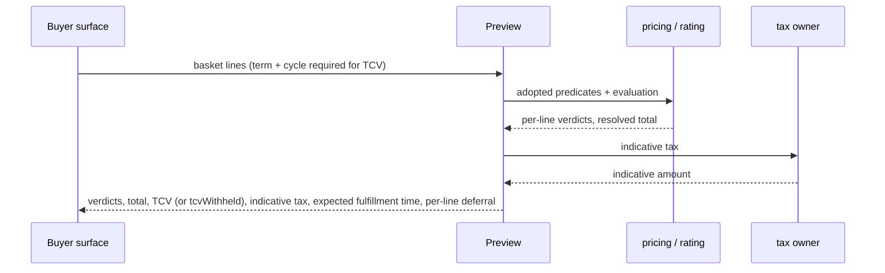

# Feature: Sellability Gate, Price Pin and Preview

- [ ] `p1` - **ID**: `cpt-cf-bss-orders-lifecycle-featstatus-gate-and-pin-implemented`

- [ ] `p1` - `cpt-cf-bss-orders-lifecycle-feature-gate-and-pin`

## Table of Contents

<!-- toc -->

- [1. Feature Context](#1-feature-context)
  - [1.1 Overview](#11-overview)
  - [1.2 Purpose](#12-purpose)
  - [1.3 Actors](#13-actors)
  - [1.4 References](#14-references)
- [2. Actor Flows (CDSL)](#2-actor-flows-cdsl)
  - [2.1 Submit a draft](#21-submit-a-draft)
  - [2.2 Preview a basket](#22-preview-a-basket)
  - [2.3 Re-check before first activation](#23-re-check-before-first-activation)
- [3. Processes / Business Logic (CDSL)](#3-processes--business-logic-cdsl)
  - [3.1 Assess all predicates and pin outcomes](#31-assess-all-predicates-and-pin-outcomes)
  - [3.2 Fix catalog scope and preserve commercial evidence](#32-fix-catalog-scope-and-preserve-commercial-evidence)
  - [3.3 Bound upstream resolution](#33-bound-upstream-resolution)
  - [3.4 Persist diagnostic identity and replay](#34-persist-diagnostic-identity-and-replay)
- [4. States (CDSL)](#4-states-cdsl)
  - [4.1 Admission and assessment outcomes](#41-admission-and-assessment-outcomes)
- [5. Definitions of Done](#5-definitions-of-done)
  - [5.1 Shared admission assessment](#51-shared-admission-assessment)
  - [5.2 Preview and durable explanations](#52-preview-and-durable-explanations)
  - [5.3 Activation re-check integration](#53-activation-re-check-integration)
- [6. Acceptance Criteria](#6-acceptance-criteria)
- [7. Detailed Behavior Contracts](#7-detailed-behavior-contracts)
  - [Gate and pin: Interactions and Sequences](#gate-and-pin-interactions-and-sequences)
  - [Gate and pin: The Orders delta (normative)](#gate-and-pin-the-orders-delta-normative)
  - [Gate and pin: Preview (normative)](#gate-and-pin-preview-normative)
  - [Gate and pin: Traceability](#gate-and-pin-traceability)

<!-- /toc -->

## 1. Feature Context

### 1.1 Overview

Assess a basket against the adopted Pricing predicates and Orders-specific checks, then atomically submit it with catalog pins and received totals. Reuse that assessment for amendment and Preview; define the activation re-check executed by Workflow.

### 1.2 Purpose

Ensure admission has complete, explainable evidence and a consistent fixed catalog version without moving price calculation, approval policy or subscription activation into Lifecycle.

**Requirements**: `cpt-cf-bss-orders-lifecycle-fr-order-submit`, `cpt-cf-bss-orders-lifecycle-fr-order-tenant-axes`, `cpt-cf-bss-orders-lifecycle-fr-order-atomic-fulfillment`, `cpt-cf-bss-orders-lifecycle-fr-orders-boundary-r4-no-price`, `cpt-cf-bss-orders-lifecycle-nfr-order-snapshot-integrity`, `cpt-cf-bss-orders-lifecycle-nfr-order-transition-latency`, `cpt-cf-bss-orders-lifecycle-interface-order-ops`.

**Principles**: `cpt-cf-bss-orders-lifecycle-principle-adopt-not-fork-gate`, `cpt-cf-bss-orders-lifecycle-principle-pin-is-the-commit`, `cpt-cf-bss-orders-lifecycle-principle-resolve-outside-decide-inside`, `cpt-cf-bss-orders-lifecycle-principle-preview-shares-implementation`.

### 1.3 Actors

| Actor | Role in Feature |
|-------|-----------------|
| `cpt-cf-bss-orders-lifecycle-actor-orders-partner-admin` | Submits or previews authorized buyer arrangements |
| `cpt-cf-bss-orders-lifecycle-actor-orders-direct-customer` | Submits or previews authorized self-service arrangements |
| `cpt-cf-bss-orders-lifecycle-actor-orders-seller-operator` | Seller role grants neither submit nor Preview; either action requires an independently complete Partner Admin or Direct Customer authorization path |
| `cpt-cf-bss-orders-lifecycle-actor-orders-catalog-pricing` | Supplies catalog predicate, frontier, price and pin facts through owning contracts |
| `cpt-cf-bss-orders-lifecycle-actor-orders-idp-ams` | Supplies tenant validity and payer commercial profile |
| `cpt-cf-bss-orders-lifecycle-actor-orders-contracts` | Supplies contract status and party eligibility |
| `cpt-cf-bss-orders-lifecycle-actor-orders-workflow` | Executes the pre-activation re-check and handles its outcomes |
| `cpt-cf-bss-orders-lifecycle-actor-orders-subscriptions` | Supplies occupancy and owns atomic active-state concurrency enforcement |

### 1.4 References

- **PRD**: [PRD.md](../PRD.md), §6.1, §9.1 and §12.
- **Architecture**: [DESIGN.md](../DESIGN.md), including [03 models](../DESIGN.md#contract-03-3-1), [03 interfaces](../DESIGN.md#contract-03-3-3), and [03 persistence](../DESIGN.md#contract-03-3-7). Complete behavior is in [§7](#7-detailed-behavior-contracts).
- **Decomposition**: [DECOMPOSITION.md](../DECOMPOSITION.md).
- **Dependencies**: [Foundation](01-foundation.md), `cpt-cf-bss-orders-lifecycle-feature-foundation`; [Capture](02-capture.md), `cpt-cf-bss-orders-lifecycle-feature-capture`.
- **Upstream blockers**: [UPSTREAM_REQS.md](../UPSTREAM_REQS.md) retains unexposed seller-scoped fixed-version Pricing predicates/pins and full bundle coverage, product-key lookup, Rating evaluation/TCV, payer profile, Contracts, indicative tax, Subscriptions occupancy and atomic activation enforcement. Missing contracts remain unevaluable/unavailable; no local substitute is authorized.
- **Open decisions**: [DECISIONS.md](../DECISIONS.md) retains latency/budget ratification, partner overlap-key dimension, pin staleness and quote coverage (Q-29). No hard pin-age bound or priced-offer capability is introduced here.

**UI applicability**: UI layout, keyboard navigation, screen-reader behavior and visual accessibility are not applicable because this feature specifies backend contracts, not a user interface. API usability, actionable errors and non-disclosing diagnostics remain applicable; consuming consoles own their UI requirements.

## 2. Actor Flows (CDSL)

**Use cases**: `cpt-cf-bss-orders-lifecycle-usecase-order-new-acquisition`, `cpt-cf-bss-orders-lifecycle-usecase-order-amendment`, `cpt-cf-bss-orders-lifecycle-usecase-order-fulfillment-complete`.

### 2.1 Submit a draft

- [ ] `p1` - **ID**: `cpt-cf-bss-orders-lifecycle-flow-gate-and-pin-submit`

**Actor**: An authorized order submitter.

**Success Scenarios**: All required inputs pass; submit commits version 2, pins, totals, dates, market, diagnostics, audit, claims, replay response and `OrderSubmitted` enqueue together.

**Error Scenarios**: Engine authorization/idempotency/state/revision refusal; empty basket; structural or date-basis refusal; failed/unevaluable assessment; authoritative overlap collision; persistence failure.

**Steps**:
1. Receive `POST /bss-orders-lifecycle/v1/orders/{orderId}/submit` with key and expected version/draft revision. Let the engine authorize current/proposed relationships and resolve replay before external guard work.
2. Snapshot the authorized authored basket under its lock with `prepared_draft_revision`; declare the non-empty guard and snapshot effective resource-tenant date policy. Prepare the exact proposed dates before dependent resolution.
3. Resolve identity once, including the payer profile, and derive market from the payer. Read the seller's pin-eligibility frontier once and fix the catalog tenant/version for the entire run.
4. Resolve each line's catalog product key at that version in one batched call; build the payer/product claim tuple from that result, never from line labels or guessed identifiers.
5. Resolve independent catalog predicates, referenced-contract facts, batched occupancy, evaluation and pin composition in parallel under §3.3. Pin composition depends on the frontier and runs even when another check fails. Skip only operations whose prerequisite input is missing.
6. Assess the adopted predicates and all nine Orders predicates (§3.1), retaining passed, failed and unevaluable results. Include each line's pin outcome. Keep the failure list separate and avoid duplicate reference/pin or date failures.
7. Pass the complete assessment and admission/refusal contribution to the engine. Locked state/version/client/prepared-revision and pre-gate structural checks retain precedence. Check the date defaults against the engine timestamp before accepting date-dependent evidence.
8. On refusal after assessment, atomically persist complete diagnostic rows, audit and owned idempotency response; write no commercial version, pin, total or event. Replace advisory overlap predicate 9 with any authoritative claim collision before settlement.
9. On admission, atomically materialize the version with exact pins, received totals, dates/policy, payer market and resolved overlap keys. Contribute automatic acceptance only when Preconditions' submit-request rule allows it: no proof reference and submitter tenant equals resource tenant; `sales_path` alone is insufficient.
10. Return the committed response and assessment identity. Same-key replay returns the immutable original response without another run, even if upstream inputs later change.

### 2.2 Preview a basket

- [ ] `p1` - **ID**: `cpt-cf-bss-orders-lifecycle-flow-gate-and-pin-preview`

**Actor**: PDP-authorized Partner Admin or Direct Customer; seller-only permission is insufficient.

**Success Scenarios**: Return complete gate results and received indicative commercial figures without creating or mutating an order; missing term/cycle withholds only TCV.

**Error Scenarios**: Denied assessment scope, rate limit, failed/unevaluable inputs or diagnostic persistence failure.

**Steps**:
1. Receive `POST /bss-orders-lifecycle/v1/orders/preview` with the basket. Enforce axis-specific authorization/delegation before resolving facts about foreign parties; seller choice is a permitted selling relationship, not representation of that seller.
2. Allocate a new run identity and stable run-local line IDs; invoke the same fixed-version seller-scoped assessment and date preparation as submit, including pin resolvability, without committing pins.
3. Invoke indicative tax only here through its owning port. Return per-line results, received pre-tax totals, indicative tax and expected fulfillment time/per-line deferral; return no approval-requirement verdict.
4. When any line lacks term duration or billing cycle, return success with `tcv` absent and `tcvWithheld: {reason: "preview-term-or-cycle-missing", lineIds: [...]}`. Preserve all other response fields; never assume a term.
5. Commit the complete authorized diagnostic vector before returning its assessment ID. Persist neither order nor Preview totals/TCV/tax. Each repeated Preview is a new run with seven-day diagnostic retention, not an idempotent quote or an offer with validity.

### 2.3 Re-check before first activation

- [ ] `p1` - **ID**: `cpt-cf-bss-orders-lifecycle-flow-gate-and-pin-activation-recheck`

**Actor**: Authenticated Workflow using the owning SDKs after begin-fulfillment commits.

**Success Scenarios**: `proceed` permits Workflow to request the spawn signal and begin dispatch, subject to downstream enforcement.

**Error Scenarios**: `reject` for actual market/occupancy conflict; `not-dispatchable` for hold/terminal/superseded version; `defer` for missing live inputs.

**Steps**:
1. Read the authorized current order/version and stored payer, market and overlap keys. If held, terminal or superseded, return `not-dispatchable` with observed state/version; stop dispatch and do not acknowledge failure just for that result.
2. Read the current payer profile. Unavailability returns `defer(identity-party-unavailable)`; an actual market difference returns per-line `reject(market-divergence)`.
3. Read occupancy in one batch using stored keys, never a new registry lookup. Missing count/limit returns `defer(overlap-presence-unevaluable)`.
4. For each key, compare active count plus this order's pending lines with the effective maximum. Exceeding it returns affected-line `reject(overlap-collision)`; otherwise return `proceed`.
5. Workflow handles `reject` by voiding wave-1 drafts and acknowledging failure with reasons and compensation evidence. It handles `not-dispatchable` by rereading/waiting/following supersession or ending terminal work. On `defer`, retry from step 1 under the design baseline of three attempts over at most 60 seconds; dispatch remains stopped. Exhaustion voids drafts and acknowledges failure with the unavailable-port reason.

This is a Workflow integration algorithm, not a Lifecycle endpoint or begin-fulfillment guard. A passing read is only an early-abort check: Subscriptions must enforce concurrent-active cardinality at its own active commit. A collision after active commit is a fulfillment failure requiring rollback evidence, not a fictitious rejected inactive line. That upstream enforcement remains open.

## 3. Processes / Business Logic (CDSL)

### 3.1 Assess all predicates and pin outcomes

- [ ] `p1` - **ID**: `cpt-cf-bss-orders-lifecycle-algo-gate-and-pin-assessment`

**Input**: Authorized basket, fixed seller catalog/version, date/policy basis and resolved port values.

**Output**: Complete ordered outcome vector and separate ordered failures.

Adopt the owning Pricing predicate set by reference. Normalize `satisfied` to `passed`, `failed` to `failed` with `catalog-predicate-failed`, and `not_evaluable` to `unevaluable` with `catalog-predicate-unevaluable`, preserving original predicate/component/key identity and `detail`/`owed_to`. Transport failure is an operation outcome, not a fabricated predicate answer. Missing/unknown required results or incomplete bundle coverage make the response unusable; never fork component evaluation locally.

| Orders predicate | Check and refusal behavior |
|------------------|----------------------------|
| 1. Axis validity | All three tenants resolve; `axis-invalid` or owning input unavailability |
| 2. Contract | Only if referenced: active and payer party-eligible through Contracts; `contract-not-active`, `contract-party-ineligible` or `contract-resolution-unavailable` |
| 3. Quantity | Price-row purchase floor and one-time bounds; `quantity-below-floor`; no plan maximum or add-on selection bounds |
| 4. Market | Line currency and resolved price-row region match payer market; `market-inconsistent`; missing price scope is unevaluable |
| 5. References | SKU/plan/price resolve without collision/duplication; `reference-unresolvable` / `reference-duplicated` |
| 6. Single currency | All lines share currency; reuse `currency-mixed` |
| 7. Subscription overlap | For each resolved key, `activeCount + proposed <= maxConcurrentActive`, preserving supported unbounded semantics; missing count/limit is `overlap-presence-unevaluable`, never default one; excess is `overlap-cardinality-exceeded` |
| 8. Required dates | Apply Capture's snapshot/cascade; reuse `date-cascade-invalid` |
| 9. In-flight order | No other order holds the key across submitted, pending approval, approved, fulfillment or hold; advisory `order-in-flight-for-key`, enforced by Foundation's transactional claim constraint |

Evaluate every independent predicate even after a failure; a single failure blocks the entire order. Pin composition is always part of a completed assessment. Invalid returned pin uses `pin-unresolvable`; unavailable composition uses its port reason. An unresolvable reference records an unevaluable pin result carrying the same reference reason without adding a second failure.

### 3.2 Fix catalog scope and preserve commercial evidence

- [ ] `p1` - **ID**: `cpt-cf-bss-orders-lifecycle-algo-gate-and-pin-fixed-catalog`

**Input**: Seller tenant, payer profile, basket and one frontier result.

**Output**: Version-consistent catalog facts/pins, received total and stable overlap keys.

1. Read the seller catalog explicitly. Until explicit-tenant SDK operations exist, caller-scoped frontier is usable only when caller tenant equals seller. PEP denial is the port's unavailable outcome with an operator diagnostic, never buyer-facing 403.
2. Distinguish a successful absent frontier (`catalog-frontier-absent`) from unavailable frontier. Fix one committed catalog version for predicates, product keys, evaluation and composition; a mid-run advance is ignored.
3. Distinguish an answered missing product key (`overlap-key-unresolvable`) from operation outage. Use the same resolved key for occupancy, predicates, persisted lines and claim tuples.
4. Store only the catalog-written pin segment: committed version, resolved price identifiers including cohort and evaluation-policy version. Exclude composed snapshot references, overlays, coupon, FX lock and commitment.
5. Persist evaluation's gross/net, explicit discount and promotion, separate recurring/usage/one-time/setup components and computed net pre-tax TCV verbatim. Lifecycle performs no money arithmetic. Usage is flagged/excluded; tax and subscription-context overlays, including brand, are excluded and disclosed on surfaces.
6. Re-pin and re-evaluate on amendment. No new refresh worker or pin validity window is introduced; existing state TTL gaps and Q-06/Q-17/Q-27 remain.

### 3.3 Bound upstream resolution

- [ ] `p1` - **ID**: `cpt-cf-bss-orders-lifecycle-algo-gate-and-pin-port-budgets`

**Input**: One assessment run's required port operations.

**Output**: Resolved values or explicitly attributed unavailable/unevaluable outcomes within operation budgets.

| Port | Deadline per run |
|------|------------------|
| Catalog predicates, seller frontier, pin composition, product key | 250 ms each |
| Identity/profile, contract, overlap occupancy | 250 ms each |
| Price evaluation | 500 ms |
| Indicative tax, Preview only | 250 ms |

Batch basket-dependent operations once per port per run, not once per line. Identity precedes market use; frontier precedes product keys and composition; product keys precede occupancy. Retry transient failures at most two attempts inside the deadline, never retry a deadline. Use the design baseline breaker (0.5 failure ratio/30 seconds, open 10 seconds), bulkhead (32 concurrent calls/port), and caller limits (submit 10/minute, Preview 60/minute) through shared platform facilities. Unavailable required shared breaker capability remains a prerequisite.

The conservative resolution ceilings are 2.25 seconds for submit and 2.5 seconds for Preview. These are external-resolution baselines, separate from commit latency and PRD durable-write-plus-publication latency; none proves an end-to-end subsecond submit. Keep unratified budgets and latency reconciliation open.

### 3.4 Persist diagnostic identity and replay

- [ ] `p1` - **ID**: `cpt-cf-bss-orders-lifecycle-algo-gate-and-pin-diagnostics`

**Input**: Completed authorized assessment, trusted caller/scope metadata and provisional run ID.

**Output**: Durable assessment identity/vector bound to the response, or infrastructure failure.

1. Retain every evaluated result, including passed outcomes, identified by run, line, predicate, component plan and canonical catalog scope key. Preserve distinct bundle components/keys without expanding order lines; reject duplicate identities or incomplete coverage.
2. Order by declared predicate order, then binary line ID, binary component ID and scope-key UTF-8 bytes, with NULL first. Persist trusted run metadata atomically with the complete vector.
3. For submit/amendment, use the engine transaction and bind `assessmentId=run_id` to its immutable settled response. Engine-only/state/version/date-basis refusals discard provisional stale results and carry no assessment ID.
4. Choose the first unavailable result as primary Problem if any is unevaluable; otherwise choose the first failed result, preserving the complete authorized report. Canonical reason/domain/code mapping remains Foundation's contract.
5. Preview commits a standalone diagnostic transaction; repeated calls create new runs. Operational lookup requires current diagnostic grants scoped by subject tenant; possession of an assessment ID is never authority. No public diagnostic endpoint is added.

## 4. States (CDSL)

### 4.1 Admission and assessment outcomes

- [ ] `p1` - **ID**: `cpt-cf-bss-orders-lifecycle-state-gate-and-pin-admission`

**Initial State**: `draft` for submit; Preview has no order state.

| From / context | Condition | Result |
|----------------|-----------|--------|
| `draft` | All engine, structural, assessment, date-basis and claim checks pass | `submitted`, appended version 2, atomic pins/totals/evidence/event |
| `draft` | Admission refused | Remain `draft`; no commercial admission; reached diagnostics settle as defined above |
| Amendment | Assessment passes | Versioning appends/re-pins and follows its declared transition; this feature adds no edge |
| Preview | Assessment completed | Diagnostic-only run, no order transition or pin persistence |

Each predicate outcome is exactly `passed`, `failed` or `unevaluable`. These are diagnostics, not new order states. Re-check outcomes `proceed`, `reject`, `not-dispatchable`, `defer` are Workflow control results, not persisted lifecycle states or admission guarantees.

## 5. Definitions of Done

### 5.1 Shared admission assessment

- [ ] `p1` - **ID**: `cpt-cf-bss-orders-lifecycle-dod-gate-and-pin-assessment`

The system **MUST** implement one authorized, seller-scoped, fixed-version assessment for submit, amendment and Preview, preserving tri-state diagnostics, every applicable predicate and independently evaluated pin outcomes under operation budgets.

**Implements**: `cpt-cf-bss-orders-lifecycle-flow-gate-and-pin-submit`, `cpt-cf-bss-orders-lifecycle-algo-gate-and-pin-assessment`, `cpt-cf-bss-orders-lifecycle-algo-gate-and-pin-fixed-catalog`, `cpt-cf-bss-orders-lifecycle-algo-gate-and-pin-port-budgets`.

**Constraints**: `cpt-cf-bss-orders-lifecycle-constraint-port-budgets`, `cpt-cf-bss-orders-lifecycle-constraint-partial-predicate-evaluability`, `cpt-cf-bss-orders-lifecycle-constraint-overlap-read-unagreed`, `cpt-cf-bss-orders-lifecycle-constraint-overlap-key-partner-collision`.

**Touches**: submit API; `cpt-cf-bss-orders-lifecycle-interface-gate-ports`; `cpt-cf-bss-orders-lifecycle-dbtable-order-line`, `cpt-cf-bss-orders-lifecycle-dbtable-order-version`, `cpt-cf-bss-orders-lifecycle-dbtable-resolved-total` through engine contributions.

### 5.2 Preview and durable explanations

- [ ] `p1` - **ID**: `cpt-cf-bss-orders-lifecycle-dod-gate-and-pin-preview-diagnostics`

The system **MUST** return authorized Preview fields with explicit exclusions and successful TCV withholding, persist only bounded diagnostic evidence for Preview, and bind every reached submit/amendment assessment to exact idempotent replay.

**Implements**: `cpt-cf-bss-orders-lifecycle-flow-gate-and-pin-preview`, `cpt-cf-bss-orders-lifecycle-algo-gate-and-pin-diagnostics`.

**Constraints**: `cpt-cf-bss-orders-lifecycle-constraint-total-excludes-subscription-overlays`.

**Touches**: Preview API; `cpt-cf-bss-orders-lifecycle-dbtable-gate-outcome`; engine idempotency response settlement; diagnostic retention and operational inspection.

### 5.3 Activation re-check integration

- [ ] `p1` - **ID**: `cpt-cf-bss-orders-lifecycle-dod-gate-and-pin-activation-recheck`

Workflow integration **MUST** execute the four-outcome re-check with the declared retry budget, preserve held/superseded semantics and report actual collisions through the appropriate compensation path. Release evidence must establish Subscriptions' own atomic enforcement; a passing Lifecycle read cannot satisfy that prerequisite.

**Implements**: `cpt-cf-bss-orders-lifecycle-flow-gate-and-pin-activation-recheck`.

**Constraints**: `cpt-cf-bss-orders-lifecycle-constraint-overlap-read-unagreed`.

**Touches**: Workflow integration, current authorized order read, owning identity/occupancy SDKs and Workflow-seam failure acknowledgement. No new Lifecycle endpoint.

The implementation MUST expose the [design §3.8](../DESIGN.md#contract-03-3-8) signals: per-port latency/timeouts/breaker state; refusals by predicate and origin; unevaluable and unresolvable-pin rates; incomplete occupancy answers; activation outcomes, retries and budget exhaustion; seller-catalog PEP denials; and Preview/submit budget utilization. Alerts cover breaker opening, the unevaluable threshold and any nonzero pin-unresolvable rate. Operational catalog-tenant diagnostics must not expose forbidden seller details to the buyer.

## 6. Acceptance Criteria

- [ ] A fully evaluable authorized basket admits one version with a resolvable pin per line and verbatim totals; a failed/unevaluable line prevents all commercial admission.
- [ ] Mixed failed/unevaluable predicates return all independent failures, persisted passed results and pin outcomes. An unresolvable reference creates no duplicate pin failure; primary Problem follows unavailable-first ordering.
- [ ] Frontier absence/outage, product-key absence/outage, composition timeout and incomplete bundle component/key coverage produce distinct declared diagnostics and no pin/version admission.
- [ ] Partner callers use seller catalog/version for every catalog-facing operation; denied catalog access yields unavailable diagnostics, never a buyer-facing 403. Frontier changes mid-run do not mix versions.
- [ ] A 200-line basket invokes each basket-dependent port once per run; validate deadline, bounded retry, breaker, bulkhead and caller-rate behavior through shared facilities.
- [ ] Concurrent draft change, stale UTC basis and in-transaction claim collision preserve engine precedence, exact refusal evidence and zero commercial effects. Same-key replay performs no upstream calls and returns the same assessment/vector.
- [ ] Missing occupancy count/limit refuses unevaluable without assuming one; concurrent distinct submits cannot acquire one claim. Partner key collisions remain the adopted rule until the upstream dimension decision changes it.
- [ ] Preview authorizes every represented axis before resolving facts; unauthorized callers see no out-of-scope party details. Missing term/cycle returns successful `tcvWithheld`; tax/TCV/total never persist on an order or diagnostic row.
- [ ] Preview exposes expected fulfillment time, per-line deferral and total exclusions, with no approval verdict or quote-validity claim. Repeated identical previews have distinct run IDs and seven-day diagnostic retention.
- [ ] Distinct bundle component/key results survive persistence and replay; duplicate identities/incomplete coverage are rejected. Cross-tenant diagnostic lookup is denied and storage failure returns no claimed durable assessment.
- [ ] Re-check covers all four outcomes, holds/supersession during backoff, unavailable-port exhaustion and collision before/after active commit. No activation dispatch occurs during `defer`; no check is presented as atomic subscription enforcement.
- [ ] Report unresolved SDK, occupancy/activation, authorization, quote and staleness prerequisites explicitly. Measure resolution/commit/publication separately; baseline deadlines do not establish full PRD latency compliance.

- [ ] Seller-role-only callers cannot submit or Preview; independently held buyer grants must satisfy one complete authorization path.

- [ ] Fault-injection integration scenarios verify the per-port/predicate signals, missing occupancy fields, activation retry exhaustion and all three alert classes; public refusal responses remain sanitized.

## 7. Detailed Behavior Contracts

**Contract namespace 03.** Section numbers inside the detailed contracts below resolve
through the [contract address index](../DECOMPOSITION.md#4-contract-address-index),
not the overview section numbers above.

The following sections retain the complete algorithms, guards, state transitions and
feature-local rules. The preceding flows and acceptance criteria summarize these contracts;
shared schemas and interfaces are defined in [DESIGN.md](../DESIGN.md).

<!-- contract:03-gate-and-pin:3.6 -->
### Gate and pin: Interactions and Sequences

#### Submit through the gate

**ID**: `cpt-cf-bss-orders-lifecycle-seq-gate-submit`

**Use cases**: `cpt-cf-bss-orders-lifecycle-usecase-order-new-acquisition`

**Actors**: `cpt-cf-bss-orders-lifecycle-actor-orders-partner-admin`, `cpt-cf-bss-orders-lifecycle-actor-orders-catalog-pricing`, `cpt-cf-bss-orders-lifecycle-actor-orders-idp-ams`, `cpt-cf-bss-orders-lifecycle-actor-orders-contracts`

**Algorithm: Run Gate and Submit**

Input: order_id, security_context, idempotency_key, expected_version, expected_draft_revision
Output: submitted order with pin and total, or a refusal listing every failure

1. [ ] - `p1` - Declare the at-least-one-line guard; after engine authorization/idempotency preparation, snapshot the authored basket with its server `prepared_draft_revision`, snapshot the resource tenant's effective `orders_date_policy` row (switches, scope, revision) and prepare all proposed dates under capture §4.2 before any date-dependent external call. Bind resolved results to this basket/date basis and carry both revisions into the engine; its locked revision check precedes using any result, including a gate refusal, and returns `version-conflict` for stale input - `inst-gs-declare-lines-guard`
2. [ ] - `p1` - Resolve the identity operation once under its deadline, including tenant-axis validity and the payer's commercial profile; derive the order market from that result before market-dependent calls. Party eligibility is not an identity answer: it belongs to the contract-resolution port alone - `inst-gs-derive-market`
3. [ ] - `p1` - Read the **seller's** catalog **pin-eligibility frontier** once under its operation deadline and fix the run's `catalog_version`. The frontier **MUST** be the seller's catalog frontier (`seller_tenant_id`), read through an operation that takes the catalog-owner tenant explicitly (D-122); every catalog-facing resolution below — product key, predicates, evaluation and pin — **MUST** use that one version of that one catalog. `None` contributes `catalog-frontier-absent`; outage/deadline contributes `catalog-frontier-unavailable`. A PEP denial maps to `catalog-frontier-unavailable` with an operator diagnostic and is never surfaced to the buyer as 403. Skip dependent operations without a frontier, still evaluate independent inputs and route every refusal through the engine - `inst-gs-fix-catalog-version`
4. [ ] - `p1` - Resolve each line's **`catalogSubscriptionProductKey`** from the catalog registry **at the `catalog_version` fixed in step 3**, in the seller's catalog, in one call batched for the whole basket under its own §2.2 deadline, and build each line's overlap key `(payer_tenant_id, catalogSubscriptionProductKey)` from it: the resolved product key is the line's `overlap_scope_key` and the payer is the claim tuple's `payer_tenant_id` ([01-foundation — Database Schemas and Tables](../DESIGN.md#contract-01-3-7)). Every later use of an overlap key — the overlap-occupancy read, predicates 7 and 9 and the claim set of step 15 — consumes this resolved key; none derives its own. A line the registry answers with no key contributes `overlap-key-unresolvable`; outage/deadline contributes `catalog-product-key-unavailable`; without a frontier the operation is skipped as a dependent one. Skip only the overlap-dependent inputs of an unkeyed line, still evaluate independent inputs and route every refusal through the engine - `inst-gs-resolve-overlap-key`
5. [ ] - `p1` - **PARALLEL** resolve the independent port inputs, each **batched into one call per port** for the whole basket and each catalog-facing one scoped to the seller's catalog at the fixed version: - `inst-gs-parallel-resolve`
   - [ ] - `p1` - adopted catalog predicates over every line's scope key, at the fixed version, returning for each line the market scope (currency and region) of its resolved price row - `inst-gs-resolve-catalog`
   - [ ] - `p1` - reuse step 2's tenant-axis validity and payer-profile result without a second identity call - `inst-gs-resolve-identity`
   - [ ] - `p1` - contract status and party eligibility, only where a contract reference is present - `inst-gs-resolve-contract`
   - [ ] - `p1` - overlap occupancy `(activeCount, maxConcurrentActive, provenance)` for each distinct `(payer_tenant_id, overlap_scope_key)` **as resolved in step 4**, in one batched call, skipped for a line without one; an answer missing `activeCount` or `maxConcurrentActive` is `overlap-presence-unevaluable` (D-126) - `inst-gs-resolve-overlap`
   - [ ] - `p1` - the resolved total from the evaluation contract, **at the fixed version** - `inst-gs-resolve-total`
   - [ ] - `p1` - the catalog price pin for each line, composed **at the version fixed in step 3** under its §2.2 deadline, and its resolvability; composition depends only on the fixed frontier, so it runs whatever the other inputs answer (D-123) - `inst-gs-compose-pin`
6. [ ] - `p1` - Retain step 1's policy snapshot, resolved cascade and proposed UTC date basis for engine validation under [02-capture — The date cascade (normative)](02-capture.md#contract-02-4-2); every date-dependent predicate/evaluation uses those same proposed dates - `inst-gs-resolve-cascade`
7. [ ] - `p1` - Initialize the complete per-predicate outcome vector and a separate empty failure list - `inst-gs-init-failures`
8. [ ] - `p1` - **FOR EACH** adopted predicate result: normalize its tri-state outcome under §4.1 and record every passed/failed/unevaluable result in the outcome vector and collect failures separately, preserving upstream detail - `inst-gs-collect-adopted`
9. [ ] - `p1` - **FOR EACH** of the nine delta predicates: evaluate, record its outcome including passed, and add any failure to the separate failure list; predicates 7 and 9 evaluate over step 4's resolved overlap keys - `inst-gs-collect-delta`
10. [ ] - `p1` - **FOR EACH** line: record its pin-composition outcome in the vector. An unavailable or deadline-exhausted composition contributes `catalog-pin-composition-unavailable`; an invalid returned pin contributes `pin-unresolvable`. Where the line's reference is unresolvable (predicate 5), record the pin outcome as `unevaluable` carrying that same `reference-unresolvable` reason and add **no second failure**; without a frontier it is `unevaluable` with the frontier's reason - `inst-gs-collect-pin`
11. [ ] - `p1` - **IF** any other port was unresolvable: add its unevaluable reason (absence is a refusal); pin composition's was recorded at step 10 and is not added twice - `inst-gs-collect-unevaluable`
12. [ ] - `p1` - Predicate 8's `date-cascade-invalid` failure was recorded by step 9 and is not added again - `inst-gs-collect-cascade-invalid`
13. [ ] - `p1` - **IF** the failure list is non-empty: - `inst-gs-if-failures`
    1. [ ] - `p1` - Pass the complete outcome vector and failure set as the contribution so the engine persists the gate outcome, audits the refusal and settles the idempotency record in one transaction - `inst-gs-contribute-refusal-outcome`
    2. [ ] - `p1` - **RETURN** the engine's settled response, including every gate failure when gate guards were reached; engine authorization/admissibility/version checks retain precedence - `inst-gs-return-all-failures`
14. [ ] - `p1` - Assemble the resolved total rows and the TCV figure per §4.4 - `inst-gs-assemble-total`
15. [ ] - `p1` - Request the submit transition with both draft revisions, pin, total, market, proposed dates/date basis and policy snapshot, gate outcome, each line's resolved `overlap_scope_key` from step 4 (persisted on `orders_order_line`), the complete resolved `(payer_tenant_id, overlap_scope_key)` claim set built from it and the **submitting principal as the initiating actor**. Before accepting date-dependent results, the engine checks defaults against the UTC date of its single pre-write transition timestamp `t`; a changed date basis refuses with `date-cascade-invalid`. On admission it persists the validated dates and snapshot atomically with the version. The transition carries `05`'s automatic acceptance contribution only where [05-preconditions — Acceptance on the two paths (normative)](05-preconditions.md#contract-05-4-2)'s submit-request rule holds — the allowed submit carried no delegation proof reference and the submitting principal's subject tenant equals the order's `resourceTenantId` (D-146) — never on `orders_order.sales_path` alone; otherwise it carries none - `inst-gs-request-transition`
16. [ ] - `p1` - **RETURN** the submitted order - `inst-gs-return-submitted`

**Description**: Steps 7 through 13 are the all-failures contract, and pin composition is one of
its checks rather than a step reached only on success. Every input is resolved before
*Run Gate and Submit* step 15, so the transaction that commits `submitted` performs no network call and the pin lands
in the same commit as the state.

Verification includes frontier `None`, frontier outage, a line with no registry product key,
product-key operation outage, composition timeout after passing
predicates, a failing predicate whose run still persists every line's pin outcome, an unresolvable
reference yielding one failure and an `unevaluable` pin outcome rather than two failures, a
frontier read for a caller tenant that is not the seller (the seller's catalog is read, and a PEP
denial refuses `catalog-frontier-unavailable`, never 403), mixed failed/unevaluable Pricing answers, and concurrent draft mutation during
resolution. Each refuses through the engine with the specified reason and no admitted pin or
version; a settled idempotent replay performs no upstream calls. Date-policy verification starts
from an authored draft with no versioned line row, changes configuration after the snapshot,
and checks that the admitted dates and stored policy use the same snapshot. A run crossing UTC
midnight with defaulted dates must refuse before consuming the old date-dependent results;
a fresh attempt must re-resolve them for the new day.

#### Preview a basket

**ID**: `cpt-cf-bss-orders-lifecycle-seq-gate-preview`

**Use cases**: `cpt-cf-bss-orders-lifecycle-usecase-order-new-acquisition`

**Actors**: `cpt-cf-bss-orders-lifecycle-actor-orders-partner-admin`, `cpt-cf-bss-orders-lifecycle-actor-orders-direct-customer`

**Description**: No order is created and no order is mutated; the indicative tax figure is never stored. The gate outcomes are persisted under their own bounded retention. Preview returns no
approval-requirement verdict — that belongs to the policy owner and is obtained by the sibling
gear — and it withholds TCV entirely when a line omits term or cycle, rather than reporting a
figure computed from an assumed term. Withholding is a **successful** response, not a refusal:
`tcv` is absent and `tcvWithheld: {reason: "preview-term-or-cycle-missing", lineIds: […]}` names
the lines that caused it, while every other field is returned (§4.6, D-125).

#### Re-check before first activation

**ID**: `cpt-cf-bss-orders-lifecycle-seq-gate-fulfillment-recheck`

**Use cases**: `cpt-cf-bss-orders-lifecycle-usecase-order-fulfillment-complete`

**Actors**: `cpt-cf-bss-orders-lifecycle-actor-orders-workflow`, `cpt-cf-bss-orders-lifecycle-actor-orders-subscriptions`

**Algorithm: Re-check Activation Preconditions**

Integration algorithm executed by Workflow after begin-fulfillment commits, through the same
owning upstream SDKs as submit. It is not a Lifecycle endpoint or a begin-fulfillment guard.
Missing upstream SDK operations remain release gates; do not import gear internals.

Input: order_id, current_version, authenticated Workflow SecurityContext
Output: exactly one of `proceed` | `reject` (per-line reasons) | `not-dispatchable` (state or version) | `defer` (port reason) — [`../DECISIONS.md`](../DECISIONS.md) D-127

1. [ ] - `p1` - Read the PDP-authorized current order and its current version through the composed read of [08-read-and-authz — What a read exposes (normative)](../DESIGN.md#contract-08-4-2), which carries the fulfillment inputs steps 5 and 6 use — each line's stored `overlap_scope_key`, the version's `market_currency`, `market_region` and `payer_tenant_id` ([`../DECISIONS.md`](../DECISIONS.md) D-144) - `inst-rc-read-order`
2. [ ] - `p1` - **IF** the order is `on_hold`, is terminal, or its current version differs from `current_version` (superseded): - `inst-rc-if-not-dispatchable`
   1. [ ] - `p1` - **RETURN** `not-dispatchable` carrying the observed state or current version - `inst-rc-return-not-dispatchable`
3. [ ] - `p1` - Re-derive the order market from the payer's **current** commercial profile through the identity port under its §2.2 deadline - `inst-rc-rederive-market`
4. [ ] - `p1` - **IF** the identity port is unavailable or its deadline elapsed: - `inst-rc-if-identity-unavailable`
   1. [ ] - `p1` - **RETURN** `defer` carrying `identity-party-unavailable`; never fabricate a divergence - `inst-rc-return-defer-identity`
5. [ ] - `p1` - **IF** it diverges from the market frozen at submit: - `inst-rc-if-market-diverged`
   1. [ ] - `p1` - **RETURN** `reject` with market-divergence for the affected lines - `inst-rc-return-market-divergence`
6. [ ] - `p1` - Re-read overlap **occupancy** `(activeCount, maxConcurrentActive, provenance)` in one batched call for each line's overlap key **as stored on `orders_order_line.overlap_scope_key`** with the order's payer at submit/amendment; do not re-resolve the product key from the registry, so the re-check tests the same key the claim holds - `inst-rc-reread-overlap`
7. [ ] - `p1` - **IF** the occupancy port is unavailable, its deadline elapsed, or an answer lacks `activeCount` or `maxConcurrentActive`: - `inst-rc-if-occupancy-unavailable`
   1. [ ] - `p1` - **RETURN** `defer` carrying `overlap-presence-unevaluable`; never default the limit to one and never fabricate a collision - `inst-rc-return-defer-occupancy`
8. [ ] - `p1` - **IF** for any key `activeCount + pending > maxConcurrentActive`, where `pending` is the number of this order's lines carrying the key that are not yet activated (all of them, before the first activation): - `inst-rc-if-overlap-collision`
   1. [ ] - `p1` - **RETURN** `reject` with overlap-collision for the affected lines - `inst-rc-return-overlap-collision`
9. [ ] - `p1` - **RETURN** `proceed`, which is an **early-abort pass and not an admission guarantee**: the caller **MUST NOT** treat it as one, and **MUST** be able to handle an `overlap-collision` raised later by Subscriptions on the failure-acknowledgement path of [06-workflow-seam — Acknowledgement (normative)](06-workflow-seam.md#contract-06-4-4) - `inst-rc-return-proceed`

**What Workflow does with each outcome** (normative; the transitions are those of
[06-workflow-seam — Begin fulfillment and the spawn signal (normative)](06-workflow-seam.md#contract-06-4-3) and §4.4):

| Outcome | Workflow's next action | Transition driven |
|---------|------------------------|-------------------|
| `proceed` | Request `report-spawn-signal`, then dispatch the activation wave | `spawn-signal` ([01 §4.3](01-foundation.md#contract-01-4-3) row 12) |
| `reject` | Stop dispatch, void the wave-1 drafts, and acknowledge failure carrying each line's reason with compensation evidence recording the voided drafts | `acknowledge-failed` (row 14) |
| `not-dispatchable` | Stop dispatch and **do not** call acknowledge; re-read the order. `on_hold`: wait for resume (row 22), then re-run the re-check from step 1 against the resumed version. Superseded: abandon this version's attempt and follow the amendment seam for the current version. Terminal: end the attempt — the transition that made it terminal carried its own compensation evidence | none |
| `defer` | Retry the re-check from step 1 with bounded exponential backoff under **`activation-recheck-retry-budget`**; no spawn signal and no dispatch meanwhile. A retry that returns any other outcome is handled by its row. Once the budget is exhausted, void the wave-1 drafts and acknowledge failure carrying the port's unevaluable reason (`identity-party-unavailable` or `overlap-presence-unevaluable`) | none while retrying; `acknowledge-failed` (row 14) on exhaustion |

**`activation-recheck-retry-budget`** is a named deployment value owned by this slice and executed
by Workflow: the maximum number of re-check attempts and the wall-clock bound across them,
**baseline 3 attempts over ≤ 60 s**. Neither this set nor `UPSTREAM_REQS.md §2.6` defines an
existing Workflow retry budget to reuse. Because every retry restarts at step 1, a hold or a
supersession during backoff surfaces as `not-dispatchable` rather than being overtaken by the
exhaustion path. Rejected alternative: aborting on the first port unavailability — it turns a
transient upstream blip after a successful submit into a failed order (D-127).

**Description**: Both predicates read state owned elsewhere that can move between submit and
activation, which is why passing the gate is necessary but not sufficient. The sibling gear
invokes this immediately before dispatching the first activation intent and treats either
rejection as a pre-activation abort rather than a line-execution failure.

**Why this algorithm cannot be made atomic here, and what bounds it instead.** Step 6 is a read and
the activation it guards is a later call into another gear, so the check and the action it guards
are separated by construction — two waves passing step 6 concurrently can both proceed and together
exceed `maxConcurrentActive`. The re-check therefore **MUST NOT** be implemented or relied on as
the enforcement point. What closes each axis, and what merely bounds it, is stated normatively in
`§2.2` *The activation re-check is a bounding device, not the enforcement point*: the **order** axis
is closed in-transaction by [01 §3.7](../DESIGN.md#contract-01-3-7)'s claim index; the **subscription** axis **MUST** be closed by
Subscriptions inside the transaction that commits `active`; and until it is, **this design does not
bound the gap** — §2.2 states why no timed validity window is asserted, and what a closable
server-side form would need. What remains normative here is that a collision surfaces as
`overlap-collision` through failure acknowledgement rather than as an over-provision nobody
refused.

<!-- /contract -->

<!-- contract:03-gate-and-pin:4.2 -->
### Gate and pin: The Orders delta (normative)

Nine predicates are this gear's own. Each **MUST** carry its own machine-readable reason:

1. **Axis validity** — all three tenant axes resolve against IdP/Account Management.
2. **Contract active** — where a contract reference is present it resolves to an **active** contract (`contract-not-active`) under which the payer is party-eligible (`contract-party-ineligible`). Party-eligibility policy is owned by Contracts and consulted only when a contract is referenced, through the contract-resolution port alone — never the identity port; its unevaluability there is a refusal (`contract-resolution-unavailable`). This is a predicate of its own because it carries its own registered reason, and folding it into axis validity was what made the predicate count and the reason count disagree.
3. **Purchase-quantity floor** — `qty` satisfies the floor the price row declares, and the declared bounds on one-time plans. There is **no plan-level maximum**: upper bounds are resource quotas enforced at fulfillment, not here.
4. **Order-market consistency** — each line's currency and region are consistent with the market derived from the **payer's** profile, which in the partner path is not the calling tenant's. No line stores a region: a line's region is the **market scope of its resolved price row at the fixed catalog version**, returned by the reference-resolution/predicate port (`§3.6` *Run Gate and Submit* step 5), and the gate compares it with the version's `market_region`; a line's currency is compared with `market_currency` the same way. A missing market scope in the port's answer makes the predicate `unevaluable` with `catalog-predicates-unavailable` ([`../DECISIONS.md`](../DECISIONS.md) D-124).
5. **Reference resolution** — every `skuId`, `planId` and `priceId` resolves, with no collision or duplication across lines.
6. **Single currency** — all lines share one currency. Authoring already refuses a mixed basket; this predicate is the backstop for a basket assembled before the rule existed.
7. **Overlap uniqueness** — projected activation does not violate the configured concurrent-active cardinality per `overlapScopeKey`, evaluated **within the basket** and **against existing subscriptions**.

   The input is the **occupancy read** of `§3.3` (`SUB-O5`, amended): per
   `(payer_tenant_id, overlap_scope_key)` the batched owning Subscriptions contract returns
   `(activeCount, maxConcurrentActive, provenance)`, the limit resolved using its Catalog/Contract
   policy. For each key, with `proposed` the number of basket lines carrying it, the predicate
   passes iff `activeCount + proposed ≤ maxConcurrentActive`, preserving declared unbounded
   semantics if supported. A boolean presence read is insufficient, which is why the port is not
   one (D-126). A missing `activeCount` or `maxConcurrentActive` refuses
   `overlap-presence-unevaluable` — the name is kept for stability — and never silently defaults
   the limit to one. The owning
   activation commit still enforces concurrency; this read is not a reservation.
8. **Required line dates resolvable** — evaluate authored values and the run's snapshot of the resource tenant's effective `orders_date_policy` row, never a future version row. A policy-required service-activation or acceptance-due date must be authored — a cascade default never satisfies the requirement (capture §4.2, D-60); every other field resolves to its authored value or its default, including proposed transition-date defaults prepared before dependent external calls under capture §4.2. The engine checks that those defaults equal the UTC date of its pre-write transition timestamp `t`, then stores the validated dates and identical snapshot with the admitted version. An invalid cascade or stale date basis refuses with `date-cascade-invalid`; an amendment takes a new policy snapshot while retaining carried-forward date values unless its delta changes them.
9. **One in-flight order per overlap key** — **no other order** in the in-flight set holds the same key. The exclusion of the requesting order itself is load-bearing: an amendment is issued by an order that is *already* in-flight and already holds its key, so a predicate counting all holders without excluding the subject refuses every amendment against itself. Predicate 7 bounds concurrent **subscriptions** and is configurable via `maxConcurrentActive`; this one bounds concurrent **orders** and PRD §6.1(g) fixes it at one with no configurability clause. The two are deliberately separate rules and **MUST NOT** be given a shared cardinality (D-83). **The in-flight set is `submitted`, `pending_approval`, `approved`, `in_fulfillment` and `on_hold`** — `on_hold` is included because a held order resumes onto its pre-hold state and still holds its key, so excluding it would admit a second order that collides at the activation re-check, the expensive path §2.2 refuses to defer failures into. The partial unique index in [01-foundation — Database Schemas and Tables](../DESIGN.md#contract-01-3-7) covers exactly those five states. Idempotency keys protect against a repeated call; this protects against **more distinct orders on one key than the key permits**. The key resolved at `§3.6` *Run Gate and Submit* step 4 is **persisted** on the line and the rule is enforced by an `orders_inflight_overlap_claim`
**partial unique index over `(payer_tenant_id, overlap_scope_key)` inside the transition
transaction**; this predicate is the friendly pre-check,
not the enforcement, because a predicate resolved outside the transaction would let two concurrent
identical submits both pass. The transaction creates claims on submit or amendment and releases
them only on a terminal transition ([`../DECISIONS.md`](../DECISIONS.md) D-26).

**All failures are reported together.** The gate **MUST** evaluate every predicate it can and
return every failure in one response, rather than short-circuiting on the first. The rejected
alternative was short-circuit evaluation; it was rejected because a five-line basket with three
independent problems would otherwise require three round trips to discover, and because the
predicates are resolved in parallel anyway, so the marginal cost of completing evaluation is
near zero. A single failure still refuses the whole order — reporting is exhaustive, admission
is not partial.

<!-- /contract -->

<!-- contract:03-gate-and-pin:4.6 -->
### Gate and pin: Preview (normative)

Preview **MUST** create no order and mutate no order. It **does** persist its per-predicate gate
outcomes to `orders_gate_outcome` with a **7-day retention** and a rate limit, because "why was
this basket refused last Tuesday" is a support question worth answering and an unbounded
write path open to every PDP-authorized buyer is not ([`../DECISIONS.md`](../DECISIONS.md) D-52). It **MUST** return
per-line gate results, the
resolved total including the named TCV figure, an **indicative** tax amount per line and in
total sourced from the tax owner, and — when line service-activation dates differ — expected
fulfillment time plus a per-line deferral where a quoted date is earlier.

**Preview uses the same axis-specific authorization as purchase.** Acting for a foreign
`payerTenantId` or `resourceTenantId` requires PDP-validated authority/delegation for that axis
before upstream facts are resolved. `sellerTenantId` selects the permitted seller/catalog
relationship; selecting a different seller does not mean representing that seller. Preview
reads that seller's catalog frontier and catalog data exactly as submit does, through operations
naming the catalog tenant explicitly; a PEP denial on those reads is `catalog-frontier-unavailable`
(or the port's own unavailable reason) with an operator diagnostic, never a 403 to the buyer
([`../DECISIONS.md`](../DECISIONS.md) D-122). A direct
customer T may preview `resource=T, payer=T, seller=S` when that selling relationship is
authorized, without S delegating its identity to T. `resource=T, payer=U, seller=S` requires
authority to act for U and refuses without it. A seller-only role grants no Preview permission;
any independent buyer permission must satisfy the same complete authorization path in
[08-read-and-authz — The permission model (normative)](../DESIGN.md#contract-08-4-3).

Four prohibitions are absolute. The indicative tax **MUST NOT** be stored on any order. Preview
**MUST NOT** return an approval-requirement verdict. Preview **MUST NOT** return a TCV figure
when a basket line omits term duration or billing cycle — the figure is undefined without them,
and returning one computed from an assumed term would be a worse answer than none. Withholding it
is **not a refusal**: the response is successful, carries every other field, omits `tcv`, and
carries `tcvWithheld: {reason: "preview-term-or-cycle-missing", lineIds: […]}` listing every line
that omits either input. The name is a response annotation registered in
[01-foundation — GTS types for the cross-gear contract surface (normative)](../DESIGN.md#contract-01-4-7)'s non-refusal list, never an error variant
([`../DECISIONS.md`](../DECISIONS.md) D-125). And Preview
**MUST NOT** return, in a gate result, reason detail or total, any fact about a party or
relationship outside the caller's PDP-authorized assessment scope.

**Preview is not a quote, and this gear has no quote.** The distinction is worth stating plainly,
because PRD §1.1 says the order "does double duty as **quote and order**" with "validity/expiry
[as] the per-state TTL", and no state in this design delivers what a quote is commercially — a
**priced, non-binding, time-bounded offer**. Three facts make that so, and each is a rule stated
elsewhere in this set rather than an oversight here:

* A `draft` carries **no price**. It "resolves no catalog reference, captures no pin, computes no total" ([02-capture — Component Model](../DESIGN.md#contract-02-3-2)), so the pre-commitment state is unpriced.
* Submit is where the price appears — and on the self-service path **submit *is* the commitment** ([05-preconditions — Acceptance on the two paths (normative)](05-preconditions.md#contract-05-4-2)), so the priced state is not an offer.
* Preview prices a basket but **persists only its per-predicate verdicts** to `orders_gate_outcome` (§3.7). The resolved total, the TCV and the indicative tax are returned and **not stored**, so the number Preview quoted is not recoverable afterwards, is bound for no period, and no order references it.

The consequence is operational rather than theoretical: a partner-led sale that needs "here is your
price, valid for thirty days" must hold that figure **outside** this system of record, with its
validity unenforced — which is the outcome PRD §1.1 gives as the reason a separate quote artifact
is unnecessary. This slice **MUST NOT** close the gap locally by storing Preview's total and
calling it an offer: an offer needs a validity rule, an expiry actor, a re-price rule on expiry and
a binding-on-acceptance rule, none of which any document in this set carries. The reconciliation —
amend §1.1 to stop claiming quote coverage, or specify a priced offer artifact with a validity
bound — is routed as [`../DECISIONS.md`](../DECISIONS.md) **Q-29**.

<!-- /contract -->

<!-- contract:03-gate-and-pin:5 -->
### Gate and pin: Traceability

- **PRD**: [`../PRD.md`](../PRD.md) — §6.1 submit gate and pin, §9.1 Preview
- **Gear design**: [`../DESIGN.md`](../DESIGN.md) — realises `cpt-cf-bss-orders-lifecycle-component-gate-and-pin`
- **Engine**: [`01-foundation`](../DESIGN.md#contract-01-1-1) — transition contract, reason registry, resolved-total schema
- **Producers**: [`02-capture`](../DESIGN.md#contract-02-1-1) authors the lines and the policy-switch state this gate reads
- **Consumers**: [`04-versioning`](../DESIGN.md#contract-04-1-1) re-runs this gate on amendment; [`05-preconditions`](../DESIGN.md#contract-05-1-1) contributes the self-service acceptance instant to the submit transition this slice owns; [`06-workflow-seam`](../DESIGN.md#contract-06-1-1) consumes the activation re-check outcome (specified by 03, executed by Workflow)
- **Upstream asks**: `SUB-O5` overlap occupancy (amended from presence, D-126); `cpt-cf-bss-orders-lifecycle-upreq-catalog-subscription-product-key` (the registry's `catalogSubscriptionProductKey`, `SUB-G1` / PR #4177); `cpt-cf-bss-orders-lifecycle-upreq-pricing-catalog-tenant-reads` (seller-scoped frontier and catalog reads, each line's price-row market scope); `cpt-cf-bss-orders-lifecycle-upreq-rating-evaluation`; `cpt-cf-bss-orders-lifecycle-upreq-payer-commercial-profile`; `cpt-cf-bss-orders-lifecycle-upreq-contract-party-eligibility`; `cpt-cf-bss-orders-lifecycle-upreq-contract-acceptance-declaration` (the port's `acceptance_required` output, read by `05`, D-132); the overlap **dimension** binding for the partner path
- **ADRs**: [`ADR/0001`](../ADR/0001-cpt-cf-bss-orders-lifecycle-adr-transition-through-engine.md) transition through the engine; [`ADR/0002`](../ADR/0002-cpt-cf-bss-orders-lifecycle-adr-slice-decomposition.md) the foundation-plus-seven-slices decomposition; [`ADR/0003`](../ADR/0003-cpt-cf-bss-orders-lifecycle-adr-fail-closed-gate.md) fail closed on an unevaluable gate input; [`ADR/0007`](../ADR/0007-cpt-cf-bss-orders-lifecycle-adr-in-transaction-concurrency.md) concurrency enforced by the in-transaction overlap constraint behind predicate 9

<!-- /contract -->
