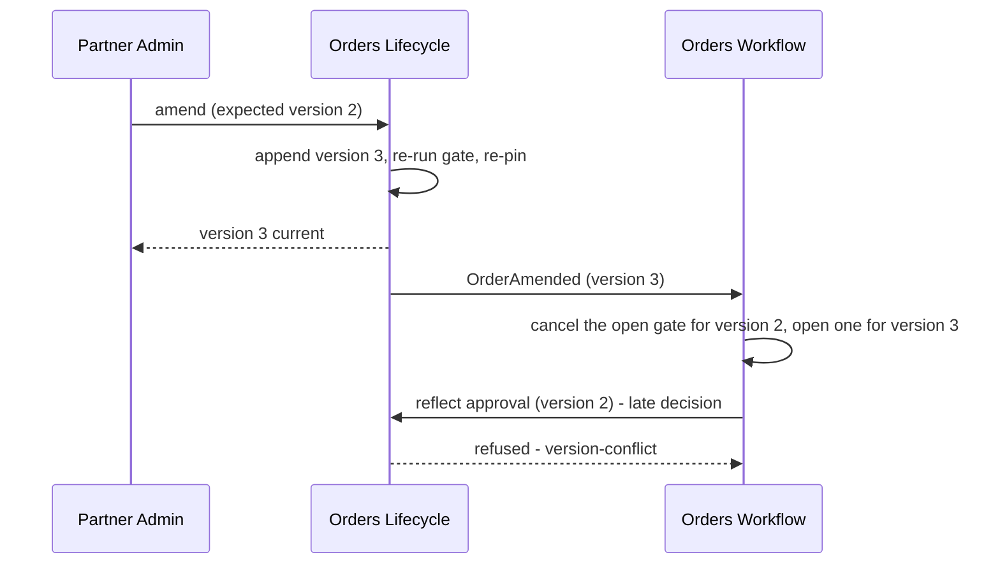

# Feature: Amendment and Version History

- [ ] `p1` - **ID**: `cpt-cf-bss-orders-lifecycle-featstatus-versioning-implemented`
- [ ] `p1` - `cpt-cf-bss-orders-lifecycle-feature-versioning`

## Table of Contents

<!-- toc -->

- [1. Feature Context](#1-feature-context)
  - [1.1 Overview](#11-overview)
  - [1.2 Purpose](#12-purpose)
  - [1.3 Actors](#13-actors)
  - [1.4 References](#14-references)
- [2. Actor Flows](#2-actor-flows)
  - [2.1 Amend a committed order](#21-amend-a-committed-order)
  - [2.2 Correct administrative content and inspect history](#22-correct-administrative-content-and-inspect-history)
- [3. Processes / Business Logic](#3-processes--business-logic)
  - [3.1 Prepare and append an amendment](#31-prepare-and-append-an-amendment)
  - [3.2 Apply an administrative edit](#32-apply-an-administrative-edit)
  - [3.3 Preserve and retrieve the version chain](#33-preserve-and-retrieve-the-version-chain)
- [4. States](#4-states)
  - [4.1 Amendment and supersession](#41-amendment-and-supersession)
- [5. Definitions of Done](#5-definitions-of-done)
  - [5.1 Atomic amendment implementation](#51-atomic-amendment-implementation)
  - [5.2 Administrative and history implementation](#52-administrative-and-history-implementation)
- [6. Acceptance Criteria](#6-acceptance-criteria)
- [7. Detailed Behavior Contracts](#7-detailed-behavior-contracts)
  - [Versioning: Interactions and Sequences](#versioning-interactions-and-sequences)
  - [Versioning: Admissibility (normative)](#versioning-admissibility-normative)
  - [Versioning: Carry forward and re-resolve (normative)](#versioning-carry-forward-and-re-resolve-normative)
  - [Versioning: Re-approval is a two-step seam interaction (normative)](#versioning-re-approval-is-a-two-step-seam-interaction-normative)
  - [Versioning: Stale results (normative)](#versioning-stale-results-normative)
  - [Versioning: Version history (normative)](#versioning-version-history-normative)
  - [Versioning: Administrative edits are last-write-wins (normative)](#versioning-administrative-edits-are-last-write-wins-normative)
  - [Versioning: Traceability](#versioning-traceability)

<!-- /toc -->

## 1. Feature Context

### 1.1 Overview

Append a new immutable commercial version when an order is amended, re-run the full gate and re-pin every line. Preserve historical content and keep administrative corrections as separately audited edits that do not invalidate the commercial version.

### 1.2 Purpose

**Requirements**: `cpt-cf-bss-orders-lifecycle-fr-order-amendment`, `cpt-cf-bss-orders-lifecycle-fr-order-history`, `cpt-cf-bss-orders-lifecycle-fr-order-tenant-axes`, `cpt-cf-bss-orders-lifecycle-fr-order-idempotency`, `cpt-cf-bss-orders-lifecycle-nfr-order-audit-completeness`, `cpt-cf-bss-orders-lifecycle-nfr-order-retention`, `cpt-cf-bss-orders-lifecycle-nfr-order-snapshot-integrity`, `cpt-cf-bss-orders-lifecycle-nfr-order-read-latency`.

**Principles**: `cpt-cf-bss-orders-lifecycle-principle-version-is-concurrency`, `cpt-cf-bss-orders-lifecycle-principle-amend-by-append`, `cpt-cf-bss-orders-lifecycle-principle-carry-forward-reresolve`, `cpt-cf-bss-orders-lifecycle-principle-amendment-not-state-first`.

### 1.3 Actors

| Actor | Role |
|-------|------|
| `cpt-cf-bss-orders-lifecycle-actor-orders-partner-admin` | Amend authorized orders and inspect their commercial history. |
| `cpt-cf-bss-orders-lifecycle-actor-orders-seller-operator` | Inspect history under seller scope; seller permissions do not grant amendment. |
| `cpt-cf-bss-orders-lifecycle-actor-orders-direct-customer` | Read permitted history and correct permitted administrative fields. |
| `cpt-cf-bss-orders-lifecycle-actor-orders-workflow` | React to supersession and obtain a new-version approval verdict. |

### 1.4 References

- **PRD**: [PRD.md](../PRD.md), §6.2 and amendment acceptance criteria.
- **Architecture**: [DESIGN.md](../DESIGN.md), including [04 models](../DESIGN.md#contract-04-3-1), [04 interfaces](../DESIGN.md#contract-04-3-3), and [04 persistence](../DESIGN.md#contract-04-3-7). Complete behavior is in [§7](#7-detailed-behavior-contracts).
- **Decomposition**: [DECOMPOSITION.md](../DECOMPOSITION.md).
- **Dependencies**: [Foundation](01-foundation.md), [Capture](02-capture.md), [Gate and Pin](03-gate-and-pin.md).
- **Consumers**: [Workflow Seam](06-workflow-seam.md), [Read and Authorization](08-read-and-authz.md).

DESIGN owns schemas and architectural rationale; this feature owns the complete guard registration and behavior contracts. The migration does not resolve [DECISIONS.md](../DECISIONS.md) Q-12 (two-step re-approval), Q-28 (payer/seller rebinding), or Q-25 (event trigger wording). D-82's version/audit reason split also remains explicitly disclosed by the design.

**UI applicability**: UI layout, keyboard navigation, screen-reader behavior and visual accessibility are not applicable because this feature specifies backend contracts, not a user interface. API usability, actionable errors and non-disclosing diagnostics remain applicable; consuming consoles own their UI requirements.

## 2. Actor Flows

**Use cases**: `cpt-cf-bss-orders-lifecycle-usecase-order-amendment`.

### 2.1 Amend a committed order

- [ ] `p1` - **ID**: `cpt-cf-bss-orders-lifecycle-flow-versioning-amend`

**Actor**: Partner Admin with the amendment grant and delegated target scope. Seller and Direct Customer paths do not grant amendment; a principal with another role still needs a complete independent Partner Admin authorization path.

**Success**: One new version becomes current, with fresh pins and totals, and `OrderAmended` is enqueued even if state remains `submitted`.

**Errors**: Boundary validation rejects unknown authored fields or a missing/unparseable expected version before authorization and idempotency. Engine refusals retain the previous version and claims, audit and settle the refusal for replay.

1. [ ] Submit `POST /bss-orders-lifecycle/v1/orders/{orderId}/amendments` with a commercial delta, 1–4096-character `amendment_reason`, expected version and idempotency key.
2. [ ] Apply Foundation authorization, idempotency, state admissibility and version guards; replay settled outcomes without resolving upstream inputs again.
3. [ ] Execute §3.1 against the carried-forward content, contributing all resolved outcomes to the engine rather than returning a slice refusal early.
4. [ ] Commit the new content, immediate-predecessor link, current pointer, amendment count, complete replacement overlap claims, audit, idempotency outcome and `OrderAmended` atomically.
5. [ ] Return the current version in `submitted`. Workflow obtains a requirement verdict for this version and reflects it separately; no old verdict or acceptance is inherited.

### 2.2 Correct administrative content and inspect history

- [ ] `p2` - **ID**: `cpt-cf-bss-orders-lifecycle-flow-versioning-admin-history`

**Actor**: An authorized administrative editor or history reader.

1. [ ] Submit order or line `PATCH` through Capture with expected version and idempotency key. Capture selects the trigger from named field classes: administrative-only selects the administrative edit; any commercial field selects `draft-mutate` and refuses outside `draft`.
2. [ ] Apply §3.2 and return the unchanged commercial version with corrected administrative values.
3. [ ] Read `/orders/{orderId}/versions` or `/orders/{orderId}/versions/{version}` through Read and Authorization's common wrapper, with current-parent authorization and access logging.
4. [ ] Return the full requested commercial content and actor, timestamp, machine reason and supersession metadata. Return `version-not-found` for a missing version only after parent authorization; expose administrative history only through the separately authorized audit trail (Partner Admin or Seller Operator paths; Direct Customer history access does not grant audit reads).

## 3. Processes / Business Logic

### 3.1 Prepare and append an amendment

- [ ] `p1` - **ID**: `cpt-cf-bss-orders-lifecycle-algo-versioning-append`

**Input**: Current version, delta, amendment reason, expected version, actor and key.
**Output**: New version contribution or ordered guard inputs for an audited refusal.

1. [ ] Register guards in this order: amendment cap; nonempty delta; valid reason; no administrative field; no commercial-frozen field; payer within seller scope; Capture structural guards (`category-not-admitted`, `currency-mixed`, `line-cap-exceeded`); shared date guard; full gate composite. Preserve their registered refusal names.
2. [ ] Enforce the finite amendment cap (baseline 20, never unlimited). An inadmissible state still refuses `not-admissible` before this guard; cap exhaustion is `amendment-cap-exhausted` with cap and count.
3. [ ] Carry forward every unnamed commercial field and apply the delta. Reject any administrative field, including mixed deltas, with `administrative-field-in-amendment`; reject resource/seller axis fields with `tenant-axis-immutable`.
4. [ ] For a payer change, resolve the commercial profile through Gate and Pin once and reuse it in the gate. A non-confirmed seller relationship refuses `payer-rebinding-requires-seller`; an unavailable identity input refuses `identity-party-unavailable`. Seller remains immutable; no paired rebinding is offered.
5. [ ] Skip external work precluded by earlier failing local guards, preserving ordered engine refusal precedence. Otherwise first prepare the policy snapshot, proposed dates and date basis under Capture §4.2, before any date-dependent external calls. Then resolve all proposed lines against one seller catalog frontier, recomposing every pin, market, resolved total and TCV. Retain full gate/pin outcomes when any input fails.
6. [ ] Carry the prepared dates, date basis and policy snapshot into the contribution. Contribute the entire distinct `(proposed payer_tenant_id, overlap_scope_key)` claim set, including retained lines; never treat absent claims as permission to bypass maintenance.
7. [ ] Let the engine validate the final date basis and expected version, replace claims and append the version atomically. On a partial claim collision, release only the exact fresh claim IDs returned by this attempt, retain pre-existing claims and commercial content, then commit the released reservation history with the refusal audit and settlement. A cleanup-count mismatch or persistence failure instead rolls back the transaction under Foundation’s contract.
8. [ ] Persist the explanation as `amendment_reason` on the version and `caller_reason` on audit; machine reason remains `amendment`. Only the engine assigns `supersedes_version` and moves the current pointer.

### 3.2 Apply an administrative edit

- [ ] `p2` - **ID**: `cpt-cf-bss-orders-lifecycle-algo-versioning-admin-edit`

**Input**: Order, optional line, named new values, expected version, security context and idempotency key.

**Output**: Applied administrative edit or registered refusal; unchanged commercial version.

1. [ ] Reject an empty request at boundary validation with `request-invalid`. Within the engine, require non-terminal state and current expected version.
2. [ ] Register line membership, field classification and at-least-one-change guards in that order. Membership uses draft working lines in `draft`, otherwise current-version lines.
3. [ ] Compare new values with stored values at the locked read. If all are unchanged, refuse `administrative-edit-unchanged`; a defensive commercial-field guard uses Capture's `commercial-field-immutable`.
4. [ ] Write only mutable administrative tables. Append one audit entry per changed field, consecutive in sequence, naming line fields `lines/<line_id>/<field>`; unchanged fields beside changed ones generate no entry.
5. [ ] Settle with the last audit entry. Append no version and publish no `OrderAmended`. Concurrent same-field edits are last-write-wins, each fully audited; there is no administrative revision token.

### 3.3 Preserve and retrieve the version chain

- [ ] `p2` - **ID**: `cpt-cf-bss-orders-lifecycle-algo-versioning-history`

**Input**: Authorized order, requested version or validated page cursor and size.

**Output**: Immutable version or bounded history page under current-parent authorization; an authorized missing version returns `version-not-found`.

Store complete immutable versions and enforce immediate-predecessor supersession without branching. Version reasons are only `create`, `submit`, `amendment`; state-only transition reasons belong to audit. Retrieve by `(order_id, version)` without chain replay, and never update or delete a version through repair, migration or archival paths.

## 4. States

### 4.1 Amendment and supersession

- [ ] `p1` - **ID**: `cpt-cf-bss-orders-lifecycle-state-versioning-amendment`

| Source | Result | Version and event |
|--------|--------|-------------------|
| `submitted` | `submitted` | Append N+1; `OrderAmended`; unchanged state does not reset state-entry time. |
| `pending_approval`, `approved` | `submitted` | Append N+1; `OrderAmended`; engine resets state-entry time on actual state change. |
| `draft`, `on_hold`, `in_fulfillment`, terminal | Refused | `not-admissible`; no append. |
| Any non-terminal, administrative edit | Same state | Same version; per-field audit only. |

All amendment rows increment `amendment_count`; no transition resets it. Once N+1 exists, stale workflow results naming N return `version-conflict` naming the current version before state admissibility is checked. Workflow re-reads and requests a fresh verdict; it must not reinterpret a stale approval as a denial.

## 5. Definitions of Done

### 5.1 Atomic amendment implementation

- [ ] `p1` - **ID**: `cpt-cf-bss-orders-lifecycle-dod-versioning-amendment`

The system **MUST** implement §2.1 and §3.1 through the shared engine, retaining its refusal, transaction and replay guarantees.

**Implements**: `cpt-cf-bss-orders-lifecycle-flow-versioning-amend`, `cpt-cf-bss-orders-lifecycle-algo-versioning-append`.
**Constraints**: `cpt-cf-bss-orders-lifecycle-constraint-no-amendment-in-fulfillment`, `cpt-cf-bss-orders-lifecycle-constraint-reapproval-target-external`, `cpt-cf-bss-orders-lifecycle-constraint-paired-payer-seller-rebinding`.
**Touches**: amendment API; `orders_order`, `orders_order_version`, versioned lines, overlap claims, audit and idempotency; `cpt-cf-bss-orders-lifecycle-dbtable-order-version`; `OrderAmended`.

### 5.2 Administrative and history implementation

- [ ] `p2` - **ID**: `cpt-cf-bss-orders-lifecycle-dod-versioning-history`

The system **MUST** preserve the immutable chain, separately audit mutable administrative corrections and supply authorized historical reads. Instrument amendment depth, gate outcomes, stale workflow results and administrative changes; alert on stale-result rate and amended orders dwelling in `submitted` beyond Workflow's reflection lead time.

**Implements**: `cpt-cf-bss-orders-lifecycle-flow-versioning-admin-history`, `cpt-cf-bss-orders-lifecycle-algo-versioning-admin-edit`, `cpt-cf-bss-orders-lifecycle-algo-versioning-history`.
**Constraints**: `cpt-cf-bss-orders-lifecycle-constraint-read-fails-closed`, `cpt-cf-bss-orders-lifecycle-constraint-bounded-page-size`. Historical reads inherit current-parent authorization; administrative edits preserve immutable commercial versions.

**Touches**: Capture PATCH handlers; Read and Authorization history handlers; `orders_order_admin`, `orders_order_line_admin`, version reader and audit.

## 6. Acceptance Criteria

- [ ] Each of the three admitted amendment states appends exactly one version and event; `pending_approval` and `approved` land in `submitted` without a policy-owner call.
- [ ] Untouched content is carried forward while all pins, market and totals are re-resolved at one seller frontier; old versions remain byte-for-byte unchanged.
- [ ] Empty delta, invalid explanation, mixed administrative/commercial delta, frozen axis and cap exhaustion return the documented ordered reasons; an inadmissible state plus exhausted cap returns `not-admissible`.
- [ ] A same-seller payer change updates claim tuples even for unchanged textual overlap keys. Cross-seller changes refuse; identity outage is not misreported as a commercial denial.
- [ ] Adding/removing lines replaces the complete claim set. A late claim collision preserves the old version and pointer, commits only exact-ID releases of fresh reservations with refusal evidence, and leaves all pre-existing claims intact. Cleanup failure rolls back the transaction; a settled business refusal retains released reservation history.
- [ ] Failed gates commit their complete outcomes, audit and refusal settlement; same-key replay causes no upstream fan-out or second event.
- [ ] A concurrent amendment and old-version approval have a defined winner; after amendment wins, the reflection returns `version-conflict` with the current version, even if its old state is no longer admissible.
- [ ] Administrative same-value edits refuse and audit; two changed fields produce two ordered audit entries, no version and no event. Concurrent different-key edits preserve the complete prior/new-value trail.
- [ ] Historical reads authorize the current parent before missing-version disclosure and meet the PRD p95 < 200 ms target at realistic chain depths.
- [ ] Storage/engine tests prevent branching, updating or deleting historical versions; infrastructure failure rolls back the complete amendment effect.

## 7. Detailed Behavior Contracts

**Contract namespace 04.** Section numbers inside the detailed contracts below resolve
through the [contract address index](../DECOMPOSITION.md#4-contract-address-index),
not the overview section numbers above.

The following sections retain the complete algorithms, guards, state transitions and
feature-local rules. The preceding flows and acceptance criteria summarize these contracts;
shared schemas and interfaces are defined in [DESIGN.md](../DESIGN.md).

<!-- contract:04-versioning:3.6 -->
### Versioning: Interactions and Sequences

#### Amend an order

**ID**: `cpt-cf-bss-orders-lifecycle-seq-amend-order`

**Use cases**: `cpt-cf-bss-orders-lifecycle-usecase-order-amendment`

**Actors**: `cpt-cf-bss-orders-lifecycle-actor-orders-partner-admin`

**Algorithm: Append Amendment**

Input: order_id, delta, amendment_reason, expected_version, idempotency_key, security_context
Output: the new version, or a registered refusal

1. [ ] - `p1` - Declare the amendment's guards in this one complete registration order; the engine evaluates them in this order and the first failing guard is the refusal ([01 §4.1](../DESIGN.md#contract-01-4-1)): - `inst-am-declare-guards`
   - (1) the amendment cap (`amendment-cap-exhausted`, §4.1);
   - (2) a non-empty delta (`amendment-empty`);
   - (3) a valid explanation: `amendment_reason` present and 1–4096 characters, matching [01 §3.7](../DESIGN.md#contract-01-3-7) `orders_order_version.amendment_reason` (`amendment-reason-invalid`, D-129);
   - (4) no administrative field (`administrative-field-in-amendment`, naming the field and directing the caller to `PATCH /orders/{orderId}`);
   - (5) no commercial-frozen field (`tenant-axis-immutable`);
   - (6) no payer change that crosses seller scope, as §2.2 defines it (`payer-rebinding-requires-seller`, D-128);
   - (7) capture's shared structural guards ([01 §3.6](01-foundation.md#contract-01-3-6)): `category-not-admitted`, `currency-mixed`, and `line-cap-exceeded` applied to the complete proposed line set, since an amendment can add lines (the declared cap, baseline 200, [02-capture — Database Schemas and Tables](../DESIGN.md#contract-02-3-7));
   - (8) the shared date guard (`date-cascade-invalid`, capture §4.2);
   - (9) the gate composite owned by [`03-gate-and-pin`](../DESIGN.md#contract-03-1-1), including its pin outcomes.

   The engine first applies authorization, idempotency resolution, state-table admissibility and expected-version checking ([01 §4.1](../DESIGN.md#contract-01-4-1)); admissibility is not a slice guard. Thus an amendment from `in_fulfillment` returns `not-admissible` even when the amendment cap is exhausted. An unclassified field fails startup ([02-capture — Field classification (normative)](../DESIGN.md#contract-02-4-3)); there is no runtime refusal for it, so every delta field has a class at runtime. A delta key naming no authored field is rejected at boundary validation with `request-invalid` ([01 §4.7](../DESIGN.md#contract-01-4-7) *Validation flow at the boundary*, D-142), before authorization and before the engine
2. [ ] - `p1` - Resolve those guards' inputs: classify every delta field through the shared declaration, and determine whether a `payer_tenant_id` change crosses seller scope (§2.2, D-128) from the payer's commercial profile returned by the identity operation, resolved through [`03-gate-and-pin`](../DESIGN.md#contract-03-1-1) ([03 §3.6](03-gate-and-pin.md#contract-03-3-6) *Run Gate and Submit* step 2) once per run and reused by step 5's gate run rather than read again; that operation's unavailability or deadline contributes `identity-party-unavailable`. Do not treat a paired seller change as permission: `sellerTenantId` is commercial-frozen and its guard has precedence inside the engine. When a local guard already fails on its resolved inputs, skip dependent external work and contribute the failing input to step 11 for the engine to decide and audit (§2.2, §4.1); the skipped inputs are **precluded** as defined in [01 §4.1](../DESIGN.md#contract-01-4-1) *Precluded inputs* (D-113). A precluded input is never unresolvable, so the engine reports the earlier guard's reason — e.g. `amendment-cap-exhausted`, not a 503 — and, even where another input is genuinely unavailable, its step 3.1 settles an earlier-registered failing guard first - `inst-am-resolve-guard-inputs`
3. [ ] - `p1` - Carry forward the current version's commercial content - `inst-am-carry-forward`
4. [ ] - `p1` - Apply the delta over the carried-forward content - `inst-am-apply-delta`
5. [ ] - `p1` - Resolve the full shared gate over the amended content outside the transaction, preparing its policy snapshot and proposed dates before date-dependent calls under capture §4.2, re-deriving the market and fixing one catalog frontier for the entire run — the **seller's** catalog frontier, read for `seller_tenant_id` through the operation taking the catalog tenant explicitly, a PEP denial refusing `catalog-frontier-unavailable` rather than 403 (D-122). The gate's parallel resolve step also re-composes every line's pin at that frontier whatever the other inputs answer ([03 §3.6](03-gate-and-pin.md#contract-03-3-6) *Run Gate and Submit* step 5, D-123). Resolve every proposed line's overlap key through the gate's catalog product-key operation at that fixed frontier ([03 §3.6](03-gate-and-pin.md#contract-03-3-6) *Run Gate and Submit* step 4), and the proposed payer; persist the key with the proposed line and include the complete distinct `(proposed payer_tenant_id, overlap_scope_key)` claim set, including retained lines, in the contribution - `inst-am-rerun-gate`
6. [ ] - `p1` - **IF** the gate refuses or any input is unevaluable: retain its complete outcome — including every line's pin outcome — and failures as declared guard inputs; skip only total assembly that depends on unavailable inputs and continue to step 11. Never return before the engine audits and settles the refusal - `inst-am-if-gate-refuses`
7. [ ] - `p1` - Take every line's catalog price pin re-composed by step 5's gate resolution at the same frontier; its failures are already in the gate outcome carried to step 11, and a line whose reference is unresolvable carries an `unevaluable` pin outcome with that reason, not a second failure - `inst-am-repin`
8. [ ] - `p1` - Re-capture the resolved total and the TCV figure - `inst-am-recapture-total`
9. [ ] - `p1` - **IF** the current state is `pending_approval` or `approved`: the transition target is `submitted`, and no verdict is read - `inst-am-target-submitted`
10. [ ] - `p1` - **ELSE** the current state is `submitted` and the target is the current state - `inst-am-target-unchanged`
11. [ ] - `p1` - Request the amendment transition with all guard inputs and gate outcomes; on success contribute the new version with validated amendment_reason, proposed dates/date basis and policy snapshot, pins, totals and complete proposed overlap claim set. The shared date guard validates transition-date defaults against `UTC-date(t)` before consuming dependent results, refusing a changed basis under capture §4.2. An absent or incomplete claim set is never permission to bypass claim maintenance for an amendment. The engine atomically replaces claims under [01 §3.6](01-foundation.md#contract-01-3-6); any refusal retains the old version and entire old claim set - `inst-am-request-transition`
12. [ ] - `p1` - **RETURN** the engine's committed new version or settled refusal, unchanged on idempotent replay - `inst-am-return-version`

**Description**: Steps 3 through 8 are the carry-forward-and-re-resolve contract: content is
inherited, gate output never is. Step 9 is the only place amendment moves state, and the target
is always `submitted` — this slice reads no approval verdict and makes no direct outbound call. Every refusal this
algorithm can produce is a **declared guard**, so none of them returns ahead of the engine and
each one audits and settles ([01 §4.1](../DESIGN.md#contract-01-4-1),
[`../ADR/0005-cpt-cf-bss-orders-lifecycle-adr-refusals-commit.md`](../ADR/0005-cpt-cf-bss-orders-lifecycle-adr-refusals-commit.md)).

Verification must cover an inadmissible state combined with an exhausted cap (the engine's
`not-admissible` wins); changed payer with the same textual overlap key (a distinct claim tuple);
line addition/removal replacing the complete claim set; and a collision after another missing
claim has been provisionally inserted (release only this attempt’s exact returned fresh IDs,
retain their released reservation history with the committed refusal, and preserve all
pre-existing claims; cleanup failure rolls back the transaction). A failed
gate must commit its outcome, audit and idempotency refusal, leave versions/claims unchanged,
and replay without another upstream fan-out.

#### Amendment supersedes in-flight approval

**Sequence ID**: defined in [`../DESIGN.md`](../DESIGN.md) §3.6 as `cpt-cf-bss-orders-lifecycle-seq-amendment-supersession`; this section specifies its mechanics

**Use cases**: `cpt-cf-bss-orders-lifecycle-usecase-order-amendment`

**Actors**: `cpt-cf-bss-orders-lifecycle-actor-orders-partner-admin`, `cpt-cf-bss-orders-lifecycle-actor-orders-workflow`

**Description**: No lock is held across the human approval wait; the engine still serializes each
transition inside its database transaction. The late decision is refused because the version it
names is superseded — as `version-conflict`, not `not-admissible`, although version 3 has moved the
order to `submitted`, because the engine checks a workflow-class trigger's version before its
admissibility ([01 §4.1](../DESIGN.md#contract-01-4-1), D-110) — and the sibling gear learns of the supersession from the event rather than
from a callback. This is the whole of the concurrency design for a human-paced approval.

#### Administrative edit

**ID**: `cpt-cf-bss-orders-lifecycle-seq-administrative-edit`

**Use cases**: `cpt-cf-bss-orders-lifecycle-usecase-order-amendment`

**Actors**: `cpt-cf-bss-orders-lifecycle-actor-orders-partner-admin`, `cpt-cf-bss-orders-lifecycle-actor-orders-direct-customer`

**Algorithm: Apply Administrative Edit**

Input: order_id, optional line_id (line-level fields, via line `PATCH`), one or more named fields with their new values, expected_version, security_context, idempotency_key
Output: applied, or a registered refusal

1. [ ] - `p1` - Declare the slice guards in this registration order: line membership when line_id is supplied (`line-not-found`, refusing a line_id that is not a member of the current working set — the draft working membership in `draft`, the current version's lines after submit; D-117), then field classification, refusing a commercial field with capture's `commercial-field-immutable` — defensive, since capture's trigger selection sends any commercial field to `draft-mutate` and a `PATCH` never reaches it (D-145) — then **at least one named field changes**, refusing with `administrative-edit-unchanged` an edit whose every named new value equals the stored value (D-142, D-149). The engine checks state-table admissibility before these guards and returns its own `not-admissible` for a terminal state - `inst-ae-declare-guards`
2. [ ] - `p1` - Resolve those guards' inputs: classify every named field through the shared declaration and, for a line edit, read line_id's membership; the change guard compares the named values with the stored ones at the engine's locked read, so a concurrent edit cannot turn a checked change into a no-op - `inst-ae-resolve-guard-inputs`
3. [ ] - `p1` - Pass the new values as the contribution to the administrative-edit transition, which writes them to `orders_order_admin`, or to `orders_order_line_admin` keyed `(order_id, line_id)` when line_id is supplied - `inst-ae-contribute-value`
4. [ ] - `p1` - The engine writes the values and appends **one audit entry per changed field**, each carrying that field — named `lines/<line_id>/<field>` for a line field — with its prior and new value, consecutive in `sequence`; it settles the idempotency record with the last entry and commits - `inst-ae-engine-writes`
5. [ ] - `p1` - **RETURN** applied; no version was appended and no OrderAmended was published - `inst-ae-return-applied`

**A no-op edit is refused, never a success (D-142, D-149).** An edit naming no field is rejected at
boundary validation with `request-invalid` ([01 §4.7](../DESIGN.md#contract-01-4-7) *Validation flow at the boundary*), before
authorization and unaudited. An edit whose named fields all already hold their new values cannot
be recognised there, because validation precedes any state read; it reaches step 1's change guard,
which refuses it `administrative-edit-unchanged` (FailedPrecondition, 400) as an ordinary audited,
settled guard refusal. The request is well formed; what refuses is the stored state, so it is
not the boundary-only `request-invalid`. A named field
whose value is unchanged beside one that does change writes no entry; only the changed fields do.
A committed edit therefore always appends at least one entry, the one step 4's settlement needs.

**Description**: The absence of a version bump and of an event is the point. Correcting a
mistyped purchase-order number must not invalidate an approval or restart a process, and the
per-field audit entries are sufficient trace for fields that carry no commercial meaning. A
concurrent edit to the same field is last-write-wins (§4.6).

<!-- /contract -->

<!-- contract:04-versioning:4.1 -->
### Versioning: Admissibility (normative)

**The number of amendments per order is capped, and the cap is a commercial value owned here.**
`orders_order.amendment_count` ([01-foundation — Database Schemas and Tables](../DESIGN.md#contract-01-3-7)) is incremented by rows
18, 19 and 20 and reset by no transition, and all three rows carry a registered guard refusing
`amendment-cap-exhausted` once it reaches the cap. The baseline is **20 amendments per order**.

*Why a cap exists at all.* Rows 19 and 20 target `submitted` from `pending_approval` and
`approved`, so the effective target differs from the outgoing state and [01 §3.6](01-foundation.md#contract-01-3-6) *Attempt
Transition* step 20.1 **resets `state_entered_at`**. `approved → submitted → approved` therefore restarts the dwell
clock on every cycle, which is the same unbounded-lifetime loop D-90 closed for hold/resume,
available through a second operation. Capping resumes alone left it open
([`../DECISIONS.md`](../DECISIONS.md) D-90).

*Why the cap is separate from the resume cap rather than one shared budget.* A shared counter would
be structurally tidier — one column, and any future clock-resetting row covered by construction —
and it is rejected on commercial grounds: a resume is a **seller-side operational** act (a
compliance hold, a dispute) and an amendment a **buyer-side commercial** one (negotiation). One
budget would let a seller's holds silently consume a buyer's ability to correct their own order,
which is the wrong failure to design in.

*Why 20.* Negotiated orders revise two to five times in practice, so twenty is roughly four times
the plausible upper end and never fires in honest commerce. An amendment is a **re-quote, not an
edit** — it re-runs the full gate — the adopted catalog predicates and the nine Orders delta predicates ([03 §4.2](03-gate-and-pin.md#contract-03-4-2)), re-pins every line and resets the approval clock
(§3.6) — so nobody reaches twenty by accident, and the cap also bounds a cost nothing else bounded:
repeated amendments can invoke all seven submit-path outbound operations. It bounds a **buyer-facing** action, unlike the
resume cap, so it is deliberately generous: an order a buyer cannot correct is a worse outcome than
a long-lived order. A twenty-first revision is a signal to re-place the deal as a new order, and
the refusal names the cap and the count so the caller can tell which. A deployment **MAY** raise or
lower it and **MUST NOT** unset it; there is no unlimited value.

Amendment **MUST** be admitted from `submitted`, `pending_approval` and `approved`, and **MUST
NOT** be admitted from `draft`, `on_hold`, `in_fulfillment` or any terminal state. From `draft`
the content is freely editable and no version is warranted. From `on_hold` the order is paused
and the pre-hold state governs what is permitted, so an amendment resumes first. From
`in_fulfillment` onward only cancel and hold remain.

An amendment **MUST** carry a non-empty delta and an expected version. A missing or unparseable
expected version is rejected at the boundary with `expected-version-required` under [01 §4.1](../DESIGN.md#contract-01-4-1)
(D-112), before authorization and before the engine; an empty delta is the engine-audited
`amendment-empty` guard. It **MUST** also carry an `amendment_reason` of 1–4096 characters; an
absent or out-of-range explanation is the engine-audited `amendment-reason-invalid` guard (D-129),
never `amendment-empty`. An amendment whose delta
names **any** administrative field **MUST** be refused with `administrative-field-in-amendment`,
naming the offending field and directing the caller to `PATCH /orders/{orderId}` — rather than
silently appending a version that changes no commercial content, or writing administrative content
onto an append-only version row where §3.7 says it never lives.

**The rule is "any", not "only".** A **mixed** delta naming both an administrative field and a
commercial one is refused on the same reason: the caller is asking for two operations with
different audit semantics — one appends a version and re-runs the gate, the other does neither —
and splitting it silently would either bump a version for an administrative correction or apply an
administrative change with no `PATCH` audit entry. The caller **MUST** send the two separately.
**Precedence is the one registration order of §3.6 *Append Amendment* step 1.** Guards refuse
in **registration order** ([01 §4.1](../DESIGN.md#contract-01-4-1)), after the engine's authorization, idempotency, state and
expected-version checks: amendment cap, `amendment-empty`, `amendment-reason-invalid`,
`administrative-field-in-amendment`, `tenant-axis-immutable`, `payer-rebinding-requires-seller`,
capture's shared structural guards (`category-not-admitted`, `currency-mixed`, and
`line-cap-exceeded` over the complete proposed line set), `date-cascade-invalid`, then the gate
composite. So where a delta names both an administrative field and a commercial-frozen axis, the
refusal is `administrative-field-in-amendment`; where an empty delta also carries a bad
explanation, it is `amendment-empty` — the outcome is deterministic rather than
implementation-dependent. An unclassified field fails startup ([02 §4.3](../DESIGN.md#contract-02-4-3)); there is no runtime
refusal for it, and a delta key naming no authored field is rejected earlier, at
boundary validation, with `request-invalid` ([01 §4.7](../DESIGN.md#contract-01-4-7), D-142).

**The tenant axes are not uniformly amendable.** `payerTenantId` **MAY** change through an
amendment **only where the change does not cross seller scope**; a cross-seller payer change
**MUST** be refused with `payer-rebinding-requires-seller`, because the paired seller rebinding it
would require is unavailable — see §2.2 *A payer change must not cross seller scope*.
`resourceTenantId` **MUST NOT** change through any path once the order is `submitted`, and
`sellerTenantId` through any path once the order is created; an amendment delta naming either
**MUST** be refused with `tenant-axis-immutable`, which also refuses a draft edit naming
`sellerTenantId` ([02-capture — What a draft may and may not hold (normative)](02-capture.md#contract-02-4-1); [`../DECISIONS.md`](../DECISIONS.md)
D-119). **No seller rebinding is possible at any point**, so nothing in this slice pairs one with
a payer change. This slice previously asserted that payer was the only axis
with an amendment path and registered no guard for it, so the assertion was unenforced and a delta
rebinding the resource recipient or the selling party would have committed
([02-capture — Field classification (normative)](../DESIGN.md#contract-02-4-3) *Commercial-frozen*;
[`../DECISIONS.md`](../DECISIONS.md) D-62).

<!-- /contract -->

<!-- contract:04-versioning:4.2 -->
### Versioning: Carry forward and re-resolve (normative)

The new version **MUST** inherit every commercial field the delta does not name, and **MUST
NOT** inherit any gate output. Specifically, the catalog price pin, the resolved total, the TCV
figure and the order market **MUST** be re-resolved in full as part of the amendment commit.

The rejected alternative was requiring the caller to resubmit the whole document. It was
rejected because a caller reconstructing an unchanged five-line basket to alter one quantity
will eventually reconstruct it wrongly, and because the diff between versions is then the
caller's artefact rather than the store's. The rejected shortcut in the other direction —
inheriting the pin to avoid a catalog round trip — is worse: it would carry a stale catalog
version into a version the buyer believes is current, defeating the pin's only purpose.

An amendment **MUST** publish `OrderAmended` carrying the new version, **even when the order's
state does not change**, so a consumer never has to infer that a version bumped from the absence
of a state event.

<!-- /contract -->

<!-- contract:04-versioning:4.3 -->
### Versioning: Re-approval is a two-step seam interaction (normative)

An amendment from `pending_approval` or `approved` **MUST** transition the order to `submitted`
and publish `OrderAmended`. This slice **MUST NOT** read, derive or request an
approval-requirement verdict for the new version. The sibling gear, on consuming `OrderAmended`,
obtains the verdict for the new version and reflects the order onward through the rows that
already exist: `submitted → pending_approval` where approval is required (row 7) or
`submitted → approved` where it is not (row 8).

**Why the verdict cannot be a guard here.** A verdict for version N+1 is unobtainable at the
moment the amendment commits, because version N+1 does not exist until it does. Verdicts are
stored only as reflections keyed `(order_id, version)`
([06-workflow-seam — Database Schemas and Tables](../DESIGN.md#contract-06-3-7)), that slice's §4.2 forbids deriving one for an
amended version from the version it superseded, this gear declares no port to the approval policy
owner ([`../DESIGN.md`](../DESIGN.md) §3.5), and PRD §12 AC-11a forbids it to *query* that owner.
A guard on the new version's verdict is therefore not a hard guard to satisfy — it is one nothing
in the specified system can ever satisfy, which made the previous rows 19 and 20 unreachable and
amendment from `approved` impossible.

**The objection this answers.** The earlier design rejected landing in `submitted`
unconditionally on the grounds that it "left row 20's `pending_approval` target unreachable and
silently narrowed a PRD edge". Half of that objection is now moot and half is met head-on. The
earlier two-row split is folded into the `approved → submitted` row, which carries the §3.6 amendment guards but no guard on the approval verdict,
and `pending_approval` is reached by row 7, a real edge the sibling gear already drives. What
remains is a genuine divergence: PRD §6.1's diagram declares a **direct**
`approved → pending_approval` amendment edge, and this design reaches that state in two steps
instead. That divergence is **disclosed, not silent** — recorded as
[`../DECISIONS.md`](../DECISIONS.md) D-61 and routed to Product as Q-12. The same route discloses
that this design's `pending_approval → submitted` amendment transition conflicts with PRD §6.1's
statement that amendments from `pending_approval` do not change order state; §10 UC-002 step 3
and §12 AC-5 then require a return to the pre-approval state, while §5.1 and §6.2 scope that
clause to `approved` only.

**What a caller observes.** An amendment returns the new version with the order in `submitted`.
An order that requires approval is briefly in `submitted` before the sibling gear reflects it to
`pending_approval`; consumers keyed on `OrderAmended` see the version, and consumers keyed on
state see one extra transition. Nothing is lost: the audit trail records both, and the two-step
path is why no amendment can ever be refused for want of a verdict.

<!-- /contract -->

<!-- contract:04-versioning:4.4 -->
### Versioning: Stale results (normative)

Once version N+1 exists, an approval reflection or fulfillment acknowledgement carrying version
N **MUST** be refused with the engine's `version-conflict` reason — the identifier for the
PRD's stale-version condition ([01-foundation — Idempotency Semantics (normative)](01-foundation.md#contract-01-4-2)). The engine performs the check, and
for these callers it performs it **before** state-table admissibility: every such result is a
workflow-class trigger, for which [01 §4.1](../DESIGN.md#contract-01-4-1) orders the version check first
([`../DECISIONS.md`](../DECISIONS.md) D-110). That ordering is what makes this rule hold after an
amendment from `pending_approval` or `approved` ([01 §4.3](01-foundation.md#contract-01-4-3) rows 19 and 20), which moves the order
to `submitted`, where no row exists for the late trigger; checked the other way round, the stale
result would be refused `not-admissible` and never name a version. This slice
owns the caller contract, which has two obligations. The refusal **MUST** name the current
version, so a caller can re-read and retry rather than poll blindly. And a refused stale result
**MUST NOT** be treated as a failure of the operation it reports — the approval that was granted
against version N really was granted, and the sibling gear's correct response is to open a gate
against version N+1, not to record a denial.

<!-- /contract -->

<!-- contract:04-versioning:4.5 -->
### Versioning: Version history (normative)

Every version **MUST** record the full commercial content at that version, the actor who created
it, the timestamp, the version reason (`create`, `submit` or `amendment`), and the
`supersedesVersion` reference. Every version
**MUST** remain retrievable by order identity and version number for the retention period. No
path **MAY** update or delete a version row.

The reason vocabulary is registered rather than free text — `create`, `submit` and `amendment` —
because a consumer reconstructing the commercial trail keys on it.

<!-- /contract -->

<!-- contract:04-versioning:4.6 -->
### Versioning: Administrative edits are last-write-wins (normative)

Administrative fields — order-level and line-level alike ([02-capture — Field classification (normative)](../DESIGN.md#contract-02-4-3)
*Administrative*) — are **last-write-wins per field**. An administrative edit is guarded only by
`expected_version`, which it never advances (§3.3), so two concurrent edits against the same
version both commit and the later-committed value stands. This is accepted, not a defect: every
change **MUST** be audited per field with its prior and new value (§3.6 *Apply Administrative
Edit* step 4), so an overwritten value is always reconstructible from the audit trail, and the
fields carry no commercial meaning that a lost intermediate value could corrupt. There is **no
administrative revision token**. The rejected alternative was an `admin_revision` counter on the
aggregate, bumped by [01 §4.3](01-foundation.md#contract-01-4-3) row 3 and required as `expected_admin_revision`, mirroring
`draft_revision`: it would make every purchase-order correction a read-then-write round trip and
add a second concurrency token to clients for fields whose history is already complete
([`../DECISIONS.md`](../DECISIONS.md) D-120).

<!-- /contract -->

<!-- contract:04-versioning:5 -->
### Versioning: Traceability

- **PRD**: [`../PRD.md`](../PRD.md) — §6.2 amendment and version history
- **Gear design**: [`../DESIGN.md`](../DESIGN.md) — realises `cpt-cf-bss-orders-lifecycle-component-versioning`
- **Engine**: [`01-foundation`](../DESIGN.md#contract-01-1-1) — version chain, version check, audit
- **Depends on**: [`02-capture`](../DESIGN.md#contract-02-1-1) field classification; [`03-gate-and-pin`](../DESIGN.md#contract-03-1-1) for the gate re-run and re-pin
- **Consumers**: [`06-workflow-seam`](../DESIGN.md#contract-06-1-1) reacts to `OrderAmended` and receives the `version-conflict` refusal; [`08-read-and-authz`](../DESIGN.md#contract-08-1-1) serves the version reads
- **ADRs**: [`ADR/0001`](../ADR/0001-cpt-cf-bss-orders-lifecycle-adr-transition-through-engine.md) transition through the engine; [`ADR/0002`](../ADR/0002-cpt-cf-bss-orders-lifecycle-adr-slice-decomposition.md) the foundation-plus-seven-slices decomposition

<!-- /contract -->
