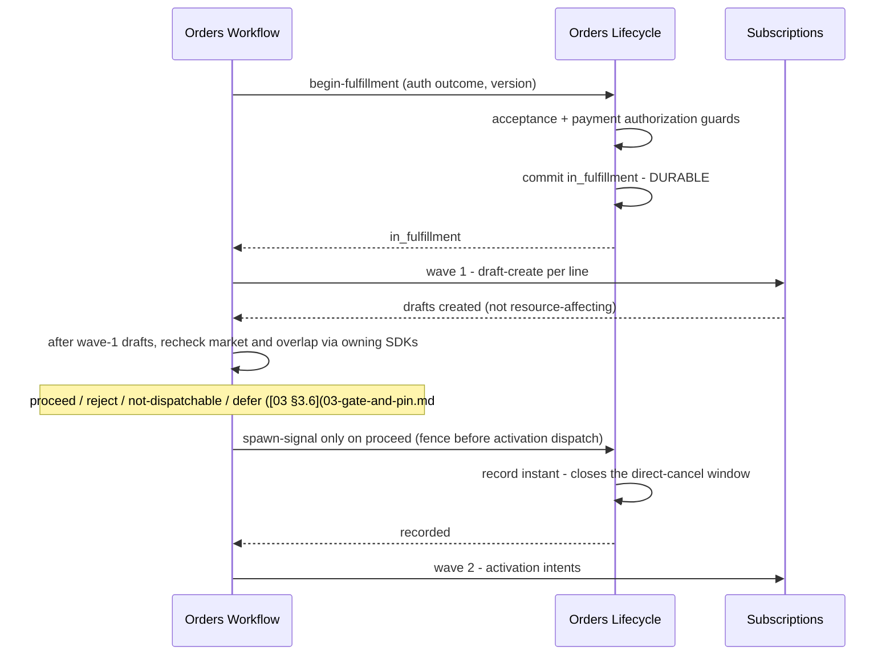

# Feature: Workflow Seam

- [ ] `p1` - **ID**: `cpt-cf-bss-orders-lifecycle-featstatus-workflow-seam-implemented`
- [ ] `p1` - `cpt-cf-bss-orders-lifecycle-feature-workflow-seam`

## Table of Contents

<!-- toc -->

- [1. Feature Context](#1-feature-context)
  - [1.1 Overview](#11-overview)
  - [1.2 Purpose](#12-purpose)
  - [1.3 Actors](#13-actors)
  - [1.4 References](#14-references)
- [2. Actor Flows](#2-actor-flows)
  - [2.1 Reflect an approval verdict](#21-reflect-an-approval-verdict)
  - [2.2 Begin fulfillment and fence activation dispatch](#22-begin-fulfillment-and-fence-activation-dispatch)
  - [2.3 Acknowledge completion or compensated failure](#23-acknowledge-completion-or-compensated-failure)
  - [2.4 Cancel after operational compensation](#24-cancel-after-operational-compensation)
- [3. Processes / Business Logic](#3-processes--business-logic)
  - [3.1 Reflect facts without owning approval policy](#31-reflect-facts-without-owning-approval-policy)
  - [3.2 Compose begin guards and handle the activation re-check](#32-compose-begin-guards-and-handle-the-activation-re-check)
  - [3.3 Validate completed acknowledgement](#33-validate-completed-acknowledgement)
  - [3.4 Validate failed acknowledgement and compensation](#34-validate-failed-acknowledgement-and-compensation)
  - [3.5 Shared direct-cancel window](#35-shared-direct-cancel-window)
- [4. States](#4-states)
  - [4.1 Engine-owned seam transitions](#41-engine-owned-seam-transitions)
- [5. Definitions of Done](#5-definitions-of-done)
  - [5.1 Guarded seam operations](#51-guarded-seam-operations)
  - [5.2 Cross-gear safety and recovery evidence](#52-cross-gear-safety-and-recovery-evidence)
- [6. Acceptance Criteria](#6-acceptance-criteria)
- [7. Detailed Behavior Contracts](#7-detailed-behavior-contracts)
  - [Workflow seam: Interactions and Sequences](#workflow-seam-interactions-and-sequences)
  - [Workflow seam: Begin fulfillment and the spawn signal (normative)](#workflow-seam-begin-fulfillment-and-the-spawn-signal-normative)
  - [Workflow seam: Acknowledgement (normative)](#workflow-seam-acknowledgement-normative)
  - [Workflow seam: Traceability](#workflow-seam-traceability)

<!-- /toc -->

## 1. Feature Context

### 1.1 Overview

Receive approval verdicts and fulfillment outcomes through five ordinary guarded operations. Keep Lifecycle authoritative for order state while Workflow owns execution, approval routing, activation, compensation and pending-process recovery.

### 1.2 Purpose

**Requirements**: `cpt-cf-bss-orders-lifecycle-fr-orders-boundary-r1-state-sor`, `cpt-cf-bss-orders-lifecycle-fr-orders-boundary-r2-approval`, `cpt-cf-bss-orders-lifecycle-fr-orders-boundary-r3-provisioning`, `cpt-cf-bss-orders-lifecycle-fr-orders-boundary-r4-no-price`, `cpt-cf-bss-orders-lifecycle-fr-orders-boundary-r5-no-mirroring`, `cpt-cf-bss-orders-lifecycle-fr-order-cancel`, `cpt-cf-bss-orders-lifecycle-fr-order-atomic-fulfillment`, `cpt-cf-bss-orders-lifecycle-fr-order-subscription-linkage`, `cpt-cf-bss-orders-lifecycle-nfr-order-idempotency`, `cpt-cf-bss-orders-lifecycle-nfr-order-audit-completeness`, `cpt-cf-bss-orders-lifecycle-nfr-order-transition-latency`, `cpt-cf-bss-orders-lifecycle-nfr-order-recovery`.

**Principles**: `cpt-cf-bss-orders-lifecycle-principle-workflow-is-ordinary-caller`, `cpt-cf-bss-orders-lifecycle-principle-store-verdict-not-reasoning`, `cpt-cf-bss-orders-lifecycle-principle-commit-anchor-before-risk`, `cpt-cf-bss-orders-lifecycle-principle-outcome-not-mirror`.

### 1.3 Actors

| Actor | Role |
|-------|------|
| `cpt-cf-bss-orders-lifecycle-actor-orders-workflow` | Sole configured service principal for the five seam operations; supplies received verdicts and execution evidence. |
| `cpt-cf-bss-orders-lifecycle-actor-orders-subscriptions` | Owns downstream subscription activation and compensation, reached by Workflow. |
| `cpt-cf-bss-orders-lifecycle-actor-orders-seller-operator` | Uses the ordinary cancel operation while its window is open; handles Workflow escalations. |

### 1.4 References

- **PRD**: [PRD.md](../PRD.md), §6.1, §6.3 and the single normative home of R1–R5 in §6.4.
- **Architecture**: [DESIGN.md](../DESIGN.md), including [06 models](../DESIGN.md#contract-06-3-1), [06 interfaces](../DESIGN.md#contract-06-3-3), and [06 persistence](../DESIGN.md#contract-06-3-7). Complete behavior is in [§7](#7-detailed-behavior-contracts).
- **Decomposition**: [DECOMPOSITION.md](../DECOMPOSITION.md).
- **Dependencies**: [Foundation](01-foundation.md), [Gate and Pin](03-gate-and-pin.md), [Preconditions](05-preconditions.md).
- **Related features**: [Versioning](04-versioning.md), [Hold and Expiry](07-hold-and-expiry.md), [Read and Authorization](08-read-and-authz.md).

The detailed design remains authoritative for schemas and API contracts. [UPSTREAM_REQS.md](../UPSTREAM_REQS.md) retains missing approval ownership, amendment-verdict behavior, activation re-check SDKs, atomic overlap admission, actual subscription start instant, progress integration, compensation reason, reverse provenance and correlation asks. The forked `SUB-O*` numbering and Workflow PRD's post-acceptance cancellation wording still require reconciliation; this feature does not declare them resolved.

**UI applicability**: UI layout, keyboard navigation, screen-reader behavior and visual accessibility are not applicable because this feature specifies backend contracts, not a user interface. API usability, actionable errors and non-disclosing diagnostics remain applicable; consuming consoles own their UI requirements.

## 2. Actor Flows

**Use cases**: `cpt-cf-bss-orders-lifecycle-usecase-order-new-acquisition`, `cpt-cf-bss-orders-lifecycle-usecase-order-fulfillment-complete`, `cpt-cf-bss-orders-lifecycle-usecase-order-cancel-during-approval`.

All five operations use `/bss-orders-lifecycle/v1/orders/{orderId}` and require expected version, idempotency key and process correlation. Missing/unparseable version is boundary-only `expected-version-required`, before authorization and idempotency. The configured Workflow service principal must also hold the operation-specific PDP grant and target scope; a generic service actor is insufficient. Engine idempotency precedes transition evaluation, and workflow-class version checking precedes state admissibility.

### 2.1 Reflect an approval verdict

- [ ] `p1` - **ID**: `cpt-cf-bss-orders-lifecycle-flow-workflow-seam-reflect`

**Actor**: Orders Workflow.

1. [ ] On `OrderSubmitted` or `OrderAmended`, read authoritative current state/version and obtain that version's requirement verdict from its owner; never reuse a superseded verdict.
2. [ ] Call `POST /approval-reflection` with verdict, deciding authority and denial reason only for `denied`.
3. [ ] Resolve the trigger in §3.1 and let the engine validate, store the received fact and move state atomically.
4. [ ] Return the committed state or settled refusal. Stale input returns `version-conflict` naming the current version even when its previous transition is now inadmissible.

**Errors**: Missing authority refuses `verdict-authority-missing`; denied without reason refuses `denial-reason-missing`. A reason on another verdict is boundary `request-invalid`. The stand-in must be named explicitly and cannot be mistaken for implemented policy.

### 2.2 Begin fulfillment and fence activation dispatch

- [ ] `p1` - **ID**: `cpt-cf-bss-orders-lifecycle-flow-workflow-seam-begin-spawn`

**Actor**: Orders Workflow, interacting downstream with Subscriptions.

1. [ ] Call `POST /begin-fulfillment` with conclusive payment-authorization outcome. Compose Preconditions guards unchanged and await durable `in_fulfillment` admission before proceeding with fulfillment work.
2. [ ] Workflow creates wave-1 subscription drafts and waits for its activation barrier; draft creation does not close direct cancellation.
3. [ ] Workflow executes Gate and Pin's activation re-check through owning SDKs using stored overlap keys, market and payer exposed by the composed read. Apply §3.2's four outcomes.
4. [ ] Only on `proceed`, call `POST /spawn-signal` and wait for confirmed durable admission before dispatching the first activation intent.
5. [ ] On timeout, resolve/replay the same key until admission is known. A crash after signal admission leaves the fence durable; Workflow reconciles its own dispatch checkpoint.
6. [ ] Dispatch activation with actual activation instant as subscription start; quoted requested dates travel separately and never backdate billing or entitlement. Downstream enforcement remains the open `SUB-O10` dependency.

**Success**: Activation follows both committed begin-fulfillment and spawn fence. **Errors**: Refused begin, held/cancelled spawn, unresolved timeout or a non-proceed re-check never authorizes dispatch.

### 2.3 Acknowledge completion or compensated failure

- [ ] `p1` - **ID**: `cpt-cf-bss-orders-lifecycle-flow-workflow-seam-acknowledge`

**Actor**: Orders Workflow.

1. [ ] Call `POST /fulfillment-acknowledgement` with outcome, per-line results and, for failure, closed-enumeration reason plus compensation evidence.
2. [ ] For completion, validate exact current-version line coverage and distinct subscription identifiers under §3.3. For failure, validate reason and evidence under §3.4.
3. [ ] Contribute the authoritative line-to-subscription mapping or compensation evidence, plus acknowledgement-derived projection updates, through the engine.
4. [ ] Commit terminal state, audit, idempotency result and the row's event atomically. `OrderCompleted` carries the mapping; `OrderFulfillmentFailed` carries evidence and failure reason.
5. [ ] On incomplete compensation, remain non-terminal under Workflow's escalation SLA. Financial reversal through Billing is not a completion guard.

### 2.4 Cancel after operational compensation

- [ ] `p1` - **ID**: `cpt-cf-bss-orders-lifecycle-flow-workflow-seam-cancel`

**Actor**: Orders Workflow.

1. [ ] Complete operational compensation, including voiding wave-1 drafts where no activation was dispatched.
2. [ ] Call `POST /workflow-cancel` with mandatory cancel reason, evidence, version, key and correlation. Evidence is required before the spawn signal as well as after it.
3. [ ] After engine authorization, expected-version and admissibility checks, evaluate registered guards in source order: mandatory cancel reason, pre-hold state, compensation evidence, then the shared cancel-window guard (§3.5). Preserve that refusal precedence.
4. [ ] Commit `cancelled`, evidence, caller reason, audit and `OrderCancelled` atomically. Keep the spawn signal permanently recorded.

## 3. Processes / Business Logic

### 3.1 Reflect facts without owning approval policy

- [ ] `p1` - **ID**: `cpt-cf-bss-orders-lifecycle-algo-workflow-seam-verdict`

**Input**: Verdict, authority, conditional denial reason, expected version and process correlation.

**Output**: Append-only reflection contribution and registered transition trigger, or a guard refusal.

Map `required`, `not_required`, `granted`, `denied` to `reflect-approval-required`, `reflect-approval-not-required`, `reflect-approval-granted`, `reflect-approval-denied`. Contribute `requirement` kind for the first pair and `gate_outcome` for the second; the engine chooses the target row. Store version, authority, opaque denial reason where applicable, correlation and timestamp. Enforce append-only `(order_id, version, verdict_kind)` uniqueness and retain superseded facts. Evaluate no policy, threshold, price arithmetic or denial text; obtain no policy-owner verdict from Lifecycle.

### 3.2 Compose begin guards and handle the activation re-check

- [ ] `p1` - **ID**: `cpt-cf-bss-orders-lifecycle-algo-workflow-seam-dispatch-fence`

**Input**: Current version, precondition inputs, activation re-check outcome and stored spawn signal.

**Output**: Begin/spawn contributions and Workflow dispatch, retry or compensation decision.

1. [ ] Compose Preconditions' acceptance and authorization guard inputs; contribute the tolerance flag only for a tolerated failed authorization. Begin-fulfillment changes state through row 11.
2. [ ] Interpret the activation re-check **in Workflow**, outside Lifecycle's transaction, exactly as follows:

| Outcome | Workflow action |
|---------|-----------------|
| `proceed` | Request spawn signal; dispatch only after admitted. A proceed result is an early-abort check, not atomic activation admission or a timed validity lease. |
| `reject` | Void created drafts and acknowledge failure with `market-divergence` or `overlap-collision`; empty created sets are valid evidence before any draft exists. |
| `not-dispatchable` | Drive no transition and send no acknowledgement. Re-read; wait for resume if held, follow current version if superseded, stop if terminal. |
| `defer` | Retry the re-check from its first step with bounded backoff (`activation-recheck-retry-budget`, baseline 3 attempts over ≤ 60 seconds). After exhaustion, void drafts and acknowledge with the unavailable port's reason. |

3. [ ] For `report-spawn-signal`, register a null-signal guard (`spawn-signal-already-recorded`) and request engine row 12. Write server report instant once; enqueue no event for this state-only row.
4. [ ] Serialize signal and direct cancel through the same aggregate transaction. If cancel commits first, signal refuses and no activation dispatches. If signal commits first, direct cancel refuses and Workflow uses compensation and mediated cancel.
5. [ ] Preserve same-key signal replay as the original outcome; only a different-key second report reaches the already-recorded guard. Handle downstream `overlap-collision` even after a successful early re-check through the failure/compensation path.

### 3.3 Validate completed acknowledgement

- [ ] `p1` - **ID**: `cpt-cf-bss-orders-lifecycle-algo-workflow-seam-completion`

**Input**: Expected version’s immutable roster and completed line results.

**Output**: Exact one-to-one completion mapping or ordered refusal inputs.

1. [ ] Read the immutable roster from `orders_order_line` for the expected version joined to `orders_order_line_identity`; never derive it from payload or mutable projection.
2. [ ] Require exact set equality, multiplicity one and every result activated. Missing, extra, unknown, duplicated or non-activated lines refuse `acknowledgement-lines-incomplete`.
3. [ ] Require a subscription ID per activated line (`acknowledgement-subscription-missing`) and distinct IDs across lines (`acknowledgement-subscription-duplicated`).
4. [ ] Contribute the 1:1 mapping and request `acknowledge-completed`; final engine version validation binds the roster to the version actually completed.

### 3.4 Validate failed acknowledgement and compensation

- [ ] `p1` - **ID**: `cpt-cf-bss-orders-lifecycle-algo-workflow-seam-compensation`

**Input**: Failed acknowledgement or mediated cancel request, compensation evidence and stored pre-hold state.

**Output**: Validated terminal contribution, plus acknowledgement projection only for acknowledgement requests, or ordered refusal; invalid boundary values are rejected before engine entry.

1. [ ] At boundary validation, reject unknown failure-reason values or any failure reason on a completed outcome as `request-invalid`, unaudited and before authorization. Permit exactly `market-divergence`, `overlap-collision`, `identity-party-unavailable`, `overlap-presence-unevaluable`, `line-execution-failed`, `dependency-graph-invalid`; the last two are received outcomes, not Lifecycle refusal reasons.
2. [ ] After engine authorization, expected-version and admissibility checks, evaluate failed-acknowledgement guards in this order: failure reason present (`failure-reason-missing`), compensation evidence present, evidence valid, then—if held—stored pre-hold state is `in_fulfillment` (`prehold-not-in-fulfillment`). The workflow-cancel guard order is separately defined in §2.4.
3. [ ] For failed acknowledgement and every workflow cancel, refuse absent evidence with `compensation-evidence-missing`. Validate the closed five-member schema: `drafts_voided`, `activated_rolled_back`, `activation_dispatched`, `at_sale_facts_emitted`, `no_active_subscription_remains`.
4. [ ] Require the final assertion true; schema-invalid or false evidence refuses `compensation-evidence-incomplete`. Empty lists are valid. Lifecycle validates structure and asserted fact only, never reconciles the lists through Subscriptions calls.
5. [ ] Store evidence on the aggregate and audit; failure/cancel caller reasons remain `caller_reason`, separate from registered machine `reason`. Wait for no Billing credit note.
6. [ ] Build `created`, `activated`, `failed` line projection data only from acknowledgements. No guard reads it, no order state derives from it, and transition-request references are opaque joins. Before acknowledgement, absence means “not acknowledged”; live progress remains Workflow's read surface.

### 3.5 Shared direct-cancel window

- [ ] `p1` - **ID**: `cpt-cf-bss-orders-lifecycle-algo-workflow-seam-cancel-window`

**Input**: Authorized caller, stored spawn signal and fulfillment or fulfillment-hold state.

**Output**: Cancel-window admission or `direct-cancel-window-closed`; operation grants and other guards remain separate.

For an already-authorized ordinary or mediated cancel from fulfillment (including a fulfillment hold), first read the spawn signal. If absent, admit on the open window. If present, refuse any actor other than the configured Workflow service principal with `direct-cancel-window-closed`. Do not hoist the service-principal check before the open-window branch: ordinary authorized buyers/operators must retain pre-spawn cancellation. Operation grants are checked separately before this guard; ordinary cancel requires no evidence, while mediated cancel always does. Held mediated cancel additionally requires stored pre-hold `in_fulfillment` and a mandatory cancel reason.

## 4. States

### 4.1 Engine-owned seam transitions

- [ ] `p1` - **ID**: `cpt-cf-bss-orders-lifecycle-state-workflow-seam-transitions`

| Trigger | Source | Target / effect |
|---------|--------|-----------------|
| `reflect-approval-required` | `submitted` | `pending_approval` |
| `reflect-approval-not-required` | `submitted` | `approved` |
| `reflect-approval-granted`, `reflect-approval-denied` | `pending_approval` | `approved`, `rejected` respectively |
| `begin-fulfillment` | `approved` | `in_fulfillment` after both preconditions |
| `report-spawn-signal` | `in_fulfillment` | Same state; write-once cancellation fence |
| `acknowledge-completed` | `in_fulfillment` | `completed` after exact-roster validation |
| `acknowledge-failed` | `in_fulfillment`, or `on_hold` with pre-hold `in_fulfillment` | `fulfillment_failed` after evidence |
| `cancel-workflow-mediated` | Same two sources | `cancelled` after reason and evidence |

Completion from hold requires resume first; current-version completion from hold refuses `not-admissible`. Failure/cancel from another hold refuses `prehold-not-in-fulfillment`. A stale workflow trigger always reaches version conflict before state admissibility. No per-line terminal, partial completion or direct state-setting repair path is added.

## 5. Definitions of Done

### 5.1 Guarded seam operations

- [ ] `p1` - **ID**: `cpt-cf-bss-orders-lifecycle-dod-workflow-seam-operations`

The system **MUST** implement all five operations using Foundation's transaction, authorization, version, idempotency, audit and event contracts, with no state-setting bypass. Persist all contributions atomically, including requirement/gate verdict uniqueness and correlation. Instrument each operation's rate, latency and refusals, stand-in authority use, stale results, evidence refusals and begin-to-spawn interval; alert on evidence-incomplete acknowledgements.

**Implements**: `cpt-cf-bss-orders-lifecycle-flow-workflow-seam-reflect`, `cpt-cf-bss-orders-lifecycle-flow-workflow-seam-begin-spawn`, `cpt-cf-bss-orders-lifecycle-flow-workflow-seam-acknowledge`, `cpt-cf-bss-orders-lifecycle-flow-workflow-seam-cancel`.
**Constraints**: `cpt-cf-bss-orders-lifecycle-constraint-approval-owner-absent`, `cpt-cf-bss-orders-lifecycle-constraint-compensation-reason-unagreed`, `cpt-cf-bss-orders-lifecycle-constraint-provenance-one-directional`, `cpt-cf-bss-orders-lifecycle-constraint-correlation-propagation-unagreed`.

**Touches**: five POST operations in §2; `cpt-cf-bss-orders-lifecycle-dbtable-approval-reflection`, `cpt-cf-bss-orders-lifecycle-dbtable-line-fulfillment`; aggregate fence/evidence columns; typed transition events.

### 5.2 Cross-gear safety and recovery evidence

- [ ] `p1` - **ID**: `cpt-cf-bss-orders-lifecycle-dod-workflow-seam-integration`

The system **MUST** supply executable contract scenarios for the pre-dispatch fence, all re-check outcomes, exact-roster completion and evidence-gated terminals. Local doubles may validate Lifecycle before upstream implementation; production integration remains subject to the documented missing SDKs, cancellation-boundary reconciliation and downstream actual-start/atomic-overlap contracts. Lifecycle adds no outbound provisioning adapter, durable process worker, approval owner or live-progress update endpoint.

**Implements**: `cpt-cf-bss-orders-lifecycle-algo-workflow-seam-dispatch-fence`, `cpt-cf-bss-orders-lifecycle-algo-workflow-seam-completion`, `cpt-cf-bss-orders-lifecycle-algo-workflow-seam-compensation`, `cpt-cf-bss-orders-lifecycle-algo-workflow-seam-cancel-window`.
**Constraints**: `cpt-cf-bss-orders-lifecycle-constraint-approval-owner-absent`, `cpt-cf-bss-orders-lifecycle-constraint-compensation-reason-unagreed`, `cpt-cf-bss-orders-lifecycle-constraint-provenance-one-directional`, `cpt-cf-bss-orders-lifecycle-constraint-correlation-propagation-unagreed`.
**Touches**: Workflow and Subscriptions contract fixtures, recovery tests and Read and Authorization projection contract.

## 6. Acceptance Criteria

- [ ] Every operation rejects unrelated service principals and missing grants; missing expected version remains a boundary refusal without audit or key settlement.
- [ ] Same-key retries of all five operations return stored outcomes with one durable effect; changed payload and in-flight requests retain Foundation's distinct conflict behavior.
- [ ] Superseded reflections and acknowledgements return `version-conflict` before state admissibility. Missing authority/denial reason use their registered guards; non-denied verdict plus reason is boundary-invalid.
- [ ] New-version amendment requires a fresh requirement verdict; stand-in decisions are named and no Lifecycle policy/price evaluation occurs.
- [ ] Begin-fulfillment composes all acceptance/payment outcomes unchanged; no draft-create closes the cancellation window.
- [ ] A cancel/spawn race has one serialized winner. Signal timeout does not permit activation; replay resolves admission, different-key duplicate refuses, and crash/recovery retains the committed fence.
- [ ] All four re-check outcomes follow §3.2, including bounded defer exhaustion with the original unavailable-port reason and no acknowledgement on `not-dispatchable`.
- [ ] Completion rejects empty payload for nonempty orders, missing/extra/duplicate lines, non-activated results and missing/reused subscription IDs. A valid mapping is persisted and emitted exactly once.
- [ ] Failure and mediated cancel reject missing/malformed/false compensation evidence before and after spawn; valid empty sets work before activation. Financial reversal is never awaited.
- [ ] A fulfillment hold can fail or cancel with complete evidence; completion requires resume. Other holds cannot use those terminal rows.
- [ ] Acknowledgement projections cannot influence order guards or mirror downstream request states. Missing projection data cannot claim work has not started.
- [ ] Commit latency meets p95 < 1 s independently of Workflow re-check duration; fault injection proves atomic rollback, and recovery preserves the committed spawn signal with the order.

- [ ] Failed acknowledgement with both invalid compensation evidence and a wrong pre-hold origin returns `compensation-evidence-incomplete` first; with valid evidence it reaches `prehold-not-in-fulfillment`. Missing reason and boundary-invalid inputs retain their earlier precedence.

## 7. Detailed Behavior Contracts

**Contract namespace 06.** Section numbers inside the detailed contracts below resolve
through the [contract address index](../DECOMPOSITION.md#4-contract-address-index),
not the overview section numbers above.

The following sections retain the complete algorithms, guards, state transitions and
feature-local rules. The preceding flows and acceptance criteria summarize these contracts;
shared schemas and interfaces are defined in [DESIGN.md](../DESIGN.md).

<!-- contract:06-workflow-seam:3.6 -->
### Workflow seam: Interactions and Sequences

#### Reflect an approval verdict

**ID**: `cpt-cf-bss-orders-lifecycle-seq-reflect-verdict`

**Use cases**: `cpt-cf-bss-orders-lifecycle-usecase-order-new-acquisition`

**Actors**: `cpt-cf-bss-orders-lifecycle-actor-orders-workflow`

**Algorithm: Reflect Verdict**

Input: order_id, verdict, deciding_authority, denial_reason (required when the verdict is `denied`, forbidden otherwise), expected_version, idempotency_key, correlation_id
Output: the resulting state, or a registered refusal

1. [ ] - `p1` - Declare three guards the engine evaluates and audits: **deciding_authority present** (`verdict-authority-missing`); **denial_reason present on a denied verdict** (`denial-reason-missing`, D-135) — a denial_reason supplied with any other verdict is rejected at boundary validation with `request-invalid`, before authorization and unaudited ([01 §4.7](../DESIGN.md#contract-01-4-7) *Validation flow at the boundary*, D-142); and expected_version current — the latter is the engine's own `version-conflict`, already evaluated at [01 §3.6](01-foundation.md#contract-01-3-6) *Attempt Transition* step 10 — ahead of the row lookup, because every reflection trigger is workflow-class ([01 §4.1](../DESIGN.md#contract-01-4-1), D-110), so a verdict for a superseded version is refused `version-conflict` naming the current version even when the amendment moved the order to `submitted` — so this slice pre-checks none of them and returns no refusal of its own - `inst-rv-declare-guards`
2. [ ] - `p1` - **MATCH** the verdict to a **trigger**, which is what the engine looks the row up by — this slice resolves the trigger and never the target state ([01 §4.6](../DESIGN.md#contract-01-4-6)): - `inst-rv-match-verdict`
   1. [ ] - `p1` - **WHEN** approval required: trigger `reflect-approval-required` - `inst-rv-when-required`
   2. [ ] - `p1` - **WHEN** approval not required: trigger `reflect-approval-not-required` - `inst-rv-when-not-required`
   3. [ ] - `p1` - **WHEN** granted: trigger `reflect-approval-granted` - `inst-rv-when-granted`
   4. [ ] - `p1` - **WHEN** denied: trigger `reflect-approval-denied` - `inst-rv-when-denied`
3. [ ] - `p1` - Classify `required` or `not_required` as `requirement`, and `granted` or `denied` as `gate_outcome`; pass that verdict kind, the verdict, its deciding authority, the denial_reason where the verdict is denied, correlation_id and the version as the contribution to the reflection transition, so the engine writes it inside the same transaction - `inst-rv-contribute-verdict`
4. [ ] - `p1` - **RETURN** the resulting state - `inst-rv-return-state`

**Description**: Step 1's authority guard is the whole defence against an absent policy owner. A
verdict without a named authority is refused — by the engine, so the refusal audits and settles
like every other — and a stand-in decision is therefore recorded as a stand-in decision rather
than being indistinguishable from a policy one. The denial reason is carried for `OrderRejected`
([01 §4.4](../DESIGN.md#contract-01-4-4)) and stored beside the verdict; like the verdict it is received, never evaluated.

#### Begin fulfillment and record the spawn signal

**ID**: `cpt-cf-bss-orders-lifecycle-seq-begin-and-spawn`

**Use cases**: `cpt-cf-bss-orders-lifecycle-usecase-order-fulfillment-complete`

**Actors**: `cpt-cf-bss-orders-lifecycle-actor-orders-workflow`, `cpt-cf-bss-orders-lifecycle-actor-orders-subscriptions`

**Description**: The ordering is the design. `in_fulfillment` commits before any intent exists,
and the spawn signal is committed before dispatch of the first *activation* intent — not at draft-create — which
is why a cancel during wave 1 is still admitted and compensated by a cheap draft void.

**Algorithm: Begin Fulfillment**

Input: order_id, authorization_outcome, expected_version, idempotency_key, correlation_id
Output: in_fulfillment, or a registered refusal

1. [ ] - `p1` - Declare the guards the engine evaluates and audits: the caller is the configured Workflow `service` principal ([01 §3.7](../DESIGN.md#contract-01-3-7) *Actor class*, D-115), settled by the engine's authorization pre-guard at [01 §3.6](01-foundation.md#contract-01-3-6) *Attempt Transition* step 1 against [08 §4.3](../DESIGN.md#contract-08-4-3); expected_version current — the engine's own `version-conflict` at [01 §3.6](01-foundation.md#contract-01-3-6) *Attempt Transition* step 10, checked ahead of the row lookup because `begin-fulfillment` is workflow-class ([01 §4.1](../DESIGN.md#contract-01-4-1), D-110); and, as row 11's guards, the guards of [05-preconditions — Interactions and Sequences](05-preconditions.md#contract-05-3-6) *Evaluate Begin-Fulfillment Preconditions* — `acceptance-required-not-recorded`, `acceptance-requirement-unevaluable`, `authorization-pending`, `authorization-failed` — composed unchanged; this slice pre-checks none of them and adds no reason of its own - `inst-bf-declare-guards`
2. [ ] - `p1` - Resolve the precondition guards' inputs by composing *Evaluate Begin-Fulfillment Preconditions* with order_id, expected_version, authorization_outcome and the authenticated security context - `inst-bf-compose-preconditions`
3. [ ] - `p1` - **IF** the composed evaluation admits with the risk flag (a `failed` outcome under an elected tolerate-failure): add the tolerance decision to the contribution, from which the engine sets `authorization_failure_tolerated_at` to the server-recorded decision instant ([01 §3.6](01-foundation.md#contract-01-3-6), required aggregate writes); otherwise contribute nothing to that column - `inst-bf-contribute-tolerance`
4. [ ] - `p1` - Set the **trigger** to `begin-fulfillment` ([01 §4.3](01-foundation.md#contract-01-4-3) row 11) and request the begin-fulfillment transition with correlation_id; the engine commits `in_fulfillment` durably, audits and settles the key before it returns - `inst-bf-request-transition`
5. [ ] - `p1` - **RETURN** in_fulfillment; Workflow **MUST NOT** issue any intent before this return (§4.3) - `inst-bf-return`

**Description**: The slice owns no begin-fulfillment rule. It hands the row the guards `05` owns,
so each unmet precondition refuses with its own name rather than a seam-level catch-all, and it
contributes the risk flag only when those guards admitted a tolerated failure.

**Algorithm: Report Spawn Signal**

Input: order_id, expected_version, idempotency_key, correlation_id
Output: the recorded spawn-signal instant, or a registered refusal

1. [ ] - `p1` - Declare the guards the engine evaluates and audits: the caller is the configured Workflow `service` principal, settled by the engine's authorization pre-guard ([08 §4.3](../DESIGN.md#contract-08-4-3), D-115); expected_version current — `version-conflict`, checked ahead of the row lookup for this workflow-class trigger ([01 §4.1](../DESIGN.md#contract-01-4-1), D-110); and **`orders_order.spawn_signal_at` IS NULL** (`spawn-signal-already-recorded`) - `inst-ss-declare-guards`
2. [ ] - `p1` - Set the **trigger** to `report-spawn-signal` ([01 §4.3](01-foundation.md#contract-01-4-3) row 12, `in_fulfillment → in_fulfillment`). A held, cancelled or otherwise non-`in_fulfillment` order has no row for this trigger and receives the engine's state-table refusal `not-admissible` (or `version-conflict` first where its version is also stale); this slice adds no state check of its own - `inst-ss-set-trigger`
3. [ ] - `p1` - Request the spawn-signal transition with correlation_id; the engine sets `spawn_signal_at` to the server-recorded report instant, audits and commits before it returns - `inst-ss-request-transition`
4. [ ] - `p1` - **RETURN** the recorded instant - `inst-ss-return`

**Description**: A replay with the same idempotency key returns the stored outcome under the
engine's idempotency contract and never reaches the already-recorded guard, so a Workflow retry
after a timeout learns that its own report was admitted. `spawn-signal-already-recorded` answers
only a second report under a different key. The committed return is the fence activation
dispatch waits on (§4.3).

#### Acknowledge the fulfillment outcome

**ID**: `cpt-cf-bss-orders-lifecycle-seq-acknowledge-fulfillment`

**Use cases**: `cpt-cf-bss-orders-lifecycle-usecase-order-fulfillment-complete`

**Actors**: `cpt-cf-bss-orders-lifecycle-actor-orders-workflow`, `cpt-cf-bss-orders-lifecycle-actor-orders-subscriptions`

**Algorithm: Acknowledge Fulfillment**

Input: order_id, outcome, per_line_results, compensation_evidence, failure_reason (failed outcome only; supplied with the completed outcome it is `request-invalid` at the boundary, D-142), expected_version, idempotency_key, correlation_id
Output: completed or fulfillment_failed, or a registered refusal

**Admissible from-states.** The failed outcome is admitted from `in_fulfillment` ([01 §4.3](01-foundation.md#contract-01-4-3) row 14)
**and** from `on_hold` whose stored pre-hold state is `in_fulfillment` (row 26), with the same
evidence guards; the completed outcome is admitted from `in_fulfillment` only (row 13), so a held
order **MUST** be resumed (row 22) before it can be acknowledged completed, and a completed
acknowledgement against a held order carrying the current version is refused `not-admissible` (one
carrying a superseded version is refused `version-conflict` first, [01 §4.1](../DESIGN.md#contract-01-4-1), D-110). Row 26 carries a registered
pre-hold guard that refuses `prehold-not-in-fulfillment` for a hold from any other state
([`../DECISIONS.md`](../DECISIONS.md) D-109).

1. [ ] - `p1` - Declare the guards the engine evaluates and audits: expected_version current (the engine's own `version-conflict` at [01 §3.6](01-foundation.md#contract-01-3-6) *Attempt Transition* step 10, checked ahead of the row lookup for these workflow-class triggers — [01 §4.1](../DESIGN.md#contract-01-4-1), D-110 — so this slice does not pre-check it); on the **completed** outcome, every line carrying an activated result (`acknowledgement-lines-incomplete`), every activated line carrying a subscription identifier (`acknowledgement-subscription-missing`), and those identifiers being distinct across the order's lines (`acknowledgement-subscription-duplicated`); on the **failed** outcome, a failure reason present (`failure-reason-missing`, D-136) — a value outside the closed enumeration of §4.4, or a failure_reason supplied with the completed outcome, is rejected at boundary validation with `request-invalid` and never reaches the engine ([01 §4.7](../DESIGN.md#contract-01-4-7), D-142) — compensation evidence present (`compensation-evidence-missing`) and valid against the closed schema of [01 §3.7](../DESIGN.md#contract-01-3-7) with `no_active_subscription_remains` true (`compensation-evidence-incomplete`), and — where the order is `on_hold` — a stored pre-hold state of `in_fulfillment` (`prehold-not-in-fulfillment`, row 26) - `inst-af-declare-guards`
2. [ ] - `p1` - **MATCH** the outcome: - `inst-af-match-outcome`
   1. [ ] - `p1` - **WHEN** completed: - `inst-af-when-completed`
      1. [ ] - `p1` - Read the authoritative roster from `orders_order_line` for `(order_id, expected_version)`, joined to `orders_order_line_identity`; require exactly one result per roster line and no unknown or duplicate line IDs, then require every result activated with a non-null subscription ID and all subscription IDs distinct. Missing, extra, duplicate or non-activated line results yield `acknowledgement-lines-incomplete`; missing or duplicate subscription IDs use their dedicated reasons. Never derive the expected roster from the payload or mutable fulfillment projection - `inst-af-resolve-completed-inputs`
      2. [ ] - `p1` - Add the per-line line-to-subscription mapping to the contribution - `inst-af-contribute-linkage`
      3. [ ] - `p1` - Set the **trigger** to `acknowledge-completed`; the engine resolves the target from the row ([01 §4.6](../DESIGN.md#contract-01-4-6)) - `inst-af-target-completed`
   2. [ ] - `p1` - **WHEN** failed: - `inst-af-when-failed`
      1. [ ] - `p1` - Resolve the failure-reason and evidence guards' inputs from failure_reason and compensation_evidence, validating structure only and never reconciling the lists against Subscriptions ([01 §3.7](../DESIGN.md#contract-01-3-7)); where the reason is missing or the evidence is absent, schema-invalid or does not assert that no active subscription remains, the engine refuses and the order stays in its current state (`in_fulfillment`, or `on_hold` for row 26) - `inst-af-resolve-evidence-inputs`
      2. [ ] - `p1` - Add the compensation evidence and the failure reason to the contribution; the engine persists the evidence, records the failure reason on the committed audit entry as its `caller_reason` — its `reason` stays the registered machine reason ([01 §3.7](../DESIGN.md#contract-01-3-7), D-143) — and carries both in `OrderFulfillmentFailed` - `inst-af-contribute-evidence`
      3. [ ] - `p1` - Set the **trigger** to `acknowledge-failed`; the engine resolves the target from the row ([01 §4.6](../DESIGN.md#contract-01-4-6)) — row 14 from `in_fulfillment`, row 26 from `on_hold` with pre-hold `in_fulfillment` - `inst-af-target-failed`
3. [ ] - `p1` - Add the per-line projection update to the contribution - `inst-af-contribute-projection`
4. [ ] - `p1` - Request the acknowledgement transition with correlation_id, which writes every contribution and audits in one transaction - `inst-af-request-transition`
5. [ ] - `p1` - **RETURN** the resulting terminal state - `inst-af-return-terminal`

**Description**: Step 2.2 is the invariant that ties the two gears together: `fulfillment_failed`
presupposes completed operational compensation, so an acknowledgement that cannot assert it
leaves the order non-terminal under the sibling gear's escalation SLA. The order never waits on a
Billing credit note — money reverse is a billing-chain concern.

#### Cancel across the spawn boundary (the shared cancel guard)

**ID**: `cpt-cf-bss-orders-lifecycle-seq-seam-cancel-guard`

**Use cases**: `cpt-cf-bss-orders-lifecycle-usecase-order-cancel-during-approval`

**Actors**: `cpt-cf-bss-orders-lifecycle-actor-orders-seller-operator`, `cpt-cf-bss-orders-lifecycle-actor-orders-workflow`

**Algorithm: Evaluate Cancel From In-Fulfillment (shared guard)**

**This is a shared guard, not the `/workflow-cancel` handler.** Both cancel entry points defer to
it for an order in `in_fulfillment`, or in `on_hold` whose stored pre-hold state is
`in_fulfillment`: the **ordinary** `POST /cancel` owned by
[07-hold-and-expiry — The ordinary cancel operation (normative)](07-hold-and-expiry.md#contract-07-4-6) *Cancel Order* step 2, and the
**workflow-mediated** `POST /workflow-cancel` declared in §3.3. It therefore **MUST NOT** be read
as the authorization boundary of either path. Who may call each operation is settled **before**
this guard runs, by the permission matrix of [08-read-and-authz — The permission model (normative)](../DESIGN.md#contract-08-4-3)
enforced as the engine's authorization pre-guard ahead of every slice guard
([01 §4.1](../DESIGN.md#contract-01-4-1) *Guard evaluation order*, [01 §3.6](01-foundation.md#contract-01-3-6) *Attempt Transition* step 1) — and that matrix
restricts `/workflow-cancel` to the Workflow service principal. What `requesting_actor_class`
decides **here** is only *which cancel window applies* to a caller already authorized for the
operation they invoked, which is why step 3 reads it after step 2 rather than before.

Input: order_id, requesting_actor_class and requesting actor (of the already-authorized caller,
from its authenticated context and never from the request — [01 §3.7](../DESIGN.md#contract-01-3-7) *Actor class*; supplied by
whichever cancel entry point invoked this guard)
Output: admit or a registered refusal

1. [ ] - `p1` - Read the recorded spawn signal - `inst-cg-read-spawn-signal`
2. [ ] - `p1` - **IF** no spawn signal is recorded: - `inst-cg-if-no-spawn`
   1. [ ] - `p1` - **RETURN** admit; the direct-cancel window is still open, so **either** entry point's caller may cancel and wave-1 drafts are compensated by void. This admits on the window, not on the actor: it is not an authorization decision and does not widen who may call `/workflow-cancel` - `inst-cg-return-direct-admit`
3. [ ] - `p1` - **IF** the requesting actor is not the configured Workflow service principal (`service` class, [01 §3.7](../DESIGN.md#contract-01-3-7), D-115): - `inst-cg-if-not-workflow`
   1. [ ] - `p1` - **RETURN** direct-cancel-window-closed refusal - `inst-cg-return-window-closed`
4. [ ] - `p1` - **RETURN** admit - `inst-cg-return-mediated-admit`

**Description**: The guard reads a recorded fact rather than inferring from state, so the window
closes exactly when the first activation intent is reported and not when `in_fulfillment` is
entered. It holds only the window and actor logic. The compensation-evidence guard is not part
of it: it is registered on the `cancel-workflow-mediated` rows and applies whether or not the
spawn signal is recorded (*Workflow Cancel* below, D-134), so the ordinary `POST /cancel` of
[07 §4.6](07-hold-and-expiry.md#contract-07-4-6), which carries no evidence, is unaffected. After `completed` there is no order-side cancellation window at all — post-purchase
rights are exercised on the spawned subscriptions.

Because the guard is shared, the step order is deliberate and **MUST NOT** be rewritten as an
actor check ahead of the window check: hoisting step 3 above step 2 would make the ordinary
`POST /cancel` of [07 §4.6](07-hold-and-expiry.md#contract-07-4-6) refuse every pre-spawn cancellation by a seller operator or partner
admin — the cancel path PRD §6.3 requires — and it would not add any authorization the engine
pre-guard does not already enforce. The two callers are distinguished by **permission** at the
pre-guard and by **window** here, and those are separate concerns
([`../DECISIONS.md`](../DECISIONS.md) D-33).

**`/workflow-cancel` is admitted from a hold as well.** It resolves to `cancel-workflow-mediated`
from `in_fulfillment` ([01 §4.3](01-foundation.md#contract-01-4-3) row 16) **and** from `on_hold` whose stored pre-hold state is
`in_fulfillment` (row 27); a hold from any other state is refused `prehold-not-in-fulfillment` by
the row's registered pre-hold guard, which rows 26 and 27 share. `/workflow-cancel` always requires
complete compensation evidence; before the spawn signal the evidence records the voided drafts and
`activation_dispatched = false` (§4.3).
Row 27 is what lets Workflow close an order it held (`on_hold` plus a manual task) after the spawn
signal once the resume cap of [07 §4.1](07-hold-and-expiry.md#contract-07-4-1) is exhausted, where the ordinary cancel of row 23 refuses
every other caller ([`../DECISIONS.md`](../DECISIONS.md) D-109).

#### Cancel through the Workflow (the `/workflow-cancel` handler)

**ID**: `cpt-cf-bss-orders-lifecycle-seq-workflow-cancel`

**Use cases**: `cpt-cf-bss-orders-lifecycle-usecase-order-cancel-during-approval`

**Actors**: `cpt-cf-bss-orders-lifecycle-actor-orders-workflow`

**Algorithm: Workflow Cancel**

Input: order_id, compensation_evidence, cancel_reason, expected_version, idempotency_key, correlation_id
Output: cancelled, or a registered refusal

1. [ ] - `p1` - Declare the guards the engine evaluates and audits: the caller is the configured Workflow `service` principal, settled by the engine's authorization pre-guard against [08 §4.3](../DESIGN.md#contract-08-4-3) (D-115); expected_version current — `version-conflict`, checked ahead of the row lookup for this workflow-class trigger ([01 §4.1](../DESIGN.md#contract-01-4-1), D-110); a **mandatory** cancel reason (`cancel-reason-required`, owned by [07 §3.3](../DESIGN.md#contract-07-3-3) and reused unchanged, since [07 §4.6](07-hold-and-expiry.md#contract-07-4-6) makes the reason mandatory for every actor); where the order is `on_hold`, a stored pre-hold state of `in_fulfillment` (`prehold-not-in-fulfillment`, row 27); compensation evidence present (`compensation-evidence-missing`) and valid against the closed schema of [01 §3.7](../DESIGN.md#contract-01-3-7) with `no_active_subscription_remains` true (`compensation-evidence-incomplete`), required **whether or not the spawn signal is recorded** (D-134); and the shared cancel guard above - `inst-wc-declare-guards`
2. [ ] - `p1` - Resolve the shared cancel guard's inputs: *Evaluate Cancel From In-Fulfillment (shared guard)* with the Workflow principal's actor class `service` and its subject, both from the authenticated context and never from the request; before the spawn signal it admits on the open window, after it on the Workflow actor - `inst-wc-shared-guard`
3. [ ] - `p1` - Resolve the evidence guard's inputs from compensation_evidence, validating structure only and never reconciling the lists against Subscriptions ([01 §3.7](../DESIGN.md#contract-01-3-7)) - `inst-wc-resolve-evidence`
4. [ ] - `p1` - Add the compensation evidence and the cancel reason to the contribution - `inst-wc-contribute-evidence`
5. [ ] - `p1` - Set the **trigger** to `cancel-workflow-mediated`; the engine resolves the row ([01 §4.6](../DESIGN.md#contract-01-4-6)) — row 16 from `in_fulfillment`, row 27 from `on_hold` with pre-hold `in_fulfillment` - `inst-wc-set-trigger`
6. [ ] - `p1` - Request the workflow-mediated cancel transition with correlation_id, which persists the evidence, records the cancel reason in the audit entry's `caller_reason` (D-143) and publishes `OrderCancelled` in one transaction - `inst-wc-request-transition`
7. [ ] - `p1` - **RETURN** cancelled - `inst-wc-return`

**Description**: The evidence requirement does not depend on the spawn signal. Before it, the
evidence lists the voided wave-1 drafts (possibly none), an empty `activated_rolled_back` and
`activation_dispatched = false`; after it, the rolled-back subscriptions as well. Either way
`no_active_subscription_remains` must be true, which is what row 16 and PRD's compensation
contract both require.

<!-- /contract -->

<!-- contract:06-workflow-seam:4.3 -->
### Workflow seam: Begin fulfillment and the spawn signal (normative)

Begin fulfillment **MUST** be durably committed before Workflow issues any activation intent.
The spawn signal **MUST** commit before Workflow dispatches its **first activation intent** of
the current attempt, and **MUST NOT** be recorded on draft-create acceptance. This local commit
is the single **order direct-cancel** boundary; receipt or acceptance by Subscriptions is not
that boundary. Direct cancel and spawn-signal serialize through the same aggregate transaction:
if cancellation commits first, the signal refuses and Workflow dispatches nothing; if the
signal commits first, direct cancellation refuses and cancellation follows the mediated path.
A timeout is not permission to dispatch: Workflow resolves/replays the same idempotency key
until signal admission is known. If it crashes after admission but before dispatch, the fence
remains durable and Workflow reconciles its own dispatch checkpoint; mediated cancellation can
complete with evidence that no activation was dispatched and all drafts were voided.

The Workflow PRD §6.4 currently describes a `FulfillmentTask` as unilaterally cancellable until
Subscriptions accepts its activation intent. That **task** cancellation point must not be
advertised as the order's direct-cancel point. The PRD parenthesis equating that acceptance with
Lifecycle's spawn signal must be corrected before integration: a post-acceptance signal would
leave an unsafe interval admitting order cancellation while activation is already accepted.
The pre-dispatch boundary is the proposed seam reconciliation, not a claim that the existing
neighbor PRD already agrees. No distributed transaction or new platform fence service is needed.

Begin-fulfillment checks current-version acceptance and payment authorization, then commits
`in_fulfillment`. Workflow checks overlap at plan construction and rechecks overlap and market
after wave-1 drafts, before `report-spawn-signal` and activation dispatch. It uses the owning
identity and Subscriptions SDK contracts described in [03 §3.6](03-gate-and-pin.md#contract-03-3-6), not a new Lifecycle
endpoint or a caller-supplied pass flag. Missing public SDK operations remain prerequisites.
The Lifecycle-side inputs — each line's stored `overlap_scope_key` and the version's market and
payer — come from the composed read of [08-read-and-authz — What a read exposes (normative)](../DESIGN.md#contract-08-4-2), which
carries them as fulfillment inputs ([`../DECISIONS.md`](../DECISIONS.md) D-144).
The re-check returns exactly one of four outcomes ([03 §3.6](03-gate-and-pin.md#contract-03-3-6) *Re-check Activation
Preconditions*, D-127), and each drives at most one transition of this slice:

* **`proceed`** — Workflow requests `report-spawn-signal` (row 12) and then dispatches the activation wave.
* **`reject`** (per-line `market-divergence` or `overlap-collision`) — Workflow voids any wave-1 drafts and calls `acknowledge-failed` (row 14) from `in_fulfillment`; before any draft exists, compensation evidence identifies an empty created set.
* **`not-dispatchable`** (the order is held, terminal or superseded) — Workflow stops dispatch, **does not** call acknowledge and drives no transition; it re-reads the order, waits for resume (row 22) and re-runs the re-check if held, follows the current version if superseded, and ends the attempt if terminal.
* **`defer`** (the identity port or the overlap-occupancy port was unavailable) — Workflow retries the re-check from its first step with bounded backoff under `activation-recheck-retry-budget` (baseline 3 attempts over ≤ 60 s, [03 §3.6](03-gate-and-pin.md#contract-03-3-6)) and drives no transition while retrying; once the budget is exhausted it voids the wave-1 drafts and calls `acknowledge-failed` (row 14) carrying the port's unevaluable reason. Unavailable inputs **MUST NOT** be fabricated as market divergence or collision.

**It still has an order-level outcome, and that outcome is row 14.** PRD §6.1 requires market
divergence and overlap collision at activation to be "surfaced as a fulfillment failure", and
without a named route the order would sit in `in_fulfillment` indefinitely — a non-terminal state
the design deliberately exempts from expiry, so nothing would ever move it. Workflow therefore
acknowledges failure through `acknowledge-failed` (row 14), carrying compensation evidence. The
evidence requirement is satisfiable by construction here: the re-check runs **before** the first
activation intent, so no subscription was ever activated and the evidence records the voided wave-1
drafts and asserts that no active subscription remains. No new transition row is needed — the
existing failure path already expresses this, and routing it explicitly is what closes the gap.
The refusing predicate's reason (`market-divergence` or `overlap-collision`) is carried as the
`failure_reason` (§4.4) so the cause survives on the audit entry, in its `caller_reason` ([01 §3.7](../DESIGN.md#contract-01-3-7), D-143).

**The activation re-check verdict is an early abort, and it does not expire.** This gear cannot
make the check atomic with the transaction that commits a subscription to `active`, and it also
cannot express a deadline: the re-check returns one of its four outcomes to its caller, none carrying a validity origin, and
the transition Workflow then drives — `report-spawn-signal`, [01 §4.3](01-foundation.md#contract-01-4-3) row 12 — is event-less, so no
declared interface carries a validity origin or a window ([03 §2.2](../DESIGN.md#contract-03-2-2), D-89). What Workflow **MUST**
do is narrower and checkable: **MUST NOT** treat a proceed verdict as an admission guarantee, and **MUST** handle
an `overlap-collision` raised by Subscriptions at any point after the re-check — including after
lines the two-phase barrier deferred, which is precisely the case one window could never have
covered. Such a collision arrives on the failure-acknowledgement path of §4.4 with compensation
evidence, rather than as a silent partial activation
([`../DECISIONS.md`](../DECISIONS.md) D-89).

**The activation intent carries the start instant.** Each activation intent **MUST** carry the
**actual activation instant** as the spawned subscription's start, and **MUST NOT** derive that
start from any date carried on the order. Where the two-phase barrier defers a line past its
quoted service-activation date, the quoted date travels separately as the *requested* date and
the subscription's start is the instant activation actually occurred — billing and entitlement
**MUST NOT** be backdated to the earlier quoted date ([`../PRD.md`](../PRD.md) §6.1, §12 AC 8g).
This gear cannot enforce it alone, because Subscriptions owns the start: the obligation is raised
as [`../UPSTREAM_REQS.md`](../UPSTREAM_REQS.md) `…-upreq-subscription-start-instant` (**`SUB-O10`**),
and until it lands the requirement is stated here and unenforceable from this side
([`../DECISIONS.md`](../DECISIONS.md) D-56).

The signal is **written once and never cleared**. The previous rule cleared it on a
workflow-mediated cancel "so a subsequent attempt re-closes the window" — but that cancel lands in
`cancelled`, which is terminal with no row out, so no subsequent attempt exists and the rule was
unreachable ([`../DECISIONS.md`](../DECISIONS.md) D-13).

<!-- /contract -->

<!-- contract:06-workflow-seam:4.4 -->
### Workflow seam: Acknowledgement (normative)

A **completed** acknowledgement **MUST** report every line as activated and **MUST** carry a
subscription identifier for each, and those identifiers **MUST** be **distinct across the order's
lines**. Completeness is exact set equality against the immutable current-version
`orders_order_line` roster joined to `orders_order_line_identity`, with multiplicity one for each
line ID; an empty payload for a nonempty order, omitted line, foreign/unknown line, repeated line
ID, or non-activated result **MUST** fail `acknowledgement-lines-incomplete`. The engine's final
expected-version check binds this roster to the version being completed. No projection is read
by this guard. An incomplete report, or one reusing a subscription identifier, **MUST** be refused rather than
partially applied. Distinctness is what makes the 1:1 line-to-subscription mapping an enforced
invariant rather than a documented expectation: requiring *an* identifier per line permits one
subscription to answer for two lines, which is exactly the composition Q-02 asked about and D-84
declined ([`../DECISIONS.md`](../DECISIONS.md) D-84). The per-line line-to-subscription mapping **MUST** be persisted and **MUST** be carried
in `OrderCompleted`.

A **failed** acknowledgement **MUST** carry compensation evidence asserting that no active
subscription remains, and **MUST** be refused where the evidence is absent or does not assert it
— leaving the order in `in_fulfillment` (or `on_hold`, for row 26), non-terminal, under the sibling
gear's escalation SLA. A failed acknowledgement **MAY** be made from `on_hold` with pre-hold
`in_fulfillment` (row 26); a completed one **MUST NOT**, and requires resume first (D-109).
The evidence **MUST** follow the closed schema of [01 §3.7](../DESIGN.md#contract-01-3-7) — which drafts were voided, which
activated subscriptions were rolled back, whether activation was dispatched, whether at-sale
billable facts had been emitted, and the assertion that no active subscription remains. Absent
evidence **MUST** be refused `compensation-evidence-missing`; evidence that fails the schema or
whose assertion is not true **MUST** be refused `compensation-evidence-incomplete`. Empty lists
are valid. Lifecycle validates structure only and **MUST NOT** reconcile the lists against
Subscriptions. The same evidence guard applies to every `/workflow-cancel`, before the spawn
signal as after it (D-134).

**The failure reason is a closed enumeration** (D-136). A failed acknowledgement **MUST** carry
`failure_reason`, exactly one of:

| Value | Raised when |
|-------|-------------|
| `market-divergence` | the activation re-check returned `reject` for a line's market ([03 §3.6](03-gate-and-pin.md#contract-03-3-6)) |
| `overlap-collision` | the re-check returned `reject` for an overlap collision, or Subscriptions raised one after the re-check (§4.3) |
| `identity-party-unavailable` | a re-check `defer` on the identity port (whose unavailable reason is `identity-party-unavailable`) exhausted `activation-recheck-retry-budget` (D-127) |
| `overlap-presence-unevaluable` | a re-check `defer` on the overlap-occupancy port exhausted the same budget (D-127) |
| `line-execution-failed` | a line's provisioning failed and Workflow's remediation was exhausted or its fail-fast policy applied |
| `dependency-graph-invalid` | the plan's Catalog dependency graph was missing a dependency or cyclic, so Workflow halted before any subscription was created |

A failed acknowledgement without a failure reason **MUST** be refused `failure-reason-missing`. A
value outside the enumeration, and a failure reason supplied with a completed acknowledgement,
are rejected at boundary validation with `request-invalid` ([01 §4.7](../DESIGN.md#contract-01-4-7) *Validation flow at the
boundary*, D-142), before authorization and unaudited, and never reach the engine. The reason is
recorded on the committed audit entry as its `caller_reason`, not its registered `reason`
([01 §3.7](../DESIGN.md#contract-01-3-7), D-143), and carried in `OrderFulfillmentFailed` ([01 §4.4](../DESIGN.md#contract-01-4-4)). Lifecycle records it and
never interprets it; adding a value is a contract change to this table and the event schema.

A failed acknowledgement driven by the activation re-check carries, as its failure reason, either
a `reject` line reason (`market-divergence`, `overlap-collision`) or — after an exhausted `defer` —
the unavailable port's reason (`identity-party-unavailable`, `overlap-presence-unevaluable`). A
`not-dispatchable` re-check outcome **MUST NOT** produce an acknowledgement at all: the held,
terminal or superseded order is re-read, not failed ([03 §3.6](03-gate-and-pin.md#contract-03-3-6), D-127).

The order **MUST NOT** wait on a Billing credit note. Operational compensation and financial
reversal are different concerns with different owners, and coupling order state to the second
would leave orders non-terminal for reasons the order has no visibility into.

<!-- /contract -->

<!-- contract:06-workflow-seam:5 -->
### Workflow seam: Traceability

- **PRD**: [`../PRD.md`](../PRD.md) — §6.1 atomic fulfillment and subscription linkage, §6.4 seam rules R1–R5
- **Gear design**: [`../DESIGN.md`](../DESIGN.md) — realises `cpt-cf-bss-orders-lifecycle-component-workflow-seam`
- **Engine**: [`01-foundation`](../DESIGN.md#contract-01-1-1) — transition contract, version check, audit, spawn-signal column
- **Depends on**: [`05-preconditions`](../DESIGN.md#contract-05-1-1) for both begin-fulfillment guards; [`03-gate-and-pin`](../DESIGN.md#contract-03-1-1) for the activation re-check contract (specified by 03, executed by Workflow)
- **Consumers**: [`08-read-and-authz`](../DESIGN.md#contract-08-1-1) serves the per-line projection; [`07-hold-and-expiry`](../DESIGN.md#contract-07-1-1) exempts `in_fulfillment` (and holds whose `pre_hold_state` is `in_fulfillment`) from expiry by state, and reads the spawn signal only by deferring to §3.6 *Evaluate Cancel From In-Fulfillment (shared guard)* from its ordinary `POST /cancel`
- **Sibling gear**: [`orders-workflow/docs/PRD.md`](../../../orders-workflow/docs/PRD.md)
- **Upstream asks**: `SUB-O1`, `SUB-O2`, `SUB-O5`, `SUB-O9`, `SUB-O10`, `…-upreq-workflow-amendment-verdict` and `…-upreq-overlap-activation-atomicity` — per §4.6; additional recheck and progress integration requirements are recorded in UPSTREAM_REQS §2.6
- **ADRs**: [`ADR/0001`](../ADR/0001-cpt-cf-bss-orders-lifecycle-adr-transition-through-engine.md) transition through the engine; [`ADR/0002`](../ADR/0002-cpt-cf-bss-orders-lifecycle-adr-slice-decomposition.md) the foundation-plus-seven-slices decomposition

<!-- /contract -->
