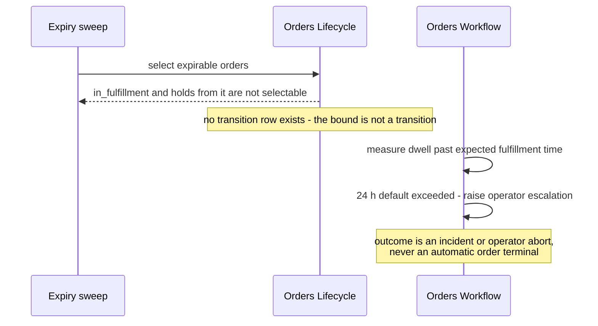

# Feature: Hold, Resume and Bounded Lifetime

- [ ] `p1` - **ID**: `cpt-cf-bss-orders-lifecycle-featstatus-hold-and-expiry-implemented`
- [ ] `p1` - `cpt-cf-bss-orders-lifecycle-feature-hold-and-expiry`

## Table of Contents

<!-- toc -->

- [1. Feature Context](#1-feature-context)
  - [1.1 Overview](#11-overview)
  - [1.2 Purpose](#12-purpose)
  - [1.3 Actors](#13-actors)
  - [1.4 References and delivery boundaries](#14-references-and-delivery-boundaries)
- [2. Actor Flows](#2-actor-flows)
  - [2.1 Hold and resume](#21-hold-and-resume)
  - [2.2 Cancel an order](#22-cancel-an-order)
- [3. Processes / Business Logic](#3-processes--business-logic)
  - [3.1 Expiry and draft auto-void](#31-expiry-and-draft-auto-void)
  - [3.2 Policy changes and lifetime bounds](#32-policy-changes-and-lifetime-bounds)
- [4. States](#4-states)
- [5. Definitions of Done](#5-definitions-of-done)
  - [5.1 Engine-backed lifecycle operations](#51-engine-backed-lifecycle-operations)
  - [5.2 Safe, observable maintenance](#52-safe-observable-maintenance)
- [6. Acceptance Criteria](#6-acceptance-criteria)
- [7. Detailed Behavior Contracts](#7-detailed-behavior-contracts)
  - [Hold and expiry: Interactions and Sequences](#hold-and-expiry-interactions-and-sequences)
  - [Hold and expiry: Hold and resume (normative)](#hold-and-expiry-hold-and-resume-normative)
  - [Hold and expiry: Bounded lifetime (normative)](#hold-and-expiry-bounded-lifetime-normative)
  - [Hold and expiry: The in_fulfillment exemption (normative)](#hold-and-expiry-the-in_fulfillment-exemption-normative)
  - [Hold and expiry: Draft abandonment (normative)](#hold-and-expiry-draft-abandonment-normative)
  - [Hold and expiry: The ordinary cancel operation (normative)](#hold-and-expiry-the-ordinary-cancel-operation-normative)
  - [Hold and expiry: Traceability](#hold-and-expiry-traceability)

<!-- /toc -->

## 1. Feature Context

### 1.1 Overview

Pause and resume an order, cancel it within the permitted window, expire configured state dwells, and auto-void abandoned drafts. Every state change goes through Foundation's engine, including scheduler requests and business refusals.

### 1.2 Purpose

**Requirements**: `cpt-cf-bss-orders-lifecycle-fr-order-hold`, `cpt-cf-bss-orders-lifecycle-fr-order-expiry`, `cpt-cf-bss-orders-lifecycle-fr-order-cancel`, `cpt-cf-bss-orders-lifecycle-fr-order-events`, `cpt-cf-bss-orders-lifecycle-nfr-order-retention`, `cpt-cf-bss-orders-lifecycle-nfr-order-audit-completeness`, `cpt-cf-bss-orders-lifecycle-nfr-order-idempotency`, `cpt-cf-bss-orders-lifecycle-nfr-order-transition-latency`.

**Principles**: `cpt-cf-bss-orders-lifecycle-principle-hold-changes-only-order`, `cpt-cf-bss-orders-lifecycle-principle-prehold-stored`, `cpt-cf-bss-orders-lifecycle-principle-exemptions-in-table`, `cpt-cf-bss-orders-lifecycle-principle-resume-is-capped`, `cpt-cf-bss-orders-lifecycle-principle-park-does-not-stop-clock`.

### 1.3 Actors

| Actor | Role |
|-------|------|
| `cpt-cf-bss-orders-lifecycle-actor-orders-seller-operator` | Hold/resume and reasoned cancel within authorized seller scope |
| `cpt-cf-bss-orders-lifecycle-actor-orders-partner-admin` | Cancel within delegated scope; no hold/resume grant |
| `cpt-cf-bss-orders-lifecycle-actor-orders-direct-customer` | Cancel own orders with the required PDP grant |
| `cpt-cf-bss-orders-lifecycle-actor-orders-workflow` | Hold/resume; separately owned compensation exits and overdue escalation |

The two private maintenance workers use configured authenticated system authority; a caller-supplied actor class cannot invoke them.

### 1.4 References and delivery boundaries

- [PRD](../PRD.md) §6.3 and §7.1; [DESIGN](../DESIGN.md).
- [Decomposition](../DECOMPOSITION.md): `cpt-cf-bss-orders-lifecycle-feature-hold-and-expiry`.
- [Detailed architecture](../DESIGN.md#contract-07-1-1): authoritative API, policy schema, transaction protocol and decisions.
- **Dependencies**: [Foundation](01-foundation.md), [Capture](02-capture.md), [Workflow seam](06-workflow-seam.md).
- **Shared contracts**: [Versioning](04-versioning.md) owns the amendment cap; [Read and authorization](08-read-and-authz.md) declares permissions. Its shared adapter and write enforcement are Foundation prerequisites, not deferred until read delivery.

Product-owned TTL durations have no code default; seller overrides stay disabled by default pending Q-06. Draft TTL and program retention remain Q-07. The resume-cap qualification to PRD resumability remains Q-31, and the Partner Admin hold conflict remains Q-18 in [DECISIONS](../DECISIONS.md). This specification preserves those questions and the design's stricter permission set; it does not resolve them. Workflow integration and operational escalation remain subject to [UPSTREAM_REQS](../UPSTREAM_REQS.md).

**UI applicability**: UI layout, keyboard navigation, screen-reader behavior and visual accessibility are not applicable because this feature specifies backend contracts, not a user interface. API usability, actionable errors and non-disclosing diagnostics remain applicable; consuming consoles own their UI requirements.

## 2. Actor Flows

### 2.1 Hold and resume

- [ ] `p1` - **ID**: `cpt-cf-bss-orders-lifecycle-flow-hold-and-expiry-hold-resume`

**Actors**: Seller Operator, Orders Workflow. **Use case**: `cpt-cf-bss-orders-lifecycle-usecase-order-cancel-during-approval`.

**Input**: target, authenticated context, idempotency key and `expected_version` for each separate request; optional hold reason.

1. Request `POST /bss-orders-lifecycle/v1/orders/{orderId}/hold` through the shared authorization pre-guard and engine. The caller supplies no resume target.
2. The engine admits only `submitted`, `pending_approval`, `approved` or `in_fulfillment`, stores the outgoing state in `pre_hold_state`, and commits `on_hold`, audit and `OrderHeld` atomically. The optional reason is `caller_reason`, NULL when omitted.
3. Later request `/resume` with its own key and expected version. After shared authorization/idempotency checks, the engine checks admissibility and expected version, then evaluates the registered resume-cap guard before resolving or validating the stored resume target, all under the aggregate lock.
4. On success, restore exactly `pre_hold_state`, clear it, reset the state dwell clock, increment `resume_count`, and commit audit and `OrderResumed` in the same transaction.

**Refusals**: `not-admissible` for an unavailable transition; `resume-target-missing` for a missing stored target; `resume-cap-exhausted` at the configured cap, baseline 5. Slice-level prechecks must not bypass audited, settled engine refusals. No operation resets or decrements the counter, including amendments. The cap also applies to resumes into fulfillment.

Hold/resume changes neither subscription entitlement nor billing, extends no term, voids no wave-1 draft, and cannot pause the Subscriptions draft TTL. Workflow owns process suspension and expired-draft reconciliation.

### 2.2 Cancel an order

- [ ] `p1` - **ID**: `cpt-cf-bss-orders-lifecycle-flow-hold-and-expiry-cancel`

**Actors**: authorized Partner Admin, Direct Customer or Seller Operator. **Use case**: `cpt-cf-bss-orders-lifecycle-usecase-order-cancel-during-approval`.

1. Request `POST /bss-orders-lifecycle/v1/orders/{orderId}/cancel` with reason, context, idempotency key and expected version.
2. Authorize the operation before business guards. Declare the mandatory reason guard (`cancel-reason-required`); terminal states have no cancel row and refuse `not-admissible`.
3. Use the current state, or stored pre-hold state when held, for cancellation guards. For effective `in_fulfillment`, invoke Workflow seam's shared spawn-signal guard; a recorded first activation intent closes direct cancellation (`direct-cancel-window-closed`). Draft creation alone does not close that window.
4. Commit the engine's `cancelled` transition, actor, machine reason and `caller_reason`, and `OrderCancelled` atomically.

Workflow uses its separate `/workflow-cancel` endpoint and compensation evidence, not the public cancel handler. A hold never clears the spawn signal or reopens the direct-cancel window. Completed orders have no cancellation window; subscription rights and Billing reversals remain downstream concerns.

## 3. Processes / Business Logic

### 3.1 Expiry and draft auto-void

- [ ] `p1` - **ID**: `cpt-cf-bss-orders-lifecycle-algo-hold-and-expiry-sweep`

**Input**: configured private worker context, database time, effective TTL policy snapshot. **Output**: committed expiry count and separately classified refusals/failures.

1. On the working five-minute cadence, make one nonblocking toolkit-db advisory-lock attempt for the worker. Skip a contended pass; abandon on observed session loss and reacquire before retry. Coordination is not authorization or fencing.
2. Snapshot policy scopes with the architecture's policy-row locking protocol. Observe all five policy states, even on empty queues. Missing permanent platform rows are integrity failures; present rows with NULL duration are unset TTLs. Skip unconfigured effective scopes without inventing a fallback.
3. For state expiry, scan `submitted`, `pending_approval`, `approved`, `on_hold` by `(state_entered_at, order_id)`. Exclude holds from fulfillment in SQL before LIMIT. For auto-void, scan only `draft` by `(created_at, order_id)` and use trigger `auto-void`.
4. Separate enabled seller scopes from platform fallback; exclude overridden sellers from fallback. While `ttl_seller_override_enabled` is off, ignore seller rows in discovery and engine rechecks. Use a fixed cutoff and finite high-water tuple, keyset batches of 500, advancing past every scanned candidate including refusals.
5. Derive a versioned canonical key/hash from `(worker_kind, order_id, current_version, audit_sequence, state, dwell_started_at, policy_id, policy_revision, platform_policy_revision)`. Derive correlation deterministically. Preserve the identical contribution, key and correlation on transport retry; exclude fresh time, elapsed age and retry count from fingerprints.
6. Narrow discovery authority to the actual order and invoke the private engine with configured SecurityContext, selected expected version and observed generation/state/dwell/policy contribution. The contribution grants no authority and supplies no trusted target state.
7. Under the aggregate lock, check expected version and observed generation; then lock permanent platform policy row followed by the selected seller override, re-resolve effective policy, and hold locks through commit. Use fresh database time for the deadline. Changed observations refuse `expiry-candidate-stale`; absent or unelapsed TTL refuses `expiry-not-due`.
8. Engine admissibility rejects expiry of `in_fulfillment`. The `on_hold` expiry guard independently rejects pre-hold fulfillment with `expiry-exempt-prehold`. A discovery bug cannot override either protection.
9. Commit terminal state, audit and `OrderExpired` atomically. Actor class is derived as `system` from configured identity; audit reason is the closed `expire` or `auto-void` token. Policy evidence remains in the defined contribution/event fields.
10. Continue after business refusals/version conflicts. Leave `still-processing` for a later pass. Count `idempotency-mismatch` and `authorization-context-changed` as worker defects and never retry the same key. Retry infrastructure failures only within a bounded identical-request budget; count only committed expiries. Observe cancellation between batches and release the discovery lock at pass end.

### 3.2 Policy changes and lifetime bounds

- [ ] `p1` - **ID**: `cpt-cf-bss-orders-lifecycle-algo-hold-and-expiry-policy`

**Input**: Validated policy change, state/scope/duration, override flag and configured resume/amendment caps.

**Output**: Serialized revisioned policy or policy rejection without change; conditional dwell-budget bound and Workflow escalation responsibility.

Policy writers lock the permanent platform row first, then any seller row; every override insertion/update/deletion increments the platform revision and an updated seller row's own revision. Recreated overrides receive a fresh identity. Writers never lock order aggregates; multi-state writers acquire platform locks in state-name order. The schema forbids fulfillment TTLs, nonpositive durations, duplicate platform policies and NULL seller durations. Five permanent platform rows start with revision 1 and unset duration.

Resume baseline 5 and Versioning's amendment baseline 20 are finite, independent count budgets. With caps A and R the configured pre-fulfillment graph permits at most `3 × (A + 1) + 2 × R + 1` dwell entries: 74 at baseline. `74 × T_max` bounds configured dwell budgets only, excluding draft, fulfillment exemptions and scheduler delay; it requires finite TTLs bounded over the lifetime. An unset TTL leaves its state unbounded. No absolute-lifetime backstop or second sweep is introduced.

A fail-closed approval park stays `submitted` and does not suspend that TTL. Fulfillment and holds from fulfillment instead use Workflow's operational SLA: baseline 24 hours past expected fulfillment time, with the fulfillment operator responsible. SLA exhaustion creates an incident/operator abort, never an automatic terminal state.

## 4. States

- [ ] `p1` - **ID**: `cpt-cf-bss-orders-lifecycle-state-hold-and-expiry-transitions`

Foundation's table remains the sole state authority; the following is this feature's subset.

| From | Trigger / target | Conditions |
|------|------------------|------------|
| submitted, pending_approval, approved, in_fulfillment | hold → on_hold | Authorized actor; outgoing state stored |
| on_hold | resume → stored state | Target present, finite resume budget remains |
| permitted non-terminal state | cancel → cancelled | Mandatory reason; pre-hold and spawn-signal guards apply |
| submitted, pending_approval, approved | expire → expired | Configured TTL due under lock |
| on_hold | expire → expired | TTL due; pre-hold state is not in_fulfillment |
| draft | auto-void → expired | Configured creation-age deadline due; no deletion |

`in_fulfillment` has no expiry row. A capped hold from fulfillment retains Workflow's evidence-guarded failed acknowledgement and compensated cancel exits (Foundation rows 26/27), owned by Workflow seam; it cannot complete while held.

## 5. Definitions of Done

### 5.1 Engine-backed lifecycle operations

- [ ] `p1` - **ID**: `cpt-cf-bss-orders-lifecycle-dod-hold-and-expiry-operations`

The implementation MUST route hold/resume/cancel and their business refusals through the shared engine, preserving authorization, version checks, principal-bound idempotency and atomic state/audit/event effects.

**Implements**: `cpt-cf-bss-orders-lifecycle-flow-hold-and-expiry-hold-resume`, `cpt-cf-bss-orders-lifecycle-flow-hold-and-expiry-cancel`.

**Touches**: `/hold`, `/resume`, `/cancel`; `orders_order.pre_hold_state`, `resume_count`, `state_entered_at`; transition audit and producer enqueue. **Constraints**: `cpt-cf-bss-orders-lifecycle-constraint-hold-does-not-pause-draft-ttl`.

### 5.2 Safe, observable maintenance

- [ ] `p1` - **ID**: `cpt-cf-bss-orders-lifecycle-dod-hold-and-expiry-workers`

The implementation MUST provide both bounded workers and the policy serialization protocol, with missing-TTL gauges recomputed for all five states/scopes (clear configured/obsolete labels; unknown reads are errors). Expose committed counts, refusals, worker defects, pass duration/completion, oldest due candidate, saturation, exempt holds and resume-cap refusals. Alert on missing production TTLs, prolonged coordination failure, sustained backlog and cap refusals.

**Implements**: `cpt-cf-bss-orders-lifecycle-algo-hold-and-expiry-sweep`, `cpt-cf-bss-orders-lifecycle-algo-hold-and-expiry-policy`, `cpt-cf-bss-orders-lifecycle-state-hold-and-expiry-transitions`.

**Touches**: `cpt-cf-bss-orders-lifecycle-dbtable-state-ttl-policy`, aggregate dwell/counters, private maintenance capability. **Constraints**: `cpt-cf-bss-orders-lifecycle-constraint-in-fulfillment-not-expirable`, `cpt-cf-bss-orders-lifecycle-constraint-ttl-values-unchosen`.

## 6. Acceptance Criteria

- [ ] Hold/resume restores each permitted state exactly, audits optional reason correctly, produces one effect on replay, and leaves subscriptions, billing, terms and draft TTLs untouched.
- [ ] Five baseline resumes succeed; the sixth refuses with the registered cap reason, including fulfillment holds. Concurrent resumes cannot exceed the cap; no transition resets either re-entry counter.
- [ ] Cancel requires a reason for every actor, applies pre-hold guards, preserves the first-spawn boundary and refuses terminal orders; evidence-backed Workflow exits remain usable at the resume cap.
- [ ] Sweep defects cannot expire fulfillment or a hold from it. Auto-void preserves the draft and audit trail and loses safely to a racing submit.
- [ ] PostgreSQL concurrency tests cover duplicate workers, coordination-session loss, hold/resume and policy-change races (platform edits and override creation/update/deletion), rollback and interruption/restart; each committed expiry has one audited event effect.
- [ ] More than 500 exempt holds, multiple batches of mixed refusals, equal timestamps and stale candidates do not block later eligible orders; retries preserve identity while new generations/policies receive new keys.
- [ ] Unset TTLs perform no expiry, including draft-only missing configuration; configuration gauges clear after values are set and obsolete overrides are removed. Empty queues and restart preserve correct observations.
- [ ] Graph enumeration confirms 4/64/14/74 dwell entries at caps (0,0)/(20,0)/(0,5)/(20,5); tests retain the conditional bound and Workflow SLA exemption.
- [ ] Operation latency verification measures the PRD write-and-publish p95 < 1 s, not commit alone; no completion or runtime evidence is claimed by these unchecked specifications.

- [ ] With both an exhausted resume cap and a missing stored target, `resume-cap-exhausted` wins; target validation occurs only after the cap guard passes.

## 7. Detailed Behavior Contracts

**Contract namespace 07.** Section numbers inside the detailed contracts below resolve
through the [contract address index](../DECOMPOSITION.md#4-contract-address-index),
not the overview section numbers above.

The following sections retain the complete algorithms, guards, state transitions and
feature-local rules. The preceding flows and acceptance criteria summarize these contracts;
shared schemas and interfaces are defined in [DESIGN.md](../DESIGN.md).

<!-- contract:07-hold-and-expiry:3.6 -->
### Hold and expiry: Interactions and Sequences

#### Hold and resume

**ID**: `cpt-cf-bss-orders-lifecycle-seq-hold-resume`

**Use cases**: `cpt-cf-bss-orders-lifecycle-usecase-order-cancel-during-approval`

**Actors**: `cpt-cf-bss-orders-lifecycle-actor-orders-seller-operator`, `cpt-cf-bss-orders-lifecycle-actor-orders-workflow`

**Algorithm: Hold Then Resume**

Input: order_id, holding_actor, reason, security_context, idempotency_key, **expected_version** —
one per request, since hold and resume are two calls and each carries its own
Output: on_hold then the restored state, or a registered refusal

1. [ ] - `p1` - Declare no admissibility guard: hold is admissible only where [01 §4.3](01-foundation.md#contract-01-4-3) has a hold row (`submitted`, `pending_approval`, `approved`, `in_fulfillment`), and the engine refuses any other state as `not-admissible` at [01 §3.6](01-foundation.md#contract-01-3-6) *Attempt Transition* step 11 - `inst-hr-declare-admissibility-guard`
2. [ ] - `p1` - Supply no pre-hold value; the engine records the outgoing state as `pre_hold_state` at [01 §3.6](01-foundation.md#contract-01-3-6) *Attempt Transition* step 20.2, and this slice contributes nothing to the aggregate on hold - `inst-hr-store-prehold`
3. [ ] - `p1` - Request the hold transition with the request's `expected_version`; the engine records the actor, the instant and the reason, if one was supplied, on the audit entry — the reason in its `caller_reason`, NULL when none was supplied ([01 §3.7](../DESIGN.md#contract-01-3-7), D-143) — and publishes OrderHeld, which carries the reason only when present. No guard requires a hold reason (D-138) - `inst-hr-request-hold`
4. [ ] - `p1` - **RETURN** on_hold - `inst-hr-return-on-hold`
5. [ ] - `p1` - **WHEN** resume is later requested: - `inst-hr-when-resume`
   1. [ ] - `p1` - Declare the **resume-cap guard** on row 22, so the engine evaluates it under the aggregate row lock: it fails with `resume-cap-exhausted`, naming the cap and the count, when `orders_order.resume_count` is at or above the cap of §4.5 - `inst-hr-declare-resume-cap`
   2. [ ] - `p1` - Request the resume transition with the request's `expected_version`, resolving no state and reading no column first — **an order that is not `on_hold` is refused by the engine as `not-admissible`, and one with no stored pre-hold state by [01 §3.6](01-foundation.md#contract-01-3-6) *Attempt Transition* step 15 (`resume-target-missing`)** - `inst-hr-request-resume`
   3. [ ] - `p1` - The engine reads the stored pre-hold state as the effective target, clears the pre-hold column, increments `resume_count` and publishes OrderResumed, all inside the transition transaction ([01 §3.6](01-foundation.md#contract-01-3-6) *Attempt Transition* steps 14, 20.3 and 20.4) — both the target and the counter are engine-owned and this slice contributes neither - `inst-hr-engine-resolves-resume`
   4. [ ] - `p1` - **RETURN** the restored state - `inst-hr-return-restored`

**Description**: Nothing about the spawned subscriptions changes at either end. A hold from
`in_fulfillment` leaves activated subscriptions serving and billing, and leaves wave-1 drafts
alone — including their own auto-void TTL, which this gear cannot pause.

**Engine-owned refusal and cap checks.** No step refuses ahead of the engine. It evaluates admissibility at Attempt Transition step 11, the resume-cap guard at step 13, and the stored target at step 15. It returns `not-admissible`, `resume-cap-exhausted` or `resume-target-missing` with audit and idempotency settlement as applicable. `not-on-hold` is not a registered reason. The engine checks and increments `resume_count` under the same aggregate lock and transaction; concurrent resumes must not exceed the cap. Historical rationale is retained in [ADR-0005](../ADR/0005-cpt-cf-bss-orders-lifecycle-adr-refusals-commit.md#hold-and-resume-guard-rationale).

#### The expiry sweep

**ID**: `cpt-cf-bss-orders-lifecycle-seq-expiry-sweep`

**Use cases**: `cpt-cf-bss-orders-lifecycle-usecase-order-new-acquisition`

**Actors**: `cpt-cf-bss-orders-lifecycle-actor-orders-seller-operator`, `cpt-cf-bss-orders-lifecycle-actor-orders-workflow`

**Algorithm: Sweep Expired Orders**

Input: database time for the pass cutoff, configured internal worker SecurityContext and private
maintenance capability ([08 §3.5](../DESIGN.md#contract-08-3-5)); effective policy identities and revisions
Output: expired count

1. [ ] - `p1` - Acquire the sweep advisory lock through toolkit-db under Foundation §3.8; **IF** not acquired, **RETURN** without work. Release explicitly after the bounded pass; on observed session loss abandon the pass and reacquire before retrying - `inst-es-acquire-lease`
2. [ ] - `p1` - **FOR EACH** expirable state — `submitted`, `pending_approval`, `approved`, `on_hold`: - `inst-es-for-each-state`
   1. [ ] - `p1` - Resolve a consistent policy snapshot for that state at each configuration scope, including its permanent platform row's revision and the effective policy identity/revision/duration. Use §3.7's policy-row locking order in a short SecureTx and release after copying the snapshot - `inst-es-resolve-ttl`
   2. [ ] - `p1` - **IF** the effective TTL is unset for a scope: set the no-configured-TTL gauge for this scope/state to 1 (set to 0 when configured) of `§3.8` and skip that scope (no code default). An unset platform duration skips fallback only, not configured seller overrides; skip the whole state only when every effective scope is unset - `inst-es-if-no-ttl`
   3. [ ] - `p1` - **FOR EACH** seller scope with its own policy for this state (none while `ttl_seller_override_enabled` is off: effective-policy selection ignores every `scope = seller` row while the flag is off, whether or not such rows exist, so this pass then selects nothing, §3.7): select due orders for that seller, excluding `on_hold` rows with `pre_hold_state = in_fulfillment` **in SQL before ORDER BY/LIMIT**. Traverse batches of at most 500 by `(state_entered_at, order_id)` through the pass cutoff; carry the last scanned tuple to the next batch, including refused/skipped candidates. Use the seller/state/dwell index with `order_id` as its tie-breaker - `inst-es-select-eligible`
   3a. [ ] - `p1` - Apply the same exclusion and keyset traversal to the platform fallback, selecting due orders **whose `seller_tenant_id` has no policy of its own for this state**; while `ttl_seller_override_enabled` is off no seller row counts as a policy of its own, so the fallback covers every seller. Resolve the policy identity/revision used for each candidate; an override must never also enter the fallback pass - `inst-es-select-platform-fallback`
   4. [ ] - `p1` - **FOR EACH** selected order: - `inst-es-for-each-order`
      1. [ ] - `p1` - **IF** the state is `on_hold` **AND** its pre-hold state is `in_fulfillment`: - `inst-es-if-hold-from-fulfillment`
         1. [ ] - `p1` - **SKIP TO** the next order; this case is escalated, never expired - `inst-es-skip-exempt-hold`
      2. [ ] - `p1` - Capture `order_id`, `current_version`, `audit_sequence`, state, `state_entered_at`, effective `(policy_id, policy_revision, ttl_duration)` and `platform_policy_revision`. Derive the deterministic key from the canonical tuple defined below - `inst-es-derive-key`
      3. [ ] - `p1` - Invoke the private engine entry with `order_id`, trigger `expire`, configured `security_context`, `idempotency_key`, `expected_version = selected.current_version`, deterministic attempt `correlation_id` and the expiry contribution below. Narrow internal target authority to this order; actor class `system` is derived from the authenticated context — the configured Orders worker identity (D-115) — never from the worker entry and never a replacement for SecurityContext - `inst-es-request-expiry`
      4. [ ] - `p1` - On `not-admissible`, `expiry-exempt-prehold`, `expiry-not-due`, `expiry-candidate-stale` or the engine's expected-version conflict: record the outcome and continue past this scanned key. On `still-processing`, do not retry in-pass; leave the order for a later pass. On `idempotency-mismatch` or `authorization-context-changed`, record it as a worker defect, raise the sweep-error count of `§3.8` and continue, never retrying the same key. On infrastructure failure, retry the identical request within a bounded retry budget; if exhausted, record the failure and continue, leaving the order for a later pass. Never count a refusal/failure as expiry - `inst-es-if-refused`
3. [ ] - `p1` - **RETURN** the expired count for the sweep metric - `inst-es-return-count`

**Description**: The two selection steps are separate because **seller scope overrides platform
scope** where Q-06 admits it and `ttl_seller_override_enabled` is on (`§3.7`, D-137), and a fallback that did not exclude seller-policied orders would not be a fallback
— it would be a second, shorter, unconditional TTL applied behind the seller's back. Resolving the
effective policy per order before selection is the equivalent formulation and is equally
acceptable; what is not acceptable is two unqualified queries whose union is wider than either.

**Attempt identity and full engine input.** Use a versioned canonical encoding and hash of
`(worker_kind, order_id, current_version, audit_sequence, state, dwell_started_at, policy_id,
policy_revision, platform_policy_revision)` as the key, with `worker_kind = expiry` (or `draft-auto-void`). Here
`dwell_started_at` is `state_entered_at` for expiry and `created_at` for draft auto-void. The monotonic
committed `audit_sequence` already changes on hold, resume and every other committed transition;
it disambiguates equal timestamps without adding a state-entry column. Commercial version alone
does not identify a dwell. Retransmission retains the entire tuple, contribution, key and
correlation; a newly observed generation or policy revision is a new attempt. A refused old
candidate therefore cannot suppress expiry of a later hold/resume period for the registry's
24-hour window. The configured service principal and tenant namespace must be stable across
replicas/restarts so `principal_scope` is reproducible; another principal cannot replay it.

The contribution carries observed generation/state/dwell, effective policy identity/revision and
duration, and `platform_policy_revision`, which name the expired state and its TTL; they are not
composed into the audit `reason`, which is the closed token `expire` (`auto-void` for a draft)
([01 §3.7](../DESIGN.md#contract-01-3-7) *Committed audit reason tokens*, D-148). It grants no authority and supplies no trusted target state. Under the aggregate lock the engine
verifies the expected version, observed generation and state/dwell, then locks the state's
permanent platform policy row and chosen seller override, if present, in that order (§3.7).
Re-read effective policy selection, both revisions and duration while holding those locks through
commit, reading the flag as step 2.3 does (seller rows ignored while it is off); then check expiry against fresh database time. A changed candidate refuses as
`expiry-candidate-stale`; an unchanged candidate without an elapsed TTL refuses as
`expiry-not-due`. The `on_hold` exemption guard always applies. The policy identity and both
revisions participate in the fingerprint and are carried on the `OrderExpired` payload; the
committed audit entry records the expired state as `from_state` and its `reason` stays the
token (D-148). Fingerprint only the stable request
contribution: exclude pass cutoff, fresh database time, measured elapsed age, retry count and
other execution-time values. Derive the correlation deterministically from the attempt identity;
fresh guard observations and audit timestamps are engine results, not changed retry input.

**Progress.** The SQL exclusion prevents 500 old exempt holds from consuming a whole batch.
Keyset traversal advances on every scanned candidate, so a refused row does not consume each
following batch. Capture a finite high-water tuple for each scoped pass at its start and stop at
that tuple; new or changed candidates beyond it enter the next pass. Transactions remain per
order, not one transaction over 500 orders. Observe cancellation and coordination/database
failures between batches; on observed loss abandon the pass and restart after reacquisition.
The guard provides no fencing or guaranteed loss notification (Foundation §3.8). No custom
durable scheduler checkpoint is introduced: committed expiries cease to be candidates, and
unchanged refusals replay cheaply but do not prevent traversal to later keys. Liveness assumes
workers get time to complete passes; sustained restarts/backlog are alerted, not described as a
one-cadence guarantee. Test more than 500 exempt holds before an eligible order, more than one
batch of mixed refusals/successes, identical timestamps, policy changes and interruption/restart.

The sweep's checks reduce work; safety belongs to the engine's missing `in_fulfillment` row and
registered `on_hold` guard. The sweep still has **one pass** over state dwell, not an additional
absolute-lifetime pass.

**There is no second pass.** Bound re-entry through the resume and amendment guards; run only the state-dwell sweep. The historical absolute-lifetime alternative is recorded in [D-90](../DECISIONS.md#hold-and-expiry-alternative-history).

#### Overdue escalation handoff

**ID**: `cpt-cf-bss-orders-lifecycle-seq-overdue-handoff`

**Use cases**: `cpt-cf-bss-orders-lifecycle-usecase-order-fulfillment-complete`

**Actors**: `cpt-cf-bss-orders-lifecycle-actor-orders-workflow`, `cpt-cf-bss-orders-lifecycle-actor-orders-seller-operator`

**Description**: The handoff is by absence. This gear provides no expiry for the state and
publishes the events the sibling gear needs; that gear measures the window and raises the
escalation. Exhausting the SLA produces no new order state.

<!-- /contract -->

<!-- contract:07-hold-and-expiry:4.1 -->
### Hold and expiry: Hold and resume (normative)

Hold **MUST** be admitted from `submitted`, `pending_approval`, `approved` and `in_fulfillment`,
and the outgoing state **MUST** be stored as the resume target rather than derived. Resume
**MUST** return the order to exactly that state and clear the stored value. Both **MUST** be
idempotent and audited, and both publish their event so the sibling gear can suspend and resume
its process.

Cancel from `on_hold` **MUST** apply the **pre-hold state's** cancel guards. In particular a
hold taken from `in_fulfillment` after a spawn signal does **not** re-open the direct-cancel
window: the guard reads the recorded spawn signal, and a hold does not clear it.

A hold **MUST NOT**: pause entitlement or billing on any activated subscription, extend a term,
void a wave-1 subscription draft, or be assumed to pause the Subscriptions draft auto-void TTL.
Already-activated subscriptions keep serving and keep billing for the duration of the hold.

**Hold and resume extend the order's life, and the number of extensions is capped.** Resume
**MUST** set `state_entered_at`, so the restored state's **per-state** TTL starts over; that is
intended, since the order has genuinely re-entered the state. What is bounded is the count: resume
**MUST** increment `orders_order.resume_count` in the same transaction that changes state, and the
resume transition ([01-foundation — The State Machine (normative)](01-foundation.md#contract-01-4-3) row 22) **MUST** carry a registered
guard that refuses with `resume-cap-exhausted` when that counter has already reached the cap of
§4.5. No transition — hold, resume, cancel, amendment or administrative edit — **MAY** decrement or
reset the counter. An order at the cap always keeps a terminal exit, and what it cannot do is
re-enter a dwell again. A hold taken from `submitted`, `pending_approval` or `approved` can still
be cancelled through row 23 and its `on_hold` TTL still elapses (row 24). A hold taken from
`in_fulfillment` is exempt from that TTL (§4.3), and once the spawn signal is recorded row 23's
shared cancel guard admits no caller but Workflow; its exits are Workflow's failure acknowledgement
(`acknowledge-failed`, row 26) and workflow-mediated cancel (`cancel-workflow-mediated`, row 27),
admitted from `on_hold` only for that pre-hold state and under the evidence guards of rows 14 and 16
([06-workflow-seam — The five operations are ordinary transitions (normative)](../DESIGN.md#contract-06-4-1)). Completion is not among them: a held order is
resumed before it completes ([`../DECISIONS.md`](../DECISIONS.md) D-109). See §4.2 for why this is the enforcement
point and why the absolute-lifetime backstop was withdrawn.

This qualifies PRD §6.3's resumability MUST and is routed as Q-31.

<!-- /contract -->

<!-- contract:07-hold-and-expiry:4.2 -->
### Hold and expiry: Bounded lifetime (normative)

Bounded lifetime is delivered in **two layers**, and **neither is unconditional** — which is the
point of stating them separately. Together they bound every order whose states have configured
TTLs, and disclose the orders they do not bound. See [D-90](../DECISIONS.md#hold-and-expiry-alternative-history) for the historical alternatives.

**Layer 1 — the per-state TTL, which holds only where it is configured.** A configurable TTL
**MAY** be set per state for `submitted`, `pending_approval`, `approved` and `on_hold`. Where a
TTL **is** configured for a state, an order dwelling in that state past it **MUST** transition to
`expired`, publish `OrderExpired`, and audit with actor class `system`. Where a TTL is **not**
configured, that state has **no per-state bound at all**: there is no code default (§3.7), the
per-state pass skips the state (§3.6 step 2.2), and the gap is surfaced as the no-configured-TTL
metric and alert of §3.8. This is a **qualified** guarantee, deliberately, because an unset TTL is
tolerated rather than fatal — a missing TTL **MUST NOT** block startup, since the numbers are
Product-owned PRD open questions (§2.2, §4.5) and refusing to start would make an unanswered
question an outage.

**Layer 2 — two re-entry caps, which hold unconditionally and bound counts rather than durations.**
Two transitions restart a dwell by resetting `orders_order.state_entered_at`, and each is capped
separately:

* **Resume.** `orders_order.resume_count` **MUST** be incremented by row 22 ([01-foundation — The State Machine (normative)](01-foundation.md#contract-01-4-3)), which **MUST** carry a registered guard refusing `resume-cap-exhausted` at the cap of §4.5 — baseline **5**.
* **Amendment.** `orders_order.amendment_count` **MUST** be incremented by rows 18, 19 and 20, which **MUST** carry a registered guard refusing `amendment-cap-exhausted` at the cap owned in [04-versioning — Admissibility (normative)](04-versioning.md#contract-04-4-1) — baseline **20**. Rows 19 and 20 target `submitted` from `pending_approval` and `approved`, so the target differs from the outgoing state and step 20.1 resets the clock; capping resumes alone left this loop open through a second operation.

Both counters are resolved from configuration and are **never unset**. No transition **MAY**
decrement or reset either. Guards and increments are all engine-side and all under the aggregate
row lock ([01 §3.6](01-foundation.md#contract-01-3-6) *Attempt Transition* steps 13, 20.4 and 21), so two concurrent re-entries
cannot both observe a count below its cap. The two budgets are **separate on purpose**: a resume is
a seller-side operational act and an amendment a buyer-side commercial one, so a seller's
compliance holds **MUST NOT** consume a buyer's ability to revise the order ([04 §4.1](04-versioning.md#contract-04-4-1)).

**What the caps bound, derived from the full graph.** With amendment cap A and resume cap R,
the TTL-covered pre-fulfillment subgraph has at most `3 × (A + 1) + 2 × R + 1` dwell entries:
three approval states per amendment epoch, hold/resume adds two per cycle, and one final
unresumed hold adds one. Same-state amendments consume their cap without resetting the dwell.
For A=20 and R=5 this is **74**, not 26. A maximizing path traverses submitted → pending_approval
→ approved in each of 21 epochs, adds five hold/resume cycles, then a final hold. Read-only
exhaustive traversal of states plus both counters confirmed 4/64/14/74 entries for caps
(0,0)/(20,0)/(0,5)/(20,5). Tests must enumerate this graph when transitions or caps change.

`74 × T_max` is a conservative sum of configured dwell budgets, not a hard wall-clock deadline:
actual expiry includes discovery cadence, backlog, outages and transaction scheduling delay.
It excludes draft lifetime, `in_fulfillment` and holds from fulfillment. Policy changes can extend
TTLs, so the formula requires a finite upper bound T_max over policies effective during the
order's lifetime. Without configured finite TTLs or bounded scheduler delay, no calendar bound
is claimed. This design adds no new absolute-deadline mechanism.

**What neither layer bounds, disclosed rather than covered.** Where a state's TTL is unset, that
state has no bound, and the re-entry caps supply none — they multiply a dwell that is itself
unbounded. Two states are outside both layers entirely by §4.3's exemption: `in_fulfillment`, and
an `on_hold` order whose pre-hold state is `in_fulfillment`. Those remain bounded by the
operational SLA and by no transition in this gear. So the unqualified sentence "an in-flight order
does not live forever" is **not** asserted by this design. What is asserted is the arithmetic
above, its precondition (a configured TTL), and the visibility of the precondition failing
(§3.8's no-configured-TTL alert). Closing the residual gap is PRD §15 row 7, a Product decision,
and this design **MUST NOT** pre-empt it with a code default (§2.2).

**Caller-visible cap outcome.** An order requiring one more resume or amendment than its cap allows must be cancelled and re-placed, or the cap raised. Return the named, audited refusal. The rationale for selecting re-entry caps is in [D-90](../DECISIONS.md#hold-and-expiry-alternative-history).

Expiry **MUST** be scheduler-driven and **MUST NOT** be a public operation. Its idempotency key
**MUST** follow §3.6's observed-generation and effective-policy-revision identity so a transport
retry is absorbed without suppressing an attempt for a later dwell or policy.
There is **one** expiry eligibility rule; retries and competing replicas observing the same
candidate share its key, while changed candidates do not.

A **fail-closed park does not suspend the clock**: where the sibling gear cannot obtain an
approval-requirement verdict, the order remains `submitted` and the `submitted` TTL continues to
elapse. Expiry is the bound of that park, and the sibling gear is required to escalate before it
fires.

<!-- /contract -->

<!-- contract:07-hold-and-expiry:4.3 -->
### Hold and expiry: The `in_fulfillment` exemption (normative)

`in_fulfillment` **MUST NOT** be auto-expired, and neither **MUST** an `on_hold` order whose
pre-hold state is `in_fulfillment`. **The exemption is from automatic expiry only.** It covers
Layer 1 of §4.2 — the per-state TTL — and it does **not** reach Layer 2: row 22 carries the
resume-cap guard unconditionally, so a hold taken from `in_fulfillment` and resumed still increments
`resume_count` and still refuses at the cap like any other.  The cap can stay unconditional because a capped hold from
`in_fulfillment` is never stranded: [01 §4.3](01-foundation.md#contract-01-4-3) rows 26 and 27 let Workflow move it straight from
`on_hold` to `fulfillment_failed` or `cancelled` with compensation evidence, without a resume, so
exhausting the cap removes only the option of restarting fulfillment ([`../DECISIONS.md`](../DECISIONS.md) D-109). The exemption is taken because a
subscription spawn signal may already have been issued and expiry would orphan provisioned
resources with no compensation path.

The exemption **MUST** be enforced in the engine. `in_fulfillment` has no expiry row and no TTL
policy may be authored for that state: the policy table's CHECK on `state` rejects it (§3.7), so no such row can exist. The `on_hold`
expiry row **does** exist; its mandatory guard checks `pre_hold_state` under the aggregate lock
and returns the registered `expiry-exempt-prehold` refusal for a hold from `in_fulfillment`.
A sweep defect therefore cannot expire either case. Scheduler exclusions do not replace either
engine check, and refusal handling must distinguish these two classes.

The bound for these cases is an **operational SLA** raised by the sibling gear: a configurable
window with a business default of **24 hours past expected fulfillment time**, where expected
fulfillment time is `max(now, latest service-activation date among the order's lines)` at
begin-fulfillment. A legitimately future-dated line therefore does not start the clock until its
date. The named owner is the fulfillment operator. **Exhausting the SLA MUST NOT auto-terminal
the order**: the outcome is an incident or an operator abort, not a new order state. The same
window bounds a stalled operational compensation.

<!-- /contract -->

<!-- contract:07-hold-and-expiry:4.4 -->
### Hold and expiry: Draft abandonment (normative)

A `draft` not submitted within its configurable auto-void TTL **MUST** transition
`draft → expired` with actor class `system`, publishing `OrderExpired`. It is **auto-voided**, and
that is the only term used for the outcome across the set — "archived" is not a state and there is
no `archived` state in the machine. Auto-void deletes nothing: the order and its trail remain
readable in the terminal state, so what a buyer nearly bought survives
([`../DECISIONS.md`](../DECISIONS.md) D-14). The sweep **MUST**
be singleton-coordinated and **MUST NOT** touch any order past `draft`.

Dwell is measured from the order's creation instant for this sweep specifically, since a `draft`
has had no state transition since creation.

The draft worker follows §3.6's full engine-input, policy-revision, keyset and retry contract —
including the refusal handling of `inst-es-if-refused` and its sweep-error count — using trigger `auto-void`, `worker_kind = draft-auto-void`, and `created_at` as its dwell input.
It supplies the selected `current_version` and `audit_sequence` and a configured internal
SecurityContext; it is not an actor-class-only call. The engine rechecks `draft` and its effective
auto-void deadline under lock before committing.

**Draft pass specialization:** on the shared five-minute working cadence, acquire
the toolkit advisory lock keyed by `bss-orders-lifecycle` and `draft-auto-void` with zero wait and zero retries — a single non-blocking attempt — using [Foundation’s session-pooling contract](../DESIGN.md#contract-01-3-8); a contended pass skips without mutating orders. Snapshot draft policy scopes using
the shared row-lock protocol, choose a fixed pass cutoff, and scan due `state = draft` members
by `(created_at, order_id)` in batches of 500. Process seller overrides (none while `ttl_seller_override_enabled` is off: seller rows are ignored, D-137) and platform
fallback separately, excluding overrides from fallback. Carry the last scanned key past refusals; each
candidate invokes the engine as specified above. Count committed expiries separately from
refusals/infrastructure failures. A submit racing the pass wins or loses under the aggregate
lock; the loser cannot expire a submitted order. Release the discovery lock at pass end.

Both workers recompute the missing-TTL observation for **all five** policy states, including
draft. Set each scope/state gauge to 1 when unset and 0 when configured, remove obsolete scope
labels, and replace the aggregate count from the current snapshot; never accumulate it as a
counter. Observe configuration even when no orders are due. An unknown configuration read is
an error/health signal, not an unset value. Test draft-only missing TTL, configuring it later
(alert clears), removed overrides, empty queues and restart.

**Where the auto-void TTL is unset, `draft` is unbounded, and there is no fallback.** Neither
re-entry cap applies — a `draft` is never held, resumed or amended — and the absolute-lifetime
backstop that once covered this case is withdrawn (D-90). `draft` is therefore the state with the
largest exposure to an unanswered Product value: baskets accumulate until the auto-void TTL of
§4.5 is chosen. The §3.8 alert covers it, no code default closes it (§2.2), and
[`../DECISIONS.md`](../DECISIONS.md) **Q-07** is where it is answered.

<!-- /contract -->

<!-- contract:07-hold-and-expiry:4.6 -->
### Hold and expiry: The ordinary cancel operation (normative)

This slice owns `POST /cancel`, because it already owns the cancel-from-`on_hold` guard and the
bounded-lifetime machinery cancellation sits alongside. It previously belonged to no slice: three
transition rows and three actor permissions depended on an operation with no algorithm, no guards
and no registered reasons ([`../DECISIONS.md`](../DECISIONS.md) D-36).

**Algorithm: Cancel Order**

Input: order_id, cancelling_actor, reason, security_context, idempotency_key, expected_version
Output: cancelled, or a registered refusal

1. [ ] - `p1` - Declare the guards the engine evaluates: a **mandatory** cancel reason, and the pre-hold guard where the state is `on_hold`. A terminal state is not a guard: it has no `cancel` row, so the engine's state-table lookup refuses it `not-admissible` ([01 §3.6](01-foundation.md#contract-01-3-6) *Attempt Transition* step 11) - `inst-co-declare-guards`
2. [ ] - `p1` - **IF** the effective cancel state is `in_fulfillment` (current state, or stored pre_hold_state when on_hold): defer to the spawn-signal guard owned by [06-workflow-seam — Interactions and Sequences](06-workflow-seam.md#contract-06-3-6) *Evaluate Cancel From In-Fulfillment (shared guard)* — a guard **shared** with `/workflow-cancel`, not that operation's handler; who may call this `/cancel` is settled by the engine's authorization pre-guard against [08-read-and-authz — The permission model (normative)](../DESIGN.md#contract-08-4-3) before the guard runs (with [06 §4.3](06-workflow-seam.md#contract-06-4-3) for the write-once spawn-signal rule) - `inst-co-defer-spawn-guard`
3. [ ] - `p1` - Request the cancel transition; the engine records the actor and the reason on the audit entry — the reason in its `caller_reason`, its `reason` being the registered machine reason ([01 §3.7](../DESIGN.md#contract-01-3-7), D-143) — and publishes `OrderCancelled` carrying it - `inst-co-request-transition`
4. [ ] - `p1` - **RETURN** cancelled - `inst-co-return-cancelled`

A cancel reason is **mandatory** for every actor, not only the seller operator, because the audit
value of a cancellation is the reason. After `completed` there is no cancellation window at all:
post-purchase rights are exercised on the spawned subscriptions, and the money reverse is a
Billing credit note.

<!-- /contract -->

<!-- contract:07-hold-and-expiry:5 -->
### Hold and expiry: Traceability

- **PRD**: [`../PRD.md`](../PRD.md) — §6.3 cancellation, hold and state expiry
- **Gear design**: [`../DESIGN.md`](../DESIGN.md) — realises `cpt-cf-bss-orders-lifecycle-component-hold-and-expiry`
- **Engine**: [`01-foundation`](../DESIGN.md#contract-01-1-1) — the hold and expiry transition rows, the pre-hold column, the missing `in_fulfillment` expiry row
- **Depends on**: [`02-capture`](../DESIGN.md#contract-02-1-1) for the draft creation instant, which is the draft sweep's dwell input; [`06-workflow-seam`](../DESIGN.md#contract-06-1-1) for the spawn signal the hold-cancel guard reads
- **Consumers**: [`05-preconditions`](../DESIGN.md#contract-05-1-1) relies on the `approved` TTL as a declined instrument's ordinary exit; the resume cap of §4.2 stops that TTL being restarted without limit, and where the TTL is unset there is no automatic exit at all
- **Sibling gear**: raises the overdue escalation and suspends its process on `OrderHeld`
- **ADRs**: [`ADR/0001`](../ADR/0001-cpt-cf-bss-orders-lifecycle-adr-transition-through-engine.md) transition through the engine; [`ADR/0002`](../ADR/0002-cpt-cf-bss-orders-lifecycle-adr-slice-decomposition.md) the foundation-plus-seven-slices decomposition; [`ADR/0004`](../ADR/0004-cpt-cf-bss-orders-lifecycle-adr-closed-enumerations.md) the closed state and event enumerations

<!-- /contract -->
