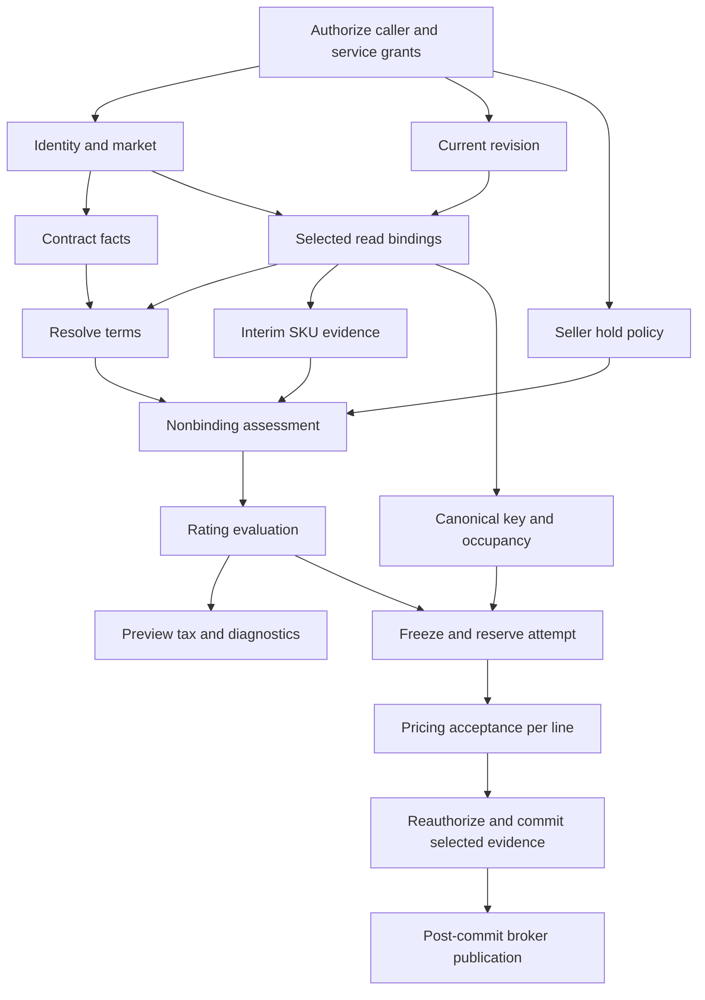

# S1-04 — Commercial contracts and lossless codec evidence

Owner: Orders, with Pricing / Products / Subscriptions / Rating producer work assigned below. Date: 2026-10-06. Status: **local contract inventory, schema-2 codec and fixtures implemented; proposed producer profiles/APIs remain unimplemented and unratified by their owners**. This package does not enable Preview, submit or activation. S1-03 authorization/deployment blockers remain open.

## Delivered artifacts

- [Native receipt codec](../../orders-lifecycle-sdk/src/commercial/mod.rs) and [explicit public-SDK wire projection](../../orders-lifecycle-sdk/src/commercial/wire.rs): complete `AcceptanceReceipt` / `NewSaleQuery` / selected `AcceptedBinding` values, with checked links, public producer digest validation and strict scalar encodings.
- [Calendar term conversion](../../orders-lifecycle-sdk/src/commercial/term.rs): explicit missing/rolling/period/calendar intent, exact month/year conversion with checked arithmetic. This chooses no billing policy or anchor.
- [Rust conformance tests](../../orders-lifecycle-sdk/tests/commercial_codec.rs), [frozen JSON vector](../../orders-lifecycle-sdk/tests/fixtures/commercial-pin-v2.json) and [independent Python vector builder](commercial/build_vectors.py): no expected bytes or digest values generated by the Rust codec under test.
- [Five owner contract proposals](commercial/profiles.json), [diagnostic/Rating proposal oracle](commercial/check_contracts.py) and [19-node call graph](commercial/call-graph.json). These specify integration requirements; fixture profile names are not registered producer profiles.

The SDK imports only the public `bss-pricing-sdk` and workspace `rust_decimal`. There is no Pricing runtime/private-storage dependency, local monetary evaluator, provider stub registration or new business endpoint.

## Existing capability versus required evidence

| Required fact / operation | Actual source inspected | Reconciliation / delivery owner |
|---|---|---|
| Authorized fixed revision and full matrix | [PricingReadV1](../../../pricing/pricing-sdk/src/read.rs), [provider](../../../pricing/pricing/src/api/pricing_read.rs) | Exists. Orders S3-02 adapts seller CatalogRef and fixed UTC resolve date. `current_revision` uses the current server clock and may perform scheduled-publication catch-up; no as-of-time purity claim |
| Price by ID, money and closing observations | `ImmutablePrice`, `PriceModel`, public `money_digest` | Exists; includes Flat, PerUnit, Volume, Graduated, Package and Approved/Cancelled states. A historical price read proves neither current sellability nor supported purchase model |
| Native selections / uncovered cells | `BindingSelection`, `ResolvedCell`, `ResolvedBindings` | Exists. NULL dimension and text `default` stay distinct. `binding = None` is uncovered, never a zero price. Unselected cells never become charges |
| Complete revision item roster / independent predicate vector | Current cells lack an independent expected-roster attestation; acceptance returns one error | Missing: Pricing S3-03 must supply authoritative coverage and all independent results; response length/complete flag is insufficient |
| Current SKU lifecycle / sellable flags | [ProductsClient](../../../products/products-sdk/src/api.rs), [Sku](../../../products/products-sdk/src/models.rs) | Exists separately. S3-02 retains authorized interim SKU reads until S3-03 supplies authoritative facts. Deprecation, retirement and sellability remain distinct owner facts |
| Selected SKU ID/version/code/name/unit/meter | `AcceptedBinding`, public `terms::MeterRef` | Exists and fully encoded. No SKU-head refresh during first-period materialization. Usage requires exact meter identity/version and policy evidence |
| Immutable price identity/model/minimum fee/currency/dates/state | `AcceptedBinding.price` | Exists and fully encoded, including nullable minimum/end date and observed state. A receipt binding must be Approved; cancellation is representable only by the native read contract |
| Invoice template/value provenance, GL, tax category, timing, scale, rounding | `InvoiceInputs` | Exact values exist and remain required; template source is preserved. Separate GL/tax/timing source labels do not exist and are not fabricated |
| Book ID, SKU effective-from, unselected matrix, old eligibility fields | Not available in the selected native receipt shape | D-192 retired these as required pin facts. Do not substitute entry ID for book ID or price start for SKU-version start. Authorized diagnostics need separate producer evidence |
| Usage window/scope/reset/fold/partial-window policy | `UsageRatingPolicy`, `UsageRatingPolicyInput`, public `policy_digest` | Exists. Preserve all fields, version and digest. External `UsageMeterSemanticsV1` provider remains a Pricing prerequisite for applicable usage admission; no fabricated semantic evidence |
| New-sale commercial query | [NewSaleQuery](../../../pricing/pricing-sdk/src/acceptance.rs) | Exact axes, order/version/line, plan/revision, selection, quantity, market, start, term, BillingTerms, selected-binding digest and policy version exist. Orders version remains positive i32 despite native u64 |
| Issued receipt / receipt lookup / hold / fresh fulfillment | `SellabilityV1`, `PricingAcceptanceV1` | Exists. `check` is a command. Receipt lookup/fresh eligibility are reads; hold is Subscriptions-owned. Preview invokes none of the commands |
| Seller policy discovery and seller-indexed resolution | [Pricing config](../../../pricing/pricing/src/config.rs) currently has a deployment-wide policy | Missing: S3-05. No assumption of version 1, 24-hour default or Settings backend. Freeze policy version before dispatch; never edit it during exact replay |
| Complete pre-subscription terms and provenance | [BillingTerms](../../../pricing/pricing-sdk/src/terms.rs) shape exists; Subscriptions has design only | Resolver/policy source/precedence/grants missing: S3-04. Native terms schema 1, policy version and hold-policy version are different identities |
| Exact-binding purchase evaluation / discounts / horizons / TCV | [Rating seam](../../../rating/docs/SEAMS.md#orders-purchase-evaluation-target--d-197-2026-10-05) is a design target | SDK/provider missing: S3-07. Orders performs no money arithmetic, cycle conversion, rounding or discount fallback |
| Indicative tax per line/order | No owning provider in inspected BSS code | Missing: S3-08 owner/API/grants. Full Preview stays unavailable; tax is separate from Rating and pre-tax TCV |
| Caller/payer authority, policy/contract facts, occupancy | S1-03 blockers and external owner contracts | S2-03 + S4-02 + S5-06a; detailed process/receiver contracts are S1-05, not replaced by commercial service authentication |

## Schema-2 wire contract

All object members are required, including nullable members. Unknown members, duplicate members and unsupported enum variants refuse decoding. The envelope is exactly `schema_version = 2`, assessment ID/instant/resolve date, accepted version reference, complete receipt and issued activation deadline. No fallback decoder for legacy schema 1 is enabled.

| Scalar / structure | Encoding and checks |
|---|---|
| UUID | Standard serde UUID representation; values retain exact UUID identity. Required order/line/tenant/plan/receipt/assessment identities cannot be nil |
| Decimal | JSON string parsed with `Decimal::from_str_exact`, checked against its exact string representation. No JSON numeric money/quantity, float, exponent notation, silent rounding or normalization; trailing scale is retained |
| u64 / i64 | Canonical decimal strings, preserving the entire native range. Native order version must also equal the positive i32 accepted row version |
| u32 / Orders schema/version | JSON integer, within the native/checked range. BillingTerms schema is independently fixed to 1 |
| Date / instant | Calendar `YYYY-MM-DD`; UTC timestamp with exactly nine fractional digits and `Z`, years 0000–9999. Native offset instants encode to the same UTC instant without precision loss. Decode refuses noncanonical offsets/excess precision |
| Digest | Exactly 64 lowercase hexadecimal digits, preserving all 32 producer bytes |
| Enums | Explicit snake_case values; data-bearing enums use `kind`. Wire `utc`/`sum` map exactly to native `Timezone::Utc`/`Fold::Sum`; Pricing's own digest projections retain their separate `UTC`/`SUM` spelling |
| Arrays / nullable values | Original array order and explicit nulls retained. Missing is not null. Exact selected binding identities must match the query; duplicates and missing selections refuse |
| Limits | ≤1,000 bindings/selections per pin before deduplication; decoder bounds input at 1 MiB, encoder checks actual serialized bytes. S3-12 must additionally enforce 200 lines/200 consumed items and **1 MiB for the entire version**, including other fields—not 1 MiB per line |

`OrderPin::new/decode` verifies accepted row linkage, deadline equality, complete required values and public Pricing digest checks. `verify_selection` compares the complete frozen query, selected acceptance ID, original request/terms digests and full evaluated native bindings. It must be called against independently loaded committed/attempt evidence. Successful decode cannot establish that an operational/reserved receipt was committed, authorize a caller, prove a roster complete, or establish live eligibility. Those remain engine/provider obligations. Expired historical receipts still decode; current-time deadline guards are separate.

**Digest scope matters.** The public helpers cover different domains: `pricing.money.v1`, `pricing.template.v1`, `pricing.policy.v1`, `bss.billing-terms.v1`, `pricing.bindings.v1`, `pricing.request.v1`, `pricing.terms.v1`. The current binding/terms digest projection **omits `AcceptedBinding.meter`**, and price state is also excluded. The codec preserves meter/state, rejects non-Approved receipt bindings and compares full native binding values at selection. Tests explicitly prove that changed meter metadata can retain the same issuer digest but fails full-binding equality. No substitute Pricing digest is introduced. Immutable storage and audit-integrity checks remain S2-02/06 requirements, particularly for fields outside issuer digest coverage.

The seven digest domains are checked by the independent vector. Model-variant tests additionally exercise all five native price models, seller-policy provenance, rolling/year terms, nullable dates/minimum fees and policy variants. These are **serialization** cases, not assertions that every combination is admissible for new sales.

## Terms, quantity and supported purchase profile

The existing [Pricing validator](../../../pricing/pricing/src/domain/commercial_terms.rs) owns sale compatibility. Current recurring/one-time purchases support scalar Flat/PerUnit; usage supports PerUnit/Volume/Graduated with the required policy/meter semantics. Package is historical read capability, not an added purchase feature. Recurring cycle must match resolved BillingTerms; usage window remains distinct from invoice cycle. Orders does not duplicate that rule engine.

Calendar conversion in this package follows D-193: P1Y → 12 months or one year; P1Y6M → 18 months and refuses a yearly cycle. Day/time remainders, zero/nonintegral periods and arithmetic/u32 overflow refuse. Missing intent is distinct from explicit rolling. Positive explicit period counts require a known cycle. This helper is not an ISO-duration parser: S2 capture must retain calendar components and reject ambiguous/negative intent before calling it. Billing-policy precedence, anchor choice, month-end/leap-year billing geometry, hourly alignment and delayed-activation proration remain producer-owned conformance work.

One `NewSaleQuery.quantity` is the exact plan quantity. Selected items are not independently multiplied into a second quantity. Authored shapes that cannot map exactly remain unsupported under Q-03 until the owner contract resolves them. Earliest start, frozen invoice anchor and eventual actual activation are three separate instants; retries and holds cannot rewrite them.

## Producer contract profiles and diagnostics

[profiles.json](commercial/profiles.json) records five proposed SafeRead boundaries with concrete request/result requirements and named owners. The producer schemas, profile IDs, complete predicate registry, canonical assessment/Rating input-digest domains, field bounds and grants are still owner implementation work; they are not invented as callable SDKs in Orders.

For each supported producer profile, S3-01/03/07 must freeze: immutable schema/rule profile, supported models/input shapes, fixed request identity/digest, authoritative expected roster, exact result cardinality, predicate/reason mappings, applicability/dependencies and bounded evidence allowlist. Mapping keys include producer/operation/profile/predicate/reason. Preserve no-selection versus selected NULL versus selected text `default`. Failure/unevaluability requires a registered reason; observation absence cannot become a pass. Keep all independent results, including failures alongside unavailable dependencies; required unevaluable wins over failed for the primary result. No raw provider text becomes a public reason.

The fixture oracle exercises unknown schema/profile/identity, missing/duplicate results, NULL/default collisions, observation absence, restricted details, failure plus outage, and approved Preview exceptions. It is a candidate contract oracle, not the production mapping registry or provider conformance. Missing optional term/cycle may withhold TCV only when required independent checks and remaining figures are complete. Missing policy may withhold a forecast only when it is forecast-only. Submit/amendment require complete mandatory context. A failed sale check never becomes optional because it carries a TCV/forecast label.

Rating must return exact item/line/order coverage, all three charge kinds, explicit discount/promotion availability, supported currency/scale/rounding and checked minor-unit amounts. Usage is uncommitted/excluded rather than zero. Recurring breakdowns retain cycle labels and a producer-declared common valuation horizon. Only the order recurring row carries TCV, including one-time-only and usage-only baskets. Basis is finite-term, rolling-annualized (month/year 12/1) or labelled mixed; Orders does no arithmetic. The oracle checks representative shape/withholding failures; real model evaluation, minimum fees, mixed-cycle amounts, promotions and tax still require owner implementations.

## Call dependencies and budget reconciliation

The [machine-readable graph](commercial/call-graph.json) inventories the expanded fresh-request path and verifies it is acyclic. In particular:



Terms consumes selected authorized read contexts, then full assessment consumes terms. Final binding identity/digest must match that basis and Rating input; drift requires fresh preparation, not mixing snapshots. Missing optional Preview context is a typed outcome that can feed independent checks, not a fabricated completed terms snapshot. Exact replay/recovery first loads authorized frozen attempt evidence and does not rerun this fresh-resolution graph.

The historical allocations remain 250 ms for each existing read/key/profile/contract/occupancy/tax lane and 500 ms for Rating. They are **not** allocations for the newly identified assessment, billing-terms/policy, seller hold-policy, remote acceptance/recovery or final authorization/commit lanes. Those entries are explicitly unratified (`null`) in the graph. The old 2.25/2.5-second resolution sums omit calls and cannot be reused as expanded-path ceilings or measured latency. Budgets need owner/Architecture ratification and critical-path measurements in S3-09/S6-06; Q-11/Q-16 remain open and the governing p95 <1 s durable-write-plus-publication objective remains unchanged.

Keep bounded fan-out and at most two transient attempts inside each original logical deadline, including queue time and batch splitting. Do not retry deadlines, classify every `UnsupportedTerms` as a policy race, or dispatch commands in an Orders database transaction. Stable per-line acceptance keys and durable recovery are S2-05/S3-12 work. Breaker, bulkhead and caller-limit integration remain shared-platform work; no new defaults are introduced here.

## Remaining owner work and next assignment

| Work | Owner/package | Gate |
|---|---|---|
| Authoritative roster, complete assessment profile/diagnostics, shared rule evaluator | Pricing S3-03; Orders mapping S3-01/09 | Complete sellability assessment and Preview |
| Seller-indexed acceptance-policy resolver, discovery and immutable version semantics | Pricing S3-05 | Required submit/amendment policy evidence |
| Pre-subscription terms SDK/provider, policy source/precedence/provenance and grants | Subscriptions S3-04 | Complete accepted BillingTerms; no fabricated defaults |
| Exact-binding purchase evaluation and supported Preview incomplete-context profile | Rating S3-07 | Required totals/approval evidence; unspecified remaining figures block Preview |
| Indicative tax ownership/API/profile | S3-08 | Full Preview |
| Exact quantity shapes and unresolved product scope | Product/Architecture + S3-01/07 | Unsupported purchases refuse; no silent policy selection |
| New call budgets and governing latency reconciliation | Architecture + S3-09/S6-06 | Performance readiness, no expanded SLA assumed |
| Runtime persistence, full-version bounds, committed selection, receipt/held binding matching and first-period input | S2-02/06, S3-12, S5-06b/07 | Codec round trips alone do not close activation conformance |
| Real principals/grants, provider policy and deployment route | S1-03 ledger / S2-03 / Platform | Public writes remain disabled |

S1-05 local process/receiver contracts and fixtures are now recorded in [PROCESS](PROCESS.md), using the native receipt and missing-owner register above. S1-06 local fixtures and harness are recorded in [CONFORMANCE](CONFORMANCE.md). S1-07 local inventory is now recorded in [READINESS](READINESS.md). Next: **S2-02 — schema and secure repositories**, using the reconciled [S5-01 contracts](RECEIVER_CONTRACTS.md). Continue S1-06 fixtures as each provider contract becomes concrete.

## Verification

Run from the repository root:

```sh
cargo +1.98.1 test -p cf-gears-bss-orders-lifecycle-sdk -p cf-gears-bss-orders-lifecycle
cargo +1.98.1 clippy -p cf-gears-bss-orders-lifecycle-sdk -p cf-gears-bss-orders-lifecycle --all-targets -- -D warnings
cargo +1.98.1 fmt -p cf-gears-bss-orders-lifecycle-sdk -p cf-gears-bss-orders-lifecycle --check
cargo gears lint --dylint -P cf-gears-bss-orders-lifecycle-sdk -P cf-gears-bss-orders-lifecycle
python3 gears/bss/orders-lifecycle/docs/implementation/commercial/build_vectors.py --check
python3 gears/bss/orders-lifecycle/docs/implementation/commercial/check_contracts.py
python3 gears/bss/orders-lifecycle/docs/implementation/validate_docs.py
python3 gears/bss/orders-lifecycle/docs/implementation/build_coverage.py --check
```

Observed result: all 26 Rust tests pass (seven new codec/term tests plus the prior 19), as do Clippy, architecture lint, formatting, generated catalog drift, independent frozen digest checks, 36 proposal-oracle cases and the 19-node graph check. Documentation validates 4,252 local links; the unchanged coverage inventory verifies 27 sources, 2,557 units and 44 upstream requirements. The prior 73 contract cases/eight golden envelopes and `git diff --check` also pass. No real assessment/terms/Rating/tax provider, live commercial grant or full first-period integration is claimed. No commit, PR or deployment was made.
