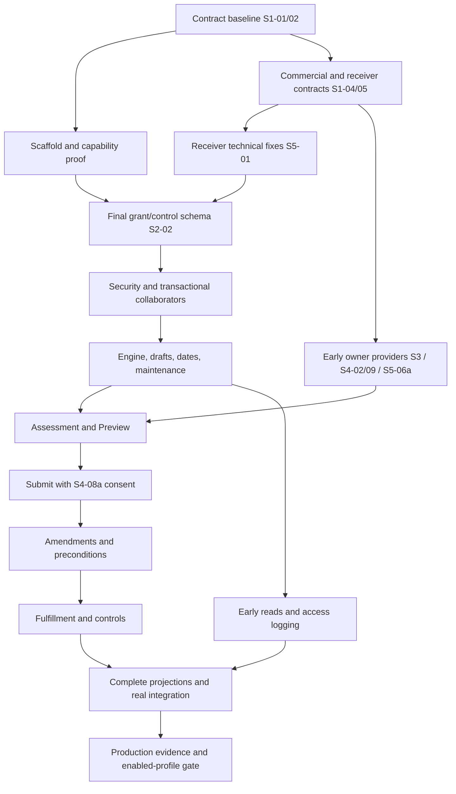

# Orders Lifecycle — agent implementation handoff

Status: **S1-01 documentation reconciliation and S1-02 contract catalog completed**; S2-01 runtime/SDK scaffold is locally verified ([execution ledger](SCAFFOLD.md)); S1-03 local capability proofs are implemented with explicit production blockers ([evidence](CAPABILITIES.md)); S1-04 local commercial codecs/contracts are implemented with explicit owner gaps ([evidence](COMMERCIAL.md)); S1-05 local process/receiver contracts and fixtures are verified with owner gaps ([evidence](PROCESS.md)); S1-06 shared fixtures and fault seams are locally verified ([evidence](CONFORMANCE.md)); S1-07 execution/readiness ledger is locally verified ([evidence](READINESS.md)); S2-02 schema/repositories are implemented, independently gap-fix reviewed and locally verified ([evidence](STORAGE.md)); S2-03 shared PEP and bounded internal authority are implemented, independently gap-fix reviewed and locally verified ([evidence](AUTHZ.md)); S2-05 idempotency and durable execution ownership are implemented, independently gap-fix reviewed and locally verified ([evidence](IDEMPOTENCY.md)); S2-06 transactional audit and canonical integrity encoding are implemented, independently gap-fix reviewed and locally verified ([evidence](AUDIT.md)); S2-07 transactional in-flight overlap claims are implemented, independently gap-fix reviewed and locally verified ([evidence](OVERLAP.md)); S2-08 typed events and the managed producer are implemented, independently gap-fix reviewed and locally verified ([evidence](EVENTS.md)); S2-04 declarative transition engine is implemented, independently gap-fix reviewed and locally verified ([evidence](ENGINE.md)); S2-09 draft authoring and field classification are implemented, independently gap-fix reviewed and locally verified ([evidence](CAPTURE.md)); S2-10 date policy and admission-time date preparation are implemented, independently gap-fix reviewed and locally verified ([evidence](DATES.md)); S2-11 maintenance infrastructure, retention purge, idempotency cleanup and audit verification/checkpointing are implemented, independently gap-fix reviewed and locally verified ([evidence](MAINTENANCE.md)); the early S6-01 draft reads (order detail, order list, line page) and S6-04 read-access logging are implemented, independently gap-fix reviewed and locally verified ([evidence](READS.md)); S2-12 closes the foundation integration milestone — pre-engine throttling (gateway caller/Workflow zones and the per-(caller, order) fallback), the delivered-route census, real readiness and the live HTTP/PostgreSQL E2E host — implemented, independently gap-fix reviewed and locally verified ([evidence](MILESTONE.md)); other packages are planned. See the [catalog and boundary evidence](contracts/CONTRACTS.md). Only the five draft authoring routes and SDK methods (S2-09) and the three draft read routes and SDK methods (early S6-01/S6-04) are enabled; every other business operation stays unavailable. See the [reconciled baseline and evidence](BASELINE.md).
The six stages below expand [the implementation sequence](../DECOMPOSITION.md#32-selected-reconciliation-fixes-and-delivery-sequence).
Read [REVIEW](REVIEW.md) for corrections and unresolved product boundaries, and [COVERAGE](COVERAGE.md) for the source inventory. Accepted D-187–D-200 remain the baseline; do not reopen the selected A options.

## Plans and outcomes

| Plan | Outcome | Packages |
|---|---|---|
| [1. Contracts and fixtures](01-contracts-and-fixtures.md) | Reconciled contracts, capabilities, golden fixtures and owner readiness | S1-01–07 |
| [2. Foundation and capture](02-foundation-and-capture.md) | Secure persistence, engine, audit, events, drafts, dates and maintenance | S2-01–12 |
| [3. Preview and submit](03-preview-and-submit.md) | Real commercial providers, diagnostics, nonbinding Preview and durable accepted submit | S3-01–14 |
| [4. Amendments and preconditions](04-amendments-and-preconditions.md) | Amendment, consent, approvals and payment authorization | S4-01–12; S4-08a/b split consent delivery |
| [5. Fulfillment and controls](05-fulfillment-and-controls.md) | Receiver admission, Workflow, hold/cancel, expiry and recovery | S5-01–16; S5-06a/b split receiver delivery |
| [6. Reads and production readiness](06-reads-and-production-readiness.md) | Authorized reads, consumer recovery, capacity/security/DR evidence and launch gates | S6-01–09 |

There are **70 numbered work packages**, with two explicitly split early/later deliveries. Each package names dependencies, implementation scope, design references and completion evidence. They are reviewable work units, not equal-duration estimates or necessarily single PRs.

## Execution order

1. S1-01/02 are complete as documentation reconciliation and contract fixtures; use [BASELINE](BASELINE.md) and the [S1-02 catalog](contracts/CONTRACTS.md) alongside the completed [S2-01 scaffold](SCAFFOLD.md). S1-03 local capability proofs are recorded in [CAPABILITIES](CAPABILITIES.md). S1-04 local codec/contracts are recorded in [COMMERCIAL](COMMERCIAL.md). S1-05 local process/receiver contracts are recorded in [PROCESS](PROCESS.md). S1-06 shared fixture/harness evidence is recorded in [CONFORMANCE](CONFORMANCE.md). S1-07 execution/readiness inventory is in [READINESS](READINESS.md). S5-01 receiver contracts are reconciled in [RECEIVER_CONTRACTS](RECEIVER_CONTRACTS.md). S2-02 schema/repositories are independently reviewed ([evidence](STORAGE.md)). S2-03 PEP/internal authority is implemented and independently gap-fix reviewed ([evidence](AUTHZ.md)).
2. Close the real-provider/deployment blockers recorded by S1-03 before enabling public writes. Use S1-04 commercial codecs/contracts and the S1-05 proposed process/receiver baseline; close the remaining producer profile agreements in their owner tracks. S5-01 has supplied the corrected contracts for S2-02 grant/control and audit migrations. Extend the S1-06 corpus as runtime packages consume each settled contract; S1-07 records readiness owners and the [dispatch queue](readiness/QUEUE.md).
3. Deliver S2 storage/security and independent transactional collaborators before assembling S2-04. Deliver draft capture, dates and maintenance. Start S6-01 draft reads and S6-04 access logging with S2-09, before claiming a usable draft milestone.
4. Run the owner-provider tracks early: Pricing assessment/policy (S3-03/05), Subscriptions terms (S3-04), Account Management/Contracts (S4-02), canonical subscription key/occupancy (S5-06a), approval/Payments (S4-09), Rating and tax (S3-07/08). Provider stubs support development only. Stage numbers do not serialize these dependencies.
5. Assemble assessment/Preview and durable submit. S4-07/08a supplies automatic consent before S3-12; standalone consent/history follows. Build amendments and remaining preconditions from the same engine/assessment machinery.
6. Assemble fulfillment and controls using real owner providers. Finish read projections as their producers arrive. S3-13/14, S4-12 and S5-16 are integration joins, not prerequisites to starting their own providers.
7. Close S6 release evidence. Enable only supported commercial profiles whose real providers, grants, receiver enforcement and operational recovery pass. Keep reference release disabled unless S6-08's stronger proof is delivered.

The diagram shows delivery joins. Detailed package dependencies govern individual interfaces; an integration milestone must never be made a prerequisite for its own provider.

## Shared ownership rules

| Component | Sole implementation owner | Consumers |
|---|---|---|
| Orders migrations and secure storage | S2-02 | All stages contribute requirements; S5 does not create a second grant schema |
| Shared engine/idempotency/audit/events | S2-04/05/06/08 | Every mutation, including consent, amendment and controls |
| Generic recovery and maintenance infrastructure | S2-11 | S3 attempts and S5 controls/TTL supply continuation logic |
| Payer/delegation/Contracts providers and shared adapters | S4-02 | S3-06 and S4 guards |
| Subscription key and occupancy producer | S5-06a | S3-06 adapts; S5-06b enforces admission on every writer |
| BillingTerms resolver | S3-04 | Shares the early Subscriptions scaffold; no receiver mutation dependency |
| Approval policy/provider | S4-09 | S5-03 reflects its version-specific verdict |
| History domain projection | S4-06 | S6-01/02 owns common read routes, authorization and pagination |
| Buyer consent contribution | S4-08a | S3-12 submit; S4-08b owns standalone acceptance |
| Full Workflow process | S5-08 | S4-11 contributes durable payment continuation |

## First implementation-agent assignment

Copy this into the implementing agent:

> Read AGENTS.md and guidelines/README.md first, then Orders Lifecycle docs/implementation/README.md, RECEIVER_CONTRACTS.md, READINESS.md, CAPABILITIES.md and 02-foundation-and-capture.md. Execute S2-02: inventory all 24 tables, implement ordered migrations and secure repositories with exact FK/check/index/role/append-only rules. Include D-201 audit v3 and force-request observation, grant audit linkage and the internal rebuild writer boundary. S2-01 already exists; preserve the existing scaffold and shared fixture harness. Consult existing BSS gears and ToolKit. Test real PostgreSQL migration/constraint/tenant/role failures. Business operations stay unavailable; do not imply owner deployment readiness.

## Completion and evidence protocol

For each package record `planned / in progress / implemented / verified / blocked`, owner, source IDs, changed paths, commit/PR, exact validation commands/results and remaining dependent-provider status. S1-01 is **verified as documentation reconciliation**; S1-02 is **verified as a design catalog and boundary-fixture baseline** (local files, no commit/PR yet). S2-01 is **implemented and locally verified as a scaffold**, with evidence in [SCAFFOLD](SCAFFOLD.md). S1-03 is **locally verified with production blockers**, recorded in [CAPABILITIES](CAPABILITIES.md); S1-04 is **locally verified as codecs and contract fixtures with owner gaps**, recorded in [COMMERCIAL](COMMERCIAL.md); S1-05 is **locally verified as proposed process/receiver contracts and executable specification**, recorded in [PROCESS](PROCESS.md); S1-06 is **locally verified as shared fixtures and fault-injection harness**, recorded in [CONFORMANCE](CONFORMANCE.md); S1-07 is **locally verified as the execution queue and deployment-readiness inventory**, recorded in [READINESS](READINESS.md); S5-01 is **locally verified as normative receiver contracts and fixtures**, recorded in [RECEIVER_CONTRACTS](RECEIVER_CONTRACTS.md); S2-02 is **implemented, independently gap-fix reviewed and locally verified**, recorded in [STORAGE](STORAGE.md); S2-03 is **implemented, independently gap-fix reviewed and locally verified**, recorded in [AUTHZ](AUTHZ.md); S2-05 is **implemented, independently gap-fix reviewed and locally verified**, recorded in [IDEMPOTENCY](IDEMPOTENCY.md); S2-06 is **implemented, independently gap-fix reviewed and locally verified**, recorded in [AUDIT](AUDIT.md); S2-07 is **implemented, independently gap-fix reviewed and locally verified**, recorded in [OVERLAP](OVERLAP.md); S2-08 is **implemented, independently gap-fix reviewed and locally verified**, recorded in [EVENTS](EVENTS.md); S2-04 is **implemented, independently gap-fix reviewed and locally verified**, recorded in [ENGINE](ENGINE.md); S2-09 is **implemented, independently gap-fix reviewed and locally verified**, recorded in [CAPTURE](CAPTURE.md); S2-10 is **implemented, independently gap-fix reviewed and locally verified**, recorded in [DATES](DATES.md); S2-11 is **implemented, independently gap-fix reviewed and locally verified**, recorded in [MAINTENANCE](MAINTENANCE.md); the early S6-01 draft subset and S6-04 are **implemented, independently gap-fix reviewed and locally verified**, recorded in [READS](READS.md); S2-12 is **implemented, independently gap-fix reviewed and locally verified** (live E2E: 14 collected / 14 passed / 0 skipped), recorded in [MILESTONE](MILESTONE.md); all other packages remain **planned**. S1-02 evidence and commands are in [CONTRACTS](contracts/CONTRACTS.md#verification-and-next-agent-assignment). A design contract or mock passing is not a real-provider conformance result.

Use domain tests for pure rules, actual PostgreSQL for constraints/transactions/concurrency/role tests, and authenticated HTTP/local SDK integration for boundaries. Follow ToolKit testing guidance and open dependencies guidance before changing Cargo files. Include negative, replay, stale-generation and crash windows specified in each plan. No broad runtime change is authorized by merely marking a coverage row assigned.

Before a package starts, re-read its current source and existing gear implementations: these plans capture a reviewed baseline, not a frozen copy of main. Re-run `python3 gears/bss/orders-lifecycle/docs/implementation/build_coverage.py --check`; regenerate the index after intentional source reconciliation and review the diff. The coverage inventory checks source drift and routing, not semantic implementation correctness.
