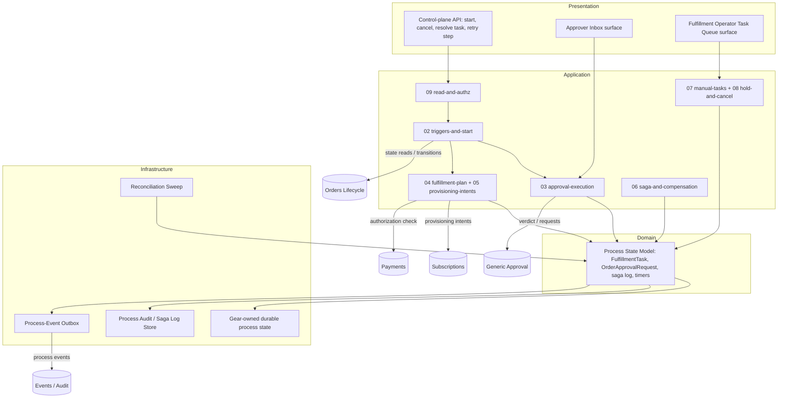
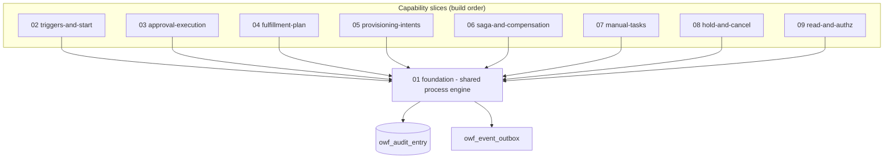
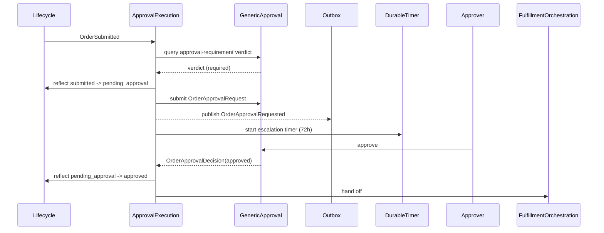
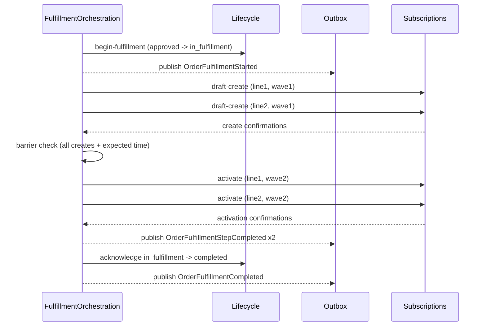
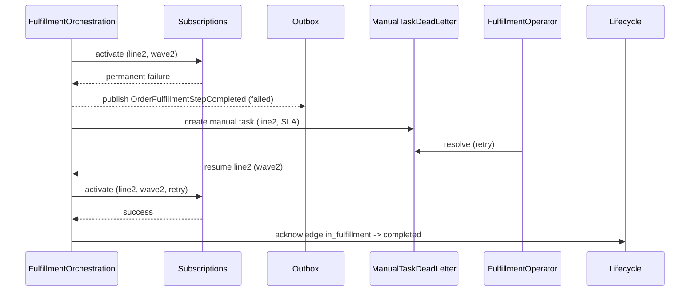
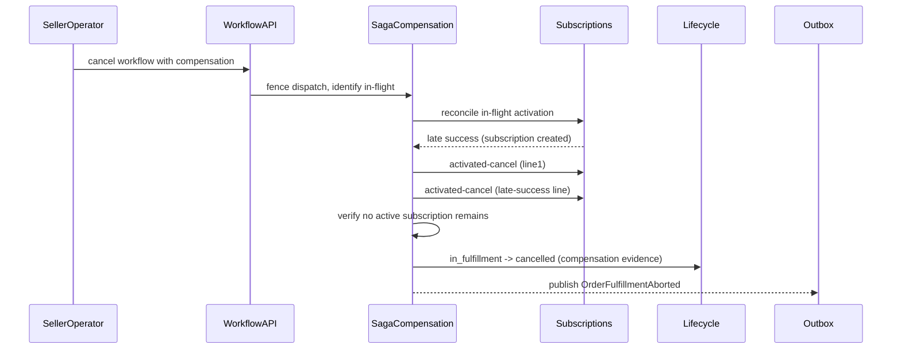

<!-- CONFLUENCE_TITLE: [BSS]: Orders Workflow — Technical Design -->
<!-- Related: ./PRD.md, ./design/, ./DECISIONS.md, ./UPSTREAM_REQS.md | Owners: BSS Orders team -->

# Technical Design — Orders Workflow

<!-- toc -->

- [1. Architecture Overview](#1-architecture-overview)
  - [1.1 Architectural Vision](#11-architectural-vision)
  - [1.2 Architecture Drivers](#12-architecture-drivers)
  - [1.3 Architecture Layers](#13-architecture-layers)
- [2. Principles & Constraints](#2-principles--constraints)
  - [2.1 Design Principles](#21-design-principles)
  - [2.2 Constraints](#22-constraints)
- [3. Technical Architecture](#3-technical-architecture)
  - [3.1 Domain Model](#31-domain-model)
  - [3.2 Component Model](#32-component-model)
  - [3.3 API Contracts](#33-api-contracts)
  - [3.4 Internal Dependencies](#34-internal-dependencies)
  - [3.5 External Dependencies](#35-external-dependencies)
  - [3.6 Interactions & Sequences](#36-interactions--sequences)
  - [3.7 Database schemas & tables](#37-database-schemas--tables)
  - [3.8 Deployment Topology](#38-deployment-topology)
- [4. Additional context](#4-additional-context)
  - [4.1 Capacity and cost](#41-capacity-and-cost)
  - [4.2 Security posture](#42-security-posture)
  - [4.3 Data protection, residency and retention](#43-data-protection-residency-and-retention)
  - [4.4 Observability](#44-observability)
  - [4.5 Fault tolerance and the outbox failure posture](#45-fault-tolerance-and-the-outbox-failure-posture)
  - [4.6 Testability](#46-testability)
  - [4.7 Extension and provenance](#47-extension-and-provenance)
  - [4.8 Configuration and secret management](#48-configuration-and-secret-management)
  - [4.9 Technical debt and deprecation](#49-technical-debt-and-deprecation)
- [5. Traceability](#5-traceability)

<!-- /toc -->

- [ ] `p3` - **ID**: `cpt-cf-bss-orders-workflow-design-owf`
## 1. Architecture Overview

### 1.1 Architectural Vision

Orders Workflow is the **process orchestration engine** for commercially initiated orders: it drives the approval-execution and fulfillment process to a terminal outcome without ever becoming a second source of truth about the order. The architecture is built around a durable, restart-safe process instance per order, correlated by `orderId` + `orderVersion` and a process `correlationId`, whose own execution-progress record — step progress, saga/compensation log, timer state, retry counters, approval-request tracking, and the process-definition version it started with — is authoritative for process execution but never for order semantics. What was ordered and the order's current state are always read from Orders Lifecycle (the document SoR); the pair "Orders Lifecycle ↔ Orders Workflow" mirrors "document ↔ process," the same separation used elsewhere in the billing domain for "Invoice ↔ Bill-Run."

Two structural mechanisms carry the bulk of the correctness burden. First, a two-wave activation barrier sequences fulfillment as draft-create (wave 1, not resource-affecting) followed by activation (wave 2, only after every create succeeds and the expected fulfillment time is reached), so that mixed-date order lines never stagger live activations and a pre-activation collision or market-divergence check can still abort cheaply. Second, a compensable-only saga with no intra-saga pivot gives every completed wave a named compensating action — draft-void or activated-cancel — dispatched through Subscriptions under the same idempotency contract as the forward path, so a permanent failure or an authorized cancellation always resolves to either a fully compensated order or an explicit, escalated manual task; it never leaves a stranded resource silently unaccounted for.

The remaining architecture responds directly to the process's distributed nature: every outbound call carries a composed idempotency key so retries under a durable-execution substrate cannot double-provision; unresolved outcomes are recovered by a read-only reconciliation sweep rather than by inferring success from silence; unavailability of the approval-requirement verdict source fails closed — the order stays `submitted`, the process parks, and escalation happens before the Lifecycle `submitted` TTL elapses — rather than failing open to `approved`, while transient unavailability of Lifecycle, Subscriptions or Payments is a structurally distinct mechanism that retries inside the affected step's own budget and escalates to a manual task on exhaustion, never one code path branching on which dependency is down; and every process-execution transition is recorded in this gear's own audit/outbox trail, independent of whatever execution-engine history an underlying substrate might retain internally (no engine product is selected — `DECISIONS.md` Q-01). This is how the architecture satisfies the PRD's zero-lost-workflow, zero-duplicate-effect, and 100%-failure-visibility requirements simultaneously, while staying strictly additive to the BSS boundary: no order state is stored here, no price is computed here, and no OSS call is ever made directly.

### 1.2 Architecture Drivers

Requirements that significantly influence architecture decisions.

#### Functional Drivers

| Requirement | Design Response |
|-------------|------------------|
| `cpt-cf-bss-orders-workflow-fr-owf-process-state-nonauth` | A gear-owned process audit/saga-log store is the sole authority for step progress, retry counters, saga log, timer handles, approval tracking, `correlationId`, and definition version; it is populated independently of whatever internal history the durable-execution substrate keeps, and every read of order semantics is proxied live to Orders Lifecycle rather than cached as authoritative. |
| `cpt-cf-bss-orders-workflow-fr-owf-start-contract` | A trigger-binding layer subscribes to exactly the nine named Lifecycle triggers (`OrderSubmitted`, `OrderApproved`, `OrderAmended`, `OrderHeld`, `OrderResumed`, `OrderAcceptanceRecorded`, and the three terminal events `OrderCancelled`, `OrderExpired`, `OrderRejected`), mints one process instance keyed on `orderId` + `orderVersion` with a fresh `correlationId`, and absorbs duplicate/out-of-order delivery by re-reading current Lifecycle state before acting and discarding triggers for a superseded version. |
| `cpt-cf-bss-orders-workflow-fr-owf-terminal-order-events` | The same trigger-binding layer routes a terminal Lifecycle event to a termination handler that cancels open approval gates and timers, halts pending intents, and runs the compensation path (including wave-1 draft-void) before recording termination in the process audit log. |
| `cpt-cf-bss-orders-workflow-fr-owf-approval-request` | An approval-execution slice queries the approval-requirement verdict (or the §9.2 stand-in) keyed on `orderId` + `orderVersion`, caches the result against that version, reflects it into Lifecycle, and opens/cancels `OrderApprovalRequest` gates on `OrderSubmitted`/`OrderAmended` without ever computing the verdict itself. |
| `cpt-cf-bss-orders-workflow-fr-owf-approval-idempotency` | Every `OrderApprovalRequest` is created under a composed idempotency key (`orderId` + `orderVersion` + gate id) enforced by a uniqueness constraint in the approval-request store, so a retried submission resolves to the one already-durable request. |
| `cpt-cf-bss-orders-workflow-fr-owf-approval-escalation` | Orders Workflow owns a durable timer subsystem (survives restarts) that schedules one escalation timer per open gate; the Generic Approval service only supplies configuration and receives the escalation command. An outage-aware pause mirrors the hold-suspension mechanism so the window does not burn against a dead dependency. |
| `cpt-cf-bss-orders-workflow-fr-owf-approval-decision` | The approval-execution slice consumes `OrderApprovalDecision` idempotently, calls Lifecycle to reflect `approved`/`rejected`, and branches internally to the fulfillment-orchestration slice or the termination handler. |
| `cpt-cf-bss-orders-workflow-fr-owf-approver-inbox` | A read-side projection over the approval-request store, scoped by assigned gate, backs the Approver Inbox UI surface; write actions (approve/reject) route through the same idempotent decision-reflection path as the system callback. |
| `cpt-cf-bss-orders-workflow-fr-owf-fulfillment-plan` | A plan-construction step resolves per-line Catalog dependencies at plan time, validates the resulting graph is acyclic and complete, and freezes one `FulfillmentTask` per line under `orderId` + `orderVersion` before any intent is dispatched; a failed validation or a pre-activation overlap/market-divergence re-check halts and aborts via draft-void without ever entering the remediation path. |
| `cpt-cf-bss-orders-workflow-fr-owf-line-progress` | Each `FulfillmentTask` is a small state machine (`pending → draft_created → activated/failed`) whose terminal transitions alone emit `OrderFulfillmentStepCompleted`; an atomicity guard on the fulfillment-orchestration slice defers the Lifecycle `completed` acknowledgement until every task is `activated`, and routes any `failed` task through the configurable remediate/fail-fast policy. |
| `cpt-cf-bss-orders-workflow-fr-owf-provisioning-intent` | A provisioning-intent dispatcher issues per-line, per-wave intents to Subscriptions carrying a composed idempotency key (`orderId` + `orderVersion` + line + wave) and an opaque correlation-bound reference; it re-reads draft status immediately before every activation dispatch to detect an out-of-band void and rebuilds wave 1 rather than trusting a notification. |
| `cpt-cf-bss-orders-workflow-fr-owf-payment-auth` | The begin-fulfillment guard treats payment-authorization pending/failed as distinct process outcomes gated by the seller's tolerate-failure policy, re-evaluated on `OrderAcceptanceRecorded`, before the first begin-fulfillment call to Lifecycle is ever issued. |
| `cpt-cf-bss-orders-workflow-fr-owf-retry` | A per-step retry policy applies only to intent-submission failures, bounded by a configurable attempt count and a per-attempt timeout distinct from the step deadline; a hang after accept is explicitly excluded from the retry budget and handed to the reconciliation sweep instead, with the caller-side duplicate protocol preventing a retried submission from producing a second durable effect. |
| `cpt-cf-bss-orders-workflow-fr-owf-dead-letter` | A bounded delivery-count cap on inbound triggers and callbacks routes exhausted deliveries to an inspectable dead-letter record (never an order state) with an operator alert; a failing compensation reuses the existing manual-task/incident path rather than a second dead-letter channel. |
| `cpt-cf-bss-orders-workflow-fr-owf-intent-sweep` | A background reconciliation sweep on an escalating schedule re-reads every non-terminal intent by correlation and line/wave key, drives it to a terminal outcome or the dead-letter path, and — once the idempotency key's lifetime has elapsed — becomes strictly read-only so it can never resubmit under an aged-out key. |
| `cpt-cf-bss-orders-workflow-fr-owf-backpressure` | A concurrency governor enforces a configurable per-order parallel-line cap and a configurable aggregate in-flight-intent cap with per-tenant fair dispatch, and treats a downstream throttle signal as a delay rather than a retry-budget consumption. |
| `cpt-cf-bss-orders-workflow-fr-owf-dependency-resilience` | Transient-dependency calls (Lifecycle, Subscriptions, Payments) retry within the affected step's own retry budget and escalate to a manual task on budget exhaustion; Generic Approval unavailability is explicitly excluded and instead follows the fail-closed park-and-escalate path of the approval-execution slice. |
| `cpt-cf-bss-orders-workflow-fr-owf-task-queue` | A read-side projection over manual tasks and dead-letter records, scoped to the operator's seller tenancy, backs the Fulfillment Operator Task Queue UI surface, sharing its resolution-action contract with the manual-task domain model. |
| `cpt-cf-bss-orders-workflow-fr-owf-overdue-escalation` | A process-level deadline timer, distinct from the per-step retry/step deadlines, fires an operational escalation when `in_fulfillment` (or a hold taken from it) exceeds the configurable overdue window, without itself failing any line or auto-terminaling the order. |
| `cpt-cf-bss-orders-workflow-fr-owf-hold-resume` | The suspension handler for `OrderHeld`/`OrderResumed` pauses new-intent dispatch and escalation timers while letting already-accepted intents run to their terminal outcome, then resumes from the last durable checkpoint and honors any pending wave-1 rebuild before dispatching activation. |
| `cpt-cf-bss-orders-workflow-fr-owf-compensation-declaration` | Each of the two waves declares its compensating action at design time (draft-void, activated-cancel) in a compensation-registration table consulted by the saga executor; there is no third leg and no intra-saga pivot this phase, matching the compensable classification of both waves. |
| `cpt-cf-bss-orders-workflow-fr-owf-compensation-execution` | A saga executor compensates all created subscriptions in reverse order on permanent failure or authorized cancellation, applying a cancellation-fencing sequence (stop dispatch, identify in-flight, reconcile terminal outcomes including late successes, compensate, verify none remain) before ever reporting a compensated outcome to Lifecycle. |
| `cpt-cf-bss-orders-workflow-fr-owf-manual-task` | The manual-task factory creates exactly one actionable task per permanently failed line under the remediation policy (or a tracked incident under fail-fast) before any terminal outcome is declared, guaranteeing the 100%-visibility contract. |
| `cpt-cf-bss-orders-workflow-fr-owf-override-semantics` | The override-resolution handler verifies the referenced subscription is active and matches the order line via Subscriptions before accepting the override, rejecting any override lacking a verified subscription and recording operator identity and justification in the audit log. |
| `cpt-cf-bss-orders-workflow-fr-owf-boundary-binding` | Every architectural component is designed to the Lifecycle R1–R5 seam by construction: state reads/writes proxy through Lifecycle (R1), approval-requirement computation is never duplicated here (R2), all provisioning routes only through Subscriptions (R3), no price arithmetic exists in this gear (R4), and the downstream transition-request id is stored only as a correlation column (R5). |
| `cpt-cf-bss-orders-workflow-fr-owf-process-events` | An outbox-backed process-event publisher emits the six named process events — `OrderApprovalRequested`, `OrderApprovalEscalated`, `OrderFulfillmentStarted`, `OrderFulfillmentStepCompleted`, `OrderFulfillmentCompleted`, `OrderFulfillmentAborted` — with at-least-once delivery and consumer-side de-duplication by event ID, structurally separated from Lifecycle's order-state event set so no consumer sees dual publication of the same semantic change. |
| `cpt-cf-bss-orders-workflow-fr-owf-authorization` | A per-actor authorization guard, evaluated ahead of every operation (approve/reject, task resolution, workflow cancel, system callbacks), enforces role and seller/gate scope and rejects any attempt by a system actor to drive order state directly. |

#### NFR Allocation

| NFR ID | NFR Summary | Allocated To | Design Response | Verification Approach |
|--------|-------------|--------------|-----------------|----------------------|
| `cpt-cf-bss-orders-workflow-nfr-owf-durability` | Zero lost in-flight workflows across restarts; zero loss for committed process state (business RPO zero for committed steps) | Gear-owned durable process state + process audit/saga log | Step checkpoints are persisted in gear-owned tables before control returns, and the gear's own audit/saga-log store is written synchronously with each committed step, independent of engine-internal history, so recovery replays from the gear-owned record rather than trusting engine retention | Restart-under-load test asserting zero re-triggered completed steps and zero lost in-flight workflows; audit-log completeness check against a killed-and-restarted process |
| `cpt-cf-bss-orders-workflow-nfr-owf-idempotency` | Zero duplicate durable effects per idempotency key | Provisioning-intent dispatcher, approval-request creation, Lifecycle transition calls | Every outbound call carries a composed idempotency key (order/version/line/wave or order/version/gate) persisted before dispatch, with a caller-side duplicate protocol that confirms outcome by lookup instead of inferring success from silence | Concurrency test firing an identical retried call and asserting exactly one durable effect at the target service; sweep-based reconciliation test for client-timeout scenarios |
| `cpt-cf-bss-orders-workflow-nfr-owf-fulfillment-sla` | p95 ≤ 15 minutes from activation-wave eligibility to terminal fulfillment outcome (standard orders, no manual intervention, no future-dated wait) | Fulfillment-orchestration slice, concurrency governor | The two-wave activation barrier dispatches all eligible activation intents concurrently up to the configured per-order cap, and the reconciliation sweep's escalating schedule bounds worst-case discovery latency for lost confirmations | Load test measuring p95 activation-eligibility-to-terminal-outcome latency for standard orders at production sizing |
| `cpt-cf-bss-orders-workflow-nfr-owf-escalation-timer` | Configurable per gate; default 72 h; accuracy ± 5 min | Durable timer subsystem | Escalation timers are scheduled on the same durable-timer mechanism used for the overdue-fulfillment deadline, persisted before acknowledgement, and re-armed with remaining window on hold-resume | Timer-accuracy test asserting fired-time within ± 5 min of configured window across a restart boundary |
| `cpt-cf-bss-orders-workflow-nfr-owf-manual-task-sla` | 100% manual-task creation for permanently failed lines; SLA countdown visible before breach | Manual-task factory, task-queue read projection | The manual-task factory is the single entry point for any `failed` transition under the remediation policy, called synchronously before any terminal outcome is declared, and the task-queue projection surfaces the SLA deadline computed at task-creation time | Structural test asserting every code path reaching `failed` invokes the manual-task factory; UI/API test asserting SLA countdown is visible ahead of breach |
| `cpt-cf-bss-orders-workflow-nfr-owf-event-latency` | p95 < 30 s from internal state change to event delivery | Process-event outbox publisher | Process events are enqueued in the same transaction as the internal state change and drained by an outbox publisher independent of the request path, matching the platform's asynchronous delivery budget | Outbox-drain benchmark measuring p95 enqueue-to-delivery latency at production event volume |
| `cpt-cf-bss-orders-workflow-nfr-owf-audit` | 100% coverage in process audit log | Gear-owned process audit log | Every process-state transition (step start/completion, retry, timeout, sweep action, escalation, compensation, dead-letter) writes an audit row as part of the same unit of work as the transition, independent of durable-execution-engine history | Structural test that every named transition class writes an audit row; negative test that a failed audit append aborts the transition |
| `cpt-cf-bss-orders-workflow-nfr-owf-api-latency` | Command acceptance p95 < 1 s; progress reads p95 < 200 ms | Control-plane API surface, progress-read projection | Control commands (start, resolve task, retry step, cancel) are accepted and durably queued without waiting on downstream completion; progress reads are served from a denormalized process-progress projection rather than reconstructing state from the saga log | Latency benchmark for command acceptance and progress-read endpoints at production request rates |
| `cpt-cf-bss-orders-workflow-nfr-owf-availability` | 99.9% control-plane availability (working baseline) | Control-plane deployment topology | The control plane is deployed with redundancy per the platform BSS availability baseline; in-flight processes are recoverable from durable state independent of control-plane restarts, per the durability NFR | Availability monitoring against the 99.9% baseline; chaos test restarting the control plane while workflows are in flight |
| `cpt-cf-bss-orders-workflow-nfr-owf-retention` | Business-level retention aligned with platform audit policy; default ≥ 400 days, configurable | Gear-owned process audit / saga log / dead-letter / manual-task stores | Retention is enforced on the gear-owned audit and manual-task stores independently of the durable-execution substrate's own run-history retention/purge policy, so an engine purge cannot erase the gear's audit record | Retention test asserting gear-owned audit records survive past an engine-side history purge cycle |

#### Key ADRs

| ADR ID | Decision Summary |
|--------|-----------------|
| `cpt-cf-bss-orders-workflow-adr-durable-execution-substrate` | Orchestrates over **gear-owned durable state**: this gear's own process-audit and saga log, never an execution engine's internal run history, is the audit source of record and the basis for restart-safe recovery. The ADR explicitly **does not select an engine product**; that choice is open as Q-01 in [`DECISIONS.md`](./DECISIONS.md), and no slice's saga-step, durable-timer or engine-history-isolation design is final until it is answered. |
| `cpt-cf-bss-orders-workflow-adr-slice-decomposition` | Decomposes the gear into a shared process engine plus **nine** build-ordered capability slices (foundation, triggers-and-start, approval-execution, fulfillment-plan, provisioning-intents, saga-and-compensation, manual-tasks, hold-and-cancel, read-and-authz) so the process-state and boundary invariants have an independent review boundary per slice. |
| `cpt-cf-bss-orders-workflow-adr-process-state-non-authoritative` | Fixes the gear-owned process audit/saga log, not the durable-execution engine's internal history, as the sole authority for process execution progress, kept structurally distinct from Orders Lifecycle's authority over order state. |
| `cpt-cf-bss-orders-workflow-adr-two-wave-activation-barrier` | Establishes draft-create (wave 1) then activation (wave 2, gated on all-creates-succeeded and expected-fulfillment-time) as the fulfillment sequencing mechanism, preventing staggered live activations on mixed-date orders. |
| `cpt-cf-bss-orders-workflow-adr-saga-compensable-no-pivot` | Classifies both fulfillment waves as compensable with no intra-saga pivot this phase, so every completed step has exactly one named, idempotent compensating action. |
| `cpt-cf-bss-orders-workflow-adr-idempotency-key-composition` | Fixes the idempotency-key composition (order/version/line/wave for intents; order/version/gate for approval requests), distinct from the process `correlationId`, as the mechanism preventing duplicate durable effects under retry. |
| `cpt-cf-bss-orders-workflow-adr-fail-closed-verdict-park` | Establishes that unavailability of the approval-requirement verdict source parks the process with the order remaining `submitted` rather than failing open to `approved`. |
| `cpt-cf-bss-orders-workflow-adr-outbox-process-events` | Establishes the transactional-outbox pattern for publishing the six named process events (`OrderApprovalRequested`, `OrderApprovalEscalated`, `OrderFulfillmentStarted`, `OrderFulfillmentStepCompleted`, `OrderFulfillmentCompleted`, `OrderFulfillmentAborted`), decoupling event delivery latency from the internal state-change transaction. |
| `cpt-cf-bss-orders-workflow-adr-manual-task-dead-letter-separation` | Keeps the manual-task/incident path (fulfillment-step failure) structurally separate from the dead-letter path (poisoned inbound delivery), so a failing compensation or line escalates via the existing task path rather than growing a second inspectable object. |

### 1.3 Architecture Layers

| Layer | Responsibility | Technology |
|-------|---------------|------------|
| Presentation | Control-plane API (start, cancel-with-compensation, resolve manual task, retry step, progress read) behind the inbound gateway; Approver Inbox and Fulfillment Operator Task Queue read surfaces, each scoped by actor role and tenancy | Rust, REST/OpenAPI, inbound API gateway |
| Application | The nine capability slices of `cpt-cf-bss-orders-workflow-adr-slice-decomposition` — foundation (shared engine), triggers-and-start, approval-execution, fulfillment-plan, provisioning-intents, saga-and-compensation, manual-tasks, hold-and-cancel, read-and-authz — each owning its own guard logic and machine-readable failure reasons | Rust modules in the `orders-workflow` gear |
| Domain | Process state model: `FulfillmentTask` and `OrderApprovalRequest` state machines, saga/compensation registry, idempotency-key composition, correlation and definition-version tracking — all non-authoritative for commercial order semantics | Rust domain structs; GTS for cross-gear contract surfaces with Lifecycle, Subscriptions, and the Generic Approval service |
| Infrastructure | Gear-owned durable process state for restart-safe checkpointing; append-only, hash-chained process audit store; process-event transactional outbox; durable timer subsystem; background reconciliation sweep | PostgreSQL (`toolkit-db`), SecureORM, coordination lease library. The execution-engine product underneath, if any, is **unselected** — `DECISIONS.md` Q-01 — and its internal history is never a citable record |

## 2. Principles & Constraints

### 2.1 Design Principles

#### Process state is never authoritative for commercial order semantics

- [ ] `p1` - **ID**: `cpt-cf-bss-orders-workflow-principle-non-authoritative-state`

This gear's process audit and saga log are authoritative for process **execution** progress —
step progress, retry counters, saga/compensation log, timer state, approval-request tracking,
`correlationId`, the definition version an instance started with — and for nothing else. What was
ordered and the order's current state are always read live from Orders Lifecycle; no read is
cached or projected forward as if it were the order record. A design or implementation choice that
makes a Workflow-owned value the source callers consult for order state is a defect against this
principle regardless of how convenient the shortcut looks locally.

**ADRs**: `cpt-cf-bss-orders-workflow-adr-process-state-non-authoritative`

#### One engine owns every step transition

- [ ] `p1` - **ID**: `cpt-cf-bss-orders-workflow-principle-single-engine-ownership`

Every process-execution state change — step start, step completion, retry, timeout, escalation,
compensation, dead-letter — passes through the same durable-execution-backed transition path. No
capability slice mutates saga log, timer state or `FulfillmentTask` status by a side door. This is
what makes the durability, idempotency, audit-completeness and recoverability guarantees
assertable once, against one code path, rather than re-verified per handler each time a slice is
added; a new slice cannot regress a correctness guarantee it never had the ability to bypass.

**ADRs**: `cpt-cf-bss-orders-workflow-adr-durable-execution-substrate`, `cpt-cf-bss-orders-workflow-adr-slice-decomposition`

#### All provisioning flows through Subscriptions, never OSS directly

- [ ] `p1` - **ID**: `cpt-cf-bss-orders-workflow-principle-subscriptions-only-provisioning`

Every provisioning-affecting call this gear makes — forward draft-create and activation intents,
and equally the draft-void and activated-cancel compensating actions — targets Subscriptions
exclusively. OSS Provisioning is never invoked directly, from any code path, for any reason,
including remediation and operator-initiated retry. Compensation is not an escape hatch that
justifies a shortcut around the boundary the forward path already respects.

**ADRs**: `cpt-cf-bss-orders-workflow-adr-saga-compensable-no-pivot`, `cpt-cf-bss-orders-workflow-adr-idempotency-key-composition`

#### Compensation is declared at design time, not improvised at failure time

- [ ] `p2` - **ID**: `cpt-cf-bss-orders-workflow-principle-compensation-declared-at-design-time`

Every compensable step names its compensating action in a compensation-registration table
consulted by the saga executor, before that step is ever dispatched — draft-create compensates
with draft-void, activation compensates with activated-cancel. A step that reaches production
without a registered compensating action cannot be added to the fulfillment plan; there is no
runtime path that infers what "undo" should mean for a step after the fact, because an improvised
compensation is exactly the failure mode a saga is meant to rule out.

**ADRs**: `cpt-cf-bss-orders-workflow-adr-saga-compensable-no-pivot`

### 2.2 Constraints

#### The Lifecycle seam rules are bound by reference, never restated

- [ ] `p1` - **ID**: `cpt-cf-bss-orders-workflow-constraint-lifecycle-seam-by-reference`

The R1–R5 boundary rules between Orders Workflow and Orders Lifecycle are normatively owned by the
Orders Lifecycle PRD §6.4 (mirrored for this gear's execution consequences in this PRD §6.5) and
are **not restated in this design document**. Any design element that needs to state what is true
of the order reads Lifecycle's PRD; any design element that needs to state how execution gets
there stays local. The boundary regression test is unchanged from the PRD: no rule may require
reading both documents to know the answer. Restating a seam rule here, even paraphrased, recreates
the exact drift channel the by-reference binding exists to close.

**ADRs**: `cpt-cf-bss-orders-workflow-adr-process-state-non-authoritative`

#### No direct OSS invocation

- [ ] `p1` - **ID**: `cpt-cf-bss-orders-workflow-constraint-no-direct-oss-invocation`

No component in this gear holds a client, credential or call path to OSS Provisioning. Every
provisioning effect, forward or compensating, is expressed as an intent to Subscriptions; OSS
involvement, if any, is entirely Subscriptions' internal concern and invisible to this design. This
constraint has no exception carve-out for latency, for a "read-only" OSS query, or for a
remediation code path.

**ADRs**: `cpt-cf-bss-orders-workflow-adr-saga-compensable-no-pivot`

#### No price computation, derivation or modification

- [ ] `p2` - **ID**: `cpt-cf-bss-orders-workflow-constraint-no-price-computation`

This gear performs no arithmetic, derivation, aggregation or currency conversion over price data.
The only price access anywhere in the design is reading the stored non-authoritative resolved
total from Lifecycle solely to include it (as an opaque figure) in the `OrderApprovalRequest`
context passed to the Generic Approval service; `priceId` and `catalogPricePin` are carried as
opaque pass-through identifiers with no local interpretation.

**ADRs**: `cpt-cf-bss-orders-workflow-adr-fail-closed-verdict-park`

#### Per-request downstream status is never mirrored into order state

- [ ] `p2` - **ID**: `cpt-cf-bss-orders-workflow-constraint-no-status-mirroring`

The per-request status of a Subscriptions `TransitionRequest` is tracked only as this gear's own
`FulfillmentTask` execution progress; it is never written back into, or presented as, Lifecycle
order state. A `TransitionRequest` identifier persisted anywhere in this design is a correlation
column only, carrying no state meaning of its own.

**ADRs**: `cpt-cf-bss-orders-workflow-adr-idempotency-key-composition`, `cpt-cf-bss-orders-workflow-adr-outbox-process-events`

#### Regulatory and data-residency constraints

- [ ] `p1` - **ID**: `cpt-cf-bss-orders-workflow-constraint-regulatory-residency`

For residency-bound tenants every gear-owned store — process tables, progress projection, audit,
idempotency registry, outbox, timer store and their backups — is pinned to an in-jurisdiction
deployment cell with **zero cross-boundary replication**, stated in the same terms as the sibling
gear. Two regulatory obligations bind through that: the process audit trail is a compliance-grade
record and its ≥ 400-day floor is a retention obligation, not a convenience; and the trail carries
actor and approver identifiers, so an erasure obligation is satisfied by in-place pseudonymisation
(§4.3) rather than deletion. The constraint has a direct architectural consequence rather than
being a policy footnote: a recovery standby must be a second failure domain inside the
jurisdiction rather than a second region, and **a durable-execution engine whose run history
cannot be pinned in-jurisdiction is disqualified under Q-01 regardless of its operational
merits**. Financial-instrument regulation does not bind here because this gear computes no price
and holds no payment instrument; PCI DSS is not applicable for the same reason (§4.2).

**ADRs**: `cpt-cf-bss-orders-workflow-adr-process-state-non-authoritative`

#### Vendor and licensing: one open item, everything else inherited

- [ ] `p3` - **ID**: `cpt-cf-bss-orders-workflow-constraint-vendor-licensing`

The gear introduces **no** third-party runtime dependency beyond the platform's own ToolKit,
PostgreSQL and the coordination lease library, all already licensed and vetted platform-wide, and
adds no crate outside the approved set. There is exactly one open vendor item, and it is stated
rather than recorded as "not applicable": answering Q-01 in favour of a separate durable-execution
engine product would introduce a vendor dependency with a licence, a support posture, a CVE
history and a run cost, none of which have been reviewed. Selecting one is therefore a vendor
decision as well as an architectural one, and §4.1, §4.2 and §4.3 each name the assessment it
would owe.

**ADRs**: `cpt-cf-bss-orders-workflow-adr-durable-execution-substrate`

#### Resource constraints are project-level, not design-level

- [ ] `p3` - **ID**: `cpt-cf-bss-orders-workflow-constraint-resource-not-applicable`

Budget, team size and delivery window are project-level facts owned outside this design set and
would date immediately if restated here, so they are recorded as inapplicable **with that
reasoning** rather than omitted. The design's own sequencing constraint is the build-order map in
[`design/README.md`](./design/README.md), named by
`cpt-cf-bss-orders-workflow-adr-slice-decomposition` as the authority: nine slices over a shared
engine, each buildable only once its declared dependencies exist. The one resource dimension this
design does bind is operator capacity, and it binds it through a signal rather than a number —
the manual-task arrival alert of §4.4, which exists because a remediate policy converts a
systemic downstream fault into operator work that the design cannot itself absorb.

**ADRs**: `cpt-cf-bss-orders-workflow-adr-slice-decomposition`

## 3. Technical Architecture

### 3.1 Domain Model

**Technology**: GTS types for cross-gear contract surfaces (Lifecycle, Subscriptions, Generic
Approval); Rust domain structs internally.

**Location**: [`design/01-foundation`](./design/01-foundation.md) §3.1 is normative for the
process aggregate and its invariants; every other entity is normative in the slice named in the
**Specified in** column. **This section mints no entity identity and states no column** — it is an
index from the architectural vocabulary to the slice that owns each definition.

**Core Entities**:

| Entity | Description | Backing table | Specified in |
|--------|-------------|---------------|--------------|
| `ProcessInstance` | The process aggregate root: `correlationId`, `orderId` + `orderVersion` key, current step, process phase, definition version the instance started with, suspension state | `owf_process_instance` | `01 §3.7` |
| `FulfillmentTask` | One per order line; state machine over `pending / draft_created / activated / failed`, terminal transitions alone emitting `OrderFulfillmentStepCompleted` | `owf_fulfillment_task` | `04 §3.7` |
| `OrderApprovalRequest` | One per approval gate: gate identity, requested verdict context (including the opaque resolved-total figure), decision state, escalation timer handle | `owf_approval_gate`, `owf_approval_request` | `03 §3.7` |
| `ProvisioningIntent` | One per line, per wave, per `intent_kind` (`draft_create` / `activation` / `draft_void` / `activated_cancel`); carries the composed idempotency key, the opaque binding reference, and the terminal status | `owf_provisioning_intent` | `05 §3.7` |
| `CompensationRecord` | Append-only record of a compensating action dispatched and its outcome, keyed by process and step | `owf_compensation_record` | `06 §3.7` |
| `ManualTask` | One per permanently failed line under the remediate policy; carries resolution action, SLA deadline, assignment state, resolving operator identity | `owf_manual_task` | `07 §3.7` |
| `DeadLetterRecord` | One per inbound delivery exhausting its delivery-count cap; never an order state | `owf_dead_letter_record` | `01 §3.7` |

- [ ] `p2` - **ID**: `cpt-cf-bss-orders-workflow-entity-approval-decision`

| Entity | Description | Backing table | Specified in |
|--------|-------------|---------------|--------------|
| `ApprovalDecision` | The received `OrderApprovalDecision` fact (approved/rejected, reason, deciding authority) reflected into Lifecycle; stored as received, never recomputed | `owf_approval_gate` (decision columns) | `03 §3.7` |

**Relationships**:
- `ProcessInstance` → `FulfillmentTask`: one-to-many; one task per order line, created at plan-freeze time.
- `ProcessInstance` → `OrderApprovalRequest`: one-to-many across process lifetime (typically one, more under amendment supersession).
- `FulfillmentTask` → `ProvisioningIntent`: one-to-many; two forward intents (`draft_create`, `activation`) plus zero-or-more compensating intents (`draft_void`, `activated_cancel`).
- `ProcessInstance` → `CompensationRecord`: one-to-many, append-only.
- `FulfillmentTask` → `ManualTask`: zero-or-one, created only on permanent failure under the remediation policy.
- `ProcessInstance` → `DeadLetterRecord`: zero-or-many; a dead-letter is a property of inbound delivery, not of any one task.

### 3.2 Component Model

The gear is a shared process engine plus **nine** build-ordered capability slices, per
`cpt-cf-bss-orders-workflow-adr-slice-decomposition` and the build-order table in
[`design/README.md`](./design/README.md), matching the Application layer in §1.3.
**This section mints one component identity per slice, and no finer.** The gear-level component
*is* the slice: it is minted here, once, and referenced by the slice that realizes it — the same
arrangement the sibling `orders-lifecycle` gear uses. Everything inside a slice — its step
handlers, gateways, dispatchers and projectors — is declared, scoped and bounded by that slice and
is **not** restated here, because a second statement of a boundary is the drift channel this index
exists to close. The table below names which slice declares what, without repeating it.

- [ ] `p1` - **ID**: `cpt-cf-bss-orders-workflow-component-foundation`

  the shared process engine: process-instance aggregate, step executor, idempotency registry, retry/backoff controller, durable timer service, audit writer, event outbox, concurrency governor. Realized by [`design/01-foundation.md`](./design/01-foundation.md).

- [ ] `p1` - **ID**: `cpt-cf-bss-orders-workflow-component-triggers-and-start`

  admission of the nine-trigger closed vocabulary, instance start under the partial unique index, supersession and termination. Realized by [`design/02-triggers-and-start.md`](./design/02-triggers-and-start.md).

- [ ] `p1` - **ID**: `cpt-cf-bss-orders-workflow-component-approval-execution`

  verdict retrieval and reflection, the fail-closed park, approval gates, escalation timers, approver inbox. Realized by [`design/03-approval-execution.md`](./design/03-approval-execution.md).

- [ ] `p1` - **ID**: `cpt-cf-bss-orders-workflow-component-fulfillment-plan`

  plan construction and freeze, dependency ordering, the payment gate, pre-activation abort, per-line progress. Realized by [`design/04-fulfillment-plan.md`](./design/04-fulfillment-plan.md).

- [ ] `p1` - **ID**: `cpt-cf-bss-orders-workflow-component-provisioning-intents`

  intent dispatch under the composed key, the two-wave activation barrier, the reconciliation sweep. Realized by [`design/05-provisioning-intents.md`](./design/05-provisioning-intents.md).

- [ ] `p1` - **ID**: `cpt-cf-bss-orders-workflow-component-saga-and-compensation`

  compensation execution in reverse forward-execution order, cancellation fencing, outcome reporting. Realized by [`design/06-saga-and-compensation.md`](./design/06-saga-and-compensation.md).

- [ ] `p1` - **ID**: `cpt-cf-bss-orders-workflow-component-manual-tasks`

  manual-task and incident creation, override verification, the operator queue, overdue escalation. Realized by [`design/07-manual-tasks.md`](./design/07-manual-tasks.md).

- [ ] `p2` - **ID**: `cpt-cf-bss-orders-workflow-component-hold-and-cancel`

  suspension and resume, the process-lifetime ceiling, dependency retry governance, workflow-mediated cancel. Realized by [`design/08-hold-and-cancel.md`](./design/08-hold-and-cancel.md).

- [ ] `p2` - **ID**: `cpt-cf-bss-orders-workflow-component-read-and-authz`

  the permission evaluator, the control-operation gateway, the progress projection. Realized by [`design/09-read-and-authz.md`](./design/09-read-and-authz.md).

| Slice | Specified in | Components declared there |
|-------|--------------|---------------------------|
| Foundation — shared process engine | `01 §3.2` | **step executor**, **durable timer service**, **idempotency registry**, **retry backoff controller**, **concurrency backpressure controller**, **audit writer**, **event outbox**, **reason catalogue**, **handler extension boundary** |
| Triggers and start | `02 §3.2` | **trigger intake**, **termination and compensation** |
| Approval execution | `03 §3.2` | **verdict gateway**, **approval gate manager**, **escalation timer owner**, **decision reflector**, **approver inbox projection** |
| Fulfillment plan | `04 §3.2` | **payment auth gate**, **plan constructor**, **plan freeze store**, **progress tracker** |
| Provisioning intents | `05 §3.2` | **intent dispatcher**, **activation barrier timer owner**, **draft liveness re reader**, **wave1 rebuilder**, **reconciliation sweep** |
| Saga and compensation | `06 §3.2` | **compensation executor**, **cancellation fencer**, **outcome reporter** |
| Manual tasks | `07 §3.2` | **manual task creator**, **incident recorder**, **override verifier**, **operator task queue**, **overdue escalation monitor** |
| Hold and cancel | `08 §3.2` | **suspension controller**, **resume coordinator**, **dependency retry governor**, **cancel mediator** |
| Read and authorization | `09 §3.2` | **permission evaluator**, **control operation gateway**, **progress read projector** |

Component names in the right-hand column are **names, not identifiers**: the identifier is minted
and owned by the slice named in *Specified in*, and repeating it here would make this index a second
declaration site. Resolve a component by opening that slice's §3.2.

**Cross-slice handoffs**, stated here because no single slice owns both ends and because they are
the edges §1.3's layer diagram implies without naming:

- **trigger intake** hands off to approval-execution on `OrderSubmitted` and to fulfillment-plan on `OrderApproved`; a terminal Lifecycle event routes instead to **termination and compensation**.
- **decision reflector** hands off to **payment auth gate** only after `approved` is reflected into Lifecycle.
- A permanent line failure or an authorized cancellation leaves provisioning-intents for **compensation executor**; an un-completable compensation escalates to **manual task creator**.
- **reconciliation sweep** routes a terminally unresolvable intent to **manual task creator**; it never declares a manual task itself and never resubmits under an aged-out key.
- Every slice's step transitions run through **step executor**. No slice mutates step state, timer state, the saga log or `owf_fulfillment_task` by a side door — that single path is what makes the durability, idempotency and audit-completeness guarantees assertable once rather than re-verified per handler.
- **control operation gateway** is the single call site the authorization evaluator guards; no control operation reaches a slice without passing it.

### 3.3 API Contracts

- [ ] `p1` - **ID**: `cpt-cf-bss-orders-workflow-interface-owf-operations`

- **Requirement**: `cpt-cf-bss-orders-workflow-interface-owf-ops` (PRD §9.1 business-operation set); the external contracts `cpt-cf-bss-orders-workflow-contract-owf-process-events`, `cpt-cf-bss-orders-workflow-contract-owf-lifecycle-transition`, `cpt-cf-bss-orders-workflow-contract-owf-provisioning-intent`, `cpt-cf-bss-orders-workflow-contract-owf-approval-contract` (PRD §9.2)
- **Technology**: REST/OpenAPI, registered through `OperationBuilder` with explicit response metadata, authentication flags and content-type policy — the same canonical registration convention as the sibling Orders Lifecycle gear
- **Location**: [`design/09-read-and-authz`](./design/09-read-and-authz.md) §3.3 is normative for the control-plane operation set and its authorization scoping; the two operator surfaces are normative in [`design/03-approval-execution`](./design/03-approval-execution.md) §3.3 and [`design/07-manual-tasks`](./design/07-manual-tasks.md) §3.3; request/response shapes, concurrency tokens and the reason catalogue are normative in [`design/01-foundation`](./design/01-foundation.md) §3.3

**Path convention, settled here and applied by every slice:** every REST surface this gear exposes
lives under **`/bss-orders-workflow/v1/…`**, matching the sibling Orders Lifecycle gear's
`/bss-orders-lifecycle/v1/…`. There is exactly **one** namespace. The `/workflows/…`,
`/fulfillment-operator/…`, `/approver-inbox/…` and `fulfillment-plan/…` spellings that previously
appeared in slices 09, 07, 03 and 04 are the same operations under a non-canonical prefix and have
been rewritten to this one; four independently authored namespaces is precisely how the Control Operation Gateway's
"exactly one call site to guard" stops being true. **This section states no individual path** —
paths are declared once, by the owning slice.

**Operations** — the five PRD §9.1 business operations, the two read-side projections and the
per-line plan projection, each pointed at the slice that specifies it:

| Operation | Specified in | Owning component |
|-----------|--------------|------------------|
| Start workflow | `09 §3.3` | **control operation gateway** → **trigger intake** |
| Query process progress | `09 §3.3` | **progress read projector** |
| Resolve manual task (retry / override / escalate) | `09 §3.3`, `07 §3.3` | **manual task creator**, **override verifier** |
| Retry failed step | `09 §3.3` | **step executor** |
| Cancel workflow with compensation | `09 §3.3`, `08 §3.3` | **cancel mediator** |
| Approver inbox read | `09 §3.3`, `03 §3.3` | **approver inbox projection** |
| Approval decision submit | `03 §3.3` | **decision reflector** |
| Fulfillment Operator task-queue read | `09 §3.3`, `07 §3.3` | **operator task queue** |
| Per-line fulfillment-plan projection | `04 §3.3` | **progress tracker** |

Idempotency requirements, concurrency tokens and stability markers are declared once per operation
by the owning slice. Two cross-cutting rules hold over the whole surface and are stated here
because no single slice owns them: every mutating operation requires an idempotency key, and
*Resolve manual task* and *Cancel workflow with compensation* additionally require the optimistic
version check (`PRD.md:696,698`), carried as an ETag and required as `If-Match`, with a mismatch
returned as `409` in the RFC 9457 envelope. Every list operation is paginated with a keyset
cursor — default page size 50, maximum 200 — as a working baseline proposed into the program-wide
NFR workshop, because the `p95 < 200 ms` read budget is meaningless against an unbounded page.

**Breaking Change Policy**: additive changes (new optional query fields, new resolution actions)
are non-breaking; removal or rename of an operation or a required field requires a major version
bump (PRD §9.1), tracked in this design's own compatibility notes rather than restated.

**OperationBuilder registration**: every endpoint above is registered through the canonical
`OperationBuilder` with explicit response metadata (status codes, content type), authentication
requirements (actor role, seller/gate scope per the per-actor authorization guard,
`cpt-cf-bss-orders-workflow-fr-owf-authorization`), and idempotency-key extraction wired to the
composed key for write operations — no endpoint bypasses `OperationBuilder` registration to hand-roll
routing.

**Error envelope**: every error response is a canonical RFC 9457 Problem object (`type`, `title`,
`status`, `detail`, `instance`) carrying a stable machine-readable business reason in an
extension member, with no internal diagnostics, stack traces or downstream-service error text on
the wire (safe wire-error behaviour). Optimistic-concurrency conflicts, duplicate-idempotency-key
replays and validation failures are distinct Problem `type` values so a caller can branch on the
reason without string-matching `detail`.

### 3.4 Internal Dependencies

| Dependency Gear | Interface Used | Purpose |
|-----------------|----------------|---------|
| Orders Lifecycle | SDK client over `cpt-cf-bss-orders-lifecycle-interface-order-operations` | Read order state/version; call state-transition operations (approval reflection, begin fulfillment, fulfillment acknowledgement, hold/resume) |
| Subscriptions | SDK client over the Subscriptions provisioning-intent contract | Submit forward and compensating per-line, per-wave provisioning intents; read non-terminal intent status |
| Generic Approval (or the §9.2 stand-in) | Contract client over `cpt-cf-bss-orders-workflow-contract-owf-approval-contract` | Submit `OrderApprovalRequest`, receive `OrderApprovalDecision`, query the approval-requirement verdict |
| Payments | Contract client (read-only authorization outcome) | Begin-fulfillment payment-authorization precondition |
| Catalog | Contract client (read-only topology/dependency read) | Resolve per-line provisioning dependencies at plan-construction time (`design/04-fulfillment-plan.md` §3.4); a partial or unavailable read fails plan construction closed rather than freezing an under-constrained graph |
| Platform Events / Audit bus | SDK client | Deliver the six named process events published by the outbox drain — `OrderApprovalRequested`, `OrderApprovalEscalated`, `OrderFulfillmentStarted`, `OrderFulfillmentStepCompleted`, `OrderFulfillmentCompleted`, `OrderFulfillmentAborted` |

**Dependency Rules** (per project conventions):
- No circular dependencies.
- Always use SDK modules / contract clients for inter-gear communication — no internal-type sharing with Lifecycle, Subscriptions, Payments or Generic Approval.
- No cross-category sideways dependencies except through contracts.
- Only Subscriptions talks to OSS Provisioning; this gear never does (`cpt-cf-bss-orders-workflow-constraint-no-direct-oss-invocation`).
- `SecurityContext` is propagated across every in-process call and every outbound port call, matching the sibling gear's convention.

### 3.5 External Dependencies

#### Durable-Execution Substrate

- **Selection**: **open.** `cpt-cf-bss-orders-workflow-adr-durable-execution-substrate` fixes orchestration over *gear-owned durable state* and explicitly **does not select an engine product**; the product choice is the open question Q-01 in [`DECISIONS.md`](./DECISIONS.md) (owner: Architecture), and no slice's saga-step, durable-timer or engine-history-isolation implementation is final until it is answered. No external contract ID is defined for it because it is platform infrastructure, not an inter-gear contract.

The substrate persists step checkpoints before returning control, drives restart-safe recovery of
in-flight processes, and hosts the durable timer subsystem used for escalation and overdue
deadlines. Its internal run-history retention is explicitly **not** the process-audit source of
record (`cpt-cf-bss-orders-workflow-nfr-owf-retention`). Because an engine product is not yet
chosen, the gear-owned tables of §3.7 are the only substrate this design commits to; anything an
engine keeps of its own is disposable scaffolding, never a citable record. Selecting a
*third-party* engine is a security decision as well as an operational one — see §4.2's threat
model, which carries it as an open third-party risk.

#### PostgreSQL (`toolkit-db`)

- **Contract**: platform ToolKit database contract

Backs the gear-owned process audit/saga log, approval-request store, manual-task and dead-letter
stores, and the process-event outbox — independent of whatever storage the durable-execution
substrate uses internally for its own checkpoints.

#### Platform Events / Audit Bus

- **Contract**: `cpt-cf-bss-orders-workflow-contract-owf-process-events`

Receives the six named process events — `OrderApprovalRequested`, `OrderApprovalEscalated`, `OrderFulfillmentStarted`, `OrderFulfillmentStepCompleted`, `OrderFulfillmentCompleted`, `OrderFulfillmentAborted` — from the
outbox drain with at-least-once delivery and consumer-side de-duplication by event ID. The set is
closed: `owf_event_outbox.event_type` admits no other value, and no Lifecycle order-state event
type is legal in it by construction.

**Dependency Rules** (per project conventions):
- No circular dependencies.
- Always use SDK modules for inter-gear communication.
- No cross-category sideways dependencies except through contracts.
- Only integration/adapter code within Subscriptions talks to OSS Provisioning; this gear never does.
- `SecurityContext` is propagated across every in-process and outbound call.

### 3.6 Interactions & Sequences

Sequences agree with the authoritative PRD §17.1 process-flow diagram; order-state semantics,
guards and terminals remain owned by the Lifecycle PRD and are not redefined here.

#### Approval Gate With Escalation

**ID**: `cpt-cf-bss-orders-workflow-seq-approval-to-fulfillment`

**Use cases**: `cpt-cf-bss-orders-workflow-usecase-owf-approval-escalation`

**Actors**: `cpt-cf-bss-orders-workflow-actor-owf-approver`, `cpt-cf-bss-orders-workflow-actor-owf-orders-lifecycle`, `cpt-cf-bss-orders-workflow-actor-owf-generic-approval`

**Description**: Approval-execution owns the gate end-to-end — verdict query, request submission,
durable escalation timer, and decision reflection — before ever handing off to
fulfillment-orchestration.

#### Multi-Line Fulfillment, Two-Wave Barrier

**ID**: `cpt-cf-bss-orders-workflow-seq-multiline-fulfillment`

**Use cases**: `cpt-cf-bss-orders-workflow-usecase-owf-multiline-fulfillment`

**Actors**: `cpt-cf-bss-orders-workflow-actor-owf-orders-lifecycle`

**Description**: The two-wave barrier holds all activation intents until every draft-create has
succeeded and the expected fulfillment time is reached, preventing mixed-date staggered activation.

#### Partial Failure, Manual Task and Recovery

**ID**: `cpt-cf-bss-orders-workflow-seq-partial-failure-manual-task`

**Use cases**: `cpt-cf-bss-orders-workflow-usecase-owf-partial-failure`

**Actors**: `cpt-cf-bss-orders-workflow-actor-owf-fulfillment-operator`

**Description**: A permanently failed line under the remediation policy holds the order (no
partial `completed`) and creates exactly one manual task before any terminal outcome is declared.

#### Cancellation With Compensation

**ID**: `cpt-cf-bss-orders-workflow-seq-cancel-with-compensation`

**Use cases**: `cpt-cf-bss-orders-workflow-usecase-owf-cancel-with-rollback`

**Actors**: `cpt-cf-bss-orders-workflow-actor-owf-seller-operator`

**Description**: The cancellation-fencing sequence — stop dispatch, identify in-flight, reconcile
terminal outcomes including late successes, compensate, verify none remain — runs to completion
before Lifecycle is ever told the order is cancelled.

### 3.7 Database schemas & tables

- [ ] `p3` - **ID**: `cpt-cf-bss-orders-workflow-db-process-store`

**One ownership rule, stated here and nowhere else:** each table below is owned by exactly one
capability slice — or by the shared engine for cross-cutting execution state — and that owner is
the **sole writer**; no other component writes to a table it does not own, even on a compensating
or remediation path. **Column-level definitions, keys, constraints, indexes and state enums are
specified normatively in the slice named in the "Specified in" column, and are not restated here.**
A schema stated twice is a schema that will disagree with itself, which is exactly what this
registry exists to prevent. Mutability is declared **per table** rather than globally, because
twelve of the twenty-three are deliberately mutable.

Every table carries `resource_tenant_id` NOT NULL; tables backing an operator- or seller-scoped
surface additionally carry `seller_tenant_id`, and per-tenant fairness and back-pressure key on
`seller_tenant_id`. The axis choice is stated per table in the owning slice.

| Table | Specified in | Content owner | Mutability |
|-------|--------------|---------------|------------|
| `owf_process_instance` | `01 §3.7` | foundation — step executor | **mutable** — current step, process phase, suspension state, definition-version pointer, `row_version` |
| `owf_step_log` | `01 §3.7` | foundation — step executor | append-only; execution history for recovery/replay, explicitly **not** the audit source of record |
| `owf_idempotency_registry` | `01 §3.7` | foundation — idempotency registry | **mutable** — the marker settles; rows age out at the key lifetime |
| `owf_retry_state` | `01 §3.7` | foundation — retry/backoff controller | **mutable** — attempt counters and next-attempt instant advance |
| `owf_durable_timer` | `01 §3.7` | foundation — durable timer service | **mutable** — armed / paused / fired / cancelled |
| `owf_audit_entry` | `01 §3.7` | foundation — audit writer | append-only, hash-chained, no UPDATE/DELETE grant |
| `owf_event_outbox` | `01 §3.7` | foundation — event outbox | **mutable** — delivery bookkeeping; delivered rows purged per retention |
| `owf_dead_letter_record` | `01 §3.7` | foundation — step executor, on delivery-cap exhaustion | **mutable** — only to record redrive or resolution; an entry is never deleted |
| `owf_approval_verdict_cache` | `03 §3.7` | approval-execution — verdict gateway | append-only — one row per order version, authoritative once present |
| `owf_approval_gate` | `03 §3.7` | approval-execution — approval gate manager | **mutable** — gate state settles through `open / approved / rejected / cancelled` |
| `owf_approval_request` | `03 §3.7` | approval-execution — approval gate manager | append-only — one request row per gate under the composed key |
| `owf_approval_park` | `03 §3.7` | approval-execution — verdict gateway | **mutable** — only to settle `resolution`; the fail-closed park state the verdict cache cannot hold |
| `owf_fulfillment_plan` | `04 §3.7` | fulfillment-plan — plan freeze store | append-only — one frozen plan per order version |
| `owf_fulfillment_task` | `04 §3.7` | fulfillment-plan — progress tracker | **mutable** — state advances through `pending / draft_created / activated / failed`, including the operator-driven re-entry from `failed` |
| `owf_provisioning_intent` | `05 §3.7` | provisioning-intents — intent dispatcher | **mutable** — `status` settles to a terminal value; the composed key and `intent_kind` never change |
| `owf_compensation_record` | `06 §3.7` | saga-and-compensation — compensation executor | append-only |
| `owf_cancellation_fence` | `06 §3.7` | saga-and-compensation — cancellation fencer | **mutable** — the five fencing-step timestamps settle strictly in order |
| `owf_manual_task` | `07 §3.7` | manual-tasks — manual-task creator | **mutable** — assignment and resolution advance; carries `row_version` |
| `owf_incident` | `07 §3.7` | manual-tasks — incident recorder | **mutable** — non-actionable record, read-only in the operator queue |
| `owf_overdue_escalation` | `07 §3.7` | manual-tasks — overdue-escalation monitor | **mutable** — only to settle `outcome` |
| `owf_dead_letter_triage` | `07 §3.7` | manual-tasks — operator task queue | **mutable** — operator triage state over a dead-letter row; never an order state |
| `owf_process_suspension` | `08 §3.7` | hold-and-cancel — suspension controller | **mutable** — `state` settles through `open / resume_ahead / closed`; a partial unique index enforces at most one unsettled row per order |
| `owf_timer_pause` | `08 §3.7` | hold-and-cancel — suspension controller | **mutable** — the stored remaining window settles on rearm. One record for one clock: `pause_reason` discriminates a hold pause from approval-execution's Generic-Approval outage pause, which writes here rather than to a second table |
| `owf_process_progress_view` | `09 §3.7` | read-and-authz — progress projection writer (sole writer; the read projector only reads) | **mutable** — materialised projection, refreshed in the same transaction as the change it reflects |
| `owf_permission_declaration` | `09 §3.7` | read-and-authz — permission evaluator | **mutable** — policy rows; startup fails if any registered operation has no row |

Four of these names replace the ten this section previously carried; the `process_instance`,
`saga_compensation_log`, `process_audit_log`, `process_event_outbox` and `escalation_timer`
spellings are retired in favour of the `owf_*` names the slices declare. There is no
`escalation_timer` table: an escalation timer is a row in `owf_durable_timer`
(`design/03-approval-execution.md` §3.2).

**Retention, per store rather than as one global floor:**

| Store | Retention |
|---|---|
| `owf_audit_entry`, `owf_compensation_record`, `owf_manual_task`, `owf_incident` | ≥ 400 days |
| `owf_dead_letter_record` | ≥ 400 days |
| `owf_event_outbox` | delivered rows purged at 30 days |
| `owf_step_log`, `owf_retry_state` | 90 days |
| `owf_idempotency_registry` | 30 days — at or above the maximum retry horizon, which includes manual-task resolution and hold/resume |

Every growth table — step log, audit, outbox, dead-letter, manual tasks, provisioning intents and
compensation records — is a monthly range partition on `created_at`, and a declared retention
window with no worker behind it is an unbounded store, so the retention purge sweep in §3.8 is a
condition of these numbers rather than a convenience.

**Migration and schema versioning.** Migrations are ordered by the build-order map in
[`design/README.md`](./design/README.md): the engine's eight tables land in phase 0/1 before any
slice, and each slice's own tables land with it. Append-only tables need no backfill because a
correction is a new row. The gear exposes migrations and the runtime applies them, so the schema
version is the migration set the deployed gear carries, and a rollback is a forward-only
compensating migration rather than a down-migration. Database privilege is runtime-owned; the
audit role is granted INSERT and SELECT only, which is half of what makes the hash chain
tamper-evident.

### 3.8 Deployment Topology

- [ ] `p3` - **ID**: `cpt-cf-bss-orders-workflow-topology-standard-bss-gear`

The control plane runs as a stateless API and process-orchestration service over the shared
`toolkit-db` backend and the selected durable-execution substrate, matching the platform BSS
availability baseline (`cpt-cf-bss-orders-workflow-nfr-owf-availability`). In-flight processes are
recoverable from durable state independent of control-plane restarts
(`cpt-cf-bss-orders-workflow-nfr-owf-durability`).

**Background workers**, lease-coordinated so a multi-replica deployment cannot double-act:

- The **reconciliation sweep** (**reconciliation sweep**) on an escalating schedule.
- The **durable timer drain** firing escalation and overdue-fulfillment deadlines.
- The **process-event outbox drain**. Its lease granularity — singleton versus one lease per `orderId` hash shard — and the ordering column the per-order ordering guarantee depends on are specified in [`design/01-foundation`](./design/01-foundation.md) §3.7 and §3.8, and this index does not restate them; the two statements must agree there, in one place.
- A **dead-letter delivery-count sweep** promoting exhausted deliveries to dead-letter records.
- A **retention purge sweep**, singleton-leased on a daily cadence with a bounded batch per store,
  executing the per-store windows of §3.7. A declared retention with no worker behind it is an
  unbounded store, which is why it is named here rather than assumed.

**Read path**: progress reads are served from the `owf_process_progress_view` projection rather
than reconstructing state from the saga log, matching the API-latency NFR budget.

**Health reporting** distinguishes readiness from liveness. The gear exposes a platform-standard
liveness endpoint (the process is up; no dependency checks) and a readiness endpoint that fails
when the `toolkit-db` backend or the worker lease store is unavailable, so an instance stops
receiving traffic while remaining alive rather than being killed and restarted into the same
unavailable store. Background workers report worker-level readiness separately from the API
surface, because a healthy read path over a stalled sweep is the failure this gear's recovery
guarantees are least able to tolerate. Neither endpoint returns internal diagnostics.

**Infrastructure as code** is platform-owned, matching the sibling gear's posture: provisioning,
environment parity, auto-scaling and resource tagging are inherited from platform tooling and this
gear declares no infrastructure of its own today. That holds only while the durable-execution
substrate remains gear-owned durable state on `toolkit-db`; answering Q-01 in favour of a separate
engine product adds an infrastructure dependency, a deployment surface and a third-party risk that
this section and §4.2 must then state rather than inherit silently.

## 4. Additional context

### 4.1 Capacity and cost

Working baselines proposed into the program-wide NFR workshop, recorded as numbers with their
derivation rather than left qualitative: the four latency NFRs of §1.2 are unfalsifiable without a
sizing to assert them at, and `cpt-cf-bss-orders-workflow-nfr-owf-fulfillment-sla`'s "load test at
production sizing" cannot be written against a blank. Each row states what it is derived from, so
a workshop that disagrees has something specific to change.

| Dimension | Baseline | Derivation |
|-----------|----------|------------|
| Order-submission rate reaching this gear | **5 / second sustained, 50 / second peak** over 60-second bursts | The peak matches the sibling gear's 50 transitions/second commit budget, which is the upstream bound on how fast submitted orders can arrive here; sustained is one tenth of peak |
| Lines per order | **p50 3, p99 40**, hard maximum **200** | The maximum is `cpt-cf-bss-orders-workflow-adr-two-wave-activation-barrier`'s practical bound; orders above it are excluded from the 15-minute SLA population — **Accepted** |
| Concurrent in-flight processes | **~1,800 steady, 5,000 sized** | Sustained rate × mean process residency (5 / s × ~360 s); the sized figure carries burst and manual-task residency headroom |
| Provisioning intents dispatched | **~30 / second sustained** | Sustained rate × p50 lines × 2 waves (5 × 3 × 2) |
| Aggregate in-flight intent cap | **2,000**, per-order parallel-line cap **8** | The concurrency governor's two caps; the aggregate cap is ~1 second of dispatch at peak, which is what makes back-pressure bind before the downstream does |
| Process-event rate | **~40 / second sustained, ~400 / second peak** | Roughly `2 + 2 × lines` events per order (started, per-line step-completed, completed/aborted) at p50 lines |
| Outbox drain throughput | **≥ 500 events / second** | Must exceed peak emission; at a 2-second poll and a batch of 200 that is five drain workers, which is why the drain's lease granularity (§3.8) is load-bearing rather than cosmetic |
| Row growth | **~`4 + 3N` rows per order** (`N` = lines), plus one audit row per transition | One instance, one plan, one progress-view row, one outbox row per event; per line one task and two intents |
| Durable timers live | **~2 per in-flight process, plus one per open gate** | Overdue-fulfillment deadline and activation barrier per process; one escalation timer per gate |
| Manual-task arrival | **≤ 1 % of lines**, alert at 5 % over 15 minutes | A permanent line failure is the exception path; above this the remediate policy is absorbing a systemic downstream fault, not individual failures |
| Page size, all list operations | default **50**, maximum **200**, keyset cursor | The `p95 < 200 ms` read budget is per page |

**Cost** is dominated by the shared `toolkit-db` backend and scales with retained process history
rather than with process rate: the ≥ 400-day audit floor, not throughput, is the growth driver,
which is why §3.7 partitions every growth table and names a purge worker for every declared
window. The background workers are lease-coordinated and idle-cheap. One cost line is **not
estimable today**: if Q-01 is answered in favour of a separate durable-execution engine product,
that product's licensing, run and operational cost is additive and unbudgeted here — which is a
reason to price it as part of answering Q-01 rather than after.

### 4.2 Security posture

**Authentication** is platform-owned: the inbound gateway terminates **OAuth 2.0** and this gear
receives an authenticated `SecurityContext`, never re-implementing token handling, token refresh
or session management. Session lifetime, MFA and SSO/federation are properties of the platform
identity provider and the gateway; this gear holds no session of its own, mints no token, and has
no local login surface, so it takes those baselines without deviation and declares no exception.

**`SecurityContext`**, which the set references throughout and nowhere defines, carries exactly
these claims, and every scope predicate in this design resolves against one of them:

| Claim | Purpose |
|-------|---------|
| `principal_id` | The authenticated subject; written to `owf_audit_entry.actor` and to the override and decision records |
| `principal_kind` | `human` or `service`; a `service` principal is refused on any operation that drives order state directly |
| `roles` | The PRD §3 actor classes held by the principal (approver, fulfillment operator, seller operator, system) |
| `resource_tenant_id`, `payer_tenant_id`, `seller_tenant_id` | The three tenant axes the principal acts within; the tenant predicate on every read and write is an equality against these, not a role-string match |
| `seller_scope` | The seller tenant identifiers this principal may act for — what "seller scope" in the permission matrix evaluates against |
| `approver_assignments` | The gate assignments routed to this principal; what "assigned-approval scope" evaluates against. Without it the only implementable approver-inbox filter is role matching, which returns every finance gate across every order and seller — the outcome `design/09-read-and-authz.md` §4 forbids |
| `service_scope` | For a `service` principal, the gateway-asserted scope naming **this gear**; actor class alone is insufficient, because on its own nothing distinguishes a sibling gear from any caller presenting that class |
| `delegation_proof_ref` | Reference to a verifiable cross-tenant delegation assertion, recorded on the audit entry; absence, expiry or revocation is a refusal |
| `issued_at`, `expires_at` | Token validity window; an expired context is refused, never renewed locally |

**Service identity.** System actors — the Generic Approval decision callback, the Subscriptions
and Payments outcome paths — must present a gateway-asserted service principal with the
gear-scoped claim above. Where an outcome arrives by **event subscription** rather than through
the REST gateway, that transport carries no `SecurityContext`, so the broker's own authenticated
publisher identity plus a topic ACL restricting publication to the owning gear is the enforcing
mechanism, and the subscribing handler refuses an envelope whose asserted publisher is not the
expected one. This is named because `PRD.md`'s "MUST NOT be impersonated by other actors" has no
enforcement on a transport that traverses no gateway.

**Authorization** is deny-by-default and evaluated by **exactly one** evaluator,
**permission evaluator**, invoked from the single call site
**control operation gateway** — one model rather than two that
drift. `owf_permission_declaration` is checked exhaustively at startup: an operation with no row
fails the service, rather than defaulting open.

**Separation of duties.** The submitting identity is refused at the approval-decision endpoint,
and an SoD expectation is carried as a clause of the §9.2 expectations contract this gear owns.
Routing remains Generic Approval's concern; the local refusal exists because `PRD.md` permits an
Approver to be a seller operator, so without it an actor can submit an order and approve their own
gate with every other stated control passing. Accepted as a settled control (`DECISIONS.md` D-56).

**Credential storage.** This gear stores no credential, no API key and no token. Outbound clients
authenticate with platform-issued workload identity resolved at call time from the platform secret
store; nothing is read from configuration files, environment variables or the database (§4.8).
There is no OSS credential anywhere in the gear by construction
(`cpt-cf-bss-orders-workflow-constraint-no-direct-oss-invocation`).

**Encryption** is at rest by the platform storage layer and **TLS in transit on every hop**,
including the four outbound dependency ports, the event bus and the database connection. **Key
management** is the platform KMS; this gear holds no key material and performs no cryptographic
operation of its own beyond the `owf_audit_entry` hash chain, which is integrity-only and uses no
secret.

The gear stores no cardholder data and holds no payment instrument — it consumes a payment
*authorization outcome* only — so **PCI DSS is not applicable**.

#### Threat model

| Threat | Vector | Boundary crossed | Mitigation | Residual risk |
|--------|--------|------------------|------------|---------------|
| Cross-tenant process disclosure | A caller reads a process, approval gate or manual task outside their tenancy | Tenant boundary | Every table carries `resource_tenant_id` and the read predicate is an equality against the `SecurityContext` axes, attached through SecureORM rather than written per query | A compromised credential reads within its own granted scope until revoked |
| Approver-inbox over-disclosure | An approver role string matches every gate of that kind across every order and seller | Assignment boundary | Scoping is the `approver_assignments` claim, not the role; a gate outside the claim is not returned | An over-broad assignment issued upstream is honoured as issued; assignment correctness is Generic Approval's |
| Self-approval | The submitting identity decides its own gate | Commercial-control boundary | The decision endpoint refuses the submitting identity, and the SoD clause is carried in the §9.2 expectations contract | Two colluding principals inside one seller tenant; out of scope for a technical control |
| Callback impersonation | A forged decision or provisioning outcome arrives on the event transport | Service boundary | Broker-authenticated publisher identity plus a topic ACL, checked by the subscribing handler; gateway-asserted service principal on the REST path | A compromised broker or gateway; out of this gear's control |
| Order state driven directly by a system actor | A service principal calls a state-affecting operation | BSS seam (R1) | `principal_kind = service` is refused on those operations, and no code path in this gear writes order state at all | A defect in Lifecycle's own guard; covered by that gear's evaluator |
| Audit tampering | A holder of database privilege edits or deletes trail rows | Data boundary | No UPDATE or DELETE grant on the audit role, plus a per-process predecessor-hash chain verified periodically | A holder of the migration role can drop the grant; detectable via the chain and the grant audit |
| Commercial data resident in engine-side history | Resolved totals, approver identities and tenant axes appear in the execution substrate's own run history | Third-party / retention boundary | `cpt-cf-bss-orders-workflow-adr-process-state-non-authoritative` makes engine history non-citable and gear-owned audit independent of engine purge | **Open.** The substrate product is unselected (Q-01), so no isolation, retention or tenancy assessment of that history can be completed. Answering Q-01 must include one; this is the single largest unassessed third-party risk in the design |
| Diagnostic leakage to operators | Raw downstream error text reaches the task queue via `owf_dead_letter_record.last_error` and event payloads | Wire boundary | The RFC 9457 envelope carries no internal diagnostics; stored downstream error text is sanitised to the reason catalogue before it reaches an operator surface, and the raw form is retained only where the audit role can read it | An unsanitised field added later; caught by the reason-catalogue structural test, not by the type system |
| Event-payload over-exposure | Process events carry commercial context including resolved totals onto a shared bus | Data boundary | The event set is closed and its payload fields are declared per event type in `01 §4`; the bus's authorized consumer set is an upstream ask, not an assumption | Consumer-set definition is not owned by this gear and is registered upstream |
| Manual-task or dead-letter flooding | A systemic downstream fault converts every line into an operator object | Availability boundary | Per-store retention with a purge worker, partitioning, and the manual-task arrival alert of §4.1 | A sustained downstream outage still produces a queue an operator cannot drain; that is a staffing question the alert surfaces rather than hides |

**Supply chain.** The gear introduces no third-party runtime dependency beyond the platform's own
ToolKit, PostgreSQL and the coordination lease library, all licensed and vetted platform-wide, and
it adds no crate outside the approved set. Dependencies are pinned and resolved through the
platform's audited registry, so a compromised transitive dependency is a platform-level event with
a platform-level response rather than a gear-local one. The one supply-chain decision this gear
would own is the durable-execution engine product, which is open (Q-01); a third-party engine
would introduce a runtime dependency that has had no vetting, no licence review and no CVE
posture assessed, and that assessment belongs in answering Q-01.

**Security assumptions**, stated so a reviewer can attack them directly: the gateway terminates
authentication correctly and does not forge claims; the platform identity provider's tokens are
not replayable beyond `expires_at`; the message broker authenticates publishers and enforces topic
ACLs; the platform KMS and secret store are not compromised; database privilege is runtime-owned
and the audit role's grants are what §3.8 says they are; and Orders Lifecycle enforces its own R1
guard, because this gear's refusal of direct state mutation protects the seam only from its own
side.

### 4.3 Data protection, residency and retention

**Classification.** Process artifacts — approval requests and decisions, manual tasks, saga logs,
timer handles, retry counters, dead-letter records — carry commercial order context and are
**commercial-confidential**. The opaque resolved-total figure carried in approval context is
commercial-confidential and is never interpreted, recomputed or aggregated here
(`cpt-cf-bss-orders-workflow-constraint-no-price-computation`). Actor, approver and operator
identifiers on `owf_audit_entry`, on every override, and in `deciding_authority` are
**personal-minimal**. Free-text fields — the override justification, the cancellation reason —
are **personal-minimal** and carry length bounds and input validation. No masking requirement
arises, because no surface returns another tenant's data.

**Encryption and key management** are as stated in §4.2: at rest by the platform storage layer,
TLS on every hop, keys in the platform KMS with no key material held here.

**Residency.** For residency-bound tenants every gear-owned store — process tables, the progress
projection, the audit store, the idempotency registry, the outbox, the timer store and their
backups — is pinned to an in-jurisdiction deployment cell with **zero cross-boundary
replication**, matching the sibling gear's constraint in the same terms. Two consequences are
specific to this gear and are stated rather than inherited. First, a recovery standby must be a
second failure domain inside the jurisdiction rather than a second region, so availability and
recovery claims are scoped to intra-cell failure domains and loss of a whole jurisdictional cell
has no in-boundary recovery path — accepted residual risk with residency as its cause. Second,
**a durable-execution engine that stores run history outside the boundary would breach it**: any
candidate evaluated under Q-01 must be assessable for in-jurisdiction history storage, and one
that cannot be pinned is disqualified regardless of its operational merits.

**Retention** is per store, stated in §3.7 rather than as one global floor, and every declared
window has the §3.8 purge worker behind it. Gear-owned audit retention is independent of the
execution substrate's own run-history retention: an engine-side purge MUST NOT erase the gear's
record (`cpt-cf-bss-orders-workflow-nfr-owf-retention`).

**Erasure.** `owf_audit_entry` is append-only and hash-chained, so an erasure obligation is
satisfied by **pseudonymising actor identifiers in place** — the single permitted mutation of the
audit store, itself performed as an audited transition and recorded, so the chain is re-derived
rather than broken. Commercial process content is not erased; it is a record retained under the
program retention policy. The underlying question — whether a ≥ 400-day trail of actor identifiers
sits inside or outside the PRD's "Privacy / PII: not applicable" exclusion — is a **PRD amendment,
not a design change**, and is registered as an ask on the privacy owner in
[`UPSTREAM_REQS.md`](./UPSTREAM_REQS.md) rather than answered here.

### 4.4 Observability

Every process-state transition writes an audit row as part of the same unit of work as the
transition (`cpt-cf-bss-orders-workflow-nfr-owf-audit`). The process `correlationId` is recorded on
every audit row and propagated to logs and to every outbound port call, making an order's whole
approval-to-fulfillment arc traceable across this gear and Lifecycle. **Alerting** covers the invariant-bearing signals and the latency SLOs alike, each with a
threshold rather than a bare "alert on it", because an arrival nobody has set a rate against is an
arrival nobody pages on:

| Signal | Threshold |
|--------|-----------|
| Escalation-timer drift | any fire outside ± 5 minutes of the configured window |
| Outbox drain lag | p95 enqueue-to-delivery beyond the 30-second budget, sustained 5 minutes |
| **Dead-letter arrival rate** | any arrival pages at low severity; **> 5 records in 15 minutes, or > 20 in 24 hours**, pages at high severity — a dead-lettered start trigger leaves an order in `submitted` with no instance, no timer and no manual task, so the row is the only signal that exists |
| **Dead-letter backlog** | any record unresolved past **24 hours**; the redrive operation is the intended response and an ageing backlog means it is not being run |
| **Overdue-window breach** | any process past its configured overdue window pages; **> 1 % of in-flight processes breaching over 1 hour** escalates, since a single breach is an order and a rate is a systemic fulfillment stall |
| **Overdue-window breach while held** | any breach on a process whose order is on hold, reported separately — the overdue timer does not pause, so this distinguishes a stalled process from an intentionally suspended one |
| Manual-task arrival rate | above the § 4.1 baseline of 1 % of lines; escalates at 5 % over 15 minutes |
| Manual-task SLA | any task within 25 % of its deadline; any breach |
| Audit integrity | any audit-append failure, any hash-chain verification mismatch, any non-zero unaudited-transition count |
| Reconciliation sweep | any intent still non-terminal at the sweep floor; any sweep run that does not complete inside its transaction budget |
| Command and read latency | SLO burn-rate alerts derived from the `p95 < 1 s` and `p95 < 200 ms` budgets |

Health reporting distinguishes readiness from liveness (§3.8).

### 4.5 Fault tolerance and the outbox failure posture

Restart-under-load recovery replays from the gear-owned audit/saga-log record rather than trusting
durable-execution-engine retention (`cpt-cf-bss-orders-workflow-nfr-owf-durability`). Outbound
dependency calls (Lifecycle, Subscriptions, Payments) retry within the affected step's own retry
budget and escalate to a manual task on budget exhaustion; Generic Approval unavailability is
explicitly excluded from that retry path and instead follows the fail-closed park-and-escalate
posture (`cpt-cf-bss-orders-workflow-adr-fail-closed-verdict-park`). Process-event outbox delivery
is at-least-once with consumer-side de-duplication by event ID; a repeatedly failing entry is
parked as an inspectable dead-letter record with an operator alert rather than dropped or retried
indefinitely, and a parked event never represents an order state
(`cpt-cf-bss-orders-workflow-adr-outbox-process-events`).

**Cold start is throttled, and recovery has a target.** On restart every in-flight step is
eligible to retry and every overdue timer is eligible to fire at once, so resumption runs behind
an **admission ramp** — the concurrency governor's aggregate in-flight cap applies to resumed work
exactly as to new work, and resumed steps are admitted over a ramp rather than all at once, since
the full-jitter backoff curve disperses retries but not first attempts after a resume. The
recovery target is a **working baseline of 5 minutes to full resumption** of in-flight processes
after a control-plane restart, verified by the restart-under-load test that
`cpt-cf-bss-orders-workflow-nfr-owf-durability` already requires; without a time target that test
asserts only that nothing is lost, never that anything resumes promptly.

**Clocks are not trusted.** Durable-timer comparisons are evaluated against **database time**, not
replica wall-clock, with a **30-second skew tolerance**: a replica whose clock drifts beyond it
drops its lease rather than continuing to fire timers. The timer wake-up scan runs every
**15 seconds**, at or under one twentieth of the ± 5-minute accuracy budget it has to hold. Both
are working baselines proposed into the program-wide NFR workshop; both exist because a
lease-coordinated multi-replica timer worker with no skew budget can fire an
`expected-fulfillment-wait` timer early and activate a future-dated line ahead of its contracted
date.

### 4.6 Testability

The declarative compensation-registration table makes saga edge coverage enumerable: a structural
test asserts every registered compensable step has exactly one compensating action and that no
step reaches production unregistered. Idempotency and the composed-key contract are concurrency
properties, verified by parallel identical-retry tests asserting exactly one durable effect at the
target service. The unagreed or not-yet-specified downstream contract (Generic Approval, until its
canonical spec exists) is isolated behind a port, testable against a contract double.

**Test data, environments and isolation.** Test data is **synthesised, never copied from
production**: the audit trail carries actor identifiers and the approval context carries resolved
totals, so a production extract would move personal-minimal and commercial-confidential data into
a lower environment and, for a residency-bound tenant, across the boundary §4.3 forbids crossing.
Fixtures are generated from the same GTS contract surfaces the gear consumes, so a contract change
breaks the fixture rather than silently diverging from it, and the seam fixtures against Lifecycle
and Subscriptions are **jointly owned with those gears** — forking them quietly is exactly what a
shared fixture catches. Every test environment carries the full migration set of §3.7 and its own
database and broker topics; no environment shares a `toolkit-db` schema or an event topic with
another, because at-least-once delivery across a shared topic makes one suite's replay another
suite's phantom trigger. Test isolation is **per tenant**: each case runs under its own
`resource_tenant_id`, which lets the concurrency suites — parallel same-key retry, two operators
resolving one task, a cancel racing an approval advance — run concurrently against one database
without cross-contaminating the tenant predicates they are asserting. Timer and sweep tests drive
a controllable clock rather than sleeping, and the restart, crash and lease-expiry tests run
against a real database rather than a fake, since the guarantees under test are durability
guarantees.

### 4.7 Extension and provenance

Extension points mirror the sibling gear's convention: a slice may add a guard, a manual-task
resolution action, or a table of its own without touching the shared engine; adding a **process
event type** or a **Lifecycle trigger** is a PRD-level question, because the PRD enumerates both
closed sets. A **process phase** is *not* enumerated in the PRD — the PRD enumerates the fields a
process carries, never its states — so the phase set is defined once, as a schema-level enum in
[`design/01-foundation`](./design/01-foundation.md) §3.7 with its permitted transitions, and
adding a phase is an engine change reviewed there rather than a PRD amendment. The same holds for
an engine-owned column.

**Decisions** are recorded in [`DECISIONS.md`](./DECISIONS.md), and the nine carrying full
alternatives analysis are in [`ADR/`](./ADR/). The two are **one system of record, not two**: an
ADR and its register entry are the same decision at different depth, so each must cite the other
by ID — an ADR whose register entry records a different outcome is a defect in the register, not
a second opinion. Upstream asks toward Subscriptions are
declared in [`UPSTREAM_REQS.md`](./UPSTREAM_REQS.md) as `SUB-O11`–`SUB-O14`, renumbered from this
gear's four asks against the Subscriptions PRD's canonical `SUB-O1`–`SUB-O6` seam.

### 4.8 Configuration and secret management

Every tunable this design names — the retry attempt count and per-attempt timeout, the step
deadlines, the sweep ladders and floor, the outbox poll and batch, the timer wake-up scan, the
clock-skew tolerance, the circuit-breaker thresholds, the concurrency caps and queue depth, the
escalation window default, the overdue window, `max_process_lifetime`, the idempotency-key
lifetime, the manual-task SLAs and the remediate/fail-fast policy election — is **gear
configuration promoted through environments with the deployment**, not edited at runtime and not
stored in the database. Values that are per-seller policy rather than per-environment tuning (the
partial-failure policy election, the overdue window) are the one exception and live as policy rows
in the owning slice's store, where a change is an audited write rather than a redeploy.

Configuration is **validated at startup and the service refuses to start on a violation**, not on
first use: the `owf_permission_declaration` exhaustiveness check (§4.2), the assertion that the
Generic-Approval outage escalation threshold is strictly less than the Lifecycle `submitted` TTL
it must escalate ahead of, and the assertion that every registered compensable step has exactly
one compensating action. A configuration error that surfaces on the first failing order instead of
at boot is a configuration error discovered by an operator at 3 a.m.

**Secrets are never configuration.** This gear holds no credential, key or token in a file, an
environment variable, a database column or a log line; outbound clients resolve platform-issued
workload identity from the platform secret store at call time, and rotation is therefore invisible
to this design. No secret appears in a `SecurityContext`, an audit row, an event payload or an
RFC 9457 envelope. There is no OSS credential in this gear at all, by construction.

### 4.9 Technical debt and deprecation

Three positions in this design are deliberate debt with a named trigger for repayment, recorded
here so a later reader can tell debt from oversight.

- **The unselected durable-execution substrate (Q-01).** Every slice's saga-step, durable-timer
  and engine-history-isolation design is provisional until it is answered, and §4.2 and §4.3 carry
  the security and residency assessments that cannot be completed without it. Repaid by answering
  Q-01; the answer must carry a cost line (§4.1), a third-party risk assessment (§4.2) and an
  in-jurisdiction history assessment (§4.3), not just a product name.
- **The Generic Approval stand-in.** The phase-1 approval path is inert behind the §9.2
  expectations contract, and `OrderApprovalRequested` and `OrderApprovalEscalated` never fire.
  This is a *port with a double behind it*, not a shortcut: the deprecation path is to delete the
  stand-in once the real service exists, and the stand-in is required to record itself by name as
  the deciding authority precisely so that every verdict it produced is findable afterwards.
- **The unagreed Subscriptions seam.** The upstream asks `SUB-O11`–`SUB-O14` are registered and
  unagreed; the pre-activation abort check and the activated-cancel payload are fail-closed rather
  than assumed until they land.

**Deprecation policy.** No operation, event type or process state in this design is deprecated
today. When one is, the sequence is: mark it `deprecated` in the owning slice's §3.3 with the
replacement named, keep it serving for one major version, and remove it only in a major bump
(§3.3's breaking-change policy). The closed event set and the closed trigger vocabulary make
removal a PRD-level question in both directions, so neither can be deprecated by a design change
alone.

## 5. Traceability

- **PRD**: [`PRD.md`](./PRD.md)
- **ADRs**: [`ADR/`](./ADR/) — nine decisions: `cpt-cf-bss-orders-workflow-adr-durable-execution-substrate`, `cpt-cf-bss-orders-workflow-adr-slice-decomposition`, `cpt-cf-bss-orders-workflow-adr-process-state-non-authoritative`, `cpt-cf-bss-orders-workflow-adr-two-wave-activation-barrier`, `cpt-cf-bss-orders-workflow-adr-saga-compensable-no-pivot`, `cpt-cf-bss-orders-workflow-adr-idempotency-key-composition`, `cpt-cf-bss-orders-workflow-adr-fail-closed-verdict-park`, `cpt-cf-bss-orders-workflow-adr-outbox-process-events`, `cpt-cf-bss-orders-workflow-adr-manual-task-dead-letter-separation`
- **Design set**: [`design/`](./design/) — the process-execution slice designs; the phased build order is authored in [`design/README.md`](./design/README.md)
- **Upstream requirements**: [`UPSTREAM_REQS.md`](./UPSTREAM_REQS.md) — the asks this gear raises on gears it does not own
