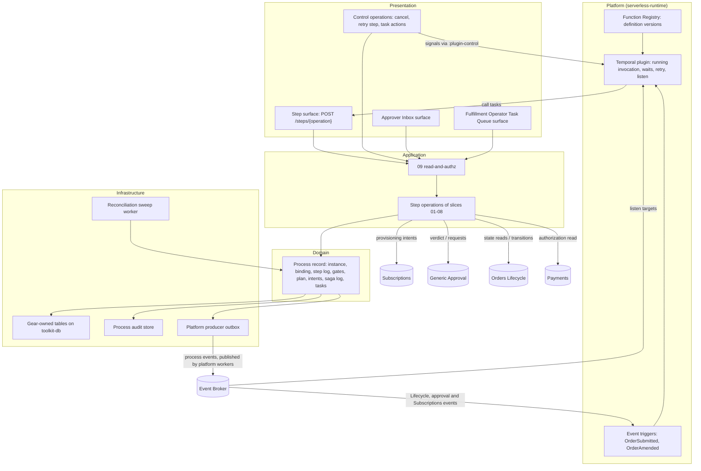
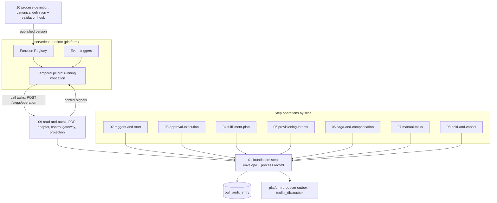
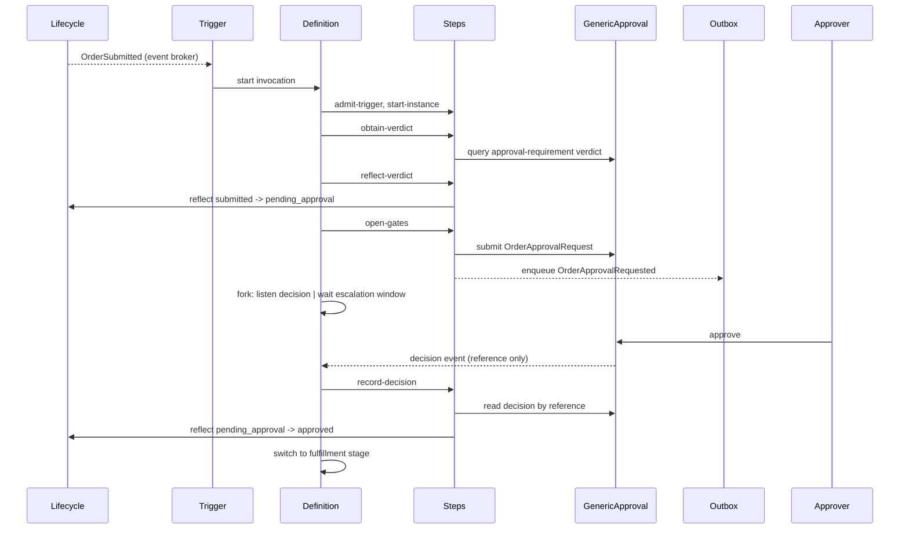
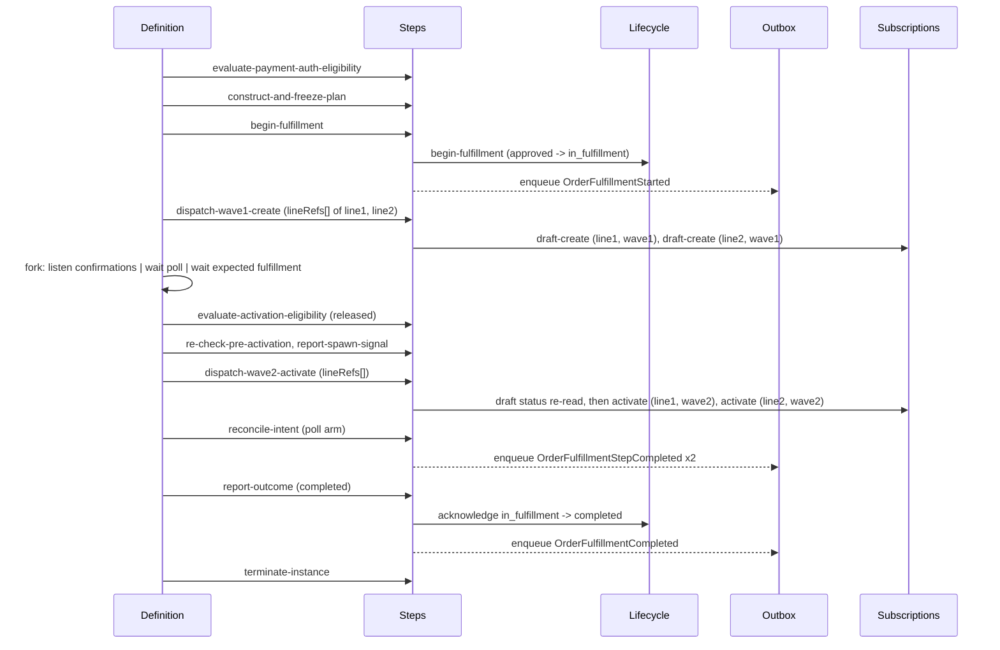
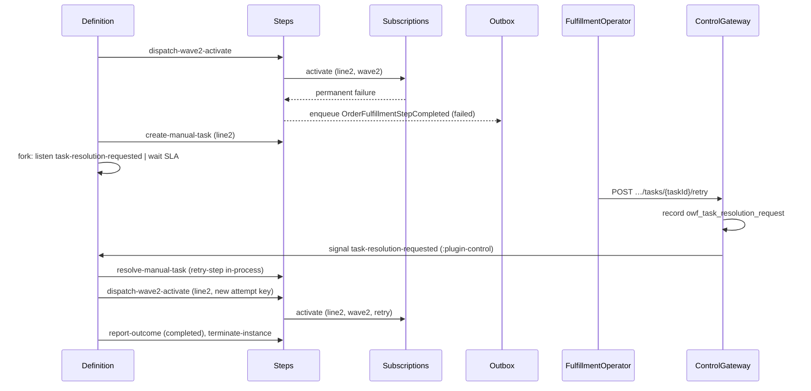
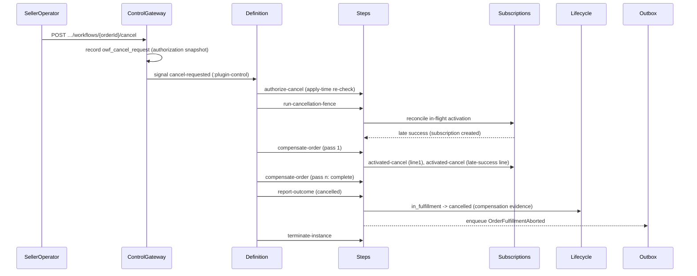
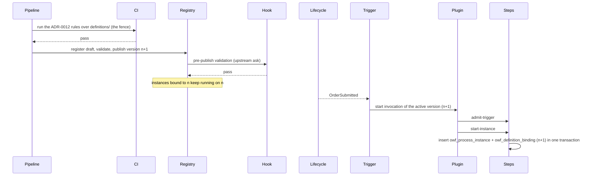

<!-- CONFLUENCE_TITLE: [BSS]: Orders Workflow — Technical Design -->
<!-- Related: ./PRD.md, ./design/, ./DECISIONS.md, ./UPSTREAM_REQS.md | Owners: BSS Orders team -->

# Technical Design — Orders Workflow

<!-- toc -->

- [1. Architecture Overview](#1-architecture-overview)
  - [1.1 Architectural Vision](#11-architectural-vision)
  - [1.2 Architecture Drivers](#12-architecture-drivers)
  - [1.3 Architecture Layers](#13-architecture-layers)
- [2. Principles & Constraints](#2-principles--constraints)
  - [2.1 Design Principles](#21-design-principles)
  - [2.2 Constraints](#22-constraints)
- [3. Technical Architecture](#3-technical-architecture)
  - [3.1 Domain Model](#31-domain-model)
  - [3.2 Component Model](#32-component-model)
  - [3.3 API Contracts](#33-api-contracts)
  - [3.4 Internal Dependencies](#34-internal-dependencies)
  - [3.5 External Dependencies](#35-external-dependencies)
  - [3.6 Interactions & Sequences](#36-interactions--sequences)
  - [3.7 Database schemas & tables](#37-database-schemas--tables)
  - [3.8 Deployment Topology](#38-deployment-topology)
- [4. Additional context](#4-additional-context)
  - [4.1 Capacity and cost](#41-capacity-and-cost)
  - [4.2 Security posture](#42-security-posture)
  - [4.3 Data protection, residency and retention](#43-data-protection-residency-and-retention)
  - [4.4 Observability](#44-observability)
  - [4.5 Fault tolerance and the outbox failure posture](#45-fault-tolerance-and-the-outbox-failure-posture)
  - [4.6 Testability](#46-testability)
  - [4.7 Extension and provenance](#47-extension-and-provenance)
  - [4.8 Configuration and secret management](#48-configuration-and-secret-management)
  - [4.9 Technical debt and deprecation](#49-technical-debt-and-deprecation)
- [5. Traceability](#5-traceability)

<!-- /toc -->

- [ ] `p3` - **ID**: `cpt-cf-bss-orders-workflow-design-owf`
## 1. Architecture Overview

### 1.1 Architectural Vision

Orders Workflow is the **process orchestration gear** for commercially initiated orders: it drives the approval-execution and fulfillment process to a terminal outcome without ever becoming a second source of truth about the order. Since [`ADR/0011`](./ADR/0011-cpt-cf-bss-orders-workflow-adr-flow-as-platform-definition.md) the gear is two things and no longer three. It provides **step operations** — Rust operations behind one internal REST surface, each performing one step's effect inside a shared envelope — and **the process record** — the gear-owned tables that make process execution reconstructible at audit grade: the process instance with its recorded phase, the step log with the platform attempt identity, the idempotency registry, the hash-chained audit trail, the saga/compensation log, the manual tasks and the binding of every instance to the definition version it runs under. The **flow** — the order of steps, the branches, the waits, the two-wave barrier release, the event listening, the hold/resume/cancel signal arms and the structure of compensation — is a **versioned Serverless Workflow definition** (CNCF Serverless Workflow Specification v1.0.0, per [serverless-runtime ADR-0003](../../../serverless-runtime/docs/ADR/0003-cpt-cf-serverless-runtime-adr-workflow-dsl.md)) registered in the platform gear `serverless-runtime` and executed by its Temporal plugin ([serverless-runtime ADR-0004](../../../serverless-runtime/docs/ADR/0004-cpt-cf-serverless-runtime-adr-temporal-workflow-engine.md), [ADR-0005](../../../serverless-runtime/docs/ADR/0005-cpt-cf-serverless-runtime-adr-thin-host.md)), specified in [`design/10-process-definition.md`](./design/10-process-definition.md). **The platform drives; Orders records.** Adjusting the flow is publishing a new definition version through the platform registry; changing what a step does is an Orders release. The process instance per order is correlated by `orderId` + `orderVersion` and a process `correlationId`; its record is authoritative for process execution and never for order semantics. What was ordered and the order's current state are always read from Orders Lifecycle (the document SoR); the pair "Orders Lifecycle ↔ Orders Workflow" mirrors "document ↔ process," the same separation used elsewhere in the billing domain for "Invoice ↔ Bill-Run."

Two structural mechanisms still carry the bulk of the correctness burden, now split between an ordering the definition expresses and a guard an operation enforces. First, a two-wave activation barrier sequences fulfillment as draft-create (wave 1, not resource-affecting) followed by activation (wave 2, only after every create succeeds and the expected fulfillment time is reached): the definition orders `dispatch-wave1-create`, the barrier `wait` and `dispatch-wave2-activate`, and `dispatch-wave2-activate` refuses to act unless Orders' own record shows the conjunction holds. Second, a compensable-only saga with no intra-saga pivot gives every completed wave a named compensating action — draft-void or activated-cancel — dispatched through Subscriptions under the same idempotency contract as the forward path; the definition's `try`/`catch` decides *when* to unwind, and the whole reverse walk is one Orders operation, `compensate-order`, because the compensation ordinal is Orders' record. A permanent failure or an authorized cancellation therefore always resolves to a fully compensated order or an explicit, escalated manual task; it never leaves a stranded resource silently unaccounted for.

The remaining architecture answers the process's distributed nature. Every step operation and every outbound call carries a composed idempotency key, so a platform re-invocation, a replay after a crash or an operator retry is an absorbed duplicate and never a second durable effect. **References, not payloads, cross the engine boundary** ([`ADR/0013`](./ADR/0013-cpt-cf-bss-orders-workflow-adr-references-not-payloads.md)): a task input or output carries identifiers and small closed enums only, so no resolved total, approver identity, seller or payer axis or downstream payload sits in engine history through task data; the start trigger and every `listen` keep only references of the events they consume, and until the platform stores selected members only or Lifecycle publishes thin events, those events as published are the decision's stated residual (§4.2). A published definition is fenced ([`ADR/0012`](./ADR/0012-cpt-cf-bss-orders-workflow-adr-definition-versioning-and-protected-steps.md)): twenty-two `protected` operations may be ordered but never omitted or replaced, six validation rules (stated as eight numbered checks in `design/10` §2.2) run before publish and in CI, and every protected operation re-checks its own precondition in Orders' record at run time. Unresolved outcomes are recovered by a read-only reconciliation sweep rather than by inferring success from silence; unavailability of the approval-requirement verdict source fails closed — the order stays `submitted`, the process parks, and escalation happens before the Lifecycle `submitted` TTL elapses — rather than failing open to `approved`, while transient unavailability of Lifecycle, Subscriptions or Payments is retried by the definition's task retry policy inside the step's own budget and escalates to a manual task on exhaustion. Every process-execution transition is recorded in this gear's own audit trail — with its process event, where one is declared, enqueued through the platform producer outbox in the same transaction — independent of whatever the platform engine keeps in its history. **Honesty disclosure**: serverless-runtime has no code and no Temporal plugin today; the definitions are documentation until the platform readiness gate of [`design/01-foundation.md`](./design/01-foundation.md) §3.8 passes, and if the platform slips the record and the step operations are unchanged and only sequencing falls back to code — a stated property of the decomposition, not a plan (§4.9). This is how the architecture satisfies the PRD's zero-lost-workflow, zero-duplicate-effect, and 100%-failure-visibility requirements simultaneously, while staying strictly additive to the BSS boundary: no order state is stored here, no price is computed here, and no OSS call is ever made directly.

### 1.2 Architecture Drivers

Requirements that significantly influence architecture decisions.

#### Functional Drivers

| Requirement | Design Response |
|-------------|------------------|
| `cpt-cf-bss-orders-workflow-fr-owf-process-state-nonauth` | The gear-owned process record is the sole authority for step progress, the platform `attempt_id` of every attempt, the saga log, approval tracking, `correlationId` and the definition version: every step operation writes it in its own transaction, `start-instance` pins the instance to its definition version in `owf_definition_binding`, and engine history is reference-only and never read as process state. Retry counters and timer handles are the platform's (ADR-0011); what Orders keeps of them is the attempt identity per step record and the remaining escalation window on the gate row. Every read of order semantics is proxied live to Orders Lifecycle rather than cached as authoritative. |
| `cpt-cf-bss-orders-workflow-fr-owf-start-contract` | The platform event triggers on `OrderSubmitted` and `OrderAmended` start an invocation whose first calls are `admit-trigger` and `start-instance`; the other seven Lifecycle triggers (`OrderApproved`, `OrderHeld`, `OrderResumed`, `OrderAcceptanceRecorded`, and the terminal `OrderCancelled`, `OrderExpired`, `OrderRejected`) and a second `OrderAmended` reach a running invocation as `listen` arms, each followed by `admit-trigger`, which re-reads current Lifecycle state, discards superseded and duplicate deliveries and mints one instance per `orderId` + `orderVersion`. The closed trigger set is a validation rule of the definition (ADR-0012). |
| `cpt-cf-bss-orders-workflow-fr-owf-terminal-order-events` | A terminal Lifecycle event is a `listen` arm that calls `terminate-on-terminal-event`, then the one shared unwind path — `run-cancellation-fence`, `compensate-order` (including wave-1 draft-void), `report-outcome`, `terminate-instance` — before termination is recorded. |
| `cpt-cf-bss-orders-workflow-fr-owf-approval-request` | `obtain-verdict` queries the approval-requirement verdict (or the §9.2 stand-in) keyed on `orderId` + `orderVersion` and caches it against that version; `reflect-verdict` reflects it into Lifecycle; `open-gates` opens `OrderApprovalRequest` gates, never computing the verdict itself. |
| `cpt-cf-bss-orders-workflow-fr-owf-approval-idempotency` | Every `OrderApprovalRequest` is created under a composed idempotency key (`orderId` + `orderVersion` + gate id) enforced by a uniqueness constraint in the approval-request store, so a re-invoked `open-gates` resolves to the one already-durable request. |
| `cpt-cf-bss-orders-workflow-fr-owf-approval-escalation` | The escalation window is a definition `wait` inside the gate loop, executed by the plugin's durable timers; `escalate-gate` records the escalation and issues the command, Generic Approval only supplying configuration and receiving it. The remaining window is Orders' record (`owf_approval_gate.window_remaining_ms`), returned by `apply-hold`/`apply-resume` so a hold pauses and a resume re-arms exactly the remainder; a gate-open outage is a probe arm over `escalate-gate` in `probe` mode. |
| `cpt-cf-bss-orders-workflow-fr-owf-approval-decision` | The decision event is a `listen` arm of the gate loop; `record-decision` reads the decision by its reference, applies the guards and reflects `approved`/`rejected` into Lifecycle idempotently, and the definition branches on the returned enum to the fulfillment stage or to the unwind path. |
| `cpt-cf-bss-orders-workflow-fr-owf-approver-inbox` | A read-side projection over the approval-request store, scoped by the gate's `assigned_principal`, backs the Approver Inbox UI surface; the decision route records the decision through the same idempotent `record-decision` path as the system callback. |
| `cpt-cf-bss-orders-workflow-fr-owf-fulfillment-plan` | `evaluate-payment-auth-eligibility` then `construct-and-freeze-plan` resolve per-line Catalog dependencies, validate the graph acyclic and complete, and freeze one `FulfillmentTask` per line under `orderId` + `orderVersion` before any intent is dispatched; `re-check-pre-activation` is authoritative before wave 2 and aborts via draft-void without entering the remediation path. |
| `cpt-cf-bss-orders-workflow-fr-owf-line-progress` | Each `FulfillmentTask` is a small state machine (`pending → draft_created → activated/failed`, plus the `draft_created → pending` rebuild edge) whose terminal transitions alone emit `OrderFulfillmentStepCompleted`; `report-outcome` defers the Lifecycle `completed` acknowledgement until every task is `activated`, and the definition routes a `failed` task through the configured remediate/fail-fast policy. |
| `cpt-cf-bss-orders-workflow-fr-owf-provisioning-intent` | `dispatch-wave1-create` and `dispatch-wave2-activate` issue per-line intents to Subscriptions under a composed key (`orderId` + `orderVersion` + line + wave + kind) — one `call` per wave carrying `lineRefs[]`, the per-order parallelism inside the operation. `dispatch-wave2-activate` re-reads each line's draft status inside the operation immediately before its activation submit and reports a lapsed draft in `lapsed[]`, which routes to `rebuild-wave1` rather than trusting a notification (D-78 as amended); `reread-draft-liveness` is an optional, advisory early read that the canonical definition does not call, never the gate. An operator's line retry re-sends a `failed` intent under the line's next wave attempt (D-119). |
| `cpt-cf-bss-orders-workflow-fr-owf-payment-auth` | `evaluate-payment-auth-eligibility` reads the payment-authorization outcome from Payments on request, keeps pending and failed distinct, and is re-evaluated on `OrderAcceptanceRecorded` and on a definition poll `wait`; Lifecycle is the sole evaluator of the seller's tolerate-failure policy inside `begin-fulfillment`. |
| `cpt-cf-bss-orders-workflow-fr-owf-retry` | The definition's task retry policy (`use.retries.transient`: exponential from 1 s, jitter to 30 s, 5 attempts) re-issues only operations registered `retryable-on: transient`, under the same idempotency key; the per-operation deadline inside the envelope is distinct from the task timeout, a hang after accept is handed to the reconciliation sweep, and the caller-side duplicate protocol makes a re-issued call resolve to the settled outcome rather than a second effect. |
| `cpt-cf-bss-orders-workflow-fr-owf-dead-letter` | An inbound delivery that exhausts its cap is the platform event-trigger path's dead letter, never an Orders row and never an order state; operator visibility and re-drive are asked of the platform (`UPSTREAM_REQS.md` §2.9). A step-level failure's inspectable object is the manual task, so a failing compensation reuses the manual-task/incident path rather than a second channel. |
| `cpt-cf-bss-orders-workflow-fr-owf-intent-sweep` | The `reconciliation-sweep` worker selects every due intent by `next_sweep_at` over every non-terminal intent, whether or not its instance has a live invocation, and settles a stuck step key only through `settle-from-lookup`; its instance liveness pass reads each non-terminal instance's invocation status and raises an instance whose invocation is not live as one order-scope `invocation-dead` manual task (D-105); once the idempotency key's lifetime has elapsed it is strictly read-only and never resubmits under an aged-out key. The definition's poll arm is an early read of the same rows. |
| `cpt-cf-bss-orders-workflow-fr-owf-backpressure` | Admission controls inside the dispatch operations — the per-order parallel-line cap, the aggregate in-flight cap and the per-seller bucket over `owf_dispatch_admission` — defer a line as a **settled success** carrying `deferred[]` and `retryAfterMs`, so a downstream throttle is a delay and never a retry-budget consumption. |
| `cpt-cf-bss-orders-workflow-fr-owf-dependency-resilience` | Transient-dependency failures (Lifecycle, Subscriptions, Payments) are `retryable-failure` outcomes the definition's task retry policy re-issues within the step's own budget, escalating to a manual task on exhaustion — through the failure stage where the definition catches the exhaustion (the wave calls; `compensate-order` through the unwind's own resolution arm), and through the sweep's `invocation-dead` task where exhaustion faults the invocation (every other step call, `design/10` §4.6; D-105, D-114), so no exhaustion stalls silently; Generic Approval unavailability is excluded and follows the fail-closed park-and-escalate arm. |
| `cpt-cf-bss-orders-workflow-fr-owf-task-queue` | A read-side projection over manual tasks and incidents, scoped to the operator's seller tenancy and paged on the immutable `(created_at, task_id)` key, backs the Fulfillment Operator Task Queue; its per-action routes record an `owf_task_resolution_request` and signal the running invocation. Dead-letter rows join it only if the platform exposes its dead letters (pending). |
| `cpt-cf-bss-orders-workflow-fr-owf-overdue-escalation` | A definition `wait` arm, distinct from every task timeout and from the lifetime ceiling, calls `raise-overdue-escalation` when `in_fulfillment` (or a hold taken from it) exceeds the configurable overdue window, without failing any line or auto-terminaling the order. |
| `cpt-cf-bss-orders-workflow-fr-owf-hold-resume` | `OrderHeld`/`OrderResumed` are `listen` arms that call `apply-hold`/`apply-resume`; dispatch operations refuse new intents while suspended and let accepted intents run to their terminal outcome; only the approval-escalation `wait` is inside the arm a hold cancels, and it is re-armed with the remainder Orders returns, while the lifetime ceiling, the barrier and the overdue `wait` keep running. Whether the DSL expresses this natively is Q-11. |
| `cpt-cf-bss-orders-workflow-fr-owf-compensation-declaration` | Each operation declares its compensating operation once in its slice §3.3, mirrored into `owf_step_operation.compensation`; both waves compensate (draft-void, activated-cancel) and there is no third leg and no intra-saga pivot. |
| `cpt-cf-bss-orders-workflow-fr-owf-compensation-execution` | `run-cancellation-fence` (stop dispatch, identify in-flight, reconcile terminal outcomes including late successes) precedes `compensate-order`, which walks every created subscription in reverse forward-execution order under the Orders-owned ordinal and is resumable by pass, before `report-outcome` ever reports a compensated outcome to Lifecycle; the order is a validation rule and each operation guards it at run time. |
| `cpt-cf-bss-orders-workflow-fr-owf-manual-task` | `create-manual-task` is `protected`: exactly one actionable task per permanently failed subject under the remediation policy (or a tracked incident under fail-fast) is created before any terminal outcome is declared, guaranteeing the 100%-visibility contract. |
| `cpt-cf-bss-orders-workflow-fr-owf-override-semantics` | `verify-override` verifies the referenced subscription is active and matches the order line via Subscriptions before accepting the override, rejecting any override lacking a verified subscription and recording operator identity and justification in the audit log. |
| `cpt-cf-bss-orders-workflow-fr-owf-boundary-binding` | The Lifecycle R1–R5 seam holds by construction and is not reachable from the definition: every seam call is inside an Orders step operation (R1), approval-requirement computation is never duplicated here (R2), all provisioning routes only through Subscriptions (R3), no price arithmetic exists in this gear (R4), and the downstream transition-request id is stored only as a correlation column (R5). |
| `cpt-cf-bss-orders-workflow-fr-owf-process-events` | A platform event producer adapter (`event-broker-sdk::DbProducer` over `toolkit_db::outbox`) emits the six named process events — `OrderApprovalRequested`, `OrderApprovalEscalated`, `OrderFulfillmentStarted`, `OrderFulfillmentStepCompleted`, `OrderFulfillmentCompleted`, `OrderFulfillmentAborted` — from inside the step operation that declares each, with at-least-once delivery and consumer-side de-duplication by event ID; the definition never uses `emit`, so no consumer sees dual publication of the same semantic change. |
| `cpt-cf-bss-orders-workflow-fr-owf-authorization` | Every operation — the step routes (`process_step × execute`, serverless-runtime service principal only), approve/reject, task resolution, workflow cancel and the read surfaces — is authorized by the platform PDP through one shared `PolicyEnforcer` adapter on a registered `(resource, action)` pair (`ADR/0010`); seller and gate scope are PDP constraints compiled to an `AccessScope` and applied inside the statement, and no pair a service principal holds writes order state. |

#### NFR Allocation

| NFR ID | NFR Summary | Allocated To | Design Response | Verification Approach |
|--------|-------------|--------------|-----------------|----------------------|
| `cpt-cf-bss-orders-workflow-nfr-owf-durability` | Zero lost in-flight workflows across restarts; zero loss for committed process state (business RPO zero for committed steps) | Platform invocation durability + gear-owned process record | The platform plugin resumes every invocation from its history and re-issues any call it did not see answered; every step operation commits its record, audit entry and idempotency settlement in one transaction before answering, so a re-issued call is absorbed and recovery of the record never depends on engine retention | Restart-under-load test asserting zero re-triggered completed steps and zero lost in-flight workflows; fault injection between commit and HTTP answer; audit-log completeness check with the engine's history absent |
| `cpt-cf-bss-orders-workflow-nfr-owf-idempotency` | Zero duplicate durable effects per idempotency key | Step envelope, dispatch operations, approval-request creation, Lifecycle transition calls | Every step operation is keyed server-side by an ADR-0006 family recomposed from its references, and every outbound call carries a composed key persisted before dispatch, with a caller-side duplicate protocol that confirms outcome by lookup instead of inferring success from silence | Concurrency test firing an identical re-issued call and asserting exactly one durable effect at the target service; sweep-based reconciliation test for client-timeout scenarios |
| `cpt-cf-bss-orders-workflow-nfr-owf-fulfillment-sla` | p95 ≤ 15 minutes from activation-wave eligibility to terminal fulfillment outcome (standard orders, no manual intervention, no future-dated wait) | Wave-2 dispatch operation, admission controls, definition task timeouts | `dispatch-wave2-activate` dispatches every eligible activation intent in one call up to the per-order cap; the wave-2 task timeout (3 min) and the reconciliation sweep's schedule bound worst-case discovery latency for lost confirmations | Load test measuring p95 activation-eligibility-to-terminal-outcome latency for standard orders at production sizing |
| `cpt-cf-bss-orders-workflow-nfr-owf-escalation-timer` | Configurable per gate; default 72 h; accuracy ± 5 min | Definition `wait` (plugin durable timer), gate-window record | The escalation window is a definition `wait` executed by the plugin's durable timer; the remainder is Orders' record and is re-armed on resume; `escalate-gate` evaluates arrival against database time | Timer-accuracy test asserting fired-time within ± 5 min of configured window across a platform worker restart, once the plugin exists |
| `cpt-cf-bss-orders-workflow-nfr-owf-manual-task-sla` | 100% manual-task creation for permanently failed lines; SLA countdown visible before breach | `create-manual-task` (protected), task-queue read projection | `create-manual-task` is a protected operation on every failure path under the remediation policy, validated before publish and called before any terminal outcome is declared; the task-queue projection surfaces the SLA deadline (4 h resource-affecting, 24 h otherwise) | Validation-rule test that no definition reaches a terminal outcome under `remediate` without it; UI/API test asserting SLA countdown is visible ahead of breach |
| `cpt-cf-bss-orders-workflow-nfr-owf-event-latency` | p95 < 30 s from internal state change to event delivery | Platform event producer adapter | Process events are enqueued through the platform producer outbox in the same transaction as the step operation's record and published by platform workers independent of the request path; commit success alone is not evidence of the target | Producer-queue lag (platform metric) measuring p95 enqueue-to-broker-acceptance at production event volume, with backlog and retries present |
| `cpt-cf-bss-orders-workflow-nfr-owf-audit` | 100% coverage in process audit log | Gear-owned process audit log, written by the step envelope | Every step operation's settlement — first call, re-run, sweep settlement, escalation, compensation, termination — writes an audit row in the same unit of work as the record change, independent of engine history | Structural test that every registered operation's `audit_kind` is written on settlement; negative test that a failed audit append aborts the operation |
| `cpt-cf-bss-orders-workflow-nfr-owf-api-latency` | Command acceptance p95 < 1 s; progress reads p95 < 200 ms | Control operations, progress-read projection | Control commands (cancel, resolve task, retry step) record a request row and deliver a signal to the invocation (one platform hop), answering `202 Accepted` without waiting on the consuming operation; progress reads are served from the denormalized `owf_process_progress_view` projection | Latency benchmark for command acceptance, including the signal hop, and for progress-read endpoints at production request rates |
| `cpt-cf-bss-orders-workflow-nfr-owf-availability` | 99.9% control-plane availability (working baseline) | Control-plane deployment topology, step surface | The control plane and the step surface are deployed with redundancy per the platform BSS availability baseline; in-flight processes are recoverable from the platform invocation and the gear-owned record independent of control-plane restarts; readiness includes the platform readiness gate | Availability monitoring against the 99.9% baseline; chaos test restarting the control plane while workflows are in flight |
| `cpt-cf-bss-orders-workflow-nfr-owf-retention` | Business-level retention aligned with platform audit policy; default ≥ 400 days, configurable | Gear-owned process audit / saga log / manual-task stores; bound definition versions | Retention is enforced on the gear-owned stores independently of the platform engine's history retention, so an engine purge cannot erase the gear's record; a definition version stays resolvable while any binding names it (upstream ask) | Retention test asserting gear-owned audit records survive past an engine-side history purge cycle |

#### Key ADRs

| ADR ID | Decision Summary |
|--------|-----------------|
| `cpt-cf-bss-orders-workflow-adr-durable-execution-substrate` | Rewritten by ADR-0011: the substrate is **selected** — the serverless-runtime Temporal plugin executing a platform definition — and this gear's own process record, never the engine's run history, remains the audit source of record and the basis of recovery. The fallback property is kept: if the platform slips, only sequencing falls back to code. |
| `cpt-cf-bss-orders-workflow-adr-slice-decomposition` | Decomposes the gear into a shared foundation (step envelope and process record) plus build-ordered capability slices; after ADR-0011 each slice provides step operations and a definition fragment, and the process definition (`design/10`) is a document of its own, first in build order after the foundation. |
| `cpt-cf-bss-orders-workflow-adr-process-state-non-authoritative` | Fixes the gear-owned process record, not the engine's history (Temporal history under ADR-0011), as the sole authority for process execution progress, kept structurally distinct from Orders Lifecycle's authority over order state. |
| `cpt-cf-bss-orders-workflow-adr-two-wave-activation-barrier` | Establishes draft-create (wave 1) then activation (wave 2, gated on all-creates-succeeded and expected-fulfillment-time); as amended, the barrier is a definition pattern and its conjunction is a validation rule plus the run-time guard of `dispatch-wave2-activate`. |
| `cpt-cf-bss-orders-workflow-adr-saga-compensable-no-pivot` | Classifies both fulfillment waves as compensable with no intra-saga pivot; as amended, the definition's `try`/`catch` decides when to unwind and the reverse walk is one Orders operation under the Orders-owned ordinal. |
| `cpt-cf-bss-orders-workflow-adr-idempotency-key-composition` | Fixes the idempotency-key families, distinct from the process `correlationId`; as amended, the platform's same-key re-invocation is absorbed by them, and the trigger family and the round/pass components are added. |
| `cpt-cf-bss-orders-workflow-adr-fail-closed-verdict-park` | Establishes that unavailability of the approval-requirement verdict source parks the process with the order remaining `submitted` rather than failing open to `approved`; as amended, the park is a definition arm. |
| `cpt-cf-bss-orders-workflow-adr-outbox-process-events` | Publishes the six named process events through the platform producer outbox, as Orders Lifecycle does, from inside step operations; Workflow owns no outbox table, drain or re-drive, and the definition never emits. |
| `cpt-cf-bss-orders-workflow-adr-manual-task-dead-letter-separation` | Keeps the manual-task/incident path (step failure) structurally separate from the dead-letter path (poisoned inbound delivery); as amended, the inbound dead letter is the platform trigger path's and Orders writes no dead-letter row. |
| `cpt-cf-bss-orders-workflow-adr-platform-pdp-authorization` | Delegates every authorization decision to the platform PDP through one shared `PolicyEnforcer` adapter over a registered resource/action catalogue; as amended, the step routes are `process_step × execute` for the serverless-runtime service principal only, with the operation name as a resource property. |
| `cpt-cf-bss-orders-workflow-adr-flow-as-platform-definition` | The order process flow is a versioned Serverless Workflow definition registered in serverless-runtime and executed by its Temporal plugin; Orders provides step operations and the process record; timers, retry policy, waits and signals are the platform's; Q-01 is answered in two parts. |
| `cpt-cf-bss-orders-workflow-adr-definition-versioning-and-protected-steps` | Fences a published definition: 22 `protected` and 13 `composable` operations, six validation rules (eight numbered checks in `design/10` §2.2, D-67) run by a pre-publish hook and a CI test, run-time precondition guards inside every protected operation, instance pinning through `owf_definition_binding`, platform-operator publish today. |
| `cpt-cf-bss-orders-workflow-adr-references-not-payloads` | Task inputs and outputs carry identifiers and small closed enums only, and the start trigger and every `listen` keep only references of what they consume; every operation reads commercial data inside this gear under the PDP; the residual — identifiers in engine history, and the consumed events as published until the member-storage or thin-event ask lands — is bounded by upstream asks. |

### 1.3 Architecture Layers

```mermaid
flowchart TB
    subgraph Platform["Platform (serverless-runtime)"]
        Registry[Function Registry: definition versions]
        Triggers[Event triggers: OrderSubmitted, OrderAmended]
        Plugin[Temporal plugin: running invocation, waits, retry, listen]
    end
    subgraph Presentation
        Steps["Step surface: POST /steps/{operation}"]
        Control[Control operations: cancel, retry step, task actions]
        Inbox[Approver Inbox surface]
        Queue[Fulfillment Operator Task Queue surface]
    end
    subgraph Application
        Ops[Step operations of slices 01-08]
        ReadAuthz[09 read-and-authz]
    end
    subgraph Domain
        Record[Process record: instance, binding, step log, gates, plan, intents, saga log, tasks]
    end
    subgraph Infrastructure
        DB[Gear-owned tables on toolkit-db]
        AuditStore[Process audit store]
        Outbox[Platform producer outbox]
        Sweep[Reconciliation sweep worker]
    end

    Registry --> Plugin
    Triggers --> Plugin
    Plugin -->|call tasks| Steps
    Control -->|signals via :plugin-control| Plugin
    Steps --> ReadAuthz
    Control --> ReadAuthz
    Inbox --> ReadAuthz
    Queue --> ReadAuthz
    ReadAuthz --> Ops
    Ops --> Record
    Record --> DB
    Record --> AuditStore
    Record --> Outbox
    Sweep --> Record

    Ops -->|provisioning intents| Subscriptions[(Subscriptions)]
    Ops -->|verdict / requests| GenericApproval[(Generic Approval)]
    Ops -->|state reads / transitions| Lifecycle[(Orders Lifecycle)]
    Ops -->|authorization read| Payments[(Payments)]
    Outbox -->|process events, published by platform workers| EventsAudit[(Event Broker)]
    EventsAudit -->|Lifecycle, approval and Subscriptions events| Triggers
    EventsAudit -->|listen targets| Plugin
```

| Layer | Responsibility | Technology |
|-------|---------------|------------|
| Platform | The process definition's versions, its event triggers and its execution — sequencing, `wait` timers, task retry, `listen` event matching, signals and replay — owned by the platform gear, not by this one; this gear publishes definitions and is called by the running invocation | serverless-runtime Function Registry, Invocation and Event Trigger APIs by reference ([DESIGN §3.3](../../../serverless-runtime/docs/DESIGN.md#33-api-contracts)); Temporal plugin. **No code today** (§4.9) |
| Presentation | The internal step surface (one route per registered operation, serverless-runtime service principal only); control operations (cancel-with-compensation, retry step, per-action manual-task routes) that record a request and signal the invocation; progress read; Approver Inbox and Fulfillment Operator Task Queue read surfaces, each scoped by actor role and tenancy | Rust, REST/OpenAPI, `OperationBuilder`, inbound API gateway |
| Application | The thirty-five step operations of slices 01–08 inside the step envelope — idempotency resolution, per-operation deadline, audit, event enqueue and settlement in one transaction — and slice 09's authorization adapter and control gateway; each slice owns its guard logic and its reasons | Rust modules in the `orders-workflow` gear |
| Domain | The process record: `ProcessInstance` with its recorded phase and definition binding, `FulfillmentTask` and `OrderApprovalRequest` state machines, the saga/compensation record, manual tasks, idempotency-key composition — all non-authoritative for commercial order semantics | Rust domain structs; GTS reference schemas for every task input and output; GTS for cross-gear contract surfaces with Lifecycle, Subscriptions, and the Generic Approval service |
| Infrastructure | Gear-owned tables for the record; append-only, hash-chained process audit store; platform producer outbox for process events; three advisory-locked workers (reconciliation sweep, retention purge, audit verifier) | PostgreSQL (`toolkit-db` plus `outbox`), SecureORM, toolkit-db session advisory locks (`Db::lock`) for the worker roster of `design/01-foundation.md` §3.8, `event-broker-sdk`. The engine's history is never a citable record (ADR-0003, ADR-0013) |

## 2. Principles & Constraints

### 2.1 Design Principles

#### Process state is never authoritative for commercial order semantics

- [ ] `p1` - **ID**: `cpt-cf-bss-orders-workflow-principle-non-authoritative-state`

This gear's process audit and saga log are authoritative for process **execution** progress —
step progress, retry counters, saga/compensation log, timer state, approval-request tracking,
`correlationId`, the definition version an instance started with — and for nothing else. What was
ordered and the order's current state are always read live from Orders Lifecycle; no read is
cached or projected forward as if it were the order record. A design or implementation choice that
makes a Workflow-owned value the source callers consult for order state is a defect against this
principle regardless of how convenient the shortcut looks locally.

**ADRs**: `cpt-cf-bss-orders-workflow-adr-process-state-non-authoritative`

#### One envelope records every step transition

- [ ] `p1` - **ID**: `cpt-cf-bss-orders-workflow-principle-single-engine-ownership`

Every process-execution state change — step start, step completion, a re-issued attempt, a
per-operation deadline, escalation, compensation, termination — is recorded by one step
operation through the same envelope: idempotency resolution before the effect, and the record,
the audit entry, the declared event and the settlement in one transaction after it. No capability
slice mutates the saga log, a gate, `FulfillmentTask` status or the recorded phase by a side door,
and the definition cannot record anything at all — it can only call a registered operation. The
sequencing moved to the platform definition (ADR-0011); the single writer did not. This is what
keeps the durability, idempotency, audit-completeness and recoverability guarantees assertable
once, against one code path, whichever definition version or fallback sequencer calls the
operations.

**ADRs**: `cpt-cf-bss-orders-workflow-adr-flow-as-platform-definition`, `cpt-cf-bss-orders-workflow-adr-durable-execution-substrate`, `cpt-cf-bss-orders-workflow-adr-slice-decomposition`

#### References, not payloads, cross into the platform engine

- [ ] `p1` - **ID**: `cpt-cf-bss-orders-workflow-principle-engine-boundary-references`

Whatever a definition task sends to or receives from a step operation is persisted in the
platform engine's history, which this gear neither owns nor retains. A task input or output
therefore carries `correlationId`, `orderId`, `orderVersion`, `resource_tenant_id`, the platform
`invocation_id`/`attempt_id`, an opaque `stepRef`/`taskRef`/`gateRef`/`lineRef` and small closed
enums the operations return — never a resolved total, a price field, an approver identity, a
seller or payer axis, a subscription or transition-request identifier, the frozen plan, free text
or any downstream payload. Every operation resolves its references against this gear's record and
reads commercial data inside this gear under the PDP. The rule is normative in
[`design/01-foundation.md`](./design/01-foundation.md) §2.1 and is checked structurally against
each operation's declared reference schema, before publish and on every request.

**ADRs**: `cpt-cf-bss-orders-workflow-adr-references-not-payloads`

#### All provisioning flows through Subscriptions, never OSS directly

- [ ] `p1` - **ID**: `cpt-cf-bss-orders-workflow-principle-subscriptions-only-provisioning`

Every provisioning-affecting call this gear makes — forward draft-create and activation intents,
and equally the draft-void and activated-cancel compensating actions — targets Subscriptions
exclusively. OSS Provisioning is never invoked directly, from any code path, for any reason,
including remediation and operator-initiated retry. Compensation is not an escape hatch that
justifies a shortcut around the boundary the forward path already respects.

**ADRs**: `cpt-cf-bss-orders-workflow-adr-saga-compensable-no-pivot`, `cpt-cf-bss-orders-workflow-adr-idempotency-key-composition`

#### Compensation is declared at design time, not improvised at failure time

- [ ] `p2` - **ID**: `cpt-cf-bss-orders-workflow-principle-compensation-declared-at-design-time`

Every compensable step names its compensating action once, in its operation's declaration
(`compensation`, mirrored into `owf_step_operation`), before that step is ever dispatched —
draft-create compensates with draft-void, activation compensates with activated-cancel — and
`compensate-order` walks the record under the Orders-owned ordinal rather than any order a
definition could express. A step that reaches production
without a registered compensating action cannot be added to the fulfillment plan; there is no
runtime path that infers what "undo" should mean for a step after the fact, because an improvised
compensation is exactly the failure mode a saga is meant to rule out.

**ADRs**: `cpt-cf-bss-orders-workflow-adr-saga-compensable-no-pivot`

### 2.2 Constraints

#### The Lifecycle seam rules are bound by reference, never restated

- [ ] `p1` - **ID**: `cpt-cf-bss-orders-workflow-constraint-lifecycle-seam-by-reference`

The R1–R5 boundary rules between Orders Workflow and Orders Lifecycle are normatively owned by the
Orders Lifecycle PRD §6.4 (mirrored for this gear's execution consequences in this PRD §6.5) and
are **not restated in this design document**. Any design element that needs to state what is true
of the order reads Lifecycle's PRD; any design element that needs to state how execution gets
there stays local. The boundary regression test is unchanged from the PRD: no rule may require
reading both documents to know the answer. Restating a seam rule here, even paraphrased, recreates
the exact drift channel the by-reference binding exists to close.

**ADRs**: `cpt-cf-bss-orders-workflow-adr-process-state-non-authoritative`

#### No direct OSS invocation

- [ ] `p1` - **ID**: `cpt-cf-bss-orders-workflow-constraint-no-direct-oss-invocation`

No component in this gear holds a client, credential or call path to OSS Provisioning. Every
provisioning effect, forward or compensating, is expressed as an intent to Subscriptions; OSS
involvement, if any, is entirely Subscriptions' internal concern and invisible to this design. This
constraint has no exception carve-out for latency, for a "read-only" OSS query, or for a
remediation code path.

**ADRs**: `cpt-cf-bss-orders-workflow-adr-saga-compensable-no-pivot`

#### No price computation, derivation or modification

- [ ] `p2` - **ID**: `cpt-cf-bss-orders-workflow-constraint-no-price-computation`

This gear performs no arithmetic, derivation, aggregation or currency conversion over price data.
The only price access anywhere in the design is reading the stored non-authoritative resolved
total from Lifecycle solely to include it (as an opaque figure) in the `OrderApprovalRequest`
context passed to the Generic Approval service; `priceId` and `catalogPricePin` are carried as
opaque pass-through identifiers with no local interpretation.

**ADRs**: `cpt-cf-bss-orders-workflow-adr-fail-closed-verdict-park`

#### Per-request downstream status is never mirrored into order state

- [ ] `p2` - **ID**: `cpt-cf-bss-orders-workflow-constraint-no-status-mirroring`

The per-request status of a Subscriptions `TransitionRequest` is tracked only as this gear's own
`FulfillmentTask` execution progress; it is never written back into, or presented as, Lifecycle
order state. A `TransitionRequest` identifier persisted anywhere in this design is a correlation
column only, carrying no state meaning of its own.

**ADRs**: `cpt-cf-bss-orders-workflow-adr-idempotency-key-composition`, `cpt-cf-bss-orders-workflow-adr-outbox-process-events`

#### Regulatory and data-residency constraints

- [ ] `p1` - **ID**: `cpt-cf-bss-orders-workflow-constraint-regulatory-residency`

For residency-bound tenants every gear-owned store — process tables, progress projection, audit,
idempotency registry, the definition binding and their backups, together with the platform
producer-outbox tables that share the same database — is pinned to an in-jurisdiction deployment
cell with **zero cross-boundary replication**, stated in the same terms as the sibling gear. Two
regulatory obligations bind through that: the process audit trail is a compliance-grade record
and its ≥ 400-day floor is a retention obligation, not a convenience; and the trail carries opaque
actor and approver subject identifiers, so an erasure obligation is met by the identity platform
removing identifying data, never by deleting or rewriting audit rows (§4.3, D-61). The constraint
has a direct architectural consequence rather than being a policy footnote: a recovery standby
must be a second failure domain inside the jurisdiction rather than a second region. The platform
engine's history is the one store the constraint cannot reach from this side: ADR-0013 bounds its
content to references, but the Temporal persistence backend is a platform infrastructure
dependency ([serverless-runtime ADR-0004](../../../serverless-runtime/docs/ADR/0004-cpt-cf-serverless-runtime-adr-temporal-workflow-engine.md)
line 100) whose location and retention this gear cannot pin. **Pinning engine history
in-jurisdiction and stating its retention is an upstream ask**
(`cpt-cf-bss-orders-workflow-upreq-serverless-runtime-history-residency-retention`), and the
platform path is not ready for a residency-bound tenant until it is agreed (Q-12). Financial-
instrument regulation does not bind here because this gear computes no price and holds no payment
instrument; PCI DSS is not applicable for the same reason (§4.2).

**ADRs**: `cpt-cf-bss-orders-workflow-adr-process-state-non-authoritative`, `cpt-cf-bss-orders-workflow-adr-references-not-payloads`

#### Vendor and licensing: Temporal is an inherited platform dependency

- [ ] `p3` - **ID**: `cpt-cf-bss-orders-workflow-constraint-vendor-licensing`

The gear introduces **no** third-party runtime dependency beyond the platform's own ToolKit and
PostgreSQL — worker coordination is toolkit-db's own session advisory locks (`Db::lock`), not a
further library — all already licensed and vetted platform-wide, and it adds no crate outside the
approved set. The durable-execution engine underneath the definition is **Temporal**, selected by
the platform ([serverless-runtime ADR-0004](../../../serverless-runtime/docs/ADR/0004-cpt-cf-serverless-runtime-adr-temporal-workflow-engine.md))
and reached only through the serverless-runtime REST surface: this gear links no Temporal SDK,
operates no Temporal Server and holds no Temporal licence. Its licence, support posture, CVE
history and run cost are **inherited platform dependencies**, assessed by the serverless-runtime
owners; the one vendor property this gear depends on and cannot inherit silently is where the
engine's history is stored and for how long, which is the residency ask of the constraint above.

**ADRs**: `cpt-cf-bss-orders-workflow-adr-flow-as-platform-definition`, `cpt-cf-bss-orders-workflow-adr-durable-execution-substrate`

#### Protected steps are fenced, before publish and at run time

- [ ] `p1` - **ID**: `cpt-cf-bss-orders-workflow-constraint-protected-step-fence`

A definition version is publishable only if it passes the validation rules of ADR-0012 — every
`protected` operation present in its order constraints, every `call` to a registered operation,
every `listen` inside the closed set, nesting bounds, reference-only task inputs, and no protected
operation inside a `catch` that continues the forward path — run by a pre-publish validation hook
and by a CI test over the canonical definitions of [`design/10-process-definition.md`](./design/10-process-definition.md).
The pre-publish hook is an upstream ask, not a platform fact; until it lands, the CI test and the
platform-operator publish role are the fence at publish time. Independently of the fence, every
`protected` operation re-checks its own precondition in this gear's record and refuses with a
catalogue reason when it does not hold, so a definition that bypasses the static fence fails
closed at the first protected operation it misorders. The protected list — 22 operations — is an
Orders release to change, never a publish.

**ADRs**: `cpt-cf-bss-orders-workflow-adr-definition-versioning-and-protected-steps`

#### Resource constraints are project-level, not design-level

- [ ] `p3` - **ID**: `cpt-cf-bss-orders-workflow-constraint-resource-not-applicable`

Budget, team size and delivery window are project-level facts owned outside this design set and
would date immediately if restated here, so they are recorded as inapplicable **with that
reasoning** rather than omitted. The design's own sequencing constraint is the build-order map in
[`design/README.md`](./design/README.md), named by
`cpt-cf-bss-orders-workflow-adr-slice-decomposition` as the authority: the foundation, the
process definition and eight capability slices, each buildable only once its declared
dependencies exist, and the platform path gated on serverless-runtime delivery (§4.9). The one
resource dimension this design does bind is operator capacity, and it binds it through a signal
rather than a number — the manual-task arrival alert of §4.4, which exists because a remediate
policy converts a systemic downstream fault into operator work that the design cannot itself
absorb.

**ADRs**: `cpt-cf-bss-orders-workflow-adr-slice-decomposition`

#### Standard ToolKit authorization posture, with one declared deviation

- [ ] `p1` - **ID**: `cpt-cf-bss-orders-workflow-constraint-platform-pdp-posture`

This gear takes the unified-system security posture as written — gateway-terminated
authentication, every authorization decision through `PolicyEnforcer` from `authz-resolver-sdk`,
every sensitive database access covered by a PDP decision compiled to an `AccessScope` and
applied by `SecureConn`, fail closed on denial, outage or missing constraints — and requests
**two** deviations, declared here and in `ADR/0010`. First, a PDP denial of a **targeted** request is
answered `not-found` (404) rather than the platform default 403, unless a follow-up `read`
decision on the same target allows, in which case it is `not-authorized` (403). A 403 on a row
the caller cannot read is an existence oracle over other sellers' orders; this is Orders
Lifecycle's D-114 and D-141 applied unchanged, so the two Orders gears answer identically
(`design/09-read-and-authz.md` §4.4). Second, a PDP timeout or outage on a request path is answered
with a sanitized, retryable 503 and no mutation rather than the platform rule's 403, again as
Lifecycle 08 §3.5 does (§4.2). Nothing else deviates: there is no gear-local evaluator,
no permission table, no invented `SecurityContext` claim and no envelope-signature control.

## 3. Technical Architecture

### 3.1 Domain Model

**Technology**: GTS types for cross-gear contract surfaces (Lifecycle, Subscriptions, Generic
Approval) and for the reference schema of every step operation's input and output; Rust domain
structs internally; Serverless Workflow DSL 1.0.0 for the process definition.

**Location**: [`design/01-foundation`](./design/01-foundation.md) §3.1 is normative for the
process aggregate, the step operation and the definition binding;
[`design/10-process-definition`](./design/10-process-definition.md) §3.1 for the process
definition, its versions, its tasks and the process signals; every other entity is normative in
the slice named in the **Specified in** column. **This section mints no entity identity and states
no column** — it is an index from the architectural vocabulary to the slice that owns each
definition.

**Core Entities**:

| Entity | Description | Backing table | Specified in |
|--------|-------------|---------------|--------------|
| `ProcessInstance` | The process aggregate root: `correlationId`, `orderId` + `orderVersion` key, the recorded phase (a projection written by step operations, never derived from engine state), the platform `invocation_id`, the definition version, suspension state | `owf_process_instance` | `01 §3.7` |
| `DefinitionBinding` | The pin of one instance to the definition version it started under, with its source (`platform` or `code`) and publisher; written once by `start-instance` | `owf_definition_binding` | `01 §3.7` |
| `StepOperation` | One registered operation: name, protection, reference schemas, key family, declared event, compensation, reasons, audit kind, retry class, deadline; loaded from the compiled registry | `owf_step_operation` | `01 §3.3`, `01 §3.7` |
| `ProcessDefinition` / `DefinitionVersion` | The registered Workflow callable and its immutable published revisions; held by the platform function registry, not by this gear | — (platform registry) | `10 §3.1` |
| `ProcessSignal` | An operator-originated instruction delivered to a running invocation (`cancel-requested`, `reauthorize-requested`, `task-resolution-requested`, `unpark-requested`), recorded in Orders before delivery | `owf_cancel_request`, `owf_task_resolution_request` (the request rows) | `10 §3.1` |
| `FulfillmentTask` | One per order line; state machine over `pending / draft_created / activated / failed`, terminal transitions alone emitting `OrderFulfillmentStepCompleted` | `owf_fulfillment_task` | `04 §3.7` |
| `OrderApprovalRequest` | One per approval gate: gate identity, the `planned` / open / decided state, requested verdict context (the opaque resolved-total figure never leaves this gear), the remaining escalation window | `owf_approval_gate`, `owf_approval_request` | `03 §3.7` |
| `ProvisioningIntent` | One per line, per wave, per `intent_kind` (`draft_create` / `activation` / `draft_void` / `activated_cancel`); carries the composed idempotency key, the opaque binding reference, `next_sweep_at` and the terminal status (`unresolved` and `lapsed` included) | `owf_provisioning_intent` | `05 §3.7` |
| `CompensationRecord` | One per compensating subject, keyed by process and forward-execution ordinal; settles in place as `compensate-order` passes walk it | `owf_compensation_record` | `06 §3.7` |
| `CancellationFence` | One compensation run per order version: the fencing-step stamps, the pass counter and the re-authorization mark | `owf_cancellation_fence` | `06 §3.7` |
| `ManualTask` | One per permanently failed subject under the remediate policy; carries resolution action, SLA deadline, assignment state, resolving operator identity | `owf_manual_task`, `owf_task_resolution_request` | `07 §3.7` |
| `CancelRequest` | One accepted Seller Operator cancel with its authorization snapshot, recorded before its signal is delivered | `owf_cancel_request` | `09 §3.1`, `09 §3.7` |

- [ ] `p2` - **ID**: `cpt-cf-bss-orders-workflow-entity-approval-decision`

| Entity | Description | Backing table | Specified in |
|--------|-------------|---------------|--------------|
| `ApprovalDecision` | The received `OrderApprovalDecision` fact (approved/rejected, reason, deciding authority) reflected into Lifecycle; read by `record-decision` from the approval service by its reference, stored as received, never recomputed | `owf_approval_gate` (decision columns) | `03 §3.7` |

**Relationships**:
- `DefinitionVersion` → `ProcessInstance`: one-to-many through `DefinitionBinding`; an instance is bound to exactly one version for its whole life.
- `ProcessInstance` → `FulfillmentTask`: one-to-many; one task per order line, created at plan-freeze time.
- `ProcessInstance` → `OrderApprovalRequest`: one-to-many across process lifetime (typically one, more under amendment supersession).
- `FulfillmentTask` → `ProvisioningIntent`: one-to-many; two forward intents (`draft_create`, `activation`) plus zero-or-more compensating intents (`draft_void`, `activated_cancel`).
- `ProcessInstance` → `CompensationRecord`: one-to-many; `ProcessInstance` → `CancellationFence`: zero-or-one per order version.
- `FulfillmentTask` → `ManualTask`: zero-or-one open task, created only on permanent failure under the remediation policy.
- `StepOperation` → every step record and audit entry: many-to-one by operation name. There is no dead-letter entity: an inbound delivery past its cap is the platform trigger path's (ADR-0009 as amended).

### 3.2 Component Model

The gear is a shared foundation — the step envelope and the process record — plus the process
definition and eight build-ordered capability slices, per
`cpt-cf-bss-orders-workflow-adr-slice-decomposition` and the build-order table in
[`design/README.md`](./design/README.md), matching the Application layer in §1.3. Every
capability slice now provides **step operations** and a **definition fragment**; the fragments are
assembled into the one canonical definition of `design/10`. **This section mints one component
identity per document, and no finer.** The gear-level component *is* the slice: it is minted here,
once, and referenced by the slice that realizes it — the same arrangement the sibling
`orders-lifecycle` gear uses. Everything inside a slice — its operations, gateways, dispatchers and
projectors — is declared, scoped and bounded by that slice and is **not** restated here.

- [ ] `p1` - **ID**: `cpt-cf-bss-orders-workflow-component-foundation`

  the shared foundation: the step envelope behind `POST /bss-orders-workflow/v1/steps/{operation}`, the operation registry, the idempotency registry, the audit writer, the platform event producer adapter, the reason catalogue, the operation registration boundary, the process instance and the definition binding, and the foundation's own six operations. Realized by [`design/01-foundation.md`](./design/01-foundation.md).

- [ ] `p1` - **ID**: `cpt-cf-bss-orders-workflow-component-process-definition`

  the versioned Serverless Workflow definition that sequences the operations, its grammar subset, the closed `listen` set, the validation hook and the signal delivery. Realized by [`design/10-process-definition.md`](./design/10-process-definition.md).

- [ ] `p1` - **ID**: `cpt-cf-bss-orders-workflow-component-triggers-and-start`

  admission of the nine-trigger closed vocabulary (`admit-trigger`), supersession as unwind-then-start, and termination on a terminal order event. Realized by [`design/02-triggers-and-start.md`](./design/02-triggers-and-start.md).

- [ ] `p1` - **ID**: `cpt-cf-bss-orders-workflow-component-approval-execution`

  verdict retrieval and reflection, the fail-closed park, approval gates and their escalation record, decision recording, approver inbox. Realized by [`design/03-approval-execution.md`](./design/03-approval-execution.md).

- [ ] `p1` - **ID**: `cpt-cf-bss-orders-workflow-component-fulfillment-plan`

  payment-authorization eligibility, plan construction and freeze, the begin-fulfillment seam call, activation eligibility, the pre-activation re-check, per-line progress. Realized by [`design/04-fulfillment-plan.md`](./design/04-fulfillment-plan.md).

- [ ] `p1` - **ID**: `cpt-cf-bss-orders-workflow-component-provisioning-intents`

  wave dispatch under the composed key with admission on dispatch, draft liveness and wave-1 rebuild, the spawn signal, the reconciliation sweep. Realized by [`design/05-provisioning-intents.md`](./design/05-provisioning-intents.md).

- [ ] `p1` - **ID**: `cpt-cf-bss-orders-workflow-component-saga-and-compensation`

  the cancellation fence, the one-operation reverse compensation walk resumable by pass, outcome reporting to Lifecycle. Realized by [`design/06-saga-and-compensation.md`](./design/06-saga-and-compensation.md).

- [ ] `p1` - **ID**: `cpt-cf-bss-orders-workflow-component-manual-tasks`

  manual-task and incident creation, resolution and override verification, the operator queue, overdue escalation. Realized by [`design/07-manual-tasks.md`](./design/07-manual-tasks.md).

- [ ] `p2` - **ID**: `cpt-cf-bss-orders-workflow-component-hold-and-cancel`

  recording a hold and a resume over the suspension record, the gate-window pause, and the authorization of a workflow-mediated cancel. Realized by [`design/08-hold-and-cancel.md`](./design/08-hold-and-cancel.md).

- [ ] `p2` - **ID**: `cpt-cf-bss-orders-workflow-component-read-and-authz`

  the authorization adapter (permission evaluator) over the platform PDP, including the step-route grant; the control-operation gateway that records a request and signals the invocation; the progress projection. Realized by [`design/09-read-and-authz.md`](./design/09-read-and-authz.md).

```mermaid
graph TB
    subgraph Platform["serverless-runtime (platform)"]
        REG[Function Registry]
        TRG[Event triggers]
        ENG[Temporal plugin: running invocation]
    end
    DEF[10 process-definition: canonical definition + validation hook]
    subgraph Slices["Step operations by slice"]
        S02[02 triggers-and-start]
        S03[03 approval-execution]
        S04[04 fulfillment-plan]
        S05[05 provisioning-intents]
        S06[06 saga-and-compensation]
        S07[07 manual-tasks]
        S08[08 hold-and-cancel]
    end
    S09[09 read-and-authz: PDP adapter, control gateway, projection]
    ENGINE[01 foundation: step envelope + process record]
    AUDIT[(owf_audit_entry)]
    OUTBOX[platform producer outbox - toolkit_db::outbox]

    DEF -->|published version| REG
    REG --> ENG
    TRG --> ENG
    ENG -->|call tasks: POST /steps/operation| S09
    S09 -->|control signals| ENG
    S09 --> ENGINE
    S02 --> ENGINE
    S03 --> ENGINE
    S04 --> ENGINE
    S05 --> ENGINE
    S06 --> ENGINE
    S07 --> ENGINE
    S08 --> ENGINE
    ENGINE --> AUDIT
    ENGINE --> OUTBOX
```

| Document | Specified in | Components declared there |
|-------|--------------|---------------------------|
| Foundation — step envelope and process record | `01 §3.2` | **step envelope**, **operation registry**, **idempotency registry**, **audit writer**, **platform event producer adapter**, **reason catalogue**, **operation registration boundary**; retired: **durable timer service**, **retry backoff controller**, **concurrency backpressure controller** |
| Process definition | `10 §3.2` | **definition validation hook**, **signal delivery** |
| Triggers and start | `02 §3.2` | **trigger intake**, **termination and compensation** |
| Approval execution | `03 §3.2` | **verdict gateway**, **approval gate manager**, **decision reflector**, **approver inbox projection**; retired: **escalation timer owner** |
| Fulfillment plan | `04 §3.2` | **payment authorization gate**, **plan constructor**, **plan freeze store**, **progress tracker** |
| Provisioning intents | `05 §3.2` | **intent dispatcher**, **dispatch admission control**, **draft-liveness re-reader**, **wave-1 rebuilder**, **spawn signal reporter**, **reconciliation sweep**; retired: **activation barrier timer owner** |
| Saga and compensation | `06 §3.2` | **compensation-execution component**, **cancellation-fencing component**, **outcome-report component** |
| Manual tasks | `07 §3.2` | **manual-task creator**, **incident recorder**, **override verifier**, **escalation router**, **operator task queue**, **overdue escalation monitor** |
| Hold and cancel | `08 §3.2` | **suspension controller**, **resume coordinator**, **cancel mediator**; retired: **dependency retry governor** |
| Read and authorization | `09 §3.2` | **authorization adapter (permission evaluator)**, **control operation gateway**, **progress read projector**, **progress projection writer** |

Component names in the right-hand column are **names, not identifiers**: the identifier is minted
and owned by the document named in *Specified in*, and repeating it here would make this index a
second declaration site. Resolve a component by opening that document's §3.2.

**The definition hands off.** There are no cross-slice hand-offs in code any more: no slice calls
another slice's operation, and every edge between slices is a sequence the definition expresses
and the fence of ADR-0012 constrains. What the slices share is the record, reached through
declared in-process **ports** (slice 03's gate-window port, slice 06's closure and cancel-authority
ports, slice 07's manual-task creation port), each called inside the calling operation's unit of
work. The edges that used to be stated here are now paths of `design/10` §3.6:

- (a) start and approval: `admit-trigger` → `start-instance` → `obtain-verdict` → `reflect-verdict` → gate loop (`open-gates`, `escalate-gate`, `record-decision`) or park loop (`park`, `arm-park-escalation`, `unpark`);
- (b) fulfillment: `evaluate-payment-auth-eligibility` → `construct-and-freeze-plan` → `begin-fulfillment` → `dispatch-wave1-create` → barrier (`evaluate-activation-eligibility`, `rebuild-wave1`, `reconcile-intent`; `reread-draft-liveness` only in a version that places the optional early read) → `re-check-pre-activation` → `report-spawn-signal` → `dispatch-wave2-activate` → `report-outcome` → `terminate-instance`;
- (c) partial failure: `create-manual-task` → `resolve-manual-task` / `verify-override` / `retry-step`, or the unwind path;
- (d) cancel: `authorize-cancel` → the unwind path; (e) hold and resume: `apply-hold` / `apply-resume`; (f) amendment and terminal events: `admit-trigger` (`listen`) → `terminate-on-terminal-event` or supersession → the unwind path;
- the one shared **unwind path**: `run-cancellation-fence` → `compensate-order` → `report-outcome` → `terminate-instance`.

The **reconciliation sweep** worker is the one actor outside the definition that settles anything:
it runs `reconcile-intent`'s effect in-process and settles a stuck step key only through
`settle-from-lookup`, which no definition may call. The **control operation gateway** is the
single call site for operator actions; it records the request and signals the invocation, and the
definition's arm — never the gateway — calls the operation that applies it.

### 3.3 API Contracts

- [ ] `p1` - **ID**: `cpt-cf-bss-orders-workflow-interface-owf-operations`

- **Requirement**: `cpt-cf-bss-orders-workflow-interface-owf-ops` (PRD §9.1 business-operation set); the external contracts `cpt-cf-bss-orders-workflow-contract-owf-process-events`, `cpt-cf-bss-orders-workflow-contract-owf-lifecycle-transition`, `cpt-cf-bss-orders-workflow-contract-owf-provisioning-intent`, `cpt-cf-bss-orders-workflow-contract-owf-approval-contract` (PRD §9.2)
- **Technology**: REST/OpenAPI, registered through `OperationBuilder` with explicit response metadata, authentication flags and content-type policy — the same canonical registration convention as the sibling Orders Lifecycle gear; the platform surfaces by reference to [serverless-runtime DESIGN §3.3](../../../serverless-runtime/docs/DESIGN.md#33-api-contracts)
- **Location**: [`design/01-foundation`](./design/01-foundation.md) §3.3 is normative for the step surface, the step-operation contract and the reason catalogue; each slice's §3.3 declares its own operations; [`design/09-read-and-authz`](./design/09-read-and-authz.md) §3.3 and §4.1 are normative for the control operations, the route matrix and their authorization; [`design/10-process-definition`](./design/10-process-definition.md) §3.3 for the platform surface Orders uses

**Three surfaces.**

1. **Step operations** — `POST /bss-orders-workflow/v1/steps/{operation}`, one route per row of
   `owf_step_operation`, callable **only** by the serverless-runtime service principal
   (`subject_type` service, `token_scopes` naming this gear), authorized as
   `gts.cf.bss.orders_workflow.process_step.v1~` × `execute` with the operation name as a resource
   property. Thirty-five operations are registered — **22 `protected`, 13 `composable`**
   (ADR-0012) — and thirty-three are granted to the platform principal; `settle-from-lookup` is
   sweep-only and `retry-step` runs only inside `resolve-manual-task` (D-108), both in-process
   and denied to every caller. Every call after `start-instance` is bound to the instance's
   invocation (`01 §3.3` step 3, D-106). Each operation is declared once, in
   its slice's §3.3, with the contract fields of `01 §3.3` (`name`, `protection`, `input`,
   `output`, `idempotency_key`, `declared_event`, `compensation`, `reasons`, `audit_kind`,
   `retry_class`, `deadline`).
2. **Control operations and reads** — the caller-facing routes: progress read, retry failed step,
   cancel with compensation, the operator task queue and its per-action task routes, the
   approver inbox and decision, the per-line plan projection, and three dead-letter routes that
   are **pending** the platform's answer on dead-letter visibility. `09 §4.1` states fifteen
   caller-facing routes (three pending) plus the step routes as one row, against nine principal
   classes. A mutating control operation records a request row and delivers a signal to the
   running invocation; it never calls a step operation itself.
3. **The platform surface, by reference** — the serverless-runtime Function Registry
   (`/api/serverless-runtime/v1/functions`) for publishing definition versions, the Invocation API
   (`…/invocations`, `…:control`, `…:plugin-control`) for status reads, the operator re-drive and
   signal delivery, and the Event Trigger API (`…/event-triggers`) for the two start triggers.
   Orders defines none of these and restates none; `10 §3.3` names what it uses each for.

**Path convention, settled here and applied by every slice:** every REST surface this gear exposes
lives under **`/bss-orders-workflow/v1/…`**, matching the sibling Orders Lifecycle gear's
`/bss-orders-lifecycle/v1/…`. There is exactly **one** namespace. **This section states no
individual path beyond the step route** — paths are declared once, by the owning slice.

**Operations** — the PRD §9.1 business operations, the two read-side projections and the per-line
plan projection, each pointed at the document that specifies it:

| Operation | Realised by | Specified in | Owning component |
|-----------|-------------|--------------|------------------|
| Start workflow | The serverless-runtime event triggers on `OrderSubmitted` and `OrderAmended`, whose invocation calls `admit-trigger` then `start-instance`; **no Orders REST start route** (removed, D-73) | `10 §3.3`, `02 §3.3`, `01 §3.3` | **trigger intake** (via the definition) |
| Query process progress | `GET …/workflows/{orderId}/progress` | `09 §3.3` | **progress read projector** |
| Resolve manual task (retry / override / escalate / assign / cancel) | Per-action task routes; `retry`, `override` and `cancel` signal `task-resolution-requested`, consumed by `resolve-manual-task` / `verify-override` | `07 §3.3`, `09 §4.1` | **manual-task creator**, **override verifier**, **escalation router** |
| Retry failed step | `POST …/workflows/{orderId}/steps/{stepId}/retry`, an alias of the open task's `retry` action; `retry-step` runs inside `resolve-manual-task` | `09 §3.3`, `01 §3.3` | **control operation gateway** |
| Cancel workflow with compensation | `POST …/workflows/{orderId}/cancel`, with a mandatory `reason` and only for an order in fulfillment (D-109), records `owf_cancel_request` and signals `cancel-requested`; `authorize-cancel` then the unwind path apply it | `09 §3.3`, `08 §3.3`, `06 §3.3` | **cancel mediator** |
| Approver inbox read | `GET …/approver-inbox/gates` | `03 §3.3`, `09 §4.1` | **approver inbox projection** |
| Approval decision submit | `POST …/approver-inbox/gates/{gateId}/decision` | `03 §3.3` | **decision reflector** |
| Fulfillment Operator task-queue read | `GET …/fulfillment-operator/tasks` | `07 §3.3`, `09 §4.1` | **operator task queue** |
| Per-line fulfillment-plan projection | `GET …/fulfillment-plan/{orderId}/{orderVersion}` | `04 §3.3` | **progress tracker** |

PRD §9.1 lists *Start workflow* with an order-ID-plus-version idempotency key; that key is now the
trigger family `{tenant}:{eventId}:admit-trigger` recomposed by `admit-trigger` together with the
partial unique index of `owf_process_instance`, and the PRD amendment is registered in
[`UPSTREAM_REQS.md`](./UPSTREAM_REQS.md) §4.

Idempotency requirements, concurrency tokens and stability markers are declared once per operation
by the owning slice. Cross-cutting rules hold over the whole surface and are stated here because no
single slice owns them: every mutating route requires an `Idempotency-Key`, recomposed server-side
from the request; *Resolve manual task*, *Retry failed step* and *Cancel workflow with
compensation* additionally require the optimistic version check (`PRD.md:696,698`), carried as an
ETag and required as `If-Match`, with a mismatch returned as `409` in the RFC 9457 envelope; a
control operation answers `202 Accepted` with a `requestRef` once the request is recorded and the
signal delivered, and `still-processing` (409) while the platform has not accepted the signal.
Every list operation is paginated with a keyset cursor — default page size 50, maximum 200 — as a
working baseline proposed into the program-wide NFR workshop, because the `p95 < 200 ms` read
budget is meaningless against an unbounded page.

**Breaking Change Policy**: additive changes (new optional query fields, new resolution actions)
are non-breaking; removal or rename of an operation or a required field requires a major version
bump (PRD §9.1), tracked in this design's own compatibility notes rather than restated. The step
surface is internal and versioned with the definition grammar of `10 §2`: a change to an
operation's `input` or `output` schema is an Orders release and a new definition version.

**OperationBuilder registration**: every endpoint above is registered through the canonical
`OperationBuilder` with explicit response metadata (status codes, content type),
`.authenticated()` on every protected route, and idempotency-key extraction wired to the composed
key for write operations — no endpoint bypasses `OperationBuilder` registration to hand-roll
routing. Authentication is not authorization: every route is authorized by the platform PDP on
its registered `(resource, action)` pair through the shared `PolicyEnforcer` adapter
(`design/09-read-and-authz.md` §3.2, `cpt-cf-bss-orders-workflow-fr-owf-authorization`,
`ADR/0010`), and the startup assertion maps every step route to exactly one `owf_step_operation`
row and every row to exactly one route.

**Error envelope**: every error response is the platform's canonical RFC 9457 Problem object,
produced by `#[derive(ContractError)]` with `#[error_domain("orders-workflow.v1")]` and a
per-variant `#[error_code(...)]` and `#[canonical(...)]`: `type`, `status` and `title` come from
the canonical category, and the stable machine-readable business reason is the
`error_domain`/`error_code` pair, with no internal diagnostics, stack traces or
downstream-service error text on the wire (safe wire-error behaviour). The closed catalogue of
`design/01-foundation.md` §4.9 registers **forty-three** reasons — ten engine families and
thirty-three slice values (D-77, D-105) — so a caller, and a definition's `catch`, branches on the code,
never on `type` or `detail`. Refusal reasons are derived GTS error types under
`gts.cf.bss.orders_workflow.err.v1~`; those identifiers are registry keys, not wire values
(`DECISIONS.md` D-64).

### 3.4 Internal Dependencies

| Dependency Gear | Interface Used | Purpose |
|-----------------|----------------|---------|
| `serverless-runtime` | Function Registry, Invocation and Event Trigger APIs ([DESIGN §3.3](../../../serverless-runtime/docs/DESIGN.md#33-api-contracts)); its service principal as the sole caller of the step surface | Publishing and executing the process definition; reading invocation status; delivering signals (`…:plugin-control`) and the operator re-drive (`…:control` `retry`); the two start triggers. **`p1`; no code today** (§3.5, §4.9) |
| Orders Lifecycle | SDK client over `cpt-cf-bss-orders-lifecycle-interface-order-operations` | Read order state/version; call state-transition operations (approval reflection, begin fulfillment, fulfillment acknowledgement, workflow cancel) — only from inside step operations |
| Subscriptions | SDK client over the Subscriptions provisioning-intent contract | Submit forward and compensating per-line, per-wave provisioning intents; read non-terminal intent status |
| Generic Approval (or the §9.2 stand-in) | Contract client over `cpt-cf-bss-orders-workflow-contract-owf-approval-contract` | Submit `OrderApprovalRequest`, read `OrderApprovalDecision` by reference, query the approval-requirement verdict |
| Payments | Contract client (read-only authorization outcome, read on request) | The payment-authorization eligibility read inside `evaluate-payment-auth-eligibility` |
| Catalog | Contract client (read-only topology/dependency read) | Resolve per-line provisioning dependencies at plan-construction time (`design/04-fulfillment-plan.md` §3.4); a partial or unavailable read fails plan construction closed rather than freezing an under-constrained graph |
| `toolkit-db` | Runtime-scoped database access plus `outbox` | Transactional persistence for the Workflow stores of §3.7 and the platform-managed producer queue `bss-orders-workflow-events` |
| `event-broker-sdk` | `EventBrokerApi`, `DbProducer`, `ProducerOutboxQueue` (`outbox` feature) | Typed event validation, managed chained producer registration, broker partitioning and asynchronous publication of the six named process events — `OrderApprovalRequested`, `OrderApprovalEscalated`, `OrderFulfillmentStarted`, `OrderFulfillmentStepCompleted`, `OrderFulfillmentCompleted`, `OrderFulfillmentAborted` |
| `types-registry` | SDK client | Register and resolve the process-event GTS types of `design/01-foundation.md` §4.7 and the step-operation reference schemas before readiness; registration failure prevents startup |
| `toolkit-db` advisory locks | `Db::lock` / `Db::try_lock`, `DbLockGuard` | Session-bound coordination for the three-worker roster in `design/01-foundation.md` §3.8; toolkit owns outbox coordination |
| `authz-resolver-sdk` | `PolicyEnforcer`, `ResourceType`, `AccessRequest` | The shared platform authorization adapter of `design/09-read-and-authz.md` §3.2: one `PolicyEnforcer` per gear, PDP constraints compiled to `AccessScope` and applied by `SecureConn` (`ADR/0010`) |

**Dependency Rules** (per project conventions):
- No circular dependencies.
- Always use SDK modules / contract clients for inter-gear communication — no internal-type sharing with Lifecycle, Subscriptions, Payments or Generic Approval.
- No cross-category sideways dependencies except through contracts.
- Only Subscriptions talks to OSS Provisioning; this gear never does (`cpt-cf-bss-orders-workflow-constraint-no-direct-oss-invocation`).
- The definition calls nothing but this gear's step routes; every seam call to Lifecycle, Subscriptions, Payments and Generic Approval is inside a step operation (R1–R5).
- `SecurityContext` is propagated across every in-process call and every outbound port call, matching the sibling gear's convention.

### 3.5 External Dependencies

#### Durable-Execution Substrate (`serverless-runtime`)

- **Selection**: **selected, and gated.** `cpt-cf-bss-orders-workflow-adr-flow-as-platform-definition` selects the serverless-runtime Temporal plugin executing a platform definition, and `cpt-cf-bss-orders-workflow-adr-durable-execution-substrate` is rewritten to say so — Q-01 part 1 is answered. The PRD §15 evaluation of engine-history isolation, retention and residency is pending on the platform asks (Q-12, `UPSTREAM_REQS.md` §2.9). No external contract ID is defined for it because it is a platform gear reached over its REST surface, not an inter-gear business contract.

The platform plugin owns the definition's execution: step identification and retry scheduling,
checkpointing, suspend/resume and event-driven continuation
([serverless-runtime DESIGN](../../../serverless-runtime/docs/DESIGN.md#workflow), line 632), the
`wait` timers, and replay after a crash. This gear uses exactly these platform APIs: the Function
Registry to publish a definition version (line 857); the event triggers to start an invocation on
`OrderSubmitted` and `OrderAmended` (lines 980–987), declared and released with the definition
(D-107); `GET …/invocations/{id}` for the sweep's instance liveness pass and the progress read
(line 867); `…:plugin-control` to deliver a named signal (lines 869, 893); and `…:control` `retry`
for an operator re-drive of an `invocation-dead` task only (line 888; valid from `dead_lettered`,
keeping the invocation and resuming at the faulted task, is asked, D-86 and D-105) — never
`cancel`, `suspend` or `resume`, because each would bypass the fence or pause the lifetime ceiling
(`design/10-process-definition.md` §4.4); that other callers may issue them is detected by the
liveness pass and asked to be denied (`UPSTREAM_REQS.md` §2.9). The platform
authorizes calls on its own API (line 847); this gear authorizes its operator first and calls as
its own service principal. The engine's history is **not** the process-audit source of record
(`cpt-cf-bss-orders-workflow-nfr-owf-retention`) and holds references only (ADR-0013).

**The gate.** `gears/serverless-runtime/` holds documentation and a `gear.toml` and no crate —
no host, no SDK, no `plugins/temporal-plugin/`. This gear **MUST NOT** report ready for the
`platform` definition source until the registered definition version it binds new instances to
resolves in the function registry and the invocation API answers (`design/01-foundation.md`
§3.8); until then the canonical definitions are documentation. The platform capabilities the
design depends on and that no platform document states as facts are upstream asks, not
assumptions (`UPSTREAM_REQS.md` §2.9).

#### PostgreSQL (`toolkit-db`)

- **Contract**: platform ToolKit database contract

Backs the gear-owned process record — instance, binding, step log, idempotency registry, audit,
approval, plan, intent, saga, manual-task and control-request stores — independent of whatever
storage the platform engine uses for its own history, and hosts the platform `toolkit_db::outbox`
tables for the producer queue, which are library-migrated and not Workflow tables
(`design/01-foundation.md` §3.7 *Platform-managed producer persistence*).

#### Platform authorization (`authz-resolver`)

- **Dependency**: `authz-resolver` through `AuthZResolverApi` resolved from `ClientHub`; **mandatory** — startup fails without wiring

Decides every authorization request this gear makes: the fifteen caller-facing routes (three
pending) and the step routes on their registered `(resource, action)` pairs. There are no
event handlers: this gear subscribes to no topic, and every event reaches it as a step call from
the platform principal under the `process_step × execute` grant (`design/09-read-and-authz.md`
§4.1). Workflow registers its resource/action catalogue (`09 §3.1`), asks through one shared
`PolicyEnforcer` and enforces the returned constraints; the platform policy owner provisions
roles, the `assigned_principal` approver grant and the service-principal grants — the
serverless-runtime `execute` grant enumerating its thirty-three operation values included — and
verifies them against the deployed provider before release (`UPSTREAM_REQS.md` §2.8). A PDP
timeout or outage on a request path is a sanitized 503 with no mutation and no idempotency-key
settlement — on a step route, a `retryable-failure` the definition re-issues; the three
Workflow-owned workers continue under configured authority (`design/09-read-and-authz.md` §3.5).

#### Platform Events / Audit Bus

- **Contract**: `cpt-cf-bss-orders-workflow-contract-owf-process-events`
- **Dependency**: `event-broker` through `EventBrokerApi` from `event-broker-sdk`

Receives the six named GTS-typed process events — `OrderApprovalRequested`,
`OrderApprovalEscalated`, `OrderFulfillmentStarted`, `OrderFulfillmentStepCompleted`,
`OrderFulfillmentCompleted`, `OrderFulfillmentAborted` — published by the platform producer
outbox with at-least-once delivery and consumer-side de-duplication by event ID. Event types and
managed producer registration are prepared before readiness; a step transaction only enqueues
locally and never calls the broker. The set is closed: the producer adapter constructs only the
six registered types, no Lifecycle order-state event type is among them, and the definition never
emits. The broker is also the transport of the `listen` targets — the Lifecycle triggers, the
approval decision and the Subscriptions outcome events — which the platform consumes on this
gear's behalf; their authenticity is the broker's per-topic produce grant under platform-root
tenancy. Runtime availability is a release gate because `docs/GEARS.md` currently records the
implementation crate as TODO (`UPSTREAM_REQS.md` §2.7, co-signing Lifecycle's
`…-upreq-event-broker-runtime`).

**Dependency Rules** (per project conventions):
- No circular dependencies.
- Always use SDK modules for inter-gear communication.
- No cross-category sideways dependencies except through contracts.
- Only integration/adapter code within Subscriptions talks to OSS Provisioning; this gear never does.
- `SecurityContext` is propagated across every in-process and outbound call.

### 3.6 Interactions & Sequences

Sequences agree with the authoritative PRD §17.1 process-flow diagram; order-state semantics,
guards and terminals remain owned by the Lifecycle PRD and are not redefined here. Each sequence
now reads as **definition task → step operation**: the platform invocation runs the definition,
every `call` task is one step operation, and every seam call happens inside an operation. The
normative YAML fragments are `design/10-process-definition.md` §3.6 (a)–(f).

#### Approval Gate With Escalation

**ID**: `cpt-cf-bss-orders-workflow-seq-approval-to-fulfillment`

**Use cases**: `cpt-cf-bss-orders-workflow-usecase-owf-approval-escalation`

**Actors**: `cpt-cf-bss-orders-workflow-actor-owf-approver`, `cpt-cf-bss-orders-workflow-actor-owf-orders-lifecycle`, `cpt-cf-bss-orders-workflow-actor-owf-generic-approval`

```mermaid
sequenceDiagram
    Lifecycle -->> Trigger: OrderSubmitted (event broker)
    Trigger ->> Definition: start invocation
    Definition ->> Steps: admit-trigger, start-instance
    Definition ->> Steps: obtain-verdict
    Steps ->> GenericApproval: query approval-requirement verdict
    Definition ->> Steps: reflect-verdict
    Steps ->> Lifecycle: reflect submitted -> pending_approval
    Definition ->> Steps: open-gates
    Steps ->> GenericApproval: submit OrderApprovalRequest
    Steps -->> Outbox: enqueue OrderApprovalRequested
    Definition ->> Definition: fork: listen decision | wait escalation window
    Approver ->> GenericApproval: approve
    GenericApproval -->> Definition: decision event (reference only)
    Definition ->> Steps: record-decision
    Steps ->> GenericApproval: read decision by reference
    Steps ->> Lifecycle: reflect pending_approval -> approved
    Definition ->> Definition: switch to fulfillment stage
```

**Description**: The definition owns the order — verdict, gates, the escalation `wait`, the
decision `listen` — and every effect is an Orders operation; the escalation window is a platform
timer and its remainder is Orders' record. The approval stage hands off to fulfillment by
branching on `record-decision`'s returned enum, never by an Orders call to another slice.

#### Multi-Line Fulfillment, Two-Wave Barrier

**ID**: `cpt-cf-bss-orders-workflow-seq-multiline-fulfillment`

**Use cases**: `cpt-cf-bss-orders-workflow-usecase-owf-multiline-fulfillment`

**Actors**: `cpt-cf-bss-orders-workflow-actor-owf-orders-lifecycle`

```mermaid
sequenceDiagram
    Definition ->> Steps: evaluate-payment-auth-eligibility
    Definition ->> Steps: construct-and-freeze-plan
    Definition ->> Steps: begin-fulfillment
    Steps ->> Lifecycle: begin-fulfillment (approved -> in_fulfillment)
    Steps -->> Outbox: enqueue OrderFulfillmentStarted
    Definition ->> Steps: dispatch-wave1-create (lineRefs[] of line1, line2)
    Steps ->> Subscriptions: draft-create (line1, wave1), draft-create (line2, wave1)
    Definition ->> Definition: fork: listen confirmations | wait poll | wait expected fulfillment
    Definition ->> Steps: evaluate-activation-eligibility (released)
    Definition ->> Steps: re-check-pre-activation, report-spawn-signal
    Definition ->> Steps: dispatch-wave2-activate (lineRefs[])
    Steps ->> Subscriptions: draft status re-read, then activate (line1, wave2), activate (line2, wave2)
    Definition ->> Steps: reconcile-intent (poll arm)
    Steps -->> Outbox: enqueue OrderFulfillmentStepCompleted x2
    Definition ->> Steps: report-outcome (completed)
    Steps ->> Lifecycle: acknowledge in_fulfillment -> completed
    Steps -->> Outbox: enqueue OrderFulfillmentCompleted
    Definition ->> Steps: terminate-instance
```

**Description**: The barrier is a definition pattern — the expected-fulfillment `wait` and the
eligibility re-evaluation — and its conjunction is also the run-time guard of
`dispatch-wave2-activate`, which refuses unless every task of the frozen plan is `draft_created`
and the instant has passed by database time. Each wave is one `call` carrying `lineRefs[]`; the
per-order parallelism is inside the dispatch operation.

#### Partial Failure, Manual Task and Recovery

**ID**: `cpt-cf-bss-orders-workflow-seq-partial-failure-manual-task`

**Use cases**: `cpt-cf-bss-orders-workflow-usecase-owf-partial-failure`

**Actors**: `cpt-cf-bss-orders-workflow-actor-owf-fulfillment-operator`

```mermaid
sequenceDiagram
    Definition ->> Steps: dispatch-wave2-activate
    Steps ->> Subscriptions: activate (line2, wave2)
    Subscriptions -->> Steps: permanent failure
    Steps -->> Outbox: enqueue OrderFulfillmentStepCompleted (failed)
    Definition ->> Steps: create-manual-task (line2)
    Definition ->> Definition: fork: listen task-resolution-requested | wait SLA
    FulfillmentOperator ->> ControlGateway: POST …/tasks/{taskId}/retry
    ControlGateway ->> ControlGateway: record owf_task_resolution_request
    ControlGateway ->> Definition: signal task-resolution-requested (:plugin-control)
    Definition ->> Steps: resolve-manual-task (retry-step in-process)
    Definition ->> Steps: dispatch-wave2-activate (line2, new attempt key)
    Steps ->> Subscriptions: activate (line2, wave2, retry)
    Definition ->> Steps: report-outcome (completed), terminate-instance
```

**Description**: A permanently failed line under the remediation policy holds the order (no
partial `completed`) and creates exactly one manual task before any terminal outcome is declared;
the operator's action is a recorded request and a signal, and the definition's arm — not the
control gateway — calls the operation that applies it.

#### Cancellation With Compensation

**ID**: `cpt-cf-bss-orders-workflow-seq-cancel-with-compensation`

**Use cases**: `cpt-cf-bss-orders-workflow-usecase-owf-cancel-with-rollback`

**Actors**: `cpt-cf-bss-orders-workflow-actor-owf-seller-operator`

```mermaid
sequenceDiagram
    SellerOperator ->> ControlGateway: POST …/workflows/{orderId}/cancel
    ControlGateway ->> ControlGateway: record owf_cancel_request (authorization snapshot)
    ControlGateway ->> Definition: signal cancel-requested (:plugin-control)
    Definition ->> Steps: authorize-cancel (apply-time re-check)
    Definition ->> Steps: run-cancellation-fence
    Steps ->> Subscriptions: reconcile in-flight activation
    Subscriptions -->> Steps: late success (subscription created)
    Definition ->> Steps: compensate-order (pass 1)
    Steps ->> Subscriptions: activated-cancel (line1), activated-cancel (late-success line)
    Definition ->> Steps: compensate-order (pass n: complete)
    Definition ->> Steps: report-outcome (cancelled)
    Steps ->> Lifecycle: in_fulfillment -> cancelled (compensation evidence)
    Steps -->> Outbox: enqueue OrderFulfillmentAborted
    Definition ->> Steps: terminate-instance
```

**Description**: The cancel reaches the invocation as a signal, never as the platform's generic
`cancel`, which would end the invocation without the fence. The unwind path — fence, the
one-operation reverse walk resumable by pass, outcome report, termination — is the same path every
failure, supersession and terminal-event arm takes, and Lifecycle is told the order is cancelled
only after `compensate-order` reports `complete`, with the requester's mandatory reason. An order
not yet in fulfillment has no Workflow cancel: the route refuses it, and it is cancelled through
Lifecycle's own cancel, whose `OrderCancelled` ends the process on the terminal-event path
(D-109).

#### Publish A Definition Version And Pin An Instance

**ID**: `cpt-cf-bss-orders-workflow-seq-publish-and-pin`

**Use cases**: none in PRD §10; this is the operational sequence ADR-0011 and ADR-0012 introduce.

**Actors**: `cpt-cf-bss-orders-workflow-actor-owf-orders-lifecycle`

```mermaid
sequenceDiagram
    Pipeline ->> CI: run the ADR-0012 rules over definitions/ (the fence)
    CI -->> Pipeline: pass
    Pipeline ->> Registry: register draft, validate, publish version n+1
    Registry ->> Hook: pre-publish validation (upstream ask)
    Hook -->> Registry: pass
    Note over Registry: instances bound to n keep running on n
    Lifecycle -->> Trigger: OrderSubmitted
    Trigger ->> Plugin: start invocation of the active version (n+1)
    Plugin ->> Steps: admit-trigger
    Plugin ->> Steps: start-instance
    Steps ->> Steps: insert owf_process_instance + owf_definition_binding (n+1) in one transaction
```

**Description**: A publish affects only instances started after it; an instance runs to
termination on the version `start-instance` bound, a version is never archived or deleted while a
binding names it, and there is no migration (PRD §5.2). The CI conformance run is the fence at
publish time until the platform offers a consumer-registered pre-publish hook.

### 3.7 Database schemas & tables

- [ ] `p3` - **ID**: `cpt-cf-bss-orders-workflow-db-process-store`

**One ownership rule, stated here and nowhere else:** each table below is owned by exactly one
document — a capability slice, or the foundation for cross-cutting execution state — and that
owner is the **sole writer**, writing only through its own step operations or in-process ports
inside another operation's unit of work; no other component writes to a table it does not own, even
on a compensating or remediation path. **Column-level definitions, keys, constraints, indexes and
state enums are specified normatively in the document named in the "Specified in" column, and are
not restated here.** Mutability is declared **per table** rather than globally, because eighteen of
the twenty-six are deliberately mutable; the platform producer-outbox tables are not in this
inventory (`design/01-foundation.md` §3.7 *Platform-managed producer persistence*), and neither is
anything the platform engine stores — definition versions live in the platform function registry.

Every table except the load-only `owf_step_operation` carries `resource_tenant_id` NOT NULL
(the one stated exemption to D-48, D-69); tables backing an operator- or seller-scoped surface
additionally carry `seller_tenant_id`, and per-tenant fairness and back-pressure key on
`seller_tenant_id`. The axis choice is stated per table in the owning document.

| Table | Specified in | Content owner | Mutability |
|-------|--------------|---------------|------------|
| `owf_process_instance` | `01 §3.7` | foundation — step envelope | **mutable** — recorded phase projection, `invocation_id`, `last_settled_step`, suspension state, `row_version`, audit counter |
| `owf_definition_binding` | `01 §3.7` | foundation — `start-instance` | append-only — one row per instance, written in the instance-creating transaction; no UPDATE or DELETE grant |
| `owf_step_log` | `01 §3.7` | foundation — step envelope | append-only — one row per receipt with the platform `attempt_id`; recovery and join evidence, explicitly **not** the audit source of record |
| `owf_idempotency_registry` | `01 §3.7` | foundation — idempotency registry | **mutable** — lease holder and heartbeat, `open`, settlement under the holder fence; keys age out at the key lifetime and rows stay as tombstones until the instance has been terminal for 30 days |
| `owf_step_operation` | `01 §3.7` | foundation — operation registry | load-only — replaced from the compiled registry at startup and audited on load; no runtime write path; no tenant column |
| `owf_audit_entry` | `01 §3.7` | foundation — audit writer | append-only, hash-chained, trigger-protected — no UPDATE/DELETE grant to any role and triggers rejecting both (D-59) |
| `owf_audit_checkpoint` | `01 §3.7` | foundation — audit writer, checkpoint phase | append-only, trigger-protected — per-namespace roll-up headers chained under `01 §4.17` (D-59) |
| `owf_audit_checkpoint_member` | `01 §3.7` | foundation — audit writer, checkpoint phase | append-only, trigger-protected — the chain heads a checkpoint captured |
| `owf_approval_verdict_cache` | `03 §3.7` | approval-execution — verdict gateway | **mutable** — insert by `obtain-verdict`, then two write-once reflection stamps by `reflect-verdict`; no other update |
| `owf_approval_gate` | `03 §3.7` | approval-execution — approval gate manager | **mutable** — state settles through `planned / open / approved / rejected / cancelled`; `window_remaining_ms` and `pause_causes` are the only remainder authority, written through the gate-window port |
| `owf_approval_request` | `03 §3.7` | approval-execution — approval gate manager | append-only — one request row per gate under the composed key |
| `owf_approval_park` | `03 §3.7` | approval-execution — verdict gateway | **mutable** — the three settlement stamps; the fail-closed park state the verdict cache cannot hold |
| `owf_fulfillment_plan` | `04 §3.7` | fulfillment-plan — plan freeze store | **mutable** before freeze and in the listed post-freeze columns (`begin_fulfillment_committed_at`, `recheck_*`, `abort_record`); the frozen columns are immutable, enforced by a trigger |
| `owf_fulfillment_task` | `04 §3.7` | fulfillment-plan — progress tracker | **mutable** — state advances through `pending / draft_created / activated / failed`, including `draft_created → pending` on rebuild and the operator-driven re-entry from `failed` |
| `owf_provisioning_intent` | `05 §3.7` | provisioning-intents — intent dispatcher | **mutable** — `status`, acceptance columns, `subscription_id` and sweep columns settle in place; the composed key and `intent_kind` never change |
| `owf_dispatch_admission` | `05 §3.7` | provisioning-intents — dispatch admission control | **mutable** — per-seller admission state serialized by row locks; no history |
| `owf_compensation_record` | `06 §3.7` | saga-and-compensation — compensation-execution component | **mutable** — resolution, outcome, counters and `attempt_id` settle in place; no DELETE grant but the retention purge's |
| `owf_cancellation_fence` | `06 §3.7` | saga-and-compensation — cancellation-fencing component | **mutable** — fencing-step stamps, promotion, pass counter, report stamps, `reauthorization_required_at`; a stamp once set never changes |
| `owf_manual_task` | `07 §3.7` | manual-tasks — manual-task creator | **mutable** — assignment and resolution advance; `sla_deadline` is reset on reopen; carries `row_version` |
| `owf_task_resolution_request` | `07 §3.7` | manual-tasks — control request of `retry` / `override` / `cancel` | **mutable** in the settlement columns only |
| `owf_incident` | `07 §3.7` | manual-tasks — incident recorder | append-only — non-actionable record, read-only in the operator queue |
| `owf_overdue_escalation` | `07 §3.7` | manual-tasks — overdue-escalation monitor | **mutable** — only to settle `outcome` |
| `owf_dead_letter_triage` | `07 §3.7` | manual-tasks — operator task queue | **pending** — created only if the platform exposes its trigger-path dead letters to operators (`UPSTREAM_REQS.md` §2.9); **mutable** if created, retired if the ask is declined |
| `owf_process_suspension` | `08 §3.7` | hold-and-cancel — suspension controller | **mutable** — `state` settles through `open / resume_ahead / closed`; a partial unique index enforces at most one unsettled row per order |
| `owf_process_progress_view` | `09 §3.7` | read-and-authz — progress projection writer (sole writer; the read projector only reads) | **mutable** — materialised projection, one row per order, refreshed in the same transaction as the change it reflects |
| `owf_cancel_request` | `09 §3.7` | read-and-authz — control operation gateway | **mutable** in `delivery_state`, `last_recheck_point` and `updated_at` only, forward only; append-only otherwise |

**Retired tables** (each named with its retiring decision; a one-line note stays where each was
defined): `owf_durable_timer` and `owf_retry_state` — timers and retry policy are the platform's
(ADR-0011, D-70), and `owf_step_log.attempt_id` records the platform attempt; `owf_timer_pause`
— the pause is `owf_approval_gate.pause_causes` and the remainder `window_remaining_ms` (D-70,
D-87); `owf_dead_letter_record` — an inbound delivery past its cap is the platform trigger path's
dead letter (ADR-0009 as amended, D-72). Twenty-six tables remain: eight engine tables and
eighteen slice tables, one of them pending.

**Retention, per store rather than as one global floor:**

| Store | Retention |
|---|---|
| `owf_audit_entry`, `owf_compensation_record`, `owf_cancellation_fence`, `owf_task_resolution_request`, `owf_manual_task`, `owf_incident`, `owf_fulfillment_plan`, `owf_fulfillment_task` | ≥ 400 days |
| `owf_audit_checkpoint`, `owf_audit_checkpoint_member` | retained with the evidence they cover; never purged |
| `owf_process_instance`, `owf_definition_binding` | retained for the life of the order record; no DELETE grant to the retention worker |
| `owf_step_log` | 90 days |
| `owf_idempotency_registry` | a 30-day key lifetime — at or above the maximum retry horizon, which includes manual-task resolution and hold/resume — with each row kept as a tombstone until its instance has been terminal for 30 days, so an expired key is never read as a first call (`01 §3.7`, D-104) |
| `owf_dispatch_admission` | a seller row with no non-terminal intent for 30 days |
| `owf_step_operation` | replaced on every load |

No Workflow-owned table is partitioned (D-104, following Lifecycle D-91): PostgreSQL would
enforce the deduplication uniques of the growth tables — step log, registry, manual tasks,
resolution requests, provisioning intents and compensation records — only within one partition.
Every growth table is purged row-wise in bounded batches through its retention index, and a
declared retention window with no worker behind it is an unbounded store, so the retention purge
in §3.8 is a condition of these numbers rather than a convenience. The audit store and its
checkpoints are the exception in kind: nothing is ever purged from them and the purge worker holds
no grant on them (`01 §3.7`). The
platform `toolkit_db::outbox` tables behind the producer queue are outside this register: the
library owns their retention and vacuum. The engine's history is outside it too: its retention is
the platform's, and it holds references only (ADR-0013).

**Migration and schema versioning.** Migrations are ordered by the build-order map in
[`design/README.md`](./design/README.md): the engine's eight tables and the platform outbox
migrations land in phase 0/1 before any slice, and each slice's own tables land with it. `design/10`
owns no table. Append-only tables need no backfill because a correction is a new row. The gear
exposes migrations and the runtime applies them, so the schema version is the migration set the
deployed gear carries, and a rollback is a forward-only compensating migration rather than a
down-migration. Database privilege is runtime-owned; the audit role is granted INSERT and SELECT
only and the audit migrations install triggers rejecting every UPDATE and DELETE, which together
with the per-process hash chain and the checkpoints of `01 §4.17` is what makes the trail
tamper-evident (D-59).

### 3.8 Deployment Topology

- [ ] `p3` - **ID**: `cpt-cf-bss-orders-workflow-topology-standard-bss-gear`

The control plane and the step surface run as a stateless API service over the shared
`toolkit-db` backend, matching the platform BSS availability baseline
(`cpt-cf-bss-orders-workflow-nfr-owf-availability`). **This gear hosts no workflow worker**: the
definition executes on the serverless-runtime Temporal plugin's workers, a platform deployable
([serverless-runtime DESIGN §1.4.4](../../../serverless-runtime/docs/DESIGN.md#144-gear-lifecycle)),
which call the step surface under the platform service principal. In-flight processes are
recoverable from the platform invocation and the gear-owned record independent of control-plane
restarts (`cpt-cf-bss-orders-workflow-nfr-owf-durability`). Orders' side of the platform topology
is the step surface reachable from the plugin's workers, the two event triggers provisioned per
environment and enabled only after the readiness gate, and the repository `definitions/` directory
published to the registry by the release pipeline, never by hand (`design/10` §3.8).

**Background workers** coordinate through toolkit-db session advisory locks (`Db::lock`) under
the named roster of [`design/01-foundation`](./design/01-foundation.md) §3.8 (D-62 as amended by
D-71), so a multi-replica deployment cannot double-act and every worker stays correct on a
transactional recheck when its lock session is lost. The **three** Workflow-owned workers, in gear
namespace `bss-orders-workflow`:

- `reconciliation-sweep` — the **intent reconciliation sweep**: selects every due intent by
  `next_sweep_at <= now()` over every non-terminal intent, whether or not its instance has a live
  invocation, runs `reconcile-intent`'s effect in-process and settles a stuck step key only
  through `settle-from-lookup`; its **instance liveness pass** reads each non-terminal instance's
  invocation status, raises one whose invocation is not live as an order-scope `invocation-dead`
  task, and — after a Seller Operator's cancel on that task — drives the dead-instance unwind
  in-process (`design/01-foundation.md` §3.8, §4.16; D-105).
- `retention-purge` — the **retention purge**, daily with a bounded batch per store, executing
  the per-store windows of §3.7 and holding no grant on the audit store, its checkpoints or the
  definition binding. A declared retention with no worker behind it is an unbounded store, which
  is why it is named here rather than assumed.
- `audit/<audit-tenant>` — the **audit verifier and checkpoint writer** of `01 §4.17`: SELECT-only
  chain verification on a 30-day full pass and a 24-hour per-namespace roll-up.

There is no timer wake-up worker — every timer is a definition `wait` — and no dead-lease scan — a
dead lease on a dispatching step key is found by `reconcile-intent`'s read on the sweep's schedule
and settled by `settle-from-lookup`, a dead lease on any other key is re-run under a new holder by
its next same-key call, and a record-only operation holds its lease inside its settlement
transaction and leaves none (`01 §3.7`, §4.3, D-103). There is no dead-letter delivery sweep: inbound dead letters
are the platform trigger path's. `cluster-sdk` is not selected and `gears/bss/libs/coord` is a
candidate to be decided jointly with Lifecycle and Pricing (`DECISIONS.md` Q-09).

There is no Workflow-owned process-event drain. The gear starts and gracefully stops the platform
`toolkit_db::outbox` handle for the `bss-orders-workflow-events` producer queue, whose sequencer,
leased processors and vacuum are library-managed workers and are not counted as Workflow-owned
coordination jobs ([`design/01-foundation`](./design/01-foundation.md) §3.8). The platform
producer outbox is the only asynchronous egress; signals to the invocation are synchronous calls
of the control gateway.

**Read path**: progress reads are served from the `owf_process_progress_view` projection rather
than reconstructing state from the saga log, and never from the platform timeline, matching the
API-latency NFR budget.

**Readiness gate.** The gear **MUST NOT** report ready for the `platform` definition source until
the registered definition version it binds new instances to resolves in the platform function
registry and the platform invocation API answers (`01 §3.8`); the operation-registry load, GTS
type registration and the producer registration remain readiness preconditions. **Health
reporting** distinguishes readiness from liveness: a platform-standard liveness endpoint (the
process is up; no dependency checks) and a readiness endpoint that fails when the `toolkit-db`
backend, the advisory-lock session or the readiness gate is unavailable, so an instance stops
receiving traffic while remaining alive rather than being killed and restarted into the same
unavailable dependency. Background workers report worker-level readiness separately from the API
surface, because a healthy read path over a stalled sweep is the failure this gear's recovery
guarantees are least able to tolerate. Neither endpoint returns internal diagnostics.

**Infrastructure as code** is platform-owned, matching the sibling gear's posture: provisioning,
environment parity, auto-scaling and resource tagging are inherited from platform tooling and this
gear declares no infrastructure of its own. The Temporal Server deployment and its persistence
backend are serverless-runtime's infrastructure dependency (serverless-runtime ADR-0004 line 100),
not this gear's; what this gear owes is the residency ask of §2.2 and the event-trigger
provisioning above.

## 4. Additional context

### 4.1 Capacity and cost

Working baselines proposed into the program-wide NFR workshop, recorded as numbers with their
derivation rather than left qualitative: the four latency NFRs of §1.2 are unfalsifiable without a
sizing to assert them at, and `cpt-cf-bss-orders-workflow-nfr-owf-fulfillment-sla`'s "load test at
production sizing" cannot be written against a blank. Each row states what it is derived from, so
a workshop that disagrees has something specific to change.

| Dimension | Baseline | Derivation |
|-----------|----------|------------|
| Order-submission rate reaching this gear | **5 / second sustained, 50 / second peak** over 60-second bursts | The peak matches the sibling gear's 50 transitions/second commit budget, which is the upstream bound on how fast submitted orders can arrive here; sustained is one tenth of peak |
| Lines per order | **p50 3, p99 40**, hard maximum **200** | The SLA population is N ≤ 40 lines and the plan-size admission bound is 200 lines (D-93); orders above 40 lines are excluded from the 15-minute SLA population — **Accepted** |
| Concurrent in-flight processes | **~1,800 steady, 5,000 sized** | Sustained rate × mean process residency (5 / s × ~360 s); the sized figure carries burst and manual-task residency headroom. Each is one suspended platform invocation between tasks |
| Step-operation calls (definition task dispatch) | **~15 calls per standard order**; **~75 / second sustained, ~750 / second peak** on the step surface | A standard order with no approval gate calls `admit-trigger`, `start-instance`, `obtain-verdict`, `reflect-verdict`, `evaluate-payment-auth-eligibility`, `construct-and-freeze-plan`, `begin-fulfillment`, `dispatch-wave1-create`, `evaluate-activation-eligibility`, `reread-draft-liveness`, `re-check-pre-activation`, `report-spawn-signal`, `dispatch-wave2-activate`, `report-outcome`, `terminate-instance`; waves are one call each, so the count does not scale with lines. Poll arms, re-issued attempts and gate loops add to it and are sized by the platform, not here |
| Provisioning intents dispatched | **~30 / second sustained** | Sustained rate × p50 lines × 2 waves (5 × 3 × 2), dispatched from inside the two wave operations |
| Aggregate in-flight intent cap | **2,000**, per-order parallel-line cap **8** | The admission controls of `05 §4.3`; the aggregate cap is ~1 second of dispatch at peak, which is what makes back-pressure bind before the downstream does |
| Process-event rate | **~40 / second sustained, ~400 / second peak** | Roughly `2 + 2 × lines` events per order (started, per-line step-completed, completed/aborted) at p50 lines |
| Producer-queue throughput | **≥ 500 events / second** | Must exceed peak emission; the `bss-orders-workflow-events` queue runs `Partitions::of(16)` under the toolkit high-throughput profile, and the platform workers' measured throughput at that configuration is the evidence, not a Workflow drain sizing |
| Row growth | **~`5 + 3N` rows per order** (`N` = lines), plus one step-log and one audit row per settled call | One instance, one binding, one plan, one progress-view row and one fence at most; per line one task and two intents. One platform outbox message per event lands in the library-owned `toolkit_db::outbox` tables, outside the Workflow inventory |
| Platform timers live | **~2 per in-flight process, plus one per open gate** — held by the plugin, not by this gear | The lifetime ceiling and the overdue/expected-fulfillment wait per process; one escalation `wait` per gate |
| Control-operation acceptance budget | **p95 < 1 s including one platform hop** | Cancel, retry step and the signalling task actions record a request row (one transaction) and call `…:plugin-control` once before answering `202`; the platform call is the extra hop the pre-ADR-0011 budget did not have, so the signal call is bounded inside the budget and a timeout answers `still-processing` with the recorded `requestRef` rather than breaching it |
| Manual-task arrival | **≤ 1 % of lines**, alert at 5 % over 15 minutes | A permanent line failure is the exception path; above this the remediate policy is absorbing a systemic downstream fault, not individual failures |
| Page size, all list operations | default **50**, maximum **200**, keyset cursor | The `p95 < 200 ms` read budget is per page |

**Cost** is dominated by the shared `toolkit-db` backend and scales with retained process history
rather than with process rate: the ≥ 400-day audit floor, not throughput, is the growth driver,
which is why §3.7 names a bounded row-wise purge for every growth table and a worker for every
declared window. The background workers are advisory-lock-coordinated and idle-cheap. The platform engine's
run cost — Temporal Server, its persistence and the plugin workers executing ~1,800 suspended
invocations and ~75 task dispatches a second — is serverless-runtime's, an inherited platform cost
this gear consumes but does not budget; the capacity rows above are the load this gear presents to
it, and are what the platform owners should size against.

### 4.2 Security posture

**Authentication** is platform-owned: the inbound gateway terminates **OAuth 2.0** and this gear
receives an authenticated `SecurityContext`, never re-implementing token handling, token refresh
or session management. Session lifetime, MFA and SSO/federation are properties of the platform
identity provider and the gateway; this gear holds no session of its own, mints no token, and has
no local login surface, so it takes those baselines without deviation and declares no exception.

**`SecurityContext`** is the platform type
([`libs/toolkit-security/src/context.rs`](../../../../libs/toolkit-security/src/context.rs)),
consumed as the gateway injects it; this design defines no claim of its own. It carries exactly
five fields, and this is how each is used:

| Field | Purpose |
|-------|---------|
| `subject_id` | The authenticated subject; written to `owf_audit_entry.actor` and to the override, assignment and decision records (D-61); compared by the PDP against `owf_approval_gate.assigned_principal` for every approver grant |
| `subject_type` | User or service subject; `owf_audit_entry.actor_class` is derived from it and the configured identities alone, and a service subject is never allowed on a human-actor arm |
| `subject_tenant_id` | The subject's home tenant; the PDP's default context tenant and the namespace a caller-supplied idempotency key may resolve in |
| `token_scopes` | Capability restrictions; a system actor's arm additionally requires a scope naming this gear |
| `bearer_token` | Forwarded to the PDP by `PolicyEnforcer`; never read, logged or persisted by this gear |

**How each scope is supplied by the PDP, not by a claim.** *Seller scope* is a PDP constraint on
the target row's `seller_tenant_id` (and `resource_tenant_id`) — an `Eq`, `In` or
`InTenantSubtree` predicate as the policy chooses — compiled to an `AccessScope` and applied by
`SecureConn` inside the read or the mutating statement; the adapter supplies the row's axes as
resource properties after a non-disclosing prefetch. *Approver assignment* is a PDP `Eq`
constraint `assigned_principal = subject_id` on `owf_approval_gate`, the column populated at
gate-open from the routing configuration; without it the only implementable inbox filter would be
role matching, which returns every finance gate across every order and seller — the outcome
`design/09-read-and-authz.md` §4 forbids — and no token claim or assignment-directory query is
involved. *Tenant isolation* on every read is the constraint on `resource_tenant_id`. *Delegation
proof*, where a caller presents one, is forwarded to the PDP as request context and never
validated locally (Lifecycle D-111 by reference). *Service scope* is stated next.

**Service identity.** The one system actor that drives the process is the **serverless-runtime
service principal**, and it is the **sole caller of the step operations**: a step route admits a
caller only when `subject_type` is the platform service-subject type **and** `token_scopes`
names this gear, refuses anything else with `not-authorized` before the PDP is asked, and then
asks the PDP for `process_step × execute` with the operation name as a resource property; the
policy owner grants `execute` to that principal only, enumerating the thirty-three granted
operation values rather than the action unconditionally, so an operation registered later is
denied until provisioned (`design/09-read-and-authz.md` §3.1, §4.1). That principal holds nothing
else — it cannot read progress, act on a task, decide a gate or cancel. Orders Lifecycle's service
principal keeps two reads (`progress × read`, `fulfillment_task × read`) and drives nothing: there
is no REST start route. Events — the Lifecycle triggers, the approval decision and the
Subscriptions outcomes — are consumed by the platform on this gear's behalf and reach Orders only
as step calls under that grant; their authenticity on the event transport, which carries no
`SecurityContext` and no producer principal, is the broker's per-topic **produce grant** and
platform-root tenancy (Lifecycle D-95), and every operation that consumes one re-reads the order
from Lifecycle under its own PDP-authorized `order × read` before any effect
(`design/02-triggers-and-start.md` §2.1). Execution identity for the plugin's outbound `call`
is not stated by the platform today and is an upstream ask
(`cpt-cf-bss-orders-workflow-upreq-serverless-runtime-pdp-guarded-call`); `PRD.md`'s "MUST NOT be
impersonated by other actors" is enforced by the step route's principal check and the PDP, not
by the definition (`DECISIONS.md` D-37 as amended by D-63 and D-69).

**Authorization** is deny-by-default and decided by the **platform PDP**, reached through the
**one shared `PolicyEnforcer` adapter** (`design/09-read-and-authz.md` §3.2, the component
declared as the permission evaluator) invoked from the single call site
**control operation gateway** for caller-facing routes and from the step surface for the
platform principal — one decision path rather than two that drift, and no event surface, because
this gear consumes no topic. There is no permission table: the registered resource/action
catalogue is checked against the routing table at startup in both directions, every step route
against `owf_step_operation`, and a route with no registered pair, or a service that cannot resolve
`dyn AuthZResolverApi`, fails to start rather than defaulting open
(`cpt-cf-bss-orders-workflow-adr-platform-pdp-authorization`).

**Separation of duties.** The submitting identity is refused at the approval-decision endpoint,
and an SoD expectation is carried as a clause of the §9.2 expectations contract this gear owns.
Routing remains Generic Approval's concern; the local refusal exists because `PRD.md` permits an
Approver to be a seller operator, so without it an actor can submit an order and approve their own
gate with every other stated control passing. Accepted as a settled control (`DECISIONS.md` D-56).

**Credential storage.** This gear stores no credential, no API key and no token. Outbound clients
authenticate with platform-issued workload identity resolved at call time from the platform secret
store; nothing is read from configuration files, environment variables or the database (§4.8).
There is no OSS credential anywhere in the gear by construction
(`cpt-cf-bss-orders-workflow-constraint-no-direct-oss-invocation`).

**Encryption** is at rest by the platform storage layer and **TLS in transit on every hop**,
including the four outbound dependency ports, the event bus and the database connection. **Key
management** is the platform KMS; this gear holds no key material and performs no cryptographic
operation of its own beyond the `owf_audit_entry` hash chain, which is integrity-only and uses no
secret.

The gear stores no cardholder data and holds no payment instrument — it consumes a payment
*authorization outcome* only — so **PCI DSS is not applicable**.

#### Threat model

| Threat | Vector | Boundary crossed | Mitigation | Residual risk |
|--------|--------|------------------|------------|---------------|
| Cross-tenant process disclosure | A caller reads a process, approval gate or manual task outside their tenancy | Tenant boundary | Every table carries `resource_tenant_id`; the read predicate is the PDP's constraint on the row's tenant axes, compiled to an `AccessScope` and attached by `SecureConn` rather than written per query; a targeted denial answers 404 so the status code is not an existence oracle | A compromised credential reads within its own PDP-granted scope until revoked; the deployed provider's policy is verified under `UPSTREAM_REQS.md` §2.8, not by this gear |
| Approver-inbox over-disclosure | An approver role string matches every gate of that kind across every order and seller | Assignment boundary | Scoping is the PDP `Eq` constraint on `owf_approval_gate.assigned_principal`, not the role; a gate outside it is not returned by the inbox query and not mutable by the decision `UPDATE` | An over-broad assignment written at gate-open from the routing configuration is honoured as written; assignment correctness is Generic Approval's |
| Self-approval | The submitting identity decides its own gate | Commercial-control boundary | The decision endpoint refuses the submitting identity, and the SoD clause is carried in the §9.2 expectations contract | Two colluding principals inside one seller tenant; out of scope for a technical control |
| Callback impersonation | A forged decision or provisioning outcome arrives on the event transport and reaches a `listen` arm | Service boundary | The broker's per-topic produce grant and platform-root tenancy; the event carries references only, and the consuming operation reads the decision or the intent status from its owner (`record-decision` by decision reference, `reconcile-intent` by the `SUB-O13` read) and re-reads the order from Lifecycle under the PDP before any effect | A compromised broker, platform plugin or PDP; out of this gear's control. Neither this gear nor the plugin sees a producer principal, so a mis-provisioned produce grant is invisible until the shared prerequisites of `UPSTREAM_REQS.md` §2.7 are verified |
| Step-surface impersonation or a rogue definition | A caller other than the platform invokes a step route, or a published definition orders the operations to bypass a `p1` guard | Service boundary / publish boundary | Step routes admit only the serverless-runtime service principal with `token_scopes` naming this gear and the PDP's `process_step × execute` for the enumerated operation; the ADR-0012 fence runs before publish and in CI, and every protected operation re-checks its precondition in Orders' record at run time | Every call after `start-instance` must carry the instance's bound invocation (`01 §3.3` step 3), and every protected operation checks a record precondition — `run-cancellation-fence` included, which needs a recorded cause for its trigger (`06 §3.6`, D-106) — so a caller that is not the instance's invocation is refused `not-found`, and a misordered definition fails closed at the first protected operation whose precondition the record does not hold. Residual: a platform operator publishing outside the pipeline while the pre-publish hook is only an ask, and a principal holding the serverless-runtime scope that also learns an instance's invocation id, until the platform asserts the invocation on the call (`UPSTREAM_REQS.md` §2.9) |
| Start or control of an order's invocation outside this gear | A mis-bound or hand-edited trigger, a direct `POST …/invocations` on `order_process`, or a generic `:control` `cancel`/`suspend` by another platform-authorized caller | Platform boundary | The bindings are released with the definition and drift-checked (`10 §3.8`); `admit-trigger` refuses an order whose `resource_tenant_id` is not the body's and starts only a `submitted` `new_sale` order (`02 §3.6`, D-107); the liveness pass raises a `canceled` or failed invocation as an `invocation-dead` task (`01 §3.8`, D-105) | A generic `suspend` is indistinguishable from a normal wait and freezes the order, lifetime ceiling included, until the platform's suspension limit fails it; closed only by `…-upreq-serverless-runtime-invocation-control-restriction` |
| Order state driven directly by a system actor | A service principal calls a state-affecting operation, or a definition calls a seam directly | BSS seam (R1) | No `(resource, action)` pair a service principal holds writes order state — the catalogue has none; the gateway refuses a service `subject_type` on a human-actor arm before the PDP is asked; a definition may `call` only `/steps/{operation}` (ADR-0012 rule 2), so every Lifecycle transition is inside an Orders operation; no code path in this gear writes order state at all | A defect in Lifecycle's own guard; covered by that gear's PDP-authorized seam |
| Audit tampering | A holder of database privilege edits or deletes trail rows | Data boundary | No UPDATE or DELETE grant to any role, database triggers rejecting both, a per-process predecessor-hash chain under the frozen contract of `01 §4.17`, the declared verifier alerting and never repairing, and per-namespace checkpoints reconciled against instance counters every 24 h (D-59, D-60) | Within Orders Lifecycle D-100's stated limits ([Lifecycle DECISIONS.md](../../orders-lifecycle/docs/DECISIONS.md)): a holder of the migration role can drop grant and trigger and rewrite all local evidence including the latest checkpoint suffix; a chain lost before its first checkpoint, or a suffix removed with its counter before capture, is not independently evidenced. Independent anchoring is optional hardening, not presumed |
| Commercial data in engine history | Resolved totals, approver identities, tenant axes or payloads appear in Temporal history through task inputs and outputs, and are exposed through the platform timeline | Third-party / retention boundary | `cpt-cf-bss-orders-workflow-adr-references-not-payloads`: task inputs and outputs are identifiers and closed enums only, checked against each operation's reference schema before publish and on every request; engine history is non-citable (ADR-0003) and the record is complete without it | **Bounded, not closed.** `correlationId`, `orderId` and `orderVersion` with their timestamps still sit in a Temporal persistence backend whose location and retention the platform sets; residency pinning and stated retention are the upstream ask `…-upreq-serverless-runtime-history-residency-retention`, and Q-12 (the pending half of Q-01) closes on it. **Trigger inputs and consumed events are a further residual**: the start trigger's input and every consumed Lifecycle, Generic Approval and Subscriptions event may sit in history as published — Lifecycle's tenant axes, per-line net components, deciding authority, actor and reason fields, the Subscriptions `subscriptionId` — until the platform persists only the selected members (`…-upreq-serverless-runtime-consumed-event-member-storage`) or Lifecycle publishes thin events or confirms the full events may be stored (`…-upreq-lifecycle-thin-events`); ADR-0013 and D-66 as amended |
| Diagnostic leakage to operators | Raw downstream error text reaches the task queue, event payloads or a task output in engine history | Wire boundary | The RFC 9457 envelope carries no internal diagnostics; a task output carries a reason code, never a message (ADR-0013); stored downstream error text is sanitised to the reason catalogue before it reaches an operator surface, and the raw form is retained only where the audit role can read it | An unsanitised field added later; caught by the reason-catalogue structural test, not by the type system |
| Event-payload over-exposure | Process events carry commercial context including resolved totals onto a shared bus | Data boundary | The event set is closed and its payload fields are declared per event type in `01 §4`; the bus's authorized consumer set is an upstream ask, not an assumption | Consumer-set definition is not owned by this gear and is registered upstream |
| Manual-task flooding | A systemic downstream fault converts every line into an operator object | Availability boundary | Per-store retention with a bounded row-wise purge worker and the manual-task arrival alert of §4.1 | A sustained downstream outage still produces a queue an operator cannot drain; that is a staffing question the alert surfaces rather than hides |

**Supply chain.** The gear introduces no third-party runtime dependency beyond the platform's own
ToolKit and PostgreSQL — worker coordination is toolkit-db's session advisory locks, not a further
library — all licensed and vetted platform-wide, and it adds no crate outside the approved set. Dependencies are pinned and resolved through the
platform's audited registry, so a compromised transitive dependency is a platform-level event with
a platform-level response rather than a gear-local one. The durable-execution engine is Temporal,
selected by the platform and reached only through the serverless-runtime REST surface; this gear
links no Temporal crate, so the engine's vetting, licence review and CVE posture are inherited from
the serverless-runtime owners (§2.2 *Vendor and licensing*), and what this gear owns of that risk is
the reference-only boundary of ADR-0013 and the residency ask.

**Security assumptions**, stated so a reviewer can attack them directly: the gateway terminates
authentication correctly and does not forge claims; the platform identity provider's tokens are
not replayable beyond their validity; the message broker enforces per-topic produce and consumer
grants; the serverless-runtime platform calls the step surface only as its own service principal, executes a definition version only as published, and keeps a bound version resolvable; the platform PDP evaluates the provisioned policy and fails closed when unreachable; the platform KMS and secret store are not compromised; database privilege is runtime-owned
and the audit role's grants are what §3.8 says they are; and Orders Lifecycle enforces its own R1
guard, because this gear's refusal of direct state mutation protects the seam only from its own
side.

### 4.3 Data protection, residency and retention

**Classification.** Process artifacts — approval requests and decisions, manual tasks, saga logs,
the frozen plan, intents, control requests and the step log — carry commercial order context and
are **commercial-confidential**. What crosses into the platform engine is references and closed
enums only (ADR-0013) and is classified as pseudonymous business keys, not commercial context. The opaque resolved-total figure carried in approval context is
commercial-confidential and is never interpreted, recomputed or aggregated here
(`cpt-cf-bss-orders-workflow-constraint-no-price-computation`). Actor, approver and operator
identifiers on `owf_audit_entry`, on every override, and in `deciding_authority` are
**personal-minimal**. Free-text fields — the override justification, the cancellation reason —
are **personal-minimal** and carry length bounds and input validation. No masking requirement
arises, because no surface returns another tenant's data.

**Encryption and key management** are as stated in §4.2: at rest by the platform storage layer,
TLS on every hop, keys in the platform KMS with no key material held here.

**Residency.** For residency-bound tenants every gear-owned store — process tables, the progress
projection, the audit store, the idempotency registry, the definition binding and their backups,
together with the platform producer-outbox tables in the same database — is pinned to an in-jurisdiction
deployment cell with **zero cross-boundary
replication**, matching the sibling gear's constraint in the same terms. Two consequences are
specific to this gear and are stated rather than inherited. First, a recovery standby must be a
second failure domain inside the jurisdiction rather than a second region, so availability and
recovery claims are scoped to intra-cell failure domains and loss of a whole jurisdictional cell
has no in-boundary recovery path — accepted residual risk with residency as its cause. Second,
**engine history stored outside the boundary would breach it, even as references**: the Temporal
persistence backend behind serverless-runtime must be pinned in-jurisdiction for a
residency-bound tenant, which this gear cannot do and therefore asks
(`cpt-cf-bss-orders-workflow-upreq-serverless-runtime-history-residency-retention`); until it is
agreed, the platform path is not ready for such a tenant (Q-12).

**Retention** is per store, stated in §3.7 rather than as one global floor, and every declared
window has the §3.8 purge worker behind it. Gear-owned audit retention is independent of the
platform engine's history retention: an engine-side purge MUST NOT erase the gear's record
(`cpt-cf-bss-orders-workflow-nfr-owf-retention`), and nothing crosses into that history that is not
already in the record. The engine's retention is asked of the platform only up to the recovery
window this gear needs — the lifetime ceiling plus the sweep floor — because a longer retention
of references would be a second, uncontrolled copy.

**Erasure changes identity data, not audit history (D-61).** `owf_audit_entry.actor` stores the
immutable, opaque `SecurityContext.subject_id()` as lowercase hyphenated UUID text — never a name,
an email, a credential or a caller-supplied label — and the identity platform owns identifying
attributes and any reference-to-person mapping. Erasure of identifying data is therefore the
identity platform's act: it removes or restricts that data and its mappings under its documented
lifecycle, and the audit row **never changes**. Workflow **MUST NOT** update audit actors,
recalculate historical hashes, grant an erasure role UPDATE, or exempt a chain from verification
because an identity was removed; there is no in-place pseudonymisation path, because the store's
triggers reject the UPDATE it would need. Service and worker actors keep their configured service
reference and actor class. Minimization covers the whole record: reasons are catalogue tokens,
justifications are bounded free text reviewed for identifying content, and an opaque actor alone
does not make the record anonymous. Commercial process content is not erased; it is a record
retained under the program retention policy. Identity stability, non-reuse and deletion lifecycle
are the shared p2 platform follow-up Lifecycle registered as
`cpt-cf-bss-orders-lifecycle-upreq-audit-identity-lifecycle`
([Lifecycle `UPSTREAM_REQS.md §2.8`](../../orders-lifecycle/docs/UPSTREAM_REQS.md#28-identity-platform)),
referenced here and not copied. The underlying question — whether a ≥ 400-day trail of actor
identifiers sits inside or outside the PRD's "Privacy / PII: not applicable" exclusion — stays a
**PRD amendment, not a design change**, registered as an ask on the privacy owner in
[`UPSTREAM_REQS.md`](./UPSTREAM_REQS.md) §2.6 rather than answered here; the ruling remains
required, and this contract does not waive it.

### 4.4 Observability

Every process-state transition writes an audit row as part of the same unit of work as the
transition (`cpt-cf-bss-orders-workflow-nfr-owf-audit`). The process `correlationId` is recorded on
every audit row and propagated to logs and to every outbound port call, making an order's whole
approval-to-fulfillment arc traceable across this gear and Lifecycle. **Alerting** covers the invariant-bearing signals and the latency SLOs alike, each with a
threshold rather than a bare "alert on it", because an arrival nobody has set a rate against is an
arrival nobody pages on:

| Signal | Threshold |
|--------|-----------|
| Escalation-timer drift | any `escalate-gate` arrival outside ± 5 minutes of the recorded window, measured against database time |
| Definition and signal health | any validation-hook or CI refusal on a publish; any signal request still undelivered past 5 minutes; any disagreement between the version an invocation reports and the active binding version (`10 §4.3`); any instance bound to a version the registry no longer resolves |
| Producer-queue lag (platform metric) | p95 enqueue-to-broker-acceptance on `bss-orders-workflow-events` beyond the 30-second budget, sustained 5 minutes; any pending platform dead letter pages at low severity |
| **Trigger-path dead letters** (platform metric, `…/event-triggers/{trigger_id}/metrics`) | any arrival pages at low severity; **> 5 in 15 minutes, or > 20 in 24 hours**, pages at high severity — a dead-lettered start trigger leaves an order in `submitted` with no instance and no manual task, so the platform's count is the only signal that exists until the dead-letter visibility ask lands |
| **Instances with no live invocation** | any bound non-terminal instance the liveness pass finds not live (`01 §3.8`, target zero) pages at high severity, because its `invocation-dead` task carries a 4 h SLA and nothing else drives the order; a rate by platform status (`failed`, `dead_lettered`, `canceled`, …) separates dying invocations from an outside `cancel`; any unreadable-status run of more than 15 minutes pages, because the pass is then blind |
| **Overdue-window breach** | any process past its configured overdue window pages; **> 1 % of in-flight processes breaching over 1 hour** escalates, since a single breach is an order and a rate is a systemic fulfillment stall |
| **Overdue-window breach while held** | any breach on a process whose order is on hold, reported separately — the overdue timer does not pause, so this distinguishes a stalled process from an intentionally suspended one |
| Manual-task arrival rate | above the § 4.1 baseline of 1 % of lines; escalates at 5 % over 15 minutes |
| Manual-task SLA | any task within 25 % of its deadline; any breach |
| Audit integrity | any audit-append failure, any hash-chain verification mismatch, any non-zero unaudited-transition count |
| Reconciliation sweep | any intent still non-terminal at the sweep floor; any sweep run that does not complete inside its transaction budget |
| Command and read latency | SLO burn-rate alerts derived from the `p95 < 1 s` and `p95 < 200 ms` budgets |

Health reporting distinguishes readiness from liveness (§3.8).

### 4.5 Fault tolerance and the outbox failure posture

**Two owners of recovery.** The **platform** guarantees the invocation: its Temporal plugin
persists each task's completion, survives worker restarts, replays the definition after a crash
and re-issues any `call` whose answer it did not record, under the task retry policy and the task
timeout the definition declares ([serverless-runtime ADR-0004](../../../serverless-runtime/docs/ADR/0004-cpt-cf-serverless-runtime-adr-temporal-workflow-engine.md);
[DESIGN.md](../../../serverless-runtime/docs/DESIGN.md#workflow) line 632). **Orders**
guarantees the record: every step operation commits its record, audit entry, declared event and
idempotency settlement in one transaction before it answers, so a re-issued call resolves through
the registry to the settled outcome or to one more run of an `open` key and is never a second
effect; a step whose deadline has passed by database time when its call arrives settles
`retryable-failure` rather than executing late (`design/01-foundation.md` §4.16). Restart-under-load
recovery of the record replays from the gear-owned record rather than trusting engine retention
(`cpt-cf-bss-orders-workflow-nfr-owf-durability`), and an instance whose invocation ends without
`terminate-instance` — `failed`, `dead_lettered`, `canceled` or any other non-live status on the
platform — is found by the reconciliation sweep's **instance liveness pass**, which reads every
bound non-terminal instance's invocation status on a 15-minute cycle, whatever the state of its
intents, and raises it as one order-scope `invocation-dead` manual task (D-105). The recovery is
the platform's `:control` `retry` keeping the `invocation_id` and resuming at the faulted task,
offered on that task once the platform confirms those properties; until then the fallback is the
task's cancel, which the sweep carries out as the dead-instance unwind of the cancel path, and the
customer is re-acquired by a new order — a stated loss of the in-flight order, registered as a PRD
amendment (`UPSTREAM_REQS.md` §4 item 11; `design/01-foundation.md` §4.16).

Outbound dependency calls (Lifecycle, Subscriptions, Payments) that fail transiently answer
`retryable-failure`, which the definition's task retry policy re-issues within the step's own
budget, escalating to a manual task on exhaustion — the failure stage's where the definition
catches it (the wave calls and `compensate-order` only), the `invocation-dead` task where it
faults the invocation (every other step call; decision D-114); Generic Approval unavailability is explicitly
excluded from that retry path and instead follows the fail-closed park-and-escalate arm
(`cpt-cf-bss-orders-workflow-adr-fail-closed-verdict-park`). The per-dependency circuit breaker
stays in the envelope and answers `circuit-breaker-open`. An infrastructure fault aborts the step
transaction, so a failed audit append or platform outbox enqueue leaves no state change behind and
answers a retryable failure the platform re-issues under the same key.

Process-event delivery is at-least-once with consumer-side de-duplication by event ID. Broker
idempotency instead uses managed Chained producer metadata (`producer_id`, `previous`,
`sequence`), not `event.id`; the SDK owns sequence assignment and cursor recovery as specified in
[`design/01-foundation`](./design/01-foundation.md) §4.7. The Event Broker SDK retries transport
and rate-limit failures without a Workflow attempt cap; `toolkit_db::outbox` retains the whole
queue-partition cursor while such a retry is pending. The SDK permanently rejects invalid data,
unrecoverable producer identity and persistent chain divergence; toolkit-db parks an inspectable
dead letter and advances the partition cursor, so later notifications may proceed and a permanent
reject may create a gap (Lifecycle D-87). A platform producer dead letter is broker evidence,
never a process outcome and never an order state. Operations use the shared operator interface and
SDK republication that Lifecycle requests as
`cpt-cf-bss-orders-lifecycle-upreq-event-broker-dead-letter-recovery` and this gear co-signs in
[`UPSTREAM_REQS.md §2.7`](./UPSTREAM_REQS.md#27-event-broker); both remain open production
release prerequisites. Inbound dead letters — a trigger or outcome event the platform could not
deliver to an invocation — are the platform event-trigger path's, and their operator visibility
is asked of the platform (`UPSTREAM_REQS.md` §2.9). There is no Workflow re-drive endpoint served
today. Process events publish under explicit platform-root tenancy per the Lifecycle D-95
precedent, with `orderId` as the partition key
(`cpt-cf-bss-orders-workflow-adr-outbox-process-events`).

**Cold start is throttled, and recovery has a target.** After a platform or gear restart the
plugin re-issues every unanswered call at once; the admission controls inside the dispatch
operations (`05 §4.3`) apply to resumed work exactly as to new work and spread first attempts over
the cold-start ramp, so a just-restarted Subscriptions sees a ramp rather than a step. The
recovery target is a **working baseline of 5 minutes to full resumption** from this gear's process
start to readiness (`01 §4.16`), verified by the restart-under-load test that
`cpt-cf-bss-orders-workflow-nfr-owf-durability` already requires; the platform's own resumption
time is the platform's to state.

**Clocks are not trusted.** Registry lease expiry, the per-operation deadline and every deadline
comparison an operation makes are evaluated against **database time**, not replica wall-clock,
with a **30-second skew tolerance**: a replica whose clock drifts beyond it releases its advisory
locks and answers step calls with `retryable-failure` rather than continuing to act
(`01 §4.15`). The definition's `wait` instants are the plugin's clock; an operation woken "too
early" by Orders' clock — the expected-fulfillment instant not yet reached by database time —
answers `retryable-failure` rather than act, which is what keeps a future-dated line from being
activated ahead of its contracted date whatever the two clocks disagree on.

### 4.6 Testability

The declarative operation registry makes saga edge coverage enumerable: a structural test asserts
every registered operation that declares a `compensation` names a registered operation and that no
step reaches production unregistered. The definition is testable without the platform: the CI
conformance test runs the ADR-0012 rules over every canonical definition and over a mutation
corpus, and the same operation-level tests run under the platform plugin once it exists and under
a test sequencer with `definition_source = code` today, so the record is asserted after every
operation regardless of who called it. Idempotency and the composed-key contract are concurrency
properties, verified by parallel identical-retry tests asserting exactly one durable effect at the
target service. The unagreed or not-yet-specified downstream contract (Generic Approval, until its
canonical spec exists) is isolated behind a port, testable against a contract double.

**Test data, environments and isolation.** Test data is **synthesised, never copied from
production**: the audit trail carries actor identifiers and the approval context carries resolved
totals, so a production extract would move personal-minimal and commercial-confidential data into
a lower environment and, for a residency-bound tenant, across the boundary §4.3 forbids crossing.
Fixtures are generated from the same GTS contract surfaces the gear consumes, so a contract change
breaks the fixture rather than silently diverging from it, and the seam fixtures against Lifecycle
and Subscriptions are **jointly owned with those gears** — forking them quietly is exactly what a
shared fixture catches. Every test environment carries the full migration set of §3.7 and its own
database and broker topics; no environment shares a `toolkit-db` schema or an event topic with
another, because at-least-once delivery across a shared topic makes one suite's replay another
suite's phantom trigger. Test isolation is **per tenant**: each case runs under its own
`resource_tenant_id`, which lets the concurrency suites — parallel same-key retry, two operators
resolving one task, a cancel racing an approval advance — run concurrently against one database
without cross-contaminating the tenant predicates they are asserting. Sweep and deadline tests
drive a controllable database clock rather than sleeping, and the restart, crash and lease-expiry tests run
against a real database rather than a fake, since the guarantees under test are durability
guarantees.

### 4.7 Extension and provenance

Extension points follow the adjustability contract of ADR-0011, and each kind of change has one
owner and one release vehicle:

| Change | Vehicle | Owner |
|--------|---------|-------|
| Reorder, insert or drop a `composable` step; change a `wait`, a retry policy, a `switch` predicate over returned enums or an escalation arm, inside the nesting rule | **A new definition version**, published through the platform registry after the ADR-0012 fence passes; no Orders release | Definition author, platform operator publish (seller-scoped fragments: Q-10) |
| What a **step** does — a guard, a seam call, a record change, an input or output schema, a new operation, the `protected` list | **An Orders release** of the slice that owns the operation, plus a definition version that uses it | The owning slice |
| A **task** — one named `call`, `listen`, `wait` or `switch` in the flow | Belongs to a **definition version**; it is never edited in place — a new version is published | `design/10` |
| A **process event type** or a **Lifecycle trigger** | A **PRD-level** question, because the PRD enumerates both closed sets; the definition's closed `listen` set follows the PRD, never the reverse | PRD owner |
| A **process phase** | An engine change reviewed in [`design/01-foundation`](./design/01-foundation.md) §3.7, which defines the phase set as a schema-level enum with its permitted transitions — the PRD enumerates the fields a process carries, never its states | Foundation |
| A manual-task resolution action or a table of a slice's own | An Orders release of that slice, without touching the foundation | The owning slice |

An instance is **pinned** to the definition version it started under, so every change above
reaches only instances started after it; there is no migration (PRD §5.2).

**Decisions** are recorded in [`DECISIONS.md`](./DECISIONS.md), and the thirteen carrying full
alternatives analysis are in [`ADR/`](./ADR/). The two are **one system of record, not two**: an
ADR and its register entry are the same decision at different depth, so each must cite the other
by ID — an ADR whose register entry records a different outcome is a defect in the register, not
a second opinion. Upstream asks toward Subscriptions are declared in
[`UPSTREAM_REQS.md`](./UPSTREAM_REQS.md) as `SUB-O11`–`SUB-O16`, and the asks toward
serverless-runtime that the platform path depends on are its §2.9.

### 4.8 Configuration and secret management

Every tunable this design names falls on one of two sides. **Definition-side values** — the task
retry attempts, backoff and jitter, the task timeouts, the escalation window default, the overdue
window, `max_process_lifetime`, the poll intervals of the barrier and reconcile arms — are
declared in the definition version and change by publishing a new version inside the nesting rule
(`design/01-foundation.md` §4.2); they are never runtime-edited and never stored in this gear's
database. **Operation-side values** — the per-operation deadlines, the sweep ladders and floor, the
producer-queue partition count and profile, the clock-skew tolerance, the circuit-breaker
thresholds, the admission caps, the idempotency-key lifetime and the manual-task SLAs — are **gear
configuration promoted through environments with the deployment**. Values that are per-seller
policy rather than per-environment tuning (the partial-failure policy election, the overdue
window) are the one exception and live as policy rows in the owning slice's store, where a change
is an audited write rather than a redeploy.

Configuration is **validated at startup and the service refuses to start on a violation**, not on
first use: the catalogue conformance assertion of `design/09-read-and-authz.md` §3.7 — every
registered route maps to a registered `(resource, action)` pair, every step route to exactly one
`owf_step_operation` row and every row to one route, and `dyn AuthZResolverApi` resolves (§4.2);
the assertion that the Generic-Approval outage escalation threshold is strictly less than the
Lifecycle `submitted` TTL it must escalate ahead of; the assertion that every registered operation
naming a `compensation` names a registered operation; and the refusal to become ready when a change
to an operation's `deadline_ms` breaks the nesting rule against a definition version that active
bindings name. A definition value that violates the nesting rule is refused before publish by the
validation hook and in CI, not at boot. A configuration error that surfaces on the first failing
order instead of at boot is a configuration error discovered by an operator at 3 a.m.

**Secrets are never configuration.** This gear holds no credential, key or token in a file, an
environment variable, a database column or a log line; outbound clients resolve platform-issued
workload identity from the platform secret store at call time, and rotation is therefore invisible
to this design. No secret appears in a `SecurityContext`, an audit row, an event payload or an
RFC 9457 envelope. There is no OSS credential in this gear at all, by construction.

### 4.9 Technical debt and deprecation

Four positions in this design are deliberate debt with a named trigger for repayment, recorded
here so a later reader can tell debt from oversight.

- **The platform path is blocked on serverless-runtime delivery.** `gears/serverless-runtime/`
  holds documentation and a `gear.toml` and no crate: no host, no SDK, no Temporal plugin. The
  canonical definitions of `design/10` are documentation until the readiness gate of `01 §3.8`
  passes, and the platform capabilities of `UPSTREAM_REQS.md` §2.9 — execution identity on
  outbound `call`, named signals and a re-drive from `dead_lettered` that keeps the invocation and
  resumes at the faulted task, denial of generic control on `order_process`, event-trigger binding to the
  broker, member-only storage of trigger inputs and consumed events, attempt identity and
  deadline propagation, a consumer-registered pre-publish validation hook, history residency and
  retention, dead-letter operator visibility — are asks, not facts. Repaid when the gate passes
  and the asks are agreed; Q-12 (the pending half of Q-01) closes on the residency and retention
  asks, and Q-11 on the plugin's DSL expressiveness.
- **The fallback property.** If the gate does not pass, or the PRD §15 evaluation fails on the
  platform asks, the process record and the step operations are unchanged — the same tables,
  transactions, audit chain, idempotency families, PDP catalogue and reasons — and only
  sequencing falls back to code: a sequencer in this gear calling the same operations in the order
  the canonical definition states, binding each instance with `definition_source = code`. This is
  a **stated property of the decomposition, not a plan**: no code sequencer is designed, and none
  will be unless the gate is declared failed (ADR-0001 as rewritten, ADR-0011). The one
  Orders-driven sequence that exists is narrower and is debt of its own: the **dead-instance
  unwind** of `design/01-foundation.md` §4.16, which runs the cancel path's operations in-process
  for an instance whose invocation the platform no longer runs, after a Seller Operator's cancel.
  Repaid, and removed, when the platform confirms a re-drive that keeps the invocation and resumes
  at the faulted task (D-105).
- **The Generic Approval stand-in.** The phase-1 approval path is inert behind the §9.2
  expectations contract, and `OrderApprovalRequested` and `OrderApprovalEscalated` never fire.
  This is a *port with a double behind it*, not a shortcut: the deprecation path is to delete the
  stand-in once the real service exists, and the stand-in is required to record itself by name as
  the deciding authority precisely so that every verdict it produced is findable afterwards.
- **The unagreed Subscriptions seam.** The upstream asks `SUB-O11`–`SUB-O16` are registered and
  unagreed; the pre-activation abort check and the activated-cancel payload are fail-closed rather
  than assumed until they land.

**Deprecation policy.** No operation, event type or process state in this design is deprecated
today; the pre-ADR-0011 REST start route, the generic task `resolve` route and the four retired
tables of §3.7 were removed rather than deprecated because nothing had shipped against them. When
something is deprecated, the sequence is: mark it `deprecated` in the owning slice's §3.3 with the
replacement named, keep it serving for one major version, and remove it only in a major bump
(§3.3's breaking-change policy). A step operation is removed only after no definition version that
an active binding names still calls it. The closed event set and the closed trigger vocabulary make
removal a PRD-level question in both directions, so neither can be deprecated by a design change
alone.

## 5. Traceability

- **PRD**: [`PRD.md`](./PRD.md)
- **ADRs**: [`ADR/`](./ADR/) — thirteen decisions: `cpt-cf-bss-orders-workflow-adr-durable-execution-substrate`, `cpt-cf-bss-orders-workflow-adr-slice-decomposition`, `cpt-cf-bss-orders-workflow-adr-process-state-non-authoritative`, `cpt-cf-bss-orders-workflow-adr-two-wave-activation-barrier`, `cpt-cf-bss-orders-workflow-adr-saga-compensable-no-pivot`, `cpt-cf-bss-orders-workflow-adr-idempotency-key-composition`, `cpt-cf-bss-orders-workflow-adr-fail-closed-verdict-park`, `cpt-cf-bss-orders-workflow-adr-outbox-process-events`, `cpt-cf-bss-orders-workflow-adr-manual-task-dead-letter-separation`, `cpt-cf-bss-orders-workflow-adr-platform-pdp-authorization`, `cpt-cf-bss-orders-workflow-adr-flow-as-platform-definition`, `cpt-cf-bss-orders-workflow-adr-definition-versioning-and-protected-steps`, `cpt-cf-bss-orders-workflow-adr-references-not-payloads`
- **Design set**: [`design/`](./design/) — the foundation, the process definition ([`design/10-process-definition.md`](./design/10-process-definition.md), first in build order after the foundation) and the capability slices; the phased build order is authored in [`design/README.md`](./design/README.md)
- **Decisions register**: [`DECISIONS.md`](./DECISIONS.md) — D-65…D-101 carry the platform-definition decision and the slice decisions it produced, D-102…D-104 the second-review decisions; Q-01 answered in two parts, Q-10…Q-13 open
- **Upstream requirements**: [`UPSTREAM_REQS.md`](./UPSTREAM_REQS.md) — the asks this gear raises on gears it does not own, serverless-runtime in §2.9
- **Platform**: serverless-runtime [DESIGN.md](../../../serverless-runtime/docs/DESIGN.md) §1.1, §1.4, §3.1, §3.3; [ADR-0003](../../../serverless-runtime/docs/ADR/0003-cpt-cf-serverless-runtime-adr-workflow-dsl.md), [ADR-0004](../../../serverless-runtime/docs/ADR/0004-cpt-cf-serverless-runtime-adr-temporal-workflow-engine.md), [ADR-0005](../../../serverless-runtime/docs/ADR/0005-cpt-cf-serverless-runtime-adr-thin-host.md)
