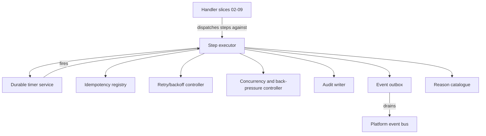
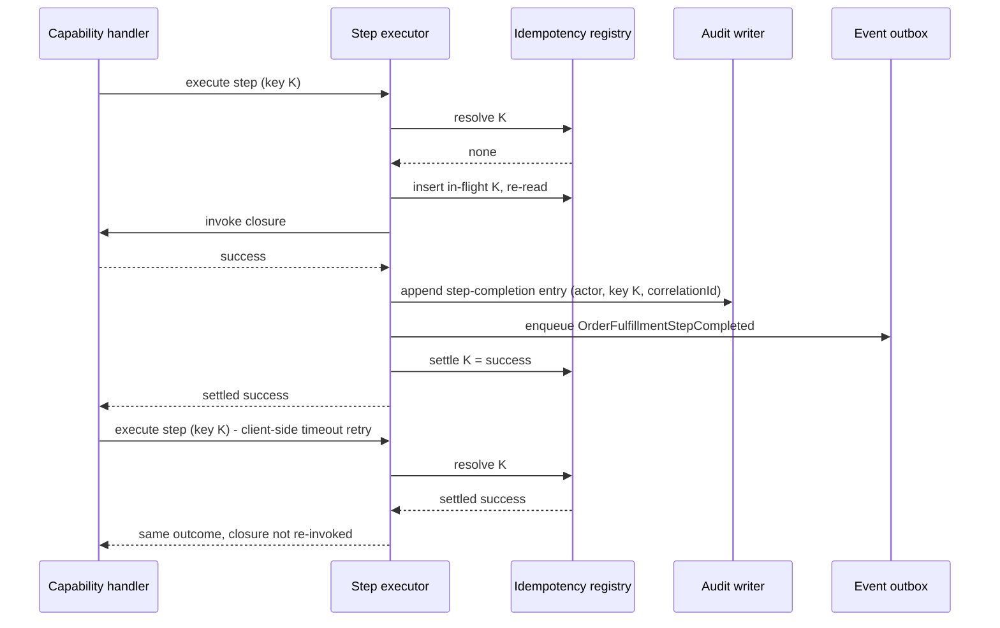

<!-- CONFLUENCE_TITLE: [BSS]: Orders Workflow — Process Engine (Slice 1) -->
<!-- Related: ../DESIGN.md, ../PRD.md, ./README.md | Owners: BSS Orders team -->

# DESIGN — Process Engine (Slice 1)

<!-- toc -->

- [1. Architecture Overview](#1-architecture-overview)
  - [1.1 Architectural Vision](#11-architectural-vision)
  - [1.2 Architecture Drivers](#12-architecture-drivers)
  - [1.3 Architecture Layers](#13-architecture-layers)
- [2. Principles & Constraints](#2-principles--constraints)
  - [2.1 Design Principles](#21-design-principles)
  - [2.2 Constraints](#22-constraints)
- [3. Technical Architecture](#3-technical-architecture)
  - [3.1 Domain Model](#31-domain-model)
  - [3.2 Component Model](#32-component-model)
  - [3.3 API Contracts](#33-api-contracts)
  - [3.4 Internal Dependencies](#34-internal-dependencies)
  - [3.5 External Dependencies](#35-external-dependencies)
  - [3.6 Interactions & Sequences](#36-interactions--sequences)
  - [3.7 Database schemas & tables](#37-database-schemas--tables)
  - [3.8 Deployment Topology](#38-deployment-topology)
- [4. Engine Normative Rules](#4-engine-normative-rules)
  - [4.1 Engine execution history is not the audit source of record](#41-engine-execution-history-is-not-the-audit-source-of-record)
  - [4.2 Five distinct bounds, not one](#42-five-distinct-bounds-not-one)
  - [4.3 The idempotency registry's non-success outcomes are exhaustive](#43-the-idempotency-registrys-non-success-outcomes-are-exhaustive)
  - [4.4 The durable timer service](#44-the-durable-timer-service)
  - [4.5 The retry/backoff controller and the caller-side duplicate protocol](#45-the-retrybackoff-controller-and-the-caller-side-duplicate-protocol)
  - [4.6 The process audit log is 100% complete with zero silent drops](#46-the-process-audit-log-is-100-complete-with-zero-silent-drops)
  - [4.7 One event per committed step outcome, and the six named process events only](#47-one-event-per-committed-step-outcome-and-the-six-named-process-events-only)
  - [4.8 The dead-letter record is never an order state](#48-the-dead-letter-record-is-never-an-order-state)
  - [4.9 The machine-readable reason catalogue](#49-the-machine-readable-reason-catalogue)
  - [4.10 The extension boundary for capability handlers](#410-the-extension-boundary-for-capability-handlers)
  - [4.11 Data classification](#411-data-classification)
  - [4.12 Concurrency and back-pressure working baselines](#412-concurrency-and-back-pressure-working-baselines)
  - [4.13 The crash-loop guard is distinct from the retry budget](#413-the-crash-loop-guard-is-distinct-from-the-retry-budget)
  - [4.14 Determinism discipline for replayed execution](#414-determinism-discipline-for-replayed-execution)
  - [4.15 Clock-skew tolerance and evaluation against database time](#415-clock-skew-tolerance-and-evaluation-against-database-time)
  - [4.16 Recovery-rate target and the cold-start admission ramp](#416-recovery-rate-target-and-the-cold-start-admission-ramp)
- [5. Traceability](#5-traceability)

<!-- /toc -->

- [ ] `p1` - **ID**: `cpt-cf-bss-orders-workflow-design-foundation`

## 1. Architecture Overview

### 1.1 Architectural Vision

This slice is the shared engine every other Orders Workflow slice executes through. It owns the
process-instance aggregate correlated to `orderId` + `orderVersion`, definition-version pinning
for the lifetime of an instance, the durable step log, the idempotency registry for outbound
calls, the retry/backoff controller enforcing four distinct bounds, the durable timer service,
the process audit log, the event outbox, and the registry of machine-readable process reasons. It
owns **no commercial policy**: it cannot evaluate whether an approval gate applies, does not know
what a provisioning wave means commercially, and never decides fulfillment eligibility — those
are handler concerns layered on top by slices 02 through 09
([`./README.md`](./README.md); rationale in
[`../ADR/0001`](../ADR/0001-cpt-cf-bss-orders-workflow-adr-durable-execution-substrate.md)).

The engine exists because the PRD's dual-authority rule
(`cpt-cf-bss-orders-workflow-fr-owf-process-state-nonauth`) and its `p1` NFRs — durability,
idempotency, audit completeness, and recoverability — are properties of *how a step executes and
is recorded* rather than of any capability that runs one. Orders Lifecycle is authoritative for
the commercial order document and order state; this gear's process audit and saga log are
authoritative for process execution progress — step progress, accepted provisioning intents, the
saga/compensation log, timer state, and retry counters — **independently of** whatever
durable-execution substrate is chosen, whose own run history is explicitly **not** the audit
source of record
([`../ADR/0003`](../ADR/0003-cpt-cf-bss-orders-workflow-adr-process-state-non-authoritative.md)).
Process state must never be presented as authoritative commercial order state: what was ordered
and the current order state are always read from Orders Lifecycle. This slice makes that
separation structural rather than a discipline every handler must remember — a handler cannot
accidentally become a second source of truth because it has no store of its own to become one in.

Two consequences shape everything downstream. First, **an instance runs to completion under the
definition version it started with** — the version is recorded on the instance and in the audit
trail, and an operator cannot migrate a running instance onto a later definition; a definition
change only affects instances started after it. Second, **the engine's own record, not the
durable-execution substrate's history, is what recovery and audit reconstruct from** — execution
state must be reconstructible and replayable from the gear-owned record with zero loss for
committed steps, so a substrate migration or a substrate-internal history purge cannot erase the
audit trail this gear is obligated to keep.

The shape is adopted rather than invented. The sibling Orders Lifecycle gear commits every state
change through one transition engine that is the single writer of order state; this slice is the
analogous pattern applied to long-running, externally-dispatching process execution instead of a
single-transaction state transition — the engine is the single writer of process execution state,
and every handler is a caller against its API, never a second place where step progress can be
recorded.

### 1.2 Architecture Drivers

#### Functional Drivers

| Requirement | Design Response |
|-------------|------------------|
| `cpt-cf-bss-orders-workflow-fr-owf-process-state-nonauth` | The process-instance aggregate and the audit writer are the only stores of execution progress; the domain model (§3.1) carries no commercial order fields, and every read of "what was ordered" is a call out to Orders Lifecycle, never a local field. |
| `cpt-cf-bss-orders-workflow-fr-owf-start-contract` | The process-instance aggregate carries a process `correlationId` generated at start, distinct from per-call idempotency keys and from downstream transition-request identifiers (§3.1); duplicate-trigger absorption is a property of the idempotency registry keyed by event ID plus that `correlationId`. |
| `cpt-cf-bss-orders-workflow-fr-owf-retry` | The retry/backoff controller enforces the retry budget on intent-submission failures only, distinct from the per-attempt timeout and the step deadline (§3.2); a hang after accept does not consume the budget and is not resubmitted. |
| `cpt-cf-bss-orders-workflow-fr-owf-dead-letter` | The dead-letter record is a distinct entity from the step log and from the manual-task path (§3.1); it parks a payload after a finite delivery-count cap is exhausted and is never itself an order state. |
| `cpt-cf-bss-orders-workflow-fr-owf-intent-sweep` | The durable timer service schedules the reconciliation sweep on an escalating interval; the sweep is read-only once the idempotency-key lifetime elapses, a property enforced by the idempotency registry's own key-lifetime tracking. |
| `cpt-cf-bss-orders-workflow-fr-owf-backpressure` | The concurrency/back-pressure component enforces a per-order parallel-line limit, a cross-process in-flight-intent aggregate limit, and per-tenant fairness keyed on `seller_tenant_id` at dispatch, with a bounded queue and reject-on-full behind both; a downstream throttle signal delays dispatch without touching the retry budget (§3.2, §4.12). |
| `cpt-cf-bss-orders-workflow-fr-owf-hold-resume` | Timer pause/resume is a first-class operation of the durable timer service, so a hold suspends escalation windows without losing their remaining duration, and resume restarts execution from the last durable checkpoint recorded by the step executor. |
| `cpt-cf-bss-orders-workflow-fr-owf-terminal-order-events` | Process termination is recorded in the process audit log as a terminal step-log entry, distinguishing termination-with-compensation from ordinary step completion. |

#### NFR Allocation

| NFR ID | NFR Summary | Allocated To | Design Response | Verification Approach |
|--------|-------------|--------------|-----------------|----------------------|
| `cpt-cf-bss-orders-workflow-nfr-owf-durability` | Zero in-flight workflows lost across restarts; zero loss for committed process state | Step executor + audit writer | Every committed step writes its durable record before the executor reports completion; restart resumes from the last durably recorded checkpoint without re-running committed steps | Restart/kill test asserting no re-execution of a committed step and full resumption of pending steps |
| `cpt-cf-bss-orders-workflow-nfr-owf-idempotency` | Zero duplicate durable effects from retried outbound calls | Idempotency registry | Every outbound call carries an idempotency key recorded before dispatch; a retried call reuses the same key and the registry's stored outcome absorbs a duplicate response | Parallel-retry test asserting one durable effect per key; replay test asserting a stored outcome is returned rather than re-dispatched |
| `cpt-cf-bss-orders-workflow-nfr-owf-audit` | 100% of process state transitions recorded, zero silent drops, engine history not the audit SoR | Audit writer | Every step start, completion, retry, timeout, sweep action, escalation, compensation step and dead-letter event is written to the gear-owned audit log independently of substrate history, each entry hash-chained to its predecessor so the trail is tamper-**evident** and not merely write-protected (§3.7) | Structural test asserting every step-executor code path writes an audit entry; chain-verification test asserting an out-of-band edit or deletion is detected; substrate-history-purge test asserting the gear-owned audit log is unaffected |
| `cpt-cf-bss-orders-workflow-nfr-owf-event-latency` | p95 < 30 s from internal state change to event delivery | Event outbox | The outbox row is written alongside the audit entry when a step commits and is drained asynchronously to the platform event bus | Latency measurement on the drain path from outbox-row write to bus delivery |
| `cpt-cf-bss-orders-workflow-nfr-owf-fulfillment-sla` | p95 ≤ 15 minutes from activation-wave eligibility to terminal fulfillment outcome | Step executor + retry/backoff controller | Bounded per-attempt timeouts and step deadlines keep a stalled attempt from silently consuming the SLA window; concurrency limits keep the provisioning path from saturating under load | Load test measuring wave-to-terminal latency at p95 under configured concurrency caps |
| `cpt-cf-bss-orders-workflow-nfr-owf-escalation-timer` | Configurable per-gate window, default 72 h, accuracy ± 5 min | Durable timer service | Timers are durable records with a scheduled fire instant, recovered on restart from the persisted record rather than an in-memory scheduler | Timer-accuracy test across a restart mid-window; configuration test per approval gate |
| `cpt-cf-bss-orders-workflow-nfr-owf-availability` | 99.9% control-plane availability; in-flight processes unaffected by restarts | Step executor + durable timer service | Control-plane restart resumes from durable state without operator intervention; no in-memory-only component holds execution-critical state | Chaos test restarting the control plane under active in-flight processes |
| `cpt-cf-bss-orders-workflow-nfr-owf-retention` | Gear-owned records retained ≥ 400 days independently of substrate history | Audit writer + dead-letter store | Retention is stated per store (§3.7): ≥ 400 days on the audit log and the dead-letter store, shorter windows on the recovery-scaffolding stores that carry no compliance obligation; a substrate purge of its own run history has no bearing on any of them | Retention-policy test confirming gear-owned records outlive a substrate history purge, and a per-store test asserting each window |

#### Key ADRs

| ADR ID | Decision Summary |
|--------|-----------------|
| `cpt-cf-bss-orders-workflow-adr-durable-execution-substrate` | A durable-execution substrate hosts the step executor and timer service, but its own run history is not the audit source of record — the gear-owned audit writer is |
| `cpt-cf-bss-orders-workflow-adr-process-state-non-authoritative` | Process execution state is never presented as authoritative commercial order state; Orders Lifecycle remains the sole read path for order state |
| `cpt-cf-bss-orders-workflow-adr-slice-decomposition` | A foundation slice plus eight handler slices, so the engine has an independent review boundary from any commercial policy |
| `cpt-cf-bss-orders-workflow-adr-idempotency-key-composition` | Idempotency keys are structurally distinct from the process `correlationId` and from downstream transition-request identifiers |
| `cpt-cf-bss-orders-workflow-adr-outbox-process-events` | Process events publish asynchronously from an outbox written alongside the audit entry |
| `cpt-cf-bss-orders-workflow-adr-manual-task-dead-letter-separation` | The dead-letter record and the manual-task record are distinct inspectable objects with distinct triggers, never merged into one |

### 1.3 Architecture Layers

- [ ] `p2` - **ID**: `cpt-cf-bss-orders-workflow-tech-engine-stack`

```text
Handler slices        capability-specific steps registered against the engine's step API
(02-09)                (approval, fulfillment plan, provisioning intents, saga, manual tasks,
                        hold/cancel, reads/authz — this slice owns none of their content)
       │
       ▼
Step executor          step dispatch · durable checkpointing · compensation invocation
       │
       ▼
Engine components       durable timer service · idempotency registry · retry/backoff
                        controller · concurrency/back-pressure controller · audit writer ·
                        event outbox · reason catalogue
       │
       ▼
Durable-execution      hosts step executor and timer scheduling; its run history is not
substrate              the audit source of record (ADR 0001, ADR 0003)
       │
       ▼
Persistence            process-instance aggregate · step log · dead-letter store ·
                        process audit log — gear-owned, tenant-scoped, audit-grade
```

| Layer | Responsibility | Technology |
|-------|---------------|------------|
| Presentation | Not owned by this slice; process control and read surfaces are registered by [`09-read-and-authz`](./09-read-and-authz.md) | — |
| Application | The step executor, the retry/backoff controller, and the concurrency/back-pressure controller | Rust module in the `orders-workflow` gear, hosted on the durable-execution substrate (ADR 0001) |
| Domain | Process-instance aggregate invariants, definition-version pinning, step log semantics, reason catalogue | Rust domain structs; GTS for cross-gear contract types (specified in a later section of this slice) |
| Infrastructure | Durable timer service, idempotency registry, audit writer, event outbox, dead-letter store | Durable-execution substrate, PostgreSQL via SecureORM, coordination lease library |

## 2. Principles & Constraints

### 2.1 Design Principles

#### Dual authority, one direction of truth

- [ ] `p1` - **ID**: `cpt-cf-bss-orders-workflow-principle-dual-authority`

Orders Lifecycle is authoritative for the commercial order document and order state; this gear's
process audit and saga log are authoritative for process execution progress — independently of
any durable-execution substrate's own history, which is not the audit source of record. Process
state is never presented as authoritative commercial order state: what was ordered and the
current order state are always read from Orders Lifecycle, never inferred from step progress.
This is the central principle every other engine property serves, and it is why the domain model
in §3.1 carries no order-document fields at all.

**ADRs**: `cpt-cf-bss-orders-workflow-adr-process-state-non-authoritative`

#### An instance runs under the definition it started with

- [ ] `p1` - **ID**: `cpt-cf-bss-orders-workflow-principle-definition-version-pinning`

A process instance executes to completion under the process-definition version it started with.
That version is recorded on the instance and in the audit trail at start and never overwritten.
An operator cannot migrate a running instance onto a later definition; a definition change takes
effect only for instances started after the change. Pinning is what makes an in-flight process's
behavior explainable from its own record months later, independent of how many times the
definition has since evolved.

**ADRs**: `cpt-cf-bss-orders-workflow-adr-slice-decomposition`

#### Engine history is not the audit source of record

- [ ] `p1` - **ID**: `cpt-cf-bss-orders-workflow-principle-engine-history-not-sor`

Whatever durable-execution substrate hosts the step executor and timer service, its own run
history is an implementation detail of execution, not this gear's audit record. The gear-owned
audit writer independently records every step start, completion, retry, timeout, sweep action,
escalation, compensation step and dead-letter event, and that record is what recovery, audit and
retention obligations are built on. A substrate migration or a substrate-internal history purge
must never be able to erase what this gear is obligated to keep.

**ADRs**: `cpt-cf-bss-orders-workflow-adr-durable-execution-substrate`

#### Five bounds, not one

- [ ] `p1` - **ID**: `cpt-cf-bss-orders-workflow-principle-distinct-bounds`

The retry budget (bounded attempt count with backoff, applying to intent-submission failures
only), the per-attempt timeout, the step deadline, the overdue-fulfillment escalation window, and
the process-lifetime ceiling are **five** different things and are enforced independently. The last
two are distinct in kind as well as in value. Exhausting the overdue window raises an operator
escalation but must not by itself mark lines failed and must not auto-terminal the order; it runs
from expected fulfillment time and only while the order is in fulfillment. The process-lifetime
ceiling runs from process start regardless of phase and is non-pausable, because the case it exists
to bound — an order held and resumed repeatedly before it ever reaches fulfillment — is precisely
the case in which no other clock here is running. Collapsing any of these five into another either
stalls a transient failure indefinitely, provisions against a payer who has not been charged, or
leaves an order non-terminal forever. The count is **five** throughout this document; only three of
them — the retry budget, the per-attempt timeout and the step deadline — are enforced by the
retry/backoff controller, which is why §3.2 scopes that component to three and §4.2 states all
five.

**ADRs**: `cpt-cf-bss-orders-workflow-adr-idempotency-key-composition`

#### Recoverable by construction

- [ ] `p1` - **ID**: `cpt-cf-bss-orders-workflow-principle-recoverable-by-construction`

Execution state is reconstructible and replayable from the gear-owned record with zero loss for
committed steps. A restart, a substrate failover, or an operator-initiated resume must never
re-execute a step already durably recorded as committed, and must never lose a step recorded as
pending. This is a property of where and when the step executor writes its durable record, not of
any substrate-provided replay mechanism.

**ADRs**: `cpt-cf-bss-orders-workflow-adr-durable-execution-substrate`

### 2.2 Constraints

#### Correlation identifiers are distinct by role

- [ ] `p1` - **ID**: `cpt-cf-bss-orders-workflow-constraint-correlation-id-distinctness`

The process `correlationId`, per-call idempotency keys, and downstream transition-request
identifiers are three structurally distinct identifiers that must never be reused for one
another. The `correlationId` is generated once at process start and identifies the instance
across its lifetime; an idempotency key identifies one outbound call attempt; a
transition-request identifier is assigned by the downstream service (Subscriptions) to one
accepted intent. Conflating any two breaks either duplicate-trigger absorption or duplicate-call
absorption.

**ADRs**: `cpt-cf-bss-orders-workflow-adr-idempotency-key-composition`

#### The retry budget governs submission failures only

- [ ] `p1` - **ID**: `cpt-cf-bss-orders-workflow-constraint-retry-budget-scope`

The retry budget applies only to intent-submission failures — the call was not accepted by the
downstream service. An intent already accepted and in flight is never retried as a resubmit; a
hang after accept does not consume the retry budget and is recovered by the reconciliation sweep,
not by a retry attempt. A submission that hangs before any accept or fail is cut by the
per-attempt timeout and does consume one retry attempt. Numeric values — the backoff curve,
maximum attempts, the per-attempt timeout, the step deadlines and the process deadline — are
stated as working baselines in **§4.2 and §4.5 of this document**; the engine ADRs record the
shape of the decision, never a tuning value.

**ADRs**: `cpt-cf-bss-orders-workflow-adr-idempotency-key-composition`

#### Concurrency is bounded and fair

- [ ] `p1` - **ID**: `cpt-cf-bss-orders-workflow-constraint-concurrency-fairness`

Parallel line execution within one order is bounded by a configurable limit; in-flight
provisioning intents across all processes are bounded by a configurable aggregate limit;
dispatch applies per-tenant fairness **keyed on `seller_tenant_id`** so one tenant's burst cannot
starve another tenant's dispatch. A dispatch that can acquire neither allowance is queued in a
**bounded** queue and rejected once that queue is full — never queued without limit. A downstream
throttle signal is honoured by delaying dispatch up to a bounded maximum, and that delay does not
consume the retry budget — a throttle is not a submission failure (§4.5, §4.12).

**ADRs**: `cpt-cf-bss-orders-workflow-adr-slice-decomposition`

#### Process artifacts are tenant-scoped and card-data-free

- [ ] `p1` - **ID**: `cpt-cf-bss-orders-workflow-constraint-data-classification`

Process artifacts owned by this engine — step log entries, saga/compensation log entries, timer
records, retry counters, dead-letter records, and the process audit log — carry commercial order
context and are tenant-scoped by a **column, not by convention**: every engine table carries
`resource_tenant_id` NOT NULL, and the tables backing an operator- or seller-scoped surface carry
`seller_tenant_id` as well (§3.7, §4.11). They are retained at audit grade by this gear
independently of substrate history, and must never carry payment-card data. Classification is
aligned with the underlying order record owned by Orders Lifecycle.

**ADRs**: `cpt-cf-bss-orders-workflow-adr-durable-execution-substrate`

## 3. Technical Architecture

### 3.1 Domain Model

**Technology**: Rust domain structs internally; GTS types for the cross-gear contract surface,
specified in a later section of this slice.

**Core Entities**:

- [ ] `p1` - **ID**: `cpt-cf-bss-orders-workflow-entity-process-instance`

The aggregate root of one process execution, correlated to `orderId` + `orderVersion`. Carries
the process `correlationId` generated at start (distinct from idempotency keys and from
downstream transition-request identifiers), the **pinned process-definition version** the
instance started with and executes to completion under, the current lifecycle phase (`started`,
`suspended`, `parked`, `compensating`, `terminated` — enumerated with its permitted transitions in
§3.7), the three tenant axes, the suspension state set by hold/resume, the last durable checkpoint
reference, the optimistic-concurrency row version, and the terminal outcome when reached. It does
**not** hold the paused-timer remainder — that datum has exactly one authority, the durable timer
service (§3.7 `owf_durable_timer`). This is the only entity a handler slice's step logic reads or
writes state against.

- [ ] `p1` - **ID**: `cpt-cf-bss-orders-workflow-entity-step-log-entry`

One durable, append-only record per step attempt: the step identifier, the owning process
instance, the attempt number, the outcome (`pending`, `success`, `retryable-failure`,
`permanent-failure`, `still-processing`, `aged-out` — the one enumeration, declared in §3.7), the
idempotency key used for any outbound call the step made, the **settled result** the attempt
produced (including the downstream `transition_request_id` where the step accepted one), the
per-attempt timeout and step deadline that bounded it, the retry-attempt count consumed, and the
timestamp. `dead-lettered` is **not** a step outcome: it is a delivery-level outcome of an inbound
trigger or callback and is recorded in `owf_dead_letter_record`, never here
(`cpt-cf-bss-orders-workflow-adr-manual-task-dead-letter-separation`). A committed entry is never
rewritten; a retried attempt appends a new entry rather than mutating the prior one, which is what
makes replay-from-record possible without consulting substrate history.

- [ ] `p1` - **ID**: `cpt-cf-bss-orders-workflow-entity-dead-letter-record`

An inspectable record parking a payload — an inbound Lifecycle trigger or a Subscriptions/
Payments/Generic-Approval callback — after its finite delivery-count cap is exhausted. Carries
`orderId`, `orderVersion`, the tenant axes, the process `correlationId`, the source event or
callback id — **unique**, so one payload parks at most once — and the last error, redacted per
§4.11. The delivery count it parks against is accumulated durably on the inbound key *before*
parking, not on this record. Distinct from the manual-task record: a dead-letter record is never itself an order
state and never grows a second inspectable object for a step failure that already has the
manual-task path.

- [ ] `p1` - **ID**: `cpt-cf-bss-orders-workflow-entity-retry-state`

The per-step record of the controller-enforced bounds: attempts consumed against the retry budget,
the backoff curve position, the per-attempt timeout deadline for the current attempt, and the
step deadline for the step as a whole. Distinguishes a submission-failure attempt (budget
consumed) from a post-accept hang (budget not consumed, handed to the reconciliation sweep) and
from a downstream-throttle delay (budget not consumed).

- [ ] `p1` - **ID**: `cpt-cf-bss-orders-workflow-entity-durable-timer`

A scheduled fire instant owned by the durable timer service: an approval-escalation timer, an
expected-fulfillment wait, an activation-barrier instant, a reconciliation sweep tick, an
overdue-fulfillment window, or the process-lifetime ceiling. Carries the **subject** it is armed
against — the approval gate for an escalation timer, the intent for a sweep tick — so two timers
of the same kind on one instance are distinguishable by the handler that scheduled them, and
carries its remaining duration when paused by a hold, so resume restores the original window
rather than resetting it. It is the **sole authority** for that remainder. Only
approval-escalation timers pause on hold. Recovered from its persisted record on restart, never
from an in-memory scheduler.

- [ ] `p1` - **ID**: `cpt-cf-bss-orders-workflow-entity-audit-entry`

One append-only process audit record per transition: step start, step completion, retry, timeout,
sweep action, escalation, compensation step, or dead-letter event, with actor identity, timestamp,
idempotency key, and the process `correlationId`. Each entry is **hash-chained** to its
predecessor for the same instance, so a deletion or an edit anywhere in the trail is detectable
rather than merely ungranted. It carries a catalogue `reason` — the machine-readable value that
rides event payloads — and, separately, a free-text `justification` for the human-supplied text an
override or a cancellation records; the two are never the same column. Written independently of
whatever record the durable-execution substrate keeps of its own run, which is not the audit
source of record.

- [ ] `p1` - **ID**: `cpt-cf-bss-orders-workflow-entity-outbox-entry`

One row per process event a committed step declares, holding the event identity, type, `orderId`,
the tenant axes, the process `correlationId`, a **monotonic per-correlation ordinal** that makes
the drain's ordering guarantee expressible, the payload and its schema version, and delivery
bookkeeping for the asynchronous drain to the platform event bus.

**Relationships**:
- `Process instance` → `Step log entry`: one-to-many, append-only; every step attempt against the instance is a new entry.
- `Process instance` → `Retry state`: one-to-many, one active record per in-progress step; consumed budget and bound deadlines travel with the step, not the instance.
- `Process instance` → `Durable timer`: one-to-many; escalation timers, sweep ticks and step-deadline watchdogs are all timers owned by the instance that scheduled them.
- `Process instance` → `Audit entry`: one-to-many, append-only; the audit trail also carries the pinned definition version recorded at start.
- `Process instance` → `Outbox entry`: one-to-many; one row per committed step that declares a process event.
- `Dead-letter record` → `Process instance`: many-to-one via `orderId` + `orderVersion` + `correlationId`; a dead-letter record references the instance whose inbound payload it parked but is never itself part of the instance's step log.

### 3.2 Component Model



#### Step executor

- [ ] `p1` - **ID**: `cpt-cf-bss-orders-workflow-component-step-executor`

##### Why this component exists

Every handler slice runs steps with the same durability and audit obligations; concentrating
dispatch, checkpointing and compensation invocation here is what makes those obligations
assertable once rather than re-implemented per handler.

##### Responsibility scope

Dispatching a registered step against the definition-pinned instance; writing the durable
checkpoint before reporting completion; invoking compensation steps on saga rollback; resuming
execution from the last durable checkpoint after a restart or a resume-from-hold; and mapping a
step outcome to the audit writer and the reason catalogue.

##### Responsibility boundaries

It executes steps but authors none — step logic (what an approval step or a provisioning-intent
step actually does) belongs to the handler slice that registers it. It holds no commercial
vocabulary and makes no decision about what constitutes fulfillment eligibility or approval
requirement.

##### Related components (by ID)

- `cpt-cf-bss-orders-workflow-component-durable-timer-service` — depends on
- `cpt-cf-bss-orders-workflow-component-idempotency-registry` — depends on
- `cpt-cf-bss-orders-workflow-component-retry-backoff-controller` — depends on
- `cpt-cf-bss-orders-workflow-component-concurrency-backpressure-controller` — depends on
- `cpt-cf-bss-orders-workflow-component-audit-writer` — owns data for
- `cpt-cf-bss-orders-workflow-component-event-outbox` — owns data for
- `cpt-cf-bss-orders-workflow-component-reason-catalogue` — depends on

#### Durable timer service

- [ ] `p1` - **ID**: `cpt-cf-bss-orders-workflow-component-durable-timer-service`

##### Why this component exists

Approval escalation windows, the reconciliation sweep schedule, and step-deadline watchdogs must
survive a restart with accuracy, and a hold must be able to pause and later exactly resume a
window's remaining duration — properties an in-memory scheduler cannot provide.

##### Responsibility scope

Scheduling and firing durable timers; recording remaining duration on pause and restoring it on
resume; recovering all pending timers from their persisted record on restart; and triggering the
reconciliation sweep on its escalating interval.

##### Responsibility boundaries

It fires timers but decides no business consequence of a fired timer — what an escalation timer
firing means (notify the fulfillment-operator queue) is a handler concern. It does not perform
the sweep's status lookups itself; it only schedules the sweep's ticks.

##### Related components (by ID)

- `cpt-cf-bss-orders-workflow-component-step-executor` — depends on

#### Idempotency registry

- [ ] `p1` - **ID**: `cpt-cf-bss-orders-workflow-component-idempotency-registry`

##### Why this component exists

Long-running processes with retries are inherently susceptible to double-execution against
Orders Lifecycle, Subscriptions and the Generic Approval service; storing the outcome of an
outbound call under its key is what makes a retried call safe rather than merely likely-safe.

##### Responsibility scope

Assigning and recording an idempotency key ahead of every outbound call; storing the settled
outcome of a call; absorbing a duplicate response on retry without a second durable effect; and
tracking the key-lifetime window after which the reconciliation sweep must become read-only.

##### Responsibility boundaries

It never generates the process `correlationId` and never generates a downstream
transition-request identifier — those are distinct identifiers under
`cpt-cf-bss-orders-workflow-constraint-correlation-id-distinctness`. It does not decide whether a
call should be retried; that is the retry/backoff controller's job.

##### Related components (by ID)

- `cpt-cf-bss-orders-workflow-component-step-executor` — depends on
- `cpt-cf-bss-orders-workflow-component-retry-backoff-controller` — depends on

#### Retry/backoff controller

- [ ] `p1` - **ID**: `cpt-cf-bss-orders-workflow-component-retry-backoff-controller`

##### Why this component exists

The BSS-to-OSS provisioning path is distributed and transient failures are expected; unbounded
retries waste resources while zero retries leave transient failures unresolved, and the three
bounds this controller owns (retry budget, per-attempt timeout, step deadline) must be enforced
independently rather than conflated into one counter. They are three of the five bounds of §4.2;
the fourth, the process deadline, is enforced elsewhere.

##### Responsibility scope

Enforcing the retry budget on intent-submission failures only, with backoff and a bounded maximum
attempt count; enforcing the per-attempt timeout, cutting a hanging submission and consuming one
retry attempt when it does; enforcing the step deadline independently of the retry budget; marking
a step `permanent-failure` on exhausting either the step deadline or the retry budget; and
honouring a downstream throttle signal by delaying dispatch, up to a bounded maximum, without
consuming the retry budget.

Marking the step is the whole of the engine's part. **What follows from a `permanent-failure` is
the registering handler slice's declared partial-failure policy**, never a decision this
controller takes: the controller creates no manual task, opens no incident and acknowledges
nothing to Lifecycle. Where a handler routes an exhausted budget to an operator escalation, that
escalation is that handler's policy consuming this outcome, not a second, competing verdict on the
same step (§4.5).

##### Responsibility boundaries

It does not retry an intent already accepted and in flight as a resubmit — a post-accept hang is
handed to the reconciliation sweep, not retried here. It does not enforce the process deadline
(the overdue-fulfillment escalation window); that is a fourth, distinct bound owned by the
handler slice that raises the operator escalation, not by this controller.

##### Related components (by ID)

- `cpt-cf-bss-orders-workflow-component-step-executor` — depends on
- `cpt-cf-bss-orders-workflow-component-idempotency-registry` — depends on
- `cpt-cf-bss-orders-workflow-component-concurrency-backpressure-controller` — depends on

#### Concurrency and back-pressure controller

- [ ] `p1` - **ID**: `cpt-cf-bss-orders-workflow-component-concurrency-backpressure-controller`

##### Why this component exists

Independent lines within an order and concurrent orders across tenants share a finite
provisioning path; unbounded parallelism saturates it and makes the fulfillment SLA unmeasurable,
and without per-tenant fairness one tenant's burst degrades every other tenant's dispatch.

##### Responsibility scope

Enforcing a configurable limit on parallel line execution within one order; enforcing a
configurable aggregate limit on in-flight provisioning intents across processes; applying
per-tenant fairness at dispatch; and honouring a downstream throttle signal (`Retry-After` or
equivalent) by delaying dispatch.

##### Responsibility boundaries

It does not decide which lines to prioritize commercially — fairness and concurrency limits are
capacity controls, not business sequencing, which remains a handler concern. A throttle-induced
delay it applies is never reported to the retry/backoff controller as a consumed retry attempt.

##### Related components (by ID)

- `cpt-cf-bss-orders-workflow-component-step-executor` — depends on
- `cpt-cf-bss-orders-workflow-component-retry-backoff-controller` — shares model with

#### Audit writer

- [ ] `p1` - **ID**: `cpt-cf-bss-orders-workflow-component-audit-writer`

##### Why this component exists

Financial-grade audit requires a record of the full execution path — not just order-level
transitions — that is independently trustworthy and does not depend on the durable-execution
substrate's own history, which this gear does not treat as its source of record.

##### Responsibility scope

Recording every step start, completion, retry, timeout, sweep action, escalation, compensation
step and dead-letter event with actor identity, timestamp, idempotency key and the process
`correlationId`; also recording the pinned process-definition version at instance start; and
retaining the record at audit grade independently of substrate history and of engine purges.

##### Responsibility boundaries

It records commercial order context carried by process artifacts but never becomes a second
source of commercial order state — a read of "what was ordered" never resolves against this
writer's records. It never carries payment-card data.

##### Related components (by ID)

- `cpt-cf-bss-orders-workflow-component-step-executor` — depends on
- `cpt-cf-bss-orders-workflow-component-event-outbox` — shares model with

#### Event outbox

- [ ] `p1` - **ID**: `cpt-cf-bss-orders-workflow-component-event-outbox`

##### Why this component exists

Operator monitoring dashboards and downstream audit systems consume the six named process events
asynchronously; writing the outbox row in the same durable commit as the audit entry is what
guarantees an event is never emitted for a step that did not actually commit.

##### Responsibility scope

Writing one outbox row per committed step that declares a process event, alongside that step's
audit entry; draining rows asynchronously to the platform event bus under at-least-once delivery;
and carrying the process `correlationId` on every emitted event for consumer-side correlation.

##### Responsibility boundaries

It does not guarantee event ordering across different process instances, only within the
correlation key it drains by. It does not decide which handler steps declare an event — that
declaration is made by the handler slice registering the step.

##### Related components (by ID)

- `cpt-cf-bss-orders-workflow-component-step-executor` — depends on
- `cpt-cf-bss-orders-workflow-component-audit-writer` — shares model with

#### Reason catalogue

- [ ] `p1` - **ID**: `cpt-cf-bss-orders-workflow-component-reason-catalogue`

##### Why this component exists

A machine-readable failure or refusal reason is what lets an operator queue, a dead-letter record
and a manual task distinguish causes without free-text parsing, and what lets a handler-slice
extension declare a new failure mode without inventing an ad hoc string.

##### Responsibility scope

The registry of machine-readable reasons a step, a dead-letter parking, or a compensation failure
can carry; validation at registration time that a handler slice's declared reason is
well-formed and not a duplicate of an existing one.

##### Responsibility boundaries

It holds no policy about which reason applies when — that mapping is decided by the handler slice
or controller that raises the reason. It does not itself write audit entries.

##### Related components (by ID)

- `cpt-cf-bss-orders-workflow-component-step-executor` — depends on
- `cpt-cf-bss-orders-workflow-component-audit-writer` — depends on

#### Extension boundary for capability handlers

- [ ] `p1` - **ID**: `cpt-cf-bss-orders-workflow-component-handler-extension-boundary`

##### Why this component exists

Nine slices run on top of one engine; without a named, stable registration surface each handler
slice would need to reimplement dispatch, checkpointing, retry and audit discipline, defeating the
purpose of a shared engine.

##### Responsibility scope

Defining the contract by which a handler slice registers a step (its idempotency-key derivation,
its declared event types, its compensation step where one exists, and its reason-catalogue
entries) and by which the step executor invokes it; enforcing that a registered step cannot bypass
the audit writer, the idempotency registry, or the retry/backoff controller.

##### Responsibility boundaries

It contains no step logic of its own and no commercial policy — every capability behavior lives
in the handler slice that registers against it. It never allows a handler slice to write the
process-instance aggregate, the step log, or the audit log directly.

##### Related components (by ID)

- `cpt-cf-bss-orders-workflow-component-step-executor` — depends on

### 3.3 API Contracts

- [ ] `p1` - **ID**: `cpt-cf-bss-orders-workflow-interface-step-executor-api`

- **Requirement**: `cpt-cf-bss-orders-workflow-fr-owf-start-contract`
- **Technology**: internal Rust API surface exposed by the engine library to a registered handler; no REST surface of its own — the REST/event entry points for starting or observing a process belong to the slices that register against this engine (slices 02-09)

The engine exposes exactly one in-process operation a capability handler calls to advance a
process: **execute step**, taking the process `correlationId`, the pinned definition version, the
step identifier, the caller-derived idempotency key, the step's declared inputs, and the handler
closure that performs the step's effect. It returns one of a closed set of outcomes — success, a
non-success idempotency outcome (§3.3.2), retryable failure, permanent failure, or dead-letter —
and never a bare exception the caller must interpret. There is no second entry point and no
variant that lets a handler skip the idempotency registry, the audit writer, or the retry/backoff
controller.

**What the engine guarantees around a step invocation**: the idempotency key is resolved before
the handler closure runs; the closure's outcome is durably recorded — audit entry and, where the
step declares one, an outbox row — in the same unit of work that settles the idempotency record;
a step that raises inside the closure is caught and mapped to a retryable or permanent outcome
per the registered retry policy, never left unrecorded; and the process instance's checkpoint
advances only after that unit of work commits, so a crash between closure return and checkpoint
advance replays the step under the same idempotency key rather than silently skipping or
duplicating it.

- [ ] `p1` - **ID**: `cpt-cf-bss-orders-workflow-interface-timer-api`

The durable timer registration and cancellation contract (§3.3 Durable Timer Service): a handler
schedules a timer against the process `correlationId` **plus a `timer_kind` and a subject
reference** — the approval gate, the intent, the line — with a fire time or a duration, and
receives a wake-up callback through the same step-executor entry point carrying that same triple,
so a fire handler can tell two timers of one kind on one instance apart and a cancellation can
target exactly one of them. A timer fire is itself a step invocation, not a distinct code path.

- [ ] `p2` - **ID**: `cpt-cf-bss-orders-workflow-interface-progress-read`

The engine-owned read of process-instance progress (phase, per-step outcomes, pending timers) that
slice 09's read surface projects from; it exposes no idempotency-registry content and no audit
detail beyond what the step log already carries.

**Endpoints Overview**: this engine has no HTTP surface of its own. Slices 02-09 register the REST
and event endpoints that ultimately invoke `execute step`; those endpoints and their stability are
documented in the slices that own them.

**Error surface**: every non-success outcome carries a reason from the reason catalogue (§3.3
Reason Catalogue below) and is machine-readable end to end. The engine contributes exactly these
reason families of its own — `still-processing`, `idempotency-key-aged-out`,
`idempotency-key-conflict`, `idempotency-lease-expired`, `per-attempt-timeout`,
`retry-budget-exhausted`, `step-deadline-exceeded`, `circuit-breaker-open`, `poison-step` — and
handler slices contribute the rest. No handler slice may register a second name for any of them.

#### The transition/step contract

- [ ] `p1` - **ID**: `cpt-cf-bss-orders-workflow-contract-step-invocation`

A capability handler never calls a downstream dependency directly from arbitrary code — it
registers a step against the extension boundary
(`cpt-cf-bss-orders-workflow-component-handler-extension-boundary`) and the step executor invokes
that registration. The engine's guarantee is one of *envelope*, not of *outcome*: it guarantees
the step runs at most once to a durably recorded conclusion per idempotency key, that the
conclusion is audited before the caller's process advances past it, and that the closed set of
non-success outcomes below is the only vocabulary a handler ever needs to interpret a step's
failure to complete synchronously. It does not guarantee the step's downstream call succeeds, and
it holds no opinion on what the handler does with a given non-success outcome beyond the
partial-failure and escalation policy each handler slice declares.

**The closed set of non-success outcomes** a step invocation can return:

| Outcome | Meaning |
|---------|---------|
| `retryable-failure` | The attempt failed transiently; the retry/backoff controller schedules another attempt within the retry budget |
| `permanent-failure` | The attempt failed in a way the handler declared non-retryable, or the retry budget or step deadline is exhausted; the handler's partial-failure policy applies |
| `still-processing` | The idempotency registry found an in-flight record under this key with a live lease; the caller must not infer success and must not resubmit under a new key |
| `aged-out` | The idempotency key's retention window (§3.7) has elapsed with no settled record; the next attempt is a **new operation under a new key** — it appends the key's `attempt` component rather than replaying the identical string, which `UNIQUE(idempotency_key)` would reject — never a resume of the old one |
| `dead-lettered` | **Delivery-level only**: the step's inbound trigger or callback exhausted its bounded delivery-count cap and the payload is parked for operator inspection. It is never inferred as a process outcome and is never written to `owf_step_log.outcome` — a step-level failure cannot reach the dead-letter path by construction (§4.8) |

A handler receiving `still-processing` or `dead-lettered` **MUST NOT** advance the
`FulfillmentTask` or any process-instance field it does not own; only a settled success or a
settled permanent failure may do so
(`cpt-cf-bss-orders-workflow-fr-owf-retry`,
`cpt-cf-bss-orders-workflow-fr-owf-dead-letter`).

### 3.4 Internal Dependencies

| Dependency Gear | Interface Used | Purpose |
|-------------------|----------------|----------|
| `orders-lifecycle` | Versioned contract / SDK client | Reading current order state and order document content as a guard input before dispatching a step; this gear never writes the order aggregate directly |
| `toolkit-db` | Runtime-scoped database access | The durable step log, idempotency registry, audit log, outbox, and durable-timer tables |
| Coordination lease library | SDK client | Singleton coordination for the durable timer sweep, the reconciliation sweep, the outbox drain, and the idempotency-window sweep |
| Platform durable-execution substrate | SDK client per `cpt-cf-bss-orders-workflow-adr-durable-execution-substrate` | Hosting step scheduling and crash recovery; its own run history is explicitly not the audit source of record (§1.1) |

**Dependency Rules** (per project conventions):
- No circular dependencies
- Always use sdk modules for inter-gear communication
- No cross-category sideways deps except through contracts
- Only integration/adapter gears talk to external systems
- `SecurityContext` must be propagated across all in-process calls

### 3.5 External Dependencies

This engine slice **calls** no external dependency itself. Every outbound call — to Subscriptions
for provisioning, to Payments for authorization outcomes, to the Generic Approval service for gate
decisions — is made by the handler slice that registers the step, through that slice's own port,
under the retry/backoff controller and idempotency registry this engine provides. The engine only
provides the envelope (idempotency, retry, audit, timers, outbox) that makes a handler's outbound
call safe to retry.

It is nonetheless **not** dependency-free, and the table below is not decoration: the engine owns
the idempotency, retry, circuit-breaker and sweep semantics for the Subscriptions provisioning
path, so that contract constrains this slice's design even though no line of this slice dials it.
That is the one external contract bound here; Payments and Generic Approval are bound in the
slices that call them.

#### Subscriptions (provisioning path)

- **Contract**: `cpt-cf-bss-orders-workflow-contract-owf-provisioning-intent`

| Dependency Gear | Interface Used | Purpose |
|-------------------|---------------|---------|
| `subscriptions` | Versioned contract / SDK client (invoked by handler slices, envelope owned here) | All provisioning flows through Subscriptions; this gear never calls OSS directly |

**Dependency Rules** (per project conventions):
- No circular dependencies
- Always use SDK modules for inter-gear communication
- No cross-category sideways deps except through contracts
- Only integration/adapter gears talk to external systems
- `SecurityContext` must be propagated across all in-process calls

### 3.6 Interactions & Sequences

#### Step execution with idempotent replay

**ID**: `cpt-cf-bss-orders-workflow-seq-step-idempotent-replay`

**Use cases**: `cpt-cf-bss-orders-workflow-fr-owf-provisioning-intent`

**Actors**: `cpt-cf-bss-orders-workflow-actor-owf-subscriptions`



**Description**: A client-side timeout of the first call never causes a second durable effect —
the handler retries with the same key and the registry absorbs the duplicate, per the caller-side
duplicate protocol (§4).

#### Overdue escalation via the durable timer service

**ID**: `cpt-cf-bss-orders-workflow-seq-overdue-escalation-timer`

**Use cases**: `cpt-cf-bss-orders-workflow-fr-owf-overdue-escalation`

**Actors**: `cpt-cf-bss-orders-workflow-actor-owf-fulfillment-operator`

```mermaid
sequenceDiagram
    participant TS as Durable timer service
    participant SE as Step executor
    participant AW as Audit writer
    participant FO as Fulfillment-operator queue (slice 07)
    TS ->> TS: process restarts; timer reloaded from durable store
    TS ->> SE: fire overdue-fulfillment timer (kind, subject)
    SE ->> AW: append escalation entry (event_kind = escalation)
    SE ->> FO: raise operational escalation
    SE -->> TS: acknowledge, timer retired
```

**Description**: The timer's wake-up never depends on an external trigger arriving; a process
restart reloads it from the durable store and it fires on schedule regardless of whether any
other message arrives in the interim.

**No outbox row is written on this path.** An overdue-fulfillment escalation is an *operational*
escalation, not one of the six named process events, and `owf_event_outbox.event_type` is
constrained to those six by construction (§3.7, §4.7) — an enqueue here would either fail the
audit/outbox unit of work or publish a seventh event type the PRD's enumeration forbids. The
approval-gate escalation timer is a **different timer of a different kind** with a different
consequence: it does publish `OrderApprovalEscalated`, and that path belongs to
[`03-approval-execution`](./03-approval-execution.md), not to the overdue window. The two are the
distinct bounds §4.2 keeps apart and must never be drawn as one line.

### 3.7 Database schemas & tables

- [ ] `p1` - **ID**: `cpt-cf-bss-orders-workflow-db-engine-schema`

The canonical schema for every engine-owned table. Each table's ownership rule below names the
single component that may write it; no handler slice writes any of these tables directly.

**Tenancy is a column on every table here, not a convention.** Every table carries
`resource_tenant_id uuid NOT NULL` — the resource-recipient axis — and the tables backing an
operator- or seller-scoped surface additionally carry `seller_tenant_id uuid NOT NULL`, the
selling-party axis. `payer_tenant_id` is the billing axis and is carried only where a payment or
commercial-profile decision is recorded against the row; the engine tables do not record one, so
none carries it. The axis names are the sibling gear's
([`orders-lifecycle` §3.7](../../../orders-lifecycle/docs/design/01-foundation.md)) and are
identical across this design set. Each table states its axis choice in **Additional info**.
Without the column the platform's SecureORM `#[secure(tenant_col = ...)]` isolation has nothing to
attach to and §4.11's tenant-scoping claim has no enforcing predicate; per-tenant fairness and
back-pressure key on `seller_tenant_id` (§4.12).

#### Table: owf_process_instance

**ID**: `cpt-cf-bss-orders-workflow-dbtable-process-instance`

**Schema**:

| Column | Type | Description |
|--------|------|-------------|
| correlation_id | uuid | Process aggregate identity |
| order_id, order_version | text, integer | The order this instance acts on (Lifecycle is system of record) |
| resource_tenant_id | uuid, NOT NULL | Resource-recipient axis |
| seller_tenant_id | uuid, NOT NULL | Selling-party axis; the key the operator surfaces scope by and the key per-tenant fairness buckets on (§4.12) |
| definition_version | text | Pinned for the instance's lifetime |
| phase | enum | `started`, `suspended`, `parked`, `compensating`, `terminated` — see the transition table below |
| suspended | boolean | Set on `OrderHeld`, cleared on `OrderResumed`; redundant with `phase = suspended` and kept as the hold predicate the resume path reads |
| last_checkpoint | text | The last durably completed step |
| row_version | bigint, NOT NULL, DEFAULT 0 | Optimistic-concurrency version, incremented on **every** write to this row; surfaced to callers as an ETag and required as `If-Match` on the mutating process operations |
| terminal_outcome | enum, nullable | `completed`, `aborted`, or NULL while non-terminal |
| created_at, updated_at | timestamptz | Bookkeeping |

**PK**: correlation_id

**Constraints**: **`UNIQUE (order_id) WHERE terminal_outcome IS NULL`** — at most one active
instance per order, enforced by the index rather than by a read-then-insert admission check;
`(order_id, order_version)` indexed for lookup; `(seller_tenant_id, phase, updated_at)` indexed
for the tenancy-scoped operator list; FK relationship to Lifecycle is by reference only — this
gear holds no foreign key into another gear's database.

**The `phase` enum and its permitted transitions**:

| From | To | Trigger |
|------|----|---------|
| — | `started` | Instance creation on an admitted start trigger |
| `started` | `suspended` | `OrderHeld` |
| `suspended` | `started` | `OrderResumed` |
| `started` | `parked` | A required verdict is unobtainable and the fail-closed park applies (`cpt-cf-bss-orders-workflow-adr-fail-closed-verdict-park`) |
| `parked` | `started` | The verdict becomes obtainable and is resolved |
| `parked` | `terminated` | An operator-initiated cancellation or an expiry resolves the parked order |
| `started` | `compensating` | Saga rollback begins |
| `suspended` | `compensating` | A cancellation taken from hold |
| `compensating` | `terminated` | Compensation reaches a terminal outcome |
| `started` | `terminated` | A terminal outcome with nothing to compensate |

`parked` is a **distinct** state, not a flavour of `suspended`: a suspension is operator-initiated
and resumable by an operator, a park is the fail-closed consequence of an unobtainable verdict and
clears only when the verdict becomes obtainable. Collapsing them makes AC 0b's
"verdict unobtainable" case indistinguishable from an ordinary hold. No transition leaves
`terminated`.

**Additional info**: **Ownership**: written only by the step executor
(`cpt-cf-bss-orders-workflow-component-step-executor`). **Tenant axes**: `resource_tenant_id` and
`seller_tenant_id` — the instance backs the seller-scoped process list and the operator console,
so it carries both. **Optimistic concurrency**: a caller presenting a stale `row_version` is
refused with **409** in the RFC-9457 envelope, never silently overwritten; this is the concrete
mechanism behind the PRD's "Optimistic workflow-version check REQUIRED". **Retention**: sized by
order count, not by traffic; no partitioning at this phase.

#### Table: owf_step_log

**ID**: `cpt-cf-bss-orders-workflow-dbtable-step-log`

**Schema**:

| Column | Type | Description |
|--------|------|-------------|
| step_log_id | uuid | Entry identity |
| correlation_id | uuid | Owning process instance |
| resource_tenant_id | uuid, NOT NULL | Resource-recipient axis |
| step_id | text | The registered step identifier |
| idempotency_key | text | The key resolved for this attempt |
| outcome | enum | `pending`, `success`, `retryable-failure`, `permanent-failure`, `still-processing`, `aged-out` |
| result | jsonb, nullable | **The settled outcome's machine-readable result.** For a step that accepted a downstream intent it carries the `transition_request_id` the downstream assigned, plus the downstream's own status token; for a refusal it carries the catalogue reason and the redacted diagnostic (§4.11). NULL while `pending` |
| attempt_number | integer | Position within the retry budget |
| started_at, completed_at | timestamptz | Bookkeeping |

**PK**: step_log_id

**Constraints**: `(correlation_id, step_id, attempt_number)` UNIQUE; indexed on
`(correlation_id, step_id, completed_at DESC)` for the settled-result lookup the registry's
`outcome_ref` resolves through.

**One outcome enumeration, and `result` is why replay is usable.** This is the only enumeration of
step outcomes in the set; §3.1 restates it and adds nothing. `timed-out` is **not** a member — a
per-attempt timeout settles as `retryable-failure` carrying the per-attempt-timeout reason, so the
timeout is visible in the reason without splitting the enum. `dead-lettered` is **not** a member
either: ADR-0009 makes a step-level failure structurally unable to reach the dead-letter path, so
carrying it here would be a value nothing can ever write (§4.8). `result` closes the gap that made
a replay useless: without it the registry resolves a replayed key to `settled/success` and the
handler learns only *that* it worked — it cannot name the intent it created, and therefore cannot
sweep it, cannot cancel or void it under §4.5's supersede rule, and cannot compensate it. The
identifier the PRD requires each task to record is stored here and reachable through
`owf_idempotency_registry.outcome_ref`.

**Additional info**: **Ownership**: written only by the step executor. **Tenant axis**:
`resource_tenant_id` only — this table backs no operator-facing list. This table is execution
history for recovery/replay — it is explicitly **not** the audit source of record (§4).
**Retention**: 90 days; **monthly range partition on `started_at`** so the purge is a partition
drop rather than a bulk DELETE.

#### Table: owf_idempotency_registry

**ID**: `cpt-cf-bss-orders-workflow-dbtable-idempotency-registry`

**Schema**:

| Column | Type | Description |
|--------|------|-------------|
| idempotency_key | text | Caller-derived key (never reused as `correlation_id`), **prefixed with `resource_tenant_id`** so keys are tenant-namespaced by construction |
| operation | text | The step or call the key scopes |
| correlation_id | uuid | Owning process instance |
| resource_tenant_id | uuid, NOT NULL | Resource-recipient axis; recomposed from the key and compared against it on every resolve |
| request_fingerprint | bytea, NOT NULL | **SHA-256 over the canonical request body.** A settled record whose fingerprint does not match the current request is a `key-conflict` refusal, not an absorbed duplicate |
| status | enum | `in_flight` or `settled` |
| lease_expires_at | timestamptz, nullable | Set while `in_flight`; **60 s** from the last heartbeat |
| lease_heartbeat_at | timestamptz, nullable | Last heartbeat from the holder; refreshed every **20 s** while the closure runs |
| delivery_count | integer, NOT NULL, DEFAULT 0 | For an inbound trigger or callback key, the durable count of deliveries received under this key; the §4.8 cap of 5 is evaluated against this column |
| outcome | enum, nullable | `success` or `failure` once settled |
| outcome_ref | uuid, nullable | Reference to the `owf_step_log` entry the settlement produced; that entry's `result` is how a replay recovers the downstream `transition_request_id` |
| created_at, expires_at | timestamptz | The key's retention window; `expires_at = created_at + 30 days` |

**PK**: (operation, idempotency_key)

**Constraints**: indexed on `expires_at` for the reconciliation sweep, which becomes read-only
past this window — no resubmission under an aged-out key; indexed on
`(lease_expires_at) WHERE status = 'in_flight'` for the dead-lease scan.

**Key lifetime, lease and heartbeat (working baselines)**:

| Value | Working baseline | Derivation |
|-------|------------------|------------|
| Key lifetime (`expires_at`) | **30 days** from creation | At or above the maximum retry horizon, which includes manual-task resolution and one or more hold/resume cycles and is therefore measured in days, not hours. A shorter window ages out keys that a legitimately-held order still needs. |
| In-flight lease (`lease_expires_at`) | **60 s** | Long enough that an ordinary slow downstream call does not lose its lease mid-flight, short enough that a crashed holder's key is re-examinable within one sweep tick. |
| Lease heartbeat | **20 s** | One third of the lease, so two consecutive missed heartbeats are needed before a lease is considered dead — a single scheduling hiccup never releases a live lease. |

**The heartbeat rule is normative.** While a handler closure runs under an `in_flight` record, the
holder **MUST** refresh `lease_heartbeat_at` and extend `lease_expires_at` every 20 s. A lease
whose `lease_expires_at` has passed is **dead**, and a dead lease is *not* a free key: it resolves
to the `lease-expired` outcome of §4.3, which is treated as still-processing and confirmed by
lookup through the reconciliation sweep. A replica whose clock is outside the §4.15 skew tolerance
**MUST** drop its lease rather than continue heartbeating it.

**Caller-supplied keys are validated, never trusted.** The server recomposes the key from the
request — tenant prefix and all — and refuses the call if the recomposition does not match the
supplied key, or if the `orderId` inside it is outside the caller's authorized scope. Without that
check a key naming another tenant's order returns that tenant's stored outcome or takes its
in-flight lease.

**Additional info**: **Ownership**: written only by the idempotency registry
(`cpt-cf-bss-orders-workflow-component-idempotency-registry`), except `delivery_count`, which the
inbound delivery path increments before the closure runs. **Tenant axis**: `resource_tenant_id`
only. **Retention**: 30 days, aligned with the key lifetime; **monthly range partition on
`created_at`**.

#### Table: owf_retry_state

**ID**: `cpt-cf-bss-orders-workflow-dbtable-retry-state`

**Schema**:

| Column | Type | Description |
|--------|------|-------------|
| correlation_id, step_id | uuid, text | Composite owner |
| resource_tenant_id | uuid, NOT NULL | Resource-recipient axis |
| attempts_used | integer | Consumed against the retry budget (submission failures only) |
| retry_budget | integer | Maximum attempts for this step |
| replay_count | integer, NOT NULL, DEFAULT 0 | Replays of this step that terminated **outside** the handler closure; the crash-loop guard of §4.13 trips on this counter, not on `attempts_used` |
| per_attempt_timeout_ms | integer | Bound on one attempt |
| step_deadline_at | timestamptz | Bound on the whole step, independent of attempt count |
| next_attempt_at | timestamptz, nullable | Backoff schedule |
| created_at, updated_at | timestamptz | Bookkeeping; `created_at` carries the retention window |

**PK**: (correlation_id, step_id)

**Additional info**: **Ownership**: written only by the retry/backoff controller
(`cpt-cf-bss-orders-workflow-component-retry-backoff-controller`), except `replay_count`, which
the step executor increments on entry to a replayed step before the closure is reached.
**Tenant axis**: `resource_tenant_id` only. The process deadline (§4.2) is tracked on
`owf_durable_timer`, not here — it is a fourth, distinct bound. **Retention**: 90 days from
`created_at`; sized by in-flight step count rather than by traffic, so no partitioning at this
phase.

#### Table: owf_durable_timer

**ID**: `cpt-cf-bss-orders-workflow-dbtable-durable-timer`

**Schema**:

| Column | Type | Description |
|--------|------|-------------|
| timer_id | uuid | Timer identity |
| correlation_id | uuid | Owning process instance |
| resource_tenant_id | uuid, NOT NULL | Resource-recipient axis |
| timer_kind | enum | `approval-escalation`, `expected-fulfillment-wait`, `activation-barrier`, `reconciliation-sweep`, `overdue-fulfillment`, `payment-auth-wait`, `process-lifetime` |
| subject_ref | text, nullable | **The per-kind discriminator**: the `gate_id` for `approval-escalation`, the intent key for `reconciliation-sweep`, the `order_line_id` for `expected-fulfillment-wait`. NULL only for the instance-wide kinds (`process-lifetime`, `activation-barrier`) |
| fire_at | timestamptz | Scheduled wake-up, evaluated against **database time** (§4.15) |
| paused | boolean | Set while an `approval-escalation` timer's owning instance is suspended by a hold; **no other kind pauses** |
| remaining_window_ms | integer, nullable | Preserved remainder while paused; this column is the **sole authority** for that remainder |
| fired_at | timestamptz, nullable | Set once the timer has fired |
| created_at | timestamptz | Bookkeeping |

**PK**: timer_id

**Constraints**: indexed on `(fire_at) WHERE fired_at IS NULL` for the wake-up scan;
**`UNIQUE (correlation_id, timer_kind, subject_ref) WHERE fired_at IS NULL`** — one live timer per
(instance, kind, subject), which is what makes "one timer per open approval gate" expressible and
makes the cancel-on-decision able to target exactly one row.

**Why `subject_ref` exists.** A multi-party approval gate arms one escalation timer per gate, and
the sweep arms one tick per intent; without a discriminator both write rows the fire handler
cannot tell apart and a cancellation cannot address. Scheduling "against the process
`correlationId`" alone is expressive enough for the instance-wide kinds and for nothing else.

**Only approval-escalation timers pause.** A hold pauses the approval-escalation window because
the approval clock is a commercial obligation on a counterparty that is not being asked to act
while the order is held. It does **not** pause the overdue-fulfillment window, the process
deadline, the barrier or the sweep — those are safety nets, and a backstop that pauses whenever
the thing it backstops is stuck is not a backstop. `paused` is therefore only ever set on an
`approval-escalation` row.

**A fire is an edge, and a gate is a conjunction.** A timer fires once and sets `fired_at`; the
signal is not re-raised. Where a handler's release condition is a conjunction of the timer instant
and some other predicate, the handler **MUST** re-evaluate the whole conjunction on **every**
contributing signal — the fire *and* each predicate's own completion — and **MUST NOT** treat the
fire as the sole trigger. A one-shot fire consumed while the other conjunct was false is the
silent-hang shape this rule exists to prevent.

**Additional info**: **Ownership**: written only by the durable timer service
(`cpt-cf-bss-orders-workflow-component-durable-timer-service`). **Tenant axis**:
`resource_tenant_id` only. A timer survives a service restart by construction — it is reloaded
from this table, and wake-up never depends on an external trigger arriving. **Retention**: fired
rows purged at 90 days, aligned with `owf_step_log`; sized by in-flight process count, so no
partitioning at this phase.

#### Table: owf_audit_entry

**ID**: `cpt-cf-bss-orders-workflow-dbtable-audit-entry`

**Schema**:

| Column | Type | Description |
|--------|------|-------------|
| audit_id | uuid | Entry identity |
| correlation_id | uuid | Owning process instance |
| order_id, order_version | text, integer | Denormalized for query without a join |
| resource_tenant_id | uuid, NOT NULL | Resource-recipient axis |
| seller_tenant_id | uuid, NOT NULL | Selling-party axis; the audit read surface is seller-scoped |
| sequence | bigint, NOT NULL | Per-instance audit counter, allocated under the `owf_process_instance` row lock; gapless within an instance |
| prev_hash | bytea, nullable | Hash of the preceding entry for this instance; NULL on the first entry of an instance |
| entry_hash | bytea, NOT NULL | Hash over this entry's content and `prev_hash` |
| actor, actor_class | text, enum | Identity and class, including `system` for scheduler-driven entries |
| event_kind | enum | `step-start`, `step-completion`, `retry`, `timeout`, `sweep`, `escalation`, `compensation`, `dead-letter` |
| idempotency_key | text, nullable | The key in force, where one applies |
| reason | text, nullable | **Catalogue** value from `cpt-cf-bss-orders-workflow-component-reason-catalogue`; the only one of the two reason columns that rides an event payload |
| justification | text, nullable | **Free text supplied by a human**: an override justification, a cancellation reason. Never a catalogue value, never machine-keyed on, never placed on an event payload |
| created_at | timestamptz | Append instant |

**PK**: audit_id

**Constraints**: append-only, **no UPDATE and no DELETE grant to any role**;
`(correlation_id, sequence)` UNIQUE; indexed on `(correlation_id, sequence)` for per-process
retrieval in chain order and on `(seller_tenant_id, created_at)` for the tenancy-scoped audit
read.

**The chaining rule.** `entry_hash = SHA-256(canonical(entry fields) || prev_hash)`, where
`prev_hash` is the `entry_hash` of the entry with `sequence - 1` on the same `correlation_id` and
the first entry of an instance carries a NULL `prev_hash`. Verification walks an instance's chain
in `sequence` order and recomputes each hash. This is what makes the trail **tamper-evident**
rather than merely tamper-*discouraged*: "append-only, no UPDATE or DELETE grant" is access
control, and access control that is misconfigured, bypassed at the database, or simply changed
leaves no trace. A chain does. The absent DELETE grant and the ≥ 400-day retention are what keep
the chain whole — a deleted row would sever it and make routine retention indistinguishable from
tampering, which is why this table is not partitioned for retention.

**Two reason columns, deliberately.** `reason` is a closed catalogue value and is what a consumer
keys on (§4.7, §4.9). `justification` is whatever the human typed. Putting free text into `reason`
would break every consumer that switches on it; putting the catalogue value in place of the
justification would discard the only record of *why* an operator overrode a failed line. The PRD
requires both to be recorded, and an override or a rejection writes both on the same entry.

**Additional info**: **Ownership**: written only by the audit writer
(`cpt-cf-bss-orders-workflow-component-audit-writer`). **Tenant axes**: `resource_tenant_id` and
`seller_tenant_id` — the audit trail backs a seller-scoped operator read. 100% of process state
transitions are recorded here with zero silent drops; this table, not `owf_step_log` and not the
durable-execution substrate's run history, is the audit source of record (§4). **Retention**:
**≥ 400 days**, enforced by this gear independently of substrate history; **not partitioned for
retention** — nothing is purged, so a partition drop would have nothing to drop; monthly range
partitioning on `created_at` **may** still be applied for query-planner and vacuum cost as volume
grows, and the chain is unaffected because no partition is ever dropped.

#### Table: owf_event_outbox

**ID**: `cpt-cf-bss-orders-workflow-dbtable-event-outbox`

**Schema**:

| Column | Type | Description |
|--------|------|-------------|
| event_id | uuid | Consumer de-duplication token |
| sequence | bigint, NOT NULL | **Monotonic ordinal from a database sequence**, allocated at insert; the drain's ordering guarantee is expressed over this column, never over `event_id` |
| correlation_id | uuid | Owning process instance |
| order_id, order_version | text, integer | Denormalized for the payload's order-summary block |
| resource_tenant_id | uuid, NOT NULL | Resource-recipient axis |
| seller_tenant_id | uuid, NOT NULL | Selling-party axis; carried on the envelope so a consumer can scope without a lookup |
| event_type | enum | One of the six named process events (§4.7) |
| schema_version | integer, NOT NULL | Payload schema version for this `event_type`; bumped only on an additive change (§4.7) |
| payload | jsonb | The order-summary block plus the per-event delta, both enumerated in §4.7; sufficient for a consumer to act without fetching the order back, and carrying the catalogue reason where the event denotes a failure or escalation |
| attempts | integer | Delivery attempts so far |
| delivered_at | timestamptz, nullable | Set on successful publication |
| dead_lettered_at | timestamptz, nullable | Set when the bounded attempt count is exhausted |
| created_at | timestamptz | Enqueue instant |

**PK**: event_id

**Constraints**: `event_type` is constrained to the closed set of six values; no `order-state`
event type and no operational-escalation type is a legal value in this table by construction
(§4.7). `sequence` UNIQUE. **Indexed on `(sequence) WHERE delivered_at IS NULL AND
dead_lettered_at IS NULL`** — the drain's own query, which would otherwise scan the full history
under a 30-day retention; and on `(correlation_id, sequence)` for the per-correlation ordered
read.

**Ordering is per correlation key and needs an ordinal to exist.** A random-UUID primary key
carries no order, so "per-`correlationId` ordering" was unimplementable as written: the drain had
nothing to sort by. It now drains in `sequence` order within a correlation key. Ordering across
different correlation keys is still not guaranteed, and no consumer may assume it.

**Additional info**: **Ownership**: written only by the event outbox
(`cpt-cf-bss-orders-workflow-component-event-outbox`). **Tenant axes**: `resource_tenant_id` and
`seller_tenant_id`. Delivery is at-least-once; consumers de-duplicate by `event_id`. An
**outbound** event that exhausts its delivery attempts is marked `dead_lettered_at` **here** — it
does not write an `owf_dead_letter_record`, which is exclusively the inbound store (§4.8).
**Retention**: delivered rows purged at **30 days**; **monthly range partition on `created_at`**,
so the purge is a partition drop. Rows with `dead_lettered_at` set are exempt from the purge until
an operator retires them.

#### Table: owf_dead_letter_record

**ID**: `cpt-cf-bss-orders-workflow-dbtable-dead-letter-record`

**Schema**:

| Column | Type | Description |
|--------|------|-------------|
| dead_letter_id | uuid | Entry identity |
| correlation_id | uuid, nullable | Owning process instance, where one exists |
| order_id, order_version | text, integer | Order context |
| resource_tenant_id | uuid, NOT NULL | Resource-recipient axis |
| seller_tenant_id | uuid, NOT NULL | Selling-party axis; the record is projected into the seller-scoped operator queue and would otherwise leak across sellers or be omitted from it entirely |
| source | enum | The **kind** of parked payload: `lifecycle-trigger`, `subscriptions-callback`, `payments-callback`, `approval-callback`. Inbound only — an undeliverable outbound event is marked on `owf_event_outbox`, never parked here (§4.8) |
| source_event_id | text, NOT NULL | The id of the inbound event or callback that failed; the key the delivery counter accumulated against |
| last_error | text | The last recorded error, **redacted** per §4.11: a catalogue reason plus a bounded, sanitised diagnostic — never raw downstream error text, credentials, tokens or payload echoes |
| delivery_count | integer | The `owf_idempotency_registry.delivery_count` value at the instant of parking, copied here so the record is inspectable on its own |
| created_at | timestamptz | Park instant |

**PK**: dead_letter_id

**Constraints**: **`UNIQUE (source_event_id)`** — one payload parks at most once, so a redelivery
after parking updates nothing and creates nothing; a dead-letter record is **never** an order
state and never carries an `order_state` column of any kind. Indexed on
`(seller_tenant_id, created_at)` for the operator queue.

**Where the count is accumulated.** `delivery_count` on this row is a *copy taken at parking*, and
a copy cannot be what the cap is evaluated against — this row does not exist until the cap has
already been exceeded. The durable counter is
`owf_idempotency_registry.delivery_count`, keyed by the inbound key that embeds
`source_event_id`: the delivery path increments it before the closure runs, so it survives a
restart and accumulates across deliveries. Without it the cap of 5 has nothing to count and either
never trips or resets on every restart.

**Additional info**: **Ownership**: written only by the step executor on cap exhaustion.
**Tenant axes**: `resource_tenant_id` and `seller_tenant_id`. Distinct
from the manual-task record, which slice 07 owns
(`cpt-cf-bss-orders-workflow-adr-manual-task-dead-letter-separation`). **Retention**:
**≥ 400 days**; **monthly range partition on `created_at`**.

#### Partitioning, retention and immutability

Retention is stated **per store** rather than as one global floor, because the stores have
materially different obligations: an audit trail is a compliance artifact, a step log is recovery
scaffolding, and an idempotency key is a short-lived deduplication token. One floor applied to all
three would either over-retain the scaffolding or under-retain the compliance artifact.

| Store | Retention | Partitioning |
|-------|-----------|--------------|
| `owf_audit_entry` | ≥ 400 days; no DELETE grant to any role | Not partitioned for retention (nothing is purged); monthly range partition on `created_at` optional for query cost |
| `owf_dead_letter_record` | ≥ 400 days | Monthly range partition on `created_at` |
| `owf_event_outbox` | Delivered rows purged at 30 days; `dead_lettered_at` rows exempt until retired | Monthly range partition on `created_at` |
| `owf_step_log` | 90 days | Monthly range partition on `started_at` |
| `owf_retry_state` | 90 days | None — sized by in-flight step count |
| `owf_idempotency_registry` | 30 days, aligned with the key lifetime | Monthly range partition on `created_at` |
| `owf_durable_timer` | Fired rows purged at 90 days | None — sized by in-flight process count |
| `owf_process_instance` | Retained for the life of the order record | None — sized by order count |

Partitioning is monthly **range** partitioning so a purge is a partition drop rather than a bulk
DELETE, which is the only shape that stays cheap as history grows — and the audit write sits on
the hot path of every step, so a table that degrades under its own history degrades every step.

**Immutability is per table.** Append-only with **no UPDATE or DELETE grant**: `owf_audit_entry`
(and no DELETE grant at all, per the chaining rule above), `owf_step_log`. Deliberately mutable:
`owf_process_instance` (denormalized phase and checkpoint), `owf_idempotency_registry` (lease
heartbeat and settlement), `owf_event_outbox` (delivery bookkeeping), `owf_retry_state` (attempt
bookkeeping), `owf_durable_timer` (pause and fire bookkeeping). `owf_dead_letter_record` is
append-only but carries a DELETE grant to the retention worker alone.

### 3.8 Deployment Topology

- [ ] `p3` - **ID**: `cpt-cf-bss-orders-workflow-topology-engine-runtime`

The engine is a library hosted inside the Orders Workflow gear process, layered on the platform
durable-execution substrate (`cpt-cf-bss-orders-workflow-adr-durable-execution-substrate`); it is
not a separate deployable. Background workers run under coordination leases so a multi-replica
deployment cannot double-act: the durable timer wake-up scan, the intent reconciliation sweep
(escalating schedule), the event outbox drain, and the idempotency-window sweep.

**Observability owned here**: step outcome counts by outcome class; idempotency
still-processing, **lease-expired**, **key-conflict** and aged-out counts; retry-budget-exhaustion
and step-deadline-exhaustion counts, tracked separately from overdue-window and process-lifetime
escalations; **crash-loop quarantine count** (§4.13, target zero); **circuit-breaker state and
open-duration per dependency** (§4.5); **queue depth and shed count** against the bounded dispatch
queue, and per-seller token-bucket rejection rate (§4.12); **measured clock offset against database
time per replica** and lease-drop count (§4.15); outbox depth, drain lag, per-correlation ordering
violations and dead-letter counts; audit-append failure count (target zero) and **audit
hash-chain verification failures** (target zero); **time to full resumption** and admission-ramp
position after a restart (§4.16); and durable-timer fire-on-schedule adherence across a service
restart.

## 4. Engine Normative Rules

### 4.1 Engine execution history is not the audit source of record

`owf_step_log` and the platform durable-execution substrate's own run history exist for recovery
and replay. Neither **MUST** be treated as the audit source of record. `owf_audit_entry`, written
only by the audit writer, is the sole audit source of record for this gear's process execution
(`cpt-cf-bss-orders-workflow-principle-engine-history-not-sor`,
`cpt-cf-bss-orders-workflow-nfr-owf-audit`).

### 4.2 Five distinct bounds, not one

There are **five** bounds (`cpt-cf-bss-orders-workflow-principle-distinct-bounds`): the
retry budget (submission failures only), the per-attempt timeout, and the step deadline, all three
enforced by the retry/backoff controller; the **overdue window** of the overdue-fulfillment timer
(`timer_kind = overdue-fulfillment`), which the controller does **not** enforce and which is owned
by the handler slice that raises the operator escalation; and the **process-lifetime ceiling**
(`timer_kind = process-lifetime`, `max_process_lifetime`, §4.12), armed at process start by slice
02, non-pausable, and independent of order state. The last two are distinct bounds on distinct
clocks and **MUST NOT** share a timer kind: the overdue window runs from expected fulfillment time
and only while the order is in fulfillment, whereas the lifetime ceiling runs from process start
regardless of phase and is what bounds an order that is held and resumed indefinitely before it
ever reaches fulfillment. Every statement of the count in this document is five; the three that
recur in §3.2 and §4.5 are the controller's subset, never a competing total. Exhausting the process deadline alone **MUST NOT** mark a `FulfillmentTask`
`failed` and **MUST NOT** auto-terminal the order; it **MUST** instead raise an operational
escalation to the fulfillment-operator queue
(`cpt-cf-bss-orders-workflow-fr-owf-overdue-escalation`,
`cpt-cf-bss-orders-workflow-fr-owf-retry`).

#### Working baselines for the five bounds

These are **working baselines**, proposed into the program-wide non-functional workshop the PRD
defers to, not settled platform values. They are stated here so an unset value is a visible
choice rather than an accidental one.

| Bound | Working baseline | Derivation |
|-------|------------------|------------|
| Per-attempt timeout | 10 s | Set from the downstream's service objective, not from caller patience: 3-10x its p99. The PRD puts control-operation acceptance at p95 < 1 s, so 10 s leaves headroom while still cutting a hung socket before it consumes the step. |
| Step deadline, **wave-2 (activation) steps** | 3 min | Re-derived against the PRD's actual window. The p95 <= 15 min clock starts at **activation-wave eligibility** — after every wave-1 create has succeeded and expected fulfillment time has been reached — so the window bounds wave 2, the barrier release and the acknowledgement, not two serial waves. 3 min per activation step leaves room for the sweep's in-window ladder and the acknowledgement inside 15 min. |
| Step deadline, **wave-1 (draft-create) steps** | 10 min | Wave 1 sits **outside** the measured window, so it takes no budget from it and can be bounded more generously against Subscriptions' own objective. |
| Retry budget | 5 submission attempts | With the §4.5 curve this spends ~15-30 s of cumulative backoff, so the budget is provably nested inside even the 3 min wave-2 step deadline rather than competing with it. |
| Gear-wide retry-budget window | 60 s sliding | A 10 % cap (§4.5) is only a budget if it has a window; 60 s is short enough to react inside one step deadline and long enough not to trip on a single burst. |
| Process deadline | 24 h past expected fulfillment time | Fixed by the PRD as commercial policy, not chosen here (`cpt-cf-bss-orders-workflow-fr-owf-overdue-escalation`). |
| Max process lifetime | 90 days, armed at process start, **non-pausable** | accepted (`DECISIONS.md` D-4). Independent of order state, so it backstops an order cycled through hold/resume before approval, which the overdue window — scoped to `in_fulfillment` — never reaches. |

**The 15-minute window starts after wave 1.** Any derivation that says the window "spans two
serial waves" is wrong: wave 1 is outside it. The consequence is load-bearing in two places. The
**wave-1 rebuild** path re-runs a full wave-1 step; because wave 1 is outside the window that
re-run costs the SLA nothing, but the rebuild must carry its own distinct idempotency key (the
`attempt` component) rather than replaying an aged-out one. And an order whose line count exceeds
the §4.12 cap is **excluded from the SLA population** rather than silently missing the target.

**The nesting invariant is normative and MUST be asserted at configuration load**: per-attempt
timeout **<** cumulative retry backoff **<** step deadline (each wave's) **<** process deadline
**<** max process lifetime. A configuration whose values violate that ordering **MUST** be refused
at startup rather than accepted. A mis-ordered set does not fail
loudly — it silently disables the inner bound, which is precisely the failure this assertion
exists to prevent, and nothing else in the engine would detect it.

### 4.3 The idempotency registry's non-success outcomes are exhaustive

The registry's outcomes for a given key are exactly **five**, and resolving a key **MUST** land on
exactly one of them:

| Registry outcome | Record state | Rule |
|------------------|--------------|------|
| **First call** | No record | Insert `in_flight`, take the lease, run the closure, settle. |
| **Absorbed duplicate** | `settled`, `request_fingerprint` matches | Return the stored outcome unchanged; the closure is **never** re-invoked. |
| **Key conflict** | `settled`, `request_fingerprint` does **not** match | Refuse the call. The same key was presented for a materially different request, which is a caller defect, not a duplicate — returning the stored outcome would report another request's result as this one's. |
| **Still-processing conflict** | `in_flight`, lease **live** | **MUST NOT** be inferred as success and **MUST NOT** be resubmitted under a new key; wait and confirm by lookup. |
| **Lease-expired** | `in_flight`, `lease_expires_at` passed, `expires_at` **not** passed | Treat as **still-processing**: confirm the real outcome by lookup through the reconciliation sweep, and **never** re-dispatch blind. The holder may have crashed *after* the downstream accepted the call, so a blind re-dispatch is a second durable effect. |
| **Aged-out key** | `expires_at` passed with no settled record | The reconciliation sweep is read-only past this point. The next attempt is a **new operation under a new key** — it appends the key's `attempt` component — never a resume of the old one and never a replay of the identical key string. |

No sixth outcome exists. The **lease-expired** row is the one that used to be missing, and it is
reachable on *every* crash after dispatch: the record is neither still-processing in the "live
lease" sense nor aged-out in the "retention window elapsed" sense, so a four-outcome enumeration
left the most common crash state matching nothing, and an implementer resolving it would have had
to guess — most cheaply, by re-dispatching.

**These five are registry outcomes, not a sixth and seventh step outcome.** They are what resolving
a key yields *inside* the engine; the handler still sees only the closed set of §3.3. The mapping
is fixed: first call and absorbed duplicate resolve to the settled outcome, lease-expired and
still-processing both surface as `still-processing`, aged-out surfaces as `aged-out`, and
key-conflict surfaces as `permanent-failure` carrying the key-conflict reason — it is a caller
defect and retrying it under the same key cannot fix it.

**`fingerprint` defined.** The fingerprint of a request is a **SHA-256 over its canonical request
body** — the request's semantic fields in a canonical serialization, excluding transport headers,
timestamps and the key itself — stored as `owf_idempotency_registry.request_fingerprint` (§3.7).
It is what makes "absorbed duplicate" a *verified* duplicate rather than an assumed one: without
it, a key replayed against a different payload is indistinguishable from an honest retry and the
wrong stored outcome is returned as success.

### 4.4 The durable timer service

Every escalation timer, the expected-fulfillment-time wait, and the reconciliation sweep schedule
are durable: a timer's wake-up **MUST NOT** depend on an external trigger arriving, and a timer
**MUST** survive a service restart by being reloaded from `owf_durable_timer` rather than held only
in process memory. A hold **MUST** pause an **approval-escalation** timer with its remaining
window preserved; resume **MUST** restore that remainder rather than restarting the window. A hold
**MUST NOT** pause any other timer kind — not the overdue-fulfillment window, not the process
deadline, not the activation barrier, not the sweep — because those are the backstops that bound
the hold itself. The remainder has exactly one authority,
`owf_durable_timer.remaining_window_ms`; no other table restates it (§3.7). Timer kinds are the
closed set of six enumerated on that table, and a handler **MUST NOT** invent a seventh.

### 4.5 The retry/backoff controller and the caller-side duplicate protocol

Restating the three bounds of §4.2 that this controller owns — the fourth, the process deadline,
is not its to enforce: the retry budget governs submission-failure attempts only; the per-attempt
timeout cuts a single hanging attempt and, if it fires before accept, consumes one retry attempt;
the step deadline bounds the whole step independent of attempt count. The process deadline of §4.2
**MUST NOT** by itself mark lines failed or auto-terminal an order.

**Exhaustion marks the step and stops.** Exhausting the retry budget or the step deadline settles
the step `permanent-failure`; the consequence is the registering handler slice's declared
partial-failure policy. This controller **MUST NOT** raise a manual task, open an incident, or
acknowledge an outcome to Lifecycle — where a handler routes an exhausted budget to an operator
escalation, that is the handler consuming this outcome, not a second verdict competing with it.

**Caller-side duplicate protocol** (binding on every handler slice):
- On a client-side timeout of a call that may have been accepted: retry **with the same
  idempotency key**, then confirm the outcome by lookup (the reconciliation sweep) — **never**
  infer success from silence.
- On a conflict or an in-flight rejection: **do not** infer success; wait, and retry the same key
  only if the original was not accepted; confirm by lookup.
- On a call **submitted with no response at all** — acceptance unknown, which is neither "new" nor
  "accepted": resolve it **by lookup under the same key** before taking any suppression,
  re-dispatch or cancellation decision. This is the third state a hold or a cancellation arriving
  mid-flight must handle, and it is not a member of the two-way partition.
- To supersede an accepted in-flight intent, **cancel/void** it — never issue a second submit
  under a new key.
- A duplicate success response **MUST** be absorbed without double-advancing the `FulfillmentTask`
  or any other process-owned field.

**Backoff curve and jitter (working baseline)**: exponential with base 1 s, coefficient 2.0,
capped at 30 s, and **full jitter** — the delay before attempt *n* is drawn uniformly from
`[0, min(30 s, 1 s * 2^n)]`. Full jitter is required, not optional: an unjittered or
equal-jittered retry train from many concurrent orders re-synchronises on the shared Subscriptions
path and converts a transient failure into a self-inflicted load spike. Maximum **5** attempts.

**A retry budget bounds the gear, not just the request.** Per-request attempt caps alone do not
prevent amplification: under a sustained downstream failure, every in-flight order retrying five
times multiplies offered load at exactly the moment the dependency is weakest. The controller
**MUST** therefore also enforce a gear-wide budget — a working baseline of retries capped at
**10 % of request volume over a 60 s sliding window**, with adaptive client-side throttling once
that share is exceeded — so the aggregate retry rate degrades rather than compounds. The window is
part of the baseline, not an implementation detail: a share without a window is not a budget,
because there is no interval over which the share is measured and no point at which it resets.
60 s is short enough that the throttle reacts inside a single wave-2 step deadline and long enough
that one burst does not trip it.

**Circuit breakers on every outbound dependency.** A retry budget throttles *retries*; it does
nothing about first attempts, which is exactly the traffic that keeps a failing dependency failing.
Every outbound dependency this gear's handlers call — Subscriptions, Orders Lifecycle, Payments,
Generic Approval, and any dependency a later slice adds — **MUST** sit behind a circuit breaker at
a common working baseline: **open at a 50 % failure rate over 20 calls in 10 s, stay open 60 s,
then admit 3 half-open probes** before closing. A breaker that is open is a *capacity* signal, not
a submission failure: a call refused by an open breaker **MUST NOT** consume the retry budget, and
**MUST NOT** be recorded as a retry attempt. Scoping a breaker only to the lowest-volume dependency
inverts the argument for having one.

**Maximum throttle delay, and what a long throttle must not silently become.** A downstream
throttle signal delays dispatch by at most **60 s**. A throttle-induced delay that would push the
call past `step_deadline_at` **MUST extend the step deadline by the delay** rather than letting the
step expire inside it. Without that rule a sustained, entirely polite throttle converts directly
into `step-deadline-exceeded` permanent failures and a queue of manual tasks for an order that
nothing is actually wrong with — the one failure mode honouring `Retry-After` exists to avoid. The
extension is bounded by the process deadline, which never extends.

**Queue depth and shed policy.** A dispatch that can acquire neither the per-tenant allowance nor
the global semaphore (§4.12) is **queued in a bounded queue**, working baseline **10 × the
aggregate in-flight cap**, FIFO within a tenant and round-robin across tenants. A dispatch arriving
at a full queue is **rejected immediately** — reject-on-full, never blocked and never queued
without limit — with a retryable outcome and a `Retry-After`-style hint. An unbounded queue does
not remove back-pressure, it hides it behind latency until every bound above it has already been
breached.

**Deadline propagation**: the remaining step budget **MUST** be propagated on every outbound call
rather than each hop timing out independently. Without it, Subscriptions continues working on a
request this gear has already abandoned, which both wastes downstream capacity and widens the
window in which a late success creates a subscription nobody is waiting for (slice 06's fencing
step 3).

### 4.6 The process audit log is 100% complete with zero silent drops

Every process state transition — step start, step completion, retry, timeout, sweep, escalation,
compensation, dead-letter — **MUST** be recorded in `owf_audit_entry` with actor identity,
timestamp, idempotency key (where one applies), and process `correlationId`. Zero silent drops are
permitted. Each entry is hash-chained to its predecessor, which is what makes the completeness
claim *checkable* rather than merely asserted: a missing entry is a broken chain, not an absence
nobody can see. The `dead-letter` entry kind here records a **delivery-level** parking of an
inbound trigger or callback — it is not a step outcome, and no step failure writes one (§4.8).
This is the concrete mechanism behind §4.1 (`cpt-cf-bss-orders-workflow-nfr-owf-audit`).

### 4.7 One event per committed step outcome, and the six named process events only

This gear **MUST** publish exactly the six named process events —
`OrderFulfillmentStarted`, `OrderFulfillmentStepCompleted`, `OrderFulfillmentCompleted`,
`OrderFulfillmentAborted`, `OrderApprovalRequested`, `OrderApprovalEscalated` — each with
at-least-once delivery and consumer de-duplication by event id, and each payload carrying
sufficient data (the order-summary block plus the per-event delta) for a consumer to act without
fetching the order back. This gear **MUST NOT** publish order-**state** events: the state-event
set is owned and enumerated exclusively by the Lifecycle PRD. **Naming note**: Lifecycle's state
event on the `fulfillment_failed` transition is `OrderFulfillmentFailed`; this gear's
corresponding process event is `OrderFulfillmentAborted` — the two are not the same event under
two names, they are two gears each publishing their own kind of event for the same underlying
failure (`cpt-cf-bss-orders-workflow-fr-owf-process-events`,
`cpt-cf-bss-orders-workflow-adr-outbox-process-events`).

**There is no seventh event type, and an operational escalation is not one.** The process
deadline's overdue escalation, a dependency-outage escalation and a manual-task escalation are
routed to the fulfillment-operator queue, **not** to `owf_event_outbox`: `event_type` is
constrained to the six values above by construction, so an enqueue of anything else either fails
the audit/outbox unit of work or publishes an event the PRD's enumeration forbids (§3.6).

**The payload: an order-summary block plus a per-event delta.** Both halves are enumerated here so
neither term is left to a reader's inference.

The **order-summary block** is identical on every one of the six events:

| Field | Source |
|-------|--------|
| `orderId`, `orderVersion` | The instance's order correlation |
| `correlationId` | The process instance |
| `resourceTenantId`, `sellerTenantId` | The tenant axes carried on the outbox row |
| `occurredAt` | The committing transition's instant |
| `processDefinitionVersion` | The version pinned on the instance |

The **per-event delta** carries only what that event adds:

| Event | Delta |
|-------|-------|
| `OrderFulfillmentStarted` | `lineCount`, `policy` (the partial-failure policy the instance executes under) |
| `OrderFulfillmentStepCompleted` | `stepId`, `orderLineId`, `wave`, `outcome`, `transitionRequestId` where one was accepted, and `provenance` (`automated` \| `operator-override`) so a consumer counting completions can tell a Subscriptions-confirmed activation from a manually confirmed one |
| `OrderFulfillmentCompleted` | `lineOutcomes[]` and the subscription identifiers the acknowledgement carries |
| `OrderFulfillmentAborted` | `reason` (catalogue), `failedLines[]`, `compensationOutcome` |
| `OrderApprovalRequested` | `gateId`, `party`, `escalationDueAt` |
| `OrderApprovalEscalated` | `gateId`, `party`, `openSince`, `escalationDueAt` |

`reason` on any payload is always the **catalogue** value, never the free-text `justification`
(§3.7 `owf_audit_entry`, §4.9), and no payload carries raw downstream error text (§4.11).

**Versioning is additive-only.** Every outbox row carries `schema_version` for its `event_type`.
A change **MUST** be additive — a new optional field, bumping `schema_version` — so an existing
consumer keeps parsing. Removing a field, renaming one, narrowing an enum or changing a type is a
**new event type**, not a version bump, because no additive-compatibility contract survives it.

### 4.8 The dead-letter record is never an order state

Exhausting the bounded delivery-count cap on an inbound trigger or callback parks the payload in
`owf_dead_letter_record`. A dead-letter record **MUST NOT** be an order state, **MUST NOT** be
inferred as a process outcome, and is distinct from the manual-task record slice 07 owns
(`cpt-cf-bss-orders-workflow-adr-manual-task-dead-letter-separation`).

**The path is delivery-level and inbound-only, by construction.** A **step**-level failure can
never reach it: a step settles as `retryable-failure` or `permanent-failure` and its consequence is
the handler's partial-failure policy, which is the manual-task path — which is why
`owf_step_log.outcome` carries no `dead-lettered` member (§3.7). An **outbound** process event that
exhausts its delivery attempts is marked `owf_event_outbox.dead_lettered_at` and writes no
dead-letter record either; `owf_dead_letter_record.source` has no legal value for an outbound
event. One fact, one store, in both directions.

**Delivery-count cap (working baseline)**: **5** deliveries before parking. Chosen to absorb
ordinary at-least-once redelivery from the platform event bus without parking a payload that a
brief blip would have cleared; comparable managed brokers default to between 5 and 10.

**The count is durable and accumulates on the key, not on the parked row.** The delivery path
increments `owf_idempotency_registry.delivery_count` under the inbound key — which embeds the
source event id — **before** the handler closure runs, so the count survives a restart and
accumulates across deliveries. A counter living only on `owf_dead_letter_record` could never work:
that row is created *after* the cap is exceeded, so the cap would have nothing to accumulate
against and would either never trip or reset on every restart. On parking, the value is copied
onto the record for inspection, and `UNIQUE (source_event_id)` makes the parking itself idempotent.

### 4.9 The machine-readable reason catalogue

Every non-success outcome, dead-letter parking, and compensation failure carries a reason from the
catalogue owned by `cpt-cf-bss-orders-workflow-component-reason-catalogue`. This slice registers
the engine's own reason families, enumerated in §3.3. Because the catalogue is a closed set, every
value a later slice raises is registered here — a slice that raises an unregistered reason is a
configuration-load failure, not a runtime surprise. The contributed values, by owning slice:

| Slice | Registered reason values |
|-------|--------------------------|
| `04-fulfillment-plan` | `overlap-collision`, `market-divergence`, `invalid-dependency-graph`, `catalog-topology-unavailable`, `payment-authorization-stale`, `overlap-read-unevaluable`, `line-count-exceeded` |
| `05-provisioning-intents` | `wave1-create-failed`, `wave2-activation-failed`, `never-dispatched` |
| `06-saga-and-compensation` | `draft-void-failed`, `activated-cancel-failed`, `blocked-upstream` |

The wave discriminators are registered as distinct values rather than one generic
`submission-failed`, because `PRD.md:372` requires a wave-1 create failure to be distinguishable in
the manual-task reason from a wave-2 activation failure — an operator deciding whether a blind
retry is safe needs to know whether anything was resource-affecting. Reason
values **MUST** ride event payloads (§4.7, §3.7 `owf_event_outbox.payload`) so a downstream
consumer keys on the reason rather than parsing free text.

**A catalogue reason is never a place to put free text.** Human-supplied text — an override
justification, a cancellation reason — is recorded in `owf_audit_entry.justification`, a separate
column that no consumer keys on and that **MUST NOT** ride an event payload (§3.7). Where a rule
requires both, both are written on the same audit entry.

### 4.10 The extension boundary for capability handlers

A capability handler **MAY** declare: a step's idempotency-key derivation, its declared event
types, its compensation step where one exists, and its reason-catalogue entries. A capability
handler **MAY NOT**: write the process-instance aggregate, the step log, the idempotency registry,
the audit log, or the outbox directly; bypass the retry/backoff controller for an outbound call
made from a registered step; or own a write path that bypasses the engine. Every capability
behavior lives in the handler slice that registers against the boundary; the engine contains no
step logic and no commercial policy of its own.

### 4.11 Data classification

Every table in §3.7 is **tenant-scoped by a NOT NULL column**, not by convention: each carries
`resource_tenant_id`, and `owf_process_instance`, `owf_audit_entry`, `owf_event_outbox` and
`owf_dead_letter_record` additionally carry `seller_tenant_id` because each backs an operator- or
seller-scoped surface. Every read this gear exposes **MUST** carry the corresponding tenant
predicate, and the platform's SecureORM `#[secure(tenant_col = ...)]` isolation attaches to that
column. Retention is **per store** (§3.7) rather than one global floor, is owned by this gear
**independently of** the durable-execution substrate's own history — a substrate migration or an
internal history purge **MUST NOT** erase this gear's audit trail (§4.1) — and the audit trail's
≥ 400-day floor is the one that carries the compliance obligation.

None of these tables **MAY** carry payment-card data; a payment authorization outcome is consumed
here as an opaque process precondition, never as card data at rest
(`cpt-cf-bss-orders-workflow-constraint-data-classification`).

**Redaction is normative on every operator-visible and bus-visible string.**
`owf_dead_letter_record.last_error`, `owf_step_log.result`'s diagnostic field and every event
payload **MUST** carry a catalogue reason plus a bounded, sanitised diagnostic — never raw
downstream error text, stack traces, credentials, tokens, connection strings, request-body echoes
or PII. The same rule that keeps internal diagnostics off the synchronous RFC-9457 envelope applies
here: these strings are read by operators through the task queue and, for payloads, by every
authorized consumer on the bus.

### 4.12 Concurrency and back-pressure working baselines

| Control | Working baseline | Derivation |
|---------|------------------|------------|
| Per-order parallel line execution | **8** lines | Bounds one order's share of the shared provisioning path. |
| Maximum lines per order | **200** | accepted (`DECISIONS.md` D-5). Orders above it are **excluded from the 15-minute SLA population**, named the way the PRD already names manual and future-dated orders. At 8-way parallelism a 25-line order runs wave 2 in `ceil(25/8) = 4` serial batches; the cap is what keeps the batch count arithmetic honest against the window instead of leaving the SLA quietly unmeetable above some undeclared line count. |
| Aggregate in-flight intents | **200** concurrent, **placeholder for a measured value** | Not a tuned constant. It **MUST** be re-derived from measured downstream capacity by Little's Law (`L = lambda * W`, concurrency = accepted throughput x latency) and re-derived again when that capacity changes; 200 is stated so an unset value is a visible choice rather than an accidental one. |
| Per-tenant token bucket | **20** concurrent in-flight intents sustained, burst **40**, refilled at **20 / s**, keyed on `seller_tenant_id` | 10 % of the aggregate sustained, so ten active sellers fit without contention and no single seller can take more than a tenth of the shared cap before its own allowance throttles it. |
| Maximum queue depth | **10 ×** the aggregate in-flight cap (2,000 at the baseline) | Reject-on-full (§4.5). |

**The tenant axis is named, not implied.** Fairness and back-pressure key on **`seller_tenant_id`**
— the selling party — carried NOT NULL on `owf_process_instance` (§3.7). The seller is the axis
that actually generates correlated bursts: one seller's campaign submits thousands of orders across
many resource tenants, and bucketing on the resource tenant would spread that burst across
thousands of buckets and starve every other seller exactly as if there were no fairness at all.
Without the column the bucket has no key and degrades silently into the global semaphore.

**The bucket sits beneath the semaphore, and both must be acquired.** The arrangement is the
standard bulkhead: a dispatch **MUST** acquire a token from its seller's bucket **and** a permit
from the global semaphore, in that order. The bucket bounds one seller's share before it can
consume the shared aggregate; the semaphore bounds the gear's total offered load against the
downstream. Acquiring only the semaphore makes the bucket decorative; acquiring only the bucket
lets the sum of all sellers' allowances exceed the downstream's capacity. A dispatch that cannot
acquire both is queued and then shed per §4.5.

**An adaptive limit is preferred to a static ceiling.** A fixed aggregate cap is either wasteful or
a bottleneck as Subscriptions' capacity moves, and it cannot tell the two apart; a gradient- or
delay-based adaptive controller converges on the downstream's actual limit instead, and the
per-seller bucket is then expressed as a share of the adaptive limit rather than as a constant.

A downstream throttle signal delays dispatch, up to the §4.5 maximum, and **MUST NOT** consume the
retry budget (§4.5).

### 4.13 The crash-loop guard is distinct from the retry budget

Every bound in §4.2 is scoped to an outcome the executor *observes*: the retry budget to
submission failures, the per-attempt timeout to a hanging attempt, the step deadline to a running
step, the dead-letter cap to inbound deliveries. A failure **outside** the handler closure — a
deserialization error on the step's persisted inputs, a panic in the dispatch path, a poison
payload the executor cannot even get as far as running — is observed by none of them. It kills the
worker before `attempts_used` is incremented, the step replays, and it kills the worker again:
an unbounded loop that consumes no budget, produces no dead-letter record, and pins a dispatch slot
with no operator surface at all.

The step executor **MUST** therefore enforce a **crash-loop guard** on a separate counter,
`owf_retry_state.replay_count`, incremented on entry to a replayed step **before** the closure is
reached and reset on any settled outcome. Working baseline: **3** consecutive replays that
terminate outside the closure. On tripping, the executor **MUST** quarantine the step —
settle it `permanent-failure` with the poison-step reason, release the dispatch slot, write the
audit entry, and raise the handler's escalation path — rather than replay it a fourth time. The
guard is deliberately a *separate* counter from `attempts_used`: sharing one counter would let an
ordinary retry train exhaust the crash-loop allowance, and would let a crash loop that never
reaches the closure escape it.

### 4.14 Determinism discipline for replayed execution

A replayed step **MUST** be deterministic in everything the durable record already fixed. The
durability boundary decides where each non-deterministic value is computed:

| Value | Computed | Why |
|-------|----------|-----|
| The process `correlationId` | **Once, at process start, by the admission path, and persisted on `owf_process_instance` before any step runs** | Every audit entry, timer, retry-state row and outbox row is keyed on it. Regenerating it on replay orphans all of them and silently voids the 100 % audit-completeness claim of §4.6 — the entries still exist, under an identifier nothing points at any more. |
| The full-jitter delay draw (§4.5) | **Outside the workflow body**, by the retry/backoff controller, and persisted as `owf_retry_state.next_attempt_at` before the wait begins | A draw taken *inside* the replayed body produces a different value on replay and a history mismatch against the substrate. Persisting the resulting instant makes the replay read a value rather than re-draw one. |
| Timestamps used in a decision | Read from **database time** (§4.15) and persisted with the step's record | Wall-clock reads inside a replayed body diverge across replicas and across replays. |
| Identifiers a step mints (timer ids, outbox `event_id`) | Minted inside the unit of work that persists them, never re-minted on replay; where a step must mint an identifier *before* it can persist it, that identifier **MUST** be derived deterministically (UUIDv5 over the step's fixed inputs) | A re-minted identifier on replay creates a second row for one logical object — a second gate, a second timer, a duplicate event. |

The rule generalises: **anything drawn from a random source, a clock or an id generator is computed
on the durable side of the boundary and read by the replayed side, never the reverse.**

### 4.15 Clock-skew tolerance and evaluation against database time

Timer fire instants, lease expiry and every deadline comparison **MUST** be evaluated against
**database time**, not against a worker replica's local clock. Background workers are
lease-coordinated across replicas (§3.8), so a replica whose clock drifts forward fires an
`expected-fulfillment-wait` timer early and activates a future-dated line ahead of its contracted
date, and a replica whose clock drifts backward holds a lease the rest of the deployment believes
is dead.

Working baselines:

| Value | Baseline | Derivation |
|-------|----------|------------|
| Clock-skew tolerance | **30 s** measured against database time | An order of magnitude inside the ± 5 min timer-accuracy NFR, so skew alone can never account for a miss. |
| Skew response | A replica measuring its own offset beyond the tolerance **MUST drop its lease**, stop firing timers and stop heartbeating, and **MUST NOT** rejoin until it is back inside it | Continuing to act on a clock the deployment does not agree with is the failure mode the tolerance exists to detect. |
| Timer wake-up scan | **15 s** | ≤ 1/20 of the ± 5 min accuracy budget, so scan granularity is never the dominant term in a miss. |

### 4.16 Recovery-rate target and the cold-start admission ramp

Recovery is not established by "it comes back": on restart, every in-flight step is eligible to
retry and every overdue timer is eligible to fire **at the same instant**, and the full-jitter curve
of §4.5 disperses *retries* but not *first attempts after resume*. A restart under load therefore
reproduces, against a dependency that has just seen the same restart, exactly the thundering herd
the retry budget exists to prevent.

Working baselines:

| Value | Baseline | Derivation |
|-------|----------|------------|
| Time to full resumption | **p95 < 5 min** from process start to every recoverable in-flight step being either running or scheduled | Well inside the 24 h process deadline and inside the ± 5 min timer-accuracy budget, so a restart does not by itself breach a timer. |
| Cold-start admission ramp | Admission opens at **10 %** of the aggregate in-flight cap and doubles every **30 s** to 100 % | Five doublings reach full admission in ~2.5 min, inside the resumption target, while giving a just-restarted dependency a ramp rather than a step. |
| Overdue-timer release | Timers whose `fire_at` is already past at start are released over a **60 s** spread, in `fire_at` order | Preserves ordering while removing the simultaneity; a timer already overdue is not made materially more overdue by a bounded spread. |

The ramp applies to first attempts *and* retries, and it **MUST NOT** be bypassed by a step whose
deadline is close to expiry — a step that cannot be admitted within its deadline settles
`permanent-failure` and is handled by its handler's policy, which is a recorded outcome, where
bypassing the ramp is an unrecorded amplification.

## 5. Traceability

- **PRD**: [`../PRD.md`](../PRD.md)
- **ADRs**: [`ADR/0001`](../ADR/0001-cpt-cf-bss-orders-workflow-adr-durable-execution-substrate.md) durable execution substrate; [`ADR/0003`](../ADR/0003-cpt-cf-bss-orders-workflow-adr-process-state-non-authoritative.md) process state non-authoritative; [`ADR/0006`](../ADR/0006-cpt-cf-bss-orders-workflow-adr-idempotency-key-composition.md) idempotency key composition; [`ADR/0008`](../ADR/0008-cpt-cf-bss-orders-workflow-adr-outbox-process-events.md) outbox process events; [`ADR/0009`](../ADR/0009-cpt-cf-bss-orders-workflow-adr-manual-task-dead-letter-separation.md) manual-task/dead-letter separation
- **Design set**: [`./README.md`](./README.md) — slice map and dependency order
- **Related requirements**: `cpt-cf-bss-orders-workflow-fr-owf-retry`, `cpt-cf-bss-orders-workflow-fr-owf-dead-letter`, `cpt-cf-bss-orders-workflow-fr-owf-intent-sweep`, `cpt-cf-bss-orders-workflow-fr-owf-backpressure`, `cpt-cf-bss-orders-workflow-fr-owf-overdue-escalation`, `cpt-cf-bss-orders-workflow-fr-owf-hold-resume`, `cpt-cf-bss-orders-workflow-fr-owf-process-events`, `cpt-cf-bss-orders-workflow-nfr-owf-audit`
