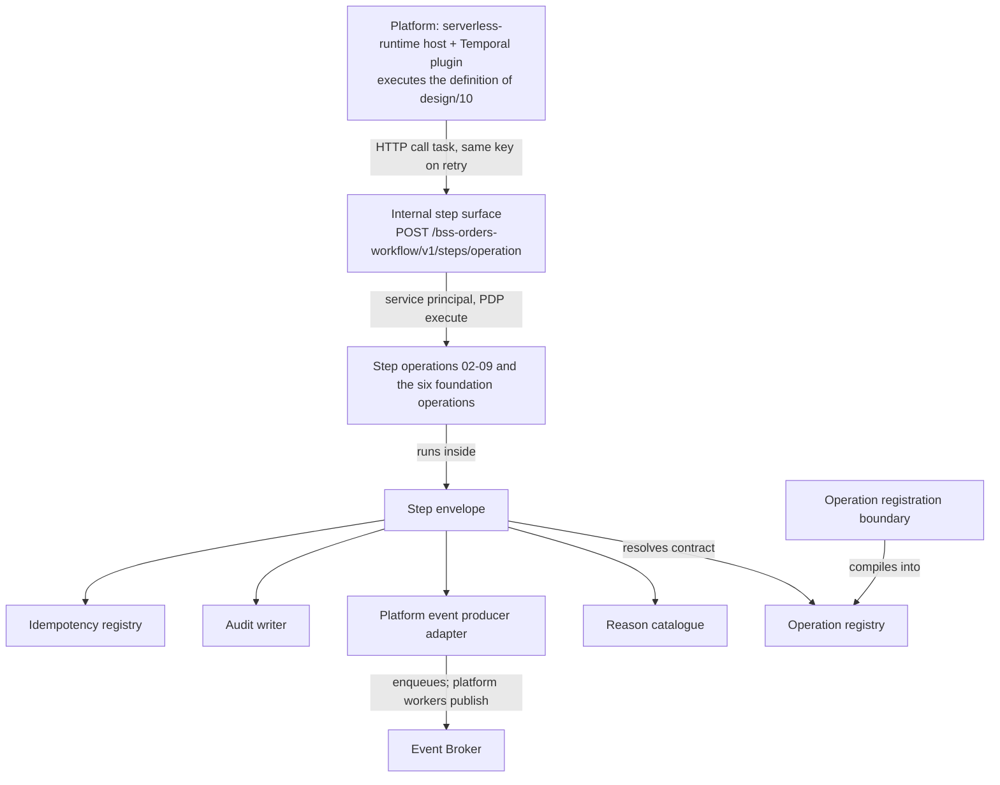
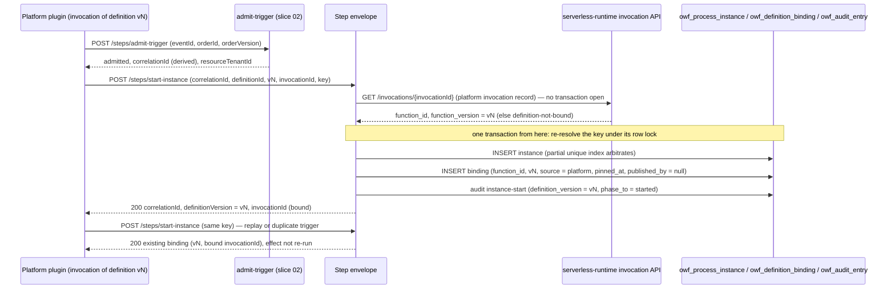

<!-- CONFLUENCE_TITLE: [BSS]: Orders Workflow — Process Engine (Slice 1) -->
<!-- Related: ../DESIGN.md, ../PRD.md, ./README.md, ./10-process-definition.md | Owners: BSS Orders team -->

# DESIGN — Process Engine (Slice 1)

<!-- toc -->

- [1. Architecture Overview](#1-architecture-overview)
  - [1.1 Architectural Vision](#11-architectural-vision)
  - [1.2 Architecture Drivers](#12-architecture-drivers)
  - [1.3 Architecture Layers](#13-architecture-layers)
- [2. Principles & Constraints](#2-principles--constraints)
  - [2.1 Design Principles](#21-design-principles)
  - [2.2 Constraints](#22-constraints)
- [3. Technical Architecture](#3-technical-architecture)
  - [3.1 Domain Model](#31-domain-model)
  - [3.2 Component Model](#32-component-model)
  - [3.3 API Contracts](#33-api-contracts)
  - [3.4 Internal Dependencies](#34-internal-dependencies)
  - [3.5 External Dependencies](#35-external-dependencies)
  - [3.6 Interactions & Sequences](#36-interactions--sequences)
  - [3.7 Database schemas & tables](#37-database-schemas--tables)
  - [3.8 Deployment Topology](#38-deployment-topology)
- [4. Engine Normative Rules](#4-engine-normative-rules)
  - [4.1 Engine execution history is not the audit source of record](#41-engine-execution-history-is-not-the-audit-source-of-record)
  - [4.2 Five distinct bounds, two owners](#42-five-distinct-bounds-two-owners)
  - [4.3 The idempotency registry's non-success outcomes are exhaustive](#43-the-idempotency-registrys-non-success-outcomes-are-exhaustive)
  - [4.4 Timers and retry policy are the definition's](#44-timers-and-retry-policy-are-the-definitions)
  - [4.5 The envelope's bound and the caller-side duplicate protocol](#45-the-envelopes-bound-and-the-caller-side-duplicate-protocol)
  - [4.6 The process audit log is 100% complete with zero silent drops](#46-the-process-audit-log-is-100-complete-with-zero-silent-drops)
  - [4.7 Declared events per settlement, and the six named process events only](#47-declared-events-per-settlement-and-the-six-named-process-events-only)
  - [4.8 Dead letters are the platform's; the manual task is Orders'](#48-dead-letters-are-the-platforms-the-manual-task-is-orders)
  - [4.9 The machine-readable reason catalogue](#49-the-machine-readable-reason-catalogue)
  - [4.10 The operation registration boundary](#410-the-operation-registration-boundary)
  - [4.11 Data classification](#411-data-classification)
  - [4.12 Concurrency and back-pressure: admission on dispatch](#412-concurrency-and-back-pressure-admission-on-dispatch)
  - [4.13 Poison handling is the platform's; the Orders-side quarantine is `retry-step`'s](#413-poison-handling-is-the-platforms-the-orders-side-quarantine-is-retry-steps)
  - [4.14 Determinism discipline: what is computed on which side of the boundary](#414-determinism-discipline-what-is-computed-on-which-side-of-the-boundary)
  - [4.15 Clock-skew tolerance and evaluation against database time](#415-clock-skew-tolerance-and-evaluation-against-database-time)
  - [4.16 Recovery is the platform's invocation and Orders' record](#416-recovery-is-the-platforms-invocation-and-orders-record)
  - [4.17 The audit contract (normative)](#417-the-audit-contract-normative)
- [5. Traceability](#5-traceability)

<!-- /toc -->

- [ ] `p1` - **ID**: `cpt-cf-bss-orders-workflow-design-foundation`

## 1. Architecture Overview

### 1.1 Architectural Vision

This slice is the shared engine every other Orders Workflow slice executes through, and after
[`../ADR/0011`](../ADR/0011-cpt-cf-bss-orders-workflow-adr-flow-as-platform-definition.md) the
engine is exactly two things: **the step-operation envelope** and **the process record**. The
envelope is the one unit of work every step of the order process runs inside — idempotency
resolution before the step's effect, the audit entry, the typed process event and the idempotency
settlement in one transaction after it, a per-operation deadline around it, and a closed vocabulary
of outcomes out of it. The record is the gear-owned set of tables that make process execution
reconstructible at audit grade: the process instance, the step log, the idempotency registry, the
hash-chained audit trail, and the two registries that bind an instance to the definition version it
runs under and declare which operations exist.

What the engine **no longer owns** is sequencing. The order of steps, the branches, the waits,
the two-wave barrier, the event listening, the hold/resume/cancel signal arms and the structure
of compensation are a **versioned Serverless Workflow definition** (CNCF Serverless Workflow
Specification v1.0.0, per
[serverless-runtime ADR-0003](../../../../serverless-runtime/docs/ADR/0003-cpt-cf-serverless-runtime-adr-workflow-dsl.md))
registered in the platform gear `serverless-runtime` and executed by its Temporal plugin
([serverless-runtime ADR-0004](../../../../serverless-runtime/docs/ADR/0004-cpt-cf-serverless-runtime-adr-temporal-workflow-engine.md),
[ADR-0005](../../../../serverless-runtime/docs/ADR/0005-cpt-cf-serverless-runtime-adr-thin-host.md)).
That definition is specified in [`10-process-definition.md`](./10-process-definition.md). **The
platform drives; Orders records.** Every task of the definition that does work calls one Orders
**step operation** over an internal REST surface (§3.3); the operation performs the effect through
the envelope and writes Orders' record in its own transaction. Durable timers, task retry policy,
checkpoints, replay after a crash and event correlation into a running process are the platform
plugin's
([serverless-runtime DESIGN §1.1](../../../../serverless-runtime/docs/DESIGN.md#11-architectural-vision),
`DESIGN.md:85`); an event whose processing keeps failing goes to the trigger's dead letter queue
([`DESIGN_GTS_SCHEMAS.md:1651`](../../../../serverless-runtime/docs/DESIGN_GTS_SCHEMAS.md#trigger), whose management API is out of scope
there), and an invocation that fails with no compensation ends `dead_lettered`
([`DESIGN.md:458`](../../../../serverless-runtime/docs/DESIGN.md#invocation-status-state-machine)). This slice therefore
owns no timer service, no retry controller and no dead-letter store of its own any more.

The engine still owns **no commercial policy**: it cannot evaluate whether an approval gate
applies, does not know what a provisioning wave means commercially, and never decides fulfillment
eligibility — those are the step operations that slices 02 through 09 register against the
operation registration boundary (§3.2), and their ordering is the definition's. It exists because
the PRD's dual-authority rule (`cpt-cf-bss-orders-workflow-fr-owf-process-state-nonauth`) and its
`p1` NFRs — durability, idempotency, audit completeness and recoverability — are properties of
*how a step executes and is recorded*, and those properties must hold whichever definition version
sequences the steps and whatever the platform keeps in its own history. Orders Lifecycle is
authoritative for the commercial order document and order state; this gear's process audit and
saga log are authoritative for process execution progress — step progress, accepted provisioning
intents, the saga/compensation log, the pinned definition version and the platform attempt ids —
**independently of** the platform engine's run history, which is explicitly **not** the audit
source of record
([`../ADR/0003`](../ADR/0003-cpt-cf-bss-orders-workflow-adr-process-state-non-authoritative.md)).

Three consequences shape everything downstream. First, **an instance runs to termination under
the definition version it started with**: `start-instance` writes the binding, the audit trail
carries it, and the platform's own pinning of an invocation to the callable version it started
under ([serverless-runtime DESIGN `DESIGN.md:614`](../../../../serverless-runtime/docs/DESIGN.md#versioning-model))
is what makes that pin hold on the executing side too; migration of a running instance is out of
scope (PRD §5.2). Second, **references, not payloads, cross the engine boundary**
([`../ADR/0013`](../ADR/0013-cpt-cf-bss-orders-workflow-adr-references-not-payloads.md)): a task
input or output is made of the closed vocabulary ADR-0013 types (as amended by D-131): identities,
opaque record references, counters, closed enums, instants and durations. It is never a resolved
total, an approver identity, a tenant axis beyond `resource_tenant_id`, or a downstream payload.
So no commercial content sits in engine history **through task data**. What does sit there is
identifiers (the resource tenant among them), counters and cardinalities, plus the consumed events
as published until the member-storage or thin-event ask lands, and the PRD §15 Q-01 evaluation is
still open on the residency and retention of that history (Q-12). Third, **the engine's own record,
not the platform's history, is what audit and recovery reconstruct from**: the platform replays
the definition after a crash, and every replayed call lands on an envelope that absorbs it under
the same idempotency key, so a platform-side purge or a plugin migration cannot erase what this
gear is obligated to keep.

The shape is adopted rather than invented. The sibling Orders Lifecycle gear commits every state
change through one transition engine that is the single writer of order state; this slice is the
analogous pattern for long-running, externally-dispatching process execution — the envelope is the
single writer of process execution state, every step operation is a caller against it, and the
definition is a caller against the operations, never a second place where step progress can be
recorded.

### 1.2 Architecture Drivers

#### Functional Drivers

| Requirement | Design Response |
|-------------|------------------|
| `cpt-cf-bss-orders-workflow-fr-owf-process-state-nonauth` | The process-instance aggregate, the step log and the audit writer are the only stores of execution progress; the domain model (§3.1) carries no commercial order fields; the definition binding (§3.7) records the pinned version and every `owf_step_log` row records the platform `attempt_id`, so progress is reconstructible without the platform's history. |
| `cpt-cf-bss-orders-workflow-fr-owf-start-contract` | `start-instance` (§3.3) generates and persists the process `correlationId`, writes the binding and the `instance-start` audit entry in one transaction; duplicate-trigger absorption is the idempotency registry's, keyed per [`02 §2.1`](./02-triggers-and-start.md#21-design-principles). |
| `cpt-cf-bss-orders-workflow-fr-owf-retry` | Retry policy is declared on the definition's tasks and executed by the platform plugin (`10 §2`); the envelope makes each retried call land on the same key, and the operation's `retry_class` declares whether its transient failures may be retried at all (§3.3). The per-operation deadline inside the envelope is the only time bound this slice enforces itself (§4.2). |
| `cpt-cf-bss-orders-workflow-fr-owf-dead-letter` | An inbound trigger or callback that exhausts delivery is the platform trigger path's dead letter ([`../ADR/0009`](../ADR/0009-cpt-cf-bss-orders-workflow-adr-manual-task-dead-letter-separation.md) as amended); a step that exhausts remediation has the manual task. This slice owns no dead-letter store (§4.8). |
| `cpt-cf-bss-orders-workflow-fr-owf-intent-sweep` | The `reconciliation-sweep` worker (§3.8) reads every due intent on its `next_sweep_at` schedule whether or not an invocation drives the instance, and the definition's poll and confirmation arms (`10 §3.6`) read earlier; settlement of a stuck step key happens only through `settle-from-lookup` (§3.3), which is read-only past the key lifetime by the registry's own aging. |
| `cpt-cf-bss-orders-workflow-fr-owf-backpressure` | Admission on dispatch — per-order parallelism, the aggregate in-flight cap, per-seller fairness and the throttle deferral, with no queue — is enforced inside the dispatch operations and specified in [`05`](./05-provisioning-intents.md); a deferral is a settled success (§4.12 here is a pointer). |
| `cpt-cf-bss-orders-workflow-fr-owf-hold-resume` | Hold and resume are signal arms of the definition (`10 §3.6` (e)); `apply-hold`/`apply-resume` (slice 08) record them through the envelope and return the remaining escalation window Orders computed, which the definition re-arms. |
| `cpt-cf-bss-orders-workflow-fr-owf-terminal-order-events` | `terminate-instance` (§3.3) records termination as a `termination` audit entry, distinguishing termination-with-compensation, supersession and ordinary completion by the terminal outcome and reason it carries. |

#### NFR Allocation

| NFR ID | NFR Summary | Allocated To | Design Response | Verification Approach |
|--------|-------------|--------------|-----------------|----------------------|
| `cpt-cf-bss-orders-workflow-nfr-owf-durability` | Zero in-flight workflows lost across restarts; zero loss for committed process state | Step envelope + audit writer; platform plugin for the invocation itself | Every committed step writes its durable record before the envelope answers; the platform resumes the definition from its own history and every re-invoked call is absorbed by the registry rather than re-executed | Kill/restart test of the Orders gear asserting no re-execution of a settled step; kill/restart of the platform worker asserting the definition resumes and every re-issued call is an absorbed duplicate |
| `cpt-cf-bss-orders-workflow-nfr-owf-idempotency` | Zero duplicate durable effects from retried outbound calls | Idempotency registry | Every step operation carries a required idempotency key recorded before its effect; a platform retry reuses the same key and the stored outcome absorbs it; an `open` record after a retryable failure is the only state in which the effect may run again | Parallel-retry test asserting one durable effect per key; replay test asserting a stored outcome is returned rather than re-dispatched; re-run test asserting an `open` key runs the closure exactly once more per settled retryable failure |
| `cpt-cf-bss-orders-workflow-nfr-owf-audit` | 100% of process state transitions recorded, zero silent drops, engine history not the audit SoR | Audit writer | Every instance start, step start, settlement, retry, timeout, sweep settlement, escalation, compensation step, phase transition and termination is written to the gear-owned audit log in the transaction that records it, independently of platform history; each entry is hash-chained under the frozen byte contract of §4.17 and the store is trigger-protected against UPDATE and DELETE (§3.7) | Structural test asserting every envelope code path writes an audit entry; frozen preimage/digest vectors for §4.17; every-field mutation test; trigger test rejecting UPDATE and DELETE for every role; platform-history-purge test asserting the gear-owned audit log is unaffected |
| `cpt-cf-bss-orders-workflow-nfr-owf-event-latency` | p95 < 30 s from internal state change to event delivery | Platform event producer adapter | The typed event is enqueued through the bound platform producer outbox in the settlement transaction; platform workers publish asynchronously | Producer-queue lag measured from enqueue to broker acceptance at expected load |
| `cpt-cf-bss-orders-workflow-nfr-owf-fulfillment-sla` | p95 ≤ 15 minutes from activation-wave eligibility to terminal fulfillment outcome | Step envelope (per-operation deadline) + definition (task timeout and retry budget, `10 §2`) | The per-operation deadline keeps a stalled attempt from silently consuming the window; the definition's retry limits nest inside its task timeouts by validation (§4.2) | Load test measuring wave-to-terminal latency at p95 under the admission controls of `05` |
| `cpt-cf-bss-orders-workflow-nfr-owf-escalation-timer` | Configurable per-gate window, default 72 h, accuracy ± 5 min | Platform plugin durable timers (definition `wait`), `10 §3.6` (a) | Timers are the plugin's durable timers, recovered from the platform's history on restart; Orders records arm, pause and fire through `open-gates`, `apply-hold`, `apply-resume` and `escalate-gate` | Timer-accuracy test across a platform worker restart mid-window; configuration test per approval gate |
| `cpt-cf-bss-orders-workflow-nfr-owf-availability` | 99.9% control-plane availability; in-flight processes unaffected by restarts | Step envelope + platform plugin | An Orders restart loses no state because every step is a transaction; a platform restart resumes invocations from history; readiness includes the platform engine (§3.8) | Chaos test restarting each side under active in-flight processes |
| `cpt-cf-bss-orders-workflow-nfr-owf-retention` | Gear-owned records retained ≥ 400 days independently of platform history | Audit writer | Retention is per store (§3.7): ≥ 400 days on the audit log, shorter windows on recovery scaffolding; a platform purge of invocation history has no bearing on any of them | Retention-policy test confirming gear-owned records outlive a platform history purge |

#### Key ADRs

| ADR ID | Decision Summary |
|--------|-----------------|
| `cpt-cf-bss-orders-workflow-adr-flow-as-platform-definition` | The order process flow is a versioned Serverless Workflow definition registered in `serverless-runtime` and executed by its Temporal plugin; Orders provides step operations and the process record |
| `cpt-cf-bss-orders-workflow-adr-definition-versioning-and-protected-steps` | Definition versions are validated before publish against the protected-operation list, the closed trigger set and the bound nesting rule; instances are pinned to the version they started under |
| `cpt-cf-bss-orders-workflow-adr-references-not-payloads` | Task inputs and outputs carry identifiers and small enums only; no commercial payload crosses the engine boundary |
| `cpt-cf-bss-orders-workflow-adr-durable-execution-substrate` | The substrate is selected (serverless-runtime, Temporal plugin); its run history is not the audit source of record — the gear-owned audit writer is; code sequencing remains a stated fallback property |
| `cpt-cf-bss-orders-workflow-adr-process-state-non-authoritative` | Process execution state is never presented as authoritative commercial order state; Orders Lifecycle remains the sole read path for order state |
| `cpt-cf-bss-orders-workflow-adr-slice-decomposition` | A foundation slice plus eight operation slices plus the definition document, so the engine has an independent review boundary from any commercial policy |
| `cpt-cf-bss-orders-workflow-adr-idempotency-key-composition` | Idempotency keys are structurally distinct from the process `correlationId` and from downstream transition-request identifiers; the platform retries under the same key |
| `cpt-cf-bss-orders-workflow-adr-outbox-process-events` | Process events are enqueued through the platform producer outbox in the step's transaction and published asynchronously by platform workers |
| `cpt-cf-bss-orders-workflow-adr-manual-task-dead-letter-separation` | The manual task is the inspectable object for a step failure; an inbound delivery that exhausts its cap is the platform trigger path's dead letter, never merged with the manual task |

### 1.3 Architecture Layers

- [ ] `p2` - **ID**: `cpt-cf-bss-orders-workflow-tech-engine-stack`

```text
Platform durable      serverless-runtime host (registry, invocations, event-triggers) and its
execution             Temporal plugin: interprets the definition of design/10, owns timers,
                      task retry, checkpoints, replay, event correlation, poison handling
       │  HTTP `call` tasks → POST /bss-orders-workflow/v1/steps/{operation}
       ▼
Step operations       one Rust operation per registered step, slices 02-09 (approval, plan,
(02-09)               intents, saga, manual tasks, hold/cancel) and the six foundation
                      operations of §3.3 — this slice owns none of their commercial content
       │
       ▼
Step envelope         idempotency resolution · per-operation deadline · audit append ·
                      producer enqueue · registry settlement · closed outcome vocabulary
       │
       ▼
Engine components     idempotency registry · audit writer · platform event producer adapter ·
                      reason catalogue · operation registry · operation registration boundary
       │
       ▼
Persistence           process instance · step log · idempotency registry · audit chain and
                      checkpoints · definition binding · step-operation registry —
                      gear-owned, tenant-scoped, audit-grade
```

| Layer | Responsibility | Technology |
|-------|---------------|------------|
| Platform durable execution | Executing the registered definition version: task ordering, `wait` timers, task retry policy, `listen` correlation, `fork` and `try`/`catch`, checkpoints and replay; invocation status and signals | `serverless-runtime` host and Temporal plugin ([DESIGN §1.4](../../../../serverless-runtime/docs/DESIGN.md#14-toolkit-integration), ADR-0004, ADR-0005); **no code exists today** (`10 §1`) |
| Presentation | The internal step surface `POST /bss-orders-workflow/v1/steps/{operation}` (§3.3), service-principal only; operator and read surfaces are [`09-read-and-authz`](./09-read-and-authz.md)'s | REST, RFC 9457, `OperationBuilder` |
| Application | The step envelope and the six foundation operations | Rust module in the `orders-workflow` gear |
| Domain | Process-instance invariants, definition binding, step-log semantics, the step-operation contract, reason catalogue | Rust domain structs; GTS reference schemas for task inputs and outputs (§3.3) |
| Infrastructure | Idempotency registry, audit writer, platform event producer adapter, operation registry | PostgreSQL via SecureORM, toolkit-db session advisory locks (`Db::lock`) for the worker roster of §3.8, `event-broker-sdk` over `toolkit_db::outbox` |

## 2. Principles & Constraints

### 2.1 Design Principles

#### Dual authority, one direction of truth

- [ ] `p1` - **ID**: `cpt-cf-bss-orders-workflow-principle-dual-authority`

Orders Lifecycle is authoritative for the commercial order document and order state; this gear's
process audit and saga log are authoritative for process execution progress — independently of
the platform engine's own history, which is not the audit source of record. Process state is
never presented as authoritative commercial order state: what was ordered and the current order
state are always read from Orders Lifecycle, never inferred from step progress, and never from the
definition's task outputs, which carry references only. This is the central principle every other
engine property serves, and it is why the domain model in §3.1 carries no order-document fields.

**ADRs**: `cpt-cf-bss-orders-workflow-adr-process-state-non-authoritative`

#### One envelope wraps every step; one definition sequences them

- [ ] `p1` - **ID**: `cpt-cf-bss-orders-workflow-principle-one-envelope-one-definition`

Every step of the order process — foundation, approval, plan, intent, saga, manual task,
hold/cancel — runs as a registered **step operation** inside the one envelope of §3.3, and the
order in which the operations run is the business of exactly one artifact: the registered
definition version the instance is bound to (`10`). Neither half may absorb the other. An
operation **MUST NOT** call another step operation to advance the process (it may call the
foundation's own `settle-from-lookup` and `park`/`unpark` in-process as part of its effect), and
the definition **MUST NOT** perform an effect the envelope does not record — it has no `run`, no
`emit`, and no direct call to Lifecycle, Subscriptions, Payments or the approval policy adapter (seam rules
R1–R5 bind the operations, `10 §2`). Adjusting the flow is a new definition version; changing what
a step does is an Orders release.

**ADRs**: `cpt-cf-bss-orders-workflow-adr-flow-as-platform-definition`

#### An instance runs under the definition it started with

- [ ] `p1` - **ID**: `cpt-cf-bss-orders-workflow-principle-definition-version-pinning`

`start-instance` writes `owf_definition_binding` — definition id, version and source — in the
transaction that creates the instance, and that row is never updated. The platform independently
pins the invocation to the callable version it started under
([`DESIGN.md:614`](../../../../serverless-runtime/docs/DESIGN.md#versioning-model)); the binding is
Orders' own record of the same fact, kept so an in-flight process's behavior is explainable from
this gear's record months later. An operator cannot migrate a running instance onto a later
definition (PRD §5.2); a definition version **MUST NOT** be deleted or archived while an instance
is bound to it (`10 §4`).

**ADRs**: `cpt-cf-bss-orders-workflow-adr-definition-versioning-and-protected-steps`

#### References, not payloads

- [ ] `p1` - **ID**: `cpt-cf-bss-orders-workflow-principle-references-not-payloads`

Every value that crosses the engine boundary — a task input, a task output, a header, an event
member the definition keeps — is a member of the **closed vocabulary** of
[`../ADR/0013`](../ADR/0013-cpt-cf-bss-orders-workflow-adr-references-not-payloads.md) as amended
by D-131. The vocabulary has six types: identities (`correlationId`, `orderId`, `orderVersion`,
`supersededByOrderVersion`, `resourceTenantId`, the platform `invocationId` and `attemptId`, the
binding members, consumed-event ids — the full list is ADR-0013 item 1); opaque record references (`stepRef`, `gateRef`, `taskRef`, `lineRef`, `planRef`, `parkRef`,
`requestRef`, `cancelRequestRef`, `suspensionRef`, `subjectRef`, and arrays of them); counters;
closed enums and booleans (an outcome class, a wave number, a catalogue reason); instants and
durations; and `stepsBase`. Each type is a registered GTS schema with a format. A step
operation resolves a reference against Orders' own record or against the authoritative gear
inside its transaction. The resolved total, an approver's identity, the payer and seller tenant
axes, a manual-task justification and any downstream payload **MUST NOT** appear in a task input
or output; the schema check of `10 §2` rejects a definition that names one.

**ADRs**: `cpt-cf-bss-orders-workflow-adr-references-not-payloads`

#### Engine history is not the audit source of record

- [ ] `p1` - **ID**: `cpt-cf-bss-orders-workflow-principle-engine-history-not-sor`

The platform's invocation history and timeline
([`DESIGN.md:661`](../../../../serverless-runtime/docs/DESIGN.md#invocationrecord)) are an
implementation detail of execution, not this gear's audit record. The gear-owned audit writer
independently records every step start, settlement, retry, timeout, sweep settlement,
escalation, compensation step, phase transition and termination, and that record is what audit
and retention obligations are built on. A plugin migration, a Temporal namespace purge or a
platform retention policy must never be able to erase what this gear is obligated to keep.

**ADRs**: `cpt-cf-bss-orders-workflow-adr-durable-execution-substrate`

#### Five bounds, two owners

- [ ] `p1` - **ID**: `cpt-cf-bss-orders-workflow-principle-distinct-bounds`

The per-attempt timeout, the retry budget, the step deadline, the overdue-fulfillment window and
the process-lifetime ceiling remain **five** different things, but they now have **two owners**.
The **operation enforces** exactly one of them: the **per-operation deadline** inside the
envelope, evaluated against database time. The **definition declares** the other four — the
task retry policy (budget, backoff, jitter), the task timeout that bounds a whole step, the
overdue re-check and the top-level lifetime `wait` — and the platform plugin executes them
(`10 §2`, `10 §3.6`); the overdue **window's value** is not the definition's but the seller's
policy value, pinned on the plan at freeze, and the definition owns only the tick that re-checks
it (decision D-134). The nesting invariant — per-operation deadline **<** the task timeout **<** the
lifetime ceiling, and the longest fulfillment-stage task timeout **<** the overdue window **<** the
lifetime ceiling (§4.2) — is enforced in four places, one wherever either side changes (§4.2):
(1) over the values the definition holds, by a **definition validation rule** enforced before
publish (`cpt-cf-bss-orders-workflow-adr-definition-versioning-and-protected-steps`, `10 §2.2`
rule 4); (2) by the publish job, which refuses a candidate whose `wave1` timeout is not below
every effective overdue window of the environment (`10 §4.2` step 1, decision D-159); (3) for the
overdue window, at the audited write of the seller's policy, the policy load of
`owf_seller_policy` (§3.7, `07 §4.8` item 8, decisions D-134 and D-140); and (4) for the
operation's own deadline, at readiness, which refuses a `deadline_ms` change that breaks the
ordering against the live version set and alerts on a publish and a promotion that raced
(§4.2, decision D-176). Collapsing any
of the five into another either stalls a transient failure indefinitely, provisions against a
payer who has not been charged, or leaves an order non-terminal forever.

**ADRs**: `cpt-cf-bss-orders-workflow-adr-definition-versioning-and-protected-steps`

#### Recoverable by construction

- [ ] `p1` - **ID**: `cpt-cf-bss-orders-workflow-principle-recoverable-by-construction`

Execution state is reconstructible from the gear-owned record with zero loss for committed steps,
and re-executable without a second effect. The platform recovers the **invocation** — after a
worker crash it replays the definition from its own history — and Orders guarantees that every
call the replay re-issues lands on an envelope that resolves the same key to the same settled
outcome. The property therefore rests on two facts this slice controls: the step's record is
written in the transaction that produces its effect, and the idempotency key is the same on every
re-issue of the same logical step. Nothing here depends on the platform never replaying a call.

**ADRs**: `cpt-cf-bss-orders-workflow-adr-durable-execution-substrate`

### 2.2 Constraints

#### Correlation identifiers are distinct by role

- [ ] `p1` - **ID**: `cpt-cf-bss-orders-workflow-constraint-correlation-id-distinctness`

The process `correlationId`, per-call idempotency keys, downstream transition-request identifiers
and the platform's `invocationId`/`attemptId` are structurally distinct identifiers that must
never be reused for one another. The `correlationId` is generated once at process start and
identifies the instance across its lifetime; an idempotency key identifies one logical step
operation call; a transition-request identifier is assigned by Subscriptions to one accepted
intent; the invocation and attempt ids are the platform's handles on its own execution and are
recorded, never derived from. Conflating any two breaks either duplicate-trigger absorption,
duplicate-call absorption or the sweep's ability to name a stuck intent.

**ADRs**: `cpt-cf-bss-orders-workflow-adr-idempotency-key-composition`

#### The retry budget governs submission failures only

- [ ] `p1` - **ID**: `cpt-cf-bss-orders-workflow-constraint-retry-budget-scope`

The retry budget is the definition's task retry policy, and it applies only to a step whose
operation is registered `retry_class = retryable-on: transient` and only to a transient outcome
— the call was not accepted by the downstream, the per-operation deadline cut it before an accept,
or the registry answered `still-processing`. An intent already accepted and in flight is never
retried as a resubmit: the envelope answers a retried key with the stored acceptance or with
`still-processing`, and a post-accept hang is recovered by lookup through `settle-from-lookup`,
never by a further attempt. The numeric values — backoff curve, maximum attempts, task timeouts
and the lifetime ceiling — are declared on the definition (`10 §2`), the overdue window is a
seller-policy value pinned on the plan (decision D-134), and all are recorded here only as the
working baselines of §4.2.

**ADRs**: `cpt-cf-bss-orders-workflow-adr-idempotency-key-composition`

#### Concurrency is bounded and fair, at dispatch

- [ ] `p1` - **ID**: `cpt-cf-bss-orders-workflow-constraint-concurrency-fairness`

Parallel line execution within one order, the aggregate number of in-flight provisioning intents
across processes, per-tenant fairness keyed on `seller_tenant_id`, the cold-start ramp and the
handling of a downstream throttle signal are **admission controls applied inside the dispatch
operations**, with no queue and no reject-on-full (a line not admitted is deferred in a settled
success, §4.12), and are specified in
[`05-provisioning-intents.md`](./05-provisioning-intents.md). The definition does not fan out per
line (the DSL has no dynamic parallel branch, `10 §2`), so the concurrency of a wave is Orders'
to bound; a throttle-induced delay inside an operation never counts as a failed attempt.

**ADRs**: `cpt-cf-bss-orders-workflow-adr-slice-decomposition`

#### Process artifacts are tenant-scoped and card-data-free

- [ ] `p1` - **ID**: `cpt-cf-bss-orders-workflow-constraint-data-classification`

Process artifacts owned by this engine — step log entries, idempotency records, definition
bindings and the process audit log — carry commercial order context and are tenant-scoped by a
**column, not by convention**: every engine table except the three configuration tables
`owf_step_operation`, `owf_seller_policy` and `owf_configuration_revision` and the two audit
checkpoint tables, keyed on `audit_tenant_id` (the D-48 exemptions of §3.7), carries
`resource_tenant_id` NOT NULL, and the tables backing an operator- or
seller-scoped surface carry `seller_tenant_id` as well (§3.7, §4.11). They are retained at audit
grade by this gear independently of platform history, and must never carry payment-card data.
Classification is aligned with the underlying order record owned by Orders Lifecycle. The same
classification is what forbids these values from crossing into the definition
(`cpt-cf-bss-orders-workflow-principle-references-not-payloads`).

**ADRs**: `cpt-cf-bss-orders-workflow-adr-durable-execution-substrate`

## 3. Technical Architecture

### 3.1 Domain Model

**Technology**: Rust domain structs internally; GTS reference schemas for every task input and
output that crosses the engine boundary (§3.3); GTS event types for the cross-gear contract (§4.7).

**Core Entities**:

- [ ] `p1` - **ID**: `cpt-cf-bss-orders-workflow-entity-step-operation`

One registered, named unit of process work: the thing a definition `call` task targets. Carries
the contract of §3.3 — `name`, `protection`, the GTS reference schemas of its `input` and
`output`, its `idempotency_key` derivation family, its `declared_event`, its paired
`compensation` operation, its catalogue `reasons`, its `audit_kind`, its `retry_class` and its
per-operation `deadline`. The set is closed and compiled: an operation exists because a slice
registered it against the operation registration boundary (§3.2), and the operation registry
(§3.7 `owf_step_operation`) is loaded from that compiled set at startup and never written at
runtime. `protected` operations may be ordered by a definition but never omitted or replaced
(`10 §2`); `composable` operations may be omitted, except where `10 §4.1` requires one on its
path (D-135).

- [ ] `p1` - **ID**: `cpt-cf-bss-orders-workflow-entity-process-instance`

The aggregate root of one process execution, correlated to `orderId` + `orderVersion`. Carries
the process `correlationId` generated at start, the platform `invocationId` that drives it, the
recorded **phase projection** (`started`, `suspended`, `parked`, `compensating`, `terminated` —
enumerated with its permitted transitions in §3.7, and written only by step operations as a
record of what the definition has done, never read by the definition to decide what to do next),
the three tenant axes, the suspension flag set by hold/resume, the reference to the last settled
protected step, the optimistic-concurrency row version, the audit-chain head counter and the
terminal outcome when reached. The **pinned definition version** it executes under is the
definition binding's (below); the instance repeats it as a denormalised column for reads. This is
the only entity a step operation reads or writes process state against.

- [ ] `p1` - **ID**: `cpt-cf-bss-orders-workflow-entity-definition-binding`

The immutable record, written once by `start-instance`, of which definition sequences this
instance: the platform `definition_id`, the `definition_version`, the `definition_source`
(`platform` — the registered Serverless Workflow definition executed by the plugin — or `code` —
the stated fallback in which Orders sequences the same operations in Rust, `10 §1`), the instant
of pinning, the principal that published that version and the resource tenant. A binding is never
updated and never deleted before the instance it binds; it is what an auditor reads to know which
published flow a months-old instance followed.

- [ ] `p1` - **ID**: `cpt-cf-bss-orders-workflow-entity-step-log-entry`

One durable, append-only **step record** per settled attempt of a step operation: the operation
name, the owning process instance, the idempotency key, the platform `attempt_id` the call
carried, the attempt number Orders counted under that key, the outcome (`success`,
`retryable-failure`, `permanent-failure`, `still-processing`, `aged-out` — the one enumeration,
declared in §3.7), the **settled result** the attempt produced (including the downstream
`transition_request_id` where the step accepted one), the per-operation deadline that bounded it
and the receipt and settlement instants. There is no `pending` row: the row is written at
settlement, in the settlement transaction, so a row's existence is the fact that the attempt
concluded. A committed entry is never rewritten; a re-run under an `open` key appends a new entry.

- [ ] `p1` - **ID**: `cpt-cf-bss-orders-workflow-entity-idempotency-record`

The registry's record for one idempotency key: the operation it scopes, the owning
`correlationId`, the SHA-256 fingerprint of the canonical request body, the status (`in_flight`,
`open`, `settled`), the lease and heartbeat instants while `in_flight`, the settled outcome and a
reference to the step record that produced it, and the key's retention window. `open` is the
state left by a settled `retryable-failure`: the key's effect **may run again** under the same
key, and only in that state. It is what makes the platform's same-key retry safe on both sides of
the accept boundary (§4.3).

- [ ] `p1` - **ID**: `cpt-cf-bss-orders-workflow-entity-audit-entry`

One append-only process audit record per transition: instance start, step start, step
completion, retry, timeout, sweep settlement, escalation, compensation step, phase transition or
termination, with the actor's opaque subject identifier (D-61), timestamp, idempotency key, the
process `correlationId`, and — where the transition has them — the operation name, the attempt
number and the pinned definition version as evidence fields. Each entry is **hash-chained** to its
predecessor for the same instance under the frozen byte contract of §4.17, with its sequence
allocated from the instance's transactional counter. It carries a catalogue `reason` and,
separately, a free-text `justification`; the two are never the same column. Written independently
of whatever the platform keeps of its own run, and never read as the recovery record — that is
`owf_step_log`'s job.

- [ ] `p1` - **ID**: `cpt-cf-bss-orders-workflow-entity-outbox-entry`

One typed event per process event a settled step's contract names — zero or more of its
declared type, at most one per subject (§3.3 `declared_event`) — enqueued through the bound platform
producer outbox in the settlement transaction: the event identity, its GTS type, `orderId` (the
partition key), the tenant axes, the process `correlationId` and the `data` payload of §4.7.
Local sequence, delivery bookkeeping and retry state are platform-owned (`toolkit_db::outbox`);
this gear persists no ordinal of its own.

**Retired entities.** `cpt-cf-bss-orders-workflow-entity-durable-timer` — retired by ADR-0011;
timers are the definition's `wait` tasks executed by the plugin, see `10 §2` and `10 §4`.
`cpt-cf-bss-orders-workflow-entity-retry-state` — retired by ADR-0011; retry policy is the
definition's task retry policy and the platform `attempt_id` is recorded on every step record
instead, see `10 §2`. `cpt-cf-bss-orders-workflow-entity-dead-letter-record` — retired by
ADR-0011 with ADR-0009 as amended; an inbound delivery that exhausts its cap is the platform
trigger path's dead letter, see §4.8 and `10 §3.3`.

**Relationships**:
- `Process instance` → `Definition binding`: one-to-one, written in the same transaction; the binding is never rewritten.
- `Process instance` → `Step log entry`: one-to-many, append-only; every settled attempt of a step operation against the instance is a new entry.
- `Process instance` → `Idempotency record`: one-to-many; one record per logical step call, re-runnable only while `open`.
- `Step operation` → `Step log entry`: one-to-many by operation name; the registry row is the contract every entry was produced under.
- `Process instance` → `Audit entry`: one-to-many, append-only; the `instance-start` entry carries the pinned definition version.
- `Process instance` → `Outbox entry`: one-to-many; zero or more enqueued typed events per settled step that declares a process event, at most one per subject its contract names (§3.3 `declared_event`).

### 3.2 Component Model


```mermaid
graph TB
    P[Platform: serverless-runtime host + Temporal plugin<br/>executes the definition of design/10]
    R[Internal step surface<br/>POST /bss-orders-workflow/v1/steps/operation]
    O[Step operations 02-09 and the six foundation operations]
    E[Step envelope]
    G[Operation registry]
    I[Idempotency registry]
    A[Audit writer]
    X[Platform event producer adapter]
    D[Reason catalogue]
    B[Operation registration boundary]
    P -->|HTTP call task, same key on retry| R
    R -->|service principal, PDP execute| O
    O -->|runs inside| E
    E --> I
    E --> A
    E --> X
    E --> D
    E -->|resolves contract| G
    B -->|compiles into| G
    X -->|enqueues; platform workers publish| BUS[Event Broker]
```

#### Step envelope

- [ ] `p1` - **ID**: `cpt-cf-bss-orders-workflow-component-step-executor`

##### Why this component exists

Every step operation, whichever slice registers it and whichever definition version orders it,
carries the same durability, idempotency and audit obligations; concentrating them in one
envelope is what makes those obligations assertable once rather than re-implemented per
operation, and what makes a platform retry safe without the platform knowing anything about
Orders' record. The id is the former step executor's: the component is the same boundary with
dispatch, checkpointing and compensation *invocation* removed, because those are now the
definition's and the plugin's.

##### Responsibility scope

Receiving a step-operation call on the internal surface (§3.3); resolving the required
idempotency key against the registry before the operation's effect runs and taking the lease;
enforcing the operation's registered per-operation deadline against database time; running the
operation's effect; and settling — writing the step record with the platform `attempt_id`, the
audit entry, the declared typed event through the producer adapter and the registry settlement in
**one** transaction — before answering. Mapping the operation's outcome onto the closed outcome
set and the RFC 9457 envelope of §3.3. Recording the recorded phase projection and the last
settled protected step on the instance when the operation's contract says so.

##### Responsibility boundaries

It executes operations but authors none — what `open-gates` or `dispatch-wave1-create` actually
does belongs to the slice that registers it. It holds no commercial vocabulary. It does not
schedule, wait, retry or replay: it has no timer, no retry loop and no queue of its own, and a
transient failure is answered to the caller so the definition's retry policy can re-issue the call.
It never advances the process to a next step — there is no "next step" inside Orders.

##### Related components (by ID)

- `cpt-cf-bss-orders-workflow-component-operation-registry` — depends on
- `cpt-cf-bss-orders-workflow-component-idempotency-registry` — depends on
- `cpt-cf-bss-orders-workflow-component-audit-writer` — owns data for
- `cpt-cf-bss-orders-workflow-component-event-outbox` — owns data for
- `cpt-cf-bss-orders-workflow-component-reason-catalogue` — depends on

#### Operation registry

- [ ] `p1` - **ID**: `cpt-cf-bss-orders-workflow-component-operation-registry`

##### Why this component exists

The definition names operations by string, the PDP authorises them by name, the validation hook
of `10 §2` must know which names exist and which are protected, and the envelope must know each
operation's deadline, retry class and declared event without asking the operation. One compiled
registry, mirrored into a read-only table, is what gives every one of those consumers the same
answer.

##### Responsibility scope

Holding the compiled set of step-operation contracts (§3.3 fields) built from the registrations
of every slice; loading that set into `owf_step_operation` at startup inside one transaction,
replacing the previous content, and appending an `owf_configuration_revision` row (§3.7) that
names the Orders release when the loaded set differs from the stored one — the same record the
catalogue conformance check of [`09 §3.7`](./09-read-and-authz.md#37-database-schemas--tables)
appends (decision D-160); serving the validation hook's
lookup (`10 §3.3`) and the envelope's per-call contract resolution; refusing to become ready if
the compiled set and the table disagree after load.

##### Responsibility boundaries

No runtime write path: nothing inserts, updates or deletes a registry row after load, and an
operator surface that could would be a second place to define a step. It holds no definition and
no ordering — which operations a path must contain is the protected list the validation hook reads
from it, and how they are ordered is the definition's.

##### Related components (by ID)

- `cpt-cf-bss-orders-workflow-component-step-executor` — depends on
- `cpt-cf-bss-orders-workflow-component-handler-extension-boundary` — shares model with

#### Idempotency registry

- [ ] `p1` - **ID**: `cpt-cf-bss-orders-workflow-component-idempotency-registry`

##### Why this component exists

A definition executed by a durable engine re-issues calls by design — on task retry, on worker
replay, on operator `retry` of a failed invocation — and each re-issue reaches Orders Lifecycle,
Subscriptions or the approval policy adapter through an Orders operation. Storing the outcome of
each logical call under its key is what makes every one of those re-issues safe rather than merely
likely-safe.

##### Responsibility scope

Recording the required idempotency key ahead of every step operation's effect; storing the
settled outcome; absorbing a duplicate without a second durable effect; holding a settled
`retryable-failure` as `open` so the same key may run once more per settled failure; refusing a
key replayed against a different fingerprint; and tracking the key-lifetime window after which
`settle-from-lookup` is read-only and a next attempt is a new key — on an operation that submits
downstream, and on any other key only once its instance is terminal (§3.7 *Key lifetime*, D-185).

##### Responsibility boundaries

It never generates the process `correlationId` and never generates a downstream
transition-request identifier (`cpt-cf-bss-orders-workflow-constraint-correlation-id-distinctness`).
It does not decide whether a call should be retried — the definition's retry policy does — it only
makes the retry land correctly.

##### Related components (by ID)

- `cpt-cf-bss-orders-workflow-component-step-executor` — depends on

#### Audit writer

- [ ] `p1` - **ID**: `cpt-cf-bss-orders-workflow-component-audit-writer`

##### Why this component exists

Financial-grade audit requires a record of the full execution path — not just order-level
transitions — that is independently trustworthy and does not depend on the platform's invocation
history, which this gear does not treat as its source of record.

##### Responsibility scope

Recording every instance start, step start, settlement, retry, timeout, sweep settlement,
escalation, compensation step, phase transition and termination with the actor's opaque subject
identifier, timestamp, idempotency key and the process `correlationId`, in the same transaction as
the transition it records; recording the pinned definition version on the instance-start entry;
allocating each entry's `sequence` from the `owf_process_instance.audit_sequence` counter under
the instance row lock and computing its `entry_hash` under the frozen byte contract of §4.17;
retaining the record at audit grade independently of platform history and of engine purges; and
owning the checkpoint-append phase and the read-only verification pass of the
`audit/<audit-tenant>` worker (§3.8, §4.17).

##### Responsibility boundaries

It records commercial order context carried by process artifacts but never becomes a second
source of commercial order state, and it never becomes the recovery record: a replayed call
resolves through the registry and `owf_step_log`, never through the audit trail. It never carries
payment-card data, and it never updates, deletes or re-hashes a committed entry — the verifier
alerts and does not repair (D-59).

##### Related components (by ID)

- `cpt-cf-bss-orders-workflow-component-step-executor` — depends on
- `cpt-cf-bss-orders-workflow-component-event-outbox` — shares model with

#### Platform event producer adapter

- [ ] `p1` - **ID**: `cpt-cf-bss-orders-workflow-component-event-outbox`

##### Why this component exists

Operator monitoring dashboards and downstream audit systems consume the six named process events
asynchronously. Publishing inside the settlement transaction would put an external dependency in
the commit path, while a Workflow-owned outbox would duplicate platform sequencing, leasing, retry
and dead-letter capabilities. The adapter binds Workflow's events to the supported platform path,
as the sibling gear's adapter does
([Lifecycle `01 §3.2`](../../../orders-lifecycle/docs/features/01-foundation.md#32-component-model)).
Enqueuing in the same durable commit as the audit entry is what guarantees an event is never
emitted for a step that did not actually settle — and it is why the definition has no `emit`
task: an event emitted by the engine would be one no Orders transaction vouches for.

##### Responsibility scope

Constructing the six `TypedEvent` values of §4.7; preparing their GTS schemas before readiness;
configuring `event_broker_sdk::DbProducer` with managed `ProducerMode::Chained` and the gear's
gateway-issued service `SecurityContext`; binding one `ProducerOutboxQueue`
(`bss-orders-workflow-events`, 16 toolkit partitions, high-throughput profile) to
`toolkit_db::outbox`; and enqueuing through that bound handle using the settlement transaction
runner, so the enqueue commits with the audit entry and the idempotency settlement. Every event
carries the process `correlationId`; `orderId` is the event type's broker partition key on the
gear's own topic `gts.cf.core.events.topic.v1~cf.bss._.orders_workflow.v1`, which this gear
registers before readiness (§4.7, decision D-177).

##### Responsibility boundaries

Workflow owns event meaning and payload construction, but does not own an outbox table, lease
acquisition, sequence assignment, retry classification, dead-letter lifecycle, vacuuming or a
re-drive API. Publication failure never alters process state. It does not guarantee event ordering
across orders, only per broker partition of its own topic, and none against Lifecycle's stream,
which is another topic (§4.7). Which operation declares which event is the
registering slice's contract (§3.3 `declared_event`).

##### Related components (by ID)

- `cpt-cf-bss-orders-workflow-component-step-executor` — depends on
- `cpt-cf-bss-orders-workflow-component-audit-writer` — shares model with

#### Reason catalogue

- [ ] `p1` - **ID**: `cpt-cf-bss-orders-workflow-component-reason-catalogue`

##### Why this component exists

A machine-readable failure or refusal reason is what lets an operator queue, a manual task, an
event payload and a definition `catch` arm distinguish causes without free-text parsing, and what
lets a slice declare a new failure mode without inventing an ad hoc string.

##### Responsibility scope

The registry of machine-readable reasons a step operation, a compensation failure or a
synchronous refusal can carry: one variant per reason on the gear's `#[derive(ContractError)]`
enum, each with its `error_code`, canonical category and derived GTS error-type key (§4.9).
Well-formedness and uniqueness are compile-time properties of that enum plus a contract test,
not a registration-time check (`../DECISIONS.md` D-64). Each operation's contract names the
catalogue subset it may raise (§3.3 `reasons`).

##### Responsibility boundaries

It holds no policy about which reason applies when — that mapping is decided by the operation
that raises the reason. It does not itself write audit entries.

##### Related components (by ID)

- `cpt-cf-bss-orders-workflow-component-step-executor` — depends on
- `cpt-cf-bss-orders-workflow-component-audit-writer` — depends on

#### Operation registration boundary

- [ ] `p1` - **ID**: `cpt-cf-bss-orders-workflow-component-handler-extension-boundary`

##### Why this component exists

Eight slices register operations against one envelope; without a named, stable registration
contract each slice would need to reimplement idempotency, audit and outcome discipline, and the
definition would have no closed list of names to be validated against. The id is the former
handler extension boundary's; what is registered is now an operation with the contract of §3.3
rather than a handler closure.

##### Responsibility scope

Defining the contract by which a slice registers a step operation — every field of §3.3 — and by
which the envelope invokes it; enforcing that a registered operation cannot bypass the audit
writer, the idempotency registry or the producer adapter; compiling the registrations into the
operation registry; and exposing one route per registered operation on the internal surface.

##### Responsibility boundaries

It contains no operation logic and no commercial policy. It never allows a slice to write the
process-instance aggregate, the step log, the registry or the audit log outside the envelope, and
it never allows a slice to register an operation that advances the process to another operation.

##### Related components (by ID)

- `cpt-cf-bss-orders-workflow-component-step-executor` — depends on
- `cpt-cf-bss-orders-workflow-component-operation-registry` — shares model with

#### Retired components

- `cpt-cf-bss-orders-workflow-component-durable-timer-service` — retired by ADR-0011; every
  timer is a definition `wait` executed by the plugin's durable timers, see `10 §2` and `10 §4`.
- `cpt-cf-bss-orders-workflow-component-retry-backoff-controller` — retired by ADR-0011; retry
  budget, backoff and jitter are the definition's task retry policy (`10 §2`); the per-operation
  deadline stays in the envelope (§4.2, §4.5).
- `cpt-cf-bss-orders-workflow-component-concurrency-backpressure-controller` — retired by
  ADR-0011; admission on dispatch is specified in [`05`](./05-provisioning-intents.md) (§4.12).

### 3.3 API Contracts

- [ ] `p1` - **ID**: `cpt-cf-bss-orders-workflow-interface-step-executor-api`

- **Requirement**: `cpt-cf-bss-orders-workflow-fr-owf-start-contract`
- **Technology**: internal REST surface, `OperationBuilder` `.authenticated()`, RFC 9457 Problem
  Details, one route per registered operation; callable **only** by the `serverless-runtime`
  service principal executing a definition (and, for the operator-class operations, by this gear's
  own control gateway of [`09 §3.3`](./09-read-and-authz.md#33-api-contracts) in-process)

**The internal step surface.** The engine exposes exactly one shape of entry point:

| Method | Path | Description | Stability |
|--------|------|-------------|-----------|
| `POST` | `/bss-orders-workflow/v1/steps/{operation}` | Invoke the registered step operation `{operation}` for one process instance under the caller's idempotency key. One route per row of `owf_step_operation`; an unregistered name is `not-found` (404) | unstable — internal, versioned with the definition grammar of `10 §2` |

Every call on this surface **MUST** satisfy, in this order, before the operation's effect runs:

1. [ ] - `p1` - **Service principal.** The gateway-asserted `SecurityContext` **MUST** identify a service subject (`subject_type` service) whose `token_scopes` names this gear; anything else is `not-authorized` (403) before the PDP is asked, exactly as [`09 §3.6` *System-actor call on the REST surface*](./09-read-and-authz.md#36-interactions--sequences) states - `inst-owf-step-principal`
2. [ ] - `p1` - **PDP decision.** The route requests resource `gts.cf.bss.orders_workflow.process_step.v1~` × action `execute` through the shared `PolicyEnforcer` adapter with the target `correlationId` and the resource property `operation = {operation}` (`cpt-cf-bss-orders-workflow-adr-platform-pdp-authorization`); a deny is `not-found` (404) per the existence-oracle rule of `09 §4.4`, a PDP outage the canonical 503 - `inst-owf-step-pdp`
3. [ ] - `p1` - **Required headers and body.** `Idempotency-Key` is **REQUIRED** and is validated by server-side recomposition from the body per the operation's registered key family (`cpt-cf-bss-orders-workflow-constraint-tenant-namespaced-idempotency`, [`09 §2.2`](./09-read-and-authz.md#22-constraints)); a missing or non-matching key is `idempotency-key-mismatch` (400). The body **MUST** validate against the operation's registered `input` GTS reference schema; a body carrying a member the schema does not declare is a validation refusal (400), which is the runtime half of the references-not-payloads rule. The body **MUST** carry `invocationId` (the platform invocation, from the definition's `$workflow.id` runtime argument — that `$workflow.id` equals the platform `invocation_id` is part of the attempt-identity ask below) and `attemptId` (the platform attempt identifier, see *Attempt identity* below). **Invocation binding** (decision D-106): on every operation except `admit-trigger` in the `start` role and `start-instance`, whose instance does not exist yet or is being bound, the body's `invocationId` **MUST** equal `owf_process_instance.invocation_id` of the named `correlationId`, read under the instance row lock the operation takes; a mismatch, or a `correlationId` with no instance, is `not-found` (404) under the existence-oracle rule of [`09 §4.4`](./09-read-and-authz.md#44-authorized-invocation-resource-ownership-and-apply-time-re-check-normative), settles nothing and runs no effect. The bound invocation is the instance's fencing token, in the shape of the BSS `coord` lease, whose every write re-checks its holder inside the transaction ([`guard.rs:160-264`](../../../libs/coord/src/lease/guard.rs)); a caller that merely names a `correlationId` it can derive (a UUIDv5, [`02 §2.1`](./02-triggers-and-start.md#21-design-principles)) cannot drive the instance. The value is compared as the body carries it until the platform asserts the invocation on the call itself (`…-upreq-serverless-runtime-attempt-and-deadline-propagation`); an operation run in-process — by the sweep, by `reconcile-intent`, or inside another operation — is not a route call and is not subject to it - `inst-owf-step-shape`
4. [ ] - `p1` - **Deadline.** The envelope computes the attempt's deadline as `min(now + operation.deadline_ms, caller deadline)` against database time, where the caller deadline is the remaining budget the platform propagates on the call when it does; the effective deadline is propagated on every outbound call the operation makes (§4.5 *Deadline propagation*) - `inst-owf-step-deadline`
5. [ ] - `p1` - **Registry resolution.** Resolve the key to exactly one of the six registry outcomes of §4.3; only *first call / re-run* proceeds to the effect - `inst-owf-step-resolve`

**Attempt identity.** `attempt_id` is the platform's identifier for the attempt that issued the
call and is recorded on every step record. Whether the plugin's HTTP `call` task carries its
attempt identifier to the callee is **not stated** in the serverless-runtime design, and neither
is whether the spec's `$workflow.id` runtime argument equals the platform `invocation_id`; both
are registered as the upstream ask `…-upreq-serverless-runtime-attempt-and-deadline-propagation`
in `UPSTREAM_REQS.md` §2.9. Until it is answered, the
definition supplies `attemptId` as `"{invocationId}:{taskReference}"` from the spec's `$workflow.id`
and `$task.reference` runtime arguments, and the envelope appends the key's receipt ordinal
(`owf_step_log.receipt_ordinal`, §3.7) to make the recorded value unique per receipt. The
reference, not the name: the task that evaluates the expression is the inner `call` task every
step's `try` wraps, so `$task.name` is `call` for every step, while `$task.reference` is the
task's position in the document (`/do/…/admitStart/try/0/call`; Serverless Workflow DSL 1.0.0,
dsl.md *Task Descriptor*, `reference`) and names the step that made the call. Recording it is what lets an auditor join Orders' record to
the platform's timeline without depending on the timeline surviving.

**What the envelope guarantees around a call**: the idempotency key is resolved before the
operation's effect runs; the outcome is durably recorded — step record, audit entry and, where the
operation declares one, the typed events its contract names (zero or more, at most one per
subject, §3.3 `declared_event`) enqueued through the bound platform producer outbox with
the same transaction runner — in the same unit of work that settles the idempotency record; an
effect that raises is caught and mapped to a retryable or permanent outcome per the operation's
`retry_class`, never left unrecorded — the one exception being a unit of work that cannot itself
commit, which rolls back whole and answers the canonical infrastructure Problem (§3.7 *A
settlement that cannot commit aborts whole*); and the answer is sent only after that unit of work
commits, so a caller crash between effect and answer replays the call under the same key and is
absorbed rather than duplicated.

**Error surface**: every non-success answer carries a reason from the reason catalogue (§4.9)
through the platform `ContractError` contract: `error_domain` `orders-workflow.v1`, a per-reason
`error_code`, and a canonical category that fixes `type`, `status` and `title`
(`../DECISIONS.md` D-64). The engine contributes exactly **ten** reason families of its own —
`still-processing`, `idempotency-key-aged-out`, `idempotency-key-conflict`,
`idempotency-lease-expired`, `per-attempt-timeout`, `retry-budget-exhausted`,
`step-deadline-exceeded`, `circuit-breaker-open`, `poison-step`, `definition-not-bound` — and
the operation slices contribute the rest. No slice may register a second name for any of them.

- [ ] `p2` - **ID**: `cpt-cf-bss-orders-workflow-interface-progress-read`

The engine-owned read of process-instance progress (recorded phase, definition binding, per-step
settled outcomes with their platform `attempt_id`s, and the invocation id the platform status can
be read under) that slice 09's read surface projects from; it exposes no idempotency-registry
content and no audit detail beyond what the step log already carries. It is the source of the
progress projection, never the definition's input: no operation reads it to decide a next step.

**Retired interface.** `cpt-cf-bss-orders-workflow-interface-timer-api` — retired by ADR-0011;
a timer is a definition `wait` task and its pause/re-arm is the hold pattern of `10 §3.6` (e) and
`10 §4`.

#### The step-operation contract

- [ ] `p1` - **ID**: `cpt-cf-bss-orders-workflow-contract-step-invocation`

A slice never calls a downstream dependency from arbitrary code — it registers a step operation
against the operation registration boundary
(`cpt-cf-bss-orders-workflow-component-handler-extension-boundary`) and the definition orders it.
Each operation is declared **once**, in its slice's §3.3, with exactly these fields, and the
declaration is mirrored into `owf_step_operation` (§3.7):

| Field | Meaning | Closed values |
|-------|---------|---------------|
| `name` | Kebab-case, stable; the route segment, the PDP resource property and the definition's `call` target | one per registered operation; the canonical names and their protection are fixed by [ADR-0012](../ADR/0012-cpt-cf-bss-orders-workflow-adr-definition-versioning-and-protected-steps.md) (`cpt-cf-bss-orders-workflow-adr-definition-versioning-and-protected-steps`) |
| `protection` | Whether a definition may omit or replace it | `protected` (must appear on its path, never replaced) · `composable` (may be omitted, except a `p1` composable on the path `10 §4.1` requires it on, D-135) |
| `input` | GTS reference schema of the request body; references and small enums only | a `gts.cf.bss.orders_workflow.step.<name>.input.v1~` type |
| `output` | GTS reference schema of the success body | a `gts.cf.bss.orders_workflow.step.<name>.output.v1~` type |
| `idempotency_key` | Derivation family per [`../ADR/0006`](../ADR/0006-cpt-cf-bss-orders-workflow-adr-idempotency-key-composition.md), recomposed server-side | intent · approval-request · lifecycle-transition · instance-scoped (`{tenant}:{correlationId}:{name}[:{subject}][:{round}][:{attempt}]`) · trigger (`{tenant}:{eventId}:admit-trigger[:listen]`, event-scoped, [`02 §2.1`](./02-triggers-and-start.md#21-design-principles)). Every **re-invokable** operation's key ends in its round, and a key a manual-task retry re-enters ends in the minted `attempt` after it — the one rule of *Rounds and attempts* below, whose register lists every re-invokable operation and its round member |
| `declared_event` | The process-event type a success settlement enqueues: zero or more events of that type, exactly as the operation's contract states (at most one per subject it names — the order, a gate or a line), in the settlement transaction; the 64 KiB bound of §4.7 applies to each event (decision D-179) | one of the six of §4.7, or none |
| `compensation` | The operation that undoes this one's effect | a registered operation name, or none |
| `reasons` | The catalogue subset it may raise | names from §4.9 |
| `audit_kind` | The `owf_audit_entry.event_kind` its **success** settlement writes; every other receipt writes what *What each receipt records* below names, whatever this field says (decision D-170) | one of the closed kinds of §3.7 |
| `retry_class` | Whether the definition may retry its transient failures | `retryable-on: transient` · `never` |
| `deadline` | Per-operation budget inside the envelope, ms | value stated per operation; must nest per §4.2 |

The envelope's guarantee is one of *envelope*, not of *outcome*: the operation runs at most once
to a durably recorded conclusion per idempotency key (once more per settled retryable failure),
the conclusion is audited before the caller sees it, and the closed set below is the only
vocabulary a definition's `catch` arm ever needs. It does not guarantee the operation's downstream
call succeeds, and it holds no opinion on what the definition does with a non-success outcome
beyond what the partial-failure and escalation arms of `10 §3.6` declare.

**The closed set of non-success outcomes** a step operation can return, and the HTTP answer the
definition's `catch` sees (`$error.status`, `10 §2`):

| Outcome | Meaning | Answer |
|---------|---------|--------|
| `retryable-failure` | The attempt failed transiently — downstream not accepting, per-operation deadline cut it before an accept, or an open breaker; the registry record is left `open` and the definition's retry policy may re-issue the same key | 503 or 504 with the catalogue reason |
| `aborted` | The unit of work could not commit (§3.7 *A settlement that cannot commit aborts whole*): nothing is settled and nothing the attempt wrote in that transaction remains; the registry record is left as that rule's *What remains* states per operation shape — `open` or absent for a single-transaction operation, `in_flight` under a committed lease otherwise. The name is this outcome's, not the canonical 409 `Aborted` that `still-processing` answers with | the canonical `ServiceUnavailable` 503 when the failure is temporary, the canonical `Internal` 500 when it is deterministic (§3.7 *What the caller gets*); no catalogue reason |
| `permanent-failure` | The attempt failed in a way the operation declared non-retryable, or the caller presented a key conflict; the definition's named failure route applies where `10 §4.6` names one, and otherwise the invocation faults | 400, 403, 404 or 409 (`AlreadyExists`) with the catalogue reason |
| `still-processing` | The registry found an `in_flight` record under this key with a live lease, or a dead lease inside the key lifetime on a key whose dead lease is settled by lookup (§4.3 *Lease-expired*); the caller must not infer success and must not resubmit under a new key; re-issue the same key after backoff or wait for `settle-from-lookup` | 409 `Aborted`, `still-processing` or `idempotency-lease-expired` |
| `aged-out` | The key's lifetime (§3.7 *Key lifetime*) elapsed with no settled record — on an operation that submits downstream (`owf_step_operation.submits_downstream`) whatever the instance's state, and on every other operation only once its instance is terminal (decision D-185); the next attempt is a **new operation under a new key** — it appends the key's `attempt` component, minted by an operator's retry (§4.3 *Aged-out key*) — never a resume of the old one | 400, `idempotency-key-aged-out` |

`dead-lettered` is **not** an outcome of this surface: a delivery that exhausts its cap is the
platform trigger path's (§4.8), and a step-level failure has the manual task. A definition
receiving `still-processing` **MUST NOT** treat it as success and **MUST NOT** call a different
operation to "move on"; only a settled success or a settled permanent failure may advance the path
(`cpt-cf-bss-orders-workflow-fr-owf-retry`).

**What each receipt records** (decision D-170). Every call that reaches the surface is exactly one
of the classes below, and this table is the one place that says what it writes. An operation's
`audit_kind` is the kind of its **success** settlement only. Two operation shapes differ in the
start of an attempt (§3.7): a **committed-lease** operation — one that calls a downstream, and
`admit-trigger`, `apply-hold` and `apply-resume`, whose effect includes a Lifecycle read — commits
its `in_flight` record before the effect; a **single-transaction** operation — every other
record-only operation, and `start-instance` after its platform read — resolves, runs and settles in
one transaction. Every `owf_step_log` row is written under the registry row lock, taking its
`receipt_ordinal` from `receipt_count` (§3.7), so a row can exist only for a receipt that reached
registry resolution.

| Receipt class | `owf_step_log` row (`outcome`, `result`) | `owf_audit_entry.event_kind` |
|---------------|------------------------------------------|------------------------------|
| Refused before registry resolution — service principal (403), PDP denial (404) or outage (503), missing or non-matching key, a round or attempt above its counter, or a body the input schema refuses (400), invocation binding (404), a replica outside the skew tolerance (503, §4.15) | none: there is no registry record to take a `receipt_ordinal` from, and the key may not be valid | none — nothing changed; the answer is in the platform's timeline and the gear's telemetry |
| First call, re-run of an `open` key, or a dead-lease re-run (§4.3 *Lease-expired*, the non-intent families) — the start of the attempt | none: a row exists only once an attempt has concluded | committed-lease operation: `step-start`, in the transaction that commits `in_flight`; single-transaction operation: none, because no lease is committed on its own and the settlement's entry records the attempt |
| `start-instance`'s platform read fails transiently, after resolution and before its transaction opens (503) | none — nothing is written, and the registry record stays as the call found it | none |
| Success settlement | `success`; the result | the operation's `audit_kind`, and any further entry its own algorithm names (for example one `step-completion` per task, `07 §3.6`) |
| Retryable-failure settlement, the key left `open` | `retryable-failure`; the catalogue reason | `retry` |
| Deadline cut — the per-operation deadline ended the effect before an accept (§4.2) | `retryable-failure`; `per-attempt-timeout` | `timeout` |
| Permanent-failure settlement | `permanent-failure`; the catalogue reason and redacted diagnostic | the operation's `audit_kind` carrying the reason; where that kind is `instance-start`, `phase-transition` or `termination`, whose shape CHECKs require `phase_to`, `step-completion` carrying the reason, since no phase moved |
| Absorbed replay of a settled key | `absorbed`; NULL — the answer is the registry's `settled_output` (§3.7) | none |
| Key conflict | `permanent-failure`; `idempotency-key-conflict` — the key's own settled outcome is still the row its `outcome_ref` names | none |
| Still-processing — a live lease, or a dead lease on an intent-submitting key (§4.3) | `still-processing`; NULL | none |
| Aged-out | `aged-out`; NULL | none |
| A unit of work that aborts (§3.7 *A settlement that cannot commit aborts whole*) | none — rolled back with everything else | none — rolled back; a `step-start` an earlier transaction of the attempt committed stays, and the §4.3 path that later settles the key writes its own entry |

The rows marked *none* change no process state, which is why §4.6's completeness check does not
look for them; every row that settles a key, or commits a lease, writes its entry in the same
transaction.

#### Rounds and attempts: the one rule for re-invokable operations

An operation is **re-invokable** when the definition may call it again for the same instance and
subject after a settled answer and expects a fresh evaluation rather than the stored answer: every
re-check of `10 §3.6` *Fixed waits and re-check loops*, every dispatch, re-read, rebuild and sweep
of slice 05, the evaluations of slice 04, and every operation that calls a Lifecycle transition,
because a Lifecycle refusal caused by a state that passes (a hold) must not be replayed once the
state has passed. Every re-invokable operation follows one rule (decision D-102: a round in, the
next round out, a per-instance counter, an attempt only from an operator retry):

1. [ ] - `p1` - **Round in, next round out.** The key ends in the operation's round member, and
   the body carries it. The definition passes the value the previous settled answer of the same
   family returned, `0` on first entry, and never computes one (§4.14). Every settled success of a
   re-invokable operation returns the next round, including an answer that records nothing
   (`due: false`, `unobtainable`, `none`, `withheld`, `held`, a deferral). Such an answer is a
   settled success of its round, never an `open` record, so each tick of a re-check loop runs under
   a new key and no loop keeps one key open towards its lifetime (§3.7 *Key lifetime*); `open` is
   entered only by a settled `retryable-failure` - `inst-owf-round-in-out`
2. [ ] - `p1` - **The counter is on the instance row.** The envelope keeps one counter per family
   in `owf_process_instance.key_rounds` (§3.7). A family is the operation name plus the subject
   its key names (the stage, gate position and mode, park, plan or wave). The counter advances by
   one in the transaction that settles a round's key with success, under the instance row lock the
   audit append already takes (§4.17) — whether the envelope settles it or `settle-from-lookup`
   settles a dead-lease key with `success` (§3.3 `settle-from-lookup`). At `inst-owf-step-shape` the envelope compares the
   presented round with the counter: equal is the next round; lower is a replay, which the
   registry resolves under its retained record (§3.7 *Retention*); higher is
   `idempotency-key-mismatch` (400). The round is never counted from `owf_step_log` rows, which the
   90-day step-log retention removes while an instance still lives. Where a round is another
   operation's answer — `begin-fulfillment`'s `eligibilitySeq`, `open-gates`' `position` —
   the operation's own guard validates it instead, as its register row states - `inst-owf-round-counter`
3. [ ] - `p1` - **An operator retry mints a new attempt.** `retry-step` mints the next `attempt` of
   the failed step's family (a second counter in the same `key_rounds` entry) and returns it as
   `attemptKey`. The definition passes it to the operation the retry re-enters, whose key ends in
   `:{attempt}` after the round, and clears it once that operation settles; attempt `0` is
   omitted from the key. For a line task the family is the dispatch operation of the line's wave,
   whatever step raised the task, and the definition keeps one attempt per wave; the line's own
   re-send is keyed by the per-line `wave_attempt` on its task row, which the retry increments
   only for an intent recorded `failed` (`05 §4.4`, decision D-119). The first call that presents
   an attempt records it, with the key it arrived under, in the family's `presented` history
   (§3.7 `key_rounds`), which is what the quarantine of §4.13 counts (decision D-174). A round is the definition's loop; an attempt is an operator's decision
   that a failed step runs again, and it is the only way past a settled refusal of the same round.
   An attempt above the family's minted counter is `idempotency-key-mismatch` - `inst-owf-attempt`
4. [ ] - `p1` - **A Lifecycle-transition key carries the round.** The key Orders passes to
   Lifecycle is `{tenant}:{orderId}:{orderVersion}:{transitionName}:{round}[:{attempt}]`, with the
   round and attempt of the Orders step key of the operation that calls it. Lifecycle settles a
   `not-admissible` refusal under the key ([Lifecycle `01 §4.1`](../../../orders-lifecycle/docs/features/01-foundation.md#41-the-transition-contract-normative),
   `01-foundation.md:2097`) and replays it "regardless of the version the retry carries"
   ([Lifecycle `01 §4.2`](../../../orders-lifecycle/docs/features/01-foundation.md#42-idempotency-semantics-normative), `01-foundation.md:2163`),
   so the same key can never pass once the refusing state has passed. On a Lifecycle
   `not-admissible`, the operation reads the order through the Lifecycle PDP-authorized order read
   (Lifecycle `08 §4`); if the order is `on_hold`, it settles **success** with the answer `held`
   and the next round, and the definition waits for the resume and calls again under that round.
   That is the handling Lifecycle prescribes for its own `not-dispatchable` answer: re-read the
   order, wait for the resume, re-run
   ([Lifecycle `06 §4.3`](../../../orders-lifecycle/docs/features/06-workflow-seam.md#43-begin-fulfillment-and-the-spawn-signal-normative),
   `06-workflow-seam.md:743`). **The same read also recognises a transition already applied**
   (decision D-188). Lifecycle keeps a key for 24 hours only, and "past the window a replayed key
   is a new operation" ([Lifecycle `01 §2.2`](../../../orders-lifecycle/docs/features/01-foundation.md#the-idempotency-window-is-24-hours-and-is-not-a-commercial-bound),
   `01-foundation.md:238-241`), while this gear re-issues an unchanged key after a lease death or
   an interruption of days (§3.7 *Key lifetime*). A re-run of a transition that committed before
   the window closed then meets the version check, which passes because a transition changes no
   commercial version, and then the state table, which has no row for the trigger from the
   state it already reached, so it is refused `not-admissible` (Lifecycle
   `06-workflow-seam.md:352-356`). So **before** the `on_hold` and terminal cases, the operation
   compares the read with the transition it submitted: when the order is at `orderVersion` in
   **that transition's target state**, it settles **success** with the Lifecycle answer
   `already-applied`, recorded in `owf_step_log.result`, and continues as its committed branch
   does, returning its ordinary success output. The targets are: `reflect-verdict` —
   `pending_approval` for `required`, `approved` for `not_required` (stage `requirement`),
   `approved` for `granted`, `rejected` for `denied` (stage `gate-outcome`); `begin-fulfillment` —
   `in_fulfillment`; `report-outcome` — `completed` for `acknowledge-completed`, where the per-line
   read (`GET …/orders/{orderId}/lines`) also shows every line `activated` with the subscription
   identifier the report carries, and `fulfillment_failed` for `acknowledge-failed`. Only this
   gear's triggers reach those states at an order version (Lifecycle `01 §4.3` rows 7–11, 13, 14,
   26) — a resume only restores one reached before — so the state is the evidence; the Lifecycle read exposes state, version and the per-line
   projection, not the recorded verdict, failure reason or audit (Lifecycle
   `08-read-and-authz.md:300-303`, `:1041-1042`), and no downstream step reads what it withholds.
   `cancelled` is not such evidence, since an ordinary cancel (row 15) also reaches it, and keeps
   the terminal answer `06 §4.9` gives it. `report-spawn-signal` needs no read-back: its row is a
   self-loop, so a past-window re-run is admitted to the slice guard `spawn_signal_at IS NULL`,
   which refuses it `spawn-signal-already-recorded` — one refused audit entry at Lifecycle, no
   second signal and no event (Lifecycle `06-workflow-seam.md:451`, `:456-459`, `:761`) — and the
   operation already answers that refusal `already-recorded`, a settled success (`05 §3.3`).
   After `already-applied` and `held`, the terminal case and the remaining refusals are each
   operation's own: `reflect-verdict` answers a terminal order `moved` and every other Lifecycle
   refusal `refused`, both settled successes (`03 §4.4`, `03 §3.6` `inst-rv3-settle`, decision
   D-190); `report-spawn-signal` answers a terminal order `not-dispatchable`, a settled success
   (`05 §3.3`); `report-outcome` answers a terminal order `terminal-event` for `failed` or
   `cancelled` ([`06 §4.9`](./06-saga-and-compensation.md#49-every-lifecycle-answer-to-report-outcome-normative));
   `begin-fulfillment` has no terminal answer (`04 §3.6` `inst-bf-if-held`). Any other
   `not-admissible` stays `permanent-failure` with `version-mismatch` -
   `inst-owf-round-lifecycle`

**The register of re-invokable operations.** Each operation's §3.3 declaration is authoritative;
this table is the index the validation hook of `10 §2.2` and the envelope's counter read from.

| Operation (slice) | Round member, in → out | Key tail |
|-------------------|------------------------|----------|
| `obtain-verdict` (03) | `round` → `nextRound` | `…:obtain-verdict:{orderVersion}:{round}` |
| `reflect-verdict` (03), per `stage` | `round` → `nextRound`; `attemptKey` | step `…:reflect-verdict:{orderVersion}:{stage}:{round}[:{attempt}]`; Lifecycle `…:{trigger}:{round}[:{attempt}]` |
| `open-gates` (03) | `position` → `record-decision`'s `nextPosition`, validated by the position guard (`03 §4.4`) | `…:open-gates:{orderVersion}:{position}` |
| `arm-park-escalation` (03), per park | `round` → `nextRound` | `…:arm-park-escalation:{parkRef}:{round}` |
| `escalate-gate` (03), per position and mode | `round` → `escalationRound` · `probeRound` | `…:escalate-gate:{orderVersion}:{position}:{mode}:{round}` |
| `evaluate-payment-auth-eligibility`, `evaluate-activation-eligibility`, `re-check-pre-activation` (04) | `evaluationSeq` → `nextEvaluationSeq` | `…:{evaluationSeq}` |
| `begin-fulfillment` (04) | `eligibilitySeq` — the round of the `eligible` answer it follows, validated against that settled answer (`04 §3.6` `inst-bf-guard-frozen`) rather than a counter of its own; it returns no round | `…:begin-fulfillment:{eligibilitySeq}`, step and Lifecycle alike |
| `dispatch-wave1-create`, `dispatch-wave2-activate` (05), per wave | `dispatchRound` → `nextDispatchRound`; `attemptKey`, the wave's own (`wave1AttemptKey`, `wave2AttemptKey`, D-119) | `…:{planRef}:{dispatchRound}[:{attempt}]`; the intent key's per-line `wave_attempt` is a separate counter on the task row (`05 §4.4`) |
| `reread-draft-liveness` (05) | `rereadRound` → `nextRereadRound` | `…:reread-draft-liveness:{planRef}:{rereadRound}` |
| `rebuild-wave1` (05) | `rebuildRound` → `nextRebuildRound` | `…:rebuild-wave1:{planRef}:{rebuildRound}` |
| `reconcile-intent` (05) | `sweepRound` → `nextSweepRound` | `…:reconcile-intent:{sweepRound}` |
| `report-spawn-signal` (05) | `round` → `nextRound` | `{tenant}:{orderId}:{orderVersion}:report-spawn-signal:{round}`, step and Lifecycle alike |
| `compensate-order` (06) | `pass` → `nextPass` | `…:compensate-order:{pass}` |
| `report-outcome` (06) | `round` → `nextRound` | step `…:report-outcome:{round}`; Lifecycle `…:{trigger}:{round}` |
| `resolve-manual-task` `sla-check` (07) | `slaRound` → `slaRound` | `…:resolve-manual-task:sla:{slaRound}` |
| `resolve-manual-task` `sla-check` scoped to one task (07), the ceiling wait's | `slaRound` → `slaRound`, the definition's `ceilingSlaRound`, 0 for each ceiling task (D-129) | `…:resolve-manual-task:sla:{taskRef}:{slaRound}` |
| `apply-resume` `trigger: poll` (08), per suspension | `round` → `nextRound`, the definition's `resumePollRound`, 0 for each new `suspensionRef` `apply-hold` answers and shared by the resume wait, every other wait that polls the hold and the poll before `terminate-instance` (D-130, D-133, D-183) | `…:apply-resume:poll:{suspensionRef}:{round}` |
| `raise-overdue-escalation` `overdue-fulfillment` (07) | `round` → `nextRound` | `…:raise-overdue-escalation:overdue-fulfillment:{orderVersion}:-:{round}` |
| `raise-overdue-escalation` `lifetime-ceiling` (07) | `round` → `nextRound`, the definition's `ceilingRound`: each ceiling of one instance is a new round (D-121) | `…:raise-overdue-escalation:lifetime-ceiling:{orderVersion}:-:{round}` |

`construct-and-freeze-plan` (04) carries only an `attempt`, because it is re-entered only by a
plan-level task's retry. The other operations are called once per subject, or are keyed by the
event or request that triggered them (`admit-trigger`, `apply-hold`, `apply-resume` on its event,
`record-decision`, `authorize-cancel`, `run-cancellation-fence`), and carry no round. `park` and
`unpark` are keyed by their subject, which is itself unique per park — a verdict park's `parkRef`,
or `ceiling:{round}` for the lifetime-ceiling park of that ceiling round — and carry neither a
round nor an attempt, because no manual-task retry re-enters them.

#### The foundation's own operations

The foundation registers six operations. They carry no commercial policy; each records a fact
about the instance the definition has established.

##### `start-instance`

| Field | Value |
|-------|-------|
| `protection` | `protected` — the first operation of every path after `admit-trigger` |
| `input` | `correlationId` (derived by `admit-trigger`, [`02 §2.1`](./02-triggers-and-start.md#21-design-principles)), `orderId`, `orderVersion`, `resourceTenantId`, `definitionId`, `definitionVersion`, `definitionSource`, `invocationId`, `triggerEventId`, `attemptId`. No seller axis: `resource_tenant_id` is the only tenant axis that crosses the engine boundary (`cpt-cf-bss-orders-workflow-adr-references-not-payloads`) |
| `output` | `correlationId`, `phase = started`, `definitionVersion` (the version recorded from the platform's invocation record, D-137), `invocationId` (the invocation **bound** to the instance: the caller's own on the call that inserts the row, the existing binding's on an absorbed duplicate), `rowVersion` |
| `idempotency_key` | instance-scoped: `{tenant}:{correlationId}:start-instance`; the fingerprint **excludes** `invocationId` and `attemptId` |
| `declared_event` | none (`OrderFulfillmentStarted` belongs to `begin-fulfillment`, slice 04) |
| `compensation` | none (`terminate-instance` is a path step, not a paired undo) |
| `reasons` | `idempotency-key-conflict`, `definition-not-bound` (the platform's invocation record for `invocationId` names a callable other than a major of `order_process`, or a `function_version` other than the input `definitionVersion` — the document's own `version`, D-137; once the hook of `10 §4.2` lands, also a version it has not validated), `line-count-exceeded` (delegated check, slice 04) |
| `audit_kind` | `instance-start` at the chain's head + 1, read in the inserting transaction — the next sequence after the pre-admission entries of `admit-trigger`, or 1 on a chain with none (§3.7 *Chain allocation*, path 3, decision D-173) |
| `retry_class` | `retryable-on: transient` |
| `deadline` | 5 s |

Effect, in two parts (decision D-169). **First, outside any transaction**, once the key has
resolved to a first call or a re-run (a settled, conflicting or aged-out key answers from its
record and makes no read): read the platform's invocation record for `invocationId`
(`GET /api/serverless-runtime/v1/invocations/{invocation_id}`, the read the instance liveness pass
makes, §3.8). A transient failure of that read — timeout, 5xx, unreachable — answers the
canonical `ServiceUnavailable` (503) with no catalogue reason, exactly as a PDP outage at
`inst-owf-step-pdp` does, and writes nothing: no instance, no binding, no step record, no audit
entry, and the registry record stays as the call found it (none, or `open`), so the re-issue is a
first call or a re-run. **Then, in one transaction**, which re-resolves the key under the registry
row lock (a same-key call that settled meanwhile makes this one an absorbed duplicate): take
`definition_id` from the record's `function_id` and `definition_version` from its
`function_version` — never from the task input, whose `definitionVersion` is only compared with
it, so a document cannot claim a version the platform did not pin (decision D-137; a mismatch
settles `permanent-failure` with `definition-not-bound`); resolve `seller_tenant_id` **inside
Orders**, from the Lifecycle order record that the settled `admit-trigger` admission for
`triggerEventId` read (`02 §3.6` `inst-at-read`), never from the task input (decision D-76: the
seller axis is resolved inside Orders and `admit-trigger`'s settled result carries it for
`start-instance`); insert `owf_process_instance` with `invocation_id = invocationId` and
`next_liveness_at` = now + 15 min (§3.8 *Instance liveness pass*) (the partial unique index
`UNIQUE (order_id) WHERE terminal_outcome IS NULL` arbitrates a race, not a prior read), insert
`owf_definition_binding`, write `instance-start` with `definition_version` set, settle the key.
The shape is the control gateway's, which reads the same invocation record "before any row is
written" and then records in one transaction (`09 §3.6` `inst-cs-live`, `inst-cs-record`).
`admit-trigger`'s shape — a committed lease and `step-start` before its Lifecycle read — is not
followed, because no instance row exists yet and that `step-start` would be one more
pre-admission append (§3.7 *Chain allocation*) for a read that changes nothing.
A second invocation presenting a different `invocationId` for a bound, non-terminal correlation
is an absorbed duplicate that answers the **existing** binding; the caller detects the mismatch
from `invocationId` in the output — the bound invocation, which differs from its own — and the
definition ends its own invocation (`10 §3.6` (a) `onBinding`). A platform `retry` that keeps the
invocation (D-86, D-105) reads its own `invocationId` back and continues.

##### `settle-from-lookup`

| Field | Value |
|-------|-------|
| `protection` | `protected`, **sweep-only**: it is never a definition `call` target (the validation hook rejects one, `10 §2`); it is invoked in-process by `reconcile-intent` (slice 05), by `compensate-order` to settle its own previous pass ([`06 §3.6`](./06-saga-and-compensation.md) `inst-co-settle-prior`) and by the `reconciliation-sweep` worker (§3.8) |
| `input` | `correlationId`, `operation`, `idempotencyKey` (the stuck key), `lookupOutcome` (`success` · `failure` · `absent` · `non-terminal`), `lookupRef` (the downstream `transition_request_id` or null), `reason` (catalogue, on `failure`), `leaseHolder` (the stuck record's `lease_holder`, §3.7), `attemptId` |
| `output` | `registryStatus`, `outcome` |
| `idempotency_key` | instance-scoped: `{tenant}:{idempotencyKey}:settle-from-lookup:{leaseHolder}:{lookupOutcome}` — one settlement per dead lease, so a re-run that also dies behind an `absent` reopen gets its own settlement rather than an absorbed replay of the first (D-103) |
| `declared_event` | none — advancing the task the key belongs to is the owning slice's operation, which the definition calls next |
| `compensation` | none |
| `reasons` | `idempotency-key-aged-out`, `idempotency-key-conflict` |
| `audit_kind` | `sweep-settlement` |
| `retry_class` | `never` |
| `deadline` | 5 s |

Effect: under the registry row's lock, re-read `status`, `lease_expires_at` and `lease_holder`;
if the row is still `in_flight` with a dead lease held by `leaseHolder`, or `open`, write the step record for the stuck attempt with
the looked-up result — for a multi-line dispatch key, the operation's full output built from
Orders' record ([`05 §3.6`](./05-provisioning-intents.md#36-interactions--sequences)
`inst-ri-settle-key`) — settle the key (`settled/success` or `settled/failure` on a terminal lookup;
a `settled/success` of a round-keyed family also advances that family's `round` counter in
`owf_process_instance.key_rounds` by one, in the same transaction and under the instance row lock,
exactly as rule 2 of §3.3 *Rounds and attempts* does for an envelope settlement, so the
`nextDispatchRound` the stored output returns is the counter's next round and not
`idempotency-key-mismatch`),
or leave it `open` — on `non-terminal` inside the key lifetime, and on `absent` (nothing the
attempt would have sent was sent, so the dispatching operation's same-key re-run is safe by
construction, [`05 §4.4`](./05-provisioning-intents.md#44-operation-rules-normative)) — and write
`sweep-settlement`. A row that
settled in the meantime — the original holder answered after all — or that a later attempt has
re-leased under another `lease_holder` makes this call an absorbed no-op. Past the key lifetime the operation is **read-only**: it records `aged-out` and settles
nothing. This is the only path that may settle a key whose closure it did not run (§4.3
*Lease-expired*), which is what closes the former finding that a dead lease had no settler.

##### `retry-step`

| Field | Value |
|-------|-------|
| `protection` | `composable` (operator), **in-process only**: it is never a definition `call` target (the validation hook rejects one, `10 §2.2` rule 1) and no principal holds its `process_step × execute` value ([`09 §3.1`](./09-read-and-authz.md#31-domain-model)); it runs only inside `resolve-manual-task`'s `retry` resolution (slice 07) — and, for the aged-out successor of §4.3, its minting effect runs inside the control gateway's recording of the `invocation-dead` task's `retry` (`09 §3.6` `inst-cs-record`) and inside the dead-instance unwind (§4.16 item 2), both on an operator's recorded request (decision D-185) — exactly as `settle-from-lookup` runs only in-process inside its three named callers — `reconcile-intent`, `compensate-order` (`inst-co-settle-prior`) and the `reconciliation-sweep` worker — and never as a definition `call` (decision D-108) |
| `input` | `correlationId`, `stepRef` (operation name plus subject reference), `taskRef` (the manual task whose `retry` resolution invokes it), `requestRef` (the applied `owf_task_resolution_request` row, [`07 §3.7`](./07-manual-tasks.md#37-database-schemas--tables)), `attemptId` |
| `output` | `attemptKey` (the minted `attempt` the definition passes to the re-entered operation, which appends it to its key after the round, §3.3 *Rounds and attempts*), `quarantined` |
| `idempotency_key` | instance-scoped: `{tenant}:{correlationId}:retry-step:{taskRef}:{resolutionSeq}` |
| `declared_event` | none |
| `compensation` | none |
| `reasons` | `poison-step`, `version-mismatch`, `not-found` |
| `audit_kind` | `retry` |
| `retry_class` | `never` |
| `deadline` | 5 s |

Effect: verify the instance `row_version` the caller presents, apply the Orders-side quarantine
of §4.13 over the family's `presented` history in `key_rounds` (three consecutive **presented**
attempts of one `stepRef`, each of whose registry record is still `in_flight` with a dead lease,
trip `poison-step`; an attempt no call ever presented is absent from the history and skipped,
decision D-174), mint the next `attempt` of the step's family in
`owf_process_instance.key_rounds` (§3.3 *Rounds and attempts*, rule 3), and record the operator's retry as a `retry` audit entry whose actor is the request row's `requested_by`, never the `SecurityContext` of the call that carries it, which is the serverless-runtime principal's ([`07 §4.6`](./07-manual-tasks.md#46-operation-rules-normative) rule 3).
The re-dispatch itself is the definition's resume arm (`10 §3.6` (c)).

##### `park` and `unpark`

| Field | `park` | `unpark` |
|-------|--------|----------|
| `protection` | `composable` | `composable` |
| `input` | `correlationId`, `parkReason` (the closed park reasons of [`03 §3.7`](./03-approval-execution.md#37-database-schemas--tables), the fail-closed park of `cpt-cf-bss-orders-workflow-adr-fail-closed-verdict-park` as amended, or `lifetime-ceiling`), `subjectRef` (the verdict park's `parkRef`, or `ceiling:{round}` with the `round` the ceiling's `raise-overdue-escalation` was called under), `attemptId` | `correlationId`, `subjectRef` (as for `park`), `attemptId` |
| `output` | `phase = parked`, `rowVersion` | `phase` = the pre-park phase (`started`, or `suspended` while the hold flag `suspended` is set), `rowVersion` |
| `idempotency_key` | `{tenant}:{correlationId}:park:{subjectRef}` — one key per park, because the subject is unique per park (D-121) | `{tenant}:{correlationId}:unpark:{subjectRef}` |
| `declared_event` | none | none |
| `compensation` | `unpark` | none |
| `reasons` | `version-mismatch` | `version-mismatch`, `not-found` (a `ceiling:{round}` subject with no recorded operator retry, below) |
| `audit_kind` | `phase-transition` | `phase-transition` |
| `retry_class` | `retryable-on: transient` | `retryable-on: transient` |
| `deadline` | 5 s | 5 s |

Effect: the `started → parked` and `parked → started` transitions of §3.7 — and, for `park` with
`parkReason = lifetime-ceiling` only, `suspended → parked`, whose `unpark` is `parked → suspended`
because the hold flag is still set — recorded as the phase projection. `unpark` restores the
pre-park phase from the `suspended` flag and never clears the flag, which only `apply-resume`
and, on an unwind, slice 08's suspension closure port do (slice 08, decision D-180). Whether a verdict is obtainable, and when to try again, is the definition's park arm
(`10 §3.6` (a)); Orders records the park and its reason. **An unpark of a lifetime-ceiling park
needs a recorded cause** (decision D-122, following `run-cancellation-fence`'s
`inst-fence-cause`, D-106): `unpark` with a `ceiling:{round}` subject **MUST** refuse `not-found`
unless the `lifetime-ceiling-reached` task that round's `raise-overdue-escalation` opened is
resolved `retry` by `resolve-manual-task` — which applies only a request row the task route wrote
under the operator's authorization (`07 §4.6`) — so no signal Orders did not record can release a
ceiling park.

##### `terminate-instance`

| Field | Value |
|-------|-------|
| `protection` | `protected` — the last operation of every path |
| `input` | `correlationId`, `terminalOutcome` (`completed` · `aborted`), `terminationKind` (`completed` · `compensated` · `superseded` · `rejected` · `terminal-order-event`), `reason` (catalogue, nullable), `supersededByOrderVersion` (nullable), `attemptId`. The pair is fixed: `terminationKind` `completed` ↔ `terminalOutcome` `completed`, and every other kind ↔ `aborted` (decision D-166). The registered input schema states the pairing, so a mismatched pair is a body the input schema refuses — 400 before registry resolution, nothing recorded (*What each receipt records*) — which matches no `catch` and faults the invocation as the definition defect it is (D-114); not `version-mismatch`, whose 409 `Aborted` the `*transient` catch would re-issue to the same refusal (below) |
| `output` | `phase = terminated`, `terminalOutcome`, `rowVersion` |
| `idempotency_key` | instance-scoped: `{tenant}:{correlationId}:terminate-instance` |
| `declared_event` | none (`OrderFulfillmentCompleted`/`Aborted` belong to `report-outcome`, slice 06) |
| `compensation` | none |
| `reasons` | `version-mismatch`, `fence-not-claimed` (the instance is `suspended` or `parked`, whose only way to `terminated` is through the cancellation fence, below) |
| `audit_kind` | `termination` |
| `retry_class` | `retryable-on: transient` |
| `deadline` | 5 s |

Effect: set `terminal_outcome`, move the phase projection to `terminated` along one of the two
edges §3.7 permits — `compensating → terminated` (an unwind that passed the fence) or
`started → terminated` (a completion or a rejection) — call slice 07's in-process closure port `close_open_tasks(correlationId, outcome)`
in the same unit of work — so every open manual task, `requested` resolution request and open
escalation of the instance is closed with the termination
([`07 §2.2`](./07-manual-tasks.md#22-constraints)) — write `termination` with
`phase_from`/`phase_to`, release the partial unique index so a new version's instance may start.
**From `suspended` or `parked` it moves nothing** (decision D-175): §3.7 has no
`suspended → terminated` edge, because every unwind from a hold passes `compensating` (D-82), and
a parked instance is unwound only through the fence. The call settles `permanent-failure` with
`fence-not-claimed` (`FailedPrecondition`, 400, registered by slice 06 for the same precondition
on `compensate-order` and `report-outcome`, `06 §3.6` `inst-co-fence-guard`, `inst-ro-gate`),
writes `step-completion` carrying it (§3.3 *What each receipt records*), and closes no task.
The definition does not reach it there: before `terminateRejected` and `terminateCompleted` it
closes, through `apply-resume` `trigger: poll`, a suspension a Lifecycle resume overtook
(`10 §3.6` (a), (b), decision D-183).
Not `version-mismatch`: that is `Aborted` (409), which the definition's `*transient` catch
re-issues under the same key (`10 §2.2`) to the same refusal until the budget is spent; a 400
matches no `catch` and faults the invocation at once, as `reportOutcome`'s `fence-not-claimed`
does (`10 §3.6` (c), D-114). A terminated instance accepts no further operation:
every other operation answers `permanent-failure` with `version-mismatch` once the row is
terminal.

### 3.4 Internal Dependencies

| Dependency Gear | Interface Used | Purpose |
|-------------------|----------------|----------|
| `serverless-runtime` | Function registry, invocation and event-trigger APIs of its [DESIGN §3.3](../../../../serverless-runtime/docs/DESIGN.md#33-api-contracts) — by reference from `10 §3.3` | Publishing and validating definition versions; reading invocation status for the sweep and the progress read; delivering operator signals to a running invocation. **No SDK exists today** (`10 §1`) |
| `orders-lifecycle` | Versioned contract / SDK client | Read of current order state and version inside an operation before it acts; this gear never writes the order aggregate directly |
| `toolkit-db` | Runtime-scoped database access plus `outbox` | The process instance, step log, idempotency registry, audit chain, definition binding, operation registry and seller policy; toolkit outbox migrations and the managed producer queue |
| `event-broker-sdk` | `EventBrokerApi`, `DbProducer`, `ProducerOutboxQueue` (`outbox` feature) | Typed validation, managed chained producer registration, broker partitioning and asynchronous publication of the six process events |
| `types-registry` | SDK client | Resolving and registering the gear's topic instance and GTS event types of §4.7, the error types of §4.9 and the step input/output reference schemas of §3.3 before readiness; a type that fails to register fails the boot |
| `authz-resolver` | `PolicyEnforcer` adapter (`dyn AuthZResolverApi`) | The `execute` decision on every step call (§3.3) |
| `toolkit-db` advisory locks | `Db::lock` / `Db::try_lock`, `DbLockGuard` | Session-bound coordination for the three-worker roster of §3.8 |

**Dependency Rules** (per project conventions):
- No circular dependencies
- Always use sdk modules for inter-gear communication
- No cross-category sideways deps except through contracts
- Only integration/adapter gears talk to external systems
- `SecurityContext` must be propagated across all in-process calls

### 3.5 External Dependencies

This engine slice **calls** no external dependency itself. Every outbound call — to Subscriptions
for provisioning, to Payments for authorization outcomes, to the approval policy adapter for gate
decisions — is made by the step operation that owns it, through that slice's own port, inside the
envelope this engine provides; and the definition of `10` calls none of them directly (seam rules
R1–R5, `10 §2`). The one platform egress the engine binds itself is the Event Broker, through
`EventBrokerApi` obtained from `ClientHub`; only the toolkit outbox worker calls it, never a
settlement transaction.

It is nonetheless **not** dependency-free: the engine owns the idempotency, breaker and
settlement semantics for the Subscriptions provisioning path, so that contract constrains this
slice's design even though no line of this slice dials it. Payments and the approval policy adapter are bound
in the slices that call them.

#### Subscriptions (provisioning path)

- **Contract**: `cpt-cf-bss-orders-workflow-contract-owf-provisioning-intent`

| Dependency Gear | Interface Used | Purpose |
|-------------------|---------------|---------|
| `subscriptions` | Versioned contract / SDK client (invoked by the dispatch operations of slice 05, envelope owned here) | All provisioning flows through Subscriptions; this gear never calls OSS directly |

**Dependency Rules** (per project conventions):
- No circular dependencies
- Always use SDK modules for inter-gear communication
- No cross-category sideways deps except through contracts
- Only integration/adapter gears talk to external systems
- `SecurityContext` must be propagated across all in-process calls

### 3.6 Interactions & Sequences

#### A definition task invokes a step operation, retries with the same key, settles

**ID**: `cpt-cf-bss-orders-workflow-seq-step-idempotent-replay`

**Use cases**: `cpt-cf-bss-orders-workflow-fr-owf-provisioning-intent`

**Actors**: `cpt-cf-bss-orders-workflow-actor-owf-subscriptions`

```mermaid
sequenceDiagram
    participant PL as Platform plugin (definition call task)
    participant SE as Step envelope
    participant IR as Idempotency registry
    participant OP as Step operation (slice 05)
    participant AW as Audit writer
    participant OB as Bound platform producer outbox
    PL ->> SE: POST /steps/dispatch-wave1-create (key K, attemptId a1)
    SE ->> IR: resolve K
    IR -->> SE: none — first call
    SE ->> IR: insert in_flight K, take lease; append step-start (txn 1)
    SE ->> OP: run effect under deadline
    OP -->> SE: transient failure (downstream 503)
    SE ->> AW: append retry entry; step record (a1, retryable-failure); IR: K = open (txn 2)
    SE -->> PL: 503 retryable-failure
    Note over PL: task retry policy: backoff, same key
    PL ->> SE: POST /steps/dispatch-wave1-create (key K, attemptId a2)
    SE ->> IR: resolve K
    IR -->> SE: open, fingerprint matches — re-run
    SE ->> IR: K = in_flight, take lease; append step-start (txn 3)
    SE ->> OP: run effect under deadline
    OP -->> SE: accepted (transition_request_id)
    SE ->> AW: append step-completion (actor, key K, correlationId, attempt 2)
    SE ->> OB: enqueue the typed events the contract names, where declared (same transaction runner)
    SE ->> IR: settle K = success, settled_output = the answer, outcome_ref → step record (a2) (txn 4)
    SE -->> PL: 200 settled success
    PL ->> SE: POST /steps/dispatch-wave1-create (key K, attemptId a2) — worker replay
    SE ->> IR: resolve K
    IR -->> SE: settled success, fingerprint matches
    SE ->> IR: step record (a2, absorbed)
    SE -->> PL: 200 settled_output, effect not re-run
```

**Description**: The platform's retry policy and its replay after a worker crash both re-issue
the call with the same idempotency key, because the key is derived from the task's inputs and not
minted per attempt (`10 §2`). The registry distinguishes the two re-issues: the first lands on an
`open` record and is allowed to run the effect once more; the second lands on a `settled` record
and is absorbed, answered from the registry row's `settled_output` and recorded as an `absorbed`
step record with no audit entry (§3.3 *What each receipt records*). Each settlement is one
transaction under the step's transaction runner — step record, audit entry, producer enqueue and
registry settlement commit or roll back together, and no Event Broker call happens inside it; a
unit of work that cannot commit rolls back whole (§3.7). The `attempt_id` on each step record is what joins
Orders' account of the step to the platform's.

#### `start-instance` binds the definition version

**ID**: `cpt-cf-bss-orders-workflow-seq-start-instance-binding`

**Use cases**: `cpt-cf-bss-orders-workflow-fr-owf-start-contract`

**Actors**: `cpt-cf-bss-orders-workflow-actor-owf-orders-lifecycle`


```mermaid
sequenceDiagram
    participant PL as Platform plugin (invocation of definition vN)
    participant AT as admit-trigger (slice 02)
    participant SE as Step envelope
    participant RT as serverless-runtime invocation API
    participant DB as owf_process_instance / owf_definition_binding / owf_audit_entry
    PL ->> AT: POST /steps/admit-trigger (eventId, orderId, orderVersion)
    AT -->> PL: admitted, correlationId (derived), resourceTenantId
    PL ->> SE: POST /steps/start-instance (correlationId, definitionId, vN, invocationId, key)
    SE ->> RT: GET /invocations/{invocationId} (platform invocation record) — no transaction open
    RT -->> SE: function_id, function_version = vN (else definition-not-bound)
    Note over SE,DB: one transaction from here: re-resolve the key under its row lock
    SE ->> DB: INSERT instance (partial unique index arbitrates)
    SE ->> DB: INSERT binding (function_id, vN, source = platform, pinned_at, published_by = null)
    SE ->> DB: audit instance-start (definition_version = vN, phase_to = started)
    SE -->> PL: 200 correlationId, definitionVersion = vN, invocationId (bound)
    PL ->> SE: POST /steps/start-instance (same key) — replay or duplicate trigger
    SE -->> PL: 200 existing binding (vN, bound invocationId), effect not re-run
```

**Description**: The binding is written in the transaction that creates the instance and is never
updated; the platform's pin of the invocation to callable version vN
([`DESIGN.md:614`](../../../../serverless-runtime/docs/DESIGN.md#versioning-model)) and Orders'
binding record the same fact on both sides of the boundary, and the binding copies it from the
platform's invocation record rather than from the document (decision D-137). A later definition version affects
only instances started after it; nothing here migrates an instance.

#### `settle-from-lookup`

**ID**: `cpt-cf-bss-orders-workflow-seq-settle-from-lookup`

**Use cases**: `cpt-cf-bss-orders-workflow-fr-owf-intent-sweep`

**Actors**: `cpt-cf-bss-orders-workflow-actor-owf-subscriptions`

```mermaid
sequenceDiagram
    participant PL as Platform plugin (retry of the stuck call)
    participant SE as Step envelope
    participant IR as Idempotency registry
    participant RI as reconcile-intent (slice 05)
    participant SUB as Subscriptions
    participant SL as settle-from-lookup
    PL ->> SE: POST /steps/dispatch-wave2-activate (key K) — holder crashed after accept
    SE ->> IR: resolve K
    IR -->> SE: in_flight, lease dead, key inside lifetime
    SE -->> PL: 409 idempotency-lease-expired (still-processing)
    Note over PL: definition: wait, then call reconcile-intent
    PL ->> RI: POST /steps/reconcile-intent (correlationId, lineRef, wave)
    RI ->> SUB: status read (correlationId + orderId/orderVersion/line/wave)
    SUB -->> RI: activated (transition_request_id)
    RI ->> SL: settle-from-lookup(K, lookupOutcome = success, lookupRef) — in-process
    SL ->> IR: lock row; recheck status and lease
    SL ->> IR: step record for the stuck attempt; K = settled/success; audit sweep-settlement
    SL -->> RI: settled
    RI -->> PL: 200 line activated
```

**Description**: A dead lease on a dispatching key is never a free key: the envelope answers
`still-processing` and the only thing that may settle the key without re-running the effect is a
lookup of the real downstream outcome (the other families are §4.3 *Lease-expired*). The recheck under the row lock is what keeps two overlapping settlers — the
definition's reconcile arm and the `reconciliation-sweep` worker — from settling one key twice.
This closes the former findings that the dead-lease state had no settler and that the sweep's
settlement was undefined.

#### Platform producer-outbox publication

**ID**: `cpt-cf-bss-orders-workflow-seq-producer-outbox-publication`

**Use cases**: `cpt-cf-bss-orders-workflow-fr-owf-process-events`

**Actors**: `cpt-cf-bss-orders-workflow-actor-owf-fulfillment-operator`

**Algorithm: Process Producer Outbox Message**

Input: the next toolkit outbox message in the `bss-orders-workflow-events` queue partition
Output: acknowledged, retained for retry, or platform dead-lettered

1. [ ] - `p1` - Let the `toolkit_db::outbox` leased processor select the next FIFO message for the queue partition; Workflow implements no selector, lease, drain or delivery-bookkeeping SQL - `inst-owf-acquire-queue-partition`
2. [ ] - `p1` - Let the Event Broker SDK decode the producer envelope and publish through `EventBrokerApi` under its registered producer in managed `ProducerMode::Chained`: `meta.sequence` comes from `OutboxMessage.seq`, and `meta.previous` comes from the SDK-managed cursor for that producer/topic/broker partition. Event ID is not a broker de-duplication token - `inst-owf-try-publish`
3. [ ] - `p1` - **IF** Event Broker returns accepted, persisted or duplicate: return `MessageResult::Ok`, allowing toolkit-db to advance the queue cursor - `inst-owf-mark-delivered`
4. [ ] - `p1` - **IF** the SDK classifies the fault as transport or rate limiting: return `MessageResult::Retry`; toolkit-db retains the cursor and applies its retry cadence, so the entire toolkit queue partition remains FIFO-blocked until the message succeeds; Workflow imposes no attempt cap - `inst-owf-backoff-reschedule`
5. [ ] - `p1` - **IF** the SDK classifies the fault as permanent — including invalid envelope/schema, unrecoverable producer identity or persistent chained-sequence divergence: return `MessageResult::Reject`; toolkit-db writes its dead-letter record and advances the queue-partition cursor; Workflow writes nothing (§4.8). An unknown producer identity is rejected even when the SDK rotates the registration: the replacement serves future enqueues only, so every message still queued under the old id is rejected in turn — a bulk case, not a single message (§3.7 *Platform-managed producer persistence*, decision D-178) - `inst-owf-park-dead-letter`

**Description**: This algorithm documents the behaviour Workflow relies on; its implementation is
the platform `ProducerOutboxProcessor` and toolkit leased worker, exactly as
[Lifecycle `01 §3.6` *Platform producer-outbox publication*](../../../orders-lifecycle/docs/features/01-foundation.md#36-interactions-and-sequences)
documents for the sibling gear. Transient retry is intentionally not capped; permanent faults
are rejected immediately. `orderId` is the typed event's broker partition key; a permanent
dead letter is operational evidence, not a process outcome and not an order state (§4.7).

**Retired sequence.** `cpt-cf-bss-orders-workflow-seq-overdue-escalation-timer` — retired by
ADR-0011; the overdue window is the top-level `overdueMonitor` branch of `10 §3.6` (a) (its list
in (b)) and the lifetime ceiling the top-level `lifetimeCeiling` branch of `10 §3.6` (a), whose
escalation and park are the ceiling stage of (d); Orders records the escalation through
`raise-overdue-escalation` (slice 07).

### 3.7 Database schemas & tables

- [ ] `p1` - **ID**: `cpt-cf-bss-orders-workflow-db-engine-schema`

The canonical schema for every engine-owned table — **ten**: `owf_process_instance`,
`owf_step_log`, `owf_idempotency_registry`, `owf_audit_entry`, `owf_audit_checkpoint`,
`owf_audit_checkpoint_member`, `owf_definition_binding`, `owf_step_operation`,
`owf_seller_policy` (decision D-140) and `owf_configuration_revision` (decision D-160). Each table's
ownership rule below names the single component that may write it; no slice writes any of these
tables outside the envelope, except that the three configuration tables (`owf_step_operation`,
`owf_seller_policy`, `owf_configuration_revision`) are written by the configuration loads, not the
envelope, and slice 09's startup catalogue check appends to `owf_configuration_revision` only
through the foundation's `record_configuration` port (decision D-160).

**Tenancy is a column on every process table here, not a convention.** Every table except the
three configuration tables and the two audit checkpoint tables carries `resource_tenant_id uuid NOT NULL` — the
resource-recipient axis — and the tables backing an operator- or seller-scoped surface
additionally carry `seller_tenant_id uuid NOT NULL`, the selling-party axis, with one exception:
`owf_audit_entry.seller_tenant_id` is NULL on a pre-admission `admit-trigger` entry written
before the Lifecycle read that yields the seller (decision D-172). The three
configuration tables are `owf_step_operation`, which has no tenant column, `owf_seller_policy`,
which is keyed by `seller_tenant_id` alone (NULL on its platform row), and
`owf_configuration_revision`, the append-only history of both and of the authorization catalogue,
which has no tenant column (decision D-160). `owf_audit_checkpoint` and
`owf_audit_checkpoint_member` carry no `resource_tenant_id` either: they are keyed on the
immutable audit namespace `audit_tenant_id`, a `resource_tenant_id` value captured at process
start, because a checkpoint summarises many processes' chains within one namespace (§4.17). The
slice exemptions are `owf_dispatch_admission`, keyed by `seller_tenant_id` alone (`05 §3.7`),
and `owf_read_access_log`, keyed by the caller's `subject_tenant_id` with the order's axes
nullable (`09 §3.7`, decision D-191); `DESIGN.md` §3.7 lists all seven. `payer_tenant_id` is
the billing axis and is carried only where a payment decision is recorded against the row; the
engine tables record none. The axis names are the sibling gear's
([`orders-lifecycle` §3.7](../../../orders-lifecycle/docs/features/01-foundation.md)). Each table
states its axis choice in **Additional info**. Without the column the platform's SecureORM
`#[secure(tenant_col = ...)]` isolation has nothing to attach to and §4.11's tenant-scoping claim
has no enforcing predicate.

#### Table: owf_process_instance

**ID**: `cpt-cf-bss-orders-workflow-dbtable-process-instance`

**Schema**:

| Column | Type | Description |
|--------|------|-------------|
| correlation_id | uuid | Process aggregate identity; FK to `owf_definition_binding.correlation_id` (one-to-one) |
| order_id, order_version | text, integer | The order this instance acts on (Lifecycle is system of record) |
| resource_tenant_id | uuid, NOT NULL | Resource-recipient axis |
| seller_tenant_id | uuid, NOT NULL | Selling-party axis; the key the operator surfaces scope by |
| definition_version | text, NOT NULL | Denormalised from the binding for reads; equal to the binding's value by CHECK-on-insert and never rewritten |
| invocation_id | text, nullable | The platform invocation driving this instance (`DESIGN.md:865`); the handle the sweep's status read and the signal delivery of `10 §3.3` use, and the value every step route call is bound to (§3.3 step 3, *Invocation binding*); never re-bound (D-86); NULL only under `definition_source = code` |
| next_liveness_at | timestamptz, NOT NULL | When the instance liveness pass of §3.8 next reads the invocation's platform status; set by `start-instance` to now + 15 min and advanced by each pass — 15 min while the invocation is live, 5 min while it is not, so the pass observes the SLA of the tasks no definition waits on (D-105, D-151) |
| phase | enum | `started`, `suspended`, `parked`, `compensating`, `terminated` — a **recorded projection** written by step operations, see the transition table below |
| suspended | boolean | Set by `apply-hold`; cleared by `apply-resume`, and by slice 08's suspension closure port `close_suspension` in the unit of work of `run-cancellation-fence`'s step 1, because an unwind is not paused by a hold and no compensating leg may read a hold predicate (`06 §3.6` `inst-fence-step1`, `08 §3.7`, decision D-180); redundant with `phase = suspended` outside an unwind and a park, and kept as the hold predicate the dispatch operations read |
| last_settled_step | text, nullable | The last settled **protected** operation and its subject; a read-side marker, not a resume pointer — the platform resumes from its own history |
| row_version | bigint, NOT NULL, DEFAULT 0 | Optimistic-concurrency version, incremented on **every** write to this row; surfaced to operator callers as an ETag and required as `If-Match` on the mutating operations of `09 §3.3` |
| audit_sequence | bigint, NOT NULL, DEFAULT 0 | The instance's committed audit-chain head: incremented under this row's lock in the same transaction as every `owf_audit_entry` append for this `correlation_id` (§4.17). The `start-instance` transaction that inserts this row initialises it to the chain's head + 1, read in that transaction, and writes the `instance-start` entry at that sequence (§3.7 `owf_audit_entry` *Chain allocation*, decision D-173) |
| key_rounds | jsonb, NOT NULL, DEFAULT `{}` | The per-family round and attempt counters of §3.3 *Rounds and attempts*: one entry `{round, attempt, presented}` per family (operation name plus the subject its key names). `presented` is the bounded history the quarantine of §4.13 counts from: `[{attempt, key}]`, one element per minted attempt (≥ 1) a call has presented, holding the full registry key it was first presented under, ordered by `attempt` and trimmed to the last three (decision D-174). Written only by the envelope, under this row's lock: `round` in the transaction that settles a round with success (including a `settle-from-lookup` settlement with `success`, §3.3); `attempt` in the transaction `retry-step` commits; a `presented` element in the transaction that first inserts a registry record for a key ending in that attempt — a committed-lease operation's lease transaction, or a single-transaction operation's one transaction. Never decremented, never purged while the row exists |
| terminal_outcome | enum, nullable | `completed`, `aborted`, or NULL while non-terminal |
| created_at, updated_at | timestamptz | Bookkeeping |

**PK**: correlation_id

**Constraints**: **`UNIQUE (order_id) WHERE terminal_outcome IS NULL`** — at most one active
instance per order, enforced by the index rather than by a read-then-insert; `(order_id,
order_version)` indexed for lookup; `(seller_tenant_id, phase, updated_at)` indexed for the
tenancy-scoped operator list; `invocation_id` indexed for the sweep; `(next_liveness_at) WHERE
terminal_outcome IS NULL` indexed for the instance liveness pass (§3.8); FK relationship to
Lifecycle is by reference only.

**The `phase` enum and its permitted transitions** — each written by the named operation:

| From | To | Operation |
|------|----|-----------|
| — | `started` | `start-instance` |
| `started` | `suspended` | `apply-hold` (slice 08) |
| `suspended` | `started` | `apply-resume` (slice 08) |
| `started` | `parked` | `park` |
| `suspended` | `parked` | `park` with `parkReason = lifetime-ceiling` only — the lifetime ceiling fired while the order is held; the open suspension of slice 08 is left open, because the hold is still Lifecycle's fact ([`08 §2.1`](./08-hold-and-cancel.md#21-design-principles)) |
| `parked` | `started` | `unpark`, when the hold flag `suspended` is false |
| `parked` | `suspended` | `unpark`, when the hold flag `suspended` is true — restores `suspended` for a lifetime-ceiling park taken while held, and for a park during which the park loop's hold arm recorded a hold (`apply-hold` sets the flag and leaves `parked`, `08 §3.3`); the open suspension resumes only through `apply-resume` |
| `parked` | `compensating` | `run-cancellation-fence` (slice 06) — a parked instance, including one parked at the lifetime ceiling, reaches an unwind only by passing the cancellation fence |
| `started` | `compensating` | `run-cancellation-fence` (slice 06) |
| `suspended` | `compensating` | `run-cancellation-fence` (slice 06) |
| `compensating` | `terminated` | `terminate-instance` |
| `started` | `terminated` | `terminate-instance` |

`parked` is a **distinct** state, not a flavour of `suspended`: a suspension is operator-initiated
and resumable by an operator, a park is the fail-closed consequence of an unobtainable verdict or
an exhausted lifetime ceiling and clears only when an operation records that it may. There is no
`suspended → terminated` edge: every unwind from a hold passes `compensating` (decision D-82: the lifetime-ceiling park is permitted from `suspended` and leaves the suspension
open; a parked instance is unwound only through the fence), and `terminate-instance` called from
`suspended` or `parked` refuses `fence-not-claimed` (§3.3, decision D-175). There is no `compensating → parked`
edge: a lifetime ceiling that fires anywhere inside an unwind does not park, and the unwind
continues under the fresh ceiling of the re-entered `lifetime` fork (`10 §3.6` (a)). There is no
`parked → parked` edge either: a ceiling that fires during the verdict park loop does not park
again, and the verdict park keeps its own escalation and its three routes out (`03 §4.1`,
decision D-121). After an `unpark` from a
lifetime-ceiling park the process resumes the stage and checkpoint the ceiling interrupted, under a
fresh `P90D` ceiling (`10 §3.6` (d)). No transition leaves `terminated`. **The projection never drives the definition**: no task reads `phase` to
choose a branch; the definition's own state does that, and the projection exists so an operator
read and an audit trail can say where the definition has taken the instance.

**Additional info**: **Ownership**: written only by the step envelope on behalf of the operation
named per transition (`cpt-cf-bss-orders-workflow-component-step-executor`). **Tenant axes**:
`resource_tenant_id` and `seller_tenant_id`; `resource_tenant_id` is fixed at start and never
rewritten, which is what lets it serve as the immutable audit namespace
`owf_audit_entry.audit_tenant_id` copies. **Optimistic concurrency**: a caller presenting a stale
`row_version` is refused with **409** in the RFC-9457 envelope, never silently overwritten.
**Audit counter**: `audit_sequence` is written only inside an audit-appending transaction and is
never reset; a rollback does not consume a sequence. **Retention**: sized by order count; no
partitioning at this phase.

#### Table: owf_definition_binding

**ID**: `cpt-cf-bss-orders-workflow-dbtable-definition-binding`

**Schema**:

| Column | Type | Description |
|--------|------|-------------|
| correlation_id | uuid | The instance bound; one row per instance |
| definition_id | text, NOT NULL | The platform callable id of the registered workflow (`gts.cf.core.sless.workflow.v1~cf.bss.orders_workflow.order_process.v1~`, `10 §3.3`) |
| definition_version | text, NOT NULL | The published version pinned at start |
| definition_source | enum, NOT NULL | `platform` — the registered definition executed by the plugin; `code` — the stated fallback in which Orders sequences the same operations in Rust (`10 §1`) |
| pinned_at | timestamptz, NOT NULL | Database time of `start-instance` |
| published_by | text, nullable | Opaque subject id of the principal that published the pinned version, copied at start from the registry once it reports a publisher per version (part of `…-upreq-serverless-runtime-definition-versioning-validation-hook`); null until then, because the registered callable carries no publisher and the definition must not name its own. Until then the evidence of a publish is the publish job's run and the registry's version listing (`10 §4.2`, decision D-137; D-61 minimisation applies) |
| resource_tenant_id | uuid, NOT NULL | Resource-recipient axis |

**PK**: correlation_id

**Constraints**: no UPDATE and no DELETE grant to any application role; the retention purge holds
no grant on it — a binding lives as long as its instance row, and an instance row lives for the
life of the order record. A definition version **MUST NOT** be archived or deleted in the platform
registry while any row here names it (`10 §4`); the gear's readiness check in each environment
compares the versions named here with the registry's version listing (`10 §4.2`, decision D-138).

**Additional info**: **Ownership**: written only by `start-instance` through the envelope.
**Tenant axis**: `resource_tenant_id` only. Not partitioned; sized by instance count.

#### Table: owf_step_log

**ID**: `cpt-cf-bss-orders-workflow-dbtable-step-log`

**Schema**:

| Column | Type | Description |
|--------|------|-------------|
| step_log_id | uuid | Entry identity |
| correlation_id | uuid | Owning process instance |
| resource_tenant_id | uuid, NOT NULL | Resource-recipient axis |
| operation | text, NOT NULL | The registered operation name; FK to `owf_step_operation.name` |
| subject_ref | text, nullable | The per-line, per-gate or per-task reference the call named; NULL for instance-scoped operations |
| idempotency_key | text, NOT NULL | The key the call carried |
| attempt_id | text, NOT NULL | **The platform's attempt identifier** the call carried (§3.3 *Attempt identity*); the join to the platform timeline |
| receipt_ordinal | integer, NOT NULL | This row's ordinal among every receipt under the key, starting at 1, taken from the registry's `receipt_count` in the transaction that writes the row; the value the envelope appends to `attempt_id` |
| attempt_number | integer, NOT NULL | Orders' count of settled attempts under this key at the time of this row, starting at 1; a derived count, **not unique** — a `still-processing` or `aged-out` row carries the count it found |
| outcome | enum | `success`, `retryable-failure`, `permanent-failure`, `still-processing`, `aged-out`, `absorbed` — the receipt classes of §3.3 *What each receipt records*; `absorbed` is a replay of a settled key answered from the registry, whose effect did not run (decision D-170) |
| result | jsonb, nullable | **The concluded attempt's machine-readable result**, kept for recovery reads and diagnosis for the table's 90 days. For an operation that accepted a downstream intent it carries the `transition_request_id` the downstream assigned plus the downstream's own status token; for a refusal it carries the catalogue reason and the redacted diagnostic (§4.11); NULL on `still-processing`, `aged-out` and `absorbed`. It is **not** what a replay answers from — that is `owf_idempotency_registry.settled_output`, which lives as long as the key can be replayed (decision D-167) |
| deadline_at | timestamptz, NOT NULL | The effective per-operation deadline that bounded the attempt (§3.3 step 4), or, on a row whose receipt ran no effect — `absorbed`, a key conflict, `still-processing`, `aged-out` — the deadline that would have applied to this receipt had it run (decision D-170) |
| received_at, settled_at | timestamptz, NOT NULL | Receipt of the call, and the commit time of the transaction that wrote this row — the settlement's for a settling row, the receipt's own for a row that settles nothing (§3.3 *What each receipt records*); both database time |

**PK**: step_log_id

**Constraints**: `(operation, idempotency_key, receipt_ordinal)` UNIQUE — one row per receipt,
so two `still-processing` answers under one key and the holder's own settlement never collide
(D-103); indexed on `received_at` for the retention purge; indexed on
`(correlation_id, operation, subject_ref, settled_at DESC)` for the progress read, which projects
a key's settled outcome from the row the registry's `outcome_ref` names, never from the latest
receipt; indexed on `attempt_id`.

**No `pending` row.** A row exists only once a receipt has concluded — it is written in the
settlement transaction, or in the transaction that answers the receipt — so the log cannot show an
attempt as running that the platform has already abandoned; "running" is the registry's
`in_flight` lease, not a log row. `still-processing`, `aged-out` and `absorbed` rows record a
platform attempt the envelope answered without running the effect, so every receipt that reached
registry resolution has a row; a call refused before it, and a unit of work that aborted, have
none (§3.3 *What each receipt records*).
`timed-out` is **not** a member — the per-operation deadline settles as `retryable-failure`
carrying `per-attempt-timeout`. `dead-lettered` is **not** a member — a delivery that exhausts
its cap never reaches this surface (§4.8). Nothing that must outlive the 90 days reads `result`:
a replay answers from the registry's `settled_output`, and the sweep and compensation name an
intent by the `transition_request_id` on its own `owf_provisioning_intent` row
([`05 §3.7`](./05-provisioning-intents.md#37-database-schemas--tables)), retained ≥ 400 days.

**Additional info**: **Ownership**: written only by the step envelope. **Tenant axis**:
`resource_tenant_id` only. This table is execution history for recovery and reads — it is
explicitly **not** the audit source of record (§4.1). **Retention**: 90 days from `received_at`,
whatever the instance's state, purged row-wise by the `retention-purge` worker, the one role with a
DELETE grant on it; no role has an UPDATE grant (*Partitioning, retention and immutability*
below); **not partitioned**. Nothing reads a count of
these rows to validate a round (§3.3 *Rounds and attempts*, rule 2).

#### Table: owf_idempotency_registry

**ID**: `cpt-cf-bss-orders-workflow-dbtable-idempotency-registry`

**Schema**:

| Column | Type | Description |
|--------|------|-------------|
| idempotency_key | text | Caller-derived key, **prefixed with `resource_tenant_id`** so keys are tenant-namespaced by construction, recomposed server-side on every call |
| operation | text | The operation the key scopes; FK to `owf_step_operation.name` |
| correlation_id | uuid | Owning process instance (for `admit-trigger`, the derived correlation of [`02 §2.1`](./02-triggers-and-start.md#21-design-principles) before the instance exists) |
| resource_tenant_id | uuid, NOT NULL | Resource-recipient axis; recomposed from the key and compared against it on every resolve |
| request_fingerprint | bytea, NOT NULL | **SHA-256 over the canonical request body**, excluding `invocationId`, `attemptId` and transport headers. A record whose fingerprint does not match the current request is an `idempotency-key-conflict` refusal, not an absorbed duplicate |
| status | enum | `in_flight` (lease held, effect running), **`open`** (last attempt settled `retryable-failure`; the effect may run once more under this key), `settled` (absorbed thereafter) |
| lease_holder | uuid, nullable | **The holder token**: minted fresh by the envelope at every lease acquisition — first call, `open` re-run, dead-lease re-run — and cleared at settlement. Every heartbeat and settlement is conditional on it (the fence below) |
| lease_expires_at | timestamptz, nullable | Set while `in_flight`; **15 s** from the last heartbeat |
| lease_heartbeat_at | timestamptz, nullable | Last heartbeat from the holder; refreshed every **5 s** while the effect runs |
| receipt_count | integer, NOT NULL, DEFAULT 0 | Receipts under this key; incremented under the row lock in every transaction that writes an `owf_step_log` row for the key, which takes it as its `receipt_ordinal` |
| outcome | enum, nullable | `success` or `failure` once `settled`; `failure` also on an `open` record, describing its last attempt |
| settled_output | jsonb, nullable | **The answer a replay returns** (decision D-167): `{formatVersion: 1, status, body}` — the success body the operation's `output` schema declares, or, on a settled failure, the HTTP status and `error_code` from which the fixed step-route Problem of §4.9 is rebuilt. Written in the settlement transaction — by the envelope or by `settle-from-lookup`, which writes the output it builds from Orders' record — and immutable once `status = settled`: no statement writes it afterwards, and `receipt_count` is the only column a settled row still changes. NULL while `in_flight` or `open` |
| outcome_ref | uuid, nullable | Join link to the `owf_step_log` entry the last settlement produced, for reads and diagnosis while that row exists; no FK, because the step log is purged at 90 days and this row may outlive it, and no replay dereferences it |
| created_at, expires_at | timestamptz | The key's lifetime; `expires_at = created_at + 30 days`, written at creation from database time and never extended by a re-run, a heartbeat or a settlement. Which keys it ages while the instance lives is *Key lifetime* below (decision D-185) |

**PK**: (operation, idempotency_key) — the table is **not partitioned** (D-104), so the key is
unique across the whole table and not only within a month

**Constraints**: CHECK `settled_output IS NOT NULL` exactly when `status = 'settled'`; indexed
on `(correlation_id, expires_at)` for the retention purge and on `expires_at` for the aging check; indexed on
`(lease_expires_at) WHERE status = 'in_flight'` and on `(correlation_id) WHERE status <> 'settled'`
for `reconcile-intent`'s check of a dispatching step key (§3.8).

**Key lifetime, lease and heartbeat (working baselines)**:

| Value | Working baseline | Derivation |
|-------|------------------|------------|
| Key lifetime (`expires_at`) | **30 days** from creation | Above the ordinary retry horizon of a downstream submission — the task retry trains, a manual-task resolution, a hold/resume cycle with Lifecycle's TTLs set — and therefore measured in days, not hours. It is **not** a bound on how long a key may wait for its re-issue: a lifetime-ceiling park awaits an operator, a hold lasts as long as Lifecycle holds the order, and an `invocation-dead` task awaits its re-drive, none of them bounded. What the lifetime governs is therefore split by operation shape below (decision D-185) |
| In-flight lease (`lease_expires_at`) | **15 s** | Above the longest per-operation deadline (10 s, §4.2), so a live holder never loses its lease before its own deadline cuts it; short enough that the later same-key retries of a crashed holder **usually** land on a dead lease, which §4.3 resolves: the lease dies 10-15 s after the crash (the last heartbeat plus the lease), and the declared retry policy (§4.5) spaces the attempts by an exponential delay from 1 s plus a 0-30 s jitter draw, so most retry trains outlast it. The claim is probabilistic, not a bound: the draw is the plugin's, and a train whose every attempt meets the live lease settles `still-processing` each time, exhausts and faults the invocation. That fault is the stated fallback — the liveness pass raises the `invocation-dead` task and the operator re-drives (§4.16, [`07 §4.4`](./07-manual-tasks.md#44-resolution-actions-by-reason-and-the-two-operator-roles-normative)) — and no longer lease, which would make every retry meet a live one (D-103), avoids it |
| Lease heartbeat | **5 s** | One third of the lease, so two consecutive missed heartbeats are needed before a lease is considered dead |

**Which keys age while the instance lives** (decision D-185). A key ages so that no call is ever
resubmitted downstream under a key the downstream may no longer de-duplicate (D-25). That reason
exists only where the effect submits something downstream, so the lifetime is evaluated by
operation shape, from `owf_step_operation.submits_downstream`:

- **An operation that submits nothing downstream** (`submits_downstream = false`) — every
  record-only operation, and every operation whose only outside call is a read: `admit-trigger`,
  `apply-hold` and `apply-resume` (a Lifecycle order read), `start-instance` (the platform's
  invocation read), `obtain-verdict` and `record-decision` (the approval policy adapter reads), the
  evaluations and `construct-and-freeze-plan` of slice 04, `reread-draft-liveness`,
  `reconcile-intent` and `verify-override` (Subscriptions status reads), `authorize-cancel` (a PDP
  decision) — **does not age while its instance is non-terminal**: its `expires_at` is evaluated
  only once `owf_process_instance.terminal_outcome` is set (a `trigger`-family key whose admission
  started no instance ages at `expires_at`, as before). Nothing downstream can be duplicated by its
  late re-run: its effect is Orders' own writes, which the key's fingerprint, the instance
  `row_version` and the operation's own guards bound exactly as they bound a re-run inside the
  lifetime, and a read re-reads current state. Twenty-six of the thirty-five operations are of
  this shape.
- **An operation that submits downstream** (`submits_downstream = true`) — the intent-submitting
  `dispatch-wave1-create`, `dispatch-wave2-activate` and `compensate-order` (Subscriptions); the
  Lifecycle transitions of `reflect-verdict`, `begin-fulfillment`, `report-spawn-signal` and
  `report-outcome`; `open-gates` (the approval policy adapter gate submission) and `escalate-gate` (the
  escalation command, delivered under the step key) — **ages at `expires_at` whatever the
  instance's state**, and an aged-out key is never re-run. Its re-issue after the lifetime is a
  handled route (§4.3 *Aged-out key*): the call is resolved under a successor key once an
  operator's retry has minted one, and until then answers `aged-out`.

No expiry is re-based: `expires_at` is written once and never extended (the column above), so the
split changes only when it is evaluated, and re-basing a downstream-submitting key would be exactly
the resubmission under a forgotten key the lifetime exists to prevent. There is no exact
precedent: Lifecycle's registry is a request cache with a 24-hour window and no process instance
to outlive it ([Lifecycle `01 §2.2`](../../../orders-lifecycle/docs/features/01-foundation.md),
`01-foundation.md:234-243`). That window is shorter than this gear's re-issue of a key, and a
successor key changes the step key only: the Lifecycle-transition key of `begin-fulfillment`,
`report-spawn-signal` and `report-outcome`, and the approval-request key of `open-gates`, carry no
attempt. So a re-issue that reaches Lifecycle after its window is answered by the read-back of
§3.3 *Rounds and attempts* rule 4 (decision D-188), and `open-gates` looks a gate's request up by
its key before it submits (`03 §3.6`, decision D-189); both downstreams are asked to hold the key
longer (`../UPSTREAM_REQS.md` §2.3, §2.4).

**The heartbeat rule is normative.** While an effect runs under an `in_flight` record, the holder
**MUST** refresh `lease_heartbeat_at` and extend `lease_expires_at` every 5 s. A lease whose
`lease_expires_at` has passed is **dead**, and a dead lease is *not* a free key: it resolves to
the `lease-expired` outcome of §4.3, which says per key family whether it is re-run under a new
holder or settled only by `settle-from-lookup` (§3.3). A replica whose clock is outside the §4.15
skew tolerance **MUST** drop its lease rather than continue heartbeating it.

**The lease is fenced by its holder token** (decision D-103; the precedent is the BSS `coord`
lease, whose ack transaction ends in a conditional self-update on `locked_by` and the live
deadline and rolls back on zero rows, [`coord` `LeaseGuard::with_ack_in_tx`](../../../libs/coord/src/lease/guard.rs),
`guard.rs:160-264`). Every heartbeat and every settlement **MUST** be a conditional update
`WHERE status = 'in_flight' AND lease_holder = <mine> AND lease_expires_at > <database now>`,
executed as the last statement of its transaction. Zero rows means the lease is no longer the
caller's — it died, and was re-leased or settled by lookup — and the transaction **MUST** roll back
whole: the step record, the audit entry, the producer enqueue and the settlement are not written,
and the envelope answers `retryable-failure` (503). A holder whose lease died therefore never
commits over a later re-run or a lookup settlement; its downstream effect, if any, is found by the
next re-run under the same downstream key or by the lookup (§4.3 *Lease-expired*). The zero-rows
case is one instance of the abort rule below.

**A settlement that cannot commit aborts whole** (decision D-168). A unit of
work — the settlement transaction, a single-transaction operation's one transaction, or the
transaction that commits a lease — **MUST** roll back entirely, and no later step of it runs, when
any of these fails: the audit append or its encoding (§4.17 *Append rule*); the producer enqueue,
including the SDK's schema validation, its serialization and the 64 KiB payload bound (§4.7);
any other statement, including a database error; or the fence above. Rolled back means every
write of it: business rows, the step record, the audit entry and `audit_sequence`, `key_rounds`,
the enqueue and the registry change. Nothing is appended to record the failure, because an
aborted transaction cannot carry its own evidence. This is Lifecycle's rule — "roll back the
entire transaction, including business writes, claims, audit sequence and idempotency changes",
and abort on a failed validation, serialization or enqueue
([Lifecycle `01 §3.6` *Transition commit*](../../../orders-lifecycle/docs/features/01-foundation.md#36-interactions-and-sequences)
`inst-if-audit-fails`, `inst-enqueue-outbox`, `01-foundation.md:765-767`).

- **What remains.** A single-transaction operation leaves the registry as the call found it —
  no record, or `open` — so the same-key re-issue runs it as a first call or re-run. A
  committed-lease operation (§3.3 *What each receipt records*) whose lease committed leaves the
  record `in_flight` under its holder, which stops heartbeating at the abort; once the lease is
  dead, §4.3 *Lease-expired* applies — a re-run under a new holder, or, on an intent-submitting
  key, `still-processing` until `settle-from-lookup` settles it from the downstream's outcome.
- **What the caller gets** — the `aborted` outcome of §3.3. Lifecycle's *Infrastructure-error termination* mapping
  (`01-foundation.md:853-862`): a known temporary unavailability — a lost connection, a
  serialization or deadlock failure, a lock or statement timeout, the zero-rows fence, the second
  audit-sequence collision of §3.7 `owf_audit_entry` *Chain allocation* — answers
  the canonical `ServiceUnavailable` (503), which the definition's `*transient` catch re-issues
  under the same key (`10 §2.2`: 429, 503, 504, 409). Every other failure — an audit encoding failure, an enqueue the SDK refuses for schema,
  serialization or size, any unexpected persistence error — answers the canonical `Internal`
  (500). Neither carries a Workflow reason (§4.9 *Why these categories*), and both carry the
  fixed members of D-132.
- **A deterministic failure is not settled.** It cannot be settled as a `permanent-failure`,
  because the transaction that would record it is the one that failed, and a settlement written
  without its declared event would break §4.7. It is not retried either: no `catch` of the
  canonical definition matches 500, so the invocation faults and the liveness pass raises the
  `invocation-dead` task (§3.8, §4.5, D-114). A re-drive re-issues the same key and fails the
  same way until a corrected release is deployed; the failure is a defect of the operation, which
  the definition's own `unknownStage` and `orderTaskExhausted` also answer with a 500 fault
  (`10 §3.6`). On a lost commit acknowledgement the envelope reports the uncertain outcome as the
  503, never a confirmed rollback; the same-key re-issue resolves what committed.

**A record-only operation holds its lease inside its settlement transaction.** An operation whose
effect calls nothing outside Orders' database — the 5 s class of §4.2, except `admit-trigger`,
`apply-hold` and `apply-resume`, whose 5 s include a Lifecycle order read (`02 §3.3`; `08 §3.6`,
decisions D-130 and D-141) and which commit their lease before it, and except `start-instance`,
whose 5 s include the platform invocation read, made before its one transaction opens and writing
nothing when it fails (§3.3 `start-instance`, decision D-169) — resolves the key, runs the
effect and settles in **one** transaction: the `in_flight` row it inserts or flips is never
committed on its own, so a crash rolls back to the prior state (no record, or `open`) and the
platform's same-key re-issue runs it as a first call or re-run. A concurrent same-key call waits
on the row lock and then resolves the committed outcome. This is Lifecycle's shape, whose in-flight
marker, effect and settlement share one transaction so that "crash recovery normally relies on
transaction rollback or settled-outcome replay"
([Lifecycle `01 §4.2`](../../../orders-lifecycle/docs/features/01-foundation.md#42-idempotency-semantics-normative),
`01-foundation.md:2239-2240`); only an operation that
calls a downstream commits `in_flight` before its effect (§3.6).

**`open` is the retry contract with the platform.** The definition's task retry policy re-issues
a failed call with the same key; without a state that says "this key may run again" the envelope
would have to choose between absorbing the retry (the step never succeeds) and re-running a
settled key (the property §4.3 forbids). `open` is that state, entered only by a settled
`retryable-failure` and left only by the next attempt's lease.

**Caller-supplied keys are validated, never trusted.** The server recomposes the key from the
request — tenant prefix and all — and refuses the call if the recomposition does not match the
supplied key, or if the `orderId` inside it is outside the caller's authorized scope.

**Additional info**: **Ownership**: written only by the idempotency registry
(`cpt-cf-bss-orders-workflow-component-idempotency-registry`) inside the envelope and by
`settle-from-lookup`. There is no `delivery_count`: inbound delivery counting is the platform
trigger path's (§4.8). **Tenant axis**: `resource_tenant_id` only. **Retention**: a row is
kept as long as a replay of its key can arrive, not for the key lifetime, and it carries the
answer that replay returns (`settled_output`), so no replay depends on the 90-day step log — the
shape of Lifecycle's registry, which settles an "immutable settled_response" and replays it
([Lifecycle `01 §3.6` *Transition commit*](../../../orders-lifecycle/docs/features/01-foundation.md#36-interactions-and-sequences)
`inst-settle-success`, `01-foundation.md:768`; §3.7 `orders_idempotency`, `01-foundation.md:1834`): the retention purge
deletes it only once `expires_at` has passed **and** the owning instance has been terminal for
30 days (`owf_process_instance.terminal_outcome` set; for a `trigger`-family row whose admission
started no instance, 30 days past `expires_at`). Until then an expired row stays as a
**tombstone**, so an aged-out key resolves `aged-out` from the row it finds — expiry is logical,
evaluated against `expires_at` and database time, never inferred from a missing row, which is
Lifecycle's rule ("expiry is logical, not dependent on sweep timing",
[Lifecycle `01 §4.2`](../../../orders-lifecycle/docs/features/01-foundation.md#42-idempotency-semantics-normative),
`01-foundation.md:2259`). A replay that arrives
after the purge finds an instance that answers every operation `version-mismatch` (§3.3
`terminate-instance`). **Not partitioned** (D-104).

#### Table: owf_step_operation

**ID**: `cpt-cf-bss-orders-workflow-dbtable-step-operation`

**Schema**:

| Column | Type | Description |
|--------|------|-------------|
| name | text | The operation name; the route segment and the PDP resource property |
| protection | enum, NOT NULL | `protected`, `composable` |
| sweep_only | boolean, NOT NULL, DEFAULT false | True only for `settle-from-lookup`: never a definition `call` target |
| input_type, output_type | text, NOT NULL | The GTS reference schemas of §3.3 |
| key_family | enum, NOT NULL | `intent`, `approval-request`, `lifecycle-transition`, `instance-scoped`, `trigger` |
| submits_downstream | boolean, NOT NULL | True for the nine operations whose effect submits to a downstream — Subscriptions intents, Lifecycle transitions, the approval policy adapter gate submission and escalation command; false for the twenty-six whose effect is record-only or whose only outside call is a read. Decides whether the key lifetime is evaluated while the instance is non-terminal (§3.7 `owf_idempotency_registry` *Key lifetime*, decision D-185) |
| declared_event | text, nullable | One of the six GTS event types of §4.7, or NULL |
| compensation | text, nullable | The paired operation name, or NULL; FK to this table |
| audit_kind | enum, NOT NULL | The `owf_audit_entry.event_kind` its success settlement writes (§3.3 *What each receipt records*) |
| retry_class | enum, NOT NULL | `retryable-on-transient`, `never` |
| deadline_ms | integer, NOT NULL | Per-operation budget inside the envelope |
| pdp_action | text, NOT NULL | Always `execute`; the catalogue action of `09 §3.2` the route requests |
| owning_slice | text, NOT NULL | `01` … `09`, for the conformance test |
| loaded_at | timestamptz, NOT NULL | Database time of the load that produced this content |

**PK**: name

**Constraints**: **no runtime write path** — INSERT only inside the startup load transaction of
the operation registry (§3.2), which replaces the whole content; no UPDATE or DELETE grant to any
other role; `deadline_ms` CHECK `> 0`; `compensation` FK self-referential and NULL-able. The load
is recorded: when the loaded content differs from the stored content, the load transaction appends
one `owf_configuration_revision` row of kind `step-operation-set` carrying the loaded set and the
Orders release that loaded it (decision D-160), as
[`09 §3.7`](./09-read-and-authz.md#37-database-schemas--tables) does for the authorization
catalogue; a load that fails, or a compiled set that disagrees with the table
after load, halts readiness.

**Additional info**: **Ownership**: the operation registry
(`cpt-cf-bss-orders-workflow-component-operation-registry`). **Tenant axis**: none — this is
configuration, not a process artifact, and it is one of the three tables §4.11's column rule
exempts (the others are `owf_seller_policy`, decision D-140, and `owf_configuration_revision`,
decision D-160).
**Retention**: replaced on every load; no history is kept here (the `owf_configuration_revision`
rows and the release are the history). The validation hook of `10 §3.3` reads it; the definition never does.

#### Table: owf_seller_policy

**ID**: `cpt-cf-bss-orders-workflow-dbtable-seller-policy`

The per-seller policy of `DESIGN.md` §4.8: the partial-failure policy and the three business
windows of decision D-134 (the approval escalation window, the overdue window, the manual-task SLA
classes). It is the store the operations that pin those values read (decision D-140).

**Schema**:

| Column | Type | Description |
|--------|------|-------------|
| policy_id | uuid | Policy identity |
| scope | enum, NOT NULL | `platform` or `seller` |
| seller_tenant_id | uuid, nullable | The selling tenant the row governs; NULL exactly on the platform row |
| partial_failure_policy | enum, nullable | `remediate` \| `fail_fast` (`04 §2.2`) |
| escalation_window_ms | bigint, nullable | The default approval escalation window of a gate (`03 §3.7`) |
| party_escalation_windows | jsonb, nullable | A map from a routing-configuration `party_ref` to that party's window in milliseconds; a gate whose party it names takes that window instead of `escalation_window_ms` |
| overdue_window_ms | bigint, nullable | The overdue window past expected fulfillment (`04 §3.7`, `07 §4.8` item 6) |
| sla_resource_affecting_ms | bigint, nullable | The SLA class window of a resource-affecting task subject (`07 §4.1`) |
| sla_other_ms | bigint, nullable | The SLA class window of every other task subject (`07 §4.1`) |
| policy_revision | bigint, NOT NULL | Positive, monotonic; bumped on every promoted change to the row. A deleted seller row that is re-created takes a fresh `policy_id` and a revision above any the scope has carried |
| updated_by, updated_at | text, timestamptz, NOT NULL | The promotion's change identity and instant (Lifecycle D-133) |

**PK**: policy_id

**Constraints**: `(scope, seller_tenant_id)` UNIQUE **with `NULLS NOT DISTINCT`**, so a second
platform row is impossible; `seller_tenant_id` NOT NULL exactly when `scope = 'seller'`;
`policy_revision > 0`; every window column, where not NULL, `> 0`; on the platform row every
value column is NOT NULL. The platform row is created by migration with revision 1 and the
defaults `remediate`, 72 h, no party windows, 24 h, 4 h and 24 h; its identity and scope are
immutable and it **MUST NOT** be deleted. Startup checks that it exists: a missing platform row is
a deployment failure, never a permissive or invented default.

**The effective policy** of an order is resolved per value: the seller row's value for the
instance's `seller_tenant_id` where the row exists and the value is not NULL, else the platform
row's. A gate's escalation window is the effective `party_escalation_windows` entry for its
`party_ref`, else the effective `escalation_window_ms`.

**Who writes it.** No Orders endpoint writes this table and no PDP action governs it. The rows
change only by promotion on the **policy channel**, the path on which Lifecycle delivers its
`orders_state_ttl_policy`, `orders_date_policy` and `orders_policy_election` rows
([Lifecycle `DESIGN.md` §3.8](../../../orders-lifecycle/docs/DESIGN.md)): promoted through
environments, never edited at runtime. A seller asks for a change through platform operations. A
promotion carries policy rows only. It builds no slice, changes no operation, table or
`owf_step_operation` row, and publishes no definition version, so it is neither an Orders
release nor a definition change in the sense of `DESIGN.md` §4.7. The promotion is applied by
the policy load, which follows the operation registry's load (above): one transaction. It first
locks the platform row, then every seller row it changes (the lock order of Lifecycle's
`orders_state_ttl_policy`, [Lifecycle `07 §3.7`](../../../orders-lifecycle/docs/features/07-hold-and-expiry.md#37-database-schemas-and-tables)).
It bumps each changed row's `policy_revision` and appends, for each changed row, one
`owf_configuration_revision` row of kind `seller-policy` keyed by the row's `policy_id` and new
`policy_revision` and carrying the whole row as promoted and the promotion's change identity
(decision D-160). The migration that seeds the platform row appends its revision 1 the same way.

**Validation before commit.** Inside that transaction the load checks the effective policy of
every seller the promotion affects against the bounds of `07 §4.8` item 8. A change to the
platform row affects every seller that inherits the changed value. The checks are that each SLA
class is within the overdue window; that the overdue window is above the longest
fulfillment-stage task timeout (`wave1`) of every version of the **live version set** (§4.2:
the versions the registry lists as `active`, and the `deprecated` versions a non-terminal
instance's binding names, each read with its document through the registry's version listing
before the transaction opens, decision D-159) and below the `P90D` lifetime ceiling; and that every escalation
window, default and per party, is below the ceiling. A violating promotion commits nothing, so
the prior rows stay in force, and the load reports which seller and which bound failed. Every
committed row set therefore satisfied the bounds when it was committed.

**How an operation reads and pins it.** `open-gates`, `construct-and-freeze-plan`,
`create-manual-task` and the reopen of a task read the effective policy through the foundation's
**seller-policy port**, `effective_seller_policy(seller_tenant_id)`. The port does one read inside
the operation's settlement transaction, at the step where the operation resolves the value, and
takes no lock. It returns the effective values together with the `policy_revision` of each row it
used. The operation pins the value on its record: the gate's `escalation_window_ms` (`03 §3.7`),
the plan's `partial_failure_policy` and `overdue_window_ms` (`04 §3.7`), or the task's
`sla_deadline` (`07 §4.1`). It records the revisions it read as `sellerPolicyRevision` on the
pinned record itself, in the record's `seller_policy_revision` column (`03 §3.7`, `04 §3.7`,
`07 §3.7`), which gives the pin its provenance for as long as the pin is retained, and in the
registry row's `settled_output` (§3.7, decision D-167). Neither the 90-day `owf_step_log.result`
nor the registry row, purged once its key has expired and the instance has been terminal for 30
days (§3.8), outlives the pin, so neither
is the provenance. A replay answers from the settled record and never reads the policy again, and no later read moves a pinned value. A promotion
therefore reaches only the records pinned after it (decision D-134). This is Lifecycle's snapshot
of the effective `orders_date_policy` row, stored with the admitted order and never re-read
([Lifecycle `03 §4.2`](../../../orders-lifecycle/docs/features/03-gate-and-pin.md#42-the-orders-delta-normative)
item 8).

**Additional info**: **Ownership**: the foundation's policy load is the sole writer; the
seller-policy port is the only reader, called in-process by slices 03, 04 and 07, which are all
built after the foundation (`design/README.md`), so the port adds no back-edge. **Tenant axis**:
`seller_tenant_id` only, nullable on the platform row. The table is configuration, keyed by the
selling party whose policy it is, and it is the second table §4.11's column rule exempts
(decision D-140). **Retention**: current rows only. They are replaced by promotion and never
purged, and the history is `owf_configuration_revision`: every `sellerPolicyRevision` an
operation recorded resolves there, by `policy_id` and `policy_revision`, to the values that were
in force (decision D-160).
**Mutability**: mutable, by promotion only.

#### Table: owf_configuration_revision

**ID**: `cpt-cf-bss-orders-workflow-dbtable-configuration-revision`

The append-only history of this gear's configuration: one row for each content change of a
configuration load (decision D-160). It is what gives a recorded `sellerPolicyRevision` its
values, and what records a change of the operation set or of the authorization catalogue. A
configuration change belongs to no process instance, so it cannot be an `owf_audit_entry`, whose
rows are links of one instance's hash chain with NOT NULL instance and tenant columns and a closed
set of process kinds.

**Schema**:

| Column | Type | Description |
|--------|------|-------------|
| revision_id | uuid | Row identity |
| kind | enum, NOT NULL | `seller-policy` (a promoted `owf_seller_policy` row), `step-operation-set` (the operation registry's load, §3.2), `authorization-catalogue` (the catalogue conformance check of [`09 §3.7`](./09-read-and-authz.md#37-database-schemas--tables)) |
| subject_id | uuid, nullable | The `policy_id` for `seller-policy`; NULL for the two set kinds |
| revision | bigint, NOT NULL | The row's new `policy_revision` for `seller-policy`; for a set kind, one above the kind's previous row, from 1 |
| content | jsonb, NOT NULL | The whole configuration as it stood after the change: every column of the promoted `owf_seller_policy` row, or the loaded set in its canonical form. Configuration only: windows, policies, operation contracts, catalogue pairs; no process value |
| content_hash | bytea, NOT NULL | SHA-256 over `content` in canonical JSON. A set-kind load compares it with the latest row of the same `(kind, subject_id)` — `subject_id` NULL for a set kind — to decide whether the content changed; the policy load decides a `seller-policy` change by the promoted row's `policy_revision` bump instead, and appends one row for each row whose revision it bumps |
| release_version | text, NOT NULL | The Orders release that ran the load — the version the deployed gear carries. This is what the text before D-160 called the gear's "deployment marker" |
| changed_by | text, NOT NULL | The promotion's change identity (the `updated_by` of the row, Lifecycle D-133) for `seller-policy`; the configured Workflow worker identity (§3.8) for a startup load |
| recorded_at | timestamptz, NOT NULL | Database time of the load transaction |

**PK**: revision_id

**Constraints**: `(kind, subject_id, revision)` UNIQUE **with `NULLS NOT DISTINCT`**, so a
revision is recorded once; `subject_id` NOT NULL exactly when `kind = 'seller-policy'`;
`revision > 0`. Append-only: **no UPDATE and no DELETE grant to any role**, and triggers that
reject every UPDATE and DELETE regardless of grant, as for `owf_audit_entry` (D-59). Rows are
inserted only inside the load transaction that makes the change — the operation registry's load,
the policy load and the catalogue conformance check at startup, and the migration that seeds the
platform policy row — so a change commits with its history row or not at all.

**Additional info**: **Ownership**: one writer, the foundation port
`record_configuration(kind, subject_id, content)`, which inserts the row inside its caller's
transaction after the change test above; the operation registry's load, the policy load and the
seeding migration call it, and so does slice 09's catalogue check at startup, a forward `09 → 01`
edge like 09's other uses of the foundation ([`README.md`](./README.md) row 10). **Tenant axis**: none — configuration, the third table §4.11's
column rule exempts; a `seller-policy` row names its seller inside `content`. **Retention**: never
purged. The table is small — a row per changed load or promoted policy row — and a pinned value
must stay resolvable for as long as the record that pinned it. **Read by**: an auditor resolving a
`sellerPolicyRevision`, and the loads themselves (the latest `content_hash` of the same kind and subject). The
**precedent** is Pricing's price history, kept as retained superseded rows under append-only
protection ([Pricing `01-foundation.md:562`](../../../pricing/docs/design/01-foundation.md));
Lifecycle keeps no revision history for its policy rows, only `updated_by` and `updated_at`
([Lifecycle `07 §3.7`](../../../orders-lifecycle/docs/features/07-hold-and-expiry.md#37-database-schemas-and-tables)),
which suffices there because the record that uses a policy captures the effective value next to
its revision ([Lifecycle `07 §3.6`](../../../orders-lifecycle/docs/features/07-hold-and-expiry.md), the expiry capture),
and no audit claim rests on resolving a revision to a full row.

#### Table: owf_audit_entry

**ID**: `cpt-cf-bss-orders-workflow-dbtable-audit-entry`

**Schema** (unchanged by ADR-0011; the v1 byte contract of §4.17 covers every column):

| Column | Type | Description |
|--------|------|-------------|
| audit_id | uuid | Entry identity |
| hash_version | smallint, NOT NULL | Audit encoding version; always `1`, the frozen v1 contract of §4.17 (D-60). A row carrying any other value fails verification explicitly |
| audit_tenant_id | uuid, NOT NULL | Immutable chain namespace: the instance's `resource_tenant_id` at process start, copied on every entry and never rewritten; genesis and the roll-ups of §4.17 bind to it |
| correlation_id | uuid, NOT NULL | Owning process instance and chain key. An entry recorded before the instance row exists — an `admit-trigger` attempt on a not-yet-admitted correlation — is audited under the derived `correlationId` of [`02 §2.1`](./02-triggers-and-start.md#21-design-principles) (UUIDv5 over `resource_tenant_id`, `orderId`, `orderVersion`), so every entry belongs to exactly one chain |
| order_id, order_version | text, integer | Denormalized for query without a join |
| resource_tenant_id | uuid, NOT NULL | Resource-recipient axis |
| seller_tenant_id | uuid, nullable **only** on a pre-admission `admit-trigger` entry | Selling-party axis, copied from the instance on the instance path; the audit read of `09 §3.3` is seller-scoped on it, and on a NULL through the chain's instance (D-186). NULL where the seller is not yet known: on a pre-admission `admit-trigger` entry — written by the pre-admission append of *Chain allocation* below, while no instance row exists for the correlation — whose Lifecycle read has not yet returned the order (`step-start`), failed (`inst-at-read`) or returned an order of another resource tenant (`inst-at-tenant`), since the seller is resolved from that read (decision D-76). Every other entry carries it: an entry on the instance path copies `owf_process_instance.seller_tenant_id`, and a pre-admission entry after a successful read carries the read order's (decision D-172), as does a pre-admission `start-instance` refusal, whose seller is the one its settled `start` admission read (D-76; `02 §3.6` *Start on trigger*) |
| sequence | bigint, NOT NULL | Per-chain audit counter, allocated from `owf_process_instance.audit_sequence` under the instance row lock, or, before the instance row exists, as the chain's head + 1 by the pre-admission append (*Chain allocation* below); starts at 1 and is gapless within a chain |
| prev_hash | bytea, NOT NULL | The `entry_hash` of the preceding entry on the same `correlation_id`, or the chain genesis digest of §4.17 for sequence 1. Never NULL: this table has no unchained rows |
| entry_hash | bytea, NOT NULL | 32-byte SHA-256 digest over every other column of this row under the v1 encoding of §4.17 |
| event_kind | enum | `instance-start`, `step-start`, `step-completion`, `retry`, `timeout`, `sweep`, `sweep-settlement`, `escalation`, `compensation`, `phase-transition`, `termination`, `dead-letter` — the closed v1 token set; `dead-letter` is retained so the v1 vocabulary is unchanged, and no Orders path writes it while inbound dead letters are the platform's (§4.8) |
| step_id | text, nullable | The operation the entry records, as `{operation}` or, where a subject reference applies, `{operation}:{subject reference}` — an `admit-trigger` entry is `admit-trigger` on the start path and `admit-trigger:{terminal event kind}` on the listen path (`02 §3.7`); NULL on instance-level kinds |
| attempt_number | integer, nullable | The attempt the entry records, matching `owf_step_log.attempt_number`; NULL where no attempt applies |
| definition_version | text, nullable | The pinned process-definition version, set on the `instance-start` entry; NULL elsewhere |
| phase_from, phase_to | enum, nullable | The `owf_process_instance.phase` values a `phase-transition` or `termination` entry moves between; `phase_from` NULL on `instance-start`; both NULL on every other kind |
| actor | text | Immutable SecurityContext subject UUID rendered as lowercase hyphenated text; no names, emails or caller-supplied labels (D-61); the platform service principal on a definition-driven step, the operator on `retry-step` and the operator operations, the configured worker identity on a sweep settlement |
| actor_class | enum | `system`, `service` or `user`, derived from the authenticated context and configured identities only; `system` is the configured Workflow worker identity that runs the workers of §3.8 |
| idempotency_key | text, nullable | The key in force, where one applies |
| reason | text, nullable | **Catalogue** value from `cpt-cf-bss-orders-workflow-component-reason-catalogue`; the only one of the two reason columns that rides an event payload |
| justification | text, nullable | **Free text supplied by a human**: an override justification, a cancellation reason. Never a catalogue value, never machine-keyed on, never placed on an event payload |
| created_at | timestamptz | Append instant, normalised to microsecond UTC before hashing and storage |

**PK**: audit_id

**Constraints**: append-only — **no UPDATE and no DELETE grant to any role**, including
identity-erasure operators and the retention worker, **and** database triggers that reject every
UPDATE and DELETE regardless of grant (the Pricing pattern D-59 adopts; both are required, neither
substitutes for the other). `(correlation_id, sequence)` UNIQUE, which serves the chain and
rejects a competing append: two transactions allocating the same sequence cannot both commit, and
the loser rolls back without consuming a sequence and re-executes as *Chain allocation* below
states. Indexed on `(correlation_id, sequence)` for
per-process retrieval in chain order and on `(order_id, created_at, audit_id)` for the
keyset-paged audit read of `09 §3.3` (decision D-186). `event_kind`-shape CHECKs: `definition_version` non-null exactly on
`instance-start`; `phase_to` non-null exactly on `instance-start`, `phase-transition` and
`termination`; `hash_version = 1`. **Seller axis** (decision D-172): CHECK `seller_tenant_id IS
NOT NULL OR (event_kind IN ('step-start', 'step-completion', 'retry', 'timeout') AND (step_id =
'admit-trigger' OR step_id LIKE 'admit-trigger:%'))`, over the `step_id` form above; the half a CHECK cannot express — that no instance row existed for the
correlation — is the writer's rule: only the pre-admission append of *Chain allocation* writes a
NULL, and it inserts nothing once an instance row is visible.

**A NULL seller and the seller-scoped read.** The audit read of `09 §3.3`
(`GET …/workflows/{orderId}/audit`, decision D-186) applies its seller scope — an `Eq`, `In` or
`InTenantSubtree` constraint on `seller_tenant_id` compiled to the `AccessScope` (`09 §2.2`
*Tenant scoping and payment-card exclusion on every read*) — to an entry's own
`seller_tenant_id`, and NULL satisfies none of them, so no read **MAY** treat NULL as a wildcard. A
pre-admission entry with no seller is read as part of its chain: by `correlation_id`, under the
axes of the instance `start-instance` later bound to that correlation
(`owf_process_instance.seller_tenant_id`), and before any instance exists only by the SELECT-only
verifier and checkpoint worker of §3.8. The hash contract is unchanged: §4.17's v1 framing already encodes a NULL
field as the single byte `0x00`, distinct from any UUID's `0x01 || u32_be(16) || bytes`, so the
digest of a NULL-seller entry is defined and D-60 needs no new version. The shape is
Lifecycle's, whose audit leaves its tenancy axes NULL "for unresolved refusals"
([Lifecycle `01 §3.7` `orders_transition_audit`](../../../orders-lifecycle/docs/features/01-foundation.md#37-database-schemas-and-tables),
`01-foundation.md:1606-1613`).

**Chain allocation** (decision D-173). Every append runs in the transaction of the transition it
records (§4.17 *Append rule*), and every Workflow transaction runs at **READ COMMITTED**, so each
statement sees every transaction committed before it began — Lifecycle's stated isolation, which
its concurrency argument relies on in the same way
([Lifecycle `01 §3.6`](../../../orders-lifecycle/docs/features/01-foundation.md#36-interactions-and-sequences),
`01-foundation.md:1017-1022`: under snapshot isolation its insert would raise a serialisation
failure instead of reporting the conflict). Three paths allocate a sequence:

1. [ ] - `p1` - **The instance path**, whenever the instance row exists: the writer locks the
   instance row, increments `audit_sequence`, computes `entry_hash` over the fully constructed
   row, copying the instance's `seller_tenant_id`, and inserts it. The row lock serialises every
   append of the chain - `inst-owf-chain-instance`
2. [ ] - `p1` - **The pre-admission append**, for a correlation with no instance row — an
   `admit-trigger` attempt on the start role, and a refusal `start-instance` settles before it
   inserts one (§3.3 *What each receipt records*). The writer reads the chain's head (the highest
   `sequence` and its `entry_hash`, or genesis when the chain has no entry, §4.17), builds and hashes the row at head + 1,
   and inserts it in **one** statement that also checks that no instance exists:
   `INSERT INTO owf_audit_entry … SELECT <the row> WHERE NOT EXISTS (SELECT 1 FROM
   owf_process_instance WHERE correlation_id = <c>)`. Zero rows inserted means an instance
   committed after the head read: the writer appends through the instance path instead, in the
   same transaction. A unique violation on `(correlation_id, sequence)` means another append
   took head + 1 first: the transaction rolls back whole and the envelope re-executes it once —
   the transaction, never the effect, whose result it holds — reading the head afresh; a second
   collision is an abort under §3.7 *A settlement that cannot commit aborts whole* (503) -
   `inst-owf-chain-preadmission`
3. [ ] - `p1` - **`start-instance`**, in the transaction that inserts the instance row: it reads
   the chain's head in that transaction, inserts the instance with `audit_sequence` = head + 1
   and writes `instance-start` at head + 1 — 1 when the chain has no entry yet. A collision on
   `(correlation_id, sequence)` is handled as in path 2: the transaction, instance insert
   included, rolls back and is re-executed once - `inst-owf-chain-start`

**Why no entry can land behind the counter.** The failure to exclude is a pre-admission entry
committed at a sequence the instance's `audit_sequence` does not cover, after which every
instance-path append would collide or the verifier's contiguity check would fail forever. Paths 2
and 3 both write at head + 1 of a head they read, so the two orders a race can take both end in a
defined state. If `start-instance` commits before the pre-admission statement begins, READ
COMMITTED makes its instance visible to the `NOT EXISTS`, which inserts nothing, and the entry
goes through the instance path under the row lock. Otherwise both transactions computed the
same head + 1, or one computed it from a head the other moved. Either way they insert the same
`(correlation_id, sequence)`, the second inserter waits on the first's uncommitted index entry,
and one of them fails on the unique constraint and re-executes against the new head. A
pre-admission entry above the instance's head would need a head that includes `instance-start`,
which is visible only after `start-instance` committed — and then the `NOT EXISTS` of the same
transaction's later statement sees the instance. Toolkit-db offers no transaction-scoped advisory
lock (its `Db::lock` is a session lock, one non-blocking attempt,
[`advisory_locks.rs`](../../../../../libs/toolkit-db/src/advisory_locks.rs)), so the unique
constraint, not a lock, is the arbiter, as it is for Lifecycle's claims. Genesis covers the first
entry of a correlation whichever kind it is, and sequence 1 is `instance-start` exactly when no
pre-admission entry precedes it — which on the platform start path, where `admit-trigger` always
writes first, is never.

**The chaining rule** is the v1 byte contract of §4.17 (D-60), stated once there: SHA-256 over
a Workflow-specific row tag and the framed, ordered fields of the row, linking the preceding
committed digest, with a genesis bound to `(audit_tenant_id, correlation_id)`. Verification walks
an instance's chain in `sequence` order and recomputes each digest (§4.17 *Verifier*). This is
what makes the trail **tamper-evident** rather than merely tamper-*discouraged*; the triggers make
a bypass louder; the roll-ups of `owf_audit_checkpoint` bound what a deleted tail can hide. The
absent DELETE grant and the ≥ 400-day retention are what keep the chain whole, which is why this
table is not partitioned for retention and why the retention worker has no grant on it.

**Two reason columns, deliberately.** `reason` is a closed catalogue value and is what a consumer
keys on (§4.7, §4.9). `justification` is whatever the human typed. Both are hashed as their exact
stored UTF-8 text; D-61 minimization precedes hashing, never follows it, and an erasure never
rewrites either.

**Additional info**: **Ownership**: written only by the audit writer
(`cpt-cf-bss-orders-workflow-component-audit-writer`). **Tenant axes**: `resource_tenant_id` and
`seller_tenant_id` plus the immutable `audit_tenant_id` namespace, which grants no read access of
its own. 100% of process state transitions are recorded here with zero silent drops; this table,
not `owf_step_log` and not the platform's invocation history, is the audit source of record
(§4.1). **Retention**: **≥ 400 days**, enforced by this gear independently of platform history;
**not partitioned** (§3.7 *Partitioning, retention and immutability*, D-104). **Verification and roll-ups**: the `audit/<audit-tenant>` worker of §3.8 under §4.17.

#### Table: owf_audit_checkpoint

**ID**: `cpt-cf-bss-orders-workflow-dbtable-audit-checkpoint`

A Lifecycle [D-100](../../../orders-lifecycle/docs/DECISIONS.md)-pattern roll-up, mirroring Lifecycle's `orders_audit_checkpoint` with the process
instance as the member unit (D-59). Unchanged by ADR-0011.

| Column | Type | Description |
|--------|------|-------------|
| audit_tenant_id | uuid | Immutable audit namespace whose committed process chains are summarised |
| checkpoint_sequence | bigint | Positive per-namespace checkpoint counter, starting at 1 |
| format_version | smallint | Roll-up encoding version, initially 1; separate from the audit-row `hash_version` |
| captured_at | timestamptz | UTC microsecond snapshot-capture instant, not a transition commit watermark |
| member_count | bigint | Number of chain heads in this snapshot |
| prev_checkpoint_hash | bytea | 32-byte preceding roll-up digest, or the namespace genesis of §4.17 |
| checkpoint_hash | bytea | 32-byte digest of the header and the sorted members (§4.17 *Roll-ups*) |

**PK**: (audit_tenant_id, checkpoint_sequence)

**Constraints**: append-only, INSERT/SELECT only to the checkpoint-append phase of the audit
worker; no application or operational UPDATE/DELETE grant; triggers reject UPDATE/DELETE. Header
and members commit in one transaction; a partial snapshot is never visible. The primary key
rejects a competing checkpoint from a second replica and rolls back all its members.
**Retention**: retained with the evidence it covers — never purged, never partitioned for
retention. **Ownership**: the audit writer's checkpoint phase. **Tenant axis**:
`audit_tenant_id`, which is a `resource_tenant_id` value captured at process start.

#### Table: owf_audit_checkpoint_member

**ID**: `cpt-cf-bss-orders-workflow-dbtable-audit-checkpoint-member`

| Column | Type | Description |
|--------|------|-------------|
| audit_tenant_id | uuid | Checkpoint namespace |
| checkpoint_sequence | bigint | Owning checkpoint |
| correlation_id | uuid | Expected chain identity; deliberately no FK to `owf_process_instance` |
| audit_sequence | bigint | Positive committed head sequence observed in the snapshot |
| entry_hash | bytea | Exact 32-byte digest at that sequence |

**PK**: (audit_tenant_id, checkpoint_sequence, correlation_id)

**Constraints**: FK to the checkpoint header, without cascading deletion. Same append-only grants
and triggers as the header. No live-instance FK: loss of an instance row must leave its
checkpoint evidence intact rather than delete it. **Retention and ownership**: as the header.

#### Platform-managed producer persistence

**ID**: `cpt-cf-bss-orders-workflow-dbtable-event-outbox`

Workflow defines no `owf_event_outbox` table. Service migrations run the
`event_broker_sdk::producer_registration_migrations()` and the `toolkit_db::outbox` migrations;
their registration, queue, body, partition and dead-letter tables are owned and migrated by those
libraries and **MUST NOT** be forked into Workflow-specific DDL. They are operational
infrastructure, are excluded from the Workflow-owned inventory in `DESIGN.md §3.7`, and are not
counted among the engine's ten tables. This mirrors
[Lifecycle `01 §3.7` *Platform-managed producer persistence*](../../../orders-lifecycle/docs/features/01-foundation.md#37-database-schemas-and-tables).

The producer queue name is `bss-orders-workflow-events`, with `Partitions::of(16)` and
`OutboxProfile::high_throughput()`. Managed producer registration uses the stable key
`bss-orders-workflow-events-v1`, `MissingProducerRegistration::RegisterNew` and
`UnknownProducerRegistration::RegisterNew`; the producer source is `bss-orders-workflow`.
Registration rotation affects future enqueues and permanently rejects a message carrying the
unknown old producer identity, which is why consumers cannot treat the stream as a ledger — the
sentence Lifecycle `01 §3.7` *Platform-managed producer persistence* states for its own producer.
**Rotation is a bulk rejection, not a single one** (decision D-178). Each queued envelope carries
the producer id current at its enqueue. When the broker answers `UnknownProducer` for that id,
the SDK processor ([`producer/outbox.rs`](../../../../system/event-broker/event-broker-sdk/src/producer/outbox.rs)
`handle_unknown_producer`) registers a replacement under `RegisterNew` and returns
`MessageResult::Reject` for that message (`UnknownProducerAction::Rotated`), and again for every
later message still carrying the old id (`AlreadyRotated`); only events enqueued after the
rotation carry the new id. Every process event committed but not yet published at that moment,
in any of the 16 queue partitions, therefore becomes a toolkit dead letter as its partition's
cursor reaches it. What an operator sees is a burst of pending dead letters on
`bss-orders-workflow-events`, each rejected with the SDK's "producer_id … is unknown" reason,
raising the pending-dead-letter alert of `DESIGN.md` §4.4; process state, the audit trail and
Lifecycle's order state are unaffected (§4.8). This is the expected bulk case of the shared
dead-letter recovery ask co-signed in `UPSTREAM_REQS.md` §2.7
(`cpt-cf-bss-orders-lifecycle-upreq-event-broker-dead-letter-recovery`), whose SDK half must
republish "when the original producer sequence can no longer be reused": re-drive republishes
each rejected event under the current producer with its original event id and business payload,
after later events for the same orders may already have been delivered. Consumers of the six
events absorb a re-driven duplicate by event id and a late one by `orderVersion` plus an
authoritative Lifecycle read (§4.7 *Consumer obligation*); nothing in this gear re-enqueues or
re-drives. Until that ask lands, a rotation leaves every event it rejected permanently missing
from the stream. The
enqueue is the only Workflow write into these tables and it always rides the settlement
transaction runner (§3.6); no Workflow code reads, updates, purges or re-drives them. Delivery is
at-least-once; consumers de-duplicate by the event envelope `id` (§4.7).

#### Retired tables

Each responsibility a retired table carried has a named new owner:

- `cpt-cf-bss-orders-workflow-dbtable-durable-timer` (`owf_durable_timer`) — retired by
  ADR-0011. Fire instants are the plugin's durable timers behind the definition's `wait` tasks.
  A computed deadline is a bounded re-check loop — a fixed-granularity `wait`, then a `call` to
  the operation that owns the stored deadline, which returns `due: true|false` from database time
  — because a 1.0.0 `wait` takes no runtime expression (`10 §3.6`); the lifetime ceiling is a
  literal `P90D` wait. The pause remainder of an approval-escalation window is
  `owf_approval_gate.window_remaining_ms`, written only through slice 03's gate-window port
  ([`08 §3.7`](./08-hold-and-cancel.md#table-owf_timer_pause)); the sweep tick is the definition's
  reconcile arm plus the `reconciliation-sweep` worker; the overdue and lifetime windows are
  the top-level `overdueMonitor` and `lifetimeCeiling` branches of `10 §3.6` (a).
- `cpt-cf-bss-orders-workflow-dbtable-owf-timer-pause` (`owf_timer_pause`, slice 08) — retired by
  ADR-0011. The hold pause is the `hold` member of `owf_approval_gate.pause_causes` and the
  remainder is `window_remaining_ms`, both through slice 03's gate-window port; the outage pause
  is `escalate-gate`'s in `probe` mode ([`08 §3.7`](./08-hold-and-cancel.md#table-owf_timer_pause)).
- `cpt-cf-bss-orders-workflow-dbtable-retry-state` (`owf_retry_state`) — retired by ADR-0011.
  Attempt count, backoff position and next-attempt instant are the plugin's under the task retry
  policy (`10 §2`); Orders records the platform `attempt_id` and its own `attempt_number` on every
  `owf_step_log` row; the crash-loop counter is the Orders-side quarantine of `retry-step` (§4.13).
- `cpt-cf-bss-orders-workflow-dbtable-dead-letter-record` (`owf_dead_letter_record`) — retired
  by ADR-0011 with ADR-0009 as amended. An inbound delivery that exhausts its cap goes to the
  platform trigger's `dead_letter_queue` ([`DESIGN_GTS_SCHEMAS.md:1651`](../../../../serverless-runtime/docs/DESIGN_GTS_SCHEMAS.md#trigger); its
  management API is out of scope there); its operator
  visibility is the platform's, requested in `UPSTREAM_REQS.md` §2.9; the manual task
  remains the inspectable object for a step failure (§4.8).

#### Partitioning, retention and immutability

Retention is stated **per store** rather than as one global floor, because the stores have
materially different obligations: an audit trail is a compliance artifact, a step log is recovery
scaffolding, and an idempotency key is a short-lived deduplication token.

| Store | Retention | Partitioning |
|-------|-----------|--------------|
| `owf_audit_entry` | ≥ 400 days; no UPDATE or DELETE grant to any role, triggers reject both; the retention worker never touches it | Not partitioned |
| `owf_audit_checkpoint`, `owf_audit_checkpoint_member` | Retained with the evidence they cover; never purged | Not partitioned |
| `owf_process_instance` | Retained for the life of the order record | None — sized by order count |
| `owf_definition_binding` | Retained with its instance; no DELETE grant to the retention worker | None — sized by instance count |
| `owf_step_log` | 90 days from `received_at`, whatever the instance's state; no UPDATE grant, DELETE to the `retention-purge` role only (decision D-167) | None — purged row-wise through the `received_at` index |
| `owf_idempotency_registry` | Until `expires_at` has passed and the owning instance has been terminal for 30 days (the tombstone rule of `owf_idempotency_registry` above) | None — purged row-wise through the `(correlation_id, expires_at)` index |
| `owf_step_operation` | Replaced on every load | None |
| `owf_seller_policy` | Current rows only; replaced by promotion, never purged (decision D-140) | None |
| `owf_configuration_revision` | Never purged: the provenance every recorded `sellerPolicyRevision` resolves to; small — one row per changed load or promoted row (decision D-160) | None |

**No Workflow-owned table is partitioned** (decision D-104), in any slice. The rule is Lifecycle's
D-91, adopted with its grounds ([Lifecycle `01 §3.7`](../../../orders-lifecycle/docs/features/01-foundation.md#37-database-schemas-and-tables)):
PostgreSQL requires every PRIMARY KEY and UNIQUE constraint of a partitioned table to include the
partition columns, so a `created_at`-partitioned table can enforce `UNIQUE (idempotency_key)`, the
registry's `(operation, idempotency_key)` or a one-open-row partial index only *within* a month —
a duplicate intent, key or open task created in another month would be accepted, and the
key-collision safety of `../ADR/0006` rests on exactly those constraints. Adding the partition
column to the key, as Ledger's composite keys do for its deferred partitioning
([Ledger `01-repository-foundation.md:453`](../../../ledger/docs/design/01-repository-foundation.md)), keeps the constraint buildable but
removes the global uniqueness the deduplication exists for. Every purge is therefore a bounded
row-wise `DELETE … WHERE` through the index the table names, run by the `retention-purge` worker
(§3.8). A future partitioning of any table **MUST** put the partition column in every PK and
UNIQUE and **MUST NOT** be applied to a table whose uniqueness is a deduplication guard. The
platform `toolkit_db::outbox` tables are outside this register.

**Immutability is per table.** Append-only with **no UPDATE or DELETE grant**: `owf_audit_entry`,
`owf_audit_checkpoint` and `owf_audit_checkpoint_member` (all three additionally
trigger-protected, per D-59), `owf_definition_binding`,
`owf_configuration_revision` (also trigger-protected, decision D-160). Append-only with **no
UPDATE grant** and a DELETE grant held by the `retention-purge` role alone, for its 90-day
window: `owf_step_log` (decision D-167). Load-only:
`owf_step_operation`. Mutable by promotion only: `owf_seller_policy`. Deliberately mutable: `owf_process_instance` (recorded projection, row
version, audit counter), `owf_idempotency_registry` (lease heartbeat, `open`, settlement).

### 3.8 Deployment Topology

- [ ] `p3` - **ID**: `cpt-cf-bss-orders-workflow-topology-engine-runtime`

The engine is a library hosted inside the Orders Workflow gear process; it is not a separate
deployable, and it hosts no workflow worker — the definition runs on the platform's Temporal
plugin workers ([serverless-runtime DESIGN §1.4.4](../../../../serverless-runtime/docs/DESIGN.md#144-gear-lifecycle)).
**Readiness** of this gear now includes the platform engine: the gear **MUST NOT** report ready
until the registered definition version it expects to bind new instances to resolves in the
platform function registry and the platform invocation API answers; while the platform has no
code (`10 §1`), that check is the readiness gate ADR-0011 names, and the gear is not ready for the
`platform` definition source. The operation registry load (§3.7 `owf_step_operation`), GTS type
registration (§3.4), the topic instance of §4.7 and the producer registration remain readiness preconditions, and so does the
platform row of `owf_seller_policy`: a missing one is a deployment failure (§3.7, decision D-140).
**The operator re-drive is an explicit item of this gate, and it does not gate readiness**
(decision D-192). The gear reports ready for the `platform` source without the re-drive. The
`invocation-dead` task's `retry` (§4.16 item 1) is offered only once the platform confirms three
things: `:control` `retry` keeps `invocation_id`, it resumes at the faulted task, and it is valid
from `dead_lettered` (`…-upreq-serverless-runtime-signals`; D-86, D-105). Until then it is
`action-not-offered`, and every invocation fault is resolved by the dead-instance unwind (§4.16
item 2). That includes an aged-out downstream key (D-185) and a deterministic `Internal` (500)
(D-168). Readiness is not held on the re-drive because the unwind is a complete, if lossy,
remedy: the order ends through the cancel path, and the loss of the in-flight order is the PRD
amendment registered in `../UPSTREAM_REQS.md` §4 item 11. Holding readiness would block every
order to protect the rare order whose invocation dies.

This is the authoritative roster and coordination contract for the **three Workflow-owned
workers** (D-62 as amended by ADR-0011), in the shape of
[Lifecycle `01 §3.8`](../../../orders-lifecycle/docs/features/01-foundation.md#38-deployment-topology):

| Worker | Advisory key within gear namespace `bss-orders-workflow` | Correctness check independent of scheduler ownership |
|--------|-----------------------------------------------------------|-----------------------------------------------------|
| Intent reconciliation sweep | `reconciliation-sweep` | Selects every due intent — `owf_provisioning_intent` rows with `next_sweep_at <= now()` over non-terminal intents, ordered by `next_sweep_at`, one bounded page per pass ([`05 §3.8`](./05-provisioning-intents.md#38-deployment-topology)) — **whether or not** the owning instance has a live invocation, and runs `reconcile-intent`'s effect for each in-process; the definition's poll and confirmation arms are early reads of the same rows, never a reason to skip one. The same pass runs the **instance liveness pass** below, which reads each non-terminal instance's invocation status and raises an instance whose invocation is no longer live as a manual task. Correctness check: the intent row lock of `reconcile-intent` and, for a stuck step key, settlement only through `settle-from-lookup`, which rechecks the registry row's `status` and lease under its row lock and writes `sweep-settlement` in that transaction; for the liveness pass, the instance row lock and the recheck that the row is still non-terminal and still bound to the invocation read |
| Retention purge | `retention-purge` | Bounded conditional row-wise deletes — `DELETE … WHERE` predicates re-evaluated inside the deleting transaction, one bounded batch per pass, through each table's retention index (no table is partitioned, §3.7, D-104) — over the rows whose window has elapsed, the authoritative roster being every store of the `DESIGN.md` §3.7 retention register with a window: `owf_step_log` at 90 days and `owf_idempotency_registry` under its tombstone rule (§3.7); `owf_read_access_log` at 90 days from `accessed_at`, whatever the instance's state ([`09 §3.7`](./09-read-and-authz.md#37-database-schemas--tables), decision D-191); `owf_dispatch_admission` seller rows with no non-terminal intent for 30 days ([`05 §3.7`](./05-provisioning-intents.md#37-database-schemas--tables)); and, at the configured ≥ 400-day window, `owf_approval_verdict_cache`, `owf_approval_gate`, `owf_approval_request`, `owf_approval_park` ([`03 §3.7`](./03-approval-execution.md#37-database-schemas--tables)), `owf_fulfillment_plan` with its `owf_fulfillment_task` rows ([`04 §3.7`](./04-fulfillment-plan.md#37-database-schemas--tables)), `owf_provisioning_intent` ([`05 §3.7`](./05-provisioning-intents.md#37-database-schemas--tables)), `owf_compensation_record`, `owf_cancellation_fence` ([`06 §3.7`](./06-saga-and-compensation.md#37-database-schemas--tables)), `owf_manual_task`, `owf_task_resolution_request`, `owf_incident`, `owf_overdue_escalation` and, once created, `owf_dead_letter_triage` ([`07 §3.7`](./07-manual-tasks.md#37-database-schemas--tables)), `owf_process_suspension` ([`08 §3.7`](./08-hold-and-cancel.md#37-database-schemas--tables)) and `owf_cancel_request` ([`09 §3.7`](./09-read-and-authz.md#37-database-schemas--tables)) — in this ≥ 400-day group never a row whose instance is not terminal; the 90-day step-log and read-access-log windows and the registry's tombstone rule are their own predicates, and a step-log row goes at 90 days while its instance still runs, since nothing that outlives the window reads it (decision D-167). Never `owf_audit_entry`, `owf_audit_checkpoint`, `owf_audit_checkpoint_member`, `owf_definition_binding`, `owf_configuration_revision`, `owf_process_instance` or `owf_process_progress_view`, on which it holds no DELETE grant; `owf_step_operation` is replaced at startup |
| Audit verification and checkpointing | `audit/<canonical audit-tenant UUID>` | SELECT-only verification of each chain (§4.17 *Verifier*); the checkpoint-append phase runs under its own INSERT grant, and the `(audit_tenant_id, checkpoint_sequence)` primary key rejects a competing checkpoint from a second replica |

**Instance liveness pass** (decision D-105, amending D-71). Each `reconciliation-sweep` pass also
selects one bounded page (500 rows) of `owf_process_instance` rows with `terminal_outcome IS NULL`,
`invocation_id IS NOT NULL` and `next_liveness_at <= now()`, ordered by `next_liveness_at`, and
reads each invocation's status (`GET /api/serverless-runtime/v1/invocations/{invocation_id}`,
[`DESIGN.md:867`](../../../../serverless-runtime/docs/DESIGN.md#invocation-api)). The intent
candidate set above does not reach an instance whose intents are all terminal — a Lifecycle outage
past the retry budget at `report-outcome` leaves exactly that — so the backstop for a dead
invocation is this pass, keyed on the instance, not the intents. Per row:

1. [ ] - `p1` - **Live** — `queued`, `running` or `suspended` ([`DESIGN.md:445-458`](../../../../serverless-runtime/docs/DESIGN.md#invocation-status-state-machine)): set `next_liveness_at` = now + 15 min; nothing else is written - `inst-owf-live-ok`
2. [ ] - `p1` - **Not live** — `failed`, `dead_lettered`, `canceled`, `compensating`, `compensated` or `succeeded`, or a `404` for the bound id: in one transaction under the instance row lock, recheck that the row is non-terminal and still bound to that invocation, create through slice 07's creation port one order-scope manual task with reason `invocation-dead` and cause `invocation-ended` ([`07 §3.3`](./07-manual-tasks.md#33-api-contracts)), write a `sweep` audit entry naming the platform status, and set `next_liveness_at` = now + 5 min — the `waitSla` tick, so the SLA observation of item 5 keeps the definition's granularity while no definition runs (decision D-151). The task's uniqueness (`07 §3.7`) absorbs the task on every later pass while it is open and reopens it when an invocation that a re-drive revived dies again. `canceled` is how a platform `:control` `cancel` issued outside this gear surfaces (`10 §4.4`) - `inst-owf-live-dead`
3. [ ] - `p1` - **Unreadable** — the status read times out or answers `5xx`: write nothing, leave `next_liveness_at`, count the failure; the next pass reads again - `inst-owf-live-unreadable`
4. [ ] - `p1` - **Dead-instance unwind.** For an instance whose `invocation-dead` task holds an applied `cancel` resolution, the pass drives the fallback unwind of D-105 (§4.16) one operation per pass - `inst-owf-live-unwind`
5. [ ] - `p1` - **SLA observation with no live waiter.** For an instance read not live, each pass calls `resolve-manual-task` in-process through the envelope with `trigger: sla-check`, scoped by `taskRef` to each open escalate-only task of the instance — the `invocation-dead` task itself, and every compensation-reason or order-scope task whenever it was raised: by the live definition before the invocation died (a compensation task in `awaitCompensationResolution`, an `approval-reflection-refused` or `authority-withdrawn` task, an open `lifetime-ceiling-reached` task) or by the dead-instance unwind of item 4 (`draft-void-failed`, `activated-cancel-failed`, `authority-withdrawn`) — each under its own scoped family `…:resolve-manual-task:sla:{taskRef}:{slaRound}` from round 0, the round taken from that family's previous settled answer in Orders' record, as item 4 takes its keys ([`07 §4.2`](./07-manual-tasks.md#42-remediation-exhausted-and-the-consequence-of-a-breach-normative)). A scoped check never exhausts, so a breach stamps `sla_breached_at`, raises `severity` to `escalated` and routes to `seller-operator` exactly as the definition's `PT5M` branch would. A forward (`line` or `plan`) task left open when the invocation died is **not** checked here: its exhaustion would enter compensation, which only a running definition or the operator's `cancel` can drive; a re-drive resumes its fork, whose next `sla-check` compares the stored `sla_deadline` with database time and breaches late rather than never, and the dead-instance unwind's fence closes it (`06 §3.6` fencing step 1). This is the precedent of the ceiling's scoped check (decision D-129) applied to the one waiter the platform cannot run (decision D-151) - `inst-owf-live-sla`

A platform `:control` `suspend` issued outside this gear is indistinguishable from the `suspended`
of a `listen` or `wait` and is detected only when the suspension times out into `failed`
([`DESIGN.md:455`](../../../../serverless-runtime/docs/DESIGN.md#invocation-status-state-machine));
denying generic control on `order_process` invocations is the upstream ask
`…-upreq-serverless-runtime-invocation-control-restriction`.

There is **no timer wake-up worker**: every timer is a definition `wait` executed by the plugin.
There is **no dead-lease scan**: a dead lease on a dispatching step key is detected by
`reconcile-intent`'s read of the intents that key wrote — driven by this roster's
`next_sweep_at` schedule for every instance, and earlier by the definition's poll arm
(`10 §3.6`) for a live one — and is settled by `settle-from-lookup` (decision D-71: the sweep worker's candidate set is `next_sweep_at <= now` over every non-terminal intent,
aligning this roster with `05 §3.8`); a dead lease on any other key is re-run by the next same-key
call (§4.3 *Lease-expired*), and a record-only operation leaves none (§3.7). There is no
idempotency-window sweep: registry retention is the tombstone purge above, and an aged-out key
needs no worker because §4.3 makes the *next* attempt a new key.

**Selected primitive: `toolkit_db::Db::lock(gear, key)`**, or `Db::try_lock(gear, key,
LockConfig)`, holding the `DbLockGuard` for one bounded pass and awaiting `release()` on normal
completion ([`toolkit-db/advisory_locks.rs`](../../../../../libs/toolkit-db/src/advisory_locks.rs)).
The two differ, and a worker handles each answer as the SDK states it (decision D-187). The
handling is Lifecycle's: "contended passes skip/reschedule", and "release errors are reported, not
treated as proof of ownership" ([Lifecycle `01 §3.8`](../../../orders-lifecycle/docs/features/01-foundation.md),
`01-foundation.md:1948-1949`):

- **`Db::lock`** is "a single non-blocking attempt" that "returns `DbLockError::AlreadyHeld` on
  contention" (`advisory_locks.rs:1617-1621`). `AlreadyHeld` means a peer replica holds this
  worker's key and is running this pass: the worker **skips the pass** and tries again at its
  next scheduled tick. It is not a coordination failure, and it is neither retried at once nor
  alerted on.
- **`Db::try_lock` with `LockConfig`** retries "with configurable retry/backoff policy" and
  returns `Result<Option<DbLockGuard>>` (`lib.rs:573-582`): `Ok(None)` means the lock was not
  acquired within the configured bound ("timed out or attempts exceeded",
  `advisory_locks.rs:1636-1641`), which the worker also treats as **skip the pass**.
- Only an `Err` from either call — `DbLockError::Database` or another lock error than
  `AlreadyHeld` — is a coordination failure, and so is a database error during the pass. A failed
  `release()` is reported, and is never read as proof that the pass held the lock.

These are PostgreSQL session advisory locks, **not TTL leases**: no renewal, deadline or fencing
token. The deployment constraint and the **session loss is not fencing** rule are Lifecycle
`01 §3.8`'s, adopted by reference: correctness rests on the table-level transactional recheck
named per worker above even when two passes overlap, and a worker with no such recheck is not
admitted to this roster. On a coordination or database failure the worker stops scheduling
further work, abandons the pass and reacquires before retrying; contention (`AlreadyHeld`, or
`Ok(None)` from `try_lock`) is never such a failure. `cluster-sdk` is not selected, for the reason Lifecycle gives;
`gears/bss/libs/coord` remains the Q-09 candidate, and the recheck column is what makes the answer
swappable.

**Required acceptance evidence (pending implementation).** Two replicas with identical keys: only
one acquires each held lock while distinct worker and namespace keys progress. Kill the lock
session mid-pass while the old worker keeps its data connection, acquire from a second replica
and resume the old pass: no double settlement, no out-of-policy purge, no checkpoint fork. Process
crash, reconnect and reacquisition, explicit release, cancellation and an unsupported pooling
configuration are each tested. Outbox takeover and sequencing are tested on the library-managed
producer path separately.

In addition, the gear starts and gracefully stops the platform `toolkit_db::outbox` handle for
the `bss-orders-workflow-events` queue, whose sequencer, leased processors and vacuum are
library-managed workers and are not counted as Workflow-owned coordination jobs.

**The audit worker (D-59).** Its verification pass is per process instance, walked in a rolling
pass with a full pass inside a **30-day** window; a mismatch **alerts and never repairs**, and the
pass holds SELECT only. Its checkpoint phase rolls up each audit namespace at least once per
**24 hours** (§4.17 *Roll-ups*). Alert when checkpoint age exceeds 24 hours or full verification
exceeds 30 days. Identity removal never changes what it verifies (D-61).

**Observability owned here**: step outcome counts by outcome class and operation; idempotency
still-processing, lease-expired, key-conflict, `open` re-run and aged-out counts; per-operation
deadline exhaustion counts; `retry-step` quarantine count (§4.13, target zero); circuit-breaker
state and open-duration per dependency (§4.5); measured clock offset against database time per
replica and advisory-lock release-on-skew count (§4.15); sweep reads per pass; the liveness pass's
count of bound non-terminal instances whose invocation is not live, by platform status (target
zero while the platform is healthy — a non-zero rate means invocations are dying), its
unreadable-status count, and the count of dead-instance unwinds in progress;
producer-queue depth, oldest-message age and enqueue-to-acceptance lag plus pending platform dead
letters for `bss-orders-workflow-events` (platform metrics, read rather than produced here);
audit-append failure count (target zero), audit hash-chain verification failures (target zero),
verifier coverage age and last successful checkpoint age per audit namespace (§4.17); and the
definition-version distribution of active bindings, so a version no instance is bound to any more
can be retired.

## 4. Engine Normative Rules

### 4.1 Engine execution history is not the audit source of record

`owf_step_log` and the platform's invocation record and timeline
([`DESIGN.md:661`](../../../../serverless-runtime/docs/DESIGN.md#invocationrecord)) exist for
recovery, reads and debugging. Neither **MUST** be treated as the audit source of record.
`owf_audit_entry`, written only by the audit writer, is the sole audit source of record for this
gear's process execution (`cpt-cf-bss-orders-workflow-principle-engine-history-not-sor`,
`cpt-cf-bss-orders-workflow-nfr-owf-audit`). A platform retention policy or namespace purge
**MUST NOT** be able to remove any entry here, and nothing here **MAY** be reconstructed from the
platform timeline after the fact.

### 4.2 Five distinct bounds, two owners

There are **five** bounds (`cpt-cf-bss-orders-workflow-principle-distinct-bounds`). **One is the
operation's**: the **per-operation deadline** inside the envelope (§3.3 step 4), evaluated
against database time, which cuts a hanging effect and settles it `retryable-failure` with
`per-attempt-timeout`. **Four are the definition's**, executed by the platform plugin
(`10 §2`): the **task retry policy** — attempt count, backoff, jitter — which is the retry budget
and applies only to operations registered `retryable-on: transient`; the **task timeout**, which
bounds a whole step across its attempts; the **overdue window**, the top-level `overdueMonitor` branch, a
`PT1H` re-check that calls `raise-overdue-escalation` and nothing else and is due only past the
stored deadline — `expected_fulfillment_at` plus the seller's overdue window pinned on the plan
(`04 §3.7`), so the definition owns the tick and never the window (decision D-134); and the **process-lifetime ceiling**, the top-level literal `P90D` `wait` whose
firing enters the ceiling stage, which calls `raise-overdue-escalation` and `park` — except during
an unwind, which does not park (no `compensating → parked` edge) and continues under a fresh
ceiling; after an operator unpark the process resumes its saved stage under a fresh `P90D`
ceiling (`10 §3.6` (a), (d)). The last two are distinct bounds on distinct clocks and
**MUST NOT** be one arm: the overdue window runs from expected fulfillment time and only while the
order is in fulfillment, whereas the lifetime ceiling runs from process start (and afresh from each unpark or unwind
continuation) regardless of phase,
is never cancelled by a hold, and is what bounds an order held and resumed indefinitely before it
ever reaches fulfillment. Exhausting either **MUST NOT** mark a `FulfillmentTask` `failed` and
**MUST NOT** auto-terminal the order; each raises an operational escalation
(`cpt-cf-bss-orders-workflow-fr-owf-overdue-escalation`, `cpt-cf-bss-orders-workflow-fr-owf-retry`).

#### Working baselines for the five bounds

These are **working baselines**, proposed into the program-wide non-functional workshop the PRD
defers to, not settled platform values. The first is configured on the operation, the overdue
window is a value of the seller's policy, and the other three are declared on the definition;
each is recorded here so an unset value is a visible choice.

| Bound | Owner | Working baseline | Derivation |
|-------|-------|------------------|------------|
| Per-operation deadline | operation (`deadline`) | 10 s for a dispatch operation; 5 s for a record-only operation | Set from the downstream's service objective, not from caller patience: 3-10x its p99 |
| Task timeout, **wave-2 (activation) tasks** | definition | 3 min | The p95 ≤ 15 min clock starts at activation-wave eligibility, so the window bounds wave 2, the barrier release and the acknowledgement |
| Task timeout, **wave-1 (draft-create) tasks** | definition | 10 min | Wave 1 sits outside the measured window |
| Retry budget | definition (`use.retries`) | 5 attempts, exponential from 1 s, jitter 0-30 s (`10 §3.6` `use.retries.transient`); the four gate-loop calls instead 4 attempts, constant 2 s, jitter 0-3 s (`use.retries.gate`, D-162) | The curve of §4.5; the cumulative backoff is the plugin's draw, typically tens of seconds; the 3 min wave-2 timeout on the same `try` bounds it whatever curve the plugin applies, so the validation hook checks only that one attempt's deadline fits the timeout (`10 §2.2` rule 4, D-126). The 60 s `gate` timeout is a term of the ± 5 min escalation bound, so there the retry limit must end first: the `gate` policy's worst case is 4 × 10 s + 3 × 5 s = 55 s < 60 s, which rule 4 computes because its backoff is constant (D-162) |
| Overdue window | seller policy, pinned on the plan by `construct-and-freeze-plan` (`04 §3.7`); the definition owns only the `PT1H` re-check tick (D-134) | 24 h past expected fulfillment time, the default a seller's policy starts from | The PRD's business default for commercial policy (`cpt-cf-bss-orders-workflow-fr-owf-overdue-escalation`); a seller's value is bounded where the policy is written (`07 §4.8` item 8) |
| Max process lifetime | definition (top-level `wait` arm) | 90 days from process start, never cancelled by a hold | Accepted (`DECISIONS.md` D-53) |

**The nesting invariant is normative and is enforced in four places.** Per-operation deadline
**<** the timeout of the task that calls it **<** lifetime ceiling; and the longest
fulfillment-stage task timeout (`wave1`) **<** overdue window **<** lifetime ceiling. The overdue
window is compared only with the fulfillment-stage timeouts, because it runs from
`expected_fulfillment_at`, which the plan fixes at freeze, so the approval and admission timeouts
(the 25 h `admission` timeout included) are outside the window it bounds (decision D-126). The
**live version set** of an environment is every version of `order_process` the platform registry
lists as `active`, every `deprecated` version that the `owf_definition_binding` of a non-terminal
instance names, and, while the publish job runs, its candidate (decision D-159). The
ordering is enforced where either side changes. The
validation hook of `10 §2` **MUST** refuse to publish a definition version whose declared values
violate the ordering against the registered `deadline_ms` of every operation it calls, over the
values the definition holds (`10 §2.2` rule 4,
`cpt-cf-bss-orders-workflow-adr-definition-versioning-and-protected-steps`); the publish job **MUST**
refuse a candidate whose `wave1` timeout is not below every effective overdue window of the
environment (`10 §4.2` step 1, decision D-159); the audited write of a
seller's policy — the policy load of `owf_seller_policy` (§3.7, decision D-140) — **MUST** refuse an overdue window or SLA class outside the ordering against the live version set (`07 §4.8`
item 8, decision D-134); and the gear
**MUST** refuse to become ready if a change to an operation's `deadline_ms` breaks the ordering
against the live version set, and its readiness check **MUST** alert when a publish and a
promotion that raced leave a live version's `wave1` timeout at or above an effective overdue
window. A mis-ordered set does not fail loudly — it
silently disables the inner bound — which is precisely the failure this assertion exists to
prevent.

### 4.3 The idempotency registry's non-success outcomes are exhaustive

The registry's outcomes for a given key are exactly **six**, and resolving a key **MUST** land on
exactly one of them:

| Registry outcome | Record state | Rule |
|------------------|--------------|------|
| **First call / re-run** | No record, **or** `open` with a matching `request_fingerprint` | Insert or flip to `in_flight`, take the lease under a new `lease_holder`, run the effect, settle under the fence of §3.7; a record-only operation does all of it in one transaction, `start-instance` after its platform read (§3.7); a unit of work that cannot commit aborts whole (§3.7). An `open` record is re-runnable exactly once per settled retryable failure. A round above its family's counter never reaches resolution (§3.3 *Rounds and attempts*). |
| **Absorbed duplicate** | `settled`, `request_fingerprint` matches | Return the stored outcome unchanged, from `settled_output` (§3.7); the effect is **never** re-run. |
| **Key conflict** | Any state, `request_fingerprint` does **not** match | Refuse the call (`idempotency-key-conflict`, `permanent-failure`). The same key was presented for a materially different request, which is a caller defect — a wrongly authored definition input — not a duplicate. |
| **Still-processing** | `in_flight`, lease **live** | **MUST NOT** be inferred as success and **MUST NOT** be resubmitted under a new key; the definition re-issues the same key after backoff (`still-processing`, 409 `Aborted`). |
| **Lease-expired** | `in_flight`, `lease_expires_at` passed, the key **not** aged out (§3.7 *Key lifetime*) | Resolved by the key's family (D-103). **The intent-submitting operations** — `dispatch-wave1-create`, `dispatch-wave2-activate` and `compensate-order` — treat it as **still-processing** (`idempotency-lease-expired`, 409 `Aborted`): the real outcome is confirmed by lookup and settled only by `settle-from-lookup` (§3.3); the effect is **never** re-run blind, because the holder may have crashed *after* Subscriptions accepted an intent. **Every other operation** re-runs it as a re-run under a new `lease_holder`: its outbound call is either a read or a submission the downstream de-duplicates under the key the step derives — Lifecycle answers a committed transition with its stored outcome ([Lifecycle `01 §4.2`](../../../orders-lifecycle/docs/features/01-foundation.md#42-idempotency-semantics-normative), first row), and the approval-request key does the same at the approval policy adapter (`../ADR/0006`) — so a crash after the downstream accepted is absorbed downstream (past Lifecycle's 24-hour window, by the read-back of §3.3 *Rounds and attempts* rule 4, and at the approval policy adapter by `open-gates`' look-up of the gate's request before it submits, decisions D-188, D-189), and the old holder's late settlement fails the fence. A record-only operation never leaves this state behind (§3.7). |
| **Aged-out key** | `expires_at` passed with no settled record, on an operation that submits downstream; on any other operation, only once the instance is terminal (§3.7 *Key lifetime*, D-185) | Evaluated on the retained row — the tombstone rule of §3.7 keeps it until no replay can arrive, so expiry is logical and never inferred from a missing row. `settle-from-lookup` is read-only past this point. The next attempt is a **new operation under a new key** — it appends the key's `attempt` component (minted by `retry-step`; for an intent key, the per-line `wave_attempt` minted by the rebuild path or by an operator's retry of a `failed` intent, slice 05) — never a resume of the old one and never a replay of the identical key string. **The successor key** (D-185): when the family holds an `attempt` minted after the aged key's `created_at`, the envelope resolves the re-issued aged key under its successor — the same key with the latest such `attempt` in its attempt component — through this table: a first call the first time, and thereafter whatever the successor's own record resolves to, so a definition that keeps presenting the key it holds reaches the same successor every time; the first arrival is recorded in the family's `presented` history with the key it arrived under (§3.3 *Rounds and attempts*, rule 3, D-174). Without such an attempt it answers `aged-out`. The attempt is minted only by an operator's decision: the `retry` of the order-scope task the answer reaches — the `invocation-dead` task, because no `catch` of the canonical definition routes a 400 of these operations (`10 §4.6`; `reflect-verdict`'s refusal is an answer, not a 400, decision D-190) — in the transaction that records the request (`09 §3.6` `inst-cs-record`), and the dead-instance unwind after a recorded cancel (§4.16 item 2). |

No seventh outcome exists. **These six are registry outcomes, not additional step outcomes.**
They are what resolving a key yields *inside* the envelope; the definition still sees only the
closed set of §3.3. The mapping is fixed: first call, re-run and absorbed duplicate resolve to the
settled outcome; still-processing surfaces as `still-processing`, and so does lease-expired on
an intent-submitting key, while on every other key lease-expired resolves as a re-run; aged-out
surfaces as `aged-out` until an operator's retry mints the successor, under which the re-issued key
resolves thereafter (D-185); a key conflict surfaces as `permanent-failure` carrying
`idempotency-key-conflict`.

**`fingerprint` defined.** The fingerprint of a request is a **SHA-256 over its canonical request
body** — the request's semantic fields in a canonical serialization, excluding transport headers,
`invocationId`, `attemptId` and the key itself — stored as
`owf_idempotency_registry.request_fingerprint` (§3.7). Excluding the platform identifiers is what
lets a worker replay and an operator `retry` of a failed invocation present the same logical
request; including everything else is what makes an absorbed duplicate a *verified* duplicate.

### 4.4 Timers and retry policy are the definition's

There is no durable timer service in this gear (retired by ADR-0011). Every re-check of an
escalation window, the expected-fulfillment wait, the barrier's polling interval, the sweep
cadence for a live invocation, the re-check of the overdue window and the lifetime ceiling **MUST**
be expressed as `wait` tasks or task timeouts of the registered definition (`10 §2`, `10 §3.6`);
the escalation window, the overdue window and the SLA classes themselves are the seller's policy
values that an operation pins on the record, never definition values (decision D-134). The waits
are executed by the plugin's
durable timers, which survive a platform worker restart by the plugin's own history
([serverless-runtime ADR-0004](../../../../serverless-runtime/docs/ADR/0004-cpt-cf-serverless-runtime-adr-temporal-workflow-engine.md)
*Consequences*). Orders **MUST** record, through a step operation, every arm, pause, re-arm and
fire that has an audit consequence — `open-gates` (arm), `apply-hold` (pause: slice 03's gate-window port captures the
remainder into `owf_approval_gate.window_remaining_ms`, and nothing is returned), `apply-resume`
(re-arm: the port re-bases the escalation deadline from that stored value), `escalate-gate` and
`raise-overdue-escalation` (fire) — so the audit trail says what the timers did without reading
the platform's history. A hold **MUST** pause only the approval-escalation wait and **MUST NOT**
pause the overdue window, the lifetime ceiling, the barrier or the sweep, which is the definition
pattern of `10 §4`; the remainder has exactly one authority, `owf_approval_gate.window_remaining_ms`, which slice
03's gate-window port captures against database time when `apply-hold` (slice 08) calls it
([`03 §4.2`](./03-approval-execution.md#42-the-outage-threshold-the-ttl-lead-time-and-the-paused-window), [`08 §2.2`](./08-hold-and-cancel.md#22-constraints));
it is never returned to the definition, and no table in this slice restates it.

### 4.5 The envelope's bound and the caller-side duplicate protocol

The envelope enforces the per-operation deadline and nothing else of the five (§4.2). **What
follows from an exhausted definition bound is the definition's**, never a decision the
envelope takes: when the platform's retry policy is exhausted or a task times out on a wave call,
the definition's `catch` calls `create-manual-task` (remediate) or the compensation arm
(fail-fast) with the cause `retry-budget-exhausted` or `step-deadline-exceeded`
(`10 §3.6` (c)); on any other step call the invocation faults and the instance liveness pass
(§3.8) raises the `invocation-dead` task (`10 §4.6`, decision D-114). The envelope creates no
manual task, opens no incident and acknowledges nothing to Lifecycle.

**Caller-side duplicate protocol** (binding on the definition's retry arms and on every operation
that calls a downstream):
- On a client-side timeout of a call that may have been accepted: retry **with the same
  idempotency key** — the definition's retry policy does this by construction because the key is
  derived from the task's inputs — then confirm the outcome by lookup (`reconcile-intent` →
  `settle-from-lookup`); **never** infer success from silence.
- On a conflict or an in-flight rejection: **do not** infer success; wait, and retry the same key
  only if the original was not accepted; confirm by lookup.
- On a call **submitted with no response at all** — acceptance unknown: resolve it **by lookup
  under the same key** before taking any suppression, re-dispatch or cancellation decision. This
  is the third state a hold or a cancellation arriving mid-flight must handle.
- To supersede an accepted in-flight intent, **cancel/void** it — never issue a second submit
  under a new key.
- A duplicate success response **MUST** be absorbed without double-advancing the
  `FulfillmentTask` or any other process-owned field.

**Backoff curve and jitter (working baseline, declared on the definition)**: a 1 s base delay,
exponential backoff, a jitter range of 0-30 s and a maximum of **5** attempts — exactly the
`use.retries.transient` policy of `10 §3.6` (`delay: 1 s`, `backoff: exponential`,
`jitter: 0 s to 30 s`, `limit.attempt.count: 5`). The four gate-loop calls of `10 §3.6` (a) use
`use.retries.gate` instead — 2 s constant delay, jitter 0-3 s, 4 attempts — because their 60 s
timeout is a term of the escalation bound and must not end their retries (D-162). A 1.0.0 retry policy expresses delay, backoff
kind, a jitter range and limits, and nothing more (dsl-reference.md *Retry*, *Backoff*,
*Jitter*): it has no cap on a single delay and no full-jitter form, so this design claims none.
The exponential multiplier and how the jitter draw composes with the delay are the plugin's —
inside its own deterministic replay, not Orders' concern (§4.14) — and every Orders sizing that
depends on the spread is stated as probable, never as a bound (the lease, §3.7); the bound on the
whole train is the task timeout on the same `try` (§4.2, `10 §2.2` rule 4).

**Circuit breakers on every outbound dependency.** A retry budget throttles *retries*; it does
nothing about first attempts. Every outbound dependency an operation calls — Subscriptions, Orders
Lifecycle, Payments, the approval policy adapter — **MUST** sit behind a circuit breaker at a common working
baseline: **open at a 50 % failure rate over 20 calls in 10 s, stay open 60 s, then admit 3
half-open probes**. A call refused by an open breaker settles `retryable-failure` with
`circuit-breaker-open` and leaves the key `open`; it is a capacity signal the definition's retry
policy will re-issue against, and the operation **MUST NOT** count it as a downstream attempt.

**A gear-wide retry budget is now the platform's to enforce**, because the per-task retry
policy is the plugin's; Orders exposes the per-dependency breaker state and the `open` re-run
rate (§3.8) so that the platform tenant quota (`TenantRuntimePolicy`,
[`DESIGN.md:735`](../../../../serverless-runtime/docs/DESIGN.md#tenantruntimepolicy)) can be set
against measured load, and registers the absence of an aggregate retry cap on the platform side as
an upstream ask (`UPSTREAM_REQS.md` §2.9).

**Deadline propagation**: the effective deadline of §3.3 step 4 **MUST** be propagated on every
outbound call an operation makes rather than each hop timing out independently. Without it,
Subscriptions continues working on a request this gear has already abandoned, which widens the
window in which a late success creates a subscription nobody is waiting for (slice 06's fencing
step 3). Whether the plugin propagates the task's remaining timeout on the HTTP `call` is not
stated in the serverless-runtime design and is an upstream ask (`UPSTREAM_REQS.md` §2.9); until it is answered,
the operation's own `deadline_ms` is the effective deadline.

### 4.6 The process audit log is 100% complete with zero silent drops

Every process state transition — instance start, step start, step settlement, retry, timeout,
sweep settlement, escalation, compensation step, phase transition, termination — **MUST** be
recorded in `owf_audit_entry` with the actor's subject identifier, timestamp, idempotency key
(where one applies), and process `correlationId`, **in the same transaction** as the transition;
a failed append aborts that transaction (§4.17 *Append rule*). Zero silent drops are permitted.
Each entry is hash-chained to its predecessor under the frozen contract of §4.17, which is what
makes the completeness claim *checkable*. A transition the definition takes that has no Orders
effect — a branch chosen, a `wait` begun — is not a process state transition and is the
platform timeline's; a transition that has an Orders effect is always a step operation and is
therefore always audited. Which entry each receipt writes is fixed by §3.3 *What each receipt
records*: a lease that commits writes `step-start`, every settlement writes its entry, and a
receipt that changes nothing — an absorbed replay, a key conflict, `still-processing`,
`aged-out`, a call refused before registry resolution, an aborted unit of work — writes none, so
the completeness check counts settlements and committed leases, not receipts (decision D-170).
This is the concrete mechanism behind §4.1 (`cpt-cf-bss-orders-workflow-nfr-owf-audit`).
### 4.7 Declared events per settlement, and the six named process events only

This gear **MUST** publish exactly the six named process events —
`OrderFulfillmentStarted`, `OrderFulfillmentStepCompleted`, `OrderFulfillmentCompleted`,
`OrderFulfillmentAborted`, `OrderApprovalRequested`, `OrderApprovalEscalated` — each through the
platform producer outbox of §3.2 and §3.6 with at-least-once delivery, and each payload carrying
sufficient data (the order-summary block plus the per-event delta) for a consumer to act without
fetching the order back. This gear **MUST NOT** publish order-**state** events: the state-event
set is owned and enumerated exclusively by the Lifecycle PRD. **Naming note**: Lifecycle's state
event on the `fulfillment_failed` transition is `OrderFulfillmentFailed`; this gear's
corresponding process event is `OrderFulfillmentAborted` — the two are not the same event under
two names, they are two gears each publishing their own kind of event for the same underlying
failure (`cpt-cf-bss-orders-workflow-fr-owf-process-events`,
`cpt-cf-bss-orders-workflow-adr-outbox-process-events`).

**There is no seventh event type, and an operational escalation is not one.** The process
deadline's overdue escalation, a dependency-outage escalation and a manual-task escalation are
routed to the fulfillment-operator queue, **not** to the producer outbox: the adapter constructs
only the six registered `TypedEvent`s below, so there is nothing else to enqueue, and an
unregistered type would fail GTS schema validation at enqueue rather than reach the broker (§3.6).

#### The event base type and its derived types

**SDK source of truth.** The event envelope and closed trait vocabulary come from
[`event-broker-sdk/src/gts.rs`](../../../../system/event-broker/event-broker-sdk/src/gts.rs),
with publication mapping in
[`producer/event_factory.rs`](../../../../system/event-broker/event-broker-sdk/src/producer/event_factory.rs).
Where `guidelines/GTS.md` differs, these SDK declarations govern this contract; the shared
documentation correction is tracked by Lifecycle in its `UPSTREAM_REQS.md §2.7` and co-signed in
[`UPSTREAM_REQS.md §2.7`](../UPSTREAM_REQS.md#27-event-broker).

**Identifier ownership.** This gear owns the namespace `orders_workflow` inside the `bss`
package: `gts.cf.bss.orders_workflow.*`. Vendor `cf`, package `bss` and the version suffix follow
the platform format; the `orders_workflow` namespace and every name under it are this gear's to
allocate, and no other gear may define an identifier in it. Lifecycle's `orders` namespace is
disjoint, which is what keeps the two event families structurally separate. The gear also owns
one topic instance, `gts.cf.core.events.topic.v1~cf.bss._.orders_workflow.v1`, named in the
package's default namespace `_` exactly as Lifecycle names its own
`gts.cf.core.events.topic.v1~cf.bss._.orders.v1` (*Traits, topic and partitioning* below,
decision D-177).

The six events derive from the platform event base type through one abstract process-event base,
mirroring
[Lifecycle `01 §4.7`](../../../orders-lifecycle/docs/features/01-foundation.md#47-gts-types-for-the-cross-gear-contract-surface-normative),
so a consumer can grant or restrict access to the whole family with a single wildcard:

```text
gts.cf.core.events.event.v1~cf.bss.orders_workflow.event.v1~                                                   -- abstract
gts.cf.core.events.event.v1~cf.bss.orders_workflow.event.v1~cf.bss.orders_workflow.fulfillment_started.v1~        -- final
gts.cf.core.events.event.v1~cf.bss.orders_workflow.event.v1~cf.bss.orders_workflow.fulfillment_step_completed.v1~ -- final
gts.cf.core.events.event.v1~cf.bss.orders_workflow.event.v1~cf.bss.orders_workflow.fulfillment_completed.v1~      -- final
gts.cf.core.events.event.v1~cf.bss.orders_workflow.event.v1~cf.bss.orders_workflow.fulfillment_aborted.v1~        -- final
gts.cf.core.events.event.v1~cf.bss.orders_workflow.event.v1~cf.bss.orders_workflow.approval_requested.v1~         -- final
gts.cf.core.events.event.v1~cf.bss.orders_workflow.event.v1~cf.bss.orders_workflow.approval_escalated.v1~         -- final
```

`cf.bss.orders_workflow.event.v1~` is **`x-gts-abstract`**: it is never instantiated, and it
carries the common `data` fields invariant across all six — the order-summary block below. Each
of the six concrete types is **`x-gts-final`**: they are the published contract and nothing
derives further from them, so a consumer matching on one is matching on a closed shape.

**Required envelope members.** Every published event carries the SDK envelope's `id`, `type`,
`tenant_id`, `source`, `subject`, `subject_type` and `occurred_at`. `id` is the consumer's
de-duplication token. `type` is the concrete GTS identifier above. `tenant_id` is the canonical
platform-root tenant UUID, returned explicitly from `TypedEvent::tenant_id()` per the Lifecycle
D-95 precedent; it **MUST NOT** fall back to the producer service's tenant, and `ROOT_TENANT_ID`
names that identity here without asserting an exported constant — its authoritative source is
the open Lifecycle ask `cpt-cf-bss-orders-lifecycle-upreq-event-broker-root-tenancy`, co-signed
in `UPSTREAM_REQS.md §2.7`. `source` is `bss-orders-workflow`. `subject` is the canonical order
UUID string and `subject_type` is Lifecycle's registered `gts.cf.bss.orders.order.v1~`; this gear
registers no subject type of its own, because the subject of a process event is the order.
`partition_key` resolves to `orderId` (`/subject`) on this gear's own topic (below).
`resourceTenantId` and `sellerTenantId` are payload fields, not envelope tenancy.

**Traits, topic and partitioning.** The SDK's `EventTraits`
([`gts.rs`](../../../../system/event-broker/event-broker-sdk/src/gts.rs)) rejects unknown keys and
gives `topic` no default, so a derived type that declares none cannot be registered. The abstract
`cf.bss.orders_workflow.event.v1~` declares the following traits, exactly as
[Lifecycle `01 §4.7` *Traits, and versioning*](../../../orders-lifecycle/docs/features/01-foundation.md#47-gts-types-for-the-cross-gear-contract-surface-normative)
does for its abstract event, and each of the six concrete types' resolved schema **MUST** retain
these values:

```json
{
  "x-gts-traits": {
    "topic": "gts.cf.core.events.topic.v1~cf.bss._.orders_workflow.v1",
    "allowed_subject_types": ["gts.cf.bss.orders.order.v1~"],
    "partition_key": "/subject"
  }
}
```

- **The topic is this gear's own.** `gts.cf.core.events.topic.v1~cf.bss._.orders_workflow.v1` is a
  `TopicV1` instance owned by this gear; it is not Lifecycle's topic, and only this gear's
  producer is granted produce on it (`UPSTREAM_REQS.md` §2.7). Its `description` names the six
  process events; it declares no `retention`, so the broker-configured default applies, as for
  Lifecycle's topic. Retention is a topic property, not an event trait and not the local audit
  retention of §3.7.
- **Who registers it, and when.** The gear registers the topic instance in `types-registry` at
  init, together with the abstract and six concrete event types, before readiness (§3.4, §3.8):
  the SDK states that topics and event types are "registered in `types-registry` by whichever
  gear owns them, at that gear's init - never by the broker" (`gts.rs` module header). The `DbProducer` then declares
  this topic and the `gts.cf.core.events.event.v1~cf.bss.orders_workflow.*` event-type pattern,
  and its eager `prepare_all()` fails with `TopicNotFound` if the broker does not list the topic
  and with `TypeNotInDeclaredTopic` if a type resolves to another topic; either failure leaves
  the instance not ready.
- **`/subject` is set explicitly.** It selects the order UUID independently of envelope tenancy;
  omitting it would select the SDK's `/tenant_id` default, which is the platform root on every
  event and would put the whole stream on one partition. The SDK's `derived_event_type_schema`
  helper emits `/tenant_id`; implementation **MUST** set `/subject` in the registered schema,
  as Lifecycle states for its own.
- **Ordering holds within this topic only.** Every event for one order routes to one partition
  of this gear's topic, so the six process events for one order keep per-order FIFO in ordinary
  operation (the limits of *Broker idempotency* below apply). Nothing orders a process event
  against a Lifecycle state event: they are on different topics, and the broker scopes
  sequencing, offsets and ordering to a single (topic, partition) (`TopicV1`). A consumer that
  correlates the two streams does so by `orderId` and `orderVersion`, never by partition or
  sequence.

**`data` is the extension field.** The abstract process-event schema narrows the platform
envelope's `properties.data` to the order-summary block; each concrete schema further narrows the
same member with its per-event delta. Workflow schemas require `data` and the mandatory common and
event-specific members. There is no wire member named `payload`; that word elsewhere denotes the
business content. Both halves are enumerated here so neither term is left to a reader's
inference.

The **order-summary block** is identical on every one of the six events:

| Field | Source |
|-------|--------|
| `orderId`, `orderVersion` | The instance's order correlation |
| `correlationId` | The process instance |
| `resourceTenantId`, `sellerTenantId` | The tenant axes of the process instance |
| `occurredAt` | The committing transition's instant (also the envelope `occurred_at`) |
| `processDefinitionVersion` | The version pinned on the instance |

The **per-event delta** carries only what that event adds:

| Event | Delta |
|-------|-------|
| `OrderFulfillmentStarted` | `lineCount`, `policy` (the partial-failure policy the instance executes under) |
| `OrderFulfillmentStepCompleted` | `stepId`, `orderLineId`, `wave`, `outcome`, `transitionRequestId` where one was accepted, and `provenance` (`automated` \| `operator-override`) so a consumer counting completions can tell a Subscriptions-confirmed activation from a manually confirmed one |
| `OrderFulfillmentCompleted` | `lineOutcomes[]` and the subscription identifiers the acknowledgement carries |
| `OrderFulfillmentAborted` | `reason` (catalogue), `failedLines[]`, `compensationOutcome` |
| `OrderApprovalRequested` | `gateId`, `party`, `escalationDueAt` |
| `OrderApprovalEscalated` | `gateId`, `party`, `openSince`, `escalationDueAt` |

`reason` on any payload is always the **catalogue** value, never the free-text `justification`
(§3.7 `owf_audit_entry`, §4.9), and no payload carries raw downstream error text (§4.11).

**Payload bound.** Each serialized producer envelope **MUST** fit toolkit-db's 64 KiB payload
limit. The largest payload is `OrderFulfillmentCompleted.lineOutcomes[]` at the 200-line cap; a
capacity test at that cap is required evidence, not an assumption, and `OrderFulfillmentAborted`
at the same cap is the second case.

**Typed publication.** Each concrete Rust event implements `TypedEvent`; its GTS identifier and
subject type are compile-time constants. Topic, type and schema registration in
`types-registry` and the producer's eager preparation occur before readiness (§3.4). Required
verification: register the topic, the abstract and the six concrete types against the deployed
registry and broker; verify that every concrete type's resolved traits carry this topic and
`/subject`, that an unknown trait is rejected, and that two events for one order resolve to one
partition of this topic by `/subject`, not `/tenant_id`. At enqueue the SDK validates the serialized
business data against the prepared schema, resolves the prepared partition-key pointer and
serializes the standard producer envelope into toolkit-db's opaque payload. Workflow does not
index or query event payloads in its database; Event Broker is the event query and replay
surface.

**Versioning is in the type identifier.** There is no `schema_version` member. A change **MUST**
be additive — a new optional field under the same `v1` type — so an existing consumer keeps
parsing. Removing a field, renaming one, narrowing an enum or changing a type is a **new type
identifier**, not a bump, because no additive-compatibility contract survives it.

#### Broker idempotency is not event-ID de-duplication

A settlement enqueues **zero or more events of its operation's declared type**, exactly as that
operation's contract states — at most one per subject the contract names (the order, a gate, a
line) — through the bound `event_broker_sdk::ProducerOutbox`, using the step's transaction runner,
in the settlement transaction (§3.3, §3.6, decision D-179). An operation declaring none enqueues
nothing; a settlement that does not commit enqueues nothing. The 64 KiB bound of *Payload bound*
applies to each event, not to their sum. Lifecycle's rule is exactly one typed event per
transition (Lifecycle `01 §3.6` *Attempt Transition* step 24, `inst-enqueue-outbox`), which is this design's base case; the per-subject case, where one
settlement names several gates or lines, has no platform or BSS precedent and is this gear's.
`DbProducer` uses managed `ProducerMode::Chained`; producer identity is broker-issued and persisted
by the SDK, and toolkit `OutboxMessage.seq` is the local durable sequence. Workflow **MUST NOT**
mint producer IDs, persist a last-sent cursor, allocate a per-correlation ordinal or implement
outbox SQL.

In Chained mode the broker uses `meta.producer_id`, `meta.previous` and `meta.sequence`, scoped to
the topic/broker partition; it does **not** de-duplicate by `event.id`. The SDK supplies
`meta.sequence` from the durable `OutboxMessage.seq` and recovers/manages `meta.previous` from the
producer's broker cursor. `previous` is not `orderVersion`, a Workflow counter, or necessarily
`sequence - 1`. A retry of the same queued message preserves its producer identity, outbox
sequence and event ID; cursor refresh and reconciliation belong to the SDK. Workflow must not
re-enqueue an ordinary timed-out publish as a new message or fall back to Stateless mode. This
follows [`ProducerMode`](../../../../system/event-broker/event-broker-sdk/src/api.rs) and the
[SDK outbox processor](../../../../system/event-broker/event-broker-sdk/src/producer/outbox.rs),
as Lifecycle `01 §4.4` states for the sibling gear.

Delivery is at-least-once. FIFO holds per broker partition during normal processing and transient
retries; a permanently rejected event may be absent while later events proceed (§3.6, Lifecycle
D-87). A producer-registration rotation rejects every event still queued under the old producer
id at once, so such a gap can span many orders (§3.7 *Platform-managed producer persistence*,
decision D-178). Recovery of a platform dead letter uses the shared operator interface and SDK
republication requested in `UPSTREAM_REQS.md §2.7`; Workflow exposes no REST re-drive wrapper,
and recovery preserves the original event ID and business payload. A dead letter **MUST NOT**
alter process state.

**Consumer obligation.** Consumers **MUST** de-duplicate by event `id` and **MUST** use
`orderVersion` plus the resulting state together with an authoritative Lifecycle `order × read`
to reject stale or inapplicable work. They **MUST NOT** reconstruct order or process state from
the stream or assume every prior event was observed. A successful read proving that the
particular intended action is obsolete retires that work without a business effect; a different
state alone is insufficient, and each consumer declares its event/action-specific applicability
rule. A timeout, 503 or authorization/configuration failure on that read is not evidence of stale
work: retain the event in the consumer's durable retry mechanism, perform no effect, and escalate
on its bounded retry budget. This is the obligation Lifecycle `01 §4.4` imposes on every consumer
of its stream, including this gear ([`02 §2.1`](./02-triggers-and-start.md#21-design-principles),
[`05 §2`](./05-provisioning-intents.md#2-principles--constraints)); it binds consumers of the six
process events identically.

### 4.8 Dead letters are the platform's; the manual task is Orders'

An inbound Lifecycle trigger, approval decision or Subscriptions confirmation reaches the process
through the platform's event-trigger path — as the start trigger of a new invocation or as a
correlated event a running definition `listen`s for (`10 §3.3`). A delivery that keeps failing
there exhausts the trigger's retry policy and moves to the trigger's **dead letter queue**
([`DESIGN_GTS_SCHEMAS.md:1651`](../../../../serverless-runtime/docs/DESIGN_GTS_SCHEMAS.md#trigger), `dead_letter_queue`; the DLQ management API is
out of scope in the platform design) — a trigger-side dead letter, distinct from an invocation's
`dead_lettered` status — never an Orders record: this gear owns no dead-letter table (§3.7 *Retired tables*,
`cpt-cf-bss-orders-workflow-adr-manual-task-dead-letter-separation` as amended by ADR-0011). A
platform dead letter **MUST NOT** be an order state, **MUST NOT** be inferred as a process
outcome, and **MUST** be visible to the fulfillment operator — that visibility is a platform
surface and is requested in `UPSTREAM_REQS.md` §2.9, not built here.

**The step-level path is the manual task, by construction.** A step operation settles
`retryable-failure` or `permanent-failure`; what follows is the definition's named failure route,
whose consequence is `create-manual-task` (slice 07) or the compensation arm, or a fault of the
invocation that the liveness pass raises as the `invocation-dead` task (`10 §4.6`) — which is why
`owf_step_log.outcome` carries no `dead-lettered` member and why no operation raises one. An
**outbound** process event the platform permanently rejects is a `toolkit_db::outbox` dead letter
(§3.6) and writes no Orders record either. One fact, one store, in all three directions.

**What Orders still guarantees for a poisoned trigger.** `admit-trigger` (slice 02) writes its
`step-start` and settlement entries under the derived correlation on every attempt (§3.7
`owf_audit_entry` *Chain allocation*), so an event the platform eventually dead-letters after N
failed admissions leaves N audited attempts in Orders' record; the absence of an
`instance-start` after them is what an operator reading the chain sees. The former delivery-count
cap of 5 is now the platform trigger's retry configuration, declared on the event trigger of
`10 §3.3`.
### 4.9 The machine-readable reason catalogue

Every non-success outcome, compensation failure and synchronous refusal
carries a reason from the catalogue owned by `cpt-cf-bss-orders-workflow-component-reason-catalogue`.
This slice registers the engine's own ten reason families, enumerated in §3.3; the slices below
contribute the rest. The catalogue is a closed set and it is **compiled**: every reason is a
variant of the gear's `ContractError` enum, so a slice that raises an unregistered reason does not
fail at configuration load — it does not compile. The properties the former load-time check
promised (no unknown reason, no duplicate) are compile-time properties plus one contract test
(`../DECISIONS.md` D-64, mirroring Lifecycle
[`01 §4.7`](../../../orders-lifecycle/docs/features/01-foundation.md#refusal-reasons-are-derived-gts-error-types)).

#### Reasons are derived GTS error types

Reasons are derived GTS error **types** under this gear's error base in the namespace `§4.7`
allocates; their identifiers end in `~`. They are registry keys and the SDK's discoverable
vocabulary, **not** wire `type` values and not instances:

```text
gts.cf.bss.orders_workflow.err.v1~                                                   -- abstract error base
gts.cf.bss.orders_workflow.err.v1~cf.bss.orders_workflow.still_processing.v1~
gts.cf.bss.orders_workflow.err.v1~cf.bss.orders_workflow.idempotency_key_conflict.v1~
gts.cf.bss.orders_workflow.err.v1~cf.bss.orders_workflow.wave1_create_failed.v1~
gts.cf.bss.orders_workflow.err.v1~cf.bss.orders_workflow.not_found.v1~
```

For each row of the table below, its GTS key is
`gts.cf.bss.orders_workflow.err.v1~cf.bss.orders_workflow.<name>.v1~`, where `<name>` is the
listed reason with hyphens replaced by underscores. This defines registry names, not a runtime
error-code guessing algorithm: the enum's variants declare the listed codes and categories
explicitly. The base type and every derived type are registered with the platform `types-registry`
at startup alongside the event types (§3.4); a type that fails to register fails the boot.

#### Canonical wire contract

Use the supplied `#[derive(ContractError)]` with an explicit `#[error_domain("orders-workflow.v1")]`
on the enum, and a per-variant `#[error_code("...")]` and `#[canonical(...)]`. The sources of
truth are [`toolkit-canonical-errors/src/problem.rs`](../../../../../libs/toolkit-canonical-errors/src/problem.rs)
and [`toolkit-contract-macros`](../../../../../libs/toolkit-contract-macros/src/lib.rs). There is
no custom `type` URI, no Problem extension member for the reason and no gear-minted `type` value.

| Wire member | Source |
|-------------|--------|
| `type` | `gts://` plus the selected canonical category's GTS identifier under `gts.cf.core.errors.err.v1~cf.core.err.*` |
| `status`, `title` | The same category's SDK-defined HTTP status and title; this gear declares no same-class status override |
| `error_domain` | `orders-workflow.v1` for every Workflow-owned reason |
| `error_code` | The explicit stable code in the table below, not the GTS identifier |
| `detail` | Sanitized explanation; never a discriminator for client logic and never downstream error text (`../DESIGN.md` §4.2 *Diagnostic leakage*). **On the step route** (`/v1/steps/{operation}`), the fixed text registered for the `error_code`, with no variable content (decision D-132) |
| `context.data` | Only explicitly permitted variant fields — the reason's owning slice names them — after the applicable authorization and non-disclosure checks; never raw upstream errors, PDP diagnostics or commercial detail the caller's scope excludes. **On the step route**, empty (`{}`), and `context` carries nothing else: no field violation that echoes a body member (decision D-132) |
| `instance`, `trace_id` | Omitted on the step route (decision D-132) |

#### The registered reasons

Each reason is registered once, here, with its owner, code, canonical category and the HTTP
status the category fixes. Most slice values ride manual tasks and event
payloads (§4.7 `data`) and are never themselves an HTTP response; the category and status apply
whenever one surfaces as a synchronous refusal — `line-count-exceeded` refusing a start, for
example — and they are stated once so no slice chooses them again.

| Registered reason | Owner | `error_code` | Canonical category | HTTP |
|-------------------|-------|--------------|--------------------|------|
| `still-processing` | engine (§3.3) | `STILL_PROCESSING` | Aborted | 409 |
| `idempotency-key-aged-out` | engine (§3.3) | `IDEMPOTENCY_KEY_AGED_OUT` | FailedPrecondition | 400 |
| `idempotency-key-conflict` | engine (§3.3) | `IDEMPOTENCY_KEY_CONFLICT` | AlreadyExists | 409 |
| `idempotency-lease-expired` | engine (§3.3) | `IDEMPOTENCY_LEASE_EXPIRED` | Aborted | 409 |
| `per-attempt-timeout` | engine (§3.3) | `PER_ATTEMPT_TIMEOUT` | DeadlineExceeded | 504 |
| `retry-budget-exhausted` | engine (§3.3) | `RETRY_BUDGET_EXHAUSTED` | FailedPrecondition | 400 |
| `step-deadline-exceeded` | engine (§3.3) | `STEP_DEADLINE_EXCEEDED` | DeadlineExceeded | 504 |
| `circuit-breaker-open` | engine (§3.3) | `CIRCUIT_BREAKER_OPEN` | ServiceUnavailable | 503 |
| `poison-step` | engine (§3.3) | `POISON_STEP` | FailedPrecondition | 400 |
| `definition-not-bound` | engine (§3.3) | `DEFINITION_NOT_BOUND` | FailedPrecondition | 400 |
| `trigger-applicability-unverified` | `02-triggers-and-start` | `TRIGGER_APPLICABILITY_UNVERIFIED` | ServiceUnavailable | 503 |
| `prior-instance-active` | `02-triggers-and-start` | `PRIOR_INSTANCE_ACTIVE` | Aborted | 409 |
| `overlap-collision` | `04-fulfillment-plan` | `OVERLAP_COLLISION` | FailedPrecondition | 400 |
| `market-divergence` | `04-fulfillment-plan` | `MARKET_DIVERGENCE` | FailedPrecondition | 400 |
| `order-binding-expired` | `04-fulfillment-plan` (raised also by `05-provisioning-intents`' wave-2 guard) | `ORDER_BINDING_EXPIRED` | FailedPrecondition | 400 |
| `payment-authorization-stale` | `04-fulfillment-plan` | `PAYMENT_AUTHORIZATION_STALE` | FailedPrecondition | 400 |
| `overlap-read-unevaluable` | `04-fulfillment-plan` | `OVERLAP_READ_UNEVALUABLE` | ServiceUnavailable | 503 |
| `identity-party-unavailable` | `04-fulfillment-plan` | `IDENTITY_PARTY_UNAVAILABLE` | ServiceUnavailable | 503 |
| `line-count-exceeded` | `04-fulfillment-plan` | `LINE_COUNT_EXCEEDED` | InvalidArgument | 400 |
| `wave1-create-failed` | `05-provisioning-intents` | `WAVE1_CREATE_FAILED` | FailedPrecondition | 400 |
| `wave2-activation-failed` | `05-provisioning-intents` | `WAVE2_ACTIVATION_FAILED` | FailedPrecondition | 400 |
| `never-dispatched` | `05-provisioning-intents` | `NEVER_DISPATCHED` | FailedPrecondition | 400 |
| `activation-precondition-unmet` | `05-provisioning-intents` | `ACTIVATION_PRECONDITION_UNMET` | Aborted | 409 |
| `intent-unresolved` | `05-provisioning-intents` | `INTENT_UNRESOLVED` | FailedPrecondition | 400 |
| `draft-void-failed` | `06-saga-and-compensation` | `DRAFT_VOID_FAILED` | FailedPrecondition | 400 |
| `activated-cancel-failed` | `06-saga-and-compensation` | `ACTIVATED_CANCEL_FAILED` | FailedPrecondition | 400 |
| `fence-not-claimed` | `06-saga-and-compensation` | `FENCE_NOT_CLAIMED` | FailedPrecondition | 400 |
| `outcome-not-reportable` | `06-saga-and-compensation` | `OUTCOME_NOT_REPORTABLE` | FailedPrecondition | 400 |
| `order-fenced` | `07-manual-tasks` | `ORDER_FENCED` | FailedPrecondition | 400 |
| `action-not-offered` | `07-manual-tasks` | `ACTION_NOT_OFFERED` | FailedPrecondition | 400 |
| `override-unverified` | `07-manual-tasks` | `OVERRIDE_UNVERIFIED` | FailedPrecondition | 400 |
| `lifetime-ceiling-reached` | `07-manual-tasks` | `LIFETIME_CEILING_REACHED` | FailedPrecondition | 400 |
| `invocation-dead` | `07-manual-tasks` | `INVOCATION_DEAD` | FailedPrecondition | 400 |
| `submitter-barred` | `03-approval-execution` | `SUBMITTER_BARRED` | PermissionDenied | 403 |
| `gate-not-open` | `03-approval-execution` | `GATE_NOT_OPEN` | Aborted | 409 |
| `approval-reflection-refused` | `03-approval-execution` | `APPROVAL_REFLECTION_REFUSED` | FailedPrecondition | 400 |
| `idempotency-key-mismatch` | `09-read-and-authz` | `IDEMPOTENCY_KEY_MISMATCH` | InvalidArgument | 400 |
| `version-mismatch` | `09-read-and-authz` | `VERSION_MISMATCH` | Aborted | 409 |
| `not-authorized` | `09-read-and-authz` | `NOT_AUTHORIZED` | PermissionDenied | 403 |
| `not-found` | `09-read-and-authz` | `NOT_FOUND` | NotFound | 404 |
| `authority-withdrawn` | `09-read-and-authz` | `AUTHORITY_WITHDRAWN` | FailedPrecondition | 400 |

The table registers **41** reasons: the engine's ten and 31 contributed by slices 02–09 — two by
02, three by 03, seven by 04, five by 05, four by 06, five by 07 and five by 09 (`invocation-dead`,
the order-scope task reason of the instance liveness pass, added by D-105; `order-binding-expired`,
the accepted binding's activation deadline elapsed before initial activation, added by D-194 and
raised by `re-check-pre-activation` and by `dispatch-wave2-activate`'s guard; `invalid-dependency-graph`
and `catalog-topology-unavailable` withdrawn by D-196 with the inter-line dependency graph they served, and
`blocked-upstream` withdrawn with it, since a reverse walk over independent lines has no upstream subject to wait for; decision D-77: the twelve reasons the step-operation slices introduced —
`trigger-applicability-unverified`, `prior-instance-active`, `identity-party-unavailable`,
`activation-precondition-unmet`, `intent-unresolved`, `fence-not-claimed`,
`outcome-not-reportable`, `order-fenced`, `action-not-offered`, `override-unverified`,
`lifetime-ceiling-reached`, `approval-reflection-refused` — are registered here with the categories
their owning slices chose). `approval-reflection-refused` is no longer returned as an error:
`reflect-verdict` carries it as the reason of its settled `refused` answer, and it stays in the
table as the order-scope task's `failure_reason` (`07 §3.7`), which is drawn from this catalogue
(decision D-190).

**Why these categories, stated once.** The canonical SDK fixes `FailedPrecondition` to HTTP 400,
not 409 or 422, so a conflict that must answer 409 is `Aborted` (a retry may succeed:
`still-processing`, `idempotency-lease-expired`, `version-mismatch`, `gate-not-open`,
`prior-instance-active`, `activation-precondition-unmet`) or
`AlreadyExists` (a retry will not: `idempotency-key-conflict`, the same key settled under a
different fingerprint — Lifecycle's `idempotency-mismatch`). A time bound exhausted is
`DeadlineExceeded` (`per-attempt-timeout`, `step-deadline-exceeded`); an attempt bound exhausted
is a state the caller must change before retrying, `FailedPrecondition` (`retry-budget-exhausted`, `definition-not-bound`,
`poison-step`). Dependency unavailability is `ServiceUnavailable` (503) and is never disguised as
a business refusal (`circuit-breaker-open`,
`overlap-read-unevaluable`, `identity-party-unavailable`, `trigger-applicability-unverified`). Authorization refusals keep the existence-oracle rule of `09 §4.4`:
`not-found` for a target outside the caller's scope, `not-authorized` only when the caller may
read the target or the request has no target. Platform authentication failures, PDP outages and
unexpected infrastructure failures use the canonical `Unauthenticated` (401), `ServiceUnavailable`
(503) or `Internal` (500) envelope; they acquire no Workflow reason. The park reasons of
`03 §3.7` (`verdict-source-unavailable`, `verdict-authority-unnamed`, `verdict-query-refused`)
and the closed audit `event_kind` tokens of §3.7 are column enumerations, not refusal reasons,
and are outside this table.

The wave discriminators are registered as distinct values rather than one generic
`submission-failed`, because `PRD.md:372` requires a wave-1 create failure to be distinguishable in
the manual-task reason from a wave-2 activation failure — an operator deciding whether a blind
retry is safe needs to know whether anything was resource-affecting. Reason
values **MUST** ride event payloads (§4.7 `data`) so a downstream consumer keys on the reason
rather than parsing free text.

**A catalogue reason is never a place to put free text.** Human-supplied text — an override
justification, a cancellation reason — is recorded in `owf_audit_entry.justification`, a separate
column that no consumer keys on and that **MUST NOT** ride an event payload (§3.7). Where a rule
requires both, both are written on the same audit entry.

**Verification (not yet implemented).** Contract tests cover every listed variant's domain/code and
canonical URI/status/title, typed server-to-client round-trip, registry mapping completeness and
uniqueness (duplicate GTS keys or domain/code pairs fail), and absence of sensitive fields in
`context.data`. Canonical conversion rejects a noncanonical `type` as `UnknownProblemType`;
generated `ContractError::try_from` matches domain/code, so the two paths are tested separately.

### 4.10 The operation registration boundary

A slice **MAY** declare, for each operation it registers, every field of the contract in §3.3 —
name, protection, input and output reference schemas, key family, declared event, paired
compensation, catalogue reasons, audit kind, retry class and deadline — and nothing else. A slice
**MAY NOT**: write the process-instance aggregate, the step log, the idempotency registry, the
audit log or the producer outbox outside the envelope; register an operation whose input or
output schema names a value outside the reference vocabulary of
`cpt-cf-bss-orders-workflow-principle-references-not-payloads`; register an operation that calls
another step operation to advance the process; or expose a second route to an operation. Every
capability behavior lives in the slice that registers it; the ordering of operations lives in the
definition (`10`); the engine contains no operation logic and no commercial policy of its own.

### 4.11 Data classification

Every process table in §3.7 is **tenant-scoped by a NOT NULL column**, not by convention: each
carries `resource_tenant_id`, and `owf_process_instance` and `owf_audit_entry` additionally carry
`seller_tenant_id` because each backs an operator- or seller-scoped surface — NOT NULL except on
a pre-admission `admit-trigger` audit entry whose seller is not yet known, which no seller-scoped
predicate matches (§3.7 `owf_audit_entry`, decision D-172). Seven tables are exempt; the full list
is `DESIGN.md` §3.7's. Three are configuration: `owf_step_operation`, which has no tenant column,
`owf_seller_policy`, which is keyed by `seller_tenant_id` alone and has no row per resource tenant
(decision D-140), and `owf_configuration_revision`, their append-only history, which has no tenant
column (decision D-160). Three carry another axis instead: `owf_dispatch_admission`, per-seller
admission state keyed by `seller_tenant_id` alone, NULL on its gear-level aggregate row
(`05 §3.7`), and `owf_audit_checkpoint` and `owf_audit_checkpoint_member`, keyed on the immutable
audit namespace `audit_tenant_id` (§3.7). One is an access record: `owf_read_access_log`, keyed on
the caller's `subject_tenant_id` NOT NULL, with the order's resource and seller axes nullable
because a refused read of an order with no instance has none (`09 §3.7`, decision D-191). The
platform `toolkit_db::outbox` tables and the platform's own invocation index and history are not Workflow tables; the tenant axes ride the
event `data` (§4.7) and the envelope tenancy is platform-root. Every read this gear exposes
**MUST** carry the corresponding tenant predicate, and the platform's SecureORM
`#[secure(tenant_col = ...)]` isolation attaches to that column. Retention is **per store**
(§3.7), is owned by this gear **independently of** the platform's history — a plugin migration or
a platform retention purge **MUST NOT** erase this gear's audit trail (§4.1) — and the audit
trail's ≥ 400-day floor is the one that carries the compliance obligation.

None of these tables **MAY** carry payment-card data; a payment authorization outcome is consumed
here as an opaque process precondition, never as card data at rest
(`cpt-cf-bss-orders-workflow-constraint-data-classification`). **The same classification bounds
what may cross into the platform**: a task input or output carrying a resolved total, an approver
identity, a `payer_tenant_id` or `seller_tenant_id`, a justification or a downstream payload is a
schema violation the validation hook rejects before publish and the envelope rejects at the call
(§3.3 step 3), because the platform's history is neither tenant-scoped by Orders' columns nor
retained under Orders' policy.

**Redaction is normative on every operator-visible and bus-visible string.**
`owf_step_log.result`'s diagnostic field, every event payload and every RFC 9457 `detail` this
surface answers **MUST** carry a catalogue reason plus a bounded, sanitised diagnostic — never raw
downstream error text, stack traces, credentials, tokens, connection strings, request-body echoes
or PII. The answer to a step call is recorded in the platform's timeline, so the rule that keeps
internal diagnostics off the synchronous envelope is also what keeps them out of engine history.
A **refused** step call is recorded there too: the DSL raises the 4xx or 5xx answer as the
communication error the definition's `catch` sees as `$error`. Every answer the step route
produces, whether a registered reason of the operation, the envelope's validation refusal or a PDP
denial, **MUST** therefore carry only `type`, `status`, `title`, `error_domain`, `error_code`, the
fixed `detail` registered for the code and an empty `context` (§4.9 *Canonical wire contract*,
decision D-132). The operator-facing routes of [`09`](./09-read-and-authz.md) keep the full shape,
because their answers are not engine data. The contract test of §4.9 asserts this shape for every
reason the step route can answer.

### 4.12 Concurrency and back-pressure: admission on dispatch

The per-order parallel-line limit, the aggregate in-flight-intent cap, the per-seller token bucket
keyed on `seller_tenant_id`, the cold-start ramp and the handling of a downstream throttle signal
are **admission controls inside the dispatch operations** `dispatch-wave1-create` and
`dispatch-wave2-activate`, and are specified, with their working baselines, in
[`05 §4.3`](./05-provisioning-intents.md#43-admission-on-dispatch-moved-from-01-412-and-01-416)
(moved there by ADR-0011; formerly this section). There is no queue and no reject-on-full. Two
rules stay stated here because the envelope depends on them: a line that cannot be admitted is
**deferred**, and a deferral is a **settled success** — the operation settles its key and answers
the line in `deferred[]` with a `deferReason` and a `retryAfterMs` hint, never a
`retryable-failure` — so the definition's deferral arm waits the fixed `PT1M` tick and calls again
under the next dispatch round (`retryAfterMs` sets the deferral instant the operation records and
is never a `wait` value, `10 §3.6` *Fixed waits and re-check loops*) without consuming the task retry budget
(`cpt-cf-bss-orders-workflow-fr-owf-backpressure`; decision D-96: an
admission deferral settles as success carrying `deferred[]` and `retryAfterMs`); and a
throttle-induced delay inside an operation **MUST** stay inside the per-operation deadline — an
operation never extends its own deadline, because the outer bound that would absorb the extension
is the definition's task timeout, not Orders'.

### 4.13 Poison handling is the platform's; the Orders-side quarantine is `retry-step`'s

A failure **outside** an operation's effect — a malformed task input, a call the envelope cannot
even resolve a key for — is answered as a validation refusal (400); it is a deterministic answer
to the same input, recorded in the platform's timeline and the gear's telemetry and, because it
never reaches registry resolution, in neither `owf_step_log` nor the audit (§3.3 *What each
receipt records*). Per-task retry is the definition's own — a `try` whose
`catch` names a `use.retries` policy through `catch.retry` (Serverless Workflow DSL 1.0.0,
dsl-reference.md *Try*, *Retry*; `10 §2`) — and a 400 is not retried because no `catch` of the
canonical definition matches it, so the definition's named failure route runs where `10 §4.6`
names one, and otherwise the invocation faults. The platform
`RetryPolicy` ([`DESIGN.md:354`–`370`](../../../../serverless-runtime/docs/DESIGN.md#retrypolicy))
is invocation-level, by SDK error category, and is not a per-task policy. A crash loop of the **platform worker** itself is the
plugin's poison handling and ends in the invocation's `failed` or `dead_lettered` status
(`DESIGN.md:449`, `DESIGN.md:458`); the sweep of §3.8 keeps reading that instance's due intents,
and its instance liveness pass raises the instance as an `invocation-dead` task. This slice keeps
exactly one crash-loop guard of its own: **`retry-step` MUST quarantine** a step whose operator
retries keep terminating without a settled outcome — working baseline **3** — by refusing the
next retry with `poison-step`, writing the `retry` audit entry with that reason and leaving the
manual task open for escalation. The counting rule (decision D-174, amending D-152):

1. [ ] - `p1` - **Only presented attempts are counted.** An attempt is presented when a call of
   the family first arrived under a key ending in it; the envelope then records `{attempt, key}`
   in the family's `presented` history in `owf_process_instance.key_rounds` (§3.7), in the
   transaction that first inserts the key's registry record. An attempt `retry-step` minted that
   no call presented has no element: it neither counts nor breaks the run - `inst-owf-q-presented`
2. [ ] - `p1` - **Each presented attempt is judged by its key's registry record now**, read by
   the recorded `key` — the tombstone rule keeps the row while the instance lives (§3.7). It
   **counts** when that record is `in_flight` with a dead lease: the attempt ended with no settled
   outcome and nothing has settled it since. It **resets** the run when the record is `settled`
   — success, a permanent failure, or a `settle-from-lookup` settlement of the dead lease — or
   `open`, whose attempt settled a retryable failure and ended by exhausting the definition's
   budget, an ordinary failure the operator can read. A record `in_flight` with a live lease is
   still running and neither counts nor resets - `inst-owf-q-judge`
3. [ ] - `p1` - **The run is the tail of the history, by `attempt`.** `retry-step` refuses when
   the history holds three presented attempts and all three count; any reset among them ends
   the run. A single-transaction operation never leaves a counting record — its crash rolls its
   one transaction back, the `presented` element with it, and its re-issue runs as a first call
   (§3.7) — so the guard trips only on operations that commit a lease - `inst-owf-q-run`

No outcome is stored in the history, because a dead lease can still be settled by lookup after
the fact and must then reset the run. The guard is deliberately separate from the
definition's retry budget: sharing one counter would let an ordinary retry train exhaust the
quarantine allowance. Under D-119 every line task of a wave mints into
the wave's one dispatch family, and the definition carries only the wave's latest attempt, so the
attempts minted by several line retries before the next dispatch are overwritten unused, and a
retry of a `submitted` or `unresolved` line mints one that causes no dispatch
([`05 §4.4`](./05-provisioning-intents.md#44-operation-rules-normative)). None of those is
presented, so an operator retrying four lines of one wave under the remediation hold is never
refused `poison-step` for them; the one attempt the next dispatch presents settles and resets the
run (decision D-152).

### 4.14 Determinism discipline: what is computed on which side of the boundary

Deterministic replay is now the plugin's obligation for the definition (Temporal's replay rules
bind engine code, not workflow authors —
[serverless-runtime ADR-0004](../../../../serverless-runtime/docs/ADR/0004-cpt-cf-serverless-runtime-adr-temporal-workflow-engine.md)
*Option A*, "Deterministic execution constraints"). Orders' obligation is that a **re-issued
call** is deterministic in everything the record already fixed:

| Value | Computed | Why |
|-------|----------|-----|
| The process `correlationId` | **Once, by `admit-trigger`, deterministically** (UUIDv5 per [`02 §2.1`](./02-triggers-and-start.md#21-design-principles)) and persisted by `start-instance` before any other operation | Every audit entry, step record and event is keyed on it and it is one of the two genesis inputs of the audit chain (§4.17); a re-derived value on replay is the same value by construction |
| The idempotency key of a call | **In the definition, from the task's inputs** (`10 §2`), never from a per-attempt value — a round is the value the previous answer returned and an attempt the value `retry-step` minted, both inputs, both validated against the instance's `key_rounds` (§3.3 *Rounds and attempts*); recomposed and verified by the envelope | A key that varied per attempt would make every platform retry a first call and void §4.3 |
| The backoff delay draw | **By the plugin**, inside its own replay-safe timer | Orders never draws it and never records it; the platform `attempt_id` is what Orders records |
| Timestamps used in a decision | Read from **database time** (§4.15) inside the operation and persisted with the step record | Wall-clock reads diverge across replicas |
| Identifiers a step mints (`gateId`, the event envelope `id`, the rebuild `attempt` component) | Inside the unit of work that persists them, never re-minted on replay; where a step must mint an identifier *before* it can persist it, it **MUST** be derived deterministically (UUIDv5 over the step's fixed inputs) | A re-minted identifier on replay creates a second row for one logical object |
| Values the definition carries between tasks | **Only references and enums returned by an operation** — the definition **MUST NOT** compute a business value with a jq expression beyond selecting and re-keying references | A computed value in engine history is both a payload leak and a second source of a fact Orders' record already fixed |

The rule generalises: **anything drawn from a random source, a clock or an id generator is
computed on the durable side of the boundary and read by the replayed side, never the reverse** —
and the durable side is Orders' transaction for anything Orders records.

### 4.15 Clock-skew tolerance and evaluation against database time

Registry lease expiry, the per-operation deadline and every deadline comparison an operation makes
**MUST** be evaluated against **database time**, not against a replica's local clock. Background
workers coordinate through session advisory locks across replicas (§3.8), so a replica whose clock
drifts backward heartbeats an in-flight registry lease the rest of the deployment believes is
dead, and one that drifts forward settles a deadline early. The definition's `wait` instants are
the plugin's clock, outside this rule; an operation that receives a wake-up "too early" by Orders'
clock — the expected-fulfillment instant, or any other stored deadline, not yet reached by
database time — **MUST NOT** act: it settles **success** with `due: false` and the next round,
as every re-check answer that records nothing does (§3.3 *Rounds and attempts*, rule 1, decision
D-102), and the definition's re-check loop routes on `due` and waits its next tick (`10 §3.6` (b)
`waitExpected`). It never answers `retryable-failure`, which would leave the key `open` and spend
the task's retry budget on a clock difference (decision D-171).

Working baselines:

| Value | Baseline | Derivation |
|-------|----------|------------|
| Clock-skew tolerance | **30 s** measured against database time | An order of magnitude inside the ± 5 min timer-accuracy NFR, so skew alone can never account for a miss |
| Skew response | A replica measuring its own offset beyond the tolerance **MUST release its advisory locks**, stop heartbeating its in-flight registry leases and answer step calls with `retryable-failure` (503), and **MUST NOT** rejoin until it is back inside it | Continuing to act on a clock the deployment does not agree with is the failure mode the tolerance exists to detect |

### 4.16 Recovery is the platform's invocation and Orders' record

Recovery of an in-flight process after a restart has two halves with two owners. The platform
plugin resumes every invocation from its own history and re-issues whatever calls it had not
seen answered; Orders guarantees that each re-issued call resolves through §4.3 to the same
settled outcome or to one more run of an `open` key, that the Orders gear itself holds no
in-memory execution state to lose, and that a step whose deadline has already passed by database
time when its call arrives settles `retryable-failure` rather than executing late. The **cold-start
admission ramp** that spreads first attempts after a restart — so that a just-restarted
Subscriptions sees a ramp rather than a step — is an admission control on dispatch and lives in
[`05`](./05-provisioning-intents.md) with the other admission rules (§4.12). The working baseline
that remains this slice's: **time to full resumption p95 < 5 min** from Orders' process start to
readiness (§3.8), which is the point from which re-issued calls are answered rather than refused.

**An invocation the platform no longer runs** (decision D-105). The instance liveness pass (§3.8)
raises it as one order-scope `invocation-dead` task within one pass interval. Two resolutions
exist, and [`07 §4.4`](./07-manual-tasks.md#44-resolution-actions-by-reason-and-the-two-operator-roles-normative)
offers them:

1. [ ] - `p1` - **Recovery: the platform re-drive.** `retry` issues the platform's
   `…:control` `retry` of the bound invocation, keeping `invocation_id`, so the instance continues
   under the invocation it is bound to (D-86). The definition is written for a re-drive that
   **resumes from the faulted task** with its history: a re-drive that restarts the document from
   the top would re-enter the approval stage with every round at `0`, which the registry answers
   from its retained records, but a `listen` whose event was consumed before the fault would wait
   for an event that is not delivered again, and every fixed wait would restart. Which one the
   platform does is part of `…-upreq-serverless-runtime-signals`; until the platform confirms both
   properties — the invocation is kept and execution resumes at the faulted task — and `retry` is
   valid from the state the invocation is in, `retry` is `action-not-offered`. A fault on an
   aged-out key of an operation that submits downstream is re-driven the same way: the
   transaction that records the `retry` also mints, through `retry-step`'s effect, the next
   `attempt` of each such family of the instance whose key resolves `aged-out`, so the re-issued
   call runs under its successor key (§4.3 *Aged-out key*, decision D-185) rather than faulting
   again on the same answer - `inst-owf-dead-redrive`
2. [ ] - `p1` - **Fallback: the dead-instance unwind.** `cancel` (Seller Operator) records the
   order cancel of [`09 §3.3`](./09-read-and-authz.md#33-api-contracts) as an `owf_cancel_request`
   and, because no invocation can receive `cancel-requested`, the sweep's liveness pass drives the
   definition's cancel path in-process through the envelope, one operation per pass —
   `authorize-cancel`, `run-cancellation-fence` (`cancel`), `compensate-order` until it answers
   `complete`, `report-outcome` (`cancelled`), `terminate-instance` (`aborted`, `compensated`) —
   each under the key, round and pass the definition would present, taken from the previous
   settled answer in Orders' record; a key that resolves `aged-out` is presented once more after
   the pass mints its successor `attempt` through `retry-step`'s effect, the recorded cancel being
   the operator's decision (§4.3 *Aged-out key*, D-185). A task one of them raises (a withdrawn authority, a
   compensation leg) is resolved as usual; its `owf_task_resolution_request` is consumed by the
   next pass, which calls `resolve-manual-task` in-process in place of the signal. The pass runs
   only while the platform still reports the invocation not live; once the fence is claimed a
   re-drive is refused `order-fenced`. For an order whose fulfillment never began the Workflow
   cancel is not offered while Lifecycle holds the order live (`09 §3.3`, `08 §3.6`, decision
   D-109): the Seller Operator cancels it through Lifecycle's own `POST /cancel` first, after which
   the cancel is offered and the unwind runs with `report-outcome` making no Lifecycle call
   (`06 §3.6` `inst-ro-reauthorize`). The order ends as the cancel path ends it, and re-acquiring
   the customer is a **new order** created and submitted through Lifecycle. This loses the
   in-flight order, which the PRD's recover-and-continue rule does not allow; the amendment is
   registered (`../UPSTREAM_REQS.md` §4 item 11) and the fallback is retired once the re-drive is
   confirmed - `inst-owf-dead-unwind`

### 4.17 The audit contract (normative)

Workflow retains its gear-owned transactional audit following Pricing and Orders Lifecycle
(D-59) rather than an event-only replacement; D-60 freezes the byte contract below and D-61
makes actor references immutable. Where a rule here is identical to Lifecycle's, it is cited
from [Lifecycle `01 §4.4` *Audit*](../../../orders-lifecycle/docs/features/01-foundation.md#44-events-audit-and-the-outbox-normative)
and not restated; only what is Workflow-specific is written out.

**Append rule.** The audit entry **MUST** be appended in the transaction of the transition it
records, on **every** path §4.6 enumerates — the `start-instance` transaction, the step envelope's unit
of work, the sweep settlement, the compensation step, the pre-admission `admit-trigger` attempt — and
a failed append or encoding failure **MUST** abort that unit of work, with the registry state and
the answer §3.7 *A settlement that cannot commit aborts whole* states (decision D-168). An
unaudited transition is not a permitted outcome. The append takes the `owf_process_instance` row
lock, increments `audit_sequence`, and inserts the entry — or, while no instance row exists,
allocates head + 1 in the one guarded statement of §3.7 *Chain allocation* (decision D-173); counter, entry and business mutation
commit or roll back together, and no non-transactional database sequence is used. No read
**MAY** derive process or order state from this table, and nothing recovers from it.

**Canonical audit hash v1 (D-60).** This is the authoritative byte contract for
`owf_audit_entry`; there is no v2 and no writer has shipped. Lifecycle D-99's framing rules apply
by reference and are summarised in one line: SHA-256 through the platform-approved provider;
every field framed as `0x00` for NULL, else `0x01 || u32_be(byte_length) || value_bytes`, NULL
and empty distinct, over-long values rejected rather than truncated; UUIDs as their 16 binary
bytes; `hash_version` as unsigned 16-bit big-endian; `sequence`, `order_version` and
`attempt_number` as unsigned 64-bit big-endian, constrained positive; `created_at` as signed
64-bit big-endian microseconds since the Unix epoch, UTC, normalised once before both hashing and
storage; text and enum tokens as the exact persisted UTF-8 bytes with no trimming, folding or
normalisation. `order_id` is `text` in this gear and hashes as text, not as a UUID.

`entry_hash = SHA256(ROW_TAG || framed_fields)`, where `ROW_TAG` is the ASCII bytes
`VHP-BSS-ORDERS-WORKFLOW-AUDIT-ROW-v1` followed by the single byte `0x1f`. Fields are concatenated
in exactly this order (commas and whitespace are notation, not bytes):

```text
hash_version, audit_id, audit_tenant_id, resource_tenant_id, seller_tenant_id,
correlation_id, order_id, order_version, sequence, event_kind, step_id, attempt_number,
definition_version, phase_from, phase_to, actor, actor_class, idempotency_key,
reason, justification, created_at, prev_hash
```

Every column of §3.7 `owf_audit_entry` except `entry_hash` itself is covered. Genesis, for
sequence 1 of a chain, is
`prev_hash = SHA256(GENESIS_TAG || F(audit_tenant_id) || F(correlation_id))`, where `F` is the
framing above and `GENESIS_TAG` is ASCII `VHP-BSS-ORDERS-WORKFLOW-AUDIT-GENESIS-v1` followed by
`0x1f`; for sequence N > 1 it is the stored `entry_hash` of sequence N-1 on the same
`correlation_id`. The namespace binding is frozen at the chain's first entry and **MUST** match
on every later one. The writer **MUST** construct every value before hashing and insert those
same values; the encoder is implemented over an exhaustively destructured record with no ignored
fields, so a new evidence column cannot be silently omitted from coverage. A change to coverage,
encoding or algorithm is a new `hash_version` with a documented rollout and old decoders
retained, never a rehash of persisted rows (D-60).

**Verifier.** The verification pass of the `audit/<audit-tenant>` worker (§3.8, D-59) walks one
process chain at a time in a rolling pass with a full pass of every chain in the namespace inside
**30 days**. It checks row shape, supported `hash_version`, digest lengths, genesis, sequence
contiguity from 1 to the instance's `audit_sequence`, namespace binding, predecessor equality
and each recomputed digest. It holds SELECT only; a mismatch **alerts and never repairs**. An
unknown `hash_version` is an explicit unsupported-version failure, never a pass and never a
fallback to v1. It hashes the stored opaque actor reference without identity resolution and no
erasure record exempts a mismatch (D-61). A chain under dispute **MAY** additionally be verified
on demand; that path is a read.

**Roll-ups (Lifecycle [D-100](../../../orders-lifecycle/docs/DECISIONS.md) pattern, per audit namespace).** The checkpoint phase of the same worker
captures each `audit_tenant_id` at least once per **24 hours** into `owf_audit_checkpoint` and
`owf_audit_checkpoint_member` (§3.7), following Lifecycle `01 §4.4` *Tenant roll-ups and
completeness* by reference — one consistent snapshot under the namespace advisory lock, members
streamed in ascending binary `correlation_id` order, header and members published atomically,
reconciliation against every live instance's `audit_sequence` and against every member of the
previous checkpoint before recording, no checkpoint blessing a detected discrepancy, and the
stated limits: no completeness proof for a chain lost before its first checkpoint, for a suffix
removed together with its counter before capture, or against a privileged rewrite of all local
evidence. A pre-admission `admit-trigger` chain with no instance row yet has no counter and is reconciled against its
previous checkpoint member only. Workflow's tags are `VHP-BSS-ORDERS-WORKFLOW-AUDIT-ROLLUP-v1`
for the checkpoint digest and `VHP-BSS-ORDERS-WORKFLOW-AUDIT-ROLLUP-GENESIS-v1` for the namespace
genesis, each followed by `0x1f`; the framed field order is `format_version` (u16),
`audit_tenant_id`, `checkpoint_sequence` (u64), `captured_at` (i64), `member_count` (u64),
`prev_checkpoint_hash`, then each sorted member's `correlation_id`, `audit_sequence` (u64),
`entry_hash`. External anchoring is optional hardening under Lifecycle's stated approval
conditions and is not presumed available.

**Acceptance evidence (implementation requirements, not claims).** Frozen preimage and digest
vectors for genesis, `instance-start`, a later step entry, a pre-admission `admit-trigger` entry
with a NULL `seller_tenant_id` and one with a seller, and a roll-up; a pre-admission append racing
`start-instance` in both commit orders, ending with a contiguous chain whose head equals the
instance's `audit_sequence`; every-field mutation tests over every covered column, including NULL/empty and
adjacent-field boundaries; malformed length and version rejection; database timestamp round
trips; concurrent same-instance appends that never fork and a rollback that never consumes a
sequence; different instances sharing no lock; database rejection of every UPDATE and DELETE by
every role; checkpoint fork rejection under two replicas; tail, middle and whole-chain removal
detected against an intact counter or a prior checkpoint; and a simulated identity removal that
leaves the store and its verification unchanged. None of these exists yet for Workflow; Lifecycle's
and Pricing's tests are references for design, not evidence that these have run.

## 5. Traceability

- **PRD**: [`../PRD.md`](../PRD.md)
- **ADRs**: [`ADR/0011`](../ADR/0011-cpt-cf-bss-orders-workflow-adr-flow-as-platform-definition.md) flow as platform definition; [`ADR/0012`](../ADR/0012-cpt-cf-bss-orders-workflow-adr-definition-versioning-and-protected-steps.md) definition versioning and protected steps; [`ADR/0013`](../ADR/0013-cpt-cf-bss-orders-workflow-adr-references-not-payloads.md) references not payloads; [`ADR/0001`](../ADR/0001-cpt-cf-bss-orders-workflow-adr-durable-execution-substrate.md) durable execution substrate; [`ADR/0003`](../ADR/0003-cpt-cf-bss-orders-workflow-adr-process-state-non-authoritative.md) process state non-authoritative; [`ADR/0006`](../ADR/0006-cpt-cf-bss-orders-workflow-adr-idempotency-key-composition.md) idempotency key composition; [`ADR/0008`](../ADR/0008-cpt-cf-bss-orders-workflow-adr-outbox-process-events.md) outbox process events; [`ADR/0009`](../ADR/0009-cpt-cf-bss-orders-workflow-adr-manual-task-dead-letter-separation.md) manual-task/dead-letter separation; [`ADR/0010`](../ADR/0010-cpt-cf-bss-orders-workflow-adr-platform-pdp-authorization.md) platform PDP authorization
- **Platform**: [serverless-runtime DESIGN](../../../../serverless-runtime/docs/DESIGN.md) §1.1, §1.4, §3.1, §3.3; [ADR-0003](../../../../serverless-runtime/docs/ADR/0003-cpt-cf-serverless-runtime-adr-workflow-dsl.md), [ADR-0004](../../../../serverless-runtime/docs/ADR/0004-cpt-cf-serverless-runtime-adr-temporal-workflow-engine.md), [ADR-0005](../../../../serverless-runtime/docs/ADR/0005-cpt-cf-serverless-runtime-adr-thin-host.md)
- **Design set**: [`./README.md`](./README.md) — slice map and dependency order; [`./10-process-definition.md`](./10-process-definition.md) — the definition this engine's operations are sequenced by
- **Related requirements**: `cpt-cf-bss-orders-workflow-fr-owf-process-state-nonauth`, `cpt-cf-bss-orders-workflow-fr-owf-start-contract`, `cpt-cf-bss-orders-workflow-fr-owf-retry`, `cpt-cf-bss-orders-workflow-fr-owf-dead-letter`, `cpt-cf-bss-orders-workflow-fr-owf-intent-sweep`, `cpt-cf-bss-orders-workflow-fr-owf-backpressure`, `cpt-cf-bss-orders-workflow-fr-owf-overdue-escalation`, `cpt-cf-bss-orders-workflow-fr-owf-hold-resume`, `cpt-cf-bss-orders-workflow-fr-owf-process-events`, `cpt-cf-bss-orders-workflow-nfr-owf-audit`
