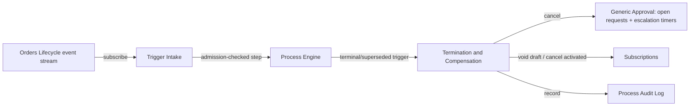
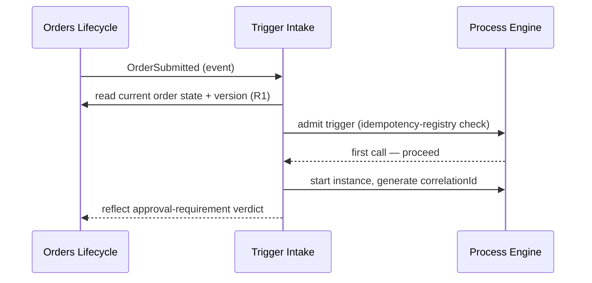
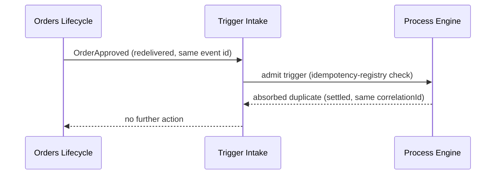
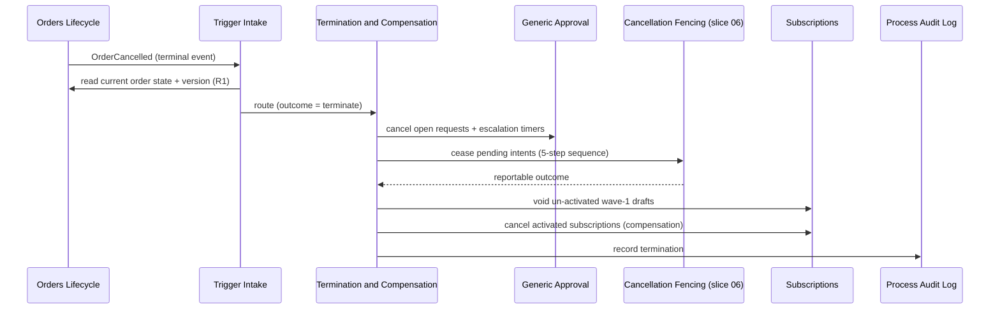

<!-- CONFLUENCE_TITLE: [BSS]: Orders Workflow — Triggers and Start (Slice 2) -->
<!-- Related: ../DESIGN.md, ../PRD.md, ./01-foundation.md, ./README.md | Owners: BSS Orders team -->

# DESIGN — Triggers and Start (Slice 2)

<!-- toc -->

- [1. Architecture Overview](#1-architecture-overview)
  - [1.1 Architectural Vision](#11-architectural-vision)
  - [1.2 Architecture Drivers](#12-architecture-drivers)
  - [1.3 Architecture Layers](#13-architecture-layers)
- [2. Principles & Constraints](#2-principles--constraints)
  - [2.1 Design Principles](#21-design-principles)
  - [2.2 Constraints](#22-constraints)
- [3. Technical Architecture](#3-technical-architecture)
  - [3.1 Domain Model](#31-domain-model)
  - [3.2 Component Model](#32-component-model)
  - [3.3 API Contracts](#33-api-contracts)
  - [3.4 Internal Dependencies](#34-internal-dependencies)
  - [3.5 External Dependencies](#35-external-dependencies)
  - [3.6 Interactions & Sequences](#36-interactions--sequences)
  - [3.7 Database schemas & tables](#37-database-schemas--tables)
  - [3.8 Deployment Topology](#38-deployment-topology)
- [4. Additional context](#4-additional-context)
- [5. Traceability](#5-traceability)

<!-- /toc -->

- [ ] `p1` - **ID**: `cpt-cf-bss-orders-workflow-design-triggers-and-start`

## 1. Architecture Overview

### 1.1 Architectural Vision

This slice is the single admission point for process execution: it decides, for every Orders
Lifecycle event this gear is allowed to react to, whether a process instance starts, advances, or
terminates. It sits directly on top of the process engine defined in
[`01-foundation.md`](./01-foundation.md) — trigger intake is itself a step invocation through the
engine's step-executor entry point (§3.3 of that document), so every start, resume, and terminate
decision inherits the engine's idempotency, audit-before-advance, and replay guarantees rather
than reimplementing them.

The vision has three parts. First, the trigger vocabulary is **closed**: this gear starts or
advances processing on exactly nine named Orders Lifecycle events and nothing else, so the
question "does this event start a process?" has one authoritative table, not a growing set of
ad-hoc subscriptions. Second, admission is **stateful, not stateless**: before acting on any
trigger, the handler reads current order state and version from Orders Lifecycle and compares it
against the process instance's own pinned `orderId` + `orderVersion`, so redelivered and
out-of-order triggers are resolved against ground truth rather than against whatever arrived on
the wire. Third, termination is **symmetric with start**: a terminal order event and a
superseded-version supersession are handled by the same compensation-and-void path, because both
mean the same thing operationally — stop spending resources on a commercial artifact that no
longer needs this gear's attention, and don't leave wave-1 draft artifacts for a platform TTL this
gear does not own.

### 1.2 Architecture Drivers

#### Functional Drivers

| Requirement | Design Response |
|-------------|------------------|
| `cpt-cf-bss-orders-workflow-fr-owf-start-contract` | §2.1 closed trigger vocabulary; §3.2 Trigger Intake component; §3.6 start-on-trigger and duplicate-absorption sequences |
| `cpt-cf-bss-orders-workflow-fr-owf-terminal-order-events` | §2.1 single-active-instance rule; §3.2 Termination and Compensation component; §3.6 terminal-event sequence; §4 void-on-superseded-version rule |
| `cpt-cf-bss-orders-workflow-fr-owf-boundary-binding` | §3.4 Internal Dependencies (by-reference binding to Orders Lifecycle seam R1–R5) |
| `cpt-cf-bss-orders-workflow-fr-owf-process-state-nonauth` | §3.1 domain model keeps order state fields read-through, never cached as authoritative |

#### NFR Allocation

| NFR ID | NFR Summary | Allocated To | Design Response | Verification Approach |
|--------|-------------|--------------|------------------|------------------------|
| `cpt-cf-bss-orders-workflow-nfr-owf-audit` | 100% audit coverage of process state transitions, zero silent drops | Termination and Compensation component; process audit log (owned by §4.6 of `01-foundation.md`) | Every start, resume, terminate, and void decision is written to `owf_audit_entry` before the instance's state is considered advanced | Audit-log coverage check over the transition classes named in this slice, per the shared engine gate |
| `cpt-cf-bss-orders-workflow-nfr-owf-idempotency` | Exactly one active workflow per order id at a time | Trigger Intake component; `owf_process_instance` (engine-owned) | The invariant is carried by the partial unique index `UNIQUE (order_id) WHERE terminal_outcome IS NULL` on `owf_process_instance`, not by a read-then-insert: the start step inserts unconditionally and the index arbitrates. The loser of that race is routed by trigger kind, never left as a choice — a second `OrderSubmitted` for an order that already holds an active instance resolves to `absorbed-duplicate` (no second instance, no second verdict query, no second reflection); `OrderAmended` never takes the second-instance path at all, it resolves to `supersede`, which settles the prior instance and inserts the new one inside one transaction (§4) | Concurrent-start regression test driving two workers at one redelivered `OrderSubmitted` and asserting that exactly one `owf_process_instance` row survives, that the unique-index violation is recorded as `absorbed-duplicate`, and that the losing worker issues no Lifecycle call |

#### Key ADRs

| ADR ID | Decision Summary |
|--------|-------------------|
| `cpt-cf-bss-orders-workflow-adr-process-state-non-authoritative` | Process execution state is authoritative for progress only; order state is always read through to Orders Lifecycle — binding on how this slice resolves out-of-order triggers |
| `cpt-cf-bss-orders-workflow-adr-idempotency-key-composition` | Governs how this slice's idempotency keys for Lifecycle calls are composed, distinct from the process `correlationId` |
| `cpt-cf-bss-orders-workflow-adr-saga-compensable-no-pivot` | Governs the compensation leg this slice invokes on terminal-event and superseded-version termination |

### 1.3 Architecture Layers

```text
Orders Lifecycle event stream
        |
        v
+----------------------------+
| Trigger Intake             |  admission: closed vocabulary check,
| (this slice)                |  current-state read, out-of-order /
+----------------------------+  duplicate resolution
        |
        v
+----------------------------+
| Process Engine (01-foundation.md) |  process-instance aggregate,
| step executor, idempotency        |  step log, audit log, timers
| registry, timer service, audit    |
+----------------------------+
        |
        v
+----------------------------+
| Termination & Compensation |  cancel approvals/timers, cease
| (this slice)                |  provisioning intents, run
+----------------------------+  compensation, void wave-1 drafts
```

| Layer | Responsibility | Technology |
|-------|-----------------|------------|
| Presentation | None — this slice has no external caller-facing surface; it is an internal event/command handler | n/a |
| Application | Trigger Intake, out-of-order/duplicate resolution, Termination & Compensation handlers | Rust handler modules registered against the engine's step-executor API |
| Domain | Trigger event record, process correlation record, termination decision | Rust structs, engine-owned aggregate fields |
| Infrastructure | Event subscription or command intake transport (§3.3), Orders Lifecycle client | `toolkit` event-consumer / API client, per §3.4 |

## 2. Principles & Constraints

### 2.1 Design Principles

#### The trigger vocabulary is closed and exhaustive

- [ ] `p1` - **ID**: `cpt-cf-bss-orders-workflow-principle-closed-trigger-vocabulary`

This gear starts or advances processing on exactly nine Orders Lifecycle triggers and no others:
`OrderSubmitted`, `OrderApproved`, `OrderAmended`, `OrderHeld`, `OrderResumed`,
`OrderAcceptanceRecorded`, and the three terminal events `OrderCancelled`, `OrderExpired`,
`OrderRejected`. Any other Orders Lifecycle event reaching the intake transport is discarded
without starting, advancing, or terminating a process instance. A closed list is what makes "does
event X touch a process instance" answerable by table lookup instead of by reading handler code.

**ADRs**: `cpt-cf-bss-orders-workflow-adr-process-state-non-authoritative`

#### Exactly one active instance per order id

- [ ] `p1` - **ID**: `cpt-cf-bss-orders-workflow-principle-single-active-instance`

At most one process instance is active for a given `orderId` at any time. `OrderAmended`
supersedes — it does not add a concurrent sibling: processing for the prior `orderVersion` is
terminated (§Process Termination behavior, applied to supersession) and a new instance starts for
the new version. This is what makes "which instance owns this order right now" a single-row
lookup rather than a set requiring reconciliation.

The invariant is **enforced by the database, not by the handler's read**. `owf_process_instance`
carries the partial unique index `UNIQUE (order_id) WHERE terminal_outcome IS NULL`; the start
step inserts and lets the index refuse the second writer. A read-then-insert admission check
cannot carry this invariant: two workers consuming one redelivered `OrderSubmitted` both read
"none", both insert, and the order acquires two instances, two verdict queries and two independent
compensation ledgers. The pre-insert read that §2.1 "ground truth is read before acting" mandates
still happens — it is what supplies the *routing* decision (start, advance, supersede, terminate)
— but it is never the thing that guarantees single occupancy. A unique-violation on insert is not
an error path: it is the `absorbed-duplicate` admission outcome (§3.1), and the losing worker
makes no Lifecycle call at all.

Because the `correlationId` is derived deterministically (§2.1 layered correlation), the winning
and losing worker derive the same identity for the instance, so the loser can resolve the winner's
row without a second lookup key.

**ADRs**: `cpt-cf-bss-orders-workflow-adr-process-state-non-authoritative`

#### Correlation is layered, not collapsed

- [ ] `p2` - **ID**: `cpt-cf-bss-orders-workflow-principle-layered-correlation`

Three identifiers exist at three different scopes and are never conflated: the process
`correlationId` (fixed once at instance start, identifies the whole process instance across
its lifetime), the per-call idempotency key (per §4.5 of `01-foundation.md`, scoped to one
Lifecycle or Subscriptions call and its retries), and the downstream transition-request identifier
(scoped to one Subscriptions `TransitionRequest`). Collapsing any two of these into one field is
what makes duplicate absorption and out-of-order resolution ambiguous.

The `correlationId` is **derived, not minted**: it is a UUIDv5 over
(`resource_tenant_id`, `orderId`, `orderVersion`), the same deterministic-identity rule the
approval slice applies to `gateId`. Two consequences follow, and both are load-bearing elsewhere
in this slice. A replay after a crash re-derives the identity it was about to insert instead of
minting a second one, which is what makes the supersession step (§4) and the dead-letter redrive
(§4) safely repeatable. And the identity exists *before* the instance row does, so the intake
dedup record (below) can be written and settled against a known `correlationId` even for a trigger
whose whole purpose is to create the instance.

**ADRs**: `cpt-cf-bss-orders-workflow-adr-idempotency-key-composition`

#### Duplicates are absorbed, never re-executed

- [ ] `p1` - **ID**: `cpt-cf-bss-orders-workflow-principle-idempotent-duplicate-absorption`

Redelivered triggers are recognized and absorbed before any handler logic runs. An absorbed
duplicate produces no second start, no second advancement, and no second termination — it is a
no-op against an already-settled outcome.

**The dedup store is the engine idempotency registry** (`owf_idempotency_registry`,
`01-foundation.md` §4.3 and §3.7), entered under `operation = 'trigger-intake'`. It is not
`owf_step_log`: that table is keyed on `step_log_id` with no uniqueness on an event identifier,
so it can record that a trigger was seen but cannot refuse the second sighting.

**The dedup key is `resource_tenant_id + eventId` — the `correlationId` is not a component of
it.** A key that pairs the event id with the `correlationId` is unformable exactly where duplicate
suppression matters most: at `OrderSubmitted` the instance does not exist yet, so under that rule
the first delivery and its redelivery would each compose a key against a different (or absent)
correlation and both would be admitted as first calls. Keying on the event id alone, namespaced by
tenant per `01-foundation.md` §4.5, is well-formed at every trigger including the start trigger,
and it is the same event id the transport already guarantees stable across redeliveries (§2.2).
The `correlationId` still rides the registry row — in `owf_idempotency_registry.correlation_id`,
supplied by the deterministic derivation above — as the cross-reference that lets an absorbed
duplicate report *which* instance already settled it, but it never participates in key equality.

The registry's outcome set applies here unchanged (`01-foundation.md` §4.3): first call, absorbed
duplicate, key conflict, still-processing conflict, lease-expired, aged-out. Two of them deserve a
note at this call site. A **key conflict** — the same event id presented with a materially different
payload — is a publisher defect, not a duplicate: the trigger is refused and dead-lettered under the
rule in §4, never admitted under a fresh key. And an **aged-out** intake key is not a licence to
re-admit the trigger blind: admission is re-derived from current Lifecycle state and the instance
table (§3.3), which is exactly what the read-before-act rule already requires, and which resolves a
long-delayed redelivery to `ignored-superseded` or `ignored-terminated` rather than to a second
start.

**ADRs**: `cpt-cf-bss-orders-workflow-adr-idempotency-key-composition`

#### Ground truth is read before acting

- [ ] `p1` - **ID**: `cpt-cf-bss-orders-workflow-principle-read-before-act`

Before acting on any trigger, the handler reads current order state and `orderVersion` from
Orders Lifecycle (per Orders Lifecycle seam R1, see
[`../../../orders-lifecycle/docs/design/06-workflow-seam.md`](../../../orders-lifecycle/docs/design/06-workflow-seam.md)
§4.1). A trigger carrying a superseded `orderVersion` is ignored for start/advance purposes and,
where it ends processing of the prior version, routed to the termination-and-void path instead
(§4). This is the mechanism that makes out-of-order and stale triggers safe without a global
sequencing guarantee from the transport.

The comparison this rule rests on has **three** branches, not two — the event's version can be
equal to, older than, or *newer* than what the read returns, and the third is not a pathology but
the ordinary consequence of reading a replicated store. The full rule, including the lag branch
and its bound, is stated once in §4 (**Version-comparison rule**) and is normative there.

**ADRs**: `cpt-cf-bss-orders-workflow-adr-process-state-non-authoritative`

### 2.2 Constraints

#### The transport choice is settled here, not deferred

- [ ] `p2` - **ID**: `cpt-cf-bss-orders-workflow-constraint-trigger-transport-is-event-subscription`

This slice settles the transport the PRD leaves open (event subscription vs. command): trigger
intake is an **event subscription** to the Orders Lifecycle state-event stream, not a command API
this gear exposes for Lifecycle to call. Rationale: Orders Lifecycle is the publisher of the nine
trigger events regardless of which gear consumes them (other consumers already subscribe to the
same stream, e.g. read-projection consumers); a command-based push from Lifecycle would require
Lifecycle to know this gear's availability and retry semantics, inverting the ownership Lifecycle
already holds as event publisher. Event subscription also gives this slice, for free, the
at-least-once-plus-dedup-by-event-id delivery model it needs for duplicate absorption (§2.1),
without inventing a second delivery contract. The five calls this slice makes **outward** to
Orders Lifecycle (to reflect verdicts, request transitions, etc.) remain synchronous command calls
against the Lifecycle API, per Orders Lifecycle seam §3.3 — the transport decision here concerns
inbound trigger intake only.

**ADRs**: `cpt-cf-bss-orders-workflow-adr-outbox-process-events`

#### No caching of order state across triggers

- [ ] `p2` - **ID**: `cpt-cf-bss-orders-workflow-constraint-no-order-state-cache`

The handler MUST NOT cache order state or `orderVersion` from one trigger to reuse on the next;
each trigger re-reads current state from Orders Lifecycle. Caching would reintroduce exactly the
staleness this slice's out-of-order resolution rule exists to prevent.

**ADRs**: `cpt-cf-bss-orders-workflow-adr-process-state-non-authoritative`

## 3. Technical Architecture

### 3.1 Domain Model

**Technology**: Rust structs, engine-owned aggregate fields (per `01-foundation.md` §3.1)

**Location**: [`01-foundation.md`](./01-foundation.md) §3.1 — this slice adds two entities on top
of the engine's process-instance aggregate; it does not redefine that aggregate.

**Core Entities**:

- [ ] `p2` - **ID**: `cpt-cf-bss-orders-workflow-entity-trigger-event-record`

| Entity | Description | Schema |
|--------|-------------|--------|
| `TriggerEventRecord` | The intake-side record of one consumed Orders Lifecycle event: event id, event kind (one of the nine closed vocabulary values), `orderId`, `orderVersion` as carried on the event, `resource_tenant_id`, received-at timestamp, and the admission outcome (the eight-value set below) | Two engine-owned rows, not one: the **dedup** record is `owf_idempotency_registry` under `operation = 'trigger-intake'`, key `resource_tenant_id + eventId` (§2.1), which is what refuses a redelivery; the **execution** record is the `owf_step_log` entry the admission step writes, which is what carries the outcome and the attempt history. Per `01-foundation.md` §3.7 |
| `ProcessCorrelation` | The process `correlationId` derived at instance start as a UUIDv5 over (`resource_tenant_id`, `orderId`, `orderVersion`), plus the `orderId` + `orderVersion` pair it is pinned to; distinct from any per-call idempotency key or downstream transition-request identifier (§2.1) | Field on `owf_process_instance`, per `01-foundation.md` §3.7 |

**Admission outcomes** — the closed set an admission decision resolves to. Every trigger resolves
to exactly one of these eight values; there is no default and no unlisted fall-through, because an
unlisted case is precisely how a trigger gets silently dropped by one implementation and acted on
by another:

| Outcome | Meaning | Effect |
|---------|---------|--------|
| `start` | No instance exists for the order, and the trigger is a start trigger | Insert `owf_process_instance` at the derived `correlationId`; proceed into slice 03 |
| `advance` | An active instance exists, pinned to the event's `orderVersion` | Deliver the trigger to the owning instance as a step |
| `supersede` | An active instance exists at an older `orderVersion` than the amended order | Settle the prior instance and insert the new one in one transaction (§4) |
| `terminate` | An active instance exists and the trigger is a terminal order event | Route to Termination and Compensation (§3.2) |
| `ignored-superseded` | The event's `orderVersion` is older than the order's current version and no instance is active for the event's version | Record and drop; no Lifecycle call |
| `absorbed-duplicate` | The intake dedup key is already settled, or the start insert lost the partial-unique-index race | Return the settled outcome; no second effect of any kind |
| `no-active-instance` | A non-start trigger arrived for an order with no instance at all — the start trigger was never admitted (a dead-lettered `OrderSubmitted`, or a start that failed admission during a Lifecycle read outage) | **Never** start an instance at the trigger's state. Dead-letter the trigger and raise an operator incident carrying a redrive operation (§4) |
| `ignored-terminated` | The order's instance carries a non-null `terminal_outcome` | Record and drop. A redelivered terminal event against an already-terminated instance is absorbed here rather than re-running compensation |

**Relationships**:
- `TriggerEventRecord` → `ProcessCorrelation`: a `TriggerEventRecord` that results in a start
  creates exactly one `ProcessCorrelation`; every subsequent `TriggerEventRecord` for the same
  order resolves to that same `ProcessCorrelation` until termination.
- `ProcessCorrelation` → `owf_process_instance` (engine-owned, `01-foundation.md` §3.7): one
  `ProcessCorrelation` per active instance; enforces the single-active-instance-per-order
  principle (§2.1).

### 3.2 Component Model



#### Trigger Intake

- [ ] `p1` - **ID**: `cpt-cf-bss-orders-workflow-component-trigger-intake`

##### Why this component exists

Every process instance needs exactly one admission decision point; without one, start/advance
logic would be duplicated across every handler that could plausibly be a process entry point.

##### Responsibility scope

Owns: recognizing the closed trigger vocabulary (§2.1); reading current order state and version
from Orders Lifecycle before acting; resolving out-of-order and superseded-version triggers per
the version-comparison rule (§4); resolving every trigger to exactly one of the eight admission
outcomes (§3.1) and routing it accordingly; absorbing duplicate triggers on the key
`resource_tenant_id + eventId` through the engine's idempotency registry under
`operation = 'trigger-intake'` (`01-foundation.md` §4.3); admitting or refusing inbound
Subscriptions confirmations on the version rule (§4); and **arming the process-lifetime ceiling on
the start path** — in the same transaction that inserts the `owf_process_instance` row, a durable
timer with `timer_kind = process-lifetime` is armed at `now() + max_process_lifetime`
(`08-hold-and-cancel.md` §2.2, 90 days, **Accepted**). It is armed here
and nowhere else because this is the only step that creates an instance, and the ceiling must cover
an order that is held and resumed repeatedly before it ever reaches fulfillment — a phase in which
no other clock is running. It is non-pausable: no hold pauses it, no resume extends it, and the
Suspension Controller is forbidden from writing a pause record against it.

##### Responsibility boundaries

Does not itself execute approval, fulfillment, or provisioning logic — those are the concern of
slices 03–07. Does not determine the approval-requirement verdict (that is the policy owner, per
Orders Lifecycle seam R2). Does not write order state directly; all Lifecycle-facing effects go
through idempotent calls to Orders Lifecycle's seam operations.

##### Related components (by ID)

- `cpt-cf-bss-orders-workflow-component-step-executor` (from `01-foundation.md`) — depends on;
  every admission decision is executed as a step through this component.
- `cpt-cf-bss-orders-workflow-component-termination-and-compensation` — calls, when the trigger is
  terminal or the trigger for a superseded version ends processing of the prior version.

#### Termination and Compensation

- [ ] `p1` - **ID**: `cpt-cf-bss-orders-workflow-component-termination-and-compensation`

##### Why this component exists

A process left running against a terminally closed or superseded order would keep issuing
provisioning intents and approval requests for a commercial artifact this gear no longer has
reason to act on; one component owns collapsing an active instance to a terminated one safely.

##### Responsibility scope

Owns: cancelling open approval requests and their escalation timers; **invoking slice 06's
cancellation fencing to cease pending provisioning intents**; running compensation for steps
already completed, per the compensation log declared in `06-saga-and-compensation.md`; voiding any
wave-1 draft subscriptions not yet activated (never leaving a draft for a platform TTL this gear
does not own); recording the termination in the process audit log. Applies the identical void
behavior whether triggered by a terminal order event or by a trigger for a superseded
`orderVersion`.

"Ceasing pending provisioning intents" is **not** a direct void/cancel call and is not this
component's own procedure. It is an invocation of
`cpt-cf-bss-orders-workflow-component-cancellation-fencer` (`06-saga-and-compensation.md` §3.2),
whose five ordered steps — stop new dispatch, identify in-flight intents, reconcile their terminal
outcomes, compensate every created subscription including late successes, verify no active
subscription remains — are the only sequence that makes "pending" a settled question. Jumping
straight to void/cancel would compensate against the intents this component knows about and leave
an intent that was in flight at termination to succeed afterwards, creating exactly the stranded
active subscription `cpt-cf-bss-orders-workflow-adr-saga-compensable-no-pivot` exists to prevent.
No terminal or superseded outcome is reported to Orders Lifecycle before fencing reaches a
reportable outcome.

##### Responsibility boundaries

Does not decide *whether* to terminate — that decision belongs to Trigger Intake, which routes to
this component only after resolving the trigger against current Lifecycle state. Does not call OSS
Provisioning directly; all subscription voiding and cancellation goes through Subscriptions only
(Orders Lifecycle seam R3). Does not compute or adjust price; it carries opaque pricing references
through unchanged where compensation evidence requires them.

##### Related components (by ID)

- `cpt-cf-bss-orders-workflow-component-trigger-intake` — called by, on terminal/superseded-version
  routing.
- `cpt-cf-bss-orders-workflow-component-step-executor` (from `01-foundation.md`) — depends on; the
  compensation run executes as engine steps with the same audit-before-advance guarantee.
- `cpt-cf-bss-orders-workflow-component-cancellation-fencer` (from `06-saga-and-compensation.md`) —
  calls, and waits on; this is the sole mechanism by which pending provisioning intents are ceased.

### 3.3 API Contracts

- [ ] `p1` - **ID**: `cpt-cf-bss-orders-workflow-interface-trigger-intake-api`

- **Contracts**: `cpt-cf-bss-orders-workflow-contract-owf-lifecycle-transition`
- **Technology**: Event subscription to the Orders Lifecycle state-event stream (§2.2); at-least-once delivery with consumer-side de-dup by event id
- **Location**: Trigger Intake component (§3.2); consumes events published by Orders Lifecycle per its own event contract

**Endpoints Overview**:

This slice exposes no inbound HTTP/RPC surface; intake is event-subscription only. The outbound
calls it makes are the five Orders Lifecycle seam operations, owned and specified by Orders
Lifecycle (see §3.4):

| Method | Path | Description | Stability |
|--------|------|--------------|-----------|
| `EVENT` | `OrderSubmitted` \| `OrderApproved` \| `OrderAmended` \| `OrderHeld` \| `OrderResumed` \| `OrderAcceptanceRecorded` \| `OrderCancelled` \| `OrderExpired` \| `OrderRejected` | The nine closed-vocabulary triggers this slice admits (§2.1); any other event kind on the stream is not consumed by this slice | unstable |

**Trigger-to-outcome table (authoritative)**

This is the table §1.1 and §2.1 promise: the single place that answers "what does event X do to a
process instance". It is evaluated *after* the dedup check (§2.1) and *after* the version
comparison (§4) — a settled dedup key resolves to `absorbed-duplicate` and a version mismatch
resolves to `ignored-superseded` or to the lag branch before any row below is reached. Outcome
names are the closed set from §3.1.

| Trigger | No instance for the order | Active instance, versions agree | Instance already terminated | Effect on the admitted path |
|---------|---------------------------|----------------------------------|------------------------------|------------------------------|
| `OrderSubmitted` | `start` | `absorbed-duplicate` | `absorbed-duplicate` if the terminated instance is pinned to the same version; otherwise `no-active-instance` | Insert the instance at the derived `correlationId`; hand to slice 03 for verdict acquisition and reflection |
| `OrderApproved` | `no-active-instance` | `advance` | `ignored-terminated` | Hand to slice 04; this is the **only** path into fulfillment start (§4) |
| `OrderAmended` | `start` | `supersede` | `start` | Settle the prior instance and insert the new one in one transaction (§4); prior-version compensation runs from the settled instance's ledger |
| `OrderHeld` | `no-active-instance` | `advance` | `ignored-terminated` | Hand to slice 08's Suspension Controller |
| `OrderResumed` | `no-active-instance` | `advance` | `ignored-terminated` | Hand to slice 08's Resume Coordinator; a resume with no open suspension is slice 08's to refuse, not this slice's to invent |
| `OrderAcceptanceRecorded` | `no-active-instance` | `advance` | `ignored-terminated` | Hand to slice 04's fulfillment-acknowledgement step, which makes the Lifecycle `fulfillment-acknowledgement` seam call (R1/§3.4). This is the trigger that closes a fulfilled order's process; it opens no gate, dispatches no intent, and has no effect other than that acknowledgement |
| `OrderCancelled` | `ignored-terminated` | `terminate` | `ignored-terminated` | Route to Termination and Compensation (§3.2) |
| `OrderExpired` | `ignored-terminated` | `terminate` | `ignored-terminated` | As above. This is also the path by which a parked approval process (slice 03) reaches a terminal outcome when the Lifecycle `submitted` TTL elapses |
| `OrderRejected` | `ignored-terminated` | `terminate` | `ignored-terminated` | As above |

Two rows deserve their reasoning stated rather than inferred. `OrderApproved` with **no instance**
is `no-active-instance` and never `start`: starting an instance at the approved state would skip
approval execution entirely for an order that may genuinely have required a gate, and the design
has no way to tell that case apart from a lost start trigger. The three terminal events with **no
instance** are `ignored-terminated` rather than `no-active-instance` because there is nothing left
to compensate — an order that reached a terminal state without this gear ever having acted on it
needs no operator attention, whereas a lost start does.

### 3.4 Internal Dependencies

| Dependency Gear | Interface Used | Purpose |
|--------------------|----------------|----------|
| `orders-lifecycle` | Event stream (inbound, the nine triggers) and the five seam operations (outbound: `approval-reflection`, `begin-fulfillment`, `spawn-signal`, `fulfillment-acknowledgement`, `workflow-cancel`) per [`../../../orders-lifecycle/docs/design/06-workflow-seam.md`](../../../orders-lifecycle/docs/design/06-workflow-seam.md) §3.3 | Read current order state/version before acting (R1); reflect approval verdicts and decisions (R2); report begin-fulfillment, activation, acknowledgement and cancel outcomes |
| `generic-approval` | SDK client (via slice 03) | Cancel open approval requests and their escalation timers on termination |
| `subscriptions` | SDK client (via slice 05/06) | Void un-activated wave-1 draft subscriptions and cancel activated subscriptions during compensation, per R3 |

**By-reference binding to the Orders Lifecycle seam (R1–R5)**: per Orders Lifecycle seam R1–R5,
see [`../../../orders-lifecycle/docs/design/06-workflow-seam.md`](../../../orders-lifecycle/docs/design/06-workflow-seam.md)
§4.1–§4.6. This slice does not restate those rules; it states only the execution consequences it
is bound by:

- **R1** — every order-state read this slice performs before acting on a trigger, and every
  transition this slice requests, goes through Orders Lifecycle via an idempotent call; this
  slice's own step log and audit log are authoritative for process progress only, never presented
  as order state.
- **R2** — approval **execution** (routing, escalation timers) is owned by this gear's slice 03,
  while the approval-**requirement** verdict is determined by the policy owner and merely reflected
  onward to Orders Lifecycle by this slice's `OrderSubmitted` handling.
- **R3** — every subscription creation, activation, void, and cancel intent this slice's
  Termination and Compensation component issues goes only to Subscriptions; OSS Provisioning is
  never invoked directly, for compensation exactly as for forward execution.
- **R4** — this slice performs no price computation; the only price value it touches is the
  stored non-authoritative resolved total read solely to place it in the `OrderApprovalRequest`
  context (owned by slice 03), and pricing references it carries during compensation are opaque
  pass-through identifiers.
- **R5** — this slice never mirrors a downstream Subscriptions `TransitionRequest`'s per-request
  status into order state; it records that status against its own process/task record only.

**Dependency Rules** (per project conventions):
- No circular dependencies
- Always use SDK modules for inter-gear communication
- No cross-category sideways deps except through contracts
- Only integration/adapter gears talk to external systems
- `SecurityContext` must be propagated across all in-process calls

### 3.5 External Dependencies

None owned by this slice. All external effects (approval routing, subscription provisioning)
happen through `generic-approval` and `subscriptions` per §3.4; this slice holds no adapter to any
system beyond those two internal gears and Orders Lifecycle — the same absence-as-enforcement
pattern the Orders Lifecycle seam design uses for R3.

**Dependency Rules** (per project conventions):
- No circular dependencies
- Always use SDK modules for inter-gear communication
- No cross-category sideways deps except through contracts
- Only integration/adapter gears talk to external systems
- `SecurityContext` must be propagated across all in-process calls

### 3.6 Interactions & Sequences

#### Start on trigger

**ID**: `cpt-cf-bss-orders-workflow-seq-start-on-trigger`

**Use cases**: `cpt-cf-bss-orders-workflow-fr-owf-start-contract`

**Actors**: `cpt-cf-bss-orders-workflow-actor-owf-orders-lifecycle`



**Description**: On a fresh `OrderSubmitted`, the intake reads current order state, derives the
process `correlationId` (§2.1), and inserts the instance. Single occupancy is decided by the
partial unique index on `owf_process_instance`, not by the preceding read: a concurrent worker's
insert fails the index and resolves to `absorbed-duplicate` without issuing a Lifecycle call. The
winner proceeds into approval-verdict acquisition and reflection (owned by slice 03).

#### Duplicate absorption

**ID**: `cpt-cf-bss-orders-workflow-seq-duplicate-absorption`

**Use cases**: `cpt-cf-bss-orders-workflow-fr-owf-start-contract`

**Actors**: `cpt-cf-bss-orders-workflow-actor-owf-orders-lifecycle`



**Description**: A redelivered event with the same event id resolves against the idempotency
registry as an already-settled outcome and produces no second advancement.

#### Terminal-event compensation, void, and audit

**ID**: `cpt-cf-bss-orders-workflow-seq-terminal-termination`

**Use cases**: `cpt-cf-bss-orders-workflow-fr-owf-terminal-order-events`

**Actors**: `cpt-cf-bss-orders-workflow-actor-owf-orders-lifecycle`, `cpt-cf-bss-orders-workflow-actor-owf-generic-approval`, `cpt-cf-bss-orders-workflow-actor-owf-subscriptions`



**Description**: A terminal order event routed to `terminate` triggers cancellation of open
approval requests and escalation timers, then cessation of pending provisioning intents **through
slice 06's cancellation-fencing sequence** — never by a direct void or cancel call — then
compensation for completed steps including voiding un-activated wave-1 drafts, and an audit-log
entry recording the termination. No terminal outcome is reported to Orders Lifecycle until fencing
reaches a reportable outcome. The same sequence runs, unchanged, when a trigger for a superseded
`orderVersion` ends processing of the prior version instead of a terminal event (§4).

### 3.7 Database schemas & tables

No new tables. `TriggerEventRecord` and `ProcessCorrelation` (§3.1) are represented on
engine-owned tables per `01-foundation.md` §3.7; this slice adds admission logic on top of those
tables, not new schema. Three engine-owned structures carry this slice's invariants, and each is
named here so the invariant is attributable to a column rather than to prose:

| Structure | Owner | What this slice relies on it for |
|-----------|-------|----------------------------------|
| `owf_process_instance`, partial index `UNIQUE (order_id) WHERE terminal_outcome IS NULL` | Step executor (`01-foundation.md` §3.7) | Single active instance per order (§2.1). The insert, not a preceding read, is what enforces it |
| `owf_idempotency_registry`, `operation = 'trigger-intake'`, key `resource_tenant_id + eventId` | Idempotency registry (`01-foundation.md` §4.3) | Duplicate trigger absorption (§2.1). Tenant-namespaced per `01-foundation.md` §4.5, so a key can never name another tenant's order |
| `owf_step_log` | Step executor | The admission outcome, attempt history and audit anchor for each consumed trigger. It is **not** a dedup store — it has no uniqueness on an event identifier |

### 3.8 Deployment Topology

- [ ] `p3` - **ID**: `cpt-cf-bss-orders-workflow-topology-trigger-intake`

Trigger Intake runs as a consumer group against the Orders Lifecycle event stream, co-located with
the process engine's runtime (per `01-foundation.md` §3.8); no separate deployment unit is
introduced by this slice.

## 4. Additional context

**Version-comparison rule.** The read-before-act gate (§2.1) compares the `orderVersion` carried
on the trigger against the `orderVersion` the Lifecycle read returns. The comparison has three
branches, and every trigger takes exactly one of them:

| Comparison | Branch | Rule |
|------------|--------|------|
| event version **==** read version | agree | Proceed to the trigger-to-outcome table (§3.3). This is the ordinary case |
| event version **<** read version | superseded | The trigger speaks for a version the order has moved past. Outcome `ignored-superseded`, except where an instance is still active for the event's version, in which case the trigger routes to termination-and-void for that instance (the void-on-superseded-version rule below) |
| event version **>** read version | **read lag** | The event is ahead of the read. This is not a superseded trigger and **MUST NOT** be treated as one, and it is not grounds to act on the event's version either |

The third branch is the one a two-way rule cannot express, and it is the common case rather than
an exotic one: Orders Lifecycle publishes the event and replicates the state write independently,
so any read served by a replica can legitimately trail an event that is already on the wire.
Treating it as `ignored-superseded` drops a live trigger permanently; treating it as "equal" acts
on a version the system of record has not confirmed, which is the precise thing read-before-act
exists to forbid.

Its rule: **re-read once against the Lifecycle primary** (seam R1, with the read directed past the
replica). If the primary agrees with the event, take the "agree" branch. If the primary still
trails the event, the trigger is **not admitted and not dropped** — it is negatively acknowledged
back to the transport and redelivered on the engine's retry ladder (`01-foundation.md` §4.5),
bounded by the inbound delivery cap of 5 deliveries. A trigger that exhausts the cap still ahead
of the primary is dead-lettered under the rule below, because at that point the disagreement is no
longer lag but a genuine divergence between the event stream and the system of record, and this
gear is not the component that can adjudicate it.

**Atomic supersession on `OrderAmended`.** Terminate-then-start is **one step with one commit
boundary**, not two steps. The supersession step runs under the idempotency key
`resource_tenant_id + orderId + newOrderVersion + supersede`, and inside a single database
transaction it (a) sets the prior instance's `terminal_outcome`, which removes that row from the
partial unique index, and (b) inserts the new instance at its derived `correlationId`. Both
effects commit or neither does.

The alternative — settle the termination, then create the instance — leaves a window in which a
crash strands the order with **zero** instances and no event in the closed nine-event vocabulary
that would ever create one: the `OrderAmended` that would have done so is by then a settled
idempotency key and resolves to `absorbed-duplicate` on redelivery. Two properties close that
window together. The transaction makes the pair atomic, and the deterministic `correlationId`
(§2.1) makes the step *replayable*: a replay that has already committed re-derives the same
identity, finds the row it was about to insert, and settles as a duplicate rather than minting a
second instance. Neither property alone is sufficient — a replayable step with two commit
boundaries still exposes the zero-instance state to anything reading in between.

The prior version's compensation is deliberately **outside** this transaction. It runs afterwards,
driven from the settled instance's own compensation ledger (`06-saga-and-compensation.md`) and
gated by cancellation fencing (§3.2), because it makes remote calls and is independently
replayable. What must not be deferred is the instance bookkeeping, and that is what the
transaction covers.

**Dead-lettered start triggers have a consumer and a redrive.** A start trigger that fails
admission — a Lifecycle read outage exhausting the delivery cap, or the lag branch above — parks
in `owf_dead_letter_record` (`01-foundation.md` §3.7). Parking is where most designs stop and the
order then sits in `submitted` with no instance, no timer and no owner. It does not stop here: a
parked start trigger is projected into the fulfillment-operator queue as an incident
(`07-manual-tasks.md`), scoped by `seller_tenant_id`, and carries one operation — **redrive**,
which re-submits the parked trigger through admission unchanged. Redrive is safe to press twice
because the `correlationId` it would create is derived, not minted (§2.1), so a redrive that races
a late natural redelivery loses the unique-index race and resolves to `absorbed-duplicate`. The
`no-active-instance` outcome (§3.1) raises the same incident for the downstream trigger that
arrived to find nothing there.

**Inbound Subscriptions confirmations carry a version too.** The superseded check above covers the
nine Lifecycle triggers. It is not the only inbound flow: Subscriptions confirmations — callback
or sweep-discovered — arrive against an `orderId` + `orderVersion` + `orderLineId` and can arrive
long after the version they were issued for has been superseded, because the amendment does not
recall an intent already in flight at Subscriptions.

The transport for those confirmations belongs to slice 05, and this slice exposes no endpoint for
them (§3.3); what this slice owns, and states here because it is the same rule applied to a second
inbound flow, is the version test they are admitted under.

A confirmation is admitted only when its `orderVersion` matches the pinned `orderVersion` of the
active instance. A confirmation whose version is superseded is **never** applied to the current
version's instance — the two versions may have different lines, different quantities and a
different plan, so applying it would record fulfillment evidence against work nobody ordered.
It is instead routed to the superseded version's terminated instance as a **late success** and
recorded on that instance's compensation ledger, which is exactly the input
`06-saga-and-compensation.md`'s fencing step 4 ("compensate every created subscription including
late successes") is defined to consume. A confirmation for a version this gear has no record of at
all is dead-lettered with the redrive-and-incident treatment above, never silently discarded — an
unaccounted-for active subscription is the one failure this gear's compensation model cannot
tolerate.

**Void-on-superseded-version rule.** The termination behavior specified for terminal order events
(cancel open approvals and escalation timers, cease pending provisioning intents, run
compensation, void un-activated wave-1 drafts, record in the process audit log) applies
identically when a trigger for a superseded `orderVersion` ends processing of the prior version —
for example, an `OrderAmended` trigger observed while a process instance is still active for the
pre-amendment version. The prior version's instance is not merely abandoned; it is terminated
through the same Termination and Compensation path, including voiding any wave-1 draft
subscriptions the prior version's processing created but never activated. This keeps "terminal
event" and "superseded by amendment" as two admission reasons that resolve to one termination
behavior, rather than two behaviors that could drift apart.

**Transport decision recap.** Trigger intake is an event subscription (§2.2), not a command
surface; the five outward calls to Orders Lifecycle remain synchronous per its seam contract
(§3.4). This keeps the direction of coupling consistent with Orders Lifecycle's role as publisher
of order-state events.

**What this slice does not decide.** The approval-requirement verdict computation (R2), the
fulfillment plan and activation barrier (slice 04), the provisioning-intent lifecycle (slice 05),
and the compensation step declarations themselves (slice 06) are out of scope here; this slice
only decides *when* a process starts, advances, or terminates, and hands off to those slices for
*how*.

## 5. Traceability

- **PRD**: [`../PRD.md`](../PRD.md) — §6.1 Workflow Start Contract and Process Termination on
  Terminal Order Events; §6.5 Binding to the Lifecycle Seam Rules; §12 AC 12–15a (Boundary with
  Orders Lifecycle R1–R5)
- **ADRs**: [`../ADR/0003-cpt-cf-bss-orders-workflow-adr-process-state-non-authoritative.md`](../ADR/0003-cpt-cf-bss-orders-workflow-adr-process-state-non-authoritative.md),
  [`../ADR/0006-cpt-cf-bss-orders-workflow-adr-idempotency-key-composition.md`](../ADR/0006-cpt-cf-bss-orders-workflow-adr-idempotency-key-composition.md),
  [`../ADR/0005-cpt-cf-bss-orders-workflow-adr-saga-compensable-no-pivot.md`](../ADR/0005-cpt-cf-bss-orders-workflow-adr-saga-compensable-no-pivot.md),
  [`../ADR/0008-cpt-cf-bss-orders-workflow-adr-outbox-process-events.md`](../ADR/0008-cpt-cf-bss-orders-workflow-adr-outbox-process-events.md)
- **Engine**: [`01-foundation.md`](./01-foundation.md) — step-executor API, idempotency registry,
  durable timer service, audit log, event outbox this slice runs on
- **Boundary reference (by-reference, not restated)**: [`../../../orders-lifecycle/docs/design/06-workflow-seam.md`](../../../orders-lifecycle/docs/design/06-workflow-seam.md)
  §3.3 (the five seam operations), §4.1–§4.6 (normative R1–R5 consequences)
- **Consumers**: `03-approval-execution.md` (approval start on `OrderSubmitted`),
  `04-fulfillment-plan.md` (fulfillment start on `OrderApproved`),
  `06-saga-and-compensation.md` (compensation steps invoked on termination),
  `08-hold-and-cancel.md` (hold/resume handling for `OrderHeld`/`OrderResumed`)
