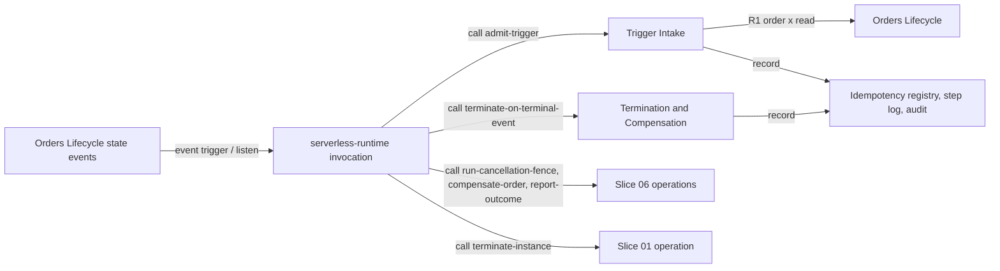
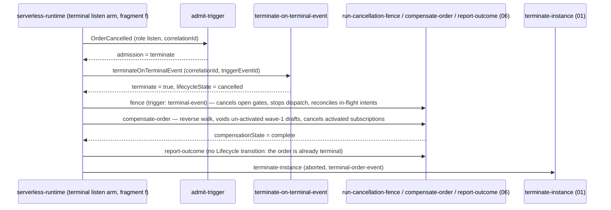
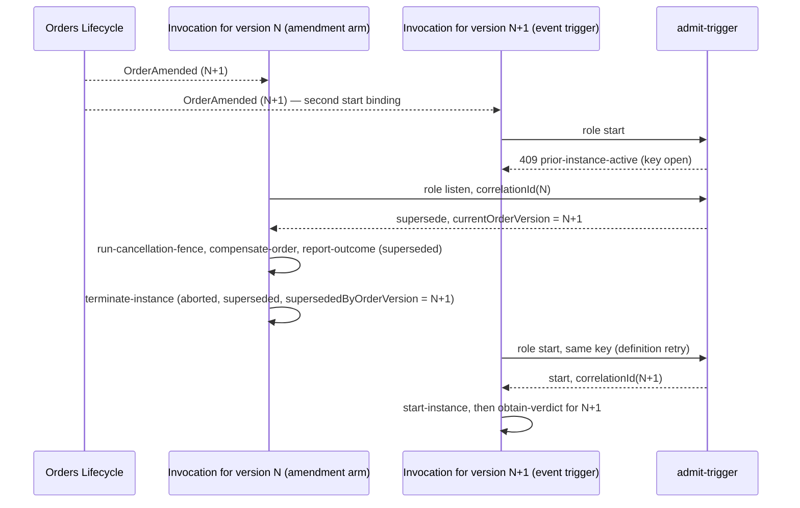

<!-- CONFLUENCE_TITLE: [BSS]: Orders Workflow — Triggers and Start (Slice 2) -->
<!-- Related: ../DESIGN.md, ../PRD.md, ./01-foundation.md, ./10-process-definition.md, ./README.md | Owners: BSS Orders team -->

# DESIGN — Triggers and Start (Slice 2)

<!-- toc -->

- [1. Architecture Overview](#1-architecture-overview)
  - [1.1 Architectural Vision](#11-architectural-vision)
  - [1.2 Architecture Drivers](#12-architecture-drivers)
  - [1.3 Architecture Layers](#13-architecture-layers)
- [2. Principles & Constraints](#2-principles--constraints)
  - [2.1 Design Principles](#21-design-principles)
  - [2.2 Constraints](#22-constraints)
- [3. Technical Architecture](#3-technical-architecture)
  - [3.1 Domain Model](#31-domain-model)
  - [3.2 Component Model](#32-component-model)
  - [3.3 API Contracts](#33-api-contracts)
  - [3.4 Internal Dependencies](#34-internal-dependencies)
  - [3.5 External Dependencies](#35-external-dependencies)
  - [3.6 Interactions & Sequences](#36-interactions--sequences)
  - [3.7 Database schemas & tables](#37-database-schemas--tables)
  - [3.8 Deployment Topology](#38-deployment-topology)
- [4. Additional context](#4-additional-context)
  - [4.1 Admission is a step operation, and its record is Orders'](#41-admission-is-a-step-operation-and-its-record-is-orders)
  - [4.2 Version-comparison rule](#42-version-comparison-rule)
  - [4.3 Supersession: unwind the prior version, then start the new one](#43-supersession-unwind-the-prior-version-then-start-the-new-one)
  - [4.4 Inbound Subscriptions confirmations carry a version too](#44-inbound-subscriptions-confirmations-carry-a-version-too)
  - [4.5 Void-on-superseded-version rule](#45-void-on-superseded-version-rule)
  - [4.6 What this slice does not decide](#46-what-this-slice-does-not-decide)
  - [4.7 Constraints this slice places on the definition](#47-constraints-this-slice-places-on-the-definition)
- [5. Traceability](#5-traceability)

<!-- /toc -->

- [ ] `p1` - **ID**: `cpt-cf-bss-orders-workflow-design-triggers-and-start`

## 1. Architecture Overview

### 1.1 Architectural Vision

This slice provides two **step operations** and sequences nothing itself. `admit-trigger`
(protected) is the admission decision for every Orders Lifecycle event the process reacts to: it
de-duplicates on `resource_tenant_id + eventId` in the idempotency registry, reads the order's
current state and version from Orders Lifecycle, compares them with the event and the instance
table, and returns one of eight admission outcomes. `terminate-on-terminal-event` (protected)
records that a terminal order event ends the instance and tells the definition which unwind to
run. The definition fragments that order them are
[`10 §3.6`](./10-process-definition.md#36-interactions--sequences) **(a)** — the start path,
`admitTrigger` then `startInstance` — and **(f)** — the amendment and terminal-event arm of every
competing `fork`, `admit-trigger` then either the supersede unwind or
`terminate-on-terminal-event` and the terminal unwind. Every other `listen` arm that consumes a
Lifecycle trigger (`OrderHeld`, `OrderResumed`, `OrderAcceptanceRecorded`, `OrderApproved`)
calls `admit-trigger` first as well (§4.7). Event transport, redelivery, delivery caps and dead
letters are the platform event-trigger path's
([`../ADR/0011`](../ADR/0011-cpt-cf-bss-orders-workflow-adr-flow-as-platform-definition.md));
what Orders keeps is the admission record: a step-log row and an audit entry for every attempt,
under the derived `correlationId`, whether or not an instance ever results.

The vision still has three parts. First, the trigger vocabulary is **closed**: the process reacts
to exactly nine named Orders Lifecycle events, so "does this event touch a process instance?" is
one table (§3.3), and ADR-0012's validation hook refuses a definition that `listen`s for anything
else. Second, admission is **stateful, not stateless**: before any effect, `admit-trigger` reads
current order state and version from Orders Lifecycle and compares them against the event and
the instance's pinned `orderId` + `orderVersion`, so redelivered and out-of-order triggers are
resolved against the system of record and never against a jq comparison over event data. Third,
termination is **symmetric with start**: a terminal order event and a superseding version run the
same unwind — cancellation fence, compensation walk, outcome report, `terminate-instance` — so
neither leaves a wave-1 draft for a platform TTL this gear does not own.

### 1.2 Architecture Drivers

#### Functional Drivers

| Requirement | Design Response |
|-------------|------------------|
| `cpt-cf-bss-orders-workflow-fr-owf-start-contract` | §2.1 closed trigger vocabulary; §3.3 `admit-trigger` and the trigger-to-outcome table; §3.6 start-on-trigger and duplicate-absorption sequences; start transport is the platform event trigger (§2.2) |
| `cpt-cf-bss-orders-workflow-fr-owf-terminal-order-events` | §2.1 single-active-instance rule; §3.3 `terminate-on-terminal-event`; §3.6 terminal-event and supersession sequences; §4.5 void-on-superseded-version rule |
| `cpt-cf-bss-orders-workflow-fr-owf-boundary-binding` | §3.4 Internal Dependencies (by-reference binding to Orders Lifecycle seam R1–R5); the only Lifecycle call this slice makes is the R1 read inside `admit-trigger` |
| `cpt-cf-bss-orders-workflow-fr-owf-process-state-nonauth` | §3.1 domain model keeps order state read-through, never cached; every admission attempt is recorded by Orders, not only by the platform's history |

#### NFR Allocation

| NFR ID | NFR Summary | Allocated To | Design Response | Verification Approach |
|--------|-------------|--------------|------------------|------------------------|
| `cpt-cf-bss-orders-workflow-nfr-owf-audit` | 100% audit coverage of process state transitions, zero silent drops | `admit-trigger`, `terminate-on-terminal-event`; audit writer of [`01`](./01-foundation.md) | Every admission attempt writes `step-start` and a settlement entry, including attempts before any instance exists (the pre-admission chain of `01 §3.7`); every termination decision is audited before the definition sees it | Audit-log coverage check over the admission and termination classes, per the shared engine gate; a platform-dead-lettered start leaves N audited attempts and no `instance-start` |
| `cpt-cf-bss-orders-workflow-nfr-owf-idempotency` | Exactly one active workflow per order id at a time | `admit-trigger` (routing), `start-instance` (01, insert); `owf_process_instance` partial unique index | The invariant is carried by `UNIQUE (order_id) WHERE terminal_outcome IS NULL`, not by a read-then-insert. `admit-trigger` refuses to settle `start` for a new version while the prior version's instance is non-terminal (§4.3), and `start-instance` lets the index arbitrate any race that remains | Concurrent-start test: two invocations for one `OrderSubmitted` yield one `owf_process_instance` row and one binding; supersession test: the new version's `start-instance` never commits before the prior instance's `terminate-instance` |

#### Key ADRs

| ADR ID | Decision Summary |
|--------|-------------------|
| `cpt-cf-bss-orders-workflow-adr-flow-as-platform-definition` | The flow is a platform definition; this slice's admission and termination decisions are step operations the definition calls, and intake transport is the platform event trigger |
| `cpt-cf-bss-orders-workflow-adr-definition-versioning-and-protected-steps` | Both operations are `protected`; `admit-trigger` precedes every other operation on a trigger arm, and the constraints of §4.7 are validation inputs |
| `cpt-cf-bss-orders-workflow-adr-references-not-payloads` | The definition hands this slice the event's id, kind, `orderId`, `orderVersion` and `resourceTenantId` only; the Lifecycle read happens inside the operation |
| `cpt-cf-bss-orders-workflow-adr-process-state-non-authoritative` | Process state is authoritative for progress only; order state is always read through to Orders Lifecycle — binding on how this slice resolves out-of-order triggers |
| `cpt-cf-bss-orders-workflow-adr-idempotency-key-composition` | Governs this slice's admission key and keeps it distinct from the process `correlationId` |
| `cpt-cf-bss-orders-workflow-adr-saga-compensable-no-pivot` | Governs the unwind the terminal-event and supersede paths run |

### 1.3 Architecture Layers

```text
Orders Lifecycle state events (event broker)
        |
        v
+----------------------------------------------+
| serverless-runtime (platform)                 |  event trigger starts an invocation;
| event trigger / running invocation `listen`   |  delivery, retry, dead letter
+----------------------------------------------+
        |  call task: POST /steps/admit-trigger, /steps/terminate-on-terminal-event
        v
+----------------------------------------------+
| Step envelope (01-foundation.md)             |  service principal, PDP execute,
| key resolution, deadline, settlement         |  idempotency registry, audit
+----------------------------------------------+
        |
        v
+----------------------------------------------+
| admit-trigger / terminate-on-terminal-event  |  Lifecycle read (R1), version
| (this slice)                                  |  comparison, outcome, record
+----------------------------------------------+
```

| Layer | Responsibility | Technology |
|-------|-----------------|------------|
| Presentation | None of its own — the two operations are routes on the internal step surface of [`01 §3.3`](./01-foundation.md#33-api-contracts), callable only by the serverless-runtime service principal | `POST /bss-orders-workflow/v1/steps/{operation}` |
| Application | Admission decision, version comparison, termination decision | Rust operation handlers registered against the operation registration boundary |
| Domain | Trigger event record, process correlation record, admission outcome, termination decision | Rust structs over engine-owned tables |
| Infrastructure | Orders Lifecycle SDK client for the R1 read; the engine tables of `01 §3.7` | `toolkit` API client, `toolkit-db` |

## 2. Principles & Constraints

### 2.1 Design Principles

#### The trigger vocabulary is closed and exhaustive

- [ ] `p1` - **ID**: `cpt-cf-bss-orders-workflow-principle-closed-trigger-vocabulary`

The process starts or advances on exactly nine Orders Lifecycle triggers and no others:
`OrderSubmitted`, `OrderApproved`, `OrderAmended`, `OrderHeld`, `OrderResumed`,
`OrderAcceptanceRecorded`, and the three terminal events `OrderCancelled`, `OrderExpired`,
`OrderRejected`. Two of them start an invocation through a platform event trigger —
`OrderSubmitted`, and `OrderAmended` for the new version (§2.2) — and the other seven, plus
`OrderAmended` for the running prior version, are `listen` targets of a running invocation. The
`admit-trigger` input schema declares `triggerKind` as this closed enum, so an unlisted kind is a
schema refusal at the envelope (`01 §3.3` step 3). On the start path the definition derives
`triggerKind` from the event's **exact** GTS type — `…cf.bss.orders.submitted.v1~` or
`…cf.bss.orders.amended.v1~` ([Lifecycle `01 §4.4`](../../../orders-lifecycle/docs/design/01-foundation.md#44-events-audit-and-the-outbox-normative))
— and any other type yields no value, which the schema refuses; it never defaults an unknown type
to `OrderSubmitted` (`10 §3.6` (a), decision D-107). The validation hook refuses a definition
whose `listen` names any other Lifecycle type (ADR-0012 rule 3). A closed list is what makes "does
event X touch a process instance" answerable by table lookup instead of by reading code.

**ADRs**: `cpt-cf-bss-orders-workflow-adr-process-state-non-authoritative`,
`cpt-cf-bss-orders-workflow-adr-definition-versioning-and-protected-steps`

#### Exactly one active instance per order id

- [ ] `p1` - **ID**: `cpt-cf-bss-orders-workflow-principle-single-active-instance`

At most one process instance is active for a given `orderId` at any time. `OrderAmended`
supersedes — it does not add a concurrent sibling: the prior version's instance is unwound and
terminated through the same path a terminal order event takes (§4.5), and a new invocation starts
the new version's instance only after that.

The invariant is **enforced by the database, not by a read**. `owf_process_instance` carries the
partial unique index `UNIQUE (order_id) WHERE terminal_outcome IS NULL`
([`01 §3.7`](./01-foundation.md#37-database-schemas--tables)); `start-instance` inserts and lets
the index refuse a second writer. The read `admit-trigger` performs supplies the *routing*
decision — start, advance, supersede, terminate — and never the single-occupancy guarantee. Two
invocations started for one event (a platform duplicate delivery) both obtain the settled `start`
admission under the same key, and the second `start-instance` answers the existing binding with a
different `invocationId`, on which the definition ends its own invocation (`01 §3.3`
`start-instance`).

`terminal_outcome` is set **only** by `terminate-instance`, at the end of the unwind, to `aborted`
for both a superseded and a terminal-event termination (§4.3). While the prior instance is
`compensating`, its row still holds the index, so the new version cannot start into the window.

**ADRs**: `cpt-cf-bss-orders-workflow-adr-process-state-non-authoritative`

#### Correlation is layered, not collapsed

- [ ] `p2` - **ID**: `cpt-cf-bss-orders-workflow-principle-layered-correlation`

Four identifiers exist at four scopes and are never conflated: the process `correlationId`
(fixed at instance start, identifies the instance across its lifetime), the per-call idempotency
key (per ADR-0006, scoped to one step operation and its retries), the downstream
transition-request identifier (scoped to one Subscriptions `TransitionRequest`), and the platform
`invocationId`/`attemptId` pair (scoped to one platform execution and one attempt of one task,
[`01 §3.3`](./01-foundation.md#33-api-contracts) *Attempt identity*). Collapsing any two is what
makes duplicate absorption and out-of-order resolution ambiguous; in particular an `invocationId`
is never an instance identity, because a re-driven invocation must land on the same instance.

The `correlationId` is **derived, not minted**: it is a UUIDv5 over (`resource_tenant_id`,
`orderId`, `orderVersion`), the rule the approval slice applies to `gateId`. `admit-trigger`
derives it and returns it; `start-instance` persists it. Two consequences follow. A replay or a
duplicate invocation re-derives the identity it was about to insert instead of minting a second
one. And the identity exists *before* the instance row does, so an admission attempt is audited
under a known correlation even when its purpose is to create the instance (`01 §3.7`
`owf_audit_entry` *Chain allocation*).

**ADRs**: `cpt-cf-bss-orders-workflow-adr-idempotency-key-composition`

#### Duplicates are absorbed, never re-executed

- [ ] `p1` - **ID**: `cpt-cf-bss-orders-workflow-principle-idempotent-duplicate-absorption`

A redelivered trigger produces no second start, no second advancement and no second termination.

**The dedup store is the engine idempotency registry** (`owf_idempotency_registry`,
[`01 §3.7`](./01-foundation.md#37-database-schemas--tables)), entered under
`operation = 'admit-trigger'`. It is not `owf_step_log`: that table records every attempt but has
no uniqueness on an event identifier, so it cannot refuse the second sighting.

**The dedup key is `resource_tenant_id + eventId` — the `correlationId` is not a component of
it.** The key is `{resource_tenant_id}:{eventId}:admit-trigger` on the start path and
`{resource_tenant_id}:{eventId}:admit-trigger:listen` inside a running invocation. The role suffix
separates the two *consumers* of one `OrderAmended` — the new version's starting invocation and
the prior version's `listen` arm — and never two deliveries to one consumer. Keying on the event id
rather than on the correlation keeps a publisher defect detectable: the same event id presented
with a different `orderId`, `orderVersion` or `triggerKind` fails the request fingerprint and is a
**key conflict** (`idempotency-key-conflict`, `permanent-failure`), never admitted under a fresh
key. The `correlationId` rides the registry row (`owf_idempotency_registry.correlation_id`) as the
cross-reference that lets an absorbed duplicate say which instance it belongs to, and never
participates in key equality. This key shape is its own event-scoped family, not a form of
ADR-0006's instance-scoped families, because an admission happens before an instance exists
(decision D-74: the fifth key family, `trigger`,
`{tenant}:{eventId}:admit-trigger[:listen]`, is added to ADR-0006 and to
`owf_step_operation.key_family`).

The registry outcomes of [`01 §4.3`](./01-foundation.md) apply unchanged. Two deserve a note at
this call site. A non-admitted attempt — a failed Lifecycle read, an event ahead of the record,
a prior instance still unwinding — settles `retryable-failure` and leaves the key **`open`**, so
the platform's same-key retry re-runs the admission rather than being absorbed; this is the
registry protocol the former nack ladder lacked. And an **aged-out** key is not a licence to admit
blind: the next attempt is a new key (`01 §4.3`), and admission is re-derived from Lifecycle state
and the instance table, which resolves a long-delayed redelivery to `ignored-superseded` or
`ignored-terminated` rather than to a second start.

**Applicability is verified against authority, and an unavailable read is not staleness.** Orders
Lifecycle publishes through the platform producer outbox, whose ordering is per broker partition
and whose permanent rejection may leave a gap (Lifecycle
[`ADR-0006`](../../../orders-lifecycle/docs/ADR/0006-cpt-cf-bss-orders-lifecycle-adr-outbox-publication.md),
Lifecycle [D-87](../../../orders-lifecycle/docs/DECISIONS.md)). Lifecycle `01 §4.4` imposes one rule on every consumer of its stream, and it now binds
**every `listen` of a Lifecycle trigger as well as the start trigger**, because each of them
reaches the process through `admit-trigger`: de-duplicate by event id (the registry above); before
acting, verify the event's `orderVersion` and the resulting state through the authenticated,
PDP-authorized Lifecycle `order × read` scoped to the target order; and treat a timeout, 503 or
authorization/configuration failure on that read as **retryable, never as evidence of
staleness** — `admit-trigger` settles `retryable-failure` with `trigger-applicability-unverified`,
performs no effect, and never classifies the event `ignored-superseded` or `ignored-terminated` on
the strength of a failed read. A `listen` correlation on `orderVersion` narrows which invocation
receives an event; it does not replace this read. Root broker access, and the platform's own
subscription, grant none of this: the read uses the Lifecycle SDK under this gear's service
principal and its explicit `order × read` grant.

**ADRs**: `cpt-cf-bss-orders-workflow-adr-idempotency-key-composition`,
`cpt-cf-bss-orders-workflow-adr-outbox-process-events`

#### Ground truth is read before acting

- [ ] `p1` - **ID**: `cpt-cf-bss-orders-workflow-principle-read-before-act`

Before any admission outcome is returned, `admit-trigger` reads current order state and
`orderVersion` from Orders Lifecycle (seam R1, see
[`../../../orders-lifecycle/docs/design/06-workflow-seam.md`](../../../orders-lifecycle/docs/design/06-workflow-seam.md)
§4.1). A trigger carrying a superseded `orderVersion` is ignored for start and advance purposes;
where the running instance itself is behind the order, the outcome is `supersede` and the
definition unwinds it (§4.2). This is what makes out-of-order and stale triggers safe without a
global sequencing guarantee from the broker, and it is why the definition compares nothing: its
`switch` predicates range over the returned `admission` enum only.

The comparison has **three** branches — the event's version can be equal to, older than, or
newer than what the read returns. The third is **not replica lag**: Lifecycle forbids replica
reads and serves the aggregate row itself
([Lifecycle `08 §3.8`](../../../orders-lifecycle/docs/design/08-read-and-authz.md#38-deployment-topology),
Lifecycle [D-51](../../../orders-lifecycle/docs/DECISIONS.md)), and it publishes only after the state write commits, so an event ahead of the read is a
divergence between the stream and the system of record. The full rule is §4.2.

**ADRs**: `cpt-cf-bss-orders-workflow-adr-process-state-non-authoritative`

### 2.2 Constraints

#### The transport choice is settled here, not deferred

- [ ] `p2` - **ID**: `cpt-cf-bss-orders-workflow-constraint-trigger-transport-is-event-subscription`

Trigger intake is an **event subscription** to the Orders Lifecycle state-event stream, not a
command API Lifecycle calls (D-05). What changes under ADR-0011 is **who subscribes**: the
platform, not this gear. A new invocation is started by a serverless-runtime event trigger bound to
the order-process workflow
([serverless-runtime DESIGN `DESIGN.md:710`](../../../../serverless-runtime/docs/DESIGN.md#trigger),
Event Trigger Management API `DESIGN.md:976`–`987`), and the in-flight triggers are consumed by the
running invocation's `listen` tasks, which the plugin matches with its backend's native event
mechanism (`DESIGN.md:808`). Two start bindings are needed, because Lifecycle publishes no
`OrderSubmitted` for an amended version — an amendment returns the order to `submitted` and
publishes `OrderAmended` only
([Lifecycle `04 §4.3`](../../../orders-lifecycle/docs/design/04-versioning.md#43-re-approval-is-a-two-step-seam-interaction-normative)):
one trigger on `OrderSubmitted` and one on `OrderAmended` (decision D-73:
the start-trigger set is `{OrderSubmitted, OrderAmended}`, which amends `10 §2.2` rule 7 and the
event-trigger row of `10 §3.3`). Whether one broker event can both start an invocation through a
trigger and be delivered to a running invocation's `listen` is not stated by the platform and is
the upstream ask `10 §3.6` (f) registers.

Delivery count, redelivery backoff and the dead letter of a trigger that keeps failing belong to
the platform trigger path (`01 §4.8`): the trigger's `dead_letter_queue`
([`DESIGN_GTS_SCHEMAS.md:1651`](../../../../serverless-runtime/docs/DESIGN_GTS_SCHEMAS.md#trigger); its management API is out of scope in the platform
design), not an invocation's `dead_lettered` status. This gear keeps no
consumer group, no delivery counter and no dead-letter table for triggers. The outbound calls to
Orders Lifecycle are unchanged in kind — synchronous seam calls made inside step operations of
slices 03, 04 and 06 — and this slice's own only outbound call is the R1 read.

**The two bindings are the only start, and they are released like the definition** (decision
D-107). `order_process` is started only by its two trigger bindings; no Orders route starts it
(`09 §3.3`), and a start by any other caller is refused platform-side once
`…-upreq-serverless-runtime-invocation-control-restriction` lands. The bindings — event type,
the `category = new_sale` filter on `OrderSubmitted`, `callable_type`, `execution_context` — are
repository artefacts in `definitions/` beside the definition, reviewed, CI-checked and applied by
the definition publish job under the platform-operator publish role, never created or edited by
hand (`10 §3.8`, `10 §4.2`). A binding is a tenant-scoped platform object
([serverless-runtime `DESIGN.md:1146`](../../../../serverless-runtime/docs/DESIGN.md#logical-tables)),
so the filter is **not** the guard: `admit-trigger` re-derives it from the Lifecycle read —
the order's `resource_tenant_id` must equal the body's, and a start admits only a `new_sale`
order (§3.6 *Admit Trigger*) — so a mis-bound or hand-edited trigger, or a direct invocation,
cannot start an instance for a wrong tenant or a wrong category. The same rule places the
seller axis inside Orders (D-76).

**ADRs**: `cpt-cf-bss-orders-workflow-adr-flow-as-platform-definition`

#### No caching of order state across triggers

- [ ] `p2` - **ID**: `cpt-cf-bss-orders-workflow-constraint-no-order-state-cache`

`admit-trigger` **MUST NOT** cache order state or `orderVersion` from one admission to reuse on
the next, and the definition **MUST NOT** carry a read result from one admission into another
`admit-trigger` call; each admission re-reads current state from Orders Lifecycle. Caching would
reintroduce exactly the staleness the version-comparison rule exists to prevent.

**ADRs**: `cpt-cf-bss-orders-workflow-adr-process-state-non-authoritative`

## 3. Technical Architecture

### 3.1 Domain Model

**Technology**: Rust structs over engine-owned tables (per [`01 §3.1`](./01-foundation.md))

**Location**: [`01-foundation.md`](./01-foundation.md) §3.1 and §3.7 — this slice adds two
entities on top of the engine's process-instance aggregate; it does not redefine that aggregate.

**Core Entities**:

- [ ] `p2` - **ID**: `cpt-cf-bss-orders-workflow-entity-trigger-event-record`

| Entity | Description | Schema |
|--------|-------------|--------|
| `TriggerEventRecord` | Orders' record of one admission of one Lifecycle event: event id, event kind (one of the nine), consumer role (`start` · `listen`), `orderId` and `orderVersion` as carried on the event, `resource_tenant_id`, the `orderVersion` and state the Lifecycle read returned, the admission outcome (the eight-value set below), and the platform `invocationId`/`attemptId` of each attempt | Two engine-owned rows, not one: the **dedup** record is `owf_idempotency_registry` under `operation = 'admit-trigger'`, key per §2.1, which refuses a redelivery; the **execution** record is the `owf_step_log` row each attempt writes (`attempt_id` from the platform, `result` carrying the outcome and the read version), which is the admission history. Per `01 §3.7` |
| `ProcessCorrelation` | The process `correlationId` derived as a UUIDv5 over (`resource_tenant_id`, `orderId`, `orderVersion`), plus the `orderId` + `orderVersion` pair it is pinned to; distinct from any idempotency key, downstream transition-request identifier or platform invocation id (§2.1) | Derived by `admit-trigger`, persisted by `start-instance` on `owf_process_instance` and `owf_definition_binding`, per `01 §3.7` |

**Admission outcomes** — the closed set `admit-trigger` returns as `admission`. Every settled
admission resolves to exactly one of these eight values; there is no default and no unlisted
fall-through:

| Outcome | Meaning | What the definition does next |
|---------|---------|-------------------------------|
| `start` | Start role; no **active** instance exists for the order, the trigger is a start trigger (`OrderSubmitted`, `OrderAmended`) and the read shows the order in `submitted` at the event's version | `start-instance` (01) under the returned `correlationId` |
| `advance` | Listen role; the running instance is active and pinned to the event's version, which is the order's current version | The arm's consuming operation (§3.3 trigger-to-outcome table) |
| `supersede` | Listen role; the running instance is pinned to a version older than the order's current version | The supersede unwind of `10 §3.6` (f) (§4.3) |
| `terminate` | Listen role; the running instance is active and the read shows the order in a terminal state | `terminate-on-terminal-event`, then the terminal unwind |
| `ignored-superseded` | The event's `orderVersion` is older than the order's current version and the consumer's instance is not behind it | Nothing: the start path ends its invocation; a `listen` arm returns to the stage it left |
| `absorbed-duplicate` | The consumer already holds an instance at the event's version — a second start trigger for a version that already has an instance (active or terminated), or an amendment whose version equals the running instance's | As `ignored-superseded` |
| `no-active-instance` | Start role; no instance has ever existed for the order at this version, yet the read shows the order in a state only a running process could have produced (`pending_approval`, `approved`, `in_fulfillment`), or in `held`; or the read shows an order whose `category` is not `new_sale`, which this process does not start (D-107) | **Never** start an instance at that state; the start path ends its invocation. The settled record and the observability counter of §3.8 are the operator signal |
| `ignored-terminated` | The read shows the order already terminal and the consumer has nothing to unwind — no instance (start role), or an instance whose `terminal_outcome` is already set | As `ignored-superseded`. A redelivered terminal event after termination is absorbed here, never re-running compensation |

`no-active-instance` is reachable only on the start role: a `listen` arm runs only inside an
invocation that has already started its instance. The eight outcomes are *success* answers of the
operation (HTTP 200 with the enum); a failed read, an event ahead of the record and a prior
instance still unwinding are **not** outcomes — they are retryable failures that leave the key
`open` (§4.2, §4.3).

**Relationships**:
- `TriggerEventRecord` → `ProcessCorrelation`: a `TriggerEventRecord` settled `start` names
  exactly one `ProcessCorrelation`, the one `start-instance` then persists; every later
  `TriggerEventRecord` for the same order and version resolves to that same correlation until
  termination.
- `ProcessCorrelation` → `owf_process_instance` (`01 §3.7`): one `ProcessCorrelation` per
  instance; the partial unique index enforces the single-active-instance principle (§2.1).

### 3.2 Component Model


```mermaid
graph LR
    A[Orders Lifecycle state events] -->|event trigger / listen| P[serverless-runtime invocation]
    P -->|call admit-trigger| B[Trigger Intake]
    B -->|R1 order x read| L[Orders Lifecycle]
    B -->|record| R[Idempotency registry, step log, audit]
    P -->|call terminate-on-terminal-event| D[Termination and Compensation]
    D -->|record| R
    P -->|call run-cancellation-fence, compensate-order, report-outcome| S06[Slice 06 operations]
    P -->|call terminate-instance| E[Slice 01 operation]
```

#### Trigger Intake

- [ ] `p1` - **ID**: `cpt-cf-bss-orders-workflow-component-trigger-intake`

##### Why this component exists

Every consumed Lifecycle event needs exactly one admission decision point; without one, start,
advance, supersede and terminate logic would be duplicated across every operation that could be
reached from a `listen` arm, and each would re-implement the Lifecycle read and the version rule.

##### Responsibility scope

Owns the operation `admit-trigger` (§3.3): recognising the closed trigger vocabulary (§2.1);
deriving the `correlationId`; reading current order state and version from Orders Lifecycle;
applying the version-comparison rule (§4.2) and the supersession guard (§4.3); resolving every
admission to exactly one of the eight outcomes (§3.1); and recording each attempt through the
envelope. It is also the owner of the version test inbound Subscriptions confirmations are
admitted under (§4.4), which slice 05's operations apply.

**Retired from this component** (ADR-0011): the event-subscription consumer and its consumer
group — now the platform event trigger and `listen` (§2.2); negative acknowledgement and the
five-delivery redelivery ladder — now the platform trigger's retry configuration and the
definition's retry policy on the `admit-trigger` call (`10 §2.2`); dead-letter parking of a
poisoned trigger and its operator redrive — now the platform's dead letter (`01 §4.8`), with the
operator re-drive of a dead invocation through the platform invocation API (`10 §3.3`); arming the
process-lifetime ceiling on the start path — now the top-level `lifetimeCeiling` `wait` of
`10 §3.6` (a), 90 days per [`08 §2.2`](./08-hold-and-cancel.md#22-constraints), outside every
stage fork so no hold cancels it; and the single-transaction terminate-then-start supersession
step — replaced by the unwind-then-start ordering of §4.3.

##### Responsibility boundaries

Does not create the instance (`start-instance`, 01), execute approval, fulfillment or
provisioning logic (slices 03–07), or determine the approval-requirement verdict (the policy
owner, seam R2). Makes no Lifecycle call other than the R1 read and writes no order state. Does
not decide what the definition does after an outcome; it returns the outcome.

##### Related components (by ID)

- `cpt-cf-bss-orders-workflow-component-step-executor` (from `01-foundation.md`) — depends on;
  every admission runs inside the step envelope.
- `cpt-cf-bss-orders-workflow-component-idempotency-registry` (from `01-foundation.md`) — depends
  on; the dedup store.
- `cpt-cf-bss-orders-workflow-component-termination-and-compensation` — shares model with; its
  operation consumes the `terminate` admission this component settles.

#### Termination and Compensation

- [ ] `p1` - **ID**: `cpt-cf-bss-orders-workflow-component-termination-and-compensation`

##### Why this component exists

A process left running against a terminally closed order would keep issuing provisioning intents
and approval requests for a commercial artifact this gear no longer has reason to act on; one
component records that a terminal order event ends the instance, so the unwind the definition runs
next has a recorded cause and a single owner of its preconditions.

##### Responsibility scope

Owns the operation `terminate-on-terminal-event` (§3.3): confirming that a settled `terminate`
admission exists for the event and instance; checking the instance can still be unwound (not
already `compensating` under another path's fence, not already terminal); recording the terminal
order event as the termination cause; and returning the `lifecycleState` and the termination kind
the definition passes on to `run-cancellation-fence`, `report-outcome` and `terminate-instance`.
Applies the identical termination semantics whether the unwind was entered through a terminal
order event or through `supersede` — the void-on-superseded-version rule (§4.5).

**Retired from this component** (ADR-0011): sequencing the unwind. Cancelling open approval
requests and their escalation, ceasing pending provisioning intents through the five fencing
steps, compensating completed steps including voiding un-activated wave-1 drafts, and recording
termination are now the definition's `do` list in `10 §3.6` (f) over slice 06's
`run-cancellation-fence`, `compensate-order` and `report-outcome` and slice 01's
`terminate-instance`. This component no longer calls Generic Approval or Subscriptions.

##### Responsibility boundaries

Does not decide *whether* to terminate — `admit-trigger` does, against current Lifecycle state.
Does not fence, compensate, report or set `terminal_outcome`; those are the operations named above,
and the fence of `10 §4.1` orders them. Does not call OSS Provisioning, Subscriptions or Generic
Approval. Does not compute or adjust price.

##### Related components (by ID)

- `cpt-cf-bss-orders-workflow-component-trigger-intake` — depends on; reads the settled admission.
- `cpt-cf-bss-orders-workflow-component-step-executor` (from `01-foundation.md`) — depends on.
- `cpt-cf-bss-orders-workflow-component-cancellation-fencer` (from `06-saga-and-compensation.md`)
  — precedes; the definition calls `run-cancellation-fence` only after this component's operation
  answers `terminate: true`.

### 3.3 API Contracts

- [ ] `p1` - **ID**: `cpt-cf-bss-orders-workflow-interface-trigger-intake-api`

- **Contracts**: `cpt-cf-bss-orders-workflow-contract-step-invocation`, `cpt-cf-bss-orders-workflow-contract-owf-lifecycle-transition`
- **Technology**: two routes on the internal step surface of [`01 §3.3`](./01-foundation.md#33-api-contracts); events reach them through the platform event trigger and `listen` (§2.2)
- **Location**: Trigger Intake and Termination and Compensation components (§3.2)

**Endpoints Overview**:

This slice exposes no caller-facing HTTP surface and no REST read. Its surface is two step
operations, callable only by the serverless-runtime service principal under the PDP resource
`gts.cf.bss.orders_workflow.process_step.v1~` × `execute` with the operation name as the resource
property (`01 §3.3` steps 1–2). The nine Lifecycle events are inputs to the definition, not to
this gear.

| Method | Path | Description | Stability |
|--------|------|--------------|-----------|
| `POST` | `/bss-orders-workflow/v1/steps/admit-trigger` | Admission decision for one Lifecycle event, for one consumer role | unstable — internal |
| `POST` | `/bss-orders-workflow/v1/steps/terminate-on-terminal-event` | Record that a terminal order event ends the running instance | unstable — internal |
| `EVENT` | `OrderSubmitted` \| `OrderApproved` \| `OrderAmended` \| `OrderHeld` \| `OrderResumed` \| `OrderAcceptanceRecorded` \| `OrderCancelled` \| `OrderExpired` \| `OrderRejected` | The nine closed-vocabulary triggers (§2.1), consumed by the platform event trigger (start) or a definition `listen`, each admitted through `admit-trigger` | unstable |

**Operation contracts** — declared once here and mirrored into `owf_step_operation`
([`01 §3.7`](./01-foundation.md#37-database-schemas--tables)):

| Field | `admit-trigger` | `terminate-on-terminal-event` |
|-------|-----------------|-------------------------------|
| `protection` | `protected` — first operation of the start path (before `start-instance`) and of every `listen` arm that consumes a Lifecycle trigger (ADR-0012 rule 1) | `protected` — on the terminal-event path, after `admit-trigger` answers `terminate` and before `run-cancellation-fence` |
| `input` | `gts.cf.bss.orders_workflow.step.admit-trigger.input.v1~`: `triggerEventId`, `triggerKind` (closed nine-value enum), `role` (`start` · `listen`), `orderId`, `orderVersion` (as carried on the event), `resourceTenantId`, `correlationId` (listen role only — the running instance; absent on start), `invocationId`, `attemptId` | `gts.cf.bss.orders_workflow.step.terminate-on-terminal-event.input.v1~`: `correlationId`, `triggerEventId` (the event admitted as `terminate`), `orderId`, `orderVersion`, `resourceTenantId`, `invocationId`, `attemptId` |
| `output` | `gts.cf.bss.orders_workflow.step.admit-trigger.output.v1~`: `admission` (the eight outcomes of §3.1), `correlationId` (derived on start; the running instance's on listen), `currentOrderVersion` (the version the Lifecycle read returned) | `gts.cf.bss.orders_workflow.step.terminate-on-terminal-event.output.v1~`: `terminate` (bool), `lifecycleState` (`cancelled` · `expired` · `rejected`), `terminationKind` (`terminal-order-event`), `rowVersion` |
| `idempotency_key` | Event-scoped (§2.1): `{tenant}:{triggerEventId}:admit-trigger` on start, `{tenant}:{triggerEventId}:admit-trigger:listen` on listen; the fingerprint covers `triggerKind`, `role`, `orderId`, `orderVersion`, `resourceTenantId` and, on listen, `correlationId`; it excludes `invocationId` and `attemptId` | Instance-scoped: `{tenant}:{correlationId}:terminate-on-terminal-event` — one per instance |
| `declared_event` | none | none (`OrderFulfillmentAborted` belongs to `report-outcome`, slice 06) |
| `compensation` | none | none |
| `reasons` | `idempotency-key-conflict`, `trigger-applicability-unverified`, `prior-instance-active`, `not-found` (the Lifecycle-read order's `resource_tenant_id` is not the body's, §3.6 `inst-at-tenant`), `per-attempt-timeout`, `circuit-breaker-open` | `version-mismatch` (instance already terminal), `not-found` (no settled `terminate` admission for this event and instance) |
| `audit_kind` | `step-completion` (after a `step-start` per attempt), under the derived correlation's pre-admission chain when no instance exists yet (`01 §3.7` *Chain allocation*) | `step-completion`; `step_id` names the operation and the terminal event kind |
| `retry_class` | `retryable-on: transient` | `retryable-on: transient` |
| `deadline` | 5 s, including one Lifecycle `order × read` under the propagated deadline | 5 s; no outbound call |

Two reasons are new and are registered in the catalogue of `01 §4.9` (decision
recorded as D-77): `trigger-applicability-unverified` (owner `02-triggers-and-start`,
`TRIGGER_APPLICABILITY_UNVERIFIED`, ServiceUnavailable, 503) — the Lifecycle read failed or
returned a version behind the event; and `prior-instance-active` (owner `02-triggers-and-start`,
`PRIOR_INSTANCE_ACTIVE`, Aborted, 409) — a start for a new version while the prior version's
instance is still unwinding. Both are retryable by the definition's retry condition
(`10 §2.2`, statuses 503 and 409) and both leave the key `open`.

Both operations read commercial data only inside Orders and under the PDP decision of the step
route: the event body never crosses into the operation beyond the references above, and the
Lifecycle state the decision rests on is read inside `admit-trigger` under this gear's
`order × read` grant (ADR-0013).

**Trigger-to-outcome table (authoritative)**

This is the single place that answers "what does event X do to a process instance". It is
evaluated *after* registry resolution (a settled key returns its stored outcome) and *after* the
version comparison of §4.2 (an event older than the order resolves to `ignored-superseded` or,
when the running instance is behind, to `supersede`; an event ahead of the order is a retryable
failure). It applies when the event's version equals the order's current version.

| Trigger | Role | No instance for the order | Active instance, same version | Active instance, older version | Instance at this version already terminated | Next call on the admitted path |
|---------|------|---------------------------|-------------------------------|--------------------------------|---------------------------------------------|--------------------------------|
| `OrderSubmitted` | start | `start` if the read shows `submitted`; `ignored-terminated` if terminal; otherwise `no-active-instance` | `absorbed-duplicate` | not reachable (a submit creates version 1 only) | `absorbed-duplicate` | `start-instance`, then fragment (a) from `obtain-verdict` |
| `OrderAmended` | start | `start` if the read shows `submitted`; `ignored-terminated` if terminal | `absorbed-duplicate` | not settled: `retryable-failure`, `prior-instance-active` (§4.3) | `absorbed-duplicate` | `start-instance`, then fragment (a) from `obtain-verdict` — the new version obtains and reflects its own verdict exactly as `OrderSubmitted` does (Lifecycle `04 §4.3`) |
| `OrderAmended` | listen | — | `absorbed-duplicate` | `supersede` | `ignored-terminated` | The supersede unwind of fragment (f) (§4.3) |
| `OrderApproved` | listen | — | `advance` | `supersede` | `ignored-terminated` | The fulfillment stage (slice 04); fragment (a) enters it from `afterReflect` in the same invocation and does not `listen` for this event, which it may do only through `admit-trigger` |
| `OrderHeld` | listen | — | `advance` | `supersede` | `ignored-terminated` | `apply-hold` (08) |
| `OrderResumed` | listen | — | `advance` | `supersede` | `ignored-terminated` | `apply-resume` (08); a resume with no open suspension is `apply-resume`'s to refuse, not this slice's to invent |
| `OrderAcceptanceRecorded` | listen | — | `advance` | `supersede` | `ignored-terminated` | `evaluate-payment-auth-eligibility` (04): the buyer-acceptance precondition is re-evaluated for begin-fulfillment. **No Lifecycle call is made by intake**; this event is not a fulfillment outcome and never leads to the `fulfillment-acknowledgement` seam call |
| `OrderCancelled` | listen | — | `terminate` | `supersede` | `ignored-terminated` | `terminate-on-terminal-event`, then the terminal unwind of fragment (f) |
| `OrderExpired` | listen | — | `terminate` | `supersede` | `ignored-terminated` | As above. This is also how a parked approval process (slice 03) reaches a terminal outcome when the Lifecycle `submitted` TTL elapses |
| `OrderRejected` | listen | — | `terminate` | `supersede` | `ignored-terminated` | As above |

On the listen role the read decides terminality regardless of the trigger's kind: a non-terminal
trigger whose read shows the order already terminal resolves to `terminate`, so an unwind is never
lost to an outbox gap that dropped the terminal event. State-specific applicability beyond
terminality — a resume with nothing held, an acceptance on an order not awaiting one — is the
consuming operation's guard, never a blanket "different state means obsolete".

Two start-role rows keep their reasoning. `OrderSubmitted` with **no instance** and a read state
beyond `submitted` is `no-active-instance` and never `start`: starting at a state only a process
could have produced would skip approval execution for an order that may have required a gate.
And a start trigger whose read shows the order **terminal** is `ignored-terminated`, because an
order that closed before this gear acted on it has nothing to compensate.

### 3.4 Internal Dependencies

| Dependency Gear | Interface Used | Purpose |
|--------------------|----------------|----------|
| `serverless-runtime` | Event triggers and the running invocation's `listen` (by reference, `10 §3.3`) | Delivers the nine triggers to the definition, which calls this slice's operations; **no code today** (`10 §1`) |
| `orders-lifecycle` | Versioned contract / SDK client: `order × read` (R1), per [`../../../orders-lifecycle/docs/design/06-workflow-seam.md`](../../../orders-lifecycle/docs/design/06-workflow-seam.md) §3.3 | Read current order state and version inside `admit-trigger`; the five seam operations (`approval-reflection`, `begin-fulfillment`, `spawn-signal`, `fulfillment-acknowledgement`, `workflow-cancel`) are called by slices 03, 04, 05 and 06, not by this slice |
| `authz-resolver` | `PolicyEnforcer` adapter, through the envelope | The `execute` decision on both step routes |

**By-reference binding to the Orders Lifecycle seam (R1–R5)**: per Orders Lifecycle seam R1–R5,
see [`../../../orders-lifecycle/docs/design/06-workflow-seam.md`](../../../orders-lifecycle/docs/design/06-workflow-seam.md)
§4.1–§4.6. This slice does not restate those rules; it states only the execution consequences it
is bound by:

- **R1** — every order-state read this slice performs goes through Orders Lifecycle, inside a
  step operation; this slice's step log and audit entries are authoritative for process progress
  only, never presented as order state.
- **R2** — approval **execution** is slice 03's; the approval-requirement verdict is the policy
  owner's and is reflected onward by slice 03's operations on the path that begins with this
  slice's `start` admission of `OrderSubmitted` **and of `OrderAmended`** — a new version obtains
  its own verdict from scratch and never inherits the superseded version's.
- **R3** — this slice issues no subscription creation, activation, void or cancel; the unwind's
  Subscriptions calls are slice 06's, to Subscriptions only.
- **R4** — this slice performs no price computation and reads no price.
- **R5** — this slice never mirrors a downstream `TransitionRequest` status into order state.

**Dependency Rules** (per project conventions):
- No circular dependencies
- Always use SDK modules for inter-gear communication
- No cross-category sideways deps except through contracts
- Only integration/adapter gears talk to external systems
- `SecurityContext` must be propagated across all in-process calls

### 3.5 External Dependencies

None owned by this slice. It holds no adapter to any system beyond Orders Lifecycle; the
definition calls no dependency directly (`10 §3.5`) — the same absence-as-enforcement pattern the
Orders Lifecycle seam design uses for R3.

**Dependency Rules** (per project conventions):
- No circular dependencies
- Always use SDK modules for inter-gear communication
- No cross-category sideways deps except through contracts
- Only integration/adapter gears talk to external systems
- `SecurityContext` must be propagated across all in-process calls

### 3.6 Interactions & Sequences

Each sequence below is *definition task → operation → record*. The YAML is not repeated here; it
is [`10 §3.6`](./10-process-definition.md#36-interactions--sequences) (a) for the start path and
(f) for amendment and terminal events.

#### Start on trigger

**ID**: `cpt-cf-bss-orders-workflow-seq-start-on-trigger`

**Use cases**: `cpt-cf-bss-orders-workflow-fr-owf-start-contract`

**Actors**: `cpt-cf-bss-orders-workflow-actor-owf-orders-lifecycle`

```mermaid
sequenceDiagram
    participant LC as Orders Lifecycle
    participant PL as serverless-runtime (event trigger, invocation)
    participant AT as admit-trigger
    participant SI as start-instance (01)
    participant RC as Orders record (registry, step log, audit)
    LC -->> PL: OrderSubmitted (broker)
    PL ->> AT: task admitTrigger (role start, eventId, orderId, orderVersion)
    AT ->> RC: resolve key tenant:eventId:admit-trigger — first call; step-start
    AT ->> LC: order x read (R1)
    LC -->> AT: submitted, version v
    AT ->> RC: step record (result: start, v); settle key; step-completion
    AT -->> PL: admission = start, correlationId
    PL ->> SI: task startInstance (correlationId, definitionId, definitionVersion, invocationId)
    SI ->> PL: GET /invocations/{invocationId} (platform invocation record)
    PL -->> SI: function_id, function_version
    alt callable not a major of order_process, or function_version differs from definitionVersion
        SI -->> PL: 400 definition-not-bound (no instance, no binding)
    else bound
        SI ->> RC: insert instance + binding from the invocation record (partial unique index arbitrates); instance-start
        SI -->> PL: correlationId, definitionVersion, invocationId (bound)
    end
```

**Description**: The platform event trigger starts an invocation of the bound definition version;
its first task calls `admit-trigger` with the event's references only. The operation derives the
`correlationId`, reads the order under R1 and settles `start`. `start-instance` then reads the
platform's invocation record for its `invocationId` and binds the `function_id` and
`function_version` it names, never a version the task input declares; a record that names another
callable or version refuses `definition-not-bound` (decision D-137, [`01 §3.6`](./01-foundation.md#start-instance-binds-the-definition-version)).
It inserts the instance and the binding, and the partial unique index — not the read — decides single occupancy. Its answer
carries the invocation the instance is bound to; an invocation that reads back another
invocation's id is a duplicate and ends itself (`01 §3.3` `start-instance`). The approval
stage of fragment (a) follows.

**Algorithm: Admit Trigger**

Input: `triggerEventId`, `triggerKind`, `role`, `orderId`, `orderVersion`, `resourceTenantId`,
`correlationId` (listen only), `invocationId`, `attemptId`, inside the envelope after key
resolution (`01 §3.3` steps 1–5)
Output: `admission`, `correlationId`, `currentOrderVersion`, or a retryable failure

1. [ ] - `p1` - **IF** `role = start` **AND** `triggerKind` ∉ {`OrderSubmitted`, `OrderAmended`}, or `role = listen` **AND** `correlationId` is absent: **RETURN** a validation refusal (400); the input schema carries this rule - `inst-at-role-check`
2. [ ] - `p1` - Derive `derivedCorrelationId` = UUIDv5(`resourceTenantId`, `orderId`, `orderVersion`); on `start` it is the output `correlationId`, on `listen` the output is the input `correlationId` - `inst-at-derive-correlation`
3. [ ] - `p1` - Read the order through the Lifecycle SDK `order × read` under this gear's service principal and the propagated deadline; **IF** the read times out, answers 503, or is refused for authorization or configuration: **RETURN** `retryable-failure` with `trigger-applicability-unverified`, no outcome recorded - `inst-at-read`
4. [ ] - `p1` - **IF** the read order's `resource_tenant_id` differs from `resourceTenantId`: **RETURN** `permanent-failure` with `not-found` (404), no outcome recorded and no instance started — the body's tenant is the axis the `correlationId` is derived from and the instance would be scoped by, so it **MUST** be the order's own, never the event's claim alone (D-107; the record-derived-axis rule of D-76, and Lifecycle's rule that identifier equality alone never confers cross-tenant access, [Lifecycle `08 §4`](../../../orders-lifecycle/docs/design/08-read-and-authz.md)) - `inst-at-tenant`
5. [ ] - `p1` - **IF** the event's `orderVersion` is greater than the read version: **RETURN** `retryable-failure` with `trigger-applicability-unverified` (divergence, §4.2) - `inst-at-ahead`
6. [ ] - `p1` - Lock the order's instance rows (`owf_process_instance` by `order_id`) for the rest of the transaction; select the active instance, if any, and whether an instance ever existed at the event's version - `inst-at-lock-instances`
7. [ ] - `p1` - **IF** `role = listen` **AND** the running instance's pinned `order_version` is less than the read version: **RETURN** `supersede` - `inst-at-supersede`
8. [ ] - `p1` - **IF** the event's `orderVersion` is less than the read version: **RETURN** `ignored-superseded` - `inst-at-superseded`
9. [ ] - `p1` - **IF** `role = listen`: **RETURN** `ignored-terminated` when the running instance's `terminal_outcome` is set, `terminate` when the read state is terminal, `absorbed-duplicate` for an `OrderAmended` at the pinned version, otherwise `advance` - `inst-at-listen-table`
10. [ ] - `p1` - **IF** `role = start` **AND** an instance at the event's version exists (active or terminated): **RETURN** `absorbed-duplicate` - `inst-at-start-duplicate`
11. [ ] - `p1` - **IF** `role = start` **AND** the read state is terminal: **RETURN** `ignored-terminated` - `inst-at-start-terminal`
12. [ ] - `p1` - **IF** `role = start` **AND** an active instance exists at an older version: **RETURN** `retryable-failure` with `prior-instance-active`; the key stays `open` (§4.3) - `inst-at-prior-active`
13. [ ] - `p1` - **IF** `role = start` **AND** the read state is `submitted` **AND** the read order's `category` is `new_sale`: **RETURN** `start`; otherwise **RETURN** `no-active-instance` - `inst-at-start`
14. [ ] - `p1` - The envelope writes the step record (`result` carrying `admission`, the read version and state), the audit entry under the chain of `correlationId` (the derived one on a start attempt with no instance yet) and settles the key, in one transaction - `inst-at-settle`

#### Duplicate absorption

**ID**: `cpt-cf-bss-orders-workflow-seq-duplicate-absorption`

**Use cases**: `cpt-cf-bss-orders-workflow-fr-owf-start-contract`

**Actors**: `cpt-cf-bss-orders-workflow-actor-owf-orders-lifecycle`

```mermaid
sequenceDiagram
    participant PL as serverless-runtime (listen arm)
    participant AT as admit-trigger
    participant RC as Orders record
    PL ->> AT: task admitHeld (role listen, same eventId, attempt a2 — platform redelivery or replay)
    AT ->> RC: resolve key tenant:eventId:admit-trigger:listen
    RC -->> AT: settled, fingerprint matches
    AT -->> PL: stored admission (advance), effect not re-run
    Note over PL: the definition's own history already consumed this event;<br/>a replay re-issues the same key and is absorbed
```

**Description**: A redelivered event, or a replay of the task after a platform worker restart,
presents the same key and fingerprint and is answered from the settled record; no second Lifecycle
read is made and nothing downstream runs twice. A second invocation started for the same start
event receives the same stored `start` and is ended by `start-instance`'s binding check (§2.1).
The step log still gains a row for the absorbed attempt, so the record shows every attempt that
reached Orders.

#### Terminal-event compensation, void, and audit

**ID**: `cpt-cf-bss-orders-workflow-seq-terminal-termination`

**Use cases**: `cpt-cf-bss-orders-workflow-fr-owf-terminal-order-events`

**Actors**: `cpt-cf-bss-orders-workflow-actor-owf-orders-lifecycle`, `cpt-cf-bss-orders-workflow-actor-owf-generic-approval`, `cpt-cf-bss-orders-workflow-actor-owf-subscriptions`


```mermaid
sequenceDiagram
    participant PL as serverless-runtime (terminal listen arm, fragment f)
    participant AT as admit-trigger
    participant TT as terminate-on-terminal-event
    participant S6 as run-cancellation-fence / compensate-order / report-outcome (06)
    participant TI as terminate-instance (01)
    PL ->> AT: OrderCancelled (role listen, correlationId)
    AT -->> PL: admission = terminate
    PL ->> TT: terminateOnTerminalEvent (correlationId, triggerEventId)
    TT -->> PL: terminate = true, lifecycleState = cancelled
    PL ->> S6: fence (trigger: terminal-event) — cancels open gates, stops dispatch, reconciles in-flight intents
    PL ->> S6: compensate-order — reverse walk, voids un-activated wave-1 drafts, cancels activated subscriptions
    S6 -->> PL: compensationState = complete
    PL ->> S6: report-outcome (no Lifecycle transition: the order is already terminal)
    PL ->> TI: terminate-instance (aborted, terminal-order-event)
```

**Description**: The terminal event is admitted as `terminate`; `terminate-on-terminal-event`
records it as the cause and confirms the instance can still be unwound; the definition then runs
the unwind through slice 06's operations — never a direct void or cancel — and `terminate-instance`
sets `terminal_outcome = aborted`. `compensationState = pending-escalation` loops through the
manual task of fragment (c) and never reaches `terminate-instance`, so the instance stays
non-terminal until compensation reaches a known outcome. The same unwind runs, unchanged, on the
supersede path (below).

**Algorithm: Terminate on Terminal Event**

Input: `correlationId`, `triggerEventId`, inside the envelope after key resolution
Output: `terminate`, `lifecycleState`, `terminationKind`, `rowVersion`

1. [ ] - `p1` - Resolve the `admit-trigger` registry record for `{tenant}:{triggerEventId}:admit-trigger:listen`; **IF** it is not settled `terminate` for this `correlationId`: **RETURN** `permanent-failure` with `not-found` - `inst-tt-admission`
2. [ ] - `p1` - Lock the instance row; **IF** `terminal_outcome` is set: **RETURN** `permanent-failure` with `version-mismatch` - `inst-tt-lock`
3. [ ] - `p1` - Take `lifecycleState` from the admission's step record; no second Lifecycle read is made, because Lifecycle's terminal states are absorbing and the admission's read therefore still holds - `inst-tt-state`
4. [ ] - `p1` - **IF** `phase = compensating` (a fence already claimed by a cancel, failure or supersede path): **RETURN** `terminate = false`; the claimed fence's own path reaches `terminate-instance` - `inst-tt-already-fenced`
5. [ ] - `p1` - Record the termination cause (terminal event kind, `triggerEventId`) in the step record and the `step-completion` entry; **RETURN** `terminate = true`, `terminationKind = terminal-order-event` - `inst-tt-record`

#### Supersession on `OrderAmended`

**ID**: `cpt-cf-bss-orders-workflow-seq-supersession`

**Use cases**: `cpt-cf-bss-orders-workflow-fr-owf-start-contract`, `cpt-cf-bss-orders-workflow-fr-owf-terminal-order-events`

**Actors**: `cpt-cf-bss-orders-workflow-actor-owf-orders-lifecycle`


```mermaid
sequenceDiagram
    participant LC as Orders Lifecycle
    participant OLD as Invocation for version N (amendment arm)
    participant NEW as Invocation for version N+1 (event trigger)
    participant AT as admit-trigger
    LC -->> OLD: OrderAmended (N+1)
    LC -->> NEW: OrderAmended (N+1) — second start binding
    NEW ->> AT: role start
    AT -->> NEW: 409 prior-instance-active (key open)
    OLD ->> AT: role listen, correlationId(N)
    AT -->> OLD: supersede, currentOrderVersion = N+1
    OLD ->> OLD: run-cancellation-fence, compensate-order, report-outcome (superseded)
    OLD ->> OLD: terminate-instance (aborted, superseded, supersededByOrderVersion = N+1)
    NEW ->> AT: role start, same key (definition retry)
    AT -->> NEW: start, correlationId(N+1)
    NEW ->> NEW: start-instance, then obtain-verdict for N+1
```

**Description**: Two consumers see one `OrderAmended`. The prior version's invocation admits it
under the listen role, is told `supersede`, and unwinds exactly as for a terminal event (§4.5).
The new version's invocation admits it under the start role and is refused with
`prior-instance-active` until the prior instance is terminal; its retries re-run the same `open`
key and settle `start` on the first attempt after `terminate-instance` commits.

### 3.7 Database schemas & tables

This slice owns **no table**. `TriggerEventRecord` and `ProcessCorrelation` (§3.1) are rows of
engine-owned tables per [`01 §3.7`](./01-foundation.md#37-database-schemas--tables):

| Structure | Owner | What this slice relies on it for |
|-----------|-------|----------------------------------|
| `owf_process_instance`, partial index `UNIQUE (order_id) WHERE terminal_outcome IS NULL` | `start-instance` / `terminate-instance` through the envelope (01) | Single active instance per order (§2.1); the supersession guard reads it under row lock (§4.3) |
| `owf_idempotency_registry`, `operation = 'admit-trigger'`, key per §2.1 | Idempotency registry (01) | Duplicate absorption; the `open` state that lets a non-admitted attempt re-run; tenant-namespaced by the key prefix (`01 §3.7`) |
| `owf_step_log` | Step envelope (01) | One row per admission attempt, carrying the platform `attempt_id`, the outcome and the read version in `result`; **not** a dedup store |
| `owf_audit_entry` | Audit writer (01) | `step-start` and `step-completion` per attempt, under the derived correlation before the instance exists |
| `owf_step_operation` | Operation registry (01) | The two rows of §3.3 |

**Columns that moved.** The platform attempt identifier is recorded as `owf_step_log.attempt_id`
on every admission and termination row; this slice adds no column.

**Tables this slice no longer relies on** (retired by ADR-0011, `01 §3.7` *Retired tables*):
`owf_dead_letter_record` — a start trigger that keeps failing is the platform's dead letter, and
Orders' record of it is the audited admission attempts; `owf_durable_timer` with
`timer_kind = process-lifetime` — the lifetime ceiling is the definition's top-level `wait`. The
registry's former `delivery_count` is gone with the delivery ladder (`01 §3.7`).

### 3.8 Deployment Topology

- [ ] `p3` - **ID**: `cpt-cf-bss-orders-workflow-topology-trigger-intake`

This slice deploys nothing of its own: its two operations are routes on the step surface hosted
inside the gear process (`01 §3.8`), and no consumer group runs in this gear. The platform side is
the two event-trigger bindings of §2.2 — `OrderSubmitted` and `OrderAmended` to the order-process
workflow — provisioned per environment and enabled only after the readiness gate of `01 §3.8`
(`10 §3.8`).

**Observability owned here**: admission outcomes by outcome, trigger kind and role;
`trigger-applicability-unverified` and `prior-instance-active` attempt counts; the age of the
oldest `open` `admit-trigger` key (a rising age means a prior instance is not unwinding or
Lifecycle reads are failing); the `no-active-instance` count, **target zero** — a non-zero
count alerts the fulfillment operator, because it means an order advanced in Lifecycle with no
instance recorded here, or a start trigger fired for an order this process does not start; and
the `inst-at-tenant` refusal count, **target zero** — any refusal pages, because it means a trigger
or a direct invocation named an order under a tenant that is not the order's. The bindings
themselves are released with the definition (§2.2, `10 §3.8`).

## 4. Additional context

### 4.1 Admission is a step operation, and its record is Orders'

`admit-trigger` **MUST** run inside the step envelope like every other operation: the service
principal, the PDP `execute` decision, key recomposition, the per-operation deadline and
single-transaction settlement of `01 §3.3` all apply. Every attempt **MUST** leave an
`owf_step_log` row and audit entries, whether it settles, fails retryably or is absorbed; an event
the platform eventually dead-letters therefore leaves N audited attempts and no `instance-start`,
which is what an operator reading the chain sees (`01 §4.8`). A failure of `admit-trigger` is
never an order state and never a process outcome.

### 4.2 Version-comparison rule

`admit-trigger` compares the `orderVersion` carried on the event with the version the Lifecycle
read returns. Every admission takes exactly one branch:

| Comparison | Branch | Rule |
|------------|--------|------|
| event version **==** read version | agree | Proceed to the trigger-to-outcome table (§3.3) |
| event version **<** read version | superseded | The event speaks for a version the order has moved past. On the listen role, when the running instance is itself pinned below the read version, the outcome is `supersede`; otherwise `ignored-superseded` |
| event version **>** read version | ahead | **Divergence**, not lag: Lifecycle serves no replica ([Lifecycle `08 §3.8`](../../../orders-lifecycle/docs/design/08-read-and-authz.md#38-deployment-topology)) and publishes after commit. The attempt **MUST** settle `retryable-failure` with `trigger-applicability-unverified` and **MUST NOT** be treated as superseded or as agreement |

The ahead branch is kept defensively. It performs no effect, and it is bounded by the definition's
retry policy on the call: on the start path, exhaustion fails the invocation, which is the
platform's dead letter (§4.1); on a listen arm, exhaustion faults the running invocation, which
the instance liveness pass raises as the `invocation-dead` task, and whose platform re-drive
re-runs the admission under its still-open key (§4.7, `10 §4.6`, decision D-114). The same retryable answer is given when the read itself fails — timeout, 503,
or an authorization or configuration refusal — because a failed read proves nothing about the
event's freshness (§2.1).

### 4.3 Supersession: unwind the prior version, then start the new one

Supersession on `OrderAmended` is **two invocations and an ordering**, not one transaction. The
prior version's invocation admits the event under the listen role, receives `supersede`, and runs
`run-cancellation-fence` (trigger `supersede`) → `compensate-order` → `report-outcome`
(`outcome: superseded`) → `terminate-instance` with `terminalOutcome = aborted`,
`terminationKind = superseded` and `supersededByOrderVersion = currentOrderVersion`, the version
the admitting call's Lifecycle read returned. Every listen admission of the definition — the
lifecycle, hold, resume and acceptance arms — exports that value as `supersededByOrderVersion` on a
`supersede` answer (null otherwise), so the pre-admitted routes carry it as well; no version is
copied from the consumed event, whose own `orderVersion` is the instance's for an `OrderCancelled`
correlated on the pinned version (`10 §3.6` (f), decision D-155). The new
version's invocation, started by the `OrderAmended` trigger, admits the same event under the start
role; while an active instance for the order is pinned to an older version, `admit-trigger`
**MUST** answer `retryable-failure` with `prior-instance-active` and leave the key `open`, and it
**MUST** settle `start` only after that instance's `terminal_outcome` is set.

**`terminal_outcome` during the unwind.** The prior instance moves `started → compensating` under
the fence and keeps `terminal_outcome` NULL until `terminate-instance`, as `01 §3.7` requires; the
partial unique index therefore still holds the order throughout the unwind, and the new version
cannot insert into it. Both terminal-event and supersede terminations write `aborted`; `completed`
is reserved for a fulfilled order.

**Why no zero-instance window exists.** The former design needed one transaction because a crash
between "terminate" and "start" left no event that would ever create the new instance. Under
ADR-0011 the new version's invocation is created durably by the platform trigger before either
side runs, and its admission key is `open` — never settled — until the start can be admitted, so a
crash on either side resumes into the same ordering. The cost is a bounded wait: amendment is
admissible only before `in_fulfillment` (Lifecycle
[`04 §2.2`](../../../orders-lifecycle/docs/design/04-versioning.md#22-constraints)), so the prior
instance holds no provisioning intent and its unwind is gate cancellation plus the fence's checks.

**Why unwinding first, not overlapping.** Letting the new version start while the prior one
unwinds would put two instances on one order and two compensation ledgers in play at once —
exactly what the single-active-instance principle forbids. (Decision D-75: the atomic terminate-then-start supersession step of the pre-ADR-0011 design is replaced by
unwind-then-start with the new invocation's admission held `open`; D-06 and D-07 stand.)

### 4.4 Inbound Subscriptions confirmations carry a version too

The version rule covers a second inbound flow. Subscriptions confirmations — delivered to a
barrier `listen` or discovered by slice 05's reconciliation — name an `orderId` + `orderVersion` +
`orderLineId` and may arrive after that version is superseded. A confirmation **MUST** be admitted
only when its `orderVersion` equals the pinned version of the active instance; the barrier's
`listen` correlation on `orderVersion` is the definition-side filter, and slice 05's operations
apply this test inside Orders. A confirmation for a superseded version **MUST NOT** be applied to
the current version's instance; it is recorded against the superseded instance's compensation
ledger as a late success under slice 05's unmatched-confirmation rule, which is the input
`compensate-order` (06) consumes. A confirmation for a version this gear has no record of is never
silently discarded; slice 05 owns that record.

### 4.5 Void-on-superseded-version rule

The termination behaviour for terminal order events — cancel open approvals and their
escalation, cease pending provisioning intents through the fence, run compensation, void
un-activated wave-1 drafts, record termination — **MUST** apply identically on the supersede path
(D-06, D-07). Both paths enter the same `run-cancellation-fence` → `compensate-order` →
`report-outcome` → `terminate-instance` sequence of `10 §3.6` (c) and (f), differing only in the
fence trigger, the `report-outcome` mode and the `terminationKind`. "Terminal event" and
"superseded by amendment" stay two admission reasons with one termination behaviour.

### 4.6 What this slice does not decide

The approval-requirement verdict (R2), the fulfillment plan and barrier (04), the
provisioning-intent lifecycle (05), the compensation walk (06) and the sequencing of all of them
(10) are out of scope. This slice decides whether an event starts, advances, supersedes or
terminates an instance, and records that decision.

### 4.7 Constraints this slice places on the definition

These are inputs to the validation rules of ADR-0012 and `10 §2.2`.
[`10 §4.7`](./10-process-definition.md#47-what-a-definition-change-may-and-may-not-do) *Slice constraints* maps each item below: an
enforced item is refused through the rule or fence row it restates; every other item is
canonical-definition guidance, which the canonical version carries and the behavioural gate of
`10 §4.2` asserts for every candidate version (decision D-136).

1. [ ] - `p1` - **Admission first.** `admit-trigger` **MUST** be the first operation of the start path and of every `listen` arm that consumes one of the nine Lifecycle triggers, with `role: listen` and the running `correlationId` on an arm. The canonical fragments satisfy it: (b) calls `admitAcceptance` before `evaluate-payment-auth-eligibility`, (e) calls `admitHold` before `apply-hold` and `admitResume` before `apply-resume` (the resume listen is `awaitResume`), and (f) calls `admitLifecycle` before `terminate-on-terminal-event` or supersession (**alignment**: an earlier revision of those fragments called the consuming operation directly) - `inst-def02-admit-first`
2. [ ] - `p1` - **Start-path branching.** After `admit-trigger` on the start role, only `start` may reach `start-instance`; `absorbed-duplicate`, `ignored-superseded`, `ignored-terminated` and `no-active-instance` **MUST** end the invocation with no further call - `inst-def02-start-branch`
3. [ ] - `p1` - **Listen-arm branching.** `advance` continues to the arm's consuming operation; `supersede` routes to the supersede unwind; `terminate` routes to `terminate-on-terminal-event`; `absorbed-duplicate`, `ignored-superseded` and `ignored-terminated` return to the stage the arm left. No arm may branch on event data instead of the returned `admission` - `inst-def02-listen-branch`
4. [ ] - `p1` - **Unwind order.** On the terminal-event path, `terminate-on-terminal-event` **<** `run-cancellation-fence` **<** `compensate-order` **<** `report-outcome` **<** `terminate-instance`; `terminate: false` returns to the arm's stage and never skips to `terminate-instance`. On the supersede path, `admit-trigger` (`supersede`) **<** `run-cancellation-fence` with the same order thereafter - `inst-def02-unwind-order`
5. [ ] - `p1` - **Report modes.** On the supersede path `report-outcome` **MUST** carry `outcome: superseded` and make neither the `workflow-cancel` nor the `fulfillment-acknowledgement` seam call, because the order is live at the new version; on the terminal-event path it **MUST** make no Lifecycle transition, because the order is already terminal. Both are slice 06's to implement; this slice fixes the inputs (`terminationKind`, `lifecycleState`) - `inst-def02-report-modes`
6. [ ] - `p1` - **No swallowing.** Neither operation may sit in a `try` whose `catch` continues the forward path. On the start path, retry exhaustion of `admit-trigger` **MUST** fail the invocation. On a listen arm it **MUST** carry a retry-only `catch`, so exhaustion faults the running invocation, which the instance liveness pass raises as the `invocation-dead` task; it **MUST NOT** be routed to a manual task of its own (`10 §4.6`, decision D-114) - `inst-def02-no-swallow`
7. [ ] - `p1` - **Supersession wait.** The start path's `try` around `admit-trigger` **MUST** retry `prior-instance-active` (409) under a policy whose horizon covers the prior instance's pre-fulfillment unwind and nests below the lifetime ceiling (working value: constant 5 min, `limit.duration` 24 h); the generic `transient` policy's five attempts do not suffice - `inst-def02-supersession-wait`
8. [ ] - `p1` - **Amendment reachability.** Every competing `fork` before `begin-fulfillment` settles **MUST** contain the amendment `listen` arm (correlated on `orderId` only, since the amended version is newer), and a `begin-fulfillment` refusal caused by a concurrent amendment **MUST** route to that arm rather than to failure compensation that would report `failed` or `cancelled` - `inst-def02-amendment-reachable`
9. [ ] - `p1` - **Start bindings.** The event-trigger set that starts the order-process workflow is exactly `{OrderSubmitted, OrderAmended}` (§2.2), declared in the repository beside the definition and applied only by the definition publish job (`10 §4.2`); the start path derives `triggerKind` from the exact event type and never defaults an unknown type (D-107) - `inst-def02-start-bindings`
10. [ ] - `p2` - **Signals.** This slice handles no operator signal; it handles the nine Lifecycle events only. `cancel-requested` and `reauthorize-requested` are slices 08 and 04 - `inst-def02-signals`

## 5. Traceability

- **PRD**: [`../PRD.md`](../PRD.md) — §6.1 Workflow Start Contract and Process Termination on
  Terminal Order Events; §6.5 Binding to the Lifecycle Seam Rules; §12 AC 12–15a (Boundary with
  Orders Lifecycle R1–R5)
- **ADRs**: [`../ADR/0011-cpt-cf-bss-orders-workflow-adr-flow-as-platform-definition.md`](../ADR/0011-cpt-cf-bss-orders-workflow-adr-flow-as-platform-definition.md),
  [`../ADR/0012-cpt-cf-bss-orders-workflow-adr-definition-versioning-and-protected-steps.md`](../ADR/0012-cpt-cf-bss-orders-workflow-adr-definition-versioning-and-protected-steps.md),
  [`../ADR/0013-cpt-cf-bss-orders-workflow-adr-references-not-payloads.md`](../ADR/0013-cpt-cf-bss-orders-workflow-adr-references-not-payloads.md),
  [`../ADR/0003-cpt-cf-bss-orders-workflow-adr-process-state-non-authoritative.md`](../ADR/0003-cpt-cf-bss-orders-workflow-adr-process-state-non-authoritative.md),
  [`../ADR/0006-cpt-cf-bss-orders-workflow-adr-idempotency-key-composition.md`](../ADR/0006-cpt-cf-bss-orders-workflow-adr-idempotency-key-composition.md),
  [`../ADR/0005-cpt-cf-bss-orders-workflow-adr-saga-compensable-no-pivot.md`](../ADR/0005-cpt-cf-bss-orders-workflow-adr-saga-compensable-no-pivot.md),
  [`../ADR/0008-cpt-cf-bss-orders-workflow-adr-outbox-process-events.md`](../ADR/0008-cpt-cf-bss-orders-workflow-adr-outbox-process-events.md)
  (the Lifecycle outbox gap the freshness rule answers),
  [`../ADR/0009-cpt-cf-bss-orders-workflow-adr-manual-task-dead-letter-separation.md`](../ADR/0009-cpt-cf-bss-orders-workflow-adr-manual-task-dead-letter-separation.md)
  (as amended: inbound dead letters are the platform trigger path's)
- **Decisions**: [`../DECISIONS.md`](../DECISIONS.md) — D-05 (event subscription, closed
  vocabulary, admission before spawn), D-06 (supersession follows the terminal path), D-07 (drafts
  voided on every termination path)
- **Engine**: [`01-foundation.md`](./01-foundation.md) — step envelope and surface, the
  step-operation contract, `start-instance` and `terminate-instance`, idempotency registry, audit
  chain allocation, dead letters (§4.8)
- **Definition**: [`10-process-definition.md`](./10-process-definition.md) — §3.6 (a) start path,
  §3.6 (f) amendment and terminal events, §2.2 grammar and validation rules, §4.1 the fence
- **Platform**: [serverless-runtime DESIGN](../../../../serverless-runtime/docs/DESIGN.md) — §3.1
  *Trigger*, §3.3 *Event Trigger Management API*;
  [DESIGN_GTS_SCHEMAS](../../../../serverless-runtime/docs/DESIGN_GTS_SCHEMAS.md#trigger) *Trigger*
  (`dead_letter_queue`)
- **Boundary reference (by-reference, not restated)**: [`../../../orders-lifecycle/docs/design/06-workflow-seam.md`](../../../orders-lifecycle/docs/design/06-workflow-seam.md)
  §3.3 (the five seam operations), §4.1–§4.6 (normative R1–R5 consequences);
  [`../../../orders-lifecycle/docs/design/04-versioning.md`](../../../orders-lifecycle/docs/design/04-versioning.md)
  §4.3 (amendment publishes `OrderAmended`, not `OrderSubmitted`);
  [`../../../orders-lifecycle/docs/design/08-read-and-authz.md`](../../../orders-lifecycle/docs/design/08-read-and-authz.md)
  §3.8 (no replica reads)
- **Consumers**: `03-approval-execution.md` (verdict path after `start`), `04-fulfillment-plan.md`
  (`OrderAcceptanceRecorded` admitted to `evaluate-payment-auth-eligibility`),
  `06-saga-and-compensation.md` (the unwind after `terminate` and `supersede`),
  `07-manual-tasks.md` (the listen-arm failure task), `08-hold-and-cancel.md` (`OrderHeld` /
  `OrderResumed` admitted to `apply-hold` / `apply-resume`)
