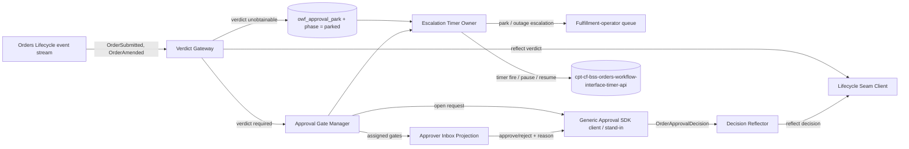
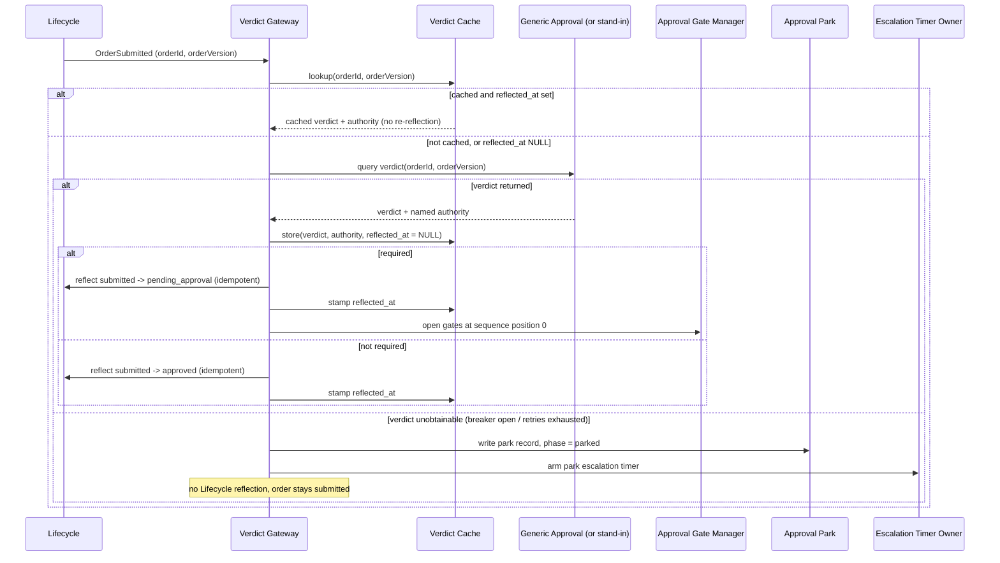
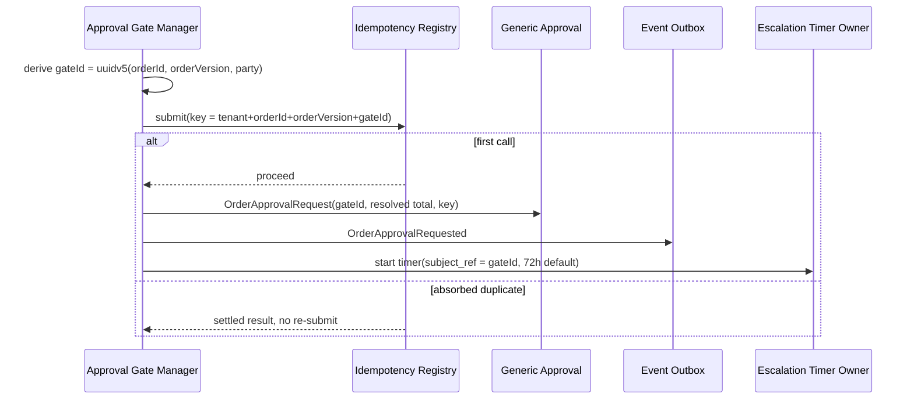
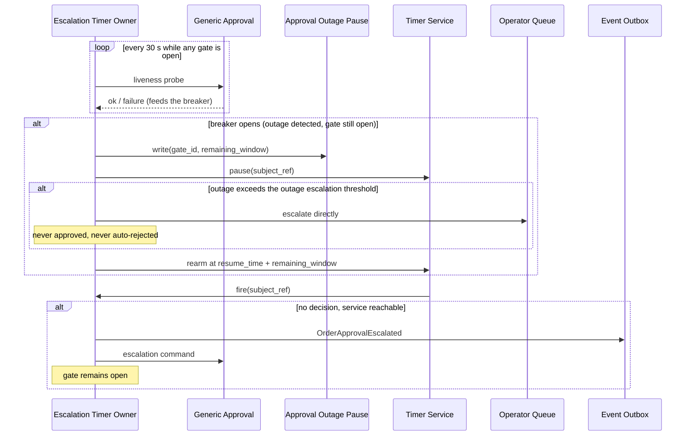

<!-- CONFLUENCE_TITLE: [BSS]: Orders Workflow — Approval Execution (Slice 3) -->
<!-- Related: ../DESIGN.md, ../PRD.md, ./01-foundation.md, ./02-triggers-and-start.md, ./README.md | Owners: BSS Orders team -->

# DESIGN — Approval Execution (Slice 3)

<!-- toc -->

- [1. Architecture Overview](#1-architecture-overview)
  - [1.1 Architectural Vision](#11-architectural-vision)
  - [1.2 Architecture Drivers](#12-architecture-drivers)
  - [1.3 Architecture Layers](#13-architecture-layers)
- [2. Principles & Constraints](#2-principles--constraints)
  - [2.1 Design Principles](#21-design-principles)
  - [2.2 Constraints](#22-constraints)
- [3. Technical Architecture](#3-technical-architecture)
  - [3.1 Domain Model](#31-domain-model)
  - [3.2 Component Model](#32-component-model)
  - [3.3 API Contracts](#33-api-contracts)
  - [3.4 Internal Dependencies](#34-internal-dependencies)
  - [3.5 External Dependencies](#35-external-dependencies)
  - [3.6 Interactions & Sequences](#36-interactions--sequences)
  - [3.7 Database schemas & tables](#37-database-schemas--tables)
  - [3.8 Deployment Topology](#38-deployment-topology)
- [4. Additional context](#4-additional-context)
  - [4.0 Detecting a Generic Approval outage](#40-detecting-a-generic-approval-outage)
  - [4.1 The fail-closed park](#41-the-fail-closed-park)
  - [4.2 The outage threshold, the TTL lead time, and the pause record](#42-the-outage-threshold-the-ttl-lead-time-and-the-pause-record)
  - [4.3 Multi-party routing is sequential-capable, and sequence is a column](#43-multi-party-routing-is-sequential-capable-and-sequence-is-a-column)
  - [Disclosure 1 — the whole capability is inert in phase 1](#disclosure-1--the-whole-capability-is-inert-in-phase-1)
  - [Disclosure 2 — open PRD gap on re-obtaining the verdict after OrderAmended](#disclosure-2--open-prd-gap-on-re-obtaining-the-verdict-after-orderamended)
- [5. Traceability](#5-traceability)

<!-- /toc -->

- [ ] `p1` - **ID**: `cpt-cf-bss-orders-workflow-design-approval-execution`

## 1. Architecture Overview

### 1.1 Architectural Vision

This slice executes the approval gate that sits between `submitted` and `approved` in the Orders
Lifecycle state machine. Orders Workflow does not decide whether an order requires approval, and
it does not decide who must approve it — both are policy questions owned by the Generic Approval
service. Workflow's job is narrower and mechanical: obtain the requirement verdict for a specific
order version, reflect it into Lifecycle exactly once, open one durable `OrderApprovalRequest`
per configured gate party, own every escalation timer for those gates end to end, and reflect the
eventual decision back into Lifecycle idempotently. Every one of these five responsibilities
(request/gate, idempotency, escalation timer, decision reflection, inbox) is built against the
engine primitives from `01-foundation.md` — the idempotency registry, the durable timer service,
and the event outbox — rather than inventing parallel machinery.

The central design tension this slice resolves is that **the policy dependency it calls does not
exist yet**. Rather than blocking the slice on an unbuilt service, the design fixes a single
seam — the §9.2 expectations contract (PRD) — and satisfies it today with a named stand-in that
always answers "approval not required." This keeps the request/gate, idempotency, escalation, and
inbox machinery fully specified and buildable now, while making unmistakably explicit that none of
that machinery executes a single real gate until the Generic Approval service is built. The second
governing decision is the fail-closed posture: every unavailability path (verdict source down,
approval service down mid-gate) parks or pauses rather than assumes success, and escalates to a
human queue before the Lifecycle `submitted` TTL can expire the order out from under it.

### 1.2 Architecture Drivers

#### Functional Drivers

| Requirement | Design Response |
|-------------|------------------|
| `cpt-cf-bss-orders-workflow-fr-owf-approval-request` | §3.2 Verdict Gateway + Approval Gate Manager components; §3.6 verdict-and-gate-open sequence; verdict cached per `orderId`+`orderVersion`, stale disagreement never re-reflected |
| `cpt-cf-bss-orders-workflow-fr-owf-approval-idempotency` | §3.1 `OrderApprovalRequest` entity with idempotency key `orderId`+`orderVersion`+`gateId`, submitted through the engine idempotency registry (`01-foundation.md` §4.3) |
| `cpt-cf-bss-orders-workflow-fr-owf-approval-escalation` | §3.2 Escalation Timer Owner component built on `cpt-cf-bss-orders-workflow-interface-timer-api`; §3.6 escalation-fires and outage-pause sequences |
| `cpt-cf-bss-orders-workflow-fr-owf-approval-decision` | §3.2 Decision Reflector component; §3.6 decision-reflection sequence, idempotent Lifecycle call |
| `cpt-cf-bss-orders-workflow-fr-owf-approver-inbox` | §3.2 Approver Inbox Projection component; §3.3 inbox read API scoped to assigned gates |

#### NFR Allocation

| NFR ID | NFR Summary | Allocated To | Design Response | Verification Approach |
|--------|-------------|--------------|-----------------|----------------------|
| `cpt-cf-bss-orders-workflow-nfr-owf-escalation-timer` | Escalation timers configurable per gate, default 72h, ±5 min accuracy, durable across restarts | Escalation Timer Owner, on `cpt-cf-bss-orders-workflow-interface-timer-api` | One `owf_durable_timer` row per open gate, `timer_kind = approval-escalation` (the engine's enum value; this slice coins no timer kind of its own) discriminated by `subject_ref`, reloaded from durable storage on service start (engine guarantee, `01-foundation.md` §3.7); pause/resume rearms at `resume_time + remaining_window` rather than restarting the window from zero | Timer-fire latency measured against the stored fire time in the escalation test suite; restart-recovery test asserts no timer is lost or re-fired; pause/resume test asserts the stored remaining window is honoured, not reset; two-party test asserts each gate's timer is independently cancellable |

#### Key ADRs

| ADR ID | Decision Summary |
|--------|-----------------|
| `cpt-cf-bss-orders-workflow-adr-fail-closed-verdict-park` | Verdict-source unavailability parks the process in `submitted`; never fail-open to `approved`; park must not suspend the Lifecycle `submitted` TTL, so escalation to the operator queue must fire before that TTL elapses |
| `cpt-cf-bss-orders-workflow-adr-idempotency-key-composition` | Idempotency keys for approval requests are `orderId` + `orderVersion` + `gateId`; never the process `correlationId` (per [`02-triggers-and-start.md`](./02-triggers-and-start.md) §2.1, `correlationId` is a whole-instance identifier, not a per-request dedup key) |

### 1.3 Architecture Layers

```
Orders Lifecycle event stream (OrderSubmitted, OrderAmended)
        │
        ▼
┌─────────────────────────────────────────────────────────────┐
│ Application: Verdict Gateway → Approval Gate Manager →       │
│              Escalation Timer Owner → Decision Reflector     │
├─────────────────────────────────────────────────────────────┤
│ Domain: OrderApprovalRequest, ApprovalGate, EscalationTimer  │
├─────────────────────────────────────────────────────────────┤
│ Infrastructure: Step Executor / Idempotency Registry /       │
│   Durable Timer Service / Event Outbox (all engine-owned,    │
│   01-foundation.md §3.3-3.7) / Generic Approval SDK client   │
│   (stand-in in phase 1)                                      │
├─────────────────────────────────────────────────────────────┤
│ Presentation: Approver Inbox read API (p2)                   │
└─────────────────────────────────────────────────────────────┘
```

| Layer | Responsibility | Technology |
|-------|---------------|------------|
| Presentation | Approver Inbox read/decision surface, scoped to assigned gates | REST read API + decision endpoint, per SDK-first conventions |
| Application | Verdict retrieval, gate lifecycle, escalation ownership, decision reflection | Workflow step handlers registered against the engine's step-executor entry point |
| Domain | `OrderApprovalRequest`, `ApprovalGate`, `EscalationTimer` value/entity model | Rust structs, no persistence logic of their own |
| Infrastructure | Durable timer, idempotency registry, event outbox, audit writer (all inherited from `01-foundation.md`), Generic Approval SDK client (stand-in today) | Engine-owned tables + SDK client abstraction |

## 2. Principles & Constraints

### 2.1 Design Principles

#### Verdict authority is external, always

- [ ] `p2` - **ID**: `cpt-cf-bss-orders-workflow-principle-verdict-authority-external`

Neither this gear nor Orders Lifecycle computes the approval-requirement verdict or the approval
decision. This gear only queries, caches, and reflects. Every stored verdict and every stored
decision carries a named deciding authority; a reflection lacking a named authority is refused at
the boundary, never persisted with a blank or inferred authority.

**ADRs**: `cpt-cf-bss-orders-workflow-adr-fail-closed-verdict-park`

#### Timer ownership never splits across a service boundary

- [ ] `p2` - **ID**: `cpt-cf-bss-orders-workflow-principle-timer-ownership-undivided`

Escalation timers are scheduled, persisted, and fired exclusively by this gear, on the engine's
durable timer service. The Generic Approval service (once it exists) supplies configuration
(window length, escalation path) and receives the escalation command; it never stores timer state
and is never queried for "has this timer fired." Splitting timer ownership across two services is
the exact failure mode this principle forecloses — a partial outage would otherwise leave neither
side certain which one owns the clock.

**ADRs**: `cpt-cf-bss-orders-workflow-adr-fail-closed-verdict-park`

#### Fail-closed, never fail-open, never auto-reject

- [ ] `p2` - **ID**: `cpt-cf-bss-orders-workflow-principle-fail-closed-never-open`

Every unavailability path in this slice — verdict source down, approval service down mid-gate,
outage exceeding the configured pause threshold — resolves to parking, pausing, or escalating to a
human operator queue. None of these paths ever resolves an order to `approved` by default, and
none of them ever auto-rejects an open gate. The only two ways a gate closes are an explicit
decision from the (stand-in or real) approval authority, or an explicit cancellation on
supersession by `OrderAmended`.

"Parking" is a **state with a row**, not a figure of speech: the park is the
`owf_process_instance.phase = parked` value and its `owf_approval_park` record, specified in §4.1.
An unavailability posture that has no persisted state is indistinguishable at recovery from a
process that simply stalled.

**There is no un-park authority, and that absence is deliberate.** This slice exposes no
force-approve, no force-verdict and no manual un-park operation. A parked process leaves `parked`
by exactly two routes: the verdict becomes obtainable and the retry succeeds, or a terminal
Lifecycle event (typically `OrderExpired` at the `submitted` TTL) terminates the instance through
slice 02. Granting an operator an in-band override here would make this gear the deciding
authority for a policy question §2.1 says it never decides. The absence is stated rather than left
implicit because an undocumented absence does not remove the pressure — it relocates it to an
out-of-band database write, which lands outside the permission evaluator and outside
`owf_audit_entry`.

**ADRs**: `cpt-cf-bss-orders-workflow-adr-fail-closed-verdict-park`

### 2.2 Constraints

#### The Generic Approval service does not exist yet

- [ ] `p2` - **ID**: `cpt-cf-bss-orders-workflow-constraint-generic-approval-unbuilt`

The Generic Approval service — the intended policy owner for the approval-requirement verdict, the
multi-party routing configuration, and the escalation-path configuration — has no canonical
specification anywhere in this repository. This slice depends on it only through the §9.2
expectations contract (PRD), never through a concrete API surface, and satisfies that contract
today with a named stand-in. See §4 for the full disclosure of what this makes inert.

**ADRs**: `cpt-cf-bss-orders-workflow-adr-fail-closed-verdict-park`

#### Idempotency keys must not reuse the process correlation id

- [ ] `p2` - **ID**: `cpt-cf-bss-orders-workflow-constraint-idempotency-key-not-correlation-id`

Per the correlation model of [`02-triggers-and-start.md`](./02-triggers-and-start.md) §2.1, the process `correlationId` is a
whole-instance identifier generated once at process start. It is unsuitable as an approval-request
idempotency key because a single process instance can open multiple concurrent gates (multi-party)
and can re-open gates across versions (amendment); an idempotency key built from `correlationId`
alone would collide across gates or fail to distinguish versions. The approval-request idempotency
key is `orderId` + `orderVersion` + `gateId` exclusively, prefixed with `resource_tenant_id` so the
key is tenant-namespaced (`01-foundation.md` §4.5) and a caller-supplied key can never name another
tenant's order.

**`gateId` is derived, not minted.** It is a UUIDv5 over (`orderId`, `orderVersion`, `party`),
computed from the routing configuration before any row is written. A `uuid` minted by this gear at
gate-open time would defeat the very key it composes: a crash between submitting the request to
Generic Approval and committing the gate row mints a *different* uuid on replay, which composes a
*different* idempotency key, which the registry reads as a first call — and the order acquires a
second gate for the same party with its own 72-hour timer. Derivation makes the replay re-derive
the key it already used, so the registry absorbs it. The same rule is what lets the Gate Manager
address a gate before it has been persisted.

**ADRs**: `cpt-cf-bss-orders-workflow-adr-idempotency-key-composition`

## 3. Technical Architecture

### 3.1 Domain Model

**Technology**: Rust structs, GTS

**Location**: [`../DESIGN.md`](../DESIGN.md) §3.1 (gear-wide domain-model index); the entities below are normative in this slice, with their columns in §3.7.

**Core Entities**:

- [ ] `p2` - **ID**: `cpt-cf-bss-orders-workflow-entity-order-approval-request`
- [ ] `p2` - **ID**: `cpt-cf-bss-orders-workflow-entity-approval-gate`
- [ ] `p2` - **ID**: `cpt-cf-bss-orders-workflow-entity-escalation-timer-record`
- [ ] `p2` - **ID**: `cpt-cf-bss-orders-workflow-entity-approval-verdict-cache`
- [ ] `p2` - **ID**: `cpt-cf-bss-orders-workflow-entity-approval-park`
- [ ] `p2` - **ID**: `cpt-cf-bss-orders-workflow-entity-approval-outage-pause`

| Entity | Description | Schema |
|--------|-------------|--------|
| `OrderApprovalRequest` | One durable request per gate party, keyed by an idempotency key derived from `resource_tenant_id` + `orderId` + `orderVersion` + `gateId`; carries order context, the requesting party, the resolved order total (§3.7), and the process `correlationId` for cross-referencing (never for dedup) | [db table `owf_approval_request`](#37-database-schemas--tables) |
| `ApprovalGate` | One gate per approval party for a given order version; carries the state set `open \| approved \| rejected \| cancelled`, the sequence position that orders sequential routing, the catalogue decision reason, and the deciding authority once decided | [db table `owf_approval_gate`](#37-database-schemas--tables) |
| `EscalationTimerRecord` | One durable timer per open gate, riding the engine's `owf_durable_timer` table as a `timer_kind = approval-escalation` row discriminated by `subject_ref`; the window remaining at pause is the stored datum across pause/resume cycles, never an accrued-elapsed counter | engine-owned `owf_durable_timer` (see `01-foundation.md` §3.7); no new table |
| `ApprovalVerdictCache` | The cached approval-requirement verdict for a given `orderId` + `orderVersion`, with its named deciding authority and its reflection state | [db table `owf_approval_verdict_cache`](#37-database-schemas--tables) |
| `ApprovalPark` | The "verdict unobtainable" record for one order version: when the park began, why, whether it has been escalated, and how it ended. Distinct from the verdict cache, which by construction cannot hold it (§4.1) | [db table `owf_approval_park`](#37-database-schemas--tables) |
| `ApprovalOutagePause` | The record of one escalation timer paused by a Generic Approval outage, carrying the window remaining at pause. Not a table of its own: it is an `owf_timer_pause` row with `pause_reason = 'approval-outage'` and a null `suspension_id`, because no hold occurred (§4.2) | engine-shared `owf_timer_pause` (`08-hold-and-cancel.md` §3.7); no new table |

**Relationships**:
- `OrderApprovalRequest` → `ApprovalGate`: one gate is satisfied by exactly one accepted request's
  decision; the request is the durable submission record, the gate is the state-tracking record.
- `ApprovalGate` → `EscalationTimerRecord`: one open gate owns exactly one active escalation timer;
  a gate in `approved`, `rejected` or `cancelled` has no active timer.
- `ApprovalGate` → `ApprovalGate`: a gate at sequence position *n* opens only once every gate at a
  position below *n* is `approved`; gates sharing a position open together (§4.3).
- `ApprovalVerdictCache` → `ApprovalGate`: a verdict of "approval required" for a given order
  version produces the gate set for that version, per the routing configuration; a verdict of
  "approval not required" produces no gates.
- `ApprovalVerdictCache` → `ApprovalPark`: mutually exclusive for a given `orderId` +
  `orderVersion`. A park exists precisely when no verdict could be obtained, so there is no cache
  row to carry it.

### 3.2 Component Model

This slice adds five components to the Orders Workflow process. Four of them — Verdict Gateway,
Approval Gate Manager, Escalation Timer Owner, Decision Reflector — are invoked as step handlers
through the engine's single step-executor entry point (`01-foundation.md` §3.3). The fifth,
Approver Inbox Projection, is a read-and-capture surface rather than a step handler, and is called
by an approver rather than by the engine. None of the five writes engine-owned tables directly.



#### Verdict Gateway

- [ ] `p2` - **ID**: `cpt-cf-bss-orders-workflow-component-verdict-gateway`

##### Why this component exists

`OrderSubmitted` must be answered with a `submitted → pending_approval` or `submitted → approved`
reflection, and that answer must come from the policy owner, not from this gear. The Verdict
Gateway is the single call site for that query and the single call site for the Lifecycle
reflection it drives.

##### Responsibility scope

Queries the approval-requirement verdict keyed on `orderId` + `orderVersion`; caches the answer
against that version in `ApprovalVerdictCache` together with the named deciding authority; refuses
to persist any verdict lacking a named authority; reflects the verdict into Lifecycle exactly once
per version; on repeat query for an already-**reflected** version, returns the cached verdict and
never re-reflects, even if the repeat query disagrees with what was already reflected (treated as
stale). On `OrderAmended`, re-queries the verdict for the new version from scratch — it never
derives the new version's verdict from the version it superseded. When no verdict can be obtained,
parks the process rather than assuming either answer (§4.1).

**Store and reflect are two states of one row, in that order, and the never-re-reflect rule keys
on the second.** The cache row is written when the verdict is obtained, with `reflected_at` NULL;
the Lifecycle reflection is then called under the idempotency key
`resource_tenant_id + orderId + orderVersion + <transitionName>`; `reflected_at` is stamped only
after that call returns success. The naive ordering — write the row, then reflect, and treat the
row's existence as "already reflected" — strands the order permanently on a crash in between: the
row says reflected, the order is still `submitted`, and the never-re-reflect rule suppresses the
retry that would fix it, forever. Splitting the row into two states makes the window recoverable:
a row with `reflected_at IS NULL` is an unfinished reflection, it is re-driven by the
reconciliation sweep (`01-foundation.md` §4.3), and the re-drive is absorbed by the idempotency
registry if the original call in fact landed.

##### Responsibility boundaries

Does not evaluate any threshold, TCV figure, or policy rule itself — it forwards order context to
the verdict source and persists the answer verbatim. Does not open approval gates itself; on a
"required" verdict it hands off to the Approval Gate Manager. Does not decide what happens on
verdict-source unavailability beyond writing the park record and arming its escalation timer — the
operator queue path is delegated to the Escalation Timer Owner's operator-queue lane described
below. Does not offer any operation that resolves a park by fiat (§2.1).

##### Related components (by ID)

- `cpt-cf-bss-orders-workflow-component-approval-gate-manager` — hands off to on a "required"
  verdict
- `cpt-cf-bss-orders-workflow-component-termination-and-compensation` (slice 02) — invoked when an
  `OrderAmended` trigger is observed for a version this gateway has an outstanding verdict query
  or reflection in flight for, per the void-on-superseded-version rule

#### Approval Gate Manager

- [ ] `p2` - **ID**: `cpt-cf-bss-orders-workflow-component-approval-gate-manager`

##### Why this component exists

A "required" verdict can fan out into multiple gates per the routing configuration (sequential or
parallel, multi-party). This component owns the fan-out, the per-gate idempotent request
submission, and the all-gates-satisfied aggregation that ultimately allows `pending_approval →
approved`.

##### Responsibility scope

Reads the routing configuration from the Generic Approval service (or, in phase 1, receives none,
since the stand-in never returns "required"); derives each `gateId` from that configuration
(§2.2); creates one `OrderApprovalRequest` per gate party with idempotency key
`resource_tenant_id` + `orderId` + `orderVersion` + `gateId`, submitted through the engine
idempotency registry so a retried submission is absorbed as a duplicate rather than opening a
second gate; **opens gates in sequence position order** (§4.3); tracks each gate's
`open | approved | rejected | cancelled` state; declares the order approved only once every gate
for that version is `approved`; on `OrderAmended`, cancels every open gate for the prior version
before any new gate for the new version is opened.

**Request payload contents.** The §9.2 expectations contract requires the request to carry enough
for the approval authority to decide without fetching the order back, and requires the submission
to be idempotent at the receiving end too. The payload therefore carries, in addition to order and
party context: the **resolved order total (TCV)** with its currency, read non-authoritatively from
Orders Lifecycle per seam R4 and passed through without computation or adjustment by this gear;
and the **request idempotency key** itself, so the receiving service can absorb a redelivery on the
same key rather than relying on this gear's registry alone. A request missing either is refused
before submission rather than submitted incomplete — an approval authority asked to approve an
order whose value it cannot see is not making the decision the contract describes.

##### Responsibility boundaries

Does not decide the routing configuration (sequential vs. parallel, which parties) — that is
Generic Approval service policy, consumed as configuration; this component owns only the
*execution* of the ordering that configuration expresses. Does not evaluate any individual
gate's decision — that is the Decision Reflector's job once a decision arrives. Does not own
escalation timers directly — delegates each gate's timer lifecycle to the Escalation Timer Owner.

##### Related components (by ID)

- `cpt-cf-bss-orders-workflow-component-escalation-timer-owner` — owns the timer for each gate
  this component opens
- `cpt-cf-bss-orders-workflow-component-decision-reflector` — consumes this component's gate
  records to determine all-gates-satisfied
- `cpt-cf-bss-orders-workflow-component-approver-inbox-projection` — reads this component's gate
  records, scoped to the requesting approver

#### Escalation Timer Owner

- [ ] `p2` - **ID**: `cpt-cf-bss-orders-workflow-component-escalation-timer-owner`

##### Why this component exists

Escalation timers must survive restarts, must not burn during a hold or during an approval-service
outage on an already-open gate, and must never resolve to "approved" or "rejected" by themselves.
A single owning component prevents the timer state from ever being asked about, or written by, the
Generic Approval service.

##### Responsibility scope

Schedules one durable timer per open gate on `cpt-cf-bss-orders-workflow-interface-timer-api`,
`timer_kind = approval-escalation` discriminated by `subject_ref`, default window 72 hours,
configurable per gate; persists timer state so it survives service restarts (engine guarantee,
`01-foundation.md` §3.7); **runs the gate-open liveness probe** that makes an outage detectable
(§4.2); pauses a gate's timer on hold (the hold window is never counted against the escalation
window) and on an outage of the Generic Approval service while that gate is already open, writing
an `owf_timer_pause` row with `pause_reason = 'approval-outage'` for the second case; rearms the timer at
`resume_time + remaining_window`, never restarting the full window, once the hold or outage ends;
on expiry without a decision, publishes `OrderApprovalEscalated` and issues the escalation command
to the Generic Approval service's configured escalation path; if a pause exceeds the outage
escalation threshold (§4.2), escalates to the operator queue directly, without issuing the
escalation command through the unavailable service, and without resolving the gate to approved or
rejected. Also owns the park escalation timer for a parked process (§4.1), which is the same timer
kind with `subject_ref = park_id`, since a park has no gate to name.

##### Responsibility boundaries

Does not decide when a hold begins or ends — that is the hold/cancel slice's ([`08-hold-and-cancel.md`](./08-hold-and-cancel.md))
responsibility; this component only reacts to the pause/resume signal it receives, and does not
write slice 08's `owf_timer_pause`. Does not decide the escalation window value or the escalation
path — those are Generic Approval service configuration, read at gate-open time; the outage
threshold and the TTL lead time are this design's (§4.2), because they are bounded by a Lifecycle
value rather than by approval policy. Does not evaluate the gate's decision — the gate remains
open after escalation, per PRD AC 2.

##### Related components (by ID)

- `cpt-cf-bss-orders-workflow-component-approval-gate-manager` — the owner of each gate whose
  timer this component schedules
- `cpt-cf-bss-orders-workflow-component-termination-and-compensation` (slice 02) — cancels this
  component's timers when a gate is cancelled on supersession or terminal-event void

#### Decision Reflector

- [ ] `p2` - **ID**: `cpt-cf-bss-orders-workflow-component-decision-reflector`

##### Why this component exists

An `OrderApprovalDecision` arriving from the Generic Approval service must be reflected into
Lifecycle idempotently and exactly once per gate, and the aggregate all-gates-satisfied outcome
must drive the order onward to fulfillment or terminate it, without this component computing
anything the approval authority already decided.

##### Responsibility scope

On `OrderApprovalDecision(approved)` for a gate, records the decision with its named deciding
authority and its catalogue reason, cancels that gate's escalation timer, opens the next sequence
position if one exists (§4.3), and checks the Approval Gate Manager's aggregate state; once every
gate for the version is `approved`, calls Orders Lifecycle idempotently to reflect
`pending_approval → approved`. On `OrderApprovalDecision(rejected)` for any gate, calls Orders
Lifecycle idempotently to reflect `pending_approval → rejected`, records the rejection reason,
cancels any other still-open gates for that version, and terminates the process.

**State guard, before anything else.** An inbound decision is applied only to a gate whose `state`
is `open`. A decision naming a gate in `cancelled`, `approved` or `rejected` is refused, recorded
in `owf_audit_entry` with the refusal reason, and produces no state change and no Lifecycle call.
Without the guard a decision that was in flight when `OrderAmended` cancelled its gate — or simply
redelivered late — applies to a superseded version and drives a `pending_approval → approved`
reflection for an order the amendment already moved on from. The column exists; this is the rule
that reads it.

**Dedup key for the inbound decision.** Decisions arrive at-least-once like every other inbound
message, and the guard above is not a dedup mechanism: a redelivered *approval* for a still-open
gate passes the guard cleanly and would be applied twice. The decision is entered in the engine
idempotency registry under `operation = 'approval-decision'`, key
`resource_tenant_id + gateId + decisionEventId`, so a redelivery resolves as an absorbed duplicate
and returns the settled outcome.

**The fulfillment handoff is not this component's.** This component's terminal act on the approved
path is the Lifecycle reflection. It does **not** call slice 04 in-process. Orders Lifecycle
publishes `OrderApproved` as a consequence of that reflection, and `OrderApproved` is a start/advance
trigger in slice 02's closed vocabulary, which is the single path into fulfillment. An in-process
handoff alongside that event would give fulfillment two independent entry points for the same
order — one racing the other, with only slice 04's own idempotency between the order and two
fulfillment plans — and would also make the approval-not-required path (which produces
`OrderApproved` and no decision at all) behave differently from the approved-gate path. One
trigger, one entry point.

**A permanently refused reflection is not retried forever.** If Orders Lifecycle refuses a
reflection permanently — invalid transition, typically because the order reached a terminal state
while the decision was in flight — the call is not retried under a new key and the refusal is not
inferred as success. The gate is left as decided, the refusal is recorded against the process with
its Lifecycle reason, and an incident is raised to the operator queue (`07-manual-tasks.md`)
carrying both the gate's recorded decision and the order's current Lifecycle state, because the
disagreement between them is a commercial fact this gear cannot resolve on its own. The process
then follows the order: the terminal Lifecycle event that caused the refusal is itself one of
slice 02's nine triggers and terminates the instance.

##### Responsibility boundaries

Does not evaluate whether a decision should have been approved or rejected — it reflects the
decision it received. Does not retry a Lifecycle call non-idempotently — every reflection call
uses the engine's idempotency-registry envelope, so a retried reflection is absorbed rather than
double-applied.

##### Related components (by ID)

- `cpt-cf-bss-orders-workflow-component-approval-gate-manager` — supplies the aggregate
  all-gates-satisfied state this component checks
- `cpt-cf-bss-orders-workflow-component-escalation-timer-owner` — timer cancellation on decision

#### Approver Inbox Projection

- [ ] `p2` - **ID**: `cpt-cf-bss-orders-workflow-component-approver-inbox-projection`

##### Why this component exists

Approvers need one surface to see the gates assigned to them and act, rather than relying on
out-of-band notification. Priority p2: this component is built but, per §4, produces zero rows
until the Generic Approval service exists, since no real gate ever opens under the stand-in.

##### Responsibility scope

Projects `OrderApprovalRequest` / `ApprovalGate` records into a read view scoped strictly to the
requesting approver's assigned gates, surfacing order context, requesting party, gate identifier,
and the escalation SLA countdown computed from the Escalation Timer Owner's current timer state;
accepts an approve or reject decision with a mandatory catalogue reason and an optional free-text
justification, and forwards it to the Generic Approval service (or, in phase 1, is unreachable in
practice, since no gate ever opens).

**Scope is the assignment, and the assignment is a column.** The filter is
`owf_approval_gate.assigned_principal = <the SecurityContext principal>`, not a match on the
gate's `party`. `party_ref` names a *role or body* in the routing configuration — "finance" — and
filtering on it returns every finance gate for every order of every seller, which is precisely the
cross-scope disclosure the inbox exists to prevent. `assigned_principal` is populated from the
routing configuration at gate-open time; a gate that carries none is **not listed to anyone** and
is surfaced instead through the operator queue, because an unassigned gate is a routing-configuration
defect, not a gate belonging to whoever asks first.

**Separation of duties at the decision endpoint.** The identity that submitted the order is
refused at `POST /bss-orders-workflow/v1/approver-inbox/gates/{gateId}/decision` — RFC-9457 `403`, with a distinct
problem type from the out-of-scope refusal so the two are separable in the audit trail. The
submitting identity is read from the order context the request was opened with, never from the
decision request body. Accepted as a settled control (`DECISIONS.md` D-56): `PRD.md:137` permits an
Approver to be a seller operator, so without this refusal one actor can submit an order and
approve its gate with every other stated control passing. Routing remains Generic Approval's
policy; this is a local refusal on the surface this gear owns, and the corresponding expectation
belongs in the §9.2 contract as a clause on the approval service.

##### Responsibility boundaries

Never surfaces a gate outside the requesting approver's scope — scope filtering happens at the
query boundary, not the presentation layer. Does not itself record the decision as final — it
forwards to the Generic Approval service and awaits the `OrderApprovalDecision` the Decision
Reflector consumes, so the inbox's "capture" step and the process's "reflect" step are not the
same write.

##### Related components (by ID)

- `cpt-cf-bss-orders-workflow-component-approval-gate-manager` — source of the approver's assigned
  gates
- `cpt-cf-bss-orders-workflow-component-escalation-timer-owner` — source of the SLA countdown

### 3.3 API Contracts

- [ ] `p2` - **ID**: `cpt-cf-bss-orders-workflow-interface-approver-inbox-api`

- **Contracts**: `cpt-cf-bss-orders-workflow-contract-owf-approval-contract`
- **Technology**: REST/OpenAPI
- **Location**: [`../DESIGN.md`](../DESIGN.md) §3.3 (gear-wide API surface and path convention); the endpoints below are normative in this slice.

**Endpoints Overview**:

| Method | Path | Description | Stability |
|--------|------|-------------|-----------|
| `GET` | `/bss-orders-workflow/v1/approver-inbox/gates` | List gates whose `assigned_principal` is the calling `SecurityContext` identity; keyset-paginated, page size default 50 and maximum 200; empty in phase 1 since no real gate opens | unstable |
| `POST` | `/bss-orders-workflow/v1/approver-inbox/gates/{gateId}/decision` | Submit approve/reject with a mandatory catalogue `reason` and an optional free-text `justification`, for a gate in the caller's scope and in state `open`; `403` (RFC-9457 Problem envelope) if the gate is outside the caller's assignment, a distinct `403` type if the caller is the order's submitting identity (separation of duties, §3.2), `409` if the gate is not `open` | unstable |

Both endpoints follow the platform's canonical OperationBuilder registration and RFC-9457 Problem
error envelope conventions; no gear-local deviation is introduced.

The decision request carries **two** reason fields because they are two different things and
conflating them loses one of them. `reason` is a closed catalogue value — it is what rides the
process event payload and what a downstream consumer can branch on. `justification` is
human-written free text, and it is written to `owf_audit_entry.justification`, never onto an event
payload and never into the catalogue column. A decision submitted without `reason` is refused;
`justification` is optional on approve and expected on reject.

### 3.4 Internal Dependencies

| Dependency Gear | Interface Used | Purpose |
|-------------------|----------------|----------|
| orders-lifecycle | `TransitionRequest` seam client (per `06-workflow-seam.md` §3.3, bound by reference per `02-triggers-and-start.md` §2.2) | Reflect `submitted → pending_approval`, `submitted → approved`, `pending_approval → approved`, `pending_approval → rejected` |

**Dependency Rules** (per project conventions):
- No circular dependencies
- Always use sdk modules for inter-gear communication
- No cross-category sideways deps except through contracts
- Only integration/adapter gears talk to external systems
- `SecurityContext` must be propagated across all in-process calls

### 3.5 External Dependencies

#### Generic Approval service (stand-in in phase 1)

- **Contract**: `cpt-cf-bss-orders-workflow-contract-owf-approval-contract` (PRD §9.2, inlined by
  reference — this slice does not restate the contract text)

| Dependency Gear | Interface Used | Purpose |
|-------------------|---------------|---------|
| generic-approval (unbuilt; stand-in client today) | Expectations-contract SDK client | Approval-requirement verdict query, multi-party gate submission, escalation command delivery, decision receipt |

**Dependency Rules** (per project conventions):
- No circular dependencies
- Always use SDK modules for inter-gear communication
- No cross-category sideways deps except through contracts
- Only integration/adapter gears talk to external systems
- `SecurityContext` must be propagated across all in-process calls

**Stand-in behavior (phase 1, normative for this slice today)**: the SDK client resolves to a
named stand-in implementation, `cpt-cf-bss-orders-workflow-actor-owf-generic-approval` (recorded as
the deciding authority by name on every verdict it answers), which always returns "approval not
required" for the verdict query and is never asked to route a gate, accept an escalation command,
or return a decision, since no gate is ever opened under that verdict. See §4 for the full
disclosure.

### 3.6 Interactions & Sequences

#### Verdict retrieval and reflection on OrderSubmitted

**ID**: `cpt-cf-bss-orders-workflow-seq-verdict-and-reflect`

**Use cases**: `cpt-cf-bss-orders-workflow-usecase-owf-approval-escalation` (PRD)

**Actors**: `cpt-cf-bss-orders-workflow-actor-owf-generic-approval`,
`cpt-cf-bss-orders-workflow-actor-owf-orders-lifecycle`



**Description**: A repeat query for a version whose verdict has already been **reflected** (a cache
row with `reflected_at` set) returns the cached answer and never re-reflects, even if the repeat
query result disagrees — the disagreeing result is discarded as stale. A cache row with
`reflected_at` NULL is an unfinished reflection, not a reflected one, and is re-driven; that
distinction is what keeps a crash between the store and the reflection recoverable (§3.2). The
unobtainable branch is specified in §4.1; note that it writes no verdict-cache row at all.

#### Multi-party gate open with idempotent submission

**ID**: `cpt-cf-bss-orders-workflow-seq-gate-open-idempotent`

**Use cases**: `cpt-cf-bss-orders-workflow-usecase-owf-approval-escalation` (PRD)

**Actors**: `cpt-cf-bss-orders-workflow-actor-owf-generic-approval`



**Description**: Repeated for every gate at the same sequence position, which open together; a gate
at a later position is not submitted until every earlier position is `approved` (§4.3), so its
72-hour window starts when its own gate opens rather than at verdict time. The order is considered
approved only once every gate opened for that version has an approved decision recorded. Because
`gateId` is derived rather than minted, a crash anywhere in this sequence replays onto the same key
and the registry absorbs it — the failure mode this shape exists to exclude is a replay that mints
a second gate for the same party.

#### Escalation timer fire and approval-service outage pause

**ID**: `cpt-cf-bss-orders-workflow-seq-escalation-and-pause`

**Use cases**: `cpt-cf-bss-orders-workflow-usecase-owf-approval-escalation` (PRD)

**Actors**: `cpt-cf-bss-orders-workflow-actor-owf-events-audit`,
`cpt-cf-bss-orders-workflow-actor-owf-generic-approval`



**Description**: The outage is detected by the probe loop, not by the timer fire — that ordering is
the point of the sequence and is argued in §4.2. Pause is the same *mechanism* and the same
*record* as a hold pause: it writes `owf_timer_pause` with `pause_reason = 'approval-outage'` and a
null `suspension_id`, because no hold occurred (§4.2). On resume the timer is rearmed at
`resume_time + remaining_window`; the stored datum is the window remaining, never an accrued-elapsed
counter.

#### Decision reflection

**ID**: `cpt-cf-bss-orders-workflow-seq-decision-reflect`

**Use cases**: `cpt-cf-bss-orders-workflow-usecase-owf-approval-escalation` (PRD)

**Actors**: `cpt-cf-bss-orders-workflow-actor-owf-orders-lifecycle`,
`cpt-cf-bss-orders-workflow-actor-owf-generic-approval`

```mermaid
sequenceDiagram
    Generic Approval ->> Decision Reflector: OrderApprovalDecision(gateId, decisionEventId, outcome, reason)
    Decision Reflector ->> Idempotency Registry: submit(key = tenant+gateId+decisionEventId)
    alt absorbed duplicate
        Idempotency Registry -->> Decision Reflector: settled result, no re-apply
    else first call
        Decision Reflector ->> Approval Gate: read state
        alt gate state is not open
            Decision Reflector ->> Audit: refuse decision (gate cancelled / already decided)
        else gate state is open
            Decision Reflector ->> Escalation Timer Owner: cancel timer(subject_ref)
            alt approved and all gates satisfied
                Decision Reflector ->> Lifecycle: pending_approval -> approved (idempotent)
                Note over Decision Reflector: no in-process fulfillment call; Lifecycle emits OrderApproved
            else approved, later sequence position pending
                Decision Reflector ->> Approval Gate Manager: open next sequence position
            else rejected
                Decision Reflector ->> Lifecycle: pending_approval -> rejected (idempotent)
                Decision Reflector ->> Approval Gate Manager: cancel remaining open gates
                Note over Decision Reflector: process terminates, catalogue reason recorded
            end
        end
    end
```

**Description**: Every Lifecycle call in this sequence rides the engine idempotency envelope, so a
retried reflection is absorbed rather than re-applied. Three guards sit in front of the reflection
and each catches something the others do not: the registry catches a redelivered decision, the
state read catches a decision for a gate that has since been cancelled or decided, and the
aggregate check catches a decision that satisfies one gate but not the version. The approved path
ends at the Lifecycle reflection — fulfillment is entered through slice 02's `OrderApproved`
trigger and nowhere else (§3.2).

### 3.7 Database schemas & tables

- [ ] `p3` - **ID**: `cpt-cf-bss-orders-workflow-db-approval`

#### Table: owf_approval_verdict_cache

**ID**: `cpt-cf-bss-orders-workflow-dbtable-approval-verdict-cache`

**Schema**:

| Column | Type | Description |
|--------|------|--------------|
| resource_tenant_id | uuid | Resource recipient; the tenant isolation axis for this table |
| seller_tenant_id | uuid | Selling party; carried because the verdict is visible on seller-scoped operator surfaces |
| order_id | uuid | Order identifier |
| order_version | int | Order version the verdict was decided against |
| verdict | enum | `required` or `not_required` |
| deciding_authority | text | Named authority (stand-in name or real service identity); never null |
| obtained_at | timestamptz | When the verdict was returned by the authority |
| reflected_at | timestamptz, nullable | When the verdict was reflected into Lifecycle; NULL means the reflection is unfinished, not that it is absent |
| created_at | timestamptz | Bookkeeping |

**PK**: (`order_id`, `order_version`)

**Constraints**: `deciding_authority` NOT NULL — a reflection lacking a named authority is refused
before this row is written. `resource_tenant_id` NOT NULL. `verdict` constrained to the two-value
enum.

**Additional info**: **Tenant axis**: `resource_tenant_id` (isolation), `seller_tenant_id`
(operator-surface scoping). One row per order version; a later disagreeing query for the same key
is never written here — the stored row is authoritative once present. `reflected_at` is what the
never-re-reflect rule reads, not row existence (§3.2). **This table cannot hold a park**:
`deciding_authority` is NOT NULL and a park is by definition the case where no authority answered,
so the park has its own table below rather than a third `verdict` value. **Retention**: ≥ 400 days,
alongside `owf_audit_entry` — the row is the evidence of who exempted a commercial decision from
approval.

**Example**:

| resource_tenant_id | order_id | order_version | verdict | deciding_authority | reflected_at |
|--------|--------|--------|--------|--------|--------|
| tnt-001 | ord-123 | 1 | not_required | approval-standin-v1 | 2026-09-10T10:00:00Z |

#### Table: owf_approval_gate

**ID**: `cpt-cf-bss-orders-workflow-dbtable-approval-gate`

**Schema**:

| Column | Type | Description |
|--------|------|--------------|
| gate_id | uuid | Gate identifier, one per approval party — UUIDv5 over (`order_id`, `order_version`, `party_ref`), derived and never minted (§2.2) |
| resource_tenant_id | uuid | Resource recipient; the tenant isolation axis for this table |
| seller_tenant_id | uuid | Selling party; the axis the approver inbox and the operator queue scope on |
| order_id | uuid | Order identifier |
| order_version | int | Order version this gate was opened for |
| party_ref | text | The approving party this gate represents, as identified by the routing configuration — a role or body, not a person |
| assigned_principal | text, nullable | The `SecurityContext` principal this gate is assigned to; the inbox filters on this column, never on `party_ref` (§3.2) |
| sequence_index | int | Routing position, default 0. Gates sharing a value open together; a gate opens only once every lower value is `approved` (§4.3) |
| state | enum | `open`, `approved`, `rejected`, `cancelled` — the complete set; `decided` is not a value |
| decision_reason | text, nullable | Closed-catalogue reason for the decision; NOT NULL once `state` is `approved` or `rejected` |
| deciding_authority | text, nullable | Named authority once decided; null while open |
| idempotency_key | text | `resource_tenant_id` + `orderId` + `orderVersion` + `gateId` |
| opened_at, decided_at | timestamptz, timestamptz nullable | Bookkeeping; `opened_at` is when the window starts, which for a sequenced gate is later than the verdict |
| created_at | timestamptz | Partition key |

**PK**: `gate_id`

**Constraints**: `idempotency_key` UNIQUE; `state` NOT NULL and constrained to the four-value enum;
`resource_tenant_id` NOT NULL; `decision_reason` and `deciding_authority` NOT NULL whenever `state`
is `approved` or `rejected`, enforced as a check constraint rather than by handler discipline.
Permitted transitions: `open → approved | rejected | cancelled`; no transition out of a terminal
state, which is the constraint the Decision Reflector's state guard reads (§3.2).

**Additional info**: **Tenant axis**: `resource_tenant_id` (isolation), `seller_tenant_id`
(operator- and approver-surface scoping). Cancelled on `OrderAmended` supersession or terminal-event
void, per slice 02's Termination and Compensation component. `decision_reason` is a catalogue value
and is the only reason field that rides an event payload; human free text goes to
`owf_audit_entry.justification` instead. **Retention**: ≥ 400 days; monthly range partition on
`created_at`.

**Example**:

| gate_id | resource_tenant_id | order_id | order_version | party_ref | sequence_index | state | decision_reason |
|--------|--------|--------|--------|--------|--------|--------|--------|
| gate-1 | tnt-001 | ord-123 | 2 | finance | 0 | open | null |

#### Table: owf_approval_request

**ID**: `cpt-cf-bss-orders-workflow-dbtable-approval-request`

**Schema**:

| Column | Type | Description |
|--------|------|--------------|
| gate_id | uuid | The gate this request was submitted for |
| resource_tenant_id | uuid | Resource recipient; the tenant isolation axis for this table |
| seller_tenant_id | uuid | Selling party |
| correlation_id | uuid | The process correlation id, for cross-reference only, not dedup |
| resolved_total | numeric | The order's resolved total (TCV) as read from Orders Lifecycle, carried verbatim; this gear performs no price computation (seam R4) |
| currency | text | Currency of `resolved_total`; a figure without one is not a figure |
| submitted_at | timestamptz | Submission time |
| request_payload | jsonb | Order context, requesting party, gate identifier, and the request idempotency key echoed for the receiver's own dedup |

**PK**: `gate_id`

**Constraints**: `gate_id` foreign key to `owf_approval_gate`; `resource_tenant_id` NOT NULL;
`resolved_total` and `currency` NOT NULL — the §9.2 contract requires the approval authority to see
the order's value, so a request cannot be submitted without it.

**Additional info**: **Tenant axis**: `resource_tenant_id` (isolation), `seller_tenant_id`.
One request row per gate; the idempotency key that guarantees single submission lives on
`owf_approval_gate` and is echoed into `request_payload` for the receiving service, not stored
twice as a column here. `resolved_total` is non-authoritative: it is a snapshot for the approver's
benefit, and Orders Lifecycle remains the system of record for price. **Retention**: ≥ 400 days;
monthly range partition on `submitted_at`.

**Example**:

| gate_id | resource_tenant_id | correlation_id | resolved_total | currency | submitted_at |
|--------|--------|--------|--------|--------|--------|
| gate-1 | tnt-001 | corr-abc | 48000.00 | USD | 2026-09-10T10:05:00Z |

#### Table: owf_approval_park

**ID**: `cpt-cf-bss-orders-workflow-dbtable-approval-park`

**Schema**:

| Column | Type | Description |
|--------|------|--------------|
| park_id | uuid | Park identity |
| resource_tenant_id | uuid | Resource recipient; the tenant isolation axis for this table |
| seller_tenant_id | uuid | Selling party; the axis the operator queue scopes on |
| correlation_id | uuid | Owning process instance |
| order_id | uuid | Order identifier |
| order_version | int | Order version whose verdict could not be obtained |
| park_reason | enum | `verdict-source-unavailable`, `verdict-authority-unnamed`, `verdict-query-refused` |
| parked_at | timestamptz | When the process entered `parked` |
| escalation_due_at | timestamptz | When the operator-queue escalation must fire; derived from the TTL lead time (§4.2) |
| escalated_at | timestamptz, nullable | When the operator-queue incident was raised |
| resolved_at | timestamptz, nullable | When the park ended |
| resolution | enum, nullable | `verdict-obtained` or `order-terminated`; there is no operator-override value (§2.1) |

**PK**: `park_id`

**Constraints**: `resource_tenant_id`, `correlation_id`, `park_reason`, `parked_at` and
`escalation_due_at` NOT NULL; UNIQUE (`order_id`, `order_version`) WHERE `resolved_at IS NULL` — one
open park per order version, so a retry storm cannot accumulate parks.

**Additional info**: **Tenant axis**: `resource_tenant_id` (isolation), `seller_tenant_id`
(operator-queue scoping). This is the "verdict unobtainable" state
`cpt-cf-bss-orders-workflow-adr-fail-closed-verdict-park` requires as distinct from
`pending_approval`; it pairs with `owf_process_instance.phase = parked`. The `resolution` enum has
no override value by construction — the absence is the design (§2.1), and adding a value here is
the shape a future force-approve would take, so its absence is the thing to review. **Retention**:
≥ 400 days.

**Example**:

| park_id | resource_tenant_id | order_id | order_version | park_reason | escalation_due_at | resolved_at |
|--------|--------|--------|--------|--------|--------|--------|
| park-9 | tnt-001 | ord-123 | 1 | verdict-source-unavailable | 2026-09-12T04:00:00Z | null |

### 3.8 Deployment Topology

- [ ] `p3` - **ID**: `cpt-cf-bss-orders-workflow-topology-approval-execution`

No dedicated deployment unit — this slice's components run in-process as Orders Workflow step
handlers on the same runtime as the rest of the gear, per `01-foundation.md` §3.8. No new
infrastructure is introduced.

## 4. Additional context

### 4.0 Detecting a Generic Approval outage

Two different quantities have been conflated elsewhere and are separated here deliberately: how
this gear *notices* an outage, and how long it *waits* before making one a human's problem. The
first is an engineering value, fixed below. The second is bounded by a Lifecycle value and is set
in §4.2.

**Outage detection.** The approval dependency **MUST** be called through a circuit breaker: open on
a **50 % failure rate over a sliding window of 20 calls** (a narrower window than the common
100-call default, because verdict-query volume per gate is low and a 100-call window would not open
until long after the dependency was plainly unavailable), hold open for **60 s**, then probe
half-open with **3** permitted calls before closing. The window is counted in calls, not in elapsed
seconds, which matters because the gate-open probe in §4.2 is deliberately sparse. These values
carry no commercial consequence: they determine only how quickly this gear notices, not what it
does about it.

The breaker covers both call directions this slice makes to the approval dependency — the verdict
query and the gate-open submission — and its open state is the signal both the park (§4.1) and the
outage pause (§4.2) read. A breaker scoped to the verdict query alone would be blind for the entire
duration of an open gate.

### 4.1 The fail-closed park

`cpt-cf-bss-orders-workflow-adr-fail-closed-verdict-park` requires a persisted "verdict
unobtainable" state distinct from `pending_approval`. This is that state, specified end to end.

**When it is entered.** The Verdict Gateway cannot obtain a verdict for an order version: the
breaker is open, or the retry budget for the query is exhausted, or the authority answered without
naming itself (which §2.1 refuses to persist). The process does **not** reflect anything into
Lifecycle — the order stays `submitted`, which is the whole point of failing closed. Reflecting
`submitted → pending_approval` to "hold" the order would be a fabricated verdict.

**The state, and where it lives.** Two writes, in one transaction: `owf_process_instance.phase` is
set to `parked` — the engine's phase enum value for exactly this case — and one row is inserted in
`owf_approval_park` (§3.7) carrying the reason, the park instant and the escalation deadline. The
park is **not** representable in `owf_approval_verdict_cache`: that table's `deciding_authority` is
NOT NULL and a park is precisely the case where no authority answered, so a third `verdict` value
there would need a null authority and would defeat the one control §2.1 rests on. The phase alone
is also insufficient — it says the process is parked, not why, not since when, and not whether the
escalation has fired.

**Its timer.** One `owf_durable_timer` row, `timer_kind = approval-escalation` (this slice coins no
new kind), carrying `subject_ref = park_id` — a park has no gate to name, and the engine's
one-live-timer-per-(instance, kind, subject) constraint needs a subject to be meaningful. It
fires at `escalation_due_at`, computed
from the lead time in §4.2. The park timer is **not** pausable: a hold does not stop the Lifecycle
TTL, so pausing the thing that races it would be an escalation that arrives after the order has
already expired.

**Its escalation path.** At fire, the Escalation Timer Owner raises an incident on the
fulfillment-operator queue (`07-manual-tasks.md`), scoped by `seller_tenant_id`, carrying the order,
the version, the park reason and the time remaining before the Lifecycle `submitted` TTL. It stamps
`escalated_at`. It does **not** approve, reject, or reflect anything. The process stays `parked`.

**What happens at the Lifecycle `submitted` TTL.** Nothing this slice does suspends that TTL — the
ADR is explicit that the park must not, and this design does not attempt to. So the TTL elapses on
schedule, Orders Lifecycle expires the order and publishes `OrderExpired`, which is one of slice
02's nine triggers and routes to `terminate`. The parked instance terminates with
`terminal_outcome = aborted`, and the park row closes with `resolution = order-terminated`. This is
the designed worst case, not an unhandled one: the order fails closed and visibly, and the
escalation that fired at `escalation_due_at` is what gave an operator the chance to intervene
upstream first. The lead time in §4.2 exists solely to make that window real rather than nominal.

**How a park ends otherwise.** The verdict query is retried on the engine's retry ladder for as long
as the process lives. A retry that returns a verdict with a named authority closes the park with
`resolution = verdict-obtained`, writes the cache row, and resumes the ordinary reflect path (§3.2).
There is no third exit; see §2.1 on the deliberate absence of an un-park authority.

### 4.2 The outage threshold, the TTL lead time, and the pause record

**The values.** The PRD assigns these to Design (`PRD.md:300`, "a configurable threshold (value is a
Design concern)"), so they are set here rather than routed onward. Both are expressed relationally
against a configured `lifecycle_submitted_ttl`, because an absolute number on this side would
silently assume a TTL this gear does not own:

| Value | Setting | Derivation |
|-------|---------|------------|
| Generic-Approval outage escalation threshold | `min(30 min, 0.25 × lifecycle_submitted_ttl)` — **Accepted** | How long a pause may persist before the operator queue is raised directly. 30 min is short enough that an operator still has the whole window to act, and the TTL-relative arm keeps it sane if the platform ever configures a short TTL |
| Escalation lead time before `submitted` TTL | `max(4 h, 0.25 × lifecycle_submitted_ttl)` — **Accepted** | The margin `ADR/0007:70` requires escalation to fire with. 4 h is a floor for "actionable by a human in a staffed queue"; the TTL-relative arm scales it up rather than leaving a 72 h TTL escalated 4 h before expiry |

**`lifecycle_submitted_ttl` is a deliberately mirrored constant.** It is **read from
configuration**, never guessed and never hard-coded into a build. Orders Lifecycle owns the real
value in `orders_state_ttl_policy`; this gear cannot read it, and an upstream ask to expose it is
recorded in `UPSTREAM_REQS.md` (`cpt-cf-bss-orders-workflow-upreq-submitted-ttl-visibility`). Until
that lands, this gear operates on a mirror of the platform's stated TTL, and the mirror is stated
here as a deliberate interim posture rather than left as an unexamined assumption:

- **It is deployed alongside the Lifecycle value, not independently.** The mirror is part of the
  same configuration promotion that carries Lifecycle's TTL policy through environments, so the two
  move together by construction rather than by anyone remembering.
- **Retuning the Lifecycle TTL is a change to both gears.** A change to `orders_state_ttl_policy`
  row 7 that is not accompanied by a matching change here leaves this gear escalating against a
  deadline that no longer exists. That coupling is the cost of the mirror and is the reason the
  upstream ask remains open rather than being closed by this interim.
- **A mirror that drifts is an operational defect the startup assertion cannot catch**, because the
  assertion can only check this gear's own values against each other. What it *can* catch — and
  does, below — is the mirror being absent, zero, negative, or ordered wrongly, which are the
  failure modes that would otherwise make the escalation silently inert.

**Migration.** When Lifecycle exposes the per-order expiry instant, `submitted_expires_at` on the
order supersedes the mirrored constant and `escalation_due_at` is computed as
`submitted_expires_at − escalation_lead_time`. Only the **source of the deadline** changes; the
threshold, the lead time, the assertion and the escalation path are unaffected. The mirror is
therefore a substitution point, not a design this gear would have to unpick.

**The startup assertion.** Following the nesting-invariant pattern `01-foundation.md` §4.2
establishes for the four execution bounds, these values are **asserted at configuration load** and a
violating configuration is **refused at startup**:

    lifecycle_submitted_ttl      IS PRESENT AND > 0
    outage_escalation_threshold  <  escalation_lead_time  <  lifecycle_submitted_ttl

The presence check is first and is not a formality. A missing or zero `lifecycle_submitted_ttl`
makes both inequalities unevaluable, and an unevaluable assertion that is allowed to pass leaves
the gear running with an escalation that is configured but can never fire — a parked order would
then reach expiry with no human ever alerted, which is the precise outcome the fail-closed park
exists to prevent, arrived at from the other direction. **An absent or non-positive value is
therefore a startup refusal, never a default and never a warning.**

Both inequalities are load-bearing and neither fails loudly on its own. If the lead time is not
strictly less than the TTL, the escalation is scheduled after the order has already expired and the
park's only human signal never fires — the failure is a silent absence, exactly the class §4.2 of
the foundation refuses to accept at runtime. If the outage threshold is not less than the lead time,
the direct operator escalation is dominated by the park escalation and the outage path contributes
nothing. `escalation_due_at` is computed as
`submitted_at + lifecycle_submitted_ttl − escalation_lead_time` and stored on the park row, so a
later configuration change does not silently move the deadline of a park already in flight.

**Making the outage detectable before the window burns.** AC 2a requires a gate's escalation timer
to pause during an outage. As written elsewhere that is unimplementable: the only detector is the
breaker, the breaker only sees calls, and **while a gate is open this gear makes no calls to Generic
Approval at all** — it is waiting for a decision to arrive. Nothing trips the breaker, so the pause
branch is only ever evaluated when the timer fires at 72 hours, by which point the window it was
supposed to protect has fully burned.

The fix is to give the breaker something to see. While **any** gate is open, the Escalation Timer
Owner runs a **liveness probe against the Generic Approval service every 30 s** — one cheap call,
not per gate but per service, its result fed into the same breaker as the real calls. The interval
is derived rather than chosen: the breaker's window is 20 calls, so a total outage fills it and
opens the breaker in **≤ 10 minutes**, comfortably inside the 30-minute outage threshold above and
negligible against a 72-hour window. A slower probe would leave the breaker unable to open before
the threshold it gates; a faster one buys nothing, since the threshold is the binding constraint.
On breaker open, every open gate's timer pauses immediately; on breaker close, every paused timer
rearms. **No commercial sign-off was required here**: the probe interval is an
engineering value with no commercial consequence, like the breaker settings in §4.0.

**The pause record.** The outage pause reuses the hold pause's *mechanism* but cannot reuse its
*record*. An earlier draft of this slice declared a separate table on the reasoning that
`owf_timer_pause.suspension_id` was NOT NULL with a foreign key to `owf_process_suspension`, so an
outage pause had no parent to point at and a synthetic suspension would make the order appear held
to every reader of that table. Slice 08 has since made `suspension_id` nullable behind a
`pause_reason` discriminator (`hold | approval-outage`), which removes that obstacle — so the
outage pause writes `owf_timer_pause` with `pause_reason = 'approval-outage'` and a null
`suspension_id`. One clock has one record.

The two tables are reconciled on the one thing that must not differ: **both record the remaining
window**, and neither records accrued elapsed time. Remaining window is the representation slice 08
already uses and the one the rearm arithmetic needs directly
(`rearm_at = resume_time + remaining_window`); accrued-elapsed requires the full window to be
re-derived from a constant at every resume, which silently breaks any gate whose window was
configured away from the 72-hour default. Recording is not authority: the remainder the timer
service actually rearms from is `owf_durable_timer.remaining_window_ms`, which `01-foundation.md`
§3.7 declares the sole authority. The pause rows on either side are the audit trail of *why* and
*when* a timer was paused, not a second copy competing to be believed.

A timer can be under both pauses at once — a gate open during an outage on an order that is then
held. The rule is reference-counted, not last-writer-wins: `remaining_window` is captured by the
**first** pause to take effect and is not re-captured by the second; the timer rearms only when no
open pause row of either kind remains, at `now + remaining_window`. This keeps
`cpt-cf-bss-orders-workflow-constraint-timer-remaining-window` true under overlap, where a
last-writer rule would credit the order with the outage window twice.

### 4.3 Multi-party routing is sequential-capable, and sequence is a column

`PRD.md:280` permits sequential or parallel approvals. A fan-out that submits every party's request
at once implements only the second, and does so while claiming to support both: every gate's
72-hour timer starts simultaneously, so a "sequential" second-stage approver's window is largely
consumed before the first stage has answered, and the escalation that fires against them is for a
gate they could not yet have acted on.

`owf_approval_gate.sequence_index` carries the ordering. The rule is small: gates sharing a
`sequence_index` are submitted together; a gate at position *n* is not submitted, and has no timer,
until every gate at a position below *n* is `approved`; its window starts at its own `opened_at`,
not at verdict time. A `rejected` gate at any position cancels every gate at every other position
and terminates the process, so no later stage is ever asked about an order an earlier stage refused.
Purely parallel routing is the degenerate case where every gate carries `sequence_index = 0`, which
is also the default — so a routing configuration that says nothing about ordering behaves exactly as
it does today.

The Gate Manager owns executing this ordering; it does not decide it. Which parties, in which order,
remains Generic Approval's configuration (§3.2), and in phase 1 there is no configuration at all,
since the stand-in never returns "required".

### Disclosure 1 — the whole capability is inert in phase 1

Until the Generic Approval service exists, every verdict query in this slice resolves through a
named stand-in, `cpt-cf-bss-orders-workflow-actor-owf-generic-approval`, behind the same §9.2
expectations contract the real service will eventually satisfy — this is a stand-in behind the
contract, not a second policy author. The stand-in returns "approval not required" for every order,
and that verdict is recorded with the stand-in named as the deciding authority. This naming is not
cosmetic: because the stand-in currently exempts every order, the deciding-authority field is the
only way a later audit can tell an order that policy genuinely exempted apart from an order nobody
ever asked about — recording the authority by name is the entire audit value of the field.

**The park is the exception, and it is live today.** Everything else below is inert, but §4.1 is
not: the stand-in can fail to resolve, can be misconfigured, and can answer without naming itself,
and each of those is a verdict this gear could not obtain. The park state, its row, its timer and
its operator escalation are therefore built and exercised in phase 1 — which is consistent with the
park being the one approval acceptance criterion that applies before the Generic Approval service
exists, while the gate criteria are deferred behind the stand-in.

A direct consequence: while the stand-in is in place, no gate is ever opened, so multi-party gates,
escalation timers, the approver inbox, and the `OrderApprovalRequested` / `OrderApprovalEscalated`
events never fire. All the machinery in §3.2-§3.6 for those paths is fully specified and buildable
now, but exercises zero real gates until the Generic Approval service is built. The Generic
Approval service has no canonical specification anywhere in this repository today (PRD §9.2, §15,
§16); this slice depends on it only through the expectations contract, and this design does not
speculate about that service's own internal design.

The two disclosures above are load-bearing for this slice: they are why the acceptance criteria in
PRD §12 mark ACs 1 through 4a (including 2a) as deferred, and only ACs 0, 0a, 0b apply until the
Generic Approval service exists.

### Disclosure 2 — open PRD gap on re-obtaining the verdict after OrderAmended

No section of the PRD explicitly requires re-obtaining the approval-requirement verdict for a
**new** order version on `OrderAmended` and reflecting it onward from `submitted`. The PRD text
that exists (§6.2, `cpt-cf-bss-orders-workflow-fr-owf-approval-request`) does require Workflow to
consume `OrderAmended`, cancel open gates for the prior version, and open new
`OrderApprovalRequest`(s) if the amended order requires approval — but it does not say, in as many
words, that a fresh verdict query must run for the new version before that "if" can be answered.
This gap is narrow, not a rewrite: closing it is a one- or two-sentence PRD amendment stating that
`OrderAmended` re-triggers the same verdict-retrieval-and-reflect sequence as `OrderSubmitted`,
scoped to the new `orderVersion`.

This design nonetheless implements the stricter behavior — the Verdict Gateway re-queries the
verdict for the new version from scratch on every `OrderAmended`, per §3.2, and never derives it
from the superseded version's cached verdict — because the sibling Orders Lifecycle design
(`06-workflow-seam.md` §4.2) already states the rule normatively for the Lifecycle side of the
seam and frames it as an upstream ask on this gear: *"On consuming that event the sibling gear
MUST obtain the requirement verdict for the new version and reflect the order onward via
`submitted → pending_approval` or `submitted → approved`. It MUST NOT carry the prior version's
verdict forward."* This design implements that rule to keep both sides of the seam consistent, but
records here that the PRD itself does not yet say so as plainly as the Lifecycle design frames it —
the PRD owner should amend §6.2 to state the re-query requirement explicitly, closing the gap
between what Lifecycle's design assumes of this gear and what the PRD text actually commits this
gear to.

**Open question, routed to the PRD owner**: amend PRD §6.2
(`cpt-cf-bss-orders-workflow-fr-owf-approval-request`) to state explicitly that `OrderAmended`
re-triggers verdict retrieval for the new `orderVersion`, mirroring the `OrderSubmitted` path, so
the requirement is not left to be inferred solely from the sibling Lifecycle design's framing.

## 5. Traceability

- **PRD**: [PRD.md](../PRD.md) — §6.2 (`cpt-cf-bss-orders-workflow-fr-owf-approval-request`,
  `cpt-cf-bss-orders-workflow-fr-owf-approval-idempotency`,
  `cpt-cf-bss-orders-workflow-fr-owf-approval-escalation`,
  `cpt-cf-bss-orders-workflow-fr-owf-approval-decision`,
  `cpt-cf-bss-orders-workflow-fr-owf-approver-inbox`), §9.2
  (`cpt-cf-bss-orders-workflow-contract-owf-approval-contract`), §7
  (`cpt-cf-bss-orders-workflow-nfr-owf-escalation-timer`), §12 (acceptance criteria 0-4a)
- **ADRs**: `cpt-cf-bss-orders-workflow-adr-fail-closed-verdict-park`,
  `cpt-cf-bss-orders-workflow-adr-idempotency-key-composition`
- **Upstream design**: [orders-lifecycle 06-workflow-seam.md](../../../orders-lifecycle/docs/design/06-workflow-seam.md)
  §4.2 (deciding-authority requirement, re-approval-after-amendment rule)
- **Prior slices**: [01-foundation.md](./01-foundation.md) (engine primitives),
  [02-triggers-and-start.md](./02-triggers-and-start.md) (correlation model, termination path)
