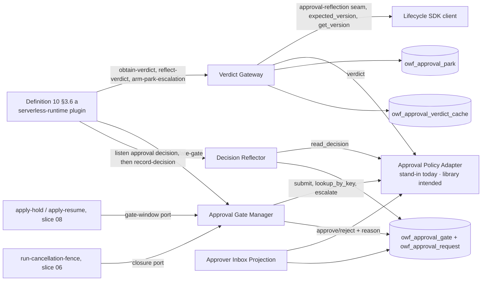

<!-- CONFLUENCE_TITLE: [BSS]: Orders Workflow — Approval Execution (Slice 3) -->
<!-- Related: ../DESIGN.md, ../PRD.md, ./01-foundation.md, ./02-triggers-and-start.md, ./10-process-definition.md, ./README.md | Owners: BSS Orders team -->

# DESIGN — Approval Execution (Slice 3)

<!-- toc -->

- [1. Architecture Overview](#1-architecture-overview)
  - [1.1 Architectural Vision](#11-architectural-vision)
  - [1.2 Architecture Drivers](#12-architecture-drivers)
  - [1.3 Architecture Layers](#13-architecture-layers)
- [2. Principles & Constraints](#2-principles--constraints)
  - [2.1 Design Principles](#21-design-principles)
  - [2.2 Constraints](#22-constraints)
- [3. Technical Architecture](#3-technical-architecture)
  - [3.1 Domain Model](#31-domain-model)
  - [3.2 Component Model](#32-component-model)
  - [3.3 API Contracts](#33-api-contracts)
  - [3.4 Internal Dependencies](#34-internal-dependencies)
  - [3.5 External Dependencies](#35-external-dependencies)
  - [3.6 Interactions & Sequences](#36-interactions--sequences)
  - [3.7 Database schemas & tables](#37-database-schemas--tables)
  - [3.8 Deployment Topology](#38-deployment-topology)
- [4. Additional context](#4-additional-context)
  - [4.0 Detecting an approval policy adapter outage](#40-detecting-an-approval-policy-adapter-outage)
  - [4.1 The fail-closed park](#41-the-fail-closed-park)
  - [4.2 The outage threshold, the TTL lead time, and the paused window](#42-the-outage-threshold-the-ttl-lead-time-and-the-paused-window)
  - [4.3 Multi-party routing is sequential-capable, and sequence is a column](#43-multi-party-routing-is-sequential-capable-and-sequence-is-a-column)
  - [4.4 Operation rules](#44-operation-rules)
  - [4.5 Constraints this slice places on the definition](#45-constraints-this-slice-places-on-the-definition)
  - [Disclosure 1 — the whole capability is inert in phase 1](#disclosure-1--the-whole-capability-is-inert-in-phase-1)
  - [Disclosure 2 — open PRD gap on re-obtaining the verdict after OrderAmended](#disclosure-2--open-prd-gap-on-re-obtaining-the-verdict-after-orderamended)
- [5. Traceability](#5-traceability)

<!-- /toc -->

- [ ] `p1` - **ID**: `cpt-cf-bss-orders-workflow-design-approval-execution`

## 1. Architecture Overview

### 1.1 Architectural Vision

This slice provides the **step operations** of the approval stage that sits between `submitted`
and `approved` in the Orders Lifecycle state machine, and the approval **record** those
operations write: `obtain-verdict` and `reflect-verdict` (both `protected`), `open-gates`,
`record-decision` (`protected`), `arm-park-escalation` and `escalate-gate`. The stage is
**sequenced by the definition fragment** of
[`10 §3.6` (a) *Start and approval*](./10-process-definition.md#a-start-and-approval)
(`cpt-cf-bss-orders-workflow-seq-def-start-and-approval`): its `obtainVerdict`, `onVerdict`,
`parkForVerdict`, `reflectVerdict`, `afterReflect`, `openGates`, `gateLoop` and `afterGateLoop`
tasks call these operations in order, and its `wait` arms are the escalation and park clocks.
**This slice sequences nothing itself** — it owns no timer, no retry loop, no event intake and no
"next step"; each operation reads the approval record and the commercial order context inside
Orders under the PDP, performs one effect through the step envelope of
[`01 §3.3`](./01-foundation.md#33-api-contracts), writes the record in the envelope's settlement
transaction and returns references and small enums the definition branches on
([`../ADR/0013`](../ADR/0013-cpt-cf-bss-orders-workflow-adr-references-not-payloads.md)).

Orders Workflow does not decide whether an order requires approval, and it does not decide who
must approve it — both are policy questions owned by the approval policy adapter. The operations
are narrower and mechanical: obtain the requirement verdict for a specific order version,
reflect it into Lifecycle exactly once, open one durable `OrderApprovalRequest` per configured
gate party, record every arm, pause and fire of a gate's escalation window, and reflect the
eventual decision back into Lifecycle idempotently.

The central design tension this slice resolves is that **the policy implementation it calls is
not bound yet**. No approval service exists and none is asked for (D-197; Lifecycle D-166): the
policy owner is this gear's own approval policy adapter, a port behind the §9.2 expectations
contract (PRD), satisfied today by a named stand-in that always answers "approval not required"
and intended to be satisfied by the built `cf-gears-bss-approval` library embedded as Pricing and
Products embed it. This keeps the request/gate, idempotency, escalation, and inbox machinery fully
specified and buildable now, while making unmistakably explicit that none of that machinery
executes a single real gate until the library adapter is bound. The second
governing decision is the fail-closed posture: every unavailability path (verdict source down,
the bound adapter down mid-gate) answers a verdict class or a service state the definition routes
to a park or a pause rather than to success, and the escalation reaches a human queue before the
Lifecycle `submitted` TTL can expire the order out from under it.

### 1.2 Architecture Drivers

#### Functional Drivers

| Requirement | Design Response |
|-------------|------------------|
| `cpt-cf-bss-orders-workflow-fr-owf-approval-request` | §3.3 `obtain-verdict`, `reflect-verdict`, `open-gates`; verdict cached per `orderId`+`orderVersion`, authoritative once present, reflected from the stored row and never re-reflected |
| `cpt-cf-bss-orders-workflow-fr-owf-approval-idempotency` | §3.1 `OrderApprovalRequest` with idempotency key `orderId`+`orderVersion`+`gateId`, submitted through the envelope's idempotency registry ([`01 §4.3`](./01-foundation.md#43-the-idempotency-registrys-non-success-outcomes-are-exhaustive)) inside `open-gates` |
| `cpt-cf-bss-orders-workflow-fr-owf-approval-escalation` | The escalation window is Orders' stored deadline, re-checked on every `PT30S` `waitProbe` tick of the `gateLoop` fork, before the probe (`10 §3.6` (a), D-123); `open-gates` arms it, `escalate-gate` answers `due` on it and probes the service, slice 08's `apply-hold`/`apply-resume` pause and re-arm it through this slice's gate-window port (§3.2); the remainder is recorded on `owf_approval_gate` |
| `cpt-cf-bss-orders-workflow-fr-owf-approval-decision` | §3.3 `record-decision` (`protected`) then `reflect-verdict` with `stage = gate-outcome`; idempotent Lifecycle call on the `approval-reflection` seam |
| `cpt-cf-bss-orders-workflow-fr-owf-approver-inbox` | §3.2 Approver Inbox Projection; §3.3 inbox read and decision endpoints scoped to assigned gates |

#### NFR Allocation

| NFR ID | NFR Summary | Allocated To | Design Response | Verification Approach |
|--------|-------------|--------------|-----------------|----------------------|
| `cpt-cf-bss-orders-workflow-nfr-owf-escalation-timer` | Escalation timers configurable per gate, default 72h, ±5 min accuracy, durable across restarts | The definition's escalation `wait` (plugin durable timer, `10 §2`); `open-gates`, `escalate-gate` and the gate-window port for the record | The fire instant is the first `waitProbe` tick (a plugin durable timer of fixed `PT30S` granularity, `10 §3.6` *Fixed waits and re-check loops*) at which `escalate-gate` `mode: fire` answers `due`, so its lateness is at most the calls that can run between two fires plus one tick — the rest of a fire, the probe or `record-decision`, and the next fire, each under the definition's 60-second `gate` timeout, which the `gate` retry policy's 55 s worst case fits, and every return into the gate loop fires first: 30 s + 4 × 60 s = 4 min 30 s, inside ± 5 min (D-123, D-148, D-162); the timer survives worker restart by the plugin's own history ([`01 §4.4`](./01-foundation.md#44-timers-and-retry-policy-are-the-definitions)); the window, the remainder at pause and the arm instant are columns on `owf_approval_gate`, so every re-base of the deadline after a hold or an outage uses `window_remaining_ms` rather than restarting the window from zero | Timer-fire latency measured against `window_armed_at + window_remaining_ms` in the escalation suite; worker-kill test asserts no escalation is lost or recorded twice (the second `escalate-gate` under the same key is absorbed); pause/resume test asserts the remainder the gate-window port stored is honoured, not reset; two-party test asserts each gate's window is recorded independently |

#### Key ADRs

| ADR ID | Decision Summary |
|--------|-----------------|
| `cpt-cf-bss-orders-workflow-adr-fail-closed-verdict-park` | Verdict-source unavailability parks the process in `submitted`; never fail-open to `approved`; park must not suspend the Lifecycle `submitted` TTL, so escalation to the operator queue must fire before that TTL elapses. As amended by ADR-0011: the park is a definition arm and this slice records it |
| `cpt-cf-bss-orders-workflow-adr-idempotency-key-composition` | Idempotency keys for approval requests are `orderId` + `orderVersion` + `gateId`; never the process `correlationId` (per [`02-triggers-and-start.md`](./02-triggers-and-start.md) §2.1, `correlationId` is a whole-instance identifier, not a per-request dedup key) |
| `cpt-cf-bss-orders-workflow-adr-flow-as-platform-definition` | The approval stage's ordering, waits and branches are the definition of `10 §3.6` (a); this slice provides the operations and the record |
| `cpt-cf-bss-orders-workflow-adr-definition-versioning-and-protected-steps` | `obtain-verdict`, `reflect-verdict` and `record-decision` are `protected`: ordered by the definition, never omitted, never inside a swallowing `catch` |
| `cpt-cf-bss-orders-workflow-adr-references-not-payloads` | The TCV, approver identities and the deciding authority stay in this slice's tables; only a verdict class, gate references, positions and durations cross to the definition |

### 1.3 Architecture Layers

```
Platform: serverless-runtime Temporal plugin executing 10 §3.6 (a)
        │  call: POST /bss-orders-workflow/v1/steps/{operation}
        ▼
┌─────────────────────────────────────────────────────────────┐
│ Application (step operations): obtain-verdict,               │
│   reflect-verdict, open-gates, record-decision,              │
│   arm-park-escalation, escalate-gate                         │
├─────────────────────────────────────────────────────────────┤
│ Domain: OrderApprovalRequest, ApprovalGate, ApprovalPark,    │
│         ApprovalVerdictCache                                 │
├─────────────────────────────────────────────────────────────┤
│ Infrastructure: step envelope / idempotency registry /       │
│   audit writer / producer adapter (01-foundation §3.2),      │
│   Lifecycle seam client (approval-reflection),               │
│   approval policy adapter (stand-in in phase 1)          │
├─────────────────────────────────────────────────────────────┤
│ Presentation: Approver Inbox read + decision API (p2)        │
└─────────────────────────────────────────────────────────────┘
```

| Layer | Responsibility | Technology |
|-------|---------------|------------|
| Presentation | Approver Inbox read/decision surface, scoped to assigned gates | REST read API + decision endpoint, per SDK-first conventions |
| Application | The six step operations of §3.3; each one effect, one settlement | Operations registered against the operation registration boundary of [`01 §3.2`](./01-foundation.md#32-component-model) |
| Domain | `OrderApprovalRequest`, `ApprovalGate`, `ApprovalPark`, `ApprovalVerdictCache` | Rust structs, no persistence logic of their own |
| Infrastructure | Envelope, idempotency registry, audit writer, producer adapter (inherited from `01`), Lifecycle `approval-reflection` seam client, approval policy adapter (stand-in today) | Slice-owned tables of §3.7 + SDK client abstractions |

## 2. Principles & Constraints

### 2.1 Design Principles

#### Verdict authority is external, always

- [ ] `p2` - **ID**: `cpt-cf-bss-orders-workflow-principle-verdict-authority-external`

Neither this gear nor Orders Lifecycle computes the approval-requirement verdict or the approval
decision. This gear only queries, caches, and reflects. Every stored verdict and every stored
decision carries a named deciding authority; a reflection lacking a named authority is refused at
the boundary, never persisted with a blank or inferred authority.

**ADRs**: `cpt-cf-bss-orders-workflow-adr-fail-closed-verdict-park`

#### Timer ownership never splits across a service boundary

- [ ] `p2` - **ID**: `cpt-cf-bss-orders-workflow-principle-timer-ownership-undivided`

An escalation clock has exactly one executor and exactly one record. The executor is the
definition's fixed-granularity re-check loop on the platform plugin (`10 §2`, `10 §3.6` *Fixed waits and re-check loops*); the record — window, remainder at
pause, arm instant, fire — is `owf_approval_gate` (or `owf_approval_park`), written only by the
operations of this slice and by the gate-window port slice 08's operations call. The Generic
Approval service (once it exists) supplies configuration (window length, escalation path) read by
`open-gates`, and receives the escalation command from `escalate-gate`; it never stores timer
state and is never queried for "has this timer fired." The definition never computes a window
and never arms one: its `wait` ticks are literals of the definition version, and whether a deadline
has passed is always the `due` an operation answers from the record. Splitting timer
ownership across two services — or between the definition's arithmetic and Orders' record — is
the failure mode this principle forecloses: a partial outage would otherwise leave neither side
certain which one owns the clock.

**ADRs**: `cpt-cf-bss-orders-workflow-adr-fail-closed-verdict-park`, `cpt-cf-bss-orders-workflow-adr-flow-as-platform-definition`

#### Fail-closed, never fail-open, never auto-reject

- [ ] `p2` - **ID**: `cpt-cf-bss-orders-workflow-principle-fail-closed-never-open`

Every unavailability path in this slice — verdict source down, approval service down mid-gate,
outage exceeding the configured threshold — resolves to parking, pausing, or escalating to a
human operator queue. None of these paths ever resolves an order to `approved` by default, and
none of them ever auto-rejects an open gate. A gate closes by exactly three routes: an explicit
decision from the (stand-in or real) approval authority recorded by `record-decision`, the
cancellation of its siblings when one gate at any position is rejected (`record-decision`), or
the closure of every open gate when the instance is superseded, cancelled or voided by a terminal
order event (the closure port of §3.2, called inside `run-cancellation-fence`, slice 06).

"Parking" is a **state with a row**, not a figure of speech: the park is the
`owf_process_instance.phase = parked` projection written by the foundation's `park` operation
([`01 §3.3`](./01-foundation.md#park-and-unpark)) and its `owf_approval_park` record written by
`obtain-verdict`, specified in §4.1. An unavailability posture that has no persisted state is
indistinguishable at recovery from a process that simply stalled.

**There is no un-park authority, and that absence is deliberate.** This slice registers no
force-approve, no force-verdict and no manual un-park operation, and `unpark` on the verdict path
is legal only after `obtain-verdict` has returned a verdict (§4.5). A parked process leaves
`parked` by exactly three routes: the verdict becomes obtainable and the retry succeeds, a
terminal Lifecycle event (typically `OrderExpired` at the `submitted` TTL) terminates the
instance, or a workflow-mediated cancel (`authorize-cancel`, slice 08) takes the cancel path. The
lifetime ceiling adds no fourth route: a ceiling that fires in the park loop does not park again
and calls no `unpark` (`10 §3.6` (a), decision D-121).
Granting an operator an in-band override here would make this gear the deciding authority for a
policy question §2.1 says it never decides. The absence is stated rather than left implicit
because an undocumented absence does not remove the pressure — it relocates it to an out-of-band
database write or a definition version with an extra branch, which lands outside the permission
evaluator and outside `owf_audit_entry`; the second is refused by the validation hook (§4.5).

**ADRs**: `cpt-cf-bss-orders-workflow-adr-fail-closed-verdict-park`, `cpt-cf-bss-orders-workflow-adr-definition-versioning-and-protected-steps`

### 2.2 Constraints

#### The approval policy adapter is the policy owner, and only its stand-in exists today

- [ ] `p2` - **ID**: `cpt-cf-bss-orders-workflow-constraint-generic-approval-unbuilt`

No approval service exists anywhere in this repository, and none is asked for (decision D-197;
Lifecycle D-166). The policy owner for the approval-requirement verdict, the multi-party routing
configuration and the escalation-path configuration is this gear's own **approval policy adapter**
(§3.2), a port whose contract is the §9.2 expectations contract (PRD), never a concrete API surface
of another gear. Two implementations stand behind the port: the named **stand-in**, which is the
one in place today, and the **library** adapter over the built `cf-gears-bss-approval` crate
(`Engine`, `ApprovalSubject`, `Store`), which Pricing and Products already embed inside their own
transactions and which this gear intends to embed the same way; its gate-to-unit mapping is open
question Q-14 and is not designed here. The verdict is computed by neither Orders gear's order
logic (Lifecycle R2): the adapter is the policy authority, and every verdict names it. See §4 for
the full disclosure of what the stand-in makes inert.

**ADRs**: `cpt-cf-bss-orders-workflow-adr-fail-closed-verdict-park`

#### Idempotency keys must not reuse the process correlation id

- [ ] `p2` - **ID**: `cpt-cf-bss-orders-workflow-constraint-idempotency-key-not-correlation-id`

Per the correlation model of [`02-triggers-and-start.md`](./02-triggers-and-start.md) §2.1, the process `correlationId` is a
whole-instance identifier generated once at process start. It is unsuitable as an approval-request
idempotency key because a single process instance can open multiple concurrent gates (multi-party)
and can re-open gates across versions (amendment); an idempotency key built from `correlationId`
alone would collide across gates or fail to distinguish versions. The approval-request idempotency
key is `orderId` + `orderVersion` + `gateId` exclusively, prefixed with `resource_tenant_id` so the
key is tenant-namespaced (`cpt-cf-bss-orders-workflow-constraint-tenant-namespaced-idempotency`)
and a caller-supplied key can never name another tenant's order. The **step-operation** keys of
§3.3 are a different family — instance-scoped, `{tenant}:{correlationId}:{operation}:…` per
[`01 §3.3`](./01-foundation.md#the-step-operation-contract) — and key the step, not the
downstream submission; the two never substitute for each other.

**`gateId` is derived, not minted.** It is a UUIDv5 over (`orderId`, `orderVersion`, `party`),
computed from the routing configuration before any row is written. A `uuid` minted by this gear at
gate-open time would defeat the very key it composes: a crash between submitting the request to
the approval policy adapter and committing the gate row mints a *different* uuid on replay, which composes a
*different* idempotency key, which the registry reads as a first call — and the order acquires a
second gate for the same party with its own 72-hour window. Derivation makes the platform's
replay of `open-gates` re-derive the key it already used, so the registry absorbs it. The same
rule is what lets `open-gates` address a gate before it has been persisted, and it is why
`gateRef` is safe to cross to the definition: it names a row, never a party or a principal.

**ADRs**: `cpt-cf-bss-orders-workflow-adr-idempotency-key-composition`

## 3. Technical Architecture

### 3.1 Domain Model

**Technology**: Rust structs, GTS

**Location**: [`../DESIGN.md`](../DESIGN.md) §3.1 (gear-wide domain-model index); the entities below are normative in this slice, with their columns in §3.7.

**Core Entities**:

- [ ] `p2` - **ID**: `cpt-cf-bss-orders-workflow-entity-order-approval-request`
- [ ] `p2` - **ID**: `cpt-cf-bss-orders-workflow-entity-approval-gate`
- [ ] `p2` - **ID**: `cpt-cf-bss-orders-workflow-entity-escalation-timer-record`
- [ ] `p2` - **ID**: `cpt-cf-bss-orders-workflow-entity-approval-verdict-cache`
- [ ] `p2` - **ID**: `cpt-cf-bss-orders-workflow-entity-approval-park`
- [ ] `p2` - **ID**: `cpt-cf-bss-orders-workflow-entity-approval-outage-pause`

| Entity | Description | Schema |
|--------|-------------|--------|
| `OrderApprovalRequest` | One durable request per gate party, keyed by an idempotency key derived from `resource_tenant_id` + `orderId` + `orderVersion` + `gateId`; carries order context, the requesting party, the resolved order total (§3.7), the submitting subject for the separation-of-duties check, and the process `correlationId` for cross-referencing (never for dedup) | [db table `owf_approval_request`](#37-database-schemas--tables) |
| `ApprovalGate` | One gate per approval party for a given order version; carries the state set `planned \| open \| approved \| rejected \| cancelled`, the sequence position that orders sequential routing, the escalation window and its recorded remainder, the catalogue decision reason, and the deciding authority once decided | [db table `owf_approval_gate`](#37-database-schemas--tables) |
| `EscalationTimerRecord` | **Retired by ADR-0011; responsibility now**: the escalation clock is the definition's `wait` in the `gateLoop` fork (`10 §3.6` (a)); its record is the window columns of `owf_approval_gate` (`escalation_window_ms`, `window_remaining_ms`, `window_armed_at`, `pause_causes`, `escalated_at`) | columns of `owf_approval_gate`; `owf_durable_timer` is retired ([`01 §3.7`](./01-foundation.md#retired-tables)) |
| `ApprovalVerdictCache` | The cached approval-requirement verdict for a given `orderId` + `orderVersion`, with its named deciding authority, its reflection state, and the reflected gate outcome | [db table `owf_approval_verdict_cache`](#37-database-schemas--tables) |
| `ApprovalPark` | The "verdict unobtainable" record for one order version: when the park began, why, when it must escalate, whether it has, and how it ended. Distinct from the verdict cache, which by construction cannot hold it (§4.1) | [db table `owf_approval_park`](#37-database-schemas--tables) |
| `ApprovalOutagePause` | **Retired by ADR-0011; responsibility now**: an outage pause is the `approval-outage` member of `owf_approval_gate.pause_causes`, set and cleared by `escalate-gate` in `probe` mode, with the remainder captured in `window_remaining_ms` (§4.2). `owf_timer_pause` is retired with slice 08's pause table | column of `owf_approval_gate`; no table |

**Relationships**:
- `OrderApprovalRequest` → `ApprovalGate`: one gate is satisfied by exactly one accepted request's
  decision; the request is the durable submission record, the gate is the state-tracking record.
- `ApprovalGate` → escalation window: one `open` gate has exactly one recorded window; a gate in
  `planned` has none yet, and a gate in `approved`, `rejected` or `cancelled` has none any more.
- `ApprovalGate` → `ApprovalGate`: a gate at sequence position *n* opens only once every gate at a
  position below *n* is `approved`; gates sharing a position open together (§4.3). Every gate of
  the routing plan is persisted at the first `open-gates` call, later positions as `planned`.
- `ApprovalVerdictCache` → `ApprovalGate`: a verdict of "approval required" for a given order
  version produces the gate set for that version, per the routing configuration; a verdict of
  "approval not required" produces no gates.
- `ApprovalVerdictCache` → `ApprovalPark`: a park exists precisely while no verdict could be
  obtained for the version; once a cache row is written the open park closes with
  `resolution = verdict-obtained` in the same transaction, so the two are never both open.

### 3.2 Component Model

This slice's components are the **owners of its operations**. Three of them — Verdict Gateway,
Approval Gate Manager, Decision Reflector — own the six step operations of §3.3, each run through
the step envelope of `01 §3.2` on a `call` from the definition. The fourth, Approver Inbox
Projection, is a read-and-capture surface called by an approver, not by the definition. The fifth,
the Approval Policy Adapter, owns no operation: it is the port the other four call for every
policy question, with the stand-in and the library as its two implementations (D-197). None of
them writes an engine-owned table directly; the phase projection is written by the foundation's
`park`/`unpark` and the envelope writes the step log, the registry and the audit entry.


```mermaid
graph LR
    DEF[Definition 10 §3.6 a<br/>serverless-runtime plugin] -->|obtain-verdict, reflect-verdict, arm-park-escalation| VG[Verdict Gateway]
    DEF -->|open-gates, escalate-gate| AGM[Approval Gate Manager]
    DEF -->|listen approval decision, then record-decision| DR[Decision Reflector]
    VG -->|approval-reflection seam, expected_version, get_version| LC[Lifecycle SDK client]
    VG -->|verdict| APA[Approval Policy Adapter<br/>stand-in today · library intended]
    VG --> PARK[(owf_approval_park)]
    VG --> CACHE[(owf_approval_verdict_cache)]
    AGM -->|submit, lookup_by_key, escalate| APA
    AGM --> GATE[(owf_approval_gate + owf_approval_request)]
    DR -->|read_decision| APA
    DR --> GATE
    H08[apply-hold / apply-resume, slice 08] -->|gate-window port| AGM
    F06[run-cancellation-fence, slice 06] -->|closure port| AGM
    INBOX[Approver Inbox Projection] -->|approve/reject + reason| APA
    INBOX --> GATE
```

#### Verdict Gateway

- [ ] `p2` - **ID**: `cpt-cf-bss-orders-workflow-component-verdict-gateway`

##### Why this component exists

`submitted` must be answered with a `submitted → pending_approval` or `submitted → approved`
reflection, and that answer must come from the policy owner, not from this gear. The Verdict
Gateway is the single owner of the operation that asks (`obtain-verdict`), the operation that
reflects (`reflect-verdict`), and the park record an unanswered question leaves behind.

##### Responsibility scope

Owns `obtain-verdict`, `reflect-verdict` and `arm-park-escalation` (§3.3). `obtain-verdict`
queries the approval-requirement verdict keyed on `orderId` + `orderVersion`, forwarding order
context it reads from Lifecycle under R4; caches the answer in `ApprovalVerdictCache` with the
named deciding authority; refuses to persist any verdict lacking a named authority; and, when no
verdict can be obtained, writes the park record and answers the verdict class `unobtainable`
rather than assuming either answer (§4.1). **The cache is authoritative once present**: a call
for a version that already has a cache row returns the stored verdict without querying again,
whether or not it has been reflected, so a later disagreeing answer from the authority is never
even requested. `reflect-verdict` reflects into Lifecycle **from the stored row**, exactly once
per version and stage, on the `approval-reflection` seam with the expected version; a row whose
reflection is already stamped answers the stored result and never calls Lifecycle again.
`arm-park-escalation` computes, from the park row and the configured policy of §4.2, the duration
the definition's park-escalation `wait` arms.

**Store and reflect are two states of one row, in that order, and the never-re-reflect rule keys
on the second.** The cache row is written by `obtain-verdict` with `reflected_at` NULL; the
Lifecycle reflection is made by `reflect-verdict`; `reflected_at` is stamped only in the
settlement transaction of a successful seam answer. The naive ordering — treat the row's existence
as "already reflected" — strands the order permanently on a crash in between: the row says
reflected, the order is still `submitted`, and the never-re-reflect rule suppresses the retry that
would fix it. Splitting the row into two states makes the window recoverable, and recovery is the
**definition's own retry** of `reflect-verdict` under the same key (the platform replays the task
after a worker crash): the call finds `reflected_at IS NULL`, reflects from the stored row, and
the Lifecycle seam's idempotency key absorbs the re-drive if the original call in fact landed.
There is no Orders-side sweep of unreflected rows.

On `OrderAmended` the prior instance is terminated and a new invocation starts for the new
version (slice 02, `10 §3.6` (f)); its `obtain-verdict` has no cache row for the new version and
queries from scratch — it never derives the new version's verdict from the version it superseded.

##### Responsibility boundaries

Does not evaluate any threshold, TCV figure, or policy rule itself — it forwards order context to
the verdict source and persists the answer verbatim. Does not open approval gates; `open-gates`
does, when the definition calls it after a `pending_approval` reflection. Does not write the phase
projection — `park`/`unpark` (01) do. Does not wait, retry or escalate: the park's retry cadence and
its escalation clock are the definition's `parkLoop` (`10 §3.6` (a)), and the operator incident
is raised by `raise-overdue-escalation` (slice 07). Does not offer any operation that resolves a
park by fiat (§2.1).

##### Related components (by ID)

- `cpt-cf-bss-orders-workflow-component-approval-gate-manager` — reads the stored verdict and the
  routing configuration it produced
- `cpt-cf-bss-orders-workflow-component-termination-and-compensation` (slice 02) — terminates the
  instance of a superseded version; the new version's `obtain-verdict` runs in the new instance

#### Approval Gate Manager

- [ ] `p2` - **ID**: `cpt-cf-bss-orders-workflow-component-approval-gate-manager`

##### Why this component exists

A "required" verdict can fan out into multiple gates per the routing configuration (sequential or
parallel, multi-party). This component owns the fan-out, the per-gate idempotent request
submission, the record of every gate's escalation window, and the only code that may change that
record.

##### Responsibility scope

Owns `open-gates` and `escalate-gate` (§3.3), and two in-process ports other slices' operations
call inside their own unit of work.

`open-gates` reads the routing configuration from the approval policy adapter (or, in phase 1,
receives none, since the stand-in never returns "required"); on the first call for a version
**persists the whole routing plan** — every gate row, those at position 0 as `open`, those at later
positions as `planned` — deriving each `gateId` from that configuration (§2.2); submits one
`OrderApprovalRequest` per gate at the requested position with idempotency key
`resource_tenant_id` + `orderId` + `orderVersion` + `gateId`, through the envelope's registry, so a
replayed submission is absorbed rather than opening a second gate; records each opened gate's
window (`escalation_window_ms` resolved from the seller's policy and pinned on the gate row,
`window_remaining_ms` = the window, `window_armed_at` = database time); enqueues
`OrderApprovalRequested` per opened gate; and returns the gate references and the first escalation
round — no duration reaches the definition, whose gate loop re-checks the stored deadline on a
fixed tick (decision D-134).

`escalate-gate` has two modes. In `fire` mode it escalates every `open` gate at the position whose
recorded window has elapsed against database time — enqueues `OrderApprovalEscalated`, issues the
escalation command to the configured escalation path, stamps `escalated_at`, re-arms the window
for re-escalation — and never resolves the gate; a fire that finds the breaker open issues
**no** command: it pauses the due gates for `approval-outage` exactly as a probe would and answers
`due: false`, and the definition's outage arm, entered on the next probe, owns the operator
escalation. In `probe` mode it runs the liveness probe of §4.2 through the breaker and records an
outage pause or its end on every open gate at the position (§4.2). §3.6 *Escalation timer fire
and approval-service outage pause* gives both algorithms and `arm-park-escalation`'s.

**The gate-window port.** Slice 08's `apply-hold` and `apply-resume` pause and re-arm the escalation
window by calling `pause_windows(correlationId, gateRefs, cause)` and
`rearm_windows(correlationId, gateRefs, cause)` inside their own settlement transaction; the port
is the only writer of the window columns besides this component's own operations, and it re-bases
the stored escalation deadline from the captured remainder (`01 §4.4`); the definition carries no
remainder, and `apply-resume` answers `due` against the re-based deadline. A pause adds its cause to `pause_causes` and, if
the window was armed, captures `window_remaining_ms = window_remaining_ms − (now − window_armed_at)`
and clears `window_armed_at`; a pause on an already-paused window adds the cause and captures
nothing. A re-arm removes its cause and sets `window_armed_at = now` only when `pause_causes`
becomes empty. This is what makes a hold and an outage overlapping on one gate one record and one
remainder.

**The closure port.** `close_open_approvals(correlationId, reason)` sets every `planned` or `open`
gate of the instance to `cancelled` and closes an open park with `resolution = order-terminated`;
it is called by `run-cancellation-fence` (slice 06) in fencing step 1 on the supersede, cancel and
terminal-event paths, inside that operation's unit of work.

**Request payload contents.** The §9.2 expectations contract requires the request to carry enough
for the approval authority to decide without fetching the order back, and requires the submission
to be idempotent at the receiving end too. The payload therefore carries, in addition to order and
party context: the **TCV** — the net pre-tax, annualised total-contract-value figure Rating computed
and Lifecycle stored verbatim with the order version, in integer minor units with its currency and
`currency_minor_digits` (Lifecycle D-154, D-167) — read non-authoritatively through Lifecycle's
`get_version(orderId, orderVersion)` per seam R4 inside `open-gates` and passed through without
computation, conversion or adjustment by this gear (decision D-198); and the **request idempotency
key** itself, so the receiving implementation can absorb a redelivery on the same key rather than
relying on this gear's registry alone. A request missing either is refused before submission
rather than submitted incomplete; a submitted version carries its TCV by Lifecycle's own gate, so
a missing figure is a contract violation, never an approval bypass. Neither the figure nor the
party nor the assigned principal is ever returned to the definition (ADR-0013).

##### Responsibility boundaries

Does not decide the routing configuration (sequential vs. parallel, which parties) — that is
the approval policy adapter's policy, consumed as configuration; this component owns only the *record*
of the ordering that configuration expresses, and the definition executes it by calling
`open-gates` again with the next position. Does not evaluate any individual gate's decision —
`record-decision` does. Does not own a clock: it records the window and returns durations, and the
`wait` that runs them is the definition's.

##### Related components (by ID)

- `cpt-cf-bss-orders-workflow-component-decision-reflector` — decides gates this component opened
  and reads the persisted plan to compute the next position
- `cpt-cf-bss-orders-workflow-component-approver-inbox-projection` — reads this component's gate
  records, scoped to the requesting approver

#### Escalation Timer Owner

- [ ] `p2` - **ID**: `cpt-cf-bss-orders-workflow-component-escalation-timer-owner`

**Retired by ADR-0011; responsibility now**: the escalation and park clocks are the definition's
`wait` arms in the `gateLoop` and `parkLoop` forks of `10 §3.6` (a), executed by the plugin's
durable timers; the hold pause is the hold-arm pattern of `10 §3.6` (e) recorded through the
gate-window port; the outage pause is the probe arm of §4.2 recorded by `escalate-gate` in `probe`
mode; the fire is `escalate-gate` in `fire` mode (gates) and `raise-overdue-escalation` with
`escalationKind: park` (park, slice 07); the park duration is `arm-park-escalation`. There is no
Orders timer owner, scheduler or probe loop.

#### Decision Reflector

- [ ] `p2` - **ID**: `cpt-cf-bss-orders-workflow-component-decision-reflector`

##### Why this component exists

An approval decision arriving from the approval policy adapter must be recorded exactly once per
gate, guarded against a gate that has since closed and against the submitter deciding their own
order, and turned into the one aggregate fact the definition branches on — without this component
computing anything the approval authority already decided.

##### Responsibility scope

Owns `record-decision` (§3.3). The definition's `gateLoop` consumes the approval decision event
through `listen` and calls `record-decision` with the gate reference, the decision event id and
the outcome enum. The operation reads the decision record — outcome, catalogue reason, deciding
authority, deciding subject — from the approval policy adapter by `decisionEventId` through the
§9.2 client, so none of those cross the engine boundary; applies the guards of §4.4; and on an
applied decision records it with its named deciding authority and catalogue reason, clears the
gate's window, and computes the aggregate over the persisted plan: every gate `approved` →
`gateState = approved`; any gate `rejected` → cancel every other `planned` or `open` gate of the
version and answer `rejected`; every gate at the current position `approved` and a `planned`
position remaining → answer `next-position` with that position; otherwise `pending`.

**State guard, before anything else.** A decision is applied only to a gate whose `state` is
`open`. A decision naming a gate in `planned`, `cancelled`, `approved` or `rejected` is refused,
recorded in `owf_audit_entry` with `gate-not-open`, and produces no state change; the operation
answers success with `applied: false` and `gateState: pending`, so a late or redelivered decision
returns the definition to its loop rather than to its failure arm. Without the guard a decision
that was in flight when an amendment cancelled its gate — or simply redelivered late — would apply
to a superseded version.

**Dedup key for the inbound decision.** The platform delivers a matching event to the `listen`
at-least-once, and the guard above is not a dedup mechanism: a redelivered *approval* for a
still-open gate passes the guard cleanly. The step key
`{tenant}:{correlationId}:record-decision:{gateRef}:{decisionEventId}` makes a redelivery resolve
as an absorbed duplicate that returns the settled outcome.

**The fulfillment handoff is not this component's.** On the approved path the definition calls
`reflect-verdict` with `stage = gate-outcome` (`pending_approval → approved`) and then enters its
fulfillment stage in the same invocation (`10 §3.6` (a) *Description*); `OrderApproved`, which
Lifecycle publishes as a consequence of that reflection, reaches `admit-trigger` only as an
absorbed duplicate for the live instance (slice 02). The approval-not-required path takes the same
route from `afterReflect`, so both paths enter fulfillment identically. No operation of this slice
calls slice 04.

##### Responsibility boundaries

Does not evaluate whether a decision should have been approved or rejected — it records the
decision it read. Does not call Lifecycle — `reflect-verdict` does, under its own key. Does not
open the next position — it returns it, and the definition calls `open-gates`.

##### Related components (by ID)

- `cpt-cf-bss-orders-workflow-component-approval-gate-manager` — supplies the persisted plan the
  aggregate reads
- `cpt-cf-bss-orders-workflow-component-verdict-gateway` — reflects the aggregate this component
  answers

#### Approver Inbox Projection

- [ ] `p2` - **ID**: `cpt-cf-bss-orders-workflow-component-approver-inbox-projection`

##### Why this component exists

Approvers need one surface to see the gates assigned to them and act, rather than relying on
out-of-band notification. Priority p2: this component is built but, per §4, produces zero rows
until the library adapter is bound, since no real gate ever opens under the stand-in.

##### Responsibility scope

Projects `OrderApprovalRequest` / `ApprovalGate` records into a read view scoped strictly to the
requesting approver's assigned gates, surfacing order context, requesting party, gate identifier,
and the escalation SLA countdown computed from the gate's recorded window
(`window_remaining_ms − (now − window_armed_at)` while armed; `window_remaining_ms`, flagged paused,
while `pause_causes` is non-empty); accepts an approve or reject decision with a mandatory
catalogue reason and an optional free-text justification, and forwards it to the approval policy adapter
service (or, in phase 1, is unreachable in practice, since no gate ever opens).

**Scope is the assignment, and the assignment is a column.** The filter is
`owf_approval_gate.assigned_principal = <the SecurityContext principal>`, not a match on the
gate's `party`. `party_ref` names a *role or body* in the routing configuration — "finance" — and
filtering on it returns every finance gate for every order of every seller, which is precisely the
cross-scope disclosure the inbox exists to prevent. `assigned_principal` is populated from the
routing configuration by `open-gates`; a gate that carries none is **not listed to anyone** and
is surfaced instead through the operator queue, because an unassigned gate is a routing-configuration
defect, not a gate belonging to whoever asks first.

**Separation of duties at the decision endpoint.** The identity that submitted the order is
refused at `POST /bss-orders-workflow/v1/approver-inbox/gates/{gateId}/decision` — `submitter-barred`
(403, `PermissionDenied`), a distinct `error_code` from the out-of-scope refusal, which is
`not-found` (404) because a gate outside the caller's assignment is not readable by them
(`09 §4.4`), so the two are separable in the audit trail. The submitting identity is
`owf_approval_request.submitter_subject_id`, captured by `open-gates` from Lifecycle `get_version`,
never from the decision request body. `record-decision` applies the same check to the deciding
subject of the decision record, so a decision captured outside this inbox is held to the same
control. Accepted as a settled control (`DECISIONS.md` D-56): `PRD.md:134` permits an
Approver to be a seller operator, so without this refusal one actor can submit an order and
approve its gate with every other stated control passing. Routing remains the approval policy adapter's
policy; this is a local refusal on the surface this gear owns, and the corresponding expectation
belongs in the §9.2 contract as a clause on the approval service.

##### Responsibility boundaries

Never surfaces a gate outside the requesting approver's scope — scope filtering happens at the
query boundary, not the presentation layer. Does not itself record the decision as final — it
forwards to the approval policy adapter, and the decision is recorded only when the definition's
`listen` consumes the resulting event and calls `record-decision`, so the inbox's "capture" step
and the process's "record" step are not the same write.

##### Related components (by ID)

- `cpt-cf-bss-orders-workflow-component-approval-gate-manager` — source of the approver's assigned
  gates and of the recorded window the countdown reads

#### Approval Policy Adapter

- [ ] `p2` - **ID**: `cpt-cf-bss-orders-workflow-component-approval-policy-adapter`

##### Why this component exists

The approval-requirement verdict, the routing configuration and the decision are policy, and
policy is computed by neither Orders gear's order logic (Lifecycle R2). There is no approval
service to hold it (decision D-197; Lifecycle D-166), so the policy owner is a port of this gear
with a named implementation behind it. Naming the port once keeps every policy question in one
place and lets the stand-in and the library be exchanged without touching an operation.

##### Responsibility scope

Owns the port the other components call. Its operations are the clauses (a)–(g) of the §9.2
expectations contract plus the two D-189 clauses, and nothing else:

| Port operation | Called by | Answers |
|----------------|-----------|---------|
| `verdict(orderId, orderVersion)` | `obtain-verdict` (Verdict Gateway) | `required` \| `not_required`, with the deciding authority's name; cacheable per version |
| `submit(request)` | `open-gates` (Approval Gate Manager) | Acceptance of an `OrderApprovalRequest` under its approval-request key, idempotent for the life of the gate |
| `lookup_by_key(requestKey)` | `open-gates` | The request held under the key — `open`, decided or `cancelled` — with its opened instant, never "not found" for a request it holds (D-189) |
| `read_decision(decisionEventId)` | `record-decision` (Decision Reflector), the inbox capture | The decision record: outcome, reason, deciding authority, deciding subject; the record is authoritative over any event body |
| `escalate(gate)` | `escalate-gate` | Routing of the escalation command; the liveness probe of §4.2 is the same call with no command |

Two implementations satisfy the port:

- **`stand-in`** — the implementation in place today, `cpt-cf-bss-orders-workflow-actor-owf-generic-approval`.
  It answers `not_required` to every `verdict`, names itself as the deciding authority, is audited
  as a stand-in, and is never asked anything else because no gate opens under that verdict (§4,
  Disclosure 1).
- **`library`** — the intended implementation: the built `cf-gears-bss-approval` crate (`Engine`,
  `ApprovalSubject<R>`, `Store<R>`) embedded inside this gear's own transactions, as Pricing and
  Products embed it. It is not designed here: how a gate maps to an approval unit, where the
  requirement threshold and the party routing live (the seller-policy store of `01 §3.7` is the
  candidate), and the `owf_`-prefixed library tables are open question Q-14 (`../DECISIONS.md`).
  Under it the decision event the definition's `gateLoop` `listen`s for is published on this
  gear's own topic through the platform producer (the D-164 precedent); the `listen` target and
  `record-decision` are unchanged.

##### Responsibility boundaries

Does not run an operation of §3.3 and holds no step key. Does not decide a gate — `record-decision`
does, from the record this port returns. Does not reflect a verdict into Lifecycle — the Verdict
Gateway does, naming the authority this port answered. Does not choose which implementation is
bound: that is configuration, fail-closed when absent, like the scheduler's system actor (`01 §3.7`,
D-115).

##### Related components (by ID)

- `cpt-cf-bss-orders-workflow-component-verdict-gateway` — calls `verdict`
- `cpt-cf-bss-orders-workflow-component-approval-gate-manager` — calls `submit`, `lookup_by_key`
  and `escalate`
- `cpt-cf-bss-orders-workflow-component-decision-reflector` — calls `read_decision`
- `cpt-cf-bss-orders-workflow-component-approver-inbox-projection` — forwards a captured decision
  through the port

### 3.3 API Contracts

#### Step operations

The six operations below are registered against the operation registration boundary
([`01 §3.2`](./01-foundation.md#32-component-model)) with the contract fields of
[`01 §3.3` *The step-operation contract*](./01-foundation.md#the-step-operation-contract), are
mirrored into `owf_step_operation`, and are reachable only as
`POST /bss-orders-workflow/v1/steps/{operation}` by the serverless-runtime service principal under
PDP resource `gts.cf.bss.orders_workflow.process_step.v1~` × `execute`. Every input carries the
reference tuple of `10 §3.6` — `correlationId`, `orderId`, `orderVersion`, `resourceTenantId`,
`invocationId`, `attemptId` — written **ref** below; every other member is a reference or a small
enum. Every operation resolves `correlationId` to this slice's rows and reads commercial order
context from Lifecycle inside Orders, under the instance's `resource_tenant_id` and
`seller_tenant_id` (ADR-0013). Every operation answers `permanent-failure` with `version-mismatch`
on a terminal instance (`01 §3.3` `terminate-instance`). Deadlines follow the working baselines of
[`01 §4.2`](./01-foundation.md#42-five-distinct-bounds-two-owners): 10 s for an operation that
calls a downstream, 5 s for a record-only one.

| `name` | `protection` | `input` | `output` | `idempotency_key` | `declared_event` | `compensation` | `reasons` | `audit_kind` | `retry_class` | `deadline` |
|--------|--------------|---------|----------|-------------------|------------------|----------------|-----------|--------------|---------------|------------|
| `obtain-verdict` | `protected` | ref + `round` (0 on first entry, else the previous answer's `nextRound`) | `verdict` ∈ `required` · `not-required` · `unobtainable`; `parkRef` and `parkReason` (the §3.7 enum) only on `unobtainable`; `nextRound` | instance-scoped `{tenant}:{correlationId}:obtain-verdict:{orderVersion}:{round}`; every answer, `unobtainable` included, is a settled success of its round ([`01 §3.3` *Rounds and attempts*](./01-foundation.md#rounds-and-attempts-the-one-rule-for-re-invokable-operations), §4.4) | none | none | `per-attempt-timeout`, `idempotency-key-conflict`, `version-mismatch` | `step-completion` | `retryable-on: transient` | 10 s |
| `reflect-verdict` | `protected` | ref + `stage` ∈ `requirement` · `gate-outcome`, `round` (0 on each stage's first entry, else that stage's previous `nextRound`), `attemptKey` (nullable; the `attempt` `retry-step` minted for an `approval-reflection-refused` task's retry) | `reflected` ∈ `pending_approval` · `approved` · `rejected` · `held` (Lifecycle refused `not-admissible` and the order read shows `on_hold`, a settled success) · `moved` (Lifecycle refused `version-conflict`, or `not-admissible` and the order read shows a terminal state: the order moved on, a settled success the definition waits out on its lifecycle arm, [Lifecycle `04 §4.4`](../../../orders-lifecycle/docs/design/04-versioning.md#44-stale-results-normative)) · `refused` (every other Lifecycle refusal of the reflection, a settled success whose `refusalReason` carries the Lifecycle reason and which the definition routes to the order-scope task `approval-reflection-refused`, §4.4, decision D-190); a Lifecycle `not-admissible` of an order the read shows at this version in the stage's target state is the transition already applied and answers that state like a committed reflection ([`01 §3.3` *Rounds and attempts*](./01-foundation.md#rounds-and-attempts-the-one-rule-for-re-invokable-operations) rule 4, decision D-188); `refusalReason` (on `refused` only); `nextRound` | step: instance-scoped `{tenant}:{correlationId}:reflect-verdict:{orderVersion}:{stage}:{round}[:{attempt}]`; seam: lifecycle-transition `{tenant}:{orderId}:{orderVersion}:{trigger}:{round}[:{attempt}]` with `trigger` one of the four `reflect-approval-*` (§4.4, [`01 §3.3` *Rounds and attempts*](./01-foundation.md#rounds-and-attempts-the-one-rule-for-re-invokable-operations)) | none (Lifecycle emits `OrderApproved` / `OrderRejected`) | none | `version-mismatch` (a missing or terminal instance only), `gate-not-open`, `circuit-breaker-open`, `per-attempt-timeout`, `idempotency-key-conflict` | `step-completion` | `retryable-on: transient` | 10 s |
| `open-gates` | `composable` | ref + `position` (0 on first entry, else `record-decision`'s `nextPosition`) | `gateRefs[]`, `position`, `escalationRound = 0` | step: instance-scoped `{tenant}:{correlationId}:open-gates:{orderVersion}:{position}`; downstream: approval-request `{tenant}:{orderId}:{orderVersion}:{gateId}` per gate | `OrderApprovalRequested`, one per gate opened in the settlement transaction | none — gates are closed by the closure port, not by an undo | `circuit-breaker-open`, `per-attempt-timeout`, `idempotency-key-conflict`, `version-mismatch` | `step-completion` | `retryable-on: transient` | 10 s |
| `record-decision` | `protected` | ref + `gateRef`, `decisionEventId`, `outcome` ∈ `approved` · `rejected` | `applied` (boolean), `gateState` ∈ `approved` · `rejected` · `next-position` · `pending`, `nextPosition` (on `next-position`) | instance-scoped `{tenant}:{correlationId}:record-decision:{gateRef}:{decisionEventId}` | none | none | `gate-not-open`, `submitter-barred` (both recorded refusals, §4.4), `not-found`, `circuit-breaker-open`, `idempotency-key-conflict`, `version-mismatch` | `step-completion` | `retryable-on: transient` | 10 s |
| `arm-park-escalation` | `composable` | ref + `parkRef`, `round` (0 on the park's first check, else the previous `nextRound`) | `due: true\|false` — database time against the park row's stored `escalation_due_at`, the answer the definition's re-check loop switches on (`10 §3.6` (a)), and `false` once the park has escalated; `nextRound`. Every answer is a settled success of its round, so the next re-check runs under the next key ([`01 §3.3` *Rounds and attempts*](./01-foundation.md#rounds-and-attempts-the-one-rule-for-re-invokable-operations)) | instance-scoped `{tenant}:{correlationId}:arm-park-escalation:{parkRef}:{round}` | none | none | `not-found`, `version-mismatch` | `step-completion` | `retryable-on: transient` | 5 s |
| `escalate-gate` | `composable` | ref + `position`, `mode` ∈ `fire` · `probe`, `round` (the `escalationRound` or `probeRound` last returned) | `due: true\|false` — database time against the stored deadline (`fire`: the gate's escalation deadline, never due while a `pause_causes` member is set; `probe` on `outage`: the outage-threshold deadline); the outage arm switches on the `probe` answer, while a `fire` escalates inside the operation and the definition routes nothing on its `due`, calling the probe next on the same tick (`10 §3.6` (a), D-123); `fire` with `due: false` escalates nothing and is a settled success of its round; every answer returns the next round ([`01 §3.3` *Rounds and attempts*](./01-foundation.md#rounds-and-attempts-the-one-rule-for-re-invokable-operations)) — `fire`: `escalationRound`; `probe`: `serviceState` ∈ `available` · `outage`, `probeRound`. The definition reads only `due` and `serviceState` (and the round it passes back); no remaining duration is returned | instance-scoped `{tenant}:{correlationId}:escalate-gate:{orderVersion}:{position}:{mode}:{round}` | `OrderApprovalEscalated`, one per gate escalated in the settlement transaction (`fire` only) | none | `gate-not-open`, `per-attempt-timeout` (the escalation command's delivery, retried under the same key), `version-mismatch`; an open breaker is an answer, never a refusal (§3.6 `inst-eg-fire-outage`) | `escalation` (`fire`); `step-completion` (`probe`) | `retryable-on: transient` | 10 s |

`arm-park-escalation` and `escalate-gate` are `composable`: a definition version may reposition
them inside the verdict stage, but the constraints of §4.5 still bind any version that contains
the arms they serve, and `10 §4.1` requires them — with `open-gates` and `park` — on the gate and
park paths, so no version may drop them there (decision D-135).

#### Approver inbox and decision endpoints

- [ ] `p2` - **ID**: `cpt-cf-bss-orders-workflow-interface-approver-inbox-api`

- **Contracts**: `cpt-cf-bss-orders-workflow-contract-owf-approval-contract`
- **Technology**: REST/OpenAPI
- **Location**: [`../DESIGN.md`](../DESIGN.md) §3.3 (gear-wide API surface and path convention); the endpoints below are normative in this slice.

**Endpoints Overview**:

| Method | Path | Description | Stability |
|--------|------|-------------|-----------|
| `GET` | `/bss-orders-workflow/v1/approver-inbox/gates` | List gates whose `assigned_principal` is the calling `subject_id` — the PDP constraint `assigned_principal = subject_id`, compiled to the `AccessScope` the query runs under (`09 §3.1`); keyset-paginated, page size default 50 and maximum 200; empty in phase 1 since no real gate opens | unstable |
| `POST` | `/bss-orders-workflow/v1/approver-inbox/gates/{gateId}/decision` | Submit approve/reject with a mandatory catalogue `reason` and an optional free-text `justification`, for a gate in the caller's scope and in state `open`. **`Idempotency-Key` is REQUIRED**, recomposed server-side as `{tenant}:{gateId}:decision:{subject_id}` (`idempotency-key-mismatch` otherwise); `not-found` (404) if the gate is outside the caller's PDP scope — the same `assigned_principal = subject_id` constraint as the inbox, applied inside the decision statement, and a 403 would confirm the gate exists (`09 §4.4`); `submitter-barred` (403) if the caller is the order's submitting identity (`owf_approval_request.submitter_subject_id`, §3.2); `gate-not-open` (409) if the gate is not `open`, enforced by the `state = 'open'` predicate in the same statement, which is why this endpoint carries no `If-Match` | unstable |

| `EVENT` | The approval decision event — the decision-callback topic | Consumed by the definition's `listen` in `gateLoop` (`10 §3.6` (a)), correlated on `orderId` and `orderVersion`, then recorded by `record-decision`; it is in the closed `listen` set of [`10 §2.2`](./10-process-definition.md#the-closed-trigger-set). Authenticity is the broker produce grant on that topic under platform-root tenancy (Lifecycle D-95), never a consumer-side publisher check. The event **MUST** carry references only — `orderId`, `orderVersion`, `gateId`, `decisionEventId`, the outcome enum — because the platform's history keeps what a `listen` consumes; the reason, the deciding authority and the deciding subject are read by `record-decision` from the decision record by `decisionEventId`. That shape and the read are a §9.2 clause and an upstream ask on the approval service (`../UPSTREAM_REQS.md` §2.9) | unstable |

Both endpoints follow the platform's canonical OperationBuilder registration and RFC-9457 Problem
error envelope conventions; the one gear-level deviation — 404 for a target outside the caller's
scope — is declared in [`../DESIGN.md`](../DESIGN.md) §2.2 and `ADR/0010`, not introduced here.

The decision request carries **two** reason fields because they are two different things and
conflating them loses one of them. `reason` is a closed catalogue value — it is what the gate's
`decision_reason` stores and what the `reflect-approval-denied` seam call carries as the denial
reason. `justification` is human-written free text, and it is written to
`owf_audit_entry.justification`, never onto an event payload, never to the definition and never
into the catalogue column. A decision submitted without `reason` is refused; `justification` is
optional on approve and expected on reject.

### 3.4 Internal Dependencies

| Dependency Gear | Interface Used | Purpose |
|-------------------|----------------|----------|
| orders-lifecycle | `OrdersLifecycleWorkflowV1` through `ClientHub` (Lifecycle D-155; decision D-193): `reflect_approval(OrderRef, ApprovalReflection, CallMeta)`, the REST adapter of which is `POST /bss-orders-lifecycle/v1/orders/{orderId}/approval-reflection` ([Lifecycle `06 §3.3`](../../../orders-lifecycle/docs/design/06-workflow-seam.md#33-api-contracts)), with idempotency key, expected version and correlation identifier; `get(orderId)` for the current state and version; `get_version(orderId, orderVersion)` for the immutable commercial content of the version acted on (R4) | `reflect-verdict`: triggers `reflect-approval-required`, `reflect-approval-not-required`, `reflect-approval-granted`, `reflect-approval-denied`, every verdict carrying its deciding authority; `obtain-verdict` / `open-gates`: order context, the stored TCV, submitting subject |
| orders-workflow foundation (`01`) | Step envelope, `park`/`unpark`, reason catalogue | Every operation of §3.3 runs inside the envelope; the phase projection |
| serverless-runtime | None called; it calls this slice's operations | The definition of `10 §3.6` (a) |

**Dependency Rules** (per project conventions):
- No circular dependencies
- Always use sdk modules for inter-gear communication
- No cross-category sideways deps except through contracts
- Only integration/adapter gears talk to external systems
- `SecurityContext` must be propagated across all in-process calls

### 3.5 External Dependencies

#### The approval policy adapter (stand-in in phase 1, library intended)

- **Contract**: `cpt-cf-bss-orders-workflow-contract-owf-approval-contract` (PRD §9.2, inlined by
  reference — this slice does not restate the contract text). It is the contract of the port
  `cpt-cf-bss-orders-workflow-component-approval-policy-adapter` (§3.2), not of another gear:
  no approval service exists and none is asked for (decision D-197; Lifecycle D-166).

| Dependency | Interface Used | Purpose |
|-------------------|---------------|---------|
| approval policy adapter, `stand-in` implementation (bound today) | The port of §3.2, called only from inside this slice's operations (R2) | Approval-requirement verdict (`obtain-verdict`, `verdict`); never asked anything else, since no gate opens under `not_required` |
| approval policy adapter, `library` implementation (intended; `cf-gears-bss-approval`, embedded in this gear's transactions as Pricing and Products embed it; mapping open under Q-14) | The same port | Routing configuration, request read by request key and multi-party gate submission (`open-gates`, `lookup_by_key`, `submit`, D-189), escalation command delivery and liveness probe (`escalate-gate`, `escalate`), decision record read by `decisionEventId` (`record-decision`, `read_decision`); the decision event on this gear's own topic |

**Dependency Rules** (per project conventions):
- No circular dependencies
- Always use SDK modules for inter-gear communication
- No cross-category sideways deps except through contracts
- Only integration/adapter gears talk to external systems
- `SecurityContext` must be propagated across all in-process calls

**Stand-in behavior (phase 1, normative for this slice today)**: the port resolves to a
named stand-in implementation, `cpt-cf-bss-orders-workflow-actor-owf-generic-approval` (recorded as
the deciding authority by name on every verdict it answers), which always returns "approval not
required" for the verdict query and is never asked to route a gate, accept an escalation command,
answer a probe or return a decision, since no gate is ever opened under that verdict. See §4 for
the full disclosure.

### 3.6 Interactions & Sequences

Each sequence below is **definition task → operation → record**. The tasks are those of
[`10 §3.6` (a)](./10-process-definition.md#a-start-and-approval), which is the canonical YAML and is
not repeated here; the CDSL blocks specify what happens **inside** the operation.

#### Verdict retrieval and reflection on OrderSubmitted

**ID**: `cpt-cf-bss-orders-workflow-seq-verdict-and-reflect`

**Use cases**: `cpt-cf-bss-orders-workflow-usecase-owf-approval-escalation` (PRD)

**Actors**: `cpt-cf-bss-orders-workflow-actor-owf-generic-approval`,
`cpt-cf-bss-orders-workflow-actor-owf-orders-lifecycle`

```mermaid
sequenceDiagram
    participant D as Definition (10 §3.6 a)
    participant OV as obtain-verdict
    participant RV as reflect-verdict
    participant R as Record (cache, park)
    D ->> OV: obtainVerdict (ref)
    OV ->> R: cache row for (orderId, orderVersion)?
    alt cache row present
        R -->> OV: stored verdict (authoritative, no query)
    else absent
        OV ->> OV: verdict through the approval policy adapter (stand-in today) via breaker
        alt verdict with named authority
            OV ->> R: insert cache row, reflected_at NULL; close open park verdict-obtained
        else unobtainable
            OV ->> R: insert or reuse open park row (reason, parked_at, escalation_due_at)
        end
    end
    OV -->> D: verdict ∈ required | not-required | unobtainable (+ parkRef)
    alt unobtainable
        D ->> D: parkForVerdict: park (01), arm-park-escalation, parkLoop (§4.1)
    else obtained
        D ->> RV: reflectVerdict (ref, stage requirement)
        RV ->> R: read cache row
        alt reflected_at set
            R -->> RV: stored result, no Lifecycle call
        else reflected_at NULL
            RV ->> RV: approval-reflection (reflect-approval-required | -not-required, expected_version)
            RV ->> R: stamp reflected_at in the settlement transaction
        end
        RV -->> D: reflected ∈ pending_approval | approved
    end
```

**Algorithm: `obtain-verdict`**

1. [ ] - `p1` - Resolve `correlationId` to the instance and read `(order_id, order_version)`; refuse `version-mismatch` if the body's `orderVersion` differs or the instance is terminal - `inst-ov-resolve`
2. [ ] - `p1` - **IF** a `owf_approval_verdict_cache` row exists for the version **RETURN** its `verdict` without querying — the stored row is authoritative once present - `inst-ov-cached`
3. [ ] - `p1` - Read order context from Lifecycle (R4) and query the verdict through the approval client behind the breaker of §4.0, inside the effective deadline - `inst-ov-query`
4. [ ] - `p1` - **IF** the answer names a deciding authority: insert the cache row with `reflected_at` NULL, close any open park for the version with `resolution = verdict-obtained`, **RETURN** the verdict - `inst-ov-store`
5. [ ] - `p1` - **ELSE** (breaker open, query refused, bounded query attempts exhausted inside the deadline, or authority unnamed): insert the park row — or reuse the open one under the partial unique index — with `park_reason`, `parked_at` and `escalation_due_at` per §4.2, **RETURN** `unobtainable` with `parkRef`, `parkReason` and `nextRound` — a settled success of this round; the park loop's next retry calls the next round - `inst-ov-park`

**Algorithm: `reflect-verdict`**

1. [ ] - `p1` - Resolve the instance and the cache row; refuse `version-mismatch` if absent or the instance is terminal - `inst-rv3-resolve`
2. [ ] - `p1` - **IF** `stage = requirement`: **IF** `reflected_at` is set **RETURN** the stored result; else map `required` → `reflect-approval-required`, `not_required` → `reflect-approval-not-required` - `inst-rv3-requirement`
3. [ ] - `p1` - **IF** `stage = gate-outcome`: **IF** `gate_outcome_reflected_at` is set **RETURN** the stored result; else compute the aggregate from `owf_approval_gate` — all `approved` → verdict `granted`, whose one `deciding_authority` is the authority of the gate decided last (the highest `sequence_index`, then the latest `decided_at`, then the lowest `gate_id`), every gate's own authority staying on its row; any `rejected` → verdict `denied`, whose `deciding_authority` and `denial_reason` are the rejecting gate's `deciding_authority` and `decision_reason` (the earliest `decided_at` where several rejected); otherwise refuse `gate-not-open` - `inst-rv3-gate-outcome`
4. [ ] - `p1` - Call `approval-reflection` with `verdict` ∈ `required` · `not_required` · `granted` · `denied`, the one `deciding_authority`, `denial_reason` on `denied` only (Lifecycle refuses `denial-reason-missing` without it and `request-invalid` with it on any other verdict), `expected_version = orderVersion`, the lifecycle-transition key and `correlation_id`, propagating the effective deadline; Lifecycle maps the verdict to its trigger, and the trigger named in the key is the same mapping ([Lifecycle `06 §3.6`](../../../orders-lifecycle/docs/design/06-workflow-seam.md#36-interactions-and-sequences) *Reflect Verdict*) - `inst-rv3-call`
5. [ ] - `p1` - On success stamp `reflected_at` (or `gate_outcome` and `gate_outcome_reflected_at`) in the settlement transaction and **RETURN** `reflected` and `nextRound`; **IF** Lifecycle refuses `not-admissible`: read the order through the Lifecycle PDP-authorized order read and, **IF** it is at `orderVersion` in the target state of the trigger called — `pending_approval` for `reflect-approval-required`, `approved` for `reflect-approval-not-required` and `reflect-approval-granted`, `rejected` for `reflect-approval-denied` — record `already-applied` in `owf_step_log.result` and proceed as on success: the reflection committed under this key before Lifecycle's 24-hour window closed ([`01 §3.3`](./01-foundation.md#rounds-and-attempts-the-one-rule-for-re-invokable-operations) rule 4, decision D-188); **IF** it is `on_hold`, **RETURN** `held` and `nextRound` — a settled success, so the definition waits for the resume and reflects again under the next round rather than replaying the stored refusal ([`01 §3.3`](./01-foundation.md#rounds-and-attempts-the-one-rule-for-re-invokable-operations) rule 4); **IF** it is terminal, **RETURN** `moved` and `nextRound`; **IF** Lifecycle refuses `version-conflict`: **RETURN** `moved` and `nextRound` — the order moved to a newer version, whose `OrderAmended` the definition's lifecycle arm consumes; on every other refusal **RETURN** `refused` with `refusalReason` = the Lifecycle reason, also kept in `owf_step_log.result`, and `nextRound` — a settled success that stamps nothing, which the definition routes to the order-scope task of §4.4 (decision D-190); on a transport, 5xx, `still-processing` or `authorization-context-changed` answer `retryable-failure` - `inst-rv3-settle`

**Description**: A repeat call for a version that already has a cache row never queries the
authority again, so a disagreeing later answer is never even obtained; a row with `reflected_at`
NULL is an unfinished reflection, and the definition's own retry of `reflect-verdict` completes it
from the stored row. The unobtainable branch is §4.1; it writes no verdict-cache row at all.

#### Multi-party gate open with idempotent submission

**ID**: `cpt-cf-bss-orders-workflow-seq-gate-open-idempotent`

**Use cases**: `cpt-cf-bss-orders-workflow-usecase-owf-approval-escalation` (PRD)

**Actors**: `cpt-cf-bss-orders-workflow-actor-owf-generic-approval`

```mermaid
sequenceDiagram
    participant D as Definition (10 §3.6 a)
    participant OG as open-gates
    participant GA as Approval policy adapter
    participant R as Record (gate, request)
    D ->> OG: openGates (ref, position)
    alt first call for the version
        OG ->> GA: read routing configuration
        OG ->> R: persist plan: position 0 open, later positions planned (gateId = uuidv5)
    end
    loop each gate at position
        OG ->> GA: read request by request key (adopt it if held, D-189)
        OG ->> GA: OrderApprovalRequest(gateId, TCV, request key), only if none is held
        OG ->> R: request row; gate open; window recorded (from the adopted request's opened instant, else now)
    end
    OG ->> OG: enqueue OrderApprovalRequested per gate (settlement transaction)
    OG -->> D: gateRefs[], position, escalationRound 0
    D ->> D: gateLoop fork: decision listen × PT30S tick (fire re-check, then probe) × hold × amendment × cancel
```

**Algorithm: `open-gates`**

1. [ ] - `p1` - Resolve the instance and require a cache row with `verdict = required` whose `reflected_at` is set; refuse `version-mismatch` otherwise - `inst-og-resolve`
2. [ ] - `p1` - **IF** no gate row exists for the version: read the routing configuration, derive every `gateId` as UUIDv5 over (`orderId`, `orderVersion`, `party`), insert every gate — `open` at the lowest position, `planned` elsewhere — with `assigned_principal`, and with `escalation_window_ms` resolved from the seller's policy through the foundation's seller-policy port ([`01 §3.7`](./01-foundation.md#table-owf_seller_policy), decision D-140) — the window it names for the gate's party, else the seller's default window (72 h unless the policy says otherwise) — and pinned on the gate row, so a later policy write does not move it (decision D-134) - `inst-og-plan`
3. [ ] - `p1` - Require every gate at a position below `position` to be `approved` and the gates at `position` to be `planned` or `open`; refuse `version-mismatch` otherwise - `inst-og-position`
4. [ ] - `p1` - **FOR EACH** gate at `position`: read the version's stored TCV — `tcv_minor`, `currency`, `currency_minor_digits` — through Lifecycle `get_version(orderId, orderVersion)` (R4, D-198) and the submitting subject; look the request up through the approval policy adapter's `lookup_by_key` under its approval-request key and, **IF** one is held under it, adopt it rather than submit again — a re-run whose earlier call submitted but never settled, including a successor re-run after the step key aged out, finds the request that call made — **ELSE** submit the request under the approval-request key; a look-up the service does not answer is `retryable-failure`, never a blind resubmission (decision D-189); the look-up answers the request's state and opened instant, and **MATCH** it: an `open` or a decided request is adopted, a decided one because the service re-publishes its decision event until `record-decision` reads it by `decisionEventId` (`../UPSTREAM_REQS.md` §2.3), so the decision reaches the gate loop's `listen` and `record-decision`'s guards like any other and no other path decides a gate; a `cancelled` request is not adopted and the operation settles `permanent-failure` with `version-mismatch`, since the request key carries no attempt and no other key exists for the gate; insert the request row; set `state = open` and `window_armed_at = now`; for a submitted request set `opened_at = now` and `window_remaining_ms = escalation_window_ms`, and for an adopted one set `opened_at` = the adopted request's opened instant and `window_remaining_ms = max(0, escalation_window_ms − (now − opened_at))`, the pinned window counted from when the request opened, never from the adoption (decision D-189) - `inst-og-submit`
5. [ ] - `p1` - Enqueue one `OrderApprovalRequested` per opened gate and **RETURN** the gate references, `position`, and `escalationRound = 0`; the window stays in the record, and the definition learns of its end only from `escalate-gate`'s `due` - `inst-og-return`

**Description**: Repeated by the definition for every sequence position, each call naming the
position `record-decision` returned; a gate at a later position is not submitted until every
earlier position is `approved` (§4.3), so its 72-hour window starts when its own gate opens rather
than at verdict time. Because `gateId` is derived rather than minted and the step key names the
position, a platform replay of `open-gates` lands on the same step key and the same request keys,
and the registry absorbs it — the failure mode this shape exists to exclude is a replay that opens
a second gate for the same party. The request key carries no attempt, so a successor re-run after
the step key aged out (`01 §4.3` *Aged-out key*) presents it again; the look-up of step 4 adopts
the request an unsettled earlier call made instead of relying on the service still de-duplicating
the key, as the reconciliation sweep confirms an aged-out intent by lookup rather than
resubmission (`../UPSTREAM_REQS.md` `SUB-O13`, decision D-189). An adopted request's window runs
from the service's opened instant because this gear holds no earlier one: the request row and the
gate's window are written in the settlement the earlier call never reached, so a re-run that
adopts finds no `owf_approval_request` row to date it from, and dating it from the adoption would
extend the approver's window by the whole interruption. The elapsed time is counted in full,
since no hold or outage pause can have been recorded against a gate this gear had not opened; a
request overdue on adoption escalates on the gate loop's first fire. A decided request is still
opened here, because the gate state machine lets only `record-decision` decide a gate, and the
separation-of-duties guard and the decision audit are that operation's. A cancelled request
faults the invocation: the gate has no second key to submit under, so the order leaves through the
`invocation-dead` task of `01 §4.16`, until the platform re-drive is confirmed the dead-instance
unwind (decision D-192).

#### Escalation timer fire and approval-service outage pause

**ID**: `cpt-cf-bss-orders-workflow-seq-escalation-and-pause`

**Use cases**: `cpt-cf-bss-orders-workflow-usecase-owf-approval-escalation` (PRD)

**Actors**: `cpt-cf-bss-orders-workflow-actor-owf-events-audit`,
`cpt-cf-bss-orders-workflow-actor-owf-generic-approval`

```mermaid
sequenceDiagram
    participant D as Definition gateLoop
    participant EG as escalate-gate
    participant R as Record (gate windows)
    loop every PT30S (waitProbe): the escalation re-check, then the probe
        D ->> EG: escalate-gate (fire, position, escalationRound)
        alt no gate's window elapsed
            EG -->> D: due false, next escalationRound (nothing recorded; a settled round)
        else a window elapsed
            EG ->> R: gates whose window elapsed: escalated_at, re-arm window
            EG ->> EG: OrderApprovalEscalated per gate; escalation command (breaker closed)
            EG -->> D: due true, next escalationRound
        end
        D ->> EG: escalate-gate (probe, position, probeRound)
        EG ->> EG: liveness probe through the breaker
        EG -->> D: serviceState available, next probeRound (no change)
    end
    EG ->> R: breaker open: add approval-outage to pause_causes, capture remainder, outage_since
    EG -->> D: serviceState outage, due (outage_since + threshold), next probeRound
    D ->> D: outage arm: PT30S probe until available (due on outage: the threshold) → raise-overdue-escalation (approval-outage) once × hold × cancel
    D ->> EG: escalate-gate (probe) finds available
    EG ->> R: remove approval-outage, clear outage_since; re-base the deadline if no cause remains
    EG -->> D: serviceState available, next probeRound
    D ->> D: re-enter gateLoop; the next PT30S tick re-checks the re-based deadline
```

**Description**: The outage is detected by the probe branch, not by the escalation fire — that
ordering is the point of the sequence and is argued in §4.2. The probe branch competes with the
escalation branch in the same `fork`, so when it wins with `serviceState = outage` the escalation
`wait` is cancelled exactly as a hold cancels it; `escalate-gate` has already captured the
remainder in the record, and re-bases the deadline from it when the service returns; the
definition re-enters `gateLoop` and carries no remainder. This is the hold-signal
pattern of [`10 §3.6` (e)](./10-process-definition.md#e-hold-and-resume) applied to a signal Orders
itself observes. Both pauses write the same columns through the same rule, so a hold during an
outage adds a second cause to one record rather than a second remainder (§4.2). The fire never
resolves the gate (PRD AC 2).

**Rounds.** The three operations are re-invokable ([`01 §3.3` *Rounds and attempts*](./01-foundation.md#rounds-and-attempts-the-one-rule-for-re-invokable-operations)).
The family of `escalate-gate` is the operation, the gate `position` and the `mode`, so each
position starts both rounds at 0 — `open-gates` returns `escalationRound = 0` and the definition
sets `probeRound` to 0 with it — and the family of `arm-park-escalation` is the `parkRef`. Every
call below ends by settling its key with success, and the envelope advances the family's counter
in that transaction, so **every answer returns the next round** — `due: false`, `available` and
`outage` alike. No later tick or probe can replay an earlier answer: a probe that replayed the
first `available` would never see an outage (decision D-118).

**Algorithm: `escalate-gate` `mode: fire`**

1. [ ] - `p1` - Resolve the instance; refuse `version-mismatch` on a terminal instance or an `orderVersion` other than the instance's; the envelope compares `round` with the family's counter - `inst-eg-resolve`
2. [ ] - `p1` - Lock the gates at `position`; **IF** none is `open`: **RETURN** `permanent-failure` with `gate-not-open` — the definition calls a fire only from `gateLoop` at the position `open-gates` or `record-decision` last named - `inst-eg-open`
3. [ ] - `p1` - Select the **due** gates: `open`, `pause_causes` empty, and `window_armed_at + window_remaining_ms ≤ now()` in database time; **IF** none: record nothing, settle, **RETURN** `due: false` with the next `escalationRound` - `inst-eg-due`
4. [ ] - `p1` - **IF** the approval breaker is open: for each due gate, add `approval-outage` to `pause_causes`, capture `window_remaining_ms = 0` (the window has elapsed; a remainder is never negative), clear `window_armed_at` and set `outage_since = now()` where it is null; issue no command; write the `step-completion` entry; settle; **RETURN** `due: false` with the next `escalationRound`. The next probe answers `outage` and the definition's outage arm escalates on the outage threshold; when the service returns, the probe re-arms the window with no remainder, so the next fire escalates at once - `inst-eg-fire-outage`
5. [ ] - `p1` - Deliver the escalation command for each due gate to the escalation path its routing configuration names, through the breaker, carrying the step key so the receiving end absorbs a redelivery (§3.2 *Request payload contents*); **IF** a delivery fails transiently: **RETURN** `retryable-failure` with nothing recorded, key left open, and the definition's retry re-issues the same key - `inst-eg-command`
6. [ ] - `p1` - For each due gate: stamp `escalated_at = now()`, re-arm the window for re-escalation (`window_remaining_ms = escalation_window_ms`, `window_armed_at = now()`), enqueue one `OrderApprovalEscalated`, write the `escalation` audit entry; the gate stays `open` - `inst-eg-escalate`
7. [ ] - `p1` - Settle; **RETURN** `due: true` with the next `escalationRound` - `inst-eg-fire-settle`

**Algorithm: `escalate-gate` `mode: probe`**

1. [ ] - `p1` - Apply `inst-eg-resolve` and `inst-eg-open` - `inst-eg-probe-resolve`
2. [ ] - `p1` - Make one liveness call to the approval service through the breaker; the call's outcome feeds the breaker's window like every other call (§4.0) - `inst-eg-probe-call`
3. [ ] - `p1` - **IF** the breaker is open after the call: for each `open` gate at `position` without `approval-outage`, add it to `pause_causes`; **IF** the window was armed, capture `window_remaining_ms = max(0, window_remaining_ms − (now() − window_armed_at))` and clear `window_armed_at`; set `outage_since = now()` where it is null. Answer `serviceState = outage` and `due` = database time ≥ the earliest `outage_since` at the position + the outage escalation threshold of §4.2 - `inst-eg-probe-outage`
4. [ ] - `p1` - **ELSE**: for each `open` gate at `position` with `approval-outage`, remove it and clear `outage_since`; **IF** `pause_causes` is now empty, set `window_armed_at = now()`, which re-bases the deadline from the stored remainder. Answer `serviceState = available` - `inst-eg-probe-available`
5. [ ] - `p1` - Write the `step-completion` entry, settle, **RETURN** `serviceState`, `due` (on `outage` only) and the next `probeRound` - `inst-eg-probe-settle`

**Algorithm: `arm-park-escalation`**

1. [ ] - `p1` - Resolve the instance; refuse `version-mismatch` on a terminal instance; resolve `parkRef` to an `owf_approval_park` row of this instance, else **RETURN** `permanent-failure` with `not-found`; the envelope compares `round` with the family's counter - `inst-ape-resolve`
2. [ ] - `p1` - **IF** the park is resolved, or `escalated_at` is set: `due = false` — the park escalates once (§4.1) - `inst-ape-once`
3. [ ] - `p1` - **ELSE** `due` = database time ≥ the row's `escalation_due_at`, fixed at insert (§4.2) - `inst-ape-due`
4. [ ] - `p1` - Record nothing on the park row; the escalation itself is `raise-overdue-escalation` with `escalationKind: park` (slice 07), which stamps `escalated_at` through the park port. Write the `step-completion` entry, settle, **RETURN** `due` and `nextRound` - `inst-ape-settle`

#### Decision reflection

**ID**: `cpt-cf-bss-orders-workflow-seq-decision-reflect`

**Use cases**: `cpt-cf-bss-orders-workflow-usecase-owf-approval-escalation` (PRD)

**Actors**: `cpt-cf-bss-orders-workflow-actor-owf-orders-lifecycle`,
`cpt-cf-bss-orders-workflow-actor-owf-generic-approval`

```mermaid
sequenceDiagram
    participant D as Definition gateLoop
    participant RD as record-decision
    participant RV as reflect-verdict
    participant R as Record (gate)
    D ->> D: listen approval decision (correlated orderId, orderVersion)
    D ->> RD: record-decision (ref, gateRef, decisionEventId, outcome)
    RD ->> RD: registry: absorbed duplicate returns the settled answer
    RD ->> RD: read decision record by decisionEventId (reason, authority, subject)
    alt gate not open, or deciding subject is the submitter
        RD ->> R: audit refusal (gate-not-open | submitter-barred), no state change
        RD -->> D: applied false, gateState pending
    else applied
        RD ->> R: decide gate, clear window; on reject cancel siblings
        RD -->> D: gateState approved | rejected | next-position (+ nextPosition) | pending
    end
    alt approved or rejected
        D ->> RV: reflect-verdict (stage gate-outcome)
        RV -->> D: reflected approved | rejected
    else next-position
        D ->> D: open-gates (nextPosition)
    end
```

**Algorithm: `record-decision`**

1. [ ] - `p1` - Resolve `gateRef` to a gate of this instance and version; **IF** none **RETURN** `permanent-failure` with `not-found` — a reference the definition could not have obtained from this instance - `inst-rd-resolve`
2. [ ] - `p1` - Read the decision record by `decisionEventId` through the approval client; the record's outcome, reason, authority and subject are authoritative over the body's `outcome` - `inst-rd-read`
3. [ ] - `p1` - **IF** the gate is not `open`: audit the refusal with `gate-not-open` and **RETURN** `applied: false`, `gateState: pending` - `inst-rd-guard-open`
4. [ ] - `p1` - **IF** the deciding subject equals `owf_approval_request.submitter_subject_id`: audit the refusal with `submitter-barred` and **RETURN** `applied: false`, `gateState: pending`; the gate stays open and its window keeps running - `inst-rd-guard-sod`
5. [ ] - `p1` - Set the gate's `state`, `decision_reason`, `deciding_authority`, `decided_at`; clear `window_armed_at` and `pause_causes` - `inst-rd-apply`
6. [ ] - `p1` - **IF** rejected: set every other `planned` or `open` gate of the version to `cancelled` and **RETURN** `rejected` - `inst-rd-reject`
7. [ ] - `p1` - **IF** every gate of the version is `approved` **RETURN** `approved`; **ELSE IF** every gate at the decided gate's position is `approved` and a `planned` position remains **RETURN** `next-position` with the lowest such position; **ELSE RETURN** `pending` - `inst-rd-aggregate`

**Description**: Three guards sit in front of any change and each catches something the others do
not: the registry catches a redelivered decision, the state read catches a decision for a gate
that has since been cancelled or decided, and the separation-of-duties check catches the
submitter deciding their own order. The aggregate is computed from the plan persisted at the first
`open-gates` call, never from routing configuration re-read at decision time, which is what makes
"all gates satisfied" evaluable from Orders' record alone. The approved path ends at
`reflect-verdict`; fulfillment is the definition's next stage (§3.2).

### 3.7 Database schemas & tables

- [ ] `p3` - **ID**: `cpt-cf-bss-orders-workflow-db-approval`

**Tables kept**: the four below. **Tables lost**: none of this slice's own; the slice no longer
writes `owf_durable_timer` (`approval-escalation` rows for gates and parks) or `owf_timer_pause`
(`approval-outage` rows), both retired by ADR-0011. **Platform attempt identity** is not a column
here: every call that writes these rows is recorded on `owf_step_log` with its `attempt_id`
([`01 §3.7`](./01-foundation.md#table-owf_step_log)), and `correlation_id` on each row joins to it.

#### Table: owf_approval_verdict_cache

**ID**: `cpt-cf-bss-orders-workflow-dbtable-approval-verdict-cache`

**Schema**:

| Column | Type | Description |
|--------|------|--------------|
| resource_tenant_id | uuid | Resource recipient; the tenant isolation axis for this table |
| seller_tenant_id | uuid | Selling party; carried because the verdict is visible on seller-scoped operator surfaces |
| correlation_id | uuid | Owning process instance; the join to `owf_step_log` |
| order_id | uuid | Order identifier |
| order_version | int | Order version the verdict was decided against |
| verdict | enum | `required` or `not_required` |
| deciding_authority | text | Named authority (stand-in name or real service identity); never null |
| obtained_at | timestamptz | When the verdict was returned by the authority |
| reflected_at | timestamptz, nullable | When `reflect-verdict` (`stage = requirement`) settled; NULL means the reflection is unfinished, not that it is absent |
| gate_outcome | enum, nullable | `granted` or `denied`, set by `reflect-verdict` (`stage = gate-outcome`); NULL on a `not_required` verdict |
| gate_outcome_reflected_at | timestamptz, nullable | When the gate outcome reflection settled |
| created_at | timestamptz | Bookkeeping |

**PK**: (`order_id`, `order_version`)

**Constraints**: `deciding_authority` NOT NULL — a reflection lacking a named authority is refused
before this row is written. `resource_tenant_id` NOT NULL. `verdict` constrained to the two-value
enum. `gate_outcome` NOT NULL whenever `gate_outcome_reflected_at` is set, and NULL whenever
`verdict = not_required`.

**Additional info**: **Ownership**: inserted only by `obtain-verdict`; `reflected_at`,
`gate_outcome` and `gate_outcome_reflected_at` written only by `reflect-verdict`; each through the
envelope. **Mutability**: insert, then two write-once stamps; no other update. **Tenant axis**:
`resource_tenant_id` (isolation), `seller_tenant_id` (operator-surface scoping). One row per order
version; a later disagreeing query for the same key is never made — the stored row is
authoritative once present. `reflected_at` is what the never-re-reflect rule reads, not row
existence (§3.2). **This table cannot hold a park**: `deciding_authority` is NOT NULL and a park is
by definition the case where no authority answered, so the park has its own table below rather
than a third `verdict` value. **Retention**: ≥ 400 days, alongside `owf_audit_entry` — the row is
the evidence of who exempted a commercial decision from approval — purged row-wise through a
`created_at` index; not partitioned (`01 §3.7`, D-104).

**Example**:

| resource_tenant_id | order_id | order_version | verdict | deciding_authority | reflected_at |
|--------|--------|--------|--------|--------|--------|
| tnt-001 | ord-123 | 1 | not_required | approval-standin-v1 | 2026-09-10T10:00:00Z |

#### Table: owf_approval_gate

**ID**: `cpt-cf-bss-orders-workflow-dbtable-approval-gate`

**Schema**:

| Column | Type | Description |
|--------|------|--------------|
| gate_id | uuid | Gate identifier, one per approval party — UUIDv5 over (`order_id`, `order_version`, `party_ref`), derived and never minted (§2.2); the `gateRef` the definition carries |
| resource_tenant_id | uuid | Resource recipient; the tenant isolation axis for this table |
| seller_tenant_id | uuid | Selling party; the axis the approver inbox and the operator queue scope on |
| correlation_id | uuid | Owning process instance |
| order_id | uuid | Order identifier |
| order_version | int | Order version this gate was opened for |
| party_ref | text | The approving party this gate represents, as identified by the routing configuration — a role or body, not a person |
| assigned_principal | text, nullable | The `SecurityContext` principal this gate is assigned to; the inbox filters on this column, never on `party_ref` (§3.2). Never crosses to the definition |
| sequence_index | int | Routing position, default 0. Gates sharing a value open together; a gate opens only once every lower value is `approved` (§4.3) |
| state | enum | `planned`, `open`, `approved`, `rejected`, `cancelled` — the complete set; `decided` is not a value |
| escalation_window_ms | bigint | The window for this gate, resolved by `open-gates` from the seller's policy (the party's window, else the seller default, 72 h) and pinned here; a policy write reaches only gates planned after it (decision D-134) |
| seller_policy_revision | jsonb | The `sellerPolicyRevision` of the window: the (`policy_id`, `policy_revision`) of each `owf_seller_policy` row the seller-policy port used when `open-gates` resolved it (`01 §3.7`), pinned with `escalation_window_ms` and immutable with it; it resolves through `owf_configuration_revision` for the row's whole retention (decisions D-140, D-160) |
| window_remaining_ms | bigint, nullable | The window remaining as of `window_armed_at` (while armed) or as captured at the first pause (while paused); NULL while `planned` |
| window_armed_at | timestamptz, nullable | Database time the window was last armed; NULL while paused, `planned` or decided |
| pause_causes | text[], NOT NULL, DEFAULT `{}` | Open pause causes, members of `hold` · `approval-outage`; the window re-arms only when this becomes empty |
| escalated_at | timestamptz, nullable | Last escalation fire recorded by `escalate-gate` |
| outage_since | timestamptz, nullable | When `escalate-gate` first observed the approval service unavailable for this gate in the current outage; set with the `approval-outage` cause and cleared with it. The outage threshold of §4.2 is measured from it (`inst-eg-probe-outage`) |
| decision_reason | text, nullable | Closed-catalogue reason for the decision; NOT NULL once `state` is `approved` or `rejected` |
| deciding_authority | text, nullable | Named authority once decided; null while open |
| idempotency_key | text | The approval-request key `resource_tenant_id` + `orderId` + `orderVersion` + `gateId` |
| opened_at, decided_at | timestamptz nullable, timestamptz nullable | Bookkeeping; `opened_at` is when the window starts, which for a sequenced gate is later than the verdict |
| created_at | timestamptz | Row creation; the retention index's column |

**PK**: `gate_id`

**Constraints**: `idempotency_key` UNIQUE; `state` NOT NULL and constrained to the five-value enum;
`resource_tenant_id` and `seller_policy_revision` NOT NULL; `decision_reason` and `deciding_authority` NOT NULL whenever `state`
is `approved` or `rejected`, enforced as a check constraint rather than by operation discipline;
`window_remaining_ms` and `opened_at` NOT NULL whenever `state = open`; `window_armed_at` NULL
whenever `pause_causes` is non-empty; `outage_since` NOT NULL exactly when `pause_causes`
contains `approval-outage`. Permitted transitions: `planned → open | cancelled`;
`open → approved | rejected | cancelled`; no transition out of a terminal state, which is the
constraint `record-decision`'s state guard reads (§3.2).

**Additional info**: **Ownership**: inserted and opened only by `open-gates`; decided and sibling-
cancelled only by `record-decision`; `escalated_at` and the window re-arm on fire by
`escalate-gate` (`fire`); `pause_causes` member `approval-outage` and `outage_since` by `escalate-gate` (`probe`, and `fire`
on an open breaker);
member `hold` only through the gate-window port by slice 08's `apply-hold`/`apply-resume`;
`cancelled` on supersession, cancel or terminal-event void only through the closure port by
slice 06's `run-cancellation-fence`. **Mutability**: deliberately mutable (state and window
record). **Tenant axis**: `resource_tenant_id` (isolation), `seller_tenant_id` (operator- and
approver-surface scoping). `decision_reason` is a catalogue value and is what the
`reflect-approval-denied` seam call carries; human free text goes to
`owf_audit_entry.justification` instead. **Retention**: ≥ 400 days, purged row-wise through a `created_at` index; not partitioned
(`01 §3.7`, D-104).

**Example**:

| gate_id | resource_tenant_id | order_id | order_version | party_ref | sequence_index | state | window_remaining_ms | pause_causes |
|--------|--------|--------|--------|--------|--------|--------|--------|--------|
| gate-1 | tnt-001 | ord-123 | 2 | finance | 0 | open | 259200000 | {} |
| gate-2 | tnt-001 | ord-123 | 2 | legal | 1 | planned | null | {} |

#### Table: owf_approval_request

**ID**: `cpt-cf-bss-orders-workflow-dbtable-approval-request`

**Schema**:

| Column | Type | Description |
|--------|------|--------------|
| gate_id | uuid | The gate this request was submitted for |
| resource_tenant_id | uuid | Resource recipient; the tenant isolation axis for this table |
| seller_tenant_id | uuid | Selling party |
| correlation_id | uuid | The process correlation id, for cross-reference only, not dedup |
| tcv_minor | bigint | The order version's TCV — net pre-tax, annualised, Rating-computed and Lifecycle-stored (Lifecycle D-154, D-167) — as read through `get_version`, in integer minor units, carried verbatim; this gear performs no price computation or conversion (seam R4, decision D-198) |
| currency | text | Currency of `tcv_minor`; a figure without one is not a figure |
| currency_minor_digits | smallint | The scale of `tcv_minor`, as Lifecycle stores it from the book; carried, never applied |
| submitter_subject_id | uuid | Opaque subject id of the identity that submitted the order, from Lifecycle `get_version`; the separation-of-duties comparand of §3.2 (D-61 minimisation: no name, no email) |
| submitted_at | timestamptz | Submission time |
| request_payload | jsonb | Order context, requesting party, gate identifier, and the request idempotency key echoed for the receiver's own dedup |

**PK**: `gate_id`

**Constraints**: `gate_id` foreign key to `owf_approval_gate`; `resource_tenant_id` NOT NULL;
`tcv_minor`, `currency`, `currency_minor_digits` and `submitter_subject_id` NOT NULL — the §9.2
contract requires the approval authority to see the order's value, so a request cannot be
submitted without it; a submitted version always carries one (Lifecycle's gate refuses a
submit without totals), so an absent figure is a contract violation, refused, never `not_required`.

**Additional info**: **Ownership**: inserted only by `open-gates`. **Mutability**: append-only; no
UPDATE grant. **Tenant axis**: `resource_tenant_id` (isolation), `seller_tenant_id`. One request row
per gate; the idempotency key that guarantees single submission lives on `owf_approval_gate` and is
echoed into `request_payload` for the receiving service, not stored twice as a column here.
`tcv_minor` is non-authoritative: it is a snapshot for the approver's benefit, and Orders
Lifecycle remains the system of record for price; it never crosses to the definition (ADR-0013).
**Retention**: ≥ 400 days, purged row-wise through a `submitted_at` index; not partitioned (`01 §3.7`, D-104).

**Example**:

| gate_id | resource_tenant_id | correlation_id | tcv_minor | currency | currency_minor_digits | submitted_at |
|--------|--------|--------|--------|--------|--------|--------|
| gate-1 | tnt-001 | corr-abc | 4800000 | USD | 2 | 2026-09-10T10:05:00Z |

#### Table: owf_approval_park

**ID**: `cpt-cf-bss-orders-workflow-dbtable-approval-park`

**Schema**:

| Column | Type | Description |
|--------|------|--------------|
| park_id | uuid | Park identity; the `parkRef` the definition carries |
| resource_tenant_id | uuid | Resource recipient; the tenant isolation axis for this table |
| seller_tenant_id | uuid | Selling party; the axis the operator queue scopes on |
| correlation_id | uuid | Owning process instance |
| order_id | uuid | Order identifier |
| order_version | int | Order version whose verdict could not be obtained |
| park_reason | enum | `verdict-source-unavailable`, `verdict-authority-unnamed`, `verdict-query-refused` |
| parked_at | timestamptz | When `obtain-verdict` first answered `unobtainable` for the version |
| escalation_due_at | timestamptz | When the operator-queue escalation must fire: `min(parked_at + outage_escalation_threshold, submitted_at + lifecycle_submitted_ttl − escalation_lead_time)` (§4.2), fixed at insert |
| escalated_at | timestamptz, nullable | When the operator-queue incident was raised |
| resolved_at | timestamptz, nullable | When the park ended |
| resolution | enum, nullable | `verdict-obtained` or `order-terminated`; there is no operator-override value (§2.1) |

**PK**: `park_id`

**Constraints**: `resource_tenant_id`, `correlation_id`, `park_reason`, `parked_at` and
`escalation_due_at` NOT NULL; UNIQUE (`order_id`, `order_version`) WHERE `resolved_at IS NULL` — one
open park per order version, so the park loop's repeated `obtain-verdict` calls cannot accumulate
parks.

**Additional info**: **Ownership**: inserted and closed with `verdict-obtained` only by
`obtain-verdict`; read by `arm-park-escalation`; `escalated_at` stamped only by
`raise-overdue-escalation` (slice 07) with `escalationKind: park`, through this slice's park port
inside that operation's transaction; closed with `order-terminated` only through the closure port by
`run-cancellation-fence` (slice 06). **Mutability**: deliberately mutable (the three stamps).
**Tenant axis**: `resource_tenant_id` (isolation), `seller_tenant_id` (operator-queue scoping).
This is the "verdict unobtainable" state `cpt-cf-bss-orders-workflow-adr-fail-closed-verdict-park`
requires as distinct from `pending_approval`; it pairs with `owf_process_instance.phase = parked`,
which `park` (01) writes. The `resolution` enum has no override value by construction — the
absence is the design (§2.1), and adding a value here is the shape a future force-approve would
take, so its absence is the thing to review. **Retention**: ≥ 400 days, purged row-wise through a
`parked_at` index; not partitioned (`01 §3.7`, D-104).

**Example**:

| park_id | resource_tenant_id | order_id | order_version | park_reason | escalation_due_at | resolved_at |
|--------|--------|--------|--------|--------|--------|--------|
| park-9 | tnt-001 | ord-123 | 1 | verdict-source-unavailable | 2026-09-10T10:30:00Z | null |

### 3.8 Deployment Topology

- [ ] `p3` - **ID**: `cpt-cf-bss-orders-workflow-topology-approval-execution`

No dedicated deployment unit and no worker — this slice's operations run in-process on the
internal step surface of the Orders Workflow gear, per [`01 §3.8`](./01-foundation.md#38-deployment-topology),
and the probe, the escalation clock and the park clock are definition tasks on the platform's
plugin workers. The slice adds nothing to the three-worker roster. No new infrastructure is
introduced.

## 4. Additional context

### 4.0 Detecting an approval policy adapter outage

Two different quantities have been conflated elsewhere and are separated here deliberately: how
this gear *notices* an outage, and how long it *waits* before making one a human's problem. The
first is an engineering value, fixed below. The second is bounded by a Lifecycle value and is set
in §4.2.

**Outage detection.** The approval dependency **MUST** be called through a circuit breaker inside
the operations that call it — the circuit-breaker rule of `01 §4.5`: open on a **50 % failure
rate over a sliding window of 20 calls** (a narrower window than the common 100-call default,
because verdict-query volume per gate is low and a 100-call window would not open until long after
the dependency was plainly unavailable), hold open for **60 s**, then probe half-open with **3**
permitted calls before closing. The window is counted in calls, not in elapsed seconds, which
matters because the gate-open probe in §4.2 is deliberately sparse. These values carry no
commercial consequence: they determine only how quickly this gear notices, not what it does about
it. The breaker's state is per gear replica and per dependency; it is not definition state and
never crosses to the definition except as the `verdict` class or `serviceState` an operation
answers.

The breaker covers every call direction this slice makes to the approval dependency — the verdict
query, the gate-open submission, the escalation command, the decision-record read and the probe —
and its open state is what `obtain-verdict` (§4.1) and `escalate-gate` in `probe` mode (§4.2) read.
A breaker scoped to the verdict query alone would be blind for the entire duration of an open gate.

### 4.1 The fail-closed park

`cpt-cf-bss-orders-workflow-adr-fail-closed-verdict-park` requires a persisted "verdict
unobtainable" state distinct from `pending_approval`. This is that state, specified end to end, as
the definition's `parkForVerdict` arm (`10 §3.6` (a)) over this slice's operations.

**When it is entered.** `obtain-verdict` cannot obtain a verdict for an order version: the breaker
is open, the query is refused, the operation's bounded query attempts are exhausted inside its
deadline, or the authority answered without naming itself (which §2.1 refuses to persist). The
operation answers `unobtainable` — a **success** answer carrying the verdict class, not a failure
the definition's retry policy would spend its budget on — and nothing is reflected into Lifecycle:
the order stays `submitted`, which is the whole point of failing closed. Reflecting
`submitted → pending_approval` to "hold" the order would be a fabricated verdict.

**The state, and where it lives.** `obtain-verdict` inserts one `owf_approval_park` row (§3.7)
carrying the reason, the park instant and the escalation deadline; the definition then calls
`park` (01), which writes `owf_process_instance.phase = parked`. The park is **not** representable
in `owf_approval_verdict_cache`: that table's `deciding_authority` is NOT NULL and a park is
precisely the case where no authority answered. The phase alone is also insufficient — it says the
process is parked, not why, not since when, and not whether the escalation has fired.

**Its clock.** `arm-park-escalation` returns `due`, database time against the park row's
`escalation_due_at`; it returns no remaining duration. A 1.0.0 `wait` takes no runtime
expression, so the definition's `waitTtlMargin` is the bounded re-check loop of `10 §3.6` (a) — a
fixed-granularity `wait`, then `arm-park-escalation`, looping while `due` is `false` — and the
deadline stays this slice's stored value. The park clock is **not**
pausable, because a hold does not stop the Lifecycle TTL, and pausing the thing that races it
would be an escalation that arrives after the order has already expired (§4.5). The `parkLoop`
fork carries a hold and a resume arm that only **record** (`holdPauses` is false there): a hold
winning the race cancels one tick, `apply-hold` records the suspension on the parked instance, and
the loop is re-entered at once against the same stored `escalation_due_at`, so the clock loses at
most one tick and is never paused. The arms exist so that the reflection after an `unpark` knows
the order is held and waits for its resume rather than replaying a refusal (§4.4). There is no park timer row any more — the retired
`owf_durable_timer` `approval-escalation` row with `subject_ref = park_id` was exactly the
discriminator a hold-by-kind could not see.

**Its escalation path.** When the wait completes, the definition calls `raise-overdue-escalation`
(slice 07) with `escalationKind: park`, which raises an incident on the fulfillment-operator queue
scoped by `seller_tenant_id`, carrying the order, the version, the park reason and the time
remaining before the Lifecycle `submitted` TTL, and stamps `escalated_at` through this slice's park
port. It does **not** approve, reject, or reflect anything. The process stays `parked`, and
`arm-park-escalation` answers `due: false` for a park that has escalated, so the park
escalates once.

**What happens at the Lifecycle `submitted` TTL.** Nothing this slice does suspends that TTL — the
ADR is explicit that the park must not, and this design does not attempt to. So the TTL elapses on
schedule, Orders Lifecycle expires the order and publishes `OrderExpired`, which the definition
consumes on its terminal-event arm (`10 §3.6` (f)); `terminate-on-terminal-event` and the
cancellation fence run, the closure port closes the park row with `resolution = order-terminated`,
and `terminate-instance` ends the instance `aborted`. This is the designed worst case, not an
unhandled one: the order fails closed and visibly, and the escalation that fired at
`escalation_due_at` is what gave an operator the chance to intervene upstream first. The lead time
in §4.2 exists solely to make that window real rather than nominal.

**How a park ends otherwise.** The definition's `retryVerdict` branch calls `obtain-verdict` again
every 5 minutes for as long as the instance lives; each `unobtainable` answer is a settled
success of its round and returns the next one (§4.4), so each retry is a new step key and none
approaches the key lifetime. A call that returns a verdict with
a named authority writes the cache row and closes the park with `resolution = verdict-obtained` in
the same transaction; the definition calls `unpark` and then `reflect-verdict`. A workflow-mediated
cancel takes the `cancel` branch to the cancel path (slice 08). There is no fourth exit; see §2.1
on the deliberate absence of an un-park authority.

### 4.2 The outage threshold, the TTL lead time, and the paused window

**The values.** The PRD assigns these to Design (`PRD.md:297`, "a configurable threshold (value is a
Design concern)"), so they are set here rather than routed onward. Both are expressed relationally
against a configured `lifecycle_submitted_ttl`, because an absolute number on this side would
silently assume a TTL this gear does not own:

| Value | Setting | Derivation |
|-------|---------|------------|
| Generic-Approval outage escalation threshold | `min(30 min, 0.25 × lifecycle_submitted_ttl)` — **Accepted** | How long the verdict may stay unobtainable before the **parked process** becomes an operator-visible incident (ADR-0007 *Consequences*, `ADR/0007:72`), **and** how long a gate-open outage may persist before the operator queue is raised directly. One threshold governs both clocks: `escalation_due_at` on the park and the outage-threshold deadline `escalate-gate` (`probe`) answers `due` on are both measured from the instant the dependency was first observed unavailable (decision D-87: the outage threshold governs the park clock as well as the gate pause, and the park escalates at `min(parked_at + threshold, TTL margin)`) |
| Escalation lead time before `submitted` TTL | `max(4 h, 0.25 × lifecycle_submitted_ttl)` — **Accepted** | The margin ADR-0007 requires escalation to fire with; the cap on `escalation_due_at`. 4 h is a floor for "actionable by a human in a staffed queue"; the TTL-relative arm scales it up rather than leaving a 72 h TTL escalated 4 h before expiry |

**`lifecycle_submitted_ttl` is a deliberately mirrored constant.** It is **read from
configuration**, never guessed and never hard-coded into a build. Orders Lifecycle owns the real
value in `orders_state_ttl_policy`; this gear cannot read it, and an upstream ask to expose it is
recorded in `UPSTREAM_REQS.md` (`cpt-cf-bss-orders-workflow-upreq-submitted-ttl-visibility`). Until
that lands, this gear operates on a mirror of the platform's stated TTL, and the mirror is stated
here as a deliberate interim posture rather than left as an unexamined assumption:

- **It is deployed alongside the Lifecycle value, not independently.** The mirror is part of the
  same configuration promotion that carries Lifecycle's TTL policy through environments, so the two
  move together by construction rather than by anyone remembering.
- **Retuning the Lifecycle TTL is a change to both gears.** A change to `orders_state_ttl_policy`
  row 7 that is not accompanied by a matching change here leaves this gear escalating against a
  deadline that no longer exists. That coupling is the cost of the mirror and is the reason the
  upstream ask remains open rather than being closed by this interim.
- **A mirror that drifts is an operational defect the startup assertion cannot catch**, because the
  assertion can only check this gear's own values against each other. What it *can* catch — and
  does, below — is the mirror being absent, zero, negative, or ordered wrongly, which are the
  failure modes that would otherwise make the escalation silently inert.

**Where the values live.** They are configuration of **this gear's operations**, not of the
definition: `obtain-verdict` computes `escalation_due_at`, `arm-park-escalation` answers `due`
against it, and `escalate-gate` answers `due` against the escalation and outage-threshold
deadlines it stores. The definition's re-check loop only switches on `due` (`10 §3.6`), so a definition version cannot shorten or lengthen the
fail-closed bound, and a change to either value is an Orders configuration change, not a
definition publish.

**Migration.** When Lifecycle exposes the per-order expiry instant, `submitted_expires_at` on the
order supersedes the mirrored constant and the TTL-margin arm is computed as
`submitted_expires_at − escalation_lead_time`. Only the **source of the deadline** changes; the
threshold, the lead time, the assertion and the escalation path are unaffected.

**The startup assertion.** Following the nesting-invariant pattern
[`01 §4.2`](./01-foundation.md#42-five-distinct-bounds-two-owners) establishes for the five bounds,
these values are **asserted at configuration load** and a violating configuration is **refused at
startup**:

    lifecycle_submitted_ttl      IS PRESENT AND > 0
    outage_escalation_threshold  <  escalation_lead_time  <  lifecycle_submitted_ttl

The presence check is first and is not a formality. A missing or zero `lifecycle_submitted_ttl`
makes both inequalities unevaluable, and an unevaluable assertion that is allowed to pass leaves
the gear running with an escalation that is configured but can never fire — a parked order would
then reach expiry with no human ever alerted, which is the precise outcome the fail-closed park
exists to prevent. **An absent or non-positive value is therefore a startup refusal, never a
default and never a warning.**

Both inequalities are load-bearing and neither fails loudly on its own. If the lead time is not
strictly less than the TTL, the TTL-margin cap lands after the order has already expired. If the
outage threshold is not less than the lead time, then for an order parked shortly after
submission the threshold arm of `escalation_due_at` could fall inside the lead-time margin and the
operator would be alerted with less than the margin ADR-0007 guarantees; with the inequality, the
threshold arm always fires first for any park entered at submission, and the TTL-margin cap binds
only for a park entered late in the TTL. `escalation_due_at` is stored on the park row at insert,
so a later configuration change does not silently move the deadline of a park already in flight.

**Making the outage detectable before the window burns.** AC 2a requires a gate's escalation
window to pause during an outage. The only detector is the breaker, the breaker only sees calls,
and **while a gate is open no operation calls the approval policy adapter** — the definition is waiting on a
`listen`. Nothing trips the breaker, so without help the outage would be noticed only when the
escalation fires at 72 hours, by which point the window it was supposed to protect has fully
burned.

The fix is to give the breaker something to see, and the place for a periodic call is the
definition, not an Orders loop. The `gateLoop` fork carries a **probe branch** — `wait 30 s`, then
`escalate-gate` with `mode: probe` — whose call is one cheap liveness probe fed into the same
breaker as the real calls. The interval is derived rather than chosen: the breaker's window is 20
calls, so a total outage fills it and opens the breaker in **≤ 10 minutes**, comfortably inside the
30-minute outage threshold above and negligible against a 72-hour window. A slower probe would
leave the breaker unable to open before the threshold it gates; a faster one buys nothing, since the
threshold is the binding constraint. **No commercial sign-off was required here**: the probe
interval is an engineering value with no commercial consequence, like the breaker settings in §4.0.
On a probe that finds the breaker open, `escalate-gate` adds `approval-outage` to `pause_causes` on
every open gate at the position and captures the remainder, and answers `outage`; on the first
probe that finds it closed again, it removes the cause, re-bases the deadline where no cause remains and
answers `available` (decision D-87: the gate-open outage pause
is a definition probe arm over `escalate-gate` in `probe` mode, replacing the Orders-side probe
loop and the `owf_timer_pause` `approval-outage` row).

**The paused window is one record.** The window is recorded as a **remaining window**, never as
accrued elapsed time: `window_remaining_ms` as of `window_armed_at`. A pause — hold or outage —
captures `window_remaining_ms − (now − window_armed_at)` and clears `window_armed_at`; a re-arm sets
`window_armed_at = now`. Remaining window is the representation the re-arm arithmetic needs
directly (the deadline is re-based from exactly this value); accrued-elapsed requires the full window
to be re-derived from a constant at every resume, which silently breaks any gate whose window was
configured away from the 72-hour default. This column is the single authority for the remainder
([`01 §4.4`](./01-foundation.md#44-timers-and-retry-policy-are-the-definitions) names `apply-hold`
as the operation that computes it; it does so through the gate-window port, from these columns).

A window can be under both pauses at once — a gate open during an outage on an order that is then
held. The rule is reference-counted in one column, not last-writer-wins and not two rows: the
**first** pause to take effect captures the remainder, a second pause only adds its cause, and the
window re-arms only when `pause_causes` becomes empty, at `now + window_remaining_ms`. This keeps
`cpt-cf-bss-orders-workflow-constraint-timer-remaining-window` true under overlap, where a
last-writer rule would credit the order with the outage window twice. When `apply-resume` removes
`hold` while `approval-outage` remains, the port re-arms nothing and keeps the captured
remainder; the definition re-enters `gateLoop`, whose probe branch re-observes the outage within one
interval and the operation keeps the window paused, so at most one probe interval of an outage can
elapse against the window after a resume.

### 4.3 Multi-party routing is sequential-capable, and sequence is a column

`PRD.md:277` permits sequential or parallel approvals. A fan-out that submits every party's request
at once implements only the second, and does so while claiming to support both: every gate's
72-hour window starts simultaneously, so a "sequential" second-stage approver's window is largely
consumed before the first stage has answered, and the escalation that fires against them is for a
gate they could not yet have acted on.

`owf_approval_gate.sequence_index` carries the ordering, and the **whole plan is persisted at the
first `open-gates` call** — later positions as `planned` — so every later decision is evaluated
against Orders' own record rather than against routing configuration re-read at decision time. The
rule is small: gates sharing a `sequence_index` are submitted together; a gate at position *n* is
not submitted, and has no window, until every gate at a position below *n* is `approved`; its
window starts at its own `opened_at`, not at verdict time. A `rejected` gate at any position
cancels every gate at every other position, and the definition reflects the denial and terminates,
so no later stage is ever asked about an order an earlier stage refused. Purely parallel routing is
the degenerate case where every gate carries `sequence_index = 0`, which is also the default — so a
routing configuration that says nothing about ordering behaves exactly as it does today (decision
recorded as D-88: the routing plan is persisted at the first `open-gates` with the
`planned` gate state).

The Gate Manager records this ordering; it does not decide it, and it does not execute it — the
definition does, by calling `open-gates` with the `nextPosition` `record-decision` returns. Which
parties, in which order, remains the approval policy adapter's configuration (§3.2), and in phase 1 there is no
configuration at all, since the stand-in never returns "required".

### 4.4 Operation rules

**Guards.** `record-decision` **MUST** apply, in order, the registry resolution, the gate-state
guard (`open` only) and the separation-of-duties guard (the decision record's deciding subject
**MUST NOT** equal `owf_approval_request.submitter_subject_id`) before any change; a refused
decision **MUST** be audited with `gate-not-open` or `submitter-barred` and **MUST** answer
success with `applied: false`, never `permanent-failure`, so a stale or barred decision returns the
definition to its loop rather than to its failure arm. A `gateRef` not belonging to the instance
**MUST** answer `permanent-failure` with `not-found`, per the existence-oracle rule of `09 §4.4`.
`reflect-verdict` **MUST NOT** call Lifecycle for a stage whose reflection is already stamped, and
**MUST** refuse `stage = gate-outcome` with `gate-not-open` while the aggregate is neither all
`approved` nor any `rejected`. `open-gates` **MUST** refuse a position whose lower positions are not
all `approved`.

**Keys.** Every step key is instance-scoped and tenant-prefixed and **MUST** be recomposable from
the body (`01 §3.3` step 3). The Lifecycle seam key is the lifecycle-transition family
`{tenant}:{orderId}:{orderVersion}:{trigger}:{round}[:{attempt}]` with the trigger resolved by
`reflect-verdict` from the record, never supplied by the definition, and the round and attempt of
the step key; the approval-request key is `{tenant}:{orderId}:{orderVersion}:{gateId}`; neither
contains `correlationId` (§2.2). `obtain-verdict`, `reflect-verdict`, `arm-park-escalation` and
`escalate-gate` are re-invokable and follow
[`01 §3.3` *Rounds and attempts*](./01-foundation.md#rounds-and-attempts-the-one-rule-for-re-invokable-operations):
each settled answer — `unobtainable`, `due: false` and `held` included — is a success of its round
and returns the next, so every retry, tick, fire and probe is one settled record under its own key
and a platform replay of any of them is absorbed. A verdict obtained on any round is cached, and
every later round returns the cached row without querying (`inst-ov-cached`). `reflect-verdict`
carries a round per stage because a Lifecycle refusal is settled and replayed under its key
([Lifecycle `01 §4.2`](../../../orders-lifecycle/docs/design/01-foundation.md#42-idempotency-semantics-normative)):
a reflection refused `not-admissible` while the order is `on_hold` answers `held`, and the
definition reflects again under the next round after the resume. A `refused` reflection is
a settled success of its round too, and the only way on from it is an operator retry of the
`approval-reflection-refused` task, which re-enters under the next round with the `attempt`
`retry-step` minted (decision D-190).

**Expected version and refusals from Lifecycle.** Every `approval-reflection` call **MUST** carry
`expected_version = orderVersion`, the process `correlationId`, the `verdict`, one named
`deciding_authority` and, on `denied` only, the `denial_reason` (§3.6 `inst-rv3-call`). A Lifecycle
`version-conflict`, and a `not-admissible` refusal of an order the Lifecycle read shows terminal,
mean the order moved on while the reflection was in flight — except the terminal `rejected` a
`reflect-approval-denied` of this version already reached, which is the reflection applied (below)
— and they **MUST** answer `moved` with the
next round, a settled success, and **MUST NOT** be treated as a failure of the reflection
([Lifecycle `04 §4.4`](../../../orders-lifecycle/docs/design/04-versioning.md#44-stale-results-normative):
a stale result "MUST NOT be treated as a failure of the operation it reports"). A `not-admissible`
refusal of an order the Lifecycle read shows `on_hold` **MUST** answer `held` with the next round.
A `not-admissible` refusal of an order the read shows at `orderVersion` in the target state of
the trigger called is the reflection already applied — a re-run after Lifecycle's 24-hour key
window, whose key Lifecycle no longer replays — and **MUST** answer as a committed reflection,
stamping the stage (decision D-188). Every other refusal — a guard such as
`verdict-authority-missing`, or `not-admissible` in any other state — **MUST** answer `refused`, a
settled success carrying the Lifecycle reason as `refusalReason` (and in `owf_step_log.result`)
with the next round, which fragment (a) routes on the output to the order-scope task
`approval-reflection-refused` of §4.5 item 3; the definition **MUST NOT** reflect again without
that task's operator retry. It is an answer, not a 400, so the definition catches no 400 of
`reflect-verdict` and a genuine one — an aged-out key, a validation defect — faults the invocation
like every other (decision D-190; the settled-success answers `held`, `due: false`, `deferred` and
`unobtainable` are the precedent). `version-mismatch` is kept
for a missing or terminal instance. A transport failure, a 5xx, `still-processing` or
`authorization-context-changed` **MUST** settle `retryable-failure` (decision D-112).

**Refusal codes** this slice may raise are the registered `submitter-barred` and `gate-not-open`
([`01 §4.9`](./01-foundation.md#49-the-machine-readable-reason-catalogue)) plus the engine and
`09` reasons named per operation in §3.3; the park reasons are a column enumeration, not refusal
reasons. This slice registers no new reason.

### 4.5 Constraints this slice places on the definition

These are inputs to the validation rules of
[`10 §2.2` *Validation before publish*](./10-process-definition.md#validation-before-publish) and
the fence of [`10 §4.1`](./10-process-definition.md#41-the-fence)
(`cpt-cf-bss-orders-workflow-adr-definition-versioning-and-protected-steps`).
[`10 §4.7`](./10-process-definition.md#47-what-a-definition-change-may-and-may-not-do) *Slice constraints* maps each item below: an
enforced item is refused through the rule or fence row it restates; every other item is
canonical-definition guidance, which the canonical version carries and the behavioural gate of
`10 §4.2` asserts for every candidate version (decision D-136).

1. [ ] - `p1` - **Order.** `obtain-verdict` **<** `reflect-verdict` (`stage = requirement`) **<** `open-gates`; `record-decision` **<** `reflect-verdict` (`stage = gate-outcome`) on the decision path; `reflect-verdict` (`gate-outcome`) **<** `terminate-instance` on the rejected path and **<** the fulfillment stage on the approved path - `inst-c3-order`
2. [ ] - `p1` - **Fail-closed routing.** The verdict class `unobtainable` **MUST** route only to the park arm (`park`, `arm-park-escalation`, the park loop); no branch **MAY** route it to `reflect-verdict`, `open-gates` or the fulfillment stage, and `unpark` on the verdict path **MUST** be reachable only after an `obtain-verdict` that answered `required` or `not-required` - `inst-c3-fail-closed`
3. [ ] - `p1` - **No swallowing.** `obtain-verdict`, `reflect-verdict` and `record-decision` **MUST NOT** be inside a `catch` that continues the forward path (`10 §4.6`); a `refused` answer of `reflect-verdict` **MUST** reach `create-manual-task` (slice 07), routed on the output and never by a `catch` (decision D-190), and then an arm that waits on the amendment, terminal-event and cancel `listen`s, because the order state that refused the reflection is a commercial fact only a human or a Lifecycle event resolves - `inst-c3-no-swallow`
4. [ ] - `p1` - **The escalation fork.** The escalation re-check **MUST** ride the probe branch's tick in a competing `fork` that also contains the decision `listen`, the hold arm, the amendment arm and the cancel arm: each `PT30S` `waitProbe` tick **MUST** call `escalate-gate` `mode: fire` and then `mode: probe`, and the fork **MUST NOT** carry a second, longer escalation `wait`, which the probe tick would cancel on every pass so that it never fires (D-123); every return into the gate loop — from another stage, after a decision recorded `pending`, or from the outage arm on `available` — **MUST** call `mode: fire` before the next tick, and the calls between two fires carry a timeout that keeps their sum plus the tick inside ± 5 min, under a retry policy whose worst case fits that timeout (D-148, D-162); after a resume the first answer **MUST** be `apply-resume`'s `due`; the definition **MUST NOT** carry a remaining duration or compute the deadline - `inst-c3-escalation-fork`
5. [ ] - `p1` - **The probe branch.** The `gateLoop` fork **MUST** carry a probe branch calling `escalate-gate` with `mode: probe` at an interval no longer than 30 s; on `serviceState = outage` the definition **MUST** enter an outage arm that competes a probe loop (until `available`), whose probe also re-checks the outage threshold (`due` on `outage`) and on `due` leads to one `raise-overdue-escalation` with `escalationKind: approval-outage`, the hold arm and the cancel arm, and on `available` **MUST** re-enter `gateLoop` - `inst-c3-probe`
6. [ ] - `p1` - **The park clock.** The park-escalation `wait` **MUST** be the fixed `PT5M` `waitTtlMargin` tick followed by `arm-park-escalation`, looping while its `due` is `false` under the `nextRound` each answer returns; its fork **MUST** carry a hold and a resume arm that only record and return to the loop (`holdPauses` false), so a hold never pauses the park clock; and it **MUST NOT** be re-armed after `raise-overdue-escalation` has recorded the park escalation — a re-entry to the park loop after `escalated` runs only the verdict retry, cancel and terminal-event arms - `inst-c3-park-clock`
7. [ ] - `p1` - **Positions and rounds.** `open-gates` **MUST** be called with `position = 0` first and thereafter only with `record-decision`'s `nextPosition`; `escalate-gate` **MUST** carry the `escalationRound` or `probeRound` the previous call returned, and `obtain-verdict`, `reflect-verdict` (per stage) and `arm-park-escalation` the `nextRound` of their previous answer, with `reflect-verdict` also carrying a retry's `attemptKey`; a `held` reflection **MUST** wait for the resume before the next round. These are re-keyed references, not computed values (`01 §4.14`) - `inst-c3-positions`
8. [ ] - `p1` - **Signals handled.** This slice's stage consumes the approval decision event (`listen`, correlated on `orderId` and `orderVersion`); it is paused by `OrderHeld` / `OrderResumed` through `apply-hold` / `apply-resume` (slice 08), which call the gate-window port with the `gateRefs` `open-gates` returned; it is left by `cancel-requested`, `OrderAmended` and the terminal order events, whose paths close its records through the closure port inside `run-cancellation-fence` (slice 06) - `inst-c3-signals`

`10 §3.6` (a) carries every part of this contract: the escalation branch, the probe branch and
outage arm, the `position` and `round` members, the hold, amendment and cancel arms, the park loop
and the no-re-arm rule after a park escalation. Items 4 to 6 name the deadline each loop re-checks;
a 1.0.0 `wait` takes no runtime expression, so each is the bounded re-check loop of `10 §3.6`
*Fixed waits and re-check loops* — a fixed-granularity `wait`, then the call to `escalate-gate`
or `arm-park-escalation`, looping while its `due` is `false` — and the deadline remains the value
this slice stores. The definition reads only `due` and `serviceState` from these operations.

### Disclosure 1 — the whole capability is inert in phase 1

Until the library adapter is bound, every verdict query in this slice resolves through a
named stand-in, `cpt-cf-bss-orders-workflow-actor-owf-generic-approval`, behind the same §9.2
expectations contract the library adapter will satisfy — this is a stand-in behind the
contract, not a second policy author. The stand-in returns "approval not required" for every order,
and that verdict is recorded with the stand-in named as the deciding authority. This naming is not
cosmetic: because the stand-in currently exempts every order, the deciding-authority field is the
only way a later audit can tell an order that policy genuinely exempted apart from an order nobody
ever asked about — recording the authority by name is the entire audit value of the field.

**The park is the exception, and it is live today.** Everything else below is inert, but §4.1 is
not: the stand-in can fail to resolve, can be misconfigured, and can answer without naming itself,
and each of those is a verdict this gear could not obtain. `obtain-verdict`'s `unobtainable`
answer, the park row, `arm-park-escalation` and the park loop are therefore built and exercised in
phase 1 — which is consistent with the park being the one approval acceptance criterion that applies
before the library adapter is bound, while the gate criteria are deferred behind the
stand-in. In phase 1 the live operations are `obtain-verdict`, `reflect-verdict` (`stage =
requirement`) and `arm-park-escalation`.

A direct consequence: while the stand-in is in place, no gate is ever opened, so `open-gates`,
`record-decision`, `escalate-gate`, `reflect-verdict` with `stage = gate-outcome`, the approver
inbox, and the `OrderApprovalRequested` / `OrderApprovalEscalated` events never execute. All of
that is fully specified and buildable now, and the definition's gate stage is present in every
published version, but exercises zero real gates until the library adapter is bound. No approval
service exists anywhere in this repository and none is asked for (D-197; PRD §9.2, §15, §16);
this slice depends on the port only through the expectations contract, and the library adapter's
gate-to-unit mapping is open question Q-14, not designed here.

The two disclosures above are load-bearing for this slice: they are why the acceptance criteria in
PRD §12 mark ACs 1 through 4a (including 2a) as deferred, and only ACs 0, 0a, 0b apply until the
library adapter is bound.

### Disclosure 2 — open PRD gap on re-obtaining the verdict after OrderAmended

No section of the PRD explicitly requires re-obtaining the approval-requirement verdict for a
**new** order version on `OrderAmended` and reflecting it onward from `submitted`. The PRD text
that exists (§6.2, `cpt-cf-bss-orders-workflow-fr-owf-approval-request`) does require Workflow to
consume `OrderAmended`, cancel open gates for the prior version, and open new
`OrderApprovalRequest`(s) if the amended order requires approval — but it does not say, in as many
words, that a fresh verdict query must run for the new version before that "if" can be answered.
This gap is narrow, not a rewrite: closing it is a one- or two-sentence PRD amendment stating that
`OrderAmended` re-triggers the same verdict-retrieval-and-reflect sequence as `OrderSubmitted`,
scoped to the new `orderVersion`.

This design nonetheless implements the stricter behavior — the amendment terminates the prior
instance and the new version's invocation runs `obtain-verdict` from scratch, with no cache row to
inherit, per §3.2 — because the sibling Orders Lifecycle design
(`06-workflow-seam.md` §4.2) already states the rule normatively for the Lifecycle side of the
seam and frames it as an upstream ask on this gear: *"On consuming that event the sibling gear
MUST obtain the requirement verdict for the new version and reflect the order onward via
`submitted → pending_approval` or `submitted → approved`. It MUST NOT carry the prior version's
verdict forward."* This design implements that rule to keep both sides of the seam consistent, but
records here that the PRD itself does not yet say so as plainly as the Lifecycle design frames it —
the PRD owner should amend §6.2 to state the re-query requirement explicitly, closing the gap
between what Lifecycle's design assumes of this gear and what the PRD text actually commits this
gear to.

**Open question, routed to the PRD owner**: amend PRD §6.2
(`cpt-cf-bss-orders-workflow-fr-owf-approval-request`) to state explicitly that `OrderAmended`
re-triggers verdict retrieval for the new `orderVersion`, mirroring the `OrderSubmitted` path, so
the requirement is not left to be inferred solely from the sibling Lifecycle design's framing.

## 5. Traceability

- **PRD**: [PRD.md](../PRD.md) — §6.2 (`cpt-cf-bss-orders-workflow-fr-owf-approval-request`,
  `cpt-cf-bss-orders-workflow-fr-owf-approval-idempotency`,
  `cpt-cf-bss-orders-workflow-fr-owf-approval-escalation`,
  `cpt-cf-bss-orders-workflow-fr-owf-approval-decision`,
  `cpt-cf-bss-orders-workflow-fr-owf-approver-inbox`), §9.2
  (`cpt-cf-bss-orders-workflow-contract-owf-approval-contract`), §7
  (`cpt-cf-bss-orders-workflow-nfr-owf-escalation-timer`), §12 (acceptance criteria 0-4a)
- **ADRs**: `cpt-cf-bss-orders-workflow-adr-fail-closed-verdict-park` (as amended by ADR-0011),
  `cpt-cf-bss-orders-workflow-adr-idempotency-key-composition`,
  [`ADR/0011`](../ADR/0011-cpt-cf-bss-orders-workflow-adr-flow-as-platform-definition.md)
  `cpt-cf-bss-orders-workflow-adr-flow-as-platform-definition`,
  [`ADR/0012`](../ADR/0012-cpt-cf-bss-orders-workflow-adr-definition-versioning-and-protected-steps.md)
  `cpt-cf-bss-orders-workflow-adr-definition-versioning-and-protected-steps`,
  [`ADR/0013`](../ADR/0013-cpt-cf-bss-orders-workflow-adr-references-not-payloads.md)
  `cpt-cf-bss-orders-workflow-adr-references-not-payloads`
- **Definition**: [10-process-definition.md](./10-process-definition.md) §3.6 (a)
  `cpt-cf-bss-orders-workflow-seq-def-start-and-approval` (the fragment that sequences these
  operations), §3.6 (e) (the hold pattern the gate-window port serves), §4.1 (the fence), §4.5
  (Q-11)
- **Upstream design**: [orders-lifecycle 06-workflow-seam.md](../../../orders-lifecycle/docs/design/06-workflow-seam.md)
  §3.3 (`approval-reflection`, the four `reflect-approval-*` triggers, expected version), §4.2
  (deciding-authority requirement, re-approval-after-amendment rule)
- **Prior slices**: [01-foundation.md](./01-foundation.md) (envelope, `park`/`unpark`, step-operation
  contract, reason catalogue), [02-triggers-and-start.md](./02-triggers-and-start.md) (correlation
  model, supersession), [06-saga-and-compensation.md](./06-saga-and-compensation.md) (closure port
  caller), [07-manual-tasks.md](./07-manual-tasks.md) (`raise-overdue-escalation`,
  `create-manual-task`), [08-hold-and-cancel.md](./08-hold-and-cancel.md) (gate-window port caller)
- **Retired here**: `cpt-cf-bss-orders-workflow-component-escalation-timer-owner`,
  `cpt-cf-bss-orders-workflow-entity-escalation-timer-record`,
  `cpt-cf-bss-orders-workflow-entity-approval-outage-pause` (ADR-0011); the former dependency on
  `cpt-cf-bss-orders-workflow-interface-timer-api` is retired with that interface (`01 §3.3`)
