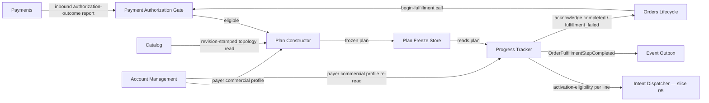

<!-- CONFLUENCE_TITLE: [BSS]: Orders Workflow — Fulfillment Plan (Slice 4) -->
<!-- Related: ../DESIGN.md, ../PRD.md, ./01-foundation.md, ./03-approval-execution.md, ./README.md | Owners: BSS Orders team -->

# DESIGN — Fulfillment Plan (Slice 4)

<!-- toc -->

- [1. Architecture Overview](#1-architecture-overview)
  - [1.1 Architectural Vision](#11-architectural-vision)
  - [1.2 Architecture Drivers](#12-architecture-drivers)
  - [1.3 Architecture Layers](#13-architecture-layers)
- [2. Principles & Constraints](#2-principles--constraints)
  - [2.1 Design Principles](#21-design-principles)
  - [2.2 Constraints](#22-constraints)
- [3. Technical Architecture](#3-technical-architecture)
  - [3.1 Domain Model](#31-domain-model)
  - [3.2 Component Model](#32-component-model)
  - [3.3 API Contracts](#33-api-contracts)
  - [3.4 Internal Dependencies](#34-internal-dependencies)
  - [3.5 External Dependencies](#35-external-dependencies)
  - [3.6 Interactions & Sequences](#36-interactions--sequences)
  - [3.7 Database schemas & tables](#37-database-schemas--tables)
  - [3.8 Deployment Topology](#38-deployment-topology)
- [4. Additional context](#4-additional-context)
- [5. Traceability](#5-traceability)

<!-- /toc -->

- [ ] `p1` - **ID**: `cpt-cf-bss-orders-workflow-design-fulfillment-plan`

## 1. Architecture Overview

### 1.1 Architectural Vision

This slice owns the transition from an approved order to a durable, frozen plan of provisioning
work, and the observable per-line progress of executing that plan. It sits between approval
execution (`03-approval-execution.md`), which reflects an approval verdict into Lifecycle, and
provisioning intents (slice 05), which dispatches the two waves of Subscriptions calls this slice
plans. Three responsibilities belong here and nowhere else: gating begin-fulfillment on a
payment-authorization outcome that Payments owns but this gear consumes, constructing and
freezing one `FulfillmentTask` per order line item against Catalog-owned dependency data, and
tracking each task through wave-aligned states to a terminal outcome without ever compromising
the all-or-nothing completion contract Orders Lifecycle requires.

The central architectural bet is a hard separation between a **pre-activation abort** and a
**line-execution failure**. Both can be triggered by conditions discovered late — a payment
authorization that never clears, a market that no longer matches the payer's commercial profile,
an existing subscription that now overlaps this order's lines — but they resolve through
disjoint machinery. A line-execution failure marks one `FulfillmentTask` `failed` and hands
control to the configurable partial-failure policy (remediate or fail-fast), because real
resources may already be provisioning. A pre-activation abort never marks any task `failed` and
never enters that policy, because by construction it fires before the first activation intent —
nothing beyond a `draft` subscription has ever existed, so there is nothing to remediate and
nothing partial about the outcome. Collapsing the two would either let an operator manually
retry an abort that has no correctable root cause on the task, or would let a real line failure
escape the partial-failure policy's compensation duty.

The other governing decision is that dependency data is never re-derived here. Catalog is the
sole owner of product topology (an add-on requiring its platform plan); the order document, as
captured by Orders Lifecycle, carries no dependency edges at all. This slice reads Catalog's
published topology at plan-construction time, builds a graph scoped to exactly the line items on
this order version, validates it, and freezes the result before issuing the first provisioning
intent — so that every subsequent read of the plan for this `orderId` + `orderVersion` sees the
same graph, replay after replay.

### 1.2 Architecture Drivers

#### Functional Drivers

| Requirement | Design Response |
|-------------|------------------|
| `cpt-cf-bss-orders-workflow-fr-owf-fulfillment-plan` | Plan Constructor component resolves Catalog dependency data per order line, validates the graph, and freezes it per `orderId` + `orderVersion` before any provisioning intent (§3.2, §3.6). |
| `cpt-cf-bss-orders-workflow-fr-owf-line-progress` | Progress Tracker component advances each `FulfillmentTask` through `pending -> draft_created -> activated/failed`, emitting `OrderFulfillmentStepCompleted` only on terminal states, and gates order completion on all lines `activated` (§3.2, §3.6). |
| `cpt-cf-bss-orders-workflow-fr-owf-payment-auth` | Payment Authorization Gate component evaluates the payment-authorization outcome and the buyer-acceptance guard before begin-fulfillment is called, distinguishing pending from failed (§2.1, §3.2). |

#### NFR Allocation

| NFR ID | NFR Summary | Allocated To | Design Response | Verification Approach |
|--------|-------------|--------------|-----------------|----------------------|
| `cpt-cf-bss-orders-workflow-nfr-owf-fulfillment-sla` | p95 <= 15 minutes from activation-wave eligibility to terminal fulfillment outcome for standard orders (no manual steps, no outstanding future-dated wait). | Wave-2 Activation Dispatcher (§3.2) and the frozen plan's per-line dependency ordering (§3.6). | The measured window **opens at activation-wave eligibility**, so plan construction and the whole of wave 1 sit outside it and carry their own, separately derived bound (§4, *SLA arithmetic and the wave deadlines*). Inside the window the budget is `ceil(N / 8) x wave-2 step deadline` — 8 is the per-order parallel-line cap (`01-foundation.md` §4.12), so an `N`-line order runs wave 2 in `ceil(N / 8)` serial batches — plus the dependency-chain depth the frozen graph imposes on top of that batching (§3.6, activation-eligibility predicate). | SLA dashboard timestamps activation-wave-eligible (all creates confirmed, expected fulfillment time reached) and last-line-terminal per order; p95 computed over the **SLA population** defined in §4 — standard orders at or below the derived line-count threshold — which extends the NFR's existing exclusion of manual-step and future-dated-wait orders. |

#### Key ADRs

| ADR ID | Decision Summary |
|--------|-------------------|
| `cpt-cf-bss-orders-workflow-adr-two-wave-activation-barrier` | Fulfillment executes in two phases — draft-create (wave 1, not resource-affecting) then activation (wave 2) — gated on all creates succeeding and expected fulfillment time being reached, so mixed service-activation dates never stagger live activations. |

### 1.3 Architecture Layers

```text
Application   Payment Authorization Gate | Plan Constructor | Plan Freeze Store
                    | Wave-1 Draft Dispatcher (build-only, see slice 05) | Progress Tracker
Domain        FulfillmentPlan, FulfillmentTask, DependencyEdge, ActivationAbortRecord
Infrastructure  owf_fulfillment_plan / owf_fulfillment_task tables (engine-hosted per
                01-foundation.md §3.7 pattern), Catalog topology read client,
                Account Management commercial-profile read client,
                Orders Lifecycle seam client, Subscriptions client (via slice 05),
                inbound Payments authorization-report arm (no outbound client)
```

| Layer | Responsibility | Technology |
|-------|----------------|------------|
| Presentation | Progress-read projection surfaced to operators/consumers (§3.3). | Read model over `owf_fulfillment_task`. |
| Application | Payment-authorization gating, plan construction/validation/freeze, partial-failure policy pinning, pre-activation re-check, activation-eligibility predicate, terminal-state progress advance. | Step handlers registered against the step executor (`01-foundation.md` §3.3). |
| Domain | `FulfillmentPlan`, `FulfillmentTask`, dependency graph, abort reasons. | Rust structs, GTS schemas. |
| Infrastructure | Durable storage for the frozen plan and per-task state; Catalog and Lifecycle clients. | Engine-hosted tables; versioned SDK clients (no direct HTTP). |

## 2. Principles & Constraints

### 2.1 Design Principles

#### Payment Authorization Is Consumed, Not Owned

- [ ] `p2` - **ID**: `cpt-cf-bss-orders-workflow-principle-payment-auth-consumed`

Payment authorization is a Payments-owned mechanism; this gear has no specification for how
Payments computes the outcome and does not attempt to reconstruct it. This slice consumes only
the outcome (pending / authorized / failed) as a process precondition of Lifecycle's
begin-fulfillment guard. Credit scoring is explicitly out of scope for this gear. Payments has no
canonical specification anywhere in this repository at the time of writing; this is recorded as a
constraint, not resolved here (§4).

**ADRs**: none — no ADR is required because this is a scope boundary, not a design trade-off.

#### Pending and Failed Are Distinct Outcomes

- [ ] `p2` - **ID**: `cpt-cf-bss-orders-workflow-principle-pending-failed-distinct`

Payment-authorization `pending` and `failed` MUST never be collapsed into one state. While
pending, the order remains `approved` and no begin-fulfillment call is issued — the process
waits. On `failed` without the seller's tolerate-failure policy configured, begin-fulfillment
MUST NOT be called and the order stays `approved`. On `failed` with tolerate-failure configured,
begin-fulfillment MAY proceed, but only with the risk flagged on the order as Lifecycle requires
for that call. Collapsing pending into failed would either stall the order silently (if treated
as pending forever) or provision a tenant that never paid (if treated as authorized).

`pending` is a **wait with a wake-up**, never an open-ended stall. Exactly two mechanisms end it
and no third exists. First, Payments **reports** the settled outcome to this gear on the inbound
reporting arm (§3.5); the report is consumed as a process callback and re-runs the eligibility
evaluation. Second, a `payment-auth-wait` durable timer, armed when the gate first observes
`pending`, re-evaluates eligibility on expiry, so a report that is never delivered cannot strand
the order silently. This gear issues **no outbound call to Payments** in either mechanism — the
direction is inbound reporting only, and §3.5 states it as the single resolution of a direction
question three slices previously answered three ways.

**ADRs**: none — this is a direct PRD requirement (`cpt-cf-bss-orders-workflow-fr-owf-payment-auth`),
not an independent architecture trade-off.

#### Dependency Ownership Stays With Catalog

- [ ] `p2` - **ID**: `cpt-cf-bss-orders-workflow-principle-catalog-owns-topology`

Inter-line dependencies (for example, an add-on line requiring its platform-plan line) are
product topology, which is Catalog's domain, not the order's. The order document carries no
dependency data. This slice resolves the dependency graph by reading Catalog's published data at
plan-construction time and never infers dependencies from line ordering, naming, or any other
order-local signal.

**ADRs**: `cpt-cf-bss-orders-workflow-adr-two-wave-activation-barrier`

#### Fulfillment Completion Is Atomic

- [ ] `p2` - **ID**: `cpt-cf-bss-orders-workflow-principle-atomic-completion`

An order is acknowledged `in_fulfillment -> completed` only when every `FulfillmentTask` for that
order has reached `activated`. There is no partial completion state; an order with any
unactivated line MUST NOT be acknowledged `completed` under any partial-failure policy
configuration. Per-line progress is observable for operational visibility, but the commercial
outcome Lifecycle records is all-or-nothing, matching Lifecycle's atomic fulfillment contract
(Lifecycle PRD §6.1).

**ADRs**: `cpt-cf-bss-orders-workflow-adr-two-wave-activation-barrier`

### 2.2 Constraints

#### Begin-Fulfillment Ordering

- [ ] `p2` - **ID**: `cpt-cf-bss-orders-workflow-constraint-begin-fulfillment-ordering`

The Lifecycle begin-fulfillment call MUST be durably committed before this gear issues any
activation intent. This slice does not restate the seam's commitment mechanics — see
`gears/bss/orders-lifecycle/docs/design/06-workflow-seam.md` §4.3 (begin fulfillment and the
spawn signal) for the normative rule this constraint binds to.

**ADRs**: `cpt-cf-bss-orders-workflow-adr-two-wave-activation-barrier`

#### Pre-Activation Abort Is Not a Line Failure

- [ ] `p2` - **ID**: `cpt-cf-bss-orders-workflow-constraint-pre-activation-abort`

An overlap collision or market divergence detected by the pre-activation re-check MUST halt
fulfillment before any activation intent, void the wave-1 drafts, and acknowledge the order to
`fulfillment_failed` with a machine-readable reason (`overlap-collision` or
`market-divergence`). It MUST NOT mark any `FulfillmentTask` `failed`, and MUST NOT enter the
remediate/fail-fast partial-failure policy. See §3.6 for the sequence and §4 for the disclosure
this constraint depends on.

The void leg can itself fail, and the abort MUST NOT be reported when it does. Per
`cpt-cf-bss-orders-workflow-adr-saga-compensable-no-pivot`, a compensating action that cannot be
completed leaves the order **non-terminal**: the `ActivationAbortRecord` is written with
`void_outcome = incomplete`, **no** `fulfillment_failed` acknowledgement is sent, a manual task is
raised with reason `draft-void-failed` (`07-manual-tasks.md`), and escalation continues until the
void reaches a known outcome. Only a confirmed void of every wave-1 draft satisfies the evidence
Lifecycle's `fulfillment_failed` acknowledgement requires, so only a confirmed void may be
followed by that acknowledgement.

**ADRs**: `cpt-cf-bss-orders-workflow-adr-two-wave-activation-barrier`,
`cpt-cf-bss-orders-workflow-adr-saga-compensable-no-pivot`

#### Bundle Lines Are Never Expanded

- [ ] `p2` - **ID**: `cpt-cf-bss-orders-workflow-constraint-bundle-one-line`

A bundle plan is one order line item and is never expanded into its constituent components by
this slice. Bundle pricing is first-class upstream (pricing PRD, gears-rust); this gear receives
the order's line items exactly as Orders Lifecycle captured them and builds exactly one
`FulfillmentTask` per received line, bundle or not.

**ADRs**: none — this is a received invariant from the upstream order document, not a local
design trade-off.

#### The Partial-Failure Policy Is Pinned At Freeze

- [ ] `p2` - **ID**: `cpt-cf-bss-orders-workflow-constraint-policy-pinned-at-freeze`

The partial-failure policy in force for an order (remediate or fail-fast) is resolved once, at
plan construction, and persisted on the frozen plan as
`owf_fulfillment_plan.partial_failure_policy` (§3.7). Every later failure on that order version
reads the pinned value and never the live configuration. Without the pin, a configuration change
mid-flight silently moves a running order between "hold and raise a manual task" and "compensate
everything and acknowledge `fulfillment_failed`" — two different commercial outcomes for one
order, selected by the timing of an unrelated edit.

**ADRs**: `cpt-cf-bss-orders-workflow-adr-saga-compensable-no-pivot`

#### Inter-Line Dependency Ordering Is Decided Here

- [ ] `p2` - **ID**: `cpt-cf-bss-orders-workflow-constraint-dependency-ordering-owner`

The frozen dependency graph is not decoration: this slice owns the **activation-eligibility
predicate** that reads it, and slice 05's dispatcher consumes that predicate's answer rather than
re-deriving one. A line is activation-eligible only when every task it depends on in the frozen
graph has reached `activated`; independent lines are eligible together, subject to the per-order
concurrency cap. Activation is therefore **not** a single all-together gate — the barrier
(`cpt-cf-bss-orders-workflow-adr-two-wave-activation-barrier`) releases the wave, and this
predicate orders the lines within it, which is what `PRD.md:332` ("a dependent line MUST wait for
its dependency lines before its own activation") requires and AC 5 makes testable.

**ADRs**: `cpt-cf-bss-orders-workflow-adr-two-wave-activation-barrier`

## 3. Technical Architecture

### 3.1 Domain Model

**Technology**: Rust structs, GTS schemas.

**Location**: [`../DESIGN.md`](../DESIGN.md) §3.1 (gear-wide domain-model index); the entities
below are normative in this slice, with their columns in §3.7.

**Core Entities**:

- [ ] `p2` - **ID**: `cpt-cf-bss-orders-workflow-entity-fulfillment-plan`
- [ ] `p2` - **ID**: `cpt-cf-bss-orders-workflow-entity-fulfillment-task`
- [ ] `p2` - **ID**: `cpt-cf-bss-orders-workflow-entity-dependency-edge`
- [ ] `p2` - **ID**: `cpt-cf-bss-orders-workflow-entity-activation-abort-record`

| Entity | Description | Schema |
|--------|-------------|--------|
| `FulfillmentPlan` | Frozen, per `orderId` + `orderVersion` container of all `FulfillmentTask`s, the validated dependency graph for that order version, the pinned partial-failure policy (§2.2) and the Catalog topology revision the graph was resolved against. Immutable once frozen. | `owf_fulfillment_plan` (§3.7) |
| `FulfillmentTask` | One per order line item (bundle lines never expanded). Carries wave-aligned state (`pending`, `draft_created`, `activated`, `failed`) under the transition table of §3.7, its topological rank in the frozen graph, the downstream Subscriptions transition-request identifier (join key only), the **resulting `subscriptionId`** once the line is `activated`, and its resolved dependency edges. | `owf_fulfillment_task` (§3.7) |
| `DependencyEdge` | A directed edge between two `FulfillmentTask`s within the same plan, resolved from Catalog topology at construction time. | Embedded in `owf_fulfillment_plan.dependency_graph` (§3.7) |
| `ActivationAbortRecord` | Records a pre-activation abort's machine-readable reason (`overlap-collision`, `market-divergence`, `payment-authorization-stale` or `invalid-dependency-graph`), the wave-1 void evidence, and the void outcome (`confirmed` or `incomplete` — §2.2), distinct from any `FulfillmentTask` state. | `owf_fulfillment_plan.abort_record` (§3.7) |

**Relationships**:
- `FulfillmentPlan` -> `FulfillmentTask`: one plan owns one task per order line item.
- `FulfillmentTask` -> `DependencyEdge`: a task may depend on zero or more sibling tasks in the
  same plan; the graph is validated acyclic at construction.
- `FulfillmentPlan` -> `ActivationAbortRecord`: at most one abort record per plan; its presence
  is mutually exclusive with any task reaching `activated`.

### 3.2 Component Model

This design covers four components scoped to this slice: the Payment Authorization Gate, the
Plan Constructor, the Plan Freeze Store, and the Progress Tracker. Wave dispatch mechanics
(draft-create and activation intent submission to Subscriptions) belong to slice 05
(`05-provisioning-intents.md`); this slice defines the plan those intents execute against and
the per-task state those intents advance.



#### Payment Authorization Gate

- [ ] `p2` - **ID**: `cpt-cf-bss-orders-workflow-component-payment-auth-gate`

##### Why this component exists

Begin-fulfillment is the first point at which this gear commits Lifecycle to provisioning work,
so it is also the point at which the money precondition must be enforced. Without a dedicated
gate, the pending/failed distinction (§2.1) would be easy to blur across call sites.

##### Responsibility scope

Evaluates the payment-authorization outcome and the recorded-buyer-acceptance guard before
issuing the begin-fulfillment call. Re-evaluates eligibility on `OrderAcceptanceRecorded`, on an
inbound Payments authorization report, and on expiry of the `payment-auth-wait` timer it arms
whenever it observes `pending` (§2.1). Records the observed outcome and the instant it was
observed on the process instance, so a later reader can tell how old the authorization is.
Applies the seller's tolerate-failure policy when the outcome is `failed`. Performs the
**pre-activation authorization-freshness re-check**: immediately before the first activation
intent, the recorded authorization must still be within its validity horizon
(`payment_auth_validity = 30 days` — accepted; a barrier deferred
by a future-dated line can be up to `max_process_lifetime = 90 days` away, so an authorization
observed at begin-fulfillment can be older than the authorizer honours). A stale authorization is
a **pre-activation abort** with reason `payment-authorization-stale`, following the abort path of
§2.2 — never a line failure.

##### Responsibility boundaries

Does not compute the payment-authorization outcome (Payments owns that mechanism entirely) and
does not perform credit scoring (out of scope). Does not call Payments outbound under any
circumstance — outcomes arrive on the inbound reporting arm (§3.5). Does not decide whether buyer
acceptance is required — it only checks whether a required acceptance has been recorded. Does not
call Subscriptions.

##### Related components (by ID)

- `cpt-cf-bss-orders-workflow-component-plan-constructor` — calls, on successful begin-fulfillment
  commitment.
- `cpt-cf-bss-orders-workflow-actor-owf-orders-lifecycle` — depends on for the begin-fulfillment
  call and its guard evaluation.

#### Plan Constructor

- [ ] `p2` - **ID**: `cpt-cf-bss-orders-workflow-component-plan-constructor`

##### Why this component exists

Sequencing provisioning work correctly requires an authoritative dependency source; without a
dedicated constructor that always resolves against Catalog, a later slice could be tempted to
infer dependencies from order-local data, which the order document does not carry.

##### Responsibility scope

Builds one `FulfillmentTask` per order line item (never expanding bundle lines), resolves
dependency edges against Catalog's published topology for the order's lines, validates the
resulting graph is acyclic and that every dependency is present among the order's own lines,
computes each task's topological rank for the activation-eligibility predicate, pins the
partial-failure policy (§2.2), and hands the validated plan to the Plan Freeze Store. Performs
the plan-construction-time pre-activation re-check (overlap-presence and market divergence) as a
precondition of freezing, reading the payer's commercial profile from `account-management`
(§3.4) for the market half and the `SUB-O5` overlap-presence read for the overlap half.

**Catalog failure posture.** Plan construction runs **after** begin-fulfillment is durably
committed, so a Catalog outage here cannot be answered by simply not starting. The topology read
is wrapped by the same Dependency Retry Governor path slice 08 applies to Lifecycle,
Subscriptions and Payments (`08-hold-and-cancel.md`), with the step's retry budget and step
deadline; on exhaustion the step escalates to a manual task with reason
`catalog-topology-unavailable` and the order is held under the pinned policy — it is never frozen
against a partial answer.

**Completeness is asserted, not assumed.** A partial topology read can satisfy both "acyclic" and
"every dependency present among the order's lines" and still be missing edges, freezing an
under-constrained graph permanently. The read is therefore **fail-closed on completeness**: the
response must carry a topology revision identifier and an explicit per-line resolved/unresolved
marker; any line whose topology did not resolve, or a response carrying no revision identifier,
makes the read unevaluable and the plan is not frozen. The revision identifier is persisted as
`owf_fulfillment_plan.catalog_topology_revision` so the frozen graph names the input it was
derived from. This obligation is registered as an upstream ask on Catalog (§4).

##### Responsibility boundaries

Does not dispatch any provisioning intent (slice 05 owns wave dispatch). Does not re-derive
dependency data from order-local signals (§2.1).

**The invalid-dependency-graph outcome is concrete**, because no `FulfillmentTask` exists yet and
nothing per-task can be keyed. A missing or cyclic graph halts fulfillment before any
subscription is created (no compensation is owed — nothing was provisioned) and produces exactly
this, in this order:

1. The `owf_fulfillment_plan` row is written **unfrozen** (`frozen_at` stays null, so no dispatch
   can read it) carrying an `ActivationAbortRecord` with reason `invalid-dependency-graph` and
   the offending edge set as evidence.
2. Under the pinned **remediate** policy, one plan-level manual task is created with
   `line_ref = '*plan*'` — the plan-scope sentinel, distinct from every real line reference — and
   reason `invalid-dependency-graph`, and the order is held under the seam of §4
   (*The hold seam*). Under **fail-fast**, a non-actionable `Incident` is recorded with the same
   reason instead.
3. Either way the order reaches a terminal path rather than sitting in `in_fulfillment`
   indefinitely: remediate terminates when the operator resolves the task (a corrected order
   version supersedes this plan) or when remediation is exhausted (§4); fail-fast acknowledges
   `in_fulfillment -> fulfillment_failed` with reason `invalid-dependency-graph` immediately.

The plan-scope sentinel needs `owf_manual_task`/`owf_incident` to admit a non-line `line_ref` and
the reason catalogue to admit `invalid-dependency-graph` and `catalog-topology-unavailable`;
both are registered as asks on slice 07 and the reason catalogue in §4.

##### Related components (by ID)

- `cpt-cf-bss-orders-workflow-component-plan-freeze-store` — depends on to persist the frozen
  plan.
- Catalog (external dependency; not a PRD-registered actor) — depends on for dependency-topology reads.

#### Plan Freeze Store

- [ ] `p2` - **ID**: `cpt-cf-bss-orders-workflow-component-plan-freeze-store`

##### Why this component exists

Replay-consistency requires that once a plan is frozen for an `orderId` + `orderVersion`, every
subsequent read — including after a process restart or step retry — sees the identical graph and
task set. A dedicated freeze boundary makes that guarantee structural rather than incidental.

##### Responsibility scope

Persists the validated `FulfillmentPlan` keyed by `orderId` + `orderVersion` before the first
provisioning intent is issued. Rejects any attempt to mutate a frozen plan's dependency graph or
task set for that same order version. Serves the plan back to the wave dispatcher (slice 05) and
to the Progress Tracker.

##### Responsibility boundaries

Does not validate the graph (Plan Constructor does that before handing off). Does not track
per-task runtime state (Progress Tracker owns that).

##### Related components (by ID)

- `cpt-cf-bss-orders-workflow-component-plan-constructor` — receives the validated plan from.
- `cpt-cf-bss-orders-workflow-component-progress-tracker` — shares the frozen plan's task set
  with, read-only.

#### Progress Tracker

- [ ] `p2` - **ID**: `cpt-cf-bss-orders-workflow-component-progress-tracker`

##### Why this component exists

Per-line observability (process tracking) and atomic commercial completion (Lifecycle contract)
are both required, and they are easy to conflate. A dedicated tracker keeps the wave-aligned
per-task state machine and the all-or-nothing completion decision as one component's
responsibility, so no other component can acknowledge `completed` on partial progress.

##### Responsibility scope

Advances each `FulfillmentTask` through the transition table of §3.7 as wave confirmations
arrive (confirmations themselves are consumed by slice 05's dispatcher, which calls into this
component to record the advance), including the operator-driven `failed -> draft_created |
activated` transitions a retry or a verified override produces. Emits
`OrderFulfillmentStepCompleted` exactly once **per terminal-state entry** — the guard is
`(task, terminal_entry_seq)`, not "first terminal state", so a line that fails, is retried and
then activates emits two events and the remediate policy can reach completion. Acknowledges
`in_fulfillment -> completed` to Lifecycle only when every task in the frozen plan is
`activated`, passing the per-line `subscription_id` set the acknowledgement requires (§3.7).

Owns the **activation-eligibility predicate** (§2.2): reads the frozen graph and answers, per
line, whether every task it depends on is `activated`, and hands that answer to slice 05's
dispatcher. This is the one place inter-line ordering is decided.

Executes the pre-activation abort path: on collision, divergence or a stale authorization, voids
wave-1 drafts, writes the `ActivationAbortRecord`, and — only on a **confirmed** void —
acknowledges `fulfillment_failed`, without touching any `FulfillmentTask`'s state field; an
incomplete void follows §2.2 instead. Applies the **pinned** partial-failure policy (§2.2) when a
task reaches permanent `failed`, in either wave (§3.6).

##### Responsibility boundaries

Does not submit provisioning intents itself (slice 05 does). Does not *build* or mutate the
dependency graph — it consumes the frozen graph as given and only evaluates the
activation-eligibility predicate over it. Does not mirror the downstream Subscriptions
transition-request identifier into order state — it is recorded on the task as a join key only;
the `subscription_id` it records is fulfillment evidence for the completion acknowledgement and
for compensation, not order state.

##### Related components (by ID)

- `cpt-cf-bss-orders-workflow-component-plan-freeze-store` — depends on for the frozen plan.
- `cpt-cf-bss-orders-workflow-actor-owf-orders-lifecycle` — calls for `completed` /
  `fulfillment_failed` acknowledgement.
- `cpt-cf-bss-orders-workflow-actor-owf-subscriptions` — consumes wave confirmations from
  (via slice 05's dispatcher).

### 3.3 API Contracts

- [ ] `p2` - **ID**: `cpt-cf-bss-orders-workflow-interface-plan-construction`

- **Contracts**: `cpt-cf-bss-orders-workflow-contract-step-invocation` (`01-foundation.md` §3.3)
- **Technology**: internal step-executor operation, not a public REST/gRPC surface.
- **Location**: step handler registered against `cpt-cf-bss-orders-workflow-interface-step-executor-api`.

**Endpoints Overview**:

| Method | Path | Description | Stability |
|--------|------|--------------|-----------|
| step: `construct-and-freeze-plan` | n/a (step invocation) | Resolves Catalog dependencies, validates the graph, and freezes the plan for the given `orderId` + `orderVersion`. | stable |
| step: `evaluate-payment-auth-eligibility` | n/a (step invocation) | Evaluates the payment-authorization outcome and buyer-acceptance guard; issues begin-fulfillment when eligible; arms the `payment-auth-wait` timer while the outcome is `pending`. | stable |
| step: `re-check-pre-activation` | n/a (step invocation) | Immediately before the first activation intent: overlap-presence (`SUB-O5`), market divergence against the payer's current commercial profile, and authorization freshness. Returns `proceed` or an abort reason. | stable |
| step: `evaluate-activation-eligibility` | n/a (step invocation) | Answers, per line, whether every dependency in the frozen graph is `activated`; the ordering input slice 05's dispatcher consumes. | stable |

- [ ] `p2` - **ID**: `cpt-cf-bss-orders-workflow-interface-fulfillment-progress-read`

- **Contracts**: `cpt-cf-bss-orders-workflow-interface-progress-read` (`01-foundation.md` §3.3)
- **Technology**: read-only projection over `owf_fulfillment_task`.
- **Location**: progress-read operation surfaced through the engine's progress-read interface.

**Endpoints Overview**:

| Method | Path | Description | Stability |
|--------|------|--------------|-----------|
| `GET` (projection) | `/bss-orders-workflow/v1/fulfillment-plan/{orderId}/{orderVersion}` | Per-line wave-aligned state, including intermediate `pending -> draft_created` advances not observable via events. | stable |

### 3.4 Internal Dependencies

| Dependency Gear | Interface Used | Purpose |
|------------------|-----------------|----------|
| Orders Lifecycle | `06-workflow-seam.md` §4.3 begin-fulfillment / §4.4 acknowledgement contracts | Begin-fulfillment call ordering guard; `completed` / `fulfillment_failed` acknowledgement. |
| Catalog | dependency-topology read contract (revision-stamped, per-line resolved/unresolved markers — §3.2) | Resolves inter-line dependency edges for plan construction; this gear reads only, never writes, Catalog data. **Posture**: required, wrapped by slice 08's Dependency Retry Governor, fail-closed on an incomplete or unstamped response. |
| Account Management | payer commercial-profile read | The `(currency, region)` binding the order market is compared against, at plan construction and again immediately before the first activation intent (`PRD.md:332` market re-check). Same read the sibling Lifecycle submit gate uses (`orders-lifecycle/docs/design/03-gate-and-pin.md` §3.4). |
| Subscriptions | provisioning-intent contract (owned by slice 05) | Downstream target of wave dispatch; this slice records only the returned transition-request identifier as a join key, and the resulting `subscriptionId` as completion evidence. |

**Dependency Rules** (per project conventions):
- No circular dependencies
- Always use SDK modules for inter-gear communication
- No cross-category sideways deps except through contracts
- Only integration/adapter gears talk to external systems
- `SecurityContext` must be propagated across all in-process calls

### 3.5 External Dependencies

This slice introduces no outbound external-system client of its own. Its one external coupling is
**inbound**: Payments reports a payer's authorization outcome to this gear.

#### Payments (inbound reporting arm — direction is settled here)

- **Contract**: none — no specification exists in this repository; only the reported outcome is
  consumed. Registered as the upstream ask `cpt-cf-bss-orders-workflow-upreq-payment-authorization-outcome`.

| Dependency Gear | Interface Used | Purpose |
|------------------|-----------------|----------|
| Payments | **inbound** authorization-outcome report (`authorized` / `pending` / `failed`), consumed as a process callback on the reporting arm of `09-read-and-authz.md` | The begin-fulfillment money gate (§2.1) and the pre-activation freshness re-check (§3.2). |

**Direction, stated once.** Three slices have described this coupling three ways — this slice as
"never call Payments", slice 08 as an outbound SDK client wrapped by the Dependency Retry
Governor, slice 09 as an inbound reporting arm. **The direction is inbound reporting**, and this
row is the resolution: no outbound Payments client exists in this design, the Dependency Retry
Governor has no Payments call to wrap from this slice, and the only Payments-shaped failure mode
this gear handles is a report that never arrives — handled by the `payment-auth-wait` timer
(§2.1), not by a retry budget. Slice 08's outbound row and the governor's Payments coverage are
therefore vestigial; correcting them is recorded as a cross-slice ask in §4.

**Dependency Rules** (per project conventions):
- No circular dependencies
- Always use SDK modules for inter-gear communication
- No cross-category sideways deps except through contracts
- Only integration/adapter gears talk to external systems
- `SecurityContext` must be propagated across all in-process calls

### 3.6 Interactions & Sequences

#### Plan Construction and Freeze

**ID**: `cpt-cf-bss-orders-workflow-seq-plan-construction`

**Use cases**: `cpt-cf-bss-orders-workflow-fr-owf-fulfillment-plan`

**Actors**: `cpt-cf-bss-orders-workflow-actor-owf-orders-lifecycle`

```mermaid
sequenceDiagram
    participant L as Orders Lifecycle
    participant G as Payment Auth Gate
    participant C as Plan Constructor
    participant Cat as Catalog
    participant AM as Account Management
    participant F as Plan Freeze Store
    L->>G: begin-fulfillment eligibility signal
    G->>G: check payment-auth outcome + buyer acceptance
    alt outcome pending
        G->>G: arm payment-auth-wait timer; order stays approved
    end
    G->>L: begin-fulfillment (durably committed)
    G->>C: construct plan(orderId, orderVersion, lines)
    C->>Cat: read dependency topology for lines (revision-stamped)
    alt topology read unavailable or incomplete
        Cat-->>C: error | missing revision | unresolved line
        C->>C: retry within step budget; on exhaustion escalate
        Note over C: manual task catalog-topology-unavailable; plan NOT frozen
    else complete, revision-stamped
        Cat-->>C: dependency edges + topology revision
        C->>C: build one FulfillmentTask per line; validate acyclic + complete; rank topologically
        C->>AM: read payer commercial profile
        AM-->>C: (currency, region) binding
        C->>C: pre-activation re-check (overlap-presence SUB-O5 + market)
        alt graph invalid (missing or cyclic)
            C->>F: write unfrozen plan row + ActivationAbortRecord(invalid-dependency-graph)
            Note over C,F: plan-level manual task (line_ref = *plan*) or Incident per pinned policy
        else graph valid
            C->>C: pin partial-failure policy
            C->>F: freeze(orderId, orderVersion, plan, policy, topology revision)
            F-->>C: frozen
        end
    end
```

**Description**: Begin-fulfillment is committed before any plan-construction side effect that
could lead to a provisioning intent — which is exactly why the Catalog leg needs a failure
posture: at this point the order is already `in_fulfillment` and "do not start" is no longer
available. The dependency graph is resolved once against a named topology revision, validated,
ranked and frozen together with the policy that governs the order's failures. An invalid graph
halts here, before any subscription exists, needing no compensation, and resolves through the
concrete outcome enumerated in §3.2 rather than leaving the order in `in_fulfillment` with no
terminal path.

#### Pre-Activation Abort

**ID**: `cpt-cf-bss-orders-workflow-seq-pre-activation-abort`

**Use cases**: `cpt-cf-bss-orders-workflow-fr-owf-fulfillment-plan`

**Actors**: `cpt-cf-bss-orders-workflow-actor-owf-orders-lifecycle`,
`cpt-cf-bss-orders-workflow-actor-owf-subscriptions`

```mermaid
sequenceDiagram
    participant P as Progress Tracker
    participant AM as Account Management
    participant Sub as Subscriptions
    participant L as Orders Lifecycle
    P->>AM: read payer commercial profile (current)
    AM-->>P: (currency, region) binding
    P->>P: re-check overlap-presence (SUB-O5) + market divergence + auth freshness
    alt collision, divergence, or stale authorization
        P->>Sub: void wave-1 drafts
        alt every void confirmed
            Sub-->>P: void confirmed
            P->>P: write ActivationAbortRecord(reason, void_outcome = confirmed)
            P->>L: acknowledge in_fulfillment -> fulfillment_failed
            Note over P: No FulfillmentTask marked failed; remediate/fail-fast policy NOT entered
        else a void cannot be completed
            Sub-->>P: void failed | unconfirmable
            P->>P: write ActivationAbortRecord(reason, void_outcome = incomplete)
            Note over P,L: NO acknowledgement — order stays non-terminal per ADR-0005;<br/>manual task draft-void-failed, escalate until the void has a known outcome
        end
    else no collision, no divergence, authorization fresh
        P->>Sub: dispatch activation intents for eligible lines (wave 2)
    end
```

**Description**: This sequence is the slice's most load-bearing distinction. The re-check runs
before any activation intent, so no subscription was ever activated when the abort fires; the
evidence Lifecycle's `fulfillment_failed` acknowledgement requires is therefore satisfiable by
construction — the void confirmation plus the assertion that no active subscription exists. The
same re-check runs once more at plan construction time as an earlier, non-final gate; only the
immediately-pre-wave-2 re-check is authoritative for the abort decision, since state can change
between construction and the first activation intent. The authorization-freshness leg is in the
same re-check for the same reason: the barrier can defer wave 2 by up to the future-dated
horizon, and an authorization observed before begin-fulfillment can expire inside that wait
(§3.2). The void-failure branch is the ADR-0005 consequence made executable — an abort whose void
cannot be completed is not an abort that may be reported, so it produces a non-terminal order and
a compensation-failure manual task rather than an unconditional `fulfillment_failed`.

#### Per-Line Progress to Terminal State

**ID**: `cpt-cf-bss-orders-workflow-seq-line-progress`

**Use cases**: `cpt-cf-bss-orders-workflow-fr-owf-line-progress`

**Actors**: `cpt-cf-bss-orders-workflow-actor-owf-orders-lifecycle`,
`cpt-cf-bss-orders-workflow-actor-owf-subscriptions`

```mermaid
sequenceDiagram
    participant Sub as Subscriptions
    participant P as Progress Tracker
    participant Out as Event Outbox
    participant L as Orders Lifecycle
    Sub-->>P: draft-create confirmation (line L)
    P->>P: task[L]: pending -> draft_created (progress-read only, no event)
    P->>P: activation-eligibility predicate: dependencies of L all activated?
    Sub-->>P: activation confirmation (line L, subscriptionId)
    P->>P: task[L]: draft_created -> activated; record subscription_id
    P->>Out: OrderFulfillmentStepCompleted (line L, activated, terminal_entry_seq)
    alt all lines activated
        P->>L: acknowledge in_fulfillment -> completed (per-line subscriptionId set)
    else a line fails permanently
        P->>Out: OrderFulfillmentStepCompleted (line L, failed, terminal_entry_seq)
        P->>P: apply pinned partial-failure policy (remediate | fail-fast)
    else operator retry or verified override resolves a failed line
        P->>P: task[L]: failed -> draft_created | activated (actor identity recorded)
        P->>Out: OrderFulfillmentStepCompleted (line L, activated, next terminal_entry_seq)
    end
```

**Description**: Every entry into a terminal state (`activated` or `failed`) emits exactly one
`OrderFulfillmentStepCompleted` — the guard is per `(task, terminal_entry_seq)`, so the
re-entry a retry or override produces emits its own event and the remediate policy can reach
completion (`PRD.md:342`). The intermediate `pending -> draft_created` advance is visible only
through the progress-read interface (§3.3). Completion acknowledgement fires only once every task
in the frozen plan is `activated` — never on a subset — and carries the per-line
`subscription_id` set, which is why that column exists (§3.7).

**Wave-1 partial failure — what happens to the drafts that succeeded.** A permanent wave-1 create
failure halts the order before any activation intent, so the barrier's "all creates succeeded"
half can never become true and the barrier never releases. The drafts that did succeed are
therefore **disposed of explicitly, not left to a TTL this gear may not read**: the Progress
Tracker runs the draft-void leg over every `draft_created` task on the plan as soon as one
wave-1 task reaches permanent `failed`, then applies the pinned policy. Under **remediate** the
order is held with a manual task carrying the wave-discriminating reason (`wave1-create-failed`)
and the voided lines rebuild on retry; under **fail-fast** the confirmed voids are the
compensation evidence for an immediate `fulfillment_failed`. A void that cannot be completed
follows §2.2 — non-terminal order, `draft-void-failed` task — never a silent wait.

**Wave-2 partial failure** (accepted, `DECISIONS.md` D-54). When some lines have
activated and one fails permanently, the already-activated lines are **not** rolled back and the
order is **held**; dependent lines are halted, independent in-flight lines are allowed to finish,
and a manual task is raised per failed line. The order cannot be acknowledged `completed`
(completion is atomic, §2.1) and it is not acknowledged `fulfillment_failed` either, because live
billable subscriptions exist that no automatic path is authorised to cancel. The only routes out
are operator remediation that drives every failed line to `activated` (completion), remediation
exhausted (§4), or an operator-initiated workflow-mediated cancel, which is the only path that
compensates the activated lines. This is the "partial commercial outcome" ADR-0004 names and does
not itself resolve; stating it here is what makes it operable rather than emergent.

### 3.7 Database schemas & tables

- [ ] `p3` - **ID**: `cpt-cf-bss-orders-workflow-db-fulfillment`

#### Table: owf_fulfillment_plan

**ID**: `cpt-cf-bss-orders-workflow-dbtable-fulfillment-plan`

**Schema**:

| Column | Type | Description |
|--------|------|--------------|
| order_id | text | Order identifier this plan belongs to. |
| order_version | integer | Order version this plan was frozen against. |
| resource_tenant_id | uuid | Resource recipient; the tenancy axis every read of this table is scoped by. |
| payer_tenant_id | uuid | Billing party; the profile the market re-check (§3.6) is evaluated against. |
| seller_tenant_id | uuid | Selling party; the axis the operator-facing progress read and per-tenant fairness key on. |
| partial_failure_policy | text | `remediate` \| `fail_fast`, pinned at construction (§2.2); read by every later failure on this order version, never re-read from configuration. |
| catalog_topology_revision | text | The Catalog topology revision the dependency graph was resolved against (§3.2); names the input the frozen graph derives from. |
| dependency_graph | jsonb | Validated, acyclic dependency edges among this plan's tasks, resolved from Catalog at construction time. |
| frozen_at | timestamptz | When the plan was frozen; null before freeze completes, and an unfrozen row is never dispatched against. |
| abort_record | jsonb | Nullable `ActivationAbortRecord` (reason: `overlap-collision` \| `market-divergence` \| `payment-authorization-stale` \| `invalid-dependency-graph`; `void_outcome`: `confirmed` \| `incomplete`; void evidence). Mutually exclusive with any task reaching `activated`. |
| created_at | timestamptz | Row creation time; the partition key. |

**PK**: (order_id, order_version)

**Constraints**: NOT NULL on order_id, order_version, resource_tenant_id, payer_tenant_id,
seller_tenant_id, partial_failure_policy, created_at; `catalog_topology_revision` NOT NULL once
`frozen_at` is set; dependency_graph, partial_failure_policy and catalog_topology_revision
immutable once frozen_at is set; at most **200** tasks per plan (§4, *Max lines per order*).

**Additional info**: One row per order version; a new `orderVersion` produces a new plan row,
never an in-place edit of a frozen one. **Tenant axes**: `resource_tenant_id` is the isolation
column (SecureORM `tenant_col`); `seller_tenant_id` additionally scopes the operator-facing
progress read; `payer_tenant_id` is carried because the market re-check needs the payer, which in
the partner-placed path is not the resource recipient. **Retention**: ≥ 400 days, matching
`owf_compensation_record` and `owf_audit_entry` — compensation and audit both join to the frozen
plan, so it cannot be purged ahead of them. **Partitioning**: monthly range partition on
`created_at`.

**Example**:

| order_id | order_version | partial_failure_policy | frozen_at |
|----------|----------------|------------------------|-----------|
| ord-8841 | 2 | remediate | 2026-09-10T10:15:00Z |

#### Table: owf_fulfillment_task

**ID**: `cpt-cf-bss-orders-workflow-dbtable-fulfillment-task`

**Schema**:

| Column | Type | Description |
|--------|------|--------------|
| order_id | text | Order identifier. |
| order_version | integer | Order version (foreign key to `owf_fulfillment_plan`). |
| order_line_id | text | The order line item this task fulfills; one task per line, bundle lines never expanded. |
| resource_tenant_id | uuid | Resource recipient; the isolation column for every read of this table. |
| seller_tenant_id | uuid | Selling party; scopes the operator-facing progress read and the per-tenant fairness bucket. |
| state | text | One of `pending`, `draft_created`, `activated`, `failed`, per the transition table below. |
| dependency_rank | integer | Topological rank of this task in the frozen graph (0 = no dependencies); the activation-eligibility predicate's index (§3.2). |
| transition_request_id | text | Downstream Subscriptions transition-request identifier; join key only, never mirrored into order state. |
| subscription_id | text nullable | The subscription Subscriptions created for this line, captured on the activation confirmation (and on a verified operator override). Fulfillment evidence: it is what the completion acknowledgement passes to Lifecycle (`PRD.md` AC 8) and what compensation enumerates. NOT NULL once `state = activated`. |
| terminal_entry_seq | integer | Incremented on **every** entry into a terminal state (`activated` or `failed`), including a re-entry after an operator-driven retry or override. Starts at 0. |
| terminal_event_emitted_seq | integer | Highest `terminal_entry_seq` for which `OrderFulfillmentStepCompleted` has been emitted. The exactly-once guard is `terminal_event_emitted_seq < terminal_entry_seq`, i.e. **per terminal-state entry**, not per task. |
| terminal_event_emitted_at | timestamptz | When the emission for `terminal_event_emitted_seq` was written to the outbox. |
| last_transition_actor | text nullable | Actor identity for an operator-driven transition; NOT NULL on any transition out of `failed`. |
| created_at | timestamptz | Row creation time; the partition key. |

**PK**: (order_id, order_version, order_line_id)

**Constraints**: NOT NULL on order_id, order_version, order_line_id, resource_tenant_id,
seller_tenant_id, state, dependency_rank, terminal_entry_seq, terminal_event_emitted_seq,
created_at.

`state` is a schema-level enum with the following **declared transition table** — it replaces the
append-only-forward rule, which forbade exactly the transitions the default remediate policy
depends on:

| From | Permitted to | Driven by |
|------|--------------|-----------|
| `pending` | `draft_created`, `failed` | Wave-1 draft-create confirmation / failure. `pending -> failed` is the disposition of **every** wave-1 create failure and is explicitly permitted. |
| `draft_created` | `activated`, `failed` | Wave-2 activation confirmation / failure. |
| `failed` | `draft_created`, `activated` | **Operator-driven only** — manual-task `retry` (re-runs wave 1, landing `draft_created`) or a verified `override` (landing `activated`). Requires `last_transition_actor`; a machine-driven transition out of `failed` is refused. |

`activated` has no outgoing transition inside this slice: an activated line is undone only by
compensation (`06-saga-and-compensation.md`), which records its own outcome and does not rewrite
`state`. Every entry into `activated` or `failed` increments `terminal_entry_seq`.

**Additional info**: Indexed on (order_id, order_version) for the progress-read projection and the
completion check (`all tasks activated`), and on (resource_tenant_id, order_id, order_version) so
the tenant predicate is index-supported rather than a filter. **Retention**: ≥ 400 days, with the
plan row it belongs to. **Partitioning**: monthly range partition on `created_at`.

**Example**:

| order_id | order_version | order_line_id | state | dependency_rank | subscription_id |
|----------|----------------|----------------|-------|-----------------|-----------------|
| ord-8841 | 2 | line-1 | activated | 0 | sub-55190 |
| ord-8841 | 2 | line-2 | draft_created | 1 | |

### 3.8 Deployment Topology

- [ ] `p3` - **ID**: `cpt-cf-bss-orders-workflow-topology-fulfillment-plan`

No deployment topology beyond the shared Orders Workflow process engine described in
`01-foundation.md` §3.8 applies to this slice; these components run as step handlers within that
same runtime.

## 4. Additional context

**Disclosure — the pre-activation overlap-presence read depends on an unagreed upstream ask.**
The pre-activation re-check (§3.6) is required to consume the same overlap-presence read as the
Lifecycle submit gate, registered as `SUB-O5` in the canonical Subscriptions seam register. As of
this writing `SUB-O5` is registered but unagreed. Until it lands, the against-existing-
subscriptions half of the re-check is unevaluable from this side, and per this design the check
**fails closed**: an unevaluable overlap-presence read is treated as a collision for the purposes
of the pre-activation abort, rather than allowed to pass silently. This is a constraint on this
slice, not a resolution — the ask (agreement and delivery of `SUB-O5`) remains open on
Subscriptions.

**The operational consequence, stated plainly: until `SUB-O5` lands, no order completes.** The
re-check runs on every order at plan construction and again immediately before the first
activation intent (`PRD.md:332`). With the overlap-presence read unevaluable, the fail-closed rule
fires on every order, so every order aborts pre-activation to `fulfillment_failed` with reason
`overlap-collision` — a reason that tells the operator a collision exists when in fact nothing
was checked. Fulfillment through this gear is therefore **blocked**, not degraded, until the ask
is agreed and delivered. Two consequences follow and are recorded here rather than discovered in
staging: (a) the design does not offer a configuration switch that converts the fail-closed rule
into fail-open, because a silent pass would activate overlapping subscriptions, which is the
outcome the rule exists to prevent; (b) the abort reason is honest only once the read exists, so
until then the abort SHOULD carry the distinct reason `overlap-read-unevaluable` where the reason
catalogue admits it — registering that catalogue value is an ask on the reason catalogue
(`01-foundation.md`) recorded in *Cross-slice asks* below.

**Payments has no specification in this repository.** The payment-authorization mechanism
(§2.1) is owned entirely by Payments; no design, API contract, or schema for it exists anywhere
in this repository at the time of writing. This slice consumes only the process outcome
(pending / authorized / failed) delivered to it, and treats the mechanism as opaque.

**Bundle lines are never expanded.** Restated here as an operational note: a bundle order line
produces exactly one `FulfillmentTask`, never a task per bundle constituent, because bundle
pricing is first-class upstream and this gear receives the order's lines exactly as Orders
Lifecycle captured them (§2.2).

**Partial-failure policy default.** The configurable partial-failure policy defaults to
**remediate**: on a permanent per-line failure, dependent lines are halted, independent in-flight
lines are allowed to finish, a manual task is created for operator resolution, and the order is
held. The configurable alternative is **fail-fast**: abort immediately on the first permanent
line failure. The value in force is **pinned on the frozen plan** at construction (§2.2) — a
mid-flight configuration change never moves a running order between the two. Both policies are
distinct from — and never triggered by — a pre-activation abort (§2.2, §3.6).

**The hold seam — what "the order is held" actually means here.** This gear has no outbound
request-hold operation: `on_hold` is an Orders Lifecycle order state, entered only when Lifecycle
emits `OrderHeld`, and the only Lifecycle acknowledgements this slice is granted are `completed`
and `fulfillment_failed`. The remediate policy's terminal effect is therefore restated in terms
this gear can reach, and it is a **process-level hold**, not an order-state change:

1. Dispatch stops — no further provisioning intent is issued for the order, the barrier is not
   released, and the activation-eligibility predicate returns `false` for every remaining line.
2. The process instance is marked suspended with suspension reason `remediation-hold`, so the
   pause is visible in the progress read and in the operator queue.
3. A manual task per failed line carries the remediation, and the `max_process_lifetime` ceiling
   keeps running (it is unconditional and non-pausable), so a forgotten hold is still bounded.
4. The order remains `in_fulfillment` at Lifecycle for the duration. It moves to `on_hold` only
   if an operator holds it through Lifecycle's own surface, which produces the inbound `OrderHeld`
   trigger slice 08 already consumes.

An outbound **request-hold** seam on Lifecycle would let this gear reflect the process hold into
order state; it does not exist today and is registered under *Cross-slice asks* below. Until it
lands, "the order is held" in this design means items 1-4 and nothing more — which is a weaker
statement than the PRD's wording and is stated as such rather than assumed away.

**Remediation exhausted — the definition** (accepted, `DECISIONS.md` D-55).
Remediation is exhausted for an order when, on any one of its open manual tasks, either
**3 operator resolution attempts have failed** on that same task (a `retry` that lands the line
back in `failed`, or an `override` refused by verification, each counts as one), or the task's
**SLA deadline elapses without resolution** — whichever occurs first. On exhaustion the order
leaves the remediate policy and enters order-level compensation
(`06-saga-and-compensation.md`), which is the transition input `PRD.md:342` names and no document
previously defined. The attempt counter is per task, not per order, so one stubborn line exhausts
the order without three unrelated lines summing to it.

**SLA arithmetic and the wave deadlines.** `PRD.md:585` starts the 15-minute p95 window at
**activation-wave eligibility** — all creates confirmed and expected fulfillment time reached.
Wave 1 and plan construction are therefore **outside** the measured window, and any derivation
that spends the 15 minutes across two serial waves is wrong. Working baselines, proposed into the
program-wide NFR workshop:

| Bound | Working baseline | Derivation |
|-------|------------------|------------|
| Wave-2 step deadline | **3 min** | The whole of the measured window is wave 2. With the per-order cap of 8 parallel lines (`01-foundation.md` §4.12), the window holds `ceil(N / 8)` serial batches plus the completion acknowledgement; 3 min leaves room for up to 4 batches and the acknowledgement inside 15 min at p95. |
| Wave-1 step deadline | **10 min** | Outside the measured window, so it is not SLA-derived; it is bounded instead by the process deadline (24 h past expected fulfillment) and by the need for a wave-1 rebuild to fit inside it. The rebuild re-runs a full wave-1 step and is budgeted here, not smuggled into the wave-2 figure. |
| SLA population | orders with **N ≤ 40** lines | `ceil(N / 8) x 3 min ≤ 15 min` gives 4 batches, i.e. 40 lines, ignoring dependency-chain depth. Orders above 40 lines are excluded from the p95 population, alongside the manual-step and future-dated-wait orders `PRD.md:587` already excludes. Dependency depth consumes batches from the same budget, so a deep graph narrows this bound further for that order. |
| Max lines per order | **200** — accepted (`DECISIONS.md` D-5) | An admission bound on plan size, not an SLA figure: it bounds the frozen graph, the plan's memory footprint and the compensation fan-out. Orders above it are refused at plan construction with reason `line-count-exceeded`; orders between 41 and 200 lines execute normally but sit outside the SLA population. |

**Cross-slice asks raised by this slice.** Recorded here because the owning documents are outside
this slice: (a) an upstream ask on **Catalog** for a revision-stamped topology read with per-line
resolved/unresolved markers (§3.2), and Catalog's addition to the gear's dependency tables and
upstream register; (b) an upstream ask on **Account Management** for the payer commercial-profile
read, mirroring the sibling's `upreq-payer-commercial-profile`; (c) a `payment-auth-wait`
timer kind on `owf_durable_timer` and an inbound Payments authorization-report trigger (§2.1);
(d) reason-catalogue values `invalid-dependency-graph`, `catalog-topology-unavailable`,
`wave1-create-failed`, `payment-authorization-stale`, `line-count-exceeded` and
`overlap-read-unevaluable`; (e) a plan-scope `line_ref` sentinel on `owf_manual_task` /
`owf_incident`; (f) an outbound Lifecycle **request-hold** seam; (g) correction of slice 08's
outbound Payments client row to the inbound reporting arm settled in §3.5.

## 5. Traceability

- **PRD**: [PRD.md](../PRD.md) §6.3 Fulfillment Orchestration (Fulfillment Plan Construction,
  Per-Line Progress Tracking, Payment Authorization Precondition), §12 Acceptance Criteria
  (Fulfillment Orchestration items 5, 5a-5f, 6-6c, 8), §7 Fulfillment SLA NFR.
- **ADRs**: `cpt-cf-bss-orders-workflow-adr-two-wave-activation-barrier`,
  `cpt-cf-bss-orders-workflow-adr-saga-compensable-no-pivot` (the incompletable-void consequence
  binding the abort path, §2.2).
- **Sibling seam**: [Orders Lifecycle workflow seam](../../../orders-lifecycle/docs/design/06-workflow-seam.md)
  §4.3 (begin fulfillment and the spawn signal), §4.4 (acknowledgement).
- **Prior slices**: [01-foundation.md](./01-foundation.md) (engine primitives),
  [03-approval-execution.md](./03-approval-execution.md) (approval-execution handoff into this
  slice's begin-fulfillment eligibility check).
