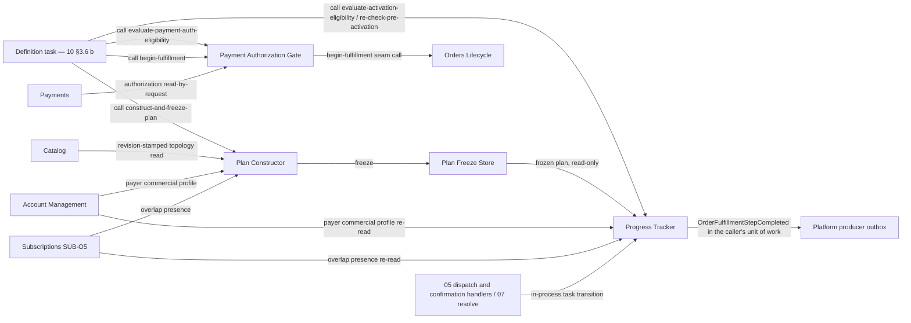
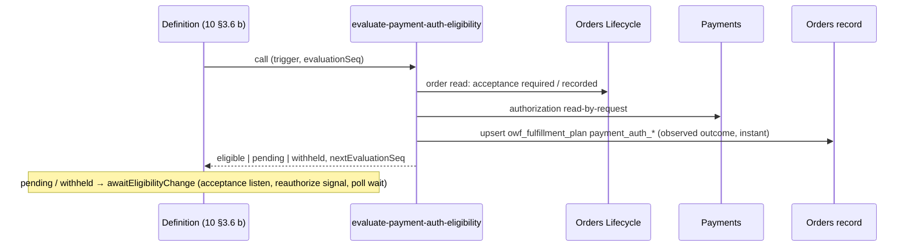

<!-- CONFLUENCE_TITLE: [BSS]: Orders Workflow — Fulfillment Plan (Slice 4) -->
<!-- Related: ../DESIGN.md, ../PRD.md, ./01-foundation.md, ./10-process-definition.md, ./03-approval-execution.md, ./05-provisioning-intents.md, ./06-saga-and-compensation.md, ./README.md | Owners: BSS Orders team -->

# DESIGN — Fulfillment Plan (Slice 4)

<!-- toc -->

- [1. Architecture Overview](#1-architecture-overview)
  - [1.1 Architectural Vision](#11-architectural-vision)
  - [1.2 Architecture Drivers](#12-architecture-drivers)
  - [1.3 Architecture Layers](#13-architecture-layers)
- [2. Principles & Constraints](#2-principles--constraints)
  - [2.1 Design Principles](#21-design-principles)
  - [2.2 Constraints](#22-constraints)
- [3. Technical Architecture](#3-technical-architecture)
  - [3.1 Domain Model](#31-domain-model)
  - [3.2 Component Model](#32-component-model)
  - [3.3 API Contracts](#33-api-contracts)
  - [3.4 Internal Dependencies](#34-internal-dependencies)
  - [3.5 External Dependencies](#35-external-dependencies)
  - [3.6 Interactions & Sequences](#36-interactions--sequences)
  - [3.7 Database schemas & tables](#37-database-schemas--tables)
  - [3.8 Deployment Topology](#38-deployment-topology)
- [4. Additional context](#4-additional-context)
  - [4.1 Idempotency keys and evaluation sequences](#41-idempotency-keys-and-evaluation-sequences)
  - [4.2 The re-check: advisory at construction, authoritative before wave 2](#42-the-re-check-advisory-at-construction-authoritative-before-wave-2)
  - [4.3 Plan-level failures](#43-plan-level-failures)
  - [4.4 The remediation hold is a manual-task state](#44-the-remediation-hold-is-a-manual-task-state)
  - [4.5 Remediation exhausted](#45-remediation-exhausted)
  - [4.6 SLA arithmetic and the bounds of this slice](#46-sla-arithmetic-and-the-bounds-of-this-slice)
  - [4.7 Cross-slice and upstream asks raised by this slice](#47-cross-slice-and-upstream-asks-raised-by-this-slice)
  - [4.8 Constraints this slice places on the definition](#48-constraints-this-slice-places-on-the-definition)
- [5. Traceability](#5-traceability)

<!-- /toc -->

- [ ] `p1` - **ID**: `cpt-cf-bss-orders-workflow-design-fulfillment-plan`

## 1. Architecture Overview

### 1.1 Architectural Vision

This slice provides five **step operations** and sequences none of them.
`evaluate-payment-auth-eligibility` answers whether the order may enter fulfillment;
`construct-and-freeze-plan` builds and freezes one `FulfillmentTask` per order line against
Catalog-owned dependency data and returns the expected-fulfillment instant the definition waits
on; `begin-fulfillment` makes the Lifecycle seam call `approved → in_fulfillment`;
`evaluate-activation-eligibility` answers, from Orders' record, whether the two-wave barrier's
conjunction holds and which lines may activate now; and `re-check-pre-activation` runs the
market, overlap and authorization-freshness re-check immediately before the first activation
intent. The order in which they run, the waits between them, the `listen` arms that re-invoke
them and the branch each returned enum selects are the definition fragment
[`10 §3.6` (b) *Fulfillment: eligibility, plan, two waves and the barrier*](./10-process-definition.md#b-fulfillment-eligibility-plan-two-waves-and-the-barrier),
with the plan-level failure branch in fragment (c); the protected order they must keep is the
*Plan* and *Waves* rows of [`10 §4.1` *The fence*](./10-process-definition.md#41-the-fence). Each
operation reads the commercial data it needs inside Orders under the PDP and receives only
references ([`../ADR/0013`](../ADR/0013-cpt-cf-bss-orders-workflow-adr-references-not-payloads.md)).

The slice still owns the facts that make fulfillment correct: the frozen plan per `orderId` +
`orderVersion`, the pinned partial-failure policy, the per-task state machine, the
activation-eligibility predicate over the frozen graph, and the distinction between a
**pre-activation abort** and a **line-execution failure**. Both can be triggered by conditions
discovered late — an authorization that aged out, a market that no longer matches the payer's
commercial profile, an existing subscription that now overlaps this order's lines — but they
resolve through disjoint branches. A line-execution failure marks one `FulfillmentTask` `failed`
and routes to the pinned partial-failure policy, because real resources may already be
provisioning. A pre-activation abort never marks any task `failed` and never enters that policy:
by construction it fires before the first activation intent, when nothing beyond a `draft`
subscription exists. `re-check-pre-activation` returns `abort` and the definition routes it to
the unwind path of fragment (c), where slice 06's `compensate-order` voids the drafts and
`report-outcome` acknowledges `fulfillment_failed` and publishes `OrderFulfillmentAborted`.

Dependency data is never re-derived here. Catalog is the sole owner of product topology; the
order document carries no dependency edges. `construct-and-freeze-plan` reads Catalog's
revision-stamped topology, builds a graph scoped to exactly the lines of this order version,
validates it and freezes it before `begin-fulfillment`, so every later read of the plan for this
`orderId` + `orderVersion` sees the same graph, replay after replay.

### 1.2 Architecture Drivers

#### Functional Drivers

| Requirement | Design Response |
|-------------|------------------|
| `cpt-cf-bss-orders-workflow-fr-owf-fulfillment-plan` | `construct-and-freeze-plan` (Plan Constructor, Plan Freeze Store) resolves Catalog dependency data per order line, validates the graph and freezes it per `orderId` + `orderVersion` before `begin-fulfillment` and therefore before any provisioning intent (§3.3, §3.6). |
| `cpt-cf-bss-orders-workflow-fr-owf-line-progress` | The Progress Tracker owns the `FulfillmentTask` transition table (§3.7) and the per-terminal-entry emission guard for `OrderFulfillmentStepCompleted`, invoked in-process by slice 05's operations; `evaluate-activation-eligibility` answers the barrier conjunction and the per-line dependency order (§3.3). |
| `cpt-cf-bss-orders-workflow-fr-owf-payment-auth` | `evaluate-payment-auth-eligibility` evaluates the authorization outcome and the buyer-acceptance guard, persists the observed outcome and instant on `owf_fulfillment_plan`, and returns `eligible`, `pending` or `withheld`; the definition re-invokes it on `OrderAcceptanceRecorded`, on `reauthorize-requested` and on its poll arm (§3.3, §3.6). |

#### NFR Allocation

| NFR ID | NFR Summary | Allocated To | Design Response | Verification Approach |
|--------|-------------|--------------|-----------------|----------------------|
| `cpt-cf-bss-orders-workflow-nfr-owf-fulfillment-sla` | p95 <= 15 minutes from activation-wave eligibility to terminal fulfillment outcome for standard orders (no manual steps, no outstanding future-dated wait). | `evaluate-activation-eligibility` (the instant the window opens is the first evaluation that answers `released: true`) and the frozen plan's dependency ranks (§3.7). | The measured window **opens at activation-wave eligibility**, so plan construction and the whole of wave 1 sit outside it and carry their own bound (§4.6). Inside the window the budget is `ceil(N / 8) x wave-2 task timeout` — 8 is the per-order parallel-line cap inside `dispatch-wave2-activate` ([`05`](./05-provisioning-intents.md)) — plus the dependency-chain depth the frozen graph imposes on that batching. | `evaluate-activation-eligibility` records the first `released: true` evaluation in `owf_step_log`; the last line's terminal transition is the Progress Tracker's; p95 is computed over the SLA population of §4.6. |

#### Key ADRs

| ADR ID | Decision Summary |
|--------|-------------------|
| `cpt-cf-bss-orders-workflow-adr-two-wave-activation-barrier` | Fulfillment executes in two phases — draft-create then activation — gated on all creates succeeding and expected fulfillment time being reached. As amended by ADR-0011 the conjunction is a definition pattern: a `wait` to the instant this slice returns, and a re-evaluated `evaluate-activation-eligibility` call on every contributing signal. |
| `cpt-cf-bss-orders-workflow-adr-flow-as-platform-definition` | This slice provides step operations; the platform workflow definition of `10` orders them. |
| `cpt-cf-bss-orders-workflow-adr-definition-versioning-and-protected-steps` | Four of this slice's five operations are `protected`; their order is fenced by the validation hook. |
| `cpt-cf-bss-orders-workflow-adr-references-not-payloads` | Every input and output below is references and small enums; the plan, the graph, the payer profile and the authorization outcome stay in this gear's record. |

### 1.3 Architecture Layers

```text
Step operations  evaluate-payment-auth-eligibility | construct-and-freeze-plan | begin-fulfillment
                 | evaluate-activation-eligibility | re-check-pre-activation   (01 §3.3 envelope)
Components       Payment Authorization Gate | Plan Constructor | Plan Freeze Store | Progress Tracker
Domain           FulfillmentPlan, FulfillmentTask, DependencyEdge, ActivationAbortRecord
Infrastructure   owf_fulfillment_plan / owf_fulfillment_task, Catalog topology read client,
                 Account Management commercial-profile read client, Orders Lifecycle seam client,
                 Payments authorization read client (read-by-request, §3.5), Subscriptions
                 overlap-presence read (SUB-O5)
```

| Layer | Responsibility | Technology |
|-------|----------------|------------|
| Presentation | Internal step routes `POST /bss-orders-workflow/v1/steps/{operation}` for the five operations; the per-line progress projection (§3.3). | `OperationBuilder` routes behind the envelope of [`01 §3.3`](./01-foundation.md#33-api-contracts); read model over `owf_fulfillment_task`. |
| Application | Payment-authorization gating, plan construction/validation/freeze, policy pinning, the begin-fulfillment seam call, the pre-activation re-check, the activation-eligibility predicate, per-task transitions invoked in-process by slice 05 and slice 07. | Rust operation handlers registered in the operation registry (`01 §3.2`). |
| Domain | `FulfillmentPlan`, `FulfillmentTask`, dependency graph, abort reasons. | Rust structs, GTS reference schemas for operation input/output. |
| Infrastructure | Durable storage for the plan and per-task state; Catalog, Account Management, Payments, Lifecycle and Subscriptions read/seam clients. | Gear-owned tables; versioned SDK clients (no direct HTTP). |

## 2. Principles & Constraints

### 2.1 Design Principles

#### Payment Authorization Is Consumed, Not Owned

- [ ] `p2` - **ID**: `cpt-cf-bss-orders-workflow-principle-payment-auth-consumed`

Payment authorization is a Payments-owned mechanism; this gear has no specification for how
Payments computes the outcome and does not reconstruct it. `evaluate-payment-auth-eligibility`
consumes only the outcome (pending / authorized / failed) through a read-by-request of the
authorization Payments holds for the order (§3.5), as a process precondition of Lifecycle's
begin-fulfillment guard. Credit scoring is out of scope for this gear. Payments has no canonical
specification in this repository; the read is the upstream ask
`cpt-cf-bss-orders-workflow-upreq-payment-authorization-outcome` (§4.7).

**ADRs**: none — no ADR is required because this is a scope boundary, not a design trade-off.

#### Pending and Failed Are Distinct Outcomes

- [ ] `p2` - **ID**: `cpt-cf-bss-orders-workflow-principle-pending-failed-distinct`

Payment-authorization `pending` and `failed` **MUST** never be collapsed into one answer. While
the outcome is `pending`, `evaluate-payment-auth-eligibility` returns `pending`, the order remains
`approved` and no begin-fulfillment call is issued. A conclusive `failed` is passed to Lifecycle
on `begin-fulfillment`, because Lifecycle is the **sole evaluator** of the seller's tolerate-failure
election and Workflow **MUST NOT** independently suppress that transition request
([Lifecycle `UPSTREAM_REQS.md` §2.5](../../../orders-lifecycle/docs/UPSTREAM_REQS.md));
Lifecycle's `authorization-failed` refusal is the "begin-fulfillment not taken" of the PRD, the
operation records it as `withheld` and the order stays `approved`. A tolerated failure proceeds
with the risk flag Lifecycle records (Lifecycle [`06-workflow-seam.md`](../../../orders-lifecycle/docs/design/06-workflow-seam.md)
§3.6 *Begin Fulfillment*, step 3). (decision D-89: Lifecycle is the sole
tolerate-failure evaluator; a conclusive `failed` is carried to `begin-fulfillment` and a
Lifecycle refusal is recorded as `withheld`; PRD §6.3 *Payment Authorization Precondition* is
amended to say "begin-fulfillment is not committed" rather than "not called".)

`pending` is a **wait with a wake-up**, never an open-ended stall, and every wake-up is a
definition arm, not an Orders timer: the `listen` on `OrderAcceptanceRecorded`, the
`reauthorize-requested` signal, and the eligibility poll `wait` (§4.8, item 5) each re-invoke
`evaluate-payment-auth-eligibility`, which re-reads the outcome by request. The process-lifetime
ceiling (`01 §4.2`) and Lifecycle's own order expiry bound an authorization that never settles.

**ADRs**: none — this is a direct PRD requirement (`cpt-cf-bss-orders-workflow-fr-owf-payment-auth`),
not an independent architecture trade-off.

#### Dependency Ownership Stays With Catalog

- [ ] `p2` - **ID**: `cpt-cf-bss-orders-workflow-principle-catalog-owns-topology`

Inter-line dependencies (for example, an add-on line requiring its platform-plan line) are
product topology, which is Catalog's domain, not the order's. The order document carries no
dependency data. `construct-and-freeze-plan` resolves the dependency graph by reading Catalog's
published data and never infers dependencies from line ordering, naming or any other order-local
signal.

**ADRs**: `cpt-cf-bss-orders-workflow-adr-two-wave-activation-barrier`

#### Fulfillment Completion Is Atomic

- [ ] `p2` - **ID**: `cpt-cf-bss-orders-workflow-principle-atomic-completion`

An order is acknowledged `in_fulfillment -> completed` only when every `FulfillmentTask` for that
order has reached `activated`. There is no partial completion state; an order with any
unactivated line **MUST NOT** be acknowledged `completed` under any partial-failure policy. The
acknowledgement itself is slice 06's `report-outcome`; this slice owns the **completion
predicate** it evaluates — every task of the frozen plan `activated` with a non-null
`subscription_id` — and `report-outcome` **MUST** refuse `outcome: completed` when the predicate
does not hold (Lifecycle PRD §6.1).

**ADRs**: `cpt-cf-bss-orders-workflow-adr-two-wave-activation-barrier`

### 2.2 Constraints

#### Begin-Fulfillment Ordering

- [ ] `p2` - **ID**: `cpt-cf-bss-orders-workflow-constraint-begin-fulfillment-ordering`

The Lifecycle begin-fulfillment call **MUST** be durably committed before any activation intent,
and **MUST** follow a settled `evaluate-payment-auth-eligibility` answering `eligible` and a
settled `construct-and-freeze-plan` answering `frozen` for the same order version. The first half
is Lifecycle's rule ([`06-workflow-seam.md`](../../../orders-lifecycle/docs/design/06-workflow-seam.md)
§4.3); the whole is enforced as the *Plan* and *Waves* rows of [`10 §4.1`](./10-process-definition.md#41-the-fence)
and as the guard of `begin-fulfillment` itself (§3.6, step `inst-bf-guard-frozen`), so a
definition that reordered the calls would be refused before publish and, if it were published,
refused again at the operation.

**ADRs**: `cpt-cf-bss-orders-workflow-adr-two-wave-activation-barrier`, `cpt-cf-bss-orders-workflow-adr-definition-versioning-and-protected-steps`

#### Pre-Activation Abort Is Not a Line Failure

- [ ] `p2` - **ID**: `cpt-cf-bss-orders-workflow-constraint-pre-activation-abort`

An overlap collision, a market divergence, a stale authorization, or an unevaluable re-check
whose retry ladder is exhausted **MUST** make `re-check-pre-activation` answer `abort` with a
machine-readable reason before any activation intent. The operation **MUST NOT** mark any
`FulfillmentTask` `failed`, and the definition **MUST** route `abort` to the unwind path of
[`10 §3.6` (c)](./10-process-definition.md#c-partial-failure-manual-task-resume-or-compensate) and
**MUST NOT** route it to the partial-failure policy (§4.8).

The void of the wave-1 drafts and the acknowledgement are slice 06's: `compensate-order` voids
every draft and records the void evidence; `report-outcome` acknowledges
`in_fulfillment → fulfillment_failed` with the abort reason and enqueues `OrderFulfillmentAborted`
in the same transaction. A void that cannot be completed leaves the order **non-terminal**
(`cpt-cf-bss-orders-workflow-adr-saga-compensable-no-pivot`): `compensate-order` answers
`pending-escalation`, the manual task with reason `draft-void-failed` is created, and no
acknowledgement is sent until the void reaches a known outcome. This slice records the abort's
reason; it records no void outcome of its own.

**ADRs**: `cpt-cf-bss-orders-workflow-adr-two-wave-activation-barrier`,
`cpt-cf-bss-orders-workflow-adr-saga-compensable-no-pivot`

#### Bundle Lines Are Never Expanded

- [ ] `p2` - **ID**: `cpt-cf-bss-orders-workflow-constraint-bundle-one-line`

A bundle plan is one order line item and is never expanded into its constituent components by
this slice. Bundle pricing is first-class upstream (pricing PRD, gears-rust); this gear receives
the order's line items exactly as Orders Lifecycle captured them and builds exactly one
`FulfillmentTask` per received line, bundle or not.

**ADRs**: none — this is a received invariant from the upstream order document, not a local
design trade-off.

#### The Partial-Failure Policy Is Pinned At Freeze

- [ ] `p2` - **ID**: `cpt-cf-bss-orders-workflow-constraint-policy-pinned-at-freeze`

The partial-failure policy in force for an order (remediate or fail-fast) is resolved once, by
`construct-and-freeze-plan`, persisted as `owf_fulfillment_plan.partial_failure_policy` (§3.7)
and returned to the definition as the `policy` enum the fragment (c) `switch` branches on. Every
later failure on that order version uses the pinned value and never the live configuration; the
definition carries the enum it was given and never re-derives it. Without the pin, a configuration
change mid-flight would silently move a running order between "raise a manual task" and
"compensate everything and acknowledge `fulfillment_failed`".

**ADRs**: `cpt-cf-bss-orders-workflow-adr-saga-compensable-no-pivot`

#### Inter-Line Dependency Ordering Is Decided Here

- [ ] `p2` - **ID**: `cpt-cf-bss-orders-workflow-constraint-dependency-ordering-owner`

The frozen dependency graph is not decoration: `evaluate-activation-eligibility` is the
**activation-eligibility predicate** that reads it, and slice 05's `dispatch-wave2-activate`
dispatches exactly the `eligibleLineRefs` it returned and never re-derives an order. A line is
activation-eligible only when every task it depends on in the frozen graph has reached
`activated`; independent lines are eligible together, subject to the per-order parallel cap inside
the dispatch operation. The barrier releases the wave, and this predicate orders the lines within
it, which is what `PRD.md:329` ("a dependent line MUST wait for its dependency lines before its
own activation") requires and AC 5 makes testable. The definition sees only references and a
boolean; it holds no graph and no confirmation count.

**ADRs**: `cpt-cf-bss-orders-workflow-adr-two-wave-activation-barrier`, `cpt-cf-bss-orders-workflow-adr-references-not-payloads`

## 3. Technical Architecture

### 3.1 Domain Model

**Technology**: Rust structs, GTS schemas.

**Location**: [`../DESIGN.md`](../DESIGN.md) §3.1 (gear-wide domain-model index); the entities
below are normative in this slice, with their columns in §3.7.

**Core Entities**:

- [ ] `p2` - **ID**: `cpt-cf-bss-orders-workflow-entity-fulfillment-plan`
- [ ] `p2` - **ID**: `cpt-cf-bss-orders-workflow-entity-fulfillment-task`
- [ ] `p2` - **ID**: `cpt-cf-bss-orders-workflow-entity-dependency-edge`
- [ ] `p2` - **ID**: `cpt-cf-bss-orders-workflow-entity-activation-abort-record`

| Entity | Description | Schema |
|--------|-------------|--------|
| `FulfillmentPlan` | Per `orderId` + `orderVersion` container of all `FulfillmentTask`s: the observed payment-authorization outcome and instant, the validated dependency graph, the pinned partial-failure policy, the Catalog topology revision, the expected-fulfillment instant and the construction-time re-check observation. Created unfrozen by the first `evaluate-payment-auth-eligibility`; its graph, policy and revision are immutable once frozen. | `owf_fulfillment_plan` (§3.7) |
| `FulfillmentTask` | One per order line item (bundle lines never expanded). Carries wave-aligned state (`pending`, `draft_created`, `activated`, `failed`) under the transition table of §3.7, its topological rank, the downstream transition-request identifier (join key only), the resulting `subscription_id` once `activated`, and the per-terminal-entry emission counters. Its opaque row reference is the `lineRef` (a `taskRef` in ADR-0013's terms) the definition carries. | `owf_fulfillment_task` (§3.7) |
| `DependencyEdge` | A directed edge between two `FulfillmentTask`s within the same plan, resolved from Catalog topology at construction time. | Embedded in `owf_fulfillment_plan.dependency_graph` (§3.7) |
| `ActivationAbortRecord` | The machine-readable reason of a pre-activation abort (`overlap-collision`, `market-divergence`, `payment-authorization-stale`, `overlap-read-unevaluable`) or of a plan that did not freeze (`invalid-dependency-graph`, `catalog-topology-unavailable`), with per-line reasons where the re-check names lines, the evidence reference, the recording instant and the platform `attempt_id`. The void evidence and void outcome are slice 06's compensation record, not this record. | `owf_fulfillment_plan.abort_record` (§3.7) |

**Relationships**:
- `FulfillmentPlan` -> `FulfillmentTask`: one plan owns one task per order line item.
- `FulfillmentTask` -> `DependencyEdge`: a task may depend on zero or more sibling tasks in the
  same plan; the graph is validated acyclic at construction.
- `FulfillmentPlan` -> `ActivationAbortRecord`: at most one abort record per plan; its presence
  is mutually exclusive with any task reaching `activated`.

### 3.2 Component Model

Four components own this slice's five operations. None of them sequences a step, arms a timer or
retries a call: sequencing is the definition's, timers are its `wait` tasks, and retry is the
platform task retry policy of [`10 §2.2`](./10-process-definition.md#the-grammar-subset).


```mermaid
graph LR
    DEF[Definition task — 10 §3.6 b] -->|call evaluate-payment-auth-eligibility| A[Payment Authorization Gate]
    DEF -->|call construct-and-freeze-plan| B[Plan Constructor]
    DEF -->|call begin-fulfillment| A
    DEF -->|call evaluate-activation-eligibility / re-check-pre-activation| D[Progress Tracker]
    B -->|freeze| C[Plan Freeze Store]
    C -->|frozen plan, read-only| D
    E[Catalog] -->|revision-stamped topology read| B
    H[Payments] -->|authorization read-by-request| A
    I[Account Management] -->|payer commercial profile| B
    I -->|payer commercial profile re-read| D
    S[Subscriptions SUB-O5] -->|overlap presence| B
    S -->|overlap presence re-read| D
    A -->|begin-fulfillment seam call| F[Orders Lifecycle]
    X[05 dispatch and confirmation handlers / 07 resolve] -->|in-process task transition| D
    D -->|OrderFulfillmentStepCompleted in the caller's unit of work| G[Platform producer outbox]
```

#### Payment Authorization Gate

- [ ] `p2` - **ID**: `cpt-cf-bss-orders-workflow-component-payment-auth-gate`

##### Why this component exists

Begin-fulfillment is the first point at which this gear commits Lifecycle to provisioning work,
so it is also the point at which the money precondition must be evaluated. A dedicated owner
keeps the pending/failed distinction (§2.1) in one place.

##### Responsibility scope

Owns `evaluate-payment-auth-eligibility` and `begin-fulfillment` (§3.3). Reads the authorization
outcome by request (§3.5) and the recorded-buyer-acceptance requirement and instant from the
Lifecycle order read (R1); persists the observed outcome, the instant it was observed and the
Payments request identity on `owf_fulfillment_plan`, creating the unfrozen row on first call;
answers `eligible`, `pending` or `withheld`. Makes the Lifecycle begin-fulfillment call with the
recorded outcome, maps Lifecycle's guard refusals to `withheld`, and enqueues
`OrderFulfillmentStarted` on a committed transition. Provides the authorization-freshness input
the Progress Tracker's re-check reads (§3.7 columns only; no call).

##### Responsibility boundaries

Does not compute the authorization (Payments owns that) and does not score credit. Does not
evaluate the seller's tolerate-failure election (Lifecycle does). Does not arm a wait: the former
`payment-auth-wait` timer is retired by ADR-0011; every re-evaluation is a definition arm (§2.1).
Does not decide whether buyer acceptance is required — it reads whether a required acceptance has
been recorded. Does not call Subscriptions.

##### Related components (by ID)

- `cpt-cf-bss-orders-workflow-component-plan-constructor` — shares the `owf_fulfillment_plan` row
  with (column ownership per §3.7).
- `cpt-cf-bss-orders-workflow-actor-owf-orders-lifecycle` — calls for the begin-fulfillment
  transition and reads the order for the acceptance guard.
- `cpt-cf-bss-orders-workflow-actor-owf-payments` — reads the authorization outcome from.

#### Plan Constructor

- [ ] `p2` - **ID**: `cpt-cf-bss-orders-workflow-component-plan-constructor`

##### Why this component exists

Sequencing provisioning work correctly requires an authoritative dependency source; without a
dedicated constructor that always resolves against Catalog, a later slice could infer dependencies
from order-local data, which the order document does not carry.

##### Responsibility scope

Owns `construct-and-freeze-plan` (§3.3). Builds one `FulfillmentTask` per order line (never
expanding bundles), resolves edges against Catalog's revision-stamped topology, validates the
graph acyclic and closed over the order's own lines, computes each task's topological rank, pins
the partial-failure policy, computes the expected-fulfillment instant
`max(database now, latest service-activation date among lines)` from the Lifecycle order read,
records the **construction-time** overlap-presence and market observation (advisory, §4.2), and
hands the validated plan to the Plan Freeze Store.

**Catalog failure posture.** Plan construction now runs **before** begin-fulfillment
([`10 §4.1`](./10-process-definition.md#41-the-fence)), so the order is still `approved` and "do
not start" remains available. A transient Catalog failure answers `retryable-failure` (503,
`catalog-topology-unavailable`) and the definition's retry policy re-issues the same key. A
response that arrives but is incomplete — no topology revision, or any line marked unresolved —
is not transient: the operation settles `planState = topology-unavailable`, writes the abort
record, and the plan is never frozen against a partial answer.

**Completeness is asserted, not assumed.** A partial topology read can satisfy both "acyclic" and
"every dependency present among the order's lines" and still be missing edges. The read is
therefore **fail-closed on completeness**: the response must carry a topology revision identifier
and an explicit per-line resolved/unresolved marker, and the revision is persisted as
`owf_fulfillment_plan.catalog_topology_revision` so the frozen graph names the input it was
derived from (`cpt-cf-bss-orders-workflow-upreq-catalog-dependency-topology-read`).

##### Responsibility boundaries

Does not dispatch any provisioning intent (slice 05). Does not re-derive dependency data from
order-local signals (§2.1). Does not create manual tasks or incidents: an invalid or unresolvable
graph is a returned `planState` the definition routes (§4.3), and `create-manual-task` (slice 07)
is the definition's next call.

##### Related components (by ID)

- `cpt-cf-bss-orders-workflow-component-plan-freeze-store` — depends on to persist the frozen
  plan.
- Catalog (external dependency; not a PRD-registered actor) — depends on for dependency-topology reads.

#### Plan Freeze Store

- [ ] `p2` - **ID**: `cpt-cf-bss-orders-workflow-component-plan-freeze-store`

##### Why this component exists

Replay-consistency requires that once a plan is frozen for an `orderId` + `orderVersion`, every
subsequent read — after a platform worker restart, a re-issued call or an operator retry — sees
the identical graph and task set. A dedicated freeze boundary makes that guarantee structural.

##### Responsibility scope

Persists the validated plan and its tasks in the settlement transaction of
`construct-and-freeze-plan`, setting `frozen_at` and `frozen_by_attempt_id`. Refuses any write to
a frozen plan's graph, policy, revision or task set. A second `construct-and-freeze-plan` for an
order version whose plan is already frozen — under any key — returns the frozen plan unchanged,
so an operator retry after a later failure cannot rebuild a plan behind the waves. Serves the plan
to slice 05's operations and to the Progress Tracker.

##### Responsibility boundaries

Does not validate the graph (Plan Constructor). Does not track per-task runtime state (Progress
Tracker).

##### Related components (by ID)

- `cpt-cf-bss-orders-workflow-component-plan-constructor` — receives the validated plan from.
- `cpt-cf-bss-orders-workflow-component-progress-tracker` — shares the frozen plan's task set
  with, read-only.

#### Progress Tracker

- [ ] `p2` - **ID**: `cpt-cf-bss-orders-workflow-component-progress-tracker`

##### Why this component exists

Per-line observability and atomic commercial completion are both required and easy to conflate.
One component owns the per-task state machine, the dependency predicate and the completion
predicate, so no other component can answer "may this line activate" or "is this order complete"
differently.

##### Responsibility scope

Owns `evaluate-activation-eligibility` and `re-check-pre-activation` (§3.3). Owns the
`FulfillmentTask` transition table (§3.7) as an **in-process function**, not a registered step
operation: slice 05's `dispatch-wave1-create`, `dispatch-wave2-activate`, `reconcile-intent` and
the Subscriptions outcome handlers, and slice 07's `resolve-manual-task` (`retry`) and
`verify-override`, invoke it inside **their** unit of work, and it enqueues
`OrderFulfillmentStepCompleted` exactly once **per terminal-state entry** in that same
transaction — the guard is `(task, terminal_entry_seq)`, so a line that fails, is retried and then
activates emits two events. Owns the completion predicate `report-outcome` evaluates (§2.1).

##### Responsibility boundaries

Does not submit or void provisioning intents (slices 05 and 06). Does not acknowledge any outcome
to Lifecycle — the `completed` and `fulfillment_failed` acknowledgements are `report-outcome`
(slice 06), which is also the only publisher of `OrderFulfillmentCompleted` and
`OrderFulfillmentAborted`. Does not apply the partial-failure policy: it records `failed`, and the
definition's fragment (c) `switch` branches on the pinned `policy` enum. Does not build or mutate
the dependency graph. Does not mirror the downstream transition-request identifier into order
state; `subscription_id` is fulfillment evidence for the completion acknowledgement and for
compensation, not order state.

##### Related components (by ID)

- `cpt-cf-bss-orders-workflow-component-plan-freeze-store` — depends on for the frozen plan.
- `cpt-cf-bss-orders-workflow-actor-owf-subscriptions` — reads overlap presence (`SUB-O5`) from;
  consumes wave outcomes via slice 05's handlers.

#### Retired responsibilities

- The `payment-auth-wait` durable timer the gate armed on `pending` — retired by ADR-0011 with
  `owf_durable_timer` ([`01 §3.7` *Retired tables*](./01-foundation.md#retired-tables)); the wake-ups
  are the definition's `listen` arms and eligibility poll `wait` (§2.1, §4.8).
- The barrier's timer half (the expected-fulfillment wake-up) — retired by ADR-0011; the instant is
  returned by `construct-and-freeze-plan` as `expectedFulfillmentAt` and awaited by the
  definition's `waitExpected` task; the all-creates half is `evaluate-activation-eligibility`,
  re-evaluated by the definition on every contributing signal.
- The Progress Tracker's execution of the abort path (draft void, `ActivationAbortRecord` void
  outcome, `fulfillment_failed` acknowledgement) and of the completion acknowledgement — moved to
  slice 06 (`compensate-order`, `report-outcome`).
- The immediate void of succeeded wave-1 drafts on a wave-1 line failure — retired. Under
  `fail-fast` the drafts are voided by `compensate-order`; under `remediate` they stay, and their
  liveness is re-read and rebuilt by slice 05 (`reread-draft-liveness`, `rebuild-wave1`) before
  wave 2.
- The process-level `remediation-hold` suspension — retired; the remediation hold is the open
  manual task (§4.4), not an instance phase.
- The Catalog read's wrapping by slice 08's Dependency Retry Governor — retired with the governor;
  transient failures are the platform task retry policy plus the circuit-breaker rule inside the
  operation (`01 §4.5`).

### 3.3 API Contracts

- [ ] `p2` - **ID**: `cpt-cf-bss-orders-workflow-interface-plan-construction`

- **Contracts**: `cpt-cf-bss-orders-workflow-contract-step-invocation` ([`01 §3.3`](./01-foundation.md#the-step-operation-contract))
- **Technology**: internal step routes `POST /bss-orders-workflow/v1/steps/{operation}` behind
  the envelope of `cpt-cf-bss-orders-workflow-interface-step-executor-api`; callable only by the
  serverless-runtime service principal, PDP resource `gts.cf.bss.orders_workflow.process_step.v1~`
  × `execute` with `operation` as the resource property.
- **Location**: operation handlers registered in `owf_step_operation` with `owning_slice = 04`.

**Endpoints Overview**:

| Method | Path | Description | Stability |
|--------|------|--------------|-----------|
| `POST` | `/bss-orders-workflow/v1/steps/evaluate-payment-auth-eligibility` | Read the authorization outcome and the acceptance guard; persist the observation; answer `eligible` / `pending` / `withheld`. | unstable — internal, versioned with `10 §2` |
| `POST` | `/bss-orders-workflow/v1/steps/construct-and-freeze-plan` | Resolve Catalog dependencies, validate, pin the policy, compute the expected-fulfillment instant, freeze. | unstable — internal |
| `POST` | `/bss-orders-workflow/v1/steps/begin-fulfillment` | The Lifecycle seam call `approved → in_fulfillment`; enqueues `OrderFulfillmentStarted`. | unstable — internal |
| `POST` | `/bss-orders-workflow/v1/steps/evaluate-activation-eligibility` | Evaluate the barrier conjunction and the per-line dependency predicate from Orders' record. | unstable — internal |
| `POST` | `/bss-orders-workflow/v1/steps/re-check-pre-activation` | Market, overlap-presence and authorization-freshness re-check immediately before the first activation intent. | unstable — internal |

**Common to every operation below.** The body carries `correlationId`, `orderId`, `orderVersion`,
`invocationId` and `attemptId` (the envelope's shape rule, `01 §3.3` step 3) in addition to the
listed members; every schema is `gts.cf.bss.orders_workflow.step.<name>.input.v1~` /
`….output.v1~`; `lineRefs`, `eligibleLineRefs` and `pendingLineRefs` are opaque
`owf_fulfillment_task` row references, never order line identifiers; every operation answers
`permanent-failure` with `version-mismatch` once the instance is terminal (`01 §3.3`
`terminate-instance`); the audit kind is `step-completion` for all five. Each operation resolves
`correlationId` to the instance, narrows every read to its `resource_tenant_id` and
`seller_tenant_id`, and reads commercial inputs inside Orders through the seam clients under this
gear's authority — the caller supplies references, never authority (ADR-0013, ADR-0010 as amended).

#### Operation table

| Field | `evaluate-payment-auth-eligibility` | `construct-and-freeze-plan` | `begin-fulfillment` | `evaluate-activation-eligibility` | `re-check-pre-activation` |
|-------|-------------------------------------|-----------------------------|---------------------|-----------------------------------|---------------------------|
| `protection` | `protected` | `protected` | `protected` — the R1 seam call | `composable` | `protected` |
| `input` (beyond the common members) | `trigger` ∈ `initial` · `acceptance-recorded` · `reauthorize-requested` · `poll`; `requestRef` (the signal's request, nullable); `evaluationSeq` | `attempt` (default 0; minted by `retry-step` on a plan-level task's retry) | `planRef`, `eligibilitySeq` (the `evaluationSeq` of the `eligible` answer) | `planRef`, `evaluationSeq` | `planRef`, `evaluationSeq` |
| `output` | `eligibility` ∈ `eligible` · `pending` · `withheld`; `withheldCause` ∈ `acceptance-not-recorded` · `acceptance-unevaluable` · `null`; `nextEvaluationSeq` | `planRef`, `lineRefs[]`, `expectedFulfillmentAt` (instant), `policy` ∈ `remediate` · `fail-fast`, `planState` ∈ `frozen` · `invalid-graph` · `topology-unavailable`, `reason` (catalogue code, nullable) | `result` ∈ `in-fulfillment` · `withheld`; `withheldCause` ∈ `authorization-pending` · `authorization-failed` · `acceptance-required-not-recorded` · `acceptance-requirement-unevaluable` · `null` | `released` (bool), `eligibleLineRefs[]`, `pendingLineRefs[]`, `nextEvaluationSeq` | `verdict` ∈ `proceed` · `abort` · `not-dispatchable`; `abortReason` (catalogue code, nullable); `observed` ∈ `on-hold` · `superseded` · `terminal` · `null`; `nextEvaluationSeq` |
| `idempotency_key` | instance-scoped `{tenant}:{correlationId}:evaluate-payment-auth-eligibility:{evaluationSeq}` | instance-scoped `{tenant}:{correlationId}:construct-and-freeze-plan:{attempt}` | lifecycle-transition `{tenant}:{orderId}:{orderVersion}:begin-fulfillment:{eligibilitySeq}` (§4.1) | instance-scoped `{tenant}:{correlationId}:evaluate-activation-eligibility:{planRef}:{evaluationSeq}` | instance-scoped `{tenant}:{correlationId}:re-check-pre-activation:{planRef}:{evaluationSeq}` |
| `declared_event` | none | none | `OrderFulfillmentStarted` on `result = in-fulfillment` | none | none |
| `compensation` | none | none — a frozen plan is superseded by a new order version, never undone | none — the unwind of an order in fulfillment is `run-cancellation-fence` → `compensate-order` → `report-outcome` (06), a path, not a paired undo | none (read-only) | none |
| `reasons` | `version-mismatch`, `circuit-breaker-open`, `per-attempt-timeout` | `invalid-dependency-graph`, `catalog-topology-unavailable`, `line-count-exceeded`, `idempotency-key-conflict`, `version-mismatch` | `version-mismatch`, `idempotency-key-conflict`, `circuit-breaker-open`, `per-attempt-timeout` | `version-mismatch` | `overlap-collision`, `market-divergence`, `payment-authorization-stale`, `overlap-read-unevaluable`, `version-mismatch`, `circuit-breaker-open`, `per-attempt-timeout` |
| `audit_kind` | `step-completion` | `step-completion` | `step-completion` | `step-completion` | `step-completion` |
| `retry_class` | `retryable-on: transient` | `retryable-on: transient` | `retryable-on: transient` | `retryable-on: transient` | `retryable-on: transient` |
| `deadline` | 10 s (Payments and Lifecycle reads) | 10 s (Catalog, Lifecycle, Account Management and `SUB-O5` reads) | 10 s (Lifecycle write) | 5 s (local reads only) | 10 s (Account Management and `SUB-O5` reads) |

**What each answer means to the definition.** A settled `eligible`, `frozen`, `in-fulfillment`,
`released: true` or `proceed` advances the path. `pending`, `withheld` (either operation) and
`released: false` are **settled successes** that select a waiting arm, never failures. A
`planState` other than `frozen` and a `verdict` of `abort` are settled successes that select the
failure or unwind branch of §4.8. `not-dispatchable` is a settled success that returns the path to
the barrier loop, whose hold, amendment and cancel arms consume what the operation observed
(Lifecycle [`03-gate-and-pin.md`](../../../orders-lifecycle/docs/design/03-gate-and-pin.md#re-check-before-first-activation)
*What Workflow does with each outcome*). Transient downstream failures are `retryable-failure`
(503/504) under the key left `open`; the definition's `catch.retry` re-issues the same key.

- [ ] `p2` - **ID**: `cpt-cf-bss-orders-workflow-interface-fulfillment-progress-read`

- **Contracts**: `cpt-cf-bss-orders-workflow-interface-progress-read` ([`01 §3.3`](./01-foundation.md#33-api-contracts))
- **Technology**: read-only projection over `owf_fulfillment_task` and `owf_fulfillment_plan`.
- **Location**: progress-read operation surfaced through the engine's progress-read interface and
  slice 09's read surface.

**Endpoints Overview**:

| Method | Path | Description | Stability |
|--------|------|--------------|-----------|
| `GET` (projection) | `/bss-orders-workflow/v1/fulfillment-plan/{orderId}/{orderVersion}` | Per-line wave-aligned state, including intermediate `pending -> draft_created` advances not observable via events; the plan's freeze state, observed authorization class and instant, and abort reason. Never an input to a definition task. | stable |

### 3.4 Internal Dependencies

| Dependency Gear | Interface Used | Purpose |
|------------------|-----------------|----------|
| Orders Lifecycle | [`06-workflow-seam.md`](../../../orders-lifecycle/docs/design/06-workflow-seam.md) §4.3 begin-fulfillment; the PDP-authorized order read of Lifecycle `08-read-and-authz` §4.2 | `begin-fulfillment` transition; acceptance requirement and instant; service-activation dates for the expected-fulfillment instant; the frozen market and payer for the re-check. Called only from inside this slice's operations (seam rules R1–R5). |
| Catalog | dependency-topology read (revision-stamped, per-line resolved/unresolved markers, §3.2) | Inter-line edges for plan construction; read only. **Posture**: required at construction; transient failure is `retryable-failure`; incomplete or unstamped is `topology-unavailable`. |
| Account Management | payer commercial-profile read | The `(currency, region)` binding the order market is compared against at construction (advisory) and in `re-check-pre-activation` (authoritative). Same read the Lifecycle submit gate uses ([`03-gate-and-pin.md`](../../../orders-lifecycle/docs/design/03-gate-and-pin.md) §3.4). |
| Subscriptions | overlap-presence read `SUB-O5` (`cpt-cf-bss-orders-workflow-upreq-overlap-presence-read`); the provisioning-intent contract is slice 05's | Construction-time observation and pre-activation re-check; this slice records the transition-request identifier and `subscription_id` supplied by slice 05's handlers. |
| Platform (serverless-runtime) | None called — this slice is **called by** the definition through the step routes | The definition fragment `10 §3.6` (b) invokes the operations; the `wait` on `expectedFulfillmentAt` and the `listen` arms are the plugin's. |

**Dependency Rules** (per project conventions):
- No circular dependencies
- Always use SDK modules for inter-gear communication
- No cross-category sideways deps except through contracts
- Only integration/adapter gears talk to external systems
- `SecurityContext` must be propagated across all in-process calls

### 3.5 External Dependencies

#### Payments (authorization read-by-request)

- **Contract**: none — no specification exists in this repository; only the outcome is consumed.
  Registered as the upstream ask `cpt-cf-bss-orders-workflow-upreq-payment-authorization-outcome`.

| Dependency Gear | Interface Used | Purpose |
|------------------|-----------------|----------|
| Payments | **outbound read-by-request** of the authorization outcome (`authorized` / `pending` / `failed`) for the order's idempotent authorization request identity | The begin-fulfillment money gate (§2.1) and the freshness input of the pre-activation re-check (§3.7 `payment_auth_observed_at`). |

**Direction, restated.** The previous revision of this slice settled the direction as an inbound
report with a `payment-auth-wait` timer as the wake-up. Under ADR-0011 the wake-up is a definition
`wait` arm, and the Lifecycle register asks Payments for exactly this shape — "an idempotent
request identity and read-by-request outcome so Workflow can resume a `pending` authorization",
with the bounded durable polling owned by Workflow's execution platform
([Lifecycle `UPSTREAM_REQS.md` §2.5](../../../orders-lifecycle/docs/UPSTREAM_REQS.md)) — which is
what slice 09 already states ("returns on this gear's own outbound call"). The direction is
therefore an **outbound read inside `evaluate-payment-auth-eligibility`**, polled by the
definition, with no inbound Payments arm and no Payments timer in this gear. If Payments later
offers a push, it is delivered as the `reauthorize-requested` signal
([`10 §3.3`](./10-process-definition.md#33-api-contracts)) and changes no operation. (decision
recorded as D-90: the Payments coupling is an outbound read-by-request inside
`evaluate-payment-auth-eligibility`, polled by a definition `wait`; the inbound reporting arm and
the `payment-auth-wait` timer are withdrawn.)

**Dependency Rules** (per project conventions):
- No circular dependencies
- Always use SDK modules for inter-gear communication
- No cross-category sideways deps except through contracts
- Only integration/adapter gears talk to external systems
- `SecurityContext` must be propagated across all in-process calls

### 3.6 Interactions & Sequences

Every sequence below reads **definition task → operation → record**. The YAML that orders the
tasks is [`10 §3.6` (b)](./10-process-definition.md#b-fulfillment-eligibility-plan-two-waves-and-the-barrier)
and is not repeated here; the algorithms state what happens **inside** each operation, after the
envelope of [`01 §3.3`](./01-foundation.md#33-api-contracts) has authorised the call, recomposed
the key and resolved it to *first call / re-run*.

#### Payment-Authorization Eligibility

**ID**: `cpt-cf-bss-orders-workflow-seq-payment-auth-eligibility`

**Use cases**: `cpt-cf-bss-orders-workflow-fr-owf-payment-auth`

**Actors**: `cpt-cf-bss-orders-workflow-actor-owf-orders-lifecycle`, `cpt-cf-bss-orders-workflow-actor-owf-payments`


```mermaid
sequenceDiagram
    participant D as Definition (10 §3.6 b)
    participant G as evaluate-payment-auth-eligibility
    participant L as Orders Lifecycle
    participant P as Payments
    participant R as Orders record
    D->>G: call (trigger, evaluationSeq)
    G->>L: order read: acceptance required / recorded
    G->>P: authorization read-by-request
    G->>R: upsert owf_fulfillment_plan payment_auth_* (observed outcome, instant)
    G-->>D: eligible | pending | withheld, nextEvaluationSeq
    Note over D: pending / withheld → awaitEligibilityChange (acceptance listen, reauthorize signal, poll wait)
```

**Algorithm: Evaluate Payment-Authorization Eligibility**

Input: correlationId, orderId, orderVersion, trigger, requestRef, evaluationSeq, attemptId
Output: eligibility, withheldCause, nextEvaluationSeq

1. [ ] - `p1` - Resolve the instance and its tenant axes; lock or create the `owf_fulfillment_plan` row for (`orderId`, `orderVersion`) unfrozen, copying `resource_tenant_id`, `payer_tenant_id` and `seller_tenant_id` from the instance and the order read - `inst-pa-resolve-row`
2. [ ] - `p1` - **IF** the plan row is already `frozen_at` set **AND** `begin_fulfillment_committed_at` is set: **RETURN** `eligible` with the recorded observation — a late signal after the order entered fulfillment changes nothing - `inst-pa-if-already-begun`
3. [ ] - `p1` - Read the order through the Lifecycle PDP-authorized order read: whether buyer acceptance is required and, if so, whether its instant is recorded - `inst-pa-read-acceptance`
4. [ ] - `p1` - **IF** the Lifecycle read is unavailable: settle `retryable-failure` (503) and leave the key `open` - `inst-pa-if-lifecycle-unavailable`
5. [ ] - `p1` - Read the authorization outcome from Payments by the order's authorization request identity; a transport failure settles `retryable-failure` (503) with the circuit-breaker rule of `01 §4.5` - `inst-pa-read-outcome`
6. [ ] - `p1` - Persist `payment_auth_outcome`, `payment_auth_observed_at` = database now **only when the outcome changed or was never recorded**, and `payment_auth_request_ref`; an unchanged `pending` does not move the observed instant - `inst-pa-persist-observation`
7. [ ] - `p1` - **IF** acceptance is required and not recorded: **RETURN** `withheld` with `acceptance-not-recorded`; **IF** the acceptance requirement was unevaluable: **RETURN** `withheld` with `acceptance-unevaluable` - `inst-pa-if-acceptance-missing`
8. [ ] - `p1` - **IF** the outcome is `pending`: **RETURN** `pending` - `inst-pa-if-pending`
9. [ ] - `p1` - **RETURN** `eligible` for `authorized` **and** for a conclusive `failed`; the failed outcome is carried to `begin-fulfillment`, where Lifecycle alone evaluates the tolerate-failure election (§2.1) - `inst-pa-return-eligible`
10. [ ] - `p1` - In every branch, write the step record and `step-completion` audit entry with `trigger` and `requestRef`, and return `nextEvaluationSeq = evaluationSeq + 1` - `inst-pa-record`

**Description**: The operation is idempotent per `evaluationSeq`; the definition passes the
returned `nextEvaluationSeq` into the next call so each re-evaluation is a first call under a new
key and a re-issued call is an absorbed duplicate. The observed instant is the one the freshness
leg of `re-check-pre-activation` measures against.

#### Plan Construction and Freeze

**ID**: `cpt-cf-bss-orders-workflow-seq-plan-construction`

**Use cases**: `cpt-cf-bss-orders-workflow-fr-owf-fulfillment-plan`

**Actors**: `cpt-cf-bss-orders-workflow-actor-owf-orders-lifecycle`

```mermaid
sequenceDiagram
    participant D as Definition (10 §3.6 b freezePlan)
    participant C as construct-and-freeze-plan
    participant L as Orders Lifecycle
    participant Cat as Catalog
    participant AM as Account Management
    participant S as Subscriptions SUB-O5
    participant R as Orders record
    D->>C: call (attempt)
    C->>R: frozen already? return frozen plan unchanged
    C->>L: order read: lines, service-activation dates, market, payer
    C->>Cat: dependency topology for lines (revision-stamped)
    alt transient failure
        C-->>D: 503 catalog-topology-unavailable (key open; platform retries)
    else unstamped or unresolved line
        C->>R: unfrozen row + abort_record(catalog-topology-unavailable)
        C-->>D: planState = topology-unavailable
    else complete
        C->>C: one task per line; validate acyclic + closed; rank
        alt graph invalid
            C->>R: unfrozen row + abort_record(invalid-dependency-graph, offending edges)
            C-->>D: planState = invalid-graph, policy
        else graph valid
            C->>AM: payer commercial profile
            C->>S: overlap presence (advisory observation)
            C->>R: pin policy; expected_fulfillment_at; freeze tasks + graph + revision
            C-->>D: frozen, planRef, lineRefs[], expectedFulfillmentAt, policy
        end
    end
```

**Algorithm: Construct and Freeze Plan**

Input: correlationId, orderId, orderVersion, attempt, attemptId
Output: planRef, lineRefs[], expectedFulfillmentAt, policy, planState, reason

1. [ ] - `p1` - **IF** the plan for (`orderId`, `orderVersion`) has `frozen_at` set: **RETURN** `frozen` with the stored `planRef`, `lineRefs`, `expected_fulfillment_at` and `partial_failure_policy`, under any `attempt` - `inst-pc-if-frozen`
2. [ ] - `p1` - Read the order's lines, service-activation dates, frozen market and payer through the Lifecycle order read; **IF** unavailable: settle `retryable-failure` (503) - `inst-pc-read-order`
3. [ ] - `p1` - **IF** the line count exceeds 200: settle `permanent-failure` with `line-count-exceeded` (a defensive re-assertion of the check `start-instance` delegates to this slice) - `inst-pc-if-line-count`
4. [ ] - `p1` - Resolve the partial-failure policy from the seller's current configuration and hold it for pinning - `inst-pc-resolve-policy`
5. [ ] - `p1` - Read Catalog topology for exactly these lines; **IF** the read fails transiently: settle `retryable-failure` (503) with `catalog-topology-unavailable`, leaving the key `open` - `inst-pc-read-topology`
6. [ ] - `p1` - **IF** the response carries no topology revision or marks any line unresolved: write the unfrozen row with the pinned policy and `abort_record` (`catalog-topology-unavailable`, the unresolved line set as evidence); **RETURN** `topology-unavailable` - `inst-pc-if-incomplete`
7. [ ] - `p1` - Build one `FulfillmentTask` per line (bundles never expanded), validate the graph acyclic and closed over the order's lines, compute `dependency_rank` - `inst-pc-build-validate`
8. [ ] - `p1` - **IF** the graph is missing an edge target or is cyclic: write the unfrozen row with the pinned policy and `abort_record` (`invalid-dependency-graph`, the offending edge set); **RETURN** `invalid-graph` - `inst-pc-if-invalid`
9. [ ] - `p1` - Read the payer's current commercial profile and the `SUB-O5` overlap presence for the lines, and record the observation in `construction_recheck` (`clear` · `collision` · `divergence` · `unevaluable`, with per-line codes); the observation **MUST NOT** block the freeze (§4.2) - `inst-pc-advisory-recheck`
10. [ ] - `p1` - Compute `expected_fulfillment_at = max(database now, latest service-activation date among lines)` - `inst-pc-expected-time`
11. [ ] - `p1` - In the settlement transaction: insert the tasks in `pending`, write `dependency_graph`, `catalog_topology_revision`, `partial_failure_policy`, `expected_fulfillment_at`, set `frozen_at` and `frozen_by_attempt_id`; **RETURN** `frozen` - `inst-pc-freeze`

**Description**: Construction runs while the order is still `approved`. The advisory observation
satisfies the PRD's "at plan construction … consume the same overlap-presence read" without
creating a second abort path at a point where no Lifecycle transition could report it; the
authoritative decision is `re-check-pre-activation` (§4.2). A `topology-unavailable` or
`invalid-graph` answer is routed by the definition (§4.3); the operation creates no manual task.

#### Begin Fulfillment

**ID**: `cpt-cf-bss-orders-workflow-seq-begin-fulfillment`

**Use cases**: `cpt-cf-bss-orders-workflow-fr-owf-payment-auth`, `cpt-cf-bss-orders-workflow-fr-owf-fulfillment-plan`

**Actors**: `cpt-cf-bss-orders-workflow-actor-owf-orders-lifecycle`

**Algorithm: Begin Fulfillment**

Input: correlationId, orderId, orderVersion, planRef, eligibilitySeq, attemptId
Output: result, withheldCause

1. [ ] - `p1` - **IF** the plan named by `planRef` is not frozen, or the settled `evaluate-payment-auth-eligibility` step record for `eligibilitySeq` did not answer `eligible`: settle `permanent-failure` with `version-mismatch` - `inst-bf-guard-frozen`
2. [ ] - `p1` - Call Lifecycle `begin-fulfillment` with the recorded `payment_auth_outcome`, the expected order version, the process `correlationId` and the operation's key as the Lifecycle idempotency key - `inst-bf-call`
3. [ ] - `p1` - **IF** Lifecycle answers a transient failure or `still-processing`: settle `retryable-failure` (503 or 409 `Aborted`); never infer success - `inst-bf-if-transient`
4. [ ] - `p1` - **IF** Lifecycle refuses with a precondition guard (`authorization-pending`, `authorization-failed`, `acceptance-required-not-recorded`, `acceptance-requirement-unevaluable`): record the refusal code; **RETURN** `withheld` with that `withheldCause` - `inst-bf-if-withheld`
5. [ ] - `p1` - **IF** Lifecycle refuses with `version-conflict`: settle `permanent-failure` with `version-mismatch` — the order moved; the amendment or terminal-event arm resolves it - `inst-bf-if-version`
6. [ ] - `p1` - On a committed `in_fulfillment`: set `begin_fulfillment_committed_at`, enqueue `OrderFulfillmentStarted` through the platform producer in the settlement transaction; **RETURN** `in-fulfillment` - `inst-bf-committed`

**Description**: `withheld` is a settled success, so the definition's retry policy never burns
its budget on a guard refusal; the definition returns to `awaitEligibilityChange` (§4.8, item 2)
and the next `eligible` answer carries a new `eligibilitySeq`, hence a new key. A re-issued call
under the same key is absorbed by this gear's registry and, on the Lifecycle side, by Lifecycle's
own key handling, so the transition is applied once.

#### Activation Eligibility (the barrier's all-creates half and the dependency order)

**ID**: `cpt-cf-bss-orders-workflow-seq-activation-eligibility`

**Use cases**: `cpt-cf-bss-orders-workflow-fr-owf-line-progress`, `cpt-cf-bss-orders-workflow-fr-owf-provisioning-intent`

**Actors**: `cpt-cf-bss-orders-workflow-actor-owf-subscriptions`

**Algorithm: Evaluate Activation Eligibility**

Input: correlationId, planRef, evaluationSeq, attemptId
Output: released, eligibleLineRefs[], pendingLineRefs[], nextEvaluationSeq

1. [ ] - `p1` - Read the frozen plan and every task in one snapshot at database time; **IF** the plan is not frozen or carries an `abort_record`: **RETURN** `released: false` with empty lists - `inst-ae-read`
2. [ ] - `p1` - **IF** `owf_process_instance.suspended` is true: **RETURN** `released: false` — a hold never releases the barrier, though it does not stop its evaluation - `inst-ae-if-suspended`
3. [ ] - `p1` - **IF** database now is before `expected_fulfillment_at`, or any task is still `pending` or `failed`: **RETURN** `released: false` with `pendingLineRefs` = the tasks not yet `draft_created` - `inst-ae-if-conjunction-false`
4. [ ] - `p1` - Otherwise the conjunction holds; `eligibleLineRefs` = every `draft_created` task whose dependencies in the frozen graph are all `activated`; `pendingLineRefs` = every `draft_created` task with an unactivated dependency; **RETURN** `released: true` - `inst-ae-released`
5. [ ] - `p1` - Record the evaluation, including the first `released: true` instant per plan as the SLA window opening (§1.2) - `inst-ae-record`

**Description**: The definition's barrier loop calls this operation once after `waitExpected`
and again on **every** contributing signal — a Subscriptions draft-create outcome event or the
poll interval — so a confirmation recorded between an evaluation and the `listen` cannot hang the
barrier ([`../ADR/0004`](../ADR/0004-cpt-cf-bss-orders-workflow-adr-two-wave-activation-barrier.md)
as amended). The confirmation count lives in `owf_fulfillment_task.state`, written by slice 05's
handlers through the Progress Tracker; the definition never counts.

#### Pre-Activation Abort

**ID**: `cpt-cf-bss-orders-workflow-seq-pre-activation-abort`

**Use cases**: `cpt-cf-bss-orders-workflow-fr-owf-fulfillment-plan`

**Actors**: `cpt-cf-bss-orders-workflow-actor-owf-orders-lifecycle`,
`cpt-cf-bss-orders-workflow-actor-owf-subscriptions`

```mermaid
sequenceDiagram
    participant D as Definition (10 §3.6 b preActivation)
    participant P as re-check-pre-activation
    participant AM as Account Management
    participant S as Subscriptions SUB-O5
    participant R as Orders record
    participant U as Unwind (10 §3.6 c: 06 operations)
    D->>P: call (planRef, evaluationSeq)
    P->>R: spawn signal already recorded? → proceed (already-spawned)
    P->>AM: payer commercial profile (current)
    P->>S: overlap occupancy for stored keys
    P->>P: market divergence + overlap collision + authorization freshness
    alt collision, divergence, stale, or defer ladder exhausted
        P->>R: abort_record(reason, per-line reasons); no task state touched
        P-->>D: abort, abortReason
        D->>U: run-cancellation-fence → compensate-order (void drafts) → report-outcome (fulfillment_failed, OrderFulfillmentAborted)
    else port unavailable, ladder not exhausted
        P-->>D: 503 overlap-read-unevaluable (key open; retried)
    else on hold / superseded / terminal
        P-->>D: not-dispatchable, observed
    else clear
        P-->>D: proceed
    end
```

**Algorithm: Re-check Before First Activation**

Input: correlationId, planRef, evaluationSeq, attemptId
Output: verdict, abortReason, observed, nextEvaluationSeq

1. [ ] - `p1` - **IF** slice 05's spawn-signal record exists for this plan: **RETURN** `proceed` with basis `already-spawned` — the re-check is authoritative only before the first activation intent (`PRD.md:329`) - `inst-rc-if-spawned`
2. [ ] - `p1` - Compose Lifecycle's *Re-check Activation Preconditions* integration algorithm ([`03-gate-and-pin.md`](../../../orders-lifecycle/docs/design/03-gate-and-pin.md#re-check-before-first-activation)) unchanged, through the owning upstream SDKs — the order read, the payer's current commercial profile, the overlap occupancy for each line's stored `overlap_scope_key` - `inst-rc-compose-lifecycle`
3. [ ] - `p1` - **IF** Lifecycle's outcome is `not-dispatchable`: **RETURN** `not-dispatchable` with `observed` ∈ `on-hold` · `superseded` · `terminal` - `inst-rc-if-not-dispatchable`
4. [ ] - `p1` - **IF** the outcome is `defer`: increment `recheck_defer_count` and set `recheck_first_defer_at` if null; **IF** fewer than 3 defers and less than 60 s since the first (Lifecycle's `activation-recheck-retry-budget` baseline): settle `retryable-failure` (503, `overlap-read-unevaluable`) and leave the key `open`; **ELSE** write `abort_record` with `overlap-read-unevaluable` and **RETURN** `abort` - `inst-rc-if-defer`
5. [ ] - `p1` - **IF** the outcome is `reject`: write `abort_record` with `overlap-collision` or `market-divergence` and the per-line reasons; **RETURN** `abort` - `inst-rc-if-reject`
6. [ ] - `p1` - **IF** `payment_auth_outcome = authorized` and database now minus `payment_auth_observed_at` exceeds `payment_auth_validity` (30 days): write `abort_record` with `payment-authorization-stale`; **RETURN** `abort`. A tolerated `failed` outcome has no validity horizon — its risk was accepted by Lifecycle at begin-fulfillment - `inst-rc-if-stale`
7. [ ] - `p1` - **RETURN** `proceed`, an early-abort pass and **not** an admission guarantee: an `overlap-collision` raised later by Subscriptions arrives as a wave-2 failure through slice 05 - `inst-rc-return-proceed`

**Description**: The re-check runs after wave 1, before `report-spawn-signal`; no subscription
was ever activated when it answers `abort`, so the evidence Lifecycle's `fulfillment_failed`
acknowledgement requires — the voided drafts and `no_active_subscription_remains` — is
satisfiable by construction, and slice 06 produces it. The freshness leg is here because the
barrier can defer wave 2 by up to the future-dated horizon, and an authorization observed before
begin-fulfillment can age out inside that wait. The previous revision treated an unevaluable
overlap read as a collision on the first failure; this revision follows Lifecycle's `defer`
ladder and aborts only on its exhaustion, with the honest reason (decision D-91: an unevaluable re-check follows Lifecycle's `defer` ladder, 3 attempts within 60 s, and then
aborts with `overlap-read-unevaluable`; the construction-time check is advisory; the reason
`identity-party-unavailable` for an unavailable identity port is registered in the catalogue of
`01 §4.9` beside `overlap-read-unevaluable`, and until it is, that case carries
`overlap-read-unevaluable`).

#### Per-Line Progress to Terminal State

**ID**: `cpt-cf-bss-orders-workflow-seq-line-progress`

**Use cases**: `cpt-cf-bss-orders-workflow-fr-owf-line-progress`

**Actors**: `cpt-cf-bss-orders-workflow-actor-owf-orders-lifecycle`,
`cpt-cf-bss-orders-workflow-actor-owf-subscriptions`

```mermaid
sequenceDiagram
    participant H as 05 operation or outcome handler / 07 resolve
    participant T as Progress Tracker (in-process)
    participant R as owf_fulfillment_task
    participant O as Platform producer outbox
    H->>T: advance(task, to, evidence, actor?)
    T->>R: check transition table; write state, subscription_id, terminal_entry_seq
    alt entry into activated or failed
        T->>O: OrderFulfillmentStepCompleted (line, wave, outcome, provenance, terminal_entry_seq)
    end
    Note over H,O: one transaction — the caller's settlement
```

**Algorithm: Advance Fulfillment Task** (in-process, invoked inside the caller's unit of work)

Input: task, target state, evidence (transition_request_id, subscription_id), actor (nullable), wave
Output: the new state, or a refusal

1. [ ] - `p1` - Lock the task row; **IF** the transition is not in the table of §3.7: refuse; the caller settles `permanent-failure` - `inst-lp-check`
2. [ ] - `p1` - **IF** the transition leaves `failed` and `actor` is null: refuse — every exit from `failed` is operator-driven - `inst-lp-if-machine-exit`
3. [ ] - `p1` - Write `state`, `transition_request_id`, `last_transition_actor`; on `activated` require and write `subscription_id` - `inst-lp-write`
4. [ ] - `p1` - **IF** the target is `activated` or `failed`: increment `terminal_entry_seq`; **IF** `terminal_event_emitted_seq < terminal_entry_seq`: enqueue `OrderFulfillmentStepCompleted` with `provenance` (`automated`, or `operator-override` when `actor` came from `verify-override`) and set `terminal_event_emitted_seq`, `terminal_event_emitted_at` - `inst-lp-emit`

**Description**: Every entry into a terminal state emits exactly one
`OrderFulfillmentStepCompleted`; the intermediate `pending -> draft_created` advance is visible
only through the progress read. Completion is **not** decided here: the definition reaches
`report-outcome` after `dispatch-wave2-activate` returns no failed and no pending line, and
`report-outcome` re-evaluates this slice's completion predicate before acknowledging.

**Wave-1 partial failure.** A permanent wave-1 create failure lands the line in `failed` from
`pending`; the barrier's all-creates half cannot hold, so `evaluate-activation-eligibility` never
releases. The definition routes the wave's `failed[]` list to fragment (c): under `fail-fast`,
`compensate-order` voids every draft that succeeded and `report-outcome` acknowledges
`fulfillment_failed`; under `remediate`, one manual task per failed line carries the
wave-discriminating reason `wave1-create-failed`, the drafts that succeeded stay, and slice 05
re-reads their liveness (and rebuilds under a new `attempt`) before wave 2.

**Wave-2 partial failure** (`DECISIONS.md` D-54, as amended below). When some lines have activated
and one fails permanently, the activated lines are **not** rolled back: dependent lines are held
back by the predicate (their dependency is not `activated`), independent in-flight lines finish
inside `dispatch-wave2-activate`, and one manual task per failed line is raised under
`remediate`. The order cannot be acknowledged `completed` (§2.1). The routes out are operator
remediation that drives every failed line to `activated` (completion); **remediation exhausted**
(D-55: three failed resolution attempts on one task, or its SLA deadline elapsing), on which the
definition enters order-level compensation through `compensate-order`, which cancels the
activated lines; or an operator-initiated workflow-mediated cancel. Remediation exhaustion is
therefore the one **automatic** path that compensates activated lines, as `PRD.md:339` states
(decision D-94: D-54's "only an operator-initiated cancel" is amended to
include D-55's exhaustion as the automatic route to order-level compensation).

### 3.7 Database schemas & tables

- [ ] `p3` - **ID**: `cpt-cf-bss-orders-workflow-db-fulfillment`

Both tables are kept. Columns added by this revision: the payment-authorization observation, the
expected-fulfillment instant, the construction-time observation, the re-check defer counters, the
begin-fulfillment commit instant and the platform `attempt_id` that froze the plan. Moved out:
the abort record's void evidence and `void_outcome`, which are slice 06's compensation record. No
table is lost; no table in this slice holds a timer.

#### Table: owf_fulfillment_plan

**ID**: `cpt-cf-bss-orders-workflow-dbtable-fulfillment-plan`

**Schema**:

| Column | Type | Description |
|--------|------|--------------|
| order_id | text | Order identifier this plan belongs to. |
| order_version | integer | Order version this plan was frozen against. |
| plan_ref | uuid | Opaque plan reference returned to the definition as `planRef`; UUIDv5 over (`resource_tenant_id`, `order_id`, `order_version`) so a re-issued call derives the same value (`01 §4.14`). |
| resource_tenant_id | uuid | Resource recipient; the tenancy axis every read of this table is scoped by. |
| payer_tenant_id | uuid | Billing party; the profile the market re-check is evaluated against. |
| seller_tenant_id | uuid | Selling party; the axis the operator-facing progress read keys on. |
| payment_auth_outcome | text nullable | `authorized` \| `pending` \| `failed` — the last outcome `evaluate-payment-auth-eligibility` read. |
| payment_auth_observed_at | timestamptz nullable | Database time the current `payment_auth_outcome` was first observed; the freshness leg's origin. |
| payment_auth_request_ref | text nullable | The Payments authorization request identity read by request; join key only, never returned to the definition. |
| begin_fulfillment_committed_at | timestamptz nullable | Database time `begin-fulfillment` recorded a committed `in_fulfillment`. |
| partial_failure_policy | text nullable | `remediate` \| `fail_fast`, pinned by `construct-and-freeze-plan` (§2.2); NULL only before construction. |
| catalog_topology_revision | text nullable | The Catalog topology revision the graph was resolved against. |
| dependency_graph | jsonb nullable | Validated, acyclic dependency edges among this plan's tasks. |
| expected_fulfillment_at | timestamptz nullable | `max(construction time, latest service-activation date among lines)`; returned as `expectedFulfillmentAt`. |
| construction_recheck | jsonb nullable | The advisory construction-time observation: `clear` \| `collision` \| `divergence` \| `unevaluable`, per-line codes, observed instant. Never read by a gate. |
| recheck_defer_count | integer | Consecutive `defer` outcomes of `re-check-pre-activation`; DEFAULT 0. |
| recheck_first_defer_at | timestamptz nullable | Database time of the first `defer` in the current ladder. |
| frozen_at | timestamptz nullable | When the plan was frozen; an unfrozen row is never dispatched against. |
| frozen_by_attempt_id | text nullable | The platform `attempt_id` of the call that froze the plan (`01 §3.3` *Attempt identity*). |
| abort_record | jsonb nullable | `ActivationAbortRecord`: `reason` (`overlap-collision` \| `market-divergence` \| `payment-authorization-stale` \| `overlap-read-unevaluable` \| `invalid-dependency-graph` \| `catalog-topology-unavailable`), per-line reasons, evidence reference, `recorded_at`, `attempt_id`. |
| created_at | timestamptz | Row creation time; the partition key. |

**PK**: (order_id, order_version)

**Constraints**: NOT NULL on order_id, order_version, plan_ref, resource_tenant_id,
payer_tenant_id, seller_tenant_id, recheck_defer_count, created_at; `plan_ref` UNIQUE;
`partial_failure_policy`, `catalog_topology_revision`, `dependency_graph`,
`expected_fulfillment_at` and `frozen_by_attempt_id` NOT NULL once `frozen_at` is set, and
immutable thereafter; `abort_record` NULL whenever any task of the plan is `activated`; at most
**200** tasks per plan (§4.6).

**Additional info**: **Ownership** — one writer per column group, each inside its operation's
settlement transaction through the envelope: `evaluate-payment-auth-eligibility` creates the row
and writes `payment_auth_*`; `begin-fulfillment` writes `begin_fulfillment_committed_at`;
`construct-and-freeze-plan` writes the policy, graph, revision, expected instant, construction
observation, freeze columns and a construction `abort_record`; `re-check-pre-activation` writes
`recheck_*` and a pre-activation `abort_record`. **Mutability**: deliberately mutable before
freeze and in the listed post-freeze columns (`begin_fulfillment_committed_at`, `recheck_*`,
`abort_record`); the frozen columns are immutable, enforced by a trigger. **Tenant axes**:
`resource_tenant_id` is the isolation column (SecureORM `tenant_col`); `seller_tenant_id` scopes
the operator read; `payer_tenant_id` is carried because the market re-check needs the payer. None
of these columns crosses the engine boundary (ADR-0013). **Retention**: ≥ 400 days, matching
`owf_compensation_record` and `owf_audit_entry`, which join to the plan. **Partitioning**:
monthly range partition on `created_at`.

**Example**:

| order_id | order_version | partial_failure_policy | payment_auth_outcome | expected_fulfillment_at | frozen_at |
|----------|----------------|------------------------|----------------------|-------------------------|-----------|
| ord-8841 | 2 | remediate | authorized | 2026-09-10T10:15:00Z | 2026-09-10T10:14:02Z |

#### Table: owf_fulfillment_task

**ID**: `cpt-cf-bss-orders-workflow-dbtable-fulfillment-task`

**Schema**:

| Column | Type | Description |
|--------|------|--------------|
| order_id | text | Order identifier. |
| order_version | integer | Order version (foreign key to `owf_fulfillment_plan`). |
| order_line_id | text | The order line item this task fulfills; one task per line, bundle lines never expanded. Never returned to the definition. |
| line_ref | uuid | Opaque task reference returned to the definition in `lineRefs`; UUIDv5 over (`plan_ref`, `order_line_id`). |
| resource_tenant_id | uuid | Resource recipient; the isolation column for every read of this table. |
| seller_tenant_id | uuid | Selling party; scopes the operator-facing progress read. |
| state | text | One of `pending`, `draft_created`, `activated`, `failed`, per the transition table below. |
| dependency_rank | integer | Topological rank in the frozen graph (0 = no dependencies). |
| transition_request_id | text | Downstream Subscriptions transition-request identifier; join key only, never mirrored into order state and never returned to the definition. |
| subscription_id | text nullable | The subscription Subscriptions created for this line, captured on the activation confirmation (and on a verified override). It is what the completion acknowledgement passes to Lifecycle (`PRD.md` AC 8) and what compensation enumerates. NOT NULL once `state = activated`. |
| failed_wave | smallint nullable | `1` or `2`: the wave whose failure put the task in `failed`; selects the retry target below. |
| terminal_entry_seq | integer | Incremented on every entry into `activated` or `failed`. Starts at 0. |
| terminal_event_emitted_seq | integer | Highest `terminal_entry_seq` for which `OrderFulfillmentStepCompleted` has been enqueued; the guard is `terminal_event_emitted_seq < terminal_entry_seq`. |
| terminal_event_emitted_at | timestamptz | When that emission was enqueued. |
| last_transition_actor | text nullable | Opaque subject id of the operator for an operator-driven transition; NOT NULL on any transition out of `failed`. |
| created_at | timestamptz | Row creation time; the partition key. |

**PK**: (order_id, order_version, order_line_id)

**Constraints**: NOT NULL on order_id, order_version, order_line_id, line_ref,
resource_tenant_id, seller_tenant_id, state, dependency_rank, terminal_entry_seq,
terminal_event_emitted_seq, created_at; `line_ref` UNIQUE; `failed_wave` NOT NULL exactly when
`state = failed`.

`state` is a schema-level enum with this **declared transition table**:

| From | Permitted to | Driven by |
|------|--------------|-----------|
| `pending` | `draft_created`, `failed` | Wave-1 draft-create confirmation / failure (slice 05). `pending -> failed` sets `failed_wave = 1`. |
| `draft_created` | `activated`, `failed`, `pending` | Wave-2 activation confirmation / failure (slice 05). `draft_created -> failed` sets `failed_wave = 2`. `draft_created -> pending` is the **machine** transition with reason `draft-voided`, driven only by `rebuild-wave1` (slice 05) when the line's draft is recorded `lapsed`; the line's next wave-1 create is a new intent under a new `wave_attempt` ([`05 §3.6` *Wave-1 Rebuild*](./05-provisioning-intents.md#36-interactions--sequences)). |
| `failed` (`failed_wave = 1`) | `pending` | **Operator-driven only** — `resolve-manual-task` `retry` (slice 07): the line returns to the state before the failed wave, and slice 05 re-dispatches its create under the new `attempt`; the later `pending -> draft_created` is machine-driven as usual. |
| `failed` (`failed_wave = 2`) | `draft_created`, `activated` | **Operator-driven only** — `retry` returns the line to `draft_created` (slice 05 re-reads the draft's liveness and rebuilds it if it lapsed) so the next barrier pass may activate it; a verified `override` (`verify-override`, slice 07) lands `activated` with the verified `subscription_id`. |

Every exit from `failed` requires `last_transition_actor`; a machine-driven exit is refused.
`activated` has no outgoing transition: an activated line is undone only by compensation
(slice 06), which records its own outcome and does not rewrite `state`. (decision D-95: an operator retry returns a failed line to the state before the failed wave —
`pending` for wave 1, `draft_created` for wave 2 — and slice 07's `retry` is defined per wave
accordingly; `draft_created → pending`, reason `draft-voided`, is a machine transition driven
only by `rebuild-wave1`.)

**Additional info**: **Ownership**: rows inserted only by `construct-and-freeze-plan`; `state`
and the evidence columns written only by the Progress Tracker's in-process transition, inside the
unit of work of the slice 05 or slice 07 operation or handler that invoked it. **Mutability**:
deliberately mutable in `state`, the evidence columns and the emission counters. Indexed on
(order_id, order_version) for the progress read and the completion predicate, and on
(resource_tenant_id, order_id, order_version) so the tenant predicate is index-supported.
**Retention**: ≥ 400 days, with its plan row. **Partitioning**: monthly range partition on
`created_at`.

**Example**:

| order_id | order_version | order_line_id | state | dependency_rank | subscription_id |
|----------|----------------|----------------|-------|-----------------|-----------------|
| ord-8841 | 2 | line-1 | activated | 0 | sub-55190 |
| ord-8841 | 2 | line-2 | draft_created | 1 | |

### 3.8 Deployment Topology

- [ ] `p3` - **ID**: `cpt-cf-bss-orders-workflow-topology-fulfillment-plan`

The five operations run as handlers inside the Orders Workflow gear process behind the step
routes of [`01 §3.8`](./01-foundation.md#38-deployment-topology); this slice adds no worker, no
timer and no scheduler. Its operations are invoked by the platform's Temporal plugin workers
executing the definition; the Progress Tracker's transition runs inside the process of whichever
slice 05 or slice 07 operation invoked it.

## 4. Additional context

### 4.1 Idempotency keys and evaluation sequences

Every operation of this slice is keyed per ADR-0006 with the components of §3.3, derived by the
definition from task inputs and recomposed by the envelope. The three evaluation operations are
re-invoked in loops; each returns `nextEvaluationSeq`, and the definition **MUST** pass it into the
next call, so a new evaluation is a first call under a new key and a re-issued call is an absorbed
duplicate of the same evaluation. `begin-fulfillment` extends the lifecycle-transition family
(`orderId + orderVersion + transitionName`) with the `eligibilitySeq` of the `eligible` answer it
follows, because a `withheld` answer is a settled outcome and a later eligible round needs a new
key; a replay of the committed round is absorbed by both gears. (decision D-74: the begin-fulfillment key carries the eligibility round, amending ADR-0006's
lifecycle-transition family for this one transition.)

### 4.2 The re-check: advisory at construction, authoritative before wave 2

`PRD.md:329` requires the same overlap-presence read at plan construction **and** immediately
before the first activation intent. Construction now precedes begin-fulfillment
([`10 §4.1`](./10-process-definition.md#41-the-fence)), when the order is `approved` and no
Workflow seam transition out of `approved` exists (Lifecycle's `workflow-cancel` and
`fulfillment-acknowledgement` both start from `in_fulfillment`,
[`06-workflow-seam.md`](../../../orders-lifecycle/docs/design/06-workflow-seam.md) §3.3). The
construction-time read is therefore **recorded, surfaced in the progress read, and never blocks
the freeze**; the pre-activation read is the only one that can abort, and it runs against state
that may have changed since. This closes the previous revision's contradiction between "a
precondition of freezing" and "an earlier, non-final gate".

### 4.3 Plan-level failures

A plan that does not freeze has no `FulfillmentTask` to key a line task on, and the order is still
`approved`:

- **`invalid-graph`** follows the pinned policy (`PRD.md:329`). Under `remediate` the definition
  calls `create-manual-task` with the plan-scope reference (`planRef`, reason
  `invalid-dependency-graph`) and the order stays `approved`; the task resolves by a corrected
  order version (supersession through fragment (f)), by a `retry` after Catalog's data is fixed
  (a new `attempt` of `construct-and-freeze-plan`), or by exhaustion. Under `fail-fast`, and on
  exhaustion under `remediate`, the order must reach `fulfillment_failed`; since no Workflow
  transition leaves `approved`, the definition **MUST** pass `begin-fulfillment` before the unwind
  path, whose `compensate-order` has nothing to void and whose `report-outcome` acknowledges
  `fulfillment_failed` with `invalid-dependency-graph` and publishes `OrderFulfillmentAborted`.
- **`topology-unavailable`** is not a defect of the order. It **MUST** route to a plan-level
  manual task with reason `catalog-topology-unavailable` under **either** policy — fail-fast
  applies to permanent line failures, and a Catalog outage is neither — and resolves by `retry`
  (new `attempt`) once Catalog answers completely; exhaustion follows the `invalid-graph` rule.

(decision D-92: plan-level failures never take a Lifecycle transition from
`approved`; `topology-unavailable` is a plan-level manual task under either policy; a plan-level
failure that must report `fulfillment_failed` passes `begin-fulfillment` first.) The plan-scope
reference on `owf_manual_task` / `owf_incident` is asked of slice 07 (§4.7).

### 4.4 The remediation hold is a manual-task state

This gear has no outbound request-hold operation: `on_hold` is a Lifecycle order state, entered
only when Lifecycle emits `OrderHeld`. What the remediate policy calls "the order is held" is, in
this design:

1. Dispatch stops **structurally**: the definition is inside fragment (c)'s `awaitResolution`
   fork and calls no dispatch operation until a resolution returns it to the barrier; and
   `evaluate-activation-eligibility` never releases while any task is `failed`.
2. The open manual task(s) carry the hold: the task in slice 07's `remediation-hold` state is the
   operator-visible object, not an instance phase — `owf_process_instance.phase` stays `started`.
3. The lifetime ceiling keeps running (`01 §4.2`), so a forgotten hold is still bounded.
4. The order remains `in_fulfillment` (or `approved`, for a plan-level task) at Lifecycle; it moves
   to `on_hold` only if an operator holds it through Lifecycle, which the definition's hold arm
   records through `apply-hold` (slice 08).

The `remediation-hold` value is asked of slice 07's task-state enum (§4.7); until it is declared,
the task's `open` state carries the meaning. This replaces the previous "instance suspended with
reason `remediation-hold`", which had no phase transition, no column and no exit.

### 4.5 Remediation exhausted

Remediation is exhausted (`DECISIONS.md` D-55) when, on any one open manual task of the order,
**3 operator resolution attempts have failed** on that same task (a `retry` that lands the line
back in `failed`, or an `override` refused by verification) or the task's **SLA deadline elapses
without resolution**, whichever occurs first. `resolve-manual-task` (slice 07) answers
`resolution = exhausted`, and the definition enters order-level compensation
(`compensate-order`, slice 06). The counter is per task, not per order.

### 4.6 SLA arithmetic and the bounds of this slice

`PRD.md:584` starts the 15-minute p95 window at **activation-wave eligibility** — the first
`released: true` of `evaluate-activation-eligibility`. Wave 1 and plan construction are outside
it. The wave task timeouts are the definition's and are stated in
[`01 §4.2`](./01-foundation.md#42-five-distinct-bounds-two-owners); the figures below are the ones
this slice derives, proposed into the program-wide NFR workshop:

| Bound | Working baseline | Derivation |
|-------|------------------|------------|
| Wave-2 task timeout | **3 min** (`01 §4.2`) | The measured window is wave 2. With the per-order cap of 8 parallel lines inside `dispatch-wave2-activate`, the window holds `ceil(N / 8)` serial batches plus the acknowledgement; 3 min leaves room for 4 batches and the acknowledgement inside 15 min. |
| Wave-1 task timeout | **10 min** (`01 §4.2`) | Outside the measured window; bounded by the overdue window (24 h past expected fulfillment) and by the need for a rebuild to fit inside it. |
| SLA population | orders with **N ≤ 40** lines | `ceil(N / 8) x 3 min ≤ 15 min` gives 4 batches, i.e. 40 lines, ignoring dependency depth. Orders above 40 lines are excluded from the p95 population, alongside the manual-step and future-dated-wait orders `PRD.md:586` excludes. A deep graph narrows this further for that order. |
| Max lines per order | **200** | An admission bound on plan size: it bounds the frozen graph, the compensation fan-out and the largest `OrderFulfillmentCompleted` payload (`01 §4.7`). Refused at start with `line-count-exceeded` (delegated by `start-instance`) and re-asserted by `construct-and-freeze-plan`; 41–200 lines execute normally outside the SLA population. |
| Authorization validity | **30 days** (`payment_auth_validity`) | The horizon the freshness leg of `re-check-pre-activation` applies; the barrier can defer wave 2 up to the future-dated horizon inside a 90-day lifetime. |
| Re-check defer ladder | **3 attempts within 60 s** | Lifecycle's `activation-recheck-retry-budget`, executed by this gear ([`03-gate-and-pin.md`](../../../orders-lifecycle/docs/design/03-gate-and-pin.md#re-check-before-first-activation)). |

(decision D-93: the SLA population is N ≤ 40 lines, the plan-size
admission bound is 200 lines, and `payment_auth_validity` is 30 days; this replaces the
non-existent "D-5" the previous revision cited.)

### 4.7 Cross-slice and upstream asks raised by this slice

Recorded here because the owning documents are outside this slice: (a) **Catalog** — a
revision-stamped topology read with per-line resolved/unresolved markers
(`cpt-cf-bss-orders-workflow-upreq-catalog-dependency-topology-read`); (b) **Account Management**
— the payer commercial-profile read, mirroring Lifecycle's `upreq-payer-commercial-profile`;
(c) **Payments** — an idempotent authorization request identity with a read-by-request outcome
(`cpt-cf-bss-orders-workflow-upreq-payment-authorization-outcome`, direction per §3.5);
(d) **Subscriptions** — `SUB-O5` overlap occupancy (`cpt-cf-bss-orders-workflow-upreq-overlap-presence-read`);
until it lands, every re-check defers and, after the ladder, aborts with
`overlap-read-unevaluable`: **no order completes through this gear**, and the design offers no
fail-open switch, because a silent pass would activate overlapping subscriptions; (e) **slice 07**
— a plan-scope reference on `owf_manual_task` / `owf_incident`, the `remediation-hold` task state,
and `retry` defined per failed wave (§3.7); (f) **slice 06** — `report-outcome` evaluates this
slice's completion predicate and accepts the plan-level abort path of §4.3; (g) **reason
catalogue** (`01 §4.9`) — `identity-party-unavailable` (§3.6); (h) **`DESIGN.md` table registry**
— `owf_fulfillment_plan` is mutable in the column groups of §3.7, not append-only;
(i) **Lifecycle** — the outbound request-hold seam remains un-asked and unneeded under §4.4.

### 4.8 Constraints this slice places on the definition

These are inputs to the validation rules of
[`10 §2.2` *Validation before publish*](./10-process-definition.md#validation-before-publish) and
the fence of `10 §4.1`; the items marked **alignment** are where the canonical fragment of
`10 §3.6` (b) was brought into line when the fragments were reconciled with the slice operations
(D-80, D-81):

1. **Order.** `evaluate-payment-auth-eligibility` **<** `construct-and-freeze-plan` **<**
   `begin-fulfillment` **<** `dispatch-wave1-create` **<** `re-check-pre-activation` **<**
   `report-spawn-signal` **<** `dispatch-wave2-activate`, as `10 §4.1` states. `begin-fulfillment`
   **MUST** follow a settled `eligible` of the same round and a settled `frozen`. ADR-0012's
   *Decision Outcome* item listing `construct-and-freeze-plan` before
   `evaluate-payment-auth-eligibility` disagrees with `10 §4.1` and is to be corrected there.
2. **`begin-fulfillment` `withheld`** **MUST** route back to the eligibility wait, never forward to
   the waves and never to a failure arm (**alignment**: the fragment has no `switch` after
   `beginFulfillment`).
3. **`planState`** — `frozen` → `begin-fulfillment`; `invalid-graph` → fragment (c) per policy,
   with `begin-fulfillment` passed before the unwind (§4.3); `topology-unavailable` →
   `create-manual-task` under either policy (**alignment**: the fragment routes every non-frozen
   state to `partialFailure`).
4. **`re-check-pre-activation`** — `abort` → the unwind path (`run-cancellation-fence` →
   `compensate-order` → `report-outcome`), **never** `partialFailure`; `not-dispatchable` → back
   into the barrier loop, whose hold, amendment and cancel arms consume the observed state;
   `proceed` only by an explicit case (**alignment**: the fragment's `onPreActivation` default
   case is `proceed`, which would advance a `not-dispatchable` answer to the spawn signal). Its
   `catch.retry` **MUST** allow at least 3 attempts within 60 s so the operation, not the retry
   budget, decides the ladder's exhaustion.
5. **Eligibility wake-ups** — the eligibility fork **MUST** contain the `OrderAcceptanceRecorded`
   `listen` (`PRD.md:253`), the `reauthorize-requested` signal arm, and a poll `wait` arm that
   re-invokes `evaluate-payment-auth-eligibility` with `trigger: poll` — the poll is the bounded
   durable polling the Payments read needs and the cover for an event delivered before the
   `listen` was armed (`10 §4.5` Q-11 (iv)) (**alignment**: the fragment has no poll arm).
6. **Evaluation sequences** — the definition **MUST** export `nextEvaluationSeq` from each of the
   three evaluation operations and pass it (and, to `begin-fulfillment`, the `eligible` round's
   value as `eligibilitySeq`) into the next call (§4.1) (**alignment**).
7. **The barrier** — `waitExpected` **MUST** wait to `expectedFulfillmentAt` as returned by
   `construct-and-freeze-plan` (a runtime-expression duration, Q-11 (i)); the overdue `wait` is
   the same instant plus 24 h; `evaluate-activation-eligibility` **MUST** be re-invoked on every
   Subscriptions draft-create outcome event **and** on the poll interval; the definition **MUST
   NOT** decide release from its own memory of confirmations.
8. **No swallowing `catch`** — `evaluate-payment-auth-eligibility`, `construct-and-freeze-plan`,
   `begin-fulfillment` and `re-check-pre-activation` **MUST NOT** be inside a `catch` that returns
   normally after a permanent failure (`10 §4.6`); their retry-only `catch` **MUST** propagate
   exhaustion to the stage's failure arm.
9. **References only** — `lineRefs`, `eligibleLineRefs` and `pendingLineRefs` are opaque task
   references; the definition **MUST NOT** carry any other plan member. Their cardinality is
   visible in engine history; that residual is ADR-0013's to state.

**Platform capabilities assumed, as asks.** A `wait` on a runtime-expression instant (Q-11 (i));
the `reauthorize-requested` plugin-control signal and its buffering until an arm consumes it
(`10 §3.3`, `10 §4.4`); a `listen` in a competing `fork` that does not lose an event delivered
during cancellation (Q-11 (iv)); the platform `attempt_id` carried on the HTTP `call`
(`01 §3.3` *Attempt identity*). None is asserted as a platform fact.

## 5. Traceability

- **PRD**: [PRD.md](../PRD.md) §6.1 *Workflow Start Contract* (`OrderAcceptanceRecorded`),
  §6.3 Fulfillment Orchestration (Fulfillment Plan Construction, Per-Line Progress Tracking,
  Payment Authorization Precondition), §12 Acceptance Criteria (Fulfillment Orchestration items
  5, 5a-5f, 6-6c, 8), §7 Fulfillment SLA NFR.
- **Design set**: [10-process-definition.md](./10-process-definition.md) §3.6 (b) and (c) (the
  fragments that sequence these operations), §4.1 (the fence), §2.2 (validation rules);
  [01-foundation.md](./01-foundation.md) §3.3 (the step-operation contract), §4.2 (bounds), §4.9
  (reasons); [05-provisioning-intents.md](./05-provisioning-intents.md) (wave dispatch and the
  handlers that advance tasks); [06-saga-and-compensation.md](./06-saga-and-compensation.md)
  (`compensate-order`, `report-outcome`); [07-manual-tasks.md](./07-manual-tasks.md) (plan-level
  and line tasks, `retry`, `verify-override`); [03-approval-execution.md](./03-approval-execution.md)
  (the verdict path that precedes this slice).
- **ADRs**: [ADR-0011](../ADR/0011-cpt-cf-bss-orders-workflow-adr-flow-as-platform-definition.md)
  `cpt-cf-bss-orders-workflow-adr-flow-as-platform-definition`;
  [ADR-0012](../ADR/0012-cpt-cf-bss-orders-workflow-adr-definition-versioning-and-protected-steps.md)
  `cpt-cf-bss-orders-workflow-adr-definition-versioning-and-protected-steps`;
  [ADR-0013](../ADR/0013-cpt-cf-bss-orders-workflow-adr-references-not-payloads.md)
  `cpt-cf-bss-orders-workflow-adr-references-not-payloads`;
  `cpt-cf-bss-orders-workflow-adr-two-wave-activation-barrier` (as amended: the conjunction as a
  definition pattern); `cpt-cf-bss-orders-workflow-adr-saga-compensable-no-pivot` (the
  incompletable-void consequence binding the abort path, §2.2);
  `cpt-cf-bss-orders-workflow-adr-idempotency-key-composition` (§4.1).
- **Sibling seam**: [Orders Lifecycle workflow seam](../../../orders-lifecycle/docs/design/06-workflow-seam.md)
  §4.3 (begin fulfillment and the spawn signal), §4.4 (acknowledgement);
  [Orders Lifecycle gate and pin](../../../orders-lifecycle/docs/design/03-gate-and-pin.md)
  *Re-check before first activation*.
