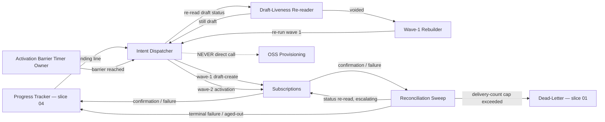
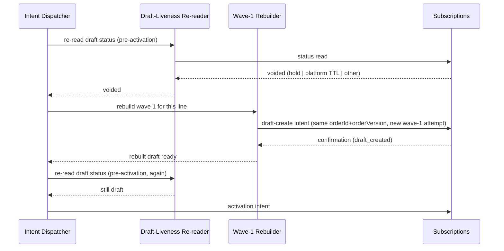

<!-- CONFLUENCE_TITLE: [BSS]: Orders Workflow — Provisioning Intents (Slice 5) -->
<!-- Related: ../DESIGN.md, ../PRD.md, ./01-foundation.md, ./04-fulfillment-plan.md, ./README.md | Owners: BSS Orders team -->

# DESIGN — Provisioning Intents (Slice 5)


<!-- toc -->

- [1. Architecture Overview](#1-architecture-overview)
  - [1.1 Architectural Vision](#11-architectural-vision)
  - [1.2 Architecture Drivers](#12-architecture-drivers)
  - [1.3 Architecture Layers](#13-architecture-layers)
- [2. Principles & Constraints](#2-principles--constraints)
  - [2.1 Design Principles](#21-design-principles)
  - [2.2 Constraints](#22-constraints)
- [3. Technical Architecture](#3-technical-architecture)
  - [3.1 Domain Model](#31-domain-model)
  - [3.2 Component Model](#32-component-model)
  - [3.3 API Contracts](#33-api-contracts)
  - [3.4 Internal Dependencies](#34-internal-dependencies)
  - [3.5 External Dependencies](#35-external-dependencies)
  - [3.6 Interactions & Sequences](#36-interactions--sequences)
  - [3.7 Database schemas & tables](#37-database-schemas--tables)
  - [3.8 Deployment Topology](#38-deployment-topology)
- [4. Additional context](#4-additional-context)
  - [4.1 Upstream register renumbering — SUB-O11 through SUB-O14](#41-upstream-register-renumbering--sub-o11-through-sub-o14)
  - [4.2 Reconciliation-sweep schedule (working baseline)](#42-reconciliation-sweep-schedule-working-baseline)
  - [4.3 Notes and deviations](#43-notes-and-deviations)
- [5. Traceability](#5-traceability)

<!-- /toc -->

- [ ] `p1` - **ID**: `cpt-cf-bss-orders-workflow-design-provisioning-intents`
## 1. Architecture Overview

### 1.1 Architectural Vision

This slice owns exactly two requirements: submitting the two-wave provisioning intent to
Subscriptions for each `FulfillmentTask`, and running the background reconciliation sweep that
recovers any intent whose outcome did not arrive through the normal confirmation path. The
architecture is a strict two-phase submit against a foreign aggregate this gear does not own:
wave 1 opens a `draft` subscription per pending line, and wave 2 activates only those lines whose
draft still exists and whose expected fulfillment time has been reached, `max(now, latest
service-activation date among the order's lines)`. No line receives its activation intent while a
sibling line of the same order still waits on a future date — Subscriptions does not run this
wait, so this gear owns it as a durable timer whose wake-up never depends on an external trigger.

Every intent this gear emits — draft-create, activation, draft-void, activated-cancel — carries
the same identity envelope (`orderId`, `orderVersion`, `orderLineId`, wave, process
`correlationId`, and an opaque caller-owned binding reference) so that Subscriptions, the Policy
Engine, and OSS can correlate an effect back to exactly one line of exactly one order version
without ever being handed order state to interpret. A second, independent key — the idempotency
key, composed from `orderId` + `orderVersion` + `orderLineId` + wave + `intentKind`, tenant-
namespaced by `resource_tenant_id` — governs de-duplication of the submission itself and is never
reused as the correlationId used for tracing. `intentKind` is the fifth component and is
load-bearing, not decorative: without it a `draft_void` key is byte-identical to the
`draft_create` key it undoes, `UNIQUE(idempotency_key)` rejects the compensating row, and
Subscriptions returns the stored forward outcome so the compensation records success against a
live subscription. A sixth component, `wave_attempt`, is appended on a wave-1 rebuild and is the
only component that changes across the rebuild (§3.7).

The reconciliation sweep is the structural admission that a confirmation-driven design fails
closed only if the confirmation eventually arrives. Every non-terminal intent is re-read on an
escalating schedule until it reaches a terminal confirmation, a terminal failure, or the dead-
letter path (`03-approval-execution.md`-style escalation, applied here to intents rather than
approval gates). Past the idempotency-key lifetime the sweep is read-only by construction: it
looks up by correlationId and the frozen `orderId`/`orderVersion`/line/wave tuple, or by the
recorded transition-request identifier, but it never resubmits under an aged key. Fencing's
"reconcile in-flight intents" obligation is built entirely on top of this sweep as its discovery
mechanism, because Fencing has no other way to learn that a confirmation is never coming.

### 1.2 Architecture Drivers

#### Functional Drivers

| Requirement | Design Response |
|-------------|------------------|
| `cpt-cf-bss-orders-workflow-fr-owf-provisioning-intent` | Two-wave Intent Dispatcher (§3.2) with the shared identity envelope and pre-activation draft-still-live re-read (§3.6). |
| `cpt-cf-bss-orders-workflow-fr-owf-intent-sweep` | Reconciliation Sweep component (§3.2) driving every non-terminal intent to a terminal outcome or dead-letter. |
| `cpt-cf-bss-orders-workflow-fr-owf-retry` | Caller-side duplicate protocol (§3.6) reused unmodified from the engine contract's retry/idempotency machinery. |
| `cpt-cf-bss-orders-workflow-fr-owf-dead-letter` | Sweep's aged-out path lands on the shared dead-letter record, never a second inspectable object. |

#### NFR Allocation

| NFR ID | NFR Summary | Allocated To | Design Response | Verification Approach |
|--------|-------------|--------------|-----------------|----------------------|
| `cpt-cf-bss-orders-workflow-nfr-owf-idempotency` | No line is activated on a voided draft; no line is double-activated under a superseded order version. | Intent Dispatcher + Draft-Liveness Re-reader | Pre-activation re-read of `draft` status immediately before each activation intent, never inferred from absence of a void notification. | Design review; sweep-driven reconciliation test against forced void-before-activation. |
| `cpt-cf-bss-orders-workflow-nfr-owf-durability` | No non-terminal intent is left un-reconciled indefinitely. | Reconciliation Sweep | Escalating re-read schedule with a terminal dead-letter floor. | Sweep interval/backoff review; dead-letter alert verification. |

#### Key ADRs

| ADR ID | Decision Summary |
|--------|-----------------|
| `cpt-cf-bss-orders-workflow-adr-idempotency-key-composition` | Idempotency key = `orderId` + `orderVersion` + `orderLineId` + wave + `intentKind`, tenant-namespaced, with `wave_attempt` appended on a wave-1 rebuild; distinct from `correlationId`; `orderVersion` is mandatory in the key. The `intentKind` component is what makes a compensating key structurally distinct from the forward key it undoes, which the ADR already claims and a four-component rule cannot deliver. |
| `cpt-cf-bss-orders-workflow-adr-two-wave-activation-barrier` | Wave-2 activation intents are gated on all wave-1 creates succeeding and on expected fulfillment time being reached; the wait is a durable timer this gear owns, not a Subscriptions-side wait. |

### 1.3 Architecture Layers

```text
Orders Lifecycle ---(begin-fulfillment / frozen plan)---> Fulfillment Plan (slice 04)
                                                                |
                                                                v
                                                      Intent Dispatcher (this slice)
                                                       /wave1 draft-create   \
                                                      /                      \ wave2 activate (post-barrier)
                                                     v                        v
                                            Draft-Liveness Re-reader --> Subscriptions (only)
                                                     |                        |
                                                     v                        v
                                          Reconciliation Sweep <----- confirmation / failure events
                                                     |
                                                     v
                                          Progress Tracker (slice 04) / Dead-Letter (slice 01)
```

- [ ] `p3` - **ID**: `cpt-cf-bss-orders-workflow-tech-provisioning-intents`

| Layer | Responsibility | Technology |
|-------|---------------|------------|
| Application | Two-wave intent construction, identity envelope stamping, idempotency-key derivation | Workflow engine step handlers |
| Domain | Barrier timer evaluation, draft-liveness re-read gating, confirmation-driven task transitions | Domain state machine (`FulfillmentTask`, slice 04) |
| Infrastructure | Durable timer persistence, sweep scheduling, dead-letter queue | `owf_durable_timer`, sweep worker, dead-letter store (slice 01) |

## 2. Principles & Constraints

### 2.1 Design Principles

#### Subscriptions Is the Only Provisioning Route

- [ ] `p1` - **ID**: `cpt-cf-bss-orders-workflow-principle-subscriptions-only-route`

Orders Workflow never calls OSS Provisioning directly. The Subscriptions → Policy Engine → OSS
path is the only permissible route for every provisioning effect this gear triggers, for either
wave, and for every compensating draft-void or activated-cancel intent. This is a hard boundary,
not a default: no fallback path to OSS exists in this design under any failure mode.

**ADRs**: `cpt-cf-bss-orders-workflow-adr-two-wave-activation-barrier`

#### Detection by Re-read, Never by Absence of Notification

- [ ] `p2` - **ID**: `cpt-cf-bss-orders-workflow-principle-detection-by-re-read`

A voided draft is discovered by re-reading its status immediately before dispatching the
activation intent that would otherwise target it — not by waiting for or depending on a draft-
void notification, which Subscriptions is not obligated to emit for every voiding cause (hold,
platform TTL, or any other). The same re-read discipline underlies the reconciliation sweep: it
is a periodic re-read, not a passive listener.

**ADRs**: `cpt-cf-bss-orders-workflow-adr-two-wave-activation-barrier`

### 2.2 Constraints

#### The Idempotency Key Is Not the Correlation Identifier

- [ ] `p2` - **ID**: `cpt-cf-bss-orders-workflow-constraint-key-not-correlation-id`

The idempotency key (`resource_tenant_id` + `orderId` + `orderVersion` + `orderLineId` + wave +
`intentKind`, plus `wave_attempt` on a rebuild) and the process `correlationId` are structurally
distinct and must never be interchanged. The key governs submission de-duplication and has a
bounded lifetime — **30 days**, at or above the maximum retry horizon including manual-task
resolution and hold/resume — after which the sweep may no longer use it to resubmit; the
correlationId is a whole-process trace identifier with no such expiry and is the sweep's lookup
key once the idempotency-key lifetime has elapsed.

Two properties of the composition are consequences, not preferences. `intentKind` makes the
compensating key structurally distinct from the forward key, so `UNIQUE(idempotency_key)` admits
both rows and Subscriptions cannot answer a void with the create's stored outcome. `wave_attempt`
is what makes a "fresh idempotency key" for the wave-1 rebuild (§3.2) expressible at all: without
it, a deterministic composition re-derives the identical string on every rebuild, which the
uniqueness constraint rejects and the read-only-past-key-lifetime rule forbids resubmitting.

**ADRs**: `cpt-cf-bss-orders-workflow-adr-idempotency-key-composition`

#### The Activation Instant Is Never Order-Supplied

- [ ] `p2` - **ID**: `cpt-cf-bss-orders-workflow-constraint-activation-instant-not-order-derived`

Each activation intent carries the actual activation instant as the spawned subscription's start;
this gear must never derive that start from any date carried on the order. Where the barrier
defers a line past its quoted service-activation date, the quoted date travels separately, as the
requested date, and billing/entitlement are not backdated to it. Subscriptions owns the start
value, so this gear cannot enforce the rule unilaterally; it is raised upstream as `SUB-O10` (see
§4.1), consistent with the sibling Orders Lifecycle design
(`gears/bss/orders-lifecycle/docs/design/06-workflow-seam.md` §4.4).

**ADRs**: `cpt-cf-bss-orders-workflow-adr-two-wave-activation-barrier`

## 3. Technical Architecture

### 3.1 Domain Model

**Technology**: GTS domain entities backed by the engine's task/timer tables (phases 8-9, 11).

**Location**: [`04-fulfillment-plan.md`](./04-fulfillment-plan.md) (owning entity: `FulfillmentTask`)

**Core Entities**:

- [ ] `p2` - **ID**: `cpt-cf-bss-orders-workflow-entity-provisioning-intent`

| Entity | Description | Schema |
|--------|-------------|--------|
| `ProvisioningIntent` | An outbound draft-create, activation, draft-void, or activated-cancel intent to Subscriptions; carries the identity envelope and idempotency key. | [`3.7`](#37-database-schemas--tables) `owf_provisioning_intent` |
| `ActivationBarrierTimer` | The time half of the barrier: a durable timer at `max(now, latest service-activation date among the order's lines)`, whose fire is **persisted** (`fired_at`) rather than delivered as a consumable signal. The barrier predicate itself is the conjunction of that flag with the creates half (§3.2). | Maps onto `owf_durable_timer` (`timer_kind = expected-fulfillment-wait`, the value in the engine's closed enum); no new table. |
| `ReconciliationSweepEntry` | The sweep's per-intent tracking row: current escalation tier, next re-read time, terminal/dead-letter outcome. | [`3.7`](#37-database-schemas--tables) `owf_provisioning_intent` (embedded sweep columns) |

**Relationships**:
- `FulfillmentTask` (slice 04) → `ProvisioningIntent`: one task drives at most one in-flight
  intent per wave; the task's wave-aligned state machine (`pending → draft_created → activated`,
  or `→ failed`) is advanced only by that intent's confirmation or failure.
- `ProvisioningIntent` → `ActivationBarrierTimer`: every wave-2 intent for an order is gated by
  exactly one order-scoped barrier timer, shared across all of that order's lines.
- `ProvisioningIntent` → `ReconciliationSweepEntry`: every non-terminal intent has exactly one
  active sweep entry; a terminal confirmation, terminal failure, or dead-letter placement retires
  the entry.

### 3.2 Component Model



#### Intent Dispatcher

- [ ] `p2` - **ID**: `cpt-cf-bss-orders-workflow-component-intent-dispatcher`

##### Why this component exists

Every effect this gear has on the outside world for fulfillment purposes flows through this single
component, so that the identity envelope, the idempotency-key composition, and the OSS-never-
direct constraint are enforced in exactly one place rather than re-implemented per call site.

##### Responsibility scope

Constructs and submits all four intent kinds (draft-create, activation, draft-void, activated-
cancel) against the frozen fulfillment plan (slice 04); stamps the identity envelope
(`orderId`, `orderVersion`, `orderLineId`, wave, `correlationId`, opaque binding reference) and the
idempotency key on every intent; applies the caller-side duplicate protocol on client-side timeout
or in-flight rejection (§3.6); consumes confirmations/failures and advances the matching
`FulfillmentTask` (`draft_created`, `activated`, or `failed` entering the partial-failure policy).

##### Responsibility boundaries

Does not decide fulfillment-plan membership or ordering — it consumes the frozen plan verbatim
and asks the Fulfillment Plan slice's **activation-eligibility predicate**
(`04-fulfillment-plan.md` §3.2) which lines may be dispatched now; ordering is decided there and
consumed here, never re-derived. Does not evaluate the barrier itself — it waits on the
Activation Barrier Timer Owner's signal, which is the conjunction, not the timer alone. Does not
call OSS Provisioning under any circumstance. Does not persist sweep scheduling state — that is
the Reconciliation Sweep's responsibility.

##### Related components (by ID)

- `cpt-cf-bss-orders-workflow-component-progress-tracker` — receives confirmation-driven state
  advances; slice 04's owning component.
- `cpt-cf-bss-orders-workflow-component-activation-barrier-timer-owner` — depends on for wave-2
  gating.
- `cpt-cf-bss-orders-workflow-component-draft-liveness-re-reader` — calls immediately before every
  activation intent.
- `cpt-cf-bss-orders-workflow-component-wave1-rebuilder` — invoked when the re-reader finds a
  voided draft.
- `cpt-cf-bss-orders-workflow-component-reconciliation-sweep` — shares intent state; sweep takes
  over on missing confirmations.

#### Activation Barrier Timer Owner

- [ ] `p2` - **ID**: `cpt-cf-bss-orders-workflow-component-activation-barrier-timer-owner`

##### Why this component exists

Subscriptions does not own the wait for expected fulfillment time; without a component owning a
durable, self-waking timer, the wait would either block on a process that can crash or depend on
an external caller re-triggering it, which the requirement explicitly forbids.

##### Responsibility scope

Owns the **whole barrier predicate**, both halves of it — not the clock alone. The barrier is
the conjunction `all wave-1 creates confirmed AND now >= expected fulfillment time`, and this
component is its single evaluator, because splitting the conjunction across two components is how
the second half ended up owned by nobody.

- *Time half*: computes expected fulfillment time as `max(now, latest service-activation date
  among the order's lines)`, schedules one durable, order-scoped timer per fulfillment plan
  against that instant (`owf_durable_timer`, timer kind `expected-fulfillment-wait`), and fires a
  wake-up that does not depend on any external trigger. Recomputes the instant if plan membership
  changes under wave-1 rebuild (§3.6).
- *Creates half*: on **every** wave-1 terminal confirmation the Intent Dispatcher records, this
  component re-evaluates whether every task on the frozen plan has left `pending`, and whether
  every one of them reached `draft_created`.

**The barrier is level-triggered, never edge-triggered.** Evaluation runs on both inputs — timer
fire *and* each wave-1 confirmation — and the released/not-released answer is a function of
persisted state (`owf_durable_timer.fired_at` plus the plan's task states), not of a signal that
can be consumed once and lost. This is what makes the already-past barrier instant safe: when
every service-activation date is in the past, `max(now, ...)` is `now`, the one-shot timer fires
while creates are still in flight, and the fire is **recorded** rather than delivered; the last
create confirmation then re-evaluates the conjunction, finds both halves true, and releases the
wave. An edge-triggered signal would be consumed with the other half false and never re-raised,
and every intent would already be terminal so the sweep would never revisit the order — a silent
hang. Re-evaluation likewise runs on **resume from hold** and after a **wave-1 rebuild**, since
both change the creates half after the timer may already have fired.

If the creates half resolves to "some task reached permanent `failed`", the barrier never
releases and the wave-1 partial-failure disposition of `04-fulfillment-plan.md` §3.6 takes over —
the drafts that succeeded are voided explicitly rather than left to wait on a barrier that cannot
become true.

##### Responsibility boundaries

Does not dispatch intents itself — it only signals the Intent Dispatcher that wave 2 may proceed.
Does not decide which eligible lines go first — inter-line dependency ordering is the Fulfillment
Plan slice's activation-eligibility predicate. Does not gate on a per-line basis; the barrier is
order-scoped precisely because no line may activate while a sibling line still waits.

##### Related components (by ID)

- `cpt-cf-bss-orders-workflow-component-intent-dispatcher` — signalled on barrier reached.
- `cpt-cf-bss-orders-workflow-component-wave1-rebuilder` — informs timer recomputation on rebuild.

#### Draft-Liveness Re-reader

- [ ] `p2` - **ID**: `cpt-cf-bss-orders-workflow-component-draft-liveness-re-reader`

##### Why this component exists

A wave-1 draft can be auto-voided by hold, by platform TTL during the date wait, or by any other
cause, with no guaranteed notification back to this gear. Detection must therefore happen by
re-read at the one moment it matters — immediately before an activation intent would otherwise be
dispatched — rather than by relying on an event that may never arrive.

##### Responsibility scope

Immediately before each activation intent, re-reads the target subscription's status from
Subscriptions and confirms it is still `draft`. Reports "still draft" (dispatch proceeds) or
"voided" (dispatch blocked, wave-1 rebuild triggered) to the Intent Dispatcher.

##### Responsibility boundaries

Does not subscribe to or depend on any draft-void notification channel — this component's sole
detection mechanism is the re-read itself, stated explicitly per the requirement. Does not decide
how to recover a voided draft; that is the Wave-1 Rebuilder's job.

##### Related components (by ID)

- `cpt-cf-bss-orders-workflow-component-intent-dispatcher` — calls this component before every
  activation intent.
- `cpt-cf-bss-orders-workflow-component-wave1-rebuilder` — invoked on a "voided" result.

#### Wave-1 Rebuilder

- [ ] `p2` - **ID**: `cpt-cf-bss-orders-workflow-component-wave1-rebuilder`

##### Why this component exists

An activation intent must never target a voided draft. When one is found voided by the re-reader,
the only correct recovery is to re-run wave 1 for that line — not to activate a subscription that
no longer exists as a draft, and not to skip the line silently.

##### Responsibility scope

Re-runs wave 1 (a fresh draft-create intent, fresh idempotency key with the same frozen `orderId`
+ `orderVersion` and an incremented/new wave-1 attempt) against the same frozen order identity
before any activation intent for that line is dispatched again. Notifies the Activation Barrier
Timer Owner to recompute expected fulfillment time if the rebuild changes plan membership.

##### Responsibility boundaries

Does not change `orderId` or `orderVersion` — the plan freeze from slice 04 is untouched; only the
wave-1 attempt for the affected line is redone. Does not dispatch the activation intent itself;
control returns to the Intent Dispatcher once the new draft is confirmed `draft_created`.

##### Related components (by ID)

- `cpt-cf-bss-orders-workflow-component-draft-liveness-re-reader` — supplies the trigger.
- `cpt-cf-bss-orders-workflow-component-intent-dispatcher` — resumes activation dispatch after
  rebuild.

#### Reconciliation Sweep

- [ ] `p2` - **ID**: `cpt-cf-bss-orders-workflow-component-reconciliation-sweep`

##### Why this component exists

A confirmation-driven design fails closed only if the confirmation eventually arrives. Client-side
timeouts after accept, lost outcomes, and any other silent-loss mode leave a `FulfillmentTask`
stuck neither `activated` nor `failed`; this component is the sole mechanism that discovers and
resolves that stuck state.

##### Responsibility scope

Periodically re-reads the status of every non-terminal `ProvisioningIntent` on the escalating
schedule fixed at §4.2 — a **split ladder**: the short, in-SLA ladder for wave-2 intents, the
longer ladder for everything else. Drives each intent to a terminal confirmation
(`draft_created`/`activated`), a terminal outcome for a compensating intent (`voided`/`cancelled`),
a terminal failure (entering the partial-failure policy), or the dead-letter path on exhausting
the sweep floor of §4.2. Supplies Fencing's "reconcile in-flight intents" obligation with its
only discovery mechanism. After the idempotency-key lifetime elapses for a given intent, becomes
read-only for that intent: it must not resubmit under the aged-out key; lookup switches to
correlationId plus `orderId` + `orderVersion` + order-line + wave + `intentKind`, or to the
recorded transition-request identifier (`SUB-O13`, §4.1).

**The not-found branch — an intent that was written but never sent.** An
`owf_provisioning_intent` row is written at `status = submitted` *before* the outcome is known,
so a crash between the row write and the dispatch leaves a row for a transition request that
never reached Subscriptions. Its status read answers "no such transition request", which is
neither a terminal confirmation, nor a terminal failure, nor still-processing. The sweep treats
it as its own branch:

- **Inside the idempotency-key lifetime**: the intent was never accepted, so re-submitting under
  the same key is safe by construction — that is precisely what the key protects. The sweep hands
  the intent back to the Intent Dispatcher for a **first** dispatch (not a resubmit of an accepted
  call), the `submitted_at` clock restarts, and the sweep tier resets.
- **Past the idempotency-key lifetime**: the sweep is read-only and cannot send it, so the intent
  can never complete. It is driven to a terminal failure with reason `never-dispatched`, the
  owning `FulfillmentTask` advances to `failed`, and the pinned partial-failure policy takes over.
  This is the one case where the read-only rule converts a recoverable state into a failure, and
  it is stated rather than left to be discovered as a hang.

A not-found answer is never read as "it succeeded and we missed the confirmation": the discovery
of a row with no counterpart downstream is evidence of non-dispatch, and the caller-side duplicate
protocol's "never infer success from silence" rule applies to it unchanged.

##### Responsibility boundaries

Never resubmits a submission — it only re-reads status. Never invents a new idempotency key on a
caller's behalf. Never writes a second inspectable dead-letter object distinct from the one phase
9 already defines.

##### Related components (by ID)

- `cpt-cf-bss-orders-workflow-component-intent-dispatcher` — shares `ProvisioningIntent` state.
- `cpt-cf-bss-orders-workflow-component-progress-tracker` — receives terminal-failure-driven task
  transitions.

### 3.3 API Contracts

- [ ] `p2` - **ID**: `cpt-cf-bss-orders-workflow-interface-provisioning-intent-dispatch`

- **Contracts**: `cpt-cf-bss-orders-workflow-contract-owf-provisioning-intent`
- **Technology**: Async intent submission + confirmation/failure event consumption (per the
  Subscriptions PRD's event envelope; no synchronous REST surface is introduced by this slice).
- **Location**: [`04-fulfillment-plan.md`](./04-fulfillment-plan.md) §3.7 (task state machine this
  slice's confirmations drive)

**Endpoints Overview**:

| Method | Path | Description | Stability |
|--------|------|--------------|-----------|
| n/a (event) | `ProvisioningIntentSubmitted` | Draft-create or activation intent dispatch (internal event, not a REST endpoint). | unstable |
| n/a (event) | `ProvisioningIntentConfirmed` | Draft-create, activation, draft-void or activated-cancel confirmation, echoing the identity envelope and the resulting `subscriptionId` (`SUB-O16`, §4.1 — **UNASKED**). | unstable |
| n/a (event) | `ProvisioningIntentFailed` | Failure confirmation for either wave, echoing the identity envelope (`SUB-O16`). | unstable |

### 3.4 Internal Dependencies

| Dependency Gear | Interface Used | Purpose |
|-------------------|----------------|----------|
| orders-workflow (slice 04, Fulfillment Plan) | `cpt-cf-bss-orders-workflow-component-plan-freeze-store` | Reads the frozen per-`orderId`+`orderVersion` plan this slice dispatches intents against. |
| orders-workflow (slice 04, Fulfillment Plan) | `cpt-cf-bss-orders-workflow-component-progress-tracker` — activation-eligibility predicate | Answers which lines of a released wave may be dispatched now, from the frozen dependency graph; this slice consumes the answer and never re-derives ordering. |
| orders-workflow (slice 01, engine contract) | `owf_durable_timer` service | Backs the Activation Barrier Timer Owner. |
| orders-workflow (slice 01, engine contract) | dead-letter store | Sweep's aged-out/delivery-cap-exceeded terminus. |

**Dependency Rules** (per project conventions):
- No circular dependencies
- Always use sdk modules for inter-gear communication
- No cross-category sideways deps except through contracts
- Only integration/adapter gears talk to external systems
- `SecurityContext` must be propagated across all in-process calls

### 3.5 External Dependencies

#### Subscriptions

- **Contract**: `cpt-cf-bss-orders-workflow-contract-owf-provisioning-intent`

| Dependency Gear | Interface Used | Purpose |
|-------------------|---------------|----------|
| subscriptions | draft-create / activate / draft-void / activated-cancel transition requests | The only permissible provisioning route; Subscriptions in turn routes through Policy Engine → OSS, never invoked directly by this gear. |

**Dependency Rules** (per project conventions):
- No circular dependencies
- Always use SDK modules for inter-gear communication
- No cross-category sideways deps except through contracts
- Only integration/adapter gears talk to external systems
- `SecurityContext` must be propagated across all in-process calls

### 3.6 Interactions & Sequences

#### Two-Wave Provisioning Dispatch

**ID**: `cpt-cf-bss-orders-workflow-seq-two-wave-dispatch`

**Use cases**: `cpt-cf-bss-orders-workflow-fr-owf-provisioning-intent`

**Actors**: `cpt-cf-bss-orders-workflow-actor-owf-orders-lifecycle`, `cpt-cf-bss-orders-workflow-actor-owf-subscriptions`

```mermaid
sequenceDiagram
    participant PT as Progress Tracker
    participant ID as Intent Dispatcher
    participant SUB as Subscriptions
    participant BT as Barrier Timer Owner
    participant DLR as Draft-Liveness Re-reader

    PT->>ID: pending line (wave 1)
    ID->>SUB: draft-create intent (identity envelope + idempotency key, wave=1)
    SUB-->>ID: confirmation (draft_created) | failure
    ID->>PT: advance task (draft_created | failed)
    BT->>BT: schedule durable timer at max(now, latest service-activation date)
    BT->>BT: record timer fire (fired_at); do NOT consume as a signal
    ID->>BT: wave-1 terminal confirmation recorded
    BT->>BT: re-evaluate conjunction (all creates confirmed AND fired_at set)
    BT-->>ID: barrier released
    ID->>PT: activation-eligible lines? (frozen-graph predicate, slice 04)
    PT-->>ID: eligible line set
    ID->>DLR: re-read draft status
    DLR-->>ID: still draft
    ID->>SUB: activation intent (actual activation instant as start, wave=2)
    SUB-->>ID: confirmation (activated) | failure
    ID->>PT: advance task (activated | failed)
```

**Description**: Wave 1 opens a draft per pending line. The barrier is evaluated, not signalled:
the timer fire is persisted and every wave-1 confirmation re-evaluates the conjunction, so the
order in which the two halves become true does not matter and an instant already in the past is
handled by the same path as a future-dated one (§3.2). Within the released wave, which lines go
first is the frozen graph's answer, obtained from slice 04's activation-eligibility predicate.
The draft-liveness re-read is the last gate before each activation intent; the first activation
confirmation is what this gear reports as the spawn signal to Orders Lifecycle — the wave-1
draft-create acceptance is never reported as the spawn signal.

#### Wave-1 Rebuild on Auto-Voided Draft

**ID**: `cpt-cf-bss-orders-workflow-seq-wave1-rebuild`

**Use cases**: `cpt-cf-bss-orders-workflow-fr-owf-provisioning-intent`

**Actors**: `cpt-cf-bss-orders-workflow-actor-owf-subscriptions`



**Description**: Detection is the re-read alone — no draft-void notification is depended upon at
any step. A voided draft never receives an activation intent; the rebuild always precedes any
retry of activation for the affected line.

#### Reconciliation Sweep Cycle

**ID**: `cpt-cf-bss-orders-workflow-seq-reconciliation-sweep`

**Use cases**: `cpt-cf-bss-orders-workflow-fr-owf-intent-sweep`

**Actors**: `cpt-cf-bss-orders-workflow-actor-owf-subscriptions`, `cpt-cf-bss-orders-workflow-actor-owf-fulfillment-operator`

```mermaid
sequenceDiagram
    participant RS as Reconciliation Sweep
    participant SUB as Subscriptions
    participant PT as Progress Tracker
    participant DL as Dead-Letter

    loop escalating schedule, per non-terminal intent
        RS->>SUB: status read (correlationId + orderId/orderVersion/line/wave, or transition-request id)
        alt terminal confirmation
            SUB-->>RS: draft_created | activated
            RS->>PT: advance task
        else terminal failure
            SUB-->>RS: failed
            RS->>PT: advance task (failed, partial-failure policy)
        else terminal compensating outcome
            SUB-->>RS: voided | cancelled
            RS->>PT: retire intent; record compensation outcome
        else no such transition request (written, never dispatched)
            SUB-->>RS: not found
            alt inside idempotency-key lifetime
                RS->>PT: hand back for first dispatch (same key; never accepted, so safe)
            else past idempotency-key lifetime
                RS->>PT: advance task (failed, reason never-dispatched)
            end
        else still non-terminal, idempotency-key lifetime elapsed
            RS->>RS: switch to read-only lookup (no resubmit under aged key)
        else sweep floor reached (30 reads or 23 h)
            RS->>DL: dead-letter (orderId, orderVersion, correlationId, source id, last error)
        end
    end
```

**Description**: The sweep is the discovery mechanism Fencing's reconcile-in-flight obligation
relies on. Waiting passively on a confirmation that may never arrive is explicitly not
reconciliation; only this active, escalating re-read satisfies the requirement.

**Caller-Side Duplicate Protocol** (applies to the Intent Dispatcher for both waves, conforming to
the engine contract's retry machinery, `01-foundation.md` §4.5): on a client-side timeout of a call that may have
been accepted, retry with the same idempotency key, then confirm the outcome by lookup — never
infer success from silence. On a conflict or in-flight rejection (`SUB-O11`, §4.1), do not infer
success: wait, retry the same key only if the original submission was not accepted, then confirm
by lookup; supersede an accepted in-flight intent by cancel/void (`SUB-O12`, §4.1), never by a
second submit. **Disclosure**: `SUB-O12` is **UNASKED** — the canonical Subscriptions register has
never carried a cancel/void of an accepted transition request at any number (§4.1). Until it
lands, an accepted in-flight intent has **no** superseding action available from this side: the
only conforming behaviour is to wait for its terminal outcome through the Reconciliation Sweep,
which means a hold or a cancellation arriving mid-flight cannot stop an already-accepted intent
and must reconcile it first. The same disclosure applies wherever this design names `SUB-O12` as
the supersede mechanism, including the cancellation-fencing step in
`06-saga-and-compensation.md`. A duplicate success response is absorbed without double-advancing the task. The
retry budget applies to submission failures only; an accepted-but-hanging call is recovered by the
Reconciliation Sweep, never by a resubmit.

### 3.7 Database schemas & tables

- [ ] `p3` - **ID**: `cpt-cf-bss-orders-workflow-db-provisioning-intents`

#### Table: owf_provisioning_intent

**ID**: `cpt-cf-bss-orders-workflow-dbtable-provisioning-intent`

**Schema**:

| Column | Type | Description |
|--------|--------|--------------|
| `intent_id` | uuid | Surrogate primary key. |
| `order_id` | text | Frozen order identity this intent targets. **`text`, matching `owf_fulfillment_task.order_id`** (`04-fulfillment-plan.md` §3.7) — the sweep's post-key-lifetime lookup joins these tables on exactly this column, and order identifiers in this set are not uuids. |
| `order_version` | integer | Frozen order version; mandatory, part of the idempotency key. |
| `order_line_id` | text | The order line this intent affects; `text`, matching `owf_fulfillment_task.order_line_id`. |
| `resource_tenant_id` | uuid | Resource recipient; the isolation column for every read of this table and the namespace prefix of the idempotency key. |
| `seller_tenant_id` | uuid | Selling party; the axis per-tenant fairness and back-pressure key on, and the scope of the operator-facing intent view. |
| `wave` | enum(`wave1_create`, `wave2_activate`) | Which wave this intent belongs to; also part of the idempotency key. |
| `intent_kind` | enum(`draft_create`, `activation`, `draft_void`, `activated_cancel`) | Intent kind carried in the identity envelope; the fifth idempotency-key component. |
| `wave_attempt` | integer | Wave-1 rebuild attempt, starting at 1; appended to the idempotency key as its sixth component and the only component that changes across a rebuild. Stays 1 for intents never rebuilt. |
| `execution_seq` | bigint | Monotonic per-order sequence assigned when this intent is **accepted** by Subscriptions. Compensation dispatches in descending `execution_seq`, which is what makes `PRD.md:466`'s reverse-order requirement and `ADR/0005`'s "compensation dispatch must know the creation order of every subscription" derivable instead of asserted. Null until acceptance. |
| `correlation_id` | uuid | Process-wide trace identifier; distinct from the idempotency key; the sweep's post-key-lifetime lookup key. |
| `binding_reference` | text | Opaque, caller-owned; may be derived from the order's external reference where present; never interpreted by Subscriptions or OSS as order state. |
| `idempotency_key` | text | `resource_tenant_id` + `order_id` + `order_version` + `order_line_id` + `wave` + `intent_kind` (+ `wave_attempt` where > 1); never reused as `correlation_id`. |
| `transition_request_id` | text nullable | Subscriptions-recorded identifier for this transition request; sweep's alternate lookup key. |
| `subscription_id` | text nullable | The subscription this intent created or acted on, echoed by Subscriptions on confirmation; mirrored onto `owf_fulfillment_task.subscription_id` for the completion acknowledgement. |
| `status` | enum(`submitted`, `draft_created`, `activated`, `voided`, `cancelled`, `failed`, `dead_lettered`) | Current terminal/non-terminal status. `voided` is the terminal success of a `draft_void` and `cancelled` of an `activated_cancel`; without them a compensation that worked would be recorded `failed`, re-enter the partial-failure policy and raise a manual task for a success. |
| `sweep_tier` | integer | Current escalation tier of the reconciliation sweep for this intent, on the ladder of §4.2 selected by `wave`. |
| `sweep_reads` | integer | Count of status re-reads performed; the sweep floor of §4.2 trips on it. |
| `next_sweep_at` | timestamptz nullable | Next scheduled re-read; null once terminal or dead-lettered. |
| `key_expires_at` | timestamptz | End of the idempotency-key lifetime (`submitted_at` + 30 days); after this the sweep is read-only for this intent. |
| `submitted_at` | timestamptz | When the row was written; restarted if the not-found branch re-dispatches it. |
| `created_at` | timestamptz | Row creation time; the partition key. |

**PK**: `intent_id`

**Constraints**: `NOT NULL` on `order_id`, `order_version`, `order_line_id`, `resource_tenant_id`,
`seller_tenant_id`, `wave`, `intent_kind`, `wave_attempt`, `correlation_id`, `binding_reference`,
`idempotency_key`, `status`, `created_at`; `UNIQUE(idempotency_key)`;
`UNIQUE(order_id, execution_seq)` where `execution_seq` is not null.

**Additional info**: Indexes —

| Index | Serves |
|-------|--------|
| `(order_id, order_version, order_line_id, wave, intent_kind)` | The sweep's post-key-lifetime lookup and the dispatcher's duplicate check. |
| `(correlation_id)` | Cross-wave tracing. |
| `(next_sweep_at) WHERE status NOT IN ('activated','voided','cancelled','failed','dead_lettered')` | **The sweep's own candidate query** — `next_sweep_at <= now` over non-terminal rows. Without it the sweep scans an append-only table whose history grows under a ≥ 400-day retention floor, so sweep cost tracks total historical volume rather than live work and the 23-hour resolution derivation of §4.2 silently stops holding. The partial predicate keeps the index sized to in-flight rows only, the same shape `owf_durable_timer` uses for its wake-up scan. |
| `(order_id, execution_seq DESC)` | Reverse-order compensation dispatch. |
| `(seller_tenant_id, status)` | Per-seller back-pressure and the operator view. |

**Tenant axes**: `resource_tenant_id` is the isolation column (SecureORM `tenant_col`);
`seller_tenant_id` is carried because per-tenant fairness and the operator surface key on the
selling party. **Retention**: ≥ 400 days, matching `owf_compensation_record` — an intent row is
the evidence that a subscription was created, and compensation and audit both read it.
**Partitioning**: monthly range partition on `created_at`.

No separate table for the reconciliation sweep's tracking state —
`sweep_tier`/`sweep_reads`/`next_sweep_at`/`key_expires_at` are embedded columns, matching the
Fulfillment Plan slice's pattern of embedding process-tracking state on the owning row rather than
a shadow table.

**Example**:

| order_id | order_version | wave | intent_kind | wave_attempt | status | sweep_tier |
|--------|--------|--------|--------|--------|--------|--------|
| `ord-123` | `3` | `wave1_create` | `draft_create` | `1` | `draft_created` | `0` |
| `ord-123` | `3` | `wave2_activate` | `activation` | `1` | `submitted` | `2` |
| `ord-123` | `3` | `wave1_create` | `draft_void` | `1` | `voided` | `0` |

### 3.8 Deployment Topology

- [ ] `p3` - **ID**: `cpt-cf-bss-orders-workflow-topology-provisioning-intents`

The Reconciliation Sweep runs as a scheduled background worker within the workflow engine's
existing runtime (no separate deployment unit); it shares the durable timer infrastructure
(`owf_durable_timer`) already provisioned by slice 01 for the barrier timer.

## 4. Additional context

### 4.1 Upstream register renumbering — SUB-O11 through SUB-O14

The upstream ask register is currently **forked**. The canonical register,
`gears/bss/subscriptions/docs/SEAMS.md`, defines `SUB-O1` through `SUB-O6`, and there `SUB-O6`
means **atomic multi-subscription submission** (a joint reopen of `SUB-D-04`/`SUB-C2` against the
two-phase draft/activate shape). Independently, the Orders Workflow PRD uses `SUB-O6` for a
**different** thing — a machine-readable in-flight rejection — and additionally invents `SUB-O7`,
`SUB-O8`, and `SUB-O9`, none of which have ever existed in the canonical register. `SUB-O6`
therefore currently carries **two different meanings** across the two registers, and `SUB-O7`
through `SUB-O9` have never been asked upstream at all. `SUB-O10` is separately already taken by
the sibling Orders Lifecycle design for an explicit subscription-start-instant ask (§2.2 above).

This design set treats `SEAMS.md` as canonical and renumbers this gear's four asks accordingly.
Each is labelled **UNASKED**, not merely unagreed — the canonical register has never contained
these asks at any number, which is a stronger and more honest status than "unagreed" (which would
imply the ask reached Subscriptions and was declined or deferred). The PRD needs amending, because
it is the current definition site for the colliding `SUB-O6` and the unregistered `SUB-O7`
through `SUB-O9`.

| New ID | Status | Description | Replaces (PRD) |
|--------|--------|--------------|----------------|
| `SUB-O11` | **UNASKED** | Machine-readable in-flight rejection, so a retry can distinguish "already accepted" from "not accepted." | PRD `SUB-O6` |
| `SUB-O12` | **UNASKED** | Cancel or void of an accepted transition request — the superseding action for an accepted in-flight intent. | PRD `SUB-O7` |
| `SUB-O13` | **UNASKED** | Status-read of a non-terminal intent, by transition-request id or by `orderId` + `orderVersion` + order-line + wave. | PRD `SUB-O8` |
| `SUB-O14` | **UNASKED** | `correlationId` propagation along the Subscriptions → Policy Engine → OSS path. | PRD `SUB-O9` |
| `SUB-O16` | **UNASKED** | **Identity-envelope echo on every confirmation and failure event**: `orderId`, `orderVersion`, `orderLineId`, wave, `correlationId`, the opaque binding reference, and the resulting `subscriptionId`. | none — new |

`SUB-O16` is newly raised by this slice and has no PRD predecessor. `PRD.md:352` states the echo
as an obligation ("confirmations and failure events **MUST** echo …"), but an obligation on a
foreign aggregate is an upstream ask, not a local design decision, and it was registered nowhere.
Everything in this slice that matches an outcome back to a line depends on it: the dispatcher's
confirmation-to-task advance, the sweep's correlation-based lookup after the key ages out, and
`owf_provisioning_intent.subscription_id`, which is the only source for the per-line subscription
identifiers the completion acknowledgement carries (`PRD.md` AC 8). Without the echo, an outcome
can be matched only by the transition-request identifier this gear recorded at submission — which
is exactly the identifier a crash between row-write and dispatch leaves null (§3.2, not-found
branch). Its absence is therefore not a tracing inconvenience; it removes the fallback the sweep's
own recovery path rests on.

Related, already-registered upstream asks referenced elsewhere in this design but not renumbered
by this slice:
- `SUB-O10` — explicit subscription-start-instant obligation; this is the sibling Orders Lifecycle
  design's ask (§2.2 above), reused here unmodified for the activation-intent start-instant rule.
- `SUB-O5` — overlap-scope-key presence read; registered upstream in `SEAMS.md` but **unagreed**
  (a different status from the four UNASKED entries above); consumed at plan-construction and
  pre-activation re-check time by slice 04, and inherited by this slice's own draft-liveness
  re-read (§3.6), which fails closed on the same unevaluable-read circumstance per slice 04's
  pre-activation abort rule.

### 4.2 Reconciliation-sweep schedule (working baseline)

The ladder is **split by phase**, because one ladder cannot serve two bounds that differ by two
orders of magnitude. Both are working baselines with their derivations, proposed into the
program-wide NFR workshop.

| Ladder | Applies to | Schedule |
|--------|-----------|----------|
| **In-SLA** | `wave = wave2_activate` intents | **5 s -> 15 s -> 30 s -> 60 s -> 2 min**, terminal by **t+5 min** |
| **General** | every other intent (wave-1 creates, draft-void, activated-cancel) | **30 s -> 1 min -> 2 min -> 5 min -> 15 min -> 1 h**, capped hourly thereafter |

| Bound | Baseline | Derivation |
|-------|----------|------------|
| Sweep floor | **30 reads or 23 h, whichever comes first** | The terminal floor of the general ladder. 23 h sits inside the 24 h overdue window so the sweep has always resolved or dead-lettered an intent before the overdue escalation fires on it; 30 reads bounds the cost of an intent that keeps answering "still processing". Distinct from the inbound delivery cap of 5, which `01-foundation.md` scopes to inbound triggers and callbacks and which has never applied here. |
| Sweep page size | **500 rows per pass, 30 s transaction budget** | Keeps one pass from holding a long transaction against the process tables; the budget, not the row count, is the binding constraint when rows are wide. |
| Jitter | full jitter on every wake-up | The sweep runs across every non-terminal intent in the gear at once; an unjittered fixed interval re-reads them in lockstep and the sweep becomes the load spike it exists to recover from. |

Three properties make this a derivation rather than a preference. First, the wave-2 ladder
**MUST** fit inside the 15-minute p95 fulfillment window
(`cpt-cf-bss-orders-workflow-nfr-owf-fulfillment-sla`), whose clock starts at activation-wave
eligibility: a hang after accept is explicitly excluded from the retry budget, so the sweep is the
*only* recovery for a wave-2 intent, and a ladder reaching 15 min at its fifth step is slower than
the SLA it is said to bound. The in-SLA ladder is terminal at t+5 min, a third of the window.
Second, the general ladder **MUST** reach a terminal confirmation, a terminal failure, or the
dead-letter floor within the **24 h overdue window**
(`cpt-cf-bss-orders-workflow-fr-owf-overdue-escalation`); a schedule that could still be
re-reading past that window would leave the overdue escalation firing on an intent the sweep had
not yet resolved. Third, wave-1 and compensating intents sit outside the measured window
(`04-fulfillment-plan.md` §4), so paying the in-SLA ladder's read volume for them would buy
nothing.

**This section fixes the numeric schedule for this gear.** No other statement in this document
defers it; where an earlier draft said the intervals were an implementation-ADR concern, this
table is the value.

After the idempotency-key lifetime elapses the sweep is **read-only** regardless of where it sits
on either ladder (§2.2); the schedule governs re-read cadence only, never resubmission.

### 4.3 Notes and deviations

- `cfs validate --artifact` reports this file as unmatched: `docs/design/*.md` is excluded from
  `cfs` autodetect per `.cf-studio/config/artifacts.toml`. This is expected, recorded here as a
  note, not a defect. `cfs toc`, `cfs validate-toc`, and `cfs check-language` were run instead.
- The sweep's escalation intervals, floor and page size are **fixed by this design** at §4.2, as
  working baselines with their derivations; they are not deferred to an implementation ADR. Retry
  interval values and backoff curves for *submission* remain the engine contract's
  (`01-foundation.md` §4.5), which this slice consumes unmodified.
- The first activation intent, not wave-1 draft-create acceptance, is the spawn signal reported to
  Orders Lifecycle (§3.6); this is stated explicitly to avoid a future implementation reporting
  spawn prematurely on draft creation.

## 5. Traceability

- **PRD**: [PRD.md](../PRD.md) — `cpt-cf-bss-orders-workflow-fr-owf-provisioning-intent`,
  `cpt-cf-bss-orders-workflow-fr-owf-retry`, `cpt-cf-bss-orders-workflow-fr-owf-dead-letter`,
  `cpt-cf-bss-orders-workflow-fr-owf-intent-sweep`,
  `cpt-cf-bss-orders-workflow-contract-owf-provisioning-intent`
- **ADRs**: `cpt-cf-bss-orders-workflow-adr-idempotency-key-composition`,
  `cpt-cf-bss-orders-workflow-adr-two-wave-activation-barrier`,
  `cpt-cf-bss-orders-workflow-adr-saga-compensable-no-pivot` (reverse-order compensation, which
  `owf_provisioning_intent.execution_seq` makes derivable — §3.7)
- **Sibling design**: [`gears/bss/orders-lifecycle/docs/design/06-workflow-seam.md`](../../../orders-lifecycle/docs/design/06-workflow-seam.md) §4.4 (activation-instant rule, `SUB-O10`)
- **Canonical upstream register**: [`gears/bss/subscriptions/docs/SEAMS.md`](../../../subscriptions/docs/SEAMS.md) (`SUB-O1`..`SUB-O6` canonical; `SUB-O5` unagreed)
- **Prior slice**: [`04-fulfillment-plan.md`](./04-fulfillment-plan.md) (Fulfillment Plan / `FulfillmentTask` this slice's intents drive)
