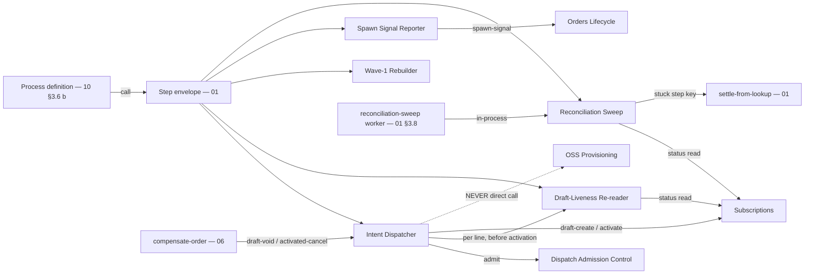

<!-- CONFLUENCE_TITLE: [BSS]: Orders Workflow — Provisioning Intents (Slice 5) -->
<!-- Related: ../DESIGN.md, ../PRD.md, ./01-foundation.md, ./04-fulfillment-plan.md, ./10-process-definition.md, ./README.md | Owners: BSS Orders team -->

# DESIGN — Provisioning Intents (Slice 5)


<!-- toc -->

- [1. Architecture Overview](#1-architecture-overview)
  - [1.1 Architectural Vision](#11-architectural-vision)
  - [1.2 Architecture Drivers](#12-architecture-drivers)
  - [1.3 Architecture Layers](#13-architecture-layers)
- [2. Principles & Constraints](#2-principles--constraints)
  - [2.1 Design Principles](#21-design-principles)
  - [2.2 Constraints](#22-constraints)
- [3. Technical Architecture](#3-technical-architecture)
  - [3.1 Domain Model](#31-domain-model)
  - [3.2 Component Model](#32-component-model)
  - [3.3 API Contracts](#33-api-contracts)
  - [3.4 Internal Dependencies](#34-internal-dependencies)
  - [3.5 External Dependencies](#35-external-dependencies)
  - [3.6 Interactions & Sequences](#36-interactions--sequences)
  - [3.7 Database schemas & tables](#37-database-schemas--tables)
  - [3.8 Deployment Topology](#38-deployment-topology)
- [4. Additional context](#4-additional-context)
  - [4.1 Upstream register renumbering — SUB-O11 through SUB-O14](#41-upstream-register-renumbering--sub-o11-through-sub-o14)
  - [4.2 Reconciliation-sweep schedule (working baseline)](#42-reconciliation-sweep-schedule-working-baseline)
  - [4.3 Admission on dispatch (moved from `01 §4.12` and `01 §4.16`)](#43-admission-on-dispatch-moved-from-01-412-and-01-416)
  - [4.4 Operation rules (normative)](#44-operation-rules-normative)
  - [4.5 Constraints this slice places on the definition](#45-constraints-this-slice-places-on-the-definition)
  - [4.6 Notes and deviations](#46-notes-and-deviations)
- [5. Traceability](#5-traceability)

<!-- /toc -->

- [ ] `p1` - **ID**: `cpt-cf-bss-orders-workflow-design-provisioning-intents`
## 1. Architecture Overview

### 1.1 Architectural Vision

This slice provides six **step operations** and sequences nothing itself: `dispatch-wave1-create`,
`dispatch-wave2-activate` and `report-spawn-signal` (all `protected`), and `reread-draft-liveness`,
`rebuild-wave1` and `reconcile-intent` (all `composable`), each declared once in §3.3 under the
contract of [`01 §3.3`](./01-foundation.md#the-step-operation-contract). The order in which they
run — wave 1, the barrier loop, the spawn signal, wave 2, the rebuild and the poll arm — is
fragment **(b) *Fulfillment*** of the registered process definition
([`10 §3.6`](./10-process-definition.md#36-interactions--sequences),
`cpt-cf-bss-orders-workflow-seq-def-fulfillment`), constrained by the Waves row of the fence
([`10 §4.1`](./10-process-definition.md#41-the-fence)) and by the definition constraints this
slice states in §4.5. The slice keeps what an operation owns: submitting the two-wave
provisioning intents to Subscriptions under the identity envelope and the idempotency key, the
draft-liveness re-read immediately before each activation, admission control on dispatch, and the
reconciliation of every non-terminal intent to a known outcome, all written to this gear's record
in the operation's own unit of work.

The architecture is still a strict two-phase submit against a foreign aggregate this gear does
not own: wave 1 opens a `draft` subscription per pending line, and wave 2 activates only lines
whose draft is still live and whose expected fulfillment time, `max(now, latest
service-activation date among the order's lines)`, has been reached. What changed is who holds
the wait: the expected-fulfillment instant is returned by `construct-and-freeze-plan`
([`04`](./04-fulfillment-plan.md)) and armed by the definition's `wait`; the all-creates half of
the barrier is evaluated by `evaluate-activation-eligibility` (04) on every contributing signal;
and `dispatch-wave2-activate` re-asserts both halves against this gear's record at run time and
refuses otherwise. No timer in this slice remains.

Every intent this gear emits — draft-create, activation, draft-void, activated-cancel — carries
the same identity envelope (`orderId`, `orderVersion`, `orderLineId`, wave, process
`correlationId`, and an opaque caller-owned binding reference) so that Subscriptions, the Policy
Engine and OSS can correlate an effect back to exactly one line of exactly one order version
without being handed order state to interpret. A second, independent key — the intent
idempotency key, composed from `orderId` + `orderVersion` + `orderLineId` + wave + `intentKind`,
tenant-namespaced by `resource_tenant_id` — governs de-duplication of the submission itself and is
never reused as the `correlationId`. `intentKind` is load-bearing: without it a `draft_void` key
is byte-identical to the `draft_create` key it undoes. A sixth component, `wave_attempt`, is
appended once a line's intent of a wave has to be sent again under a new key: `rebuild-wave1`
mints it for a lapsed draft, and an operator's line `retry` mints it for an intent recorded
`failed`, never for one that may still be live
([`../ADR/0006`](../ADR/0006-cpt-cf-bss-orders-workflow-adr-idempotency-key-composition.md) as
amended; decision D-119). None of these values crosses the engine boundary: the definition passes `lineRefs` and
the operation resolves them to lines, keys and envelopes inside Orders
(`cpt-cf-bss-orders-workflow-adr-references-not-payloads`).

The reconciliation sweep is the structural admission that a confirmation-driven design fails
closed only if the confirmation eventually arrives. `reconcile-intent` re-reads every
non-terminal intent on the escalating schedule of §4.2 until it reaches a terminal confirmation, a
terminal failure, or the sweep floor, which hands the intent to a manual task. It runs from two
drivers — the `reconciliation-sweep` worker, which is the schedule, and the definition's poll and
confirmation arms, which are early reads — and **the platform's task retry policy is not the
sweep**: a retry re-issues a call that was not accepted, under the same key; the sweep re-reads an
intent that was. Past the idempotency-key lifetime the sweep is read-only by construction.
Fencing's "reconcile in-flight intents" obligation ([`06`](./06-saga-and-compensation.md)) is
built on this sweep as its discovery mechanism.

### 1.2 Architecture Drivers

#### Functional Drivers

| Requirement | Design Response |
|-------------|------------------|
| `cpt-cf-bss-orders-workflow-fr-owf-provisioning-intent` | `dispatch-wave1-create` and `dispatch-wave2-activate` (§3.3) stamp the identity envelope and the intent key on every line; the draft-liveness re-read runs inside `dispatch-wave2-activate` immediately before each activation submit; a lapsed draft routes to `rebuild-wave1` (§3.6). The wait for expected fulfillment time is the definition's durable `wait` (`10 §3.6` (b)), whose wake-up depends on no external trigger. |
| `cpt-cf-bss-orders-workflow-fr-owf-intent-sweep` | `reconcile-intent` (§3.3) driven by the `reconciliation-sweep` worker on `next_sweep_at` and by the definition's poll and confirmation arms; settlement of a stuck step key only through `settle-from-lookup` (`01 §3.3`); read-only past the key lifetime (§4.4). |
| `cpt-cf-bss-orders-workflow-fr-owf-backpressure` | Admission on dispatch — per-order parallelism, the aggregate in-flight cap, the per-seller allowance, the cold-start ramp and the downstream throttle — inside the two dispatch operations (§4.3, moved here from `01 §4.12`); a deferral is a settled success, never a spent retry. |
| `cpt-cf-bss-orders-workflow-fr-owf-retry` | Caller-side duplicate protocol of `01 §4.5` applied per line inside the dispatch operations; the platform's retry policy re-issues the same step key, whose re-run skips every line that already has an intent row (§4.4); an operator's line retry re-dispatches the line under its next wave attempt (§4.4 *A retry mints a new intent key only for a failed intent*). |
| `cpt-cf-bss-orders-workflow-fr-owf-dead-letter` | This slice has no dead-letter path: an intent that exhausts the sweep floor is recorded `unresolved` and handed to a manual task through the definition's failure arm (§4.2, `01 §4.8`). |

#### NFR Allocation

| NFR ID | NFR Summary | Allocated To | Design Response | Verification Approach |
|--------|-------------|--------------|-----------------|----------------------|
| `cpt-cf-bss-orders-workflow-nfr-owf-idempotency` | No line is activated on a voided draft; no line is double-activated under a superseded order version. | `dispatch-wave2-activate` + Draft-Liveness Re-reader | The re-read of `draft` status runs inside the operation immediately before each activation submit, never inferred from absence of a void notification and never delegated to a separate definition task. | Design review; reconciliation test against a forced void-before-activation. |
| `cpt-cf-bss-orders-workflow-nfr-owf-durability` | No non-terminal intent is left un-reconciled indefinitely. | `reconcile-intent` + `reconciliation-sweep` worker | Escalating re-read schedule on `next_sweep_at` that runs whether or not an invocation is alive, with a floor that ends in a manual task. | Ladder review; worker-kill test asserting every non-terminal intent is read within its rung. |
| `cpt-cf-bss-orders-workflow-nfr-owf-fulfillment-sla` | p95 ≤ 15 min from activation-wave eligibility to terminal outcome. | Dispatch admission (§4.3) + in-SLA ladder (§4.2) | Per-order parallelism of 8 bounds wave-2 batching; the in-SLA ladder reads an activation intent five times inside 4 minutes; a deferral never consumes the definition's retry budget. | Load test over the canonical definition under the admission controls. |

#### Key ADRs

| ADR ID | Decision Summary |
|--------|-----------------|
| `cpt-cf-bss-orders-workflow-adr-idempotency-key-composition` | Intent key = `orderId` + `orderVersion` + `orderLineId` + wave + `intentKind`, tenant-namespaced, with `wave_attempt` appended on a rebuild; distinct from `correlationId`. As amended: a platform retry is the same logical submit and never increments `wave_attempt`; `rebuild-wave1` mints it for a lapsed draft and an operator's line retry for a `failed` intent (D-119). |
| `cpt-cf-bss-orders-workflow-adr-two-wave-activation-barrier` | As amended: the barrier is a definition pattern; `dispatch-wave2-activate` (`protected`) refuses at run time unless this gear's record shows every task `draft_created` and the expected-fulfillment instant passed. |
| `cpt-cf-bss-orders-workflow-adr-flow-as-platform-definition` | The flow is a platform definition; this slice provides operations and the intent record; timers, retry policy and event listening are the platform's. |
| `cpt-cf-bss-orders-workflow-adr-definition-versioning-and-protected-steps` | The three `protected` operations here are ordered by the fence and never omitted; §4.5 states this slice's inputs to the validation rules. |
| `cpt-cf-bss-orders-workflow-adr-references-not-payloads` | Task inputs and outputs of this slice are `planRef`, `lineRefs`, rounds and closed enums; subscription and transition-request identifiers stay in `owf_provisioning_intent`. |

### 1.3 Architecture Layers

```text
Process definition, fragment (b) (10 §3.6) — sequences, waits, listens; holds references only
   |  call: dispatch-wave1-create / reread-draft-liveness / rebuild-wave1 /
   |        report-spawn-signal / dispatch-wave2-activate / reconcile-intent
   v
Step envelope (01 §3.3) — principal, PDP execute, key, deadline, registry, settlement
   |
   v
Operations of this slice ---- in-process ----> Progress Tracker transition rule (04)
   |        |                                   settle-from-lookup (01)
   |        +--> owf_provisioning_intent, owf_dispatch_admission (this slice's record)
   v
Subscriptions (only) ---> Policy Engine ---> OSS          reconciliation-sweep worker (01 §3.8)
                                                             '--> reconcile-intent effect, in-process
```

- [ ] `p3` - **ID**: `cpt-cf-bss-orders-workflow-tech-provisioning-intents`

| Layer | Responsibility | Technology |
|-------|---------------|------------|
| Sequencing | Wave order, barrier loop, poll and confirmation arms, rebuild routing | Platform definition (`10`); not this slice |
| Application | Intent construction, envelope stamping, key derivation, admission, the draft-liveness gate, lookup-driven reconciliation | Step operations registered against the envelope (`01 §3.3`) |
| Domain | Intent status, confirmation-driven task transitions under 04's transition table | `owf_provisioning_intent`; `FulfillmentTask` (slice 04) |
| Infrastructure | Intent and admission tables, the sweep worker under its advisory key | `toolkit-db`; `reconciliation-sweep` (`01 §3.8`) |

## 2. Principles & Constraints

### 2.1 Design Principles

#### Subscriptions Is the Only Provisioning Route

- [ ] `p1` - **ID**: `cpt-cf-bss-orders-workflow-principle-subscriptions-only-route`

Orders Workflow never calls OSS Provisioning directly. The Subscriptions → Policy Engine → OSS
path is the only permissible route for every provisioning effect this gear triggers, for either
wave, and for every compensating draft-void or activated-cancel intent. The definition calls no
dependency at all (seam rule R3, `10 §2`); every Subscriptions call is made inside an operation of
this slice or inside `compensate-order` (06) through this slice's Intent Dispatcher. This is a
hard boundary, not a default: no fallback path to OSS exists under any failure mode.

**ADRs**: `cpt-cf-bss-orders-workflow-adr-two-wave-activation-barrier`,
`cpt-cf-bss-orders-workflow-adr-flow-as-platform-definition`

#### Detection by Re-read, Never by Absence of Notification

- [ ] `p2` - **ID**: `cpt-cf-bss-orders-workflow-principle-detection-by-re-read`

A voided draft is discovered by re-reading its status immediately before dispatching the
activation intent that would otherwise target it — not by waiting for or depending on a draft-void
notification, which Subscriptions is not obligated to emit for every voiding cause (hold, platform
TTL, or any other). That re-read is part of `dispatch-wave2-activate`'s effect, per line, in the
same execution that submits the activation; a separate `reread-draft-liveness` task the
definition may place earlier is advisory and never the gate.

**A confirmation is a wake-up, never a fact.** Subscriptions outcome events
(`ProvisioningIntentConfirmed`, `ProvisioningIntentFailed`, §3.5) reach the running invocation
through a definition `listen` over the platform event-trigger path (`01 §4.8`). This gear applies
**no** content of a confirmation: the confirmation arm calls `reconcile-intent` with the line and
wave it names, and only the non-terminal status read (`SUB-O13`, §4.1) that `reconcile-intent`
performs may move an intent or a task. This is the consumer obligation Lifecycle `01 §4.4` states
for every event consumer (Lifecycle
[`ADR-0006`](../../../orders-lifecycle/docs/ADR/0006-cpt-cf-bss-orders-lifecycle-adr-outbox-publication.md),
Lifecycle [D-87](../../../orders-lifecycle/docs/DECISIONS.md)), in its strongest form: a replayed, reordered or forged confirmation can at most cause one
additional read. A timeout, 503 or authorization failure on that read is retryable, never
evidence that the confirmation is stale or already applied. The unmatched-confirmation rule is
§4.4.

**ADRs**: `cpt-cf-bss-orders-workflow-adr-two-wave-activation-barrier`,
`cpt-cf-bss-orders-workflow-adr-references-not-payloads`

#### Deferral Is Not Failure

- [ ] `p2` - **ID**: `cpt-cf-bss-orders-workflow-principle-deferral-not-failure`

A line the dispatch operations cannot admit now — per-order parallelism reached, the seller's
allowance or the aggregate cap exhausted, a downstream throttle, an open hold — is returned in
`deferred[]` of a **settled success**, with a `retryAfterMs` hint, and the definition waits the fixed
`PT1M` deferral tick and calls again under the next dispatch round (§4.5); `retryAfterMs` sets the
deferral instant the operation records and is never a `wait` value. It is never a `retryable-failure`, because the
PRD forbids a throttle from consuming the retry budget
(`cpt-cf-bss-orders-workflow-fr-owf-backpressure`) and the retry budget is now the definition's
per-task retry (`catch.retry` under `use.retries`, `10 §2`), which counts every failed attempt. (decision D-96: an
admission deferral settles as success carrying `deferred[]` and `retryAfterMs`, amending the
first rule of `01 §4.12`, which settles a non-admitted dispatch as `retryable-failure`.)

**ADRs**: `cpt-cf-bss-orders-workflow-adr-flow-as-platform-definition`

### 2.2 Constraints

#### The Idempotency Key Is Not the Correlation Identifier

- [ ] `p2` - **ID**: `cpt-cf-bss-orders-workflow-constraint-key-not-correlation-id`

The intent idempotency key (`resource_tenant_id` + `orderId` + `orderVersion` + `orderLineId` +
wave + `intentKind`, plus `wave_attempt` after a rebuild or a retry of a failed intent), the **step** idempotency key of the
operation call that dispatched it (instance-scoped, §3.3), the process `correlationId` and the
platform's `invocationId`/`attemptId` are structurally distinct and must never be interchanged
(`01 §2.2`). The intent key governs submission de-duplication at Subscriptions and has a bounded
lifetime — **30 days**, at or above the maximum retry horizon including manual-task resolution and
hold/resume — after which the sweep may no longer use it to resubmit; the step key governs
replay of one definition task; the `correlationId` is a whole-process trace identifier with no
expiry. No component of any key is derived from `attemptId`, `invocationId` or any other
platform-supplied value (ADR-0006 as amended).

Two properties of the composition are consequences, not preferences. `intentKind` makes the
compensating key structurally distinct from the forward key, so `UNIQUE(idempotency_key)` admits
both rows and Subscriptions cannot answer a void with the create's stored outcome. `wave_attempt`
is what makes a fresh key for the wave-1 rebuild expressible at all: without it, a deterministic
composition re-derives the identical string on every rebuild, which the uniqueness constraint
rejects and the read-only-past-key-lifetime rule forbids resubmitting. The same holds for an
operator's retry of a refused line: Subscriptions returns the original outcome for a seen
`(subscriptionId, idempotencyKey)` before any guard runs
([Subscriptions `01 §4.2`](../../../subscriptions/docs/design/01-foundation-lifecycle.md#42-transitionrequest-envelope-idempotency-ordering-normative),
`01-foundation-lifecycle.md:314`), so a retry under the refused key would be answered with the
refusal.

**ADRs**: `cpt-cf-bss-orders-workflow-adr-idempotency-key-composition`

#### The Activation Instant Is Never Order-Supplied

- [ ] `p2` - **ID**: `cpt-cf-bss-orders-workflow-constraint-activation-instant-not-order-derived`

Each activation intent carries the actual activation instant as the spawned subscription's start;
this gear must never derive that start from any date carried on the order. Where the barrier
defers a line past its quoted service-activation date, the quoted date travels separately, as the
requested date, and billing/entitlement are not backdated to it. Subscriptions owns the start
value, so this gear cannot enforce the rule unilaterally; it is raised upstream as `SUB-O10` (see
§4.1), consistent with the sibling Orders Lifecycle design
([`06-workflow-seam.md` §4.3](../../../orders-lifecycle/docs/design/06-workflow-seam.md#43-begin-fulfillment-and-the-spawn-signal-normative)).
The instant is read from database time inside `dispatch-wave2-activate` (`01 §4.15`), never from
the definition's clock.

**ADRs**: `cpt-cf-bss-orders-workflow-adr-two-wave-activation-barrier`

#### Operations Take References, Resolve Inside

- [ ] `p1` - **ID**: `cpt-cf-bss-orders-workflow-constraint-intent-operations-references-only`

Every operation of this slice takes `planRef`, `lineRefs[]` (the `taskRef`s of slice 04's
`FulfillmentTask` rows), dispatch and sweep rounds and closed enums, and nothing else. It
resolves each `lineRef` to the frozen line, its `orderLineId`, its current `wave_attempt` for the
wave (`owf_fulfillment_task.wave1_attempt` or `wave2_attempt`, `04 §3.7`), its binding reference and its intent key from this gear's record, and it reads Subscriptions under
this gear's configured authority narrowed to the instance's `resource_tenant_id` and
`seller_tenant_id` (ADR-0010 as amended). A `subscriptionId`, a `transition_request_id`, a
binding reference, a line's commercial content or the seller axis **MUST NOT** appear in any
output of this slice (ADR-0013 *What may never cross*); they stay in `owf_provisioning_intent`
and in `owf_fulfillment_task`.

**ADRs**: `cpt-cf-bss-orders-workflow-adr-references-not-payloads`

## 3. Technical Architecture

### 3.1 Domain Model

**Technology**: GTS domain entities backed by this slice's tables and slice 04's task table.

**Location**: [`04-fulfillment-plan.md`](./04-fulfillment-plan.md) (owning entity: `FulfillmentTask`)

**Core Entities**:

- [ ] `p2` - **ID**: `cpt-cf-bss-orders-workflow-entity-provisioning-intent`

| Entity | Description | Schema |
|--------|-------------|--------|
| `ProvisioningIntent` | An outbound draft-create, activation, draft-void or activated-cancel intent to Subscriptions; carries the identity envelope, the intent key, the platform `attempt_id` of the call that dispatched it, and its embedded sweep state. | [`3.7`](#37-database-schemas--tables) `owf_provisioning_intent` |
| `ActivationBarrierTimer` | **Retired by ADR-0011.** Responsibility now: the time half is the definition's `waitExpected` over the instant `construct-and-freeze-plan` returns (`10 §3.6` (b)); the conjunction is `evaluate-activation-eligibility` (04) re-evaluated on every contributing signal; the run-time re-assertion is inside `dispatch-wave2-activate` (§3.3). No `owf_durable_timer` row is written. | none |
| `ReconciliationSweepEntry` | The sweep's per-intent tracking state: ladder, rung, read count, next re-read, key expiry. | [`3.7`](#37-database-schemas--tables) `owf_provisioning_intent` (embedded sweep columns) |
| `DispatchAllowance` | The admission state one seller's dispatches and the gear's aggregate dispatches serialize on: a row lock plus a token bucket; in-flight counts are computed, not stored. | [`3.7`](#37-database-schemas--tables) `owf_dispatch_admission` |

**Relationships**:
- `FulfillmentTask` (slice 04) → `ProvisioningIntent`: one task drives at most one non-terminal
  forward intent per wave; the task's wave-aligned state (`pending → draft_created → activated`,
  or `→ failed`) is advanced only by an intent outcome this slice records, through 04's
  transition rule applied in-process.
- `ProvisioningIntent` → `ReconciliationSweepEntry`: every non-terminal intent has exactly one
  active sweep entry; a terminal outcome retires it, and the sweep floor ends its **scheduled**
  reads (on-demand reads continue, §4.2).
- `ProvisioningIntent` → `DispatchAllowance`: every non-terminal intent counts against its
  seller's allowance and the aggregate cap until it is terminal.

### 3.2 Component Model

Components are the **owners of operations**; none of them sequences another. The definition
calls an operation, the envelope runs it, and the component that owns it performs the effect and
writes the record.


```mermaid
graph LR
    DEF[Process definition — 10 §3.6 b] -->|call| ENV[Step envelope — 01]
    ENV --> ID[Intent Dispatcher]
    ENV --> DLR[Draft-Liveness Re-reader]
    ENV --> WR[Wave-1 Rebuilder]
    ENV --> SSR[Spawn Signal Reporter]
    ENV --> RS[Reconciliation Sweep]
    RSW[reconciliation-sweep worker — 01 §3.8] -->|in-process| RS
    ID -->|admit| AC[Dispatch Admission Control]
    ID -->|per line, before activation| DLR
    ID -->|draft-create / activate| SUB[Subscriptions]
    DLR -->|status read| SUB
    RS -->|status read| SUB
    RS -->|stuck step key| SFL[settle-from-lookup — 01]
    SSR -->|spawn-signal| OL[Orders Lifecycle]
    CO[compensate-order — 06] -->|draft-void / activated-cancel| ID
    ID -.->|NEVER direct call| OSS[OSS Provisioning]
```

#### Intent Dispatcher

- [ ] `p2` - **ID**: `cpt-cf-bss-orders-workflow-component-intent-dispatcher`

##### Why this component exists

Every effect this gear has on the outside world for fulfillment purposes flows through this single
component, so that the identity envelope, the intent-key composition, admission and the
OSS-never-direct constraint are enforced in exactly one place rather than re-implemented per
call site.

##### Responsibility scope

Owns the operations `dispatch-wave1-create` and `dispatch-wave2-activate` (§3.3). Constructs and
submits all four intent kinds against the frozen fulfillment plan (slice 04): the forward kinds
from its own operations, the compensating kinds (`draft_void`, `activated_cancel`) when invoked
in-process by `compensate-order` (06), which owns the reverse walk and calls no Subscriptions
client of its own. Stamps the identity envelope and the intent key on every intent; writes the
`owf_provisioning_intent` row before the submit (§4.4); applies the caller-side duplicate protocol
of `01 §4.5` per line; records acceptance (`transition_request_id`, `execution_seq`,
`accepted_at`) and a synchronous refusal in the settlement unit of work; admits each line through
the Dispatch Admission Control; and, for `dispatch-wave2-activate`, calls the Draft-Liveness
Re-reader for each line immediately before its activation submit.

##### Responsibility boundaries

Does not decide plan membership or ordering — it consumes the frozen plan verbatim and the
`lineRefs` the definition passes, which `evaluate-activation-eligibility` (04) produced; it
re-checks nothing of the dependency graph beyond refusing a line whose dependencies the record
does not show `activated`. Does not sequence the waves, does not wait, does not retry — the
definition does. Does not consume confirmations — the Reconciliation Sweep applies outcomes.
Does not call OSS Provisioning under any circumstance.

##### Related components (by ID)

- `cpt-cf-bss-orders-workflow-component-progress-tracker` — its transition rule is applied
  in-process when a submit is refused synchronously; slice 04's owning component.
- `cpt-cf-bss-orders-workflow-component-dispatch-admission-control` — admits each line.
- `cpt-cf-bss-orders-workflow-component-draft-liveness-re-reader` — gate before every activation.
- `cpt-cf-bss-orders-workflow-component-reconciliation-sweep` — applies outcomes to the rows this
  component writes.

#### Dispatch Admission Control

- [ ] `p2` - **ID**: `cpt-cf-bss-orders-workflow-component-dispatch-admission-control`

##### Why this component exists

The definition cannot bound the concurrency of a wave: the DSL has no dynamic parallel branch and
a wave is one `call` (`10 §2`), so the per-order limit, the aggregate cap and the per-seller
fairness the PRD requires are Orders' to enforce inside the operation, across replicas. This
component is the former concurrency and back-pressure controller of slice 01, moved here by
ADR-0011 (`01 §3.2` *Retired components*).

##### Responsibility scope

Decides, per line and inside the pre-dispatch unit of work, whether the line may be submitted
now, under the controls and working baselines of §4.3: per-order parallelism, the seller's token
bucket, the aggregate in-flight cap, the cold-start ramp, an open hold, and a downstream throttle
already observed in this execution. Serializes on the `owf_dispatch_admission` rows (seller first,
then aggregate) and computes in-flight counts from `owf_provisioning_intent`. Answers *admit* or
*defer* with a hint; never blocks, never queues.

##### Responsibility boundaries

Does not hold a queue: the lines it defers are held, as references, by the waiting invocation,
and their bound is the platform's tenant quota (`TenantRuntimePolicy`,
[`DESIGN.md:735`](../../../../serverless-runtime/docs/DESIGN.md#tenantruntimepolicy)). Does not
count against the definition's retry budget. Does not extend the per-operation deadline.

##### Related components (by ID)

- `cpt-cf-bss-orders-workflow-component-intent-dispatcher` — sole caller.

#### Activation Barrier Timer Owner

- [ ] `p2` - **ID**: `cpt-cf-bss-orders-workflow-component-activation-barrier-timer-owner`

**Retired by ADR-0011; responsibility now:** the time half is the definition's `waitExpected`
(`10 §3.6` (b)) over the `expectedFulfillmentAt` instant `construct-and-freeze-plan` returns; the
all-creates half and the conjunction are `evaluate-activation-eligibility` (04), re-evaluated by
the definition on every confirmation and every poll; the run-time re-assertion that both halves
hold is the first guard of `dispatch-wave2-activate` (§3.6). The level-triggered property the
component existed for is now a structural property of the barrier loop: the evaluation reads
persisted state, and every contributing signal returns to it.

#### Draft-Liveness Re-reader

- [ ] `p2` - **ID**: `cpt-cf-bss-orders-workflow-component-draft-liveness-re-reader`

##### Why this component exists

A wave-1 draft can be auto-voided by hold, by platform TTL during the date wait, or by any other
cause, with no guaranteed notification back to this gear. Detection must happen by re-read at the
one moment it matters — immediately before an activation intent would otherwise be dispatched.

##### Responsibility scope

Owns `reread-draft-liveness` (§3.3), an advisory early read the definition may place after the
expected-fulfillment wait so lapsed drafts are rebuilt before wave 2 arrives at them. Is invoked
in-process by `dispatch-wave2-activate` for each line immediately before its activation submit,
which is the gate. Reads the line's current `draft_create` intent by its `transition_request_id`
and confirms the subscription is still `draft`; records a lapsed draft as `status = lapsed` on
that intent row.

##### Responsibility boundaries

Does not subscribe to any draft-void notification channel. Does not recover a lapsed draft — that
is `rebuild-wave1`, which the definition calls. An unevaluable read (dependency outage, timeout)
never answers "live": inside `dispatch-wave2-activate` it keeps the line out of the submit and
the operation answers the canonical 503, fail-closed, consistent with slice 04's pre-activation
abort rule for `SUB-O5`.

##### Related components (by ID)

- `cpt-cf-bss-orders-workflow-component-intent-dispatcher` — calls it before every activation.
- `cpt-cf-bss-orders-workflow-component-wave1-rebuilder` — acts on its `lapsed` rows.

#### Wave-1 Rebuilder

- [ ] `p2` - **ID**: `cpt-cf-bss-orders-workflow-component-wave1-rebuilder`

##### Why this component exists

An activation intent must never target a voided draft. When one is found lapsed, the only
correct recovery is to re-run wave 1 for that line — not to activate a subscription that no longer
exists as a draft, and not to skip the line.

##### Responsibility scope

Owns `rebuild-wave1` (§3.3). For each line whose current `draft_create` intent is recorded
`lapsed`, mints the line's next wave-1 attempt (`owf_fulfillment_task.wave1_attempt`, ADR-0006 as
amended; the other minting site is an operator's retry of a `failed` intent, D-119) and returns
the task to `pending` with reason `draft-voided` through 04's transition rule. It submits nothing:
the new draft-create is `dispatch-wave1-create`'s, which the definition calls next with the
rebuilt lines, so the envelope, key and admission are applied in the one place they live.

##### Responsibility boundaries

Does not change `orderId` or `orderVersion` — the plan freeze from slice 04 is untouched; only the
wave-1 attempt for the affected line is redone. Refuses a line whose draft is not recorded
`lapsed`, so the definition cannot rebuild on its own say-so.

##### Related components (by ID)

- `cpt-cf-bss-orders-workflow-component-draft-liveness-re-reader` — records the `lapsed` state.
- `cpt-cf-bss-orders-workflow-component-intent-dispatcher` — dispatches the rebuilt line.

#### Spawn Signal Reporter

- [ ] `p2` - **ID**: `cpt-cf-bss-orders-workflow-component-spawn-signal-reporter`

##### Why this component exists

Orders Lifecycle's cancel guard reads a recorded spawn signal — the first activation intent of the
current attempt — rather than the order state (Lifecycle
[`06 §4.3`](../../../orders-lifecycle/docs/design/06-workflow-seam.md#43-begin-fulfillment-and-the-spawn-signal-normative)).
Its commit is the fence activation dispatch waits on, so it is a `protected` step with its own
seam call rather than a side effect of the wave-2 call.

##### Responsibility scope

Owns `report-spawn-signal` (§3.3): calls `POST /bss-orders-lifecycle/v1/orders/{orderId}/spawn-signal`
under the Lifecycle-transition key family with `expected_version`, and records the returned
instant on the step record. A replay under the same key returns Lifecycle's stored outcome.

##### Responsibility boundaries

Reports once per order version; a draft-create acceptance is never reported. Does not dispatch
activation; `dispatch-wave2-activate` refuses until this operation's settlement is recorded.

##### Related components (by ID)

- `cpt-cf-bss-orders-workflow-component-intent-dispatcher` — its wave-2 guard reads this
  operation's settlement.

#### Reconciliation Sweep

- [ ] `p2` - **ID**: `cpt-cf-bss-orders-workflow-component-reconciliation-sweep`

##### Why this component exists

A confirmation-driven design fails closed only if the confirmation eventually arrives. Client-side
timeouts after accept, lost outcomes, a crash between the row write and the submit, and a step
holder that died after the downstream accepted leave a `FulfillmentTask` neither `activated` nor
`failed`; this component is the sole mechanism that discovers and resolves that state.

##### Responsibility scope

Owns `reconcile-intent` (§3.3), the sweep's unit of work, which the `reconciliation-sweep` worker
also runs in-process (§3.8). For every intent it reads, it performs the non-terminal status read
(`SUB-O13`) by `transition_request_id`, or by the full lookup tuple of §4.4 when that identifier is
null, and applies the answer: a terminal confirmation or failure to the intent row and — through
04's transition rule — to the task; a compensating outcome (`voided`, `cancelled`) to the row that
06 reads; the not-found branch of §4.4; and the ladder of §4.2 to the sweep columns. When the step
key of the call that dispatched the intent is `in_flight` with a dead lease, it settles that key
only through `settle-from-lookup` (`01 §3.3`), in-process, naming the record's `lease_holder`.

It hands every failure and floor trip to the definition exactly once, whichever driver recorded
it: an intent recorded `failed` or `unresolved` carries `handed_off_at` null until a
definition-called round lists it, so a trip the worker recorded in-process reaches `failed[]` or
`unresolved[]` of the next definition-called round (`inst-ri-handoff`, decision D-125). It also
owns the **deferral port** `take_deferred_failures(correlationId)`, the one door through which
slice 08's `apply-resume` takes the failures recorded as deferred during a hold: in the caller's
unit of work it returns them in observation order, clears `deferred_failure_reason` and
`deferred_observed_at`, and stamps `handed_off_at`, because `apply-resume` hands them to the
definition in its `failedTaskRefs[]` (`08 §3.6` `inst-ar-deferred`). It owns the **re-arm port**
`rearm_unresolved(lineRef, wave)`, the one door through which slice 07's line `retry`
(`07 §3.6` `inst-rmt-retry`) asks for one more read of an intent that may be live: in the caller's
unit of work, under the intent row lock, it finds the line's current forward intent of that wave
and, only when it is `unresolved`, sets `status = submitted`, `next_sweep_at` to now and
`handed_off_at` to null on the same row and key, and answers `rearmed`; any other status is left
untouched and answered as it stands (`submitted`, `failed`, a terminal confirmation, or `none`
for a line with no row). No new key is minted and nothing is resubmitted (§4.4, decision D-153).

##### Responsibility boundaries

Never resubmits: it only re-reads. The one exception is the hand-back of a never-dispatched intent
inside the key lifetime, which it performs by reopening the step key through `settle-from-lookup`
so that the **dispatch operation's** re-run sends it (§4.4) — the sweep itself still calls no
submit. Never invents a key on a caller's behalf. Never writes a dead-letter record; the floor ends
in `unresolved` and a manual task created by the definition's failure arm.

##### Related components (by ID)

- `cpt-cf-bss-orders-workflow-component-intent-dispatcher` — shares `owf_provisioning_intent`.
- `cpt-cf-bss-orders-workflow-component-progress-tracker` — its transition rule is applied
  in-process on every outcome.

#### Retired responsibilities

- Confirmation consumption by the Intent Dispatcher — retired by ADR-0011: the Subscriptions
  outcome events are `listen` targets of the definition over the platform event-trigger path
  (`01 §4.8`), and outcomes are applied only by `reconcile-intent`'s status read (§2.1).
- The sweep's `owf_durable_timer` tick and the barrier's timer row — retired with
  `owf_durable_timer` (`01 §3.7` *Retired tables*); the sweep's schedule is `next_sweep_at`
  (§3.7), read by the worker.
- The delivery-cap dead-letter terminus — retired with `owf_dead_letter_record` (`01 §4.8`); an
  inbound confirmation that exhausts delivery is the platform trigger path's dead letter, and an
  intent that exhausts the sweep floor is a manual task.
- `ProvisioningIntentSubmitted` as an internal event — retired; it was never one of the six process
  events, and the dispatch is recorded on the step log and the intent row.

### 3.3 API Contracts

- [ ] `p2` - **ID**: `cpt-cf-bss-orders-workflow-interface-provisioning-intent-dispatch`

- **Contracts**: `cpt-cf-bss-orders-workflow-contract-owf-provisioning-intent`,
  `cpt-cf-bss-orders-workflow-contract-step-invocation`
- **Technology**: six step operations on the internal surface
  `POST /bss-orders-workflow/v1/steps/{operation}` of [`01 §3.3`](./01-foundation.md#33-api-contracts),
  callable only by the `serverless-runtime` service principal and authorized as
  `gts.cf.bss.orders_workflow.process_step.v1~` × `execute` with `operation = {name}`; outbound
  Subscriptions and Lifecycle calls through their SDK clients inside the operations. This slice adds
  **no** public REST endpoint and no read endpoint; per-line progress is slice 04's
  `GET /bss-orders-workflow/v1/fulfillment-plan/{orderId}/{orderVersion}`, unchanged.
- **Location**: [`04-fulfillment-plan.md`](./04-fulfillment-plan.md) §3.7 (task state machine the
  outcomes drive); [`10 §3.6`](./10-process-definition.md#36-interactions--sequences) fragment (b)
  (the tasks that call them)

**Operation table**:

| Operation | Protection | Owning component | Called from (`10 §3.6` (b) task) |
|-----------|------------|------------------|----------------------------------|
| `dispatch-wave1-create` | `protected` | Intent Dispatcher | `wave1` |
| `dispatch-wave2-activate` | `protected` | Intent Dispatcher | `wave2` |
| `report-spawn-signal` | `protected` | Spawn Signal Reporter | `spawnSignal` |
| `reread-draft-liveness` | `composable` | Draft-Liveness Re-reader | none — the canonical version does not call it, because the gate is inside `wave2`; a version **MAY** place it after `waitExpected` as an early read (§4.5) |
| `rebuild-wave1` | `composable` | Wave-1 Rebuilder | the lapsed-line arm (§4.5) |
| `reconcile-intent` | `composable` | Reconciliation Sweep | `reconcilePoll` (poll arm), `reconcileHint` (confirmation arm), `wave1Reread` and `wave2Reread` (after a dispatch 409) (§4.5); in-process from the `reconciliation-sweep` worker |

In every input below, `ref` is the reference tuple of `10 §3.6` — `correlationId`, `orderId`,
`orderVersion`, `resourceTenantId`, `invocationId`, `attemptId` — and `lineRefs[]` are `taskRef`s of
slice 04's `FulfillmentTask` rows. `dispatchRound`, `rereadRound`, `rebuildRound`, `sweepRound`
and `report-spawn-signal`'s `round` are small non-negative integers the definition takes from the
previous output **of the same operation** (`nextDispatchRound` per wave, `nextRereadRound`,
`nextRebuildRound`, `nextSweepRound`, `nextRound`) and passes back unchanged, 0 on first entry; the
envelope validates a round against that operation's counter in `owf_process_instance.key_rounds` —
equal is a new round, lower is a replay the registry absorbs, higher is
`idempotency-key-mismatch` — so the definition never computes one (`01 §4.14`, [`01 §3.3` *Rounds and attempts*](./01-foundation.md#rounds-and-attempts-the-one-rule-for-re-invokable-operations)). No
round is validated against a count of `owf_step_log` rows, which the 90-day step-log retention
removes while a long-lived or held instance still runs, and no operation is passed another
operation's round. Every step key is recomposed server-side from the body
(`01 §3.3` step 3).

##### `dispatch-wave1-create`

| Field | Value |
|-------|-------|
| `protection` | `protected` — Waves stage: after `begin-fulfillment`, before `re-check-pre-activation` (`10 §4.1`) |
| `input` | `ref`, `planRef`, `lineRefs[]` (the whole plan on first entry; the rebuilt lines after `rebuild-wave1`; the deferred lines of the previous round), `dispatchRound`, `attemptKey` (nullable; the `attempt` of this operation's family that `retry-step` minted on an operator's line retry of wave 1, `wave1AttemptKey` in `10 §3.6` (b); it keys the call, never a line, D-119) |
| `output` | `accepted[]` (lineRef), `failed[]` (lineRef + reason code), `deferred[]` (lineRef), `deferReason` (`admission` · `throttle` · `held`, nullable), `retryAfterMs` (nullable; advisory — it sets the recorded deferral instant and is not read by the definition, never a `wait` value), `due: true\|false` on a non-empty `deferred[]` — database time against the deferral instant this operation records with the round (`now + retryAfterMs`), the answer the definition's `PT1M` deferral re-check loop switches on (`10 §3.6` (b)); a call before that instant re-defers with `due: false`, `nextDispatchRound` |
| `idempotency_key` | step key, instance-scoped: `{tenant}:{correlationId}:dispatch-wave1-create:{planRef}:{dispatchRound}[:{attempt}]`, the attempt omitted when `attemptKey` is null ([`01 §3.3` *Rounds and attempts*](./01-foundation.md#rounds-and-attempts-the-one-rule-for-re-invokable-operations) rule 3); per line, the intent key `{tenant}:{orderId}:{orderVersion}:{orderLineId}:wave1_create:draft_create[:{wave_attempt}]`, the line's `owf_fulfillment_task.wave1_attempt` appended when above 1, resolved from the record, never supplied |
| `declared_event` | `OrderFulfillmentStepCompleted`, one per line a synchronous Subscriptions refusal moves `pending → failed` (04's terminal-state rule); none for an accepted line |
| `compensation` | `compensate-order` (06) — the draft-void leg for every `draft_created` line |
| `reasons` | `wave1-create-failed` (per line, in `failed[]`), `circuit-breaker-open`, `per-attempt-timeout`, `idempotency-key-conflict`, `idempotency-key-mismatch`, `version-mismatch`, `not-found` |
| `audit_kind` | `step-completion` |
| `retry_class` | `retryable-on: transient` |
| `deadline` | 10 s |

##### `dispatch-wave2-activate`

| Field | Value |
|-------|-------|
| `protection` | `protected` — Waves stage: after `report-spawn-signal` (`10 §4.1`); the only route to `report-outcome` with `outcome: completed` |
| `input` | `ref`, `planRef`, `lineRefs[]` (the eligible set `evaluate-activation-eligibility` returned; empty is permitted and is the completion check), `dispatchRound`, `attemptKey` (nullable; as for wave 1, this operation's own family, `wave2AttemptKey`) |
| `output` | `accepted[]`, `activated[]`, `failed[]` (lineRef + reason code), `pending[]`, `lapsed[]`, `deferred[]` (all lineRef), `deferReason`, `retryAfterMs` (advisory, as for wave 1; never a `wait` value), `due: true\|false` on a non-empty `deferred[]` — database time against the deferral instant this operation records with the round (`now + retryAfterMs`), the answer the definition's `PT1M` deferral re-check loop switches on (`10 §3.6` (b)); a call before that instant re-defers with `due: false`, `nextDispatchRound`. `pending[]` names **every** plan line not yet recorded `activated` or `failed` — in flight, not yet eligible, lapsed or deferred — so an empty `pending[]` and an empty `failed[]` together mean the order is complete; `lapsed[]` and `deferred[]` are subsets of `pending[]` that name why |
| `idempotency_key` | step key, instance-scoped: `{tenant}:{correlationId}:dispatch-wave2-activate:{planRef}:{dispatchRound}[:{attempt}]`; per line, the intent key `{tenant}:{orderId}:{orderVersion}:{orderLineId}:wave2_activate:activation[:{wave_attempt}]`, the line's `owf_fulfillment_task.wave2_attempt` appended when above 1 |
| `declared_event` | `OrderFulfillmentStepCompleted`, one per line a synchronous refusal moves `draft_created → failed` |
| `compensation` | `compensate-order` (06) — the activated-cancel leg for every line whose activation was accepted |
| `reasons` | `wave2-activation-failed` (per line), `activation-precondition-unmet` (the run-time barrier guard; registered in `01 §4.9`, §4.6), `circuit-breaker-open`, `per-attempt-timeout`, `idempotency-key-conflict`, `idempotency-key-mismatch`, `version-mismatch`, `not-found` |
| `audit_kind` | `step-completion` |
| `retry_class` | `retryable-on: transient` |
| `deadline` | 10 s |

##### `report-spawn-signal`

| Field | Value |
|-------|-------|
| `protection` | `protected` — Waves stage: after `re-check-pre-activation`, before `dispatch-wave2-activate` (`10 §4.1`) |
| `input` | `ref`, `round` (0 on first entry, else the previous answer's `nextRound`) |
| `output` | `spawnSignal` (`recorded` · `already-recorded` · `held` — Lifecycle refused `not-admissible` and the order read shows `on_hold`, a settled success after which the definition waits in `heldWait` — the fork of the resume arm and a `PT5M` tick, `10 §3.6` (b) — re-runs `re-check-pre-activation` after the resume, as Lifecycle prescribes, and calls again under the next round · `not-dispatchable` — Lifecycle refused `not-admissible` and the order read shows a terminal state: a cancel committed before the signal, the race Lifecycle declares normal ([`06 §4.3`](../../../orders-lifecycle/docs/design/06-workflow-seam.md#43-begin-fulfillment-and-the-spawn-signal-normative)), a settled success after which the definition dispatches nothing and returns to the barrier loop, whose lifecycle arm consumes `OrderCancelled`); `nextRound` |
| `idempotency_key` | Lifecycle-transition family: `{tenant}:{orderId}:{orderVersion}:report-spawn-signal:{round}`, the same key passed to Lifecycle, so a replay of one round returns Lifecycle's stored outcome and a refusal of one round is never replayed into the next ([`01 §3.3` *Rounds and attempts*](./01-foundation.md#rounds-and-attempts-the-one-rule-for-re-invokable-operations) rule 4) |
| `declared_event` | none |
| `compensation` | none — the spawn signal is written once and never cleared (Lifecycle `06 §4.3`) |
| `reasons` | `version-mismatch` (Lifecycle `version-conflict`, or `not-admissible` of an order the Lifecycle read shows neither `on_hold` nor terminal), `activation-precondition-unmet` (no `proceed` verdict of `re-check-pre-activation` recorded for this order version), `circuit-breaker-open`, `per-attempt-timeout`, `idempotency-key-conflict`, `not-found` |
| `audit_kind` | `step-completion` |
| `retry_class` | `retryable-on: transient` |
| `deadline` | 10 s |

##### `reread-draft-liveness`

| Field | Value |
|-------|-------|
| `protection` | `composable` — advisory; the gate is inside `dispatch-wave2-activate` |
| `input` | `ref`, `planRef`, `lineRefs[]`, `rereadRound` (this operation's own round) |
| `output` | `live[]`, `lapsed[]`, `unevaluable[]` (all lineRef), `nextRereadRound` |
| `idempotency_key` | instance-scoped: `{tenant}:{correlationId}:reread-draft-liveness:{planRef}:{rereadRound}` |
| `declared_event` | none |
| `compensation` | none |
| `reasons` | `circuit-breaker-open`, `per-attempt-timeout`, `version-mismatch`, `not-found` |
| `audit_kind` | `step-completion` |
| `retry_class` | `retryable-on: transient` |
| `deadline` | 10 s |

##### `rebuild-wave1`

| Field | Value |
|-------|-------|
| `protection` | `composable` |
| `input` | `ref`, `planRef`, `lineRefs[]` (from a `lapsed[]` output), `rebuildRound` (this operation's own round, never `dispatch-wave1-create`'s) |
| `output` | `rebuilt[]`, `refused[]` (all lineRef; a line is refused when its current draft is not recorded `lapsed`), `nextRebuildRound`; the next `dispatch-wave1-create` keeps wave 1's own `dispatchRound` |
| `idempotency_key` | instance-scoped: `{tenant}:{correlationId}:rebuild-wave1:{planRef}:{rebuildRound}` |
| `declared_event` | none |
| `compensation` | none — it submits nothing; the new draft is `dispatch-wave1-create`'s and is compensated there |
| `reasons` | `version-mismatch`, `not-found`, `idempotency-key-mismatch` |
| `audit_kind` | `step-completion` |
| `retry_class` | `retryable-on: transient` |
| `deadline` | 5 s |

##### `reconcile-intent`

| Field | Value |
|-------|-------|
| `protection` | `composable` — the sweep's unit; also run in-process by the `reconciliation-sweep` worker, which is the schedule (§3.8) |
| `input` | `ref`, `lineRef` (nullable), `wave` (`wave1_create` · `wave2_activate`, nullable), `sweepRound`. With `lineRef`, reads that line's non-terminal intents now, whatever their rung (a confirmation hint); without, reads the instance's intents whose `next_sweep_at` is due. Either way, a definition-called round also lists every failure or floor trip of the instance not yet handed to the definition (`inst-ri-handoff`) |
| `output` | `settled[]`, `failed[]` (lineRef + reason code), `unresolved[]`, `redispatch[]` (lineRef + wave: never-sent rows inside the key lifetime), `pending[]` (all lineRef), `unmatched` (boolean), `nextSweepRound` |
| `idempotency_key` | instance-scoped: `{tenant}:{correlationId}:reconcile-intent:{sweepRound}`; the worker's in-process run is not a step call and carries no step key — its settlements are keyed by `settle-from-lookup`'s own family |
| `declared_event` | `OrderFulfillmentStepCompleted`, one per line whose task reaches a terminal state in the unit of work; none when no line does |
| `compensation` | none |
| `reasons` | `wave1-create-failed`, `wave2-activation-failed`, `never-dispatched` (per line, in `failed[]`), `intent-unresolved` (per line, in `unresolved[]`; registered in `01 §4.9`, §4.6), `not-found` (an unmatched hint), `circuit-breaker-open`, `per-attempt-timeout`, `idempotency-key-mismatch` |
| `audit_kind` | `sweep` (and `sweep-settlement`, written by `settle-from-lookup` in the same unit of work where it settles a stuck key) |
| `retry_class` | `retryable-on: transient` |
| `deadline` | 10 s |

**Inbound events** (`listen` targets of the definition, not endpoints of this gear):

| Event | Meaning | Stability |
|-------|---------|-----------|
| `ProvisioningIntentConfirmed` | Draft-create, activation, draft-void or activated-cancel confirmation, echoing the identity envelope (`SUB-O16`, §4.1 — **UNASKED**). A wake-up: the confirmation arm exports only the line reference and wave and calls `reconcile-intent` | unstable |
| `ProvisioningIntentFailed` | Failure outcome for either wave, echoing the identity envelope (`SUB-O16`). Treated identically | unstable |

### 3.4 Internal Dependencies

| Dependency Gear | Interface Used | Purpose |
|-------------------|----------------|----------|
| orders-workflow (slice 01, foundation) | Step envelope, idempotency registry, audit writer, `owf_step_operation`; `settle-from-lookup` in-process | Runs every operation of this slice; the only settler of a stuck step key |
| orders-workflow (slice 01, foundation) | `reconciliation-sweep` worker (`01 §3.8`) | Hosts the scheduled run of `reconcile-intent` |
| orders-workflow (slice 04, Fulfillment Plan) | `cpt-cf-bss-orders-workflow-component-plan-freeze-store` | The frozen per-`orderId`+`orderVersion` plan and its lines |
| orders-workflow (slice 04, Fulfillment Plan) | `cpt-cf-bss-orders-workflow-component-progress-tracker` — transition rule, in-process | The only writer of `owf_fulfillment_task.state`; this slice applies it on every outcome |
| orders-workflow (slice 04, Fulfillment Plan) | `re-check-pre-activation` settlement, read | `report-spawn-signal`'s precondition |
| orders-workflow (slice 06, Saga) | `compensate-order` → Intent Dispatcher, in-process | Compensating intents are built and submitted here, recorded in `owf_provisioning_intent` |
| orders-workflow (slice 08, Hold/Cancel) | `owf_process_instance.suspended` (the hold predicate `apply-hold` sets and `apply-resume` or, on an unwind, slice 08's suspension closure port clears, `01 §3.7`), read; deferred-outcome columns on `owf_provisioning_intent`, applied by `apply-resume` | A suspended instance defers every dispatch (`deferReason = held`); a failure observed while suspended is recorded as deferred, not applied ([`08 §2.2`](./08-hold-and-cancel.md#22-constraints)) |
| orders-workflow (slice 10, Process Definition) | Fragment (b) of `10 §3.6` | Sequences the operations; holds only their references |

**Dependency Rules** (per project conventions):
- No circular dependencies
- Always use sdk modules for inter-gear communication
- No cross-category sideways deps except through contracts
- Only integration/adapter gears talk to external systems
- `SecurityContext` must be propagated across all in-process calls

### 3.5 External Dependencies

#### Subscriptions

- **Contract**: `cpt-cf-bss-orders-workflow-contract-owf-provisioning-intent`

| Dependency Gear | Interface Used | Purpose |
|-------------------|---------------|----------|
| subscriptions | draft-create / activate / draft-void / activated-cancel transition requests | The only permissible provisioning route; Subscriptions in turn routes through Policy Engine → OSS, never invoked directly by this gear |
| subscriptions | non-terminal status read (`SUB-O13`) and draft status read | `reconcile-intent` and the Draft-Liveness Re-reader |
| subscriptions (via event broker and the platform event-trigger path) | `ProvisioningIntentConfirmed`, `ProvisioningIntentFailed` | `listen` targets of the definition (`10 §2.2` *The closed trigger set*); wake-ups only (§2.1) |

#### Orders Lifecycle

| Dependency Gear | Interface Used | Purpose |
|-------------------|---------------|----------|
| orders-lifecycle | `POST /bss-orders-lifecycle/v1/orders/{orderId}/spawn-signal` ([`06-workflow-seam.md` §3.3](../../../orders-lifecycle/docs/design/06-workflow-seam.md)) | `report-spawn-signal` (seam rule R1) |

#### serverless-runtime

| Dependency Gear | Interface Used | Purpose |
|-------------------|---------------|----------|
| serverless-runtime | `GET /api/serverless-runtime/v1/invocations/{invocation_id}` ([`DESIGN.md:867`](../../../../serverless-runtime/docs/DESIGN.md#invocation-api)) | The worker's observability of whether an intent's instance still has a live invocation (§3.8); never a decision input for an outcome |

**Dependency Rules** (per project conventions):
- No circular dependencies
- Always use SDK modules for inter-gear communication
- No cross-category sideways deps except through contracts
- Only integration/adapter gears talk to external systems
- `SecurityContext` must be propagated across all in-process calls

### 3.6 Interactions & Sequences

Each sequence below is **definition task → operation → record**. The YAML that orders the tasks
is fragment (b) of [`10 §3.6`](./10-process-definition.md#36-interactions--sequences) and is not
repeated here; the algorithm blocks state what happens **inside** each operation.

#### Two-Wave Provisioning Dispatch

**ID**: `cpt-cf-bss-orders-workflow-seq-two-wave-dispatch`

**Use cases**: `cpt-cf-bss-orders-workflow-fr-owf-provisioning-intent`, `cpt-cf-bss-orders-workflow-fr-owf-backpressure`

**Actors**: `cpt-cf-bss-orders-workflow-actor-owf-orders-lifecycle`, `cpt-cf-bss-orders-workflow-actor-owf-subscriptions`

```mermaid
sequenceDiagram
    participant PL as Definition (10 §3.6 b)
    participant OP as Operations of slice 05 (in the envelope)
    participant DB as owf_provisioning_intent / owf_fulfillment_task
    participant SUB as Subscriptions
    participant OL as Orders Lifecycle
    PL ->> OP: wave1: dispatch-wave1-create (planRef, lineRefs, round 0)
    OP ->> DB: admit per line; insert intent rows (submitted) — pre-dispatch unit of work
    OP ->> SUB: draft-create per admitted line (envelope + intent key)
    SUB -->> OP: accepted (transition_request_id) | refused
    OP ->> DB: settle: acceptance fields; refused line pending → failed
    OP -->> PL: accepted[], failed[], deferred[], nextDispatchRound
    Note over PL: deferred → wait PT1M, call again under the next round until due; failed → fragment (c)
    Note over PL: barrier: waitExpected (PT1H re-check), then evaluate (04) ⇄ confirmation listen / poll
    PL ->> OP: confirmation arm or poll arm: reconcile-intent
    OP ->> SUB: status read (SUB-O13)
    OP ->> DB: intent draft_created; task pending → draft_created (04 rule)
    PL ->> OP: spawnSignal: report-spawn-signal (after re-check-pre-activation proceed)
    OP ->> OL: POST …/spawn-signal (expected_version, lifecycle-transition key)
    PL ->> OP: wave2: dispatch-wave2-activate (eligible lineRefs, round n)
    OP ->> DB: guard: all creates draft_created, instant passed (db time), spawn recorded
    OP ->> SUB: per line: draft status re-read, then activation (actual instant as start)
    OP -->> PL: accepted[], activated[], failed[], pending[], lapsed[], deferred[]
    Note over PL: empty pending[] and failed[] → report-outcome completed (06)
```

**Description**: The barrier is evaluated, never signalled: `waitExpected` supplies the timer
half, `evaluate-activation-eligibility` reads the creates half from the record this slice
maintains, and `dispatch-wave2-activate` re-asserts both against database time before any
submit. Within a released wave, which lines go first is the frozen graph's answer from slice 04.
The spawn signal is committed before the first activation submit and is never reported on a
draft-create acceptance.

**Algorithm: dispatch-wave1-create and dispatch-wave2-activate (inside the envelope)**

1. [ ] - `p1` - Resolve `planRef` and each `lineRef` to the frozen plan and its `FulfillmentTask` rows under the instance's `resource_tenant_id`; a line not on the plan is refused `not-found`; a terminal instance is `version-mismatch` - `inst-pi-resolve`
2. [ ] - `p1` - **IF** `dispatch-wave2-activate`: **IF** the record does not show every plan task at `draft_created` or beyond, **OR** `expectedFulfillmentAt` is after database time, **OR** no `report-spawn-signal` settlement exists for this order version, refuse the whole call `activation-precondition-unmet` (409, retryable) - `inst-pi-wave2-guard`
3. [ ] - `p1` - Skip every line that already has an intent row of this wave and kind under its current `wave_attempt` (the task row's `wave1_attempt` or `wave2_attempt`), unless that row carries `not_found_at`; report a skipped line by its recorded state (this is what makes the platform's same-key re-run of an `open` key safe). A line an operator retried after its intent was recorded `failed` has a new attempt and no row under it, so it is sent; a line whose row is `submitted` or `unresolved` keeps its attempt and is skipped, because that intent may be live downstream (§4.4) - `inst-pi-skip-existing`
4. [ ] - `p1` - **IF** `owf_process_instance.suspended` is true for the instance (read under the instance row lock; not `owf_process_suspension`, whose rows are slice 08's record), defer every remaining line with `deferReason = held`; a same-key re-issue of a call already settled is absorbed as usual while suspended - `inst-pi-held`
5. [ ] - `p1` - For each remaining line, ask Dispatch Admission Control (§4.3); a line not admitted joins `deferred[]` with the hint - `inst-pi-admit`
6. [ ] - `p1` - **IF** `dispatch-wave2-activate`: for each admitted line, immediately before its row is written and its activation submitted, run the Draft-Liveness Re-reader; `lapsed` → record the line's draft row `lapsed`, send nothing for the line and add it to `lapsed[]`; unevaluable → send nothing further and answer the canonical 503 for the call after settling what was already submitted (fail-closed) - `inst-pi-reread-gate`
7. [ ] - `p1` - Per admitted line, commit the pre-dispatch unit of work: one `owf_provisioning_intent` row at `status = submitted`, `transition_request_id` null, with intent key, envelope, `attempt_id`, `step_idempotency_key` and the ladder of §4.2 initialised; a line whose existing row carries `not_found_at` (§4.4) reuses that row and clears the marker - `inst-pi-pre-dispatch`
8. [ ] - `p1` - Submit to Subscriptions with the effective deadline propagated; at most 8 of the order's intents in flight at once; on a throttle signal stop submitting, defer the rest with `deferReason = throttle` and `retryAfterMs = min(hint, 60 s)` - `inst-pi-submit`
9. [ ] - `p1` - In the settlement unit of work: record acceptance (`transition_request_id`, `accepted_at`, `execution_seq` from the per-order sequence); apply a synchronous refusal to the intent (`failed`, with `handed_off_at` stamped, because this call's `failed[]` lists it, D-125) and, through 04's rule, to the task, enqueuing `OrderFulfillmentStepCompleted`; on a client-side timeout leave the row `submitted` for the sweep — never infer success - `inst-pi-settle`
10. [ ] - `p1` - **RETURN** the lists of §3.3 and `nextDispatchRound` - `inst-pi-return`

#### Wave-1 Rebuild on Auto-Voided Draft

**ID**: `cpt-cf-bss-orders-workflow-seq-wave1-rebuild`

**Use cases**: `cpt-cf-bss-orders-workflow-fr-owf-provisioning-intent`

**Actors**: `cpt-cf-bss-orders-workflow-actor-owf-subscriptions`

```mermaid
sequenceDiagram
    participant PL as Definition (10 §3.6 b)
    participant OP as Operations of slice 05
    participant DB as owf_provisioning_intent / owf_fulfillment_task
    participant SUB as Subscriptions
    PL ->> OP: dispatch-wave2-activate (or reread-draft-liveness)
    OP ->> SUB: draft status read
    SUB -->> OP: voided (hold | platform TTL | other)
    OP ->> DB: draft_create row → lapsed
    OP -->> PL: lapsed[] (⊂ pending[])
    PL ->> OP: rebuild-wave1 (lapsed lineRefs)
    OP ->> DB: wave_attempt + 1; task draft_created → pending (reason draft-voided)
    OP -->> PL: rebuilt[], nextRebuildRound
    PL ->> OP: dispatch-wave1-create (rebuilt lineRefs, wave 1's own next round)
    OP ->> SUB: draft-create under the new intent key (attempt 2)
    Note over PL: back through the barrier; the join must complete again before wave 2
```

**Description**: Detection is the re-read alone. A lapsed draft never receives an activation
intent; the rebuild always precedes any further activation for the line, and its new draft-create
goes through the one dispatcher that stamps envelope, key and admission. A `lapsed` row is
terminal and distinct from `voided`: compensation (06) has nothing to void for it. The
`draft_created → pending` transition with reason `draft-voided` is a machine transition slice
04's table must carry (decision D-95: 04 §3.7 gains `draft_created →
pending`, reason `draft-voided`, driven only by `rebuild-wave1`).

**Algorithm: rebuild-wave1**

1. [ ] - `p1` - For each `lineRef`, read the line's current `draft_create` intent; **IF** its status is not `lapsed`, add the line to `refused[]` - `inst-rb-verify`
2. [ ] - `p1` - Set `owf_fulfillment_task.wave1_attempt` to the recorded attempt plus one, read inside the unit of work (never re-minted on replay, `01 §4.14`) - `inst-rb-mint`
3. [ ] - `p1` - Apply 04's transition `draft_created → pending` with reason `draft-voided` and write the `step-completion` entry - `inst-rb-reset`
4. [ ] - `p1` - **RETURN** `rebuilt[]`, `refused[]`, `nextRebuildRound` - `inst-rb-return`

#### Reconciliation Sweep Cycle

**ID**: `cpt-cf-bss-orders-workflow-seq-reconciliation-sweep`

**Use cases**: `cpt-cf-bss-orders-workflow-fr-owf-intent-sweep`

**Actors**: `cpt-cf-bss-orders-workflow-actor-owf-subscriptions`, `cpt-cf-bss-orders-workflow-actor-owf-fulfillment-operator`

```mermaid
sequenceDiagram
    participant W as reconciliation-sweep worker (01 §3.8)
    participant PL as Definition poll / confirmation arm
    participant RI as reconcile-intent
    participant SUB as Subscriptions
    participant SFL as settle-from-lookup (01)
    participant DB as owf_provisioning_intent / owf_fulfillment_task
    alt scheduled (worker, next_sweep_at <= now)
        W ->> RI: in-process, one page of due intents
    else early read (live invocation)
        PL ->> RI: POST /steps/reconcile-intent (lineRef?, wave?, sweepRound)
    end
    RI ->> SUB: status read by transition_request_id, else by the lookup tuple (§4.4)
    alt terminal confirmation / failure / compensating outcome
        RI ->> DB: intent status; task via 04 rule; StepCompleted where terminal
    else not found
        RI ->> DB: never-dispatched branch of §4.4
    else still non-terminal
        RI ->> DB: next rung of §4.2; floor → unresolved
    end
    opt the dispatching step key is in_flight with a dead lease
        RI ->> SFL: settle-from-lookup(K, lookupOutcome, lookupRef) — in-process
    end
    RI -->> PL: settled[], failed[], unresolved[], pending[], unmatched
    Note over PL: failed[] or unresolved[] → fragment (c): create-manual-task
```

**Description**: The worker is the schedule; the definition's reads are early and never replace
it. Any read, from either driver, advances `sweep_reads` and `next_sweep_at` under the row lock,
so two drivers never read one intent twice within a rung, and `settle-from-lookup`'s recheck under
the registry row lock keeps them from settling one key twice. Waiting passively on a
confirmation is not reconciliation; only this active, escalating re-read satisfies the
requirement.

**Algorithm: reconcile-intent (one intent)**

1. [ ] - `p1` - Lock the intent row; **IF** terminal, return its state (absorbed) - `inst-ri-lock`
2. [ ] - `p1` - Read status through `SUB-O13` by `transition_request_id`, or by the lookup tuple of §4.4 when it is null; a timeout, 503 or authorization failure leaves every column unchanged except the rung, and is never read as an outcome - `inst-ri-read`
3. [ ] - `p1` - **IF** terminal confirmation (`draft_created`, `activated`) or failure: write the status and `subscription_id`, apply 04's transition, mirror `subscription_id` onto the task, enqueue `OrderFulfillmentStepCompleted` where the task becomes terminal; **EXCEPT** that a **failure** read while `owf_process_instance.suspended` is true is recorded on the intent as deferred (`deferred_failure_reason`, `deferred_observed_at`) and **MUST NOT** advance the task to `failed`, appear in `failed[]` or create a manual task — `apply-resume` applies it in observation order ([`08 §2.2`](./08-hold-and-cancel.md#22-constraints)) - `inst-ri-terminal`
4. [ ] - `p1` - **IF** compensating outcome (`voided`, `cancelled`, or its failure): write it on the compensating row; 06's `compensate-order` reads it on its next pass - `inst-ri-compensating`
5. [ ] - `p1` - **IF** not found: apply the never-dispatched branch of §4.4 - `inst-ri-not-found`
6. [ ] - `p1` - **IF** still non-terminal: advance `sweep_tier`, `sweep_reads`, `next_sweep_at` on the ladder of §4.2; at the floor set `status = unresolved`, `next_sweep_at` null, and report the line in `unresolved[]` - `inst-ri-ladder`
7. [ ] - `p1` - **IF** the step key recorded for the dispatching call is `in_flight` with a dead lease, call `settle-from-lookup` in-process with the record's `lease_holder` and the looked-up outcome (`success` once every intent row that attempt wrote has a known downstream state, `absent` when none was sent, `non-terminal` otherwise). For a dispatch key settled `success`, the step record `settle-from-lookup` writes carries the dispatch operation's output built from Orders' record: every row carrying that `step_idempotency_key`, listed by its recorded state as `inst-pi-skip-existing` reports it (`accepted[]`, `activated[]`, `failed[]`, `lapsed[]`, and for wave 2 `pending[]` over the whole plan), an empty `deferred[]`, and `nextDispatchRound` = the key's round plus one — the settlement advances the family's `key_rounds` counter to that round in the same transaction ([`01 §3.3`](./01-foundation.md#33-api-contracts) `settle-from-lookup`) — so the definition's same-key re-issue receives a complete answer. A line the crashed attempt never wrote is in none of those lists and needs none: it is still `pending` with no row, so the next `evaluate-activation-eligibility` names it in `undispatchedLineRefs` (wave 1, `04 §3.6`), or it is still `draft_created` and eligible (wave 2), and the next dispatch sends it (decision D-119) - `inst-ri-settle-key`
8. [ ] - `p1` - **IF** the call is a definition-called round (never the worker's in-process run): add to `failed[]` every forward intent (`draft_create`, `activation`) of the instance recorded `failed` whose `handed_off_at` is null — with the reason its recording read derived (`never-dispatched` for a never-sent row past the key lifetime, §4.4, else `wave1-create-failed` or `wave2-activation-failed` by the row's wave) — and to `unresolved[]` every forward intent recorded `unresolved` whose `handed_off_at` is null, excluding a failure recorded as deferred (`inst-ri-terminal`), which `apply-resume` hands off; stamp `handed_off_at` on every intent this round lists, including the ones steps 3 and 6 listed, in this round's settlement. These are the worker's in-process trips and failures, and a re-armed `unresolved` row the worker read to the floor again; the stored output replays them, and no later round lists them again (decision D-125) - `inst-ri-handoff`
9. [ ] - `p1` - Write the `sweep` audit entry for the read - `inst-ri-audit`

**Caller-Side Duplicate Protocol** (applied per line inside the dispatch operations, conforming to
`01 §4.5`): on a client-side timeout of a submit that may have been accepted, the row stays
`submitted` and the outcome is confirmed by lookup — never inferred from silence; the platform's
same-key re-run of the step skips the line (step 3 above). On a conflict or in-flight rejection
(`SUB-O11`, §4.1), do not infer success: leave the row for the sweep. Supersede an accepted
in-flight intent by cancel/void (`SUB-O12`, §4.1), never by a second submit. **Disclosure**:
`SUB-O12` is **UNASKED**; until it lands, an accepted in-flight intent has no superseding action
from this side, and a hold or a cancellation arriving mid-flight must reconcile it through the
sweep first — the same disclosure applies to the cancellation fence of
[`06`](./06-saga-and-compensation.md). A duplicate success response is absorbed without
double-advancing the task. The definition's retry budget applies to submission failures only; an
accepted-but-hanging intent is recovered by the sweep, never by a resubmit.

### 3.7 Database schemas & tables

- [ ] `p3` - **ID**: `cpt-cf-bss-orders-workflow-db-provisioning-intents`

This slice keeps `owf_provisioning_intent` and adds `owf_dispatch_admission` (decision D-96: the admission state of the controls moved from 01 is a slice-05 table serialized
by row locks, not an in-memory controller). It writes no `owf_durable_timer` row (retired), no
`owf_dead_letter_record` row (retired) and no `owf_retry_state` row (retired).

#### Table: owf_provisioning_intent

**ID**: `cpt-cf-bss-orders-workflow-dbtable-provisioning-intent`

**Schema**:

| Column | Type | Description |
|--------|--------|--------------|
| `intent_id` | uuid | Surrogate primary key. |
| `order_id` | text | Frozen order identity; `text`, matching `owf_fulfillment_task.order_id` (`04 §3.7`). |
| `order_version` | integer | Frozen order version; part of the intent key. |
| `order_line_id` | text | The order line; `text`, matching `owf_fulfillment_task.order_line_id`. |
| `task_ref` | uuid | The `FulfillmentTask` this intent drives; the `lineRef` the definition names. |
| `correlation_id` | uuid | Process-wide trace identifier; distinct from every key. |
| `resource_tenant_id` | uuid | Resource recipient; isolation column and key namespace. |
| `seller_tenant_id` | uuid | Selling party; the admission and operator-view axis. |
| `wave` | enum(`wave1_create`, `wave2_activate`) | Wave; key component. |
| `intent_kind` | enum(`draft_create`, `activation`, `draft_void`, `activated_cancel`) | Kind; the fifth key component. |
| `wave_attempt` | integer | The line's attempt for this wave, starting at 1, copied at insert from `owf_fulfillment_task.wave1_attempt` or `wave2_attempt`; the task's attempt is minted by `rebuild-wave1` (wave 1, lapsed draft) and by an operator's line retry of an intent recorded `failed` (either wave, `07 §3.6` `inst-rmt-retry`), never by a platform retry (D-119). |
| `idempotency_key` | text | The intent key of §2.2; never reused as `correlation_id`. |
| `binding_reference` | text | Opaque, caller-owned; never interpreted by Subscriptions or OSS. |
| `dispatched_by` | text | The operation that wrote the row: `dispatch-wave1-create`, `dispatch-wave2-activate` or `compensate-order`. |
| `attempt_id` | text | **Moved in**: the platform `attempt_id` of the step call that wrote the row (`01 §3.3` *Attempt identity*); joins the row to `owf_step_log`. |
| `step_idempotency_key` | text | The step key of that call; what `reconcile-intent` settles through `settle-from-lookup` on a dead lease. |
| `transition_request_id` | text nullable | Subscriptions-assigned identifier; null until acceptance. |
| `accepted_at` | timestamptz nullable | Database time of acceptance. |
| `execution_seq` | bigint nullable | Monotonic per-order ordinal assigned at **acceptance**; 06's `compensation_sequence` is fed from it. ADR-0005 says "assigned … when the intent is dispatched"; acceptance is the refinement, because an intent never accepted created nothing to compensate. |
| `subscription_id` | text nullable | The subscription created or acted on, from the status read; mirrored onto `owf_fulfillment_task.subscription_id`. |
| `status` | enum(`submitted`, `draft_created`, `activated`, `voided`, `cancelled`, `lapsed`, `failed`, `unresolved`) | `lapsed` — a `draft_create` whose draft the re-read found voided by a cause not this gear's; `unresolved` — the sweep floor reached with no known outcome (replaces `dead_lettered`). |
| `sweep_ladder` | enum(`in_sla`, `general`) | Selected by `(wave, intent_kind)`: `in_sla` only for `intent_kind = activation` (§4.2). |
| `sweep_tier` | integer | Current rung. |
| `sweep_reads` | integer | Status reads performed; the floor trips on it. |
| `next_sweep_at` | timestamptz nullable | Next scheduled read — **the sweep's schedule**; null once terminal or `unresolved`. |
| `key_expires_at` | timestamptz | `created_at` + 30 days; after it the sweep is read-only for this intent. |
| `not_found_at` | timestamptz nullable | Set by `reconcile-intent` when the status read answers "no such transition request" inside the key lifetime; tells the next dispatch round to send this never-sent row under its unchanged key (§4.4); cleared by that send. |
| `deferred_failure_reason` | text nullable | A catalogue reason (`wave1-create-failed` or `wave2-activation-failed`) for a terminal failure `reconcile-intent` read while the instance was suspended; the task is not advanced. Taken and cleared through this slice's deferral port by `apply-resume` (slice 08), in its settlement transaction. |
| `handed_off_at` | timestamptz nullable | Database time a definition-called `reconcile-intent` round, a dispatch operation listing its synchronous refusal in its own `failed[]`, or `apply-resume` through the deferral port first listed this forward intent's failure or floor trip to the definition; null while a `failed` or `unresolved` status has not reached it — the worker's in-process run never sets it (`inst-ri-handoff`, D-125). Cleared by the re-arm port (§3.2) when an operator's retry re-arms an `unresolved` row. |
| `deferred_observed_at` | timestamptz nullable | Database time the deferred failure was read; `apply-resume` applies deferred failures in this order. NOT NULL exactly when `deferred_failure_reason` is. |
| `created_at` | timestamptz | Row creation; the retention index's column. |

**PK**: `intent_id`

**Constraints**: `NOT NULL` on every column not marked nullable; `UNIQUE(idempotency_key)` over
the whole table, which is why the table is not partitioned (`01 §3.7`, D-104);
`UNIQUE(order_id, execution_seq)` where `execution_seq` is not null.

**Additional info**: Indexes —

| Index | Serves |
|-------|--------|
| `(order_id, order_version, order_line_id, wave, intent_kind, wave_attempt)` | The lookup tuple of §4.4 and the dispatcher's skip check. |
| `(correlation_id)` | Per-instance reads. |
| `(next_sweep_at) WHERE status IN ('submitted')` | **The worker's candidate query** — `next_sweep_at <= now` over non-terminal rows; sized to in-flight rows only, so sweep cost tracks live work, not history. |
| `(order_id, execution_seq DESC)` | Reverse-order compensation. |
| `(seller_tenant_id, status)` and `(order_id, status)` | Admission counts (§4.3) and the operator view. |

**Ownership**: rows are **inserted** only by the Intent Dispatcher — from `dispatch-wave1-create`
and `dispatch-wave2-activate` for forward kinds, and in-process from `compensate-order` (06) for
compensating kinds. Acceptance columns (`transition_request_id`, `accepted_at`, `execution_seq`)
are written only by the dispatcher in the settlement unit of work of the call that inserted the
row. `status`, `subscription_id` and the sweep columns are written only by `reconcile-intent`
(from either driver), except `status = lapsed`, written only by the Draft-Liveness Re-reader, and
a synchronous refusal's `failed`, written by the dispatcher. `wave_attempt` of a new row is read
from the task row's attempt for the wave (`04 §3.7`), which `rebuild-wave1` and an operator's line
retry of a `failed` intent mint. An operator's retry of an `unresolved` row never writes the table itself: slice 07 calls this
slice's re-arm port `rearm_unresolved(lineRef, wave)` (§3.2), which sets `status = submitted`,
`next_sweep_at` to now and `handed_off_at` to null on the same row and key, so the worker re-reads
the intent once — the on-demand read of §4.2 — and nothing is resubmitted. No other component
writes this table (`DESIGN.md` §3.7, decision D-153).

**Mutability**: deliberately **mutable** — `status`, the acceptance columns, `subscription_id` and
the sweep columns are updated in place; the audit chain (`01 §3.7`) is the history. A row is never
deleted before retention, except the never-sent activation row removed in the settlement unit of
work of step 7 of the dispatch algorithm. **Tenant axes**: `resource_tenant_id` is the isolation
column (SecureORM `tenant_col`); `seller_tenant_id` is carried for admission and the operator
surface. **Retention**: ≥ 400 days, matching `owf_compensation_record`, purged row-wise through a
`created_at` index. **Partitioning**: none (`01 §3.7` *Partitioning, retention and immutability*,
D-104).

**Example**:

| order_id | order_version | wave | intent_kind | wave_attempt | status | sweep_ladder |
|--------|--------|--------|--------|--------|--------|--------|
| `ord-123` | `3` | `wave1_create` | `draft_create` | `1` | `lapsed` | `general` |
| `ord-123` | `3` | `wave1_create` | `draft_create` | `2` | `draft_created` | `general` |
| `ord-123` | `3` | `wave2_activate` | `activation` | `1` | `submitted` | `in_sla` |

#### Table: owf_dispatch_admission

**ID**: `cpt-cf-bss-orders-workflow-dbtable-dispatch-admission`

**Schema**:

| Column | Type | Description |
|--------|------|-------------|
| `scope` | enum(`seller`, `aggregate`) | One `aggregate` row for the gear; one `seller` row per selling party. |
| `seller_tenant_id` | uuid nullable | The seller for a `seller` row; NULL on the `aggregate` row. |
| `tokens` | numeric | Current token-bucket level (seller rows); unused on the aggregate row. |
| `refilled_at` | timestamptz | Database time of the last refill computation. |

**PK**: `(scope, seller_tenant_id)` with the aggregate row keyed on a NULL-safe sentinel.

**Additional info**: **Ownership**: written only by Dispatch Admission Control inside the dispatch
operations' pre-dispatch unit of work. In-flight counts are **computed** from
`owf_provisioning_intent` (non-terminal and `unresolved` rows) under the row locks, never stored,
so a missed decrement cannot leak capacity. Lock order is seller row, then aggregate row, in every
transaction. **Tenant axis**: `seller_tenant_id` (the aggregate row is gear-level configuration
state). **Mutability**: mutable; no history. **Retention**: a seller row with no non-terminal
intent for 30 days is deleted by `retention-purge`.

### 3.8 Deployment Topology

- [ ] `p3` - **ID**: `cpt-cf-bss-orders-workflow-topology-provisioning-intents`

The sweep runs as the `reconciliation-sweep` worker of the three-worker roster
([`01 §3.8`](./01-foundation.md#38-deployment-topology)) under its advisory key; no new
deployment unit and no timer infrastructure. A pass runs every **5 s** (the first in-SLA rung),
selects one page (500 rows, 30 s transaction budget) of `owf_provisioning_intent` rows with
`next_sweep_at <= now()`, ordered by `next_sweep_at`, and runs `reconcile-intent`'s effect for each
in-process. Its correctness check is the row lock of step 1 and `settle-from-lookup`'s recheck,
so two overlapping passes never double-apply. The worker selects due rows **whether or not** the
instance has a live invocation. Invocation status is read by the same worker's **instance
liveness pass** of [`01 §3.8`](./01-foundation.md#38-deployment-topology), per instance rather than
per intent, which raises an instance whose invocation is not live as an `invocation-dead` task —
including one whose intents are all terminal, which this candidate set never reaches (decision
D-105, amending D-71; D-71: the worker's candidate set is `next_sweep_at <= now` over every
non-terminal intent, and the definition's poll arm is an early read).

**Observability owned here**: intents by status and ladder; reads per pass; floor trips
(`unresolved`, target near zero); never-dispatched count; lapsed-draft count; unmatched
confirmation hints; admission deferrals by `deferReason` and seller; computed in-flight versus the
aggregate cap.

## 4. Additional context

### 4.1 Upstream register renumbering — SUB-O11 through SUB-O14

The upstream ask register is currently **forked**. The canonical register,
`gears/bss/subscriptions/docs/SEAMS.md`, defines `SUB-O1` through `SUB-O6`, and there `SUB-O6`
means **atomic multi-subscription submission** (a joint reopen of `SUB-D-04`/`SUB-C2` against the
two-phase draft/activate shape). Independently, the Orders Workflow PRD uses `SUB-O6` for a
**different** thing — a machine-readable in-flight rejection — and additionally invents `SUB-O7`,
`SUB-O8` and `SUB-O9`, none of which have ever existed in the canonical register. `SUB-O10` is
separately taken by the sibling Orders Lifecycle design for an explicit subscription-start-instant
ask (§2.2 above).

This design set treats `SEAMS.md` as canonical and renumbers this gear's four asks accordingly.
Each is labelled **UNASKED** — the canonical register has never contained these asks at any
number. [`../UPSTREAM_REQS.md`](../UPSTREAM_REQS.md) §2.1 is the **definition site** of every
Subscriptions ask; the table below restates status and the field lists this slice depends on, and
where they differ from the register the register is amended (`UPSTREAM_REQS.md`).

| New ID | Status | Description | Replaces (PRD) |
|--------|--------|--------------|----------------|
| `SUB-O11` | **UNASKED** | Machine-readable in-flight rejection, so a retry can distinguish "already accepted" from "not accepted." | PRD `SUB-O6` |
| `SUB-O12` | **UNASKED** | Cancel or void of an accepted transition request — the superseding action for an accepted in-flight intent. | PRD `SUB-O7` |
| `SUB-O13` | **UNASKED** | Status-read of a non-terminal intent, by transition-request id or by the full lookup tuple `orderId` + `orderVersion` + order-line + wave + `intentKind` + `wave_attempt` (equivalently, by the intent idempotency key). The register's four-component tuple cannot distinguish a lapsed draft, its rebuilt successor and a void (amended in `UPSTREAM_REQS.md`, D-97). | PRD `SUB-O8` |
| `SUB-O14` | **UNASKED** | `correlationId` propagation along the Subscriptions → Policy Engine → OSS path. | PRD `SUB-O9` |
| `SUB-O16` | **UNASKED** | Identity-envelope echo on every confirmation and failure event: the union of the register's list (`correlationId`, the intent idempotency key, the asserting principal) and this slice's (`orderId`, `orderVersion`, `orderLineId`, wave, the opaque binding reference). `subscriptionId` is no longer needed on the echo, because it is taken from the `SUB-O13` read (§2.1). | none — new |

`PRD.md:349` states the echo as an obligation ("confirmations and failure events **MUST** echo
…"), but an obligation on a foreign aggregate is an upstream ask. Under this slice's wake-up rule
the echo's role narrows to **attribution of a hint**: it lets the confirmation arm name a line and
lets `reconcile-intent` reject an unattributable hint (§4.4); no outcome depends on its content.

Related, already-registered asks:
- `SUB-O10` — explicit subscription-start-instant obligation; the sibling Lifecycle design's ask,
  reused unmodified.
- `SUB-O5` — overlap-scope-key presence read; registered in `SEAMS.md` but **unagreed**; consumed
  by slice 04 and inherited by the draft-liveness gate, which fails closed on an unevaluable read.

**Platform asks this slice depends on** (recorded in `UPSTREAM_REQS.md` §2.9,
serverless-runtime section): a `wait` whose duration is a runtime expression as a plugin
extension (Q-11 (i)), until which the re-check loop of §4.5 item 4 applies — and even then
`retryAfterMs` stays advisory, because the deferral instant is the operation's recorded value; a `listen` whose stored event can be restricted to the
exported members, because the Subscriptions outcome event as published carries a
`subscriptionId`, which ADR-0013 keeps out of engine history (decision D-97 as amended: until the
platform can filter a consumed event, the confirmation arm listens to the published event and the
`subscriptionId` is part of ADR-0013's stated residual, D-131; no Subscriptions ask is raised for
it, and if the member-storage ask is declined the confirmation arm is dropped in favour of the
poll arm alone); and the handling of a Subscriptions outcome event that correlates to no
running invocation, which is the platform trigger path's.

### 4.2 Reconciliation-sweep schedule (working baseline)

The ladder is **split**, because one ladder cannot serve two bounds that differ by two orders of
magnitude, and it is selected by **`(wave, intent_kind)`**, not by `wave` alone: an
`activated_cancel` row carries `wave = wave2_activate` but is not in the measured window.

| Ladder | Applies to | Schedule |
|--------|-----------|----------|
| **In-SLA** | `intent_kind = activation` | **5 s -> 15 s -> 30 s -> 60 s -> 2 min**; after the fifth read (≈ t+4 min) a still-non-terminal intent **continues on the general ladder from its 15 min rung** |
| **General** | every other intent (draft-create, draft-void, activated-cancel) | **30 s -> 1 min -> 2 min -> 5 min -> 15 min -> 1 h**, capped hourly thereafter |

| Bound | Baseline | Derivation |
|-------|----------|------------|
| Sweep floor | **30 reads or 23 h from `created_at`, whichever comes first** | Applies to both ladders. 23 h sits inside the 24 h overdue window so the sweep has always resolved an intent or handed it to a manual task before the overdue escalation fires. At the floor the intent becomes `unresolved`, scheduled reads stop, and `reconcile-intent` reports it in `unresolved[]` so the definition's failure arm creates a manual task (`intent-unresolved`); on-demand reads — a confirmation hint, the fence of 06, a manual `retry` (which re-arms the `unresolved` row for one scheduled read, §3.7; a read that is still non-terminal returns it to `unresolved` and lists it again, D-119) — continue. There is no dead-letter terminus (`01 §4.8`). |
| Worker page size | **500 rows per pass, 30 s transaction budget** | Keeps one pass from holding a long transaction against the process tables. |
| Jitter | full jitter on every `next_sweep_at` | An unjittered interval re-reads every in-flight intent in lockstep and the sweep becomes the load spike it exists to recover from. |

Three properties make this a derivation. First, the in-SLA ladder **MUST** fit inside the 15-minute
p95 fulfillment window (`cpt-cf-bss-orders-workflow-nfr-owf-fulfillment-sla`): a hang after accept
is excluded from the retry budget, so the sweep is the only recovery for an activation, and five
reads by t+4 min leave most of the window. What happens at the end of the in-SLA ladder is stated:
the intent falls onto the general ladder; the SLA miss is measured, not acted on, and the overdue
arm of `10 §3.6` (b) is what escalates. Second, the general ladder **MUST** reach a terminal outcome
or the floor within the 24 h overdue window (`cpt-cf-bss-orders-workflow-fr-owf-overdue-escalation`).
Third, wave-1 and compensating intents sit outside the measured window (`04 §4`).

**The platform's task retry policy is not the sweep.** The definition's `use.retries.transient`
re-issues a step call that was not accepted — same step key, bounded attempts, backoff inside the
task timeout (`10 §2`). The sweep re-reads intents that were, on this schedule, for as long as the
floor allows, from a worker that runs whether or not an invocation is alive. Changing the
definition's poll `wait` or retry policy changes neither `next_sweep_at` nor this table.

After the idempotency-key lifetime elapses the sweep is **read-only** for that intent regardless of
where it sits on either ladder (§2.2, §4.4). Because the floor (≤ 23 h) is far inside the key
lifetime (30 days), the post-lifetime branches are reached only through **on-demand** reads of an
`unresolved` or `submitted` row — a manual task resolved days later, or the fence of 06 — which is
exactly where they matter.

### 4.3 Admission on dispatch (moved from `01 §4.12` and `01 §4.16`)

These controls are applied **inside** `dispatch-wave1-create` and `dispatch-wave2-activate`, per
line, in the pre-dispatch unit of work, by Dispatch Admission Control. They are working baselines
proposed into the program-wide NFR workshop.

| Control | Working baseline | Derivation |
|---------|------------------|------------|
| Per-order parallelism | **8** of the order's intents in flight at once | Bounds one order's share of the shared path; with the 200-line cap of D-93 a 25-line order runs wave 2 in `ceil(25/8) = 4` batches, which is the arithmetic of `04 §4`. |
| Aggregate in-flight intents | **200**, a **placeholder for a measured value** | Re-derived from measured downstream capacity by Little's Law (`L = lambda * W`) and again when that capacity changes; stated so an unset value is a visible choice. An adaptive, gradient- or delay-based limit is preferred to the constant once measurements exist. |
| Per-seller token bucket | **20** in flight sustained, burst **40**, refill **20 / s**, keyed on `seller_tenant_id` | 10 % of the aggregate sustained: ten active sellers fit without contention and no seller takes more than a tenth of the shared cap. The seller axis is the one that generates correlated bursts; bucketing on the resource tenant would spread one seller's campaign across thousands of buckets. |
| Cold-start ramp | Effective aggregate cap opens at **10 %** from the replica's readiness and doubles every **30 s** to 100 % | Five doublings reach full admission in ≈ 2.5 min, inside the `01 §4.16` resumption target, and give a just-restarted Subscriptions a ramp rather than a step. Applies to first submits and re-runs alike. |
| Downstream throttle | Stop submitting in this execution; defer the rest with `retryAfterMs = min(hint, 60 s)` | A throttle **MUST** delay and **MUST NOT** consume the retry budget (`cpt-cf-bss-orders-workflow-fr-owf-backpressure`); a deferral is a settled success (§2.1). |
| Open hold | Defer every line, `deferReason = held` | PRD: no new provisioning intent is dispatched while held; accepted intents still run to their outcome and are swept. |

**Order of acquisition is normative.** A line is admitted only if, under the seller row's lock
and then the aggregate row's lock, the seller's bucket holds a token **and** the computed seller,
order and aggregate in-flight counts are under their limits; the token is taken in the same
transaction that inserts the intent row. Acquiring only the aggregate makes the bucket
decorative; acquiring only the bucket lets the sum of allowances exceed the downstream. Counts
include `unresolved` rows, because an unresolved intent may be live downstream.

**There is no queue and no reject-on-full.** A line that is not admitted is deferred immediately;
the waiting is the invocation's `wait` (§4.5) and the backlog's bound is the platform tenant quota.
Fairness among deferred invocations is the bucket's; strict FIFO across sellers is not claimed. A
throttle-induced delay never extends the per-operation deadline (`01 §4.12`).

### 4.4 Operation rules (normative)

- **Write before send.** An intent row **MUST** be committed at `status = submitted` before its
  submit leaves the gear (dispatch algorithm step 7). This is the one pre-effect write of this
  slice and it is what makes a crash between write and send discoverable.
- **The lookup tuple.** When `transition_request_id` is null the status read **MUST** address the
  intent by `orderId` + `orderVersion` + `orderLineId` + wave + `intentKind` + `wave_attempt`
  (§4.1 `SUB-O13`), never by a subset: after a rebuild the lapsed draft, its void and its successor
  share the first five.
- **The not-found branch.** A read answering "no such transition request" is neither success nor
  failure. **Inside the key lifetime** the intent was never accepted, so sending it under the same
  key is safe by construction: `reconcile-intent` sets `not_found_at`, reports the line in
  `redispatch[]`, and — where the dispatching step key is `in_flight` with a dead lease — settles
  it `absent` through `settle-from-lookup`, leaving it `open` for the dispatch operation's re-run;
  the dispatch operation, not the sweep, sends it. **Past the key lifetime** the sweep is read-only:
  the intent is driven to `failed` with reason `never-dispatched`, the task advances to `failed`,
  and the pinned partial-failure policy takes over. A not-found answer is never read as "it
  succeeded and we missed the confirmation".
- **Read-only past the lifetime.** No operation of this slice **MAY** submit under an intent key
  whose `key_expires_at` has passed; a next attempt for that line is a new key, minted by
  `rebuild-wave1` (lapsed draft) or an operator's line retry once the intent is recorded `failed`
  (`never-dispatched` included).
- **A retry mints a new intent key only for a failed intent.** An operator's line `retry`
  (`07 §3.6` `inst-rmt-retry`) **MUST** mint the line's next wave attempt when, and only when, the
  line's current intent of that wave is recorded `failed` — a synchronous refusal, a failure the
  status read confirmed, or `never-dispatched` — because Subscriptions replays a refusal under its
  key (§2.2) and a failed intent has no live effect. It **MUST NOT** mint one for a line whose
  intent is `submitted` or `unresolved`, which may be live downstream: a second submit under a new
  key is forbidden (`01 §4.5`). Such a line keeps its key; a line with no row is sent under it by
  the next dispatch, a `submitted` row stays the sweep's, and an `unresolved` row is re-armed for
  one on-demand read through the re-arm port `rearm_unresolved` (§3.2). The retry also mints the next `attempt` of the wave's dispatch family, which
  keys only the next call of that wave (`01 §3.3` *Rounds and attempts* rule 3): the round of an
  exhausted call is still `open` under a fingerprint that named other lines, and re-presenting it
  with a different `lineRefs[]` would be `idempotency-key-conflict` (`01 §4.3`). Per-line attempts
  live on the task rows, so several retries resolved together under the remediation hold
  (`07 §4.3`, D-117) each keep their own, and the call carries only its wave's latest `attempt`
  (decision D-119).
- **The draft-liveness gate.** `dispatch-wave2-activate` **MUST** re-read each line's draft
  immediately before its activation submit, and **MUST NOT** submit for a line whose read is
  `lapsed` or unevaluable.
- **The run-time barrier guard.** `dispatch-wave2-activate` **MUST** refuse the call
  (`activation-precondition-unmet`) unless the record shows every plan task at `draft_created` or
  beyond, `expectedFulfillmentAt` passed by database time, and `report-spawn-signal` settled for
  the order version; `report-spawn-signal` **MUST** refuse unless `re-check-pre-activation`
  settled `proceed` for it. These are the run-time half of the fence (ADR-0004 as amended).
- **Ordinal.** `execution_seq` **MUST** be assigned from a per-order monotonic sequence in the
  settlement unit of work that records acceptance, and never reassigned.
- **Unmatched confirmation.** A confirmation that correlates to no running invocation never reaches
  this gear (platform trigger path, §4.1). A hint that reaches `reconcile-intent` but names no
  `owf_provisioning_intent` row of the instance, or whose echoed `correlationId` or intent key
  (`SUB-O16`) does not match the row it names, is **rejected as unattributable**: nothing is
  written except a `sweep` audit entry carrying `not-found`, the output sets `unmatched = true`,
  and no task is guessed. Nothing is lost, because the scheduled sweep re-reads every
  non-terminal intent independently.
- **Lapsed is not voided.** A `draft_create` row found voided by a cause not this gear's is
  `lapsed`; compensation **MUST NOT** submit a `draft_void` for it.
- **Refusal codes.** Only the reasons listed per operation in §3.3 may be raised; the per-line wave
  discriminators ride `failed[]` and the manual task, never free text.

### 4.5 Constraints this slice places on the definition

These are this slice's inputs to the validation rules of ADR-0012 (`10 §2.2`, `10 §4`).
[`10 §4.7`](./10-process-definition.md#47-what-a-definition-change-may-and-may-not-do) *Slice constraints* maps each item below: an
enforced item is refused through the rule or fence row it restates; every other item is
canonical-definition guidance, which the canonical version carries and the behavioural gate of
`10 §4.2` asserts for every candidate version (decision D-136). Items marked
† were folded into the canonical YAML of `10 §3.6` (b) when the fragments were reconciled with the
slice operations (D-80, D-81).

1. **Order.** `begin-fulfillment` **<** `dispatch-wave1-create` **<** `re-check-pre-activation`
   **<** `report-spawn-signal` **<** `dispatch-wave2-activate` (the Waves row of `10 §4.1`), and
   every `dispatch-wave2-activate` **MUST** follow both the expected-fulfillment `wait` and an
   `evaluate-activation-eligibility` that returned `released` (ADR-0004 rule).
2. **No swallowing catch.** `dispatch-wave1-create`, `dispatch-wave2-activate` and
   `report-spawn-signal` **MUST NOT** sit in a `catch` that returns normally after their permanent
   failure (`10 §4.6`); a `catch.retry` retries only 429, 503, 504 and 409.
3. **A 409 is followed by a read.** After a 409 from a dispatch operation (which may be
   `idempotency-lease-expired`, Q-11 (ii)) the definition **MUST** call `reconcile-intent` before
   re-issuing the same call †, **MUST** pass back its `nextSweepRound` and route its `failed[]`
   and `unresolved[]` to fragment (c) as item 6 requires, and **MUST NOT** re-issue the call
   without a fixed wait between the read and the re-issue (`waitReread1` for wave 1; the barrier
   loop for wave 2), so a key held by a live lease is not polled in a loop (decision D-120).
4. **Deferral routes to a wait, never to failure.** A non-empty `deferred[]` **MUST** route to
   the deferral re-check loop and then the same operation with `nextDispatchRound`; it **MUST
   NOT** route to fragment (c) and **MUST NOT** be raised as an error †. A 1.0.0 `wait` takes no
   runtime expression, so the loop is the fixed `PT1M` `wait` `10 §3.6` *Fixed waits and re-check
   loops* declares for deferral (`waitDeferral1`, `waitDeferral2`) followed by the same call;
   `retryAfterMs` **MUST NOT** be used as a `wait` value. The call re-defers with
   `due: false` while the recorded deferral instant has not been reached; the loop repeats while
   `due` is `false`.
5. **Lapsed routes to rebuild, rebuild routes to wave 1.** A non-empty `lapsed[]` **MUST** route to
   `rebuild-wave1`, and its `rebuilt[]` to `dispatch-wave1-create` and back through the barrier;
   never directly to `dispatch-wave2-activate` †.
6. **Failures and unresolved intents route to the failure arm.** A non-empty `failed[]` from any
   operation of this slice, and a non-empty `unresolved[]` from `reconcile-intent`, **MUST** route
   to fragment (c), each line with its reason; a non-empty `redispatch[]` **MUST** route to the
   named wave's dispatch operation with the next round — a `wave2_activate` entry only once the
   spawn signal was sent (`10 §3.6` (b), the pinned `spawned`, D-144) — except after the read that
   follows a dispatch 409 (item 3), where `redispatch[]` is already covered: wave 1 is re-issued
   under its unchanged key after `waitReread1`, which re-sends a never-sent row, and wave 2 waits in
   the barrier, whose next evaluation names the line again, so that read routes only its
   `failed[]` and `unresolved[]` (D-120 as amended); a non-empty `undispatchedLineRefs`
   from `evaluate-activation-eligibility` **MUST** route to `dispatch-wave1-create` before any
   other answer of the evaluation is acted on — the route an operator's wave-1 retry and a line a
   crashed dispatch never wrote come back through (D-119). A line is listed in `failed[]` or
   `unresolved[]` exactly once — by the round whose settlement records that failure or, when the
   worker recorded it in-process, by the next definition-called round (`inst-ri-handoff`,
   D-125); an intent already handed off and read again (`inst-ri-lock`) is not listed again — so
   routing failures first never starves `redispatch[]`. A worker trip that lands while the
   definition waits outside the barrier loop (in `awaitResolution` under the remediation hold) is
   listed when the definition next polls. The poll arm **MUST NOT** discard `reconcile-intent`'s output †.
7. **Confirmation arm.** The `listen` on the Subscriptions outcome events **MUST** export only the
   line reference and wave and **MUST** call `reconcile-intent` with them before re-entering
   `evaluate` †; `$context` **MUST NOT** hold any other member of the event.
8. **Rounds are passed back, not computed.** Every call of this slice **MUST** pass the round its
   own operation's previous call returned — `nextDispatchRound` per wave, `nextRereadRound`,
   `nextRebuildRound`, `nextSweepRound`, `report-spawn-signal`'s `nextRound` — or 0 on first
   entry, and **MUST NOT** pass one operation's round to another (`rebuild-wave1` never receives
   or writes back wave 1's `dispatchRound`). A dispatch call **MUST** pass only its own wave's
   `attempt` (`wave1AttemptKey`, `wave2AttemptKey`) and **MUST** stop passing it once the call
   has answered; no dispatch call carries an `attempt` minted for another operation (D-119). A `held` answer of `report-spawn-signal` **MUST**
   route to the held wait (`heldWait`, `10 §3.6` (b)), whose resume arm and `PT5M` tick lead back
   through `re-check-pre-activation` to the next round, never to a failure arm;
   a `not-dispatchable` answer **MUST** route to the barrier loop too, whose lifecycle arm consumes
   the terminal event, and **MUST NOT** reach `dispatch-wave2-activate` (decision D-109).
9. **Completion.** `report-outcome` with `outcome: completed` **MUST** follow a
   `dispatch-wave2-activate` whose `pending[]` and `failed[]` were both empty (`10 §4.1`).
   `dispatch-wave2-activate` with an empty `lineRefs[]` **MUST** be reached only from the barrier
   loop after a confirmation or poll, so the completion check does not spin.
10. **Hold.** No operation of this slice pauses on hold, and the definition **MUST NOT** place the
    poll arm inside an arm a hold cancels; the sweep keeps running while held (`01 §4.4`).
11. **Signals handled.** This slice handles only the two Subscriptions outcome events, as wake-ups.
    It handles no operator signal.
12. **Bounds.** The wave-2 task timeout (3 min) **MUST** exceed `dispatch-wave2-activate`'s 10 s
    deadline, and the wave-1 task timeout (10 min) `dispatch-wave1-create`'s, so one attempt fits;
    the timeout bounds the retries themselves, so no cumulative backoff is computed (`10 §2.2`
    rule 4, decision D-126).

### 4.6 Notes and deviations

- `cfs validate --artifact` reports this file as unmatched: `docs/design/*.md` is excluded from
  `cfs` autodetect per `.cf-studio/config/artifacts.toml`. This is expected. `cfs toc`,
  `cfs validate-toc` and `cfs check-language` were run instead.
- **Reasons registered** (decision D-77: `01 §4.9` registers
  `activation-precondition-unmet` — owner `05-provisioning-intents`, `ACTIVATION_PRECONDITION_UNMET`,
  Aborted, 409 — and `intent-unresolved` — owner `05-provisioning-intents`, `INTENT_UNRESOLVED`,
  FailedPrecondition, 400).
- **Deviations from `01` this slice depends on**, each now reflected in `01` (D-96, D-71): the admission deferral
  is a settled success (§2.1, amends `01 §4.12`); the worker's candidate set is `next_sweep_at`
  (§3.8, aligns `01 §3.8`); `settle-from-lookup`'s `absent` outcome leaves a step key `open` for
  the dispatch re-run (§4.4, clarifies `01 §3.3`).
- **Deviations from `04`**: the `draft_created → pending` transition (reason `draft-voided`) that
  `rebuild-wave1` drives; the task row's `wave1_attempt` and `wave2_attempt` this slice's keys
  read, and `evaluate-activation-eligibility`'s `undispatchedLineRefs` (D-119); `evaluate-activation-eligibility`'s `released` meaning "the conjunction
  holds and either a non-empty eligible set exists or every line is terminal", which constraint 9
  relies on.
- **Deviation from ADR-0004 as amended**, which describes wave 1 as "a `fork` of
  `dispatch-wave1-create` per fulfillment task": a wave is one `call` carrying `lineRefs[]`
  (`10 §2`, Q-11 (iii)).
- The first activation intent, not wave-1 draft-create acceptance, is the spawn signal; it is now
  its own protected operation so it cannot be reported prematurely or skipped.

## 5. Traceability

- **PRD**: [PRD.md](../PRD.md) — `cpt-cf-bss-orders-workflow-fr-owf-provisioning-intent`,
  `cpt-cf-bss-orders-workflow-fr-owf-retry`, `cpt-cf-bss-orders-workflow-fr-owf-dead-letter`,
  `cpt-cf-bss-orders-workflow-fr-owf-intent-sweep`, `cpt-cf-bss-orders-workflow-fr-owf-backpressure`,
  `cpt-cf-bss-orders-workflow-contract-owf-provisioning-intent`
- **ADRs**: `cpt-cf-bss-orders-workflow-adr-idempotency-key-composition`,
  `cpt-cf-bss-orders-workflow-adr-two-wave-activation-barrier`,
  `cpt-cf-bss-orders-workflow-adr-saga-compensable-no-pivot` (reverse-order compensation from
  `execution_seq`), [`ADR/0011`](../ADR/0011-cpt-cf-bss-orders-workflow-adr-flow-as-platform-definition.md)
  `cpt-cf-bss-orders-workflow-adr-flow-as-platform-definition`,
  [`ADR/0012`](../ADR/0012-cpt-cf-bss-orders-workflow-adr-definition-versioning-and-protected-steps.md)
  `cpt-cf-bss-orders-workflow-adr-definition-versioning-and-protected-steps`,
  [`ADR/0013`](../ADR/0013-cpt-cf-bss-orders-workflow-adr-references-not-payloads.md)
  `cpt-cf-bss-orders-workflow-adr-references-not-payloads`
- **Process definition**: [`10-process-definition.md`](./10-process-definition.md) §3.6 fragment (b)
  (`cpt-cf-bss-orders-workflow-seq-def-fulfillment`), §4.1 the fence, §4.6
- **Foundation**: [`01-foundation.md`](./01-foundation.md) §3.3 (envelope, contract,
  `settle-from-lookup`), §3.8 (worker roster), §4.3, §4.5, §4.8, §4.12
- **Sibling design**: [`gears/bss/orders-lifecycle/docs/design/06-workflow-seam.md`](../../../orders-lifecycle/docs/design/06-workflow-seam.md) §4.3 (spawn signal, activation-instant rule, `SUB-O10`)
- **Canonical upstream register**: [`gears/bss/subscriptions/docs/SEAMS.md`](../../../subscriptions/docs/SEAMS.md) (`SUB-O1`..`SUB-O6` canonical; `SUB-O5` unagreed)
- **Platform**: [serverless-runtime DESIGN](../../../../serverless-runtime/docs/DESIGN.md) §3.3 (*Invocation API*, *Event Trigger Management API*), `TenantRuntimePolicy`
- **Prior slice**: [`04-fulfillment-plan.md`](./04-fulfillment-plan.md) (Fulfillment Plan / `FulfillmentTask` this slice's intents drive)
