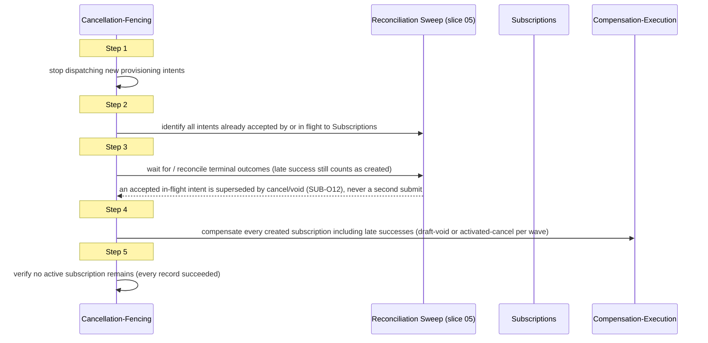

<!-- CONFLUENCE_TITLE: [BSS]: Orders Workflow — Saga and Compensation (Slice 6) -->
<!-- Related: ../DESIGN.md, ../PRD.md, ./01-foundation.md, ./05-provisioning-intents.md, ./README.md | Owners: BSS Orders team -->

# DESIGN — Saga and Compensation (Slice 6)

<!-- toc -->

- [1. Architecture Overview](#1-architecture-overview)
  - [1.1 Architectural Vision](#11-architectural-vision)
  - [1.2 Architecture Drivers](#12-architecture-drivers)
  - [1.3 Architecture Layers](#13-architecture-layers)
- [2. Principles & Constraints](#2-principles--constraints)
  - [2.1 Design Principles](#21-design-principles)
  - [2.2 Constraints](#22-constraints)
- [3. Technical Architecture](#3-technical-architecture)
  - [3.1 Domain Model](#31-domain-model)
  - [3.2 Component Model](#32-component-model)
  - [3.3 API Contracts](#33-api-contracts)
  - [3.4 Internal Dependencies](#34-internal-dependencies)
  - [3.5 External Dependencies](#35-external-dependencies)
  - [3.6 Interactions & Sequences](#36-interactions--sequences)
  - [3.7 Database schemas & tables](#37-database-schemas--tables)
  - [3.8 Deployment Topology](#38-deployment-topology)
- [4. Additional context](#4-additional-context)
- [5. Traceability](#5-traceability)

<!-- /toc -->

- [ ] `p1` - **ID**: `cpt-cf-bss-orders-workflow-design-saga-and-compensation`

## 1. Architecture Overview

### 1.1 Architectural Vision

This slice owns exactly two requirements: classifying every fulfillment step as compensable or
irreversible at design time with a declared compensating action, and executing compensation on
order-level permanent failure or authorized cancellation. It is the rollback half of the two-wave
saga that slice 05 (`05-provisioning-intents.md`) drives forward: where slice 05 submits
draft-create and activation intents, this slice submits their compensating counterparts,
draft-void and activated-cancel, and defines the conditions under which they fire.

The architectural stance is deliberately narrow. Both waves of this phase's fulfillment plan are
compensable, so there is no branch in this design for an irreversible step — that branch does not
exist here because OSS-side irreversibility is absorbed one layer down, inside Subscriptions'
own cancel handling, never by this gear reaching past Subscriptions to undo OSS state directly.
Compensation is therefore always a Subscriptions-mediated provisioning intent, reusing the same
identity envelope and idempotency contract slice 05 established, never a bespoke rollback
channel.

The second architectural commitment is that compensation is a reporting boundary, not a
correctness gate on Billing. Operational compensation (voiding drafts, cancelling activated
subscriptions) is this gear's own concern and completes or escalates on its own timeline; the
reversal of posted at-sale billable facts lives in the billing chain and is never awaited before
this gear reports an outcome to Orders Lifecycle. This separation is what lets `fulfillment_failed`
and the workflow-mediated `cancelled` acknowledgement be reported promptly while still being
truthful about which subscriptions still exist.

### 1.2 Architecture Drivers

#### Functional Drivers

| Requirement | Design Response |
|-------------|------------------|
| `cpt-cf-bss-orders-workflow-fr-owf-compensation-declaration` | §2.1 per-step compensability classification and the no-intra-saga-pivot principle; §3.2 compensation-execution component |
| `cpt-cf-bss-orders-workflow-fr-owf-compensation-execution` | §3.2 compensation-execution and cancellation-fencing components; §3.6 reverse-order two-leg sequence and five-step fencing sequence |

#### NFR Allocation

| NFR ID | NFR Summary | Allocated To | Design Response | Verification Approach |
|--------|-------------|--------------|-----------------|----------------------|
| `cpt-cf-bss-orders-workflow-nfr-owf-idempotency` | Compensating actions must produce exactly one durable effect under retry | Compensation-Execution Component (§3.2) | Compensating intents carry a **five-component** idempotency key — `orderId` + `orderVersion` + `orderLineId` + `wave` + `intentKind`, prefixed with `resource_tenant_id` — so the `draft_void` key is structurally distinct from the `draft_create` key it undoes and the `activated_cancel` key from the `activation` key it undoes (§2.1 *Compensating Keys Are Structurally Distinct*). A retried compensation resubmits that same compensating key rather than minting a new one | Replay test: retrying a compensation intent against Subscriptions asserts a single terminal effect and no duplicate deprovision request. Negative test: the compensating key never collides with the forward key under `UNIQUE(idempotency_key)`, and Subscriptions never answers a compensating submission with the forward intent's stored outcome |
| `cpt-cf-bss-orders-workflow-nfr-owf-durability` | A compensating action must be executable independently of the forward step's completion state | Compensation-Execution Component (§3.2) | Compensation resolves each target subscription's **current** phase at compensation time — `draft`, `activated`, or `absent` (already void, TTL-expired, or never created) — before choosing draft-void, activated-cancel, or the no-op already-absent resolution, rather than assuming the forward step's last known local state | Test: compensation issued after a forward step's local record is stale, missing, or after the draft's Subscriptions-side TTL has voided it still resolves to a defined leg and writes exactly one `CompensationRecord` |
| `cpt-cf-bss-orders-workflow-nfr-owf-fulfillment-sla` | Operational compensation must not block on financial reversal | Compensation-Execution Component (§3.2), Outcome-Report interface (§3.3) | Outcome reporting to Lifecycle fires immediately after operational compensation reaches a known outcome, with no call into the billing chain on the reporting path | Test: outcome report latency is independent of billing-chain credit-note processing time |

#### Key ADRs

| ADR ID | Decision Summary |
|--------|-------------------|
| `cpt-cf-bss-orders-workflow-adr-saga-compensable-no-pivot` | Both waves of this phase are compensable; activation changes which compensating action applies (draft-void → activated-cancel) but never blocks rollback — there is no intra-saga pivot |

### 1.3 Architecture Layers

```
Order-level outcome (Lifecycle report + OrderFulfillmentAborted)
        ^
        |
Compensation-Execution Component  <---- Cancellation-Fencing Component
        |  (reverse-order, two-leg)          (5-step ordered gate)
        v
Subscriptions (draft-void | activated-cancel provisioning intents)
        |
        v
Policy Engine -> OSS  (never called directly by this gear)
```

| Layer | Responsibility | Technology |
|-------|---------------|------------|
| Application | Compensation orchestration, cancellation fencing, outcome reporting | Orders Workflow process engine (durable, same runtime as slice 05) |
| Domain | Compensation record, manual-task-reason classification | Domain entities (§3.1), no framework coupling |
| Infrastructure | Provisioning-intent submission to Subscriptions | Same SDK client as slice 05's intent dispatcher |

- [ ] `p3` - **ID**: `cpt-cf-bss-orders-workflow-tech-compensation-runtime`

## 2. Principles & Constraints

### 2.1 Design Principles

#### Every Step Is Classified at Design Time

- [ ] `p2` - **ID**: `cpt-cf-bss-orders-workflow-principle-step-classification`

Every fulfillment step this gear defines **MUST** be classified, at design time and not at
runtime, as either compensable (with a declared compensating action) or irreversible. This
phase's fulfillment plan (slice 04, `04-fulfillment-plan.md`) has exactly two waves, and both are
compensable: wave-1 create is compensated by **draft-void**, wave-2 activation is compensated by
**activated-cancel**.

The classification covers **every registered fulfillment step**, not only the two waves. The two
steps that sit outside the waves are classified here so the blanket statement is verified rather
than assumed:

| Step | Classification | Declared compensating action |
|------|----------------|------------------------------|
| `construct-and-freeze-plan` (slice 04) | compensable — no external durable effect | none required; the frozen plan is local state discarded with the process outcome |
| `evaluate-payment-auth-eligibility` (slice 04) | compensable — evaluation only, no external durable effect | **the empty action**: this step authorizes no charge and creates no external object, so nothing exists to undo. Declared explicitly rather than left unstated |
| `begin-fulfillment` (the `approved -> in_fulfillment` Lifecycle transition, slice 02) | compensable | **the order-level outcome report itself** (§3.3): acknowledging `in_fulfillment -> fulfillment_failed`, or submitting the workflow-mediated cancel, is what returns the order out of `in_fulfillment`. It is the compensating action for this step, not a separate reporting concern |
| wave-1 `draft_create` (slice 05) | compensable | **draft-void** |
| wave-2 `activation` (slice 05) | compensable | **activated-cancel** |

No step in this phase is classified irreversible. A compensable step's
compensating action **MUST** be idempotent (`cpt-cf-bss-orders-workflow-nfr-owf-idempotency`)
and executable independently of the forward step's completion state
(`cpt-cf-bss-orders-workflow-nfr-owf-durability`) — compensation never assumes the
forward step's local record is current or even present.

**ADRs**: `cpt-cf-bss-orders-workflow-adr-saga-compensable-no-pivot`

#### No Intra-Saga Pivot

- [ ] `p1` - **ID**: `cpt-cf-bss-orders-workflow-principle-no-intra-saga-pivot`

Activation **MUST NOT** be treated as a point past which rollback becomes impossible. What
activation changes is *which* compensating action applies — draft-void before activation,
activated-cancel after — never *whether* a compensating action exists. This is stated explicitly
because it is the claim that makes the blanket "every step in this phase is compensable" rule
honest: without it, "compensable" could be read as true only up to some irreversibility
threshold. There is no such threshold in this phase. A compensating action that cannot be
completed **MUST NOT** be answered by inventing a further, third compensating action; it
**MUST** instead follow the escalation path already required for permanent failure (manual task,
order remains non-terminal — `cpt-cf-bss-orders-workflow-fr-owf-manual-task`).

**ADRs**: `cpt-cf-bss-orders-workflow-adr-saga-compensable-no-pivot`

#### Compensating Keys Are Structurally Distinct From Forward Keys

- [ ] `p1` - **ID**: `cpt-cf-bss-orders-workflow-principle-distinct-compensating-key`

A compensating intent's idempotency key **MUST NOT** equal the key of the forward intent it
undoes. The key composition is the **five-component** form slice 05 owns:

    resource_tenant_id : orderId + orderVersion + orderLineId + wave + intentKind

where `intentKind` is `owf_provisioning_intent.intent_kind`
(`draft_create | activation | draft_void | activated_cancel`), with `wave_attempt` appended as a
sixth component where the forward create was rebuilt, so the void of rebuild attempt 2 is distinct
from the void of attempt 1. `intentKind` is the component that
makes `draft_void` distinct from `draft_create` and `activated_cancel` distinct from `activation`
on the same line and wave; the tenant prefix namespaces every key so a key can never be replayed
across tenants.

This is stated as a principle because reusing the forward key is not a cosmetic defect but a
correctness failure with three compounding effects: the local `UNIQUE(idempotency_key)` constraint
(`05-provisioning-intents.md` §3.7) rejects the compensating row outright; Subscriptions, holding a
settled record under that key, returns the **forward** intent's stored outcome; and this slice then
writes a `CompensationRecord` with `outcome = succeeded` against a subscription that is still
live — exactly the stranded-active-subscription state
`cpt-cf-bss-orders-workflow-adr-saga-compensable-no-pivot` exists to prevent. A compensating
submission that receives a settled outcome whose request fingerprint does not match the
compensating request **MUST** be treated as a `key-conflict` refusal, never as an absorbed
duplicate.

**ADRs**: `cpt-cf-bss-orders-workflow-adr-idempotency-key-composition`,
`cpt-cf-bss-orders-workflow-adr-saga-compensable-no-pivot`

#### Compensation via Subscriptions Only, Never Direct to OSS

- [ ] `p2` - **ID**: `cpt-cf-bss-orders-workflow-principle-compensation-via-subscriptions`

OSS-side irreversibility (whatever OSS cannot itself undo) is absorbed by Subscriptions' own
cancel handling. This gear never calls OSS directly to reverse a forward effect, in compensation
any more than it does in forward execution (slice 05's boundary is preserved here unchanged).
Both compensating legs — draft-void and activated-cancel — are submitted as provisioning intents
to Subscriptions under the identity and idempotency contract slice 05 owns
(`cpt-cf-bss-orders-workflow-component-intent-dispatcher`).

**ADRs**: `cpt-cf-bss-orders-workflow-adr-saga-compensable-no-pivot`

### 2.2 Constraints

#### Operational Compensation Never Waits on Billing

- [ ] `p2` - **ID**: `cpt-cf-bss-orders-workflow-constraint-no-billing-wait`

Operational compensation (voiding drafts, cancelling activated subscriptions) **MUST NOT** block
on, or wait for, a Billing credit note. Posted at-sale billable facts are reversed in the billing
chain, a distinct concern with a distinct owner (Orders Lifecycle DESIGN §4.4,
`gears/bss/orders-lifecycle/docs/design/06-workflow-seam.md`). This gear reports the operational
outcome to Lifecycle as soon as it is known, independent of financial-reversal timing.

**ADRs**: none — this is a boundary constraint carried from the Lifecycle seam, not a local
architecture decision.

#### Distinct Manual-Task Reasons per Leg

- [ ] `p2` - **ID**: `cpt-cf-bss-orders-workflow-constraint-distinct-compensation-reasons`

A draft that cannot be voided and an activated subscription that cannot be cancelled are distinct
failures with distinct root causes and distinct operator remediation paths, and **MUST** produce
distinct manual-task reasons (§3.1 `CompensationFailureReason`). They **MUST NOT** be collapsed
into one generic "compensation failed" reason. Both are **enum** values on the producing side
(`owf_compensation_record.failure_reason`) and on the consuming side
(`owf_manual_task.failure_reason`, slice 07) — a free-text column on either side removes the only
mechanical enforcement this constraint has where operators actually read it.

**ADRs**: `cpt-cf-bss-orders-workflow-adr-saga-compensable-no-pivot`

#### Fencing Precedes Any Compensated Outcome, On Both Trigger Paths

- [ ] `p2` - **ID**: `cpt-cf-bss-orders-workflow-constraint-fencing-precedes-outcome`

Before any compensated outcome is reported — `fulfillment_failed` on the order-level failure path
as much as `cancelled` on the authorized-cancellation path — the five-step cancellation-fencing
sequence (§3.6) **MUST** run to completion and **MUST** have written an `owf_cancellation_fence`
row for that `(order_id, order_version)`. A late-arriving success on an intent that was already in
flight when compensation began is still a created subscription and **MUST** be compensated, never
treated as moot because compensation had already "started."

The failure path is **not** exempt. Under the default remediate policy, independent in-flight lines
are allowed to finish (`PRD.md` §6.3 Per-Line Progress Tracking), so an activation accepted before
the order-level failure determination can confirm **after** the Outcome-Report Component would
otherwise have acknowledged `fulfillment_failed` — the same race the fencing sequence exists to
close, reached through a different door. Naming the trigger "failure" rather than "cancellation"
changes which Lifecycle report is made at the end; it does not change whether an accepted intent
can still land. `PRD.md` §6.4 scopes fencing to *any* compensated outcome, and this design
implements that scope literally: the fence is a property of **reporting a compensated outcome**,
not a property of the cancellation trigger.

The Outcome-Report gate is therefore operative on both paths, not vacuous on one: because a fence
row now exists on the failure path, the `no_active_verified_at IS NULL` refusal in §3.7 has a row
to read. A missing fence row is itself a refusal, never a pass.

**ADRs**: `cpt-cf-bss-orders-workflow-adr-saga-compensable-no-pivot`

#### The Compensation Walk Is Sequential, Ordered, And Does Not Abort

- [ ] `p2` - **ID**: `cpt-cf-bss-orders-workflow-constraint-sequential-ordered-walk`

Compensation legs **MUST** be executed **one at a time, in the frozen reverse-execution order**
(§3.6). Concurrent dispatch is forbidden: reverse order is the whole correctness argument for the
walk (`cpt-cf-bss-orders-workflow-adr-saga-compensable-no-pivot`, decision drivers), and a
concurrent walk has no order at all. Throughput is not a driver here — the order is already
terminal-bound and outside the 15-minute fulfillment SLA window.

A leg that reaches `failed-pending-escalation` **MUST NOT** abort the walk. Aborting would leave
every not-yet-visited subscription live with no `CompensationRecord` row, which makes fence step 5
permanently unsatisfiable and hides live subscriptions from the operator surface. The walk
therefore **continues**, with exactly one exception: the executor **MUST NOT** compensate a
subscription that the frozen plan's dependency topology (slice 04) places **upstream** of a
subscription whose own compensation failed. Because the walk runs in reverse execution order,
dependents are compensated before their dependencies; removing a dependency while its dependent is
still live is the one unwind that reverse order was chosen to prevent. Such a leg is recorded with
`outcome = blocked-upstream` and the blocking record named, and is retried when the blocking leg is
resolved. Subscriptions on unrelated dependency chains are unaffected and are compensated normally.

**ADRs**: `cpt-cf-bss-orders-workflow-adr-saga-compensable-no-pivot`

#### One Compensation Run Per Order Version

- [ ] `p2` - **ID**: `cpt-cf-bss-orders-workflow-constraint-single-compensation-run`

At most one compensation run may be in flight for an `(order_id, order_version)`. The
`owf_cancellation_fence` row is the mutual-exclusion token: its primary key is
`(order_id, order_version)`, so a second trigger — a second authorized cancellation, or a
cancellation arriving while a failure-path compensation is already walking — **MUST** be absorbed
against the existing row rather than starting a second walk. The absorbing rules are stated in §4
(*Concurrent and late triggers*) and are normative.

**ADRs**: `cpt-cf-bss-orders-workflow-adr-saga-compensable-no-pivot`

## 3. Technical Architecture

### 3.1 Domain Model

**Technology**: Rust structs, same domain crate as slices 04-05.

**Location**: [`../DESIGN.md`](../DESIGN.md) §3.1 (gear-wide domain-model index); the entities below are normative in this slice, with their columns in §3.7.

**Core Entities**:

- [ ] `p2` - **ID**: `cpt-cf-bss-orders-workflow-entity-compensation-record`

| Entity | Description | Schema |
|--------|-------------|--------|
| `CompensationRecord` | One row per compensating action attempted against one target subscription: its frozen position in the reverse-execution walk, the leg (draft-void \| activated-cancel), the **target subscription reference** it acts on, the resolution mode (compensated \| already-absent), the outcome, and the compensation evidence fields required by Lifecycle §4.4 (drafts voided, activations rolled back, at-sale facts emitted) | `owf_compensation_record` table |
| `CompensationFailureReason` | Enumerated, leg-scoped reason for a compensating action that cannot complete: `draft-void-failed` (wave-1 leg) and `activated-cancel-failed` (wave-2 leg), kept structurally distinct per `cpt-cf-bss-orders-workflow-constraint-distinct-compensation-reasons` | Embedded enum column on `owf_compensation_record`, consumed as an enum by slice 07 |
| `CompensationSubject` | The set of subscriptions one compensation run must reach, frozen at trigger time: every subscription this gear created for the order version (from `owf_provisioning_intent`) **plus** every subscription attached to the order by a verified manual override (slice 07), which has no provisioning-intent row by construction. Materialized as the `CompensationRecord` rows of one run, in walk order | rows of `owf_compensation_record` for one `(order_id, order_version)` |
| `CancellationFenceState` | Per-order-version tracking of the five-step fencing sequence's progress (dispatch stopped, in-flight intents identified, reconciliation outcome, per-subscription compensation status, no-active-subscription verification), and the mutual-exclusion token for the run | `owf_cancellation_fence` table |

**Relationships**:
- `CompensationRecord` → `cpt-cf-bss-orders-workflow-entity-provisioning-intent` (slice 05): one compensation record targets exactly one prior provisioning intent's resulting subscription. The reference is nullable in exactly one case: an override-attached subscription, which has no forward intent.
- `CompensationRecord` → `cpt-cf-bss-orders-workflow-entity-manual-task` (slice 07): an override-attached subscription's `subscription_ref` is the `subscriptionId` slice 07's Override Verifier verified and stored; this is the only path by which a subscription with no provisioning intent becomes compensable.
- `CancellationFenceState` → `CompensationRecord`: one fence state aggregates the compensation records produced for all subscriptions in the `CompensationSubject` of one `orderId`+`orderVersion`; step 5 is satisfied only when every one of those records is `succeeded`.

### 3.2 Component Model

```mermaid
graph LR
    LC[Lifecycle: order-level failure / authorized cancel] --> CF[Cancellation-Fencing Component]
    CF --> CE[Compensation-Execution Component]
    CE -->|draft-void / activated-cancel intents| SUB[Subscriptions]
    CE -->|leg-specific failure reason| MTC[Manual-Task Creator / Incident Recorder (slice 07)]
    CE --> OR[Outcome-Report Component]
    OR --> LC
    CE -.reads.-> RS[Reconciliation Sweep (slice 05)]
    CF -.reads.-> RS
    OR -.gate.-> CF
```

#### Compensation-Execution Component

- [ ] `p2` - **ID**: `cpt-cf-bss-orders-workflow-component-compensation-executor`

##### Why this component exists

Order-level permanent fulfillment failure and authorized workflow cancellation both require the
same rollback behavior — undo every subscription created for the order, in reverse order — so one
component owns that behavior rather than duplicating it per trigger.

##### Responsibility scope

Given the frozen fulfillment plan (slice 04) and the record of provisioning intents actually
issued and their known outcomes (slice 05), **freezes the compensation walk** at trigger time and
then executes it.

*Freezing the walk.* The subject set is every subscription created for the order version — read
from `owf_provisioning_intent` — **plus** every subscription attached to the order by a verified
manual override (slice 07), which by construction has no provisioning-intent row. Each subject is
assigned a `compensation_sequence`: its ordinal in **forward execution order**, read from the
forward intent's acceptance ordinal (`owf_provisioning_intent.execution_seq`, the monotonic
per-order sequence slice 05 assigns when Subscriptions accepts the intent) and, for an
override-attached subscription, from the instant the override was verified. The walk is the descending scan of that ordinal. Freezing it in
`owf_compensation_record` at trigger time — rather than re-deriving it per attempt — is what makes
the walk reproducible across crashes, replays and operator retries; the ordering must survive the
process, not live in one execution's memory.

*Executing the walk.* One subject at a time, in descending `compensation_sequence`
(`cpt-cf-bss-orders-workflow-constraint-sequential-ordered-walk`), the executor resolves the
subject's **current** phase through Subscriptions and takes one of three branches:

| Resolved phase | Action | `resolution_mode` |
|----------------|--------|-------------------|
| `draft` | submit a `draft_void` provisioning intent | `compensated` |
| `activated` | submit an `activated_cancel` provisioning intent | `compensated` |
| absent — already voided, cancelled, or expired under Subscriptions' own draft TTL while the order sat on hold | submit nothing; record the leg that *would* have applied with `outcome = succeeded` | `already-absent` |

The third branch is not a corner case: a hold can outlast a draft's Subscriptions-side TTL, and
this gear is forbidden to read, store or pause that TTL (slice 08). Without it the executor reads
"draft vs activated", finds neither, and has no defined behaviour. An `already-absent` resolution
is a *verified* absence — a successful status read that returns not-found or a terminal voided /
cancelled state — never an inference from a failed or timed-out read, which is a retryable failure.

*Bounding retry.* Retry of a compensating action is **not a bespoke loop** — that is precisely
what `cpt-cf-bss-orders-workflow-adr-saga-compensable-no-pivot` forbids. A compensating intent is
an ordinary provisioning intent, so it inherits slice 05's two existing bounds unchanged:

- **submission failures** (not accepted by Subscriptions) consume the engine's retry budget and the
  step deadline, resubmitting under the *same* compensating key;
- **accepted-but-unconfirmed** intents are recovered only by the reconciliation sweep, on the
  standard ladder (30 s → 1 m → 2 m → 5 m → 15 m → 1 h) and terminating at the sweep floor of
  **30 reads or 23 h, whichever comes first** — inside the 24 h overdue window, which is what makes
  the escalation actionable rather than posthumous.

Whichever bound is reached first — retry budget exhausted, step deadline exceeded, or the sweep
floor — is the single trigger that writes `outcome = failed-pending-escalation` with the
leg-specific `CompensationFailureReason`. There is no third, unbounded attempt path.

*Escalating.* On `failed-pending-escalation` the executor **invokes slice 07's single manual-task
call site** (`cpt-cf-bss-orders-workflow-component-manual-task-creator`) with the leg-specific
reason, or, under the fail-fast policy, slice 07's `Incident Recorder`
(`cpt-cf-bss-orders-workflow-component-incident-recorder`). It does not write
`owf_manual_task` itself: "exactly one actionable object by any route" is only structural if
compensation failure enters through the same door as forward failure. The order stays non-terminal
in that case.

##### Responsibility boundaries

Does not decide *whether* to compensate (that decision is Lifecycle's order-level failure
determination or an already-authorized cancellation) — it only executes compensation once
triggered. Does not call OSS directly. Does not wait on or query the billing chain. Does not
invent a compensating action beyond the step's declared one. Does not create the manual task or
incident row — it supplies the reason to slice 07's creator, which owns the row. Does not report
the order-level outcome, and does not decide when a run's outcome is reportable — that gate is the
fence row read by the Outcome-Report Component.

##### Related components (by ID)

- `cpt-cf-bss-orders-workflow-component-intent-dispatcher` — reuses its identity envelope, its
  five-component idempotency-key derivation (with `intentKind` set to the compensating kind) and
  its retry and duplicate-handling protocol for compensating intents (shares model with).
- `cpt-cf-bss-orders-workflow-component-reconciliation-sweep` — depends on it to discover
  non-terminal or late-arriving intent outcomes during compensation (depends on).
- `cpt-cf-bss-orders-workflow-component-cancellation-fencer` — invoked by, and gates, this
  component when the trigger is an authorized cancellation (called by).
- `cpt-cf-bss-orders-workflow-component-outcome-reporter` — receives this component's completed
  or escalated outcome to report to Lifecycle (publishes to).
- `cpt-cf-bss-orders-workflow-component-manual-task-creator` (slice 07) — the sole call site for a
  `failed-pending-escalation` escalation under the remediate policy (calls).
- `cpt-cf-bss-orders-workflow-component-incident-recorder` (slice 07) — the sole call site for the
  same escalation under the fail-fast policy (calls).
- `cpt-cf-bss-orders-workflow-component-override-verifier` (slice 07) — supplies the verified
  `subscriptionId` of an override-attached subscription, which has no provisioning intent and would
  otherwise be invisible to the walk (depends on).

#### Cancellation-Fencing Component

- [ ] `p2` - **ID**: `cpt-cf-bss-orders-workflow-component-cancellation-fencer`

##### Why this component exists

An authorized cancellation can race with in-flight provisioning intents; without an explicit,
ordered fencing procedure, a subscription created after compensation "finished" would survive a
cancelled order, breaking atomic fulfillment.

##### Responsibility scope

Owns the five-step ordered fencing sequence (§3.6) for **every compensated outcome** — an
authorized cancellation and an order-level fulfillment failure alike: stopping new dispatch,
identifying accepted or in-flight intents, reconciling them to terminal outcomes (treating a late
success as a created subscription), driving the Compensation-Execution Component over every created
subscription including late successes, and verifying no active subscription remains before a
compensated outcome may be reported. Creates the `owf_cancellation_fence` row on both paths, which
is what gives the Outcome-Report gate something to read and what serves as the one-run-per-order-
version mutual-exclusion token
(`cpt-cf-bss-orders-workflow-constraint-single-compensation-run`). Owns the unilateral-cancel-window
rule for a `FulfillmentTask`: cancellable until its activation intent is accepted by Subscriptions;
from acceptance onward the task must reach a terminal outcome via reconciliation before the
order-level outcome is reported. Owns absorbing a second or late trigger against an existing run
(§4 *Concurrent and late triggers*).

##### Responsibility boundaries

Does not itself submit compensating intents — it delegates every compensation to the
Compensation-Execution Component and only sequences and gates that work. Does not decide *whether*
the order failed or was cancelled, and does not choose which Lifecycle report is made at the end;
the trigger determines that, and the fence is identical either way. The component name is retained
for continuity with `PRD.md` §6.4's "cancellation fencing" wording — the mechanism is not scoped to
cancellation.

##### Related components (by ID)

- `cpt-cf-bss-orders-workflow-component-compensation-executor` — calls (calls).
- `cpt-cf-bss-orders-workflow-component-reconciliation-sweep` — sole discovery mechanism for
  step 3's terminal-outcome reconciliation and for late-success detection (depends on).

#### Outcome-Report Component

- [ ] `p2` - **ID**: `cpt-cf-bss-orders-workflow-component-outcome-reporter`

##### Why this component exists

Reporting to Lifecycle and publishing `OrderFulfillmentAborted` is a distinct concern from
executing compensation itself, and must fire only after operational compensation reaches a known
outcome — never gated on financial reversal.

##### Responsibility scope

For a fulfillment failure: acknowledges `in_fulfillment → fulfillment_failed` to Orders
Lifecycle carrying compensation evidence (§3.1 `CompensationRecord` fields — drafts voided,
activations rolled back, at-sale facts emitted). For an authorized cancellation: submits the
workflow-mediated cancel with the same compensation evidence (order → `cancelled`, the Lifecycle
cancel-guard exception).

*The reporting gate.* A compensated outcome is reportable only when the fence row for
`(order_id, order_version)` has `no_active_verified_at` set, which in turn requires **every**
`CompensationRecord` in the run to be `succeeded`. The phrase "known outcome" is defined here
rather than left to the reader, because the two obvious readings of `failed-pending-escalation`
are both wrong:

- It **is** a *known* outcome in the sense the durability NFR uses — the leg has a settled local
  determination and the executor has stopped attempting it. It is therefore not a reason to keep
  the walk running or to leave the operator without a task.
- It is **not** a *compensated* outcome. A run containing one `failed-pending-escalation` or
  `blocked-upstream` record has at least one live subscription, so reporting `fulfillment_failed`
  or `cancelled` would assert to Lifecycle — and to Billing downstream of it — that no subscription
  survived, which is false. The report is refused.

The refusal is **not** unbounded. The order stays non-terminal under the escalated manual task
whose SLA deadline is the operator-facing clock (slice 07), and remediation is declared exhausted
after **3 failed operator resolution attempts on the same task, or the manual-task SLA deadline
elapsing without resolution, whichever comes first** — **Accepted**
(D-3). Above that sits the unconditional, non-pausable `max_process_lifetime` of **90 days** armed
at process start — accepted (`DECISIONS.md` D-4) — which bounds the refusal even
if no operator ever touches the task. The resolution that lifts the refusal is always the same one:
the blocked leg reaches `succeeded`, by operator retry or by a verified override, and the fence
completes. There is no path by which the report is made with a live subscription outstanding, and
no path by which the process lives forever waiting.

*Publishing.* `OrderFulfillmentAborted` is **enqueued into `owf_event_outbox` in the same local
transaction that records the reported outcome**, not published after the cross-gear Lifecycle call
returns. A synchronous Lifecycle acknowledgement cannot share a transaction with this gear's state
mutation, so "publish after the report" has a crash window in which the order is reported aborted
and the event is lost permanently. The outbox drain delivers it afterwards, at-least-once, per
`cpt-cf-bss-orders-workflow-adr-outbox-process-events`.

##### Responsibility boundaries

Does not call the billing chain and does not delay reporting for it
(`cpt-cf-bss-orders-workflow-constraint-no-billing-wait`). Does not decide compensation success or
failure itself — it reports what the Compensation-Execution Component determined. Does not publish
`OrderFulfillmentAborted` directly to the bus — it enqueues, the outbox drains.

##### Related components (by ID)

- `cpt-cf-bss-orders-workflow-component-compensation-executor` — subscribes to (subscribes to).
- `cpt-cf-bss-orders-lifecycle-*` (Orders Lifecycle gear, out of this gear's ID space) — reports
  outcome to, bound by reference to Lifecycle DESIGN §4.4 (depends on, cross-gear).

### 3.3 API Contracts

- [ ] `p2` - **ID**: `cpt-cf-bss-orders-workflow-interface-compensation-trigger`

- **Contracts**: `cpt-cf-bss-orders-workflow-contract-owf-provisioning-intent`
- **Technology**: internal process-engine command, not externally exposed
- **Location**: same process-engine command surface as slice 05's intent dispatch

**Endpoints Overview**:

| Method | Path | Description | Stability |
|--------|------|-------------|-----------|
| `COMMAND` | `compensate-order-fulfillment` | Triggers the frozen, sequential reverse-order two-leg compensation walk for a fulfillment failure or authorized cancellation | unstable |
| `COMMAND` | `run-cancellation-fence` | Runs the five-step fencing sequence, on either trigger path, before compensation reporting | unstable |

- [ ] `p2` - **ID**: `cpt-cf-bss-orders-workflow-interface-outcome-report`

- **Contracts**: `cpt-cf-bss-orders-workflow-contract-owf-lifecycle-transition`
- **Technology**: same event/acknowledgement transport as slice 02's Lifecycle seam
- **Location**: `gears/bss/orders-lifecycle/docs/design/06-workflow-seam.md` §4.4 (Acknowledgement, normative)

**Endpoints Overview**:

| Method | Path | Description | Stability |
|--------|------|-------------|-----------|
| `ACK` | `in_fulfillment -> fulfillment_failed` | Acknowledgement carrying compensation evidence, for a fulfillment failure | unstable |
| `COMMAND` | `workflow-mediated cancel` | Cancel submission carrying compensation evidence, for an authorized cancellation (order -> `cancelled`) | unstable |
| `EVENT` | `OrderFulfillmentAborted` | Enqueued to `owf_event_outbox` in the same transaction as the reported outcome; drained afterwards | unstable |

Both compensation-evidence-carrying operations are marked `unstable` deliberately: the
activated-cancel leg's cancellation-reason value is unspecifiable until `SUB-O1` lands (§4), so the
payload of the compensating intent underneath these operations is not yet fixed. Marking them
`stable` while a load-bearing payload field is undefined would be a false guarantee, and slice 08
already marks the same Lifecycle cancel endpoint `unstable`.

### 3.4 Internal Dependencies

| Dependency Gear | Interface Used | Purpose |
|-------------------|----------------|----------|
| Subscriptions | Provisioning-intent SDK client (`cpt-cf-bss-orders-workflow-component-intent-dispatcher`) | Submit draft-void and activated-cancel compensating intents; never call OSS directly |
| Orders Lifecycle | Outcome-report contract (§3.3), bound by reference to `06-workflow-seam.md` §4.4 | Report `fulfillment_failed` acknowledgement or workflow-mediated cancel with compensation evidence; consume the cancel-guard exception |

**Dependency Rules** (per project conventions):
- No circular dependencies
- Always use sdk modules for inter-gear communication
- No cross-category sideways deps except through contracts
- Only integration/adapter gears talk to external systems
- `SecurityContext` must be propagated across all in-process calls

### 3.5 External Dependencies

This slice introduces no new external-system dependency beyond what slice 05 already declares.
Compensation reaches OSS only transitively, through Subscriptions.

#### Subscriptions (external aggregate, canonical owner of subscription state)

- **Contract**: `cpt-cf-bss-orders-workflow-contract-owf-provisioning-intent`

| Dependency Gear | Interface Used | Purpose |
|-------------------|---------------|----------|
| Subscriptions | draft-void / activated-cancel provisioning intent | Compensate a completed wave-1 create or wave-2 activation |

**Dependency Rules** (per project conventions):
- No circular dependencies
- Always use SDK modules for inter-gear communication
- No cross-category sideways deps except through contracts
- Only integration/adapter gears talk to external systems
- `SecurityContext` must be propagated across all in-process calls

### 3.6 Interactions & Sequences

#### Order-Level Failure Compensation

**ID**: `cpt-cf-bss-orders-workflow-seq-failure-compensation`

**Use cases**: `cpt-cf-bss-orders-workflow-usecase-owf-partial-failure` (PRD §Acceptance Criteria 9)

**Actors**: `cpt-cf-bss-orders-workflow-actor-owf-orders-lifecycle`, `cpt-cf-bss-orders-workflow-actor-owf-subscriptions`

```mermaid
sequenceDiagram
    participant RP as Remediation/Fail-fast Policy
    participant CF as Cancellation-Fencing
    participant CE as Compensation-Execution
    participant SUB as Subscriptions
    participant MT as Manual-Task Creator / Incident Recorder (slice 07)
    participant OR as Outcome-Report
    participant LC as Orders Lifecycle
    RP ->> CF: order-level fulfillment failure (remediation exhausted | fail-fast)
    CF ->> CF: run the same 5-step fencing sequence as the cancellation path; write owf_cancellation_fence
    CF ->> CE: compensate every subject incl. late successes and override-attached subscriptions
    CE ->> CE: freeze compensation_sequence per subject (forward acceptance ordinal)
    loop each subject, one at a time, descending compensation_sequence
        CE ->> SUB: resolve current phase
        alt draft
            CE ->> SUB: draft_void intent (compensating key: ...+wave1_create+draft_void)
        else activated
            CE ->> SUB: activated_cancel intent (compensating key: ...+wave2_activate+activated_cancel)
        else absent (voided / TTL-expired)
            CE ->> CE: record already-absent, submit nothing
        end
        SUB -->> CE: compensation outcome
        alt bound reached (retry budget | step deadline | sweep floor)
            CE ->> MT: create task/incident with leg-specific CompensationFailureReason
            CE ->> CE: record failed-pending-escalation; mark upstream dependents blocked-upstream; CONTINUE the walk
        end
    end
    CE -->> CF: every subject has a settled record
    alt every record succeeded
        CF ->> CF: set no_active_verified_at
        CF ->> OR: fencing complete, compensation evidence ready
        OR ->> LC: acknowledge in_fulfillment -> fulfillment_failed (compensation evidence)
        OR ->> OR: enqueue OrderFulfillmentAborted to owf_event_outbox in the same transaction
    else any record failed-pending-escalation or blocked-upstream
        OR ->> OR: refuse the report; order stays non-terminal under the escalated manual task
    end
```

**Description**: Compensates every subject of the run — subscriptions created for the order version
plus override-attached subscriptions — one at a time in reverse execution order, choosing
draft-void, activated-cancel, or the already-absent no-op per the subject's **current** phase, and
reports `fulfillment_failed` only once the fence row's `no_active_verified_at` is set, which
requires every record in the run to be `succeeded`.

*"Remediation exhausted", the trigger on the left of this sequence, is defined as* **3 failed
operator resolution attempts on the same task, or the manual-task SLA deadline elapsing without
resolution, whichever comes first** — accepted (`DECISIONS.md` D-3). It is stated
here because this sequence's entry condition is otherwise a phrase with no evaluable content.

#### Authorized-Cancellation Compensation

**ID**: `cpt-cf-bss-orders-workflow-seq-cancellation-compensation`

**Use cases**: `cpt-cf-bss-orders-workflow-usecase-owf-cancel-with-rollback` (PRD §6.4)

**Actors**: `cpt-cf-bss-orders-workflow-actor-owf-orders-lifecycle`, `cpt-cf-bss-orders-workflow-actor-owf-subscriptions`

```mermaid
sequenceDiagram
    participant LC as Orders Lifecycle
    participant CF as Cancellation-Fencing
    participant CE as Compensation-Execution
    participant SUB as Subscriptions
    participant OR as Outcome-Report
    LC ->> CF: authorized workflow cancellation
    CF ->> CF: claim owf_cancellation_fence (order_id, order_version) — one run per order version
    CF ->> CF: run 5-step fencing sequence (see below)
    CF ->> CE: compensate every subject incl. late successes and override-attached subscriptions
    CE ->> SUB: draft-void / activated-cancel / already-absent per resolved phase
    CE -->> CF: every subject has a settled record; verify none active
    CF ->> OR: fencing complete, compensation evidence ready
    OR ->> LC: workflow-mediated cancel with compensation evidence (order -> cancelled)
    OR ->> OR: enqueue OrderFulfillmentAborted to owf_event_outbox in the same transaction
```

**Description**: An authorized cancellation is gated by the five-step fencing sequence before
any compensated outcome is reported, so that a subscription accepted while cancellation was
already underway is still discovered and rolled back. The fence row is claimed before step 1, so a
second cancellation, or a cancellation arriving while a failure-path run is already walking,
absorbs against the existing run rather than starting a second one (§4 *Concurrent and late
triggers*).

#### Compensation Walk Order (normative)

**ID**: `cpt-cf-bss-orders-workflow-seq-compensation-walk-order`

The walk order is **strict reverse forward-execution order over compensation subjects**, descending
`owf_compensation_record.compensation_sequence`. This is the single ordering rule; no other
ordering statement in this set overrides it.

`cpt-cf-bss-orders-workflow-adr-saga-compensable-no-pivot` describes the same walk as "activated
lines receive activated-cancel first, then draft lines receive draft-void". Under the two-wave
activation barrier (`cpt-cf-bss-orders-workflow-adr-two-wave-activation-barrier`) every wave-1
create precedes every wave-2 activation, so for a plain order the two phrasings produce the identical
sequence — the wave-grouped phrasing is a *description* of what reverse execution order yields, not
an independent rule. They diverge only where a create is accepted after an activation: a wave-1
rebuild, or an override-attached subscription verified late. **In every such case reverse execution
order is authoritative** and the wave-grouped phrasing does not apply, because the property the walk
must preserve is dependency-safe unwind (a dependent is always removed before the dependency it was
built on), and that property is carried by execution order, not by wave membership. A line created
and activated at `t1` and a line still `draft` at `t2` is therefore compensated `t2` first, then
`t1` — the draft-void before the activated-cancel.

#### Five-Step Cancellation Fencing

**ID**: `cpt-cf-bss-orders-workflow-seq-cancellation-fencing`

**Use cases**: `cpt-cf-bss-orders-workflow-usecase-owf-cancel-with-rollback` (PRD §6.4)

**Actors**: `cpt-cf-bss-orders-workflow-actor-owf-subscriptions`



**Description**: The five steps run strictly in order and all five **MUST** complete before any
compensated outcome is reported, on **both** trigger paths
(`cpt-cf-bss-orders-workflow-constraint-fencing-precedes-outcome`). Step 3's discovery mechanism is
the same reconciliation sweep slice 05 already owns
(`cpt-cf-bss-orders-workflow-component-reconciliation-sweep`) — this slice introduces no second
discovery path. Step 4's subject set includes override-attached subscriptions, which have no
provisioning-intent row; enumerating intents alone would make step 5 answer "none remain" from an
incomplete record. Step 5 is satisfied only when every `CompensationRecord` in the run is
`succeeded`; a `failed-pending-escalation` or `blocked-upstream` record leaves
`no_active_verified_at` null and the outcome unreportable.

**Upstream dependency disclosed, not resolved: `SUB-O12`.** Step 3 supersedes an accepted in-flight
intent with `SUB-O12` — cancel/void of an accepted transition request — never a second submit under
the same or a new idempotency key. `SUB-O12` is carried in `UPSTREAM_REQS.md` as **UNASKED**: it has
not been put to the Subscriptions owners, and no Subscriptions contract today exposes it. This is
disclosed here for the same reason `SUB-O1` is disclosed in §4 — a reader of this slice alone would
otherwise conclude the mechanism exists because the normative sequence names it. Until `SUB-O12`
lands, step 3 has no superseding action available and can only *wait* for the accepted intent to
reach a terminal outcome through the sweep, which extends the fence's completion time to the sweep
floor (30 reads or 23 h) in the worst case and is the only in-window behaviour this design can
specify from this side. This slice names the requirement and defers the mechanism; it does not
invent a second-submit workaround, which the caller-side duplicate protocol forbids outright.

### 3.7 Database schemas & tables

- [ ] `p3` - **ID**: `cpt-cf-bss-orders-workflow-db-compensation`

#### Table: owf_compensation_record

**ID**: `cpt-cf-bss-orders-workflow-dbtable-compensation-record`

**Schema**:

| Column | Type | Description |
|--------|------|--------------|
| `id` | uuid | Primary key |
| `resource_tenant_id` | uuid | Resource-recipient axis; NOT NULL. The tenant whose subscription is being compensated |
| `seller_tenant_id` | uuid | Selling-party axis; NOT NULL. Carried because a compensation failure is projected into the seller-scoped operator queue (slice 07) and per-tenant fairness keys on this axis |
| `order_id` | uuid | Order the compensation belongs to |
| `order_version` | bigint | Frozen order version compensation runs against |
| `order_line_id` | text | Line item reference (join key to `FulfillmentTask`) |
| `compensation_sequence` | bigint | The subject's ordinal in **forward execution order**, frozen at trigger time from `owf_provisioning_intent.execution_seq` (or, for an override-attached subscription, from the override's verification instant). The walk is the descending scan of this column; without it "reverse order" is underivable from local state |
| `leg` | enum | `draft-void` \| `activated-cancel` — the leg that applied, or would have applied under `already-absent` |
| `subscription_ref` | text, nullable | **The target subscription this record acts on**, as identified by Subscriptions. Sourced from the forward intent's confirmed subscription identifier, or, for an override-attached subscription, from the `subscriptionId` slice 07's Override Verifier verified. NULL only where no subscription was ever created for the line |
| `source_intent_id` | uuid, nullable | The forward `owf_provisioning_intent` this compensates. NULL for an override-attached subscription, which has no forward intent by construction — this is the only legal NULL |
| `idempotency_key` | text | The **compensating** intent's own five-component key: `resource_tenant_id : order_id + order_version + order_line_id + wave + intent_kind`, where `intent_kind` is `draft_void` or `activated_cancel`, plus `wave_attempt` where the forward create was rebuilt. It is structurally distinct from the forward key it undoes and is **never** the forward key (§2.1 *Compensating Keys Are Structurally Distinct*). NULL where `resolution_mode = already-absent`, since no intent is submitted |
| `resolution_mode` | enum | `compensated` (a compensating intent was submitted) \| `already-absent` (Subscriptions verified the subscription no longer exists — voided, cancelled, or expired under its own draft TTL during a hold) |
| `outcome` | enum | `succeeded` \| `failed-pending-escalation` \| `blocked-upstream` |
| `failure_reason` | enum, nullable | `draft-void-failed` \| `activated-cancel-failed`; set only when `outcome = failed-pending-escalation`. Enum, not text, on both this side and the consuming `owf_manual_task.failure_reason` (slice 07) |
| `blocked_by_record_id` | uuid, nullable | For `outcome = blocked-upstream`: the record whose failure blocks this leg, per `cpt-cf-bss-orders-workflow-constraint-sequential-ordered-walk`. NOT NULL exactly when `outcome = blocked-upstream` |
| `at_sale_facts_emitted` | boolean | Whether at-sale billable facts had been posted for this line before compensation. **Derived locally, never read from Billing**: at-sale facts attach at activation (`PRD.md` §6.4 — a `draft` subscription carries no billable facts), so the value is `true` exactly when this line's wave-2 activation intent reached a confirmed `activated` outcome before compensation began, and `false` otherwise. It is an assertion about this gear's own forward effects, which is why it needs no Billing dependency and §3.5 introduces none |
| `manual_task_id` | uuid, nullable | The slice-07 `ManualTask` (or `Incident`) raised for this record's escalation; set when `outcome = failed-pending-escalation` |
| `created_at` / `resolved_at` | timestamp | Attempt and resolution times |

**PK**: `id`

**Constraints**: `(order_id, order_version, order_line_id, leg)` unique — one compensation record
per leg per line per order version; `UNIQUE (idempotency_key)` where non-null;
`UNIQUE (order_id, order_version, compensation_sequence)` so the walk order is total and gap-free;
`failure_reason` NOT NULL when `outcome = failed-pending-escalation`; `blocked_by_record_id` NOT
NULL exactly when `outcome = blocked-upstream`; `idempotency_key` NULL exactly when
`resolution_mode = already-absent`.

**Ownership**: written only by `cpt-cf-bss-orders-workflow-component-compensation-executor`.

**Additional info**: Tenant axes are `resource_tenant_id` (always) and `seller_tenant_id` (operator
queue projection). Indexed on `(order_id, order_version, compensation_sequence DESC)` — the walk is
an **ordered** scan, and the previously declared `(order_id, order_version)` index yielded a set
with no defined traversal order — and on `(seller_tenant_id, failure_reason)` for the manual-task
queue. **Retention ≥ 400 days**, matching the audit and manual-task stores: a compensation record is
the evidence behind a `fulfillment_failed` or `cancelled` acknowledgement and must outlive it.
Growth table — **monthly range partition on `created_at`**.

**Example**:

| compensation_sequence | leg | resolution_mode | outcome | failure_reason | at_sale_facts_emitted |
|-----|-----|-----|---------|-----------------|------------------------|
| `4` | `activated-cancel` | `compensated` | `failed-pending-escalation` | `activated-cancel-failed` | `true` |
| `3` | `activated-cancel` | `compensated` | `succeeded` | (null) | `true` |
| `2` | `draft-void` | `already-absent` | `succeeded` | (null) | `false` |
| `1` | `draft-void` | `compensated` | `succeeded` | (null) | `false` |

#### Table: owf_cancellation_fence

**ID**: `cpt-cf-bss-orders-workflow-dbtable-cancellation-fence`

**Schema**:

| Column | Type | Description |
|--------|------|--------------|
| `order_id` | uuid | Order under fencing |
| `order_version` | bigint | Frozen order version |
| `resource_tenant_id` | uuid | Resource-recipient axis; NOT NULL |
| `seller_tenant_id` | uuid | Selling-party axis; NOT NULL. The fence's progress is what an operator watching a stalled compensation reads, and that surface is seller-scoped |
| `trigger` | enum | `order-level-failure` \| `authorized-cancellation` — which trigger claimed the run. Records which Lifecycle report the Outcome-Report Component makes at the end; the fencing steps themselves are identical either way |
| `dispatch_stopped_at` | timestamp | Step 1 completion |
| `in_flight_identified_at` | timestamp | Step 2 completion |
| `reconciliation_complete_at` | timestamp, nullable | Step 3 completion |
| `all_compensated_at` | timestamp, nullable | Step 4 completion — every subject has a settled `CompensationRecord`, whatever its outcome |
| `no_active_verified_at` | timestamp, nullable | Step 5 completion — set only when **every** record in the run is `succeeded` |
| `absorbed_trigger_count` | integer | Number of later triggers absorbed against this run (§4 *Concurrent and late triggers*); starts at 0 |
| `created_at` | timestamp | When the run was claimed |

**PK**: `(order_id, order_version)`

**Constraints**: Steps recorded strictly in order — a later step's timestamp column is NOT NULL
only once the preceding step's column is set. The PK is also the mutual-exclusion token
(`cpt-cf-bss-orders-workflow-constraint-single-compensation-run`): the insert that claims a run is
the one that wins, and a losing insert absorbs rather than retries.

**Ownership**: written only by `cpt-cf-bss-orders-workflow-component-cancellation-fencer`.

**Additional info**: Tenant axes are `resource_tenant_id` (always) and `seller_tenant_id` (operator
visibility). Read by the Outcome-Report Component as the gate for reporting a compensated outcome;
a report is refused while `no_active_verified_at` is null, **and a missing row is itself a refusal**
— the gate is never satisfied by the absence of a fence. A row exists on both trigger paths, which
is what makes the gate operative rather than vacuous on the failure path. **Retention ≥ 400 days**,
alongside the compensation records it gates. Growth table — **monthly range partition on
`created_at`**.

### 3.8 Deployment Topology

- [ ] `p3` - **ID**: `cpt-cf-bss-orders-workflow-topology-compensation`

No deployment topology beyond slice 05's process-engine runtime; this slice adds no new deployable
unit, only new tables and process logic within the existing Orders Workflow service.

## 4. Additional context

**FulfillmentTask unilateral-cancel window.** A `FulfillmentTask` is unilaterally cancellable
until its **activation** intent is accepted by Subscriptions. Acceptance of the wave-1 draft-create
intent does **not** close this window — a task with only a draft created can still be cancelled
without going through the fencing/reconciliation machinery, because a `draft` subscription is not
resource-affecting and carries no billable facts, so voiding it needs no reverse-order
choreography beyond the single draft-void leg. From activation-intent acceptance onward, the task
**MUST** be reconciled to a terminal outcome (via the reconciliation sweep) before the order-level
outcome is reported — the unilateral window is closed and the fencing sequence's steps 2-5 apply.

**No Billing wait, restated as an operational rule.** Operational compensation is reported to
Lifecycle as soon as it reaches a known outcome. The reversal of posted at-sale billable facts is
never a precondition for that report; it is tracked separately in the billing chain
(`gears/bss/orders-lifecycle/docs/design/06-workflow-seam.md` §4.4). This gear only *records*
whether at-sale facts had been emitted (as part of compensation evidence), it never triggers or
awaits their reversal.

**Distinct manual-task reasons, restated as an operational rule.** `draft-void-failed` and
`activated-cancel-failed` are never merged into a single "compensation failed" reason on the
manual-task queue (slice 07 consumes these two values as distinct queue entries). Each carries
its own operator remediation path: a stuck draft-void points the operator at the still-`draft`
subscription; a stuck activated-cancel points the operator at an active subscription that is
still billing and consuming resources, a materially more urgent state.

**Concurrent and late triggers (normative).** Compensation is triggered from more than one place
and can be triggered again while it is running. The `owf_cancellation_fence` row's primary key is
the arbiter in every case:

| Situation | Rule |
|-----------|------|
| A cancellation arrives while a failure-path run is walking | Absorbed. The existing run continues unchanged — the walk, the subject set and the fence steps are identical on both paths. The fence row's `trigger` is **promoted** from `order-level-failure` to `authorized-cancellation`, and the Outcome-Report Component consequently submits the workflow-mediated cancel (order → `cancelled`) instead of acknowledging `fulfillment_failed`. `absorbed_trigger_count` is incremented. This is reachable today precisely because the failure path now also fences; it was previously unaddressed *and* reachable, which is worse than either |
| A second cancellation arrives while a cancellation run is walking | Absorbed, no state change beyond `absorbed_trigger_count`. The second authorization is recorded in the audit trail with its own actor, so "who cancelled" stays answerable, but it starts no second walk and no second set of compensating intents |
| A cancellation arrives after `no_active_verified_at` is set but before the Lifecycle report settles | Absorbed. The run is complete; re-running the walk would re-submit compensating intents whose keys are already settled and would gain nothing. The outstanding report is retried under its existing lifecycle-transition idempotency key |
| `OrderAmended` races an in-flight cancellation | The amendment creates a **new order version**. It does **not** interrupt, redirect or reuse the run in flight: the run is frozen against `(order_id, order_version)` and compensates exactly the subscriptions created under that version, which remain the subscriptions that must not survive. The run completes against the old version and reports against it; the new version starts its own process instance per slice 02's terminate-then-start rule. A run is never retargeted at a version whose subject set it did not freeze |
| `OrderAmended` races a failure-path run | Same rule, same reason. The frozen order version is the unit of compensation |

The general principle behind the table: **the fence row, not the trigger, identifies the run**, and
a run is immutable in its subject set and its walk order once claimed. Only the terminal *report*
is allowed to change, and only in the one direction where the stronger authorization
(a cancellation) supersedes the weaker (a failure determination).

**Compensation cannot exceed the step's declared action.** If activated-cancel cannot complete,
the Workflow does not attempt some further undo of what activation already caused inside OSS —
it stops at activated-cancel, escalates via manual task, and leaves the order non-terminal. The
same applies symmetrically to a stuck draft-void.

**Upstream dependency disclosed, not resolved: `SUB-O1`.** The activated-cancel leg needs a
cancellation reason value that is neither an early-termination reason nor a plan-change
supersession reason — compensation is neither of those things, and reusing either would
misattribute a termination fee or credit, or misrepresent the compensation as a customer-driven
plan change. The canonical Subscriptions register (`gears/bss/subscriptions/docs/SEAMS.md`)
carries this ask as `SUB-O1`, marked **critical** there and **unagreed**. The upstream note
records that reason values ride event payloads consumers key on, so adding one once Billing has
already consumed the contract is a breaking change — this ask is materially cheaper to land now
than after the fact. Until `SUB-O1` lands, the activated-cancel leg's cancellation-reason value is
**unspecifiable from this side**; this design names the requirement and defers the value, it does
not invent a placeholder reason. Consuming address for this disclosure:
`gears/bss/orders-workflow/docs/design/06-saga-and-compensation.md` §4 (this section); relevant to
the open-questions register in [`../DECISIONS.md`](../DECISIONS.md) alongside the `SUB-O5` and
`SUB-O11`-`SUB-O14` disclosures carried in [`../UPSTREAM_REQS.md`](../UPSTREAM_REQS.md) §2.1.

## 5. Traceability

- **PRD**: [PRD.md](../PRD.md) §6.4 (Saga and Compensation), Acceptance Criteria 9, 9a, 10, 11
- **Orders Lifecycle seam**: [06-workflow-seam.md](../../../orders-lifecycle/docs/design/06-workflow-seam.md) §4.4 (Acknowledgement, normative — compensation evidence and no-Billing-wait rule, bound by reference, not restated)
- **ADRs**: `cpt-cf-bss-orders-workflow-adr-saga-compensable-no-pivot`
- **Prior slices**: [05-provisioning-intents.md](./05-provisioning-intents.md) (identity envelope, idempotency contract, reconciliation sweep, `SUB-O12`/`SUB-O11`/`SUB-O13`/`SUB-O14` renumbering), [04-fulfillment-plan.md](./04-fulfillment-plan.md) (frozen fulfillment plan this slice compensates through)
