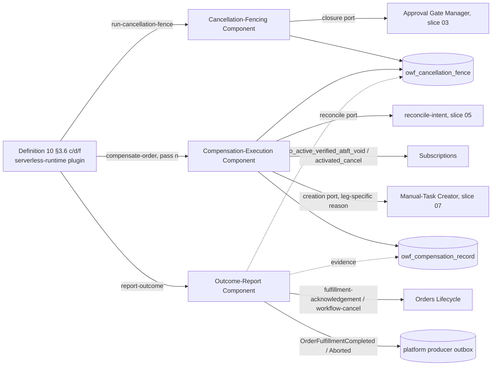
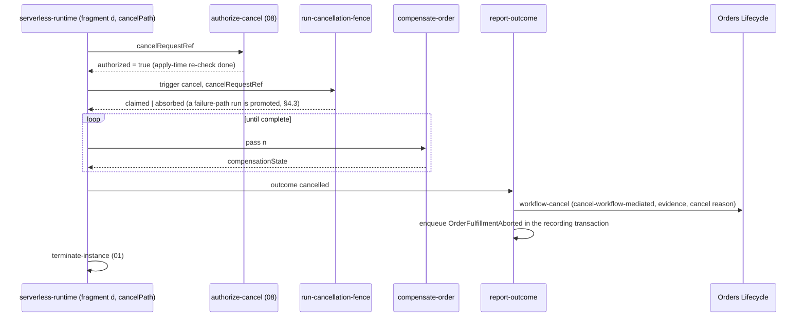

<!-- CONFLUENCE_TITLE: [BSS]: Orders Workflow — Saga and Compensation (Slice 6) -->
<!-- Related: ../DESIGN.md, ../PRD.md, ./01-foundation.md, ./05-provisioning-intents.md, ./10-process-definition.md, ./README.md | Owners: BSS Orders team -->

# DESIGN — Saga and Compensation (Slice 6)

<!-- toc -->

- [1. Architecture Overview](#1-architecture-overview)
  - [1.1 Architectural Vision](#11-architectural-vision)
  - [1.2 Architecture Drivers](#12-architecture-drivers)
  - [1.3 Architecture Layers](#13-architecture-layers)
- [2. Principles & Constraints](#2-principles--constraints)
  - [2.1 Design Principles](#21-design-principles)
  - [2.2 Constraints](#22-constraints)
- [3. Technical Architecture](#3-technical-architecture)
  - [3.1 Domain Model](#31-domain-model)
  - [3.2 Component Model](#32-component-model)
  - [3.3 API Contracts](#33-api-contracts)
  - [3.4 Internal Dependencies](#34-internal-dependencies)
  - [3.5 External Dependencies](#35-external-dependencies)
  - [3.6 Interactions & Sequences](#36-interactions--sequences)
  - [3.7 Database schemas & tables](#37-database-schemas--tables)
  - [3.8 Deployment Topology](#38-deployment-topology)
- [4. Additional context](#4-additional-context)
  - [4.1 Run-time guards the operations enforce](#41-run-time-guards-the-operations-enforce)
  - [4.2 The unilateral-cancel window and no Billing wait](#42-the-unilateral-cancel-window-and-no-billing-wait)
  - [4.3 Concurrent and late triggers (normative)](#43-concurrent-and-late-triggers-normative)
  - [4.4 Compensation cannot exceed the step's declared action](#44-compensation-cannot-exceed-the-steps-declared-action)
  - [4.5 The unilateral window is fence-visible](#45-the-unilateral-window-is-fence-visible)
  - [4.6 Upstream dependency disclosed, not resolved: `SUB-O1`](#46-upstream-dependency-disclosed-not-resolved-sub-o1)
  - [4.7 Constraints this slice places on the definition](#47-constraints-this-slice-places-on-the-definition)
- [5. Traceability](#5-traceability)

<!-- /toc -->

- [ ] `p1` - **ID**: `cpt-cf-bss-orders-workflow-design-saga-and-compensation`

## 1. Architecture Overview

### 1.1 Architectural Vision

This slice provides three **step operations** and sequences nothing itself.
`run-cancellation-fence` (protected) claims the one compensation run an order version may have,
stops dispatch, closes open approval records through slice 03's closure port and identifies every
intent already in flight. `compensate-order` (protected) is the **whole** reverse walk over the
persisted forward-execution ordinal: it reconciles the in-flight intents to terminal outcomes,
freezes the compensation subjects, and submits draft-void or activated-cancel compensating intents
one subject at a time, resuming where the previous pass stopped. `report-outcome` (protected) is
the only caller of the Lifecycle `fulfillment-acknowledgement` and `workflow-cancel` seam
endpoints, carrying compensation evidence it builds from this slice's records. The definition
fragment that orders them is
[`10 §3.6`](./10-process-definition.md#36-interactions--sequences) **(c)** — `compensateOrder`:
`run-cancellation-fence`, then `compensate-order` re-invoked until it answers `complete`, then
`report-outcome` and `terminate-instance` — entered from the partial-failure arm, the
pre-activation abort, the cancel path of **(d)** and the supersede and terminal-event paths of
**(f)**; fragment **(b)** calls `report-outcome` with `outcome: completed` after the last wave.
Orders' saga log — `owf_cancellation_fence` and `owf_compensation_record` — is the authority for
the walk; the definition only decides when it runs and what happens while it cannot finish
([`../ADR/0005`](../ADR/0005-cpt-cf-bss-orders-workflow-adr-saga-compensable-no-pivot.md) as
amended, [`../ADR/0011`](../ADR/0011-cpt-cf-bss-orders-workflow-adr-flow-as-platform-definition.md)).

The slice owns two requirements: classifying every fulfillment step as compensable or
irreversible at design time with a declared compensating action, and executing compensation on
order-level permanent failure, authorized cancellation, supersession and terminal order events.
It is the rollback half of the two-wave saga slice 05 (`05-provisioning-intents.md`) drives
forward: where slice 05 submits draft-create and activation intents, this slice submits their
compensating counterparts, draft-void and activated-cancel.

The stance is deliberately narrow. Both waves of this phase's fulfillment plan are compensable, so
there is no branch here for an irreversible step: OSS-side irreversibility is absorbed one layer
down, inside Subscriptions' own cancel handling, never by this gear reaching past Subscriptions.
Compensation is therefore always a Subscriptions-mediated provisioning intent under the identity
envelope and idempotency contract slice 05 owns, never a bespoke rollback channel.

Compensation is a reporting boundary, not a correctness gate on Billing. Operational compensation
completes or escalates on this gear's own timeline; the reversal of posted at-sale billable facts
lives in the billing chain and is never awaited before `report-outcome` reports to Orders
Lifecycle.

### 1.2 Architecture Drivers

#### Functional Drivers

| Requirement | Design Response |
|-------------|------------------|
| `cpt-cf-bss-orders-workflow-fr-owf-compensation-declaration` | §2.1 per-step compensability classification and the no-intra-saga-pivot principle; each operation's `compensation` field in §3.3 |
| `cpt-cf-bss-orders-workflow-fr-owf-compensation-execution` | §3.3 `run-cancellation-fence`, `compensate-order` and `report-outcome`; §3.6 the algorithms inside them; `10 §3.6` (c) the fragment that orders them; §4.7 the constraints the definition must satisfy |

#### NFR Allocation

| NFR ID | NFR Summary | Allocated To | Design Response | Verification Approach |
|--------|-------------|--------------|-----------------|----------------------|
| `cpt-cf-bss-orders-workflow-nfr-owf-idempotency` | Compensating actions must produce exactly one durable effect under retry | `compensate-order` (§3.3) | Every compensating intent carries a **five-component** idempotency key — `orderId` + `orderVersion` + `orderLineId` + `wave` + `intentKind`, prefixed with `resource_tenant_id`, with `wave_attempt` appended where the forward create was rebuilt — so the `draft_void` key is structurally distinct from the `draft_create` key it undoes and the `activated_cancel` key from the `activation` key (§2.1). A later pass of `compensate-order`, a platform retry of the same pass, or an operator retry resubmits the **same** compensating key; the pass key (§3.3) only numbers the walk's resumptions | Replay test: re-running any pass against Subscriptions asserts a single terminal effect per subject. Negative test: the compensating key never collides with the forward key under `UNIQUE(idempotency_key)`, and Subscriptions never answers a compensating submission with the forward intent's stored outcome |
| `cpt-cf-bss-orders-workflow-nfr-owf-durability` | A compensating action must be executable independently of the forward step's completion state | `compensate-order` (§3.3) | Each subject's **current** phase — `draft`, `activated` or `absent` — is resolved through Subscriptions at compensation time before a leg is chosen; the walk's position lives in `owf_compensation_record`, not in the invocation, so a crash, a dead invocation or a new pass resumes at the first unsettled subject | Test: compensation issued after a forward step's local record is stale, missing, or after the draft's Subscriptions-side TTL has voided it still resolves to a defined leg and writes exactly one `CompensationRecord`; kill the platform worker mid-pass and assert the next pass resumes without a second submission |
| `cpt-cf-bss-orders-workflow-nfr-owf-fulfillment-sla` | Operational compensation must not block on financial reversal | `report-outcome` (§3.3) | `report-outcome` fires as soon as `compensate-order` answers `complete`, with no call into the billing chain on the reporting path | Test: outcome report latency is independent of billing-chain credit-note processing time |

#### Key ADRs

| ADR ID | Decision Summary |
|--------|-------------------|
| `cpt-cf-bss-orders-workflow-adr-saga-compensable-no-pivot` | Both waves of this phase are compensable; activation changes which compensating action applies (draft-void → activated-cancel) but never blocks rollback. As amended by ADR-0011: the structure of compensation is the definition's `try`/`catch`; the ordinal and the reverse walk stay in this gear as **one** operation |
| `cpt-cf-bss-orders-workflow-adr-flow-as-platform-definition` | The flow is a versioned platform definition; this slice provides operations and the saga record |
| `cpt-cf-bss-orders-workflow-adr-definition-versioning-and-protected-steps` | `run-cancellation-fence` **<** `compensate-order` **<** `report-outcome` is a publish condition, and each operation guards its own precondition at run time |
| `cpt-cf-bss-orders-workflow-adr-references-not-payloads` | Task inputs and outputs are references and small enums; compensation evidence, subscription identifiers and the cancel reason never cross the engine boundary |

### 1.3 Architecture Layers

```
serverless-runtime definition (10 §3.6 c)   — orders: fence, compensate (loop), report, terminate
        |  POST /bss-orders-workflow/v1/steps/{operation}  (references only)
        v
run-cancellation-fence   compensate-order   report-outcome       (this slice, inside the envelope)
        |                      |                    |
        |  closure port (03)   |  intent port (05)  |  fulfillment-acknowledgement / workflow-cancel
        v                      v                    v
owf_cancellation_fence   Subscriptions         Orders Lifecycle
owf_compensation_record  (draft-void | activated-cancel)
                               |
                               v
                     Policy Engine -> OSS  (never called by this gear)
```

| Layer | Responsibility | Technology |
|-------|---------------|------------|
| Sequencing | When the unwind runs, the re-invocation loop, escalation waits | Platform definition (`10 §3.6` (c), (d), (f)) executed by the serverless-runtime Temporal plugin |
| Application | The three step operations | Rust, inside the step envelope of [`01 §3.3`](./01-foundation.md#33-api-contracts) |
| Domain | Compensation record, fence state, compensation-failure reason | Domain entities (§3.1), no framework coupling |
| Infrastructure | Compensating-intent submission; Lifecycle outcome report | Slice 05's intent port and SDK client; the Lifecycle SDK client |

- [ ] `p3` - **ID**: `cpt-cf-bss-orders-workflow-tech-compensation-runtime`

The runtime of this slice is the Orders Workflow gear process hosting the step envelope; the
compensation walk executes inside `compensate-order`, never inside a platform worker, because the
walk's ordinal is this gear's record (ADR-0005 as amended). The platform's function-level
`on_failure` / `on_cancel` compensation layer
([serverless-runtime `DESIGN.md:402-409`](../../../../serverless-runtime/docs/DESIGN.md#compensation-design--two-layer-model))
is not used as the compensation mechanism; whether it can target the `compensate-order` route as a
safety net is an upstream ask (ADR-0005 amendment).

## 2. Principles & Constraints

### 2.1 Design Principles

#### Every Step Is Classified at Design Time

- [ ] `p2` - **ID**: `cpt-cf-bss-orders-workflow-principle-step-classification`

Every fulfillment step this gear defines **MUST** be classified, at design time and not at
runtime, as either compensable (with a declared compensating action) or irreversible. The
classification is recorded as each operation's `compensation` field in its slice's §3.3 and
mirrored into `owf_step_operation` (`01 §3.7`). This phase's fulfillment plan (slice 04,
`04-fulfillment-plan.md`) has exactly two waves, and both are compensable.

The classification covers **every registered fulfillment step**, not only the two waves:

| Step | Classification | Declared compensating action |
|------|----------------|------------------------------|
| `construct-and-freeze-plan` (slice 04) | compensable — no external durable effect | none required; the frozen plan is local state discarded with the process outcome |
| `evaluate-payment-auth-eligibility` (slice 04) | compensable — evaluation only, no external durable effect | **the empty action**: it authorizes no charge and creates no external object. Declared explicitly rather than left unstated |
| `begin-fulfillment` (the `approved -> in_fulfillment` Lifecycle transition, slice 04) | compensable | **`report-outcome`** (§3.3): acknowledging `in_fulfillment -> fulfillment_failed`, or submitting the workflow-mediated cancel, is what returns the order out of `in_fulfillment` |
| `dispatch-wave1-create` (slice 05) | compensable | **draft-void**, submitted inside `compensate-order` |
| `dispatch-wave2-activate` (slice 05) | compensable | **activated-cancel**, submitted inside `compensate-order` |

No step in this phase is classified irreversible. A compensable step's compensating action
**MUST** be idempotent (`cpt-cf-bss-orders-workflow-nfr-owf-idempotency`) and executable
independently of the forward step's completion state
(`cpt-cf-bss-orders-workflow-nfr-owf-durability`). The per-wave operations name
`compensate-order` as their `compensation` rather than a per-line undo operation, because the
undo of one line is only correct at its position in the walk.

**ADRs**: `cpt-cf-bss-orders-workflow-adr-saga-compensable-no-pivot`

#### No Intra-Saga Pivot

- [ ] `p1` - **ID**: `cpt-cf-bss-orders-workflow-principle-no-intra-saga-pivot`

Activation **MUST NOT** be treated as a point past which rollback becomes impossible. What
activation changes is *which* compensating action applies — draft-void before activation,
activated-cancel after — never *whether* one exists. A compensating action that cannot be
completed **MUST NOT** be answered by inventing a further, third compensating action; it
**MUST** instead follow the escalation path required for permanent failure (manual task, order
remains non-terminal — `cpt-cf-bss-orders-workflow-fr-owf-manual-task`).

**ADRs**: `cpt-cf-bss-orders-workflow-adr-saga-compensable-no-pivot`

#### Compensating Keys Are Structurally Distinct From Forward Keys

- [ ] `p1` - **ID**: `cpt-cf-bss-orders-workflow-principle-distinct-compensating-key`

A compensating intent's idempotency key **MUST NOT** equal the key of the forward intent it
undoes. The key composition is the **five-component** form slice 05 owns:

    resource_tenant_id : orderId + orderVersion + orderLineId + wave + intentKind

where `intentKind` is `owf_provisioning_intent.intent_kind`
(`draft_create | activation | draft_void | activated_cancel`), with `wave_attempt` appended as a
sixth component where the forward create was rebuilt, so the void of rebuild attempt 2 is distinct
from the void of attempt 1. The tenant prefix namespaces every key.

Reusing the forward key is a correctness failure with three compounding effects: the local
`UNIQUE(idempotency_key)` constraint (`05-provisioning-intents.md` §3.7) rejects the compensating
row; Subscriptions, holding a settled record under that key, returns the **forward** intent's
stored outcome; and this slice would then write `outcome = succeeded` against a subscription that
is still live. A compensating submission that receives a settled outcome whose request fingerprint
does not match the compensating request **MUST** be treated as an `idempotency-key-conflict`
refusal, never as an absorbed duplicate.

This key is the **intent** key, and it is distinct from the step key of `compensate-order` itself
(§3.3), which numbers the walk's passes and never reaches Subscriptions.

**ADRs**: `cpt-cf-bss-orders-workflow-adr-idempotency-key-composition`,
`cpt-cf-bss-orders-workflow-adr-saga-compensable-no-pivot`

#### Compensation via Subscriptions Only, Never Direct to OSS

- [ ] `p2` - **ID**: `cpt-cf-bss-orders-workflow-principle-compensation-via-subscriptions`

This gear never calls OSS directly to reverse a forward effect. Both compensating legs are
submitted as provisioning intents to Subscriptions, from inside `compensate-order`, through slice
05's intent port under the identity and idempotency contract slice 05 owns
(`cpt-cf-bss-orders-workflow-component-intent-dispatcher`). The definition calls no Subscriptions
endpoint (seam rules R1–R5, `10 §2`).

**ADRs**: `cpt-cf-bss-orders-workflow-adr-saga-compensable-no-pivot`

### 2.2 Constraints

#### Operational Compensation Never Waits on Billing

- [ ] `p2` - **ID**: `cpt-cf-bss-orders-workflow-constraint-no-billing-wait`

Operational compensation **MUST NOT** block on, or wait for, a Billing credit note. Posted at-sale
billable facts are reversed in the billing chain, a distinct concern with a distinct owner (Orders
Lifecycle DESIGN §4.4, `gears/bss/orders-lifecycle/docs/design/06-workflow-seam.md`).
`report-outcome` reports the operational outcome as soon as `compensate-order` answers `complete`.

**ADRs**: none — a boundary constraint carried from the Lifecycle seam.

#### Distinct Manual-Task Reasons per Leg

- [ ] `p2` - **ID**: `cpt-cf-bss-orders-workflow-constraint-distinct-compensation-reasons`

A draft that cannot be voided and an activated subscription that cannot be cancelled are distinct
failures with distinct remediation paths, and **MUST** produce distinct manual-task reasons
(§3.1 `CompensationFailureReason`). They **MUST NOT** be collapsed into one generic "compensation
failed" reason. Both are **enum** values on the producing side
(`owf_compensation_record.failure_reason`) and on the consuming side
(`owf_manual_task.failure_reason`, slice 07).

**ADRs**: `cpt-cf-bss-orders-workflow-adr-saga-compensable-no-pivot`

#### Fencing Precedes Any Compensated Outcome, On Every Unwind Path

- [ ] `p2` - **ID**: `cpt-cf-bss-orders-workflow-constraint-fencing-precedes-outcome`

Before any compensated outcome is reported — `fulfillment_failed` on the failure path, `cancelled`
on the authorized-cancellation path, and the no-Lifecycle-call outcomes of the supersede and
terminal-event paths — the five fencing steps (§3.6) **MUST** have completed and **MUST** be
recorded on the `owf_cancellation_fence` row for that `(order_id, order_version)`. A late-arriving
success on an intent that was in flight when compensation began is a created subscription and
**MUST** be compensated.

The failure path is **not** exempt. Under the default remediate policy, independent in-flight lines
are allowed to finish (`PRD.md` §6.3), so an activation accepted before the failure determination
can confirm after it — the race the fence exists to close. The fence is a property of **reporting
a compensated outcome**, not of the cancellation trigger. The order is enforced twice: by the
definition's fence (`10 §4.1`, Unwind row) at publish, and at run time by `compensate-order` and
`report-outcome`, each of which refuses without a fence row (§4.1). A missing fence row is a
refusal, never a pass.

**ADRs**: `cpt-cf-bss-orders-workflow-adr-saga-compensable-no-pivot`,
`cpt-cf-bss-orders-workflow-adr-definition-versioning-and-protected-steps`

#### The Compensation Walk Is Sequential, Ordered, And Does Not Abort

- [ ] `p2` - **ID**: `cpt-cf-bss-orders-workflow-constraint-sequential-ordered-walk`

Compensation legs **MUST** be executed **one subject at a time, in the frozen reverse-execution
order** (§3.6 *Compensation Walk Order*), inside `compensate-order`. Concurrent dispatch is
forbidden: reverse order is the whole correctness argument for the walk, and a concurrent walk has
no order. A definition **MUST NOT** fan the walk out per line (§4.7); the DSL has no dynamic
parallel construct anyway (`10 §2.2`), and a per-line definition task could only order by wave.

A leg that reaches `failed-pending-escalation` **MUST NOT** abort the walk. Aborting would leave
every not-yet-visited subscription live with no `CompensationRecord` row, which makes fence step 5
permanently unsatisfiable. The walk continues, with one exception: `compensate-order` **MUST NOT**
compensate a subscription that the frozen plan's dependency topology (slice 04) places
**upstream** of a subscription whose own compensation failed. Such a leg is recorded
`outcome = blocked-upstream` with the blocking record named, and is re-attempted by the next pass
once the blocking leg is `succeeded`. Unrelated dependency chains are compensated normally.

**ADRs**: `cpt-cf-bss-orders-workflow-adr-saga-compensable-no-pivot`

#### One Compensation Run Per Order Version

- [ ] `p2` - **ID**: `cpt-cf-bss-orders-workflow-constraint-single-compensation-run`

At most one compensation run may exist for an `(order_id, order_version)`. The
`owf_cancellation_fence` row is the mutual-exclusion token: its primary key is
`(order_id, order_version)`, so a second `run-cancellation-fence` — a second authorized
cancellation, or a cancellation arriving while a failure-path run is walking — **MUST** be absorbed
against the existing row rather than starting a second walk. The absorbing rules are §4.3 and are
normative.

**ADRs**: `cpt-cf-bss-orders-workflow-adr-saga-compensable-no-pivot`

## 3. Technical Architecture

### 3.1 Domain Model

**Technology**: Rust structs, same domain crate as slices 04-05.

**Location**: [`../DESIGN.md`](../DESIGN.md) §3.1 (gear-wide domain-model index); the entities below are normative in this slice, with their columns in §3.7.

**Core Entities**:

- [ ] `p2` - **ID**: `cpt-cf-bss-orders-workflow-entity-compensation-record`

| Entity | Description | Schema |
|--------|-------------|--------|
| `CompensationRecord` | One row per compensation subject of a run: its frozen position in the reverse-execution walk, the leg (draft-void \| activated-cancel), the **target subscription reference**, the resolution mode (compensated \| already-absent), the outcome, and the evidence fields Lifecycle §4.4 requires (drafts voided, activations rolled back, at-sale facts emitted). Settles **in place** as passes of `compensate-order` advance it | `owf_compensation_record` table |
| `CompensationFailureReason` | Enumerated, leg-scoped reason for a compensating action that cannot complete: `draft-void-failed` (wave-1 leg) and `activated-cancel-failed` (wave-2 leg), kept distinct per `cpt-cf-bss-orders-workflow-constraint-distinct-compensation-reasons` | Enum column on `owf_compensation_record`, consumed as an enum by slice 07 |
| `CompensationSubject` | The set of subscriptions one run must reach, frozen once fence step 3 completes: every subscription this gear created for the order version (from `owf_provisioning_intent`, including late successes and slice 05's unmatched confirmations recorded against this version) **plus** every subscription attached by a verified manual override (slice 07), which has no provisioning-intent row. Materialized as the `CompensationRecord` rows of one run, in walk order | rows of `owf_compensation_record` for one `(order_id, order_version)` |
| `CancellationFenceState` | Per-order-version progress of the five fencing steps, the trigger that claimed the run (and any promotion), the references `report-outcome` needs (failure reason, cancel request), and the mutual-exclusion token for the run | `owf_cancellation_fence` table |

**Relationships**:
- `CompensationRecord` → `cpt-cf-bss-orders-workflow-entity-provisioning-intent` (slice 05): one record targets exactly one prior provisioning intent's resulting subscription, and names the compensating intent row submitted for it. The forward reference is nullable only for an override-attached subscription.
- `CompensationRecord` → `cpt-cf-bss-orders-workflow-entity-manual-task` (slice 07): an override-attached subscription's `subscription_ref` is the `subscriptionId` slice 07's `verify-override` verified and recorded; a `failed-pending-escalation` record names the manual task slice 07's creator returned.
- `CancellationFenceState` → `CompensationRecord`: one fence state aggregates the records of one `(order_id, order_version)`; step 5 is satisfied only when every record is `succeeded`.

### 3.2 Component Model

Each component is the owner of one step operation. None holds a timer, a retry loop or an event
subscription: when the unwind runs and how often `compensate-order` is re-invoked are the
definition's (`10 §3.6` (c)); a transient failure is re-issued under the same key by the
definition's retry policy (`10 §2.2`); Subscriptions confirmations reach this gear through Orders'
own consumer and slice 05's `reconcile-intent`, never through a subscription here.


```mermaid
graph LR
    DEF[Definition 10 §3.6 c/d/f<br/>serverless-runtime plugin] -->|run-cancellation-fence| CF[Cancellation-Fencing Component]
    DEF -->|compensate-order, pass n| CE[Compensation-Execution Component]
    DEF -->|report-outcome| OR[Outcome-Report Component]
    CF -->|closure port| AGM[Approval Gate Manager, slice 03]
    CF --> FENCE[(owf_cancellation_fence)]
    CE -->|reconcile port| RI[reconcile-intent, slice 05]
    CE -->|intent port: draft_void / activated_cancel| SUB[Subscriptions]
    CE -->|creation port, leg-specific reason| MTC[Manual-Task Creator, slice 07]
    CE --> REC[(owf_compensation_record)]
    CE --> FENCE
    OR -.gate: no_active_verified_at.-> FENCE
    OR -.evidence.-> REC
    OR -->|fulfillment-acknowledgement / workflow-cancel| LC[Orders Lifecycle]
    OR -->|OrderFulfillmentCompleted / Aborted| OUTBOX[(platform producer outbox)]
```

#### Compensation-Execution Component

- [ ] `p2` - **ID**: `cpt-cf-bss-orders-workflow-component-compensation-executor`

##### Why this component exists

Order-level permanent failure, authorized cancellation, supersession and terminal order events all
require the same rollback — undo every subscription created for the order version, in reverse
order — so one component owns that behaviour as one operation, `compensate-order`.

##### Responsibility scope

Owns `compensate-order` (§3.3). Each pass: completes fence step 3 by reconciling the intents fence
step 2 identified; once step 3 is complete, **freezes the walk** — enumerates the subjects and
assigns each a `compensation_sequence` from its forward acceptance ordinal
(`owf_provisioning_intent.execution_seq`, assigned by slice 05 at acceptance) or, for an
override-attached subscription, from its verification instant; then **executes the walk** one
subject at a time in descending `compensation_sequence`, resolving each subject's current phase
through Subscriptions and taking one of three branches:

| Resolved phase | Action | `resolution_mode` |
|----------------|--------|-------------------|
| `draft` | submit a `draft_void` provisioning intent through slice 05's intent port | `compensated` |
| `activated` | submit an `activated_cancel` provisioning intent through slice 05's intent port | `compensated` |
| absent — already voided, cancelled, or expired under Subscriptions' own draft TTL | submit nothing; record the leg that *would* have applied with `outcome = succeeded` | `already-absent` |

An `already-absent` resolution is a *verified* absence — a successful status read returning
not-found or a terminal voided / cancelled state — never an inference from a failed or timed-out
read, which leaves the subject unsettled for the next pass.

*Bounding a leg.* A compensating intent is an ordinary provisioning intent and keeps slice 05's
bounds: an accepted-but-unconfirmed intent is reconciled by `reconcile-intent` on the standard
ladder and terminates at the sweep floor of **30 reads or 23 h, whichever comes first**. A
submission that Subscriptions does not accept is counted on the record
(`submission_failure_count`), because the definition's retry policy counts calls of the whole
pass, not submissions of one leg; the leg's bound is the retry-budget baseline of `01 §4.2`
(5). Whichever bound is reached first writes `outcome = failed-pending-escalation` with the
leg-specific `CompensationFailureReason`. There is no third attempt path.

*Escalating.* On `failed-pending-escalation` the operation **invokes slice 07's single
manual-task creation port** (`cpt-cf-bss-orders-workflow-component-manual-task-creator`) in the
same unit of work, with the leg-specific reason, **under either partial-failure policy**. A
compensation failure is never an incident, because the order is not terminal while a subscription
survives (`07 §2.2` *Compensation Failure Is Always Actionable*). It does not write
`owf_manual_task` itself.

##### Responsibility boundaries

Does not decide *whether* to compensate — the definition enters the unwind from a determination
another operation recorded. Does not call OSS. Does not wait on or query the billing chain. Does
not invent a compensating action beyond the declared one. Does not create the manual-task row.
Does not report the order-level outcome. Does not hold a timer: between passes nothing in Orders
runs for the walk; the next pass is the definition's.

**Retired from this component** (ADR-0011): the bespoke waiting between legs and between
reconciliation reads, and the "engine retry budget and step deadline" bound on submissions, now
the definition's re-invocation loop (`10 §3.6` (c) `awaitCompensationResolution`) and the
per-leg counter above.

##### Related components (by ID)

- `cpt-cf-bss-orders-workflow-component-intent-dispatcher` (slice 05) — calls its intent port
  with `intentKind` set to the compensating kind; shares its identity envelope and key derivation.
- `cpt-cf-bss-orders-workflow-component-reconciliation-sweep` (slice 05) — calls its
  `reconcile-intent` unit in-process for in-flight forward and compensating intents; the sweep
  worker's instance liveness pass is the backstop for an invocation that died, and drives the
  dead-instance unwind after an operator's cancel (`01 §3.8`, `01 §4.16`, D-105).
- `cpt-cf-bss-orders-workflow-component-cancellation-fencer` — requires its fence row (depends on).
- `cpt-cf-bss-orders-workflow-component-outcome-reporter` — reads this component's records.
- `cpt-cf-bss-orders-workflow-component-manual-task-creator` (slice 07) — the sole call site
  for a `failed-pending-escalation` leg, under either policy (calls).
- `cpt-cf-bss-orders-workflow-component-override-verifier` (slice 07) — supplies the verified
  `subscriptionId` of an override-attached subscription (depends on).

#### Cancellation-Fencing Component

- [ ] `p2` - **ID**: `cpt-cf-bss-orders-workflow-component-cancellation-fencer`

##### Why this component exists

An unwind can race with in-flight provisioning intents and with open approval records; without an
ordered, recorded fence, a subscription created after compensation "finished" would survive a
cancelled or failed order, and a gate could still be decided for an order being unwound.

##### Responsibility scope

Owns `run-cancellation-fence` (§3.3) — fencing steps 1 and 2 — on every unwind path (failure,
cancel, supersede, terminal event): claiming the `owf_cancellation_fence` row, which is the
one-run-per-order-version token; moving the phase projection to `compensating`, which every
dispatch operation of slice 05 refuses from; closing open approval records through slice 03's
closure port; identifying every accepted or in-flight intent; recording the references
`report-outcome` needs; and absorbing a second or late trigger against an existing run (§4.3).
Under `fail-fast` on the failure trigger it also hands each failed forward line to slice 07's
Incident Recorder (`cpt-cf-bss-orders-workflow-component-incident-recorder`), which is the
fail-fast destination of a **forward** failure and never of a compensation leg. Owns the
unilateral-cancel-window rule for a `FulfillmentTask` (§4.5).

Steps 3–5 are recorded on this component's row but advanced by `compensate-order`, because each
needs the reconciliation and the walk that operation owns.

##### Responsibility boundaries

Does not submit compensating intents. Does not decide *whether* the order failed or was
cancelled, and does not choose the Lifecycle report — the trigger records that, and the fence is
identical on every path. Does not wait: fence step 3's completion is observed by later passes of
`compensate-order`. The component name is retained for continuity with `PRD.md` §6.4's
"cancellation fencing" wording.

**Retired from this component** (ADR-0011): "waits for" reconciliation in step 3 and "drives"
the executor in step 4 — sequencing is the definition's.

##### Related components (by ID)

- `cpt-cf-bss-orders-workflow-component-compensation-executor` — precedes (the definition calls
  `compensate-order` only after this operation settles).
- `cpt-cf-bss-orders-workflow-component-approval-gate-manager` (slice 03) — calls its closure
  port `close_open_approvals(correlationId, reason)` in step 1.
- `cpt-cf-bss-orders-workflow-component-intent-dispatcher` (slice 05) — reads
  `owf_provisioning_intent` in step 2; its dispatch operations refuse once the phase is
  `compensating`.
- `cpt-cf-bss-orders-workflow-component-incident-recorder` (slice 07) — fail-fast forward
  failures only (calls).

#### Outcome-Report Component

- [ ] `p2` - **ID**: `cpt-cf-bss-orders-workflow-component-outcome-reporter`

##### Why this component exists

Reporting to Lifecycle and enqueueing `OrderFulfillmentCompleted` / `OrderFulfillmentAborted` is
a distinct concern from executing compensation, and must fire only after operational
compensation reaches a known outcome — never gated on financial reversal.

##### Responsibility scope

Owns `report-outcome` (§3.3), the **only** caller in this gear of Lifecycle's
`POST /bss-orders-lifecycle/v1/orders/{orderId}/fulfillment-acknowledgement` and
`POST /bss-orders-lifecycle/v1/orders/{orderId}/workflow-cancel`. Slice 08 no longer calls
`workflow-cancel`; its `authorize-cancel` records the authorization this operation reads. The
report mode follows the fence row's (possibly promoted) trigger:

| Mode (`outcome`) | Precondition in Orders' record | Seam call | Event enqueued |
|------------------|-------------------------------|-----------|----------------|
| `completed` | no fence row; slice 04's completion predicate holds (every task `activated` with a non-null `subscription_id`) | `fulfillment-acknowledgement`, trigger `acknowledge-completed`, with the per-line subscription identifiers | `OrderFulfillmentCompleted` |
| `failed` | fence `no_active_verified_at` set, trigger `failure` | `fulfillment-acknowledgement`, trigger `acknowledge-failed`, with compensation evidence and the fence row's `failure_reason` | `OrderFulfillmentAborted` |
| `cancelled` | fence `no_active_verified_at` set, trigger `cancel` | `workflow-cancel`, trigger `cancel-workflow-mediated`, with compensation evidence and the cancel reason from slice 08's request record | `OrderFulfillmentAborted` |
| `superseded` | fence `no_active_verified_at` set, trigger `supersede` | **none** — the order is live at the new version | none (supersession is admissible only before `in_fulfillment`, so no fulfillment was started) |
| `terminal-event` | fence `no_active_verified_at` set, trigger `terminal-event` | **none** — the order is already terminal in Lifecycle | `OrderFulfillmentAborted` only where `begin-fulfillment` had settled for the version, else none |

*The reporting gate.* A compensated outcome is reportable only when the fence row has
`no_active_verified_at` set, which requires **every** `CompensationRecord` of the run to be
`succeeded`. `failed-pending-escalation` is a *known* outcome for a leg — the operation has stopped
attempting it — but it is **not** a *compensated* outcome: a run containing one
`failed-pending-escalation` or `blocked-upstream` record has at least one live subscription, and
reporting would assert to Lifecycle — and to Billing downstream — that none survived. The report
is refused (`outcome-not-reportable`, §3.3).

The refusal is bounded. The order stays non-terminal under the escalated manual task whose SLA is
the operator-facing clock (slice 07); remediation is declared exhausted after **3 failed operator
resolution attempts on the same task, or the manual-task SLA deadline elapsing without
resolution, whichever comes first** (`../DECISIONS.md` D-3). Above that sits the non-pausable
`max_process_lifetime` of **90 days** (D-4), now the definition's top-level lifetime `wait`
(`10 §3.6` (a)). What lifts the refusal is always the same: the blocked leg reaches `succeeded`,
by operator retry or verified override, and a later pass of `compensate-order` sets
`no_active_verified_at`.

*Publishing.* The event is **enqueued through the bound platform producer outbox
(`toolkit_db::outbox`) in the same local transaction that records the reported outcome**, after
the Lifecycle call has returned its acknowledgement and before the step's answer is sent, per
`cpt-cf-bss-orders-workflow-adr-outbox-process-events` (`01 §3.6`, §4.7). A crash between the
Lifecycle acknowledgement and that transaction replays the call under the same lifecycle-transition
key, which Lifecycle absorbs and answers with its stored outcome, so the event is enqueued exactly
once per reported outcome.

##### Responsibility boundaries

Does not call the billing chain and does not delay reporting for it
(`cpt-cf-bss-orders-workflow-constraint-no-billing-wait`). Does not decide compensation success or
failure. Does not publish to the bus directly. Does not re-check cancel authority: that is
`authorize-cancel`'s apply-time re-check before the fence (slice 08); once every subscription has
been removed, withholding the report would leave Lifecycle asserting subscriptions that no longer
exist (decision D-84: the apply-time re-check of an authorized cancel runs
once, in `authorize-cancel` before `run-cancellation-fence`, and `report-outcome` does not repeat
it).

##### Related components (by ID)

- `cpt-cf-bss-orders-workflow-component-compensation-executor` — reads its records.
- `cpt-cf-bss-orders-workflow-component-cancellation-fencer` — reads its row as the gate.
- `cpt-cf-bss-orders-lifecycle-*` (Orders Lifecycle gear, out of this gear's ID space) — reports
  outcome to, bound by reference to Lifecycle DESIGN §4.4 (depends on, cross-gear).

### 3.3 API Contracts

- [ ] `p2` - **ID**: `cpt-cf-bss-orders-workflow-interface-compensation-trigger`

- **Contracts**: `cpt-cf-bss-orders-workflow-contract-step-invocation`, `cpt-cf-bss-orders-workflow-contract-owf-provisioning-intent`
- **Technology**: internal REST step surface `POST /bss-orders-workflow/v1/steps/{operation}` of [`01 §3.3`](./01-foundation.md#33-api-contracts); callable only by the serverless-runtime service principal under PDP resource `gts.cf.bss.orders_workflow.process_step.v1~` × action `execute` with `operation` as the resource property
- **Location**: this section; mirrored into `owf_step_operation` (`01 §3.7`)

The three operations below are registered against the operation registration boundary
([`01 §3.2`](./01-foundation.md#32-component-model)) with the contract fields of
[`01 §3.3` *The step-operation contract*](./01-foundation.md#the-step-operation-contract). Every
input carries the reference tuple of `10 §3.6` — `correlationId`, `orderId`, `orderVersion`,
`resourceTenantId`, `invocationId`, `attemptId` — written **ref** below; every other member is a
reference or a small enum. Every operation resolves `correlationId` to this slice's rows and reads
commercial order context — subscription identifiers, the roster, the cancel reason, evidence —
inside Orders, from its own record or from Lifecycle under R1, under the instance's
`resource_tenant_id` and `seller_tenant_id` (ADR-0013); none of it is in an input or an output.
Every operation answers `permanent-failure` with `version-mismatch` on a terminal instance
(`01 §3.3` `terminate-instance`).

| `name` | `protection` | `input` | `output` | `idempotency_key` | `declared_event` | `compensation` | `reasons` | `audit_kind` | `retry_class` | `deadline` |
|--------|--------------|---------|----------|-------------------|------------------|----------------|-----------|--------------|---------------|------------|
| `run-cancellation-fence` | `protected` | ref + `trigger` ∈ `failure` · `cancel` · `supersede` · `terminal-event`; `failureReason` (Lifecycle's closed `failure_reason` enum, on `failure` only); `cancelRequestRef` (slice 08's request reference, on `cancel` only); `triggerEventId` (on `supersede` and `terminal-event`) | `fenceRef`, `claim` ∈ `claimed` · `absorbed`, `effectiveTrigger` (the row's trigger after any promotion), `inFlightCount` | instance-scoped `{tenant}:{correlationId}:run-cancellation-fence:{trigger}[:{triggerRef}]`, where `triggerRef` is `cancelRequestRef` on `cancel` and `triggerEventId` on `supersede` and `terminal-event`, and is absent on `failure` (§4.3 *One key per trigger request*) | none | none — the fence is a path step, not an undoable effect | `version-mismatch`, `not-found` (the record holds no cause for this trigger, §3.6 `inst-fence-cause`), `idempotency-key-conflict`, `per-attempt-timeout` | `phase-transition` (`started`/`suspended`/`parked` → `compensating`) on a claim; `step-completion` on an absorption | `retryable-on: transient` | 5 s |
| `compensate-order` | `protected` | ref + `pass` (1 on first entry, else the previous answer's `nextPass`, or previous `pass` + 1 after an exhausted retry) | `compensationState` ∈ `complete` · `in-progress` · `pending-escalation`; `nextPass`; `taskRefs[]` (manual tasks raised for `failed-pending-escalation` legs, this pass or earlier) | step: instance-scoped `{tenant}:{correlationId}:compensate-order:{pass}`; per leg: intent family `{tenant}:{orderId}+{orderVersion}+{orderLineId}+{wave}+{intentKind}[+{wave_attempt}]` with `intentKind` ∈ `draft_void` · `activated_cancel` (§2.1) | none — `OrderFulfillmentAborted` belongs to `report-outcome` | none — compensation is not itself compensable (§2.1 *No Intra-Saga Pivot*) | `fence-not-claimed`, `draft-void-failed`, `activated-cancel-failed`, `blocked-upstream` (the last three recorded per leg and carried on the manual task, never a synchronous refusal), `authority-withdrawn` (recorded on the task slice 08's cancel-authority port raises at `pre-compensation`), `circuit-breaker-open`, `per-attempt-timeout`, `idempotency-key-conflict`, `version-mismatch` | `compensation`, one entry per leg settled in the pass; `step-completion` for the pass | `retryable-on: transient` | 10 s |
| `report-outcome` | `protected` | ref + `outcome` ∈ `completed` · `failed` · `cancelled` · `superseded` · `terminal-event`, `round` (0 on first entry, else the previous answer's `nextRound`) | `reportedOutcome` (the mode actually reported — differs from `outcome` only by the §4.3 promotion `failed` → `cancelled`), `lifecycleCall` ∈ `acknowledged` · `none` · `held` (Lifecycle refused `not-admissible` and the order read shows `on_hold` — a completed acknowledgement of a held order, Lifecycle `06 §3.6`; a settled success that records no report), `nextRound` | step: instance-scoped `{tenant}:{correlationId}:report-outcome:{round}`; seam: lifecycle-transition `{tenant}:{orderId}:{orderVersion}:{trigger}:{round}` with `trigger` ∈ `acknowledge-completed` · `acknowledge-failed` · `cancel-workflow-mediated` ([`01 §3.3` *Rounds and attempts*](./01-foundation.md#rounds-and-attempts-the-one-rule-for-re-invokable-operations)) | `OrderFulfillmentCompleted` on `completed`; `OrderFulfillmentAborted` on `failed`, `cancelled`, and on `terminal-event` where fulfillment had begun (§3.2) | none — `report-outcome` is itself the declared compensation of `begin-fulfillment` (§2.1) | `fence-not-claimed`, `outcome-not-reportable`, `authority-withdrawn` (the `pre-submission` re-check on a cancel run), `version-mismatch`, `circuit-breaker-open`, `per-attempt-timeout`, `idempotency-key-conflict` | `step-completion` | `retryable-on: transient` | 10 s |

**Two catalogue reasons** this slice introduced are registered in `01 §4.9`: `fence-not-claimed`
(`FailedPrecondition`, 400 — `compensate-order` or a compensated `report-outcome` found no fence
row for the version, which only a definition that bypassed the fence can cause) and
`outcome-not-reportable` (`FailedPrecondition`, 400 — the fence has not verified that no active
subscription remains, or slice 04's completion predicate does not hold for `completed`, or
Lifecycle refused the evidence with `compensation-evidence-incomplete` or
`acknowledgement-lines-incomplete`). (Decision D-77: register
`fence-not-claimed` and `outcome-not-reportable` under owner `06-saga-and-compensation` in the
reason catalogue of `01 §4.9`.)

**Per-pass deadline.** `compensate-order`'s 10 s is a per-**pass** budget, the dispatch-operation
baseline of `01 §4.2`. A pass starts a leg only while the remaining deadline covers one status
read plus one submission at the Subscriptions client's per-call budget; otherwise it settles
`in-progress` with the walk's position recorded, and the next pass resumes. A walk of any length
is therefore a sequence of bounded passes, never one unbounded call.

**Why the pass is in the key.** A pass that answers `in-progress` is a settled success of *that*
key; re-issuing it would be an absorbed duplicate answering `in-progress` forever. The definition
therefore presents a new `pass` for every re-invocation and the same `pass` only for a platform
retry of the same attempt. The walk's truth is `owf_compensation_record`, not the pass: two passes
over the same subject resolve to the same compensating intent key, which Subscriptions and slice
05's registry absorb. A pass whose registry lease expired (a crash inside the pass) is settled by
the next pass, which calls `settle-from-lookup` in-process with `lookupOutcome = failure` and
`per-attempt-timeout` before starting its own effect — the looked-up truth of the expired pass is
this slice's record, which every leg writes as it settles.

**Retired interface text.** The former `COMMAND compensate-order-fulfillment` and
`COMMAND run-cancellation-fence` process-engine commands are retired by ADR-0011 in favour of the
routes above; the operation names are the definition's `call` targets.

- [ ] `p2` - **ID**: `cpt-cf-bss-orders-workflow-interface-outcome-report`

- **Contracts**: `cpt-cf-bss-orders-workflow-contract-owf-lifecycle-transition`
- **Technology**: Lifecycle SDK client, called only from inside `report-outcome`
- **Location**: `gears/bss/orders-lifecycle/docs/design/06-workflow-seam.md` §3.3 and §4.4 (Acknowledgement, normative)

**Endpoints Overview** (outbound, owned by Orders Lifecycle):

| Method | Path | Description | Stability |
|--------|------|-------------|-----------|
| `POST` | `/bss-orders-lifecycle/v1/orders/{orderId}/fulfillment-acknowledgement` | `completed` with per-line subscription identifiers, or `fulfillment_failed` with compensation evidence and the closed `failure_reason`; called by `report-outcome` only | unstable |
| `POST` | `/bss-orders-lifecycle/v1/orders/{orderId}/workflow-cancel` | Workflow-mediated cancel with compensation evidence and the cancel reason (order → `cancelled`, the Lifecycle cancel-guard exception); called by `report-outcome` only | unstable |
| `EVENT` | `OrderFulfillmentCompleted`, `OrderFulfillmentAborted` | Enqueued through the platform producer outbox in the transaction that records the reported outcome | unstable |

The evidence follows Lifecycle's closed schema (`01 §3.7` of that gear): drafts voided, activated
subscriptions rolled back, whether activation was dispatched (a settled `report-spawn-signal` for
the version, slice 05), whether at-sale facts had been emitted, and
`no_active_subscription_remains = true`. `report-outcome` builds it from
`owf_compensation_record` and `owf_cancellation_fence` inside Orders; it never crosses the engine
boundary. The Lifecycle endpoints are marked `unstable` deliberately: the activated-cancel leg's
cancellation-reason value is unspecifiable until `SUB-O1` lands (§4.6), so the payload of the
compensating intent underneath these reports is not yet fixed.

### 3.4 Internal Dependencies

| Dependency Gear | Interface Used | Purpose |
|-------------------|----------------|----------|
| orders-workflow (slice 01) | Step envelope, `settle-from-lookup`, `owf_process_instance` phase projection | Every operation runs inside the envelope; `run-cancellation-fence` writes the `compensating` phase; a crashed pass is settled through `settle-from-lookup` |
| orders-workflow (slice 03) | Closure port `close_open_approvals(correlationId, reason)` ([`03 §3.2`](./03-approval-execution.md#32-component-model)) | Fence step 1: cancel every `planned` or `open` gate and close an open park with `resolution = order-terminated`, inside `run-cancellation-fence`'s unit of work |
| orders-workflow (slice 05) | Intent port; `reconcile-intent`; `owf_provisioning_intent` | Submit compensating intents; reconcile in-flight intents in fence step 3; read the forward ordinal and unmatched confirmations |
| orders-workflow (slice 07) | Manual-task creation port; Incident Recorder; verified-override record | Escalate a failed leg (always a manual task); record fail-fast forward failures as incidents; enumerate override-attached subjects |
| orders-workflow (slice 08) | Cancel request record written by `authorize-cancel`; suspension closure port `close_suspension(correlationId, closedReason)`; cancel-authority port `recheck_cancel_authority(correlationId, cancelRequestRef, point)` ([`08 §3.2`](./08-hold-and-cancel.md#32-component-model)) | The cancel reason `report-outcome` carries to `workflow-cancel`; fence step 1 closes a suspension on an unwind taken from hold; `compensate-order` re-checks authority at `pre-compensation` and `report-outcome` at `pre-submission` on the cancel trigger |
| Subscriptions | Provisioning-intent SDK client (through slice 05's port) | Submit draft-void and activated-cancel compensating intents; resolve a subject's current phase; never call OSS directly |
| Orders Lifecycle | Outcome-report contract (§3.3), bound by reference to `06-workflow-seam.md` §4.4 | Report `completed`, `fulfillment_failed` or the workflow-mediated cancel |

**Dependency Rules** (per project conventions):
- No circular dependencies
- Always use sdk modules for inter-gear communication
- No cross-category sideways deps except through contracts
- Only integration/adapter gears talk to external systems
- `SecurityContext` must be propagated across all in-process calls

### 3.5 External Dependencies

This slice introduces no new external-system dependency beyond what slice 05 already declares.
Compensation reaches OSS only transitively, through Subscriptions. The platform definition runtime
is not an external dependency of these operations: it calls them, they call nothing on it
(`01 §3.4`).

#### Subscriptions (external aggregate, canonical owner of subscription state)

- **Contract**: `cpt-cf-bss-orders-workflow-contract-owf-provisioning-intent`

| Dependency Gear | Interface Used | Purpose |
|-------------------|---------------|----------|
| Subscriptions | draft-void / activated-cancel provisioning intent; subscription status read | Compensate a completed wave-1 create or wave-2 activation; resolve a subject's current phase |

**Dependency Rules** (per project conventions):
- No circular dependencies
- Always use SDK modules for inter-gear communication
- No cross-category sideways deps except through contracts
- Only integration/adapter gears talk to external systems
- `SecurityContext` must be propagated across all in-process calls

### 3.6 Interactions & Sequences

Every sequence below is **definition task → operation → record**. The definition text is the
canonical YAML of [`10 §3.6`](./10-process-definition.md#36-interactions--sequences) fragment (c)
`compensateOrder`, fragment (d) `cancelPath` and fragment (f) `supersede`; it is not repeated
here. What follows is what happens **inside** each operation.

#### Order-Level Failure Compensation

**ID**: `cpt-cf-bss-orders-workflow-seq-failure-compensation`

**Use cases**: `cpt-cf-bss-orders-workflow-usecase-owf-partial-failure` (PRD §Acceptance Criteria 9)

**Actors**: `cpt-cf-bss-orders-workflow-actor-owf-orders-lifecycle`, `cpt-cf-bss-orders-workflow-actor-owf-subscriptions`

```mermaid
sequenceDiagram
    participant PL as serverless-runtime (fragment c, compensateOrder)
    participant CF as run-cancellation-fence
    participant CE as compensate-order
    participant SUB as Subscriptions (via 05 port)
    participant MT as Manual-Task Creator (07)
    participant OR as report-outcome
    participant LC as Orders Lifecycle
    PL ->> CF: trigger failure, failureReason
    CF ->> CF: claim owf_cancellation_fence; phase → compensating; closure port (03); stamp steps 1, 2
    CF -->> PL: fenceRef, claim = claimed
    loop pass = 1, 2, ... until complete
        PL ->> CE: pass n
        CE ->> CE: step 3: reconcile identified intents (05 reconcile-intent); freeze subjects once terminal
        CE ->> SUB: walk: resolve phase; draft_void | activated_cancel | already-absent, one subject at a time
        alt leg bound reached
            CE ->> MT: create task, leg-specific reason (either policy)
            CE ->> CE: record failed-pending-escalation; dependents blocked-upstream; CONTINUE
        end
        CE -->> PL: compensationState, nextPass, taskRefs
        Note over PL: in-progress / pending-escalation → awaitCompensationResolution, then pass n+1
    end
    PL ->> OR: outcome failed
    OR ->> OR: gate: no_active_verified_at set; build evidence from records
    OR ->> LC: fulfillment-acknowledgement (acknowledge-failed, evidence, failure_reason)
    OR ->> OR: enqueue OrderFulfillmentAborted in the recording transaction
    OR -->> PL: reportedOutcome failed
    PL ->> PL: terminate-instance (01), terminationKind compensated
```

**Description**: The definition enters `compensateOrder` from the partial-failure arm (remediation
exhausted under `remediate`, or immediately under `fail-fast`) or from the pre-activation abort
(slice 04). *Remediation exhausted* is **3 failed operator resolution attempts on the same task, or
the manual-task SLA deadline elapsing without resolution, whichever comes first** (D-3); it is
`resolve-manual-task`'s `exhausted` answer (slice 07) on which fragment (c) routes. A
`pending-escalation` answer never reaches `report-outcome`: the order stays non-terminal until a
later pass answers `complete`.

**Algorithm: Run Cancellation Fence** (inside `run-cancellation-fence`, after key resolution)

Input: ref, `trigger`, `failureReason`, `cancelRequestRef`, `triggerEventId`
Output: `fenceRef`, `claim`, `effectiveTrigger`, `inFlightCount`

1. [ ] - `p1` - Lock the instance row; **IF** `terminal_outcome` is set: **RETURN** `permanent-failure` with `version-mismatch` - `inst-fence-lock-instance`
2. [ ] - `p1` - **Cause precondition** (decision D-106). The record **MUST** already hold the cause the trigger names, else **RETURN** `permanent-failure` with `not-found`, claiming nothing: `cancel` — a settled `authorize-cancel` answering `authorized = true` for `cancelRequestRef` on this instance (slice 08); `supersede` — a settled `admit-trigger` listen admission `supersede` for `triggerEventId` on this instance (slice 02); `terminal-event` — a settled `terminate-on-terminal-event` for `triggerEventId` answering `terminate = true` (slice 02); `failure` — a failure the unwind may act on: a manual task of this instance resolved `exhausted` ([`07 §4.2`](./07-manual-tasks.md#42-remediation-exhausted-and-the-consequence-of-a-breach-normative)), or under `fail-fast` a forward line of the frozen plan in `failed` or a plan refused `invalid-dependency-graph`, or a settled `re-check-pre-activation` answer that aborts ([`04 §4.2`](./04-fulfillment-plan.md#42-the-re-check-advisory-at-construction-authoritative-before-wave-2)). This is the pattern `terminate-on-terminal-event` already follows (`not-found` without a settled `terminate` admission, [`02 §3.3`](./02-triggers-and-start.md#33-api-contracts)); with the invocation binding of `01 §3.3` step 3 it is what keeps a caller that is not the instance's own invocation, or a definition that misorders the path, from unwinding a healthy order - `inst-fence-cause`
3. [ ] - `p1` - **TRY** insert `owf_cancellation_fence` for `(order_id, order_version)` with `trigger`, `correlation_id`, the references for this trigger and `claimed_by_attempt_id = attemptId`; **CATCH** unique violation: apply the absorption table of §4.3 to the existing row, increment `absorbed_trigger_count`, write `step-completion`, **RETURN** `claim = absorbed` with the row's `effectiveTrigger` and `inFlightCount` - `inst-fence-claim`
4. [ ] - `p1` - **Step 1.** Move the phase projection `started`/`suspended`/`parked` → `compensating` (`01 §3.7`; a parked instance, including one parked at the lifetime ceiling, is unwound only through this fence, D-82), after which every dispatch operation of slice 05 refuses for the version; call slice 03's closure port `close_open_approvals(correlationId, reason = trigger)` in this unit of work, which sets every `planned` or `open` gate to `cancelled` and closes an open park with `resolution = order-terminated`; call slice 08's suspension closure port `close_suspension(correlationId, closedReason)` in the same unit of work, with `closedReason` = `cancelled-from-hold` (`cancel`), `superseded-from-hold` (`supersede`) or `terminated-from-hold` (`failure`, `terminal-event`), which closes an `open` or `resume_ahead` suspension row and clears `owf_process_instance.suspended` ([`08 §3.7`](./08-hold-and-cancel.md#37-database-schemas--tables)); stamp `dispatch_stopped_at` - `inst-fence-step1`
5. [ ] - `p1` - **IF** `trigger = failure` **AND** the frozen plan's policy is `fail-fast`: hand each failed forward line to slice 07's Incident Recorder in this unit of work; never for a compensation leg - `inst-fence-failfast-incident`
6. [ ] - `p1` - **Step 2.** Select every `owf_provisioning_intent` row for the version that is accepted and not terminal, and every slice-05 dispatch registry record for the version that is `in_flight` or `open`; record their count and stamp `in_flight_identified_at` - `inst-fence-step2`
7. [ ] - `p1` - Write `phase-transition` (`phase_from` → `compensating`) and settle; **RETURN** `claim = claimed`, `effectiveTrigger = trigger`, `inFlightCount` - `inst-fence-return`

**Algorithm: Compensate Order** (inside `compensate-order`, after key resolution)

Input: ref, `pass`
Output: `compensationState`, `nextPass`, `taskRefs[]`

1. [ ] - `p1` - Lock the fence row for `(order_id, order_version)`; **IF** none: **RETURN** `permanent-failure` with `fence-not-claimed` - `inst-co-fence-guard`
2. [ ] - `p1` - **IF** a previous pass's registry record is `in_flight` with a dead lease: settle it through `settle-from-lookup` (`lookupOutcome = failure`, `per-attempt-timeout`, the record's `lease_holder`) in-process before continuing - `inst-co-settle-prior`
3. [ ] - `p1` - **Step 3.** **IF** `reconciliation_complete_at` is null: for each intent step 2 identified that is not terminal, call slice 05's `reconcile-intent` unit in-process (a late success is a created subscription); **IF** any remains non-terminal inside the sweep floor: settle, **RETURN** `in-progress`, `nextPass = pass + 1` — an accepted in-flight intent is waited out, never re-submitted (`SUB-O12`, §4.6); **ELSE** stamp `reconciliation_complete_at` - `inst-co-step3`
4. [ ] - `p1` - **Re-check before the first leg.** **IF** the fence row's `trigger` is `cancel` **AND** no compensating leg of the run has been submitted: call slice 08's cancel-authority port `recheck_cancel_authority(correlationId, cancelRequestRef, pre-compensation)` ([`08 §3.2`](./08-hold-and-cancel.md#32-component-model)); **IF** it answers `withdrawn`: stamp `reauthorization_required_at` on the fence row, settle, **RETURN** `pending-escalation` with the port's `authority-withdrawn` task in `taskRefs`, `nextPass = pass + 1`; **IF** `reauthorization_required_at` is set: **RETURN** the same without submitting a leg; a PDP outage is `retryable-failure` - `inst-co-reauthorize`
5. [ ] - `p1` - **Freeze.** **IF** no `owf_compensation_record` exists for the run: insert one row per subject — every subscription created for the version (including late successes and slice 05's unmatched confirmations recorded against it) plus every override-attached subscription slice 07 verified — with `compensation_sequence` from `execution_seq` (or the override's verification instant), `outcome` null; the `UNIQUE (order_id, order_version, compensation_sequence)` constraint makes the freeze total and a replay of it an absorbed no-op - `inst-co-freeze`
6. [ ] - `p1` - **Step 4, the walk.** **FOR EACH** record with `outcome` not `succeeded`, in descending `compensation_sequence`, while the remaining deadline covers one leg: - `inst-co-walk`
   1. [ ] - `p1` - **IF** the frozen plan's dependency topology places the subject upstream of a record whose `outcome = failed-pending-escalation` or `blocked-upstream`: set `outcome = blocked-upstream`, `blocked_by_record_id`; **CONTINUE** - `inst-co-blocked`
   2. [ ] - `p1` - **IF** the record already names a compensating intent that is accepted and not terminal: call `reconcile-intent` in-process; **IF** still non-terminal inside the sweep floor: **STOP** the walk for this pass (the walk is sequential); **IF** it reached the floor: go to 6.5 - `inst-co-reconcile-leg`
   3. [ ] - `p1` - Resolve the subject's current phase through Subscriptions; **IF** the read fails or times out: leave the record unsettled and **STOP** the walk for this pass - `inst-co-resolve`
   4. [ ] - `p1` - **MATCH** the phase: `draft` → submit `draft_void`; `activated` → submit `activated_cancel`, through slice 05's intent port under the compensating key (§2.1), recording the intent on the record; **IF** not accepted: increment `submission_failure_count` and, below the bound, **STOP** for this pass; absent → set `resolution_mode = already-absent`, `outcome = succeeded` - `inst-co-leg`
   5. [ ] - `p1` - **IF** a bound was reached (sweep floor or `submission_failure_count` = 5): set `outcome = failed-pending-escalation`, `failure_reason` = the leg-specific value; call slice 07's manual-task creation port with that reason in this unit of work and record `manual_task_id`; **CONTINUE** the walk - `inst-co-escalate`
   6. [ ] - `p1` - On a confirmed compensating outcome: set `outcome = succeeded`, `resolved_at`, `attempt_id`; write a `compensation` audit entry - `inst-co-settle-leg`
7. [ ] - `p1` - **IF** every subject has a settled outcome: stamp `all_compensated_at`; **IF** every outcome is `succeeded`: stamp `no_active_verified_at` (**Step 5**), **RETURN** `complete` - `inst-co-step5`
8. [ ] - `p1` - **IF** every subject has a settled outcome and any is `failed-pending-escalation` or `blocked-upstream`: **RETURN** `pending-escalation` with `taskRefs`; **ELSE RETURN** `in-progress`; `nextPass = pass + 1` in both - `inst-co-return`

**Algorithm: Report Outcome** (inside `report-outcome`, after key resolution)

Input: ref, `outcome`
Output: `reportedOutcome`, `lifecycleCall`

1. [ ] - `p1` - **IF** `outcome = completed`: **IF** a fence row exists for the version, or slice 04's completion predicate does not hold: **RETURN** `permanent-failure` with `outcome-not-reportable`; **ELSE** read the per-line subscription identifiers from Orders' record and go to step 4 with trigger `acknowledge-completed` - `inst-ro-completed`
2. [ ] - `p1` - Read the fence row; **IF** none: **RETURN** `permanent-failure` with `fence-not-claimed`; **IF** `no_active_verified_at` is null: **RETURN** `permanent-failure` with `outcome-not-reportable` - `inst-ro-gate`
3. [ ] - `p1` - Take the mode from the fence row's `trigger`; **IF** it differs from `outcome` other than by the §4.3 promotion `failure` → `cancel`: **RETURN** `permanent-failure` with `version-mismatch`; build the evidence from `owf_compensation_record`; **MATCH** the mode: `failure` → trigger `acknowledge-failed` with the row's `failure_reason`; `cancel` → trigger `cancel-workflow-mediated` with the cancel reason from slice 08's request record; `supersede` or `terminal-event` → no Lifecycle call, go to step 6 - `inst-ro-mode`
4. [ ] - `p1` - **IF** the mode is `cancel`: call slice 08's cancel-authority port `recheck_cancel_authority(correlationId, cancelRequestRef, pre-submission)` before the submission; **IF** it answers `withdrawn`: stamp `reauthorization_required_at` on the fence row, settle, **RETURN** `permanent-failure` with `authority-withdrawn` (the port has raised the task, which the definition's failure arm absorbs rather than duplicates); a PDP outage is `retryable-failure` - `inst-ro-reauthorize`
5. [ ] - `p1` - Call the Lifecycle endpoint under the lifecycle-transition key `{tenant}:{orderId}:{orderVersion}:{trigger}:{round}` with the fence's effective deadline; **IF** Lifecycle refuses `not-admissible` and the Lifecycle PDP-authorized order read shows the order `on_hold`: settle, **RETURN** `lifecycleCall = held` with `nextRound` and stamp nothing — the definition waits for the resume and reports again under the next round ([`01 §3.3` *Rounds and attempts*](./01-foundation.md#rounds-and-attempts-the-one-rule-for-re-invokable-operations) rule 4); **IF** Lifecycle refuses with `compensation-evidence-incomplete`, `compensation-evidence-missing` or `acknowledgement-lines-incomplete`: **RETURN** `permanent-failure` with `outcome-not-reportable`; **IF** unavailable: **RETURN** `retryable-failure` - `inst-ro-call`
6. [ ] - `p1` - In one transaction: stamp `reported_at` and `reported_outcome` on the fence row (or, for `completed`, on the step record), enqueue the declared event where §3.2's table names one, write `step-completion`, settle; **RETURN** - `inst-ro-record`

#### Authorized-Cancellation Compensation

**ID**: `cpt-cf-bss-orders-workflow-seq-cancellation-compensation`

**Use cases**: `cpt-cf-bss-orders-workflow-usecase-owf-cancel-with-rollback` (PRD §6.4)

**Actors**: `cpt-cf-bss-orders-workflow-actor-owf-orders-lifecycle`, `cpt-cf-bss-orders-workflow-actor-owf-subscriptions`


```mermaid
sequenceDiagram
    participant PL as serverless-runtime (fragment d, cancelPath)
    participant AC as authorize-cancel (08)
    participant CF as run-cancellation-fence
    participant CE as compensate-order
    participant OR as report-outcome
    participant LC as Orders Lifecycle
    PL ->> AC: cancelRequestRef
    AC -->> PL: authorized = true (apply-time re-check done)
    PL ->> CF: trigger cancel, cancelRequestRef
    CF -->> PL: claimed | absorbed (a failure-path run is promoted, §4.3)
    loop until complete
        PL ->> CE: pass n
        CE -->> PL: compensationState
    end
    PL ->> OR: outcome cancelled
    OR ->> LC: workflow-cancel (cancel-workflow-mediated, evidence, cancel reason)
    OR ->> OR: enqueue OrderFulfillmentAborted in the recording transaction
    PL ->> PL: terminate-instance (01)
```

**Description**: An authorized cancellation is gated by the same five fencing steps, so a
subscription accepted while cancellation was underway is still discovered and rolled back. The
fence row is claimed before step 1, so a second cancellation, or one arriving while a failure-path
run is walking, absorbs against the existing run (§4.3). The workflow-mediated cancel is admitted
by Lifecycle from `in_fulfillment` and from `on_hold` with pre-hold `in_fulfillment`, before the
spawn signal as after it, and always requires evidence (Lifecycle D-134). A cancel request for an
order not yet in fulfillment is Lifecycle's ordinary cancel, which reaches this process as
`OrderCancelled` on the terminal-event path of fragment (f), not through this sequence.

#### Supersession and Terminal-Event Unwind

The supersede and terminal-event paths of fragment (f) call the same three operations with
`trigger: supersede` or `trigger: terminal-event`, after `admit-trigger` (`supersede`) or
`terminate-on-terminal-event` (slice 02). `report-outcome` then makes **no Lifecycle call** —
`superseded` because the order is live at the new version, `terminal-event` because the order is
already terminal (`02 §4.7` rule 5). On supersession the run is pre-fulfillment, so
`compensate-order`'s walk is normally empty and the fence reduces to the closure port and the
dispatch stop; on a terminal event after `begin-fulfillment` the walk voids the wave-1 drafts and
cancels any activated subscription, so neither path leaves a draft for a TTL this gear does not
own.

#### Compensation Walk Order (normative)

**ID**: `cpt-cf-bss-orders-workflow-seq-compensation-walk-order`

The walk order is **strict reverse forward-execution order over compensation subjects**,
descending `owf_compensation_record.compensation_sequence`, executed inside `compensate-order`.
This is the single ordering rule; no other ordering statement in this set overrides it, and no
definition expresses it (§4.7).

`cpt-cf-bss-orders-workflow-adr-saga-compensable-no-pivot` describes the same walk as "activated
lines receive activated-cancel first, then draft lines receive draft-void". Under the two-wave
barrier (`cpt-cf-bss-orders-workflow-adr-two-wave-activation-barrier`) every wave-1 create
precedes every wave-2 activation, so for a plain order the two phrasings produce the identical
sequence. They diverge only where a create is accepted after an activation: a wave-1 rebuild, or
an override-attached subscription verified late. **In every such case reverse execution order is
authoritative**, because the property the walk preserves is dependency-safe unwind, carried by
execution order, not by wave membership. A line created and activated at `t1` and a line still
`draft` at `t2` is compensated `t2` first, then `t1`. This is also why the walk cannot be a
definition construct: a definition sees lines and waves, not the ordinal.

#### Five-Step Cancellation Fencing

**ID**: `cpt-cf-bss-orders-workflow-seq-cancellation-fencing`

**Use cases**: `cpt-cf-bss-orders-workflow-usecase-owf-cancel-with-rollback` (PRD §6.4)

**Actors**: `cpt-cf-bss-orders-workflow-actor-owf-subscriptions`

| Step | Operation | Effect | Recorded as |
|------|-----------|--------|-------------|
| 1 — stop | `run-cancellation-fence` | Phase → `compensating` (slice 05's dispatch operations refuse); slice 03's closure port cancels open gates and closes an open park; slice 08's suspension closure port closes an open suspension | `dispatch_stopped_at` |
| 2 — identify | `run-cancellation-fence` | Every accepted non-terminal intent and every `in_flight`/`open` dispatch registry record of the version | `in_flight_identified_at` |
| 3 — reconcile | `compensate-order` | Each identified intent reconciled to a terminal outcome through slice 05's `reconcile-intent`; a late success counts as created | `reconciliation_complete_at` |
| 4 — compensate | `compensate-order` | The walk over every subject, including late successes and override-attached subscriptions | `all_compensated_at` |
| 5 — verify | `compensate-order` | Every record `succeeded` | `no_active_verified_at` |

**Description**: The five steps are recorded strictly in order on one row and all five **MUST**
be complete before any compensated outcome is reported (§2.2). Step 3's discovery mechanism is
slice 05's reconciliation (`cpt-cf-bss-orders-workflow-component-reconciliation-sweep`), invoked
in-process on the definition's pass cadence for a live invocation, and by the sweep worker's
dead-instance unwind for a dead one (`01 §4.16`, D-105); this slice introduces no second
discovery path. Step 4's subject set
includes override-attached subscriptions; enumerating intents alone would make step 5 answer
"none remain" from an incomplete record.

**Upstream dependency disclosed, not resolved: `SUB-O12`.** Step 3 would supersede an accepted
in-flight intent with `SUB-O12` — cancel/void of an accepted transition request — never a second
submit. `SUB-O12` is carried in `UPSTREAM_REQS.md` as **UNASKED**; no Subscriptions contract
exposes it. Until it lands, step 3 can only wait for the accepted intent to reach a terminal
outcome, which extends the fence to the sweep floor (30 reads or 23 h) in the worst case. The
wait is the definition's pass loop; this slice does not invent a second-submit workaround, which
the caller-side duplicate protocol forbids.

### 3.7 Database schemas & tables

- [ ] `p3` - **ID**: `cpt-cf-bss-orders-workflow-db-compensation`

This slice keeps its two tables and loses none: it never owned a timer, a retry-state or a
dead-letter table. Both tables are written only through the step envelope by the operation named
in their **Ownership** line, and both are **deliberately mutable** — they settle in place — which
is why neither is on `01 §3.7`'s append-only list; every mutation is mirrored by an audit entry
(`compensation`, `phase-transition` or `step-completion`) in the same transaction, and the audit
chain, not these rows, is the history.

#### Table: owf_compensation_record

**ID**: `cpt-cf-bss-orders-workflow-dbtable-compensation-record`

**Schema**:

| Column | Type | Description |
|--------|------|--------------|
| `id` | uuid | Primary key |
| `correlation_id` | uuid, NOT NULL | Owning process instance; FK to `owf_process_instance` |
| `resource_tenant_id` | uuid | Resource-recipient axis; NOT NULL |
| `seller_tenant_id` | uuid | Selling-party axis; NOT NULL. A compensation failure is projected into the seller-scoped operator queue (slice 07) |
| `order_id` | uuid | Order the compensation belongs to |
| `order_version` | bigint | Frozen order version the run compensates |
| `order_line_id` | text | Line item reference (join key to `FulfillmentTask`) |
| `compensation_sequence` | bigint | The subject's ordinal in **forward execution order**, frozen at step 3 completion from `owf_provisioning_intent.execution_seq` (or, for an override-attached subscription, from the override's verification instant). The walk is the descending scan of this column |
| `leg` | enum | `draft-void` \| `activated-cancel` — the leg that applied, or would have applied under `already-absent`; NULL until the subject's phase is resolved |
| `subscription_ref` | text, nullable | **The target subscription**, as identified by Subscriptions: from the forward intent's confirmed identifier or from slice 07's verified override. NULL only where no subscription was ever created for the line |
| `source_intent_id` | uuid, nullable | The forward `owf_provisioning_intent` this compensates. NULL only for an override-attached subscription |
| `compensation_intent_id` | uuid, nullable | The compensating `owf_provisioning_intent` row submitted for this subject; NULL before submission and under `already-absent` |
| `idempotency_key` | text, nullable | The **compensating** intent's key (§2.1); never the forward key. NULL exactly when `resolution_mode = already-absent` or before submission |
| `resolution_mode` | enum, nullable | `compensated` \| `already-absent`; NULL until resolved |
| `outcome` | enum, nullable | `succeeded` \| `failed-pending-escalation` \| `blocked-upstream`; NULL while unsettled. Settles in place: `failed-pending-escalation` and `blocked-upstream` move to `succeeded` when a later pass completes the leg after operator retry or verified override |
| `failure_reason` | enum, nullable | `draft-void-failed` \| `activated-cancel-failed`; set only with `outcome = failed-pending-escalation` |
| `blocked_by_record_id` | uuid, nullable | For `outcome = blocked-upstream`: the record whose failure blocks this leg |
| `submission_failure_count` | integer, NOT NULL | Submissions of this leg that Subscriptions did not accept; bound 5 (§3.2); starts at 0 |
| `at_sale_facts_emitted` | boolean | Whether at-sale billable facts had been posted for this line before compensation. **Derived locally, never read from Billing**: `true` exactly when this line's wave-2 activation intent reached a confirmed `activated` outcome before the fence was claimed |
| `manual_task_id` | uuid, nullable | The slice-07 `ManualTask` raised for this record's escalation; set with `outcome = failed-pending-escalation`. Never an incident |
| `attempt_id` | text, nullable | The platform attempt identifier of the `compensate-order` pass that last settled this record (`01 §3.3` *Attempt identity*); the join to the platform timeline |
| `created_at` / `resolved_at` | timestamp | Freeze and settlement times |

**PK**: `id`

**Constraints**: `(order_id, order_version, order_line_id, source_intent_id)` unique — one
subject per forward intent per order version; `UNIQUE (idempotency_key)` where non-null, over the
whole table (not partitioned, `01 §3.7`, D-104);
`UNIQUE (order_id, order_version, compensation_sequence)` so the walk order is total and
gap-free; `failure_reason` NOT NULL exactly when `outcome = failed-pending-escalation`;
`blocked_by_record_id` NOT NULL exactly when `outcome = blocked-upstream`.

**Ownership**: written only by `compensate-order`
(`cpt-cf-bss-orders-workflow-component-compensation-executor`) through the step envelope.

**Mutability**: deliberately mutable (resolution, outcome, counters, `attempt_id`); no DELETE
grant to any role except the retention worker's bounded row-wise purge.

**Additional info**: Tenant axes `resource_tenant_id` (always) and `seller_tenant_id` (operator
queue). Indexed on `(order_id, order_version, compensation_sequence DESC)` for the ordered scan and
on `(seller_tenant_id, failure_reason)` for the manual-task queue. **Retention ≥ 400 days**,
matching the audit and manual-task stores: a compensation record is the evidence behind a
`fulfillment_failed` or `cancelled` acknowledgement. Growth table, **not partitioned** (`01 §3.7`,
D-104) — purged row-wise through a `created_at` index; the `retention-purge` worker of `01 §3.8` gains this table and
`owf_cancellation_fence` at their windows (the retention-purge roster in `01 §3.8` covers both).

**Example**:

| compensation_sequence | leg | resolution_mode | outcome | failure_reason | at_sale_facts_emitted |
|-----|-----|-----|---------|-----------------|------------------------|
| `4` | `activated-cancel` | `compensated` | `failed-pending-escalation` | `activated-cancel-failed` | `true` |
| `3` | `activated-cancel` | `compensated` | `succeeded` | (null) | `true` |
| `2` | `draft-void` | `already-absent` | `succeeded` | (null) | `false` |
| `1` | `draft-void` | `compensated` | `succeeded` | (null) | `false` |

#### Table: owf_cancellation_fence

**ID**: `cpt-cf-bss-orders-workflow-dbtable-cancellation-fence`

**Schema**:

| Column | Type | Description |
|--------|------|--------------|
| `order_id` | uuid | Order under fencing |
| `order_version` | bigint | Frozen order version |
| `correlation_id` | uuid, NOT NULL | Owning process instance |
| `resource_tenant_id` | uuid | Resource-recipient axis; NOT NULL |
| `seller_tenant_id` | uuid | Selling-party axis; NOT NULL |
| `trigger` | enum | `failure` \| `cancel` \| `supersede` \| `terminal-event` — the trigger that claimed the run, after any promotion; decides `report-outcome`'s mode |
| `promoted_from` | enum, nullable | `failure` where a cancellation promoted the run (§4.3); NULL otherwise |
| `failure_reason` | enum, nullable | Lifecycle's closed `failure_reason` value, set on `failure`; carried by `report-outcome` to `acknowledge-failed` |
| `cancel_request_ref` | uuid, nullable | Slice 08's cancel request record, set on `cancel` or promotion; the source of the cancel reason |
| `trigger_event_id` | uuid, nullable | The Lifecycle event of a `supersede` or `terminal-event` run |
| `claimed_by_attempt_id` | text, NOT NULL | Platform attempt identifier of the claiming `run-cancellation-fence` call |
| `dispatch_stopped_at` | timestamp | Step 1 completion |
| `in_flight_identified_at` | timestamp | Step 2 completion |
| `in_flight_count` | integer | Intents and registry records step 2 identified |
| `reconciliation_complete_at` | timestamp, nullable | Step 3 completion |
| `all_compensated_at` | timestamp, nullable | Step 4 completion — every subject has a settled outcome |
| `no_active_verified_at` | timestamp, nullable | Step 5 completion — every record `succeeded` |
| `reported_at` / `reported_outcome` | timestamp / enum, nullable | Set by `report-outcome` when the outcome is recorded |
| `absorbed_trigger_count` | integer | Later triggers absorbed against this run (§4.3); starts at 0 |
| `reauthorization_required_at` | timestamp, nullable | Set by `compensate-order` (`pre-compensation`) or `report-outcome` (`pre-submission`) when slice 08's cancel-authority port answers `withdrawn` on a `cancel` run; while set, no further leg is submitted and no Lifecycle submission is made. Cleared when a newly authorized cancel is absorbed against the run and replaces `cancel_request_ref` (§4.3) (decision D-84: the fence carries the awaiting-re-authorization mark that `08 §4.3` assigns to slice 06) |
| `created_at` | timestamp | When the run was claimed |

**PK**: `(order_id, order_version)`

**Constraints**: steps recorded strictly in order — a later step's column is NOT NULL only once
the preceding one is set; `failure_reason` NOT NULL when `trigger = failure` and not promoted;
`cancel_request_ref` NOT NULL when `trigger = cancel`. The PK is the mutual-exclusion token: the
insert that claims a run wins, and a losing insert absorbs rather than retries.

**Ownership**: `run-cancellation-fence` inserts the row and writes steps 1–2, the trigger and its
promotion; `compensate-order` writes steps 3–5; `report-outcome` writes `reported_at` and
`reported_outcome`; either writes `reauthorization_required_at`. No other writer.

**Mutability**: deliberately mutable (step stamps, promotion, counter, report stamps); a stamp once
set is never cleared.

**Additional info**: Tenant axes `resource_tenant_id` and `seller_tenant_id` (operator
visibility). Read by `report-outcome` as the gate; a missing row is itself a refusal. **Retention
≥ 400 days**. Growth table, **not partitioned** (`01 §3.7`, D-104) — purged row-wise through a
`created_at` index.

### 3.8 Deployment Topology

- [ ] `p3` - **ID**: `cpt-cf-bss-orders-workflow-topology-compensation`

No deployment topology beyond `01 §3.8`: the three operations are routes of the Orders Workflow
service, and this slice adds no worker. It does not add to the three-worker roster
(`reconciliation-sweep`, `retention-purge`, `audit/<tenant>`); the sweep worker's instance
liveness pass raises an unwind whose invocation died as an `invocation-dead` task and, after an
operator's cancel, re-invokes `compensate-order` in-process by pass (`01 §4.16`, D-105); the
definition is what re-invokes it for a live one.

## 4. Additional context

### 4.1 Run-time guards the operations enforce

Independently of the definition's fence (ADR-0012 *Run-time guards*):

1. [ ] - `p1` - `compensate-order` **MUST** refuse `fence-not-claimed` without an `owf_cancellation_fence` row for the version, and **MUST NOT** freeze subjects before `reconciliation_complete_at` is set - `inst-g06-fence-first`
2. [ ] - `p1` - `report-outcome` **MUST** refuse `outcome-not-reportable` for `failed`, `cancelled`, `superseded` or `terminal-event` while `no_active_verified_at` is null, and for `completed` while slice 04's completion predicate does not hold or a fence row exists - `inst-g06-report-gate`
3. [ ] - `p1` - `report-outcome` **MUST** be the only caller of `fulfillment-acknowledgement` and `workflow-cancel` in this gear, and **MUST** take its mode from the fence row's trigger, never from the input alone - `inst-g06-sole-reporter`
4. [ ] - `p1` - On `superseded` or `terminal-event`, `report-outcome` **MUST** make no Lifecycle call - `inst-g06-no-call-modes`
5. [ ] - `p1` - A compensation-leg failure **MUST** create a manual task through slice 07's creation port under either partial-failure policy, and **MUST NOT** create an incident - `inst-g06-leg-task`
6. [ ] - `p1` - Every compensating intent **MUST** carry the compensating key of §2.1; a settled answer whose fingerprint does not match **MUST** be treated as `idempotency-key-conflict` - `inst-g06-distinct-key`

### 4.2 The unilateral-cancel window and no Billing wait

**FulfillmentTask unilateral-cancel window.** A `FulfillmentTask` is unilaterally cancellable
until its **activation** intent is accepted by Subscriptions; draft-create acceptance does not
close the window, because a `draft` subscription is not resource-affecting and carries no billable
facts. From activation-intent acceptance onward the task **MUST** be reconciled to a terminal
outcome (fence step 3) before the order-level outcome is reported.

**No Billing wait.** `report-outcome` reports as soon as `compensate-order` answers `complete`.
This gear only *records* whether at-sale facts had been emitted, as evidence; it never triggers or
awaits their reversal.

**Distinct manual-task reasons.** `draft-void-failed` and `activated-cancel-failed` are never
merged on the manual-task queue: a stuck draft-void points the operator at a still-`draft`
subscription; a stuck activated-cancel points at an active subscription still billing and
consuming resources, a materially more urgent state.

### 4.3 Concurrent and late triggers (normative)

**One key per trigger request.** The fence's step key ends in the reference of the request that
triggered it: the cancel request, or the supersede or terminal event. The request body carries the
same reference, and the registry fingerprints the body (`01 §3.7`, `request_fingerprint`), so a key
that named only the trigger kind would turn every second request of that kind into an
`idempotency-key-conflict`. That refusal is a permanent failure the definition does not catch
(`10 §3.6` fragment (c), the `fence` task), so it would fault the invocation partway through
compensation. With the reference in the key:

- a **replay** of the same request (a platform retry, or a re-run after a crash) derives the same
  key and fingerprint and is an absorbed duplicate of the registry;
- a **different** request of the same kind (a second authorized cancel) is a first call under its
  own key, which runs the operation and reaches the losing insert below. A supersede or a
  terminal event arrives at most once per order version, so its `triggerEventId` changes nothing
  today; it keeps the rule uniform, so a trigger kind added later cannot reintroduce the collision;
- a `failure` run carries no request reference. The definition's three failure exits
  (`planFailFastUnwind`, `preActivationAbort` and `failFastUnwind`, `10 §3.6` fragment (b)) all
  leave the fulfillment stage, and after the fence the phase is `compensating`, so a version gets
  at most one `failure` fence call. A failed compensation leg is `compensate-order`'s, not a new
  fence call. A replay therefore carries the same `failureReason` and is absorbed.

The key never includes a platform-supplied value (ADR-0006 as amended). Decision D-74 records the
component.

The `owf_cancellation_fence` primary key is the arbiter; `run-cancellation-fence` applies this
table on a losing insert:

| Situation | Rule |
|-----------|------|
| `cancel` arrives while a `failure` run is walking | Absorbed. The walk, subjects and steps are unchanged. The row's `trigger` is **promoted** to `cancel`, `promoted_from = failure`, `cancel_request_ref` set, and `report-outcome` consequently submits the workflow-mediated cancel instead of `acknowledge-failed`. `absorbed_trigger_count` incremented |
| A second `cancel` arrives while a `cancel` run is walking | Absorbed, no change beyond `absorbed_trigger_count` — unless `reauthorization_required_at` is set, in which case the newly authorized request replaces `cancel_request_ref` and the mark is cleared, so the walk resumes under the new authority. The second authorization stays in the audit trail with its own actor (slice 08) |
| `cancel` arrives after `no_active_verified_at` but before `report-outcome` settles | Absorbed and promoted as in row 1 when the run is `failure`; the outstanding report then goes out as `cancelled` under its own lifecycle-transition key |
| `supersede` or `terminal-event` arrives while any run is walking | Absorbed without promotion; `terminate-on-terminal-event` already answers `terminate = false` on a `compensating` instance (slice 02), and the claimed run's own path reaches `terminate-instance` |
| `OrderAmended` races an in-flight run | The amendment creates a **new order version**; the run stays frozen against its `(order_id, order_version)`, completes and reports against it; the new version starts its own instance per slice 02's unwind-then-start rule |

The run's subject set and walk order are immutable once frozen. Only the terminal *report* may
change, and only in the one direction where the stronger authorization (a cancellation)
supersedes the weaker (a failure determination).

### 4.4 Compensation cannot exceed the step's declared action

If activated-cancel cannot complete, the Workflow does not attempt a further undo of what
activation caused inside OSS — it stops at activated-cancel, escalates via manual task, and
leaves the order non-terminal. The same applies to a stuck draft-void.

### 4.5 The unilateral window is fence-visible

The window rule of §4.2 is enforced by fence step 2: an intent that was accepted for activation is
in the identified set and cannot be skipped by step 3; a task holding only a draft is reached by
the walk's single draft-void leg.

### 4.6 Upstream dependency disclosed, not resolved: `SUB-O1`

The activated-cancel leg needs a cancellation reason value that is neither an early-termination
reason nor a plan-change supersession reason — reusing either would misattribute a termination fee
or credit, or misrepresent the compensation as a customer-driven plan change. The canonical
Subscriptions register (`gears/bss/subscriptions/docs/SEAMS.md`) carries this ask as `SUB-O1`,
marked **critical** there and **unagreed**. Reason values ride event payloads consumers key on, so
adding one after Billing has consumed the contract is a breaking change. Until `SUB-O1` lands, the
activated-cancel leg's cancellation-reason value is **unspecifiable from this side**; this design
names the requirement and defers the value. Consuming address for this disclosure:
`gears/bss/orders-workflow/docs/design/06-saga-and-compensation.md` §4.6; relevant to the
open-questions register in [`../DECISIONS.md`](../DECISIONS.md) alongside the `SUB-O5` and
`SUB-O11`-`SUB-O14` disclosures carried in [`../UPSTREAM_REQS.md`](../UPSTREAM_REQS.md) §2.1.

### 4.7 Constraints this slice places on the definition

These are inputs to the validation rules of ADR-0012 and `10 §2.2`; a definition version that
violates one **MUST** be refused.

1. [ ] - `p1` - **Unwind order.** On every failure, cancel, supersede and terminal-event path: `run-cancellation-fence` **<** `compensate-order` **<** `report-outcome` **<** `terminate-instance`, with the `trigger` of `run-cancellation-fence` matching the path (`failure`, `cancel`, `supersede`, `terminal-event`) and the `outcome` of `report-outcome` matching it (`failed`, `cancelled`, `superseded`, `terminal-event`) - `inst-def06-unwind-order`
2. [ ] - `p1` - **Loop until complete.** Only `compensationState = complete` may reach `report-outcome`. `in-progress` and `pending-escalation` **MUST** return to `compensate-order` with `pass` incremented, after a `wait` or a manual-task resolution `listen`, and **MUST NOT** reach `report-outcome` or `terminate-instance`. Fragment (c) routes both through `awaitCompensationResolution`, whose 1 h `retryLeg` is inside the sweep floor; a dedicated `in-progress` case re-entering `compensate` on the barrier's poll interval is the recommended refinement for the fragment's owner - `inst-def06-loop`
3. [ ] - `p1` - **Pass numbering.** Every re-invocation of `compensate-order` **MUST** present a `pass` greater than the last one presented for the instance, and a platform retry of one attempt **MUST** present the same `pass`; `pass` is kept in `$context` and is the only walk state the definition holds - `inst-def06-pass`
4. [ ] - `p1` - **No per-line walk.** No definition **MAY** submit, order or skip an individual compensating leg; there is no operation for one, and the walk order is not expressible from the definition's data (§3.6 *Compensation Walk Order*) - `inst-def06-no-line-walk`
5. [ ] - `p1` - **No swallowing.** None of the three operations **MAY** sit in a `try` whose `catch` continues the forward path. Retry exhaustion of `compensate-order` **MUST** route to the unwind's own resolution arm (`awaitCompensationResolution`) and re-enter with the next `pass`; a permanent failure of `run-cancellation-fence` or `report-outcome` **MUST** `raise` into the path's failure arm, whose `create-manual-task` (07) carries the returned reason - `inst-def06-no-swallow`
6. [ ] - `p1` - **Completion only after the last wave.** `report-outcome` with `outcome: completed` **MUST** follow `dispatch-wave2-activate` and **MUST NOT** follow `run-cancellation-fence` on the same path (`10 §4.1`) - `inst-def06-completion`
7. [ ] - `p1` - **Signals during the unwind.** The competing `fork` of the unwind's resolution arm **MUST** contain the `cancel-requested` arm, routed through `authorize-cancel` to `run-cancellation-fence` (which absorbs and promotes, §4.3) and back to `compensate`. The unwind **MUST NOT** contain a hold arm — the phase table of `01 §3.7` has no `compensating → suspended` transition, and a hold does not pause compensation - `inst-def06-signals`
8. [ ] - `p2` - **Listens.** This slice requires no `listen` of its own: compensating-intent confirmations reach Orders' consumer and `reconcile-intent`, and `compensate-order` reads them from the record on its next pass - `inst-def06-no-listen`

## 5. Traceability

- **PRD**: [PRD.md](../PRD.md) §6.4 (Saga and Compensation), Acceptance Criteria 9, 9a, 10, 11; §6.1 `cpt-cf-bss-orders-workflow-fr-owf-process-state-nonauth` (the saga log is Orders')
- **Orders Lifecycle seam**: [06-workflow-seam.md](../../../orders-lifecycle/docs/design/06-workflow-seam.md) §3.3 (`fulfillment-acknowledgement`, `workflow-cancel`), §4.4 (Acknowledgement, normative — compensation evidence and no-Billing-wait rule, bound by reference, not restated)
- **ADRs**: `cpt-cf-bss-orders-workflow-adr-saga-compensable-no-pivot` (as amended by ADR-0011), `cpt-cf-bss-orders-workflow-adr-idempotency-key-composition`, `cpt-cf-bss-orders-workflow-adr-outbox-process-events`,
  [`ADR/0011`](../ADR/0011-cpt-cf-bss-orders-workflow-adr-flow-as-platform-definition.md)
  `cpt-cf-bss-orders-workflow-adr-flow-as-platform-definition`,
  [`ADR/0012`](../ADR/0012-cpt-cf-bss-orders-workflow-adr-definition-versioning-and-protected-steps.md)
  `cpt-cf-bss-orders-workflow-adr-definition-versioning-and-protected-steps`,
  [`ADR/0013`](../ADR/0013-cpt-cf-bss-orders-workflow-adr-references-not-payloads.md)
  `cpt-cf-bss-orders-workflow-adr-references-not-payloads`
- **Definition**: [10-process-definition.md](./10-process-definition.md) §3.6 (c)
  `cpt-cf-bss-orders-workflow-seq-def-partial-failure` (`compensateOrder`, the fragment that
  sequences these operations), (d) `cpt-cf-bss-orders-workflow-seq-def-cancel`, (f)
  `cpt-cf-bss-orders-workflow-seq-def-amendment-and-terminal`, (b) (`reportCompleted`); §4.1 (the
  fence, Unwind row), §4.6 (no swallowing catch)
- **Platform**: [serverless-runtime DESIGN](../../../../serverless-runtime/docs/DESIGN.md) *Compensation Design — Two-Layer Model* (not used as the mechanism; safety-net ask)
- **Prior slices**: [01-foundation.md](./01-foundation.md) (envelope, step-operation contract, `settle-from-lookup`, phase table, reason catalogue), [02-triggers-and-start.md](./02-triggers-and-start.md) (supersede and terminal-event entry, report modes), [03-approval-execution.md](./03-approval-execution.md) (closure port), [04-fulfillment-plan.md](./04-fulfillment-plan.md) (frozen plan, dependency topology, completion predicate), [05-provisioning-intents.md](./05-provisioning-intents.md) (intent port, `reconcile-intent`, `execution_seq`, unmatched confirmations, `SUB-O12`), [07-manual-tasks.md](./07-manual-tasks.md) (creation port, Incident Recorder, verified override), [08-hold-and-cancel.md](./08-hold-and-cancel.md) (`authorize-cancel`, cancel request record)
- **Retired here** (ADR-0011): the `compensate-order-fulfillment` and `run-cancellation-fence` process-engine commands (now step routes); the executor's bespoke inter-leg waiting and engine-retry bound; the fencer's step-3 waiting and step-4 driving; slice 08's call to `workflow-cancel` (now `report-outcome`'s)
