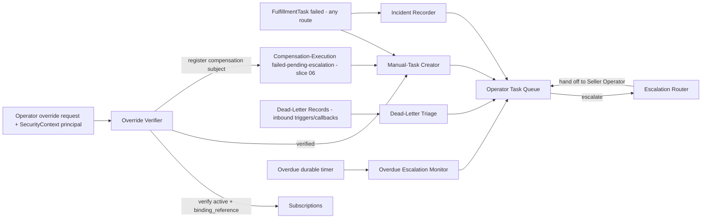
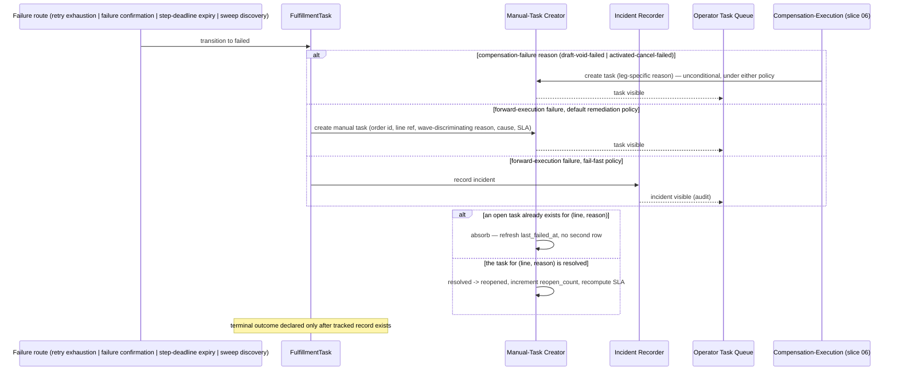

<!-- CONFLUENCE_TITLE: [BSS]: Orders Workflow — Manual Tasks, Override, Operator Queue and Overdue Escalation (Slice 7) -->
<!-- Related: ../DESIGN.md, ../PRD.md, ./01-foundation.md, ./05-provisioning-intents.md, ./06-saga-and-compensation.md, ./README.md | Owners: BSS Orders team -->

# DESIGN — Manual Tasks, Override, Operator Queue and Overdue Escalation (Slice 7)


<!-- toc -->

- [1. Architecture Overview](#1-architecture-overview)
  - [1.1 Architectural Vision](#11-architectural-vision)
  - [1.2 Architecture Drivers](#12-architecture-drivers)
  - [1.3 Architecture Layers](#13-architecture-layers)
- [2. Principles & Constraints](#2-principles--constraints)
  - [2.1 Design Principles](#21-design-principles)
  - [2.2 Constraints](#22-constraints)
- [3. Technical Architecture](#3-technical-architecture)
  - [3.1 Domain Model](#31-domain-model)
  - [3.2 Component Model](#32-component-model)
  - [3.3 API Contracts](#33-api-contracts)
  - [3.4 Internal Dependencies](#34-internal-dependencies)
  - [3.5 External Dependencies](#35-external-dependencies)
  - [3.6 Interactions & Sequences](#36-interactions--sequences)
  - [3.7 Database schemas & tables](#37-database-schemas--tables)
  - [3.8 Deployment Topology](#38-deployment-topology)
- [4. Additional context](#4-additional-context)
- [5. Traceability](#5-traceability)

<!-- /toc -->

- [ ] `p1` - **ID**: `cpt-cf-bss-orders-workflow-design-manual-tasks`
## 1. Architecture Overview

### 1.1 Architectural Vision

This slice closes the failure-visibility loop for fulfillment. Every route into a `FulfillmentTask`'s `failed` state — retry exhaustion, an explicit failure confirmation from Subscriptions, step-deadline expiry, or a terminal failure discovered by the reconciliation sweep (`cpt-cf-bss-orders-workflow-component-reconciliation-sweep`, slice 05) — is folded into a single manual-task creation path under the default remediation policy, and a single tracked-incident path under the fail-fast policy. The design deliberately treats "by any route" as the load-bearing property: a manual task created on only some entrance paths recreates the silent-failure bug the NFR exists to eliminate. The two compensation-failure reasons introduced by slice 06 (`draft-void-failed`, `activated-cancel-failed`) are surfaced through this same path rather than inventing a parallel one, so operators see one queue regardless of whether the failure originated in forward execution or in compensation.

Override resolution is deliberately narrow: it is not a way to force an order forward on trust, it is a way to record that fulfillment already happened by a means the workflow could not observe directly (e.g. an operator manually provisioned service through Subscriptions' own tooling). Because `OrderCompleted` carries a per-line subscription identifier as its audit backbone, an override that is not backed by a Subscriptions-verified, matching subscription would silently fabricate that linkage. The design therefore makes verification a hard precondition, not a best-effort check — and makes it an **identity** check against the line's `binding_reference`, not a type check against plan and quantity, because a type check passes on any pre-existing subscription of the same plan in the same tenant. The two properties that make an override safe are that the cited subscription is provably *this line's*, and that the operator who cited it is the authenticated caller rather than a name typed into a request body.

An override is also the one path that puts a subscription on an order without a provisioning intent. Slice 06's compensation walk enumerates the subjects it must reach, so an override-attached subscription is registered as a compensation subject at the moment it is verified; otherwise it survives a later cancellation and slice 06's fence step 5 answers "no active subscription remains" from a record that never contained it.

The operator-facing task queue and the overdue-fulfillment escalation are both read/notify surfaces over state this and prior slices already own (`FulfillmentTask`, `CompensationRecord`, dead-letter records, the order's Lifecycle state) — this slice adds no new terminal states and does not compete with the dead-letter mechanism owned by inbound triggers/callbacks (§Dead-Letter Outcome, PRD).

### 1.2 Architecture Drivers

#### Functional Drivers

| Requirement | Design Response |
|-------------|------------------|
| `cpt-cf-bss-orders-workflow-fr-owf-manual-task` | Manual-Task Creator component fires from every `failed`-entrance route under the default policy; Incident Recorder substitutes under fail-fast for **forward-execution** failures only — a compensation failure always produces an actionable task (§2.2 Compensation Failure Is Always Actionable). |
| `cpt-cf-bss-orders-workflow-fr-owf-override-semantics` | Override Verifier calls Subscriptions synchronously before an override is accepted, binds the check to the line's `binding_reference`, takes operator identity from the propagated `SecurityContext`, and registers the verified subscription as a slice-06 compensation subject; rejects without a verified match. |
| `cpt-cf-bss-orders-workflow-fr-owf-task-queue` | Operator Task Queue projects manual tasks, incidents and dead-letter records — the last through `owf_dead_letter_triage`, so dead-letter records carry assignment state, SLA countdown and resolution actions like any other queue row — scoped by seller tenancy, keyset-paginated, with per-row ownership checked before any mutation. |
| `cpt-cf-bss-orders-workflow-fr-owf-overdue-escalation` | Overdue Escalation Monitor raises escalations at the 24h business-default window, carrying order **and step** context, without touching order/line terminal state. |
| `cpt-cf-bss-orders-workflow-fr-owf-dead-letter` | Manual-Task-vs-Dead-Letter boundary rule prevents a second inspectable object on the same step; the dead-letter surface gains a redrive operation so a parked delivery has an exit other than a database write. |

#### NFR Allocation

| NFR ID | NFR Summary | Allocated To | Design Response | Verification Approach |
|--------|-------------|--------------|-----------------|----------------------|
| `cpt-cf-bss-orders-workflow-nfr-owf-manual-task-sla` | 100% of permanently failed lines produce a tracked manual task or incident; SLA visible before breach | Manual-Task Creator, Incident Recorder, Operator Task Queue | Every `failed`-entrance route is wired through one creation call; `sla_deadline` is computed by the formula in §4 (4 h for a resource-affecting class, 24 h otherwise) rather than deferred, so the NOT NULL column always has a derivable value; queue renders the countdown before the deadline and a breach has a stated consequence | Route-coverage test enumerating all four forward routes plus the two compensation-failure routes; queue SLA-countdown field always populated; a test asserting an elapsed deadline declares remediation exhausted rather than passing silently |

#### Key ADRs

| ADR ID | Decision Summary |
|--------|-----------------|
| `cpt-cf-bss-orders-workflow-adr-manual-task-dead-letter-separation` | A fulfillment step's inspectable object is either a manual task (remediation policy) or a tracked incident (fail-fast) — never both, and never a dead-letter record on top; dead-letter is reserved for inbound Lifecycle triggers and Subscriptions/Payments/Generic-Approval callbacks past their finite delivery cap. |
| `cpt-cf-bss-orders-workflow-adr-saga-compensable-no-pivot` | (slice 06, referenced) Both compensation legs are compensable; this slice's manual-task reasons for compensation failure reuse the two leg-scoped values it defines, never a generic third one. |

### 1.3 Architecture Layers

```text
Presentation   : Operator Task Queue read + action API (surfaces tasks, incidents and
                 dead-letter records; keyset-paginated, seller-scoped, per-row ownership
                 checked before every mutation)
Application    : Manual-Task Creator, Incident Recorder, Override Verifier,
                 Escalation Router, Overdue Escalation Monitor
Domain         : FulfillmentTask (failed), ManualTask, Incident, CompensationRecord
                 (read, slice 06), OverdueEscalation, DeadLetterTriage
Infrastructure : owf_manual_task / owf_incident / owf_overdue_escalation /
                 owf_dead_letter_triage tables, durable overdue-window timer
                 (owf_durable_timer, timer_kind = overdue-fulfillment), Subscriptions
                 SDK client (override verification)
```

- [ ] `p3` - **ID**: `cpt-cf-bss-orders-workflow-tech-manual-task-stack`

| Layer | Responsibility | Technology |
|-------|---------------|------------|
| Presentation | Operator-facing task queue read model and resolution-action dispatch | REST endpoints, seller-tenancy scoped, keyset-paginated |
| Application | Manual-task/incident creation, override verification, escalation routing, overdue monitoring, dead-letter redrive | Workflow engine activities |
| Domain | ManualTask, Incident, OverdueEscalation, DeadLetterTriage entities | GTS domain structs |
| Infrastructure | Persistence, durable timer, Subscriptions SDK | PostgreSQL, durable-timer service, generated SDK client |

## 2. Principles & Constraints

### 2.1 Design Principles

#### Exactly-One Inspectable Object Per Step

- [ ] `p2` - **ID**: `cpt-cf-bss-orders-workflow-principle-one-inspectable-object`

A fulfillment step that exhausts remediation already has its inspectable object — the manual task under the remediation policy, or the tracked incident under fail-fast — and must not grow a second one. Dead-letter records are reserved for inbound Lifecycle triggers and Subscriptions/Payments/Generic-Approval callbacks that keep failing past a finite delivery cap; a dead-letter record is never an order state, and a compensating action that keeps throwing lands on the existing manual-task/incident path rather than a silent retry loop or a duplicate dead-letter entry. This principle is what keeps the operator queue a single, non-duplicated surface per failed line.

**ADRs**: `cpt-cf-bss-orders-workflow-adr-manual-task-dead-letter-separation`

#### Verification Precedes Trust

- [ ] `p2` - **ID**: `cpt-cf-bss-orders-workflow-principle-verification-precedes-trust`

An operator's assertion that a line is fulfilled is never taken at face value when it changes order-completion evidence. Before an override is accepted, the Workflow verifies through Subscriptions that the referenced subscription is **active** and that it carries **this order line's `binding_reference`** — the opaque, caller-owned, correlation-bound reference this gear stamps on every provisioning intent for the line (`cpt-cf-bss-orders-workflow-dbtable-provisioning-intent`, slice 05). Only a verified match is attached as authoritative fulfillment evidence; an unverified override is rejected outright, never accepted provisionally.

The check **MUST** be an identity check, not a type check. Matching on plan, quantity and tenant axes alone is satisfied by any pre-existing, unrelated subscription of the same plan in the same tenant — a state that exists on every repeat customer — so a type check accepts a fabricated linkage as readily as a real one, which is precisely the failure this principle exists to prevent. Plan, quantity and tenant axes remain part of the verification as **corroborating** assertions (a `binding_reference` match with a divergent plan is a data-integrity alarm, not a pass), but the `binding_reference` is the load-bearing one and its absence is a rejection on its own.

Where the line has no provisioning intent at all — the wave-1 create never reached Subscriptions, so no `binding_reference` was ever stamped — the override **MUST** be rejected, not waved through on attribute matching. This gear can mint a `binding_reference` for the line and record it as the expected value, so the operator's out-of-band provisioning can carry it; it cannot retroactively recognize a subscription that was never bound to the line.

**ADRs**: `cpt-cf-bss-orders-workflow-adr-manual-task-dead-letter-separation`

#### Attribution Comes From the Caller, Never From the Payload

- [ ] `p2` - **ID**: `cpt-cf-bss-orders-workflow-principle-attribution-from-security-context`

Operator identity for every resolution action — retry, override, escalate, cancel — is read from the propagated `SecurityContext` principal, never from a field in the request body. An override is the single action in this gear that writes fulfillment evidence without a provisioning intent, so its audit attribution is the only record of who asserted that evidence; a caller-supplied identity field lets the asserting party name someone else as the asserter, which makes the audit trail actively misleading rather than merely incomplete. Every other surface in this gear already scopes and attributes by `SecurityContext` (e.g. the approver decision endpoint, slice 03) — the override endpoint is brought into line with them, not given an exception. The request body carries only the claim under review (`subscriptionId`) and the human-supplied `justification`; identity and seller scope are the gateway's to assert.

**ADRs**: `cpt-cf-bss-orders-workflow-adr-manual-task-dead-letter-separation`

### 2.2 Constraints

#### Any-Route Manual-Task Creation

- [ ] `p2` - **ID**: `cpt-cf-bss-orders-workflow-constraint-any-route-manual-task`

Every entrance to `FulfillmentTask.failed` — retry exhaustion, an explicit failure confirmation, step-deadline expiry, or a sweep-discovered terminal failure — and every `failed-pending-escalation` outcome on a slice-06 compensation leg must invoke the same manual-task creation call, before any terminal outcome is declared. No entrance route may bypass this call. This constraint exists specifically because a task created on only some paths is indistinguishable, from the customer's perspective, from no tracking at all.

Slice 06's Compensation-Execution Component is a **caller** of this creation call, not a second creator. Slice 06 supplies the leg-specific `CompensationFailureReason`; this slice owns the `owf_manual_task` row, its uniqueness, its state machine and its SLA. "Exactly one actionable object by any route" is only structural if compensation failure enters through the same door as forward failure — two creators mean two dedup rules and two uniqueness constraints, which is how the same line acquires two tasks or none.

**ADRs**: `cpt-cf-bss-orders-workflow-adr-manual-task-dead-letter-separation`

#### Compensation Failure Is Always Actionable

- [ ] `p2` - **ID**: `cpt-cf-bss-orders-workflow-constraint-compensation-failure-actionable`

The fail-fast substitution of a non-actionable `Incident` for a `ManualTask` applies to **forward-execution** failures only. A compensation failure always produces a `ManualTask`, under either partial-failure policy.

The premise of the `Incident` branch is that under fail-fast the order is already terminal, so there is nothing left to act on. That premise does not hold for a compensation failure: a leg that reaches `failed-pending-escalation` means a subscription is still live, slice 06 refuses to report a compensated outcome, and the order is therefore **not** terminal (`PRD.md` §6.4 — the Workflow "MUST create a manual task for the compensation failure and escalate until operational compensation reaches a known outcome", with no policy qualifier). Routing a compensation failure to an `Incident` under fail-fast would file a live, billing customer resources subscription as a read-only audit note with no assignee, no SLA and no resolution action — the silent-failure outcome the whole slice exists to eliminate, arrived at by the one branch that looks like tidy separation.

**ADRs**: `cpt-cf-bss-orders-workflow-adr-manual-task-dead-letter-separation`, `cpt-cf-bss-orders-workflow-adr-saga-compensable-no-pivot`

#### A Fenced or Terminal Order Accepts No New Fulfillment

- [ ] `p2` - **ID**: `cpt-cf-bss-orders-workflow-constraint-no-fulfillment-after-fence`

A resolution action that would create or attach a subscription — `retry` on a forward-execution step, and `override` — **MUST** be refused when the order is fenced or terminal. Concretely it is refused when any of the following holds: the order has a terminal Lifecycle outcome (`completed`, `fulfillment_failed`, `cancelled`, `expired`); the process instance is `terminated`; or an `owf_cancellation_fence` row exists for the task's `(order_id, order_version)` with `dispatch_stopped_at` set.

The task-resolution endpoints are a separate entry path into provisioning that the cancellation fence does not otherwise see: the fence stops the *dispatcher*, and an operator pressing retry is not the dispatcher. Without this precondition an operator can create a subscription for an order that is being cancelled — after fence step 5 has already verified none remain — which is the stranded-subscription outcome by a route the fence was never pointed at.

Compensation-reason tasks (`draft-void-failed`, `activated-cancel-failed`) are the deliberate exception on the fence condition: they **remain** retryable while the fence is open, because completing them is exactly what fence step 4 is waiting for. They are still refused on a terminal order, where there is nothing left to compensate into.

**ADRs**: `cpt-cf-bss-orders-workflow-adr-manual-task-dead-letter-separation`, `cpt-cf-bss-orders-workflow-adr-saga-compensable-no-pivot`

#### An Open Task Never Outlives Its Order

- [ ] `p2` - **ID**: `cpt-cf-bss-orders-workflow-constraint-close-task-on-terminal-order`

When an order reaches a terminal outcome, every open `ManualTask` for that `(order_id, order_version)` **MUST** be closed by the same transition that records the terminal outcome, with `resolution_action = auto-closed` and `resolution_outcome = closed-order-terminal`. The close is a state transition with a recorded reason, never a delete and never a silent filter in the read projection.

A terminal order's open tasks are not merely noise: they carry live SLA countdowns that will breach, and a breach declares remediation exhausted (§4), which re-enters a compensation path on an order that already has a settled outcome. Closing them is what stops an already-finished order from re-entering remediation through its own leftovers.

**ADRs**: `cpt-cf-bss-orders-workflow-adr-manual-task-dead-letter-separation`

#### Overdue Window Is Non-Terminalling

- [ ] `p2` - **ID**: `cpt-cf-bss-orders-workflow-constraint-overdue-non-terminal`

Exhausting the overdue-fulfillment window must not auto-terminal the order and must not by itself mark any line `failed`. The window's only effect is raising an operational escalation to the fulfillment operator queue; the order remains `in_fulfillment` (or the `on_hold` state taken from it) until operational compensation reaches a known outcome or the operator explicitly cancels. This is why Orders Lifecycle does not auto-expire `in_fulfillment` or holds taken from it: a subscription-spawn signal may already be in flight, and an automatic terminal transition on top of that would be unsafe.

**ADRs**: `cpt-cf-bss-orders-workflow-adr-manual-task-dead-letter-separation`

## 3. Technical Architecture

### 3.1 Domain Model

**Technology**: GTS, Rust structs

**Location**: [`../DESIGN.md`](../DESIGN.md) §3.1 (gear-wide domain-model index); the entities below are normative in this slice, with their columns in §3.7.

**Core Entities**:

- [ ] `p2` - **ID**: `cpt-cf-bss-orders-workflow-entity-manual-task`
- [ ] `p2` - **ID**: `cpt-cf-bss-orders-workflow-entity-incident`
- [ ] `p2` - **ID**: `cpt-cf-bss-orders-workflow-entity-overdue-escalation`
- [ ] `p2` - **ID**: `cpt-cf-bss-orders-workflow-entity-dead-letter-triage`

| Entity | Description | Schema |
|--------|-------------|--------|
| `ManualTask` | Actionable operator task created when a `FulfillmentTask` fails under the default remediation policy, or when a slice-06 compensation leg reaches `failed-pending-escalation` under either policy; carries order ID, line item reference, wave-discriminating failure reason, failure cause, severity, SLA deadline, resolution actions, assignment state, assignee and resolution record | [owf_manual_task](#table-owf_manual_task) |
| `ManualTaskState` | The `assignment_state` set with declared transitions: `unassigned \| assigned \| in_progress \| resolved \| reopened`. `reopened` is what lets a second failure on an already-resolved line be tracked instead of silently dropped | enum column on `owf_manual_task`, transitions in §4 |
| `Incident` | Tracked, non-actionable audit entry created when a `FulfillmentTask` fails under the fail-fast policy. Forward-execution failures only — a compensation failure is never an `Incident` (§2.2 *Compensation Failure Is Always Actionable*) | [owf_incident](#table-owf_incident) |
| `OverdueEscalation` | Operational escalation raised when an order exceeds the overdue-fulfillment window; carries order **and step** context (the step and wave the order is stuck at, and the blocking objects) so it is actionable; non-terminal by construction | [owf_overdue_escalation](#table-owf_overdue_escalation) |
| `DeadLetterTriage` | This slice's operator-facing companion to a slice-01 `owf_dead_letter_record`: assignment state, SLA deadline, severity and resolution record for a parked inbound delivery, plus its redrive history. Exists because the queue must present a dead-letter record with the same actionability as a task, and the dead-letter record itself is owned and written by another slice | [owf_dead_letter_triage](#table-owf_dead_letter_triage) |

**Relationships**:
- `FulfillmentTask` → `ManualTask`: on `failed` under the default policy, exactly one open `ManualTask` exists per (line, failure reason), carrying `failureReason` (one of the wave-discriminating forward-execution reasons or the compensation reasons `draft-void-failed` / `activated-cancel-failed` from slice 06). A line that fails forward and later fails compensation carries **two** tasks, one per reason — they are distinct failures with distinct remediation paths and slice 06 forbids collapsing them.
- `FulfillmentTask` → `Incident`: on a forward-execution `failed` under fail-fast, exactly one `Incident` is created instead.
- `ManualTask` → `Subscription` (Subscriptions gear): an `override` resolution attaches a Subscriptions-verified `subscriptionId` as authoritative fulfillment evidence, after verifying it carries the line's `binding_reference`.
- `ManualTask` → `cpt-cf-bss-orders-workflow-entity-compensation-record` (slice 06): an override-attached subscription is registered as a compensation subject in the same transaction that accepts the override, so a subscription with no provisioning intent is still reachable by the compensation walk and by fence step 5.
- `Order` → `OverdueEscalation`: raised when the order's `in_fulfillment` (or `on_hold`-from-`in_fulfillment`) duration since expected fulfillment time exceeds the configured window; does not transition the order.
- `owf_dead_letter_record` (slice 01) → `DeadLetterTriage`: at most one triage row per dead-letter record, created when the record is projected into the queue.

### 3.2 Component Model



#### Manual-Task Creator

- [ ] `p2` - **ID**: `cpt-cf-bss-orders-workflow-component-manual-task-creator`

##### Why this component exists

Centralizes the single call site every `failed`-entrance route must invoke under the default remediation policy, so "exactly one actionable manual task, by any route" is enforced structurally rather than by convention at each call site.

##### Responsibility scope

Accepts a `failed` `FulfillmentTask`, or a slice-06 compensation leg that reached `failed-pending-escalation`, plus its failure reason and failure cause, and creates or reopens exactly one `ManualTask` per `(order, order version, line, failure reason)` carrying order ID, line item reference, wave-discriminating failure reason, failure cause, severity, computed SLA deadline (§4) and available resolution actions (retry, override, escalate, and — for the Seller Operator — cancel), before the caller declares any terminal outcome.

*Dedup and re-failure.* Deduplication is keyed on `(order_id, order_version, line_ref, failure_reason)`, not on the `FulfillmentTask` alone. A repeat entrance for a reason whose task is still open is absorbed against that task (`last_failed_at` refreshed, `failure_cause` updated, no second row). A repeat entrance for a reason whose task is `resolved` — a retry that succeeded and then failed again — transitions that task `resolved → reopened`, increments `reopen_count`, recomputes the SLA deadline from the reopening instant, and re-enters the queue. Without the `reopened` transition, dedup against a resolved task produces **no tracked object at all** for the second failure, which is the 100 %-visibility NFR failing on the one path an operator has already touched.

*Failure reasons are distinct objects.* A line that failed forward and later failed compensation has two open tasks, because the two reasons are different failures with different remediation paths; a single-reason-per-line rule would silently discard whichever arrived second.

*Closure on order terminality.* Subscribes to the order-level terminal outcome and closes every open task for that order version in the same transaction, with `resolution_action = auto-closed` and `resolution_outcome = closed-order-terminal` (`cpt-cf-bss-orders-workflow-constraint-close-task-on-terminal-order`).

##### Responsibility boundaries

Does not decide remediation policy (owned by slice 04's fulfillment-plan policy selection) and does not execute retries, overrides, or escalations itself — it only creates the tracked object those actions operate on. Does not create dead-letter records. Does not create `Incident` rows. It is the **sole writer** of `owf_manual_task`, including for compensation failures: slice 06 calls it and supplies the reason, and does not write the row itself.

##### Related components (by ID)

- `cpt-cf-bss-orders-workflow-component-compensation-executor` — called by (slice 06 supplies compensation-failure reasons to this creator; this creator owns the row)
- `cpt-cf-bss-orders-workflow-component-operator-task-queue` — publishes to (queue entries)
- `cpt-cf-bss-orders-workflow-component-outcome-reporter` — subscribes to (order-terminal closure of open tasks; slice 06)

#### Incident Recorder

- [ ] `p2` - **ID**: `cpt-cf-bss-orders-workflow-component-incident-recorder`

##### Why this component exists

Under the fail-fast policy a retry/override/escalate task cannot be acted on once the order is already terminal, so the tracked record must be non-actionable; this component keeps that distinction explicit rather than creating a `ManualTask` with disabled actions.

##### Responsibility scope

Creates exactly one `Incident` audit entry per permanently failed line **per order version** under the fail-fast policy, carrying the same identifying and failure-reason fields as a `ManualTask` minus the resolution actions and SLA deadline (there is nothing to act on). Incidents carry the same tenant axes as tasks, because they are projected into the same seller-scoped queue and an untenanted row in a tenanted queue is either a cross-seller leak or an omission, and omission breaks the 100 %-visibility NFR.

##### Responsibility boundaries

Never creates an actionable task. Never re-opens a terminal order. **Never handles a compensation failure**: that route always produces a `ManualTask` regardless of policy (`cpt-cf-bss-orders-workflow-constraint-compensation-failure-actionable`), because a failed compensation leaves a live subscription and therefore leaves the order non-terminal — the very condition that makes an `Incident` the right shape does not hold.

##### Related components (by ID)

- `cpt-cf-bss-orders-workflow-component-operator-task-queue` — publishes to (queue surfaces incidents for audit visibility, not as actionable tasks)

#### Override Verifier

- [ ] `p2` - **ID**: `cpt-cf-bss-orders-workflow-component-override-verifier`

##### Why this component exists

An override changes the evidence `OrderCompleted` carries per line; this component is the single gate that prevents that evidence from being fabricated.

##### Responsibility scope

On an operator's override request against a `ManualTask`, and after checking the preconditions of `cpt-cf-bss-orders-workflow-constraint-no-fulfillment-after-fence` and the per-row ownership check of §4, calls Subscriptions to verify the claimed subscription is **active** and carries the order line's **`binding_reference`** (`cpt-cf-bss-orders-workflow-principle-verification-precedes-trust`), with plan, quantity and tenant axes checked as corroborating assertions whose divergence is a rejection rather than a warning.

On a verified match it performs, in one transaction:

1. marks the line `activated` with manual confirmation and attaches the verified `subscriptionId` as authoritative fulfillment evidence;
2. **registers the subscription as a slice-06 compensation subject** — an `owf_compensation_record` subject entry carrying the `subscriptionId`, a null `source_intent_id` and a `compensation_sequence` taken from the verification instant — so the subscription is reachable by a later compensation walk and by fence step 5. An override exists precisely because there is no provisioning-intent row, and slice 06 enumerates subjects, so without this registration the subscription survives a cancellation and the fence's "no active subscription remains" is answered from a record that never contained it;
3. resolves the `ManualTask` with `resolution_action = override`, `resolved_by` taken from the `SecurityContext` principal, and the operator's `justification`;
4. writes the audit entry — actor from the `SecurityContext` principal (`cpt-cf-bss-orders-workflow-principle-attribution-from-security-context`), justification into the audit entry's free-text `justification` column, which is distinct from the closed-catalogue `reason` that rides event payloads;
5. stamps **override provenance** on the resulting `OrderFulfillmentStepCompleted` — the line reached a terminal state, so the event fires as it does for any terminal line, and it carries `confirmation_mode = manual-override` so a consumer counting completions can tell a manually confirmed line from a Subscriptions-confirmed activation. Without the discriminator, monitoring either under-counts completions or reports manual interventions as automated successes.

On any mismatch, unverifiable subscription, missing `binding_reference`, or failed precondition, rejects the override and leaves the `ManualTask` open.

##### Responsibility boundaries

Does not accept an override without a completed verification call — there is no provisional or best-effort acceptance path. Does not perform the Subscriptions verification logic itself (delegated to the Subscriptions actor via SDK); only gates on its result. Does not read operator identity from the request body under any circumstance. Does not write the compensation record's *outcome* — it registers the subject; slice 06 owns the walk.

##### Related components (by ID)

- `cpt-cf-bss-orders-workflow-component-manual-task-creator` — depends on (operates on tasks it created)
- `cpt-cf-bss-orders-workflow-component-compensation-executor` — publishes to (registers the override-attached subscription as a compensation subject; slice 06)
- `cpt-cf-bss-orders-workflow-actor-owf-subscriptions` — calls (cross-gear reference to Subscriptions' own actor/ID space for verification)

#### Escalation Router

- [ ] `p2` - **ID**: `cpt-cf-bss-orders-workflow-component-escalation-router`

##### Why this component exists

`escalate` is one of the three resolution actions the PRD grants the Fulfillment Operator, and it is the only one with no owner — an endpoint, an enum value and an "e.g." do not constitute a behaviour. Worse, the thing it is usually assumed to mean, cancelling the workflow with compensation, is reserved by the permission matrix to the **Seller Operator**, an actor the Fulfillment Operator's own endpoints cannot act as. This component names what `escalate` actually does and keeps it inside the matrix.

##### Responsibility scope

`escalate` is a **hand-off, not an action on the order**. On escalation of a `ManualTask` it: raises `severity` to `escalated`; records the escalating principal, the instant and the operator-supplied justification in the audit log; sets `escalated_to = seller-operator` so the task surfaces in the Seller Operator's view of the queue; and emits the operational escalation to the queue. It changes no order state, submits no provisioning intent and invokes no compensation.

Three properties are stated because each has been assumed the other way:

- **It does not reset the SLA.** `sla_deadline` is untouched by escalation. Resetting it would make escalation a way to buy time on the clock that measures whether anyone is attending to the failure — the opposite of what the SLA is for. The countdown continues against the original deadline.
- **It does not hold the order.** Hold is entered through the Lifecycle `OrderHeld` trigger (slice 08); nothing in this slice transitions order state.
- **It does not invoke cancellation fencing.** Cancellation with compensation is a distinct, matrix-granted operation belonging to the Seller Operator (`cpt-cf-bss-orders-workflow-component-cancellation-fencer`, slice 06). Escalation routes the task *to the actor who holds that grant*; that actor then either resolves it (retry / override) or invokes cancel-with-compensation as a separate, separately authorized call. This is the whole reason `escalate` exists on a `/bss-orders-workflow/v1/fulfillment-operator/` endpoint: it is the Fulfillment Operator's only sanctioned way to reach an outcome they are not permitted to execute.

##### Responsibility boundaries

Never transitions order or line state. Never calls Subscriptions. Never performs the cancellation the escalation may lead to — it has no such grant and holds no such logic.

##### Related components (by ID)

- `cpt-cf-bss-orders-workflow-component-operator-task-queue` — publishes to (escalated tasks surface in the Seller Operator's view)
- `cpt-cf-bss-orders-workflow-component-cancellation-fencer` — related to, never calls (the Seller Operator may invoke it as a separate authorized operation; slice 06)

#### Operator Task Queue

- [ ] `p2` - **ID**: `cpt-cf-bss-orders-workflow-component-operator-task-queue`

##### Why this component exists

Operators need one surface across manual tasks and dead-letter records to resolve failed fulfillment without hunting across systems.

##### Responsibility scope

Projects `ManualTask`, `Incident` (read-only, for audit visibility), and dead-letter records with assignment state, SLA countdown, severity, order/line context, failure reason and cause, correlation identifiers, and available resolution actions. Results are keyset-paginated (default page 50, maximum 200, opaque cursor, stable sort on `(sla_deadline, task_id)`), which a queue over a ≥ 400-day retention floor needs for its p95 to mean anything.

*Dead-letter records are first-class queue rows, not a footnote.* A parked delivery is projected joined to its `owf_dead_letter_triage` row, so it carries the same assignment state, SLA countdown, severity and resolution actions as a task. Its resolution action is **redrive** — re-deliver the parked payload through its original inbound handler, resetting the delivery count — plus `escalate` and an explicit `discard` that requires a justification and is audit-logged. Without a redrive operation the only exit from a parked delivery is a manual database write, which lands outside the permission evaluator and outside the audit trail; that is the outcome this surface exists to prevent, so leaving dead-letter rows as read-only entries in an "actionable queue" is not a smaller version of the surface, it is the absence of one.

*Authorization is checked per row, on reads and on mutations alike.* Every list result is filtered on `seller_tenant_id` against the caller's seller scope. Every mutating action — retry, override, escalate, cancel, redrive, discard — re-reads the target row and compares its `seller_tenant_id` to the caller's scope **before** mutating, and refuses with a 404-shaped RFC-9457 response on mismatch (not a 403, which confirms the row exists to a caller outside its scope). `SecurityContext` propagation carries the identity; it is not itself the authorization decision, and the decision is this component's to make on every call, not the list projection's to make once.

*Optimistic concurrency.* `owf_manual_task.row_version` is surfaced as an ETag on every task read and required as `If-Match` on every mutating action, per the PRD's "Optimistic task-version check REQUIRED". A mismatch is a 409 in the RFC-9457 envelope. Two operators resolving the same task is otherwise two resolutions, two retries and two subscriptions.

*Redaction.* See §4 (*What reaches the operator surface*): raw downstream error text is never projected.

##### Responsibility boundaries

Does not create the underlying `ManualTask`/`Incident`/dead-letter records — it is a read and action-dispatch surface over state owned elsewhere; the resolution actions it dispatches are executed by the Override Verifier, the Escalation Router, the step executor's retry path and the inbound-delivery handler's redrive path. It does own the `owf_dead_letter_triage` row, which exists only for this surface. Does not delegate the authorization *decision* to `SecurityContext` propagation — propagation supplies the principal, this component compares it to the row.

##### Related components (by ID)

- `cpt-cf-bss-orders-workflow-component-manual-task-creator` — subscribes to
- `cpt-cf-bss-orders-workflow-component-incident-recorder` — subscribes to
- `cpt-cf-bss-orders-workflow-component-overdue-escalation-monitor` — subscribes to
- `cpt-cf-bss-orders-workflow-component-escalation-router` — calls (dispatches the `escalate` action)
- `cpt-cf-bss-orders-workflow-component-override-verifier` — calls (dispatches the `override` action)

#### Overdue Escalation Monitor

- [ ] `p2` - **ID**: `cpt-cf-bss-orders-workflow-component-overdue-escalation-monitor`

##### Why this component exists

`in_fulfillment` and holds taken from it are deliberately never auto-expired by Orders Lifecycle (a subscription-spawn signal may already be in flight), so this component is the safe, non-terminal alternative deadline mechanism referenced by the Lifecycle State Expiry contract.

##### Responsibility scope

Owns a durable, order-scoped timer keyed off expected fulfillment time — `max(now, latest service-activation date among the order's lines)` — and fires an operational escalation to the operator queue when the order has remained `in_fulfillment` (or `on_hold` taken from `in_fulfillment`) beyond the configured overdue window (business default 24 hours) past that expected time. Reuses the same window and timer mechanism to bound a stalled operational compensation (slice 06).

*Step context is part of the escalation, not an omission.* The escalation captures, at firing time, the **step context** the PRD requires alongside the order context: the process step and wave the order is stuck at, the line references that are not yet terminal, and a reference to the blocking object (the open `ManualTask`, the non-terminal `owf_provisioning_intent`, or the `owf_compensation_record` in `failed-pending-escalation`). An escalation that says only "this order is late" routes the operator back into a hunt across systems, which is the state the queue exists to replace. Carrying a line reference is a *pointer*, not a state change: this table's existence still marks nothing `failed`, and the distinction is between naming where an order is stuck and asserting that it has failed.

##### Responsibility boundaries

Never marks a line `failed` and never auto-terminals the order on window exhaustion — its only effect is raising the escalation. Does not decide the escalation's outcome (incident, or operator-initiated workflow-mediated cancel); that decision belongs to the operator, executed through the existing cancellation-fencing and compensation paths (slice 06). Is not the ceiling on total process lifetime: this window only runs in `in_fulfillment` and holds taken from it, so an order cycled through hold and resume before fulfillment has no clock here. The unconditional ceiling is the `max_process_lifetime` armed at process start (slice 08), and this component does not substitute for it.

##### Related components (by ID)

- `cpt-cf-bss-orders-workflow-component-activation-barrier-timer-owner` — shares model with (both are durable, order-scoped timers keyed off expected fulfillment/activation time; slice 05)
- `cpt-cf-bss-orders-workflow-component-operator-task-queue` — publishes to
- `cpt-cf-bss-orders-workflow-component-cancellation-fencer` — depends on (if the operator elects to abort, the existing fencing/compensation path executes it; slice 06)

### 3.3 API Contracts

- [ ] `p2` - **ID**: `cpt-cf-bss-orders-workflow-interface-operator-task-queue-api`

- **Technology**: REST/OpenAPI
- **Location**: [`../DESIGN.md`](../DESIGN.md) §3.3 (gear-wide API surface and path convention); the endpoints below are normative in this slice.

**Endpoints Overview**:

| Method | Path | Description | Stability |
|--------|------|--------------|-----------|
| `GET` | `/bss-orders-workflow/v1/fulfillment-operator/tasks` | List manual tasks, incidents and dead-letter records scoped to the caller's seller tenancy, with assignment state, SLA countdown, severity and resolution actions. Keyset-paginated: `limit` (default 50, max 200), opaque `cursor`, stable sort on `(sla_deadline, task_id)` | unstable |
| `POST` | `/bss-orders-workflow/v1/fulfillment-operator/tasks/{taskId}/assign` | Claim or release a task (`unassigned ↔ assigned`, `assigned → in_progress`); assignee is the `SecurityContext` principal, never a body field. `If-Match` required | unstable |
| `POST` | `/bss-orders-workflow/v1/fulfillment-operator/tasks/{taskId}/retry` | Re-attempt the failed step from the current `ManualTask`. Refused when the order is terminal, the instance is `terminated`, or a cancellation fence is open and the task's reason is a forward-execution reason (`cpt-cf-bss-orders-workflow-constraint-no-fulfillment-after-fence`). `If-Match` required | unstable |
| `POST` | `/bss-orders-workflow/v1/fulfillment-operator/tasks/{taskId}/override` | Submit an override carrying **only** the claimed `subscriptionId` and a free-text `justification`. Operator identity is taken from the propagated `SecurityContext` principal and **MUST NOT** appear in the request body; a body that carries an identity field is rejected as malformed rather than ignored. Routed through the Override Verifier, which binds verification to the line's `binding_reference`. Same fence/terminal preconditions as `retry`. `If-Match` required | unstable |
| `POST` | `/bss-orders-workflow/v1/fulfillment-operator/tasks/{taskId}/escalate` | Hand the task off to the Seller Operator via the Escalation Router: raises severity, records the escalating principal and justification, does not reset the SLA, does not change order state, does not invoke compensation. `If-Match` required | unstable |
| `POST` | `/bss-orders-workflow/v1/fulfillment-operator/tasks/{taskId}/cancel` | **Seller Operator only.** Close a manual task without executing a resolution action (`resolution_outcome = cancelled-by-seller-operator`), for a task the Seller Operator has judged moot. Audit-logged with the `SecurityContext` principal and a required justification. Implements the PRD's "Seller Operator MAY … cancel manual tasks for orders within their seller scope", which previously had a grant and no operation. `If-Match` required | unstable |
| `GET` | `/bss-orders-workflow/v1/fulfillment-operator/dead-letters` | List parked inbound deliveries with their `owf_dead_letter_triage` state, same pagination and seller scoping as `/tasks` | unstable |
| `POST` | `/bss-orders-workflow/v1/fulfillment-operator/dead-letters/{recordId}/redrive` | Re-deliver a parked payload through its original inbound handler and reset its delivery count; audit-logged. The sanctioned exit from a parked delivery, in place of an out-of-band database write | unstable |
| `POST` | `/bss-orders-workflow/v1/fulfillment-operator/dead-letters/{recordId}/discard` | Close a parked delivery without re-delivering it; requires a justification and is audit-logged | unstable |

Every one of these operations — including the three that previously existed and the five added here — requires a row in `owf_permission_declaration` for the permission evaluator's exhaustiveness check to be real rather than nominal; the registry is owned by slice 09 and is derived from this routing table, not maintained beside it. Every mutating operation re-reads the target row and compares its `seller_tenant_id` to the caller's scope before mutating (§4).

### 3.4 Internal Dependencies

| Dependency Gear | Interface Used | Purpose |
|-------------------|----------------|----------|
| bss-orders-lifecycle | contract (order/line state read) | Read order/line status to compute expected fulfillment time and to gate overdue escalation eligibility |

**Dependency Rules** (per project conventions):
- No circular dependencies
- Always use sdk modules for inter-gear communication
- No cross-category sideways deps except through contracts
- Only integration/adapter gears talk to external systems
- `SecurityContext` must be propagated across all in-process calls

### 3.5 External Dependencies

#### Subscriptions (BSS)

- **Contract**: `cpt-cf-bss-orders-workflow-contract-owf-provisioning-intent`

| Dependency Gear | Interface Used | Purpose |
|-------------------|---------------|----------|
| bss-subscriptions | SDK client, read/status contract | Verify a claimed `subscriptionId` is active and carries the order line's `binding_reference` (with plan, quantity and tenant axes as corroborating assertions) before accepting an override |

**Dependency Rules** (per project conventions):
- No circular dependencies
- Always use SDK modules for inter-gear communication
- No cross-category sideways deps except through contracts
- Only integration/adapter gears talk to external systems
- `SecurityContext` must be propagated across all in-process calls

### 3.6 Interactions & Sequences

#### Manual Task Created on Failure (Any Route)

**ID**: `cpt-cf-bss-orders-workflow-seq-manual-task-any-route`

**Use cases**: `cpt-cf-bss-orders-workflow-usecase-owf-partial-failure`

**Actors**: `cpt-cf-bss-orders-workflow-actor-owf-fulfillment-operator`



**Description**: Regardless of which of the four forward routes drives a `FulfillmentTask` to `failed`, and regardless of which compensation leg fails, the same creation call is invoked before any terminal outcome, guaranteeing 100% failure visibility. The `reopened` branch is what keeps that guarantee true on the second failure of a line an operator has already resolved once — dedup against a resolved task, with no reopen, produces no tracked object at all.

#### Override Rejected Without Verified Subscription

**ID**: `cpt-cf-bss-orders-workflow-seq-override-rejection`

**Use cases**: `cpt-cf-bss-orders-workflow-usecase-owf-partial-failure`

**Actors**: `cpt-cf-bss-orders-workflow-actor-owf-fulfillment-operator`

```mermaid
sequenceDiagram
    Operator ->> OV: override(taskId, subscriptionId, justification) + SecurityContext principal
    OV ->> OV: check seller scope on the task row; check order not terminal and no open fence
    OV ->> Subscriptions: verify(subscriptionId) — active? carries this line's binding_reference?
    alt verified: active AND binding_reference matches (plan/quantity/tenant corroborate)
        Subscriptions -->> OV: verified
        OV ->> Line: mark activated (manual confirmation), attach subscriptionId
        OV ->> Compensation: register subscription as a compensation subject (null source intent)
        OV ->> AuditLog: record principal from SecurityContext + justification
        OV ->> Outbox: OrderFulfillmentStepCompleted with confirmation_mode = manual-override
    else not verified
        Subscriptions -->> OV: not active / no binding_reference / mismatch / not found
        OV -->> Operator: override rejected, task remains open
    end
```

**Description**: Verification through Subscriptions is a hard precondition and is an **identity** check against the line's `binding_reference`, not a type check on plan and quantity that any same-plan subscription in the tenant would pass. An unverified override never reaches the audit-log or evidence-attachment steps. A verified one registers the subscription with compensation in the same transaction, because an override is the one way a subscription joins an order without a provisioning intent for the compensation walk to find.

### 3.7 Database schemas & tables

- [ ] `p3` - **ID**: `cpt-cf-bss-orders-workflow-db-manual-tasks`

#### Table: owf_manual_task

**ID**: `cpt-cf-bss-orders-workflow-dbtable-owf-manual-task`

**Schema**:

| Column | Type | Description |
|--------|------|--------------|
| task_id | uuid | Primary key |
| order_id | uuid | Order the failed line belongs to |
| order_version | bigint | Frozen order version at failure time |
| line_ref | text | Line item reference |
| failure_reason | enum | **Enum, not text** — the producing side (`owf_compensation_record.failure_reason`, slice 06) is an enum and the MUST-NOT-collapse rule has no enforcement if the consuming side is free text. Values: `wave1-create-failed`, `wave2-activation-failed`, `draft-void-failed`, `activated-cancel-failed`, `overlap-collision`, `market-divergence`. The first two are the **wave discriminator** the PRD requires: an operator must be able to tell a wave-1 create failure (nothing resource-affecting, retry is cheap and safe) from a wave-2 activation failure (resource-affecting, retry may double-provision) |
| failure_cause | enum | Why the step failed, orthogonal to which step: `retry-budget-exhausted`, `step-deadline-exceeded`, `explicit-failure-confirmation`, `sweep-discovered-terminal-failure`, `sweep-floor-reached`. Separating *which step* from *why* is what makes "is retrying safe?" answerable from the queue row |
| severity | enum | `normal` \| `urgent` \| `escalated`. `activated-cancel-failed` is created `urgent`: a stuck activated-cancel points at a live subscription still billing and consuming resources, materially more urgent than a stuck draft-void, and the queue had no field to carry that distinction |
| sla_deadline | timestamptz | Deadline visible before breach; computed by the §4 formula at creation and recomputed on `reopened` |
| assignment_state | enum | `unassigned` \| `assigned` \| `in_progress` \| `resolved` \| `reopened`; transitions declared in §4 |
| assignee | text, nullable | `SecurityContext` principal that claimed the task; NULL while `unassigned` |
| assigned_at | timestamptz, nullable | When the current assignment was made |
| resolution_actions | text[] | Subset of retry, override, escalate, cancel — computed per row from the task's reason, the order's state and the caller's role; never a static list |
| resolution_action | enum, nullable | How the task was closed: `retry` \| `override` \| `escalate` \| `cancel` \| `auto-closed` |
| resolution_outcome | enum, nullable | `succeeded` \| `closed-order-terminal` \| `cancelled-by-seller-operator` \| `remediation-exhausted` |
| resolved_by | text, nullable | `SecurityContext` principal that resolved the task; never a caller-supplied field |
| resolved_at | timestamptz, nullable | Resolution instant |
| attempt_count | integer | Operator resolution attempts made against this task; the D-3 input |
| reopen_count | integer | Times this task went `resolved → reopened`; a line failing repeatedly after resolution is visible rather than dedup'd away |
| last_failed_at | timestamptz | Most recent entrance for this (line, reason); refreshed when a repeat entrance is absorbed |
| escalated_to | enum, nullable | `seller-operator` once the Escalation Router has handed the task off |
| resource_tenant_id | uuid | Resource-recipient axis; NOT NULL |
| seller_tenant_id | uuid | Selling-party axis; NOT NULL. Tenancy scope for queue visibility and per-tenant fairness |
| row_version | bigint | Optimistic-concurrency version, `NOT NULL DEFAULT 0`, incremented on every write; surfaced as an ETag and required as `If-Match` on every mutating operation (`PRD.md` §9 "Optimistic task-version check REQUIRED"). Mismatch is a 409 in the RFC-9457 envelope |
| created_at | timestamptz | Creation time |

**PK**: `task_id`

**Constraints**: NOT NULL on `order_id`, `order_version`, `line_ref`, `failure_reason`, `failure_cause`, `severity`, `sla_deadline`, `resource_tenant_id`, `seller_tenant_id`, `row_version`; **UNIQUE on (`order_id`, `order_version`, `line_ref`, `failure_reason`)**. The uniqueness key carries `failure_reason` deliberately: a line that failed forward and then failed its compensation leg is two distinct failures with two distinct remediation paths, and a key without the reason forces one of them to be discarded. A repeat failure under the same reason is not a second row — it is an absorb (task open) or a `resolved → reopened` transition (task closed), so the same line failing twice is always tracked and never produces two competing tasks. `resolved_by`, `resolved_at`, `resolution_action` and `resolution_outcome` are all NOT NULL when `assignment_state = resolved`.

**Ownership**: written only by `cpt-cf-bss-orders-workflow-component-manual-task-creator`. Slice 06 calls that component; it does not write this table.

**Additional info**: Tenant axes are `resource_tenant_id` and `seller_tenant_id`. Index on (`seller_tenant_id`, `assignment_state`, `sla_deadline`) for queue scoping and the keyset page order; index on (`order_id`, `order_version`) for the terminal-order closure sweep. **Retention ≥ 400 days.** Growth table — **monthly range partition on `created_at`**.

**Example**:

| task_id | order_id | failure_reason | failure_cause | severity | assignment_state |
|---------|----------|----------------|---------------|----------|------------------|
| `f1a2...` | `ord-9921` | `activated-cancel-failed` | `sweep-floor-reached` | `urgent` | `assigned` |
| `c7b0...` | `ord-9921` | `wave1-create-failed` | `retry-budget-exhausted` | `normal` | `reopened` |

#### Table: owf_incident

**ID**: `cpt-cf-bss-orders-workflow-dbtable-owf-incident`

**Schema**:

| Column | Type | Description |
|--------|------|--------------|
| incident_id | uuid | Primary key |
| order_id | uuid | Order the failed line belongs to |
| order_version | bigint | Frozen order version at failure time |
| line_ref | text | Line item reference |
| failure_reason | enum | Same enum as `owf_manual_task.failure_reason`, minus the two compensation values — a compensation failure is never an `Incident` (`cpt-cf-bss-orders-workflow-constraint-compensation-failure-actionable`) |
| failure_cause | enum | Same enum as `owf_manual_task.failure_cause` |
| resource_tenant_id | uuid | Resource-recipient axis; NOT NULL |
| seller_tenant_id | uuid | Selling-party axis; NOT NULL. An incident is projected into the seller-scoped operator queue, so without this axis it either leaks across sellers or is omitted — and omission breaks the 100 %-failure-visibility NFR just as a missing task would |
| created_at | timestamptz | Creation time |

**PK**: `incident_id`

**Constraints**: NOT NULL on all columns; **UNIQUE on (`order_id`, `order_version`, `line_ref`)**. The version is part of the key for the same reason it is on `owf_manual_task`: without it, a v2 failure on a line that already failed in v1 collides with the v1 row and is silently dropped, which is a silent failure arriving through the table whose purpose is to prevent silent failures.

**Ownership**: written only by `cpt-cf-bss-orders-workflow-component-incident-recorder`.

**Additional info**: Tenant axes are `resource_tenant_id` and `seller_tenant_id`. Non-actionable; read-only in the operator queue. Index on (`seller_tenant_id`, `created_at`) for queue scoping and page order. **Retention ≥ 400 days.** Growth table — **monthly range partition on `created_at`**.

**Example**:

| incident_id | order_id | order_version | failure_reason |
|-------------|----------|---------------|----------------|
| `9bcf...` | `ord-8810` | `2` | `wave2-activation-failed` |

#### Table: owf_overdue_escalation

**ID**: `cpt-cf-bss-orders-workflow-dbtable-owf-overdue-escalation`

**Schema**:

| Column | Type | Description |
|--------|------|--------------|
| escalation_id | uuid | Primary key |
| order_id | uuid | Order that exceeded the overdue window |
| order_version | bigint | Frozen order version the escalation was raised against |
| expected_fulfillment_time | timestamptz | `max(now, latest service-activation date among lines)` at window start |
| window_hours | int | Configured overdue window (business default 24) |
| raised_at | timestamptz | When the escalation fired |
| stuck_step | enum | **Step context**: the registered fulfillment step the order is stuck at (`construct-and-freeze-plan`, `evaluate-payment-auth-eligibility`, `wave1-create`, `activation-barrier`, `wave2-activate`, `compensation-walk`) |
| stuck_wave | enum, nullable | `wave1_create` \| `wave2_activate`; NULL where the stuck step is not wave-scoped |
| blocking_line_refs | text[] | The line references that are not yet terminal at firing time. A **pointer** to where the order is stuck, not an assertion that these lines failed — this table still marks nothing `failed` |
| blocking_object_ref | text, nullable | The open `ManualTask`, non-terminal `owf_provisioning_intent`, or `failed-pending-escalation` `owf_compensation_record` that is blocking, so the operator is routed to the object rather than to a hunt across systems |
| resource_tenant_id | uuid | Resource-recipient axis; NOT NULL |
| seller_tenant_id | uuid | Selling-party axis; NOT NULL. The escalation surfaces in the seller-scoped operator queue |
| outcome | enum | `open` \| `incident` \| `operator-abort-requested` \| `resolved` |

**PK**: `escalation_id`

**Constraints**: NOT NULL on all columns except `stuck_wave`, `blocking_object_ref` and `outcome` until resolved

**Additional info**: Tenant axes are `resource_tenant_id` and `seller_tenant_id`. Carries step context alongside order context, as the PRD requires of the escalation: an escalation that says only "this order is late" is not actionable. It does **not** mark any line `failed` and does not transition the order — naming where an order is stuck is not asserting that it has failed. **Retention ≥ 400 days.** Growth table — **monthly range partition on `raised_at`**.

**Example**:

| escalation_id | order_id | window_hours | stuck_step | stuck_wave |
|---------------|----------|--------------|------------|------------|
| `77ab...` | `ord-7742` | `24` | `wave2-activate` | `wave2_activate` |

#### Table: owf_dead_letter_triage

**ID**: `cpt-cf-bss-orders-workflow-dbtable-owf-dead-letter-triage`

**Schema**:

| Column | Type | Description |
|--------|------|--------------|
| triage_id | uuid | Primary key |
| dead_letter_record_id | uuid | The `owf_dead_letter_record` (owned and written by the inbound-trigger/callback slice) this triage row tracks |
| assignment_state | enum | Same set and transitions as `owf_manual_task.assignment_state` |
| assignee | text, nullable | `SecurityContext` principal that claimed it |
| severity | enum | `normal` \| `urgent` \| `escalated` |
| sla_deadline | timestamptz | Computed by the §4 formula; a parked delivery gets the 24 h non-resource-affecting window |
| redrive_count | integer | Times the parked payload has been re-delivered through its original handler |
| last_redriven_at | timestamptz, nullable | Most recent redrive |
| resolution_action | enum, nullable | `redrive` \| `discard` \| `escalate` \| `auto-closed` |
| resolved_by | text, nullable | `SecurityContext` principal |
| resolved_at | timestamptz, nullable | Resolution instant |
| resource_tenant_id | uuid | Resource-recipient axis; NOT NULL |
| seller_tenant_id | uuid | Selling-party axis; NOT NULL |
| row_version | bigint | Optimistic-concurrency version, `NOT NULL DEFAULT 0`; ETag / `If-Match` as for `owf_manual_task` |
| created_at | timestamptz | When the record was projected into the queue |

**PK**: `triage_id`

**Constraints**: NOT NULL on `dead_letter_record_id`, `assignment_state`, `severity`, `sla_deadline`, `resource_tenant_id`, `seller_tenant_id`, `row_version`; `UNIQUE (dead_letter_record_id)` — one triage row per parked delivery, so the queue never shows the same parked payload twice.

**Ownership**: written only by `cpt-cf-bss-orders-workflow-component-operator-task-queue`. It does **not** write `owf_dead_letter_record` itself, which stays the inbound slice's; this table is the operator-facing state the queue needs and the dead-letter record does not carry. Keeping them separate preserves the one-inspectable-object-per-step principle — a triage row is not a second inspectable object, it is the assignment and SLA state of the one that exists.

**Additional info**: Tenant axes are `resource_tenant_id` and `seller_tenant_id`. Index on (`seller_tenant_id`, `assignment_state`, `sla_deadline`). **Retention ≥ 400 days**, matching the dead-letter records it tracks. Growth table — **monthly range partition on `created_at`**.

**Example**:

| triage_id | dead_letter_record_id | assignment_state | redrive_count |
|-----------|------------------------|------------------|---------------|
| `3e91...` | `dl-4417` | `in_progress` | `1` |

### 3.8 Deployment Topology

- [ ] `p3` - **ID**: `cpt-cf-bss-orders-workflow-topology-manual-tasks`

No dedicated deployment topology beyond the existing Orders Workflow process; the Operator Task Queue read endpoint runs in the same service boundary as the rest of the gear's REST surface, and the Overdue Escalation Monitor reuses the existing durable-timer infrastructure (`owf_durable_timer`, slice 05).

## 4. Additional context

The two compensation-failure reasons this slice surfaces (`draft-void-failed`, `activated-cancel-failed`, defined in slice 06 as `CompensationFailureReason`) are two values of this slice's `failure_reason` **enum**, never collapsed into one generic "compensation failed" reason — this preserves slice 06's decision that a draft that cannot be voided and an activated subscription that cannot be cancelled are distinct failures. The enum typing is the enforcement: with a free-text column on the consuming side, the MUST-NOT-collapse rule holds only by convention exactly where operators read it. The asymmetry slice 06 draws between the two — a stuck activated-cancel points at a live subscription that is still billing and consuming resources, a materially more urgent state than a stuck draft-void — is carried by the `severity` column and by the 4 h versus 24 h SLA window, so the queue can act on the difference rather than merely record it.

This slice deliberately does not define the dead-letter record's own schema or delivery-count cap (owned by the inbound-trigger/callback slice), the sweep's escalating re-read schedule (owned by slice 05), or the cancellation-fencing five-step sequence an operator-initiated abort would invoke (owned by slice 06). It does define how those existing objects surface to and are acted on by the operator: `owf_dead_letter_triage` carries the assignment, SLA and resolution state a dead-letter record does not, and the redrive and discard operations are this slice's, because a queue that lists parked deliveries without an exit from them is a report, not a surface. The manual-task/incident path remains the single inspectable object per step — a triage row is the operator-facing state of an existing object, never a second one.

**The SLA-deadline formula (normative).** `sla_deadline` is NOT NULL and the PRD requires it visible before breach, so it is computed here rather than deferred: a formula owned nowhere is a NOT NULL column with no value.

    sla_deadline = task_created_at (or reopened_at) + class_window

where `class_window` is chosen by whether the stuck object is **resource-affecting** — the distinction this slice already draws between the two compensation legs, carried into the clock:

| Failure reason | Resource-affecting? | `class_window` |
|----------------|---------------------|----------------|
| `wave2-activation-failed` | yes — an activation is in flight or half-applied against live resources | **4 h** |
| `activated-cancel-failed` | yes — a live subscription is billing and consuming resources right now | **4 h** |
| `wave1-create-failed` | no — a draft is not resource-affecting and carries no billable facts | **24 h** |
| `draft-void-failed` | no — same reason, in reverse | **24 h** |
| `overlap-collision`, `market-divergence` | no — the order has not provisioned anything | **24 h** |
| dead-letter triage (`owf_dead_letter_triage`) | no — nothing has been provisioned; the delivery has not been processed at all | **24 h** |

accepted (`DECISIONS.md` D-6). The derivation, so a reviewer can argue with the number rather than guess at it: the 4 h window is the interval in which a customer-visible, actively billing misprovision must be attended to, and it sits well inside the 24 h overdue-fulfillment window so an SLA breach is visible to an operator *before* the order-level escalation fires rather than alongside it. The 24 h window matches the overdue-fulfillment window, because a failure that is not resource-affecting has the same urgency as the order being late and no more. Both are working baselines proposed into the program-wide NFR workshop.

**The consequence of an SLA breach (normative).** A breach is not a colour change on a queue row. When `sla_deadline` elapses with `assignment_state` not `resolved`, the task's `severity` is raised to `escalated` and **remediation is declared exhausted** for that line: 3 failed operator resolution attempts on the same task, or the SLA deadline elapsing without resolution, whichever comes first — accepted (`DECISIONS.md` D-3). That declaration is the trigger slice 06's order-level compensation path waits on, so the breach has a defined operational effect rather than none. For a `owf_dead_letter_triage` row the breach raises severity and surfaces the record at the top of the queue; it declares nothing about the order, because a parked inbound delivery is a delivery-level failure and `cpt-cf-bss-orders-workflow-adr-manual-task-dead-letter-separation` forbids inferring a process outcome from it.

**The `ManualTask` state machine (normative).** `assignment_state` is a schema-level enum with exactly these transitions; any other transition is refused:

| From | To | Trigger |
|------|----|---------|
| — | `unassigned` | task created by the Manual-Task Creator |
| `unassigned` | `assigned` | an operator claims it (`POST .../assign`); `assignee` set from the `SecurityContext` principal |
| `assigned` | `unassigned` | the assignee releases it; `assignee` cleared |
| `assigned` | `in_progress` | the assignee begins a resolution action |
| `in_progress` | `assigned` | a resolution action failed and the task is still held |
| `in_progress` | `resolved` | a resolution action succeeded; `resolution_action`, `resolution_outcome`, `resolved_by`, `resolved_at` all written |
| `unassigned`, `assigned`, `in_progress`, `reopened` | `resolved` | the order reached a terminal outcome (`resolution_outcome = closed-order-terminal`), or the Seller Operator cancelled the task (`cancelled-by-seller-operator`), or the SLA breached and remediation was declared exhausted (`remediation-exhausted`) |
| `resolved` | `reopened` | a later failure on the same `(line, failure_reason)`; `reopen_count` incremented, `sla_deadline` recomputed from the reopening instant |
| `reopened` | `assigned`, `in_progress` | as from `unassigned` / `assigned` |

`resolved` is not terminal, and that is deliberate: a line can fail again after a successful retry, and the only alternative to `reopened` is either a second competing row or no tracked object at all for the second failure. `resolved` is *final* only once the order is terminal, at which point `cpt-cf-bss-orders-workflow-constraint-close-task-on-terminal-order` has already closed the task and no further failure on that order version can occur.

**The Seller Operator (normative).** This slice's objects are acted on by two actors, not one. The Fulfillment Operator (`cpt-cf-bss-orders-workflow-actor-owf-fulfillment-operator`) views the queue within their seller scope and submits resolutions (retry, override, escalate). The **Seller Operator** (`cpt-cf-bss-orders-workflow-actor-owf-seller-operator`) holds everything the Fulfillment Operator holds, audit-logged, **plus** two grants the Fulfillment Operator does not have: cancelling a manual task (`POST .../tasks/{taskId}/cancel`, implemented in §3.3 — the PRD grants this and no operation previously implemented it), and cancelling the running workflow with compensation (a slice-06/08 operation, not one of this slice's endpoints). The Escalation Router's hand-off exists precisely to connect the two: the Fulfillment Operator cannot cancel with compensation, so `escalate` routes the task to the actor who can, rather than offering a Fulfillment Operator an action the permission evaluator will refuse.

**What reaches the operator surface (normative redaction rule).** `owf_dead_letter_record.last_error` stores raw downstream error text and this slice projects dead-letter records to operators, so it needs a rule rather than an assumption. Raw `last_error` is **never** projected. The queue exposes two derived fields instead: a machine-readable `reason` from the reason catalogue, and a `error_summary` that is the first 200 characters of `last_error` with every match of the credential, token, bearer, key, secret, card-number and email patterns replaced by a redaction marker. Raw `last_error` remains in the store and is readable only through an audit-logged support read outside the operator surface. The same rule applies to any downstream error text carried on a `ManualTask` or an `Incident`: the synchronous RFC-9457 envelope already forbids internal diagnostics and downstream error text, and a task queue that shows what the error envelope refuses to show reopens exactly the leak the envelope rule closes, with a longer retention.

Numeric values left for ADR/Design follow-up outside this slice: whether the overdue window is configurable per seller tenant or platform-wide (business default of 24 hours is fixed by the PRD; per-tenant override, if any, is a follow-up).

## 5. Traceability

- **PRD**: [PRD.md](../PRD.md) §6.4 Manual Task on Permanent Failure, Manual Override Semantics; §6.3 Fulfillment Operator Task Queue, Overdue Fulfillment Escalation, Dead-Letter Outcome boundary; NFR Manual-Task SLA Visibility
- **ADRs**: [`../ADR/`](../ADR/) — `cpt-cf-bss-orders-workflow-adr-manual-task-dead-letter-separation`
- **Features**: none authored yet; feature decomposition follows this design set.
- **Upstream asks**: `SUB-O11`–`SUB-O14` (renumbered register, [`../UPSTREAM_REQS.md`](../UPSTREAM_REQS.md) §2.1) apply to override verification's read path via Subscriptions where status-read semantics (`SUB-O13`) are relevant to confirming subscription state before override acceptance.
