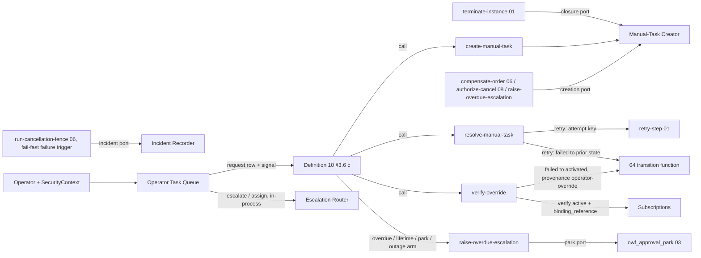
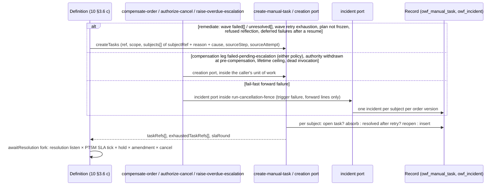

<!-- CONFLUENCE_TITLE: [BSS]: Orders Workflow — Manual Tasks, Override, Operator Queue and Overdue Escalation (Slice 7) -->
<!-- Related: ../DESIGN.md, ../PRD.md, ./01-foundation.md, ./10-process-definition.md, ./04-fulfillment-plan.md, ./05-provisioning-intents.md, ./06-saga-and-compensation.md, ./README.md | Owners: BSS Orders team -->

# DESIGN — Manual Tasks, Override, Operator Queue and Overdue Escalation (Slice 7)


<!-- toc -->

- [1. Architecture Overview](#1-architecture-overview)
  - [1.1 Architectural Vision](#11-architectural-vision)
  - [1.2 Architecture Drivers](#12-architecture-drivers)
  - [1.3 Architecture Layers](#13-architecture-layers)
- [2. Principles & Constraints](#2-principles--constraints)
  - [2.1 Design Principles](#21-design-principles)
  - [2.2 Constraints](#22-constraints)
- [3. Technical Architecture](#3-technical-architecture)
  - [3.1 Domain Model](#31-domain-model)
  - [3.2 Component Model](#32-component-model)
  - [3.3 API Contracts](#33-api-contracts)
  - [3.4 Internal Dependencies](#34-internal-dependencies)
  - [3.5 External Dependencies](#35-external-dependencies)
  - [3.6 Interactions & Sequences](#36-interactions--sequences)
  - [3.7 Database schemas & tables](#37-database-schemas--tables)
  - [3.8 Deployment Topology](#38-deployment-topology)
- [4. Additional context](#4-additional-context)
  - [4.1 The SLA-deadline formula (normative)](#41-the-sla-deadline-formula-normative)
  - [4.2 Remediation exhausted, and the consequence of a breach (normative)](#42-remediation-exhausted-and-the-consequence-of-a-breach-normative)
  - [4.3 The `ManualTask` state machine (normative)](#43-the-manualtask-state-machine-normative)
  - [4.4 Resolution actions by reason, and the two operator roles (normative)](#44-resolution-actions-by-reason-and-the-two-operator-roles-normative)
  - [4.5 What reaches the operator surface (normative redaction rule)](#45-what-reaches-the-operator-surface-normative-redaction-rule)
  - [4.6 Operation rules (normative)](#46-operation-rules-normative)
  - [4.7 Cross-slice and upstream asks raised by this slice](#47-cross-slice-and-upstream-asks-raised-by-this-slice)
  - [4.8 Constraints this slice places on the definition](#48-constraints-this-slice-places-on-the-definition)
- [5. Traceability](#5-traceability)

<!-- /toc -->

- [ ] `p1` - **ID**: `cpt-cf-bss-orders-workflow-design-manual-tasks`
## 1. Architecture Overview

### 1.1 Architectural Vision

This slice provides four **step operations** and sequences none of them. `create-manual-task`
(protected) creates or reopens exactly one actionable task per failed subject — a line, the plan,
or the order — and answers the `slaRound` the definition's SLA re-check passes back; `resolve-manual-task`
applies an operator's recorded resolution request (retry, override, cancel) or an SLA check to the
task and answers the branch the definition takes; `verify-override` is the identity check through
Subscriptions that alone may turn an operator's claim into fulfillment evidence; and
`raise-overdue-escalation` records an operational escalation — overdue fulfillment, the lifetime
ceiling, a fail-closed park, an approval-service outage — and nothing else. The order in which
they run, the `listen` arm that waits for a resolution, the SLA `wait` and the branch each returned
enum selects are the definition fragment
[`10 §3.6` (c) *Partial failure: manual task, resume or compensate*](./10-process-definition.md#c-partial-failure-manual-task-resume-or-compensate);
the overdue monitor that calls `raise-overdue-escalation` is the top-level `overdueMonitor`
branch of fragment [(a)](./10-process-definition.md#a-start-and-approval), whose `do` list is
shown in fragment
[(b)](./10-process-definition.md#b-fulfillment-eligibility-plan-two-waves-and-the-barrier); the
park loop is in fragment (a); the lifetime ceiling is the top-level `lifetimeCeiling` branch of
fragment (a), and its escalation, park and operator wait are the ceiling stage of fragment
[(d)](./10-process-definition.md#d-cancel). The
protected position of `create-manual-task` is the *Failure* row of
[`10 §4.1` *The fence*](./10-process-definition.md#41-the-fence). Each operation reads the
commercial data it needs inside Orders under the PDP and receives only references
([`../ADR/0013`](../ADR/0013-cpt-cf-bss-orders-workflow-adr-references-not-payloads.md)).

The slice keeps the facts that make failure visible: the task record, its uniqueness, its state
machine and its SLA; the incident record for fail-fast; the escalation record; and the operator
queue over all three. "By any route" stays the load-bearing property: every failed-entrance route
— a wave's `failed[]` or `unresolved[]` list, retry exhaustion in the definition's `catch`, a
plan that does not freeze, a refused seam call, a withdrawn authority, the lifetime ceiling, a dead
invocation, and a
compensation leg that reaches `failed-pending-escalation` — reaches the same creation path, either
as a definition `call` to `create-manual-task` or as an in-process call to its creation port from
inside another operation's unit of work. The two compensation-failure reasons of slice 06
(`draft-void-failed`, `activated-cancel-failed`) enter through that same door, so operators see one
queue whether the failure arose in forward execution or in compensation.

Override resolution is deliberately narrow: it records that fulfillment already happened by a
means the workflow could not observe (an operator provisioned the service through Subscriptions'
own tooling). Because `OrderFulfillmentStepCompleted` and the completion acknowledgement carry a
per-line subscription identifier as their audit backbone, an override that is not backed by a
Subscriptions-verified, matching subscription would fabricate that linkage. Verification is
therefore a hard precondition and an **identity** check against the line's `binding_reference`,
and the operator who asserted it is the authenticated caller of the control endpoint, recorded on
the request row before any signal reaches the definition.

The overdue monitor's timer is retired (ADR-0011): the overdue window is the top-level
`overdueMonitor` branch of the definition, a `PT1H` re-check that calls `raise-overdue-escalation`
and nothing else; the lifetime ceiling is the top-level `P90D` branch beside it, and the park
escalation is the `PT5M` re-check of the park loop in fragment (a). No task, escalation or
queue row in this slice is a new terminal state, and none competes with the dead-letter mechanism,
which is the platform trigger path's (`01 §4.8`).

### 1.2 Architecture Drivers

#### Functional Drivers

| Requirement | Design Response |
|-------------|------------------|
| `cpt-cf-bss-orders-workflow-fr-owf-manual-task` | `create-manual-task` (protected) is the definition's failure-arm call under `remediate`; its creation port is the in-process door for `compensate-order` (06), `raise-overdue-escalation` (`lifetime-ceiling`) and `authorize-cancel` (08). The Incident Recorder substitutes under fail-fast for **forward-execution** failures only — a compensation failure always produces an actionable task (§2.2). |
| `cpt-cf-bss-orders-workflow-fr-owf-override-semantics` | `verify-override` calls Subscriptions inside Orders, binds the check to the line's `binding_reference`, takes the asserting operator from the request row the control endpoint wrote from `SecurityContext`, lands the line `activated` through slice 04's transition function with `provenance = operator-override`, and records the verified-override columns slice 06 freezes as a compensation subject. |
| `cpt-cf-bss-orders-workflow-fr-owf-task-queue` | The Operator Task Queue projects manual tasks, incidents and escalations, seller-scoped and keyset-paginated, with the PDP-compiled scope applied inside every mutation; dead-letter rows are **pending** the platform's operator visibility (§3.7 `owf_dead_letter_triage`). |
| `cpt-cf-bss-orders-workflow-fr-owf-overdue-escalation` | The overdue window is the top-level `overdueMonitor` branch of `10 §3.6` (a), its `do` list in (b): every `PT1H` it calls `raise-overdue-escalation`, which is due only past `expected_fulfillment_at` + 24 h; `raise-overdue-escalation` records the escalation with order **and step** context and never touches order or line state. |
| `cpt-cf-bss-orders-workflow-fr-owf-dead-letter` | The manual-task-vs-dead-letter boundary is unchanged: a step failure has the manual task; an inbound delivery past its cap is the platform's dead letter (`01 §4.8`). |

#### NFR Allocation

| NFR ID | NFR Summary | Allocated To | Design Response | Verification Approach |
|--------|-------------|--------------|-----------------|----------------------|
| `cpt-cf-bss-orders-workflow-nfr-owf-manual-task-sla` | 100% of permanently failed lines produce a tracked manual task or incident; SLA visible before breach | `create-manual-task`, creation port, Incident Recorder, Operator Task Queue | Every failed-entrance route reaches one creation path (§2.2); `sla_deadline` is computed by the §4 formula at creation; the breach is observed by the definition's SLA `wait` and re-checked against database time by `resolve-manual-task`, so a breach has a stated effect | Route-coverage test over every caller of §3.3 *Callers of the creation path*; validation-hook test that every arm following `create-manual-task` carries the resolution `listen` and the SLA `wait` (§4.8); a test asserting an elapsed deadline on a forward task answers `exhausted` and on a compensation task answers `escalated` without resolving |

#### Key ADRs

| ADR ID | Decision Summary |
|--------|-----------------|
| `cpt-cf-bss-orders-workflow-adr-manual-task-dead-letter-separation` | A fulfillment step's inspectable object is either a manual task (remediation policy) or a tracked incident (fail-fast) — never both, and never a dead-letter record on top; dead-letter is the platform trigger path's (as amended by ADR-0011). |
| `cpt-cf-bss-orders-workflow-adr-saga-compensable-no-pivot` | (slice 06, referenced) Both compensation legs are compensable; this slice's compensation reasons reuse the two leg-scoped values, never a generic third one. |
| `cpt-cf-bss-orders-workflow-adr-flow-as-platform-definition` | The overdue monitor's timer, the SLA clock and the resolution wait are definition arms; this slice provides operations and the record. |
| `cpt-cf-bss-orders-workflow-adr-definition-versioning-and-protected-steps` | `create-manual-task` is protected: a definition version may not omit it on a failure path under `remediate`, nor wrap it in a swallowing `catch`. |
| `cpt-cf-bss-orders-workflow-adr-references-not-payloads` | Task inputs and outputs are `taskRef`, `requestRef`, subject references and small enums; the claimed `subscriptionId`, the justification and the operator's identity stay in Orders' record. |

### 1.3 Architecture Layers

```text
Presentation   : Operator Task Queue read + control endpoints (tasks, incidents, escalations;
                 keyset-paginated, seller-scoped, scope predicate inside every mutation); each
                 retry / override / cancel writes a resolution request and signals the invocation
Application    : step operations create-manual-task, resolve-manual-task, verify-override,
                 raise-overdue-escalation, owned by the Manual-Task Creator, Override Verifier,
                 Escalation Router and Overdue Escalation Monitor; Incident Recorder (port)
Domain         : ManualTask, TaskResolutionRequest, Incident, OverdueEscalation,
                 DeadLetterTriage (pending)
Infrastructure : owf_manual_task / owf_task_resolution_request / owf_incident /
                 owf_overdue_escalation / owf_dead_letter_triage (pending); Subscriptions SDK
                 client (override verification). No timer: every clock is a definition wait
```

- [ ] `p3` - **ID**: `cpt-cf-bss-orders-workflow-tech-manual-task-stack`

| Layer | Responsibility | Technology |
|-------|---------------|------------|
| Presentation | Operator-facing task queue read model and resolution-request intake | REST endpoints, seller-tenancy scoped, keyset-paginated, `Idempotency-Key` and `If-Match` on every mutation |
| Application | Task and incident creation, resolution, override verification, escalation recording | Step operations on `POST /bss-orders-workflow/v1/steps/{operation}` (`01 §3.3`) |
| Domain | ManualTask, TaskResolutionRequest, Incident, OverdueEscalation entities | GTS domain structs |
| Infrastructure | Persistence, Subscriptions SDK | PostgreSQL, generated SDK client |

## 2. Principles & Constraints

### 2.1 Design Principles

#### Exactly-One Inspectable Object Per Step

- [ ] `p2` - **ID**: `cpt-cf-bss-orders-workflow-principle-one-inspectable-object`

A step that exhausts remediation already has its inspectable object — the manual task under the
remediation policy, or the tracked incident under fail-fast — and must not grow a second one. A
dead letter is the platform trigger path's record of an inbound delivery that kept failing past its
cap (`01 §4.8`); it is never an order state and never an Orders row, and a compensating action
that keeps failing lands on the existing manual-task path rather than a silent retry loop or a
duplicate object. This principle keeps the operator queue a single, non-duplicated surface per
failed subject.

**ADRs**: `cpt-cf-bss-orders-workflow-adr-manual-task-dead-letter-separation`

#### Verification Precedes Trust

- [ ] `p2` - **ID**: `cpt-cf-bss-orders-workflow-principle-verification-precedes-trust`

An operator's assertion that a line is fulfilled is never taken at face value when it changes
order-completion evidence. Before an override is accepted, `verify-override` verifies through
Subscriptions that the referenced subscription is **active** and that it carries **this order
line's `binding_reference`** — the opaque, caller-owned, correlation-bound reference this gear
stamps on every provisioning intent for the line (`cpt-cf-bss-orders-workflow-dbtable-provisioning-intent`,
slice 05). Only a verified match is attached as fulfillment evidence; an unverified override is
rejected outright, never accepted provisionally.

The check **MUST** be an identity check, not a type check. Matching on plan, quantity and tenant
axes alone is satisfied by any pre-existing, unrelated subscription of the same plan in the same
tenant — a state that exists on every repeat customer. Plan, quantity and tenant axes remain
**corroborating** assertions (a `binding_reference` match with a divergent plan is a
data-integrity alarm, not a pass), but the `binding_reference` is the load-bearing one and its
absence is a rejection on its own.

Where the line has no provisioning intent at all — the wave-1 create never reached Subscriptions,
so no `binding_reference` was ever stamped — the override **MUST** be rejected. This gear can mint
a `binding_reference` for the line and record it as the expected value, so the operator's
out-of-band provisioning can carry it; it cannot retroactively recognise a subscription that was
never bound to the line.

**ADRs**: `cpt-cf-bss-orders-workflow-adr-manual-task-dead-letter-separation`

#### Attribution Comes From the Caller, Never From the Payload

- [ ] `p2` - **ID**: `cpt-cf-bss-orders-workflow-principle-attribution-from-security-context`

Operator identity for every resolution action — assign, retry, override, escalate, cancel — is
read from the propagated `SecurityContext` principal at the control endpoint and written to the
`owf_task_resolution_request` row **before** the definition is signalled, never from a field in
the request body. The step operation that later applies the action runs under the
serverless-runtime service principal; it takes the actor from the request row, never from its own
caller and never from the definition. An override is the single action that writes fulfillment
evidence without a provisioning intent, so its audit attribution is the only record of who
asserted that evidence; a caller-supplied identity would let the asserting party name someone else.
The request body carries only the claim under review (`subscriptionId`) and the human-supplied
`justification`; identity and seller scope are the gateway's to assert, and neither ever reaches
the definition (ADR-0013).

**ADRs**: `cpt-cf-bss-orders-workflow-adr-manual-task-dead-letter-separation`, `cpt-cf-bss-orders-workflow-adr-references-not-payloads`

### 2.2 Constraints

#### Any-Route Manual-Task Creation

- [ ] `p2` - **ID**: `cpt-cf-bss-orders-workflow-constraint-any-route-manual-task`

Every failed-entrance route **MUST** reach the one creation path before any terminal outcome is
declared: the definition's failure arm calls `create-manual-task`, and an operation that discovers
a failure inside its own unit of work calls the creation port in that unit of work. The routes and
their callers are enumerated once, in §3.3 *Callers of the creation path*; no route may bypass it.
A task created on only some paths is indistinguishable, from the customer's perspective, from no
tracking at all.

Slice 06's `compensate-order` is a **caller** of the creation port, not a second creator. It
supplies the leg-specific reason; this slice owns the `owf_manual_task` row, its uniqueness, its
state machine and its SLA. Two creators would mean two dedup rules and two uniqueness constraints,
which is how the same subject acquires two tasks or none.

**ADRs**: `cpt-cf-bss-orders-workflow-adr-manual-task-dead-letter-separation`

#### Compensation Failure Is Always Actionable

- [ ] `p2` - **ID**: `cpt-cf-bss-orders-workflow-constraint-compensation-failure-actionable`

The fail-fast substitution of a non-actionable `Incident` for a `ManualTask` applies to
**forward-execution** failures only. A compensation failure always produces a `ManualTask`, under
either partial-failure policy, and never an incident.

The premise of the `Incident` branch is that under fail-fast the order is headed for a terminal
outcome, so there is nothing to act on. That premise does not hold for a compensation failure: a
leg in `failed-pending-escalation` means a subscription is still live, slice 06 refuses to report a
compensated outcome, and the order is **not** terminal (`PRD.md` §6.4 — the Workflow "MUST create
a manual task for the compensation failure and escalate until operational compensation reaches a
known outcome", with no policy qualifier). Filing it as an incident would record a live, billing
subscription as a read-only audit note with no assignee, no SLA and no resolution action.

**ADRs**: `cpt-cf-bss-orders-workflow-adr-manual-task-dead-letter-separation`, `cpt-cf-bss-orders-workflow-adr-saga-compensable-no-pivot`

#### A Fenced or Terminal Order Accepts No New Fulfillment

- [ ] `p2` - **ID**: `cpt-cf-bss-orders-workflow-constraint-no-fulfillment-after-fence`

A resolution that would create or attach a subscription — `retry` of a forward-execution task, and
`override` — **MUST** be refused with `order-fenced` when the order is fenced or terminal:
the order has a terminal Lifecycle outcome (`completed`, `fulfillment_failed`, `cancelled`,
`expired`); the process instance is terminated; or an `owf_cancellation_fence` row exists for the
task's `(order_id, order_version)` with `dispatch_stopped_at` set. The control endpoint refuses
early on its read; `resolve-manual-task` and `verify-override` re-check **inside their own
transaction**, which is the authoritative check, because a fence can be claimed between the
request and its application.

The resolution path is a separate entry into provisioning that the cancellation fence does not
otherwise see: the fence stops the dispatch operations, and an operator pressing retry is not a
dispatch operation. Without this precondition an operator can create a subscription for an order
that is being cancelled — after fence step 5 has verified none remain.

Compensation-reason tasks (`draft-void-failed`, `activated-cancel-failed`) are the deliberate
exception on the fence condition: they **remain** retryable while the fence is open, because
completing them is what fence step 4 is waiting for. They are refused on a terminal order, where
there is nothing left to compensate into.

**ADRs**: `cpt-cf-bss-orders-workflow-adr-manual-task-dead-letter-separation`, `cpt-cf-bss-orders-workflow-adr-saga-compensable-no-pivot`

#### An Open Task Never Outlives Its Order

- [ ] `p2` - **ID**: `cpt-cf-bss-orders-workflow-constraint-close-task-on-terminal-order`

When an instance terminates, every open `ManualTask` and every open `TaskResolutionRequest` for
its `(order_id, order_version)` **MUST** be closed in the same unit of work that records the
termination, with `resolution_action = auto-closed` and `resolution_outcome =
closed-order-terminal`. The close is a state transition with a recorded reason, never a delete and
never a silent filter in the read projection. The in-process closure port `close_open_tasks`
(§3.2) is called by `terminate-instance` (`01 §3.3`), which is last on every path (`10 §4.1`), so
no path can end with a task open.

A terminal order's open tasks carry live SLA countdowns that would breach, and a breach on a
forward task declares remediation exhausted (§4.2), which would re-enter compensation on an order
that already has a settled outcome.

**ADRs**: `cpt-cf-bss-orders-workflow-adr-manual-task-dead-letter-separation`

#### Overdue Window Is Non-Terminalling

- [ ] `p2` - **ID**: `cpt-cf-bss-orders-workflow-constraint-overdue-non-terminal`

Exhausting the overdue-fulfillment window **MUST NOT** terminate the order and **MUST NOT** by
itself mark any line `failed`. The window's only effect is `raise-overdue-escalation`; the order
remains `in_fulfillment` (or the `on_hold` state taken from it) until fulfillment or operational
compensation reaches a known outcome or the operator cancels. Orders Lifecycle does not auto-expire
`in_fulfillment` or holds taken from it because a subscription-spawn signal may be in flight, and an
automatic terminal transition on top of that would be unsafe. In the definition this is structural:
the overdue arm sits in its own `fork` beside the waves, never wins the outer race, and completes
only against the order's own terminal process event (`10 §3.6` (b)).

**ADRs**: `cpt-cf-bss-orders-workflow-adr-manual-task-dead-letter-separation`, `cpt-cf-bss-orders-workflow-adr-flow-as-platform-definition`

## 3. Technical Architecture

### 3.1 Domain Model

**Technology**: GTS, Rust structs

**Location**: [`../DESIGN.md`](../DESIGN.md) §3.1 (gear-wide domain-model index); the entities below are normative in this slice, with their columns in §3.7.

**Core Entities**:

- [ ] `p2` - **ID**: `cpt-cf-bss-orders-workflow-entity-manual-task`
- [ ] `p2` - **ID**: `cpt-cf-bss-orders-workflow-entity-task-resolution-request`
- [ ] `p2` - **ID**: `cpt-cf-bss-orders-workflow-entity-incident`
- [ ] `p2` - **ID**: `cpt-cf-bss-orders-workflow-entity-overdue-escalation`
- [ ] `p2` - **ID**: `cpt-cf-bss-orders-workflow-entity-dead-letter-triage`

| Entity | Description | Schema |
|--------|-------------|--------|
| `ManualTask` | Actionable operator task for one failed **subject** — a line, the plan, or the order (`task_scope`) — created under the remediation policy, or for a compensation leg in `failed-pending-escalation` under either policy, or for an order-scope failure (refused reflection, authority withdrawn at `pre-compensation`, lifetime ceiling, dead invocation); carries the subject reference, the failure reason and cause, severity, SLA deadline, resolution actions, assignment state and resolution record | [owf_manual_task](#table-owf_manual_task) |
| `ManualTaskState` | The `assignment_state` set with declared transitions: `unassigned \| assigned \| in_progress \| resolved \| reopened` (§4.3). The remediation hold of slice 04 is a derived property of an open line- or plan-scope task, not a sixth member (§4.3) | enum column on `owf_manual_task` |
| `TaskResolutionRequest` | One operator request (retry, override, cancel) recorded by the control endpoint with the `SecurityContext` principal, the justification and — for an override — the claimed `subscriptionId`, **before** the definition is signalled; the `requestRef` is the only thing the signal carries. It is the "request row of the originating control operation" `10 §4.4` requires | [owf_task_resolution_request](#table-owf_task_resolution_request) |
| `Incident` | Tracked, non-actionable audit entry for a permanently failed line or plan under the fail-fast policy. Forward-execution failures only (§2.2) | [owf_incident](#table-owf_incident) |
| `OverdueEscalation` | Operational escalation of one `escalation_kind` — `overdue-fulfillment`, `lifetime-ceiling`, `park`, `approval-outage` — with order **and step** context; non-terminal by construction | [owf_overdue_escalation](#table-owf_overdue_escalation) |
| `DeadLetterTriage` | **Pending.** The operator-facing assignment and SLA state of a platform dead letter, kept only if the platform exposes dead letters to operators (§3.7) | [owf_dead_letter_triage](#table-owf_dead_letter_triage) |

**Relationships**:
- `FulfillmentTask` (slice 04) → `ManualTask`: exactly one open task per `(order version, scope, subject, failure reason)`. A line that fails forward and later fails compensation carries **two** tasks, one per reason — distinct failures with distinct remediation paths, which slice 06 forbids collapsing.
- `FulfillmentPlan` (slice 04) → `ManualTask`: a plan that does not freeze has no `FulfillmentTask` to key on; its task is plan-scope, `scope_ref = planRef` (slice 04 §4.3).
- `ManualTask` → `TaskResolutionRequest`: at most one request `requested` at a time per task; the applied or refused requests are the task's resolution history.
- `ManualTask` → `Subscription` (Subscriptions gear): a verified override lands the line `activated` with the verified `subscription_id` through slice 04's transition function (`provenance = operator-override`) and records `override_subscription_ref` / `override_verified_at` on the task; slice 06's `compensate-order` freezes that record as a compensation subject. This slice writes no `owf_compensation_record` row.
- `FulfillmentTask` → `Incident`: on a forward-execution failure under fail-fast, exactly one `Incident` per subject instead.
- `Order` → `OverdueEscalation`: at most one per `(order version, escalation kind, subject)`; it transitions nothing.
- `ApprovalPark` (slice 03) → `OverdueEscalation`: a `park` escalation stamps `owf_approval_park.escalated_at` through slice 03's park port in the same transaction.

### 3.2 Component Model


```mermaid
graph LR
    DEF[Definition 10 §3.6 c] -->|call| CMT[create-manual-task]
    CO[compensate-order 06 / authorize-cancel 08 / raise-overdue-escalation] -->|creation port| MTC[Manual-Task Creator]
    CMT --> MTC
    CO06[run-cancellation-fence 06, fail-fast failure trigger] -->|incident port| IR[Incident Recorder]
    OPS[Operator + SecurityContext] --> Q[Operator Task Queue]
    Q -->|request row + signal| DEF
    DEF -->|call| RMT[resolve-manual-task]
    DEF -->|call| VO[verify-override]
    VO -->|verify active + binding_reference| SUB[Subscriptions]
    VO -->|failed to activated, provenance operator-override| FT[04 transition function]
    RMT -->|retry: failed to prior state| FT
    RMT -->|retry: attempt key| RS[retry-step 01]
    Q -->|escalate / assign, in-process| ER[Escalation Router]
    DEF -->|overdue / lifetime / park / outage arm| ROE[raise-overdue-escalation]
    ROE -->|park port| PARK[owf_approval_park 03]
    TI[terminate-instance 01] -->|closure port| MTC
```

#### Manual-Task Creator

- [ ] `p2` - **ID**: `cpt-cf-bss-orders-workflow-component-manual-task-creator`

##### Why this component exists

Centralises the single creation path every failed-entrance route must reach, so "exactly one
actionable task, by any route" is enforced structurally rather than by convention at each caller.

##### Responsibility scope

Owns `create-manual-task` and `resolve-manual-task` (§3.3), and two in-process ports other
slices' operations call inside **their** unit of work:

- **The creation port** `create_tasks(correlationId, scope, subjects[], source)` —
  the same effect as `create-manual-task`, each subject carrying its reason and cause, for a caller
  that discovers the failure inside its own transaction (`compensate-order`, including slice 08's
  cancel-authority port at `pre-compensation`; `raise-overdue-escalation` with `lifetime-ceiling`;
  the `reconciliation-sweep` worker's liveness pass). It creates or reopens exactly one task per `(order_id, order_version,
  task_scope, scope_ref, failure_reason)` with the reason, the cause, the severity, the SLA deadline
  of §4.1 and the resolution actions the row offers.
- **The closure port** `close_open_tasks(correlationId, outcome)` — called by `terminate-instance`
  (01); closes every open task and request of the instance (§2.2).

*Dedup and re-failure.* A repeat entrance for a reason whose task is open is absorbed against that
task (`last_failed_at` refreshed, `failure_cause` updated, no second row). A repeat entrance for a
reason whose task is `resolved` with `resolution_action = retry` — a retry that was dispatched and
then failed again — transitions it `resolved → reopened`, increments `reopen_count` and
`failed_attempt_count`, recomputes the SLA deadline from the reopening instant, and re-enters the
queue. Without the `reopened` transition, dedup against a resolved task produces **no tracked
object at all** for the second failure.

*Failure reasons are distinct objects.* A line that failed forward and later failed compensation
has two open tasks, because the two reasons are different failures with different remediation
paths.

*Resolution.* `resolve-manual-task` applies the one `requested` resolution request the signal
names, or runs the SLA check, and answers the branch; the actions and their effects are §3.6
*Resolution request and application*.

##### Responsibility boundaries

Does not decide remediation policy (pinned by slice 04's plan) and does not sequence anything: the
wait for a resolution and the branch after it are the definition's. Does not create incidents or
dead-letter records. It is the **sole creator** of `owf_manual_task` rows and the writer of every
column except the assignment and escalation columns the Escalation Router writes and the override
columns the Override Verifier writes (§3.7 *Ownership*), and the sole writer of the `state` column of
`owf_task_resolution_request`: slice 06 calls the creation port and supplies the reason; it does
not write the row. Does not execute the line's re-dispatch: a `retry` returns the line to the state
before the failed wave through slice 04's transition function and mints the next `attempt` through
`retry-step` (01), and the definition's barrier re-dispatches it.

##### Related components (by ID)

- `cpt-cf-bss-orders-workflow-component-compensation-executor` — called by (creation port; slice 06 supplies the compensation reasons)
- `cpt-cf-bss-orders-workflow-component-operator-task-queue` — publishes to (queue rows)
- `cpt-cf-bss-orders-workflow-component-outcome-reporter` — related to (the terminal outcome it reports is followed by `terminate-instance`, whose closure-port call closes the tasks; slice 06)

#### Incident Recorder

- [ ] `p2` - **ID**: `cpt-cf-bss-orders-workflow-component-incident-recorder`

##### Why this component exists

Under the fail-fast policy a retry/override/escalate task cannot be acted on once the order is
headed for its terminal outcome, so the tracked record must be non-actionable; this component keeps
that distinction explicit rather than creating a `ManualTask` with disabled actions.

##### Responsibility scope

Owns no step operation. Exposes the in-process **incident port**
`record_incidents(correlationId, scope, subjects[], failureCause)`, which creates exactly one
`Incident` per failed subject **per order version**, with the same identifying, reason and tenant
fields as a `ManualTask` minus the resolution actions and SLA deadline. The fragment of
`10 §3.6` (c) routes fail-fast straight to `compensateOrder`; the incident port is therefore called
by `run-cancellation-fence` (06) inside its unit of work when its trigger is `failure` under the
pinned `fail-fast` policy, for each failed forward line that brought the order there
([`06 §3.6`](./06-saga-and-compensation.md#36-interactions--sequences), `inst-fence-failfast-incident`),
and never for a compensation leg. Incidents carry both tenant axes because they are projected into the same seller-scoped
queue.

##### Responsibility boundaries

Never creates an actionable task. Never handles a compensation failure
(`cpt-cf-bss-orders-workflow-constraint-compensation-failure-actionable`).

##### Related components (by ID)

- `cpt-cf-bss-orders-workflow-component-operator-task-queue` — publishes to (read-only queue rows)
- `cpt-cf-bss-orders-workflow-component-cancellation-fencer` — called by (incident port, fail-fast failure trigger only; slice 06)

#### Override Verifier

- [ ] `p2` - **ID**: `cpt-cf-bss-orders-workflow-component-override-verifier`

##### Why this component exists

An override changes the evidence the completion acknowledgement and `OrderFulfillmentStepCompleted`
carry per line; this component is the single gate that prevents that evidence from being
fabricated.

##### Responsibility scope

Owns `verify-override` (§3.3). Reads the claimed `subscriptionId`, the justification and the
asserting principal from the `owf_task_resolution_request` row the definition names by
`requestRef`; re-checks the preconditions of
`cpt-cf-bss-orders-workflow-constraint-no-fulfillment-after-fence` inside its transaction; calls
Subscriptions to verify the subscription is **active** and carries the line's
**`binding_reference`**, with plan, quantity and tenant axes as corroborating assertions whose
divergence is a rejection.

On a verified match, in one transaction:

1. lands the line `failed → activated` through slice 04's transition function with the verified
   `subscription_id` and `provenance = operator-override`; that function enqueues
   `OrderFulfillmentStepCompleted` once per terminal-state entry, carrying `provenance` so a
   consumer counting completions can tell a manually confirmed line from a Subscriptions-confirmed
   activation (`01 §4.7`);
2. records `override_subscription_ref` and `override_verified_at` on the task — the verified-override
   record slice 06's `compensate-order` enumerates at its freeze as the override-attached
   compensation subject, sequenced by the verification instant (`06 §3.6`, `inst-co-freeze`), so a
   subscription with no provisioning intent is still reached by a later compensation walk and by
   fence step 5;
3. resolves the task with `resolution_action = override`, `resolution_outcome = override-verified`,
   `resolved_by` from the request row, and marks the request `applied`;
4. writes the audit entry — actor from the request row, justification into
   `owf_audit_entry.justification`, never onto an event payload (`01 §4.9`).

On any mismatch, unverifiable subscription, missing `binding_reference` or failed precondition it
marks the request `refused` with the reason, increments the task's `failed_attempt_count`, leaves
the task open, and answers `verified: false` — with `exhausted: true` when that was the third
failed attempt on the task (§4.2).

##### Responsibility boundaries

No provisional or best-effort acceptance path. Does not perform the Subscriptions verification
logic itself (delegated through the SDK); only gates on its result. Never reads operator identity
from a request body or from the definition. Does not write `owf_compensation_record`; slice 06
owns the walk and freezes the subject from the verified-override columns.

##### Related components (by ID)

- `cpt-cf-bss-orders-workflow-component-manual-task-creator` — depends on (operates on tasks it created)
- `cpt-cf-bss-orders-workflow-component-compensation-executor` — publishes to (the override-attached subject is read by `compensate-order`; slice 06)
- `cpt-cf-bss-orders-workflow-actor-owf-subscriptions` — calls (verification read)

#### Escalation Router

- [ ] `p2` - **ID**: `cpt-cf-bss-orders-workflow-component-escalation-router`

##### Why this component exists

`escalate` is one of the three resolution actions the PRD grants the Fulfillment Operator, and the
thing it is usually assumed to mean — cancelling the workflow with compensation — is reserved by
the permission matrix to the **Seller Operator**. This component names what `escalate` does and
keeps it inside the matrix.

##### Responsibility scope

`escalate` is a **hand-off, not an action on the order**, and not a closing of the task. On
escalation it raises `severity` to `escalated`, sets `escalated_to = seller-operator` and
`escalated_at`, and writes the escalating principal, the instant and the justification as an
`escalation` audit entry. It runs in-process in the control endpoint's unit of work (as
`01 §3.3` permits for operator-class effects), because it changes no process path and needs no
signal; `assignment_state` is unchanged. The same effect is applied by `resolve-manual-task` when
an SLA breach on a compensation- or order-scope task escalates without resolving (§4.2).

- **It does not reset the SLA.** `sla_deadline` is untouched; the countdown continues against the
  original deadline.
- **It does not hold the order.** Hold is the Lifecycle `OrderHeld` event, recorded by `apply-hold`
  (slice 08).
- **It does not invoke cancellation.** Cancel with compensation is the Seller Operator's separately
  authorised control operation (`09 §3.3`), delivered as `cancel-requested` to the definition's
  cancel arm (`10 §3.6` (d)). Escalation routes the task to the actor who holds that grant.

The component also owns the `assign` effect (claim, release, assign within seller scope), applied
in-process by the control endpoint for the same reason.

##### Responsibility boundaries

Never transitions order or line state. Never calls Subscriptions. Never signals the invocation.

##### Related components (by ID)

- `cpt-cf-bss-orders-workflow-component-operator-task-queue` — called by (dispatches `escalate` and `assign`)
- `cpt-cf-bss-orders-workflow-component-cancellation-fencer` — related to, never calls (slice 06)

#### Operator Task Queue

- [ ] `p2` - **ID**: `cpt-cf-bss-orders-workflow-component-operator-task-queue`

##### Why this component exists

Operators need one surface across manual tasks, incidents and escalations to resolve failed
fulfillment without hunting across systems.

##### Responsibility scope

Projects `ManualTask`, `Incident` (read-only) and `OverdueEscalation` rows with assignment state,
SLA countdown, severity, the derived `remediationHold` flag (§4.3), subject context, failure
reason and cause, the pending resolution request if any, correlation identifiers and the
resolution actions the row offers. Keyset-paginated (default page 50, maximum 200, opaque cursor,
stable sort on the immutable key `(created_at, task_id)` per 09 §2.2 *Every collection response is paged*; `sla_deadline` is recomputed
on `reopened`, so it is a displayed countdown and a filter, never the cursor key).

*Resolution intake.* For `retry`, `override` and `cancel` it writes one `owf_task_resolution_request`
row — action, `SecurityContext` principal, justification, the claimed `subscriptionId` for an
override — and asks the signal delivery component of
[`10 §3.2`](./10-process-definition.md#32-component-model) to deliver
`task-resolution-requested` carrying the reference tuple, `taskRef` and `requestRef` to the
instance's invocation. The answer is `202 Accepted` with the `requestRef`; the request's `state`
(`requested` → `applied` · `refused`) is visible on the task read. `assign` and `escalate` are
applied in-process (Escalation Router) and answer `200`.

*Authorization is checked per row, on reads and mutations alike.* Every list result is filtered on
`seller_tenant_id` against the caller's seller scope. Every mutating endpoint carries the caller's
PDP-compiled `AccessScope` as a predicate **inside its mutating statement** (`09 §4.4`): `UPDATE …
WHERE task_id = $1 AND <scope predicates> AND row_version = $2` (or the `INSERT … SELECT` of the
request row under the same predicates) affects zero rows when the row lies outside the caller's
scope, and zero rows is `not-found` (404), never a 403.

*Optimistic concurrency and idempotency.* `owf_manual_task.row_version` is surfaced as an ETag and
required as `If-Match` on every mutation (`PRD.md` §9 "Optimistic task-version check REQUIRED"); a
mismatch is `version-mismatch` (409). Every mutating endpoint also requires `Idempotency-Key`,
recomposed server-side (§3.3); a replay answers the original response.

*Redaction.* See §4.5: no downstream error text is projected.

##### Responsibility boundaries

Does not apply retry, override or cancel itself — the definition does, through
`resolve-manual-task` and `verify-override`, so the process path and the record cannot diverge.
Does not delegate the authorization *decision* to `SecurityContext` propagation. Does not signal
the platform directly; delivery is the signal delivery component's.

##### Related components (by ID)

- `cpt-cf-bss-orders-workflow-component-manual-task-creator` — subscribes to
- `cpt-cf-bss-orders-workflow-component-incident-recorder` — subscribes to
- `cpt-cf-bss-orders-workflow-component-overdue-escalation-monitor` — subscribes to
- `cpt-cf-bss-orders-workflow-component-escalation-router` — calls (`escalate`, `assign`)
- `cpt-cf-bss-orders-workflow-component-signal-delivery` — calls (`task-resolution-requested`; slice 10)

#### Overdue Escalation Monitor

- [ ] `p2` - **ID**: `cpt-cf-bss-orders-workflow-component-overdue-escalation-monitor`

##### Why this component exists

`in_fulfillment` and holds taken from it are never auto-expired by Orders Lifecycle, so an
operational escalation is the safe, non-terminal deadline; the process also has three other clocks
whose only effect is an operator escalation. This component is the one recorder of all four.

##### Responsibility scope

Owns `raise-overdue-escalation` (§3.3). **It owns no timer** (retired by ADR-0011): the clocks
are the definition's — the `overdueMonitor` branch (`PT1H` `waitOverdue`, against the stored
`expected_fulfillment_at` + 24 h), the `lifetimeCeiling` branch (a literal `P90D` `waitCeiling`,
whose firing enters the ceiling stage of fragment (d)), the park loop's `PT5M` `waitTtlMargin`
against the park's `escalation_due_at`, and the outage arm's `PT30S` probe against the outage
threshold of `03 §4.5` — and each calls this operation with its `escalationKind`. A 1.0.0 `wait`
takes no runtime expression, so the three computed clocks are bounded re-check loops (`10 §3.6`
*Fixed waits and re-check loops*): `waitOverdue` re-calls this operation, whose `due` answers
against the stored deadline, and the park and outage clocks re-call the slice 03 operation that
owns their deadline and call this one only once it answers `due`. The operation:

- reads the **step context** from Orders' record, not from the definition: the last settled step
  operation of the instance, the wave, the lines not yet terminal, and the blocking object (the open
  `ManualTask`, the non-terminal `owf_provisioning_intent`, the `failed-pending-escalation`
  `owf_compensation_record`, the open park, or the paused gates); the definition's `stepRef` is
  recorded beside it as the definition's own position;
- for `park`, stamps `owf_approval_park.escalated_at` through slice 03's park port in the same
  transaction and records the park reason and the time remaining before the Lifecycle `submitted`
  TTL (`03 §4.1`);
- for `lifetime-ceiling`, also creates one order-scope task with reason `lifetime-ceiling-reached`
  through the creation port, so the park that follows (`park` with `parkReason: lifetime-ceiling`,
  01) has an actionable object (`08`, D-53).

Escalation is once per `(order version, kind, subject)`: the idempotency key is that tuple, and a
second fire is an absorbed duplicate. For `lifetime-ceiling` the subject is the ceiling round,
recorded as `ceiling:{round}`, because an unparked instance runs under a fresh ceiling and a
second ceiling is a second escalation with its own task, not a replay of the first (decision
D-121).

##### Responsibility boundaries

Never marks a line `failed`, never terminates, holds, parks or cancels anything itself — `park` is
the definition's next call in the ceiling stage, and any abort is the operator's cancel. Is not the
lifetime ceiling: the overdue window only runs from expected fulfillment time, and the unconditional
ceiling is the top-level `wait` of fragment (a).

##### Related components (by ID)

- `cpt-cf-bss-orders-workflow-component-operator-task-queue` — publishes to
- `cpt-cf-bss-orders-workflow-component-verdict-gateway` — calls (park port; slice 03)
- `cpt-cf-bss-orders-workflow-component-cancellation-fencer` — related to (an operator abort after an escalation runs through slice 06)

#### Retired components

- `cpt-cf-bss-orders-workflow-component-activation-barrier-timer-owner` — the former "shares model
  with" relation is gone with it (retired by ADR-0011, slice 05).
- The Overdue Escalation Monitor's **durable timer** (`owf_durable_timer`, `timer_kind =
  overdue-fulfillment`) — retired by ADR-0011; responsibility now: the top-level `overdueMonitor`
  branch of `10 §3.6` (a) (its list in (b)), executed by the plugin's durable timers.
- The **dead-letter redrive path** through an Orders inbound handler — retired with
  `owf_dead_letter_record` (`01 §3.7` *Retired tables*); responsibility now: the platform trigger
  path's dead-letter handling, pending the operator-visibility ask (§3.7 `owf_dead_letter_triage`).

### 3.3 API Contracts

#### Step operations

The four operations below are registered against the operation registration boundary
([`01 §3.2`](./01-foundation.md#32-component-model)) with the contract fields of
[`01 §3.3` *The step-operation contract*](./01-foundation.md#the-step-operation-contract), are
mirrored into `owf_step_operation`, and are reachable only as
`POST /bss-orders-workflow/v1/steps/{operation}` by the serverless-runtime service principal under
PDP resource `gts.cf.bss.orders_workflow.process_step.v1~` × `execute`. Every input carries the
reference tuple of `10 §3.6` — `correlationId`, `orderId`, `orderVersion`, `resourceTenantId`,
`invocationId`, `attemptId` — written **ref** below; every other member is a reference or a small
enum. Every operation resolves `correlationId` to this slice's rows and reads what it needs — the
line's `binding_reference`, the request row, the plan's expected fulfillment time — inside Orders
under the instance's `resource_tenant_id` and `seller_tenant_id` (ADR-0013). Every operation
answers `permanent-failure` with `version-mismatch` on a terminal instance. Deadlines follow
[`01 §4.2`](./01-foundation.md#42-five-distinct-bounds-two-owners): 10 s for an operation that
calls a downstream, 5 s for a record-only one.

| `name` | `protection` | `input` | `output` | `idempotency_key` | `declared_event` | `compensation` | `reasons` | `audit_kind` | `retry_class` | `deadline` |
|--------|--------------|---------|----------|-------------------|------------------|----------------|-----------|--------------|---------------|------------|
| `create-manual-task` | `protected` | ref + `scope` ∈ `line` · `plan` · `order`; `subjects[]`, one per subject: `subjectRef` (`lineRef`, `planRef` or `correlationId`), `reason` (the §3.7 `failure_reason` enum) and `cause` (the §3.7 `failure_cause` enum), set by the definition branch that enters the failure stage (`10 §3.6` (c), decision D-116); `sourceStep` (operation name); `sourceAttempt` (the failing call's key tail `{round}[:{attempt}]`, [`01 §3.3` *Rounds and attempts*](./01-foundation.md#rounds-and-attempts-the-one-rule-for-re-invokable-operations); the event reference for an operation keyed by its event — `resumeEventId` for `apply-resume`, or `poll:{round}` for its poll (`08 §3.3`, D-130) — and the `attempt` alone for `construct-and-freeze-plan`) | `taskRefs[]`; `exhaustedTaskRefs[]` (tasks whose re-entrance was the third failed attempt, §4.2); `slaRound` (the SLA deadline stays in the record; the definition carries no remainder) | instance-scoped `{tenant}:{correlationId}:create-manual-task:{sourceStep}:{sourceAttempt}`; every failing call has its own tail, so a second failure from the same step is a new key, and a re-failure after a retry carries the new `attempt`, which is what reaches the reopen branch | none | none | `idempotency-key-conflict`, `not-found` (a subject the record does not show failed), `version-mismatch` | `step-completion` | `retryable-on: transient` | 5 s |
| `resolve-manual-task` | `composable` | ref + `trigger` ∈ `request` · `sla-check`; `taskRef` and `requestRef` (on `request`, from the signal's `data`); `slaRound` (on `sla-check`, as last returned); `taskRef` on `sla-check` only from the ceiling wait, scoping the check to that `lifetime-ceiling-reached` task (`10 §3.6` (d), decision D-129) | `resolution` ∈ `retry` · `override` · `closed` · `escalated` · `exhausted` · `refused` · `none`; `resumeAt` ∈ `plan` · `barrier` · `compensation` · `stage` (on `retry`); `attemptKey` (on `retry`, from `retry-step`); `retryWave` ∈ `wave1_create` · `wave2_activate` (on a `line` forward task's `retry`, null otherwise: the wave whose dispatch family `attemptKey` belongs to, which the definition files as `wave1AttemptKey` or `wave2AttemptKey`, D-119); `openTaskCount` (the instance's open tasks after this call, which the definition's remediation hold reads, §4.8 item 4); `slaRound` — on `sla-check` before any open task's stored `sla_deadline` has passed, the call records nothing and answers `none` with the next `slaRound` as a settled success of its round, so the next `PT5M` tick calls the next key and no tick's key approaches the key lifetime ([`01 §3.3` *Rounds and attempts*](./01-foundation.md#rounds-and-attempts-the-one-rule-for-re-invokable-operations)) | instance-scoped `{tenant}:{correlationId}:resolve-manual-task:{taskRef}:{requestRef}` on `request`; `{tenant}:{correlationId}:resolve-manual-task:sla:{slaRound}` on `sla-check`, and `{tenant}:{correlationId}:resolve-manual-task:sla:{taskRef}:{slaRound}` on a scoped one — its own round family per task, from round 0 | none (`retry` of a line re-enters `failed` → prior state through slice 04's function, which emits nothing on a non-terminal entry) | none | `order-fenced`, `action-not-offered`, `poison-step` (from `retry-step`), `not-found`, `version-mismatch` | `step-completion`; `escalation` when an SLA breach escalates; `retry` (written by `retry-step`) | `retryable-on: transient` | 5 s |
| `verify-override` | `composable` | ref + `taskRef`, `requestRef` | `verified` (bool); `rejection` ∈ `not-active` · `binding-mismatch` · `no-binding-reference` · `corroboration-divergent` · `not-found` · `order-fenced` · `null`; `exhausted` (bool); `openTaskCount` (as for `resolve-manual-task`) | instance-scoped `{tenant}:{correlationId}:verify-override:{taskRef}:{requestRef}`; the Subscriptions status read is a read and carries no key | `OrderFulfillmentStepCompleted` with `provenance = operator-override`, enqueued by slice 04's transition function in this settlement transaction, on `verified` only | none — an override-attached subscription is undone as a subject of `compensate-order`, not by a paired undo | `override-unverified`, `order-fenced`, `circuit-breaker-open`, `per-attempt-timeout`, `not-found`, `version-mismatch` | `step-completion` (justification in `owf_audit_entry.justification`) | `retryable-on: transient` | 10 s |
| `raise-overdue-escalation` | `composable` | ref + `escalationKind` ∈ `overdue-fulfillment` · `lifetime-ceiling` · `park` · `approval-outage`; `subjectRef` (`parkRef` on `park`; the gate `position` on `approval-outage`; null otherwise); `stepRef` (the definition's position, nullable); `round` (on `overdue-fulfillment` and `lifetime-ceiling`: 0 on the first tick or ceiling, else the previous answer's `nextRound`) | `due: true\|false` on `overdue-fulfillment` — database time against the stored `expected_fulfillment_at` + 24 h, the answer the overdue re-check loop switches on (`10 §3.6` (b)); `due: false` raises nothing and is a settled success of its round; `nextRound` (on `overdue-fulfillment` and `lifetime-ceiling`), so each hourly tick runs under a new key and the monitor keeps working for an order whose expected fulfillment lies beyond the 30-day key lifetime, and each lifetime ceiling of one instance is a new escalation with its own task (D-121) ([`01 §3.3` *Rounds and attempts*](./01-foundation.md#rounds-and-attempts-the-one-rule-for-re-invokable-operations)); `escalationRef`; `raised` (bool; false when absorbed, not due, or when the subject has already resolved); `taskRef` (on `lifetime-ceiling`) | instance-scoped `{tenant}:{correlationId}:raise-overdue-escalation:{escalationKind}:{orderVersion}:{subjectRef or "-"}[:{round}]`, the round present on `overdue-fulfillment` and `lifetime-ceiling` only; the one escalation per subject is `owf_overdue_escalation`'s uniqueness, not the key's | none | none | `not-found` (unknown `parkRef` or position), `version-mismatch` | `escalation` | `retryable-on: transient` | 5 s |

`resolve-manual-task`, `verify-override` and `raise-overdue-escalation` are `composable`: a
definition version may reposition them, but the constraints of §4.8 bind any version that contains
the arms they serve. `create-manual-task` is `protected`.

**Callers of the creation path.** The route-coverage test enumerates exactly these; a new
failed-entrance route is a change to this table.

| Route | Caller | `scope` | `failure_reason` |
|-------|--------|---------|------------------|
| Wave-1 `failed[]`, or retry exhaustion of `dispatch-wave1-create` | definition, `create-manual-task` (fragment (c)) | `line` | `wave1-create-failed` |
| Wave-2 `failed[]`, or retry exhaustion of `dispatch-wave2-activate` | definition | `line` | `wave2-activation-failed` |
| `reconcile-intent` `failed[]` / `unresolved[]` (05) | definition | `line` | `wave1-create-failed`, `wave2-activation-failed`, `never-dispatched`, `intent-unresolved` |
| Plan not frozen (04 §4.3) | definition | `plan` | `invalid-dependency-graph` (under `remediate`), `catalog-topology-unavailable` (either policy) |
| `reflect-verdict` `permanent-failure` (03 §4.5) | definition | `order` | `approval-reflection-refused` |
| Compensation leg `failed-pending-escalation` (06) | `compensate-order`, creation port, **either policy** | `line` | `draft-void-failed`, `activated-cancel-failed` |
| Deferred failures applied by `apply-resume` (`08 §4.7` item 8) | definition | `line` | the reason slice 05 recorded with the deferred outcome: `wave1-create-failed`, `wave2-activation-failed`, `never-dispatched`, `intent-unresolved` |
| Apply-time authority re-check fails at `pre-compensation` (`06 §3.6` `inst-co-reauthorize`, `09 §4.4`) | `compensate-order`, through slice 08's cancel-authority port and the creation port | `order` | `authority-withdrawn` |
| Lifetime ceiling (ceiling stage, fragment (d)) | `raise-overdue-escalation` `lifetime-ceiling`, creation port | `order` | `lifetime-ceiling-reached` |
| Invocation no longer live (`01 §3.8` *Instance liveness pass*) | `reconciliation-sweep` worker, creation port, **either policy** — no definition runs to call `create-manual-task` | `order` | `invocation-dead` |

No other route creates a task (decision D-114). A spent retry budget, a spent timeout or an
uncaught permanent refusal of any other step call — a listen-arm `admit-trigger`, `apply-hold`,
`apply-resume`, `authorize-cancel`, the fence, `report-outcome`, `create-manual-task` itself —
faults the invocation, and reaches the operator through the `invocation-dead` row
(`10 §4.6`). An authority the re-check finds withdrawn at `pre-fence` refuses the cancel request
and raises no task, because nothing waits on it (decision D-115).

Under `fail-fast` the definition does not call `create-manual-task` for a forward line or an
`invalid-dependency-graph` plan; those subjects reach the incident port inside
`run-cancellation-fence` (§3.2). A compensation leg reaches the creation port under **either**
policy and never the incident port. The `failure_reason` values are catalogue reasons (`01 §4.9`); the three this slice adds
are listed in §4.7.

#### Operator task queue

- [ ] `p2` - **ID**: `cpt-cf-bss-orders-workflow-interface-operator-task-queue-api`

- **Technology**: REST/OpenAPI
- **Location**: [`../DESIGN.md`](../DESIGN.md) §3.3 (gear-wide API surface and path convention); the endpoints below are normative in this slice.

**Endpoints Overview**:

| Method | Path | Description | Stability |
|--------|------|--------------|-----------|
| `GET` | `/bss-orders-workflow/v1/fulfillment-operator/tasks` | List manual tasks, incidents and escalations in the caller's seller scope, with assignment state, SLA countdown, severity, `remediationHold`, the pending request and the offered actions. Keyset-paginated: `limit` (default 50, max 200), opaque `cursor`, stable sort on the immutable key `(created_at, task_id)`; `sla_deadline` is shown and filterable, not the sort key | unstable |
| `POST` | `/bss-orders-workflow/v1/fulfillment-operator/tasks/{taskId}/assign` | Claim (`unassigned → assigned`), release (`assigned → unassigned`) or begin (`assigned → in_progress`). A Fulfillment Operator assigns only to self (the `SecurityContext` principal); a Seller Operator may name an `assignee` within the same seller scope, validated against that scope. Applied in-process; `200`. `If-Match`, `Idempotency-Key` `{tenant}:{taskId}:assign:{rowVersion}` | unstable |
| `POST` | `/bss-orders-workflow/v1/fulfillment-operator/tasks/{taskId}/retry` | Request a retry of the failed subject. Refused with `order-fenced` per `cpt-cf-bss-orders-workflow-constraint-no-fulfillment-after-fence`, with `action-not-offered` when `retry` is not in the row's actions. Writes the request row and signals `task-resolution-requested`; `202` with `requestRef`. `If-Match`, `Idempotency-Key` `{tenant}:{taskId}:retry:{rowVersion}` | unstable |
| `POST` | `/bss-orders-workflow/v1/fulfillment-operator/tasks/{taskId}/override` | Request an override carrying **only** the claimed `subscriptionId` and a free-text `justification`. Operator identity comes from the `SecurityContext` principal and **MUST NOT** appear in the body; a body carrying an identity field is rejected as malformed. Same preconditions as `retry`; line-scope forward tasks only. Writes the request row and signals; `202` with `requestRef`. `If-Match`, `Idempotency-Key` `{tenant}:{taskId}:override:{rowVersion}` | unstable |
| `POST` | `/bss-orders-workflow/v1/fulfillment-operator/tasks/{taskId}/escalate` | Hand the task to the Seller Operator (Escalation Router): raises severity, records principal and justification, does not reset the SLA, does not change `assignment_state`, order state or the process path. Applied in-process; `200`. `If-Match`, `Idempotency-Key` `{tenant}:{taskId}:escalate:{rowVersion}` | unstable |
| `POST` | `/bss-orders-workflow/v1/fulfillment-operator/tasks/{taskId}/cancel` | **Seller Operator only.** Close a task without executing a resolution (`resolution_outcome = cancelled-by-seller-operator`), with a required justification. Refused with `action-not-offered` on a compensation-reason task whose subject is still live, and on a `lifetime-ceiling-reached` task, whose way out besides `retry` is the order cancel (§4.4, D-129). Writes the request row and signals, because the definition waiting on the task must learn it closed; `202` with `requestRef`. `If-Match`, `Idempotency-Key` `{tenant}:{taskId}:cancel:{rowVersion}` | unstable |
| `GET` | `/bss-orders-workflow/v1/fulfillment-operator/dead-letters` | **Pending** the platform ask of §3.7: list platform dead letters for the caller's seller scope with their triage state. Not served until the platform exposes them | unstable — pending |
| `POST` | `/bss-orders-workflow/v1/fulfillment-operator/dead-letters/{recordId}/redrive` | **Pending**: re-deliver a platform dead letter through the platform's re-drive, audit-logged here. `Idempotency-Key` `{tenant}:{recordId}:redrive:{rowVersion}` | unstable — pending |
| `POST` | `/bss-orders-workflow/v1/fulfillment-operator/dead-letters/{recordId}/discard` | **Pending**; **Seller Operator only**: close a platform dead letter without re-delivery, with a required justification. `Idempotency-Key` `{tenant}:{recordId}:discard:{rowVersion}` | unstable — pending |

**Idempotency on the control surface.** Every mutating endpoint **REQUIRES** `Idempotency-Key`,
tenant-prefixed and recomposed server-side from the path and the presented `If-Match` version
(`idempotency-key-mismatch`, 400, otherwise; `09 §2.2`). The `rowVersion` component makes the key
unique per task version, so a replay of the same request answers the **original** response — the
same `requestRef` for a signalled action, the same ETag for an in-process one — and a new action
after the version moved needs a new key. The signal carries `requestRef`, and
`resolve-manual-task`'s key contains it, so a duplicate delivery is absorbed at both ends.

**The resolution signal.** `task-resolution-requested` is delivered through `…:plugin-control` by
the signal delivery component of `10 §3.2`, with the same upstream ask on its payload shape as the
other signals of `10 §3.3`. Its reference name is
`gts.cf.core.events.event.v1~cf.bss.orders_workflow.signal.v1~cf.bss.orders_workflow.task_resolution_requested.v1~`;
it is never published to the broker and carries no `data` beyond the reference tuple, `taskRef`
and `requestRef`. It is to be added to the closed `listen` set of `10 §2.2` (§4.7).

Every endpoint maps to a registered `(resource, action)` pair in slice 09's catalogue (`09 §3.2`),
derived from this routing table; every mutation applies the caller's PDP-compiled `AccessScope`
inside its statement (`09 §4.4`). The six task endpoints are live; the three dead-letter endpoints
are pending.

### 3.4 Internal Dependencies

| Dependency Gear | Interface Used | Purpose |
|-------------------|----------------|----------|
| bss-orders-lifecycle | contract (order state read) | Read the order's Lifecycle state for the terminal-order precondition of the control endpoints; the operations read Orders' own record for everything else |
| serverless-runtime | `…:plugin-control`, through the signal delivery component of slice 10 | Deliver `task-resolution-requested` to the running invocation; this slice is otherwise **called by** the definition through the step routes |

**Dependency Rules** (per project conventions):
- No circular dependencies
- Always use sdk modules for inter-gear communication
- No cross-category sideways deps except through contracts
- Only integration/adapter gears talk to external systems
- `SecurityContext` must be propagated across all in-process calls

### 3.5 External Dependencies

#### Subscriptions (BSS)

- **Contract**: `cpt-cf-bss-orders-workflow-contract-owf-provisioning-intent`

| Dependency Gear | Interface Used | Purpose |
|-------------------|---------------|----------|
| bss-subscriptions | SDK client, read/status contract | Inside `verify-override` only (seam rule R3): verify a claimed `subscriptionId` is active and carries the line's `binding_reference`, with plan, quantity and tenant axes as corroborating assertions |

**Dependency Rules** (per project conventions):
- No circular dependencies
- Always use SDK modules for inter-gear communication
- No cross-category sideways deps except through contracts
- Only integration/adapter gears talk to external systems
- `SecurityContext` must be propagated across all in-process calls

### 3.6 Interactions & Sequences

Each sequence below is **definition task → operation → record**. The tasks are those of
[`10 §3.6` (c)](./10-process-definition.md#c-partial-failure-manual-task-resume-or-compensate),
(b) and (a), which are the canonical YAML and are not repeated here; the CDSL blocks specify what
happens **inside** the operation.

#### Manual Task Created on Failure (Any Route)

**ID**: `cpt-cf-bss-orders-workflow-seq-manual-task-any-route`

**Use cases**: `cpt-cf-bss-orders-workflow-usecase-owf-partial-failure`

**Actors**: `cpt-cf-bss-orders-workflow-actor-owf-fulfillment-operator`


```mermaid
sequenceDiagram
    participant D as Definition (10 §3.6 c)
    participant CO as compensate-order / authorize-cancel / raise-overdue-escalation
    participant MTC as create-manual-task / creation port
    participant IR as incident port
    participant R as Record (owf_manual_task, owf_incident)
    alt remediate: wave failed[] / unresolved[], wave retry exhaustion, plan not frozen, refused reflection, deferred failures after a resume
        D ->> MTC: createTasks (ref, scope, subjects[] of subjectRef + reason + cause, sourceStep, sourceAttempt)
    else compensation leg failed-pending-escalation (either policy), authority withdrawn at pre-compensation, lifetime ceiling, dead invocation
        CO ->> MTC: creation port, inside the caller's unit of work
    else fail-fast forward failure
        CO ->> IR: incident port inside run-cancellation-fence (trigger failure, forward lines only)
        IR ->> R: one incident per subject per order version
    end
    MTC ->> R: per subject: open task? absorb : resolved after retry? reopen : insert
    MTC -->> D: taskRefs[], exhaustedTaskRefs[], slaRound
    D ->> D: awaitResolution fork: resolution listen × PT5M SLA tick × hold × amendment × cancel
```

**Algorithm: `create-manual-task`** (the creation port runs steps 2–6 inside its caller's transaction)

1. [ ] - `p1` - Resolve `correlationId` to the instance; refuse `version-mismatch` if the body's `orderVersion` differs or the instance is terminal - `inst-cmt-resolve`
2. [ ] - `p1` - **FOR EACH** subject: verify against Orders' record that it is failed — a `line` subject is an `owf_fulfillment_task` in `failed` (or a `failed-pending-escalation` compensation record, for a compensation reason), a `plan` subject is an `owf_fulfillment_plan` not `frozen`, an `order` subject is the instance itself; **IF** the record does not show it: **RETURN** `permanent-failure` with `not-found` - `inst-cmt-verify`
3. [ ] - `p1` - Read the pinned `policy` from the plan (or `remediate` where no plan exists); **IF** the reason is a forward line or `invalid-dependency-graph` reason **AND** the policy is `fail-fast`: **RETURN** `permanent-failure` with `version-mismatch` — the definition must not call it there (§4.8), and the incident port is the fail-fast door - `inst-cmt-policy`
4. [ ] - `p1` - **FOR EACH** subject, under `UNIQUE (order_id, order_version, task_scope, scope_ref, failure_reason)`: **IF** an open task exists: absorb (refresh `last_failed_at`, `failure_cause`); **ELSE IF** a `resolved` task exists with `resolution_action = retry`: transition `resolved → reopened`, increment `reopen_count` and `failed_attempt_count`, recompute `sla_deadline` from now; **ELSE IF** a `resolved` task exists otherwise: insert nothing and **RETURN** its `taskRef` (the subject was closed by override, cancel or exhaustion and a repeat entrance is a duplicate report); **ELSE** insert a task with `severity` (`urgent` for `activated-cancel-failed`, else `normal`), `sla_deadline` per §4.1 and `resolution_actions` per §4.4 - `inst-cmt-upsert`
5. [ ] - `p1` - **IF** a reopened task's `failed_attempt_count` reaches 3 **AND** its scope is `line` or `plan` with a forward reason: resolve it `exhausted` / `remediation-exhausted` and add it to `exhaustedTaskRefs` (§4.2) - `inst-cmt-exhaust`
6. [ ] - `p1` - Write the `step-completion` audit entry per task; settle the key; **RETURN** `taskRefs[]`, `exhaustedTaskRefs[]` and the next `slaRound` - `inst-cmt-settle`

**Description**: Regardless of which route drives a subject to failure, the same effect runs
before any terminal outcome. The `reopened` branch keeps the 100 %-visibility guarantee true on the
second failure of a subject an operator already retried once — and because the source step's
`attempt` is in the key, that second failure is a new call rather than a replay.

#### Resolution request and application

**ID**: `cpt-cf-bss-orders-workflow-seq-task-resolution`

**Use cases**: `cpt-cf-bss-orders-workflow-usecase-owf-partial-failure`

**Actors**: `cpt-cf-bss-orders-workflow-actor-owf-fulfillment-operator`, `cpt-cf-bss-orders-workflow-actor-owf-seller-operator`

```mermaid
sequenceDiagram
    participant O as Operator
    participant Q as Control endpoint (Operator Task Queue)
    participant SD as Signal delivery (10 §3.2)
    participant D as Definition (10 §3.6 c)
    participant RMT as resolve-manual-task
    participant R as Record
    O ->> Q: POST .../retry | override | cancel (If-Match, Idempotency-Key) + SecurityContext
    Q ->> R: scope predicate + row_version: insert request (requested_by, justification, claim)
    Q ->> SD: task-resolution-requested (ref, taskRef, requestRef)
    Q -->> O: 202 requestRef
    SD ->> D: plugin-control signal
    D ->> RMT: resolve (ref, trigger request, taskRef, requestRef)
    RMT ->> R: re-check preconditions in-transaction; apply action; mark request applied | refused
    RMT -->> D: resolution, resumeAt, attemptKey, retryWave, openTaskCount, slaRound
    alt resolution override
        D ->> D: verify-override (next sequence)
    else retry
        D ->> D: resumeAt: barrier | plan | compensation | stage, under attemptKey; barrier waits while openTaskCount > 0
    else exhausted
        D ->> D: compensateOrder (06)
    else closed | escalated | refused | none
        D ->> D: awaitResolution again
    end
    Note over D,RMT: SLA branch: every PT5M resolve (trigger sla-check, slaRound); a no-op until the stored sla_deadline
```

**Algorithm: `resolve-manual-task`**

1. [ ] - `p1` - Resolve the instance; refuse `version-mismatch` if terminal - `inst-rmt-resolve`
2. [ ] - `p1` - **IF** `trigger = sla-check`: the tasks checked are the instance's open tasks, or only the task `taskRef` names when it is given (the ceiling wait's scoped check, which therefore answers `escalated` or `none`, never `exhausted`, because that task is order-scope — D-129); **IF** no checked task has `sla_deadline ≤ now` (database time) with `sla_breached_at` NULL: record nothing and **RETURN** `none` with the next `slaRound` — a settled success of this round; the call is a no-op until the stored deadline, and each tick is a new key; otherwise **FOR EACH** checked task with `sla_deadline ≤ now` (database time) and `sla_breached_at` NULL: stamp `sla_breached_at`, raise `severity` to `escalated`, set `escalated_to = seller-operator`, write an `escalation` entry; **IF** its scope is `line` or `plan` with a forward reason: resolve it `exhausted` / `remediation-exhausted` and **RETURN** `exhausted`; otherwise (compensation or order scope) leave it open and continue; **RETURN** `escalated` with the next `slaRound` - `inst-rmt-sla`
3. [ ] - `p1` - **IF** `trigger = request`: read the request row by `requestRef`; **IF** it is not `requested` **RETURN** its recorded result (absorbed replay); **IF** the task is `resolved` or `action` is not in its current `resolution_actions`: mark the request `refused` with `action-not-offered`, **RETURN** `refused` - `inst-rmt-read`
4. [ ] - `p1` - **IF** `action ∈ {retry, override}` on a forward-reason task: re-check the fence and terminal conditions of §2.2 against `owf_cancellation_fence` and the instance in this transaction; on a hit mark the request `refused` with `order-fenced`, **RETURN** `refused` - `inst-rmt-fence`
5. [ ] - `p1` - **IF** `action = retry`: invoke `retry-step`'s effect in-process (01: quarantine, next `attempt` for the step's key family — for a `line` forward task the family is the dispatch operation of the line's wave, `dispatch-wave1-create` or `dispatch-wave2-activate`, whatever the task's `source_step`, because that is the operation the retry re-enters); on `poison-step` mark the request `refused`, **RETURN** `refused`; for a `line` forward task, the line's wave being its `failed_wave` or, for a line not in `failed`, the wave of the intent the task's reason names: **IF** the line is `failed` (its intent of that wave is recorded `failed`, `never-dispatched` included), move it `failed → pending` (wave 1) or `failed → draft_created` (wave 2) through slice 04's transition function with the request's principal as `last_transition_actor`, incrementing the task's `wave1_attempt` or `wave2_attempt` in the same transition, so the line is sent again under a new intent key; **ELSE** mint no intent attempt and move nothing — a line with no intent row is sent by the next dispatch under its unchanged key, a `submitted` row stays the sweep's, and an `unresolved` row is set back to `submitted` with `next_sweep_at` now and `handed_off_at` null for one on-demand read, so a second floor trip reaches the definition again (05 `inst-ri-handoff`), because an intent that may be live is never resubmitted under a new key ([`05 §4.4`](./05-provisioning-intents.md#44-operation-rules-normative), D-119); resolve the task `retry` / `retry-dispatched`; **RETURN** `retry` with `attemptKey`, `retryWave` (line tasks) and `resumeAt` — `barrier` (line), `plan` (plan scope: a new `attempt` of `construct-and-freeze-plan`), `compensation` (compensation reason: `compensate-order` again), `stage` (order scope: re-enter the stage whose operation failed) - `inst-rmt-retry`
6. [ ] - `p1` - **IF** `action = override`: leave the request `requested` and the task `in_progress`; **RETURN** `override` — `verify-override` applies it - `inst-rmt-override`
7. [ ] - `p1` - **IF** `action = cancel`: resolve the task `cancel` / `cancelled-by-seller-operator` with the request's principal and justification; **IF** it was the last open task of a `line` or `plan` subject that is still failed under a live order: **RETURN** `exhausted` (the Seller Operator's judgement that remediation is moot is the exhaustion of that subject; decision D-99: cancelling the last open forward task of a still-failed subject declares remediation exhausted); **ELSE RETURN** `closed` - `inst-rmt-cancel`
8. [ ] - `p1` - Mark the request `applied`, write the `step-completion` entry with the request's principal and justification, settle the key, **RETURN** with `openTaskCount`, `slaRound` - `inst-rmt-settle`

**Description**: The control endpoint records and signals; the definition applies. That split is
what keeps the process path and the task record from diverging: an operator's retry that the
definition never observed would leave a task `resolved` with nothing re-dispatched, and a
re-dispatch the task never recorded would be an unattributed provisioning. The SLA branch is the
breach detector the previous design lacked: the definition's fixed `PT5M` `waitSla` tick calls
`resolve-manual-task` with `trigger: sla-check`, which compares database time with the stored
`sla_deadline` and is a no-op until it has passed, so no remainder is carried and a tick cancelled
and re-entered by another arm is corrected by the next answer rather than trusted.

#### Override Rejected Without Verified Subscription

**ID**: `cpt-cf-bss-orders-workflow-seq-override-rejection`

**Use cases**: `cpt-cf-bss-orders-workflow-usecase-owf-partial-failure`

**Actors**: `cpt-cf-bss-orders-workflow-actor-owf-fulfillment-operator`

```mermaid
sequenceDiagram
    participant D as Definition (10 §3.6 c)
    participant VO as verify-override
    participant R as Record
    participant S as Subscriptions
    D ->> VO: verifyOverride (ref, taskRef, requestRef)
    VO ->> R: read request (claim, principal, justification); re-check fence and terminal
    VO ->> S: status read (subscriptionId): active? binding_reference of this line?
    alt verified: active AND binding_reference matches (plan / quantity / tenant corroborate)
        VO ->> R: 04 transition failed → activated, subscription_id, provenance operator-override
        VO ->> R: OrderFulfillmentStepCompleted enqueued (04 function); task resolved override
        VO ->> R: audit: principal from request row, justification column
        VO -->> D: verified true
    else not verified
        VO ->> R: request refused (reason); failed_attempt_count + 1; task stays open
        VO -->> D: verified false, rejection, exhausted
    end
```

**Algorithm: `verify-override`**

1. [ ] - `p1` - Resolve the instance, the task and the request; **IF** the request is not `requested` with `action = override` **RETURN** its recorded result - `inst-vo-read`
2. [ ] - `p1` - Re-check `cpt-cf-bss-orders-workflow-constraint-no-fulfillment-after-fence` in this transaction; on a hit refuse with `order-fenced` - `inst-vo-fence`
3. [ ] - `p1` - Read the line's `binding_reference` from its provisioning intents (05); **IF** none exists refuse with `no-binding-reference` - `inst-vo-binding`
4. [ ] - `p1` - Read the subscription through the Subscriptions SDK behind the breaker, inside the effective deadline; a transport failure or open breaker answers `retryable-failure` - `inst-vo-read-sub`
5. [ ] - `p1` - **IF** not found, not active, `binding_reference` differs, or plan / quantity / tenant axes diverge: refuse with the matching `rejection` - `inst-vo-compare`
6. [ ] - `p1` - On refusal: mark the request `refused` with `override-unverified` and the rejection, increment `failed_attempt_count`; **IF** it reaches 3: resolve the task `exhausted` / `remediation-exhausted`; **RETURN** `verified: false` with `exhausted` - `inst-vo-refuse`
7. [ ] - `p1` - On a match: land the line `activated` through slice 04's transition function with `subscription_id` and `provenance = operator-override`; set `override_subscription_ref` and `override_verified_at`; resolve the task `override` / `override-verified`; mark the request `applied`; write the audit entry; **RETURN** `verified: true` - `inst-vo-accept`

**Description**: Verification is an **identity** check against the line's `binding_reference`, not
a type check that any same-plan subscription in the tenant would pass. An unverified override never
reaches the evidence write. A verified one needs no separate compensation registration: the line's
`subscription_id` carries the evidence, and the task's `override_subscription_ref` and
`override_verified_at` are the verified-override record `compensate-order` freezes as a subject, both
written in the one transaction that accepts the override.

#### Overdue, lifetime, park and outage escalation

**ID**: `cpt-cf-bss-orders-workflow-seq-overdue-escalation`

**Use cases**: `cpt-cf-bss-orders-workflow-fr-owf-overdue-escalation`

**Actors**: `cpt-cf-bss-orders-workflow-actor-owf-fulfillment-operator`

```mermaid
sequenceDiagram
    participant D as Definition (10 §3.6 a, b, d)
    participant ROE as raise-overdue-escalation
    participant R as Record
    D ->> D: overdueMonitor PT1H tick (due past expected_fulfillment_at + 24 h) | ceiling stage after waitCeiling (P90D) | park loop once arm-park-escalation is due | outage arm once the threshold is due
    D ->> ROE: raise (ref, escalationKind, subjectRef, stepRef)
    ROE ->> R: read step context from the record (last settled step, wave, open lines, blocking object)
    alt park
        ROE ->> R: park port (03): stamp owf_approval_park.escalated_at
    else lifetime-ceiling
        ROE ->> R: creation port: order-scope task lifetime-ceiling-reached
    end
    ROE ->> R: insert owf_overdue_escalation (unique per version, kind, subject)
    ROE -->> D: escalationRef, raised, taskRef
    Note over D: overdue: due false → next PT1H tick, else nothing else; lifetime: park (01) next; park: loop without re-arming
```

**Algorithm: `raise-overdue-escalation`**

1. [ ] - `p1` - Resolve the instance; refuse `version-mismatch` if terminal - `inst-roe-resolve`
2. [ ] - `p1` - **IF** `escalationKind = park`: read the park by `subjectRef`; **IF** it is resolved or `escalated_at` is set **RETURN** `raised: false`; **ELSE** stamp `escalated_at` through slice 03's park port and record `park_reason` and the time remaining before the `submitted` TTL (D-57) - `inst-roe-park`
3. [ ] - `p1` - **IF** `escalationKind = approval-outage`: record the paused gates at `subjectRef` as the blocking object - `inst-roe-outage`
4. [ ] - `p1` - **IF** `escalationKind = overdue-fulfillment`: **IF** the instance already has a settled `report-outcome` **RETURN** `raised: false`; read `expected_fulfillment_at` from the plan (04); **IF** database now is before it plus 24 h **RETURN** `due: false`, `raised: false` and `nextRound` — a settled success of this round; **ELSE** set `due: true` and read the last settled step operation and the non-terminal lines and intents - `inst-roe-overdue`
5. [ ] - `p1` - **IF** `escalationKind = lifetime-ceiling`: set the escalation's subject to `ceiling:{round}`; create the order-scope `lifetime-ceiling-reached` task through the creation port - `inst-roe-lifetime`
6. [ ] - `p1` - Insert `owf_overdue_escalation` under its uniqueness; write the `escalation` entry; settle the key; **RETURN** `escalationRef`, `raised: true`, `taskRef` and, on `overdue-fulfillment` and `lifetime-ceiling`, `nextRound` - `inst-roe-settle`

**Description**: The four clocks are the definition's; the escalation and its step context are
Orders'. The operation marks nothing failed and transitions nothing, so the non-terminalling
property of the overdue window holds by the operation's contract as well as by the arm's position.

### 3.7 Database schemas & tables

- [ ] `p3` - **ID**: `cpt-cf-bss-orders-workflow-db-manual-tasks`

**Tables kept**: `owf_manual_task` (columns change: scope, source, SLA breach, override reference,
`correlation_id`), `owf_incident` (scope), `owf_overdue_escalation` (kind, subject). **Table
added**: `owf_task_resolution_request`. **Table pending**: `owf_dead_letter_triage`. **Lost from
this slice**: the `overdue-fulfillment` rows of `owf_durable_timer` (retired by ADR-0011), the
override's write to `owf_compensation_record` (06 freezes the subject from this slice's verified-override columns), and
the dependency on `owf_dead_letter_record` (retired, `01 §3.7`). No table here carries a platform
`attempt_id`: every settlement of this slice's operations is recorded on `owf_step_log` (01) with
it.

#### Table: owf_manual_task

**ID**: `cpt-cf-bss-orders-workflow-dbtable-owf-manual-task`

**Schema**:

| Column | Type | Description |
|--------|------|--------------|
| task_id | uuid | Primary key; the `taskRef` the definition carries |
| correlation_id | uuid | Owning process instance |
| order_id | uuid | Order the failed subject belongs to |
| order_version | bigint | Frozen order version at failure time |
| task_scope | enum | `line` \| `plan` \| `order` — the subject the task is about (slice 04 §4.7 ask) |
| scope_ref | text | `lineRef`, `planRef` or `correlationId`, per `task_scope`; replaces the former `*plan*` sentinel |
| line_ref | text, nullable | Line item reference; equals `scope_ref` when `task_scope = line`, NULL otherwise |
| failure_reason | enum | **Enum, not text**; a catalogue reason (`01 §4.9`). Line: `wave1-create-failed`, `wave2-activation-failed`, `never-dispatched`, `intent-unresolved`; compensation (line): `draft-void-failed`, `activated-cancel-failed`, `blocked-upstream`; plan: `invalid-dependency-graph`, `catalog-topology-unavailable`; order: `approval-reflection-refused`, `authority-withdrawn`, `lifetime-ceiling-reached`, `invocation-dead`. The wave pair is the **wave discriminator** the PRD requires. `overlap-collision` and `market-divergence` are **not** members: a pre-activation abort creates no task (04 §2.1) |
| failure_cause | enum | Why, orthogonal to which step: `retry-budget-exhausted`, `step-deadline-exceeded`, `explicit-failure-confirmation`, `sweep-discovered-terminal-failure`, `sweep-floor-reached`, `permanent-refusal`, `plan-not-frozen`, `lifetime-elapsed`, `invocation-ended` (the platform reports the bound invocation not live, `01 §3.8`) |
| source_step | text | The operation whose failure produced the entrance (`sourceStep`) |
| source_attempt | text | The failing call's key tail at the entrance, `{round}[:{attempt}]` (or the event reference of an event-keyed operation, §3.3) |
| severity | enum | `normal` \| `urgent` \| `escalated`. `activated-cancel-failed` is created `urgent` |
| sla_deadline | timestamptz | Computed by §4.1 at creation and recomputed on `reopened` |
| sla_breached_at | timestamptz, nullable | Stamped by `resolve-manual-task` (`sla-check`) when the deadline was found elapsed |
| assignment_state | enum | `unassigned` \| `assigned` \| `in_progress` \| `resolved` \| `reopened`; transitions in §4.3 |
| assignee | text, nullable | Principal holding the task; NULL while `unassigned` |
| assigned_at | timestamptz, nullable | When the current assignment was made |
| resolution_actions | text[] | Subset of `retry`, `override`, `escalate`, `cancel`, computed by §4.4 from the reason, the scope, the order's state and the caller's role |
| resolution_action | enum, nullable | How the task was closed: `retry` \| `override` \| `cancel` \| `exhausted` \| `auto-closed`. `escalate` is **not** a member: it does not close the task |
| resolution_outcome | enum, nullable | `retry-dispatched` \| `override-verified` \| `cancelled-by-seller-operator` \| `remediation-exhausted` \| `closed-order-terminal` |
| resolved_by | text, nullable | Principal from the applied request row; the system for `exhausted` by SLA and for `auto-closed` |
| resolved_at | timestamptz, nullable | Resolution instant |
| failed_attempt_count | integer | Failed operator resolution attempts on this task — a retry whose subject failed again, or an override refused by verification; the D-55 input |
| reopen_count | integer | Times this task went `resolved → reopened` |
| last_failed_at | timestamptz | Most recent entrance for this subject and reason |
| escalated_to | enum, nullable | `seller-operator` once escalated |
| escalated_at | timestamptz, nullable | Last escalation, operator or SLA |
| override_subscription_ref | text, nullable | The verified `subscriptionId`, set only by `verify-override`; read by `compensate-order` (06) as an override-attached subject |
| override_verified_at | timestamptz, nullable | The verification instant; the `compensation_sequence` source for that subject (06) |
| resource_tenant_id | uuid | Resource-recipient axis; NOT NULL |
| seller_tenant_id | uuid | Selling-party axis; NOT NULL; queue scope |
| row_version | bigint | `NOT NULL DEFAULT 0`, incremented on every write; ETag / `If-Match`; mismatch is `version-mismatch` (409) |
| created_at | timestamptz | Creation time |

**PK**: `task_id`

**Constraints**: NOT NULL on `correlation_id`, `order_id`, `order_version`, `task_scope`,
`scope_ref`, `failure_reason`, `failure_cause`, `source_step`, `source_attempt`, `severity`,
`sla_deadline`, `resource_tenant_id`, `seller_tenant_id`, `row_version`; `line_ref` NOT NULL exactly
when `task_scope = line`; **UNIQUE (`order_id`, `order_version`, `task_scope`, `scope_ref`,
`failure_reason`)** — the reason is in the key because a line that failed forward and then failed
its compensation leg is two failures, and a repeat under the same reason is an absorb or a reopen,
never a second row. `resolved_by`, `resolved_at`, `resolution_action` and `resolution_outcome` are
all NOT NULL when `assignment_state = resolved`.

**Ownership**: written only by `cpt-cf-bss-orders-workflow-component-manual-task-creator` (its
operations and ports), except `assignee`, `assigned_at`, `severity`, `escalated_to` and
`escalated_at`, written by `cpt-cf-bss-orders-workflow-component-escalation-router` for `assign`
and `escalate`, and `override_subscription_ref` and the override resolution, written by
`cpt-cf-bss-orders-workflow-component-override-verifier`. **Mutability**: deliberately mutable
(state, assignment, resolution and SLA columns); every mutation writes an audit entry.

**Additional info**: Tenant axes are `resource_tenant_id` and `seller_tenant_id`. Index on
(`seller_tenant_id`, `assignment_state`, `sla_deadline`) for queue scoping and the keyset order;
index on (`correlation_id`) WHERE `assignment_state <> 'resolved'` for the closure port and the SLA
check. **Retention ≥ 400 days.** Growth table, **not partitioned** (`01 §3.7`, D-104); purged row-wise through a `created_at` index.

**Example**:

| task_id | order_id | task_scope | failure_reason | failure_cause | severity | assignment_state |
|---------|----------|------------|----------------|---------------|----------|------------------|
| `f1a2...` | `ord-9921` | `line` | `activated-cancel-failed` | `sweep-floor-reached` | `urgent` | `assigned` |
| `c7b0...` | `ord-9921` | `line` | `wave1-create-failed` | `retry-budget-exhausted` | `normal` | `reopened` |
| `0d44...` | `ord-9930` | `plan` | `catalog-topology-unavailable` | `plan-not-frozen` | `normal` | `unassigned` |

#### Table: owf_task_resolution_request

**ID**: `cpt-cf-bss-orders-workflow-dbtable-owf-task-resolution-request`

**Schema**:

| Column | Type | Description |
|--------|------|--------------|
| request_id | uuid | Primary key; the `requestRef` the signal carries |
| task_id | uuid | The task the request acts on |
| correlation_id | uuid | Owning process instance |
| action | enum | `retry` \| `override` \| `cancel` |
| requested_by | text | `SecurityContext` principal of the control endpoint's caller; never a body field |
| justification | text, nullable | Operator free text; copied to `owf_audit_entry.justification` on application; required for `override` and `cancel` |
| claimed_subscription_ref | text, nullable | The `subscriptionId` an override claims; NULL for other actions; never leaves Orders |
| idempotency_key | text | The control endpoint's recomposed key; UNIQUE |
| task_row_version | bigint | The `If-Match` version the request was accepted against |
| state | enum | `requested` \| `applied` \| `refused` \| `auto-closed` |
| refusal_reason | text, nullable | Catalogue reason on `refused` (`order-fenced`, `action-not-offered`, `override-unverified`, `poison-step`) |
| requested_at | timestamptz | Insert time |
| settled_at | timestamptz, nullable | When applied, refused or auto-closed |
| resource_tenant_id | uuid | Resource-recipient axis; NOT NULL |
| seller_tenant_id | uuid | Selling-party axis; NOT NULL |

**PK**: `request_id`

**Constraints**: NOT NULL on all but `justification`, `claimed_subscription_ref`,
`refusal_reason`, `settled_at`; UNIQUE (`idempotency_key`); UNIQUE (`task_id`) WHERE `state =
'requested'` — one pending request per task, so two operators cannot queue competing resolutions.

**Ownership**: inserted only by `cpt-cf-bss-orders-workflow-component-operator-task-queue`;
`state`, `refusal_reason` and `settled_at` written only by `resolve-manual-task`,
`verify-override` and the closure port. **Mutability**: mutable in the settlement columns only.

**Additional info**: Tenant axes as above. This is the request row `10 §4.4` requires be recorded
before a signal is delivered: a signal the platform loses leaves a `requested` row that the queue
shows as unanswered. **Retention ≥ 400 days.** Growth table, **not partitioned** (`01 §3.7`, D-104); purged row-wise through a `requested_at` index.

#### Table: owf_incident

**ID**: `cpt-cf-bss-orders-workflow-dbtable-owf-incident`

**Schema**:

| Column | Type | Description |
|--------|------|--------------|
| incident_id | uuid | Primary key |
| correlation_id | uuid | Owning process instance |
| order_id | uuid | Order the failed subject belongs to |
| order_version | bigint | Frozen order version at failure time |
| task_scope | enum | `line` \| `plan` |
| scope_ref | text | `lineRef` or `planRef` |
| line_ref | text, nullable | As on `owf_manual_task` |
| failure_reason | enum | The forward line and plan members of `owf_manual_task.failure_reason` only — a compensation failure is never an `Incident` |
| failure_cause | enum | Same enum as `owf_manual_task.failure_cause` |
| resource_tenant_id | uuid | Resource-recipient axis; NOT NULL |
| seller_tenant_id | uuid | Selling-party axis; NOT NULL; queue scope |
| created_at | timestamptz | Creation time |

**PK**: `incident_id`

**Constraints**: NOT NULL on all columns except `line_ref` (NOT NULL exactly when `task_scope =
line`); **UNIQUE (`order_id`, `order_version`, `task_scope`, `scope_ref`)** — with the version in
the key, a v2 failure on a subject that already failed in v1 is its own row.

**Ownership**: written only by `cpt-cf-bss-orders-workflow-component-incident-recorder` (incident
port). **Mutability**: append-only.

**Additional info**: Tenant axes as above. Non-actionable; read-only in the queue. Index on
(`seller_tenant_id`, `created_at`). **Retention ≥ 400 days.** Growth table, **not partitioned** (`01 §3.7`, D-104);
purged row-wise through a `created_at` index.

**Example**:

| incident_id | order_id | order_version | task_scope | failure_reason |
|-------------|----------|---------------|------------|----------------|
| `9bcf...` | `ord-8810` | `2` | `line` | `wave2-activation-failed` |

#### Table: owf_overdue_escalation

**ID**: `cpt-cf-bss-orders-workflow-dbtable-owf-overdue-escalation`

**Schema**:

| Column | Type | Description |
|--------|------|--------------|
| escalation_id | uuid | Primary key; the `escalationRef` |
| correlation_id | uuid | Owning process instance |
| order_id | uuid | Order escalated |
| order_version | bigint | Order version the escalation was raised against |
| escalation_kind | enum | `overdue-fulfillment` \| `lifetime-ceiling` \| `park` \| `approval-outage` |
| subject_ref | text, nullable | `parkRef` (`park`), gate position (`approval-outage`), `ceiling:{round}` (`lifetime-ceiling`, the round the call carried); NULL otherwise |
| expected_fulfillment_time | timestamptz, nullable | From the plan (04) on `overdue-fulfillment`; NULL for other kinds |
| window_hours | int, nullable | The overdue window the definition armed (business default 24) on `overdue-fulfillment` |
| raised_at | timestamptz | When the escalation was recorded |
| stuck_step | text | **Step context**: the last settled step operation of the instance, from `owf_step_log` |
| definition_step_ref | text, nullable | The `stepRef` the definition supplied — its own position — recorded beside `stuck_step` |
| stuck_wave | enum, nullable | `wave1_create` \| `wave2_activate`; NULL where not wave-scoped |
| blocking_line_refs | text[] | Lines not yet terminal at raise time — a **pointer**, not an assertion that they failed |
| blocking_object_ref | text, nullable | The open task, non-terminal intent, `failed-pending-escalation` compensation record, open park, or paused gates |
| park_ttl_remaining_ms | bigint, nullable | On `park`: time remaining before the Lifecycle `submitted` TTL (`03 §4.1`) |
| resource_tenant_id | uuid | Resource-recipient axis; NOT NULL |
| seller_tenant_id | uuid | Selling-party axis; NOT NULL; queue scope |
| outcome | enum | `open` \| `operator-abort-requested` \| `resolved` |

**PK**: `escalation_id`

**Constraints**: NOT NULL on `correlation_id`, `order_id`, `order_version`, `escalation_kind`,
`raised_at`, `stuck_step`, `resource_tenant_id`, `seller_tenant_id`, `outcome`; UNIQUE
(`order_id`, `order_version`, `escalation_kind`, `coalesce(subject_ref, '-')`) — one escalation per
clock per subject, matching the operation's key.

**Ownership**: inserted only by `raise-overdue-escalation`; `outcome` set by the closure port on
termination and by the Operator Task Queue when an operator records an abort request.
**Mutability**: mutable in `outcome` only.

**Additional info**: Tenant axes as above. It does **not** mark any line `failed` and does not
transition the order. **Retention ≥ 400 days.** Growth table, **not partitioned** (`01 §3.7`, D-104); purged row-wise through a `raised_at` index.

**Example**:

| escalation_id | order_id | escalation_kind | window_hours | stuck_step | stuck_wave |
|---------------|----------|-----------------|--------------|------------|------------|
| `77ab...` | `ord-7742` | `overdue-fulfillment` | `24` | `dispatch-wave2-activate` | `wave2_activate` |
| `81c3...` | `ord-7750` | `park` | — | `obtain-verdict` | — |

#### Table: owf_dead_letter_triage

**ID**: `cpt-cf-bss-orders-workflow-dbtable-owf-dead-letter-triage`

**Status: pending.** `owf_dead_letter_record` is retired (`01 §3.7` *Retired tables*): an inbound
delivery past its cap is the platform event-trigger path's dead letter (`01 §4.8`). This table
remains **only if** the platform exposes its dead letters to operators with a stable identity and a
re-drive; that exposure is the upstream ask of `01 §4.8` (`../UPSTREAM_REQS.md` §2.9). Until it
is answered the table is not created, the three dead-letter endpoints of §3.3 are not served, and
operators see platform dead letters only through the platform's own surface. If the ask is
declined, the table and the endpoints are retired rather than rebuilt on an Orders copy of the
platform's record, which would reintroduce the second store the retirement removed.

**Schema** (if created):

| Column | Type | Description |
|--------|------|--------------|
| triage_id | uuid | Primary key |
| platform_dead_letter_ref | text | The platform's identity for the dead letter (shape per the ask) |
| assignment_state | enum | Same set and transitions as `owf_manual_task.assignment_state` |
| assignee | text, nullable | Principal holding it |
| severity | enum | `normal` \| `urgent` \| `escalated` |
| sla_deadline | timestamptz | §4.1; a dead letter gets the 24 h non-resource-affecting window |
| redrive_count | integer | Platform re-drives requested through this surface |
| last_redriven_at | timestamptz, nullable | Most recent re-drive |
| resolution_action | enum, nullable | `redrive` \| `discard` \| `auto-closed` |
| resolved_by | text, nullable | `SecurityContext` principal |
| resolved_at | timestamptz, nullable | Resolution instant |
| resource_tenant_id | uuid | Resource-recipient axis; NOT NULL |
| seller_tenant_id | uuid | Selling-party axis; NOT NULL |
| row_version | bigint | `NOT NULL DEFAULT 0`; ETag / `If-Match` |
| created_at | timestamptz | When the dead letter was projected |

**PK**: `triage_id`

**Constraints**: UNIQUE (`platform_dead_letter_ref`); NOT NULL on all but the nullable columns
above.

**Ownership**: written only by `cpt-cf-bss-orders-workflow-component-operator-task-queue`. It is
the operator-facing state of the platform's object, never a second inspectable object.

**Additional info**: Tenant axes as above. **Retention ≥ 400 days.** Growth table, **not partitioned** (`01 §3.7`, D-104);
purged row-wise through a `created_at` index.

### 3.8 Deployment Topology

- [ ] `p3` - **ID**: `cpt-cf-bss-orders-workflow-topology-manual-tasks`

No dedicated topology and **no worker**: the four operations run behind the step routes of the
Orders Workflow process, the queue endpoints on the same REST surface, and every clock of this slice
is a definition `wait` executed by the platform's Temporal plugin workers. The worker roster of
`01 §3.8` (`reconciliation-sweep`, `retention-purge`, `audit/<tenant>`) is unchanged by this slice.

## 4. Additional context

The two compensation-failure reasons (`draft-void-failed`, `activated-cancel-failed`, slice 06's
`CompensationFailureReason`) are two values of this slice's `failure_reason` **enum**, never
collapsed into one generic reason (D-29); the asymmetry between them — a stuck activated-cancel
points at a live subscription that is still billing — is carried by `severity` and by the 4 h
versus 24 h SLA window.

### 4.1 The SLA-deadline formula (normative)

`sla_deadline` is NOT NULL and the PRD requires it visible before breach, so it is computed here:

    sla_deadline = task_created_at (or reopened_at) + class_window

where `class_window` is chosen by whether the stuck subject is **resource-affecting**:

| Failure reason | Resource-affecting? | `class_window` |
|----------------|---------------------|----------------|
| `wave2-activation-failed` | yes — an activation is in flight or half-applied against live resources | **4 h** |
| `activated-cancel-failed` | yes — a live subscription is billing and consuming resources | **4 h** |
| `wave1-create-failed`, `never-dispatched`, `intent-unresolved` | no — a draft carries no billable facts | **24 h** |
| `draft-void-failed` | no — same reason, in reverse | **24 h** |
| `invalid-dependency-graph`, `catalog-topology-unavailable` | no — nothing is provisioned before the plan freezes | **24 h** |
| `approval-reflection-refused`, `authority-withdrawn`, `lifetime-ceiling-reached` | no — an order-scope decision, not a live resource | **24 h** |
| `invocation-dead` | yes — nothing drives the order any more, and activated subscriptions may be live with no report pending (D-105) | **4 h** |
| dead-letter triage (pending) | no — the delivery was not processed at all | **24 h** |

These are working baselines proposed into the program-wide NFR workshop, not registered decisions
(decision D-98: the 4 h / 24 h SLA classes by resource-affecting subject).
The 4 h window sits well inside the 24 h overdue window, so an SLA breach on a resource-affecting
subject is visible before the order-level escalation fires; the 24 h window matches the overdue
window.

### 4.2 Remediation exhausted, and the consequence of a breach (normative)

Remediation is exhausted (D-55) on a task when **3 failed operator resolution attempts** have
accrued on it (`failed_attempt_count`: a retry whose subject failed again, or an override refused by
verification), or when its **SLA deadline elapses without resolution**, whichever comes first. The
counter is per task.

- On a **forward** task (`line` or `plan` scope, forward reason) exhaustion resolves the task
  `exhausted` / `remediation-exhausted`, and the operation that observed it answers `exhausted`
  (`create-manual-task` in `exhaustedTaskRefs`, `verify-override` with `exhausted: true`,
  `resolve-manual-task` with `resolution: exhausted`); the definition enters order-level
  compensation (`compensate-order`, slice 06).
- On a **compensation** task or an **order-scope** task an SLA breach **escalates without
  resolving**: `sla_breached_at`, `severity = escalated`, `escalated_to = seller-operator`, an
  `escalation` audit entry, and the task stays open with its actions. Resolving it would remove the
  only object slice 06 waits on while a subscription is still live, or the only object an
  order-scope failure is waiting on; declaring it exhausted would re-enter compensation from inside
  compensation. The 3-attempt clause does not apply to these tasks; `retry-step`'s quarantine
  (`poison-step`, `01 §4.13`) bounds a retry train on them.

The breach is **observed**, not assumed: the definition's SLA branch is a fixed `PT5M` tick, and
`resolve-manual-task` (`sla-check`) re-checks `sla_deadline` against database time (`01 §4.15`), so
a tick before the deadline is a no-op that answers `none` and the next `slaRound`, a settled
success of its round ([`01 §3.3` *Rounds and attempts*](./01-foundation.md#rounds-and-attempts-the-one-rule-for-re-invokable-operations)); no remainder is returned or carried.

### 4.3 The `ManualTask` state machine (normative)

`assignment_state` is a schema-level enum with exactly these transitions; any other is refused:

| From | To | Trigger |
|------|----|---------|
| — | `unassigned` | created by `create-manual-task` or the creation port |
| `unassigned` | `assigned` | `assign` (claim, or a Seller Operator's assignment within scope) |
| `assigned` | `unassigned` | `assign` (release); `assignee` cleared |
| `assigned` | `in_progress` | `assign` (begin), or a resolution request accepted for an assigned task |
| `in_progress` | `assigned` | the request was refused and the task is still held |
| `unassigned`, `assigned`, `in_progress`, `reopened` | `resolved` | an applied request (`retry`, `override`, `cancel`); exhaustion (`exhausted`); instance termination (`auto-closed`, `closed-order-terminal`) |
| `resolved` | `reopened` | a later entrance for the same subject and reason after a `retry` resolution; `reopen_count` and `failed_attempt_count` incremented, `sla_deadline` recomputed |
| `reopened` | `assigned`, `in_progress` | as from `unassigned` / `assigned` |
| any | same | `escalate` — `severity`, `escalated_to`, `escalated_at` change; `assignment_state` does not |

`resolved` is not terminal for a `retry` resolution: a line can fail again after a retry, and the
alternative to `reopened` is a second competing row or no tracked object at all. It is final for
`override`, `cancel`, `exhausted` and `auto-closed`.

**The remediation hold is derived, not a state.** Slice 04 §4.4 asks for a `remediation-hold` task
state. It is answered as a derived property: a task with `assignment_state <> resolved`, `task_scope
∈ {line, plan}`, a forward reason, under the pinned `remediate` policy, **is** the order's
remediation hold, and the queue projects it as `remediationHold: true`. Dispatch is stopped
structurally by the definition's position in `awaitResolution` (04 §4.4), not by a column this
slice writes, and it lasts until the order's last open task resolves: a `retry` or a verified
override of one line while others are open returns the definition to `awaitResolution`
(decision D-117); a sixth `assignment_state` member would conflate the operator's progress with the
order's dispatch state (decision D-99: the remediation hold is an open
forward task under `remediate`, projected as a flag, not an assignment state).

### 4.4 Resolution actions by reason, and the two operator roles (normative)

`resolution_actions` is computed per row:

| Task | `retry` | `override` | `escalate` | `cancel` |
|------|---------|------------|------------|----------|
| `line`, forward reason | yes, unless fenced or terminal; per wave (04 §3.7: wave 1 → `pending`, wave 2 → `draft_created`) | yes, unless fenced or terminal | yes | Seller Operator |
| `line`, compensation reason | yes while the fence is open; not on a terminal order | no — there is no fulfillment to confirm | yes | no while the subject is live |
| `plan` | yes — a new `attempt` of `construct-and-freeze-plan` | no | yes | Seller Operator |
| `order` | yes — for `approval-reflection-refused`, re-enter `reflect-verdict` under the minted `attempt`; for `authority-withdrawn` (raised only at `pre-compensation`), a new `compensate-order` pass, which submits no leg while the fence awaits re-authorization — the resolution is a newly authorized cancel, absorbed against the run through the unwind's cancel arm (`06 §4.3`); for `lifetime-ceiling-reached`, `unpark` through the ceiling wait's task-resolution arm in `10 §3.6` (d), the one route out of a ceiling park besides the order cancel | no | yes | Seller Operator — except on `lifetime-ceiling-reached`, where it is not offered: closing that task would leave the order parked with nothing to wait on, so the Seller Operator ends the park with the order cancel of `09 §3.3`, which the ceiling wait's cancel arm consumes and the fence unwinds (`parked → compensating`), or, before fulfillment has begun, where that route refuses, with Lifecycle's own cancel (D-109, D-129) |
| `order`, `invocation-dead` | the platform re-drive — the control gateway issues `…:control` `retry` of the bound invocation instead of a signal ([`01 §4.16`](./01-foundation.md#416-recovery-is-the-platforms-invocation-and-orders-record) item 1); offered only from a platform state the platform confirms `retry` from, keeping `invocation_id` and resuming at the faulted task, and never once the fence is claimed (`order-fenced`) | no | yes | Seller Operator — the order cancel of `09 §3.3`, which, with no invocation to signal, the liveness pass carries out as the dead-instance unwind (`01 §4.16` item 2); `action-not-offered` while the order's fulfillment has not begun and Lifecycle holds it live, because only Lifecycle's own cancel can end such an order (D-109) |

**While a `lifetime-ceiling-reached` task is open, it is the only task of the instance that offers
`retry`, `override` or `cancel`**: every other task of the instance offers `escalate` only, and a
route called for one of those actions refuses `action-not-offered`. The `invocation-dead` task is
exempt, because none of its actions is a signal the ceiling wait would consume (its `retry` is the
platform re-drive and its `cancel` the order cancel). The ceiling wait of
`10 §3.6` (d) consumes only its own task's resolution, and the parked instance runs no stage that
waits on another task, so a resolution of another task would be consumed by nothing, or taken as
the ceiling's retry. The operator resolves the other tasks after the unpark, in the stage that
waits on them (decision D-122).

The Fulfillment Operator (`cpt-cf-bss-orders-workflow-actor-owf-fulfillment-operator`) views the
queue within their seller scope and submits `assign` (self), `retry`, `override` and `escalate`.
The Seller Operator (`cpt-cf-bss-orders-workflow-actor-owf-seller-operator`) holds everything the
Fulfillment Operator holds, audit-logged, **plus**: assigning within scope, cancelling a task, and
discarding a dead letter (pending) — and, outside this slice, cancelling the workflow with
compensation (`09 §3.3`). `escalate` exists to connect the two roles.

### 4.5 What reaches the operator surface (normative redaction rule)

No downstream error text is projected. A task, incident or escalation exposes its catalogue
`failure_reason`, its `failure_cause` and the step context; the `owf_step_log.result` of the
failing attempt is readable only through the audit-logged support read of `09`, and it is itself
redacted at write per `01 §4.11`. A platform dead letter (pending) is projected with the platform's
surfaced reason only; this slice adds no diagnostics. The synchronous RFC-9457 envelope already
forbids downstream error text, and a queue that shows what the envelope refuses to show would
reopen that leak with a longer retention.

### 4.6 Operation rules (normative)

1. [ ] - `p1` - **Records before answers.** Each operation writes its rows, its audit entry and its step record in the unit of work that settles its key (`01 §3.3`); a creation-port or incident-port call writes in its caller's unit of work and inherits its caller's key - `inst-r7-uow`
2. [ ] - `p1` - **Keys.** The keys are those of §3.3 and nothing else; `create-manual-task`'s key includes the source step's `attempt`, so a re-failure after a retry reaches the reopen branch, and a replay of the same failure is absorbed - `inst-r7-keys`
3. [ ] - `p1` - **Actor from the request row.** `resolve-manual-task`, `verify-override` and `retry-step` (run in-process inside the `retry` resolution with the request's `requestRef`, `01 §3.3`, D-108) **MUST** take the actor from `owf_task_resolution_request.requested_by`; they **MUST NOT** record the serverless-runtime service principal as the actor of an operator's action - `inst-r7-actor`
4. [ ] - `p1` - **Authoritative fence check.** The fence and terminal preconditions **MUST** be re-checked inside `resolve-manual-task` and `verify-override`; the control endpoint's check is advisory - `inst-r7-fence`
5. [ ] - `p1` - **Refusal codes.** Control endpoints: `not-found` (outside scope, 404), `version-mismatch` (`If-Match`, 409), `idempotency-key-mismatch` (400), `order-fenced` (400), `action-not-offered` (400), `not-authorized` (403, a Fulfillment Operator attempting a Seller Operator action on a row it may read). Operations: the `reasons` column of §3.3 - `inst-r7-refusals`
6. [ ] - `p1` - **One pending request per task.** A second `retry`/`override`/`cancel` while one is `requested` is refused `version-mismatch` by the partial unique index, never queued - `inst-r7-one-request`
7. [ ] - `p1` - **Close on termination.** `close_open_tasks` **MUST** run in `terminate-instance`'s unit of work and close open tasks, `requested` requests (`auto-closed`) and `open` escalations (`resolved`) - `inst-r7-close`

### 4.7 Cross-slice and upstream asks raised by this slice

Recorded here because the owning documents are outside this slice: (a) **slice 01** —
`terminate-instance`'s effect gains the `close_open_tasks` port call (§2.2); (b) **slice 06** — as committed: `run-cancellation-fence` calls the
incident port on a `failure` trigger under `fail-fast` for forward lines only; `compensate-order`
calls only the creation port for `failed-pending-escalation` under either policy, and freezes
override-attached subjects from this slice's verified-override columns — no ask remains; (c) **slice 09** — catalogue rows `process_step × execute`
for the four operations; the per-action task routes of §3.3 are the resolution surface, so the
`…/workflows/{orderId}/tasks/{taskId}/resolve` route is retired or becomes an alias of them;
`manual_task × escalate` and `assign` as in §4.4; `dead_letter × *` marked pending;
(d) **slice 10** — `task-resolution-requested` joins the closed `listen` set and the signal table of
§3.3; fragment (c) gains the SLA branch, the `exhaustedTaskRefs` and `exhausted` routing and the
`resumeAt` routing of §4.8; (e) **reason catalogue** (`01 §4.9`) — five reasons owned by
`07-manual-tasks`: `order-fenced` (`ORDER_FENCED`, FailedPrecondition, 400), `action-not-offered`
(`ACTION_NOT_OFFERED`, FailedPrecondition, 400), `override-unverified` (`OVERRIDE_UNVERIFIED`,
FailedPrecondition, 400), `lifetime-ceiling-reached` (`LIFETIME_CEILING_REACHED`,
FailedPrecondition, 400), `invocation-dead` (`INVOCATION_DEAD`, FailedPrecondition, 400; D-105) — and, used on its tasks but owned by `03-approval-execution`,
`approval-reflection-refused` (`APPROVAL_REFLECTION_REFUSED`, FailedPrecondition, 400), with `intent-unresolved` as slice 05
registers it (decision D-98: the manual-task reason enum is the catalogue
subset of §3.7, covering plan-level, order-level and lifetime-ceiling subjects);
(f) **platform** — operator visibility and re-drive of platform dead letters (§3.7), and the
`:plugin-control` signal payload, shared with `10 §3.3`.

### 4.8 Constraints this slice places on the definition

These are inputs to the validation rules of
[`10 §2.2` *Validation before publish*](./10-process-definition.md#validation-before-publish) and
the fence of `10 §4.1` (`cpt-cf-bss-orders-workflow-adr-definition-versioning-and-protected-steps`);
the items marked **alignment** are the ones folded into the canonical fragments of `10 §3.6`
when the fragments were reconciled with the slice operations (D-80, D-81):

1. [ ] - `p1` - **Creation before terminal.** On every failure path under `remediate`, and on the plan-level `topology-unavailable` path under either policy, `create-manual-task` **MUST** precede any `run-cancellation-fence`, `report-outcome` or `terminate-instance`; under `fail-fast` the definition **MUST NOT** call it for a forward line or `invalid-dependency-graph` subject - `inst-c7-create-first`
2. [ ] - `p1` - **No swallowing.** `create-manual-task` **MUST NOT** be inside a `catch` that continues the forward path (`10 §4.6`); its retry exhaustion fails the invocation, which the sweep's instance liveness pass raises as an `invocation-dead` task within one pass interval (`01 §3.8`, D-105) - `inst-c7-no-swallow`
3. [ ] - `p1` - **Every task has a waiter.** Every arm that follows `create-manual-task` — fragment (c)'s `awaitResolution` and `awaitCompensationResolution`, and the arm after a refused reflection (03), which is fragment (c)'s `awaitResolution` — and the ceiling wait after `raise-overdue-escalation` (`lifetime-ceiling`) opened its task, whose SLA call is scoped to that task (`10 §3.6` (d), D-129), **MUST** be a competing `fork` containing the `task-resolution-requested` `listen` followed by `resolve-manual-task`, and an SLA branch that waits the fixed `PT5M` `waitSla` tick and then calls `resolve-manual-task` with `trigger: sla-check` and the last `slaRound`, carrying no remainder; the call **MUST** be a no-op until the stored SLA deadline has passed - `inst-c7-waiter`
4. [ ] - `p1` - **Routing on the answer.** `exhaustedTaskRefs` non-empty after `create-manual-task`, `exhausted` from `resolve-manual-task`, and `exhausted: true` from `verify-override` **MUST** route to `compensateOrder`; `retry` **MUST** route by `resumeAt` (`barrier`, `plan`, `compensation`, `stage`) and carry `attemptKey`, except that a `barrier` retry or a verified override **MUST** return to the waiting fork while `openTaskCount` is above 0 — the remediation hold of §4.3 holds until the order's last open task resolves, so every open task keeps its waiter (decision D-117); `closed`, `escalated`, `refused` and `none` **MUST** return to the waiting fork (**alignment**: fragment (c) routes every `retry` to `barrier` and does not read `exhaustedTaskRefs`) - `inst-c7-routing`
5. [ ] - `p1` - **Override order.** `verify-override` **MUST** follow a `resolve-manual-task` that answered `override` for the same `requestRef`, and **MUST NOT** be called otherwise - `inst-c7-override-order`
6. [ ] - `p1` - **The overdue arm.** The overdue window **MUST** be the top-level `overdueMonitor` branch of the `lifetime` fork (`10 §3.6` (a)), outside every stage and with no hold arm (a hold does not pause it, `01 §4.4`), and **MUST NOT** be a `listen` in fragment (b): a fixed `PT1H` `waitOverdue` tick followed by `raise-overdue-escalation` with `escalationKind: overdue-fulfillment` and nothing else, looping while `due` and `raised` are both `false`; the deadline (`expected_fulfillment_at` + the overdue window) is the operation's stored value, never the definition's; the branch **MUST NOT** complete, so it never wins the outer race, and it stops with the invocation - `inst-c7-overdue`
7. [ ] - `p1` - **The other escalation arms.** The ceiling stage of `10 §3.6` (d), entered when the top-level `P90D` ceiling fires outside an unwind and outside the verdict park loop, **MUST** call `raise-overdue-escalation` (`lifetime-ceiling`) under the ceiling's round before `park`, and its operator wait **MUST** carry a task-resolution arm correlated on that ceiling's `taskRef`, through which a `retry` of the `lifetime-ceiling-reached` task reaches `unpark`; the park arm **MUST** call it with `escalationKind: park` and the `parkRef`, and **MUST NOT** re-arm after it answered (`03 §4.5`); the outage arm with `approval-outage` and the gate position - `inst-c7-escalation-arms`
8. [ ] - `p1` - **Bounds.** The SLA classes of §4.1 **MUST** be less than or equal to the overdue window, and the overdue window less than the lifetime ceiling and greater than the longest fulfillment-stage task timeout the active definition version declares (`wave1`, 10 min). The windows are stored per order, not held by the definition, so this is checked where their value is validated, not by `10 §2.2` rule 4, which bounds only definition-held values (decision D-126) - `inst-c7-bounds`
9. [ ] - `p1` - **Signals handled.** This slice's arms consume `task-resolution-requested` (correlated on `orderId` and `orderVersion`); they are left by `cancel-requested`, `OrderAmended` and the terminal order events, whose paths end in `terminate-instance`, which closes this slice's records through the closure port - `inst-c7-signals`

Numeric values left for follow-up outside this slice: whether the overdue window is configurable per
seller tenant (a definition `wait` value is a definition-version change, so a per-tenant window is a
definition input, not an Orders release) — the business default of 24 hours is fixed by the PRD.

## 5. Traceability

- **PRD**: [PRD.md](../PRD.md) §6.4 Manual Task on Permanent Failure, Manual Override Semantics; §6.3 Fulfillment Operator Task Queue, Overdue Fulfillment Escalation, Dead-Letter Outcome boundary; §5.2 (pinning); NFR Manual-Task SLA Visibility
- **ADRs**: [`ADR/0009`](../ADR/0009-cpt-cf-bss-orders-workflow-adr-manual-task-dead-letter-separation.md)
  `cpt-cf-bss-orders-workflow-adr-manual-task-dead-letter-separation` (as amended by ADR-0011),
  [`ADR/0005`](../ADR/0005-cpt-cf-bss-orders-workflow-adr-saga-compensable-no-pivot.md)
  `cpt-cf-bss-orders-workflow-adr-saga-compensable-no-pivot`,
  [`ADR/0011`](../ADR/0011-cpt-cf-bss-orders-workflow-adr-flow-as-platform-definition.md)
  `cpt-cf-bss-orders-workflow-adr-flow-as-platform-definition`,
  [`ADR/0012`](../ADR/0012-cpt-cf-bss-orders-workflow-adr-definition-versioning-and-protected-steps.md)
  `cpt-cf-bss-orders-workflow-adr-definition-versioning-and-protected-steps`,
  [`ADR/0013`](../ADR/0013-cpt-cf-bss-orders-workflow-adr-references-not-payloads.md)
  `cpt-cf-bss-orders-workflow-adr-references-not-payloads`
- **Definition**: [10-process-definition.md](./10-process-definition.md) §3.6 (c)
  `cpt-cf-bss-orders-workflow-seq-def-partial-failure` (the fragment that sequences these
  operations), §3.6 (a) (the `overdueMonitor` and `lifetimeCeiling` branches and the park loop), §3.6 (b) (the overdue monitor's list), §3.6 (d) (the ceiling stage), §3.3 and §4.4
  (signals), §4.1 (the fence)
- **Decisions**: `DECISIONS.md` D-29 (two compensation reasons), D-32 (one task by any route),
  D-33 (override rejected without verification), D-34 (overdue non-terminal), D-53 (lifetime
  ceiling), D-55 (remediation exhausted); D-98 (reason enum and SLA classes), D-99 (remediation hold, last-task
  cancel), D-100 (resolution requests and keys), D-114 (one failure rule), D-115 (no task for a
  pre-fence denial), D-116 (the task body) and D-117 (the remediation hold holds)
- **Prior slices**: [01-foundation.md](./01-foundation.md) (envelope, `retry-step`,
  `terminate-instance`, reason catalogue, dead letters), [02-triggers-and-start.md](./02-triggers-and-start.md)
  (`admit-trigger`, whose listen-arm exhaustion faults the invocation, D-114), [03-approval-execution.md](./03-approval-execution.md)
  (park port, `approval-reflection-refused`), [04-fulfillment-plan.md](./04-fulfillment-plan.md)
  (transition function, plan-level failures, remediation hold), [05-provisioning-intents.md](./05-provisioning-intents.md)
  (`binding_reference`, `failed[]`/`unresolved[]`), [06-saga-and-compensation.md](./06-saga-and-compensation.md)
  (`compensate-order` as creation-port caller, `run-cancellation-fence` as incident-port caller), [08-hold-and-cancel.md](./08-hold-and-cancel.md)
  (`authority-withdrawn` at `pre-compensation`, deferred failures, lifetime ceiling), [09-read-and-authz.md](./09-read-and-authz.md)
  (catalogue, scope predicates)
- **Retired here**: the overdue durable timer (`owf_durable_timer` `overdue-fulfillment`), the
  Orders dead-letter redrive path, the override's `owf_compensation_record` write, and the
  "shares model with" relation to `cpt-cf-bss-orders-workflow-component-activation-barrier-timer-owner`
  (ADR-0011)
- **Features**: none authored yet; feature decomposition follows this design set.
- **Upstream asks**: `SUB-O11`–`SUB-O14` ([`../UPSTREAM_REQS.md`](../UPSTREAM_REQS.md) §2.1) for the override verification read (`SUB-O13` status-read semantics); the platform dead-letter visibility and `:plugin-control` signal payload asks (`../UPSTREAM_REQS.md` §2.9)
