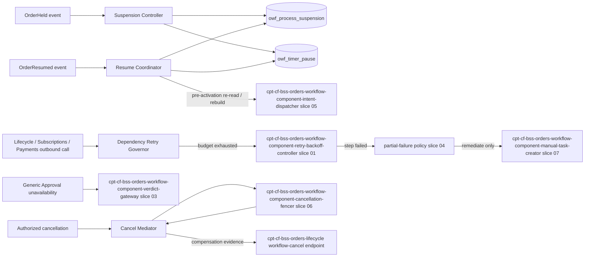
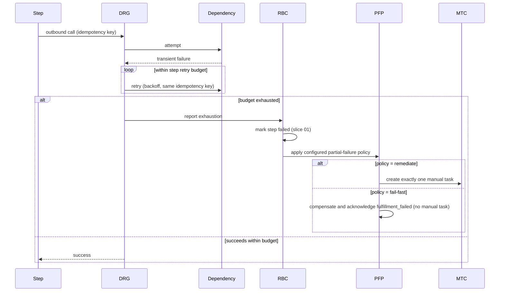
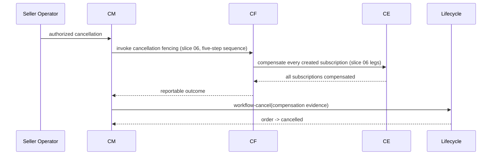

<!-- CONFLUENCE_TITLE: [BSS]: Orders Workflow — Hold and Resume, Dependency Resilience and Workflow-Mediated Cancel (Slice 8) -->
<!-- Related: ../DESIGN.md, ../PRD.md, ./01-foundation.md, ./03-approval-execution.md, ./06-saga-and-compensation.md, ./README.md | Owners: BSS Orders team -->

# DESIGN — Hold and Resume, Dependency Resilience and Workflow-Mediated Cancel (Slice 8)


<!-- toc -->

- [1. Architecture Overview](#1-architecture-overview)
  - [1.1 Architectural Vision](#11-architectural-vision)
  - [1.2 Architecture Drivers](#12-architecture-drivers)
  - [1.3 Architecture Layers](#13-architecture-layers)
- [2. Principles & Constraints](#2-principles--constraints)
  - [2.1 Design Principles](#21-design-principles)
  - [2.2 Constraints](#22-constraints)
- [3. Technical Architecture](#3-technical-architecture)
  - [3.1 Domain Model](#31-domain-model)
  - [3.2 Component Model](#32-component-model)
  - [3.3 API Contracts](#33-api-contracts)
  - [3.4 Internal Dependencies](#34-internal-dependencies)
  - [3.5 External Dependencies](#35-external-dependencies)
  - [3.6 Interactions & Sequences](#36-interactions--sequences)
  - [3.7 Database schemas & tables](#37-database-schemas--tables)
  - [3.8 Deployment Topology](#38-deployment-topology)
- [4. Additional context](#4-additional-context)
- [5. Traceability](#5-traceability)

<!-- /toc -->

- [ ] `p1` - **ID**: `cpt-cf-bss-orders-workflow-design-hold-and-cancel`
## 1. Architecture Overview

### 1.1 Architectural Vision

This slice owns two orthogonal process-control concerns and one execution path that draws on prior slices without redefining them. The first concern is process suspension: on `OrderHeld`, the process must stop dispatching new work without pretending it can reach into a foreign aggregate's clock. The design is explicit that a hold freezes this gear's own dispatch loop and pauses this gear's own timers, but it has no authority over the Subscriptions draft auto-void TTL — that TTL belongs to Subscriptions, keeps running through a hold, and the resume path handles its consequences by deferring to slice 05's existing pre-activation re-read and rebuild rather than inventing a second rebuild mechanism here. This is the load-bearing asymmetry of the slice: "suspend the process" and "pause every clock the order is subject to" are not the same claim, and conflating them would produce a design that silently assumes drafts survive a hold when nothing enforces that.

The second concern is dependency resilience for the three non-approval outbound dependencies (Orders Lifecycle, Subscriptions, Payments): transient unavailability is absorbed by backoff retry within the affected step's retry budget under the per-dependency budgets this slice states outright (§3.2), and budget exhaustion marks the step `failed` and hands it to the configured partial-failure policy rather than stalling silently or losing the process. This is deliberately kept distinct from the Generic Approval fail-closed park (owned by slice 03): that park is a product-level design choice — remain `submitted`, keep the Lifecycle `submitted` TTL running, escalate before it elapses — not a retry-exhaustion outcome, and the two paths must never be described as the same mechanism reached by different triggers.

The third concern, the workflow-mediated cancel, is this slice's contribution to a path whose actual mechanics (the five-step cancellation fencing sequence, the two compensation legs) are owned entirely by slice 06. This slice defines only the trigger (an authorized cancellation) and the sequencing constraint that compensation must complete, per slice 06's fencing, before the cancel is submitted to Lifecycle with compensation evidence — the Lifecycle cancel-guard exception. It does not restate slice 06's steps.

### 1.2 Architecture Drivers

#### Functional Drivers

| Requirement | Design Response |
|-------------|------------------|
| `cpt-cf-bss-orders-workflow-fr-owf-hold-resume` | Suspension Controller stops new-intent dispatch and pauses approval-escalation timers on `OrderHeld`; Resume Coordinator resumes from the last durable checkpoint with remaining-window timers on `OrderResumed`, deferring wave-1 rebuild to slice 05. |
| `cpt-cf-bss-orders-workflow-fr-owf-dependency-resilience` | Dependency Retry Governor applies backoff retry within the affected step's retry budget for Lifecycle/Subscriptions/Payments calls under the per-dependency budgets of §3.2; on exhaustion it marks the step `failed` and hands to the configured partial-failure policy, which is what decides whether a manual task follows; kept structurally separate from the Generic Approval park (slice 03). |
| `cpt-cf-bss-orders-workflow-fr-owf-compensation-execution` | Cancel Mediator triggers the workflow-mediated cancel path: invokes slice 06's cancellation fencing and compensation, then submits to Lifecycle with compensation evidence. |

#### NFR Allocation

| NFR ID | NFR Summary | Allocated To | Design Response | Verification Approach |
|--------|-------------|--------------|-----------------|----------------------|
| `cpt-cf-bss-orders-workflow-nfr-owf-escalation-timer` | Approval escalation timers are configurable per gate, default **72 h** from `OrderApprovalRequest` submission, with timer accuracy within **± 5 min** of the configured window — and a hold/resume cycle must neither silently extend that window nor misrepresent a foreign clock as paused | Suspension Controller, Resume Coordinator | Timer-pause records store the remaining window explicitly rather than re-deriving it, so a resume rearms at `resume_time + remaining_window` and the 72 h window is consumed exactly once across any number of cycles; the ± 5 min budget is preserved because pause and rearm are both recorded against DB time on a 15 s wake-up scan; the draft auto-void TTL is never read, stored, or paused by this gear | Idempotent-consumption test asserting resumed timer deadlines equal `pause_time + remaining_window`, never `now + full_window`; cycle test asserting that *n* hold/resume cycles on one gate still fire escalation within 72 h + 5 min of submission; code-boundary test asserting no local reference to a Subscriptions TTL value |
| `cpt-cf-bss-orders-workflow-nfr-owf-availability` | **99.9 %** control-plane availability (working baseline), with in-flight processes unaffected by control-plane restarts — transient dependency outages must not lose the process or stall it silently | Dependency Retry Governor | Retry with backoff inside the existing per-step retry budget under the per-dependency budgets of §3.2; a circuit breaker keeps a hard-down dependency from consuming the budget; exhaustion marks the step `failed` and hands to the configured partial-failure policy; every outbound call idempotent under retry | Retry-budget exhaustion test asserting the step is marked `failed` exactly once and that the configured policy — not the governor — decides whether a manual task follows; restart test asserting a suspended or retrying process resumes from its durable checkpoint after a control-plane restart |

#### Key ADRs

| ADR ID | Decision Summary |
|--------|-----------------|
| `cpt-cf-bss-orders-workflow-adr-fail-closed-verdict-park` | The Generic Approval fail-closed park (slice 03) and the retry-then-manual-task dependency-resilience path (this slice) are structurally distinct mechanisms with distinct triggers, distinct effects on the Lifecycle `submitted` TTL, and must never be implemented as one code path branching on dependency name. |

### 1.3 Architecture Layers

```text
Presentation   : none (this slice exposes no operator-facing surface; escalations render
                 through the Operator Task Queue, slice 07)
Application    : Suspension Controller, Resume Coordinator, Dependency Retry Governor,
                 Cancel Mediator
Domain         : ProcessSuspension, TimerPauseRecord (read/write); FulfillmentTask,
                 CompensationRecord (read only, slice 06); ProvisioningIntent (read only,
                 slice 05)
Infrastructure : owf_process_suspension / owf_timer_pause tables, durable-timer
                 infrastructure (owf_durable_timer, slice 05, reused for pause/resume
                 bookkeeping), Lifecycle/Subscriptions/Payments SDK clients with
                 backoff-retry wrapper
```

- [ ] `p3` - **ID**: `cpt-cf-bss-orders-workflow-tech-hold-and-cancel-stack`

| Layer | Responsibility | Technology |
|-------|---------------|------------|
| Presentation | None dedicated; escalations surface via slice 07's queue | n/a |
| Application | Suspension, resume, retry governance, cancel mediation | Workflow engine activities |
| Domain | ProcessSuspension, TimerPauseRecord entities | GTS domain structs |
| Infrastructure | Persistence, durable timer reuse, SDK clients with retry wrapper | PostgreSQL, durable-timer service, generated SDK clients |

## 2. Principles & Constraints

### 2.1 Design Principles

#### A Hold Suspends Dispatch, Not Foreign Clocks

- [ ] `p2` - **ID**: `cpt-cf-bss-orders-workflow-principle-hold-suspends-dispatch-only`

Suspension is scoped precisely to what this gear controls: it stops dispatching new provisioning intents and it pauses this gear's own approval-escalation timers, because a hold must not let this process's timers keep burning against the order. It does not, and structurally cannot, pause the Subscriptions draft auto-void TTL — that TTL is owned and clocked by Subscriptions, runs independently of this gear's suspension state, and continues ticking through a hold exactly as it would with no hold at all. Already-accepted provisioning intents are not reversed by a hold; they run to their terminal outcome and are recorded against the frozen plan. This principle is why the resume path never assumes wave-1 drafts survived a hold: it defers to slice 05's own pre-activation re-read, which is the only mechanism that actually detects a voided draft, hold-caused or otherwise.


#### Retry-Then-Escalate Is Not the Same Mechanism as Fail-Closed Park

- [ ] `p2` - **ID**: `cpt-cf-bss-orders-workflow-principle-resilience-distinct-from-park`

Transient unavailability of Orders Lifecycle, Subscriptions, or Payments is a retry-then-escalate concern: back off within the step's existing retry budget, and on exhaustion mark the step `failed` and hand it to the configured partial-failure policy, because the process must neither stall silently nor consume the retry budget indefinitely. Unavailability of the Generic Approval service, once it exists, is not this path: slice 03 owns a fail-closed park that keeps the order in `submitted`, does not pause the Lifecycle `submitted` TTL, and escalates before that TTL elapses. The two are triggered by different dependencies, resolved by different mechanisms (bounded retry vs. immediate park), and have different effects on Lifecycle-owned clocks; this slice implements only the first and references the second by name.

**ADRs**: `cpt-cf-bss-orders-workflow-adr-fail-closed-verdict-park`

### 2.2 Constraints

#### Timer Pause Preserves Remaining Window

- [ ] `p2` - **ID**: `cpt-cf-bss-orders-workflow-constraint-timer-remaining-window`

On `OrderHeld`, every open approval-escalation timer for the order records its remaining window (deadline minus pause time) rather than being cancelled and forgotten. On `OrderResumed`, each paused timer is rearmed at `resume_time + remaining_window`, never at `resume_time + full_window`. A hold must not consume the approval escalation window, and a resume must not grant the order a fresh full window it never had before the hold.


#### Hold/Resume Cycles Do Not Extend a Bounded Lifetime Indefinitely

- [ ] `p2` - **ID**: `cpt-cf-bss-orders-workflow-constraint-bounded-hold-resume-cycles`

A single hold/resume cycle preserves a paused timer's remaining window exactly (per `cpt-cf-bss-orders-workflow-constraint-timer-remaining-window`) and never resets it to full — this is what keeps one cycle honest. It is not, on its own, enough: repeated cycling can keep re-suspending a timer with a small remaining window just before it fires, deferring escalation indefinitely without ever consuming the window in a single hold.

The backstop is **not** the overdue-fulfillment escalation window (slice 07). That window only runs once the order has reached `in_fulfillment` (or `on_hold` taken from `in_fulfillment`), while the hazard being backstopped is approval-timer cycling in `pending_approval` — an order cycled through hold and resume before approval would have no clock running at all. Relying on it would leave exactly the case it is supposed to bound uncovered.

The backstop is instead an unconditional **`max_process_lifetime` of 90 days**, armed at process start, independent of order state, and **non-pausable**: a hold does not pause it, a resume does not extend it, and no number of hold/resume cycles can move it. **Accepted**. There is deliberately **no cap on the number of hold/resume cycles** and no cap on total held wall-clock time; those would refuse a legitimate commercial hold, whereas a lifetime ceiling only refuses an order that has been non-terminal for a quarter of a year. On expiry the process does not silently terminate: it parks (process phase `parked`) and raises one incident and one manual task for operator disposition, so the order still reaches a decided outcome through a human rather than through a timeout.

The `max_process_lifetime` timer is armed by the process start step (slice 02) on the same durable-timer infrastructure every other timer uses, with `timer_kind = process-lifetime`; the Suspension Controller is explicitly forbidden from writing a `TimerPauseRecord` against it (§3.7, `owf_timer_pause`).


#### One Open Suspension Per Order, Reconciled Regardless of Arrival Order

- [ ] `p2` - **ID**: `cpt-cf-bss-orders-workflow-constraint-one-open-suspension`

"At most one open suspension per order" is carried by a **partial unique index**, `UNIQUE (order_id) WHERE state IN ('open', 'resume_ahead')` on `owf_process_suspension` (§3.7), not by a sentence and not by a read-then-insert. Event-id uniqueness is a separate, weaker rule — `UNIQUE (order_id, triggering_event_id)` deduplicates a *redelivered* `OrderHeld`, but two `OrderHeld` events carrying different event ids would both satisfy it, and a single `OrderResumed` could then not say which of the two rows it closes. The partial index arbitrates: the second hold loses the insert, is recorded as an absorbed duplicate in `owf_step_log`, pauses nothing a second time, and leaves the existing open suspension untouched.

**`OrderHeld` and `OrderResumed` are not assumed to arrive in order.** The transport gives at-least-once delivery, not ordering, and the failure mode is not symmetric: a resume that arrives first, finds no open suspension, and is settled as consumed leaves the *subsequent* hold suspending the instance permanently — every timer paused, dispatch suppressed, and no future resume that could release it. The design therefore reconciles the pair by state rather than by arrival order:

- `OrderResumed` with an open suspension: closes it, rearms its pauses, records `resume_event_id`.
- `OrderResumed` with **no** open suspension: inserts a `resume_ahead` row carrying `resume_event_id` and no `suspended_at`. Nothing is rearmed, because nothing was paused, and the event is not discarded.
- `OrderHeld` arriving while a `resume_ahead` row exists for the order: consumes that row — the row transitions straight to `closed`, the hold pauses no timers and suppresses no dispatch, and the pair is recorded as reconciled out of order in `owf_step_log`. The instance is never left suspended by a hold whose resume has already happened.
- A redelivered `OrderResumed` is refused by `UNIQUE (order_id, resume_event_id)` and changes nothing.

**A pause is rearmed at most once.** Rearm is `UPDATE owf_timer_pause SET rearmed_at = now() … WHERE pause_id = $1 AND rearmed_at IS NULL`; zero rows affected means the pause was already rearmed and the resume is a duplicate, which must not rearm a second time. Without this guard a redelivered resume would rearm an already-running timer at `now + remaining_window`, silently extending a bounded escalation window — the exact defect `cpt-cf-bss-orders-workflow-constraint-timer-remaining-window` exists to prevent, reintroduced through redelivery instead of through arithmetic.


#### A Hold Freezes Failure-Producing Transitions, Not Only Dispatch

- [ ] `p2` - **ID**: `cpt-cf-bss-orders-workflow-constraint-hold-aware-sweep`

The reconciliation sweep (slice 05) is **hold-aware**. While an `owf_process_suspension` row is `open` for the order, the sweep continues to *read* the terminal outcome of already-accepted intents and to record that outcome on `owf_provisioning_intent` — stopping the sweep entirely would lose confirmations that arrive during a long hold and would push discovery latency past the window the sweep exists to bound. What it must **not** do is act on what it read: while a suspension is open the sweep MUST NOT advance an `owf_fulfillment_task` to `failed`, MUST NOT enter the partial-failure policy, and MUST NOT create a manual task or dead-letter record. A terminal failure observed during a hold is recorded on the intent and left pending; the Resume Coordinator applies the deferred outcomes as its first act after closing the suspension, in the order they were observed.

Without this rule a held order — one an operator or Lifecycle has deliberately frozen — can still have a task advanced to `failed` underneath the freeze and the partial-failure policy fired on it, which is the one thing "the order is on hold" is supposed to guarantee cannot happen. The sweep's escalation ladder and its cap are unaffected: they keep running against the intent, because the intent's counterparty state at Subscriptions keeps moving whether this gear is suspended or not.


#### Cancel Submission Follows Fencing, Never Precedes It

- [ ] `p2` - **ID**: `cpt-cf-bss-orders-workflow-constraint-cancel-follows-fencing`

The workflow-mediated cancel must not submit to Lifecycle, and must not report the order cancelled, while a compensating action is outstanding. The Cancel Mediator invokes slice 06's cancellation-fencing sequence and waits for it to reach a reportable outcome before constructing the compensation-evidence payload and calling the Lifecycle workflow-cancel endpoint. A `FulfillmentTask` remains unilaterally cancellable until its activation intent is accepted by Subscriptions; draft-create acceptance alone does not close that window (slice 06).

**ADRs**: `cpt-cf-bss-orders-workflow-adr-fail-closed-verdict-park`

## 3. Technical Architecture

### 3.1 Domain Model

**Technology**: GTS, Rust structs

**Location**: [`../DESIGN.md`](../DESIGN.md) §3.1 (gear-wide domain-model index); the entities below are normative in this slice, with their columns in §3.7.

**Core Entities**:

- [ ] `p2` - **ID**: `cpt-cf-bss-orders-workflow-entity-process-suspension`
- [ ] `p2` - **ID**: `cpt-cf-bss-orders-workflow-entity-timer-pause-record`

| Entity | Description | Schema |
|--------|-------------|--------|
| `ProcessSuspension` | Records that a process instance is suspended for an order following `OrderHeld`: suspension time, triggering event id, resume checkpoint reference | [owf_process_suspension](#table-owf_process_suspension) |
| `TimerPauseRecord` | Records a paused approval-escalation timer's remaining window at pause time, keyed to the timer it pauses | [owf_timer_pause](#table-owf_timer_pause) |

**Relationships**:
- Order (process instance) → `ProcessSuspension`: at most one unsettled suspension record per order at a time, enforced by the partial unique index of `cpt-cf-bss-orders-workflow-constraint-one-open-suspension`, created on `OrderHeld`, closed on the matching `OrderResumed`; a resume that precedes its hold is held as a `resume_ahead` record under the same index rather than discarded.
- `ProcessSuspension` → `TimerPauseRecord`: one pause record per open approval-escalation timer active at suspension time, and never a pause record against the non-pausable `max_process_lifetime` timer.
- `TimerPauseRecord` → `cpt-cf-bss-orders-workflow-entity-provisioning-intent` (slice 05): not directly related — a pause record never governs provisioning intents; already-accepted intents run to terminal outcome independent of suspension state.
- `ProcessSuspension` → `cpt-cf-bss-orders-workflow-component-cancellation-fencer` (slice 06): an operator may elect a workflow-mediated cancel while an order is suspended; the cancel path does not require an open `ProcessSuspension` to be closed first.

### 3.2 Component Model



#### Suspension Controller

- [ ] `p2` - **ID**: `cpt-cf-bss-orders-workflow-component-suspension-controller`

##### Why this component exists

`on_hold` changes what the process is permitted to do; without one component owning that transition, dispatch-suppression and timer-pausing could drift apart or be applied inconsistently across call sites.

##### Responsibility scope

On consuming `OrderHeld`, stops dispatch of new provisioning intents for the order, inserts a `ProcessSuspension` record under the partial unique index (a losing insert is an absorbed duplicate, never a second suspension), and for every open approval-escalation timer creates a `TimerPauseRecord` capturing its remaining window. Leaves already-accepted provisioning intents to run to terminal outcome, recorded against the frozen plan. Leaves open approval requests valid. Consumes `OrderHeld` idempotently by event id plus process `correlationId` plus `orderId`/`orderVersion`. Where a `resume_ahead` record already exists for the order, consumes it instead of suspending (`cpt-cf-bss-orders-workflow-constraint-one-open-suspension`).

**Intents are partitioned by three states, not two.** A hold reaches an outbound provisioning intent in exactly one of three conditions, and the third is the one the caller-side duplicate protocol exists for:

| Intent state at hold | Behaviour |
|---|---|
| Not yet submitted (`pending`) | Dispatch is suppressed. The intent stays `pending` with its idempotency key unconsumed; it is dispatched after resume, or voided if the order terminates while held. |
| Submitted, outcome not yet known (`submitted`, no accept, no terminal outcome) | The call **is completed**, not abandoned: the in-flight attempt runs to its per-attempt timeout and, if that timeout cuts it, the caller-side duplicate protocol's same-key retry is performed **once** to learn whether the counterparty accepted it. That single retry is a *disambiguation read*, not new work — it carries the identical idempotency key, so it can only return the already-recorded outcome or create the intent the caller had already committed to creating. Suppressing it instead would leave an intent this gear cannot classify, which is the state the reconciliation sweep would then have to resolve blind. After the outcome is known the intent behaves as one of the two rows around it, and no further attempt is made while the suspension is open. |
| Already accepted | Runs to terminal outcome; a hold never reverses it. The outcome is recorded against the frozen plan; acting on a *failure* outcome is deferred per `cpt-cf-bss-orders-workflow-constraint-hold-aware-sweep`. |

"Stops dispatch" therefore means "issues no intent the process had not already committed to issuing" — it does not mean "abandons a call already on the wire", which would trade a suspended process for an unclassifiable one.

##### Responsibility boundaries

Never voids wave-1 drafts and never reads, stores, or pauses the Subscriptions draft auto-void TTL — that TTL is entirely outside this component's authority. Never pauses the `max_process_lifetime` timer (`timer_kind = process-lifetime`), the overdue-fulfillment window, or the reconciliation-sweep timer; the only timers it pauses are this gear's approval-escalation timers. Never reverses an already-accepted provisioning intent. Never advances an `owf_fulfillment_task` to `failed` and never enters the partial-failure policy. Never decides remediation, compensation, or cancellation; those remain owned by slices 06/07.

##### Related components (by ID)

- `cpt-cf-bss-orders-workflow-component-resume-coordinator` — shares model with (both operate on `ProcessSuspension`/`TimerPauseRecord`)
- `cpt-cf-bss-orders-workflow-component-intent-dispatcher` — depends on (defers to slice 05's dispatch suppression rather than duplicating it)

#### Resume Coordinator

- [ ] `p2` - **ID**: `cpt-cf-bss-orders-workflow-component-resume-coordinator`

##### Why this component exists

Resume is not a fresh start: it must reconstruct exactly where the process left off and restore exactly the timer state it paused, without assuming anything about drafts that a foreign clock may have voided in the meantime.

##### Responsibility scope

On consuming `OrderResumed`, closes the open `ProcessSuspension`, rearms every `TimerPauseRecord`'s timer at `resume_time + remaining_window` under the once-only rearm guard, applies any outcomes the hold-aware sweep deferred (in observation order), and resumes execution from the last durable checkpoint. Where no open suspension exists, records a `resume_ahead` record rather than settling the event as consumed (`cpt-cf-bss-orders-workflow-constraint-one-open-suspension`). Before dispatching any activation intent, invokes slice 05's pre-activation draft re-read and, if that re-read finds a voided draft, slice 05's wave-1 rebuild — this component never assumes drafts survived the hold and never performs its own rebuild. Consumes `OrderResumed` idempotently by event id plus process `correlationId` plus `orderId`/`orderVersion`, with the consumed event id recorded on the suspension record so a redelivery is refused by uniqueness rather than by hoping the timer is already rearmed.

**Resume re-evaluates wave-2 eligibility; it does not wait for the barrier signal again.** The activation-barrier timer is one-shot — it sets `fired_at` once — so if the barrier instant passes while dispatch is suppressed, the signal is consumed with no dispatcher able to act on it, and a resume described only as "restore the checkpoint and re-read the drafts" would wait forever for a signal that has already been spent. The Resume Coordinator therefore evaluates the barrier's two conditions **by level, not by edge**, as its last act before returning control to the dispatcher: if every wave-1 create for the order is confirmed and the barrier instant is now in the past (whether the timer fired during the hold or fires later), wave 2 is eligible immediately and the Coordinator invokes slice 05's dispatcher directly rather than re-arming or waiting on the timer. If either condition is still unmet, the existing timer continues to own the transition and nothing is re-armed. The re-evaluation is idempotent: it reads the same two conditions the barrier owner reads, and dispatch itself is guarded by the per-line idempotency key, so a re-evaluation racing a late timer fire cannot double-dispatch.

##### Responsibility boundaries

Does not compute or store the Subscriptions draft auto-void TTL. Does not decide whether a rebuild is needed by any means other than invoking slice 05's existing re-read; does not maintain a parallel draft-liveness record. Does not re-arm, re-fire, or reset the activation-barrier timer — it reads the barrier's conditions and never writes them. Does not grant a rearmed timer a fresh full window, and never rearms a pause whose `rearmed_at` is already set.

##### Related components (by ID)

- `cpt-cf-bss-orders-workflow-component-suspension-controller` — shares model with
- `cpt-cf-bss-orders-workflow-component-intent-dispatcher` — depends on (pre-activation re-read and rebuild, slice 05)
- `cpt-cf-bss-orders-workflow-component-activation-barrier-timer-owner` — reads from (slice 05; the barrier's two conditions are re-evaluated by level at resume, never re-armed here)
- `cpt-cf-bss-orders-workflow-component-reconciliation-sweep` — depends on (slice 05; applies the outcomes the sweep deferred while the suspension was open)

#### Dependency Retry Governor

- [ ] `p2` - **ID**: `cpt-cf-bss-orders-workflow-component-dependency-retry-governor`

##### Why this component exists

Distributed BSS dependencies fail transiently; without one governing component, retry-with-backoff and escalation-on-exhaustion could be implemented inconsistently per call site, or omitted, leaving the process to stall silently.

##### Responsibility scope

Wraps outbound calls to Orders Lifecycle, Subscriptions, and Payments with backoff retry inside the affected step's retry budget, under the per-dependency budgets below. Guarantees every wrapped call remains idempotent under retry by requiring callers to supply an idempotency key per the platform's per-call idempotency contract, and trips a circuit breaker so a hard-down dependency does not burn a step's whole budget in seconds.

**Per-dependency retry budgets.** These are the values; they are not deferred onward. They are working baselines stated with their derivation, proposed into the program-wide NFR workshop rather than left blank, and they are the *outer* bound — a calling slice may declare a tighter budget for a specific step, never a looser one, and the governor enforces the minimum of the two.

| Dependency and call class | Attempts | Backoff | Derivation |
|---|---|---|---|
| Subscriptions — wave-2 activation intents | 4 | 1 s → 2 s → 4 s → 8 s (15 s total) | Must terminate well inside the 3 min wave-2 step deadline so the sweep's in-SLA ladder, not the retry loop, owns the remainder of the 15-minute window |
| Subscriptions — wave-1 draft creates | 5 | 2 s → 4 s → 8 s → 16 s → 32 s (62 s total) | Sits outside the measured SLA window; bounded by the 10 min wave-1 step deadline with room for one rebuild |
| Orders Lifecycle — the five seam operations | 5 | 1 s → 2 s → 4 s → 8 s → 16 s (31 s total) | Fits inside the 60 s sliding gear-wide retry-budget window, so a seam call cannot alone exhaust the gear-wide 10 % cap |
| Payments — authorization request | 3 | 1 s → 2 s → 4 s (7 s total) | The authorization is a begin-fulfillment precondition on the synchronous acceptance path; its p95 < 1 s acceptance budget cannot absorb a long ladder |

**Circuit breaker** (identical for all three dependencies): open at 50 % failures over 20 calls in 10 s, stay open 60 s, then 3 half-open probes. **A call refused by an open breaker does not consume retry budget** — the budget measures the dependency's responses to this step, not this gear's own refusal to call it. A downstream throttle signal likewise delays dispatch without consuming budget, up to the 60 s maximum throttle delay; a throttle that would push the call past the step deadline extends the deadline rather than failing the step.

**On exhaustion the governor marks the step `failed` and stops.** It does not create a manual task. This is the arbitration between the two statements that previously disagreed: the retry/backoff controller's rule — exhausting either the retry budget or the step deadline marks the step `failed` — is authoritative, and it is the *only* effect exhaustion has. What happens next is the configured partial-failure policy's decision, not this component's: under the **remediate** default the failed step raises exactly one manual task through slice 07's Manual-Task Creator; under **fail-fast** no manual task is created at all, the order is compensated and acknowledged `fulfillment_failed`, and creating a task there would put an actionable item on an order that is already terminal. A governor that escalated unconditionally would be correct under one policy and wrong under the other, so it escalates under neither and defers to the policy under both.

##### Responsibility boundaries

Does not set the step deadline or the per-attempt timeout (owned by slice 01's retry/backoff controller) and does not mark the step `failed` itself — it reports exhaustion to that controller, which owns the state transition. Does not decide, or pre-empt, the partial-failure policy; does not create manual tasks. Does not apply to Generic Approval unavailability — that path is exclusively slice 03's fail-closed park, never routed through this governor.

##### Related components (by ID)

- `cpt-cf-bss-orders-workflow-component-retry-backoff-controller` — depends on (slice 01; owns the three bounds and the `failed` transition this governor reports into)
- `cpt-cf-bss-orders-workflow-component-manual-task-creator` — calls indirectly (slice 07, only where the configured partial-failure policy elects remediation)
- `cpt-cf-bss-orders-workflow-actor-owf-generic-approval` — explicitly not related to (cross-gear reference cited only to state exclusion; Generic Approval unavailability never routes through this component)

#### Cancel Mediator

- [ ] `p2` - **ID**: `cpt-cf-bss-orders-workflow-component-cancel-mediator`

##### Why this component exists

An authorized cancellation must not race ahead of compensation: reporting the order cancelled before every created subscription is compensated would violate the atomic-fulfillment invariant this gear shares with Lifecycle.

##### Responsibility scope

On an authorized cancellation trigger — "authorized cancellation" being the term defined normatively in `09-read-and-authz.md` §4.4, not a loose synonym for "an operator asked for one" — invokes slice 06's cancellation-fencing sequence and compensation execution, waits for it to reach a reportable outcome, constructs the compensation-evidence payload from slice 06's `CompensationRecord`s, and submits the workflow-mediated cancel to the Lifecycle workflow-cancel endpoint under the Lifecycle cancel-guard exception. Because fencing can take days when a compensating leg is itself blocked, the Mediator re-checks the recorded authorization at apply time — immediately before the first irreversible compensating call and again before the Lifecycle submission — per the apply-time re-check rule in `09-read-and-authz.md` §4.4; a revoked grant parks the cancel rather than completing it.

##### Responsibility boundaries

Does not implement the five-step cancellation fencing sequence itself — that sequence, its ordering, and its reconciliation of late-arriving successes are owned entirely by slice 06 and only invoked here. Does not implement the two compensation legs (draft-void, activated-cancel) — also slice 06. Does not report the order cancelled while any compensating action is outstanding.

##### Related components (by ID)

- `cpt-cf-bss-orders-workflow-component-cancellation-fencer` — depends on, calls (slice 06)
- `cpt-cf-bss-orders-workflow-component-compensation-executor` — depends on (slice 06, for compensation-evidence payload)
- `cpt-cf-bss-orders-lifecycle-interface-seam-ops` — calls (cross-gear reference to the Lifecycle workflow-cancel endpoint)

### 3.3 API Contracts

This slice consumes events rather than exposing new inbound endpoints; the outbound cancel call is Lifecycle's existing seam endpoint (see below).

- [ ] `p2` - **ID**: `cpt-cf-bss-orders-workflow-interface-hold-resume-consumer`

- **Contracts**: `cpt-cf-bss-orders-workflow-contract-owf-lifecycle-transition`
- **Technology**: Event subscription (same transport as slice 02's trigger intake)
- **Location**: Suspension Controller and Resume Coordinator (§3.2), on the trigger-intake subscription declared in [`02-triggers-and-start.md`](./02-triggers-and-start.md) §3.3.

**Endpoints Overview**:

| Method | Path | Description | Stability |
|--------|------|--------------|-----------|
| n/a (event) | `OrderHeld` | Consumed idempotently by event id + process `correlationId` + `orderId`/`orderVersion`; drives Suspension Controller | unstable |
| n/a (event) | `OrderResumed` | Consumed idempotently by event id + process `correlationId` + `orderId`/`orderVersion`; drives Resume Coordinator | unstable |
| `POST` | `/bss-orders-lifecycle/v1/orders/{orderId}/workflow-cancel` | Cross-gear reference (owned by Orders Lifecycle, see [`06-workflow-seam.md`](../../../orders-lifecycle/docs/design/06-workflow-seam.md) §3.3); called by Cancel Mediator with compensation evidence | unstable |

### 3.4 Internal Dependencies

| Dependency Gear | Interface Used | Purpose |
|-------------------|----------------|----------|
| bss-orders-workflow (slice 05) | `cpt-cf-bss-orders-workflow-component-intent-dispatcher` | Resume Coordinator invokes the existing pre-activation draft re-read and wave-1 rebuild rather than duplicating draft-liveness logic |
| bss-orders-workflow (slice 06) | `cpt-cf-bss-orders-workflow-component-cancellation-fencer`, `cpt-cf-bss-orders-workflow-component-compensation-executor` | Cancel Mediator invokes fencing and compensation by reference, never restating their steps |
| bss-orders-workflow (slice 07) | `cpt-cf-bss-orders-workflow-component-manual-task-creator` | Dependency Retry Governor escalates budget-exhausted steps through the existing manual-task creation path |
| bss-orders-workflow (slice 03) | `cpt-cf-bss-orders-workflow-actor-owf-generic-approval` fail-closed park (referenced, not called) | Boundary reference only, to keep the two resilience paths structurally distinct |

**Dependency Rules** (per project conventions):
- No circular dependencies
- Always use sdk modules for inter-gear communication
- No cross-category sideways deps except through contracts
- Only integration/adapter gears talk to external systems
- `SecurityContext` must be propagated across all in-process calls

### 3.5 External Dependencies

#### Orders Lifecycle (BSS)

- **Contract**: `cpt-cf-bss-orders-workflow-contract-owf-lifecycle-transition`

| Dependency Gear | Interface Used | Purpose |
|-------------------|---------------|----------|
| bss-orders-lifecycle | SDK client, `workflow-cancel` seam endpoint | Submit the authorized cancellation with compensation evidence under the Lifecycle cancel-guard exception, after slice 06's fencing reaches a reportable outcome |

#### Subscriptions (BSS)

- **Contract**: `cpt-cf-bss-orders-workflow-contract-owf-provisioning-intent`

| Dependency Gear | Interface Used | Purpose |
|-------------------|---------------|----------|
| bss-subscriptions | SDK client | Outbound calls wrapped by the Dependency Retry Governor's backoff-retry-then-escalate path on transient unavailability |

#### Payments (BSS)


| Dependency Gear | Interface Used | Purpose |
|-------------------|---------------|----------|
| bss-payments | SDK client | Outbound calls wrapped by the same Dependency Retry Governor path on transient unavailability |

**Dependency Rules** (per project conventions):
- No circular dependencies
- Always use SDK modules for inter-gear communication
- No cross-category sideways deps except through contracts
- Only integration/adapter gears talk to external systems
- `SecurityContext` must be propagated across all in-process calls

### 3.6 Interactions & Sequences

#### Hold Then Resume with Remaining-Window Timer Preservation

**ID**: `cpt-cf-bss-orders-workflow-seq-hold-then-resume`


**Actors**: `cpt-cf-bss-orders-workflow-actor-owf-orders-lifecycle`, `cpt-cf-bss-orders-workflow-actor-owf-generic-approval`

```mermaid
sequenceDiagram
    Lifecycle ->> SC: OrderHeld(orderId, orderVersion, eventId)
    alt a resume_ahead record exists for the order
        SC ->> PS: consume it (state -> closed); pause nothing, suppress nothing
    else no unsettled record
        SC ->> PS: insert ProcessSuspension (state = open, partial unique index arbitrates)
        SC ->> TP: pause open approval timers (store remaining window)
        Note over SC: no new provisioning intents dispatched;\nan in-flight submission completes and is disambiguated\nwith one same-key retry;\naccepted intents run to terminal outcome;\nmax_process_lifetime and the draft auto-void TTL NOT paused
    end
    Lifecycle ->> RC: OrderResumed(orderId, orderVersion, eventId)
    alt an open ProcessSuspension exists
        RC ->> PS: close it, record resume_event_id
        RC ->> TP: rearm timers at resume_time + remaining_window (WHERE rearmed_at IS NULL)
        RC ->> RC: apply outcomes the sweep deferred during the hold
    else no open suspension (resume overtook its hold)
        RC ->> PS: insert resume_ahead record; rearm nothing
    end
    RC ->> PIS: pre-activation draft re-read (slice 05)
    alt draft voided during hold or date-wait
        PIS ->> PIS: rebuild wave 1 (slice 05)
    end
    RC ->> RC: resume from last durable checkpoint
    RC ->> BAR: re-evaluate wave-2 barrier conditions by level
    alt all creates confirmed and barrier instant already past
        RC ->> PIS: dispatch wave 2 now (one-shot timer already spent)
    end
```

**Description**: Both events are consumed idempotently by event id plus process `correlationId` plus `orderId`/`orderVersion`, and both have a durable dedup record, so neither arrival order nor redelivery can leave the instance suspended with no resume able to release it. The sequence deliberately shows the draft auto-void TTL and the `max_process_lifetime` deadline as untouched by the hold, the rebuild step as delegated to slice 05, and the wave-2 barrier as **re-evaluated by level at resume** rather than waited on — the barrier timer is one-shot, so an instant that passed during the hold has already spent its signal.

#### Transient Outage: Retry-Then-Manual-Task

**ID**: `cpt-cf-bss-orders-workflow-seq-dependency-retry-escalate`


**Actors**: `cpt-cf-bss-orders-workflow-actor-owf-orders-lifecycle`, `cpt-cf-bss-orders-workflow-actor-owf-subscriptions`, `cpt-cf-bss-orders-workflow-actor-owf-payments`, `cpt-cf-bss-orders-workflow-actor-owf-fulfillment-operator`



**Description**: The process never loses track of the step and never stalls silently: it either succeeds within budget, or the step is marked `failed` exactly once and the configured partial-failure policy — not the governor — decides whether an operator-actionable task follows. A breaker-open refusal does not consume budget and does not reach the exhaustion branch.

#### Generic Approval Park (Distinguished, Not This Slice's Path)

**ID**: `cpt-cf-bss-orders-workflow-seq-generic-approval-park-reference`

**Use cases**: `cpt-cf-bss-orders-workflow-usecase-owf-approval-escalation`

**Actors**: `cpt-cf-bss-orders-workflow-actor-owf-generic-approval`, `cpt-cf-bss-orders-workflow-actor-owf-fulfillment-operator`

```mermaid
sequenceDiagram
    Step ->> GA: Generic Approval call
    GA -->> Step: unavailable
    Note over GA: fail-closed park (slice 03) — order remains submitted;\nLifecycle submitted TTL is NOT paused;\nescalation MUST occur before TTL elapses
    GA ->> MTC: escalate before TTL elapses
```

**Description**: Shown for boundary clarity only — this sequence is owned by slice 03 and is never routed through the Dependency Retry Governor's retry-budget mechanism; it is included here solely to make the two-paths distinction unambiguous.

#### Workflow-Mediated Cancel with Compensation Evidence

**ID**: `cpt-cf-bss-orders-workflow-seq-workflow-mediated-cancel`

**Use cases**: `cpt-cf-bss-orders-workflow-usecase-owf-cancel-with-rollback`

**Actors**: `cpt-cf-bss-orders-workflow-actor-owf-seller-operator`, `cpt-cf-bss-orders-workflow-actor-owf-orders-lifecycle`, `cpt-cf-bss-orders-workflow-actor-owf-subscriptions`



**Description**: The Cancel Mediator never calls Lifecycle before slice 06's fencing reports a reportable outcome, and never reports the order cancelled while a compensating action is outstanding. `FulfillmentTask` remains unilaterally cancellable until its activation intent is accepted; draft-create acceptance does not close that window (slice 06). The **Seller Operator** is the only actor authorized to invoke this path (`09-read-and-authz.md` §4.1); a Fulfillment Operator who concludes an order must be cancelled uses the `escalate` task resolution, which routes the decision to a Seller Operator rather than calling an operation the evaluator would refuse.

### 3.7 Database schemas & tables

- [ ] `p3` - **ID**: `cpt-cf-bss-orders-workflow-db-hold-and-cancel`

#### Table: owf_process_suspension

**ID**: `cpt-cf-bss-orders-workflow-dbtable-owf-process-suspension`

**Schema**:

| Column | Type | Description |
|--------|------|--------------|
| suspension_id | uuid | Primary key |
| order_id | uuid | Order under suspension |
| order_version | bigint | Order version at suspension time |
| resource_tenant_id | uuid | Resource recipient axis |
| seller_tenant_id | uuid | Selling party axis; a suspension is visible on the seller-scoped operator surfaces and is back-pressured per seller |
| state | enum | `open \| closed \| resume_ahead`. Transitions: `open → closed` (the matching resume arrives), `resume_ahead → closed` (the late hold arrives and is consumed). No other transition exists |
| triggering_event_id | uuid, nullable | `OrderHeld` event id; null on a `resume_ahead` row, which has no hold yet |
| resume_event_id | uuid, nullable | `OrderResumed` event id that closed (or pre-recorded) this row; null while `open` |
| correlation_id | uuid | Process correlation id |
| suspended_at | timestamptz, nullable | Suspension start time; null on a `resume_ahead` row |
| resumed_at | timestamptz, nullable | Suspension end time; null while `open` |
| checkpoint_ref | text, nullable | Reference to the last durable checkpoint at suspension time; null on a `resume_ahead` row |
| created_at | timestamptz | Row creation instant; the partition key |

**PK**: `suspension_id`

**Constraints**: NOT NULL on `order_id`, `order_version`, `resource_tenant_id`, `seller_tenant_id`, `state`, `correlation_id`, `created_at`; **`UNIQUE (order_id) WHERE state IN ('open', 'resume_ahead')`** — the partial unique index that carries "at most one unsettled suspension per order", replacing the prose rule it used to be; `UNIQUE (order_id, triggering_event_id) WHERE triggering_event_id IS NOT NULL` for idempotent `OrderHeld` consumption; `UNIQUE (order_id, resume_event_id) WHERE resume_event_id IS NOT NULL` for idempotent `OrderResumed` consumption; CHECK `state = 'open'` implies `suspended_at IS NOT NULL AND triggering_event_id IS NOT NULL AND resumed_at IS NULL`; CHECK `state = 'resume_ahead'` implies `resume_event_id IS NOT NULL AND suspended_at IS NULL`; CHECK `state = 'closed'` implies `resumed_at IS NOT NULL`

**Additional info**: Tenant axes are `resource_tenant_id` (always) and `seller_tenant_id` (this table backs a seller-scoped operator surface). Ownership: written only by the Suspension Controller (insert of `open` rows, consumption of a `resume_ahead` row) and the Resume Coordinator (close, and insert of `resume_ahead` rows); no other component writes it. Retention ≥ 400 days — a suspension is audit evidence of who froze an order and for how long, and shares the audit-grade floor rather than the execution-bookkeeping one. Monthly range partition on `created_at`. The event-id uniqueness constraints deduplicate redelivery; they are deliberately **not** the at-most-one-suspension rule, which the partial index alone carries.

**Example**:

| suspension_id | order_id | state | resumed_at |
|---------------|----------|-------|------------|
| `a1b2...` | `ord-4471` | `open` | `NULL` |
| `e5f6...` | `ord-4472` | `resume_ahead` | `2026-03-02T10:14:07Z` |

#### Table: owf_timer_pause

**ID**: `cpt-cf-bss-orders-workflow-dbtable-owf-timer-pause`

**Schema**:

| Column | Type | Description |
|--------|------|--------------|
| pause_id | uuid | Primary key |
| suspension_id | uuid, nullable | Owning `ProcessSuspension`; null exactly when `pause_reason = 'approval-outage'`, which has no suspension because no hold occurred |
| pause_reason | enum | `hold \| approval-outage`. `hold` is this slice's suspension pause; `approval-outage` is slice 03's Generic-Approval outage pause, which reuses this primitive and this representation rather than inventing a second one |
| order_id | uuid | Order whose timer is paused; present on every row so an outage pause is addressable without a suspension |
| resource_tenant_id | uuid | Resource recipient axis |
| seller_tenant_id | uuid | Selling party axis |
| timer_ref | text | Reference to the paused approval-escalation timer |
| remaining_window | interval | Window remaining at pause time |
| paused_at | timestamptz | Pause time |
| rearmed_at | timestamptz, nullable | Time the timer was rearmed at `resume_time + remaining_window` (null while paused) |
| created_at | timestamptz | Row creation instant; the partition key |

**PK**: `pause_id`

**Constraints**: NOT NULL on `pause_reason`, `order_id`, `resource_tenant_id`, `seller_tenant_id`, `timer_ref`, `remaining_window`, `paused_at`, `created_at`; FK `suspension_id` references `owf_process_suspension`; CHECK `(pause_reason = 'hold') = (suspension_id IS NOT NULL)`; **`UNIQUE (timer_ref) WHERE rearmed_at IS NULL`** so one timer can never carry two open pauses and a rearm can never be ambiguous about which remainder it restores

**Additional info**: `remaining_window` is stored, never re-derived from a full-window constant, to satisfy `cpt-cf-bss-orders-workflow-constraint-timer-remaining-window`. **This column is the single authority for a paused timer's remainder** — the design stores *remaining window*, not accrued elapsed time, and every consumer including slice 03's outage pause reads the remainder from here; a remainder cached anywhere else is a copy, and a copy must never be the value a rearm is computed from. Rearm is `UPDATE … SET rearmed_at = now() WHERE pause_id = $1 AND rearmed_at IS NULL`; zero rows affected means the resume is a duplicate and nothing is rearmed. Only approval-escalation timers are ever paused: a row whose `timer_ref` resolves to a `process-lifetime`, `expected-fulfillment-wait` or `reconciliation-sweep` timer is a defect, and the `max_process_lifetime` deadline in particular is non-pausable by construction. Tenant axes are `resource_tenant_id` and `seller_tenant_id`. Ownership: `hold` rows are written only by the Suspension Controller and closed only by the Resume Coordinator; `approval-outage` rows are written and closed only by slice 03's Verdict Gateway. Retention 90 days after `rearmed_at` — this is execution bookkeeping, the same class as `owf_step_log` and `owf_retry_state`, and the durable evidence of the hold itself lives on `owf_process_suspension` at the 400-day floor. Monthly range partition on `created_at`.

**Example**:

| pause_id | pause_reason | timer_ref | remaining_window |
|----------|--------------|-----------|-------------------|
| `c3d4...` | `hold` | `approval-esc-9921` | `PT6H` |

### 3.8 Deployment Topology

- [ ] `p3` - **ID**: `cpt-cf-bss-orders-workflow-topology-hold-and-cancel`

No dedicated deployment topology beyond the existing Orders Workflow process; the Suspension Controller and Resume Coordinator run as workflow-engine activities within the same process instance, and the Dependency Retry Governor is a shared library wrapper around existing SDK clients rather than a separately deployed service.

## 4. Additional context

Both `OrderHeld` and `OrderResumed` are consumed idempotently by event id plus process `correlationId` plus `orderId`/`orderVersion` — the same three-part idempotency key pattern slice 02 established for trigger and terminal-event consumption; this slice reuses it rather than defining a fourth variant. Both also have a **durable dedup store**, not only an idempotency key: the consumed hold event id and the consumed resume event id are both recorded on the `owf_process_suspension` row under their own partial unique indexes, so a redelivered resume is refused by the database rather than by the accident of a timer already being rearmed. A key that has been settled tells you an event was seen; the row tells you what it did, and only the second is enough to decide whether a second delivery may act.

Ordering between the two events is not assumed. The transport delivers at least once with no ordering guarantee, and the two orderings fail very differently: a duplicate hold is inert, while a resume that overtakes its hold and is discarded leaves the order suspended forever. `cpt-cf-bss-orders-workflow-constraint-one-open-suspension` therefore reconciles the pair by state — an early resume is parked as a `resume_ahead` record and consumed by the hold that follows it.

Rebuild of wave-1 drafts auto-voided before the activation intent — whether by hold, by the Subscriptions draft-void TTL elapsing during the date wait, or any other cause — is owned entirely by slice 05 (`cpt-cf-bss-orders-workflow-component-intent-dispatcher`). The Resume Coordinator's only obligation is to invoke slice 05's existing pre-activation re-read before dispatching any activation intent; it does not perform, duplicate, or shadow that rebuild logic.

Cancellation fencing's five-step sequence (stop new dispatch, identify in-flight intents, reconcile their terminal outcomes, compensate every created subscription including late successes, verify no active subscription remains) is owned entirely by slice 06 (`cpt-cf-bss-orders-workflow-component-cancellation-fencer`). This slice's Cancel Mediator invokes that sequence and waits on its outcome; it never restates or re-implements the five steps.

The hold/resume bounded-lifetime hazard (§2.2, `cpt-cf-bss-orders-workflow-constraint-bounded-hold-resume-cycles`) is backstopped by the unconditional, non-pausable `max_process_lifetime` of 90 days armed at process start — **Accepted** — and explicitly *not* by the overdue-fulfillment escalation window, which only runs in `in_fulfillment` and therefore cannot see an order cycled through hold and resume while it is still `pending_approval`. The value is a product decision carried openly; the mechanism is not, and does not depend on the decision: whatever ceiling product settles on, it is armed once at start, is not pausable by a hold, and parks the process for operator disposition rather than terminating it silently.

Retry-budget exhaustion has exactly one effect, stated once: the step is marked `failed` by slice 01's retry/backoff controller, and the configured partial-failure policy decides what follows. Under **remediate** that is one manual task; under **fail-fast** it is compensation and a `fulfillment_failed` acknowledgement with no manual task at all. The Dependency Retry Governor creates no task under either policy — an unconditional escalation would put an actionable item on an order that fail-fast has already terminated, which slice 07 forbids.

A hold freezes failure-producing transitions, not only dispatch (§2.2, `cpt-cf-bss-orders-workflow-constraint-hold-aware-sweep`). The reconciliation sweep keeps reading and recording terminal outcomes for accepted intents while a suspension is open — losing confirmations across a long hold would be worse than the problem — but it may not advance a task to `failed`, enter the partial-failure policy, or create a manual task or dead-letter record on a frozen order. Those deferred outcomes are applied by the Resume Coordinator, in observation order, immediately after the suspension closes.

## 5. Traceability

- **PRD**: [PRD.md](../PRD.md) §6.3 Dependency Resilience, Process Suspension on Hold and Resume; §6.4 Compensation Execution on Permanent Failure (cancellation fencing, referenced)
- **ADRs**: [`../ADR/`](../ADR/) — `cpt-cf-bss-orders-workflow-adr-fail-closed-verdict-park`
- **Features**: none authored yet; feature decomposition follows this design set.
- **Cross-gear reference**: [`06-workflow-seam.md`](../../../orders-lifecycle/docs/design/06-workflow-seam.md) §3.3 (`workflow-cancel` endpoint, Lifecycle cancel-guard exception)
- **Upstream asks**: `SUB-O11`–`SUB-O14` (renumbered register, [`../UPSTREAM_REQS.md`](../UPSTREAM_REQS.md) §2.1) apply to this slice's Dependency Retry Governor where a superseding cancel/void of an accepted transition request (`SUB-O12`) or a status-read of a non-terminal intent (`SUB-O13`) is exercised during resilient-call retry or during cancel-path reconciliation, per slice 05/06's ownership of those mechanics.
