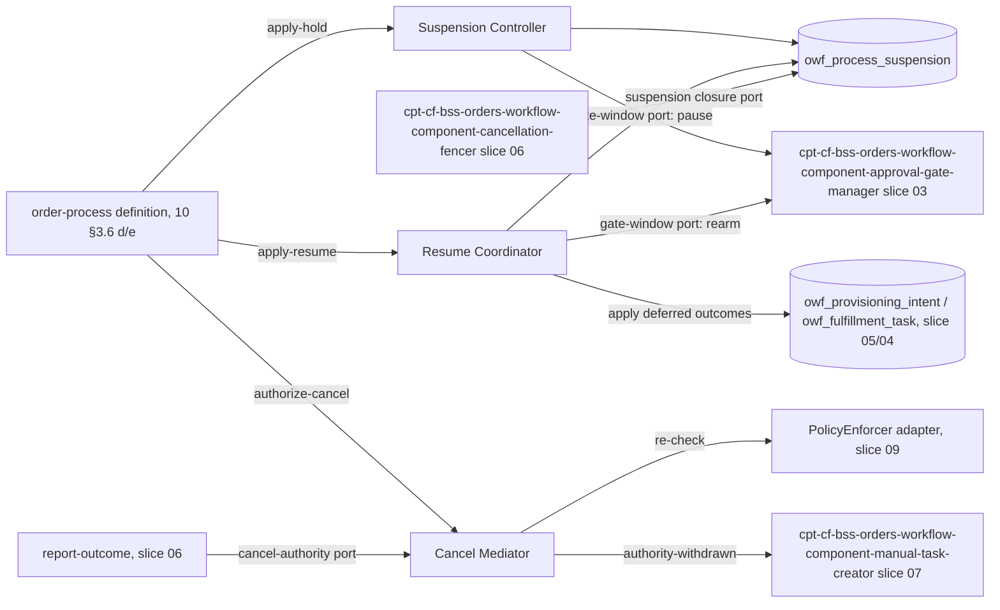

<!-- CONFLUENCE_TITLE: [BSS]: Orders Workflow — Hold and Resume, Dependency Resilience and Workflow-Mediated Cancel (Slice 8) -->
<!-- Related: ../DESIGN.md, ../PRD.md, ./01-foundation.md, ./10-process-definition.md, ./03-approval-execution.md, ./05-provisioning-intents.md, ./06-saga-and-compensation.md, ./09-read-and-authz.md, ./README.md | Owners: BSS Orders team -->

# DESIGN — Hold and Resume, Dependency Resilience and Workflow-Mediated Cancel (Slice 8)


<!-- toc -->

- [1. Architecture Overview](#1-architecture-overview)
  - [1.1 Architectural Vision](#11-architectural-vision)
  - [1.2 Architecture Drivers](#12-architecture-drivers)
  - [1.3 Architecture Layers](#13-architecture-layers)
- [2. Principles & Constraints](#2-principles--constraints)
  - [2.1 Design Principles](#21-design-principles)
  - [2.2 Constraints](#22-constraints)
- [3. Technical Architecture](#3-technical-architecture)
  - [3.1 Domain Model](#31-domain-model)
  - [3.2 Component Model](#32-component-model)
  - [3.3 API Contracts](#33-api-contracts)
  - [3.4 Internal Dependencies](#34-internal-dependencies)
  - [3.5 External Dependencies](#35-external-dependencies)
  - [3.6 Interactions & Sequences](#36-interactions--sequences)
  - [3.7 Database schemas & tables](#37-database-schemas--tables)
  - [3.8 Deployment Topology](#38-deployment-topology)
- [4. Additional context](#4-additional-context)
  - [4.1 Keys and deduplication](#41-keys-and-deduplication)
  - [4.2 Arrival order](#42-arrival-order)
  - [4.3 The apply-time re-check](#43-the-apply-time-re-check)
  - [4.4 Rebuild and fencing are referenced, never restated](#44-rebuild-and-fencing-are-referenced-never-restated)
  - [4.5 The lifetime ceiling](#45-the-lifetime-ceiling)
  - [4.6 Retired responsibilities](#46-retired-responsibilities)
  - [4.7 Constraints this slice places on the definition](#47-constraints-this-slice-places-on-the-definition)
  - [4.8 Cross-slice asks raised by this slice](#48-cross-slice-asks-raised-by-this-slice)
- [5. Traceability](#5-traceability)

<!-- /toc -->

- [ ] `p1` - **ID**: `cpt-cf-bss-orders-workflow-design-hold-and-cancel`
## 1. Architecture Overview

### 1.1 Architectural Vision

This slice provides three **step operations** and sequences none of them. `apply-hold` records
that the process is suspended for an order after `OrderHeld`, pauses the approval-escalation
windows of the gates the definition names through slice 03's gate-window port, and returns the
remaining window; `apply-resume` closes that suspension after `OrderResumed`, re-arms the same
windows through the same port, applies the failure outcomes the hold deferred, and returns the
remainder the definition re-arms; `authorize-cancel` re-checks, at apply time, the authorization
snapshot the control gateway recorded when a Seller Operator's cancel was accepted, and answers
whether the cancel path may proceed into slice 06's fence. The order in which they run, the
`listen` arms that deliver `OrderHeld`, `OrderResumed` and `cancel-requested`, the escalation
`wait` a hold cancels and a resume re-arms, and the branch each returned value selects are the
definition fragments
[`10 §3.6` (e) *Hold and resume*](./10-process-definition.md#e-hold-and-resume) and
[`10 §3.6` (d) *Cancel*](./10-process-definition.md#d-cancel); the protected order they must keep
is the *Hold* and *Unwind* rows of [`10 §4.1` *The fence*](./10-process-definition.md#41-the-fence).
Each operation takes only references and reads what it decides on inside Orders under the PDP
([`../ADR/0013`](../ADR/0013-cpt-cf-bss-orders-workflow-adr-references-not-payloads.md)).

The load-bearing asymmetry of the slice is unchanged: "suspend the process" and "pause every clock
the order is subject to" are not the same claim. A hold stops this gear from issuing new work and
pauses exactly one of this gear's clocks — the approval-escalation window, whose executor is the
definition's `wait` and whose record is `owf_approval_gate` (slice 03). It does not pause the
lifetime ceiling, the barrier, the overdue window or the reconciliation sweep, and it has no
authority over the Subscriptions draft auto-void TTL, which keeps running through a hold; the
consequence is handled by slice 05's draft-liveness re-read inside the wave-2 dispatch, never by
an assumption that drafts survived.

Dependency resilience for Orders Lifecycle, Subscriptions and Payments is **no longer this
slice's**. The retry loop, backoff and budget are the definition's task retry policy executed by
the platform plugin, the circuit breaker is the rule every operation applies to its own outbound
calls ([`01 §4.5`](./01-foundation.md#45-the-envelopes-bound-and-the-caller-side-duplicate-protocol)),
and exhaustion is the definition's failure arm (`10 §3.6` (c)). What stays here is the principle
that this path and slice 03's fail-closed verdict park are different mechanisms. The
workflow-mediated cancel is the third concern: this slice owns only the authorization re-check at
the head of the cancel path; the fence, the reverse walk and the Lifecycle `workflow-cancel`
submission are slice 06's `run-cancellation-fence`, `compensate-order` and `report-outcome`, and
this slice calls no Lifecycle endpoint.

### 1.2 Architecture Drivers

#### Functional Drivers

| Requirement | Design Response |
|-------------|------------------|
| `cpt-cf-bss-orders-workflow-fr-owf-hold-resume` | The definition's hold arm (`10 §3.6` (e)) consumes `OrderHeld` and calls `apply-hold`, which records the suspension, sets the hold predicate the dispatch operations read, and pauses the named gates' escalation windows through slice 03's gate-window port; the resume arm consumes `OrderResumed` and calls `apply-resume`, which closes the suspension, re-arms the same windows through the port, and applies the outcomes the sweep deferred. The definition re-arms the escalation `wait` with the remainder the operation returns. |
| `cpt-cf-bss-orders-workflow-fr-owf-dependency-resilience` | **Moved out of this slice by ADR-0011.** Transient failures are the definition's task retry policy (`10 §2`) plus the per-dependency circuit breaker inside each operation (`01 §4.5`); exhaustion marks the step failed through the definition's failure arm, whose partial-failure policy decides whether a manual task follows (`10 §3.6` (c)). This slice keeps `cpt-cf-bss-orders-workflow-principle-resilience-distinct-from-park`. |
| `cpt-cf-bss-orders-workflow-fr-owf-compensation-execution` | The definition's cancel arm (`10 §3.6` (d)) calls `authorize-cancel` before `run-cancellation-fence`; a withdrawn authority raises one `authority-withdrawn` manual task and leaves the phase unchanged. Fencing, compensation and the Lifecycle submission are slice 06's. |

#### NFR Allocation

| NFR ID | NFR Summary | Allocated To | Design Response | Verification Approach |
|--------|-------------|--------------|-----------------|----------------------|
| `cpt-cf-bss-orders-workflow-nfr-owf-escalation-timer` | Approval escalation timers are configurable per gate, default **72 h**, accuracy within **± 5 min** — and a hold/resume cycle must neither silently extend that window nor misrepresent a foreign clock as paused | `apply-hold`, `apply-resume` (through slice 03's gate-window port) | The remainder is captured by the port against database time into `owf_approval_gate.window_remaining_ms`, the single authority for it (`03 §4.2`); the definition re-arms exactly the value `apply-resume` returns, so the 72 h window is consumed once across any number of cycles; the fire instant is the plugin's durable timer; the draft auto-void TTL is never read, stored or paused by this gear | Cycle test asserting *n* hold/resume cycles on one gate still fire escalation within 72 h + 5 min of the gate opening; redelivery test asserting a second `apply-resume` under the same key returns the stored remainder and re-arms nothing; code-boundary test asserting no local reference to a Subscriptions TTL value |
| `cpt-cf-bss-orders-workflow-nfr-owf-availability` | **99.9 %** control-plane availability, with in-flight processes unaffected by control-plane restarts | the step envelope (`01 §3.2`) and the definition's retry policy; this slice's three operations | Each operation is one unit of work that settles its idempotency record, its audit entry and its rows together, so a crash before commit replays under the same key and a crash after it is absorbed; the suspension survives restart because it is a row, not an engine flag | Restart test asserting a suspended instance, killed between `apply-hold` and the resume arm, resumes on `OrderResumed` with the recorded remainder; replay test asserting every operation is an absorbed duplicate under its key |

#### Key ADRs

| ADR ID | Decision Summary |
|--------|-----------------|
| `cpt-cf-bss-orders-workflow-adr-fail-closed-verdict-park` | The Generic Approval fail-closed park (slice 03) and the retry-then-failure-arm path for the other dependencies are structurally distinct mechanisms with distinct triggers and distinct effects on the Lifecycle `submitted` TTL, and must never be implemented as one path branching on dependency name. |
| `cpt-cf-bss-orders-workflow-adr-flow-as-platform-definition` | Hold, resume and cancel are definition arms; this slice's operations record them. The pause table and the retry governor are retired. |
| `cpt-cf-bss-orders-workflow-adr-definition-versioning-and-protected-steps` | `apply-hold`, `apply-resume` and `authorize-cancel` are `protected`; §4.7 lists the constraints the validation hook enforces for them. |
| `cpt-cf-bss-orders-workflow-adr-references-not-payloads` | Inputs and outputs are event ids, row references and durations; the authorization snapshot and the approver identities never cross the engine boundary. |

### 1.3 Architecture Layers

```text
Presentation   : none (hold and resume are Lifecycle events; cancel enters through
                 09's control operation; escalations render through slice 07's queue)
Application    : Suspension Controller (apply-hold), Resume Coordinator (apply-resume),
                 Cancel Mediator (authorize-cancel, cancel-authority port)
Domain         : ProcessSuspension (read/write); ApprovalGate window columns (through
                 slice 03's gate-window port); FulfillmentTask, ProvisioningIntent (read,
                 deferred-outcome apply)
Infrastructure : owf_process_suspension; owf_process_instance.suspended / phase (through
                 the step envelope); PolicyEnforcer adapter (09) for the re-check
```

- [ ] `p3` - **ID**: `cpt-cf-bss-orders-workflow-tech-hold-and-cancel-stack`

| Layer | Responsibility | Technology |
|-------|---------------|------------|
| Presentation | None dedicated | n/a |
| Application | Three step operations behind the internal step surface | `POST /bss-orders-workflow/v1/steps/{operation}` (`01 §3.3`), `OperationBuilder` |
| Domain | `ProcessSuspension` entity; calls to slice 03's gate-window port and slice 07's manual-task creator in the same unit of work | GTS domain structs |
| Infrastructure | Persistence; PDP re-check | PostgreSQL through `SecureConn`, shared `PolicyEnforcer` adapter |

## 2. Principles & Constraints

### 2.1 Design Principles

#### A Hold Suspends Dispatch, Not Foreign Clocks

- [ ] `p2` - **ID**: `cpt-cf-bss-orders-workflow-principle-hold-suspends-dispatch-only`

Suspension is scoped to what this gear controls: while `owf_process_instance.suspended` is true
the dispatch operations of slice 05 issue no intent the process had not already committed to
issuing, and the approval-escalation windows of the open gates are paused, because a hold must
not let this process's escalation clock burn against the order. It does not, and structurally
cannot, pause the Subscriptions draft auto-void TTL — that TTL is owned and clocked by
Subscriptions and continues through a hold exactly as it would with no hold at all. It does not
pause the lifetime ceiling, the barrier or the overdue window either: those are definition `wait`
arms placed where no hold arm cancels them (§4.7). Already-accepted provisioning intents are not
reversed by a hold; they run to their terminal outcome and are recorded against the frozen plan.
This principle is why nothing in the resume path assumes wave-1 drafts survived: the only
mechanism that detects a voided draft is slice 05's re-read inside the wave-2 dispatch, which runs
whether or not a hold occurred.

#### Retry-Then-Escalate Is Not the Same Mechanism as Fail-Closed Park

- [ ] `p2` - **ID**: `cpt-cf-bss-orders-workflow-principle-resilience-distinct-from-park`

Transient unavailability of Orders Lifecycle, Subscriptions or Payments is a retry-then-failure
concern: the operation answers `retryable-failure`, the definition's task retry policy re-issues
the same key, and on exhaustion the definition's failure arm marks the step failed and hands it to
the configured partial-failure policy. Unavailability of the Generic Approval service is not this
path: slice 03's `obtain-verdict` answers `unobtainable`, the definition routes only to the park
arm, the order stays `submitted`, the Lifecycle `submitted` TTL is not paused, and the park
escalates before it elapses. The two are triggered by different answers, resolved by different
definition arms, and have different effects on Lifecycle-owned clocks; a definition that routes
an `unobtainable` verdict into a retry loop, or a `retry-budget-exhausted` into the park arm, is
refused before publish (§4.7).

**ADRs**: `cpt-cf-bss-orders-workflow-adr-fail-closed-verdict-park`

### 2.2 Constraints

#### Timer Pause Preserves Remaining Window

- [ ] `p2` - **ID**: `cpt-cf-bss-orders-workflow-constraint-timer-remaining-window`

On `OrderHeld`, every open gate's approval-escalation window records its remaining window instead
of being cancelled and forgotten; on `OrderResumed`, the window is re-armed at
`resume_time + remaining_window`, never at `resume_time + full_window`. A hold must not consume
the escalation window, and a resume must not grant a fresh full window the order never had.

The mechanism is slice 03's gate-window port
([`03 §3.2`](./03-approval-execution.md#32-component-model)): `apply-hold` calls
`pause_windows(correlationId, gateRefs, hold)` and `apply-resume` calls
`rearm_windows(correlationId, gateRefs, hold)` inside their own settlement transaction. The
remainder is captured by the port into `owf_approval_gate.window_remaining_ms`, which is the
**single** authority for it (`03 §4.2`); this slice stores no copy of it, and the value either
operation returns is read from that column in the same transaction. Because the port counts pause
causes, a hold that overlaps a Generic Approval outage pause captures nothing a second time and a
resume that leaves the outage cause open re-arms nothing (`03 §4.2`).

#### Hold/Resume Cycles Do Not Extend a Bounded Lifetime Indefinitely

- [ ] `p2` - **ID**: `cpt-cf-bss-orders-workflow-constraint-bounded-hold-resume-cycles`

A single hold/resume cycle preserves the remaining window exactly. It is not enough on its own:
repeated cycling can re-suspend a window with a small remainder just before it fires, deferring
escalation indefinitely without consuming the window in any single hold. The backstop is **not**
the overdue window (slice 07), which only runs once the order is in fulfillment, while the hazard
is cycling in `pending_approval`.

The backstop is the unconditional **`max_process_lifetime` of 90 days** (`DECISIONS.md` D-4,
**Accepted**), which is now the top-level competing `wait` of
[`10 §3.6` (a)](./10-process-definition.md#a-start-and-approval), outside every stage fork, so no
hold arm can cancel it and no resume can re-arm it; on completion the definition calls
`raise-overdue-escalation` with `escalationKind: lifetime-ceiling` and `park` with
`parkReason: lifetime-ceiling` ([`01 §4.2`](./01-foundation.md#42-five-distinct-bounds-two-owners)).
There is deliberately **no cap on the number of hold/resume cycles** and no cap on total held
time; those would refuse a legitimate commercial hold, whereas a lifetime ceiling only refuses an
order that has been non-terminal for a quarter of a year. On expiry the order still reaches a
decided outcome through a human, not through a timeout. The ceiling most often fires while the
instance is `suspended`; the phase table of
[`01 §3.7`](./01-foundation.md#table-owf_process_instance) permits `park` from `started` and, for
`parkReason = lifetime-ceiling` only, from `suspended`, with the open suspension left open because
the hold is still Lifecycle's fact, and its `unpark` restores `suspended` (decision D-82: the
lifetime-ceiling park is permitted from `suspended` and leaves the suspension open). This slice writes nothing against the ceiling.

#### One Open Suspension Per Order, Reconciled Regardless of Arrival Order

- [ ] `p2` - **ID**: `cpt-cf-bss-orders-workflow-constraint-one-open-suspension`

"At most one unsettled suspension per order" is carried by the **partial unique index**
`UNIQUE (order_id) WHERE state IN ('open', 'resume_ahead')` on `owf_process_suspension` (§3.7),
not by a read-then-insert. Event-id uniqueness is separate and weaker: `UNIQUE (order_id,
triggering_event_id)` absorbs a redelivered `OrderHeld`, but two holds with different event ids
would both satisfy it. The partial index arbitrates: the second hold loses the insert, is an
absorbed duplicate in `owf_step_log`, pauses nothing a second time and leaves the open suspension
untouched.

**`OrderHeld` and `OrderResumed` are not assumed to arrive in order.** Broker delivery to a
`listen` is at-least-once with no ordering guarantee, and the failure mode is not symmetric: a
resume that arrives first and is discarded leaves the subsequent hold suspending the instance
permanently. The operations therefore reconcile the pair by state:

- `apply-resume` with an open suspension: closes it (`closed_reason = resumed`), re-arms its
  windows, records `resume_event_id`.
- `apply-resume` with **no** open suspension: inserts a `resume_ahead` row carrying
  `resume_event_id` and answers `resume-ahead-recorded`; nothing is re-armed, because nothing was
  paused, and the event is not discarded.
- `apply-hold` while a `resume_ahead` row exists: consumes it (`closed_reason =
  reconciled-out-of-order`), pauses no window, leaves `suspended` false, and answers
  `reconciled-out-of-order`, so the definition does not enter the resume wait.
- A redelivered `OrderResumed` is an absorbed duplicate under its key and, below the key, under
  `UNIQUE (order_id, resume_event_id)`.

This reconciliation needs the definition to consume a resume that arrives while no hold arm is
waiting; that is the resume arm §4.7 item 3 requires in every stage fork that carries a hold arm.

#### A Hold Freezes Failure-Producing Transitions, Not Only Dispatch

- [ ] `p2` - **ID**: `cpt-cf-bss-orders-workflow-constraint-hold-aware-sweep`

The reconciliation sweep (slice 05, `reconcile-intent` and the `reconciliation-sweep` worker) is
**hold-aware**. While `owf_process_instance.suspended` is true, it continues to *read* the
terminal outcome of already-accepted intents and to record that outcome on
`owf_provisioning_intent` — stopping it would lose confirmations that arrive during a long hold.
What it **MUST NOT** do is act on a failure it read: while suspended it **MUST NOT** advance an
`owf_fulfillment_task` to `failed`, **MUST NOT** answer the definition with a failure that enters
the partial-failure arm, and **MUST NOT** create a manual task. A terminal failure observed during
a hold is recorded on the intent as deferred. `apply-resume` applies the deferred outcomes, in
observation order, in its own settlement transaction and returns the affected task references, so
the definition enters the failure arm only after the hold is lifted.

Without this rule a held order — one an operator or Lifecycle has deliberately frozen — could have
a task advanced to `failed` underneath the freeze and the partial-failure policy fired on it,
which is the one thing "the order is on hold" guarantees cannot happen. The sweep's ladder and
cap are unaffected: the counterparty state at Subscriptions keeps moving whether this gear is
suspended or not. The guard lives inside slice 05's operation; this slice states it and consumes
its deferred rows (§4.8 item 3).

#### Cancel Submission Follows Fencing, Never Precedes It

- [ ] `p2` - **ID**: `cpt-cf-bss-orders-workflow-constraint-cancel-follows-fencing`

The workflow-mediated cancel **MUST NOT** submit to Lifecycle, and **MUST NOT** report the order
cancelled, while a compensating action is outstanding. In the definition this is the fence order
`authorize-cancel` **<** `run-cancellation-fence` **<** `compensate-order` **<** `report-outcome`
of `10 §4.1`, and `report-outcome` (slice 06) is the **only** caller of the Lifecycle
`workflow-cancel` endpoint and the only emitter of `OrderFulfillmentAborted` on this path; it
refuses while the fence row's `no_active_verified_at` is null. A `FulfillmentTask` remains
unilaterally cancellable until its activation intent is accepted by Subscriptions; draft-create
acceptance alone does not close that window (slice 06).

**ADRs**: `cpt-cf-bss-orders-workflow-adr-fail-closed-verdict-park`,
`cpt-cf-bss-orders-workflow-adr-definition-versioning-and-protected-steps`

## 3. Technical Architecture

### 3.1 Domain Model

**Technology**: GTS, Rust structs

**Location**: [`../DESIGN.md`](../DESIGN.md) §3.1 (gear-wide domain-model index); the entities
below are normative in this slice, with their columns in §3.7.

**Core Entities**:

- [ ] `p2` - **ID**: `cpt-cf-bss-orders-workflow-entity-process-suspension`
- [ ] `p2` - **ID**: `cpt-cf-bss-orders-workflow-entity-timer-pause-record`

| Entity | Description | Schema |
|--------|-------------|--------|
| `ProcessSuspension` | Records that a process instance is suspended for an order following `OrderHeld`: suspension time, triggering event id, the gate references whose windows were paused, and how it closed | [owf_process_suspension](#table-owf_process_suspension) |
| `TimerPauseRecord` | **Retired by ADR-0011; responsibility now**: the pause of an approval-escalation window is the `hold` member of `owf_approval_gate.pause_causes` with the remainder in `window_remaining_ms`, written through slice 03's gate-window port by `apply-hold`/`apply-resume` (`03 §4.2`); the fire instant is the definition's `wait` | columns of `owf_approval_gate`; no table |

**Relationships**:
- Order (process instance) → `ProcessSuspension`: at most one unsettled record per order, enforced
  by the partial unique index of `cpt-cf-bss-orders-workflow-constraint-one-open-suspension`;
  created by `apply-hold`, closed by `apply-resume` or, on an unwind taken from hold, by the
  suspension closure port called from slice 06's `run-cancellation-fence`; a resume that precedes
  its hold is held as a `resume_ahead` record under the same index.
- `ProcessSuspension` → `owf_approval_gate` (slice 03): `paused_gate_refs` names the gates whose
  windows `apply-hold` paused; `apply-resume` re-arms exactly those. Never a pause of the
  lifetime, barrier or overdue waits, which have no Orders record to pause.
- `ProcessSuspension` → `cpt-cf-bss-orders-workflow-entity-provisioning-intent` (slice 05): not
  directly related — the dispatch operations read `owf_process_instance.suspended`, and the
  deferred outcomes are flags on the intent that `apply-resume` applies.
- `ProcessSuspension` → `cpt-cf-bss-orders-workflow-component-cancellation-fencer` (slice 06): a
  Seller Operator may cancel while the order is held; the cancel path does not require the
  suspension to be resumed first, and the fence closes it with `closed_reason =
  cancelled-from-hold`.

### 3.2 Component Model


```mermaid
graph LR
    DEF[order-process definition, 10 §3.6 d/e] -->|apply-hold| SC[Suspension Controller]
    DEF -->|apply-resume| RC[Resume Coordinator]
    DEF -->|authorize-cancel| CM[Cancel Mediator]
    SC --> PS[(owf_process_suspension)]
    RC --> PS
    SC -->|gate-window port: pause| AGM[cpt-cf-bss-orders-workflow-component-approval-gate-manager slice 03]
    RC -->|gate-window port: rearm| AGM
    RC -->|apply deferred outcomes| PI[(owf_provisioning_intent / owf_fulfillment_task, slice 05/04)]
    CM -->|re-check| PDP[PolicyEnforcer adapter, slice 09]
    CM -->|authority-withdrawn| MTC[cpt-cf-bss-orders-workflow-component-manual-task-creator slice 07]
    CF[cpt-cf-bss-orders-workflow-component-cancellation-fencer slice 06] -->|suspension closure port| PS
    OR[report-outcome, slice 06] -->|cancel-authority port| CM
```

#### Suspension Controller

- [ ] `p2` - **ID**: `cpt-cf-bss-orders-workflow-component-suspension-controller`

##### Why this component exists

`on_hold` changes what the process is permitted to do; without one component owning the record of
that change, the hold predicate the dispatch operations read and the paused escalation windows
could drift apart.

##### Responsibility scope

Owns `apply-hold` (§3.3). In one unit of work: inserts the `ProcessSuspension` under the partial
unique index (a losing insert is an absorbed duplicate, never a second suspension) or consumes a
`resume_ahead` row; sets `owf_process_instance.suspended` and moves the phase projection
`started → suspended` through the envelope; calls the gate-window port's `pause_windows` for the
`gateRefs` the definition passes and records them on the suspension; and returns the smallest
remainder the port reports. It pauses nothing else.

**Intents are partitioned by three states, not two.** A hold reaches an outbound provisioning
intent in one of three conditions; the behaviour is enforced by slice 05's dispatch operations
reading the predicate this component sets:

| Intent state at hold | Behaviour |
|---|---|
| Not yet submitted (`pending`) | The dispatch operation issues nothing (`deferReason = held`). The intent stays `pending` with its idempotency key unconsumed; it is dispatched after resume, or voided if the order is unwound. |
| Submitted, outcome not yet known | The call **is completed**, not abandoned. A dispatch operation already running finishes its unit of work; if the hold cancels the definition task that issued it, the definition's re-issue after resume carries the same key and is either an absorbed duplicate or the same-key disambiguation of the caller-side duplicate protocol (`01 §4.5`). A same-key re-issue while suspended is permitted for exactly this reason: it can only return the recorded outcome or create the intent the process had already committed to. |
| Already accepted | Runs to terminal outcome; a hold never reverses it. Acting on a *failure* outcome is deferred per `cpt-cf-bss-orders-workflow-constraint-hold-aware-sweep`. |

##### Responsibility boundaries

Never voids wave-1 drafts and never reads, stores or pauses the Subscriptions draft auto-void TTL.
Never pauses the lifetime ceiling, the overdue window, the barrier or the sweep — it has no record
to pause them with, and the definition places them outside the hold arm. Never writes the gate
window columns directly; only through the port. Never advances an `owf_fulfillment_task`, never
enters the partial-failure policy, never decides remediation, compensation or cancellation.

##### Related components (by ID)

- `cpt-cf-bss-orders-workflow-component-resume-coordinator` — shares model with
- `cpt-cf-bss-orders-workflow-component-approval-gate-manager` — calls (gate-window port, slice 03)
- `cpt-cf-bss-orders-workflow-component-intent-dispatcher` — read by (slice 05 reads the hold predicate)
- `cpt-cf-bss-orders-workflow-component-step-executor` — runs within (slice 01 envelope)

#### Resume Coordinator

- [ ] `p2` - **ID**: `cpt-cf-bss-orders-workflow-component-resume-coordinator`

##### Why this component exists

Resume is not a fresh start: it must restore exactly the window state the hold paused, apply what
the hold deferred, and do so without assuming anything about drafts a foreign clock may have
voided.

##### Responsibility scope

Owns `apply-resume` (§3.3). In one unit of work: closes the open `ProcessSuspension`
(`closed_reason = resumed`) or, with none open, inserts a `resume_ahead` row; clears
`owf_process_instance.suspended` and moves the phase projection `suspended → started`; calls the
gate-window port's `rearm_windows` for the suspension's `paused_gate_refs`; applies the
failure outcomes slice 05 recorded as deferred during the hold, in observation order, advancing
the affected `owf_fulfillment_task` rows to `failed`; and returns the remainder the port reports
and the references of the tasks it failed.

**Resume re-evaluates; it does not wait for a spent signal.** There is no one-shot barrier timer
any more: the barrier is the definition's poll `wait` plus `evaluate-activation-eligibility`
(slice 04), which answers `released: false` while `suspended` is true and is re-invoked on every
poll. After `apply-resume` clears the predicate, the next evaluation of the barrier's conditions
is by level, so an expected-fulfillment instant that passed during the hold releases wave 2 on
the first evaluation after resume. This component writes none of the barrier's conditions.

**Drafts are re-read by the wave-2 dispatch, not here.** The pre-activation draft-liveness re-read
and the wave-1 rebuild are inside slice 05's wave-2 dispatch path (`10 §3.6` (b)), which every
activation passes through whether or not a hold occurred; this component neither calls nor
duplicates them.

##### Responsibility boundaries

Does not compute or store the Subscriptions draft auto-void TTL; does not maintain a parallel
draft-liveness record; does not re-arm, fire or reset any barrier or lifetime `wait`; never grants
a window a fresh full duration — it re-arms through the port, which re-arms only when the window's
`pause_causes` becomes empty. Never enters the partial-failure policy itself; it returns the
failed task references and the definition's failure arm does.

##### Related components (by ID)

- `cpt-cf-bss-orders-workflow-component-suspension-controller` — shares model with
- `cpt-cf-bss-orders-workflow-component-approval-gate-manager` — calls (gate-window port, slice 03)
- `cpt-cf-bss-orders-workflow-component-reconciliation-sweep` — consumes the deferred outcomes of (slice 05)
- `cpt-cf-bss-orders-workflow-component-activation-barrier-timer-owner` — no longer related; retired in slice 05, the barrier's conditions are re-evaluated by `evaluate-activation-eligibility`

#### Dependency Retry Governor

- [ ] `p2` - **ID**: `cpt-cf-bss-orders-workflow-component-dependency-retry-governor`

**Retired by ADR-0011; responsibility now**: the retry loop, backoff, jitter and attempt budget are
the definition's task retry policy executed by the platform plugin (`10 §2`, working baselines in
[`01 §4.2`](./01-foundation.md#42-five-distinct-bounds-two-owners)); the per-dependency circuit
breaker is applied by every operation to its own outbound calls
([`01 §4.5`](./01-foundation.md#45-the-envelopes-bound-and-the-caller-side-duplicate-protocol));
exhaustion is the definition's failure arm and the partial-failure policy (`10 §3.6` (c)). The
per-dependency budget table formerly here is superseded by the definition's per-task retry policy,
which **MAY** be tighter per task and **MUST** nest inside the task timeout (`10 §2.2` rule 4)
(decision D-70: the per-dependency retry budgets of the former governor
are superseded by the definition's task retry policy under the nesting rule). Slice 04's Catalog
read, which the governor used to wrap, is covered by the same rule (`04 §3.2`).

#### Cancel Mediator

- [ ] `p2` - **ID**: `cpt-cf-bss-orders-workflow-component-cancel-mediator`

##### Why this component exists

An authorized cancellation can outlive its authority: the fence can take days when a compensating
leg is blocked. Without one component re-asking the PDP at apply time, a revoked operator could
drive destructive calls long after the grant behind them was withdrawn.

##### Responsibility scope

Owns `authorize-cancel` (§3.3) and the **cancel-authority port**
`recheck_cancel_authority(correlationId, cancelRequestRef, point)`, `point` ∈ `pre-fence` ·
`pre-compensation` · `pre-submission`. `authorize-cancel` runs the port at `pre-fence`; slice 06
runs it at `pre-compensation` inside `compensate-order` before the first compensating leg on the
cancel trigger, and at `pre-submission` inside `report-outcome` before the `workflow-cancel`
submission — the "first irreversible call" and "final state-changing submission" of
[`09 §4.4`](./09-read-and-authz.md#44-authorized-invocation-resource-ownership-and-apply-time-re-check-normative).
The port reads the **authorization snapshot** the control gateway recorded with the accepted
cancel (`09 §4.4`; the request record `cancelRequestRef` names), rebuilds a `SecurityContext` from
its four subject fields without a bearer token, and re-runs the snapshot's `(resource, action)`
decision on the same target through the shared `PolicyEnforcer` adapter. On allow it answers
`authorized`. On deny, or a fresh scope that matches zero rows, it raises **one** manual task with
reason `authority-withdrawn` through slice 07's creator in the same unit of work, leaves the phase
unchanged, and answers `withdrawn`. On a PDP outage it answers `retryable-failure` (canonical 503)
and changes nothing.

##### Responsibility boundaries

Does not implement or sequence the five fencing steps, the two compensation legs or the Lifecycle
submission — all slice 06. Never calls Lifecycle. Never enters `parked`: a withdrawn authority is
not an unobtainable verdict (`09 §4.4`). Never re-authorizes: a new authorization is a new accepted
command with its own snapshot, submitted by a human who resolves the `authority-withdrawn` task.

##### Related components (by ID)

- `cpt-cf-bss-orders-workflow-component-cancellation-fencer` — precedes (slice 06; the fence runs only after `authorized`)
- `cpt-cf-bss-orders-workflow-component-compensation-executor` — called by (slice 06, `pre-compensation` and `pre-submission` re-checks)
- `cpt-cf-bss-orders-workflow-component-manual-task-creator` — calls (slice 07, `authority-withdrawn`)

### 3.3 API Contracts

#### Step operations

The three operations below are registered against the operation registration boundary
([`01 §3.2`](./01-foundation.md#32-component-model)) with the contract fields of
[`01 §3.3` *The step-operation contract*](./01-foundation.md#the-step-operation-contract), are
mirrored into `owf_step_operation`, and are reachable only as
`POST /bss-orders-workflow/v1/steps/{operation}` by the serverless-runtime service principal under
PDP resource `gts.cf.bss.orders_workflow.process_step.v1~` × `execute`. Every input carries the
reference tuple of `10 §3.6` — `correlationId`, `orderId`, `orderVersion`, `resourceTenantId`,
`invocationId`, `attemptId` — written **ref** below; every other member is an event id, a row
reference or a small enum, and every output member is a reference, an enum or a duration. Every
operation resolves `correlationId` to the instance, narrows every read and write to its
`resource_tenant_id` and `seller_tenant_id`, and answers `permanent-failure` with
`version-mismatch` once the instance is terminal. Input and output schemas are
`gts.cf.bss.orders_workflow.step.<name>.input.v1~` / `….output.v1~`.

| `name` | `protection` | `input` | `output` | `idempotency_key` | `declared_event` | `compensation` | `reasons` | `audit_kind` | `retry_class` | `deadline` |
|--------|--------------|---------|----------|-------------------|------------------|----------------|-----------|--------------|---------------|------------|
| `apply-hold` | `protected` | ref + `holdEventId`, `gateRefs[]` (the references `open-gates` last returned; empty outside the approval stage) | `holdOutcome` ∈ `suspended` · `reconciled-out-of-order` · `absorbed-duplicate` · `not-applicable`; `suspensionRef` (nullable); `escalationRemaining` (duration, nullable — null when no named window was armed) | instance-scoped `{tenant}:{correlationId}:apply-hold:{holdEventId}` | none (`OrderHeld` is Lifecycle's) | `apply-resume` (the paired close, like `park`/`unpark`; not a saga leg) | `version-mismatch`, `not-found` (a `gateRef` not of this instance), `idempotency-key-conflict` | `phase-transition` | `retryable-on: transient` | 5 s |
| `apply-resume` | `protected` | ref + `resumeEventId`, `suspensionRef` (nullable — null on the stage-level resume arm) | `resumeOutcome` ∈ `resumed` · `resume-ahead-recorded` · `absorbed-duplicate`; `escalationRemaining` (duration, nullable); `due: true\|false` — database time against the escalation deadline re-armed from the stored `window_remaining_ms` (true when no remainder is left), the answer the resumed escalation re-check loop switches on first (`10 §3.6` (e)); `failedTaskRefs[]` (tasks advanced to `failed` from deferred outcomes; opaque `owf_fulfillment_task` references) | instance-scoped `{tenant}:{correlationId}:apply-resume:{resumeEventId}` | none (`OrderResumed` is Lifecycle's) | none | `version-mismatch`, `not-found` (a `suspensionRef` not of this instance), `idempotency-key-conflict` | `phase-transition` | `retryable-on: transient` | 5 s |
| `authorize-cancel` | `protected` | ref + `cancelRequestRef` | `authorized` (bool); `taskRef` (the `authority-withdrawn` manual task, on `authorized = false`) | instance-scoped `{tenant}:{correlationId}:authorize-cancel:{cancelRequestRef}` | none (`OrderFulfillmentAborted` is `report-outcome`'s, slice 06) | none | `authority-withdrawn` (recorded refusal, rides the task), `not-found` (a request not of this instance), `version-mismatch`, `per-attempt-timeout`, `idempotency-key-conflict` | `step-completion` | `retryable-on: transient` | 10 s (one PDP decision) |

**What each answer means to the definition.** `suspended` enters the resume wait of `10 §3.6` (e);
`reconciled-out-of-order`, `absorbed-duplicate` and `not-applicable` are settled successes that
return to the stage the hold arm interrupted. `resumed` and `resume-ahead-recorded` return to the
stage with `escalationRemaining` as the escalation window left and `due` as the first answer of
its re-check loop (a 1.0.0 `wait` takes no runtime expression, `10 §3.6`); a non-empty
`failedTaskRefs[]` routes to the partial-failure arm of `10 §3.6` (c) first. `authorized = true`
routes into `run-cancellation-fence`; `authorized = false` is a settled success that returns to
where the cancel arm was taken (§4.7 item 5). A PDP outage is `retryable-failure` without a
Workflow reason (canonical `ServiceUnavailable`, `01 §4.9`); its exhaustion is §4.7 item 6.

`not-applicable` answers a hold consumed in a phase other than `started` — `parked` or
`compensating` — and records the event in `owf_step_log` without a suspension row: a hold does not
interrupt an unwind already running, and a parked instance dispatches nothing to suppress.

#### Hold and resume consumption

- [ ] `p2` - **ID**: `cpt-cf-bss-orders-workflow-interface-hold-resume-consumer`

- **Contracts**: `cpt-cf-bss-orders-workflow-contract-owf-lifecycle-transition`
- **Technology**: definition `listen` arms of the running invocation (`10 §2`, `10 §3.6` (e)),
  delivered by the platform from the broker; **this slice owns no subscription and no consumer**.
- **Location**: the hold arm, the resume arm and the stage-level resume arm of `10 §3.6` (e);
  admission per the trigger-to-outcome table of
  [`02 §3.3`](./02-triggers-and-start.md#33-api-contracts) (`OrderHeld` → `apply-hold`,
  `OrderResumed` → `apply-resume`).

**Endpoints Overview**:

| Method | Path | Description | Stability |
|--------|------|--------------|-----------|
| n/a (event) | `OrderHeld` | `listen` in every stage fork, correlated on `orderId`/`orderVersion`; the arm calls `apply-hold` keyed by the event id | unstable |
| n/a (event) | `OrderResumed` | `listen` in the resume wait and in every stage fork carrying a hold arm; the arm calls `apply-resume` keyed by the event id | unstable |
| n/a (signal) | `cancel-requested` | `:plugin-control` signal delivered by 09's control operation (`10 §3.3`); the cancel arm calls `authorize-cancel` | unstable |
| `POST` | `/bss-orders-workflow/v1/steps/apply-hold` · `…/apply-resume` · `…/authorize-cancel` | The three step routes of the table above, callable only by the serverless-runtime service principal (`01 §3.3`) | unstable |

The Lifecycle `workflow-cancel` endpoint is no longer listed here: its only caller is slice 06's
`report-outcome`.

### 3.4 Internal Dependencies

| Dependency Gear | Interface Used | Purpose |
|-------------------|----------------|----------|
| serverless-runtime | Running invocation's `listen` arms and `:plugin-control` signals (by reference, `10 §3.3`) | Delivers `OrderHeld`, `OrderResumed` and `cancel-requested` to the definition, which calls this slice's operations; **no code today** (`10 §1`) |
| bss-orders-workflow (slice 03) | Gate-window port `pause_windows` / `rearm_windows` of `cpt-cf-bss-orders-workflow-component-approval-gate-manager` | The only way this slice pauses or re-arms an escalation window; the remainder's authority stays on `owf_approval_gate` |
| bss-orders-workflow (slice 05) | Hold predicate read by the dispatch operations; deferred-outcome flags on `owf_provisioning_intent` | Dispatch suppression while suspended; the outcomes `apply-resume` applies |
| bss-orders-workflow (slice 06) | Suspension closure port (this slice's, called by `run-cancellation-fence`); cancel-authority port (this slice's, called by `compensate-order` and `report-outcome`) | Close a suspension on an unwind taken from hold; re-check authority between legs |
| bss-orders-workflow (slice 07) | `cpt-cf-bss-orders-workflow-component-manual-task-creator` | The `authority-withdrawn` task |
| bss-orders-workflow (slice 09) | Authorization snapshot on the accepted cancel's request record; `PolicyEnforcer` adapter | The apply-time re-check |
| bss-orders-workflow (slice 03) | `cpt-cf-bss-orders-workflow-actor-owf-generic-approval` fail-closed park (referenced, not called) | Boundary reference only, to keep the two resilience paths distinct |

**Dependency Rules** (per project conventions):
- No circular dependencies
- Always use SDK modules for inter-gear communication
- No cross-category sideways deps except through contracts
- Only integration/adapter gears talk to external systems
- `SecurityContext` must be propagated across all in-process calls

### 3.5 External Dependencies

#### Orders Lifecycle (BSS)

- **Contract**: `cpt-cf-bss-orders-workflow-contract-owf-lifecycle-transition`

| Dependency Gear | Interface Used | Purpose |
|-------------------|---------------|----------|
| bss-orders-lifecycle | none called by this slice | `OrderHeld` / `OrderResumed` arrive through the definition's `listen`; the `workflow-cancel` submission is slice 06's `report-outcome` |

#### Subscriptions (BSS)

- **Contract**: `cpt-cf-bss-orders-workflow-contract-owf-provisioning-intent`

| Dependency Gear | Interface Used | Purpose |
|-------------------|---------------|----------|
| bss-subscriptions | none called by this slice | Dispatch, re-read and reconcile are slice 05's operations; their retry is the definition's policy |

#### Payments (BSS)

| Dependency Gear | Interface Used | Purpose |
|-------------------|---------------|----------|
| bss-payments | none called by this slice | The authorization is slice 04's `evaluate-payment-auth-eligibility`; re-authorization arrives as the `reauthorize-requested` plugin-control signal that slice 04's arm consumes (`04 §3.3`), not through this slice |

### 3.6 Interactions & Sequences

#### Hold Then Resume with Remaining-Window Timer Preservation

**ID**: `cpt-cf-bss-orders-workflow-seq-hold-then-resume`

**Actors**: `cpt-cf-bss-orders-workflow-actor-owf-orders-lifecycle`, `cpt-cf-bss-orders-workflow-actor-owf-generic-approval`

The definition task → operation → record chain is fragment
[`10 §3.6` (e)](./10-process-definition.md#e-hold-and-resume); the YAML is not repeated here.

```mermaid
sequenceDiagram
    participant LC as Lifecycle
    participant D as Definition (gateLoop fork)
    participant H as apply-hold
    participant R as apply-resume
    participant G as gate-window port (03)
    participant PS as owf_process_suspension
    LC -->> D: OrderHeld (listen, hold arm wins; escalation wait cancelled)
    D ->> H: ref + holdEventId, gateRefs
    alt resume_ahead row exists
        H ->> PS: close it (reconciled-out-of-order); pause nothing
        H -->> D: reconciled-out-of-order → back to the stage
    else no unsettled row
        H ->> PS: insert open (partial unique index arbitrates), paused_gate_refs
        H ->> G: pause_windows(gateRefs, hold) → captured remainder
        H -->> D: suspended, suspensionRef, escalationRemaining
    end
    Note over D: resume wait: resume × amendment × cancel;<br/>lifetime wait (top level), barrier poll, overdue wait keep running;<br/>draft auto-void TTL untouched
    LC -->> D: OrderResumed (listen)
    D ->> R: ref + resumeEventId, suspensionRef
    R ->> PS: close (resumed)
    R ->> G: rearm_windows(paused_gate_refs, hold) → remainder
    R ->> R: apply deferred failure outcomes in observation order
    R -->> D: resumed, escalationRemaining, failedTaskRefs
    D ->> D: failedTaskRefs non-empty → partial-failure arm (10 §3.6 c); else re-enter gateLoop with wait = escalationRemaining
```

**Description**: Both events are keyed by their event id, and both have a durable dedup row below
the key, so neither arrival order nor redelivery can leave the instance suspended with no resume
able to release it. Only the escalation `wait` is cancelled by the hold arm; the barrier's
conditions are re-evaluated by level after resume by `evaluate-activation-eligibility` (slice 04).

**`apply-hold` — inside the operation**:

1. [ ] - `p1` - Lock the `owf_process_instance` row; **IF** `phase` is `parked` or `compensating` **RETURN** `holdOutcome = not-applicable` and record the event in `owf_step_log` - `inst-ah-phase`
2. [ ] - `p1` - **IF** a `resume_ahead` row exists for the order, set it `closed` with `closed_reason = reconciled-out-of-order`, `triggering_event_id = holdEventId`, `closed_at = now()`, and **RETURN** `reconciled-out-of-order` - `inst-ah-consume-ahead`
3. [ ] - `p1` - Insert the `open` row with `triggering_event_id`, `suspended_at = now()` (database time) and `paused_gate_refs = gateRefs`; **IF** the partial unique index refuses it, **RETURN** `absorbed-duplicate` with the existing row's `suspensionRef` and change nothing - `inst-ah-insert`
4. [ ] - `p1` - Set `owf_process_instance.suspended = true` and the phase projection `started → suspended` through the envelope - `inst-ah-predicate`
5. [ ] - `p1` - Call the gate-window port `pause_windows(correlationId, gateRefs, hold)`; the port captures each armed window's remainder into `owf_approval_gate.window_remaining_ms` and reports it - `inst-ah-pause`
6. [ ] - `p1` - **RETURN** `suspended`, `suspensionRef` and the smallest reported remainder as `escalationRemaining` (null when none was armed); the envelope settles the key, writes `phase-transition` and commits once - `inst-ah-return`

**`apply-resume` — inside the operation**:

1. [ ] - `p1` - Lock the `owf_process_instance` row; resolve the open suspension (by `suspensionRef` if given, else the order's `open` row) - `inst-ar-resolve`
2. [ ] - `p1` - **IF** none is open, insert a `resume_ahead` row with `resume_event_id`; **IF** `UNIQUE (order_id, resume_event_id)` or the partial index refuses it, **RETURN** `absorbed-duplicate`; else **RETURN** `resume-ahead-recorded` with null `escalationRemaining` and empty `failedTaskRefs` - `inst-ar-ahead`
3. [ ] - `p1` - Close the row: `state = closed`, `closed_reason = resumed`, `resume_event_id`, `resumed_at = closed_at = now()` - `inst-ar-close`
4. [ ] - `p1` - Clear `owf_process_instance.suspended` and move the phase projection `suspended → started` - `inst-ar-predicate`
5. [ ] - `p1` - Call the gate-window port `rearm_windows(correlationId, paused_gate_refs, hold)`; the port re-arms only windows whose `pause_causes` becomes empty and reports each remainder - `inst-ar-rearm`
6. [ ] - `p1` - Apply every deferred failure outcome slice 05 recorded for the instance during the suspension, ordered by observation instant: advance the task to `failed` with the recorded reason and clear the deferral - `inst-ar-deferred`
7. [ ] - `p1` - **RETURN** `resumed`, the smallest reported remainder as `escalationRemaining` and the failed tasks as `failedTaskRefs`; one commit - `inst-ar-return`

#### Transient Outage: Retry-Then-Manual-Task

**ID**: `cpt-cf-bss-orders-workflow-seq-dependency-retry-escalate`

**Actors**: `cpt-cf-bss-orders-workflow-actor-owf-orders-lifecycle`, `cpt-cf-bss-orders-workflow-actor-owf-subscriptions`, `cpt-cf-bss-orders-workflow-actor-owf-payments`, `cpt-cf-bss-orders-workflow-actor-owf-fulfillment-operator`

**Retired as a slice-08 sequence by ADR-0011; the path now**: definition task → operation
(`retryable-failure`, key left `open`, breaker refusal not counted as an attempt, `01 §4.5`) →
plugin retry under the task's retry policy with the same key → on exhaustion the stage's failure
arm → `create-manual-task` under `remediate`, or the unwind path under `fail-fast`
([`10 §3.6` (c)](./10-process-definition.md#c-partial-failure-manual-task-resume-or-compensate)).
The step is marked failed exactly once, by the operation that owns it, and the partial-failure
policy — never a retry component — decides whether a manual task follows.

#### Generic Approval Park (Distinguished, Not This Slice's Path)

**ID**: `cpt-cf-bss-orders-workflow-seq-generic-approval-park-reference`

**Use cases**: `cpt-cf-bss-orders-workflow-usecase-owf-approval-escalation`

**Actors**: `cpt-cf-bss-orders-workflow-actor-owf-generic-approval`, `cpt-cf-bss-orders-workflow-actor-owf-fulfillment-operator`

```mermaid
sequenceDiagram
    participant D as Definition
    participant OV as obtain-verdict (03)
    D ->> OV: ref
    OV -->> D: unobtainable (key left open)
    Note over D: park arm only (03 §4.5 item 2): park → arm-park-escalation → parkLoop;<br/>order remains submitted; Lifecycle submitted TTL NOT paused;<br/>no hold arm in the park loop
    D ->> D: wait escalateAfter → raise-overdue-escalation (park)
```

**Description**: Shown for boundary clarity only; the sequence is slice 03's and fragment
`10 §3.6` (a). It is never entered from a retry-budget exhaustion, and a retry-budget exhaustion is
never routed into it (§4.7 item 7).

#### Workflow-Mediated Cancel with Compensation Evidence

**ID**: `cpt-cf-bss-orders-workflow-seq-workflow-mediated-cancel`

**Use cases**: `cpt-cf-bss-orders-workflow-usecase-owf-cancel-with-rollback`

**Actors**: `cpt-cf-bss-orders-workflow-actor-owf-seller-operator`, `cpt-cf-bss-orders-workflow-actor-owf-orders-lifecycle`, `cpt-cf-bss-orders-workflow-actor-owf-subscriptions`

The chain is fragment [`10 §3.6` (d)](./10-process-definition.md#d-cancel).

```mermaid
sequenceDiagram
    participant SO as Seller Operator
    participant GW as Control gateway (09)
    participant D as Definition (cancel arm)
    participant AC as authorize-cancel
    participant F as run-cancellation-fence (06)
    participant C as compensate-order (06)
    participant O as report-outcome (06)
    SO ->> GW: POST …/workflows/{orderId}/cancel
    GW ->> GW: authorize, record request + authorization snapshot
    GW -->> D: cancel-requested signal (:plugin-control)
    D ->> AC: ref + cancelRequestRef
    AC ->> AC: re-check snapshot at pre-fence
    alt withdrawn
        AC ->> AC: one authority-withdrawn manual task (07); phase unchanged
        AC -->> D: authorized = false → return to the arm's origin
    else allowed
        AC -->> D: authorized = true
        D ->> F: fence (closes an open suspension: cancelled-from-hold)
        D ->> C: reverse walk (re-check at pre-compensation)
        D ->> O: outcome cancelled (re-check at pre-submission) → Lifecycle workflow-cancel with evidence
    end
```

**Description**: No task on this path calls Lifecycle before `report-outcome`, and `report-outcome`
refuses while any compensating action is outstanding. The **Seller Operator** is the only actor
authorized to request this path (`09 §4.1`); a Fulfillment Operator who concludes an order must be
cancelled uses the `escalate` task resolution, which routes the decision to a Seller Operator.

**`authorize-cancel` — inside the operation**:

1. [ ] - `p1` - Resolve `cancelRequestRef` to the accepted cancel's request record for this `correlationId`; **IF** absent or of another instance **RETURN** `permanent-failure` `not-found` - `inst-ac-resolve`
2. [ ] - `p1` - Run the cancel-authority port at `pre-fence`: rebuild the `SecurityContext` from the snapshot's subject fields (no bearer token) and request the snapshot's `(resource, action)` on the order with its current prefetched properties, constraints required - `inst-ac-decide`
3. [ ] - `p1` - **IF** the PDP is unavailable **RETURN** `retryable-failure` (canonical 503) and write nothing but the envelope's step record - `inst-ac-outage`
4. [ ] - `p1` - **IF** the PDP denies or the compiled scope matches zero rows, create one manual task with reason `authority-withdrawn` naming the request and the subject through slice 07's creator, leave `phase` unchanged, and **RETURN** `authorized = false` with its `taskRef` - `inst-ac-withdrawn`
5. [ ] - `p1` - **ELSE RETURN** `authorized = true`; the envelope settles the key and writes `step-completion` with the snapshot's subject as the recorded actor - `inst-ac-authorized`

### 3.7 Database schemas & tables

- [ ] `p3` - **ID**: `cpt-cf-bss-orders-workflow-db-hold-and-cancel`

#### Table: owf_process_suspension

**ID**: `cpt-cf-bss-orders-workflow-dbtable-owf-process-suspension`

**Schema**:

| Column | Type | Description |
|--------|------|--------------|
| suspension_id | uuid | Primary key; the `suspensionRef` the definition carries |
| order_id | uuid | Order under suspension |
| order_version | bigint | Order version at suspension time |
| resource_tenant_id | uuid | Resource recipient axis |
| seller_tenant_id | uuid | Selling party axis; a suspension is visible on the seller-scoped operator surfaces |
| state | enum | `open \| closed \| resume_ahead`. Transitions: `open → closed`, `resume_ahead → closed`. No other transition exists |
| closed_reason | enum, nullable | `resumed` (by `apply-resume`) · `reconciled-out-of-order` (a `resume_ahead` row consumed by `apply-hold`) · `cancelled-from-hold` · `superseded-from-hold` · `terminated-from-hold` (through the suspension closure port, from `run-cancellation-fence`'s trigger). Null while `open` or `resume_ahead` |
| triggering_event_id | uuid, nullable | `OrderHeld` event id; null on a `resume_ahead` row until a hold consumes it |
| resume_event_id | uuid, nullable | `OrderResumed` event id that closed (or pre-recorded) this row |
| correlation_id | uuid | Process correlation id |
| paused_gate_refs | uuid[], NOT NULL, DEFAULT `{}` | The `owf_approval_gate` rows whose windows `apply-hold` paused through the port; `apply-resume` re-arms exactly these. References only; the remainder is on the gate |
| suspended_at | timestamptz, nullable | Suspension start (database time); null on a `resume_ahead` row |
| resumed_at | timestamptz, nullable | Set only with `closed_reason = resumed` |
| closed_at | timestamptz, nullable | Set on every transition to `closed` |
| attempt_id | text | Platform attempt identifier of the step call that last wrote the row (`01 §3.3` *Attempt identity*) |
| created_at | timestamptz | Row creation instant; the partition key |

**PK**: `suspension_id`

**Constraints**: NOT NULL on `order_id`, `order_version`, `resource_tenant_id`,
`seller_tenant_id`, `state`, `correlation_id`, `paused_gate_refs`, `attempt_id`, `created_at`;
**`UNIQUE (order_id) WHERE state IN ('open', 'resume_ahead')`** — the rule "at most one unsettled
suspension per order"; `UNIQUE (order_id, triggering_event_id) WHERE triggering_event_id IS NOT
NULL`; `UNIQUE (order_id, resume_event_id) WHERE resume_event_id IS NOT NULL`; CHECK `state =
'open'` implies `suspended_at IS NOT NULL AND triggering_event_id IS NOT NULL AND closed_at IS
NULL`; CHECK `state = 'resume_ahead'` implies `resume_event_id IS NOT NULL AND suspended_at IS
NULL`; CHECK `state = 'closed'` implies `closed_at IS NOT NULL AND closed_reason IS NOT NULL`;
CHECK `(closed_reason = 'resumed') = (resumed_at IS NOT NULL)`.

**Additional info**: **Ownership**: written only by `apply-hold` (insert of `open`, consumption of
`resume_ahead`), `apply-resume` (close with `resumed`, insert of `resume_ahead`) and the
**suspension closure port** `close_suspension(correlationId, closedReason)` that
`run-cancellation-fence` (slice 06) calls in fencing step 1 on an unwind entered while a row is
`open` or `resume_ahead`. **Mutability**: deliberately mutable (state and close columns).
**Tenant axes**: `resource_tenant_id` (always) and `seller_tenant_id`. **Retention** ≥ 400 days —
a suspension is audit evidence of who froze an order and for how long. Monthly range partition on
`created_at`. The event-id uniqueness constraints deduplicate redelivery below the idempotency
key; they are deliberately **not** the at-most-one rule, which the partial index alone carries.
The hold predicate the dispatch operations read is `owf_process_instance.suspended`
([`01 §3.7`](./01-foundation.md#table-owf_process_instance)), written by the same two operations
in the same transaction; this table is the record, the column is the predicate.

**Example**:

| suspension_id | order_id | state | closed_reason |
|---------------|----------|-------|---------------|
| `a1b2...` | `ord-4471` | `open` | `NULL` |
| `e5f6...` | `ord-4472` | `resume_ahead` | `NULL` |
| `c9d0...` | `ord-4473` | `closed` | `cancelled-from-hold` |

#### Table: owf_timer_pause

**ID**: `cpt-cf-bss-orders-workflow-dbtable-owf-timer-pause`

**Retired by ADR-0011; responsibility now**: the pause of an escalation window is the `hold` member
of `owf_approval_gate.pause_causes`, the remainder is `owf_approval_gate.window_remaining_ms`, and
both are written only through slice 03's gate-window port
([`03 §3.7`](./03-approval-execution.md#37-database-schemas--tables)); the once-only re-arm guard
is the port's reference-counted `pause_causes` rule plus the idempotency key of `apply-resume`;
the outage pause formerly stored here as `approval-outage` is `escalate-gate`'s in `probe` mode
(`03 §4.2`). No other table restates the remainder.

**Tables this slice loses**: `owf_timer_pause` (above). **Tables it keeps**:
`owf_process_suspension`, with `closed_reason`, `closed_at`, `paused_gate_refs` and `attempt_id`
added.

### 3.8 Deployment Topology

- [ ] `p3` - **ID**: `cpt-cf-bss-orders-workflow-topology-hold-and-cancel`

No dedicated topology. The three operations are routes of the gear's internal step surface in the
same process as every other slice's operations (`01 §3.8`); this slice runs no worker, owns no
timer and subscribes to no topic.

## 4. Additional context

### 4.1 Keys and deduplication

Every operation is keyed on the identifier of the fact it records — the `OrderHeld` event id, the
`OrderResumed` event id, the cancel's request reference — so a replay by the plugin, a redelivery
of the event to the `listen`, and an operator `retry` of the invocation all present the same key
and are absorbed. Below the key, the event-id uniqueness constraints of §3.7 are the durable dedup
store: a key that has been settled says an event was seen; the row says what it did, and only the
second decides whether a second delivery with a *new* key (a key that aged out) may act.

### 4.2 Arrival order

The transport delivers at least once with no ordering guarantee. A duplicate hold is inert; a
resume that overtakes its hold and is discarded leaves the order suspended forever.
`cpt-cf-bss-orders-workflow-constraint-one-open-suspension` therefore reconciles by state — an
early resume is a `resume_ahead` row, consumed by the hold that follows it — and §4.7 item 3
requires the definition to consume that early resume.

### 4.3 The apply-time re-check

`authorize-cancel` and the cancel-authority port implement the three re-check points of
[`09 §4.4`](./09-read-and-authz.md#44-authorized-invocation-resource-ownership-and-apply-time-re-check-normative):
before the fence, before the first compensating leg, before the Lifecycle submission. A withdrawn
authority raises exactly one `authority-withdrawn` manual task per request and point — the task is
created under the operation's key, so a replay does not create a second — leaves
`owf_process_instance.phase` unchanged, and **MUST NOT** enter `parked`. At `pre-compensation`
and `pre-submission` the caller (slice 06) additionally marks the fence as awaiting
re-authorization so no further leg dispatches; that column is slice 06's. A PDP outage is a
retryable failure of the calling operation, never a default allow. The step-4 wording of
`09 §4.4` ("retry the decision under the retry governor") is superseded by this rule, since the
governor is retired (§3.2).

### 4.4 Rebuild and fencing are referenced, never restated

Rebuild of wave-1 drafts voided before the activation intent — by the auto-void TTL during a hold,
during the date wait, or for any other cause — is slice 05's, inside the wave-2 dispatch path.
Cancellation fencing's five steps are slice 06's `run-cancellation-fence`. This slice neither
performs nor shadows either.

### 4.5 The lifetime ceiling

The bounded-lifetime hazard (§2.2) is backstopped by the 90-day top-level `wait` of `10 §3.6` (a),
never by the overdue window, which cannot see an order cycled through hold and resume while still
`pending_approval`. The value is a product decision carried openly (D-4); the mechanism does not
depend on it: whatever ceiling is chosen, it is armed once at start, is outside every hold arm,
and parks the process for operator disposition rather than terminating it silently.

### 4.6 Retired responsibilities

- `cpt-cf-bss-orders-workflow-component-dependency-retry-governor` and its per-dependency budget
  table — retired to the definition's task retry policy and 01's circuit-breaker rule (§3.2).
- `cpt-cf-bss-orders-workflow-entity-timer-pause-record` and
  `cpt-cf-bss-orders-workflow-dbtable-owf-timer-pause` — retired to slice 03's gate-window port
  and `owf_approval_gate` (§3.7).
- The Resume Coordinator's own barrier re-evaluation and its invocation of slice 05's dispatcher
  — retired; the barrier is `evaluate-activation-eligibility` on the definition's poll arm.
- The Cancel Mediator's construction of compensation evidence and its Lifecycle `workflow-cancel`
  call — moved to slice 06's `report-outcome`.
- The hold/resume event subscription — moved to the definition's `listen` arms.

### 4.7 Constraints this slice places on the definition

These are inputs to the validation rules of
[`10 §2.2` *Validation before publish*](./10-process-definition.md#validation-before-publish) and
the fence of [`10 §4.1`](./10-process-definition.md#41-the-fence)
(`cpt-cf-bss-orders-workflow-adr-definition-versioning-and-protected-steps`); a definition version
that violates any of them **MUST** be refused.

1. [ ] - `p1` - **Order in the hold arm.** In the arm that owns an escalation `wait`, `apply-hold` **<** `apply-resume`; the escalation `wait` after a resume **MUST** arm the `escalationRemaining` `apply-resume` returned (or, on `reconciled-out-of-order` / `absorbed-duplicate`, the value in force before the hold), never a literal and never the definition's own arithmetic - `inst-c8-hold-order`
2. [ ] - `p1` - **Placement.** Every stage fork **MUST** carry a hold arm; the hold arm **MUST** be inside the competing fork whose escalation `wait` it pauses; the lifetime `wait` **MUST** be a top-level arm outside every stage fork; the barrier poll, the expected-fulfillment `wait` and the overdue `wait` **MUST** be in branches a hold arm does not cancel (`10 §4.5`) - `inst-c8-placement`
3. [ ] - `p1` - **Early resume.** Every stage fork that carries a hold arm **MUST** also carry a resume arm that calls `apply-resume` with a null `suspensionRef` and returns to the stage, so a resume delivered before its hold is recorded as `resume-ahead-recorded` and not lost; the definition **MUST** enter the resume wait only on `holdOutcome = suspended` - `inst-c8-early-resume`
4. [ ] - `p1` - **References.** `apply-hold` **MUST** receive `holdEventId` and the `gateRefs` `open-gates` last returned (empty outside the approval stage); `apply-resume` **MUST** receive `resumeEventId` exported from the resume `listen` and the `suspensionRef` `apply-hold` returned; `authorize-cancel` **MUST** receive the `cancelRequestRef` of the `cancel-requested` signal. No other member is admitted (ADR-0013) - `inst-c8-refs`
5. [ ] - `p1` - **Denied cancel.** On `authorized = false` the definition **MUST** return to the arm the cancel was taken from — the stage loop, or the resume wait when the cancel was taken from hold (the instance is still `suspended`) — and **MUST NOT** call `run-cancellation-fence`; `authorize-cancel` **MUST** precede `run-cancellation-fence` on every cancel path, including the one taken from the resume wait - `inst-c8-denied-cancel`
6. [ ] - `p1` - **No swallowing.** `apply-hold`, `apply-resume` and `authorize-cancel` **MUST NOT** be inside a `catch` that continues the forward path (`10 §4.6`). A retry exhaustion of `authorize-cancel` **MUST** reach `create-manual-task` with reason `authority-withdrawn` and then the arm of item 5; an exhaustion of `apply-hold` or `apply-resume` **MUST** reach `create-manual-task` and **MUST NOT** proceed as though the hold or resume had been recorded - `inst-c8-no-swallow`
7. [ ] - `p1` - **Two resilience paths.** No arm **MAY** route an `unobtainable` verdict into a retry-then-failure arm, and no arm **MAY** route `retry-budget-exhausted` or a task timeout into the park arm (`cpt-cf-bss-orders-workflow-principle-resilience-distinct-from-park`) - `inst-c8-two-paths`
8. [ ] - `p1` - **Deferred failures.** After `apply-resume`, a non-empty `failedTaskRefs[]` **MUST** route to the partial-failure arm of `10 §3.6` (c) before any dispatch operation is called - `inst-c8-deferred`
9. [ ] - `p1` - **Signals handled.** This slice's operations are called from the `OrderHeld` and `OrderResumed` `listen`s and the `cancel-requested` signal only; hold and resume **MUST NOT** be delivered as platform `suspend`/`resume` and cancel **MUST NOT** use the platform's generic `cancel` (`10 §4.4`) - `inst-c8-signals`

`10 §3.6` (e) carries every item of this contract, including the stage-level resume arm (item 3),
`resumeEventId` exported from the resume `listen` (item 4) and the return to the resume wait on a
denied cancel taken from hold (item 5); `apply-resume` re-reads no drafts (the re-read is inside
the wave-2 dispatch, §3.2) and the remainder is slice 03's gate-window port value. Item 1's
escalation `wait` stands for the remainder `apply-resume` returned; a 1.0.0 `wait` takes no runtime
expression, so until Q-11 (i) is answered it is the bounded re-check loop of `10 §3.6`, which
switches on `due`.

### 4.8 Cross-slice asks raised by this slice

1. [ ] - `p2` - **01 §3.7** (now reflected there): a `suspended → parked` transition for `parkReason = lifetime-ceiling` with its `parked → suspended` unpark, and a `suspended → terminated` transition is not needed because every unwind from hold passes `compensating` (decision D-82) - `inst-x8-phase`
2. [ ] - `p2` - **05**: the dispatch operations read `owf_process_instance.suspended` (not `owf_process_suspension`) and permit a same-key re-issue while suspended; `reconcile-intent` records a failure observed while suspended as deferred on `owf_provisioning_intent` with its observation instant - `inst-x8-05`
3. [ ] - `p2` - **06**: `run-cancellation-fence` calls the suspension closure port in fencing step 1; `compensate-order` and `report-outcome` call the cancel-authority port at `pre-compensation` and `pre-submission` on the cancel trigger and mark the fence awaiting re-authorization on `withdrawn` - `inst-x8-06`
4. [ ] - `p2` - **09**: the accepted cancel's request record, carrying the authorization snapshot, is declared as a table of 09 and is what `cancelRequestRef` names; `09 §4.4` step 4 is reworded per §4.3 - `inst-x8-09`

**Platform capabilities assumed, as asks.** A `wait` whose duration is a runtime expression
(Q-11 (i)); a `listen` inside a competing `fork` that does not lose an event delivered during
cancellation (Q-11 (iv)); the `cancel-requested` plugin-control signal, its payload and its
buffering until an arm consumes it (`10 §3.3`, `10 §4.4`); the platform `attempt_id` on the HTTP
`call` (`01 §3.3`). None is asserted as a platform fact.

## 5. Traceability

- **PRD**: [PRD.md](../PRD.md) §6.3 Dependency Resilience, Process Suspension on Hold and Resume; §6.4 Compensation Execution on Permanent Failure (cancellation fencing, referenced)
- **ADRs**: `cpt-cf-bss-orders-workflow-adr-fail-closed-verdict-park` (as amended by ADR-0011);
  [`ADR/0011`](../ADR/0011-cpt-cf-bss-orders-workflow-adr-flow-as-platform-definition.md)
  `cpt-cf-bss-orders-workflow-adr-flow-as-platform-definition`;
  [`ADR/0012`](../ADR/0012-cpt-cf-bss-orders-workflow-adr-definition-versioning-and-protected-steps.md)
  `cpt-cf-bss-orders-workflow-adr-definition-versioning-and-protected-steps`;
  [`ADR/0013`](../ADR/0013-cpt-cf-bss-orders-workflow-adr-references-not-payloads.md)
  `cpt-cf-bss-orders-workflow-adr-references-not-payloads`
- **Definition**: [10-process-definition.md](./10-process-definition.md) §3.3 (signals), §3.6 (d)
  `cpt-cf-bss-orders-workflow-seq-def-cancel` and (e) `cpt-cf-bss-orders-workflow-seq-def-hold-resume`
  (the fragments that sequence these operations), §4.1 (the fence), §4.4 (signal semantics), §4.5
  (the hold pattern and Q-11)
- **Prior slices**: [01-foundation.md](./01-foundation.md) (envelope, phase projection, bounds,
  circuit breaker, reason catalogue), [03-approval-execution.md](./03-approval-execution.md)
  (gate-window port, `owf_approval_gate`), [04-fulfillment-plan.md](./04-fulfillment-plan.md)
  (`evaluate-activation-eligibility`, `reauthorize-requested`),
  [05-provisioning-intents.md](./05-provisioning-intents.md) (dispatch suppression, deferred
  outcomes, draft re-read), [06-saga-and-compensation.md](./06-saga-and-compensation.md) (fence,
  reverse walk, `report-outcome`), [07-manual-tasks.md](./07-manual-tasks.md) (manual-task
  creator), [09-read-and-authz.md](./09-read-and-authz.md) (§4.4 authorized invocation and
  apply-time re-check)
- **Features**: none authored yet; feature decomposition follows this design set.
- **Cross-gear reference**: [`06-workflow-seam.md`](../../../orders-lifecycle/docs/design/06-workflow-seam.md)
  §3.3 (`workflow-cancel`, called by slice 06's `report-outcome`, not by this slice)
- **Upstream asks**: `SUB-O11`–`SUB-O14` ([`../UPSTREAM_REQS.md`](../UPSTREAM_REQS.md) §2.1) no
  longer apply to this slice directly; they are exercised by slice 05's and 06's operations. The
  platform asks of §4.8 are registered in `UPSTREAM_REQS.md` §2.9.
- **Retired here**: `cpt-cf-bss-orders-workflow-component-dependency-retry-governor`,
  `cpt-cf-bss-orders-workflow-entity-timer-pause-record`,
  `cpt-cf-bss-orders-workflow-dbtable-owf-timer-pause` (ADR-0011); the former dependency on
  `cpt-cf-bss-orders-workflow-component-retry-backoff-controller` is retired with that component
  (`01 §3.2`)
