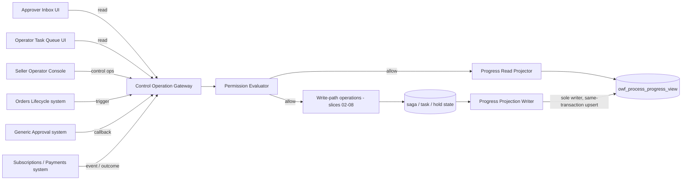
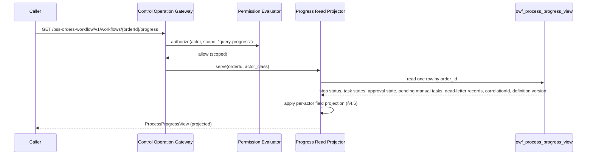
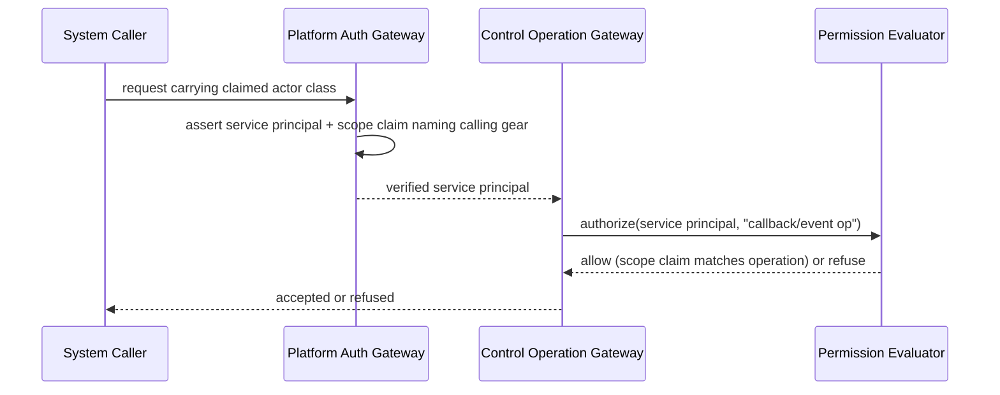
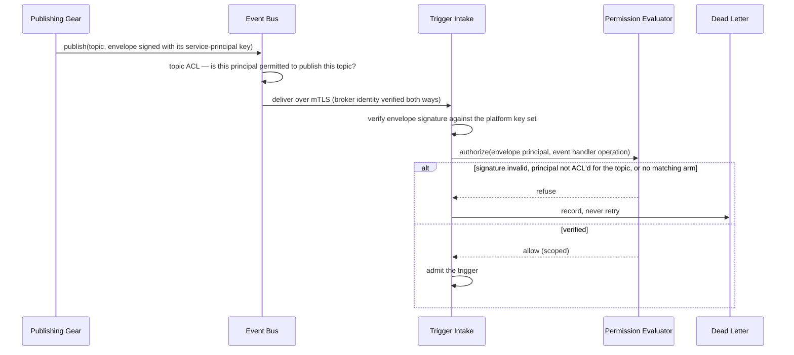

<!-- CONFLUENCE_TITLE: [BSS]: Orders Workflow — Read Projection and Authorization (Slice 9) -->
<!-- Related: ../DESIGN.md, ../PRD.md, ./README.md | Owners: BSS Orders team -->

# DESIGN — Read Projection and Authorization (Slice 9)

<!-- toc -->

- [1. Architecture Overview](#1-architecture-overview)
  - [1.1 Architectural Vision](#11-architectural-vision)
  - [1.2 Architecture Drivers](#12-architecture-drivers)
  - [1.3 Architecture Layers](#13-architecture-layers)
- [2. Principles & Constraints](#2-principles--constraints)
  - [2.1 Design Principles](#21-design-principles)
  - [2.2 Constraints](#22-constraints)
- [3. Technical Architecture](#3-technical-architecture)
  - [3.1 Domain Model](#31-domain-model)
  - [3.2 Component Model](#32-component-model)
  - [3.3 API Contracts](#33-api-contracts)
  - [3.4 Internal Dependencies](#34-internal-dependencies)
  - [3.5 External Dependencies](#35-external-dependencies)
  - [3.6 Interactions & Sequences](#36-interactions--sequences)
  - [3.7 Database schemas & tables](#37-database-schemas--tables)
  - [3.8 Deployment Topology](#38-deployment-topology)
- [4. Additional context](#4-additional-context)
  - [4.1 The per-actor permission matrix (normative)](#41-the-per-actor-permission-matrix-normative)
  - [4.2 The service-principal requirement for system actors (normative)](#42-the-service-principal-requirement-for-system-actors-normative)
  - [4.3 API latency and retention policy values](#43-api-latency-and-retention-policy-values)
  - [4.4 Authorized invocation, resource ownership, and apply-time re-check (normative)](#44-authorized-invocation-resource-ownership-and-apply-time-re-check-normative)
  - [4.5 Per-actor field projection on the progress read (normative)](#45-per-actor-field-projection-on-the-progress-read-normative)
- [5. Traceability](#5-traceability)

<!-- /toc -->

- [ ] `p1` - **ID**: `cpt-cf-bss-orders-workflow-design-read-and-authz`

## 1. Architecture Overview

### 1.1 Architectural Vision

This slice owns the last two things every other slice depends on but none of them may define for
itself: the single read projection that answers "where is this order's process right now," and
the one shared authorization evaluator that decides who may invoke any operation this gear
exposes. Both are deliberately thin. The read projection never derives commercial truth — it
reflects this gear's own saga state (step status, `FulfillmentTask` states, approval-request
state, pending manual tasks, dead-letter records, `correlationId`, and the process-definition
version the instance actually started with) and nothing about what was ordered or the order's own
lifecycle state, which remain Orders Lifecycle's alone to answer. The authorization evaluator is
invoked by every write-path operation before the operation's own guard runs, and by the read path
directly before the projection is served, mirroring the precedent Orders Lifecycle's own
Slice 8 established: one declaration per operation, exhaustive over actor classes, with a
missing declaration treated as a startup failure rather than a silent default-deny.

The second driver is auditability under multi-actor orchestration. Every operation this gear
exposes — the five public control operations, the three read surfaces, the four manual-task and
approval endpoints the fulfillment and approval slices expose, and the nine Orders Lifecycle
triggers — is exposed to **eight** distinct actor classes: three human (Approver, Fulfillment
Operator, Seller Operator), four system counterparties (Orders Lifecycle, Generic Approval,
Subscriptions, Payments), and the platform Events/Audit sink, which the PRD names as an actor and
which a seven-column registry silently had no arm for. Three of those system actors (Generic
Approval, Subscriptions, Payments) are permitted to *report an outcome* but never to *drive an
order state transition* directly. That asymmetry only holds if every system-actor grant is bound
to a verified principal — a gateway-asserted service principal on the REST surface, a signed
envelope from an ACL'd topic on the event surface — and not merely to an actor-class label a
compromised or misconfigured caller could also present. This design states that requirement once
and applies it uniformly across both transports, following the sibling gear's own precedent
explicitly rather than re-deriving it.

Latency and retention are stated here as working baselines, not settled numbers, because both are
pending a program-wide NFR workshop (PRD §7 NFR notes); this slice records the baseline this
gear commits to today and names who is accountable for the retention floor so that commitment is
enforceable rather than aspirational.

### 1.2 Architecture Drivers

#### Functional Drivers

| Requirement | Design Response |
|-------------|------------------|
| `cpt-cf-bss-orders-workflow-fr-owf-authorization` | One shared permission evaluator invoked on every operation; exhaustive per-actor matrix in §4.1 |
| `cpt-cf-bss-orders-workflow-interface-owf-ops` (query process progress) | Read-only progress projection in §4.1's read rows, sourced from this gear's own saga/task/dead-letter state only |

#### NFR Allocation

| NFR ID | NFR Summary | Allocated To | Design Response | Verification Approach |
|--------|-------------|--------------|-----------------|----------------------|
| `cpt-cf-bss-orders-workflow-nfr-owf-api-latency` | Progress reads p95 < 200 ms; control-op acceptance p95 < 1 s (working baselines) | Progress Read Projector; Control Operation Gateway | Denormalized projection read from this gear's own store, no cross-gear fan-out on the read path; control ops accept and enqueue before saga work | Load test against working baseline; NFR workshop re-baselines the threshold |
| `cpt-cf-bss-orders-workflow-nfr-owf-retention` | Process records retained ≥ 400 days, configurable, independent of engine run-history purge | Retention Policy Owner (named in §4.3) | Gear-owned audit-grade store for saga log, process audit, dead-letter records, manual-task history, retained on a policy distinct from and never bounded above by the durable-execution engine's own history retention | Retention-policy audit; engine ADR review confirming engine purge cannot erase the gear-owned record |

#### Key ADRs

| ADR ID | Decision Summary |
|--------|-----------------|
| `cpt-cf-bss-orders-workflow-adr-process-state-non-authoritative` | The progress projection is derived from this gear's own process state and MUST NOT be presented as authoritative commercial order or order-state truth; those are always read from Orders Lifecycle |

### 1.3 Architecture Layers

```text
Approver UI / Fulfillment Operator UI / Seller Operator console
                    |
                    v
        Control Operation Gateway  <-- Permission Evaluator (shared, §4.1)
                    |
        +-----------+-----------+
        |                       |
        v                       v
  Write-path operations   Progress Read Projector
  (start / resolve /            |
   retry / cancel)              v
        |               owf_process_progress_view
        v               (step status, task states,
  Saga / task / hold      approval state, pending
  mechanics (slices        manual tasks, dead-letter
  02-08)                   records, correlationId,
                           definition version)
```

| Layer | Responsibility | Technology |
|-------|---------------|------------|
| Presentation | Approver inbox, operator task queue, control-op endpoints | REST, gateway-terminated auth |
| Application | Permission Evaluator; Control Operation Gateway; Progress Read Projector | Gear application layer |
| Domain | Process progress read model; permission declaration registry | Rust domain types |
| Infrastructure | Gateway-asserted service-principal verification; audit-grade retention store | Platform auth gateway; gear-owned datastore |

- [ ] `p3` - **ID**: `cpt-cf-bss-orders-workflow-tech-read-authz-stack`

## 2. Principles & Constraints

### 2.1 Design Principles

#### One evaluator, exhaustive over operations and actor classes

- [ ] `p1` - **ID**: `cpt-cf-bss-orders-workflow-principle-exhaustive-permission-evaluator`

A single permission declaration set covers every operation this gear exposes. "Every operation" is
not a list maintained by hand: the declaration set is **derived from the gear's routing table** —
the registered REST routes plus the registered event-subscription handlers — and the startup check
is a two-way equality, not a lookup. Every registered route or handler must have a declaration
(otherwise an operation ships unguarded), *and* every declaration must correspond to a registered
route or handler (otherwise the registry accumulates rows for operations nobody exposes, and the
exhaustiveness claim degrades into "the rows we remembered to write cover the rows we remembered
to write"). Either direction failing is a **startup failure**, never a default-deny reached at
request time, because a silently-permissive gap is indistinguishable from a correctly-scoped grant
until it is exploited.

A hand-maintained registry cannot make that promise: it is checked against itself. Deriving one
side from the routing table is what makes the startup failure real, and it is why adding an
endpoint in any slice — a task override, a plan projection, a new trigger handler — fails the
build until §4.1 declares an arm for it against all eight actor classes.


#### The read side never becomes a second source of truth

- [ ] `p1` - **ID**: `cpt-cf-bss-orders-workflow-principle-read-not-authoritative`

The progress projection answers "what has this process done and where is it now," never "what
was ordered" or "what is the order's current state." Those questions are always answered by
Orders Lifecycle. Presenting this gear's projection as authoritative order state would let a
stalled or replaying process report a fact the order-of-record has already superseded.

**ADRs**: `cpt-cf-bss-orders-workflow-adr-process-state-non-authoritative`

### 2.2 Constraints

#### Every grant carries an explicit scope

- [ ] `p1` - **ID**: `cpt-cf-bss-orders-workflow-constraint-every-grant-scoped`

No row in the permission matrix may grant an operation without naming the scope it is bound to —
assigned-approval scope, seller scope, or a service-principal scope claim naming the calling gear.
An unscoped grant reads as "any actor of this class, over every tenant's data," which is a defect
regardless of how narrow the operation appears; the sibling Orders Lifecycle design found exactly
this defect in its own review (an unscoped `list` grant and an unscoped Preview row) before
correcting it, and this design is checked against the same failure mode in §4.1.


#### System-actor grants require a gateway-asserted service principal

- [ ] `p1` - **ID**: `cpt-cf-bss-orders-workflow-constraint-service-principal-required`

Actor class alone is never sufficient authorization for a system actor. Orders Lifecycle,
Generic Approval, Subscriptions and Payments are each authorized only when the gateway has
asserted a service principal whose scope claim names the calling gear; without that claim,
nothing distinguishes the legitimate calling gear from any other caller presenting the same actor
class. This follows the precedent set by the sibling Orders Lifecycle design's own workflow-seam
service-principal requirement, applied here without modification.


#### Tenant scoping and payment-card exclusion on every read

- [ ] `p1` - **ID**: `cpt-cf-bss-orders-workflow-constraint-tenant-scoped-reads`

Every read this gear exposes is tenant-scoped; process artifacts carry commercial order context
(order ID, the three tenant axes, correlationId) but MUST NOT carry payment-card data. Reads
never mutate process or order state.

The three axes are `resource_tenant_id` (resource recipient), `payer_tenant_id` (billing party)
and `seller_tenant_id` (selling party), the same axes the order carries. Scoping is by **axis and
relationship, never by a role string**: a seller-scoped grant resolves to
`seller_tenant_id IN SecurityContext.seller_scope`, an approver's grant resolves to
`gate_id IN SecurityContext.approval_assignments`. A predicate that matches on the actor's role
name alone returns every row of that role across every seller and every tenant, which is the
unscoped-read defect this slice exists to prevent, wearing a scope's clothes.


#### Authorization is enforced on the row, not only on the route

- [ ] `p1` - **ID**: `cpt-cf-bss-orders-workflow-constraint-resource-ownership-check`

A matrix arm authorizes an actor class to invoke an operation. It does not authorize that actor to
touch *this* row. Every **mutating** operation this gear exposes therefore carries a
resource-level ownership check in addition to its matrix arm, and the check is a predicate inside
the mutating statement — `… WHERE task_id = $1 AND seller_tenant_id = ANY($ctx.seller_scope)` —
never a read-then-check-then-write, which two operators racing the same task both pass.

A target row that exists but lies outside the caller's scope is answered **404, not 403**: a 403
confirms the row exists, which turns the error code into an existence oracle over other sellers'
orders. The check applies uniformly to task resolution, override, retry, escalate, cancel, and
every Lifecycle-trigger handler that mutates an instance; no operation is exempt because "the
platform propagates `SecurityContext`" — propagation carries an identity, it does not make a
decision. §4.4 states the check and the definition of an authorized invocation normatively, and it
is stated **here**, once, because slices 06 and 08 both use "an authorized cancellation" as an
input precondition and neither of them owns authorization.


#### Every collection response is paged

- [ ] `p1` - **ID**: `cpt-cf-bss-orders-workflow-constraint-bounded-page-size`

Every list this gear exposes — the approver inbox, the operator task queue, the fulfillment-plan
line projection, and the manual-task list — takes a page size and returns a **keyset cursor**.
Default 50, maximum 200, as working baselines: the p95 < 200 ms budget is stated per page, and an
unpaged read behind a ≥ 400-day retention floor with no archival makes the budget meaningless the
first time an order accumulates a long remediation history. A requested page size above the
maximum is **clamped server-side to 200** rather than honoured.

The cursor is keyset, not offset, and its sort key is immutable: `(created_at, task_id)` for the
task queue and the manual-task list, `(created_at, gate_id)` for the approver inbox,
`(order_line_id)` within a frozen plan for the line projection. A mutable column — assignment
state, SLA countdown, task state — is never a sort key: the sweep and every operator action
rewrite it, so a row could move between pages and be returned twice or skipped entirely, silently,
behind a 200 and a valid-looking cursor.


#### Idempotency keys are tenant-namespaced and server-recomposed

- [ ] `p1` - **ID**: `cpt-cf-bss-orders-workflow-constraint-tenant-namespaced-idempotency`

Every idempotency key this gear registers is prefixed with the `resource_tenant_id` of the order
it acts on, so two tenants cannot collide in the registry and no key from one tenant can resolve a
call made for another. The prefix is not decoration: without it, a key composed from an order id
and a transition name is a value a caller can guess, and a settled record is a value a caller can
read the outcome of.

A caller-supplied key is **validated, never trusted**. The server recomposes the key from the
caller's authorized target — the tenant axes of the order the ownership check just resolved, plus
the operation's own components — and compares. A supplied key that does not equal the recomposed
key is refused with `idempotency-key-mismatch` (400) before any work is done; a supplied key that
matches but whose request fingerprint differs from the settled record's is a `key-conflict`
refusal (409), not an absorbed duplicate. A caller therefore cannot address another tenant's
registry entry by presenting its key, and cannot reuse its own key to make a different request.


#### Durable work is admission-controlled per tenant

- [ ] `p1` - **ID**: `cpt-cf-bss-orders-workflow-constraint-per-tenant-durable-quota`

The gear's existing quotas all govern *outbound* pressure — in-flight intents, queue depth,
per-tenant dispatch fairness. None of them bounds the **durable** work one tenant can cause this
gear to store: manual tasks, dead-letter records, and active process instances all grow with a
tenant's failure rate, are retained for ≥ 400 days, and are read on latency-budgeted operator
surfaces. One seller in a bad integration loop degrades every other seller's queue.

Admission quotas, keyed on `seller_tenant_id`, as working baselines: **500 open manual tasks**,
**1 000 undispatched dead-letter records**, **200 concurrently active process instances**.

Breaching a quota never drops durable evidence and never refuses an accepted order — either would
trade an observability problem for a correctness one. It changes what gets *created*: over the
manual-task quota, further failures on an order that already has an open task are appended to that
task rather than creating a new one, and orders with no open task raise one incident per order
instead of one per step; over the dead-letter quota, further records are coalesced per order with
a count; over the instance quota, new instances are still admitted but the tenant's dispatch
fairness share is reduced and a capacity incident is raised for the operator on call. Every breach
is alerted, because a quota that is silently absorbed is a quota nobody fixes.

## 3. Technical Architecture

### 3.1 Domain Model

**Technology**: Rust structs, gear-owned read-model store

**Location**: [`../DESIGN.md`](../DESIGN.md) §3.1 (gear-wide domain model); this slice adds the
read-model projection type below.

**Core Entities**:

- [ ] `p2` - **ID**: `cpt-cf-bss-orders-workflow-entity-process-progress-view`
- [ ] `p2` - **ID**: `cpt-cf-bss-orders-workflow-entity-security-context`

| Entity | Description | Schema |
|--------|-------------|--------|
| `ProcessProgressView` | The read-only projection returned by "query process progress": current step status, all `FulfillmentTask` states, approval-request state, pending manual tasks, dead-letter records, process `correlationId`, and the process-definition version the instance started with, subject to the per-actor field projection of §4.5 | §3.7 `owf_process_progress_view` |
| `PermissionDeclaration` | One declaration per operation, exhaustive over the eight actor classes, each arm carrying an explicit scope predicate and a tenant axis | §3.7 `owf_permission_declaration` |
| `SecurityContext` | The verified claim set every operation is evaluated against; the value the whole matrix's scope predicates are written in terms of | In-memory value object, constructed at the edge from the gateway assertion or the signed event envelope; never persisted except as the authorization snapshot of §4.4 |

**`SecurityContext` claims.** Every scope predicate in §4.1 resolves against exactly these claims,
and none of them is optional at evaluation time — a request whose context is missing a claim its
operation's arm depends on is refused, not evaluated against a default:

| Claim | Type | Meaning |
|---|---|---|
| `principal_id` | uuid | The authenticated subject — a human user id, or a service principal id |
| `principal_kind` | enum | `human \| service`; a `service` principal is never accepted on a human-actor arm and vice versa |
| `actor_class` | enum | One of the eight actor classes of §4.1; asserted by the issuer, never taken from the request body |
| `resource_tenant_ids` | set of uuid | Resource-recipient axes the principal may read or act on |
| `payer_tenant_ids` | set of uuid | Billing-party axes the principal may read; used by the payment-outcome arm |
| `seller_scope` | set of uuid | `seller_tenant_id` values the principal may act for; the resolution of every "seller scope" cell in §4.1 |
| `approval_assignments` | set of uuid | The `gate_id` values assigned to this principal; the resolution of every "assigned-approval scope" cell |
| `service_principal` | nullable record | `{ calling_gear, scope_claims }` — present exactly when `principal_kind = service` |
| `delegation_proof` | nullable | Present when the principal acts for a tenant it does not directly belong to; recorded in the audit entry, never used to widen a scope by itself |
| `issued_at`, `expires_at` | timestamptz | The validity window; an expired context is refused at the edge and at apply time (§4.4) |
| `trace_id` | uuid | Correlation for audit and access logging; carries no authority |

**How a principal maps to `owf_approval_gate.party`.** It does not map by role-string equality —
`party` is a *role* ("seller finance", "platform compliance"), and matching on it returns every
gate of that role across every order and every seller, which `cpt-cf-bss-orders-workflow-constraint-every-grant-scoped`
forbids and which would defeat PRD §6.7's "MUST NOT act on approval requests for orders outside
their assigned scope". The mapping is by **assignment**: the platform's approver-assignment
directory resolves `(party, seller_tenant_id)` to a set of principals, and the token issuer
materialises the inverse — this principal's assigned `gate_id` values — into
`approval_assignments`. Because `gate_id` is derived deterministically as a UUIDv5 over
`(orderId, orderVersion, party)`, the assignment survives a replay and the inbox filter is an
indexed set-membership test on an immutable key rather than a text comparison. The approver inbox
query is `gate_id = ANY($ctx.approval_assignments)`, and the decision endpoint applies the same
predicate to the single gate it is given. An assignment directory that cannot answer the inverse
query is an upstream gap, not a licence to fall back to role matching: the fallback is refusal.

**Relationships**:
- `ProcessProgressView` → saga/task/hold state owned by slices 02-08: a **materialised** single-row-per-order projection maintained by the Progress Projection Writer (§3.2), read without a chain walk, and bounded by the staleness rule stated with the table in §3.7. It is never authoritative: it is a projection of this gear's own state, and commercial order truth is still Orders Lifecycle's.
- `PermissionDeclaration` → every route and event handler in the gear's routing table: one declaration per operation per actor class, derived from the routing table in both directions (§2.1).
- `SecurityContext` → `PermissionDeclaration`: the evaluator resolves an arm's scope predicate against these claims and nothing else; no predicate may read the request body.

### 3.2 Component Model



#### Permission Evaluator

- [ ] `p1` - **ID**: `cpt-cf-bss-orders-workflow-component-permission-evaluator`

##### Why this component exists

Every operation this gear exposes needs authorization decided the same way, by the same rules,
whether the caller is a human actor at a console or a system actor calling on an event. A
per-endpoint ad hoc check invites drift and unscoped grants.

##### Responsibility scope

Owns the exhaustive per-actor permission declarations (§4.1); evaluates actor class, assigned
scope (approval assignment, seller scope, or service-principal scope claim), and refuses when no
declaration arm matches. Verifies the caller's principal before evaluating any system-actor
declaration: a gateway-asserted service principal on the REST surface, a signed envelope from an
ACL'd topic on the event surface (§4.2). Emits the **resource-level ownership predicate** the
calling operation must apply to its target row (§4.4) — the evaluator decides the scope, the
operation applies it inside its own mutating statement. Records the **authorization snapshot** for
every command that can outlive its request, and re-evaluates that snapshot at apply time when the
command asks (§4.4). Fails startup when the routing table and the declaration set disagree in
either direction (§2.1).

##### Responsibility boundaries

Does not implement the saga, provisioning, manual-task, or hold/cancel mechanics it authorizes —
those are owned by slices 02-08. Does not decide commercial order authorization; that is Orders
Lifecycle's own evaluator, invoked independently on Orders Lifecycle's own operations. Does not
itself execute the ownership predicate against the target row — it cannot, because the row is
read inside the owning slice's transaction; it declares the predicate and the startup check
asserts every mutating route applies one.

##### Related components (by ID)

- `cpt-cf-bss-orders-workflow-component-control-operation-gateway` — invoked by; gateway calls the evaluator before any write-path operation and before the read projector assembles a response.
- `cpt-cf-bss-orders-workflow-component-progress-read-projector` — gates access to.

#### Control Operation Gateway

- [ ] `p1` - **ID**: `cpt-cf-bss-orders-workflow-component-control-operation-gateway`

##### Why this component exists

Provides the single entry point through which every operation in the gear's routing table is
invoked — the five public control operations, the three read surfaces, the manual-task and
approval endpoints the fulfillment and approval slices expose, and the event-subscription handlers
— so the Permission Evaluator has exactly one call site to guard rather than one per operation
implementation.

##### Responsibility scope

Accepts start workflow, resolve manual task, retry failed step, cancel workflow with
compensation, query process progress, approver-inbox reads, operator-task-queue reads, the
manual-task resolution actions, the approval decision, and the fulfillment-plan projection;
recomposes and validates the caller's idempotency key against the caller's authorized target
(`cpt-cf-bss-orders-workflow-constraint-tenant-namespaced-idempotency`); enforces the `If-Match`
optimistic version check on every operation §4.1 marks `+ver`; clamps every list request's page
size; delegates authorization to the Permission Evaluator before dispatch; and records the
**authorization snapshot** (§4.4) for every command whose effect can outlive its request.

##### Responsibility boundaries

Does not implement business logic for any operation; dispatches only after an allow decision.

##### Related components (by ID)

- `cpt-cf-bss-orders-workflow-component-permission-evaluator` — depends on.

#### Progress Read Projector

- [ ] `p1` - **ID**: `cpt-cf-bss-orders-workflow-component-progress-read-projector`

##### Why this component exists

Answers "query process progress" from this gear's own current state without walking saga event
history or calling out to Orders Lifecycle, Subscriptions, or Payments on the read path, which is
what keeps the read within its p95 < 200 ms working baseline.

##### Responsibility scope

Serves `ProcessProgressView` for a given order by reading the materialised
`owf_process_progress_view` row — one indexed row read, no chain walk, no event replay, no
cross-gear call — and then applying the **per-actor field projection** of §4.5 before the response
leaves the component. Surfaces the intermediate `pending → draft_created` task advance, which is
observable only through this projection and is never itself published as an event.

##### Responsibility boundaries

Never mutates process or order state, and never writes the projection row — that is the Progress
Projection Writer's sole responsibility. Never presents its output as authoritative commercial
order content or authoritative order state — "what was ordered" and "the current order state"
are always read from Orders Lifecycle, never derived here. Does not aggregate across orders
beyond what the caller's scope already authorizes. Never returns a field the caller's actor class
is not projected, even when the row carries it.

##### Related components (by ID)

- `cpt-cf-bss-orders-workflow-component-permission-evaluator` — depends on for read authorization.
- `cpt-cf-bss-orders-workflow-component-progress-projection-writer` — reads the row this component owns.

#### Progress Projection Writer

- [ ] `p1` - **ID**: `cpt-cf-bss-orders-workflow-component-progress-projection-writer`

##### Why this component exists

`owf_process_progress_view` is materialised, so it needs exactly one writer. A projection with no
declared writer is one that every slice feels free to update and none of them owns the staleness
of; a projection each reader assembles itself is one whose 200 ms budget depends on a query plan
that grows with lines-per-order. Naming one writer settles both: the read is a single row, and the
freshness rule is a property of the writer rather than a hope about the reader.

##### Responsibility scope

Upserts the projection row for an order on every committed change to this gear's own state that
the projection reflects: step status changes, `FulfillmentTask` state transitions, approval-gate
state changes, manual-task creation and resolution, dead-letter record creation, and process
termination.

**Staleness bound and invalidation rule.** Where the state change is committed in this gear's own
database, the upsert runs **in the same transaction** as the change — the projection is never
stale relative to a change this gear made, and a caller who just performed an operation reads its
own write. Where the change is observed rather than made (an outbound event's delivered outcome,
a sweep-confirmed terminal outcome), the upsert is driven by the outbox drain and is stale by at
most **one drain interval plus one write, ≤ 5 s**, which the read surface states rather than
hides. Invalidation is by upsert on `order_id`, not by TTL or by cache eviction: there is exactly
one row per order and it is rewritten, never invalidated and re-derived.

##### Responsibility boundaries

Never writes any table but `owf_process_progress_view`. Never derives a value the source-of-truth
tables do not already carry, and never reads Orders Lifecycle — a projection that enriched itself
from the order of record would become a second source of commercial truth, which
`cpt-cf-bss-orders-workflow-principle-read-not-authoritative` forbids. Never serves reads.

##### Related components (by ID)

- `cpt-cf-bss-orders-workflow-component-progress-read-projector` — writes the row that component serves.

### 3.3 API Contracts

- [ ] `p2` - **ID**: `cpt-cf-bss-orders-workflow-interface-owf-read-authz-ops`

- **Technology**: REST, gateway-terminated auth with service-principal assertion for system actors
- **Location**: [`../DESIGN.md`](../DESIGN.md) §3.3 (gear-wide API surface); this slice documents
  the read and authorization behavior of every row.

**Endpoints Overview**:

| Method | Path | Description | Stability |
|--------|------|--------------|-----------|
| `POST` | `/bss-orders-workflow/v1/workflows` | Start workflow. `Idempotency-Key` required and validated against the server-recomposed key (`cpt-cf-bss-orders-workflow-constraint-tenant-namespaced-idempotency`) | unstable |
| `GET` | `/bss-orders-workflow/v1/workflows/{orderId}/progress` | Query process progress (§4.1 read projection, §4.5 field projection) | unstable |
| `POST` | `/bss-orders-workflow/v1/workflows/{orderId}/tasks/{taskId}/resolve` | Resolve manual task. `If-Match` with the task's `row_version` ETag REQUIRED; mismatch is 409 in the RFC-9457 envelope. Ownership check on `owf_manual_task.seller_tenant_id` (§4.4) | unstable |
| `POST` | `/bss-orders-workflow/v1/workflows/{orderId}/steps/{stepId}/retry` | Retry failed step. `If-Match` with the process instance's `row_version` ETag REQUIRED; ownership check on the instance's `seller_tenant_id` | unstable |
| `POST` | `/bss-orders-workflow/v1/workflows/{orderId}/cancel` | Cancel workflow with compensation. `If-Match` REQUIRED; authority re-checked at apply time (§4.4) because fencing can outlive the request by days | unstable |

Every list response carries `items`, `next_cursor` (null on the last page) and the effective
`limit` actually applied, so a caller can tell a clamped page from a short one. Refusals on all
rows use the RFC-9457 envelope: `idempotency-key-mismatch` (400), `key-conflict` (409),
`version-mismatch` (409), `not-authorized` (403), and `not-found` (404) for a target outside the
caller's scope, per `cpt-cf-bss-orders-workflow-constraint-resource-ownership-check`.

### 3.4 Internal Dependencies

| Dependency Gear | Interface Used | Purpose |
|-------------------|----------------|----------|
| bss-orders-lifecycle | SDK client over the workflow-seam contract | Source of authoritative order state and commercial order content; never re-derived here |

**Dependency Rules** (per project conventions):
- No circular dependencies
- Always use sdk modules for inter-gear communication
- No cross-category sideways deps except through contracts
- Only integration/adapter gears talk to external systems
- `SecurityContext` must be propagated across all in-process calls

### 3.5 External Dependencies

This slice introduces no new *business* dependency — it calls no gear the set does not already
call — but it does rest on two platform dependencies that every constraint above is written
against, and they are declared here rather than assumed: the **platform auth gateway**, which
asserts the service principal and issues the `SecurityContext` claims of §3.1, and the **platform
event bus**, whose envelope signing and topic ACLs carry the same authenticity guarantee on the
transport that carries no gateway (§4.2). Every service-principal constraint in this slice is
unenforceable without the first, and every system-actor grant delivered by subscription is
unenforceable without the second.

#### Platform Auth Gateway


| Dependency Gear | Interface Used | Purpose |
|-------------------|---------------|----------|
| platform-auth-gateway | Service-principal assertion / scope-claim verification; issuance of the `SecurityContext` claims of §3.1, including the resolved `approval_assignments` set | Distinguishes a legitimate calling gear's system-actor request from any other caller presenting the same actor class, and gives every scope predicate in §4.1 a claim to resolve against |

#### Platform Event Bus


| Dependency Gear | Interface Used | Purpose |
|-------------------|---------------|----------|
| platform-event-bus | Signed envelope verification (publisher key set) and per-topic publish ACL | Carries the same authenticity guarantee on the subscription transport, which traverses no REST gateway and therefore cannot present a gateway-asserted principal (§4.2) |

**Dependency Rules** (per project conventions):
- No circular dependencies
- Always use SDK modules for inter-gear communication
- No cross-category sideways deps except through contracts
- Only integration/adapter gears talk to external systems
- `SecurityContext` must be propagated across all in-process calls

### 3.6 Interactions & Sequences

#### Query process progress

**ID**: `cpt-cf-bss-orders-workflow-seq-query-progress`


**Actors**: `cpt-cf-bss-orders-workflow-actor-owf-approver`, `cpt-cf-bss-orders-workflow-actor-owf-fulfillment-operator`, `cpt-cf-bss-orders-workflow-actor-owf-seller-operator`



**Description**: One indexed row read of the materialised projection, then the per-actor field
projection of §4.5 applied in the component; no chain walk, no event replay, and no call to Orders
Lifecycle, Subscriptions, or Payments on this path, which is what the p95 < 200 ms working
baseline depends on. The row is stale by at most one drain interval plus one write (≤ 5 s) for
changes this gear observed rather than made, and never stale for a change it committed itself.

#### System-actor call with service-principal verification

**ID**: `cpt-cf-bss-orders-workflow-seq-system-actor-verification`


**Actors**: `cpt-cf-bss-orders-workflow-actor-owf-orders-lifecycle`, `cpt-cf-bss-orders-workflow-actor-owf-generic-approval`, `cpt-cf-bss-orders-workflow-actor-owf-subscriptions`, `cpt-cf-bss-orders-workflow-actor-owf-payments`



**Description**: Actor class alone never authorizes a system actor; the scope claim naming the
calling gear must be present and verified before the Permission Evaluator's declaration for that
actor class is even consulted. This is the **REST** path only — the callback and event-delivery
path below traverses no gateway and is authenticated differently.

#### System-actor delivery over the event bus

**ID**: `cpt-cf-bss-orders-workflow-seq-event-envelope-verification`


**Actors**: `cpt-cf-bss-orders-workflow-actor-owf-orders-lifecycle`, `cpt-cf-bss-orders-workflow-actor-owf-generic-approval`, `cpt-cf-bss-orders-workflow-actor-owf-subscriptions`, `cpt-cf-bss-orders-workflow-actor-owf-events-audit`



**Description**: The nine Orders Lifecycle triggers, the Generic Approval decision callback, and
the Subscriptions per-wave outcomes all arrive by subscription, not through the REST gateway, so
"present a gateway-asserted service principal" cannot be their mechanism. Their mechanism is the
**signed envelope plus the topic ACL**, verified by the consumer; a refusal is a dead-letter
record, never a retry, because a failed signature will not verify on a second attempt and retrying
would turn a forged message into a durable load source.

### 3.7 Database schemas & tables

- [ ] `p3` - **ID**: `cpt-cf-bss-orders-workflow-db-read-authz`

#### Table: owf_process_progress_view

**ID**: `cpt-cf-bss-orders-workflow-dbtable-owf-process-progress-view`

**Schema**:

| Column | Type | Description |
|--------|------|--------------|
| order_id | uuid | Order this progress view belongs to |
| resource_tenant_id | uuid | Resource recipient axis |
| payer_tenant_id | uuid | Billing party axis |
| seller_tenant_id | uuid | Selling party axis; the predicate every seller-scoped read resolves to |
| correlation_id | uuid | Process `correlationId` |
| definition_version | text | Process-definition version the instance started with |
| current_step_status | jsonb | Current step status |
| fulfillment_task_states | jsonb | All `FulfillmentTask` states, at most one entry per order line |
| approval_request_state | jsonb | Approval-request state, including intermediate `pending → draft_created` advance |
| pending_manual_tasks | jsonb | The **open** manual tasks only, at most 50 entries, newest first |
| pending_manual_task_count | integer | Total open manual tasks, so a truncated array still reports honestly |
| dead_letter_records | jsonb | The **undispatched** dead-letter records only, at most 50 entries, newest first |
| dead_letter_record_count | integer | Total undispatched dead-letter records |
| source_max_committed_at | timestamptz | The commit instant of the newest source change this row reflects; the staleness measure |
| updated_at | timestamptz | Last projection refresh |

**PK**: `order_id`

**Constraints**: NOT NULL on `order_id`, `resource_tenant_id`, `payer_tenant_id`,
`seller_tenant_id`, `correlation_id`, `definition_version`, `updated_at`; CHECK
`jsonb_array_length(fulfillment_task_states) <= 200`; CHECK
`jsonb_array_length(pending_manual_tasks) <= 50`; CHECK
`jsonb_array_length(dead_letter_records) <= 50`

**Additional info**: **Materialised**, not assembled per read — this is settled here rather than
left to the reader, because the p95 < 200 ms budget is only meaningful on one of the two answers.
A read is a single indexed row read on `order_id`, with no chain walk, no event replay and no
cross-gear call. Ownership: **written only by the Progress Projection Writer**
(`cpt-cf-bss-orders-workflow-component-progress-projection-writer`), which upserts in the same
transaction as any change this gear commits, and within ≤ 5 s for changes it merely observes
through the outbox — that bound is the row's stated staleness and `source_max_committed_at` lets a
caller verify it. Invalidation is by upsert on `order_id`; there is no TTL and no cache to evict.

The jsonb aggregates are **bounded, not open-ended**: `fulfillment_task_states` is capped by the
200-lines-per-order ceiling, and the two operational arrays carry at most 50 entries each with a
companion count, because both grow with a tenant's failure rate rather than with the order and an
unbounded array would make a single pathological order the reason the 200 ms budget fails. A
caller who needs the full list pages the operator task queue or the dead-letter surface, which are
paged for exactly this reason.

Tenant axes are all three; `seller_tenant_id` is the one every seller-scoped read predicate uses.
Carries no payment-card data. Retention follows the order's own process record — the row is
deleted when the process instance's audit record ages out of the ≥ 400-day floor, never before,
since a progress read on a retained process must not 404. Monthly range partition on `updated_at`
is deliberately **not** applied: this table is one mutable row per order, not a growth log.

**Example**:

| order_id | resource_tenant_id | seller_tenant_id | correlation_id | definition_version |
|--------|--------|--------|--------|--------|
| ord-9f2a | ten-01 | sel-07 | corr-771c | v3 |

#### Table: owf_permission_declaration

**ID**: `cpt-cf-bss-orders-workflow-dbtable-owf-permission-declaration`

**Schema**:

| Column | Type | Description |
|--------|------|--------------|
| operation | text | The routing-table key of one operation: `METHOD path` for a REST route, `EVENT <name>` for a subscription handler |
| actor_class | text | One of the eight actor classes of §4.1 |
| decision | enum | `grant \| refuse`; a refusal is declared, never implied by an absent row |
| tenant_axis | enum | The axis this arm is bound to: `resource \| payer \| seller \| assignment \| service-principal`. Never null on a `grant` |
| scope_predicate | text | The predicate resolved against `SecurityContext` claims (§3.1); never empty on a `grant` |
| requires_resource_ownership_check | boolean | True for every mutating operation; the startup check refuses a mutating route whose arm is false (§4.4) |
| requires_service_principal | boolean | True for every arm whose actor class is a system actor on the REST surface |
| requires_signed_envelope | boolean | True for every arm delivered over the event bus (§4.2) |
| audit_required | boolean | True where the operation must write an audit entry with actor identity and justification |

**PK**: `(operation, actor_class)`

**Constraints**: NOT NULL on all columns; CHECK `decision = 'refuse' OR (tenant_axis IS NOT NULL
AND scope_predicate <> '')` — a grant with no axis and no predicate is the unscoped grant
`cpt-cf-bss-orders-workflow-constraint-every-grant-scoped` forbids, refused by the schema rather
than by review.

**Additional info**: Ownership: **written only by the Permission Evaluator's startup loader**,
which materialises §4.1 from the compiled routing table; there is no runtime write path, no
administrative endpoint, and no operation in this gear that can grant itself a permission. This is
stated explicitly because every other engine table declares its writer and the one table whose
unexpected writer would be a privilege escalation must not be the exception. Not tenant-scoped: it
declares policy, not data — the tenant appears in `tenant_axis`/`scope_predicate` as the *axis a
grant is bound to*, and the table is identical for every tenant. Retention: the loaded set is
replaced wholesale at startup; each load is additionally recorded in `owf_audit_entry` at the ≥
400-day floor, so a change to the authorization surface is itself audit evidence.

**Startup check, in both directions**: every route and event handler in the routing table must
have a row for every one of the eight actor classes, and every row must name a routing-table key
that exists. Either direction failing halts startup
(`cpt-cf-bss-orders-workflow-principle-exhaustive-permission-evaluator`). A one-way check — rows
exist for the operations we listed — is what lets a registry drift into declaring operations no
slice exposes while a newly added endpoint ships with no arm at all.

The **event-bus topic ACL** is declared alongside this set as configuration rather than as a
mutable table: one entry per topic naming the service principals permitted to publish it, asserted
against the subscription handlers in the same startup check. A subscribed topic with no ACL entry
halts startup for the same reason an undeclared route does.

### 3.8 Deployment Topology

- [ ] `p3` - **ID**: `cpt-cf-bss-orders-workflow-topology-read-authz`

No dedicated deployment topology beyond the gear's existing control-plane deployment (§1.3); the
Permission Evaluator and Progress Read Projector run in-process with the Control Operation
Gateway, consistent with `cpt-cf-bss-orders-workflow-nfr-owf-availability`.

## 4. Additional context

### 4.1 The per-actor permission matrix (normative)

The matrix is exhaustive over **every operation in the gear's routing table** — every REST route
any slice registers and every event-subscription handler — against **all eight** actor classes.
Exhaustiveness is not a claim made in prose here and checked nowhere: the registry is derived from
the routing table and the startup check runs in both directions (§2.1, §3.7), so a route added in
any slice fails the build until it appears below, and a row below that names no registered route
fails it too. An operation with no declared arm for an actor class is a startup failure, never a
default-deny reached at request time.

Every cell that is not `—` names an explicit scope **and** a tenant axis; there is no unscoped
grant in this matrix, which was checked specifically because the sibling Orders Lifecycle design's
own review found exactly that defect (an unscoped `list` grant and an unscoped Preview row) before
correcting it.

**Scope codes** — each resolves against the `SecurityContext` claims of §3.1, never against a role
string:

| Code | Predicate | Axis |
|---|---|---|
| `S` | `seller_tenant_id = ANY(ctx.seller_scope)` on the target row | seller |
| `A` | `gate_id = ANY(ctx.approval_assignments)` on the target gate | assignment |
| `A*` | the order carries at least one gate in `ctx.approval_assignments` | assignment |
| `R` | `resource_tenant_id = ANY(ctx.resource_tenant_ids)` on the target row | resource |
| `G` | verified service principal whose scope claim names the calling gear, **and** — on the event transport — a signed envelope from an ACL'd topic (§4.2), scoped to the order the event names | service-principal |
| `Gc` | as `G`, further scoped to the calling gear's own outstanding correlations; MUST NOT drive an order state transition directly | service-principal |
| `—` | declared refusal | n/a |

Suffixes: `+own` = resource-level ownership check on the target row (§4.4); `+aud` = MUST write an
audit entry carrying actor identity and, where the operation takes one, the supplied
justification; `+ver` = `If-Match` optimistic version check; `+pg` = paged
(`cpt-cf-bss-orders-workflow-constraint-bounded-page-size`); `+re` = authority re-checked at apply
time (§4.4).

| Operation (routing-table key) | Approver | Fulfillment Operator | Seller Operator | Orders Lifecycle | Generic Approval | Subscriptions | Payments | Events/Audit |
|-----------|----------|-----------------------|------------------|-------------------|-------------------|----------------|----------|----------|
| `POST /bss-orders-workflow/v1/workflows` (start workflow) | — | — | — | ✓ `G` | — | — | — | — |
| `GET /bss-orders-workflow/v1/workflows/{orderId}/progress` | ✓ `A*`, §4.5 projection | ✓ `S` | ✓ `S` | ✓ `Gc` | — | — | — | — |
| `POST /bss-orders-workflow/v1/workflows/{orderId}/tasks/{taskId}/resolve` | — | ✓ `S` `+own+aud+ver`; resolution action only; MUST NOT modify commercial order content | ✓ `S` `+own+aud+ver`; MUST NOT modify commercial order content | — | — | — | — | — |
| `POST /bss-orders-workflow/v1/workflows/{orderId}/steps/{stepId}/retry` | — | ✓ `S` `+own+aud+ver` | ✓ `S` `+own+aud+ver` | — | — | — | — | — |
| `POST /bss-orders-workflow/v1/workflows/{orderId}/cancel` | — | — | ✓ `S` `+own+aud+ver+re` | — | — | — | — | — |
| `GET /bss-orders-workflow/v1/fulfillment-operator/tasks` | — | ✓ `S` `+pg` | ✓ `S` `+pg` | — | — | — | — | — |
| `POST /bss-orders-workflow/v1/fulfillment-operator/tasks/{taskId}/retry` | — | ✓ `S` `+own+aud+ver` | ✓ `S` `+own+aud+ver` | — | — | — | — | — |
| `POST /bss-orders-workflow/v1/fulfillment-operator/tasks/{taskId}/override` | — | ✓ `S` `+own+aud+ver`; operator identity and justification MUST be recorded | ✓ `S` `+own+aud+ver`; operator identity and justification MUST be recorded | — | — | — | — | — |
| `POST /bss-orders-workflow/v1/fulfillment-operator/dead-letters/{recordId}/redrive` | — | ✓ `S` `+own+aud`; redelivers the parked payload, never fabricates a process outcome | ✓ `S` `+own+aud` | — | — | — | — | — |
| `POST /bss-orders-workflow/v1/fulfillment-operator/dead-letters/{recordId}/discard` | — | — | ✓ `S` `+own+aud`; Seller Operator only — discarding a parked payload is destructive and irreversible | — | — | — | — | — |
| `GET /bss-orders-workflow/v1/fulfillment-operator/dead-letters` | — | ✓ `S` `+pg` | ✓ `S` `+pg` | — | — | — | — | — |
| `POST /bss-orders-workflow/v1/fulfillment-operator/tasks/{taskId}/assign` | — | ✓ `S` `+own+aud+ver`; self-assign or assign within the same seller scope | ✓ `S` `+own+aud+ver` | — | — | — | — | — |
| `POST /bss-orders-workflow/v1/fulfillment-operator/tasks/{taskId}/cancel` | — | — | ✓ `S` `+own+aud+ver`; Seller Operator only, per `PRD.md:547` — closing a task without resolving the line is a commercial judgement, not a remediation action | — | — | — | — | — |
| `POST /bss-orders-workflow/v1/fulfillment-operator/tasks/{taskId}/escalate` | — | ✓ `S` `+own+aud+ver` | ✓ `S` `+own+aud+ver` | — | — | — | — | — |
| `GET /bss-orders-workflow/v1/approver-inbox/gates` | ✓ `A` `+pg` | — | — | — | — | — | — | — |
| `POST /bss-orders-workflow/v1/approver-inbox/gates/{gateId}/decision` | ✓ `A` `+own+aud+ver`; the submitting identity is refused (separation of duties) | — | — | — | — | — | — | — |
| `GET /bss-orders-workflow/v1/fulfillment-plan/{orderId}/{orderVersion}` | ✓ `A*` | ✓ `S` `+pg` | ✓ `S` `+pg` | ✓ `Gc` | — | — | — | — |
| `EVENT OrderSubmitted` | — | — | — | ✓ `G` | — | — | — | — |
| `EVENT OrderApproved` | — | — | — | ✓ `G` | — | — | — | — |
| `EVENT OrderAmended` | — | — | — | ✓ `G` | — | — | — | — |
| `EVENT OrderHeld` | — | — | — | ✓ `G` | — | — | — | — |
| `EVENT OrderResumed` | — | — | — | ✓ `G` | — | — | — | — |
| `EVENT OrderAcceptanceRecorded` | — | — | — | ✓ `G` | — | — | — | — |
| `EVENT OrderCancelled` | — | — | — | ✓ `G` | — | — | — | — |
| `EVENT OrderExpired` | — | — | — | ✓ `G` | — | — | — | — |
| `EVENT OrderRejected` | — | — | — | ✓ `G` | — | — | — | — |
| `EVENT OrderApprovalDecision` (decision callback) | — | — | — | — | ✓ `Gc` | — | — | — |
| `EVENT SubscriptionWaveOutcome` (per-wave confirmation / failure) | — | — | — | — | — | ✓ `Gc` | — | — |
| Payment-authorization outcome (response to this gear's own outbound request) | — | — | — | — | — | — | ✓ `Gc`, correlated by the request's own idempotency key | — |
| Process-event publication (`OrderFulfillmentStarted`, `…StepCompleted`, `…Completed`, `…Aborted`, `OrderApprovalRequested`, `OrderApprovalEscalated`) | — | — | — | — | — | — | — | ✓ `G`, outbound-only: subscribe and receive, never invoke |

Rows worth stating separately:

**Approver's scope is the assignment itself**, not a tenant or seller boundary — the Approver MUST
NOT act on approval requests for orders outside their assigned scope even within the same tenant,
which is why every Approver cell resolves `gate_id = ANY(ctx.approval_assignments)` rather than a
broader tenancy grant. §3.1 states how a principal acquires that set, because a `party` role
string cannot produce it.

**The override is audit-logged for the Fulfillment Operator, not only the Seller Operator.**
PRD §6.4 requires that an override record the operator identity and justification in the audit
log, and PRD §6.4 names the **Fulfillment Operator** as the actor that performs it — the operator
who works the task queue is the one whose override must be attributable. Attaching the audit
requirement only to the Seller Operator cell would leave the actor who actually performs the
action unaudited, which is the one outcome the requirement exists to prevent. Both cells carry it,
and identity comes from the verified `SecurityContext`, never from the request body.

**Seller Operator's cancel and manual-task grants are audit-logged**, per PRD §6.7, because
financial-grade audit requires an attributable record of who invoked a scoped destructive or
corrective action, not only that the order transitioned. The audit entry lands in
`owf_audit_entry`, which is append-only and hash-chained; "tamper-evident" refers to that chain,
not to the absence of an UPDATE grant.

**Cancel is the Seller Operator's alone.** A Fulfillment Operator who concludes an order must be
cancelled uses `escalate`, which routes the decision to a Seller Operator; wiring an operator
console directly to `POST /bss-orders-workflow/v1/workflows/{orderId}/cancel` produces a refusal, not a cancellation.

**Fulfillment Operator and Seller Operator are both explicitly barred from modifying commercial
order content** in every row they appear in — their grants are process-control and task-resolution
grants, never content-authoring grants, which remain exclusively Orders Lifecycle's.

**The three reporting system actors are scoped to their own correlations** (`Gc`) and none of them
may drive an order state transition directly. The Payments row is deliberately not an inbound
operation: this gear calls Payments and the outcome returns on that call, correlated by the
request's own idempotency key, so the arm authorizes a *response*, not a caller. **Events/Audit is
an outbound-only actor**: it receives the six process events this gear publishes and has no arm on
any operation, which is a declared refusal on every other row rather than the silent absence that
a seven-class registry produced.

**One PRD grant has no operation yet**: PRD §6.7 lets the Seller Operator *cancel* a manual task
as well as resolve one. It is declared here as a resolution action of
`POST /bss-orders-workflow/v1/workflows/{orderId}/tasks/{taskId}/resolve` under the Seller Operator's existing `S`
`+own+aud+ver` arm; the resolution-action enum that carries it is owned by the manual-task slice,
and until that enum contains it the grant is unreachable — stated openly rather than left as a
matrix row pointing at nothing.

### 4.2 The service-principal requirement for system actors (normative)

Actor class alone is insufficient authorization for any of the four system actors — Orders
Lifecycle, Generic Approval, Subscriptions, Payments. Every system-actor grant in §4.1 requires a
gateway-asserted service principal carrying a scope claim naming the calling gear, verified by the
Platform Auth Gateway before the Permission Evaluator consults that actor class's declaration.
Without the claim, nothing distinguishes the legitimate calling gear from any other caller
presenting the same actor class — which is precisely the impersonation `cpt-cf-bss-orders-workflow-fr-owf-authorization`
prohibits for Orders Lifecycle ("MUST NOT be impersonated by other actors") and which this design
generalizes to all four system actors following the sibling Orders Lifecycle design's precedent
for its own workflow-seam operations.

Three of the four system actors — Generic Approval, Subscriptions, Payments — are additionally
restricted to reporting an outcome; none of the three may drive an order state transition
directly. Only Orders Lifecycle's own trigger and this gear's own write-path operations (subject
to human-actor authorization above) drive transitions.

**The event transport needs its own mechanism, because it traverses no gateway.** The nine
Lifecycle triggers, the Generic Approval decision callback, and the Subscriptions per-wave
outcomes all arrive by **event subscription**. There is no REST request on that path, therefore no
gateway to assert a service principal, therefore nothing for the paragraph above to attach to —
and PRD §6.7's "MUST NOT be impersonated by other actors" would have no enforcement at all on the
transport that carries most of this gear's system-actor traffic. Three mechanisms are required
together, and each covers a gap the other two leave:

1. **Broker identity, both directions.** The consumer connects to the platform event bus over
   mTLS and verifies the broker's certificate; the broker verifies the consumer's. This
   establishes that the messages came from the platform bus rather than from something that can
   reach the consumer's port.
2. **Signed envelope.** Every message carries a detached signature over the canonical envelope
   (event id, kind, topic, publisher principal, `orderId`, `orderVersion`, payload digest, issued
   instant), produced with the **publishing gear's own service-principal key** and verified by
   the consumer against the platform key set. The publisher principal in the verified envelope is
   what populates `SecurityContext.actor_class` and `service_principal` — never a field of the
   payload, which a broker-side compromise could rewrite. mTLS alone would not give this: it
   authenticates the hop, not the author.
3. **Topic ACL.** Each topic names the service principals permitted to publish it — the Lifecycle
   trigger topics accept only Orders Lifecycle's principal, the decision-callback topic only
   Generic Approval's, the wave-outcome topic only Subscriptions'. The ACL is declared
   configuration asserted at startup against the subscription handlers (§3.7); a subscribed topic
   with no ACL entry halts startup. Without it, any principal holding *a* valid signing key could
   publish a well-formed `OrderApproved` — signature verification proves authorship, the ACL is
   what proves authority over that topic.

A message failing any of the three is **dead-lettered, never retried**: an invalid signature will
not become valid on redelivery, and retrying it would let a forged message convert into durable
load. The refusal is recorded with the claimed principal and topic, because a forgery attempt is
exactly the event an audit trail exists to hold.

### 4.3 API latency and retention policy values

**Set by this design**: nothing beyond the declared working baselines below; the retention floor
and latency thresholds are stated as working baselines per PRD §7, pending the program-wide
NFR workshop, not as settled numbers.

- **API latency (working baseline)**: progress reads (`query process progress`, approver inbox,
  operator task queue) return at p95 < 200 ms. Synchronous control operations (start workflow,
  resolve manual task, retry failed step, cancel workflow with compensation) accept the command
  at p95 < 1 s. Both thresholds trace to `cpt-cf-bss-orders-workflow-nfr-owf-api-latency` and are
  re-baselined, not invented here, by the program-wide NFR workshop.
- **Process record retention (working baseline)**: this gear's saga log, process audit,
  dead-letter records, and manual-task history are retained at audit grade for a default of at
  least 400 days, configurable, independently of any durable-execution engine's own run-history
  retention — an engine purge of run history MUST NOT erase this gear-owned audit record. The
  retention policy's named executor is the **Orders Workflow gear's platform-audit-policy owner**,
  the same accountable role the gear's audit trail (slice 07/08) already answers to for
  dead-letter and manual-task history; this design assigns that role explicit ownership of the
  400-day floor and its configuration, closing the gap a retention rule with no named executor
  would otherwise leave open. The engine ADR referenced by `cpt-cf-bss-orders-workflow-nfr-owf-retention`
  MUST satisfy this floor.

- **Per-store retention**: the 400-day floor is a floor on *audit-grade* stores, not a single
  global rule, and each store states its own so an operator can tell evidence from bookkeeping:

  | Store | Retention |
  |---|---|
  | `owf_audit_entry`, `owf_compensation_record`, `owf_manual_task`, `owf_incident`, `owf_dead_letter_record` | ≥ 400 days |
  | `owf_event_outbox` | delivered rows purged at 30 days |
  | `owf_step_log`, `owf_retry_state` | 90 days |
  | `owf_idempotency_registry` | 30 days |
  | `owf_process_progress_view` | lives as long as the process record it projects; never purged ahead of it |

- **Per-tenant admission quotas (working baseline)**: 500 open manual tasks, 1 000 undispatched
  dead-letter records, and 200 concurrently active process instances, each keyed on
  `seller_tenant_id` per `cpt-cf-bss-orders-workflow-constraint-per-tenant-durable-quota`. These
  bound the durable work one tenant can cause this gear to *store* and retain for 400 days, which
  no outbound in-flight or queue-depth quota bounds. A breach coalesces new records and raises a
  capacity incident; it never refuses an accepted order and never discards durable evidence.

**Owned by Product**: the eventual settled values from the program-wide NFR workshop that replace
both working baselines above.

### 4.4 Authorized invocation, resource ownership, and apply-time re-check (normative)

**"An authorized cancellation"** — and, identically, an authorized resolution, override, retry or
escalation — is used as an input precondition across the saga and hold/cancel slices, neither of
which owns authorization. It is defined here, once, and it means **all four** of the following
held at the moment the command was accepted:

1. The caller presented a verified principal: a gateway-asserted service principal (REST) or a
   signed envelope from an ACL'd topic (event bus), with a `SecurityContext` inside its validity
   window.
2. The §4.1 arm for `(operation, actor_class)` is a `grant`, and its scope predicate resolved true
   against that context's claims.
3. The **resource-level ownership check** passed on the specific target row.
4. Where the operation declares `+ver`, the caller's `If-Match` matched the target's current
   `row_version`.

An invocation missing any of the four is not "an authorized cancellation" and a downstream slice
may not treat it as one. In particular, a propagated `SecurityContext` on its own satisfies (1)
and nothing else: propagation carries an identity across a call boundary, it does not make an
authorization decision, and a slice that treats the presence of a context as authorization has
authorized every caller who has one.

**The resource-level ownership check.** For every mutating operation, the target row's
`seller_tenant_id` must be in `ctx.seller_scope` (seller-scoped operations) or the target gate's
`gate_id` in `ctx.approval_assignments` (approval operations), and the row's `resource_tenant_id`
in `ctx.resource_tenant_ids`. The comparison is a predicate **inside the mutating statement** —
`UPDATE owf_manual_task SET … WHERE task_id = $1 AND seller_tenant_id = ANY($2) AND row_version =
$3` — not a read, a check in application code, and then a write: the read-then-write shape lets
two callers who both passed the check commit, and lets a row's tenancy change between the check
and the write. Zero rows affected is refused. A target that exists outside the caller's scope is
answered **404, not 403**, so the status code is not an existence oracle over other sellers'
orders.

**Apply-time re-check for long-running commands.** Some accepted commands do not perform their
irreversible act immediately. A cancel is authorized when accepted, then waits for slice 06's
fencing to reconcile every in-flight intent — which can take days if a compensating leg is itself
blocked on a manual task. Authorizing once at acceptance would let a revoked operator, a
terminated employee, or a re-scoped console drive a destructive call long after the authority
behind it was withdrawn.

The Control Operation Gateway therefore records an **authorization snapshot** with the accepted
command — `principal_id`, `actor_class`, the resolved scope sets, the matching arm, and the
instant — and the executing component re-evaluates it against the *current* directory state
immediately before the first irreversible call and again before the final state-changing
submission. The re-check is deliberately narrow: it re-resolves the same predicate that authorized
the command, on the same target row, and asks only whether it still holds. If it does not, the
command is **parked**, not silently continued and not silently abandoned: the process enters
`parked`, one manual task is raised naming the withdrawn authority, and a human decides whether to
re-authorize or unwind. Compensating work already performed is never left unrecorded, because
parking happens between legs rather than inside one.

### 4.5 Per-actor field projection on the progress read (normative)

Authorizing the *operation* is not enough for a read whose payload aggregates the whole process.
An Approver holds `A*` on `GET /bss-orders-workflow/v1/workflows/{orderId}/progress` because they need to see where the
order stands around their gate — which does not entitle them to the order's pending manual tasks,
its dead-letter records, or its remediation history. Returning the full row to every authorized
actor class would make the progress read the widest disclosure surface in the gear, reachable by
its most narrowly scoped actor.

The Progress Read Projector therefore projects fields by actor class before responding:

| Field | Approver | Fulfillment Operator | Seller Operator | Orders Lifecycle (`Gc`) |
|---|---|---|---|---|
| `correlation_id`, `definition_version` | ✓ | ✓ | ✓ | ✓ |
| `current_step_status` | ✓ coarse phase only (`awaiting approval`, `in fulfillment`, `terminated`) | ✓ full | ✓ full | ✓ full |
| `approval_request_state` | ✓ **only the gates in `ctx.approval_assignments`** | ✓ full | ✓ full | ✓ full |
| `fulfillment_task_states` | — | ✓ | ✓ | ✓ |
| `pending_manual_tasks`, `pending_manual_task_count` | — | ✓ | ✓ | — |
| `dead_letter_records`, `dead_letter_record_count` | — | ✓ | ✓ | — |
| tenant axes | — | ✓ | ✓ | ✓ |

Omitted fields are **absent**, not null-valued and not empty-arrayed: an empty
`pending_manual_tasks` that means "you may not see these" is indistinguishable from one that means
"there are none", and the difference is exactly what a narrowly scoped actor would infer from.
The projection is applied in the component, not in a UI, so a direct API caller gets the same
answer as the console.

## 5. Traceability

- **PRD**: [`../PRD.md`](../PRD.md) — §6.7 authorization, §9.1 read/control operations, §12 acceptance criterion 21 (Authorization), §7 API latency and retention NFRs
- **Gear design**: [`../DESIGN.md`](../DESIGN.md) — realises the read-and-authorization component of the gear-wide design
- **Depends on**: prior slices 02-08 for the saga, provisioning, manual-task, hold and cancel mechanics this slice authorizes and projects but does not redefine
- **Sibling gear**: [`../../../orders-lifecycle/docs/design/08-read-and-authz.md`](../../../orders-lifecycle/docs/design/08-read-and-authz.md) — source of the service-principal precedent and the unscoped-grant defect this design was checked against
- **Upstream**: `SUB-O11`–`SUB-O14` — this slice's read projection and permission matrix are the read/authorization surface those asks are exercised against; this slice does not redefine them
