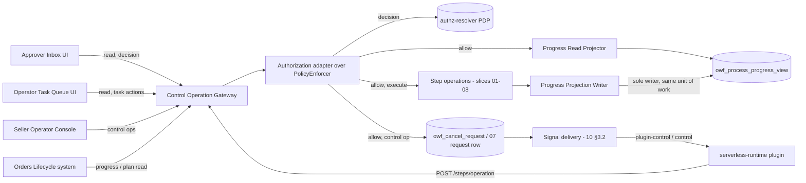
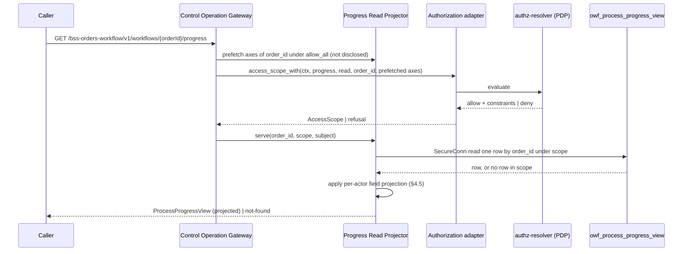
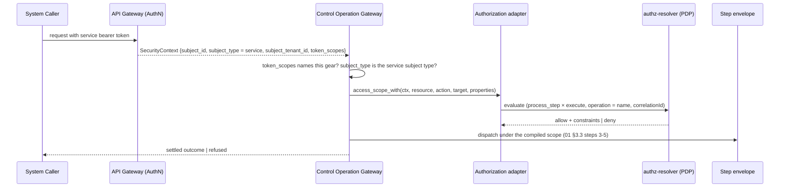
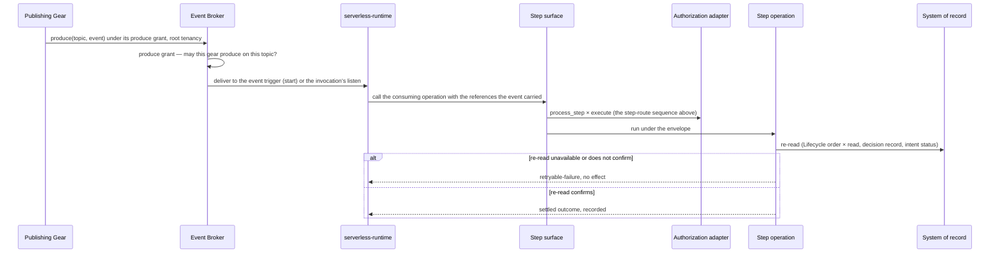

<!-- CONFLUENCE_TITLE: [BSS]: Orders Workflow — Read Projection and Authorization (Slice 9) -->
<!-- Related: ../DESIGN.md, ../PRD.md, ./README.md, ./10-process-definition.md | Owners: BSS Orders team -->

# DESIGN — Read Projection and Authorization (Slice 9)

<!-- toc -->

- [1. Architecture Overview](#1-architecture-overview)
  - [1.1 Architectural Vision](#11-architectural-vision)
  - [1.2 Architecture Drivers](#12-architecture-drivers)
  - [1.3 Architecture Layers](#13-architecture-layers)
- [2. Principles & Constraints](#2-principles--constraints)
  - [2.1 Design Principles](#21-design-principles)
  - [2.2 Constraints](#22-constraints)
- [3. Technical Architecture](#3-technical-architecture)
  - [3.1 Domain Model](#31-domain-model)
  - [3.2 Component Model](#32-component-model)
  - [3.3 API Contracts](#33-api-contracts)
  - [3.4 Internal Dependencies](#34-internal-dependencies)
  - [3.5 External Dependencies](#35-external-dependencies)
  - [3.6 Interactions & Sequences](#36-interactions--sequences)
  - [3.7 Database schemas & tables](#37-database-schemas--tables)
  - [3.8 Deployment Topology](#38-deployment-topology)
- [4. Additional context](#4-additional-context)
  - [4.1 The per-actor permission matrix (normative)](#41-the-per-actor-permission-matrix-normative)
  - [4.2 The service-principal requirement for system actors (normative)](#42-the-service-principal-requirement-for-system-actors-normative)
  - [4.3 API latency and retention policy values](#43-api-latency-and-retention-policy-values)
  - [4.4 Authorized invocation, resource ownership, and apply-time re-check (normative)](#44-authorized-invocation-resource-ownership-and-apply-time-re-check-normative)
  - [4.5 Per-actor field projection on the progress read (normative)](#45-per-actor-field-projection-on-the-progress-read-normative)
  - [4.6 Constraints this slice places on the definition](#46-constraints-this-slice-places-on-the-definition)
- [5. Traceability](#5-traceability)

<!-- /toc -->

- [ ] `p1` - **ID**: `cpt-cf-bss-orders-workflow-design-read-and-authz`

## 1. Architecture Overview

### 1.1 Architectural Vision

**What this slice provides under ADR-0011.** This slice registers **no step operation** and
contributes **no definition fragment**: nothing in
[`10 §3.6`](./10-process-definition.md#36-interactions--sequences) calls an operation of this
slice, and this slice sequences nothing. It provides the three things every other slice depends on
but none of them may define for itself: the **authorization of the internal step surface** — the
catalogue rows for `gts.cf.bss.orders_workflow.process_step.v1~` × `execute`, one resource-property
value per registered operation name, granted only to the serverless-runtime service principal
(§3.1); the two **control operations** this slice owns — retry failed step and cancel workflow
with compensation — which record the operator's request in Orders and then deliver it to the
running invocation as a signal that a definition `listen` arm of fragments (c) and (d) consumes,
or call the platform invocation API directly (§3.3), together with the mapping of slice 07's
per-action task routes, which realise *Resolve manual task*; and the single **read projection** that answers "where is this order's process
right now", which every step operation's unit of work upserts (§3.2). The former
`POST /bss-orders-workflow/v1/workflows` start route is **removed**: the platform event trigger of
[`10 §3.3`](./10-process-definition.md#33-api-contracts) starts the invocation, and PRD §9.1
*Start workflow* is realised by that trigger and by `admit-trigger` →
`start-instance` ([`02 §3.3`](./02-triggers-and-start.md#33-api-contracts),
[`01 §3.3`](./01-foundation.md#the-foundations-own-operations)).

The read projection never derives commercial truth — it reflects this gear's own record (the
recorded phase, step status, `FulfillmentTask` states, approval-request state, pending manual
tasks, `correlationId`, the platform `invocation_id` and the definition version the instance is
pinned to) and nothing about what was ordered or the order's own lifecycle state, which remain
Orders Lifecycle's alone to answer. The **authorization adapter** is one shared `PolicyEnforcer`
from `authz-resolver-sdk`, invoked by every REST route this gear registers — the step routes, the
control operations and the reads — before the operation's own guard runs; it prepares trusted
inputs — the registered `(resource, action)` pair, the target identifier and the target row's
tenant axes — forwards them to the platform PDP, and enforces the returned constraints as an
`AccessScope` inside the statement that reads or mutates the row. It is not a Workflow-owned
policy evaluator, and it decides nothing itself
(`cpt-cf-bss-orders-workflow-adr-platform-pdp-authorization`; the sibling Orders Lifecycle's
[`08 §2.1`](../../../orders-lifecycle/docs/design/08-read-and-authz.md#one-pdp-adapter-invoked-from-two-places)
*One PDP adapter, invoked from two places* is the precedent followed here without modification).
The adapter is unchanged by ADR-0011; what changes is the set of routes it guards.

The second driver is auditability under multi-actor orchestration. Every route this gear
registers — the four control and progress routes, the manual-task and approval endpoints of
slices 03 and 07, the plan projection of slice 04, and the step routes of `01 §3.3` — is reachable
by **nine** principal classes: three human (Approver, Fulfillment Operator, Seller Operator), four
system counterparties (Orders Lifecycle, Generic Approval, Subscriptions, Payments), the platform
Events/Audit sink, which the PRD names as an actor, and the **serverless-runtime** service
principal that executes the definition, which the PRD does not name but which is now the only
caller of the step surface. Three of the system actors (Generic Approval, Subscriptions, Payments)
are permitted to *report an outcome* but never to *drive an order state transition* directly, and
none of them now calls this gear at all: their outcomes reach the process as events the platform
consumes and as reads Orders makes inside its own operations. The asymmetry therefore holds on
the one transport that remains — every grant on the REST surface is bound to a verified principal
whose `SecurityContext` `subject_type` and `token_scopes` name this gear, and not merely to an
actor-class label a compromised or misconfigured caller could also present (§4.2).

Latency and retention are stated here as working baselines, not settled numbers, because both are
pending a program-wide NFR workshop (PRD §7 NFR notes); this slice records the baseline this
gear commits to today and names who is accountable for the retention floor so that commitment is
enforceable rather than aspirational.

### 1.2 Architecture Drivers

#### Functional Drivers

| Requirement | Design Response |
|-------------|------------------|
| `cpt-cf-bss-orders-workflow-fr-owf-authorization` | One shared authorization adapter over the platform PDP (`PolicyEnforcer`) invoked on every registered route, the step routes included; registered resource/action catalogue in §3.1, endpoint mapping in §3.2, expected-decision matrix in §4.1 |
| `cpt-cf-bss-orders-workflow-interface-owf-ops` (query process progress) | Read-only progress projection in §4.1's read rows, sourced from this gear's own record only |
| `cpt-cf-bss-orders-workflow-interface-owf-ops` (start, resolve, retry, cancel) | Start is the platform event trigger (§3.3, no Orders route); resolve is slice 07's per-action task routes (`07 §3.3`); retry and cancel are control operations of this slice that record the request and signal the invocation (§3.6 *Control operation to signal*) |

#### NFR Allocation

| NFR ID | NFR Summary | Allocated To | Design Response | Verification Approach |
|--------|-------------|--------------|-----------------|----------------------|
| `cpt-cf-bss-orders-workflow-nfr-owf-api-latency` | Progress reads p95 < 200 ms; control-op acceptance p95 < 1 s (working baselines) | Progress Read Projector; Control Operation Gateway | Denormalized projection read from this gear's own store, no cross-gear fan-out on the read path; a control op answers once its request is recorded and its signal delivery is attempted, before any saga work | Load test against working baseline; NFR workshop re-baselines the threshold |
| `cpt-cf-bss-orders-workflow-nfr-owf-retention` | Process records retained ≥ 400 days, configurable, independent of engine run-history purge | Retention Policy Owner (named in §4.3) | Gear-owned audit-grade store for the saga log, process audit, manual-task history and control requests, retained on a policy distinct from and never bounded above by the platform's invocation-history retention | Retention-policy audit; purge-independence test of `10 §1.2` confirming a platform history purge cannot erase the gear-owned record |

#### Key ADRs

| ADR ID | Decision Summary |
|--------|-----------------|
| `cpt-cf-bss-orders-workflow-adr-process-state-non-authoritative` | The progress projection is derived from this gear's own process state and MUST NOT be presented as authoritative commercial order or order-state truth; those are always read from Orders Lifecycle |
| `cpt-cf-bss-orders-workflow-adr-platform-pdp-authorization` | Every route is authorized by the platform PDP through one shared `PolicyEnforcer`; as amended by ADR-0011, the step routes are one resource type with the single action `execute` |
| `cpt-cf-bss-orders-workflow-adr-flow-as-platform-definition` | The flow is a platform definition; this slice's control operations become signals to, or platform calls on, the running invocation |
| `cpt-cf-bss-orders-workflow-adr-definition-versioning-and-protected-steps` | The operation names this slice's catalogue enumerates are the closed set the validation hook checks `call` targets against |
| `cpt-cf-bss-orders-workflow-adr-references-not-payloads` | A signal carries the reference tuple and a `requestRef`; the operator's identity and authorization snapshot stay in `owf_cancel_request` and in slice 07's `owf_task_resolution_request` |

### 1.3 Architecture Layers

```text
Approver UI / Fulfillment Operator UI / Seller Operator console       serverless-runtime plugin
                    |                                                  (executes the definition)
                    v                                                           |
        Control Operation Gateway  <-- Authorization adapter (one shared PolicyEnforcer) --+
                    |                          |                                            |
                    |                          v                                            v
                    |                 authz-resolver (platform PDP)        Step routes (01 §3.3)
        +-----------+------------------+                                       process_step × execute
        |                              |                                            |
        v                              v                                            v
  Request records               Progress Read Projector                  Step operations 01-08
  (owf_cancel_request;                 |                                            |
   07 owf_task_resolution_request)     |                                            |
        |                              v                                            v
        v                     owf_process_progress_view  <---- upsert in every step unit of work
  Signal delivery (10 §3.2)
  → invocations/{id}:plugin-control | :control
```

| Layer | Responsibility | Technology |
|-------|---------------|------------|
| Presentation | Approver inbox, operator task queue, control-op endpoints; the internal step routes | REST, gateway-terminated auth (`OperationBuilder` `.authenticated()`) |
| Application | Authorization adapter over the shared `PolicyEnforcer`; Control Operation Gateway; Progress Read Projector; Progress Projection Writer | Gear application layer; `authz-resolver-sdk` |
| Domain | Process progress read model; the registered resource/action catalogue; the control-request record | Rust domain types; GTS labels for the catalogue |
| Infrastructure | PDP constraints compiled to `AccessScope` and applied by `SecureConn`; audit-grade retention store; the platform invocation API for signals | `authz-resolver` (platform PDP); `toolkit-db` SecureORM; gear-owned datastore; `serverless-runtime` |

- [ ] `p3` - **ID**: `cpt-cf-bss-orders-workflow-tech-read-authz-stack`

## 2. Principles & Constraints

### 2.1 Design Principles

#### One adapter, exhaustive over operations, decided by the platform PDP

- [ ] `p1` - **ID**: `cpt-cf-bss-orders-workflow-principle-exhaustive-permission-evaluator`

Every authorization decision in this gear is made by the platform PDP, reached through **one
shared `PolicyEnforcer` adapter** that the Control Operation Gateway invokes for every registered
REST route — the control and read routes of §3.3 and the step routes of `01 §3.3` alike. The
adapter prepares trusted inputs and enforces returned scopes; it holds no policy, synthesizes no
`AccessScope` and never turns an actor class into a grant. Business guards remain in the owning
slices and cannot grant access. This is the unified-system rule — `PolicyEnforcer` for all
authorization decisions, a PDP decision covering every sensitive database access, fail closed on
denial, outage or missing constraints — applied without a Workflow exception
(`cpt-cf-bss-orders-workflow-adr-platform-pdp-authorization`).

"Every operation" is not a list maintained by hand. The **resource/action catalogue** of §3.1 and
the **endpoint mapping** of §3.2 are checked against the gear's routing table and against the
operation registry (`01 §3.7` `owf_step_operation`) in both directions: every registered REST
route must map to exactly one registered `(resource, action)` pair and every registered step
operation to exactly one `operation` property value of `process_step × execute` (otherwise an
operation ships unguarded), *and* every catalogue pair and every property value must be reached by
at least one registered route or operation (otherwise the catalogue accumulates permissions nobody
exposes and the exhaustiveness claim degrades into "the pairs we remembered cover the routes we
remembered"). Either direction failing is a **startup failure**, asserted again by a CI
conformance test with a recording PDP double (§3.7), never a default-deny reached at request time,
because a silently-permissive gap is indistinguishable from a correctly-scoped grant until it is
exploited. Adding an endpoint or registering an operation in any slice therefore fails the build
until §3.1–§3.2 map it and §4.1 declares its expected decision against all nine principal classes.
This gear subscribes to no broker topic any more (§4.2), so there is no handler side to the check.

#### The read side never becomes a second source of truth

- [ ] `p1` - **ID**: `cpt-cf-bss-orders-workflow-principle-read-not-authoritative`

The progress projection answers "what has this process done and where is it now," never "what
was ordered" or "what is the order's current state." Those questions are always answered by
Orders Lifecycle. Presenting this gear's projection as authoritative order state would let a
stalled or replaying process report a fact the order-of-record has already superseded. Nor is it
the platform's answer: the invocation's own status is the platform's, read by `invocation_id`
through the platform surface, and the projection never copies it.

**ADRs**: `cpt-cf-bss-orders-workflow-adr-process-state-non-authoritative`

### 2.2 Constraints

#### Every grant carries an explicit scope

- [ ] `p1` - **ID**: `cpt-cf-bss-orders-workflow-constraint-every-grant-scoped`

No cell in the expected-decision matrix may grant an operation without naming the scope it is
bound to — the PDP constraint on `seller_tenant_id`, the PDP `Eq` constraint on
`assigned_principal`, or a service principal whose `subject_type` and `token_scopes` name this
gear and whose PDP allow is restricted to the target the call names — and the adapter **requires
constraints** (`require_constraints = true`) on every scoped database path, so a PDP allow that
returns no constraint fails closed rather than becoming an unscoped read. An unscoped grant reads
as "any actor of this class, over every tenant's data," which is a defect regardless of how narrow
the operation appears; the sibling Orders Lifecycle design found exactly this defect in its own
review (an unscoped `list` grant and an unscoped Preview row) before correcting it, and this
design is checked against the same failure mode in §4.1. The serverless-runtime principal acts for
every tenant, and that is precisely why its `execute` grant is restricted per call to the
`correlationId` and `resource_tenant_id` the call names (§3.1), never a standing cross-tenant
allow. Naming a `correlationId` is not by itself a restriction — the caller chooses it, and it is
a derivable UUIDv5 — so the envelope also binds every call after `start-instance` to the
instance's own invocation: the body's `invocationId` must equal `owf_process_instance.invocation_id`
or the call is `not-found` ([`01 §3.3`](./01-foundation.md#33-api-contracts) step 3, decision
D-106). Disabling the constraint requirement is never a substitute for a missing policy
([Lifecycle `08 §3.5`](../../../orders-lifecycle/docs/design/08-read-and-authz.md#35-external-dependencies)).

#### System-actor grants require a verified service principal

- [ ] `p1` - **ID**: `cpt-cf-bss-orders-workflow-constraint-service-principal-required`

Actor class alone is never sufficient authorization for a system actor. Every service-principal
grant on this gear's REST surface — the serverless-runtime principal on the step routes, Orders
Lifecycle on the two read routes it holds — is honoured only when the platform `SecurityContext`
carries a `subject_type` that is the platform service-subject type **and** `token_scopes` naming
this gear, and the PDP allows the registered `(resource, action)` pair for that subject (§4.2).
Without both, nothing distinguishes the legitimate calling gear from any other caller presenting
the same actor class. Event-borne inputs no longer reach this gear on a transport of their own:
the platform consumes them under the broker's produce grant and platform-root tenancy (Lifecycle
D-95), and they enter Orders only as arguments of a step call that is itself authorized here and
re-verified against the system of record inside the operation (§4.2). This follows the sibling
Orders Lifecycle design's workflow-seam service-principal requirement, restated in the platform's
own terms (`DECISIONS.md` D-37 as amended by D-63).

#### Tenant scoping and payment-card exclusion on every read

- [ ] `p1` - **ID**: `cpt-cf-bss-orders-workflow-constraint-tenant-scoped-reads`

Every read this gear exposes is tenant-scoped; process artifacts carry commercial order context
(order ID, the three tenant axes, correlationId) but MUST NOT carry payment-card data. Reads
never mutate process or order state.

The three axes are `resource_tenant_id` (resource recipient), `payer_tenant_id` (billing party)
and `seller_tenant_id` (selling party), the same axes the order carries. Scoping is by **axis and
relationship, never by a role string**: a seller-scoped grant is a PDP constraint on the row's
`seller_tenant_id` (an `Eq`, `In` or `InTenantSubtree` predicate, as the PDP chooses), an
approver's grant is a PDP `Eq` constraint on `owf_approval_gate.assigned_principal`, and both are
compiled to an `AccessScope` that `SecureConn` attaches to the query. The adapter supplies the
row's axes to the PDP as resource properties; it never derives a scope from the caller's role.
A predicate that matches on the actor's role name alone returns every row of that role across
every seller and every tenant, which is the unscoped-read defect this slice exists to prevent,
wearing a scope's clothes.

#### Authorization is enforced on the row, not only on the route

- [ ] `p1` - **ID**: `cpt-cf-bss-orders-workflow-constraint-resource-ownership-check`

A PDP allow authorizes an actor to invoke an operation. Whether that actor may touch *this* row
is the same decision's **constraints**, and they are enforced where they cannot be raced: the
compiled `AccessScope` is applied by `SecureConn` **inside the mutating statement** — the
`UPDATE … WHERE task_id = $1 AND <scope predicates> AND row_version = $2` the platform's
UPDATE/DELETE prefetch pattern produces
([`06_authn_authz_secure_orm.md`](../../../../../docs/toolkit_unified_system/06_authn_authz_secure_orm.md)
*UPDATE / DELETE — prefetch + TOCTOU safety*) — never a read-then-check-then-write, which two
operators racing the same task both pass and which a row whose tenancy changed between the check
and the write defeats.

A target row that exists but lies outside the caller's scope is answered **404, not 403**: a 403
confirms the row exists, which turns the error code into an existence oracle over other sellers'
orders. The platform default maps a PDP denial to 403; this gear records the 404 as its single
declared deviation and applies Lifecycle's rule unchanged — a targeted denial is `not-found`
unless a follow-up `read` decision on the same target allows, in which case it is
`not-authorized` (403); an untargeted denial (a list) is 403
([Lifecycle D-114, D-141](../../../orders-lifecycle/docs/DECISIONS.md)). The rule applies
uniformly to task resolution, override, retry, escalate, cancel, the decision endpoint and the
step routes (`01 §3.3` step 2); no operation is exempt because "the platform propagates
`SecurityContext`" — propagation carries an identity, it does not make a decision. §4.4 states
the check and the definition of an authorized invocation normatively, and it is stated **here**,
once, because `authorize-cancel` (slice 08) and the unwind operations of slice 06 both use "an
authorized cancellation" as an input precondition and neither of them owns authorization.

#### Every collection response is paged

- [ ] `p1` - **ID**: `cpt-cf-bss-orders-workflow-constraint-bounded-page-size`

Every list this gear exposes — the approver inbox, the operator task queue, the fulfillment-plan
line projection, and the manual-task list — takes a page size and returns a **keyset cursor**.
Default 50, maximum 200, as working baselines: the p95 < 200 ms budget is stated per page, and an
unpaged read behind a ≥ 400-day retention floor with no archival makes the budget meaningless the
first time an order accumulates a long remediation history. A requested page size above the
maximum is **clamped server-side to 200** rather than honoured.

The cursor is keyset, not offset, and its sort key is immutable: `(created_at, task_id)` for the
task queue and the manual-task list, `(created_at, gate_id)` for the approver inbox,
`(order_line_id)` within a frozen plan for the line projection. A mutable column — assignment
state, SLA countdown, task state — is never a sort key: the sweep and every operator action
rewrite it, so a row could move between pages and be returned twice or skipped entirely, silently,
behind a 200 and a valid-looking cursor.

#### Idempotency keys are tenant-namespaced and server-recomposed

- [ ] `p1` - **ID**: `cpt-cf-bss-orders-workflow-constraint-tenant-namespaced-idempotency`

Every idempotency key this gear registers is prefixed with the `resource_tenant_id` of the order
it acts on, so two tenants cannot collide in the registry and no key from one tenant can resolve a
call made for another. The prefix is not decoration: without it, a key composed from an order id
and a transition name is a value a caller can guess, and a settled record is a value a caller can
read the outcome of.

A caller-supplied key is **validated, never trusted**. The server recomposes the key from the
caller's authorized target — the tenant axes of the order the ownership check just resolved, plus
the operation's own components — and compares. A supplied key that does not equal the recomposed
key is refused with `idempotency-key-mismatch` (400) before any work is done; a supplied key that
matches but whose request fingerprint differs from the settled record's is an
`idempotency-key-conflict` refusal (409), not an absorbed duplicate. A caller therefore cannot
address another tenant's registry entry by presenting its key, and cannot reuse its own key to
make a different request. The rule binds both callers: an operator on a mutating control route
(`Idempotency-Key` REQUIRED on every one, §3.3) and the serverless-runtime principal on a step
route, whose key is recomposed from the body per the operation's registered key family
(`01 §3.3` step 3).

#### Durable work is admission-controlled per tenant

- [ ] `p1` - **ID**: `cpt-cf-bss-orders-workflow-constraint-per-tenant-durable-quota`

The gear's dispatch quotas all govern *outbound* pressure — in-flight intents, per-tenant dispatch
fairness and the aggregate cap, all enforced inside `dispatch-wave1-create` and
`dispatch-wave2-activate` ([`05 §4.3`](./05-provisioning-intents.md#43-admission-on-dispatch-moved-from-01-412-and-01-416)). None of
them bounds the **durable** work one tenant can cause this gear to store: manual tasks and active
process instances grow with a tenant's failure rate, are retained for ≥ 400 days, and are read on
latency-budgeted operator surfaces. One seller in a bad integration loop degrades every other
seller's queue.

Admission quotas, keyed on `seller_tenant_id`, as working baselines: **500 open manual tasks** and
**200 concurrently active process instances**. The former quota on undispatched dead-letter
records is **retired**: this gear stores no dead letter (`01 §4.8`), and the volume of the
platform trigger path's dead letters is the platform's to bound.

Breaching a quota never drops durable evidence and never refuses an accepted order — either would
trade an observability problem for a correctness one. It changes what gets *created*, inside the
operation that creates it: over the manual-task quota, `create-manual-task`
([`07`](./07-manual-tasks.md)) appends further failures on an order that already has an open task
to that task rather than creating a new one, and raises one incident per order instead of one per
step for orders with none; over the instance quota, `start-instance` still admits the instance and
the dispatch operations of slice 05 reduce the tenant's fairness share, and a capacity incident is
raised for the operator on call. Every breach is alerted, because a quota that is silently
absorbed is a quota nobody fixes.

## 3. Technical Architecture

### 3.1 Domain Model

**Technology**: Rust structs, gear-owned read-model store

**Location**: [`../DESIGN.md`](../DESIGN.md) §3.1 (gear-wide domain model); this slice adds the
read-model projection type, the catalogue and the control-request record below.

**Core Entities**:

- [ ] `p2` - **ID**: `cpt-cf-bss-orders-workflow-entity-process-progress-view`
- [ ] `p2` - **ID**: `cpt-cf-bss-orders-workflow-entity-permission-declaration`
- [ ] `p2` - **ID**: `cpt-cf-bss-orders-workflow-entity-cancel-request`

| Entity | Description | Schema |
|--------|-------------|--------|
| `ProcessProgressView` | The read-only projection returned by "query process progress": recorded phase, current step status, all `FulfillmentTask` states, approval-request state, pending manual tasks, process `correlationId`, the platform `invocation_id` and the definition version the instance is pinned to, subject to the per-actor field projection of §4.5 | §3.7 `owf_process_progress_view` |
| `ResourceActionCatalogue` | The registered set of `(resource, action)` pairs this gear enforces and the platform PDP grants against — the tables below — together with the endpoint mapping of §3.2. It is compiled constants and GTS registrations, not a table: there is no runtime write path and no operation in this gear that can grant itself a permission | Registered GTS labels; `ResourceType` constants in the adapter |
| `CancelRequest` | One accepted Seller Operator cancel, recorded **before** its `cancel-requested` signal is delivered, carrying the authorization snapshot of §4.4 and the `requestRef` the signal carries instead of any identity — the record `08 §3.3`'s `cancelRequestRef` names (`10 §4.4`, ADR-0013). A retry, override or task-cancel request is slice 07's `TaskResolutionRequest` (`owf_task_resolution_request`), which the step-retry route of §3.3 also writes | §3.7 `owf_cancel_request` |

**The platform `SecurityContext` as consumed.** This slice defines no security context of its own.
Every operation is evaluated against the platform
[`SecurityContext`](../../../../../libs/toolkit-security/src/context.rs) exactly as the gateway
injects it, and the adapter reads exactly these five fields and nothing else — a request whose
context lacks a field its operation depends on is refused, not evaluated against a default:

| Field | Type | How this gear uses it |
|---|---|---|
| `subject_id` | uuid | The authenticated subject; written to `owf_audit_entry.actor` (D-61), to `owf_manual_task.assignee` / `resolved_by`, slice 07's `owf_task_resolution_request` and `owf_cancel_request.subject_id`, and compared by the PDP against `owf_approval_gate.assigned_principal` for every approver grant |
| `subject_type` | GTS type id, optional | Distinguishes a user subject from a service subject; a service subject is never allowed on a human-actor arm and vice versa, and `owf_audit_entry.actor_class` is derived from it and the configured identities alone (`01 §3.7`) |
| `subject_tenant_id` | uuid | The subject's home tenant; the PDP's default context tenant, and the tenant whose registry entries a caller-supplied idempotency key may resolve (`cpt-cf-bss-orders-workflow-constraint-tenant-namespaced-idempotency`) |
| `token_scopes` | list of string | Capability restrictions; every service-principal arm additionally requires a scope naming this gear (§4.2). `["*"]` is first-party and unrestricted |
| `bearer_token` | secret, optional | Forwarded to the PDP by `PolicyEnforcer`; never read, logged or persisted by this gear, and absent from the authorization snapshot of §4.4 |

There is no role, scope-set, assignment or delegation claim. Seller scope, approver assignment and
service-principal scope are **PDP decisions over resource properties this gear supplies**, never
fields the gear reads off the token. A delegation proof the caller presents is forwarded to the
PDP as request context and never validated locally
([Lifecycle D-111](../../../orders-lifecycle/docs/DECISIONS.md) by reference).

**Resource/action catalogue (normative).** Labels are GTS ids `gts.cf.bss.orders_workflow.<noun>.v1~`
in this gear's namespace (`01 §4.7`), registered with the platform PDP in Pricing's shape
([`05-governance.md` *AuthZ Resource and Action Catalog*](../../../pricing/docs/design/05-governance.md#authz-resource-and-action-catalog-normative)),
each action on its real object. Per row, the **PDP properties** column names the resource
properties the adapter supplies with every decision and the `ResourceType` advertises as
`supported_properties`; the PDP constrains on them and `SecureConn` maps them to the row's columns
through `pep_prop`.

| Label | Object | Actions | PDP properties supplied |
|-------|--------|---------|-------------------------|
| `gts.cf.bss.orders_workflow.process_instance.v1~` | `owf_process_instance` — the running process | `cancel`, `retry_step` (`start` is **retired**: no Orders route starts an instance, §3.3) | `resource_tenant_id`, `seller_tenant_id`, `payer_tenant_id`; resource id = `order_id` of the instance |
| `gts.cf.bss.orders_workflow.process_step.v1~` | One registered step operation of `owf_step_operation` (`01 §3.7`), invoked for one instance | `execute` | `operation` (one value per registered operation, the table below); `resource_tenant_id` from the body, checked against the bound instance where one exists; resource id = `correlationId` (absent only on `admit-trigger` in the `start` role, whose instance does not exist yet). `seller_tenant_id` is **not** supplied: it does not cross the engine boundary (ADR-0013), and inside the operation every read narrows to the bound instance's axes (ADR-0010 as amended) |
| `gts.cf.bss.orders_workflow.fulfillment_task.v1~` | `owf_fulfillment_task` and the frozen plan lines it projects | `read` | `resource_tenant_id`, `seller_tenant_id`; resource id = `order_id` (the plan projection is per order version) |
| `gts.cf.bss.orders_workflow.manual_task.v1~` | `owf_manual_task` and the incident rows the queue projects | `read`, `resolve`, `override`, `assign`, `escalate`, `cancel` | `resource_tenant_id`, `seller_tenant_id`; resource id = `task_id`; `assignee` |
| `gts.cf.bss.orders_workflow.dead_letter.v1~` | **Pending.** `owf_dead_letter_record` is retired (`01 §3.7` *Retired tables*); the label survives only for `owf_dead_letter_triage`, which slice 07 keeps *pending* the platform's answer on operator visibility of trigger-path dead letters (`01 §4.8`, `UPSTREAM_REQS.md` §2.9) | `read`, `redrive`, `discard` — **not registered** until that ask is answered | `resource_tenant_id`, `seller_tenant_id`; resource id = the triage row's id |
| `gts.cf.bss.orders_workflow.approval_gate.v1~` | `owf_approval_gate` | `read_inbox`, `approve` (approve or reject; the submitting identity is barred server-side, D-56) | `resource_tenant_id`, `seller_tenant_id`; resource id = `gate_id`; `assigned_principal`; `order_id` |
| `gts.cf.bss.orders_workflow.progress.v1~` | `owf_process_progress_view` — the read projection | `read` | `resource_tenant_id`, `seller_tenant_id`, `payer_tenant_id`; resource id = `order_id`; the set of `order_id` values carrying a gate whose `assigned_principal` is the caller, for the approver's `A*` path |

**`process_step × execute` property values (normative).** One value per registered operation,
exactly the names of each slice's §3.3 declaration; the startup assertion of §3.7 compares this
list with `owf_step_operation` in both directions. The only principal the platform policy owner
may grant `execute` to is the **serverless-runtime service principal** (`Gr`, §4.1), and the grant
**MUST** enumerate the values below rather than grant the action unconditionally, so that an
operation registered later is denied until its value is provisioned:

| `operation` | Protection | Declared in | Granted to serverless-runtime |
|-------------|------------|-------------|-------------------------------|
| `start-instance` | protected | [`01 §3.3`](./01-foundation.md#the-foundations-own-operations) | ✓ |
| `settle-from-lookup` | protected, sweep-only | `01 §3.3` | **✗** — in-process only (`reconcile-intent`, `compensate-order`, `reconciliation-sweep`); the value is registered so the check is exhaustive, and its expected decision for every principal is a denial |
| `retry-step` | composable (operator), in-process only | `01 §3.3` | **✗** — run in-process only, inside the operator's `retry` resolution (`resolve-manual-task`), with the actor from the request row; like `settle-from-lookup`, the value is registered so the check is exhaustive, and its expected decision for every principal is a denial (decision D-108) |
| `park` | composable | `01 §3.3` | ✓ |
| `unpark` | composable | `01 §3.3` | ✓ |
| `terminate-instance` | protected | `01 §3.3` | ✓ |
| `admit-trigger` | protected | [`02 §3.3`](./02-triggers-and-start.md#33-api-contracts) | ✓ |
| `terminate-on-terminal-event` | protected | `02 §3.3` | ✓ |
| `obtain-verdict` | protected | [`03 §3.3`](./03-approval-execution.md#33-api-contracts) | ✓ |
| `reflect-verdict` | protected | `03 §3.3` | ✓ |
| `open-gates` | composable | `03 §3.3` | ✓ |
| `record-decision` | protected | `03 §3.3` | ✓ |
| `arm-park-escalation` | composable | `03 §3.3` | ✓ |
| `escalate-gate` | composable | `03 §3.3` | ✓ |
| `evaluate-payment-auth-eligibility` | protected | [`04 §3.3`](./04-fulfillment-plan.md#33-api-contracts) | ✓ |
| `construct-and-freeze-plan` | protected | `04 §3.3` | ✓ |
| `begin-fulfillment` | protected | `04 §3.3` | ✓ |
| `evaluate-activation-eligibility` | composable | `04 §3.3` | ✓ |
| `re-check-pre-activation` | protected | `04 §3.3` | ✓ |
| `dispatch-wave1-create` | protected | [`05 §3.3`](./05-provisioning-intents.md#33-api-contracts) | ✓ |
| `dispatch-wave2-activate` | protected | `05 §3.3` | ✓ |
| `report-spawn-signal` | protected | `05 §3.3` | ✓ |
| `reread-draft-liveness` | composable | `05 §3.3` | ✓ |
| `rebuild-wave1` | composable | `05 §3.3` | ✓ |
| `reconcile-intent` | composable | `05 §3.3` | ✓ — also run in-process by the `reconciliation-sweep` worker |
| `run-cancellation-fence` | protected | [`06 §3.3`](./06-saga-and-compensation.md#33-api-contracts) | ✓ |
| `compensate-order` | protected | `06 §3.3` | ✓ |
| `report-outcome` | protected | `06 §3.3` | ✓ |
| `create-manual-task` | protected | [`07 §3.3`](./07-manual-tasks.md#33-api-contracts) | ✓ |
| `resolve-manual-task` | composable | `07 §3.3` | ✓ |
| `verify-override` | composable | `07 §3.3` | ✓ |
| `raise-overdue-escalation` | composable | `07 §3.3` | ✓ |
| `apply-hold` | protected | [`08 §3.3`](./08-hold-and-cancel.md#33-api-contracts) | ✓ |
| `apply-resume` | protected | `08 §3.3` | ✓ |
| `authorize-cancel` | protected | `08 §3.3` | ✓ |

Thirty-five values, thirty-three granted (`settle-from-lookup` and `retry-step` are in-process only). Permission instance ids follow the platform
`AuthzPermissionV1` schema prefix with the instance suffix
`cf.bss.orders_workflow.<resource>_<action>.v1` — `approval_gate × approve` registers
`…cf.bss.orders_workflow.approval_gate_approve.v1`, `process_step × execute` registers
`…cf.bss.orders_workflow.process_step_execute.v1` with the `operation` values as its property
domain — hyphens normalised to underscores in the suffix only, exactly as Lifecycle registers its
own. Registration declares available permissions; it issues no role grants. Role provisioning,
the approver grant keyed on `assigned_principal`, the service-principal grants — the
serverless-runtime `execute` grant with its enumerated values included — and their verification
against the deployed provider are the platform policy owner's, tracked under
`cpt-cf-bss-orders-workflow-upreq-pdp-policy-integration`
([`UPSTREAM_REQS.md §2.8`](../UPSTREAM_REQS.md#28-platform-authorization-policy)); this gear
must not fabricate default grants when provisioning is absent.

**How a principal maps to `owf_approval_gate.party_ref`.** It does not map by role-string equality —
`party_ref` is a *role* ("seller finance", "platform compliance"), and matching on it returns every
gate of that role across every order and every seller, which `cpt-cf-bss-orders-workflow-constraint-every-grant-scoped`
forbids and which would defeat PRD §6.7's "MUST NOT act on approval requests for orders outside
their assigned scope". The mapping is by **assignment, and the assignment is a column**:
`assigned_principal` is populated from the routing configuration inside `open-gates`
(`03 §3.2`, `§3.7`), supplied to the PDP as a resource property on every `approval_gate`
decision, and the approver's grant is the PDP's "own resource" `Eq` constraint
`assigned_principal = subject_id`, compiled to the `AccessScope` the inbox query and the decision
endpoint's `UPDATE` both run under. Because `gate_id` is derived deterministically as a UUIDv5
over (`orderId`, `orderVersion`, `party_ref`), the assignment survives a replay. A gate carrying
no `assigned_principal` is listed to nobody and surfaces through the operator queue as a
routing-configuration defect, never to whoever asks first (`03 §3.2`). No token claim, no
assignment-directory inverse query and no gateway ask is involved, and the assignment never
crosses into the definition: a `gateRef` does, the principal does not (ADR-0013).

**Relationships**:
- `ProcessProgressView` → the record owned by slices 01-08: a **materialised** single-row-per-order projection maintained by the Progress Projection Writer (§3.2) inside every step operation's unit of work, read without a chain walk. It is never authoritative: it is a projection of this gear's own record, and commercial order truth is still Orders Lifecycle's.
- `ResourceActionCatalogue` → every route in the gear's routing table and every row of `owf_step_operation`: one `(resource, action)` pair per REST route, one `operation` value per registered operation, checked in both directions at startup and in CI (§2.1, §3.7).
- `ResourceActionCatalogue` → the platform `SecurityContext`: the adapter presents the pair, the target id and the row's properties to the PDP with the caller's context; no predicate reads the request body beyond the references the route's schema declares, and nothing reads the token beyond the five fields above.
- `CancelRequest` → `owf_process_instance` (many-to-one by `correlation_id`) and → the definition's cancel arm that consumes its signal (by `requestRef`); `authorize-cancel` (`pre-fence`) and `compensate-order` (`pre-compensation`) read the snapshot from here through slice 08's cancel-authority port (`report-outcome` does not, D-84 as amended), never from the signal.

### 3.2 Component Model


```mermaid
graph LR
    A[Approver Inbox UI] -->|read, decision| G[Control Operation Gateway]
    B[Operator Task Queue UI] -->|read, task actions| G
    C[Seller Operator Console] -->|control ops| G
    D[Orders Lifecycle system] -->|progress / plan read| G
    R[serverless-runtime plugin] -->|POST /steps/operation| G
    G --> H[Authorization adapter over PolicyEnforcer]
    H -->|decision| P[(authz-resolver PDP)]
    H -->|allow| I[Progress Read Projector]
    H -->|allow, execute| J[Step operations - slices 01-08]
    H -->|allow, control op| Q[(owf_cancel_request / 07 request row)]
    Q --> S[Signal delivery - 10 §3.2]
    S -->|plugin-control / control| R
    I --> K[(owf_process_progress_view)]
    J --> W[Progress Projection Writer]
    W -->|sole writer, same unit of work| K
```

#### Authorization adapter (permission evaluator)

- [ ] `p1` - **ID**: `cpt-cf-bss-orders-workflow-component-permission-evaluator`

##### Why this component exists

Every route this gear exposes needs authorization decided the same way, by the same authority,
whether the caller is a human actor at a console, a system actor reading a projection, or the
platform runtime invoking a step. A per-endpoint ad hoc check invites drift and unscoped grants;
a gear-local evaluator is a second policy engine the platform policy owner cannot see. One adapter
over one shared `PolicyEnforcer` is the platform's rule, and it is Lifecycle's shape
([`08 §3.5`](../../../orders-lifecycle/docs/design/08-read-and-authz.md#35-external-dependencies)
*Platform authorization wiring*). It is **unchanged** by ADR-0011; the step routes are more routes
through it, not a second mechanism.

##### Responsibility scope

Owns the **single `PolicyEnforcer`**, constructed once at initialisation from the
`dyn AuthZResolverApi` resolved through `ClientHub` and cloned into the read services, the
control operations and the step surface of `01 §3.3`. Owns the catalogue constants of §3.1 — the
`ResourceType` descriptors with their `supported_properties`, the action constants, the
`process_step` `operation` value domain and the GTS registrations — and the endpoint mapping of
§3.2. For every call it accepts the declared `(resource, action)`, the target identifier where
the operation has one, and **trusted authorization properties**: stored properties come from the
target row (prefetched under `AccessScope::allow_all()` in the approved point-read pattern and
never disclosed before the decision), proposed properties are validated request values submitted
for authorization, never claims of authority. It calls `access_scope_with`, **requires
constraints** on every scoped database path, compiles the returned constraints to an
`AccessScope`, hands that scope to the owning operation to run its `SecureConn` statement under,
and maps `EnforcerError` to the registered refusal reasons (`01 §4.9`) without exposing PDP
internals. It forwards a caller-presented delegation proof reference as request context and never
validates it (Lifecycle D-111). It records the **authorization snapshot** for every control
command that can outlive its request (into `owf_cancel_request`), and re-runs the same PDP
decision at apply time when the consuming operation asks (§4.4). It fails startup when the
routing table, the operation registry and the catalogue disagree in either direction (§2.1,
§3.7), and when `dyn AuthZResolverApi` cannot be resolved — missing wiring is a startup failure,
never a switch to local authorization.

**Bounded worker exception.** The three Workflow-owned workers of `01 §3.8` —
`reconciliation-sweep`, `retention-purge` and `audit/<tenant>` — operate under **configured
system authority** without a per-pass or per-row PDP decision, exactly as Lifecycle `08 §3.5`
*Trusted internal maintenance* states it: a bounded cross-tenant discovery scan may use
`AccessScope::allow_all()`, every subsequent write narrows to its persisted target and the
properties appropriate to that table, a discovery scope never reaches a write, the authority is
never selected by a caller-supplied actor class, flag or tenant id, and the exception never
extends to a human-actor REST, SDK or signal path or to a failed user request. The former
`timer-wakeup` and `dead-lease-scan` workers are gone from the roster (ADR-0011). Worker evidence
carries the configured `system` actor (`01 §3.7`), never a nil UUID or an impersonated caller.
These workers continue through a PDP outage because their authority is configured, not obtained
as a fallback; missing configured authority or database grants fails the affected worker closed.
**Step operations** are the step executor's REST-invoked form (ADR-0010 as amended): the route
is PDP-authorized for the serverless-runtime principal, and inside the operation the seam reads
and writes run under the same configured authority, narrowed to the bound instance's tenant axes —
the caller supplies references, never authority.

##### Responsibility boundaries

Does not implement the saga, provisioning, manual-task, or hold/cancel mechanics it authorizes —
those are the step operations of slices 01-08. Does not decide commercial order authorization;
that is Orders Lifecycle's own PDP-authorized surface, invoked independently on Orders Lifecycle's
operations and by this gear's operations through the `order × read` of `02 §2.1`. Does not
authorize the platform's own APIs — definition publish, invocation start, `:control`,
`:plugin-control` — which are authorized platform-side
([serverless-runtime `DESIGN.md:847`](../../../../serverless-runtime/docs/DESIGN.md#33-api-contracts)).
Does not itself execute the scope against the target row — the row is read or written inside the
owning slice's transaction, under the scope this component compiled — and does not decide policy:
which roles hold which pairs, whether a seller relationship or a delegation proof satisfies a
path, is the PDP's, and provisioning it is the platform policy owner's (§3.5).

##### Related components (by ID)

- `cpt-cf-bss-orders-workflow-component-control-operation-gateway` — invoked by; the gateway calls the adapter before any control operation, step operation or read.
- `cpt-cf-bss-orders-workflow-component-progress-read-projector` — gates access to.
- `cpt-cf-bss-orders-workflow-component-step-executor` — gates the step routes the envelope serves (`01 §3.3` step 2).

#### Control Operation Gateway

- [ ] `p1` - **ID**: `cpt-cf-bss-orders-workflow-component-control-operation-gateway`

##### Why this component exists

Provides the single entry point through which every REST route in the gear's routing table is
invoked — the control operations, the reads, the manual-task and approval endpoints of slices 03
and 07, and the step routes of `01 §3.3` — so the authorization adapter has exactly one call site
to guard rather than one per operation implementation.

##### Responsibility scope

Accepts query process progress, retry failed step and cancel workflow with compensation; the
approver-inbox read and the approval decision; the operator-task-queue read and slice 07's
per-action task routes; the fulfillment-plan projection; and every `POST
/bss-orders-workflow/v1/steps/{operation}`. For every route it recomposes and validates the
caller's idempotency key against the caller's authorized target
(`cpt-cf-bss-orders-workflow-constraint-tenant-namespaced-idempotency`); enforces the `If-Match`
optimistic version check on every operation §4.1 marks `+ver`; clamps every list request's page
size; resolves each route to its `(resource, action)` pair (§3.2 mapping) and delegates the
decision to the authorization adapter before dispatch. For a **control operation** it then
records the request row — `owf_cancel_request` with the authorization snapshot (§4.4) for a
cancel, slice 07's `owf_task_resolution_request` for a step retry — in the same transaction as the
audit entry, and hands the request to the signal delivery of
[`10 §3.2`](./10-process-definition.md#32-component-model)
(`cpt-cf-bss-orders-workflow-component-signal-delivery`), which delivers it to the instance's
`invocation_id` — or, for a retry whose invocation the platform reports `failed`, issues the
platform's `:control` `retry` instead, under D-86's confirmation condition (§3.3) — and reports the
outcome back through the gateway's **request-delivery port**, the one write path to
`owf_cancel_request.delivery_state` (§3.7); slice 10 records no request row of its own. The gateway performs no business effect for a
control operation itself: the effect is the step operation the definition's arm calls.

##### Responsibility boundaries

Does not implement business logic for any operation; dispatches only after an allow decision,
and dispatches the compiled `AccessScope` with the command so the owning operation runs its
statement under it. Never uses the platform's generic `:control` `cancel`, `suspend` or `resume`
for an order (`10 §4.4`), never starts an invocation, and never calls a step route itself — the
in-process call of an operator-class operation (`retry-step` inside the `retry` resolution) is
made by the consuming step operation, not by the gateway.

##### Related components (by ID)

- `cpt-cf-bss-orders-workflow-component-permission-evaluator` — depends on.
- `cpt-cf-bss-orders-workflow-component-signal-delivery` — depends on; delivers the signal the gateway recorded.

**Endpoint → `(resource × action)` mapping (normative).** Every REST route any slice registers,
mapped once: fifteen caller-facing routes (three of them *pending*) and the step routes as one
row. This table is what the startup assertion and the CI conformance test of §3.7 check the
routing table against; the step row is expanded per `operation` value by §3.1.

| Registered route | Resource × action | Target and PDP properties |
|------------------|-------------------|---------------------------|
| `POST /bss-orders-workflow/v1/steps/{operation}` (one route per `owf_step_operation` row, `01 §3.3`) | `process_step × execute` | `correlationId`; `operation`; `resource_tenant_id` from the body, checked against the bound instance |
| `GET /bss-orders-workflow/v1/workflows/{orderId}/progress` | `progress × read` | `order_id`; prefetched axes; the caller's gate orders (`A*`) |
| `POST /bss-orders-workflow/v1/workflows/{orderId}/steps/{stepId}/retry` | `process_instance × retry_step` | `order_id`; prefetched axes; 07 request row recorded and signalled |
| `POST /bss-orders-workflow/v1/workflows/{orderId}/cancel` | `process_instance × cancel` | `order_id`; prefetched axes; snapshot recorded (§4.4), request signalled |
| `GET /bss-orders-workflow/v1/fulfillment-operator/tasks` | `manual_task × read` | list; constraints required |
| `POST /bss-orders-workflow/v1/fulfillment-operator/tasks/{taskId}/retry` | `manual_task × resolve` | `task_id`; prefetched axes; request row and `task-resolution-requested` (07) |
| `POST /bss-orders-workflow/v1/fulfillment-operator/tasks/{taskId}/override` | `manual_task × override` | `task_id`; prefetched axes; request row and `task-resolution-requested` (07) |
| `POST /bss-orders-workflow/v1/fulfillment-operator/tasks/{taskId}/assign` | `manual_task × assign` | `task_id`; prefetched axes; `assignee` |
| `POST /bss-orders-workflow/v1/fulfillment-operator/tasks/{taskId}/cancel` | `manual_task × cancel` | `task_id`; prefetched axes; request row and `task-resolution-requested` (07) |
| `POST /bss-orders-workflow/v1/fulfillment-operator/tasks/{taskId}/escalate` | `manual_task × escalate` | `task_id`; prefetched axes |
| `GET /bss-orders-workflow/v1/fulfillment-operator/dead-letters` — *pending* | `dead_letter × read` | list; constraints required |
| `POST /bss-orders-workflow/v1/fulfillment-operator/dead-letters/{recordId}/redrive` — *pending* | `dead_letter × redrive` | triage row id; prefetched axes |
| `POST /bss-orders-workflow/v1/fulfillment-operator/dead-letters/{recordId}/discard` — *pending* | `dead_letter × discard` | triage row id; prefetched axes |
| `GET /bss-orders-workflow/v1/approver-inbox/gates` | `approval_gate × read_inbox` | list; constraint `assigned_principal = subject_id` required |
| `POST /bss-orders-workflow/v1/approver-inbox/gates/{gateId}/decision` | `approval_gate × approve` | `gate_id`; prefetched axes and `assigned_principal`; submitter barred locally (D-56) |
| `GET /bss-orders-workflow/v1/fulfillment-plan/{orderId}/{orderVersion}` | `fulfillment_task × read` | `order_id`; prefetched axes; the caller's gate orders (`A*`) |

**Removed rows.** `POST /bss-orders-workflow/v1/workflows/{orderId}/tasks/{taskId}/resolve` is
**retired** in favour of slice 07's per-action routes (`…/fulfillment-operator/tasks/{taskId}/`
`retry` · `override` · `cancel` · `escalate`), each with its own pair and its own
`Idempotency-Key` `{tenant}:{taskId}:{action}:{rowVersion}` (`07 §3.3`); PRD §9.1 *Resolve manual
task* is realised by those routes, and `manual_task × resolve` stays reached by the `retry`
route. `POST /bss-orders-workflow/v1/workflows` (start workflow) is removed with its
`process_instance × start` pair: an invocation is started by the platform event trigger of
`10 §3.3` and the instance by `admit-trigger` → `start-instance`, both authorized as
`process_step × execute`. The twelve `EVENT` handler rows — the nine Lifecycle triggers, the
Generic Approval decision callback and the two Subscriptions outcome events — are removed because
this gear no longer subscribes to any topic: the platform consumes those events as the start
trigger or a definition `listen` (`02 §2.2`), and each reaches Orders only as the argument of a
step call (§4.2). The three *pending* rows register only when the platform answers the dead-letter
visibility ask; until then they are neither routes nor catalogue pairs, and the conformance check
treats them as absent.

Two arms of §4.1 have no routing-table key and are therefore not rows here: the Payments
authorization outcome, which returns on this gear's own outbound read inside
`evaluate-payment-auth-eligibility` and is correlated by that call's idempotency key, and the
process-event publication the Events/Audit sink receives, which is outbound-only. Neither is an
inbound operation; neither is authorized by this gear.

#### Progress Read Projector

- [ ] `p1` - **ID**: `cpt-cf-bss-orders-workflow-component-progress-read-projector`

##### Why this component exists

Answers "query process progress" from this gear's own current record without walking the saga
log or calling out to Orders Lifecycle, Subscriptions, Payments or the platform on the read path,
which is what keeps the read within its p95 < 200 ms working baseline.

##### Responsibility scope

Serves `ProcessProgressView` for a given order by reading the materialised
`owf_process_progress_view` row — one indexed row read, no chain walk, no event replay, no
cross-gear call — and then applying the **per-actor field projection** of §4.5 before the response
leaves the component. Surfaces the intermediate `pending → draft_created` task advance, which is
observable only through this projection and is never itself published as an event. Returns the
instance's `invocation_id` so an operator who needs the platform's view reads it by that handle
through the platform's own surface under platform authorization; this component never makes that
read.

##### Responsibility boundaries

Never mutates process or order state, and never writes the projection row — that is the Progress
Projection Writer's sole responsibility. Never presents its output as authoritative commercial
order content or authoritative order state — "what was ordered" and "the current order state"
are always read from Orders Lifecycle, never derived here. Never copies the platform's invocation
status. Does not aggregate across orders beyond what the caller's scope already authorizes. Never
returns a field the caller's actor class is not projected, even when the row carries it. Is never
an input to a definition task.

##### Related components (by ID)

- `cpt-cf-bss-orders-workflow-component-permission-evaluator` — depends on for read authorization.
- `cpt-cf-bss-orders-workflow-component-progress-projection-writer` — reads the row that component owns.

#### Progress Projection Writer

- [ ] `p1` - **ID**: `cpt-cf-bss-orders-workflow-component-progress-projection-writer`

##### Why this component exists

`owf_process_progress_view` is materialised, so it needs exactly one writer. A projection with no
declared writer is one that every slice feels free to update and none of them owns the staleness
of; a projection each reader assembles itself is one whose 200 ms budget depends on a query plan
that grows with lines-per-order. Naming one writer settles both: the read is a single row, and the
freshness rule is a property of the writer rather than a hope about the reader.

##### Responsibility scope

A **hook in the step envelope's settlement unit of work** (`01 §3.3` *What the envelope
guarantees around a call*): **every step operation's unit of work upserts the projection row** for
its instance in the same transaction that writes its step record and audit entry and settles its
idempotency key — step status, the recorded phase, `FulfillmentTask` transitions, approval-gate
state, manual-task creation and resolution, and termination alike. The same hook runs in the
`settle-from-lookup` transaction of the `reconciliation-sweep` worker and in the control-operation
transaction that records an operator request (`owf_cancel_request`, or slice 07's
`owf_task_resolution_request`), so a pending operator request is visible on the next read.

**Staleness bound and invalidation rule.** Because every change to this gear's record is now made
by an operation of this gear inside the envelope — including what used to be merely *observed*
(a Subscriptions confirmation is a wake-up whose outcome `reconcile-intent` records, `05 §3.3`) —
the projection is **never stale relative to Orders' record**, and a caller who just performed an
operation reads its own write. How far Orders' record lags the world (a confirmation not yet
reconciled) is the definition's cadence, not a property of the projection, and
`source_max_committed_at` states which record the row reflects. Invalidation is by upsert on
`order_id`, not by TTL or by cache eviction: there is exactly one row per order and it is
rewritten, never invalidated and re-derived. The former ≤ 5 s bound for observed changes is
retired with the handlers that observed them.

##### Responsibility boundaries

Never writes any table but `owf_process_progress_view`. Never derives a value the source-of-truth
tables do not already carry, and never reads Orders Lifecycle or the platform — a projection that
enriched itself from the order of record would become a second source of commercial truth, which
`cpt-cf-bss-orders-workflow-principle-read-not-authoritative` forbids. Never serves reads. A
projection-upsert failure fails the unit of work: the operation settles `retryable-failure`
rather than committing a record the read would misreport.

##### Related components (by ID)

- `cpt-cf-bss-orders-workflow-component-progress-read-projector` — writes the row that component serves.
- `cpt-cf-bss-orders-workflow-component-step-executor` — runs inside its settlement unit of work.

### 3.3 API Contracts

- [ ] `p2` - **ID**: `cpt-cf-bss-orders-workflow-interface-owf-read-authz-ops`

- **Technology**: REST, gateway-terminated auth (`OperationBuilder` `.authenticated()`); every route authorized through the shared `PolicyEnforcer` adapter on its registered `(resource, action)` pair (§3.2); control operations reach the running invocation through the serverless-runtime invocation API ([`DESIGN.md:865`–`869`](../../../../serverless-runtime/docs/DESIGN.md#invocation-api)) as this gear's service principal
- **Location**: [`../DESIGN.md`](../DESIGN.md) §3.3 (gear-wide API surface); this slice documents
  the read and authorization behavior of every row and owns the control operations below.

**Step operations.** This slice registers **none**. It owns the authorization of the internal step
surface — `POST /bss-orders-workflow/v1/steps/{operation}`, whose contract, envelope and refusal
set are [`01 §3.3`](./01-foundation.md#33-api-contracts) — as the `process_step × execute`
catalogue rows of §3.1 and the `Gr` row of §4.1. There is therefore no operation table here.

**Endpoints Overview**:

| Method | Path | Description | Stability |
|--------|------|--------------|-----------|
| `POST` | `/bss-orders-workflow/v1/steps/{operation}` | The step surface of `01 §3.3`, authorized here as `process_step × execute` with `operation` as the resource property; serverless-runtime service principal only (`Gr`) | unstable — internal |
| `GET` | `/bss-orders-workflow/v1/workflows/{orderId}/progress` | Query process progress (§4.1 read projection, §4.5 field projection). Unchanged | unstable |
| `POST` | `/bss-orders-workflow/v1/workflows/{orderId}/steps/{stepId}/retry` | Retry failed step. `If-Match` with the process instance's `row_version` REQUIRED; `Idempotency-Key` REQUIRED, recomposed as `{tenant}:{orderId}:{stepId}:retry:{row_version}`. A failed step under `remediate` always holds an open manual task (`10 §4.1` *Failure*); the route is an **alias** of that task's `…/fulfillment-operator/tasks/{taskId}/retry` (`07 §3.3`): it writes the same `owf_task_resolution_request` row (action `retry`) and delivers the same `task-resolution-requested` signal, so `retry-step`'s quarantine and new attempt key (`01 §3.3`) run inside `resolve-manual-task`. A step with no open task is `not-found`; the task's own preconditions (`order-fenced`, `action-not-offered`) apply unchanged. Answers `202 Accepted` with `requestRef`. When the platform reports the invocation not live, the step is the instance's `invocation-dead` task ([`07 §4.4`](./07-manual-tasks.md#44-resolution-actions-by-reason-and-the-two-operator-roles-normative)), and the gateway issues `…/invocations/{invocation_id}:control` `retry` instead of a signal — valid only from `failed` today ([`DESIGN.md:888`](../../../../serverless-runtime/docs/DESIGN.md#invocation-api)) — once the platform confirms that `retry` keeps `invocation_id` and resumes at the faulted task (decisions D-86, D-105, `…-upreq-serverless-runtime-signals`). An invocation that fails with no `on_failure` handler moves on to `dead_lettered` ([`DESIGN.md:458`](../../../../serverless-runtime/docs/DESIGN.md#invocation-status-state-machine)), from which `retry` is not valid today; until the platform confirms those properties the re-drive is `action-not-offered`, and the fallback is the task's `cancel`, the dead-instance unwind of `01 §4.16` | unstable |
| `POST` | `/bss-orders-workflow/v1/workflows/{orderId}/cancel` | Cancel workflow with compensation. `If-Match` REQUIRED; `Idempotency-Key` REQUIRED, recomposed as `{tenant}:{orderId}:{orderVersion}:cancel:{subject_id}`. The body carries a REQUIRED free-text `reason` (1–500 characters), the cancel reason Lifecycle's `workflow-cancel` requires ([Lifecycle `06 §3.6`](../../../orders-lifecycle/docs/design/06-workflow-seam.md#36-interactions-and-sequences) *Workflow Cancel*, `cancel-reason-required`); a missing, empty or oversized `reason` is refused at boundary validation with the canonical `InvalidArgument` (400) and a field violation on `reason` ([`toolkit-canonical-errors`](../../../../../libs/toolkit-canonical-errors/src/context.rs) `InvalidArgumentV1::FieldViolations`), before authorization and without a record — input validation, not a catalogue reason. The route is offered only for an order in fulfillment: where the version's `begin-fulfillment` has not committed (slice 04's `begin_fulfillment_committed_at`) and the Lifecycle order read is not terminal, it refuses `action-not-offered` (400), because this gear has no seam to cancel an order before `in_fulfillment` and the order is cancelled through Lifecycle's own `POST /cancel` ([Lifecycle `08 §4.3`](../../../orders-lifecycle/docs/design/08-read-and-authz.md#43-the-permission-model-normative); decision D-109). Records an `owf_cancel_request` with the authorization snapshot (§4.4) and the reason, and delivers `cancel-requested` carrying only the reference tuple and `requestRef` (`10 §3.3`); authority is re-checked at apply time by `authorize-cancel` and at the later point of §4.4, because fencing can outlive the request by days. Never the platform's generic `:control` `cancel` (`10 §4.4`). For an instance whose invocation the platform reports not live (an open `invocation-dead` task), the request is recorded the same way and no signal is sent: the `reconciliation-sweep` worker carries it out as the dead-instance unwind, calling `authorize-cancel` and the rest of the cancel path in-process (`01 §4.16`, D-105). Answers `202 Accepted` with `requestRef` | unstable |

**Removed.** `POST /bss-orders-workflow/v1/workflows` (start workflow) is **removed** in favour of
the platform event trigger: PRD §9.1 *Start workflow* is realised by the serverless-runtime event
triggers on `OrderSubmitted` and `OrderAmended` (`02 §2.2`, `10 §3.3`), whose invocation's first
calls are `admit-trigger` and `start-instance`. No Orders route calls
`POST /api/serverless-runtime/v1/invocations`. No route re-starts an
invocation: `start-instance` answers the existing binding to a second invocation and that
invocation ends itself (`01 §3.3`), so a platform re-start cannot adopt a bound instance and
`owf_process_instance.invocation_id` is never re-bound (decision D-86). The only re-drive is the
platform's `:control` `retry` of the same invocation, valid from `failed` only
([`DESIGN.md:888`](../../../../serverless-runtime/docs/DESIGN.md#invocation-api)); a `dead_lettered` invocation
([`DESIGN.md:458`](../../../../serverless-runtime/docs/DESIGN.md#invocation-status-state-machine)) cannot be re-driven until the
platform confirms `retry` from `dead_lettered` keeping `invocation_id` and resuming at the faulted
task (`…-upreq-serverless-runtime-signals`). Until then the fallback is the Seller Operator's
cancel through the `invocation-dead` task: the instance is unwound in-process by the sweep, the
order ends as the cancel path ends it, and the customer is re-acquired by a new order created and
submitted through Lifecycle (`01 §4.16`, D-105).

**The routes of other slices** — the approver inbox and decision of
[`03 §3.3`](./03-approval-execution.md#33-api-contracts), the operator task queue and per-action
task routes of [`07 §3.3`](./07-manual-tasks.md#33-api-contracts), the plan projection of
[`04 §3.3`](./04-fulfillment-plan.md#33-api-contracts) — are specified by those slices and mapped
here (§3.2, §4.1). The decision endpoint's `Idempotency-Key` is REQUIRED and recomposed as
`{tenant}:{gateId}:decision:{subject_id}` (`03 §3.3`); every mutating task route of slice 07
REQUIRES `Idempotency-Key` `{tenant}:{taskId}:{action}:{rowVersion}`, and its `retry`, `override`
and `cancel` routes record `owf_task_resolution_request` and signal `task-resolution-requested`
while `assign` and `escalate` apply in-process (`07 §3.3`).

**Signals with no registered origin route.** `10 §3.3` names two further operator signals,
`reauthorize-requested` (payment re-authorisation, slice 04) and `unpark-requested` (after a
lifetime-ceiling park). Neither has a route in this design set, so Orders never delivers either,
and §2.1's exhaustiveness rule forbids Orders to deliver one from anywhere else. That rule binds
only Orders: `:plugin-control` is authorized platform-side (`../ADR/0010`), so another
platform-authorized caller could deliver either. The canonical definition therefore has no
`unpark-requested` arm, and `unpark` of a ceiling park refuses without a recorded operator retry
of the ceiling's task (`01 §3.3`, decision D-122); the `reauthorize-requested` arm only triggers an
early re-read of Payments (open question Q-13: the origin routes and catalogue pairs for both
signals, or the removal of `reauthorize-requested` too).

Every list response carries `items`, `next_cursor` (null on the last page) and the effective
`limit` actually applied, so a caller can tell a clamped page from a short one. Refusals on all
rows use the platform `ContractError` envelope with `error_domain` `orders-workflow.v1` and the
registered `error_code` of `01 §4.9`: `idempotency-key-mismatch` (400),
`idempotency-key-conflict` (409), `version-mismatch` (409), `not-authorized` (403, only when the
caller may read the target but holds no grant for the action, or on an untargeted request), and
`not-found` (404) for a target outside the caller's scope, per
`cpt-cf-bss-orders-workflow-constraint-resource-ownership-check`; a PDP timeout or outage is the
canonical `ServiceUnavailable` (503) envelope with no business reason (§3.5). A control operation
whose signal the platform does not accept answers `still-processing` (409) with its `requestRef`
until Orders observes the consuming operation's record (`10 §4.4`).

### 3.4 Internal Dependencies

| Dependency Gear | Interface Used | Purpose |
|-------------------|----------------|----------|
| bss-orders-lifecycle | SDK client over the workflow-seam contract | Source of authoritative order state and commercial order content; never re-derived here |
| `authz-resolver-sdk` | `PolicyEnforcer`, `ResourceType`, `AccessRequest` | Shared platform authorization adapter and compilation of PDP constraints to `AccessScope` |
| `toolkit-db` | `SecureConn` / `SecureTx`, `Scopable` entities with `pep_prop` mappings | Applies the compiled `AccessScope` inside every scoped read and mutating statement |
| `orders-workflow` (this gear, `01`, `10`) | The operation registry (`owf_step_operation`); the signal delivery of `10 §3.2` | The `operation` value domain the catalogue enumerates; delivery of a recorded control request to the invocation |

**Dependency Rules** (per project conventions):
- No circular dependencies
- Always use sdk modules for inter-gear communication
- No cross-category sideways deps except through contracts
- Only integration/adapter gears talk to external systems
- `SecurityContext` must be propagated across all in-process calls

### 3.5 External Dependencies

This slice introduces no new *business* dependency — it calls no business gear the set does not
already call — but it rests on three platform dependencies that every constraint above is written
against, and they are declared here rather than assumed: the **platform PDP** (`authz-resolver`),
which decides every authorization request this gear makes; the **platform event broker**, whose
per-topic produce grants and platform-root tenancy carry the authenticity guarantee for the events
the platform consumes on this gear's behalf (§4.2); and **serverless-runtime**, whose principal is
the only caller of the step surface and whose invocation API the control operations call.
Authentication is terminated at the inbound gateway and the gear receives an authenticated
`SecurityContext`; this slice re-implements none of it.

#### Platform PDP (`authz-resolver`)

| Dependency Gear | Interface Used | Purpose |
|-------------------|---------------|----------|
| `authz-resolver` | `AuthZResolverApi` resolved through `ClientHub` | Platform PDP decisions for every registered route, the step routes included; **mandatory gear dependency** — startup fails without wiring |

**Selected integration pattern: Lifecycle's, which is Pricing's.** Declare the `authz-resolver`
gear dependency and use its SDK, not its implementation crate. During initialisation resolve
`dyn AuthZResolverApi` from `ClientHub`, construct one `PolicyEnforcer`, and share it through the
authorization adapter with the gateway, the read services and the step surface. Missing client
wiring is a startup failure, never a switch to local authorization. REST and in-process SDK calls
use the same service-level enforcement; endpoint authentication alone is not authorization.
Preserve the authenticated caller's `SecurityContext` and use the separately configured service
context only for explicitly service-owned work — the workers of §3.2, the seam calls inside step
operations, and the control operations' calls on the platform invocation API — never to elevate
a denied user operation. Everything Lifecycle
[`08 §3.5`](../../../orders-lifecycle/docs/design/08-read-and-authz.md#35-external-dependencies)
states under *Platform authorization wiring*, *Business-operation authorization boundary*,
*PDP outage contract* and *Provider capability must be verified separately* applies here by
reference, with these Workflow bindings:

- **Business-operation boundary.** The PDP authorizes the requested `(resource, action)` and the
  target's tenant relationships at the operation boundary, not at each internal table write.
  Audit append, idempotency-registry handling, the producer-outbox enqueue, the control-request
  insert and the projection upsert are private persistence effects of an authorized operation,
  run under restricted service database roles and `SecureConn` scopes bound to the authorized
  target; they are not additional PDP round trips and cannot widen the business decision. An
  operator-class operation run in-process inside another operation (`retry-step` inside
  `resolve-manual-task`) is covered by the enclosing operation's decision.
- **PDP outage contract.** A timeout or unavailable PDP on a request path returns a sanitized,
  retryable 503 — never a business refusal reason — performs no mutation, returns no protected
  payload, settles no idempotency key and aborts any uncommitted effect. On a step route the 503
  is a `retryable-failure` the definition's retry policy re-issues under the same key
  (`10 §2.2`). Invalid or missing constraints fail closed as a policy/integration error, not as an
  outage. The workers continue under configured authority (§3.2). No local evaluator,
  unrestricted scope or emergency service-identity elevation is a fallback.
- **Provider capability is verified separately.** An in-process PDP double proves this gear asks
  the correct question and enforces the supplied answer; it cannot prove the deployed provider
  makes the correct decision. Role provisioning, the `assigned_principal` approver grant, the
  service-principal grants — the serverless-runtime `execute` grant with its enumerated values —
  and their revocation are the platform policy owner's, and release evidence is tracked under
  `cpt-cf-bss-orders-workflow-upreq-pdp-policy-integration`
  ([`UPSTREAM_REQS.md §2.8`](../UPSTREAM_REQS.md#28-platform-authorization-policy)).

#### Platform Event Broker

| Dependency Gear | Interface Used | Purpose |
|-------------------|---------------|----------|
| `event-broker` | Per-topic **produce grants** and platform-root envelope tenancy (Lifecycle D-95); `EnvelopedEvent` delivery to the platform's event trigger and plugin subscription | Carries the authenticity guarantee on the event transport, which traverses no REST gateway and presents no `SecurityContext`: only the gear granted produce on a topic can put a message on it. The consumer is now the platform, not this gear (§4.2) |

#### serverless-runtime

| Dependency Gear | Interface Used | Purpose |
|-------------------|---------------|----------|
| `serverless-runtime` | Its service principal as the caller of the step routes; `GET …/invocations/{invocation_id}`, `…:control` (`retry` only), `…:plugin-control` ([`DESIGN.md:865`–`869`](../../../../serverless-runtime/docs/DESIGN.md#invocation-api), [`DESIGN.md:893`](../../../../serverless-runtime/docs/DESIGN.md#invocation-api)) | The `Gr` grant of §4.1; the retry route's status read and `:control` `retry`; the signal delivery of `10 §3.2`. The platform authorizes these calls itself ([`DESIGN.md:847`](../../../../serverless-runtime/docs/DESIGN.md#33-api-contracts)); this gear authorizes the operator first and then calls as its own service principal. **No code today** (`10 §1`); the plugin-control verb and payload for a named signal are an upstream ask (`10 §3.3`) |

**Dependency Rules** (per project conventions):
- No circular dependencies
- Always use SDK modules for inter-gear communication
- No cross-category sideways deps except through contracts
- Only integration/adapter gears talk to external systems
- `SecurityContext` must be propagated across all in-process calls

### 3.6 Interactions & Sequences

This slice contributes no fragment to `10 §3.6`: no definition task calls an operation of this
slice. Its sequences are the authorization of the calls the definition makes, the origin of the
signals fragments (c) and (d) consume, and the read.

#### Query process progress

**ID**: `cpt-cf-bss-orders-workflow-seq-query-progress`

**Actors**: `cpt-cf-bss-orders-workflow-actor-owf-approver`, `cpt-cf-bss-orders-workflow-actor-owf-fulfillment-operator`, `cpt-cf-bss-orders-workflow-actor-owf-seller-operator`


```mermaid
sequenceDiagram
    Caller ->> Control Operation Gateway: GET /bss-orders-workflow/v1/workflows/{orderId}/progress
    Control Operation Gateway ->> Progress Read Projector: prefetch axes of order_id under allow_all (not disclosed)
    Control Operation Gateway ->> Authorization adapter: access_scope_with(ctx, progress, read, order_id, prefetched axes)
    Authorization adapter ->> authz-resolver (PDP): evaluate
    authz-resolver (PDP) -->> Authorization adapter: allow + constraints | deny
    Authorization adapter -->> Control Operation Gateway: AccessScope | refusal
    Control Operation Gateway ->> Progress Read Projector: serve(order_id, scope, subject)
    Progress Read Projector ->> owf_process_progress_view: SecureConn read one row by order_id under scope
    owf_process_progress_view -->> Progress Read Projector: row, or no row in scope
    Progress Read Projector ->> Progress Read Projector: apply per-actor field projection (§4.5)
    Progress Read Projector -->> Caller: ProcessProgressView (projected) | not-found
```

1. [ ] - `p1` - Prefetch the projection row's tenant axes by `order_id` under `AccessScope::allow_all()`; the row is not disclosed - `inst-qp-prefetch`
2. [ ] - `p1` - Request `progress × read` through the adapter with the target id and prefetched axes, constraints required; **IF** the PDP denies **OR** is unavailable, **RETURN** `not-found` (404) or the sanitized 503 respectively, and log the refusal without the row - `inst-qp-decide`
3. [ ] - `p1` - Re-read the row under the compiled scope (skipped when the scope is unconstrained); zero rows is `not-found` - `inst-qp-scoped-read`
4. [ ] - `p1` - Apply the §4.5 field projection for the caller's actor class and **RETURN** - `inst-qp-project`

**Description**: Unchanged by ADR-0011. The platform GET prefetch pattern
([`06_authn_authz_secure_orm.md`](../../../../../docs/toolkit_unified_system/06_authn_authz_secure_orm.md)
*GET — prefetch pattern*): one indexed row read to obtain the axes, one PDP decision with those
axes so the PDP can answer with a narrow `Eq` rather than a subtree expansion, then the scoped
read and the per-actor field projection of §4.5 applied in the component; no chain walk, no event
replay, and no call to Orders Lifecycle, Subscriptions, Payments or serverless-runtime on this
path, which is what the p95 < 200 ms working baseline depends on. The row is never stale relative
to Orders' record (§3.2 *Progress Projection Writer*).

#### System-actor call on the REST surface

**ID**: `cpt-cf-bss-orders-workflow-seq-system-actor-verification`

**Actors**: `cpt-cf-bss-orders-workflow-actor-owf-orders-lifecycle` (the two read routes); the serverless-runtime service principal (the step routes; not a PRD actor)


```mermaid
sequenceDiagram
    System Caller ->> API Gateway (AuthN): request with service bearer token
    API Gateway (AuthN) -->> Control Operation Gateway: SecurityContext {subject_id, subject_type = service, subject_tenant_id, token_scopes}
    Control Operation Gateway ->> Control Operation Gateway: token_scopes names this gear? subject_type is the service subject type?
    Control Operation Gateway ->> Authorization adapter: access_scope_with(ctx, resource, action, target, properties)
    Authorization adapter ->> authz-resolver (PDP): evaluate (process_step × execute, operation = name, correlationId)
    authz-resolver (PDP) -->> Authorization adapter: allow + constraints | deny
    Control Operation Gateway ->> Step envelope: dispatch under the compiled scope (01 §3.3 steps 3-5)
    Control Operation Gateway -->> System Caller: settled outcome | refused
```

1. [ ] - `p1` - **IF** `subject_type` is not the platform service-subject type **OR** `token_scopes` names neither this gear nor `*`, **RETURN** `not-authorized` (403) before any PDP call; this is `01 §3.3` step 1 on a step route - `inst-sa-principal`
2. [ ] - `p1` - Request the route's `(resource, action)` through the adapter with the target and its properties — on a step route `process_step × execute` with `operation` and the call's `correlationId` and `resource_tenant_id`; a `Gc` or `Gr` arm supplies the resource id the call names, and the adapter **MUST** reject an allow whose constraints do not restrict to that id; a deny on a step route is `not-found` (`01 §3.3` step 2) - `inst-sa-decide`
3. [ ] - `p1` - Dispatch under the compiled scope; a service subject on a human-actor arm, and a human subject on a service arm, is refused by the PDP's matrix and, defensively, by the gateway - `inst-sa-dispatch`

**Description**: Actor class alone never authorizes a system actor; the platform
`SecurityContext` must identify a service subject whose token scope names this gear before the
PDP is even asked, and the PDP's answer is then enforced as a scope like any other. The step
routes are the heaviest user of this path: every `call` task of every running invocation arrives
here, and the envelope's own checks (`01 §3.3` steps 3–5 — key, reference schema, deadline,
registry) run only after this sequence allows.

#### System-actor delivery over the event broker

**ID**: `cpt-cf-bss-orders-workflow-seq-event-envelope-verification`

**Actors**: `cpt-cf-bss-orders-workflow-actor-owf-orders-lifecycle`, `cpt-cf-bss-orders-workflow-actor-owf-generic-approval`, `cpt-cf-bss-orders-workflow-actor-owf-subscriptions`


```mermaid
sequenceDiagram
    Publishing Gear ->> Event Broker: produce(topic, event) under its produce grant, root tenancy
    Event Broker ->> Event Broker: produce grant — may this gear produce on this topic?
    Event Broker ->> serverless-runtime: deliver to the event trigger (start) or the invocation's listen
    serverless-runtime ->> Step surface: call the consuming operation with the references the event carried
    Step surface ->> Authorization adapter: process_step × execute (the step-route sequence above)
    Step surface ->> Step operation: run under the envelope
    Step operation ->> System of record: re-read (Lifecycle order × read, decision record, intent status)
    alt re-read unavailable or does not confirm
        Step operation -->> serverless-runtime: retryable-failure, no effect
    else re-read confirms
        Step operation -->> serverless-runtime: settled outcome, recorded
    end
```

1. [ ] - `p1` - The broker's produce grant on the topic is the publisher's authorization; the consumer — now the platform's event trigger or plugin subscription, never this gear — sees no producer principal and no signature (`EnvelopedEvent` carries `id`, `tenant_id`, `subject`, partition, sequence, offset and timestamps only) - `inst-ev-topic`
2. [ ] - `p1` - Envelope `tenant_id` is the platform-root tenant (Lifecycle D-95); the business axes are `data` fields and confer no grant; a definition `listen` correlates on `orderId` and `orderVersion` only (`10 §2.2`) - `inst-ev-tenancy`
3. [ ] - `p1` - The event reaches Orders only as the references of a step call authorized as `process_step × execute` for the serverless-runtime principal; nothing an event carries is authority - `inst-ev-step-call`
4. [ ] - `p1` - Before any effect, the consuming operation re-reads the system of record under this gear's configured authority: `admit-trigger` performs the PDP-authorized Lifecycle `order × read` scoped to the event's order (`02 §2.1`); `record-decision` reads the decision record by `decisionEventId` (`03 §3.3`); `reconcile-intent` treats a Subscriptions confirmation as a wake-up and reads the intent's status (`05 §3.3`). A denial, timeout or configuration failure is `retryable-failure`, never staleness evidence - `inst-ev-read-gate`
5. [ ] - `p1` - A delivery the platform cannot hand to any invocation, or whose consuming call keeps failing, is the platform trigger path's dead letter (`01 §4.8`), never an Orders record - `inst-ev-admit`

**Description**: The nine Orders Lifecycle triggers, the Generic Approval decision event and the
two Subscriptions outcome events still arrive by subscription, not through the REST gateway; what
changes under ADR-0011 is that the **platform** subscribes (`02 §2.2`). Their authenticity is
still the **broker's produce grant on the topic plus platform-root tenancy**: only the gear granted
produce on the Lifecycle topic can put an `OrderApproved` there, and the platform's consumer grant
on that topic is what admits the platform to read it. There is no envelope signature and no
consumer-visible publisher identity — `EnvelopedEvent`
([`typed_event.rs`](../../../../system/event-broker/event-broker-sdk/src/typed_event.rs)) has no
such field — so this design places no control on one. The second factor is now inside the
operation: an event that names an order, gate or intent the configured service principal cannot
read, or whose claim the system of record does not confirm, produces no effect. Orders therefore
holds no consumer of the Subscriptions outcome events: `10 §3.6` (b)'s all-creates half is what
`reconcile-intent` records when a confirmation wakes the barrier loop. Provisioning and verifying
the produce grants, and the platform's consumer grants on these topics, are platform prerequisites
co-signed in `UPSTREAM_REQS.md` §2.7.

#### Control operation to signal

**ID**: `cpt-cf-bss-orders-workflow-seq-control-operation-signal`

**Actors**: `cpt-cf-bss-orders-workflow-actor-owf-seller-operator`, `cpt-cf-bss-orders-workflow-actor-owf-fulfillment-operator`

```mermaid
sequenceDiagram
    Operator ->> Control Operation Gateway: POST …/cancel | …/steps/{stepId}/retry (If-Match, Idempotency-Key)
    Control Operation Gateway ->> Authorization adapter: access_scope_with(ctx, pair, target, prefetched axes)
    Authorization adapter -->> Control Operation Gateway: AccessScope | refusal
    Control Operation Gateway ->> Request record: owf_cancel_request + snapshot, or 07 request row; audit entry; projection upsert (one transaction)
    Control Operation Gateway ->> Signal delivery: deliver(requestRef)
    Signal delivery ->> serverless-runtime: invocations/{invocation_id}:plugin-control (signal, ref tuple, requestRef)
    Control Operation Gateway -->> Operator: 202 Accepted, requestRef
    serverless-runtime ->> Step surface: listen arm consumes the signal, calls authorize-cancel | resolve-manual-task
    Step surface ->> Request record: read by requestRef, re-check (§4.4, cancel), mark consumed
```

1. [ ] - `p1` - Authorize the route's pair on the prefetched target, apply the scope and the `+ver` predicate in the statement that locks the target row, and recompose the `Idempotency-Key`; a replay under the same key answers the recorded `requestRef` - `inst-cs-authorize`
2. [ ] - `p1` - In one transaction insert the request row — `owf_cancel_request` with the authorization snapshot (no bearer token) for a cancel, `owf_task_resolution_request` (07, action `retry`) for a step retry — write the audit entry with the operator as actor and any justification, and upsert the projection - `inst-cs-record`
3. [ ] - `p1` - Hand the `requestRef` to the signal delivery of `10 §3.2`, which delivers the signal to `owf_process_instance.invocation_id` carrying only the reference tuple and `requestRef`; **IF** the platform reports the invocation not live, the request resolves the instance's `invocation-dead` task, never the step's own task ([`07 §4.4`](./07-manual-tasks.md#44-resolution-actions-by-reason-and-the-two-operator-roles-normative)): **IF** it is that task's `retry` **AND** the invocation is `failed` **AND** the platform has confirmed that `retry` keeps `invocation_id` and resumes at the faulted task (decisions D-86, D-105, `…-upreq-serverless-runtime-signals`), issue `…/invocations/{invocation_id}:control` `retry` instead of a signal; **ELSE** refuse the `retry` with `action-not-offered` (400), leaving the task's `cancel` — the dead-instance unwind of [`01 §4.16`](./01-foundation.md#416-recovery-is-the-platforms-invocation-and-orders-record) — as the fallback (D-86) - `inst-cs-deliver`
4. [ ] - `p1` - **RETURN** `202 Accepted` with `requestRef`; **IF** the platform does not accept the signal, the request stays `recorded` and the route answers `still-processing` on replay until the consuming operation marks it `consumed` (`10 §4.4`) - `inst-cs-answer`

**Description**: The control operation decides only whether the operator may ask; the process
decides what asking does. Recording before delivery is what makes a signal the platform loses
visible as an unanswered request, and carrying `requestRef` instead of the operator is what keeps
identity and authority out of the platform's history (ADR-0013). Fragment (d) of `10 §3.6`
consumes `cancel-requested`; fragment (c) consumes `task-resolution-requested`, which the
per-action task routes of slice 07 deliver by the same sequence (`07 §3.6`).

### 3.7 Database schemas & tables

- [ ] `p3` - **ID**: `cpt-cf-bss-orders-workflow-db-read-authz`

**Kept**: `owf_process_progress_view` (dead-letter columns out; `phase` and `invocation_id` in).
**Added**: `owf_cancel_request`, the request record `10 §4.4` and `08 §3.3`'s `cancelRequestRef`
require for a cancel (decision D-85: the cancel request record is a table
of slice 09; retry, override and task-cancel requests are slice 07's `owf_task_resolution_request`). **Lost**: none of this slice's own; the event-handler topic declarations of the conformance
check are retired with the handlers.

#### Table: owf_process_progress_view

**ID**: `cpt-cf-bss-orders-workflow-dbtable-owf-process-progress-view`

**Schema**:

| Column | Type | Description |
|--------|------|--------------|
| order_id | uuid | Order this progress view belongs to |
| resource_tenant_id | uuid | Resource recipient axis |
| payer_tenant_id | uuid | Billing party axis |
| seller_tenant_id | uuid | Selling party axis; the predicate every seller-scoped read resolves to |
| correlation_id | uuid | Process `correlationId` |
| definition_version | text | Definition version the instance is pinned to (`owf_definition_binding`, `01 §3.7`) |
| invocation_id | text, nullable | The platform invocation driving the instance, copied from `owf_process_instance`; the handle an operator reads the platform's status under. NULL under `definition_source = code` |
| phase | enum | The recorded phase projection of `owf_process_instance` (`01 §3.7`) |
| current_step_status | jsonb | Current step status: the last settled operation, its outcome class and its platform `attempt_id` |
| fulfillment_task_states | jsonb | All `FulfillmentTask` states, at most one entry per order line |
| approval_request_state | jsonb | Approval-request state, including intermediate `pending → draft_created` advance |
| pending_manual_tasks | jsonb | The **open** manual tasks only, at most 50 entries, newest first |
| pending_manual_task_count | integer | Total open manual tasks, so a truncated array still reports honestly |
| pending_control_requests | jsonb | Recorded, not yet consumed operator requests — cancel requests of this slice and task resolution requests of slice 07 (`requestRef`, `kind` ∈ `cancel` · `retry` · `override` · `task-cancel`) — at most 20 entries |
| source_max_committed_at | timestamptz | The commit instant of the newest source change this row reflects |
| updated_at | timestamptz | Last projection refresh |

**Retired columns**: `dead_letter_records` and `dead_letter_record_count` — their source
`owf_dead_letter_record` is retired (`01 §3.7`); a trigger-path dead letter is the platform's and
is read on the platform's surface, never projected here.

**PK**: `order_id`

**Constraints**: NOT NULL on `order_id`, `resource_tenant_id`, `payer_tenant_id`,
`seller_tenant_id`, `correlation_id`, `definition_version`, `phase`, `updated_at`; CHECK
`jsonb_array_length(fulfillment_task_states) <= 200`; CHECK
`jsonb_array_length(pending_manual_tasks) <= 50`; CHECK
`jsonb_array_length(pending_control_requests) <= 20`

**Additional info**: **Materialised**, not assembled per read — this is settled here rather than
left to the reader, because the p95 < 200 ms budget is only meaningful on one of the two answers.
A read is a single indexed row read on `order_id`, with no chain walk, no event replay and no
cross-gear call. **Ownership**: written only by the Progress Projection Writer
(`cpt-cf-bss-orders-workflow-component-progress-projection-writer`), which upserts in the unit of
work of every step operation, of `settle-from-lookup` and of every request-row insert of a
control operation (this slice's or slice 07's); the row
is never stale relative to Orders' record, and `source_max_committed_at` lets a caller see which
record it reflects. Invalidation is by upsert on `order_id`; there is no TTL and no cache to
evict. **Mutability**: deliberately mutable, one row per order.

The jsonb aggregates are **bounded, not open-ended**: `fulfillment_task_states` is capped by the
200-lines-per-order ceiling, and the operational arrays carry a fixed maximum with a companion
count where they grow with a tenant's failure rate rather than with the order, because an
unbounded array would make a single pathological order the reason the 200 ms budget fails. A
caller who needs the full list pages the operator task queue, which is paged for exactly this
reason.

Tenant axes are all three; `seller_tenant_id` is the one every seller-scoped read predicate uses.
Carries no payment-card data, no subject identity and no justification. Retention follows the
order's own process record: committed audit evidence is never purged (`01 §3.7`), so the row is
removed only when the process record itself is archived under the program retention policy,
never before, since a progress read on a retained process must not 404. Monthly range partition
on `updated_at` is deliberately **not** applied: this table is one mutable row per order, not a
growth log.

**Example**:

| order_id | resource_tenant_id | seller_tenant_id | correlation_id | definition_version | phase |
|--------|--------|--------|--------|--------|--------|
| ord-9f2a | ten-01 | sel-07 | corr-771c | 1.3.0 | started |

#### Table: owf_cancel_request

**ID**: `cpt-cf-bss-orders-workflow-dbtable-owf-cancel-request`

**Schema**:

| Column | Type | Description |
|--------|------|--------------|
| request_id | uuid | The `requestRef` the `cancel-requested` signal carries; `cancelRequestRef` in `08 §3.3` |
| correlation_id | uuid, NOT NULL | The instance the cancel targets; FK to `owf_process_instance` |
| order_id, order_version | uuid, integer, NOT NULL | The order and version the cancel was accepted against |
| resource_tenant_id, seller_tenant_id, payer_tenant_id | uuid, NOT NULL | The target's axes at acceptance; the scope every read of this row runs under |
| resource, action | text, NOT NULL | The catalogue pair that authorized the request — `process_instance × cancel` (§3.1) |
| subject_id, subject_type, subject_tenant_id | uuid, text, uuid, NOT NULL | The snapshot's subject fields (§4.4); never a bearer token |
| token_scopes | text[], NOT NULL | The snapshot's scopes |
| pdp_constraints | jsonb, NOT NULL | The constraints the PDP returned at acceptance |
| decided_at | timestamptz, NOT NULL | Database time of the acceptance decision |
| idempotency_key | text, NOT NULL, UNIQUE | The recomposed key of the accepting route |
| cancel_reason | text, NOT NULL | The requester's free-text reason from the route body (1–500 characters); `report-outcome` carries it as Lifecycle's `cancel_reason` on `workflow-cancel` (`06 §3.6`), and on application it is written to `owf_audit_entry.justification`, never onto an event payload (`01 §4.9`). Same classification and retention as the task requests' `justification` ([`07 §3.7`](./07-manual-tasks.md#37-database-schemas--tables)) |
| delivery_state | enum, NOT NULL | `recorded`, `delivered`, `delivery-failed`, `consumed`, `refused` |
| last_recheck_point | enum, nullable | The last re-check point passed — `pre-fence`, `pre-compensation` (`08 §3.2`) |
| updated_at | timestamptz, NOT NULL | Last delivery-state or re-check change |

**PK**: `request_id`

**Constraints**: the snapshot columns (`resource` through `idempotency_key`), `cancel_reason` and
the axes are **immutable** — no UPDATE grant on them; only `delivery_state`, `last_recheck_point` and
`updated_at` are updated, forward only (`recorded → delivered | delivery-failed → consumed |
refused`); `(correlation_id, delivery_state)` indexed for the projection and the
`still-processing` answer.

**Additional info**: **Ownership**: inserted only by the Control Operation Gateway
(`cpt-cf-bss-orders-workflow-component-control-operation-gateway`); `delivery_state` advanced
only through the gateway's **request-delivery port** — the signal delivery of `10 §3.2` reports
`delivered` or `delivery-failed` through it and never writes the row itself — and, with
`last_recheck_point`, through the same port by slice 08's cancel-authority port inside `authorize-cancel` and `compensate-order` (`record_consumed`, `record_refused` with its catalogue reason, `record_recheck` with the point), which never writes the row itself either; `authorize-cancel` also marks the request `refused` through it when it answers `preFulfillment` (`08 §3.6`). The request-delivery port is therefore the one write path to these three columns (`DESIGN.md` §3.7 *sole writer*).
**Mutability**: declared mutable in the three columns above, append-only otherwise. **Tenant
axes**: all three. **Retention**: ≥ 400 days — it is the evidence of who asked for a destructive
command and under what authority — never ahead of the audit entry that names it; purged row-wise
through a `decided_at` index, not partitioned (`01 §3.7`, D-104). It never crosses
the engine boundary: the definition sees `requestRef` only (ADR-0013). The request row for retry,
override and task cancel is slice 07's
[`owf_task_resolution_request`](./07-manual-tasks.md#37-database-schemas--tables), whose actor and
justification the same rule keeps out of the definition.

#### No permission table: the catalogue conformance check

There is no permission table in this gear. The permission surface is the compiled catalogue
of §3.1 and the endpoint mapping of §3.2, registered with the platform PDP and provisioned by the
platform policy owner; a table of grants this gear could write to would be a second policy engine
(`cpt-cf-bss-orders-workflow-adr-platform-pdp-authorization`). What replaces the former two-way
table check is a check of the same shape over the routing table and the operation registry:

1. [ ] - `p1` - **Startup assertion.** Every registered REST route resolves to exactly one catalogue `(resource, action)` pair; every row of `owf_step_operation` resolves to exactly one `operation` value of `process_step × execute` and every value to a row; every catalogue pair is reached by at least one registered route; no *pending* pair is registered; a `dyn AuthZResolverApi` is resolvable from `ClientHub`. Any of these failing **halts startup** (`cpt-cf-bss-orders-workflow-principle-exhaustive-permission-evaluator`); the check runs after the operation registry's load (`01 §3.2`) - `inst-cc-startup`
2. [ ] - `p1` - **CI conformance test.** With a recording PDP double, invoke every registered route once — every step route once per `operation` value — and assert the `(resource, action)` pair, the target id and the resource properties the adapter presented equal the row §3.2 declares and the decision §4.1 expects for each of the nine principal classes, `settle-from-lookup`'s denial for every principal included; compare the covered set against the routing table and the registry so an added, renamed or mis-mapped route or operation fails the test rather than shipping - `inst-cc-conformance`
3. [ ] - `p1` - **Enforcement tests.** A denied decision leaves business state, the producer queue, the idempotency registry and every request row unchanged; a missing constraint on a scoped path fails closed; a PDP timeout returns the sanitized 503 without settling a key; a step call whose `resource_tenant_id` disagrees with the bound instance is refused; on PostgreSQL, a mutating operation raced against a `seller_tenant_id` change affects zero rows and returns `not-found` - `inst-cc-enforcement`

The compiled catalogue changes only with a deployment, so a change to the authorization surface is
a reviewed code change and a redeploy, recorded in `owf_audit_entry` at first start under the
gear's deployment marker rather than as a policy row — the same audited load the operation
registry performs (`01 §3.7` `owf_step_operation`). The former declaration of subscribed broker
topics per handler is **retired** with the handlers: this gear subscribes to no topic, and the
`listen` targets a definition may use are the closed set `10 §2.2` validates before publish.

### 3.8 Deployment Topology

- [ ] `p3` - **ID**: `cpt-cf-bss-orders-workflow-topology-read-authz`

No dedicated deployment topology beyond the gear's existing control-plane deployment (§1.3); the
authorization adapter, the Progress Read Projector and the Progress Projection Writer run
in-process with the Control Operation Gateway and the step envelope, consistent with
`cpt-cf-bss-orders-workflow-nfr-owf-availability`. The step routes are reachable from the
platform's Temporal plugin workers under the serverless-runtime service principal (`10 §3.8`).
The gear is not ready until the catalogue check of §3.7 passes (`01 §3.8` readiness).

## 4. Additional context

### 4.1 The per-actor permission matrix (normative)

The matrix is the **expected-decision table** for every route in the gear's routing table —
fifteen caller-facing routes (three *pending*) and the step routes as one row — against **all
nine** principal classes. It is not itself enforced by this gear: the platform PDP decides, on
the `(resource, action)` pair §3.2 maps each row to, and the platform policy owner provisions the
roles that produce these answers. What this gear enforces is that the question asked is the one
declared (the startup assertion and CI conformance test of §3.7 assert every row's pair,
properties and expected decision against a recording PDP double) and that the answer is applied
as a scope inside the statement (§4.4). A route added in any slice fails the build until it
appears below; a row below that names no registered route fails it too, *pending* rows excepted.

Every cell that is not `—` names an explicit scope **and** a tenant axis; there is no unscoped
grant in this matrix, which was checked specifically because the sibling Orders Lifecycle design's
own review found exactly that defect (an unscoped `list` grant and an unscoped Preview row) before
correcting it.

**Scope codes** — each names the PDP constraint the adapter requires and `SecureConn` applies;
none resolves against a role string or a token claim:

| Code | Meaning | Axis |
|---|---|---|
| `S` | PDP constraint on the target row's `seller_tenant_id` (and `resource_tenant_id`), an `Eq`, `In` or `InTenantSubtree` predicate as the PDP chooses, compiled to the `AccessScope` | seller |
| `A` | PDP `Eq` constraint `assigned_principal = subject_id` on the target gate | assignment |
| `A*` | read granted through the gate's order: the PDP constrains the read to the `order_id` values carrying a gate whose `assigned_principal` is the caller, supplied by the adapter as the resource-id property set | assignment |
| `Gc` | service principal — `subject_type` is the platform service-subject type and `token_scopes` names this gear — and the PDP allows the pair for that subject, with the resource-id constraint restricted to the calling gear's own correlation (the order it was asked about); MUST NOT drive an order state transition directly | service-principal |
| `Gr` | the **serverless-runtime** service principal, as `Gc` in its principal requirement, allowed `process_step × execute` only for an enumerated `operation` value (§3.1) and restricted to the call's `correlationId` within its `resource_tenant_id`; the envelope further requires the call's `invocationId` to be the instance's bound invocation (`01 §3.3` step 3, D-106) | service-principal, tenant, invocation |
| `—` | expected denial | n/a |

The former code `G` (a system actor driving the process by REST start or by event) is retired:
no Orders route is started by Orders Lifecycle and no event handler exists.

Suffixes: `+own` = the compiled scope is applied inside the mutating statement (§4.4); `+aud` =
MUST write an audit entry carrying actor identity and, where the operation takes one, the supplied
justification; `+ver` = `If-Match` optimistic version check; `+key` = `Idempotency-Key` REQUIRED
and recomposed server-side (`cpt-cf-bss-orders-workflow-constraint-tenant-namespaced-idempotency`);
`+sig` = recorded in a request row (`owf_cancel_request`, or slice 07's
`owf_task_resolution_request`) and delivered to the invocation (§3.6 *Control operation to
signal*); `+pg` = paged (`cpt-cf-bss-orders-workflow-constraint-bounded-page-size`);
`+re` = authority re-checked at apply time (§4.4).

| Operation (routing-table key) | Approver | Fulfillment Operator | Seller Operator | Orders Lifecycle | Generic Approval | Subscriptions | Payments | Events/Audit | serverless-runtime |
|-----------|----------|-----------------------|------------------|-------------------|-------------------|----------------|----------|----------|----------|
| `POST /bss-orders-workflow/v1/steps/{operation}` (every step route) | — | — | — | — | — | — | — | — | ✓ `Gr` `+key`; `settle-from-lookup`, `retry-step` — |
| `GET /bss-orders-workflow/v1/workflows/{orderId}/progress` | ✓ `A*`, §4.5 projection | ✓ `S` | ✓ `S` | ✓ `Gc` | — | — | — | — | — |
| `POST /bss-orders-workflow/v1/workflows/{orderId}/steps/{stepId}/retry` | — | ✓ `S` `+own+aud+ver+key+sig` | ✓ `S` `+own+aud+ver+key+sig` | — | — | — | — | — | — |
| `POST /bss-orders-workflow/v1/workflows/{orderId}/cancel` | — | — | ✓ `S` `+own+aud+ver+key+sig+re` | — | — | — | — | — | — |
| `GET /bss-orders-workflow/v1/fulfillment-operator/tasks` | — | ✓ `S` `+pg` | ✓ `S` `+pg` | — | — | — | — | — | — |
| `POST /bss-orders-workflow/v1/fulfillment-operator/tasks/{taskId}/retry` | — | ✓ `S` `+own+aud+ver+key+sig`; resolution action only; MUST NOT modify commercial order content | ✓ `S` `+own+aud+ver+key+sig` | — | — | — | — | — | — |
| `POST /bss-orders-workflow/v1/fulfillment-operator/tasks/{taskId}/override` | — | ✓ `S` `+own+aud+ver+key+sig`; operator identity and justification MUST be recorded | ✓ `S` `+own+aud+ver+key+sig`; operator identity and justification MUST be recorded | — | — | — | — | — | — |
| `POST /bss-orders-workflow/v1/fulfillment-operator/dead-letters/{recordId}/redrive` — *pending* | — | ✓ `S` `+own+aud+key`; semantics are the platform's answer to the dead-letter ask; never fabricates a process outcome | ✓ `S` `+own+aud+key` | — | — | — | — | — | — |
| `POST /bss-orders-workflow/v1/fulfillment-operator/dead-letters/{recordId}/discard` — *pending* | — | — | ✓ `S` `+own+aud+key`; Seller Operator only — discarding a parked delivery is destructive and irreversible | — | — | — | — | — | — |
| `GET /bss-orders-workflow/v1/fulfillment-operator/dead-letters` — *pending* | — | ✓ `S` `+pg` | ✓ `S` `+pg` | — | — | — | — | — | — |
| `POST /bss-orders-workflow/v1/fulfillment-operator/tasks/{taskId}/assign` | — | ✓ `S` `+own+aud+ver+key`; self-assign or assign within the same seller scope | ✓ `S` `+own+aud+ver+key` | — | — | — | — | — | — |
| `POST /bss-orders-workflow/v1/fulfillment-operator/tasks/{taskId}/cancel` | — | — | ✓ `S` `+own+aud+ver+key+sig`; Seller Operator only, per `PRD.md:547` — closing a task without resolving the line is a commercial judgement, not a remediation action | — | — | — | — | — | — |
| `POST /bss-orders-workflow/v1/fulfillment-operator/tasks/{taskId}/escalate` | — | ✓ `S` `+own+aud+ver+key` | ✓ `S` `+own+aud+ver+key` | — | — | — | — | — | — |
| `GET /bss-orders-workflow/v1/approver-inbox/gates` | ✓ `A` `+pg` | — | — | — | — | — | — | — | — |
| `POST /bss-orders-workflow/v1/approver-inbox/gates/{gateId}/decision` | ✓ `A` `+own+aud+key`; the submitting identity is refused (separation of duties, D-56); concurrency is the `state = 'open'` predicate in the statement, not a version | — | — | — | — | — | — | — | — |
| `GET /bss-orders-workflow/v1/fulfillment-plan/{orderId}/{orderVersion}` | ✓ `A*` | ✓ `S` `+pg` | ✓ `S` `+pg` | ✓ `Gc` | — | — | — | — | — |

`assign` and `escalate` apply in-process and signal nothing (`07 §3.3`); `retry`, `override` and
task `cancel` signal `task-resolution-requested`.

**Rows removed from the matrix.** `POST /bss-orders-workflow/v1/workflows` (Orders Lifecycle `G`)
is removed with the route (§3.3), and `POST …/workflows/{orderId}/tasks/{taskId}/resolve` is
retired in favour of slice 07's per-action routes (§3.2). The twelve `EVENT` rows are removed because this gear no longer
consumes events (§4.2): the nine Lifecycle triggers, the decision event and the two Subscriptions
outcomes reach Orders only as step calls under the `Gr` row, and the Orders Lifecycle, Generic
Approval and Subscriptions columns are now expected denials on every row but the two `Gc` reads.

Two arms have no routing-table key and are stated here rather than as rows. **The Payments
authorization outcome** is not an inbound operation: this gear reads Payments inside
`evaluate-payment-auth-eligibility` and the outcome returns on that call, correlated by the
request's own idempotency key, so the arm authorizes a *response* and never a caller; Payments
holds no pair in the catalogue. **The Events/Audit sink is an outbound-only actor**: it receives
the six process events this gear publishes through the platform producer outbox (ADR-0008) under
the broker's consumer grant, has no arm on any operation, and holds no pair in the catalogue;
every cell of its column is an expected denial rather than a silent absence.

Rows worth stating separately:

**The serverless-runtime principal holds exactly one pair.** It is the only caller of the step
surface and holds nothing else: it cannot read progress, act on a task, decide a gate or cancel.
An operator action therefore never reaches a step operation except through a control operation's
signal and the definition's arm, and the definition never reaches an operator route — `10 §2.2`
rule 2 permits a `call` only to `/steps/{operation}`.

**Approver's scope is the assignment itself**, not a tenant or seller boundary — the Approver MUST
NOT act on approval requests for orders outside their assigned scope even within the same tenant,
which is why every Approver cell is the PDP `Eq` on `assigned_principal` rather than a broader
tenancy grant. §3.1 states how a gate acquires that column, because a `party_ref` role string
cannot produce it.

**The override is audit-logged for the Fulfillment Operator, not only the Seller Operator.**
PRD §6.4 requires that an override record the operator identity and justification in the audit
log, and PRD §6.4 names the **Fulfillment Operator** as the actor that performs it — the operator
who works the task queue is the one whose override must be attributable. Attaching the audit
requirement only to the Seller Operator cell would leave the actor who actually performs the
action unaudited, which is the one outcome the requirement exists to prevent. Both cells carry it,
and identity comes from the `SecurityContext` `subject_id`, never from the request body.

**Seller Operator's cancel and manual-task grants are audit-logged**, per PRD §6.7, because
financial-grade audit requires an attributable record of who invoked a scoped destructive or
corrective action, not only that the order transitioned. The audit entry lands in
`owf_audit_entry`, which is append-only and hash-chained; "tamper-evident" refers to that chain,
not to the absence of an UPDATE grant.

**Cancel is the Seller Operator's alone.** A Fulfillment Operator who concludes an order must be
cancelled uses `escalate`, which routes the decision to a Seller Operator; wiring an operator
console directly to `POST /bss-orders-workflow/v1/workflows/{orderId}/cancel` produces a refusal
— `not-authorized` (403), since the operator may read the instance but holds no `cancel` pair —
not a cancellation.

**Fulfillment Operator and Seller Operator are both explicitly barred from modifying commercial
order content** in every row they appear in — their grants are process-control and task-resolution
grants, never content-authoring grants, which remain exclusively Orders Lifecycle's.

**No reporting system actor drives an order state transition.** Generic Approval, Subscriptions
and Payments hold no pair at all, and Orders Lifecycle holds only two `Gc` reads; the order state
transitions this gear triggers are made by its own seam calls inside step operations under its
own authority, not by any caller's grant (ADR-0010 as amended).

**The Seller Operator's task-cancel grant** (PRD §6.7) is realised by
`POST /bss-orders-workflow/v1/fulfillment-operator/tasks/{taskId}/cancel` (`07 §3.3`,
`manual_task × cancel`), Seller Operator only; it is its own route, never an action value of
another.

### 4.2 The service-principal requirement for system actors (normative)

Actor class alone is insufficient authorization for any system principal. Every service-principal
grant in §4.1 — `Gr` for serverless-runtime, `Gc` for Orders Lifecycle's two reads — requires a
platform `SecurityContext` whose `subject_type` is the service-subject type and whose
`token_scopes` names this gear, checked by the Control Operation Gateway before the PDP is asked,
and then the PDP's allow on the registered pair for that subject. Without the scope, nothing
distinguishes the legitimate calling gear from any other caller presenting the same actor class —
which is precisely the impersonation `cpt-cf-bss-orders-workflow-fr-owf-authorization` prohibits
for Orders Lifecycle ("MUST NOT be impersonated by other actors") and which this design
generalizes to every service principal following the sibling Orders Lifecycle design's precedent
for its own workflow-seam operations (`DECISIONS.md` D-37 as amended by D-63). For `Gr` the
consequence is sharp: a principal that could present the serverless-runtime scope could drive any
step of any instance, which is why the grant is additionally restricted per call to the named
`correlationId` and enumerated `operation`, why the envelope binds each call to the instance's
invocation and `run-cancellation-fence` requires a recorded cause for its trigger (D-106), and why
`settle-from-lookup` and `retry-step` are outside it. The residual is a principal holding that
scope that also learns an instance's invocation id (the progress read shows it to an operator);
it closes when the platform asserts the invocation on the call itself
(`…-upreq-serverless-runtime-attempt-and-deadline-propagation`).

Three of the four PRD system actors — Generic Approval, Subscriptions, Payments — are restricted
to reporting an outcome; none of the three may drive an order state transition directly, and none
holds a pair. Only this gear's own step operations, invoked by the definition and subject to the
`Gr` grant, drive transitions, through seam calls made under this gear's authority.

**The event transport is the platform's, and Orders re-verifies inside the operation.** The nine
Lifecycle triggers, the Generic Approval decision event and the two Subscriptions outcome events
arrive by **event subscription**, and the subscriber is now the platform — the event triggers
bound to the order-process workflow and the running invocation's `listen` tasks (`02 §2.2`,
`10 §3.3`). This gear holds no consumer group and no handler, so there is no inbound event
surface for it to authenticate. What it relies on, in order:

1. **The broker's produce grant on the topic.** Each topic names the gear permitted to produce
   on it — the Lifecycle topic accepts only Orders Lifecycle's producer, the decision topic only
   Generic Approval's, the outcome topic only Subscriptions'. A message on a topic *is* the
   authorization: the broker refused everyone else. Neither the platform nor this gear sees a
   producer principal or a signature — `EnvelopedEvent`
   ([`typed_event.rs`](../../../../system/event-broker/event-broker-sdk/src/typed_event.rs))
   carries `id`, `tenant_id`, `subject`, partition, sequence, offset and timestamps — so this
   design places no verification on one. The grant is the broker's, and the platform's consumer
   grant on these topics is the platform's, provisioned and verified under the shared Event Broker
   prerequisites (`UPSTREAM_REQS.md` §2.7).
2. **Platform-root tenancy** (Lifecycle D-95). Inter-service streams carry the platform-root
   tenant in the envelope; the order's business axes travel as `data` fields and confer no grant.
3. **References only across the boundary.** A `listen` exports only references and enums from
   the event (`10 §2.1`), and the call that follows is authorized under `Gr` like any other.
4. **The re-read before any effect, inside the operation.** `admit-trigger` verifies the event's
   `orderVersion` and resulting state through Lifecycle's PDP-authorized `order × read` under
   this gear's configured service context (`02 §2.1`); `record-decision` reads the decision record
   by `decisionEventId` (`03 §3.3`); `reconcile-intent` reads the intent's status and treats the
   confirmation as a wake-up only (`05 §3.3`). An event naming an order, gate or intent that
   principal cannot read, or whose claim the system of record does not confirm, produces no effect.

A delivery that cannot be processed is the platform trigger path's dead letter (`01 §4.8`), never
an Orders record; `admit-trigger`'s audited attempts are what an operator reading Orders' chain
sees of it. Nothing in this section is an envelope signature, a platform key set, or a per-arm
envelope-signature control; the broker does not provide them and this design does not describe
them.

### 4.3 API latency and retention policy values

**Set by this design**: nothing beyond the declared working baselines below; the retention floor
and latency thresholds are stated as working baselines per PRD §7, pending the program-wide
NFR workshop, not as settled numbers.

- **API latency (working baseline)**: progress reads (`query process progress`, approver inbox,
  operator task queue) return at p95 < 200 ms. Synchronous control operations (the per-action
  task routes of slice 07, retry failed step, cancel workflow with compensation) accept the
  command — authorized, recorded in its request row and handed to signal delivery — at
  p95 < 1 s. Start is the
  platform trigger's and carries no Orders latency budget. Both thresholds trace to
  `cpt-cf-bss-orders-workflow-nfr-owf-api-latency` and are re-baselined, not invented here, by the
  program-wide NFR workshop.
- **Process record retention (working baseline)**: this gear's saga log, process audit,
  manual-task history and control requests are retained at audit grade for a default of at least
  400 days, configurable, independently of the platform's invocation-history retention — a
  platform history purge (`TenantRuntimePolicy`, `10 §1.2`) MUST NOT erase this gear-owned audit
  record. The retention policy's named executor is the **Orders Workflow gear's
  platform-audit-policy owner**, the same accountable role the gear's audit trail (slices 07/08)
  already answers to for manual-task history; this design assigns that role explicit ownership of
  the 400-day floor and its configuration, closing the gap a retention rule with no named executor
  would otherwise leave open. The substrate ADR referenced by
  `cpt-cf-bss-orders-workflow-nfr-owf-retention` (ADR-0001 as rewritten, ADR-0011) MUST satisfy
  this floor.

- **Per-store retention**: the 400-day floor is a floor on *audit-grade* stores, not a single
  global rule, and each store states its own so an operator can tell evidence from bookkeeping.
  The one register of every store's window, and of which stores the `retention-purge` worker
  never touches, is [`../DESIGN.md`](../DESIGN.md) §3.7 *Retention*, executed by the roster of
  [`01 §3.8`](./01-foundation.md#38-deployment-topology); this slice's two stores are
  `owf_cancel_request` (≥ 400 days) and `owf_process_progress_view` (the life of the process
  record it projects, never purged ahead of it).

  `owf_dead_letter_record` and `owf_retry_state` are retired (`01 §3.7` *Retired tables*); their
  former rows in this register are removed.

- **Per-tenant admission quotas (working baseline)**: 500 open manual tasks and 200 concurrently
  active process instances, each keyed on `seller_tenant_id` per
  `cpt-cf-bss-orders-workflow-constraint-per-tenant-durable-quota`, enforced inside
  `create-manual-task` and `start-instance` / the slice-05 dispatch operations respectively. These
  bound the durable work one tenant can cause this gear to *store* and retain for 400 days, which
  no outbound in-flight quota bounds. A breach coalesces new records and raises a capacity
  incident; it never refuses an accepted order and never discards durable evidence.

**Owned by Product**: the eventual settled values from the program-wide NFR workshop that replace
both working baselines above.

### 4.4 Authorized invocation, resource ownership, and apply-time re-check (normative)

**"An authorized cancellation"** — and, identically, an authorized resolution, override, retry or
escalation — is used as an input precondition by `authorize-cancel` (slice 08) and the unwind
operations of slice 06, neither of which owns authorization. It is defined here, once, and it
means **all four** of the following held at the moment the command was accepted:

1. [ ] - `p1` - The caller presented an authenticated platform `SecurityContext` (REST, gateway-injected) naming a subject of the class the route's §4.1 row grants - `inst-ai-principal`
2. [ ] - `p1` - The platform PDP **allowed** the operation's registered `(resource, action)` pair for that subject, with constraints, on the target's prefetched properties; a deny, an unreachable PDP or a missing constraint is a refusal, never a default - `inst-ai-decision`
3. [ ] - `p1` - The compiled `AccessScope` applied by `SecureConn` **inside the mutating statement** affected exactly one row - `inst-ai-scope-in-statement`
4. [ ] - `p1` - Where the operation declares `+ver`, the caller's `If-Match` matched the target's current `row_version` in the same statement - `inst-ai-version`

An invocation missing any of the four is not "an authorized cancellation" and a downstream
operation may not treat it as one. In particular, a propagated `SecurityContext` on its own
satisfies (1) and nothing else: propagation carries an identity across a call boundary, it does
not make an authorization decision, and a slice that treats the presence of a context as
authorization has authorized every caller who has one. The same holds across the engine boundary:
a `cancel-requested` signal, or a step call under `Gr` that carries a `cancelRequestRef`, is not
authority — the authority is the `owf_cancel_request` row it names.

**The resource-level ownership check is the scope in the statement.** For every mutating
operation, the owning slice prefetches the target row's tenant axes under
`AccessScope::allow_all()` (disclosing nothing), the adapter obtains the PDP decision with those
axes as resource properties, and the compiled scope is applied by `SecureConn` as the `WHERE`
clause of the mutation itself —
`UPDATE owf_manual_task SET … WHERE task_id = $1 AND <compiled scope predicates> AND row_version = $2`
— never as a read, a comparison in application code, and then a write: the read-then-write shape
lets two callers who both passed the check commit, and lets a row's tenancy change between the
check and the write. This is the platform's UPDATE/DELETE prefetch pattern with its TOCTOU rule
([`06_authn_authz_secure_orm.md`](../../../../../docs/toolkit_unified_system/06_authn_authz_secure_orm.md)).
Zero rows affected is refused. A target that exists outside the caller's scope is answered
**404 (`not-found`), not 403**, so the status code is not an existence oracle over other sellers'
orders; `not-authorized` (403) is returned only when a follow-up `read` decision on the same
target allows — the caller may see the row but holds no grant for the action
(`cpt-cf-bss-orders-workflow-constraint-resource-ownership-check`, Lifecycle D-114 and D-141).
The **`If-Match` rule** is unchanged: where §4.1 declares `+ver`, the version predicate sits in
the same statement and a mismatch is `version-mismatch` (409); the decision endpoint carries no
`+ver` because a gate has exactly one transition out of `open` and the `state = 'open'` predicate
in its `UPDATE` is that guard (`03 §3.3`).

**Apply-time re-check for long-running commands.** Some accepted commands do not perform their
irreversible act immediately. A cancel is authorized when accepted, then waits for slice 06's
fencing to reconcile every in-flight intent — which can take days if a compensating leg is itself
blocked on a manual task. Authorizing once at acceptance would let a revoked operator, a
terminated employee, or a re-scoped console drive a destructive call long after the authority
behind it was withdrawn.

The Control Operation Gateway therefore records an **authorization snapshot** with the accepted
command in `owf_cancel_request` (§3.7) — `subject_id`, `subject_type`, `subject_tenant_id`,
`token_scopes`, the `(resource, action)` pair, the target id, the constraints the PDP returned and
the decision instant; never the `bearer_token` — and the cancel-authority port of slice 08
**re-runs the same PDP decision** on the same target at two points: inside `authorize-cancel`
before the fence (`pre-fence`), and inside `compensate-order` before the first compensating leg on
the cancel trigger (`pre-compensation`) ([`08 §3.2`, `§4.3`](./08-hold-and-cancel.md#43-the-apply-time-re-check)).
The `workflow-cancel` submission after the walk is not re-checked: it records that no active
subscription remains rather than performing a destructive act, and withholding it would leave
Lifecycle asserting subscriptions that no longer exist (decision D-84 as amended):

1. [ ] - `p1` - Rebuild a `SecurityContext` from the snapshot's four subject fields, without a bearer token, and request the snapshot's `(resource, action)` on the same target with its current prefetched properties, constraints required - `inst-rc-decide`
2. [ ] - `p1` - **IF** the PDP allows, apply the freshly compiled scope to the leg's own mutating statement and continue - `inst-rc-continue`
3. [ ] - `p1` - **IF** the PDP denies, or the fresh scope matches zero rows, mark the request `refused` with `authority-withdrawn` (`01 §4.9`, owned by this slice), leave `owf_process_instance.phase` **unchanged** and write the audit entry; at `pre-fence` create **no** task — the definition returns to where the cancel was taken and nothing waits on one (decision D-115) — and at `pre-compensation` raise **one** manual task with that reason naming the request and the subject, and let slice 06 mark the fence as awaiting re-authorization so no further leg dispatches - `inst-rc-withdrawn`
4. [ ] - `p1` - **IF** the PDP is unavailable, the operation running the re-check answers `retryable-failure` (canonical 503) and changes nothing; the definition's retry policy re-issues the same key; on exhaustion at `pre-fence` the invocation faults and the liveness pass raises the `invocation-dead` task, whose re-drive resumes at `authorize-cancel` (`08 §4.7` item 6, decision D-114), and at `pre-compensation` `compensate-order`'s catch waits in `awaitCompensationResolution` for the next pass — never a default allow - `inst-rc-outage`

The re-check is deliberately narrow: it asks the PDP the same question that authorized the
command, on the same target, and asks only whether it still holds. Its refusal outcome **MUST
NOT** enter `parked`: `parked` is the verdict park of
`cpt-cf-bss-orders-workflow-adr-fail-closed-verdict-park` and means "no approval authority
answered", which a withdrawn operator authority is not. The process stays in its current phase
with the command refused before the fence, or held on the fence after it; a human resolves it by re-submitting the
command under a fresh authorization (a new accepted command with its own snapshot and
`requestRef`) or by unwinding it, and compensating work already performed is never left
unrecorded, because the hold happens between legs rather than inside one. Whether the deployed
PDP can evaluate a subject-only context without a bearer token is a verification item under
`cpt-cf-bss-orders-workflow-upreq-pdp-policy-integration`; if it cannot, the re-check fails
closed into the same manual task, never open.

### 4.5 Per-actor field projection on the progress read (normative)

Authorizing the *operation* is not enough for a read whose payload aggregates the whole process.
An Approver holds `A*` on `GET /bss-orders-workflow/v1/workflows/{orderId}/progress` because they
need to see where the order stands around their gate — which does not entitle them to the order's
pending manual tasks, its control requests, or its remediation history. Returning the full row to
every authorized actor class would make the progress read the widest disclosure surface in the
gear, reachable by its most narrowly scoped actor.

The Progress Read Projector therefore projects fields by actor class before responding:

| Field | Approver | Fulfillment Operator | Seller Operator | Orders Lifecycle (`Gc`) |
|---|---|---|---|---|
| `correlation_id`, `definition_version` | ✓ | ✓ | ✓ | ✓ |
| `phase`, `current_step_status` | ✓ coarse phase only (`awaiting approval`, `in fulfillment`, `terminated`) | ✓ full | ✓ full | ✓ full |
| `invocation_id` | — | ✓ | ✓ | — |
| `approval_request_state` | ✓ **only the gates whose `assigned_principal` is the caller's `subject_id`** | ✓ full | ✓ full | ✓ full |
| `fulfillment_task_states` | — | ✓ | ✓ | ✓ |
| `pending_manual_tasks`, `pending_manual_task_count` | — | ✓ | ✓ | — |
| `pending_control_requests` | — | ✓ | ✓ | — |
| tenant axes | — | ✓ | ✓ | ✓ |

Omitted fields are **absent**, not null-valued and not empty-arrayed: an empty
`pending_manual_tasks` that means "you may not see these" is indistinguishable from one that means
"there are none", and the difference is exactly what a narrowly scoped actor would infer from.
The projection is applied in the component, not in a UI, so a direct API caller gets the same
answer as the console.

### 4.6 Constraints this slice places on the definition

- [ ] `p1` - **ID**: `cpt-cf-bss-orders-workflow-constraint-read-authz-definition-inputs`

These are inputs to the validation rules of
[`10 §2.2` *Validation before publish*](./10-process-definition.md#validation-before-publish) and
the fence of [`10 §4.1`](./10-process-definition.md#41-the-fence)
(`cpt-cf-bss-orders-workflow-adr-definition-versioning-and-protected-steps`). This slice has no
protected operation of its own, so it adds no ordering constraint; it constrains what a definition
may call and what its signals may carry. [`10 §4.7`](./10-process-definition.md#47-what-a-definition-change-may-and-may-not-do) *Slice constraints* maps each item below: an
enforced item is refused through the rule or fence row it restates; every other item is
canonical-definition guidance, which the canonical version carries and the behavioural gate of
`10 §4.2` asserts for every candidate version (decision D-136).

1. [ ] - `p1` - **Call targets are the enumerated values.** Every `call` **MUST** target `POST /bss-orders-workflow/v1/steps/{operation}` with `{operation}` one of the thirty-three granted values of §3.1; `settle-from-lookup` and `retry-step` **MUST NOT** appear; no `call` **MAY** target a control, read, task or approval route of this gear, since the `Gr` principal holds no pair on them and the call would be refused at run time rather than at publish (`10 §2.2` rules 1–2) - `inst-c9-call-targets`
2. [ ] - `p1` - **Authority never crosses.** No task `input`, `output`, `export` or signal payload **MAY** carry a `subject_id`, `subject_type`, `token_scopes`, a PDP constraint, a justification or any snapshot field; a signal carries the reference tuple and `requestRef` (and `taskRef` for `task-resolution-requested`) only, and the consuming operation reads the request row by `requestRef` (`10 §2.2` rule 5, ADR-0013) - `inst-c9-no-authority`
3. [ ] - `p1` - **Signals this slice originates.** `cancel-requested` (from `POST …/cancel`) **MUST** be consumable in every competing `fork` of the process and **MUST** route to `authorize-cancel` before `run-cancellation-fence` (`10 §3.6` (d), `08 §4.7` item 5); `task-resolution-requested` (from `POST …/steps/{stepId}/retry`, as from slice 07's routes) **MUST** be consumed by an arm that calls `resolve-manual-task` (`10 §3.6` (c), `07 §4.8`). A signal type with no authorized origin route (§3.3 *Signals with no registered origin route*) **MUST NOT** be relied on by a published version until its route is registered - `inst-c9-signals`
4. [ ] - `p1` - **No platform lifecycle control for order semantics.** A definition **MUST NOT** depend on the platform's generic `:control` `cancel`, `suspend` or `resume` being issued for an order; this slice issues only `retry`, only through an `invocation-dead` task and only from a state the platform offers it from (§3.3, `10 §4.4`, D-105) - `inst-c9-no-generic-control`
5. [ ] - `p1` - **Refusals are not swallowed.** A step call refused under §4.2 (`not-authorized` 403 or `not-found` 404 from the PDP decision) is a permanent failure of that call; a `catch` **MUST NOT** convert it into a settled success, and a protected operation's refusal **MUST** fault the invocation, or reach one of the named failure routes of `10 §4.6` - `inst-c9-refusals`

## 5. Traceability

- **PRD**: [`../PRD.md`](../PRD.md) — §6.7 authorization, §9.1 read/control operations (*Start workflow* realised by the platform event trigger, §3.3), §12 acceptance criterion 21 (Authorization), §7 API latency and retention NFRs
- **Gear design**: [`../DESIGN.md`](../DESIGN.md) — realises the read-and-authorization component of the gear-wide design
- **Process definition**: [`./10-process-definition.md`](./10-process-definition.md) — the definition whose `call` tasks the `Gr` grant authorizes and whose `listen` arms consume the signals of §3.6 (§2.2 grammar and validation, §3.3 platform surface and signals, §3.6 (c) and (d), §4.4 signal semantics)
- **Depends on**: [`./01-foundation.md`](./01-foundation.md) §3.3 (the step surface and its checks), §3.7 (`owf_step_operation`, `owf_definition_binding`, retired tables), §3.8 (the three workers), §4.8 (dead letters are the platform's); slices 02-08 §3.3 for the operation names §3.1 enumerates and the routes §3.2 maps
- **ADRs**: [`../ADR/0010-cpt-cf-bss-orders-workflow-adr-platform-pdp-authorization.md`](../ADR/0010-cpt-cf-bss-orders-workflow-adr-platform-pdp-authorization.md) — the platform PDP through the shared `PolicyEnforcer` adapter, as amended (step operations in the catalogue); [`../ADR/0011-cpt-cf-bss-orders-workflow-adr-flow-as-platform-definition.md`](../ADR/0011-cpt-cf-bss-orders-workflow-adr-flow-as-platform-definition.md) — the flow as a platform definition; [`../ADR/0012-cpt-cf-bss-orders-workflow-adr-definition-versioning-and-protected-steps.md`](../ADR/0012-cpt-cf-bss-orders-workflow-adr-definition-versioning-and-protected-steps.md) — the closed operation set and validation; [`../ADR/0013-cpt-cf-bss-orders-workflow-adr-references-not-payloads.md`](../ADR/0013-cpt-cf-bss-orders-workflow-adr-references-not-payloads.md) — `requestRef` instead of identity; [`../ADR/0009-cpt-cf-bss-orders-workflow-adr-manual-task-dead-letter-separation.md`](../ADR/0009-cpt-cf-bss-orders-workflow-adr-manual-task-dead-letter-separation.md) (as amended: inbound dead letters are the platform's); [`../DECISIONS.md`](../DECISIONS.md) D-37 (amended), D-56, D-62 (amended), D-63, D-64
- **Sibling gear**: [`../../../orders-lifecycle/docs/design/08-read-and-authz.md`](../../../orders-lifecycle/docs/design/08-read-and-authz.md) §3.5, §4.3 — the shared-adapter wiring, the bounded worker exception, the targeted-denial mapping (D-114, D-141) and the unscoped-grant defect this design was checked against; [`../../../pricing/docs/design/05-governance.md`](../../../pricing/docs/design/05-governance.md) *AuthZ Resource and Action Catalog* — the catalogue shape
- **Platform**: [`../../../../../docs/toolkit_unified_system/06_authn_authz_secure_orm.md`](../../../../../docs/toolkit_unified_system/06_authn_authz_secure_orm.md); [`../../../../../libs/toolkit-security/src/context.rs`](../../../../../libs/toolkit-security/src/context.rs); [`../../../../system/authz-resolver/authz-resolver-sdk/src/pep/enforcer.rs`](../../../../system/authz-resolver/authz-resolver-sdk/src/pep/enforcer.rs); [serverless-runtime DESIGN](../../../../serverless-runtime/docs/DESIGN.md) §3.3 (*Invocation API*: status, `:control`, `:plugin-control`; authorization of the platform's own APIs)
- **Upstream**: `SUB-O11`–`SUB-O14` — this slice's read projection and permission matrix are the read/authorization surface those asks are exercised against; this slice does not redefine them. Platform asks this slice relies on, none asserted as fact: the `:plugin-control` verb and payload for a named signal and its buffering until an arm consumes it (`10 §3.3`, `10 §4.4`); operator visibility of trigger-path dead letters (`01 §4.8`), on which the three *pending* dead-letter routes wait; the serverless-runtime service principal's `execute` grant with enumerated `operation` values (`UPSTREAM_REQS.md §2.8`)
