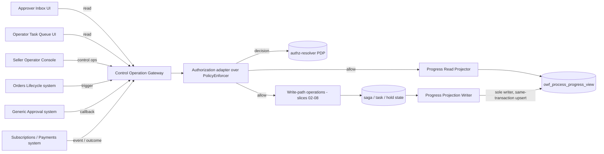
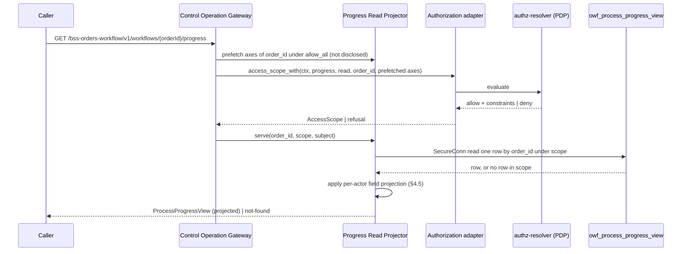
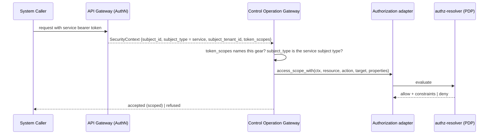

<!-- CONFLUENCE_TITLE: [BSS]: Orders Workflow — Read Projection and Authorization (Slice 9) -->
<!-- Related: ../DESIGN.md, ../PRD.md, ./README.md | Owners: BSS Orders team -->

# DESIGN — Read Projection and Authorization (Slice 9)

<!-- toc -->

- [1. Architecture Overview](#1-architecture-overview)
  - [1.1 Architectural Vision](#11-architectural-vision)
  - [1.2 Architecture Drivers](#12-architecture-drivers)
  - [1.3 Architecture Layers](#13-architecture-layers)
- [2. Principles & Constraints](#2-principles--constraints)
  - [2.1 Design Principles](#21-design-principles)
  - [2.2 Constraints](#22-constraints)
- [3. Technical Architecture](#3-technical-architecture)
  - [3.1 Domain Model](#31-domain-model)
  - [3.2 Component Model](#32-component-model)
  - [3.3 API Contracts](#33-api-contracts)
  - [3.4 Internal Dependencies](#34-internal-dependencies)
  - [3.5 External Dependencies](#35-external-dependencies)
  - [3.6 Interactions & Sequences](#36-interactions--sequences)
  - [3.7 Database schemas & tables](#37-database-schemas--tables)
  - [3.8 Deployment Topology](#38-deployment-topology)
- [4. Additional context](#4-additional-context)
  - [4.1 The per-actor permission matrix (normative)](#41-the-per-actor-permission-matrix-normative)
  - [4.2 The service-principal requirement for system actors (normative)](#42-the-service-principal-requirement-for-system-actors-normative)
  - [4.3 API latency and retention policy values](#43-api-latency-and-retention-policy-values)
  - [4.4 Authorized invocation, resource ownership, and apply-time re-check (normative)](#44-authorized-invocation-resource-ownership-and-apply-time-re-check-normative)
  - [4.5 Per-actor field projection on the progress read (normative)](#45-per-actor-field-projection-on-the-progress-read-normative)
- [5. Traceability](#5-traceability)

<!-- /toc -->

- [ ] `p1` - **ID**: `cpt-cf-bss-orders-workflow-design-read-and-authz`

## 1. Architecture Overview

### 1.1 Architectural Vision

This slice owns the last two things every other slice depends on but none of them may define for
itself: the single read projection that answers "where is this order's process right now," and
the one **authorization adapter** through which every operation this gear exposes obtains its
decision from the platform PDP. Both are deliberately thin. The read projection never derives
commercial truth — it reflects this gear's own saga state (step status, `FulfillmentTask` states,
approval-request state, pending manual tasks, dead-letter records, `correlationId`, and the
process-definition version the instance actually started with) and nothing about what was ordered
or the order's own lifecycle state, which remain Orders Lifecycle's alone to answer. The
authorization adapter is one shared `PolicyEnforcer` from `authz-resolver-sdk`, invoked by every
write-path operation before the operation's own guard runs and by the read path directly before
the projection is served; it prepares trusted inputs — the registered `(resource, action)` pair,
the target identifier and the target row's tenant axes — forwards them to the platform PDP, and
enforces the returned constraints as an `AccessScope` inside the statement that reads or mutates
the row. It is not a Workflow-owned policy evaluator, and it decides nothing itself
(`cpt-cf-bss-orders-workflow-adr-platform-pdp-authorization`; the sibling Orders Lifecycle's
[`08 §2.1`](../../../orders-lifecycle/docs/design/08-read-and-authz.md#one-pdp-adapter-invoked-from-two-places)
*One PDP adapter, invoked from two places* is the precedent followed here without modification).

The second driver is auditability under multi-actor orchestration. Every operation this gear
exposes — the five public control operations, the three read surfaces, the manual-task and
approval endpoints the fulfillment and approval slices expose, and the twelve event-subscription
handlers — is reachable by **eight** distinct actor classes: three human (Approver, Fulfillment
Operator, Seller Operator), four system counterparties (Orders Lifecycle, Generic Approval,
Subscriptions, Payments), and the platform Events/Audit sink, which the PRD names as an actor.
Three of those system actors (Generic Approval, Subscriptions, Payments) are permitted to *report
an outcome* but never to *drive an order state transition* directly. That asymmetry only holds if
every system-actor grant is bound to a verified principal — on the REST surface the platform
`SecurityContext`'s `subject_type` and `token_scopes` naming this gear, on the event surface the
broker's produce grant on the topic — and not merely to an actor-class label a compromised or
misconfigured caller could also present. This design states that requirement once and applies it
uniformly across both transports (§4.2).

Latency and retention are stated here as working baselines, not settled numbers, because both are
pending a program-wide NFR workshop (PRD §7 NFR notes); this slice records the baseline this
gear commits to today and names who is accountable for the retention floor so that commitment is
enforceable rather than aspirational.

### 1.2 Architecture Drivers

#### Functional Drivers

| Requirement | Design Response |
|-------------|------------------|
| `cpt-cf-bss-orders-workflow-fr-owf-authorization` | One shared authorization adapter over the platform PDP (`PolicyEnforcer`) invoked on every operation; registered resource/action catalogue in §3.1, endpoint mapping in §3.2, expected-decision matrix in §4.1 |
| `cpt-cf-bss-orders-workflow-interface-owf-ops` (query process progress) | Read-only progress projection in §4.1's read rows, sourced from this gear's own saga/task/dead-letter state only |

#### NFR Allocation

| NFR ID | NFR Summary | Allocated To | Design Response | Verification Approach |
|--------|-------------|--------------|-----------------|----------------------|
| `cpt-cf-bss-orders-workflow-nfr-owf-api-latency` | Progress reads p95 < 200 ms; control-op acceptance p95 < 1 s (working baselines) | Progress Read Projector; Control Operation Gateway | Denormalized projection read from this gear's own store, no cross-gear fan-out on the read path; control ops accept and enqueue before saga work | Load test against working baseline; NFR workshop re-baselines the threshold |
| `cpt-cf-bss-orders-workflow-nfr-owf-retention` | Process records retained ≥ 400 days, configurable, independent of engine run-history purge | Retention Policy Owner (named in §4.3) | Gear-owned audit-grade store for saga log, process audit, dead-letter records, manual-task history, retained on a policy distinct from and never bounded above by the durable-execution engine's own history retention | Retention-policy audit; engine ADR review confirming engine purge cannot erase the gear-owned record |

#### Key ADRs

| ADR ID | Decision Summary |
|--------|-----------------|
| `cpt-cf-bss-orders-workflow-adr-process-state-non-authoritative` | The progress projection is derived from this gear's own process state and MUST NOT be presented as authoritative commercial order or order-state truth; those are always read from Orders Lifecycle |

### 1.3 Architecture Layers

```text
Approver UI / Fulfillment Operator UI / Seller Operator console
                    |
                    v
        Control Operation Gateway  <-- Authorization adapter (one shared PolicyEnforcer)
                    |                          |
                    |                          v
                    |                 authz-resolver (platform PDP)
        +-----------+-----------+
        |                       |
        v                       v
  Write-path operations   Progress Read Projector
  (start / resolve /            |
   retry / cancel)              v
        |               owf_process_progress_view
        v               (step status, task states,
  Saga / task / hold      approval state, pending
  mechanics (slices        manual tasks, dead-letter
  02-08)                   records, correlationId,
                           definition version)
```

| Layer | Responsibility | Technology |
|-------|---------------|------------|
| Presentation | Approver inbox, operator task queue, control-op endpoints | REST, gateway-terminated auth (`OperationBuilder` `.authenticated()`) |
| Application | Authorization adapter over the shared `PolicyEnforcer`; Control Operation Gateway; Progress Read Projector | Gear application layer; `authz-resolver-sdk` |
| Domain | Process progress read model; the registered resource/action catalogue | Rust domain types; GTS labels for the catalogue |
| Infrastructure | PDP constraints compiled to `AccessScope` and applied by `SecureConn`; audit-grade retention store | `authz-resolver` (platform PDP); `toolkit-db` SecureORM; gear-owned datastore |

- [ ] `p3` - **ID**: `cpt-cf-bss-orders-workflow-tech-read-authz-stack`

## 2. Principles & Constraints

### 2.1 Design Principles

#### One adapter, exhaustive over operations, decided by the platform PDP

- [ ] `p1` - **ID**: `cpt-cf-bss-orders-workflow-principle-exhaustive-permission-evaluator`

Every authorization decision in this gear is made by the platform PDP, reached through **one
shared `PolicyEnforcer` adapter** that the Control Operation Gateway invokes for every registered
REST route and that every event handler invokes for its read-before-act gate. The adapter prepares
trusted inputs and enforces returned scopes; it holds no policy, synthesizes no `AccessScope`
and never turns an actor class into a grant. Business guards remain in the owning slices and
cannot grant access. This is the unified-system rule — `PolicyEnforcer` for all authorization
decisions, a PDP decision covering every sensitive database access, fail closed on denial, outage
or missing constraints — applied without a Workflow exception
(`cpt-cf-bss-orders-workflow-adr-platform-pdp-authorization`).

"Every operation" is not a list maintained by hand. The **resource/action catalogue** of §3.1 and
the **endpoint mapping** of §3.2 are checked against the gear's routing table in both directions:
every registered REST route must map to exactly one registered `(resource, action)` pair and
every registered event handler to a declared topic and its read-before-act gate (otherwise an
operation ships unguarded), *and* every catalogue pair must be reached by at least one registered
route (otherwise the catalogue accumulates permissions nobody exposes and the exhaustiveness claim
degrades into "the pairs we remembered cover the routes we remembered"). Either direction failing
is a **startup failure**, asserted again by a CI conformance test with a recording PDP double
(§3.7), never a default-deny reached at request time, because a silently-permissive gap is
indistinguishable from a correctly-scoped grant until it is exploited. Adding an endpoint in any
slice — a task override, a plan projection, a new trigger handler — therefore fails the build
until §3.2 maps it and §4.1 declares its expected decision against all eight actor classes.

#### The read side never becomes a second source of truth

- [ ] `p1` - **ID**: `cpt-cf-bss-orders-workflow-principle-read-not-authoritative`

The progress projection answers "what has this process done and where is it now," never "what
was ordered" or "what is the order's current state." Those questions are always answered by
Orders Lifecycle. Presenting this gear's projection as authoritative order state would let a
stalled or replaying process report a fact the order-of-record has already superseded.

**ADRs**: `cpt-cf-bss-orders-workflow-adr-process-state-non-authoritative`

### 2.2 Constraints

#### Every grant carries an explicit scope

- [ ] `p1` - **ID**: `cpt-cf-bss-orders-workflow-constraint-every-grant-scoped`

No cell in the expected-decision matrix may grant an operation without naming the scope it is
bound to — the PDP constraint on `seller_tenant_id`, the PDP `Eq` constraint on
`assigned_principal`, or a service principal whose `subject_type` and `token_scopes` name this
gear — and the adapter **requires constraints** (`require_constraints = true`) on every scoped
database path, so a PDP allow that returns no constraint fails closed rather than becoming an
unscoped read. An unscoped grant reads as "any actor of this class, over every tenant's data,"
which is a defect regardless of how narrow the operation appears; the sibling Orders Lifecycle
design found exactly this defect in its own review (an unscoped `list` grant and an unscoped
Preview row) before correcting it, and this design is checked against the same failure mode in
§4.1. Disabling the constraint requirement is never a substitute for a missing policy
([Lifecycle `08 §3.5`](../../../orders-lifecycle/docs/design/08-read-and-authz.md#35-external-dependencies)).


#### System-actor grants require a verified service principal

- [ ] `p1` - **ID**: `cpt-cf-bss-orders-workflow-constraint-service-principal-required`

Actor class alone is never sufficient authorization for a system actor. Orders Lifecycle,
Generic Approval, Subscriptions and Payments are each authorized on the REST surface only when
the platform `SecurityContext` carries a `subject_type` that is the platform service-subject type
**and** `token_scopes` naming this gear, and the PDP allows the registered `(resource, action)`
pair for that subject; on the event surface, only when the message arrives on a topic whose
**produce grant** the broker has issued to the publishing gear alone, under platform-root tenancy
(Lifecycle D-95), and the handler's read-before-act gate is itself PDP-authorized (§4.2). Without
one of those, nothing distinguishes the legitimate calling gear from any other caller presenting
the same actor class. This follows the sibling Orders Lifecycle design's workflow-seam
service-principal requirement, restated in the platform's own terms (`DECISIONS.md` D-37 as
amended by D-63).


#### Tenant scoping and payment-card exclusion on every read

- [ ] `p1` - **ID**: `cpt-cf-bss-orders-workflow-constraint-tenant-scoped-reads`

Every read this gear exposes is tenant-scoped; process artifacts carry commercial order context
(order ID, the three tenant axes, correlationId) but MUST NOT carry payment-card data. Reads
never mutate process or order state.

The three axes are `resource_tenant_id` (resource recipient), `payer_tenant_id` (billing party)
and `seller_tenant_id` (selling party), the same axes the order carries. Scoping is by **axis and
relationship, never by a role string**: a seller-scoped grant is a PDP constraint on the row's
`seller_tenant_id` (an `Eq`, `In` or `InTenantSubtree` predicate, as the PDP chooses), an
approver's grant is a PDP `Eq` constraint on `owf_approval_gate.assigned_principal`, and both are
compiled to an `AccessScope` that `SecureConn` attaches to the query. The adapter supplies the
row's axes to the PDP as resource properties; it never derives a scope from the caller's role.
A predicate that matches on the actor's role name alone returns every row of that role across
every seller and every tenant, which is the unscoped-read defect this slice exists to prevent,
wearing a scope's clothes.


#### Authorization is enforced on the row, not only on the route

- [ ] `p1` - **ID**: `cpt-cf-bss-orders-workflow-constraint-resource-ownership-check`

A PDP allow authorizes an actor to invoke an operation. Whether that actor may touch *this* row
is the same decision's **constraints**, and they are enforced where they cannot be raced: the
compiled `AccessScope` is applied by `SecureConn` **inside the mutating statement** — the
`UPDATE … WHERE task_id = $1 AND <scope predicates> AND row_version = $2` the platform's
UPDATE/DELETE prefetch pattern produces
([`06_authn_authz_secure_orm.md`](../../../../../docs/toolkit_unified_system/06_authn_authz_secure_orm.md)
*UPDATE / DELETE — prefetch + TOCTOU safety*) — never a read-then-check-then-write, which two
operators racing the same task both pass and which a row whose tenancy changed between the check
and the write defeats.

A target row that exists but lies outside the caller's scope is answered **404, not 403**: a 403
confirms the row exists, which turns the error code into an existence oracle over other sellers'
orders. The platform default maps a PDP denial to 403; this gear records the 404 as its single
declared deviation and applies Lifecycle's rule unchanged — a targeted denial is `not-found`
unless a follow-up `read` decision on the same target allows, in which case it is
`not-authorized` (403); an untargeted denial (list, start) is 403
([Lifecycle D-114, D-141](../../../orders-lifecycle/docs/DECISIONS.md)). The rule applies
uniformly to task resolution, override, retry, escalate, cancel, redrive, discard and the
decision endpoint; no operation is exempt because "the platform propagates `SecurityContext`" —
propagation carries an identity, it does not make a decision. §4.4 states the check and the
definition of an authorized invocation normatively, and it is stated **here**, once, because
slices 06 and 08 both use "an authorized cancellation" as an input precondition and neither of
them owns authorization.

#### Every collection response is paged

- [ ] `p1` - **ID**: `cpt-cf-bss-orders-workflow-constraint-bounded-page-size`

Every list this gear exposes — the approver inbox, the operator task queue, the fulfillment-plan
line projection, and the manual-task list — takes a page size and returns a **keyset cursor**.
Default 50, maximum 200, as working baselines: the p95 < 200 ms budget is stated per page, and an
unpaged read behind a ≥ 400-day retention floor with no archival makes the budget meaningless the
first time an order accumulates a long remediation history. A requested page size above the
maximum is **clamped server-side to 200** rather than honoured.

The cursor is keyset, not offset, and its sort key is immutable: `(created_at, task_id)` for the
task queue and the manual-task list, `(created_at, gate_id)` for the approver inbox,
`(order_line_id)` within a frozen plan for the line projection. A mutable column — assignment
state, SLA countdown, task state — is never a sort key: the sweep and every operator action
rewrite it, so a row could move between pages and be returned twice or skipped entirely, silently,
behind a 200 and a valid-looking cursor.


#### Idempotency keys are tenant-namespaced and server-recomposed

- [ ] `p1` - **ID**: `cpt-cf-bss-orders-workflow-constraint-tenant-namespaced-idempotency`

Every idempotency key this gear registers is prefixed with the `resource_tenant_id` of the order
it acts on, so two tenants cannot collide in the registry and no key from one tenant can resolve a
call made for another. The prefix is not decoration: without it, a key composed from an order id
and a transition name is a value a caller can guess, and a settled record is a value a caller can
read the outcome of.

A caller-supplied key is **validated, never trusted**. The server recomposes the key from the
caller's authorized target — the tenant axes of the order the ownership check just resolved, plus
the operation's own components — and compares. A supplied key that does not equal the recomposed
key is refused with `idempotency-key-mismatch` (400) before any work is done; a supplied key that
matches but whose request fingerprint differs from the settled record's is an
`idempotency-key-conflict` refusal (409), not an absorbed duplicate. A caller therefore cannot address another tenant's
registry entry by presenting its key, and cannot reuse its own key to make a different request.


#### Durable work is admission-controlled per tenant

- [ ] `p1` - **ID**: `cpt-cf-bss-orders-workflow-constraint-per-tenant-durable-quota`

The gear's existing quotas all govern *outbound* pressure — in-flight intents, queue depth,
per-tenant dispatch fairness. None of them bounds the **durable** work one tenant can cause this
gear to store: manual tasks, dead-letter records, and active process instances all grow with a
tenant's failure rate, are retained for ≥ 400 days, and are read on latency-budgeted operator
surfaces. One seller in a bad integration loop degrades every other seller's queue.

Admission quotas, keyed on `seller_tenant_id`, as working baselines: **500 open manual tasks**,
**1 000 undispatched dead-letter records**, **200 concurrently active process instances**.

Breaching a quota never drops durable evidence and never refuses an accepted order — either would
trade an observability problem for a correctness one. It changes what gets *created*: over the
manual-task quota, further failures on an order that already has an open task are appended to that
task rather than creating a new one, and orders with no open task raise one incident per order
instead of one per step; over the dead-letter quota, further records are coalesced per order with
a count; over the instance quota, new instances are still admitted but the tenant's dispatch
fairness share is reduced and a capacity incident is raised for the operator on call. Every breach
is alerted, because a quota that is silently absorbed is a quota nobody fixes.

## 3. Technical Architecture

### 3.1 Domain Model

**Technology**: Rust structs, gear-owned read-model store

**Location**: [`../DESIGN.md`](../DESIGN.md) §3.1 (gear-wide domain model); this slice adds the
read-model projection type below.

**Core Entities**:

- [ ] `p2` - **ID**: `cpt-cf-bss-orders-workflow-entity-process-progress-view`
- [ ] `p2` - **ID**: `cpt-cf-bss-orders-workflow-entity-permission-declaration`

| Entity | Description | Schema |
|--------|-------------|--------|
| `ProcessProgressView` | The read-only projection returned by "query process progress": current step status, all `FulfillmentTask` states, approval-request state, pending manual tasks, dead-letter records, process `correlationId`, and the process-definition version the instance started with, subject to the per-actor field projection of §4.5 | §3.7 `owf_process_progress_view` |
| `ResourceActionCatalogue` | The registered set of `(resource, action)` pairs this gear enforces and the platform PDP grants against — the table below — together with the endpoint mapping of §3.2. It is compiled constants and GTS registrations, not a table: there is no runtime write path and no operation in this gear that can grant itself a permission | Registered GTS labels; `ResourceType` constants in the adapter |

**The platform `SecurityContext` as consumed.** This slice defines no security context of its own.
Every operation is evaluated against the platform
[`SecurityContext`](../../../../../libs/toolkit-security/src/context.rs) exactly as the gateway
injects it, and the adapter reads exactly these five fields and nothing else — a request whose
context lacks a field its operation depends on is refused, not evaluated against a default:

| Field | Type | How this gear uses it |
|---|---|---|
| `subject_id` | uuid | The authenticated subject; written to `owf_audit_entry.actor` (D-61), to `owf_manual_task.assignee` / `resolved_by`, and compared by the PDP against `owf_approval_gate.assigned_principal` for every approver grant |
| `subject_type` | GTS type id, optional | Distinguishes a user subject from a service subject; a service subject is never allowed on a human-actor arm and vice versa, and `owf_audit_entry.actor_class` is derived from it and the configured identities alone (`01 §3.7`) |
| `subject_tenant_id` | uuid | The subject's home tenant; the PDP's default context tenant, and the tenant whose registry entries a caller-supplied idempotency key may resolve (`cpt-cf-bss-orders-workflow-constraint-tenant-namespaced-idempotency`) |
| `token_scopes` | list of string | Capability restrictions; a system actor's arm additionally requires a scope naming this gear (§4.2). `["*"]` is first-party and unrestricted |
| `bearer_token` | secret, optional | Forwarded to the PDP by `PolicyEnforcer`; never read, logged or persisted by this gear, and absent from the authorization snapshot of §4.4 |

There is no role, scope-set, assignment or delegation claim. Seller scope, approver assignment and
service-principal scope are **PDP decisions over resource properties this gear supplies**, never
fields the gear reads off the token. A delegation proof the caller presents is forwarded to the
PDP as request context and never validated locally
([Lifecycle D-111](../../../orders-lifecycle/docs/DECISIONS.md) by reference).

**Resource/action catalogue (normative).** Labels are GTS ids `gts.cf.bss.orders_workflow.<noun>.v1~`
in this gear's namespace (`01 §4.7`), registered with the platform PDP in Pricing's shape
([`05-governance.md` *AuthZ Resource and Action Catalog*](../../../pricing/docs/design/05-governance.md#authz-resource-and-action-catalog-normative)),
each action on its real object. Per row, the **PDP properties** column names the resource
properties the adapter supplies with every decision and the `ResourceType` advertises as
`supported_properties`; the PDP constrains on them and `SecureConn` maps them to the row's columns
through `pep_prop`.

| Label | Object | Actions | PDP properties supplied |
|-------|--------|---------|-------------------------|
| `gts.cf.bss.orders_workflow.process_instance.v1~` | `owf_process_instance` — the running process | `start`, `cancel`, `retry_step` | `resource_tenant_id`, `seller_tenant_id`, `payer_tenant_id`; resource id = `order_id` of the instance (`start` supplies the proposed axes from the trigger, no id) |
| `gts.cf.bss.orders_workflow.fulfillment_task.v1~` | `owf_fulfillment_task` and the frozen plan lines it projects | `read` | `resource_tenant_id`, `seller_tenant_id`; resource id = `order_id` (the plan projection is per order version) |
| `gts.cf.bss.orders_workflow.manual_task.v1~` | `owf_manual_task` and the incident rows the queue projects | `read`, `resolve`, `override`, `assign`, `escalate`, `cancel` | `resource_tenant_id`, `seller_tenant_id`; resource id = `task_id`; `assignee` |
| `gts.cf.bss.orders_workflow.dead_letter.v1~` | `owf_dead_letter_record` through its `owf_dead_letter_triage` row | `read`, `redrive`, `discard` | `resource_tenant_id`, `seller_tenant_id`; resource id = `record_id` |
| `gts.cf.bss.orders_workflow.approval_gate.v1~` | `owf_approval_gate` | `read_inbox`, `approve` (approve or reject; the submitting identity is barred server-side, D-56) | `resource_tenant_id`, `seller_tenant_id`; resource id = `gate_id`; `assigned_principal`; `order_id` |
| `gts.cf.bss.orders_workflow.progress.v1~` | `owf_process_progress_view` — the read projection | `read` | `resource_tenant_id`, `seller_tenant_id`, `payer_tenant_id`; resource id = `order_id`; the set of `order_id` values carrying a gate whose `assigned_principal` is the caller, for the approver's `A*` path |

Permission instance ids follow the platform `AuthzPermissionV1` schema prefix with the instance
suffix `cf.bss.orders_workflow.<resource>_<action>.v1` — `approval_gate × approve` registers
`…cf.bss.orders_workflow.approval_gate_approve.v1` — hyphens normalised to underscores in the
suffix only, exactly as Lifecycle registers its own. Registration declares available
permissions; it issues no role grants. Role provisioning, the approver grant keyed on
`assigned_principal`, the service-principal grants and their verification against the deployed
provider are the platform policy owner's, tracked under
`cpt-cf-bss-orders-workflow-upreq-pdp-policy-integration`
([`UPSTREAM_REQS.md §2.8`](../UPSTREAM_REQS.md#28-platform-authorization-policy)); this gear
must not fabricate default grants when provisioning is absent.

**How a principal maps to `owf_approval_gate.party_ref`.** It does not map by role-string equality —
`party_ref` is a *role* ("seller finance", "platform compliance"), and matching on it returns every
gate of that role across every order and every seller, which `cpt-cf-bss-orders-workflow-constraint-every-grant-scoped`
forbids and which would defeat PRD §6.7's "MUST NOT act on approval requests for orders outside
their assigned scope". The mapping is by **assignment, and the assignment is a column**:
`assigned_principal` is populated from the routing configuration at gate-open
(`03 §3.2`, `§3.7`), supplied to the PDP as a resource property on every `approval_gate`
decision, and the approver's grant is the PDP's "own resource" `Eq` constraint
`assigned_principal = subject_id`, compiled to the `AccessScope` the inbox query and the decision
endpoint's `UPDATE` both run under. Because `gate_id` is derived deterministically as a UUIDv5
over (`orderId`, `orderVersion`, `party_ref`), the assignment survives a replay. A gate carrying
no `assigned_principal` is listed to nobody and surfaces through the operator queue as a
routing-configuration defect, never to whoever asks first (`03 §3.2`). No token claim, no
assignment-directory inverse query and no gateway ask is involved.

**Relationships**:
- `ProcessProgressView` → saga/task/hold state owned by slices 02-08: a **materialised** single-row-per-order projection maintained by the Progress Projection Writer (§3.2), read without a chain walk, and bounded by the staleness rule stated with the table in §3.7. It is never authoritative: it is a projection of this gear's own state, and commercial order truth is still Orders Lifecycle's.
- `ResourceActionCatalogue` → every route and event handler in the gear's routing table: one `(resource, action)` pair per REST route, one declared topic and read-before-act gate per handler, checked in both directions at startup and in CI (§2.1, §3.7).
- `ResourceActionCatalogue` → the platform `SecurityContext`: the adapter presents the pair, the target id and the row's properties to the PDP with the caller's context; no predicate reads the request body, and nothing reads the token beyond the five fields above.

### 3.2 Component Model


```mermaid
graph LR
    A[Approver Inbox UI] -->|read| G[Control Operation Gateway]
    B[Operator Task Queue UI] -->|read| G
    C[Seller Operator Console] -->|control ops| G
    D[Orders Lifecycle system] -->|trigger| G
    E[Generic Approval system] -->|callback| G
    F[Subscriptions / Payments system] -->|event / outcome| G
    G --> H[Authorization adapter over PolicyEnforcer]
    H -->|decision| P[(authz-resolver PDP)]
    H -->|allow| I[Progress Read Projector]
    H -->|allow| J[Write-path operations - slices 02-08]
    I --> K[(owf_process_progress_view)]
    J --> L[(saga / task / hold state)]
    L --> W[Progress Projection Writer]
    W -->|sole writer, same-transaction upsert| K
```

#### Authorization adapter (permission evaluator)

- [ ] `p1` - **ID**: `cpt-cf-bss-orders-workflow-component-permission-evaluator`

##### Why this component exists

Every operation this gear exposes needs authorization decided the same way, by the same
authority, whether the caller is a human actor at a console or a system actor calling on an
event. A per-endpoint ad hoc check invites drift and unscoped grants; a gear-local evaluator is a
second policy engine the platform policy owner cannot see. One adapter over one shared
`PolicyEnforcer` is the platform's rule, and it is Lifecycle's shape
([`08 §3.5`](../../../orders-lifecycle/docs/design/08-read-and-authz.md#35-external-dependencies)
*Platform authorization wiring*).

##### Responsibility scope

Owns the **single `PolicyEnforcer`**, constructed once at initialisation from the
`dyn AuthZResolverApi` resolved through `ClientHub` and cloned into the read services, the
write-path operations and the event handlers' read-before-act gate. Owns the catalogue constants
of §3.1 — the `ResourceType` descriptors with their `supported_properties`, the action constants
and the GTS registrations — and the endpoint mapping of §3.2. For every call it accepts the
declared `(resource, action)`, the target identifier where the operation has one, and **trusted
authorization properties**: stored properties come from the target row (prefetched under
`AccessScope::allow_all()` in the approved point-read pattern and never disclosed before the
decision), proposed properties are validated request values submitted for authorization, never
claims of authority. It calls `access_scope_with`, **requires constraints** on every scoped
database path, compiles the returned constraints to an `AccessScope`, hands that scope to the
owning operation to run its `SecureConn` statement under, and maps `EnforcerError` to the
registered refusal reasons (`01 §4.9`) without exposing PDP internals. It forwards a
caller-presented delegation proof reference as request context and never validates it
(Lifecycle D-111). It records the **authorization snapshot** for every command that can outlive
its request, and re-runs the same PDP decision at apply time when the command asks (§4.4). It
fails startup when the routing table and the catalogue disagree in either direction (§2.1,
§3.7), and when `dyn AuthZResolverApi` cannot be resolved — missing wiring is a startup failure,
never a switch to local authorization.

**Bounded worker exception.** The five Workflow-owned workers of `01 §3.8` — `timer-wakeup`,
`reconciliation-sweep`, `dead-lease-scan`, `retention-purge` and the audit verifier/checkpoint
worker — operate under **configured system authority** without a per-pass or per-row PDP
decision, exactly as Lifecycle `08 §3.5` *Trusted internal maintenance* states it: a bounded
cross-tenant discovery scan may use `AccessScope::allow_all()`, every subsequent write narrows to
its persisted target and the properties appropriate to that table, a discovery scope never
reaches a write, the authority is never selected by a caller-supplied actor class, flag or tenant
id, and the exception never extends to REST, SDK or event-handler paths or to a failed user
request. Worker evidence carries the configured `system` actor (`01 §3.7`), never a nil UUID or
an impersonated caller. These workers continue through a PDP outage because their authority is
configured, not obtained as a fallback; missing configured authority or database grants fails the
affected worker closed.

##### Responsibility boundaries

Does not implement the saga, provisioning, manual-task, or hold/cancel mechanics it authorizes —
those are owned by slices 02-08. Does not decide commercial order authorization; that is Orders
Lifecycle's own PDP-authorized surface, invoked independently on Orders Lifecycle's operations
and by this gear's handlers through the `order × read` of `02 §2.1`. Does not itself execute the
scope against the target row — the row is read or written inside the owning slice's transaction,
under the scope this component compiled — and does not decide policy: which roles hold which
pairs, whether a seller relationship or a delegation proof satisfies a path, is the PDP's, and
provisioning it is the platform policy owner's (§3.5).

##### Related components (by ID)

- `cpt-cf-bss-orders-workflow-component-control-operation-gateway` — invoked by; the gateway calls the adapter before any write-path operation and before the read projector assembles a response.
- `cpt-cf-bss-orders-workflow-component-progress-read-projector` — gates access to.

#### Control Operation Gateway

- [ ] `p1` - **ID**: `cpt-cf-bss-orders-workflow-component-control-operation-gateway`

##### Why this component exists

Provides the single entry point through which every REST operation in the gear's routing table is
invoked — the five public control operations, the three read surfaces, and the manual-task and
approval endpoints the fulfillment and approval slices expose — so the authorization adapter has
exactly one call site to guard on the REST surface rather than one per operation implementation.
The twelve event handlers reach the same adapter through their read-before-act gate (§3.6).

##### Responsibility scope

Accepts start workflow, resolve manual task, retry failed step, cancel workflow with
compensation, query process progress, approver-inbox reads, operator-task-queue reads, the
manual-task resolution actions, the approval decision, and the fulfillment-plan projection;
recomposes and validates the caller's idempotency key against the caller's authorized target
(`cpt-cf-bss-orders-workflow-constraint-tenant-namespaced-idempotency`); enforces the `If-Match`
optimistic version check on every operation §4.1 marks `+ver`; clamps every list request's page
size; resolves each route to its `(resource, action)` pair (§3.2) and delegates the decision to
the authorization adapter before dispatch; and records the **authorization snapshot** (§4.4) for
every command whose effect can outlive its request.

##### Responsibility boundaries

Does not implement business logic for any operation; dispatches only after an allow decision,
and dispatches the compiled `AccessScope` with the command so the owning operation runs its
statement under it.

##### Related components (by ID)

- `cpt-cf-bss-orders-workflow-component-permission-evaluator` — depends on.

**Endpoint → `(resource × action)` mapping (normative).** Every REST route any slice registers
and every event-subscription handler, mapped once. This table is what the startup assertion and
the CI conformance test of §3.7 check the routing table against.

| Registered route or handler | Resource × action | Target and PDP properties |
|-----------------------------|-------------------|---------------------------|
| `POST /bss-orders-workflow/v1/workflows` | `process_instance × start` | no target; proposed axes from the request |
| `GET /bss-orders-workflow/v1/workflows/{orderId}/progress` | `progress × read` | `order_id`; prefetched axes; the caller's gate orders (`A*`) |
| `POST /bss-orders-workflow/v1/workflows/{orderId}/tasks/{taskId}/resolve` | `manual_task × resolve` | `task_id`; prefetched axes |
| `POST /bss-orders-workflow/v1/workflows/{orderId}/steps/{stepId}/retry` | `process_instance × retry_step` | `order_id`; prefetched axes |
| `POST /bss-orders-workflow/v1/workflows/{orderId}/cancel` | `process_instance × cancel` | `order_id`; prefetched axes; snapshot recorded (§4.4) |
| `GET /bss-orders-workflow/v1/fulfillment-operator/tasks` | `manual_task × read` | list; constraints required |
| `POST /bss-orders-workflow/v1/fulfillment-operator/tasks/{taskId}/retry` | `manual_task × resolve` | `task_id`; prefetched axes |
| `POST /bss-orders-workflow/v1/fulfillment-operator/tasks/{taskId}/override` | `manual_task × override` | `task_id`; prefetched axes |
| `POST /bss-orders-workflow/v1/fulfillment-operator/tasks/{taskId}/assign` | `manual_task × assign` | `task_id`; prefetched axes; `assignee` |
| `POST /bss-orders-workflow/v1/fulfillment-operator/tasks/{taskId}/cancel` | `manual_task × cancel` | `task_id`; prefetched axes |
| `POST /bss-orders-workflow/v1/fulfillment-operator/tasks/{taskId}/escalate` | `manual_task × escalate` | `task_id`; prefetched axes |
| `GET /bss-orders-workflow/v1/fulfillment-operator/dead-letters` | `dead_letter × read` | list; constraints required |
| `POST /bss-orders-workflow/v1/fulfillment-operator/dead-letters/{recordId}/redrive` | `dead_letter × redrive` | `record_id`; prefetched axes |
| `POST /bss-orders-workflow/v1/fulfillment-operator/dead-letters/{recordId}/discard` | `dead_letter × discard` | `record_id`; prefetched axes |
| `GET /bss-orders-workflow/v1/approver-inbox/gates` | `approval_gate × read_inbox` | list; constraint `assigned_principal = subject_id` required |
| `POST /bss-orders-workflow/v1/approver-inbox/gates/{gateId}/decision` | `approval_gate × approve` | `gate_id`; prefetched axes and `assigned_principal`; submitter barred locally (D-56) |
| `GET /bss-orders-workflow/v1/fulfillment-plan/{orderId}/{orderVersion}` | `fulfillment_task × read` | `order_id`; prefetched axes; the caller's gate orders (`A*`) |
| `EVENT OrderSubmitted`, `OrderApproved`, `OrderAmended`, `OrderHeld`, `OrderResumed`, `OrderAcceptanceRecorded`, `OrderCancelled`, `OrderExpired`, `OrderRejected` (nine handlers, `02 §3.3`) | broker produce grant on the Lifecycle topic, platform-root tenancy (D-95); then Lifecycle `order × read` scoped to the event's order (`02 §2.1`) before any effect | `order_id` from the event; the read is made with this gear's configured service context |
| `EVENT OrderApprovalDecision` (decision callback, `03 §3.3`) | broker produce grant on the Generic Approval callback topic; then the Decision Reflector's gate-state guard | `gate_id` from the callback |
| `EVENT ProvisioningIntentConfirmed`, `ProvisioningIntentFailed` (two handlers, `05 §3.3`) | broker produce grant on the Subscriptions outcome topic; the echoed identity envelope (`SUB-O16`) must match an intent this gear issued | intent key from the echoed envelope |

Two arms of §4.1 have no routing-table key and are therefore not rows here: the Payments
authorization outcome, which returns on this gear's own outbound call and is correlated by that
call's idempotency key, and the process-event publication the Events/Audit sink receives, which
is outbound-only. Neither is an inbound operation; neither is authorized by this gear.

#### Progress Read Projector

- [ ] `p1` - **ID**: `cpt-cf-bss-orders-workflow-component-progress-read-projector`

##### Why this component exists

Answers "query process progress" from this gear's own current state without walking saga event
history or calling out to Orders Lifecycle, Subscriptions, or Payments on the read path, which is
what keeps the read within its p95 < 200 ms working baseline.

##### Responsibility scope

Serves `ProcessProgressView` for a given order by reading the materialised
`owf_process_progress_view` row — one indexed row read, no chain walk, no event replay, no
cross-gear call — and then applying the **per-actor field projection** of §4.5 before the response
leaves the component. Surfaces the intermediate `pending → draft_created` task advance, which is
observable only through this projection and is never itself published as an event.

##### Responsibility boundaries

Never mutates process or order state, and never writes the projection row — that is the Progress
Projection Writer's sole responsibility. Never presents its output as authoritative commercial
order content or authoritative order state — "what was ordered" and "the current order state"
are always read from Orders Lifecycle, never derived here. Does not aggregate across orders
beyond what the caller's scope already authorizes. Never returns a field the caller's actor class
is not projected, even when the row carries it.

##### Related components (by ID)

- `cpt-cf-bss-orders-workflow-component-permission-evaluator` — depends on for read authorization.
- `cpt-cf-bss-orders-workflow-component-progress-projection-writer` — reads the row this component owns.

#### Progress Projection Writer

- [ ] `p1` - **ID**: `cpt-cf-bss-orders-workflow-component-progress-projection-writer`

##### Why this component exists

`owf_process_progress_view` is materialised, so it needs exactly one writer. A projection with no
declared writer is one that every slice feels free to update and none of them owns the staleness
of; a projection each reader assembles itself is one whose 200 ms budget depends on a query plan
that grows with lines-per-order. Naming one writer settles both: the read is a single row, and the
freshness rule is a property of the writer rather than a hope about the reader.

##### Responsibility scope

Upserts the projection row for an order on every committed change to this gear's own state that
the projection reflects: step status changes, `FulfillmentTask` state transitions, approval-gate
state changes, manual-task creation and resolution, dead-letter record creation, and process
termination.

**Staleness bound and invalidation rule.** Where the state change is committed in this gear's own
database, the upsert runs **in the same transaction** as the change — the projection is never
stale relative to a change this gear made, and a caller who just performed an operation reads its
own write. Where the change is observed rather than made (an outbound event's delivered outcome,
a sweep-confirmed terminal outcome), the upsert runs in the transaction that records the
observation — the sweep's settle-from-lookup or the consuming handler's step — and is stale by at
most **the observation's own landing latency plus one write, ≤ 5 s**, which the read surface
states rather than hides. Invalidation is by upsert on `order_id`, not by TTL or by cache
eviction: there is exactly one row per order and it is rewritten, never invalidated and
re-derived.

##### Responsibility boundaries

Never writes any table but `owf_process_progress_view`. Never derives a value the source-of-truth
tables do not already carry, and never reads Orders Lifecycle — a projection that enriched itself
from the order of record would become a second source of commercial truth, which
`cpt-cf-bss-orders-workflow-principle-read-not-authoritative` forbids. Never serves reads.

##### Related components (by ID)

- `cpt-cf-bss-orders-workflow-component-progress-read-projector` — writes the row that component serves.

### 3.3 API Contracts

- [ ] `p2` - **ID**: `cpt-cf-bss-orders-workflow-interface-owf-read-authz-ops`

- **Technology**: REST, gateway-terminated auth (`OperationBuilder` `.authenticated()`); every route authorized through the shared `PolicyEnforcer` adapter on its registered `(resource, action)` pair (§3.2)
- **Location**: [`../DESIGN.md`](../DESIGN.md) §3.3 (gear-wide API surface); this slice documents
  the read and authorization behavior of every row.

**Endpoints Overview**:

| Method | Path | Description | Stability |
|--------|------|--------------|-----------|
| `POST` | `/bss-orders-workflow/v1/workflows` | Start workflow. `Idempotency-Key` required and validated against the server-recomposed key (`cpt-cf-bss-orders-workflow-constraint-tenant-namespaced-idempotency`) | unstable |
| `GET` | `/bss-orders-workflow/v1/workflows/{orderId}/progress` | Query process progress (§4.1 read projection, §4.5 field projection) | unstable |
| `POST` | `/bss-orders-workflow/v1/workflows/{orderId}/tasks/{taskId}/resolve` | Resolve manual task. `If-Match` with the task's `row_version` ETag REQUIRED; mismatch is 409 in the RFC-9457 envelope. Ownership check on `owf_manual_task.seller_tenant_id` (§4.4) | unstable |
| `POST` | `/bss-orders-workflow/v1/workflows/{orderId}/steps/{stepId}/retry` | Retry failed step. `If-Match` with the process instance's `row_version` ETag REQUIRED; ownership check on the instance's `seller_tenant_id` | unstable |
| `POST` | `/bss-orders-workflow/v1/workflows/{orderId}/cancel` | Cancel workflow with compensation. `If-Match` REQUIRED; authority re-checked at apply time (§4.4) because fencing can outlive the request by days | unstable |

Every list response carries `items`, `next_cursor` (null on the last page) and the effective
`limit` actually applied, so a caller can tell a clamped page from a short one. Refusals on all
rows use the platform `ContractError` envelope with `error_domain` `orders-workflow.v1` and the
registered `error_code` of `01 §4.9`: `idempotency-key-mismatch` (400),
`idempotency-key-conflict` (409), `version-mismatch` (409), `not-authorized` (403, only when the
caller may read the target but holds no grant for the action, or on an untargeted request), and
`not-found` (404) for a target outside the caller's scope, per
`cpt-cf-bss-orders-workflow-constraint-resource-ownership-check`; a PDP timeout or outage is the
canonical `ServiceUnavailable` (503) envelope with no business reason (§3.5).

### 3.4 Internal Dependencies

| Dependency Gear | Interface Used | Purpose |
|-------------------|----------------|----------|
| bss-orders-lifecycle | SDK client over the workflow-seam contract | Source of authoritative order state and commercial order content; never re-derived here |
| `authz-resolver-sdk` | `PolicyEnforcer`, `ResourceType`, `AccessRequest` | Shared platform authorization adapter and compilation of PDP constraints to `AccessScope` |
| `toolkit-db` | `SecureConn` / `SecureTx`, `Scopable` entities with `pep_prop` mappings | Applies the compiled `AccessScope` inside every scoped read and mutating statement |

**Dependency Rules** (per project conventions):
- No circular dependencies
- Always use sdk modules for inter-gear communication
- No cross-category sideways deps except through contracts
- Only integration/adapter gears talk to external systems
- `SecurityContext` must be propagated across all in-process calls

### 3.5 External Dependencies

This slice introduces no new *business* dependency — it calls no gear the set does not already
call — but it rests on two platform dependencies that every constraint above is written against,
and they are declared here rather than assumed: the **platform PDP** (`authz-resolver`), which
decides every authorization request this gear makes, and the **platform event broker**, whose
per-topic produce grants and platform-root tenancy carry the authenticity guarantee on the
transport that carries no gateway (§4.2). Authentication is terminated at the inbound gateway and
the gear receives an authenticated `SecurityContext`; this slice re-implements none of it.

#### Platform PDP (`authz-resolver`)

| Dependency Gear | Interface Used | Purpose |
|-------------------|---------------|----------|
| `authz-resolver` | `AuthZResolverApi` resolved through `ClientHub` | Platform PDP decisions for every registered route and every handler's read-before-act gate; **mandatory gear dependency** — startup fails without wiring |

**Selected integration pattern: Lifecycle's, which is Pricing's.** Declare the `authz-resolver`
gear dependency and use its SDK, not its implementation crate. During initialisation resolve
`dyn AuthZResolverApi` from `ClientHub`, construct one `PolicyEnforcer`, and share it through the
authorization adapter with the gateway, the read services and the event handlers. Missing client
wiring is a startup failure, never a switch to local authorization. REST and in-process SDK calls
use the same service-level enforcement; endpoint authentication alone is not authorization.
Preserve the authenticated caller's `SecurityContext` and use the separately configured service
context only for explicitly service-owned work — the workers of §3.2 and the handlers'
read-before-act gate — never to elevate a denied user operation. Everything Lifecycle
[`08 §3.5`](../../../orders-lifecycle/docs/design/08-read-and-authz.md#35-external-dependencies)
states under *Platform authorization wiring*, *Business-operation authorization boundary*,
*PDP outage contract* and *Provider capability must be verified separately* applies here by
reference, with these Workflow bindings:

- **Business-operation boundary.** The PDP authorizes the requested `(resource, action)` and the
  target's tenant relationships at the operation boundary, not at each internal table write.
  Audit append, idempotency-registry handling, the producer-outbox enqueue and the projection
  upsert are private persistence effects of an authorized operation, run under restricted service
  database roles and `SecureConn` scopes bound to the authorized target; they are not additional
  PDP round trips and cannot widen the business decision.
- **PDP outage contract.** A timeout or unavailable PDP on a request path returns a sanitized,
  retryable 503 — never a business refusal reason — performs no mutation, returns no protected
  payload, settles no idempotency key and aborts any uncommitted effect. Invalid or missing
  constraints fail closed as a policy/integration error, not as an outage. The workers continue
  under configured authority (§3.2). No local evaluator, unrestricted scope or emergency
  service-identity elevation is a fallback.
- **Provider capability is verified separately.** An in-process PDP double proves this gear asks
  the correct question and enforces the supplied answer; it cannot prove the deployed provider
  makes the correct decision. Role provisioning, the `assigned_principal` approver grant, the
  service-principal grants and their revocation are the platform policy owner's, and release
  evidence is tracked under `cpt-cf-bss-orders-workflow-upreq-pdp-policy-integration`
  ([`UPSTREAM_REQS.md §2.8`](../UPSTREAM_REQS.md#28-platform-authorization-policy)).

#### Platform Event Broker

| Dependency Gear | Interface Used | Purpose |
|-------------------|---------------|----------|
| `event-broker` | Per-topic **produce grants** and platform-root envelope tenancy (Lifecycle D-95); `EnvelopedEvent` delivery | Carries the authenticity guarantee on the subscription transport, which traverses no REST gateway and presents no `SecurityContext`: only the gear granted produce on a topic can put a message on it, and the consumer sees no producer principal to verify (§4.2) |

**Dependency Rules** (per project conventions):
- No circular dependencies
- Always use SDK modules for inter-gear communication
- No cross-category sideways deps except through contracts
- Only integration/adapter gears talk to external systems
- `SecurityContext` must be propagated across all in-process calls

### 3.6 Interactions & Sequences

#### Query process progress

**ID**: `cpt-cf-bss-orders-workflow-seq-query-progress`


**Actors**: `cpt-cf-bss-orders-workflow-actor-owf-approver`, `cpt-cf-bss-orders-workflow-actor-owf-fulfillment-operator`, `cpt-cf-bss-orders-workflow-actor-owf-seller-operator`


```mermaid
sequenceDiagram
    Caller ->> Control Operation Gateway: GET /bss-orders-workflow/v1/workflows/{orderId}/progress
    Control Operation Gateway ->> Progress Read Projector: prefetch axes of order_id under allow_all (not disclosed)
    Control Operation Gateway ->> Authorization adapter: access_scope_with(ctx, progress, read, order_id, prefetched axes)
    Authorization adapter ->> authz-resolver (PDP): evaluate
    authz-resolver (PDP) -->> Authorization adapter: allow + constraints | deny
    Authorization adapter -->> Control Operation Gateway: AccessScope | refusal
    Control Operation Gateway ->> Progress Read Projector: serve(order_id, scope, subject)
    Progress Read Projector ->> owf_process_progress_view: SecureConn read one row by order_id under scope
    owf_process_progress_view -->> Progress Read Projector: row, or no row in scope
    Progress Read Projector ->> Progress Read Projector: apply per-actor field projection (§4.5)
    Progress Read Projector -->> Caller: ProcessProgressView (projected) | not-found
```

1. [ ] - `p1` - Prefetch the projection row's tenant axes by `order_id` under `AccessScope::allow_all()`; the row is not disclosed - `inst-qp-prefetch`
2. [ ] - `p1` - Request `progress × read` through the adapter with the target id and prefetched axes, constraints required; **IF** the PDP denies **OR** is unavailable, **RETURN** `not-found` (404) or the sanitized 503 respectively, and log the refusal without the row - `inst-qp-decide`
3. [ ] - `p1` - Re-read the row under the compiled scope (skipped when the scope is unconstrained); zero rows is `not-found` - `inst-qp-scoped-read`
4. [ ] - `p1` - Apply the §4.5 field projection for the caller's actor class and **RETURN** - `inst-qp-project`

**Description**: The platform GET prefetch pattern
([`06_authn_authz_secure_orm.md`](../../../../../docs/toolkit_unified_system/06_authn_authz_secure_orm.md)
*GET — prefetch pattern*): one indexed row read to obtain the axes, one PDP decision with those
axes so the PDP can answer with a narrow `Eq` rather than a subtree expansion, then the scoped
read and the per-actor field projection of §4.5 applied in the component; no chain walk, no event
replay, and no call to Orders Lifecycle, Subscriptions, or Payments on this path, which is what
the p95 < 200 ms working baseline depends on. The row is stale by at most the observation's own
landing latency plus one write (≤ 5 s) for changes this gear observed rather than made, and never
stale for a change it committed itself (§3.2 *Progress Projection Writer*).

#### System-actor call on the REST surface

**ID**: `cpt-cf-bss-orders-workflow-seq-system-actor-verification`


**Actors**: `cpt-cf-bss-orders-workflow-actor-owf-orders-lifecycle`, `cpt-cf-bss-orders-workflow-actor-owf-generic-approval`, `cpt-cf-bss-orders-workflow-actor-owf-subscriptions`, `cpt-cf-bss-orders-workflow-actor-owf-payments`


```mermaid
sequenceDiagram
    System Caller ->> API Gateway (AuthN): request with service bearer token
    API Gateway (AuthN) -->> Control Operation Gateway: SecurityContext {subject_id, subject_type = service, subject_tenant_id, token_scopes}
    Control Operation Gateway ->> Control Operation Gateway: token_scopes names this gear? subject_type is the service subject type?
    Control Operation Gateway ->> Authorization adapter: access_scope_with(ctx, resource, action, target, properties)
    Authorization adapter ->> authz-resolver (PDP): evaluate
    authz-resolver (PDP) -->> Authorization adapter: allow + constraints | deny
    Control Operation Gateway -->> System Caller: accepted (scoped) | refused
```

1. [ ] - `p1` - **IF** `subject_type` is not the platform service-subject type **OR** `token_scopes` names neither this gear nor `*`, **RETURN** `not-authorized` (403) before any PDP call - `inst-sa-principal`
2. [ ] - `p1` - Request the route's `(resource, action)` through the adapter with the target and its properties; a `Gc` arm supplies the resource id the call names, and the adapter **MUST** reject an allow whose constraints do not restrict to that id - `inst-sa-decide`
3. [ ] - `p1` - Dispatch under the compiled scope; a service subject on a human-actor arm is refused by the PDP's matrix and, defensively, by the gateway - `inst-sa-dispatch`

**Description**: Actor class alone never authorizes a system actor; the platform
`SecurityContext` must identify a service subject whose token scope names this gear before the
PDP is even asked, and the PDP's answer is then enforced as a scope like any other. This is the
**REST** path only — the event-delivery path below traverses no gateway and is authenticated
differently.

#### System-actor delivery over the event broker

**ID**: `cpt-cf-bss-orders-workflow-seq-event-envelope-verification`


**Actors**: `cpt-cf-bss-orders-workflow-actor-owf-orders-lifecycle`, `cpt-cf-bss-orders-workflow-actor-owf-generic-approval`, `cpt-cf-bss-orders-workflow-actor-owf-subscriptions`, `cpt-cf-bss-orders-workflow-actor-owf-events-audit`

```mermaid
sequenceDiagram
    Publishing Gear ->> Event Broker: produce(topic, event) under its produce grant, root tenancy
    Event Broker ->> Event Broker: produce grant — may this gear produce on this topic?
    Event Broker ->> Trigger Intake: deliver EnvelopedEvent (no producer principal, no signature)
    Trigger Intake ->> Trigger Intake: de-duplicate by event id; topic is one this handler subscribes to
    Trigger Intake ->> Authorization adapter: Lifecycle order × read for the event's order (service context)
    Authorization adapter ->> Orders Lifecycle: PDP-authorized read of orderVersion and state
    alt read denied, unavailable or configuration failure
        Trigger Intake ->> Delivery ladder: negative acknowledgement, no effect (02 §4)
    else read allows and confirms applicability
        Trigger Intake ->> Trigger Intake: admit the trigger
    end
```

1. [ ] - `p1` - Accept a message only from a subscribed topic; the broker's produce grant on that topic is the publisher's authorization, and the consumer has no producer principal to verify (`EnvelopedEvent` carries `id`, `tenant_id`, `subject`, partition, sequence, offset and timestamps only) - `inst-ev-topic`
2. [ ] - `p1` - Envelope `tenant_id` is the platform-root tenant (Lifecycle D-95); the business axes are `data` fields and confer no grant - `inst-ev-tenancy`
3. [ ] - `p1` - Before any effect, perform the PDP-authorized Lifecycle `order × read` scoped to the event's order under this gear's configured service context; a denial, timeout or configuration failure is a negative acknowledgement onto the delivery ladder, never staleness evidence and never a dead letter (`02 §2.1`, `§4`) - `inst-ev-read-gate`
4. [ ] - `p1` - Admit the trigger; a message that exhausts the delivery-count cap parks in `owf_dead_letter_record` (ADR-0009) - `inst-ev-admit`

**Description**: The nine Orders Lifecycle triggers, the Generic Approval decision callback, and
the two Subscriptions outcome events all arrive by subscription, not through the REST gateway, so
"present a service `SecurityContext`" cannot be their mechanism. Their mechanism is the
**broker's produce grant on the topic plus platform-root tenancy**: only the gear granted produce
on the Lifecycle topic can put an `OrderApproved` there, and the platform's consumer grant on
that topic is what admits this gear to read it. There is no envelope signature and no
consumer-visible publisher identity — `EnvelopedEvent`
([`typed_event.rs`](../../../../system/event-broker/event-broker-sdk/src/typed_event.rs)) has no
such field — so this design places no control on one. The handler's PDP-authorized read of the
order is the second factor: a message that names an order the configured service principal
cannot read produces no effect. Provisioning and verifying the produce and consumer grants are
platform prerequisites co-signed in `UPSTREAM_REQS.md` §2.7.

### 3.7 Database schemas & tables

- [ ] `p3` - **ID**: `cpt-cf-bss-orders-workflow-db-read-authz`

#### Table: owf_process_progress_view

**ID**: `cpt-cf-bss-orders-workflow-dbtable-owf-process-progress-view`

**Schema**:

| Column | Type | Description |
|--------|------|--------------|
| order_id | uuid | Order this progress view belongs to |
| resource_tenant_id | uuid | Resource recipient axis |
| payer_tenant_id | uuid | Billing party axis |
| seller_tenant_id | uuid | Selling party axis; the predicate every seller-scoped read resolves to |
| correlation_id | uuid | Process `correlationId` |
| definition_version | text | Process-definition version the instance started with |
| current_step_status | jsonb | Current step status |
| fulfillment_task_states | jsonb | All `FulfillmentTask` states, at most one entry per order line |
| approval_request_state | jsonb | Approval-request state, including intermediate `pending → draft_created` advance |
| pending_manual_tasks | jsonb | The **open** manual tasks only, at most 50 entries, newest first |
| pending_manual_task_count | integer | Total open manual tasks, so a truncated array still reports honestly |
| dead_letter_records | jsonb | The **undispatched** dead-letter records only, at most 50 entries, newest first |
| dead_letter_record_count | integer | Total undispatched dead-letter records |
| source_max_committed_at | timestamptz | The commit instant of the newest source change this row reflects; the staleness measure |
| updated_at | timestamptz | Last projection refresh |

**PK**: `order_id`

**Constraints**: NOT NULL on `order_id`, `resource_tenant_id`, `payer_tenant_id`,
`seller_tenant_id`, `correlation_id`, `definition_version`, `updated_at`; CHECK
`jsonb_array_length(fulfillment_task_states) <= 200`; CHECK
`jsonb_array_length(pending_manual_tasks) <= 50`; CHECK
`jsonb_array_length(dead_letter_records) <= 50`

**Additional info**: **Materialised**, not assembled per read — this is settled here rather than
left to the reader, because the p95 < 200 ms budget is only meaningful on one of the two answers.
A read is a single indexed row read on `order_id`, with no chain walk, no event replay and no
cross-gear call. Ownership: **written only by the Progress Projection Writer**
(`cpt-cf-bss-orders-workflow-component-progress-projection-writer`), which upserts in the same
transaction as any change this gear commits, and within ≤ 5 s for changes it merely observes
through its inbound subscriptions — that bound is the row's stated staleness and `source_max_committed_at` lets a
caller verify it. Invalidation is by upsert on `order_id`; there is no TTL and no cache to evict.

The jsonb aggregates are **bounded, not open-ended**: `fulfillment_task_states` is capped by the
200-lines-per-order ceiling, and the two operational arrays carry at most 50 entries each with a
companion count, because both grow with a tenant's failure rate rather than with the order and an
unbounded array would make a single pathological order the reason the 200 ms budget fails. A
caller who needs the full list pages the operator task queue or the dead-letter surface, which are
paged for exactly this reason.

Tenant axes are all three; `seller_tenant_id` is the one every seller-scoped read predicate uses.
Carries no payment-card data. Retention follows the order's own process record: committed audit
evidence is never purged (`01 §3.7`), so the row is removed only when the process record itself
is archived under the program retention policy, never before, since a progress read on a
retained process must not 404. Monthly range partition on `updated_at`
is deliberately **not** applied: this table is one mutable row per order, not a growth log.

**Example**:

| order_id | resource_tenant_id | seller_tenant_id | correlation_id | definition_version |
|--------|--------|--------|--------|--------|
| ord-9f2a | ten-01 | sel-07 | corr-771c | v3 |

#### No permission table: the catalogue conformance check

There is no permission table in this gear. The permission surface is the compiled catalogue
of §3.1 and the endpoint mapping of §3.2, registered with the platform PDP and provisioned by the
platform policy owner; a table of grants this gear could write to would be a second policy engine
(`cpt-cf-bss-orders-workflow-adr-platform-pdp-authorization`). What replaces the former two-way
table check is a check of the same shape over the routing table:

1. [ ] - `p1` - **Startup assertion.** Every registered REST route resolves to exactly one catalogue `(resource, action)` pair, every registered event handler resolves to a declared subscribed topic and its read-before-act gate, and every catalogue pair is reached by at least one registered route; a `dyn AuthZResolverApi` is resolvable from `ClientHub`. Any of these failing **halts startup** (`cpt-cf-bss-orders-workflow-principle-exhaustive-permission-evaluator`) - `inst-cc-startup`
2. [ ] - `p1` - **CI conformance test.** With a recording PDP double, invoke every registered route and handler once and assert the `(resource, action)` pair, the target id and the resource properties the adapter presented equal the row §3.2 declares and the decision §4.1 expects for each actor class; compare the covered set against the registered routing table so an added, renamed or mis-mapped route fails the test rather than shipping - `inst-cc-conformance`
3. [ ] - `p1` - **Enforcement tests.** A denied decision leaves business state, the producer queue and the idempotency registry unchanged; a missing constraint on a scoped path fails closed; a PDP timeout returns the sanitized 503 without settling a key; on PostgreSQL, a mutating operation raced against a `seller_tenant_id` change affects zero rows and returns `not-found` - `inst-cc-enforcement`

The compiled catalogue changes only with a deployment, so a change to the authorization surface is
a reviewed code change and a redeploy, recorded in `owf_audit_entry` at first start under the
gear's deployment marker rather than as a policy row. The broker topics each handler subscribes
to are declared alongside the mapping and asserted by the same startup check; a subscribed topic
with no declared handler, or a handler with no declared topic, halts startup for the same reason
an unmapped route does.

### 3.8 Deployment Topology

- [ ] `p3` - **ID**: `cpt-cf-bss-orders-workflow-topology-read-authz`

No dedicated deployment topology beyond the gear's existing control-plane deployment (§1.3); the
authorization adapter and Progress Read Projector run in-process with the Control Operation
Gateway, consistent with `cpt-cf-bss-orders-workflow-nfr-owf-availability`.

## 4. Additional context

### 4.1 The per-actor permission matrix (normative)

The matrix is the **expected-decision table** for every operation in the gear's routing table —
every REST route any slice registers and every event-subscription handler — against **all
eight** actor classes. It is not itself enforced by this gear: the platform PDP decides, on the
`(resource, action)` pair §3.2 maps each row to, and the platform policy owner provisions the
roles that produce these answers. What this gear enforces is that the question asked is the one
declared (the startup assertion and CI conformance test of §3.7 assert every row's pair,
properties and expected decision against a recording PDP double) and that the answer is applied
as a scope inside the statement (§4.4). A route added in any slice fails the build until it
appears below; a row below that names no registered route fails it too.

Every cell that is not `—` names an explicit scope **and** a tenant axis; there is no unscoped
grant in this matrix, which was checked specifically because the sibling Orders Lifecycle design's
own review found exactly that defect (an unscoped `list` grant and an unscoped Preview row) before
correcting it.

**Scope codes** — each names the PDP constraint the adapter requires and `SecureConn` applies;
none resolves against a role string or a token claim:

| Code | Meaning | Axis |
|---|---|---|
| `S` | PDP constraint on the target row's `seller_tenant_id` (and `resource_tenant_id`), an `Eq`, `In` or `InTenantSubtree` predicate as the PDP chooses, compiled to the `AccessScope` | seller |
| `A` | PDP `Eq` constraint `assigned_principal = subject_id` on the target gate | assignment |
| `A*` | read granted through the gate's order: the PDP constrains the read to the `order_id` values carrying a gate whose `assigned_principal` is the caller, supplied by the adapter as the resource-id property set | assignment |
| `G` | service principal — `subject_type` is the platform service-subject type and `token_scopes` names this gear (REST), or the broker's produce grant on the topic under platform-root tenancy (event transport, §4.2) — and the PDP allows the pair for that subject, restricted to the order the call or event names | service-principal |
| `Gc` | as `G`, with the PDP resource-id constraint restricted to the calling gear's own outstanding correlation (the gate, intent or order it was asked about); MUST NOT drive an order state transition directly | service-principal |
| `—` | expected denial | n/a |

Suffixes: `+own` = the compiled scope is applied inside the mutating statement (§4.4); `+aud` =
MUST write an audit entry carrying actor identity and, where the operation takes one, the supplied
justification; `+ver` = `If-Match` optimistic version check; `+pg` = paged
(`cpt-cf-bss-orders-workflow-constraint-bounded-page-size`); `+re` = authority re-checked at apply
time (§4.4).

| Operation (routing-table key) | Approver | Fulfillment Operator | Seller Operator | Orders Lifecycle | Generic Approval | Subscriptions | Payments | Events/Audit |
|-----------|----------|-----------------------|------------------|-------------------|-------------------|----------------|----------|----------|
| `POST /bss-orders-workflow/v1/workflows` (start workflow) | — | — | — | ✓ `G` | — | — | — | — |
| `GET /bss-orders-workflow/v1/workflows/{orderId}/progress` | ✓ `A*`, §4.5 projection | ✓ `S` | ✓ `S` | ✓ `Gc` | — | — | — | — |
| `POST /bss-orders-workflow/v1/workflows/{orderId}/tasks/{taskId}/resolve` | — | ✓ `S` `+own+aud+ver`; resolution action only; MUST NOT modify commercial order content | ✓ `S` `+own+aud+ver`; MUST NOT modify commercial order content | — | — | — | — | — |
| `POST /bss-orders-workflow/v1/workflows/{orderId}/steps/{stepId}/retry` | — | ✓ `S` `+own+aud+ver` | ✓ `S` `+own+aud+ver` | — | — | — | — | — |
| `POST /bss-orders-workflow/v1/workflows/{orderId}/cancel` | — | — | ✓ `S` `+own+aud+ver+re` | — | — | — | — | — |
| `GET /bss-orders-workflow/v1/fulfillment-operator/tasks` | — | ✓ `S` `+pg` | ✓ `S` `+pg` | — | — | — | — | — |
| `POST /bss-orders-workflow/v1/fulfillment-operator/tasks/{taskId}/retry` | — | ✓ `S` `+own+aud+ver` | ✓ `S` `+own+aud+ver` | — | — | — | — | — |
| `POST /bss-orders-workflow/v1/fulfillment-operator/tasks/{taskId}/override` | — | ✓ `S` `+own+aud+ver`; operator identity and justification MUST be recorded | ✓ `S` `+own+aud+ver`; operator identity and justification MUST be recorded | — | — | — | — | — |
| `POST /bss-orders-workflow/v1/fulfillment-operator/dead-letters/{recordId}/redrive` | — | ✓ `S` `+own+aud`; redelivers the parked payload, never fabricates a process outcome | ✓ `S` `+own+aud` | — | — | — | — | — |
| `POST /bss-orders-workflow/v1/fulfillment-operator/dead-letters/{recordId}/discard` | — | — | ✓ `S` `+own+aud`; Seller Operator only — discarding a parked payload is destructive and irreversible | — | — | — | — | — |
| `GET /bss-orders-workflow/v1/fulfillment-operator/dead-letters` | — | ✓ `S` `+pg` | ✓ `S` `+pg` | — | — | — | — | — |
| `POST /bss-orders-workflow/v1/fulfillment-operator/tasks/{taskId}/assign` | — | ✓ `S` `+own+aud+ver`; self-assign or assign within the same seller scope | ✓ `S` `+own+aud+ver` | — | — | — | — | — |
| `POST /bss-orders-workflow/v1/fulfillment-operator/tasks/{taskId}/cancel` | — | — | ✓ `S` `+own+aud+ver`; Seller Operator only, per `PRD.md:547` — closing a task without resolving the line is a commercial judgement, not a remediation action | — | — | — | — | — |
| `POST /bss-orders-workflow/v1/fulfillment-operator/tasks/{taskId}/escalate` | — | ✓ `S` `+own+aud+ver` | ✓ `S` `+own+aud+ver` | — | — | — | — | — |
| `GET /bss-orders-workflow/v1/approver-inbox/gates` | ✓ `A` `+pg` | — | — | — | — | — | — | — |
| `POST /bss-orders-workflow/v1/approver-inbox/gates/{gateId}/decision` | ✓ `A` `+own+aud`; the submitting identity is refused (separation of duties, D-56); concurrency is the `state = 'open'` predicate in the statement, not a version | — | — | — | — | — | — | — |
| `GET /bss-orders-workflow/v1/fulfillment-plan/{orderId}/{orderVersion}` | ✓ `A*` | ✓ `S` `+pg` | ✓ `S` `+pg` | ✓ `Gc` | — | — | — | — |
| `EVENT OrderSubmitted` | — | — | — | ✓ `G` | — | — | — | — |
| `EVENT OrderApproved` | — | — | — | ✓ `G` | — | — | — | — |
| `EVENT OrderAmended` | — | — | — | ✓ `G` | — | — | — | — |
| `EVENT OrderHeld` | — | — | — | ✓ `G` | — | — | — | — |
| `EVENT OrderResumed` | — | — | — | ✓ `G` | — | — | — | — |
| `EVENT OrderAcceptanceRecorded` | — | — | — | ✓ `G` | — | — | — | — |
| `EVENT OrderCancelled` | — | — | — | ✓ `G` | — | — | — | — |
| `EVENT OrderExpired` | — | — | — | ✓ `G` | — | — | — | — |
| `EVENT OrderRejected` | — | — | — | ✓ `G` | — | — | — | — |
| `EVENT OrderApprovalDecision` (decision callback) | — | — | — | — | ✓ `Gc` | — | — | — |
| `EVENT ProvisioningIntentConfirmed` | — | — | — | — | — | ✓ `Gc` | — | — |
| `EVENT ProvisioningIntentFailed` | — | — | — | — | — | ✓ `Gc` | — | — |

Two arms have no routing-table key and are stated here rather than as rows. **The Payments
authorization outcome** is not an inbound operation: this gear calls Payments and the outcome
returns on that call, correlated by the request's own idempotency key, so the arm authorizes a
*response* (`Gc`) and never a caller; Payments holds no pair in the catalogue. **The Events/Audit
sink is an outbound-only actor**: it receives the six process events this gear publishes through
the platform producer outbox (ADR-0008) under the broker's consumer grant, has no arm on any
operation, and holds no pair in the catalogue; every other cell of its column is an expected
denial rather than the silent absence a seven-class registry produced.

Rows worth stating separately:

**Approver's scope is the assignment itself**, not a tenant or seller boundary — the Approver MUST
NOT act on approval requests for orders outside their assigned scope even within the same tenant,
which is why every Approver cell is the PDP `Eq` on `assigned_principal` rather than a broader
tenancy grant. §3.1 states how a gate acquires that column, because a `party_ref` role string
cannot produce it.

**The override is audit-logged for the Fulfillment Operator, not only the Seller Operator.**
PRD §6.4 requires that an override record the operator identity and justification in the audit
log, and PRD §6.4 names the **Fulfillment Operator** as the actor that performs it — the operator
who works the task queue is the one whose override must be attributable. Attaching the audit
requirement only to the Seller Operator cell would leave the actor who actually performs the
action unaudited, which is the one outcome the requirement exists to prevent. Both cells carry it,
and identity comes from the `SecurityContext` `subject_id`, never from the request body.

**Seller Operator's cancel and manual-task grants are audit-logged**, per PRD §6.7, because
financial-grade audit requires an attributable record of who invoked a scoped destructive or
corrective action, not only that the order transitioned. The audit entry lands in
`owf_audit_entry`, which is append-only and hash-chained; "tamper-evident" refers to that chain,
not to the absence of an UPDATE grant.

**Cancel is the Seller Operator's alone.** A Fulfillment Operator who concludes an order must be
cancelled uses `escalate`, which routes the decision to a Seller Operator; wiring an operator
console directly to `POST /bss-orders-workflow/v1/workflows/{orderId}/cancel` produces a refusal
— `not-authorized` (403), since the operator may read the instance but holds no `cancel` pair —
not a cancellation.

**Fulfillment Operator and Seller Operator are both explicitly barred from modifying commercial
order content** in every row they appear in — their grants are process-control and task-resolution
grants, never content-authoring grants, which remain exclusively Orders Lifecycle's.

**The three reporting system actors are scoped to their own correlations** (`Gc`) and none of them
may drive an order state transition directly: no pair a service principal holds writes order
state, and no code path in this gear writes order state at all.

**The Seller Operator's task-cancel grant** (PRD §6.7) is realised by
`POST /bss-orders-workflow/v1/fulfillment-operator/tasks/{taskId}/cancel` (`07 §3.3`,
`manual_task × cancel`), Seller Operator only; it is not a resolution action of `/resolve`.

### 4.2 The service-principal requirement for system actors (normative)

Actor class alone is insufficient authorization for any of the four system actors — Orders
Lifecycle, Generic Approval, Subscriptions, Payments. Every system-actor grant in §4.1 on the
REST surface requires a platform `SecurityContext` whose `subject_type` is the service-subject
type and whose `token_scopes` names this gear, checked by the Control Operation Gateway before the
PDP is asked, and then the PDP's allow on the registered pair for that subject. Without the scope,
nothing distinguishes the legitimate calling gear from any other caller presenting the same actor
class — which is precisely the impersonation `cpt-cf-bss-orders-workflow-fr-owf-authorization`
prohibits for Orders Lifecycle ("MUST NOT be impersonated by other actors") and which this design
generalizes to all four system actors following the sibling Orders Lifecycle design's precedent
for its own workflow-seam operations (`DECISIONS.md` D-37 as amended by D-63).

Three of the four system actors — Generic Approval, Subscriptions, Payments — are additionally
restricted to reporting an outcome; none of the three may drive an order state transition
directly. Only Orders Lifecycle's own trigger and this gear's own write-path operations (subject
to human-actor authorization above) drive transitions.

**The event transport needs its own mechanism, because it traverses no gateway.** The nine
Lifecycle triggers, the Generic Approval decision callback, and the two Subscriptions outcome
events all arrive by **event subscription**. There is no REST request on that path, therefore no
`SecurityContext`, therefore nothing for the paragraph above to attach to. The mechanism the
platform provides, and the only one this design relies on, is:

1. **The broker's produce grant on the topic.** Each topic names the gear permitted to produce
   on it — the Lifecycle topic accepts only Orders Lifecycle's producer, the decision-callback
   topic only Generic Approval's, the outcome topic only Subscriptions'. A message on a topic
   *is* the authorization: the broker refused everyone else. The consumer sees no producer
   principal and no signature — `EnvelopedEvent`
   ([`typed_event.rs`](../../../../system/event-broker/event-broker-sdk/src/typed_event.rs))
   carries `id`, `tenant_id`, `subject`, partition, sequence, offset and timestamps — so this
   design places no verification on one, and there is no consumer-side publisher allow-list to declare:
   the grant is the broker's, provisioned and verified under the shared Event Broker
   prerequisites (`UPSTREAM_REQS.md` §2.7).
2. **Platform-root tenancy** (Lifecycle D-95). Inter-service streams carry the platform-root
   tenant in the envelope; the order's business axes travel as `data` fields and confer no
   grant. This gear's consumer grant on the root-tenant stream is what admits it to read.
3. **The PDP-authorized read before any effect.** Every handler verifies the event's
   `orderVersion` and resulting state through Lifecycle's PDP-authorized `order × read`, scoped
   to the event's order, under this gear's configured service context (`02 §2.1`); a message
   naming an order that principal cannot read produces no effect.

A message this gear cannot act on is negatively acknowledged onto the delivery ladder and, at
the delivery-count cap, parked in `owf_dead_letter_record` (ADR-0009) with the topic and event
id, because an unprocessable delivery is exactly the event an operator queue exists to surface.
Nothing in this section is an envelope signature, a platform key set, or a per-arm
envelope-signature control; the broker does not provide them and this design no longer
describes them.

### 4.3 API latency and retention policy values

**Set by this design**: nothing beyond the declared working baselines below; the retention floor
and latency thresholds are stated as working baselines per PRD §7, pending the program-wide
NFR workshop, not as settled numbers.

- **API latency (working baseline)**: progress reads (`query process progress`, approver inbox,
  operator task queue) return at p95 < 200 ms. Synchronous control operations (start workflow,
  resolve manual task, retry failed step, cancel workflow with compensation) accept the command
  at p95 < 1 s. Both thresholds trace to `cpt-cf-bss-orders-workflow-nfr-owf-api-latency` and are
  re-baselined, not invented here, by the program-wide NFR workshop.
- **Process record retention (working baseline)**: this gear's saga log, process audit,
  dead-letter records, and manual-task history are retained at audit grade for a default of at
  least 400 days, configurable, independently of any durable-execution engine's own run-history
  retention — an engine purge of run history MUST NOT erase this gear-owned audit record. The
  retention policy's named executor is the **Orders Workflow gear's platform-audit-policy owner**,
  the same accountable role the gear's audit trail (slice 07/08) already answers to for
  dead-letter and manual-task history; this design assigns that role explicit ownership of the
  400-day floor and its configuration, closing the gap a retention rule with no named executor
  would otherwise leave open. The engine ADR referenced by `cpt-cf-bss-orders-workflow-nfr-owf-retention`
  MUST satisfy this floor.

- **Per-store retention**: the 400-day floor is a floor on *audit-grade* stores, not a single
  global rule, and each store states its own so an operator can tell evidence from bookkeeping:

  | Store | Retention |
  |---|---|
  | `owf_audit_entry`, `owf_compensation_record`, `owf_manual_task`, `owf_incident`, `owf_dead_letter_record` | ≥ 400 days |
  | `owf_audit_checkpoint`, `owf_audit_checkpoint_member` | retained with the evidence they cover; never purged |
  | `owf_step_log`, `owf_retry_state` | 90 days |
  | `owf_idempotency_registry` | 30 days |
  | `owf_process_progress_view` | lives as long as the process record it projects; never purged ahead of it |

- **Per-tenant admission quotas (working baseline)**: 500 open manual tasks, 1 000 undispatched
  dead-letter records, and 200 concurrently active process instances, each keyed on
  `seller_tenant_id` per `cpt-cf-bss-orders-workflow-constraint-per-tenant-durable-quota`. These
  bound the durable work one tenant can cause this gear to *store* and retain for 400 days, which
  no outbound in-flight or queue-depth quota bounds. A breach coalesces new records and raises a
  capacity incident; it never refuses an accepted order and never discards durable evidence.

**Owned by Product**: the eventual settled values from the program-wide NFR workshop that replace
both working baselines above.

### 4.4 Authorized invocation, resource ownership, and apply-time re-check (normative)

**"An authorized cancellation"** — and, identically, an authorized resolution, override, retry or
escalation — is used as an input precondition across the saga and hold/cancel slices, neither of
which owns authorization. It is defined here, once, and it means **all four** of the following
held at the moment the command was accepted:

1. [ ] - `p1` - The caller presented an authenticated platform `SecurityContext` (REST, gateway-injected) or, for a handler, the message arrived on a subscribed topic under the broker's produce grant and the handler's read-before-act gate allowed (§4.2) - `inst-ai-principal`
2. [ ] - `p1` - The platform PDP **allowed** the operation's registered `(resource, action)` pair for that subject, with constraints, on the target's prefetched properties; a deny, an unreachable PDP or a missing constraint is a refusal, never a default - `inst-ai-decision`
3. [ ] - `p1` - The compiled `AccessScope` applied by `SecureConn` **inside the mutating statement** affected exactly one row - `inst-ai-scope-in-statement`
4. [ ] - `p1` - Where the operation declares `+ver`, the caller's `If-Match` matched the target's current `row_version` in the same statement - `inst-ai-version`

An invocation missing any of the four is not "an authorized cancellation" and a downstream slice
may not treat it as one. In particular, a propagated `SecurityContext` on its own satisfies (1)
and nothing else: propagation carries an identity across a call boundary, it does not make an
authorization decision, and a slice that treats the presence of a context as authorization has
authorized every caller who has one.

**The resource-level ownership check is the scope in the statement.** For every mutating
operation, the owning slice prefetches the target row's tenant axes under
`AccessScope::allow_all()` (disclosing nothing), the adapter obtains the PDP decision with those
axes as resource properties, and the compiled scope is applied by `SecureConn` as the `WHERE`
clause of the mutation itself —
`UPDATE owf_manual_task SET … WHERE task_id = $1 AND <compiled scope predicates> AND row_version = $2`
— never as a read, a comparison in application code, and then a write: the read-then-write shape
lets two callers who both passed the check commit, and lets a row's tenancy change between the
check and the write. This is the platform's UPDATE/DELETE prefetch pattern with its TOCTOU rule
([`06_authn_authz_secure_orm.md`](../../../../../docs/toolkit_unified_system/06_authn_authz_secure_orm.md)).
Zero rows affected is refused. A target that exists outside the caller's scope is answered
**404 (`not-found`), not 403**, so the status code is not an existence oracle over other sellers'
orders; `not-authorized` (403) is returned only when a follow-up `read` decision on the same
target allows — the caller may see the row but holds no grant for the action
(`cpt-cf-bss-orders-workflow-constraint-resource-ownership-check`, Lifecycle D-114 and D-141).
The **`If-Match` rule** is unchanged: where §4.1 declares `+ver`, the version predicate sits in
the same statement and a mismatch is `version-mismatch` (409); the decision endpoint carries no
`+ver` because a gate has exactly one transition out of `open` and the `state = 'open'` predicate
in its `UPDATE` is that guard (`03 §3.3`).

**Apply-time re-check for long-running commands.** Some accepted commands do not perform their
irreversible act immediately. A cancel is authorized when accepted, then waits for slice 06's
fencing to reconcile every in-flight intent — which can take days if a compensating leg is itself
blocked on a manual task. Authorizing once at acceptance would let a revoked operator, a
terminated employee, or a re-scoped console drive a destructive call long after the authority
behind it was withdrawn.

The Control Operation Gateway therefore records an **authorization snapshot** with the accepted
command — `subject_id`, `subject_type`, `subject_tenant_id`, `token_scopes`, the `(resource,
action)` pair, the target id, the constraints the PDP returned and the decision instant; never the
`bearer_token` — and the executing component **re-runs the same PDP decision** on the same target
immediately before the first irreversible call and again before the final state-changing
submission:

1. [ ] - `p1` - Rebuild a `SecurityContext` from the snapshot's four subject fields, without a bearer token, and request the snapshot's `(resource, action)` on the same target with its current prefetched properties, constraints required - `inst-rc-decide`
2. [ ] - `p1` - **IF** the PDP allows, apply the freshly compiled scope to the leg's own mutating statement and continue - `inst-rc-continue`
3. [ ] - `p1` - **IF** the PDP denies, or the fresh scope matches zero rows, raise **one manual task** with reason `authority-withdrawn` (`01 §4.9`, owned by this slice) naming the command and the subject, leave `owf_process_instance.phase` **unchanged**, mark the command's own record (the cancellation fence for a cancel, `06 §3.7`) as awaiting re-authorization so no further leg dispatches, and write the audit entry - `inst-rc-withdrawn`
4. [ ] - `p1` - **IF** the PDP is unavailable, treat it as the dependency-retry case of `08 §3.2` — retry the decision under the retry governor, dispatch nothing meanwhile — and raise the same manual task only when the retry budget is exhausted - `inst-rc-outage`

The re-check is deliberately narrow: it asks the PDP the same question that authorized the
command, on the same target, and asks only whether it still holds. Its refusal outcome **MUST
NOT** enter `parked`: `parked` is the verdict park of
`cpt-cf-bss-orders-workflow-adr-fail-closed-verdict-park` and means "no approval authority
answered", which a withdrawn operator authority is not. The process stays in its current phase
with the command held; a human resolves the `authority-withdrawn` task by re-submitting the
command under a fresh authorization (a new accepted command with its own snapshot) or by
unwinding it, and compensating work already performed is never left unrecorded, because the hold
happens between legs rather than inside one. Whether the deployed PDP can evaluate a
subject-only context without a bearer token is a verification item under
`cpt-cf-bss-orders-workflow-upreq-pdp-policy-integration`; if it cannot, the re-check fails
closed into the same manual task, never open.

### 4.5 Per-actor field projection on the progress read (normative)

Authorizing the *operation* is not enough for a read whose payload aggregates the whole process.
An Approver holds `A*` on `GET /bss-orders-workflow/v1/workflows/{orderId}/progress` because they need to see where the
order stands around their gate — which does not entitle them to the order's pending manual tasks,
its dead-letter records, or its remediation history. Returning the full row to every authorized
actor class would make the progress read the widest disclosure surface in the gear, reachable by
its most narrowly scoped actor.

The Progress Read Projector therefore projects fields by actor class before responding:

| Field | Approver | Fulfillment Operator | Seller Operator | Orders Lifecycle (`Gc`) |
|---|---|---|---|---|
| `correlation_id`, `definition_version` | ✓ | ✓ | ✓ | ✓ |
| `current_step_status` | ✓ coarse phase only (`awaiting approval`, `in fulfillment`, `terminated`) | ✓ full | ✓ full | ✓ full |
| `approval_request_state` | ✓ **only the gates whose `assigned_principal` is the caller's `subject_id`** | ✓ full | ✓ full | ✓ full |
| `fulfillment_task_states` | — | ✓ | ✓ | ✓ |
| `pending_manual_tasks`, `pending_manual_task_count` | — | ✓ | ✓ | — |
| `dead_letter_records`, `dead_letter_record_count` | — | ✓ | ✓ | — |
| tenant axes | — | ✓ | ✓ | ✓ |

Omitted fields are **absent**, not null-valued and not empty-arrayed: an empty
`pending_manual_tasks` that means "you may not see these" is indistinguishable from one that means
"there are none", and the difference is exactly what a narrowly scoped actor would infer from.
The projection is applied in the component, not in a UI, so a direct API caller gets the same
answer as the console.

## 5. Traceability

- **PRD**: [`../PRD.md`](../PRD.md) — §6.7 authorization, §9.1 read/control operations, §12 acceptance criterion 21 (Authorization), §7 API latency and retention NFRs
- **Gear design**: [`../DESIGN.md`](../DESIGN.md) — realises the read-and-authorization component of the gear-wide design
- **Depends on**: prior slices 02-08 for the saga, provisioning, manual-task, hold and cancel mechanics this slice authorizes and projects but does not redefine
- **ADRs**: [`../ADR/0010-cpt-cf-bss-orders-workflow-adr-platform-pdp-authorization.md`](../ADR/0010-cpt-cf-bss-orders-workflow-adr-platform-pdp-authorization.md) — the platform PDP through the shared `PolicyEnforcer` adapter; [`../DECISIONS.md`](../DECISIONS.md) D-37 (amended), D-56, D-63, D-64
- **Sibling gear**: [`../../../orders-lifecycle/docs/design/08-read-and-authz.md`](../../../orders-lifecycle/docs/design/08-read-and-authz.md) §3.5, §4.3 — the shared-adapter wiring, the bounded worker exception, the targeted-denial mapping (D-114, D-141) and the unscoped-grant defect this design was checked against; [`../../../pricing/docs/design/05-governance.md`](../../../pricing/docs/design/05-governance.md) *AuthZ Resource and Action Catalog* — the catalogue shape
- **Platform**: [`../../../../../docs/toolkit_unified_system/06_authn_authz_secure_orm.md`](../../../../../docs/toolkit_unified_system/06_authn_authz_secure_orm.md); [`../../../../../libs/toolkit-security/src/context.rs`](../../../../../libs/toolkit-security/src/context.rs); [`../../../../system/authz-resolver/authz-resolver-sdk/src/pep/enforcer.rs`](../../../../system/authz-resolver/authz-resolver-sdk/src/pep/enforcer.rs)
- **Upstream**: `SUB-O11`–`SUB-O14` — this slice's read projection and permission matrix are the read/authorization surface those asks are exercised against; this slice does not redefine them
