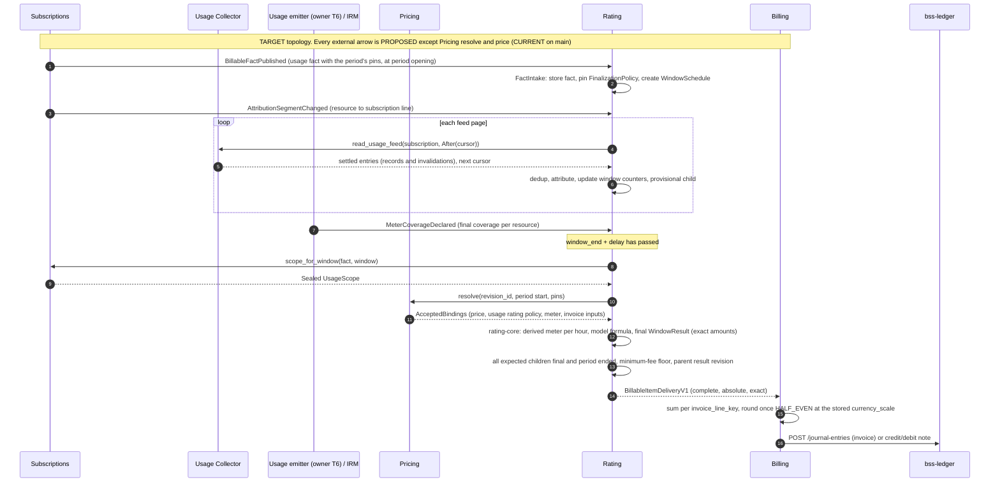

Created:  2026-08-24 by Virtuozzo International GmbH
Updated:  2026-10-08 by Virtuozzo International GmbH

<!-- CONFLUENCE_TITLE: [BSS]: Rating — Technical Design (implementation contract) -->
<!-- Related: ./PRD.md, ./DECOMPOSITION.md, ./features/, ./UPSTREAM_REQS.md, ./DECISIONS.md, ./ADR/ | Owners: BSS Rating team -->

# Technical Design — Rating (Evaluation Core + Pipeline)

<!-- toc -->

- [0. How to read this design](#0-how-to-read-this-design)
- [1. Architecture Overview](#1-architecture-overview)
  - [1.1 Architectural Vision](#11-architectural-vision)
  - [1.2 Architecture Drivers](#12-architecture-drivers)
  - [1.3 Architecture Layers](#13-architecture-layers)
- [2. Principles & Constraints](#2-principles--constraints)
  - [2.1 Design Principles](#21-design-principles)
  - [2.2 Constraints](#22-constraints)
- [3. Technical Architecture](#3-technical-architecture)
  - [3.1 Domain Model](#31-domain-model)
  - [3.2 Component Model](#32-component-model)
  - [3.3 API Contracts](#33-api-contracts)
  - [3.4 Internal Dependencies](#34-internal-dependencies)
  - [3.5 External Dependencies](#35-external-dependencies)
  - [3.6 Interactions & Sequences](#36-interactions--sequences)
  - [3.7 Database schemas & tables](#37-database-schemas--tables)
  - [3.8 Deployment Topology](#38-deployment-topology)
- [4. Additional context](#4-additional-context)
  - [4.1 Versioning and historical correctness](#41-versioning-and-historical-correctness)
  - [4.2 Transactions, idempotency, delivery semantics](#42-transactions-idempotency-delivery-semantics)
  - [4.3 Aggregation semantics](#43-aggregation-semantics)
  - [4.4 Failure model](#44-failure-model)
  - [4.5 Concurrency](#45-concurrency)
  - [4.6 Reconciliation](#46-reconciliation)
  - [4.7 Observability](#47-observability)
  - [4.8 Multi-tenancy and authorization](#48-multi-tenancy-and-authorization)
  - [4.9 NFR mapping](#49-nfr-mapping)
  - [4.10 Launch scope](#410-launch-scope)
  - [4.11 Implementer quick reference](#411-implementer-quick-reference)
  - [4.12 Data lifecycle](#412-data-lifecycle)
  - [4.13 Acceptance vectors](#413-acceptance-vectors)
- [5. Traceability](#5-traceability)
- [6. Detailed Architecture Contracts](#6-detailed-architecture-contracts)
  - [Core foundation: Architectural Vision](#core-foundation-architectural-vision)
  - [Core foundation: Architecture Drivers](#core-foundation-architecture-drivers)
  - [Core foundation: Architecture Layers](#core-foundation-architecture-layers)
  - [Core foundation: Design Principles](#core-foundation-design-principles)
  - [Core foundation: Constraints](#core-foundation-constraints)
  - [Core foundation: Domain Model](#core-foundation-domain-model)
  - [Core foundation: Component Model](#core-foundation-component-model)
  - [Core foundation: API Contracts](#core-foundation-api-contracts)
  - [Core foundation: Internal Dependencies](#core-foundation-internal-dependencies)
  - [Core foundation: External Dependencies](#core-foundation-external-dependencies)
  - [Core foundation: Database Schemas and Tables](#core-foundation-database-schemas-and-tables)
  - [Core foundation: Deployment Topology](#core-foundation-deployment-topology)
  - [Core foundation: Adopted Canonical Scope Key (normative)](#core-foundation-adopted-canonical-scope-key-normative)
  - [Core foundation: Determinism and Idempotency Contract (normative)](#core-foundation-determinism-and-idempotency-contract-normative)
  - [Core foundation: Snapshot Composition (normative)](#core-foundation-snapshot-composition-normative)
  - [Core foundation: Emission Guards and Error Taxonomy (normative)](#core-foundation-emission-guards-and-error-taxonomy-normative)
  - [Core foundation: Traceability](#core-foundation-traceability)
  - [Selection: Architectural Vision](#selection-architectural-vision)
  - [Selection: Architecture Drivers](#selection-architecture-drivers)
  - [Selection: Architecture Layers](#selection-architecture-layers)
  - [Selection: Design Principles](#selection-design-principles)
  - [Selection: Constraints](#selection-constraints)
  - [Selection: Domain Model](#selection-domain-model)
  - [Selection: Component Model](#selection-component-model)
  - [Selection: API Contracts](#selection-api-contracts)
  - [Selection: Internal Dependencies](#selection-internal-dependencies)
  - [Selection: External Dependencies](#selection-external-dependencies)
  - [Selection: Database Schemas and Tables](#selection-database-schemas-and-tables)
  - [Selection: Deployment Topology](#selection-deployment-topology)
  - [Selection: Selection Algorithm (normative)](#selection-selection-algorithm-normative)
  - [Selection: Eligibility and Cohorts — Superseded (normative)](#selection-eligibility-and-cohorts--superseded-normative)
  - [Selection: Phase Semantics (normative)](#selection-phase-semantics-normative)
  - [Selection: Selection Failure Taxonomy (normative)](#selection-selection-failure-taxonomy-normative)
  - [Selection: Traceability](#selection-traceability)
  - [Metering models: Architectural Vision](#metering-models-architectural-vision)
  - [Metering models: Architecture Drivers](#metering-models-architecture-drivers)
  - [Metering models: Architecture Layers](#metering-models-architecture-layers)
  - [Metering models: Design Principles](#metering-models-design-principles)
  - [Metering models: Constraints](#metering-models-constraints)
  - [Metering models: Domain Model](#metering-models-domain-model)
  - [Metering models: Component Model](#metering-models-component-model)
  - [Metering models: API Contracts](#metering-models-api-contracts)
  - [Metering models: Internal Dependencies](#metering-models-internal-dependencies)
  - [Metering models: External Dependencies](#metering-models-external-dependencies)
  - [Metering models: Database Schemas and Tables](#metering-models-database-schemas-and-tables)
  - [Metering models: Deployment Topology](#metering-models-deployment-topology)
  - [Metering models: Model Formulas (normative)](#metering-models-model-formulas-normative)
  - [Metering models: Meter Mapping and Dimensional Lines (normative)](#metering-models-meter-mapping-and-dimensional-lines-normative)
  - [Metering models: Tier Aggregation Window, Slices and Band Continuity (normative)](#metering-models-tier-aggregation-window-slices-and-band-continuity-normative)
  - [Metering models: Granularity Round-Up (normative)](#metering-models-granularity-round-up-normative)
  - [Metering models: Traceability](#metering-models-traceability)
  - [Overlays: Architectural Vision](#overlays-architectural-vision)
  - [Overlays: Architecture Drivers](#overlays-architecture-drivers)
  - [Overlays: Architecture Layers](#overlays-architecture-layers)
  - [Overlays: Design Principles](#overlays-design-principles)
  - [Overlays: Constraints](#overlays-constraints)
  - [Overlays: Domain Model](#overlays-domain-model)
  - [Overlays: Component Model](#overlays-component-model)
  - [Overlays: API Contracts](#overlays-api-contracts)
  - [Overlays: Internal Dependencies](#overlays-internal-dependencies)
  - [Overlays: External Dependencies](#overlays-external-dependencies)
  - [Overlays: Database Schemas and Tables](#overlays-database-schemas-and-tables)
  - [Overlays: Deployment Topology](#overlays-deployment-topology)
  - [Overlays: Scope → Tenant-Axis Mapping (normative)](#overlays-scope--tenant-axis-mapping-normative)
  - [Overlays: Stacking and the Total Order (normative)](#overlays-stacking-and-the-total-order-normative)
  - [Overlays: Contract Overlay Precedence (normative)](#overlays-contract-overlay-precedence-normative)
  - [Overlays: Bounded Composition — Anti-Drift Cap (normative)](#overlays-bounded-composition--anti-drift-cap-normative)
  - [Overlays: Traceability](#overlays-traceability)
  - [Commitments: Architectural Vision](#commitments-architectural-vision)
  - [Commitments: Architecture Drivers](#commitments-architecture-drivers)
  - [Commitments: Architecture Layers](#commitments-architecture-layers)
  - [Commitments: Design Principles](#commitments-design-principles)
  - [Commitments: Constraints](#commitments-constraints)
  - [Commitments: Domain Model](#commitments-domain-model)
  - [Commitments: Component Model](#commitments-component-model)
  - [Commitments: API Contracts](#commitments-api-contracts)
  - [Commitments: Internal Dependencies](#commitments-internal-dependencies)
  - [Commitments: External Dependencies](#commitments-external-dependencies)
  - [Commitments: Database Schemas and Tables](#commitments-database-schemas-and-tables)
  - [Commitments: Deployment Topology](#commitments-deployment-topology)
  - [Commitments: Commitment-Pool Waterfall (normative)](#commitments-commitment-pool-waterfall-normative)
  - [Commitments: Reservation Flavors and Pool Precedence (normative)](#commitments-reservation-flavors-and-pool-precedence-normative)
  - [Commitments: Reserved-Rate Two-Source Rule (normative)](#commitments-reserved-rate-two-source-rule-normative)
  - [Commitments: Commitment Pool vs Prepaid Credit Grant (normative)](#commitments-commitment-pool-vs-prepaid-credit-grant-normative)
  - [Commitments: Obligations, Reversals, and Period Boundaries (normative)](#commitments-obligations-reversals-and-period-boundaries-normative)
  - [Commitments: Traceability](#commitments-traceability)
  - [Coupons: Architectural Vision](#coupons-architectural-vision)
  - [Coupons: Architecture Drivers](#coupons-architecture-drivers)
  - [Coupons: Architecture Layers](#coupons-architecture-layers)
  - [Coupons: Design Principles](#coupons-design-principles)
  - [Coupons: Constraints](#coupons-constraints)
  - [Coupons: Domain Model](#coupons-domain-model)
  - [Coupons: Component Model](#coupons-component-model)
  - [Coupons: API Contracts](#coupons-api-contracts)
  - [Coupons: Internal Dependencies](#coupons-internal-dependencies)
  - [Coupons: External Dependencies](#coupons-external-dependencies)
  - [Coupons: Database Schemas and Tables](#coupons-database-schemas-and-tables)
  - [Coupons: Deployment Topology](#coupons-deployment-topology)
  - [Coupons: Placement and the FX Split (normative)](#coupons-placement-and-the-fx-split-normative)
  - [Coupons: Stacking Policies (normative)](#coupons-stacking-policies-normative)
  - [Coupons: applyScope Attachment and Hybrid Split-Back (normative)](#coupons-applyscope-attachment-and-hybrid-split-back-normative)
  - [Coupons: Frozen Coupon Snapshot and Fail-Closed Rules (normative)](#coupons-frozen-coupon-snapshot-and-fail-closed-rules-normative)
  - [Coupons: Snapshot Segment and Discount Lineage (normative)](#coupons-snapshot-segment-and-discount-lineage-normative)
  - [Coupons: Traceability](#coupons-traceability)
  - [Currency and FX: Architectural Vision](#currency-and-fx-architectural-vision)
  - [Currency and FX: Architecture Drivers](#currency-and-fx-architecture-drivers)
  - [Currency and FX: Architecture Layers](#currency-and-fx-architecture-layers)
  - [Currency and FX: Design Principles](#currency-and-fx-design-principles)
  - [Currency and FX: Constraints](#currency-and-fx-constraints)
  - [Currency and FX: Domain Model](#currency-and-fx-domain-model)
  - [Currency and FX: Component Model](#currency-and-fx-component-model)
  - [Currency and FX: API Contracts](#currency-and-fx-api-contracts)
  - [Currency and FX: Internal Dependencies](#currency-and-fx-internal-dependencies)
  - [Currency and FX: External Dependencies](#currency-and-fx-external-dependencies)
  - [Currency and FX: Database Schemas and Tables](#currency-and-fx-database-schemas-and-tables)
  - [Currency and FX: Deployment Topology](#currency-and-fx-deployment-topology)
  - [Currency and FX: Currency Role Separation (normative)](#currency-and-fx-currency-role-separation-normative)
  - [Currency and FX: FX Policy Semantics (normative)](#currency-and-fx-fx-policy-semantics-normative)
  - [Currency and FX: FX-Lock Snapshot Segment (normative)](#currency-and-fx-fx-lock-snapshot-segment-normative)
  - [Currency and FX: Ordering and Precision at the FX Boundary (normative)](#currency-and-fx-ordering-and-precision-at-the-fx-boundary-normative)
  - [Currency and FX: Traceability](#currency-and-fx-traceability)
  - [Corrections: Architectural Vision](#corrections-architectural-vision)
  - [Corrections: Architecture Drivers](#corrections-architecture-drivers)
  - [Corrections: Architecture Layers](#corrections-architecture-layers)
  - [Corrections: Design Principles](#corrections-design-principles)
  - [Corrections: Constraints](#corrections-constraints)
  - [Corrections: Domain Model](#corrections-domain-model)
  - [Corrections: Component Model](#corrections-component-model)
  - [Corrections: API Contracts](#corrections-api-contracts)
  - [Corrections: Internal Dependencies](#corrections-internal-dependencies)
  - [Corrections: External Dependencies](#corrections-external-dependencies)
  - [Corrections: Database Schemas and Tables](#corrections-database-schemas-and-tables)
  - [Corrections: Deployment Topology](#corrections-deployment-topology)
  - [Corrections: Replay, Re-evaluation and the Binding of Record (normative)](#corrections-replay-re-evaluation-and-the-binding-of-record-normative)
  - [Corrections: Correction Keys and Idempotency (normative)](#corrections-correction-keys-and-idempotency-normative)
  - [Corrections: Posted Periods (normative)](#corrections-posted-periods-normative)
  - [Corrections: Reversal Math and Emission Guards (normative)](#corrections-reversal-math-and-emission-guards-normative)
  - [Corrections: Traceability](#corrections-traceability)
  - [Period and plan change: Architectural Vision](#period-and-plan-change-architectural-vision)
  - [Period and plan change: Architecture Drivers](#period-and-plan-change-architecture-drivers)
  - [Period and plan change: Architecture Layers](#period-and-plan-change-architecture-layers)
  - [Period and plan change: Design Principles](#period-and-plan-change-design-principles)
  - [Period and plan change: Constraints](#period-and-plan-change-constraints)
  - [Period and plan change: Domain Model](#period-and-plan-change-domain-model)
  - [Period and plan change: Component Model](#period-and-plan-change-component-model)
  - [Period and plan change: API Contracts](#period-and-plan-change-api-contracts)
  - [Period and plan change: Internal Dependencies](#period-and-plan-change-internal-dependencies)
  - [Period and plan change: External Dependencies](#period-and-plan-change-external-dependencies)
  - [Period and plan change: Database Schemas and Tables](#period-and-plan-change-database-schemas-and-tables)
  - [Period and plan change: Deployment Topology](#period-and-plan-change-deployment-topology)
  - [Period and plan change: Proration and Billing Terms (normative)](#period-and-plan-change-proration-and-billing-terms-normative)
  - [Period and plan change: Minimum-Fee Floor (normative)](#period-and-plan-change-minimum-fee-floor-normative)
  - [Period and plan change: Sub-Window Split Semantics (normative)](#period-and-plan-change-sub-window-split-semantics-normative)
  - [Period and plan change: Traceability](#period-and-plan-change-traceability)
  - [Governance: Architectural Vision](#governance-architectural-vision)
  - [Governance: Architecture Drivers](#governance-architecture-drivers)
  - [Governance: Architecture Layers](#governance-architecture-layers)
  - [Governance: Design Principles](#governance-design-principles)
  - [Governance: Constraints](#governance-constraints)
  - [Governance: Domain Model](#governance-domain-model)
  - [Governance: Component Model](#governance-component-model)
  - [Governance: API Contracts](#governance-api-contracts)
  - [Governance: Internal Dependencies](#governance-internal-dependencies)
  - [Governance: External Dependencies](#governance-external-dependencies)
  - [Governance: Database Schemas and Tables](#governance-database-schemas-and-tables)
  - [Governance: Deployment Topology](#governance-deployment-topology)
  - [Governance: Single Governance Engine (normative)](#governance-single-governance-engine-normative)
  - [Governance: Rating-Time Checks (normative)](#governance-rating-time-checks-normative)
  - [Governance: Ledger Separation Rationale (normative)](#governance-ledger-separation-rationale-normative)
  - [Governance: ASC 606 Reference Emission (normative)](#governance-asc-606-reference-emission-normative)
  - [Governance: Bundle Rev-Share Pass-Through (normative)](#governance-bundle-rev-share-pass-through-normative)
  - [Governance: AuthZ Resource and Action Catalog (normative)](#governance-authz-resource-and-action-catalog-normative)
  - [Governance: Traceability](#governance-traceability)
  - [Integration contracts: Architectural Vision](#integration-contracts-architectural-vision)
  - [Integration contracts: Architecture Drivers](#integration-contracts-architecture-drivers)
  - [Integration contracts: Architecture Layers](#integration-contracts-architecture-layers)
  - [Integration contracts: Design Principles](#integration-contracts-design-principles)
  - [Integration contracts: Constraints](#integration-contracts-constraints)
  - [Integration contracts: Domain Model](#integration-contracts-domain-model)
  - [Integration contracts: Component Model](#integration-contracts-component-model)
  - [Integration contracts: API Contracts](#integration-contracts-api-contracts)
  - [Integration contracts: Internal Dependencies](#integration-contracts-internal-dependencies)
  - [Integration contracts: External Dependencies](#integration-contracts-external-dependencies)
  - [Integration contracts: Database Schemas and Tables](#integration-contracts-database-schemas-and-tables)
  - [Integration contracts: Deployment Topology](#integration-contracts-deployment-topology)
  - [Integration contracts: Rating Handoff Contract (normative)](#integration-contracts-rating-handoff-contract-normative)
  - [Integration contracts: Pricing Read-Model Input Contract (normative)](#integration-contracts-pricing-read-model-input-contract-normative)
  - [Integration contracts: Subscriptions Input Contract (normative)](#integration-contracts-subscriptions-input-contract-normative)
  - [Integration contracts: Finance FX Input Contract (normative)](#integration-contracts-finance-fx-input-contract-normative)
  - [Integration contracts: Promotions Coupon Snapshot Contract (normative)](#integration-contracts-promotions-coupon-snapshot-contract-normative)
  - [Integration contracts: Billing Delivery and Obligation Contract (normative)](#integration-contracts-billing-delivery-and-obligation-contract-normative)
  - [Integration contracts: Rating Snapshot Reference (`pricing_snapshot_ref`) (normative)](#integration-contracts-rating-snapshot-reference-pricing_snapshot_ref-normative)
  - [Integration contracts: Canonical Naming (normative)](#integration-contracts-canonical-naming-normative)
  - [Integration contracts: Contracts & Agreements Input Contract (normative)](#integration-contracts-contracts--agreements-input-contract-normative)
  - [Integration contracts: Order Evaluation Contract (normative)](#integration-contracts-order-evaluation-contract-normative)
  - [Integration contracts: Inbox and Recovery (normative)](#integration-contracts-inbox-and-recovery-normative)
  - [Integration contracts: Rating-provided Contract Governance (normative)](#integration-contracts-rating-provided-contract-governance-normative)
  - [Integration contracts: Traceability](#integration-contracts-traceability)
  - [Usage ingestion: Architectural Vision](#usage-ingestion-architectural-vision)
  - [Usage ingestion: Architecture Drivers](#usage-ingestion-architecture-drivers)
  - [Usage ingestion: Architecture Layers](#usage-ingestion-architecture-layers)
  - [Usage ingestion: Design Principles](#usage-ingestion-design-principles)
  - [Usage ingestion: Constraints](#usage-ingestion-constraints)
  - [Usage ingestion: Domain Model](#usage-ingestion-domain-model)
  - [Usage ingestion: Component Model](#usage-ingestion-component-model)
  - [Usage ingestion: API Contracts](#usage-ingestion-api-contracts)
  - [Usage ingestion: Internal Dependencies](#usage-ingestion-internal-dependencies)
  - [Usage ingestion: External Dependencies](#usage-ingestion-external-dependencies)
  - [Usage ingestion: Database Schemas and Tables](#usage-ingestion-database-schemas-and-tables)
  - [Usage ingestion: Deployment Topology](#usage-ingestion-deployment-topology)
  - [Usage ingestion: Collector Entry → Rating Usage Mapping (normative)](#usage-ingestion-collector-entry--rating-usage-mapping-normative)
  - [Usage ingestion: Attribution (normative)](#usage-ingestion-attribution-normative)
  - [Usage ingestion: Usage Dedup (normative)](#usage-ingestion-usage-dedup-normative)
  - [Usage ingestion: Usage Type Declarations (normative)](#usage-ingestion-usage-type-declarations-normative)
  - [Usage ingestion: Traceability](#usage-ingestion-traceability)
  - [Counters and attribution: Architectural Vision](#counters-and-attribution-architectural-vision)
  - [Counters and attribution: Architecture Drivers](#counters-and-attribution-architecture-drivers)
  - [Counters and attribution: Architecture Layers](#counters-and-attribution-architecture-layers)
  - [Counters and attribution: Design Principles](#counters-and-attribution-design-principles)
  - [Counters and attribution: Constraints](#counters-and-attribution-constraints)
  - [Counters and attribution: Domain Model](#counters-and-attribution-domain-model)
  - [Counters and attribution: Component Model](#counters-and-attribution-component-model)
  - [Counters and attribution: API Contracts](#counters-and-attribution-api-contracts)
  - [Counters and attribution: Internal Dependencies](#counters-and-attribution-internal-dependencies)
  - [Counters and attribution: External Dependencies](#counters-and-attribution-external-dependencies)
  - [Counters and attribution: Database Schemas and Tables](#counters-and-attribution-database-schemas-and-tables)
  - [Counters and attribution: Deployment Topology](#counters-and-attribution-deployment-topology)
  - [Counters and attribution: Counter Key and Window Resolution (normative)](#counters-and-attribution-counter-key-and-window-resolution-normative)
  - [Counters and attribution: Row Serialization and q_version (normative)](#counters-and-attribution-row-serialization-and-q_version-normative)
  - [Counters and attribution: Slice Layout (normative)](#counters-and-attribution-slice-layout-normative)
  - [Counters and attribution: Composite Inputs (normative)](#counters-and-attribution-composite-inputs-normative)
  - [Counters and attribution: Scope and Coverage Evidence (normative)](#counters-and-attribution-scope-and-coverage-evidence-normative)
  - [Counters and attribution: Traceability](#counters-and-attribution-traceability)
  - [Facts and scheduling: Architectural Vision](#facts-and-scheduling-architectural-vision)
  - [Facts and scheduling: Architecture Drivers](#facts-and-scheduling-architecture-drivers)
  - [Facts and scheduling: Architecture Layers](#facts-and-scheduling-architecture-layers)
  - [Facts and scheduling: Design Principles](#facts-and-scheduling-design-principles)
  - [Facts and scheduling: Constraints](#facts-and-scheduling-constraints)
  - [Facts and scheduling: Domain Model](#facts-and-scheduling-domain-model)
  - [Facts and scheduling: Component Model](#facts-and-scheduling-component-model)
  - [Facts and scheduling: API Contracts](#facts-and-scheduling-api-contracts)
  - [Facts and scheduling: Internal Dependencies](#facts-and-scheduling-internal-dependencies)
  - [Facts and scheduling: External Dependencies](#facts-and-scheduling-external-dependencies)
  - [Facts and scheduling: Database Schemas and Tables](#facts-and-scheduling-database-schemas-and-tables)
  - [Facts and scheduling: Deployment Topology](#facts-and-scheduling-deployment-topology)
  - [Facts and scheduling: Child Kinds (normative)](#facts-and-scheduling-child-kinds-normative)
  - [Facts and scheduling: Commercial Facts (normative)](#facts-and-scheduling-commercial-facts-normative)
  - [Facts and scheduling: Finalization Gate (normative)](#facts-and-scheduling-finalization-gate-normative)
  - [Facts and scheduling: Commitment Balances (normative)](#facts-and-scheduling-commitment-balances-normative)
  - [Facts and scheduling: Traceability](#facts-and-scheduling-traceability)
  - [Results: Architectural Vision](#results-architectural-vision)
  - [Results: Architecture Drivers](#results-architecture-drivers)
  - [Results: Architecture Layers](#results-architecture-layers)
  - [Results: Design Principles](#results-design-principles)
  - [Results: Constraints](#results-constraints)
  - [Results: Domain Model](#results-domain-model)
  - [Results: Component Model](#results-component-model)
  - [Results: API Contracts](#results-api-contracts)
  - [Results: Internal Dependencies](#results-internal-dependencies)
  - [Results: External Dependencies](#results-external-dependencies)
  - [Results: Database Schemas and Tables](#results-database-schemas-and-tables)
  - [Results: Deployment Topology](#results-deployment-topology)
  - [Results: Outcome → Results (normative)](#results-outcome--results-normative)
  - [Results: Result Revisions (normative)](#results-result-revisions-normative)
  - [Results: Line Identities and Idempotency (normative)](#results-line-identities-and-idempotency-normative)
  - [Results: Exact Amounts (normative)](#results-exact-amounts-normative)
  - [Results: CommitmentBalanceEffect (normative)](#results-commitmentbalanceeffect-normative)
  - [Results: Traceability](#results-traceability)
  - [Billing delivery and operations: Architectural Vision](#billing-delivery-and-operations-architectural-vision)
  - [Billing delivery and operations: Architecture Drivers](#billing-delivery-and-operations-architecture-drivers)
  - [Billing delivery and operations: Architecture Layers](#billing-delivery-and-operations-architecture-layers)
  - [Billing delivery and operations: Design Principles](#billing-delivery-and-operations-design-principles)
  - [Billing delivery and operations: Constraints](#billing-delivery-and-operations-constraints)
  - [Billing delivery and operations: Domain Model](#billing-delivery-and-operations-domain-model)
  - [Billing delivery and operations: Component Model](#billing-delivery-and-operations-component-model)
  - [Billing delivery and operations: API Contracts](#billing-delivery-and-operations-api-contracts)
  - [Billing delivery and operations: Internal Dependencies](#billing-delivery-and-operations-internal-dependencies)
  - [Billing delivery and operations: External Dependencies](#billing-delivery-and-operations-external-dependencies)
  - [Billing delivery and operations: Database Schemas and Tables](#billing-delivery-and-operations-database-schemas-and-tables)
  - [Billing delivery and operations: Deployment Topology](#billing-delivery-and-operations-deployment-topology)
  - [Billing delivery and operations: Billing Delivery Contract (normative)](#billing-delivery-and-operations-billing-delivery-contract-normative)
  - [Billing delivery and operations: Period State Is Billing's (normative)](#billing-delivery-and-operations-period-state-is-billings-normative)
  - [Billing delivery and operations: Operational Topology (normative)](#billing-delivery-and-operations-operational-topology-normative)
  - [Billing delivery and operations: Traceability](#billing-delivery-and-operations-traceability)

<!-- /toc -->

- [ ] `p1` - **ID**: `cpt-cf-bss-rating-design-main`

> **This document is the canonical architecture of the Rating gear.** Rules defined here are
> defined **once**. §1–§5 state the gear-wide architecture; §6 holds the detailed architecture
> contracts of sixteen namespaces — the pricing semantics of each evaluation step (contracts 01–10)
> and the pipeline contracts (contracts 11–16) — which keep the section addresses of the former slice
> documents. Implementation scope, requirement allocation and build order are in
> [`DECOMPOSITION.md`](./DECOMPOSITION.md); flows, processes, states, definitions of done and
> acceptance criteria per capability are in [`features/`](./features/); what every dependency
> provides today and what Rating asks of it is in [`UPSTREAM_REQS.md`](./UPSTREAM_REQS.md); open and
> decided decisions are in [`DECISIONS.md`](./DECISIONS.md).

## 0. How to read this design

Rating's cross-gear seams are designed against two sources that do not agree everywhere:

1. **The repository** — what the dependency gears' code and accepted documents contain today
   (UPSTREAM_REQS §2, re-verified 2026-10-08 against `main` at `a35dfc3e2`: Pricing's PriceBook read
   contract, Products' SKU versions and derived usage types, the Subscriptions and Orders Lifecycle
   documents; the usage-collector at commit `5de85f067`).
2. **The Seam Atlas v2 contract baseline 1.1** (2026-09-30, "the Atlas") — a proposed target for
   the Orders Lifecycle and Rating seams (contracts C00–C10, decisions D01–D15). It was audited
   against a different repository (`diffora/gears-rust @ 01f670fa4e5c`); its Pricing model reached
   `main` on 2026-10-02 (PriceBook, `PricingReadV1`; decided for Rating as T-D-37). Rating adopts the
   Atlas where it is consistent with this repository's owners (T-D-48); UPSTREAM_REQS §3 records the status of every Atlas contract. Its **Plus overlay** (2026-10-02)
   grades each seam by whether both owners have written it down, adds decision tickets T1–T12 and
   asks for the Atlas usage feed to be replaced by the collector's own design; DECISIONS maps its
   tickets and items onto the register.

> **Pricing seam (re-cut 2026-10-08, T-D-73…T-D-79).** Rating reads prices only through Pricing's
> PriceBook read contract `PricingReadV1::{resolve, price, current_revision}` (pricing D-419…D-425;
> UPSTREAM_REQS P-15…P-18). It resolves the subscription's **pins** for the period — which
> Subscriptions holds (SUB-D-29) and the commercial fact carries — on the period start, prices the
> returned `AcceptedBinding`s, and keeps them as the child's **binding of record** (T-D-73). Pricing
> selects; Rating does no scope-key, cohort, phase, eligibility, window or overlay selection. Money
> arrives as exact major-unit decimals and stays in major units as exact fractions (T-D-74, T-D-80). The usage
> window, aggregation scope, reset and fold come from the binding's `UsageRatingPolicy` (T-D-75);
> usage meters are Products' derived usage types, which Rating evaluates per UTC hour (T-D-76).
> Recurring proration (T-D-77) and the minimum-fee floor (T-D-78) are Rating's arithmetic, and order
> evaluation follows Orders' contract (T-D-79). What still blocks live rating is upstream: pins,
> plan revision, quantity and `BillingTerms` on the facts (Subscriptions, docs only) and a typed read
> of derived usage declarations (Products, R-31).

> **Money (2026-10-09, T-D-80).** Money follows the cross-BSS money ADR "Money Representation,
> Precision, and Rounding" ([PR #5270](https://github.com/constructorfabric/gears-rust/pull/5270),
> `gears/bss/docs/ADR/0001-cpt-cf-bss-adr-exact-decimal-boundaries.md`). That ADR is **proposed**, not
> merged or accepted, and no gear implements it end to end: Pricing already sends major-unit decimals
> (CURRENT), the ledger still posts `i64` minor units (CURRENT, `ledger-sdk/src/posting.rs`), and no
> Billing gear exists. This design is aligned with the proposed ADR as its TARGET: amounts are exact
> fractions in major currency units carrying `currency` and `currency_scale`, Rating applies only
> declared business rounding, and the invoice-line owner (Billing) rounds each line once, HALF_EVEN,
> and computes corrections against cumulative postings (§3.3, [15 §4.4](#contract-15-4-4),
> [16 §4.1](#contract-16-4-1); DECISIONS R-32, R-33).

Labels used throughout:

| Label | Meaning |
|---|---|
| **CURRENT** | Exists in the dependency's code, or in its accepted documents where it has no code. |
| **TARGET** | The contract Rating is designed against; for an external contract it is **PROPOSED — NOT YET IMPLEMENTED** until its owner adopts it. |
| **MIGRATION** | Interim behaviour Rating runs until a TARGET contract exists. |
| **OPEN DEPENDENCY** / `[DEPENDENCY GAP R-nn]` | Rating cannot implement the path until the decision or contract named exists. |
| **UNKNOWN / EXTERNAL CONTRACT REQUIRED** | The detail is not specified by anybody; Rating states what it needs and does not guess. |
| **CONTRACT CONFLICT** | Two specifications disagree; the row in DECISIONS names the decision owed. |
| **DOC/CODE DRIFT** | A dependency's code contradicts its own documents. |
| **LAUNCH-GATED** | Rating defines the mechanism but rejects it at launch with a named fail-closed reason until the prerequisite in §4.10 exists. |

Rating-owned mechanisms (tables, keys, transactions, the scheduler, the core) are TARGET by
definition: Rating has no code yet (`gears/bss/rating` holds `gear.toml` and `docs/` only).
Implementation of the pure core and of the pipeline against contract fakes can start from this
document; every production integration stays gated until its owner adopts the contract (§4.10).
Naming a proposed interface here never makes it exist.

## 1. Architecture Overview

### 1.1 Architectural Vision

Rating turns **accepted usage** and **commercial facts** into **deterministic, exact, replayable
results** that Billing invoices. It sits between metering (`usage-collector`) and invoicing (a
Billing gear that does not exist yet), and reads prices from `pricing` and commercial context from
`subscriptions`:

```text
                         TARGET topology (CURRENT status per arrow in UPSTREAM_REQS)
 usage-collector ─ read_usage_feed pages (records, invalidation entries) ───────┐
 emitter / IRM ─── coverage declarations, historical inventory (C05) ───────────┤
 subscriptions ─── BillableFactPublished, AttributionSegmentChanged,            │
                   UsageScopeSealed + SubscriptionBillingReadV1 recovery reads ─┤
                                                                                ▼
            ┌──────────────────────────── rating gear ─────────────────────────────┐
            │ inbox ─▶ usage store ─▶ attribution ─▶ window counters (Q)            │
            │ fact projection ─▶ WindowScheduler ─▶ Rater ─▶ rating-core (pure)     │
            │                                         │                             │
            │ WindowResult (per child window) ─▶ ParentRollup ─▶ delivery outbox    │
            └─────────────────────────────────────────┬─────────────────────────────┘
 pricing ── PricingReadV1::resolve(pins) + price(id) ┘ (pull, ClientHub)
 products ─ derived usage declarations (R-31) ────────┘
                                                      │
                     BillableItemDeliveryV1 (+ RatingRunReadV1 recovery) ▼
                                         Billing (rounds, freezes, posts) ─▶ bss-ledger
```

The same chain as a sequence (TARGET; each external step is labelled in §3.5 and UPSTREAM_REQS §3):



**Rating owns**: its raw capture of every usage entry it received and its copy of every upstream
input it rated with; the attribution projection; each record's contribution state; windowed
quantities (`Q`) and their versions; source-loss records; child windows, their schedule and their
exact results; window-group contexts; parent-fact result revisions and their delivery outbox;
content-addressed, tenant-owned rating snapshots; engine generations; correction lineage and
re-rate runs; the binding of record and its stored copies of the bindings and derived usage
declarations it priced with. **Rating does not own**: raw measurements (usage-collector), price
books, prices, plan revisions, price selection and usage rating policies (pricing), SKUs, SKU
versions and derived usage declarations (products), subscription lifecycle, commercial periods,
billing terms, pins, quantities, payer and attribution (subscriptions), coverage and inventory
(IRM/emitter), FX rates, promotions (pricing, deferred), commitment balances (Contracts), period
state, invoice rounding, tax, posting and revenue recognition (Billing / `bss-ledger`).

The gear is two parts in one deployable (ADR-0002):

- **`rating-core`** — pure, I/O-free: given a frozen `EvaluationInput` it computes an
  `EvaluationOutcome` (lines, exact amounts, lineage, obligations). Same input ⇒ byte-identical
  output, on any worker, at any later time.
- **The pipeline** (`rating` crate) — inbox, projections, counters, scheduler, input freezing,
  core calls, result persistence, roll-up and delivery.

Every result is reproducible **from Rating's database and its retained engine generations alone**
(T-D-41, T-D-65): usage records, resolved pricing bindings, derived usage declarations,
subscription versions, facts, scope proofs, coverage declarations and window-group contexts a
result used are stored immutably and referenced
from the result's input manifest, and the engine generation that produced it stays executable for
the retention period (§4.1).

### 1.2 Architecture Drivers

#### Functional Drivers

| Requirement | Design response |
|---|---|
| `cpt-cf-bss-rating-fr-deterministic-evaluation-api` | `rating_core::evaluate(&EvaluationInput) -> Result<EvaluationOutcome, EvaluationError>` (§3.3). |
| `cpt-cf-bss-rating-fr-pre-purchase-evaluation` | `OrderEvaluationV1::evaluate` — pure, non-authoritative, usage excluded, over the exact bindings of Orders' accepted chain matrix (T-D-54, T-D-79, §3.3); priority and DTO confirmation R-24. |
| `cpt-cf-bss-rating-fr-single-outcome-determinism` | Every child result records an input manifest and `input_digest` (§4.1); `rating-core` is pure. |
| `cpt-cf-bss-rating-fr-snapshot-carry` | Every line references a content-addressed `bss_rating__snapshot`; provenance carries `{plan_id, revision_id, sku_id, sku_version, price_book_entry_id, price_id}` (§3.7, §4.1). |
| `cpt-cf-bss-rating-fr-idempotency` | Usage dedup on the collector record id + natural key; child results by `(child_id, window_revision)`; parent results by `(fact_id, result_revision)`; delivery by `delivery_id` (§4.2). |
| `cpt-cf-bss-rating-fr-non-negative-price` | Emission guard in `rating-core` step 6 ([01 §4.4](#contract-01-4-4)). |
| `cpt-cf-bss-rating-fr-separation` | Results are append-only revisions; Rating never reads or writes invoices; a correction is a new revision (§4.2). |
| `cpt-cf-bss-rating-fr-evaluation-order` | Compiled step order in `rating-core` ([contract 01](#contract-01)). |
| `cpt-cf-bss-rating-fr-base-catalog-selection`, `cpt-cf-bss-rating-fr-price-eligibility-grandfathering`, `cpt-cf-bss-rating-fr-plan-phases` | Pricing selects: `resolve` binds the price in force for a signup and walks a pinned chain through `all` successors for a renewal (pricing D-420); Rating prices the returned binding and cross-checks it against the fact's accepted binding (`binding_mismatch`, T-D-73). Phases and cohorts do not exist in Pricing; [contract 02](#contract-02) is superseded. |
| `cpt-cf-bss-rating-fr-flat-pricing`, `cpt-cf-bss-rating-fr-per-unit-pricing`, `cpt-cf-bss-rating-fr-tiered-graduated`, `cpt-cf-bss-rating-fr-volume-variant-a`, `cpt-cf-bss-rating-fr-package-pricing`, `cpt-cf-bss-rating-fr-hybrid-pricing` | [Contract 03](#contract-03) formulas; §4.3. |
| `cpt-cf-bss-rating-fr-level-aggregation` | A level is a `Peak` or `TimeWeighted` input of a Products derived usage type (T-D-76); such inputs are LAUNCH-GATED (`unsupported_input_fold`, R-06): only `Sum` inputs are rated. |
| `cpt-cf-bss-rating-fr-tier-aggregation-window`, `cpt-cf-bss-rating-fr-billing-granularity`, `cpt-cf-bss-rating-fr-meter-mapping-granularity` | Child windows from the binding's `usage_rating_policy.content.rating_window` (`BillingCycle` = the fact's billing period, `CalendarHour{Utc}`), tiers reset at `rating_window_start` (T-D-75, §4.3). Pricing offers no other window, so `calendar_month`, `subscription_lifetime` and `per_event` do not exist. |
| `cpt-cf-bss-rating-fr-dimensional-pricing`, `cpt-cf-bss-rating-fr-dimension-population-contract` | `dimension_key` from declared metadata (R-16, [contract 12](#contract-12)). |
| `cpt-cf-bss-rating-fr-composite-meter-eval` | Every usage meter is a Products derived usage type (`products.derived/<code>@<n>`, ≥ 1 input): Rating folds each raw input per UTC hour and evaluates the declaration with `bss_products_sdk::derived::evaluate` (T-D-76; [contract 03](#contract-03), [contract 13](#contract-13)); the declaration read is R-31. |
| `cpt-cf-bss-rating-fr-priceoverlay-scope-mapping`, `cpt-cf-bss-rating-fr-overlay-stacking`, `cpt-cf-bss-rating-fr-customer-contract-overlay`, `cpt-cf-bss-rating-fr-bounded-composition-cap` | No input: `PriceOverlay` was dropped from Pricing (a plan-specific exception uses another book or SKU); contract overlays have no source (R-11). [Contract 04](#contract-04) is a fail-closed placeholder. |
| `cpt-cf-bss-rating-fr-commitment-drawdown`, `cpt-cf-bss-rating-fr-committed-usage`, `cpt-cf-bss-rating-fr-reservation-consumption-flavor`, `cpt-cf-bss-rating-fr-capacity-charge` | [Contract 05](#contract-05); commitment pools dormant (R-11). |
| `cpt-cf-bss-rating-fr-coupon-application-order`, `cpt-cf-bss-rating-fr-coupon-stacking` | [Contract 06](#contract-06); promotions are Pricing's and deferred (pricing D-409); fail closed (R-11). |
| `cpt-cf-bss-rating-fr-multi-currency`, `cpt-cf-bss-rating-fr-fx-policy` | [Contract 07](#contract-07); a price book has one currency (pricing D-384), and Rating rates only in it (R-07). |
| `cpt-cf-bss-rating-fr-posted-period-protection`, `cpt-cf-bss-rating-fr-late-arriving-usage-reresolve`, `cpt-cf-bss-rating-fr-usage-corrections` | Re-evaluation of affected child windows with the binding of record → new parent revision; Billing derives the posted-period adjustment (T-D-50, T-D-73, [contract 08](#contract-08)). |
| `cpt-cf-bss-rating-fr-period-floor-cap-obligation`, `cpt-cf-bss-rating-fr-mid-cycle-proration`, `cpt-cf-bss-rating-fr-plan-change-proration` | Split points at a binding's `ends_on` and at Subscriptions' term changes; recurring proration by covered UTC seconds (T-D-77, R-30); the minimum-fee floor per price at roll-up (T-D-38, T-D-78). No plan floor or cap exists in Pricing (D-388, D-467). |
| `cpt-cf-bss-rating-fr-asc606-traceable-identifiers`, `cpt-cf-bss-rating-fr-publish-approval-governance` | [Contract 10](#contract-10): identifiers pass through from the binding; approval is the shared `bss-approval` engine of Pricing and Products, where Rating has no role (R-12 closed). |
| `cpt-cf-bss-rating-interface-tariff-evaluation`, `cpt-cf-bss-rating-contract-rating-handoff` | `rating-core` API (§3.3) — in-process, intra-gear. |
| `cpt-cf-bss-rating-contract-pricing-readmodel`, `cpt-cf-bss-rating-contract-subscriptions-input`, `cpt-cf-bss-rating-contract-billing-periodstate`, `cpt-cf-bss-rating-contract-finance-fx-input`, `cpt-cf-bss-rating-contract-promotions-coupon`, `cpt-cf-bss-rating-contract-contracts-input` | §3.5, [contract 11](#contract-11), [`UPSTREAM_REQS.md`](./UPSTREAM_REQS.md). |
| `cpt-cf-bss-rating-usecase-tariff-editor`, `cpt-cf-bss-rating-usecase-partner-priceoverlay`, `cpt-cf-bss-rating-usecase-finance-simulation` | Authoring is the pricing gear's (price books, entries, prices, plan revisions; no partner overlays exist); simulation is deferred (T-D-32). |

#### NFR Allocation

| NFR | Mechanism | Status |
|---|---|---|
| `cpt-cf-bss-rating-nfr-throughput-latency` | Page transactions of ≤ 1 000 records; per-child coalesced evaluation; pure core; §4.9 sizing. | End-to-end time is bounded by the finalization delay, not Rating (R-13). |
| `cpt-cf-bss-rating-nfr-horizontal-scale` | Work partitioned by `hash(subscription_id)`; row locks on one child, one counter, one parent only; no cross-subscription lock (§4.5). | Design. |
| `cpt-cf-bss-rating-nfr-audit-segregation` | Publish governance is the shared `bss-approval` engine of Pricing and Products; Rating's operator actions are authorized and audited (§4.8). | Rating has no approval role (R-12 closed). |
| `cpt-cf-bss-rating-nfr-resilience` | Inbox + idempotent transactions, CAS checkpoints, input-generation CAS, fail-closed pending reasons (§4.2, §4.4). | Design. |

#### Key ADRs

| ADR ID | Decision summary |
|---|---|
| `cpt-cf-bss-rating-adr-scope-key-adoption` | Adopt the pricing canonical scope key verbatim — superseded by the PriceBook model (T-D-37): Pricing selects, Rating prices the binding (T-D-73). |
| `cpt-cf-bss-rating-adr-pricebook-bindings` | Rate the bindings Pricing resolves with Subscriptions' pins; keep the binding of record for corrections and replay (supersedes ADR-0001; T-D-73). |
| `cpt-cf-bss-rating-adr-rating-gear-consolidation` | One `rating` gear; `rating-core` is an I/O-free crate. |

### 1.3 Architecture Layers

- [ ] `p1` - **ID**: `cpt-cf-bss-rating-tech-stack-main`

| Crate | Layer | Contents | Allowed dependencies |
|---|---|---|---|
| `cf-gears-bss-rating-sdk` (`gears/bss/rating/rating-sdk`) | Public contract | `RatingRunReadV1`, `RatingRunControlV1`, `OrderEvaluationV1` traits; `BillableItemDeliveryV1`, `WindowResultView`, `RatingRunView`, `RerateRunView`, `ExactAmount` (major-unit fraction with `currency` and `currency_scale`), `ExactQuantity` (canonical strings, §3.3); error mapping to `CanonicalError`. | `toolkit-security`, `toolkit-canonical-errors`, `time`, `uuid`, `serde`. |
| `cf-gears-bss-rating-core` (`gears/bss/rating/rating-core`) | Domain (pure) | `EngineRegistry` and one module per retained engine generation (`engine::gen_<n>`), each with `evaluate`, `evaluate_order`, `split_points`, `window_geometry`, per-step evaluators and the `DerivedMeterEvaluator` (wraps `bss_products_sdk::derived::{evaluate, evaluate_window}`, T-D-76); `ExactAmount` / `ExactQuantity` arithmetic with checked budgets; the exact conversion of pricing's major-unit `Decimal` money to major-unit fractions (T-D-74, T-D-80). | `num-bigint` / `num-rational` (or an equivalent exact type), `rust_decimal` (pricing and products decimals arrive as `rust_decimal::Decimal`; converted exactly, never rounded), `bss-pricing-sdk` and `bss-products-sdk` types only (`AcceptedBinding`, `PriceModel`, `UsageRatingPolicy`, `DerivedUsageDeclaration`), `time`, `uuid`, `serde`. **No** tokio, sea-orm, http, ClientHub — enforced by a CI deny-list. The joint `bss-fixtures` corpus was deleted with pricing phase 4 (T-D-37 amendment); Rating authors its own vectors, and pricing's golden contracts (`pricing/tests/contract/*.json`) are the adapter tests' inputs. |
| `cf-gears-bss-rating` (`gears/bss/rating/rating`) | API / application / infrastructure | `#[toolkit::gear(…, db_namespace = "bss_rating")]` module (T-D-60; the attribute is required by database ADR-0001 and not yet implemented in the toolkit macros — until it is, the namespace is applied through the explicit table names) with `stateful` lifecycle; usage capture, inbox, feed readers, projections, scheduler and wake scanner, rater workers, roll-up, delivery; operator REST (`OperationBuilder`); SecureORM repositories; migrations; `toolkit_db::outbox` queues. | Platform toolkit crates, `cf-gears-cluster-sdk` (`DistributedLockApi`, `LeaderElectionApi`; R-27), `cf-gears-event-broker-sdk` (feature-gated, TARGET), upstream SDKs (`bss-pricing-sdk` — `PricingReadV1`; `bss-products-sdk` — the derived evaluator and, when it exists, the declaration read of R-31; `usage-collector-sdk`; `subscriptions-sdk` when it exists). |

Layout follows `docs/toolkit_unified_system/02_gear_layout_and_sdk_pattern.md`; inter-gear calls go
through ClientHub-resolved SDK traits; repositories take `&impl DBRunner`; multi-step writes run in
`SecureConn::in_transaction_mapped` (`11_database_patterns.md`). New dependency crates (exact
rational arithmetic) follow `guidelines/DEPENDENCIES.md`.

<a id="register-tech"></a>

#### Namespace technology layers

The technology layers each contract namespace adds are defined here and specified normatively in [§6](#6-detailed-architecture-contracts); each entry links to its contract.

- [ ] `p3` - **ID**: `cpt-cf-bss-rating-tech-stack-fnd`
  — Core foundation — Architecture Layers ([contract](#contract-01-1-3))

- [ ] `p3` - **ID**: `cpt-cf-bss-rating-tech-stack-sel`
  — Selection — Architecture Layers ([contract](#contract-02-1-3))

- [ ] `p3` - **ID**: `cpt-cf-bss-rating-tech-stack-mm`
  — Metering models — Architecture Layers ([contract](#contract-03-1-3))

- [ ] `p3` - **ID**: `cpt-cf-bss-rating-tech-stack-ovl`
  — Overlays — Architecture Layers ([contract](#contract-04-1-3))

- [ ] `p3` - **ID**: `cpt-cf-bss-rating-tech-stack-cmt`
  — Commitments — Architecture Layers ([contract](#contract-05-1-3))

- [ ] `p3` - **ID**: `cpt-cf-bss-rating-tech-stack-cpn`
  — Coupons — Architecture Layers ([contract](#contract-06-1-3))

- [ ] `p3` - **ID**: `cpt-cf-bss-rating-tech-stack-fx`
  — Currency and FX — Architecture Layers ([contract](#contract-07-1-3))

- [ ] `p3` - **ID**: `cpt-cf-bss-rating-tech-stack-rtr`
  — Corrections — Architecture Layers ([contract](#contract-08-1-3))

- [ ] `p3` - **ID**: `cpt-cf-bss-rating-tech-stack-ppc`
  — Period and plan change — Architecture Layers ([contract](#contract-09-1-3))

- [ ] `p3` - **ID**: `cpt-cf-bss-rating-tech-stack-gov`
  — Governance — Architecture Layers ([contract](#contract-10-1-3))

- [ ] `p3` - **ID**: `cpt-cf-bss-rating-tech-stack-cc`
  — Integration contracts — Architecture Layers ([contract](#contract-11-1-3))

- [ ] `p3` - **ID**: `cpt-cf-bss-rating-tech-stack-ing`
  — Usage ingestion — Architecture Layers ([contract](#contract-12-1-3))

- [ ] `p3` - **ID**: `cpt-cf-bss-rating-tech-stack-qst`
  — Counters and attribution — Architecture Layers ([contract](#contract-13-1-3))

- [ ] `p3` - **ID**: `cpt-cf-bss-rating-tech-stack-syn`
  — Facts and scheduling — Architecture Layers ([contract](#contract-14-1-3))

- [ ] `p3` - **ID**: `cpt-cf-bss-rating-tech-stack-rob`
  — Results — Architecture Layers ([contract](#contract-15-1-3))

- [ ] `p3` - **ID**: `cpt-cf-bss-rating-tech-stack-bhf`
  — Billing delivery and operations — Architecture Layers ([contract](#contract-16-1-3))


## 2. Principles & Constraints

### 2.1 Design Principles

- [ ] `p1` - **ID**: `cpt-cf-bss-rating-principle-pure-function-core`
  `rating-core` performs no I/O and reads no clock. Everything it needs — the resolved pricing
  bindings of record, the derived usage declaration, the fact and subscription versions, per-slice
  and per-granule input quantities with `q_version`, the window-group context, the child window
  geometry — arrives in one `EvaluationInput`, and it runs under the engine generation the input
  names. Aggregation is the pipeline's.
- [ ] `p1` - **ID**: `cpt-cf-bss-rating-principle-capture-before-interpret`
  Every usage entry is stored complete and digested before Rating interprets it; a feed position
  advances only in the transaction that stores what it covers. A record contributes to `Q` at most
  once, and once withdrawn it never contributes again (T-D-61).
- [ ] `p1` - **ID**: `cpt-cf-bss-rating-principle-fixed-rule-order`
  The evaluation order is compiled in and no configuration reorders it: bind (the resolved
  binding), meter (the derived evaluation), model formula, minimum-fee floor (at roll-up), guards.
  PRD §17.1's overlay, contract, commitment, coupon and FX steps have no source today and stay
  fail-closed placeholders in that order (§4.10).
- [ ] `p1` - **ID**: `cpt-cf-bss-rating-principle-fail-closed`
  Missing or inconsistent input produces a typed `EvaluationError` or a `pending_reason` — never a
  default price, a zero rate, a guessed subscription, or a zero for missing usage evidence.
- [ ] `p1` - **ID**: `cpt-cf-bss-rating-principle-adopt-the-sor`
  Price selection, money, model kinds, usage rating policies and invoice inputs are consumed exactly
  as Pricing's `resolve` answers them; meters and derived usage declarations exactly as Products
  declares them; commercial periods, pins, quantities, billing terms, payer and attribution exactly
  as Subscriptions publishes them.
- [ ] `p1` - **ID**: `cpt-cf-bss-rating-principle-copy-what-you-rate`
  Every upstream fact a result depends on is persisted in Rating, immutably, under the producer's
  version identifier (T-D-41).
- [ ] `p1` - **ID**: `cpt-cf-bss-rating-principle-append-only-money`
  Money-bearing rows (`bss_rating__window_result`, `bss_rating__fact_result`, `bss_rating__delivery`) are
  insert-only. A changed outcome is a new revision; nothing is updated in place.
- [ ] `p1` - **ID**: `cpt-cf-bss-rating-principle-absolute-results`
  Rating publishes complete absolute results per parent fact, never deltas (T-D-50). Whether a
  revision replaces a draft or becomes a credit/debit note is Billing's decision.
- [ ] `p1` - **ID**: `cpt-cf-bss-rating-principle-evidence-before-final`
  A result becomes final only on proven-complete inputs (T-D-52). Time alone, a feed watermark, or an
  empty page never proves completeness, and a known source loss blocks finality under every evidence
  mode (T-D-62).

<a id="register-principles"></a>

#### Namespace principles

The principles each contract namespace adds are defined here and specified normatively in [§6](#6-detailed-architecture-contracts); each entry links to its contract.

- [ ] `p1` - **ID**: `cpt-cf-bss-rating-principle-pure-function-fnd`
  — Core foundation — Pure function, frozen inputs ([contract](#contract-01-pure-function-frozen-inputs))

- [ ] `p1` - **ID**: `cpt-cf-bss-rating-principle-one-order-fnd`
  — Core foundation — One order, one outcome ([contract](#contract-01-one-order-one-outcome))

- [ ] `p1` - **ID**: `cpt-cf-bss-rating-principle-adopt-compose-fnd`
  — Core foundation — Adopt the catalog, compose the snapshot ([contract](#contract-01-adopt-the-catalog-compose-the-snapshot))

- [ ] `p1` - **ID**: `cpt-cf-bss-rating-principle-full-key-only-sel`
  — Selection — Pricing selects; the core never re-selects ([contract](#contract-02-the-full-key-or-nothing))

- [ ] `p1` - **ID**: `cpt-cf-bss-rating-principle-class-then-cohort-sel`
  — Selection — Pins are the subscription's ([contract](#contract-02-class-order-first-then-the-cohort-pin))

- [ ] `p1` - **ID**: `cpt-cf-bss-rating-principle-resolved-set-no-gap-sel`
  — Selection — Uncovered is never free ([contract](#contract-02-gaps-are-judged-on-the-resolved-set))

- [ ] `p1` - **ID**: `cpt-cf-bss-rating-principle-shared-formula-sor-mm`
  — Metering models — The kind→formula mapping is pricing's ([contract](#contract-03-the-kindformula-mapping-is-shared-sor))

- [ ] `p1` - **ID**: `cpt-cf-bss-rating-principle-aggregate-not-record-mm`
  — Metering models — Price the aggregate, not the record ([contract](#contract-03-price-the-aggregate-not-the-record))

- [ ] `p1` - **ID**: `cpt-cf-bss-rating-principle-never-guess-line-mm`
  — Metering models — Never guess a line ([contract](#contract-03-never-guess-a-line))

- [ ] `p1` - **ID**: `cpt-cf-bss-rating-principle-stack-not-winner-ovl`
  — Overlays — Stack all survivors (dormant) ([contract](#contract-04-stack-all-survivors-tie-break-dont-exclude))

- [ ] `p1` - **ID**: `cpt-cf-bss-rating-principle-total-order-ovl`
  — Overlays — One total order, no arbitrary picks ([contract](#contract-04-one-total-order-no-arbitrary-picks))

- [ ] `p1` - **ID**: `cpt-cf-bss-rating-principle-typed-axes-ovl`
  — Overlays — Axes are typed, not inferred ([contract](#contract-04-axes-are-typed-not-inferred))

- [ ] `p1` - **ID**: `cpt-cf-bss-rating-principle-composition-cmt`
  — Commitments — Composition, not a model ([contract](#contract-05-composition-not-a-model))

- [ ] `p1` - **ID**: `cpt-cf-bss-rating-principle-frozen-balances-cmt`
  — Commitments — Frozen balances, thin evaluation ([contract](#contract-05-frozen-balances-thin-evaluation))

- [ ] `p1` - **ID**: `cpt-cf-bss-rating-principle-surface-not-post-cmt`
  — Commitments — Surface, never post ([contract](#contract-05-surface-never-post))

- [ ] `p2` - **ID**: `cpt-cf-bss-rating-principle-apply-never-own-cpn`
  — Coupons — Apply, never own ([contract](#contract-06-apply-never-own))

- [ ] `p2` - **ID**: `cpt-cf-bss-rating-principle-policy-from-snapshot-cpn`
  — Coupons — Policy from the snapshot only ([contract](#contract-06-policy-from-the-snapshot-only))

- [ ] `p2` - **ID**: `cpt-cf-bss-rating-principle-lineage-first-cpn`
  — Coupons — Lineage is part of the outcome ([contract](#contract-06-lineage-is-part-of-the-outcome))

- [ ] `p1` - **ID**: `cpt-cf-bss-rating-principle-currency-roles-fx`
  — Currency and FX — Three roles, one conversion point ([contract](#contract-07-three-roles-one-conversion-point))

- [ ] `p1` - **ID**: `cpt-cf-bss-rating-principle-no-implicit-fx`
  — Currency and FX — No unrecorded FX ([contract](#contract-07-no-unrecorded-fx))

- [ ] `p1` - **ID**: `cpt-cf-bss-rating-principle-full-precision-conversion-fx`
  — Currency and FX — Convert at full precision, never round ([contract](#contract-07-convert-at-full-precision-never-round))

- [ ] `p1` - **ID**: `cpt-cf-bss-rating-principle-pinned-replay-rtr`
  — Corrections — Replay the binding of record, never live pricing ([contract](#contract-08-replay-the-pin-never-the-live-catalog))

- [ ] `p1` - **ID**: `cpt-cf-bss-rating-principle-delta-only-rtr`
  — Corrections — Absolute revisions out, never mutation ([contract](#contract-08-absolute-revisions-out-never-mutation))

- [ ] `p1` - **ID**: `cpt-cf-bss-rating-principle-same-math-rtr`
  — Corrections — One math, run twice ([contract](#contract-08-one-math-run-twice))

- [ ] `p1` - **ID**: `cpt-cf-bss-rating-principle-surface-not-execute-ppc`
  — Period and plan change — Surface, never execute ([contract](#contract-09-surface-never-execute))

- [ ] `p1` - **ID**: `cpt-cf-bss-rating-principle-split-never-blend-ppc`
  — Period and plan change — Split, never blend ([contract](#contract-09-split-never-blend))

- [ ] `p1` - **ID**: `cpt-cf-bss-rating-principle-consume-change-ppc`
  — Period and plan change — Consume the change, never decide it ([contract](#contract-09-consume-the-change-never-decide-it))

- [ ] `p1` - **ID**: `cpt-cf-bss-rating-principle-one-engine-gov`
  — Governance — One engine, registered rules ([contract](#contract-10-one-engine-registered-rules))

- [ ] `p1` - **ID**: `cpt-cf-bss-rating-principle-publish-enforce-gov`
  — Governance — Enforce at publish, trust at evaluation ([contract](#contract-10-enforce-at-publish-trust-at-evaluation))

- [ ] `p1` - **ID**: `cpt-cf-bss-rating-principle-pass-through-gov`
  — Governance — Pass through evidence, never re-derive ([contract](#contract-10-pass-through-evidence-never-re-derive))

- [ ] `p1` - **ID**: `cpt-cf-bss-rating-principle-adopt-verbatim-cc`
  — Integration contracts — Design Principles ([contract](#contract-11-2-1))

- [ ] `p1` - **ID**: `cpt-cf-bss-rating-principle-single-writer-cc`
  — Integration contracts — Design Principles ([contract](#contract-11-2-1))

- [ ] `p1` - **ID**: `cpt-cf-bss-rating-principle-frozen-in-precision-out-cc`
  — Integration contracts — Design Principles ([contract](#contract-11-2-1))

- [ ] `p1` - **ID**: `cpt-cf-bss-rating-principle-normalize-once-ing`
  — Usage ingestion — Design Principles ([contract](#contract-12-2-1))

- [ ] `p1` - **ID**: `cpt-cf-bss-rating-principle-merge-before-round-ing`
  — Usage ingestion — Design Principles ([contract](#contract-12-2-1))

- [ ] `p1` - **ID**: `cpt-cf-bss-rating-principle-dimension-passthrough-ing`
  — Usage ingestion — Design Principles ([contract](#contract-12-2-1))

- [ ] `p1` - **ID**: `cpt-cf-bss-rating-principle-single-writer-qst`
  — Counters and attribution — Design Principles ([contract](#contract-13-2-1))

- [ ] `p1` - **ID**: `cpt-cf-bss-rating-principle-versioned-q-qst`
  — Counters and attribution — Design Principles ([contract](#contract-13-2-1))

- [ ] `p1` - **ID**: `cpt-cf-bss-rating-principle-attribute-by-time-qst`
  — Counters and attribution — Design Principles ([contract](#contract-13-2-1))

- [ ] `p1` - **ID**: `cpt-cf-bss-rating-principle-freeze-then-invoke-syn`
  — Facts and scheduling — Design Principles ([contract](#contract-14-2-1))

- [ ] `p1` - **ID**: `cpt-cf-bss-rating-principle-idempotent-tick-syn`
  — Facts and scheduling — Design Principles ([contract](#contract-14-2-1))

- [ ] `p1` - **ID**: `cpt-cf-bss-rating-principle-cascade-off-hotpath-syn`
  — Facts and scheduling — Design Principles ([contract](#contract-14-2-1))

- [ ] `p1` - **ID**: `cpt-cf-bss-rating-principle-immutable-charges-rob`
  — Results — Design Principles ([contract](#contract-15-2-1))

- [ ] `p1` - **ID**: `cpt-cf-bss-rating-principle-idempotent-publish-rob`
  — Results — Design Principles ([contract](#contract-15-2-1))

- [ ] `p1` - **ID**: `cpt-cf-bss-rating-principle-persist-sealed-rob`
  — Results — Design Principles ([contract](#contract-15-2-1))

- [ ] `p1` - **ID**: `cpt-cf-bss-rating-principle-precision-out-bhf`
  — Billing delivery and operations — Design Principles ([contract](#contract-16-2-1))

- [ ] `p1` - **ID**: `cpt-cf-bss-rating-principle-idempotent-delivery-bhf`
  — Billing delivery and operations — Design Principles ([contract](#contract-16-2-1))

- [ ] `p1` - **ID**: `cpt-cf-bss-rating-principle-lanes-bhf`
  — Billing delivery and operations — Design Principles ([contract](#contract-16-2-1))


### 2.2 Constraints

- [ ] `p1` - **ID**: `cpt-cf-bss-rating-constraint-posted-immutability`
  Rating never reads or mutates an invoice and keeps no period fence. Posted-period immutability is
  enforced by Billing comparing each parent revision with its accepted target (Atlas C08); Rating's
  obligation is that every revision is complete, monotonic, and replayable (T-D-50).
- [ ] `p1` - **ID**: `cpt-cf-bss-rating-constraint-domain-boundaries`
  No tax, no currency rounding, no revenue recognition, no journal posting, no coupon lifecycle, no
  spend enforcement (PRD §5.2). Rating never calls `bss-ledger`.
- [ ] `p1` - **ID**: `cpt-cf-bss-rating-constraint-stateless-hot-path`
  `rating-core` owns no store. State owned by another gear is held only as immutable, version-keyed
  copies.
- [ ] `p1` - **ID**: `cpt-cf-bss-rating-constraint-in-process-contracts`
  Inter-gear reads use ClientHub SDK traits. Every non-usage inbound fact passes one inbox (T-D-56); usage is captured in
  `bss_rating__usage_record` (T-D-61). Pull reads
  are always sufficient. **CURRENT**: the `event-broker` gear is implemented (dispatcher, REST
  handlers, standalone service, commit `c7de7b80a`, 2026-09-23); Pricing writes its events
  (`prices_published`, `plan_revision_published`, `approval_unit_decided`, …) to its outbox and
  dispatches them through `DbProducer` to topic `gts.cf.core.events.topic.v1~cf.bss.pricing.catalog.v1`
  when a broker is registered, holding them otherwise. Rating consumes none of Pricing's events: a
  price change reaches a subscription only through its pins (SUB-D-29). No producer of the facts
  Rating needs exists (Subscriptions has no code). **TARGET**: events via `cf-gears-event-broker-sdk`
  are an additional, lower-latency source into the same inbox.
- [ ] `p1` - **ID**: `cpt-cf-bss-rating-constraint-native-currency-launch`
  A price book has exactly one currency (pricing D-384), so every binding of a plan revision is in
  that currency. A child is rateable only when the fact's billing currency equals the binding's
  `ImmutablePrice.currency`; otherwise `fx_not_supported` (R-07).
- [ ] `p1` - **ID**: `cpt-cf-bss-rating-constraint-exact-no-rounding`
  Amounts are exact reduced fractions in **major** units of the price currency that carry the
  binding's `currency` and `InvoiceInputs.currency_scale` (T-D-51, T-D-74, T-D-80; money ADR rules 2,
  4, 9). Rating never rounds money; it applies only declared business rounding (Products' formula
  and output rounding, the package block `ceil`). Billing rounds the total of each invoice line once
  at the stored `currency_scale`, with the binding's `rounding` (HALF_EVEN; the SDK admits no other
  mode), and validates the result as `PostedMoney` (money ADR rule 7; R-32).

<a id="register-constraints"></a>

#### Namespace constraints

The constraints each contract namespace adds are defined here and specified normatively in [§6](#6-detailed-architecture-contracts); each entry links to its contract.

- [ ] `p1` - **ID**: `cpt-cf-bss-rating-constraint-no-store-fnd`
  — Core foundation — No authoritative store ([contract](#contract-01-no-authoritative-store))

- [ ] `p1` - **ID**: `cpt-cf-bss-rating-constraint-utc-money-fnd`
  — Core foundation — UTC and exact money ([contract](#contract-01-utc-and-exact-money))

- [ ] `p1` - **ID**: `cpt-cf-bss-rating-constraint-delta-dedup-owner-fnd`
  — Core foundation — Rating ([contract](#contract-01-result-dedup-owner-rating))

- [ ] `p1` - **ID**: `cpt-cf-bss-rating-constraint-no-silent-fallback-sel`
  — Selection — No silent fallback ([contract](#contract-02-no-silent-fallback))

- [ ] `p1` - **ID**: `cpt-cf-bss-rating-constraint-phase-id-only-sel`
  — Selection — No silent fallback ([contract](#contract-02-no-silent-fallback))

- [ ] `p1` - **ID**: `cpt-cf-bss-rating-constraint-frozen-selection-inputs-sel`
  — Selection — Binding inputs are frozen ([contract](#contract-02-selection-inputs-are-frozen))

- [ ] `p1` - **ID**: `cpt-cf-bss-rating-constraint-catalog-guarantees-mm`
  — Metering models — Pricing guarantees relied on ([contract](#contract-03-catalog-guarantees-relied-on))

- [ ] `p1` - **ID**: `cpt-cf-bss-rating-constraint-typed-quantity-mm`
  — Metering models — Quantity sources are typed ([contract](#contract-03-quantity-sources-are-typed))

- [ ] `p1` - **ID**: `cpt-cf-bss-rating-constraint-declare-vs-emit-mm`
  — Metering models — Dimension declaration is not dimension emission ([contract](#contract-03-dimension-declaration-is-not-dimension-emission))

- [ ] `p1` - **ID**: `cpt-cf-bss-rating-constraint-publish-side-guarantees-ovl`
  — Overlays — No publish-side overlay validation exists ([contract](#contract-04-publish-side-validation-is-relied-on-not-re-run))

- [ ] `p1` - **ID**: `cpt-cf-bss-rating-constraint-overlay-segment-ovl`
  — Overlays — No overlay segment ([contract](#contract-04-the-overlay-segment-is-sealed))

- [ ] `p1` - **ID**: `cpt-cf-bss-rating-constraint-cap-modes-ovl`
  — Overlays — Caps clamp or fail — never silently compound ([contract](#contract-04-caps-clamp-or-fail--never-silently-compound))

- [ ] `p1` - **ID**: `cpt-cf-bss-rating-constraint-fixed-slot-cmt`
  — Commitments — Fixed slot, fixed intra-step order ([contract](#contract-05-fixed-slot-fixed-intra-step-order))

- [ ] `p1` - **ID**: `cpt-cf-bss-rating-constraint-reversal-boundary-cmt`
  — Commitments — Reversal math is [contract 08](#contract-08)'s ([contract](#contract-05-reversal-math-is-slice-08s))

- [ ] `p2` - **ID**: `cpt-cf-bss-rating-constraint-launch-posture-cmt`
  — Commitments — single pool first ([contract](#contract-05-launch-posture-single-pool-first))

- [ ] `p2` - **ID**: `cpt-cf-bss-rating-constraint-fixed-slot-cpn`
  — Coupons — Fixed slot, compiled FX split ([contract](#contract-06-fixed-slot-compiled-fx-split))

- [ ] `p2` - **ID**: `cpt-cf-bss-rating-constraint-no-redemption-mutation-cpn`
  — Coupons — No redemption mutation, snapshot-only replay ([contract](#contract-06-no-redemption-mutation-snapshot-only-replay))

- [ ] `p2` - **ID**: `cpt-cf-bss-rating-constraint-promotions-maturity-cpn`
  — Coupons — Promotions contract maturity ([contract](#contract-06-promotions-contract-maturity))

- [ ] `p1` - **ID**: `cpt-cf-bss-rating-constraint-finance-sor-fx`
  — Currency and FX — FX tables and policy are Finance's ([contract](#contract-07-fx-tables-and-policy-are-finances))

- [ ] `p1` - **ID**: `cpt-cf-bss-rating-constraint-binding-consumed-fx`
  — Currency and FX — The (currency, region) binding is consumed, never re-derived ([contract](#contract-07-the-currency-region-binding-is-consumed-never-re-derived))

- [ ] `p1` - **ID**: `cpt-cf-bss-rating-constraint-presentment-outside-fx`
  — Currency and FX — Presentment is outside rating-core ([contract](#contract-07-presentment-is-outside-rating-core))

- [ ] `p1` - **ID**: `cpt-cf-bss-rating-constraint-posted-immutability-rtr`
  — Corrections — Posted-period immutability is Billing's ([contract](#contract-08-posted-period-immutability-is-billings))

- [ ] `p1` - **ID**: `cpt-cf-bss-rating-constraint-periodstate-required-rtr`
  — Corrections — Period state is not an input ([contract](#contract-08-period-state-is-not-an-input))

- [ ] `p1` - **ID**: `cpt-cf-bss-rating-constraint-delta-dedup-owner-rtr`
  — Corrections — Rating ([contract](#contract-08-correction-dedup-owner-rating))

- [ ] `p1` - **ID**: `cpt-cf-bss-rating-constraint-no-round-no-execute-ppc`
  — Period and plan change — No rounding, no period min/max in rating-core ([contract](#contract-09-no-rounding-no-period-minmax-in-rating-core))

- [ ] `p1` - **ID**: `cpt-cf-bss-rating-constraint-enum-verbatim-ppc`
  — Period and plan change — Adopted enums, verbatim ([contract](#contract-09-adopted-enums-verbatim))

- [ ] `p1` - **ID**: `cpt-cf-bss-rating-constraint-utc-half-open-ppc`
  — Period and plan change — UTC half-open boundaries only ([contract](#contract-09-utc-half-open-boundaries-only))

- [ ] `p1` - **ID**: `cpt-cf-bss-rating-constraint-no-second-workflow-gov`
  — Governance — No second workflow, no approval state ([contract](#contract-10-no-second-workflow-no-approval-state))

- [ ] `p1` - **ID**: `cpt-cf-bss-rating-constraint-publish-time-gov`
  — Governance — Publish-time only ([contract](#contract-10-publish-time-only))

- [ ] `p1` - **ID**: `cpt-cf-bss-rating-constraint-immutable-refs-gov`
  — Governance — Emitted references are immutable ([contract](#contract-10-emitted-references-are-immutable))

- [ ] `p1` - **ID**: `cpt-cf-bss-rating-constraint-inprocess-boundary-cc`
  — Integration contracts — Constraints ([contract](#contract-11-2-2))

- [ ] `p1` - **ID**: `cpt-cf-bss-rating-constraint-no-extension-cc`
  — Integration contracts — Constraints ([contract](#contract-11-2-2))

- [ ] `p1` - **ID**: `cpt-cf-bss-rating-constraint-rating-contract-draft-cc`
  — Integration contracts — Constraints ([contract](#contract-11-2-2))

- [ ] `p1` - **ID**: `cpt-cf-bss-rating-constraint-authoritative-dedup-ing`
  — Usage ingestion — Constraints ([contract](#contract-12-2-2))

- [ ] `p1` - **ID**: `cpt-cf-bss-rating-constraint-no-price-ing`
  — Usage ingestion — Constraints ([contract](#contract-12-2-2))

- [ ] `p1` - **ID**: `cpt-cf-bss-rating-constraint-utc-units-ing`
  — Usage ingestion — Constraints ([contract](#contract-12-2-2))

- [ ] `p1` - **ID**: `cpt-cf-bss-rating-constraint-entries-not-aggregates-ing`
  — Usage ingestion — Constraints ([contract](#contract-12-2-2))

- [ ] `p1` - **ID**: `cpt-cf-bss-rating-constraint-core-never-writes-qst`
  — Counters and attribution — Constraints ([contract](#contract-13-2-2))

- [ ] `p1` - **ID**: `cpt-cf-bss-rating-constraint-window-from-calendar-qst`
  — Counters and attribution — Constraints ([contract](#contract-13-2-2))

- [ ] `p1` - **ID**: `cpt-cf-bss-rating-constraint-no-fabricated-proof-qst`
  — Counters and attribution — Constraints ([contract](#contract-13-2-2))

- [ ] `p1` - **ID**: `cpt-cf-bss-rating-constraint-pin-discipline-syn`
  — Facts and scheduling — Constraints ([contract](#contract-14-2-2))

- [ ] `p1` - **ID**: `cpt-cf-bss-rating-constraint-synthesis-only-syn`
  — Facts and scheduling — Constraints ([contract](#contract-14-2-2))

- [ ] `p1` - **ID**: `cpt-cf-bss-rating-constraint-no-commercial-clock-syn`
  — Facts and scheduling — Constraints ([contract](#contract-14-2-2))

- [ ] `p1` - **ID**: `cpt-cf-bss-rating-constraint-delta-dedup-here-rob`
  — Results — Constraints ([contract](#contract-15-2-2))

- [ ] `p1` - **ID**: `cpt-cf-bss-rating-constraint-record-not-compute-rob`
  — Results — Constraints ([contract](#contract-15-2-2))

- [ ] `p1` - **ID**: `cpt-cf-bss-rating-constraint-complete-or-nothing-rob`
  — Results — Constraints ([contract](#contract-15-2-2))

- [ ] `p1` - **ID**: `cpt-cf-bss-rating-constraint-no-round-bhf`
  — Billing delivery and operations — Constraints ([contract](#contract-16-2-2))

- [ ] `p1` - **ID**: `cpt-cf-bss-rating-constraint-periodstate-billing-bhf`
  — Billing delivery and operations — Constraints ([contract](#contract-16-2-2))


## 3. Technical Architecture

### 3.1 Domain Model

**Upstream objects** (status: UPSTREAM_REQS):

| Concept | Owner | Identifier | Versioning | How Rating obtains it | Status |
|---|---|---|---|---|---|
| Usage entry | usage-collector | TARGET V1 (upstream `main` docs): `id` = UUIDv5 over `(tenant, gts_type_id, idempotency_key, window_start, window_end, entry_type)` (ADR-0007); code today: UUIDv5 over `(tenant, gts_id, created_at, key)` | immutable; withdrawn only by an invalidation entry | `read_usage_feed` page → `bss_rating__usage_record` | feed DOCUMENTED on upstream `main`, not implemented (R-01) |
| Invalidation entry | usage-collector | an entry with `entry_type = invalidation`, server-stamped `invalidates` (ADR-0010) | append-only | same feed | DOCUMENTED on upstream `main`; code has a `status` flip (DOC/CODE DRIFT the collector acknowledges) |
| Raw usage type | usage-collector / types-registry (collector ADR-0008) | GTS `gts_type_id` | metadata immutable | declaration read from types-registry ([12 §4.7](#contract-12-4-7)); an **input** of a derived usage type, never sold directly (products P-D-259) | DOCUMENTED; code still has an in-collector counter/gauge plugin catalog with no unit |
| Derived usage type (the meter) | products | `products.derived/<code>@<n>` (`MeterId`), declaration `{output_unit, granularity: Hour, inputs [{name, usage_type_ref, granule_fold: Sum \| Peak \| TimeWeighted, max_hold_seconds?, unit}], formula, output_scale, output_round}` + digest | append-only versions; a new formula is a new SKU (P-D-258) | the binding's `meter: MeterRef{usage_type_id, version}`; the declaration by a typed read Products does not offer yet (R-31; REST only) | CURRENT (types and evaluator in `bss-products-sdk`); read **MISSING** |
| SKU version | products | `(sku_id, published_version)` | dated `SkuVersion{published_version, effective_from}` | `AcceptedBinding.sku_version` (pricing reads it as of the resolve date, D-421) | CURRENT |
| Coverage declaration | usage emitter (owner unassigned, overlay T6) | `(coverage_id, version)` | superseding versions | `MeterCoverageDeclared` / `MeterCoverageReadV1` | PROPOSED (Atlas C05); IRM has no code |
| Inventory snapshot | IRM | `snapshot_id` | immutable | `ResourceHistoryV1` (via Subscriptions scope proof) | PROPOSED; absent |
| Plan, plan revision, plan item | pricing | `plan_id`; `revision_id` (`rev_no`); `item_id` (a SKU and its entry in the plan's book, D-467) | revisions `draft → pending → scheduled → published → superseded`; publishing never moves pins (D-394) | `resolve(revision_id, …)`; `current_revision(plan_id)` | CURRENT |
| Price book, entry, price | pricing | book (one currency); `price_book_entry_id` (SKU × charge kind × period × model × usage-policy digest); `price_id` in the chain of one dimension value | an approved price is immutable and served forever by id (D-422); windows `[effective_from, effective_to)`, `temporary_until`, explicit end; `ends_on` is the binding's own end (D-425) | inside `AcceptedBinding.price: ImmutablePrice`; `price(price_id)` | CURRENT |
| Pins | subscriptions (SUB-D-29) | `PricePin{item_id, dimension_value?, price_id}` per bound cell | per period; first period = the accepted order's bindings (Orders D-162); renewal walks `all` and stops before `new` (D-420) | carried on the commercial fact (TARGET) | DOCUMENTED (SUB-D-29 only); no store or wire named — UPSTREAM_REQS §2.6 |
| Accepted binding | pricing (answer) | `AcceptedBinding{item_id, price_book_entry_id, dimension_key?, dimension_value?, sku_id, sku_version, sku_code, sku_name, unit?, meter?, price, kind, recurring_period?, via_default, usage_rating_policy?, invoice}` | none in Pricing (pricing stores no pins and freezes no descriptors, D-389) | `resolve` → stored verbatim as the binding of record (T-D-73) | CURRENT |
| Usage rating policy | pricing (on a usage entry) | `{policy_id, version, digest, content: {rating_window: BillingCycle \| CalendarHour{Utc}, aggregation_scope: subscription_line \| resource, reset: rating_window_start, partial_window: actual_quantity_full_thresholds, fold: SUM}}` | immutable; a change is a new entry and a revision (D-502, D-514) | `AcceptedBinding.usage_rating_policy` | CURRENT |
| Billing terms | subscriptions (pricing-sdk `terms.rs` projection) | `BillingTerms{cycle: Month \| Year, anchor: Calendar \| SubscriptionStart, anchor_at, timezone: Utc, digest}` | versioned | the fact's period bounds (Rating never derives an anchor) | DOCUMENTED; Subscriptions' own documents still say `billingAnchorPolicy` (SUB-D-27) |
| Subscription version | subscriptions | `subscription_id` + `version` | append-only revisions | subscription read → `bss_rating__subscription_version` | ASSUMED (docs only) |
| Commercial fact | subscriptions | CURRENT `BillableItemCreated` key `(subscriptionId, billing period, lineKey)`; one-time dedup per phase-entry occurrence `(tenantId, subscriptionId, phaseEntryId, componentOccurrenceId, chargeLineId)` (SUB-D-28); TARGET `BillableFact {fact_id, fact_version, payload_digest}` with the period's `plan_revision_id`, pins, quantity and billing terms | TARGET: new version per change | inbox → `bss_rating__fact` | ASSUMED / PROPOSED (R-03, R-20) |
| Billing group / sealed set | subscriptions | TARGET `billing_group_id`, `composition_version` | sealed sets versioned | fact payload | PROPOSED; MIGRATION derived key |
| Attribution segment | subscriptions | TARGET `(segment_id, segment_version)`, gap-free `lifecycle_seq` per `resource_tenant_id` | full-state replacement | inbox → `bss_rating__attribution_segment` | PROPOSED (R-25) |
| Usage scope proof | subscriptions | TARGET `(scope_id, scope_version)`, content-addressed | immutable | `scope_for_window` → `bss_rating__usage_scope` | PROPOSED |

**Rating-owned objects**:

| Concept | Identifier | Mutability | Created by |
|---|---|---|---|
| Inbox entry | `(tenant_id, source, business_id, version)` | insert-only; state transitions `accepted → applied \| quarantined` | every non-usage intake path (T-D-56) |
| Usage capture | `(tenant_id, usage_record_id)` | raw entry insert-only; contribution state transitions (§4.2) | feed readers (T-D-61) |
| Source checkpoint | `source_id` (canonical feed source identity, §3.7) | CAS-updated | feed readers / recovery sweeps |
| Source loss | `(tenant_id, loss_id)` | `open → narrowed → resolved` | feed readers, reconciler (T-D-62) |
| Fact projection | `(tenant_id, fact_id, fact_version)` | insert-only per version | fact intake |
| Child window | `child_id` = UUIDv5(`WindowEvaluationKey`) | current pointer + status mutable; history in results | scheduler (T-D-49) |
| Window schedule | `(tenant_id, fact_id)` | `next_due_window_start` cursor CAS-advanced | fact intake |
| Window counter | aggregation key + raw input usage type + window + layout + slice + UTC-hour granule | upsert, `q_version + 1` per change | ingestion |
| Binding of record | `(tenant_id, binding_digest)` | insert-only copy of the `(revision_id, date, pins)` and the `AcceptedBinding`s | rater (T-D-73) |
| Derived declaration copy | `(tenant_id, code, version)` + digest | insert-only | rater (T-D-76) |
| Window result | `(child_id, window_revision)` | insert-only | rater |
| Parent result | `(fact_id, result_revision)` | insert-only | roll-up |
| Delivery | `delivery_id` | insert-only; publication state | roll-up (outbox) |
| Window-group context | `(tenant_id, window_group_id, context_digest)` | insert-only, content-addressed | rater (T-D-67) |
| Rating snapshot | `(tenant_id, snapshot_id)`, `snapshot_id` = `rsnap1:` + SHA-256 | insert-only, content-addressed, tenant-owned | rater |
| Engine generation | `engine_generation` + `engine_digest` | immutable once released | build (T-D-65) |
| Exception | `exception_id` | open → resolved | any stage |
| Re-rate run | `run_id`, with a frozen target and per-child targets | `accepted → enumerating → running → completed \| failed \| cancelled` | operator (T-D-63) |

**Child kinds** (exhaustive):

| Kind | Parent fact kind | Canonical window | Quantity | Trigger |
|---|---|---|---|---|
| `usage_window` | usage | from the binding's `usage_rating_policy.rating_window`: `CalendarHour{Utc}` → one UTC hour, `BillingCycle` → the fact's billing period; clipped to the fact's served extent (T-D-75) | the derived meter's output per UTC-hour granule, summed per slice (T-D-76) | counter change (provisional); due time (final) |
| `period_line` | recurring | the fact's billing period | the period's committed quantity carried on the fact (Subscriptions `QuantityInterval`; first period: the accepted order line's `quantity`) for `per_unit`; none for `flat` | fact acceptance |
| `one_time` | one_time | the occurrence instant | 1 × price | fact acceptance — **only if R-19 is accepted**; until then one-time facts are stored and not rated (T-D-18) |

Pricing offers no `per_event` window and no lifetime or calendar-month window (D-514), so the former
`usage_event` child kind and those windows are removed (T-D-75 amends T-D-69).

`WindowEvaluationKey = {fact_id, canonical_window_start, aggregation_key}` with
`AggregationKey = {seller_tenant_id, payer_tenant_id, resource_tenant_id, subscription_id,
sub_line_key, item_id, meter, dimension_key, scope: subscription_line | resource(resource_id)}`
(Atlas C10, T-D-55). `meter` is the derived usage type id `products.derived/<code>@<n>` from the
binding (T-D-76); `scope` is the policy's `aggregation_scope` (T-D-75); `resource` scope is
LAUNCH-GATED (`resource_scope_not_supported`) until scope proofs list resources (R-21). Its
canonical string is
`wk1|{fact_id}|{window_start RFC3339 UTC}|{agg_key canonical JSON}` and
`child_id = UUIDv5(NS_RATING_CHILD, that string)`. This key is for window children and is not
changed: one child holds all slices of its window (§3.1 below), so tiers see the whole window.

**Counters are line-level** (T-D-76): a counter is keyed by the `CounterKey` — the
`AggregationKey` without `item_id` and `meter` — plus the raw `input_usage_type`, the window, the
layout, the slice and the UTC-hour granule. A record is counted **once**, into the counter of its
own raw GTS type, whatever number of derived meters of the line take that type as an input; each
child (one per derived meter) reads the counters of the inputs its declaration names. The column
digest of the `CounterKey` is `counter_key_digest` on counters, layouts and contributions; children
keep `agg_key_digest` (the full `AggregationKey`).

**Expected children of a fact** (`expected_children(fact)`, used by the scheduler and by roll-up
completeness): `period_line` / `one_time` — exactly one; usage, `subscription_line` scope — one per
canonical window of `window_geometry(fact, rating_window)` × one per covered usage cell of the
fact's resolved bindings (item × dimension value; `dimension_key = ""` at launch, R-16), so a
proven-empty window still has its children and a sealed empty scope gives each of them zero
evidence, not zero children; an uncovered cell is not a child — it fails the fact closed
(`price_uncovered`); usage, `resource` scope (LAUNCH-GATED) — additionally × the resources of the
window's sealed scope, so there a sealed empty resource set means zero resource children. The
expected set is recorded as a manifest (`expected_manifest_digest`) on the fact head. Never
derived from the counters that happen to exist.

Child creation has two owners: `CounterMaterializer` inserts a `provisional` usage child when an
attributed record is counted and its fact is known; `WindowScheduler` inserts every expected child
when it becomes due. Without a known fact no child exists (counters only).

**Slices are lines of one child**, not separate children: split points inside one fact (a
binding's `ends_on` — a temporary price's end or an explicit close, after which Rating resolves
again with the same pin on that date, pricing D-397/D-425; a quantity change for `period_line`; a
Subscriptions term change carried as a new fact version) divide a child into slices evaluated
together with band continuity (§4.3). A successor's start (`effective_to`) is never a split point.
Boundaries **between facts** (billing-period boundary, plan change to a new `sub_line_key`, payer
change) separate children; where one rating window spans such a boundary under the T-D-36
continuation key, the children form a **window group** (§4.3).

<a id="register-entities"></a>

#### Namespace domain models

The domain models each contract namespace adds are defined here and specified normatively in [§6](#6-detailed-architecture-contracts); each entry links to its contract.

- [ ] `p1` - **ID**: `cpt-cf-bss-rating-entity-model-fnd`
  — Core foundation — Domain Model ([contract](#contract-01-3-1))

- [ ] `p1` - **ID**: `cpt-cf-bss-rating-entity-model-sel`
  — Selection — Domain Model ([contract](#contract-02-3-1))

- [ ] `p1` - **ID**: `cpt-cf-bss-rating-entity-model-mm`
  — Metering models — Domain Model ([contract](#contract-03-3-1))

- [ ] `p1` - **ID**: `cpt-cf-bss-rating-entity-model-ovl`
  — Overlays — Domain Model ([contract](#contract-04-3-1))

- [ ] `p1` - **ID**: `cpt-cf-bss-rating-entity-model-cmt`
  — Commitments — Domain Model ([contract](#contract-05-3-1))

- [ ] `p2` - **ID**: `cpt-cf-bss-rating-entity-model-cpn`
  — Coupons — Domain Model ([contract](#contract-06-3-1))

- [ ] `p1` - **ID**: `cpt-cf-bss-rating-entity-model-fx`
  — Currency and FX — Domain Model ([contract](#contract-07-3-1))

- [ ] `p1` - **ID**: `cpt-cf-bss-rating-entity-model-rtr`
  — Corrections — Domain Model ([contract](#contract-08-3-1))

- [ ] `p1` - **ID**: `cpt-cf-bss-rating-entity-model-ppc`
  — Period and plan change — Domain Model ([contract](#contract-09-3-1))

- [ ] `p1` - **ID**: `cpt-cf-bss-rating-entity-model-gov`
  — Governance — Domain Model ([contract](#contract-10-3-1))

- [ ] `p1` - **ID**: `cpt-cf-bss-rating-entity-model-cc`
  — Integration contracts — Domain Model ([contract](#contract-11-3-1))

- [ ] `p1` - **ID**: `cpt-cf-bss-rating-entity-model-ing`
  — Usage ingestion — Domain Model ([contract](#contract-12-3-1))

- [ ] `p1` - **ID**: `cpt-cf-bss-rating-entity-model-qst`
  — Counters and attribution — Domain Model ([contract](#contract-13-3-1))

- [ ] `p1` - **ID**: `cpt-cf-bss-rating-entity-model-syn`
  — Facts and scheduling — Domain Model ([contract](#contract-14-3-1))

- [ ] `p1` - **ID**: `cpt-cf-bss-rating-entity-model-rob`
  — Results — Domain Model ([contract](#contract-15-3-1))

- [ ] `p1` - **ID**: `cpt-cf-bss-rating-entity-model-bhf`
  — Billing delivery and operations — Domain Model ([contract](#contract-16-3-1))


### 3.2 Component Model

Logical components (one per contract namespace; the namespace in §6 refines its component, and
[DECOMPOSITION](./DECOMPOSITION.md) assigns each to a feature):

- [ ] `p1` - **ID**: `cpt-cf-bss-rating-component-foundation`
  step order, input validation, guards, digest ([contract 01](#contract-01)).
- [ ] `p1` - **ID**: `cpt-cf-bss-rating-component-selection-eligibility`
  bind: take the resolved binding and cross-check it against the fact's accepted binding; selection
  itself is Pricing's (T-D-73; [contract 02](#contract-02), superseded).
- [ ] `p1` - **ID**: `cpt-cf-bss-rating-component-metering-models`
  meter (the derived usage evaluation, T-D-76) and the model formula (T-D-74)
  ([contract 03](#contract-03)).
- [ ] `p1` - **ID**: `cpt-cf-bss-rating-component-overlays-precedence`
  no input: Pricing has no overlays; contract overlays have no source (R-11); fail-closed
  placeholder ([contract 04](#contract-04)).
- [ ] `p1` - **ID**: `cpt-cf-bss-rating-component-commitments-reservations`
  commitments and reservations: no source (R-11); fail-closed placeholder ([contract 05](#contract-05)).
- [ ] `p2` - **ID**: `cpt-cf-bss-rating-component-coupons`
  promotions: Pricing's, deferred (D-409); fail-closed placeholder ([contract 06](#contract-06)).
- [ ] `p1` - **ID**: `cpt-cf-bss-rating-component-currency-fx`
  one currency per book; FX has no source (R-07) ([contract 07](#contract-07)).
- [ ] `p2` - **ID**: `cpt-cf-bss-rating-component-retroactivity-corrections`
  re-evaluation, revisions, re-rate ([contract 08](#contract-08)).
- [ ] `p2` - **ID**: `cpt-cf-bss-rating-component-period-plan-change`
  split points (`ends_on`, quantity and term changes), proration by covered UTC seconds (T-D-77),
  the minimum-fee floor (T-D-78) ([contract 09](#contract-09)).
- [ ] `p2` - **ID**: `cpt-cf-bss-rating-component-governance-asc606`
  ASC 606 identifiers and invoice inputs passed through from the binding; no publish-time role
  (R-12 closed) ([contract 10](#contract-10)).
- [ ] `p1` - **ID**: `cpt-cf-bss-rating-component-consumer-contracts`
  boundary adapters, inbox, order evaluation ([contract 11](#contract-11)).
- [ ] `p1` - **ID**: `cpt-cf-bss-rating-component-usage-ingestion`
  usage feed intake ([contract 12](#contract-12)).
- [ ] `p1` - **ID**: `cpt-cf-bss-rating-component-q-store`
  counters, attribution projection, evidence ([contract 13](#contract-13)).
- [ ] `p1` - **ID**: `cpt-cf-bss-rating-component-unit-synthesis`
  facts, child windows, scheduler, rater ([contract 14](#contract-14)).
- [ ] `p1` - **ID**: `cpt-cf-bss-rating-component-rated-output`
  results, roll-up, snapshots ([contract 15](#contract-15)).
- [ ] `p1` - **ID**: `cpt-cf-bss-rating-component-billing-handoff`
  delivery, recovery reads, operations ([contract 16](#contract-16)).

Runtime components. Every component below is a module of the `rating` crate unless marked `rating-core`. "Abstraction
status": **R** required domain abstraction, **M** concrete module/type to implement.

| Component | Status | Inputs → outputs | Owned state | Transaction boundary | Idempotency / partition key | Retry and failure | Recovery | Observability |
|---|---|---|---|---|---|---|---|---|
| `Inbox` | R, M | any non-usage upstream fact → `bss_rating__inbox` row (usage dedups in `bss_rating__usage_record`, which is its inbox) | `bss_rating__inbox` | caller's transaction | `(tenant, source, business_id, version)` + digest | duplicate same digest → no-op; different digest → quarantine | operator release | `rating_inbox_quarantined_total{source}` |
| `UsageFeedReader` | M | `read_usage_feed` page → captured entries + contribution changes | `bss_rating__source_checkpoint` row of its canonical source | one transaction per page | checkpoint CAS on cursor; Cluster lock `bss-rating/usage-feed/{source_id}` (R-27) | `Unavailable` → backoff 1 s→5 min; `CursorBeyondRetention` → open a source loss, restart from `Oldest` | replay from `Oldest` (idempotent) | feed lag, cursor age, restarts |
| `UsageCapture` (dedup) | M | wire entry → raw row (complete entry + `raw_sha256`) **before** interpretation | `bss_rating__usage_record` (raw columns), `bss_rating__usage_capture_reject` | page transaction | PK `(tenant, usage_record_id)` + natural key unique; entries without a readable id/tenant keyed `(source_id, raw_sha256)` | same id + same digest → already captured, skip all processing; different digest → alarm, stored row wins | re-interpret from the raw row | `rating_usage_duplicate_total`, `…_conflict_total` |
| `UsageNormalizer` | M (pure) | stored raw entry → `NormalizedUsage` or a rejection | normalized columns, `contribution_state = rejected` | page transaction | — | malformed → `rejected(reason)` + exception; the raw row stays | operator retry re-interprets the stored raw entry | `rating_usage_rejected_total{reason}` |
| `SourceLossTracker` | R, M | `CursorBeyondRetention`, unidentifiable entry, scope widening → `bss_rating__source_loss` | `bss_rating__source_loss` | page transaction | `(source_id, kind, last_good_cursor)` | open loss blocks finality of its scope (T-D-62) | resolved only by authoritative evidence (§4.6) | `rating_source_loss_open` |
| `AttributionProjector` | M | segment / scope facts → projection rows | `bss_rating__attribution_segment`, `bss_rating__usage_scope` | one transaction per inbox batch | `(segment_id, segment_version)`; gap-free `lifecycle_seq` per `resource_tenant_id` | gap → projection paused, `segments_since` fill | rebuild from `segments_since` | `rating_attribution_gap`, `…_unattributed` |
| `Attributor` | M (pure lookup) | record + projection → `Attribution` or wait | sets attribution columns once | page transaction | — | no segment → `awaiting_attribution`; ambiguous → quarantine | applied when the segment arrives, only through the contribution state machine (never to a withdrawn record) | `rating_attribution_unresolved` |
| `WindowResolver` | M (pure, shared with core) | spec + instant/interval → canonical window | — | — | — | crossing boundary → `boundary_split_required` | emitter re-splits | `rating_boundary_split_required_total` |
| `CounterMaterializer` | M | contribution transition → one counter delta per record at the recorded coordinates (line-level `CounterKey`, raw input type, layout part) | `bss_rating__window_counter`, `bss_rating__window_layout`, `bss_rating__usage_policy_projection` | page transaction | conditional state transition on the record row, then row upsert; `q_version + 1` | serialization failure → retry ×3; no projection for the line → `awaiting_spec`; a `Peak` / `TimeWeighted` input is still counted (the child fails `unsupported_input_fold`) | re-materialize from `counted` records | `rating_q_materialize_seconds`, `rating_q_rematerialized_total` |
| `FactIntake` | M | inbox fact → `bss_rating__fact`, schedule, children | `bss_rating__fact`, `bss_rating__window_schedule`, `bss_rating__child_window` | one transaction per fact | `(fact_id, fact_version)`; digest | digest conflict → quarantine | `period_facts` / `facts` reads | `rating_fact_versions_total`, `rating_fact_missing` |
| `WindowScheduler` | R, M | due scan → expected child rows + work items | `bss_rating__window_schedule.next_due_window_start` | one transaction per fact batch | child work dedup on `child_id` | crash → cursor not advanced, rescan | catch-up from `next_due_window_start` | `rating_scheduler_backlog`, `…_catchup_windows_total` |
| `ChildWakeScanner` | R, M | `next_check_at ≤ now` on children and `rollup_due_at ≤ now` on fact heads → work items | `next_check_at`, `rollup_due_at` | one transaction per batch | `FOR UPDATE SKIP LOCKED`; work dedup on `child_id` / `fact_id` | crash → times not advanced, rescanned | independent of the creation cursor (T-D-68) | `rating_child_wake_lag_seconds` |
| `EvidenceGate` | R, M | child + evidence rows + open source losses → `final_eligible \| pending(reason)` | `pending_reason`, `next_check_at` on child | rater transaction (read) | — | missing evidence or open loss → pending, `next_check_at` set | evidence arrival or the wake scanner | `rating_child_pending{reason}` |
| `PricingBindingStore` | M | `(revision_id, date, pins)` → `PricingReadV1::resolve` → stored `AcceptedBinding`s; replay verification through `PricingReadV1::price(price_id).money_digest` | `bss_rating__pricing_binding` | own transaction, before rating | `(tenant, binding_digest)` | `ServiceUnavailable` / 503 `REGISTRY_UNAVAILABLE` → backoff, child `pending(pricing_unavailable)`; refusal (`PIN_FOREIGN`, `REVISION_NOT_PUBLISHED`, …) → `failed(pricing_refused)`; `INCOMPLETE_COMMERCIAL_INPUTS` → `failed(incomplete_commercial_inputs)`; same key, different content → alarm | re-resolve only on a new fact version or a re-bind (T-D-73) | `rating_pricing_binding_age_seconds`, `rating_dependency_errors_total{dependency="pricing"}` |
| `DerivedDeclarationStore` | M | `MeterRef` → stored derived usage declaration + digest | `bss_rating__derived_declaration` | own transaction, before rating | `(tenant, code, version)` + digest | no typed read exists (R-31) → `pending(derived_declaration_unavailable)`; digest mismatch → alarm | refetch once the read exists | fetch errors |
| `ContextAssembler` | R, M | child + binding of record + derived declaration + stored copies (+ window-group context) → `EvaluationInput` + manifest | `bss_rating__group_context` | inside rater transaction | `input_digest`; `context_digest` | missing copy → requeue after ensure; prefetched binding ≠ locked expectation → restart assembly | — | `rating_context_failclosed_total{reason}` |
| `Rater` | M | work item → window result | `bss_rating__child_window` pointer, `bss_rating__rerate_target` | **one transaction per child** | input-generation CAS; expected-state check (binding, engine, requested target); `(child_id, window_revision)` | `Unavailable` → backoff; `EvaluationError` → exception, no retry until input change | redelivery is a no-op on unchanged inputs | `rating_rating_duration_seconds`, failures |
| `EngineRegistry` | R (`rating-core`) | `engine_generation` → evaluator | none | none | digest verified at start-up against `bss_rating__engine_generation` | missing generation → `engine_unavailable`, never a substitute | deploy a build that contains it | `rating_engine_unavailable_total` |
| `rating-core::evaluate` | R (`rating-core`) | `EvaluationInput` → `EvaluationOutcome` | none | none | pure | typed error | — | — |
| `DerivedMeterEvaluator` | R (`rating-core`) | per UTC-hour granule: folded input quantities → derived output (`bss_products_sdk::derived::evaluate`); window output = sum of granule outputs | none | none | pure | `EvalError` → `derived_evaluation_failed`; `Peak` / `TimeWeighted` input → `unsupported_input_fold` (R-06) | — | — |
| `OutcomeMapper` | M | outcome → result rows + snapshot rows | — | rater transaction | content-addressed snapshot | — | — | — |
| `ParentRollup` | R, M | current, fresh final child results of one fact version → minimum-fee floor per `price_id` (T-D-78) → parent result | `bss_rating__fact_result` | **one transaction per fact** | fact-head lock + `FOR SHARE` on expected children; freshness check (§3.6); `(fact_id, result_revision)` | stale child or fact version → no delivery, child re-enqueued | triggered by child final, fact version, `rollup_due_at`, reconciliation | `rating_rollup_superseded_total`, `rating_parent_incomplete` |
| `DeliveryPublisher` | M | delivery outbox rows → Billing | `bss_rating__delivery.published_*` | outbox handler | `delivery_id` | at-least-once; broker unavailable → retry | `RatingRunReadV1` pull always available | `rating_delivery_lag_seconds` |
| `BillingHintSink` | M | `BillingPeriodStateChanged` → `bss_rating__billing_hint` | `bss_rating__billing_hint` | own | `(billing_group_id, state_version)` | ignore unknown | — | observational only |
| `Reconciler` | M | sweeps (§4.6) → repairs/requeue/exceptions | — | small transactions | — | — | — | `rating_reconciliation_mismatch_total{check}` |
| `RerateService` | M | operator selector → `bss_rating__rerate_run` (frozen target `{target_engine_generation, rebind, rebind_as_of}`) + `bss_rating__rerate_target` rows + durable intent on each child | `bss_rating__rerate_run`, `bss_rating__rerate_target` | acceptance transaction; enumeration batches | `Idempotency-Key` → `run_id`; `(run_id, child_id)` | rate-limited enqueue | resumable from `rerate_target` state, never from timestamps | `rating_rerate_children_total` |
| `BalanceEffectPublisher` | R (dormant) | final result → `CommitmentBalanceEffect` | `bss_rating__balance_effect` | rater transaction | `(child_id, window_revision, pool_id)` | — | — | — (R-11) |
| `OrderEvaluator` | M | `OrderEvaluationRequest` (Orders' accepted chain matrix with its exact bindings, T-D-79) → `OrderEvaluation` | none | none | pure; no `resolve` call | typed error; unsupported cycle → `InvalidArgument` | — | `rating_order_evaluation_seconds` |

**Obsolete abstractions** (removed by this revision, do not implement): `PeriodService` /
`close_period` / `rating_period` (T-D-47 → T-D-50); `ChargeFeed` / `rating_charge_entry` /
`rating_charge_feed` (T-D-45 → T-D-50); `rating_resource_binding` /
`SubscriptionsClientV1::resolve_resource` (→ T-D-57); `PeriodFactReader` as a dedicated cursor feed
(→ `FactIntake` over the inbox); `PeriodTick`, `CascadeRouter`, `RawUsageEvent`, `SessionMerger`
(already removed 2026-09-25); `PricingDocumentStore` / `bss_rating__catalog_document`,
`pin_frontier` reads, `ScopeKeyAdapter`, `SelectionEvaluator`, the overlay evaluators,
`bss_rating__meter_spec` (→ `PricingBindingStore`, `bss_rating__usage_policy_projection`; T-D-73,
T-D-75, 2026-10-08).

<a id="register-components"></a>

#### Namespace components

The components each contract namespace adds are defined here and specified normatively in [§6](#6-detailed-architecture-contracts); each entry links to its contract.

- [ ] `p1` - **ID**: `cpt-cf-bss-rating-component-evaluation-core-fnd`
  — Core foundation — Component Model ([contract](#contract-01-3-2))

- [ ] `p1` - **ID**: `cpt-cf-bss-rating-component-selection-evaluator-sel`
  — Selection — Component Model ([contract](#contract-02-3-2))

- [ ] `p1` - **ID**: `cpt-cf-bss-rating-component-metering-models-mm`
  — Metering models — Component Model ([contract](#contract-03-3-2))

- [ ] `p1` - **ID**: `cpt-cf-bss-rating-component-overlays-precedence-ovl`
  — Overlays — Component Model ([contract](#contract-04-3-2))

- [ ] `p1` - **ID**: `cpt-cf-bss-rating-component-commitment-evaluator-cmt`
  — Commitments — Component Model ([contract](#contract-05-3-2))

- [ ] `p2` - **ID**: `cpt-cf-bss-rating-component-coupon-evaluator-cpn`
  — Coupons — Component Model ([contract](#contract-06-3-2))

- [ ] `p1` - **ID**: `cpt-cf-bss-rating-component-conversion-fx`
  — Currency and FX — Component Model ([contract](#contract-07-3-2))

- [ ] `p1` - **ID**: `cpt-cf-bss-rating-component-correction-wrapper-rtr`
  — Corrections — Component Model ([contract](#contract-08-3-2))

- [ ] `p1` - **ID**: `cpt-cf-bss-rating-component-period-plan-change-ppc`
  — Period and plan change — Component Model ([contract](#contract-09-3-2))

- [ ] `p1` - **ID**: `cpt-cf-bss-rating-component-governance-gov`
  — Governance — Component Model ([contract](#contract-10-3-2))

- [ ] `p1` - **ID**: `cpt-cf-bss-rating-component-boundary-surface-cc`
  — Integration contracts — Component Model ([contract](#contract-11-3-2))


### 3.3 API Contracts

- [ ] `p1` - **ID**: `cpt-cf-bss-rating-interface-core-evaluate`
  **`rating-core` (in-process, intra-gear).**
  - `EngineRegistry::get(engine_generation) -> Option<&dyn Engine>`; every operation below is a
    method of one engine generation (T-D-65). A missing generation is `engine_unavailable`; the
    registry never substitutes the latest engine.
  - `evaluate(&EvaluationInput) -> Result<EvaluationOutcome, EvaluationError>`.
  - `split_points(&SplitInput) -> Vec<OffsetDateTime>` — pure; lays out counter slices. `SplitInput`
    carries the fact's served extent and billing period, each binding's `ends_on` (the binding's
    own end: `temporary_until` or an explicit close, pricing D-425 — never `effective_to`), the
    quantity changes and Subscriptions' term changes on the fact version.
  - `window_geometry(&UsageRatingPolicy, fact_served_extent, billing_period) -> Vec<RatingWindow>`
    — pure; the expected child set of a fact (`RatingWindow = {window_start, window_end,
    served_from, served_to}`): `CalendarHour{Utc}` gives the UTC hours of the served extent,
    `BillingCycle` gives the fact's billing period (T-D-75).
  - `EvaluationInput` = `{ engine: EngineId {engine_generation, engine_digest}, child: ChildSpec,
    fact: FactVersion, pricing: PricingInput { plan_id, revision_id, resolve_date, bindings:
    [AcceptedBinding], binding_digest }, derived: Option<{ declaration: DerivedUsageDeclaration,
    digest }>, subscription: SubscriptionVersion, quantities: ChildQuantities { per_slice:
    [(slice_start, slice_end, per_granule: [(granule_start, per_input: [(input_name,
    ExactQuantity, q_version)])])], layout_version }, group_context: Option<GroupContext>, budget:
    ArithmeticBudget }`. `pricing` is the binding of record (T-D-73); `derived` is the declaration
    of the binding's `meter` (T-D-76). `GroupContext` = `{window_group_id, members: [(child_id,
    fact_id, fact_version, served_from, per_slice: [(slice, ExactQuantity, q_version)],
    layout_version)], prefix_before_this_member: ExactQuantity, group_total: ExactQuantity,
    context_digest}`: the other members' quantities are **context only** (they choose bands); only
    `quantities` are billed by this child (T-D-67, §4.3).
  - `EvaluationOutcome` = `{ lines: [RatedLine { line_key, slice_start, slice_end, plan_id,
    revision_id, item_id, sku_id, sku_version, price_book_entry_id, price_id, dimension_value?,
    model_kind, charge_kind, quantity: ExactQuantity, billable_quantity: ExactQuantity,
    exact_amount: ExactAmount, currency, invoice: InvoiceInputs, snapshot: SnapshotBody, lineage
    }], minimum_fees: [{price_id, minimum_fee: ExactAmount}], input_digest }`. The
    minimum fee is carried per price (a list, since an `ends_on` resolve can bind a second price) so that roll-up can apply the floor over every slice and
    value rated by that price (T-D-78).
  - **Exact numbers** (T-D-66, T-D-80; money ADR rules 2–6). One wire and storage form, separate
    compute budgets:

    | Value | Core type | Wire (SDK, JSON) | Storage | Bound | Beyond the bound |
    |---|---|---|---|---|---|
    | Pricing money (`PriceModel` amounts, `Tier.rate`, `minimum_fee`) | `rust_decimal::Decimal` in **major** units, as Pricing sends it | decimal string (REST), `Decimal` (SDK) | inside the stored binding, canonical decimal text | Pricing's own validation; Pricing publishes no narrower rate or amount limit (R-33) | enters exact arithmetic as the reduced fraction of its digits over `10^scale`, in major units, tagged with the binding's `currency` and `InvoiceInputs.currency_scale` (`book::minor_digits`); never rounded, rescaled or multiplied by `10^currency_scale` (T-D-74, T-D-80) |
    | Usage entry quantity | `ExactQuantity` (big integer × 10^-28 scale) | canonical decimal string | `NUMERIC(88,28)` | as accepted by the collector (≤ 28 fractional digits, magnitude < 10^28, ADR-0013) | `usage_malformed` (raw row kept) |
    | Aggregate `Q` (per slice, per window, group total) | `ExactQuantity` | canonical decimal string | `NUMERIC(88,28)` | ≤ 60 integer digits, ≤ 28 fractional digits; never rounded or saturated | `quantity_out_of_range`: checked in `count` before the counter UPSERT, so the SQL bound is never hit and the feed never stalls; the record becomes `rejected(quantity_out_of_range)`, its child `failed`, nothing is delivered |
    | `ExactAmount` (reduced fraction in **major** units, with `currency` and `currency_scale`) | `BigRational` + currency + scale | `{numerator, denominator, currency, currency_scale}`: numerator and denominator canonical integer strings, `currency_scale` a JSON integer (as in the money ADR) | `*_num NUMERIC(84,0)`, `*_den NUMERIC(64,0)` on a row that carries `currency` and `currency_scale` (§3.7) | `abs(numerator) < 10^84`, `1 ≤ denominator < 10^64` after reduction | `precision_overflow`: deterministic `EvaluationError` before persistence or delivery |
    | Intermediate arithmetic | `BigInt` / `BigRational` | — | — | `ArithmeticBudget.max_bits` per operand (default 4 096 bits), checked **before** each multiply/divide | `precision_overflow` |

    **Why the bounds suffice** (money ADR rule 3; Rating's proposal until Billing accepts the delivery
    bounds, R-32). The producers publish today: pricing money is a `rust_decimal::Decimal` (scale
    ≤ 28; nothing narrower, R-33); a usage entry has ≤ 28 fractional digits and magnitude below
    10^28; a derived-meter granule output has scale ≤ 12 (products `MAX_SCALE`); a proration
    fraction's denominator is the billing period's UTC seconds, at most 31 622 400 (< 10^8) for
    `month` and `year`. A line amount is a sum of terms `rate × q × fraction`, each with a
    denominator dividing `10^28 × 10^28 × period_seconds`; every term, top-up and total of one parent
    fact shares one billing period, so a reduced denominator stays below `10^56 × 10^8 = 10^64`. At
    that worst-case denominator the numerator bound holds every amount below 10^20 major units, and
    larger amounts whenever the denominator is smaller. Premises Rating enforces itself: a fact's
    committed quantity (the `q` of a recurring `per_unit` line) is accepted only within the
    `ExactQuantity` bounds (≤ 60 integer, ≤ 28 fractional digits), else the fact version is
    quarantined at intake — Subscriptions publishes no quantity limit (R-33). Out of scope of the
    proof: the dormant FX conversion and coupon split-back (contracts 06, 07) multiply by rationals
    that are not `rate × q × fraction` terms, so the bounds are re-derived before either is enabled;
    and Billing's sums across facts (periods of different lengths widen the denominator), which are
    Billing's to bound (R-32). The quantity bound holds the sum of 10^32
    maximal usage entries. `rust_decimal::Decimal` could not carry these values: it keeps 28
    significant digits, and its checked operations round a product beyond 28 fractional digits
    instead of failing (`checked_mul(1e-28, 1e-28)` returns `Some(0)`; rust_decimal 1.41, the
    workspace version), so checked arithmetic is no proof of exactness. Inputs beyond the bounds fail
    by name, never by truncation; tighter producer limits (R-33) or a Billing bound (R-32) are adopted
    by a new engine generation. Cost stays bounded too: a reduced amount is at most about 150 decimal
    digits (under 500 bits), so a multiply, add or gcd reduction is a small fixed-size big-integer
    operation per line and slice, not a growth with the number of records — records are summed as
    `ExactQuantity` before any price applies (§4.3); `rating_rating_duration_seconds` (§4.7) watches it.

    The budget is part of the engine generation, so the same input fails the same way on replay.
    Rating never uses floating point and never rounds money. The only rounding inside an evaluation
    is declared business rounding (money ADR rule 5): Products' formula and output rounding, applied
    by `derived::evaluate` per granule in the order the declaration defines, and the package model's
    block `ceil`; both change a quantity, are recorded in lineage, and never round an amount to the
    currency scale. Billing rounds each invoice line once (T-D-51, R-32).
  - **Canonical text** (money ADR rules 1, 6; T-D-80). Every numerator, denominator, quantity and
    decimal crosses the SDK serde, REST and event boundaries as a canonical string: `-` only for a
    negative value and never `+`; no leading zeros except the `0` before a decimal point; a decimal
    point only when a fractional part remains; no trailing fractional zeros; no exponent or
    separators; every zero is `0`. A fraction is reduced, with a positive denominator and the sign on
    the numerator; zero is `0` over `1`. Rating's deserializers reject a JSON number in these fields
    with `InvalidArgument` ("the field requires a string"), and reject exponents, a leading `+`,
    leading zeros and `-0`; a consumed event or feed entry that breaks the rule is quarantined or
    `usage_malformed`. Every Rating digest over numbers (`input_digest`, `rsnap1`, `manifest_digest`)
    hashes this text, so `10.000`, `10.0` and `10` give one digest.
  - **Currency and scale** (money ADR rule 9; T-D-80). An `ExactAmount` carries `currency` and
    `currency_scale`. `rating-core` adds, subtracts or compares two amounts only when both match,
    else `binding_currency_mismatch`; it never converts. The scale is the binding of record's
    `InvoiceInputs.currency_scale`, which Pricing derives from its currency table
    (`book::minor_digits`; EUR 2, JPY 0, KWD 3) and refuses otherwise (`commercial_terms.rs`); Rating
    keeps no currency table of its own. The scale is the posting increment Billing rounds to, not a
    limit on a rate's digits: `0.047` EUR is a valid rate at scale 2. A correction or replay reads the
    stored binding, and so the stored scale, whatever Pricing's table says later. Pricing computes
    the scale when it serves a read (`pricing_read.rs`, `book::minor_digits`), not per revision, so
    Rating **pins** `(currency, currency_scale)` per commercial fact on its first binding of record
    (`bss_rating__fact_head`); every later resolve for that fact — a provisional or finalizing child,
    a new fact version, the `ends_on` re-resolve, an administrative re-bind — must return the pinned
    pair, else the affected children fail `currency_scale_changed` and the fact keeps its last
    delivered result (money ADR rule 8 keeps a corrected line on its original grouping and scale;
    rule 9 forbids implicit conversion). The next period's fact pins the new scale.
  - `evaluate_order(&OrderEvaluationInput) -> Result<OrderEvaluation, EvaluationError>` — same
    arithmetic over the order's exact bindings, separate DTO (T-D-54, T-D-79).
  - Golden vectors per retained generation (Rating-authored; the joint `bss-fixtures` corpus was
    deleted with pricing phase 4); the pricing adapter is tested against pricing's golden consumer
    contracts (`pricing/tests/contract/*.json`) and the arithmetic against pricing's `amount_for`
    oracle (`pricing/src/domain/money.rs`) on the cases whose exact result fits `rust_decimal`
    (the money ADR's "compare exact price formulas with the producer's golden test cases"); Rating
    re-implements those formulas over exact fractions and never calls `amount_for` to price.

- [ ] `p1` - **ID**: `cpt-cf-bss-rating-interface-rating-client`
  **Rating SDK (ClientHub)** — every method takes `ctx: &SecurityContext` first, returns
  `Result<T, CanonicalError>` (the signatures below show `T`, the success type), and is
  PDP-authorized per the matrix in §4.8; a tenant argument only
  narrows the scope the PDP grants, it never widens it. Names follow Atlas C06/C07; shapes are
  Rating's own contract.
  - `RatingRunReadV1::find_runs(ctx, subscription_id, billing_group_id, cursor?) -> RunPage` —
    Billing's recovery by business key (Atlas P8).
  - `RatingRunReadV1::get_run(ctx, run_id) -> Option<RatingRunView>` — a parent result with its
    manifest, state and pending reasons; `run_id` = `UUIDv5(fact_id, fact_version, result_revision)`.
  - `RatingRunReadV1::window_results(ctx, fact_id, cursor?) -> WindowResultPage` — child results and
    their inputs; inspection, **not** an invoice delivery (F34).
  - `RatingRunReadV1::deliveries_since(ctx, tenant_id, after_seq?, limit) -> DeliveryPage` — the
    `feed_seq`-ordered delivery feed (pull transport for `BillableItemDeliveryV1`; `feed_seq` is the outbox's per-partition claim sequence, which need not equal commit order between concurrent transactions, §3.7); `tenant_id` must be
    inside the caller's PDP scope (else `PermissionDenied`), `limit ≤ 500`.
  - `RatingRunControlV1::request_rerate(ctx, RerateSelector, reason, CommandMeta { idempotency_key })
    -> RunRequestReceipt { run_id, state, target_engine_generation, rebind, rebind_as_of }` —
    administrative re-rate (T-D-21, T-D-63, T-D-73); the same key and selector return the same run.
  - `RatingRunControlV1::get_rerate_run(ctx, run_id) -> Option<RerateRunView>` — the durable handle:
    state, frozen target, counts by per-child state.
  - `OrderEvaluationV1::evaluate(ctx, OrderEvaluationRequest) -> Result<OrderEvaluation,
    CanonicalError>` (Orders D-154, D-167; T-D-54, T-D-79) — no persistence, no idempotency key, no
    `resolve` call: it prices the exact bindings the order carries (no renewal walk).
    The request is Orders' accepted chain matrix — `{assessment_id, resolve_date, tenant_axes,
    contract?, market, lines: [{line_id, plan_revision_id, term: Rolling | FixedPeriods{count},
    cycle: month | year, items: [{item_id, quantity, chains: [{dim_value, binding}]}]}]}` — and the response is
    `OrderEvaluation{assessment_id, estimate: true, currency, currency_scale, rounding, lines, order_totals, tcv,
    promotion_status}`, every amount both exact (`ExactAmount`, major units) and as a display decimal
    in major units rounded HALF_EVEN at `currency_scale` and marked as a non-authoritative estimate
    (money ADR rule 7; evaluation is never a billing input, so Billing's rounding is untouched). Discounts, promotions, brand and indicative tax are `unavailable`, never a zero
    discount (promotions deferred, pricing D-409); usage is shown as rates and excluded; `tcv` is net
    pre-tax, ×12 for `month`, ×1 for `year`, other cycles refused. The full shape is
    [contract 11 §4.10](#contract-11-4-10); `contract?`, `market`, `term` and `cycle` are Rating's additions
    to Orders' D-167 request, pending R-24. It replaces the Atlas C06 DTO (`plan_id`, `price_ids[]`,
    `catalog_version`).
  - **`BillableItemDeliveryV1`** (Atlas C07, adapted per T-D-51/T-D-58):
    `{ delivery_id, run_id, fact_id, fact_version, result_revision, previous_result_revision?,
    billing_group_id, billing_group_kind: published | derived, tenant_axes: {seller_tenant_id,
    payer_tenant_id, resource_tenant_id}, subscription_id, currency, currency_scale, manifest_digest,
    window_manifest_ref?, complete: true, zero_result: bool, evidence_mode: full | delay_only,
    engine_generations: [EngineId], lines: [{ line_key, invoice_line_key, sub_line_key, item_id,
    meter?, dimension_key, dimension_value?, kind, quantity?, unit?, exact_amount: ExactAmount, gl_code?, tax_category?,
    invoice_line_template?, rounding_policy:
    HALF_EVEN, snapshot_id (composite, §4.1), provenance: [{ plan_id, revision_id, item_id,
    sku_id, sku_version, price_book_entry_id, price_id, dimension_value?, binding_digest,
    snapshot_id, slice: [from, to), window_key?, window_revision?, quantity?, exact_amount }] }],
    minimum_fee_topups: [{ price_id, line_key, exact_amount }] }`. `gl_code`, `tax_category`,
    `invoice_line_template` and the timing come from the binding's `InvoiceInputs` (pricing
    D-421). The `PeriodFloorCapObligation` is removed: no plan floor or cap exists in Pricing
    (D-388, D-467), and the minimum-fee floor is applied by Rating (T-D-78).
    Every `ExactAmount` of a delivery carries the delivery's `currency` and `currency_scale` (one
    binding currency per fact, §3.3); a mismatch is an invalid payload. A line carries each component
    of its `invoice_line_key` as a field (the rest are delivery fields), so Billing can recompute the
    key it owns (money ADR rule 7, R-32). Amounts are exact and unrounded: a line of `1/200` EUR is
    delivered as `{"numerator": "1", "denominator": "200", "currency": "EUR", "currency_scale": 2}`.
    A delivery is always a complete replacement of the fact's previous revision.
    `previous_result_revision` is absent on revision 1 and equals `result_revision − 1` on every
    later revision (roll-up writes `head + 1`); a delivery that breaks this is an invalid payload and
    is quarantined by the consumer. The consumer does not need to have received the predecessor:
    each revision is complete, so skipped revisions are harmless (§4.2).
  - **Compatibility of Rating-owned contracts** (`rating-sdk` V1 traits and DTOs,
    `BillableItemDeliveryV1`, `/bss-rating/v1`, the Rating event types, the `wk1` and `rsnap1`
    canonical forms) (T-D-71):
    - Within V1 only additive changes: a new optional field, a new method with a default, a new
      value of an enum declared open (`kind`, `reason`, `pending_reason`, error `reason_code`).
      Consumers ignore unknown fields and treat an unknown open-enum value as "not understood",
      never as a default.
    - Anything else (a removed or retyped field, a changed meaning, a closed-enum value, a changed
      canonical form) is a new major version (`…V2`, `/v2`, `….v2~`, `wk2`) served beside V1.
      Identifiers already issued under an old canonical form stay valid and resolvable.
    - V1 is served for at least two releases after V2 is generally available; REST responses carry
      `Deprecation` and `Sunset` headers in that period.
    - CI keeps golden JSON fixtures per DTO and version, and fails on a non-additive diff.

- [ ] `p2` - **ID**: `cpt-cf-bss-rating-interface-operator-rest`
  **Operator REST plane** under `/bss-rating/v1` (OperationBuilder, RFC 9457 problem details). The
  table is normative for routes, operation ids, permissions, statuses and retry semantics; DTO
  schemas are the `rating-sdk` types and the OpenAPI is generated from the OperationBuilder
  registration. No usage ingestion endpoint. Collections use keyset cursors (`cursor`, `limit`,
  default 100, maximum 500), not offsets; `$filter` (OData subset: `eq`, `in`, `and`, on the listed
  fields) where shown. Every route returns `401` unauthenticated, `403` `PermissionDenied`, `404`
  for objects outside the caller's scope (indistinguishable from absent), `400` `InvalidArgument`,
  `429` `ResourceExhausted` with `Retry-After`, `503` `ServiceUnavailable` with `Retry-After`.

  | Method and path | `operation_id` | Permission (§4.8) | Request → response | Success | Specific errors | Idempotency |
  |---|---|---|---|---|---|---|
  | `GET /runs/{runId}` | `bss_rating.runs.get` | `result × read` | — → `RatingRunView` | 200 | — | safe |
  | `GET /facts/{factId}/windows` | `bss_rating.windows.list` | `result × read` | `cursor`, `limit`, `$filter` on `status`, `window_start` → `WindowResultPage` | 200 | — | safe |
  | `GET /snapshots/{snapshotId}` | `bss_rating.snapshots.get` | `result × read` | — → `SnapshotView` (body, composite members resolved in the same tenant) | 200 | — | safe |
  | `GET /exceptions` | `bss_rating.exceptions.list` | `usage × read` | `cursor`, `limit`, `$filter` on `reason_code`, `subject_kind`, `resolved` → `ExceptionPage` | 200 | — | safe |
  | `POST /exceptions/{id}:retry` | `bss_rating.exceptions.retry` | `usage × retry` (audited) | `RetryRequest {reason}` → `ExceptionView` | 202 (retry queued) | 409 `FailedPrecondition` (already resolved) | naturally idempotent: one open retry per exception; `Idempotency-Key` optional |
  | `POST /inbox/{id}:release` | `bss_rating.inbox.release` | `usage × release` (audited) | `ReleaseRequest {reason, resolution: apply \| discard}` → `InboxEntryView` | 200 | 409 `FailedPrecondition` (not quarantined) | naturally idempotent on the target state |
  | `POST /reratings` | `bss_rating.reratings.create` | `rerate × execute` (audited) | `RerateRequest {selector, reason}` + required `Idempotency-Key` → `RunRequestReceipt` | 202, `Location: /bss-rating/v1/reratings/{runId}` | 409 `AlreadyExists` (same key, different body); 429 when the tenant already has `max_active_rerate_runs` (default 2) running | key scope `(tenant_id, actor, key)`, retained 7 days in `bss_rating__operation`; a retry returns the original receipt |
  | `GET /reratings/{runId}` | `bss_rating.reratings.get` | `rerate × read` | — → `RerateRunView` | 200 | — | safe |
  | `POST /reratings/{runId}:cancel` | `bss_rating.reratings.cancel` | `rerate × execute` (audited) | — → `RerateRunView` | 202 | 409 `FailedPrecondition` (terminal) | naturally idempotent |
  | `GET /finalization-policies` | `bss_rating.finalization_policies.list` | `finalization_policy × read`; platform defaults additionally need `platform_finalization_policy × read` | `cursor`, `limit` → policies the caller's seller scope can see, plus the platform defaults read-only when that read is granted | 200 | — | safe |
  | `POST /finalization-policies` | `bss_rating.finalization_policies.create` | `finalization_policy × write` (audited) | `FinalizationPolicyDraft` + required `Idempotency-Key` → new version | 201 | 400 if the body names `owner_scope = platform` | as for re-ratings |
  | `POST /platform/finalization-policies` | `bss_rating.platform_finalization_policies.create` | `platform_finalization_policy × write` (audited) | same → new platform-default version | 201 | — | as for re-ratings |
  | `GET /source-losses` | `bss_rating.source_losses.list` | `usage × read` | `cursor`, `limit`, `$filter` on `state`, `source_id` → `SourceLossPage` | 200 | — | safe |
  | `POST /source-losses/{id}:resolve` | `bss_rating.source_losses.resolve` | `source_loss × resolve` (audited) | `ResolveRequest {evidence_ref, resolution: repaired \| accepted_loss}` → `SourceLossView` | 200 | 409 `FailedPrecondition` (evidence does not cover the open scope) | naturally idempotent |
  | `GET /retention-holds` | `bss_rating.retention_holds.list` | `retention_hold × read` | `cursor`, `limit` → `RetentionHoldPage` | 200 | — | safe |
  | `POST /retention-holds` | `bss_rating.retention_holds.create` | `retention_hold × place` (audited) | `RetentionHoldDraft {scope, reason}` + required `Idempotency-Key` → `RetentionHoldView` | 201 | 403 `PermissionDenied` (selector outside the caller's scope, §4.8) | as for re-ratings |
  | `POST /retention-holds/{id}:release` | `bss_rating.retention_holds.release` | `retention_hold × release` (audited) | `ReleaseHoldRequest {reason}` → `RetentionHoldView` | 200 | 409 `FailedPrecondition` (already released) | naturally idempotent |

  The re-rate is asynchronous because a run can touch millions of children; its handle is the
  `bss_rating__rerate_run` row, never an in-memory job.

- [ ] `p2` - **ID**: `cpt-cf-bss-rating-interface-events`
  **Event contracts** (Event Broker; all **TARGET** and disabled by default). Pull reads remain the
  authority for every path; an event path is enabled per source by configuration only once its
  producer and consumer have adopted the same contract (T-D-71). Rating specifies the events it
  produces; for events it consumes it states what it needs and does not define another gear's
  schema.

  | Event | Owner | Status | GTS event type | Topic instance | Partition key | Dedup identity | Retention floor | Pull fallback |
  |---|---|---|---|---|---|---|---|---|
  | `BillableItemDeliveryV1` (produced) | Rating | PROPOSED by Rating | `gts.cf.bss.rating.billable_item_delivery.v1~` (to be registered by Rating) | `gts.cf.core.events.topic.v1~cf.bss.rating.deliveries.v1` | `/fact_id` (per-fact revision order) | `delivery_id`; consumer: `(fact_id, result_revision)` + `manifest_digest` | 14 days | `deliveries_since` |
  | `BillableFactPublished`, `BillableSetSealed`, `AttributionSegmentChanged`, `UsageScopeSealed` (consumed) | Subscriptions | REQUESTED (Atlas C04, J-4) | owner to define | owner to define | Rating needs per-`fact_id` and per-`resource_tenant_id` order | `(fact_id, fact_version)`, `(segment_id, segment_version)`, `(scope_id, scope_version)` | ≥ Rating's supported outage (7 days) | `SubscriptionBillingReadV1` reads |
  | `MeterCoverageDeclared` (consumed) | usage emitter, owner unassigned | REQUESTED (Atlas C05, R-21) | owner to define | owner to define | per resource | `(coverage_id, version)` | ≥ 7 days | `MeterCoverageReadV1` |
  | `BillingPeriodStateChanged` (consumed, hint) | Billing | REQUESTED (Atlas C08) | owner to define | owner to define | per `billing_group_id` | `(billing_group_id, state_version)` | any | none needed (observational) |

  The produced event's payload schema is the `BillableItemDeliveryV1` DTO; its envelope follows the
  event-broker SDK's canonical envelope (`type` carries the topic trait); a v2 payload is a new type
  published beside v1 for the deprecation period above. Consumed events enter the inbox and commit
  their offsets in the inbox transaction (`LocalDbOffsetManager`).

<a id="register-interfaces"></a>

#### Namespace interfaces

The interfaces each contract namespace adds are defined here and specified normatively in [§6](#6-detailed-architecture-contracts); each entry links to its contract.

- [ ] `p1` - **ID**: `cpt-cf-bss-rating-interface-evaluate-fnd`
  — Core foundation — API Contracts ([contract](#contract-01-3-3))

- [ ] `p2` - **ID**: `cpt-cf-bss-rating-interface-reresolve-fnd`
  — Core foundation — API Contracts ([contract](#contract-01-3-3))

- [ ] `p1` - **ID**: `cpt-cf-bss-rating-interface-select-base-row-sel`
  — Selection — API Contracts ([contract](#contract-02-3-3))

- [ ] `p1` - **ID**: `cpt-cf-bss-rating-interface-price-line-mm`
  — Metering models — API Contracts ([contract](#contract-03-3-3))

- [ ] `p1` - **ID**: `cpt-cf-bss-rating-interface-stack-overlays-ovl`
  — Overlays — API Contracts ([contract](#contract-04-3-3))

- [ ] `p1` - **ID**: `cpt-cf-bss-rating-interface-step6-evaluator-cmt`
  — Commitments — API Contracts ([contract](#contract-05-3-3))

- [ ] `p2` - **ID**: `cpt-cf-bss-rating-interface-step7-evaluator-cpn`
  — Coupons — API Contracts ([contract](#contract-06-3-3))

- [ ] `p1` - **ID**: `cpt-cf-bss-rating-interface-convert-fx`
  — Currency and FX — API Contracts ([contract](#contract-07-3-3))

- [ ] `p1` - **ID**: `cpt-cf-bss-rating-interface-delta-envelope-rtr`
  — Corrections — API Contracts ([contract](#contract-08-3-3))

- [ ] `p2` - **ID**: `cpt-cf-bss-rating-interface-period-obligation-ppc`
  — Period and plan change — API Contracts ([contract](#contract-09-3-3))

- [ ] `p2` - **ID**: `cpt-cf-bss-rating-interface-split-evaluation-ppc`
  — Period and plan change — API Contracts ([contract](#contract-09-3-3))

- [ ] `p1` - **ID**: `cpt-cf-bss-rating-interface-validator-registration-gov`
  — Governance — API Contracts ([contract](#contract-10-3-3))

- [ ] `p2` - **ID**: `cpt-cf-bss-rating-interface-asc606-envelope-gov`
  — Governance — API Contracts ([contract](#contract-10-3-3))

- [ ] `p1` - **ID**: `cpt-cf-bss-rating-interface-rating-handoff-cc`
  — Integration contracts — API Contracts ([contract](#contract-11-3-3))

- [ ] `p1` - **ID**: `cpt-cf-bss-rating-interface-pricing-readmodel-cc`
  — Integration contracts — API Contracts ([contract](#contract-11-3-3))

- [ ] `p1` - **ID**: `cpt-cf-bss-rating-interface-context-inputs-cc`
  — Integration contracts — API Contracts ([contract](#contract-11-3-3))

- [ ] `p1` - **ID**: `cpt-cf-bss-rating-interface-contracts-input-cc`
  — Integration contracts — API Contracts ([contract](#contract-11-3-3))

- [ ] `p1` - **ID**: `cpt-cf-bss-rating-interface-order-evaluation-cc`
  — Integration contracts — API Contracts ([contract](#contract-11-3-3))

- [ ] `p1` - **ID**: `cpt-cf-bss-rating-interface-ingest-ing`
  — Usage ingestion — API Contracts ([contract](#contract-12-3-3))

- [ ] `p1` - **ID**: `cpt-cf-bss-rating-interface-q-store-qst`
  — Counters and attribution — API Contracts ([contract](#contract-13-3-3))

- [ ] `p1` - **ID**: `cpt-cf-bss-rating-interface-synthesis-syn`
  — Facts and scheduling — API Contracts ([contract](#contract-14-3-3))

- [ ] `p1` - **ID**: `cpt-cf-bss-rating-interface-rated-output-rob`
  — Results — API Contracts ([contract](#contract-15-3-3))

- [ ] `p1` - **ID**: `cpt-cf-bss-rating-interface-billing-handoff-bhf`
  — Billing delivery and operations — API Contracts ([contract](#contract-16-3-3))


### 3.4 Internal Dependencies

`rating` → `rating-core` → `bss-pricing-sdk` / `bss-products-sdk` types (no I/O traits used by the
core). `rating-sdk` depends on neither. Inside the pipeline: `Inbox` → (`UsageFeedReader` →
`UsageRepo` → `Attributor` → `CounterMaterializer`) and (`FactIntake` → `WindowScheduler`) → work
queue → `Rater` (`PricingBindingStore`, `DerivedDeclarationStore`, `EvidenceGate`,
`ContextAssembler`, `rating-core`, `OutcomeMapper`) → `ParentRollup` → `DeliveryPublisher`.

### 3.5 External Dependencies

**Domain dependencies**. The status column summarizes; the evidence behind it and Rating's asks of
each owner are owned by [`UPSTREAM_REQS.md`](./UPSTREAM_REQS.md) (last column).

| Gear | Rating consumes / produces | CURRENT interface | TARGET interface | Mode | Status | Evidence and asks |
|---|---|---|---|---|---|---|
| usage-collector | usage entries (records, invalidations) | `UsageCollectorClientV1::list_usage_records` (keyset over `created_at, id`) — not used for charging | `read_usage_feed(FeedSubscription, FeedStart, until, limit)` — the collector's own design (upstream `main` DESIGN §3.3, ADR-0011); the Atlas `UsageFeedV1` is withdrawn by the Atlas Plus overlay | pull, SDK | **DOCUMENTED, not implemented** (R-01) | [§2.1](./UPSTREAM_REQS.md#21-usage-collector) |
| types-registry | usage type declarations (fold, canonical unit) | `TypesRegistryClient` schema reads | a typed declaration read (Atlas Plus X7) | pull, SDK | **PARTIAL** | [§2.3](./UPSTREAM_REQS.md#23-types-registry) |
| Usage emitter (owner unassigned, overlay T6) / IRM | coverage declarations, inventory barrier | none (IRM docs only, no code; IRM excludes metering, PRD:392) | `MeterCoverageDeclared` / `MeterCoverageReadV1`, `ResourceHistoryV1` (Atlas C05) | event + pull | **ABSENT** (R-21) | [§2.2](./UPSTREAM_REQS.md#22-usage-emitter-and-irm) |
| pricing | bindings for the pinned chains (price, `minimum_fee`, usage rating policy, meter, SKU version, invoice inputs); prices by id for replay | `PricingReadV1::{resolve(ResolveQuery{catalog, revision_id, date, item_id?, pins}) -> ResolvedBindings, price(PriceQuery) -> ImmutablePrice, current_revision(PlanQuery) -> RevisionRef}`, registered in ClientHub; REST `GET /bss-pricing/v1/resolve`, `GET /bss-pricing/v1/prices/{id}`; golden contracts `pricing/tests/contract/*.json` (D-419…D-425). Rating calls as `bss-rating.system` with `plan:read` and `price:read` (D-424). Pricing publishes `prices_published`, `plan_revision_published`, … which Rating does not need | the same (Rating's adapter T-D-73) | pull, SDK | **CONFIRMED** | [§2.4](./UPSTREAM_REQS.md#24-pricing) |
| products | SKU versions (inside the binding), derived usage declarations | `SkuVersion{published_version, effective_from}`; `bss_products_sdk::derived::{evaluate, evaluate_window, validate}`, `DerivedUsageDeclaration`, `MeterId`; a usage SKU sells a derived type `products.derived/<code>@<n>` (P-D-259); declarations readable only by REST `GET /bss-products/v1/derived-usage-types/{code}/versions/{n}` (`sku:read`); every products read is limited to the caller's own tenant (P-D-265) | a ClientHub `DerivedUsageTypeReadV1` (R-31, requested) | pull, SDK | **CONFIRMED** (evaluator, SKU versions); declaration read **MISSING** (R-31) | [§2.5](./UPSTREAM_REQS.md#25-products-registry) |
| subscriptions | facts with the period's pins, plan revision, quantity and billing terms; subscription versions, attribution, scope proofs | none — docs only, no code (docs: `BillableItemCreated`; SUB-D-29 says bindings pin price ids per period and renewal resolves with them, but names no store or wire) | Atlas C04: `BillableFactPublished`, `BillableSetSealed`, `AttributionSegmentChanged`, `UsageScopeSealed`; `SubscriptionBillingReadV1::{facts, period_facts, segments_since, scope_for_window, bindings}` | event + pull | **ASSUMED / MISSING** (R-03, R-20, R-25) | [§2.6](./UPSTREAM_REQS.md#26-subscriptions) |
| Billing (no gear) | consumes deliveries; publishes period hints | none | `BillableItemDeliveryV1`, `RatingRunReadV1`; `BillingPeriodStateChanged` hint (Atlas C07/C08/C09) | event + pull | **ABSENT** (R-04, R-05) | [§2.7](./UPSTREAM_REQS.md#27-billing) |
| bss-ledger | none directly | Billing posts with `pricing_snapshot_ref = snapshot_id` | unchanged | — | fields **CONFIRMED** | [§2.8](./UPSTREAM_REQS.md#28-bss-ledger) |
| Orders Lifecycle | consumes `OrderEvaluationV1` | none — docs only (ADR-0008; D-154, D-167: a batched evaluation over the accepted chain matrix, integer minor units, TCV) | Orders' D-167 request and response (T-D-79), display totals as major-unit decimals marked as estimates (T-D-80; the money ADR asks Orders to drop integer minor units) | sync SDK | **ASSUMED** (R-24) | [§2.11](./UPSTREAM_REQS.md#211-orders-lifecycle) |
| Contracts | contract overrides, pools, balances, effects | first-draft PRD only | UNKNOWN / EXTERNAL CONTRACT REQUIRED | — | **MISSING** (R-11) | [§2.10](./UPSTREAM_REQS.md#210-contracts-and-promotions) |
| Promotions | promotion snapshots | owned by Pricing and deferred (pricing D-409); `resolve` returns no promotion | UNKNOWN / EXTERNAL CONTRACT REQUIRED | — | **ABSENT** (R-11) | [§2.10](./UPSTREAM_REQS.md#210-contracts-and-promotions) |
| FX / Finance | rate snapshots | `RateProviderV1::fetch_latest` in the ledger SDK, fed by the `rate-provider` adapter gear; the Ledger is its only consumer | pinnable rate snapshot (J-8) | — | **MISSING** (R-07) | [§2.9](./UPSTREAM_REQS.md#29-finance-and-fx) |
| account-management / tenant-resolver | tenant existence (operator plane only) | `AccountManagementClient::get_tenant`, `TenantResolverClient` | unchanged; commercial axes come from Subscriptions | sync SDK | **CONFIRMED** | [§2.13](./UPSTREAM_REQS.md#213-account-management-and-tenant-resolver) |

**Infrastructure dependencies**:

| Library / gear | Use | Status |
|---|---|---|
| `cf-gears-toolkit-db` (SecureORM, `DBRunner`, `AccessScope`) | all repositories | CONFIRMED |
| `toolkit_db::outbox` (`Outbox::builder(db).queue(name, Partitions::of(n)).leased(handler)`, `Outbox::enqueue(&db, Record)`) | `rating.child_work`, `rating.rollup`, `rating.delivery` queues | CONFIRMED (`libs/toolkit-db/src/outbox/`) |
| `cf-gears-cluster-sdk` (`DistributedLockApi::{try_lock, renew, release}` predicated on a fenced `LeaseToken`; `LeaderElectionApi::{join, renew, resign}`) | single active feed reader per source, scheduler / wake-scanner shard leaders, reconciler; leases reduce wasted work only — correctness stays with the database CAS and unique keys (§4.2) | SDK CONFIRMED (`gears/system/cluster/cluster-sdk/src/contract.rs`); the platform assigns cross-instance coordination to the Cluster Plane (`docs/GEARS.md`). Whether the BSS deployment profile binds a lock/leader backend is a platform decision (R-27). **MIGRATION** only if R-27 approves it: `cf-gears-bss-coord` (`LeaseManager`) behind the same Rating-local `LeaseProvider` port, with an owner and a removal milestone |
| ClientHub (`register`, `get`, `get_scoped`) | SDK clients | CONFIRMED |
| `cf-gears-event-broker-sdk` (`EventBrokerApi`, `ConsumerBuilder`, `LocalDbOffsetManager`, `DbProducer`) | TARGET event intake and delivery publication, per the event contract table (§3.3) | SDK and broker gear CONFIRMED (broker implemented, `c7de7b80a`; Pricing and Products publish through it); Rating's event paths stay disabled until each contract is adopted (T-D-71) |
| `cf-gears-types-registry-sdk` / GTS | authz resource types; event schemas when published | CONFIRMED |
| OpenTelemetry via `docs/TRACING_SETUP.md` (metrics port in `domain/ports`, adapter in `infra/metrics.rs`) | metrics, spans | CONFIRMED |

<a id="adopted-pricing-semantics"></a>

**Adopted pricing semantics** (seam keys; formerly `SEAMS.md` §I). Rating consumes these rules
verbatim from their owners (`cpt-cf-bss-rating-principle-adopt-the-sor`); the detailed contracts in
§6 cite them by key. Since the re-cut (T-D-73…T-D-79) the scope-key seams describe what Pricing now
does itself.

| Seam | Adopted rule | Status in pricing code |
|---|---|---|
| K1–K5 | **Superseded**: no scope key, phases or cohorts. `resolve` binds per item and dimension value: a signup takes the price in force (own value chain, else default); a pinned renewal walks `all` successors and stops before the first `new` one (D-420) | CONFIRMED (`domain/resolve.rs`) |
| O1–O3 | **Superseded**: `PriceOverlay` was dropped from Pricing; a plan-specific exception uses another book or SKU | removed (legacy tables refused) |
| W1–W2 | A binding is in force on the resolve date; its own end is `ends_on` (D-425); approved prices are immutable by id (D-422); the child keeps its binding of record (T-D-73) | CONFIRMED |
| M1–M5, M11 | Models per charge kind (D-386): usage = per_unit, graduated, volume, package; recurring and one_time = flat, per_unit; bands half-open, last band open (`TIER_TOP_CLOSED`); exact major-unit decimals (T-D-74) | CONFIRMED (`domain/money.rs`, `domain/price_book_entry.rs`) |
| M6 | One optional dimension key per entry; a null `dim_value` is the default chain (D-385) | CONFIRMED |
| M7 | Counters are line-level: `CounterKey` (the `AggregationKey` without `item_id` and `meter`) + raw input type + the layout part (T-D-53, T-D-76); a record is counted once | Rating-internal |
| M10 / T-D-17 | Levels are `Peak` / `TimeWeighted` inputs of a Products derived usage type (T-D-39, T-D-76) | LAUNCH-GATED (R-06) |
| M12 | `tierQualificationWindow` | removed with the legacy model |
| P1–P3, F1 | **Superseded**: no `prorationBasis`, `billingAnchorPolicy` or `usageCounterOnPlanChange`. Proration is Rating's (T-D-77, R-30); periods and `BillingTerms` come from Subscriptions; continuation follows T-D-36; reset is `rating_window_start` (T-D-75) | — |
| B1 | Bundle SKUs are not priceable (`BUNDLE_SKU_NOT_PRICEABLE`); sold-as bundles are deferred (D-411) | CONFIRMED |
| G1 | Approval is the shared `bss-approval` engine of Pricing and Products; Rating has no role (R-12 closed) | CONFIRMED |
| SB1 | The subscriptions period fact is the commercial WHEN (T-D-33) and carries the period's pins (SUB-D-29) | S-2 ASSUMED |

### 3.6 Interactions & Sequences

Flows are written against TARGET contracts; MIGRATION steps are marked. Every "commit" is one
`in_transaction_mapped` transaction.

- [ ] `p1` - **ID**: `cpt-cf-bss-rating-seq-ingest-usage`
  **Flow A — new usage** (`UsageFeedReader`, one transaction per page):

  ```mermaid
  sequenceDiagram
      autonumber
      participant FR as UsageFeedReader
      participant UC as Usage Collector (read_usage_feed, DOCUMENTED)
      participant DB as Rating DB (one transaction)
      participant OB as outbox rating.child_work

      FR->>FR: hold Cluster lock bss-rating/usage-feed/{source_id}
      alt no cursor in the checkpoint
          FR->>UC: read_usage_feed(subscription, Oldest, until = none, limit 1000)
      else
          FR->>UC: read_usage_feed(subscription, After(cursor), until = none, limit 1000)
      end
      UC-->>FR: FeedPage(entries, next_cursor)
      FR->>DB: BEGIN, SELECT checkpoint FOR UPDATE (CAS on cursor)
      loop each entry, in feed order
          FR->>DB: INSERT raw entry and raw_sha256 ON CONFLICT DO NOTHING
          alt already captured, same digest
              FR->>FR: skip, no further effect
          else already captured, different digest
              FR->>DB: alarm usage_content_conflict, stored row wins
          else newly captured
              alt invalidation entry
                  FR->>DB: withdraw the target (Flow B)
              else a stored invalidation already names this record
                  FR->>DB: contribution_state = withdrawn
              else normalize fails, or the derived input fold is Peak or TimeWeighted
                  FR->>DB: contribution_state = rejected(reason), exception
              else no attribution segment or no usage policy projection
                  FR->>DB: contribution_state = awaiting_attribution or awaiting_spec
              else interval crosses a window, slice, UTC-hour or segment boundary
                  FR->>DB: contribution_state = boundary_split_required
              else attributed
                  FR->>DB: counted, record the coordinates, counter per input and hour q += quantity, q_version + 1
                  opt parent fact known
                      FR->>DB: provisional child, bump input_generation of the child and its group
                      FR->>OB: enqueue child_id (same transaction)
                  end
              end
          end
      end
      FR->>DB: UPDATE checkpoint cursor, COMMIT
      Note over FR,DB: Crash before COMMIT: the page is re-read and every capture is a no-op. Lost lock: the CAS fails, rollback.
  ```

  ```text
  lock bss-rating/usage-feed/{source_id} (Cluster DistributedLockApi, TTL 60 s, renew 20 s)
  cp    = bss_rating__source_checkpoint[source_id]
  start = cp.cursor ? After(cp.cursor) : Oldest
  page  = read_usage_feed(ctx, subscription, start, until = None, limit = 1000)  -- outside tx
          Err(CursorBeyondRetention) → SourceLossTracker.open(source_id, cursor_beyond_retention,
                                       last_good_cursor = cp.cursor); restart from Oldest
  BEGIN
    SELECT … FROM bss_rating__source_checkpoint WHERE source_id = … FOR UPDATE  -- CAS: cursor = cp.cursor
    for e in page.entries (feed order; an invalidation follows its target):
      -- 1. capture, before any interpretation
      id, tenant unreadable → INSERT bss_rating__usage_capture_reject (source_id, raw_sha256, raw);
                              SourceLossTracker.open(source_id, unidentifiable_entry); continue
      INSERT bss_rating__usage_record (tenant_id, usage_record_id, raw_entry, raw_sha256,
             contribution_state = captured) ON CONFLICT (tenant_id, usage_record_id) DO NOTHING
        not inserted, same raw_sha256      → continue            -- already captured: no effect at all
        not inserted, different raw_sha256 → alarm usage_content_conflict; continue
      -- 2. interpret the stored row (same transaction)
      e.entry_type = invalidation → Flow B step 2; continue
      exists invalidation with invalidates_id = e.id → state = withdrawn; continue
      n = normalize(raw)      malformed / no interval → state = rejected(usage_malformed | interval_missing)
                              (exception opened; the raw row is the retry input)          ; continue
      a = attribute(n)        none → awaiting_attribution; ambiguous → quarantined; continue
      p = usage_policy_projection(a.subscription, a.sub_line_key, n.interval)
                              none (no resolved binding yet) → awaiting_spec; continue
      no derived meter of p takes n.gts_type as an input → awaiting_spec; continue
      i = n.gts_type                                  -- the raw input type, once per record
      L = line layout of (counter_key(a), fact period) -- cut points: UTC hours ∪ every usage item's
                                                       -- window bounds and slice cuts on the line
      part = the layout part containing n.interval    -- never crosses an hour, window or slice
        crosses a part boundary or a segment boundary → boundary_split_required; continue
      count(e, a, i, part)    -- once per record; the contribution state machine below
      -- a Peak / TimeWeighted input is still counted: the child of a meter whose declaration
      -- has one fails unsupported_input_fold (R-06); the record itself is never rejected for it
    UPDATE bss_rating__source_checkpoint SET cursor = page.next_cursor, updated_at = now()
  COMMIT
  short or empty page → the reader is caught up; it polls again after rating.usage_feed.poll_interval

  count(record, a, i, part):  -- also used by deferred attribution, spec arrival, operator retry
                             -- i = the record's raw GTS type; one count per record (line-level CounterKey)
    SELECT contribution_state, withdrawn_by FROM bss_rating__usage_record … FOR UPDATE
    state not in (captured, rejected, awaiting_attribution, awaiting_spec,
                  boundary_split_required) or withdrawn_by IS NOT NULL
                → return                          -- not eligible (already counted or withdrawn): no bound
                                                  -- check, no state change, so a retry never rejects a
                                                  -- record whose quantity is already in the counter
    lock the counter row: INSERT … (q = 0) ON CONFLICT DO NOTHING; SELECT q … FOR UPDATE
    counter.q + quantity outside the §3.3 bound → state = rejected(quantity_out_of_range),
                              child failed, exception; return   -- checked under both locks, so
                                                                -- concurrent counts cannot pass it together
    -- lock order is always record row, then counter row (withdraw uses the same order)
    UPDATE bss_rating__usage_record
       SET contribution_state = counted, contribution = {counter_key_digest(a), input i,
           layout_version, part.start, granule = the UTC hour of part, quantity}, attribution columns
     WHERE tenant_id = … AND usage_record_id = …
       AND contribution_state IN (captured, rejected, awaiting_attribution, awaiting_spec,
                                  boundary_split_required)
       AND withdrawn_by IS NULL
    0 rows → return                                  -- withdrawn or already counted: nothing to add
    UPSERT bss_rating__window_counter (counter_key(a), input i, layout_version, part.start)
           q += quantity, q_version += 1
    fact = usage fact of (a.subscription, a.sub_line_key, period containing part)
      known   → for every derived meter m of the line whose declaration names input i:
                  w = window_of(m's rating_window, part)   -- CalendarHour: the UTC hour;
                                                           -- BillingCycle: the fact's period
                  INSERT bss_rating__child_window (provisional) ON CONFLICT DO NOTHING;
                  bump input_generation of the child and its window group;
                  Outbox.enqueue(rating.child_work, child_id)                -- same tx
      unknown → counters only; rating_usage_without_fact gauge; fact recovery (Flow C step 6)
  ```

  **Contribution state machine** (normative, T-D-61). Every transition runs in the transaction
  that changes the counters, as a conditional update on the record row:

  | From | Event | To | Counter effect |
  |---|---|---|---|
  | — | entry captured | `captured` | none |
  | `captured` | normalization fails, or the derived input's fold is `Peak` / `TimeWeighted` (R-06) | `rejected(reason)` | none |
  | `captured` | no segment / ambiguous / no spec / boundary crossing | `awaiting_attribution` / `quarantined` / `awaiting_spec` / `boundary_split_required` | none |
  | `captured`, `rejected`, `awaiting_*`, `boundary_split_required` | `count` with `withdrawn_by IS NULL` | `counted` (coordinates recorded) | `+quantity` once |
  | `counted` | layout change (re-materialization) | `counted` (coordinates updated) | moved, net zero |
  | `counted` | invalidation | `withdrawn` | `−quantity` once, at the recorded coordinates |
  | `awaiting_*`, `boundary_split_required` | re-check finds a different missing input | the corresponding deferred state | none |
  | `quarantined` | operator release (`usage × release`, audited) | `awaiting_attribution` (re-checked) | none |
  | any other non-`withdrawn` state | invalidation | `withdrawn` | none |
  | — (record captured after its invalidation) | capture | `withdrawn` | none |
  | `withdrawn` | anything | `withdrawn` | none — a withdrawn record never contributes again |

  Every state write, not only `count`, carries the predicate `withdrawn_by IS NULL`; a write that
  matches no row is a no-op.

  - **Received identity**: `usage_record_id` (collector id) plus the collector's dedup identity
    `(tenant, gts_type_id, idempotency_key, window_start, window_end, entry_type)` (§4.2; [contract 12](#contract-12)
    §4.3). The cursor is the only position: there is no snapshot token, sequence or watermark.
  - **Lossless capture**: the complete entry and its digest are stored before normalization, so a
    malformed, unsupported or not-yet-attributable entry stays retryable after the collector's
    retention expires. A page is committed with all of its captures or with none.
  - **Usage type → meter** (T-D-76): a usage SKU sells a Products derived usage type
    (`products.derived/<code>@<n>`, products P-D-259), named by the binding's `meter`; a raw
    collector type is only an **input** of such a declaration. A record counts **once**, under its
    raw GTS type, in the part of the line layout that contains it; every derived meter of the line
    that names that input reads the same counter.
    The usage policy projection (window, scope, meter, input types) is written from the fact's
    resolved bindings; a record that arrives before them waits as `awaiting_spec`. A line whose
    bindings name no meter taking the type leaves the record `awaiting_spec`, and the reconciler
    reports it (`rating_meter_unpriced_total`).
  - **Resource → subscription**: the attribution projection (T-D-57). **CURRENT**: no source
    exists — every record stays `awaiting_attribution` (R-25).
  - **Metadata → `dimension_key`**: R-16 encoding; at launch the empty key only.
  - **Crash**: before commit nothing persists and the page is re-read; after commit the cursor has
    advanced with the effects, and a re-read finds every entry already captured. A reader that lost
    its lock fails the CAS and rolls back.
  - **Cursor semantics** (collector ADR-0011): pages carry only settled entries; nothing appears
    behind a returned cursor; `next_cursor` is never null on a live read. A cursor proves what was
    delivered, never that a period is complete — late entries for a read period arrive later and are
    corrections. `CursorBeyondRetention` opens a **source loss** (T-D-62, §4.4) and restarts the
    source from `Oldest`; dedup absorbs the re-read, but the loss stays open and blocks finality
    until authoritative reconciliation repairs it (§4.6). A widened authorization scope is a new
    source identity replayed from `Oldest` ([12 §4.6](features/04-usage-intake.md#contract-12-4-6)).
  - **Provisional rating**: the child work item makes the `Rater` produce a *provisional* result
    (estimate, not delivered) once the child's fact is known; finalization is Flow A′.

- [ ] `p1` - **ID**: `cpt-cf-bss-rating-seq-evaluate-tariff`
  **Flow A′ — bind, evaluate and finalize a child** (`Rater`, one transaction per child):

  ```mermaid
  sequenceDiagram
      autonumber
      participant Q as rating.child_work
      participant R as Rater
      participant PR as Pricing (PricingReadV1)
      participant PD as Products (derived usage types)
      participant DB as Rating DB (one transaction)
      participant CORE as rating-core (engine generation)
      participant OB as outbox rating.rollup

      Q->>R: work item(child_id), a notification only
      R->>DB: read child and fact version (no lock): binding of record, engine of record, requested target
      alt binding of record holds for this fact version and no re-bind is requested
          R->>DB: read the stored binding (no pricing call)
      else first evaluation, a new fact version with a different pricing query, or a requested re-bind
          R->>PR: resolve(revision_id, period start, the fact's pins)
          PR-->>R: ResolvedBindings (AcceptedBinding per cell, or uncovered)
          R->>DB: store the bindings verbatim (insert-only, digest checked)
      end
      opt usage child and declaration not stored
          R->>PD: derived usage declaration for the binding's meter (R-31)
          PD-->>R: DerivedUsageDeclaration and digest
      end
      R->>DB: BEGIN, SELECT child FOR UPDATE
      R->>DB: re-derive the expected binding and engine from the locked row
      alt differs from what was prefetched
          R->>DB: ROLLBACK, restart assembly
      else expected state holds
          R->>DB: read fact version, subscription version, counters, group context, evidence, open losses
          R->>R: binding check, EvidenceGate and ContextAssembler
          alt input_digest and gate unchanged
              R->>DB: COMMIT (no-op)
          else inputs changed
              R->>CORE: evaluate(EvaluationInput)
              CORE-->>R: EvaluationOutcome or EvaluationError
              alt EvaluationError or binding check failed
                  R->>DB: child failed, bss_rating__exception, COMMIT
              else gate = pending(reason)
                  R->>DB: provisional_outcome, pending_reason, next_check_at, COMMIT
              else gate = final_eligible
                  R->>DB: INSERT snapshot, group context, window_result (revision n + 1, covered_generation)
                  R->>DB: binding and engine of record, close met re-rate targets
                  R->>OB: enqueue fact_id
                  R->>DB: COMMIT
              end
          end
      end
      R-->>Q: ack
      Note over R,DB: The locked row decides. A stale prefetch, an older worker or a lost queue message cannot publish an obsolete binding (F21).
  ```

  ```text
  work item(child_id) from rating.child_work (partition = hash(subscription_id))
  c0 = SELECT binding_of_record, engine_of_record, requested_rebind, requested_engine FROM child  -- no lock
  f  = the child's current fact version: query = (revision_id, period_start, pins)
  engine = c0.requested_engine ?? c0.engine_of_record ?? EngineRegistry.current()
  f has no pins, revision or quantity → pending(pins_unavailable); requeue on the next fact version
  if c0.binding_of_record is set, its query = f.query and not c0.requested_rebind:
       B = PricingBindingStore.get(c0.binding_resolves)                        -- stored copies only
  else:                                                                        -- outside tx
       B = []; date = period_start
       loop:
         r = PricingReadV1.resolve(ctx = bss-rating.system, ResolveQuery{catalog: {tenant_id},
                revision_id, date, item_id, pins})                             -- T-D-73, D-424
             503 REGISTRY_UNAVAILABLE / unavailable → pending(pricing_unavailable), retry
             PIN_FOREIGN, PIN_DUPLICATE, REVISION_NOT_PUBLISHED, … → failed(pricing_refused(code))
             INCOMPLETE_COMMERCIAL_INPUTS → failed(incomplete_commercial_inputs)
         PricingBindingStore.put(tenant, r.binding_digest, (revision_id, date, pins), bindings)
         B += (date, r.binding_digest)                                         -- one row per resolve
         the child's binding has ends_on inside the window → date = ends_on; continue  -- same pin
         else break                                     -- each resolve covers one slice (D-397, D-425)
  b = digest(B)                                         -- the binding of record of this evaluation
  usage child → DerivedDeclarationStore.ensure(b.meter)    -- R-31; absent → pending(derived_declaration_unavailable)
  SubscriptionVersionStore.ensure(…)
  BEGIN
    c = SELECT * FROM bss_rating__child_window WHERE child_id = ? FOR UPDATE
    expected = (c.requested_rebind or c.binding_of_record is null or its query ≠ f.query)
                 ? b : c.binding_of_record
    expected ≠ b or (c.requested_engine ?? c.engine_of_record ?? engine) ≠ engine
                 → ROLLBACK; restart (×3, then requeue)                        -- stale prefetch (T-D-63)
    engine < c.engine_of_record → ROLLBACK; alarm (never moves backwards)
    cell of the child uncovered → failed(price_uncovered); COMMIT
    fact accepted binding (price_id per item and value) ≠ b's price_id → failed(binding_mismatch); COMMIT
    gate  = EvidenceGate(c)   -- fact present? due? scope / coverage / digest? open source loss? (T-D-52, T-D-62)
    input = ContextAssembler(c, b, declaration, engine)   -- stored copies only; group context captured here
    if input_digest = c.current_input_digest and gate unchanged → COMMIT; ack; done
    outcome = EngineRegistry.get(engine).evaluate(input)   missing → engine_unavailable; Err(e) → failed + exception
    gate = pending(reason)  → UPDATE child SET provisional_outcome = outcome, pending_reason = reason,
                                     next_check_at = wake_time(reason)
    gate = final_eligible   → INSERT bss_rating__snapshot (tenant_id, snapshot_id, …) ON CONFLICT DO NOTHING
                              INSERT bss_rating__group_context … ON CONFLICT DO NOTHING   -- grouped child
                              INSERT bss_rating__window_result (tenant_id, window_start, child_id,
                                     window_revision = n + 1, covered_generation = c.input_generation,
                                     fact_version, binding_digest = b, manifest, input_digest, lines, state = final)
                              UPDATE child SET status = final, current_revision = n + 1,
                                     current_covered_generation = c.input_generation,
                                     binding_of_record = b, binding_resolves = B, engine_of_record = engine,
                                     next_check_at = null
                              UPDATE bss_rating__rerate_target SET state = done, achieved_revision = n + 1
                                 WHERE child_id = ? AND state = pending
                                   AND target_engine_generation ≤ engine
                                   AND (NOT rebind OR b was resolved at or after rebind_as_of)
                              if engine ≥ c.requested_engine and (not c.requested_rebind or b resolved
                                 at or after the latest pending rebind_as_of):
                                  UPDATE child SET requested_* = null
                              Outbox.enqueue(rating.rollup, fact_id)
  COMMIT ; ack
  ```

  The input-generation CAS: `bss_rating__child_window.input_generation` is incremented by every
  transaction that changes an input (counter, fact version, segment, scope, coverage, source loss);
  the rater re-reads it under the row lock, so a result computed from stale inputs can never be
  written as a newer revision (Atlas F21). A final child whose `input_generation` has moved past
  `current_covered_generation` is `final_stale`: its last revision stays as history, but roll-up
  does not use it as current (Flow below).

  **Binding of record** (T-D-73): the bindings a child was finalized with are reused for every later
  input correction of the same fact version — a late or invalidated record never calls `resolve`
  again. A new fact version whose pricing query (`revision_id`, period, pins) differs is resolved
  anew: that is the only way a price change reaches a subscription (SUB-D-29; pricing D-394,
  publishing never moves pins). An administrative re-rate with `rebind` resolves again with the
  fact's current pins.

  **Durable intent** (T-D-63): a work item only says "look at this child". What to do is in the
  child row — `binding_of_record` / `engine_of_record`, and the re-rate's `requested_rebind`,
  `requested_engine`, `requested_run_id`, written in the transaction that accepts the run's target
  for that child. Coalescing work items (`queued_at`) therefore never loses a re-rate: an ordinary
  correction already queued for the child is evaluated with the requested target, and the target is
  closed only when a final revision reaches it. Two runs on one child keep the higher engine
  generation and the later `rebind_as_of`; one final revision that meets both closes both runs'
  rows.

- [ ] `p1` - **ID**: `cpt-cf-bss-rating-seq-parent-rollup`
  **Parent roll-up and delivery** (`ParentRollup`, one transaction per fact):

  ```mermaid
  sequenceDiagram
      autonumber
      participant Q as rating.rollup
      participant PRU as ParentRollup
      participant DB as Rating DB (one transaction)
      participant OB as outbox rating.delivery
      participant BL as Billing (no gear, PROPOSED)

      Q->>PRU: fact_id
      PRU->>DB: BEGIN, SELECT bss_rating__fact_head FOR UPDATE
      PRU->>DB: current fact version, expected_children(fact version), children FOR SHARE
      alt an expected child is missing, not final, or final_stale
          PRU->>DB: re-enqueue stale children, COMMIT (no delivery)
      else a child result was computed for an older fact version
          PRU->>DB: bump its input_generation, re-enqueue, COMMIT (no delivery)
      else usage or arrears fact whose served period has not ended
          PRU->>DB: set rollup_due_at = served_to, COMMIT (no delivery)
      else fact version, manifest and child vector unchanged
          PRU->>DB: COMMIT (no-op)
      else complete, fresh and changed
          PRU->>PRU: sum exact lines per line_key, minimum-fee floor per price_id (T-D-78)
          PRU->>DB: INSERT bss_rating__fact_result (result_revision + 1)
          PRU->>DB: INSERT bss_rating__delivery, UPDATE bss_rating__fact_head
          PRU->>OB: enqueue delivery_id
          PRU->>DB: COMMIT
      end
      OB->>DB: bss_rating__delivery_feed (partition, feed_seq) after commit
      opt broker delivers events (TARGET)
          OB-->>BL: BillableItemDeliveryV1
      end
      BL->>DB: RatingRunReadV1.deliveries_since(tenant, after_seq) (pull, always available)
  ```

  ```text
  BEGIN
    h = SELECT * FROM bss_rating__fact_head WHERE fact_id = ? FOR UPDATE
    v = h.current_version                         -- the fact version this revision is for
    expected = expected_children(fact v)          -- §3.1; never "what arrived"
    rows = SELECT … FROM bss_rating__child_window WHERE child_id IN expected FOR SHARE
    fresh(c) := c.status = final AND c.current_covered_generation = c.input_generation
                AND result(c).fact_version = v
    any expected child missing / not fresh → enqueue those children; COMMIT (no delivery); done
    fact.kind = usage, or timing = arrears, and now < served_to
                → h.rollup_due_at = served_to; COMMIT (no delivery); done
                                              -- advance recurring / one-time: no wait
    manifest = {fact_version: v, expected_manifest_digest,
                children: [(child_id, current_revision, covered_generation, input_digest)]}
    if digest(manifest) = h.last_manifest_digest → COMMIT; done
    lines  = Σ exact child lines per line_key (ExactAmount, no rounding)
    for each price_id p with a minimum_fee in the children's outcomes (T-D-78):
        rated   = Σ exact amounts of every slice and dimension value rated by p
        floor   = minimum_fee(p) × covered_fraction(fact)            -- T-D-77, exact
        floor > rated → add line min_fee_topup(p) = floor − rated, with its lineage
                                              -- only BillingCycle + subscription_line entries carry
                                              -- a minimum fee (pricing D-503, D-504)
    INSERT bss_rating__fact_result (tenant_id, fact_id, result_revision = h.result_revision + 1,
           fact_version = v, manifest, window_manifest_digest, lines, obligations, zero_result)
    INSERT bss_rating__delivery (delivery_id, …)   -- insert-only; feed position assigned by the outbox
    UPDATE bss_rating__fact_head SET result_revision = result_revision + 1,
           last_manifest_digest = digest(manifest), rollup_due_at = null
  COMMIT
  ```

  - **Historical finality vs current freshness** (T-D-64): a child's earlier final revision is
    immutable history; it is *current* only while it covers the child's present `input_generation`
    and the fact's present version. Every input change (FactIntake for a new fact version included)
    bumps the generation of the affected children in its own transaction under their row locks, and
    roll-up holds `FOR SHARE` on the expected children, so no input change can commit between the
    freshness check and the parent insert.
  - **No-op detection** covers the fact version and the expected-child manifest as well as the
    child vector: a fact-version-only change (for example a new `billing_group` composition with the
    same money) produces a new parent revision with unchanged amounts ([15 §4.3](#contract-15-4-3)).
  - **Minimum-fee floor** (T-D-38, T-D-78): pricing stores and validates `min_fee` and returns it on
    every binding (`ImmutablePrice.minimum_fee`); Rating applies it per price, per subscription, per
    billing period, before promotions (none exist), prorated by the fact's covered fraction
    (T-D-77). Two values rated 10 + 10 on one default price with `min_fee` 30 bill 30; two own
    prices with `min_fee` 30 each bill 60 (pricing D-388, D-415). The top-up is a separate exact
    line; Billing still rounds.
  - The window manifest is `{expected_keys, results: [(key, window_revision, input_digest)],
    complete: true}`; its digest is part of the parent `manifest_digest`.

- [ ] `p1` - **ID**: `cpt-cf-bss-rating-seq-correction`
  **Flow B — usage invalidation / correction**:

  ```mermaid
  sequenceDiagram
      autonumber
      participant UC as Usage Collector (DOCUMENTED)
      participant FR as UsageFeedReader
      participant DB as Rating DB
      participant R as Rater
      participant PRU as ParentRollup
      participant BL as Billing (PROPOSED)
      participant LG as bss-ledger

      UC-->>FR: FeedPage(entry_type = invalidation, invalidates = target id)
      FR->>DB: BEGIN, capture invalidation entry (unique invalidates_id)
      alt target not stored
          FR->>DB: keep the invalidation, exception invalidation_target_unknown
          Note over FR,DB: if the target is captured later it is withdrawn on capture
      else target counted
          FR->>DB: target withdrawn (set once), counter -= quantity at the recorded coordinates
          FR->>DB: q_version + 1, bump input_generation, enqueue child
      else target deferred or rejected
          FR->>DB: target withdrawn, no counter change, never counted later
      end
      FR->>DB: advance checkpoint, COMMIT
      Note over UC,FR: A replacement is a separate record under a new key, later in the feed (not atomic upstream)
      R->>DB: re-evaluate child with its binding of record (no resolve call)
      R->>DB: INSERT bss_rating__window_result (revision n + 1)
      PRU->>DB: INSERT bss_rating__fact_result (revision m + 1, previous m)
      PRU-->>BL: BillableItemDeliveryV1 (revision m + 1)
      BL->>BL: round corrected line total, minus cumulative postings (incl. pending notes)
      alt group still a draft
          BL->>BL: replace the draft line
      else group frozen or posted
          BL->>LG: POST /credit-notes or /debit-notes (ordered obligations)
      end
      Note over FR,BL: Rating computes no delta. A replayed invalidation is absorbed by its unique key.
  ```
  1. **CURRENT code**: the collector has no invalidation entry; `deactivate_usage_record` flips
     `status` in place and cascades to `corrects_id` compensations. Rating does **not** treat these
     as financial corrections; `list_usage_records` is not a charging input at all (R-01).
     **DOCUMENTED target** (collector ADR-0010, upstream `main`): an invalidation is an entry with
     `entry_type = invalidation`, a faithful copy of its target with a server-stamped `invalidates`
     and a `reason_code`; at most one per record. A replacement is an invalidation followed by a fresh
     record under a new key — two entries, not atomic upstream ([12 §4.4](features/04-usage-intake.md#contract-12-4-4)).
  2. In the page transaction: capture the invalidation in `bss_rating__usage_record` (`entry_type =
     invalidation`, unique `(tenant, invalidates_id)`), then withdraw the target through the
     contribution state machine (Flow A): `UPDATE … SET withdrawn_by = invalidation id,
     contribution_state = withdrawn WHERE usage_record_id = target AND withdrawn_by IS NULL
     RETURNING` the previous state and coordinates. Previous state `counted` → apply
     `−quantity` once at the **recorded** coordinates (`q_version + 1`), increment the child's
     `input_generation`, enqueue the child. Previous state deferred or rejected → no counter
     change, and later attribution, spec arrival, layout repair or operator retry can never count the
     record (their conditional update requires `withdrawn_by IS NULL`). Target not stored → the
     invalidation is kept and `invalidation_target_unknown` is opened; a target captured later is
     withdrawn on capture. Second invalidation of the same target → no-op (the collector forbids it;
     Rating's unique key absorbs a replay). The replacement record arrives as an ordinary record
     (Flow A), possibly on a later page.
  3. The child is re-evaluated with its **binding of record** (T-D-42, T-D-73) — the same stored
     `AcceptedBinding`s it was finalized with, and the same derived usage declaration — over the new
     counters. The whole window is re-priced (a volume tier may change for all its quantity — F26).
  4. Prior lineage: the new `bss_rating__window_result` row has `window_revision = n + 1` and references
     revision `n`; the parent roll-up writes `result_revision = m + 1` with
     `previous_result_revision = m`.
  5. Monetary delta: **not computed by Rating**. Billing rounds the corrected line total at its
     stored `currency_scale` and subtracts the cumulative posted amount (the original posting and
     every prior note, pending ones included); it never rounds the exact difference (Atlas C08,
     F14/F26/F32; money ADR rule 8).
  6. Duplicates: a re-delivered invalidation is absorbed by its unique key; a re-run of the child on
     unchanged inputs is a no-op (digest compare); a re-delivered parent revision is ignored by
     Billing (same `result_revision`, same digest).
  7. Commitment pools: dormant (R-11); TARGET in Flow F.

- [ ] `p1` - **ID**: `cpt-cf-bss-rating-seq-period-fact`
  **Flow C — recurring charge**:

  ```mermaid
  sequenceDiagram
      autonumber
      participant SUB as Subscriptions
      participant IN as Inbox and FactIntake
      participant DB as Rating DB
      participant R as Rater
      participant PRU as ParentRollup
      participant BL as Billing (PROPOSED)
      participant REC as Reconciler

      SUB-->>IN: BillableItemCreated recurring (CURRENT docs) or BillableFactPublished (TARGET)
      IN->>DB: BEGIN, bss_rating__inbox accept (business id, version, digest)
      alt same key, different digest
          IN->>DB: quarantine fact_digest_conflict, COMMIT
      else new fact version
          IN->>DB: INSERT bss_rating__fact, INSERT period_line child, enqueue, COMMIT
      end
      R->>DB: resolve with the fact's pins, binding check, quantity slices, proration by covered seconds
      alt timing = advance
          R->>DB: final at acceptance
      else timing = arrears
          R->>DB: final once the period has ended
      end
      PRU->>DB: parent result (single child)
      PRU-->>BL: BillableItemDeliveryV1
      loop watchdog, separate from authority
          REC->>SUB: period_facts(tenant, overlapping interval) (TARGET)
          SUB-->>REC: facts
          REC->>IN: re-ingest through the same inbox (no doubles)
      end
  ```
  1. **CURRENT** (Subscriptions docs): `BillableItemCreated(kind = recurring)` per
     `(subscriptionId, billing period, lineKey)`, money-free, carrying the traceability tuple
     `{subscriptionId, skuId, planId, priceId}`, suspended intervals and posture, period-start
     `payerTenantId`, `collectionPaused`; cut daily by 00:00 (SUB-D-07/19/21/27). No wire schema,
     no transport, and no named field for the period's pins, plan revision, quantity or billing
     terms, which SUB-D-29 implies the fact must carry (UPSTREAM_REQS §2.6). **MIGRATION** mapping: `fact_id = UUIDv5(NS_RATING_FACT,
     "{subscription_id}|{period_start}|{lineKey}|recurring")`, `fact_version = 1`; a re-emission with
     a different digest is quarantined (`fact_digest_conflict`) because the current contract has no
     versions. **TARGET**: `BillableFactPublished{fact}` with Subscriptions-assigned `fact_id`,
     `fact_version`, `billing_group`, `term_slices`, the period's `plan_revision_id` and pins, the
     committed quantity and the `BillingTerms`, published at period opening (Atlas C04,
     SUB-D-29).
  2. `FactIntake` (one transaction): inbox accept → `bss_rating__fact` insert → `bss_rating__child_window`
     (`period_line`) insert-if-absent → `input_generation + 1` if a newer fact version → enqueue.
  3. `Rater`: resolve the fact's pins on the period start (T-D-73); price per slice — the
     binding's `PriceModel` (`flat` amount or `per_unit` `unit_amount` × the committed quantity
     carried on the fact, T-D-74), prorated by covered UTC seconds over the period's seconds
     (T-D-77, [contract 09](#contract-09)); quantity changes and a binding's `ends_on` are slice
     points. The fact's accepted `priceId` must equal the resolved binding's `price_id`
     (`binding_mismatch`).
  4. Finalization (timing from the binding's `InvoiceInputs.timing`, pricing D-421): `timing =
     advance` → final at acceptance (no usage evidence needed);
     `timing = arrears` → final when the period has ended: `FactIntake` sets the child's
     `next_check_at = served_to`, so the `ChildWakeScanner` evaluates it then without any further
     upstream event (T-D-68).
  5. Roll-up: one child ⇒ the parent delivery follows immediately.
  6. **Watchdog** (separate from authority): the `Reconciler` lists overlapping active periods
     through `SubscriptionBillingReadV1::period_facts` (TARGET) and feeds any missing fact into the
     inbox; **CURRENT**: no read exists, so a missing fact is only alarmed (`rating_fact_missing`)
     when a subscription version shows an active line with no fact 24 h after the period start.
     Rating never fabricates a commercial period (T-D-33).

- [ ] `p1` - **ID**: `cpt-cf-bss-rating-seq-usage-parent`
  **Usage parent facts and the hourly scheduler** (T-D-49, Atlas C10):

  ```mermaid
  sequenceDiagram
      autonumber
      participant SUB as Subscriptions
      participant FI as FactIntake
      participant WS as WindowScheduler
      participant DB as Rating DB
      participant R as Rater

      SUB-->>FI: usage fact (TARGET) at period opening, with the period's pins
      Note over SUB,FI: MIGRATION R-20: without a usage fact, FactIntake derives one per (subscription, sub_line_key, billing period)
      FI->>FI: resolve the fact's pins (PricingBindingStore), read each usage binding's rating policy
      FI->>DB: INSERT bss_rating__fact, usage policy projection, bss_rating__window_schedule (pin FinalizationPolicy, next_due_window_start)
      FI->>DB: INSERT provisional children for windows that already have counters
      loop at least once per minute, per shard
          WS->>DB: BEGIN, due schedules FOR UPDATE SKIP LOCKED
          WS->>DB: INSERT expected children ON CONFLICT DO NOTHING, enqueue
          WS->>DB: advance next_due_window_start, COMMIT
      end
      Note over WS,DB: After an outage the same loop catches up every due slot. The unique child_id absorbs re-runs (F28).
      R->>SUB: scope_for_window(fact, window) (batched per fact)
      alt Pending(required_seq)
          R->>DB: child pending(scope_not_sealed)
      else Sealed(UsageScope)
          R->>DB: store scope, check coverage, digest, segment sequence
          alt evidence complete
              R->>DB: final WindowResult (proven empty window = explicit zero)
          else evidence missing
              R->>DB: child pending(reason), never zero (F30)
          end
      end
  ```
  1. **TARGET**: the usage `BillableFactPublished` at period opening names the served extent, the
     billing group, the plan revision and the period's pins (SUB-D-29). `FactIntake` stores it,
     resolves the pins through `PricingBindingStore` (T-D-73), writes the usage policy projection
     from each usage binding (`usage_rating_policy`, `meter`, inputs), resolves the Rating-owned
     `FinalizationPolicy` (seller-specific, else the platform default, for the rating window —
     T-D-59), pins its id, version and delay into a new `bss_rating__window_schedule` row, and
     computes the expected window geometry from the binding's `rating_window` (T-D-75):
     `CalendarHour{Utc}` for October gives 744 windows, `BillingCycle` gives one window equal to the
     billing period. Different entries of one plan may carry different windows (pricing D-504).
  2. `WindowScheduler` (≥ once per minute, per shard): for schedules whose window starting at
     `next_due_window_start` has `end + delay ≤ now`, insert the due children (insert-if-absent,
     `next_check_at = now`) and enqueue them, advancing `next_due_window_start` **in the same
     transaction**. After downtime it catches up every due slot; the unique `child_id` makes
     re-insertion harmless (F28, F33). Children that already existed as `provisional` get
     `next_check_at = window_end + delay` when they are created.
  2a. **Wake-ups** (`ChildWakeScanner`, T-D-68), independent of the creation cursor: every child in
     `pending`, `provisional` or `final_stale` carries `next_check_at`, the earliest instant its gate
     can change by time alone — `window_end + delay` for usage windows, `served_to` for arrears
     lines, and `now + pending_rescan_interval` (default 15 min, doubling to 6 h) after an
     evidence-based `pending`. Fact heads carry `rollup_due_at` (`served_to` of usage and arrears
     facts). The scanner selects due rows with `FOR UPDATE SKIP LOCKED` through a partial index,
     enqueues them, and sets the next check in the same transaction. A fact evaluated early
     therefore progresses with no later upstream event, and evidence that arrived before the
     deadline is evaluated at the deadline.
  3. A proven empty window (scope sealed, no attributed records) is an explicit zero child (F04,
     F28); a window without evidence stays `pending` (F30); a window of a scope with an open source
     loss stays `pending(source_loss)` under every evidence mode (T-D-62).
  3a. **Windows that do not exist**: Pricing offers only `BillingCycle` and `CalendarHour{Utc}`
     (pricing D-514), so no lifetime, calendar-month or per-event child can arise (R-28 closed).
     A binding whose `aggregation_scope` is `resource` is LAUNCH-GATED: its children are created
     `failed(resource_scope_not_supported)` until scope proofs list resources (R-21).
  4. **MIGRATION (R-20)**: with no usage fact, `FactIntake` derives a usage parent per
     `(subscription_id, sub_line_key, billing period)` from the subscription version's billing
     period (the Subscriptions-owned `BillingTerms`: cycle `Month | Year`, anchor
     `Calendar | SubscriptionStart`, `anchor_at`, UTC — Rating reads the period bounds and never
     derives an anchor itself), `fact_id = UUIDv5(NS_RATING_FACT,
     "{subscription_id}|{period_start}|{sub_line_key}|usage")`, `billing_group_kind = derived`.
     It is created when the first attributed record or the subscription version names the line,
     and it never invents a subscription. Its pins are the recurring fact's pins for the same
     period; without pins it stays `pending(pins_unavailable)` — Rating never resolves a signup
     for an existing subscription.

- [ ] `p2` - **ID**: `cpt-cf-bss-rating-seq-pricing-change`
  **Flow D — price change** (PriceBook model, T-D-73):

  ```mermaid
  sequenceDiagram
      autonumber
      participant OP as Pricing operator
      participant PR as Pricing
      participant SUB as Subscriptions
      participant R as Rater
      participant RR as RerateService

      OP->>PR: new price in a chain, or a new plan revision (bss-approval unit)
      PR->>PR: approve, the successor's start sets the predecessor's effective_to
      Note over PR: prices_published and plan_revision_published go to the pricing outbox and the broker. Rating needs neither.
      SUB->>PR: at the next period start, resolve with the subscription's pins (SUB-D-29)
      PR-->>SUB: renewal walk: all successors taken, the walk stops before a new one (D-420)
      SUB-->>R: new fact version or next period's fact, with its pins
      R->>PR: resolve(revision_id, period start, pins)
      PR-->>R: bindings, now the new price where the walk reached it
      alt child already final for an earlier fact version
          R->>R: keep its binding of record, nothing changes retroactively
      else child of the new fact version
          R->>R: rate with the new bindings
      end
      opt a binding must be re-read for an already-final child (cancelled price, corrected descriptors)
          OP->>RR: request_rerate(selector, rebind, reason)
          RR->>R: raise requested_rebind on the children, then enqueue notifications
          R->>PR: resolve again with the fact's current pins
          R->>R: new binding of record, new revisions
      end
  ```
  1. A price changes only by a new approved price in a chain (or a temporary pair, an explicit end,
     a cancel of a not-yet-started price) or by a new plan revision, through the shared
     `bss-approval` engine (pricing D-390…D-393, D-520, D-521). A new draft cannot start in the past
     (`WINDOW_START_IN_PAST`); an approved price is immutable and served forever by id (D-422).
     Pricing writes `prices_published` / `plan_revision_published` to its outbox and dispatches
     them through the broker; Rating consumes none of them.
  2. The change reaches a subscription only through its pins: Subscriptions resolves its current
     bindings as pins at each period start, the renewal walk takes `all` successors and stops
     before the first `new` one, and publishing a revision never moves pins (SUB-D-29; pricing
     D-394, D-420). The new pins arrive on the next fact (or a new fact version), and Rating
     resolves them (Flow A′).
  3. A child that is already final keeps its binding of record; its amounts never change because a
     later price exists. A binding's `ends_on` inside a period (a temporary price's end or an
     explicit close) is a slice point: Rating resolves again with the same pin on that date for the
     rest of the period (D-425). A successor's start (`effective_to`) is not.
  4. An administrative re-rate with `rebind` is the controlled path to re-read bindings for
     already-final children (T-D-21, T-D-63, T-D-73): it resolves again with the fact's current pins
     and produces new revisions; Billing turns any difference on posted invoices into notes. A
     corrective republish of past prices does not exist in Pricing.

- [ ] `p2` - **ID**: `cpt-cf-bss-rating-seq-plan-change`
  **Flow E — plan / subscription change**:

  ```mermaid
  sequenceDiagram
      autonumber
      participant SUB as Subscriptions
      participant FI as FactIntake
      participant DB as Rating DB
      participant R as Rater
      participant PRU as ParentRollup

      SUB->>SUB: changeEffectiveAt, changeMode (Subscriptions owns WHEN)
      SUB-->>FI: new sub_line_key plan#35;n+1 and new fact versions with their pins
      FI->>DB: bump input_generation of affected children
      alt CalendarHour window and change not on an hour boundary
          R->>DB: child failed intra_window_policy_change
      else same subscription, SKU, meter, dimension and a compatible window (T-D-36)
          R->>DB: new line's child joins the window group (shared band context)
      else otherwise
          R->>DB: new line starts a new window group at zero
      end
      R->>DB: prorate each period_line child by covered UTC seconds (T-D-77)
      PRU->>DB: new parent revisions for affected facts
      Note over R,PRU: Rating owns MATH. A back-dated change re-evaluates final children of unchanged fact versions with their binding of record.
  ```
  1. Subscriptions records `(changeEffectiveAt, changeMode)` (ADR-0002 of subscriptions: WHEN is
     Subscriptions', MATH is Rating's). **CURRENT**: an in-place immediate change opens a new
     component interval `plan#n+1` and a targeted cut (S08:253). **TARGET**: new fact versions with
     re-cut `term_slices` (Atlas C04).
  2. Rating: the affected children get `input_generation + 1`. The new `sub_line_key` has its own
     facts, pins and children. A rating window containing `changeEffectiveAt` is shared through a
     window group when the usage continuation key of T-D-36 holds — the same subscription, the same
     priced `sku_id`, meter and `dimension_key`, and a compatible window identity; no price id, plan
     revision or charge-line id resets `Q` — otherwise the new line starts at zero (§4.3). Pricing
     has no `usageCounterOnPlanChange`; the only reset is `rating_window_start` (T-D-75). For
     `CalendarHour` windows Subscriptions schedules an incompatible policy change at the next UTC
     hour boundary (pricing D-510 E4); if a change inside an hour arrives anyway, the child fails
     closed `intra_window_policy_change`.
  3. Recurring: each `sub_line_key` interval is its own `period_line` child prorated by covered UTC
     seconds over the billing period's seconds (T-D-77, [contract 09](#contract-09)).
  4. Already-final children affected by a back-dated change are re-evaluated with the new fact
     version: its pricing query is resolved anew if it changed (Flow A′), otherwise the binding of
     record is reused; the parent gets a new revision (Flow B steps 4–6).

- [ ] `p3` - **ID**: `cpt-cf-bss-rating-seq-commitment-cascade`
  **Flow F — commitment balance cascade** (dormant, R-11; external contract UNKNOWN):
  rating result → `CommitmentBalanceEffect` appended to `bss_rating__balance_effect` in the rater
  transaction (key `(child_id, window_revision, pool_id)`) → Contracts serializes pool writes and
  advances `balanceVersion` (Contracts-owned; **UNKNOWN / EXTERNAL CONTRACT REQUIRED**) → Rating
  observes the pool's new version through the inbox → the children that observed an older
  `balanceVersion` are enqueued in chronological order with a cascade bound (max children per run,
  configurable) → their new revisions produce new parent revisions. Rating never writes a balance.

  ```mermaid
  sequenceDiagram
      autonumber
      participant R as Rater
      participant DB as Rating DB
      participant CON as Contracts (no gear)
      participant IN as Inbox

      Note over R,CON: DORMANT (R-11). External contract UNKNOWN / EXTERNAL CONTRACT REQUIRED.
      R->>DB: final result, append CommitmentBalanceEffect (child_id, window_revision, pool_id)
      DB-->>CON: CommitmentBalanceEffect
      CON->>CON: serialize pool writes, advance balanceVersion
      CON-->>IN: pool changed (pool_id, balanceVersion)
      IN->>DB: enqueue children that observed an older balanceVersion (chronological, bounded)
      DB->>R: re-evaluate, new revisions, new parent revisions
  ```

- [ ] `p2` - **ID**: `cpt-cf-bss-rating-seq-period-close`
  **Flow G — Billing period close** (Billing-owned; **PROPOSED — NOT YET IMPLEMENTED**, Atlas C08, no Billing gear):
  Billing freezes a billing group when it holds a sealed composition and a complete delivery for
  every required fact version; it may publish `BillingPeriodStateChanged{billing_group_id, state,
  state_version}`. Rating stores the hint in `bss_rating__billing_hint` for dashboards and reconciliation
  and **never** gates on it (T-D-50). Provisional results are never delivered, so nothing has to be
  superseded at close. A correction after close is a new parent revision; Billing creates the
  ordered credit/debit obligations. Invoice-period FX is dormant (R-07). The minimum-fee floor is
  applied by Rating at roll-up (T-D-38, T-D-78); no plan floor or cap exists in Pricing (D-388,
  D-467), so no floor/cap obligation travels to Billing.

  ```mermaid
  sequenceDiagram
      autonumber
      participant RT as Rating
      participant BL as Billing (PROPOSED)
      participant LG as bss-ledger

      RT-->>BL: complete deliveries for every fact version of the group
      BL->>BL: sealed composition and complete deliveries, freeze the group
      BL->>LG: POST /journal-entries (rounded aggregates)
      BL-->>RT: BillingPeriodStateChanged (hint)
      RT->>RT: store bss_rating__billing_hint (observational, never gates)
      RT-->>BL: later correction, new result revision
      BL->>BL: rounded corrected total minus cumulative postings
      BL->>LG: credit or debit note
  ```

- [ ] `p2` - **ID**: `cpt-cf-bss-rating-seq-admin-rerate`
  **Administrative re-rate** (`rerate × execute`, T-D-21, T-D-24, T-D-63, T-D-73): selector
  `(tenant, subscriptions, fact or period range)`, or children whose binding of record names a
  given `price_id` or `revision_id`, or `engine_generation < E`; target `{target_engine_generation,
  rebind, rebind_as_of}`.

  ```mermaid
  sequenceDiagram
      autonumber
      participant OP as Operator
      participant API as Rating REST / RatingRunControlV1
      participant RR as RerateService
      participant DB as Rating DB
      participant Q as rating.child_work
      participant R as Rater

      OP->>API: POST /reratings (selector, reason, Idempotency-Key)
      API->>RR: authorize rerate x execute, audit
      RR->>DB: BEGIN, bss_rating__operation key, INSERT run with frozen target, COMMIT
      RR-->>API: run_id, target_engine_generation, rebind, rebind_as_of
      API-->>OP: 202 Accepted, Location /reratings/{runId}
      loop enumeration batches (keyset over the selector)
          RR->>DB: BEGIN, INSERT rerate_target rows, set requested target on each child, COMMIT
      end
      loop bounded rate (rerate_enqueue_per_second)
          RR->>Q: enqueue child (notification)
          Q->>R: work item
          R->>DB: evaluate at the requested target, close met targets
      end
      RR->>DB: run completed when no target row is pending
  ```

  1. **Acceptance** (one transaction): the `Idempotency-Key` is recorded in `bss_rating__operation`
     (a retry returns the same receipt); the run row freezes `target_engine_generation` (the
     current generation, or the one the operator names), `rebind` (whether bindings are resolved
     again with the fact's current pins) and `rebind_as_of` (the acceptance instant). The target
     never drifts while the run enumerates.
  2. **Enumeration** (batches, resumable from `enumerated_through`): for each selected child, insert
     `bss_rating__rerate_target (run_id, child_id, state = pending)`, raise the child's
     `requested_engine` to the maximum with the run's target and set `requested_rebind` when the
     run re-binds, in the same transaction. Only then are work items enqueued.
  3. **Completion**: a target row is `done` when a final revision commits at or above the target
     engine and, for a re-bind, with a binding resolved at or after `rebind_as_of` (Flow A′);
     `failed` when the child fails at the target. A child is never skipped because it was rated
     after the run started (`rated_at`) — an ordinary correction in between reused the old binding.
     Resume re-enqueues every `pending` target row.
  4. Cancel stops enumeration and enqueueing; requested targets already written stay and are
     applied (a cancel never leaves a child half re-rated).

### 3.7 Database schemas & tables

**Namespace** (T-D-60, database ADR-0001 object namespacing): the gear declares
`db_namespace = "bss_rating"`. Every table is `bss_rating__<local_name>`; explicitly named objects
follow `idx_<table>__<purpose>`, `uq_<table>__<purpose>`, `fk_<table>__<purpose>`,
`ck_<table>__<purpose>` (for example `uq_bss_rating__usage_record__natural_key`), each at most 63
bytes. Backend-generated names (`…_pkey`) are outside the grammar. Rating has no data yet, so no
rename migration exists; the names below are the first migration's.

**Ownership columns**: `tenant_id` on a Rating row is the tenant that owns that row's data:
- **resource-tenant rows** — `usage_record` (the collector entry's tenant), `attribution_segment`
  (its `resource_tenant_id`), `coverage_declaration`, `source_loss` (the affected entry tenant);
- **seller-tenant rows** — everything derived for rating: `window_counter`, `window_layout`,
  `child_window`, `window_result`, `group_context`, `fact`, `fact_head`, `fact_result`, `delivery`,
  `snapshot`, `usage_scope`, `window_schedule`, `pricing_binding`, `derived_declaration`,
  `usage_policy_projection`, `subscription_version`, `rerate_*`, seller finalization policies — the
  tenant that owns the rated subscription and its price book (`seller_tenant_id`; pricing's
  `CatalogRef.tenant_id`). When seller and resource tenant differ, the page transaction binds
  one scope per tenant (§4.8).
Every tenant-owned entity derives `Scopable` as `#[secure(tenant_col = "tenant_id", resource_col =
"<its id column>", no_owner, no_type)]` and is read and written only through `SecureConn` with the
`AccessScope` that `PolicyEnforcer` compiled for the operation (§4.8). Exceptions are named on the
table. Exact amounts are two columns `*_num NUMERIC(84,0)` and `*_den NUMERIC(64,0)` (reduced,
`den > 0`, major units) on a row that also carries `currency` and `currency_scale`; every amount of
the row shares them, including amounts inside `jsonb` (`lines`, `obligations`), which use the
canonical strings of §3.3, never JSON numbers. Quantities are `NUMERIC(88,28)` (§3.3 exact numbers).
On a profile other than PostgreSQL (SQLite in tests and local development) these columns are
canonical text, because sea-orm decodes a SQLite decimal through `f64` (Pricing stores `min_fee` as
text for the same reason, `pricing/src/infra/storage/entity/price.rs`); values are validated
against the §3.3 bounds before the write, so no database scale coercion rounds them (money ADR
rule 6; T-D-80). Times are `timestamptz` UTC. SQL is
indicative; names, keys and constraints are normative and must execute on the supported PostgreSQL
profile (partitioning is PostgreSQL-only; other profiles use the same keys unpartitioned).

- [ ] `p1` - **ID**: `cpt-cf-bss-rating-dbtable-inbox`
  `bss_rating__inbox` — PK `(tenant_id, source, business_id, version)`; `payload_digest`, `payload`
  (jsonb), `received_via` (`pull` \| `event`), `state` (`accepted` \| `applied` \| `quarantined`),
  `quarantine_reason`, `received_at`, `applied_at`. Insert-only except `state`. `source ∈ {fact,
  segment, scope, coverage, billing_hint, pool}`; usage records and invalidations are not inbox
  sources — their capture and deduplication are `bss_rating__usage_record` (T-D-61).
- [ ] `p1` - **ID**: `cpt-cf-bss-rating-dbtable-feed-cursor`
  `bss_rating__source_checkpoint` — PK `source_id`; `source_kind` (`usage` \| `segments` \|
  `period_facts`), `source_definition` (jsonb), `cursor` (opaque), `applied_seq` (segments),
  `fence` (Cluster lease fence of the last writer), `state` (`active` \| `draining` \| `retired`),
  `updated_at`. Written only in its page/batch transaction with a CAS on `cursor` / `applied_seq`
  and `fence ≥ stored fence`. **Canonical source identity** (one per configured feed subscription):
  `source_id = "usage:" + UUIDv5(NS_RATING_SOURCE, canonical JSON {sorted gts_type_ids,
  service_identity, granted tenant scope})`; the same id names the configuration entry, the Cluster
  lock, the checkpoint, the metrics label and the cursor's filter. A collector cursor is used only
  with the source that produced it. Changing the type set or the grant creates a new `source_id`
  that bootstraps from `Oldest`; the old source drains to its current end and is `retired`
  ([12 §4.6](features/04-usage-intake.md#contract-12-4-6)). `segments:{resource_tenant}`, `period_facts:{tenant}` as before. Platform-scoped
  (`#[secure(unrestricted)]`), written only by the gear's service identity: a source spans tenants.
- [ ] `p1` - **ID**: `cpt-cf-bss-rating-dbtable-usage-record`
  `bss_rating__usage_record` — PK `(tenant_id, usage_record_id)`; `uq_…__natural_key` `(tenant_id,
  gts_type, idempotency_key, interval_start, interval_end, entry_type)` (the collector's dedup
  identity, enforced once normalized); `uq_…__invalidates` `(tenant_id, invalidates_id)` where
  `entry_type = invalidation`. **Raw capture** (written first, never changed): `source_id`,
  `raw_entry` (jsonb, the complete entry as received), `raw_sha256`, `captured_at`. **Normalized**
  (nullable until interpreted): `gts_type`, `resource_type`, `resource_id`, `subject_ref`,
  `interval_start`, `interval_end`, `quantity` `NUMERIC(88,28)`, `metadata` (jsonb), `entry_type`
  (`record` \| `invalidation`), `invalidates_id`, `reason_code`, `origin` (`live` \| `backfill`),
  `accepted_at`. **Contribution** (Flow A state machine): `contribution_state` (`captured` \|
  `rejected` \| `awaiting_attribution` \| `awaiting_spec` \| `boundary_split_required` \|
  `quarantined` \| `counted` \| `withdrawn`), `reject_reason`, `withdrawn_by`, attribution
  (`subscription_id`, `sub_line_key`, `payer_tenant_id`, `seller_tenant_id`, `segment_id`,
  `segment_version`, `dimension_key`), the recorded coordinates of its one contribution
  (`contrib_counter_key_digest`, `contrib_input_usage_type`, `contrib_layout_version`,
  `contrib_part_start`, `contrib_granule_start`; T-D-76), `counted_at`,
  `withdrawn_at`. `ck_…__withdrawn_terminal`: `withdrawn_by IS NULL OR contribution_state =
  'withdrawn'`. Indexes `idx_…__window` `(tenant_id, subscription_id, gts_type, interval_start)`,
  `idx_…__resource` `(tenant_id, resource_id, interval_start)`, partial `idx_…__deferred` on
  deferred states. Retention per §4.12; cold tiering verified against
  `bss_rating__usage_archive_manifest`.
  `bss_rating__usage_archive_manifest` — PK `(tenant_id, partition)`; `row_count`, `digest`,
  `object_ref`, `archived_at`. Written by the archiver before hot rows of a final partition are
  deleted ([contract 12](#contract-12) storage tiering).
  `bss_rating__usage_capture_reject` — PK `(source_id, raw_sha256)`; `raw_entry`, `captured_at`,
  `loss_id`. For entries whose id or tenant cannot be read; platform-scoped (`unrestricted`,
  service identity and `source_loss × resolve` operators only).
- [ ] `p1` - **ID**: `cpt-cf-bss-rating-dbtable-source-loss`
  `bss_rating__source_loss` — PK `(tenant_id, loss_id)`; `source_id`, `kind`
  (`cursor_beyond_retention` \| `unidentifiable_entry` \| `scope_widened_beyond_retention`),
  `gts_type_ids`, `detected_at`, `last_good_cursor`, `restart_cursor`, `state` (`open` \|
  `narrowed` \| `resolved`), `tainted_days` (the `(gts_type, day)` set still unproven; initially
  every day of the scope from the earliest day not yet final, conservatively), `resolution`
  (`repaired` \| `accepted_loss`), `evidence_ref`, `resolved_by`, `resolved_at`. One row per affected
  tenant of the source (a source spans tenants). An open or narrowed row blocks finality (§4.4).
- [ ] `p1` - **ID**: `cpt-cf-bss-rating-dbtable-attribution-segment`
  `bss_rating__attribution_segment` — PK `(tenant_id, segment_id, segment_version)`; `resource_tenant_id`,
  `resource_id`, `usage_type`, `subscription_id`, `sub_line_key`, `item_id`, `seller_tenant_id`,
  `payer_tenant_id`, `valid_from`, `valid_to` (the Atlas `interval [from, to?)`), `lifecycle_seq`. Index `(resource_tenant_id,
  resource_id, valid_from)`. Insert-only; the current version per `segment_id` is the highest.
  `bss_rating__usage_scope` — PK `(tenant_id, scope_id, scope_version)`; `fact_id`, `billing_group_id`,
  `window_start`, `window_end`, `inventory_snapshot_id`, `irm_lifecycle_through_seq`,
  `segments_through_seq`, `reconciled_at`, `expected` (jsonb), `digest`, `sealed`. Insert-only. `bss_rating__coverage_declaration` — PK `(tenant_id, coverage_id, version)`;
  `resource_id`, `usage_type`, `period`, `intervals`, `final`, `record_count`, `quantity_sum`,
  `active_record_set_digest`. Insert-only.
- [ ] `p1` - **ID**: `cpt-cf-bss-rating-dbtable-fact`
  `bss_rating__fact` — PK `(tenant_id, fact_id, fact_version)`; `kind` (`recurring` \| `usage` \|
  `one_time`), `parent_origin` (`published` \| `derived`), `subscription_id`, `sub_line_key`,
  `billing_group_id`, `billing_group_kind`, `seller_tenant_id`, `payer_tenant_id`,
  `resource_tenant_id`, `currency`, `period_start`, `period_end`, `served_from`, `served_to`,
  `timing`, `occurrence_id`, `revision_id` (the period's plan revision), `pins` (jsonb
  `[{item_id, dimension_value, price_id}]`, the period's bindings as Subscriptions holds them,
  SUB-D-29), `quantity` (the committed quantity for `per_unit`), `billing_terms` (jsonb, the
  Subscriptions-owned `BillingTerms`), `accepted_bindings` (the upstream accepted price bindings,
  §4.1), `payload_digest`, `payload` (jsonb). Insert-only. `bss_rating__fact_head` — PK
  `(tenant_id, fact_id)`; `current_version`, `expected_manifest_digest`, `result_revision`,
  `last_manifest_digest`, `delivered_revision`, `rollup_due_at` (partial index where not null),
  `currency`, `currency_scale` (pinned with the fact's first binding of record and never updated,
  §3.3, T-D-80). Updated under `FOR UPDATE`.
- [ ] `p1` - **ID**: `cpt-cf-bss-rating-dbtable-window-schedule`
  `bss_rating__window_schedule` — PK `(tenant_id, fact_id, item_id)` (one schedule per usage item,
  since entries in one plan may have different windows, pricing D-504); `fact_version`, `window_policy`
  (`rating_window`: `billing_cycle` \| `calendar_hour`), `usage_policy_ref` (`policy_id`,
  `version`, `digest`), `finalization_policy_id`, `finalization_policy_version`,
  `finalization_policy_owner_scope`, `delay`, `evidence_mode`, `next_due_window_start`,
  `expected_count`, `scheduler_version`, `updated_at`. Index `(next_due_window_start)` for the due
  scan.
- [ ] `p1` - **ID**: `cpt-cf-bss-rating-dbtable-finalization-policy`
  `bss_rating__finalization_policy` — PK `(policy_id, version)` (`policy_id` a UUID, globally
  unique); `owner_scope` (`seller` \| `platform`), `tenant_id` (the seller tenant for `seller`; for
  `platform`, the platform operator's tenant configured as `rating.platform_tenant_id` — never NULL), `window_policy` (`rating_window`:
  `billing_cycle` \| `calendar_hour`), `delay` (interval), `evidence_mode` (`full` \| `delay_only`, R-21), `effective_from`,
  `created_by`, `created_at`. `ck_…__owner`: `owner_scope IN ('seller', 'platform') AND tenant_id
  IS NOT NULL`; `owner_scope = 'platform'` rows are written only by the dedicated platform
  repository behind `bss_rating.platform_finalization_policies.create` (a CHECK cannot see the
  writer). Scopable on `tenant_id`. Resolution in
  `FactIntake` (service identity, scope narrowed to the fact's tenant): the seller policy for the
  fact's `tenant_id` and window policy, else the platform default through a dedicated read-only
  repository method that selects only `owner_scope = 'platform'` rows, authorized by
  `platform_finalization_policy × read` granted to Rating's service identity (§4.8). The schedule stores
  `(policy_id, version, owner_scope)`; a reference is valid only if the policy's `tenant_id` equals
  the fact's or its `owner_scope` is `platform`, checked at intake. Insert-only: a change is a new
  version; schedules keep the version they pinned (T-D-59). A seller writer can neither read
  another seller's policy nor create or change a platform default.
- [ ] `p1` - **ID**: `cpt-cf-bss-rating-dbtable-window-counter`
  `bss_rating__window_counter` — PK `(tenant_id, counter_key_digest, input_usage_type,
  layout_version, part_start)`; `counter_key` (jsonb; the line-level `CounterKey`, §3.1 — no
  `item_id`, no `meter`), `input_usage_type` (the raw collector GTS id, a derived input),
  `part_end`, `granule_start` (the UTC hour containing the part), `q` `NUMERIC(88,28)`,
  `record_count`, `q_version` (BIGINT, +1 per change), `updated_at`. A **part** is the interval
  between two consecutive cut points of the line layout, so it never crosses an hour, a window or a
  slice of any item; a record is counted once, into its part. A child reads the parts of each input
  its declaration names inside its window and slices. `INSERT … ON CONFLICT DO UPDATE SET q = q + excluded.q, q_version =
  q_version + 1`. Rebuildable from `counted` records. The derived output per granule is computed by
  the core from the frozen declaration, never stored as a counter (T-D-76).
- [ ] `p1` - **ID**: `cpt-cf-bss-rating-dbtable-window-layout`
  `bss_rating__window_layout` — PK `(tenant_id, counter_key_digest, period_start, layout_version)`;
  `cut_points` (the union of the UTC hour boundaries and every usage item's window bounds and slice
  cuts on the line for that fact period: each binding's `ends_on`, term slices), `defined_by`
  (`revision_id`, `binding_of_record`s, `fact_version`, `subscription_version`), `created_at`;
  `bss_rating__window_layout_head` — PK `(tenant_id, counter_key_digest, period_start)`;
  `current_layout_version`. A changed cut set is a new version and re-materializes the line. Layout versions are insert-only and kept
  as long as a retained result references them; only the head moves ([contract 13](#contract-13)).
- [ ] `p1` - **ID**: `cpt-cf-bss-rating-dbtable-meter-spec`
  `bss_rating__usage_policy_projection` (replaces `bss_rating__meter_spec`) — PK `(tenant_id,
  subscription_id, item_id, valid_from)`; `valid_to`, `sub_line_key`, `policy_id`, `version`,
  `digest` (the binding's `usage_rating_policy`), `rating_window`, `aggregation_scope`, `meter`
  (`products.derived/<code>@<n>`), `inputs` (jsonb: the declaration's input names, raw GTS ids and
  folds), `binding_digest`, `fact_version`. Insert-only; written by `FactIntake` from a fact
  version's resolved bindings. Ingestion reads it to place a record into its window and granule; a
  record with no covering row waits as `awaiting_spec` (T-D-75, T-D-76).
- [ ] `p1` - **ID**: `cpt-cf-bss-rating-dbtable-child-window`
  `bss_rating__child_window` — PK `child_id`; `uq_…__window_key` `(tenant_id, fact_id, window_start,
  agg_key_digest)`; `tenant_id`, `child_kind` (`usage_window` \| `period_line` \| `one_time`),
  `subscription_id`, `item_id`, `dimension_value`, `window_group_id`, `window_start`,
  `window_end`, `served_from`, `served_to`, `status` (`pending` \| `provisional` \| `final` \|
  `final_stale` \| `failed`), `pending_reason`, `next_check_at` (partial index where status in
  `pending`, `provisional`, `final_stale`), `input_generation` (BIGINT), `current_revision`,
  `current_covered_generation`, `current_input_digest`, `binding_of_record` (digest of the ordered
  per-resolve `binding_digest`s), `binding_resolves` (jsonb `[{resolve_date, binding_digest}]`; one
  entry per resolve — the period start and each `ends_on` inside the window),
  `engine_of_record` (`engine_generation`), `requested_rebind` (bool), `requested_engine`,
  `requested_run_id`,
  `provisional_outcome` (jsonb, estimate only, overwritten), `last_reason_code`, `queued_at`
  (enqueue coalescing), `updated_at`.
- [ ] `p1` - **ID**: `cpt-cf-bss-rating-dbtable-rated-version`
  `bss_rating__window_result` — PK `(tenant_id, window_start, child_id, window_revision)`,
  range-partitioned by month on the stored column `window_start` (the partition key is a plain
  column in the primary key, as PostgreSQL requires). `window_start` is copied from the locked
  child row and is immutable per child, so every revision of a child lands in one partition and
  the primary key also enforces the logical identity `(child_id, window_revision)`; the rater
  inserts revision `n + 1` only under the child's row lock. Lookups by child go through
  `bss_rating__child_window` (`window_start` known). Columns: `fact_id`, `fact_version`,
  `input_generation`, `covered_generation`, `revision_id`, `binding_digest`,
  `derived_declaration_ref` (`code`, `version`, `digest`), `subscription_version`,
  `slice_quantities` (per slice, granule and input `q`, `q_version`), `layout_version`,
  `group_context_ref`,
  `scope_ref`, `coverage_refs`, `usage_record_digest`, `source_loss_check` (open loss ids seen: must
  be empty for `final`), `finalization_policy_ref`, `evidence_mode`, `engine_generation`,
  `engine_digest`, `reason` (`initial` \| `usage_change` \| `fact_change` \| `evidence_change` \|
  `attribution_change` \| `admin_rerate` \| `retry`), `rerate_run_id`, `input_digest`, `lines`
  (jsonb incl. exact amounts and lineage), `obligations`, `rated_at`. Insert-only.
- [ ] `p1` - **ID**: `cpt-cf-bss-rating-dbtable-group-context`
  `bss_rating__group_context` — PK `(tenant_id, window_group_id, context_digest)`; `members`
  (ordered `(child_id, fact_id, fact_version, served_from, per-slice q and q_version,
  layout_version)`), `group_total`, `prefixes`, `created_at`. Insert-only, content-addressed; a
  grouped child's result references the context it used (T-D-67).
- [ ] `p1` - **ID**: `cpt-cf-bss-rating-dbtable-fact-result`
  `bss_rating__fact_result` — PK `(tenant_id, fact_id, result_revision)`; `fact_version`,
  `manifest` (jsonb: fact version, expected manifest digest, `[(child_id, window_revision,
  covered_generation, input_digest)]`), `window_manifest_digest`, `manifest_digest`, `lines` (jsonb:
  `line_key`, `invoice_line_key`, exact amount, provenance), `obligations`, `zero_result`,
  `evidence_mode`, `created_at`. Insert-only.
- [ ] `p1` - **ID**: `cpt-cf-bss-rating-dbtable-charge-feed`
  `bss_rating__delivery` — PK `(tenant_id, delivery_id)`; `uq_…__revision` `(tenant_id, fact_id,
  result_revision)`; `run_id`, `payload` (jsonb `BillableItemDeliveryV1`), `payload_digest`,
  `created_at`. Insert-only. `bss_rating__delivery_feed` — PK `(partition, feed_seq)`; `tenant_id`,
  `delivery_id`, `published_via_event_at`. Written by the `toolkit_db::outbox` handler of queue
  `rating.delivery` (partitions `[0, n)`, partition = `hash(tenant_id) mod n`). `feed_seq` is the
  outbox's own per-partition sequence (the handler message's `seq`), not an id allocated at
  enqueue: the outbox sequencer claims only committed `incoming` rows and numbers them under the
  partition lock, and the partition's single processor hands them to the handler in `seq` order.
  A feed row therefore becomes visible only after every lower `feed_seq` of its partition, so
  `deliveries_since(tenant, after_seq)` — a scan of the tenant's partition filtered by tenant —
  never skips a later-committed lower sequence. `feed_seq` order is the order in which the
  sequencer claimed committed rows, not necessarily their commit order; that is harmless because
  each delivery is a complete per-fact replacement and consumers order a fact's deliveries by
  `result_revision` (§4.2). The insert is idempotent on `(partition,
  feed_seq)` and unique on `delivery_id`, so a handler retry writes nothing new.
- [ ] `p1` - **ID**: `cpt-cf-bss-rating-dbtable-catalog-document`
  `bss_rating__pricing_binding` (replaces `bss_rating__catalog_document`, T-D-73) — PK
  `(tenant_id, binding_digest)`, **one row per resolve** (the period start and each `ends_on`
  inside a window; a child's `binding_of_record` digests its ordered list of these rows,
  `bss_rating__child_window.binding_resolves`); `plan_id`, `revision_id`, `resolve_date`, `pins` (jsonb
  `[{item_id, dimension_value, price_id}]`), `bindings` (jsonb: the `AcceptedBinding`s verbatim,
  including `price: ImmutablePrice` with its `money_digest`, `usage_rating_policy`, `meter`,
  `sku_version` and `invoice: InvoiceInputs`), `fetched_at`. `binding_digest` is pricing's
  `pricing.bindings.v1` digest (`selected_bindings_digest`) when available, else SHA-256 of the
  canonical bindings. Insert-only; the same key with different content ⇒ alarm. Pricing stores no
  pins and freezes no descriptors (D-389), so this copy is the replay source; a replay may verify a
  price through `PricingReadV1::price(price_id).money_digest` (D-422).
  `bss_rating__derived_declaration` — PK `(tenant_id, code, version)`; `digest`, `declaration`
  (jsonb, the `DerivedUsageDeclaration` verbatim), `fetched_at`. Insert-only; a different digest for
  the same key ⇒ alarm (T-D-76, R-31).
- [ ] `p1` - **ID**: `cpt-cf-bss-rating-dbtable-subscription-version`
  `bss_rating__subscription_version` — PK `(tenant_id, subscription_id, subscription_version)`;
  `document`, `content_sha256`, `fetched_at`. Insert-only.
- [ ] `p1` - **ID**: `cpt-cf-bss-rating-dbtable-snapshot`
  `bss_rating__snapshot` — PK `(tenant_id, snapshot_id)`; `body` (jsonb), `created_at`.
  Insert-only, content-addressed **within a tenant**: the same body rated for two tenants is two
  rows, and the hash is never an authorization boundary. Scopable `#[secure(tenant_col =
  "tenant_id", resource_col = "snapshot_id", no_owner, no_type)]`. `GET /snapshots/{snapshotId}` and
  `get_run` resolve a snapshot only through a scoped repository read under the caller's
  `AccessScope`; outside it the answer is `404`. A composite snapshot's members are resolved in the
  same tenant.
- [ ] `p1` - **ID**: `cpt-cf-bss-rating-dbtable-engine-generation`
  `bss_rating__engine_generation` — PK `engine_generation`; `engine_digest`, `semantic_version`,
  `released_at`, `retained_until`. Platform-scoped (`unrestricted`, read-only for every tenant;
  written only by migrations). At start-up each instance checks that every generation referenced by
  a retained result is compiled in and that its digest matches (T-D-65).
- [ ] `p1` - **ID**: `cpt-cf-bss-rating-dbtable-exception`
  `bss_rating__exception` — PK `exception_id`; `tenant_id`, `subject_kind` (`usage_record` \| `child` \|
  `fact` \| `inbox` \| `source_loss`), `subject_ref`, `reason_code`, `detail`, `first_seen_at`,
  `last_attempt_at`, `attempts`, `resolved_at`, `resolution`. Unique open exception per
  `(tenant_id, subject_kind, subject_ref, reason_code)`.
- [ ] `p2` - **ID**: `cpt-cf-bss-rating-dbtable-rerate-run`
  `bss_rating__rerate_run` — PK `(tenant_id, run_id)`; `selector`, `requested_by`, `reason`,
  `idempotency_key`, `target_engine_generation`, `rebind` (bool), `rebind_as_of` (frozen at
  acceptance),
  `state` (`accepted` \| `enumerating` \| `running` \| `completed` \| `failed` \| `cancelled`),
  `enumerated_through` (keyset), `child_count`, counts per target state, timestamps.
  `bss_rating__rerate_target` — PK `(tenant_id, run_id, child_id)`; `rebind`, `rebind_as_of`,
  `target_engine_generation`, `state` (`pending` \| `done` \| `failed`), `achieved_revision`,
  `updated_at`; index `(child_id) WHERE state = 'pending'`.
  `bss_rating__operation` — PK `(tenant_id, actor, idempotency_key)`; `operation_id`,
  `request_digest`, `response` (jsonb), `created_at`; kept 7 days.
  `bss_rating__billing_hint` — PK `(tenant_id, billing_group_id, state_version)`; `state`,
  `invoice_id`, `received_at`; observational. `bss_rating__balance_effect` — dormant (R-11).
  `bss_rating__retention_hold` — PK `(tenant_id, hold_id)`; `scope` (jsonb selector), `reason`,
  `placed_by`, `placed_at`, `released_at` (§4.12).

Work queues `rating.child_work` (partition `hash(subscription_id)`), `rating.rollup` (partition
`hash(fact_id)`) and `rating.delivery` (partition `hash(tenant_id) mod n`, sequence for
`bss_rating__delivery_feed`) use the `toolkit_db::outbox` tables created with the consumer-owned
prefix `bss_rating__outbox` (`outbox_migrations_with_prefix`, `.table_prefix(…)`; database ADR-0001
places a reusable facility's per-consumer objects in the consumer's namespace). A work item
carries `tenant_id` and the object id only; workers re-read every decision from the rows (Flow A′).

**Removed tables** (2026-09-25 names): `rating_feed_cursor` → `bss_rating__source_checkpoint`;
`rating_unit` → `bss_rating__child_window`; `rating_rated_version` → `bss_rating__window_result`;
`rating_period`, `rating_charge_entry`, `rating_charge_feed`, `rating_resource_binding` — removed.
2026-10-08: `bss_rating__catalog_document` → `bss_rating__pricing_binding`; `bss_rating__meter_spec`
→ `bss_rating__usage_policy_projection`; `usage_event` child rows and their `uq_…__event_key` —
removed (T-D-73, T-D-75).

<a id="register-db"></a>

#### Namespace data statements

The data statements each contract namespace adds are defined here and specified normatively in [§6](#6-detailed-architecture-contracts); each entry links to its contract.

- [ ] `p1` - **ID**: `cpt-cf-bss-rating-db-none-fnd`
  — Core foundation — Database Schemas and Tables ([contract](#contract-01-3-7))

- [ ] `p1` - **ID**: `cpt-cf-bss-rating-db-none-sel`
  — Selection — Database Schemas and Tables ([contract](#contract-02-3-7))

- [ ] `p1` - **ID**: `cpt-cf-bss-rating-db-none-mm`
  — Metering models — Database Schemas and Tables ([contract](#contract-03-3-7))

- [ ] `p1` - **ID**: `cpt-cf-bss-rating-db-none-ovl`
  — Overlays — Database Schemas and Tables ([contract](#contract-04-3-7))

- [ ] `p1` - **ID**: `cpt-cf-bss-rating-db-none-cmt`
  — Commitments — Database Schemas and Tables ([contract](#contract-05-3-7))

- [ ] `p2` - **ID**: `cpt-cf-bss-rating-db-none-cpn`
  — Coupons — Database Schemas and Tables ([contract](#contract-06-3-7))

- [ ] `p1` - **ID**: `cpt-cf-bss-rating-db-none-fx`
  — Currency and FX — Database Schemas and Tables ([contract](#contract-07-3-7))

- [ ] `p1` - **ID**: `cpt-cf-bss-rating-db-none-rtr`
  — Corrections — Database Schemas and Tables ([contract](#contract-08-3-7))

- [ ] `p1` - **ID**: `cpt-cf-bss-rating-db-none-ppc`
  — Period and plan change — Database Schemas and Tables ([contract](#contract-09-3-7))

- [ ] `p1` - **ID**: `cpt-cf-bss-rating-db-none-gov`
  — Governance — Database Schemas and Tables ([contract](#contract-10-3-7))

- [ ] `p1` - **ID**: `cpt-cf-bss-rating-db-none-cc`
  — Integration contracts — Database Schemas and Tables ([contract](#contract-11-3-7))

- [ ] `p1` - **ID**: `cpt-cf-bss-rating-db-ingestion-ing`
  — Usage ingestion — Database Schemas and Tables ([contract](#contract-12-3-7))

- [ ] `p3` - **ID**: `cpt-cf-bss-rating-db-tiering-ing`
  — Usage ingestion — Database Schemas and Tables ([contract](#contract-12-3-7))

- [ ] `p1` - **ID**: `cpt-cf-bss-rating-db-q-qst`
  — Counters and attribution — Database Schemas and Tables ([contract](#contract-13-3-7))

- [ ] `p1` - **ID**: `cpt-cf-bss-rating-db-synthesis-syn`
  — Facts and scheduling — Database Schemas and Tables ([contract](#contract-14-3-7))

- [ ] `p1` - **ID**: `cpt-cf-bss-rating-db-rated-output-rob`
  — Results — Database Schemas and Tables ([contract](#contract-15-3-7))

- [ ] `p1` - **ID**: `cpt-cf-bss-rating-db-billing-handoff-bhf`
  — Billing delivery and operations — Database Schemas and Tables ([contract](#contract-16-3-7))


### 3.8 Deployment Topology

- [ ] `p3` - **ID**: `cpt-cf-bss-rating-topology-main`

One gear in the BSS deployable; background tasks under the `stateful` lifecycle with a
`CancellationToken`:

| Task | Instances | Coordination |
|---|---|---|
| `UsageFeedReader` | one active per canonical `source_id` (§3.7) | Cluster lock `bss-rating/usage-feed/{source_id}` + checkpoint CAS with fence |
| Recovery sweeps (`period_facts`, `segments_since`) | one active per tenant shard | Cluster lock `bss-rating/recovery/{shard}` + CAS |
| Event consumers (TARGET, disabled by default) | per topic consumer group | `LocalDbOffsetManager` committed with the inbox transaction |
| `WindowScheduler`, `ChildWakeScanner` | one leader per shard (`hash(fact_id) mod S`) | Cluster `LeaderElectionApi` election `bss-rating/scheduler/{shard}`; correctness from the cursor CAS, `SKIP LOCKED` and unique `child_id` |
| `Rater` | N per instance | `rating.child_work` leased queue, one processor per partition |
| `ParentRollup` | per `rating.rollup` partition | leased queue + `bss_rating__fact_head` row lock |
| Delivery sequencer / publisher | library-managed | outbox |
| `Reconciler` | one active per tenant shard | Cluster lock `bss-rating/reconcile/{shard}` |
| `RerateService` enumeration | per run | the run row (`enumerated_through`) |
| Exception sweeper (every 15 min) | one | Cluster lock `bss-rating/exception-sweep` |
| Retention purge (daily, §4.12) | per partition | Cluster lock `bss-rating/purge`; skips anything under a hold |

No component holds an exclusive lock wider than one child row, one counter row, one fact head, or
one checkpoint row; roll-up additionally holds shared locks on the expected children of the one
fact it rolls up (744 per meter for an hourly month). Rebalancing moves leases; a zombie holder's
write fails its CAS. Leases come from the Cluster SDK (R-27); losing one only wastes work.

<a id="register-topology"></a>

#### Namespace topology

The topology each contract namespace adds are defined here and specified normatively in [§6](#6-detailed-architecture-contracts); each entry links to its contract.

- [ ] `p3` - **ID**: `cpt-cf-bss-rating-topology-fnd`
  — Core foundation — Deployment Topology ([contract](#contract-01-3-8))

- [ ] `p3` - **ID**: `cpt-cf-bss-rating-topology-sel`
  — Selection — Deployment Topology ([contract](#contract-02-3-8))

- [ ] `p3` - **ID**: `cpt-cf-bss-rating-topology-mm`
  — Metering models — Deployment Topology ([contract](#contract-03-3-8))

- [ ] `p3` - **ID**: `cpt-cf-bss-rating-topology-ovl`
  — Overlays — Deployment Topology ([contract](#contract-04-3-8))

- [ ] `p3` - **ID**: `cpt-cf-bss-rating-topology-cmt`
  — Commitments — Deployment Topology ([contract](#contract-05-3-8))

- [ ] `p3` - **ID**: `cpt-cf-bss-rating-topology-cpn`
  — Coupons — Deployment Topology ([contract](#contract-06-3-8))

- [ ] `p3` - **ID**: `cpt-cf-bss-rating-topology-fx`
  — Currency and FX — Deployment Topology ([contract](#contract-07-3-8))

- [ ] `p3` - **ID**: `cpt-cf-bss-rating-topology-rtr`
  — Corrections — Deployment Topology ([contract](#contract-08-3-8))

- [ ] `p3` - **ID**: `cpt-cf-bss-rating-topology-ppc`
  — Period and plan change — Deployment Topology ([contract](#contract-09-3-8))

- [ ] `p3` - **ID**: `cpt-cf-bss-rating-topology-gov`
  — Governance — Deployment Topology ([contract](#contract-10-3-8))

- [ ] `p3` - **ID**: `cpt-cf-bss-rating-topology-cc`
  — Integration contracts — Deployment Topology ([contract](#contract-11-3-8))

- [ ] `p3` - **ID**: `cpt-cf-bss-rating-topology-ing`
  — Usage ingestion — Deployment Topology ([contract](#contract-12-3-8))

- [ ] `p3` - **ID**: `cpt-cf-bss-rating-topology-qst`
  — Counters and attribution — Deployment Topology ([contract](#contract-13-3-8))

- [ ] `p3` - **ID**: `cpt-cf-bss-rating-topology-syn`
  — Facts and scheduling — Deployment Topology ([contract](#contract-14-3-8))

- [ ] `p3` - **ID**: `cpt-cf-bss-rating-topology-rob`
  — Results — Deployment Topology ([contract](#contract-15-3-8))

- [ ] `p3` - **ID**: `cpt-cf-bss-rating-topology-bhf`
  — Billing delivery and operations — Deployment Topology ([contract](#contract-16-3-8))


## 4. Additional context

### 4.1 Versioning and historical correctness

**What Rating freezes** for every final child result (the input manifest):

| Mutable dependency | Frozen as | Where | Replay reads |
|---|---|---|---|
| Pricing answer | binding of record = digest of the ordered per-resolve `binding_digest`s; each resolve is `(plan_id, revision_id, resolve_date, pins)` and the `AcceptedBinding`s | `bss_rating__window_result.binding_digest`, `bss_rating__child_window.binding_of_record` / `binding_resolves` | `bss_rating__pricing_binding` (one row per resolve) |
| Money per binding | `price_id`, `money_digest`, `PriceModel`, `minimum_fee`, `ends_on` | inside the stored binding; snapshot body | `bss_rating__pricing_binding`; verifiable by `PricingReadV1::price` |
| SKU, meter, usage rating policy, invoice inputs | `sku_id`, `sku_version`, `meter`, `usage_rating_policy{policy_id, version, digest}`, `InvoiceInputs` (template, GL code, tax category, timing, currency scale, rounding) | inside the stored binding; snapshot body | same (Pricing freezes no descriptors, D-389) |
| Derived usage declaration | `(code, version, digest)` | result, snapshot body | `bss_rating__derived_declaration` |
| Fact, incl. its accepted price bindings | `(fact_id, fact_version, payload_digest)` | result | `bss_rating__fact` |
| Subscription version (composition, currency) | `subscription_version` | result, snapshot | `bss_rating__subscription_version` |
| Attribution | `(segment_id, segment_version)` per record; `segments_through_seq` | usage record, manifest | `bss_rating__attribution_segment` |
| Scope / coverage / usage record set | `scope_ref`, `coverage_refs`, `usage_record_digest` (Rating-computed over the window's stored entries) | manifest | `bss_rating__usage_scope`, `bss_rating__coverage_declaration` |
| Q | per-slice `q` and `q_version`, `layout_version` (immutable layout versions) | result | counters (verified by recompute from `counted` records), `bss_rating__window_layout` |
| Other members' quantities (window group) | `group_context_ref` → `(window_group_id, context_digest)` | result | `bss_rating__group_context` |
| Slice points | each binding's `ends_on`, quantity and term changes | layout `defined_by` | `bss_rating__pricing_binding`, `bss_rating__fact` |
| Source completeness | open source-loss ids seen (must be empty for `final`) | result | `bss_rating__source_loss` |
| Finalization policy | `(policy_id, version, owner_scope, delay, evidence_mode)` | schedule, manifest | `bss_rating__finalization_policy` |
| Engine | `(engine_generation, engine_digest)` = engine-of-record | result, child | the retained generation (T-D-65) |
| Promotions, FX rate, commitment/`balanceVersion` | none (no source: pricing D-409, R-07, R-11) | — | — |
| Billing period state | **not an input** (T-D-50) | — | — |

**Binding rule** (T-D-42 refined by T-D-73): a child is rated with the bindings Pricing resolves for
its fact version's pricing query — the plan revision, the period start and the period's pins.
The bindings in force when the child first becomes final are its **binding of record**. This is
safe because Pricing guarantees, in code, that a binding never changes after the fact: an approved
price is immutable and served forever by id (D-422), a new price cannot start in the past
(`WINDOW_START_IN_PAST`), a renewal walk stops before a `new` price (D-420), and publishing a
revision never moves pins (D-394). A price change reaches the subscription only as new pins on a
later fact or fact version (SUB-D-29), never inside a final window.

| Situation | Bindings used | Engine used | Fact / subscription version used |
|---|---|---|---|
| Provisional (window open or evidence pending) | resolved for the current fact version's pricing query | current generation | latest |
| Finalization | the same → becomes the binding of record | current generation → becomes engine-of-record | latest |
| **Input correction** (late/invalidated usage, coverage or scope change) | binding of record (no `resolve` call) | engine-of-record | latest fact version for the window |
| **New fact version** whose pricing query changed (new pins, new revision) | resolved anew → new binding of record | engine-of-record | the new version |
| **Administrative re-rate** (`rebind`, engine change) | `rebind`: resolved again with the fact's current pins → new binding of record | the run's frozen target → new engine-of-record | latest |
| Later input correction after an administrative re-rate | the advanced binding of record (T-D-24) | the advanced engine-of-record | latest |
| **Replay** (audit, determinism check) | the recorded binding (verifiable against `price(price_id).money_digest`) | the recorded generation; `engine_unavailable` if not retained, never a substitute | the recorded versions; writes nothing |

A later correction therefore never re-prices a final window with bindings it was not rated with,
never reverts an administrative re-bind by replaying an obsolete binding, and never silently
upgrades evaluation semantics.

**Engine generations** (T-D-65). A semantic version string cannot execute an old result, so the
engine is retained as code:

- Every change to evaluation semantics (formulas, step order, exact-arithmetic rules, the
  arithmetic budget, error classification) is a new module `rating_core::engine::gen_<n>`; a
  released generation's module is frozen. Refactors that keep semantics stay within a generation and
  must pass its golden vectors bit-for-bit.
- `engine_digest` = SHA-256 over the generation's frozen source tree and its golden-vector outputs,
  computed at build time and recorded in `bss_rating__engine_generation` by the migration that
  releases it. Each instance verifies at start-up that every generation referenced by a retained
  result is compiled in with a matching digest; otherwise it does not start the rater.
- `EngineRegistry` dispatches by `engine_generation`. The current generation evaluates new work;
  input corrections use the child's engine-of-record; only an administrative re-rate moves it.
- A generation is kept for as long as any retained result references it (§4.12). Removing one
  needs an ADR and proof that no retained result references it (re-rating those results first).
- CI runs the golden corpus of every retained generation, plus a cross-upgrade replay test: results
  produced by generation `n` re-execute identically in a build whose current generation is `n + 1`.

**Accepted price binding vs Rating snapshot** (two different things, R-29):

- The **accepted price binding** is upstream commercial state: what the customer accepted at order
  or activation — the bound `price_id` per item and dimension value under a plan revision (Orders'
  `OrderPin`, D-159; at activation Subscriptions resolves those bindings as pins and stores them as
  the first period's pins, D-162; later periods' pins follow SUB-D-29). Subscriptions owns it and
  carries it on facts (Subscriptions' body documents still name the field `pricingSnapshotRef`;
  Orders calls that a retired term; Atlas C04 names it `accepted_binding`). Rating stores it with
  the fact version and checks the resolved binding against it (`binding_mismatch`, T-D-73); Rating
  never writes it.
- The **Rating snapshot** is Rating's record of what it actually priced with. Rating composes and
  writes it (T-D-44); Billing passes its id to the ledger as `pricing_snapshot_ref`.

The name collision is a CONTRACT CONFLICT until Subscriptions, Billing and Rating agree on names and
on the mapping for facts already accepted (R-29); until then Rating documents call the upstream
field "accepted price binding" and never "snapshot".

**Rating snapshot** (`bss_rating__snapshot.body`, T-D-44 revised): `{plan_id, revision_id,
bindings: [{resolve_date, binding_digest, item_id, dimension_value, price_id, price_book_entry_id,
money_digest, sku_id, sku_version, usage_rating_policy {policy_id, version, digest},
invoice_inputs_digest, meter, derived_declaration_digest?}], binding_digest (the child's binding of
record), fact_id, fact_version,
accepted_binding_checked, engine_generation, engine_digest}`; no overlay, coupon, commitment or FX
segment (none has a source). `snapshot_id = "rsnap1:" + hex(sha256(canonical_json(body)))`. The row is owned by the rated tenant (`tenant_id`); knowing an
id authorizes nothing (§3.7, §4.8).

A parent line can combine several prices and windows, while the ledger item carries one
`pricing_snapshot_ref` (UPSTREAM_REQS L-2). Each parent line therefore gets a **composite snapshot**:
`body = {kind: composite, members: [sorted distinct child snapshot ids]}`, hashed the same way; the
ledger reference resolves to all member bodies through `RatingRunReadV1::get_run`. Which single
`price_id` Billing puts on a ledger item whose line spans several prices is Billing's choice
(UNKNOWN / EXTERNAL CONTRACT REQUIRED, R-26); the full price lineage stays in provenance.

### 4.2 Transactions, idempotency, delivery semantics

No path claims exactly-once *delivery*; every path is **at-least-once delivery + one local
transaction + a deterministic key**, which gives an exactly-once *effect* in Rating's database.

| Path | Atomic commit | Can arrive twice | Absorbing key | Upstream position advanced | Crash between persist and ack | Concurrency / ordering |
|---|---|---|---|---|---|---|
| Usage page | raw captures, contribution transitions, counters, child work items, source losses, checkpoint | page, entry | `(tenant, usage_record_id)` + `raw_sha256`; natural key | in the same transaction (CAS + fence) | re-read same page; every entry already captured ⇒ no effect | one lease holder per source; order = feed order per source |
| Invalidation | captured invalidation, target `withdrawn_by` (set once), counter decrement only if the target was `counted`, child work | yes | `(tenant, invalidates_id)`; `withdrawn_by IS NULL` predicate | same | same | the feed orders a target before its invalidation; a target captured later is withdrawn on capture |
| Deferred contribution (attribution / spec arrival, operator retry, layout repair) | conditional state transition + counter change | yes | `contribution_state` predicate and `withdrawn_by IS NULL` | — | retry no-op | record row lock |
| Commercial fact | inbox, fact version, child rows, schedule | yes (event and pull) | `(fact_id, fact_version)` + digest | event offset committed with the inbox transaction (`LocalDbOffsetManager`); pull: checkpoint CAS | redelivery → no-op | per fact: versions applied in order; a lower version after a higher one is stored, not applied |
| Segment | inbox, projection row, `applied_seq` | yes | `(segment_id, segment_version)`; `lifecycle_seq` | `applied_seq` CAS | redelivery no-op | gap-free sequence per `resource_tenant_id`; a gap pauses finalization of affected windows |
| Child evaluation | window result, snapshot, child pointer, rollup work | work item | `(child_id, window_revision)`; input digest | queue ack after commit | redelivered → digest equal → no-op | child row lock; input-generation CAS |
| Parent roll-up | fact result, delivery row, fact head | work item | `(fact_id, result_revision)`; manifest digest (fact version, expected manifest, child revisions with covered generations) | ack after commit | same | fact head row lock; `FOR SHARE` on expected children; freshness check |
| Delivery to Billing | — (outbox handler publishes; pull feed always available) | yes | `delivery_id`; Billing: `(fact_id, result_revision)` + digest | `published_via_event_at` | republish | per fact: increasing `result_revision`; Billing may skip revisions |
| Scheduler | child inserts, work items, `next_due_window_start` | yes | unique `child_id` | cursor in the same transaction | rescan from cursor | leader per shard; zombie fails CAS |
| Wake scan | work items, next `next_check_at` / `rollup_due_at` | yes | `child_id` / `fact_id` | times in the same transaction | rescan | `SKIP LOCKED` |
| Re-rate acceptance / enumeration | run row + operation key; target rows + child requested targets | yes (client retry) | `(tenant, actor, Idempotency-Key)`; `(run_id, child_id)` | `enumerated_through` | resume from `enumerated_through` | child row lock for the requested target |

Single-writer enforcement: the checkpoint CAS and fence (feeds), the `bss_rating__child_window` row
lock, input-generation CAS and expected-state check (children), the `bss_rating__fact_head` row lock
with shared locks on the expected children and the manifest digest (parents). Cluster leases only
reduce wasted work; correctness never depends on them. During rebalancing two workers may
evaluate the same child; only one commit can match the CAS, the other rolls back.

**Authoritative vs projection**: authoritative in Rating — `bss_rating__usage_record` (raw capture
and contribution state), `bss_rating__source_loss`, `bss_rating__rerate_run`, `bss_rating__rerate_target`,
`bss_rating__group_context`,
`bss_rating__window_result`, `bss_rating__fact_result`, `bss_rating__delivery`, `bss_rating__snapshot`, the stored
upstream copies. Projections — `bss_rating__window_counter` (rebuildable from records),
`bss_rating__attribution_segment` (rebuildable from `segments_since`), `bss_rating__child_window.status` and
`provisional_outcome`, caches.

### 4.3 Aggregation semantics

- **Aggregation key**: the child's `AggregationKey` (§3.1). Different payers, sellers, lines,
  items, meters, dimension values or subscriptions never pool (Atlas F25); Pricing introduces no
  cross-subscription aggregation key (D-509). Work partition: `hash(subscription_id)`.
- **Event time**: a record belongs to the child window and the UTC-hour granule containing its
  interval. A record whose interval crosses a window boundary, a UTC hour (the derived evaluation's
  granule, T-D-76), a slice boundary of its line (a binding's `ends_on`), or a payer/segment
  boundary is `boundary_split_required` and is not counted (T-D-53); Rating never assumes uniform
  consumption. **CURRENT** collector records carry only `created_at`; they cannot be rated (Atlas
  C05: legacy records without interval evidence are not usage time).
- **Windows** (UTC, half-open), from the binding's immutable `usage_rating_policy.rating_window`
  (T-D-75): `CalendarHour{Utc}` (`[HH:00, HH+1:00)`) or `BillingCycle` (the fact's billing period,
  cut by Subscriptions from its `BillingTerms`). No other window exists in Pricing (D-514). A
  partial first/last window keeps its canonical bounds with a clipped served range; thresholds are
  never prorated — the policy's `partial_window = actual_quantity_full_thresholds` (F29).
- **Tier reset**: `reset = rating_window_start` — Q starts at zero in every window; nothing carries
  between windows (D14).
- **Fold**: `fold = SUM` — the window quantity is the sum of the derived meter's granule outputs
  (T-D-76).
- **Split points** inside a child: a binding's `ends_on` (a temporary price's end or an explicit
  close; Rating resolves again with the same pin on that date, D-397/D-425), quantity changes and
  Subscriptions' term changes carried on the fact version. A successor's start (`effective_to`) is
  never a split point. Band continuity always carries across split points. They add slices, never
  children, and never reset tiers. A record whose interval crosses one of them follows the
  boundary-split rule above.
- **Window groups** (cross-fact continuity, T-D-43 amended, T-D-75): a `BillingCycle` window is the
  billing period, so a billing-period boundary never falls inside a window; one rating window spans
  more than one fact only when a plan or price change opens a new `sub_line_key` or fact version
  inside it and the usage continuation key of T-D-36 holds (the same subscription, priced `sku_id`,
  meter and `dimension_key`, and a compatible window identity; no price id, plan revision or
  charge-line id may reset `Q`). The children of such a window form a group (`window_group_id` =
  UUIDv5 over subscription, meter, `dimension_key`, scope, window start and the group's first
  fact): a member's evaluation reads the ordered
  per-slice quantities of all members (by `served_from`) as band context — graduated and package
  place a member after the earlier members' billable Q; volume selects the band of the group total
  — and every counter change in a member bumps `input_generation` of all members. The rater
  captures that context once per evaluation, under `FOR SHARE` on the members' child rows, as an
  immutable `GroupContext` (ordered members with fact versions, per-slice `q` and `q_version`,
  layout versions, prefix and total, `context_digest`) stored in `bss_rating__group_context`. It is
  part of `EvaluationInput` and of the `input_digest`, and the result references it, so the member
  replays identically after another member changes. Other members' quantities only choose bands;
  each member bills only its own quantities (T-D-67). A change that breaks the continuation key (a
  different SKU, meter or dimension, an incompatible policy) or a payer change (no pooling across
  payers, T-D-55) starts a new group. Every member finalizes after the canonical window's end.
  `CalendarHour` changes are hour-aligned (Subscriptions schedules incompatible policy changes at
  the next UTC hour boundary, pricing D-510 E4), so their groups have one member.
- **Thresholds**: half-open `[lower, upper)`; a quantity at a boundary is in the upper band.
- **Allowed lateness**: unbounded. A late record re-evaluates a final window with its
  binding of record and produces a new parent revision. Upstream replay is bounded by the collector's
  retention floor (PRD default 125 days); Rating's own copy is kept ≥ 7 years.

Worked example A — hourly cloudlets (Atlas F23/F24/F29; pricing's seam fixtures
`cloudlets-hourly-volume` / `cloudlets-hourly-graduated`), bands `[0, 10)` €0.02, `[10, ∞)` €0.015
(pricing tiers `[{up_to: 10, rate: 0.02}, {up_to: null, rate: 0.015}]`, major units),
`CalendarHour{Utc}`, subscription-line scope (amounts shown in EUR; stored as exact major-unit
fractions with `currency_scale = 2`, `0.02` = `1/50`):

| Hour (UTC) | Q | Volume | Graduated |
|---|---|---|---|
| 10:00–11:00 | 8 | 8 × 0.02 = 0.16 | 0.16 |
| 11:00–12:00 | 12 | 12 × 0.015 = 0.18 | 10 × 0.02 + 2 × 0.015 = 0.23 |
| parent roll-up | — | **0.34** (never 20 × 0.015 = 0.30) | 0.39 |

Activation at 10:30 with 4 cloudlet-hours of `Sum` input measured between 10:30 and 11:00: the window
stays 10:00–11:00, served 10:30–11:00, Q = 4, amount 0.08; the threshold is still 10
(`partial_window = actual_quantity_full_thresholds`). A `TimeWeighted` input (cloudlets held for half
an hour) would give the same Q but is LAUNCH-GATED (R-06). Two hourly contributions of 0.005 roll up to exact
`1/100`; Billing rounds the one invoice line once to 0.01, whereas two separate invoice lines of
0.005 would each post 0.00 (F27; money ADR rule 7; V36).

Worked example B — monthly graduated (`BillingCycle`, a calendar-anchored monthly billing period),
tiers `[0, 100)` €1.00, `[100, ∞)` €0.80: usage 40 + 30 + 50 → Q = 120 → 116.00 (volume: 96.00). The
window is provisional during September; it finalizes after `2026-10-01 + delay` with evidence; a later invalidation of the 40-unit record
gives a new final revision with Q = 80 → 80.00 and a new parent revision. Billing rounds the
corrected line total (80.00) and subtracts the cumulative posted 116.00: a −36.00 credit note;
Rating emits no delta (money ADR rule 8).

**Level inputs** (a derived usage type's input with `granule_fold ∈ {Peak, TimeWeighted}`): fail
closed `unsupported_input_fold` (R-06); only `Sum` inputs are rated at launch. The policy-level
`fold` is always `SUM` (D-514).

### 4.4 Failure model

| Failure | Transient? | Retry | Duplicates prevented by | Processing stops? | Goes to | Signal | Manual? | Safe resume |
|---|---|---|---|---|---|---|---|---|
| Usage feed unavailable | yes | backoff 1 s → 5 min | checkpoint CAS | that source only | — | `rating_feed_lag_seconds`, alert > 15 min | no | yes |
| Cursor past retention (`CursorBeyondRetention`) | no | restart the source from `Oldest` | usage dedup | finality of the affected scope (tenants × GTS types of the source), **all evidence modes** | `bss_rating__source_loss` (`open`) | `rating_feed_restart_total`, `rating_source_loss_open`, page | reconciliation or backfill evidence, then `source_losses:resolve` (§4.6) | after resolution |
| Entry without a readable id or tenant | no | none | `(source_id, raw_sha256)` | finality of the whole source scope | `bss_rating__usage_capture_reject` + source loss | page | collector fix; resolve | after resolution |
| Invalid usage (shape, unit, interval) | no | operator, re-interpreting the stored raw entry | raw row | the feed: no; finality of every child the record can belong to: yes, until it is counted, withdrawn or excluded by an audited resolution ([14 §4.5](#contract-14-4-5) condition 6) | `contribution_state = rejected`, `bss_rating__exception(usage_malformed)` | counter + alert | yes | yes |
| Record crosses a boundary | no | after emitter re-split | dedup on replacement | no | `boundary_split_required` | counter | emitter fix | yes |
| No rated meter takes the record's GTS type (no usage binding of the line has a derived input of that type) | maybe | on a new fact version | — | that record (`awaiting_spec`) | — | `rating_meter_unpriced_total{gts_type}` | publish an entry or SKU | yes |
| Subscription / attribution unavailable | yes | on segment arrival; 15-min sweep | set-once attribution | that record | `awaiting_attribution` | gauge, alert > 1 h | if ambiguous | yes |
| Parent fact missing | yes | `period_facts` recovery | `(fact_id, fact_version)` | counters accumulate, no child exists yet | — | `rating_usage_without_fact`, `rating_fact_missing` | if never arrives | yes |
| Pricing unavailable (`ServiceUnavailable`, 503 `REGISTRY_UNAVAILABLE`) | yes | backoff | `binding_digest` | child `pending(pricing_unavailable)` | — | `rating_pricing_binding_age_seconds`, `rating_dependency_errors_total{dependency="pricing"}` | no | yes |
| Pricing refuses the query (`PIN_FOREIGN`, `PIN_DUPLICATE`, `PINS_TOO_MANY`, `REVISION_NOT_PUBLISHED`, `REVISION_NOT_YET_AVAILABLE`, 404) | no | on a new fact version | — | that fact's children `failed` | exception `pricing_refused(<code>)` | alert | Subscriptions fixes the pins or revision | yes |
| `INCOMPLETE_COMMERCIAL_INPUTS` (a covered cell lacks an SKU version, invoice input or timing, or the tenant rounding is not `half_even`; the SDK fails the whole call, D-501) | no | on a new fact version or re-bind | — | that fact's children `failed` | exception `incomplete_commercial_inputs(<field>)` | alert | Pricing / Products data fix | yes |
| A cell is uncovered (`binding = None`) | no | on a new fact version | — | that child `failed`; never priced at zero | exception `price_uncovered` | alert | Pricing approves a price or Subscriptions fixes the pin | yes |
| Resolved binding differs from the fact's accepted binding | no | on a new fact version | — | that child `failed` | exception `binding_mismatch` | alert | Subscriptions / Pricing investigate | yes |
| Pins, plan revision or quantity absent from the fact | yes | on fact arrival | `(fact_id, fact_version)` | that fact's children `pending(pins_unavailable)` | — | `rating_child_pending{reason}` | Subscriptions contract (UPSTREAM_REQS §2.6) | yes |
| Bindings of one child carry different currencies or `currency_scale`, or the children of one parent do at roll-up — then the parent, not a child, fails (`binding_currency_mismatch`; a bound price in another currency than the fact's billing currency is `fx_not_supported`) | no | on a new fact version | — | that child `failed` | exception | alert | Pricing or Subscriptions fix | yes |
| A resolve for a fact (provisional or finalizing child, new fact version, `ends_on` re-resolve, administrative re-bind) returns a `currency_scale` other than the fact's pinned scale — a currency-table change inside the period (`currency_scale_changed`, T-D-80) | no | never by retry; the fact keeps its last delivered result | — | the affected children `failed` (a re-rate target `failed`); siblings keep their bindings; no parent revision | exception | alert | Finance, Pricing and Billing decide an explicit migration for the period (e.g. finish it at the pinned scale); never an automatic re-grouping (money ADR rules 8, 9) | yes |
| Derived evaluation fails (`derived_evaluation_failed`: missing, extra or negative input, negative result, overflow from `bss_products_sdk::derived`) | no | on input change | — | that child `failed` | exception | alert | emitter or Products fix | yes |
| Fact period does not match the binding's `recurring_period` (`period_geometry_mismatch`) | no | on a new fact version | — | that child `failed` | exception | alert | Subscriptions fix | yes |
| Contract-overlay stack of depth ≥ 2 without a cap (`composition_cap_missing`) | no | — | — | dormant until a Contracts source exists (R-11); then that child `failed` | exception | alert | Contracts fix | yes |
| Derived usage declaration unreadable (no typed read, R-31) | yes | backoff, on availability | `(tenant, code, version, digest)` | usage children `pending(derived_declaration_unavailable)` | — | `rating_child_pending{reason}` | Products contract | yes |
| `Peak` / `TimeWeighted` derived input | no | after R-06 | — | the child of that meter `failed(unsupported_input_fold)`; the record stays counted | exception | alert | R-06 decision | after the gate opens |
| Stored binding missing for a recorded `binding_digest` | no | none | — | replay/correction of that child | exception `binding_missing`, page | page | admin re-rate with `rebind` | after repair |
| Evaluation error ([01 §4.4](#contract-01-4-4) set) | no | on input change | — | child `failed` | exception `reason_code` | alert | catalog/subscription fix | yes |
| `precision_overflow` / `quantity_out_of_range` (§3.3 bounds) | no | on input change | — | child `failed`, nothing persisted as final or delivered | exception | alert | review the price or the usage; never rounded | yes |
| Engine generation not available (`engine_unavailable`) | no | none | — | that child; the instance refuses to start the rater if a referenced generation is missing | exception, page | page | deploy a build that contains the generation | after deploy |
| `resource` aggregation scope at launch | no | none | — | those children `failed` | exception `resource_scope_not_supported` | alert | scope proofs that list resources (R-21) | after the gate opens |
| No finalization policy matches the fact's window policy (`finalization_policy_missing`, T-D-59) | no | on policy creation | — | that fact's schedule; no usage child is finalized | exception `finalization_policy_missing` | alert | create a seller policy or platform default | yes |
| Stale prefetch (binding or engine changed between prefetch and lock) | yes | restart assembly ×3, then requeue | expected-state check | no | — | `rating_context_failclosed_total{reason="stale_prefetch"}` | no | yes |
| Finalization evidence missing (scope, coverage, digest mismatch) | yes | on evidence arrival and at `next_check_at` | — | child `pending(reason)` | — | `rating_child_pending{reason}`, alert past SLO | if never arrives | yes |
| Stale commitment `balanceVersion` | dormant | — | — | — | — | — | — | — |
| Billing unavailable | yes | outbox republish | `delivery_id` | no (Rating continues) | — | `rating_delivery_lag_seconds` | no | Billing pulls `deliveries_since` |
| Duplicate correction (invalidation replayed) | — | — | `(tenant, invalidates_id)` | no | — | `rating_usage_duplicate_total` | no | yes |
| Correction of an already-delivered result | — | — | — | no | new parent revision | `rating_post_final_revisions_total` | no (Billing issues notes) | yes |
| Fact / inbox digest conflict | no | none | inbox key | that fact | quarantine | page | operator release | after release |
| DB serialization failure | yes | ×3 then requeue | transaction | no | — | rate metric | no | yes |
| Engine panic | no | none | — | that child | exception `engine_fault` | page | fix `rating-core` | after deploy |

### 4.5 Concurrency

- **Counters**: `INSERT … ON CONFLICT DO UPDATE` row lock per counter row; `q_version` increments.
- **Children**: `SELECT … FOR UPDATE` on `bss_rating__child_window`; input-generation CAS.
- **Parents**: `SELECT … FOR UPDATE` on `bss_rating__fact_head`, then `FOR SHARE` on the expected
  children; freshness against `input_generation` and the fact version; manifest digest (Atlas C07).
  A parent assembled from a stale child or an older fact version is never published.
- **Prefetch**: bindings are resolved and derived declarations read outside the transaction;
  under the child lock the rater re-derives the expected binding and engine from the row and
  restarts on a mismatch, so an older worker cannot publish an obsolete binding after a newer
  re-rate (T-D-63, T-D-73).
- **Usage records**: every contribution transition is a conditional update on the record row in
  the same transaction as its counter change.
- **Layout change vs ingestion**: re-materialization holds `FOR UPDATE` on the layout row,
  ingestion `FOR SHARE` ([contract 13](#contract-13)).
- **Feeds, scheduler, wake scanner**: one Cluster lease or leader per source/shard; a zombie fails
  the CAS or the fence check.

### 4.6 Reconciliation

| Check | Against | Mismatch means | Repair |
|---|---|---|---|
| Usage completeness | collector reconciliation metadata (`GET /usage-collector/v1/reconciliation`: accepted count, quantity summary; REST-only, operator-scoped — whether Rating's service identity may call it is UNKNOWN) vs Σ `bss_rating__usage_record` per (tenant, GTS type, day) | missed/duplicated entries | bounded replay `read_usage_feed(After(c1), until = c2)` within the replay horizon |
| Source loss (T-D-62) | for each open loss, collector reconciliation per `(tenant, GTS type, day)` over the tainted days vs Σ captured entries | entries lost before capture | matching days are removed from `tainted_days` (`narrowed`); missing entries are re-delivered through the collector's backfill route, which a collector operator starts on Rating's request (Rating cannot start it; UPSTREAM_REQS J-17), and captured; the loss is `resolved(repaired)` only when every tainted day matches, or `resolved(accepted_loss)` by an audited `source_loss × resolve` with evidence. A metric reset or a restart never resolves it |
| Coverage | coverage declaration count/sum/digest vs stored records per resource window | missing/replaced records | `CoverageMismatch` pending; emitter recovery by source keys |
| Attribution backlog | `awaiting_attribution` older than 1 h | usage not billable | segment recovery |
| Counter integrity | recompute Q from records (1 %/day + every window at finalization) | materializer defect | re-materialize, re-evaluate |
| Expected-child completeness | `window_geometry` vs `bss_rating__child_window` per fact | scheduler gap | scheduler catch-up |
| Fact coverage | `period_facts` (TARGET) vs `bss_rating__fact` | lost fact | inbox ingest |
| Delivery coverage | final parents vs `bss_rating__delivery` | lost outbox row (defect) | page |
| Replay determinism | re-evaluate 0.1 %/day of final results from stored inputs | non-determinism | page; freeze deploy |

### 4.7 Observability

**Metrics** (OpenTelemetry, `rating_` prefix; metrics port per `docs/TRACING_SETUP.md`):

| Metric | Type | Labels | Derived from failure |
|---|---|---|---|
| `rating_feed_lag_seconds` | gauge | `source` (now − max `accepted_at` on the last committed page; 0 when caught up) | feed unavailable |
| `rating_feed_cursor_age_seconds` | gauge | `source` | stuck reader |
| `rating_feed_oldest_unread_age_seconds` | gauge | `source` (now − `window_end` of the oldest entry of the last page read, while not caught up) — approaches the 125-day floor | retention near-miss |
| `rating_usage_stall_seconds` | gauge | `gts_type` (time since the last entry per resource vs the type's `nominal_sampling_interval`) | emitter stall (consumer-side, collector PRD:749) |
| `rating_feed_restart_total` | counter | `source` | cursor past retention |
| `rating_reconciliation_mismatch_total` | counter | `check` | §4.6 |
| `rating_usage_rejected_total` | counter | `reason` (`malformed`, `boundary_split_required`, `interval_missing`, `usage_type_not_chargeable`) | invalid usage |
| `rating_meter_unpriced_total` | counter | `gts_type` (records no rated derived meter takes) | meter binding |
| `rating_attribution_unresolved` | gauge | `state` | resource → subscription |
| `rating_attribution_gap` | gauge | `resource_tenant` | segment sequence gap |
| `rating_usage_duplicate_total`, `rating_usage_content_conflict_total` | counter | — | dedup |
| `rating_q_materialize_seconds` | histogram | — | Q latency |
| `rating_q_rematerialized_total` | counter | `cause` | layout change / repair |
| `rating_rating_duration_seconds` | histogram | `child_kind` (dequeue → commit) | rating latency |
| `rating_pricing_binding_age_seconds` | gauge | now − the oldest unresolved pricing query of a pending child | pricing availability |
| `rating_context_failclosed_total` | counter | `reason` | snapshot assembly / fail-closed |
| `rating_child_pending` | gauge | `reason` | evidence gaps |
| `rating_correction_queue_depth` | gauge | — | correction backlog |
| `rating_correction_cascade_size` | histogram | `trigger` (children re-evaluated per input change) | cascades |
| `rating_scheduler_backlog` | gauge | `shard` | scheduler |
| `rating_delivery_lag_seconds` | histogram | parent final → delivery committed / published | Billing delivery |
| `rating_commitment_effect_lag_seconds` | histogram | dormant | commitment effects |
| `rating_dependency_errors_total` | counter | `dependency`, `code` | dependency failures |
| `rating_usage_without_fact` | gauge | `tenant` (counter windows with no known parent fact) | parent fact missing |
| `rating_fact_missing` | gauge | — (active lines with no fact 24 h after period start) | parent fact missing |
| `rating_post_final_revisions_total` | counter | `group_state` (from the Billing hint, if any) | corrections after delivery |
| `rating_rerate_children_total` | counter | `run`, `state` | administrative re-rate |
| `rating_source_loss_open` | gauge | `source`, `kind` | source loss |
| `rating_child_wake_lag_seconds` | histogram | `child_kind` (now − `next_check_at` when picked) | wake-ups |
| `rating_engine_unavailable_total` | counter | `engine_generation` | engine retention |
| `rating_precision_overflow_total` | counter | `kind` (`amount`, `quantity`, `intermediate`) | numeric bounds |
| `rating_boundary_split_required_total` | counter | — | record crosses a window, slice or segment boundary |
| `rating_rollup_superseded_total` | counter | — (roll-up found a stale child or fact version) | roll-up freshness |
| `rating_parent_incomplete` | gauge | — (facts whose expected children are not all current) | roll-up completeness |

**Logs**: `tenant_id`, `subscription_id`, `fact_id`, `fact_version`, `child_id`, `window_start`,
`window_revision`, `result_revision`, `usage_record_id`, `revision_id`, `binding_digest`, `snapshot_id`,
`correlation_id`. Never quantities of other tenants or undeclared metadata.

**Spans**: `rating.feed.page`, `rating.inbox.accept`, `rating.attribute`, `rating.child.evaluate`,
`rating.pricing.resolve`, `rating.pricing.price`, `rating.products.derived_declaration`, `rating.core.evaluate`,
`rating.rollup`, `rating.delivery.publish`.

**Alerts**: feed lag > 15 min; oldest unread entry within 7 days of the retention floor; any open
source loss (page); attribution backlog > 1 h; children
pending past `delay + evidence_slo`; replay determinism or delivery-coverage mismatch (page); inbox
quarantine (page); failure rate > 0.1 % of children per hour.

### 4.8 Multi-tenancy and authorization

Every tenant-owned row carries `tenant_id` (§3.7, T-D-70); every repository call binds an `AccessScope`
compiled by `PolicyEnforcer` (deny by default) and runs through `SecureConn`. Tenant ids in
upstream payloads are data, not authority (Atlas C00): a record is attributed only through a
segment produced by Subscriptions whose `resource_tenant_id` equals the record's tenant, and the
segment names the seller tenant that owns the resulting counters and children; a fact is accepted
only from the Subscriptions producer identity. A tenant argument or filter is a **selector**: it narrows the PDP-granted scope and never
replaces it; a selector outside the scope returns `403` (SDK `PermissionDenied`) for collection
reads and `404` for object reads. Delegated administration (a parent tenant acting for a child) is
whatever the PDP grants as a tenant-subtree constraint; Rating adds no delegation rule of its own.

Resource types (GTS, registered by Rating):

| Resource type | Objects | Actions |
|---|---|---|
| `gts.cf.bss.rating.usage.v1~` | usage records, exceptions, inbox entries, source losses | `read`, `retry`, `release` |
| `gts.cf.bss.rating.result.v1~` | children, window/fact results, deliveries, snapshots | `read` |
| `gts.cf.bss.rating.rerate.v1~` | re-rate runs | `read`, `execute` |
| `gts.cf.bss.rating.evaluation.v1~` | order evaluation | `evaluate` |
| `gts.cf.bss.rating.finalization_policy.v1~` | seller finalization policies | `read`, `write` |
| `gts.cf.bss.rating.platform_finalization_policy.v1~` | platform-default finalization policies | `read` (seller operators and Rating's service identity), `write` (platform operators only) |
| `gts.cf.bss.rating.source_loss.v1~` | source-loss resolution | `resolve` |
| `gts.cf.bss.rating.retention_hold.v1~` | retention holds (§4.12) | `read`, `place`, `release` |

**Operation matrix** (normative; SDK, REST, consumers and workers apply the same rules):

| Operation | Entry | Actor | PDP check | Tenant source | Repository scope | Persisted context for later work |
|---|---|---|---|---|---|---|
| `find_runs`, `get_run`, `window_results` | SDK; REST `runs.get`, `windows.list` | Billing service identity, operator | `result × read` | caller's scope; `subscription_id` / `fact_id` are selectors | PDP scope | — |
| `deliveries_since` | SDK | Billing service identity | `result × read` on the requested `tenant_id` | the `tenant_id` argument, which must be in scope | PDP scope ∩ `{tenant_id}` | — |
| `get_snapshot` | REST `snapshots.get`; inside `get_run` | Billing, operator | `result × read` | caller's scope | PDP scope; `(tenant_id, snapshot_id)` lookup | — |
| `request_rerate`, `get_rerate_run`, cancel | SDK; REST `reratings.*` | operator | `rerate × execute` / `read` | caller's scope; the selector must lie inside it | PDP scope | run row: `tenant_id`, `requested_by`; target rows per tenant |
| `OrderEvaluationV1::evaluate` | SDK | Orders service identity | `evaluation × evaluate` | the request's seller tenant, in scope | none (the request carries its exact bindings; no pricing read) | — |
| Pricing reads (`resolve`, `price`) | background (rater, fact intake, re-rate) | Rating service identity `bss-rating.system` | pricing `plan:read` (resolve) and `price:read` (price) — granted to Rating by deployment; a system-looking subject has no bypass (pricing D-424, D-510 E3) | the work item's seller tenant as `CatalogRef.tenant_id` (a hint inside pricing's PDP constraints) | Rating writes the copy under that tenant | the binding of record |
| Products derived-declaration read (R-31) | background | Rating service identity | Products `sku:read` (today REST only); every products read is limited to the caller's own tenant (P-D-265) | the work item's seller tenant | Rating writes the copy under that tenant | the declaration copy |
| exceptions list / retry, inbox release | REST | operator | `usage × read` / `retry` / `release` (audited) | caller's scope | PDP scope | exception and inbox rows keep their `tenant_id` |
| finalization policy read / write | REST | seller operator | `finalization_policy × read` / `write` (audited) | caller's scope; `owner_scope = seller` only | PDP scope | the policy row's `tenant_id` |
| platform default read | REST (`finalization_policies.list`); `FactIntake` fallback | seller operator; Rating service identity | `platform_finalization_policy × read` | `rating.platform_tenant_id` | dedicated read-only platform repository (`owner_scope = 'platform'` rows only) | the schedule stores the pinned `(policy_id, version, owner_scope)` |
| platform default write | REST | platform operator | `platform_finalization_policy × write` (audited) | `rating.platform_tenant_id` | dedicated platform repository | — |
| source losses list / resolve | REST | operator | `usage × read` / `source_loss × resolve` (audited) | caller's scope | PDP scope | resolution evidence and actor |
| retention holds list / place / release | REST | Finance or audit operator | `retention_hold × read` / `place` / `release` (audited) | caller's scope; the hold selector must lie inside it | PDP scope | hold row `tenant_id`, `placed_by` |
| Inbox consumers and pull sweeps (facts, segments, scopes, coverage, hints) | events (TARGET), pull | Rating service identity | the producer's identity is verified per source; Rating's grant on the upstream read | the payload's owning tenant, checked against Rating's grant | scope narrowed to that tenant for every write | inbox row `tenant_id` |
| `UsageFeedReader` | background | Rating service identity | Rating's grant on `read_usage_feed` (part of the source identity) | each entry's tenant (the resource tenant), checked against the grant | checkpoint: platform; the capture and contribution state narrowed to the entry's tenant; counters and children narrowed to the segment's seller tenant, in the same transaction | record `tenant_id` (resource tenant) and its attribution (seller tenant) |
| Scheduler, wake scanner, rater, roll-up, delivery publisher, reconciler, re-rate enumeration | background | Rating service identity | the service grant, evaluated for the work item's tenant | the `tenant_id` persisted on the work item / row that triggered it | scope narrowed to that one tenant for every repository call | work items carry `tenant_id`; a worker never runs an unscoped query |

`retry`, `release`, `execute`, `resolve`, hold `place` / `release` and both policy `write` actions are audited (actor,
subject, request id). Negative tests (§4.13) cover: an id from another tenant (snapshot, run,
policy, exception) returns `404`; a selector outside scope returns `403`; a seller writer cannot
create a platform default; a worker processing tenant A's item cannot read tenant B's rows.

### 4.9 NFR mapping

| Requirement | Mechanism | Sizing / reasoning | Gap |
|---|---|---|---|
| ≥ 10M usage events/day/region | page transactions of ≤ 1 000 records: inserts + counter upserts only | 116 records/s mean, ~1 000/s peak ⇒ ≤ 1 page transaction/s at peak per source; counters coalesce per window | collector feed throughput unbuilt (R-01); load test |
| Hourly finalization burst | children due at `HH:00 + delay` for every hourly line at once | 100 000 hourly lines ⇒ 100 000 children per hour due within minutes ⇒ ~110 evaluations/s to finish in 15 min; scope proofs batched per fact (Atlas C04) | load test; `scope_for_window` batching is an upstream requirement |
| Rating path p95 < 1 s | measured dequeue → commit per child (`rating_rating_duration_seconds`) | one pure call, one transaction; O(slices × bands) | end-to-end restated (R-13): usage → final result ≥ `delay` |
| Catalog lookup p95 ≤ 100 ms | one `resolve` per fact version's pricing query (per item, ≤ 1 000 pins per call, D-419), stored as the binding of record and reused by every child and correction of that fact version; approved prices are immutable by id, so stored bindings and declarations are cached per instance without invalidation | hourly usage: 1 resolve per fact (period), not per hour | pricing latency is pricing's; Rating never calls it on the hot path of a correction |
| No cross-partition hot-path locks | §4.5 | — | — |
| Deterministic replay | pure core, stored inputs, retained engine generations with verified digests (§4.1), `input_digest` | — | cross-upgrade replay test |
| Resilience / idempotency | §4.2, §4.4 | — | — |
| Retention ≥ 7 years | final results per child; raw usage captures | results: 100 000 hourly lines × 8 760 h/year ≈ 876M initial rows/year before corrections; raw captures: 10M/day × 365 × 7 ≈ 25.6B rows before indexes, evidence and result history; monthly partitions, cold tier | storage sizing including raw captures and evidence |

These figures are targets, not demonstrated capacity. Before implementation lock the following are
**acceptance gates** measured by load tests: hot-tenant skew (one tenant at 30 % of volume); the
hourly burst; catch-up after a 24 h outage; a re-rate of 1M children running beside live traffic
with correction fairness; cold reads of archived partitions for replay; roll-up of a 744-child
fact; wide dependency fan-out (`scope_for_window` batching). The scope-proof batching contract is
an upstream requirement of Subscriptions and stays explicit (R-03).

### 4.10 Launch scope

The build and production-enablement order — what can be built now, what against contract fakes, and
which decision unlocks which capability — is owned by [DECOMPOSITION §3](./DECOMPOSITION.md#3-feature-dependencies),
with the upstream asks per feature in its §3.1. This section states what the launch architecture
supports and how it behaves when a prerequisite is missing.

**Capability matrix** (launch = the first production release). "Owner decision" lists only
decisions another owner must take; Rating-owned choices are T-D rows and need no external approval.

| Capability | Launch status | Prerequisite contract / owner decision | Behaviour when unavailable |
|---|---|---|---|
| Recurring `period_line`, advance and arrears | launch | R-03 (facts carrying the period's pins, plan revision, quantity and billing terms) | no fact ⇒ no child; no pins ⇒ `pending(pins_unavailable)` |
| Usage meters with `Sum` derived inputs, `CalendarHour{Utc}` and `BillingCycle` windows | launch | R-01 (feed), R-25 (attribution), R-21 (coverage or approved `delay_only`), R-31 (derived declaration read) | records captured, `awaiting_attribution` / `awaiting_spec`; children `pending` |
| `evidence_mode = delay_only` | only with R-21 approval, per policy | R-21 (Finance, Product) | policies default to `full` |
| Flat, per_unit (recurring, one-time); per_unit, graduated, volume, package (usage) | launch | — (pricing D-386; package readable, not saleable, D-504) | — |
| Window groups (continuation inside one window, T-D-36) | launch | R-03 (fact versions) | — |
| `Peak` / `TimeWeighted` derived inputs | LAUNCH-GATED | R-06 | `unsupported_input_fold` |
| `resource` aggregation scope | LAUNCH-GATED | R-21 (scope proofs listing resources) | `resource_scope_not_supported` |
| Non-empty `dimension_key` | rejected | R-16 | `unsupported_primitive` |
| One-time charges | stored, not rated | R-19 | fact stored, no child |
| FX | rejected | R-07 | `fx_not_supported` |
| Promotions (pricing, deferred D-409), contract overrides, commitments, reservations | rejected | R-11 | fail closed if referenced |
| Minimum-fee floor | launch: Rating applies it at roll-up (T-D-38, T-D-78) | — (`minimum_fee` on every binding) | — |
| Recurring proration | launch: covered UTC seconds (T-D-77) | R-30 (confirmation) | — |
| Order evaluation | after R-24 (Orders confirms the D-167 DTO, T-D-79) | R-24 (Orders) | `ServiceUnavailable` |
| Event intake and the delivery event | disabled | each owner adopts the §3.3 event contract | pull reads |
| Billing consumption | needs a Billing gear | R-04, R-05 | deliveries accumulate; pull available |
| Cross-instance coordination | launch | R-27 (Cluster profile or approved adapter) | — |
| Accepted price binding naming | launch with today's field | R-29 | Rating maps the field as "accepted price binding" |

### 4.11 Implementer quick reference

| Question | Answer |
|---|---|
| How do I read usage? What is my checkpoint? | `read_usage_feed(subscription, Oldest \| After(cursor), until, limit)` per feed subscription (≤ 100 GTS types); `bss_rating__source_checkpoint` holds only the opaque cursor, CAS'd in the page transaction (Flow A). **CURRENT**: documented by the collector on upstream `main`, not implemented (R-01). |
| Crash before checkpoint advance? | The page is re-read; every entry is found already captured and has no further effect. |
| What if the cursor fell out of retention? | A source loss is opened; it blocks finality of the affected scope under every evidence mode until reconciliation resolves it (§4.6). |
| Can a withdrawn record be counted later? | No: every count is a conditional update requiring `withdrawn_by IS NULL` (Flow A state machine). |
| `meterId` from `gts_type_id`? | Neither: the binding's `meter` is a Products derived usage type `products.derived/<code>@<n>`; a raw GTS type is an input of its declaration, counted per UTC hour (T-D-76). |
| How do I get prices? | `PricingReadV1::resolve(revision_id, period start, pins from the fact)`, stored verbatim as the binding of record; corrections reuse it; replay may verify `price(price_id)` (T-D-73). |
| Which window? | The binding's `usage_rating_policy.rating_window`: `CalendarHour{Utc}` or `BillingCycle` (T-D-75). |
| Subscription for `resource_ref`? | Attribution segment projection (T-D-57); **CURRENT** no source (R-25). |
| Which metadata keys become `dimension_key`? | R-16 encoding of declared keys; launch: empty key only. |
| Invalidation → correction? | Flow B. |
| Usage dedup key / child key / parent key / delivery key? | `(tenant, usage_record_id)` + natural key; window child `wk1` key, result `(child_id, window_revision)`; `(fact_id, result_revision)`; `delivery_id`. There is no adjustment key: Billing derives deltas (T-D-50). |
| Where does a re-rate's target live? | In the run row (frozen) and on each child (`requested_*`), never in the work item. |
| Which engine evaluates? | New work: the current generation; corrections: the engine-of-record; re-rate: the run's target; replay: the recorded generation. |
| Which bindings evaluate? | New fact version: resolved for its pricing query; corrections: the binding of record; re-rate with `rebind`: resolved again with the fact's current pins; replay: the recorded binding. |
| Where is Q? What advances `q_version`? | `bss_rating__window_counter`; every committed counter change. |
| What triggers evaluation / recurring evaluation / re-evaluation? | counter change (provisional), due time (final), fact acceptance (recurring; one-time only if R-19 is accepted), any input-generation change (re-evaluation), admin re-rate. |
| What is frozen before `rating-core`? | §4.1 table. |
| Pricing vs Rating? | Pricing owns price books, prices, plan revisions, usage rating policies and selection (`resolve`); Products owns SKUs and derived usage declarations; Subscriptions owns pins; Rating owns the math (derived evaluation, model formulas, proration, the minimum-fee floor), results and the binding of record. |
| Does Rating consume pricing events? | No. `prices_published` and `plan_revision_published` exist; a price change reaches a subscription only through its pins on a later fact (SUB-D-29). |
| What is a "catalog version"? | Nothing on `main`: replaced by plan revisions, pins and per-SKU versions (pricing D-397; products `SkuVersion{published_version, effective_from}`). |
| Subscriptions data missing? | No fact ⇒ counters only, no child (`rating_usage_without_fact`); no segment ⇒ record `awaiting_attribution`; never guessed. |
| Contracts `balanceVersion` changes? | Dormant (R-11); TARGET Flow F. |
| Billing closes a period? | Hint only; nothing changes in Rating (Flow G). |
| What is persisted before anything is emitted? | The final child results, the parent result and the delivery row, in their transactions; publication reads committed delivery rows. |
| What can be replayed safely? | Any feed range, any inbox source, any child evaluation, any delivery. |
| Current vs target? | §0 labels; UPSTREAM_REQS §3. |

### 4.12 Data lifecycle

| Class | Tables | Retention | Purge |
|---|---|---|---|
| Financial record | `window_result`, `fact_result`, `delivery`, `snapshot`, `group_context`, `rerate_run` / `rerate_target` | ≥ 7 years after the later of `window_end` and the last revision of the fact | monthly partitions dropped only after expiry and only if no hold matches |
| Replay inputs | `usage_record` (raw + normalized), `pricing_binding`, `derived_declaration`, `usage_policy_projection`, `subscription_version`, `fact`, `attribution_segment`, `usage_scope`, `coverage_declaration`, `window_layout`, `source_loss` | as long as any retained financial record references them, at least 7 years | reference check against result manifests before deletion |
| Engine generations | `engine_generation` and the compiled modules | as long as any retained result references them | ADR (§4.1) |
| Operational | `inbox` payloads after `applied` (400 days), resolved `exception` (400 days), `operation` (7 days), `billing_hint` (400 days), outbox (library-managed) | as stated | daily job |

- **Holds**: `bss_rating__retention_hold` (legal or audit hold) blocks every purge that matches its
  selector; placing and releasing a hold are audited operator actions (`retention_hold × place`,
  `retention_hold × release`).
- **Archive integrity**: a partition moved to cold storage is exported with a manifest of row
  counts and SHA-256 per file; replay reads verify the manifest before use.
- **Tenant deletion**: the signal and its semantics are owned by account-management (UNKNOWN /
  EXTERNAL CONTRACT REQUIRED). On deletion Rating stops intake for the tenant (readers drop its
  entries into an exception, not into charges), cancels its queued work (workers find the tenant
  inactive and acknowledge without effect), and keeps its financial records and replay inputs
  until retention expiry unless a hold extends them; then it purges them with the rest of the
  partition.
- Cold cleanup never leaves executable orphan work: work items reference rows by id and a worker
  that finds the row purged or the tenant deleted acknowledges without effect.

### 4.13 Acceptance vectors

State-transition, concurrency and money vectors V01–V49 must pass before implementation lock, in addition
to the arithmetic vectors (Rating-authored, since the joint `bss-fixtures` corpus was deleted; the
pricing adapter is tested against pricing's golden contracts `pricing/tests/contract/*.json`). None of them needs an unavailable upstream contract: they run against the
contract fakes. Each vector is defined once, in the acceptance criteria of the feature that owns the
behaviour it tests; this index resolves a vector id (as cited in DECISIONS, the contracts of §6 and
earlier revisions) to that feature.

| Vector | Owning feature (acceptance criteria) |
|---|---|
| V01 | [04-usage-intake](./features/04-usage-intake.md#6-acceptance-criteria) |
| V02 | [05-attribution-counters](./features/05-attribution-counters.md#6-acceptance-criteria) |
| V03 | [04-usage-intake](./features/04-usage-intake.md#6-acceptance-criteria) |
| V04 | [04-usage-intake](./features/04-usage-intake.md#6-acceptance-criteria) |
| V05 | [07-child-evaluation](./features/07-child-evaluation.md#6-acceptance-criteria) |
| V06 | [11-operations](./features/11-operations.md#6-acceptance-criteria) |
| V07 | [04-usage-intake](./features/04-usage-intake.md#6-acceptance-criteria) |
| V08 | [08-corrections-rerate](./features/08-corrections-rerate.md#6-acceptance-criteria) |
| V09 | [07-child-evaluation](./features/07-child-evaluation.md#6-acceptance-criteria) |
| V10 | [08-corrections-rerate](./features/08-corrections-rerate.md#6-acceptance-criteria) |
| V11 | [08-corrections-rerate](./features/08-corrections-rerate.md#6-acceptance-criteria) |
| V12 | [09-rollup-delivery](./features/09-rollup-delivery.md#6-acceptance-criteria) |
| V13 | [09-rollup-delivery](./features/09-rollup-delivery.md#6-acceptance-criteria) |
| V14 | [06-fact-scheduling](./features/06-fact-scheduling.md#6-acceptance-criteria) |
| V15 | [06-fact-scheduling](./features/06-fact-scheduling.md#6-acceptance-criteria) |
| V16 | [09-rollup-delivery](./features/09-rollup-delivery.md#6-acceptance-criteria) |
| V17 | retired (T-D-75) |
| V18 | [02-evaluation-core](./features/02-evaluation-core.md#6-acceptance-criteria) |
| V19 | [07-child-evaluation](./features/07-child-evaluation.md#6-acceptance-criteria) |
| V20 | [07-child-evaluation](./features/07-child-evaluation.md#6-acceptance-criteria) |
| V21 | [05-attribution-counters](./features/05-attribution-counters.md#6-acceptance-criteria) |
| V22 | [02-evaluation-core](./features/02-evaluation-core.md#6-acceptance-criteria) |
| V23 | [01-foundation](./features/01-foundation.md#6-acceptance-criteria) |
| V24 | [01-foundation](./features/01-foundation.md#6-acceptance-criteria) |
| V25 | [06-fact-scheduling](./features/06-fact-scheduling.md#6-acceptance-criteria) |
| V26 | [02-evaluation-core](./features/02-evaluation-core.md#6-acceptance-criteria) (R-16-gated: needs rated dimension values) |
| V27 | [03-price-adjustments](./features/03-price-adjustments.md#6-acceptance-criteria) (dormant until a Contracts source exists, R-11) |
| V28 | [02-evaluation-core](./features/02-evaluation-core.md#6-acceptance-criteria) |
| V29 | [02-evaluation-core](./features/02-evaluation-core.md#6-acceptance-criteria) |
| V30 | [02-evaluation-core](./features/02-evaluation-core.md#6-acceptance-criteria) |
| V31 | [07-child-evaluation](./features/07-child-evaluation.md#6-acceptance-criteria) |
| V32 | [07-child-evaluation](./features/07-child-evaluation.md#6-acceptance-criteria) |
| V33 | [02-evaluation-core](./features/02-evaluation-core.md#6-acceptance-criteria) |
| V34 | [09-rollup-delivery](./features/09-rollup-delivery.md#6-acceptance-criteria) (R-16-gated: needs rated dimension values) |
| V35 | [02-evaluation-core](./features/02-evaluation-core.md#6-acceptance-criteria) (money ADR) |
| V36 | [09-rollup-delivery](./features/09-rollup-delivery.md#6-acceptance-criteria) (money ADR) |
| V37 | [09-rollup-delivery](./features/09-rollup-delivery.md#6-acceptance-criteria) (money ADR) |
| V38 | [02-evaluation-core](./features/02-evaluation-core.md#6-acceptance-criteria) (money ADR) |
| V39 | [02-evaluation-core](./features/02-evaluation-core.md#6-acceptance-criteria) (money ADR) |
| V40 | [02-evaluation-core](./features/02-evaluation-core.md#6-acceptance-criteria) (money ADR) |
| V41 | [02-evaluation-core](./features/02-evaluation-core.md#6-acceptance-criteria) (money ADR) |
| V42 | [02-evaluation-core](./features/02-evaluation-core.md#6-acceptance-criteria) (money ADR) |
| V43 | [09-rollup-delivery](./features/09-rollup-delivery.md#6-acceptance-criteria) (money ADR) |
| V44 | [08-corrections-rerate](./features/08-corrections-rerate.md#6-acceptance-criteria) (money ADR) |
| V45 | [08-corrections-rerate](./features/08-corrections-rerate.md#6-acceptance-criteria) (money ADR) |
| V46 | [08-corrections-rerate](./features/08-corrections-rerate.md#6-acceptance-criteria) (money ADR) |
| V47 | [02-evaluation-core](./features/02-evaluation-core.md#6-acceptance-criteria) (money ADR) |
| V48 | [10-order-evaluation](./features/10-order-evaluation.md#6-acceptance-criteria) (money ADR) |
| V49 | [09-rollup-delivery](./features/09-rollup-delivery.md#6-acceptance-criteria) (money ADR; R-16-gated) |

Vectors redefined or added by the re-cut (2026-10-08); the owning feature states them as acceptance
criteria:

- **V17**: retired — it tested two same-instant records under `per_event`, and pricing offers no
  per-event window (T-D-75).
- **V18** (was: an overlay starting mid-window): a binding's `ends_on` falls inside a window → the
  slices after `ends_on` use the binding of a second resolve with the same pin on that date; no new
  child, no tier reset (pricing D-425).
- **V26** (was: cohort/phase/market alternatives): a dimension value with its own chain beside one
  bound through the default chain (`via_default`) → each line takes its own cell; Rating selects
  nothing.
- **V27**: an uncapped contract-overlay stack of depth ≥ 2 against the Contracts test fake → the child
  fails `composition_cap_missing`; no line is emitted (dormant until a Contracts source exists,
  R-11).
- **V28**: a derived usage type with `Sum` inputs evaluated per UTC hour and summed per window equals
  `bss_products_sdk::derived::evaluate_window` over the same granules wherever `evaluate_window` is exact (Rating sums exactly); a `Peak` input fails
  `unsupported_input_fold`.
- **V29**: a mid-period change prorates the `period_line` children by covered UTC seconds over the
  period's seconds, exactly, and the fractions sum to 1 (T-D-77).
- **V30** (amended 2026-10-09, T-D-80): pricing money stays in major units, exactly, tagged with the
  binding's `currency_scale` (`PerUnit{unit_amount: "0.015"}` × 12 in EUR is exactly `9/50` EUR =
  0.18 at scale 2; a rate of `0.005` EUR stays `1/200` EUR; JPY (scale 0) and KWD (scale 3) carry
  their own scale; nothing is multiplied by `10^currency_scale`) (T-D-74).
- **V31**: a correction of a final child reuses its binding of record and calls `resolve` zero
  times; a re-rate with `rebind` resolves again with the fact's current pins and records a new
  binding of record.
- **V32**: a successor price approved after a window is final leaves that child unchanged; the next
  period's fact is rated with whatever the renewal walk binds (`all` taken, `new` not taken, pricing
  D-420).
- **V33**: a cell `resolve` answers as uncovered fails `price_uncovered`, never a zero price; a
  resolved `price_id` different from the fact's accepted binding fails `binding_mismatch`.
- **V34**: the minimum-fee floor at roll-up — two values rated 10 + 10 on one default price with
  `minimum_fee` 30 bill 30; two own prices with `minimum_fee` 30 each bill 60; a half-covered period
  floors at 15 (pricing D-388, D-415; T-D-77, T-D-78).

Money vectors added on 2026-10-09 to align with the proposed money ADR (T-D-80). Each states which
component is responsible: **Rating** vectors run against Rating alone; **Billing golden** rows are
the shared golden cases the money ADR asks owners to agree, recorded here as Rating's expectation of
Billing (R-32), checked by Rating against a Billing test double and run by Billing once it exists. Amounts are EUR at `currency_scale = 2` unless
stated.

- **V35** (sub-increment rate): `PerUnit{unit_amount: "0.047"}` × 2.5 → Rating delivers exact
  `47/400` (0.1175), unrounded; Billing golden: 0.12. A rate of `0.004` × 1 → `1/250`; alone on a
  line, Billing golden posts 0.00.
- **V36** (grouping): two hourly contributions of `1/200` (0.005) under one `invoice_line_key` →
  Rating's parent line is `1/100`; Billing golden: one line, 0.01. The same contributions under two
  keys (different `gl_code`) → two lines of `1/200`; Billing golden: 0.00 each.
- **V37** (HALF_EVEN ties; a Billing-only unit test, since Rating lines are non-negative and corrections subtract rounded amounts): Billing golden: 0.005 → 0.00, 0.015 → 0.02, 0.025 → 0.02, −0.005 → 0
  (written `0`), −0.015 → −0.02, −0.025 → −0.02. Rating delivers `1/200`, `3/200`, `1/40` unrounded;
  Rating lines are never negative after the step-6 guard, so negative ties arise only in Billing's
  totals.
- **V38** (non-terminating proration): recurring `Flat{amount: "1.00"}` per month, a 30-day period
  (2 592 000 s) covered 864 000 s → exactly `1/3`, delivered as `{"numerator": "1", "denominator":
  "3", …}`; Billing golden: 0.33. Three such thirds on one line sum to exactly `1/1` → 1.00, never
  0.99.
- **V39** (width and overflow): rate `0.0000000000000000000000000001` × quantity
  `0.0000000000000000000000000001` → exactly `1/10^56` (where `rust_decimal` would return 0);
  `unit_amount "1000000000000000000000000000"` (10^27) × `Q = 10^57 − 1` → exact, while `Q = 10^57`
  reaches `10^84` → `precision_overflow`, nothing persisted or delivered; V21 covers quantity
  overflow.
- **V40** (currency scales): the same exact `1/8` delivered in EUR (scale 2) → Billing golden 0.12;
  in KWD (scale 3) → 0.125; JPY (scale 0) `1/2` → 0 and `3/2` → 2. Rating's amount is the same
  fraction in each case; only the stored `currency_scale` differs.
- **V41** (mismatch): bindings of one child in EUR and USD, or EUR amounts at scales 2 and 3 meeting
  in a roll-up → `binding_currency_mismatch`, never converted; a JSON number `0.1` in a Rating DTO
  quantity or numerator field → `InvalidArgument`. An EUR binding at scale 3 never reaches Rating:
  Pricing derives the scale from its currency table.
- **V42** (declared business rounding): `Package{package_size: "10", package_price: "1.00"}` bills
  1 block at `q = 10` and 2 blocks at `q = 10.0000001`; a volume band `up_to: 10` selects the upper band
  at `q = 10` (graduated bills all ten units in `[0, 10)`; half-open bands, not rounding); a derived type with `output_scale = 2` rounds each granule as Products declares
  before Rating sums the granules, and no amount is rounded. Minimum billable units (`per_hour`: five
  minutes bill one hour; twelve merged five-minute samples bill one hour) are dormant until Pricing
  publishes the field (R-33).
- **V43** (minimum fee): usage rated `2001/200` (10.005) with `minimum_fee` 30.00 → a `min_fee_topup`
  of exactly `3999/200` (19.995); Billing golden, separate lines as proposed: 10.00 + 20.00 = 30.00;
  one shared line: 30.00. A referenced discount fails `coupon_source_unavailable` (promotions
  deferred); when promotions exist, the floor applies before them (T-D-38).
- **V44** (correction after posting): `PerUnit{unit_amount: "0.002"}` × 3 → revision 1 `3/500`
  (0.006); a correction to 2.5 → revision 2 `1/200` (0.005), absolute. Billing golden: posted 0.01,
  corrected rounded total 0.00, credit −0.01 — never `round(0.005 − 0.01) = 0`.
- **V45** (successive corrections): continuing V44, revision 3 at 4 units → `1/125` (0.008); Billing
  golden: rounded 0.01, cumulative posted 0.00 → debit +0.01; revision 4 at 4.5 units → `9/1000`
  (0.009) → rounded 0.01, cumulative 0.01 → no note, the accepted head advances.
- **V46** (replay after a currency-table change): a fact pinned at scale 2; a later `resolve` would
  answer scale 3 → a correction and a replay use the stored binding, give the same `input_digest`
  and an identical delivery; a provisional child, a new fact version and an administrative re-rate
  with `rebind` that resolve at scale 3 fail `currency_scale_changed` for that fact, which keeps its
  last delivered result; the next period's fact pins scale 3 under a different `invoice_line_key`.
- **V47** (canonical text and digests): stored quantities `10.000` and `10`, and prices `0.0470` and
  `0.047`, give the same canonical text, `input_digest` and `rsnap1`; a fraction computed as `2/4`
  is written `1/2`; zero is `0/1`; Rating's parsers reject `1e1`, `+1`, `01` and `-0`.
- **V49** (floor across lines, R-16-gated): two dimension values of one price rated `1001/200` EUR
  (5.005) each, `minimum_fee` 30.00 → Rating delivers two rated lines and a top-up of exactly
  `1999/100` (19.99) with the floor inputs in provenance; Billing golden: whichever rule R-32 fixes,
  the posted total for the price is 30.00, never 29.99.
- **V48** (order preview): `PerUnit{unit_amount: "0.333"}` × 1 on a rolling `month` line → exact
  0.333, display 0.33; TCV exact 3.996, display 3.96 (12 × the 0.33 Billing will post a month, not
  the 4.00 a rounding of the exact TCV would show); the response is marked as an estimate and carries
  no integer minor units; Billing's postings are authoritative.

## 5. Traceability

- **Requirements**: [`PRD.md`](./PRD.md).
- **Decomposition and build order**: [`DECOMPOSITION.md`](./DECOMPOSITION.md) (feature scope, requirement allocation, contract address index).
- **Feature specifications**: [`features/`](./features/) — eleven implementation contracts with flows, processes, states, definitions of done and acceptance criteria.
- **Dependency evidence and upstream asks**: [`UPSTREAM_REQS.md`](./UPSTREAM_REQS.md) (§2.4 Pricing, §2.5 Products, §2.6 Subscriptions, §2.11 Orders; §3 — Seam Atlas v2 status).
- **Pricing contract consumed**: pricing `docs/DECISIONS.md` D-384…D-427, D-467, D-501…D-514, D-520, D-521; `pricing-sdk/src/read.rs`, `terms.rs`; golden contracts `pricing/tests/contract/*.json`.
- **Products contract consumed**: products P-D-229…P-D-233, P-D-251, P-D-258, P-D-259, P-D-265; `products-sdk/src/derived.rs`.
- **Decisions**: [`DECISIONS.md`](./DECISIONS.md) (decided `T-D-*`, open `R-*`).
- **ADRs**: [`ADR/`](./ADR/).

## 6. Detailed Architecture Contracts

These sections define the evaluation semantics and the capability-specific architecture of sixteen
contract namespaces. Namespaces 01–10 are the pricing semantics `rating-core` implements, one per
step of the PRD §17.1 order; namespaces 11–16 are the pipeline's contracts. They are the former
slice documents `design/01`–`design/16`, re-homed: each namespace keeps its section numbering, so a
citation such as "14 §4.5" (formerly "slice 14 §4.5") resolves through the
[contract address index](./DECOMPOSITION.md#4-contract-address-index). A bare section reference
inside a namespace means that namespace's section; "DESIGN §n" means §1–§5 of this document.

**Step numbers.** The evaluation order is PRD §17.1: 1 bind · 2 meter · 3 model formula · 4 dormant
adjustment slots (contract override, commitments and reservations, coupons, FX) · 5 minimum-fee floor
(at roll-up) · 6 guards. Namespaces 03–07 still quote the **former** nine-step numbering when they
describe the dormant slots; read former steps 1–2 as step 1, former 3 as steps 2–3, former 4
(price overlays) as removed, former 5–8 as the slots of step 4 in that order, and former 9 as step 6.

Each namespace keeps here its vision, drivers, layers, principles, constraints, domain model,
components, interfaces, dependencies, data, topology, normative semantics and traceability. Its
runtime procedures — the interactions and sequences of its §3.6 and the procedural parts of its §4 —
are in the feature that implements them, under that feature's §7, so they are defined once. A
namespace never restates a rule that §1–§5 define; it refines it. Dependency status cited here is
owned by [`UPSTREAM_REQS.md`](./UPSTREAM_REQS.md). Stable CPT IDs are retained; where the kit's ID
kinds required a different kind, the identifier migration is recorded in
[DECOMPOSITION §4.1](./DECOMPOSITION.md#41-identifier-migration).

| Namespace | Label | Former slice title | Implemented by |
|---|---|---|---|
| [01](#contract-01) | Core foundation | Evaluation Foundation (pure-function core) | [02-evaluation-core](./features/02-evaluation-core.md) |
| [02](#contract-02) | Selection | Base Selection & Eligibility | [02-evaluation-core](./features/02-evaluation-core.md) |
| [03](#contract-03) | Metering models | Metering & Pricing Models | [02-evaluation-core](./features/02-evaluation-core.md) |
| [04](#contract-04) | Overlays | Overlays & Precedence | [03-price-adjustments](./features/03-price-adjustments.md) |
| [05](#contract-05) | Commitments | Commitments & Reservations | [03-price-adjustments](./features/03-price-adjustments.md) |
| [06](#contract-06) | Coupons | Coupons | [03-price-adjustments](./features/03-price-adjustments.md) |
| [07](#contract-07) | Currency and FX | Multi-Currency & FX | [03-price-adjustments](./features/03-price-adjustments.md) |
| [08](#contract-08) | Corrections | Retroactivity & Corrections | [08-corrections-rerate](./features/08-corrections-rerate.md) |
| [09](#contract-09) | Period and plan change | Period & Plan-Change Obligations | [02-evaluation-core](./features/02-evaluation-core.md) |
| [10](#contract-10) | Governance | Governance & ASC 606 | [02-evaluation-core](./features/02-evaluation-core.md) |
| [11](#contract-11) | Integration contracts | Integration Contracts | [07-child-evaluation](./features/07-child-evaluation.md), [01-foundation](./features/01-foundation.md), [09-rollup-delivery](./features/09-rollup-delivery.md), [10-order-evaluation](./features/10-order-evaluation.md), [03-price-adjustments](./features/03-price-adjustments.md) |
| [12](#contract-12) | Usage ingestion | Usage Ingestion & Normalization | [04-usage-intake](./features/04-usage-intake.md) |
| [13](#contract-13) | Counters and attribution | Windowed Counters, Attribution Projection & Scope Evidence | [05-attribution-counters](./features/05-attribution-counters.md), [07-child-evaluation](./features/07-child-evaluation.md) |
| [14](#contract-14) | Facts and scheduling | Facts, Child Windows, Scheduler & the Rater | [06-fact-scheduling](./features/06-fact-scheduling.md), [07-child-evaluation](./features/07-child-evaluation.md) |
| [15](#contract-15) | Results | Window Results, Parent Roll-Up & Snapshots | [07-child-evaluation](./features/07-child-evaluation.md), [09-rollup-delivery](./features/09-rollup-delivery.md) |
| [16](#contract-16) | Billing delivery and operations | Billing Delivery, Recovery & Operations | [09-rollup-delivery](./features/09-rollup-delivery.md), [11-operations](./features/11-operations.md) |

<a id="contract-01"></a>

- [ ] `p1` - **ID**: `cpt-cf-bss-rating-design-foundation`

<a id="contract-01-1-1"></a>

<!-- contract:01-foundation:1.1 -->
### Core foundation: Architectural Vision

The Evaluation Foundation is the `rating-core` crate's entry point and invariants. It owns the
compiled PRD §17.1 step order (steps 1–6: bind, meter, model formula, dormant adjustment slots,
minimum-fee floor at roll-up, guards — each implemented by the contract that owns its policy, 02 to
07 and 09), the `EvaluationInput` / `EvaluationOutcome` shapes, the pricing binding
contract (Pricing selects the price; the core prices the binding it is given, T-D-73), the
determinism contract, the composition of the rating snapshot body, the emission guards
(non-negative line, full precision, no rounding), and the closed error taxonomy.

The core is a pure function. Everything it reads arrives in one `EvaluationInput` assembled by the
pipeline ([contract 14](#contract-14)): the child's **pricing input** — the plan revision, resolve
date and pins of the period and the `AcceptedBinding`s that `PricingReadV1::resolve` returned for
them (T-D-73; the binding of record when the child is corrected) — the frozen Products derived
usage declaration of a usage meter (T-D-76), the parent fact version, one subscription version, the
child window's per-slice quantities with their `q_version`, the window-group context when the
child is a group member, an arithmetic budget, and the `EngineId` of the engine generation that
must evaluate it. The core performs no I/O, reads no clock, owns no store, and never aggregates
usage. Persistence of results and snapshots is the pipeline's ([contract 15](#contract-15);
DESIGN §3.7).

<!-- /contract -->

<a id="contract-01-1-2"></a>

<!-- contract:01-foundation:1.2 -->
### Core foundation: Architecture Drivers

<a id="contract-01-functional-drivers"></a>

#### Functional Drivers

| Requirement | Design Response |
|-------------|-----------------|
| `cpt-cf-bss-rating-fr-deterministic-evaluation-api` | `evaluate(&EvaluationInput) -> Result<EvaluationOutcome, EvaluationError>` (§3.3); replay-safe by construction (§4.2). |
| `cpt-cf-bss-rating-fr-pre-purchase-evaluation` | `evaluate_order` over the order's exact bindings (Orders D-167: per line `plan_revision_id` and per item `quantity` and `chains[{dim_value, binding}]`; no subscription version, no renewal walk, no `resolve` call), same arithmetic, separate DTO; served by `OrderEvaluationV1::evaluate`, non-authoritative, nothing persisted (T-D-54, T-D-79, [11 §4.10](#contract-11-4-10)). |
| `cpt-cf-bss-rating-fr-evaluation-order` | Steps 1–9 are called in a fixed sequence in code; there is no configuration surface that reorders them (§3.6). |
| `cpt-cf-bss-rating-fr-single-outcome-determinism` | Determinism is stated over the child window and its versioned input tuple (§4.2); the outcome carries an `input_digest`. |
| `cpt-cf-bss-rating-fr-snapshot-carry` | Every `RatedLine` carries a snapshot body and `{sku_id, sku_version, plan_id, revision_id, price_id, price_book_entry_id}` from its binding; the pipeline stores it content-addressed (§4.3). |
| `cpt-cf-bss-rating-fr-idempotency` | The core is idempotent by purity; the pipeline's keys (usage record id, `(child_id, window_revision)`, `(fact_id, result_revision)`) are defined in DESIGN §4.2. |
| `cpt-cf-bss-rating-fr-non-negative-price` | Emission guard 1 (step 6), after the step-4 slots and before the roll-up floor (§4.4). |
| `cpt-cf-bss-rating-fr-separation` | The core returns values only; it mutates nothing. A correction is a new evaluation recorded as a new revision ([contract 15](#contract-15)). |

<a id="contract-01-nfr-allocation"></a>

#### NFR Allocation

| NFR theme | Allocated To | Design Response | Verification / Status |
|-----------|--------------|-----------------|-----------------------|
| `cpt-cf-bss-rating-nfr-throughput-latency` | `evaluate` | In-memory evaluation, O(slices × bands) for a usage window; no I/O | Benchmark in CI; targets per DESIGN §4.9 |
| `cpt-cf-bss-rating-nfr-horizontal-scale` | Purity | No shared state; any worker can evaluate any child | Design |
| `cpt-cf-bss-rating-nfr-resilience` | Error taxonomy | Missing or inconsistent input is a typed `EvaluationError`, never a default (§4.4) | Fixture corpus + property tests |

<a id="contract-01-key-adrs"></a>

#### Key ADRs

| ADR ID | Decision Summary |
|--------|------------------|
| `cpt-cf-bss-rating-adr-scope-key-adoption` | Historical: Rating selected on the pricing canonical scope key. **Superseded** by the PriceBook model (T-D-37) and the pricing adapter (T-D-73): Pricing's `resolve` binds the price; the core prices the binding. |
| `cpt-cf-bss-rating-adr-rating-gear-consolidation` | `rating-core` is an I/O-free crate inside the `rating` gear. |

<!-- /contract -->

<a id="contract-01-1-3"></a>

<!-- contract:01-foundation:1.3 -->
### Core foundation: Architecture Layers

**Contract**: `cpt-cf-bss-rating-tech-stack-fnd` (`p3`), defined in [§1.3 Namespace technology layers](#register-tech).

```text
rating-core::pipeline (this contract)   input validation · steps 1–4 and 6 in fixed order · emission guards ·
                                     snapshot body · lineage · input digest · error taxonomy
        │ calls
        ▼
step modules (contracts 02–07)          binding check · metering models · (overlays, commitments,
                                     coupons: no source on main) · currency guard
        ▲ inputs (frozen, by value)
pipeline ([contract 14](#contract-14))                  PricingInput (revision, date, pins, AcceptedBinding[]) ·
                                     DerivedUsageDeclaration · FactVersion · SubscriptionVersion ·
                                     ChildQuantities(q_version) · GroupContext · ArithmeticBudget · EngineId
```

| Layer | Responsibility | Technology |
|-------|----------------|------------|
| Domain | Pipeline, input/outcome types, binding check, guards | `cf-gears-bss-rating-core` crate; `bss-pricing-sdk` value types (`AcceptedBinding`, `PriceModel`), `bss-products-sdk::derived` (pure evaluator), `rust_decimal`, `time`, `uuid`, `serde` |
| Infrastructure | None | CI deny-list forbids tokio, DB, HTTP and ClientHub dependencies |

<!-- /contract -->

<a id="contract-01-2-1"></a>

<!-- contract:01-foundation:2.1 -->
### Core foundation: Design Principles

<a id="contract-01-pure-function-frozen-inputs"></a>

#### Pure function, frozen inputs

**Contract**: `cpt-cf-bss-rating-principle-pure-function-fnd` (`p1`), defined in [§2.1 Namespace principles](#register-principles).

No I/O, no clock, no randomness, no global state inside `rating-core`. Absence of a required input
is an `EvaluationError`, never a default. Iteration over maps uses ordered collections so output
byte order is deterministic.

<a id="contract-01-one-order-one-outcome"></a>

#### One order, one outcome

**Contract**: `cpt-cf-bss-rating-principle-one-order-fnd` (`p1`), defined in [§2.1 Namespace principles](#register-principles).

The step order is code. For one `EvaluationInput` there is exactly one `EvaluationOutcome`,
byte-identical on every worker, platform and later replay under the same engine generation
(§4.2).

<a id="contract-01-adopt-the-catalog-compose-the-snapshot"></a>

#### Adopt the catalog, compose the snapshot

**Contract**: `cpt-cf-bss-rating-principle-adopt-compose-fnd` (`p1`), defined in [§2.1 Namespace principles](#register-principles).

Prices, models, money, minimum fees, usage rating policies, meters and invoice inputs are read
exactly as the bindings carry them (§4.1); derived meters are evaluated exactly as Products declares
them (T-D-76). The one artifact the core composes is the snapshot body of each line (§4.3).

<!-- /contract -->

<a id="contract-01-2-2"></a>

<!-- contract:01-foundation:2.2 -->
### Core foundation: Constraints

<a id="contract-01-no-authoritative-store"></a>

#### No authoritative store

**Contract**: `cpt-cf-bss-rating-constraint-no-store-fnd` (`p1`), defined in [§2.2 Namespace constraints](#register-constraints).

`rating-core` persists nothing. Counters, child windows, results, snapshots and deliveries are
pipeline stores (DESIGN §3.7).

<a id="contract-01-utc-and-exact-money"></a>

#### UTC and exact money

**Contract**: `cpt-cf-bss-rating-constraint-utc-money-fnd` (`p1`), defined in [§2.2 Namespace constraints](#register-constraints).

All instants are UTC `OffsetDateTime`; intervals are half-open. Prices arrive from pricing as
exact `rust_decimal::Decimal` values in **major** currency units (`PriceModel::{Flat{amount},
PerUnit{unit_amount}, Graduated{tiers}, Volume{tiers}, Package{package_size, package_price}}`,
`minimum_fee`; pricing `money.rs`, D-386, D-387) and stay in major units: each enters exact
arithmetic as a reduced fraction tagged with the binding's `currency` and `InvoiceInputs.currency_scale`
(T-D-74, T-D-80; `rust_decimal` is used only for pricing's values as received and for the
derived-meter granule inputs and outputs of `bss_products_sdk::derived`, behind conversions that
fail rather than round); quantities are `ExactQuantity` (exact decimals,
≤ 60 integer and ≤ 28 fractional digits); proration fractions are rationals. The core computes
**exactly** and emits `exact_amount: ExactAmount` — a reduced fraction in major units of the line
currency carrying `currency` and `currency_scale` (T-D-51, T-D-80). It never rounds money; the only
rounding it performs is declared business rounding on quantities (§3.3). Billing rounds each
invoice line once at the stored `currency_scale` (Atlas D10; money ADR rule 7). Bounds and budgets are those of DESIGN §3.3
"Exact numbers" (T-D-66): a value beyond its bound is `precision_overflow` or
`quantity_out_of_range`, never a truncation, rounding or saturation, and it is raised before
anything is persisted or delivered.

<a id="contract-01-result-dedup-owner-rating"></a>

#### Result dedup owner: Rating

**Contract**: `cpt-cf-bss-rating-constraint-delta-dedup-owner-fnd` (`p1`), defined in [§2.2 Namespace constraints](#register-constraints).

Correction deduplication is Rating's (T-D-11 as amended), realized by `(child_id, window_revision)`
and `(fact_id, result_revision)` (DESIGN §4.2). The core supplies stable
`line_key`s (T-D-58) so that revisions of the same fact are comparable line by line by Billing.
A `price_id` is not part of a `line_key`: a binding that moves at an `ends_on` keeps the line.

<!-- /contract -->

<a id="contract-01-3-1"></a>

<!-- contract:01-foundation:3.1 -->
### Core foundation: Domain Model

**Contract**: `cpt-cf-bss-rating-entity-model-fnd` (`p1`), defined in [§3.1 Namespace domain models](#register-entities).

- **`EvaluationInput`** — `child: ChildSpec` (kind, `child_id`, `RatingWindow {window_start,
  window_end, served_from, served_to}`, `AggregationKey`), `fact: FactVersion` (`fact_id,
  fact_version`, kind, timing, served extent, the period's pins and accepted bindings, suspension
  ranges and posture), `pricing: PricingInput` (below), `derived: Option<FrozenDerivedDeclaration>`
  (usage children: Products' `DerivedUsageDeclaration` at the binding's `MeterRef`, with its digest,
  T-D-76), `subscription: SubscriptionVersion` (tenant axes, plan links, quantity intervals,
  brand), `quantities: ChildQuantities` (per slice `(slice_start, slice_end, q: ExactQuantity,
  q_version)`, `layout_version`; for a usage child, per raw input type and UTC-hour granule),
  `group_context: Option<GroupContext>`, `budget: ArithmeticBudget`, `engine: EngineId
  {engine_generation, engine_digest}` — exactly the shape of DESIGN §3.3.
- **`PricingInput`** (T-D-73) — `revision_id`, `plan_id`, `resolve_date` (the period start, or a
  binding's `ends_on` for the rest of the period), `pins: [PricePin{item_id, dimension_value?,
  price_id}]`, `cells: [ResolvedCell{selection: BindingSelection{item_id, dimension_value?},
  binding: Option<AcceptedBinding>}]` per resolve date, and `binding_digest`. An `AcceptedBinding`
  carries `item_id`, `price_book_entry_id`, `dimension_key`, `dimension_value`, `sku_id`,
  `sku_version`, `sku_code`, `sku_name`, `unit`, `meter: Option<MeterRef>`, `price:
  ImmutablePrice{price_id, price_book_entry_id, money_digest, currency, model: PriceModel, minimum_fee, effective_from,
  ends_on, state}`, `kind: ChargeKind`, `recurring_period`, `via_default`, `usage_rating_policy`,
  `invoice: InvoiceInputs{template, template_digest, template_source, gl_code, tax_category,
  timing, currency_scale, rounding}` (pricing-sdk `read.rs:80-169`, `terms.rs:119-158`). A cell with
  `binding = None` is uncovered, never free.
- **`GroupContext`** (window-group members only, T-D-67) — `window_group_id`, ordered `members`
  (`child_id`, `fact_id`, `fact_version`, `served_from`, per-slice `q` and `q_version`,
  `layout_version`), `prefix_before_this_member`, `group_total`, `context_digest`. Captured once by
  the pipeline per evaluation and stored immutably (`bss_rating__group_context`); part of the
  `input_digest`. Its quantities are **context only** — they place this member on the band axis
  (graduated, package) or choose the band of the group total (volume); the member bills only its
  own `quantities`. Since T-D-75 a group exists only for counter continuation inside one rating
  window across a price or plan change (T-D-36).
- **`ExactQuantity`**, **`ArithmeticBudget`** — exact decimal quantity and the per-operand bit
  budget checked before each multiply/divide (DESIGN §3.3); the budget belongs to the engine
  generation.
- **Child kinds** — `usage_window`, `period_line`, `one_time` (R-19) (DESIGN §3.1). A
  `usage_window` child is one rating window of its binding's `usage_rating_policy`
  (`BillingCycle` or `CalendarHour{Utc}`, T-D-75); its sub-window slices are **lines**, all evaluated
  in one call (its `wk1` identity carries no slice). `usage_event` children no longer exist: pricing
  offers no `per_event` window (T-D-75, amending T-D-69). Until R-19 is accepted one-time facts have
  no child (T-D-18).
- **`EvaluationOutcome`** — `lines: Vec<RatedLine>`, `obligations` (`TrueUpObligation` — dormant,
  [contract 05](#contract-05)), `price_totals` (per `price_id`: the exact sum and the covered
  fraction the parent roll-up needs for the minimum-fee floor, T-D-78), `input_digest` (SHA-256 of
  the canonical serialization of the input).
- **`RatedLine`** — `line_key` (T-D-58: `{fact_id}|{meter or charge component}|{dimension_key}={dimension_value}|
  {kind}|{gl/tax component}` — no hour, revision or price id), `slice_start`, `slice_end`, `sku_id`,
  `sku_version`, `plan_id`, `revision_id`, `price_id`, `price_book_entry_id`, `charge_kind`,
  `model_kind`, `quantity`, `billable_quantity`, `band_offset`, `exact_amount: ExactAmount`,
  `currency`, `currency_scale`, `gl_code`, `tax_category`, `invoice_line_template` (from the binding's
  `InvoiceInputs`), `snapshot: SnapshotBody`, `lineage` (per-step pre/post amounts, band placement,
  derived-meter granule outputs).
- **`sub_line_key`** — Subscriptions' component-interval coordinate `lineKey` = `plan#n` /
  `addon:{addOnId}#n` (T-D-34); part of the aggregation key. It is distinct from `line_key`.

<!-- /contract -->

<a id="contract-01-3-2"></a>

<!-- contract:01-foundation:3.2 -->
### Core foundation: Component Model

**Contract**: `cpt-cf-bss-rating-component-evaluation-core-fnd` (`p1`), defined in [§3.2 Namespace components](#register-components).

- **`InputValidator`** — checks that every cell the child prices is covered (`price_uncovered`
  otherwise), that bindings of one child share one currency and `currency_scale`, that a usage
  binding carries a `meter` and a `usage_rating_policy` and its frozen derived declaration is
  present at that `MeterRef`, and that the resolved binding equals the fact's accepted binding per
  item and dimension value (`binding_mismatch` otherwise; [02 §4.3](#contract-02-4-3)); fails with §4.4 errors.
- **`EngineRegistry`** — maps `engine_generation` to the frozen module `engine::gen_<n>` that
  implements every operation of this contract; the current generation evaluates new work. A requested
  generation that is not compiled in, or whose digest differs, is `engine_unavailable`; the registry
  never substitutes another generation (§4.2).
- **`StepPipeline`** — calls the binding check (step 1, [contract 02](#contract-02)), the derived meter and the
  model formula (steps 2–3, [contract 03](#contract-03)), the dormant slots of step 4 (contracts [04](#contract-04)–[07](#contract-07): no
  source on main, so they pass the line through unchanged or fail closed when a line references one),
  then the step-6 guards, per line. Step 5, the minimum-fee floor, runs at parent roll-up
  ([contract 09](#contract-09) §4.2, [contract 15](#contract-15)).
- **`SplitPlanner`** — `split_points` (§3.3): computes slice boundaries of a usage window.
- **`EmissionGuard`** — non-negative guard, precision, lineage completeness (§4.4).
- **`SnapshotComposer`** — builds the snapshot body per line (§4.3).
- **`Digest`** — canonical serialization and `input_digest`.
- **`ArithmeticVectors`** — Rating's own golden vectors for every retained engine generation. The
  joint `bss-fixtures` corpus no longer exists (deleted in pricing phase 4, T-D-37 amendment); the
  vectors cross-check against pricing's arithmetic oracle `amount_for` and seam fixtures
  (`pricing/tests/seam_fixtures/*.json`: cloudlets Q = 8 and Q = 12 per hour give 0.34, never the
  combined-volume 0.30; graduated(12) = 0.23).

<!-- /contract -->

<a id="contract-01-3-3"></a>

<!-- contract:01-foundation:3.3 -->
### Core foundation: API Contracts

**Contract**: `cpt-cf-bss-rating-interface-evaluate-fnd` (`p1`), defined in [§3.3 Namespace interfaces](#register-interfaces).

`EngineRegistry::get(engine_generation) -> Option<&dyn Engine>`; the functions below are methods
of one generation.

`evaluate(&EvaluationInput) -> Result<EvaluationOutcome, EvaluationError>` — the only
money-producing function. Same input ⇒ same bytes. Errors are the closed set of §4.4.

**Contract**: `cpt-cf-bss-rating-interface-reresolve-fnd` (`p2`), defined in [§3.3 Namespace interfaces](#register-interfaces).

**Re-evaluation.** There is no separate `reresolve` entry point: a late record, an invalidation, a
new fact or subscription version, new evidence or an administrative re-rate all lead the pipeline to
build a new `EvaluationInput` for the child and call `evaluate` again; the result is a new revision
([contract 15](#contract-15)). Corrections reuse the binding of record; only a re-rate with
`rebind` resolves again (T-D-73). No delta is computed.

`evaluate_order(&OrderEvaluationInput) -> Result<OrderEvaluation, EvaluationError>` — pre-purchase
evaluation over the order's exact bindings (T-D-54, T-D-79, [11 §4.10](#contract-11-4-10)); same step functions, separate DTO,
usage excluded from TCV.

`split_points(&SplitInput) -> Vec<OffsetDateTime>` — pure; `SplitInput` = rating window, the
child's bindings (each binding's `ends_on`), billing periods, and — for recurring lines — the
subscription version's quantity intervals. Returns the ordered interior split instants
([03 §4.3](#contract-03-4-3) lists the kinds). The pipeline uses it to lay out counter slices
before quantities exist ([contract 13](#contract-13)); the bindings that defined the layout are
recorded with it (`bss_rating__window_layout.defined_by`: `binding_digest`). A binding ending inside
an otherwise unchanged window therefore adds slices — never a new child, never a tier reset
(`reset = rating_window_start`, T-D-75) — and a record whose interval crosses such a cut follows the
boundary-split rule (T-D-53). A price successor's start (`effective_to`) is never a split point
(pricing D-425).

<!-- /contract -->

<a id="contract-01-3-4"></a>

<!-- contract:01-foundation:3.4 -->
### Core foundation: Internal Dependencies

None upstream. Contracts 02–07 are modules called by `StepPipeline`; contracts 08–09 define
re-rating and split/proration semantics the pipeline and `SplitPlanner` implement;
[contract 10](#contract-10) defines ASC 606 fields; [contract 11](#contract-11) describes how inputs are obtained.

<!-- /contract -->

<a id="contract-01-3-5"></a>

<!-- contract:01-foundation:3.5 -->
### Core foundation: External Dependencies

| Input | Source (by value in `EvaluationInput`) | Obtained by (pipeline) |
|-------|----------------------------------------|------------------------|
| Bindings of the child (`AcceptedBinding`s for the period's pins) | pricing `PricingReadV1::resolve` (pricing D-419–D-425; CONFIRMED on main, `pricing-sdk/src/read.rs:262-291`) | `PricingBindingStore`, stored verbatim in `bss_rating__pricing_binding` (T-D-73); pins come from the fact ([DEPENDENCY GAP R-03]: no Subscriptions code carries them) |
| Money of a pinned price on replay | pricing `PricingReadV1::price` (`GET /bss-pricing/v1/prices/{id}`, D-422) | verification of `money_digest` only; the stored binding is the input |
| Derived usage declaration of a usage meter | Products (`products.derived/<code>@<n>`, P-D-229, P-D-259) | `bss_rating__derived_declaration` ([DEPENDENCY GAP R-31]: products-sdk has no typed read; only REST `GET /bss-products/v1/derived-usage-types/{code}/versions/{n}`) |
| Fact version (incl. pins, `revision_id`, quantity, `BillingTerms`) | subscriptions | `bss_rating__fact` ([DEPENDENCY GAP R-03, R-20]) |
| Subscription version | subscriptions | `bss_rating__subscription_version` ([DEPENDENCY GAP R-03]) |
| Per-slice quantities + `q_version` | Rating counters | `bss_rating__window_counter` ([contract 13](#contract-13)) |
| Window-group context | Rating counters of the other members | `bss_rating__group_context`, captured by `ContextAssembler` ([contract 14](#contract-14)) |
| Engine generation | compiled-in `engine::gen_<n>` | `EngineRegistry`; verified against `bss_rating__engine_generation` |
| Child window geometry | the fact's served extent + the binding's `usage_rating_policy.rating_window` | [contract 14](#contract-14) |

FX tables, coupon snapshots, contract overlays and commitment pools have no source on main; the core
receives none and fails closed when a line would need one (DESIGN §2.2, R-07, R-11).

<!-- /contract -->

<a id="contract-01-3-7"></a>

<!-- contract:01-foundation:3.7 -->
### Core foundation: Database Schemas and Tables

**Contract**: `cpt-cf-bss-rating-db-none-fnd` (`p1`), defined in [§3.7 Namespace data statements](#register-db).

None owned by the core. The inputs it receives are persisted by the pipeline
(DESIGN §3.7); the core holds no cache.

<!-- /contract -->

<a id="contract-01-3-8"></a>

<!-- contract:01-foundation:3.8 -->
### Core foundation: Deployment Topology

**Contract**: `cpt-cf-bss-rating-topology-fnd` (`p3`), defined in [§3.8 Namespace topology](#register-topology).

`rating-core` is a library crate linked into the `rating` gear (ADR-0002) and into the fixture
conformance harness. It has no runtime of its own.

<!-- /contract -->

<a id="contract-01-4-1"></a>

<!-- contract:01-foundation:4.1 -->
### Core foundation: Adopted Canonical Scope Key (normative)

- [ ] `p1` - **ID**: `cpt-cf-bss-rating-design-adopted-key-fnd`

**Superseded by T-D-73 (2026-10-08).** The pricing canonical scope key (ten axes, T-D-35), its
phase and cohort axes, and Rating's selection on it no longer exist on main: Pricing replaced them
with the PriceBook model (pricing D-384–D-386, D-397; T-D-37). Pricing selects; the core prices the
binding it is given:

- **Entry identity** is Pricing's: `(book_id, sku_id, charge_kind, period, model,
  usage_policy_digest)` with at most one dimension key per entry (pricing D-385, D-386, D-502). The
  core never reconstructs or checks it.
- **Signup vs renewal** is Pricing's `resolve` (D-420): signup binds the price in force on the
  date, the value's own chain before the default chain; renewal walks a pinned chain through `all`
  successors and stops before the first `new` one. `eligibility: all | new` is that walk's input;
  the core ignores it.
- **Row identity on a line** is the binding's `(item_id, dimension_value)` and `price_id`; the
  meter is the SKU's (`MeterRef`), and two SKUs may share a raw input meter.
- **What the core still asserts**: every needed cell is covered (`price_uncovered`), the bindings of
  one child share a currency, and the resolved binding equals the fact's accepted binding
  (`binding_mismatch`). `dimension_key` is pricing's opaque string; how usage metadata maps onto a
  dimension value is undecided (R-16), so at launch only entries without a dimension key, or the
  default chain, are rateable ([03 §4.2](#contract-03-4-2)).

<!-- /contract -->

<a id="contract-01-4-2"></a>

<!-- contract:01-foundation:4.2 -->
### Core foundation: Determinism and Idempotency Contract (normative)

- [ ] `p1` - **ID**: `cpt-cf-bss-rating-design-determinism-fnd`

- **Determinism tuple**: `(binding_digest — the revision, resolve date(s), pins and the returned
  bindings —, derived declaration digest, fact_id + fact_version, subscription_version, per-slice
  q_version, layout_version, group context digest, evidence refs, engine_generation +
  engine_digest)` identifies an input (the window result records it as its manifest; counters are
  keyed by `layout_version`, [contract 13](#contract-13)). Every member refers to an immutable copy
  in Rating's database, so the same tuple rebuilds the same `EvaluationInput` and the same
  `input_digest` at any later time (DESIGN §4.1). Pricing keeps no binding and freezes no
  descriptors (pricing D-389), so the stored binding copy — not a new `resolve` — is the replay
  input.
- **Engine generations** (T-D-65, DESIGN §4.1): a semantic version string
  cannot re-execute an old result, so every change of evaluation semantics (formulas, step order,
  exact-arithmetic rules, the arithmetic budget, error classification) is a new frozen module
  `engine::gen_<n>`, retained and compiled in for as long as any retained result references it.
  `engine_digest` = SHA-256 over the generation's frozen source tree and its golden-vector outputs,
  recorded by the releasing migration and verified at start-up. Dispatch is by `engine_generation`:
  new work uses the current generation and records it as the child's engine-of-record; input
  corrections use the engine-of-record; only an administrative re-rate moves it, to the run's frozen
  target (T-D-46, T-D-63); replay uses the recorded generation. A missing generation is
  `engine_unavailable` — never a substitution with the latest engine. CI runs every retained
  generation's golden vectors and a cross-upgrade replay test.
- **One binding set per evaluation**: all bindings in one input come from the period's pins under
  one `revision_id`; a child whose slices use different prices (a binding ending at an `ends_on`
  inside the window, resolved again with the same pin on that date — pricing D-425) carries both
  resolve answers in the same `PricingInput`.
- **Keys**: the core defines `line_key`; the pipeline defines child ids, usage dedup and revision
  keys (DESIGN §4.2).
- **No live reads inside the core**: the pipeline supplies the bindings for the evaluation it runs —
  provisional and first-final evaluations resolve with the fact's pins, corrections reuse the
  binding of record, an administrative re-rate re-binds with the fact's current pins when its target
  says so, replays read the recorded binding (T-D-42, T-D-63, T-D-73).

<!-- /contract -->

<a id="contract-01-4-3"></a>

<!-- contract:01-foundation:4.3 -->
### Core foundation: Snapshot Composition (normative)

- [ ] `p1` - **ID**: `cpt-cf-bss-rating-design-snapshot-composition-fnd`

`SnapshotComposer` builds one `SnapshotBody` per line (T-D-44 as revised by T-D-73): `plan_id`,
`revision_id`, `resolve_date`, the bindings the line used — per binding `item_id`,
`dimension_value`, `price_id`, `price_book_entry_id`, `money_digest`, `sku_id`, `sku_version`,
`usage_rating_policy {policy_id, version, digest}`, the `InvoiceInputs` digest, `meter` and the
derived declaration digest when the line is a usage line —, `binding_digest`, `fact_id` and
`fact_version`, the accepted binding it was checked against (R-29), `engine_generation` and
`engine_digest`. Segments are serialized in a fixed field order; the pipeline derives `snapshot_id
= "rsnap1:" + hex(sha256(body))`. Rating is the only writer (T-D-44); the row is owned by the rated
tenant and a known id authorizes nothing (DESIGN §3.7). The accepted price binding carried by
Subscriptions (`pricingSnapshotRef` in its body documents; a retired term for Orders) is upstream
state, not this snapshot; the ledger's `PostLine.pricing_snapshot_ref` is the slot Billing fills
with this `snapshot_id`. The former empty overlay, coupon, commitment and FX segments are removed:
none of those sources exists on main.

<!-- /contract -->

<a id="contract-01-4-4"></a>

<!-- contract:01-foundation:4.4 -->
### Core foundation: Emission Guards and Error Taxonomy (normative)

- [ ] `p1` - **ID**: `cpt-cf-bss-rating-design-emission-guards-fnd`

Applied in order at step 6, per line:

1. **Non-negative**: after step 4, a line amount below zero is a guard violation. Until Finance
   decides clamp-vs-credit (PRD §15), the guard clamps to zero and records the pre-clamp amount in
   lineage. A negative *window quantity* (net negative usage) is not clamped: it is the error
   `negative_window_quantity`.
2. **Precision**: `exact_amount` is an exact reduced fraction in major units with the line's
   `currency` and `currency_scale`; no rounding of money of any kind. The
   minimum-fee floor is not a line guard: it is Rating's (T-D-38) per price, per subscription, per
   billing period, before promotions, and is applied once at parent roll-up over every slice and
   value that price rated (T-D-78, [contract 15](#contract-15)); the core returns the per-price
   exact totals and covered fraction it needs.
3. **Lineage**: pre/post amounts per step, the binding each line used (`price_id`, `money_digest`),
   band placement, derived-meter granule outputs, and the ASC 606 fields
   (`performanceObligationRef`, `sspSnapshotPointer`, null at launch — [contract 10](#contract-10)) are present on
   every line.

- [ ] `p1` - **ID**: `cpt-cf-bss-rating-design-error-taxonomy-fnd`

`EvaluationError` is closed; each variant becomes an exception `reason_code`
(DESIGN §4.4). A child with an error gets no result. The selection errors of the former scope-key
model (`no_eligible_window`, `selection_ambiguity`, `missing_phase_context`, `torn_cohort_pin`,
`cohort_pin_unmatched`), the overlay errors (`unresolvable_scope`, `invalid_overlay_line`,
`composition_cap_exceeded`), `window_policy_not_supported` and `rule_violation:<id>` are removed:
Pricing selects, overlays and publish-time validators do not exist on main, and pricing offers no
window Rating cannot rate (T-D-73, T-D-75; R-12, R-28 closed).

| Error | Condition | Meaning | Contract |
|-------|-----------|---------|-------|
| `price_uncovered` | a cell the child prices has `binding = None` | the plan revision does not price this item/value on the date; never free (pricing D-420) | 02 |
| `binding_mismatch` | the resolved binding differs from the accepted binding the fact carries (`price_id` per item and dimension value) | subscription/pricing divergence (R-18 closed by T-D-37) | 02 |
| `incomplete_commercial_inputs` | the SDK `resolve` failed `INCOMPLETE_COMMERCIAL_INPUTS` (a covered cell lacks an invoice input, SKU version, unit, or the tenant rounding is not half_even) | pricing data incomplete (pricing D-501) | 02 |
| `pricing_refused(<code>)` | `resolve` refused the request: `PIN_FOREIGN`, `PIN_DUPLICATE`, `PINS_TOO_MANY`, `REVISION_NOT_PUBLISHED`, `REVISION_NOT_YET_AVAILABLE`, 404 | the fact's pins or revision are not valid for Pricing (pricing D-419) | 02 |
| `binding_currency_mismatch` | bindings of one child carry different currencies or `currency_scale`, or two amounts with different currency or scale meet in one sum (child lines, parent roll-up, minimum-fee floor) | one book has one currency (D-384); data defect; never converted (money ADR rule 9) | 02 |
| `currency_scale_changed` | any resolve for a fact returns a `currency_scale` other than the fact's pinned one | a currency-table change must not move a fact's lines to another scale (money ADR rules 8, 9; T-D-80) | 08 |
| `non_injective_mapping` | two cells of one line resolve to the same SKU or derived meter and dimension value for one charge kind (`rating-val-02`) | defensive; Pricing refuses `METER_DUPLICATE` at publish | 03 |
| `contract_dimension_undeclared` | a contract override introduces a metering dimension absent from the binding (`rating-val-04`) | dormant until a Contracts source exists (R-11) | 10 |
| `unroutable_dimension_tuple` | usage dimension values missing/partial and no default chain | metering emission or catalog gap | 03 |
| `missing_model_param` | the binding's `PriceModel` lacks a field its model requires | pricing defect | 03 |
| `unknown_enum_value` | a `PriceModel` variant, `ChargeKind`, `rating_window` or other enum value unknown to this engine generation | engine older than pricing | 03 |
| `unsupported_input_fold` | a derived usage type has a `Peak` or `TimeWeighted` input | LAUNCH-GATED (R-06, T-D-76) | 03 |
| `derived_declaration_unavailable` | the usage binding's `MeterRef` has no frozen declaration in the input | Products read missing (R-31) | 03 |
| `derived_evaluation_failed` | `bss_products_sdk::derived::evaluate` returned `EvalError` (`MissingInput`, `NegativeInput`, `NegativeResult`, `Overflow`, …) | usage or declaration defect | 03 |
| `resource_scope_not_supported` | the binding's `aggregation_scope = resource` | LAUNCH-GATED until scope proofs list resources (T-D-75, R-21) | 03 |
| `unsupported_primitive` | a primitive this engine does not implement (a dimension value before R-16) | launch scope | 03 |
| `negative_window_quantity` | a slice or window quantity is below zero | usage data defect | 03 |
| `contract_dimension_violation` | a contract overlay introduces an undeclared dimension | defensive; no Contracts source on main (R-11) | 04 |
| `composition_cap_missing` | a step-5 stack of depth ≥ 2 has no configured cap | dormant until a Contracts source exists; never a default cap | 04 |
| `reservation_match_unavailable` | a line references a reservation input | no source on main (R-11) | 05 |
| `pool_input_torn` | a line claims commitment pools but the pool set is absent or inconsistent | dormant until a Contracts source exists (R-11) | 05 |
| `unknown_pool_type`, `pool_currency_mismatch` | pool type not recognized; spend pool denominated in another currency than the line | dormant (R-11) | 05 |
| `coupon_source_unavailable` | the context references a discount/coupon | promotions are deferred in Pricing (D-409, R-11) | 06 |
| `fx_not_supported` | the billing currency differs from the binding's price currency | native-currency launch (R-07) | 07 |
| `meter_unpriced` | an attributed record's raw input type is an input of no derived meter the subscription's bindings price at the instant | catalog gap or wrong binding | 12 |
| `intra_window_policy_change` | a binding's `usage_rating_policy` changes inside a `CalendarHour` window | Subscriptions schedules incompatible changes at the next UTC hour (pricing D-510 E4) | 09 |
| `precision_overflow` | a reduced `ExactAmount` exceeds its wire/storage bound (`abs(numerator) < 10^84`, `denominator < 10^64`), or an intermediate operand exceeds the `ArithmeticBudget` (checked before each multiply/divide) | deterministic for the generation; raised before persistence or delivery | 01 |
| `quantity_out_of_range` | an `ExactQuantity` (slice, window or group total) exceeds 60 integer or 28 fractional digits | never rounded or saturated; records stay counted | 01 |
| `engine_unavailable` | the requested `engine_generation` is not compiled in or its digest differs | never substituted; deploy a build that contains it | 01 |
| `layout_mismatch` | counters were laid out under split points other than those the evaluation computes | pipeline re-materializes, then retries | 13 |
| `period_geometry_mismatch` | fact period bounds differ from the fact's `BillingTerms` geometry | Subscriptions/Rating period divergence | 09 |

Pipeline **pending reasons** (`not_due`, `pins_unavailable`, `pricing_unavailable`, `scope_not_sealed`, `segments_behind`,
`coverage_missing`, `coverage_mismatch`, `boundary_split_required`, …; list in [14 §3.1](#contract-14-3-1)) are not
evaluation errors: they keep a child `pending` without calling the core ([14 §4.5](#contract-14-4-5)).
`pricing_unavailable` replaces the former `pin_unavailable`: pricing answered 503
`REGISTRY_UNAVAILABLE` or was unreachable.

<!-- /contract -->

<a id="contract-01-5"></a>

<!-- contract:01-foundation:5 -->
### Core foundation: Traceability

**Traces to**: `cpt-cf-bss-rating-fr-deterministic-evaluation-api`, `cpt-cf-bss-rating-fr-pre-purchase-evaluation`, `cpt-cf-bss-rating-fr-single-outcome-determinism`, `cpt-cf-bss-rating-fr-idempotency`,
`cpt-cf-bss-rating-fr-non-negative-price`, `cpt-cf-bss-rating-fr-separation`, `cpt-cf-bss-rating-fr-evaluation-order`

- **PRD**: §6.1, §6.3 `fr-evaluation-order`, §7.1, §17.1.
- **Design**: DESIGN §3.1, §3.3, §4.1, §4.2.
- **Decisions**: T-D-04, T-D-11, T-D-37, T-D-38, T-D-39, T-D-42, T-D-44, T-D-46, T-D-51, T-D-54, T-D-58, T-D-63, T-D-65, T-D-66, T-D-67, T-D-73, T-D-74, T-D-75, T-D-76, T-D-78, T-D-79, R-06, R-16, R-18 (closed by T-D-37), R-29, R-31 — [`DECISIONS.md`](DECISIONS.md).
- **Dependencies on main**: pricing `PricingReadV1` and `AcceptedBinding` (`pricing-sdk/src/read.rs:80-291`), pricing D-384–D-389, D-397, D-419–D-425, D-501; products `bss_products_sdk::derived` (P-D-229, P-D-259).
- **Contracts**: UPSTREAM_REQS P-15, P-16, P-17 — [`UPSTREAM_REQS.md`](UPSTREAM_REQS.md).
- **ADR**: [`../ADR/0001-cpt-cf-bss-rating-adr-scope-key-adoption.md`](ADR/0001-cpt-cf-bss-rating-adr-scope-key-adoption.md) (superseded by T-D-73).

<!-- /contract -->

<a id="contract-02"></a>

- [ ] `p1` - **ID**: `cpt-cf-bss-rating-design-selection-eligibility`

<a id="contract-02-1-1"></a>

<!-- contract:02-selection-eligibility:1.1 -->
### Selection: Architectural Vision

Steps 1–2 of the evaluation, re-cut by T-D-73 (2026-10-08): **Pricing selects, Rating checks the
binding**. On main the price of a line is chosen by Pricing's `resolve` — signup binds the price in
force on the date (the value's own chain before the default chain); renewal walks the pinned chain
through `all` successors and stops before the first `new` one (pricing D-420) — with the
subscription's pins for the period, which Subscriptions holds (SUB-D-29). The scope key, phases,
cohort generations, eligibility classes and price windows this contract used to evaluate no longer
exist (pricing D-384–D-386, D-397; T-D-37).

What stays here is fail-closed: before any money is computed the core asserts that every cell the
child prices is covered, that the resolved binding equals the accepted binding the fact carries,
and that Pricing's refusals surface as typed errors — never a default price, a neighbouring chain,
or a zero rate. It does not own resolution (Pricing), meter mapping ([contract 03](#contract-03)),
or the minimum-fee floor ([contract 15](#contract-15)).

<!-- /contract -->

<a id="contract-02-1-2"></a>

<!-- contract:02-selection-eligibility:1.2 -->
### Selection: Architecture Drivers

<a id="contract-02-functional-drivers"></a>

#### Functional Drivers

| Requirement | Design Response |
|-------------|-----------------|
| `cpt-cf-bss-rating-fr-base-catalog-selection` | Pricing's `resolve` binds the price per item and dimension value; the core prices the binding and fails closed on an uncovered cell, a refusal or a mismatch with the fact (§4.1, §4.4). |
| `cpt-cf-bss-rating-fr-price-eligibility-grandfathering` | Realized by Pricing's renewal walk over the subscription's pins (`all` successors taken, stop before `new`; `keep_for_bound` marks the price a pinned renewal stays on — pricing D-420, D-397). Rating keeps the pins as the fact delivers them (§4.2). |
| `cpt-cf-bss-rating-fr-plan-phases` | No phases exist on main (pricing PRD items 1, 17; D-504 refuses phases in a new sale). A dated price change reaches a subscription only through its pins and a binding's `ends_on` (§4.3). |
| `cpt-cf-bss-rating-fr-evaluation-order` (step 1) | Called first by `StepPipeline` ([contract 01](#contract-01)). |

<a id="contract-02-nfr-allocation"></a>

#### NFR Allocation

| NFR theme | Allocated To | Design Response | Verification / Status |
|-----------|--------------|-----------------|-----------------------|
| `cpt-cf-bss-rating-nfr-throughput-latency` | `BindingGuard` | In-memory check over the child's cells (typically < 100) | Benchmark |
| `cpt-cf-bss-rating-nfr-horizontal-scale` | Purity | Stateless per call | Design |
| `cpt-cf-bss-rating-nfr-resilience` | §4.4 | Every unresolved binding is a typed error | Vectors |

<a id="contract-02-key-adrs"></a>

#### Key ADRs

| ADR ID | Decision Summary |
|--------|------------------|
| `cpt-cf-bss-rating-adr-scope-key-adoption` | Historical scope-key adoption; **superseded** by the PriceBook model (T-D-37) and the pricing adapter (T-D-73). |

<!-- /contract -->

<a id="contract-02-1-3"></a>

<!-- contract:02-selection-eligibility:1.3 -->
### Selection: Architecture Layers

**Contract**: `cpt-cf-bss-rating-tech-stack-sel` (`p3`), defined in [§1.3 Namespace technology layers](#register-tech).

| Layer | Responsibility | Technology |
|-------|----------------|------------|
| Domain | `BindingGuard` and its value types | module `rating_core::binding` (formerly `selection`) |
| Infrastructure | None — reads the `PricingInput` passed in the input | — |

<!-- /contract -->

<a id="contract-02-2-1"></a>

<!-- contract:02-selection-eligibility:2.1 -->
### Selection: Design Principles

<a id="contract-02-the-full-key-or-nothing"></a>

#### Pricing selects; the core never re-selects

**Contract**: `cpt-cf-bss-rating-principle-full-key-only-sel` (`p1`), defined in [§2.1 Namespace principles](#register-principles).

The binding Pricing resolved for the fact's pins is the price. The core never searches other
chains, entries or revisions, never applies an eligibility or cohort rule of its own, and never
replaces a binding with the fact's `price_id` (T-D-73). The former "full ten-axis key" principle is
superseded.

<a id="contract-02-class-order-first-then-the-cohort-pin"></a>

#### Pins are the subscription's

**Contract**: `cpt-cf-bss-rating-principle-class-then-cohort-sel` (`p1`), defined in [§2.1 Namespace principles](#register-principles).

The pins of a period come from Subscriptions (SUB-D-29; the first period's are the accepted
order's bindings, Orders D-162). Rating records the pins it resolved with and never invents,
advances or walks a pin itself; class order and cohort generations no longer exist.

<a id="contract-02-gaps-are-judged-on-the-resolved-set"></a>

#### Uncovered is never free

**Contract**: `cpt-cf-bss-rating-principle-resolved-set-no-gap-sel` (`p1`), defined in [§2.1 Namespace principles](#register-principles).

A `ResolvedCell` with `binding = None` is uncovered (pricing D-420: "None means uncovered, never
free"); a cell the child prices that is uncovered fails the child (`price_uncovered`).

<!-- /contract -->

<a id="contract-02-2-2"></a>

<!-- contract:02-selection-eligibility:2.2 -->
### Selection: Constraints

<a id="contract-02-no-silent-fallback"></a>

#### No silent fallback

**Contract**: `cpt-cf-bss-rating-constraint-no-silent-fallback-sel` (`p1`), defined in [§2.2 Namespace constraints](#register-constraints).

An uncovered cell, a `resolve` refusal or an incomplete binding is a typed error (§4.4) — never a
default price, another chain's price or a zero rate.

<a id="contract-02-phase-is-a-phase_id"></a>

#### No phase axis

**Contract**: `cpt-cf-bss-rating-constraint-phase-id-only-sel` (`p1`), defined in [§2.2 Namespace constraints](#register-constraints).

Superseded: phases and `phase_id` do not exist on main (pricing PRD items 1, 17; D-504). A
subscription's dated price change arrives as a binding with an `ends_on` or as a new fact version
with new pins.

<a id="contract-02-selection-inputs-are-frozen"></a>

#### Binding inputs are frozen

**Contract**: `cpt-cf-bss-rating-constraint-frozen-selection-inputs-sel` (`p1`), defined in [§2.2 Namespace constraints](#register-constraints).

Pins and the accepted binding come from the fact version; bindings come from the `PricingInput`
the pipeline resolved before evaluation and stored verbatim (`bss_rating__pricing_binding`). No
lookup happens inside the core.

<!-- /contract -->

<a id="contract-02-3-1"></a>

<!-- contract:02-selection-eligibility:3.1 -->
### Selection: Domain Model

**Contract**: `cpt-cf-bss-rating-entity-model-sel` (`p1`), defined in [§3.1 Namespace domain models](#register-entities).

- **`PricingInput`** — [01 §3.1](#contract-01-3-1): `revision_id`, `resolve_date`(s), `pins`,
  `cells: [ResolvedCell]`, `binding_digest`.
- **`AcceptedBindingOfFact`** — the `(item_id, dimension_value, price_id)` set the fact carries for
  the period (SUB-D-29; Orders D-162 for the first period).
- **`BindingOutcome`** — per line: the binding used (`price_id`, `price_book_entry_id`, `sku_id`,
  `sku_version`, `kind`, `via_default`, `money_digest`), the resolve date it came from, and whether
  it ends inside the line's window (`ends_on`).
- Removed: `PhaseTimeline`, `SelectionKey`, `CandidateSet`, `EligibilityClass`, `CohortPin` (no
  counterpart on main).

<!-- /contract -->

<a id="contract-02-3-2"></a>

<!-- contract:02-selection-eligibility:3.2 -->
### Selection: Component Model

**Contract**: `cpt-cf-bss-rating-component-selection-evaluator-sel` (`p1`), defined in [§3.2 Namespace components](#register-components).

`BindingGuard` = `CoverageCheck` (every priced cell covered) → `ConsistencyCheck` (one currency and
`currency_scale`, usage bindings carry `meter` and `usage_rating_policy`) → `FactCrossCheck` (resolved
`price_id` = accepted `price_id` per item and value) → `BindingOutcome`.

<!-- /contract -->

<a id="contract-02-3-3"></a>

<!-- contract:02-selection-eligibility:3.3 -->
### Selection: API Contracts

**Contract**: `cpt-cf-bss-rating-interface-select-base-row-sel` (`p1`), defined in [§3.3 Namespace interfaces](#register-interfaces).

`check_bindings(&LineContext, &PricingInput, &FactVersion) -> Result<BindingOutcome, EvaluationError>`
— internal to `rating-core`; replaces the former `select`; errors are the §4.4 subset of the
[contract 01](#contract-01) taxonomy.

<!-- /contract -->

<a id="contract-02-3-4"></a>

<!-- contract:02-selection-eligibility:3.4 -->
### Selection: Internal Dependencies

Called by [contract 01](#contract-01)'s `StepPipeline`; its outcome feeds [contract 03](#contract-03) (model and money of the binding) and
[contract 07](#contract-07) (currency check).

<!-- /contract -->

<a id="contract-02-3-5"></a>

<!-- contract:02-selection-eligibility:3.5 -->
### Selection: External Dependencies

| Dependency | What arrives (by value) | Contract |
|------------|------------------------|----------|
| pricing | `ResolvedBindings` for the period's pins: per cell an `AcceptedBinding` or `None` (CONFIRMED on main: `PricingReadV1::resolve`, `pricing-sdk/src/read.rs:192-231`; pricing D-419–D-421, D-425) | UPSTREAM_REQS P-15 |
| subscriptions | the period's pins, `revision_id` and accepted binding on the fact (SUB-D-29) | UPSTREAM_REQS S-1 — [DEPENDENCY GAP R-03]: no Subscriptions code; SUB-D-29 names no pin store |

<!-- /contract -->

<a id="contract-02-3-7"></a>

<!-- contract:02-selection-eligibility:3.7 -->
### Selection: Database Schemas and Tables

**Contract**: `cpt-cf-bss-rating-db-none-sel` (`p1`), defined in [§3.7 Namespace data statements](#register-db).

None.

<!-- /contract -->

<a id="contract-02-3-8"></a>

<!-- contract:02-selection-eligibility:3.8 -->
### Selection: Deployment Topology

**Contract**: `cpt-cf-bss-rating-topology-sel` (`p3`), defined in [§3.8 Namespace topology](#register-topology).

Part of `rating-core` ([01 §3.8](#contract-01-3-8)).

<!-- /contract -->

<a id="contract-02-4-1"></a>

<!-- contract:02-selection-eligibility:4.1 -->
### Selection: Selection Algorithm (normative)

- [ ] `p1` - **ID**: `cpt-cf-bss-rating-design-selection-algorithm-sel`

**Superseded by T-D-73.** Rating no longer runs a selection algorithm. The binding check, per line
of a child:

1. The pipeline resolved the fact's pins with `resolve(revision_id, date = period start, pins)`
   and, at each binding's `ends_on` inside the period, again with the same pin on that date
   (pricing D-397, D-425); the core receives every answer in `PricingInput`.
2. The line's cell `(item_id, dimension_value)` must be covered; `None` ⇒ `price_uncovered`.
3. The resolved `price_id` must equal the fact's accepted `price_id` for that cell; otherwise
   `binding_mismatch`.
4. The binding's currency and `currency_scale` must equal the child's; otherwise
   `binding_currency_mismatch`.
5. Emit `BindingOutcome`; the line's slice is bounded by the binding's `effective_from` and
   `ends_on` (never by `effective_to`).

The check is a pure function of the `PricingInput` and the fact version; re-evaluation with the same
binding of record yields the same outcome.

<!-- /contract -->

<a id="contract-02-4-2"></a>

<!-- contract:02-selection-eligibility:4.2 -->
### Selection: Eligibility and Cohorts — Superseded (normative)

- [ ] `p1` - **ID**: `cpt-cf-bss-rating-design-eligibility-cohort-sel`

**Superseded by T-D-73.** Eligibility classes and cohort generations do not exist on main
(pricing D-386 "no plan, phase, variant, cohort, region or currency axis"; D-397 "Consumer pins
replace cohorts and catalog versions"). What replaces grandfathering is Pricing's renewal walk:

- A price carries `eligibility: all | new` (pricing `domain/price.rs:14`).
- Renewal with a pin walks the pinned chain through approved `all` successors with
  `effective_from <= date` and stops before the first `new` successor; the price it stops on is
  marked `keep_for_bound` (pricing D-420, `domain/resolve.rs:259-341`). Signup takes the price in
  force.
- Publishing a revision, or a scheduled revision's switch, never moves existing pins (pricing
  D-394, D-450).

Example (pricing golden `resolve_renewal_walk.json`): pinned 10 → `all` 12 → `new` 15. Renewal binds
12; signup binds 15. Rating prices whichever binding the fact's pins resolve to and records it.

<!-- /contract -->

<a id="contract-02-4-3"></a>

<!-- contract:02-selection-eligibility:4.3 -->
### Selection: Phase Semantics (normative)

- [ ] `p1` - **ID**: `cpt-cf-bss-rating-design-phase-semantics-sel`

**Superseded by T-D-73.** Phases and trials were dropped from Pricing (pricing PRD items 1, 17;
D-504 refuses phases in a new sale). What remains:

- **Dated change inside a period**: a temporary price ends at `temporary_until`, an explicitly
  closed price at its stored end; that is the binding's `ends_on`, and the rest of the period is
  resolved again with the same pin on that date (pricing D-425). A successor's start
  (`effective_to`) is information only and never a slice point for a pinned holder.
- **One-time charges**: Subscriptions bills them and deduplicates per phase-entry occurrence
  `(tenantId, subscriptionId, phaseEntryId, componentOccurrenceId, chargeLineId)` (SUB-D-28,
  T-D-36); they are not rated while T-D-18 stands (reversal proposed, R-19).
- **Order-evaluation contexts** (`OrderEvaluationV1`): the order's exact bindings, no walk
  (T-D-79).
- **Binding cross-check** (R-18 closed by T-D-37): when the fact carries an accepted binding, the
  binding Pricing resolves for the fact's pins must be that binding; otherwise the child fails
  closed `binding_mismatch`. The fact's binding never replaces the resolution: the fact proves what
  was sold, the resolution proves that the revision prices it on the date.

<!-- /contract -->

<a id="contract-02-4-4"></a>

<!-- contract:02-selection-eligibility:4.4 -->
### Selection: Selection Failure Taxonomy (normative)

- [ ] `p1` - **ID**: `cpt-cf-bss-rating-design-failure-taxonomy-sel`

The subset of the [01 §4.4](#contract-01-4-4) taxonomy raised here; each carries the cell
`(item_id, dimension_value)`, the pins and the resolve date in the exception detail.

| Error | Condition |
|-------|-----------|
| `price_uncovered` | the cell has no binding on the date |
| `binding_mismatch` | the resolved `price_id` differs from the fact's accepted `price_id` |
| `binding_currency_mismatch` | bindings of one child carry different currencies or scales |
| `incomplete_commercial_inputs` | the SDK `resolve` failed `INCOMPLETE_COMMERCIAL_INPUTS` (raised by the pipeline before evaluation) |
| `pricing_refused(<code>)` | `PIN_FOREIGN`, `PIN_DUPLICATE`, `PINS_TOO_MANY`, `REVISION_NOT_PUBLISHED`, `REVISION_NOT_YET_AVAILABLE`, 404 (raised by the pipeline) |

Removed: `no_eligible_window`, `selection_ambiguity`, `missing_phase_context`, `torn_cohort_pin`,
`cohort_pin_unmatched`.

<!-- /contract -->

<a id="contract-02-5"></a>

<!-- contract:02-selection-eligibility:5 -->
### Selection: Traceability

**Traces to**: `cpt-cf-bss-rating-fr-base-catalog-selection`, `cpt-cf-bss-rating-fr-price-eligibility-grandfathering`, `cpt-cf-bss-rating-fr-plan-phases`

- **PRD**: §6.3 `fr-base-catalog-selection`, `fr-evaluation-order` (step 1); §6.5; §17.1 step 1.
- **Dependencies on main**: pricing D-384–D-386, D-394, D-397, D-419–D-425, D-501, D-504; SUB-D-28, SUB-D-29; Orders D-162.
- **Contracts**: UPSTREAM_REQS P-15, P-16, S-1 — [`UPSTREAM_REQS.md`](UPSTREAM_REQS.md).
- **Decisions**: T-D-18, T-D-36, T-D-37, T-D-73, T-D-79, R-18 (closed), R-19 — [`DECISIONS.md`](DECISIONS.md).
- **ADR**: [`../ADR/0001-cpt-cf-bss-rating-adr-scope-key-adoption.md`](ADR/0001-cpt-cf-bss-rating-adr-scope-key-adoption.md) (superseded by T-D-73).
- **Related contracts**: [contract 01](#contract-01), [contract 03](#contract-03).

<!-- /contract -->

<a id="contract-03"></a>

- [ ] `p1` - **ID**: `cpt-cf-bss-rating-design-metering-models`

<a id="contract-03-1-1"></a>

<!-- contract:03-metering-models:1.1 -->
### Metering models: Architectural Vision

Step 3 of the evaluation: compute the amount of each line from its **binding's** `PriceModel` —
`Flat{amount}`, `PerUnit{unit_amount}`, `Graduated{tiers}`, `Volume{tiers}`,
`Package{package_size, package_price}` (pricing-sdk `read.rs:36-65`) — in exact major-unit
decimals kept as exact major-unit fractions (T-D-74, T-D-80), over the window the binding's `usage_rating_policy`
defines (`BillingCycle` or `CalendarHour{Utc}`, T-D-75), with the quantity of a usage line computed
from Products' derived usage type (T-D-76). The model kinds and their formulas are pricing's, adopted
verbatim (pricing D-386, D-387 and the oracle `amount_for`, `pricing/src/domain/money.rs:129-169`).
The contract also owns **slice band continuity**: when a binding's `ends_on` divides a rating
window, all slices are priced in one call, each slice's quantity placed on the bands after the
quantity of the slices before it, because `reset = rating_window_start` (T-D-75). A hybrid plan
emits separate `recurring` and `usage` lines; committed usage has no source on main
([contract 05](#contract-05)).

Quantities arrive computed: the pipeline materializes per-slice quantities per raw input type and
UTC-hour granule ([contract 13](#contract-13)) as exact `ExactQuantity` values (DESIGN §3.3 exact
numbers: up to 60 integer and 28 fractional digits, never rounded or saturated; out of range fails
`quantity_out_of_range`). The collector's precision bound (ADR-0013) applies to each entry, not to
their sum, so the aggregate is never carried in `rust_decimal::Decimal`; `rust_decimal` is used
only to read pricing decimals and to call Products' evaluator per granule, whose inputs and
output are `Decimal` (`bss_products_sdk::derived::evaluate`). A granule input that does not fit
`Decimal` exactly (28 significant digits) fails `quantity_out_of_range` instead of being rounded
into it, and an `EvalError::Overflow` is `derived_evaluation_failed` (money ADR rule 4). This
contract never aggregates records.

<!-- /contract -->

<a id="contract-03-1-2"></a>

<!-- contract:03-metering-models:1.2 -->
### Metering models: Architecture Drivers

<a id="contract-03-functional-drivers"></a>

#### Functional Drivers

| Requirement | Design Response |
|-------------|-----------------|
| `cpt-cf-bss-rating-fr-meter-mapping-granularity` | A usage line is the binding's SKU and dimension value; its meter is the binding's `MeterRef` (a Products derived usage type, T-D-76). No round-up exists on main (§4.4). |
| `cpt-cf-bss-rating-fr-flat-pricing` | `Flat{amount}` per period line (recurring and one-time only — pricing D-386) (§4.1). |
| `cpt-cf-bss-rating-fr-per-unit-pricing` | `PerUnit{unit_amount}` × the period's committed quantity on the fact (recurring) or × the window quantity (usage) (§4.1). |
| `cpt-cf-bss-rating-fr-tiered-graduated` | Marginal band placement with slice offset (§4.1, §4.3). |
| `cpt-cf-bss-rating-fr-volume-variant-a` | Rate of the first band with `q < up_to`, applied to all units of the window (§4.1, §4.3). |
| `cpt-cf-bss-rating-fr-package-pricing` | `ceil(q / package_size) × package_price`, cumulative across slices (§4.1, §4.3); readable but not saleable on main (pricing D-504). |
| `cpt-cf-bss-rating-fr-level-aggregation` | Realized only through a derived usage type's input folds; `Peak` and `TimeWeighted` inputs fail closed `unsupported_input_fold` pending R-06 (§4.3). |
| `cpt-cf-bss-rating-fr-hybrid-pricing` | Two lines under one plan revision, one per `charge_kind`, each priced from its own binding (§4.1). |
| `cpt-cf-bss-rating-fr-committed-usage` | Base-model math only; commitments have no source on main ([contract 05](#contract-05)). |
| `cpt-cf-bss-rating-fr-tier-aggregation-window` | The binding's `usage_rating_policy.rating_window`: `BillingCycle` or `CalendarHour{Utc}`; reset at the window start; partial windows rate actual quantity against whole thresholds (§4.3; T-D-75). |
| `cpt-cf-bss-rating-fr-billing-granularity` | No billing granularity exists in pricing on main; quantities are rated as measured (§4.4). |
| `cpt-cf-bss-rating-fr-dimensional-pricing` | One line per SKU and dimension value; launch posture: entries without a dimension key, or the default chain, only (§4.2, R-16). |
| `cpt-cf-bss-rating-fr-dimension-population-contract` | The dimension key is declared by pricing per entry (one tenant registry, seeded with `region` — pricing D-385); values from usage metadata, mapping per R-16 (§4.2). |
| `cpt-cf-bss-rating-fr-composite-meter-eval` | Every usage meter is a Products derived usage type (P-D-259): ≥ 1 raw input, folded per UTC-hour granule, evaluated by `bss_products_sdk::derived::evaluate`, summed over the window, then priced by the binding's model (T-D-39, T-D-76, §4.3). |

<a id="contract-03-nfr-allocation"></a>

#### NFR Allocation

| NFR theme | Allocated To | Design Response | Verification / Status |
|-----------|--------------|-----------------|-----------------------|
| `cpt-cf-bss-rating-nfr-throughput-latency` | `ModelFormulaEvaluator` | O(slices × bands + granules × formula nodes) arithmetic, no I/O | Benchmark |
| `cpt-cf-bss-rating-nfr-horizontal-scale` | Purity | Stateless | Design |
| `cpt-cf-bss-rating-nfr-resilience` | Fail-closed models and meters | Typed errors ([01 §4.4](#contract-01-4-4)) | Rating vectors cross-checked against pricing's `amount_for` and seam fixtures |

<a id="contract-03-key-adrs"></a>

#### Key ADRs

| ADR ID | Decision Summary |
|--------|------------------|
| `cpt-cf-bss-rating-adr-scope-key-adoption` | Historical; **superseded** by T-D-73: the binding identifies the price; the line key reuses the SKU and dimension value. |

<!-- /contract -->

<a id="contract-03-1-3"></a>

<!-- contract:03-metering-models:1.3 -->
### Metering models: Architecture Layers

**Contract**: `cpt-cf-bss-rating-tech-stack-mm` (`p3`), defined in [§1.3 Namespace technology layers](#register-tech).

| Layer | Responsibility | Technology |
|-------|----------------|------------|
| Domain | Line mapping, model formulas, window rules, slice continuity, derived meters | module `rating_core::models`; `bss_products_sdk::derived` (pure) |
| Infrastructure | None | — |

<!-- /contract -->

<a id="contract-03-2-1"></a>

<!-- contract:03-metering-models:2.1 -->
### Metering models: Design Principles

<a id="contract-03-the-kindformula-mapping-is-shared-sor"></a>

#### The kind→formula mapping is pricing's

**Contract**: `cpt-cf-bss-rating-principle-shared-formula-sor-mm` (`p1`), defined in [§2.1 Namespace principles](#register-principles).

The formulas are pricing's: `Model {flat, per_unit, graduated, volume, package}` and the oracle
`amount_for` ("Evaluate one quantity in major currency units. No allowance, proration or floor",
`pricing/src/domain/money.rs:126-169`). Rating implements them exactly and keeps its own golden
vectors per engine generation; the joint `bss-fixtures` corpus no longer exists (T-D-37
amendment).

<a id="contract-03-price-the-aggregate-not-the-record"></a>

#### Price the aggregate, not the record

**Contract**: `cpt-cf-bss-rating-principle-aggregate-not-record-mm` (`p1`), defined in [§2.1 Namespace principles](#register-principles).

Band placement and package blocks operate on the slice/window quantity, never on single records;
derived meters fold inputs per granule before the formula, never per record.

<a id="contract-03-never-guess-a-line"></a>

#### Never guess a line

**Contract**: `cpt-cf-bss-rating-principle-never-guess-line-mm` (`p1`), defined in [§2.1 Namespace principles](#register-principles).

An unmapped dimension value, a missing model parameter, a missing derived declaration or an input
fold this engine does not rate is an error — never a merged line, a default chain chosen by Rating,
or a zero quantity.

<!-- /contract -->

<a id="contract-03-2-2"></a>

<!-- contract:03-metering-models:2.2 -->
### Metering models: Constraints

<a id="contract-03-catalog-guarantees-relied-on"></a>

#### Pricing guarantees relied on

**Contract**: `cpt-cf-bss-rating-constraint-catalog-guarantees-mm` (`p1`), defined in [§2.2 Namespace constraints](#register-constraints).

Relied on as pricing enforces them (pricing D-386, D-387, D-427, D-430): usage entries take
`per_unit`, `graduated`, `volume` or `package`; recurring and one-time entries take `flat` or
`per_unit`; tiers are non-empty, strictly ascending and open-top (`up_to = null` on the last band,
else `TIER_TOP_CLOSED`); bands are half-open; the model is fixed for the entry's life. A violation
found at evaluation is `missing_model_param` or `unknown_enum_value`, never a fallback.
`tierQualificationWindow`, `includedAllowance` and plan-level floors no longer exist (pricing D-467).

<a id="contract-03-quantity-sources-are-typed"></a>

#### Quantity sources are typed

**Contract**: `cpt-cf-bss-rating-constraint-typed-quantity-mm` (`p1`), defined in [§2.2 Namespace constraints](#register-constraints).

Metered quantity (the derived meter's window quantity) and the recurring quantity (the period's
committed quantity Subscriptions carries on the fact: `QuantityInterval` from `updateQuantity`,
the accepted order line's `quantity` for the first period — Orders D-162) are distinct; a recurring
`per_unit` line never reads metered quantity and usage models never read the recurring quantity.
`quantitySource` and `manualQuantity` do not exist on main. No pricing read carries the recurring
quantity (UPSTREAM_REQS S-1).

<a id="contract-03-dimension-declaration-is-not-dimension-emission"></a>

#### Dimension declaration is not dimension emission

**Contract**: `cpt-cf-bss-rating-constraint-declare-vs-emit-mm` (`p1`), defined in [§2.2 Namespace constraints](#register-constraints).

Pricing declares the entry's dimension key (one registry per tenant, seeded with `region`) and the
binding names the dimension value it priced; the usage-collector carries metadata values declared by
the GTS type; the mapping between them is R-16. Rating never fabricates a value.

<!-- /contract -->

<a id="contract-03-3-1"></a>

<!-- contract:03-metering-models:3.1 -->
### Metering models: Domain Model

**Contract**: `cpt-cf-bss-rating-entity-model-mm` (`p1`), defined in [§3.1 Namespace domain models](#register-entities).

- **`ChargeLineKey`** — `(sku_id, dimension_value)` of the binding; `meter` (`MeterRef`) is the
  SKU's derived usage type; two SKUs may share a raw input type.
- **`ModelParams`** — from the binding: `kind`, `price.model: PriceModel` (exact major-unit
  decimals), `price.minimum_fee`, `recurring_period`, `invoice.currency_scale`, and for usage the
  `usage_rating_policy` content (`rating_window`, `aggregation_scope`, `reset`, `partial_window`,
  `fold`).
- **`FrozenDerivedDeclaration`** — Products' `DerivedUsageDeclaration { output_unit, granularity:
  Hour, inputs: [DerivedInput{name, usage_type_ref, granule_fold: Sum | Peak | TimeWeighted,
  max_hold_seconds, unit}], formula: Expr, output_scale, output_round }` with its digest (P-D-229,
  P-D-231).
- **`SliceQuantity`** — `(slice_start, slice_end, q: ExactQuantity)` per slice, computed from the
  granule outputs; ordered.
- **`BandPlacement`** — per slice: offset (quantity before the slice on the band axis), band
  segments `(band, quantity, rate)`.
- **`ModelLineOutcome`** — billable quantity, placement, exact amount (`ExactAmount`, major units
  with `currency` and `currency_scale`, never rounded — T-D-51, T-D-74, T-D-80), lineage.

<!-- /contract -->

<a id="contract-03-3-2"></a>

<!-- contract:03-metering-models:3.2 -->
### Metering models: Component Model

**Contract**: `cpt-cf-bss-rating-component-metering-models-mm` (`p1`), defined in [§3.2 Namespace components](#register-components).

- **`MeterMapper`** — child → `ChargeLineKey` from the binding; asserts that one plan revision does
  not price one SKU and dimension value twice for one charge kind.
- **`MoneyConverter`** — `PriceModel` decimals → exact major-unit fractions tagged with the
  binding's `currency` and `currency_scale`; no scaling, no rounding (T-D-74, T-D-80).
- **`WindowResolver`** — rating-window boundaries per §4.3 (also used by `split_points`).
- **`ModelFormulaEvaluator`** — §4.1 formulas with slice continuity (§4.3).
- **`DerivedMeterEvaluator`** — folds each input per UTC-hour granule and calls
  `bss_products_sdk::derived::evaluate` / `evaluate_window` (§4.3, T-D-76).

<!-- /contract -->

<a id="contract-03-3-3"></a>

<!-- contract:03-metering-models:3.3 -->
### Metering models: API Contracts

**Contract**: `cpt-cf-bss-rating-interface-price-line-mm` (`p1`), defined in [§3.3 Namespace interfaces](#register-interfaces).

`price_unit(&BindingOutcome per slice, &ModelParams per slice, &[SliceQuantity]) ->
Result<Vec<ModelLineOutcome>, EvaluationError>` — internal. Errors: `non_injective_mapping`,
`unroutable_dimension_tuple`, `missing_model_param`, `unknown_enum_value`,
`unsupported_input_fold`, `derived_declaration_unavailable`, `derived_evaluation_failed`,
`resource_scope_not_supported`, `unsupported_primitive`, `negative_window_quantity`.

<!-- /contract -->

<a id="contract-03-3-4"></a>

<!-- contract:03-metering-models:3.4 -->
### Metering models: Internal Dependencies

Upstream: [contract 02](#contract-02) (the binding per slice). Downstream:
[contract 07](#contract-07) (currency guard), [contract 09](#contract-09) (split points and recurring
proration), [contract 15](#contract-15) (per-price totals for the minimum-fee floor, T-D-78).

<!-- /contract -->

<a id="contract-03-3-5"></a>

<!-- contract:03-metering-models:3.5 -->
### Metering models: External Dependencies

| Dependency | What arrives (by value) | Contract |
|------------|------------------------|----------|
| pricing | the binding: `PriceModel`, `minimum_fee`, `usage_rating_policy`, `meter`, `invoice.currency_scale` (CONFIRMED on main: `pricing-sdk/src/read.rs:36-169`, `terms.rs:24-158`) | UPSTREAM_REQS P-15, P-17 |
| products | the derived usage type at the binding's `MeterRef` (inputs, folds, formula, granularity, output unit and scale; P-D-229, P-D-259) | T-D-39, T-D-76; [DEPENDENCY GAP R-31]: no typed read in products-sdk |
| Rating pipeline | per-slice quantities per raw input and granule + `q_version` | [contract 13](#contract-13) |
| subscriptions | the period's committed quantity for recurring `per_unit` | UPSTREAM_REQS S-1 — [DEPENDENCY GAP R-03] |

<!-- /contract -->

<a id="contract-03-3-7"></a>

<!-- contract:03-metering-models:3.7 -->
### Metering models: Database Schemas and Tables

**Contract**: `cpt-cf-bss-rating-db-none-mm` (`p1`), defined in [§3.7 Namespace data statements](#register-db).

None.

<!-- /contract -->

<a id="contract-03-3-8"></a>

<!-- contract:03-metering-models:3.8 -->
### Metering models: Deployment Topology

**Contract**: `cpt-cf-bss-rating-topology-mm` (`p3`), defined in [§3.8 Namespace topology](#register-topology).

Part of `rating-core` ([01 §3.8](#contract-01-3-8)).

<!-- /contract -->

<a id="contract-03-4-1"></a>

<!-- contract:03-metering-models:4.1 -->
### Metering models: Model Formulas (normative)

- [ ] `p1` - **ID**: `cpt-cf-bss-rating-design-model-formulas-mm`

Prices are exact decimals in **major** currency units (pricing `money.rs:20-55`); Rating keeps
every amount and rate in major units as an exact fraction, with the binding's `currency` and
`InvoiceInputs.currency_scale` attached (T-D-74, T-D-80). `q` is the line's quantity (the
derived meter's slice/window quantity for usage; the period's committed quantity for a recurring
`per_unit` line), an exact decimal. Every amount is an exact reduced fraction in major units (T-D-51);
no amount is rounded. The package `ceil` is declared business rounding of the block count (money
ADR rule 5), not of money. The formulas are those of pricing's `amount_for`, evaluated over exact
fractions instead of `rust_decimal` (§3.3).

| Model (charge kinds) | Amount (major units, exact) | Notes |
|-------------|--------|-------|
| `flat` (recurring, one-time) | `amount` per period line | no bands; prorated by covered fraction (T-D-77, [contract 09](#contract-09)) |
| `per_unit` (recurring, one-time, usage) | `unit_amount × q` (REST names the field `rate`) | recurring: `q` = committed quantity; quantity changes mid-period are split points ([contract 09](#contract-09)) |
| `graduated` (usage) | `Σ` over bands of `(quantity in band) × rate` | marginal |
| `volume` (usage) | `q × rate` of the first band with `q < up_to` (the window total's band) | one band rate for all units |
| `package` (usage) | `ceil(q / package_size) × package_price` | partial block rounds up; readable but not saleable on main (D-504) |

- Bands are half-open `[from, up_to)` with `up_to` exclusive and the last band open: a quantity
  exactly at `up_to` is in the next band, for graduated placement and for volume band selection
  alike.
- A single-band graduated and a single-band volume entry give the same amount; `model_kind` is still
  recorded.
- A free allowance would be a band with rate 0; included quantities do not exist (pricing D-467).
- Hybrid: a plan with a `recurring` and a `usage` item yields two independent lines.
- The minimum fee (`minimum_fee`) is not applied here: it is per price per subscription per period
  and is applied at parent roll-up (T-D-78).

Cross-check against pricing's seam fixtures (`pricing/tests/seam_fixtures/cloudlets-hourly-*.json`):
two hours with `q = 8` and `q = 12` rate independently to 0.34 in volume, never the combined-volume
0.30; graduated(12) = 0.23.

<!-- /contract -->

<a id="contract-03-4-2"></a>

<!-- contract:03-metering-models:4.2 -->
### Metering models: Meter Mapping and Dimensional Lines (normative)

- [ ] `p1` - **ID**: `cpt-cf-bss-rating-design-dimensional-mapping-mm`

- A child's charge line is the binding's `(sku_id, dimension_value)`; its meter is the SKU's
  derived usage type (`MeterRef`). Two different things are checked, and must not be confused:
  - **Line uniqueness** (this contract): within one plan revision and `charge_kind`, a SKU and
    dimension value is priced by exactly one item. A second item for the same pair is
    `non_injective_mapping` (defensive: Pricing refuses `METER_DUPLICATE` at publish, pricing
    `plan.rs:738-833`).
  - **Price resolution** (Pricing): which price of the item's chain binds on the date is `resolve`'s
    answer for the fact's pins — the value's own chain before the default chain, renewal walk per
    D-420. Several prices per chain over time are normal and never an ambiguity here.
  - Vectors:

    | Vector | Bindings for `(sku = cloudlet, dimension value)`, `usage` | Expected |
    |---|---|---|
    | M-ALT-1 | value `eu` own chain, plus a default chain | one line; the `eu` binding |
    | M-ALT-2 | value `us` with no own price; default chain covers it (`via_default = true`) | one line; the default binding |
    | M-ALT-3 | renewal pin 10 → `all` 12 → `new` 15 | one line; the 12 binding |
    | M-ALT-4 | two items pricing `(cloudlet, eu)` | `non_injective_mapping` |
    | M-ALT-5 | the cell is uncovered | [contract 02](#contract-02) `price_uncovered` |
- Each distinct SKU and dimension value is its own line; its counters are kept per raw input type of
  the derived meter under the line-level `CounterKey` ([contract 13](#contract-13)).
- **Launch posture (R-16)**: pricing's dimension value is an opaque string and the encoding of a
  usage record's metadata into it is not yet decided. Until R-16 is decided, only entries without a
  dimension key, or the default chain, are rateable; a line needing a dimension value fails closed
  `unsupported_primitive`, and every usage record is counted without a dimension value.
- Once R-16 is decided (proposed: the value of the entry's dimension key from the GTS type's
  declared metadata), a record whose value has no chain and no default routes to
  `unroutable_dimension_tuple`.

<!-- /contract -->

<a id="contract-03-4-3"></a>

<!-- contract:03-metering-models:4.3 -->
### Metering models: Tier Aggregation Window, Slices and Band Continuity (normative)

- [ ] `p1` - **ID**: `cpt-cf-bss-rating-design-tier-window-mm`

- **Windows** come from the binding's immutable `usage_rating_policy` (pricing D-502, D-513,
  D-514; T-D-75), UTC and half-open:
  - `rating_window = BillingCycle` — the window is the fact's billing period (Subscriptions'
    `BillingTerms` cycle `Month` or `Year`; Rating never derives an anchor);
  - `rating_window = CalendarHour{timezone: Utc}` — the UTC clock hour `[HH:00, HH+1:00)`.
  - `calendar_month`, `invoice_period`, `subscription_lifetime` and `per_event` do not exist on
    main; there is no `usage_event` child. Different entries in one plan may keep different windows
    (D-504); there is no plan-wide window and no cross-subscription aggregation (D-503, D-509).
- **Reset** (`reset = rating_window_start`): tier quantity restarts at each window start and at no
  other instant. A price or plan change inside a window does not reset it: the continuation key is
  the subscription, the priced SKU, meter and dimension and a compatible window identity, and no
  price id may reset `Q` (T-D-36). `usageCounterOnPlanChange` no longer exists (T-D-29 superseded).
- **Partial window** (`partial_window = actual_quantity_full_thresholds`): a clipped first or last
  window rates the quantity that actually occurred against whole thresholds; thresholds are never
  prorated.
- **Aggregation scope**: `subscription_line` (all attributed resources of one subscription line,
  SKU, dimension value and tenant axes share `q`) or `resource` (one `q` per resource). `resource`
  scope fails closed `resource_scope_not_supported` until scope proofs list resources (R-21; R-23
  closed).
- **Fold** (`fold = SUM`): the window quantity is the sum of the granule outputs of the derived
  meter.
- **Split points** inside a child (computed by `split_points`, [01 §3.3](#contract-01-3-3)): a
  binding's `ends_on` inside the window (temporary end or explicit close; pricing D-425), a
  recurring quantity change (`period_line` only). A price successor's `effective_to` is
  never a split point. Each slice is one line priced under its own binding. Split points add slices,
  never children, and never reset the band axis; a record whose interval crosses one is
  `boundary_split_required` (T-D-53).
- **Band continuity**: the slices of a child share one band axis; a slice's offset is the sum of the
  billable quantities of the earlier slices. When a window spans several facts under the T-D-36
  continuation key (a price or plan change inside one billing cycle — DESIGN §4.3 window groups), the
  members' ordered slices form one band axis, read from the immutable `GroupContext` in the
  `EvaluationInput` ([09 §4.3](#contract-09-4-3), T-D-67): the other members' quantities place this
  member's offset (graduated, package) or choose the band of the group total (volume), and only this
  member's own slices are billed.
  - `graduated` — a slice places `[offset, offset + q_slice)` on its own binding's bands.
  - `volume` — every slice uses the band that contains the **window total** (sum over all slices)
    on its own binding, times its own `q_slice`; when later usage moves the total into another band,
    the next evaluation re-prices every slice and the pipeline records a new revision.
  - `package` — a slice bills `ceil((offset + q_slice) / size) − ceil(offset / size)` blocks at its
    own binding's `package_price`; the straddling block belongs to the slice that opened it.
- **Derived meters** (T-D-39, T-D-76; products P-D-229, P-D-259): every usage SKU sells a derived
  usage type `products.derived/<code>@<n>`; its inputs are raw collector GTS usage types
  (`MIN_INPUTS = 1`). Per subscription line and UTC-hour granule:
  1. fold each input over the granule as its `granule_fold` says — `Sum` (the sum of the input's
     counted quantity in the hour); `Peak` and `TimeWeighted` (hold bound `max_hold_seconds`)
     fail closed `unsupported_input_fold` until R-06 is decided;
  2. call `bss_products_sdk::derived::evaluate(decl, granule)` — it validates, rejects negatives,
     evaluates the formula with checked decimals and rounds with the declaration's `output_scale`
     and `output_round` (Products' rule, not Rating's money rounding); an `EvalError` is
     `derived_evaluation_failed`;
  3. the slice and window quantity is the sum of the granule outputs, added by Rating as an exact
     `ExactQuantity` — never by `evaluate_window`, which sums in `rust_decimal` (`checked_add`) and
     would round once the sum passes 28 significant digits; the two agree wherever
     `evaluate_window`'s result is exact. Products evaluates `Mul` and `DivConst` with
     `rust_decimal` checked operations, which round past 28 fractional digits before the declared
     `output_round`; that undeclared intermediate rounding is Products' to remove or to refuse
     (`…-upreq-products-derived-output-limits`, R-33).

  A one-input `Sum` declaration (the identity wrapper of a raw meter, P-D-251) reproduces the raw
  hourly sum.

Worked example — graduated, `BillingCycle` window September. At the period start the pin binds a
temporary price (pricing D-391) with bands `[0, 100)` at 1.00 EUR, `[100, ∞)` at 0.80 EUR and
`ends_on = 2026-09-15`; resolving again with the same pin on 2026-09-15 binds the price then in force,
bands `[0, 100)` at 0.90 EUR, `[100, ∞)` at 0.70 EUR (pricing D-425):

```text
slice A [09-01, 09-15)  q=80   offset 0    → 80 × 1.00                 = 80.00
slice B [09-15, 10-01)  q=50   offset 80   → 20 × 0.90 + 30 × 0.70     = 39.00
unit total 119.00 EUR; as volume: total q=130 → A: 80 × 0.80 = 64.00, B: 50 × 0.70 = 35.00
```

**Hourly windows** (`rating_window = CalendarHour{Utc}`; Atlas C10/D14, T-D-53, T-D-75):

- The window is the UTC clock hour; `q` resets to zero at every hour and nothing carries into the
  next hour. Hourly results roll up into the period's parent result without re-selecting a tier
  ([contract 15](#contract-15)).
- A partial first/last hour keeps its canonical bounds with a clipped served range; the quantity is
  the actual source-integrated quantity and **thresholds are not prorated**.
- Volume selects the band containing the whole-hour `q` and applies its rate to all `q` of that
  hour; graduated allocates `q` across bands from zero within the hour.
- A `CalendarHour` entry carries no minimum fee (pricing D-503, D-504 refuse it); nothing is applied
  once per hour.
- Subscriptions schedules incompatible policy changes at the next UTC hour boundary; Rating owns
  hourly scheduling, reset and catch-up (pricing D-510 E4); a policy change inside an hour fails
  closed `intra_window_policy_change`.

Worked examples — bands `[0, 10)` €0.02, `[10, ∞)` €0.015 (Atlas fixtures; pricing seam fixtures
agree):

| Fixture | Input | Volume | Graduated |
|---|---|---|---|
| F23 | hours q = 8, then q = 12 | 0.16 + 0.18 = **0.34** (one tier over q = 20 would give 0.30 — forbidden) | 0.16 + 0.23 = 0.39 |
| F24 | one hour q = 10 | 10 × 0.015 = 0.15 | 10 × 0.02 = 0.20 |
| F24 | one hour q = 12 | 0.18 | 10 × 0.02 + 2 × 0.015 = 0.23 |
| F25 | two resources × 6 in one hour, one line | q = 12 → 0.18 (resource scope would give 0.12 + 0.12 = 0.24) | 0.23 |
| F29 | activation 10:30, 8 cloudlets until 11:00 | q = 4 → 0.08 | 0.08 |

<!-- /contract -->

<a id="contract-03-4-4"></a>

<!-- contract:03-metering-models:4.4 -->
### Metering models: Granularity Round-Up (normative)

- [ ] `p1` - **ID**: `cpt-cf-bss-rating-design-granularity-mm`

**Superseded (2026-10-08).** Pricing on main has no billing-granularity field: no entry, price or
usage rating policy carries a round-up unit (pricing `money.rs`, `terms.rs:24-109`; D-514 limits the
policy to five rules). Rating therefore applies **no round-up**: a line's quantity is the measured
quantity — for usage, the sum of the derived meter's granule outputs. The only quantity rounding on
main is inside Products' declaration (`output_scale`, `output_round`), applied by
`bss_products_sdk::derived::evaluate` per granule (§4.3); Rating records it in lineage and never
rounds money. A per-resource minimum charge is not modelled [OPEN QUESTION — PRD §15 minimum
charge]. If Pricing adds a minimum billable unit (R-33), Rating applies it as the money ADR's rule 5
requires, in a new engine generation: aggregate the measure over the declared scope, round it up
once to the billing unit, then apply the rate and tier rules — five minutes at `per_hour` bill one
hour, and twelve merged five-minute samples also bill one hour, never twelve.

<!-- /contract -->

<a id="contract-03-5"></a>

<!-- contract:03-metering-models:5 -->
### Metering models: Traceability

**Traces to**: `cpt-cf-bss-rating-fr-flat-pricing`, `cpt-cf-bss-rating-fr-per-unit-pricing`, `cpt-cf-bss-rating-fr-tiered-graduated`,
`cpt-cf-bss-rating-fr-volume-variant-a`, `cpt-cf-bss-rating-fr-package-pricing`, `cpt-cf-bss-rating-fr-level-aggregation`,
`cpt-cf-bss-rating-fr-hybrid-pricing`, `cpt-cf-bss-rating-fr-meter-mapping-granularity`, `cpt-cf-bss-rating-fr-tier-aggregation-window`,
`cpt-cf-bss-rating-fr-billing-granularity`, `cpt-cf-bss-rating-fr-dimensional-pricing`, `cpt-cf-bss-rating-fr-composite-meter-eval`

- **PRD**: §6.2, §6.3 `fr-meter-mapping-granularity`, §6.5, §6.7, §17.1 steps 2–3.
- **Design**: DESIGN §4.3.
- **Dependencies on main**: pricing D-385–D-387, D-425, D-427, D-430, D-467, D-502–D-504, D-510, D-514; products P-D-229, P-D-231, P-D-251, P-D-259 (`bss_products_sdk::derived`).
- **Contracts**: UPSTREAM_REQS P-15, P-17, U-4 — [`UPSTREAM_REQS.md`](UPSTREAM_REQS.md).
- **Decisions**: T-D-05, T-D-12, T-D-13, T-D-26, T-D-29 (superseded), T-D-36, T-D-37, T-D-39, T-D-43, T-D-51, T-D-53, T-D-67, T-D-73, T-D-74, T-D-75, T-D-76, R-06, R-16, R-21, R-23 (closed), R-31 — [`DECISIONS.md`](DECISIONS.md).
- **Related contracts**: [contract 01](#contract-01), [contract 02](#contract-02), [contract 09](#contract-09), [contract 13](#contract-13), [contract 15](#contract-15).

<!-- /contract -->

<a id="contract-04"></a>

- [ ] `p1` - **ID**: `cpt-cf-bss-rating-design-overlays-precedence`

<a id="contract-04-1-1"></a>

<!-- contract:04-overlays-precedence:1.1 -->
### Overlays: Architectural Vision

This contract was the **steps 4–5 evaluator**: step 4 stacked pricing `PriceOverlay`s, step 5
applied the customer/contract overlay, bounded by an anti-drift cap.

**Step 4 has no input on main.** Pricing dropped `PriceOverlay`, partner pricing and overlay
precedence with the PriceBook model (pricing PRD spec item 2; D-384: "a plan-specific exception uses
another book or SKU"; customer-group-to-book mapping is "later, by separate decision"); the legacy
overlay tables are refused at boot (`m0000_pricing_refuse_a_legacy_or_stale_schema.rs:66, 73-75`).
A price differs for a customer only because the plan revision binds another book, entry or price,
and that arrives as the binding (T-D-73). Step 4 therefore passes the step-3 amount through
unchanged; no overlay is read, stacked or recorded.

**Step 5 stays dormant.** Contract and account overlays need a Contracts source; only a first-draft
Contracts PRD exists (R-11). Until a source is added to the `EvaluationInput`, step 5 receives no
terms and passes the amount through; a line that references a contract overlay fails closed
(`contract_dimension_violation` / `pool_input_torn` family, [01 §4.4](#contract-01-4-4)).

<!-- /contract -->

<a id="contract-04-1-2"></a>

<!-- contract:04-overlays-precedence:1.2 -->
### Overlays: Architecture Drivers

<a id="contract-04-functional-drivers"></a>

#### Functional Drivers

| Requirement | Design Response |
|-------------|-----------------|
| `cpt-cf-bss-rating-fr-priceoverlay-scope-mapping` | No input: `PriceOverlay` does not exist on main (§1.1). Kept for traceability; realized by Pricing binding the book/entry/price per plan revision. |
| `cpt-cf-bss-rating-fr-overlay-stacking` | No input on main (§1.1). |
| `cpt-cf-bss-rating-fr-customer-contract-overlay` | `ContractOverlayApplier` (dormant) runs after step 3 when a Contracts source exists (§4.3, R-11). |
| `cpt-cf-bss-rating-fr-bounded-composition-cap` | `CompositionCapGuard` (dormant) bounds a future step-5 stack; an uncapped stack of depth ≥ 2 fails closed (§4.4). |

<a id="contract-04-nfr-allocation"></a>

#### NFR Allocation

| NFR theme | Allocated To | Design Response | Verification / Status |
|-----------|--------------|-----------------|-----------------------|
| `cpt-cf-bss-rating-nfr-throughput-latency` | — | Steps 4–5 are pass-through at launch | — |
| `cpt-cf-bss-rating-nfr-audit-segregation` | Lineage | Lineage records that steps 4–5 applied nothing | Vectors |
| `cpt-cf-bss-rating-nfr-resilience` | Fail closed | A line referencing an overlay source that does not exist fails closed | Vectors |

<a id="contract-04-key-adrs"></a>

#### Key ADRs

| ADR ID | Decision Summary |
|--------|------------------|
| `cpt-cf-bss-rating-adr-scope-key-adoption` | Historical; **superseded** by T-D-73 — there is no `price_overlay` axis and no overlay on main. |

<!-- /contract -->

<a id="contract-04-1-3"></a>

<!-- contract:04-overlays-precedence:1.3 -->
### Overlays: Architecture Layers

**Contract**: `cpt-cf-bss-rating-tech-stack-ovl` (`p3`), defined in [§1.3 Namespace technology layers](#register-tech).

| Layer | Responsibility | Technology |
|-------|----------------|------------|
| Domain | Pass-through step 4; dormant `ContractOverlayApplier`, `CompositionCapGuard`; lineage | `rating-core` module (pure Rust) |
| Infrastructure | None | — |

<!-- /contract -->

<a id="contract-04-2-1"></a>

<!-- contract:04-overlays-precedence:2.1 -->
### Overlays: Design Principles

<a id="contract-04-stack-all-survivors-tie-break-dont-exclude"></a>

#### Stack all survivors (dormant)

**Contract**: `cpt-cf-bss-rating-principle-stack-not-winner-ovl` (`p1`), defined in [§2.1 Namespace principles](#register-principles).

**Superseded 2026-10-08 (T-D-73).** No pricing overlay exists to stack (T-D-02 obsolete). The principle survives only for a
future step-5 source: every applicable term contributes; ordering never removes a term.

<a id="contract-04-one-total-order-no-arbitrary-picks"></a>

#### One total order, no arbitrary picks

**Contract**: `cpt-cf-bss-rating-principle-total-order-ovl` (`p1`), defined in [§2.1 Namespace principles](#register-principles).

When a step-5 source exists, its terms apply in one deterministic total order defined with that
source; the same input always stacks in the same order.

<a id="contract-04-axes-are-typed-not-inferred"></a>

#### Axes are typed, not inferred

**Contract**: `cpt-cf-bss-rating-principle-typed-axes-ovl` (`p1`), defined in [§2.1 Namespace principles](#register-principles).

A contract term that cannot be matched from the evaluation input fails the child closed; it never
matches by similarity.

<!-- /contract -->

<a id="contract-04-2-2"></a>

<!-- contract:04-overlays-precedence:2.2 -->
### Overlays: Constraints

<a id="contract-04-publish-side-validation-is-relied-on-not-re-run"></a>

#### No publish-side overlay validation exists

**Contract**: `cpt-cf-bss-rating-constraint-publish-side-guarantees-ovl` (`p1`), defined in [§2.2 Namespace constraints](#register-constraints).

**Superseded 2026-10-08 (T-D-73).** Pricing publishes no overlays, and Rating has no validator role in the shared
`bss-approval` engine (R-12 closed); the former `rating-val-01` precedence rule has nothing to judge.

<a id="contract-04-the-overlay-segment-is-sealed"></a>

#### No overlay segment

**Contract**: `cpt-cf-bss-rating-constraint-overlay-segment-ovl` (`p1`), defined in [§2.2 Namespace constraints](#register-constraints).

The snapshot body has no overlay segment (T-D-44 as revised by T-D-73); a replay reads the stored
binding of record, which already reflects any customer-specific book or price.

<a id="contract-04-caps-clamp-or-fail--never-silently-compound"></a>

#### Caps clamp or fail — never silently compound

**Contract**: `cpt-cf-bss-rating-constraint-cap-modes-ovl` (`p1`), defined in [§2.2 Namespace constraints](#register-constraints).

For a future step-5 stack: a result beyond the configured cap clamps and records, or fails closed
under a hard cap. No cap value, mode or Finance default exists on main (PRD §15 open).

<!-- /contract -->

<a id="contract-04-3-1"></a>

<!-- contract:04-overlays-precedence:3.1 -->
### Overlays: Domain Model

**Contract**: `cpt-cf-bss-rating-entity-model-ovl` (`p1`), defined in [§3.1 Namespace domain models](#register-entities).

**Superseded 2026-10-08 (T-D-73).** `OverlayDocument`, `OverlayLine` and `StackOrderKey` described pricing overlays and
have no counterpart on main. What remains is **`OverlayLineage`** — per applied step-5 term (none at
launch): source id and version, kind, magnitude, pre-amount, post-amount; clamp record if any.
Amounts inside a future stack are exact fractions in major units (T-D-51, T-D-80).

<!-- /contract -->

<a id="contract-04-3-2"></a>

<!-- contract:04-overlays-precedence:3.2 -->
### Overlays: Component Model

**Contract**: `cpt-cf-bss-rating-component-overlays-precedence-ovl` (`p1`), defined in [§3.2 Namespace components](#register-components).

- **`Step4PassThrough`** — returns the step-3 amount unchanged and records an empty step-4 lineage
  (no `PriceOverlay` on main).
- **`ContractOverlayApplier`** — step 5, dormant (§4.3).
- **`CompositionCapGuard`** — §4.4, dormant.

The former `ScopeFilter` and `OverlayStacker` are removed.

<!-- /contract -->

<a id="contract-04-3-3"></a>

<!-- contract:04-overlays-precedence:3.3 -->
### Overlays: API Contracts

**Contract**: `cpt-cf-bss-rating-interface-stack-overlays-ovl` (`p1`), defined in [§3.3 Namespace interfaces](#register-interfaces).

Internal: `apply_overlays(&ModelLineOutcome, &ContractTerms /* empty at launch */) ->
Result<OverlaidLine, EvaluationError>`. Errors: `contract_dimension_violation` (defensive),
`composition_cap_missing` (a step-5 stack of depth ≥ 2 with no configured cap, §4.4). The former
`unresolvable_scope`, `invalid_overlay_line`, `composition_cap_exceeded` and
`rule_violation:rating-val-03` are removed with pricing overlays.

<!-- /contract -->

<a id="contract-04-3-4"></a>

<!-- contract:04-overlays-precedence:3.4 -->
### Overlays: Internal Dependencies

Upstream: [contract 01](#contract-01) (pipeline, lineage), [contract 03](#contract-03) (step-3 line amount). Downstream: [contract 05](#contract-05), [contract 06](#contract-06),
[contract 07](#contract-07).

<!-- /contract -->

<a id="contract-04-3-5"></a>

<!-- contract:04-overlays-precedence:3.5 -->
### Overlays: External Dependencies

| Dependency | What arrives | Status |
|------------|--------------|--------|
| Pricing | nothing for steps 4–5: `PriceOverlay` and partner pricing were removed (pricing PRD spec item 2; D-384) | n/a on main |
| Contracts & Agreements | Contract/account overlay terms | MISSING — first-draft PRD only; UPSTREAM_REQS G-1, R-11 |

<!-- /contract -->

<a id="contract-04-3-7"></a>

<!-- contract:04-overlays-precedence:3.7 -->
### Overlays: Database Schemas and Tables

**Contract**: `cpt-cf-bss-rating-db-none-ovl` (`p1`), defined in [§3.7 Namespace data statements](#register-db).

None. The applied set (empty at launch) is persisted in the window result lineage.

<!-- /contract -->

<a id="contract-04-3-8"></a>

<!-- contract:04-overlays-precedence:3.8 -->
### Overlays: Deployment Topology

**Contract**: `cpt-cf-bss-rating-topology-ovl` (`p3`), defined in [§3.8 Namespace topology](#register-topology).

Part of `rating-core`; nothing slice-specific.

<!-- /contract -->

<a id="contract-04-4-1"></a>

<!-- contract:04-overlays-precedence:4.1 -->
### Overlays: Scope → Tenant-Axis Mapping (normative)

- [ ] `p1` - **ID**: `cpt-cf-bss-rating-design-scope-mapping-ovl`

**Superseded 2026-10-08 (T-D-73).** The scope → tenant-axis table matched pricing overlay scope classes (`Global`,
`CustomerGroup`, `Partner`, `OrgTier`, `Brand`, `Region`) that no longer exist on main. A
customer-, partner- or region-specific price is a different book, entry, dimension value or price
in the plan revision, and Pricing's `resolve` binds it (dimension `region` is seeded in the tenant's
dimension registry, pricing D-385). Rating reads it from the binding and applies no scope rule.

<!-- /contract -->

<a id="contract-04-4-2"></a>

<!-- contract:04-overlays-precedence:4.2 -->
### Overlays: Stacking and the Total Order (normative)

- [ ] `p1` - **ID**: `cpt-cf-bss-rating-design-stacking-order-ovl`

**Superseded 2026-10-08 (T-D-73).** Pricing overlay stacking (T-D-02), its total order, line selection, cohort filter
(T-D-30), adjustment kinds and currency coverage have no input on main. Step 4 is a pass-through with
an empty lineage. A temporary price pair (pricing D-391) is Pricing's dated discount-like mechanism;
it reaches Rating as an ordinary binding bounded by its `ends_on`, never as an overlay.

<!-- /contract -->

<a id="contract-04-4-3"></a>

<!-- contract:04-overlays-precedence:4.3 -->
### Overlays: Contract Overlay Precedence (normative)

- [ ] `p1` - **ID**: `cpt-cf-bss-rating-design-contract-overlay-ovl`

- Step 5 applies contract/account overrides after step 3 (step 4 is a pass-through on main).
- Overrides must not introduce dimensions absent from the plan revision's entries
  (`contract_dimension_violation` is the defensive runtime error).
- **Launch**: no Contracts source exists (first-draft PRD only, R-11); step 5 receives no terms and
  passes the amount through unchanged. The rules above activate when a Contracts source is added to
  the `EvaluationInput`; negotiated reserved rates would arrive the same way ([05 §4.3](#contract-05-4-3)).

<!-- /contract -->

<a id="contract-04-4-4"></a>

<!-- contract:04-overlays-precedence:4.4 -->
### Overlays: Bounded Composition — Anti-Drift Cap (normative)

- [ ] `p1` - **ID**: `cpt-cf-bss-rating-design-anti-drift-cap-ovl`

- The cumulative relative change of step 5 over the step-3 amount is bounded by a configured cap
  once a step-5 source exists.
- `clamp` mode: clamp to the bound, record pre-clamp amount; `hard` mode: fail closed.
- A step-5 stack of depth ≥ 2 with no configured cap and no Finance default fails the child closed
  with `composition_cap_missing`; no line is emitted and Rating never assumes a default cap. A stack
  of depth ≤ 1 needs no cap. (This replaces the publish-time `rating-val-03` rule: there is no
  overlay publish on main and Rating has no validator role, R-12 closed.)
- `[OPEN QUESTION]` Default cap value and mode (PRD §15, Program/Finance). Nothing on main carries
  a cap; until a source does, every depth ≥ 2 stack fails closed as above (DESIGN §4.13 V27).

<!-- /contract -->

<a id="contract-04-5"></a>

<!-- contract:04-overlays-precedence:5 -->
### Overlays: Traceability

**Traces to**: `cpt-cf-bss-rating-fr-priceoverlay-scope-mapping`, `cpt-cf-bss-rating-fr-overlay-stacking`, `cpt-cf-bss-rating-fr-customer-contract-overlay`,
`cpt-cf-bss-rating-fr-bounded-composition-cap`

- **PRD**: §6.3 `fr-priceoverlay-scope-mapping`; §6.4; §17.1 steps 4–5.
- **Dependencies on main**: pricing PRD spec item 2, D-384, D-385, D-391; legacy overlay tables refused (`m0000_pricing_refuse_a_legacy_or_stale_schema.rs`).
- **Seams / contracts**: [`UPSTREAM_REQS.md`](UPSTREAM_REQS.md) G-1.
- **Decisions**: T-D-02 (obsolete), T-D-30 (obsolete), T-D-37, T-D-73; R-11, R-12 (closed) — [`DECISIONS.md`](DECISIONS.md).
- **ADR**: [`../ADR/0001-cpt-cf-bss-rating-adr-scope-key-adoption.md`](ADR/0001-cpt-cf-bss-rating-adr-scope-key-adoption.md) (superseded by T-D-73).
- **Related contracts**: [contract 03](#contract-03), [contract 05](#contract-05), [contract 10](#contract-10).

<!-- /contract -->

<a id="contract-05"></a>

- [ ] `p1` - **ID**: `cpt-cf-bss-rating-design-commitments-reservations`

<a id="contract-05-1-1"></a>

<!-- contract:05-commitments-reservations:1.1 -->
### Commitments: Architectural Vision

This contract is the **step-6 evaluator** in `rating-core`. Commitments and reservations are
compositions over the steps 2–5 output, not model kinds (T-D-05): they split a line's quantity into
reserved, in-commit and overage portions priced at already-resolved rates, and surface a structured
`TrueUpObligation` for Billing.

Two inputs are needed and **neither has a source on main** (2026-10-08):

- **Reservation match and reserved rates** — which reservation covers which usage or allocated
  quantity, and at which rate. Pricing on main has no reserved rate, reservation flavor or included
  allowance on any entry or price (`PriceModel` carries none; D-467 removed included quantities);
  "reserved capacity, prepaid credit and carry-over" are "later, by separate decision" (pricing
  `DESIGN.md:58, 97-102`, `PRD.md:154-155`). "Reservation" on main means the Products SKU reference
  reservation that protects a SKU's lifecycle (ADR-0004), not capacity.
- **Commitment pools** — ordered `commitmentPools[]` with balances, owned by Contracts, which has
  only a first-draft PRD (UPSTREAM_REQS G-2, R-11).

Launch behaviour therefore is: no binding can carry a reservation, so every usage line prices
on-demand; a context that references a reservation or a pool fails the child closed
(`reservation_match_unavailable`, `pool_input_torn`). The rules in §4 are the specified target
behaviour and activate when a source is added to the `EvaluationInput`.

<!-- /contract -->

<a id="contract-05-1-2"></a>

<!-- contract:05-commitments-reservations:1.2 -->
### Commitments: Architecture Drivers

<a id="contract-05-functional-drivers"></a>

#### Functional Drivers

| Requirement | Design Response |
|-------------|-----------------|
| `cpt-cf-bss-rating-fr-commitment-drawdown` | Waterfall over ordered pools (§4.1) — activates when the Contracts gear supplies pools (R-11). |
| `cpt-cf-bss-rating-fr-committed-usage` | In-commit / overage split; `TrueUpObligation` for `committed_rate` pools (§4.5) — activates with R-11. |
| `cpt-cf-bss-rating-fr-reservation-consumption-flavor` | Matched quantity at the reserved rate, remainder re-banded (§4.2) — requires a match source. |
| `cpt-cf-bss-rating-fr-capacity-charge` | `capacityCharge = reservedRate × reservedQuantity × coveredGranules` as a period-driven line (§4.2) — requires a match and a rate source; none exists on main. |
| `cpt-cf-bss-rating-fr-hybrid-pricing` | Commitment attaches to the usage line unless the plan marks it plan-level. |
| `cpt-cf-bss-rating-fr-evaluation-order` | Fixed step-6 slot; intra-step order reservation → waterfall → overage. |

<a id="contract-05-nfr-allocation"></a>

#### NFR Allocation

| NFR theme | Allocated To | Design Response | Verification / Status |
|-----------|--------------|-----------------|-----------------------|
| `cpt-cf-bss-rating-nfr-throughput-latency` | Step-6 evaluator | Pure arithmetic over input values | Load test |
| `cpt-cf-bss-rating-nfr-horizontal-scale` | Input freezing | Pool balances enter the input as values; no live balance read or lock | Design |
| `cpt-cf-bss-rating-nfr-resilience` | Fail-closed guards | Missing match, unknown flavor, torn pool input ⇒ typed error | Fixture |

<a id="contract-05-key-adrs"></a>

#### Key ADRs

| ADR ID | Decision Summary |
|--------|------------------|
| `cpt-cf-bss-rating-adr-scope-key-adoption` | Historical; **superseded** by T-D-73 — the rates step 6 composes over come from the binding; this contract adds no selection. |

<!-- /contract -->

<a id="contract-05-1-3"></a>

<!-- contract:05-commitments-reservations:1.3 -->
### Commitments: Architecture Layers

**Contract**: `cpt-cf-bss-rating-tech-stack-cmt` (`p3`), defined in [§1.3 Namespace technology layers](#register-tech).

| Layer | Responsibility | Technology |
|-------|----------------|------------|
| Domain | `ReservationMatcher`, `PoolWaterfall`, `TrueUpAssembler` | `rating-core` module |
| Infrastructure | None | — |

<!-- /contract -->

<a id="contract-05-2-1"></a>

<!-- contract:05-commitments-reservations:2.1 -->
### Commitments: Design Principles

<a id="contract-05-composition-not-a-model"></a>

#### Composition, not a model

**Contract**: `cpt-cf-bss-rating-principle-composition-cmt` (`p1`), defined in [§2.1 Namespace principles](#register-principles).

For on-demand usage, Step 6 partitions a line's quantity and prices the partitions at rates
the binding and step 5 supply; it adds no formula beyond the reservation tier-counter exclusion (§4.2). The
exceptions are the capacity charge (§4.2) and the true-up obligation (§4.5), which Step 6 defines.

<a id="contract-05-frozen-balances-thin-evaluation"></a>

#### Frozen balances, thin evaluation

**Contract**: `cpt-cf-bss-rating-principle-frozen-balances-cmt` (`p1`), defined in [§2.1 Namespace principles](#register-principles).

Pool balances, draw order, rollover and flavor are values in the `EvaluationInput`, recorded in the
window result; the core never reads or writes a live balance.

<a id="contract-05-surface-never-post"></a>

#### Surface, never post

**Contract**: `cpt-cf-bss-rating-principle-surface-not-post-cmt` (`p1`), defined in [§2.1 Namespace principles](#register-principles).

Step 6 produces effects (lineage) and obligations (`TrueUpObligation`), never a balance mutation or
posting.

<!-- /contract -->

<a id="contract-05-2-2"></a>

<!-- contract:05-commitments-reservations:2.2 -->
### Commitments: Constraints

<a id="contract-05-fixed-slot-fixed-intra-step-order"></a>

#### Fixed slot, fixed intra-step order

**Contract**: `cpt-cf-bss-rating-constraint-fixed-slot-cmt` (`p1`), defined in [§2.2 Namespace constraints](#register-constraints).

Always step 6; reservation precedes pools; overage is the residual. No configuration changes it.

<a id="contract-05-reversal-math-is-slice-08s"></a>

#### Reversal math is [contract 08](#contract-08)'s

**Contract**: `cpt-cf-bss-rating-constraint-reversal-boundary-cmt` (`p1`), defined in [§2.2 Namespace constraints](#register-constraints).

A correction re-evaluates the child and produces a new revision ([contract 08](#contract-08)); this contract records
per-pool draws on every revision so a Contracts consumer can compute the balance effect.

<a id="contract-05-launch-posture-single-pool-first"></a>

#### Launch posture: single pool first

**Contract**: `cpt-cf-bss-rating-constraint-launch-posture-cmt` (`p2`), defined in [§2.2 Namespace constraints](#register-constraints).

When pools arrive, the first release evaluates the single-pool case; multi-pool waterfall and
rollover use the same input shape (PRD §17.4).

<!-- /contract -->

<a id="contract-05-3-1"></a>

<!-- contract:05-commitments-reservations:3.1 -->
### Commitments: Domain Model

**Contract**: `cpt-cf-bss-rating-entity-model-cmt` (`p1`), defined in [§3.1 Namespace domain models](#register-entities).

- **`ReservationMatch`** — `match_id`, `flavor` (`Consumption | Capacity`), `reserved_quantity`,
  coverage sub-intervals `[(from, to, reserved_quantity)]`, rate source (a contract term; Pricing
  on main publishes no reserved rate). No source today.
- **`CommitmentPoolInput`** — per pool: `pool_id`, contract ref, unit (quantity | spend),
  `currency` (required for spend pools; checked against the line's currency —
  `pool_currency_mismatch`),
  `pool_type ∈ {prepaid_drawdown, committed_rate}`, remaining balance, `balance_version`, draw order,
  rollover policy, optional `overage_rate`. No source today.
- **`CommitmentEffect`** — per-pool draws in order, in-commit vs overage split, applied rates.
- **`ReservationEffect`** — matched quantity at the reserved rate, `capacityCharge`, exclusions
  applied.
- **`TrueUpObligation`** — `(amount: ExactAmount, currency, period_start, contract_ref)`; executed by
  Billing.

<!-- /contract -->

<a id="contract-05-3-2"></a>

<!-- contract:05-commitments-reservations:3.2 -->
### Commitments: Component Model

**Contract**: `cpt-cf-bss-rating-component-commitment-evaluator-cmt` (`p1`), defined in [§3.2 Namespace components](#register-components).

- **`Step6Evaluator`** — input guards and intra-step order.
- **`ReservationMatcher`** — consumption split / capacity charge (§4.2).
- **`PoolWaterfall`** — ordered drawdown (§4.1).
- **`TrueUpAssembler`** — period-end obligation on the `period_line` child (§4.5).

<!-- /contract -->

<a id="contract-05-3-3"></a>

<!-- contract:05-commitments-reservations:3.3 -->
### Commitments: API Contracts

**Contract**: `cpt-cf-bss-rating-interface-step6-evaluator-cmt` (`p1`), defined in [§3.3 Namespace interfaces](#register-interfaces).

Internal: `apply_step6(&OverlaidLine, Option<&ReservationMatch>, &[CommitmentPoolInput],
&Step6Context) -> Result<Step6Line, EvaluationError>`. `Step6Context` carries what neither the line
nor the match holds: `remainder_offset_q` — the window-cumulative post-reservation remainder before
this slice (T-D-23), taken from the child's earlier slices in the same window (`ChildQuantities`,
[contract 13](#contract-13) materializes it beside `bandOffsetQ`); and, for a capacity charge, the `period_line`
child's billing period and the granule length defined with the reservation source (none exists on
main), from which `coveredGranules` is the reservation's coverage sub-intervals clipped to that
period, counted in granules (§4.2). Errors: `reservation_match_unavailable` (the context references
a reservation and the input has no match), `reservation_rate_unresolved`, `unknown_pool_type`,
`pool_currency_mismatch`, `pool_input_torn`.

<!-- /contract -->

<a id="contract-05-3-4"></a>

<!-- contract:05-commitments-reservations:3.4 -->
### Commitments: Internal Dependencies

Upstream: [contract 03](#contract-03) (remainder band math), [contract 04](#contract-04) (step-4 pass-through; negotiated reserved rate via
step 5). Downstream: [contract 06](#contract-06) (post-commitment amount), [contract 08](#contract-08) (differences between versions),
[contract 09](#contract-09) (`period_line` children, plan-change reset).

<!-- /contract -->

<a id="contract-05-3-5"></a>

<!-- contract:05-commitments-reservations:3.5 -->
### Commitments: External Dependencies

| Dependency | What arrives | Status |
|------------|--------------|--------|
| Pricing | nothing for step 6: no reserved rate, reservation flavor or included allowance exists on main (pricing D-467; reserved capacity and prepaid credit "later") | n/a on main |
| Reservation entitlement source (OSS / Contracts) | `ReservationMatch` and reserved rates | MISSING — no gear (R-11) |
| Contracts & Agreements | pools, true-up clause, negotiated reserved rates | MISSING — first-draft PRD only; UPSTREAM_REQS G-1, G-2 (R-11) |
| Billing | executes `TrueUpObligation` | MISSING — no gear (R-05) |

<!-- /contract -->

<a id="contract-05-3-7"></a>

<!-- contract:05-commitments-reservations:3.7 -->
### Commitments: Database Schemas and Tables

**Contract**: `cpt-cf-bss-rating-db-none-cmt` (`p1`), defined in [§3.7 Namespace data statements](#register-db).

None. Effects and obligations are stored in `bss_rating__window_result.lines` / `.obligations` (DESIGN §3.7).

<!-- /contract -->

<a id="contract-05-3-8"></a>

<!-- contract:05-commitments-reservations:3.8 -->
### Commitments: Deployment Topology

**Contract**: `cpt-cf-bss-rating-topology-cmt` (`p3`), defined in [§3.8 Namespace topology](#register-topology).

Part of `rating-core`.

<!-- /contract -->

<a id="contract-05-4-1"></a>

<!-- contract:05-commitments-reservations:4.1 -->
### Commitments: Commitment-Pool Waterfall (normative)

- [ ] `p1` - **ID**: `cpt-cf-bss-rating-design-waterfall-cmt`

*Activates when the Contracts gear supplies pools — R-11.*

- Pools are drawn in declared order; each absorbs quantity/spend up to its remaining balance; the
  residual is overage.
- Residual pricing (T-D-19): `overage_rate` present ⇒ flat rate, no band math; absent ⇒ banded
  on-demand rates over the post-reservation remainder quantity (pool draws do not reduce it).
- Billability (T-D-14): `prepaid_drawdown` ⇒ in-commit line due 0 with notional value in lineage;
  `committed_rate` ⇒ in-commit bills in arrears at the in-commit rate.
- Spend pools draw in price currency; a pool denominated in another currency fails closed
  (`pool_currency_mismatch`).
- Tier counter: in-commit quantity is **not** excluded from `Q` (only reservations are).
- Pool balances are values of the input and are recorded on the window result. Cross-unit balance
  sequencing and `CommitmentBalanceEffect` publication (T-D-10, T-D-27) are dormant until a Contracts
  consumer exists.

<!-- /contract -->

<a id="contract-05-4-2"></a>

<!-- contract:05-commitments-reservations:4.2 -->
### Commitments: Reservation Flavors and Pool Precedence (normative)

- [ ] `p1` - **ID**: `cpt-cf-bss-rating-design-reservation-flavors-cmt`

*Requires a reservation-match source — R-11.*

- **Consumption flavor**: matched quantity prices at the reserved rate; the remainder prices at
  on-demand rates from steps 2–5. The matched quantity is excluded from pool drawdown and from the
  on-demand tier counter: the remainder is banded on a window-cumulative remainder axis starting at
  the window origin (`remainderOffset` across slices — T-D-23), never reset per slice. Steps 3–5
  re-run over the remainder (T-D-13).
- **Capacity flavor**: a period-driven line `capacityCharge = reservedRate × reservedQuantity ×
  coveredGranules`, with `reservedRate` an exact decimal in major units per billable-unit granule
  kept exact in major units like any price (T-D-74), emitted regardless of usage, never drawing pools
  (T-D-25); `coveredGranules` is the reservation's covered duration within the
  billing period, summed per sub-interval when coverage or quantity changes.

Worked example (capacity, `reservedRate` = €0.0002 per GB·h, hour granule, 30-day period = 720 h):

```text
100 GB reserved for the whole period       100 × 720 × 0.0002       = €14.40
allocated on day 20 (11 days = 264 h)      100 × 264 × 0.0002       = € 5.28
100 GB days 1–24, 200 GB days 25–30        100×576×0.0002 + 200×144×0.0002 = 11.52 + 5.76 = €17.28
```

- No reservation in the context ⇒ pure usage pricing (the only case on main).

<!-- /contract -->

<a id="contract-05-4-3"></a>

<!-- contract:05-commitments-reservations:4.3 -->
### Commitments: Reserved-Rate Two-Source Rule (normative)

- [ ] `p1` - **ID**: `cpt-cf-bss-rating-design-reserved-rate-sourcing-cmt`

- Self-service reserved rates: **none on main** — Pricing publishes no reserved rate (the former
  `reservedRateNanoMinor` on a usage row has no successor; reserved capacity is "later, by separate
  decision" in pricing).
- Negotiated reserved rates: the step-5 contract overlay (no source at launch, R-11).
- Step 6 uses the post-step-5 value; a match whose rate resolves from no source fails closed
  (`reservation_rate_unresolved`).

<!-- /contract -->

<a id="contract-05-4-4"></a>

<!-- contract:05-commitments-reservations:4.4 -->
### Commitments: Commitment Pool vs Prepaid Credit Grant (normative)

- [ ] `p1` - **ID**: `cpt-cf-bss-rating-design-pool-vs-grant-cmt`

| | Commitment pool | Prepaid credit grant |
|---|---|---|
| Construct | `commitmentPools[]`, step-6 waterfall | Plan-attached wallet (`grantAmount`, `creditUnit`, `expiryPolicy`) |
| Definition owner | Contracts | not defined on main (pricing defers prepaid credit, "later, by separate decision") |
| Balance owner | Contracts | Billing (ledger `CreditGrant` / `CreditApply` exist in `bss-ledger`) |
| Drawdown | Rating, step 6 | Billing, outside the per-line order |

Step 6 never draws a wallet grant. Rating documents never use the bare word "prepaid".

<!-- /contract -->

<a id="contract-05-4-5"></a>

<!-- contract:05-commitments-reservations:4.5 -->
### Commitments: Obligations, Reversals, and Period Boundaries (normative)

- [ ] `p1` - **ID**: `cpt-cf-bss-rating-design-obligations-boundary-cmt`

- `TrueUpObligation` shape: `(amount: ExactAmount, currency = price currency, period_start, contract_ref)`.
- `committed_rate` quantity basis: `max(0, committedQuantity − consumedInCommitQuantity) ×
  in-commit rate`; spend basis: `max(0, committedSpend − inCommitBilledAmount)`.
  `prepaid_drawdown` pools emit no true-up.
- The waterfall cannot produce a negative component; the non-negative guard runs at step 9.
- Plan change: pool carry defaults to reset; pricing publishes no pool flag (T-D-29 superseded; no plan-change counter flag exists on main).

<!-- /contract -->

<a id="contract-05-5"></a>

<!-- contract:05-commitments-reservations:5 -->
### Commitments: Traceability

**Traces to**: `cpt-cf-bss-rating-fr-commitment-drawdown`, `cpt-cf-bss-rating-fr-reservation-consumption-flavor`, `cpt-cf-bss-rating-fr-capacity-charge`,
`cpt-cf-bss-rating-fr-committed-usage`

- **PRD**: §6.2, §6.6, §17.1 step 6, §17.3, §17.4.
- **Dependencies on main**: pricing D-467; pricing `DESIGN.md:58, 97-102`, `PRD.md:154-155` (reserved capacity, prepaid credit deferred).
- **Seams / contracts**: [`UPSTREAM_REQS.md`](UPSTREAM_REQS.md) G-1, G-2.
- **Decisions**: T-D-05, T-D-08 (superseded), T-D-09, T-D-10, T-D-13, T-D-14, T-D-19, T-D-23, T-D-25, T-D-27, T-D-29 (superseded), T-D-37, T-D-74; R-11 — [`DECISIONS.md`](DECISIONS.md).
- **Related slices**: [`03-metering-models.md`](#contract-03), [`04-overlays-precedence.md`](#contract-04), [`08-retroactivity-corrections.md`](#contract-08), [`09-period-plan-change.md`](#contract-09).

<!-- /contract -->

<a id="contract-06"></a>

- [ ] `p1` - **ID**: `cpt-cf-bss-rating-design-coupons`

<a id="contract-06-1-1"></a>

<!-- contract:06-coupons:1.1 -->
### Coupons: Architectural Vision

This slice is the **step-7 evaluator** in `rating-core`: it applies frozen coupon snapshots to the
post-commitment line amount, split around FX (price-currency coupons before step 8,
billing-currency coupons after). Rating owns application semantics only; coupon lifecycle,
campaigns and redemption are the Promotions domain's (PRD §5.2).

No Promotions gear or PRD exists (UPSTREAM_REQS G-3, R-11); on main promotions are owned by
Pricing and deferred (pricing D-409: `PromotionPublished` deferred, `resolve` returns no
promotion; promotion-aware renewal "comes back with promotions", D-420), so no coupon snapshot can
enter the `EvaluationInput`. **Launch behaviour**: the coupon set is empty and step 7 passes the
amount through unchanged. No binding carries a discount reference on main (`AcceptedBinding` has no
such field); a context that references a coupon fails the child closed with
`coupon_source_unavailable` — a referenced discount is never silently dropped. The rules in §4 are
the specified target behaviour and activate when a coupon-snapshot source is added.

<!-- /contract -->

<a id="contract-06-1-2"></a>

<!-- contract:06-coupons:1.2 -->
### Coupons: Architecture Drivers

<a id="contract-06-functional-drivers"></a>

#### Functional Drivers

| Requirement | Design Response |
|-------------|-----------------|
| `cpt-cf-bss-rating-fr-coupon-application-order` | Step 7 after steps 4–6; billing-currency pass after step 8 (§4.1). |
| `cpt-cf-bss-rating-fr-coupon-stacking` | `exclusive_best` default, `ordered_stack` for campaign-linked sets; fail-closed set (§4.2, §4.4). |
| `cpt-cf-bss-rating-fr-hybrid-pricing` | `applyScope` attachment; `line_total` fails closed at launch (T-D-22, §4.3). |
| `cpt-cf-bss-rating-fr-snapshot-carry` | Applied coupon ids + stacking policy recorded in the snapshot body (§4.5). |
| `cpt-cf-bss-rating-fr-evaluation-order` | Fixed step-7 slot. |

<a id="contract-06-nfr-allocation"></a>

#### NFR Allocation

| NFR theme | Allocated To | Design Response | Verification / Status |
|-----------|--------------|-----------------|-----------------------|
| `cpt-cf-bss-rating-nfr-throughput-latency` | Step-7 evaluator | In-memory over input snapshots | Load test |
| `cpt-cf-bss-rating-nfr-horizontal-scale` | Stateless | No redemption state read or written | Design |
| `cpt-cf-bss-rating-nfr-resilience` | Fail-closed guards | Missing policy fields or unavailable source ⇒ typed error | Fixture |

<a id="contract-06-key-adrs"></a>

#### Key ADRs

| ADR ID | Decision Summary |
|--------|------------------|
| `cpt-cf-bss-rating-adr-scope-key-adoption` | Context only — the discounted rows resolve on the canonical key upstream. |

<!-- /contract -->

<a id="contract-06-1-3"></a>

<!-- contract:06-coupons:1.3 -->
### Coupons: Architecture Layers

**Contract**: `cpt-cf-bss-rating-tech-stack-cpn` (`p3`), defined in [§1.3 Namespace technology layers](#register-tech).

| Layer | Responsibility | Technology |
|-------|----------------|------------|
| Domain | `EligibilityFilter`, `StackingResolver`, `ScopeAttacher`, two application passes | `rating-core` module |
| Infrastructure | None | — |

<!-- /contract -->

<a id="contract-06-2-1"></a>

<!-- contract:06-coupons:2.1 -->
### Coupons: Design Principles

<a id="contract-06-apply-never-own"></a>

#### Apply, never own

**Contract**: `cpt-cf-bss-rating-principle-apply-never-own-cpn` (`p2`), defined in [§2.1 Namespace principles](#register-principles).

Rating applies coupon snapshots and records the result; it never creates, counts or expires a
redemption.

<a id="contract-06-policy-from-the-snapshot-only"></a>

#### Policy from the snapshot only

**Contract**: `cpt-cf-bss-rating-principle-policy-from-snapshot-cpn` (`p2`), defined in [§2.1 Namespace principles](#register-principles).

Scope, stacking, sequence, validity and settlement currency come from snapshot fields; an absent
field fails closed.

<a id="contract-06-lineage-is-part-of-the-outcome"></a>

#### Lineage is part of the outcome

**Contract**: `cpt-cf-bss-rating-principle-lineage-first-cpn` (`p2`), defined in [§2.1 Namespace principles](#register-principles).

Pre/post-coupon amounts and applied ids are recorded per line and pass so Billing/Tax can choose
gross-vs-net treatment.

<!-- /contract -->

<a id="contract-06-2-2"></a>

<!-- contract:06-coupons:2.2 -->
### Coupons: Constraints

<a id="contract-06-fixed-slot-compiled-fx-split"></a>

#### Fixed slot, compiled FX split

**Contract**: `cpt-cf-bss-rating-constraint-fixed-slot-cpn` (`p2`), defined in [§2.2 Namespace constraints](#register-constraints).

Price-currency coupons at step 7, billing-currency coupons after step 8; no configuration changes
the placement.

<a id="contract-06-no-redemption-mutation-snapshot-only-replay"></a>

#### No redemption mutation, snapshot-only replay

**Contract**: `cpt-cf-bss-rating-constraint-no-redemption-mutation-cpn` (`p2`), defined in [§2.2 Namespace constraints](#register-constraints).

The applied snapshots are stored with the window result; a replay uses them, never live Promotions
state.

<a id="contract-06-promotions-contract-maturity"></a>

#### Promotions contract maturity

**Contract**: `cpt-cf-bss-rating-constraint-promotions-maturity-cpn` (`p2`), defined in [§2.2 Namespace constraints](#register-constraints).

`[DEPENDENCY GAP R-11]` No Promotions PRD or gear; Pricing owns promotions and has deferred them
(pricing D-409); PRD §17.2 is the Rating-side field list. Field
names and the snapshot delivery contract must be agreed before coupons can be rated.

<!-- /contract -->

<a id="contract-06-3-1"></a>

<!-- contract:06-coupons:3.1 -->
### Coupons: Domain Model

**Contract**: `cpt-cf-bss-rating-entity-model-cpn` (`p2`), defined in [§3.1 Namespace domain models](#register-entities).

- **`CouponSnapshot`** — `couponId`, `adjustmentType` (`percent | fixed_amount`), `value`,
  `valueCurrency` (required for `fixed_amount`), `settlementCurrency` (`price | billing`),
  `applyPerTierBand`, `applyScope` (`usage | recurring | line_total`), `stackSequence` (required and
  unique under `ordered_stack`), validity, applicability filters, redemption eligibility.
- **`StackingPolicy`** — `exclusive_best | ordered_stack`.
- **`CouponApplication`** — coupon id, pass, basis, discount, result.
- **`DiscountLineage`** — per line and pass: pre/post amounts, applied ids, policy.

<!-- /contract -->

<a id="contract-06-3-2"></a>

<!-- contract:06-coupons:3.2 -->
### Coupons: Component Model

**Contract**: `cpt-cf-bss-rating-component-coupon-evaluator-cpn` (`p2`), defined in [§3.2 Namespace components](#register-components).

- **`Step7Evaluator`** — coupon-reference guard, both passes, fail-closed checks.
- **`EligibilityFilter`** — validity at the slice start, applicability, redemption eligibility.
- **`StackingResolver`** — §4.2.
- **`ScopeAttacher`** — §4.3.

<!-- /contract -->

<a id="contract-06-3-3"></a>

<!-- contract:06-coupons:3.3 -->
### Coupons: API Contracts

**Contract**: `cpt-cf-bss-rating-interface-step7-evaluator-cpn` (`p2`), defined in [§3.3 Namespace interfaces](#register-interfaces).

Internal: `apply_coupons(&Step6Line, &[CouponSnapshot], Pass) -> Result<CouponLine,
EvaluationError>`, called once with `Pass::Price` at step 7 and once with `Pass::Billing` after
step 8. Errors: `coupon_source_unavailable`, `coupon_policy_missing`, `coupon_sequence_invalid`,
`coupon_currency_mismatch`, `coupon_scope_unsupported` (`line_total`), `coupon_incompatible_pair`,
`coupon_comparison_undefined`.

<!-- /contract -->

<a id="contract-06-3-4"></a>

<!-- contract:06-coupons:3.4 -->
### Coupons: Internal Dependencies

Upstream: [contract 05](#contract-05) (post-commitment amount), [contract 03](#contract-03) (band amounts for `applyPerTierBand`),
[contract 04](#contract-04) (partner discounts coexist). Downstream: [contract 07](#contract-07) (conversion between the passes).

<!-- /contract -->

<a id="contract-06-3-5"></a>

<!-- contract:06-coupons:3.5 -->
### Coupons: External Dependencies

| Dependency | What arrives | Status |
|------------|--------------|--------|
| Promotions | Coupon snapshots | MISSING — UPSTREAM_REQS G-3 (R-11) |
| Pricing | promotions (owner); none published — deferred (pricing D-409); bindings carry no discount reference | n/a on main |
| Billing / Tax | Consume discount lineage | MISSING gear (R-05) |

<!-- /contract -->

<a id="contract-06-3-7"></a>

<!-- contract:06-coupons:3.7 -->
### Coupons: Database Schemas and Tables

**Contract**: `cpt-cf-bss-rating-db-none-cpn` (`p2`), defined in [§3.7 Namespace data statements](#register-db).

None. Applied snapshots and lineage are stored in the window result.

<!-- /contract -->

<a id="contract-06-3-8"></a>

<!-- contract:06-coupons:3.8 -->
### Coupons: Deployment Topology

**Contract**: `cpt-cf-bss-rating-topology-cpn` (`p3`), defined in [§3.8 Namespace topology](#register-topology).

Part of `rating-core`.

<!-- /contract -->

<a id="contract-06-4-1"></a>

<!-- contract:06-coupons:4.1 -->
### Coupons: Placement and the FX Split (normative)

- [ ] `p2` - **ID**: `cpt-cf-bss-rating-design-placement-fx-split-cpn`

- Order (former numbering, see the §6 note): binding → contract override (5) → commitment (6) →
  coupon (7) → FX (8) → emit (9); price overlays (4) no longer exist.
- `settlementCurrency = price`: step 7, price currency, before FX. `settlementCurrency = billing`:
  after step 8 on the billing-currency amount, same FX rate record.

<!-- /contract -->

<a id="contract-06-4-2"></a>

<!-- contract:06-coupons:4.2 -->
### Coupons: Stacking Policies (normative)

- [ ] `p2` - **ID**: `cpt-cf-bss-rating-design-stacking-cpn`

- `exclusive_best` (default): one coupon per line — the lowest resulting charge. When a `line_total`
  candidate is present exclusivity widens to one coupon per plan per period (T-D-20); inert while
  `line_total` fails closed.
- `ordered_stack`: only for campaign-linked sets; folds ascending `stackSequence`, each step on the
  prior output. Missing or duplicate `stackSequence` fails closed.
- Incompatible pairs are rejected at redemption bind (Promotions); if both arrive applicable,
  evaluation fails closed.
- `[OPEN QUESTION]` Equal-benefit tie-break (default proposal: ascending `couponId`).
- `[OPEN QUESTION]` Mixed-settlement candidate sets under either policy — fail closed until pinned
  with Promotions/Finance.

<!-- /contract -->

<a id="contract-06-4-3"></a>

<!-- contract:06-coupons:4.3 -->
### Coupons: applyScope Attachment and Hybrid Split-Back (normative)

- [ ] `p2` - **ID**: `cpt-cf-bss-rating-design-applyscope-cpn`

- `usage` / `recurring`: bind to that line.
- `line_total`: fails closed at launch (`coupon_scope_unsupported`, T-D-22) — usage and recurring
  lines are different units rated on different triggers, so no evaluation holds a plan's lines
  together. Target semantics once a plan-period assembly point exists: apply once to the combined
  total, split back pro-rata to pre-coupon amounts at full precision; if both are 0 assign the
  (zero) discount to the recurring line. `[OPEN QUESTION]` Assembly point, trigger and cascade —
  joint with Promotions.
- `applyPerTierBand = false`: discount the line total after tier math; `true`: per marginal band;
  on unbanded lines `true` behaves as total and is recorded as such.

<!-- /contract -->

<a id="contract-06-4-4"></a>

<!-- contract:06-coupons:4.4 -->
### Coupons: Frozen Coupon Snapshot and Fail-Closed Rules (normative)

- [ ] `p2` - **ID**: `cpt-cf-bss-rating-design-fail-closed-snapshot-cpn`

Fail closed (never defaulted): coupon source unavailable while the context references a coupon; missing
`applyScope`; missing/duplicate `stackSequence` under `ordered_stack`; missing `valueCurrency` on
`fixed_amount`; a `fixed_amount` whose `valueCurrency` does not match its pass's currency; unknown
`adjustmentType`/`settlementCurrency`; `applyScope = line_total`; the §4.2 opens. Eligibility is
evaluated against snapshot fields only.

<!-- /contract -->

<a id="contract-06-4-5"></a>

<!-- contract:06-coupons:4.5 -->
### Coupons: Snapshot Segment and Discount Lineage (normative)

- [ ] `p2` - **ID**: `cpt-cf-bss-rating-design-segment-lineage-cpn`

- Applied coupon ids + stacking policy would become a segment of the `bss_rating__snapshot` body
  once a Promotions source exists (DESIGN §4.1); no such segment exists today.
- Lineage per line and pass: pre/post amounts, applied ids. Whether a contractual floor claws back a
  coupon discount is a PRD §15 open; the lineage keeps either answer computable.

<!-- /contract -->

<a id="contract-06-5"></a>

<!-- contract:06-coupons:5 -->
### Coupons: Traceability

**Traces to**: `cpt-cf-bss-rating-fr-coupon-application-order`, `cpt-cf-bss-rating-fr-coupon-stacking`

- **PRD**: §6.8, §6.2 (hybrid attachment), §17.1 steps 7–8, §17.2.
- **Dependencies on main**: pricing D-409, D-420 (promotions deferred; resolve returns none).
- **Seams / contracts**: [`UPSTREAM_REQS.md`](UPSTREAM_REQS.md) G-3.
- **Decisions**: T-D-20, T-D-22; R-11 — [`DECISIONS.md`](DECISIONS.md).
- **Related slices**: [`05-commitments-reservations.md`](#contract-05), [`07-currency-fx.md`](#contract-07), [`09-period-plan-change.md`](#contract-09).

<!-- /contract -->

<a id="contract-07"></a>

- [ ] `p1` - **ID**: `cpt-cf-bss-rating-design-currency-fx`

<a id="contract-07-1-1"></a>

<!-- contract:07-currency-fx:1.1 -->
### Currency and FX: Architectural Vision

This contract is the **step-8 evaluator** in `rating-core`. It keeps three currency roles apart —
**price currency** (the binding's `price.currency`, which is its price book's single currency,
pricing D-384), **billing currency** (the sale market's currency the subscription was sold in —
`market{currency, region}` of the accepted sale, carried on the fact), **presentment currency**
(display only, outside Rating) — and is the only place a conversion could occur.

No gear provides versioned, pinnable FX rates to Rating (UPSTREAM_REQS F-1…F-3): `gears/bss/rate-provider`
is a stateless adapter supplying live rates through source plugins, and rate persistence, staleness
and snapshotting are the ledger's (rate-provider PRD §4); the ledger mints its rate snapshots only
when it posts. **Launch behaviour is native currency only** (DESIGN §2.2, R-07): a plan revision
binds one book and so one currency; a market in another currency is another book, entry or plan
revision that Pricing binds, never an FX derivation; billing currency must equal price currency. A mismatch fails the child closed with `fx_not_supported`. The FX policies in §4.2
are the specified target behaviour and activate when a pinnable rate-snapshot contract exists
(UPSTREAM_REQS J-8).

<!-- /contract -->

<a id="contract-07-1-2"></a>

<!-- contract:07-currency-fx:1.2 -->
### Currency and FX: Architecture Drivers

<a id="contract-07-functional-drivers"></a>

#### Functional Drivers

| Requirement | Design Response |
|-------------|-----------------|
| `cpt-cf-bss-rating-fr-multi-currency` | Roles separated (§4.1); native currency at launch; a market's price is its own book's price, never FX-derived. |
| `cpt-cf-bss-rating-fr-fx-policy` | Two policies specified (§4.2); inactive until R-07; no implicit or provider-default rate ever. |
| `cpt-cf-bss-rating-fr-evaluation-order` | Fixed step-8 slot between the two coupon passes. |
| `cpt-cf-bss-rating-fr-coupon-application-order` | Billing-currency coupons after step 8 (§4.4). |
| `cpt-cf-bss-rating-fr-snapshot-carry` | An FX segment of the snapshot once an FX source exists (none today, R-07; §4.3). |

<a id="contract-07-nfr-allocation"></a>

#### NFR Allocation

| NFR theme | Allocated To | Design Response | Verification / Status |
|-----------|--------------|-----------------|-----------------------|
| `cpt-cf-bss-rating-nfr-throughput-latency` | Native check | One equality check at launch | — |
| `cpt-cf-bss-rating-nfr-resilience` | Fail-closed guard | Mismatch or missing rate record ⇒ typed error | Fixture |
| `cpt-cf-bss-rating-nfr-horizontal-scale` | Pinned inputs | Rates (when added) are values of the input | Design |

<a id="contract-07-key-adrs"></a>

#### Key ADRs

| ADR ID | Decision Summary |
|--------|------------------|
| `cpt-cf-bss-rating-adr-scope-key-adoption` | Historical; **superseded** by T-D-73 — currency belongs to the price book (D-384); each market is priced by its own book, never derived by FX. |

<!-- /contract -->

<a id="contract-07-1-3"></a>

<!-- contract:07-currency-fx:1.3 -->
### Currency and FX: Architecture Layers

**Contract**: `cpt-cf-bss-rating-tech-stack-fx` (`p3`), defined in [§1.3 Namespace technology layers](#register-tech).

| Layer | Responsibility | Technology |
|-------|----------------|------------|
| Domain | `CurrencyRoleResolver`, `FxPolicyApplier` (inactive), billing-currency coupon pass hook | `rating-core` module |
| Infrastructure | None | — |

<!-- /contract -->

<a id="contract-07-2-1"></a>

<!-- contract:07-currency-fx:2.1 -->
### Currency and FX: Design Principles

<a id="contract-07-three-roles-one-conversion-point"></a>

#### Three roles, one conversion point

**Contract**: `cpt-cf-bss-rating-principle-currency-roles-fx` (`p1`), defined in [§2.1 Namespace principles](#register-principles).

Price, billing and presentment currency are distinct; the only authoritative conversion is step 8,
and it runs only when billing ≠ price.

<a id="contract-07-no-unrecorded-fx"></a>

#### No unrecorded FX

**Contract**: `cpt-cf-bss-rating-principle-no-implicit-fx` (`p1`), defined in [§2.1 Namespace principles](#register-principles).

A converted amount always carries its rate record identity; without a record, evaluation fails
closed.

<a id="contract-07-convert-at-full-precision-never-round"></a>

#### Convert at full precision, never round

**Contract**: `cpt-cf-bss-rating-principle-full-precision-conversion-fx` (`p1`), defined in [§2.1 Namespace principles](#register-principles).

Conversion is exact (rational rate × exact amount); Billing rounds to the currency scale (T-D-51).

<!-- /contract -->

<a id="contract-07-2-2"></a>

<!-- contract:07-currency-fx:2.2 -->
### Currency and FX: Constraints

<a id="contract-07-fx-tables-and-policy-are-finances"></a>

#### FX tables and policy are Finance's

**Contract**: `cpt-cf-bss-rating-constraint-finance-sor-fx` (`p1`), defined in [§2.2 Namespace constraints](#register-constraints).

Rating never sources, derives, inverts or triangulates a rate. `[DEPENDENCY GAP R-07]` No FX owner
exposes pinnable rates today; J-8 names the required change (ledger or a Finance gear exposing
`lock_rate` / `read_snapshot`).

<a id="contract-07-the-currency-region-binding-is-consumed-never-re-derived"></a>

#### The (currency, region) binding is consumed, never re-derived

**Contract**: `cpt-cf-bss-rating-constraint-binding-consumed-fx` (`p1`), defined in [§2.2 Namespace constraints](#register-constraints).

Billing currency is read from the stored fact/subscription version (the accepted sale's market,
UPSTREAM_REQS S-1); Rating never infers it from a binding.

<a id="contract-07-presentment-is-outside-rating-core"></a>

#### Presentment is outside rating-core

**Contract**: `cpt-cf-bss-rating-constraint-presentment-outside-fx` (`p1`), defined in [§2.2 Namespace constraints](#register-constraints).

Display conversion is non-authoritative and not computed here.

<!-- /contract -->

<a id="contract-07-3-1"></a>

<!-- contract:07-currency-fx:3.1 -->
### Currency and FX: Domain Model

**Contract**: `cpt-cf-bss-rating-entity-model-fx` (`p1`), defined in [§3.1 Namespace domain models](#register-entities).

- **`CurrencyRoles`** — `price_currency` (the binding's `price.currency`), `billing_currency` (the sale market's currency on the fact).
- **`FxRateRecord`** (target) — `rate_ref` (pinnable id from the FX owner), pair `(price →
  billing)`, rate, policy kind (`per_window_rate_lock | invoice_period`). No source at launch.
- **`FxApplication`** (target) — pre/post amounts, `rate_ref`, provisional flag.

<!-- /contract -->

<a id="contract-07-3-2"></a>

<!-- contract:07-currency-fx:3.2 -->
### Currency and FX: Component Model

**Contract**: `cpt-cf-bss-rating-component-conversion-fx` (`p1`), defined in [§3.2 Namespace components](#register-components).

- **`CurrencyRoleResolver`** — binds roles; equal ⇒ skip conversion; different ⇒ `fx_not_supported`
  at launch, `FxPolicyApplier` once R-07 is resolved.
- **`FxPolicyApplier`** (target) — §4.2.
- **Billing-currency coupon pass** — invokes [contract 06](#contract-06) with `Pass::Billing`.

<!-- /contract -->

<a id="contract-07-3-3"></a>

<!-- contract:07-currency-fx:3.3 -->
### Currency and FX: API Contracts

**Contract**: `cpt-cf-bss-rating-interface-convert-fx` (`p1`), defined in [§3.3 Namespace interfaces](#register-interfaces).

Internal: `apply_fx(&CouponLine, &CurrencyRoles, Option<&FxRateRecord>) -> Result<FxLine,
EvaluationError>`. Errors: `fx_not_supported` (launch), `fx_rate_missing`, `fx_pair_missing`
(exact pair direction required; no inversion).

<!-- /contract -->

<a id="contract-07-3-4"></a>

<!-- contract:07-currency-fx:3.4 -->
### Currency and FX: Internal Dependencies

Upstream: [contract 02](#contract-02) (row currency), [contract 06](#contract-06) (price-currency pass). Downstream: [contract 06](#contract-06)
(billing-currency pass), [contract 01](#contract-01) step-9 guards, [contract 09](#contract-09) (floor/cap comparison currency).

<!-- /contract -->

<a id="contract-07-3-5"></a>

<!-- contract:07-currency-fx:3.5 -->
### Currency and FX: External Dependencies

| Dependency | What arrives | Status |
|------------|--------------|--------|
| Pricing | the binding's `price.currency` and `invoice.currency_scale` (one currency per book) | CONFIRMED on main (`pricing-sdk/src/read.rs:80-109`, `terms.rs:119-158`; UPSTREAM_REQS P-15) |
| Subscriptions | the sale market `{currency, region}` on the fact | ASSUMED (UPSTREAM_REQS S-1) |
| FX owner (ledger / Finance) | Pinnable rate snapshots | MISSING — `rate-provider` serves live rates only; snapshots are ledger-internal (UPSTREAM_REQS F-1…F-3, R-07) |

<!-- /contract -->

<a id="contract-07-3-7"></a>

<!-- contract:07-currency-fx:3.7 -->
### Currency and FX: Database Schemas and Tables

**Contract**: `cpt-cf-bss-rating-db-none-fx` (`p1`), defined in [§3.7 Namespace data statements](#register-db).

None. When FX is enabled, the rate record used is stored with the window result so replay does not
read the FX owner.

<!-- /contract -->

<a id="contract-07-3-8"></a>

<!-- contract:07-currency-fx:3.8 -->
### Currency and FX: Deployment Topology

**Contract**: `cpt-cf-bss-rating-topology-fx` (`p3`), defined in [§3.8 Namespace topology](#register-topology).

Part of `rating-core`.

<!-- /contract -->

<a id="contract-07-4-1"></a>

<!-- contract:07-currency-fx:4.1 -->
### Currency and FX: Currency Role Separation (normative)

- [ ] `p1` - **ID**: `cpt-cf-bss-rating-design-currency-roles-fx`

- **Price currency**: the binding's currency (one per price book, pricing D-384); a market without a
  book of its currency is uncovered (`price_uncovered`), never FX-derived.
- **Billing currency**: the sale market's currency carried on the fact.
- **Presentment currency**: outside Rating.
- Conversion iff billing ≠ price; at launch that case fails closed (`fx_not_supported`).
- One currency per line; lines of one invoice share the billing currency.

<!-- /contract -->

<a id="contract-07-4-2"></a>

<!-- contract:07-currency-fx:4.2 -->
### Currency and FX: FX Policy Semantics (normative)

- [ ] `p1` - **ID**: `cpt-cf-bss-rating-design-fx-policy-fx`

*Activates with R-07.*

- **Per-window rate lock**: the locked rate is final when rated; `rate_ref` recorded.
- **Invoice-period FX**: provisional rate on provisional evaluations; the child finalizes only with
  the close-time rate record; a later rate correction is a new revision (Billing derives any
  difference).
- The rate record must carry the exact pair direction (price → billing); no inversion or
  triangulation.
- Missing record with billing ≠ price ⇒ fail closed.

<!-- /contract -->

<a id="contract-07-4-3"></a>

<!-- contract:07-currency-fx:4.3 -->
### Currency and FX: FX-Lock Snapshot Segment (normative)

- [ ] `p1` - **ID**: `cpt-cf-bss-rating-design-fx-lock-segment-fx`

- When FX activates, the `bss_rating__snapshot` body gains an FX segment holding the `rate_ref`(s)
  used; native-currency lines (all launch lines) carry none (the empty segment was removed with
  T-D-73).
- A later re-evaluation with a different rate produces a new snapshot and revision; recorded snapshots
  never change.

<!-- /contract -->

<a id="contract-07-4-4"></a>

<!-- contract:07-currency-fx:4.4 -->
### Currency and FX: Ordering and Precision at the FX Boundary (normative)

- [ ] `p1` - **ID**: `cpt-cf-bss-rating-design-fx-ordering-fx`

- Order: price-currency coupons (step 7) → conversion (step 8, skipped when native) →
  billing-currency coupons → step-9 guards. The billing-currency pass runs even when conversion is
  skipped, keeping coupon placement invariant.
- Conversion computes at full precision and never rounds; Billing rounds to the currency scale.
- The minimum-fee floor compares in the binding's currency (T-D-78); under FX it would use the same rate record as step 8.

<!-- /contract -->

<a id="contract-07-5"></a>

<!-- contract:07-currency-fx:5 -->
### Currency and FX: Traceability

**Traces to**: `cpt-cf-bss-rating-fr-multi-currency`, `cpt-cf-bss-rating-fr-fx-policy`

- **PRD**: §6.9, §17.1 steps 2 and 8, §12 AC 8.
- **Dependencies on main**: pricing D-384 (one currency per book); `gears/bss/rate-provider` (live rates; snapshots ledger-owned).
- **Seams / contracts**: [`UPSTREAM_REQS.md`](UPSTREAM_REQS.md) F-1…F-3, P-15, S-1, J-8.
- **Decisions**: R-07, T-D-51, T-D-74 — [`DECISIONS.md`](DECISIONS.md).
- **Related slices**: [`06-coupons.md`](#contract-06), [`08-retroactivity-corrections.md`](#contract-08), [`09-period-plan-change.md`](#contract-09).

<!-- /contract -->

<a id="contract-08"></a>

- [ ] `p1` - **ID**: `cpt-cf-bss-rating-design-retroactivity-corrections`

<a id="contract-08-1-1"></a>

<!-- contract:08-retroactivity-corrections:1.1 -->
### Corrections: Architectural Vision

Retroactivity is **not a separate path**. Late usage, an invalidation or replacement, a negative
measurement, a new coverage version, a re-attributed segment, a new fact version, and an
administrative re-rate all do the same thing: they change an input of one or more **child windows**
(`input_generation + 1`), and each affected child is **evaluated again**. A final child gets a new
`window_revision`; its parent gets a new complete `result_revision` once every expected child is
final again (DESIGN §3.6 Flow B; [contract 15](#contract-15)). Nothing already written is updated.

Rating publishes **absolute** results and never decides whether a revision is invoice content or an
adjustment: Billing rounds the corrected line total at its stored `currency_scale` and subtracts
the cumulative posted amount, pending notes included, and posts that difference unrounded (Atlas
D09/D10; T-D-50; money ADR rule 8). The math in Rating is identical
before and after an invoice is issued.

**Replay** is different from re-evaluation: it re-evaluates a *recorded* result from the inputs stored
with it, under the engine generation recorded with it, to prove reproducibility. It writes nothing.

<!-- /contract -->

<a id="contract-08-1-2"></a>

<!-- contract:08-retroactivity-corrections:1.2 -->
### Corrections: Architecture Drivers

<a id="contract-08-functional-drivers"></a>

#### Functional Drivers

| Requirement | Design Response |
|-------------|-----------------|
| `cpt-cf-bss-rating-fr-posted-period-protection` | Rating never mutates a delivered revision; every correction is a new revision with `previous_result_revision`; Billing derives the posted-period credit/debit (§4.3). Usage time, acceptance time, rating time and the binding of record (`binding_digest`) are recorded on every result (§4.4). |
| `cpt-cf-bss-rating-fr-late-arriving-usage-reresolve` | A late record changes its window counter and re-evaluates the whole child (all slices, band continuity) **with the child's binding of record** — no new `resolve` call (§4.1, T-D-73). |
| `cpt-cf-bss-rating-fr-usage-corrections` | Invalidation entries subtract the withdrawn quantity; replacements are ordinary records; negative records are ordinary measurements ([12 §4.4](features/04-usage-intake.md#contract-12-4-4)). |
| `cpt-cf-bss-rating-fr-idempotency` (delta family) | `(child_id, window_revision)`, `(fact_id, result_revision)`, `delivery_id`; unchanged inputs write nothing (§4.2). |
| `cpt-cf-bss-rating-fr-separation` | Usage records, results and deliveries are insert-only. |

<a id="contract-08-nfr-allocation"></a>

#### NFR Allocation

| NFR theme | Allocated To | Design Response | Verification / Status |
|-----------|--------------|-----------------|-----------------------|
| `cpt-cf-bss-rating-nfr-horizontal-scale` | Child row lock | A re-evaluation serializes only on its child row and the parent head | Load test |
| `cpt-cf-bss-rating-nfr-resilience` | Input-generation CAS; durable re-rate intent | A stale evaluation can never publish a newer revision (F21); a queued notification never carries or loses a re-rate target (DESIGN Flow A′) | Chaos test; DESIGN §4.13 V08–V11 |
| `cpt-cf-bss-rating-nfr-throughput-latency` | Coalesced queue | A burst of late records re-evaluates a child once; `rating_correction_cascade_size` bounds the fan-out | Load test |
| Bitemporal audit (PRD §6.10) | Result manifest | interval and acceptance time of contributing records vs `rated_at` and the binding of record (`revision_id`, `resolve_date`, `binding_digest`) | Fixture |

<a id="contract-08-key-adrs"></a>

#### Key ADRs

| ADR ID | Decision Summary |
|--------|------------------|
| `cpt-cf-bss-rating-adr-scope-key-adoption` | Superseded by the PriceBook model (T-D-37, T-D-73): Rating no longer selects a row. Re-evaluation reuses the stored binding of record, so identical inputs price the same binding. |

<!-- /contract -->

<a id="contract-08-1-3"></a>

<!-- contract:08-retroactivity-corrections:1.3 -->
### Corrections: Architecture Layers

**Contract**: `cpt-cf-bss-rating-tech-stack-rtr` (`p3`), defined in [§1.3 Namespace technology layers](#register-tech).

| Layer | Responsibility | Technology |
|-------|----------------|------------|
| Domain (`rating-core`) | `evaluate` is the only math; `replay(manifest)` re-evaluates a recorded result | Rust, pure |
| Application (`rating`) | Input-generation bumps, `RerateService`, `ReplayVerifier` | Rust gear crate |
| Infrastructure | `bss_rating__window_result`, `bss_rating__fact_result`, `bss_rating__rerate_run`, `bss_rating__rerate_target`, `bss_rating__operation` (DESIGN §3.7) | PostgreSQL via SecureORM |

<!-- /contract -->

<a id="contract-08-2-1"></a>

<!-- contract:08-retroactivity-corrections:2.1 -->
### Corrections: Design Principles

<a id="contract-08-replay-the-pin-never-the-live-catalog"></a>

#### Replay the binding of record, never live pricing

**Contract**: `cpt-cf-bss-rating-principle-pinned-replay-rtr` (`p1`), defined in [§2.1 Namespace principles](#register-principles).

A correction of a final child re-evaluates with the child's **binding of record** — the
`(revision_id, resolve_date, pins)` and the `AcceptedBinding`s Rating stored in
`bss_rating__pricing_binding` when the child first became final — and its **engine-of-record**; a
replay uses the recorded binding and engine generation of the result being replayed. Neither calls
`PricingReadV1::resolve` again or runs a newer engine. Pricing stores no pins and freezes no
descriptors (pricing D-389, D-422), so the stored binding is the only replay source; a replay may
verify each price by id with `PricingReadV1::price(price_id).money_digest`. Only an administrative
re-rate re-binds or advances the engine-of-record, to its frozen target (T-D-21, T-D-24, T-D-42,
T-D-63, T-D-65, T-D-73).

<a id="contract-08-absolute-revisions-out-never-mutation"></a>

#### Absolute revisions out, never mutation

**Contract**: `cpt-cf-bss-rating-principle-delta-only-rtr` (`p1`), defined in [§2.1 Namespace principles](#register-principles).

The only output of a correction is a new window revision and, when the parent is complete, a new
parent revision. Prior revisions and deliveries are read, never written. Rating computes no delta.

<a id="contract-08-one-math-run-twice"></a>

#### One math, run twice

**Contract**: `cpt-cf-bss-rating-principle-same-math-rtr` (`p1`), defined in [§2.1 Namespace principles](#register-principles).

There is no retro-specific formula: a correction is an ordinary evaluation over the new inputs.

<!-- /contract -->

<a id="contract-08-2-2"></a>

<!-- contract:08-retroactivity-corrections:2.2 -->
### Corrections: Constraints

<a id="contract-08-posted-period-immutability-is-billings"></a>

#### Posted-period immutability is Billing's

**Contract**: `cpt-cf-bss-rating-constraint-posted-immutability-rtr` (`p1`), defined in [§2.2 Namespace constraints](#register-constraints).

Rating guarantees that a revision is complete, monotonic and reproducible; Billing guarantees that a
posted invoice changes only through credit/debit notes computed from aggregate targets (Atlas C08;
DESIGN §2.2).

<a id="contract-08-period-state-is-not-an-input"></a>

#### Period state is not an input

**Contract**: `cpt-cf-bss-rating-constraint-periodstate-required-rtr` (`p1`), defined in [§2.2 Namespace constraints](#register-constraints).

No evaluation reads Billing period state; a missing or unknown state blocks nothing (T-D-50). This
replaces the earlier `periodState`-routing and Rating-fence rules (T-D-28, T-D-47).

<a id="contract-08-correction-dedup-owner-rating"></a>

#### Correction dedup owner: Rating

**Contract**: `cpt-cf-bss-rating-constraint-delta-dedup-owner-rtr` (`p1`), defined in [§2.2 Namespace constraints](#register-constraints).

Rating guarantees at most one window revision per input digest and one parent revision per parent
manifest (T-D-11 as amended, T-D-64); Billing deduplicates deliveries on `(fact_id, result_revision)`.

<!-- /contract -->

<a id="contract-08-3-1"></a>

<!-- contract:08-retroactivity-corrections:3.1 -->
### Corrections: Domain Model

**Contract**: `cpt-cf-bss-rating-entity-model-rtr` (`p1`), defined in [§3.1 Namespace domain models](#register-entities).

- **`InputGeneration`** — monotonic counter on `bss_rating__child_window`, bumped by every input change.
- **`RatingReason`** — `initial | usage_change | fact_change | evidence_change | attribution_change |
  admin_rerate | retry`; recorded on the window result.
- **`RerateRun`** — selector (tenant, subscriptions, fact or period range, `binding_digest` of
  record, `engine_generation < E`), requester, reason, `idempotency_key`, **frozen target**
  (`target_engine_generation` = the current generation at acceptance; `rebind` — re-resolve with
  the fact's current pins — and `rebind_as_of` = the acceptance instant; T-D-73), `state`
  (`accepted → enumerating → running → completed | failed | cancelled`), `enumerated_through`,
  counts per target state (DESIGN §3.7). There is no catalog-version target: the PriceBook model has
  no catalog version (pricing D-397).
- **`RerateTarget`** — one row per `(run_id, child_id)`: the run's target, `state` (`pending | done |
  failed`), `achieved_revision`.
- **Requested target on the child** — `requested_rebind`, `requested_engine`, `requested_run_id` on
  `bss_rating__child_window`: the durable intent the rater acts on. Concurrent runs keep the
  maximum engine generation and the latest `rebind_as_of`.
- **`BitemporalStamps`** — per line: interval range and max acceptance time of contributing records,
  `rated_at`, the binding of record (`revision_id`, `resolve_date`, `binding_digest`) and the
  `fetched_at` of that binding.

<!-- /contract -->

<a id="contract-08-3-2"></a>

<!-- contract:08-retroactivity-corrections:3.2 -->
### Corrections: Component Model

**Contract**: `cpt-cf-bss-rating-component-correction-wrapper-rtr` (`p1`), defined in [§3.2 Namespace components](#register-components).

- **`Rater`** ([contract 14](#contract-14)) — performs every re-evaluation.
- **`ParentRollup`** ([contract 15](#contract-15)) — re-rolls the parent.
- **`RerateService`** — accepts a run in one transaction (operation key, frozen target), enumerates
  matching children in resumable batches, writing each child's `bss_rating__rerate_target` row and
  raising its requested target in the same transaction, and only then enqueues work items at a
  bounded rate. Work items are notifications; the target lives on the rows (DESIGN admin re-rate,
  T-D-63). **Resume** re-enqueues every `pending` target row. A child is never skipped because it was
  rated after the run started: an ordinary correction in between kept the old binding and engine,
  so only reaching the target closes the row.
- **`ReplayVerifier`** — samples final results, rebuilds `EvaluationInput` from the manifest, calls
  `EngineRegistry::get(engine_generation)` for the recorded generation (`engine_unavailable` if it is
  not retained — never a substitute), compares `input_digest` and amounts.

<!-- /contract -->

<a id="contract-08-3-3"></a>

<!-- contract:08-retroactivity-corrections:3.3 -->
### Corrections: API Contracts

The rating contract is `rating_core::evaluate`; corrections add no second entry point.

**Contract**: `cpt-cf-bss-rating-interface-delta-envelope-rtr` (`p1`), defined in [§3.3 Namespace interfaces](#register-interfaces).

**Correction envelope** = the next `BillableItemDeliveryV1` of the fact (DESIGN §3.3) with
`result_revision = n + 1`, `previous_result_revision = n`, and provenance pointing at the changed
`window_revision`s. Administrative re-rate: `RatingRunControlV1::request_rerate` /
`POST /bss-rating/v1/reratings` (`bss_rating.reratings.create`, `rerate × execute`) with a selector,
a mandatory reason and a required `Idempotency-Key`. It returns `202 Accepted` with `Location:
/bss-rating/v1/reratings/{runId}` and a receipt `{run_id, state, rebind, rebind_as_of,
target_engine_generation}`; a retry with the same key returns the same run (key scope and
retention: DESIGN §3.3 REST table). The durable handle is `GET /reratings/{runId}` /
`RatingRunControlV1::get_rerate_run`; cancel is `POST /reratings/{runId}:cancel`.

<!-- /contract -->

<a id="contract-08-3-4"></a>

<!-- contract:08-retroactivity-corrections:3.4 -->
### Corrections: Internal Dependencies

Slices [`12`](#contract-12), [`13`](#contract-13) (input
changes), [`14`](#contract-14) (rater), [`15`](#contract-15)
(revisions), [`16`](#contract-16) (delivery). The step math of contracts 02–07 and
09 runs unchanged.

<!-- /contract -->

<a id="contract-08-3-5"></a>

<!-- contract:08-retroactivity-corrections:3.5 -->
### Corrections: External Dependencies

| Dependency | What it provides | Contract |
|------------|------------------|----------|
| usage-collector | late records, invalidations, replacements | UPSTREAM_REQS U-1, U-3 — `[DEPENDENCY GAP R-01]` |
| usage emitter (owner unassigned, overlay T6) | coverage re-declarations | UPSTREAM_REQS U-10 — `[DEPENDENCY GAP R-21]` |
| pricing | `PricingReadV1::resolve` for a re-bind; `PricingReadV1::price(price_id)` to verify a stored binding's `money_digest`; approved prices are immutable and cannot start in the past (`WINDOW_START_IN_PAST`) | UPSTREAM_REQS §2.4 — CURRENT on main (T-D-73) |
| subscriptions | new fact versions (with the period's pins), segment versions | UPSTREAM_REQS S-2, S-3 — `[DEPENDENCY GAP R-03, R-25]` |
| Billing | applies revisions to drafts or posts notes | UPSTREAM_REQS L-1, §L C08 — `[DEPENDENCY GAP R-05]` |

<!-- /contract -->

<a id="contract-08-3-7"></a>

<!-- contract:08-retroactivity-corrections:3.7 -->
### Corrections: Database Schemas and Tables

**Contract**: `cpt-cf-bss-rating-db-none-rtr` (`p1`), defined in [§3.7 Namespace data statements](#register-db).

No table of its own; uses `bss_rating__window_result`, `bss_rating__fact_result`, `bss_rating__child_window`,
`bss_rating__rerate_run`, `bss_rating__rerate_target`, `bss_rating__operation` (DESIGN §3.7). All inputs
a replay needs, and every engine generation a retained result references, are retained per DESIGN
§4.12, independent of the collector's retention floor.

<!-- /contract -->

<a id="contract-08-3-8"></a>

<!-- contract:08-retroactivity-corrections:3.8 -->
### Corrections: Deployment Topology

**Contract**: `cpt-cf-bss-rating-topology-rtr` (`p3`), defined in [§3.8 Namespace topology](#register-topology).

No additional deployable; `RerateService` and `ReplayVerifier` run under the gear lifecycle, the
verifier as a singleton per tenant shard guarded by a Cluster lock (R-27).

<!-- /contract -->

<a id="contract-08-4-1"></a>

<!-- contract:08-retroactivity-corrections:4.1 -->
### Corrections: Replay, Re-evaluation and the Binding of Record (normative)

- [ ] `p1` - **ID**: `cpt-cf-bss-rating-design-snapshot-replay-rtr`

- **Replay** of `(child_id, r)` rebuilds `EvaluationInput` from the manifest stored with revision `r`:
  the stored `PricingInput` (`plan_id`, `revision_id`, `resolve_date`, the `AcceptedBinding`s and
  their `binding_digest` from `bss_rating__pricing_binding`), the stored derived usage declaration
  for a usage child (`bss_rating__derived_declaration`, T-D-76), fact and subscription versions,
  per-slice and per-granule quantities with `q_version`s, immutable layout version, group context,
  evidence refs — under its recorded `(engine_generation, engine_digest)`. It never calls
  `PricingReadV1::resolve`. It may check each bound price with `PricingReadV1::price(price_id)`: an
  approved price is served forever whatever its window, a cancelled one with state `Cancelled`
  (pricing D-422, D-520); a `money_digest` that differs from the stored binding is a data-loss alarm,
  not a re-rate. The result MUST equal the stored lines and `input_digest`; any difference is a
  determinism defect (page). A generation that is not compiled in fails `engine_unavailable`; it is
  never replaced by the current engine (DESIGN §4.1).
- **Input correction** of a final child: binding of record, engine-of-record, latest fact version,
  current counters and evidence. No pricing call is made: approved prices are immutable, a new
  price cannot start in the past (`WINDOW_START_IN_PAST`), and a price change reaches a subscription
  only through its pins, which Subscriptions owns (SUB-D-29). A "corrective publish" that rewrites
  past prices does not exist in the PriceBook model.
- **New fact version with new pins** (for example a plan change or a re-bind Subscriptions records):
  the affected children resolve again with the fact's new pins at the period start and at each
  `ends_on` (pricing D-397, D-425); this is an ordinary input change, recorded as `fact_change`.
- **Administrative re-rate** (T-D-21, T-D-63) is the only operation intended to change already-final
  amounts without an input change: a new engine generation, or a `rebind` with the fact's current
  pins as of `rebind_as_of`. Each selected child is evaluated at the run's **frozen target** — not at
  whatever engine or pins are current when the work item runs — and its binding of record and
  engine-of-record advance to it; **later input corrections use the advanced binding and engine**
  (T-D-24), so an approved re-rate is never reverted.
- A target row is `done` only when a final revision at or above the target commits (DESIGN Flow
  A′); the rater closes every pending target row of the child that the revision meets. A child is
  never skipped on a timestamp.
- The engine of a child never moves backwards, and its binding of record changes only by a re-bind
  or a new fact version; a worker whose prefetched binding no longer matches the locked row restarts
  (DESIGN §4.5).
- An engine change is never applied implicitly to final children.

<!-- /contract -->

<a id="contract-08-4-2"></a>

<!-- contract:08-retroactivity-corrections:4.2 -->
### Corrections: Correction Keys and Idempotency (normative)

- [ ] `p1` - **ID**: `cpt-cf-bss-rating-design-correction-key-rtr`

- The PRD correction key `(unitKey[, slice], prior-rated-version, snapshot)` is realized as
  `(child_id, window_revision, previous window_revision, snapshot_id)` at child level and
  `(fact_id, result_revision, previous_result_revision, manifest_digest)` at delivery level
  ([15 §4.3](#contract-15-4-3)).
- The rater writes revision `n + 1` only when the input digest or evidence differs from revision `n`;
  redelivery and concurrent workers never create a second revision for the same inputs.
- The parent writes revision `m + 1` only when its manifest differs: fact version, expected-child
  manifest, or the child vector with covered generations (DESIGN parent roll-up, T-D-64).
- `POST /reratings` is idempotent on `(tenant_id, actor, Idempotency-Key)` (`bss_rating__operation`,
  7 days); the same key with a different body is `409 AlreadyExists`.

<!-- /contract -->

<a id="contract-08-4-3"></a>

<!-- contract:08-retroactivity-corrections:4.3 -->
### Corrections: Posted Periods (normative)

- [ ] `p1` - **ID**: `cpt-cf-bss-rating-design-periodstate-routing-rtr`

- Rating has no period routing. Every revision is delivered the same way.
- Billing's rule (Atlas C08): stale revision ignored; identical duplicate no-op; same revision with a
  different digest quarantined; a higher revision may skip earlier ones; after freeze,
  `round_half_even(corrected line total, stored currency_scale) − cumulative posted amount (incl.
  pending postings)` becomes ordered posting obligations, the difference never rounded again (money
  ADR rule 8); a rounded no-op still advances the accepted head (F15).
- Rating's obligation to Billing: revisions are monotonic per fact, each is complete for its fact,
  and the previous revision is named.

<!-- /contract -->

<a id="contract-08-4-4"></a>

<!-- contract:08-retroactivity-corrections:4.4 -->
### Corrections: Reversal Math and Emission Guards (normative)

- [ ] `p1` - **ID**: `cpt-cf-bss-rating-design-reversal-guards-rtr`

- Reversal is re-evaluation over the reduced counter; no refund formula exists.
- Commitment-pool refills are dormant (R-11).
- **Non-negative lines**: the emission guard ([01 §4.4](#contract-01-4-4)) applies to each line of a result; a
  window quantity below zero fails closed (`negative_window_quantity`).
- **Bitemporal audit**: per line, the usage interval range and max acceptance time of contributing
  records, `rated_at`, and the binding of record (`revision_id`, `resolve_date`, `binding_digest`,
  `fetched_at`).
- **Precision**: exact rationals throughout (T-D-51); pricing decimals convert exactly (T-D-74).

<!-- /contract -->

<a id="contract-08-5"></a>

<!-- contract:08-retroactivity-corrections:5 -->
### Corrections: Traceability

**Traces to**: `cpt-cf-bss-rating-fr-posted-period-protection`, `cpt-cf-bss-rating-fr-late-arriving-usage-reresolve`, `cpt-cf-bss-rating-fr-usage-corrections`

- **PRD**: §6.10, §6.1 (`fr-idempotency`, `fr-separation`), §12 AC 9–10.
- **Design**: DESIGN §3.6 (Flows A′, B, D, admin re-rate), §4.1, §4.2.
- **Contracts**: [`UPSTREAM_REQS.md`](UPSTREAM_REQS.md) U-1, U-3, U-10, §2.4 (pricing read contract), S-3, §L C07/C08.
- **Decisions**: T-D-04, T-D-11, T-D-21, T-D-24, T-D-42, T-D-50, T-D-51, T-D-63, T-D-64, T-D-65,
  T-D-73, T-D-74, T-D-76; open R-01, R-03…R-05, R-11, R-21, R-25, R-27 — [`DECISIONS.md`](DECISIONS.md).
- **Slices**: [`12`](#contract-12), [`13`](#contract-13), [`14`](#contract-14), [`15`](#contract-15), [`16`](#contract-16).

<!-- /contract -->

<a id="contract-09"></a>

- [ ] `p1` - **ID**: `cpt-cf-bss-rating-design-period-plan-change`

<a id="contract-09-1-1"></a>

<!-- contract:09-period-plan-change:1.1 -->
### Period and plan change: Architectural Vision

This slice owns the time geometry of rating: **where a child window is cut into slices**, **how a
recurring line is prorated** over the part of a billing period it covers (T-D-77), and **the
minimum-fee floor** Rating applies per price (T-D-78).

Split points are computed by the pure function `rating_core::split_points` from the stored bindings
of record, the fact version and the subscription inputs the fact carries (DESIGN §3.3, §4.3). A
split point is one of: a binding's `ends_on` inside the child window (the same pin is resolved
again on that date for the rest of the period — pricing D-397, D-425), a money-only term-slice
boundary (TARGET, Atlas C04), or (for a `period_line`) a committed quantity change. A `CalendarHour`
window is its own child and a UTC hour is a counting granule, not a slice; a billing-period boundary
and a plan change separate children (facts). A successor price's start is **not** a split point for a pinned subscription
(pricing D-425: a binding ends at `ends_on`, never at `effective_to`), and there are no phase,
price-window or overlay boundaries — the PriceBook model has none of them (T-D-37, T-D-73). A plan
change (`changeEffectiveAt`) and a billing-period boundary are fact boundaries: they separate
children, and a tier window spanning a plan change is shared through a window group only under the
T-D-36 continuation key (DESIGN §4.3). Each slice becomes one **line** of the child with its own
binding (`price_id`) and snapshot; all slices of a child are evaluated together, so band continuity
across slices needs no cross-child coordination (T-D-43).

Billing-period **identity and geometry** come from the Subscriptions commercial fact (T-D-33,
`[DEPENDENCY GAP R-03]`): Subscriptions cuts the periods, and Rating never computes an anchor. The
anchor and cycle are Subscriptions-owned `BillingTerms{cycle: Month | Year, anchor: Calendar |
SubscriptionStart, anchor_at, timezone: Utc}` (pricing-sdk `terms.rs`, "Pricing never chooses,
shifts or rounds an anchor", pricing D-504); Rating reads `(period_start, period_end)` from the
fact. **TARGET** (Atlas C04): the fact carries `term_slices` that already cut the served period at
every binding change; Rating then uses the slices as split points. The plan-change mode and its
timing are the subscriptions gear's; Rating reads `(changeEffectiveAt, changeMode)` and never
decides them.

<!-- /contract -->

<a id="contract-09-1-2"></a>

<!-- contract:09-period-plan-change:1.2 -->
### Period and plan change: Architecture Drivers

<a id="contract-09-functional-drivers"></a>

#### Functional Drivers

| Requirement | Design Response |
|-------------|-----------------|
| `cpt-cf-bss-rating-fr-period-floor-cap-obligation` | The minimum-fee floor is Rating's (T-D-38, T-D-78): at parent roll-up, per `price_id`, billed = `max(Σ exact amounts rated by that price, minimum_fee × covered_fraction)`, the difference a separate `min_fee_topup` line (§4.2). Pricing has no plan-level floor or cap (`PeriodFloorCap` removed, pricing D-388, D-467), so no other floor/cap obligation has a source. |
| `cpt-cf-bss-rating-fr-mid-cycle-proration` | A binding's `ends_on` inside a period is a split point; each slice is a line at full precision; a recurring line covering part of a period is prorated by covered UTC seconds over the period's UTC seconds (T-D-77, §4.1). |
| `cpt-cf-bss-rating-fr-plan-change-proration` | A plan change opens a new `sub_line_key` (`plan#n+1`), so the period has two recurring facts and two `period_line` children, each prorated over its interval; usage counters continue across the change only under the T-D-36 continuation key (§4.3). |

<a id="contract-09-nfr-allocation"></a>

#### NFR Allocation

| NFR theme | Allocated To | Design Response | Verification / Status |
|-----------|--------------|-----------------|-----------------------|
| `cpt-cf-bss-rating-nfr-throughput-latency` | `split_points` | O(boundaries) per child, typically 0–2 per period; no I/O | Fixture + load test |
| `cpt-cf-bss-rating-nfr-horizontal-scale` | Child-local geometry | Splits are computed inside one child's evaluation; no cross-child lock | Design |
| `cpt-cf-bss-rating-nfr-resilience` | Fail-closed enums | An unknown `BillingCycle`, `BillingTiming` or `UsageRatingPolicy` value fails the rating with a typed error | Conformance fixtures |

<a id="contract-09-key-adrs"></a>

#### Key ADRs

| ADR ID | Decision Summary |
|--------|------------------|
| `cpt-cf-bss-rating-adr-scope-key-adoption` | Superseded by the PriceBook model (T-D-37, T-D-73): each slice prices the binding Pricing resolved for it; Rating selects no row. |

<!-- /contract -->

<a id="contract-09-1-3"></a>

<!-- contract:09-period-plan-change:1.3 -->
### Period and plan change: Architecture Layers

**Contract**: `cpt-cf-bss-rating-tech-stack-ppc` (`p3`), defined in [§1.3 Namespace technology layers](#register-tech).

| Layer | Responsibility | Technology |
|-------|----------------|------------|
| Domain (`rating-core`) | `split_points`, proration fractions (T-D-77), the minimum-fee floor (T-D-78) | Rust, pure |
| Application (pipeline) | Window layout per `split_points` ([contract 13](#contract-13)); `period_line` children from recurring facts ([contract 14](#contract-14)); a new `resolve` at an `ends_on` ([contract 14](#contract-14)) | Rust gear crate |
| Infrastructure | none of its own | — |

<!-- /contract -->

<a id="contract-09-2-1"></a>

<!-- contract:09-period-plan-change:2.1 -->
### Period and plan change: Design Principles

<a id="contract-09-surface-never-execute"></a>

#### Surface, never execute

**Contract**: `cpt-cf-bss-rating-principle-surface-not-execute-ppc` (`p1`), defined in [§2.1 Namespace principles](#register-principles).

Rating applies exactly one period-level rule, the minimum-fee floor that pricing D-388 and D-415
assign to it (T-D-38, T-D-78), and records it as its own exact line. Anything else period-level
that Billing executes travels as a structured obligation. Rating never rounds and never posts.

<a id="contract-09-split-never-blend"></a>

#### Split, never blend

**Contract**: `cpt-cf-bss-rating-principle-split-never-blend-ppc` (`p1`), defined in [§2.1 Namespace principles](#register-principles).

A boundary produces separate lines, each priced by its own binding at full precision; no averaged or
blended rate exists. Billing sums the lines.

<a id="contract-09-consume-the-change-never-decide-it"></a>

#### Consume the change, never decide it

**Contract**: `cpt-cf-bss-rating-principle-consume-change-ppc` (`p1`), defined in [§2.1 Namespace principles](#register-principles).

`(changeEffectiveAt, changeMode)`, the periods and the pins come from Subscriptions. The mode's only
effect in Rating is the position of the boundary.

<!-- /contract -->

<a id="contract-09-2-2"></a>

<!-- contract:09-period-plan-change:2.2 -->
### Period and plan change: Constraints

<a id="contract-09-no-rounding-no-period-minmax-in-rating-core"></a>

#### No rounding, no period min/max in rating-core

**Contract**: `cpt-cf-bss-rating-constraint-no-round-no-execute-ppc` (`p1`), defined in [§2.2 Namespace constraints](#register-constraints).

Line amounts leave as exact rationals (T-D-51); the invoice total is Billing's per-`invoice_line_key`
sum, rounded once under Billing's rounding policy. The one period-level `max` Rating evaluates is the
minimum-fee floor (T-D-78), itself exact.

<a id="contract-09-adopted-enums-verbatim"></a>

#### Adopted enums, verbatim

**Contract**: `cpt-cf-bss-rating-constraint-enum-verbatim-ppc` (`p1`), defined in [§2.2 Namespace constraints](#register-constraints).

The enums Rating decodes are pricing's, exactly as `pricing-sdk` spells them: `BillingCycle ∈
{Month, Year}` (`recurring_period`), `BillingTiming ∈ {Advance, Arrears}`
(`InvoiceInputs.timing`) and the `UsageRatingPolicy` rules (T-D-75); the `BillingTerms` anchor ∈
`{Calendar, SubscriptionStart}` arrives from Subscriptions. An unknown value fails the rating with
`unknown_enum_value`. `prorationBasis` and `billingAnchorPolicy` no longer exist (T-D-07
superseded); proration is T-D-77.

<a id="contract-09-utc-half-open-boundaries-only"></a>

#### UTC half-open boundaries only

**Contract**: `cpt-cf-bss-rating-constraint-utc-half-open-ppc` (`p1`), defined in [§2.2 Namespace constraints](#register-constraints).

All boundaries are UTC instants; every interval is half-open `[from, to)`; a boundary instant
belongs to the slice on its right. A binding's `ends_on` is a date: the slice cut is that date's
00:00 UTC.

<!-- /contract -->

<a id="contract-09-3-1"></a>

<!-- contract:09-period-plan-change:3.1 -->
### Period and plan change: Domain Model

**Contract**: `cpt-cf-bss-rating-entity-model-ppc` (`p1`), defined in [§3.1 Namespace domain models](#register-entities).

- **`BillingPeriod`** — `(period_start, period_end)` of a subscription line, taken from the fact.
- **`SplitPoint`** — `(instant, kind)`, `kind ∈ {binding_ends_on, term_slice, quantity_change}`.
- **`Slice`** — `[from, to)` between consecutive split points inside a child window; one line per slice.
- **`ProrationFraction`** — covered UTC seconds / the billing period's UTC seconds for a recurring
  line (T-D-77, §4.1); an exact rational, never rounded (T-D-51).
- **`MinimumFeeFloor`** — per `price_id` of a fact: `{price_id, minimum_fee (exact, major units, T-D-74),
  covered_fraction, rated_sum, topup}` (§4.2).
- **Frozen inputs** — from the bindings of record: per binding `price_id`, `ends_on`, `minimum_fee`,
  `recurring_period`, `InvoiceInputs.timing`, `usage_rating_policy`; from the fact: the period,
  `changeEffectiveAt`, the committed quantity timeline (`QuantityInterval`), `BillingTerms`, term
  slices (TARGET).

<!-- /contract -->

<a id="contract-09-3-2"></a>

<!-- contract:09-period-plan-change:3.2 -->
### Period and plan change: Component Model

**Contract**: `cpt-cf-bss-rating-component-period-plan-change-ppc` (`p1`), defined in [§3.2 Namespace components](#register-components).

- **`SplitPointResolver`** — `split_points(child, bindings, fact_version)`: collects each binding's
  `ends_on`, term-slice boundaries from the fact (TARGET) and committed quantity changes;
  deduplicates coincident instants; sorts. Hours, window bounds, billing periods and plan changes are
  not slice points (they are granules or separate children).
- **`Prorator`** — computes `ProrationFraction` (T-D-77).
- **`MinimumFeeApplier`** — applies the floor per `price_id` at parent roll-up (T-D-78,
  [contract 15](#contract-15)).
- `AnchorCalendar` is removed: Rating derives no period geometry; periods and anchors are the
  fact's.

<!-- /contract -->

<a id="contract-09-3-3"></a>

<!-- contract:09-period-plan-change:3.3 -->
### Period and plan change: API Contracts

**Contract**: `cpt-cf-bss-rating-interface-period-obligation-ppc` (`p2`), defined in [§3.3 Namespace interfaces](#register-interfaces).

**Floor output**: the minimum-fee floor is a `min_fee_topup` line of the parent result with its own
lineage (`price_id`, `minimum_fee`, `covered_fraction`, `rated_sum`), delivered in
`BillableItemDeliveryV1.lines` (DESIGN §3.3; T-D-78). `BillableItemDeliveryV1.obligations` stays in
the contract for obligations Billing executes, but no source produces one at launch: pricing has no
plan floor or cap (D-467), and commitments are dormant (R-11).

**Contract**: `cpt-cf-bss-rating-interface-split-evaluation-ppc` (`p2`), defined in [§3.3 Namespace interfaces](#register-interfaces).

**Split function**: `rating_core::split_points(&SplitInput) -> Vec<OffsetDateTime>` — pure; the
pipeline uses it to lay out counter slices before evaluation ([contract 13](#contract-13)), and `evaluate` recomputes
it from the same inputs and fails with `layout_mismatch` if the counters were laid out under a
different result (the rater then re-materializes the window).
`rating_core::window_geometry(&WindowSpec, served_extent)` returns the expected child windows of a
fact from the binding's `usage_rating_policy.rating_window` ([14 §4.4](features/06-fact-scheduling.md#contract-14-4-4)).

<!-- /contract -->

<a id="contract-09-3-4"></a>

<!-- contract:09-period-plan-change:3.4 -->
### Period and plan change: Internal Dependencies

Slice [`01`](#contract-01) (pipeline, guards), [`02`](#contract-02)
(the binding per slice), [`03`](#contract-03) (band continuity across slices, counter
continuation), [`13`](#contract-13) (window layout), [`14`](#contract-14)
(`period_line` children, a new `resolve` at `ends_on`), [`15`](#contract-15) (the floor at
roll-up), [`08`](#contract-08) (re-evaluation when a boundary appears late).

<!-- /contract -->

<a id="contract-09-3-5"></a>

<!-- contract:09-period-plan-change:3.5 -->
### Period and plan change: External Dependencies

| Dependency | What it provides | Contract |
|------------|------------------|----------|
| pricing | per binding: `ends_on`, `minimum_fee`, `recurring_period`, `InvoiceInputs.timing`, `usage_rating_policy` (`PricingReadV1::resolve`); the renewal walk and the `ends_on` rule (pricing D-420, D-425) | UPSTREAM_REQS §2.4 — CURRENT on main (T-D-73) |
| subscriptions | the periods, the period's pins and plan revision, `(changeEffectiveAt, changeMode)`, the committed quantity timeline (`QuantityInterval`), `BillingTerms`; term slices TARGET | UPSTREAM_REQS S-1, S-2 — `[DEPENDENCY GAP R-03]` |
| Billing orchestration | sums, rounds, posts | UPSTREAM_REQS L-1 — `[DEPENDENCY GAP R-05]` |

<!-- /contract -->

<a id="contract-09-3-7"></a>

<!-- contract:09-period-plan-change:3.7 -->
### Period and plan change: Database Schemas and Tables

**Contract**: `cpt-cf-bss-rating-db-none-ppc` (`p1`), defined in [§3.7 Namespace data statements](#register-db).

No table of its own. Split points are persisted by [contract 13](#contract-13) in
`bss_rating__window_layout` (`defined_by = {revision_id, binding_digest, fact_version}`); floor lines
travel in `bss_rating__fact_result.lines` (DESIGN §3.7).

<!-- /contract -->

<a id="contract-09-3-8"></a>

<!-- contract:09-period-plan-change:3.8 -->
### Period and plan change: Deployment Topology

**Contract**: `cpt-cf-bss-rating-topology-ppc` (`p3`), defined in [§3.8 Namespace topology](#register-topology).

Pure `rating-core` code; no job or deployable. Rating never synthesizes a commercial period on a
calendar tick; periods come from facts (T-D-33). Rating's scheduler ([contract 14](#contract-14)) only schedules child
windows inside a fact.

<!-- /contract -->

<a id="contract-09-4-1"></a>

<!-- contract:09-period-plan-change:4.1 -->
### Period and plan change: Proration and Billing Terms (normative)

- [ ] `p1` - **ID**: `cpt-cf-bss-rating-design-proration-enums-ppc`

- **Proration** (T-D-77, Rating's per pricing D-388 and D-415): a recurring line covering `[a, b)`
  of billing period `[s, e)` is charged `fraction = (b − a) seconds / (e − s) seconds` of its
  per-period amount, an exact rational (F19: one third stays 1/3). The fractions of a fully served
  period sum to exactly 1. Pricing defines no proration basis; its unbuilt slice-07 note says
  "prorate recurring slices by calendar days", so the basis is confirmed with Pricing and Finance
  under R-30. `prorationBasis` and its five values no longer exist.
- **Charge timing**: `InvoiceInputs.timing` (`Advance` | `Arrears`, from the SKU version or the
  tenant default, pricing D-421) decides only when a `period_line` child may finalize
  ([contract 14](#contract-14)); it never changes the amount.
- **Periods and anchors**: `(period_start, period_end)` is the fact's. Subscriptions owns the
  invoice terms (`BillingTerms{cycle, anchor: Calendar | SubscriptionStart, anchor_at, timezone:
  Utc}`, pricing-sdk `terms.rs`); Rating reads them only to check that a fact's period length
  matches its `recurring_period` (`Month` | `Year`) and fails the child with
  `period_geometry_mismatch` otherwise. `billingAnchorPolicy`, its D-20 clamp and `AnchorCalendar`
  are gone. Whether `BillingTerms` or SUB-D-27's anchor policy is the owner's current model is
  Subscriptions' and Pricing's to settle (UPSTREAM_REQS §2.6).
- **MIGRATION (R-20)**: a derived usage parent needs its period from Subscriptions; without a usage
  fact that carries the period and `BillingTerms`, Rating does not derive one — the period source is
  UNKNOWN / EXTERNAL CONTRACT REQUIRED.

<!-- /contract -->

<a id="contract-09-4-2"></a>

<!-- contract:09-period-plan-change:4.2 -->
### Period and plan change: Minimum-Fee Floor (normative)

- [ ] `p2` - **ID**: `cpt-cf-bss-rating-design-floor-cap-envelope-ppc`

- **Rule** (T-D-38, T-D-78; pricing D-388, D-415): at parent roll-up, for each `price_id` bound in
  the fact, `rated_sum` = the exact sum of every slice and every dimension value rated by that price
  in the period; `floor = minimum_fee × covered_fraction` (T-D-77, the served share of the period);
  billed = `max(rated_sum, floor)`. The difference `floor − rated_sum`, when positive, is a separate
  exact `min_fee_topup` line with lineage `{price_id, minimum_fee, covered_fraction, rated_sum}`.
- **Sharing**: two dimension values bound to the same default-chain price share one floor; two
  values with their own prices carry one floor each (pricing acceptance example: 10 + 10 on one
  default price with `minimum_fee` 30 bill 30; two own prices with 30 each bill 60).
- **Applies to**: entries with `rating_window = BillingCycle` and `aggregation_scope =
  subscription_line` only — pricing refuses a `minimum_fee` on `CalendarHour` or `resource`-scoped
  entries (D-503, D-504). No included quantity is deducted first (D-467). It is applied before
  promotions, of which there are none (D-409).
- **Currency**: the binding's; `minimum_fee` stays an exact major-unit amount like any other, and
  the floor compares only amounts of one currency and `currency_scale` (T-D-74, T-D-80).
  There is no FX (R-07).
- The per-line non-negative guard runs before the floor; a floor never masks a negative line.
- A correction recomputes the floor in the new parent revision; Billing uses the latest accepted
  revision.
- `PeriodFloorCapObligation` and plan-level floors or caps no longer have a source (pricing: "no plan
  cap or plan minimum survives"); the envelope is dormant.

<!-- /contract -->

<a id="contract-09-4-3"></a>

<!-- contract:09-period-plan-change:4.3 -->
### Period and plan change: Sub-Window Split Semantics (normative)

- [ ] `p2` - **ID**: `cpt-cf-bss-rating-design-split-semantics-ppc`

- **Split points** (inside one child): each binding's `ends_on` (Rating resolves again with the same
  pin on that date for the rest of the period, pricing D-397, D-425); money-only term-slice
  boundaries (TARGET); committed quantity changes (`period_line`). Coincident instants collapse to
  one cut. Each slice is a line with its own binding. Interior cuts add slices, never children, and
  never reset the band axis; a record whose interval crosses one is `boundary_split_required`
  (T-D-53). Plan changes and billing-period boundaries separate children (facts). A successor
  price's start, and any `effective_to`, is never a cut for a pinned subscription (D-425).
- **Recurring lines** are prorated per §4.1. After a plan change each `sub_line_key` (`plan#n`,
  `plan#n+1`) is its own fact and `period_line` child over its interval (T-D-34).
- **Usage** is never prorated; a record belongs to the slice containing its whole interval,
  otherwise it is `boundary_split_required` (T-D-53). A clipped first or last window rates its actual
  quantity against whole thresholds (`partial_window = actual_quantity_full_thresholds`, T-D-75).
- **Counter continuity**: inside a child, `ends_on` cuts and term slices always carry the band
  offset. Tiers restart at every window start (`reset = rating_window_start`), so a billing-period
  boundary never carries. Across a plan change inside one window (DESIGN §4.3 window groups), the
  counter continues only under the T-D-36 continuation key: same subscription, same priced `sku_id`,
  same `meter` (`MeterRef` with its version), same `dimension_key`/value, and an equal
  `usage_rating_policy` content (rating window, aggregation scope, reset, partial window, fold). A
  different price, model or entry never resets `Q` (T-D-36); a different key starts a new group at
  zero with an operator signal. `usageCounterOnPlanChange` no longer exists (T-D-29 superseded).
  Subscriptions schedules incompatible policy changes at the next UTC hour boundary (pricing D-510
  E4). A payer change always starts a new group (T-D-55). Commitment-pool carry is dormant (R-11).
- **Frozen group context** (T-D-67, DESIGN §4.3): a member never reads the other members' live
  counters inside the core. The pipeline captures, once per evaluation and under `FOR SHARE` on the
  members' child rows, an immutable `GroupContext` — ordered members (`child_id`, `fact_id`,
  `fact_version`, `served_from`), their per-slice `q` and `q_version`, layout versions, the prefix
  before this member and the group total, `context_digest` — stores it in
  `bss_rating__group_context`, passes it in the `EvaluationInput` and includes it in the
  `input_digest`; the result references it. A member therefore replays identically after another
  member is corrected (the correction bumps every member's `input_generation`, and each member's new
  revision records its own new context). Context quantities only place bands; each member bills
  only its own slices.
- **Window kinds**: only a `BillingCycle` window can span two facts, and only across a plan change
  inside the period; `CalendarHour` groups have one member (plan changes for hourly entries land on
  an hour boundary, D-510 E4). `calendar_month`, `invoice_period`, `subscription_lifetime` and
  `per_event` windows no longer exist (T-D-75; R-28 closed).
- **Quantity changes**: a `per_unit` recurring line's quantity is the committed quantity from
  Subscriptions (`updateQuantity` → `QuantityInterval`), which rides the existing fact without
  opening a new `lineKey` (subscriptions `design/08-events-billing.md:253`); a change inside the
  period is a split point of that line, each slice priced with its own quantity. The first period's
  quantity is the accepted order line's `quantity` (Orders `OrderPin.items[].quantity`). The fact
  must carry the timeline (UPSTREAM_REQS §2.6).
- **Cross-boundary changes**: a change across currency, region or billing cycle is cancel + new in
  Subscriptions (`design/03-plan-changes.md:255-257`); a price book has one currency (pricing
  D-384). Rating never receives such a split.
- **Determinism**: `split_points` and proration are pure functions of the stored bindings, the fact
  version and the fact's quantity timeline; the resulting layout is recorded (`layout_version`,
  immutable per version) on the window result.

<!-- /contract -->

<a id="contract-09-5"></a>

<!-- contract:09-period-plan-change:5 -->
### Period and plan change: Traceability

**Traces to**: `cpt-cf-bss-rating-fr-period-floor-cap-obligation`, `cpt-cf-bss-rating-fr-mid-cycle-proration`, `cpt-cf-bss-rating-fr-plan-change-proration`

- **PRD**: §6.11, §17.2, AC 7, AC 17, §17.4.
- **Design**: DESIGN §3.1 (child kinds), §3.3 (`split_points`), §4.3.
- **Contracts**: [`UPSTREAM_REQS.md`](UPSTREAM_REQS.md) §2.4 (pricing), S-1, S-2, S-4, §2.6.
- **Decisions**: T-D-07 (superseded), T-D-26, T-D-29 (superseded), T-D-33, T-D-34, T-D-36, T-D-38, T-D-43, T-D-49, T-D-51, T-D-55, T-D-67, T-D-73, T-D-74, T-D-75, T-D-77, T-D-78; open R-03, R-05, R-07, R-20, R-30; closed R-17, R-22, R-28 — [`DECISIONS.md`](DECISIONS.md).
- **Slices**: [`03`](#contract-03), [`13`](#contract-13), [`14`](#contract-14), [`08`](#contract-08).

<!-- /contract -->

<a id="contract-10"></a>

- [ ] `p1` - **ID**: `cpt-cf-bss-rating-design-governance-asc606`

<a id="contract-10-1-1"></a>

<!-- contract:10-governance-asc606:1.1 -->
### Governance: Architectural Vision

Three concerns, none of them on the rating hot path as a workflow:

1. **Publish governance** belongs to the catalog owners. On main, approval is the shared
   `bss-approval` engine (`gears/bss/libs/approval`: quorum, separation of duties,
   generation-checked votes), used by Pricing for its `prices` and `plan_revision` approval units
   and by Products for `sku_publish`, `sku_change` and `sku_retire`; the `bss-approvals` inbox gear
   lists those units (`ApprovalSourceV1`). Rating is not a source, not a kind and has no validator
   hook (R-12 closed, T-D-06 superseded). Pricing runs its own publish checks (`METER_DUPLICATE`,
   `ITEM_UNCOVERED`, `FREQUENCY_MIXED`, `PLAN_BOOK_VALIDITY`, …). Rating keeps only fail-closed checks
   at rating time.
2. **ASC 606 references** (`performanceObligationRef`, `sspSnapshotPointer`) ride every rated line
   as nullable pass-through fields; both are null at MVP because no gear supplies them.
3. **Bundles**: a bundle SKU is not priceable in the PriceBook model (`BUNDLE_SKU_NOT_PRICEABLE`)
   and the sold-as bundle is deferred by the pricing owner (D-411), so bundle summing has no input
   and is dormant.

<!-- /contract -->

<a id="contract-10-1-2"></a>

<!-- contract:10-governance-asc606:1.2 -->
### Governance: Architecture Drivers

<a id="contract-10-functional-drivers"></a>

#### Functional Drivers

| Requirement | Design Response |
|-------------|-----------------|
| `cpt-cf-bss-rating-fr-publish-approval-governance` | Approval is the shared `bss-approval` engine owned by Pricing and Products; Rating has no role in it (R-12 closed). Rating checks at rating time and fails closed (§4.2). Rating runs no approval workflow. |
| `cpt-cf-bss-rating-fr-asc606-traceable-identifiers` | Every rated line carries the binding's identifiers (`price_id`, `price_book_entry_id`, `sku_id`, `sku_version`, `gl_code`) and the nullable `performanceObligationRef` / `sspSnapshotPointer`; immutable once written (§4.4). |
| `cpt-cf-bss-rating-contract-pricing-readmodel` (bundle clause) | Dormant: bundle SKUs are not priceable (`BUNDLE_SKU_NOT_PRICEABLE`) and the sold-as bundle is deferred (pricing D-411) (§4.5). |

<a id="contract-10-nfr-allocation"></a>

#### NFR Allocation

| NFR theme | Allocated To | Design Response | Verification / Status |
|-----------|--------------|-----------------|-----------------------|
| `cpt-cf-bss-rating-nfr-audit-segregation` | `bss-approval` (Pricing, Products) | Quorum, separation of duties and audit live in the approval engine; Rating's own money-affecting operator actions are audited per DESIGN §4.8 | CURRENT on main |
| `cpt-cf-bss-rating-nfr-resilience` | Rule verdicts | A rating-time check that cannot evaluate its subject fails closed | Negative fixtures |

<a id="contract-10-key-adrs"></a>

#### Key ADRs

| ADR ID | Decision Summary |
|--------|------------------|
| `cpt-cf-bss-rating-adr-scope-key-adoption` | Superseded by the PriceBook model (T-D-37, T-D-73). The posture survives: adopt the catalog owners' machinery, never fork a workflow. |

<!-- /contract -->

<a id="contract-10-1-3"></a>

<!-- contract:10-governance-asc606:1.3 -->
### Governance: Architecture Layers

**Contract**: `cpt-cf-bss-rating-tech-stack-gov` (`p3`), defined in [§1.3 Namespace technology layers](#register-tech).

| Layer | Responsibility | Technology |
|-------|----------------|------------|
| Domain (`rating-core`) | Rating-time check predicates over the bindings; ASC ref and identifier pass-through | Rust, pure |
| Host (catalog owners) | Publish approval on `bss-approval`; pricing's publish checks | pricing and products crates (CURRENT) |
| Infrastructure | none owned by this contract | — |

<!-- /contract -->

<a id="contract-10-2-1"></a>

<!-- contract:10-governance-asc606:2.1 -->
### Governance: Design Principles

<a id="contract-10-one-engine-registered-rules"></a>

#### One engine, registered rules

**Contract**: `cpt-cf-bss-rating-principle-one-engine-gov` (`p1`), defined in [§2.1 Namespace principles](#register-principles).

Quorum, separation of duties, generations and approver scope are the shared `bss-approval`
engine's; the publish checks are Pricing's and Products'. Rating contributes no rule to them and
registers nothing (R-12 closed).

<a id="contract-10-enforce-at-publish-trust-at-evaluation"></a>

#### Enforce at publish, trust at evaluation

**Contract**: `cpt-cf-bss-rating-principle-publish-enforce-gov` (`p1`), defined in [§2.1 Namespace principles](#register-principles).

Pricing refuses an invalid catalog at publish with its own checks. Rating still checks what it relies
on at evaluation and fails closed; it never repairs a catalog.

<a id="contract-10-pass-through-evidence-never-re-derive"></a>

#### Pass through evidence, never re-derive

**Contract**: `cpt-cf-bss-rating-principle-pass-through-gov` (`p1`), defined in [§2.1 Namespace principles](#register-principles).

ASC 606 references and the invoice inputs (`gl_code`, `tax_category`, the invoice-line template and
their source) are copied from the stored binding onto the rated line; Rating never computes,
normalizes or backfills them.

<!-- /contract -->

<a id="contract-10-2-2"></a>

<!-- contract:10-governance-asc606:2.2 -->
### Governance: Constraints

<a id="contract-10-no-second-workflow-no-approval-state"></a>

#### No second workflow, no approval state

**Contract**: `cpt-cf-bss-rating-constraint-no-second-workflow-gov` (`p1`), defined in [§2.2 Namespace constraints](#register-constraints).

Rating has no approval state machine, approver role, approval store or approval API, and is not an
`ApprovalSourceV1` of the approvals inbox. Contract-level overrides are governed by the (not yet
existing) Contracts gear.

<a id="contract-10-publish-time-only"></a>

#### Publish-time only

**Contract**: `cpt-cf-bss-rating-constraint-publish-time-gov` (`p1`), defined in [§2.2 Namespace constraints](#register-constraints).

No governance *workflow* runs on the rating path. The rating-time checks are ordinary fail-closed
evaluation errors with their own codes (`non_injective_mapping`; dormant `composition_cap_missing`
and `contract_dimension_undeclared`), not approvals.

<a id="contract-10-emitted-references-are-immutable"></a>

#### Emitted references are immutable

**Contract**: `cpt-cf-bss-rating-constraint-immutable-refs-gov` (`p1`), defined in [§2.2 Namespace constraints](#register-constraints).

A non-null ASC 606 reference or invoice input on a window result never changes on that revision.
Pricing freezes no descriptors on a price (D-389) and resolve re-reads SKU versions as of the date
(D-421), so the stored binding of record is what keeps them; they reach a new revision only through a
new fact version or an administrative re-bind (T-D-73), where they are re-copied from the new binding.

<!-- /contract -->

<a id="contract-10-3-1"></a>

<!-- contract:10-governance-asc606:3.1 -->
### Governance: Domain Model

**Contract**: `cpt-cf-bss-rating-entity-model-gov` (`p1`), defined in [§3.1 Namespace domain models](#register-entities).

- **`RuleSpec`** — `{ id, failure_code, subject (bindings of one item | contract overlay), predicate }` for the rating-time checks of §4.2.
- **`RuleVerdict`** — `pass | fail { code, findings[] }`.
- **`Asc606Refs`** — `performance_obligation_ref: Option<String>`, `ssp_snapshot_pointer: Option<String>`; null at MVP.
- **`LineIdentifiers`** — from the binding: `price_id`, `price_book_entry_id`, `sku_id`, `sku_version`, `sku_code`, and `InvoiceInputs{template, template_digest, template_source, gl_code, tax_category, timing}`.
- **`BundleComposition`** — dormant (D-411; `BUNDLE_SKU_NOT_PRICEABLE`).

<!-- /contract -->

<a id="contract-10-3-2"></a>

<!-- contract:10-governance-asc606:3.2 -->
### Governance: Component Model

**Contract**: `cpt-cf-bss-rating-component-governance-gov` (`p1`), defined in [§3.2 Namespace components](#register-components).

- **`RuleSet`** (`rating-core`) — the rating-time predicates of §4.2, called by `evaluate`.
- **`Asc606RefCopier`** — copies the references and the line identifiers from the stored binding onto each line.
- **`BundleSummer`** — dormant until a bundle source exists (D-411).

<!-- /contract -->

<a id="contract-10-3-3"></a>

<!-- contract:10-governance-asc606:3.3 -->
### Governance: API Contracts

**Contract**: `cpt-cf-bss-rating-interface-validator-registration-gov` (`p1`), defined in [§3.3 Namespace interfaces](#register-interfaces).

**Rule registration**: superseded. The approval engine on main (`bss-approval`) exposes no validator
registration, and Pricing's publish checks are its own; Rating registers nothing (R-12 closed,
T-D-06 superseded). The ID is kept for traceability.

**Contract**: `cpt-cf-bss-rating-interface-asc606-envelope-gov` (`p2`), defined in [§3.3 Namespace interfaces](#register-interfaces).

**Line fields**: every `RatedLine` carries `performance_obligation_ref`, `ssp_snapshot_pointer`
(nullable), and from the stored binding (pricing `InvoiceInputs`, D-421): `gl_code`,
`tax_category`, the invoice-line template with its `template_digest` and `template_source` (`Entry`,
`SkuVersion` or `SellerSettings`), plus `price_id`, `price_book_entry_id`, `sku_id` and
`sku_version`. The SDK `resolve` requires every one of them for a covered cell and otherwise fails
`INCOMPLETE_COMMERCIAL_INPUTS` (pricing D-501), which Rating maps to `incomplete_commercial_inputs`.
They are carried on the parent delivery line ([16 §4.1](#contract-16-4-1)) and from there by Billing
into the ledger invoice item (`InvoiceItemDto.gl_code`, `price_id`, `pricing_snapshot_ref`,
UPSTREAM_REQS L-2). GL, tax and template values are part of `invoice_line_key` (T-D-58).

<!-- /contract -->

<a id="contract-10-3-4"></a>

<!-- contract:10-governance-asc606:3.4 -->
### Governance: Internal Dependencies

Slice [`03`](#contract-03) defines the charge-line binding behind rule 2 (§4.2); slice
[`01`](#contract-01) the line envelope. Slice [`04`](#contract-04)'s overlay semantics behind rules
1 and 3 are obsolete (no overlays in the PriceBook model).

<!-- /contract -->

<a id="contract-10-3-5"></a>

<!-- contract:10-governance-asc606:3.5 -->
### Governance: External Dependencies

| Dependency | What it provides | Contract |
|------------|------------------|----------|
| `bss-approval` / `bss-approvals` | The approval engine and inbox (Pricing, Products) | CURRENT on main; Rating has no role |
| pricing | Per binding: identifiers and `InvoiceInputs` (`PricingReadV1::resolve`, D-421) | UPSTREAM_REQS §2.4 — CURRENT on main (T-D-73) |
| Contracts | Contract overlays checked by rule 4 | UPSTREAM_REQS G-1 — no source (R-11) |
| Billing / Finance | Consume ASC refs and GL codes | UPSTREAM_REQS L-2 |

<!-- /contract -->

<a id="contract-10-3-7"></a>

<!-- contract:10-governance-asc606:3.7 -->
### Governance: Database Schemas and Tables

**Contract**: `cpt-cf-bss-rating-db-none-gov` (`p1`), defined in [§3.7 Namespace data statements](#register-db).

No table. Rule verdicts at rating time are `bss_rating__exception` rows; refs and identifiers are
part of `bss_rating__window_result.lines` and of the stored binding in `bss_rating__pricing_binding`
(DESIGN §3.7).

<!-- /contract -->

<a id="contract-10-3-8"></a>

<!-- contract:10-governance-asc606:3.8 -->
### Governance: Deployment Topology

**Contract**: `cpt-cf-bss-rating-topology-gov` (`p3`), defined in [§3.8 Namespace topology](#register-topology).

The checks live in `rating-core` and run inside the rating pipeline; no new deployable.

<!-- /contract -->

<a id="contract-10-4-1"></a>

<!-- contract:10-governance-asc606:4.1 -->
### Governance: Single Governance Engine (normative)

- [ ] `p1` - **ID**: `cpt-cf-bss-rating-design-single-engine-gov`

- One catalog-publish approval engine: the shared `bss-approval` library, used by Pricing (`prices`,
  `plan_revision`) and Products (`sku_publish`, `sku_change`, `sku_retire`). Rating defines no
  approval semantics.
- Contract-level overrides are governed by Contracts, not by pricing and not by Rating.
- The `cpt-cf-bss-rating-nfr-audit-segregation` threshold is met inside the approval engine and the
  catalog owners' audit records.

<!-- /contract -->

<a id="contract-10-4-2"></a>

<!-- contract:10-governance-asc606:4.2 -->
### Governance: Rating-Time Checks (normative)

- [ ] `p1` - **ID**: `cpt-cf-bss-rating-design-four-validators-gov`

The four publish-time validators are superseded: there is no registration point (R-12 closed), and
Pricing enforces its catalog at publish. What remains are rating-time checks:

| # | Rule id | Failure code | Status | Check |
|---|---|---|---|---|
| 1 | `rating-val-01` | `RATING_OVERLAY_PRECEDENCE_AMBIGUOUS` | **obsolete** | overlays do not exist in the PriceBook model (T-D-02 superseded) |
| 2 | `rating-val-02` | `non_injective_mapping` | rating-time | Two cells of one line resolve to the same (derived meter, dimension value); mirrors pricing's `METER_DUPLICATE` publish check (contract 03 §4.2) |
| 3 | `rating-val-03` | `composition_cap_missing` | dormant | price overlays are gone; a contract-override stack of depth ≥ 2 without a cap, once a Contracts source exists (R-11) |
| 4 | `rating-val-04` | `contract_dimension_undeclared` | dormant | a contract overlay introducing a metering dimension absent from the binding; inert until a Contracts source exists (R-11) |

- A failing rating-time check fails the child with the code in the table; no line is emitted.

<!-- /contract -->

<a id="contract-10-4-3"></a>

<!-- contract:10-governance-asc606:4.3 -->
### Governance: Ledger Separation Rationale (normative)

- [ ] `p2` - **ID**: `cpt-cf-bss-rating-design-ledger-separation-gov`

The ledger's `dual_control_policy` governs financial postings (journal entries, refunds, period
reopen); the shared `bss-approval` engine governs catalog publish (prices, plan revisions, SKUs).
Same maker-checker pattern, different subject, approver and materiality — so catalog governance does
not move into the ledger, and Rating adds nothing to either.

<!-- /contract -->

<a id="contract-10-4-4"></a>

<!-- contract:10-governance-asc606:4.4 -->
### Governance: ASC 606 Reference Emission (normative)

- [ ] `p2` - **ID**: `cpt-cf-bss-rating-design-asc606-refs-gov`

- Every rated line carries `performance_obligation_ref` and `ssp_snapshot_pointer`, nullable; both
  are null at MVP because no gear supplies them (Pricing has no SSP; Contracts does not exist).
- Every rated line carries the binding's traceable identifiers (`price_id`, `price_book_entry_id`,
  `sku_id`, `sku_version`, `gl_code`); they are copied from the stored binding and immutable on a
  version.
- The ledger accepts `ssp_snapshot_ref` only on its recognition input and requires it only for
  multi-PO lines (UPSTREAM_REQS L-2); Billing maps it there. Recognition schedules are Billing/Finance's.

<!-- /contract -->

<a id="contract-10-4-5"></a>

<!-- contract:10-governance-asc606:4.5 -->
### Governance: Bundle Rev-Share Pass-Through (normative)

- [ ] `p1` - **ID**: `cpt-cf-bss-rating-design-revshare-passthrough-gov`

- Dormant. The PriceBook model refuses a bundle SKU on a price-book entry
  (`BUNDLE_SKU_NOT_PRICEABLE`), and the sold-as bundle and grants are deferred by the pricing owner
  (D-411). No `PriceBasis::SumOfParts`, component plan set or effective rev-share reaches Rating.
- When a bundle source exists, the rule stays: Rating sums what its own bindings price, attaches
  any published shares to lineage untouched, and never re-normalizes; settlement rounding is
  downstream.

<!-- /contract -->

<a id="contract-10-4-6"></a>

<!-- contract:10-governance-asc606:4.6 -->
### Governance: AuthZ Resource and Action Catalog (normative)

- [ ] `p1` - **ID**: `cpt-cf-bss-rating-design-authz-catalog-gov`

The gear's resource types, actions and role mapping are defined once in
DESIGN §4.8.

<!-- /contract -->

<a id="contract-10-5"></a>

<!-- contract:10-governance-asc606:5 -->
### Governance: Traceability

**Traces to**: `cpt-cf-bss-rating-fr-asc606-traceable-identifiers`, `cpt-cf-bss-rating-fr-publish-approval-governance`

- **PRD**: §6.12, §7.1 `nfr-audit-segregation`, §9.2 (pricing read-model contract), AC 11.
- **Design**: DESIGN §3.3, §4.8.
- **Contracts**: [`UPSTREAM_REQS.md`](UPSTREAM_REQS.md) §2.4 (pricing read contract), G-1, L-2.
- **Decisions**: T-D-02 (superseded), T-D-06 (superseded), T-D-08 (superseded), T-D-58, T-D-73; open R-11; closed R-12 — [`DECISIONS.md`](DECISIONS.md).
- **Slices**: [`03`](#contract-03), [`04`](#contract-04), [`01`](#contract-01).

<!-- /contract -->

<a id="contract-11"></a>

- [ ] `p1` - **ID**: `cpt-cf-bss-rating-design-consumer-contracts`

<a id="contract-11-1-1"></a>

<!-- contract:11-consumer-contracts:1.1 -->
### Integration contracts: Architectural Vision

This slice specifies the **shape of every contract Rating uses across a gear boundary** and the
adapters that turn upstream facts into immutable local copies. Whether each contract exists is
recorded once in [`UPSTREAM_REQS.md`](UPSTREAM_REQS.md); where it does not, the shape below is Rating's
**requirement** on that gear (UPSTREAM_REQS §2), aligned with the Seam Atlas v2 baseline where the Atlas is
consistent with this repository (T-D-48; UPSTREAM_REQS §3).

All boundary reads are ClientHub SDK traits (in-process or gRPC OoP with the same trait). Events,
when a broker delivers them, are an additional source for the same inbox (T-D-56); every event path
is disabled until its producer and consumer adopt the same contract (DESIGN §3.3
`interface-events`, T-D-71), and pull reads stay authoritative.

<!-- /contract -->

<a id="contract-11-1-2"></a>

<!-- contract:11-consumer-contracts:1.2 -->
### Integration contracts: Architecture Drivers

<a id="contract-11-functional-drivers"></a>

#### Functional Drivers

| Requirement | Design response |
|---|---|
| `cpt-cf-bss-rating-contract-rating-handoff` | §4.1 — `rating-core` API (intra-gear). |
| `cpt-cf-bss-rating-contract-pricing-readmodel` | §4.2 — `PricingReadV1::{resolve, price, current_revision}`; `PricingBindingStore` keeps the binding of record (T-D-73). |
| `cpt-cf-bss-rating-contract-subscriptions-input` | §4.3 — facts carrying the period's pins, plan revision, quantity and `BillingTerms`; subscription versions, attribution, scopes, recovery reads. |
| `cpt-cf-bss-rating-contract-finance-fx-input` | §4.4 — no source; native currency (R-07). |
| `cpt-cf-bss-rating-contract-promotions-coupon` | §4.5 — no source; fail closed (R-11). |
| `cpt-cf-bss-rating-contract-billing-periodstate` | §4.6 — delivery, recovery reads, period hint. |
| `cpt-cf-bss-rating-contract-contracts-input` | §4.9 — no source; dormant (R-11). |
| `cpt-cf-bss-rating-fr-pre-purchase-evaluation` | §4.10 — `OrderEvaluationV1` over Orders' accepted chain matrix (T-D-79). |
| `cpt-cf-bss-rating-fr-snapshot-carry` | §4.7. |

<a id="contract-11-nfr-allocation"></a>

#### NFR Allocation

| NFR | Design response |
|---|---|
| `cpt-cf-bss-rating-nfr-resilience` | Every upstream read happens outside the rating transaction and is persisted idempotently; `Unavailable` retries; `PermissionDenied` is an exception. |
| `cpt-cf-bss-rating-nfr-throughput-latency` | Stored bindings are immutable per `binding_digest` and approved prices are immutable per `price_id` (pricing D-422); derived declarations are immutable per `(code, version)`; caches never need invalidation; attribution is a local projection. A subscription with more than 1 000 pins splits its `resolve` by `item_id` (pricing D-419). |

<!-- /contract -->

<a id="contract-11-1-3"></a>

<!-- contract:11-consumer-contracts:1.3 -->
### Integration contracts: Architecture Layers

**Contract**: `cpt-cf-bss-rating-tech-stack-cc` (`p3`), defined in [§1.3 Namespace technology layers](#register-tech).

Adapters live in `infra/upstream/`, one module per dependency, each wrapping the dependency's SDK
trait resolved from ClientHub at gear `init`.

<!-- /contract -->

<a id="contract-11-2-1"></a>

<!-- contract:11-consumer-contracts:2.1 -->
### Integration contracts: Design Principles

**Contract**: `cpt-cf-bss-rating-principle-adopt-verbatim-cc` (`p1`), defined in [§2.1 Namespace principles](#register-principles).
  Enum values, money shapes and field names are taken exactly as `pricing-sdk` carries them
  (`PriceModel`, `Tier`, `ChargeKind`, `BillingCycle`, `BillingTiming`, `UsageRatingPolicy`,
  `InvoiceInputs`) and as `products-sdk` carries derived declarations (`GranuleFold`, `Expr`,
  `RoundMode`); an unknown value is `unknown_enum_value` / `unsupported_primitive`.
**Contract**: `cpt-cf-bss-rating-principle-single-writer-cc` (`p1`), defined in [§2.1 Namespace principles](#register-principles).
  Every boundary fact has one producing gear; Rating writes no foreign fact and only copies what it
  read, keyed by the producer's version id; tenant ids in payloads are data, not authority.
**Contract**: `cpt-cf-bss-rating-principle-frozen-in-precision-out-cc` (`p1`), defined in [§2.1 Namespace principles](#register-principles).
  Inputs enter evaluation as stored immutable copies; outputs leave as exact amounts with lineage.

<!-- /contract -->

<a id="contract-11-2-2"></a>

<!-- contract:11-consumer-contracts:2.2 -->
### Integration contracts: Constraints

**Contract**: `cpt-cf-bss-rating-constraint-inprocess-boundary-cc` (`p1`), defined in [§2.2 Namespace constraints](#register-constraints).
  Boundary reads are SDK calls through ClientHub; Rating reads no other gear's tables.
**Contract**: `cpt-cf-bss-rating-constraint-no-extension-cc` (`p1`), defined in [§2.2 Namespace constraints](#register-constraints).
  Rating never extends an adopted enum locally and never re-implements a dependency's rule (the
  renewal walk, a derived formula, pin judging).
**Contract**: `cpt-cf-bss-rating-constraint-rating-contract-draft-cc` (`p1`), defined in [§2.2 Namespace constraints](#register-constraints).
  The pricing shapes in §4.2 are CURRENT on main. The Subscriptions shapes in §4.3 and the Products
  declaration read are Rating's requirements on gears that have not implemented them; Rating adapts
  to the shape the owner finally publishes and records any difference in UPSTREAM_REQS.

<!-- /contract -->

<a id="contract-11-3-1"></a>

<!-- contract:11-consumer-contracts:3.1 -->
### Integration contracts: Domain Model

**Contract**: `cpt-cf-bss-rating-entity-model-cc` (`p1`), defined in [§3.1 Namespace domain models](#register-entities).

| Boundary object | Producer | Rating copy |
|---|---|---|
| `ResolvedBindings { plan_id, revision_id, cells: [ResolvedCell] }` with each `AcceptedBinding` | pricing (`PricingReadV1::resolve`) | `bss_rating__pricing_binding` — the binding of record, verbatim, keyed `(tenant_id, binding_digest)` (T-D-73) |
| `ImmutablePrice` | pricing (`PricingReadV1::price`) | not copied; used to verify a stored binding's `money_digest` |
| `DerivedUsageDeclaration` + digest | products (derived usage type `products.derived/<code>@<n>`) | `bss_rating__derived_declaration` (T-D-76; read path R-31) |
| Subscription version | subscriptions | `bss_rating__subscription_version` |
| Commercial fact (version) | subscriptions | `bss_rating__fact` |
| Attribution segment, usage scope | subscriptions | `bss_rating__attribution_segment`, `bss_rating__usage_scope` |
| Usage record / invalidation | usage-collector | `bss_rating__usage_record` (raw capture first, then contribution state — not an inbox source, T-D-61) |
| Coverage declaration | usage emitter (owner unassigned, overlay T6) | `bss_rating__coverage_declaration` |
| Billing period hint | Billing | `bss_rating__billing_hint` |
| The period's pins and accepted bindings (SUB-D-29; Subscriptions' body docs still say `pricingSnapshotRef`, Orders calls that a retired term; Atlas `accepted_binding`) | subscriptions | stored with the fact version (`accepted_bindings`), used as `resolve` pins, checked against the resolved binding, never written (R-29) |
| `BillableItemDeliveryV1`, `RatingRunView`, `WindowResultView`, `RerateRunView`, `OrderEvaluation`, `RatingSnapshot` | **rating** | served by the Rating SDK; the delivery event is Rating-owned (DESIGN §3.3) |

<!-- /contract -->

<a id="contract-11-3-2"></a>

<!-- contract:11-consumer-contracts:3.2 -->
### Integration contracts: Component Model

**Contract**: `cpt-cf-bss-rating-component-boundary-surface-cc` (`p1`), defined in [§3.2 Namespace components](#register-components).

| Component | Responsibility |
|---|---|
| `PricingBindingStore` | `ensure(tenant, revision_id, date, pins, item_id?)`: read `bss_rating__pricing_binding` by digest; on miss call `PricingReadV1::resolve` as `bss-rating.system`, store the `AcceptedBinding`s verbatim (`ON CONFLICT DO NOTHING`; a re-fetch with the same key and different content raises an alarm); immutable in-memory cache. |
| `DerivedDeclarationStore` | `ensure(tenant, MeterId{code, version})`: read `bss_rating__derived_declaration`; on miss read Products (R-31), verify the digest, insert; immutable cache. |
| `SubscriptionVersionStore` | Same pattern for subscription versions. |
| `Inbox` + source adapters | Event consumers (TARGET, disabled by default) and pull sweeps feeding one inbox for **non-usage** inputs (§4.11). |
| `UsageFeedReader` | Slice 12. |
| `RatingRunClientLocal` | Implements the Rating SDK (§4.6, §4.10). |

<!-- /contract -->

<a id="contract-11-3-3"></a>

<!-- contract:11-consumer-contracts:3.3 -->
### Integration contracts: API Contracts

**Contract**: `cpt-cf-bss-rating-interface-rating-handoff-cc` (`p1`), defined in [§3.3 Namespace interfaces](#register-interfaces).
  Intra-gear `rating-core` API — DESIGN §3.3 `interface-core-evaluate`.
**Contract**: `cpt-cf-bss-rating-interface-pricing-readmodel-cc` (`p1`), defined in [§3.3 Namespace interfaces](#register-interfaces).
  Pricing reads — §4.2 (`PricingReadV1`, CURRENT on main).
**Contract**: `cpt-cf-bss-rating-interface-context-inputs-cc` (`p1`), defined in [§3.3 Namespace interfaces](#register-interfaces).
  Subscriptions reads and events — §4.3; the Products derived-declaration read — §4.2 (R-31); FX,
  coupons — §4.4/§4.5 (no source).
**Contract**: `cpt-cf-bss-rating-interface-contracts-input-cc` (`p1`), defined in [§3.3 Namespace interfaces](#register-interfaces).
  Contracts — §4.9 (no source).
**Contract**: `cpt-cf-bss-rating-interface-order-evaluation-cc` (`p1`), defined in [§3.3 Namespace interfaces](#register-interfaces).
  `OrderEvaluationV1` — §4.10 (Orders D-167, T-D-79).

<!-- /contract -->

<a id="contract-11-3-4"></a>

<!-- contract:11-consumer-contracts:3.4 -->
### Integration contracts: Internal Dependencies

The stores feed the `Rater` ([contract 14](#contract-14)), which passes the stored bindings and derived declarations to `rating-core`.

<!-- /contract -->

<a id="contract-11-3-5"></a>

<!-- contract:11-consumer-contracts:3.5 -->
### Integration contracts: External Dependencies

See [`UPSTREAM_REQS.md`](UPSTREAM_REQS.md) §B–§G and §L.

<!-- /contract -->

<a id="contract-11-3-7"></a>

<!-- contract:11-consumer-contracts:3.7 -->
### Integration contracts: Database Schemas and Tables

**Contract**: `cpt-cf-bss-rating-db-none-cc` (`p1`), defined in [§3.7 Namespace data statements](#register-db).
  Copies are defined in DESIGN §3.7; this contract adds no table.

<!-- /contract -->

<a id="contract-11-3-8"></a>

<!-- contract:11-consumer-contracts:3.8 -->
### Integration contracts: Deployment Topology

**Contract**: `cpt-cf-bss-rating-topology-cc` (`p3`), defined in [§3.8 Namespace topology](#register-topology).
  Adapters resolve SDK clients at `init` and fail gear readiness if a mandatory client is not
  registered (pricing `PricingReadV1`, usage-collector, subscriptions, the Products declaration read
  once it exists); in test and local-dev profiles provider test doubles are registered instead:
  `FakePricingRead` replays pricing's golden consumer contracts (`pricing/tests/contract/*.json`, the
  same answers on SQLite and Postgres), and `FakeDerivedDeclarations` serves declarations built with
  `bss_products_sdk::derived::validate`.

<!-- /contract -->

<a id="contract-11-4-1"></a>

<!-- contract:11-consumer-contracts:4.1 -->
### Integration contracts: Rating Handoff Contract (normative)

- [ ] `p1` - **ID**: `cpt-cf-bss-rating-design-rating-handoff-cc`

The core↔pipeline contract is in-process (DESIGN §3.3): the pipeline builds an `EvaluationInput`
only from stored copies, counters and the stored window-group context, calls the engine generation
the input names through `EngineRegistry` (never a substitute — `engine_unavailable`), and persists
the outcome ([contract 15](#contract-15)). A change of evaluation semantics is a new engine generation, not a version
bump of the old one (DESIGN §4.1, T-D-65; [01 §4.2](#contract-01-4-2)).

<!-- /contract -->

<a id="contract-11-4-2"></a>

<!-- contract:11-consumer-contracts:4.2 -->
### Integration contracts: Pricing Read-Model Input Contract (normative)

- [ ] `p1` - **ID**: `cpt-cf-bss-rating-design-pricing-readmodel-cc`

**CURRENT on main.** Pricing ships the PriceBook model and registers
`dyn bss_pricing_sdk::read::PricingReadV1` in ClientHub (`pricing-sdk/src/read.rs:262-291`, provider
`pricing/src/api/pricing_read.rs`). Rating consumes it as decided in T-D-37 and T-D-73; it is the
only pricing input. All three methods are safe reads with no idempotency key:

| Method | Rating use | Authorization |
|---|---|---|
| `resolve(ctx, ResolveQuery) -> Result<ResolvedBindings, CanonicalError>` | bind a child's slices at the period start, and again at each `ends_on` | pricing `plan:read` |
| `price(ctx, PriceQuery{catalog, price_id}) -> Result<ImmutablePrice, CanonicalError>` | verify a stored binding during replay (`money_digest`) | pricing `price:read` |
| `current_revision(ctx, PlanQuery{catalog, plan_id}) -> Result<RevisionRef, CanonicalError>` | operator diagnostics only; Rating never chooses a revision — the fact names it | pricing `plan:read` |

Rating calls as the system subject `bss-rating.system`; resolve reads SKU versions as pricing's own
system actor, so Rating needs no Products grant for it (pricing D-424). A system-looking subject has
no authorization bypass; `CatalogRef.tenant_id` must lie inside the PDP constraints.

DTOs, exactly as the SDK spells them:

| Type | Fields |
|---|---|
| `ResolveQuery` | `catalog: CatalogRef{tenant_id}, revision_id, date: time::Date, item_id: Option<Uuid>, pins: Vec<PricePin>` |
| `PricePin` | `item_id, dimension_value: Option<String>, price_id` |
| `ResolvedBindings` | `plan_id, revision_id, cells: Vec<ResolvedCell>` |
| `ResolvedCell` | `selection: BindingSelection{item_id, dimension_value}, binding: Option<AcceptedBinding>` — `None` is *uncovered*, never free |
| `AcceptedBinding` | `item_id, price_book_entry_id, dimension_key, dimension_value, sku_id, sku_version, sku_code, sku_name, unit, meter: Option<MeterRef{usage_type_id, version}>, price: ImmutablePrice, kind: ChargeKind, recurring_period: Option<BillingCycle{Month, Year}>, via_default, usage_rating_policy: Option<UsageRatingPolicy>, invoice: InvoiceInputs` |
| `ImmutablePrice` | `price_id, price_book_entry_id, money_digest, currency, model: PriceModel, minimum_fee: Option<Decimal>, effective_from, ends_on: Option<Date>, state: PriceState{Approved, Cancelled}` |
| `PriceModel` | `Flat{amount}`, `PerUnit{unit_amount}`, `Graduated{tiers}`, `Volume{tiers}`, `Package{package_size, package_price}`; `Tier{up_to: Option<Decimal> (exclusive), rate}` — exact decimals in major units (T-D-74) |
| `InvoiceInputs` | `template, template_digest, template_source{Entry, SkuVersion, SellerSettings}, gl_code, tax_category, timing: BillingTiming{Advance, Arrears}, currency_scale, rounding: Rounding{HalfEven}` |

Rules Rating relies on (pricing D-397, D-419–D-425):

- **Pins are the subscription's**, taken from the fact (§4.3); pricing stores none. Signup (no pin)
  binds the price in force, the value's own chain before the default; renewal walks the pinned
  chain through `all` successors and stops before the first `new` one. Rating never sends a pin it
  did not receive and never re-implements the walk.
- **Date** = the period start; at a binding's `ends_on` inside the period, resolve again with the
  same pin on that date for the rest of the period. `ends_on` is `temporary_until`, else the end of
  an explicitly closed price, else null; `effective_to` is information only and never a slice point.
- **Uncovered cell** ⇒ the child fails closed `price_uncovered`. A binding whose `price_id` differs
  from the fact's accepted binding ⇒ `binding_mismatch` (§4.3).
- **Whole-call failure on the SDK path**: one incomplete covered cell, or a tenant rounding other
  than half-even, fails the call with `INCOMPLETE_COMMERCIAL_INPUTS` (pricing D-501) ⇒
  `incomplete_commercial_inputs`, never a partial binding.
- **Refusals** (all `gts.cf.bss.pricing.plan.v1~` resource errors for resolve, `…price.v1~` for the
  price read): 400 `PIN_FOREIGN` (whole request), `PIN_DUPLICATE`, `PINS_TOO_MANY` (> 1 000; split by
  `item_id`), `DATE_INVALID`, `QUERY_INVALID`, `ID_INVALID`; 409 `REVISION_NOT_PUBLISHED`,
  `REVISION_NOT_YET_AVAILABLE`; 404 for an unknown or foreign revision, item or price; 503
  `REGISTRY_UNAVAILABLE`. A 4xx is `pricing_refused(<code>)` on the child (exception, no retry until
  the fact changes); 503 and `ServiceUnavailable` are `pricing_unavailable` (pending, retried).
- **Replay**: the stored binding is the source; `price(price_id)` serves an approved price forever
  whatever its window, and a cancelled one with `state = Cancelled` (D-422, D-520).
- **Money**: no totals, no proration, no floor, no rounding come from pricing; they are Rating's
  (T-D-74, T-D-77, T-D-78) and Billing's.

The legacy contract (`PricingCatalogClientV1::pin_frontier`, plan/overlay documents at a
`catalog_version`, the row fields of `domain/projection.rs`) no longer exists on main: pricing refuses
its schema at boot (`m0000_pricing_refuse_a_legacy_or_stale_schema.rs`). The REST forms (`GET
/bss-pricing/v1/resolve`, `GET /bss-pricing/v1/prices/{id}`) carry more fields (`eligibility`,
`effective_to`, `pinned_from`, `keep_for_bound`, `currency_minor_digits`, `rounding_policy`); Rating
uses the SDK and needs none of them.

**Products derived-declaration read** (T-D-76, R-31): a usage binding's `meter` names a derived usage
type `products.derived/<code>@<n>` (products P-D-259). Rating needs its `DerivedUsageDeclaration
{output_unit, granularity: Hour, inputs[{name, usage_type_ref, granule_fold: Sum | Peak |
TimeWeighted, max_hold_seconds?, unit}], formula: Expr, output_scale, output_round}` and digest.
products-sdk has the types and the evaluator (`bss_products_sdk::derived::{validate, evaluate,
evaluate_window}`) but no read trait; the only read is REST `GET
/bss-products/v1/derived-usage-types/{code}/versions/{n}` (`sku:read`). The typed read is UNKNOWN /
EXTERNAL CONTRACT REQUIRED (requested, UPSTREAM_REQS §2.5); without it a usage child stays
`pending(derived_declaration_unavailable)` — the pipeline never calls the core without the declaration
(the core error of the same name is only a defensive check).

**Pricing events** are delivered on main (event broker implemented, `c7de7b80a`): `prices_published`,
`plan_revision_published`, `approval_unit_decided`, `price_book_entry_reference_lost`,
`plan_reference_lost` on topic `gts.cf.core.events.topic.v1~cf.bss.pricing.catalog.v1`, held in the
producer outbox when no broker is registered. Rating needs none of them: bindings arrive with the
fact's pins and are pulled. Rating may consume `prices_published` only as an optional hint for
operator dashboards; it never re-binds on an event.

<!-- /contract -->

<a id="contract-11-4-3"></a>

<!-- contract:11-consumer-contracts:4.3 -->
### Integration contracts: Subscriptions Input Contract (normative)

- [ ] `p1` - **ID**: `cpt-cf-bss-rating-design-subscriptions-input-cc`

**CURRENT** (documents only, R-03 — Subscriptions has no code): `BillableItemCreated(kind ∈
{recurring, one_time})` keyed `(subscriptionId, billing period, lineKey)` for recurring, money-free,
with the traceability tuple, suspended intervals and posture, the period-start `payerTenantId` and
`collectionPaused` (UPSTREAM_REQS S-2, S-6); the subscription read model (S-1). SUB-D-29 (in
Subscriptions' DECISIONS only) adopts the PriceBook contract: "Bindings pin price ids, dimension
choices, SKU versions/descriptors and promotion versions per period; renewal walks all successors
and stops before the first new price", with renewal calling `resolve` with the current bindings as
`pins` and the period start as `date`. No Subscriptions document names the store of those pins, and
the body documents still use the pre-PriceBook vocabulary (`pricingSnapshotRef`, `cohort`,
`prorationBasis`, `billingAnchorPolicy`, `quantitySource`). One-time occurrences are deduplicated by
Subscriptions per phase-entry occurrence `(tenantId, subscriptionId, phaseEntryId,
componentOccurrenceId, chargeLineId)` (SUB-D-28, superseding SUB-D-24's lifetime key); one-time
charges are not rated (T-D-18).

**Required on every fact** (UPSTREAM_REQS §2.6; Rating's requirement, not Subscriptions' contract
today): the period's `plan_revision_id`, its pins `[PricePin{item_id, dimension_value?, price_id}]`
(the first period's = the accepted order's bindings, Orders D-162), the committed quantity timeline
(`QuantityInterval`), `(changeEffectiveAt, changeMode)` where applicable, and the invoice terms
`BillingTerms{cycle, anchor, anchor_at, timezone}`. Without pins and revision a child cannot be
bound and stays `pending(pins_unavailable)`.

**TARGET** (Atlas C04, PROPOSED — NOT YET IMPLEMENTED), all events entering the inbox and all reads
usable as recovery:

| Contract | Rating use |
|---|---|
| `BillableFactPublished { fact: BillableFact { fact_id, fact_version, payload_digest, billing_group { billing_group_id, subscription_id, seller_tenant_id, payer_tenant_id, currency, billing_window }, resource_tenant_id, line_id, item_id, kind, timing, period?, occurrence_id?, plan_revision_id, pins[], quantity_intervals[], billing_terms, term_slices[{from, to, accepted_binding}], suspension_ranges[], suspension_billing, collection_paused, scope_ref?, segments_through_seq? } }` | fact intake ([contract 14](#contract-14)); `plan_revision_id`, `pins`, `quantity_intervals` and `billing_terms` are Rating's additions to the Atlas shape |
| `BillableSetSealed` | not consumed by Rating (Billing's completeness) |
| `AttributionSegmentChanged { segment, segments_stream_seq }` | attribution projection ([13 §4.6](features/05-attribution-counters.md#contract-13-4-6)) |
| `UsageScopeSealed { scope }` | evidence ([13 §4.7](#contract-13-4-7)) |
| `SubscriptionBillingReadV1::period_facts(ctx, tenant_scope, overlapping_interval, cursor?)` | missing-fact recovery (watchdog) |
| `SubscriptionBillingReadV1::facts(ctx, billing_group_id, composition_version?)` | fact recovery by group |
| `SubscriptionBillingReadV1::segments_since(ctx, resource_tenant_id, after_seq, limit)` | segment gap fill / bootstrap |
| `SubscriptionBillingReadV1::scope_for_window(ctx, fact_id, fact_version, window, inventory_snapshot_id)` | ownership proof per due window |
| `SubscriptionBillingReadV1::bindings(ctx, subscription_id, period)` — **PROPOSED (Rating's ask)**; SUB-D-29 names no such read or store | the period's pins and accepted bindings, for recovery and the cross-check |

**Binding check**: for each item and dimension value, the `price_id` of the resolved binding must
equal the `price_id` the fact's accepted binding names; otherwise the child fails closed
`binding_mismatch` (T-D-73; R-18 closed by T-D-37). The accepted binding is upstream commercial
state: Rating stores it with the fact version and never writes it. Subscriptions' body documents
still call it `pricingSnapshotRef` while Orders calls that a retired term; it is **not** Rating's
snapshot (§4.7). The name collision is a CONTRACT CONFLICT owned jointly by Subscriptions, Billing
and Rating (R-29); Rating changes nothing in the Subscriptions contract.

**MIGRATION**: the current `BillableItemCreated` maps onto `bss_rating__fact` as in DESIGN Flow C;
usage parents are derived (R-20) only if a fact supplies their period; attribution has no source
(R-25).

Rating consumes but never decides `changeMode`, periods, period cuts, pins, payer or attribution
(T-D-33).

<!-- /contract -->

<a id="contract-11-4-4"></a>

<!-- contract:11-consumer-contracts:4.4 -->
### Integration contracts: Finance FX Input Contract (normative)

- [ ] `p2` - **ID**: `cpt-cf-bss-rating-design-finance-fx-cc`

No FX contract exists that Rating can pin (UPSTREAM_REQS §2.9): `RateProviderV1` is in the ledger
SDK and the ledger is its only consumer. A price book has one immutable currency (pricing D-384), so
every binding is in one currency; only billing currency = binding currency is supported, otherwise
`fx_not_supported`. The required future contract is a pinnable rate snapshot
`{ rate_id, base, quote, rate, as_of, provider }` readable by id (J-8).

<!-- /contract -->

<a id="contract-11-4-5"></a>

<!-- contract:11-consumer-contracts:4.5 -->
### Integration contracts: Promotions Coupon Snapshot Contract (normative)

- [ ] `p2` - **ID**: `cpt-cf-bss-rating-design-promotions-coupons-cc`

Promotions are owned by Pricing and deferred by its owner (pricing D-409); `resolve` returns no
promotion, and the only dated discount-like mechanism is a temporary price pair (`temporary_until`),
which Rating prices like any binding and slices at its `ends_on`. Any coupon or promotion reference a
fact carries (SUB-D-29 names "promotion versions" in the pins) fails closed with
`coupon_source_unavailable`. Coupon semantics are in [contract 06](#contract-06). External contract:
UNKNOWN / EXTERNAL CONTRACT REQUIRED (UPSTREAM_REQS G-3).

<!-- /contract -->

<a id="contract-11-4-6"></a>

<!-- contract:11-consumer-contracts:4.6 -->
### Integration contracts: Billing Delivery and Obligation Contract (normative)

- [ ] `p2` - **ID**: `cpt-cf-bss-rating-design-billing-periodstate-cc`

Rating provides (DESIGN §3.3; [contract 16](#contract-16)): `BillableItemDeliveryV1` (event
`gts.cf.bss.rating.billable_item_delivery.v1~` PROPOSED and disabled by default; pull
`deliveries_since` always), `RatingRunReadV1::{find_runs, get_run, window_results}`. Billing's
service identity is authorized per DESIGN §4.8 (`result × read` on the tenants it bills; the
`tenant_id` argument only narrows that scope). Billing's obligations (Atlas C08, J-5):

1. Accept deliveries per fact by `result_revision`: a revision below the head is ignored
   unconditionally; an equal revision with the same digest is a no-op, with a different digest it is
   quarantined; a higher revision replaces the head ([16 §4.3](#contract-16-4-3)).
2. Sum exact contributions per invoice line key across the billing group, discounts, proration and
   minimum-fee top-ups included; round the sum once, HALF_EVEN, at the stored `currency_scale`
   (pricing D-510 E4) and validate it as `PostedMoney` in major units (money ADR rule 7). Billing
   owns and publishes the key; DESIGN [15 §4.3](#contract-15-4-3) is Rating's proposal (R-32).
3. Before freeze replace the draft; after freeze create ordered credit/debit obligations of
   `round_half_even(corrected line total, stored currency_scale) − cumulative posted amount`, the
   cumulative amount including the original posting and every prior note, pending ones included;
   the difference is validated as `PostedMoney` and never rounded again (money ADR rule 8). Posted
   amounts never feed back into rating.
4. Execute any obligation the delivery carries; the minimum-fee floor is not one — Rating applies it
   as a `min_fee_topup` line (T-D-38, T-D-78) — and no other obligation has a source at launch
   (pricing has no plan floor or cap, D-467; commitments are dormant, R-11).
5. Post to `bss-ledger` with `pricing_snapshot_ref = snapshot_id` (`PostLine.pricing_snapshot_ref:
   Option<String>`, `ledger-sdk/src/posting.rs:37`; optional in the ledger, so Billing fills it).

Billing may publish `BillingPeriodStateChanged`; Rating treats it as a hint (T-D-50).

<!-- /contract -->

<a id="contract-11-4-7"></a>

<!-- contract:11-consumer-contracts:4.7 -->
### Integration contracts: Rating Snapshot Reference (`pricing_snapshot_ref`) (normative)

- [ ] `p1` - **ID**: `cpt-cf-bss-rating-design-snapshot-segments-cc`

The snapshot body and its sources are defined in DESIGN §4.1. Rating composes and writes it
(T-D-44); the reference Billing passes to the ledger as `pricing_snapshot_ref` is `snapshot_id`
(`rsnap1:` + 64 hex). The row is owned by the rated tenant (`(tenant_id, snapshot_id)`, DESIGN
§3.7): `RatingRunReadV1::get_run` and `GET /snapshots/{snapshotId}` resolve a body only through a
scoped repository read, so knowing an id authorizes nothing (`404` outside scope). No other gear
writes a segment. The body records the plan revision, the resolve date, every binding of record
(`price_id`, `price_book_entry_id`, `money_digest`, `sku_id`, `sku_version`, `usage_rating_policy`
identity, invoice-inputs digest, derived-declaration digest) and their `binding_digest` (DESIGN
§4.1, T-D-44 as revised). The upstream accepted price binding (§4.3) is a different object, recorded
inside the body as the binding the resolved one was checked against.

<!-- /contract -->

<a id="contract-11-4-8"></a>

<!-- contract:11-consumer-contracts:4.8 -->
### Integration contracts: Canonical Naming (normative)

- [ ] `p2` - **ID**: `cpt-cf-bss-rating-design-canonical-naming-cc`

"Rating" names the gear, "`rating-core`" the pure crate, "pipeline" the I/O half. "Tariff" means a
pricing-owned rate definition; in pricing's code and documents "Tariffs" refers to Rating's
evaluation core (historical, ADR-0002). "Fact" is a Subscriptions commercial fact; "child window" is
Rating's evaluation unit beneath it; "result" is an exact absolute outcome; "delivery" is its
publication. Subscriptions' `lineKey` is `sub_line_key`; Rating's `line_key` is a contribution
inside a fact (T-D-58). Pricing's vocabulary is the PriceBook model's (T-D-37, T-D-73): a **price
book** holds **entries** (SKU × charge kind × period × model × usage-policy digest), an entry's
**prices** form one **chain** per dimension value, a **plan revision** lists **items** (a SKU and its
entry), `resolve` returns a **binding** per item and value from the subscription's **pins**, and the
**binding of record** is the binding a child was finalized with. "Catalog version", "pin frontier",
"price window", "price overlay", "cohort" and "phase" are pre-PriceBook terms and are not used for
current behaviour.

<!-- /contract -->

<a id="contract-11-4-9"></a>

<!-- contract:11-consumer-contracts:4.9 -->
### Integration contracts: Contracts & Agreements Input Contract (normative)

- [ ] `p1` - **ID**: `cpt-cf-bss-rating-design-contracts-input-cc`

No Contracts implementation exists (UPSTREAM_REQS G-1, G-2; first-draft PRD). At launch step 5 receives no
contract overlays and step 6 no commitment pools; no `CommitmentBalanceEffect` is published. Target
when the gear exists: price-override windows (contracts PRD `:296-307`) as the step-5 input — the
catalog scope key they were written against no longer exists in pricing, so their key is the
Contracts owner's to restate; pool set `{pool_id, unit, pool_type, balance, balance_version, draw_order,
rollover, overage_rate?}` read at a version and copied; effect protocol per DESIGN Flow F. Every
field of the pool set is UNKNOWN / EXTERNAL CONTRACT REQUIRED until Contracts specifies it.

<!-- /contract -->

<a id="contract-11-4-10"></a>

<!-- contract:11-consumer-contracts:4.10 -->
### Integration contracts: Order Evaluation Contract (normative)

- [ ] `p1` - **ID**: `cpt-cf-bss-rating-design-order-evaluation-cc`

`OrderEvaluationV1::evaluate(ctx, OrderEvaluationRequest) -> Result<OrderEvaluation,
CanonicalError>` (T-D-54 as refined by T-D-79), Rating-provided, consumed by Orders Lifecycle at
submit and amendment as "one logical batched pre-purchase evaluation over the exact selected
bindings" (Orders D-154, D-167; `orders-lifecycle/docs/UPSTREAM_REQS.md:303-351`). Orders does not
consume the Atlas C06 DTO (`acceptance_ref`, `ExactAmount`, `catalog_version`); this contract
replaces it. Orders confirms it under R-24; until then the call returns `ServiceUnavailable`
(DESIGN §4.10).

- **Request**: `{assessment_id, resolve_date, tenant_axes{seller, resource, payer}, contract?,
  market, lines: [{line_id, plan_revision_id, term: Rolling | FixedPeriods{count}, cycle: month | year,
  items: [{item_id,
  quantity, chains: [{dim_value, binding}]}]}]}` — each `binding` is pricing's binding verbatim from
  the order pin (Orders `OrderPin`, `orders-lifecycle/docs/DESIGN.md:6511-6526`). Rating prices exactly these bindings:
  no renewal walk and no `resolve` call.
  `contract?`, `market`, `term` and `cycle` are Rating's additions to Orders' D-167 request (Orders lists them
  as request context, `orders-lifecycle/docs/UPSTREAM_REQS.md:306-309`), pending R-24.
- **Response**: `OrderEvaluation{assessment_id, estimate: true, currency, currency_scale, rounding, lines: [{line_id,
  items: [{item_id, charge_kind, gross, discount, net, minimum_fee_applied?, usage_flagged,
  usage_rates?[{price_id, unit, model, tiers?, rating_window}]}], totals}], order_totals, tcv,
  promotion_status}`; a recurring item's amounts are per `cycle`, which must equal the bindings'
  `recurring_period` (else `InvalidArgument`). Every amount is returned twice:
  exact (`ExactAmount`, major units) and as a display decimal in major units rounded HALF_EVEN at
  `currency_scale`, canonical text, with the response marked `estimate: true` (money ADR rules 2,
  7). Per-cycle and one-time figures are rounded from their own exact values; the display TCV
  estimates what Billing will post — the sum over items of `periods × round(item per-cycle net)` plus the
  rounded one-time nets, assuming one invoice line per item and period — while the exact TCV is
  returned beside it, so displayed lines need not add up to a total rounded from exact values. The display form is what Orders may persist; Orders' D-40 and D-167 still
  name integer minor units, which the money ADR retires (R-24). Order evaluation is never a billing
  input, so Billing's rounding rule is untouched.
- **TCV**: net pre-tax, usage excluded, one-time counted once; rolling terms annualised ×12 for
  `month` and ×1 for `year` (the two periods the PriceBook supports); `FixedPeriods{count}` =
  `count × recurring net + one-time net`; any other cycle is refused (`InvalidArgument`). Orders never
  sums lines: Rating returns the whole-order totals.
- **Rules**: one-time preview synthesizes no rating unit; minimum fees are shown as Rating applies
  them (T-D-78); promotions, brand and indicative tax are unavailable and reported as such, never as
  a zero discount; usage is shown as rates (incl. hourly band tables and the rating window) and
  excluded from TCV — never a predicted consumption (Atlas F01, F10). A missing or inconsistent input
  is a typed error that Orders maps to `evaluation-unavailable`.
- Pure: no persistence, no idempotency key, no reservation, never a billing input.

<!-- /contract -->

<a id="contract-11-4-11"></a>

<!-- contract:11-consumer-contracts:4.11 -->
### Integration contracts: Inbox and Recovery (normative)

- [ ] `p1` - **ID**: `cpt-cf-bss-rating-design-inbox-recovery-cc`

- Every **non-usage** inbound fact (facts, segments, scopes, coverage, Billing hints, pools) passes
  `Inbox::accept(tx, source, business_id, version, digest, payload, via)`: new key → `accepted`;
  same key and digest → no-op; same key, different digest → `quarantined` + page (Atlas C00).
- Usage entries and invalidations bypass this generic inbox but not durable capture: each is stored
  complete with its digest in `bss_rating__usage_record` before interpretation and deduplicated on
  the collector id and natural key there ([contract 12](#contract-12), DESIGN Flow A, T-D-61).
- Event consumers (TARGET, enabled per source only after the owner adopts the contract in DESIGN
  §3.3) commit their offset in the same transaction as the inbox row (`LocalDbOffsetManager`).
  Unsupported schema versions are quarantined, never dropped.
- Authorization (DESIGN §4.8): the producer identity is verified per source; the payload's owning
  tenant is checked against Rating's grant, and every write is scoped to that tenant.
- Recovery sweeps call the pull reads (§4.3) per tenant shard on a schedule (default 15 min for
  `period_facts`, on demand for `segments_since`); results enter the same inbox, so a re-read never
  doubles anything.
- Replay retention for any event topic must exceed the largest finalization delay plus the supported
  outage window (Atlas C09); pull reads cover anything older.

<!-- /contract -->

<a id="contract-11-4-13"></a>

<!-- contract:11-consumer-contracts:4.13 -->
### Integration contracts: Rating-provided Contract Governance (normative)

- [ ] `p1` - **ID**: `cpt-cf-bss-rating-design-contract-governance-cc`

- **Authorization**: every Rating-provided read and command follows the operation matrix of DESIGN
  §4.8; SDK, REST, events and workers apply the same rules, and a tenant argument narrows the
  PDP-granted scope, never replaces it.
- **Compatibility**: Rating-owned contracts (`rating-sdk` V1, `BillableItemDeliveryV1`,
  `/bss-rating/v1`, the delivery event type, the `wk1` / `rsnap1` canonical forms; `ek1` is retired
  with the `usage_event` child, T-D-75) evolve
  additively within V1; a breaking change is a new major version served beside V1 for the
  deprecation period (DESIGN §3.3, T-D-71).
- **Events**: Rating specifies only the events it produces; for consumed events it records its
  requirements (dedup identity, ordering key, retention floor) and leaves the schema to the owner
  (DESIGN §3.3 event table).
- **Coordination**: single-active readers and shard leaders use the Cluster SDK
  (`DistributedLockApi`, `LeaderElectionApi`; R-27); correctness stays with database CAS and unique
  keys.

<!-- /contract -->

<a id="contract-11-5"></a>

<!-- contract:11-consumer-contracts:5 -->
### Integration contracts: Traceability

**Traces to**: `cpt-cf-bss-rating-fr-snapshot-carry`, `cpt-cf-bss-rating-fr-pre-purchase-evaluation`

- **PRD**: §9.2 (all integration contracts), §4.1.
- **DESIGN**: §3.3, §3.5, §4.1.
- **UPSTREAM_REQS**: §B–§G, §J, §L.
- **Decisions**: T-D-18, T-D-37, T-D-38, T-D-41, T-D-42, T-D-48, T-D-50, T-D-54, T-D-56, T-D-61,
  T-D-63, T-D-65, T-D-70, T-D-71, T-D-73, T-D-74, T-D-76, T-D-78, T-D-79; open R-01, R-03…R-05, R-07,
  R-11, R-20, R-24, R-25, R-27, R-29, R-31; closed R-02, R-17, R-18, R-22.

<!-- /contract -->

<a id="contract-12"></a>

- [ ] `p1` - **ID**: `cpt-cf-bss-rating-design-usage-ingestion`

<a id="contract-12-1-1"></a>

<!-- contract:12-usage-ingestion-normalization:1.1 -->
### Usage ingestion: Architectural Vision

The intake edge of the pipeline. `UsageFeedReader` pulls the usage-collector **usage feed** for the
GTS types Rating prices, **captures every entry complete and digested before interpreting it**
(records and invalidations, in `bss_rating__usage_record`), then normalizes the stored row,
attributes records through the Subscriptions attribution projection ([contract 13](#contract-13)), and hands
contributions to the counter materializer through the contribution state machine — all in the page
transaction that advances the feed cursor (DESIGN §3.6 Flow A, T-D-61). It computes no money and
reads no price. It counts **raw** usage: the GTS types it reads are the inputs of the Products
derived usage types that usage SKUs sell (products P-D-259); turning input quantities into the
priced meter's quantity is the core's ([13 §4.5](#contract-13-4-5), T-D-76).

The contract is the **usage-collector's own target V1 design** on upstream `main` (commit
`5de85f067`, "rework the metering model"): `read_usage_feed`, interval entries, invalidation as an
entry, a dedup identity over the covered period (usage-collector DESIGN §3.3, ADR-0007, ADR-0010,
ADR-0011). Rating follows it; the Seam Atlas's `UsageFeedV1` / `UsageCollectorClientV2` sketch is
withdrawn by the Atlas Plus overlay (2026-10-02) in favour of the same design.

**CURRENT**: the usage-collector code (SDK, gear and plugins, on this branch and on upstream
`main`) still implements the superseded point-record model — no feed, `created_at` instants,
`deactivate_usage_record`, `corrects_id` compensation. The collector's DESIGN names this as known
debt and states that the document, not the code, is normative (usage-collector DESIGN:2296).
`[DEPENDENCY GAP R-01]`. The redesigned documents are in this tree (upstream `main` at
`a35dfc3e2`); the code has not caught up. Two code facts bear on precision: the code record's
quantity field is `value` (a `rust_decimal::Decimal` string; the target names it `quantity`), and the
ClickHouse plugin stores `Decimal128(9)` and refuses more than 9 fractional digits, while the
documented target is 28 (ADR-0013). **DOC/CODE DRIFT**: until that plugin follows the document, a
quantity with more than 9 fractional digits cannot reach Rating through it.

<!-- /contract -->

<a id="contract-12-1-2"></a>

<!-- contract:12-usage-ingestion-normalization:1.2 -->
### Usage ingestion: Architecture Drivers

<a id="contract-12-functional-drivers"></a>

#### Functional Drivers

| Requirement | Design response |
|---|---|
| `cpt-cf-bss-rating-fr-idempotency` (usage) | Dedup on the collector entry id, which the collector derives from its dedup identity (§4.3). |
| `cpt-cf-bss-rating-fr-usage-corrections` | Invalidation entries withdraw the target's quantity; replacements are ordinary records; negative quantities are ordinary measurements (§4.4). |
| `cpt-cf-bss-rating-fr-dimension-population-contract` | `dimension_key` from declared metadata (§4.1; R-16). |
| `cpt-cf-bss-rating-fr-meter-mapping-granularity` | Entries are stored raw; granularity applies to each slice's aggregated quantity, never to an entry ([contract 03](#contract-03) §4.4). |

<a id="contract-12-nfr-allocation"></a>

#### NFR Allocation

| NFR | Design response |
|---|---|
| `cpt-cf-bss-rating-nfr-throughput-latency` | One transaction per page of ≤ 1 000 entries; inserts and counter upserts only. The collector's replay target (a 24 h backlog cleared in 6 h, ≥ 5 × the subscribed arrival rate) bounds catch-up. |
| `cpt-cf-bss-rating-nfr-resilience` | Cursor advances with effects; replay is idempotent; a poison entry is captured raw, marked `rejected` with an exception, and never blocks the feed; a known loss of entries blocks finality instead of passing silently (§4.6). |

<!-- /contract -->

<a id="contract-12-1-3"></a>

<!-- contract:12-usage-ingestion-normalization:1.3 -->
### Usage ingestion: Architecture Layers

**Contract**: `cpt-cf-bss-rating-tech-stack-ing` (`p3`), defined in [§1.3 Namespace technology layers](#register-tech).

`rating` crate: `infra/upstream/usage_feed.rs` (SDK adapter), `infra/upstream/usage_types.rs`
(types-registry declarations), `domain/ingest.rs` (normalization, pure),
`infra/storage/usage_repo.rs`.

<!-- /contract -->

<a id="contract-12-2-1"></a>

<!-- contract:12-usage-ingestion-normalization:2.1 -->
### Usage ingestion: Design Principles

**Contract**: `cpt-cf-bss-rating-principle-normalize-once-ing` (`p1`), defined in [§2.1 Namespace principles](#register-principles).
  An entry is captured once, exactly as received (`raw_entry`, `raw_sha256`), **before** any
  interpretation; normalized and attribution columns are derived from that stored row. Later stages
  and operator retries read the stored row and never re-read the collector, so an entry stays
  retryable after the collector's retention has removed it.
**Contract**: `cpt-cf-bss-rating-principle-merge-before-round-ing` (`p1`), defined in [§2.1 Namespace principles](#register-principles).
  **Superseded 2026-10-09** (no billing granularity exists on `main`, [contract 03](#contract-03)
  §4.4): Rating applies no quantity round-up; the only quantity rounding is Products' declared
  per-granule `output_scale` / `output_round`, recorded in lineage. Should Pricing add a minimum
  billable unit (R-33), the rule is the money ADR's rule 5: merge first, round the aggregate once,
  never the record.
**Contract**: `cpt-cf-bss-rating-principle-dimension-passthrough-ing` (`p1`), defined in [§2.1 Namespace principles](#register-principles).
  Dimension values come only from the entry's declared metadata; ingestion never defaults or
  collapses a value.

<!-- /contract -->

<a id="contract-12-2-2"></a>

<!-- contract:12-usage-ingestion-normalization:2.2 -->
### Usage ingestion: Constraints

**Contract**: `cpt-cf-bss-rating-constraint-authoritative-dedup-ing` (`p1`), defined in [§2.2 Namespace constraints](#register-constraints).
  `bss_rating__usage_record` is the authoritative record of what Rating received and counted: an entry
  contributes to counters at most once, and a withdrawn entry never contributes again (DESIGN §3.6
  Flow A contribution state machine). The collector's dedup ends at its retention floor (125 days from
  `window_end`); Rating's key is kept for the correction horizon (≥ 7 years). The collector requires
  this of a charging consumer (usage-collector PRD:547, PRD:1503-1504).
**Contract**: `cpt-cf-bss-rating-constraint-no-price-ing` (`p1`), defined in [§2.2 Namespace constraints](#register-constraints).
  Ingestion calls no pricing read and resolves no binding; window and granule placement use the
  stored usage policy projection ([13 §4.1](#contract-13-4-1)), derived from the attributed line's
  binding of record (T-D-73, T-D-75).
**Contract**: `cpt-cf-bss-rating-constraint-utc-units-ing` (`p1`), defined in [§2.2 Namespace constraints](#register-constraints).
  Times are UTC as received; quantities are in the usage type's canonical unit and never converted.
**Contract**: `cpt-cf-bss-rating-constraint-entries-not-aggregates-ing` (`p1`), defined in [§2.2 Namespace constraints](#register-constraints).
  Money is computed from feed entries only, never from the collector's aggregate or query paths
  (usage-collector ADR-0011: "a consumer that computes money reads entries, not aggregates"). The
  superseded `deactivate_usage_record` status flip and `corrects_id` compensation are never consumed.

<!-- /contract -->

<a id="contract-12-3-1"></a>

<!-- contract:12-usage-ingestion-normalization:3.1 -->
### Usage ingestion: Domain Model

**Contract**: `cpt-cf-bss-rating-entity-model-ing` (`p1`), defined in [§3.1 Namespace domain models](#register-entities).

- **`FeedEntry`** (collector `UsageRecord`, target V1, usage-collector REST YAML:787-889):
  required `id, tenant_id, resource_ref {resource_id, resource_type}, gts_type_id, entry_type
  (record | invalidation), quantity, window_start, window_end, idempotency_key, accepted_at, origin
  (live | backfill)`; optional `subject_ref, metadata`; invalidations only `invalidates, reason_code`.
  `quantity` is a decimal string, at most 28 significant and 28 fractional digits (ADR-0013); the
  bound is per entry, not per sum. Rating parses it into `ExactQuantity` (DESIGN §3.3 exact numbers),
  never into `rust_decimal::Decimal` or a float. `window_start = window_end` is a point event.
  **DOC/CODE DRIFT**: the code's `UsageRecord.value` is a `Decimal` string, and the ClickHouse
  plugin keeps 9 fractional digits (§1.1).
- **`FeedPage`** — `{entries[≤ 1000], page_info {next_cursor, prev_cursor = null, limit}}`;
  `next_cursor` is never null on a live read and is null only on the page that reaches `until`.
  No position, sequence or watermark is on the page.
- **`RawCapture`** — `{source_id, tenant_id, usage_record_id, raw_entry, raw_sha256, captured_at}`,
  written first. An entry whose `id` or `tenant_id` cannot be read is captured into
  `bss_rating__usage_capture_reject` keyed `(source_id, raw_sha256)` and opens a source loss (§4.6).
- **`NormalizedUsage`** — the normalized columns of the `bss_rating__usage_record` row (DESIGN §3.7),
  derived from the stored raw entry.
- **`ContributionState`** — `captured | rejected | awaiting_attribution | awaiting_spec |
  boundary_split_required | quarantined | counted | withdrawn` plus the recorded coordinates of a
  counted contribution (`contrib_*`); transitions are DESIGN §3.6 Flow A.
- **`Attribution`** — `{segment_id, segment_version, subscription_id, sub_line_key, payer_tenant_id,
  seller_tenant_id, input_usage_type = gts_type_id, dimension_key}`. `input_usage_type` is the raw
  GTS id; the priced meter is each derived usage type of the line whose declaration lists it as an
  input ([13 §4.5](#contract-13-4-5)), found through the usage policy projection.

<!-- /contract -->

<a id="contract-12-3-2"></a>

<!-- contract:12-usage-ingestion-normalization:3.2 -->
### Usage ingestion: Component Model

Declared by DESIGN §3.2's component model as `cpt-cf-bss-rating-component-usage-ingestion`.
This slice details it; the component model is where it is defined.

| Component | Responsibility |
|---|---|
| `UsageFeedReader` | Holds the Cluster lock `bss-rating/usage-feed/{source_id}` of one canonical source (§4.6, R-27), fetches pages, runs the page transaction. |
| `UsageCapture` | Insert-if-absent of the complete raw entry and `raw_sha256` before interpretation; the "already captured" branch (same digest) has no further effect. |
| `UsageNormalizer` | Shape, interval and metadata validation of the stored raw entry, `dimension_key` (pure); failure ⇒ `rejected(reason)`. |
| `UsageTypeCache` | Raw usage type declarations (fold, canonical unit): types-registry in the collector's target design, the collector's own plugin catalog in code today (§4.7). |
| `Attributor` | Projection lookup `(resource_tenant, resource_id, interval)` → `Attribution` ([13 §4.6](features/05-attribution-counters.md#contract-13-4-6)). |
| `UsageRepo` | Contribution transitions (conditional updates), invalidation withdrawal, exception writes. |
| `SourceLossTracker` | Opens, narrows and resolves `bss_rating__source_loss` rows (§4.6, T-D-62). |

<!-- /contract -->

<a id="contract-12-3-3"></a>

<!-- contract:12-usage-ingestion-normalization:3.3 -->
### Usage ingestion: API Contracts

**Contract**: `cpt-cf-bss-rating-interface-ingest-ing` (`p1`), defined in [§3.3 Namespace interfaces](#register-interfaces).

Consumed — **DOCUMENTED on upstream `main`, NOT YET IMPLEMENTED in code** (usage-collector
DESIGN:1127-1142, REST `GET /usage-collector/v1/feed`):

```rust
async fn read_usage_feed(&self, ctx: &SecurityContext, subscription: &FeedSubscription,
    start: FeedStart<&CursorV1>, until: Option<&CursorV1>, limit: Option<u64>)
    -> Result<FeedPage, UsageCollectorError>;
```

| Element | Semantics Rating relies on (usage-collector reference) |
|---|---|
| `FeedSubscription` | the set of GTS types one consumer reads; 1..100 types per subscription (YAML:342-359) |
| `FeedStart::Oldest` | the oldest retained entry; never refused (DESIGN:923-926, 1324) |
| `FeedStart::After(cursor)` | continue after a delivered page; the cursor binds the subscription (`INVALID_CURSOR`, `FILTER_MISMATCH` otherwise) |
| `until` | a later cursor bounding a replay; a bounded replay is identical entry for entry (DESIGN:919-920) |
| `limit` | 1..1 000, default 100 |
| ordering | one deterministic plugin-chosen order; the only promise is that an invalidation follows its target (DESIGN:600) |
| consistency | pages carry only settled entries; nothing appears behind a returned cursor; the feed is prefix-stable, and there is no snapshot token (ADR-0011) |
| retention | `InvalidArgument(CursorBeyondRetention)` when retention removed an entry after the cursor; a cursor within the 35-day replay horizon is served (PRD:683-699) |
| freshness | acceptance → feed visibility p95 ≤ 5 min is a plugin readiness gate for charging consumers (PRD:884-892) |

The feed subscription set is gear config `rating.usage_feed.subscriptions` (lists of ≤ 100 GTS
types); each entry is one canonical source with its own `source_id` (§4.6). Provided: nothing
externally — there is no usage ingestion API on Rating.

<!-- /contract -->

<a id="contract-12-3-4"></a>

<!-- contract:12-usage-ingestion-normalization:3.4 -->
### Usage ingestion: Internal Dependencies

`Attributor` reads the projection of [contract 13](#contract-13); `CounterMaterializer::apply` ([contract 13](#contract-13)) runs inside
the page transaction; child work is enqueued through the outbox in the same transaction ([contract 14](#contract-14)).

<!-- /contract -->

<a id="contract-12-3-5"></a>

<!-- contract:12-usage-ingestion-normalization:3.5 -->
### Usage ingestion: External Dependencies

usage-collector (UPSTREAM_REQS §2.1), subscriptions attribution (UPSTREAM_REQS S-3, R-25), types-registry usage type
declarations (UPSTREAM_REQS U-9), Products derived usage types (the inputs a meter declares; R-31).

<!-- /contract -->

<a id="contract-12-3-7"></a>

<!-- contract:12-usage-ingestion-normalization:3.7 -->
### Usage ingestion: Database Schemas and Tables

**Contract**: `cpt-cf-bss-rating-db-ingestion-ing` (`p1`), defined in [§3.7 Namespace data statements](#register-db).
  `bss_rating__usage_record` (raw capture, normalized and contribution columns),
  `bss_rating__usage_capture_reject`, `bss_rating__source_checkpoint`, `bss_rating__source_loss`,
  `bss_rating__exception` — DESIGN §3.7.

**Contract**: `cpt-cf-bss-rating-db-tiering-ing` (`p3`), defined in [§3.7 Namespace data statements](#register-db).
  `bss_rating__usage_record` may be tiered: rows whose windows are final and older than K months move to
  immutable, digest-verified objects in an S3-compatible store partitioned by `(tenant_id,
  window_start month)`; the archiver verifies count and digest against a
  `bss_rating__usage_archive_manifest (tenant_id, partition, row_count, digest, object_ref)` row
  before deleting hot rows. The archived object keeps `raw_entry` and the contribution columns.
  Cold data is read only by re-materialization, replay and audit. The dedup keys, `raw_sha256` and
  `contribution_state` stay hot. Retention and holds: DESIGN §4.12.

<!-- /contract -->

<a id="contract-12-3-8"></a>

<!-- contract:12-usage-ingestion-normalization:3.8 -->
### Usage ingestion: Deployment Topology

**Contract**: `cpt-cf-bss-rating-topology-ing` (`p3`), defined in [§3.8 Namespace topology](#register-topology).
  One active reader per canonical source (Cluster lock `bss-rating/usage-feed/{source_id}`, R-27;
  the checkpoint CAS and fence stay the correctness guard); throughput is scaled by splitting the
  priced GTS types over more feed subscriptions, each a new source.

<!-- /contract -->

<a id="contract-12-4-1"></a>

<!-- contract:12-usage-ingestion-normalization:4.1 -->
### Usage ingestion: Collector Entry → Rating Usage Mapping (normative)

- [ ] `p1` - **ID**: `cpt-cf-bss-rating-design-normalization-ing`

| Rating field | Collector target V1 (upstream `main` docs) | Collector code today | Treatment |
|---|---|---|---|
| `usage_record_id` | `id` = UUIDv5 over `(tenant_id, gts_type_id, idempotency_key, window_start, window_end, entry_type)` (ADR-0007) | `id` = UUIDv5 over `(tenant, gts_id, created_at, key)` | copied |
| `tenant_id` | `tenant_id` | `tenant_id` | copied; the record's resource tenant |
| `gts_type` | `gts_type_id` | `gts_id` | copied |
| priced meter | — | — | **resolved, not stored on the record**: every derived usage type `products.derived/<code>@<n>` sold on the attributed line whose declaration lists this `gts_type` as an input (products P-D-259; [13 §4.5](#contract-13-4-5)), through the usage policy projection (T-D-76; R-09 closed) |
| `resource_type`, `resource_id` | `resource_ref` | `resource_ref` | copied |
| `subject_ref` | `subject_ref` | `subject_ref` | copied (lineage only) |
| `interval_start`, `interval_end` | `window_start`, `window_end` (half-open; equal = point event) | **unavailable** (`created_at` only) | copied; code-today records are not rateable (`interval_missing`) |
| `quantity` | `quantity` (decimal string, ≤ 28 fractional digits) | `value` (`Decimal` string; the ClickHouse plugin keeps 9 fractional digits — DOC/CODE DRIFT, §1.1) | parsed exactly into `ExactQuantity`, stored `NUMERIC(88,28)` |
| unit, fold | not on the entry; on the types-registry declaration | `UsageKind` counter/gauge in the collector's plugin catalog, no unit | **resolved** from the raw type's declaration (§4.7); the per-granule fold that prices it is the derived declaration's `GranuleFold` ([13 §4.5](#contract-13-4-5)) |
| `dimension_key` | `metadata` (closed map of declared keys) | `metadata` | **derived**: R-16 encoding of the entry's value for the binding's `dimension_key` (one tenant dimension registry, seeded with `region`; pricing chains are per dimension value and usage binds lazily per value, pricing D-385, D-397); launch: `""` (the default chain) |
| `idempotency_key` | `idempotency_key` | `idempotency_key` | copied (natural key) |
| `entry_type` | `record` \| `invalidation` | — | copied |
| `invalidates_id`, `reason_code` | `invalidates` (server-stamped), `reason_code` | — | copied |
| `origin` | `live` \| `backfill` (the route, not the age) | — | copied |
| `accepted_at` | `accepted_at` (server) | — | copied; late-arrival detection (`accepted_at` vs `window_end`) |
| `subscription_id`, `sub_line_key`, payer, seller | — (commercial identity is the consumer's, PRD:513) | — | **resolved** through the attribution projection (§4.2); **CURRENT: no source** |
| — | removed from the target trait | `status`, `corrects_id`, `deactivate_usage_record` | **obsolete**: never consumed |

- `raw_sha256` = SHA-256 over the canonical serialization of the complete received entry (object
  keys sorted), computed at capture; it is the content digest the dedup compares.
- An entry with `window_end < window_start`, an unknown GTS type, or metadata keys outside the type's
  declared set is `rejected(usage_malformed)`; its raw row stays and is the retry input.
- Backfilled entries (`origin = backfill`, admitted up to 90 days back through the collector's
  backfill route) are processed identically.

<!-- /contract -->

<a id="contract-12-4-2"></a>

<!-- contract:12-usage-ingestion-normalization:4.2 -->
### Usage ingestion: Attribution (normative)

- [ ] `p1` - **ID**: `cpt-cf-bss-rating-design-session-merge-ing`
  **Attribution rule** (this ID once named the session-merge rule):

- A record is attributed by `(resource_tenant_id = tenant_id, resource_id, interval)` to the segment
  whose `[valid_from, valid_to)` contains the whole interval ([13 §4.6](features/05-attribution-counters.md#contract-13-4-6)).
- No covering segment ⇒ `awaiting_attribution`, stored uncounted; counted when a segment arrives,
  only through the conditional `count` transition (requires `withdrawn_by IS NULL`), so a record
  invalidated while it waited is never counted.
- An interval crossing a segment boundary (payer transfer, line change) ⇒
  `boundary_split_required` (T-D-53, T-D-55).
- Two segments covering the interval ⇒ `quarantined` (`usage_ambiguous_attribution`); never an
  arbitrary choice (Atlas P2).
- Attribution is set once per entry and records the `(segment_id, segment_version)` used. A later
  segment version that changes the owner of an already-counted interval is a correction: the entry's
  contribution is moved from its recorded coordinates to the new aggregation key in one transaction
  (recorded coordinates updated), and both children are re-evaluated ([contract 08](#contract-08)). A `withdrawn` entry
  is never re-attributed.

<!-- /contract -->

<a id="contract-12-4-3"></a>

<!-- contract:12-usage-ingestion-normalization:4.3 -->
### Usage ingestion: Usage Dedup (normative)

- [ ] `p1` - **ID**: `cpt-cf-bss-rating-design-usage-dedup-ing`

- Primary key `(tenant_id, usage_record_id)`; capture is `ON CONFLICT DO NOTHING`. Not inserted with
  the same `raw_sha256` ⇒ already captured: the entry has **no further effect** (no normalization,
  no contribution, no invalidation application). Not inserted with a different `raw_sha256` ⇒
  `usage_content_conflict` alarm; the stored row stands.
- Defence key: unique `(tenant_id, gts_type, idempotency_key, interval_start, interval_end,
  entry_type)` — the collector's own dedup identity. An entry with a new id but an existing natural
  key is a conflict, not a new measurement. The key is never weaker than the upstream scope, because
  the upstream id is a function of exactly that identity.
- Replay of any feed range — including a full replay from `Oldest` — is harmless.

<!-- /contract -->

<a id="contract-12-4-7"></a>

<!-- contract:12-usage-ingestion-normalization:4.7 -->
### Usage ingestion: Usage Type Declarations (normative)

- [ ] `p1` - **ID**: `cpt-cf-bss-rating-design-usage-types-ing`

- **Target** (usage-collector ADR-0008): declarations live in types-registry, not in the collector:
  required `aggregation_fold ∈ {SUM, COUNT, MAX, MIN, LATEST}`, `canonical_unit`, `retention`;
  optional `nominal_sampling_interval` (`schemas/usage_record.v1.schema.json:44-65`). The collector
  serves no type reads.
- **CURRENT code**: the collector validates ingest against its own plugin catalog `UsageType{gts_id,
  kind: counter | gauge, metadata_fields}`, which has no unit; types-registry is not consulted for
  declarations. Until the target exists Rating has no raw fold or unit to check against (UNKNOWN /
  EXTERNAL CONTRACT REQUIRED); it checks the derived declaration's input `unit` and `GranuleFold`
  (Products) instead.
- Rating reads a declaration through the types-registry SDK (`TypesRegistryClient` schema reads)
  and caches it by GTS type id (declarations are immutable). A typed accessor returning fold, unit and
  accrual method is not specified by anybody (Atlas Plus X7): UNKNOWN / EXTERNAL CONTRACT REQUIRED.
- Only `SUM` is chargeable (usage-collector ADR-0009, ADR-0011); entries of a type with another fold
  are stored and raise `usage_type_not_chargeable` (R-06). At launch only `Sum` inputs of derived
  usage types are rated; a `Peak` or `TimeWeighted` input fails the child `unsupported_input_fold`
  (R-06, T-D-76).
- `nominal_sampling_interval`, when declared, is the input to Rating's stall signal per resource
  (`rating_usage_stall_seconds`); stall detection is the consumer's (usage-collector PRD:749).

<!-- /contract -->

<a id="contract-12-5"></a>

<!-- contract:12-usage-ingestion-normalization:5 -->
### Usage ingestion: Traceability

**Traces to**: `cpt-cf-bss-rating-fr-dimension-population-contract`

- **DESIGN**: §3.6 Flow A, Flow B; §3.7; §4.2; §4.3.
- **UPSTREAM_REQS**: U-1…U-14, S-3, §3 C05, §M-5, §M-13.
- **Decisions**: R-01, R-06, R-09, R-16, R-21, R-25, R-27, R-31, T-D-41, T-D-53, T-D-56, T-D-57,
  T-D-61, T-D-62, T-D-66, T-D-73, T-D-75, T-D-76.
- **Usage collector (upstream `main`)**: DESIGN §3.3, ADR-0007, ADR-0008, ADR-0009, ADR-0010,
  ADR-0011, ADR-0013.

<!-- /contract -->

<a id="contract-13"></a>

- [ ] `p1` - **ID**: `cpt-cf-bss-rating-design-q-store`

<a id="contract-13-1-1"></a>

<!-- contract:13-q-store-attribution:1.1 -->
### Counters and attribution: Architectural Vision

This slice owns the state that sits between stored usage and evaluation:

1. **Window counters** — versioned quantities per raw input usage type and UTC-hour granule, within
   one child window, slice and aggregation key. The child's quantity `Q` per slice is the sum of its
   granules' derived outputs, which the core computes from the frozen declaration (T-D-76). Every
   change increments `q_version`, so a result records exactly which quantity it priced.
   Counters are derived: each can be rebuilt from the `counted` rows of `bss_rating__usage_record`.
   `Q` is exact (`ExactQuantity`, `NUMERIC(88,28)`, DESIGN §3.3): it is never rounded or saturated,
   so a sum of entries each within the collector's per-entry bound stays exact.
2. **The attribution projection** — Rating's local copy of Subscriptions attribution segments,
   which maps `(resource, interval)` to `(subscription, sub_line_key, payer, seller)` without a call
   per record (Atlas C04, P3; T-D-57).
3. **Scope and coverage evidence** — the sealed `UsageScope` proofs and emitter coverage
   declarations the finalization gate needs (Atlas C05; T-D-52).

Ingestion places a record into a window and granule without reading pricing, through the **usage
policy projection** — a Rating-owned row per `(subscription, item)` derived from the line's binding
of record: the binding's `usage_rating_policy` (rating window, aggregation scope), its `meter` and
the derived declaration's inputs (T-D-73, T-D-75, T-D-76). A `BillingCycle` window is the fact's
billing period, so its bounds come from the fact (Subscriptions' `BillingTerms`), never from an
anchor Rating computes.

**CURRENT**: neither segments, nor scopes, nor coverage have a producer (UPSTREAM_REQS S-3, U-10, U-11);
the projection and evidence tables stay empty and usage stays `awaiting_attribution`
(`[DEPENDENCY GAP R-25, R-21]`).

<!-- /contract -->

<a id="contract-13-1-2"></a>

<!-- contract:13-q-store-attribution:1.2 -->
### Counters and attribution: Architecture Drivers

<a id="contract-13-functional-drivers"></a>

#### Functional Drivers

| Requirement | Design response |
|---|---|
| `cpt-cf-bss-rating-fr-tier-aggregation-window` | Window boundaries from the binding's `usage_rating_policy.rating_window`; tiers reset at `rating_window_start` (§4.1, T-D-53, T-D-75). |
| `cpt-cf-bss-rating-fr-single-outcome-determinism` | `q_version` + `layout_version` recorded on every result (§4.2). |
| `cpt-cf-bss-rating-fr-late-arriving-usage-reresolve` | A late record increments its slice counter and re-enqueues the child (§4.2). |
| `cpt-cf-bss-rating-fr-composite-meter-eval` | Every usage meter is a derived usage type; a child reads the granule counters of all its inputs at their current versions (§4.5, T-D-76). |
| `cpt-cf-bss-rating-fr-level-aggregation` | Suspended (R-06): only `Sum` inputs are rated; `Peak` and `TimeWeighted` inputs fail closed `unsupported_input_fold`. |

<a id="contract-13-nfr-allocation"></a>

#### NFR Allocation

| NFR | Design response |
|---|---|
| `cpt-cf-bss-rating-nfr-horizontal-scale` | Each counter row is its own lock; the projection is keyed per `resource_tenant_id`. |
| `cpt-cf-bss-rating-nfr-throughput-latency` | Attribution is a local indexed lookup (10M records/day forbid a remote call per record). |
| `cpt-cf-bss-rating-nfr-resilience` | Counters and projection are rebuildable; reconciliation recomputes samples daily. |

<!-- /contract -->

<a id="contract-13-1-3"></a>

<!-- contract:13-q-store-attribution:1.3 -->
### Counters and attribution: Architecture Layers

**Contract**: `cpt-cf-bss-rating-tech-stack-qst` (`p3`), defined in [§1.3 Namespace technology layers](#register-tech).

`rating` crate: `domain/window.rs` (pure window arithmetic shared with `rating-core`),
`infra/storage/counter_repo.rs`, `app/attribution_projector.rs`, `infra/storage/evidence_repo.rs`.

<!-- /contract -->

<a id="contract-13-2-1"></a>

<!-- contract:13-q-store-attribution:2.1 -->
### Counters and attribution: Design Principles

**Contract**: `cpt-cf-bss-rating-principle-single-writer-qst` (`p1`), defined in [§2.1 Namespace principles](#register-principles).
  Counter updates are atomic row upserts; concurrent writers serialize on the row lock. No lease is
  required for correctness.
**Contract**: `cpt-cf-bss-rating-principle-versioned-q-qst` (`p1`), defined in [§2.1 Namespace principles](#register-principles).
  Every change to a counter increments `q_version`; a result binds one `q_version` per slice.
  Every counter change is driven by one contribution transition of one record (DESIGN §3.6 Flow A):
  `+quantity` once when it becomes `counted`, `−quantity` once at its recorded coordinates when a
  counted record is withdrawn, a net-zero move on re-materialization. A withdrawn record never
  contributes again (T-D-61).
**Contract**: `cpt-cf-bss-rating-principle-attribute-by-time-qst` (`p1`), defined in [§2.1 Namespace principles](#register-principles).
  A record belongs to the window and slice containing its whole interval; processing time never
  decides; a record that crosses a boundary is not counted (T-D-53).

<!-- /contract -->

<a id="contract-13-2-2"></a>

<!-- contract:13-q-store-attribution:2.2 -->
### Counters and attribution: Constraints

**Contract**: `cpt-cf-bss-rating-constraint-core-never-writes-qst` (`p1`), defined in [§2.2 Namespace constraints](#register-constraints).
  `rating-core` receives quantities in `EvaluationInput`; it never reads or writes counters.
**Contract**: `cpt-cf-bss-rating-constraint-window-from-calendar-qst` (`p1`), defined in [§2.2 Namespace constraints](#register-constraints).
  Window, slice and granule boundaries come from the usage policy projection, the fact and
  `rating_core::split_points` — never from processing time.
**Contract**: `cpt-cf-bss-rating-constraint-no-fabricated-proof-qst` (`p1`), defined in [§2.2 Namespace constraints](#register-constraints).
  A scope proof is stored only as received from Subscriptions; Rating never builds one from
  current resources or from the usage it happened to see (Atlas C04).

<!-- /contract -->

<a id="contract-13-3-1"></a>

<!-- contract:13-q-store-attribution:3.1 -->
### Counters and attribution: Domain Model

**Contract**: `cpt-cf-bss-rating-entity-model-qst` (`p1`), defined in [§3.1 Namespace domain models](#register-entities).

- **`UsagePolicyProjection`** (formerly `MeterSpec`) — `(tenant, subscription_id, item_id,
  valid_from) → { valid_to, policy_id, version, digest, rating_window: BillingCycle |
  CalendarHour{Utc}, aggregation_scope, meter: MeterRef{usage_type_id: products.derived/<code>@<n>,
  version}, inputs: [{name, usage_type_ref (raw GTS id), granule_fold, unit}], binding_digest }` —
  derived from the binding of record and the stored derived declaration (T-D-73, T-D-75, T-D-76);
  it carries no money.
- **`AggregationKey`** / **`CounterKey`** — DESIGN §3.1; the child is keyed by the
  `AggregationKey` (with `item_id` and the derived `meter`; `agg_key_digest`), counters by the
  line-level `CounterKey` (`counter_key_digest = SHA-256(canonical JSON of the CounterKey)`) on
  counters, layouts and contributions.
- **`LineLayout`** (formerly `WindowLayout`) — the ordered cut points of one line for one fact
  period (UTC hours ∪ every usage item's window bounds and slice cuts) + `layout_version`; versions
  are insert-only (`bss_rating__window_layout`) and the current one is named by
  `bss_rating__window_layout_head`.
- **`PartCounter`** (formerly `SliceCounter`) — `(counter_key_digest, input_usage_type,
  layout_version, part_start) → { part_end, granule_start, q: ExactQuantity, record_count,
  q_version }`; a part lies inside one UTC hour (`granule_start`) and inside one window and one
  slice of every item of the line.
- **`Contribution`** — the recorded coordinates of a counted record on its row
  (`contrib_counter_key_digest`, `contrib_input_usage_type`, `contrib_layout_version`,
  `contrib_part_start`, `contrib_granule_start`) plus its `quantity`; the
  only place a decrement may be applied. A record has exactly one contribution: a raw type that is an
  input of several meters of one line is counted once at line level, and each meter's child reads
  the same counter (DESIGN §3.1).
- **`AttributionSegment`** (Atlas C04) — `{segment_id, segment_version, resource_tenant_id,
  resource_id, usage_type, subscription_id, sub_line_key, item?, seller_tenant_id, payer_tenant_id,
  interval [from, to?), lifecycle_seq}`.
- **`UsageScope`** (Atlas C04) — `{scope_id, scope_version, billing_group_id, rating_window,
  irm_inventory_snapshot_id, irm_lifecycle_through_seq, segments_through_seq, reconciled_at, sealed,
  expected: [{resource_id, usage_type, intervals}], digest}`.
- **`CoverageDeclaration`** (Atlas C05) — `{coverage_id, version, resource_id, usage_type, period,
  intervals, final, record_count, quantity_sum, active_record_set_digest, source_checkpoint,
  supersedes_version?}`.

<!-- /contract -->

<a id="contract-13-3-2"></a>

<!-- contract:13-q-store-attribution:3.2 -->
### Counters and attribution: Component Model

Declared by DESIGN §3.2's component model as `cpt-cf-bss-rating-component-q-store`.
This slice details it; the component model is where it is defined.

| Component | Responsibility |
|---|---|
| `CounterMaterializer::count(tx, record)` / `withdraw(tx, record, invalidation)` | Called by ingestion, attribution, spec arrival and operator retry: the conditional contribution transition (Flow A state machine), then the counter upsert at the recorded coordinates; bump the child's `input_generation`; enqueue the child. |
| `PolicyProjectionWriter` (formerly `SpecWriter`) | Called by the rater once the line's binding of record and derived declaration are stored: derive `UsagePolicyProjection` rows; count records waiting for a projection (`awaiting_spec`, through `count`, never directly). |
| `LayoutWriter` | Called by the rater: if `split_points` differ from the stored layout, re-materialize (§4.4). |
| `AttributionProjector` | Applies segment versions in `lifecycle_seq` order per `resource_tenant_id`; detects gaps; re-attributes waiting records. |
| `EvidenceStore` | Stores scopes and coverage declarations; wakes the children they concern. |

<!-- /contract -->

<a id="contract-13-3-3"></a>

<!-- contract:13-q-store-attribution:3.3 -->
### Counters and attribution: API Contracts

**Contract**: `cpt-cf-bss-rating-interface-q-store-qst` (`p1`), defined in [§3.3 Namespace interfaces](#register-interfaces).
  Internal: `count`, `withdraw`, `ensure_policy_projection`, `ensure_layout`,
  `read_child_quantities(child) -> ChildQuantities { per_slice: [per granule, per input],
  q_versions, layout_version }`, `read_group_context(child) ->
  GroupContext` (window groups, T-D-67), `attribute(resource, interval) -> AttributionLookup`,
  `evidence_for(child) -> Evidence`.
  Consumed (**PROPOSED — NOT YET IMPLEMENTED**, Atlas C04/C05): `AttributionSegmentChanged`,
  `UsageScopeSealed`, `MeterCoverageDeclared` events;
  `SubscriptionBillingReadV1::segments_since(ctx, resource_tenant_id, after_seq, limit)`,
  `SubscriptionBillingReadV1::scope_for_window(ctx, fact_id, fact_version, window,
  inventory_snapshot_id) -> Pending{required_seq} | Sealed{UsageScope}`,
  `MeterCoverageReadV1::get(ctx, resource_id, usage_type, period, version?)`.

<!-- /contract -->

<a id="contract-13-3-4"></a>

<!-- contract:13-q-store-attribution:3.4 -->
### Counters and attribution: Internal Dependencies

Ingestion ([contract 12](#contract-12)) calls `count`, `withdraw` and `attribute`; the rater ([contract 14](#contract-14)) calls
`ensure_policy_projection`, `ensure_layout`, `read_child_quantities`, `read_group_context`,
`evidence_for`.

<!-- /contract -->

<a id="contract-13-3-5"></a>

<!-- contract:13-q-store-attribution:3.5 -->
### Counters and attribution: External Dependencies

subscriptions (segments, scopes — UPSTREAM_REQS S-3, §3 C04), the usage emitter (coverage — U-10; owner unassigned, overlay T6), IRM inventory
via Subscriptions' scope proof (U-11), Products (derived usage declarations — R-31).

<!-- /contract -->

<a id="contract-13-3-7"></a>

<!-- contract:13-q-store-attribution:3.7 -->
### Counters and attribution: Database Schemas and Tables

**Contract**: `cpt-cf-bss-rating-db-q-qst` (`p1`), defined in [§3.7 Namespace data statements](#register-db).
  `bss_rating__window_counter`, `bss_rating__window_layout`, `bss_rating__window_layout_head`,
  `bss_rating__usage_policy_projection`, `bss_rating__derived_declaration`,
  `bss_rating__group_context`, `bss_rating__attribution_segment`,
  `bss_rating__usage_scope`, `bss_rating__coverage_declaration` — DESIGN §3.7.

<!-- /contract -->

<a id="contract-13-3-8"></a>

<!-- contract:13-q-store-attribution:3.8 -->
### Counters and attribution: Deployment Topology

**Contract**: `cpt-cf-bss-rating-topology-qst` (`p3`), defined in [§3.8 Namespace topology](#register-topology).
  No dedicated process; counters run inside ingestion and rater transactions; segment application
  runs in the inbox consumer / recovery sweep for its `resource_tenant_id`.

<!-- /contract -->

<a id="contract-13-4-1"></a>

<!-- contract:13-q-store-attribution:4.1 -->
### Counters and attribution: Counter Key and Window Resolution (normative)

- [ ] `p1` - **ID**: `cpt-cf-bss-rating-design-counter-key-qst`

- Counter key `(tenant_id, counter_key_digest, input_usage_type, layout_version, part_start)`:
  `counter_key_digest` is the line-level `CounterKey`, `input_usage_type` the raw collector GTS id of
  a derived input, `part_start` a part of the line layout (inside one UTC hour, window and slice).
  A record is counted once, into its part; a child reads the parts of its inputs inside its window
  and slices, folds per UTC-hour granule and evaluates the derived formula per granule in the core
  from the frozen declaration (§4.5). The window child key (`wk1`, DESIGN §3.1)
  is the aggregation key plus `fact_id` and window start, without input, layout, part or granule
  (T-D-04, T-D-43, T-D-53): one child holds all slices of its window, so tiers see the whole window;
  no slice identifier is ever added to it.
- Usage that arrives before its fact or before the line's binding of record is retained
  `awaiting_spec` and counted when the projection exists; nothing is lost and nothing is counted into
  a guessed window (F35).
- Window by the binding's `usage_rating_policy.rating_window` (UTC, half-open; pricing D-514,
  T-D-75):

| `rating_window` | Window containing instant `t` |
|---|---|
| `CalendarHour{timezone: Utc}` | `[t truncated to UTC hour, +1 h)` |
| `BillingCycle` | the billing period of the usage fact that serves `t`, as Subscriptions cut it (the fact's served extent; `BillingTerms` cycle `Month` \| `Year`); Rating never derives an anchor |

- `calendar_month`, `invoice_period`, `subscription_lifetime` and `per_event` do not exist in pricing
  (T-D-75); there are no `usage_event` children (R-28 closed).
- `reset = rating_window_start`: tiers restart at each window start. `partial_window =
  actual_quantity_full_thresholds`: a window clipped by the served range rates the quantity that
  occurred against whole thresholds.
- Every usage entry carries a policy (pricing refuses one without it, `MISSING_RATING_POLICY`); a
  legacy binding whose `usage_rating_policy` reads `null` fails the child
  `incomplete_commercial_inputs`.
- Aggregation scope: `subscription_line`; `resource` (expressible since pricing D-502, R-23 closed)
  adds `resource_id` to the key and is LAUNCH-GATED (`resource_scope_not_supported`) until scope
  proofs list resources (R-21, R-03).
- The policy's `fold` is always `SUM` over granule outputs (D-514); an input `GranuleFold` other than
  `Sum` fails the child `unsupported_input_fold` (R-06).

<!-- /contract -->

<a id="contract-13-4-2"></a>

<!-- contract:13-q-store-attribution:4.2 -->
### Counters and attribution: Row Serialization and q_version (normative)

- [ ] `p1` - **ID**: `cpt-cf-bss-rating-design-single-writer-qst`

- `q_version` increases by exactly 1 per committed change to a counter row; it never decreases
  within a `layout_version`.
- A result stores, per slice, the `q_version` it read; the rater skips a child when its input digest
  (which includes every granule `q_version`, the `layout_version`, the binding of record
  (`binding_digest`), the derived declaration digest, the fact and subscription versions, the
  evidence refs and the engine) is unchanged.
- Records waiting for a usage policy projection (`awaiting_spec`) are counted by
  `PolicyProjectionWriter` through `count` in their own transaction once the projection exists; a
  record withdrawn while it waited is skipped.

<!-- /contract -->

<a id="contract-13-4-3"></a>

<!-- contract:13-q-store-attribution:4.3 -->
### Counters and attribution: Slice Layout (normative)

- [ ] `p1` - **ID**: `cpt-cf-bss-rating-design-slice-attribution-qst`

- Split points of a child = `rating_core::split_points(window, bindings of record, fact version,
  subscription version)`: each binding's `ends_on` inside the served range (pricing D-425; never
  `effective_to`), and the fact's money-only term-slice boundaries and quantity changes (DESIGN
  §4.3). They add slices, never children, and never reset tiers. A slice that starts at an `ends_on`
  is priced by the binding resolved again with the same pin on that date (T-D-73).
- A layout version records what defined it: `defined_by = {revision_id, binding_digest,
  fact_version}`.
- A slice is `[split_i, split_{i+1})`; a record goes to the slice containing its whole interval.
- Band continuity across slices is computed inside `rating-core` from ordered slice quantities.
- Example: `BillingCycle` window of the period `[2026-09-15, 2026-10-15)`. A temporary price on the
  line ends on `2026-09-25` (`ends_on`): one child, slices `[09-15, 09-25)` and `[09-25, 10-15)`;
  the second is priced by the binding resolved on 09-25 with the same pin, and graduated bands
  continue across the cut. If a plan change on 09-20 moves the line to `plan#2` selling the same SKU,
  meter and dimension under a compatible window (the T-D-36 continuation key), the new line's fact
  has its own child B, which joins the first child A in a window group (DESIGN §4.3): B's graduated
  offset is A's billable Q; volume uses the group total for both; a counter change in A re-evaluates
  B and vice versa. Each evaluation captures an immutable `GroupContext` (ordered members, their
  per-slice `q` and `q_version`, layout versions, prefix and total, `context_digest`) in
  `bss_rating__group_context`; the result references it, so B replays identically after A is later
  corrected (T-D-67). A's quantities only choose B's bands; B bills only its own.
- For `CalendarHour` windows Subscriptions schedules an incompatible policy change at the next UTC
  hour boundary (pricing D-510 E4). An `ends_on` is a date and so falls on a UTC midnight; a
  money-only fact boundary inside an hour is a slice with band continuity (graduated uses the
  cumulative offset, volume the final window `Q`), and it cuts that hour's granule in two.

<!-- /contract -->

<a id="contract-13-4-5"></a>

<!-- contract:13-q-store-attribution:4.5 -->
### Counters and attribution: Composite Inputs (normative)

- [ ] `p1` - **ID**: `cpt-cf-bss-rating-design-composite-assembly-qst`

- Every usage meter is a Products derived usage type `products.derived/<code>@<n>` (products
  P-D-259); a raw meter sold alone is the one-input wrapper of itself (P-D-251), and `MIN_INPUTS = 1`.
  Products declares it and Rating evaluates it (T-D-39, T-D-76): per subscription line and UTC-hour
  granule each input folds as its `GranuleFold` says, `bss_products_sdk::derived::evaluate` gives the
  granule output, and the slice quantity is the exact `ExactQuantity` sum of its granules' outputs (equal to `evaluate_window` wherever that is exact).
  The SDK does not fold; the fold is Rating's.
- A child is keyed on the meter; its inputs are the granule counters of the declaration's input
  types for the same aggregation key, window and slices, read with their `q_version`s. A change to any
  input counter enqueues the child (ingestion finds the meters that list the GTS type in the usage
  policy projection). A raw type that is an input of several meters of one line contributes to each
  of them once.
- The declaration Rating rated with is stored verbatim in `bss_rating__derived_declaration` and
  frozen in the manifest by digest. Reading it needs a Products typed read that does not exist yet:
  products-sdk has only the types and the evaluator, and Products serves the declaration over REST
  only (`GET /bss-products/v1/derived-usage-types/{code}/versions/{n}`) — UNKNOWN / EXTERNAL CONTRACT
  REQUIRED (R-31); until it exists the child stays `pending(derived_declaration_unavailable)`.
- At launch only `Sum` inputs are rated (R-06). Composite and dimensional pricing do not co-occur at
  launch (R-16).

<!-- /contract -->

<a id="contract-13-4-7"></a>

<!-- contract:13-q-store-attribution:4.7 -->
### Counters and attribution: Scope and Coverage Evidence (normative)

- [ ] `p1` - **ID**: `cpt-cf-bss-rating-design-scope-coverage-qst`

- When a usage child becomes due, Rating asks `scope_for_window(fact_id, fact_version, window,
  inventory_snapshot_id)` (batched per fact; the inventory snapshot id comes from IRM
  `ResourceHistoryV1::open_scope` — **UNKNOWN / EXTERNAL CONTRACT REQUIRED** whether Rating or
  Subscriptions opens it; the Atlas has Rating obtain it). `Pending{required_seq}` ⇒ child
  `pending(scope_not_sealed)`; `Sealed{UsageScope}` ⇒ stored immutably and referenced by the result.
- The expected children of the window are `expected_children(fact)` (DESIGN §3.1). For
  `subscription_line` scope they come from the priced meters and canonical windows, not from the
  observed resources: one child per priced meter of the line per window, and a sealed empty scope
  gives each of them **zero evidence** — an explicit zero result, never zero children ([contract 14](#contract-14)
  §4.5). For `resource` scope (LAUNCH-GATED, T-D-75) they are additionally × the scope's resources,
  so there a sealed empty resource set means zero resource children.
- Coverage declarations are stored per `(coverage_id, version)`; a higher version supersedes and
  wakes the affected children (a correction).
- The record-set digest is computed by Rating over its stored records that are not `withdrawn`
  with the Atlas canonical tuple and compared with the declaration; count + sum alone are never
  sufficient.
- An open or narrowed source loss covering the child's `(gts_type, day)` keeps it
  `pending(source_loss)` under every evidence mode, `delay_only` included (DESIGN §4.4, T-D-62).
- A monthly coverage declaration without hourly partitions cannot finalize an hourly child (F30).

<!-- /contract -->

<a id="contract-13-5"></a>

<!-- contract:13-q-store-attribution:5 -->
### Counters and attribution: Traceability

- **DESIGN**: §3.1, §3.7, §4.3, §4.5.
- **UPSTREAM_REQS**: S-3, U-10, U-11, §3 C04/C05, §M-3, §M-6.
- **Decisions**: T-D-04, T-D-12, T-D-36, T-D-43, T-D-52, T-D-53, T-D-55, T-D-57, T-D-61, T-D-62,
  T-D-66, T-D-67, T-D-73, T-D-75, T-D-76, R-06, R-16, R-21, R-23, R-25, R-31.

<!-- /contract -->

<a id="contract-14"></a>

- [ ] `p1` - **ID**: `cpt-cf-bss-rating-design-unit-synthesis`

<a id="contract-14-1-1"></a>

<!-- contract:14-unit-synthesis-period-tick:1.1 -->
### Facts and scheduling: Architectural Vision

This slice decides **what is rated, when, and with which inputs**. A **commercial parent fact**
(Subscriptions) authorizes rating; Rating derives the **child windows** beneath it, schedules them
durably, evaluates each child provisionally while its window is open, and finalizes it when its
`FinalizationPolicy` delay has elapsed and its evidence is complete (T-D-49, T-D-52). The `Rater`
assembles an `EvaluationInput` from stored rows only, calls `rating-core`, and persists the result in
one transaction (DESIGN §3.6 Flow A′).

Subscriptions sends commercial facts and their changes, never a per-window timer; Rating never
invents a commercial period (T-D-33). The Atlas example is the norm: a monthly cloudlet usage fact
whose entry has a `CalendarHour` policy opens 744 hourly children in October; Rating schedules and
computes each hour itself (F28, F33). A `BillingCycle` entry opens one child per meter for the
period.

<!-- /contract -->

<a id="contract-14-1-2"></a>

<!-- contract:14-unit-synthesis-period-tick:1.2 -->
### Facts and scheduling: Architecture Drivers

<a id="contract-14-functional-drivers"></a>

#### Functional Drivers

| Requirement | Design response |
|---|---|
| `cpt-cf-bss-rating-fr-hybrid-pricing` | Recurring and usage lines are children of distinct facts (§4.1). |
| `cpt-cf-bss-rating-fr-capacity-charge` | Capacity lines would be `period_line` children; pricing has no reservation concept (reserved capacity is "later, by separate decision"), so they fail closed (R-11). |
| `cpt-cf-bss-rating-fr-per-unit-pricing` | The period's quantity comes from the fact — Subscriptions' committed quantity (`QuantityInterval`, `updateQuantity`; the first period's from the accepted order line) — sliced at quantity changes ([contract 09](#contract-09); UPSTREAM_REQS §2.6). |
| `cpt-cf-bss-rating-fr-single-outcome-determinism` | Inputs assembled only from version-keyed stored rows; input-generation CAS (§4.3). |
| `cpt-cf-bss-rating-fr-tier-aggregation-window` | Expected child geometry from the binding's `usage_rating_policy.rating_window` ([13 §4.1](#contract-13-4-1), T-D-75). |

<a id="contract-14-nfr-allocation"></a>

#### NFR Allocation

| NFR | Design response |
|---|---|
| `cpt-cf-bss-rating-nfr-horizontal-scale` | Queue partitioned by `hash(subscription_id)`; child row lock only; scheduler sharded by `hash(fact_id)`. |
| `cpt-cf-bss-rating-nfr-throughput-latency` | Coalescing: at most one pending work item per child (§4.4); provisional evaluations are estimates and may be skipped under load. |
| `cpt-cf-bss-rating-nfr-resilience` | Leased at-least-once queue; durable schedule cursor; durable wake times (`next_check_at`, `rollup_due_at`); intent on the child row, not in the work item; the rater is a no-op on unchanged inputs. |

<!-- /contract -->

<a id="contract-14-1-3"></a>

<!-- contract:14-unit-synthesis-period-tick:1.3 -->
### Facts and scheduling: Architecture Layers

**Contract**: `cpt-cf-bss-rating-tech-stack-syn` (`p3`), defined in [§1.3 Namespace technology layers](#register-tech).

`rating` crate: `app/fact_intake.rs`, `app/scheduler.rs`, `app/wake_scanner.rs`, `app/rater.rs`,
`app/evidence_gate.rs`, `infra/queue.rs` (`toolkit_db::outbox` queues `rating.child_work`,
`rating.rollup`).

<!-- /contract -->

<a id="contract-14-2-1"></a>

<!-- contract:14-unit-synthesis-period-tick:2.1 -->
### Facts and scheduling: Design Principles

**Contract**: `cpt-cf-bss-rating-principle-freeze-then-invoke-syn` (`p1`), defined in [§2.1 Namespace principles](#register-principles).
  All I/O to other gears happens before the rating transaction; inside it the rater reads only
  Rating's rows and calls the pure core.
**Contract**: `cpt-cf-bss-rating-principle-idempotent-tick-syn` (`p1`), defined in [§2.1 Namespace principles](#register-principles).
  A fact creates its schedule and children idempotently (unique `child_id`); re-delivering a fact or
  re-running the scheduler never duplicates a child or a result.
**Contract**: `cpt-cf-bss-rating-principle-cascade-off-hotpath-syn` (`p1`), defined in [§2.1 Namespace principles](#register-principles).
  A child's evaluation never evaluates another child. Cross-child effects are explicit work items:
  parent roll-up ([contract 15](#contract-15)), composite inputs ([contract 13](#contract-13)), commitment cascades (dormant, §4.6).

<!-- /contract -->

<a id="contract-14-2-2"></a>

<!-- contract:14-unit-synthesis-period-tick:2.2 -->
### Facts and scheduling: Constraints

**Contract**: `cpt-cf-bss-rating-constraint-pin-discipline-syn` (`p1`), defined in [§2.2 Namespace constraints](#register-constraints).
  The rater obtains bindings only through `PricingBindingStore` (T-D-73). For provisional and
  first-final evaluations of a child with no binding of record and no requested target it resolves
  with the fact's pins at the period start, and again with the same pin at a binding's `ends_on`
  inside the period (pricing D-397, D-425). A child with a requested target uses the re-rate run's
  frozen target (`requested_rebind`, `requested_engine`; T-D-63). Every other re-evaluation reuses
  the child's `binding_of_record` and `engine_of_record` (T-D-42, T-D-24, T-D-65) and never calls
  `resolve`. Rating never invents or advances a pin and is not the pins' system of record: pins are
  Subscriptions' (SUB-D-29). The engine of a child never moves backwards; its binding of record
  changes only by a re-bind.
**Contract**: `cpt-cf-bss-rating-constraint-synthesis-only-syn` (`p1`), defined in [§2.2 Namespace constraints](#register-constraints).
  This slice aggregates nothing ([contract 13](#contract-13)) and computes no money (`rating-core`).
**Contract**: `cpt-cf-bss-rating-constraint-no-commercial-clock-syn` (`p1`), defined in [§2.2 Namespace constraints](#register-constraints).
  The scheduler only schedules windows inside a stored fact's served extent. It never creates a
  fact, a billing period, a subscription or a billing group.

<!-- /contract -->

<a id="contract-14-3-1"></a>

<!-- contract:14-unit-synthesis-period-tick:3.1 -->
### Facts and scheduling: Domain Model

**Contract**: `cpt-cf-bss-rating-entity-model-syn` (`p1`), defined in [§3.1 Namespace domain models](#register-entities).

- **`FactVersion`** — `bss_rating__fact` row: `{fact_id, fact_version, kind, parent_origin, subscription_id,
  sub_line_key, billing_group_id, tenant axes, currency, period, served extent, occurrence_id?,
  plan_revision_id, pins: [{item_id, dimension_value, price_id}], quantity?, billing_terms
  {cycle, anchor, anchor_at, timezone}, payload_digest}`. Pins, plan revision, quantity and billing
  terms are **TARGET / requested from Subscriptions** (SUB-D-29; UPSTREAM_REQS §2.6); billing timing
  is the binding's `InvoiceInputs.timing` (pricing D-421), not a fact field.
- **`WindowSchedule`** — `{fact_id, fact_version, rating_window (from the binding's
  `usage_rating_policy`), finalization_policy (Rating-owned, T-D-59) {id, version,
  owner_scope, delay, evidence_mode}, next_due_window_start, expected_count, scheduler_version}`;
  Rating-internal (Atlas C10).
- **`ChildSpec`** — `{child_id, child_kind, fact_id, window: RatingWindow {window_start, window_end,
  served_from, served_to}, aggregation_key}`; window children: `child_id = UUIDv5(wk1 |
  WindowEvaluationKey)`, unchanged (DESIGN §3.1). There are no event children: pricing offers no
  `per_event` window (T-D-75, amending T-D-69).
- **`ChildStatus`** — `pending | provisional | final | final_stale | failed`. `final_stale` = the
  child has a final revision but its `input_generation` has moved past
  `current_covered_generation`: the revision stays as history and is not current (T-D-64).
- **`WorkItem`** — `{tenant_id, child_id}` on `rating.child_work`, partition `hash(subscription_id)`.
  It is a **notification only**: what to evaluate with (binding of record, engine, re-rate target)
  is read from the child row under its lock (DESIGN Flow A′, T-D-63).
- **`AssembledInputs`** — `{pricing: {plan_id, revision_id, resolve_date, pins, AcceptedBindings,
  binding_digest}, derived declaration (+ digest), engine (generation, digest), fact version,
  subscription version, per-slice per-granule per-input quantities with q_versions,
  layout_version, group context, evidence refs, open source losses}` — exactly the material of
  `EvaluationInput` and of the result's input manifest.
- **`PendingReason`** — `not_due`, `pins_unavailable`, `pricing_unavailable`, `derived_declaration_unavailable`,
  `scope_not_sealed`, `awaiting_attribution`,
  `fx_rate_pending` (dormant, R-07),
  `segments_behind`, `coverage_missing`, `coverage_mismatch`,
  `boundary_split_required`, `source_loss` (T-D-62), `period_open` (parent only).

<!-- /contract -->

<a id="contract-14-3-2"></a>

<!-- contract:14-unit-synthesis-period-tick:3.2 -->
### Facts and scheduling: Component Model

Declared by DESIGN §3.2's component model as `cpt-cf-bss-rating-component-unit-synthesis`.
This slice details it; the component model is where it is defined.

| Component | Responsibility |
|---|---|
| `FactIntake` | Inbox fact → `bss_rating__fact` (+ `bss_rating__fact_head`) with its pins, plan revision, quantity and billing terms, `bss_rating__window_schedule`, `period_line` / `one_time` children; bumps `input_generation` of children affected by a new fact version (making final ones `final_stale`); sets `next_check_at` and `rollup_due_at`. |
| `WindowScheduler` | Due scan; inserts due `usage_window` children and enqueues them; advances `next_due_window_start` in the same transaction. Creation only. |
| `ChildWakeScanner` | Time-based wake-ups, independent of the creation cursor: children with `next_check_at ≤ now`, fact heads with `rollup_due_at ≤ now` (§4.4, T-D-68). |
| `EvidenceGate` | Decides `final_eligible` or `pending(reason)` for a child and its next check time (§4.5). |
| `Rater` | Dequeue → read child intent → ensure inputs (`PricingBindingStore`, derived declaration) → transaction with the expected-state check on `binding_of_record` and `engine_of_record` (DESIGN Flow A′) → ack. |
| `UsageParentDeriver` | **MIGRATION (R-20)**: derives a usage parent fact when Subscriptions publishes none. |

<!-- /contract -->

<a id="contract-14-3-3"></a>

<!-- contract:14-unit-synthesis-period-tick:3.3 -->
### Facts and scheduling: API Contracts

**Contract**: `cpt-cf-bss-rating-interface-synthesis-syn` (`p1`), defined in [§3.3 Namespace interfaces](#register-interfaces).
  Internal: `Scheduler::enqueue(tx, child_id, reason)` must run inside the caller's transaction so
  the work item commits with its cause. External reads: `PricingReadV1::{resolve, price}` through
  `PricingBindingStore` (T-D-73; as `bss-rating.system` with pricing `plan:read` and `price:read`,
  pricing D-424), the Products derived-declaration read (R-31), and the stored subscription version
  ([contract 11](#contract-11)). Intake of facts is the inbox ([11 §4.11](#contract-11-4-11); fact shapes §4.3).

<!-- /contract -->

<a id="contract-14-3-4"></a>

<!-- contract:14-unit-synthesis-period-tick:3.4 -->
### Facts and scheduling: Internal Dependencies

Slice 13 (`ensure_policy_projection`, `ensure_layout`, `read_child_quantities`), [contract 11](#contract-11) stores, [contract 15](#contract-15)
(`ResultStore::persist`, `ParentRollup`), `rating-core`.

<!-- /contract -->

<a id="contract-14-3-5"></a>

<!-- contract:14-unit-synthesis-period-tick:3.5 -->
### Facts and scheduling: External Dependencies

pricing (`PricingReadV1`, T-D-73; R-02 and R-17 closed), products (derived usage declarations,
R-31), subscriptions (R-03, R-20; pins, plan revision and quantity on facts, SUB-D-29), IRM/collector
evidence (R-21) — UPSTREAM_REQS §2.1–§2.6.

<!-- /contract -->

<a id="contract-14-3-7"></a>

<!-- contract:14-unit-synthesis-period-tick:3.7 -->
### Facts and scheduling: Database Schemas and Tables

**Contract**: `cpt-cf-bss-rating-db-synthesis-syn` (`p1`), defined in [§3.7 Namespace data statements](#register-db).
  `bss_rating__fact`, `bss_rating__fact_head` (`rollup_due_at`), `bss_rating__window_schedule`,
  `bss_rating__child_window` (`next_check_at`, `requested_*`, `*_of_record`), `bss_rating__rerate_target`
  — DESIGN §3.7; queues `rating.child_work`, `rating.rollup` in `toolkit_db::outbox` tables.

<!-- /contract -->

<a id="contract-14-3-8"></a>

<!-- contract:14-unit-synthesis-period-tick:3.8 -->
### Facts and scheduling: Deployment Topology

**Contract**: `cpt-cf-bss-rating-topology-syn` (`p3`), defined in [§3.8 Namespace topology](#register-topology).
  `Rater` workers: one processor per queue partition, N partitions (config, default 64).
  `WindowScheduler` and `ChildWakeScanner`: S shards (default 16), one leader per shard through the
  Cluster SDK `LeaderElectionApi` election `bss-rating/scheduler/{shard}` (R-27); correctness comes
  from the cursor CAS, `SKIP LOCKED` and the unique `child_id`, never from the lease.

<!-- /contract -->

<a id="contract-14-4-1"></a>

<!-- contract:14-unit-synthesis-period-tick:4.1 -->
### Facts and scheduling: Child Kinds (normative)

- [ ] `p1` - **ID**: `cpt-cf-bss-rating-design-unit-kinds-syn`

One child per row below; a child's **lines** are its output lines, so "one per slice" means one
child holding several slices, not one child per slice (DESIGN §3.1). The window child identity
(`wk1`) is not per slice.

| Kind | Parent kind | Created by | Lines per child | Final when |
|---|---|---|---|---|
| `usage_window` | usage | scheduler (due) or first counter write (provisional) | one per slice ([13 §4.3](#contract-13-4-3)) | §4.5 |
| `period_line` | recurring | fact intake | one per slice (quantity change, plan-change interval, binding `ends_on` inside the period) | `advance`: at acceptance; `arrears`: when the period has ended (timing from the binding's `InvoiceInputs.timing`) |
| `one_time` | one_time | fact intake — only if R-19 is accepted | one | at acceptance |

The set is exhaustive. A plan change inside a period produces a new `sub_line_key` (`plan#n+1`) and
therefore a separate fact and child (T-D-34, [contract 09](#contract-09)); a quantity change is a slice of the same
`period_line`. Pricing offers only `BillingCycle` and `CalendarHour` windows (T-D-75), so every
window ends and no window kind is gated; the `usage_event` kind and the lifetime gate are gone (R-28
closed).

<!-- /contract -->

<a id="contract-14-4-2"></a>

<!-- contract:14-unit-synthesis-period-tick:4.2 -->
### Facts and scheduling: Commercial Facts (normative)

- [ ] `p1` - **ID**: `cpt-cf-bss-rating-design-period-tick-syn`

- The commercial WHEN is the fact (T-D-33). `fact_id` and `fact_version` are Subscriptions' (TARGET)
  or derived by the MIGRATION mapping (DESIGN Flow C, Flow usage parent).
- Fields absorbed from the fact: served extent, billing group, tenant axes, `currency`, the
  period's pins and plan revision (SUB-D-29), the committed quantity, the `BillingTerms` that cut
  the period, suspension ranges and posture (`pause_recurring` prorates over the un-suspended part;
  `continue` bills the full period), `collection_paused` (carried to the delivery; no rating math).
  Pins, plan revision, quantity and billing terms are TARGET, requested from Subscriptions
  (UPSTREAM_REQS §2.6): no Subscriptions document names a pin store, and SUB-D-29 exists only in
  its DECISIONS.
- A changed pin set (a renewal walk, a plan change) reaches Rating as a new fact version; Rating
  re-binds only then (T-D-73). At a binding's `ends_on` inside the period Rating resolves again with
  the same pin for its own slicing and does not change Subscriptions' pins; who cuts a period at
  `ends_on` is still unagreed between Subscriptions and Rating (Orders DECISIONS, open item). **CURRENT** Subscriptions puts suspension intervals on a fact cut at the period it
  describes; under TARGET a later suspension arrives as a new fact version.
- A new fact version bumps the `input_generation` of the fact's children (final ones become
  `final_stale`), because each window result records the fact version it was computed for and the
  parent revision is per fact version ([15 §4.2](#contract-15-4-2)); children whose inputs did not actually change
  re-evaluate to the same digest and need no new money. It never deletes a child: a removed
  obligation is a zero fact version and produces a zero result (Atlas C04).
- Missing fact (usage seen, no parent): the counters accumulate and **no child exists**
  (`rating_usage_without_fact`); the recovery sweep asks `period_facts` (TARGET); when the fact
  arrives, fact intake creates the children of the windows that have counters. Rating never invents
  a subscription (F35).
- `[DEPENDENCY GAP R-03, R-20]` — no fact has a wire schema or transport today.

<!-- /contract -->

<a id="contract-14-4-5"></a>

<!-- contract:14-unit-synthesis-period-tick:4.5 -->
### Facts and scheduling: Finalization Gate (normative)

- [ ] `p1` - **ID**: `cpt-cf-bss-rating-design-finalization-gate-syn`

A `usage_window` child is `final_eligible` when **all** hold (Atlas C05/C10, T-D-52):

1. the parent fact is stored (a child cannot exist without it);
2. `now ≥ window_end + finalization_policy.delay` (pinned in the schedule when the fact was
   accepted; a later configuration change never moves an in-flight deadline);
3. a sealed `UsageScope` for `(fact_id, window)` is stored (from `UsageScopeSealed` or
   `scope_for_window`), and the attribution projection's `applied_seq` for every
   `resource_tenant_id` in it is ≥ the scope's `segments_through_seq`;
4. every expected `(resource, usage type, interval)` in the scope has a `final` coverage declaration
   whose intervals cover the window;
5. the stored usage records for those resources and the window match each declaration's
   `record_count`, `quantity_sum` and `active_record_set_digest`
   (SHA-256 over sorted `(usage_record_id, window_start, window_end, quantity, unit)` of active
   records — the Atlas tuple with the collector's identity in place of the withdrawn `source_revision`);
6. no record that can belong to the window is in an unresolved contribution state: `captured`,
   `awaiting_attribution`, `awaiting_spec`, `boundary_split_required`, `quarantined`, or `rejected`
   for a retryable reason (`usage_malformed`, `interval_missing`, undeclared metadata). A record
   "can belong" when its interval overlaps the window and its resource is in the scope; a record
   whose interval or resource cannot be read blocks every not-yet-final child of its tenant and GTS
   type. The block lifts when the record is counted, withdrawn, or excluded by an audited operator
   resolution of its exception (`usage × release`). `rejected(usage_type_not_chargeable)` does not
   block: at launch such a type is no `Sum` input of any rated meter (R-06);
7. no `open` or `narrowed` `bss_rating__source_loss` covers the child's tenant, GTS type and day
   (T-D-62, DESIGN §4.6); the result records the loss ids it checked (`source_loss_check`, empty for
   `final`).

A sealed empty scope (no resources) satisfies 3–5 with zero records (proven empty ⇒ zero result for
every expected child). Anything missing ⇒ `pending(reason)` with `next_check_at` set (§3.6); never
zero.

**MIGRATION (R-21)**: a finalization policy may carry `evidence_mode = delay_only`, accepted
explicitly by Finance/Product for that profile: conditions 1, 2, 6 **and 7** only. A known source
loss blocks finality under every evidence mode; `delay_only` waives only the evidence nobody can
supply yet, never a loss Rating knows about. Results and deliveries record `evidence_mode =
delay_only`; late usage produces new revisions ([contract 08](#contract-08)). Without that acceptance, usage children
cannot finalize until J-13 exists (`…-upreq-coverage-declarations`, `…-upreq-resource-history`; [UPSTREAM_REQS §2.2](UPSTREAM_REQS.md#22-usage-emitter-and-irm)).

The illustrative profiles of the Atlas are configuration, not SLAs: hourly cloudlets `delay =
PT5M`; monthly VM hours `PT48H`.

<!-- /contract -->

<a id="contract-14-4-6"></a>

<!-- contract:14-unit-synthesis-period-tick:4.6 -->
### Facts and scheduling: Commitment Balances (normative)

- [ ] `p1` - **ID**: `cpt-cf-bss-rating-design-balance-freeze-syn`

Commitment pools have no source (R-11). When Contracts supplies them, pool balances enter
`EvaluationInput` as version-keyed copies and a pool change enqueues the children that observed an
older `balanceVersion` (DESIGN Flow F). Until then no child reads a balance and no
`CommitmentBalanceEffect` is published.

<!-- /contract -->

<a id="contract-14-5"></a>

<!-- contract:14-unit-synthesis-period-tick:5 -->
### Facts and scheduling: Traceability

- **DESIGN**: §3.1, §3.6 (Flows A′, C, usage parent, admin re-rate), §4.1, §4.2, §4.5, §4.13.
- **Decisions**: T-D-15, T-D-18, T-D-33, T-D-42, T-D-43, T-D-49, T-D-52, T-D-62, T-D-63, T-D-64,
  T-D-65, T-D-68, T-D-69, T-D-73, T-D-75, T-D-76, R-03, R-11, R-19, R-20, R-21, R-27, R-31.
- **Atlas**: C07, C10, D13, D15, F28–F35.

<!-- /contract -->

<a id="contract-15"></a>

- [ ] `p1` - **ID**: `cpt-cf-bss-rating-design-rated-output`

<a id="contract-15-1-1"></a>

<!-- contract:15-rated-output-balance-effects:1.1 -->
### Results: Architectural Vision

The durable financial record of Rating. Each **final** evaluation of a child window appends one
**window result** (exact lines, the input manifest, the digest); each complete set of final children
of a parent fact appends one **parent result** at a monotonic `result_revision` — a complete,
absolute, exact replacement of the fact's previous result (T-D-50). A parent revision is assembled
only from children that are **current** — their last final revision covers their present inputs and
the fact's present version (T-D-64). Lines reference content-addressed, tenant-owned
**snapshots**. Rating stores no deltas and decides nothing about invoices: Billing compares
revisions with its accepted target ([contract 16](#contract-16)).

Provisional evaluations are estimates on the child row; they are never results and never delivered
(F34).

<!-- /contract -->

<a id="contract-15-1-2"></a>

<!-- contract:15-rated-output-balance-effects:1.2 -->
### Results: Architecture Drivers

<a id="contract-15-functional-drivers"></a>

#### Functional Drivers

| Requirement | Design response |
|---|---|
| `cpt-cf-bss-rating-fr-snapshot-carry` | `bss_rating__snapshot` per line; `snapshot_id` and provenance on each delivered line (§4.1). |
| `cpt-cf-bss-rating-fr-idempotency` (delta family) | `(child_id, window_revision)`, `(fact_id, result_revision)` and `delivery_id`; Billing derives monetary deltas (§4.3). |
| `cpt-cf-bss-rating-fr-separation` | Insert-only results (§4.2). |
| `cpt-cf-bss-rating-fr-posted-period-protection` | Rating supplies complete revisions with `previous_result_revision`; Billing protects posted invoices ([contract 16](#contract-16)). |

<a id="contract-15-nfr-allocation"></a>

#### NFR Allocation

| NFR | Design response |
|---|---|
| `cpt-cf-bss-rating-nfr-resilience` | Results, snapshots, group context, child pointer and roll-up work commit in one transaction; replay is a no-op; roll-up holds the fact head and `FOR SHARE` on the expected children, so no input change commits between its freshness check and its insert. |
| `cpt-cf-bss-rating-nfr-audit-segregation` | Manifest + digest reproduce every amount; revisions are never rewritten. |

<!-- /contract -->

<a id="contract-15-1-3"></a>

<!-- contract:15-rated-output-balance-effects:1.3 -->
### Results: Architecture Layers

**Contract**: `cpt-cf-bss-rating-tech-stack-rob` (`p3`), defined in [§1.3 Namespace technology layers](#register-tech).

`rating` crate: `infra/storage/result_repo.rs`, `app/rollup.rs`, `domain/snapshot.rs` (canonical JSON +
hash, pure), `domain/exact.rs` (re-export of the core's `ExactAmount` and `ExactQuantity`).

<!-- /contract -->

<a id="contract-15-2-1"></a>

<!-- contract:15-rated-output-balance-effects:2.1 -->
### Results: Design Principles

**Contract**: `cpt-cf-bss-rating-principle-immutable-charges-rob` (`p1`), defined in [§2.1 Namespace principles](#register-principles).
  Window results, parent results, snapshots and deliveries are never updated. They are deleted
  only by the retention purge of §4.12, after their retention period has expired and when no hold
  matches.
**Contract**: `cpt-cf-bss-rating-principle-idempotent-publish-rob` (`p1`), defined in [§2.1 Namespace principles](#register-principles).
  A result's identity derives from what caused it; writing it twice is a no-op.
**Contract**: `cpt-cf-bss-rating-principle-persist-sealed-rob` (`p1`), defined in [§2.1 Namespace principles](#register-principles).
  The store records the core's outcome verbatim; roll-up only sums exact amounts; nothing is rounded.

<!-- /contract -->

<a id="contract-15-2-2"></a>

<!-- contract:15-rated-output-balance-effects:2.2 -->
### Results: Constraints

**Contract**: `cpt-cf-bss-rating-constraint-delta-dedup-here-rob` (`p1`), defined in [§2.2 Namespace constraints](#register-constraints).
  Rating owns result idempotency (T-D-11 as amended, T-D-64): a parent revision is published once
  per parent manifest (fact version, expected-child manifest, child vector with covered
  generations). Billing deduplicates on `(fact_id, result_revision)` as its own rule.
**Contract**: `cpt-cf-bss-rating-constraint-record-not-compute-rob` (`p1`), defined in [§2.2 Namespace constraints](#register-constraints).
  No currency rounding, no tax (T-D-51). The minimum-fee floor is Rating's (T-D-38, R-22 closed),
  applied at roll-up per T-D-78 from the binding's `minimum_fee`. Pricing has no other period floor
  or cap (`PeriodFloorCap` and plan floors were removed, pricing D-388, D-467), so no floor/cap
  obligation is delivered for Billing to execute.
**Contract**: `cpt-cf-bss-rating-constraint-complete-or-nothing-rob` (`p1`), defined in [§2.2 Namespace constraints](#register-constraints).
  A parent result exists only for a complete expected child set whose every member is current;
  partial months and stale children are never results (Atlas D15).

<!-- /contract -->

<a id="contract-15-3-1"></a>

<!-- contract:15-rated-output-balance-effects:3.1 -->
### Results: Domain Model

**Contract**: `cpt-cf-bss-rating-entity-model-rob` (`p1`), defined in [§3.1 Namespace domain models](#register-entities).

- **`WindowResult`** — logical identity `(child_id, window_revision)`; physical key `(tenant_id,
  window_start, child_id, window_revision)` (monthly partitions, DESIGN §3.7) + `input_generation`,
  `covered_generation`, manifest (`fact_id, fact_version, fact_digest, revision_id, binding_digest,
  derived_declaration_digest, subscription_version, per-granule q/q_version, layout_version,
  group_context_ref, scope_ref,
  coverage_refs, usage_record_digest, segments_through_seq, source_loss_check,
  finalization_policy_ref, evidence_mode, engine_generation, engine_digest`), `reason`,
  `rerate_run_id?`, `input_digest`, `lines: RatedLine[]`, `obligations`.
- **`RatedLine`** — `{ line_key, slice_start, slice_end, sku_id, sku_version, plan_id, revision_id,
  price_id, price_book_entry_id, charge_kind, model_kind, quantity: ExactQuantity,
  billable_quantity: ExactQuantity, exact_amount: ExactAmount, currency, currency_scale, gl_code, tax_category,
  invoice_line_template, snapshot_id, lineage }`; the classification fields are the binding's
  `InvoiceInputs` (pricing D-421). For a grouped
  child, `quantity` is only this child's own quantity; other members' quantities are context in
  the referenced `GroupContext` (DESIGN §4.3, T-D-67).
- **`FactResult`** — `(fact_id, result_revision)` + `fact_version`, `manifest {fact_version,
  expected_manifest_digest, children: [(child_id, window_revision, covered_generation,
  input_digest)]}`, `window_manifest {expected_keys, results: [(key, window_revision,
  input_digest)], complete: true}`, `lines: ParentLine[]`, `obligations`, `zero_result`,
  `evidence_mode`.
- **`ParentLine`** — `{ line_key, invoice_line_key, sub_line_key, item_id, dimension_value?, kind,
  quantity?, unit?, exact_amount, currency, currency_scale, gl_code?, tax_category?, invoice_line_template?, rounding_policy = HALF_EVEN, snapshot_id
  (composite over the line's child snapshots, DESIGN §4.1),
  provenance: [{price_id, price_book_entry_id, sku_id, sku_version, plan_id, revision_id, slice,
  window_key?, window_revision?, quantity?, exact_amount}] }`. `kind` includes `min_fee_topup`
  (T-D-78).
- **`RatingSnapshot`** — `{ tenant_id, snapshot_id, body }` (DESIGN §3.7, §4.1). Content-addressed
  **within** the owning tenant: the same body rated for two tenants is two rows, and the id is never
  an authorization boundary. Reads resolve through a scoped repository call under the caller's
  `AccessScope`; outside it the answer is `404`. Composite members resolve in the same tenant.

<!-- /contract -->

<a id="contract-15-3-2"></a>

<!-- contract:15-rated-output-balance-effects:3.2 -->
### Results: Component Model

Declared by DESIGN §3.2's component model as `cpt-cf-bss-rating-component-rated-output`.
This slice details it; the component model is where it is defined.

| Component | Responsibility |
|---|---|
| `ResultStore::persist(tx, child, outcome, manifest)` | Called by the rater for a final evaluation: snapshot(s), window result, child pointer, roll-up work. |
| `ParentRollup` | DESIGN §3.6 parent roll-up: fact-head lock, expected children `FOR SHARE`, completeness and freshness check, manifest digest, parent result, delivery row. |
| `SnapshotHasher` | Canonical JSON + SHA-256 (pure). |

<!-- /contract -->

<a id="contract-15-3-3"></a>

<!-- contract:15-rated-output-balance-effects:3.3 -->
### Results: API Contracts

**Contract**: `cpt-cf-bss-rating-interface-rated-output-rob` (`p1`), defined in [§3.3 Namespace interfaces](#register-interfaces).
  Internal `persist` and `rollup(fact_id)`; external reads through `RatingRunReadV1` (`get_run`,
  `find_runs`, `window_results`, `deliveries_since`) — DESIGN §3.3.

<!-- /contract -->

<a id="contract-15-3-4"></a>

<!-- contract:15-rated-output-balance-effects:3.4 -->
### Results: Internal Dependencies

Called by the rater ([contract 14](#contract-14)); writes delivery rows consumed by [contract 16](#contract-16).

<!-- /contract -->

<a id="contract-15-3-5"></a>

<!-- contract:15-rated-output-balance-effects:3.5 -->
### Results: External Dependencies

None.

<!-- /contract -->

<a id="contract-15-3-7"></a>

<!-- contract:15-rated-output-balance-effects:3.7 -->
### Results: Database Schemas and Tables

**Contract**: `cpt-cf-bss-rating-db-rated-output-rob` (`p1`), defined in [§3.7 Namespace data statements](#register-db).
  `bss_rating__window_result`, `bss_rating__fact_result`, `bss_rating__fact_head`, `bss_rating__snapshot`,
  `bss_rating__group_context`, `bss_rating__delivery` — DESIGN §3.7.

<!-- /contract -->

<a id="contract-15-3-8"></a>

<!-- contract:15-rated-output-balance-effects:3.8 -->
### Results: Deployment Topology

**Contract**: `cpt-cf-bss-rating-topology-rob` (`p3`), defined in [§3.8 Namespace topology](#register-topology).
  Persistence runs in the rater transaction; roll-up runs on `rating.rollup` workers.

<!-- /contract -->

<a id="contract-15-4-1"></a>

<!-- contract:15-rated-output-balance-effects:4.1 -->
### Results: Outcome → Results (normative)

- [ ] `p1` - **ID**: `cpt-cf-bss-rating-design-outcome-mapping-rob`

| Outcome element | Persisted as |
|---|---|
| each `RatedLine` | a line of the window result |
| `prepaid_drawdown` in-commit line (dormant, R-11) | a line with amount 0 and notional value in lineage |
| minimum-fee top-up (T-D-78) | a parent line `kind = min_fee_topup` per `line_key` (exact), its per-price floors and the slices and values they floor in provenance; no `PeriodFloorCapObligation` exists (pricing D-388, D-467) |
| `TrueUpObligation` (dormant) | parent result `obligations` |
| snapshot | `bss_rating__snapshot` `(tenant_id, snapshot_id)`, referenced by id |
| group context (grouped child) | `bss_rating__group_context`, referenced by `group_context_ref` |
| lineage (band placement, the binding cell `(item_id, dimension_value, price_id)` and `via_default`, derived granule outputs, ASC 606 refs) | `lines[].lineage` |
| provisional outcome | `bss_rating__child_window.provisional_outcome` (estimate, overwritten, never delivered) |

<!-- /contract -->

<a id="contract-15-4-2"></a>

<!-- contract:15-rated-output-balance-effects:4.2 -->
### Results: Result Revisions (normative)

- [ ] `p1` - **ID**: `cpt-cf-bss-rating-design-rated-store-rob`

- `window_revision` is dense per child (`1, 2, …`); `result_revision` is dense per fact.
- A window revision is written only when the input digest differs from the current one or evidence
  changed; amounts may still be equal (then the parent vector changes and a new parent revision with
  equal amounts is published — Billing advances its head without a posting, Atlas F15).
- **Historical finality vs current freshness** (T-D-64): a child's final revisions are immutable
  history; the latest one is *current* only while `current_covered_generation = input_generation`
  and it was computed for the fact's present version. A child whose generation moved is
  `final_stale` until re-evaluated. Roll-up uses only current children (DESIGN parent roll-up).
- A parent revision is written only when its manifest differs from the last one: the fact version,
  the expected-child manifest, or the child vector with covered generations. A **fact-version-only
  change** (for example a new `billing_group` composition with the same money) therefore produces a
  new parent revision with unchanged amounts; Billing advances its head without a posting.
- A removed source record gives a zero child result, never a missing expected child (Atlas C10).
- Retention, holds and purge per DESIGN §4.12; results, snapshots and group contexts referenced by a
  retained delivery are never pruned.

<!-- /contract -->

<a id="contract-15-4-3"></a>

<!-- contract:15-rated-output-balance-effects:4.3 -->
### Results: Line Identities and Idempotency (normative)

- [ ] `p1` - **ID**: `cpt-cf-bss-rating-design-delta-dedup-rob`

- `line_key` (T-D-58) = `{fact_id}|{meter or charge component}|{dimension_key}={dimension_value}|{kind}|{gl/tax
  component}` (the dimension **value**, empty at launch, R-16; two values never share a line); stable across revisions and windows of the fact. Hourly lines of the same component
  share one `line_key`; their hours live in provenance.
- `invoice_line_key` = hex SHA-256 of the canonical JSON (fields in the order listed, strings as UTF-8, numbers as the canonical strings of §3.3, absent optional fields as `null`) of `{billing_group_id, sub_line_key,
  meter/item, dimension_key, dimension_value, kind, currency, currency_scale, unit, gl_code,
  tax_category, invoice_line_template, rounding_policy}`; Billing sums all facts' contributions with
  the same key and rounds once (T-D-51). The key covers every component the money ADR's rule 7
  requires — billing group and subscription line, item and dimension value, charge kind, currency,
  stored `currency_scale` and unit, accounting and tax classes — so contributions with different
  stored scales never share a line during replay or corrections. The invoice-line contract and its
  key are Billing's to publish (money ADR rule 7); this derivation is Rating's proposal and each
  component also travels as a delivery field, so Billing can recompute its own key (R-32). Because
  the key decides the posted amount (`0.005 + 0.005` EUR posts 0.01 as one line and 0.00 + 0.00 as
  two), any difference between Billing's key and this one is a money change, not a formatting one.
  Whether a `min_fee_topup` shares the line of the charge it tops up (`kind` excluded from Billing's
  key) or stays its own line (as proposed here) is part of that decision. A top-up line carries the
  floored price's item and the **empty** dimension value, because the floor is per price over every
  dimension value it rated (T-D-78); its per-value inputs live in provenance.
- **Floor and line rounding** (open, R-32). Rating's floor is exact: rated lines plus the top-up of
  one price sum to exactly `minimum_fee × covered_fraction` when the floor binds. Rounding each
  invoice line separately can still post a different total when the price rated several lines: two
  dimension values rated 5.005 EUR each with `minimum_fee` 30.00 give a top-up of exactly 19.99, and
  three lines post 5.00 + 5.00 + 19.99 = 29.99 (with 5.015 each: 30.01). With one rated line the
  posted sum always equals the floor under HALF_EVEN. Billing must therefore decide how a floored
  price rounds — for example post the top-up as `round(floor) − sum of the posted rated lines of that price`,
  or round the price's lines as one unit; Rating delivers `price_id` per provenance entry and the
  exact floor, rated sum and covered fraction in the top-up's provenance, so either rule is
  computable (V49; dimension values are R-16-gated, so the case cannot occur at launch).
- Neither key contains an hour, a child revision, or a `price_id` (a price change inside a period
  moves money between provenance entries, not between invoice lines). The minimum-fee top-up of a
  line is one line of kind `min_fee_topup` under its own `line_key` (the kind is part of the key);
  its per-price floors live in provenance (T-D-78).
- Idempotency: `(child_id, window_revision)`; `(fact_id, result_revision)`; `delivery_id =
  UUIDv5(NS_RATING_DELIVERY, "{fact_id}|{fact_version}|{result_revision}")`; `run_id =
  UUIDv5(NS_RATING_RUN, same string)`.
- The PRD correction key `(unitKey[, slice], prior-rated-version, snapshot)` is carried by
  `(child_id, window_revision → window_revision − 1, snapshot_id)` at child level and
  `(fact_id, result_revision, previous_result_revision)` at delivery level.

<!-- /contract -->

<a id="contract-15-4-4"></a>

<!-- contract:15-rated-output-balance-effects:4.4 -->
### Results: Exact Amounts (normative)

- [ ] `p1` - **ID**: `cpt-cf-bss-rating-design-provisional-fx-rob`

- `ExactAmount` = reduced fraction in **major** units of the line currency (T-D-51, T-D-80; money
  ADR rule 2): `{numerator, denominator, currency, currency_scale}`, `denominator > 0`, the sign on
  the numerator, zero = `0/1`. 0.423 EUR = `{"numerator": "423", "denominator": "1000", "currency":
  "EUR", "currency_scale": 2}`; 1/3 EUR stays `1/3`, never `0.333…`. A field declared as an
  `ExactAmount` keeps that form when its value is an integer.
- Inputs: pricing `PriceModel` money and `minimum_fee` are exact `Decimal` values in major units and
  enter the arithmetic as fractions in the same units with no scaling and no rounding (T-D-74);
  quantities are finite decimals; proration fractions are fractions (T-D-77); their products are
  exact. `currency_scale` is the posting increment Billing will round to, never a limit on an
  intermediate value's digits.
- Roll-up sums fractions of one currency and scale; no intermediate rounding anywhere. Bounds are
  those of DESIGN §3.3 (exact numbers): a reduced amount must satisfy `abs(numerator) < 10^84` and
  `1 ≤ denominator < 10^64` (`NUMERIC(84,0)` / `NUMERIC(64,0)` columns, canonical text on non-PostgreSQL
  profiles), quantities fit `NUMERIC(88,28)`, and intermediate arithmetic is checked against the
  engine generation's `ArithmeticBudget` before each multiply or divide. A value outside them fails
  closed (`precision_overflow` / `quantity_out_of_range`) before persistence or delivery, never
  truncates or saturates. A roll-up sum outside the bound fails the parent the same way.
- Billing (money ADR rules 7, 8; R-32) sums the exact contributions of one invoice line, rounds the
  sum once with HALF_EVEN at the stored `currency_scale` to a major-unit decimal, and validates it
  as `PostedMoney`; a correction posts `round_half_even(corrected line total) − cumulative posted
  amount`. Two hourly 0.005 EUR contributions on one line roll up to `1/100` and post 0.01 (F27);
  Rating itself never produces a rounded or posted amount and never reads one.
- Invoice-period FX (dormant, R-07) would be an ordinary new revision.

<!-- /contract -->

<a id="contract-15-4-5"></a>

<!-- contract:15-rated-output-balance-effects:4.5 -->
### Results: CommitmentBalanceEffect (normative)

- [ ] `p1` - **ID**: `cpt-cf-bss-rating-design-balance-effect-rob`

Dormant (T-D-10, T-D-27, R-11): no consumer exists. Target: the effect of a final window result on
each observed pool (draw, refill, or zero-draw with overage marker) is appended to
`bss_rating__balance_effect` in the rater transaction, keyed `(child_id, window_revision, pool_id)`, and
served to Contracts through the inbox/outbox pattern; Contracts serializes `balanceVersion`
(UNKNOWN / EXTERNAL CONTRACT REQUIRED).

<!-- /contract -->

<a id="contract-15-5"></a>

<!-- contract:15-rated-output-balance-effects:5 -->
### Results: Traceability

- **DESIGN**: §3.3 (exact numbers), §3.6, §3.7, §4.1, §4.2, §4.12, §4.13.
- **Decisions**: T-D-11, T-D-38, T-D-44, T-D-50, T-D-51, T-D-58, T-D-64, T-D-66, T-D-67, T-D-70,
  T-D-73, T-D-74, T-D-77, T-D-78, R-11.
- **Atlas**: C07, D09, D10, D15, F02, F03, F19, F21, F27, F32.

<!-- /contract -->

<a id="contract-16"></a>

- [ ] `p1` - **ID**: `cpt-cf-bss-rating-design-billing-handoff`

<a id="contract-16-1-1"></a>

<!-- contract:16-billing-handoff-operations:1.1 -->
### Billing delivery and operations: Architectural Vision

The outbound edge. Every parent result produces one `BillableItemDeliveryV1` row in
`bss_rating__delivery`, committed with the result ([contract 15](#contract-15)). Billing receives it as an event when a
broker delivers and the event path is enabled (TARGET, disabled by default) and can always pull it — `RatingRunReadV1::deliveries_since` for the
stream, `find_runs` / `get_run` for recovery by business key (Atlas C07, P8). Rating never calls the
ledger, keeps no period fence and never reads invoice state (T-D-50).

This slice also owns the gear's operational topology and the NFR verification plan.

<!-- /contract -->

<a id="contract-16-1-2"></a>

<!-- contract:16-billing-handoff-operations:1.2 -->
### Billing delivery and operations: Architecture Drivers

<a id="contract-16-functional-drivers"></a>

#### Functional Drivers

| Requirement | Design response |
|---|---|
| `cpt-cf-bss-rating-contract-billing-periodstate` | Billing owns period state; Rating publishes complete revisions and accepts a period hint only for observability (§4.2). |
| `cpt-cf-bss-rating-fr-posted-period-protection` | Revisions carry `previous_result_revision`; Billing derives credit/debit from aggregate targets (§4.1). |
| `cpt-cf-bss-rating-fr-period-floor-cap-obligation` | The only period obligation left is the per-price minimum fee, which Rating applies at roll-up and delivers as a `min_fee_topup` line (T-D-38, T-D-78; R-22 closed); pricing has no other floor or cap (D-388, D-467). |

<a id="contract-16-nfr-allocation"></a>

#### NFR Allocation

| NFR | Design response |
|---|---|
| `cpt-cf-bss-rating-nfr-throughput-latency` | Verification plan §4.5. |
| `cpt-cf-bss-rating-nfr-resilience` | Outbox delivery, replayable pull feed (authoritative), recovery by business key. |

<!-- /contract -->

<a id="contract-16-1-3"></a>

<!-- contract:16-billing-handoff-operations:1.3 -->
### Billing delivery and operations: Architecture Layers

**Contract**: `cpt-cf-bss-rating-tech-stack-bhf` (`p3`), defined in [§1.3 Namespace technology layers](#register-tech).

`rating` crate: `infra/delivery.rs` (outbox handler: sequencer + optional event publisher),
`api/local_client.rs` (`RatingRunReadV1`, `RatingRunControlV1`, `OrderEvaluationV1`),
`api/rest/*` (operator plane).

<!-- /contract -->

<a id="contract-16-2-1"></a>

<!-- contract:16-billing-handoff-operations:2.1 -->
### Billing delivery and operations: Design Principles

**Contract**: `cpt-cf-bss-rating-principle-precision-out-bhf` (`p1`), defined in [§2.1 Namespace principles](#register-principles).
  Deliveries carry exact amounts; Billing rounds per `invoice_line_key` aggregate (T-D-51).
**Contract**: `cpt-cf-bss-rating-principle-idempotent-delivery-bhf` (`p1`), defined in [§2.1 Namespace principles](#register-principles).
  Every delivery is replayable and self-describing; a consumer that misses one recovers it by
  business key.
**Contract**: `cpt-cf-bss-rating-principle-lanes-bhf` (`p1`), defined in [§2.1 Namespace principles](#register-principles).
  New rating, corrections and administrative re-rates share the child queue with coalescing; a
  re-rate run enqueues at a bounded rate (`rerate_enqueue_per_second`, default 50); there is one
  delivery lane (no separate adjustment lane — Atlas D09).

<!-- /contract -->

<a id="contract-16-2-2"></a>

<!-- contract:16-billing-handoff-operations:2.2 -->
### Billing delivery and operations: Constraints

**Contract**: `cpt-cf-bss-rating-constraint-no-round-bhf` (`p1`), defined in [§2.2 Namespace constraints](#register-constraints).
  Rating never rounds. The only floor it applies is the per-price minimum fee (T-D-78); there is no
  other period floor or cap.
**Contract**: `cpt-cf-bss-rating-constraint-periodstate-billing-bhf` (`p1`), defined in [§2.2 Namespace constraints](#register-constraints).
  Billing period state is never an input to rating or delivery; a missing hint blocks nothing.

<!-- /contract -->

<a id="contract-16-3-1"></a>

<!-- contract:16-billing-handoff-operations:3.1 -->
### Billing delivery and operations: Domain Model

**Contract**: `cpt-cf-bss-rating-entity-model-bhf` (`p1`), defined in [§3.1 Namespace domain models](#register-entities).

- **`BillableItemDeliveryV1`** — DESIGN §3.3.
- **`RatingRunView`** — `{run_id, fact_id, fact_version, result_revision, state: pending | running |
  succeeded | failed, pending_reasons[], manifest, delivery_id?}`; a fact without a complete result
  reports `pending` with the reasons of its pending children.
- **`BillingPeriodHint`** — `{billing_group_id, state: open | frozen | posted, invoice_id?,
  state_version}` (Atlas C09); observational.
- **`RerateRunView`** — the durable re-rate handle (`GET /reratings/{runId}`, [contract 08](#contract-08)).
- **`SourceLossView`** — an open, narrowed or resolved source loss with its tainted days and
  resolution evidence (DESIGN §3.7, T-D-62).

<!-- /contract -->

<a id="contract-16-3-2"></a>

<!-- contract:16-billing-handoff-operations:3.2 -->
### Billing delivery and operations: Component Model

Declared by DESIGN §3.2's component model as `cpt-cf-bss-rating-component-billing-handoff`.
This slice details it; the component model is where it is defined.

| Component | Responsibility |
|---|---|
| `DeliverySequencer` | `toolkit_db::outbox` handler: writes the feed row with the outbox's per-partition `seq` as `feed_seq` (partition = `hash(tenant_id) mod n`), in `seq` order (§3.7). |
| `DeliveryEventPublisher` | TARGET: publishes the delivery as event type `gts.cf.bss.rating.billable_item_delivery.v1~` (Rating-owned, PROPOSED) on topic `gts.cf.core.events.topic.v1~cf.bss.rating.deliveries.v1`, partition key `/fact_id`, via `cf-gears-event-broker-sdk` `DbProducer`; marks `published_via_event_at`. Disabled by default until Billing adopts the contract: the event broker is implemented on `main` (`c7de7b80a`), so the gate is the contract, not the broker (UPSTREAM_REQS A-3); the full contract is DESIGN §3.3 event table. |
| `RatingRunClientLocal` | Implements the Rating SDK traits, registered in ClientHub; authorizes per DESIGN §4.8. |
| `BillingHintSink` | Stores `BillingPeriodStateChanged` hints. |
| `OperatorApi` | REST plane: routes, `operation_id`s, statuses, paging, idempotency and throttling are the DESIGN §3.3 REST table; permissions are DESIGN §4.8. Covers runs, windows, snapshots, exceptions, inbox release, re-ratings, finalization policies (seller and platform) and source losses. |

<!-- /contract -->

<a id="contract-16-3-3"></a>

<!-- contract:16-billing-handoff-operations:3.3 -->
### Billing delivery and operations: API Contracts

**Contract**: `cpt-cf-bss-rating-interface-billing-handoff-bhf` (`p1`), defined in [§3.3 Namespace interfaces](#register-interfaces).
  DESIGN §3.3. Errors (`CanonicalError`): `NotFound` (unknown fact/run/snapshot, or one outside the
  caller's scope — indistinguishable), `PermissionDenied` (a `tenant_id` selector outside the
  caller's PDP scope, e.g. on `deliveries_since`), `InvalidArgument` (cursor from another
  tenant/filter, `limit > 500`), `ResourceExhausted` (throttled, with retry-after),
  `ServiceUnavailable`. Page tokens are opaque and bound to tenant and filter (Atlas C00). The
  `tenant_id` argument of `deliveries_since` only narrows the scope the PDP grants the caller; it
  never widens it (DESIGN §4.8, T-D-70).
- **Compatibility**: `BillableItemDeliveryV1`, the SDK traits and `/bss-rating/v1` evolve under the
  V1 rules of DESIGN §3.3 (additive only; a breaking change is V2 served beside V1; golden JSON
  fixtures in CI, T-D-71).

<!-- /contract -->

<a id="contract-16-3-4"></a>

<!-- contract:16-billing-handoff-operations:3.4 -->
### Billing delivery and operations: Internal Dependencies

Reads `bss_rating__delivery`, `bss_rating__fact_result`, `bss_rating__window_result`, `bss_rating__child_window`.

<!-- /contract -->

<a id="contract-16-3-5"></a>

<!-- contract:16-billing-handoff-operations:3.5 -->
### Billing delivery and operations: External Dependencies

Billing (consumer, no gear — R-05, J-5); event broker (implemented; the delivery event path stays
disabled until Billing adopts the DESIGN §3.3 contract, A-3); Cluster SDK for leases (R-27).
Pricing's events (`prices_published`, `plan_revision_published` on
`gts.cf.core.events.topic.v1~cf.bss.pricing.catalog.v1`) are at most optional hints: Rating needs
none of them, because pins arrive on facts and replay reads prices by id.

<!-- /contract -->

<a id="contract-16-3-7"></a>

<!-- contract:16-billing-handoff-operations:3.7 -->
### Billing delivery and operations: Database Schemas and Tables

**Contract**: `cpt-cf-bss-rating-db-billing-handoff-bhf` (`p1`), defined in [§3.7 Namespace data statements](#register-db).
  `bss_rating__delivery`, `bss_rating__billing_hint` — DESIGN §3.7.

<!-- /contract -->

<a id="contract-16-3-8"></a>

<!-- contract:16-billing-handoff-operations:3.8 -->
### Billing delivery and operations: Deployment Topology

**Contract**: `cpt-cf-bss-rating-topology-bhf` (`p3`), defined in [§3.8 Namespace topology](#register-topology).
  See §4.3.

<!-- /contract -->

<a id="contract-16-4-1"></a>

<!-- contract:16-billing-handoff-operations:4.1 -->
### Billing delivery and operations: Billing Delivery Contract (normative)

- [ ] `p1` - **ID**: `cpt-cf-bss-rating-design-billing-delivery-bhf`

- One delivery per parent result revision; `complete = true` always; a finalized zero fact delivers
  `lines = [], zero_result = true` (Atlas C07) — Billing needs it to freeze.
- Per fact, `result_revision` increases; a consumer may skip revisions (each is a full replacement).
  The consumer rule is §3.6: lower revisions are ignored without comparing digests; only an equal
  revision with a different `manifest_digest` is a conflict.
- Lines carry `line_key`, `invoice_line_key`, exact amount, GL/tax/template classification from the
  binding of record's `InvoiceInputs` (`gl_code`, `tax_category`, `template` with its
  `template_source`; pricing D-421) — the stored binding freezes them, because pricing freezes no
  descriptor on a price (D-389) — and provenance down to `price_id`, `price_book_entry_id`,
  `sku_version`, plan revision, slice and window.
- `billing_group_kind = derived` (MIGRATION R-20) tells Billing the group key was derived by Rating
  from `(seller, payer, subscription, currency, period_start)`; TARGET groups come from the fact. A
  fact keeps the `billing_group_id` of its first delivery in every later revision, so the arrival
  of published groups never moves a delivered fact's lines to another invoice line key (money ADR
  rule 8); facts first delivered after that use the published group.
- `evidence_mode = delay_only` (MIGRATION R-21) is carried so Billing and Finance can see which
  deliveries were finalized without completeness evidence.
- Ledger mapping (Billing's, PROPOSED): one invoice item per rounded `invoice_line_key` aggregate;
  `invoice_item_ref = invoice_line_key`; `amount_minor_ex_tax` = the validated rounded line total ×
  `10^currency_scale`, an exact integer conversion and an interim step (CURRENT ledger contract:
  `i64` minor units; the money ADR's target is a `PostedMoney` major-unit decimal,
  which is the ledger's and Billing's adoption, not Rating's, UPSTREAM_REQS L-2, L-6);
  `pricing_snapshot_ref` = the composite snapshot of the contributing parent line (DESIGN §4.1;
  ledger `PostLine.pricing_snapshot_ref: Option<String>`, optional in code; Orders calls
  `pricingSnapshotRef` a retired term, R-29);
  when several facts contribute to one aggregate, Billing either splits the ledger item per fact or
  picks a reference, and `price_id` is Billing's choice when the aggregate spans several prices —
  both open (R-26).
  The ledger forbids negative invoice items; a net-negative revision on a posted invoice is a credit
  note (UPSTREAM_REQS L-2, L-4).

<!-- /contract -->

<a id="contract-16-4-2"></a>

<!-- contract:16-billing-handoff-operations:4.2 -->
### Billing delivery and operations: Period State Is Billing's (normative)

- [ ] `p1` - **ID**: `cpt-cf-bss-rating-design-periodstate-relay-bhf`

- Rating has no `open/closed` period and no `close_period` command (superseded, T-D-47 → T-D-50).
- `BillingPeriodStateChanged` (TARGET, Atlas C09) is stored in `bss_rating__billing_hint` and exposed on
  dashboards (`rating_post_final_revisions_total{group_state}`); it never gates evaluation,
  finalization or delivery (Atlas D09).
- Late usage after Billing froze or posted a group is handled exactly like any correction: a new
  child revision and a new parent revision ([contract 08](#contract-08)).

<!-- /contract -->

<a id="contract-16-4-3"></a>

<!-- contract:16-billing-handoff-operations:4.3 -->
### Billing delivery and operations: Operational Topology (normative)

- [ ] `p1` - **ID**: `cpt-cf-bss-rating-design-lanes-bhf`

The operational topology — every background task, its scale unit and its coordination — is defined
once in DESIGN §3.8. Leases and leaders come from the Cluster SDK (`DistributedLockApi`,
`LeaderElectionApi`; R-27); they reduce wasted work only, and correctness stays with the database
CAS, fences and unique keys.

<!-- /contract -->

<a id="contract-16-5"></a>

<!-- contract:16-billing-handoff-operations:5 -->
### Billing delivery and operations: Traceability

- **DESIGN**: §3.3 (SDK, REST table, event contracts, compatibility), §3.6 (Flow G), §3.8, §4.6,
  §4.8, §4.9, §4.12, §4.13.
- **Decisions**: T-D-38, T-D-50, T-D-51, T-D-56, T-D-62, T-D-70, T-D-71, T-D-73, T-D-78, R-04, R-05,
  R-13, R-20, R-21, R-27, R-29.
- **Atlas**: C07, C08, C09, D09, D10, P8.

<!-- /contract -->
