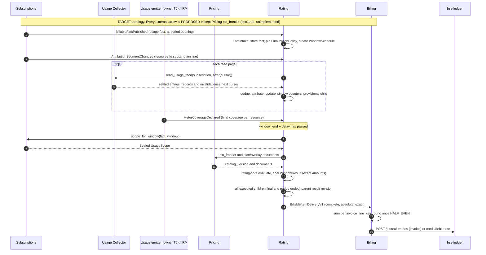

Created:  2026-08-24 by Virtuozzo International GmbH
Updated:  2026-10-02 by Virtuozzo International GmbH

<!-- CONFLUENCE_TITLE: [BSS]: Rating — Technical Design (implementation contract) -->
<!-- Related: ./PRD.md, ./SEAMS.md, ./DECISIONS.md, ./ADR/, ./design/ | Owners: BSS Rating team -->

# Technical Design — Rating (Evaluation Core + Pipeline)

<!-- toc -->

- [0. How to read this design](#0-how-to-read-this-design)
- [1. Architecture Overview](#1-architecture-overview)
  - [1.1 Architectural Vision](#11-architectural-vision)
  - [1.2 Architecture Drivers](#12-architecture-drivers)
  - [1.3 Architecture Layers](#13-architecture-layers)
- [2. Principles & Constraints](#2-principles--constraints)
  - [2.1 Design Principles](#21-design-principles)
  - [2.2 Constraints](#22-constraints)
- [3. Technical Architecture](#3-technical-architecture)
  - [3.1 Domain Model](#31-domain-model)
  - [3.2 Component Model](#32-component-model)
  - [3.3 API Contracts](#33-api-contracts)
  - [3.4 Internal Dependencies](#34-internal-dependencies)
  - [3.5 External Dependencies](#35-external-dependencies)
  - [3.6 Interactions & Sequences](#36-interactions--sequences)
  - [3.7 Database schemas & tables](#37-database-schemas--tables)
  - [3.8 Deployment Topology](#38-deployment-topology)
- [4. Additional context](#4-additional-context)
  - [4.1 Versioning and historical correctness](#41-versioning-and-historical-correctness)
  - [4.2 Transactions, idempotency, delivery semantics](#42-transactions-idempotency-delivery-semantics)
  - [4.3 Aggregation semantics](#43-aggregation-semantics)
  - [4.4 Failure model](#44-failure-model)
  - [4.5 Concurrency](#45-concurrency)
  - [4.6 Reconciliation](#46-reconciliation)
  - [4.7 Observability](#47-observability)
  - [4.8 Multi-tenancy and authorization](#48-multi-tenancy-and-authorization)
  - [4.9 NFR mapping](#49-nfr-mapping)
  - [4.10 Rollout and launch scope](#410-rollout-and-launch-scope)
  - [4.11 Implementer quick reference](#411-implementer-quick-reference)
- [5. Traceability](#5-traceability)

<!-- /toc -->

- [ ] `p1` - **ID**: `cpt-cf-bss-rating-design-main`

> **This document is the canonical implementation contract for the Rating gear.** Rules defined
> here are defined **once**; the slice documents under [`design/`](./design/) refine the pricing
> semantics of each evaluation step (slices 01–10) and the pipeline mechanics (slices 11–16) and
> refer back here instead of restating. What every dependency actually provides today is recorded
> in [`SEAMS.md`](./SEAMS.md); open and decided decisions are in [`DECISIONS.md`](./DECISIONS.md).

## 0. How to read this design

Rating's cross-gear seams are designed against two sources that do not agree everywhere:

1. **The repository** — what the dependency gears' code and accepted documents contain today
   (SEAMS §A–§K, verified 2026-10-01; the usage-collector re-verified at upstream `main` on
   2026-10-02, because this branch's base predates its redesign).
2. **The Seam Atlas v2 contract baseline 1.1** (2026-09-30, "the Atlas") — a proposed target for
   the Orders Lifecycle and Rating seams (contracts C00–C10, decisions D01–D15). It was audited
   against a different repository (`diffora/gears-rust @ 01f670fa4e5c`); its Pricing model does not
   exist here (R-17). Rating adopts it where it is consistent with this repository's owners
   (T-D-43); SEAMS §L records the status of every Atlas contract. Its **Plus overlay** (2026-10-02)
   grades each seam by whether both owners have written it down, adds decision tickets T1–T12 and
   asks for the Atlas usage feed to be replaced by the collector's own design; SEAMS §M-13 maps it.

Labels used throughout:

| Label | Meaning |
|---|---|
| **CURRENT** | Exists in the dependency's code, or in its accepted documents where it has no code. |
| **TARGET** | The contract Rating is designed against; for an external contract it is **PROPOSED — NOT YET IMPLEMENTED** until its owner adopts it. |
| **MIGRATION** | Interim behaviour Rating runs until a TARGET contract exists. |
| **OPEN DEPENDENCY** / `[DEPENDENCY GAP R-nn]` | Rating cannot implement the path until the decision or contract named exists. |
| **UNKNOWN / EXTERNAL CONTRACT REQUIRED** | The detail is not specified by anybody; Rating states what it needs and does not guess. |
| **CONTRACT CONFLICT** | Two specifications disagree; the row in DECISIONS names the decision owed. |
| **DOC/CODE DRIFT** | A dependency's code contradicts its own documents. |

Rating-owned mechanisms (tables, keys, transactions, the scheduler, the core) are TARGET by
definition: Rating has no code yet (`gears/bss/rating` holds `gear.toml` and `docs/` only).

## 1. Architecture Overview

### 1.1 Architectural Vision

Rating turns **accepted usage** and **commercial facts** into **deterministic, exact, replayable
results** that Billing invoices. It sits between metering (`usage-collector`) and invoicing (a
Billing gear that does not exist yet), and reads prices from `pricing` and commercial context from
`subscriptions`:

```text
                         TARGET topology (CURRENT status per arrow in SEAMS)
 usage-collector ─ read_usage_feed pages (records, invalidation entries) ───────┐
 emitter / IRM ─── coverage declarations, historical inventory (C05) ───────────┤
 subscriptions ─── BillableFactPublished, AttributionSegmentChanged,            │
                   UsageScopeSealed + SubscriptionBillingReadV1 recovery reads ─┤
                                                                                ▼
            ┌──────────────────────────── rating gear ─────────────────────────────┐
            │ inbox ─▶ usage store ─▶ attribution ─▶ window counters (Q)            │
            │ fact projection ─▶ WindowScheduler ─▶ Rater ─▶ rating-core (pure)     │
            │                                         │                             │
            │ WindowResult (per child window) ─▶ ParentRollup ─▶ delivery outbox    │
            └─────────────────────────────────────────┬─────────────────────────────┘
 pricing ── pin_frontier + plan/overlay documents ────┘ (pull, ClientHub)
                                                      │
                     BillableItemDeliveryV1 (+ RatingRunReadV1 recovery) ▼
                                         Billing (rounds, freezes, posts) ─▶ bss-ledger
```

The same chain as a sequence (TARGET; each external step is labelled in §3.5 and SEAMS §L):



**Rating owns**: its copy of rated usage and of every upstream input it rated with; the
attribution projection; windowed quantities (`Q`) and their versions; child windows, their schedule
and their exact results; parent-fact result revisions and their delivery outbox; content-addressed
rating snapshots; correction lineage. **Rating does not own**: raw measurements (usage-collector),
prices, windows, overlays and catalog versions (pricing / products registry), subscription
lifecycle, commercial periods, payer and attribution (subscriptions), coverage and inventory
(IRM/emitter), FX rates, coupon redemption, commitment balances (Contracts), period state,
invoice rounding, tax, posting and revenue recognition (Billing / `bss-ledger`).

The gear is two parts in one deployable (ADR-0002):

- **`rating-core`** — pure, I/O-free: given a frozen `EvaluationInput` it computes an
  `EvaluationOutcome` (lines, exact amounts, lineage, obligations). Same input ⇒ byte-identical
  output, on any worker, at any later time.
- **The pipeline** (`rating` crate) — inbox, projections, counters, scheduler, input freezing,
  core calls, result persistence, roll-up and delivery.

Every result is reproducible **from Rating's database alone** (T-D-36): usage records, pricing
documents, subscription versions, facts, scope proofs and coverage declarations a result used are
stored immutably and referenced from the result's input manifest (§4.1).

### 1.2 Architecture Drivers

#### Functional Drivers

| Requirement | Design response |
|---|---|
| `cpt-cf-bss-rating-fr-deterministic-evaluation-api` | `rating_core::evaluate(&EvaluationInput) -> Result<EvaluationOutcome, EvaluationError>` (§3.3). |
| `cpt-cf-bss-rating-fr-pre-purchase-evaluation` | `OrderEvaluationV1::evaluate` — pure, non-authoritative, usage excluded (T-D-49, §3.3); prices blocked on R-02; priority R-24. |
| `cpt-cf-bss-rating-fr-single-outcome-determinism` | Every child result records an input manifest and `input_digest` (§4.1); `rating-core` is pure. |
| `cpt-cf-bss-rating-fr-snapshot-carry` | Every line references a content-addressed `rating_snapshot`; provenance carries `{sku_id, plan_id, price_id}` (§3.7, §4.1). |
| `cpt-cf-bss-rating-fr-idempotency` | Usage dedup on the collector record id + natural key; child results by `(child_id, window_revision)`; parent results by `(fact_id, result_revision)`; delivery by `delivery_id` (§4.2). |
| `cpt-cf-bss-rating-fr-non-negative-price` | Emission guard in `rating-core` step 9 (slice 01 §4.4). |
| `cpt-cf-bss-rating-fr-separation` | Results are append-only revisions; Rating never reads or writes invoices; a correction is a new revision (§4.2). |
| `cpt-cf-bss-rating-fr-evaluation-order` | Compiled step order in `rating-core` (slice 01). |
| `cpt-cf-bss-rating-fr-base-catalog-selection`, `cpt-cf-bss-rating-fr-price-eligibility-grandfathering`, `cpt-cf-bss-rating-fr-plan-phases` | Slice 02 over the pinned plan document, cross-checked against the fact's `priceId` (R-18). |
| `cpt-cf-bss-rating-fr-flat-pricing`, `cpt-cf-bss-rating-fr-per-unit-pricing`, `cpt-cf-bss-rating-fr-tiered-graduated`, `cpt-cf-bss-rating-fr-volume-variant-a`, `cpt-cf-bss-rating-fr-package-pricing`, `cpt-cf-bss-rating-fr-hybrid-pricing` | Slice 03 formulas; §4.3. |
| `cpt-cf-bss-rating-fr-level-aggregation` | Suspended (R-06): only `sum` meters are rated. |
| `cpt-cf-bss-rating-fr-tier-aggregation-window`, `cpt-cf-bss-rating-fr-billing-granularity`, `cpt-cf-bss-rating-fr-meter-mapping-granularity` | Child windows from the price row's `tierAggregationWindow` (incl. `per_hour`), tiers reset per window (T-D-48, §4.3). |
| `cpt-cf-bss-rating-fr-dimensional-pricing`, `cpt-cf-bss-rating-fr-dimension-population-contract` | `dimension_key` from declared metadata (R-16, slice 12). |
| `cpt-cf-bss-rating-fr-composite-meter-eval` | Composite child over ≥ 2 input counters (slice 03, slice 13). |
| `cpt-cf-bss-rating-fr-priceoverlay-scope-mapping`, `cpt-cf-bss-rating-fr-overlay-stacking`, `cpt-cf-bss-rating-fr-customer-contract-overlay`, `cpt-cf-bss-rating-fr-bounded-composition-cap` | Slice 04 over overlay documents at the pin; contract overlays have no source (R-11). |
| `cpt-cf-bss-rating-fr-commitment-drawdown`, `cpt-cf-bss-rating-fr-committed-usage`, `cpt-cf-bss-rating-fr-reservation-consumption-flavor`, `cpt-cf-bss-rating-fr-capacity-charge` | Slice 05; commitment pools dormant (R-11). |
| `cpt-cf-bss-rating-fr-coupon-application-order`, `cpt-cf-bss-rating-fr-coupon-stacking` | Slice 06; fail closed (R-11). |
| `cpt-cf-bss-rating-fr-multi-currency`, `cpt-cf-bss-rating-fr-fx-policy` | Slice 07; native currency only (R-07). |
| `cpt-cf-bss-rating-fr-posted-period-protection`, `cpt-cf-bss-rating-fr-late-arriving-usage-reresolve`, `cpt-cf-bss-rating-fr-usage-corrections` | Re-evaluation of affected child windows with the pin-of-record → new parent revision; Billing derives the posted-period adjustment (T-D-45, slice 08). |
| `cpt-cf-bss-rating-fr-period-floor-cap-obligation`, `cpt-cf-bss-rating-fr-mid-cycle-proration`, `cpt-cf-bss-rating-fr-plan-change-proration` | Split points and proration (slice 09); obligation on the parent delivery (R-22). |
| `cpt-cf-bss-rating-fr-asc606-traceable-identifiers`, `cpt-cf-bss-rating-fr-publish-approval-governance` | Slice 10. |
| `cpt-cf-bss-rating-interface-tariff-evaluation`, `cpt-cf-bss-rating-contract-rating-handoff` | `rating-core` API (§3.3) — in-process, intra-gear. |
| `cpt-cf-bss-rating-contract-pricing-readmodel`, `cpt-cf-bss-rating-contract-subscriptions-input`, `cpt-cf-bss-rating-contract-billing-periodstate`, `cpt-cf-bss-rating-contract-finance-fx-input`, `cpt-cf-bss-rating-contract-promotions-coupon`, `cpt-cf-bss-rating-contract-contracts-input` | §3.5, slice 11, [`SEAMS.md`](./SEAMS.md). |
| `cpt-cf-bss-rating-usecase-tariff-editor`, `cpt-cf-bss-rating-usecase-partner-priceoverlay`, `cpt-cf-bss-rating-usecase-finance-simulation` | Authoring is the pricing gear's; simulation is deferred (T-D-32). |

#### NFR Allocation

| NFR | Mechanism | Status |
|---|---|---|
| `cpt-cf-bss-rating-nfr-throughput-latency` | Page transactions of ≤ 1 000 records; per-child coalesced evaluation; pure core; §4.9 sizing. | End-to-end time is bounded by the finalization delay, not Rating (R-13). |
| `cpt-cf-bss-rating-nfr-horizontal-scale` | Work partitioned by `hash(subscription_id)`; row locks on one child, one counter, one parent only; no cross-subscription lock (§4.5). | Design. |
| `cpt-cf-bss-rating-nfr-audit-segregation` | Publish governance stays in pricing Slice 5; Rating's operator actions are authorized and audited (§4.8). | Validator hook missing (R-12). |
| `cpt-cf-bss-rating-nfr-resilience` | Inbox + idempotent transactions, CAS checkpoints, input-generation CAS, fail-closed pending reasons (§4.2, §4.4). | Design. |

#### Key ADRs

| ADR ID | Decision summary |
|---|---|
| `cpt-cf-bss-rating-adr-scope-key-adoption` | Adopt the pricing canonical scope key verbatim (challenged by Atlas D06 — R-18). |
| `cpt-cf-bss-rating-adr-rating-gear-consolidation` | One `rating` gear; `rating-core` is an I/O-free crate. |

### 1.3 Architecture Layers

- [ ] `p1` - **ID**: `cpt-cf-bss-rating-tech-stack-main`

| Crate | Layer | Contents | Allowed dependencies |
|---|---|---|---|
| `cf-gears-bss-rating-sdk` (`gears/bss/rating/rating-sdk`) | Public contract | `RatingRunReadV1`, `RatingRunControlV1`, `OrderEvaluationV1` traits; `BillableItemDeliveryV1`, `WindowResultView`, `RatingRunView`, `ExactAmount`; error mapping to `CanonicalError`. | `toolkit-security`, `toolkit-canonical-errors`, `time`, `uuid`, `rust_decimal`, `serde`. |
| `cf-gears-bss-rating-core` (`gears/bss/rating/rating-core`) | Domain (pure) | `evaluate`, `evaluate_order`, `split_points`, `window_geometry`, per-step evaluators, `ExactAmount` arithmetic, corpus adapter (`bss_fixtures_conformance::CorpusEvaluator`). | `rust_decimal`, `num-rational`/`num-bigint` (or an equivalent exact rational), `time`, `uuid`, `serde`, `bss-fixtures`. **No** tokio, sea-orm, http, ClientHub — enforced by a CI deny-list. |
| `cf-gears-bss-rating` (`gears/bss/rating/rating`) | API / application / infrastructure | `#[toolkit::gear]` module with `stateful` lifecycle; inbox, feed readers, projections, scheduler, rater workers, roll-up, delivery; operator REST (`OperationBuilder`); SecureORM repositories; migrations; `toolkit_db::outbox` queues. | Platform toolkit crates, `bss-coord`, `cf-gears-event-broker-sdk` (feature-gated, TARGET), upstream SDKs (`bss-pricing-sdk`, `usage-collector-sdk`, `subscriptions-sdk` when it exists). |

Layout follows `docs/toolkit_unified_system/02_gear_layout_and_sdk_pattern.md`; inter-gear calls go
through ClientHub-resolved SDK traits; repositories take `&impl DBRunner`; multi-step writes run in
`SecureConn::in_transaction_mapped` (`11_database_patterns.md`). New dependency crates (exact
rational arithmetic) follow `guidelines/DEPENDENCIES.md`.

## 2. Principles & Constraints

### 2.1 Design Principles

- [ ] `p1` - **ID**: `cpt-cf-bss-rating-principle-pure-function-core`
  `rating-core` performs no I/O and reads no clock. Everything it needs — pinned pricing documents,
  the fact and subscription versions, per-slice quantities with `q_version`, the child window
  geometry — arrives in one `EvaluationInput`. Aggregation is the pipeline's.
- [ ] `p1` - **ID**: `cpt-cf-bss-rating-principle-fixed-rule-order`
  PRD §17.1 steps 1–9 are compiled in; no configuration reorders them.
- [ ] `p1` - **ID**: `cpt-cf-bss-rating-principle-fail-closed`
  Missing or inconsistent input produces a typed `EvaluationError` or a `pending_reason` — never a
  default price, a zero rate, a guessed subscription, or a zero for missing usage evidence.
- [ ] `p1` - **ID**: `cpt-cf-bss-rating-principle-adopt-the-sor`
  Scope key, windows, overlays, model kinds and enums are consumed exactly as pricing publishes them;
  commercial periods, payer and attribution exactly as Subscriptions publishes them.
- [ ] `p1` - **ID**: `cpt-cf-bss-rating-principle-copy-what-you-rate`
  Every upstream fact a result depends on is persisted in Rating, immutably, under the producer's
  version identifier (T-D-36).
- [ ] `p1` - **ID**: `cpt-cf-bss-rating-principle-append-only-money`
  Money-bearing rows (`rating_window_result`, `rating_fact_result`, `rating_delivery`) are
  insert-only. A changed outcome is a new revision; nothing is updated in place.
- [ ] `p1` - **ID**: `cpt-cf-bss-rating-principle-absolute-results`
  Rating publishes complete absolute results per parent fact, never deltas (T-D-45). Whether a
  revision replaces a draft or becomes a credit/debit note is Billing's decision.
- [ ] `p1` - **ID**: `cpt-cf-bss-rating-principle-evidence-before-final`
  A result becomes final only on proven-complete inputs (T-D-47). Time alone, a feed watermark, or an
  empty page never proves completeness.

### 2.2 Constraints

- [ ] `p1` - **ID**: `cpt-cf-bss-rating-constraint-posted-immutability`
  Rating never reads or mutates an invoice and keeps no period fence. Posted-period immutability is
  enforced by Billing comparing each parent revision with its accepted target (Atlas C08); Rating's
  obligation is that every revision is complete, monotonic, and replayable (T-D-45).
- [ ] `p1` - **ID**: `cpt-cf-bss-rating-constraint-domain-boundaries`
  No tax, no currency rounding, no revenue recognition, no journal posting, no coupon lifecycle, no
  spend enforcement (PRD §5.2). Rating never calls `bss-ledger`.
- [ ] `p1` - **ID**: `cpt-cf-bss-rating-constraint-stateless-hot-path`
  `rating-core` owns no store. State owned by another gear is held only as immutable, version-keyed
  copies.
- [ ] `p1` - **ID**: `cpt-cf-bss-rating-constraint-in-process-contracts`
  Inter-gear reads use ClientHub SDK traits. Every inbound fact passes one inbox (T-D-51); pull reads
  are always sufficient. **CURRENT**: no cross-gear event is delivered in this repository — the
  `event-broker` gear is a scaffold (`gears/system/event-broker/event-broker/src/module.rs:1-11`),
  the pricing outbox has no relay (`pricing/src/module.rs:1210-1215`), and Ledger publishing is
  parked. **TARGET**: events via `cf-gears-event-broker-sdk` are an additional, lower-latency
  source into the same inbox.
- [ ] `p1` - **ID**: `cpt-cf-bss-rating-constraint-native-currency-launch`
  A child is rateable only when the billing currency equals the selected price row's currency;
  otherwise `fx_not_supported` (R-07).
- [ ] `p1` - **ID**: `cpt-cf-bss-rating-constraint-exact-no-rounding`
  Amounts are exact reduced rationals in minor units of the price currency (T-D-46). Rating never
  rounds; Billing rounds the aggregate of each `invoice_line_key` once.

## 3. Technical Architecture

### 3.1 Domain Model

**Upstream objects** (status: SEAMS):

| Concept | Owner | Identifier | Versioning | How Rating obtains it | Status |
|---|---|---|---|---|---|
| Usage entry | usage-collector | TARGET V1 (upstream `main` docs): `id` = UUIDv5 over `(tenant, gts_type_id, idempotency_key, window_start, window_end, entry_type)` (ADR-0007); code today: UUIDv5 over `(tenant, gts_id, created_at, key)` | immutable; withdrawn only by an invalidation entry | `read_usage_feed` page → `rating_usage_record` | feed DOCUMENTED on upstream `main`, not implemented (R-01) |
| Invalidation entry | usage-collector | an entry with `entry_type = invalidation`, server-stamped `invalidates` (ADR-0010) | append-only | same feed | DOCUMENTED on upstream `main`; code has a `status` flip (DOC/CODE DRIFT the collector acknowledges) |
| Usage type (meter) | types-registry (ADR-0008 of the collector) | `gts_type_id` | fold, canonical unit, metadata immutable | declaration read from types-registry (slice 12 §4.7); referenced by pricing row `meter` (R-09) | DOCUMENTED; code still has an in-collector counter/gauge catalog |
| Coverage declaration | usage emitter (owner unassigned, overlay T6) | `(coverage_id, version)` | superseding versions | `MeterCoverageDeclared` / `MeterCoverageReadV1` | PROPOSED (Atlas C05); IRM has no code |
| Inventory snapshot | IRM | `snapshot_id` | immutable | `ResourceHistoryV1` (via Subscriptions scope proof) | PROPOSED; absent |
| Plan / revision, price row, price window, overlay | pricing | `plan_id`+`revision`; `price_id`; window id; `price_overlay_id`+`revision` | immutable once published; future-only effective dating | plan/overlay documents at a `catalog_version` | CURRENT model; read API MISSING (R-02) |
| Catalog version | products registry (sole incrementer) | `CatalogVersion(u64)` per tenant | prefix-closed pin frontier | `PricingCatalogClientV1::pin_frontier` | declared, unimplemented (R-02); registry dev stand-in only |
| Subscription version | subscriptions | `subscription_id` + `version` | append-only revisions | subscription read → `rating_subscription_version` | ASSUMED (docs only) |
| Commercial fact | subscriptions | CURRENT `BillableItemCreated` key `(subscriptionId, billing period, lineKey)` / one-time `(subscriptionId, priceId)`; TARGET `BillableFact {fact_id, fact_version, payload_digest}` | TARGET: new version per change | inbox → `rating_fact` | ASSUMED / PROPOSED (R-03, R-20) |
| Billing group / sealed set | subscriptions | TARGET `billing_group_id`, `composition_version` | sealed sets versioned | fact payload | PROPOSED; MIGRATION derived key |
| Attribution segment | subscriptions | TARGET `(segment_id, segment_version)`, gap-free `lifecycle_seq` per `resource_tenant_id` | full-state replacement | inbox → `rating_attribution_segment` | PROPOSED (R-25) |
| Usage scope proof | subscriptions | TARGET `(scope_id, scope_version)`, content-addressed | immutable | `scope_for_window` → `rating_usage_scope` | PROPOSED |

**Rating-owned objects**:

| Concept | Identifier | Mutability | Created by |
|---|---|---|---|
| Inbox entry | `(tenant_id, source, business_id, version)` | insert-only; state transitions `accepted → applied | quarantined` | every intake path (T-D-51) |
| Source checkpoint | `source_id` | CAS-updated | feed readers / recovery sweeps |
| Fact projection | `(tenant_id, fact_id, fact_version)` | insert-only per version | fact intake |
| Child window | `child_id` = UUIDv5(`WindowEvaluationKey`) | current pointer + status mutable; history in results | scheduler (T-D-44) |
| Window schedule | `(tenant_id, fact_id)` | `next_due_window_start` cursor CAS-advanced | fact intake |
| Window counter | aggregation key + window + layout + slice | upsert, `q_version + 1` per change | ingestion |
| Window result | `(child_id, window_revision)` | insert-only | rater |
| Parent result | `(fact_id, result_revision)` | insert-only | roll-up |
| Delivery | `delivery_id` | insert-only; publication state | roll-up (outbox) |
| Rating snapshot | `snapshot_id` = `rsnap1:` + SHA-256 | insert-only, content-addressed | rater |
| Exception | `exception_id` | open → resolved | any stage |
| Re-rate run | `run_id` | status transitions | operator |

**Child kinds** (exhaustive):

| Kind | Parent fact kind | Canonical window | Quantity | Trigger |
|---|---|---|---|---|
| `usage_window` | usage | from the price row's `tierAggregationWindow` (`per_hour`, `calendar_month`, `invoice_period`, `subscription_lifetime`) clipped to the fact's served extent | window counters per slice | counter change (provisional); due time (final) |
| `usage_event` | usage | none (`per_event`) — one child per record | the record's quantity | record ingestion |
| `period_line` | recurring | the fact's billing period | seat / manual quantity from the fact or subscription version | fact acceptance |
| `one_time` | one_time | the occurrence instant | 1 × price | fact acceptance — **only if R-19 is accepted**; until then one-time facts are stored and not rated (T-D-18) |

`WindowEvaluationKey = {fact_id, canonical_window_start, aggregation_key}` with
`AggregationKey = {seller_tenant_id, payer_tenant_id, resource_tenant_id, subscription_id,
sub_line_key, meter, dimension_key, scope: subscription_line | resource(resource_id)}` (Atlas C10,
T-D-50; interim `scope = subscription_line` only — R-23). Its canonical string is
`wk1|{fact_id}|{window_start RFC3339 UTC}|{agg_key canonical JSON}` and
`child_id = UUIDv5(NS_RATING_CHILD, that string)`.

**Expected children of a fact** (`expected_children(fact)`, used by the scheduler and by roll-up
completeness): `period_line` / `one_time` — exactly one; usage, `subscription_line` scope — one per
canonical window of `window_geometry(fact)` × one per meter that the line's plan prices at the pin
(`dimension_key = ""` at launch, R-16), so a proven-empty window still has its children; usage,
`resource` scope (not expressible today, R-23) — additionally × the resources of the window's sealed
scope. Never derived from the counters that happen to exist.

Child creation has two owners: `CounterMaterializer` inserts a `provisional` usage child when an
attributed record is counted and its fact is known; `WindowScheduler` inserts every expected child
when it becomes due. Without a known fact no child exists (counters only).

**Slices are lines of one child**, not separate children: split points inside one fact (price-window
activation, phase conversion, a money-only term-slice boundary, seat change for `period_line`)
divide a child into slices evaluated together with band continuity (§4.3). Boundaries **between
facts** (billing-period boundary, plan change to a new `sub_line_key`, payer change) separate
children; where a tier window spans such a boundary the children form a **window group** (§4.3).

### 3.2 Component Model

Logical components (one per slice; each slice refines its component):

- [ ] `p1` - **ID**: `cpt-cf-bss-rating-component-foundation`
  step order, input validation, guards, digest (slice 01).
- [ ] `p1` - **ID**: `cpt-cf-bss-rating-component-selection-eligibility`
  steps 1–2 (slice 02).
- [ ] `p1` - **ID**: `cpt-cf-bss-rating-component-metering-models`
  step 3 (slice 03).
- [ ] `p1` - **ID**: `cpt-cf-bss-rating-component-overlays-precedence`
  steps 4–5 (slice 04).
- [ ] `p1` - **ID**: `cpt-cf-bss-rating-component-commitments-reservations`
  step 6 (slice 05).
- [ ] `p2` - **ID**: `cpt-cf-bss-rating-component-coupons`
  step 7 (slice 06).
- [ ] `p1` - **ID**: `cpt-cf-bss-rating-component-currency-fx`
  step 8 (slice 07).
- [ ] `p2` - **ID**: `cpt-cf-bss-rating-component-retroactivity-corrections`
  re-evaluation, revisions, re-rate (slice 08).
- [ ] `p2` - **ID**: `cpt-cf-bss-rating-component-period-plan-change`
  split points, proration, obligations (slice 09).
- [ ] `p2` - **ID**: `cpt-cf-bss-rating-component-governance-asc606`
  validators, ASC 606, bundles (slice 10).
- [ ] `p1` - **ID**: `cpt-cf-bss-rating-component-consumer-contracts`
  boundary adapters, inbox, order evaluation (slice 11).
- [ ] `p1` - **ID**: `cpt-cf-bss-rating-component-usage-ingestion`
  usage feed intake (slice 12).
- [ ] `p1` - **ID**: `cpt-cf-bss-rating-component-q-store`
  counters, attribution projection, evidence (slice 13).
- [ ] `p1` - **ID**: `cpt-cf-bss-rating-component-unit-synthesis`
  facts, child windows, scheduler, rater (slice 14).
- [ ] `p1` - **ID**: `cpt-cf-bss-rating-component-rated-output`
  results, roll-up, snapshots (slice 15).
- [ ] `p1` - **ID**: `cpt-cf-bss-rating-component-billing-handoff`
  delivery, recovery reads, operations (slice 16).

Runtime components. Every component below is a module of the `rating` crate unless marked `rating-core`. "Abstraction
status": **R** required domain abstraction, **M** concrete module/type to implement.

| Component | Status | Inputs → outputs | Owned state | Transaction boundary | Idempotency / partition key | Retry and failure | Recovery | Observability |
|---|---|---|---|---|---|---|---|---|
| `Inbox` | R, M | any non-usage upstream fact → `rating_inbox` row (usage dedups in `rating_usage_record`, which is its inbox) | `rating_inbox` | caller's transaction | `(tenant, source, business_id, version)` + digest | duplicate same digest → no-op; different digest → quarantine | operator release | `rating_inbox_quarantined_total{source}` |
| `UsageFeedReader` | M | `read_usage_feed` page → stored entries + counter changes | `rating_source_checkpoint(usage:*)` | one transaction per page | checkpoint CAS on cursor; lease `rating:usage-feed:{subscription}` | `Unavailable` → backoff 1 s→5 min; `CursorBeyondRetention` → restart from `Oldest` | replay from `Oldest` (idempotent) | feed lag, cursor age, restarts |
| `UsageNormalizer` | M (pure) | wire record → `NormalizedUsage` | — | — | — | malformed → `usage_malformed` exception, page continues | operator retry | `rating_usage_rejected_total{reason}` |
| `UsageRepo` (dedup) | M | `NormalizedUsage` → `rating_usage_record` | `rating_usage_record` | page transaction | PK `(tenant, usage_record_id)` + natural key unique | content conflict → alarm, stored row wins | — | `rating_usage_duplicate_total`, `…_conflict_total` |
| `AttributionProjector` | M | segment / scope facts → projection rows | `rating_attribution_segment`, `rating_usage_scope` | one transaction per inbox batch | `(segment_id, segment_version)`; gap-free `lifecycle_seq` per `resource_tenant_id` | gap → projection paused, `segments_since` fill | rebuild from `segments_since` | `rating_attribution_gap`, `…_unattributed` |
| `Attributor` | M (pure lookup) | record + projection → `Attribution` or wait | sets attribution columns once | page transaction | — | no segment → `awaiting_attribution`; ambiguous → quarantine | applied when the segment arrives | `rating_attribution_unresolved` |
| `WindowResolver` | M (pure, shared with core) | spec + instant/interval → canonical window | — | — | — | crossing boundary → `boundary_split_required` | emitter re-splits | `rating_boundary_split_required_total` |
| `CounterMaterializer` | M | attributed record → counter delta | `rating_window_counter`, `rating_window_layout`, `rating_meter_spec` | page transaction | row upsert; `q_version + 1` | serialization failure → retry ×3 | re-materialize from records | `rating_q_materialize_seconds`, `rating_q_rematerialized_total` |
| `FactIntake` | M | inbox fact → `rating_fact`, schedule, children | `rating_fact`, `rating_window_schedule`, `rating_child_window` | one transaction per fact | `(fact_id, fact_version)`; digest | digest conflict → quarantine | `period_facts` / `facts` reads | `rating_fact_versions_total`, `rating_fact_missing` |
| `WindowScheduler` | R, M | due scan → child work items | `rating_window_schedule.next_due_window_start` | one transaction per fact batch | child work dedup on `child_id` | crash → cursor not advanced, rescan | catch-up from `next_due_window_start` | `rating_scheduler_backlog`, `…_catchup_windows_total` |
| `EvidenceGate` | R, M | child + evidence rows → `final_eligible | pending(reason)` | `pending_reason` on child | rater transaction (read) | — | missing evidence → pending, retried on wake-up | evidence arrival wakes children | `rating_child_pending{reason}` |
| `PricingDocumentStore` | M | pin → stored plan/overlay documents | `rating_catalog_document` | own transaction, before rating | `(tenant, catalog_version, subject)` + hash | `Unavailable` → backoff; hash mismatch → alarm | refetch | `rating_pin_age_seconds`, fetch errors |
| `ContextAssembler` | R, M | child + stored copies → `EvaluationInput` + manifest | — | inside rater transaction (reads only) | `input_digest` | missing copy → requeue after ensure | — | `rating_context_failclosed_total{reason}` |
| `Rater` | M | work item → window result | `rating_child_window` pointer | **one transaction per child** | input-generation CAS; `(child_id, window_revision)` | `Unavailable` → backoff; `EvaluationError` → exception, no retry until input change | redelivery is a no-op on unchanged inputs | `rating_rating_duration_seconds`, failures |
| `rating-core::evaluate` | R (`rating-core`) | `EvaluationInput` → `EvaluationOutcome` | none | none | pure | typed error | — | — |
| `OutcomeMapper` | M | outcome → result rows + snapshot rows | — | rater transaction | content-addressed snapshot | — | — | — |
| `ParentRollup` | R, M | final child results of one fact → parent result | `rating_fact_result` | **one transaction per fact** | parent CAS on the child-revision vector; `(fact_id, result_revision)` | stale vector → abort, retry | triggered by child final / fact version / reconciliation | `rating_rollup_superseded_total`, `rating_parent_incomplete` |
| `DeliveryPublisher` | M | delivery outbox rows → Billing | `rating_delivery.published_*` | outbox handler | `delivery_id` | at-least-once; broker unavailable → retry | `RatingRunReadV1` pull always available | `rating_delivery_lag_seconds` |
| `BillingHintSink` | M | `BillingPeriodStateChanged` → `rating_billing_hint` | `rating_billing_hint` | own | `(billing_group_id, state_version)` | ignore unknown | — | observational only |
| `Reconciler` | M | sweeps (§4.6) → repairs/requeue/exceptions | — | small transactions | — | — | — | `rating_reconciliation_mismatch_total{check}` |
| `RerateService` | M | operator selector → `rating_rerate_run` + work | `rating_rerate_run` | batches | `run_id` | rate-limited enqueue | resumable | `rating_rerate_children_total` |
| `BalanceEffectPublisher` | R (dormant) | final result → `CommitmentBalanceEffect` | `rating_balance_effect` | rater transaction | `(child_id, window_revision, pool_id)` | — | — | — (R-11) |
| `OrderEvaluator` | M | `OrderEvaluationRequest` → `OrderEvaluation` | none | none | pure | typed error | — | `rating_order_evaluation_seconds` |

**Obsolete abstractions** (removed by this revision, do not implement): `PeriodService` /
`close_period` / `rating_period` (T-D-42 → T-D-45); `ChargeFeed` / `rating_charge_entry` /
`rating_charge_feed` (T-D-40 → T-D-45); `rating_resource_binding` /
`SubscriptionsClientV1::resolve_resource` (→ T-D-52); `PeriodFactReader` as a dedicated cursor feed
(→ `FactIntake` over the inbox); `PeriodTick`, `CascadeRouter`, `RawUsageEvent`, `SessionMerger`
(already removed 2026-09-25).

### 3.3 API Contracts

- [ ] `p1` - **ID**: `cpt-cf-bss-rating-interface-core-evaluate`
  **`rating-core` (in-process, intra-gear).**
  - `evaluate(&EvaluationInput) -> Result<EvaluationOutcome, EvaluationError>`.
  - `split_points(&SplitInput) -> Vec<OffsetDateTime>` — pure; lays out counter slices.
  - `window_geometry(&WindowSpec, fact_served_extent) -> Vec<RatingWindow>` — pure; the expected
    child set of a fact (`RatingWindow = {window_start, window_end, served_from, served_to}`).
  - `EvaluationInput` = `{ child: ChildSpec, fact: FactVersion, catalog: PinnedCatalog {
    catalog_version, plans, overlays }, subscription: SubscriptionVersion, quantities:
    ChildQuantities { per_slice: [(slice_start, slice_end, Decimal, q_version)], layout_version },
    engine_version }`.
  - `EvaluationOutcome` = `{ lines: [RatedLine { line_key, slice_start, slice_end, sku_id, plan_id,
    price_id, model_kind, charge_kind, quantity, billable_quantity, exact_minor: ExactAmount,
    currency, gl_code, tax_category, invoice_line_template, snapshot: SnapshotBody, lineage }],
    obligations: [PeriodFloorCapObligation | TrueUpObligation], input_digest }`.
  - `ExactAmount = {numerator: i128-or-bigint string, denominator: positive string}`, reduced;
    unit = minor units of `currency` (T-D-46).
  - `evaluate_order(&OrderEvaluationInput) -> Result<OrderEvaluation, EvaluationError>` — same
    arithmetic, separate DTO (T-D-49).
  - Implements `bss_fixtures_conformance::CorpusEvaluator`.

- [ ] `p1` - **ID**: `cpt-cf-bss-rating-interface-rating-client`
  **Rating SDK (ClientHub)** — every method takes `ctx: &SecurityContext` first, returns
  `Result<_, CanonicalError>`, is PDP-authorized (§4.8). Names follow Atlas C06/C07; shapes are
  Rating's own contract.
  - `RatingRunReadV1::find_runs(ctx, subscription_id, billing_group_id, cursor?) -> RunPage` —
    Billing's recovery by business key (Atlas P8).
  - `RatingRunReadV1::get_run(ctx, run_id) -> Option<RatingRunView>` — a parent result with its
    manifest, state and pending reasons; `run_id` = `UUIDv5(fact_id, fact_version, result_revision)`.
  - `RatingRunReadV1::window_results(ctx, fact_id, cursor?) -> WindowResultPage` — child results and
    their inputs; inspection, **not** an invoice delivery (F34).
  - `RatingRunReadV1::deliveries_since(ctx, tenant_id, after_seq?, limit) -> DeliveryPage` — the
    commit-ordered delivery feed (pull transport for `BillableItemDeliveryV1`).
  - `RatingRunControlV1::request_rerate(ctx, RerateSelector, reason, CommandMeta) ->
    RunRequestReceipt` — administrative re-rate (T-D-21); asynchronous receipt.
  - `OrderEvaluationV1::evaluate(ctx, OrderEvaluationRequest) -> OrderEvaluation` (Atlas C06,
    T-D-49) — no persistence, no idempotency key.
  - **`BillableItemDeliveryV1`** (Atlas C07, adapted per T-D-46/T-D-53):
    `{ delivery_id, run_id, fact_id, fact_version, result_revision, previous_result_revision?,
    billing_group_id, billing_group_kind: published | derived, tenant_axes: {seller_tenant_id,
    payer_tenant_id, resource_tenant_id}, subscription_id, currency, manifest_digest,
    window_manifest_ref?, complete: true, zero_result: bool, evidence_mode: full | delay_only,
    engine_version, lines: [{ line_key, invoice_line_key, kind, quantity?, unit?,
    exact_minor: ExactAmount, gl_code?, tax_category?, invoice_line_template?, rounding_policy:
    HALF_EVEN, snapshot_id (composite, §4.1), provenance: [{ price_id, sku_id, plan_id, catalog_version, snapshot_id,
    slice: [from, to), window_key?, window_revision?, quantity?, exact_minor }] }],
    obligations: [PeriodFloorCapObligation] }`.
    A delivery is always a complete replacement of the fact's previous revision.

- [ ] `p2` - **ID**: `cpt-cf-bss-rating-interface-operator-rest`
  **Operator REST plane** under `/bss-rating/v1` (OperationBuilder, RFC 9457): `GET
  /runs/{runId}`, `GET /facts/{factId}/windows`, `GET /exceptions`, `POST
  /exceptions/{id}:retry`, `POST /reratings` (`rerate × execute`), `GET /snapshots/{snapshotId}`,
  `POST /inbox/{id}:release` (quarantine release, audited). No usage ingestion endpoint.

### 3.4 Internal Dependencies

`rating` → `rating-core` → `bss-fixtures` (`ModelKind`). `rating-sdk` depends on neither. Inside the
pipeline: `Inbox` → (`UsageFeedReader` → `UsageRepo` → `Attributor` → `CounterMaterializer`) and
(`FactIntake` → `WindowScheduler`) → work queue → `Rater` (`EvidenceGate`, `ContextAssembler`,
`rating-core`, `OutcomeMapper`) → `ParentRollup` → `DeliveryPublisher`.

### 3.5 External Dependencies

**Domain dependencies** (detail and evidence: SEAMS):

| Gear | Rating consumes / produces | CURRENT interface | TARGET interface | Mode | Status |
|---|---|---|---|---|---|
| usage-collector | usage entries (records, invalidations) | `UsageCollectorClientV1::list_usage_records` (keyset over `created_at, id`) — not used for charging | `read_usage_feed(FeedSubscription, FeedStart, until, limit)` — the collector's own design (upstream `main` DESIGN §3.3, ADR-0011); the Atlas `UsageFeedV1` is withdrawn by the Atlas Plus overlay | pull, SDK | **DOCUMENTED, not implemented** (R-01) |
| types-registry | usage type declarations (fold, canonical unit) | `TypesRegistryClient` schema reads | a typed declaration read (Atlas Plus X7) | pull, SDK | **PARTIAL** |
| Usage emitter (owner unassigned, overlay T6) / IRM | coverage declarations, inventory barrier | none (IRM docs only, no code; IRM excludes metering, PRD:392) | `MeterCoverageDeclared` / `MeterCoverageReadV1`, `ResourceHistoryV1` (Atlas C05) | event + pull | **ABSENT** (R-21) |
| pricing | pin frontier, plan/overlay documents | `PricingCatalogClientV1::pin_frontier` (declared, unimplemented, unregistered) | + `plan_document`, `overlay_documents` (J-2) | pull, SDK | **PARTIAL/MISSING** (R-02) |
| products registry | catalog version allocation | `CatalogVersionRegistryV1` (local-dev stand-in); `CatalogVersionPublished` is the registry's, unbuilt | registry implementation (J-3) | pricing-internal | **ASSUMED** |
| subscriptions | facts, subscription versions, attribution, scope proofs | none (docs: `BillableItemCreated`) | Atlas C04: `BillableFactPublished`, `BillableSetSealed`, `AttributionSegmentChanged`, `UsageScopeSealed`; `SubscriptionBillingReadV1::{facts, period_facts, segments_since, scope_for_window, bindings}` | event + pull | **ASSUMED / MISSING** (R-03, R-20, R-25) |
| Billing (no gear) | consumes deliveries; publishes period hints | none | `BillableItemDeliveryV1`, `RatingRunReadV1`; `BillingPeriodStateChanged` hint (Atlas C07/C08/C09) | event + pull | **ABSENT** (R-04, R-05) |
| bss-ledger | none directly | Billing posts with `pricing_snapshot_ref = snapshot_id` | unchanged | — | fields **CONFIRMED** |
| Orders Lifecycle | consumes `OrderEvaluationV1` | none (PRD expects a "price-evaluation contract") | Atlas C06 | sync SDK | **ASSUMED** (R-24) |
| Contracts | overlays, pools, balances, effects | first-draft PRD only | UNKNOWN / EXTERNAL CONTRACT REQUIRED | — | **MISSING** (R-11) |
| Promotions | coupon snapshots | none | UNKNOWN / EXTERNAL CONTRACT REQUIRED | — | **ABSENT** (R-11) |
| FX / Finance | rate snapshots | ledger-internal `RateProviderV1::fetch_latest` | pinnable rate snapshot (J-8) | — | **MISSING** (R-07) |
| account-management / tenant-resolver | tenant existence (operator plane only) | `AccountManagementClient::get_tenant`, `TenantResolverClient` | unchanged; commercial axes come from Subscriptions | sync SDK | **CONFIRMED** |

**Infrastructure dependencies**:

| Library / gear | Use | Status |
|---|---|---|
| `cf-gears-toolkit-db` (SecureORM, `DBRunner`, `AccessScope`) | all repositories | CONFIRMED |
| `toolkit_db::outbox` (`Outbox::builder(db).queue(name, Partitions::of(n)).leased(handler)`, `Outbox::enqueue(&db, Record)`) | `rating.child_work`, `rating.rollup`, `rating.delivery` queues | CONFIRMED (`libs/toolkit-db/src/outbox/`) |
| `cf-gears-bss-coord` (`LeaseManager::acquire(key, ttl)`, `with_ack_in_tx`) | single active feed reader / scheduler shard / reconciler | CONFIRMED (`gears/bss/libs/coord`) |
| ClientHub (`register`, `get`, `get_scoped`) | SDK clients | CONFIRMED |
| `cf-gears-event-broker-sdk` (`EventBrokerApi`, `ConsumerBuilder`, `LocalDbOffsetManager`, `DbProducer`) | TARGET event intake and delivery publication | SDK CONFIRMED; broker gear a scaffold — no delivery |
| `cf-gears-types-registry-sdk` / GTS | authz resource types; event schemas when published | CONFIRMED |
| OpenTelemetry via `docs/TRACING_SETUP.md` (metrics port in `domain/ports`, adapter in `infra/metrics.rs`) | metrics, spans | CONFIRMED |

### 3.6 Interactions & Sequences

Flows are written against TARGET contracts; MIGRATION steps are marked. Every "commit" is one
`in_transaction_mapped` transaction.

- [ ] `p1` - **ID**: `cpt-cf-bss-rating-seq-ingest-usage`
  **Flow A — new usage** (`UsageFeedReader`, one transaction per page):

  ```mermaid
  sequenceDiagram
      autonumber
      participant FR as UsageFeedReader
      participant UC as Usage Collector (read_usage_feed, DOCUMENTED)
      participant DB as Rating DB (one transaction)
      participant OB as outbox rating.child_work

      FR->>FR: hold lease rating:usage-feed:{subscription}
      alt no cursor in the checkpoint
          FR->>UC: read_usage_feed(subscription, Oldest, until = none, limit 1000)
      else
          FR->>UC: read_usage_feed(subscription, After(cursor), until = none, limit 1000)
      end
      UC-->>FR: FeedPage(entries, next_cursor)
      FR->>DB: BEGIN, SELECT checkpoint FOR UPDATE (CAS on cursor)
      loop each record
          FR->>DB: INSERT rating_usage_record ON CONFLICT DO NOTHING
          alt same id, different content_sha256
              FR->>DB: alarm usage_content_conflict, stored row wins
          else new record
              FR->>DB: look up attribution segment covering the interval
              alt no segment
                  FR->>DB: attribution_state = awaiting_attribution
              else interval crosses a window, slice or segment boundary
                  FR->>DB: attribution_state = boundary_split_required
              else attributed
                  FR->>DB: UPSERT rating_window_counter q += quantity, q_version + 1
                  opt parent fact known
                      FR->>DB: INSERT provisional child, bump input_generation of the window group
                      FR->>OB: enqueue child_id (same transaction)
                  end
              end
          end
      end
      FR->>DB: UPDATE checkpoint cursor, COMMIT
      Note over FR,DB: Crash before COMMIT: page is re-read and every insert is a no-op. Lost lease: CAS fails, rollback.
  ```

  ```text
  lease rating:usage-feed:{subscription} (bss-coord, TTL 60 s, renew 20 s)
  cp   = rating_source_checkpoint['usage:{subscription}']
  start = cp.cursor ? After(cp.cursor) : Oldest
  page = read_usage_feed(ctx, subscription, start, until = None, limit = 1000)  -- outside tx
  BEGIN
    SELECT … FROM rating_source_checkpoint WHERE source_id=… FOR UPDATE      -- CAS: cursor = cp.cursor
    for r in page.entries (feed order; an invalidation follows its target):
      r.entry_type = invalidation → Flow B step 2; continue
      n = normalize(r)        malformed / no interval → rating_exception; continue
                              type fold ≠ SUM → usage_type_not_chargeable; continue
      INSERT rating_usage_record … ON CONFLICT (tenant_id, usage_record_id) DO NOTHING
        conflict with different content_sha256 → alarm usage_content_conflict; continue
      a = attribute(n)        segment projection lookup by (resource_tenant, resource_id, interval)
        none        → attribution_state = awaiting_attribution; continue
        ambiguous   → quarantine (usage_ambiguous_attribution); continue
        crosses segment / window / price boundary → boundary_split_required; continue
      w = window_of(meter_spec(a.subscription, n.meter), n.interval)   no spec → awaiting_spec
      UPSERT rating_window_counter (agg_key(a), w, layout, slice) q += n.quantity, q_version += 1
      fact = usage fact of (a.subscription, a.sub_line_key, period containing w)
        known   → INSERT rating_child_window (provisional) ON CONFLICT DO NOTHING;
                  bump input_generation of the child and its window group;
                  Outbox.enqueue(rating.child_work, child_id)                    -- same tx
        unknown → counters only; rating_usage_without_fact gauge; fact recovery (Flow C step 6)
    UPDATE rating_source_checkpoint SET cursor = page.next_cursor, updated_at = now()
  COMMIT
  short or empty page → the reader is caught up; it polls again after rating.usage_feed.poll_interval
  ```

  - **Received identity**: `usage_record_id` (collector id) plus the collector's dedup identity
    `(tenant, gts_type_id, idempotency_key, window_start, window_end, entry_type)` (§4.2; slice 12
    §4.3). The cursor is the only position: there is no snapshot token, sequence or watermark.
  - **Usage type → meter**: `meter` = `gts_type` verbatim; the price row is the one in the
    subscription's pinned plan whose `meter` equals it (R-09). No registry lookup is needed at
    ingestion; `meter_unpriced` is raised at rating time.
  - **Resource → subscription**: the attribution projection (T-D-52). **CURRENT**: no source
    exists — every record stays `awaiting_attribution` (R-25).
  - **Metadata → `dimension_key`**: R-16 encoding; at launch the empty key only.
  - **Crash**: before commit nothing persists and the page is re-read; after commit the cursor has
    advanced with the effects. A reader that lost its lease fails the CAS and rolls back.
  - **Cursor semantics** (collector ADR-0011): pages carry only settled entries; nothing appears
    behind a returned cursor; `next_cursor` is never null on a live read. A cursor proves what was
    delivered, never that a period is complete — late entries for a read period arrive later and are
    corrections. `CursorBeyondRetention` restarts the subscription from `Oldest`; dedup absorbs the
    re-read and `rating_feed_restart_total` pages. A widened authorization scope is replayed from
    `Oldest` (slice 12 §4.6).
  - **Provisional rating**: the child work item makes the `Rater` produce a *provisional* result
    (estimate, not delivered) once the child's fact is known; finalization is Flow A′.

- [ ] `p1` - **ID**: `cpt-cf-bss-rating-seq-evaluate-tariff`
  **Flow A′ — evaluate and finalize a child** (`Rater`, one transaction per child):

  ```mermaid
  sequenceDiagram
      autonumber
      participant Q as rating.child_work
      participant R as Rater
      participant PR as Pricing
      participant DB as Rating DB (one transaction)
      participant CORE as rating-core (pure)
      participant OB as outbox rating.rollup

      Q->>R: work item(child_id, reason)
      alt reason = admin_rerate, or no pin_of_record yet
          R->>PR: pin_frontier()
          PR-->>R: catalog_version
      else
          R->>R: pin = child.pin_of_record
      end
      R->>PR: plan_document / overlay_documents (only if not stored)
      R->>DB: store documents (insert-only, hash checked)
      R->>DB: BEGIN, SELECT child FOR UPDATE
      R->>DB: read fact version, subscription version, counters, evidence
      R->>R: EvidenceGate and ContextAssembler
      alt input_digest and gate unchanged
          R->>DB: COMMIT (no-op)
      else inputs changed
          R->>CORE: evaluate(EvaluationInput)
          CORE-->>R: EvaluationOutcome or EvaluationError
          alt EvaluationError
              R->>DB: child failed, rating_exception, COMMIT
          else gate = pending(reason)
              R->>DB: provisional_outcome, pending_reason, COMMIT
          else gate = final_eligible
              R->>DB: INSERT rating_snapshot, INSERT rating_window_result (revision n + 1)
              R->>DB: set pin_of_record (first final or admin_rerate)
              R->>OB: enqueue fact_id
              R->>DB: COMMIT
          end
      end
      R-->>Q: ack
      Note over R,DB: input_generation is re-read under the row lock, so a stale evaluation cannot publish a newer revision (F21)
  ```

  ```text
  work item(child_id) from rating.child_work (partition = hash(subscription_id))
  pin  = (reason = admin_rerate or child.pin_of_record is null)
           ? PricingCatalogClientV1.pin_frontier(ctx) : child.pin_of_record     -- outside tx
  PricingDocumentStore.ensure(tenant, pin, plans, overlays); SubscriptionVersionStore.ensure(…)
  BEGIN
    SELECT * FROM rating_child_window WHERE child_id = ? FOR UPDATE
    gate = EvidenceGate(child)  -- fact present? due? scope/coverage/snapshot evidence? (T-D-47)
    input = ContextAssembler(child, pin)              -- stored copies only
    if input_digest = child.current_input_digest and gate unchanged → COMMIT; ack; done
    outcome = rating_core::evaluate(input)            Err(e) → status failed + exception; COMMIT
    gate = pending(reason)  → UPDATE child SET provisional_outcome = outcome, pending_reason = reason
    gate = final_eligible   → INSERT rating_snapshot … ON CONFLICT DO NOTHING
                              INSERT rating_window_result (child_id, window_revision = n + 1,
                                     input_generation, manifest, input_digest, lines, state = final)
                              UPDATE child SET current_revision = n + 1, pin_of_record = pin
                                     (first final, or admin_rerate: the pin advances)
                              Outbox.enqueue(rating.rollup, fact_id)
  COMMIT ; ack
  ```

  The input-generation CAS: `rating_child_window.input_generation` is incremented by every
  transaction that changes an input (counter, fact version, segment, scope, coverage); the rater
  re-reads it under the row lock, so a result computed from stale inputs can never be written as a
  newer revision (Atlas F21).

- [ ] `p1` - **ID**: `cpt-cf-bss-rating-seq-parent-rollup`
  **Parent roll-up and delivery** (`ParentRollup`, one transaction per fact):

  ```mermaid
  sequenceDiagram
      autonumber
      participant Q as rating.rollup
      participant PRU as ParentRollup
      participant DB as Rating DB (one transaction)
      participant OB as outbox rating.delivery
      participant BL as Billing (no gear, PROPOSED)

      Q->>PRU: fact_id
      PRU->>DB: BEGIN, SELECT rating_fact_head FOR UPDATE
      PRU->>DB: expected_children(fact) and their current revisions
      alt an expected child is not final
          PRU->>DB: COMMIT (no delivery)
      else usage or arrears fact whose served period has not ended
          PRU->>DB: COMMIT (no delivery)
      else child-revision vector unchanged
          PRU->>DB: COMMIT (no-op)
      else complete and changed
          PRU->>DB: INSERT rating_fact_result (result_revision + 1)
          PRU->>DB: INSERT rating_delivery, UPDATE rating_fact_head
          PRU->>OB: enqueue delivery_id
          PRU->>DB: COMMIT
      end
      OB->>DB: rating_delivery_feed (partition, feed_seq) after commit
      opt broker delivers events (TARGET)
          OB-->>BL: BillableItemDeliveryV1
      end
      BL->>DB: RatingRunReadV1.deliveries_since(tenant, after_seq) (pull, always available)
  ```

  ```text
  BEGIN
    SELECT * FROM rating_fact_head WHERE fact_id = ? FOR UPDATE
    expected = expected_children(fact)        -- §3.1; never "what arrived"
    any expected child not final → COMMIT (no delivery); done
    fact.kind = usage, or timing = arrears, and now < served_to → COMMIT (no delivery); done
                                              -- advance recurring / one-time: no wait
    vector = [(child_id, current_revision)] ; if digest(vector) = head.last_vector_digest → COMMIT; done
    lines  = Σ exact child lines per line_key (ExactAmount, no rounding)
    INSERT rating_fact_result (fact_id, result_revision = head.result_revision + 1, fact_version,
           vector, window_manifest_digest, lines, obligations, zero_result)
    INSERT rating_delivery (delivery_id, …)   -- insert-only; feed position assigned by the outbox
    UPDATE rating_fact_head SET result_revision = result_revision + 1,
           last_vector_digest = digest(vector)
  COMMIT
  ```

  The window manifest is `{expected_keys, results: [(key, window_revision, input_digest)],
  complete: true}`; its digest is part of the parent `manifest_digest`.

- [ ] `p1` - **ID**: `cpt-cf-bss-rating-seq-correction`
  **Flow B — usage invalidation / correction**:

  ```mermaid
  sequenceDiagram
      autonumber
      participant UC as Usage Collector (DOCUMENTED)
      participant FR as UsageFeedReader
      participant DB as Rating DB
      participant R as Rater
      participant PRU as ParentRollup
      participant BL as Billing (PROPOSED)
      participant LG as bss-ledger

      UC-->>FR: FeedPage(entry_type = invalidation, invalidates = target id)
      FR->>DB: BEGIN, INSERT invalidation entry (unique invalidates_id)
      alt target not stored
          FR->>DB: rating_exception invalidation_target_unknown (retried every 15 min)
      else target counted
          FR->>DB: counter -= target quantity, q_version + 1
          FR->>DB: bump input_generation, enqueue child
      end
      FR->>DB: advance checkpoint, COMMIT
      Note over UC,FR: A replacement is a separate record under a new key, later in the feed (not atomic upstream)
      R->>DB: re-evaluate child with its pin_of_record
      R->>DB: INSERT rating_window_result (revision n + 1)
      PRU->>DB: INSERT rating_fact_result (revision m + 1, previous m)
      PRU-->>BL: BillableItemDeliveryV1 (revision m + 1)
      BL->>BL: rounded target vs latest accepted target, incl. pending postings
      alt group still a draft
          BL->>BL: replace the draft line
      else group frozen or posted
          BL->>LG: POST /credit-notes or /debit-notes (ordered obligations)
      end
      Note over FR,BL: Rating computes no delta. A replayed invalidation is absorbed by its unique key.
  ```
  1. **CURRENT code**: the collector has no invalidation entry; `deactivate_usage_record` flips
     `status` in place and cascades to `corrects_id` compensations. Rating does **not** treat these
     as financial corrections; `list_usage_records` is not a charging input at all (R-01).
     **DOCUMENTED target** (collector ADR-0010, upstream `main`): an invalidation is an entry with
     `entry_type = invalidation`, a faithful copy of its target with a server-stamped `invalidates`
     and a `reason_code`; at most one per record. A replacement is an invalidation followed by a fresh
     record under a new key — two entries, not atomic upstream (slice 12 §4.4).
  2. In the page transaction: insert the invalidation into `rating_usage_record` (`entry_type =
     invalidation`, unique `(tenant, invalidates_id)`); look up the target by `(tenant,
     usage_record_id)`; if attributed and counted, apply `−target.quantity` to the target's counter
     slice (`q_version + 1`), increment the child's `input_generation`, enqueue the child; the
     replacement record arrives as an ordinary record (Flow A), possibly on a later page. Target unknown →
     `invalidation_target_unknown` (retried every 15 min). Second invalidation of the same target →
     no-op (the collector forbids it; Rating's unique key absorbs a replay).
  3. The child is re-evaluated with its **pin-of-record** (T-D-37) — the same pricing documents it
     was finalized with — over the new counters. The whole window is re-priced (a volume tier may
     change for all its quantity — F26).
  4. Prior lineage: the new `rating_window_result` row has `window_revision = n + 1` and references
     revision `n`; the parent roll-up writes `result_revision = m + 1` with
     `previous_result_revision = m`.
  5. Monetary delta: **not computed by Rating**. Billing compares the new rounded aggregate with its
     latest accepted target and posts the difference (Atlas C08, F14/F26/F32).
  6. Duplicates: a re-delivered invalidation is absorbed by its unique key; a re-run of the child on
     unchanged inputs is a no-op (digest compare); a re-delivered parent revision is ignored by
     Billing (same `result_revision`, same digest).
  7. Commitment pools: dormant (R-11); TARGET in Flow F.

- [ ] `p1` - **ID**: `cpt-cf-bss-rating-seq-period-fact`
  **Flow C — recurring charge**:

  ```mermaid
  sequenceDiagram
      autonumber
      participant SUB as Subscriptions
      participant IN as Inbox and FactIntake
      participant DB as Rating DB
      participant R as Rater
      participant PRU as ParentRollup
      participant BL as Billing (PROPOSED)
      participant REC as Reconciler

      SUB-->>IN: BillableItemCreated recurring (CURRENT docs) or BillableFactPublished (TARGET)
      IN->>DB: BEGIN, rating_inbox accept (business id, version, digest)
      alt same key, different digest
          IN->>DB: quarantine fact_digest_conflict, COMMIT
      else new fact version
          IN->>DB: INSERT rating_fact, INSERT period_line child, enqueue, COMMIT
      end
      R->>DB: evaluate: prorationBasis, seat slices, binding check vs fact priceId
      alt timing = advance
          R->>DB: final at acceptance
      else timing = arrears
          R->>DB: final once the period has ended
      end
      PRU->>DB: parent result (single child)
      PRU-->>BL: BillableItemDeliveryV1
      loop watchdog, separate from authority
          REC->>SUB: period_facts(tenant, overlapping interval) (TARGET)
          SUB-->>REC: facts
          REC->>IN: re-ingest through the same inbox (no doubles)
      end
  ```
  1. **CURRENT** (Subscriptions docs): `BillableItemCreated(kind = recurring)` per
     `(subscriptionId, billing period, lineKey)`, money-free, carrying the traceability tuple
     `{subscriptionId, skuId, planId, priceId}`, suspended intervals and posture, period-start
     `payerTenantId`, `collectionPaused`; cut daily by 00:00 (SUB-D-07/19/21/27). No wire schema,
     no transport. **MIGRATION** mapping: `fact_id = UUIDv5(NS_RATING_FACT,
     "{subscription_id}|{period_start}|{lineKey}|recurring")`, `fact_version = 1`; a re-emission with
     a different digest is quarantined (`fact_digest_conflict`) because the current contract has no
     versions. **TARGET**: `BillableFactPublished{fact}` with Subscriptions-assigned `fact_id`,
     `fact_version`, `billing_group`, `term_slices`, published at period opening (Atlas C04).
  2. `FactIntake` (one transaction): inbox accept → `rating_fact` insert → `rating_child_window`
     (`period_line`) insert-if-absent → `input_generation + 1` if a newer fact version → enqueue.
  3. `Rater`: price per slice (slice 09 proration with the frozen `prorationBasis`; seat quantity
     from the fact or the subscription version); the fact's `priceId` must equal the selected row
     (`binding_mismatch`, R-18).
  4. Finalization: `timing = advance` → final at acceptance (no usage evidence needed);
     `timing = arrears` → final when the period has ended.
  5. Roll-up: one child ⇒ the parent delivery follows immediately.
  6. **Watchdog** (separate from authority): the `Reconciler` lists overlapping active periods
     through `SubscriptionBillingReadV1::period_facts` (TARGET) and feeds any missing fact into the
     inbox; **CURRENT**: no read exists, so a missing fact is only alarmed (`rating_fact_missing`)
     when a subscription version shows an active line with no fact 24 h after the period start.
     Rating never fabricates a commercial period (T-D-33).

- [ ] `p1` - **ID**: `cpt-cf-bss-rating-seq-usage-parent`
  **Usage parent facts and the hourly scheduler** (T-D-44, Atlas C10):

  ```mermaid
  sequenceDiagram
      autonumber
      participant SUB as Subscriptions
      participant FI as FactIntake
      participant WS as WindowScheduler
      participant DB as Rating DB
      participant R as Rater

      SUB-->>FI: usage fact (TARGET) at period opening
      Note over SUB,FI: MIGRATION R-20: without a usage fact, FactIntake derives one per (subscription, sub_line_key, billing period)
      FI->>DB: INSERT rating_fact and rating_window_schedule (pin FinalizationPolicy, next_due_window_start)
      FI->>DB: INSERT provisional children for windows that already have counters
      loop at least once per minute, per shard
          WS->>DB: BEGIN, due schedules FOR UPDATE SKIP LOCKED
          WS->>DB: INSERT expected children ON CONFLICT DO NOTHING, enqueue
          WS->>DB: advance next_due_window_start, COMMIT
      end
      Note over WS,DB: After an outage the same loop catches up every due slot. The unique child_id absorbs re-runs (F28).
      R->>SUB: scope_for_window(fact, window) (batched per fact)
      alt Pending(required_seq)
          R->>DB: child pending(scope_not_sealed)
      else Sealed(UsageScope)
          R->>DB: store scope, check coverage, digest, segment sequence
          alt evidence complete
              R->>DB: final WindowResult (proven empty window = explicit zero)
          else evidence missing
              R->>DB: child pending(reason), never zero (F30)
          end
      end
  ```
  1. **TARGET**: the usage `BillableFactPublished` at period opening names the served extent, the
     billing group and the frozen tariff bindings. `FactIntake` stores it, resolves the Rating-owned
     `FinalizationPolicy` (seller-specific, else the platform default, for the window policy —
     T-D-54), pins its id, version and delay into a new `rating_window_schedule` row, and computes
     the expected window geometry from the price row's `tierAggregationWindow` (October, `per_hour`:
     744 windows).
  2. `WindowScheduler` (≥ once per minute, per shard): for schedules whose window starting at
     `next_due_window_start` has `end + delay ≤ now`, insert the due children (insert-if-absent)
     and enqueue them, advancing `next_due_window_start` **in the same transaction**. After downtime it catches up every due slot;
     the unique `child_id` makes re-insertion harmless (F28, F33).
  3. A proven empty window (scope sealed, no attributed records) is an explicit zero child (F04,
     F28); a window without evidence stays `pending` (F30).
  4. **MIGRATION (R-20)**: with no usage fact, `FactIntake` derives a usage parent per
     `(subscription_id, sub_line_key, billing period)` from the subscription version and the frozen
     `billingAnchorPolicy` (slice 09 `AnchorCalendar`), `fact_id = UUIDv5(NS_RATING_FACT,
     "{subscription_id}|{period_start}|{sub_line_key}|usage")`, `billing_group_kind = derived`.
     It is created when the first attributed record or the subscription version names the line,
     and it never invents a subscription.

- [ ] `p2` - **ID**: `cpt-cf-bss-rating-seq-pricing-change`
  **Flow D — pricing change**:

  ```mermaid
  sequenceDiagram
      autonumber
      participant OP as Operator
      participant PR as Pricing
      participant REG as Products registry
      participant R as Rater
      participant RR as RerateService

      OP->>PR: publish (Slice 5 approval)
      PR->>REG: request_version
      REG-->>PR: committed CatalogVersion (CatalogVersionPublished is the registry's, unbuilt)
      PR->>PR: warm read model, advance prefix-closed pin frontier
      Note over PR: PlanPublished and PriceWindow* go to pricing_outbox and are never delivered. Rating consumes none.
      R->>PR: pin_frontier() (cached at most 30 s)
      PR-->>R: catalog_version
      alt child provisional
          R->>R: evaluate with the new pin
      else child final
          R->>R: keep pin_of_record (future-only dating: no price changes inside the window)
      end
      opt corrective publish must change final amounts
          OP->>RR: request_rerate(selector, reason)
          RR->>R: enqueue children, reason admin_rerate
          R->>R: evaluate with the current frontier, pin_of_record advances, new revisions
      end
  ```
  1. Pricing publishes (Slice 5 approval) → requests a version from `CatalogVersionRegistryV1`
     → the registry commits it (`CatalogVersionPublished` is the **registry's** event — pricing
     D-66(1); unbuilt) → pricing's warm sweep projects the read model → `pricing_pin_frontier`
     advances only over a prefix-closed set of committed, warm versions (D-114, D-136). Pricing's own
     `PlanPublished`/`PriceWindow*` events are written to `pricing_outbox` and never delivered;
     Rating consumes none of them.
  2. Rating learns the frontier by calling `pin_frontier` (cached per tenant for ≤ 30 s). A version
     that is not pin-eligible is never returned, so Rating never sees it; `None` ⇒ children stay
     `pending(pin_unavailable)`.
  3. New and provisional evaluations use the new pin. A final child keeps its pin-of-record: by
     future-only effective dating a pin published after `window.to` cannot change the window's
     prices (SEAMS P-3), so freezing it changes no amount — it protects against a retroactive
     corrective publish being applied silently.
  4. A corrective publish that must change already-final amounts requires an administrative re-rate
     (T-D-21): the run advances the pin-of-record of the selected children and produces new parent
     revisions; Billing turns any difference on posted invoices into notes.

- [ ] `p2` - **ID**: `cpt-cf-bss-rating-seq-plan-change`
  **Flow E — plan / subscription change**:

  ```mermaid
  sequenceDiagram
      autonumber
      participant SUB as Subscriptions
      participant FI as FactIntake
      participant DB as Rating DB
      participant R as Rater
      participant PRU as ParentRollup

      SUB->>SUB: changeEffectiveAt, changeMode (Subscriptions owns WHEN)
      SUB-->>FI: new sub_line_key plan#35;n+1 and new fact versions
      FI->>DB: bump input_generation of affected children
      alt per_hour window and change not on an hour boundary
          R->>DB: child failed intra_window_policy_change
      else target usageCounterOnPlanChange = carry and carry conditions hold
          R->>DB: new line's child joins the window group (shared band context)
      else reset or flag absent
          R->>DB: new line starts a new window group at zero
      end
      R->>DB: prorate each period_line child by the frozen prorationBasis
      PRU->>DB: new parent revisions for affected facts
      Note over R,PRU: Rating owns MATH. A back-dated change re-evaluates final children with their pin_of_record.
  ```
  1. Subscriptions records `(changeEffectiveAt, changeMode)` (ADR-0002 of subscriptions: WHEN is
     Subscriptions', MATH is Rating's). **CURRENT**: an in-place immediate change opens a new
     component interval `plan#n+1` and a targeted cut (S08:253). **TARGET**: new fact versions with
     re-cut `term_slices` (Atlas C04).
  2. Rating: the affected children get `input_generation + 1`. The new `sub_line_key` has its own
     facts and children; a tier window containing `changeEffectiveAt` is shared through a window
     group when the target plan's `usageCounterOnPlanChange` is `carry` and the carry conditions of
     slice 09 §4.3 hold, otherwise the new line starts at zero (T-D-29, §4.3). For `per_hour` windows a change that is not on an
     hour boundary is rejected upstream (Atlas C04); if one arrives, the child fails closed
     `intra_window_policy_change`.
  3. Recurring: each `sub_line_key` interval is its own `period_line` child prorated by the frozen
     `prorationBasis` (slice 09).
  4. Already-final children affected by a back-dated change are re-evaluated with their
     pin-of-record and the new fact version; the parent gets a new revision (Flow B steps 4–6).

- [ ] `p3` - **ID**: `cpt-cf-bss-rating-seq-commitment-cascade`
  **Flow F — commitment balance cascade** (dormant, R-11; external contract UNKNOWN):
  rating result → `CommitmentBalanceEffect` appended to `rating_balance_effect` in the rater
  transaction (key `(child_id, window_revision, pool_id)`) → Contracts serializes pool writes and
  advances `balanceVersion` (Contracts-owned; **UNKNOWN / EXTERNAL CONTRACT REQUIRED**) → Rating
  observes the pool's new version through the inbox → the children that observed an older
  `balanceVersion` are enqueued in chronological order with a cascade bound (max children per run,
  configurable) → their new revisions produce new parent revisions. Rating never writes a balance.

  ```mermaid
  sequenceDiagram
      autonumber
      participant R as Rater
      participant DB as Rating DB
      participant CON as Contracts (no gear)
      participant IN as Inbox

      Note over R,CON: DORMANT (R-11). External contract UNKNOWN / EXTERNAL CONTRACT REQUIRED.
      R->>DB: final result, append CommitmentBalanceEffect (child_id, window_revision, pool_id)
      DB-->>CON: CommitmentBalanceEffect
      CON->>CON: serialize pool writes, advance balanceVersion
      CON-->>IN: pool changed (pool_id, balanceVersion)
      IN->>DB: enqueue children that observed an older balanceVersion (chronological, bounded)
      DB->>R: re-evaluate, new revisions, new parent revisions
  ```

- [ ] `p2` - **ID**: `cpt-cf-bss-rating-seq-period-close`
  **Flow G — Billing period close** (Billing-owned; **PROPOSED — NOT YET IMPLEMENTED**, Atlas C08, no Billing gear):
  Billing freezes a billing group when it holds a sealed composition and a complete delivery for
  every required fact version; it may publish `BillingPeriodStateChanged{billing_group_id, state,
  state_version}`. Rating stores the hint in `rating_billing_hint` for dashboards and reconciliation
  and **never** gates on it (T-D-45). Provisional results are never delivered, so nothing has to be
  superseded at close. A correction after close is a new parent revision; Billing creates the
  ordered credit/debit obligations. Invoice-period FX is dormant (R-07). Floor/cap obligations
  travel on the parent delivery; Billing executes them (R-22).

  ```mermaid
  sequenceDiagram
      autonumber
      participant RT as Rating
      participant BL as Billing (PROPOSED)
      participant LG as bss-ledger

      RT-->>BL: complete deliveries for every fact version of the group
      BL->>BL: sealed composition and complete deliveries, freeze the group
      BL->>LG: POST /journal-entries (rounded aggregates)
      BL-->>RT: BillingPeriodStateChanged (hint)
      RT->>RT: store rating_billing_hint (observational, never gates)
      RT-->>BL: later correction, new result revision
      BL->>BL: aggregate difference vs accepted target
      BL->>LG: credit or debit note
  ```

- [ ] `p2` - **ID**: `cpt-cf-bss-rating-seq-admin-rerate`
  **Administrative re-rate** (`rerate × execute`): selector `(tenant, subscriptions, fact or period
  range)` or `catalog_version < V` or `engine_version < E`; records `rating_rerate_run`; enqueues
  children with reason `admin_rerate` at a bounded rate; each child is evaluated with the current
  frontier and engine, and its pin-of-record advances (T-D-21, T-D-24).

  ```mermaid
  sequenceDiagram
      autonumber
      participant OP as Operator
      participant API as Rating REST / RatingRunControlV1
      participant RR as RerateService
      participant Q as rating.child_work
      participant R as Rater

      OP->>API: POST /reratings (selector, reason)
      API->>RR: authorize rerate x execute, audit
      RR-->>API: run_id and enumerated child count
      API-->>OP: receipt (confirm before enqueue)
      loop bounded rate (rerate_enqueue_per_second)
          RR->>Q: enqueue child, reason admin_rerate
          Q->>R: work item
          R->>R: current frontier and engine, pin_of_record advances, new revision
      end
  ```

### 3.7 Database schemas & tables

All tables live in the gear's schema (`bss.rating_*`), carry `tenant_id`, and are accessed through
SecureORM with a PDP-derived `AccessScope` (§4.8). Exact amounts are two columns `*_num
NUMERIC(60,0)` and `*_den NUMERIC(60,0)` (reduced, `den > 0`). Quantities are `NUMERIC`. Times are
`timestamptz` UTC. SQL is indicative; names and constraints are normative.

- [ ] `p1` - **ID**: `cpt-cf-bss-rating-dbtable-inbox`
  `rating_inbox` — PK `(tenant_id, source, business_id, version)`; `payload_digest`, `payload`
  (jsonb), `received_via` (`pull` \| `event`), `state` (`accepted` \| `applied` \| `quarantined`),
  `quarantine_reason`, `received_at`, `applied_at`. Insert-only except `state`. `source ∈ {fact,
  segment, scope, coverage, billing_hint, pool}`; usage records and invalidations are deduplicated
  by `rating_usage_record` itself (its primary and natural keys are the inbox for usage).
- [ ] `p1` - **ID**: `cpt-cf-bss-rating-dbtable-feed-cursor`
  `rating_source_checkpoint` — PK `source_id` (`usage:{tenant}:{gts_type}`,
  `segments:{resource_tenant}`, `period_facts:{tenant}`); `cursor` (opaque), `applied_seq`
  (segments), `updated_at`. Written
  only in its page/batch transaction with a CAS on `cursor` / `applied_seq`.
- [ ] `p1` - **ID**: `cpt-cf-bss-rating-dbtable-usage-record`
  `rating_usage_record` — PK `(tenant_id, usage_record_id)`; unique `(tenant_id, gts_type,
  idempotency_key, interval_start, interval_end, entry_type)` (the collector's dedup identity); unique `(tenant_id, invalidates_id)` where
  `entry_type = invalidation`. Columns: `gts_type`, `resource_type`, `resource_id`,
  `subject_ref`, `interval_start`, `interval_end`, `quantity`, `metadata` (jsonb), `entry_type`
  (`record` \| `invalidation`), `invalidates_id`, `reason_code`, `origin` (`live` \| `backfill`),
  `accepted_at`, `content_sha256`, `ingested_at`; attribution (set
  once): `attribution_state` (`attributed` \| `awaiting_attribution` \| `awaiting_spec` \|
  `boundary_split_required` \| `quarantined`), `subscription_id`, `sub_line_key`,
  `payer_tenant_id`, `seller_tenant_id`, `segment_id`, `segment_version`, `meter`, `dimension_key`,
  `window_start`, `counted` (bool). Index `(tenant_id, subscription_id, meter, window_start)`,
  `(tenant_id, resource_id, interval_start)`. Retention ≥ 7 years; cold tiering per slice 12.
- [ ] `p1` - **ID**: `cpt-cf-bss-rating-dbtable-attribution-segment`
  `rating_attribution_segment` — PK `(tenant_id, segment_id, segment_version)`; `resource_tenant_id`,
  `resource_id`, `usage_type`, `subscription_id`, `sub_line_key`, `item_id`, `seller_tenant_id`,
  `payer_tenant_id`, `valid_from`, `valid_to` (the Atlas `interval [from, to?)`), `lifecycle_seq`. Index `(resource_tenant_id,
  resource_id, valid_from)`. Insert-only; the current version per `segment_id` is the highest.
  `rating_usage_scope` — PK `(tenant_id, scope_id, scope_version)`; `fact_id`, `billing_group_id`,
  `window_start`, `window_end`, `inventory_snapshot_id`, `irm_lifecycle_through_seq`,
  `segments_through_seq`, `reconciled_at`, `expected` (jsonb), `digest`, `sealed`. Insert-only. `rating_coverage_declaration` — PK `(tenant_id, coverage_id, version)`;
  `resource_id`, `usage_type`, `period`, `intervals`, `final`, `record_count`, `quantity_sum`,
  `active_record_set_digest`. Insert-only.
- [ ] `p1` - **ID**: `cpt-cf-bss-rating-dbtable-fact`
  `rating_fact` — PK `(tenant_id, fact_id, fact_version)`; `kind` (`recurring` \| `usage` \|
  `one_time`), `parent_origin` (`published` \| `derived`), `subscription_id`, `sub_line_key`,
  `billing_group_id`, `billing_group_kind`, `seller_tenant_id`, `payer_tenant_id`,
  `resource_tenant_id`, `currency`, `period_start`, `period_end`, `served_from`, `served_to`,
  `timing`, `occurrence_id`, `price_ids` (from term slices / traceability tuple), `payload_digest`,
  `payload` (jsonb). Insert-only. `rating_fact_head` — PK `(tenant_id, fact_id)`; `current_version`,
  `result_revision`, `last_vector_digest`, `delivered_revision`. Updated under `FOR UPDATE`.
- [ ] `p1` - **ID**: `cpt-cf-bss-rating-dbtable-window-schedule`
  `rating_window_schedule` — PK `(tenant_id, fact_id)`; `fact_version`, `window_policy`
  (`tierAggregationWindow` value), `finalization_policy_id`, `finalization_policy_version`,
  `delay`, `next_due_window_start`, `expected_count`, `scheduler_version`, `updated_at`. Index
  `(next_due_window_start)` for the due scan.
- [ ] `p1` - **ID**: `cpt-cf-bss-rating-dbtable-finalization-policy`
  `rating_finalization_policy` — PK `(policy_id, version)`; `seller_tenant_id` (null = platform
  default), `window_policy` (`tierAggregationWindow` value), `delay` (interval), `evidence_mode`
  (`full` \| `delay_only`, R-21), `effective_from`, `created_by`, `created_at`. Insert-only: a change
  is a new version; schedules keep the version they pinned (T-D-54). Written through the operator
  plane (`finalization_policy × write`, audited).
- [ ] `p1` - **ID**: `cpt-cf-bss-rating-dbtable-window-counter`
  `rating_window_counter` — PK `(tenant_id, agg_key_digest, window_start, layout_version,
  slice_start)`; `agg_key` (jsonb), `window_end`, `slice_end`, `q`, `record_count`, `q_version`
  (BIGINT, +1 per change), `updated_at`. `INSERT … ON CONFLICT DO UPDATE SET q = q + excluded.q,
  q_version = q_version + 1`. Rebuildable from `rating_usage_record`.
- [ ] `p1` - **ID**: `cpt-cf-bss-rating-dbtable-window-layout`
  `rating_window_layout` — PK `(tenant_id, agg_key_digest, window_start)`; `split_points`,
  `layout_version`, `defined_by` (`catalog_version`, `fact_version`, `subscription_version`). A
  changed layout increments `layout_version` and re-materializes the window (slice 13).
- [ ] `p1` - **ID**: `cpt-cf-bss-rating-dbtable-meter-spec`
  `rating_meter_spec` — PK `(tenant_id, subscription_id, meter, valid_from)`; `valid_to`,
  `tier_aggregation_window`, billing anchor (`policy`, `anchor_day`, `anchor_instant`),
  `aggregation_function`, `defined_by_catalog_version`. Insert-only.
- [ ] `p1` - **ID**: `cpt-cf-bss-rating-dbtable-child-window`
  `rating_child_window` — PK `child_id`; unique `(tenant_id, fact_id, window_start,
  agg_key_digest)`; `child_kind`, `subscription_id`, `window_group_id`, `window_end`, `served_from`,
  `served_to`,
  `status` (`pending` \| `provisional` \| `final` \| `failed`), `pending_reason`,
  `input_generation` (BIGINT), `current_revision`, `current_input_digest`, `pin_of_record`
  (`catalog_version`), `provisional_outcome` (jsonb, estimate only, overwritten), `last_reason_code`,
  `queued_at` (enqueue coalescing), `updated_at`.
- [ ] `p1` - **ID**: `cpt-cf-bss-rating-dbtable-rated-version`
  `rating_window_result` — PK `(child_id, window_revision)`; `tenant_id`, `fact_id`,
  `fact_version`, `input_generation`, `catalog_version`, `subscription_version`, `slice_quantities`
  (per slice `q`, `q_version`), `layout_version`, `scope_ref`, `coverage_refs`, `usage_record_digest`,
  `finalization_policy_ref`, `evidence_mode`, `engine_version`, `reason` (`initial` \| `usage_change`
  \| `fact_change` \| `evidence_change` \| `attribution_change` \| `admin_rerate` \| `retry`), `input_digest`, `lines`
  (jsonb incl. exact amounts and lineage), `obligations`, `rated_at`. Insert-only; partitioned by
  month of `window_start`.
- [ ] `p1` - **ID**: `cpt-cf-bss-rating-dbtable-fact-result`
  `rating_fact_result` — PK `(tenant_id, fact_id, result_revision)`; `fact_version`,
  `child_vector` (jsonb `[(child_id, window_revision)]`), `window_manifest_digest`,
  `manifest_digest`, `lines` (jsonb: `line_key`, `invoice_line_key`, exact amount, provenance),
  `obligations`, `zero_result`, `evidence_mode`, `created_at`. Insert-only.
- [ ] `p1` - **ID**: `cpt-cf-bss-rating-dbtable-charge-feed`
  `rating_delivery` — PK `delivery_id`; unique `(tenant_id, fact_id, result_revision)`; `run_id`,
  `payload` (jsonb `BillableItemDeliveryV1`), `payload_digest`, `created_at`. Insert-only.
  `rating_delivery_feed` — PK `(partition, feed_seq)`; `tenant_id`, `delivery_id`,
  `published_via_event_at`. Written by the `toolkit_db::outbox` handler of queue `rating.delivery`
  (partitions `[0, n)`, partition = `hash(tenant_id) mod n`, sequence per partition assigned after
  commit), so `deliveries_since(tenant, after_seq)` — a scan of the tenant's partition filtered by
  tenant — never skips a later-committed lower sequence.
- [ ] `p1` - **ID**: `cpt-cf-bss-rating-dbtable-catalog-document`
  `rating_catalog_document` — PK `(tenant_id, catalog_version, subject_kind, subject_ref)`;
  `document`, `content_sha256`, `fetched_at`. Insert-only; re-fetch with a different hash ⇒ alarm.
- [ ] `p1` - **ID**: `cpt-cf-bss-rating-dbtable-subscription-version`
  `rating_subscription_version` — PK `(tenant_id, subscription_id, subscription_version)`;
  `document`, `content_sha256`, `fetched_at`. Insert-only.
- [ ] `p1` - **ID**: `cpt-cf-bss-rating-dbtable-snapshot`
  `rating_snapshot` — PK `snapshot_id`; `body` (jsonb). Insert-only, content-addressed.
- [ ] `p1` - **ID**: `cpt-cf-bss-rating-dbtable-exception`
  `rating_exception` — PK `exception_id`; `tenant_id`, `subject_kind` (`usage_record` \| `child` \|
  `fact` \| `inbox`), `subject_ref`, `reason_code`, `detail`, `first_seen_at`, `last_attempt_at`,
  `attempts`, `resolved_at`, `resolution`. Unique open exception per `(subject_kind, subject_ref,
  reason_code)`.
- [ ] `p2` - **ID**: `cpt-cf-bss-rating-dbtable-rerate-run`
  `rating_rerate_run` — PK `run_id`; selector, `requested_by`, `reason`, `child_count`, `status`,
  timestamps. `rating_billing_hint` — PK `(tenant_id, billing_group_id, state_version)`; `state`,
  `invoice_id`, `received_at`; observational. `rating_balance_effect` — dormant (R-11).

Work queues `rating.child_work` (partition `hash(subscription_id)`), `rating.rollup` (partition
`hash(fact_id)`) and `rating.delivery` (partition `hash(tenant_id) mod n`, sequence for
`rating_delivery_feed`) use the
`toolkit_db::outbox` tables (`outbox_migrations`).

**Removed tables** (2026-09-25 names): `rating_feed_cursor` → `rating_source_checkpoint`;
`rating_unit` → `rating_child_window`; `rating_rated_version` → `rating_window_result`;
`rating_period`, `rating_charge_entry`, `rating_charge_feed`, `rating_resource_binding` — removed.

### 3.8 Deployment Topology

- [ ] `p3` - **ID**: `cpt-cf-bss-rating-topology-main`

One gear in the BSS deployable; background tasks under the `stateful` lifecycle with a
`CancellationToken`:

| Task | Instances | Coordination |
|---|---|---|
| `UsageFeedReader` | one active per `(tenant, gts_type)` source | `bss-coord` lease + checkpoint CAS |
| Recovery sweeps (`period_facts`, `segments_since`) | one active per tenant shard | lease `rating:recovery:{shard}` + CAS |
| Event consumers (TARGET) | per topic consumer group | `LocalDbOffsetManager` committed with the inbox transaction |
| `WindowScheduler` | one active per shard (`hash(fact_id) mod S`) | lease `rating:scheduler:{shard}`; correctness from the cursor CAS and unique `child_id` |
| `Rater` | N per instance | `rating.child_work` leased queue, one processor per partition |
| `ParentRollup` | per `rating.rollup` partition | leased queue + `rating_fact_head` row lock |
| Delivery sequencer / publisher | library-managed | outbox |
| `Reconciler` | one active per tenant shard | lease `rating:reconcile:{shard}` |

No component holds a lock wider than one child row, one counter row, one fact head, or one
checkpoint row. Rebalancing moves leases; a zombie holder's write fails its CAS.

## 4. Additional context

### 4.1 Versioning and historical correctness

**What Rating freezes** for every final child result (the input manifest):

| Mutable dependency | Frozen as | Where | Replay reads |
|---|---|---|---|
| Catalog version | `catalog_version` = pin-of-record | `rating_window_result`, `rating_child_window.pin_of_record` | `rating_catalog_document` |
| Price ids, cohort, scope key | selected row per slice | snapshot body | same |
| Evaluation-policy version (`ep-<n>`) | from the plan document | snapshot body | same |
| PriceOverlay ids + revisions | applied overlays | snapshot body | same |
| Fact | `(fact_id, fact_version, payload_digest)` | result | `rating_fact` |
| Subscription phase/composition, `(currency, region)` | `subscription_version` | result, snapshot | `rating_subscription_version` |
| Attribution | `(segment_id, segment_version)` per record; `segments_through_seq` | usage record, manifest | `rating_attribution_segment` |
| Scope / coverage / usage record set | `scope_ref`, `coverage_refs`, `usage_record_digest` (Rating-computed over the window's stored entries) | manifest | `rating_usage_scope`, `rating_coverage_declaration` |
| Q | per-slice `q` and `q_version`, `layout_version` | result | counters (verified by recompute from records) |
| Finalization policy | `(policy_id, version, delay)` | schedule, manifest | — |
| Engine | `engine_version` | result | compiled |
| Coupon snapshot, FX rate, commitment/`balanceVersion` | empty segments (R-07, R-11) | snapshot | — |
| Billing period state | **not an input** (T-D-45) | — | — |

**Pin rule** (T-D-37, refined): provisional evaluations pin the current frontier; the pin in force
when a child first becomes final is its pin-of-record. This is safe because pricing guarantees, in
code, that a newer catalog version never changes what was effective before its publication:
window starts must be in the future at creation (`WINDOW_START_IN_PAST`), past history is immutable
(`WINDOW_HISTORICAL_IMMUTABLE`), published rows are immutable (append-only trigger) and changeovers
must be in the future (`SUPERSESSION_INSTANT_PASSED`). A month window first rated on 09-05 with
pin 10 and finalized on 10-03 with pin 12 prices 09-15…09-30 with the window that version 11
scheduled on 09-10 — exactly what was in force at those instants.

| Situation | Pin used | Fact / subscription version used |
|---|---|---|
| Provisional (window open or evidence pending) | current frontier | latest |
| Finalization | current frontier → becomes pin-of-record | latest |
| **Input correction** (late/invalidated usage, coverage or scope change) | pin-of-record | latest fact version for the window |
| **Administrative re-rate** (corrective publish, engine change, retroactive subscription correction) | current frontier → new pin-of-record | latest |
| Later input correction after an administrative re-rate | the advanced pin-of-record (T-D-24) | latest |
| **Replay** (audit, determinism check) | the recorded pin | the recorded versions; writes nothing |

A later correction therefore never reverts an approved repricing by replaying an obsolete pin.

**Rating snapshot** (`rating_snapshot.body`, the `pricing_snapshot_ref` Billing passes to the
ledger): `catalog_version`, `plan_id`, `plan_revision`, `evaluation_policy_version`; selected
`price_id`s with `cohort` and `scope_key`; `(currency, region)` and `subscription_version`; `fact_id`
and `fact_version`; applied overlay ids and revisions; empty contract/commitment, coupon and FX
segments; `engine_version`. `snapshot_id = "rsnap1:" + hex(sha256(canonical_json(body)))`. Rating is
the only writer (T-D-39).

A parent line can combine several prices and windows, while the ledger item carries one
`pricing_snapshot_ref` (SEAMS L-2). Each parent line therefore gets a **composite snapshot**:
`body = {kind: composite, members: [sorted distinct child snapshot ids]}`, hashed the same way; the
ledger reference resolves to all member bodies through `RatingRunReadV1::get_run`. Which single
`price_id` Billing puts on a ledger item whose line spans several prices is Billing's choice
(UNKNOWN / EXTERNAL CONTRACT REQUIRED, R-26); the full price lineage stays in provenance.

### 4.2 Transactions, idempotency, delivery semantics

No path claims exactly-once *delivery*; every path is **at-least-once delivery + one local
transaction + a deterministic key**, which gives an exactly-once *effect* in Rating's database.

| Path | Atomic commit | Can arrive twice | Absorbing key | Upstream position advanced | Crash between persist and ack | Concurrency / ordering |
|---|---|---|---|---|---|---|
| Usage page | records, attributions, counters, child work items, checkpoint | page, record | `(tenant, usage_record_id)`; natural key; `content_sha256` | in the same transaction (CAS) | re-read same page; inserts no-op | one lease holder per source; order = feed order per (tenant, GTS type) |
| Invalidation | invalidation row, counter decrement, child work | yes | `(tenant, invalidates_id)` | same | same | the feed orders a target before its invalidation per scope |
| Commercial fact | inbox, fact version, child rows, schedule | yes (event and pull) | `(fact_id, fact_version)` + digest | event offset committed with the inbox transaction (`LocalDbOffsetManager`); pull: checkpoint CAS | redelivery → no-op | per fact: versions applied in order; a lower version after a higher one is stored, not applied |
| Segment | inbox, projection row, `applied_seq` | yes | `(segment_id, segment_version)`; `lifecycle_seq` | `applied_seq` CAS | redelivery no-op | gap-free sequence per `resource_tenant_id`; a gap pauses finalization of affected windows |
| Child evaluation | window result, snapshot, child pointer, rollup work | work item | `(child_id, window_revision)`; input digest | queue ack after commit | redelivered → digest equal → no-op | child row lock; input-generation CAS |
| Parent roll-up | fact result, delivery row, fact head | work item | `(fact_id, result_revision)`; child-vector digest | ack after commit | same | fact head row lock; vector CAS |
| Delivery to Billing | — (outbox handler publishes; pull feed always available) | yes | `delivery_id`; Billing: `(fact_id, result_revision)` + digest | `published_via_event_at` | republish | per fact: increasing `result_revision`; Billing may skip revisions |
| Scheduler | child inserts, work items, `next_due_window_start` | yes | unique `child_id` | cursor in the same transaction | rescan from cursor | lease per shard; zombie fails CAS |

Single-writer enforcement: the checkpoint CAS (feeds), the `rating_child_window` row lock and
input-generation CAS (children), the `rating_fact_head` row lock and vector CAS (parents). Leases
only reduce wasted work; correctness never depends on them. During rebalancing two workers may
evaluate the same child; only one commit can match the CAS, the other rolls back.

**Authoritative vs projection**: authoritative in Rating — `rating_usage_record`,
`rating_window_result`, `rating_fact_result`, `rating_delivery`, `rating_snapshot`, the stored
upstream copies. Projections — `rating_window_counter` (rebuildable from records),
`rating_attribution_segment` (rebuildable from `segments_since`), `rating_child_window.status` and
`provisional_outcome`, caches.

### 4.3 Aggregation semantics

- **Aggregation key**: the child's `AggregationKey` (§3.1). Different payers, sellers, lines,
  meters, dimension values or subscriptions never pool (Atlas F25). Work partition:
  `hash(subscription_id)`.
- **Event time**: a record belongs to the child window containing its interval. A record whose
  interval crosses a window boundary, a price-slice boundary of its line, or a payer/segment
  boundary is `boundary_split_required` and is not counted (T-D-48); Rating never assumes uniform
  consumption. **CURRENT** collector records carry only `created_at`; they cannot be rated (Atlas
  C05: legacy records without interval evidence are not usage time).
- **Windows** (UTC, half-open), from the price row's frozen `tierAggregationWindow`: `per_hour`
  (`[HH:00, HH+1:00)`), `calendar_month`, `invoice_period` (billing period from
  `billingAnchorPolicy`, D-20 clamp), `subscription_lifetime`, `per_event` (no window). A partial
  first/last window keeps its canonical bounds with a clipped served range; thresholds are never
  prorated (F29).
- **Tier reset**: Q starts at zero in every window; nothing carries between windows (D14).
- **Split points** inside a child: price-window activation/expiry, phase conversion, money-only
  term-slice boundaries; band continuity always carries across them.
- **Window groups** (cross-fact continuity, T-D-38 amended): one canonical tier window can span
  more than one fact — a billing-period boundary inside a `calendar_month` or
  `subscription_lifetime` window, or a plan change to a new `sub_line_key` whose target plan has
  `usageCounterOnPlanChange = carry` and passes the carry conditions (slice 09 §4.3). The children of
  such a window form a group (`window_group_id` = UUIDv5 over subscription, meter, `dimension_key`,
  scope, window start and the group's first fact): a member's evaluation reads the ordered
  per-slice quantities of all members (by `served_from`) as band context — graduated and package
  place a member after the earlier members' billable Q; volume selects the band of the group total
  — and every counter change in a member bumps `input_generation` of all members. A plan change
  with `reset` (or no flag, T-D-29), a carry-incompatible unit field set, or a payer change (no
  pooling across payers, T-D-50) starts a new group. Every member finalizes after the canonical
  window's end, so a fact whose period ends mid-window delivers only after that window is final.
  `per_hour` facts are hour-aligned, so their groups have one member.
- **Thresholds**: half-open `[lower, upper)`; a quantity at a boundary is in the upper band.
- **Allowed lateness**: unbounded. A late record re-evaluates a final window with its
  pin-of-record and produces a new parent revision. Upstream replay is bounded by the collector's
  retention floor (PRD default 125 days); Rating's own copy is kept ≥ 7 years.

Worked example A — hourly cloudlets (Atlas F23/F24/F29), bands `[0, 10)` €0.02, `[10, ∞)` €0.015,
`per_hour`, subscription-line scope (amounts shown in EUR; stored as exact minor-unit rationals):

| Hour (UTC) | Q | Volume | Graduated |
|---|---|---|---|
| 10:00–11:00 | 8 | 8 × 0.02 = 0.16 | 0.16 |
| 11:00–12:00 | 12 | 12 × 0.015 = 0.18 | 10 × 0.02 + 2 × 0.015 = 0.23 |
| parent roll-up | — | **0.34** (never 20 × 0.015 = 0.30) | 0.39 |

Activation at 10:30 with 8 cloudlets until 11:00: window stays 10:00–11:00, served 10:30–11:00,
Q = 4, amount 0.08; the threshold is still 10. Two hourly contributions of 0.005 roll up to exact
0.010; Billing rounds once to 0.01 (F27).

Worked example B — monthly graduated (`calendar_month`), tiers `[0, 100)` €1.00, `[100, ∞)` €0.80:
usage 40 + 30 + 50 → Q = 120 → 116.00 (volume: 96.00). The window is provisional during September;
it finalizes after `2026-10-01 + delay` with evidence; a later invalidation of the 40-unit record
gives a new final revision with Q = 80 → 80.00 and a new parent revision. Billing compares 80.00
with the accepted 116.00 and issues the credit; Rating emits no delta.

**Level meters** (`aggregationFunction ∈ {peak, time_weighted}`): fail closed
`unsupported_aggregation` (R-06, Atlas R1: peaks are separate `SUM` meters).

### 4.4 Failure model

| Failure | Transient? | Retry | Duplicates prevented by | Processing stops? | Goes to | Signal | Manual? | Safe resume |
|---|---|---|---|---|---|---|---|---|
| Usage feed unavailable | yes | backoff 1 s → 5 min | checkpoint CAS | that source only | — | `rating_feed_lag_seconds`, alert > 15 min | no | yes |
| Cursor past retention (`CursorBeyondRetention`) | no | restart the subscription from `Oldest` | usage dedup | no | — | `rating_feed_restart_total`, page if a gap is possible | investigate data loss window | yes |
| Invalid usage (shape, unit, interval) | no | operator | — | no | `rating_exception(usage_malformed)` | counter + alert | yes | yes |
| Record crosses a boundary | no | after emitter re-split | dedup on replacement | no | `boundary_split_required` | counter | emitter fix | yes |
| Meter unpriced (no row with `meter = gts_type`) | maybe | on catalog change | — | child `failed` | exception `meter_unpriced` | alert | publish a plan | yes |
| Subscription / attribution unavailable | yes | on segment arrival; 15-min sweep | set-once attribution | that record | `awaiting_attribution` | gauge, alert > 1 h | if ambiguous | yes |
| Parent fact missing | yes | `period_facts` recovery | `(fact_id, fact_version)` | counters accumulate, no child exists yet | — | `rating_usage_without_fact`, `rating_fact_missing` | if never arrives | yes |
| Pricing documents unavailable / no frontier | yes | backoff | document hash | child `pending(pin_unavailable)` | — | `rating_pin_age_seconds` | no | yes |
| Non-pin-eligible catalog version | n/a | — | pricing returns only eligible pins | — | — | — | no | — |
| Historical snapshot missing (stored copy absent for a recorded pin) | no | none | — | replay/correction of that child | exception `snapshot_missing`, page | page | restore from pricing read model or admin re-rate | after repair |
| Evaluation error (slice 01 §4.4 set) | no | on input change | — | child `failed` | exception `reason_code` | alert | catalog/subscription fix | yes |
| Finalization evidence missing (scope, coverage, digest mismatch) | yes | on evidence arrival | — | child `pending(reason)` | — | `rating_child_pending{reason}`, alert past SLO | if never arrives | yes |
| Stale commitment `balanceVersion` | dormant | — | — | — | — | — | — | — |
| Billing unavailable | yes | outbox republish | `delivery_id` | no (Rating continues) | — | `rating_delivery_lag_seconds` | no | Billing pulls `deliveries_since` |
| Duplicate correction (invalidation replayed) | — | — | `(tenant, invalidates_id)` | no | — | `rating_usage_duplicate_total` | no | yes |
| Correction of an already-delivered result | — | — | — | no | new parent revision | `rating_post_final_revisions_total` | no (Billing issues notes) | yes |
| Fact / inbox digest conflict | no | none | inbox key | that fact | quarantine | page | operator release | after release |
| DB serialization failure | yes | ×3 then requeue | transaction | no | — | rate metric | no | yes |
| Engine panic | no | none | — | that child | exception `engine_fault` | page | fix `rating-core` | after deploy |

### 4.5 Concurrency

- **Counters**: `INSERT … ON CONFLICT DO UPDATE` row lock per counter row; `q_version` increments.
- **Children**: `SELECT … FOR UPDATE` on `rating_child_window`; input-generation CAS.
- **Parents**: `SELECT … FOR UPDATE` on `rating_fact_head`; child-vector CAS (Atlas C07). A parent
  that captured a vector older than the current child revisions is superseded, never published.
- **Layout change vs ingestion**: re-materialization holds `FOR UPDATE` on the layout row,
  ingestion `FOR SHARE` (slice 13).
- **Feeds, scheduler**: one lease holder per source/shard; a zombie fails the CAS.

### 4.6 Reconciliation

| Check | Against | Mismatch means | Repair |
|---|---|---|---|
| Usage completeness | collector reconciliation metadata (`GET /usage-collector/v1/reconciliation`: accepted count, quantity summary; REST-only, operator-scoped — whether Rating's service identity may call it is UNKNOWN) vs Σ `rating_usage_record` per (tenant, GTS type, day) | missed/duplicated entries | bounded replay `read_usage_feed(After(c1), until = c2)` within the replay horizon |
| Coverage | coverage declaration count/sum/digest vs stored records per resource window | missing/replaced records | `CoverageMismatch` pending; emitter recovery by source keys |
| Attribution backlog | `awaiting_attribution` older than 1 h | usage not billable | segment recovery |
| Counter integrity | recompute Q from records (1 %/day + every window at finalization) | materializer defect | re-materialize, re-evaluate |
| Expected-child completeness | `window_geometry` vs `rating_child_window` per fact | scheduler gap | scheduler catch-up |
| Fact coverage | `period_facts` (TARGET) vs `rating_fact` | lost fact | inbox ingest |
| Delivery coverage | final parents vs `rating_delivery` | lost outbox row (defect) | page |
| Replay determinism | re-evaluate 0.1 %/day of final results from stored inputs | non-determinism | page; freeze deploy |

### 4.7 Observability

**Metrics** (OpenTelemetry, `rating_` prefix; metrics port per `docs/TRACING_SETUP.md`):

| Metric | Type | Labels | Derived from failure |
|---|---|---|---|
| `rating_feed_lag_seconds` | gauge | `source` (now − max `accepted_at` on the last committed page; 0 when caught up) | feed unavailable |
| `rating_feed_cursor_age_seconds` | gauge | `source` | stuck reader |
| `rating_feed_oldest_unread_age_seconds` | gauge | `source` (now − `window_end` of the oldest entry of the last page read, while not caught up) — approaches the 125-day floor | retention near-miss |
| `rating_usage_stall_seconds` | gauge | `gts_type` (time since the last entry per resource vs the type's `nominal_sampling_interval`) | emitter stall (consumer-side, collector PRD:749) |
| `rating_feed_restart_total` | counter | `source` | cursor past retention |
| `rating_reconciliation_mismatch_total` | counter | `check` | §4.6 |
| `rating_usage_rejected_total` | counter | `reason` (`malformed`, `boundary_split_required`, `interval_missing`, `usage_type_not_chargeable`) | invalid usage |
| `rating_meter_unpriced_total` | counter | `meter` | meter binding |
| `rating_attribution_unresolved` | gauge | `state` | resource → subscription |
| `rating_attribution_gap` | gauge | `resource_tenant` | segment sequence gap |
| `rating_usage_duplicate_total`, `rating_usage_content_conflict_total` | counter | — | dedup |
| `rating_q_materialize_seconds` | histogram | — | Q latency |
| `rating_q_rematerialized_total` | counter | `cause` | layout change / repair |
| `rating_rating_duration_seconds` | histogram | `child_kind` (dequeue → commit) | rating latency |
| `rating_pin_age_seconds` | gauge | now − `PinFrontier.advanced_at` | pricing pin lag |
| `rating_context_failclosed_total` | counter | `reason` | snapshot assembly / fail-closed |
| `rating_child_pending` | gauge | `reason` | evidence gaps |
| `rating_correction_queue_depth` | gauge | — | correction backlog |
| `rating_correction_cascade_size` | histogram | `trigger` (children re-evaluated per input change) | cascades |
| `rating_scheduler_backlog` | gauge | `shard` | scheduler |
| `rating_delivery_lag_seconds` | histogram | parent final → delivery committed / published | Billing delivery |
| `rating_commitment_effect_lag_seconds` | histogram | dormant | commitment effects |
| `rating_dependency_errors_total` | counter | `dependency`, `code` | dependency failures |
| `rating_usage_without_fact` | gauge | `tenant` (counter windows with no known parent fact) | parent fact missing |
| `rating_fact_missing` | gauge | — (active lines with no fact 24 h after period start) | parent fact missing |
| `rating_post_final_revisions_total` | counter | `group_state` (from the Billing hint, if any) | corrections after delivery |
| `rating_rerate_children_total` | counter | `run` | administrative re-rate |

**Logs**: `tenant_id`, `subscription_id`, `fact_id`, `fact_version`, `child_id`, `window_start`,
`window_revision`, `result_revision`, `usage_record_id`, `catalog_version`, `snapshot_id`,
`correlation_id`. Never quantities of other tenants or undeclared metadata.

**Spans**: `rating.feed.page`, `rating.inbox.accept`, `rating.attribute`, `rating.child.evaluate`,
`rating.pricing.pin_frontier`, `rating.pricing.fetch_document`, `rating.core.evaluate`,
`rating.rollup`, `rating.delivery.publish`.

**Alerts**: feed lag > 15 min; oldest unread entry within 7 days of the retention floor; attribution backlog > 1 h; children
pending past `delay + evidence_slo`; replay determinism or delivery-coverage mismatch (page); inbox
quarantine (page); failure rate > 0.1 % of children per hour.

### 4.8 Multi-tenancy and authorization

Every row carries `tenant_id`; every repository call binds the PDP-compiled `AccessScope`
(`PolicyEnforcer`, deny by default). Background tasks run as the gear's service identity. Tenant
ids in upstream payloads are data, not authority (Atlas C00): a record is attributed only to a
subscription of the same tenant scope; a fact is accepted only from the Subscriptions producer
identity. Resource types:

| Resource type | Objects | Actions |
|---|---|---|
| `gts.cf.bss.rating.usage.v1~` | usage records, exceptions, inbox | `read`, `retry`, `release` |
| `gts.cf.bss.rating.result.v1~` | children, window/fact results, deliveries, snapshots | `read` |
| `gts.cf.bss.rating.rerate.v1~` | re-rate runs | `execute` |
| `gts.cf.bss.rating.evaluation.v1~` | order evaluation | `evaluate` |
| `gts.cf.bss.rating.finalization_policy.v1~` | finalization policies | `read`, `write` |

`retry`, `release`, `execute` and finalization-policy `write` are audited (actor, subject, request id).

### 4.9 NFR mapping

| Requirement | Mechanism | Sizing / reasoning | Gap |
|---|---|---|---|
| ≥ 10M usage events/day/region | page transactions of ≤ 1 000 records: inserts + counter upserts only | 116 records/s mean, ~1 000/s peak ⇒ ≤ 1 page transaction/s at peak per source; counters coalesce per window | collector feed throughput unbuilt (R-01); load test |
| Hourly finalization burst | children due at `HH:00 + delay` for every hourly line at once | 100 000 hourly lines ⇒ 100 000 children per hour due within minutes ⇒ ~110 evaluations/s to finish in 15 min; scope proofs batched per fact (Atlas C04) | load test; `scope_for_window` batching is an upstream requirement |
| Rating path p95 < 1 s | measured dequeue → commit per child (`rating_rating_duration_seconds`) | one pure call, one transaction; O(slices × bands) | end-to-end restated (R-13): usage → final result ≥ `delay` |
| Catalog lookup p95 ≤ 100 ms | documents immutable per `(tenant, catalog_version, subject)` ⇒ per-instance cache without invalidation; miss → `rating_catalog_document` | — | pricing document API (R-02) |
| No cross-partition hot-path locks | §4.5 | — | — |
| Deterministic replay | pure core, stored inputs, `engine_version`, digest | — | — |
| Resilience / idempotency | §4.2, §4.4 | — | — |
| Retention ≥ 7 years | final results per child | 100 000 hourly lines × 8 760 h/year ≈ 876M rows/year; monthly partitions, cold tier | storage sizing |

### 4.10 Rollout and launch scope

1. **Now**: build `rating-core` and run the `bss-fixtures` corpus; add the Atlas arithmetic fixtures
   (F02, F03, F10, F19, F23–F29, F32) as `rating-core` unit vectors. No dependency blocks this.
2. **With test fakes** for C01-equivalent (pricing documents), C04 and C05 (Atlas "Rating can
   start"): inbox, scheduler, evidence gate, roll-up, delivery, `OrderEvaluationV1`.
3. **After R-02 + R-03**: recurring facts end to end (Flow C) — no usage dependency.
4. **After R-01 + R-25 + R-21**: usage children (`sum` meters, all model kinds, hourly windows).
5. **After R-06 / R-07 / R-11 / R-19**: level meters, FX, contract overlays/commitments/coupons,
   one-time rating.

Launch pricing coverage: flat, per_unit, graduated, volume, package over `sum` meters; overlays from
the pricing catalog; native currency; no coupons, commitments or contract overlays (each fails
closed if referenced); no hourly floors or included quantities (Atlas C10).

### 4.11 Implementer quick reference

| Question | Answer |
|---|---|
| How do I read usage? What is my checkpoint? | `read_usage_feed(subscription, Oldest \| After(cursor), until, limit)` per feed subscription (≤ 100 GTS types); `rating_source_checkpoint` holds only the opaque cursor, CAS'd in the page transaction (Flow A). **CURRENT**: documented by the collector on upstream `main`, not implemented (R-01). |
| Crash before checkpoint advance? | The page is re-read; every insert is idempotent. |
| `meterId` from `gts_type_id`? | `meter = gts_type`; the price row in the pinned plan with that `meter` (R-09). |
| Subscription for `resource_ref`? | Attribution segment projection (T-D-52); **CURRENT** no source (R-25). |
| Which metadata keys become `dimension_key`? | R-16 encoding of declared keys; launch: empty key only. |
| Invalidation → correction? | Flow B. |
| Usage dedup key / child key / parent key / delivery key? | `(tenant, usage_record_id)` + natural key; `(child_id, window_revision)`; `(fact_id, result_revision)`; `delivery_id`. There is no adjustment key: Billing derives deltas (T-D-45). |
| Where is Q? What advances `q_version`? | `rating_window_counter`; every committed counter change. |
| What triggers evaluation / recurring evaluation / re-evaluation? | counter change (provisional), due time (final), fact acceptance (recurring; one-time only if R-19 is accepted), any input-generation change (re-evaluation), admin re-rate. |
| What is frozen before `rating-core`? | §4.1 table. |
| Pricing vs Rating? | Pricing owns rows, windows, overlays, enums, catalog versions; Rating owns selection (ADR-0001), math, results. |
| Who emits `CatalogVersionPublished`? | The products registry (pricing D-66(1)); unbuilt; Rating does not consume it. |
| Catalog version not pin-eligible? | Never returned by `pin_frontier`; Rating cannot see it. |
| Subscriptions data missing? | No fact ⇒ counters only, no child (`rating_usage_without_fact`); no segment ⇒ record `awaiting_attribution`; never guessed. |
| Contracts `balanceVersion` changes? | Dormant (R-11); TARGET Flow F. |
| Billing closes a period? | Hint only; nothing changes in Rating (Flow G). |
| What is persisted before anything is emitted? | The final child results, the parent result and the delivery row, in their transactions; publication reads committed delivery rows. |
| What can be replayed safely? | Any feed range, any inbox source, any child evaluation, any delivery. |
| Current vs target? | §0 labels; SEAMS §L. |

## 5. Traceability

- **Requirements**: [`PRD.md`](./PRD.md).
- **Contracts and dependency status**: [`SEAMS.md`](./SEAMS.md) (§L — Seam Atlas v2 status).
- **Decisions**: [`DECISIONS.md`](./DECISIONS.md) (decided `T-D-*`, open `R-*`).
- **ADRs**: [`ADR/`](./ADR/).
- **Slices**: [`design/README.md`](./design/README.md).
