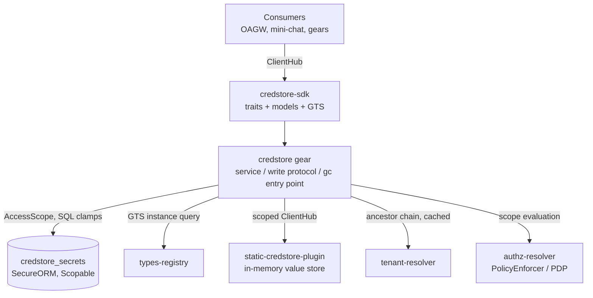
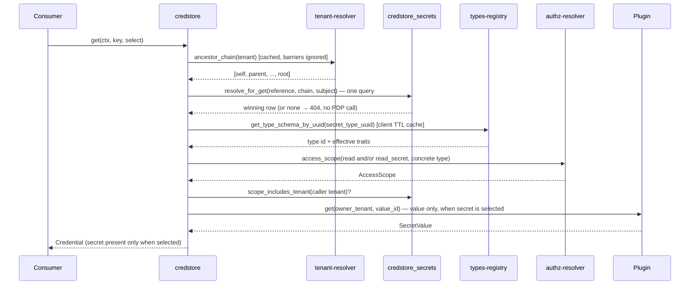
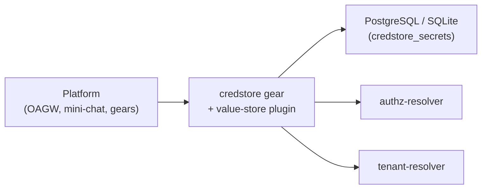

Updated:  2026-07-07 by Virtuozzo International GmbH

# Technical Design — CredStore


<!-- toc -->

- [1. Architecture Overview](#1-architecture-overview)
  - [1.1 Architectural Vision](#11-architectural-vision)
  - [1.2 Architecture Drivers](#12-architecture-drivers)
  - [1.3 Architecture Layers](#13-architecture-layers)
- [2. Goals / Non-Goals](#2-goals--non-goals)
  - [2.1 Goals](#21-goals)
  - [2.2 Non-Goals](#22-non-goals)
- [3. Principles & Constraints](#3-principles--constraints)
  - [3.1 Design Principles](#31-design-principles)
  - [3.2 Constraints](#32-constraints)
- [4. Technical Architecture](#4-technical-architecture)
  - [4.1 Domain Model](#41-domain-model)
  - [4.2 Component Model](#42-component-model)
  - [4.3 API Contracts](#43-api-contracts)
  - [4.4 External Interfaces & Protocols](#44-external-interfaces--protocols)
  - [4.5 Service-to-Service Pattern](#45-service-to-service-pattern)
  - [4.6 Interactions & Sequences](#46-interactions--sequences)
  - [4.7 Database schemas & tables](#47-database-schemas--tables)
  - [4.8 Deployment Topology](#48-deployment-topology)
  - [4.9 Technology Stack](#49-technology-stack)
  - [4.10 Value-Fingerprint Fence](#410-value-fingerprint-fence)
- [5. Secret Types (GTS-Based, Registry-Driven)](#5-secret-types-gts-based-registry-driven)
  - [5.1 Concept](#51-concept)
  - [5.2 Type Traits](#52-type-traits)
  - [5.3 Built-in Type Catalog (Registry Seeds)](#53-built-in-type-catalog-registry-seeds)
  - [5.4 Enforcement Points](#54-enforcement-points)
  - [5.5 Storage & API Changes](#55-storage--api-changes)
- [6. Secret Lifecycle & Write Protocol](#6-secret-lifecycle--write-protocol)
  - [6.1 Status Model](#61-status-model)
  - [6.2 Value Write Protocol](#62-value-write-protocol)
  - [6.3 Delete and Garbage Collection](#63-delete-and-garbage-collection)
  - [6.4 Maintenance Job](#64-maintenance-job)
- [7. Risks / Trade-offs](#7-risks--trade-offs)
  - [7.1 Architectural Trade-offs](#71-architectural-trade-offs)
  - [7.2 Security and Performance Risks](#72-security-and-performance-risks)
- [8. Migration Plan](#8-migration-plan)
- [9. Open Questions](#9-open-questions)
- [10. Additional context](#10-additional-context)
  - [Plugin Registration](#plugin-registration)
  - [Configuration](#configuration)
  - [Error Mapping](#error-mapping)
  - [Observability](#observability)
- [11. Traceability](#11-traceability)

<!-- /toc -->

<!--
=============================================================================
TECHNICAL DESIGN DOCUMENT
=============================================================================
PURPOSE: Define HOW the system is built — architecture, components, APIs,
data models, and technical decisions that realize the requirements.

DESIGN IS PRIMARY: DESIGN defines the "what" (architecture and behavior).
ADRs record the "why" (rationale and trade-offs) for selected design
decisions; ADRs are not a parallel spec, it's a traceability artifact.

SCOPE:
  ✓ Architecture overview and vision
  ✓ Design principles and constraints
  ✓ Component model and interactions
  ✓ API contracts and interfaces
  ✓ Data models and database schemas
  ✓ Technology stack choices

NOT IN THIS DOCUMENT (see other templates):
  ✗ Requirements → PRD.md
  ✗ Detailed rationale for decisions → ADR/
  ✗ Step-by-step implementation flows → features/

DESIGN LANGUAGE:
  - Be specific and clear; no fluff, bloat, or emoji
  - Reference PRD requirements using `cpt-cf-credstore-fr-{slug}` IDs
=============================================================================
-->

## 1. Architecture Overview

### 1.1 Architectural Vision

CredStore follows the ToolKit Gear + Plugins pattern: a **stateful gear** (`credstore`) owns all secret *metadata* (identity, sharing, ownership, lifecycle status, version) in its own database table, enforces authorization and hierarchical resolution, and exposes the public API; backend **plugins** are pure per-tenant *value stores* selected at runtime by GTS vendor configuration. The backend stores the secret value only — it carries no metadata schema, no sharing semantics, and no policy.

The SDK crate (`credstore-sdk`) defines two trait boundaries: `CredStoreClientV1` for consumers and `CredStorePluginClientV1` for backend implementations. Consumers depend only on the gear trait and never interact with plugins directly, which allows runtime backend selection without changing consumer code.

Because metadata is local, hierarchical resolution (the walk-up that searches for secrets across tenant ancestors) is a **single indexed SQL query** over the metadata table followed by at most **one** backend read for the winning row. Writes are a **value-and-pointer switch** under immutable backend versions: the secret is written once under a fresh `value_id`, then the metadata row's pointer switches to it in one transaction — no in-flight lifecycle status, no compensation; crash-safety comes from an intent log plus a garbage-collection queue drained by a periodic maintenance job, not a resident reaper (§6.2, §6.4).

Authorization is delegated to the platform PDP (`authz-resolver`) via `PolicyEnforcer`: each operation evaluates an `AccessScope` that is enforced **in SQL** through SecureORM clamps on the metadata table. Tenant isolation is therefore enforced at the data layer, consistent with the rest of the platform.

### 1.2 Architecture Drivers

#### Functional Drivers

| Requirement | Design Response |
|-------------|-----------------|
| `cpt-cf-credstore-fr-put-secret` | Write protocol: the secret is written under a freshly minted `value_id` (plugin `put`), then one transaction switches the row's pointer to it — create inserts an `active` row already pointing at it, replace CASes an existing row (§6.2). REST is a single `PUT` on the record address, carrying record and secret together (§4.3) |
| `cpt-cf-credstore-fr-get-secret` | Single SQL resolution over the ancestor chain, then one plugin `get` (keyed by `tenant_id/value_id`) for the winning row's current version. The secret is read via `$select=secret` on `GET /credentials/{ref}`, independent of the metadata read (§4.3) |
| `cpt-cf-credstore-fr-delete-secret` | One transaction deletes the row and enqueues its `value_id`, if any, for garbage collection, releasing the reference at once; a best-effort backend delete follows (§6.3). `DELETE` addresses the credential record (secret included), not a standalone secret (§4.3) |
| `cpt-cf-credstore-fr-tenant-scoping` | Gear derives tenant from `SecurityContext.subject_tenant_id()`; own-tenant gate + SecureORM scope clamp |
| `cpt-cf-credstore-fr-sharing-modes` | `sharing` column in the gear metadata table; partial unique indexes let private and tenant/shared coexist under one reference |
| `cpt-cf-credstore-fr-authz-pdp` | PDP `AccessScope` per operation on the credential GTS resource type (`gts.cf.core.credstore.credential.v1~`), enforced in SQL; fail-closed. The action set is the six actions of `cpt-cf-credstore-fr-authz-action-split` below: `list`/`read`/`write`/`delete` on the record, `read_secret`/`write_secret` on the secret |
| `cpt-cf-credstore-fr-optimistic-concurrency` | Monotonic `version` column; `GET` returns a strong generation-bound `ETag` (`"<id>.<version>"`, §4.10); `PUT`/`DELETE` require `If-Match` (a validator or `*`) |
| `cpt-cf-credstore-fr-secret-types` | GTS-based secret types with enforceable traits (§5) |
| `cpt-cf-credstore-fr-deprovisioning` | Row delete + gc, one transaction, releasing the reference at once; a best-effort backend delete follows (§6.3) |
| `cpt-cf-credstore-fr-credential-record` | Resource split (ADR-0004): the `credentials` collection item carries metadata only by default; the secret is a selectable `secret` field of that same item, disclosed only under `$select` and `read_secret`, never a separate sub-resource (§4.1, §4.3) |
| `cpt-cf-credstore-fr-list-credentials` | Upward-rooted collection read (ADR-0005): ancestor chain from tenant-resolver, tenant dimension as a PDP gate rather than a SQL clamp, `type`/`reference` as SQL clamps, `sharing`/`expires_at`/`fallback` filtered after reduction, `$select` sparse projection, reference-boundary cursor over reduced rows (§4.4, §4.6, §4.7) |
| `cpt-cf-credstore-fr-get-credential` | `GET /credentials/{ref}`: hierarchical resolution of the record without the secret; carries the strong `ETag` so a secret-blind caller can still perform a guarded write (§4.3) |
| `cpt-cf-credstore-fr-write-credential-record` | `PUT /credentials/{ref}` full replace of record and secret in one request (`If-None-Match`/`If-Match`; requires `write` + `write_secret`); `PATCH /credentials/{ref}` merge-patch partial update (requires `write` for metadata keys, `write_secret` for `secret`, both when both are present; never creates); type stays immutable under both (§4.1, §4.3; ADR-0007) |
| `cpt-cf-credstore-fr-read-secret` | `secret` selected via `$select` on `GET /credentials` or `GET /credentials/{ref}` — no dedicated address — `Cache-Control: no-store`, one audit record per returned secret (§4.3) |
| `cpt-cf-credstore-fr-write-secret` | Secret written through the record address, as `secret` in a full `PUT` or the `secret` member of a `PATCH`, under the record's one validator; `PATCH {"secret": null}` removes the secret (→ `declared`); requires `write_secret` when `secret` is a string or a `null` that removes an existing secret (plus `write` when metadata is also carried), but not when a `null` creates or leaves a secret-less record — `write_secret` guards changing a secret, not its absence; grants no read of that secret; a `PATCH` never creates a record (§4.3.2; ADR-0007) |
| `cpt-cf-credstore-fr-bulk-read-secrets` | `GET /credentials` with `$select` containing `secret`: explicit-references or scoped `type` selector, per-item authorization and fence verification, hard cap enforced by fetching `cap + 1` rows with `TOO_MANY_MATCHES` instead of truncation, no pagination (§4.3, §4.6; ADR-0005 "Secret mode") |
| `cpt-cf-credstore-fr-authz-action-split` | Six PDP actions on the resource type `gts.cf.core.credstore.credential.v1~`: `list` / `read` / `write` / `delete` on the record, `read_secret` / `write_secret` on the secret (§4.3, §4.4; ADR-0010) |
| `cpt-cf-credstore-fr-inheritance-status` | `inheritance` (own / inherited / overridden / suppressed) computed at resolution/reduction time from the ancestor-chain walk; never a filterable or orderable column (§4.1, §4.4; ADR-0009) |
| `cpt-cf-credstore-fr-suppression` | `fallback` column (`inherit`/`none`) on the record, set with `write`; a secret-less record with `none` wins resolution when nearest and yields 404 for its tenant and, per `sharing`, its descendants; suppressing an active own credential is one atomic `PATCH {"fallback": "none", "secret": null}`; suppressing without an own row is one atomic `PUT` with `If-None-Match: *` and `{"fallback": "none", "secret": null, …}`, needing only `write` (§4.3.2, §6.1; [ADR-0008](./ADR/0008-cpt-cf-credstore-adr-suppression-fallback.md) Suppression) |

#### NFR Allocation

| NFR ID | NFR Summary | Allocated To | Design Response | Verification Approach |
|--------|-------------|--------------|-----------------|----------------------|
| `cpt-cf-credstore-nfr-confidentiality` | Secret values never in logs or caches | SDK + gear + plugins | `SecretValue` wrapper with redacting `Debug`/`Display` and zeroize-on-drop; hand-written redacted `Debug` on REST DTOs; `Cache-Control: no-store` on `GET`; no lossy UTF-8 decode | Unit tests on redaction; code review |
| `cpt-cf-credstore-nfr-tenant-isolation` | No cross-tenant access outside PDP scope | Gear + repo | Scope clamps in SQL; own-tenant gate with `cross_tenant_denied` metric | Repo/service tests incl. scope cases |
| `cpt-cf-credstore-nfr-observability` | Operational visibility | Gear | OpenTelemetry metrics: walk-up depth, read outcome, dependency timings, cross-tenant denials, fence-verify outcomes, and the maintenance job's `gc_deleted`/`gc_pending_reclaimed`/`expired_deleted` counters (§10); no per-status inventory gauge — a `COUNT`-based gauge is disallowed by the platform's no-`COUNT` rule (§10) | Metrics unit tests |

#### Key ADRs

| ADR ID | Decision Summary |
|--------|------------------|
| `cpt-cf-credstore-adr-stateful-gear` | Stateful gear, value-only backend: the gear owns the `credstore_secrets` metadata table (identity, sharing, ownership, lifecycle status, version, a `value_id` pointer to the row's current backend version); the backend plugin stores only the value, keyed by `tenant_id/value_id` ([ADR-0001](./ADR/0001-cpt-cf-credstore-adr-stateful-gear.md), amended by [ADR-0006](./ADR/0006-cpt-cf-credstore-adr-immutable-value-versions.md)) |
| `cpt-cf-credstore-adr-deprovisioning-saga` | Deletion is one row transaction plus garbage collection ([ADR-0006](./ADR/0006-cpt-cf-credstore-adr-immutable-value-versions.md), §6.3–§6.4), superseding the original status-driven delete design of [ADR-0002](./ADR/0002-cpt-cf-credstore-adr-deprovisioning-saga.md): no `deprovisioning` status, no name retention; the garbage is drained by an operator-scheduled maintenance job, not a resident reaper |
| `cpt-cf-credstore-adr-value-fingerprint-fence` | Value-fingerprint fence + generation-bound ETag: the gear stamps `value_fp = HMAC(fence_key, value)` in the same write as `sharing` and verifies it on read (fail-closed 404 on mismatch), and binds the strong ETag to `<row-id>.<version>`; closes the crosswise-PUT cross-tenant disclosure and the recreate ABA lost-update. The fence is an integrity check only — a fingerprint exists for every value and a value-less row has none (`value_id IS NULL ⇔ value_fp IS NULL ⇔ fp_key_id IS NULL`); recovery from a mismatch is a new write under a fresh `value_id`, never a healing re-put ([ADR-0003](./ADR/0003-cpt-cf-credstore-adr-value-fingerprint-fence.md), amended by [ADR-0006](./ADR/0006-cpt-cf-credstore-adr-immutable-value-versions.md)) |
| `cpt-cf-credstore-adr-secret-value-exposure` | Credential: metadata with a selectable secret. The credential record and its secret share one item shape: the default projection (`credentials` collection or point read) never carries a secret, and `secret` is a selectable `$select` field of that same item, disclosed only under `read_secret` — not a separate sub-resource ([ADR-0004](./ADR/0004-cpt-cf-credstore-adr-secret-value-exposure.md)) |
| `cpt-cf-credstore-adr-upward-collection-read` | The credential-record collection is rooted at the caller's tenant and reads upward only; the tenant dimension of PDP scope gates the caller's own tenant rather than clamping rows in SQL, so inherited rows survive; **secret mode** (`$select=…,secret`) is the bounded bulk secret read ([ADR-0005](./ADR/0005-cpt-cf-credstore-adr-upward-collection-read.md)) |
| `cpt-cf-credstore-adr-immutable-value-versions` | Every value write creates a new immutable backend entry under a fresh `value_id`; the row points at the current version; the old version is deleted after the pointer switch, via a gc table a periodic maintenance job drains (no resident reaper); the backend key is `(tenant_id, value_id)` — no reference, no owner class; the metadata row's statuses are `active`/`declared`; the fence remains an integrity check ([ADR-0006](./ADR/0006-cpt-cf-credstore-adr-immutable-value-versions.md)) |
| `cpt-cf-credstore-adr-record-write-verbs` | Two write verbs on one address: `PUT` replaces the whole credential with a tri-state `secret` (absent → 400 `SECRET_REQUIRED`, a string → written, an explicit `null` → a secret-less `declared` record); `PATCH` is an RFC 7396 merge and never creates. Write actions follow the body — `write` for metadata keys present, `write_secret` for a `secret` key present ([ADR-0007](./ADR/0007-cpt-cf-credstore-adr-record-write-verbs.md)) |
| `cpt-cf-credstore-adr-suppression-fallback` | Suppression: a `fallback` field (`inherit`/`none`) on the tenant's own record, consulted only while it holds no secret; a `declared`+`none` row competes in resolution and, when nearest, blocks — canonical 404 for the tenant and, per `sharing`, its descendants (`inheritance: suppressed`); arming or lifting it is always one request ([ADR-0008](./ADR/0008-cpt-cf-credstore-adr-suppression-fallback.md)) |
| `cpt-cf-credstore-adr-no-ancestor-disclosure` | An inherited entry discloses nothing about the ancestor: `owner_tenant_id` and `is_inherited` are dropped; `inheritance` is the only hierarchy signal; `owner_id`, `fallback`, `version`, `updated_at` and a strong `ETag` are shown only for the caller's own row ([ADR-0009](./ADR/0009-cpt-cf-credstore-adr-no-ancestor-disclosure.md)) |
| `cpt-cf-credstore-adr-type-scoped-authorization` | Six actions on the credential type (`list`/`read`/`write`/`delete`/`read_secret`/`write_secret`); the type is the only scope axis — permissions are GTS instances evaluated on the concrete type, and `category` is withdrawn ([ADR-0010](./ADR/0010-cpt-cf-credstore-adr-type-scoped-authorization.md)) |

### 1.3 Architecture Layers

```
┌───────────────────────────────────────────────────────────────┐
│                Consumers (OAGW, mini-chat, gears)             │
├───────────────────────────────────────────────────────────────┤
│  credstore-sdk    │ Public API traits, models, errors, GTS    │
├───────────────────────────────────────────────────────────────┤
│  credstore        │ PDP authz, resolution, value write        │
│  (stateful)       │ protocol, maintenance-job entry           │
│                   │ point, REST, metrics — owns               │
│                   │ credstore_secrets                         │
├───────────────────────────────────────────────────────────────┤
│  Plugins          │ Pure per-tenant value stores              │
│  ┌────────────────────────────┐  ┌──────────────────────────┐ │
│  │ static-credstore-plugin    │  │ production vaults        │ │
│  │ (in-memory, dev/test)      │  │ (future: external store, │ │
│  │                            │  │  OS keychain, KMS-backed)│ │
│  └────────────────────────────┘  └──────────────────────────┘ │
├───────────────────────────────────────────────────────────────┤
│  Platform deps    │ authz-resolver (PDP), tenant-resolver,    │
│                   │ types-registry (GTS), toolkit-db          │
└───────────────────────────────────────────────────────────────┘
```

| Layer | Responsibility | Technology |
|-------|---------------|------------|
| SDK | Public and plugin trait definitions, models, errors, GTS type declarations | Rust crate (`credstore-sdk`) |
| Gear | PDP authorization, hierarchical resolution, sharing enforcement, value write protocol, maintenance-job entry point, plugin selection, REST API | Rust crate (`credstore`), Axum, SeaORM/SecureORM |
| Plugins | Backend-specific secret **value** storage (per-tenant key-value CRUD; no policy, no hierarchy, no metadata) | Rust crates |
| Platform | Policy decisions (PDP), tenant hierarchy, plugin discovery | authz-resolver, tenant-resolver, types-registry |

## 2. Goals / Non-Goals

### 2.1 Goals

- Provide secure, hierarchical secret storage for platform gears and tenant administrators
- Enable flexible sharing modes: `private` (owner-only), `tenant` (tenant-wide, default), `shared` (hierarchical)
- Support service-to-service secret retrieval (e.g., OAGW retrieving secrets on behalf of customer tenants)
- Enforce authorization via the platform PDP with SQL-level scope clamps (real tenant isolation at the data layer)
- Make writes crash-safe and self-healing via an intent log plus a gc-draining periodic maintenance job, no resident reaper (§6.2, §6.4), and reads race-free against half-written secrets
- Enforce optimistic concurrency (version / `ETag` / mandatory `If-Match`) for lost-update detection — every update/delete states its concurrency stance; creation is the only preconditionless write
- Support multiple backend value stores via plugin architecture with GTS-based runtime selection
- Ensure secret values never appear in logs, error messages, debug traces, or intermediary caches
- Enable secret shadowing: child tenants can override parent credentials without breaking existing references
- Classify secrets by GTS-based *secret types* with enforceable traits (§5)
- Symmetric, crash-safe deletion — a single row transaction plus garbage collection (§6.3)

### 2.2 Non-Goals

The following capabilities are explicitly out of scope:

- **Granular ACL beyond hierarchical**: fine-grained per-secret ACLs (role- or attribute-based) are out of scope. The three-tier sharing model plus PDP scope covers primary use cases.
- **Secret value history / rollback**: the `version` column supports optimistic locking only; previous values are not retained.
- **Secret rotation automation**: automatic rotation is out of scope. (Secret types may carry *advisory* rotation traits, §5.2 — enforcement/automation is future work.)
- **Direct end-user access**: unauthenticated or untrusted client access is out of scope.
- **Secret templates or composition**: dynamic secret generation or derivation is out of scope.
- **Hierarchical resolution in backends**: plugins are pure per-tenant value stores — all hierarchy, sharing, and policy logic lives in the gear.
- **Secret discovery / search**: full-text search over values or references stays out of scope. A metadata listing is in scope, required by `cpt-cf-credstore-fr-list-credentials` and designed in [ADR-0005](./ADR/0005-cpt-cf-credstore-adr-upward-collection-read.md); it is upward-rooted, never carries values, and never enumerates descendants.
- **MySQL support**: migrations target PostgreSQL and SQLite; MySQL fails fast with a typed error.

## 3. Principles & Constraints

### 3.1 Design Principles

#### Stateful Gear, Value-Only Backend

- [ ] `p1` - **ID**: `cpt-cf-credstore-principle-stateful-gear`

The gear owns all secret metadata in its own `credstore_secrets` table, including a `value_id` pointer to the row's current backend version; the backend plugin stores the value only, keyed by `tenant_id/value_id` — `value_id` is unique store-wide, so the row alone knows which reference and sharing class a value belongs to, and the backend needs no `reference` or key-class segment. This removes any backend metadata-schema prerequisite, eliminates encoded-external-ID collision risk, and makes resolution and authorization a single transactional query. Private and tenant/shared rows under one reference stay apart in the backend by distinct `value_id`s, not distinct key classes; the coexistence rule (partial unique indexes on the metadata table, §4.7) is what keeps them apart at the metadata layer. `OwnerId` is a row-level access-control key only, never part of the backend key.

#### Authorization via PDP, Enforced in SQL

- [ ] `p1` - **ID**: `cpt-cf-credstore-principle-authz-pdp`

Every operation evaluates a PDP `AccessScope` for its action on the credential resource type (`gts.cf.core.credstore.credential.v1~`, §5.1) and enforces that scope in SQL through SecureORM clamps on the metadata table. The action set is `list`, `read`, `write`, `delete` on the record and `read_secret`, `write_secret` on the secret (`cpt-cf-credstore-fr-authz-action-split`, §4.3.2). Both read and write paths additionally gate on an explicit own-tenant invariant (`scope_includes_tenant`) and emit a `cross_tenant_denied` metric. Out-of-scope access is fail-closed and surfaces as the canonical 404 (anti-enumeration) or 403. Plugins MUST NOT implement authorization.

**The collection read is the exception to "one evaluation per operation"** (§4.4): its resource is a concrete secret type, and a page can span several, so it evaluates `list` once per distinct type the candidate probe found — bounded by the number of types a tenant actually uses, not by the page size, and cacheable per subject. Every other operation addresses exactly one row and therefore one type, so for those the single-evaluation rule holds unchanged.

#### Tenant from SecurityContext

- [ ] `p1` - **ID**: `cpt-cf-credstore-principle-tenant-from-ctx`

The operating tenant is always derived from `SecurityContext.subject_tenant_id()`, and the owner from `SecurityContext.subject_id()`. This reduces API surface, prevents misuse, and aligns with platform patterns. Service-to-service consumers (OAGW) construct a `SecurityContext` for the target tenant rather than passing tenant parameters.

#### Crash-Safe Writes (Immutable Versions)

- [ ] `p1` - **ID**: `cpt-cf-credstore-principle-write-saga`

A write that spans the backend and the metadata row is an intent-logged, immutable-version protocol (§6.2): the backend entry for a given `value_id` is written once and never overwritten, an intent row records it before the write and is cleared by the same transaction that switches the row's pointer, and every failure mode either leaves the row unswitched (old value still served) or leaves an orphan the periodic maintenance job reclaims (§6.2, §6.4). A crash can never permanently wedge a reference or leak a readable half-written secret.

### 3.2 Constraints

#### No Secret Logging

- [ ] `p1` - **ID**: `cpt-cf-credstore-constraint-no-secret-logging`

Secret values MUST NOT appear in any log output, error messages, or debug traces. `SecretValue` implements redacting `Debug`/`Display` and zeroizes on drop; request/response DTOs carry hand-written redacted `Debug`; the `GET` response sets `Cache-Control: no-store`; non-UTF-8 values are rejected with a typed error rather than lossily decoded.

#### Canonical Error Model

- [ ] `p1` - **ID**: `cpt-cf-credstore-constraint-canonical-errors`

All trait-boundary and REST errors follow the platform canonical error model ([ADR 0005](../../../docs/arch/errors/ADR/0005-cpt-cf-adr-sdk-canonical-projection.md)): domain errors map to canonical categories with stable `reason` codes (e.g. `OPTIMISTIC_LOCK_FAILURE`), and the wire strips internal diagnostics.

## 4. Technical Architecture

### 4.1 Domain Model

**Technology**: Rust structs (`#[domain_model]`)

**Core Entities**:

| Entity | Description |
|--------|-------------|
| `SecretRef` | Validated secret reference key (e.g., `partner-openai-key`). **Format**: `[a-zA-Z0-9_-]+`, 1–255 chars; validated on construction and re-validated by a DB `CHECK`. |
| `SecretValue` | Opaque byte wrapper (`Vec<u8>`) for secret data. Redacting `Debug`/`Display`, zeroize-on-drop, deliberately not `Serialize`/`Deserialize`. |
| `SharingMode` | Enum: `Private`, `Tenant` (default), `Shared` — controls access scope within the tenant hierarchy. |
| `OwnerId` | UUID identifying the creator (`SecurityContext.subject_id()`) — access control key for `Private` mode. |
| `SecretStatus` | Lifecycle status of the metadata row: `Active` (2) — the row points at a secret — or `Declared` (4) — the row holds its reference but carries no secret, reached by a `PATCH {"secret": null}` or a `PUT` with an explicit `null` secret (§4.1, §6.1). Codes `1` (`Provisioning`) and `3` (`Deprovisioning`) are reserved, never reused: a write is a value-and-pointer switch inside one transaction, not a sequence of externally observable states, so nothing needs an in-flight status (§6.1, §6.2). Only `Active` rows are visible to secret resolution; `Declared` is additionally visible to the collection read, and no other status is visible to anything. |
| `SecretRow` | Metadata row: `{ id, tenant_id, reference, sharing, owner_id, status, version, fallback, value_id, value_fp, fp_key_id }`. `value_id` is a nullable pointer to the row's current backend version (`NULL ⇔ status = declared`, §6.1); the secret is looked up only by `tenant_id/value_id` — `value_id` is unique store-wide, so the backend key needs no `reference` or key-class segment; distinct `value_id`s, not distinct key classes, are what keep a private and a tenant/shared row under one reference apart in the backend. `fallback` (`inherit`/`none`, §6.1) is the row's policy for the time it holds no secret. `value_fp`/`fp_key_id` are the internal value-fingerprint fence (§4.10), never serialized to the wire. |
| `NewSecret` | Insert shape for the row-CAS step of the write protocol (§6.2); carries the fence fingerprint of the value being written and the freshly minted `value_id` the row is created already pointing at. |
| `WritePrecondition` | Parsed `If-Match`, mandatory on update/delete: `Exists` (`*`, explicit last-writer-wins) or `Version { id, version }` (quoted `"<id>.<version>"`, generation-bound). |
| `SecretType` | Catalog-resolved secret type binding the enforceable traits (§5); immutable per secret. |
| `Credential` (REST schema `Credential`) | The addressable **metadata** resource: reference, sharing, type, expiry, and two independent status fields. `status` is the state of the **caller's own row** — `none`/`declared`/`active`, never `provisioning`/`deprovisioning` — while `inheritance` (`own`/`inherited`/`overridden`/`suppressed`) is the state of the **effective row** the reference resolves to. `fallback` (`inherit`/`none`, §6.1) is the caller's own row's policy for having no secret, shown only for that row; `version`, `updated_at` and `owner_id` (the creating subject) likewise describe the caller's own row and appear whenever `status` is not `none` — never for an inherited entry (ADR-0009). Identified by `SecretRef` in the `credentials` collection (§4.3) — the same item shape serves the point read and the collection. `secret` is an optional field on `Credential` itself, present only when the caller's `$select` names it and only under the `read_secret` action; the default projection, and any projection that omits `secret`, never carries it — never a separate sub-resource. `Credential` never names the owning tenant (ADR-0009, "What a response carries, and for which row"). |
| `Secret` (SDK convenience type, not a REST schema) | The secret with its usage envelope only: reference, type, expiry, secret — the shape `CredStoreClientV1::get_secret` returns, built over `get` with `$select=reference,type,expires_at,secret` and repackaging the sparse `Credential` result. Nothing administrative — `sharing`, `inheritance`, `status` never appear here, matching what `read_secret` alone can disclose. |
| `InheritanceStatus` (`cpt-cf-credstore-fr-inheritance-status`) | Enum, four variants: `Own` (the winning row is the caller's own, no ancestor involved); `Inherited` (the winning row is an ancestor's `shared` record); `Overridden` (the caller's own record shadows an ancestor's `shared` record under the same reference); `Suppressed`: the winning row is a secret-less record with `fallback: none` ([ADR-0008](./ADR/0008-cpt-cf-credstore-adr-suppression-fallback.md); §6.1) — the row may be the caller's own or an ancestor's `shared` one. Computed at resolution/reduction time, never a stored or filterable column (§4.4). |

**Relationships & uniqueness**:

- A secret belongs to exactly one tenant (`tenant_id`) and has exactly one owner (`owner_id`).
- For `tenant`/`shared` modes, `(tenant_id, reference)` is unique; for `private` mode, `(tenant_id, reference, owner_id)` is unique. Both are enforced as **partial unique indexes** (§4.7), which lets one private secret per owner and one tenant/shared secret **coexist** under the same reference.
- The uniqueness indexes ignore `status`; a row is only ever inserted already `active` (§6.2 step 4), so there is no in-flight row for the indexes to hold open — a failed write leaves no row at all, not a wedged one.

**Sharing-mode access control** (evaluated during SQL resolution):

| Mode | Visible to | Inherited by descendants? |
|------|-----------|---------------------------|
| `private` | Only where `owner_id` equals the caller's subject id; wins over non-private at the same tenant level | No |
| `tenant` (default) | Only the owning tenant | No |
| `shared` | The owning tenant **and** all its descendants (including through isolation barriers) | Yes |

`sharing` is a **visibility** mode (who may read the secret), not a quota/limit that composes as `min(parent, child)`; resolution picks the closest accessible secret up the ancestor chain, which is how a child tenant *shadows* a parent's `shared` secret under the same reference.

**Record without a secret.** A `PATCH {"secret": null}` against an existing, own record, or a `PUT` whose `secret` is an explicit `null`, are the only ways to reach this state (§4.3, §6.1) — reached only on purpose, never by omission: `PUT`'s `secret` is tri-state, and an absent `secret` key is rejected as `SECRET_REQUIRED` before anything is written, so there is no accidental path to `declared` through a forgotten field; only an explicit `null`, on create or on replace of an `active` row, produces it. It is a **stored lifecycle state** — `status = 4`, `declared` — and not an inference from a missing fingerprint; §6.1 carries the reasoning and the predicate table. The column-level invariant is `declared ⇔ value_id IS NULL` — a `declared` row's pointer is null, an `active` row's is not. `PATCH {"secret": null}` clears the pointer and, in the same transaction, enqueues the row's old `value_id` into `credstore_value_gc` with reason `removed`, for the periodic maintenance job to delete from the backend (§6.1, §6.4, gc table in §4.7).

- It **does not resolve** for a secret read, which is not the same as "the read returns not-found". The row is simply not a candidate: resolution already selects `status = 2`, so a `declared` row is excluded by a filter that is already there, and the walk up the ancestor chain continues past it. What the caller gets therefore depends on the chain — an ancestor's `shared` secret if one exists (next bullet), and the ordinary not-found only when the whole chain offers nothing. Reading these two bullets as "declared implies 404" is the mistake they exist to prevent.
- It **does not shadow** an ancestor: an inherited `shared` secret from a parent keeps resolving for the tenant and its descendants exactly as if the secret-less record did not exist. Removing a secret must not silently break inheritance that was working before it started. The collection read has to honour the same rule when it reduces a reference to one item, or the listing would claim the credential is configured locally while the point read serves the ancestor's secret ([ADR-0005](./ADR/0005-cpt-cf-credstore-adr-upward-collection-read.md) "Reducing a reference to one item").
- It is **distinct from `value_fp IS NULL`**: a fingerprint exists for every value, and a value-less row has none (`value_id IS NULL ⇔ value_fp IS NULL ⇔ fp_key_id IS NULL`, §4.10) — `declared` (`value_id`/`value_fp`/`fp_key_id` all NULL) is the only value-less case and `active` (all three set) is the only case with a value; there is no third, seeded case (a value with no fingerprint) to distinguish from either.
- It **is never produced by a crash**: creation is a protocol, not a saga status (§6.2). A crashed secret-carrying create never produces a `declared` row — it leaves either no row at all (crash before the row CAS) or a fully `active` row (crash after), plus a `pending` gc entry the periodic maintenance job reconciles either way; a `null`-secret create has no backend call and mints no gc entry to crash between, so it leaves either no row at all or a fully `declared` row, never anything in between.
- It **is visible in the catalogue**, unlike every other non-`active` status: the collection read selects `status IN (2, 4)` and surfaces the state, because an administrator who has removed a record's secret needs to see exactly that (§6.1).

### 4.2 Component Model



**Components**:

- [ ] `p1` - **ID**: `cpt-cf-credstore-component-sdk`

`credstore-sdk` — trait definitions (`CredStoreClientV1`, `CredStoreMaintenanceV1`, `CredStorePluginClientV1`), models, canonical `CredStoreError`, and the GTS declarations: the plugin spec type (`gts.cf.toolkit.plugins.plugin.v1~cf.core.credstore.plugin.v1~`) and the credential resource type (`gts.cf.core.credstore.credential.v1~`, exported as `SECRET_RESOURCE_TYPE` — the single source of truth pinned by unit tests).

- [ ] `p1` - **ID**: `cpt-cf-credstore-component-gear`

`credstore` — the stateful gear. Layers: `api/rest` (Axum routes, DTOs with redacted `Debug`, `If-Match` parsing), `domain` (service with the value write protocol and delete-and-gc of §6.2/§6.3, authz scope evaluation, resolver port, metrics port, plugin selector port), `infra` (SecureORM repo, migrations, tenant-resolver adapter with TTL+LRU ancestor cache, GTS plugin selector, OTel metrics, canonical error mapping). Declares `deps = [authz-resolver, tenant-resolver, types-registry]` and capabilities `system, db, rest, stateful`. There is no resident reaper loop — the gear's lifecycle entry starts no background timer; the maintenance work is an in-process entry point, the SDK trait `CredStoreMaintenanceV1::run_gc` (no REST), invoked by the host on an operator-chosen schedule outside the gear's own lifecycle (§6.4).

- [ ] `p1` - **ID**: `cpt-cf-credstore-component-static-plugin`

`static-credstore-plugin` — in-memory value store for development and testing, keyed by `(tenant_id, value_id)`, writable at runtime; values enter only through the credstore API, which mints the `value_id` (no config seeding). Registers its GTS instance and scoped `CredStorePluginClientV1` in ClientHub.

- [ ] `p2` - **ID**: `cpt-cf-credstore-component-production-backend`

Production value-store backends (external secret vault, OS keychain, KMS-backed store) — future plugins implementing the same `CredStorePluginClientV1` contract. Not part of the current codebase.

**Interactions**:

- Consumer → Gear: `CredStoreClientV1` via ClientHub (in-process) or REST.
- Gear → Repo: all metadata reads/writes clamped by the PDP `AccessScope` (SecureORM `Scopable`).
- Gear → Plugin: `CredStorePluginClientV1` via scoped ClientHub; the plugin is resolved lazily by GTS instance query filtered by the configured `vendor`.
- Gear → tenant-resolver: ancestor chain (`BarrierMode::Ignore` — inheritance crosses isolation barriers), cached in-process with TTL + LRU eviction.
- Gear → PDP: `PolicyEnforcer.access_scope_with` per operation; no PEP capabilities advertised — the PDP hands the gear flat, pre-expanded tenant predicates (§4.4).

### 4.3 API Contracts

- [ ] `p1` - **ID**: `cpt-cf-credstore-interface-clienthub`

**Technology**: Rust traits (ClientHub) + REST/OpenAPI

#### ClientHub API (in-process)

`CredStoreClientV1` (public consumer API), reshaped around the one item shape, with the same nouns the REST surface uses (§4.3.2):

| Method | Signature | Description |
|--------|-----------|-------------|
| `get` | `(ctx: &SecurityContext, key: &SecretRef, select: &[&str]) → Result<Option<Credential>, CredStoreError>` | Hierarchical read of one credential, projected to the selected fields; `secret` is present only when selected, under `read_secret`. `Ok(None)` covers both "does not exist" and "inaccessible" (single 404 surface, anti-enumeration). |
| `get_secret` | `(ctx, key) → Result<Option<Secret>, CredStoreError>` | Convenience over `get` with `$select=reference,type,expires_at,secret`, returning the `Secret` usage envelope — nothing administrative. |
| `put` | `(ctx, key, credential, precondition: WritePrecondition) → Result<(), CredStoreError>` | Precondition-guarded create-or-replace of the record together with a tri-state `secret`, in one call: `If-None-Match: *` creates, `If-Match` (a validator or `*`) replaces; never both. The only way to create a credential — there is no separate `create` method. |
| `patch` | `(ctx, key, patch, precondition: WritePrecondition) → Result<(), CredStoreError>` | Precondition-guarded partial update — merge-patch semantics: metadata edit, secret rotate, or secret remove via a null secret; never creates. |
| `list` | `(ctx, query) → Result<Page<Credential>, CredStoreError>` | Filtered/paginated listing (`$filter`/`$select`/`$orderby`/`limit`/`cursor`); items carry `secret` only when selected, subject to the cap and no-pagination rule of secret mode (§4.3.2, §4.4). |
| `delete` | `(ctx, key, precondition: WritePrecondition) → Result<(), CredStoreError>` | Delete the caller's own-tenant credential, guarded by the mandatory precondition. |

`get` without selecting `secret` returns a `Credential` that never carries one — there is no combined response to read `.value` off. The same names appear in `credstore-sdk/README.md`; there is one spelling, not two.

`CredStoreMaintenanceV1` (host-invoked maintenance API, no REST):

| Method | Signature | Description |
|--------|-----------|-------------|
| `run_gc` | `(ctx) → Result<GcReport, CredStoreError>` | Runs one pass of the periodic maintenance job (§6.4): expired-row removal, then the gc drain. Registered in `ClientHub` next to `CredStoreClientV1`; invoked by the host on an operator-chosen schedule, never by the gear's own lifecycle. |

`CredStorePluginClientV1` (backend SPI — pure value store):

| Method | Signature | Description |
|--------|-----------|-------------|
| `get` | `(ctx, tenant_id, value_id) → Result<Option<SecretValue>, CredStoreError>` | Returns the bytes stored under `(tenant_id, value_id)`, or `None`. No `key`, no `owner_id`: `value_id` is unique store-wide, so the plugin learns nothing about references, owners, or sharing. |
| `put` | `(ctx, tenant_id, value_id, value: SecretValue) → Result<(), CredStoreError>` | Writes a new immutable entry at `tenant_id/value_id`; never overwrites an existing one (`Conflict`). |
| `delete` | `(ctx, tenant_id, value_id) → Result<(), CredStoreError>` | Deletes exactly that version's entry; `NotFound` is treated as success (idempotent). Issued by the writer's own post-commit cleanup (§6.2 step 5, §6.3 step 3) and, for whatever that cleanup missed, by the maintenance job's gc drain (§6.4). |

**Design rationale**: the plugin returns **no metadata** — sharing, ownership, inheritance, and version all come from the gear's metadata row resolved *before* the backend is touched. This keeps every policy decision in one place and backends trivially simple.

#### 4.3.2 REST API — Credential Surface

Routes are registered under `/credstore/v1` (served behind the platform API gear under its public prefix, e.g. `/cf/credstore/v1/...`). All routes are authenticated; errors use the canonical `Problem` envelope.

The machine-readable API is generated from the handlers: the platform-wide OpenAPI document lives at [`docs/api/api.json`](../../../docs/api/api.json) (regenerate with `make openapi`), and a credstore-scoped rendering is at [`openapi.yaml`](./api/openapi.yaml).

> Decision: [ADR-0004](./ADR/0004-cpt-cf-credstore-adr-secret-value-exposure.md) (`cpt-cf-credstore-adr-secret-value-exposure`) — one entity, one item shape, `secret` under `$select`. The write verbs are [ADR-0007](./ADR/0007-cpt-cf-credstore-adr-record-write-verbs.md), suppression is [ADR-0008](./ADR/0008-cpt-cf-credstore-adr-suppression-fallback.md), what a response withholds about an ancestor is [ADR-0009](./ADR/0009-cpt-cf-credstore-adr-no-ancestor-disclosure.md), and the six PDP actions are [ADR-0010](./ADR/0010-cpt-cf-credstore-adr-type-scoped-authorization.md) — the ADRs decide, this section is the single authoritative contract for all five. `{ref}` is the caller-chosen `SecretRef` — never the row UUID, which is a generation id kept out of every response body so the `ETag` remains the one CAS validator source.

| Address | PDP action | Success | Key headers | Preconditions |
|---|---|---|---|---|
| `GET /credstore/v1/credentials` | `list` for any record field selected, `read_secret` per distinct type when `$select` contains `secret`, both when both | `200` | `Cache-Control: no-store` — the body varies by tenant and by subject; secret mode is additionally audited per item | OData `$filter`/`$orderby` on an indexed allowlist (§4.7), `$select` on the `Credential` field allowlist plus `secret` (unknown name → 400), opaque cursor, `limit`; no total count. `$select=…,secret` switches to **secret mode** (§4.3.2 below, [ADR-0005](./ADR/0005-cpt-cf-credstore-adr-upward-collection-read.md) "Secret mode"): `limit`/`cursor` rejected (400), `$orderby` rejected (400), capped at `cap + 1` fetch with `400 TOO_MANY_MATCHES` on overflow, flat item list with no `next_cursor` |
| `GET /credstore/v1/credentials/{ref}` | `read` for any record field selected or, with no `$select`, by default; `read_secret` when `$select` names `secret`; both when both | `200` | `ETag` (the CAS validator source, [ADR-0009](./ADR/0009-cpt-cf-credstore-adr-no-ancestor-disclosure.md)): strong `"<id>.<version>"` whenever the caller's tenant holds a row under the reference — `declared` or `active`, even while the effective secret is inherited — weak opaque `W/"…"` only when it holds none; `Cache-Control: no-store` | `$select` on the `Credential` field allowlist plus `secret` (unknown name → 400); without `$select` the item is the full `Credential` and never carries `secret`; the item shape is the collection's item shape — one entity, one representation |
| `PUT /credstore/v1/credentials/{ref}` | `write` always; `write_secret` when `secret` is a string, or a `null` that removes an existing secret (not required when `null` creates or leaves a secret-less record) | `201` create, `204` replace | `Location` **and `ETag`** on create; `ETag` on replace | `If-None-Match: *` (create-only, **409** if the caller's own tenant already holds a record; an inherited representation does not count), `If-Match: "<id>.<version>"` (guarded replace, 409 on mismatch), or `If-Match: *` (last-writer-wins); missing precondition → 400; `secret` is **tri-state** ([ADR-0007](./ADR/0007-cpt-cf-credstore-adr-record-write-verbs.md)): absent → 400 `SECRET_REQUIRED`; a string writes it and bumps `version`; an explicit `null` is accepted — on create it stores a `declared` record with no backend call, on replace of an `active` record it removes the secret in the same transaction (→ `declared`), on replace of an already-`declared` record it leaves the secret state unchanged |
| `PATCH /credstore/v1/credentials/{ref}` | `write` for metadata keys present in the body, `write_secret` for a `secret` key present, both when both are present ([ADR-0007](./ADR/0007-cpt-cf-credstore-adr-record-write-verbs.md)) | `204` | `ETag` | `Content-Type: application/merge-patch+json` (RFC 7396); `If-Match` mandatory (`"<id>.<version>"` or `*`); `If-None-Match: *` → 400; present fields replace, absent fields untouched; `sharing`, `fallback` or `type` of `null` → 400, a differing `type` is refused (`TYPE_IMMUTABLE`), `{}` → 400; never creates — no own record → 404; a body without `secret` whose metadata already matches the current record is a no-op (204, same `ETag`, no bump); a body carrying `secret` (string or `null`) always writes and bumps — `null` removes the secret (→ `declared`) |
| `DELETE /credstore/v1/credentials/{ref}` | `delete` | `204` | — | `If-Match` mandatory |

**Request/response examples.**

**Get credential, secret selected:**
```http
GET /credstore/v1/credentials/smtp-default?$select=reference,type,expires_at,secret
```
```json
200 OK
ETag: "3fae1e1e-....baa1.2"
Cache-Control: no-store
{
  "reference": "smtp-default",
  "type": "gts.cf.core.credstore.credential.v1~cf.core.credstore.basic_auth.v1~",
  "expires_at": null,
  "secret": "demo-secret-value-456"
}
```

**Get credential, no `$select` (record only, never a secret):**
```json
200 OK
ETag: "3fae1e1e-....baa1.2"
{
  "reference": "smtp-default",
  "type": "gts.cf.core.credstore.credential.v1~cf.core.credstore.basic_auth.v1~",
  "sharing": "tenant",
  "status": "active",
  "inheritance": "own",
  "fallback": "inherit",
  "version": 2,
  "updated_at": "2026-09-10T12:00:00Z"
}
```

**Create with a secret:**
```http
PUT /credstore/v1/credentials/partner-openai-key
If-None-Match: *
```
```json
{
  "type": "gts.cf.core.credstore.credential.v1~cf.core.credstore.api_key.v1~",
  "sharing": "tenant",
  "secret": "demo-secret-value-123"
}
```
`201 Created`, `Location: /credstore/v1/credentials/partner-openai-key`, `ETag`.

**Create secret-less (`declared`), no backend call:**
```json
{ "type": "...", "sharing": "tenant", "fallback": "none", "secret": null }
```
`201 Created` — suppression with no own row, one request, `write` only (no `write_secret` evaluation).

**Rotate, metadata untouched:**
```http
PATCH /credstore/v1/credentials/partner-openai-key
If-Match: "3fae1e1e-....baa1.2"
Content-Type: application/merge-patch+json
```
```json
{ "secret": "new-secret-value-789" }
```
`204 No Content`, new `ETag`.

**Bulk secret read (secret mode), explicit selector:**
```http
GET /credstore/v1/credentials?$filter=reference in ('smtp-default','stripe-key')&$select=reference,type,expires_at,secret
```

**Bulk secret read, scoped by type:**
```http
GET /credstore/v1/credentials?$filter=type eq 'gts.cf.core.credstore.credential.v1~cf.core.credstore.basic_auth.v1~'&$select=reference,type,expires_at,secret
```
```json
200 OK
Cache-Control: no-store
{
  "items": [
    {
      "reference": "smtp-default",
      "type": "gts.cf.core.credstore.credential.v1~cf.core.credstore.basic_auth.v1~",
      "expires_at": null,
      "secret": "..."
    }
  ],
  "page_info": { "next_cursor": null, "limit": 25 }
}
```
`returned`/cap semantics: no `COUNT`, no `next_cursor` — a flat, capped list. A reference or type the caller may not read is omitted from `items`, never reported.

**`Credential.status` names only the caller's own row.** It takes exactly `none`, `declared` or `active` and never `provisioning` or `deprovisioning` — those rows are invisible to every read, the same way account-management's tenant DTO hides its own `Provisioning` state from callers rather than exposing an in-flight saga status.

**Metadata responses are `no-store` too, not only secret responses.** A record and a page of records carry no secret, but both vary by requesting tenant and by subject: the same URL legitimately yields a different catalogue to two callers, and an inherited entry depends on the caller's ancestor chain. An intermediary that cached one and served it to the other would disclose one tenant's catalogue to another — reconnaissance rather than secret disclosure, but disclosure. The alternative, an identity-aware cache partition, would have to key on tenant *and* subject *and* the resolved chain, which is more contract than a catalogue read is worth. So every credential address, metadata included, is `no-store`; only the secret addresses additionally carry per-secret audit.

**`PUT` and `PATCH` on the record, no `POST` on the collection** ([ADR-0007](./ADR/0007-cpt-cf-credstore-adr-record-write-verbs.md)). The record address carries two write verbs. `PUT` is a whole-resource replace — record and secret together — guarded by a create-only or a replace precondition; the collection needs no `POST` because `PUT` with `If-None-Match: *` is already create-only and idempotent. `PATCH` is an RFC 7396 JSON Merge Patch (`Content-Type: application/merge-patch+json`): fields present in the body replace, fields absent are untouched, and a `secret` of `null` removes the secret while the rest of the record stands. A merge-patch is exactly what lets a secret-blind caller edit `sharing` or `expires_at` without ever supplying — or being asked to supply — a secret, and what lets `fallback` and `secret` change together in one request ([ADR-0008](./ADR/0008-cpt-cf-credstore-adr-suppression-fallback.md) Suppression, below). `PATCH` never creates: a reference with no record of the caller's own is a 404. The record's `type` stays immutable under both verbs.

**Create is one request.** `PUT /credstore/v1/credentials/{ref}` with `If-None-Match: *` creates the record; `secret` is tri-state on that same body (§4.3.2 table above; [ADR-0007](./ADR/0007-cpt-cf-credstore-adr-record-write-verbs.md)): absent is rejected (400 `SECRET_REQUIRED`) before anything is written, a string creates the record and writes the secret atomically, and an explicit `null` creates the record `declared`, with no backend call at all. **A string `secret`** runs through the value write protocol (§6.2) — record the write's intent, `plugin.put` the bytes under a freshly minted `value_id`, then one transaction inserts the `active` row already pointing at that `value_id`; a crash before the row insert leaves at most a `pending` gc entry over an orphan the periodic maintenance job collects, never a row. **An explicit `null` secret** is a single row insert with `status = declared`, `value_id`/`value_fp`/`fp_key_id` all `NULL` — no intent record, no `plugin.put`, no gc entry, because there is no backend write to protect against a crash; the row either exists `declared` or does not exist at all. `declared` (`status = 4`) is therefore reached in exactly two ways, both deliberate: a `PATCH {"secret": null}` against an existing record, or a `PUT` with an explicit `null` secret at creation (or at replace of an `active` record) (§6.1) — never by omission, since an absent `secret` key is rejected before either path runs.

**One resource, one validator.** The record and its secret are no longer separate resources, so there is nothing to compare a secret-write precondition against but the record's own `"<id>.<version>"` — the deviation from RFC 9110 that a separate secret sub-resource would have required does not arise.

**No-op and the secret path** ([ADR-0007](./ADR/0007-cpt-cf-credstore-adr-record-write-verbs.md)). A `PATCH` whose body carries no `secret` key and whose metadata fields already match the current record is a no-op (204, unchanged `ETag`, no version bump, validation still applied). A `PATCH` that carries `secret` — a string or `null` — is never a no-op: it writes the backend (or deletes it, for `null`) and bumps `version` even on identical bytes. A fingerprint-based "unchanged" check would be an equality oracle for a `write_secret` holder without `read_secret`, and under immutable versions a re-write of identical bytes is simply a new version — which is what a client that suspects a corrupted entry does deliberately, an ordinary new write with a fresh `value_id` (§4.10). All failed preconditions are 409, matching the `OPTIMISTIC_LOCK_FAILURE` mapping; 412 is not used. The action set required on `PUT`/`PATCH` is derived from the request body rather than fixed per address: `write` when the body carries any metadata key — always true for a `PUT`, since a full replace's `type`/`sharing` are required fields — and `write_secret` when `secret` is a string or a `null` that removes an existing secret, but not when a `null` creates or leaves a secret-less record (`write_secret` guards changing a secret, not its absence). A `PUT` therefore requires `write_secret` only when it is writing or removing a secret, not for every create; whichever actions apply are evaluated, and must both allow, before any side effect (§4.4).

**Actions follow the projection** ([ADR-0004](./ADR/0004-cpt-cf-credstore-adr-secret-value-exposure.md) "Read actions follow the projection"). The write side derives its action set from the request body (previous paragraph); the read side is the mirror image, deriving it from `$select` instead. On the point read, `read` is required for the item as a whole — by default with no `$select`, or for any record field named in one — and `read_secret` is required only when `$select` names `secret`, both when both apply; the same rule governs the collection, with `list` in place of `read`. A caller who selects only `secret` needs `read_secret` alone; the envelope fields `reference`, `type` and `expires_at` are readable under either action, since they describe how to use whichever half was granted. Denial has two faces matching the two surfaces: on the point read it is the canonical 404, indistinguishable from a non-resolving reference; on the collection an item or field the caller may not read is simply omitted, never reported by name (§4.4).

**Bulk secret read through the collection (`$select=secret`)** (`cpt-cf-credstore-fr-bulk-read-secrets`; [ADR-0005](./ADR/0005-cpt-cf-credstore-adr-upward-collection-read.md) "Secret mode"). There is no separate bulk address: naming `secret` in `$select` on `GET /credstore/v1/credentials` switches the collection into **secret mode**, exactly as it does on the point read — one item shape, one `$select` grammar, for both. Only two selectors are accepted in this mode, and only `eq`/`in`: the **explicit** form, `$filter=reference in ('a','b','c')`, and the **scoped** form, `$filter=type eq '<full GTS type id>'` or `type in (...)`. `reference` and `type` are the only filterable fields — the only ones invariant across a reference's chain (§4.4) — so no ordered or prefix operator and no `$orderby` is offered in this mode: a prefix scan over references is the enumeration primitive this surface exists to withhold. `limit` and an incoming `cursor` are rejected with 400 — secrets are never paginated, unlike the metadata-mode page, whose `limit` defaults to 50 and is capped at `list.max_limit` (default 200; a caller value above it is `400 INVALID_LIMIT`, not clamped). A selector matching more than the configured cap (`list.secret_mode_cap`, default 25) fails the whole request with `400 TOO_MANY_MATCHES` rather than truncating; the cap is enforced by fetching `cap + 1` candidate rows, never by a `COUNT` query. Filtering runs in SQL first — candidate rows across the caller's tenant and its ancestor chain, clamped by `reference`/`type` — and the hierarchy is then reduced in memory to one winner per reference, exactly as the metadata listing does (§4.4, §4.6); `read_secret` is evaluated once per distinct type present among candidates, and a type or item the caller may not read is **omitted** entirely, never reported as not-found, because the filter found it, not the caller. Every returned secret is independently re-verified against its row's fingerprint (§4.10). The response carries `Cache-Control: no-store` and one audit record per secret returned; the wire shape is the same `Page<CredentialListItem>` envelope the metadata listing uses, with `page_info.next_cursor` absent (`null`) and `page_info.limit` reporting the cap. Each item is one flat `CredentialListItem` — the selected `Credential` fields plus an optional `secret` — and selecting `type` and `expires_at` alongside it is recommended, since those are what a consumer needs to use the secret, and no other administrative field is included.

**Suppression (`cpt-cf-credstore-fr-suppression`; [ADR-0008](./ADR/0008-cpt-cf-credstore-adr-suppression-fallback.md)).** A record carries a `fallback` field, `inherit` (default) or `none`, its policy for the time it holds no secret; it is written under `write`, the same action as `sharing`, and never by itself touches the secret. While the record is `active` its own secret always wins and `fallback` is stored but not consulted, so a policy can be armed ahead of time and takes effect only once the secret is gone. Resolution candidates are `status = 2 OR (status = 4 AND fallback = 2)`: a `declared` row with `fallback: none` competes and, when nearest, wins, and a winner with no secret yields 404 rather than letting the walk continue — reported as `inheritance: suppressed`. Suppression propagates exactly as any other row does, through the record's `sharing`: `shared` blocks the whole subtree, `tenant` blocks only that tenant. Suppressing an *active* own credential is one request: `PATCH {"fallback": "none", "secret": null}` under `If-Match` (`write` for `fallback`, `write_secret` for `secret`, both evaluated before the row is touched) updates the row to `declared`/`none` and then best-effort deletes the backend entry — no window in which the wrong secret is served. Suppressing with **no own row at all** is also one request: `PUT {"type": …, "sharing": …, "fallback": "none", "secret": null}` under `If-None-Match: *` creates the record directly `declared`/`none`, needing only `write` — no backend call, since `secret` is an explicit `null` on create. The `smtp-default` three-tenant scenario is walked step by step in §6.1.

### 4.4 External Interfaces & Protocols

#### PDP (authz-resolver)

- [ ] `p1` - **ID**: `cpt-cf-credstore-design-interface-pdp`

**Type**: platform service (in-process client via ClientHub)

Every operation calls `PolicyEnforcer.access_scope_with(ctx, resource, action, …)` **once**, with the `owner_tenant_id` PEP property and `action ∈ {list, read, write, delete, read_secret, write_secret}` on `credential.v1~` ([ADR-0010](./ADR/0010-cpt-cf-credstore-adr-type-scoped-authorization.md)), where the per-address mapping in §4.3.2 is authoritative. On `PUT`/`PATCH` of the record the action set is not fixed per address but derived from the request body ([ADR-0007](./ADR/0007-cpt-cf-credstore-adr-record-write-verbs.md)) — `write` for metadata fields present, `write_secret` when `secret` is a string or a `null` that removes an existing secret (not when `null` creates or leaves a secret-less record), both when both apply, both evaluated before any side effect (§4.3.2). **Actions follow the projection** on the read side, the mirror image of the body-derived write rule ([ADR-0004](./ADR/0004-cpt-cf-credstore-adr-secret-value-exposure.md)): on `GET` of the record or the collection the action set is derived from `$select` — `read` (point read) or `list` (collection) for any record field selected, or by default with no `$select` on the point read; `read_secret` when `$select` names `secret`; both when both are selected, both evaluated before the response is built (§4.3.2). The `resource` is always the credential's **full concrete type** — including `generic` (`…credential.v1~cf.core.credstore.generic.v1~`) — so policies can target any type without a separate base-type gate (§5.4). The type is known before the evaluation via a prefetch (post-resolution on read, post-lookup on overwrite/delete, from the requested/default type on create) followed by a types-registry resolution of the stored `secret_type_uuid` to its GTS type id (§5.4); the returned `AccessScope` is enforced in SQL. Enforcement is fail-closed: `Denied`/`CompileFailed` → 403 (404 on read, anti-enumeration), `EvaluationFailed` → 503.

**No PDP capabilities / no downward projection tables**: the gear advertises no PEP capabilities, so the PDP hands it pre-expanded, flat tenant predicates (`Eq`/`In` on `owner_tenant_id`) and resolves any subtree grant on its own side — the standard no-projection scenarios ([AUTHZ_USAGE_SCENARIOS](../../../docs/arch/authorization/AUTHZ_USAGE_SCENARIOS.md) S09–S11). What this rules out is **downward** expansion: the gear has no closure table to enumerate a subtree, so a structured `InTenantSubtree` predicate reaching it is a capability-contract breach and fails closed — unchanged by the collection read below.

**Upward-rooted collection read** ([ADR-0005](./ADR/0005-cpt-cf-credstore-adr-upward-collection-read.md), `cpt-cf-credstore-adr-upward-collection-read`, status: accepted): the credential-record collection (§4.3.2, `cpt-cf-credstore-fr-list-credentials`) does not break the no-projection premise, because it never expands downward either. It is rooted at the caller's tenant and spans only that tenant and its ancestor chain — the same chain already fetched from the Tenant Resolver for every point read (below), never from descendants. So "there is no LIST" is restated precisely as **"there is no downward listing"**.

For that collection, the flat tenant predicate is applied as a **gate** on the caller's own tenant, not as a SQL clamp on `owner_tenant_id`. The reason is precise, not just "it would drop rows": a PDP scope that respects isolation barriers excludes a barrier tenant's ancestors **by construction**, so a clamp built from such a scope would zero out the inherited half of the catalogue for exactly the tenants sitting behind a barrier — even though their applications keep receiving that inherited secret from the point read (`cpt-cf-credstore-fr-hierarchical-resolve`), via the same barrier-bypassing ancestor-chain lookup described below. Clamping the tenant dimension would therefore make the listing lie about what the point read actually returns. The gear filters in SQL first — the SQL step selects candidate rows across the whole ancestor chain under the same visibility rules the point read uses (private/tenant/shared, §4.1), clamped by whatever `reference`/`type` the request names — and then reduces the hierarchy in memory: the candidates are grouped by reference and reduced to one winner per reference (nearest resolvable row; a `declared`+`inherit` row never competes, a `declared`+`none` row blocks), and the winner is served or dropped. The PDP decision gates the **request** — "does the scope admit the caller's own tenant" — exactly as it does for a point read, so one authorization path serves both reads and a change to visibility rules cannot apply to one and miss the other. SQL clamps are exactly `reference`, the grouping key, and `type`, the one attribute **invariant across a reference's chain** by the override-type-consistency requirement (§5.4): the type clamp is the set of types the PDP permits for the operation, a `secret_type_uuid IN (…)` predicate computed today from a per-type PDP decision over the distinct types present among candidate rows — and pluggable to a PDP-supplied type predicate directly, should the PDP ever return one. `sharing`, `updated_at`, `expires_at`, `fallback` and `owner_tenant_id` vary along a chain, so clamping them would change which row wins the reduction and could report an ancestor's credential as the effective one where a point read refuses it; they are filtered after reduction, or not at all. Even for the clampable fields the clamp only **narrows candidate references**: the rows of each candidate are then read whole and the winner is authorized, so no invariant violation can turn into a false catalogue entry (ADR-0005 "How authorization applies to a collection"). Only the tenant dimension is a gate rather than a predicate, and that asymmetry is deliberate, not an inconsistency to "fix" by adding a clamp.

Cross-tenant listing itself is still not provided: a parent that needs a descendant's catalogue acts in that tenant's context (§4.5), exactly as it already does for a point read (`cpt-cf-credstore-fr-service-retrieve`). Consequently credstore still projects no `tenant_closure`, requires no co-location with the Account Management database, and declares no new PEP capability for the collection; downward hierarchy knowledge stays entirely in the PDP, and upward hierarchy knowledge comes from the Tenant Resolver gear (below).

#### Roles and the actions they hold

The six actions (`list`, `read`, `write`, `delete`, `read_secret`, `write_secret`, [ADR-0010](./ADR/0010-cpt-cf-credstore-adr-type-scoped-authorization.md)) recombine into the role shapes the PRD's actors need. `read` is the floor the others imply and `delete` rides with `write` in every row below; they stay separate atoms for audit and for downward grants, not because a role needs them alone.

| Scenario | Role | Grant | PRD actor |
|---|---|---|---|
| Runtime consumption | Consumer | `read_secret`, with `read` alongside so a plain (no-`$select`) request does not 404 | `integration-app`, `oagw`, `platform-gear` |
| Runtime consumption | Self-rotating consumer | `read_secret` + `write_secret`; the `ETag` arrives with the secret, so no `read` is needed; rotates with `PATCH {"secret": ...}` | `self-rotating-app` |
| Administration without plaintext | Secret-blind configurator | `list` + `read` + `write` + `write_secret` + `delete`, never `read_secret` — creates or suppresses with a single `PUT` (with or without a secret), edits metadata and rotates with `PATCH`, without ever reading a secret | `integrations-admin` |
| Administration without plaintext | Catalogue and audit | `list` + `read` | `catalogue-auditor` |
| Machine provisioning | Injector | `write_secret` alone: writes and rotates secrets of records someone else created, via `PATCH {"secret": ...}`, guarded or `If-Match: *`; `write` too only if it also edits metadata | `provisioner` |
| Full control | Tenant admin, break-glass operator | all six; the operator differs by scope, not by action set | `tenant-admin` |

#### Tenant hierarchy (tenant-resolver)

- [ ] `p1` - **ID**: `cpt-cf-credstore-design-interface-tenant-resolver`

The gear fetches the requesting tenant's ancestor chain (self first, root last) with `BarrierMode::Ignore`: a `shared` secret is inherited by **all** descendants, including through `self_managed` (isolation-barrier) boundaries — publishing as `shared` is the owner's explicit sharing decision, and whether a caller may read at all is the PDP's decision, not the chain's. The chain carries no caller-specific data and is cached in-process with a TTL (`hierarchy.ancestor_cache_ttl_secs`, default 300 s) and LRU eviction.

**Why the barrier is bypassed here, and only here** ([ADR-0005](./ADR/0005-cpt-cf-credstore-adr-upward-collection-read.md), `cpt-cf-credstore-adr-upward-collection-read`, status: accepted). Building an inheritance chain requires knowing **all** ancestors, so this ancestor-chain lookup is the single place in the gear that looks past an isolation barrier — deliberate, valid behaviour, not an oversight. A `self_managed` barrier isolates *management*, not previously published data: it stops a parent from administering a customer that runs its own subtree, but it does not retract a `shared` credential the parent already published downward — `cpt-cf-credstore-fr-hierarchical-resolve` states that consequence as a requirement (inheritance across `self_managed` boundaries). Four invariants keep the bypass narrow:

- it reads **ancestor identifiers only** — which of an ancestor's rows are then visible is still decided by the ordinary visibility rules, which admit `shared` rows and nothing else from an ancestor; `tenant` and `private` rows never leave their own tenant, barrier or not;
- it grants **no authority** — access is still decided by the PDP gate on the caller's own tenant, and role inheritance *into* a barrier tenant continues to respect barriers, so a parent still cannot manage or read inside a `self_managed` customer;
- it never traverses **downward** — the bypass makes ancestors visible to a descendant, never a subtree visible to an ancestor;
- it is confined to **one call site**, this ancestor-chain lookup, so the exception stays reviewable rather than becoming an ambient property of the gear.

In one sentence: data flows down through the barrier; authority does not.

#### Secret-type resolution & plugin discovery (types-registry)

- [ ] `p1` - **ID**: `cpt-cf-credstore-design-interface-gts`

The types-registry is a hard `deps` of the gear (fail-closed `init` when `TypesRegistryClient` is absent from ClientHub) and serves two roles:

**Secret-type resolution** (§5): every operation resolves the secret's stored type UUID via `get_type_schema_by_uuid` — one lookup against the registry client's built-in TTL cache; credstore adds no cache of its own, so type re-registrations take effect within the client TTL. The resolver (`GtsSecretTypeResolver`, mirroring AM's `GtsTenantTypeChecker`) verifies the schema descends from the base type (`gts.cf.core.credstore.credential.v1~`, §5.1), merges the chain's effective traits (`x-gts-traits`, leaf wins, base fills defaults), and deserializes them into `SecretTypeTraits`. Failure mapping is fail-closed: an unregistered/non-secret type is `UNKNOWN_SECRET_TYPE` (400) when the caller named it, 503 when it came from a stored row (deregistration is an operational inconsistency, not a caller error); registry outage / timeout (2 s probe) / malformed traits → 503. Calls are recorded on the `types_registry` dependency-health metrics.

**Plugin discovery**: plugins register GTS instances derived from the plugin spec type (`…~cf.core.credstore.plugin.v1~`). The gear lazily queries instances by type-id prefix, filters by the configured `vendor`, picks the highest-priority active instance, and resolves its scoped `CredStorePluginClientV1` from ClientHub. No plugin available surfaces as a non-retryable 503 ("no storage plugin registered").

#### Sharing-mode transitions

`tenant ↔ shared` is an in-place metadata update (same unique-index class). `private ↔ (tenant|shared)` crosses key classes; since private and non-private secrets coexist by design, such a "transition" has no atomic meaning and is **rejected** as `UnsupportedTransition` (400) rather than performed non-atomically. Writes always address the row of their own sharing class, so a write of one class never affects the other.

### 4.5 Service-to-Service Pattern

Two integration patterns share one API:

1. **Self-Service**: gears and tenant admins operate on their own tenant; tenant and owner derive from their `SecurityContext`.
2. **Service-to-Service**: authorized service accounts (OAGW) act on behalf of arbitrary tenants by constructing a `SecurityContext` for the target tenant (S2S client-credentials exchange) and calling the same `get`.

**Flow (OAGW)**: OAGW builds a `SecurityContext` with the target tenant, calls `get(ctx, key)`; the PDP decides whether that subject may `read` secrets in that tenant's scope; resolution and metadata behave identically to self-service. Audit/metrics record the caller subject and target tenant. OAGW consumes credstore only through the SDK client — there is no separate integration path.

**Provisioning note**: with the stateful gear a provider's backend secret may not exist at startup (secrets are created at runtime through the credstore API; there is no startup seed). Consumers that provision infrastructure from secrets at boot (e.g. mini-chat registering OAGW upstreams) treat a failed secret lookup as non-fatal: the affected provider is skipped and remains unavailable until its secret is provisioned.

### 4.6 Interactions & Sequences

#### Hierarchical read

- [ ] `p1` - **ID**: `cpt-cf-credstore-seq-hierarchical-read`



**Resolution query semantics** (single indexed query over `idx_credstore_lookup`): filter by `reference`, tenant ∈ ancestor chain, `status = active`, and sharing-class visibility (`private` rows only for the caller's `owner_id`; `tenant` rows only for the requesting tenant; `shared` rows for any chain member). The winner is picked in-process: **closest tenant wins; `private` beats non-private at the same level**. The backend is read once, for the winning row only, keyed by `tenant_id/value_id` alone — the row's reference/owner never reaches the plugin (§4.3). `value_id IS NULL` (a `declared` row) is never a resolution candidate. Walk-up depth and read outcome (own/inherited/miss) are recorded as metrics.

**Shadowing**: a child's accessible secret always wins over an ancestor's; an *inaccessible* child secret (e.g. someone else's private) does not block fallback to an ancestor's shared secret.

**Retry-once on a raced switch**: if `plugin.get` returns `NotFound` for the `value_id` the row named, the read *re-reads the row once* rather than failing — the row may have been switched to a newer version, and its old entry already deleted, between the metadata query and the backend read (§6.2 step 5 runs immediately after the pointer-switch commit). The retry resolves against whatever `value_id` the re-read row now holds; a second `NotFound` after the retry is treated as an ordinary miss. This is the only race the read side has to absorb — every other failure mode is prevented upstream by the write protocol never overwriting an entry in place (§6.2).

#### Value Write Protocol — see §6.2

- [ ] `p1` - **ID**: `cpt-cf-credstore-seq-write-saga`

```mermaid
sequenceDiagram
    participant C as Consumer
    participant GW as credstore
    participant DB as credstore_secrets / gc
    participant P as Plugin

    C->>GW: put/patch(ctx, key, value, precondition)
    GW->>DB: INSERT credstore_value_gc(new_id, pending) — intent
    GW->>P: put(tenant, new_id, value)
    P-->>GW: OK
    GW->>DB: txn: CAS row (value_id = new_id, version+1, fp) + DELETE gc(new_id) + INSERT gc(old_id, superseded) if old_id existed
    DB-->>GW: committed
    GW->>P: best-effort delete(old_id)
    GW->>DB: DELETE gc(old_id)
    GW-->>C: 201 create / 204 replace
    Note over GW,P: plugin.put fails → best-effort DELETE gc(new_id); 503; nothing served changes
    Note over GW,DB: CAS lost (row changed under us) → 409; best-effort UPDATE gc(new_id) reason=aborted + best-effort plugin.delete(new_id) + DELETE gc(new_id)
    Note over GW,DB: DB unreachable at the CAS → 503; new bytes are an orphan already recorded pending → the maintenance job reconciles
```

Steps: (1) validate, authorize, resolve type, read the row for the precondition; (2) record intent — `INSERT credstore_value_gc(new_id, pending)`; (3) `plugin.put` the bytes under the fresh `value_id`; (4) one transaction — CAS the row to point at `new_id` (insert for create, update for replace) plus the gc bookkeeping above; (5) best-effort `plugin.delete(old_id)` then `DELETE gc(old_id)`. Two concurrent `If-Match: *` writers both succeed in sequence — last pointer wins, the loser's value is enqueued `superseded`, never lost silently. Full failure map: §6.2.

#### Delete — see §6.3

`DELETE /credentials/{ref}` (and `PATCH {"secret": null}`, which removes only the secret) are each one database transaction — row change plus a `credstore_value_gc` insert for the version being removed — followed by a best-effort `plugin.delete`. `DELETE` releases the reference at once: no successor writes to the same `value_id`, so there is no ABA hazard to guard against by holding the name. Details: §6.3.

#### Credential listing

- [ ] `p1` - **ID**: `cpt-cf-credstore-seq-list-credentials`

```mermaid
sequenceDiagram
    participant C as Consumer
    participant GW as credstore
    participant TR as tenant-resolver
    participant DB as credstore_secrets
    participant GTS as types-registry
    participant PDP as authz-resolver

    C->>GW: list(ctx, filter, orderby, cursor, limit)
    GW->>TR: ancestor_chain(tenant) [cached, barriers ignored]
    TR-->>GW: [self, parent, ..., root]
    GW->>DB: candidate rows across chain, reference ASC, id ASC — no tenant clamp; reference/type as SQL clamps
    DB-->>GW: candidate rows, page extended to the end of the last reference group
    GW->>GTS: get_type_schema_by_uuid per distinct secret_type_uuid on the page [client TTL cache]
    GTS-->>GW: type ids + effective traits
    GW->>PDP: access_scope(list, per distinct type present)
    PDP-->>GW: per-type AccessScope
    GW->>DB: scope_includes_tenant(caller tenant)?
    GW-->>C: reduced items (own/inherited/overridden winner per reference) + next_cursor
```

The ancestor-chain fetch is the same `BarrierMode::Ignore` lookup as the point read (§4.4): for a tenant sitting behind an isolation barrier, this is exactly what makes its ancestors' `shared` rows candidates for the listing at all — data crosses the barrier, authority still does not, since the PDP gate below still targets only the caller's own tenant.

**Reduction and the cursor boundary.** Candidate rows are fetched across the ancestor chain under the point-read visibility rules (§4.1), sorted `reference ASC, id ASC`. Because the sort leads with `reference`, all rows of one reference are contiguous, so a page is extended to the end of the reference group it lands in, reduction picks one winner per group (`inheritance`: own/inherited/overridden), and the cursor always sits on a reference boundary — no winner can be split across pages (ADR-0005). Rows of a type the caller's scope does not admit are dropped after the query and the cursor still advances past them, so `items.len()` may be smaller than `limit`; clients treat `next_cursor`, not the item count, as the "more pages" signal, matching Account Management's own metadata listing.

#### Collection read in secret mode (`$select=secret`)

- [ ] `p1` - **ID**: `cpt-cf-credstore-seq-bulk-read-secrets`

Naming `secret` in `$select` on `GET /credstore/v1/credentials` (§4.3.2; [ADR-0005](./ADR/0005-cpt-cf-credstore-adr-upward-collection-read.md) "Secret mode") is the same list flow above, not a separate sequence: the ancestor-chain fetch, the SQL-first candidate query clamped by `reference`/`type`, and the in-memory reduction to one winner per reference are unchanged. Two things differ. First, the per-type PDP call evaluates `read_secret` instead of `list` for each distinct type present among candidates, the row fetch is capped at `cap + 1` rather than paginated, and `limit`/`cursor` are rejected outright (400); exceeding the cap fails the request with `400 TOO_MANY_MATCHES` rather than truncating, checked without a `COUNT` query. Second, a type or item the caller may not `read_secret` is dropped exactly as a `list`-denied type is dropped from the metadata listing — never reported as not-found, since the filter found the row, not the caller. Each returned secret is re-verified against its row's fingerprint (§4.10). The response is the same `Page<CredentialListItem>` envelope as the metadata listing — a flat item list with `page_info.next_cursor` absent (`null`) and `page_info.limit` reporting the cap (`list.secret_mode_cap`) — plus `Cache-Control: no-store` and one audit record per secret.

### 4.7 Database schemas & tables

The gear owns one table, `credstore_secrets`, built by two migrations (raw per-backend SQL to preserve `CHECK` and partial-index semantics; PostgreSQL and SQLite; MySQL fails fast).

**`m0001_initial_schema`** — the original table:

```sql
CREATE TABLE credstore_secrets (
    id         UUID PRIMARY KEY,
    tenant_id  UUID NOT NULL,
    reference  TEXT NOT NULL CHECK (length(reference) BETWEEN 1 AND 255),
    sharing    SMALLINT NOT NULL CHECK (sharing IN (1,2,3)),  -- private/tenant/shared
    owner_id   UUID NOT NULL,
    status     SMALLINT NOT NULL CHECK (status IN (1,2,3)),   -- codes 1/3 (provisioning/deprovisioning) reserved, never stored (§6.1)
    created_at TIMESTAMPTZ NOT NULL DEFAULT now(),
    updated_at TIMESTAMPTZ NOT NULL DEFAULT now(),
    version    BIGINT NOT NULL DEFAULT 1,
    secret_type_uuid UUID NOT NULL DEFAULT '<generic type v5 uuid>', -- deterministic v5 of the GTS type id
    expires_at TIMESTAMPTZ NULL,                                     -- expirable types only
    value_fp   BYTEA NULL,      -- value-fingerprint fence: HMAC-SHA256(fence_key, value); internal-only
    fp_key_id  SMALLINT NULL,   -- fence-key id the fp was computed under (keyring groundwork)
    CHECK ((value_fp IS NULL) = (fp_key_id IS NULL))
);
-- coexistence of a private and a tenant/shared secret under one reference:
CREATE UNIQUE INDEX uq_credstore_nonprivate ON credstore_secrets (tenant_id, reference)           WHERE sharing <> 1;
CREATE UNIQUE INDEX uq_credstore_private    ON credstore_secrets (tenant_id, reference, owner_id) WHERE sharing = 1;
-- walk-up resolution, stale-row sweep (all non-active rows), expiry sweep:
CREATE INDEX idx_credstore_lookup  ON credstore_secrets (reference, tenant_id, status);
CREATE INDEX idx_credstore_pending ON credstore_secrets (updated_at) WHERE status <> 2;
CREATE INDEX idx_credstore_expiry  ON credstore_secrets (expires_at) WHERE expires_at IS NOT NULL AND status = 2;
```

The table is a `Scopable` SecureORM entity — PDP scope clamps are applied to every query, which is what makes authorization enforceable in SQL.

**`m0002_value_versions`** (ADR-0005, ADR-0006, ADR-0007, ADR-0008) — lands suppression, the collection-read filter/order allowlist, and immutable value versioning together:

```sql
-- suppression (cpt-cf-credstore-fr-suppression) and the collection-read allowlist:
ALTER TABLE credstore_secrets ADD COLUMN fallback SMALLINT NOT NULL DEFAULT 1 CHECK (fallback IN (1, 2));  -- 1 = inherit, 2 = none
CREATE INDEX idx_credstore_type ON credstore_secrets (tenant_id, secret_type_uuid);

-- codes 1 (provisioning) and 3 (deprovisioning) are retired — a write is a
-- value-and-pointer switch, not a saga state, so nothing needs an in-flight
-- status any more; `declared` (4) is the only addition:
ALTER TABLE credstore_secrets DROP CONSTRAINT credstore_secrets_status_check;
ALTER TABLE credstore_secrets ADD  CONSTRAINT credstore_secrets_status_check
  CHECK (status IN (2, 4));

-- value versioning: the row points at its current backend version; NULL ⇔ declared
ALTER TABLE credstore_secrets ADD COLUMN value_id UUID NULL;
CREATE UNIQUE INDEX uq_credstore_value_id ON credstore_secrets (value_id) WHERE value_id IS NOT NULL;

-- a fingerprint exists for every value, and a value-less row has none —
-- replaces the m0001 (value_fp IS NULL) = (fp_key_id IS NULL) backstop:
ALTER TABLE credstore_secrets DROP CONSTRAINT credstore_secrets_fp_check;
ALTER TABLE credstore_secrets ADD  CONSTRAINT credstore_secrets_fp_check
  CHECK ((value_id IS NULL) = (value_fp IS NULL) AND (value_id IS NULL) = (fp_key_id IS NULL));

-- the intent log and gc queue: every write records its target id as pending
-- before touching the backend; every superseded/removed/aborted version is
-- enqueued for the maintenance job to delete (§6.4). No `reference` or
-- `owner_id` column: `value_id` is unique store-wide, so the row alone is
-- enough to identify and delete the backend entry:
CREATE TABLE credstore_value_gc (
    value_id    UUID PRIMARY KEY,
    tenant_id   UUID NOT NULL,
    reason      SMALLINT NOT NULL CHECK (reason IN (1, 2, 3, 4)), -- 1 pending / 2 superseded / 3 removed / 4 aborted
    enqueued_at TIMESTAMPTZ NOT NULL DEFAULT now()
);
CREATE INDEX idx_credstore_value_gc_enqueued ON credstore_value_gc (enqueued_at);

-- unused once no row can carry status 1 or 3: the maintenance job's gc drain
-- reads credstore_value_gc instead (§6.4):
DROP INDEX idx_credstore_pending;
```

SQLite has no `DROP CONSTRAINT`, so on that backend the widened `CHECK` arrives by table rebuild — the domain layer is the enforcing party either way, and the constraint is a backstop.

`reason` follows the same SMALLINT-code-with-`CHECK` convention as `status`, `sharing` and `fallback` (below). The gc table is deliberately two things in one: an **intent log** — a `pending` row proves bytes were about to be written for `value_id` before the backend call happened, so a crash between the intent insert and the row CAS still leaves a trace the maintenance job can reconcile — and a **work queue** — every other reason is an already-decided deletion the job has not yet drained. Both roles share one table because both are keyed by `value_id` and both are read by the same bounded, `enqueued_at`-ordered batch (§6.4); splitting them into a log and a queue would just require joining them back for that batch. The plugin key is `tenant_id/value_id`, so no data migration is needed to populate it: `value_id` is minted fresh by each write from the moment `m0002` lands.

`fallback` follows the same SMALLINT-code-with-`CHECK` convention as `status` and `sharing`: an integer code in the database, a string name (`inherit`/`none`) on the wire — the rule types-registry documents in the header of `gears/system/types-registry/types-registry/src/infra/storage/entity/enums.rs` and account-management already follows for its own two-valued `conversion_requests.target_mode` column. With it, the resolution predicate widens from `status = 2` to `status = 2 OR (status = 4 AND fallback = 2)`, served by `idx_credstore_lookup (reference, tenant_id, status)` for both halves — the index is keyed by reference, tenant and status, so `status IN (2, 4)` is an index lookup — with `fallback` checked on the handful of rows it returns; no new index is needed.

`tenant_id` leads `idx_credstore_type`, because no collection query omits the tenant-chain predicate. This index is not there for a future caller-supplied `$filter` only: it serves the **type clamp** itself (§4.4), which narrows candidate references by type before the chain's rows are read. That is the difference between a type-scoped application reading its own handful of credentials and reading every credential it may see. `owner_id` is deliberately **not** indexed and not filterable: it selects the private key class, which resolution handles, and exposing it would let a caller probe other subjects' private references.

The exact column and index list is finalized with the migration; the ones above are the minimum the clamp and the allowlist rule below require.

### 4.8 Deployment Topology

The gear is a gear inside the platform process; it requires a database (PostgreSQL in production, SQLite in dev/e2e) via the platform DB provider, and exactly one registered value-store plugin.



Development/testing runs the in-memory `static-credstore-plugin`; production deployments substitute a real vault-backed plugin (future work) with no gear changes.

### 4.9 Technology Stack

| Layer | Technology | Rationale |
|-------|------------|-----------|
| Gear | Axum (REST), `#[toolkit::gear]` with `system, db, rest, stateful` capabilities | Platform standard |
| Persistence | SeaORM + SecureORM (`Scopable`), raw-SQL migrations | Scope clamps in SQL; partial unique indexes |
| AuthZ | `authz-resolver-sdk` `PolicyEnforcer` (PDP) | Platform policy plane |
| Hierarchy | `tenant-resolver-sdk` (`BarrierMode::Ignore`) + TTL/LRU cache | Full ancestor chains for upward inheritance |
| Discovery & typing | `toolkit-gts` / `types-registry-sdk` | Vendor-based plugin selection; runtime secret-type resolution (uuid → type id + traits) |
| Observability | OpenTelemetry metrics (typed port) | Operational visibility |
| Serialization | `serde` | Platform standard |
| Errors | `thiserror` + toolkit canonical errors | Platform standard ([ADR 0005](../../../docs/arch/errors/ADR/0005-cpt-cf-adr-sdk-canonical-projection.md)) |

### 4.10 Value-Fingerprint Fence

> Decision: [ADR-0003](./ADR/0003-cpt-cf-credstore-adr-value-fingerprint-fence.md) (`cpt-cf-credstore-adr-value-fingerprint-fence`), amended by [ADR-0006](./ADR/0006-cpt-cf-credstore-adr-immutable-value-versions.md). Closes the cross-tenant disclosure of two crosswise concurrent last-writer-wins (`If-Match: *`) PUTs and the ABA lost-update of a recreated secret.

A secret is a **dual write**: the value goes to the external value-store backend (`plugin.put`), the metadata (`sharing`, `version`, `expires_at`) to `credstore_secrets`. No transaction spans both stores, so two concurrent last-writer-wins PUTs (`If-Match: *`) to the same reference could otherwise interleave crosswise and commit one caller's value under the other caller's sharing label — a durable cross-tenant disclosure when the surviving label is `shared`. The mandatory write precondition does not close this on its own: `Exists` writers still race, a version-gated writer that crashes between the metadata commit and the backend write leaves the same cross-writer mismatch, and no API-level precondition can bind two transaction-less stores — only the read-side fence can. The platform's coordination primitives deliberately exclude fencing of external effects ([cluster ADR-002](../../system/cluster/docs/ADR/002-async-boundary-no-remote-in-critical-section.md): no fencing tokens, no remote calls in a lock's critical section; `coord` leases likewise), so the fence lives at the application layer, as that ADR prescribes. The fence is an **integrity check**: it stamps and verifies every value, but plays no role in recovering from a mismatch (below).

**Mechanism.** Each row stores `value_fp = HMAC-SHA256(fence_key, value)` of the value it points at. Every write stamps it in the same transaction that switches the row's `value_id` pointer (§6.2); every read recomputes it from the value the backend returned and serves the value only when the row agrees, else fails closed as an anti-enumeration miss (404). The paired-nullability invariant is exact: `value_id IS NULL ⇔ value_fp IS NULL ⇔ fp_key_id IS NULL` (§4.7's `credstore_secrets_fp_check`) — a fingerprint exists for every value, and a value-less (`declared`) row has none; there is no row that holds a value but not yet a fingerprint, and no out-of-band seeding path that produces one. Because the fingerprint and the pointer switch commit in one transaction, a fingerprint match transitively proves the value and the metadata are from the same write — a value can never be served under a sharing label a different writer set. Metadata is not hashed into the fingerprint (the atomic write is what binds them).

**Fence key.** Deployment state, not configuration: auto-generated (OS RNG, 32 bytes) and stored in the value-store backend under the reserved entry `(tenant = nil, value_id = FENCE_KEY_VALUE_ID)`, where `FENCE_KEY_VALUE_ID` is a fixed SDK constant — the UUID v5 of `cfs-internal-fence-key` — not a random v4. It has no metadata row, so no API path resolves, overwrites, or deletes it (resolution requires a row; external callers always carry a real tenant), and no row ever points at `FENCE_KEY_VALUE_ID` (a metadata row's `value_id` is always minted as a v4), so a real secret's `value_id` can never collide with it. All replicas read the one shared entry; on a virgin deployment the first writer generates it (put-then-reread convergence). The service caches it in-process and, on a fingerprint mismatch, performs a one-shot re-read (a replica whose cached key went stale after a key re-creation self-heals before failing closed). Split knowledge: fingerprints live in the gear DB, the key with the values — a DB-only compromise yields HMACs under an unknown key (no offline dictionary attack), and backend compromise yields the plaintexts regardless, so the fence adds no attack surface.

**Failure semantics** are fail-closed; recovery is a new write, never a repair in place. A read whose fingerprint check fails 404s (anti-enumeration): a mismatch means the backend entry at `tenant_id/value_id` was altered or corrupted out of band — an integrity violation, not a transient desync — and the row's pointer still names that same corrupted `value_id`. There is nothing to heal at that key: recovery is an ordinary **new write** — a fresh `value_id`, a new backend entry, a row CAS to point at it (§6.2). The old, corrupted entry is enqueued for gc (reason `superseded`) like any other replaced version. `If-Match: *` is plain last-writer-wins; it carries no healing role. No failure mode serves a value under mismatched metadata.

**Generation-bound validator.** The strong `ETag` is `"<row-id>.<version>"`. The row UUID is minted fresh per created secret, so a validator from a deleted-and-recreated secret's earlier generation never matches the new row even when the restarted version counters coincide (closing the ABA lost-update). `version` stays the per-generation optimistic-lock counter and the row-level CAS still gates on it (the id is already the UPDATE key).

## 5. Secret Types (GTS-Based, Registry-Driven)

> Requirement: `cpt-cf-credstore-fr-secret-types`. Implemented: registry seeds in the SDK + runtime resolution (`SecretTypeResolver`), gear trait enforcement on the resolved traits (incl. the per-type PDP gate), UUID type column in `m0001_initial_schema`.

### 5.1 Concept

Today every secret is an opaque byte string with identical semantics. The platform, however, stores materially different kinds of secrets (LLM provider API keys consumed by OAGW, OAuth2 client credentials, personal tokens, certificates), and their handling rules differ — most importantly *whether a secret may be shared down the tenant hierarchy at all*.

A **secret type** is a GTS type derived from the credstore secret base type (GTS segments are `vendor.package.namespace.type.vN`, so the derived segment carries the type name directly), e.g. for the built-in types:

```
gts.cf.core.credstore.credential.v1~cf.core.credstore.<name>.v1~
```

> The base type is named `gts.cf.core.credstore.credential.v1~` ([ADR-0004](./ADR/0004-cpt-cf-credstore-adr-secret-value-exposure.md)), so that the type, the `credentials` collection, the `Credential` schema and the PDP actions share one noun for the entity, keeping `secret` for the value alone. Every derived id, `SECRET_RESOURCE_TYPE`, the seeded catalog and `GENERIC_TYPE_UUID_STR` follow from it; the stored `secret_type_uuid` is the v5 UUID of the type id.

Each type declares a set of **traits** — machine-readable behavioral properties the gear enforces uniformly. The **types-registry is the runtime source of truth** (mirroring tenant types in Account Management): the base type `SecretV1` carries the trait vocabulary as its `x-gts-traits-schema` (generated from `SecretTypeTraits`, closed to unknown keys), every registered type derived from it declares its `x-gts-traits` values against that shape, and the gear resolves a type's effective traits from the registry per operation (§5.4). The compiled-in SDK catalog (`credstore_sdk::SECRET_TYPE_CATALOG`) only **seeds** the built-in type schemas through the link-time inventory; unit tests pin the seeds to the catalog descriptors so the two views cannot drift.

**Adding a type requires no credstore release**: registering a GTS schema that descends from the base type (with its `x-gts-traits`) makes the type immediately writable, trait-enforced, and addressable as a PDP resource type — enabling per-type RBAC (e.g., a role that may read `api-key` secrets but not `certificate` secrets) without new authorization machinery. A permission's resource type may be a GTS wildcard (`…credential.v1~cf.core.credstore.basic_auth.v1~*`), which is what makes such a role one line; the caveat is that every subtype registered later under that wildcard is granted the moment it exists, so grants on secret types name concrete types or an explicit set unless the holder is an operator (ADR-0004, Authentication and authorization).

The type of a secret is chosen at creation (REST field `type`: the secret type's full GTS type id), defaults to `generic`, and is **immutable** for the lifetime of the secret (rejected with `TYPE_IMMUTABLE`, mirroring the private ↔ non-private rule).

### 5.2 Type Traits

| Trait | Type | Semantics (gear-enforced unless noted) |
|-------|------|-------------------------------------------|
| `allow_sharing` | list of `SharingMode` | Sharing modes permitted for secrets of this type. A `put`/`create` with a mode outside the list is rejected (400, `SHARING_NOT_ALLOWED_FOR_TYPE`) — including a disallowed mode change on update. The traits schema constrains entries to the `SharingMode` enum, so a typo fails at registration. |
| `value_schema` | embedded JSON Schema (optional) | Structural validation of the (JSON) value on write (400, `VALUE_SCHEMA_VIOLATION`); violation details never echo the value. Absent ⇒ opaque value. Carried in `x-gts-traits` like every other trait; the validator is compiled per write (schemas are dynamic; the registry client caches the resolution). A registered schema that fails to compile is a broken registration → 503, not 400. |
| `max_size_bytes` | integer (optional) | Upper bound on value size (400, `VALUE_TOO_LARGE`); absent ⇒ platform default only. |
| `expirable` | bool | Whether secrets of this type may carry `expires_at` (else 400, `EXPIRY_NOT_SUPPORTED_FOR_TYPE`; a past expiry is `EXPIRY_IN_THE_PAST`); expired secrets resolve as 404 (read-time SQL filter) and are removed by the periodic maintenance job exactly like `DELETE`, one transaction plus gc (§6.4). |
| `rotation_period_secs` | integer (optional, advisory) | Recommended rotation cadence; metadata-only — rotation automation stays a non-goal. |
| `utf8_only` | bool | Whether the value must be valid UTF-8 (400, `VALUE_NOT_UTF8`; only `generic` currently allows binary, reachable via the SDK). |

Trait values resolve through the GTS chain merge (`effective_traits`): leaf-declared values win, ancestors fill the rest — the base type declares generic values for every trait, so a derived type only states what it restricts. Traits are enforced in the gear domain layer at well-defined points (§5.4); plugins remain trait-agnostic value stores.

### 5.3 Built-in Type Catalog (Registry Seeds)

Built-in types seeded into the registry by the SDK (REST name → derived GTS segment uses `_`, e.g. `api-key` → `…~cf.core.credstore.api_key.v1~`):

| Type | `allow_sharing` | `value_schema` | Notes |
|------|-----------------|----------------|-------|
| `generic` | private, tenant, shared | — | Default; fully backward-compatible with existing secrets (binary allowed). |
| `api-key` | private, tenant, shared | — | Third-party provider keys (OpenAI etc.) — the core hierarchical-sharing use case (OAGW). |
| `personal-token` | **private only** | — ; `expirable` | Personal access tokens; the flagship `allow_sharing` restriction — can never be shared tenant-wide or inherited. |
| `oauth2-client` | tenant, shared | `{client_id, client_secret, [token_url, scopes]}` | Structured; consumed by OAGW OAuth2 client-credentials auth. |
| `basic-auth` | private, tenant, shared | `{username, password}` | Structured HTTP basic credentials. |
| `bearer-token` | private, tenant | — ; `expirable` | Short-lived tokens; expiry enforced on read. |
| `certificate` | tenant, shared | — ; `expirable`, `rotation_period_secs` = 90 d advisory | TLS material; `not_after` maps to `expires_at`. Format (PEM) checks deferred. |
| `ssh-key` | private, tenant | — | Deploy/automation keys. Format checks deferred. |
| `webhook-hmac` | tenant, shared | — | Webhook signing secrets shared with descendant integrations. |
| `connection-string` | tenant | — ; `max_size_bytes` = 4 KiB | DSNs; tenant-local by policy (contain embedded endpoints/credentials). |

Adding a **built-in** type (shipped with the platform, with a short REST name) = adding a catalog entry + its seed registration in the SDK (one release). Adding a **custom** type = registering a GTS schema derived from the secret base type — no release; the type is addressed by its full GTS id on the API. The enforcement code changes only when a new *trait* is introduced.

### 5.4 Enforcement Points

1. **Type resolution** (every operation): the type UUID — from the stored row (read/overwrite/delete prefetch) or from the request (create; default `generic`) — is resolved through `SecretTypeResolver` against the types-registry: envelope check (must descend from the credential base type, §5.1) + effective-traits merge (§4.4). Unknown/non-secret type: `UNKNOWN_SECRET_TYPE` (400) on create, 503 for a stored row; registry outage/timeout/malformed traits: 503. No credstore-side cache — the registry client's TTL cache bounds both latency and staleness.
2. **Create / replace (`PUT`) and partial update (`PATCH`)**: validate whatever the body carries against the **resolved traits**, before any side effect — `sharing ∈ allow_sharing` and the expiry gate when those fields are present, the secret against `value_schema`/`max_size_bytes`/`utf8_only` when a `secret` key is present. `PUT` always carries `secret` (§4.3.2; ADR-0007), so every secret-shaped check applies; a `PATCH` without a `secret` key skips them entirely and validates only the metadata fields it carries. Violations → 400 (`InvalidArgument`) with the stable per-trait reason (§5.2).
3. **Immutability and replace vs. merge semantics**: type immutable on both verbs (`TYPE_IMMUTABLE` when an explicit differing `type` is sent — compared by UUID; absent `type` inherits the row's). `PUT` is a whole-record replace: fields absent from the body reset to their defaults, so omitting `expires_at` clears a stored expiry. `PATCH` follows RFC 7396 merge-patch semantics instead: fields absent from the body are untouched, and only a `PATCH` that carries no `secret` key and whose metadata already matches the current record is a no-op (§4.3.2).
4. **Read**: rows with `expires_at <= now` are filtered out in the resolution SQL (404); `type` (and `expires_at`, when set) are returned in response metadata.
5. **Authorization**: a **single** PDP evaluation per operation targets the secret's **full concrete GTS type** — including `generic` — as returned by the type resolution (step 1). Its `AccessScope` is enforced in SQL and its gate must include the **caller's** tenant (hierarchical visibility of inherited/shared secrets is decided by the resolver, not the PDP). Denial surfaces as the anti-enumeration 404 on read and 403 on write/delete; a PDP outage is 503. Every type (incl. `generic` and custom types) reaches the PDP, so a per-type policy can be added with no credstore change. On read the PDP is consulted only for a secret that resolves (a missing secret is a 404 without a PDP or registry call).
6. **Maintenance job**: the periodic job (§6.4) removes an expired row exactly like `DELETE` (row + gc, one transaction), then best-effort backend cleanup in its gc-drain step; the job never resolves types — sweeping is type-agnostic.

Application scope is expressed by the credential type alone, not by a separate category registry (`cpt-cf-credstore-fr-authz-action-split`, [ADR-0010](./ADR/0010-cpt-cf-credstore-adr-type-scoped-authorization.md)).

### 5.5 Storage & API Changes

- `credstore_secrets` carries `secret_type_uuid UUID NOT NULL DEFAULT '<generic v5 uuid>'` — the deterministic v5 UUID of the type's GTS id (`GtsID::to_uuid`, pinned as `credstore_sdk::GENERIC_TYPE_UUID_STR`), like AM's `tenants.tenant_type_uuid` — and `expires_at TIMESTAMPTZ NULL`, plus the partial expiry-sweep index (§4.7, §8). The stored UUID is opaque to the storage layer; only the type resolution interprets it.
- REST: optional `type` (the secret type's full GTS type id) and `expires_at` (RFC 3339) on `PUT`/`PATCH`; `GET` metadata returns `type` (the resolved full GTS type id) and `expires_at`.
- SDK: `CredStoreClientV1::put`/`patch` carry `secret_type: Option<GtsId>` and `expires_at` alongside the record — the gear resolves the `GtsId` to the type's deterministic UUID. `Credential::secret_type` (via `get`/`get_secret`) is the resolved full GTS type id.
- Plugin SPI: **unchanged** — types are a metadata/policy concern.

## 6. Secret Lifecycle & Write Protocol

### 6.1 Status Model

`CHECK (status IN (2, 4))` — only two resting states are storable; codes `1` (`provisioning`) and `3` (`deprovisioning`) are reserved, never reused. There is no in-flight status because a write is a value-and-pointer switch inside one transaction, not a sequence of externally observable row states:

```
                    PUT / PATCH{secret}                PATCH{secret: null}
   ┌────────┐  row CAS: value_id = new_id  ┌────────┐  row update: value_id = NULL  ┌──────────┐
   │(no row)├──────────────────────────────►│ active ├───────────────────────────────►│ declared │
   └────────┘                               └───┬────┘                                └────┬─────┘
                                                 │ DELETE (row + gc insert, one txn)         │ DELETE (row + gc insert, one txn)
                                                 ▼                                           ▼
                                              (gone)                                      (gone)
```

| Status | smallint | Visible to resolution | Holds unique index |
|--------|----------|----------------------|--------------------|
| `active` | 2 | **yes** | yes |
| `declared` | 4 | no | yes |

Codes `1` (`provisioning`) and `3` (`deprovisioning`) are reserved and never stored. Only `active` rows are returned by `resolve_for_get`; a secret therefore becomes visible atomically at the write's commit and invisible atomically at delete. Both `active → declared` and either state `→ (gone)` are a single database transaction; the backend never blocks the transition, only the best-effort cleanup that follows it (§6.2, §6.3).

**Declared.** A record reaches this state in exactly two ways, both deliberate: a `PATCH {"secret": null}` against an existing, `active` record, or a `PUT` with an explicit `null` secret — at creation, or replacing an existing `active` record (§4.1, §4.3.2) — never by omission, since `PUT`'s `secret` is tri-state and an absent key is rejected (`SECRET_REQUIRED`) before either path runs. It is a distinct, deliberately long-lived resting state, not a mid-write step: a `declared` row's own `value_id` column is null, while an in-flight write's target id lives only in `credstore_value_gc` (reason `pending`) and no row references it at all.

It is distinct from `active`, and the two behave **oppositely** on a secret read: an `active` row has a backend value and resolves; a `declared` row has none, is never a resolution candidate, and — while its `fallback` is `inherit`, the default — never shadows an ancestor either, so an inherited `shared` secret keeps resolving exactly as if the secret-less record did not exist. Every `active` row carries both `value_id` and a fingerprint; every `declared` row carries neither (§4.10). A `declared` row with `fallback: none` is the deliberate exception to non-shadowing: it does compete in resolution, and winning it yields 404 rather than a shadowed secret (Suppression, below).

**How a record reaches it.** One transaction, nothing best-effort before the commit, for the two paths that touch an existing row. `PATCH {"secret": null}`, and `PUT` with an explicit `null` secret replacing an `active` record, are each `UPDATE row SET value_id = NULL, status = 4, value_fp = NULL, fp_key_id = NULL, version = version + 1, <metadata keys>` plus `INSERT gc(old_id, removed)` in the same transaction — row and gc bookkeeping commit or roll back together; no backend call happens before that commit. Only afterward does the gear best-effort delete the old backend entry and, on success, drop its gc row — the periodic maintenance job drains it either way (§6.4). A delete failure leaves the old version enqueued and unreachable, never overwritten (immutable entries are never overwritten in place; the next write mints its own `value_id`). `PUT` with an explicit `null` secret **at creation** is a third, simpler path: a plain `INSERT` of a `declared` row — no intent record, no `plugin.put`, no gc entry, since there was never a backend write to account for:

| What happened | Row / gc left behind | Collected |
|---|---|---|
| The secret was removed with `PATCH {"secret": null}`, or an existing `active` record was replaced with `PUT {"secret": null, …}` | row `declared`; old `value_id` enqueued, reason `removed` | the maintenance job drains the enqueued id on its next run — no grace window; the row itself is never removed by the job — a resting state; `fallback` decides whether the reference now inherits or resolves to nothing |
| A record was created with `PUT {"secret": null, …}` | row `declared`; nothing enqueued — there was never a `value_id` to collect | nothing to collect; the row is a resting state from the moment it is inserted |
| The transaction itself failed midway | nothing — one transaction either commits or does not | n/a |
| A secret-carrying create crashed between the intent insert and the row CAS | **no row at all** — only a `pending` gc entry, possibly an orphaned backend write | the maintenance job reclaims the orphan (`plugin.delete` + `DELETE gc`) once the pending entry is older than `gc.pending_max_age_secs`, or just drops the gc row if nothing was ever written |

**It is a fourth `status`, not an inference.** `status = 4`, widening the `m0001_initial_schema` `CHECK (status IN (1, 2, 3))`, and equivalent to a null pointer: `value_id IS NULL ⇔ status = 4 ⇔ value_fp IS NULL ⇔ fp_key_id IS NULL`. It stays a stored status rather than a computed one because resolution and the collection read need to filter and index on it directly, not because a null pointer would be ambiguous with anything else:

| Predicate | Expression |
|---|---|
| Resolution (`resolve_for_get`, `list_candidates_for_records`) | `status = 2 OR (status = 4 AND fallback = 2)` — a `declared` row with `fallback = 1` neither resolves nor shadows; with `fallback = 2` it competes and, when nearest, blocks (ADR-0008, Suppression) |
| Unique-name hold | partial unique indexes over both statuses — a `declared` record still reserves its reference |
| Collection read | `status IN (2, 4)`, with the record's state surfaced to the caller — a catalogue that hid declared-but-unset credentials would be useless to the administrator who is mid-configuration |
| Pointer invariant | `value_id IS NULL ⇔ status = 4 ⇔ value_fp IS NULL ⇔ fp_key_id IS NULL` (§4.7 `credstore_secrets_fp_check`) |

The consequence worth stating: the collection read is the only surface where the two statuses diverge, and it is the reason a record's state has to appear in the record's representation rather than being inferred from a missing secret the response never carries.

**Suppression (`cpt-cf-credstore-fr-suppression`; [ADR-0008](./ADR/0008-cpt-cf-credstore-adr-suppression-fallback.md)).** Suppression is not a fifth `status`; it is `fallback`, a policy column (`inherit`/`none`, default `inherit`) a tenant sets on its own record. A `declared` record with `fallback: none` competes in resolution and, when nearest, wins: secret reads at that tenant and its descendants (per `sharing`) resolve as not-found, while the ancestor's record and secret are left untouched. An `active` record ignores `fallback` entirely — its own secret always wins — so the policy can be armed while a secret is present and takes effect only once the secret is removed. Suppressing an active credential is one request: `PATCH {"fallback": "none", "secret": null}` moves the row to `declared`/`none` in one transaction with the gc enqueue, then best-effort deletes the backend entry, so the row never passes through an intermediate `declared`/`inherit` state in which the ancestor's secret would be served. Suppressing with no own row is likewise one request: `PUT {"fallback": "none", "secret": null, …}` under `If-None-Match: *` inserts the row already `declared`/`none`, with no backend call and nothing to enqueue for gc. Propagation follows the record's `sharing`: `shared` suppresses for the whole subtree, `tenant` for the holding tenant alone. The `smtp-default` three-tenant scenario is walked step by step below.

**Scenario** (T1 partner tenant; T2 its child; T3 T2's child):

0. T1 publishes `smtp-default` as `shared`, secret `V1`. T2 and T3 resolve `V1`, `inheritance: inherited`.
1. T2: `PUT /credentials/smtp-default` `If-None-Match: *` `{type, sharing: shared, fallback: inherit, secret: V2}` → 201. T2's row `active`, `overridden`; T2 and T3 resolve `V2`.
2. T2: `PATCH /credentials/smtp-default {"secret": V3}` `If-Match` → 204. T2 and T3 resolve `V3`.
3. T2: `PATCH /credentials/smtp-default {"fallback": "none", "secret": null}` `If-Match` → 204. T2's row `declared`/`none`, `suppressed`; T2 and T3 get 404; T1 and its other descendants are untouched.
4. T2: `DELETE /credentials/smtp-default` `If-Match` → 204. T2's row gone; T2 and T3 resolve `V1` again. **Alternative to 4**: `PATCH {"fallback": "inherit"}` instead — T2 keeps its (still `declared`) record; same resolution outcome.

### 6.2 Value Write Protocol

Sequence ID: `cpt-cf-credstore-seq-write-saga` (declared in §4.6).

Every write that carries a `secret` — `PUT` create, `PUT` replace, or a `PATCH` carrying `secret` — follows one protocol regardless of which REST verb reaches it: backend first, always under a fresh id, then a single CAS.

1. Validate the request, authorize by body (§4.4), resolve the secret type, and read the current row for the precondition (its `value_id`, `version`, if any).
2. Record intent: `INSERT credstore_value_gc(new_id, pending)`, where `new_id` is a freshly minted `value_id` (UUID v4). This is the durable trace that bytes were about to be written, before any backend call.
3. `plugin.put(tenant, new_id, value)` — writes the immutable entry at `tenant_id/value_id`; never overwrites an existing entry.
4. One transaction: **CAS the row** — create: `INSERT` row `active` with `value_id = new_id` (a unique-index conflict is a retryable 409); replace: `UPDATE … SET value_id = new_id, version = version + 1, value_fp, fp_key_id, <metadata> WHERE id = ? AND version = ?` (unconditional on version for `If-Match: *`; 0 matched rows → 409) — **plus**, in the same transaction, `DELETE gc(new_id)` (the intent is now realized) and, if the row previously held a different `value_id`, `INSERT gc(old_id, superseded)`.
5. Best-effort `plugin.delete(old_id)`, then `DELETE gc(old_id)` on success. A failure here leaves `old_id` in gc with reason `superseded`; the periodic maintenance job drains it (§6.4).

**Failure map:**

| Failure | Row | Backend | What readers see | Cleanup |
|---|---|---|---|---|
| Step 3 (`plugin.put`) fails | untouched — create: no row exists yet; replace: still points at the old `value_id` | no new entry written | unchanged: 404 (create) or the old value (replace) | best-effort `DELETE gc(new_id)`; 503 to the caller; nothing served ever changed |
| Step 4 (CAS) fails — DB unreachable | untouched | new bytes already committed, now orphaned | unchanged | `new_id` stays `pending` in gc; the maintenance job reclaims it once older than `gc.pending_max_age_secs`; 503 to the caller |
| Step 4 (CAS) lost — row changed concurrently (e.g. version mismatch, or a create raced) | untouched (some other writer's committed row) | new bytes written, unused | unchanged (the winner's value) | best-effort `UPDATE gc(new_id) reason = aborted` + best-effort `plugin.delete(new_id)` + `DELETE gc(new_id)` on success; 409 to the caller |
| Step 5 (`plugin.delete(old_id)`) fails | already switched to `new_id` | old entry still present, now orphaned | the new value — the row already switched | `old_id` stays in gc reason `superseded`; the maintenance job drains it on its next run |
| Crash at any point | either unswitched (old value keeps serving) or already switched | at most one orphaned entry | never a wrong value, a closed read, or a wedged name | the maintenance job reconciles everything from the gc table on its next run (§6.4) |

**Concurrent last-writer-wins.** Two `If-Match: *` writers can both reach step 4 and both succeed, one after the other: the CAS has no version to fight over, so both commits land, the later one's `value_id` is the pointer left standing, and the earlier writer's now-superseded `value_id` is enqueued for gc exactly as an ordinary overwrite would be — last-writer-wins, not a lost write.

**REST/SDK mapping (ADR-0007).** `PUT /credentials/{ref}` runs this protocol once per request when its `secret` is a **string**, whether the precondition is create-only or a replace; `PATCH {"secret": ...}` (non-null) runs it identically, since the secret-write half of `PATCH` is the same protocol as `PUT`'s. Neither verb runs this protocol for an explicit `null` secret — it never writes a new backend entry. `PATCH {"secret": null}` and a `PUT` with `null` replacing an `active` record instead run the secret-removal transaction of §6.1 ("How a record reaches it"); a `PUT` with `null` **at creation** runs neither — it is a plain row insert with no backend call and no gc bookkeeping at all (§6.1).

### 6.3 Delete and Garbage Collection

> Requirement: `cpt-cf-credstore-fr-deprovisioning`.

`DELETE /credentials/{ref}` is one database transaction, followed by a best-effort backend cleanup:

1. `find_own` + precondition check (`If-Match`, mandatory — `*` gates on existence only).
2. One transaction: `DELETE` the row, and — if its `value_id` was not `NULL` — `INSERT credstore_value_gc(value_id, removed)`.
3. Best-effort `plugin.delete(tenant, value_id)`, then `DELETE gc(value_id)` on success; a failure leaves it enqueued for the maintenance job to drain (§6.4).

**Name released at once.** Step 2 is the whole visible effect: the reference is free to reuse the instant the transaction commits, because there is no longer anything to protect it *for* — a successor write mints its own `value_id` and its own immutable backend entry, so it can never collide with, or be clobbered by, a lagging delete of the old version.

**No ABA guard needed.** A new row created after this delete gets a new `value_id` from step 4 of the write protocol (§6.2), so no in-flight backend operation from the deleted row can ever target the same key as a successor's — there is no shared, overwritten key for a lagging delete to collide on.

**Failure handling.** A transaction failure in step 2 leaves the row and the reference exactly as they were — one transaction either commits or does not, so there is no partial "deleted but reference held" state to retry into. A step-3 backend-delete failure is invisible to the caller (the row is already gone and the reference already free); the orphaned entry is reconciled by the maintenance job's gc drain, not by a client retry.

**`PATCH {"secret": null}` follows the same shape**, minus the row delete: one transaction nulls the pointer and enqueues the old version (§6.1, "How a record reaches it"), then a best-effort backend delete.

### 6.4 Maintenance Job

There is no resident reaper: the gear's lifecycle entry runs no resident loop, no `tick_secs`, no background timer of any kind. The equivalent maintenance work is a **periodic maintenance job** whose entry point is in-process, not REST: the SDK trait `CredStoreMaintenanceV1::run_gc`, registered in `ClientHub` next to `CredStoreClientV1` and resolved by the host — a `gc` subcommand of the application binary run by a Kubernetes CronJob, or a scheduler gear — on an operator-chosen schedule, daily by default, weekly acceptable; outside the request path and outside the gear's own lifecycle. The host that invokes it is out of scope for this design; the job's logic and its contract are not.

The job is idempotent and concurrency-safe (safe to run from multiple replicas, safe to re-run after a partial failure), and processes work in bounded batches (`gc.batch_size`, default 256) until nothing is left:

1. **Expired rows**: every `active` row with `expires_at <= now()` is removed exactly like `DELETE` (§6.3) — one transaction (row delete + a gc insert for the row's `value_id`), then a best-effort backend delete. They already stopped resolving at read time (§5.4); this only reclaims storage and releases the reference.
2. **GC drain**, bounded batches ordered by `enqueued_at`, two rules by `reason`:
   - Every entry with `reason ≠ pending` (`superseded` / `removed` / `aborted`) → `plugin.delete(tenant_id, value_id)` (`NotFound` counts as success) then `DELETE gc(value_id)`. **No grace window**: `gc_grace_secs` is gone — with a daily (or weekly) cadence the job cannot meaningfully race the *writer's own* best-effort cleanup for the same id (step 5 of the write protocol, §6.2, or a CAS-loser's best-effort abort-and-delete), which already runs immediately after the triggering transaction commits; a duplicate `plugin.delete` on an id the writer already cleaned up is harmless (`NotFound` = success).
   - Every `pending` entry older than `gc.pending_max_age_secs` (default 3600 s): if no row references the `value_id` → `plugin.delete(tenant_id, value_id)` + `DELETE gc(value_id)` (reclaim the orphaned write); if some row *does* reference it → `DELETE gc(value_id)` only, no backend delete. This second branch is **defensive, not a normal path**: `DELETE gc(new_id)` sits inside the very transaction that first makes an id referenced (§6.2 step 4), so a live reference to a still-`pending` id should never occur by protocol. The branch exists to guarantee the job can never delete bytes a live row points at, even after a bug, a manual repair, or a restored backup.

**No inventory gauges.** A per-status row-count gauge or a gc-queue-depth gauge would each require a `COUNT … GROUP BY` query, forbidden by the platform's no-`COUNT` rule (§10), so none is offered. **Job metrics**: counters `gc_deleted` (the `reason ≠ pending` branch), `gc_pending_reclaimed` (the `reason = pending`, unreferenced branch), `expired_deleted` (step 1), plus run outcome and duration for the job invocation as a whole.

**Why a scheduled job, not a resident loop.** `active`/`declared` have no intermediate state to repair — a row points at fully written bytes or at nothing (§6.1) — so correctness never depends on a timer running. Immutable value versions with an atomic pointer switch (the model of Vault KV v2 and the cloud secret managers, shadow paging in storage-engine terms, Git's immutable objects plus refs in content-store terms) leave only unreachable garbage behind a write, which is the textbook case for a lazy periodic collector (`git gc`), not a resident loop; see ADR-0006, "The pattern, and why the reaper goes with the saga", for the references.

**Correctness never depends on this job.** Every guarantee in §6.2/§6.3 holds with the job never running at all; it only reclaims storage and catalogue entries that would otherwise linger. Consequences of a scheduled job instead of a continuous sweep:

(i) An unreferenced backend entry may survive up to one job period — only when the writer's own best-effort cleanup (§6.2 step 5, §6.3 step 3) failed, or a write crashed before it could run. A tighter destruction requirement is met by running the job more often, not by a design change.
(ii) An expired credential stops resolving at read time (§5.4), but its record stays in the catalogue with its past `expires_at` and holds its reference until the job removes it or the owner sends `DELETE`/`PUT`/`PATCH`; a create-only `PUT` on an expired reference is 409 until then.
(iii) No in-process timer means no per-replica sweep contention and one fewer failure mode inside the gear — the job's own crash or unavailability affects nothing already served.

**Config**: a `gc` block read by `run_gc` (the `CredStoreMaintenanceV1` entry point), not by the gear's own `serve` lifecycle: `gc.pending_max_age_secs` (default 3600 s) and `gc.batch_size` (default 256) — see §10. There is no resident-loop config (`tick_secs` or per-status timeouts) to set, because there is no resident loop.

## 7. Risks / Trade-offs

### 7.1 Architectural Trade-offs

#### Stateful gear (metadata table) vs stateless pass-through

**Decision**: the gear owns metadata; backends store values only.

- ✅ Hierarchical resolution and authorization in one transactional, indexed SQL query — latency independent of hierarchy depth on the metadata side
- ✅ No backend metadata-schema prerequisite; any dumb value store qualifies as a backend
- ✅ Sharing/uniqueness rules enforced by partial unique indexes rather than by backend-specific behavior
- ✅ No encoded-external-ID collision surface
- ❌ The gear needs a database and migrations (`stateful` capability)
- ❌ Metadata and backend value can diverge transiently — mitigated by the write protocol's intent log and the gc-draining periodic maintenance job (§6.2, §6.4); divergence is bounded to an orphaned immutable entry, never a pointer to missing bytes

#### Authorization via PDP scope in SQL (not permission strings)

**Decision**: PDP `AccessScope` + SecureORM clamps instead of coarse `Secrets:Read`/`Secrets:Write` permission checks.

- ✅ Real tenant isolation enforced at the data layer, consistent with platform RBAC/PDP
- ✅ No projection tables: subtree grants arrive pre-expanded from the PDP. This remains sufficient once the collection read is upward-rooted ([ADR-0005](./ADR/0005-cpt-cf-credstore-adr-upward-collection-read.md)): the gear never expands a subtree, so no `tenant_closure` projection and no co-location with the Account Management database are required
- ❌ Every operation pays a PDP evaluation (timed as a dependency metric; 503 on PDP outage — fail-closed)

#### Three-tier sharing model (not RBAC/ABAC per secret)

Unchanged from the original design: simple to reason about, covers the primary use cases; per-secret ACLs remain out of scope. Secret types add a *type-level* restriction axis (`allow_sharing`, §5) without introducing per-secret ACLs.

#### 404 for inaccessible secrets (not 403)

Unchanged: prevents enumeration; per-secret access failures are indistinguishable from absence. 403 is reserved for PDP-level denial of the *operation* (e.g., subject may not `read` at all) and the own-tenant gate.

#### Two write verbs on one address, no `POST` on the collection

`PUT` carries both create and replace under one precondition-driven dispatch ([ADR-0007](./ADR/0007-cpt-cf-credstore-adr-record-write-verbs.md)): `If-None-Match: *` is create-only (409 if the caller's own tenant already holds a record), `If-Match` (a version validator, or `*` as the explicit last-writer-wins opt-in) is a guarded replace; a missing precondition is 400. There is no separate `POST` — `PUT` with `If-None-Match: *` is already create-only and idempotent, so the collection needs no create address. `PATCH` is a merge-patch partial update and never creates.

### 7.2 Security and Performance Risks

#### Risk: Secret values leaked through logs or caches

**Mitigation**: `SecretValue` redaction + zeroize; hand-written redacted `Debug` on DTOs; `Cache-Control: no-store`; no lossy UTF-8 decode; code review. **Likelihood**: Medium | **Impact**: Critical | **Priority**: P1

#### Risk: Metadata/backend divergence between the write protocol's steps

**Impact**: garbage between maintenance-job runs (an orphaned immutable backend entry, never readable — no row can point at it), a pending intent older than `gc.pending_max_age_secs` (a write that may or may not have reached the backend, reconciled either way by the job). Entries are immutable and no row ever points at unwritten bytes, so there is no "value-less row" failure mode from a partial write — `declared` is reached only by a completed `PATCH`, never by a crash (§6.1).

**Mitigation**: the intent log (`credstore_value_gc`, reason `pending`) recorded before the backend write; backend-first-under-a-new-id ordering, always, for every precondition kind; the periodic maintenance job's gc drain (§6.4), run on an operator-chosen schedule (daily by default) so garbage never outlives more than one period; configurable `gc.pending_max_age_secs` / `gc.batch_size`; `gc_deleted` / `gc_pending_reclaimed` / `expired_deleted` metrics for operational visibility.

**Likelihood**: Medium | **Impact**: Medium | **Priority**: P1

#### Risk: PDP or tenant-resolver outage

**Impact**: all operations fail (503) — fail-closed by design.

**Mitigation**: ancestor-chain TTL cache absorbs short tenant-resolver blips; dependency latency/outcome metrics; PDP evaluation is per-request with no local policy cache (deliberate: policy freshness over availability).

**Likelihood**: Low | **Impact**: High | **Priority**: P1

#### Risk: Ancestor-chain cache staleness

**Impact**: up to `ancestor_cache_ttl_secs` (300 s) of stale hierarchy — a re-parented tenant may briefly resolve secrets along the old chain.

**Mitigation**: short TTL + LRU; the chain carries no caller-specific data (safe to share across security contexts).

**What the mitigation does not cover, stated rather than implied.** The claim "a stale chain widens candidate rows but never authorized rows" holds for the *type* and *attribute* dimensions, which are checked against the row. It does **not** hold for the tenant dimension: the own-tenant gate validates the caller's own tenant, never the ancestors the chain names, because that is exactly what makes an inherited read work. So after a tenant is re-parented, a cached chain can keep naming the former parent, and that parent's `shared` rows keep resolving for up to the TTL. It is a bounded cross-tenant disclosure — one TTL wide, `shared` rows only, and only for a tenant that was actually moved — but it is a real one, and the gate is not the control for it.

Closing it needs a signal this gear does not have: a hierarchy version or change notification from the Tenant Resolver, checked or subscribed to before a chain is trusted. That is work outside credstore, so the window is accepted here and recorded as a risk (§12) rather than designed away. Operators re-parenting a tenant should treat the TTL as the settling time for credential inheritance.

**Likelihood**: Low | **Impact**: Medium | **Priority**: P2

## 8. Migration Plan

Schema is managed by SeaORM migrations (raw per-backend SQL, PostgreSQL + SQLite, MySQL fails fast), two so far:

- **`m0001_initial_schema`**: the original `credstore_secrets` table of §4.7 — lifecycle statuses `(1,2,3)`, the monotonic `version`, `secret_type_uuid` (default = the generic type's v5 UUID) + `expires_at`, partial unique indexes, and the lookup / pending-sweep / expiry-sweep indexes.
- **`m0002_value_versions`** (ADR-0005, ADR-0006, ADR-0007, ADR-0008, §4.7): the `fallback` column and collection-read indexes, plus `value_id`, the partial unique index on it, the `credstore_value_gc` table, the narrowed `status` and fingerprint `CHECK`s, and the drop of `idx_credstore_pending`.

Future schema changes are additive migrations on top. **Backward compatibility** for clients: untyped writes behave as `generic` type, all sharing modes, no expiry. Rollback = revert the gear and run the migration `down`.

**Existing deployments only**: a deployment that wrote values before `m0002` needs a one-off migration of those values to the new `tenant_id/value_id` backend address, since the two key spaces cannot overlap — this is not part of the gear's own migration and runs separately, against the database and the backend's own API. The runbook is [`docs/migration/value-migration.md`](./migration/value-migration.md); it is temporary and applies only until every such deployment has completed it. A greenfield installation never wrote a value at the old address, so `m0002` runs over an empty table and there is nothing to move.

## 9. Open Questions

1. ~~**Batch retrieval**~~ **Answered** by [ADR-0004](./ADR/0004-cpt-cf-credstore-adr-secret-value-exposure.md) and [ADR-0005](./ADR/0005-cpt-cf-credstore-adr-upward-collection-read.md) "Secret mode": the credential collection's `$select` gains a `secret` field, non-paginated in that mode (`cpt-cf-credstore-fr-bulk-read-secrets`), selected by an explicit reference list or a `type` filter, authorized and fence-verified per item, capped by cardinality.
2. ~~**Human vs service access**~~ **Answered** by `cpt-cf-credstore-fr-authz-action-split` ([ADR-0010](./ADR/0010-cpt-cf-credstore-adr-type-scoped-authorization.md)): the restriction is expressed by granting metadata actions without the `read_secret` action, and it applies to any principal kind rather than being derived from whether the subject is human.
3. **Audit trail** (P2, from PRD): emit structured audit events (actor, tenant, outcome — never secrets) to a platform audit sink.
4. ~~**List/metadata endpoint**~~ **Answered** by [ADR-0005](./ADR/0005-cpt-cf-credstore-adr-upward-collection-read.md): upward-rooted collection, tenant dimension as a gate rather than a SQL clamp, per-type authorization with post-query drops, and a cursor pinned to reference boundaries. **Still open**: the reference-boundary reduction is the platform's first row-reducing cursor pagination, so its page-boundary behaviour needs its own dedicated test suite.
5. **Route-level throttling of secret disclosure.** The gateway matches route policies on paths; since a secret read and a metadata read now share one address (`GET /credentials[/{ref}]`, distinguished only by `$select`), a secret-specific rate limit or WAF rule needs a query-aware gateway rule, which does not exist today ([ADR-0004](./ADR/0004-cpt-cf-credstore-adr-secret-value-exposure.md), [ADR-0005](./ADR/0005-cpt-cf-credstore-adr-upward-collection-read.md)). Same limitation for secret **writes** on `PUT`/`PATCH /credentials/{ref}`, distinguished only by body ([ADR-0007](./ADR/0007-cpt-cf-credstore-adr-record-write-verbs.md)).
6. **Operators cannot tell a missing `list` grant from an empty catalogue** on the collection read ([ADR-0005](./ADR/0005-cpt-cf-credstore-adr-upward-collection-read.md)). Closing that needs an operation-level PDP evaluation against the base `credential` type, which this gear does not authorize against today — a real design change, not a status-code change.
7. **The Tenant Resolver may grow an HTTP API** exposing the ancestor chain to callers ([ADR-0009](./ADR/0009-cpt-cf-credstore-adr-no-ancestor-disclosure.md)). If it does, the case for withholding `owner_tenant_id`/`is_inherited` weakens and re-adding an ancestor-identifying field would cost nothing. Pending confirmation with the Tenant Resolver's owners on whether the chain is meant to stay unpublished.
8. **A "secret present, not served" fourth state is explicitly out of scope** ([ADR-0008](./ADR/0008-cpt-cf-credstore-adr-suppression-fallback.md)): a tenant cannot keep an active secret's bytes while suspending resolution. Suppression via `fallback` after removing the secret is the offered alternative; revisit if a product need for the fourth state appears.

(The former "dynamic type descriptors" question is resolved: types are registry-driven per §5, with the fail-closed semantics of §5.4.)

## 10. Additional context

### Plugin Registration

Following the ToolKit plugin pattern:

1. The SDK's `CredStorePluginSpecV1` schema reaches types-registry automatically via the `toolkit-gts` link-time inventory (no per-init registration).
2. Each plugin registers its GTS instance and its scoped `CredStorePluginClientV1` in ClientHub.
3. The gear lazily resolves the active plugin: instance query by type-id prefix → filter by configured `vendor` → highest-priority active instance.

**Exactly one storage plugin is active per deployment** (vendor match). The gear handles all cross-cutting concerns; plugins are per-tenant value stores only.

**GTS Types:**
- Plugin spec: `gts.cf.toolkit.plugins.plugin.v1~cf.core.credstore.plugin.v1~`
- Credential resource type: `gts.cf.core.credstore.credential.v1~` (= `SECRET_RESOURCE_TYPE`, the PDP resource type; registered with an empty property set — authorization needs only the type id); §5.1
- Secret types: derived from the base type — built-ins `…credential.v1~cf.core.credstore.<name>.v1~` (one seed per catalog entry, traits as `x-gts-traits`), plus any custom registered descendant; §5

### Configuration

```yaml
gears:
  credstore:
    database:
      server: "postgres_main"        # platform DB provider reference
    config:
      vendor: "virtuozzo"            # selects the value-store plugin by GTS vendor (default: "virtuozzo")
      hierarchy:
        ancestor_cache_ttl_secs: 300 # ancestor-chain cache TTL (> 0)
      gc:
        pending_max_age_secs: 3600  # pending-intent reclaim threshold (> 0)
        batch_size: 256             # rows processed per batch, per job invocation (> 0)
      list:
        max_limit: 200        # metadata-mode page-size cap (> 0); a caller `limit` above this is 400 INVALID_LIMIT, not clamped
        secret_mode_cap: 25   # secret-mode ($select=…,secret) match-set cap (> 0); over this is 400 TOO_MANY_MATCHES
```

Config is validated at init (`deny_unknown_fields`; non-empty vendor; all periods > 0); an invalid config fails gear startup. There is no `reaper` block: the gear's lifecycle entry runs no resident loop, so there is nothing to configure a cadence or a per-status timeout for. `gc` is read by the maintenance job's entry point (`CredStoreMaintenanceV1::run_gc`, in-process via `ClientHub`), not by the gear's own `serve` lifecycle; the job's own run schedule (daily by default, weekly acceptable) is operator-configured outside the gear — a Kubernetes CronJob running the application binary's `gc` subcommand, or a scheduler gear, either of which calls `CredStoreMaintenanceV1::run_gc` — not a `gears.credstore.config` key and not a REST endpoint.

### Error Mapping

Domain → canonical (wire) mapping (`sdk_error_mapping`, pinned by tests):

| DomainError | Canonical category | HTTP |
|-------------|--------------------|------|
| `InvalidSecretRef`, `InvalidPrecondition`, `UnsupportedTransition` | `InvalidArgument` | 400 |
| `NotFound` | `NotFound` | 404 |
| `Conflict` | `AlreadyExists` | 409 |
| `VersionConflict` | `Aborted` (`OPTIMISTIC_LOCK_FAILURE`) | 409 |
| `AccessDenied` | `AccessDenied` | 403 |
| `ServiceUnavailable` (incl. "no storage plugin registered") | `ServiceUnavailable` (+ `Retry-After` when hinted) | 503 |
| `Internal` | `Internal` (diagnostic stripped from the wire) | 500 |

Plugin-layer `CredStoreError`s are normalized by `map_plugin_err`; a plugin returning `UnsupportedTransition` or `InvalidSecretRef` is a contract violation surfaced as `Internal`.

**Listing and secret-mode reason codes** (ADR-0004, ADR-0005, ADR-0007). `GET /credentials`, in both metadata and secret (`$select=secret`) mode (§4.3.2), reuses the platform's standard OData/cursor-pagination reason codes (`guidelines/DNA/REST/PAGINATION.md`) rather than defining its own:

| Reason code | Canonical category | HTTP | Scenario |
|-------------|--------------------|------|----------|
| `INVALID_FILTER` | `InvalidArgument` | 400 | Malformed `$filter` expression |
| `INVALID_ORDERBY_FIELD` | `InvalidArgument` | 400 | `$orderby` names a field outside the indexed allowlist (§4.7) |
| `INVALID_CURSOR` | `InvalidArgument` | 400 | Opaque cursor is malformed or fails to decode |
| `INVALID_LIMIT` | `InvalidArgument` | 400 | `limit` outside the accepted range |
| `ORDER_MISMATCH` | `InvalidArgument` | 400 | `$orderby` on a later page does not match the order the cursor was minted with |
| `FILTER_MISMATCH` | `InvalidArgument` | 400 | `$filter` on a later page does not match the filter the cursor was minted with |
| `ORDER_WITH_CURSOR` | `InvalidArgument` | 400 | `$orderby` supplied together with a cursor (order is fixed at the first page) |
| `FILTER_TOO_LONG` | `InvalidArgument` | 400 | `$filter` expression exceeds the platform length limit |
| `FILTER_TOO_COMPLEX` | `InvalidArgument` | 400 | `$filter` expression exceeds the platform complexity limit |
| `TOO_MANY_MATCHES` | `InvalidArgument` | 400 | Bulk-read selector matches more than the configured cap (`list.secret_mode_cap`, default 25); the client narrows the selector rather than the gear truncating the result ([ADR-0005](./ADR/0005-cpt-cf-credstore-adr-upward-collection-read.md) "Secret mode") |
| `SECRET_MODE_NO_PAGINATION` | `InvalidArgument` | 400 | Secret mode (`$select` containing `secret`) request also carries `limit` or `cursor` — secret mode never paginates |
| `SECRET_MODE_NO_ORDER` | `InvalidArgument` | 400 | Secret mode request also carries `$orderby` |
| `SECRET_MODE_SELECTOR` | `InvalidArgument` | 400 | Secret mode's `$filter` is not exactly `reference eq/in (...)` or `type eq/in (...)` |
| `EMPTY_PATCH` | `InvalidArgument` | 400 | `PATCH` body touches nothing at all — no metadata key present and no `secret` key |
| `NULL_NOT_ALLOWED` | `InvalidArgument` | 400 | Merge-patch `null` on `type`, `sharing`, or `fallback` — none is a nullable column (`expires_at`/`secret` do accept `null`) |
| `TYPE_REQUIRED` | `InvalidArgument` | 400 | `PUT` create with no `type` in the body |
| `SECRET_REQUIRED` | `InvalidArgument` | 400 | `PUT` with no `secret` key in the body at all — `secret` is tri-state ([ADR-0007](./ADR/0007-cpt-cf-credstore-adr-record-write-verbs.md)), and the absent key is the only shape rejected; an explicit `null` is accepted and creates or leaves the record without a secret (§4.3.2, §6.1) |
| `PRECONDITION_REQUIRED` | `InvalidArgument` | 400 | `PUT` sent neither `If-None-Match` nor `If-Match`, or sent both |
| `TYPE_IMMUTABLE` | `Aborted` | 409 | `PUT`/`PATCH` names a `type` differing from the stored record's type |
| `TYPE_MISMATCH_WITH_INHERITED` | `Aborted` | 409 | A record is created for a reference that currently resolves to an ancestor's `shared` credential, but names a different secret type (`cpt-cf-credstore-fr-override-type-consistency`) |
| `UNSUPPORTED_MEDIA_TYPE` | `InvalidArgument` (HTTP status overridden to 415) | 415 | `PATCH` sent without `Content-Type: application/merge-patch+json` |

### Observability

Typed OpenTelemetry metrics via `CredStoreMetricsPort`:

- `walkup_depth` — ancestor distance of the winning row
- `read_outcome` — own / inherited / miss
- `dependency` — latency + outcome per dependency (PDP evaluate, tenant-resolver chain, types-registry type resolution, plugin get/put/delete)
- `cross_tenant_denied` — own-tenant gate rejections
- `gc_deleted` (gc drain, `reason ≠ pending`), `gc_pending_reclaimed` (gc drain, `reason = pending`, unreferenced), `expired_deleted` (the expiry step) — maintenance-job health (§6.4), plus run outcome and duration for the job invocation

There is no resident reaper to refresh a row-count gauge, and none is offered in its place: a per-status or gc-queue-depth-by-`reason` gauge would itself require a `COUNT … GROUP BY`, which the platform's no-`COUNT` rule forbids — the job's counters above are the only signal.

## 11. Traceability

- **PRD**: [PRD.md](./PRD.md)
- **ADRs**: [ADR/](./ADR/) — [ADR-0001 stateful gear](./ADR/0001-cpt-cf-credstore-adr-stateful-gear.md) (accepted; amended by ADR-0006), [ADR-0002 deprovisioning saga](./ADR/0002-cpt-cf-credstore-adr-deprovisioning-saga.md) (superseded by ADR-0006), [ADR-0003 value-fingerprint fence](./ADR/0003-cpt-cf-credstore-adr-value-fingerprint-fence.md) (accepted; amended by ADR-0006), [ADR-0004 credential: metadata with a selectable secret](./ADR/0004-cpt-cf-credstore-adr-secret-value-exposure.md) (accepted), [ADR-0005 upward-rooted collection read](./ADR/0005-cpt-cf-credstore-adr-upward-collection-read.md) (accepted), [ADR-0006 immutable value versions](./ADR/0006-cpt-cf-credstore-adr-immutable-value-versions.md) (accepted), [ADR-0007 record write verbs](./ADR/0007-cpt-cf-credstore-adr-record-write-verbs.md) (accepted), [ADR-0008 suppression fallback](./ADR/0008-cpt-cf-credstore-adr-suppression-fallback.md) (accepted), [ADR-0009 no ancestor disclosure](./ADR/0009-cpt-cf-credstore-adr-no-ancestor-disclosure.md) (accepted), [ADR-0010 type-scoped authorization](./ADR/0010-cpt-cf-credstore-adr-type-scoped-authorization.md) (accepted)
- **Requirements added by ADR-0004 / ADR-0005** (PRD §5.8): `cpt-cf-credstore-fr-credential-record`, `-fr-list-credentials`, `-fr-get-credential`, `-fr-read-secret`, `-fr-bulk-read-secrets`, `-fr-inheritance-status`
- **Requirements added by ADR-0006** (PRD §5.8): `cpt-cf-credstore-fr-immutable-value-versions`
- **Requirements added by ADR-0007** (PRD §5.8): `cpt-cf-credstore-fr-write-credential-record`, `-fr-write-secret`
- **Requirements added by ADR-0008** (PRD §5.8): `cpt-cf-credstore-fr-suppression`
- **Requirements added by ADR-0009** (PRD §5.8): `-nfr-tenant-isolation` (ancestor-disclosure bound on `cpt-cf-credstore-fr-inheritance-status`)
- **Requirements added by ADR-0010** (PRD §5.8): `cpt-cf-credstore-fr-authz-action-split`, `-fr-override-type-consistency`
- **Features**: features/ (planned)
