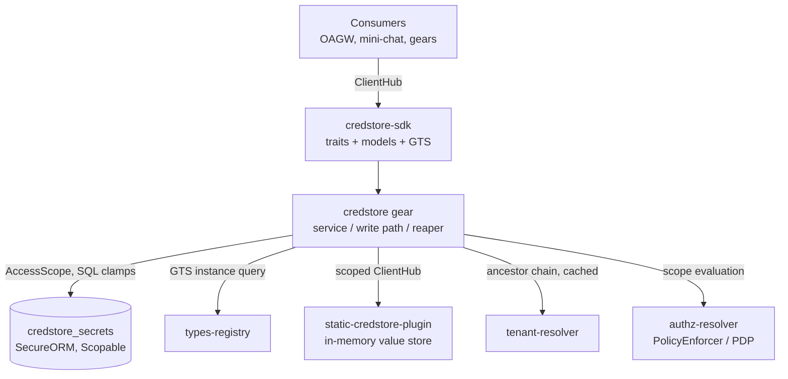
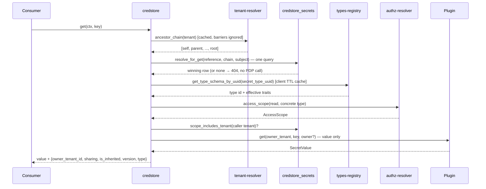
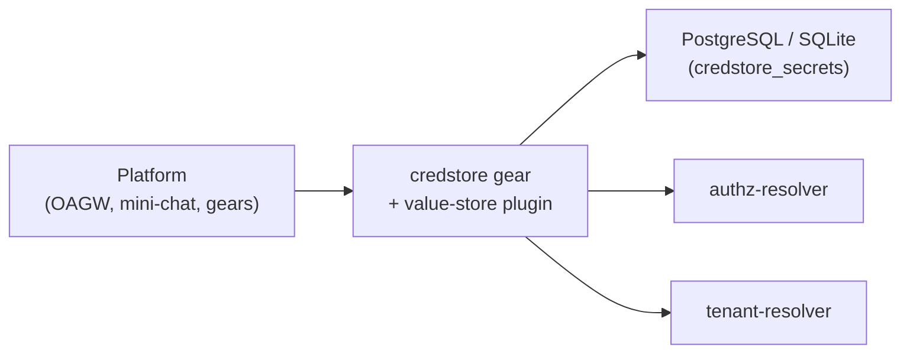

Updated:  2026-07-07 by Virtuozzo International GmbH

# Technical Design — CredStore


<!-- toc -->

- [1. Architecture Overview](#1-architecture-overview)
  - [1.1 Architectural Vision](#11-architectural-vision)
  - [1.2 Architecture Drivers](#12-architecture-drivers)
  - [1.3 Architecture Layers](#13-architecture-layers)
- [2. Goals / Non-Goals](#2-goals--non-goals)
  - [2.1 Goals](#21-goals)
  - [2.2 Non-Goals](#22-non-goals)
- [3. Principles & Constraints](#3-principles--constraints)
  - [3.1 Design Principles](#31-design-principles)
  - [3.2 Constraints](#32-constraints)
- [4. Technical Architecture](#4-technical-architecture)
  - [4.1 Domain Model](#41-domain-model)
  - [4.2 Component Model](#42-component-model)
  - [4.3 API Contracts](#43-api-contracts)
  - [4.4 External Interfaces & Protocols](#44-external-interfaces--protocols)
  - [4.5 Service-to-Service Pattern](#45-service-to-service-pattern)
  - [4.6 Interactions & Sequences](#46-interactions--sequences)
  - [4.7 Database schemas & tables](#47-database-schemas--tables)
  - [4.8 Deployment Topology](#48-deployment-topology)
  - [4.9 Technology Stack](#49-technology-stack)
  - [4.10 Value-Fingerprint Fence](#410-value-fingerprint-fence)
- [5. Secret Types (GTS-Based, Registry-Driven)](#5-secret-types-gts-based-registry-driven)
  - [5.1 Concept](#51-concept)
  - [5.2 Type Traits](#52-type-traits)
  - [5.3 Built-in Type Catalog (Registry Seeds)](#53-built-in-type-catalog-registry-seeds)
  - [5.4 Enforcement Points](#54-enforcement-points)
  - [5.5 Category Registry — withdrawn](#55-category-registry--withdrawn)
  - [5.6 Storage & API Changes](#56-storage--api-changes)
- [6. Secret Lifecycle & Write Protocol](#6-secret-lifecycle--write-protocol)
  - [6.1 Status Model](#61-status-model)
  - [6.2 Value Write Protocol (planned, ADR-0006; shipped saga below)](#62-value-write-protocol-planned-adr-0006-shipped-saga-below)
  - [6.3 Delete and Garbage Collection (planned, ADR-0006; shipped saga below)](#63-delete-and-garbage-collection-planned-adr-0006-shipped-saga-below)
  - [6.4 Maintenance Job (planned, ADR-0006; shipped reaper below)](#64-maintenance-job-planned-adr-0006-shipped-reaper-below)
- [7. Risks / Trade-offs](#7-risks--trade-offs)
  - [7.1 Architectural Trade-offs](#71-architectural-trade-offs)
  - [7.2 Security and Performance Risks](#72-security-and-performance-risks)
- [8. Migration Plan](#8-migration-plan)
- [9. Open Questions](#9-open-questions)
- [10. Additional context](#10-additional-context)
  - [Plugin Registration](#plugin-registration)
  - [Configuration](#configuration)
  - [Error Mapping](#error-mapping)
  - [Observability](#observability)
- [11. Traceability](#11-traceability)

<!-- /toc -->

<!--
=============================================================================
TECHNICAL DESIGN DOCUMENT
=============================================================================
PURPOSE: Define HOW the system is built — architecture, components, APIs,
data models, and technical decisions that realize the requirements.

DESIGN IS PRIMARY: DESIGN defines the "what" (architecture and behavior).
ADRs record the "why" (rationale and trade-offs) for selected design
decisions; ADRs are not a parallel spec, it's a traceability artifact.

SCOPE:
  ✓ Architecture overview and vision
  ✓ Design principles and constraints
  ✓ Component model and interactions
  ✓ API contracts and interfaces
  ✓ Data models and database schemas
  ✓ Technology stack choices

NOT IN THIS DOCUMENT (see other templates):
  ✗ Requirements → PRD.md
  ✗ Detailed rationale for decisions → ADR/
  ✗ Step-by-step implementation flows → features/

DESIGN LANGUAGE:
  - Be specific and clear; no fluff, bloat, or emoji
  - Reference PRD requirements using `cpt-cf-credstore-fr-{slug}` IDs
  - Sections marked **Planned** describe target design not yet implemented;
    everything else describes the shipped implementation.
=============================================================================
-->

## 1. Architecture Overview

### 1.1 Architectural Vision

CredStore follows the ToolKit Gear + Plugins pattern: a **stateful gear** (`credstore`) owns all secret *metadata* (identity, sharing, ownership, lifecycle status, version) in its own database table, enforces authorization and hierarchical resolution, and exposes the public API; backend **plugins** are pure per-tenant *value stores* selected at runtime by GTS vendor configuration. The backend stores the secret value only — it carries no metadata schema, no sharing semantics, and no policy.

The SDK crate (`credstore-sdk`) defines two trait boundaries: `CredStoreClientV1` for consumers and `CredStorePluginClientV1` for backend implementations. Consumers depend only on the gear trait and never interact with plugins directly, which allows runtime backend selection without changing consumer code.

Because metadata is local, hierarchical resolution (the walk-up that searches for secrets across tenant ancestors) is a **single indexed SQL query** over the metadata table followed by at most **one** backend read for the winning row. Writes are **compensating sagas** over the metadata row and the backend value, made crash-safe by an explicit lifecycle status and a periodic reaper. **Superseded by ADR-0006 (planned)**: a write becomes a value-and-pointer switch under immutable backend versions — no in-flight lifecycle status, no compensation — crash-safety instead comes from an intent log plus a garbage-collection queue drained by a periodic maintenance job, not a resident reaper (§6.2, §6.4).

Authorization is delegated to the platform PDP (`authz-resolver`) via `PolicyEnforcer`: each operation evaluates an `AccessScope` that is enforced **in SQL** through SecureORM clamps on the metadata table. Tenant isolation is therefore enforced at the data layer, consistent with the rest of the platform.

### 1.2 Architecture Drivers

#### Functional Drivers

| Requirement | Design Response |
|-------------|-----------------|
| `cpt-cf-credstore-fr-put-secret` | Write saga: insert `provisioning` metadata row → plugin `put` (value only) → mark `active`; overwrite ordering follows the precondition kind — version validator claims the metadata CAS before `plugin.put`, `If-Match: *` is backend-first then version bump (§6.2). **Superseded in part** by ADR-0004: the REST form (a single `POST` carrying record and value) is replaced by a single `PUT` on the record address, still one request carrying record and value together (§4.3). **Superseded by ADR-0006 (planned)**: value written under a fresh `value_id`, then row CAS; gc table (§6.2) |
| `cpt-cf-credstore-fr-get-secret` | Single SQL resolution over the ancestor chain, then one plugin `get` for the winning row. **Superseded in part** by ADR-0004: the value moves to `GET .../secret`, independent of the metadata read (§4.3) |
| `cpt-cf-credstore-fr-delete-secret` | Deprovisioning saga: mark `deprovisioning` → backend delete → row delete (§6.3). **Superseded in part** by ADR-0004: `DELETE` addresses the credential record (value included), not a standalone secret (§4.3). **Superseded by ADR-0006 (planned)**: row delete + gc, no name retention (§6.3) |
| `cpt-cf-credstore-fr-tenant-scoping` | Gear derives tenant from `SecurityContext.subject_tenant_id()`; own-tenant gate + SecureORM scope clamp |
| `cpt-cf-credstore-fr-sharing-modes` | `sharing` column in the gear metadata table; partial unique indexes let private and tenant/shared coexist under one reference |
| `cpt-cf-credstore-fr-authz-pdp` | PDP `AccessScope` per operation on the secret GTS resource type, enforced in SQL; fail-closed. Shipped action set is `read`/`write`/`delete` on `gts.cf.core.credstore.secret.v1~`; ADR-0004 renames the type to `…credential.v1~` and replaces the set with the six actions of `cpt-cf-credstore-fr-authz-action-split` below, so no shipped permission matches the new surface |
| `cpt-cf-credstore-fr-optimistic-concurrency` | Monotonic `version` column; `GET` returns a strong generation-bound `ETag` (`"<id>.<version>"`, §4.10); `PUT`/`DELETE` require `If-Match` (a validator or `*`) |
| `cpt-cf-credstore-fr-secret-types` | GTS-based secret types with enforceable traits (§5) |
| `cpt-cf-credstore-fr-deprovisioning` | `deprovisioning` status + compensating delete saga swept by the reaper (§6.3). **Superseded by ADR-0006 (planned)**: row delete + gc, no name retention (§6.3) |
| `cpt-cf-credstore-fr-credential-record` | Resource split (ADR-0004): the `credentials` collection item carries metadata only; the secret value lives at the `secret` sub-resource address, never on the record (§4.1, §4.3) |
| `cpt-cf-credstore-fr-list-credentials` | Upward-rooted collection read (ADR-0005): ancestor chain from tenant-resolver, tenant dimension as a PDP gate rather than a SQL clamp, `type`/`reference` as SQL clamps, `sharing`/`expires_at`/`fallback` filtered after reduction, `$select` sparse projection, reference-boundary cursor over reduced rows (§4.4, §4.6, §4.7) |
| `cpt-cf-credstore-fr-get-credential` | `GET /credentials/{ref}`: hierarchical resolution of the record without the value; carries the strong `ETag` so a value-blind caller can still perform a guarded write (§4.3) |
| `cpt-cf-credstore-fr-write-credential-record` | `PUT /credentials/{ref}` full replace of record and value in one request (`If-None-Match`/`If-Match`; requires `write` + `write_secret`); `PATCH /credentials/{ref}` merge-patch partial update (requires `write` for metadata keys, `write_secret` for `value`, both when both are present; never creates); type stays immutable under both (§4.1, §4.3) |
| `cpt-cf-credstore-fr-read-secret` | `GET /credentials/{ref}/secret`: value-only sub-resource, `Cache-Control: no-store`, one audit record per returned value (§4.3) |
| `cpt-cf-credstore-fr-write-secret` | Value written through the record address, as `value` in a full `PUT` or the `value` member of a `PATCH`, under the record's one validator; `PATCH {"value": null}` removes the value (→ `declared`); requires `write_secret` (plus `write` when metadata is also carried); grants no read of that value; a `PATCH` never creates a record (§4.3.2) |
| `cpt-cf-credstore-fr-bulk-read-secrets` | `GET /credentials` with `$select` containing `secret`: explicit-references or scoped `type` selector, per-item authorization and fence verification, hard cap enforced by fetching `cap + 1` rows with `TOO_MANY_MATCHES` instead of truncation, no pagination (§4.3, §4.6) |
| `cpt-cf-credstore-fr-authz-action-split` | Six PDP actions on the renamed resource type `gts.cf.core.credstore.credential.v1~`: `list` / `read` / `write` / `delete` on the record, `read_secret` / `write_secret` on the value; shipped permissions target `secret.v1~` and therefore match nothing on the new surface (§4.3, §4.4) |
| `cpt-cf-credstore-fr-inheritance-status` | `inheritance` (own / inherited / overridden) computed at resolution/reduction time from the ancestor-chain walk; never a filterable or orderable column (§4.1, §4.4) |
| `cpt-cf-credstore-fr-suppression` | `fallback` column (`inherit`/`none`) on the record, set with `write`; a value-less record with `none` wins resolution when nearest and yields 404 for its tenant and, per `sharing`, its descendants; suppressing an active own credential is one atomic `PATCH {"fallback": "none", "value": null}` (§4.3.2, §6.1; ADR-0004 Suppression) |

#### NFR Allocation

| NFR ID | NFR Summary | Allocated To | Design Response | Verification Approach |
|--------|-------------|--------------|-----------------|----------------------|
| `cpt-cf-credstore-nfr-confidentiality` | Secret values never in logs or caches | SDK + gear + plugins | `SecretValue` wrapper with redacting `Debug`/`Display` and zeroize-on-drop; hand-written redacted `Debug` on REST DTOs; `Cache-Control: no-store` on `GET`; no lossy UTF-8 decode | Unit tests on redaction; code review |
| `cpt-cf-credstore-nfr-tenant-isolation` | No cross-tenant access outside PDP scope | Gear + repo | Scope clamps in SQL; own-tenant gate with `cross_tenant_denied` metric | Repo/service tests incl. scope cases |
| `cpt-cf-credstore-nfr-observability` | Operational visibility | Gear | OpenTelemetry metrics: walk-up depth, read outcome, dependency timings, saga rollback/reap counters (**superseded by ADR-0006, planned**: the maintenance job's `gc_deleted`/`gc_pending_reclaimed`/`expired_deleted` counters, §10), inventory gauge (shipped; **withdrawn by ADR-0006, planned** — a `COUNT`-based gauge is disallowed by the platform's no-`COUNT` rule, §10) | Metrics unit tests |

#### Key ADRs

| ADR ID | Decision Summary |
|--------|------------------|
| `cpt-cf-credstore-adr-stateful-gear` | Stateful gear, value-only backend: the gear owns the `credstore_secrets` metadata table (identity, sharing, ownership, lifecycle status, version); the backend plugin stores only the value ([ADR-0001](./ADR/0001-cpt-cf-credstore-adr-stateful-gear.md)). **Amended by ADR-0006 (planned)**: the metadata row gains a `value_id` pointer instead of the backend value being overwritten in place under a fixed key |
| `cpt-cf-credstore-adr-deprovisioning-saga` | Delete is a saga symmetric to provisioning: a `deprovisioning` status holds the unique name until backend cleanup completes; stuck rows are swept by the reaper ([ADR-0002](./ADR/0002-cpt-cf-credstore-adr-deprovisioning-saga.md)). **Superseded by ADR-0006 (planned)**: deletion becomes one row transaction plus garbage collection; no `deprovisioning` status, no name retention; the garbage is drained by an operator-scheduled maintenance job, not a resident reaper (§6.4) |
| `cpt-cf-credstore-adr-value-fingerprint-fence` | Value-fingerprint fence + generation-bound ETag: the gear stamps `value_fp = HMAC(fence_key, value)` in the same write as `sharing` and verifies it on read (fail-closed 404 on mismatch), and binds the strong ETag to `<row-id>.<version>`; closes the crosswise-PUT cross-tenant disclosure and the recreate ABA lost-update ([ADR-0003](./ADR/0003-cpt-cf-credstore-adr-value-fingerprint-fence.md)). **Amended by ADR-0006 (planned)**: the fence becomes an integrity check only — a fingerprint exists for every value and a value-less row has none (`value_id IS NULL ⇔ value_fp IS NULL ⇔ fp_key_id IS NULL`), no out-of-band seeding, no healing re-put; recovery is a new write under a fresh `value_id` |
| `cpt-cf-credstore-adr-secret-value-exposure` | **Proposed.** Credential record and secret value become separate resources: the record (`credentials` collection) never carries a value, the value is a sub-resource with its own address, and bulk value reads use a capped, non-paginated selector ([ADR-0004](./ADR/0004-cpt-cf-credstore-adr-secret-value-exposure.md)) |
| `cpt-cf-credstore-adr-upward-collection-read` | **Proposed.** The credential-record collection is rooted at the caller's tenant and reads upward only; the tenant dimension of PDP scope gates the caller's own tenant rather than clamping rows in SQL, so inherited rows survive ([ADR-0005](./ADR/0005-cpt-cf-credstore-adr-upward-collection-read.md)) |
| `cpt-cf-credstore-adr-immutable-value-versions` | **Proposed.** Every value write creates a new immutable backend entry under a fresh `value_id`; the row points at the current version; the old version is deleted after the pointer switch, via a gc table a periodic maintenance job drains (no resident reaper); the backend key becomes `(tenant_id, value_id)` — no reference, no owner class; statuses shrink to `active`/`declared`; the fence stays as an integrity check ([ADR-0006](./ADR/0006-cpt-cf-credstore-adr-immutable-value-versions.md)) |

### 1.3 Architecture Layers

```
┌───────────────────────────────────────────────────────────────┐
│                Consumers (OAGW, mini-chat, gears)             │
├───────────────────────────────────────────────────────────────┤
│  credstore-sdk    │ Public API traits, models, errors, GTS    │
├───────────────────────────────────────────────────────────────┤
│  credstore        │ PDP authz, resolution, write sagas, REST, │
│  (stateful)       │ reaper, metrics — owns credstore_secrets  │
├───────────────────────────────────────────────────────────────┤
│  Plugins          │ Pure per-tenant value stores              │
│  ┌────────────────────────────┐  ┌──────────────────────────┐ │
│  │ static-credstore-plugin    │  │ production vaults        │ │
│  │ (in-memory, dev/test)      │  │ (future: external store, │ │
│  │                            │  │  OS keychain, KMS-backed)│ │
│  └────────────────────────────┘  └──────────────────────────┘ │
├───────────────────────────────────────────────────────────────┤
│  Platform deps    │ authz-resolver (PDP), tenant-resolver,    │
│                   │ types-registry (GTS), toolkit-db          │
└───────────────────────────────────────────────────────────────┘
```

| Layer | Responsibility | Technology |
|-------|---------------|------------|
| SDK | Public and plugin trait definitions, models, errors, GTS type declarations | Rust crate (`credstore-sdk`) |
| Gear | PDP authorization, hierarchical resolution, sharing enforcement, write sagas, lifecycle reaper, plugin selection, REST API | Rust crate (`credstore`), Axum, SeaORM/SecureORM |
| Plugins | Backend-specific secret **value** storage (per-tenant key-value CRUD; no policy, no hierarchy, no metadata) | Rust crates |
| Platform | Policy decisions (PDP), tenant hierarchy, plugin discovery | authz-resolver, tenant-resolver, types-registry |

The box diagram and this table's "write sagas" label the shipped implementation; **superseded by ADR-0006 (planned)**, the gear layer's write path is the value write protocol and gc drain of §6.2/§6.4, not a saga (§1.1).

## 2. Goals / Non-Goals

### 2.1 Goals

- Provide secure, hierarchical secret storage for platform gears and tenant administrators
- Enable flexible sharing modes: `private` (owner-only), `tenant` (tenant-wide, default), `shared` (hierarchical)
- Support service-to-service secret retrieval (e.g., OAGW retrieving secrets on behalf of customer tenants)
- Enforce authorization via the platform PDP with SQL-level scope clamps (real tenant isolation at the data layer)
- Make writes crash-safe and self-healing (shipped: saga + reaper; **superseded by ADR-0006, planned**: intent log + a gc-draining periodic maintenance job, no resident reaper, §6.2, §6.4), and reads race-free against half-written secrets
- Enforce optimistic concurrency (version / `ETag` / mandatory `If-Match`) for lost-update detection — every update/delete states its concurrency stance; creation is the only preconditionless write
- Support multiple backend value stores via plugin architecture with GTS-based runtime selection
- Ensure secret values never appear in logs, error messages, debug traces, or intermediary caches
- Enable secret shadowing: child tenants can override parent credentials without breaking existing references
- Classify secrets by GTS-based *secret types* with enforceable traits (§5)
- Symmetric, crash-safe deletion — shipped via a `deprovisioning` saga; **superseded by ADR-0006 (planned)**: a single row transaction plus garbage collection (§6.3)

### 2.2 Non-Goals

The following capabilities are explicitly out of scope:

- **Granular ACL beyond hierarchical**: fine-grained per-secret ACLs (role- or attribute-based) are out of scope. The three-tier sharing model plus PDP scope covers primary use cases.
- **Secret value history / rollback**: the `version` column supports optimistic locking only; previous values are not retained.
- **Secret rotation automation**: automatic rotation is out of scope. (Secret types may carry *advisory* rotation traits, §5.2 — enforcement/automation is future work.)
- **Direct end-user access**: unauthenticated or untrusted client access is out of scope.
- **Secret templates or composition**: dynamic secret generation or derivation is out of scope.
- **Hierarchical resolution in backends**: plugins are pure per-tenant value stores — all hierarchy, sharing, and policy logic lives in the gear.
- **Secret discovery / search**: full-text search over values or references stays out of scope. A metadata listing is **no longer** a non-goal: it is required by `cpt-cf-credstore-fr-list-credentials` and designed in [ADR-0005](./ADR/0005-cpt-cf-credstore-adr-upward-collection-read.md); it is upward-rooted, never carries values, and never enumerates descendants.
- **MySQL support**: migrations target PostgreSQL and SQLite; MySQL fails fast with a typed error.

## 3. Principles & Constraints

### 3.1 Design Principles

#### Stateful Gear, Value-Only Backend

- [ ] `p1` - **ID**: `cpt-cf-credstore-principle-stateful-gear`

The gear owns all secret metadata in its own `credstore_secrets` table; the backend plugin stores the value only, keyed by `(tenant_id, key, key-class)` where the key class is `private-per-owner` (`owner_id = Some`) or `tenant` (`owner_id = None`). This removes any backend metadata-schema prerequisite, eliminates encoded-external-ID collision risk, and makes resolution and authorization a single transactional query. **Superseded by ADR-0006 (planned)**: the backend key becomes `tenant_id/value_id` — `value_id` is unique store-wide, so the row alone knows which reference and sharing class a value belongs to. Private and tenant/shared rows under one reference no longer need distinct backend key classes to stay apart, only distinct `value_id`s; the coexistence rule (partial unique indexes on the metadata table, §4.7) is unchanged, and `OwnerId` stays a row-level access-control key only, never part of the backend key.

#### Authorization via PDP, Enforced in SQL

- [ ] `p1` - **ID**: `cpt-cf-credstore-principle-authz-pdp`

Every operation evaluates a PDP `AccessScope` for its action on the credential resource type (shipped as `gts.cf.core.credstore.secret.v1~`; renamed to `gts.cf.core.credstore.credential.v1~` by ADR-0004, §5.1) and enforces that scope in SQL through SecureORM clamps on the metadata table. The shipped action set is `read`, `write`, `delete`; ADR-0004 replaces it with `list`, `read`, `write`, `delete` on the record and `read_secret`, `write_secret` on the value (`cpt-cf-credstore-fr-authz-action-split`, §4.3.2). Because the resource type is renamed at the same time, no shipped permission matches a new operation, and every policy is re-issued against the new type. Both read and write paths additionally gate on an explicit own-tenant invariant (`scope_includes_tenant`) and emit a `cross_tenant_denied` metric. Out-of-scope access is fail-closed and surfaces as the canonical 404 (anti-enumeration) or 403. Plugins MUST NOT implement authorization.

**The collection read is the exception to "one evaluation per operation"** (§4.4): its resource is a concrete secret type, and a page can span several, so it evaluates `list` once per distinct type the candidate probe found — bounded by the number of types a tenant actually uses, not by the page size, and cacheable per subject. Every other operation addresses exactly one row and therefore one type, so for those the single-evaluation rule holds unchanged.

#### Tenant from SecurityContext

- [ ] `p1` - **ID**: `cpt-cf-credstore-principle-tenant-from-ctx`

The operating tenant is always derived from `SecurityContext.subject_tenant_id()`, and the owner from `SecurityContext.subject_id()`. This reduces API surface, prevents misuse, and aligns with platform patterns. Service-to-service consumers (OAGW) construct a `SecurityContext` for the target tenant rather than passing tenant parameters.

#### Crash-Safe Writes (Saga + Reaper)

- [ ] `p1` - **ID**: `cpt-cf-credstore-principle-write-saga`

**Shipped today, superseded by ADR-0006 (planned).** A write that spans the metadata table and the backend is a compensating saga with an explicit lifecycle status (§6). Every failure mode either rolls back, self-heals on retry, or is swept by the periodic reaper — a crash can never permanently wedge a reference or leak a readable half-written secret. **Planned, ADR-0006:** a write that spans the backend and the metadata row is an intent-logged, immutable-version protocol, not a compensating saga — the backend entry for a given `value_id` is written once and never overwritten, an intent row records it before the write and is cleared by the same transaction that switches the row's pointer, and every failure mode either leaves the row unswitched (old value still served) or leaves an orphan the periodic maintenance job reclaims (§6.2, §6.4). The guarantee — a crash can never permanently wedge a reference or leak a readable half-written secret — is unchanged; only the mechanism is.

### 3.2 Constraints

#### No Secret Logging

- [ ] `p1` - **ID**: `cpt-cf-credstore-constraint-no-secret-logging`

Secret values MUST NOT appear in any log output, error messages, or debug traces. `SecretValue` implements redacting `Debug`/`Display` and zeroizes on drop; request/response DTOs carry hand-written redacted `Debug`; the `GET` response sets `Cache-Control: no-store`; non-UTF-8 values are rejected with a typed error rather than lossily decoded.

#### Canonical Error Model

- [ ] `p1` - **ID**: `cpt-cf-credstore-constraint-canonical-errors`

All trait-boundary and REST errors follow the platform canonical error model ([ADR 0005](../../../docs/arch/errors/ADR/0005-cpt-cf-adr-sdk-canonical-projection.md)): domain errors map to canonical categories with stable `reason` codes (e.g. `OPTIMISTIC_LOCK_FAILURE`), and the wire strips internal diagnostics.

## 4. Technical Architecture

### 4.1 Domain Model

**Technology**: Rust structs (`#[domain_model]`)

**Core Entities**:

| Entity | Description |
|--------|-------------|
| `SecretRef` | Validated secret reference key (e.g., `partner-openai-key`). **Format**: `[a-zA-Z0-9_-]+`, 1–255 chars; validated on construction and re-validated by a DB `CHECK`. |
| `SecretValue` | Opaque byte wrapper (`Vec<u8>`) for secret data. Redacting `Debug`/`Display`, zeroize-on-drop, deliberately not `Serialize`/`Deserialize`. |
| `SharingMode` | Enum: `Private`, `Tenant` (default), `Shared` — controls access scope within the tenant hierarchy. |
| `OwnerId` | UUID identifying the creator (`SecurityContext.subject_id()`) — access control key for `Private` mode. |
| `SecretStatus` | Lifecycle status of the metadata row: shipped as `Provisioning` (1), `Active` (2), `Deprovisioning` (3), and — planned with ADR-0004 — `Declared` (4) for a record whose value was removed by a `PATCH {"value": null}` (§4.1, §6.1). Only `Active` rows are visible to value resolution; `Declared` is additionally visible to the collection read, and no other status is visible to anything. **Superseded by ADR-0006 (planned)**: the model shrinks to two statuses only, `Active` (2) and `Declared` (4); `Provisioning` (1) and `Deprovisioning` (3) are retired — their codes are reserved, not reused — because a write is a value-and-pointer switch, not a saga state, so nothing remains that needs an in-flight status (§6.1, §6.2). |
| `SecretRow` | Metadata row: `{ id, tenant_id, reference, sharing, owner_id, status, version, value_fp, fp_key_id }`. `value_fp` is the internal value-fingerprint fence (§4.10), never serialized to the wire. **Superseded by ADR-0006 (planned)**: gains `value_id` — a nullable pointer to the row's current backend version (`NULL ⇔ status = declared`, §6.1); the value itself is no longer looked up by the row's own key, only by `tenant_id/value_id` — `value_id` is unique store-wide, so the backend key needs no `reference` or key-class segment; distinct `value_id`s, not distinct key classes, are what keep a private and a tenant/shared row under one reference apart in the backend. |
| `NewSecret` | Insert shape for the create saga (always carries the fence fingerprint of the value being written). **Superseded by ADR-0006 (planned)**: the insert it shapes is the row-CAS step of the write protocol (§6.2), and it also carries the freshly minted `value_id` the row is created already pointing at. |
| `WritePrecondition` | Parsed `If-Match`, mandatory on update/delete: `Exists` (`*`, explicit last-writer-wins) or `Version { id, version }` (quoted `"<id>.<version>"`, generation-bound). |
| `GetSecretResponse` | SDK read result: `{ value, id, owner_tenant_id, sharing, is_inherited, version }`; `(id, version)` is the strong-validator pair. |
| `SecretType` | Catalog-resolved secret type binding the enforceable traits (§5); immutable per secret. |
| `Credential` (planned, ADR-0004; REST schema `Credential`) | The addressable **metadata** resource: reference, sharing, type, expiry, and two independent status fields. `status` is the state of the **caller's own row** — `none`/`declared`/`active`, never a saga state, never `provisioning`/`deprovisioning` — while `inheritance` (`own`/`inherited`/`overridden`/`suppressed`) is the state of the **effective row** the reference resolves to. `fallback` (`inherit`/`none`, §6.1) is the caller's own row's policy for having no value, shown only for that row; `version` and `updated_at` likewise describe the caller's own row and appear whenever `status` is not `none`. Structurally never the value, and never the owning tenant (ADR-0004, "What a response says about tenants above"). Identified by `SecretRef` in the `credentials` collection (§4.3); the secret value is a separate sub-resource of it, not a field on it. |
| `Secret` (planned, ADR-0004; REST schema `Secret`) | The value with its usage envelope only: reference, type, expiry, value. Nothing administrative — `sharing`, `inheritance`, `status` stay on the `Credential` — so `read_secret` discloses a different representation from `read`, not a superset (ADR-0004, "Two representations"). |
| `InheritanceStatus` (planned, `cpt-cf-credstore-fr-inheritance-status`) | Enum, four variants: `Own` (the winning row is the caller's own, no ancestor involved); `Inherited` (the winning row is an ancestor's `shared` record); `Overridden` (the caller's own record shadows an ancestor's `shared` record under the same reference); `Suppressed`: the winning row is a value-less record with `fallback: none` (ADR-0004, "Suppression"; §6.1) — the row may be the caller's own or an ancestor's `shared` one. Computed at resolution/reduction time, never a stored or filterable column (§4.4). |

**Relationships & uniqueness**:

- A secret belongs to exactly one tenant (`tenant_id`) and has exactly one owner (`owner_id`).
- For `tenant`/`shared` modes, `(tenant_id, reference)` is unique; for `private` mode, `(tenant_id, reference, owner_id)` is unique. Both are enforced as **partial unique indexes** (§4.7), which lets one private secret per owner and one tenant/shared secret **coexist** under the same reference.
- The uniqueness indexes ignore `status`, so an in-flight (`provisioning`) row holds the reference; failed sagas are rolled back or reaped to un-wedge it. **Superseded by ADR-0006 (planned)**: a row is only ever inserted already `active` (§6.2 step 4), so there is no in-flight row for the uniqueness indexes to hold open — a failed write leaves no row at all, not a wedged one.

**Sharing-mode access control** (evaluated during SQL resolution):

| Mode | Visible to | Inherited by descendants? |
|------|-----------|---------------------------|
| `private` | Only where `owner_id` equals the caller's subject id; wins over non-private at the same tenant level | No |
| `tenant` (default) | Only the owning tenant | No |
| `shared` | The owning tenant **and** all its descendants (including through isolation barriers) | Yes |

`sharing` is a **visibility** mode (who may read the secret), not a quota/limit that composes as `min(parent, child)`; resolution picks the closest accessible secret up the ancestor chain, which is how a child tenant *shadows* a parent's `shared` secret under the same reference.

**Record without a value (planned, ADR-0004).** A `PATCH {"value": null}` against an existing, own record is the only way to reach this state (§4.3, §6.1) — never a resting point of creation, since creation always writes a value in the same request (§6.2). It is a **stored lifecycle state** — `status = 4`, `declared`, widening the initial schema's `CHECK (status IN (1, 2, 3))` — and not an inference from a missing fingerprint; §6.1 carries the reasoning and the predicate table. Naming it here without naming its column would leave each of the properties below resting on application logic over something the metadata row does not hold:

**Superseded by ADR-0006 (planned):** the column-level invariant is `declared ⇔ value_id IS NULL` — a `declared` row's pointer is null, an `active` row's is not. `PATCH {"value": null}` clears the pointer and, in the same transaction, enqueues the row's old `value_id` into `credstore_value_gc` with reason `removed`, for the periodic maintenance job to delete from the backend (§6.1, §6.4, gc table in §4.7).

- It **does not resolve** for a value read, which is not the same as "the read returns not-found". The row is simply not a candidate: resolution already selects `status = 2`, so a `declared` row is excluded by a filter that is already there, and the walk up the ancestor chain continues past it. What the caller gets therefore depends on the chain — an ancestor's `shared` value if one exists (next bullet), and the ordinary not-found only when the whole chain offers nothing. Reading these two bullets as "declared implies 404" is the mistake they exist to prevent.
- It **does not shadow** an ancestor: an inherited `shared` value from a parent keeps resolving for the tenant and its descendants exactly as if the value-less record did not exist. Removing a value must not silently break inheritance that was working before it started. The collection read has to honour the same rule when it reduces a reference to one item, or the listing would claim the credential is configured locally while the point read serves the ancestor's value (ADR-0005 "Reducing a reference to one item").
- It is **distinct from `value_fp IS NULL`** (§4.10, out-of-band seeding): that case already has a value in the backend and is only missing its fingerprint, served on trust until backfilled; a record without a value has no backend value at all, so there is nothing to serve on trust. This is precisely why the state is its own `status` rather than a second meaning for a null fingerprint — one column cannot mean both "serve on trust" and "there is nothing to serve". **Superseded by ADR-0006 (planned):** out-of-band seeding is withdrawn — a fingerprint exists for every value and a value-less row has none (`value_id IS NULL ⇔ value_fp IS NULL ⇔ fp_key_id IS NULL`) — so this distinction narrows to `declared` (`value_id`/`value_fp`/`fp_key_id` all NULL) vs. `active` (all three set); there is no longer a third, seeded case (a value with no fingerprint) to distinguish from either (§4.10).
- It **is never produced by a crash**: creation is atomic — one `PUT`, record and value together, through the provisioning saga (§6.2) — so there is no in-flight state between "no record" and "record with a value" for the reaper to sweep. It **is not swept by the reaper** as a stuck write (§6.1, §6.4) for a different reason: it is reached by a completed `PATCH` that already updated the row, not a stalled write, so it can never look like a crashed `provisioning` row to the sweep. **Superseded by ADR-0006 (planned):** creation is no longer a saga status but a protocol (§6.2); a crashed create still never produces a `declared` row — it leaves either no row at all (crash before the row CAS) or a fully `active` row (crash after), plus a `pending` gc entry the periodic maintenance job reconciles either way.
- It **is visible in the catalogue**, unlike every other non-`active` status: the collection read selects `status IN (2, 4)` and surfaces the state, because an administrator who has removed a record's value needs to see exactly that (§6.1).

### 4.2 Component Model



**Components**:

- [ ] `p1` - **ID**: `cpt-cf-credstore-component-sdk`

`credstore-sdk` — trait definitions (`CredStoreClientV1`, `CredStorePluginClientV1`), models, canonical `CredStoreError`, and the GTS declarations: the plugin spec type (`gts.cf.toolkit.plugins.plugin.v1~cf.core.credstore.plugin.v1~`) and the credential resource type (`gts.cf.core.credstore.secret.v1~` as shipped, `gts.cf.core.credstore.credential.v1~` after the ADR-0004 rename; exported as `SECRET_RESOURCE_TYPE` — the single source of truth pinned by unit tests).

- [ ] `p1` - **ID**: `cpt-cf-credstore-component-gear`

`credstore` — the stateful gear. Layers: `api/rest` (Axum routes, DTOs with redacted `Debug`, `If-Match` parsing), `domain` (service with get/put/delete sagas — **superseded by ADR-0006, planned**: the value write protocol and delete-and-gc of §6.2/§6.3 — authz scope evaluation, resolver port, metrics port, plugin selector port), `infra` (SecureORM repo, migrations, tenant-resolver adapter with TTL+LRU ancestor cache, GTS plugin selector, OTel metrics, canonical error mapping). Declares `deps = [authz-resolver, tenant-resolver, types-registry]` and capabilities `system, db, rest, stateful`; its lifecycle entry runs the reaper loop (§6.4). **Withdrawn by ADR-0006 (planned)**: no resident reaper loop — the gear's lifecycle entry starts no background timer; the equivalent maintenance work becomes an admin entrypoint of the gear binary (`credstore gc`), invoked by an operator-chosen schedule outside the gear's own lifecycle (§6.4).

- [ ] `p1` - **ID**: `cpt-cf-credstore-component-static-plugin`

`static-credstore-plugin` — in-memory per-tenant value store for development and testing, optionally seeded from YAML config, writable at runtime. Registers its GTS instance and scoped `CredStorePluginClientV1` in ClientHub.

- [ ] `p2` - **ID**: `cpt-cf-credstore-component-production-backend`

Production value-store backends (external secret vault, OS keychain, KMS-backed store) — future plugins implementing the same `CredStorePluginClientV1` contract. Not part of the current codebase.

**Interactions**:

- Consumer → Gear: `CredStoreClientV1` via ClientHub (in-process) or REST.
- Gear → Repo: all metadata reads/writes clamped by the PDP `AccessScope` (SecureORM `Scopable`).
- Gear → Plugin: `CredStorePluginClientV1` via scoped ClientHub; the plugin is resolved lazily by GTS instance query filtered by the configured `vendor`.
- Gear → tenant-resolver: ancestor chain (`BarrierMode::Ignore` — inheritance crosses isolation barriers), cached in-process with TTL + LRU eviction.
- Gear → PDP: `PolicyEnforcer.access_scope_with` per operation; no PEP capabilities advertised — the PDP hands the gear flat, pre-expanded tenant predicates (§4.4).

### 4.3 API Contracts

- [ ] `p1` - **ID**: `cpt-cf-credstore-interface-clienthub`

**Technology**: Rust traits (ClientHub) + REST/OpenAPI

#### ClientHub API (in-process)

`CredStoreClientV1` (public consumer API):

| Method | Signature | Description |
|--------|-----------|-------------|
| `get` | `(ctx: &SecurityContext, key: &SecretRef) → Result<Option<GetSecretResponse>, CredStoreError>` | Hierarchical read. `Ok(None)` covers both "does not exist" and "inaccessible" (single 404 surface, anti-enumeration). |
| `put` | `(ctx, key, value: SecretValue, sharing: SharingMode, precondition: WritePrecondition) → Result<(), CredStoreError>` | Update within the target sharing class; never creates. The mandatory precondition is `Matches { id, version }` (CAS for read-modify-write) or `Exists` (explicit last-writer-wins for rotation/provisioning and, **shipped today, superseded by ADR-0006 (planned)**, fence-heal — under ADR-0006 `Exists` is plain last-writer-wins with no healing role, §4.10). |
| `create` | `(ctx, key, value, sharing) → Result<(), CredStoreError>` | Create-only; `Conflict` if a secret of the same sharing class exists (the 409 path behind REST `POST`). The only preconditionless write. |
| `delete` | `(ctx, key, precondition: WritePrecondition) → Result<(), CredStoreError>` | Delete the caller's own-tenant secret, guarded by the mandatory precondition. |

`CredStorePluginClientV1` (backend SPI — pure value store):

| Method | Signature | Description |
|--------|-----------|-------------|
| `get` | `(ctx, tenant_id, key, owner_id: Option<&OwnerId>) → Result<Option<SecretValue>, CredStoreError>` | `owner_id = Some` selects the owner's private key class; `None` the tenant key class. Returns the value only. **Planned, ADR-0006**: the SPI becomes exactly `get(ctx, tenant_id, value_id) → Result<Option<SecretValue>, CredStoreError>` — no `key`, no `owner_id`; `value_id` is unique store-wide, so the plugin learns nothing about references, owners, or sharing. |
| `put` | `(ctx, tenant_id, key, value, owner_id: Option<&OwnerId>) → Result<(), CredStoreError>` | Store the value for the addressed key class. **Planned, ADR-0006**: becomes exactly `put(ctx, tenant_id, value_id, value: SecretValue) → Result<(), CredStoreError>` — no `key`, no `owner_id`; writes a new immutable entry at `tenant_id/value_id`, never overwriting an existing one. |
| `delete` | `(ctx, tenant_id, key, owner_id: Option<&OwnerId>) → Result<(), CredStoreError>` | Delete the value; `NotFound` is treated as success by the gear (idempotent). **Planned, ADR-0006**: becomes exactly `delete(ctx, tenant_id, value_id) → Result<(), CredStoreError>` — no `key`, no `owner_id`; deletes exactly that version's entry, issued by the writer's own post-commit cleanup (§6.2 step 5, §6.3 step 3) and, for whatever that cleanup missed, by the maintenance job's gc drain (§6.4). |

**Design rationale**: the plugin returns **no metadata** — sharing, ownership, inheritance, and version all come from the gear's metadata row resolved *before* the backend is touched. This keeps every policy decision in one place and backends trivially simple.

**Planned (ADR-0004, `cpt-cf-credstore-adr-secret-value-exposure`).** `CredStoreClientV1` is reshaped around the two resources, with the same nouns the REST surface uses: `get` (one `Credential`, no value), `get_secret` (hierarchical read of the value), `put` (precondition-guarded create-or-replace of the record together with its value, in one call), `patch` (precondition-guarded partial update — merge-patch semantics: metadata edit, value rotate, or value remove via a null value; never creates), `list` (the collection of §4.4, taking an OData query — `$filter`/`$select`/`$orderby`/`limit`/`cursor` — and returning items whose `secret` is present only when selected, subject to the same cap and no-pagination rule as the REST value mode) and `delete`. `get` changes meaning — it returns a `Credential`, which has no `value` field, so every existing caller fails to compile instead of silently reading metadata — and `create` is removed: `put` under the create-only precondition is create, and it always carries a value, so there is no separate create-then-set-value pair. The same names appear in `credstore-sdk/README.md`; there is one spelling, not two (Backward Compatibility, ADR-0004).

#### 4.3.1 REST API (Gear)

Routes are registered under `/credstore/v1` (served behind the platform API gear under its public prefix, e.g. `/cf/credstore/v1/...`). All routes are authenticated; errors use the canonical `Problem` envelope.

The machine-readable API is generated from the handlers: the platform-wide OpenAPI document lives at [`docs/api/api.json`](../../../docs/api/api.json) (regenerate with `make openapi`), and a credstore-scoped rendering is at [`openapi.yaml`](./api/openapi.yaml).

| Method | Path | Success | Description |
|--------|------|---------|-------------|
| `POST` | `/credstore/v1/secrets` | `201` + `Location` | Create-only; `409` if the same sharing class already holds the reference |
| `PUT` | `/credstore/v1/secrets/{ref}` | `204` | Update only (never creates); `If-Match` mandatory |
| `GET` | `/credstore/v1/secrets/{ref}` | `200` + `ETag`, `Cache-Control: no-store` | Hierarchical read |
| `DELETE` | `/credstore/v1/secrets/{ref}` | `204` | Delete own secret; `If-Match` mandatory |

**Create Secret Request (`POST`)**:
```json
{
  "reference": "partner-openai-key",
  "value": "demo-secret-value-123",
  "sharing": "tenant",
  "type": "gts.cf.core.credstore.secret.v1~cf.core.credstore.api_key.v1~"
}
```

**Update Secret Request (`PUT`)** — same body without `reference`. `sharing` values: `"private"`, `"tenant"` (default), `"shared"`. `type` (optional): the secret type's **full GTS type id** (§5.6), built-in or custom; defaults to the generic type. `expires_at` (optional, RFC 3339) for expirable types.

**Field notes**:

- `reference` is a **caller-chosen opaque label**, not a GTS id — `^[A-Za-z0-9_-]+$`, 1–255 chars. It is deliberately free-form because it is user-facing (a human-picked name such as `partner-openai-key`); requiring a GTS identifier would be too restrictive. Uniqueness is per sharing class within one tenant (§4.7).
- `value` is carried over REST as a **UTF-8 JSON string**, but is stored as raw **bytes** end-to-end, so binary secrets (e.g. a DER certificate or a raw key) are supported — for secret types whose `utf8_only` trait is `false` (currently `generic`) and via the **SDK/ClientHub**, which carries bytes. Over REST a binary value must be text-encoded by the caller (e.g. PEM, base64). A PEM certificate is UTF-8 text and works on any type; see the `utf8_only` trait (§5.3).

**Get Secret Response (200)**:
```json
{
  "value": "demo-secret-value-456",
  "metadata": {
    "owner_tenant_id": "22222222-2222-2222-2222-222222222222",
    "sharing": "shared",
    "is_inherited": true,
    "version": 3,
    "type": "gts.cf.core.credstore.secret.v1~cf.core.credstore.api_key.v1~"
  }
}
```

- `owner_tenant_id`: tenant that owns the resolved secret (differs from the requesting tenant when inherited)
- `is_inherited`: `true` when resolved from an ancestor
- `version`: monotonic per-generation version; the strong `ETag` is the generation-bound pair `"<row-id>.<version>"` (the row UUID is minted fresh for every recreated secret, so validators never repeat across delete+recreate — no ABA lost update)
- `type`: the secret type's full GTS type id (plus `expires_at` when set)

**Optimistic concurrency**: `PUT` and `DELETE` **require** `If-Match` — either `*` (target must exist; an explicit last-writer-wins overwrite for rotation/provisioning flows that hold no version, and — **shipped today, superseded by ADR-0006 (planned)** — the healing path for a fence-poisoned reference whose `GET` fails closed; under ADR-0006 there is no healing path, only plain last-writer-wins, §4.10) or `If-Match: "<id>.<version>"` (both the generation id and the version must match the current row). Every write states its concurrency stance; there are no unconditional overwrites, and a `PUT` never creates (creation is `POST` only). The precondition is checked before the backend write *and* re-enforced as a `version = ?` SQL filter on the metadata commit (the id is already the UPDATE key). A mismatch — including a validator minted for an earlier generation of a recreated secret — surfaces as canonical `Aborted` / **409** with reason `OPTIMISTIC_LOCK_FAILURE` (the canonical model has no 412; 409 is the deliberate platform-correct status). A malformed `If-Match` (including a bare quoted version) is a 400 (`INVALID_IF_MATCH`); a missing `If-Match` is a 400 with its own reason (`IF_MATCH_REQUIRED` — no 428 in the canonical model); a precondition on a non-existent target is a 409.

**Error Responses**:

| Status | Canonical category | Scenario |
|--------|--------------------|----------|
| 400 | `InvalidArgument` | Invalid `reference` format, malformed `If-Match` (`INVALID_IF_MATCH`), missing `If-Match` on `PUT`/`DELETE` (`IF_MATCH_REQUIRED`), unsupported sharing transition (private ↔ tenant/shared) |
| 401 | `Unauthenticated` | Invalid or missing token |
| 403 | `AccessDenied` | PDP denies the action, or the caller's scope excludes their own tenant |
| 404 | `NotFound` | Secret not found **or** inaccessible (anti-enumeration: always 404, never 403, for per-secret access) |
| 409 | `AlreadyExists` / `Aborted` | `POST` conflict; `If-Match` version conflict (`OPTIMISTIC_LOCK_FAILURE`) |
| 503 | `ServiceUnavailable` | PDP evaluation failure, types-registry outage / stored secret type unresolvable (§5.4), no storage plugin registered (with stable detail, no `retry_after`), backend outage (with `Retry-After` when hinted) |
| 500 | `Internal` | Invariant violations, non-UTF-8 stored value on `GET` (binary written via the SDK cannot cross the JSON transport); diagnostic stripped from the wire |

#### 4.3.2 REST API — Planned Credential Surface (ADR-0004)

> Decision: [ADR-0004](./ADR/0004-cpt-cf-credstore-adr-secret-value-exposure.md) (`cpt-cf-credstore-adr-secret-value-exposure`), **status: proposed**. Supersedes the `/credstore/v1/secrets/*` surface above per the Backward Compatibility table in the ADR: the entity URL stops returning the value and starts returning the credential record. `{ref}` stays the caller-chosen `SecretRef` — never the row UUID, which is a generation id kept out of every response body so the `ETag` remains the one CAS validator source.

| Address | PDP action | Success | Key headers | Preconditions |
|---|---|---|---|---|
| `GET /credstore/v1/credentials` | `list`, or `read_secret` per distinct type when `$select` contains `secret` | `200` | `Cache-Control: no-store` — the body varies by tenant and by subject; value mode is additionally audited per item | OData `$filter`/`$orderby` on an indexed allowlist (§4.7), `$select` on the `Credential` field allowlist plus `secret` (unknown name → 400), opaque cursor, `limit`; no total count. `$select=…,secret` switches to **value mode** (§4.3.2 below): `limit`/`cursor` rejected (400), `$orderby` rejected (400), capped at `cap + 1` fetch with `400 TOO_MANY_MATCHES` on overflow, flat item list with no `next_cursor` |
| `GET /credstore/v1/credentials/{ref}` | `read` | `200` | `ETag` (the CAS validator source, D4 of the ADR): strong `"<id>.<version>"` whenever the caller's tenant holds a row under the reference — `declared` or `active`, even while the effective value is inherited — weak opaque `W/"…"` only when it holds none; `Cache-Control: no-store` | — |
| `PUT /credstore/v1/credentials/{ref}` | `write` + `write_secret` | `201` create, `204` replace | `Location` **and `ETag`** on create; `ETag` on replace | `If-None-Match: *` (create-only, **409** if the caller's own tenant already holds a record; an inherited representation does not count), `If-Match: "<id>.<version>"` (guarded replace, 409 on mismatch), or `If-Match: *` (last-writer-wins); missing precondition → 400; `value` is **required** in the body — its absence is 400; always writes the value and bumps `version` |
| `PATCH /credstore/v1/credentials/{ref}` | `write` for metadata keys present in the body, `write_secret` for a `value` key present, both when both are present | `204` | `ETag` | `Content-Type: application/merge-patch+json` (RFC 7396); `If-Match` mandatory (`"<id>.<version>"` or `*`); `If-None-Match: *` → 400; present fields replace, absent fields untouched; `sharing`, `fallback` or `type` of `null` → 400, a differing `type` is refused (`TYPE_IMMUTABLE`), `{}` → 400; never creates — no own record → 404; a body without `value` whose metadata already matches the current record is a no-op (204, same `ETag`, no bump); a body carrying `value` (string or `null`) always writes and bumps — `null` removes the value (→ `declared`) |
| `DELETE /credstore/v1/credentials/{ref}` | `delete` | `204` | — | `If-Match` mandatory |
| `GET /credstore/v1/credentials/{ref}/secret` | `read_secret` | `200` | `Cache-Control: no-store`; audited; carries the record's `ETag`; body is the `Secret` envelope (value, `reference`, `type`, `expires_at`) | — |

**`Credential.status` names only the caller's own row.** It takes exactly `none`, `declared` or `active` and never `provisioning` or `deprovisioning` — those rows are invisible to every read, the same way account-management's tenant DTO hides its own `Provisioning` state from callers rather than exposing an in-flight saga status.

**Metadata responses are `no-store` too, not only value responses.** A record and a page of records carry no secret, but both vary by requesting tenant and by subject: the same URL legitimately yields a different catalogue to two callers, and an inherited entry depends on the caller's ancestor chain. An intermediary that cached one and served it to the other would disclose one tenant's catalogue to another — reconnaissance rather than value disclosure, but disclosure. The alternative, an identity-aware cache partition, would have to key on tenant *and* subject *and* the resolved chain, which is more contract than a catalogue read is worth. So every credential address, metadata included, is `no-store`; only the value addresses additionally carry per-value audit.

**`PUT` and `PATCH` on the record, no `POST` on the collection.** The record address carries two write verbs. `PUT` is a whole-resource replace — record and value together — guarded by a create-only or a replace precondition; the collection needs no `POST` because `PUT` with `If-None-Match: *` is already create-only and idempotent. `PATCH` is an RFC 7396 JSON Merge Patch (`Content-Type: application/merge-patch+json`): fields present in the body replace, fields absent are untouched, and a `value` of `null` removes the secret value while the rest of the record stands. A merge-patch is exactly what lets a value-blind caller edit `sharing` or `expires_at` without ever supplying — or being asked to supply — a value, and what lets `fallback` and `value` change together in one request (Suppression, below). `PATCH` never creates: a reference with no record of the caller's own is a 404. The record's `type` stays immutable under both verbs.

**Create is one request.** `PUT /credstore/v1/credentials/{ref}` with `If-None-Match: *` and a body that carries `value` creates the record and writes the value atomically. **Shipped today (superseded by ADR-0006, planned):** through the provisioning saga (§6.2) — insert a `provisioning` row, write the backend value, mark `active`. **Planned, ADR-0006:** through the value write protocol (§6.2) — record the write's intent, `plugin.put` the bytes under a freshly minted `value_id`, then one transaction inserts the `active` row already pointing at that `value_id`; a crash before the row insert leaves at most a `pending` gc entry over an orphan the periodic maintenance job collects, never a row. There is no window in which the record exists without a value from a create — `declared` (`status = 4`) is reached in exactly one way, a `PATCH {"value": null}` against an existing record (§6.1), never as a resting point of creation; under ADR-0006 that `PATCH` is one transaction that nulls the pointer and enqueues the old version for gc, with no backend call before the commit.

**One resource, one validator.** The record and its value are no longer separate resources, so there is nothing to compare a value-write precondition against but the record's own `"<id>.<version>"` — the deviation from RFC 9110 that a separate value sub-resource would have required does not arise.

**No-op and the value path.** A `PATCH` whose body carries no `value` key and whose metadata fields already match the current record is a no-op (204, unchanged `ETag`, no version bump, validation still applied). A `PATCH` that carries `value` — a string or `null` — is never a no-op: it writes the backend (or deletes it, for `null`) and bumps `version` even on identical bytes, for the same two reasons the shipped value write does today — a fingerprint-based "unchanged" check would be an equality oracle for a `write_secret` holder without `read_secret`, and — **shipped today, superseded by ADR-0006 (planned)** — it would skip the `If-Match: *` re-write that heals a fence-poisoned row (§4.10, ADR-0003). **Planned, ADR-0006:** under immutable versions a re-write of identical bytes is simply a new version, which is what a client that suspects a corrupted entry does deliberately — there is no healing re-put to skip, only an ordinary new write with a fresh `value_id` (§4.10). All failed preconditions are 409, matching the `OPTIMISTIC_LOCK_FAILURE` mapping; 412 is not used. The action set required on `PUT`/`PATCH` is derived from the request body rather than fixed per address: `write` when the body carries any metadata key, `write_secret` when it carries `value`, both when both are present — a `PUT` therefore always requires both — and both are evaluated, and must both allow, before any side effect (§4.4).

**Bulk secret read through the collection (`$select=secret`)** (`cpt-cf-credstore-fr-bulk-read-secrets`). There is no separate bulk address: selecting `secret` in `$select` on `GET /credstore/v1/credentials` switches the collection into **value mode**, which keeps every rule the old dedicated address had. Only two selectors are accepted in this mode, and only `eq`/`in`: the **explicit** form, `$filter=reference in ('a','b','c')`, and the **scoped** form, `$filter=type eq '<full GTS type id>'` or `type in (...)`. `reference` and `type` are the only filterable fields — the only ones invariant across a reference's chain (§4.4) — so no ordered or prefix operator and no `$orderby` is offered in this mode: a prefix scan over references is the enumeration primitive this surface exists to withhold. `limit` and an incoming `cursor` are rejected with 400 — values are never paginated (D6 of the ADR). A selector matching more than the configured cap (proposed: 25) fails the whole request with `400 TOO_MANY_MATCHES` rather than truncating; the cap is enforced by fetching `cap + 1` candidate rows, never by a `COUNT` query. Filtering runs in SQL first — candidate rows across the caller's tenant and its ancestor chain, clamped by `reference`/`type` — and the hierarchy is then reduced in memory to one winner per reference, exactly as the metadata listing does (§4.4, §4.6); `read_secret` is evaluated once per distinct type present among candidates, and a type or item the caller may not read is **omitted** entirely, never reported as not-found, because the filter found it, not the caller. Every returned value is independently re-verified against its row's fingerprint (§4.10). The response carries `Cache-Control: no-store`, one audit record per value returned, and is a flat item list with no `next_cursor`, reporting `returned` and `cap`. Each served item carries the selected `Credential` fields plus `secret`; selecting `type` and `expires_at` alongside it is recommended, since those are what a consumer needs to use the value, and no other administrative field is included.

**Suppression (`cpt-cf-credstore-fr-suppression`).** A record carries a `fallback` field, `inherit` (default) or `none`, its policy for the time it holds no value; it is written under `write`, the same action as `sharing`, and never by itself touches the value. While the record is `active` its own value always wins and `fallback` is stored but not consulted, so a policy can be armed ahead of time and takes effect only once the value is gone. Resolution candidates are `status = 2 OR (status = 4 AND fallback = 2)`: a `declared` row with `fallback: none` competes and, when nearest, wins, and a winner with no value yields 404 rather than letting the walk continue — reported as `inheritance: suppressed`. Suppression propagates exactly as any other row does, through the record's `sharing`: `shared` blocks the whole subtree, `tenant` blocks only that tenant. Suppressing an *active* own credential is one request: `PATCH {"fallback": "none", "value": null}` under `If-Match` (`write` for `fallback`, `write_secret` for `value`, both evaluated before the row is touched) updates the row to `declared`/`none` and then best-effort deletes the backend entry — no window in which the wrong value is served. See [ADR-0004](./ADR/0004-cpt-cf-credstore-adr-secret-value-exposure.md) "Suppression" and §6.1.

### 4.4 External Interfaces & Protocols

#### PDP (authz-resolver)

- [ ] `p1` - **ID**: `cpt-cf-credstore-design-interface-pdp`

**Type**: platform service (in-process client via ClientHub)

Every operation calls `PolicyEnforcer.access_scope_with(ctx, resource, action, …)` **once**, with the `owner_tenant_id` PEP property and `action ∈ {read, write, delete}` on `secret.v1~` as shipped — `∈ {list, read, write, delete, read_secret, write_secret}` on `credential.v1~` once ADR-0004 lands, where the per-address mapping in §4.3.2 is authoritative. On `PUT`/`PATCH` of the record the action set is not fixed per address but derived from the request body — `write` for metadata fields present, `write_secret` for a `value` field present, both when both are present, both evaluated before any side effect (§4.3.2). The `resource` is always the credential's **full concrete type** — including `generic` (`…credential.v1~cf.core.credstore.generic.v1~`; `…secret.v1~…` until the rename lands) — so policies can target any type without a separate base-type gate (§5.4). The type is known before the evaluation via a prefetch (post-resolution on read, post-lookup on overwrite/delete, from the requested/default type on create) followed by a types-registry resolution of the stored `secret_type_uuid` to its GTS type id (§5.4); the returned `AccessScope` is enforced in SQL. Enforcement is fail-closed: `Denied`/`CompileFailed` → 403 (404 on read, anti-enumeration), `EvaluationFailed` → 503.

**No PDP capabilities / no downward projection tables**: the gear advertises no PEP capabilities, so the PDP hands it pre-expanded, flat tenant predicates (`Eq`/`In` on `owner_tenant_id`) and resolves any subtree grant on its own side — the standard no-projection scenarios ([AUTHZ_USAGE_SCENARIOS](../../../docs/arch/authorization/AUTHZ_USAGE_SCENARIOS.md) S09–S11). What this rules out is **downward** expansion: the gear has no closure table to enumerate a subtree, so a structured `InTenantSubtree` predicate reaching it is a capability-contract breach and fails closed — unchanged by the collection read below.

**Upward-rooted collection read** ([ADR-0005](./ADR/0005-cpt-cf-credstore-adr-upward-collection-read.md), `cpt-cf-credstore-adr-upward-collection-read`, status: proposed): the credential-record collection (§4.3.2, `cpt-cf-credstore-fr-list-credentials`) does not break the no-projection premise, because it never expands downward either. It is rooted at the caller's tenant and spans only that tenant and its ancestor chain — the same chain already fetched from the Tenant Resolver for every point read (below), never from descendants. So "there is no LIST" is restated precisely as **"there is no downward listing"**.

For that collection, the flat tenant predicate is applied as a **gate** on the caller's own tenant, not as a SQL clamp on `owner_tenant_id`. The reason is precise, not just "it would drop rows": a PDP scope that respects isolation barriers excludes a barrier tenant's ancestors **by construction**, so a clamp built from such a scope would zero out the inherited half of the catalogue for exactly the tenants sitting behind a barrier — even though their applications keep receiving that inherited value from the point read (`cpt-cf-credstore-fr-hierarchical-resolve`), via the same barrier-bypassing ancestor-chain lookup described below. Clamping the tenant dimension would therefore make the listing lie about what the point read actually returns. The gear filters in SQL first — the SQL step selects candidate rows across the whole ancestor chain under the same visibility rules the point read uses (private/tenant/shared, §4.1), clamped by whatever `reference`/`type` the request names — and then reduces the hierarchy in memory: the candidates are grouped by reference and reduced to one winner per reference (nearest resolvable row; a `declared`+`inherit` row never competes, a `declared`+`none` row blocks), and the winner is served or dropped. The PDP decision gates the **request** — "does the scope admit the caller's own tenant" — exactly as it does for a point read, so one authorization path serves both reads and a change to visibility rules cannot apply to one and miss the other. SQL clamps are exactly `reference`, the grouping key, and `type`, the one attribute **invariant across a reference's chain** by the override-type-consistency requirement (§5.4): the type clamp is the set of types the PDP permits for the operation, a `secret_type_uuid IN (…)` predicate computed today from a per-type PDP decision over the distinct types present among candidate rows — and pluggable to a PDP-supplied type predicate directly, should the PDP ever return one. `sharing`, `updated_at`, `expires_at`, `fallback` and `owner_tenant_id` vary along a chain, so clamping them would change which row wins the reduction and could report an ancestor's credential as the effective one where a point read refuses it; they are filtered after reduction, or not at all. Even for the clampable fields the clamp only **narrows candidate references**: the rows of each candidate are then read whole and the winner is authorized, so no invariant violation can turn into a false catalogue entry (ADR-0005 "How authorization applies to a collection"). Only the tenant dimension is a gate rather than a predicate, and that asymmetry is deliberate, not an inconsistency to "fix" by adding a clamp.

Cross-tenant listing itself is still not provided: a parent that needs a descendant's catalogue acts in that tenant's context (§4.5), exactly as it already does for a point read (`cpt-cf-credstore-fr-service-retrieve`). Consequently credstore still projects no `tenant_closure`, requires no co-location with the Account Management database, and declares no new PEP capability for the collection; downward hierarchy knowledge stays entirely in the PDP, and upward hierarchy knowledge comes from the Tenant Resolver gear (below).

#### Tenant hierarchy (tenant-resolver)

- [ ] `p1` - **ID**: `cpt-cf-credstore-design-interface-tenant-resolver`

The gear fetches the requesting tenant's ancestor chain (self first, root last) with `BarrierMode::Ignore`: a `shared` secret is inherited by **all** descendants, including through `self_managed` (isolation-barrier) boundaries — publishing as `shared` is the owner's explicit sharing decision, and whether a caller may read at all is the PDP's decision, not the chain's. The chain carries no caller-specific data and is cached in-process with a TTL (`hierarchy.ancestor_cache_ttl_secs`, default 300 s) and LRU eviction.

**Why the barrier is bypassed here, and only here** ([ADR-0005](./ADR/0005-cpt-cf-credstore-adr-upward-collection-read.md), `cpt-cf-credstore-adr-upward-collection-read`, status: proposed). Building an inheritance chain requires knowing **all** ancestors, so this ancestor-chain lookup is the single place in the gear that looks past an isolation barrier — deliberate, valid behaviour, not an oversight. A `self_managed` barrier isolates *management*, not previously published data: it stops a parent from administering a customer that runs its own subtree, but it does not retract a `shared` credential the parent already published downward — `cpt-cf-credstore-fr-hierarchical-resolve` states that consequence as a requirement (inheritance across `self_managed` boundaries). Four invariants keep the bypass narrow:

- it reads **ancestor identifiers only** — which of an ancestor's rows are then visible is still decided by the ordinary visibility rules, which admit `shared` rows and nothing else from an ancestor; `tenant` and `private` rows never leave their own tenant, barrier or not;
- it grants **no authority** — access is still decided by the PDP gate on the caller's own tenant, and role inheritance *into* a barrier tenant continues to respect barriers, so a parent still cannot manage or read inside a `self_managed` customer;
- it never traverses **downward** — the bypass makes ancestors visible to a descendant, never a subtree visible to an ancestor;
- it is confined to **one call site**, this ancestor-chain lookup, so the exception stays reviewable rather than becoming an ambient property of the gear.

In one sentence: data flows down through the barrier; authority does not.

#### Secret-type resolution & plugin discovery (types-registry)

- [ ] `p1` - **ID**: `cpt-cf-credstore-design-interface-gts`

The types-registry is a hard `deps` of the gear (fail-closed `init` when `TypesRegistryClient` is absent from ClientHub) and serves two roles:

**Secret-type resolution** (§5): every operation resolves the secret's stored type UUID via `get_type_schema_by_uuid` — one lookup against the registry client's built-in TTL cache; credstore adds no cache of its own, so type re-registrations take effect within the client TTL. The resolver (`GtsSecretTypeResolver`, mirroring AM's `GtsTenantTypeChecker`) verifies the schema descends from the base type (`gts.cf.core.credstore.secret.v1~` as shipped, `…credential.v1~` after the ADR-0004 rename, §5.1), merges the chain's effective traits (`x-gts-traits`, leaf wins, base fills defaults), and deserializes them into `SecretTypeTraits`. Failure mapping is fail-closed: an unregistered/non-secret type is `UNKNOWN_SECRET_TYPE` (400) when the caller named it, 503 when it came from a stored row (deregistration is an operational inconsistency, not a caller error); registry outage / timeout (2 s probe) / malformed traits → 503. Calls are recorded on the `types_registry` dependency-health metrics.

**Plugin discovery**: plugins register GTS instances derived from the plugin spec type (`…~cf.core.credstore.plugin.v1~`). The gear lazily queries instances by type-id prefix, filters by the configured `vendor`, picks the highest-priority active instance, and resolves its scoped `CredStorePluginClientV1` from ClientHub. No plugin available surfaces as a non-retryable 503 ("no storage plugin registered").

#### Sharing-mode transitions

`tenant ↔ shared` is an in-place metadata update (same unique-index class). `private ↔ (tenant|shared)` crosses key classes; since private and non-private secrets coexist by design, such a "transition" has no atomic meaning and is **rejected** as `UnsupportedTransition` (400) rather than performed non-atomically. Writes always address the row of their own sharing class, so a write of one class never affects the other.

### 4.5 Service-to-Service Pattern

Two integration patterns share one API:

1. **Self-Service**: gears and tenant admins operate on their own tenant; tenant and owner derive from their `SecurityContext`.
2. **Service-to-Service**: authorized service accounts (OAGW) act on behalf of arbitrary tenants by constructing a `SecurityContext` for the target tenant (S2S client-credentials exchange) and calling the same `get`.

**Flow (OAGW)**: OAGW builds a `SecurityContext` with the target tenant, calls `get(ctx, key)`; the PDP decides whether that subject may `read` secrets in that tenant's scope; resolution and metadata behave identically to self-service. Audit/metrics record the caller subject and target tenant. OAGW consumes credstore only through the SDK client — there is no separate integration path.

**Provisioning note**: with the stateful gear a provider's backend secret may not exist at startup (secrets are created at runtime through the credstore API; there is no startup seed). Consumers that provision infrastructure from secrets at boot (e.g. mini-chat registering OAGW upstreams) treat a failed secret lookup as non-fatal: the affected provider is skipped and remains unavailable until its secret is provisioned.

### 4.6 Interactions & Sequences

#### Hierarchical read

- [ ] `p1` - **ID**: `cpt-cf-credstore-seq-hierarchical-read`



**Resolution query semantics** (single indexed query over `idx_credstore_lookup`): filter by `reference`, tenant ∈ ancestor chain, `status = active`, and sharing-class visibility (`private` rows only for the caller's `owner_id`; `tenant` rows only for the requesting tenant; `shared` rows for any chain member). The winner is picked in-process: **closest tenant wins; `private` beats non-private at the same level**. The backend is read once, for the winning row only. Walk-up depth and read outcome (own/inherited/miss) are recorded as metrics.

**Shadowing**: a child's accessible secret always wins over an ancestor's; an *inaccessible* child secret (e.g. someone else's private) does not block fallback to an ancestor's shared secret.

**Planned (ADR-0006).** The diagram's last two steps change shape: `GW->>P: get(owner_tenant, key, owner?)` becomes `GW->>P: get(owner_tenant, value_id)` — the plugin call is keyed by `tenant_id/value_id` alone; the row's `key`/owner-class no longer reaches the plugin at all (§4.3). `value_id IS NULL` (a `declared` row) is never a resolution candidate, unchanged from today. **Retry-once on a raced switch**: if `plugin.get` returns `NotFound` for the `value_id` the row named, the read *re-reads the row once* rather than failing — the row may have been switched to a newer version, and its old entry already deleted, between the metadata query and the backend read (§6.2 step 5 runs immediately after the pointer-switch commit). The retry resolves against whatever `value_id` the re-read row now holds; a second `NotFound` after the retry is treated as an ordinary miss. This is the only race the read side has to absorb — every other failure mode is prevented upstream by the write protocol never overwriting an entry in place (§6.2).

#### Value Write Protocol (planned, ADR-0006; shipped saga below) — see §6.2

- [ ] `p1` - **ID**: `cpt-cf-credstore-seq-write-saga`

```mermaid
sequenceDiagram
    participant C as Consumer
    participant GW as credstore
    participant DB as credstore_secrets / gc
    participant P as Plugin

    C->>GW: put/patch(ctx, key, value, precondition)
    GW->>DB: INSERT credstore_value_gc(new_id, pending) — intent
    GW->>P: put(tenant, new_id, value)
    P-->>GW: OK
    GW->>DB: txn: CAS row (value_id = new_id, version+1, fp) + DELETE gc(new_id) + INSERT gc(old_id, superseded) if old_id existed
    DB-->>GW: committed
    GW->>P: best-effort delete(old_id)
    GW->>DB: DELETE gc(old_id)
    GW-->>C: 201 create / 204 replace
    Note over GW,P: plugin.put fails → best-effort DELETE gc(new_id); 503; nothing served changes
    Note over GW,DB: CAS lost (row changed under us) → 409; best-effort UPDATE gc(new_id) reason=aborted + best-effort plugin.delete(new_id) + DELETE gc(new_id)
    Note over GW,DB: DB unreachable at the CAS → 503; new bytes are an orphan already recorded pending → the maintenance job reconciles
```

**Planned, ADR-0006.** Steps: (1) validate, authorize, resolve type, read the row for the precondition; (2) record intent — `INSERT credstore_value_gc(new_id, pending)`; (3) `plugin.put` the bytes under the fresh `value_id`; (4) one transaction — CAS the row to point at `new_id` (insert for create, update for replace) plus the gc bookkeeping above; (5) best-effort `plugin.delete(old_id)` then `DELETE gc(old_id)`. Two concurrent `If-Match: *` writers both succeed in sequence — last pointer wins, the loser's value is enqueued `superseded`, never lost silently. Full failure map and the shipped saga this replaces: §6.2.

#### Delete (planned, ADR-0006; shipped saga below) — see §6.3

`DELETE /credentials/{ref}` (and `PATCH {"value": null}`, which removes only the value) are each one database transaction — row change plus a `credstore_value_gc` insert for the version being removed — followed by a best-effort `plugin.delete`. `DELETE` releases the reference at once: no successor writes to the same `value_id`, so there is no ABA hazard to guard against by holding the name. Details and the shipped deprovisioning saga this replaces: §6.3.

#### Credential listing (planned, ADR-0005)

- [ ] `p1` - **ID**: `cpt-cf-credstore-seq-list-credentials`

```mermaid
sequenceDiagram
    participant C as Consumer
    participant GW as credstore
    participant TR as tenant-resolver
    participant DB as credstore_secrets
    participant GTS as types-registry
    participant PDP as authz-resolver

    C->>GW: list(ctx, filter, orderby, cursor, limit)
    GW->>TR: ancestor_chain(tenant) [cached, barriers ignored]
    TR-->>GW: [self, parent, ..., root]
    GW->>DB: candidate rows across chain, reference ASC, id ASC — no tenant clamp; reference/type as SQL clamps
    DB-->>GW: candidate rows, page extended to the end of the last reference group
    GW->>GTS: get_type_schema_by_uuid per distinct secret_type_uuid on the page [client TTL cache]
    GTS-->>GW: type ids + effective traits
    GW->>PDP: access_scope(list, per distinct type present)
    PDP-->>GW: per-type AccessScope
    GW->>DB: scope_includes_tenant(caller tenant)?
    GW-->>C: reduced items (own/inherited/overridden winner per reference) + next_cursor
```

The ancestor-chain fetch is the same `BarrierMode::Ignore` lookup as the point read (§4.4): for a tenant sitting behind an isolation barrier, this is exactly what makes its ancestors' `shared` rows candidates for the listing at all — data crosses the barrier, authority still does not, since the PDP gate below still targets only the caller's own tenant.

**Reduction and the cursor boundary.** Candidate rows are fetched across the ancestor chain under the point-read visibility rules (§4.1), sorted `reference ASC, id ASC`. Because the sort leads with `reference`, all rows of one reference are contiguous, so a page is extended to the end of the reference group it lands in, reduction picks one winner per group (`inheritance`: own/inherited/overridden), and the cursor always sits on a reference boundary — no winner can be split across pages (ADR-0005). Rows of a type the caller's scope does not admit are dropped after the query and the cursor still advances past them, so `items.len()` may be smaller than `limit`; clients treat `next_cursor`, not the item count, as the "more pages" signal, matching Account Management's own metadata listing.

#### Collection read in value mode (`$select=secret`)

- [ ] `p1` - **ID**: `cpt-cf-credstore-seq-bulk-read-secrets`

Selecting `secret` on `GET /credstore/v1/credentials` (§4.3.2) is the same list flow above, not a separate sequence: the ancestor-chain fetch, the SQL-first candidate query clamped by `reference`/`type`, and the in-memory reduction to one winner per reference are unchanged. Two things differ. First, the per-type PDP call evaluates `read_secret` instead of `list` for each distinct type present among candidates, the row fetch is capped at `cap + 1` rather than paginated, and `limit`/`cursor` are rejected outright (400); exceeding the cap fails the request with `400 TOO_MANY_MATCHES` rather than truncating, checked without a `COUNT` query. Second, a type or item the caller may not `read_secret` is dropped exactly as a `list`-denied type is dropped from the metadata listing — never reported as not-found, since the filter found the row, not the caller. Each returned value is re-verified against its row's fingerprint (§4.10). The response is a flat item list with no `next_cursor`, reporting `returned` and `cap`, `Cache-Control: no-store`, and one audit record per value.

### 4.7 Database schemas & tables

The gear owns one table, `credstore_secrets` (migration `m0001_initial_schema`; raw per-backend SQL to preserve `CHECK` and partial-index semantics; PostgreSQL and SQLite; MySQL fails fast):

```sql
CREATE TABLE credstore_secrets (
    id         UUID PRIMARY KEY,
    tenant_id  UUID NOT NULL,
    reference  TEXT NOT NULL CHECK (length(reference) BETWEEN 1 AND 255),
    sharing    SMALLINT NOT NULL CHECK (sharing IN (1,2,3)),  -- private/tenant/shared
    owner_id   UUID NOT NULL,
    status     SMALLINT NOT NULL CHECK (status IN (1,2,3)),   -- provisioning/active/deprovisioning
    created_at TIMESTAMPTZ NOT NULL DEFAULT now(),
    updated_at TIMESTAMPTZ NOT NULL DEFAULT now(),
    version    BIGINT NOT NULL DEFAULT 1,
    secret_type_uuid UUID NOT NULL DEFAULT '<generic type v5 uuid>', -- deterministic v5 of the GTS type id
    expires_at TIMESTAMPTZ NULL,                                     -- expirable types only
    value_fp   BYTEA NULL,      -- value-fingerprint fence: HMAC-SHA256(fence_key, value); internal-only
    fp_key_id  SMALLINT NULL,   -- fence-key id the fp was computed under (keyring groundwork)
    CHECK ((value_fp IS NULL) = (fp_key_id IS NULL))  -- NULL only on out-of-band seeded rows
);
-- coexistence of a private and a tenant/shared secret under one reference:
CREATE UNIQUE INDEX uq_credstore_nonprivate ON credstore_secrets (tenant_id, reference)           WHERE sharing <> 1;
CREATE UNIQUE INDEX uq_credstore_private    ON credstore_secrets (tenant_id, reference, owner_id) WHERE sharing = 1;
-- walk-up resolution, reaper sweep (all non-active rows), expiry sweep:
CREATE INDEX idx_credstore_lookup  ON credstore_secrets (reference, tenant_id, status);
CREATE INDEX idx_credstore_pending ON credstore_secrets (updated_at) WHERE status <> 2;
CREATE INDEX idx_credstore_expiry  ON credstore_secrets (expires_at) WHERE expires_at IS NOT NULL AND status = 2;
```

Created by the single `m0001_initial_schema` migration (§8). The table is a `Scopable` SecureORM entity — PDP scope clamps are applied to every query, which is what makes authorization enforceable in SQL.

**Shipped above, superseded by ADR-0006 (planned).** The `CHECK ((value_fp IS NULL) = (fp_key_id IS NULL))` backstop and its comment ("NULL only on out-of-band seeded rows") describe the shipped seeding path (§4.10); ADR-0006 withdraws seeding and replaces this constraint with one keyed to `value_id` (below). The `-- ... reaper sweep (all non-active rows) ...` comment above `idx_credstore_lookup`/`idx_credstore_pending` describes the shipped saga's use of those indexes (§6.2, §6.3); once statuses `1`/`3` are retired, `idx_credstore_pending` has no remaining non-`active` rows to distinguish beyond `declared` (which the reaper does not sweep by staleness), so the index becomes unused and may be dropped (§4.7 "Amended by ADR-0006" below, §6.4).

**Planned: `m0002` (ADR-0004, ADR-0005).** The `fallback` field (`cpt-cf-credstore-fr-suppression`) and the filter/order allowlist behind the credential-record collection, including its value-mode (`$select=secret`) read (§4.3.2, §4.4), require an additive migration on top of `m0001_initial_schema`, adding at least:

```sql
ALTER TABLE credstore_secrets ADD COLUMN fallback SMALLINT NOT NULL DEFAULT 1 CHECK (fallback IN (1, 2));  -- 1 = inherit, 2 = none (ADR-0004, Suppression)
CREATE INDEX idx_credstore_type     ON credstore_secrets (tenant_id, secret_type_uuid);

-- The `declared` status (§6.1) needs both of these, not just the column above:
-- the initial CHECK admits 1..3 only, so `status = 4` cannot be stored, and
-- the reaper's pending index covers every non-active row, so a deliberately
-- long-lived `declared` record would be selected as a stale write and swept.
ALTER TABLE credstore_secrets DROP CONSTRAINT credstore_secrets_status_check;
ALTER TABLE credstore_secrets ADD  CONSTRAINT credstore_secrets_status_check
  CHECK (status IN (1, 2, 3, 4));
DROP INDEX idx_credstore_pending;
CREATE INDEX idx_credstore_pending ON credstore_secrets (updated_at)
  WHERE status IN (1, 3);   -- provisioning/deprovisioning only, never `declared`
```

**Shipped-in-this-block, superseded by ADR-0006 (planned).** The reaper's stale-row selection narrows with that index: it reads `status IN (1, 3)` rather than `status <> 2`, so `declared` is excluded by the same predicate that drives the sweep instead of by an exception inside it (§6.4) — this describes the ADR-0004/0005 state of the migration, one layer before ADR-0006 removes statuses `1`/`3` outright and this sweep with them (§6.4 "Amended by ADR-0006" below). SQLite has no `DROP CONSTRAINT`, so on that backend the widened `CHECK` arrives by table rebuild or is simply absent — the domain layer is the enforcing party either way, and the constraint is a backstop.

**Amended by `m0002`, ADR-0006 (planned).** Landing in the same migration, on top of the block above:

```sql
-- value versioning: the row points at its current backend version; NULL ⇔ declared
ALTER TABLE credstore_secrets ADD COLUMN value_id UUID NULL;
CREATE UNIQUE INDEX uq_credstore_value_id ON credstore_secrets (value_id) WHERE value_id IS NOT NULL;

-- statuses 1 (provisioning) and 3 (deprovisioning) are retired — a write is a
-- value-and-pointer switch, not a saga state, so nothing needs an in-flight
-- status any more; this replaces the (1, 2, 3, 4) check two blocks above,
-- which was never shipped on its own since ADR-0004/0005 and ADR-0006 land
-- in the same migration:
ALTER TABLE credstore_secrets DROP CONSTRAINT credstore_secrets_status_check;
ALTER TABLE credstore_secrets ADD  CONSTRAINT credstore_secrets_status_check
  CHECK (status IN (2, 4));

-- a fingerprint exists for every value, and a value-less row has none —
-- replaces the shipped (value_fp IS NULL) = (fp_key_id IS NULL) backstop,
-- which allowed a third case (a value with no fingerprint yet) for
-- out-of-band seeding; that case is withdrawn (§4.10):
ALTER TABLE credstore_secrets DROP CONSTRAINT credstore_secrets_fp_check;
ALTER TABLE credstore_secrets ADD  CONSTRAINT credstore_secrets_fp_check
  CHECK ((value_id IS NULL) = (value_fp IS NULL) AND (value_id IS NULL) = (fp_key_id IS NULL));

-- the intent log and gc queue: every write records its target id as pending
-- before touching the backend; every superseded/removed/aborted version is
-- enqueued for the maintenance job to delete (§6.4). No `reference` or
-- `owner_id` column: `value_id` is unique store-wide, so the row alone is
-- enough to identify and delete the backend entry:
CREATE TABLE credstore_value_gc (
    value_id    UUID PRIMARY KEY,
    tenant_id   UUID NOT NULL,
    reason      SMALLINT NOT NULL CHECK (reason IN (1, 2, 3, 4)), -- 1 pending / 2 superseded / 3 removed / 4 aborted
    enqueued_at TIMESTAMPTZ NOT NULL DEFAULT now()
);
CREATE INDEX idx_credstore_value_gc_enqueued ON credstore_value_gc (enqueued_at);

-- unused once no row can carry status 1 or 3 (see the note on the shipped
-- block above); dropping it is optional cleanup, not required for correctness:
DROP INDEX idx_credstore_pending;
```

`reason` follows the same SMALLINT-code-with-`CHECK` convention as `status`, `sharing` and `fallback` (below). The gc table is deliberately two things in one: an **intent log** — a `pending` row proves bytes were about to be written for `value_id` before the backend call happened, so a crash between the intent insert and the row CAS still leaves a trace the maintenance job can reconcile — and a **work queue** — every other reason is an already-decided deletion the job has not yet drained. Both roles share one table because both are keyed by `value_id` and both are read by the same bounded, `enqueued_at`-ordered batch (§6.4); splitting them into a log and a queue would just require joining them back for that batch. Greenfield: no data migration — the plugin key changes shape from `(tenant, key, class)` to `tenant_id/value_id`, and nothing has been written under the old shape yet. If rows existed before this migration, a one-off job would mint a `value_id` per active row and copy its backend entry to the versioned key before the pointer column is populated; this gear ships no such job because none is needed.

`fallback` follows the same SMALLINT-code-with-`CHECK` convention as `status` and `sharing`: an integer code in the database, a string name (`inherit`/`none`) on the wire — the rule types-registry documents in the header of `gears/system/types-registry/types-registry/src/infra/storage/entity/enums.rs` and account-management already follows for its own two-valued `conversion_requests.target_mode` column. With it, the resolution predicate widens from `status = 2` to `status = 2 OR (status = 4 AND fallback = 2)`, served by `idx_credstore_lookup (reference, tenant_id, status)` for both halves — the index is keyed by reference, tenant and status, so `status IN (2, 4)` is an index lookup — with `fallback` checked on the handful of rows it returns; no new index is needed.

`tenant_id` leads it, because no collection query omits the tenant-chain predicate. This index is not there for a future caller-supplied `$filter` only: it serves the **type clamp** itself (§4.4), which narrows candidate references by type before the chain's rows are read. That is the difference between a type-scoped application reading its own handful of credentials and reading every credential it may see. `owner_id` is deliberately **not** indexed and not filterable: it selects the private key class, which resolution handles, and exposing it would let a caller probe other subjects' private references.

The exact column and index list is finalized with the migration; the ones above are the minimum the clamp and the allowlist rule below require.

**Current index gaps (before `m0002`).** As of `m0001_initial_schema`, `created_at` carries no index at all; neither `secret_type_uuid` nor `owner_id` is indexed on its own — the only index touching either column at all is `idx_credstore_lookup (reference, tenant_id, status)`, which names neither. `updated_at` is indexed only for **non-active** rows (`idx_credstore_pending (updated_at) WHERE status <> 2`), so it is unusable for filtering or ordering **active** rows — precisely the rows a listing or a bulk selector cares about. The platform rule that OData `$filter`/`$orderby` may only name indexed fields (ADR-0004, ADR-0005) is enforced by review today; there is no automatic check that a newly allowlisted field is actually indexed. **Superseded by ADR-0006 (planned):** `idx_credstore_pending` is the shipped reaper's sweep index over non-`active` rows (§6.2, §6.3); once statuses `1`/`3` are retired it serves nothing — the maintenance job's gc drain reads `credstore_value_gc` instead (§6.4) — and it is dropped in the same migration, not carried forward as a gap.

### 4.8 Deployment Topology

The gear is a gear inside the platform process; it requires a database (PostgreSQL in production, SQLite in dev/e2e) via the platform DB provider, and exactly one registered value-store plugin.



Development/testing runs the in-memory `static-credstore-plugin`; production deployments substitute a real vault-backed plugin (future work) with no gear changes.

### 4.9 Technology Stack

| Layer | Technology | Rationale |
|-------|------------|-----------|
| Gear | Axum (REST), `#[toolkit::gear]` with `system, db, rest, stateful` capabilities | Platform standard |
| Persistence | SeaORM + SecureORM (`Scopable`), raw-SQL migrations | Scope clamps in SQL; partial unique indexes |
| AuthZ | `authz-resolver-sdk` `PolicyEnforcer` (PDP) | Platform policy plane |
| Hierarchy | `tenant-resolver-sdk` (`BarrierMode::Ignore`) + TTL/LRU cache | Full ancestor chains for upward inheritance |
| Discovery & typing | `toolkit-gts` / `types-registry-sdk` | Vendor-based plugin selection; runtime secret-type resolution (uuid → type id + traits) |
| Observability | OpenTelemetry metrics (typed port) | Operational visibility |
| Serialization | `serde` | Platform standard |
| Errors | `thiserror` + toolkit canonical errors | Platform standard ([ADR 0005](../../../docs/arch/errors/ADR/0005-cpt-cf-adr-sdk-canonical-projection.md)) |

### 4.10 Value-Fingerprint Fence

> Decision: [ADR-0003](./ADR/0003-cpt-cf-credstore-adr-value-fingerprint-fence.md) (`cpt-cf-credstore-adr-value-fingerprint-fence`). Closes the cross-tenant disclosure of two crosswise concurrent last-writer-wins (`If-Match: *`) PUTs and the ABA lost-update of a recreated secret. **Amended by ADR-0006 (planned)** — see "Planned (ADR-0006): integrity check only" below; the shipped mechanism, fence key and generation-bound validator are unaffected and described first.

**Shipped today.** A secret is a **dual write**: the value goes to the external value-store backend (`plugin.put`), the metadata (`sharing`, `version`, `expires_at`) to `credstore_secrets`. No transaction spans both stores, so two concurrent last-writer-wins PUTs (`If-Match: *`) to the same reference can interleave crosswise and commit one caller's value under the other caller's sharing label — a durable cross-tenant disclosure when the surviving label is `shared`. The mandatory write precondition does not close this: `Exists` writers still race, a version-gated writer that crashes between the metadata commit and the backend write leaves the same cross-writer mismatch, and no API-level precondition can bind two transaction-less stores — only the read-side fence can. The platform's coordination primitives deliberately exclude fencing of external effects ([cluster ADR-002](../../system/cluster/docs/ADR/002-async-boundary-no-remote-in-critical-section.md): no fencing tokens, no remote calls in a lock's critical section; `coord` leases likewise), so the fence lives at the application layer, as that ADR prescribes.

**Mechanism.** Each row stores `value_fp = HMAC-SHA256(fence_key, value)` of the value its metadata was written for. Every write stamps it in the same atomic `touch`/insert as `sharing`; every read recomputes it from the value the backend returned and serves the value only when the row agrees, else fails closed as an anti-enumeration miss (404) — with one deliberate exception: an out-of-band seeded row whose `value_fp` is still `NULL` is served on trust until backfilled (see **Out-of-band seeding** below); API-written rows always carry a fingerprint. Because the fingerprint and the sharing label are written by one writer in one UPDATE, a fingerprint match transitively proves the value and the metadata are from the same PUT — a value can never be served under a sharing label a different writer set. Metadata is not hashed into the fingerprint (the atomic write is what binds them).

**Fence key.** Deployment state, not configuration: auto-generated (OS RNG, 32 bytes) and stored in the value-store backend under the reserved entry `(tenant = nil, reference = "cfs-internal-fence-key", owner = None)`. It has no metadata row, so no API path resolves, overwrites, or deletes it (resolution requires a row; external callers always carry a real tenant). All replicas read the one shared entry; on a virgin deployment the first writer generates it (put-then-reread convergence). The service caches it in-process and, on a fingerprint mismatch, performs a one-shot re-read (a replica whose cached key went stale after a key re-creation self-heals before failing closed). Split knowledge: fingerprints live in the gear DB, the key with the values — a DB-only compromise yields HMACs under an unknown key (no offline dictionary attack), and backend compromise yields the plaintexts regardless, so the fence adds no attack surface.

**Failure semantics** are always fail-closed and self-healing: a half-completed overwrite (backend write committed, metadata `touch` failed, or vice-versa) leaves the row fingerprinting a different value than the backend holds, so reads 404 until a retried PUT lands both; a lost/replaced key makes fenced reads 404 (observable via `fence_verify{outcome="mismatch"}`) and re-PUT re-stamps each secret. The healing PUT uses `If-Match: *`: the poisoned read is a fail-closed 404, so no version validator can be obtained — which is exactly why the explicit `*` form remains part of the mandatory-precondition contract. No failure mode serves a value under mismatched metadata.

**Generation-bound validator.** The strong `ETag` is `"<row-id>.<version>"`. The row UUID is minted fresh per created secret, so a validator from a deleted-and-recreated secret's earlier generation never matches the new row even when the restarted version counters coincide (closing the ABA lost-update). `version` stays the per-generation optimistic-lock counter and the row-level CAS still gates on it (the id is already the UPDATE key).

**Out-of-band seeding — withdrawn by ADR-0006 (planned).** Shipped today: a row provisioned directly in the DB with `value_fp = NULL` (value placed directly in the backend) is served on trust and its fingerprint backfilled — lazily on first read, or by the reaper's bounded sweep for rows nobody reads (both via a `value_fp IS NULL` CAS that never bumps the version). A re-seed of an existing row must reset `value_fp` to NULL in the same operation. This is the only path that produces a NULL fingerprint; API writes always stamp. **Planned, ADR-0006:** withdrawn outright — values enter only through the API (write protocol, §6.2), so no row is ever active with a value and no fingerprint; see below.

**Planned (ADR-0006): integrity check only.** The fence keeps exactly the mechanism above — same HMAC, same fence key, same reserved backend entry, same generation-bound `ETag` — but its role in a write narrows to *stamp and verify*, with no role in recovery. Three changes:

- **No seeding, no third state.** Out-of-band seeding is withdrawn (above), so the paired-nullability invariant is exact, not "NULL only on out-of-band seeded rows": `value_id IS NULL ⇔ value_fp IS NULL ⇔ fp_key_id IS NULL` (§4.7's `ck_credstore_fp_with_value` check) — a fingerprint exists for every value, and a value-less (`declared`) row has none. There is no row that holds a value but not yet a fingerprint.
- **No healing re-put.** Today a fingerprint mismatch is repaired by an `If-Match: *` re-put of the (assumed-known) correct value onto the *same* row and key — a healing write, described in "Failure semantics" above. Under immutable versions there is nothing to heal in place: a mismatch means the backend entry at `tenant_id/value_id` was altered or corrupted out of band — an integrity violation, not a transient desync — and the row's pointer still names that same corrupted `value_id`. Recovery is an ordinary **new write**: a fresh `value_id`, a new backend entry, a row CAS to point at it (§6.2). The old, corrupted entry is enqueued for gc (reason `superseded`) like any other replaced version. `If-Match: *` keeps its meaning as plain last-writer-wins; it carries no special healing role.
- **What still fails closed.** A read whose fingerprint check fails still 404s (anti-enumeration) exactly as today — the fence's fail-closed read-side behavior is unchanged. What changes is only how the operator responds: write a new version, never re-put the old one.
- **Reserved entry moves with the key shape.** Since every backend key becomes `tenant_id/value_id` (§4.1, §4.3), the fence key's reserved entry moves with it: `(tenant = nil, value_id = FENCE_KEY_VALUE_ID)`, where `FENCE_KEY_VALUE_ID` is a fixed SDK constant — the UUID v5 of `cfs-internal-fence-key` — not a random v4. No row ever points at `FENCE_KEY_VALUE_ID` (a metadata row's `value_id` is always minted as a v4), so a real secret's `value_id` can never collide with it. Convergence (put-then-reread), in-process caching, and the one-shot re-read on mismatch are unchanged from "Fence key" above.

Split knowledge and the generation-bound `ETag` are unchanged by ADR-0006; only the fence key's storage *address* changes shape, as above — its lifecycle (auto-generated, cached, self-healing on re-read) does not.

## 5. Secret Types (GTS-Based, Registry-Driven)

> Requirement: `cpt-cf-credstore-fr-secret-types`. Implemented: registry seeds in the SDK + runtime resolution (`SecretTypeResolver`), gear trait enforcement on the resolved traits (incl. the per-type PDP gate), UUID type column in `m0001_initial_schema`.

### 5.1 Concept

Today every secret is an opaque byte string with identical semantics. The platform, however, stores materially different kinds of secrets (LLM provider API keys consumed by OAGW, OAuth2 client credentials, personal tokens, certificates), and their handling rules differ — most importantly *whether a secret may be shared down the tenant hierarchy at all*.

A **secret type** is a GTS type derived from the credstore secret base type (GTS segments are `vendor.package.namespace.type.vN`, so the derived segment carries the type name directly), e.g. for the built-in types:

```
gts.cf.core.credstore.credential.v1~cf.core.credstore.<name>.v1~
```

> **Renamed by ADR-0004 (planned).** The base type ships today as `gts.cf.core.credstore.secret.v1~`, and every built-in and custom type derives from that id. ADR-0004 renames it to `gts.cf.core.credstore.credential.v1~` so that the type, the `credentials` collection, the `Credential` schema and the PDP actions share one noun for the entity, keeping `secret` for the value alone. Every derived id, `SECRET_RESOURCE_TYPE`, the seeded catalog and `GENERIC_TYPE_UUID_STR` follow; the stored `secret_type_uuid` is the v5 UUID of the type id, so stored values change with it (a constant change while there are no production rows, a migration afterwards). Until the rename lands, every id in this section reads with `secret.v1~` in place of `credential.v1~`.

Each type declares a set of **traits** — machine-readable behavioral properties the gear enforces uniformly. The **types-registry is the runtime source of truth** (mirroring tenant types in Account Management): the base type `SecretV1` carries the trait vocabulary as its `x-gts-traits-schema` (generated from `SecretTypeTraits`, closed to unknown keys), every registered type derived from it declares its `x-gts-traits` values against that shape, and the gear resolves a type's effective traits from the registry per operation (§5.4). The compiled-in SDK catalog (`credstore_sdk::SECRET_TYPE_CATALOG`) only **seeds** the built-in type schemas through the link-time inventory; unit tests pin the seeds to the catalog descriptors so the two views cannot drift.

**Adding a type requires no credstore release**: registering a GTS schema that descends from the base type (with its `x-gts-traits`) makes the type immediately writable, trait-enforced, and addressable as a PDP resource type — enabling per-type RBAC (e.g., a role that may read `api-key` secrets but not `certificate` secrets) without new authorization machinery. A permission's resource type may be a GTS wildcard (`…credential.v1~cf.core.credstore.basic_auth.v1~*`), which is what makes such a role one line; the caveat is that every subtype registered later under that wildcard is granted the moment it exists, so grants on secret types name concrete types or an explicit set unless the holder is an operator (ADR-0004, Authentication and authorization).

The type of a secret is chosen at creation (REST field `type`: the secret type's full GTS type id), defaults to `generic`, and is **immutable** for the lifetime of the secret (rejected with `TYPE_IMMUTABLE`, mirroring the private ↔ non-private rule).

### 5.2 Type Traits

| Trait | Type | Semantics (gear-enforced unless noted) |
|-------|------|-------------------------------------------|
| `allow_sharing` | list of `SharingMode` | Sharing modes permitted for secrets of this type. A `put`/`create` with a mode outside the list is rejected (400, `SHARING_NOT_ALLOWED_FOR_TYPE`) — including a disallowed mode change on update. The traits schema constrains entries to the `SharingMode` enum, so a typo fails at registration. |
| `value_schema` | embedded JSON Schema (optional) | Structural validation of the (JSON) value on write (400, `VALUE_SCHEMA_VIOLATION`); violation details never echo the value. Absent ⇒ opaque value. Carried in `x-gts-traits` like every other trait; the validator is compiled per write (schemas are dynamic; the registry client caches the resolution). A registered schema that fails to compile is a broken registration → 503, not 400. |
| `max_size_bytes` | integer (optional) | Upper bound on value size (400, `VALUE_TOO_LARGE`); absent ⇒ platform default only. |
| `expirable` | bool | Whether secrets of this type may carry `expires_at` (else 400, `EXPIRY_NOT_SUPPORTED_FOR_TYPE`; a past expiry is `EXPIRY_IN_THE_PAST`); expired secrets resolve as 404 (read-time SQL filter) and are moved into the deprovisioning saga by the reaper — **superseded by ADR-0006 (planned)**: the periodic maintenance job (§6.4) removes it exactly like `DELETE`, one transaction plus gc. |
| `rotation_period_secs` | integer (optional, advisory) | Recommended rotation cadence; metadata-only — rotation automation stays a non-goal. |
| `utf8_only` | bool | Whether the value must be valid UTF-8 (400, `VALUE_NOT_UTF8`; only `generic` currently allows binary, reachable via the SDK). |

Trait values resolve through the GTS chain merge (`effective_traits`): leaf-declared values win, ancestors fill the rest — the base type declares generic values for every trait, so a derived type only states what it restricts. Traits are enforced in the gear domain layer at well-defined points (§5.4); plugins remain trait-agnostic value stores.

### 5.3 Built-in Type Catalog (Registry Seeds)

Built-in types seeded into the registry by the SDK (REST name → derived GTS segment uses `_`, e.g. `api-key` → `…~cf.core.credstore.api_key.v1~`):

| Type | `allow_sharing` | `value_schema` | Notes |
|------|-----------------|----------------|-------|
| `generic` | private, tenant, shared | — | Default; fully backward-compatible with existing secrets (binary allowed). |
| `api-key` | private, tenant, shared | — | Third-party provider keys (OpenAI etc.) — the core hierarchical-sharing use case (OAGW). |
| `personal-token` | **private only** | — ; `expirable` | Personal access tokens; the flagship `allow_sharing` restriction — can never be shared tenant-wide or inherited. |
| `oauth2-client` | tenant, shared | `{client_id, client_secret, [token_url, scopes]}` | Structured; consumed by OAGW OAuth2 client-credentials auth. |
| `basic-auth` | private, tenant, shared | `{username, password}` | Structured HTTP basic credentials. |
| `bearer-token` | private, tenant | — ; `expirable` | Short-lived tokens; expiry enforced on read. |
| `certificate` | tenant, shared | — ; `expirable`, `rotation_period_secs` = 90 d advisory | TLS material; `not_after` maps to `expires_at`. Format (PEM) checks deferred. |
| `ssh-key` | private, tenant | — | Deploy/automation keys. Format checks deferred. |
| `webhook-hmac` | tenant, shared | — | Webhook signing secrets shared with descendant integrations. |
| `connection-string` | tenant | — ; `max_size_bytes` = 4 KiB | DSNs; tenant-local by policy (contain embedded endpoints/credentials). |

Adding a **built-in** type (shipped with the platform, with a short REST name) = adding a catalog entry + its seed registration in the SDK (one release). Adding a **custom** type = registering a GTS schema derived from the secret base type — no release; the type is addressed by its full GTS id on the API. The enforcement code changes only when a new *trait* is introduced.

### 5.4 Enforcement Points

1. **Type resolution** (every operation): the type UUID — from the stored row (read/overwrite/delete prefetch) or from the request (create; default `generic`) — is resolved through `SecretTypeResolver` against the types-registry: envelope check (must descend from the credential base type, §5.1) + effective-traits merge (§4.4). Unknown/non-secret type: `UNKNOWN_SECRET_TYPE` (400) on create, 503 for a stored row; registry outage/timeout/malformed traits: 503. No credstore-side cache — the registry client's TTL cache bounds both latency and staleness.
2. **Create / replace (`PUT`) and partial update (`PATCH`)**: validate whatever the body carries against the **resolved traits**, before any side effect — `sharing ∈ allow_sharing` and the expiry gate when those fields are present, `value` against `value_schema`/`max_size_bytes`/`utf8_only` when a `value` key is present. `PUT` always carries `value` (§4.3.2), so every value-shaped check applies; a `PATCH` without a `value` key skips them entirely and validates only the metadata fields it carries. Violations → 400 (`InvalidArgument`) with the stable per-trait reason (§5.2).
3. **Immutability and replace vs. merge semantics**: type immutable on both verbs (`TYPE_IMMUTABLE` when an explicit differing `type` is sent — compared by UUID; absent `type` inherits the row's). `PUT` is a whole-record replace: fields absent from the body reset to their defaults, so omitting `expires_at` clears a stored expiry. `PATCH` follows RFC 7396 merge-patch semantics instead: fields absent from the body are untouched, and only a `PATCH` that carries no `value` key and whose metadata already matches the current record is a no-op (§4.3.2).
4. **Read**: rows with `expires_at <= now` are filtered out in the resolution SQL (404); `type` (and `expires_at`, when set) are returned in response metadata.
5. **Authorization**: a **single** PDP evaluation per operation targets the secret's **full concrete GTS type** — including `generic` — as returned by the type resolution (step 1). Its `AccessScope` is enforced in SQL and its gate must include the **caller's** tenant (hierarchical visibility of inherited/shared secrets is decided by the resolver, not the PDP). Denial surfaces as the anti-enumeration 404 on read and 403 on write/delete; a PDP outage is 503. Every type (incl. `generic` and custom types) reaches the PDP, so a per-type policy can be added with no credstore change. On read the PDP is consulted only for a secret that resolves (a missing secret is a 404 without a PDP or registry call).
6. **Reaper (shipped)**: each tick first flips expired `active` rows into the ordinary deprovisioning saga (`mark_expired_deprovisioning`), which then cleans the backend value and releases the reference via the pending sweep. The reaper never resolves types — sweeping is type-agnostic. **Withdrawn, superseded by ADR-0006 (planned)**: the periodic maintenance job (§6.4) removes an expired row exactly like `DELETE` (row + gc, one transaction), then best-effort backend cleanup in its gc-drain step; the job never resolves types either — sweeping stays type-agnostic.

### 5.5 Category Registry — withdrawn

§5.5 withdrawn: the category registry was dropped with `category` (ADR-0004). Application scope is now expressed by the credential type alone (§5.1, §5.4); see `cpt-cf-credstore-fr-authz-action-split`.

### 5.6 Storage & API Changes

- `credstore_secrets` carries `secret_type_uuid UUID NOT NULL DEFAULT '<generic v5 uuid>'` — the deterministic v5 UUID of the type's GTS id (`GtsID::to_uuid`, pinned as `credstore_sdk::GENERIC_TYPE_UUID_STR`), like AM's `tenants.tenant_type_uuid` — and `expires_at TIMESTAMPTZ NULL`, plus the partial expiry-sweep index (§4.7, §8). The stored UUID is opaque to the storage layer; only the type resolution interprets it.
- REST: optional `type` (the secret type's full GTS type id) and `expires_at` (RFC 3339) on `POST`/`PUT`; `GET` metadata returns `type` (the resolved full GTS type id) and `expires_at`.
- SDK: `CredStoreClientV1` gains `put_opts`/`create_opts` taking `WriteOptions { secret_type: Option<GtsId>, expires_at }` — the gear resolves the `GtsId` to the type's deterministic UUID; `put`/`create` are provided methods delegating with defaults. The write precondition is a required `put`/`put_opts`/`delete` argument, not a `WriteOptions` field. `GetSecretResponse.secret_type` is the resolved full GTS type id.
- Plugin SPI: **unchanged** — types are a metadata/policy concern.

## 6. Secret Lifecycle & Write Protocol

### 6.1 Status Model

**Shipped today (superseded by ADR-0006, planned):**

```
                 create saga                     delete saga
  ┌──────────────┐  plugin.put OK  ┌────────┐  mark deprovisioning  ┌────────────────┐
  │ provisioning ├────────────────►│ active ├──────────────────────►│ deprovisioning │
  └──────┬───────┘                 └────────┘                       └───────┬────────┘
         │ backend failure → rollback (row deleted)                         │ plugin.delete OK
         │ stuck → reaped                                                   │ → row deleted
         ▼                                                                  ▼ stuck → reaped
       (gone)                                                             (gone)
```

| Status | smallint | Visible to resolution | Holds unique index | Swept by reaper |
|--------|----------|----------------------|--------------------|-----------------|
| `provisioning` | 1 | no | yes | yes (after `provisioning_timeout_secs`) — **retired by ADR-0006 (planned)**: code reserved, never stored |
| `active` | 2 | **yes** | yes | no |
| `deprovisioning` | 3 | no | yes | yes (after `deprovisioning_timeout_secs`) — **retired by ADR-0006 (planned)**: code reserved, never stored |
| `declared` (planned, ADR-0004) | 4 | no | yes | **no** |

Only `active` rows are returned by `resolve_for_get`; a secret therefore becomes visible atomically at saga commit and invisible atomically at delete start.

**Planned (ADR-0006).** `CHECK (status IN (2, 4))` — only the two resting states above remain storable; codes `1` and `3` are reserved, never reused. There is no in-flight status because a write is a value-and-pointer switch inside one transaction, not a sequence of externally observable row states:

```
                    PUT / PATCH{value}                PATCH{value: null}
   ┌────────┐  row CAS: value_id = new_id  ┌────────┐  row update: value_id = NULL  ┌──────────┐
   │(no row)├──────────────────────────────►│ active ├───────────────────────────────►│ declared │
   └────────┘                               └───┬────┘                                └────┬─────┘
                                                 │ DELETE (row + gc insert, one txn)         │ DELETE (row + gc insert, one txn)
                                                 ▼                                           ▼
                                              (gone)                                      (gone)
```

Both `active → declared` and either state `→ (gone)` are a single database transaction; the backend never blocks the transition, only the best-effort cleanup that follows it (§6.2, §6.3).

**Declared (planned, ADR-0004).** A record reaches this state in exactly one way: a `PATCH {"value": null}` against an existing, `active` record (§4.1, §4.3.2) — never as a resting point of creation, since creation always writes a value in the same request (§6.2). It is a distinct, deliberately long-lived resting state, not a mid-saga step. **Shipped today, superseded by ADR-0006 (planned):** it differs from `provisioning` in exactly the property the reaper cares about — `provisioning` is always mid-saga and bounded by `provisioning_timeout_secs`, so a row stuck there past that timeout is by definition a crashed write and safe to reap; a `declared` record is the result of an already-committed write, has no saga in flight, and no timeout applies to it. The stuck-`provisioning` sweep (§6.4) MUST NOT reap `declared` rows. **Planned, ADR-0006:** there is no `provisioning` status left to contrast with (§6.2); the property that matters instead is which table names the `value_id` — a `declared` row's own `value_id` column is null, while an in-flight write's target id lives only in `credstore_value_gc` (reason `pending`) and no row references it at all.

It is also distinct from the existing `value_fp IS NULL` out-of-band-seeding case (§4.10), and the two behave **oppositely** on a value read: a seeded row is `active` and has a backend value, so it resolves and is served on trust until its fingerprint is backfilled; a `declared` row has no backend value at all, is not `active`, and — while its `fallback` is `inherit`, the default — is never a resolution candidate. The non-shadowing rule (§4.1) belongs to the `declared`/`inherit` row alone, and only because it never competes: a seeded row *does* shadow an ancestor's `shared` value, legitimately, being both nearer and resolvable — which is ordinary resolution, not an exception. Stating it as "neither state shadows" would be wrong about the seeded half. **Under ADR-0006 (planned)** the seeded case no longer exists (§4.10), so this comparison describes the shipped schema only; what remains is `declared` versus `active`. A `declared` row with `fallback: none` is the deliberate exception to this paragraph: it does compete, and winning it yields 404 rather than a shadowed value (Suppression, above). **Superseded by ADR-0006 (planned):** out-of-band seeding is withdrawn (§4.10), so there is no longer a competing "`active` with no fingerprint" case to distinguish `declared` from — every `active` row carries both `value_id` and a fingerprint, every `declared` row carries neither.

**How a record reaches it.** **As first planned by ADR-0004, superseded by ADR-0006:** a row update, then a best-effort backend delete. `PATCH {"value": null}` against an existing, own record is the only path to `declared` (§4.3.2): the row is updated first — `status = 4`, `value_fp`/`fp_key_id` set to `NULL`, `version` bumped — keeping `sharing`, `fallback` and the reserved reference; only then does the gear best-effort delete the backend entry. A delete failure leaves an orphaned backend value that is never served — resolution requires `status = 2` — and is silently overwritten by the next value write under the same key (§6.2). This is what makes the two incomplete outcomes below distinguishable, and the distinction is the whole reason this status exists:

| What happened | Status left behind | Reaped |
|---|---|---|
| The value was removed with `PATCH {"value": null}` | `declared` (4) | no — a resting state; the record's `fallback` decides whether the reference now inherits or resolves to nothing |
| The row update itself failed midway | nothing — a single row update either commits or does not | n/a |
| A value-carrying create crashed between its metadata insert and its backend write | `provisioning` (1) | yes, past `provisioning_timeout_secs` — a row stuck there is by definition a crashed write |

**Planned, ADR-0006:** one transaction, nothing best-effort before the commit. `PATCH {"value": null}` is `UPDATE row SET value_id = NULL, status = 4, value_fp = NULL, fp_key_id = NULL, version = version + 1, <metadata keys>` plus `INSERT gc(old_id, removed)` in the same transaction — row and gc bookkeeping commit or roll back together; no backend call happens before that commit. Only afterward does the gear best-effort delete the old backend entry and, on success, drop its gc row — the periodic maintenance job drains it either way (§6.4). A delete failure leaves the old version enqueued and unreachable, never overwritten (immutable entries are never overwritten in place; the next write mints its own `value_id`):

| What happened | Row / gc left behind | Collected |
|---|---|---|
| The value was removed with `PATCH {"value": null}` | row `declared`; old `value_id` enqueued, reason `removed` | the maintenance job drains the enqueued id on its next run — no grace window; the row itself is never removed by the job — a resting state; `fallback` decides whether the reference now inherits or resolves to nothing |
| The transaction itself failed midway | nothing — one transaction either commits or does not | n/a |
| A value-carrying create crashed between the intent insert and the row CAS | **no row at all** — only a `pending` gc entry, possibly an orphaned backend write | the maintenance job reclaims the orphan (`plugin.delete` + `DELETE gc`) once the pending entry is older than `gc.pending_max_age_secs`, or just drops the gc row if nothing was ever written; there is no row state resembling a crashed `provisioning` write, because `declared` is never a resting point of creation and a crashed create leaves no row to distinguish it from |

**It is a fourth `status`, not an inference.** `status = 4`, widening the `CHECK (status IN (1, 2, 3))` of `m0001_initial_schema`, and *not* derived from `value_fp IS NULL`, which already means "seeded out of band, fingerprint pending" and would conflate a deliberately empty record with a legacy row whose backend value must resolve on trust. Making it a stored status is what keeps every predicate that has to distinguish the two expressible in SQL rather than in application logic. **Superseded by ADR-0006 (planned):** seeding is withdrawn, so the not-inferred-from argument changes shape — `declared` becomes *equivalent* to a null pointer, not merely distinct from a seeded row: `value_id IS NULL ⇔ status = 4 ⇔ value_fp IS NULL ⇔ fp_key_id IS NULL`. It stays a stored status rather than a computed one because resolution and the collection read need to filter and index on it directly, not because a null pointer would be ambiguous with anything else:

| Predicate | Today | With `declared` |
|---|---|---|
| Resolution (`resolve_for_get`, `list_candidates_for_records`) | `status = 2` | `status = 2 OR (status = 4 AND fallback = 2)` — a `declared` row with `fallback = 1` neither resolves nor shadows; with `fallback = 2` it competes and, when nearest, blocks (ADR-0004, Suppression) |
| Reaper's stuck-provisioning sweep | `status = 1 AND updated_at < …` | unchanged, so `declared` is excluded by construction rather than by a new exception — **retired by ADR-0006 (planned)**: no `provisioning` status and no such sweep; see the maintenance job's gc drain (§6.4) |
| Unique-name hold | partial unique indexes over all statuses | unchanged, so a `declared` record still reserves its reference |
| Collection read | `status = 2` | `status IN (2, 4)`, with the record's state surfaced to the caller — a catalogue that hid declared-but-unset credentials would be useless to the administrator who is mid-configuration |
| Pointer invariant — **planned, ADR-0006** | n/a | `value_id IS NULL ⇔ status = 4 ⇔ value_fp IS NULL ⇔ fp_key_id IS NULL` (§4.7 `credstore_secrets_fp_check`) |

The consequence worth stating: the collection read is the only surface where the two statuses diverge, and it is the reason a record's state has to appear in the record's representation rather than being inferred from a missing value the response never carries.

**Suppression (`cpt-cf-credstore-fr-suppression`).** Suppression is not a fifth `status`; it is `fallback`, a policy column (`inherit`/`none`, default `inherit`) a tenant sets on its own record. A `declared` record with `fallback: none` competes in resolution and, when nearest, wins: value reads at that tenant and its descendants (per `sharing`) resolve as not-found, while the ancestor's record and value are left untouched. An `active` record ignores `fallback` entirely — its own value always wins — so the policy can be armed while a value is present and takes effect only once the value is removed. Suppressing an active credential is one request: `PATCH {"fallback": "none", "value": null}` moves the row to `declared`/`none` and deletes the backend entry together, so the row never passes through an intermediate `declared`/`inherit` state in which the ancestor's value would be served. **Superseded by ADR-0006 (planned):** "deletes the backend entry together" describes the shipped best-effort step done inline; under the planned model the row update and the gc enqueue are the same transaction, and the backend delete is a subsequent best-effort step the periodic maintenance job guarantees — the row-visible outcome (no intermediate `declared`/`inherit` state) is unchanged. Propagation follows the record's `sharing`: `shared` suppresses for the whole subtree, `tenant` for the holding tenant alone. See [ADR-0004](./ADR/0004-cpt-cf-credstore-adr-secret-value-exposure.md) "Suppression" for the full model.

### 6.2 Value Write Protocol (planned, ADR-0006; shipped saga below)

Sequence ID: `cpt-cf-credstore-seq-write-saga` (declared in §4.6).

**Planned (ADR-0006).** Every write that carries a `value` — `PUT` create, `PUT` replace, or a `PATCH` carrying `value` — follows one protocol regardless of which REST verb reaches it, because the two shipped orderings (guarded CAS-then-backend vs. `If-Match: *` backend-then-CAS) collapse into one: backend first, always under a fresh id, then a single CAS.

1. Validate the request, authorize by body (§4.4), resolve the secret type, and read the current row for the precondition (its `value_id`, `version`, if any).
2. Record intent: `INSERT credstore_value_gc(new_id, pending)`, where `new_id` is a freshly minted `value_id` (UUID v4). This is the durable trace that bytes were about to be written, before any backend call.
3. `plugin.put(tenant, new_id, value)` — writes the immutable entry at `tenant_id/value_id`; never overwrites an existing entry.
4. One transaction: **CAS the row** — create: `INSERT` row `active` with `value_id = new_id` (a unique-index conflict is a retryable 409, same race as today); replace: `UPDATE … SET value_id = new_id, version = version + 1, value_fp, fp_key_id, <metadata> WHERE id = ? AND version = ?` (unconditional on version for `If-Match: *`; 0 matched rows → 409) — **plus**, in the same transaction, `DELETE gc(new_id)` (the intent is now realized) and, if the row previously held a different `value_id`, `INSERT gc(old_id, superseded)`.
5. Best-effort `plugin.delete(old_id)`, then `DELETE gc(old_id)` on success. A failure here leaves `old_id` in gc with reason `superseded`; the periodic maintenance job drains it (§6.4).

**Failure map:**

| Failure | Row | Backend | What readers see | Cleanup |
|---|---|---|---|---|
| Step 3 (`plugin.put`) fails | untouched — create: no row exists yet; replace: still points at the old `value_id` | no new entry written | unchanged: 404 (create) or the old value (replace) | best-effort `DELETE gc(new_id)`; 503 to the caller; nothing served ever changed |
| Step 4 (CAS) fails — DB unreachable | untouched | new bytes already committed, now orphaned | unchanged | `new_id` stays `pending` in gc; the maintenance job reclaims it once older than `gc.pending_max_age_secs`; 503 to the caller |
| Step 4 (CAS) lost — row changed concurrently (e.g. version mismatch, or a create raced) | untouched (some other writer's committed row) | new bytes written, unused | unchanged (the winner's value) | best-effort `UPDATE gc(new_id) reason = aborted` + best-effort `plugin.delete(new_id)` + `DELETE gc(new_id)` on success; 409 to the caller |
| Step 5 (`plugin.delete(old_id)`) fails | already switched to `new_id` | old entry still present, now orphaned | the new value — the row already switched | `old_id` stays in gc reason `superseded`; the maintenance job drains it on its next run |
| Crash at any point | either unswitched (old value keeps serving) or already switched | at most one orphaned entry | never a wrong value, a closed read, or a wedged name | the maintenance job reconciles everything from the gc table on its next run (§6.4) |

**Concurrent last-writer-wins.** Two `If-Match: *` writers can both reach step 4 and both succeed, one after the other: the CAS has no version to fight over, so both commits land, the later one's `value_id` is the pointer left standing, and the earlier writer's now-superseded `value_id` is enqueued for gc exactly as an ordinary overwrite would be — last-writer-wins, not a lost write.

**REST/SDK mapping (ADR-0004).** `PUT /credentials/{ref}` runs this protocol once per request, whether the precondition is create-only or a replace; `PATCH {"value": ...}` (non-null) runs it identically, since the value-write half of `PATCH` is the same protocol as `PUT`'s. `PATCH {"value": null}` does **not** run this protocol — it never writes a new backend entry — see the value-removal transaction in §6.1 ("How a record reaches it").

#### Shipped today (superseded by ADR-0006)

**Create path** (no row of the target sharing class exists):

1. Fail fast if no plugin is available (before any metadata side effect).
2. `INSERT` row with `status = provisioning` (scope-clamped).
3. `plugin.put(tenant, key, value, owner-class)`.
4. `UPDATE status = active` (`mark_active`).

**Failure handling**:

- Step 3 fails → **compensate**: best-effort delete of the provisioning row (metric `provisioning_rollback`); a failed cleanup defers to the reaper. The reference is never permanently wedged.
- Step 4 fails → the backend value exists but the row stays `provisioning`: never readable; a client retry overwrites it; otherwise reaped — and the reaper issues a best-effort `plugin.delete` for every row it reaps (§6.4), so the orphaned backend value is reconciled rather than leaked.
- **Create race** (unique-index conflict on step 2): a retryable 409. Only create-only specs reach the insert — an update fails earlier on its mandatory precondition — so the loser's own retry (or the caller's create→put fallback) resolves the race once the winner marks active.

**Overwrite path** (row of the target class exists): the ordering of the backend write vs the version-gated `touch` (version bump + sharing update + fence stamp) depends on the precondition kind. **`If-Match: *`** (explicit last-writer-wins): backend `plugin.put` first, then `touch` — a plugin failure leaves metadata untouched; a `touch` failure after a committed backend write fails closed (fence mismatch → 404) until the next put retries; a row that vanished concurrently (delete won) is reported as a retryable 409 so the caller re-runs the put. **Version validator** (optimistic concurrency): the version-gated `touch` claims the CAS **before** `plugin.put`, so a losing writer (0-row `touch` → 409) never reaches the backend and cannot clobber the winner's value; a backend failure after the claim fails closed the same way until the caller retries against the new version.

`PUT /credentials/{ref}` (ADR-0004) reuses this saga unchanged: a create-only request runs the create path above with the value included from the first write, and a replacing request runs the overwrite path, both writing the record and its value in the same request. `PATCH {"value": null}` is not a saga at all: it is a row update (→ `declared`, fingerprint columns cleared, version bumped) followed by a best-effort backend delete (§6.1).

### 6.3 Delete and Garbage Collection (planned, ADR-0006; shipped saga below)

> Requirement: `cpt-cf-credstore-fr-deprovisioning`.

**Planned (ADR-0006).** `DELETE /credentials/{ref}` is one database transaction, followed by a best-effort backend cleanup:

1. `find_own` + precondition check (`If-Match`, mandatory — `*` gates on existence only), as today.
2. One transaction: `DELETE` the row, and — if its `value_id` was not `NULL` — `INSERT credstore_value_gc(value_id, removed)`.
3. Best-effort `plugin.delete(tenant, value_id)`, then `DELETE gc(value_id)` on success; a failure leaves it enqueued for the maintenance job to drain (§6.4).

**Name released at once.** Step 2 is the whole visible effect: the reference is free to reuse the instant the transaction commits, because there is no longer anything to protect it *for* — a successor write mints its own `value_id` and its own immutable backend entry, so it can never collide with, or be clobbered by, a lagging delete of the old version. This is the direct consequence of immutable versions: the shipped saga's `deprovisioning` status exists only to hold the name until the backend is provably clean under a **shared, overwritten** key; once every version has its own key, that reason is gone.

**No ABA guard needed.** The shipped saga's successor-shares-the-key ABA hazard (§6.4, shipped) cannot occur here: a new row created after this delete gets a new `value_id` from step 4 of the write protocol (§6.2), so no in-flight backend operation from the deleted row can ever target the same key as a successor's.

**Failure handling.** A transaction failure in step 2 leaves the row and the reference exactly as they were — one transaction either commits or does not, so there is no partial "deleted but reference held" state to retry into. A step-3 backend-delete failure is invisible to the caller (the row is already gone and the reference already free); the orphaned entry is reconciled by the maintenance job's gc drain, not by a client retry.

**`PATCH {"value": null}` follows the same shape**, minus the row delete: one transaction nulls the pointer and enqueues the old version (§6.1, "How a record reaches it"), then a best-effort backend delete.

#### Shipped today (superseded by ADR-0006)

Status-driven saga symmetric to provisioning (statuses ship in `m0001_initial_schema`); replaced the earlier backend-first delete design.

**Delete path**:

1. `find_own` + version pre-check (`If-Match`, mandatory — `*` gates on existence only), as today.
2. `UPDATE status = deprovisioning` gated by `version = ?` when a version validator was given. From this instant the secret is invisible to resolution (single-status filter — no read/delete race), while the row keeps holding the partial unique index.
3. `plugin.delete(tenant, key, owner-class)` — `NotFound` is success (idempotent).
4. `DELETE` the metadata row.

**Failure handling**:

- Step 3/4 fails → the row stays `deprovisioning`; the caller gets the mapped error (503 for an unavailable backend, 500 for an internal plugin fault) and can retry. A **retry of `DELETE` resumes the saga**: `find_own` sees the `deprovisioning` row and re-runs steps 3–4 (both idempotent). Absent a retry, the reaper completes it.
- Crash between 2 and 4 → same recovery: reaper or client retry finishes cleanup. No state leaves a readable secret or a permanently held reference.

**Concurrent create during deprovisioning**: the row keeps the unique index until step 4, so a `POST`/`PUT` for the same reference conflicts (409, retryable) until cleanup completes. This is deliberate: releasing the index earlier would let a new secret's backend value be deleted by the old row's lagging step 3 (the backend key is identical — the ABA hazard ADR-0006 removes, above). The window is bounded by the reaper cadence.

**Interface impact**: REST/SDK signatures unchanged (`DELETE` stays 204 on success); `SecretStatus` has `Deprovisioning = 3` (status `CHECK` in §4.7); config has `reaper.deprovisioning_timeout_secs` (default 300 s); metric `deprovisioning_reaped` mirrors `provisioning_reaped`. **Superseded by ADR-0006 (planned):** `Deprovisioning = 3` is retired; the whole `reaper` config block (including `deprovisioning_timeout_secs`) is removed, replaced by `gc.pending_max_age_secs` / `gc.batch_size` (§10); `deprovisioning_reaped` is retired along with it, with the maintenance job's `gc_deleted`/`expired_deleted` counters as its nearest counterpart (§6.4, §10).

### 6.4 Maintenance Job (planned, ADR-0006; shipped reaper below)

**Planned (ADR-0006).** The reaper is withdrawn outright: the gear's lifecycle entry runs no resident loop, no `tick_secs`, no background timer of any kind. Its remaining duties move to a **periodic maintenance job** — an admin entrypoint of the gear binary (e.g. `credstore gc`), invoked by the platform scheduler or a Kubernetes CronJob on an operator-chosen schedule, daily by default, weekly acceptable — outside the request path and outside the gear's own lifecycle. The host that invokes it (cron, platform scheduler) is out of scope for this design; the job's logic is not.

The job is idempotent and concurrency-safe (safe to run from multiple replicas, safe to re-run after a partial failure), and processes work in bounded batches (`gc.batch_size`, default 256) until nothing is left:

1. **Expired rows**: every `active` row with `expires_at <= now()` is removed exactly like `DELETE` (§6.3) — one transaction (row delete + a gc insert for the row's `value_id`), then a best-effort backend delete. They already stopped resolving at read time (§5.4); this only reclaims storage and releases the reference.
2. **GC drain**, bounded batches ordered by `enqueued_at`, two rules by `reason`:
   - Every entry with `reason ≠ pending` (`superseded` / `removed` / `aborted`) → `plugin.delete(tenant_id, value_id)` (`NotFound` counts as success) then `DELETE gc(value_id)`. **No grace window**: `gc_grace_secs` is gone — with a daily (or weekly) cadence the job cannot meaningfully race the *writer's own* best-effort cleanup for the same id (step 5 of the write protocol, §6.2, or a CAS-loser's best-effort abort-and-delete), which already runs immediately after the triggering transaction commits; a duplicate `plugin.delete` on an id the writer already cleaned up is harmless (`NotFound` = success).
   - Every `pending` entry older than `gc.pending_max_age_secs` (default 3600 s): if no row references the `value_id` → `plugin.delete(tenant_id, value_id)` + `DELETE gc(value_id)` (reclaim the orphaned write); if some row *does* reference it → `DELETE gc(value_id)` only, no backend delete. This second branch is **defensive, not a normal path**: `DELETE gc(new_id)` sits inside the very transaction that first makes an id referenced (§6.2 step 4), so a live reference to a still-`pending` id should never occur by protocol. The branch exists to guarantee the job can never delete bytes a live row points at, even after a bug, a manual repair, or a restored backup.

**No inventory gauges.** The shipped reaper's per-status row-count gauges and gc-queue-depth gauge are withdrawn, not carried forward: they were `COUNT … GROUP BY` queries, forbidden by the platform's no-`COUNT` rule (§10). **Job metrics**: counters `gc_deleted` (the `reason ≠ pending` branch), `gc_pending_reclaimed` (the `reason = pending`, unreferenced branch), `expired_deleted` (step 1), plus run outcome and duration for the job invocation as a whole.

**Correctness never depends on this job.** Every guarantee in §6.2/§6.3 holds with the job never running at all; it only reclaims storage and catalogue entries that would otherwise linger. Consequences of a scheduled job instead of a continuous sweep:

(i) An unreferenced backend entry may survive up to one job period — only when the writer's own best-effort cleanup (§6.2 step 5, §6.3 step 3) failed, or a write crashed before it could run. A tighter destruction requirement is met by running the job more often, not by a design change.
(ii) An expired credential stops resolving at read time exactly as today (§5.4), but its record stays in the catalogue with its past `expires_at` and holds its reference until the job removes it or the owner sends `DELETE`/`PUT`/`PATCH`; a create-only `PUT` on an expired reference is 409 until then.
(iii) No in-process timer means no per-replica sweep contention and one fewer failure mode inside the gear — the job's own crash or unavailability affects nothing already served.

**Retired**: the stuck-`provisioning` sweep, completing a stuck `deprovisioning` saga, and fence backfill for out-of-band seeded rows are no longer duties of anything resident in the gear — none of the states they swept for can exist any more (§6.2, §6.3, §4.10, all shipped/superseded), and the job that takes over the reaper's remaining duties runs outside the gear's lifecycle entirely.

**Config**: the whole `reaper` block is removed (§10), replaced by a `gc` block read by the `credstore gc` entrypoint, not by the gear's own `serve` lifecycle: `gc.pending_max_age_secs` (default 3600 s) and `gc.batch_size` (default 256). **Metrics**: `provisioning_rollback`, `provisioning_reaped`, `deprovisioning_reaped` are removed with the reaper — `provisioning_rollback` has no successor (there is no compensating rollback step left to count); `provisioning_reaped`/`deprovisioning_reaped` are retired along with the statuses they counted, with `gc_pending_reclaimed`/`gc_deleted`/`expired_deleted` above as their nearest counterparts.

#### Shipped today (withdrawn by ADR-0006)

The gear's lifecycle entry (`serve`) runs a cancellable loop on `reaper.tick_secs` (default 60 s; delayed missed-tick behavior). Each tick:

1. **Expiry sweep**: flip expired `active` rows (`expires_at <= now`) into the deprovisioning saga (they already stopped resolving at read time; this cleans the backend value and releases the reference).
2. **List stale non-active rows** (bounded batch) older than `provisioning_timeout_secs` / `deprovisioning_timeout_secs` (both default 300 s), via the pending partial index. Planned with ADR-0004: the selection reads `status IN (1, 3)` rather than `status <> 2`, so a `declared` record — a resting state with no timeout — is never mistaken for a crashed write (§6.1, §4.7).
3. **Backend reconciliation**: issue a best-effort `plugin.delete` for every stale row (closing the orphaned-value debt of §6.2); `NotFound` counts as success.
4. **Remove rows**: `provisioning` rows unconditionally (the reference must not stay wedged); `deprovisioning` rows only after a successful backend delete — otherwise the row (and the name it holds) waits for the next tick. Counts → `provisioning_reaped` / `deprovisioning_reaped`. The asymmetry is deliberate: a `deprovisioning` row must hold the name until the backend is clean (releasing it early could let this saga's lagging delete erase a successor's value), while keeping a `provisioning` row on a failed backend delete would wedge the reference for as long as the backend stays unreachable. The cost is a possible orphaned backend value with no metadata row when step 3 fails for a reaped `provisioning` row — it is never readable (resolution requires a row) and is overwritten by the next create of the same reference; the accepted tradeoff mirrors §6.2's no-retry orphan.
5. **Refresh inventory gauges** (row counts per status).

Errors are logged, never propagated — the reaper must survive transient DB or plugin outages. **Withdrawn by ADR-0006 (planned)**: this entire resident loop is removed from the gear's lifecycle entry; its remaining duties move to the periodic maintenance job above, run outside the gear's own process lifetime.

## 7. Risks / Trade-offs

### 7.1 Architectural Trade-offs

#### Stateful gear (metadata table) vs stateless pass-through

**Decision**: the gear owns metadata; backends store values only.

- ✅ Hierarchical resolution and authorization in one transactional, indexed SQL query — latency independent of hierarchy depth on the metadata side
- ✅ No backend metadata-schema prerequisite; any dumb value store qualifies as a backend
- ✅ Sharing/uniqueness rules enforced by partial unique indexes rather than by backend-specific behavior
- ✅ No encoded-external-ID collision surface
- ❌ The gear needs a database and migrations (`stateful` capability)
- ❌ Metadata and backend value can diverge transiently — mitigated by the saga + reaper design (§6) and idempotent retries; **superseded by ADR-0006 (planned)**: mitigated by the write protocol's intent log and the gc-draining periodic maintenance job instead (§6.2, §6.4) — divergence is now bounded to an orphaned immutable entry, never a pointer to missing bytes

#### Authorization via PDP scope in SQL (not permission strings)

**Decision**: PDP `AccessScope` + SecureORM clamps instead of coarse `Secrets:Read`/`Secrets:Write` permission checks.

- ✅ Real tenant isolation enforced at the data layer, consistent with platform RBAC/PDP
- ✅ No projection tables: subtree grants arrive pre-expanded from the PDP. This remains sufficient once the collection read is upward-rooted ([ADR-0005](./ADR/0005-cpt-cf-credstore-adr-upward-collection-read.md)): the gear never expands a subtree, so no `tenant_closure` projection and no co-location with the Account Management database are required
- ❌ Every operation pays a PDP evaluation (timed as a dependency metric; 503 on PDP outage — fail-closed)

#### Three-tier sharing model (not RBAC/ABAC per secret)

Unchanged from the original design: simple to reason about, covers the primary use cases; per-secret ACLs remain out of scope. Secret types add a *type-level* restriction axis (`allow_sharing`, §5) without introducing per-secret ACLs.

#### 404 for inaccessible secrets (not 403)

Unchanged: prevents enumeration; per-secret access failures are indistinguishable from absence. 403 is reserved for PDP-level denial of the *operation* (e.g., subject may not `read` at all) and the own-tenant gate.

#### PUT-as-guarded-update + POST-as-create-only

`PUT` is an update of an existing secret with a mandatory `If-Match` (a version validator, or `*` as the explicit last-writer-wins opt-in) and never creates; `POST` is create-only with 409 on same-class conflict — the one preconditionless write. Blind create-or-replace flows compose the two: `POST`, and on 409 `PUT` with `If-Match: *` (retrying on 409 if the reference is deleted concurrently).

### 7.2 Security and Performance Risks

#### Risk: Secret values leaked through logs or caches

**Mitigation**: `SecretValue` redaction + zeroize; hand-written redacted `Debug` on DTOs; `Cache-Control: no-store`; no lossy UTF-8 decode; code review. **Likelihood**: Medium | **Impact**: Critical | **Priority**: P1

#### Risk: Metadata/backend divergence (saga partial failure)

**Shipped today, superseded by ADR-0006 (planned):**

**Impact**: value-less rows (404 until re-put), orphaned backend values (storage leak, never readable), wedged references behind the unique index.

**Mitigation**: compensating rollback on create; backend-first ordering on overwrite; the deprovisioning saga + reaper backend reconciliation (§6.3, §6.4); configurable timeouts; rollback/reap metrics for operational visibility.

**Planned, ADR-0006:** the failure surface narrows because entries are immutable and no row ever points at unwritten bytes.

**Impact**: garbage between maintenance-job runs (an orphaned immutable backend entry, never readable — no row can point at it), a pending intent older than `gc.pending_max_age_secs` (a write that may or may not have reached the backend, reconciled either way by the job). There is no more "value-less row" failure mode from a partial write — `declared` is reached only by a completed `PATCH`, never by a crash (§6.1).

**Mitigation**: the intent log (`credstore_value_gc`, reason `pending`) recorded before the backend write; backend-first-under-a-new-id ordering, always, for every precondition kind; the periodic maintenance job's gc drain (§6.4), run on an operator-chosen schedule (daily by default) so garbage never outlives more than one period; configurable `gc.pending_max_age_secs` / `gc.batch_size`; `gc_deleted` / `gc_pending_reclaimed` / `expired_deleted` metrics for operational visibility.

**Likelihood**: Medium | **Impact**: Medium | **Priority**: P1

#### Risk: PDP or tenant-resolver outage

**Impact**: all operations fail (503) — fail-closed by design.

**Mitigation**: ancestor-chain TTL cache absorbs short tenant-resolver blips; dependency latency/outcome metrics; PDP evaluation is per-request with no local policy cache (deliberate: policy freshness over availability).

**Likelihood**: Low | **Impact**: High | **Priority**: P1

#### Risk: Ancestor-chain cache staleness

**Impact**: up to `ancestor_cache_ttl_secs` (300 s) of stale hierarchy — a re-parented tenant may briefly resolve secrets along the old chain.

**Mitigation**: short TTL + LRU; the chain carries no caller-specific data (safe to share across security contexts).

**What the mitigation does not cover, stated rather than implied.** The claim "a stale chain widens candidate rows but never authorized rows" holds for the *type* and *attribute* dimensions, which are checked against the row. It does **not** hold for the tenant dimension: the own-tenant gate validates the caller's own tenant, never the ancestors the chain names, because that is exactly what makes an inherited read work. So after a tenant is re-parented, a cached chain can keep naming the former parent, and that parent's `shared` rows keep resolving for up to the TTL. It is a bounded cross-tenant disclosure — one TTL wide, `shared` rows only, and only for a tenant that was actually moved — but it is a real one, and the gate is not the control for it.

Closing it needs a signal this gear does not have: a hierarchy version or change notification from the Tenant Resolver, checked or subscribed to before a chain is trusted. That is work outside credstore, so the window is accepted here and recorded as a risk (§12) rather than designed away. Operators re-parenting a tenant should treat the TTL as the settling time for credential inheritance.

**Likelihood**: Low | **Impact**: Medium | **Priority**: P2

#### Risk: Reference wedged by stuck saga rows

**Shipped today, superseded by ADR-0006 (planned):**

**Impact**: 409 on create for up to the reaper timeout after a crashed write (or delete, once deprovisioning ships).

**Mitigation**: bounded create-race retries; rollback-before-reaper on the common failure path; configurable `provisioning_timeout_secs` / `deprovisioning_timeout_secs`; `provisioning_reaped` alerting.

**Planned, ADR-0006:** this risk is retired outright — a row is only ever inserted `active` (§6.2 step 4) and `DELETE` frees the reference the instant its transaction commits (§6.3), so there is no in-flight row state that can hold a reference wedged. A crashed create leaves at most a `pending` gc entry, never a row, so a retry never conflicts with a phantom.

**Likelihood**: Low | **Impact**: Low | **Priority**: P2

## 8. Migration Plan

Schema is managed by SeaORM migrations (raw per-backend SQL, PostgreSQL + SQLite, MySQL fails fast). The stateful gear, the deprovisioning saga, and secret types shipped together — before any deployment of this gear — so the gear starts from one consolidated migration:

- **`m0001_initial_schema`**: the full `credstore_secrets` table of §4.7 — lifecycle statuses `(1,2,3)`, the monotonic `version`, `secret_type_uuid` (default = the generic type's v5 UUID) + `expires_at`, partial unique indexes, and the lookup / pending-sweep / expiry-sweep indexes.

Future schema changes are additive migrations on top. **Backward compatibility** for clients: untyped writes behave exactly as before (`generic` type, all sharing modes, no expiry). Rollback = revert the gear and run the migration `down`.

**Planned: `m0002`** (ADR-0004, ADR-0005, ADR-0006 — landing together, §4.7): the `fallback` column and collection-read indexes, plus `value_id`, the partial unique index on it, the `credstore_value_gc` table, the narrowed `status` and fingerprint `CHECK`s, and the drop of `idx_credstore_pending`. Greenfield: no data migration. If rows existed before this migration, a one-off job would mint a `value_id` per active row and copy its backend entry to the versioned key (§4.7); this gear ships no such job because none is needed.

## 9. Open Questions

1. ~~**Batch retrieval**~~ **Answered** by [ADR-0004](./ADR/0004-cpt-cf-credstore-adr-secret-value-exposure.md): the credential collection's `$select` gains a `secret` field, non-paginated in that mode (`cpt-cf-credstore-fr-bulk-read-secrets`), selected by an explicit reference list or a `type` filter, authorized and fence-verified per item, capped by cardinality.
2. ~~**Human vs service access**~~ **Answered** by `cpt-cf-credstore-fr-authz-action-split`: the restriction is expressed by granting metadata actions without the value-read action, and it applies to any principal kind rather than being derived from whether the subject is human.
3. **Audit trail** (P2, from PRD): emit structured audit events (actor, tenant, outcome — never values) to a platform audit sink.
4. ~~**List/metadata endpoint**~~ **Answered** by [ADR-0005](./ADR/0005-cpt-cf-credstore-adr-upward-collection-read.md): upward-rooted collection, tenant dimension as a gate rather than a SQL clamp, per-type authorization with post-query drops, and a cursor pinned to reference boundaries. **Still open**: the reference-boundary reduction is the platform's first row-reducing cursor pagination, so its page-boundary behaviour needs its own test suite before the endpoint ships.

(The former "dynamic type descriptors" question is resolved: types are registry-driven per §5, with the fail-closed semantics of §5.4.)

## 10. Additional context

### Plugin Registration

Following the ToolKit plugin pattern:

1. The SDK's `CredStorePluginSpecV1` schema reaches types-registry automatically via the `toolkit-gts` link-time inventory (no per-init registration).
2. Each plugin registers its GTS instance and its scoped `CredStorePluginClientV1` in ClientHub.
3. The gear lazily resolves the active plugin: instance query by type-id prefix → filter by configured `vendor` → highest-priority active instance.

**Exactly one storage plugin is active per deployment** (vendor match). The gear handles all cross-cutting concerns; plugins are per-tenant value stores only.

**GTS Types:**
- Plugin spec: `gts.cf.toolkit.plugins.plugin.v1~cf.core.credstore.plugin.v1~`
- Credential resource type: `gts.cf.core.credstore.secret.v1~` as shipped, renamed to `gts.cf.core.credstore.credential.v1~` by ADR-0004 (= `SECRET_RESOURCE_TYPE`, the PDP resource type; registered with an empty property set — authorization needs only the type id); §5.1
- Secret types: derived from the base type — built-ins `…credential.v1~cf.core.credstore.<name>.v1~` (`…secret.v1~…` until the rename lands; one seed per catalog entry, traits as `x-gts-traits`), plus any custom registered descendant; §5

### Configuration

```yaml
gears:
  credstore:
    database:
      server: "postgres_main"        # platform DB provider reference
    config:
      vendor: "virtuozzo"            # selects the value-store plugin by GTS vendor (default: "virtuozzo")
      hierarchy:
        ancestor_cache_ttl_secs: 300 # ancestor-chain cache TTL (> 0)
      reaper:
        tick_secs: 60                      # reaper cadence (> 0)
        provisioning_timeout_secs: 300     # stuck-provisioning sweep threshold (> 0)
        deprovisioning_timeout_secs: 300   # stuck-deprovisioning sweep threshold (> 0)
```

Config is validated at init (`deny_unknown_fields`; non-empty vendor; all periods > 0); an invalid config fails gear startup.

**Planned (ADR-0006).** The whole `reaper` block above is removed — there is no resident loop left in the gear to configure. It is replaced by a `gc` block read by the maintenance-job entrypoint (`credstore gc`), not by the gear's own `serve` lifecycle:

```yaml
      gc:
        pending_max_age_secs: 3600  # pending-intent reclaim threshold (> 0) — replaces write_timeout_secs / provisioning_timeout_secs
        batch_size: 256             # rows processed per batch, per job invocation (> 0)
        # tick_secs, gc_grace_secs, deprovisioning_timeout_secs: gone —
        # no resident loop, no grace window (daily+ cadence cannot race the
        # writer's own best-effort cleanup), no deprovisioning status to time out
```

The job's own run schedule (daily by default, weekly acceptable) is operator-configured outside the gear — a Kubernetes CronJob or the platform scheduler invoking `credstore gc` — not a `gears.credstore.config` key.

### Error Mapping

Domain → canonical (wire) mapping (`sdk_error_mapping`, pinned by tests):

| DomainError | Canonical category | HTTP |
|-------------|--------------------|------|
| `InvalidSecretRef`, `InvalidPrecondition`, `UnsupportedTransition` | `InvalidArgument` | 400 |
| `NotFound` | `NotFound` | 404 |
| `Conflict` | `AlreadyExists` | 409 |
| `VersionConflict` | `Aborted` (`OPTIMISTIC_LOCK_FAILURE`) | 409 |
| `AccessDenied` | `AccessDenied` | 403 |
| `ServiceUnavailable` (incl. "no storage plugin registered") | `ServiceUnavailable` (+ `Retry-After` when hinted) | 503 |
| `Internal` | `Internal` (diagnostic stripped from the wire) | 500 |

Plugin-layer `CredStoreError`s are normalized by `map_plugin_err`; a plugin returning `UnsupportedTransition` or `InvalidSecretRef` is a contract violation surfaced as `Internal`.

**Planned: listing and value-mode reason codes (ADR-0004, ADR-0005).** `GET /credentials`, in both metadata and value (`$select=secret`) mode (§4.3.2), reuses the platform's standard OData/cursor-pagination reason codes (`guidelines/DNA/REST/PAGINATION.md`) rather than defining its own:

| Reason code | Canonical category | HTTP | Scenario |
|-------------|--------------------|------|----------|
| `INVALID_FILTER` | `InvalidArgument` | 400 | Malformed `$filter` expression |
| `INVALID_ORDERBY_FIELD` | `InvalidArgument` | 400 | `$orderby` names a field outside the indexed allowlist (§4.7) |
| `INVALID_CURSOR` | `InvalidArgument` | 400 | Opaque cursor is malformed or fails to decode |
| `INVALID_LIMIT` | `InvalidArgument` | 400 | `limit` outside the accepted range |
| `ORDER_MISMATCH` | `InvalidArgument` | 400 | `$orderby` on a later page does not match the order the cursor was minted with |
| `FILTER_MISMATCH` | `InvalidArgument` | 400 | `$filter` on a later page does not match the filter the cursor was minted with |
| `ORDER_WITH_CURSOR` | `InvalidArgument` | 400 | `$orderby` supplied together with a cursor (order is fixed at the first page) |
| `FILTER_TOO_LONG` | `InvalidArgument` | 400 | `$filter` expression exceeds the platform length limit |
| `FILTER_TOO_COMPLEX` | `InvalidArgument` | 400 | `$filter` expression exceeds the platform complexity limit |
| `TOO_MANY_MATCHES` | `InvalidArgument` | 400 | Bulk-read selector matches more than the configured cap (proposed: 25); the client narrows the selector rather than the gear truncating the result (ADR-0004) |
| `TYPE_MISMATCH_WITH_INHERITED` | `Aborted` | 409 | A record is created for a reference that currently resolves to an ancestor's `shared` credential, but names a different secret type (`cpt-cf-credstore-fr-override-type-consistency`) |

### Observability

Typed OpenTelemetry metrics via `CredStoreMetricsPort`:

- `walkup_depth` — ancestor distance of the winning row
- `read_outcome` — own / inherited / miss
- `dependency` — latency + outcome per dependency (PDP evaluate, tenant-resolver chain, types-registry type resolution, plugin get/put/delete)
- `cross_tenant_denied` — own-tenant gate rejections
- `provisioning_rollback`, `provisioning_reaped`, `deprovisioning_reaped` — saga health (shipped; **withdrawn by ADR-0006, planned** — see below)
- inventory gauge — row counts per status, refreshed by the reaper (shipped; **withdrawn by ADR-0006, planned** — see below)

**Planned (ADR-0006).** There is no resident reaper left to refresh anything, so both rows above are retired with it, not replaced in kind. `provisioning_rollback` has no successor — there is no compensating rollback step left to count. `provisioning_reaped` / `deprovisioning_reaped` are retired along with the statuses they counted; the periodic maintenance job (§6.4) emits its own counters instead: `gc_deleted` (gc drain, `reason ≠ pending`), `gc_pending_reclaimed` (gc drain, `reason = pending`, unreferenced), `expired_deleted` (the expiry step), plus run outcome and duration for the job invocation. **No inventory gauge replaces the withdrawn one**: a gc-queue-depth-by-`reason` gauge would itself require a `COUNT … GROUP BY`, which the platform's no-`COUNT` rule forbids — the job's counters above are the only signal.

## 11. Traceability

- **PRD**: [PRD.md](./PRD.md)
- **ADRs**: [ADR/](./ADR/) — [ADR-0001 stateful gear](./ADR/0001-cpt-cf-credstore-adr-stateful-gear.md), [ADR-0002 deprovisioning saga](./ADR/0002-cpt-cf-credstore-adr-deprovisioning-saga.md) (superseded by ADR-0006), [ADR-0003 value-fingerprint fence](./ADR/0003-cpt-cf-credstore-adr-value-fingerprint-fence.md) (amended by ADR-0006), [ADR-0004 credential record / secret value split](./ADR/0004-cpt-cf-credstore-adr-secret-value-exposure.md) (proposed), [ADR-0005 upward-rooted collection read](./ADR/0005-cpt-cf-credstore-adr-upward-collection-read.md) (proposed), [ADR-0006 immutable value versions](./ADR/0006-cpt-cf-credstore-adr-immutable-value-versions.md) (proposed)
- **Requirements added by ADR-0004 / ADR-0005** (PRD §5.8): `cpt-cf-credstore-fr-credential-record`, `-fr-list-credentials`, `-fr-get-credential`, `-fr-write-credential-record`, `-fr-read-secret`, `-fr-write-secret`, `-fr-bulk-read-secrets`, `-fr-authz-action-split`, `-fr-inheritance-status`, `-fr-override-type-consistency`, `-fr-suppression`
- **Requirements added by ADR-0006** (PRD §5.8): `cpt-cf-credstore-fr-immutable-value-versions`
- **Features**: features/ (planned)
