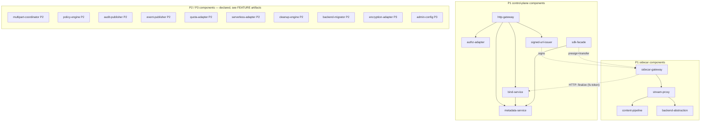
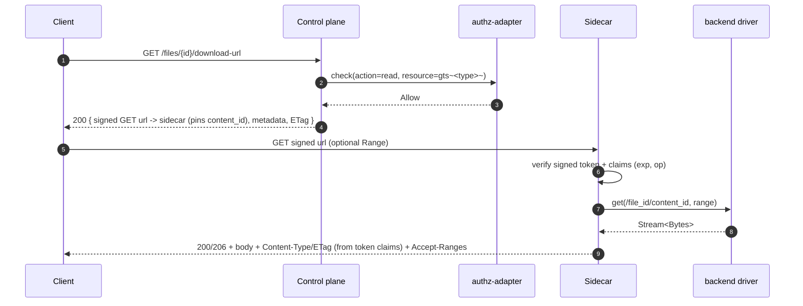
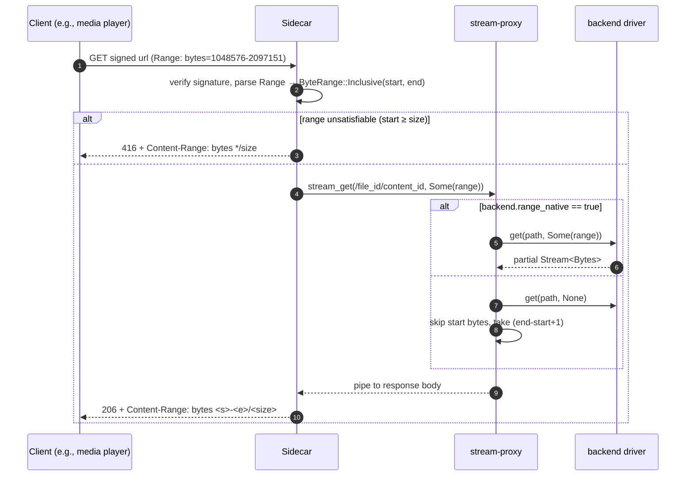
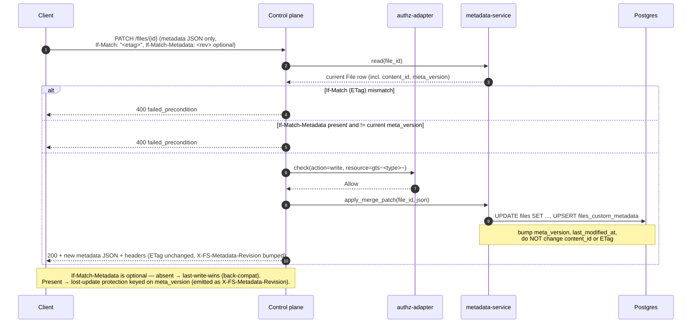
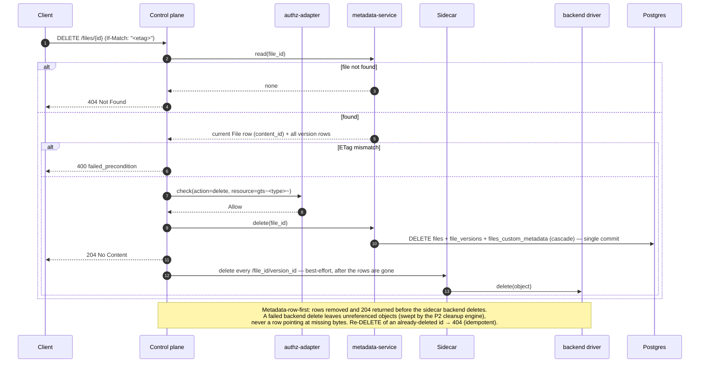
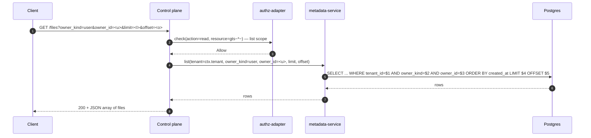
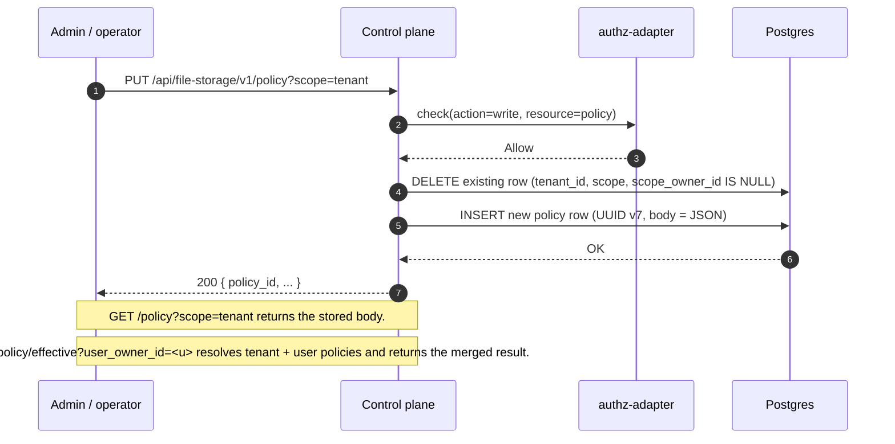

# Technical Design — FileStorage


<!-- toc -->

- [1. Architecture Overview](#1-architecture-overview)
  - [1.1 Architectural Vision](#11-architectural-vision)
  - [1.2 Architecture Drivers](#12-architecture-drivers)
  - [1.3 Architecture Layers](#13-architecture-layers)
- [2. Principles & Constraints](#2-principles--constraints)
  - [2.1 Design Principles](#21-design-principles)
  - [2.2 Constraints](#22-constraints)
- [3. Technical Architecture](#3-technical-architecture)
  - [3.1 Domain Model](#31-domain-model)
  - [3.2 Component Model](#32-component-model)
  - [3.3 API Contracts](#33-api-contracts)
  - [3.4 Internal Dependencies](#34-internal-dependencies)
  - [3.5 External Dependencies](#35-external-dependencies)
  - [3.6 Interactions & Sequences](#36-interactions--sequences)
  - [3.7 Database Schemas & Tables](#37-database-schemas--tables)
  - [3.8 Deployment Topology](#38-deployment-topology)
- [4. Additional Context](#4-additional-context)
  - [4.1 Random Read Access](#41-random-read-access)
  - [4.2 Hash & ETag Pipeline](#42-hash--etag-pipeline)
  - [4.3 Concurrency & Streaming Backpressure](#43-concurrency--streaming-backpressure)
  - [4.4 Quality Attribute Coverage](#44-quality-attribute-coverage)
  - [4.5 Signed-URL signature](#45-signed-url-signature)
  - [4.6 Worked example (LMS image upload and display)](#46-worked-example-lms-image-upload-and-display)
  - [4.7 Worked example (multipart upload and resume)](#47-worked-example-multipart-upload-and-resume)
  - [4.8 P1 implementation notes & decisions](#48-p1-implementation-notes--decisions)
- [5. Traceability](#5-traceability)

<!-- /toc -->

- [ ] `p1` - **ID**: `cpt-cf-file-storage-design-overview`
## 1. Architecture Overview

### 1.1 Architectural Vision

FileStorage is a tenant-aware, owner-aware file storage service for Gears, split into two cooperating planes (see
[ADR-0003](./ADR/0003-cpt-cf-file-storage-adr-sidecar-data-plane.md)):

- a **control plane** (the FileStorage API/SDK) that owns metadata, authorization, versioning, and conditional-request
  semantics, and whose REST surface **never carries file content** — it issues short-lived signed URLs instead;
- a **data-plane sidecar** that is the only component to move user bytes; it sits in front of a pluggable layer of
  backend drivers (local filesystem, S3-compatible object storage; more in later phases) and serves content only
  through those signed URLs.

Consumers never address backends directly — the signed URL always points at the sidecar — so backend opacity,
centralized per-byte metering, and uniform audit/policy coverage are preserved while the byte-moving data plane scales
independently of the control plane. A **read** is two requests: a control request to mint a signed GET URL, then a
data request against the sidecar. A **write** touches the control plane three times and the data plane once: presign
(control — pre-registers a `pending` version and mints a signed PUT URL) → `PUT` (data — the sidecar streams bytes to
the backend) → finalize (data→control, a plain, token-authenticated HTTP callback the sidecar makes after a
successful `PUT` — the same signed `fs-token` is its sole authorization, with no separate app-token or on-behalf-of
delegation — flipping the version `pending → available`) → `bind` (control — a separate, later request the client
issues to swap the file's `content_id` pointer under `If-Match`). See §3.2 (`bind-service`, `sidecar-gateway`) for the
finalize contract and §3.6 for the sequence diagram.

The P1 architecture is deliberately narrow:

- A control-plane ToolKit gear (in-process, consumed by other Gears through ClientHub) plus a sidecar data plane on
  its own domain; **only the control plane touches the metadata DB** — the sidecar has no DB connection of any kind
  and resolves everything it needs (backend id, backend path, MIME, ETag) from the verified signed token's claims
- The control-plane HTTP namespace is auth-required (`/api/file-storage/v1`), platform-JWT-enforced, no anonymous
  surface in P1; content moves only over signed URLs against the sidecar
- Streaming I/O on the sidecar path; no full-file buffering regardless of file size
- A single, hard-coded content-hash algorithm — SHA-256, computed on the sidecar's streaming upload path (see
  [ADR-0002](./ADR/0002-cpt-cf-file-storage-adr-content-hash-selection.md)) — with two hash **modes** per
  [ADR-0006](./ADR/0006-cpt-cf-file-storage-adr-content-hash-modes.md): whole-object (`whole-sha256`) and a
  multipart offset-manifest composite (`multipart-composite-sha256`, §4.2). There is no configurable
  `hash_policy`/algorithm-allow-list surface in code
- Backend configuration via the platform's gear YAML config (control plane) and `FS_SIDECAR_*` env vars (sidecar);
  runtime/DB configuration is P3
- Content is an **immutable blob per version** at `/{file_id}/{version_id}`; a file's live content is the `content_id`
  pointer, swapped under optimistic CAS. Backend objects are **never mutated in place**
- Signed URLs carry an opaque, control-minted **Ed25519-signed compact token** — `base64url(payload).base64url(signature)`,
  codec-equivalent to PASETO `v4.public` (ADR-0004) but not literally PASETO (no footer, no `kid`; see §4.5) —
  stateless, pointing only at the sidecar. FileStorage issues no anonymous, per-recipient, or sharing links in P1 —
  that is the deferred sharing surface (see "Sharing boundary (P3)" below)

**Sharing boundary (P3).** Anonymous/public access, time-bounded URLs, named recipients, group targeting, per-link
download counters, and any other sharing primitives are out of P1/P2 scope and deferred to P3. The working name
for this future capability is "FileShare"; whether it ships as a separate Gear or as an extension of
FileStorage itself is **not decided here** and will be settled by a future ADR at the time the functionality is
implemented. FileStorage P1/P2 stores no sharing-related state, exposes no anonymous URL namespace, has no JWT-bypass
paths, and has no endpoints tied to that future decision.

Versioning itself is **P1** (FileStorage-level, backend-agnostic: each version is a distinct immutable object plus a
`content_id` pointer — see §3.1). P2 introduces multipart upload (server-authoritative parts plan with per-part
SHA-256 hashing — see §4.2 and ADR-0006 for the content-hash combiner), audit + events + quota + usage outbound flows, backend migration
(relocating bytes between backends without rotating URLs), the policy engine, and the **cleanup engine** (version
retention + orphan reconciliation). P3 adds runtime BYOS backend configuration, server-side encryption, read audit,
signed-URL key rotation, and the sharing capability described above. These phases are declared in the component model
below with forward references to future FEATURE artifacts; their detailed designs are deliberately out of scope for
this document.

### 1.2 Architecture Drivers

#### Product Requirements

See [PRD.md](./PRD.md) §1 "Overview" and §1.3 "Goals":

- Unified storage for all Gears and platform users
- Tenant-scoped + principal-scoped ownership (`owner_kind ∈ {user, app}`, `tenant_id` mandatory)
- Persistent URLs that outlive provider-issued URLs (e.g., LLM Gateway media outputs)
- Pluggable backends without service rebuild

#### Functional Drivers (P1)

| PRD FR ID                                              | Design Response                                                                                                                                                          |
|--------------------------------------------------------|--------------------------------------------------------------------------------------------------------------------------------------------------------------------------|
| `cpt-cf-file-storage-fr-upload-file`                   | Control `POST /files` (authz) → signed PUT URL to the sidecar; sidecar streams bytes (incremental SHA-256, no in-stream MIME check) to the backend object `/{file_id}/{version_id}`, then calls the token-authenticated **finalize** callback (`pending → available`, control-plane MIME check on read-back); the client then separately **binds** the version (`content_id`) under `If-Match`                                                |
| `cpt-cf-file-storage-fr-download-file`                 | Control presign (authz) → signed GET URL to the sidecar; the sidecar streams the current `content_id` blob from its `backend-abstraction` driver                                                                                 |
| `cpt-cf-file-storage-fr-delete-file`                   | Control `DELETE /files/{id}` (requires `If-Match`): **metadata-row-first** — the `files` row and **all** its version rows are deleted in a committed transaction and `204` is returned, *then* the sidecar deletes the backend objects best-effort; a failed backend delete leaves only unreferenced objects swept by the P2 cleanup engine (never a row pointing at missing bytes). Idempotent: re-deleting returns `404`. Sequence in §3.6 |
| `cpt-cf-file-storage-fr-get-metadata`                  | Control `GET /files/{id}` (metadata JSON, supports `If-None-Match` → `304`) reads `files` + `files_custom_metadata` via `metadata-service` — no content on this surface; there is no separate `HEAD` route on either plane (§3.3) |
| `cpt-cf-file-storage-fr-list-files`                    | `GET /files` with mandatory `owner_kind` filter; tenant-scoped DB query through `metadata-service`                                                                       |
| `cpt-cf-file-storage-fr-content-type-validation`       | Validated on the **control plane, post-write**, not in-stream at the sidecar: `finalize`/`complete_multipart` read back a bounded MIME-sniff prefix (`infra::content::mime`, `MIME_SNIFF_PREFIX_BYTES` ≈ 8 KiB) and reject a declared/actual mismatch with `400`, before the version is ever marked `available` |
| `cpt-cf-file-storage-fr-file-ownership`                | Columns `tenant_id`, `owner_kind`, `owner_id` on `files`; immutable except via P2 ownership transfer                                                                     |
| `cpt-cf-file-storage-fr-authorization`                 | Control `authz-adapter` calls PolicyEnforcer with `gts.cf.fstorage.file.type.v1~<gts_file_type>~` on presign/bind; the signed URL carries the decision to the sidecar. The sidecar's finalize callback is authorized solely by that same signed token — no separate authz call, no app-token/on-behalf-of delegation |
| `cpt-cf-file-storage-fr-tenant-boundary`               | DB queries scoped by `SecurityContext.tenant_id` via SecureConn; cross-tenant rows are invisible                                                                         |
| `cpt-cf-file-storage-fr-data-classification`           | No-op — FileStorage stores opaque bytes; classification is consumer concern                                                                                              |
| `cpt-cf-file-storage-fr-file-type-classification`      | `gts_file_type` column on `files`; format-validated on upload; included as resource attribute in every `authz-adapter` call                                              |
| `cpt-cf-file-storage-fr-metadata-storage`              | System columns + `files_custom_metadata` table; exposed as JSON on `GET` body and as `X-FS-*` headers on every response                                                  |
| `cpt-cf-file-storage-fr-update-metadata`               | Control `PATCH /files/{id}` JSON Merge Patch on metadata; bumps `meta_version`/`last_modified_at` and leaves `content_id`/ETag intact |
| `cpt-cf-file-storage-fr-retention-indefinite`          | No background purge in P1; files live until owner deletes                                                                                                                |
| `cpt-cf-file-storage-fr-backend-abstraction`           | `StorageBackend` async trait (in the **sidecar**) with capability sub-traits; backend types: `local-filesystem`, an opt-in in-memory backend, `s3-compatible`                                                                 |
| `cpt-cf-file-storage-fr-backend-capabilities`          | `BackendCapabilities` struct per driver, exposed via `GET /storages`; **no `versioning_native`** (versioning is FileStorage-level); `multipart_native` is active for `s3-compatible`/in-memory, inactive for `local-filesystem`; `encryption_native` inactive (P3)                     |
| `cpt-cf-file-storage-fr-backend-config-source`         | Platform gear YAML config (`gear_config`) loaded at gear startup → in-memory `BackendRegistry`; sidecar loads its own equivalent set from `FS_SIDECAR_*` env vars; surfaced read-only via `/storages`                                                                     |
| `cpt-cf-file-storage-fr-rest-api`                      | Control-plane Axum router under `/api/file-storage/v1`: metadata, listing, version bind, and signed-URL issuance via OperationBuilder — **no content endpoints** (content lives on the sidecar)                                                   |
| `cpt-cf-file-storage-fr-range-requests`                | See §4.1 Random Read Access for the full mechanics                                                                                                                       |
| `cpt-cf-file-storage-fr-conditional-requests`          | Content-only `ETag` derived from `(file_id, content_id)`; `If-None-Match` enforced on the control plane's metadata `GET` (→ `304`), `If-Match` on bind/delete; neither is processed on the sidecar's content `GET` |
| `cpt-cf-file-storage-fr-signed-urls`                   | Control plane mints an Ed25519-signed compact token (PASETO `v4.public`-equivalent codec, sole issuer); sidecar verifies with the public key; AND-combined claims (`op`, `file_id`, `version_id`, `backend_id`, `backend_path`, `exp`, upload size/hash) carried in the query (`?fs-token=`) or a header — `ip`/token-claim predicates are a documented, not-yet-implemented extension point — see §4.5 |
| `cpt-cf-file-storage-fr-file-versioning`               | `file_versions` table (P1); each version a distinct immutable object `/{file_id}/{version_id}`; current = `content_id` pointer; restore = re-bind a prior `version_id`; backend-agnostic |

#### NFR Allocation

| NFR ID                                          | Summary                                                              | Allocated To                                                                                                                              | Design Response                                                                                                                                                                                                                                                | Verification                                                                                                                                          |
|-------------------------------------------------|----------------------------------------------------------------------|-------------------------------------------------------------------------------------------------------------------------------------------|----------------------------------------------------------------------------------------------------------------------------------------------------------------------------------------------------------------------------------------------------------------|-------------------------------------------------------------------------------------------------------------------------------------------------------|
| `cpt-cf-file-storage-nfr-metadata-latency`      | `<25 ms` p95 metadata queries                                        | `cpt-cf-file-storage-component-metadata-service`, `cpt-cf-file-storage-component-http-gateway`                                            | Single-row Postgres lookup on PK; covering index on `(tenant_id, owner_kind, owner_id, created_at)`. No backend round-trip on the `GET /files/{id}` metadata path                                                                                            | Load test driving `GET /files/{id}` at expected p95 traffic; p95 latency captured by OpenTelemetry histogram on `http-gateway`                       |
| `cpt-cf-file-storage-nfr-transfer-latency`      | `<50 ms` fixed overhead p95 on content transfer                      | `cpt-cf-file-storage-component-stream-proxy`, `cpt-cf-file-storage-component-backend-abstraction`                                         | Streaming I/O end-to-end (axum `Body` ↔ `Stream<Bytes>` ↔ backend client); no full-file buffering. Range translated to backend-native range where supported                                                                                                    | Measure fixed delta between request arrival at the sidecar and first byte returned by backend; histogram per backend driver                           |
| `cpt-cf-file-storage-nfr-url-availability`      | URLs available for retention duration matching platform SLA          | `cpt-cf-file-storage-component-metadata-service`, `cpt-cf-file-storage-component-backend-abstraction`                                     | URLs are derived from `file_id` and remain valid as long as the file row exists; deleted files return `404`; ETag changes do not invalidate URLs (only their cached representations)                                                                            | Long-running soak: re-fetch a set of `file_id`s over the SLA window; verify no transient `5xx`/`404` for live files                                  |
| `cpt-cf-file-storage-nfr-durability`            | RPO=0 for committed writes; RTO ≤ 15 min                              | `cpt-cf-file-storage-component-metadata-service`, `cpt-cf-file-storage-component-backend-abstraction`                                     | DB row committed *after* backend `put()` returns success; backend durability is inherited from the chosen driver. A request-scoped **best-effort cleanup guard** fires `backend.delete(backend_path)` on any error between a successful `put()` and the committed `INSERT` (DB blip, client drop, panic), so the only residual leak is a hard process kill in that window — bounded and swept by the P2 `orphan-reconciler`. RTO covered by Postgres HA + gear restart procedures                                                                                       | Chaos test: kill gear mid-upload — partial uploads MUST NOT leave a committed row pointing to missing content; inject a post-`put()` DB failure and assert the backend object is cleaned up (no orphan)                                       |
| `cpt-cf-file-storage-nfr-scalability`           | ≥1000 concurrent operations/instance; linear horizontal scaling      | All P1 components — they are stateless except for the metadata DB                                                                         | No instance-local state in the request path; every instance can serve any file given the shared metadata DB and backend driver. Streaming I/O keeps **CPU and memory** bounded per request. The **bandwidth** dimension — the cost consciously accepted by `cpt-cf-file-storage-adr-sidecar-data-plane`, and confined to the sidecar — is modeled separately in `cpt-cf-file-storage-nfr-bandwidth`                                                                  | Load test: scale N → 2N instances, verify near-2× throughput; per-instance concurrency target measured at saturation                                  |
| `cpt-cf-file-storage-nfr-bandwidth`             | Per-sidecar-instance ingress+egress budget; full content traffic transits the sidecar | `cpt-cf-file-storage-component-stream-proxy`, `cpt-cf-file-storage-component-backend-abstraction`, deployment topology                    | `cpt-cf-file-storage-adr-sidecar-data-plane` routes every uploaded and downloaded byte through the sidecar, so per-sidecar-instance bandwidth — not CPU/memory, and not the control plane — is the binding constraint. P1 deployment budget: **target ≥ 2.5 GiB/s combined ingress+egress per instance** (≈ 1.25 GiB/s each way on a 25 GbE NIC, sized so the ≥1000 concurrent-ops target is bandwidth- rather than CPU-bound at typical media object sizes). Capacity = `ceil(peak aggregate transfer rate / per-instance budget)` instances; transfer load scales horizontally with the stateless replicas. Download caching is offloaded to the API-Gateway / CDN layer keyed on the content-only `ETag` the sidecar emits (plus any `Cache-Control`/`Vary` policy applied at that layer), so repeat-read egress need not re-transit the sidecar | Load test: saturate a single sidecar instance's NIC with concurrent downloads, confirm it sustains the per-instance budget before CPU saturates; verify CDN/proxy serves conditional re-reads from cache (no FileStorage egress on a cache hit) |

#### Key ADRs

| ADR ID                                                | Decision Summary                                                                                                                                                                                       |
|-------------------------------------------------------|--------------------------------------------------------------------------------------------------------------------------------------------------------------------------------------------------------|
| `cpt-cf-file-storage-adr-sidecar-data-plane`          | Control/data-plane split: the control plane issues signed URLs; the **sidecar** moves all bytes; backends never addressed directly by clients          |
| `cpt-cf-file-storage-adr-signed-url-transport`        | The signed-URL credential is a single opaque, Ed25519-signed compact token (PASETO `v4.public`-equivalent codec), carried in the query (`?fs-token=`) or a header; its format is private to control + sidecar (others treat it as opaque bytes)      |
| `cpt-cf-file-storage-adr-content-hash-selection`      | Content hash is a single hard-coded algorithm, SHA-256, with no configurable `hash_policy`/`allowed_algorithms`/allow-list surface; the two hash **modes** (whole-object, multipart-composite) are defined by `cpt-cf-file-storage-adr-content-hash-modes` (ADR-0006)                                                    |
| `cpt-cf-file-storage-adr-s3-client-selection`         | `S3Backend` (`durable: true`, `multipart_native: true`) is built on `rusty-s3` (+ `quick-xml`), executed over the crate's existing `reqwest` stack — no second HTTP/TLS stack; presigning is unused, since the sidecar is the sole holder of S3 credentials. Shipped and opt-in (`s3_backends` config), pending ADR-0005's security-review gate before use in a production release path |
| `cpt-cf-file-storage-adr-content-hash-modes`          | Two SHA-256 content-hash modes — whole-object (single-part) and a multipart offset-manifest composite (`root = sha256` of per-part `{offset}:sha256(part)` manifest), computed on-the-fly at upload, never by re-reading; client-verifiable. |

### 1.3 Architecture Layers

```mermaid
graph LR
    Client([Client / Browser / SDK]) -->|1. control: presign| AGW[API Gateway]
    AGW -->|/api/file-storage/v1<br/>JWT enforced| HGW
    Client -->|2. data: signed URL| SCGW

    Gear[Gear] -->|ClientHub trait| SDK[sdk-facade]
    SDK --> Meta
    SDK -.->|presign + transfer<br/>in consumer process| SCGW

    subgraph CP["Control plane (FileStorage ToolKit gear)"]
      HGW[http-gateway]
      HGW --> Meta[metadata-service]
      HGW --> AZ[authz-adapter]
      HGW --> SUI[signed-url-issuer]
      HGW --> BIND[bind-service]
      Meta --> DB[(Postgres<br/>file_storage schema)]
    end

    subgraph SC["Sidecar (data plane, own domain)"]
      SCGW[sidecar-gateway<br/>verify signature + token] --> Stream[stream-proxy]
      Stream --> Pipe[content-pipeline]
      Stream --> BA[backend-abstraction]
      BA --> S3D[s3-compatible driver]
      BA --> LFS[local-filesystem driver]
    end

    SCGW -.->|HTTP POST finalize<br/>token-authenticated (fs-token)| BIND
    SUI -.->|mint signed token| SCGW
    AZ -->|PolicyEnforcer| AuthZ[Authorization Service]
    S3D -.->|HTTPS| S3[(S3 / MinIO)]
    LFS -.->|fs| Disk[(Local Disk)]
```

| Layer          | Plane    | Responsibility                                                                                                  | Technology                                                                       |
|----------------|----------|-----------------------------------------------------------------------------------------------------------------|----------------------------------------------------------------------------------|
| API            | control  | Metadata routing, conditional-request semantics, signed-URL issuance, version bind; **no content**              | axum, hyper, tower middleware, OperationBuilder                                  |
| Data plane     | sidecar  | Signature + token verification, streaming upload/download, Range, SHA-256 hashing (no in-stream MIME check), `Content-Type`/`ETag` echo from token claims | axum/hyper streaming, `rusty-s3` + `quick-xml` (S3, via `reqwest`), `tokio::fs`  |
| Application    | both     | Orchestration: presign, bind/CAS, metadata CRUD, capability discovery (control); byte pipeline (sidecar)        | Rust async services (tokio)                                                      |
| Domain         | control  | File identity, ownership, `content_id`/`meta_version`, ETag derivation, versions                                | Rust structs + SeaORM entities                                                   |
| Infrastructure | both     | Postgres metadata (control plane only — the sidecar has no DB connection); backend drivers (sidecar); PolicyEnforcer; platform gear YAML config (control) / env vars (sidecar backends); Ed25519 signing keys | SeaORM + SecureORM + SecureConn; `rusty-s3` + `quick-xml`; `tokio::fs`; Ed25519 via `ring` behind an in-house `SignatureProvider` abstraction (ADR-0004) |

## 2. Principles & Constraints

### 2.1 Design Principles

#### Backend opacity

- [ ] `p1` - **ID**: `cpt-cf-file-storage-principle-backend-opacity`

Backends are an internal implementation detail. No public API surface — control REST, signed URL, SDK, or otherwise —
exposes backend-addressable URLs, backend-native identifiers, or backend-specific error shapes. Even the signed URL
points at the sidecar, not a backend. Clients learn at most that a backend has certain *capabilities*, never *which*
backend they are talking to.

**ADRs**: `cpt-cf-file-storage-adr-sidecar-data-plane`

#### Control plane carries no content

- [ ] `p1` - **ID**: `cpt-cf-file-storage-principle-control-no-content`

The control-plane REST surface accepts and returns only metadata and signed URLs — never file bytes. All content is
moved by the sidecar over signed URLs. The single exception is the in-process SDK proxy mode, which streams in the
*consumer gear's* process (not the control-plane service). This is what lets the bandwidth-bound data plane scale
independently of the control plane.

**ADRs**: `cpt-cf-file-storage-adr-sidecar-data-plane`

#### Signed URLs, control-minted

- [ ] `p1` - **ID**: `cpt-cf-file-storage-principle-signed-urls`

Content access is authorized by a short-lived, opaque **Ed25519-signed compact token** (PASETO `v4.public`-equivalent
codec, ADR-0004) that the **control plane alone mints** (holds the private key); the **sidecar only verifies** (holds
the public key) and can never forge one. The token carries AND-combined claims (`op`, `file_id`, `version_id`,
`backend_id`, `backend_path`, `exp`, and, for uploads, `max_size`/`exact_size`/`expected_hash`; download tokens also
carry `content_type`/`etag`) under one signature; it is carried in the URL query (`?fs-token=`) or a header. An
`ip`/CIDR constraint and a token-claim predicate are a documented, not-yet-implemented extension point — `Claims`
carries no such fields today. Its **format is private to control + sidecar** — everyone else treats it as opaque
bytes and must not parse it (ADR-0004 "Token Opacity Contract"). Stateless: no DB lookup to verify, no per-token
revocation (revocation is the auth module's token revocation). See §4.5.

**ADRs**: `cpt-cf-file-storage-adr-sidecar-data-plane`, `cpt-cf-file-storage-adr-signed-url-transport`

#### Immutable blob + pointer

- [ ] `p1` - **ID**: `cpt-cf-file-storage-principle-immutable-blob`

A backend object `/{file_id}/{version_id}` is written once and never mutated. A file's live content is the `content_id`
pointer; replacing content writes a **new** version and swaps the pointer under optimistic CAS (`If-Match`). This makes
versioning backend-agnostic, makes a concurrent-write conflict cheap to recover (re-bind, never re-upload), and keeps
the content-only ETag stable per version.

**ADRs**: `cpt-cf-file-storage-adr-sidecar-data-plane`

#### Streaming over buffering

- [ ] `p1` - **ID**: `cpt-cf-file-storage-principle-streaming`

The sidecar's byte path moves bytes in chunks (axum `Body`/`Stream<Bytes>`) without holding whole files in memory.
This applies to uploads, downloads, and range requests. SHA-256 hashing is a tap-like operation that updates on each
chunk; it never blocks the chunk from continuing downstream. Magic-bytes/MIME detection is not part of this
in-stream tap — it runs on the control plane, post-write (§4.2).

**ADRs**: `cpt-cf-file-storage-adr-sidecar-data-plane`

#### Content-only content ETag

- [ ] `p1` - **ID**: `cpt-cf-file-storage-principle-content-only-etag`

ETag is a function of `(file_id, content_id)` and hash is a function of the bytes only. Metadata updates change
`meta_version` and `last_modified_at` but not ETag or hash — keeping ETag a pure content cache-validator (so CDNs do
not invalidate cached bytes on a metadata-only change). Because ETag is deliberately content-only, `If-Match` on a
metadata-only update protects against concurrent **content** writes but cannot detect concurrent **metadata** writes.

Rather than leave metadata writes silently last-write-wins, P1 exposes the metadata revision as its own conditional
validator: the `meta_version` is already on the wire as `X-FS-Metadata-Revision: <u64>`, and a metadata-only update
MAY carry **`If-Match-Metadata: <u64>`**, matched against the current `meta_version` (mismatch →
`400 failed_precondition`). The header is
optional: absent, the write falls back to last-write-wins for back-compatibility; clients that store real state in
custom metadata (billing tags, classification, policy labels) opt in to lost-update protection. This keeps the wire
contract locked in P1 without composing it into ETag (which would defeat CDN caching on metadata-only changes).

**ADRs**: `cpt-cf-file-storage-adr-content-hash-selection`

#### Capability discovery, not feature flags

- [ ] `p2` - **ID**: `cpt-cf-file-storage-principle-capabilities`

Optional backend features (multipart, encryption) are declared per backend as capabilities, not bolted on as runtime
flags. Clients query `/storages` and adapt. `multipart_native` is active where the backend supports it
(`s3-compatible`, the in-memory test backend; not `local-filesystem`); `encryption_native` remains declared but
inactive (P3). Versioning is **not** among the capabilities — it is FileStorage-level (§3.1), not a backend
capability.

**ADRs**: `cpt-cf-file-storage-adr-content-hash-selection`

### 2.2 Constraints

#### ToolKit in-process control gear

- [ ] `p1` - **ID**: `cpt-cf-file-storage-constraint-toolkit-gear`

The **control plane** runs as an in-process ToolKit gear, registered via `#[toolkit::gear]`. Inter-gear callers use
the generated SDK trait via ClientHub. There is no out-of-process gRPC variant of the control plane in P1; the OoP
SDK path is reserved as a P3 escape hatch (it hands callers a signed URL rather than streaming through the control
plane).

#### Sidecar is a separate deployable with no DB access

- [ ] `p1` - **ID**: `cpt-cf-file-storage-constraint-sidecar`

The **sidecar** is a separate deployable on its own domain, scaled independently of the control plane. It holds no
authoritative state of its own and has **no direct DB connection at all** (§3.8) — it resolves everything it needs
purely from the verified signed token's claims and verifies signed URLs with a control-distributed public key. This
is what makes it a full FileStorage data plane that can be relocated/co-located without a wire-contract change
(see §3.8).

#### Postgres as the metadata store

- [ ] `p1` - **ID**: `cpt-cf-file-storage-constraint-postgres`

File metadata, custom metadata, and (P3) backend configurations are persisted in Postgres via SeaORM + SecureORM.
Tenant scoping happens through SecureConn — there is no direct un-scoped DB access from request handlers.

#### Configuration via the platform's gear YAML config

- [ ] `p1` - **ID**: `cpt-cf-file-storage-constraint-toml-config`

Backend definitions (`local-fs`, the opt-in `memory` backend, and any `s3_backends` entries) are loaded from the
gear's own YAML config section (`FileStorageConfig`, via the platform's `gear_config`) at gear startup; the sidecar
reads its own equivalent set from `FS_SIDECAR_*` env vars (`FS_SIDECAR_S3_BACKENDS`).
Changing the set of backends or their credentials requires a restart. Runtime/DB-driven configuration with admin
tooling is a P3 deliverable (`cpt-cf-file-storage-fr-runtime-backends`).

## 3. Technical Architecture

### 3.1 Domain Model

**Technology**: Rust structs (`file-storage-sdk` crate) backed by SeaORM entities (`file-storage` crate's infra layer)
per the [ToolKit SDK layering guide](../../../docs/toolkit_unified_system/02_gear_layout_and_sdk_pattern.md).

**Location**: `gears/file-storage/file-storage-sdk/src/models.rs` for public types;
`gears/file-storage/file-storage/src/infra/storage/entity/*.rs` for SeaORM entities.

**Core Entities**:

| Entity                | Description                                                                                                                                |
|-----------------------|--------------------------------------------------------------------------------------------------------------------------------------------|
| `File`                | Logical file: identity (`file_id`), tenant, owner, gts type, current content pointer (`content_id`), `meta_version`, timestamps. Holds **no** bytes |
| `Version`             | An immutable content blob of a file: `(file_id, version_id, size, hash_algorithm, hash_value, hash_mode, part_count, status, is_current, created_at)`; backend object at `/{file_id}/{version_id}`. `hash_mode` (ADR-0006) is `whole-sha256` or `multipart-composite-sha256`; `part_count` is set only for the latter, whose manifest lives in `version_hash_manifest` |
| `CustomMetadata`      | User-defined key-value pairs attached to a `File`; one row per `(file_id, key)`                                                            |
| `OwnerPrincipal`      | Tagged union `{User(UserId), App(GearId)}`; carried as `(owner_kind, owner_id)` on `File`                                                |
| `VersionState`        | Enum `{Pending, Available}`; a version is `Pending` from pre-register until **finalize** (the sidecar's post-`PUT` callback), then `Available`. Binding — swapping which version is the file's current `content_id` — is a separate, later step and does not itself change a version's status |
| `ContentId`           | The `version_id` currently bound as the file's live content (`File.content_id`); changing it is a pointer swap                              |
| `ETag`                | Opaque `String` (HTTP-quoted lowercase hex of a truncated SHA-256 digest — `domain::etag::content_etag`); derived from `(file_id, content_id)`; **MUST NOT** equal `hash_value`                     |
| `SignedUrl`           | A control-minted **Ed25519-signed compact token** (`base64url(payload).base64url(signature)`), codec-equivalent to PASETO `v4.public` but not literally PASETO (no footer, no `kid`) — carrying claims `(op, file_id, backend_id, backend_path, version_id, exp, constraints)`; **opaque** to all but control+sidecar; carried as `?fs-token=` query or `X-FS-Token` header (§4.5) |
| `ByteRange`           | Parsed `Range` request: `Inclusive(start, end)`, `OpenEnded(start)`, `Suffix(length)`                                                       |
| `HashPolicy`          | **Not implemented.** No `HashPolicy`/`hash_policy` config surface exists in code (P1/P2 hash algorithm is hard-coded SHA-256; see ADR-0006 for the two shipped `hash_mode`s instead) |
| `BackendCapabilities` | Per-backend feature flags: `multipart_native`, `encryption_native`, `range_native`, `presigned_url_internal` (no `versioning_native` — versioning is FS-level) |
| `BackendConfig`       | Declared instance: `id`, `kind`, `endpoint`, `credentials`, `capabilities` (no `hash_policy` — that surface is not implemented, see above). Loaded from the platform gear YAML config in P1 (control plane); the sidecar loads its own equivalent set from `FS_SIDECAR_*` env vars |

**Relationships**:

- `File` → `OwnerPrincipal` (composition; immutable except via P2 ownership transfer)
- `File` → `Version` (1:N; all cascade-deleted with the file). `File.content_id` references the current `Version`
- `File` → `CustomMetadata` (1:N; cascade-deleted with the file)
- `Version` → `BackendConfig` (reference by `backend_id`; immutable per version. A new content write creates a new
  `Version` — possibly on a different backend — rather than mutating an existing one; the P2 `backend-migrator`
  relocates a version's bytes without rotating the `file_id`/`version_id`)
- `ETag` ← derived from `(file_id, File.content_id)`
- `BackendCapabilities` ← embedded in `BackendConfig`; surfaced read-only via `GET /storages`

### 3.2 Component Model



#### `http-gateway`

- [ ] `p1` - **ID**: `cpt-cf-file-storage-component-http-gateway`

##### Why this component exists

The **control-plane** HTTP entry point. Owns route registration, security middleware, conditional-request semantics,
and error mapping to RFC 7807 Problem+JSON. It carries **no file content** — content moves over signed URLs against
the sidecar.

##### Responsibility scope

- Register the auth-required router `/api/file-storage/v1/*` with the platform `security_context_layer`; **all
  endpoints are JSON** via OperationBuilder (metadata CRUD, listing, `GET /storages`, presign, bind)
- Parse and validate conditional headers and enforce conditional-request semantics (return `304` for cache validation
  and `400 failed_precondition` for failed preconditions, per the platform canonical-error mapping), including the optional `If-Match-Metadata` precondition on
  metadata-only updates (matched against `meta_version`)
- Dispatch presign requests to `signed-url-issuer` (upload / download / multipart-part) and bind/rebind requests to
  `bind-service`; metadata reads/writes to `metadata-service`
- Map domain errors to status codes + Problem+JSON bodies per `docs/toolkit_unified_system/05_errors_rfc9457.md`
- Populate **metadata** response headers (`ETag`, `Last-Modified`, all `X-FS-*` system metadata, `X-FS-Meta-<key>`
  with RFC 8187 encoding for non-ASCII). Content-transfer headers (`Accept-Ranges`, `Content-Range`) are the sidecar's

##### Responsibility boundaries

Does not perform authorization decisions itself — delegates to `authz-adapter`. Does not stream or buffer file bytes
— that is the sidecar (`sidecar-gateway` / `stream-proxy`). Does not sign URLs itself — delegates to
`signed-url-issuer`.

##### Related components

- `cpt-cf-file-storage-component-authz-adapter` — calls before every auth-required handler
- `cpt-cf-file-storage-component-metadata-service` — calls for metadata read/write
- `cpt-cf-file-storage-component-signed-url-issuer` — mints signed URLs for content operations
- `cpt-cf-file-storage-component-bind-service` — pre-register / bind / rebind under CAS

#### `signed-url-issuer`

- [ ] `p1` - **ID**: `cpt-cf-file-storage-component-signed-url-issuer`

##### Why this component exists

Mints the Ed25519-signed tokens (PASETO `v4.public`-equivalent codec, §4.5) that authorize a content operation
against the sidecar. The control plane is the **sole minter** (holds the private key).

##### Responsibility scope

- Mint a token carrying the claims `(op, file_id, version_id, backend_id, backend_path, exp, upload constraints,
  and, for downloads, content_type/etag)`, signed with the control-plane Ed25519 private key (§4.5). It is returned
  as a `?fs-token=<token>` URL or to be sent as an `X-FS-Token` header. Because the sidecar has no DB connection
  (§3.8), **`backend_id`/`backend_path` are carried directly in the token** rather than resolved from the version
  row at verify time
- Resolve the target: for download, the file's current `content_id` (or an explicit `version_id`); for upload, allocate
  nothing here (the version is pre-registered by the control plane itself, in the same request that returns this
  token — see `bind-service`)
- Attach AND-combined constraints: `exp` required; `max_size`/`exact_size`/`expected_hash` optional (upload).
  `content_type`/`etag` are populated on download tokens only — there is no general response-header override
  mechanism (no `Content-Disposition`/`Cache-Control` claim). An `ip`/CIDR constraint and a token-claim predicate
  are a documented, not-yet-implemented extension point (§4.5)
- Never emit a backend-addressable URL — the URL host is always the sidecar

##### Responsibility boundaries

Does not verify signatures (that is the sidecar). Does not touch bytes. Does not write metadata.

##### Related components

- `cpt-cf-file-storage-component-http-gateway` — caller
- `cpt-cf-file-storage-component-sidecar-gateway` — verifier of what this issues

#### `bind-service`

- [ ] `p1` - **ID**: `cpt-cf-file-storage-component-bind-service`

##### Why this component exists

Owns the version lifecycle on the control side: **pre-register** a `pending` version (part of the presign request the
client makes *before* any bytes move), **finalize** it once the sidecar reports a successful `PUT` (data→control
callback), and **bind** a finalized version as the file's current `content_id` under optimistic CAS.

##### Responsibility scope

- **Pre-register**: `INSERT` a `pending` `file_versions` row and allocate `version_id` as part of handling
  `POST /files` / `POST /files/{id}/versions` — this runs on the control plane *before* the signed PUT URL is even
  returned, not as a separate call the sidecar makes later
- **Finalize** (`status: pending → available`): invoked by the **sidecar**, over a plain HTTP `POST` authorized solely
  by the same signed upload token (`fs-token`) that authorized the `PUT` — no FS SDK call, no app-token, no
  on-behalf-of delegation. Re-reads the blob from the backend and recomputes size/hash/MIME from the actual bytes
  rather than trusting the sidecar's claim (defense-in-depth); does **not** touch `content_id`
- **Bind** (`content_id := version_id`): optimistic CAS on the current `content_id`/ETag via `If-Match`; on mismatch
  return a precondition-failed error (client re-reads the ETag and retries). Invoked **only** by the client as a
  separate, later control-plane request — the sidecar never binds and never calls this on the client's behalf
- Validate a client bind against the DB: the target `version_id` must exist with status `available` (i.e. already
  finalized)
- Bump nothing else — content writes do not bump `meta_version`

##### Responsibility boundaries

Does not stream bytes. Trusts a sidecar-reported `size`/`hash` claim only as a defense-in-depth cross-check — finalize
independently re-reads and re-hashes the backend object rather than persisting the claim verbatim.

##### Related components

- `cpt-cf-file-storage-component-metadata-service` — persists the version rows + pointer swap
- `cpt-cf-file-storage-component-sidecar-gateway` — calls finalize over a token-authenticated HTTP callback (not the
  FS SDK, no app-token/on-behalf-of); bind is called by the client directly, never by the sidecar

#### `sidecar-gateway`

- [ ] `p1` - **ID**: `cpt-cf-file-storage-component-sidecar-gateway`

##### Why this component exists

The **sidecar's** HTTP entry point on its own domain. Verifies the signed URL, then drives the byte path. The only
component clients hit for content.

##### Responsibility scope

- Verify the signed token (Ed25519, §4.5) with the control-distributed public key; check the signature, `exp`, and
  the `op`/`file_id`/`version_id` binding (plus `part_number` for multipart-part tokens); reject with `403` on any
  failure. `ip`/CIDR and token-claim predicates (`tok.<claim>`) are not implemented — `Claims` carries no such
  fields and the sidecar makes no platform-JWT call of any kind (see §4.5's verification checklist)
- Parse the `Range` header (to `ByteRange`) and conditional headers; serve `200`/`206`/`416` for downloads. There is
  no conditional `304` on this path — `If-None-Match` is not implemented on the sidecar (§4.1)
- On upload: stream the body through `stream-proxy` to the backend first (the version was already pre-registered by
  the control plane at presign time — the sidecar does **not** pre-register); once bytes have landed, call the
  control plane's token-authenticated **finalize** callback (same `fs-token`, no app-token, no on-behalf-of
  delegation, no FS SDK call) to flip the version `pending → available`. The sidecar does **not** bind — binding
  (the CAS swap of `content_id`) is a separate request the client issues to the control plane afterwards
- Echo the token's `content_type`/`etag` claims as `Content-Type`/`ETag` — the only response-header values the
  token carries; advertise `Accept-Ranges: bytes`
- Own the **best-effort cleanup**: on any error after `put()` started (the sidecar itself aborts only on stream
  errors and the size/hash constraint checks — there is no in-sidecar `415` magic-bytes abort, see
  `content-pipeline` above), delete the partially-written object; a hard crash leaves an orphan swept by the P2
  cleanup engine

##### Auth model (exception to gateway-auth)

Because the sidecar is **not** fronted by the API Gateway (it is the data-plane exception, see PRD §1.1), it does
**not** receive a gateway-derived `SecurityContext`. Authorization for a content request is carried entirely by the
**signed token** (the delegated authorization artifact, see §4.5): the sidecar verifies the token's signature and
claims and treats that as the access decision for this resource + operation until `exp` — it performs **no fresh PDP
call** and makes **no platform-JWT call of any kind**. A platform JWT in `Authorization` gated by a token-claim
predicate is not implemented (§4.5) — the sidecar never validates one today. The sidecar derives no tenant/owner
`SecurityContext` of its own beyond what the token asserts.
Request-id propagation and rate-limiting are the sidecar's own responsibility (it is not behind the gateway): it
honours/propagates `X-Request-Id` and applies its own per-instance connection/bandwidth limits; the per-URL
`max_rate`/`max_conns` claims described in §4.5 are not implemented.

##### Responsibility boundaries

Makes no authorization *decision* — it enforces the decision already encoded in the signed URL and the token
predicates. Does not own metadata authority — it calls control `bind-service`'s finalize endpoint over a plain,
token-authenticated HTTP callback (not the FS SDK, no delegated identity); it never calls bind.

##### Related components

- `cpt-cf-file-storage-component-stream-proxy` — the byte path it drives
- `cpt-cf-file-storage-component-bind-service` — token-authenticated finalize callback only (never bind)
- `cpt-cf-file-storage-component-signed-url-issuer` — issuer of the URLs it verifies

#### `stream-proxy`

- [ ] `p1` - **ID**: `cpt-cf-file-storage-component-stream-proxy`

##### Why this component exists

The data plane. Wires the byte path from HTTP body ↔ hashing tap ↔ backend driver, in both upload and download
directions, without buffering the whole file at any point.

##### Responsibility scope

- **Upload path**: receive the raw `axum::body::Body` of the signed `PUT` (or one multipart part); tee chunks through
  the incremental SHA-256 hasher (no in-stream MIME/magic-byte check — see `content-pipeline` above for why); forward
  chunks to the selected backend driver via `StorageBackend::put()` at `/{file_id}/{version_id}`. On stream
  completion, emit final hash and the persisted `ObjectRef` from the driver
- **Download path**: invoke `StorageBackend::get(backend_path, range)` and pipe the returned `Stream<Bytes>` into
  the HTTP response body. Pass `ByteRange` through to backends that declare `range_native = true`; otherwise the
  driver's own range adapter applies (see §4.1)
- **Backpressure**: respect the slowest of (client, backend) by holding flow control on the stream; no internal
  queueing beyond the natural one-chunk lookahead
- **Cancellation**: if the client drops, the upstream backend operation is aborted (S3 SDK abort / fs handle drop)

##### Responsibility boundaries

Does not perform authorization, validation, or metadata persistence. Does not know about HTTP semantics — only `Body`
in and `Body` out. Does not decide which backend to use — the target `/{file_id}/{version_id}` and its `backend_id`
come from the pre-registered version carried in the signed-URL context.

##### Related components

- `cpt-cf-file-storage-component-content-pipeline` — taps the upload stream
- `cpt-cf-file-storage-component-backend-abstraction` — calls drivers for put/get/delete/stat
- `cpt-cf-file-storage-component-sidecar-gateway` — its byte-source and byte-sink

#### `content-pipeline`

- [ ] `p1` - **ID**: `cpt-cf-file-storage-component-content-pipeline`

##### Why this component exists

Runs the one streaming tap the sidecar performs on every upload: incremental SHA-256 hashing, computed as bytes flow
through to the backend so the digest is available the instant the stream ends, with no re-read of the body.
MIME/magic-byte validation is a **separate, control-plane** check (see below and §4.1), not a second in-sidecar tap —
this component's own surface is hashing only.

##### Responsibility scope

- **SHA-256 hasher**: the sidecar's upload handlers hash incrementally as bytes stream to the backend
  (`hash::Hasher`), and the control plane independently re-hashes a single-part upload on read-back at finalize
  (defense-in-depth; see §4.2). Algorithm tag is `"SHA-256"`, the sole hard-coded algorithm
  (`cpt-cf-file-storage-adr-content-hash-selection`)
- **Magic-bytes / MIME validation runs on the control plane, not the sidecar.** There is no in-stream sidecar-side
  magic-byte tap and no in-sidecar `415` abort path. MIME validation (`infer`-crate-based sniffing,
  `infra::content::mime`) runs **on the control plane**, after the bytes have already fully landed: at single-part
  `finalize` and at multipart `complete` (which additionally issues one bounded ~8 KiB ranged read of the assembled
  object purely for this sniff — see §4.2). A mismatch there is rejected with `400`, and the version is never marked
  `available`; any bytes already written to the backend become an orphan reclaimed by the cleanup sweep, not deleted
  synchronously
- **No buffering of subsequent bytes** (sidecar hashing tap): once a chunk is hashed it passes through unchanged

##### Responsibility boundaries

Does not maintain state across requests. Does not own backend selection. Does not transform bytes — only inspects.
Does not validate MIME/content-type — that runs on the control plane (see above).

##### Related components

- `cpt-cf-file-storage-component-stream-proxy` — invokes the pipeline per chunk (in the sidecar)

#### `metadata-service`

- [ ] `p1` - **ID**: `cpt-cf-file-storage-component-metadata-service`

##### Why this component exists

Owns the `files`, `file_versions`, and `files_custom_metadata` tables. Every request that needs to know "does this
file exist, who owns it, which version is current?" goes through here. Owns ETag derivation, the `content_id` pointer,
and `meta_version`. (The pointer-swap CAS itself is driven by `bind-service`; this component is its persistence layer.)

##### Responsibility scope

- CRUD on `files` rows (create, read, metadata update, delete-with-all-versions) and on `file_versions`
  (`pending`/`available`, `is_current`, per-version `size`/`hash`)
- CRUD on `files_custom_metadata` (JSON Merge Patch applied row-by-row)
- Derive the opaque `ETag` on the fly from `(file_id, content_id)` per §4.2 — there is no persisted ETag column;
  `content_id` (the current `version_id`) is the only stored input
- Persist the bind: set `File.content_id := version_id` and flip that version to `is_current`/`available`. Content
  writes do **not** bump `meta_version`; metadata-only updates bump `meta_version` and `last_modified_at`
- Enforce tenant boundary via SecureConn — every query/mutation passes through the request's `SecurityContext`
- Tenant + mandatory owner filter on `GET /files`; offset pagination (`limit`/`offset` query params, capped by
  `FileStorageConfig::max_page_size`); index-backed by `(tenant_id, owner_kind, owner_id, created_at)`. `GET /files`
  and `GET /files/{id}/versions` both return a bare JSON array, not an `{items, next_cursor}` envelope. OData
  `$filter`/`$orderby` is not implemented. List a file's versions ordered by `created_at`, same offset model
- Reject PRD-defined constraints at this layer when they are not enforceable as DB constraints (e.g., GTS format
  validation regex, tenant policy delta in P2)

##### Responsibility boundaries

Does not call backend drivers itself. Does not perform authorization checks. Does not stream content.

##### Related components

- `cpt-cf-file-storage-component-http-gateway` — primary caller
- `cpt-cf-file-storage-component-sdk-facade` — exposes the same operations to in-process gear consumers

#### `backend-abstraction`

- [ ] `p1` - **ID**: `cpt-cf-file-storage-component-backend-abstraction`

##### Why this component exists

The single seam (in the **sidecar**) between FileStorage and any concrete storage technology. The trait surface is
small and async; each optional capability (multipart, encryption) is a separate sub-trait that drivers opt into.
Versioning is **not** a backend capability — FileStorage versions via distinct immutable objects
`/{file_id}/{version_id}`.

##### Responsibility scope

- Define the `StorageBackend` async trait: `put`, `get(range)`, `delete`, `stat`, `capabilities`
- Define capability sub-traits: `MultipartCapable`, `EncryptionCapable` (both P2/P3 use, but the trait shapes are
  declared from P1 so consumers can downcast/probe)
- Maintain the `BackendRegistry` — in-sidecar map of `backend_id → Arc<dyn StorageBackend>` populated at startup from
  the sidecar's own `FS_SIDECAR_*` env vars (a separately-configured set, not shared state read from the control
  plane's YAML config or the DB)
- Backend types shipped: `local-filesystem` (default; `tokio::fs` reads/writes under a configured root directory,
  native Range via `seek + take`), an opt-in in-memory backend (`enable_in_memory_backend` — test/dev only,
  non-durable, content lost on restart), and `s3-compatible` (opt-in via `s3_backends` config; `rusty-s3` +
  `quick-xml` executed over the crate's `reqwest` stack, works against AWS S3, MinIO, Backblaze B2, Wasabi, etc.;
  native Range via the backend `GetObject` Range header; native multipart). GCS/Azure Blob and DB-resident
  runtime-configured backends (`admin-config`) remain deferred to P3
- Reject any operation that depends on a capability the configured backend has not declared (`409 Conflict` /
  `501 Not Implemented` depending on context)

##### Responsibility boundaries

Drivers never see HTTP, never see `SecurityContext`. The trait works in bytes and paths only — domain knowledge stays
above the trait. Drivers MAY use internal-only capabilities (`presigned_url_internal`) for backend-to-backend
replication or migration tooling, but those capabilities are **never** surfaced through the public capability
discovery endpoint and are unreachable from the SDK-facing call site.

##### Related components

- `cpt-cf-file-storage-component-stream-proxy` — main caller for content I/O
- `cpt-cf-file-storage-component-metadata-service` — calls `stat` during reconciliation paths

#### `authz-adapter`

- [ ] `p1` - **ID**: `cpt-cf-file-storage-component-authz-adapter`

##### Why this component exists

Wraps the platform PolicyEnforcer with FileStorage-specific request shaping: every check carries the file's GTS type
in the resource context so that the Authorization Service can apply per-type policies.

##### Responsibility scope

- For each auth-required operation, build a `PolicyRequest` with:
  - `subject = SecurityContext.principal` — the user, resolved from the platform JWT
  - `action ∈ {read, write, delete, ownership.transfer}` mapped from the endpoint
  - `resource = gts.cf.fstorage.file.type.v1~<gts_file_type>~<file_id>`
- For **content** operations the read/write check runs at **presign** time (control plane); the resulting
  authorization is then carried to the sidecar inside the signed URL — the sidecar makes no fresh AuthZ call. The
  sidecar's later finalize/report-part callbacks never call `authz-adapter` either: they run under an unrestricted
  internal scope, treating the previously-verified signed token itself as the full authorization for that specific
  `(file_id, version_id)` operation (no app-token, no on-behalf-of delegation)
- Call `PolicyEnforcer::check` (in-process via ClientHub)
- Convert `Deny` decisions to `403 Forbidden` Problem+JSON; `Allow` decisions are silent

##### Responsibility boundaries

Does not cache decisions in P1 (each request is checked fresh). Does not implement role-based shortcuts — it asks the
AuthZ service every time. Tenant-boundary enforcement is independent of this PDP check: every point operation first
resolves its target row within the caller's tenant (`SecureConn`/`AccessScope`), and listing applies the same tenant
scope directly — so a cross-tenant file is invisible before authorization is even evaluated.

##### Related components

- `cpt-cf-file-storage-component-http-gateway` — calls before dispatch on auth-required routes
- `cpt-cf-file-storage-component-metadata-service` — provides `gts_file_type` for the resource context

#### `sdk-facade`

- [ ] `p1` - **ID**: `cpt-cf-file-storage-component-sdk-facade`

##### Why this component exists

In-process SDK trait for other Gears (LLM Gateway, Reporting, etc.). Mirrors the control API one-to-one in domain
types, and **proxies the two-step (presign + sidecar transfer) inside the consumer gear's process** so a caller sees a
normal file read/write — including **random access** — without learning about signed URLs or the sidecar. The
control-plane service never streams bytes for it.

##### Responsibility scope

- Expose a Rust trait (`FileStorageClient`) in `file-storage-sdk` covering: `create_file`, `open_read` (a **seekable**
  reader supporting reads at an arbitrary offset/length), `download_file` (whole-object `Stream<Bytes>`), `head_file`,
  `update_metadata`, `delete_file`, `list_files`, `list_versions`, `restore_version`, `list_storages`, `get_storage`
- For content: call control `metadata-service`/`signed-url-issuer` directly (in-process, no HTTP), obtain a signed URL,
  then transfer to/from the sidecar over HTTP from the consumer's process. `open_read` presigns once (URL pins
  `content_id`) and issues many `Range` GETs to the sidecar, re-presigning on `exp`
- For write: presign → `PUT` to the sidecar → bind; surface a bind `400 failed_precondition` so the caller can retry without re-upload
- Carry `SecurityContext` from the calling gear's request context; authorization runs through the same `authz-adapter`

##### Responsibility boundaries

Does not stream bytes through the control-plane service. Does not expose backend types or the signed-URL format — only
the same domain types as the control API.

##### Related components

- `cpt-cf-file-storage-component-metadata-service`
- `cpt-cf-file-storage-component-signed-url-issuer`
- `cpt-cf-file-storage-component-sidecar-gateway`
- `cpt-cf-file-storage-component-authz-adapter`

#### P2 / P3 components — declared only

The following components are declared so that traceability from PRD FRs is preserved, and so that callers can see the
intended decomposition. Several already have a dedicated FEATURE artifact under [features/](./features/)
(`multipart-coordinator.md`, `policy-engine.md`, `retention-cleanup.md`, `audit-trail.md`, `backend-migration.md`,
`ownership-transfer.md`); the rest remain forward references pending a future FEATURE doc.

| Component (`cpt-cf-file-storage-component-…`)         | Phase | One-line responsibility                                                                                                  | Forward reference                                                                              |
|-------------------------------------------------------|-------|--------------------------------------------------------------------------------------------------------------------------|------------------------------------------------------------------------------------------------|
| `multipart-coordinator`                               | P2    | Owns the multipart-upload lifecycle (initiate / part / complete / abort) and the per-part hash combiner — an offset-manifest composite (`root = sha256(manifest)`) built from the per-part digests at `complete`, no re-read (ADR-0006, see §4.2) | PRD `cpt-cf-file-storage-fr-multipart-upload`                                                  |
| `policy-engine`                                       | P2    | Evaluates tenant/user policies (allowed types, size limits, custom-metadata limits)                                      | PRD `cpt-cf-file-storage-fr-allowed-types-policy`, `…fr-size-limits-policy`                    |
| `cleanup-engine`                                      | P2    | Unified background process: whole-file retention pruning (age / inactivity / metadata) + orphan reconciliation; deletes files/version rows + backend objects via the sidecar; internal-only, audited. Per-version pruning of superseded (non-current) versions (≤ X versions / age T) is **P3** — deferred pending a versioning-policy schema | PRD `cpt-cf-file-storage-fr-retention-policies`, `…fr-orphan-reconciliation`                   |
| `audit-publisher`                                     | P2    | Transactional outbox writer + async worker that drains to the platform audit sink                                        | PRD `cpt-cf-file-storage-fr-audit-trail`                                                       |
| `event-publisher`                                     | P2    | EventBroker emitter for upload/update/delete events, gated by owner policy                                               | PRD `cpt-cf-file-storage-fr-file-events`                                                       |
| `quota-adapter`                                       | P2    | Synchronous quota check before storage-consuming operations; usage reports asynchronously                                | PRD `cpt-cf-file-storage-fr-storage-quota`, `…fr-usage-reporting`                              |

> **Quota is not enforced.** The quota half of `quota-adapter` is consumer scaffolding only:
> `file-storage` defines the `QuotaClient` port and calls it (fail-closed on client error) from every
> storage-increasing operation, but `gear.rs` wires `quota_client: None` — no client is
> configured in any deployment, so the check is a permissive/fail-**open** no-op. It is blocked on a Quota
> Enforcement SDK crate; `gears/system/quota-enforcement/` is docs-only (no Rust crate). The usage-reporting half is
> further along — a `usage-collector-sdk` crate exists — though `usage_reporter` is also still `None` pending
> integration (P2 1.12). See [../README.md](../README.md)'s Implementation status section and
> [operations.md](./operations.md)'s "Storage quota (not enforced)" for detail.
| `serverless-adapter`                                  | P2    | Subscribes to owner-deletion events; invokes the configured Serverless Runtime workflow per owner                        | PRD `cpt-cf-file-storage-fr-owner-deletion`                                                    |
| `backend-migrator`                                    | P2    | Relocates a version's bytes between backends (cost-tier moves, deprecation, residency, rebalancing, DR) without rotating `file_id`/`version_id`; updates the version's `backend_id` after a verified copy | PRD `cpt-cf-file-storage-fr-backend-migration`                                                 |
| `encryption-adapter`                                  | P3    | Manages server-side encryption parameters and key handles per backend                                                    | PRD `cpt-cf-file-storage-fr-file-encryption`                                                   |
| `admin-config`                                        | P3    | DB-backed runtime backend management (CRUD on backend configs) with credential rotation                                  | PRD `cpt-cf-file-storage-fr-runtime-backends`                                                  |

##### Multipart upload — P2 (server-authoritative parts plan)

The detailed multipart contract is **owned by the P2 FEATURE for `multipart-coordinator`**
([features/multipart-coordinator.md](./features/multipart-coordinator.md),
`cpt-cf-file-storage-fr-multipart-upload`); only its shape is fixed here. Multipart is **server-authoritative**: the
client sends its desired parameters (total size, preferred part size, concurrency) and the control plane returns the
**exact** plan — part sizes/offsets plus a **signed URL per part** pointing at the sidecar; the server, not the
client, owns the plan.

- For a `multipart_native` backend the sidecar drives the backend's multipart API (`CreateMultipartUpload` → `PutPart`
  → `CompleteMultipartUpload`); for a non-native backend the sidecar offset-writes each part into the single
  new-version object `/{file_id}/{version_id}` (still never mutating an existing object). **`local-filesystem` has no
  multipart support at all** — `initiate_multipart`/`upload_part`/`complete_multipart`/`abort_multipart` all inherit
  the trait's default `Err(multipart_not_supported)`; only `s3-compatible` and the in-memory backend implement
  multipart
- Each **per-part signed URL carries the part's exact `size` as a token claim**; the sidecar rejects a body whose
  length ≠ the claim (`413`) **before** writing, so oversized bytes never reach the backend — per-part size enforcement
  is therefore transfer-time, not deferred to `complete`
- Each part's hash is reported by the sidecar to the control plane over a token-authenticated `report-part` HTTP
  callback (never a direct DB write — the sidecar has no DB connection) and persisted by the control plane in
  `multipart_upload_parts.part_hash` — durable so an upload is resumable and survives a sidecar crash
- `complete` binds the new version exactly like single-shot (CAS on `content_id`, `400 failed_precondition` → rebind)

`part_hash` is a SHA-256 of each part's bytes (`hash::sha256(&data)`). Per
[ADR-0006](./ADR/0006-cpt-cf-file-storage-adr-content-hash-modes.md), `complete_multipart` never
re-reads the assembled object: it folds the collected per-part `(offset, part_hash)` pairs into a canonical
offset-manifest and stores `root = sha256(manifest)` as the version's `hash_value`, with `hash_mode =
'multipart-composite-sha256'` and `part_count = parts.len()`. The manifest text is persisted in the
`version_hash_manifest` table (transactionally with the version row) so a client — or `migrate_backend` — can
re-verify from the object bytes plus the manifest alone, with no dependency on `multipart_upload_parts` surviving.
Non-multipart uploads keep the plain whole-object SHA-256 (`hash_mode = 'whole-sha256'`, no manifest row). See §4.2
for detail.

Concrete request/response shapes (envelope fields, error codes, idempotency) are specified in the FEATURE artifact
([features/multipart-coordinator.md](./features/multipart-coordinator.md)) and in [api.md](./api.md).

### 3.3 API Contracts

- [ ] `p1` - **ID**: `cpt-cf-file-storage-interface-api-contracts`

The full HTTP surface — endpoint list, multipart envelope shape, conditional headers, Range semantics, response header
schema, status codes — is documented in **[api.md](./api.md)**. The summary:

- **Technology**: control-plane REST (axum + OperationBuilder for JSON), no GraphQL, no gRPC; the sidecar serves a
  signed-URL HTTP content surface. Versioned per `cpt-cf-file-storage-interface-rest-api`
- **Control-plane base** (`/api/file-storage/v1`, JSON only, no content): `POST /files` (create + return upload signed
  URL), `POST /files/{id}/versions` (presign a new-version upload), `POST /files/{id}/bind` (bind/rebind under
  `If-Match`), `GET /files/{id}/download-url` (presign a download), `PATCH /files/{id}` (metadata only),
  `GET /files/{id}` (metadata, supports `If-None-Match` → `304`), `DELETE /files/{id}` (+ `DELETE
  /files/{id}/versions/{version_id}`), `GET /files`, `GET /files/{id}/versions`, `GET /storages`,
  `GET /storages/{storage_id}`, plus the P2 multipart (`POST .../multipart`, `.../complete`, `GET .../multipart/{id}`,
  `DELETE .../multipart/{id}`), policy (`GET`/`PUT /policy`, `GET /policy/effective`), retention-rule, backend
  `migrate`, and ownership `transfer` endpoints. No anonymous surface, and **no `HEAD` route on either plane**
  (see api.md)
- **Sidecar content surface**: `PUT`/`GET` (plus multipart-part `PUT`) addressed **only** by a control-issued
  signed URL on the sidecar's own domain. There is no sidecar `HEAD` route and no `If-Match`/`If-None-Match`/`304`
  support on this surface (§4.1) — conditional-GET semantics live on the control plane's `GET /files/{id}` instead.
  Raw body — **no `multipart/form-data`**; the declared mime travels in the pre-register context, not a form part
- **Sidecar contract documentation**: unlike control routes (auto-described via OperationBuilder → generated
  OpenAPI), the sidecar's `PUT`/`GET` surface is **outside** the generated OpenAPI flow. Clients do not call
  it from a hand-written URL — they always receive a ready, opaque signed URL from the control plane and issue the
  HTTP verb the control response prescribes. Its byte-level contract (raw body, `Range` semantics, the token's
  `content_type`/`etag` echo, status codes) is specified normatively in **[api.md](./api.md)**; publishing it as a
  separate OpenAPI document is deferred to P2
- **No `?replace_content` flag**: content replacement is structural — a new version is uploaded and **bound** under
  CAS, never an in-place mutation of an existing object — so the old "explicit replace intent" flag is gone
- **Conditional headers**: `If-Match` required on **bind** and `DELETE`; `If-None-Match` is supported on the control
  plane's metadata `GET` (→ `304`), but neither `If-Match` nor `If-None-Match` is processed on the sidecar's content
  `GET` (§4.1). ETag is `(file_id, content_id)`-derived and content-only.
  `If-Match-Metadata: <u64>` is an optional metadata-concurrency validator on metadata-only updates, matched against
  `meta_version` (mismatch → `400 failed_precondition`); absent → last-write-wins (see `cpt-cf-file-storage-principle-content-only-etag`)
- **Range** (sidecar): full `bytes=` syntax; `Accept-Ranges: bytes` on every download response. One signed URL serves
  many ranges (random access). See §4.1
- **Signed URLs**: an opaque, Ed25519-signed compact token (PASETO `v4.public`-equivalent codec) carrying AND-combined
  claims — `op`, `file_id`, `version_id`, `backend_id`, `backend_path`, `exp`, upload size/hash, and, for downloads,
  `content_type`/`etag` — in the query (`?fs-token=`) or a header — see §4.5
- **Custom metadata in headers**: one `X-FS-Meta-<key>` per pair; non-ASCII values use RFC 8187
  `*=UTF-8''<percent-encoded>` form

### 3.4 Internal Dependencies

| Dependency Gear                     | Interface Used                                                              | Purpose                                                                                                   |
|---------------------------------------|-----------------------------------------------------------------------------|-----------------------------------------------------------------------------------------------------------|
| ToolKit Framework                      | `#[toolkit::gear]` lifecycle; ClientHub typed registry                     | Gear registration; in-process SDK distribution                                                          |
| Platform Security                     | `security_context_layer` middleware + `SecurityContext` extractor           | Tenant + principal resolution on auth-required routes                                                     |
| Platform Authorization (PolicyEnforcer)| In-process SDK trait                                                       | Per-operation access decisions on `gts.cf.fstorage.file.type.v1~` resources                                |
| SecureORM / SecureConn (`db-runner`)  | SeaORM with tenant-scoped connection wrapper                                | Tenant-isolated DB access; all queries scoped by `SecurityContext.tenant_id`                              |
| Platform Errors (RFC 9457)            | `DomainError → Problem` mapping (`05_errors_rfc9457.md`)                    | Uniform Problem+JSON responses                                                                            |
| Types Registry SDK (P2)               | SDK trait (forward-ref)                                                     | Validate that the supplied `gts_file_type` is a real registered type (P1 falls back to format-regex only) |

**Dependency Rules**:
- No circular dependencies (FileStorage has no upstream Gear dependencies in P1)
- All inter-gear communication is via SDK traits, not internal types
- `SecurityContext` is propagated on every in-process call

### 3.5 External Dependencies

#### PostgreSQL

- **Contract**: implicit; uses platform DB connection pool — not a tracked external contract
- **Purpose**: Persist `files`, `files_custom_metadata`, and (P3) `storage_backends_runtime`. Schema-isolated under
  `file_storage` schema in the shared cluster
- **Interaction**: SeaORM + SecureORM through `db-runner` per `docs/toolkit_unified_system/11_database_patterns.md`.
  All connections are `SecureConn` and carry `tenant_id` for row-level scoping

#### Storage backends (drivers)

- **Local Filesystem**
  - **Purpose**: P1 reference driver and test fixture; serves files from a configured root
  - **Interaction**: `tokio::fs` async file I/O; native range reads via `AsyncSeekExt::seek` + `AsyncReadExt::take`
- **S3-Compatible Object Storage** (AWS S3, MinIO, Backblaze B2, Wasabi, etc.)
  - **Purpose**: opt-in production backend (`s3_backends` config), gated by ADR-0005's security-review status before
    use in a production release path
  - **Interaction**: `rusty-s3` + `quick-xml`, executed over the crate's `reqwest` stack (ADR-0005); native
    multipart, native Range, optional server-side encryption (P3). Backend-native versioning is **not** used —
    versioning is FileStorage-level (distinct objects + pointer, §3.1)

### 3.6 Interactions & Sequences

#### Upload (P1, single-shot)

**ID**: `cpt-cf-file-storage-seq-upload-single-shot`

**Use cases**: `cpt-cf-file-storage-usecase-upload`

**Actors**: `cpt-cf-file-storage-actor-platform-user`, `cpt-cf-file-storage-actor-cf-gears`

Every write is **presign (control) → `PUT` (data) → finalize (data→control callback) → `bind` (control)** — three
control-plane touches and one data-plane touch. `finalize` and `bind` are two distinct steps: `finalize` flips a version `pending → available`
and is called by the **sidecar**, authorized solely by the same signed upload token (`fs-token`) — no FS SDK call, no
app-token, no on-behalf-of delegation. `bind` swaps the file's `content_id` pointer under `If-Match` and is called
**only** by the client, as a separate request after a successful upload; the sidecar never binds.

```mermaid
sequenceDiagram
    autonumber
    participant C as Client
    participant CTL as Control plane
    participant AZ as authz-adapter
    participant SC as Sidecar
    participant BA as backend driver
    participant DB as Postgres

    C->>CTL: POST /files (metadata JSON)
    CTL->>AZ: check(action=write, resource=gts~<type>~)
    AZ-->>CTL: Allow
    CTL->>DB: INSERT file_versions(pending), allocate version_id
    CTL-->>C: 201 { file_id, version_id, signed PUT url -> sidecar (fs-token) }
    C->>SC: PUT signed url (raw body)
    loop per chunk
        SC->>SC: update SHA-256 incrementally (no MIME check in-stream)
        SC->>BA: write chunk (create-exclusive publish, /file_id/version_id)
    end
    alt stream size/hash constraint violated
        SC-->>C: 413 (max_size, mid-stream) or 400 (exact_size / expected_hash mismatch)
    else success
        BA-->>SC: bytes_written, digest
        SC->>CTL: POST .../versions/{version_id}/finalize {size, hash_hex}<br/>[fs-token; no app-token, no on-behalf-of]
        CTL->>BA: re-read the blob, recompute size/hash, and sniff a MIME prefix (never trusts the sidecar's claim)
        alt read-back mismatch, MIME mismatch (400), or no object at backend_path
            CTL-->>SC: 4xx (validation failure)
            SC-->>C: 502 Bad Gateway
        else verified
            CTL->>DB: version: pending -> available
            CTL-->>SC: 204
            SC-->>C: 200 (uploaded)
        end
    end
    C->>CTL: POST /files/{id}/bind { version_id } [If-Match]
    alt version not yet finalized
        CTL-->>C: 409 (cannot bind a pending version)
    else CAS ok
        CTL->>DB: content_id := version_id, is_current flips atomically
        CTL-->>C: 200 + metadata JSON + ETag
    else If-Match stale (content changed concurrently)
        CTL-->>C: precondition-failed (re-read the ETag and retry bind — NO re-upload)
    end
    Note over SC,BA: Backend object /file_id/version_id is immutable — a new content write is a NEW version + pointer swap.<br/>An upload whose bind never happens leaves a pending or available-but-unbound version + blob → swept by the P2 cleanup engine.
    Note over C,CTL: finalize (sidecar→control, token-authenticated) only flips pending→available; it never touches content_id.<br/>bind (client→control, If-Match) is the only step that swaps content_id, and can be retried without re-uploading bytes.
```

#### Download — full file (P1)

**ID**: `cpt-cf-file-storage-seq-download-full`

**Use cases**: `cpt-cf-file-storage-usecase-fetch-media`



Note: the sidecar's content `GET` does not support `If-None-Match`/`304` (§4.1); a client that wants conditional
behavior re-checks the control plane's metadata `GET /files/{id}` (which does support it) before re-presigning.

#### Download — range (P1)

**ID**: `cpt-cf-file-storage-seq-download-range`

**Use cases**: `cpt-cf-file-storage-usecase-fetch-media`

The client presigns once (as in the full-download flow above) and then issues `Range` requests directly to the sidecar
— the `Range` header is **not** part of the signature, so one signed URL serves many ranges (random access).



#### Metadata-only PATCH (P1)

**ID**: `cpt-cf-file-storage-seq-metadata-patch`



#### Delete (P1)

**ID**: `cpt-cf-file-storage-seq-delete`

**Use cases**: `cpt-cf-file-storage-usecase-delete-file`



#### List files (P1)

**ID**: `cpt-cf-file-storage-seq-list-files`



#### Configure policy (P2-M1)

**ID**: `cpt-cf-file-storage-seq-configure-policy`

**Use cases**: `cpt-cf-file-storage-usecase-configure-policy`

**Functional requirements**: `cpt-cf-file-storage-fr-allowed-types-policy`,
`cpt-cf-file-storage-fr-size-limits-policy`, `cpt-cf-file-storage-fr-metadata-limits`,
`cpt-cf-file-storage-fr-retention-policies`

The `configure-policy` use case lets operators set a tenant-scoped (or user-scoped) policy that governs
allowed MIME types, size limits, custom-metadata limits, and retention rules.  The effective policy seen
by enforcement (P2-M2) is the **most-restrictive intersection** of the tenant policy and the requesting
user's policy:

- **Allowed MIME types**: intersection of both sets (empty = deny all); if only one side is set, that
  side wins; if neither is set, all types are allowed.
- **Max file size / per-MIME size**: minimum of both limits; missing on one side means the other
  side's limit applies.
- **Metadata limits** (`max_pairs`, `max_key_len`, `max_value_len`, `max_total_bytes`): minimum of
  each field across both sides.



### 3.7 Database Schemas & Tables

- [ ] `p1` - **ID**: `cpt-cf-file-storage-db-overview`

**Schema**: `file_storage` in the shared Postgres cluster (`migration.sql`'s canonical target). SeaORM entities under
`gears/file-storage/file-storage/src/infra/storage/entity/`; migrations run through `db-runner` per
`docs/toolkit_unified_system/11_database_patterns.md`. The gear's own migrations use **flat, unqualified table
names** on both Postgres and SQLite (each SeaORM entity declares a static `table_name`; SQLite has no schemas).

#### Table: `files`

**ID**: `cpt-cf-file-storage-dbtable-files`

**Schema**:

| Column                   | Type                                       | Description                                                                  |
|--------------------------|--------------------------------------------|------------------------------------------------------------------------------|
| `file_id`                | `uuid`                                     | Primary key — the stable logical identity                                    |
| `tenant_id`              | `uuid`                                     | Tenant scope; immutable                                                      |
| `owner_kind`             | `text` (`'user'` \| `'app'`)               | Owner principal kind                                                         |
| `owner_id`               | `uuid`                                     | Owner principal identifier                                                   |
| `name`                   | `text`                                     | Original upload name                                                         |
| `gts_file_type`          | `text`                                     | GTS file-type classifier; immutable                                          |
| `content_id`             | `uuid` (nullable)                          | The current version's `version_id` (the content pointer); NULL until the first bind |
| `meta_version`           | `bigint`                                   | Monotonic; bumped on metadata-only writes                                    |
| `created_at`             | `timestamptz`                              | Creation time; immutable                                                     |
| `last_modified_at`       | `timestamptz`                              | Last successful write (content bind or metadata)                             |

The file row holds **no bytes and no per-content fields** (mime, size, hash, backend) — those live on the current
`file_versions` row pointed at by `content_id`.

**PK**: `file_id`

**Constraints**:
- `NOT NULL` on every column except `content_id`
- `tenant_id` immutable (enforced at the service layer; no DB trigger)
- `(owner_kind, owner_id)` immutable except by ownership transfer (P2) and `serverless-adapter` (P2)
- `content_id` references the current `file_versions(file_id, version_id)` (the row with `is_current = true`); the
  pointer swap (bind) is an optimistic CAS in `bind-service`

**Indexes**:
- `PRIMARY KEY (file_id)`
- `(tenant_id, owner_kind, owner_id, created_at DESC)` — covers `GET /files` listing
- `(tenant_id, gts_file_type)` — supports per-type queries

#### Table: `file_versions`

**ID**: `cpt-cf-file-storage-dbtable-file-versions`

P1 (FileStorage-level versioning). One row per content version; the backend object lives at `/{file_id}/{version_id}`
and is immutable.

| Column            | Type                                  | Description                                                                  |
|-------------------|---------------------------------------|------------------------------------------------------------------------------|
| `file_id`         | `uuid`                                | FK → `files(file_id)` ON DELETE CASCADE                                       |
| `version_id`      | `uuid`                                | FileStorage-assigned version identity; backend object key suffix             |
| `mime_type`       | `text`                                | Declared & validated mime of this version                                    |
| `size`            | `bigint`                              | Content size in bytes                                                        |
| `hash_algorithm`  | `text`                                | Always `'SHA-256'` — a single hard-coded algorithm, no algorithm widening     |
| `hash_value`      | `bytea`                               | Content digest (32 bytes): `sha256(object bytes)` for `whole-sha256`, or `sha256(manifest)` (the ADR-0006 composite root) for `multipart-composite-sha256` |
| `hash_mode`       | `text` (`'whole-sha256'` \| `'multipart-composite-sha256'`) | ADR-0006 discriminator: which of the two hash modes produced `hash_value` (§4.2) |
| `part_count`      | `integer`, nullable                   | Number of parts; set only for `multipart-composite-sha256`, `NULL` for `whole-sha256` |
| `status`          | `text` (`'pending'` \| `'available'`) | `'pending'` from pre-register until **finalize** (sidecar's post-`PUT` callback), then `'available'`. `bind` is a separate step (swaps `content_id`) and does not gate this column |
| `is_current`      | `boolean`                             | Whether this version is the file's current content (matches `files.content_id`) |
| `backend_id`      | `text`                                | `BackendConfig` that holds the bytes (platform YAML config in P1)            |
| `backend_path`    | `text`                                | Opaque per-driver path (`/{file_id}/{version_id}` convention)                |
| `created_at`      | `timestamptz`                         | Version creation time                                                        |

**PK**: `(file_id, version_id)` at the DB level. The SeaORM entity declares `version_id` alone as its primary key
(globally unique), keeping updates/deletes keyed off a single PK column.

**Indexes**:
- unique partial index on `(file_id) WHERE is_current` — at most one current version per file
- partial index on `(created_at) WHERE status = 'pending'` — supports time-ordered cleanup of abandoned
  pre-registered versions (P2); matches `file_versions_pending_idx` in migration.sql

**Constraints**: `backend_id`/`backend_path` immutable per version (a content write makes a **new** version; the P2
`backend-migrator` may relocate a version's bytes after a verified copy). The ETag is derived from
`(file_id, content_id)` and is never stored.

**Additional info**: `ON DELETE CASCADE` from `files` removes all versions; the sidecar deletes the backend objects
best-effort afterwards. No automatic pruning in P1 — versions accumulate. The P2 cleanup engine prunes whole **files**
by retention rule (age / inactivity / metadata, `cpt-cf-file-storage-fr-retention-policies`), which removes all of a
file's versions when the file itself expires. **Superseded (non-current) version reclamation is deferred to P3**:
`RetentionRuleBody` carries no per-version criterion (no `keep_last_n` / `max_non_current_age_days`) to drive it, so a
non-current version that is never superseded by a whole-file expiry accumulates indefinitely — a known P3 gap.

A `multipart-composite-sha256` version has a companion row in **`version_hash_manifest`** (`version_id` PK,
`manifest` text, `created_at`; `ON DELETE CASCADE` from `file_versions`) holding the canonical offset-manifest text
(§4.2) so a client or `migrate_backend` can independently re-verify `hash_value` from the object bytes plus the
manifest alone, with no dependency on `multipart_upload_parts` surviving past the multipart session's own lifecycle.
No row exists for `whole-sha256` versions.

#### Table: `files_custom_metadata`

**ID**: `cpt-cf-file-storage-dbtable-files-custom-metadata`

**Schema**:

| Column     | Type            | Description                                          |
|------------|-----------------|------------------------------------------------------|
| `file_id`  | `uuid`          | FK → `files(file_id)` ON DELETE CASCADE              |
| `key`      | `text`          | Custom metadata key                                  |
| `value`    | `text`          | Custom metadata value (UTF-8)                        |
| `set_at`   | `timestamptz`   | Last set timestamp; updated on UPSERT                |

**PK**: `(file_id, key)`

**Constraints**: `NOT NULL` on all columns; `value` length and per-file count limits are enforced at the service layer
in P2 (`cpt-cf-file-storage-fr-metadata-limits`); in P1 only sanity limits apply

**Additional info**: `ON DELETE CASCADE` so that deleting a `files` row removes its custom metadata automatically.

#### P2 / P3 tables — declared only

| Table                              | Phase | Purpose                                                                                  | Forward reference                                                |
|------------------------------------|-------|------------------------------------------------------------------------------------------|------------------------------------------------------------------|
| `multipart_uploads`                | P2    | In-flight multipart sessions: `upload_id`, `file_id`, parts list with per-part hashes    | `cpt-cf-file-storage-fr-multipart-upload`                        |
| `multipart_upload_parts`           | P2    | One row per uploaded part: `backend_etag`/offset, `size`, `part_hash` (SHA-256 of the part's bytes, computed on-the-fly; folded into the offset-manifest composite at `complete`, no re-read — ADR-0006, shipped) | `cpt-cf-file-storage-fr-multipart-upload`                        |
| `idempotency_keys`                 | P2    | Owner-scoped idempotency for uploads                                                      | `cpt-cf-file-storage-fr-upload-idempotency`                      |
| `audit_outbox`                     | P2    | Transactional-outbox rows drained by `audit-publisher` to the audit sink                 | `cpt-cf-file-storage-fr-audit-trail`                             |
| `events_outbox`                    | P2    | Outbox for EventBroker file-write events                                                 | `cpt-cf-file-storage-fr-file-events`                             |
| `policies`                         | P2    | Tenant + user policy definitions                                                         | `cpt-cf-file-storage-fr-allowed-types-policy`, etc.              |
| `retention_rules`                  | P2    | Auto-expiration definitions                                                              | `cpt-cf-file-storage-fr-retention-policies`                      |
| `storage_backends_runtime`         | P3    | DB-resident backend configuration that supersedes the P1 YAML-configured backend set      | `cpt-cf-file-storage-fr-runtime-backends`                        |

### 3.8 Deployment Topology

- [ ] `p1` - **ID**: `cpt-cf-file-storage-topology-overview`

FileStorage deploys as **two units**: the control plane (an in-process ToolKit gear inside the Gears modular monolith)
and the sidecar (a separate data-plane deployable on its own domain). The relevant deployment-time arrangements:

- **Control plane**: in-process with other ToolKit gears in `gears-example-server` (or the production server crate).
  Stateless except for the shared metadata DB; carries no content; bandwidth-light. Scales horizontally with the
  platform replicas
- **Sidecar**: a separate deployable on its own domain, scaled **independently** by adding stateless replicas — this is
  where the bandwidth budget (`cpt-cf-file-storage-nfr-bandwidth`) is spent. Holds no authoritative state and has
  **no direct DB connection at all** — everything it needs to serve a request (backend id,
  backend path, MIME, ETag) is carried in the verified signed token's claims, and it reports upload/part completion
  back to the control plane via a plain token-authenticated HTTP callback (`.../finalize`, `.../report`), never a
  DB write. It verifies signed URLs with the control-distributed Ed25519 public key. Can be co-located with a heavy
  consumer or pushed to the edge with **no wire-contract change** (it is a full FileStorage data plane, not an
  extracted byte-mover) and, in future, run its own cache
- **API Gateway routing**:
  - `/api/file-storage/v1/*` → JWT-enforced → forwarded to a control-plane instance (metadata + signed URLs)
  - the sidecar domain → forwarded to a sidecar instance (signed-URL-authorized content); the sidecar verifies the
    signature/token itself. Rate limiting and abuse protection (CIDR / fingerprinting) remain the API Gateway's job
- **Backend reachability**: every **sidecar** replica must reach every configured backend (S3 endpoint / local
  filesystem mount). For `local-filesystem`, the same physical (or networked) filesystem MUST be mounted on every
  sidecar replica; for `s3-compatible`, every sidecar replica must have network access and credentials. The control
  plane needs the backend **registry/capabilities** (to resolve `backend_id` and build signed URLs) but not the
  content credentials. Credentials live in environment variables / mounted secret files referenced from the platform
  gear YAML config (control plane) or from the sidecar's own `FS_SIDECAR_*` env vars
- **Signing keys**: the control plane holds the Ed25519 **private** key; the sidecar holds the **public** key. P1 uses
  one static keypair distributed by configuration (no rotation; key rotation + keyset is P2)
- **Metadata DB**: shared Postgres cluster with the platform; `file_storage` schema; migrations applied at startup by
  one elected replica (`db-runner` handles election). Connection pooling per replica via SeaORM defaults
- **CDN offload**: download egress, the dominant cost, is offloaded to the API-Gateway/CDN layer keyed on the
  content-only `ETag` the sidecar emits (`cpt-cf-file-storage-nfr-bandwidth`), plus any `Cache-Control`/`Vary`
  policy applied at that layer, so conditional re-reads need not re-transit the sidecar
- **Inter-gear callers** reach content via the in-process SDK (which presigns and transfers in the consumer's process);
  the P3 out-of-process gRPC SDK variant hands the caller a signed URL instead of streaming through the control plane

## 4. Additional Context

### 4.1 Random Read Access

- [ ] `p1` - **ID**: `cpt-cf-file-storage-design-random-read-access`

This section is the technical realization of PRD's `cpt-cf-file-storage-fr-range-requests`. The PRD requires that any
download channel must support arbitrary byte-range access. Range is served entirely by the **sidecar**: parsing +
response shape in `sidecar-gateway`, translation to backend in `stream-proxy`, and the backend drivers (native range
or fallback). Because the `Range` header is not part of the signed-URL signature, one signed URL serves many ranges.

**Range parsing (in the sidecar).** On every signed `GET` the sidecar inspects the `Range` header. Supported forms (RFC 7233 §2.1):

- `bytes=<start>-<end>` → `ByteRange::Inclusive(start, end)`
- `bytes=<start>-` → `ByteRange::OpenEnded(start)` — to end of file
- `bytes=-<suffix-length>` → `ByteRange::Suffix(suffix_length)` — last N bytes

**Unparseable `Range` headers.** A syntactically invalid / unparseable `Range` header (garbage value, unknown unit,
malformed range-set) is **ignored** per RFC 7233 §3.1: the sidecar serves `200 OK` with the full body, exactly as if no
`Range` had been sent. The `416` path is reserved for headers that parse cleanly but cannot be satisfied against the
file's `size` (see below). This avoids surfacing an unexpected `416` to clients (browsers, `curl`, `aria2`) that never
intended a range request.

**Multiple ranges.** RFC 7233 §4.1 permits only two responses to a multi-range request (`bytes=0-99,200-299`): the full
representation (`200`), or a `multipart/byteranges` document. P1 chooses `200` (full body, no `Content-Range`) for
simplicity — it is spec-compliant, trivial to implement, and never mislabels the payload. (A "coalesced `206`" spanning
the union of the ranges is **not** RFC-conformant — it returns bytes the client did not request under an incorrect
`Content-Range` — and is explicitly not used.) `multipart/byteranges` is deferred; if introduced later it is a
backward-compatible upgrade from the `200` fallback.

**Satisfiability check (single range).** Once the sidecar has the version's `size` (read from the version row it
resolved by `(file_id, content_id)`), it computes the resolved range:

- `Inclusive(s, e)`: unsatisfiable if `s ≥ size`. End is clamped to `size - 1`
- `OpenEnded(s)`: unsatisfiable if `s ≥ size`. End is `size - 1`
- `Suffix(n)`: unsatisfiable if `n == 0`. Start is `max(0, size - n)`, end is `size - 1`

A **well-formed but unsatisfiable** range → `416 Range Not Satisfiable` with `Content-Range: bytes */<size>`.

Satisfiable → `206 Partial Content` with `Content-Range: bytes <start>-<end>/<size>`,
`Content-Length: <end - start + 1>`, and the body containing exactly those bytes.

**Backend translation (in `stream-proxy` and drivers).** The resolved `ByteRange` is passed to the backend driver.
Each driver has a different translation strategy:

| Driver               | Native range? | Translation                                                                                                            |
|----------------------|---------------|------------------------------------------------------------------------------------------------------------------------|
| `local-filesystem`   | Yes           | `tokio::fs::File::seek(SeekFrom::Start(start))` + `AsyncReadExt::take(length)`                                         |
| `s3-compatible`      | Yes           | Pass through as `Range: bytes=<s>-<e>` on the backend `GetObject` request; backend responds with `206`                  |
| Hypothetical FTP/SMB | No            | Read full object, skip `start` bytes, take `length` bytes. Memory bounded by chunk size (e.g., 64 KiB), not file size  |

Drivers without native range MUST stream their fallback without buffering the whole object in memory; the driver's
range adapter wraps the backend stream in `Skip + Take` style adapters operating on `Stream<Bytes>`.

**`Accept-Ranges: bytes` advertising.** Every `GET` response from the sidecar (`200`/`206`) includes
`Accept-Ranges: bytes`. This is independent of whether the request had a `Range` header — it advertises that the
**endpoint** supports range, so a media player loading the file via a `GET` without `Range` knows it can issue
follow-up range requests for seeks. The sidecar has **no `HEAD` route** — there is no signed-URL equivalent of a
range-aware `HEAD`; a caller that needs the size ahead of time reads it from the control plane's `GET /files/{id}`
metadata response instead (§3.3; there is no `HEAD` route on either plane).

**No conditional headers on the sidecar's content path.** The sidecar's `GET`/`PUT` process only `Range` (this
section) and the token's own `exp` — neither `If-Match` nor `If-None-Match` is read or enforced there. Conditional
semantics live entirely on the **control plane**: `If-None-Match` on `GET /files/{id}` (metadata, → `304`) and
`If-Match` on `bind`/`DELETE` (content-pointer CAS, §3.6). A client that wants to avoid a stale re-download re-checks
the control-plane metadata endpoint (or simply re-presigns, since a token already pins one `(file_id, version_id)`)
rather than relying on a sidecar-side conditional check.

**Caching contract.** `206` responses are cacheable per RFC 7234 if they include `Content-Range` and a strong validator
(`ETag`) — which they do. Downstream caches (browsers, CDN, reverse proxies) may cache range responses keyed by
`(URL, ETag, range)`.

### 4.2 Hash & ETag Pipeline

- [ ] `p1` - **ID**: `cpt-cf-file-storage-design-hash-etag-pipeline`

The hash and ETag share a derivation path but mean different things and live in different headers.

**Hash computation (on upload, ADR-0006).** For a **single-part** upload, the sidecar's upload handler hashes
the stream incrementally (`hash::Hasher`) as it writes to the backend and reports the digest to the control plane in
the **finalize** callback (not `bind`); the control plane independently **re-reads the whole backend object**
(`read_back_and_hash_streaming`, streamed, never fully buffered) and recomputes the same digest as a defense-in-depth
check before persisting it in `file_versions.hash_value` with `hash_mode = 'whole-sha256'` and no manifest row. This
single-part read-back was **not** eliminated by ADR-0006 — only the multipart full-object re-read was.

For a **multipart** upload, `complete_multipart` never re-reads or re-concatenates the assembled object to compute a
hash: it folds the per-part `(offset, sha256(part_bytes))` pairs already collected during upload into a canonical
offset-manifest, and the version's `hash_value` is `root = sha256(manifest)` with `hash_mode =
'multipart-composite-sha256'` and `part_count` set. The manifest text is persisted in `version_hash_manifest`
(transactionally with the version row). The **only** read against the assembled object at complete-time is a bounded
~8 KiB ranged `GetObject`/`get_range` for MIME magic-byte sniffing (`MIME_SNIFF_PREFIX_BYTES`) — not a full re-read.

**Per-part hash trust (multipart only).** Unlike single-part finalize's read-back-and-rehash, a part's `sha256` is
never independently re-verified by the control plane — the sidecar computes it and reports it over the
token-authenticated `report-part` callback, and the control plane simply persists it (only the part's claimed *size*
is cross-checked against the token's `multipart.size` claim). This trust rests on the same signed per-part token
that authorized the part's upload, optionally hardened by the interim gear-local shared secret
(`FS_SIDECAR_INTERNAL_TOKEN` / `FileStorageConfig::finalize_internal_secret`, `x-fs-internal-token` header) that
authenticates the caller as the sidecar itself, not merely a holder of a leaked signed URL (§4.5).

There is no `hash_policy`/`allowed_algorithms` config surface in code — the hash algorithm is hard-coded SHA-256 for
both modes (ADR-0006 defines the two hash modes; ADR-0002 covers the algorithm-selection rationale).

**Backend × multipart-hash capability (current).**

| Backend              | Multipart support                                                                                                                                 | Hash mode                                                                                                       |
|----------------------|----------------------------------------------------------------------------------------------------------------------------------------------------|-----------------------------------------------------------------------------------------------------------------|
| `local-filesystem`   | **No** — `initiate_multipart`/`upload_part`/`complete_multipart`/`abort_multipart` all inherit the trait's default `Err(multipart_not_supported)` | whole-object SHA-256 only (single-part, with the read-back re-hash above)                                       |
| `s3-compatible` (S3) | Yes (native `CreateMultipartUpload`/`PutPart`/`CompleteMultipartUpload`)                                                                           | whole-object SHA-256 (single-part, read-back); multipart-composite-SHA-256 (ADR-0006) — no full re-read, only an 8 KiB ranged `GetObject` for MIME sniffing |
| in-memory            | Yes (test/dev backend)                                                                                                                              | whole-object SHA-256 (single-part, read-back); multipart-composite-SHA-256 (ADR-0006) — no full re-concat for hashing, only an 8 KiB slice for MIME sniffing |

**ETag derivation.** The ETag is opaque and content-derived from the current version pointer:

```text
digest      = sha256("fs-etag-v1" || file_id_bytes (16 bytes) || content_id_bytes (16 bytes))
etag_header = '"' || hex(digest[..16]) || '"'   # quoted, lowercase hex of the truncated (128-bit) digest
```

(`domain::etag::content_etag`, `file-storage/src/domain/etag.rs`.)

Properties:

- Deterministic across both planes — the same `(file_id, content_id)` yields the same string everywhere (control plane
  on metadata, sidecar on downloads). No shared secret, no clock dependency
- Changes **only** when `content_id` changes — i.e., only on a content (re)bind. A metadata-only update does not change
  it. Restoring a prior version re-binds its `content_id`, so the ETag returns to that version's value (content-addressed)
- **Never** equal to `hash_value` — `hash_value` is the digest of the bytes; the ETag is a `(file_id, content_id)`
  UUID pair. Different domains, sizes, encodings
- Opaque to clients: the format is internal to FileStorage. Clients **MUST** treat ETag as an arbitrary string and
  compare byte-for-byte

**Why not HMAC over a server secret?** Considered. The plain `(file_id, content_id)` form is fine because the ETag is
not a capability — a forged ETag grants no access; conditional-request checks compare against the current DB value,
and `content_id` is an unguessable random UUID. HMAC adds key-rotation complexity for no gain.

**Why ETag ≠ hash?** The content hash is a separate concern, scoped to identity/accidental-corruption detection rather
than a general-purpose cache-validator — SHA-256 only, with no algorithm widening planned. S3 facade integrations
would also break if clients assumed `ETag = MD5(content)`. Keeping the ETag opaque and pointer-derived isolates the
cache-validator surface from the hash-algorithm surface.

### 4.3 Concurrency & Streaming Backpressure

- [ ] `p1` - **ID**: `cpt-cf-file-storage-design-concurrency`

Every request flows through async tokio tasks; no thread-pool style blocking. The two design rules:

- **No request-scoped buffering.** Upload and download paths use `axum::body::Body` and `futures::Stream<Bytes>` end
  to end. On upload, chunks flow through the sidecar's incremental SHA-256 hasher synchronously (negligible CPU per
  chunk; no magic-byte/MIME detector runs in this stream — that check is control-plane, post-write, see
  `content-pipeline` in §3.2), then onward. The `Stream<Bytes>` from a backend `get()` is plumbed directly into the
  response body without `.collect()`
- **Backpressure propagates.** A slow client makes the response stream block; that blocks `stream-proxy` from
  consuming more chunks from the backend; that blocks the backend driver from reading more bytes; that throttles the
  backend connection. The same applies in the upload direction. There is no internal queue that can grow without
  bound

Concurrency caps:

- Per-**sidecar**-instance soft cap on simultaneous in-flight content operations (uploads + downloads + ranges) sized
  for memory budget (target: ≥1000 per `cpt-cf-file-storage-nfr-scalability`). Each operation has a fixed memory
  footprint (≤ one chunk buffer + state) so the cap is well-defined. (The control plane has no streaming path.)
- Per-tenant rate limiting is **not** implemented in FileStorage — it is an API Gateway concern
- Idempotency-Key (P2) deduplicates concurrent retries of the same upload; in P1 the header is accepted but ignored

### 4.4 Quality Attribute Coverage

| NFR ID                                          | Coverage status (P1) | Notes                                                                                                                                                |
|-------------------------------------------------|-----------------------|------------------------------------------------------------------------------------------------------------------------------------------------------|
| `cpt-cf-file-storage-nfr-metadata-latency`      | Designed              | Single-row Postgres lookup; expected p95 well within budget under target load                                                                        |
| `cpt-cf-file-storage-nfr-transfer-latency`      | Designed              | Sidecar streams end-to-end; no full-file buffering; range translated to backend-native where supported. The extra control round-trip (presign) is a small metadata call, off the byte path |
| `cpt-cf-file-storage-nfr-url-availability`      | Designed              | File identity (`file_id`) is stable for the file's lifetime; access is via re-presignable signed URLs; deleted files return `404`                    |
| `cpt-cf-file-storage-nfr-durability`            | Designed              | Finalize-then-bind model: the version is `pending` at pre-register and flips to `available` only after a successful sidecar `put()` + **finalize** (the sidecar's token-authenticated callback, which re-reads the blob from the backend and independently verifies size/hash before persisting) — so `content_id` never points at missing or unverified bytes once a later client `bind` swaps the pointer. A `pending` version whose finalize never completes, plus its blob, is an orphan: the sidecar best-effort deletes the partial object on a stream/size-constraint error path, and the P2 cleanup engine sweeps the residue (hard sidecar crash between `put()` and finalize). The `files` row never points at a non-`available` version |
| `cpt-cf-file-storage-nfr-scalability`           | Designed              | Stateless request path on both planes; shared metadata DB; the control plane is bandwidth-light, the sidecar scales independently on bandwidth; streaming I/O bounds per-request CPU and memory |
| `cpt-cf-file-storage-nfr-bandwidth`             | Designed              | Per-**sidecar**-instance ingress+egress budget (≥ 2.5 GiB/s combined on 25 GbE) sized so the concurrency target is bandwidth- not CPU-bound; sidecar capacity scales horizontally with stateless replicas; conditional re-reads offloaded to API-Gateway/CDN keyed on the content-only `ETag` the sidecar emits. Models the cost accepted by `cpt-cf-file-storage-adr-sidecar-data-plane`, confined to the sidecar |
| `cpt-cf-file-storage-nfr-audit-completeness`    | Deferred to P2        | P1 has no audit emission; the seam is reserved in `metadata-service` and `audit-publisher` is declared as P2                                         |

### 4.5 Signed-URL signature

- [ ] `p1` - **ID**: `cpt-cf-file-storage-design-signed-urls`

The technical realization of PRD `cpt-cf-file-storage-fr-signed-urls` and principle
`cpt-cf-file-storage-principle-signed-urls`. The credential is a **single opaque token** minted by the control plane
and verified by the sidecar. It is carried either in the URL query (`?fs-token=<token>`, for bare embeddable URLs) or
in the `X-FS-Token` request header (for programmatic/batch; the token is **never** in `Authorization`, which always
carries the platform JWT); **the token bytes are identical** in both. Per [ADR-0004](./ADR/0004-cpt-cf-file-storage-adr-signed-url-transport.md), the token's
**format is private to the control plane and the sidecar** — every other participant treats it as opaque bytes and
**MUST NOT** parse it (the claim-set and crypto can and will change). Verification is a pure, DB-free signature check;
resolving the object to serve is a separate step.

**Token format.** ADR-0004 specifies PASETO `v4.public`; what ships is a **bespoke, codec-equivalent Ed25519-signed
compact token**: `base64url(JSON payload).base64url(signature)` (`infra::signed_url::Issuer::issue`/
`Verifier::verify`) — not literal PASETO. Ed25519, asymmetric, not JWT (no `alg` field → no algorithm-confusion).
The control plane signs with the private key and is the **sole minter**; the sidecar verifies with the public key and
can never forge a token. The whole claim-set is covered by **one signature**. There is **no footer and no `kid`** —
key rotation (P2) is not yet implemented; P1/P2 both use one static keypair (private in control config, public in
sidecar config, `FS_SIDECAR_PUBLIC_KEY`). There is no per-token revocation — emergency revocation is the platform
auth module's token revocation, not this layer. Because the token is opaque to every other participant, swapping to
a literal PASETO library later remains a non-breaking change.

**Claims (inside the token).** `op` (`Get`/`Put`/`MultipartPart`), `file_id`, **`backend_id` and
`backend_path`**, the version pin `version_id`, `exp`, the constraints (below), plus `request_id` (correlation id)
and, for `op = Get` tokens, `content_type`/`etag` so the sidecar can emit real `Content-Type`/`ETag` headers.
**`backend_id`/`backend_path` are carried in the token** — the sidecar has no DB connection at all (§3.8) and cannot
resolve them any other way; this is deliberate for sidecar **statelessness**, not an oversight. There is no "baked
response-header set" claim beyond the specific `content_type`/`etag` fields above — no `Content-Disposition`, no
`Cache-Control` claim.

**Bound by the signature:** the whole claim-set (op, resource, `backend_id`/`backend_path`, `exp`, constraints,
`content_type`/`etag`) — one composite signature, so nothing can be added, removed, or weakened. The sidecar
additionally checks the **HTTP method matches the `op` claim**, so a download token cannot drive an upload (or vice
versa). **Not in the token:** the `Range` header
(varies per request — free for random access), conditional headers, and the `PUT` body (byte integrity is verified by
the size/hash claims during the stream and by the read-back hash check at finalize). Consequence: a `PUT` token can be replayed with
different bytes until `exp` → if the backend path has not been published yet, the replay lands like an ordinary write and an
abandoned one becomes an orphan version/blob (swept by the P2 cleanup engine); if the path **has** already been published, the
backend's publish is create-exclusive (`StorageBackend::publish_exclusive`) and rejects the replay with `409` —
the live bytes are never mutated in place. Acceptable.

**Constraints.** All are AND-combined inside the signed token (tamper-evident as a whole). Every token carries **`exp`**;
everything else is optional.

| Constraint | Claim | Required | Status | Applies to | Violation |
|---|---|---|---|---|---|
| Expiry | `exp` | **yes** | **shipped** | all | `403` — at/past `exp` |
| Operation | `op` (+ method check) | **yes** | **shipped** | all | `403` |
| Client address | `ip` (addr/CIDR) | no | **not implemented** | all | — |
| Token-claim predicate | `tok.<claim>` | no | **not implemented** | all | — |
| Max size | `max_size` | no | **shipped** | upload | `413` (mid-stream) |
| Exact size | `exact_size` | no | **shipped** | upload | `400` (checked after the stream drains, once length is final) |
| Expected hash | `expected_hash` (`<alg>:<hex>`) | no | **shipped** | upload | `400` |
| Max rate | `max_rate` (bytes/s) | no | **not implemented** | up/down | — |
| Max connections | `max_conns` | no | **not implemented** | up/down | — |

The sidecar's verification surface: **signature, expiry, and the `op`/`file_id`/`version_id` binding** (plus, for
`multipart_part` tokens, the `part_number` binding), and the upload-only `max_size`/`exact_size`/`expected_hash`
claims while streaming. `ip`, `tok.<claim>`, `max_rate`, and `max_conns` are **not present in `Claims` and not
enforced anywhere in code** — a documented extension point, not a shipped capability.

- **`exp` is mandatory, short by default, and hard-capped.** Two distinct knobs: a **short default issuance TTL**
  (`default_url_ttl_secs`, recommended **minutes** — e.g. 15 min — applied to every URL the control plane mints unless a
  caller justifies more) and a **hard ceiling** `max_url_ttl_secs` (≤ **7 days**) that `Issuer::issue` **silently
  clamps** `exp` down to at signing (never a refusal). The sidecar rejects when `now >= exp` (expiry is
  exclusive: a token stops working exactly at `exp`, not one second later). "Available to everyone for 5 minutes" =
  only `exp`, no token-claim predicate (predicates are not implemented, see above). A third, independent knob,
  `multipart_session_ttl_secs` (24h default), bounds a multipart *session's* own lifetime separately from the
  per-part URL TTL above — a large upload needs real wall-clock time to complete even though any one signed URL
  stays short-lived (§4.7, `operations.md`).
- **Stale-permission window (accepted trade-off).** Authorization is evaluated by the control plane **at signing**;
  with no per-token revocation, a token remains valid until `exp` even if the caller's permissions change.
  The TTL therefore bounds the stale-permission exposure, so the **default is kept short** (minutes) for private
  content; the 7-day ceiling is an **explicitly accepted** trade-off reserved for low-sensitivity / deliberately
  long-lived cases, not the norm. Emergency revocation relies on the platform token-revocation path (once
  predicate-bound tokens exist) and on key rotation (unimplemented) for the signing keypair.
- **A size claim is optional.** If `max_size` (or `exact_size`) is present, the sidecar **MUST** enforce it (mid-stream
  `413`); if **neither** is present, the sidecar imposes **no FS-level size cap** — only the backend's own default size
  limits apply. `max_size` and `exact_size` are mutually exclusive by construction (the control plane never bakes
  both into one token) — this is not independently validated as a "contradiction" at presign or verify time.
- **`expected_hash`**: `<alg>` MUST be in the backend's allow-list (P1: `SHA-256`), lowercase hex; baked by the control
  plane (may carry a client-supplied value from the presign request).
- **`max_rate` / `max_conns` are NOT implemented.** No such claims exist on `Claims` and the sidecar enforces no
  per-URL rate/connection cap; this row is retained as a tracked design intent, not a shipped capability.

**Verification (sidecar).** The signed token **is** the delegated authorization artifact for exactly one resource +
operation until `exp`: a valid token *is* the access decision, made by the control plane at signing. The sidecar
performs **no request-time PDP/AuthZ call** and reads no tenant/owner permission state — so byte access here is not
"DB/object access without a decision", it is access under a decision the control plane already made and signed. On
each request the sidecar:

1. extracts the token from the `fs-token` query param **or** the `X-FS-Token` header (never `Authorization` — that is
   the platform JWT), and **verifies the Ed25519 signature** (§4.5's codec) with its public key;
   `401` if no token was supplied, `403` on a verification failure (bad signature/encoding);
2. checks the operation: the HTTP method matches the `op` claim (and, for a multipart part route, the path's
   `part_number` matches `claims.multipart.part_number`); `403` otherwise;
3. checks expiry: `now < exp` (rejects at `now >= exp` — exclusive boundary); `403` otherwise (the `max_url_ttl_secs`
   cap was already silently clamped at signing, never refused);
4. **resolves the target object directly from the token's own `backend_id`/`backend_path` claims** — no DB lookup at
   all (the sidecar has no DB connection, §3.8); `404` if `backend_id` names a backend the sidecar was not
   configured with, or if the object itself is missing on GET;
5. **on upload**, enforces the content claims on the streaming pass (the sidecar itself runs no SHA-256/magic-byte
   MIME check — see §4.1 for where that validation actually runs): `max_size` → abort `413` the moment the cap
   is exceeded; `exact_size` → `400` once the final streamed length is known and does not match (no separate
   mid-stream signal for "too large" beyond the `max_size` guard); `expected_hash` → compare the computed digest at
   end-of-stream, `400` on mismatch. Any failure aborts before the finalize callback and best-effort deletes/never
   publishes the partial object.

`Claims` carries no `ip`/CIDR field and no token-claim predicate (`tok.<claim>`) — the sidecar performs no
client-address check and makes no platform-JWT call of any kind (it has no DB/PDP access at all, §3.8); these remain
a documented extension point rather than a shipped capability.

Verifying the token is DB-free; object resolution (step 4) is also DB-free (claims-only). Authorization decisions
stay on the control plane (made at presign, baked into the token); the sidecar is a pure enforcer of what the token
asserts.

**No policy or quota in the data plane.** Every limit scoped to a **backend, tenant, or user** — storage quota,
allowed-types / size policy, retention, per-owner caps — lives in the **control plane** (P2) and is evaluated **at
presign**; if a request violates such a policy the control plane simply does not mint a URL (or bakes a tighter
constraint, e.g. `MaxSize`, into it). The sidecar holds **none** of this state and makes **no** tenant/user/backend
decision: it accepts anything that is validly signed and not expired, and enforces only the **per-URL** constraints the
signature carries (today: `max_size`/`exact_size`/`expected_hash`). The per-URL connection/rate caps (`max_conns`/
`max_rate`) are **not implemented** — the sidecar computes no runtime limit of its own beyond the streaming size/hash
checks. This keeps the data plane stateless and policy-free, and concentrates all governance where the authoritative
tenant/user/backend data already is.

When the control plane derives a `max_size` from an owner's remaining quota, that per-URL ceiling is the **one
quota-derived value the data plane enforces** — still just a signed number it is handed, not a policy lookup, so the
statelessness invariant holds. The size claim stays **optional**: absent a baked `max_size`, only the backend's default
limits apply (an active quota constrains an upload only when the control plane chooses to bake the ceiling). Closing the
aggregate-owner-quota gap across many concurrent presigns — reserve-at-presign / commit-at-bind / release-on-expiry — is
a **P2 control-plane** concern, detailed in the P2 `cpt-cf-file-storage-fr-storage-quota` FEATURE.

**Current limitation: quota is not enforced.** The paragraph above describes intended behavior once quota is active;
today the basic per-request quota check itself is not active either — no `QuotaClient` is wired (`gear.rs`'s
`quota_client: None`) — so no `max_size` is ever derived from a remaining quota; see [operations.md](./operations.md)'s
"Storage quota (not enforced)" section.

**Token opacity (recap).** Only the control plane (minter) and the sidecar (verifier) know the token's claim-set and
crypto; everyone else forwards it as opaque bytes and never parses it, so the format may evolve without touching
intermediaries (ADR-0004 "Token Opacity Contract"). Observability is sanitized server-side logging by control/sidecar,
never by decoding the token at the edge.

**Keys = the control↔sidecar sync.** Distributing the **Ed25519 verification public key** (and, in P2, a `kid` set for
rotation) is the only state the control plane "synchronizes" to the sidecar; the backend registry/config is configured
independently on each plane (platform YAML on the control plane, `FS_SIDECAR_*` env vars on the sidecar — see §3.8).
Metadata is not replicated to the sidecar at all — it has no DB connection of any kind and resolves everything it
needs from the verified token's claims.

**Signing locality & cost.** Minting a token requires the **private key**, which only the control plane holds. The
Ed25519 sign (via `ring`, behind the in-house `SignatureProvider` abstraction) is a CPU-only operation of tens of
microseconds — no DB hit, no network in the signing step. Two cases:

- **SDK in-process (private key local to the caller's control instance):** signing is a direct local call, so a caller
  can mint **many URLs at once essentially for free** — e.g. 100 presigned URLs in single-digit milliseconds, no
  round-trips. Useful for listing/galleries that need a signed download URL per item.
- **Control plane as an external service (SDK over REST):** each presign is a control request, so to mint many URLs
  the caller **batches** them into a single request (the control plane signs them all in one in-memory pass and
  returns the set). That keeps bulk presigning to one round-trip — still fast.

### 4.6 Worked example (LMS image upload and display)

- [ ] `p1` - **ID**: `cpt-cf-file-storage-design-worked-example`

A concrete end-to-end walkthrough tying together presign, the sidecar transfer, pre-register, bind, and a later
download — a student uploading a screenshot into an LMS assessment, then that image rendering in a browser. Example
hosts: control plane `https://api.example.com/api/file-storage/v1`, sidecar `https://fs-data.example.com`. IDs are
shortened for readability.

**Who talks to whom.** The student / browser **never calls the FileStorage control plane (FSCP) directly.** For every
control operation it goes through the **LMS API**, which runs its own business logic and validation first — e.g. the
assessment is open, the attempt belongs to this student, attempt/upload limits are not exceeded, the file type and size
are allowed for *this* question — and only then **proxies** the request into FSCP via the FileStorage SDK
(server-to-server, on behalf of the student). FSCP authorizes independently on the GTS type; the LMS checks are an
additional, domain-specific layer on top. The **only** FileStorage endpoint the browser touches directly is the
**sidecar**, and only with a signed URL the LMS handed back — so the byte transfer is direct (no LMS in the data path)
while every control decision stays mediated by the LMS.

#### Phase 1 — Upload

1. The student picks `answer.png` in the LMS assessment UI. The LMS frontend asks the LMS backend (a gear) for an
   upload target, passing the file's `name`, `mime_type`, and `gts_file_type` (**required**) plus, **optionally**, the
   `size` and content `hash` it already knows. The optional values let the control plane tighten the token: a declared
   `size` is baked as the `exact_size` claim (otherwise a policy-driven `max_size` applies), and a declared `hash` is
   baked as `expected_hash` — so the sidecar verifies the upload against exactly what the client committed up front.
   (`mime_type` is always required; it is validated against the content's magic bytes on the **control plane** at
   `finalize`/`complete`, not by the sidecar in-stream — §4.2.)
2. The LMS backend runs its own business checks first (assessment open, attempt ownership, limits, allowed type/size
   for this question), then **proxies** to FSCP via the FileStorage **SDK** (on behalf of the student). The control
   plane runs its own authz (`write` on `gts.cf.fstorage.file.type.v1~x.lms.assessment.image.v1~`), creates the
   `files` row (`content_id = NULL`), pre-registers a `pending` `file_versions` row, and mints a **signed PUT token**
   (§4.5) for the sidecar with claims baked in (15-min `exp`, 10 MiB `max_size`, `expected_hash`), returned as an
   `?fs-token=<token>` URL:

   ```http
   POST https://api.example.com/api/file-storage/v1/files
   Authorization: Bearer <LMS app token, on-behalf-of stu_91a2>
   Content-Type: application/json

   { "name": "answer.png", "gts_file_type": "gts.cf.fstorage.file.type.v1~x.lms.assessment.image.v1~",
     "owner_kind": "user", "owner_id": "stu_91a2", "mime_type": "image/png" }
   ```
   ```json
   201 Created
   { "file_id": "3b1e8c4a",
     "version_id": "7d9f2b10",
     "upload_url": "https://fs-data.example.com/files/3b1e8c4a?fs-token=eyJvcCI6IlB1dCIsImZpbGVfaWQiOiIzYjFlOGM0YSIsInZlcnNpb25faWQiOiI3ZDlmMmIxMCIsImJhY2tlbmRfaWQiOiJsb2NhbC1mcyIsImV4cCI6MTc1MDAwMDkwMCwidXBsb2FkIjp7Im1heF9zaXplIjoxMDQ4NTc2MCwiZXhwZWN0ZWRfaGFzaCI6IlNIQS0yNTY6Yjk0ZDI3Li4uIn19.c2lnbmF0dXJlYnl0ZXM" }
   ```

   `version_id` is already allocated: the control plane pre-registers the `pending` `file_versions` row in this same
   request, **before** returning the token — the sidecar never pre-registers anything itself (`bind-service`, §3.2).

   On the wire it is **one opaque `fs-token`** (`file_id` is the path). The control plane and the sidecar — and **no
   one else** — read the claims it carries (per the Token Opacity Contract); decoded, they are:

   | Claim | Value | Meaning |
   |---|---|---|
   | `op` | `Put` | bound operation (also checked against the HTTP method) |
   | `file_id`, `version_id` | `3b1e8c4a`, `7d9f2b10` | the exact object this token authorizes |
   | `backend_id`, `backend_path` | `local-fs`, `/3b1e8c4a/7d9f2b10` | carried directly — the sidecar has no DB to resolve them from (§4.5) |
   | `exp` | `1750000900` | +15 min (the `max_url_ttl` cap is enforced at signing) |
   | `upload.max_size` | `10485760` | upload constraint — ≤ 10 MiB (policy default; no client-declared size) |
   | `upload.expected_hash` | `SHA-256:b94d27...` | upload constraint — content must hash to this (client-committed) |

   A programmatic caller could instead receive the token to send as an `X-FS-Token` header (same bytes). There is no
   `ip` or token-claim-predicate claim — the token is usable by anyone who holds it until `exp` (§4.5).

3. The LMS hands `upload_url` to the browser, which uploads the bytes straight to the **sidecar**:

   ```http
   PUT https://fs-data.example.com/files/3b1e8c4a?fs-token=eyJvcCI6IlB1dCwuLn0.c2lnbmF0dXJl HTTP/1.1
   Content-Type: image/png
   <binary image bytes>
   ```
4. The sidecar **verifies the token's signature** with its public key, then checks the claims: `exp` not passed, and
   the `op` claim matches the HTTP method (`PUT`). It applies no tenant/user/backend quota or policy of its own, and
   makes no platform-JWT call at all — those checks already happened at the LMS and the control-plane presign step
   (§4.5 "No policy or quota in the data plane").
5. The sidecar **starts accepting data** straight away — `version_id = 7d9f2b10` and object path `/3b1e8c4a/7d9f2b10`
   were already allocated by the control plane in step 2, so there is no separate sidecar→control pre-register call.
   It streams to the backend while it (a) counts bytes against `max_size` (aborts `413` if exceeded) and (b) runs
   SHA-256 incrementally; it does **not** sniff MIME/magic bytes in-stream — that check happens on the control plane
   at finalize (step 6).
6. At end-of-stream the sidecar checks the digest against `expected_hash` (`400` on mismatch, before ever calling
   finalize), then calls the control plane's token-authenticated **finalize** callback:
   `POST /files/3b1e8c4a/versions/7d9f2b10/finalize {size, hash_hex}` — authorized solely by the same `fs-token`
   (no app-token, no on-behalf-of delegation, no FS SDK call). The control plane independently re-reads the object
   from the backend, recomputes size/hash, sniffs its magic bytes against the declared `image/png`, and only then
   flips the version `pending → available`. Finalize does **not** touch `content_id`.
7. The sidecar returns `200` to the browser once finalize succeeds. The LMS backend then makes a **separate** control
   request to bind the version as the file's live content:

   ```http
   POST https://api.example.com/api/file-storage/v1/files/3b1e8c4a/bind
   Authorization: Bearer <LMS app token, on-behalf-of stu_91a2>

   { "version_id": "7d9f2b10" }
   ```

   Because this is the file's first content, no `If-Match` precondition is required; the control plane sets
   `content_id := 7d9f2b10` and flips `is_current` atomically, and the LMS stores `file_id = 3b1e8c4a` on the
   assessment answer. Total for the write: **three control-plane requests** (presign, the sidecar's finalize
   callback, bind) and **one data-plane request** (the `PUT`).

> If a concurrent write had moved `content_id` between presign and bind, the bind call above fails its `If-Match`
> precondition instead; the client re-reads the current ETag and replays `POST /files/3b1e8c4a/bind` with the fresh
> `If-Match` — no re-upload, because `version_id = 7d9f2b10` and its bytes are already finalized.

#### Phase 2 — Display in the browser

9. The grader opens the assessment. The LMS backend asks the control plane for a download URL (authz `read`,
   on-behalf-of the grader), pinning the current version:

   ```http
   GET https://api.example.com/api/file-storage/v1/files/3b1e8c4a/download-url
   Authorization: Bearer <LMS app token, on-behalf-of grader>
   ```
   ```json
   200 OK
   { "etag": "\"Ox...c4a7d9f\"",
     "download_url": "https://fs-data.example.com/files/3b1e8c4a?fs-token=eyJvcCI6IkdldCIsImZpbGVfaWQiOiIzYjFlOGM0YSIsInZlcnNpb25faWQiOiI3ZDlmMmIxMCIsImJhY2tlbmRfaWQiOiJsb2NhbC1mcyIsImV4cCI6MTc1MDYwODQwMCwiY29udGVudF90eXBlIjoiaW1hZ2UvcG5nIiwiZXRhZyI6Ilx1MDAyMk94Li4uYzRhN2Q5Zlx1MDAyMiJ9.YmRjNHpsaWdu" }
   ```

   One opaque `fs-token` (`file_id` is the path). Decoded by control/sidecar only, its claims are:

   | Claim | Value | Meaning |
   |---|---|---|
   | `op` | `Get` | bound operation (checked against the HTTP method) |
   | `exp` | `1750608400` | +7 days (the `max_url_ttl` cap is enforced at signing) |
   | `version_id` | `7d9f2b10` | **pins this version** — stable, cacheable; "latest" = re-presign |
   | `backend_id`, `backend_path` | `local-fs`, `/3b1e8c4a/7d9f2b10` | the sidecar has no DB, so these come straight from the token |
   | `content_type` | `image/png` | the version's stored MIME, echoed verbatim as `Content-Type` |
   | `etag` | `"Ox...c4a7d9f"` | the same content `ETag` returned above, echoed verbatim as `ETag` |

   No upload-only claims here (`max_size`/`exact_size`/`expected_hash` are PUT-only). There is no `Cache-Control` or
   `Content-Disposition` claim — `content_type`/`etag` are the only response-affecting fields the token carries
   (§4.5); it also carries no `ip` or token-claim predicate, so it is usable by anyone who holds it until `exp` —
   see the domain-placement note below.

10. The LMS drops that URL straight into the page — it is a **bare, shareable URL** (ADR-0004), so no JS/header glue:

    ```html
    
    ```
11. The browser `GET`s the sidecar URL directly. The sidecar verifies the token, streams the bytes from
    `/3b1e8c4a/7d9f2b10`, and emits `Content-Type: image/png` and `ETag` from the token's claims, plus
    `Accept-Ranges: bytes`. The image **renders inline** — the default browser behavior for an `` tag, since
    there is no `Content-Disposition` in play.
12. **Forcing a download instead of inline rendering is a client-side concern, not a token claim**: the sidecar never
    sets `Content-Disposition`, so the LMS front-end uses the ordinary browser mechanism instead — e.g. an
    `<a href="…" download="answer.png">` link — rather than a server-baked header.
13. **Large media (random access).** If the object were a large video instead of a PNG, the same single signed URL
    serves **arbitrary-offset reads**: a `<video>` element (or a downloader) seeks by issuing `Range` requests against
    it, and the sidecar answers each with `206 Partial Content` (§4.1). Because the `Range` header is not part of the
    signature, one presigned URL covers the whole scrub/resume session until `exp` — no re-presign per seek.

**Sidecar domain placement (deployment choice).** The signed-URL contract is identical regardless of where the
sidecar is hosted relative to the app — there is no token-claim predicate to enable or disable (§4.5), so domain
placement is purely an operational choice, not an access-control one:

- **Same site as the app** — the sidecar as a **subdomain** (`fs-data.app.example.com`) or **sub-path**
  (`app.example.com/fs-data/...`). Simplifies CORS/CSP configuration for browser clients; has no effect on who can
  use a given signed URL.
- **Different domain** — equally valid; the sidecar never reads platform cookies/JWTs regardless, so there is
  nothing to "auto-attach". Whoever holds a signed URL can use it until `exp`, on any domain configuration.

Anonymous/predicate-scoped sharing links are the deferred "Sharing boundary (P3)" capability (§1.1), not something
domain placement substitutes for today.

### 4.7 Worked example (multipart upload and resume)

- [ ] `p2` - **ID**: `cpt-cf-file-storage-design-worked-example-multipart`

Multipart is **P2** (`cpt-cf-file-storage-fr-multipart-upload`); this walks the same scenario style as §4.6 for a large
file, then the interesting case: the user uploads a few parts, **gets logged out, hours pass, logs back in, and
resumes** without re-uploading what already landed. Same hosts as §4.6. The student is uploading a 320 MiB
`lecture.mp4` recording into the LMS.

#### Phase A — Initiate (server-authoritative plan)

1. The browser tells the LMS it wants to upload a 320 MiB video. The LMS runs its business checks and **proxies** to
   FSCP via the SDK (on behalf of the student), passing the desired parameters (total size, preferred part size,
   concurrency):

   ```http
   POST https://api.example.com/api/file-storage/v1/files/9c2a4f10/multipart
   Authorization: Bearer <LMS app token, on-behalf-of stu_91a2>

   { "total_size": 335544320, "preferred_part_size": 67108864, "concurrency": 4, "mime_type": "video/mp4" }
   ```
2. The control plane authorizes (`write`), allocates `version_id = 5e0db7a2`, **pre-registers** a `pending` version,
   and asks the sidecar to begin the multipart session — which (on a `multipart_native` backend) calls
   `CreateMultipartUpload` and records `upload_id = u7f1b2c3` with a backend handle. The control plane returns the
   **exact, server-authoritative parts plan** plus one **signed PUT URL per part**:

   ```json
   200 OK
   { "file_id": "9c2a4f10", "version_id": "5e0db7a2", "upload_id": "u7f1b2c3",
     "part_size": 67108864, "parts": [
       { "part": 1, "offset": 0,         "size": 67108864, "url": "https://fs-data.example.com/files/9c2a4f10/multipart/u7f1b2c3/parts/1?fs-token=eyJvcCI6Im11bHRpcGFydF9wYXJ0Ii4uLn0.cccp1A" },
       { "part": 2, "offset": 67108864,  "size": 67108864, "url": ".../parts/2?fs-token=eyJvcC...cccp2B" },
       { "part": 3, "offset": 134217728, "size": 67108864, "url": ".../parts/3?fs-token=eyJvcC...cccp3C" },
       { "part": 4, "offset": 201326592, "size": 67108864, "url": ".../parts/4?fs-token=eyJvcC...cccp4D" },
       { "part": 5, "offset": 268435456, "size": 67108864, "url": ".../parts/5?fs-token=eyJvcC...cccp5E" } ] }
   ```
   Each part URL carries a signed token exactly like §4.5: an `op=multipart_part` claim, the
   `file_id`/`upload_id`/part number in the **path** (`/files/9c2a4f10/multipart/u7f1b2c3/parts/3`), and a short
   `exp` (here ~1 hour). At `complete` the control plane folds the persisted per-part SHA-256 digests and offsets
   into a canonical offset-manifest and stores `root = sha256(manifest)` — no re-read or re-hash of the assembled
   object (the multipart-composite mode, ADR-0006; §4.2).

#### Phase B — Upload parts (with durable per-part state)

3. The browser uploads parts in parallel (up to the `concurrency` hint), each straight to the **sidecar**:
   `PUT .../parts/1`, `PUT .../parts/2`, `PUT .../parts/3`. For each part the sidecar verifies the signature, streams
   the bytes to the backend (`PutPart` on a native backend, or an offset-write into the single new-version object
   otherwise), and computes the part's SHA-256 hash on-the-fly (no in-stream MIME/magic-byte check — that runs on the
   control plane at `complete`, §4.2). The sidecar then reports the part's hash/size over the token-authenticated
   `report-part` callback, and the control plane **persists the part state** (`multipart_upload_parts`:
   `backend_etag`/offset, `size`, `part_hash`) — the sidecar itself never writes the DB.
4. Say parts **1, 3, 4** land successfully (rows written) but parts **2 and 5** fail mid-flight, then the student's
   session breaks — they are logged out and walk away. Note the gap is **non-contiguous** (a middle part and the last
   part are missing). Crucially, the durable part rows for 1, 3, 4 survive in the DB, and the `multipart_uploads` row
   stays `in_progress` with its own `expires_at` (a server-side grace window, e.g. 24 h — independent of the per-part
   URL `exp`).

#### Phase C — Hours later: re-login and resume

5. Hours pass. **Two clocks matter**, and they are different:
   - the per-part **signed-URL `exp`** (~1 h) — now expired, so the old part URLs are unusable;
   - the **multipart session `expires_at`** (~24 h grace) — *not* yet reached, so the session and parts 1, 3, 4 are intact.
6. The student logs back in (fresh platform JWT). The LMS re-runs its business checks (is the assessment still open, is
   this still the student's attempt) and, if still allowed, asks FSCP to **resume** by introspecting the session:

   ```http
   GET https://api.example.com/api/file-storage/v1/files/9c2a4f10/multipart/u7f1b2c3
   Authorization: Bearer <LMS app token, on-behalf-of stu_91a2>
   ```
   ```json
   200 OK
   { "upload_id": "u7f1b2c3", "state": "in_progress", "part_size": 67108864,
     "uploaded": [ { "part": 1, "size": 67108864 }, { "part": 3, "size": 67108864 }, { "part": 4, "size": 67108864 } ],
     "missing": [
       { "part": 2, "offset": 67108864,  "size": 67108864, "url": "https://fs-data.example.com/files/9c2a4f10/multipart/u7f1b2c3/parts/2?fs-token=eyJvcCI6Im11bHRpcGFydF9wYXJ0Ii4uLn0.rEsuM2" },
       { "part": 5, "offset": 268435456, "size": 67108864, "url": ".../parts/5?fs-token=eyJvcC...rEsuM5" } ] }
   ```
   The control plane reads `multipart_upload_parts`, reports parts **1, 3, 4 as already uploaded**, and mints **fresh
   signed URLs only for the missing parts 2 and 5** (new `exp`) — the missing set can be any subset, not just a
   trailing range. Parts 1, 3, 4 are **not** re-uploaded — that is the resumability guarantee
   (`cpt-cf-file-storage-fr-multipart-upload`).
7. The browser uploads only parts 2 and 5 with the fresh URLs (same durable-state path as Phase B).

#### Phase D — Complete

8. The client finalizes:

   ```http
   POST https://api.example.com/api/file-storage/v1/files/9c2a4f10/multipart/u7f1b2c3/complete
   ```
   The control plane reads all reported part rows, asks the backend to assemble them
   (`CompleteMultipartUpload` on a `multipart_native` backend), and **finalizes** the version (`status = available`)
   from the **reported total part size** and the **composite manifest root** (`root = sha256(manifest)`, folded from
   the persisted per-part `(offset, part_hash)` pairs — no re-read or re-hash of the assembled object; the only
   complete-time read is the bounded ~8 KiB MIME-sniff, §4.2). This flips `pending → available` like single-shot
   finalize, but it does **not** bind: `content_id` is untouched. The endpoint accepts an **optional** `If-Match`
   and returns `200` with a JSON body `{version_id, size, hash_algorithm, content_hash, hash_mode, part_count,
   manifest}` (see [features/multipart-coordinator.md](./features/multipart-coordinator.md)). The client
   still issues a **separate** `POST /files/9c2a4f10/bind {version_id: "5e0db7a2"}` afterwards, under the same
   `If-Match` CAS as single-shot completion, to make the assembled content live. The `multipart_uploads` row flips to
   `completed` once `complete` succeeds, independently of whether the client has bound it yet.

#### The other branch — session already reaped

9. If the student had stayed away **longer than the session `expires_at`** (e.g. > 24 h), the P2 **cleanup engine**
   would have already reaped the abandoned session: `AbortMultipartUpload` at the backend, the uploaded parts
   discarded, and the `pending` version + `multipart_upload_parts` rows removed (`cpt-cf-file-storage-fr-orphan-reconciliation`).
   The resume `GET` then returns `404` (no such upload) — the client must **re-initiate from scratch** (Phase A) and
   re-upload everything. So the session `expires_at` is exactly the knob that bounds how long a half-finished upload
   remains resumable; the short per-part URL `exp` only controls how often the client must re-presign, never whether
   progress is lost.

### 4.8 P1 implementation notes & decisions

The control plane and the data-plane sidecar are implemented under `gears/file-storage/` (crates
`cf-gears-file-storage-sdk` + `cf-gears-file-storage`, the latter also building the `sidecar` binary).

- **FIPS posture (§4.5, ADR-0004 "FIPS posture").** Ed25519 is FIPS 186-5 approved, but running it inside a
  FIPS-validated module is what makes a deployment FIPS-compliant. The sign/verify primitive therefore sits behind
  an in-house `SignatureProvider` abstraction (`infra::signed_url::provider`) rather than a hard-wired crypto crate,
  so a FIPS-validated backing module (e.g. `rustls-corecrypto-provider`) — or a FIPS-approved alternative algorithm
  such as ECDSA P-256 — is reachable without any codec or claim-set change. Binding rule: no dependency may hard-wire
  a non-swappable, non-FIPS algorithm. The concrete FIPS-validated provider/crate has not yet been selected.
- **Signing keys.** P1/P2 use one static Ed25519 keypair distributed by configuration (private key via the control
  plane's `signing_key_seed`, public key via the sidecar's `FS_SIDECAR_PUBLIC_KEY`); key rotation and a `kid` set
  are P2/P3 work.
- **Direct-DB co-location** for the sidecar — an alternative to today's token-carried `backend_id`/`backend_path`
  model (§3.8) that would let a co-located sidecar read the metadata DB directly instead — remains a deferred,
  unscheduled optimization, not on the P1/P2 critical path.

## 5. Traceability

- **PRD**: [PRD.md](./PRD.md)
- **API surface**: [api.md](./api.md)
- **ADRs**:
  - [ADR-0003: Split the Data Plane into a Signed-URL Sidecar](./ADR/0003-cpt-cf-file-storage-adr-sidecar-data-plane.md) — the active architecture
  - [ADR-0004: Signed-URL Token Format & Transport](./ADR/0004-cpt-cf-file-storage-adr-signed-url-transport.md) — opaque, Ed25519-signed compact token (PASETO `v4.public`-equivalent codec), query or header
  - [ADR-0002: Content Integrity Hash — SHA-256 in P1, Configurable in P2](./ADR/0002-cpt-cf-file-storage-adr-content-hash-selection.md)
  - [ADR-0005: S3 Client Selection](./ADR/0005-cpt-cf-file-storage-adr-s3-client-selection.md) — `rusty-s3` + `quick-xml`, pending security-review sign-off
  - [ADR-0006: Content-Hash Modes](./ADR/0006-cpt-cf-file-storage-adr-content-hash-modes.md) — `whole-sha256` / `multipart-composite-sha256`
- **Features**: [features/](./features/) — `multipart-coordinator.md`, `policy-engine.md`, `retention-cleanup.md`, `audit-trail.md`, `backend-migration.md`, `ownership-transfer.md`, `content-hash-modes.md`
