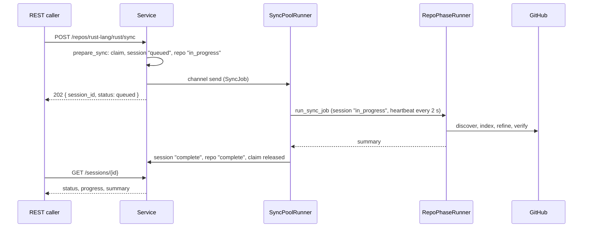
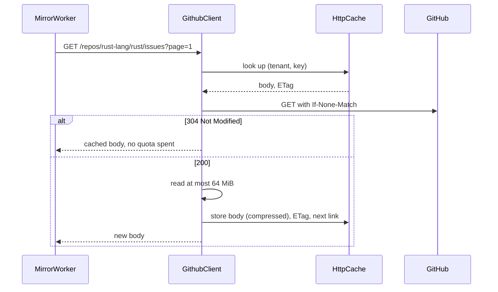

# Technical Design: GitHub Mirror

- [x] `p1` - **ID**: `cpt-cf-github-mirror-design-github-mirror`

<!-- toc -->

- [1. Architecture Overview](#1-architecture-overview)
  - [1.1 Architectural Vision](#11-architectural-vision)
  - [1.2 Architecture Drivers](#12-architecture-drivers)
  - [1.3 Architecture Layers](#13-architecture-layers)
- [2. Principles & Constraints](#2-principles--constraints)
  - [2.1 Design Principles](#21-design-principles)
  - [2.2 Constraints](#22-constraints)
- [3. Technical Architecture](#3-technical-architecture)
  - [3.1 Domain Model](#31-domain-model)
  - [3.2 Component Model](#32-component-model)
  - [3.3 API Contracts](#33-api-contracts)
  - [3.4 Internal Dependencies](#34-internal-dependencies)
  - [3.5 External Dependencies](#35-external-dependencies)
  - [3.6 Interactions & Sequences](#36-interactions--sequences)
  - [3.7 Database Schemas & Tables](#37-database-schemas--tables)
  - [3.8 Core Algorithms](#38-core-algorithms)
- [4. Additional Context](#4-additional-context)
- [5. Traceability](#5-traceability)

<!-- /toc -->

## 1. Architecture Overview

### 1.1 Architectural Vision

GitHub Mirror keeps a local, tenant-scoped copy of GitHub repositories and serves it back. A tenant asks for a repository to be synced; the gear queues the sync, walks the repository's listings, fetches the details of what changed, and writes everything into its own `gm_` tables. Reads never call GitHub: they answer from those tables, either on GitHub's own paths (`/repos/{owner}/{name}/issues`, …) or on the gear's own API (`/github-mirror/v1/...`).

The gear is a ToolKit gear (`github-mirror`) in the DDD-light layout: `api/rest` for the endpoints, `domain` for the service, the sync engine and the ports, `infra` for the GitHub client, the HTTP cache and the SeaORM storage. It is built from the reference implementation repotap, whose design document it adapts; the parts of repotap that belong to a single-token command-line tool (Python bindings, the GraphQL batcher, per-token rate controllers, a filesystem response store) are not part of this gear.

A sync is designed to be stopped and started again. The task queue lives in memory and is never persisted; what survives is the HTTP cache (so unchanged pages come back as `304` and cost no quota), the per-family watermarks and the per-entity fingerprints (so unchanged entities are skipped), and a per-repository run status that `POST /sync/resume` uses to find the repositories left unfinished.

### 1.2 Architecture Drivers

#### Functional Drivers

| Requirement | Phase | Design Response |
|---|---|---|
| `cpt-cf-github-mirror-fr-session-init` | `p1` | `POST /github-mirror/v1/repos/{owner}/{name}/sync` writes a `queued` session and answers `202` with its id; see [Queued Sync](#queued-sync) |
| `cpt-cf-github-mirror-fr-session-resume` | `p1` | `gm_repo_sync_status` keeps `in_progress` until a run completes; `POST /sync/resume` re-queues those repositories (up to 500 per call) |
| `cpt-cf-github-mirror-fr-sync-scope` | `p1` | `include` picks the object families; `actions_scope`, `reactions_scope`, `timeline_scope` pick `all` / `open` / `none`; see [Collection Scopes](#386-collection-scopes) |
| `cpt-cf-github-mirror-fr-issue-pr-detection` | `p1` | Pull requests come from `/pulls`, issues from `/issues` with pull requests left out |
| `cpt-cf-github-mirror-fr-cost-efficiency` | `p1` | Conditional requests with stored `ETag` / `Last-Modified`; watermark sweeps; the change gate; see [3.8](#38-core-algorithms) |
| `cpt-cf-github-mirror-fr-memory-efficiency` | `p1` | Listings are written page by page; the task queue applies backpressure at 10,000 pending tasks |
| `cpt-cf-github-mirror-fr-parallel-fetch` | `p1` | `max_concurrent_syncs` repositories at once, `max_concurrent_tasks` tasks inside one, `max_concurrent_requests` GitHub calls in flight |
| `cpt-cf-github-mirror-fr-rate-limit` | `p1` | One shared cooldown in the GitHub client honours `Retry-After` / `X-RateLimit-Reset`; see [3.8.9](#389-github-client) |
| `cpt-cf-github-mirror-fr-sync-deadline` | `p1` | `sync_deadline_minutes` (default 360) stops a run in order; the session ends `failed` with the reason |
| `cpt-cf-github-mirror-fr-idempotent` | `p1` | Every write is an upsert keyed on the GitHub id and the tenant |
| `cpt-cf-github-mirror-fr-raw-storage` | `p1` | `gm_http_cache` keeps each fetched page body (compressed) with its validators and content hash |
| `cpt-cf-github-mirror-fr-normalized-storage` | `p1` | 31 `gm_` tables, one per entity family |
| `cpt-cf-github-mirror-fr-multi-db` | `p1` | SeaORM through toolkit-db; migrations cover SQLite and PostgreSQL |
| `cpt-cf-github-mirror-fr-repo-discovery` | `p1` | Phase 1 fetches the repository row and seeds one indexing task per enabled family |
| `cpt-cf-github-mirror-fr-issue-refinement` | `p1` | Comments and events come with the issue listing; `Refine(Issue)` fetches reactions and timeline, each by its scope |
| `cpt-cf-github-mirror-fr-pr-refinement` | `p1` | Review comments come with the pull listing; `Refine(PullRequest)` fetches reviews, files, commits and review threads (GraphQL) |
| `cpt-cf-github-mirror-fr-commit-ci-refinement` | `p2` | Commit comments come with the commit listing; `Refine(Commit)` fetches files, plus statuses and check runs when `actions_scope=all`; workflow-run jobs follow `actions_scope` |
| `cpt-cf-github-mirror-fr-sync-order` | `p1` | Priority tiers: open pull requests, open issues, repository-wide families, closed pull requests, closed issues |
| `cpt-cf-github-mirror-fr-completeness-check` | `p1` | Phase 5 compares declared and stored counts; see [3.8.5](#385-verification) |
| `cpt-cf-github-mirror-fr-stale-refresh` | `p2` | Per-entity refresh TTLs in the change gate |
| `cpt-cf-github-mirror-fr-contributor-derivation` | `p2` | Contributors are derived from authors, assignees, reviewers, commenters and committers seen during the sync |
| `cpt-cf-github-mirror-fr-github-compat-api` | `p1` | GitHub-shaped read endpoints at the root, answering with GitHub's field names and error bodies |
| `cpt-cf-github-mirror-fr-extended-api` | `p2` | `/github-mirror/v1/...`: sessions, sync status, resume, cache clear, commit files, review threads |
| `cpt-cf-github-mirror-fr-multi-tenancy` | `p1` | Every table carries `tenant_id`; every query goes through the secure ORM with the caller's `AccessScope` |
| `cpt-cf-github-mirror-fr-access-control` | `p1` | The platform policy enforcer decides each read and write; a refused read answers `404`, never `403` |
| `cpt-cf-github-mirror-fr-public-api` | `p1` | The SDK trait `GithubMirrorClientV1`, served in process by `LocalClient` |
| `cpt-cf-github-mirror-fr-log-redaction` | `p1` | Tokens and credential-shaped text are redacted before logging; GraphQL error bodies are logged, not stored on the session |
| `cpt-cf-github-mirror-fr-sync-summary` | `p2` | A completed session stores a `SyncSummary` with one counter per table and any accepted drift |
| `cpt-cf-github-mirror-fr-progress` | `p2` | `progress_percent` is weighted by phase, never goes down, and is written by the heartbeat |
| `cpt-cf-github-mirror-fr-env-independence` | `p1` | All settings come from the gear config; the token may reference an environment variable (`${GITHUB_TOKEN}`) |

Not covered by this design yet: the CLI (`cpt-cf-github-mirror-fr-cli-*`), Python bindings (`cpt-cf-github-mirror-fr-python-bindings`), write-back (`cpt-cf-github-mirror-fr-write-back`), the token pool (`cpt-cf-github-mirror-fr-token-pool`) and security-alert collection (`cpt-cf-github-mirror-fr-security-sync`, refused by scope validation today).

#### NFR Allocation

| NFR | Design Response |
|---|---|
| `cpt-cf-github-mirror-nfr-reliability` | Resumable runs; per-task transactions; claim and lock released on every exit path, including an aborted task |
| `cpt-cf-github-mirror-nfr-rate-compliance` | Request semaphore, shared cooldown, conditional requests |
| `cpt-cf-github-mirror-nfr-memory-efficiency` | Page-by-page writes; 64 MiB cap on any single response body; queue backpressure |
| `cpt-cf-github-mirror-nfr-security` | Tenant scoping in storage, policy checks per operation, token only over HTTPS (or loopback) |
| `cpt-cf-github-mirror-nfr-parallel-sync` | Tenant-fair pool of `max_concurrent_syncs` workers |
| `cpt-cf-github-mirror-nfr-data-governance` | Per-repository and per-owner cache clear; additive migrations with `down()` |

### 1.3 Architecture Layers

| Layer | Responsibility | Where |
|---|---|---|
| REST API | GitHub-compatible reads, the gear's own endpoints, OpenAPI | `src/api/rest` |
| In-process API | `GithubMirrorClientV1` for other gears | `src/domain/local_client.rs`, `github-mirror-sdk` |
| Service | Authorization, sessions, claims, the queue, resume, cache clear | `src/domain/service.rs` |
| Sync engine | Phases, tasks, change gate, watermarks, verification, the pool | `src/domain/sync` |
| Ports | `GithubPort`, `SyncWriter` and the per-table repositories | `src/domain/ports`, `src/domain/repo.rs` |
| GitHub client | REST and GraphQL calls, pagination, rate limits, the HTTP cache | `src/infra/github` |
| Storage | SeaORM entities, repositories, migrations | `src/infra/storage` |

## 2. Principles & Constraints

### 2.1 Design Principles

#### Sync Is Task-Driven

- [x] `p1` - **ID**: `cpt-cf-github-mirror-principle-task-driven`

A sync is a set of small tasks (discover, index one family, refine one entity, verify one entity) drained phase by phase. Each task writes what it fetched in its own transaction, so a run stopped anywhere leaves nothing half-written.

#### Index First, Detail Later

- [x] `p1` - **ID**: `cpt-cf-github-mirror-principle-index-first`

Listings are cheap and cacheable; they give ids, `updated_at` and child counts. Detail requests are made only for entities the change gate lets through.

#### Everything Is Resumable

- [x] `p1` - **ID**: `cpt-cf-github-mirror-principle-resumable`

Nothing about a run's progress lives only in memory except the queue itself. The cache, the watermarks, the fingerprints and the run status let the next run carry on where the last one stopped.

#### Cache Before Network

- [x] `p1` - **ID**: `cpt-cf-github-mirror-principle-cache-first`

Every GET replays the stored `ETag` / `Last-Modified`; a `304` is served from the cached body and costs no rate limit.

#### Idempotent Writes

- [x] `p1` - **ID**: `cpt-cf-github-mirror-principle-idempotent`

Running the same sync twice leaves the same rows: every write is an upsert on the entity's GitHub id within the tenant.

#### The Cache Holds Responses, the Tables Hold Truth

- [x] `p1` - **ID**: `cpt-cf-github-mirror-principle-cache-role`

Unlike repotap, raw bodies are kept only as the HTTP cache. Reads are answered from the normalized tables, and nothing is re-normalized from the cache.

### 2.2 Constraints

#### Runs as a ToolKit Gear

The gear is started and stopped by the framework. `stop()` cancels the pool and waits for running syncs; when the framework's hard-stop deadline fires first, the pool task is aborted. A job cut short gives its claim back through a drop guard, and its session is closed out as `interrupted` by the next start-up sweep.

#### One GitHub Token

The gear is configured with one token (`github_token`). All tenants' syncs share its rate limit, so a cooldown pauses every request made with it. A token per tenant is future work.

#### Tenant Isolation in Storage

Every table has `tenant_id`, and every query is built through the secure ORM with the caller's `AccessScope`. A handler cannot forget the tenant filter, because storage adds it.

#### Storage Engines

SeaORM through toolkit-db, with SQLite and PostgreSQL in the migrations. The migration runner applies migrations in name order; names are `m0001_…` to `m0043_…`, so name order is number order and a new migration takes the next number.

## 3. Technical Architecture

### 3.1 Domain Model

| Type | What it is |
|---|---|
| `SyncSessionRecord` | One sync run: repository, status, progress, error, summary, timestamps |
| `SessionStatus` | `queued`, `in_progress`, `complete`, `failed`, `interrupted` |
| `RepoRunStatus` | Per repository: `in_progress` until a run completes, then `complete` |
| `ScopeConfig` | `objects` (which families) and `collection` (`actions`, `reactions`, `timeline`: `all` / `open` / `none`) |
| `SyncJob` | A queued run: tenant context, repository, scope, `force`, `since`, and the claim guard |
| `Claim` | The in-memory mark that a repository has a run in flight, with the terms it was asked for |
| `ExtractionTask` | One unit of work: kind, entity id, priority, `attempt` (repair pass), `retries` (database retries) |
| `TaskKind` | `Discover`, `Index(Family)`, `Refine(Entity)`, `Verify(Entity)` |
| `Family` | `Issues`, `PullRequests`, `Commits`, `Metadata`, `Actions` |
| `Entity` | `Issue`, `PullRequest`, `Commit`, `WorkflowRun` |
| `GateInputs` | Fingerprint, child-counts hash, `updated_at`, node id, whether the entity is closed |
| `CountGap` / `CountDrift` | A declared-versus-stored shortfall found by verification, and one accepted after the repair budget |
| `SyncSummary` | Per-table counters of a completed run, stored as the session's `summary_json` |

### 3.2 Component Model

```
            REST handlers                      LocalClient (SDK)
                 │                                   │
                 ▼                                   ▼
┌────────────────────────────── Service ──────────────────────────────┐
│ policy enforcer · claims (in_flight) · claim gates · sessions        │
│ prepare_sync ──► enqueue_sync_scoped ──► sync channel (64)           │
│             └──► sync_now ──► run_and_record (on the caller's task)  │
└──────────────────────────────────────────────────────────────────────┘
                 │ channel
                 ▼
        SyncPoolRunner  (per-tenant queues, max_concurrent_syncs workers)
                 │ run_sync_job
                 ▼
        RepoPhaseRunner (TaskQueue, lanes, max_concurrent_tasks)
                 │
                 ▼
        MirrorWorker ── ChangeGate (fingerprints) ── SweepWatermark
          │        │
          ▼        ▼
   GithubClient   SyncWriter / repositories (SeaORM, tenant-scoped)
   (semaphore, cooldown, HttpCache)
```

| Component | Responsibility |
|---|---|
| `Service` | Authorization, sessions, claims, the queue, resume, cache clear, reads |
| `SyncPoolRunner` | Takes queued jobs, keeps one queue per tenant and serves tenants in turn, runs up to `max_concurrent_syncs` |
| `RepoPhaseRunner` | Drives one repository through the phases; claims tasks round-robin across three lanes |
| `MirrorWorker` | Executes every task kind: fetches through `GithubPort`, writes through `SyncWriter` |
| `ChangeGate` | Decides whether an entity needs a detail fetch; records fingerprints |
| `SweepWatermark` | Per-family high-water mark for incremental listing sweeps |
| `GithubClient` | REST and GraphQL calls with conditional requests, pagination, retries, the rate-limit cooldown and the body cap |
| `HttpCache` | Tenant-scoped response store with compression and a content hash |

### 3.3 API Contracts

#### Gear API (`/github-mirror/v1`)

| Method and path | What it does |
|---|---|
| `POST /repos/{owner}/{name}/sync` | Queue a sync. Query: `force`, `include`, `actions_scope`, `reactions_scope`, `timeline_scope`, `since`. `202` with the session id; a repeat on the same terms joins the running sync; other terms get `409` |
| `POST /sync/resume` | Re-queue repositories still `in_progress` (optionally one, `?repo=owner/name`) |
| `GET /sessions`, `GET /sessions/{id}` | Session list and one session: status, progress, error, summary |
| `GET /sync-status` | Per-repository run status; filter `status=in_progress\|complete` |
| `DELETE /cache` | Clear cached responses for `?owner=` or `?repo=owner/name` |
| `GET /repos` | Mirrored repositories |
| `GET /repos/{owner}/{name}/commits/{sha}/files`, `GET /repos/{owner}/{name}/pulls/{number}/threads` | Data GitHub's REST paths do not serve in this shape |
| `GET /health` | Liveness |

Errors use the platform's canonical problem body; a validation error names the parameter in `context.field_violations`.

#### GitHub-Compatible API (root)

`/user`, `/user/repos`, and under `/repos/{owner}/{name}`: the repository, issues (with comments, events, reactions, timeline), pull requests (with reviews, review comments, files, commits), commits (with comments, statuses, check runs), branches, tags, releases, labels, milestones, contributors, deployments, workflow runs and their jobs. Responses use GitHub's field names, paging (`page`, `per_page` up to 100) and error body.

#### SDK

`GithubMirrorClientV1` in `github-mirror-sdk`: `status`, `list_repos`, `sync_repository`. `LocalClient` serves it in process; `sync_repository` runs a sync on the caller's task and returns its `SyncSummary` (see [In-Process Sync](#in-process-sync)).

#### Ports

| Port | Used for |
|---|---|
| `GithubPort` | Every GitHub read the engine makes: listings, details, actions, the cache clear |
| `SyncWriter` | Every write a sync makes, one transaction per call |
| `*Repository` traits | Reads for the API and the few reads the engine needs (for example `open_head_shas`) |

### 3.4 Internal Dependencies

| Dependency | Used for |
|---|---|
| toolkit-db | Database handle, advisory locks, the migration runner |
| Secure ORM (toolkit-db) | `scope_with(AccessScope)` on every query, tenant checks on writes |
| Policy enforcer (authz resolver SDK) | Access decisions per resource type (`github_mirror.*`) and action (`list`, `get`, `upsert`, `sync`) |
| Canonical errors (toolkit) | Problem bodies for the gear API |
| `OperationBuilder` (toolkit) | Route registration and OpenAPI, including enum query parameters |

### 3.5 External Dependencies

#### GitHub REST API

Base URL from `api_base_url` (default `https://api.github.com`; an Enterprise server is `https://host/api/v3`). Requests pin API version `2022-11-28`, ask for 100 items per page, follow `Link: next` only on the same origin, and refuse to send the token over plain HTTP to a host that is not loopback.

#### GitHub GraphQL API

Used only for pull-request review threads, which REST does not serve. The endpoint is `{base}/graphql` on github.com and `https://host/api/graphql` on Enterprise. A response with `data` and field errors keeps the data and marks the pull's threads incomplete; `data: null` is a refusal.

### 3.6 Interactions & Sequences

#### Queued Sync

- [x] `p1` - **ID**: `cpt-cf-github-mirror-seq-queued-sync`



A second request for the same repository while the first is queued or running gets the same session on the same terms, and `409` on other terms. A full queue or a stopped pool fails the new session at once and answers with an internal error.

#### In-Process Sync

- [x] `p1` - **ID**: `cpt-cf-github-mirror-seq-in-process-sync`

`LocalClient::sync_repository` calls `Service::sync_now`: the same `prepare_sync` (claim, session row, repository status), then the run itself on the caller's task, then the run's `SyncSummary` or its own error. It gets the deadline, the heartbeat and a `/sessions` row; it does not take a pool slot. A sync of the same repository already in flight answers `Conflict`.

#### Resume

- [x] `p1` - **ID**: `cpt-cf-github-mirror-seq-resume`

`POST /sync/resume` lists repositories whose run status is `in_progress` and queues each with the configured scope. The repository status stays `in_progress` after a failed or interrupted run on purpose; only a completed run moves it to `complete`.

#### Cache-Before-Network Request

- [x] `p1` - **ID**: `cpt-cf-github-mirror-seq-cache-first`



### 3.7 Database Schemas & Tables

#### Table: gm_sync_sessions

| Column | Description |
|---|---|
| `tenant_id`, `id` | Primary key |
| `repo_full_name`, `repo_id` | The repository; `repo_id` once discovery has run |
| `status` | `queued`, `in_progress`, `complete`, `failed`, `interrupted` |
| `progress_percent` | 0 to 100, written by the heartbeat |
| `error` | Public text of the error that ended a `failed` or `interrupted` run |
| `summary_json` | The `SyncSummary` of a `complete` run |
| `created_at`, `started_at`, `ended_at`, `updated_at` | `updated_at` is the heartbeat |

Transitions: `queued` → `in_progress` when a worker (or `sync_now`) starts the run; `in_progress` → `complete`, `failed` (an error, or the deadline) or `interrupted` (cancelled by a shutdown). A `queued` or `in_progress` row found at start-up has nobody behind it and is set to `interrupted`.

#### Table: gm_repo_sync_status

| Column | Description |
|---|---|
| `tenant_id`, `repo_full_name` | Primary key |
| `repo_id` | Once known |
| `status` | `in_progress` or `complete` |
| `last_session_id` | The session that last touched it; used to tell whether its holder is still alive |
| `last_synced_at` | When a run last completed |

#### Table: gm_http_cache

| Column | Description |
|---|---|
| `tenant_id`, `cache_key` | Primary key; the key is computed from method, URL and `Accept` |
| `url`, `status` | What was fetched |
| `etag`, `last_modified`, `next_page` | Validators and the `Link: next` of the page |
| `body`, `compression` | The body as stored (`gzip` by default, or `none`) |
| `content_hash` | SHA-256 of the uncompressed body |
| `fetched_at` | When the entry was written |

#### Table: gm_sync_watermarks

| Column | Description |
|---|---|
| `tenant_id`, `repo_id`, `family` | Primary key (`issues`, `pull_requests`, `commits`) |
| `last_seen_updated_at` | High-water mark promoted after a complete sweep |
| `sweep_in_progress`, `candidate_high_water` | The sweep under way and the mark it will promote |

#### Table: gm_entity_fingerprints

| Column | Description |
|---|---|
| `tenant_id`, `repo_id`, `family`, `entity_id` | Primary key |
| `fingerprint`, `child_counts_hash`, `updated_at`, `node_id` | What the gate compares |
| `last_refined_at`, `refinement_status` | `pending` until the detail fetch completes, then `complete` |

#### Mirrored Entity Tables

`gm_repositories`, `gm_issues`, `gm_pull_requests`, `gm_commits`, `gm_comments`, `gm_review_comments`, `gm_reviews`, `gm_review_threads`, `gm_labels`, `gm_milestones`, `gm_releases`, `gm_branches`, `gm_tags`, `gm_contributors`, `gm_workflow_runs`, `gm_workflow_jobs`, `gm_pull_request_files`, `gm_pull_request_commits`, `gm_commit_files`, `gm_commit_comments`, `gm_commit_statuses`, `gm_check_runs`, `gm_issue_events`, `gm_issue_reactions`, `gm_issue_timeline`, `gm_deployments`. Each has `tenant_id` in its key and an `extracted_at` stamp written by every upsert.

Tasks have no table: the queue is in memory.

#### Migrations

`m0001_initial` to `m0043_review_comment_review_id`, applied in name order by the toolkit migration runner. A change to a table that already holds rows is additive, and every migration has a `down()` (see the PRD's schema-change rule). A new migration takes the next number.

### 3.8 Core Algorithms

#### 3.8.1 Incremental Listing Sweep

- [x] `p1` - **ID**: `cpt-cf-github-mirror-alg-watermark-sweep`

Issues, pull requests and commits are listed newest first. A sweep starts from the family's `last_seen_updated_at` minus a five-minute overlap and stops at the first page whose rows are all older. The newest `updated_at` seen is staged as the candidate; it is promoted only when the whole family, including its refinements, has finished. A run that stops early promotes nothing, so the next run walks the listing again and the gate re-seeds whatever was left `pending`. `force` ignores the watermark.

#### 3.8.2 Change Gate

- [x] `p1` - **ID**: `cpt-cf-github-mirror-alg-change-gate`

An entity is refined when it is new, its fingerprint or child-counts hash changed, its last refinement did not complete, its refresh TTL ran out, or the run is forced. TTLs:

| Entity | Open | Closed |
|---|---|---|
| Issue | 4 hours | 7 days |
| Pull request | 2 hours | 7 days |
| Commit | 1 hour while its CI is still collected | never |
| Workflow run | 1 day | 1 day |

After a refinement the entity is marked `complete`. A pull whose review threads came back incomplete keeps `pending`, so the next run fetches it again.

#### 3.8.3 Deletion Reconciliation

- [x] `p1` - **ID**: `cpt-cf-github-mirror-alg-reconciliation`

Rows are hard-deleted, not tombstoned. After a listing fetched to completion, rows of that family whose `extracted_at` predates the run's start were not seen and are removed. A truncated listing, or a family left out of the scope, proves nothing and deletes nothing. A pull's reviews, files and commits are replaced as a whole on each refinement; its review threads only when the thread fetch was complete.

#### 3.8.4 Scheduler

- [x] `p1` - **ID**: `cpt-cf-github-mirror-alg-scheduler`

One in-memory `TaskQueue` per run. Discovery runs alone; indexing, change detection and refinement drain together (indexing seeds refinement as pages arrive); verification runs last. Tasks are claimed by priority, then age, round-robin across three lanes (pull requests, issues, everything else) so a long pull-request backlog cannot starve issues. While 10,000 tasks are pending, a new task is claimed only after a running one finishes. A task that fails on database contention is retried up to three times with a growing delay, counted in `retries`, apart from its repair pass in `attempt`.

#### 3.8.5 Verification

- [x] `p1` - **ID**: `cpt-cf-github-mirror-alg-verification`

For every pull request the declared commit and file counts are compared with what was stored. A shortfall seeds a repair pass (`Verify`, priority `HIGH`) that fetches the pull again. After three passes, or when a pass does not shrink the gap, the gap is accepted: logged as a warning and recorded in the summary's `accepted_drift`, and the session still ends `complete`.

#### 3.8.6 Collection Scopes

- [x] `p1` - **ID**: `cpt-cf-github-mirror-alg-collection-scopes`

| Scope | `all` | `open` (default for actions and reactions) | `none` (default for timeline) |
|---|---|---|---|
| `reactions_scope`, `timeline_scope` | every issue and pull request | open ones only | not fetched |
| `actions_scope` | jobs of every workflow run; statuses and check runs of every commit | jobs of runs on the head commit of an open pull request (from `gm_pull_requests`); no commit statuses or check runs | neither |

An issue is refined when either its reactions or its timeline scope wants it.

#### 3.8.7 Claims, Locks and Liveness

- [x] `p1` - **ID**: `cpt-cf-github-mirror-alg-claims-locks`

| Mechanism | Scope | Purpose |
|---|---|---|
| Claim (`in_flight`) | this process, per tenant and repository | One queued or running sync per repository; a request is joined or refused against it. Released by a guard carried in the job, so a job that ends, is dropped from the queue or is aborted gives it back |
| Claim gate | this process, per repository | Serializes the check, the session write and the claim of concurrent requests for one repository; dropped when nobody holds it |
| Advisory lock `sync/{tenant}/{owner}/{name}` | toolkit-db, across processes | One run per repository; held for the whole run; a held lock answers `409` |
| Heartbeat | the session row | `updated_at` every 2 seconds; a row silent for 300 seconds is abandoned, and its lock may be taken |

#### 3.8.8 Deadline

- [x] `p1` - **ID**: `cpt-cf-github-mirror-alg-deadline`

A run races `sync_deadline_minutes`. When the deadline wins, the run's own cancellation token is cancelled, the run winds down (tasks in flight finish their writes, the lock is released), and the session ends `failed` with "ran past its deadline of N minutes and was stopped; the next sync carries on from what it had already stored". The repository stays `in_progress`, so resume picks it up.

#### 3.8.9 GitHub Client

- [x] `p1` - **ID**: `cpt-cf-github-mirror-alg-github-client`

| Behaviour | Value |
|---|---|
| Requests in flight | `max_concurrent_requests` (default 8), one semaphore for all syncs |
| Rate limit | a `429`, or a `403` with rate-limit headers, sets one shared cooldown from `Retry-After` / `X-RateLimit-Reset` (at most 5 minutes per wait, 30 waits per request) |
| Server errors and send failures | 3 retries, backing off from 2 seconds |
| Timeouts | 10 s to connect, 60 s per request |
| Body cap | 64 MiB for any response and any cached body, read piece by piece |
| Review threads | 20 GraphQL pages of 100 per pull at most; past that the walk stops with a warning |

## 4. Additional Context

### Sync Phases

| Phase | Tasks | Share of progress |
|---|---|---|
| 1. Discovery | fetch the repository, seed one index task per enabled family | 2% |
| 2. Indexing | walk each family's listing, write it, seed refinements | 13% |
| 3. Change detection | the gate, run inside indexing | (part of indexing) |
| 4. Refinement | one detail fetch per entity the gate let through | 80% |
| 5. Verification | count checks and repair passes | 5% |

### Priority Tiers

| Tasks | Priority |
|---|---|
| Pull-request listing; refinement of open pull requests | 600 |
| Issue listing; refinement of open issues | 500 |
| Commit, metadata (labels, milestones, releases, branches, tags) and actions listings | 400 |
| Refinement of closed pull requests | 300 |
| Refinement of closed issues | 200 |
| Repair passes | 100 |
| Discovery, commit refinement, workflow-run jobs | 0 |

### Consistency Model

Each task commits on its own, so a reader can see a repository part way through a sync: new issues next to pull requests from the previous run. `GET /sync-status` says whether a repository is `in_progress` and when its last run completed. Every entity converges to its latest state by the end of a complete run.

### Security

Every read and write passes the policy enforcer for its resource type and is scoped to the caller's tenant in storage. A read the caller may not make answers `404`, so it does not confirm that a repository exists. The token is kept as a secret, never logged, and never sent over plain HTTP except to loopback. Logged text is redacted, and the bodies of GitHub's GraphQL errors are logged rather than stored in a session's `error`.

### Operations

Configuration (`config` of the gear):

| Setting | Default |
|---|---|
| `api_base_url` | `https://api.github.com` |
| `github_token` | none; may be `${GITHUB_TOKEN}` |
| `scope` | every family except security; actions and reactions `open`, timeline `none` |
| `cache_compression` | `gzip` |
| `max_concurrent_syncs` | 4 |
| `max_concurrent_tasks` | 4 |
| `max_concurrent_requests` | 8 |
| `sync_deadline_minutes` | 360 |

The database pool should allow at least `max_concurrent_syncs` × `max_concurrent_tasks` connections plus one per sync for its heartbeat and session writes (20 with the defaults).

### Future Work

- Sharing cached responses of public repositories across tenants (needs per-entry visibility and grants).
- A token per tenant, with its own rate-limit budget.
- An "as of" marker on read endpoints for readers that must not see a repository mid-sync.
- The CLI, Python bindings and write-back described in the PRD.

## 5. Traceability

- **PRD**: [PRD.md](./PRD.md)
- **Reference design**: repotap `docs/DESIGN.md`, adapted as described in [1.1](#11-architectural-vision)
