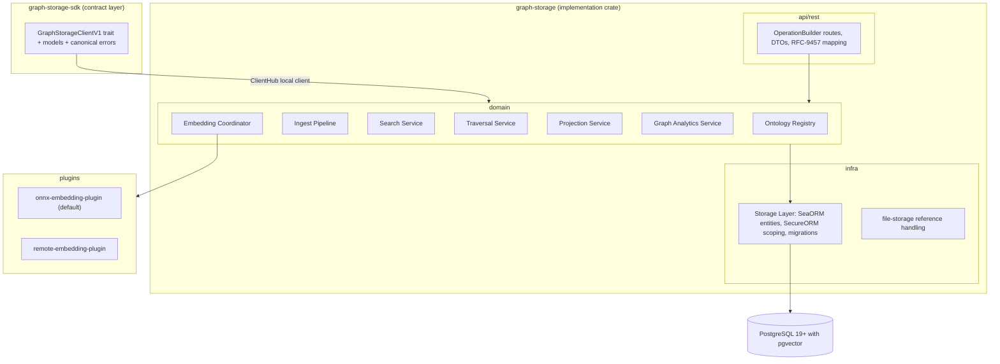
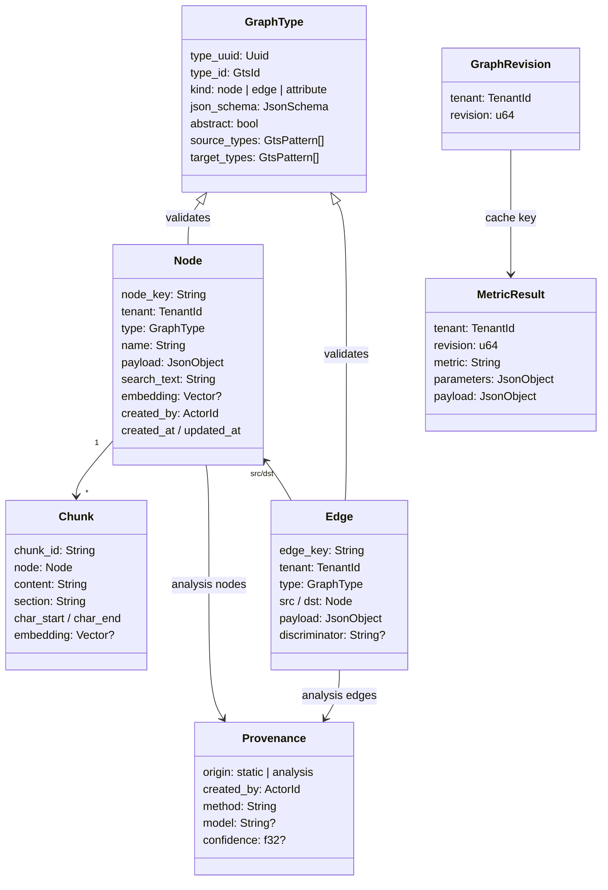

# Technical Design — Graph Storage

<!-- toc -->

- [1. Architecture Overview](#1-architecture-overview)
  - [1.1 Architectural Vision](#11-architectural-vision)
  - [1.2 Architecture Drivers](#12-architecture-drivers)
  - [1.3 Architecture Layers](#13-architecture-layers)
- [2. Principles & Constraints](#2-principles--constraints)
  - [2.1 Design Principles](#21-design-principles)
  - [2.2 Constraints](#22-constraints)
- [3. Technical Architecture](#3-technical-architecture)
  - [3.1 Domain Model](#31-domain-model)
  - [3.2 Component Model](#32-component-model)
  - [3.3 API Contracts](#33-api-contracts)
  - [3.4 Internal Dependencies](#34-internal-dependencies)
  - [3.5 External Dependencies](#35-external-dependencies)
  - [3.6 Interactions & Sequences](#36-interactions--sequences)
  - [3.7 Database schemas & tables](#37-database-schemas--tables)
- [4. Additional context](#4-additional-context)
  - [Prototype Lineage](#prototype-lineage)
  - [Phantom Materialization Contract](#phantom-materialization-contract)
  - [Concurrent Ingest Protocol](#concurrent-ingest-protocol)
  - [Authorization Model](#authorization-model)
  - [Read Consistency Contract](#read-consistency-contract)
  - [Error Model](#error-model)
  - [Deadlines and Cancellation](#deadlines-and-cancellation)
  - [Readiness Matrix](#readiness-matrix)
  - [Telemetry and Audit Contract](#telemetry-and-audit-contract)
  - [Traversal Backend Sketch](#traversal-backend-sketch)
  - [Plugin Selection and Lifecycle](#plugin-selection-and-lifecycle)
  - [Capacity and Admission Contract](#capacity-and-admission-contract)
  - [Base Ontology Publication](#base-ontology-publication)
- [5. Traceability](#5-traceability)

<!-- /toc -->

## 1. Architecture Overview

### 1.1 Architectural Vision

Graph Storage is a stateless-above-PostgreSQL platform gear that stores one typed, multi-tenant knowledge graph and serves four query shapes over it: lexical/vector/hybrid search, depth-limited traversal, bounded projections, and whole-graph analytics. One relational store is the source of truth for everything — nodes, edges, chunks, types, vectors, and metric caches — so consistency, tenancy, and authorization are enforced in exactly one place.

The design generalizes the `studio-graph-storage` prototype: its data model (typed nodes and edges with GTS contracts, deterministic keys, phantom nodes, static/analysis edge split), its retrieval stack (tsvector + pgvector + RRF fusion, chunk folding), and its analytics surface are carried forward; its Python-only dependencies (Apache AGE, NetworkX, sentence-transformers) are replaced by decisions recorded in ADR-0001, ADR-0004, and ADR-0005; and platform obligations the prototype deliberately skipped — tenancy, access control, pagination, batched writes, observability — are designed in from the start.

The gear follows the standard ToolKit gear anatomy: an SDK crate exposing a typed client trait and transport-agnostic models, an implementation crate with API/domain/infra layers, and two plugin surfaces — embedding providers (ADR-0005) and graph engines behind the `GraphQueryPort` (ADR-0001), with the built-in PostgreSQL engine as the default graph-engine plugin.

### 1.2 Architecture Drivers

#### Functional Drivers

| Priority | Requirement | Design Response |
|----------|-------------|-----------------|
| `p1` | `cpt-cf-graph-storage-fr-type-registration` | Ontology Registry component validates draft-07 schemas, derives UUIDv5 identifiers via platform GTS, applies batches atomically, rejects conflicting re-registration |
| `p1` | `cpt-cf-graph-storage-fr-type-constraints` | Registry enforces abstractness and edge endpoint patterns; Ingest Pipeline validates payloads across the full GTS derivation chain with JSON-pointer error reporting |
| `p2` | `cpt-cf-graph-storage-fr-type-catalog` | Registry read endpoints list and fetch registered types with schemas, constraints, and derived UUIDs |
| `p1` | `cpt-cf-graph-storage-fr-bulk-ingest` | Ingest Pipeline validates whole batches, writes nodes/edges/chunks with batched statements in one transaction, bumps the tenant graph revision; durable idempotency keys with recorded outcomes make retries after unknown commit results safe (Concurrent Ingest Protocol) |
| `p1` | `cpt-cf-graph-storage-fr-stable-identity` | Producer-supplied node keys unique per tenant; edge keys derived as a hash of type, endpoints, and discriminator; concrete node types immutable under upsert with optional expected-version CAS, endpoint validation under row locks (Concurrent Ingest Protocol) |
| `p1` | `cpt-cf-graph-storage-fr-reference-nodes` | Unified node table; owned/reference semantics carried by GTS base types per ADR-0002; all query components type-agnostic |
| `p2` | `cpt-cf-graph-storage-fr-phantom-nodes` | Ingest Pipeline materializes phantom-typed nodes for dangling edge endpoints; real ingest replaces phantoms in place |
| `p1` | `cpt-cf-graph-storage-fr-edge-provenance` | Provenance attribute type in the base ontology; scope replacement predicate excludes analysis-originated rows |
| `p1` | `cpt-cf-graph-storage-fr-scope-replace` | Declarative replace-scope executed in the ingest transaction: delete static rows of the scope absent from the batch; replacements serialize on the canonical scope identity and carry monotonic source generations (Concurrent Ingest Protocol) |
| `p1` | `cpt-cf-graph-storage-fr-node-read` | Node read path joins node, chunk inventory, and adjacent edges with limits |
| `p2` | `cpt-cf-graph-storage-fr-content-chunking` | Chunker produces deterministic, offset-preserving chunks with location-encoded identifiers; chunks indexed and embedded individually |
| `p2` | `cpt-cf-graph-storage-fr-heavy-content-offload` | Payload size ceiling enforced at ingest; payloads reference file-storage identifiers that the gear never dereferences |
| `p1` | `cpt-cf-graph-storage-fr-embedding-pipeline` | Embedding Coordinator composes search text from vectorized attributes, batches provider calls, preserves vectors on non-embedding upserts |
| `p1` | `cpt-cf-graph-storage-fr-embedding-dim-guard` | Readiness compares the provider-declared embedding-space identity (model, tokenizer, preprocessing/pooling) and dimension against the identity recorded for stored vectors; mismatch fails readiness and blocks vector search; ingest rejects mismatched vector widths |
| `p1` | `cpt-cf-graph-storage-fr-lexical-search` | Lexical arm: web-style tsquery over node and chunk tsvectors with ranked results, snippets, and chunk-to-node folding |
| `p1` | `cpt-cf-graph-storage-fr-vector-search` | Vector arm: provider-embedded query against HNSW cosine indexes over node and chunk vectors, folded to nodes |
| `p1` | `cpt-cf-graph-storage-fr-hybrid-search` | Search Service runs both arms independently and fuses with RRF, reporting per-arm ranks |
| `p1` | `cpt-cf-graph-storage-fr-type-filtering` | GTS family patterns compiled to safe SQL patterns with literal-punctuation escaping, applied in every search arm |
| `p1` | `cpt-cf-graph-storage-fr-read-consistency` | Compound reads (hybrid search, traversal + hydration, projections) execute on one repeatable-read snapshot; responses report the observed graph revision; continuation tokens are revision-bound (Read Consistency Contract) |
| `p1` | `cpt-cf-graph-storage-fr-graph-traversal` | Traversal Service expands breadth-first through the GraphQueryPort: SQL/PGQ `GRAPH_TABLE` hop patterns from v1 for fixed-depth shapes (direction-explicit, per-hop dedup), iterative scoped hops for variable depth until PG20-class quantifiers, per ADR-0001 |
| `p1` | `cpt-cf-graph-storage-fr-neighborhood-projection` | Projection Service returns degree-ordered, budget-truncated neighborhoods with phantom toggle and metric annotations |
| `p1` | `cpt-cf-graph-storage-fr-tabular-projection` | Projection Service serves OData-filtered, paginated node tables over annotated (indexed) payload attributes |
| `p2` | `cpt-cf-graph-storage-fr-graph-metrics` | Graph Analytics Service computes degree, PageRank, components over a topology-only projection per ADR-0004 |
| `p3` | `cpt-cf-graph-storage-fr-graph-analytics-extended` | Seeded sampled Brandes betweenness and seeded Louvain-family communities with stable ordering; no NetworkX parity |
| `p2` | `cpt-cf-graph-storage-fr-metrics-cache` | Metric results cached by (tenant, graph revision, metric, parameters); cache/computed provenance reported |
| `p1` | `cpt-cf-graph-storage-fr-tenant-isolation` | Every entity is tenant-scoped through SecureORM; traversal recursion, search arms, and analytics loading carry the tenant predicate |
| `p1` | `cpt-cf-graph-storage-fr-access-control` | Shared PolicyEnforcer-backed application service for REST and ClientHub; PDP-checked permissions (ontology admin, ingest, query, whole-tenant analytics) declared as GTS instances; resource-level enforcement per the Authorization Model (induced authorized subgraph, arm-level scoping, anti-enumeration) |
| `p1` | `cpt-cf-graph-storage-fr-rest-api` | Versioned REST under `/api/graph-storage/v1` with OpenAPI schemas, RFC-9457 problems, documented limits |
| `p1` | `cpt-cf-graph-storage-fr-sdk-client` | SDK crate with `GraphStorageClientV1` trait registered in ClientHub; local client delegates to domain services |
| `p2` | `cpt-cf-graph-storage-fr-observability` | Structural tracing spans (batch sizes, arm timings, frontier sizes, cache hits) and OTel metrics, including per-limit saturation counters from the Capacity and Admission Contract; payload content never logged |
| `p1` | `cpt-cf-graph-storage-fr-readiness` | Per-capability readiness (DB and migrations, server major version, pgvector, property graph, registries, embedding provider and identity, engine plugins, dynamic indexes, analytics workers) reported as healthy/degraded/unhealthy with named problems; degraded capabilities reject only their own operations (Readiness Matrix) |

#### NFR Allocation

| Priority | NFR ID | NFR Summary | Allocated To | Design Response | Verification Approach |
|----------|--------|-------------|--------------|-----------------|----------------------|
| `p1` | `cpt-cf-graph-storage-nfr-ingest-throughput` | 10k nodes + 20k edges <= 60 s | Ingest Pipeline, Storage Layer | Batched multi-row statements, single transaction, validation before writes, bounded per-batch memory | Ingest benchmark suite on reference profile |
| `p1` | `cpt-cf-graph-storage-nfr-search-latency` | Hybrid p95 <= 500 ms at 100k nodes | Search Service, Storage Layer | Independent arm queries each using its index (GIN, HNSW), bounded arm limits, fusion in memory | Search benchmarks on seeded reference graph |
| `p1` | `cpt-cf-graph-storage-nfr-traversal-latency` | Depth-3 p95 <= 1 s at 500k edges | Traversal Service, Storage Layer | Composite edge indexes (tenant, src), (tenant, dst); per-hop frontier bounding; node budgets | Traversal benchmarks on seeded reference graph |
| `p2` | `cpt-cf-graph-storage-nfr-analytics-memory` | Topology-only, ceiling-enforced | Graph Analytics Service | Load node keys and typed edge pairs only; refuse graphs above any configured ceiling (nodes, edges, or estimated bytes — a node count alone does not bound memory on dense graphs) | Memory profiling tests |
| `p1` | `cpt-cf-graph-storage-nfr-tenant-zero-leak` | Zero cross-tenant results | Storage Layer, all query components | Tenant predicate injected by SecureORM scoping in every query, including every CTE body; no raw unscoped SQL | Adversarial multi-tenant integration tests |
| `p1` | `cpt-cf-graph-storage-nfr-code-coverage` | >= 85% line coverage | All crates | Trait-based ports enable mock-driven unit tests; integration tests against real PostgreSQL | `cargo llvm-cov` in CI |

#### Key ADRs

| ADR ID | Decision | Materialized By |
|--------|----------|-----------------|
| [`cpt-cf-graph-storage-adr-single-postgres-store`](./ADR/0001-cpt-cf-graph-storage-adr-single-postgres-store.md) | Single PostgreSQL 19+ store (pgvector only); graph queries behind the GraphQueryPort with SQL/PGQ active from v1 (fixed-depth shapes) and iterative scoped hops for variable depth; pinned beta image until PG19 GA; Apache AGE not carried into the gear; dedicated traversal mirror as a measured-bottleneck contingency | `cpt-cf-graph-storage-principle-single-source-of-truth`, `cpt-cf-graph-storage-component-traversal-service`, `cpt-cf-graph-storage-component-storage-layer` |
| [`cpt-cf-graph-storage-adr-unified-node-model`](./ADR/0002-cpt-cf-graph-storage-adr-unified-node-model.md) | One typed node model; owned vs. reference semantics via GTS base types; provenance-gated scope replacement | `cpt-cf-graph-storage-principle-reference-not-replica`, `cpt-cf-graph-storage-principle-provenance-survives-resync`, `cpt-cf-graph-storage-component-ontology-registry`, `cpt-cf-graph-storage-component-ingest-pipeline` |
| [`cpt-cf-graph-storage-adr-metadata-partitioning`](./ADR/0003-cpt-cf-graph-storage-adr-metadata-partitioning.md) | Common columns + schema-declared indexed/vectorized attributes + payload ceiling with file-storage offload | `cpt-cf-graph-storage-principle-metadata-only-graph`, `cpt-cf-graph-storage-component-ontology-registry`, `cpt-cf-graph-storage-component-projection-service` |
| [`cpt-cf-graph-storage-adr-analytics-in-rust`](./ADR/0004-cpt-cf-graph-storage-adr-analytics-in-rust.md) | In-process Rust analytics with per-metric determinism contracts; NetworkX parity waived | `cpt-cf-graph-storage-component-graph-analytics-service` |
| [`cpt-cf-graph-storage-adr-embedding-provider`](./ADR/0005-cpt-cf-graph-storage-adr-embedding-provider.md) | Pluggable embedding provider; in-process ONNX default, remote plugin, deterministic fake for CI | `cpt-cf-graph-storage-component-embedding-coordinator`, `cpt-cf-graph-storage-constraint-single-embedding-space` |
| [`cpt-cf-graph-storage-adr-sqlpgq-access`](./ADR/0006-cpt-cf-graph-storage-adr-sqlpgq-access.md) | SQL/PGQ is emitted from typed input through a function-call table reference (no `sea_query` fork, no hand-written SQL); every identifier comes from a closed vocabulary and every value is bound; a pattern carries the tenant bound and proposes candidates while an ordinary scoped query authorizes them; a scope whose tenants cannot be enumerated falls back to the two-query hop | `cpt-cf-graph-storage-component-traversal-service`, `cpt-cf-graph-storage-component-storage-layer` |

### 1.3 Architecture Layers

Standard ToolKit gear layering:



- **SDK crate** (`graph-storage-sdk`): client trait, transport-agnostic models, GTS identifier constants for the base ontology. No serde/HTTP/DB dependencies.
- **API layer**: REST DTOs and handlers only; every route registered through OperationBuilder with authentication and permissions.
- **Domain layer**: the seven services above, expressed over storage ports; no infra types in domain signatures.
- **Infra layer**: SeaORM entities with `Scopable` tenancy, repositories generic over `DBRunner`, migrations, traversal SQL, and the file-storage reference adapter.
- **Plugins**: embedding providers behind the plugin contract, discovered via GTS plugin instances.

## 2. Principles & Constraints

### 2.1 Design Principles

#### Single Source of Truth

- [ ] `p1` - **ID**: `cpt-cf-graph-storage-principle-single-source-of-truth`

All graph state — nodes, edges, chunks, types, vectors, revisions, metric caches — lives in one PostgreSQL schema. No mirrors, no dual writes, no derived stores that can drift. ADR: [`cpt-cf-graph-storage-adr-single-postgres-store`](./ADR/0001-cpt-cf-graph-storage-adr-single-postgres-store.md).

#### Everything Is Typed

- [ ] `p1` - **ID**: `cpt-cf-graph-storage-principle-everything-typed`

No node or edge enters the graph without a registered GTS type, and no payload is stored without passing its full derivation-chain validation. The type registry is the contract boundary between independent producers.

#### Reference, Not Replica

- [ ] `p1` - **ID**: `cpt-cf-graph-storage-principle-reference-not-replica`

The graph never becomes a system of record for managed objects owned elsewhere. Reference nodes carry canonical identifiers plus bounded queryable projections; full records are fetched from the owning gear. ADR: [`cpt-cf-graph-storage-adr-unified-node-model`](./ADR/0002-cpt-cf-graph-storage-adr-unified-node-model.md).

#### Metadata-Only Graph

- [ ] `p1` - **ID**: `cpt-cf-graph-storage-principle-metadata-only-graph`

The graph stores what queries need: names, indexed attributes, vectorizable text, bounded content. Heavy content is rejected at the payload ceiling and lives in file storage, referenced by identifier. ADR: [`cpt-cf-graph-storage-adr-metadata-partitioning`](./ADR/0003-cpt-cf-graph-storage-adr-metadata-partitioning.md).

#### Provenance Survives Re-Sync

- [ ] `p1` - **ID**: `cpt-cf-graph-storage-principle-provenance-survives-resync`

Re-importing source data is always safe: scope replacement removes only static content, and analysis-originated nodes and edges — identified by provenance — persist across it.

#### Tenant-Scoped by Construction

- [ ] `p1` - **ID**: `cpt-cf-graph-storage-principle-tenant-scoped`

Every table carries tenancy and every query path — including traversal SQL and analytics topology loading — goes through SecureORM scoping. There is no unscoped query API in the codebase.

#### Every Query Is Bounded

- [ ] `p1` - **ID**: `cpt-cf-graph-storage-principle-bounded-queries`

Every operation has explicit bounds — batch sizes, result limits, traversal depth, node/edge/byte budgets, deadlines, and per-tenant concurrency — defined by the [Capacity and Admission Contract](#capacity-and-admission-contract). Authoritative enforcement lives in the domain admission layer shared by REST and the ClientHub local client (API-edge validation is a fast-fail projection, never the only guard). Unbounded work is rejected with a canonical resource-exhausted error, never attempted.

### 2.2 Constraints

#### PostgreSQL with pgvector

- [ ] `p1` - **ID**: `cpt-cf-graph-storage-constraint-postgres-pgvector`

The storage backend is PostgreSQL 19 or later with the pgvector extension; SQL/PGQ is load-bearing from the first release, and readiness verifies the server major version and property-graph presence. Until PostgreSQL 19 GA, deployments run a pinned PG19 beta image with pgvector built from a pinned source revision (validated by the PG19 spike and the prototype); the image returns to stock PostgreSQL plus released pgvector at GA. No other extensions and no other database engines are supported; the gear does not target multi-engine portability because tsvector, JSONB indexing, pgvector, and SQL/PGQ are load-bearing.

#### GTS Draft-07 Contracts

- [ ] `p1` - **ID**: `cpt-cf-graph-storage-constraint-gts-draft07`

Type schemas are JSON Schema draft-07 with the platform GTS identifier grammar and UUIDv5 derivation (interoperable with the platform Rust GTS implementation), plus the gear's registered extension keywords for abstractness, endpoint constraints, indexing, and vectorization. Unknown extension keywords are rejected.

#### Gears Platform Integration

- [ ] `p1` - **ID**: `cpt-cf-graph-storage-constraint-gears-platform`

The gear integrates with the CF/Gears runtime: ToolKit gear lifecycle, OperationBuilder routes, SecurityContext, ClientHub registration, SecureORM tenancy, RFC-9457 errors, and platform observability.

#### One Embedding Space per Deployment

- [ ] `p1` - **ID**: `cpt-cf-graph-storage-constraint-single-embedding-space`

Exactly one embedding provider configuration is active per deployment at a time, identified by its full embedding-space identity (model artifact, tokenizer, preprocessing and pooling configuration) — not only its dimension. The identity under which stored vectors were produced is recorded durably; readiness verifies the active provider against it and blocks vector search on mismatch. The vector column dimension is fixed at migration time. Changing the model requires re-embedding. ADR: [`cpt-cf-graph-storage-adr-embedding-provider`](./ADR/0005-cpt-cf-graph-storage-adr-embedding-provider.md).

#### Payload Size Ceiling

- [ ] `p1` - **ID**: `cpt-cf-graph-storage-constraint-payload-ceiling`

Node payloads above the configured ceiling are rejected at ingest. The ceiling is a hard deployment constraint that keeps index maintenance and query latency predictable.

## 3. Technical Architecture

### 3.1 Domain Model



Domain vocabulary follows the PRD glossary. The base ontology published by the gear (owned-node base, reference-node base, phantom type, provenance attribute type, static and analysis edge bases) is part of the domain model: producers derive from it, and the ingest pipeline reads family semantics (owned/reference, static/analysis) from the type hierarchy rather than from per-request flags.

### 3.2 Component Model

#### Ontology Registry

- [ ] `p1` - **ID**: `cpt-cf-graph-storage-component-ontology-registry`

##### Why this component exists

Independent producers can only share one graph if a single component owns type registration, schema validation, and the derived-identifier mapping.

##### Responsibility scope

GTS identifier parsing and UUIDv5 derivation; draft-07 schema validation including the gear's extension keywords (abstract, endpoint constraints, indexed, vectorized — ADR-0003); idempotent, conflict-rejecting, batch-atomic registration; type catalog reads; an in-memory validator cache per registered type chain.

##### Responsibility boundaries

Does not validate instance payloads at query time (ingest does), does not own permission checks (routes do), does not publish the gear's own base types to the platform types-registry (the gear lifecycle does, once, at startup).

##### Related components (by ID)

- `cpt-cf-graph-storage-component-ingest-pipeline` — consumes compiled validator chains
- `cpt-cf-graph-storage-component-projection-service` — reads indexing annotations to admit filters

#### Ingest Pipeline

- [ ] `p1` - **ID**: `cpt-cf-graph-storage-component-ingest-pipeline`

##### Why this component exists

All writes go through one validated, transactional, idempotent path; ingest correctness is the gear's central invariant.

##### Responsibility scope

Batch validation (payloads against GTS chains, endpoint constraints, payload ceiling, vector dimensions); deterministic edge-key derivation; phantom materialization under the [Phantom Materialization Contract](#phantom-materialization-contract); scope replacement with the analysis-provenance exclusion predicate; batched multi-row writes in one transaction; graph-revision bump; per-item structured errors.

##### Responsibility boundaries

Does not compute embeddings (delegates to the Embedding Coordinator), does not chunk content (delegates to the Chunker), never dereferences file-storage identifiers.

##### Related components (by ID)

- `cpt-cf-graph-storage-component-ontology-registry` — validator chains
- `cpt-cf-graph-storage-component-chunker` — content splitting
- `cpt-cf-graph-storage-component-embedding-coordinator` — vector production
- `cpt-cf-graph-storage-component-storage-layer` — transactional writes

#### Chunker

- [ ] `p2` - **ID**: `cpt-cf-graph-storage-component-chunker`

##### Why this component exists

Passage-level retrieval requires deterministic, offset-faithful splitting of long content; chunk identity must encode location so re-ingest is idempotent.

##### Responsibility scope

Deterministic Markdown-aware chunking with size targets and tolerances; location-encoded chunk identifiers; exact raw-text offset preservation (asserted); table and oversized-block handling; content-hash computation for change detection.

##### Responsibility boundaries

Does not embed, index, or persist — it is a pure function from content to chunk sets.

##### Related components (by ID)

- `cpt-cf-graph-storage-component-ingest-pipeline` — sole caller

#### Embedding Coordinator

- [ ] `p1` - **ID**: `cpt-cf-graph-storage-component-embedding-coordinator`

##### Why this component exists

One component owns the embedding lifecycle so model identity, batching, and dimension guarantees hold across ingest and query paths (ADR-0005).

##### Responsibility scope

Search-text composition from name, vectorized attributes, and bounded content prefix; batched provider calls for node texts and chunks; per-request skip semantics with vector preservation; query-text embedding for the vector arm; exposure of the provider's embedding-space identity and dimension for readiness, and durable recording of the identity under which stored vectors were produced.

##### Responsibility boundaries

Does not implement any model — providers are plugins behind the embedding contract; does not decide which attributes are vectorizable (the schema annotations do).

##### Related components (by ID)

- `cpt-cf-graph-storage-component-ingest-pipeline` — ingest-time embedding
- `cpt-cf-graph-storage-component-search-service` — query-time embedding

#### Search Service

- [ ] `p1` - **ID**: `cpt-cf-graph-storage-component-search-service`

##### Why this component exists

Hybrid retrieval quality depends on running arms independently and fusing by rank; this component owns arms, fusion, and result provenance.

##### Responsibility scope

Lexical arm (web-style tsquery, rank, snippets over nodes and chunks); vector arm (cosine ANN over node and chunk vectors, excluding vectors marked stale); chunk-to-node folding keeping best-chunk provenance; RRF fusion with per-arm rank reporting; GTS family-pattern filters with literal-punctuation escaping. The caller's resource scope is applied inside every arm before UNION, ranking, and LIMIT — chunks authorize through their parent node — and re-applied to folding, counts, snippets, fusion inputs, pagination, and hydration (Authorization Model); all arms of one request read the same snapshot (Read Consistency Contract).

##### Responsibility boundaries

Does not traverse edges and does not paginate tables (Traversal and Projection do); does not embed text itself.

##### Related components (by ID)

- `cpt-cf-graph-storage-component-embedding-coordinator` — query embedding
- `cpt-cf-graph-storage-component-traversal-service` — consumes search hits as seeds
- `cpt-cf-graph-storage-component-storage-layer` — arm queries

#### Traversal Service

- [ ] `p1` - **ID**: `cpt-cf-graph-storage-component-traversal-service`

##### Why this component exists

Depth-limited expansion is the graph-native query shape; it needs dedicated, benchmarked, tenant-scoped graph querying with an engine strategy that can evolve (ADR-0001).

##### Responsibility scope

Owns the `GraphQueryPort` — the gear's graph-engine plugin surface (`cpt-cf-graph-storage-contract-graph-engine-plugin`). Engines behind the port declare capabilities (neighborhood, bounded traversal, shortest path, pattern queries, in-engine analytics) and answer undeclared operations with a typed not-implemented error. The default plugin is the built-in PostgreSQL engine with its three execution paths, all shipped in v1 and selected by configuration: SQL/PGQ (`CREATE PROPERTY GRAPH` over node/edge tables, direction-explicit `GRAPH_TABLE` hop patterns; serves fixed-depth shapes from the first release), iterative CTE (depth-bounded expansion over the indexed edge table, one scoped statement per hop with the frontier deduplicated between hops; serves bounded variable-depth shapes until PG20-class quantifiers), and the two-query scoped hop that needs no platform capability beyond entity queries. The three return identical results for the same seeds and scope, which is what makes the selection a configuration detail; when the configured path cannot serve a request — a `GRAPH_TABLE` pattern must be bounded to an enumerable set of tenants, and `allow_all` and tenant-subtree scopes are not — the port serves it on the two-query hop and logs the reason rather than substituting quietly. Seed resolution (explicit keys and/or hybrid hits); breadth-first expansion treating edges as undirected; per-hop edge-type restriction; output node-type filtering; node/edge budgets with seeds-survive-truncation semantics; hydrated subgraph responses with truncation status. The port accepts the caller's compiled `AccessScope` as a mandatory input and expands only the caller-authorized induced subgraph — seeds authorized before expansion, unauthorized nodes never entering frontiers or visited sets, budgets and truncation computed on authorized rows, hydration under the same scope and snapshot (Authorization Model, Read Consistency Contract); unsupported scope properties fail closed rather than degrading to tenant-only filtering.

##### Responsibility boundaries

Does not rank results (search does), does not order by degree for UI budgets (projection does), never exceeds the system depth maximum. Backend selection is invisible to callers of the port. An external graph engine (ADR-0001 contingency; ArcadeDB is the candidate PoC) joins as another plugin implementing the same contract: it maintains a rebuildable projection of the edge table (PostgreSQL stays the system of record), serves capabilities the built-in engine lacks, and carries explicit tenant-isolation and consistency-lag obligations.

##### Related components (by ID)

- `cpt-cf-graph-storage-component-search-service` — seed source
- `cpt-cf-graph-storage-component-projection-service` — reuses expansion for neighborhoods
- `cpt-cf-graph-storage-component-storage-layer` — edge-table SQL

#### Projection Service

- [ ] `p1` - **ID**: `cpt-cf-graph-storage-component-projection-service`

##### Why this component exists

Consumers need bounded, renderable views — neighborhood subgraphs for UIs and paginated tables for lists — with predictable truncation.

##### Responsibility scope

Neighborhood projection (depth-bounded expansion, degree-ordered retention within node budgets, phantom toggle, optional metric annotations); tabular projection (type-family selection, identifier lists, OData filters restricted to annotation-indexed attributes, ordering, pagination); rejection of filters on unindexed attributes with the documented error.

##### Responsibility boundaries

Does not define which attributes are indexed (schema annotations do), does not compute metrics (annotates from the Graph Analytics Service cache).

##### Related components (by ID)

- `cpt-cf-graph-storage-component-traversal-service` — expansion primitive
- `cpt-cf-graph-storage-component-graph-analytics-service` — metric annotations
- `cpt-cf-graph-storage-component-ontology-registry` — filter admissibility

#### Graph Analytics Service

- [ ] `p2` - **ID**: `cpt-cf-graph-storage-component-graph-analytics-service`

##### Why this component exists

Whole-graph metrics need an in-memory topology and per-algorithm determinism contracts, isolated from interactive query paths (ADR-0004).

##### Responsibility scope

Topology-only projection loading (keys and typed edge pairs) under the configured node/edge/byte ceilings, canonicalized before any seeded algorithm runs (nodes by key, edges by type/source/target/discriminator, adjacency sorted, key-based tie-breaks — determinism comes from ordered inputs plus the seed, per ADR-0004); degree, components, PageRank; seeded sampled betweenness and seeded community detection with stable ordering; edge-type exclusion; revision-and-topology reads from one snapshot with conditional, single-flight cache publication (Read Consistency Contract); execution under the global analytics scheduler and memory pool with the asynchronous job contract (Capacity and Admission Contract); whole-tenant analytics permission enforced, constrained scopes rejected (Authorization Model); cooperative cancellation.

##### Responsibility boundaries

Does not load payloads or vectors, refuses graphs above the ceiling, does not block request handling during computation.

##### Related components (by ID)

- `cpt-cf-graph-storage-component-storage-layer` — topology load and cache table
- `cpt-cf-graph-storage-component-projection-service` — metric annotation consumer

#### Storage Layer

- [ ] `p1` - **ID**: `cpt-cf-graph-storage-component-storage-layer`

##### Why this component exists

One infra component owns entities, tenancy scoping, migrations, and the hand-written traversal SQL so that tenant isolation is enforceable and auditable in one place.

##### Responsibility scope

SeaORM entities with `Scopable` tenancy; repositories generic over `DBRunner`; batched insert/upsert statements; the traversal queries with injected tenant predicates; index definitions (composite edge indexes, tsvector GIN, payload-annotation indexes, HNSW vector indexes); migrations including vector dimension; readiness probes.

##### Responsibility boundaries

Contains no business rules; exposes typed ports consumed by domain services. Traversal statements are built exclusively through the secure ORM — entity queries today, and the safe-CTE builder (`with_ctes` / `cte` / `join_cte`, scope embedded in every CTE body) once it lands. The gear never holds a raw executor and never assembles SQL from strings, so the platform's no-raw-SQL policy is preserved by construction rather than by review. Covered by adversarial tenancy and resource-scope tests.

##### Related components (by ID)

- `cpt-cf-graph-storage-component-ingest-pipeline`, `cpt-cf-graph-storage-component-search-service`, `cpt-cf-graph-storage-component-traversal-service`, `cpt-cf-graph-storage-component-projection-service`, `cpt-cf-graph-storage-component-graph-analytics-service` — all data access

#### REST API

- [ ] `p1` - **ID**: `cpt-cf-graph-storage-component-rest-api`

##### Why this component exists

The HTTP boundary: DTOs, OpenAPI documentation, authentication, permission enforcement, limit validation, and RFC-9457 mapping.

##### Responsibility scope

OperationBuilder route registration under `/api/graph-storage/v1`; DTO validation of all bounds (batch sizes, limits, depths) as the fast-fail projection of the admission contract; permission declaration per operation group (ontology admin, ingest, query, whole-tenant analytics) with decisions delegated to the shared PolicyEnforcer-backed application service (Authorization Model); problem-details mapping from domain errors; the asynchronous analytics job surface (202 Accepted, status/result endpoints); readiness endpoint.

##### Responsibility boundaries

No business logic; handlers delegate to domain services and map results.

##### Related components (by ID)

- All domain components — delegation targets
- `cpt-cf-graph-storage-component-local-client` — shares domain service access

#### Local Client

- [ ] `p1` - **ID**: `cpt-cf-graph-storage-component-local-client`

##### Why this component exists

In-process consumers (producer and consumer gears) integrate through the ClientHub trait, not HTTP.

##### Responsibility scope

Implements `GraphStorageClientV1` from the SDK crate over the same domain services and the same security context path as REST; registered in ClientHub at gear init.

##### Responsibility boundaries

No behavior differences from REST beyond transport; identical permission checks and identical admission limits apply — the Capacity and Admission Contract is enforced in the shared domain layer, so the in-process path can never bypass a bound that REST enforces.

##### Related components (by ID)

- `cpt-cf-graph-storage-component-rest-api` — behavioral parity requirement

### 3.3 API Contracts

The public surfaces are defined in the PRD as `cpt-cf-graph-storage-interface-rest-api` and `cpt-cf-graph-storage-interface-sdk-client`, with external contracts `cpt-cf-graph-storage-contract-gts-ontology`, `cpt-cf-graph-storage-contract-embedding-provider`, and `cpt-cf-graph-storage-contract-graph-engine-plugin` (the two plugin contracts follow the platform pattern: plugin trait + GTS-registered plugin instances discovered via types-registry and resolved through ClientHub scoped clients).

**REST surface** (`/api/graph-storage/v1`, all operations authenticated and permission-checked):

| Group | Operations |
|-------|-----------|
| Types | register type batch; list types (by kind); get type |
| Ingest | ingest batch (nodes, edges, options: skip-embedding, phantom control, replace scope) |
| Nodes | get node by key (payload, chunk inventory, adjacency) |
| Search | lexical, vector, hybrid (query, limits, type filters) |
| Graph | traversal (seeds/query, depth, edge-type filters); neighborhood projection; tabular projection (OData) |
| Metrics | compute/read metrics (selection, edge-type exclusion) |
| Health | readiness with named problems |

**SDK client** (`GraphStorageClientV1`): async trait mirroring the same operation groups with transport-agnostic models and canonical platform errors; registered in ClientHub.

**Error contract**: RFC-9457 problem details; validation failures carry per-item error lists (item index, GTS type, JSON pointer, message).

### 3.4 Internal Dependencies

- `toolkit` (gear macro, lifecycle, OperationBuilder, ClientHub), `toolkit-db`/SecureORM (Scopable entities, DBRunner, SecureTx), `toolkit-gts` (identifier grammar, UUIDv5, schema/instance registration), `toolkit-odata` (tabular projection filtering), `toolkit-canonical-errors` (SDK error surface).
- **Platform enabler, not a blocker**: safe CTE support in the secure ORM, so a gear can scope a CTE body and compose a multi-table statement without raw SQL. Raised with the ToolKit owners as a scoped custom-query primitive and delivered as `toolkit-db` PR #4584, which implements Level A of the platform CTE policy: a scoped query gains `with_ctes()` / `cte()` / `join_cte()`, with the scope embedded in every CTE body and seeded from the outer query's own `AccessScope`, so a differently-scoped CTE is unrepresentable. The stand established that bounded traversal ships without it (two scoped queries per hop); what it unlocks is the single-statement path and, with it, composing vector KNN, graph expansion and full-text in one statement. The gear's hop was rebuilt against that branch and renders as one scoped statement, so the dependency is confirmed satisfiable rather than assumed (see PRD Dependencies/Risks).
- Platform gears: authz-resolver (PDP), types-registry (base ontology and permission instances), file-storage (heavy-content references only — the gear stores identifiers, consumers resolve them).

### 3.5 External Dependencies

- PostgreSQL 19+ with pgvector (storage; HNSW cosine indexes; SQL:2023 property graph queries in core, used from v1). Until PG19 GA: pinned beta image with pgvector built from a pinned source revision (upstream PG19 support landed July 2026).
- ONNX Runtime and a MiniLM-class sentence-embedding model (default embedding plugin), or a remote inference endpoint (alternative plugin), per ADR-0005.
- Rust graph and algorithm crates for the analytics component (petgraph-family), per ADR-0004.

### 3.6 Interactions & Sequences

#### Batch Ingest with Scope Replacement

**ID**: `cpt-cf-graph-storage-seq-ingest-batch`

**Actors**: `cpt-cf-graph-storage-actor-producer-gear`

```
1. Producer calls ingest (nodes, edges, options)        [REST or SDK client]
2. AuthN/AuthZ: ingest permission, tenant scope         [REST API / Local Client]
3. Validate batch: GTS chains, endpoint constraints,    [Ingest Pipeline +
   payload ceiling, key derivation                       Ontology Registry]
4. Chunk long content deterministically; the new set    [Chunker]
   is exact — previous chunks absent from it are
   deleted in the same transaction
5. Compose search texts; batch-embed nodes + chunks     [Embedding Coordinator]
   (skipped when embed=false; existing vectors kept)
6. One transaction:                                     [Storage Layer]
   idempotency-key check (replay recorded outcome if hit)
   + scope lock and generation compare-and-update
   + batched upserts (nodes, edges, chunks; endpoint
     locks per Concurrent Ingest Protocol)
   + phantom materialization
   + scope replacement (static rows only; explicit
     ordered deletes - edges first, then nodes with
     no remaining analysis-originated edge - never
     relying on cascade)
   + graph revision bump only when stored state
     actually changed (a converging no-op replay
     leaves the revision, and metric caches, intact)
   + idempotency record write
7. Return per-item results, phantom list, revision
```

#### Hybrid Search

**ID**: `cpt-cf-graph-storage-seq-hybrid-search`

**Actors**: `cpt-cf-graph-storage-actor-data-analyst`, `cpt-cf-graph-storage-actor-consumer-gear`

```
1. Query arrives with type filters and limits
2. Query text embedded via active provider              [Embedding Coordinator]
3. Lexical arm and vector arm run independently         [Search Service]
   (each over nodes UNION chunks, tenant-scoped,
    type-family filters applied in SQL)
4. Chunk hits fold to parent nodes (best chunk kept)
5. RRF fusion; hits report arms and per-arm ranks
6. Ranked nodes returned with snippets and payloads
```

#### UI Neighborhood Exploration

**ID**: `cpt-cf-graph-storage-seq-ui-neighborhood`

**Actors**: `cpt-cf-graph-storage-actor-graph-explorer`

```
1. UI requests neighborhood(node_key, depth<=3, budget)
2. Depth-bounded breadth-first expansion                [Traversal Service]
   (iterative scoped hops, tenant predicate, edge-type filters)
3. Degree-ordered retention within node budget;         [Projection Service]
   phantoms excluded if requested; seeds always kept
4. Optional metric annotations from cache               [Graph Analytics Service]
5. Subgraph + truncation status returned for rendering
```

#### Metrics Computation and Caching

**ID**: `cpt-cf-graph-storage-seq-metrics-refresh`

**Actors**: `cpt-cf-graph-storage-actor-data-analyst`

```
1. Metrics requested (selection, edge-type exclusions)
2. Cache lookup by (tenant, revision, metric, params)   [Graph Analytics Service]
3. On miss: load topology projection under ceiling
   (keys + typed edges only, tenant-scoped)
4. Compute per determinism contracts (ADR-0004)
5. Store in cache keyed by revision; report
   cached vs. computed per metric
```

### 3.7 Database schemas & tables

- [ ] `p1` - **ID**: `cpt-cf-graph-storage-db-schema`

Single PostgreSQL schema; all tables tenant-scoped; vector dimension fixed by migration and verified at readiness. Index plan: composite edge indexes (tenant, src) / (tenant, dst) / (tenant, type); GIN over generated tsvectors; expression/GIN indexes over annotation-declared payload attributes; HNSW cosine indexes over embeddings.

The SQL/PGQ property graph is created by a gear migration alongside the tables, so every fresh database can serve `GRAPH_TABLE` queries without manual setup; the platform migration runner executes that DDL without special handling.

`tenant_id` is the designated partition key and participates in every primary, unique, and foreign-key contract from day one (e.g., nodes are unique on `(tenant_id, node_key)` and edges reference `(tenant_id, node_id)`), so adopting PostgreSQL partitioning at scale is a physical reorganization, not an identity migration (ADR-0001 § scale envelope). `metrics_cache` growth is bounded by the retention limits in the Capacity and Admission Contract (entry size, per-tenant entries, retained revisions, parameter variants), enforced by publication checks and a race-safe background cleanup that never removes an in-flight publication.

#### Table: graph_type

**ID**: `cpt-cf-graph-storage-dbtable-graph-type`

| Column | Type | Description |
|--------|------|-------------|
| tenant_id | UUID | Tenant scope; part of every key |
| id | SMALLINT | Interned type id; **PK (tenant_id, id)** |
| type_uuid | UUID | Deterministic UUIDv5 of the GTS identifier; **UNIQUE (tenant_id, type_uuid)** |
| type_id | TEXT | Human-readable GTS identifier; **UNIQUE (tenant_id, type_id)** |
| kind | TEXT | node / edge / attribute |
| json_schema | JSONB | Draft-07 schema with gear extension keywords |
| created_at | TIMESTAMPTZ | Registration time |

#### Table: node

**ID**: `cpt-cf-graph-storage-dbtable-node`

| Column | Type | Description |
|--------|------|-------------|
| tenant_id | UUID | Tenant scope; part of every key |
| id | BIGINT | Internal id; **PK (tenant_id, id)** |
| node_key | TEXT | Producer-supplied stable key; **UNIQUE (tenant_id, node_key)** |
| type_id | SMALLINT | **FK (tenant_id, type_id) -> graph_type (tenant_id, id)** |
| name | TEXT | Display name |
| payload | JSONB | GTS-validated attributes (ceiling-bounded) |
| search_text | TEXT | Composed vectorizable text |
| search | TSVECTOR generated | Lexical index source |
| embedding | VECTOR(dim) | Node embedding (nullable) |
| embedding_epoch / embedding_input_hash | BIGINT / TEXT | Embedding-space epoch the vector belongs to and the canonical hash of its input (staleness detection) |
| created_by | TEXT | Creating actor |
| created_at / updated_at | TIMESTAMPTZ | Timestamps |

#### Table: edge

**ID**: `cpt-cf-graph-storage-dbtable-edge`

| Column | Type | Description |
|--------|------|-------------|
| tenant_id | UUID | Tenant scope; part of every key |
| id | BIGINT | Internal id; **PK (tenant_id, id)** |
| edge_key | TEXT | Deterministic hash of type, src, dst, discriminator; **UNIQUE (tenant_id, edge_key)** |
| type_id | SMALLINT | **FK (tenant_id, type_id) -> graph_type (tenant_id, id)** |
| src_node_id / dst_node_id | BIGINT | Endpoints; **FK (tenant_id, src/dst_node_id) -> node (tenant_id, id) ON DELETE RESTRICT** — deletion never cascades into edges, so an analysis edge can never be destroyed as a side effect of removing a static node |
| payload | JSONB | GTS-validated attributes incl. provenance |
| created_at | TIMESTAMPTZ | Timestamp |

#### Table: chunk

**ID**: `cpt-cf-graph-storage-dbtable-chunk`

| Column | Type | Description |
|--------|------|-------------|
| tenant_id | UUID | Tenant scope; part of every key |
| id | BIGINT | Internal id; **PK (tenant_id, id)** |
| node_id | BIGINT | Parent node; **FK (tenant_id, node_id) -> node (tenant_id, id)** |
| chunk_id | TEXT | Location-encoded identifier, unique within its parent node; **UNIQUE (tenant_id, node_id, chunk_id)** — identical section and offsets recur across nodes, so chunk identity is scoped to the parent |
| content | TEXT | Chunk text |
| content_hash | TEXT | Change detection |
| section / char_start / char_end | TEXT / INT / INT | Location |
| search | TSVECTOR generated | Lexical index source |
| embedding | VECTOR(dim) | Chunk embedding (nullable) |
| embedding_epoch / embedding_input_hash | BIGINT / TEXT | Embedding-space epoch and canonical input hash (staleness detection) |

#### Table: graph_meta

**ID**: `cpt-cf-graph-storage-dbtable-graph-meta`

| Column | Type | Description |
|--------|------|-------------|
| tenant_id | UUID | Tenant scope |
| key | TEXT | Meta key (e.g., graph_revision) |
| value | JSONB | Meta value |

#### Table: ingest_idempotency

**ID**: `cpt-cf-graph-storage-dbtable-ingest-idempotency`

| Column | Type | Description |
|--------|------|-------------|
| tenant_id | UUID | Tenant scope |
| producer | TEXT | Producer identity (from the security context) |
| idempotency_key | TEXT | Producer-chosen key; **PK (tenant_id, producer, idempotency_key)** |
| request_hash | TEXT | Canonical hash of the ingest request |
| graph_revision | BIGINT | Revision committed by the original request |
| response | JSONB | Recorded outcome returned to identical retries |
| created_at | TIMESTAMPTZ | Retention window anchor |

#### Table: scope_registry

**ID**: `cpt-cf-graph-storage-dbtable-scope-registry`

| Column | Type | Description |
|--------|------|-------------|
| tenant_id | UUID | Tenant scope |
| scope_attribute / scope_value | TEXT / TEXT | Canonical scope identity; **PK (tenant_id, scope_attribute, scope_value)** |
| owner_producer | TEXT | Producer owning this scope |
| generation | BIGINT | Highest accepted source generation (fencing) |
| request_hash | TEXT | Hash of the last accepted replacement snapshot |
| updated_at | TIMESTAMPTZ | Last accepted replacement |

Replacement transactions lock this row exclusively; ordinary ingests into an owned scope lock it in shared mode (Concurrent Ingest Protocol).

#### Table: ingest_audit

**ID**: `cpt-cf-graph-storage-dbtable-ingest-audit`

| Column | Type | Description |
|--------|------|-------------|
| tenant_id | UUID | Tenant scope |
| producer | TEXT | Producer identity |
| operation | TEXT | Operation kind (ingest, replace, replay, ...) |
| correlation | TEXT | Opaque request/trace correlation id |
| idempotency_digest / request_hash | TEXT / TEXT | Digest of the idempotency key; canonical request hash |
| scope_digest / generation | TEXT / BIGINT | Scope identity digest and source generation (when applicable) |
| revision_before / revision_after | BIGINT / BIGINT | Graph revision around the mutation |
| counts | JSONB | Per-entity-family inserted/updated/deleted/unchanged/materialized |
| outcome | TEXT | commit / replay / conflict / stale / rollback / problem type |
| created_at | TIMESTAMPTZ | Record time |

Payload-free by construction (Telemetry and Audit Contract); written in the ingest transaction for committed mutations.

#### Table: embedding_space

**ID**: `cpt-cf-graph-storage-dbtable-embedding-space`

| Column | Type | Description |
|--------|------|-------------|
| epoch | BIGINT | Embedding-space epoch; **PK**; a new epoch is opened by a model migration |
| identity_hash | TEXT | Canonical hash of the full identity below; what readiness compares against |
| model_artifact / tokenizer_artifact | TEXT / TEXT | Exact model and tokenizer artifact (name plus version or content hash) |
| preprocessing / pooling / normalization | JSONB | Declared preprocessing, pooling, and normalization configuration |
| dimension | INTEGER | Vector width, cross-checked against the column type |
| state | TEXT | active / migrating / retired |
| created_at / activated_at | TIMESTAMPTZ | Lifecycle timestamps |

This is the canonical durable location of the embedding-space identity. `node` and `chunk` carry an `embedding_epoch` column alongside `embedding` and the embedding-input hash: readiness compares the active provider's identity against the epoch its stored vectors reference, similarity search reads only vectors of the active epoch (never absent, stale, or previous-epoch ones), and the re-embedding lifecycle (ADR-0005) writes new-epoch vectors during backfill before an atomic cutover of `state`.

#### Table: analytics_job

**ID**: `cpt-cf-graph-storage-dbtable-analytics-job`

| Column | Type | Description |
|--------|------|-------------|
| tenant_id | UUID | Tenant scope; part of every key |
| job_id | UUID | Opaque identifier; **PK (tenant_id, job_id)** |
| principal | TEXT | Submitting principal (ownership tuple with tenant) |
| dedup_key | TEXT | (revision, metric, params, scope identity, contract version); **UNIQUE (tenant_id, dedup_key)** while non-terminal |
| state | TEXT | queued / running / succeeded / failed / cancelled / expired / superseded |
| lease_owner / lease_epoch / lease_expires_at | TEXT / BIGINT / TIMESTAMPTZ | Worker lease with fencing epoch and heartbeat expiry |
| graph_revision | BIGINT | Revision the job was admitted at |
| error_category / error_reason / trace_id | TEXT / TEXT / TEXT | Persisted terminal error (payload-free) |
| result_ref | TEXT | Reference to the published metric cache entry |
| deadline_at / created_at / terminal_at | TIMESTAMPTZ | Job deadline and lifecycle timestamps |

The state machine is durable: an accepted job identifier survives process restart, expired running leases are reclaimed (and their late attempts fenced by `lease_epoch`) before analytics workers report ready, and terminal transitions — including the cancellation-versus-publication race — are single atomic updates. Status, result, and cancel requests re-authorize the caller against the ownership tuple; unknown and unauthorized identifiers are indistinguishable.

#### Table: metrics_cache

**ID**: `cpt-cf-graph-storage-dbtable-metrics-cache`

| Column | Type | Description |
|--------|------|-------------|
| tenant_id | UUID | Tenant scope; part of every key |
| graph_revision | BIGINT | Revision the result was computed at |
| metric | TEXT | Metric name + canonicalized parameters |
| contract_version | INTEGER | Immutable algorithm contract version; **PK (tenant_id, graph_revision, metric, contract_version)** |
| payload | JSONB | Per-node metric values |
| computed_at | TIMESTAMPTZ | Computation time |

## 4. Additional context

### Prototype Lineage

The `studio-graph-storage` prototype validates this design's data model and retrieval stack. Deliberate departures: Apache AGE removed (ADR-0001), NetworkX replaced (ADR-0004), sentence-transformers replaced by the provider contract (ADR-0005), whole-payload GIN indexing replaced by annotation-declared indexes (ADR-0003), and row-at-a-time writes replaced by batched statements (`cpt-cf-graph-storage-nfr-ingest-throughput`). Tenancy, access control, and pagination are new platform obligations the prototype did not carry.

### Phantom Materialization Contract

The transition `phantom -> concrete` (a real ingest arriving under a node key currently held by a phantom, `cpt-cf-graph-storage-fr-phantom-nodes`, ADR-0002) is governed by an atomic transition contract:

1. **Identity is preserved.** The phantom and the materialized node are the same row: same node key, same internal identifier. Incident edges are never rewritten, re-keyed, or re-created by the transition.
2. **Eligibility.** A phantom may materialize into any registered, non-abstract node type — the phantom is a typeless placeholder, and materialization is type assignment. The reverse transition (concrete to phantom) never happens; a later ingest that would only create a phantom for an existing concrete key is a no-op against that node.
3. **Incident-edge revalidation.** In the same transaction, every edge incident to the node is revalidated against the concrete type's endpoint constraints (edges attached while the node was a phantom could not be endpoint-checked). Any violation rejects the entire ingest batch with per-item errors naming the offending edges; nothing is mutated. Producers resolve the conflict by fixing the ontology or the batch, never by partial application.
4. **Atomicity.** Type assignment, payload validation, edge revalidation, and the write commit or roll back as one transaction. No intermediate state (typed node with unrevalidated edges, half-assigned payload) is ever observable by concurrent readers.
5. **Concurrency and idempotency.** Materialization serializes on the node row via the per-tenant node-key uniqueness constraint: concurrent phantom creation and materialization (or two concurrent materializations) resolve deterministically — one transaction wins, the other observes the winner's committed state and proceeds as an upsert (or retries on serialization failure). Re-ingesting the same concrete node is a converging no-op.

Consequences for shapes outside the happy path: a second edge referencing the same missing key reuses the existing phantom (no duplicate placeholders); scope replacement treats phantoms as static content (a phantom whose last referencing edge is deleted is subject to the retention policy tracked in PRD § Open Questions).

### Concurrent Ingest Protocol

A single database transaction serializes rows, not intentions: batch-level validation runs against a snapshot, commit outcomes can be lost on the network, and lock acquisition order says nothing about source freshness. The protocol below is what makes the PRD's convergence promises (`cpt-cf-graph-storage-fr-bulk-ingest`, `cpt-cf-graph-storage-fr-stable-identity`, `cpt-cf-graph-storage-fr-scope-replace`) hold under concurrent producers.

**1. Node type conflicts (validate-then-write).** Two concurrently validated batches can declare the same new node key under different concrete types; each validates its own edges against its own assumed type, the node-row upserts serialize, one type wins — and the loser's edges would remain, violating endpoint constraints despite both batches having "passed validation". Therefore: a concrete node's type is immutable under ordinary upsert — a same-key ingest with a different type is a conflict error; the only type transition is phantom materialization under the [Phantom Materialization Contract](#phantom-materialization-contract) (exclusive node lock, atomic incident-edge revalidation). Producers may pass an expected version for compare-and-set updates; endpoint-constraint validation executes inside the ingest transaction holding shared locks on the referenced endpoint nodes, so an endpoint's type cannot change between validation and commit.

**2. Durable idempotency (unknown commit outcomes).** A producer whose connection drops after commit cannot distinguish "failed before commit" from "committed, response lost"; a blind retry can overwrite newer state written in between, and stable keys alone cannot tell a retry of a completed logical request from a new request. Therefore: every ingest carries a tenant- and producer-scoped idempotency key; the gear persists `(key, canonical request hash, committed revision, response)` in the same transaction as the batch. A retry with the same key and hash returns the recorded response without touching graph state; the same key with a different hash is a conflict. Idempotency records are retained for a configurable window (`limits.idempotency_retention`, default 7 days).

**3. Scope replacement serialization (write skew on sets).** Two concurrent replacements of one scope each read the same snapshot, each deletes rows absent from its own batch, and both commit — producing a union state neither producer submitted. Therefore: a scope has a canonical identity `(tenant, owning producer, scope attribute, scope value)` registered in the scope registry; every replacement takes an exclusive transaction-scoped lock on that identity (locked registry row) held through commit, and ordinary ingests writing static content into an owned scope take the same lock in shared mode.

**4. Source ordering (fencing).** Lock order is arrival order, not source order: a stalled generation 10 can acquire the lock after generation 11 committed and overwrite fresh state with stale state, legally. Therefore: every replacement snapshot carries a monotonic source generation; the scope registry stores the highest accepted generation, compared-and-updated atomically under the scope lock. Older generations are rejected with a stale-generation error; an equal generation with an identical request hash replays the recorded outcome; an equal generation with different content is a conflict.

Conflict and stale-generation rejections are canonical problem types distinct from validation errors and from resource exhaustion, so producers can implement the correct reaction (re-read and rebase, drop the stale run, or back off) mechanically.

### Authorization Model

Tenant scoping is the outer wall; the PDP-derived `AccessScope` is the inner, resource-level one, and it confines every path identically for REST and the in-process client.

**Shared PEP.** Authorization decisions are made once, in a PolicyEnforcer-backed application service invoked by both adapters. REST handlers and the ClientHub local client both pass the caller's SecurityContext into that service; neither adapter owns permission checks. REST/ClientHub authorization-parity tests are part of the contract suite.

**Authorization matrix.** Each operation group binds a ResourceType, an action, and the PDP properties it supports; composition rules define how a node-level constraint reaches dependent entities:

| Operation group | ResourceType | Action | Composition |
|---|---|---|---|
| Types (admin) | graph ontology | administer | none (tenant-level) |
| Ingest | graph node | write | edges authorize via both endpoints; chunks via parent node; scope replacement via owned scope |
| Node read | graph node | read | chunks and adjacency via the node's scope; unauthorized key follows the anti-enumeration contract |
| Search | graph node | read | resource predicate inside all four arms before UNION/ranking/LIMIT; chunk rows authorize through their parent node; folding, counts, snippets, fusion inputs, pagination, and hydration re-apply the same scope |
| Traversal / projections | graph node (+ edge via endpoints) | read | the caller-authorized induced subgraph, below |
| Metrics | graph analytics | execute (whole-tenant) | dedicated permission; constrained scopes rejected |
| Analytics jobs | analytics job | submit / read / cancel | ownership tuple (tenant, principal); every status, result, and cancel request re-authorizes; unknown and unauthorized identifiers are indistinguishable |

A constraint that cannot be represented in SQL for the target entity fails closed — never degrades to tenant-only filtering. One entity type's compiled scope is never reused for another ResourceType.

**Induced authorized subgraph.** For read paths the authorized graph is: nodes admitted by the caller's scope, and edges whose *both* endpoints are admitted. Traversal expands only within it — seeds (explicit or search-derived) are authorized before expansion, unauthorized nodes never enter frontiers or visited sets, degree ordering, budgets, and truncation are computed on authorized rows only, and hydration runs under the same scope and snapshot. Filtering only the returned nodes would be too late: a path through a hidden node already leaks connectivity.

**Anti-enumeration.** A denied resource is indistinguishable from a nonexistent one: not present in results, counts, truncation flags, or budget consumption; an unauthorized seed behaves exactly like an unknown key.

**Plugins.** The gear remains the PEP for every engine. The selected graph-engine plugin receives a non-forgeable normalized authorization envelope; capability negotiation declares which authorization predicates the engine can enforce. An engine that cannot enforce the complete scope, holds stale authorization state, or cannot prove the requested revision is failed closed or bypassed for the built-in backend — never widened to tenant scope. The same resource-scoped adversarial suite runs against every backend.

**Analytics.** v1 ships whole-tenant analytics only, behind the dedicated analytics permission; callers with constrained resource scopes are rejected, not widened. Resource-scoped analytics over the induced subgraph (with a normalized scope fingerprint in the cache identity) is the documented evolution path.

### Read Consistency Contract

A compound read — hybrid search (arms + folding + hydration), traversal plus hydration, a projection page — executes every statement against one read-only repeatable-read snapshot. The observed graph revision is captured inside that snapshot and returned in the response; pagination continuation tokens embed it, and a continuation against a newer revision is answered with the recorded revision's data when still retained, or a typed stale-token error otherwise — never a silent mix of revisions.

Metric computation follows the same rule (revision and topology read from one snapshot) and publishes conditionally: after computing, the writer re-checks that the tenant's current revision still equals the captured one and inserts under a single-flight uniqueness guard; on mismatch the result is discarded (or recomputed), so a cache entry never claims a revision whose topology it did not see. The cache identity additionally carries the immutable `algorithm_contract_version` (ADR-0004), so a deployment that changes output-affecting semantics can never serve an old result under new semantics.

### Error Model

One authoritative chain classifies every failure: `DomainError -> CanonicalError -> REST Problem` and the same `CanonicalError` on the SDK path. REST and ClientHub never classify the same failure differently; the mapping lives in the domain layer, and adapters only render it.

| Failure | Canonical category | Stable reason | Client disposition |
|---|---|---|---|
| Malformed payload, schema violation, inconsistent limits | `invalid_argument` | `SCHEMA_VIOLATION`, `LIMIT_COMBINATION` | Fix the request |
| Value outside a documented hard range (depth, batch size, seed count) | `out_of_range` | `LIMIT_EXCEEDED` | Reduce the value; never retry unchanged |
| Same-key different-type ingest, expected-version mismatch | `aborted` | `CAS_CONFLICT` | Re-read and retry |
| Serialization failure under concurrent ingest | `aborted` | `SERIALIZATION` | Retry unchanged |
| Older source generation for a scope | `failed_precondition` | `STALE_GENERATION` | Drop the stale run; never retry |
| Idempotency key reused with a different request | `aborted` | `IDEMPOTENCY_MISMATCH` | New logical request |
| Idempotency receipt expired for an uncertain key | `failed_precondition` | `IDEMPOTENCY_KEY_EXPIRED` | Reconcile, then issue a new logical request |
| Transient quota, concurrency, queue, or memory pressure | `resource_exhausted` | `QUEUE_FULL`, `MEMORY_POOL_BUSY`, `TENANT_CONCURRENCY` | Wait for the retry-after hint, then retry |
| Operation exceeded its absolute deadline | `deadline_exceeded` | `DEADLINE` | Retry with a smaller request or later |
| Caller or shutdown cancellation | `cancelled` | `CANCELLED` | Resubmit if still needed |
| Capability not supported by the selected engine | `unimplemented` | `CAPABILITY_UNSUPPORTED` | Do not retry; use another capability |
| Dependency unavailable (PDP, types-registry, provider, engine) | `unavailable` | `DEPENDENCY_UNAVAILABLE` | Wait and retry |
| Vector search blocked by embedding-identity mismatch | `failed_precondition` | `EMBEDDING_SPACE_MISMATCH` | Operator action; other operations unaffected |
| Unauthorized or unknown resource | `not_found` | `NOT_FOUND` | Indistinguishable by contract (anti-enumeration) |
| Durable corruption detected | `data_loss` | `PROJECTION_CORRUPT`, `STORE_CORRUPT` | Operator action; never retry |
| Unexpected internal failure | `unknown` | `INTERNAL` | Retry once, then escalate |

Reasons are a stable, published vocabulary; clients never parse human-readable `detail` strings. Transient categories carry a retry-after hint; non-retryable ones explicitly carry none.

The category names above are exactly those the platform's `#[resource_error]` macro generates — `aborted`, `already_exists`, `cancelled`, `data_loss`, `deadline_exceeded`, `failed_precondition`, `invalid_argument`, `not_found`, `out_of_range`, `permission_denied`, `resource_exhausted`, `unimplemented`, `unknown`. There is no `internal` category; unexpected failures map to `unknown`.

**Atomic batches.** A failed batch always has exactly one outer `CanonicalError`: `invalid_argument` when item validation failed (per-item violations attached), `aborted` for CAS or serialization conflicts, `unavailable` for a dependency outage, `deadline_exceeded`, or `unknown`. Any non-success batch outcome means zero newly committed items and carries neither success counts nor a new graph revision — the sole exception is an idempotency replay, which returns the previously committed outcome.

**Plugins.** Provider and engine failures are normalized by the gear before crossing the public boundary: unsupported capability → `unimplemented`; incompatible version or configuration → `failed_precondition`; timeout → `deadline_exceeded`; cancellation → `cancelled`; throttling or temporary outage → `unavailable` (with retry-after); stale or rebuilding projection → `failed_precondition` (`PROJECTION_STALE`); malformed plugin response or detected projection corruption → `unknown` / `data_loss`. Vendor messages, URLs, status codes, and response bodies are protected diagnostics kept in access-controlled logs with a trace identifier; public `detail`, reason, and context use only Graph Storage vocabulary.

**Asynchronous analytics jobs** have three error surfaces: (1) submission errors before `202` — validation, authorization, admission, dependency — returned immediately as a Problem, no job created; (2) execution errors after `202` — the terminal category, stable reason, safe structured context, and trace identifier are persisted with the job and replayed by the result endpoint, while status returns a failed-job envelope; (3) job-request errors — unknown or unauthorized job (`not_found`, indistinguishable), result requested before completion (`failed_precondition`, `JOB_NOT_COMPLETE`), invalid cancellation (`failed_precondition`), expired result (`not_found`, `JOB_RESULT_EXPIRED`). The SDK exposes the same terminal category and context.

**Route registration.** Each route registers every Problem status its runtime can produce through OperationBuilder — `standard_errors` plus explicit additional responses for the canonical outcomes it can reach (for example `499` cancelled, `501` unsupported capability, `503` dependency unavailable, `504` deadline exceeded). Synchronous routes and the analytics submit/status/result/cancel routes are registered separately, so OpenAPI describes every failure a generated client or gateway can observe.

### Deadlines and Cancellation

**One absolute deadline per logical operation.** A deadline is created at admission (from the request or the applicable configured default) and the *remaining* budget is passed to every subsequent step: queue residence, provider and plugin calls, transaction attempts, backoff waits, and publication. A retry never starts when the remaining budget cannot accommodate it, and each per-attempt timeout is bounded by the remaining total. Local backstops (`statement_timeout`, cancellation tokens) remain, but they are floors under the absolute budget, not independent allowances. An accepted `202` analytics job gets its own job deadline, distinct from the submit request's deadline; whether queue residence consumes it is stated in the job contract (it does), and the completed HTTP deadline is never reused or extended.

**Cancellation is resolved per phase**, so a cancellation never hides durable work:

- before the transaction begins — cancel and roll back; the client sees `cancelled`;
- once `COMMIT` has been issued and its outcome is unknown — the operation is resolved through the idempotency receipt, and a definite cancellation is never reported while the outcome is unknown;
- after a durable commit or a published job result — success wins even if response delivery was cancelled; the recorded outcome remains retrievable by idempotency key or job identifier;
- for `202` jobs — cancellation and result publication compete through a single persisted terminal-state transition, so exactly one of them wins.

The same rules apply during shutdown.

**Expired idempotency receipts.** Retention deletes the recorded response, not the guarantee: a compact tombstone (tenant, producer, key, request hash, committed revision) outlives the full record. A retry whose key matches only a tombstone is answered with `IDEMPOTENCY_KEY_EXPIRED` (`failed_precondition`) — the caller must reconcile and issue a new logical request. Absence of a full response record never by itself grants permission to re-execute an uncertain key.

### Readiness Matrix

Readiness is per capability, not one global boolean: a component is `Healthy`, `Degraded`, or `Unhealthy`, and only some states take the whole gear out of service.

| Component | Degraded | Unhealthy | Aggregate effect |
|---|---|---|---|
| Database, migrations | — | Unreachable, migrations unapplied | Gear not ready |
| Property graph (`kb_pgq`) | — | Missing on PostgreSQL 19+ | SQL/PGQ backend unavailable; CTE backend serves; gear ready-degraded |
| AuthZ resolver / types-registry | Cached decisions in use | Unreachable with no cache | Unhealthy: gear not ready (fail closed) |
| Embedding provider | Unavailable (ingest may skip embedding) | Embedding-space identity mismatch | Vector and hybrid search rejected with `EMBEDDING_SPACE_MISMATCH`; lexical search, ingest, traversal, projections unaffected |
| Graph-engine plugin | Stale projection or unprovable cursor | Incompatible version | Route to the built-in PostgreSQL engine; capabilities unique to the plugin rejected with `CAPABILITY_UNSUPPORTED` |
| Dynamic indexes | Building or backfilling | Build failed | Filters on affected attributes rejected; everything else unaffected |
| Analytics workers | Lease recovery in progress | Scheduler unavailable | Analytics submissions rejected with `unavailable`; recovery of expired running leases completes before workers report ready |

The readiness endpoint reports per-component state with named problems; the aggregate is ready only when no component is `Unhealthy`. Degraded components never silently widen behavior — the affected operations are rejected canonically instead.

### Telemetry and Audit Contract

Telemetry is deny-by-default for content. Prohibited in logs, spans, metrics, and error attributes — raw or truncated: search/query text, node and edge payloads, chunk and snippet text, composed embedding input, embedding vectors, schema instances, provider request/response bodies, credentials and authorization headers. Permitted: counts, byte sizes, durations, bounded backend/stage/outcome enums, graph revision, and opaque correlation identifiers. Tenant, node, type, scope, and idempotency identifiers never appear in metric labels; they may appear in access-controlled logs and traces only as digests.

Every attempted logical mutation writes a payload-free audit record, linked durably to the ingest transaction for committed mutations (table `ingest_audit`): tenant and producer, operation kind, opaque request/trace correlation, idempotency-key digest and request hash, scope-identity digest and generation where applicable, revision before/after, per-entity-family counts (inserted/updated/deleted/unchanged/materialized), and the terminal outcome (commit, replay, conflict, stale, rollback, or problem type). Sampled traces cannot reconstruct a lost-response replay or a wrong scope replacement after the fact; the audit record can.

### Traversal Backend Sketch

The `GraphQueryPort` is the graph-engine plugin surface (`cpt-cf-graph-storage-contract-graph-engine-plugin`): engines declare capabilities and answer undeclared operations with a typed not-implemented error. The built-in PostgreSQL engine is the default plugin; its execution paths implement the same port contract (seeds, bounded expansion, per-hop filters, budgets, truncation semantics).

**The path that needs nothing from the platform.** A development stand built against PostgreSQL 19 established that as the secure ORM stood, neither single-statement path was reachable from gear code: the scope-condition builder is not exported, so a gear can scope a whole entity query but cannot obtain the scope predicate for a subquery, a join, or a CTE body. The **two-query scoped hop** — one scoped query over the edge table for incident edges, then one scoped query over the endpoints, whose authorised result becomes the next frontier — requires no new platform capability, keeps the walk inside the caller-authorised subgraph by construction, and measured p95 0.37 ms per hop on 200k nodes / 600k edges. It remains the fallback whenever a request's scope defeats the others.

**What the platform is adding.** `toolkit-db` PR #4584 implements Level A of the platform CTE policy, giving a scoped query `with_ctes()` / `cte()` / `join_cte()` with the scope embedded in every CTE body. The gear's hop was rebuilt against that branch and renders as one scoped statement, so the single-statement path is confirmed reachable rather than assumed; the port hides the change from callers. Two query-shape rules bind that implementation, both measured on the stand and both invisible in the SQL's logical meaning:

- Membership in "either endpoint of an incident edge" must be **one semi-join over the union of the endpoint columns**. The equivalent `id IN (src) OR id IN (dst)` cannot drive an index off two hashed subplans and degrades to a sequential scan of the node table — 15.2 ms against 0.30 ms for the same rows.
- Both the CTE body and the outer query must be **projected to the columns actually read**. A CTE referenced twice is materialized, so an unprojected body drags the edge payload through memory; an unprojected outer query loses the index-only scan and visits the heap for every row — 0.371 ms against 0.079 ms.

Both rules are enforced by tests asserting on the emitted SQL, not left to review. End to end on the same fixture and seed set, in a debug build, the two-query hop served depth 1 / 2 / 3 at p95 4.7 / 8.0 / 50.5 ms and the single scoped CTE at p95 4.2 / 6.8 / 30.0 ms, with identical results across all 120 requests and the adversarial cross-tenant fixture held by both. The single statement is therefore worth taking for tail latency on wide frontiers, not for per-hop overhead — and not for correctness, which never depended on it.

**SQL/PGQ backend** (target for fixed-depth shapes): a `CREATE PROPERTY GRAPH` definition over the node and edge tables (vertex label from `graph_type`, edge label with source/destination keys); fixed-depth neighborhood queries compile to `GRAPH_TABLE` pattern matches that join freely with pgvector KNN and tsvector predicates in the same statement and inherit indexes, `EXPLAIN`, RLS, and secure-ORM scoping.

Four properties of the implementation are load-bearing rather than incidental, each established by measurement on the stand and each guarded by a test:

- **The pattern is built from typed input, never from strings.** Every identifier that reaches the pattern text — graph, labels, variables, properties, output columns — comes from a closed enumeration, and every value is bound. A frontier of any size binds as one array parameter, so the statement text does not vary with the number of seeds. The tenant is a constructor argument rather than a predicate a caller may omit, which makes an unbounded pattern unrepresentable.
- **A pattern cannot contain a subquery.** PostgreSQL 19 rejects `IN (SELECT ...)`, `= ANY(ARRAY(SELECT ...))` and `LATERAL` before `GRAPH_TABLE`, so a set computed elsewhere in the statement reaches the pattern only through a comma join with a correlated reference. That is what hybrid composition depends on.
- **Direction is always explicit.** The undirected shorthand plans as a parallel sequential scan of the edge table — 734.9 ms against 0.312 ms for the two directed patterns unioned, on the same ten rows — so an undirected hop is two patterns and the builder offers no shorthand.
- **Both directions arrive as one unioned subquery.** Combining them as `id IN (out) OR id IN (inc)` is the same set and a sequential scan of the node table, because PostgreSQL cannot drive an index from two hashed subplans under a disjunction.

**Single-statement hybrid retrieval.** The composition SQL/PGQ was chosen for runs on the stand: nearest neighbours by cosine distance seed a one-hop expansion in both directions, the reached nodes are filtered by full text and ranked by distance, in one statement whose plan is index-driven at every stage including the HNSW probe. The vector and lexical indexes are created by migration on the same expression the query uses — a mismatch in the text-search configuration name would still return correct rows and silently stop using the index.

Element keys are composite — `(tenant_id, id)` — which SQL/PGQ accepts. The consequence is stronger than compatibility: because an edge's source and destination keys carry `tenant_id`, an edge cannot join a node of another tenant, so **no pattern crosses a tenant boundary even before a scope predicate is applied**. That removes the class of error where a walk silently follows a foreign edge; it does not remove the need for the caller's scope, since a query without a tenant predicate still returns rows from every tenant. Measured cost on the stand: p95 0.65 ms per hop, roughly 1.7x the plain-SQL shape — acceptable, and not the reason to prefer one backend over the other.

**Iterative-CTE backend**: frontier expansion driven from the gear, one scoped statement per hop: frontier(depth 0) = seeds; each hop joins the edge table on both directions with the tenant predicate and the optional edge-type set, taking the endpoint **opposite** the frontier one, the visited set is applied between hops on the caller side, and expansion stops at the depth bound or node budget. Selecting both endpoint columns unconditionally returns the frontier alongside its neighbours, which is a defect the API cannot expose — the traversal service filters already-visited ids — and which a cross-backend parity suite found by comparing the hop implementations directly. Serves bounded variable-depth requests until SQL/PGQ gains variable-length paths (expected PG20+) and remains the configuration-selected fallback; the port hides the split.

This backend is deliberately **not** a single `WITH RECURSIVE` statement, even though recursive CTEs are now legal for gear code and the platform primitive has shipped (ADR-0001). The reason is authorization, not performance.

The primitive's recursive member is a two-table join — `FROM J JOIN <cte> ON J.link_col = <cte>.anchor_col` — so both ends of a hop must be columns of the same entity. A walk over `graph_edge` alone fits that and works. What it cannot do is join `graph_node` as well, which is exactly what the Authorization Model above requires: unauthorized nodes must never enter a frontier, so every hop authorizes the endpoints it reaches. A recursive walk over the edge table would pass *through* nodes the caller may not see and discover it only at the end. The three-way join that would fix it — node to edge to node inside the recursive member — is named as out of reach by the primitive's own documentation, which recommends one scoped query per hop.

Two secondary properties matter for anyone re-opening this. The primitive's dedup mode defaults to `UNION`, which bounds re-expansion by rows times depth rather than by path count, so a recursive walk does not explode the way multi-hop `GRAPH_TABLE` chains do; it is still not a visited set, because the row carries its depth and a node reached at two depths is expanded twice. And `link_col`/`anchor_col` are a fixed pair, so one walk follows one direction — an undirected hop needs two, which cannot deduplicate against each other inside the recursion.

Pruning between hops on the caller side is what keeps expansion proportional to the authorized reachable set.

The PG19 validation spike gating the traversal implementation freeze (ADR-0001 Confirmation) has run against PG19 beta2 + pgvector built from source — see [SPIKE-pg19-sqlpgq.md](./SPIKE-pg19-sqlpgq.md). Two binding implementation rules follow from it: the PGQ backend must emit direction-explicit patterns (the undirected shorthand plans as an all-vertex probe on the initial PG19 implementation), and neighborhood expansion must chain `GRAPH_TABLE` as a directed 1-hop primitive with per-hop dedup (multi-hop chain patterns enumerate paths and explode on hubs). Measured at reference shape (200k nodes / 660k edges, depth <= 3, random seeds): CTE p95 4.1 ms, PGQ hop-chain p95 8.8 ms — both far inside the NFR budget; single-statement KNN + graph + FTS composition confirmed at ~20-40 ms.

The full graph-engine evaluation behind this strategy (12-engine scoreboard, FalkorDB/ArcadeDB smoke tests, AGE growth map, mirror-swap contingency triggers) is preserved in [graph-engine-alternatives.md](./graph-engine-alternatives.md).

### Plugin Selection and Lifecycle

The platform baseline (PluginV1, types-registry registration, scoped ClientHub clients) supplies the mechanics; this section owns the Graph Storage-specific contracts, defined separately for embedding providers and graph engines:

- **GTS plugin schemas**: `gts.cf.kg.plugin.embedding_provider.v1~` and `gts.cf.kg.plugin.graph_engine.v1~` (derived from the platform plugin base), with validated properties — provider/engine identity, declared capabilities and authorization predicates, embedding-space identity or projection characteristics, priority.
- **Versioned SDK traits** (`EmbeddingProviderV1`, `GraphEngineV1`) with typed request/result/error models; the schema major maps one-to-one to the trait version, and a registered instance resolves to a scoped ClientHub client of the matching trait version — an incompatible version is a deterministic selection error, never a silent downgrade.
- **Selection**: with no selector configured, the built-in default is used (in-process ONNX provider, built-in PostgreSQL engine); ties break deterministically on (priority, instance id). An **explicitly configured selector that matches nothing compatible never falls back** — it is a deterministic selection error and a readiness failure, because silently substituting a different embedding space or engine semantics would hide a deployment error.
- **Readiness and churn**: a selected plugin participates in readiness; cached selections are invalidated on instance disappearance or re-registration, and re-selection follows the same deterministic rules.
- **Source epoch fencing (graph engines)**: the gear owns a non-reusable source epoch (timeline identifier) paired with the graph revision; a point-in-time restore of PostgreSQL starts a new epoch. Every engine reports its applied (epoch, revision) cursor; on epoch mismatch, revision rewind, or an unprovable cursor the gear fails closed or routes to the built-in backend until the plugin acknowledges a rebuild from the current epoch. The plugin owns projection reset/rebuild mechanics; the gear owns the epoch, the rebuild handoff, the activation gate, and the routing decision.
- **Built-in PostgreSQL engine routing**: the Traversal Service always calls `GraphEngineV1` through the port — never a backend directly — and the gear registers its own PostgreSQL adapter as the built-in `GraphEngineV1` implementation with a GTS instance and a scoped ClientHub client, exactly like an external plugin. The adapter itself stays in `graph-storage/src/infra` (no separate crate); what the plugin path adds is uniform registration, selection, capability negotiation, and fallback routing.
- **Conformance**: every implementation — real and fake — runs the same contract suite, including the resource-scoped adversarial authorization tests.

### Capacity and Admission Contract

Every bound the gear enforces is a named configuration key with a safe default and a hard range (operators can tune within the range; values outside it are rejected at startup). Defaults are initial spec-level values — benchmarks may adjust them before v1 freeze, within the stated ranges.

| Bound | Config key (`graph-storage.limits.`) | Default | Hard range | Enforced at |
|---|---|---|---|---|
| Ingest batch: nodes | `ingest_max_nodes` | 10,000 | 1 – 50,000 | Admission |
| Ingest batch: edges | `ingest_max_edges` | 20,000 | 1 – 100,000 | Admission |
| REST request body | `rest_max_body_bytes` | 32 MiB | 1 – 128 MiB | REST edge |
| Node payload size | `payload_max_bytes` | 64 KiB | 1 KiB – 1 MiB | Admission (ADR-0003 ceiling) |
| Node content size | `content_max_bytes` | 2 MiB | 64 KiB – 16 MiB | Admission |
| Traversal depth | `traversal_max_depth` | 5 | 1 – 8 | Admission |
| Traversal node budget | `traversal_max_nodes` | 1,000 per request, 10,000 hard | 1 – 10,000 | Admission + per hop |
| Traversal frontier per hop | `traversal_max_frontier` | 10,000 | 100 – 100,000 | Engine, per hop |
| Traversal edges scanned | `traversal_max_edges_scanned` | 100,000 | 1,000 – 1,000,000 | Engine, cumulative |
| Search arm limit | `search_max_arm_limit` | 50 | 1 – 500 | Admission |
| Projection page size | `projection_max_page` | 200 | 1 – 1,000 | Admission |
| Analytics node ceiling | `analytics_max_nodes` | 1,000,000 | 1,000 – 10,000,000 | Job admission |
| Analytics edge ceiling | `analytics_max_edges` | 10,000,000 | 10,000 – 100,000,000 | Job admission |
| Analytics memory budget | `analytics_max_bytes` | 2 GiB | 128 MiB – 32 GiB | Job admission (estimate from node/edge counts and key sizes) + allocation tracking |
| Interactive statement deadline | `deadline_interactive` | 10 s | 1 – 60 s | DB `statement_timeout` + cancellation token |
| Analytics job deadline | `deadline_analytics` | 300 s | 10 s – 3,600 s | Cancellation token |
| Per-tenant concurrent analytics jobs | `tenant_max_analytics_jobs` | 1 | 1 – 8 | Job admission |
| Per-tenant concurrent ingest batches | `tenant_max_ingest` | 4 | 1 – 64 | Admission |
| Per-tenant concurrent queries | `tenant_max_queries` | 32 | 1 – 1,024 | Admission |
| Idempotency record retention | `idempotency_retention` | 7 days | 1 – 90 days | Background cleanup |
| Global analytics memory pool | `analytics_global_max_bytes` | 4 GiB | 512 MiB – 128 GiB | Global job admission |
| Analytics queue depth | `analytics_queue_depth` | 16 | 1 – 256 | Global job admission |
| Metric cache entry size | `metrics_max_entry_bytes` | 4 MiB | 64 KiB – 64 MiB | Publication |
| Metric cache entries per tenant | `metrics_max_entries_per_tenant` | 200 | 10 – 10,000 | Background cleanup |
| Metric cache retained revisions | `metrics_retained_revisions` | 3 | 1 – 50 | Background cleanup |
| Metric parameter variants per metric | `metrics_max_param_variants` | 20 | 1 – 200 | Publication |

Enforcement is layered, and the authoritative layer is shared:

1. **REST edge** — DTO validation and body-size caps as a fast-fail projection of the contract; never the only guard.
2. **Domain admission layer** — the authoritative check, executed identically for REST handlers and the ClientHub local client; nothing reaches storage or an engine backend without passing it. Per-tenant concurrency gates live here.
3. **Execution backstops** — database `statement_timeout`, cooperative cancellation tokens on long computations, and per-hop/cumulative budget checks inside the traversal engines.

Rejections are classified by cause, not by the fact that a limit was involved: a value outside a documented hard range is `out_of_range` (backoff can never make it valid), a malformed or internally inconsistent combination of limits is `invalid_argument`, and only transient quota, concurrency, queue, or memory pressure is `resource_exhausted` (retryable, with a retry-after hint); termination by time or cancellation is `deadline_exceeded` or `cancelled`. The Error Model section defines the client disposition for each class.

Analytics additionally runs under a **global scheduler**: per-tenant concurrency alone cannot bound the sum across tenants, so jobs pass through a bounded queue and a process-wide memory pool — each job's estimated peak (from node/edge counts and key sizes) is reserved at start and released on success, failure, or cancellation; per-tenant running/queued limits keep fairness. Jobs deduplicate on (tenant, graph revision, metric, parameters, authorization-scope identity); a job superseded by a newer revision is cancelled cooperatively. Because a job can outlive gateway timeouts, the REST surface answers long computations with `202 Accepted` plus a job identifier and status/result endpoints; the SDK path exposes the same job contract.

Every rejection carries the limit name, the configured bound, and the requested value in structured context. Every limit exposes a saturation counter (rejections) and a high-watermark gauge, so capacity pressure is visible in telemetry before it becomes an incident (`cpt-cf-graph-storage-fr-observability`), including metric-cache retained-bytes and cleanup-lag gauges.

**Seed admission.** Because every seed survives truncation, the seed set is bounded before expansion begins: after authorization and deduplication, a request whose distinct authorized seeds exceed the effective node budget is rejected with `out_of_range` (naming the seed count and the budget) rather than silently exceeding the budget. Seeds are ordered deterministically by node key, and the response reports the admitted seed count alongside truncation metadata.

### Base Ontology Publication

At startup the gear registers its GTS base types (owned-node base, reference-node base, phantom, provenance attribute, static/analysis edge bases) and its permission instances with the platform types-registry through the standard inventory mechanism, so producers can derive types and administrators can grant permissions before any runtime registration happens.

## 5. Traceability

- **PRD**: [PRD.md](./PRD.md)
- **ADRs**: [ADR/](./ADR/)
