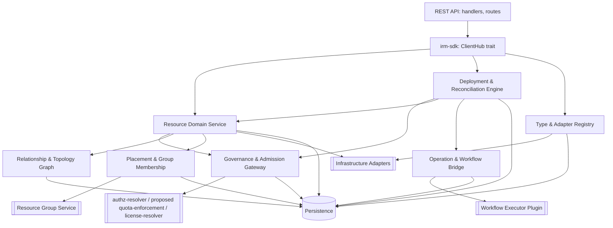
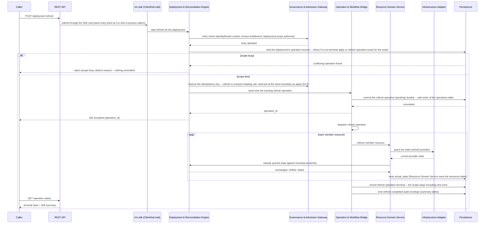

# Technical Design — Infrastructure Resource Manager (IRM)

<!-- toc -->

- [1. Architecture Overview](#1-architecture-overview)
  - [1.1 Architectural Vision](#11-architectural-vision)
  - [1.2 Architecture Drivers](#12-architecture-drivers)
  - [1.3 Architecture Layers](#13-architecture-layers)
- [2. Principles & Constraints](#2-principles--constraints)
  - [2.1 Design Principles](#21-design-principles)
  - [2.2 Constraints](#22-constraints)
- [3. Technical Architecture](#3-technical-architecture)
  - [3.1 Domain Model](#31-domain-model)
  - [3.2 Component Model](#32-component-model)
  - [3.3 API Contracts](#33-api-contracts)
  - [3.4 Internal Dependencies](#34-internal-dependencies)
  - [3.5 External Dependencies](#35-external-dependencies)
  - [3.6 Interactions & Sequences](#36-interactions--sequences)
  - [3.7 Database schemas & tables](#37-database-schemas--tables)
  - [3.8 Deployment Topology](#38-deployment-topology)
- [4. Additional context](#4-additional-context)
- [5. Traceability](#5-traceability)
  - [5.1 Design Elements to PRD Requirements (Forward Traceability)](#51-design-elements-to-prd-requirements-forward-traceability)
  - [5.2 PRD Requirements to Design Coverage (Reverse Traceability)](#52-prd-requirements-to-design-coverage-reverse-traceability)
  - [5.3 Actors, Interfaces, Contracts, and Use Cases Traceability](#53-actors-interfaces-contracts-and-use-cases-traceability)
  - [5.4 Coverage Summary](#54-coverage-summary)

<!-- /toc -->

- [ ] `p1` - **ID**: `cpt-cf-infrastructure-resource-manager-design-overview`
## 1. Architecture Overview

This design defines the first public baseline. It is not a green-field proposal. `p1` describes behavior required in that baseline. `p2` describes agreed follow-up work. `p3` and `p4` are later work. These phases can retain an explicit gap when the baseline has no applicable mechanism. For mixed-phase requirements, this document states the baseline subset and names the later subset separately. Public implementation evidence is linked when the corresponding modules enter this repository.

### 1.1 Architectural Vision

IRM is built as a single SDK-first gear that gives every registered resource type one governed lifecycle, expressed through a declarative deployment model. The gear follows the platform's DDD-light layout: a transport-agnostic SDK crate defines the public contract (`IrmClientV1`, models, errors); a REST crate exposes that contract over HTTP through the platform's OperationBuilder and API gateway; a domain layer owns the type registry, resource lifecycle, declarative-definition compilation, and the five-operation diff engine; and an infrastructure layer owns persistence, outbound adapter traffic, and the workflow-executor bridge. No caller — including IRM's own REST handlers — reaches the domain layer except through the SDK trait, and no domain type ever depends on a database or HTTP type.

The central design decision is that every mutation uses the same compile, diff, and apply engine. A dry-run returns the canonical plan hash; a conditional `PUT` executes only when its recomputed hash matches. A single-resource `PUT` or `DELETE` is wrapped in an anonymous one-resource deployment, so it uses the same history and workflow path. Partial desired-state PATCH is not part of the contract.

Extensibility is delegated, not built in. IRM owns the resource-type registry, the adapter lifecycle, and the manifest-onboarding pipeline; it does not own provider logic. Adapters are semi-trusted HTTP peers reached through a versioned contract, and the durable execution substrate is reached through a plugin contract with a no-op default, so IRM core has no compile-time dependency on a concrete workflow engine. Both extension points let third parties and platform teams add resource classes and swap the execution substrate without a core change, which is the architectural expression of the PRD's ecosystem and revenue goal.

### 1.2 Architecture Drivers

#### Functional Drivers

| Requirement | Design Response |
|-------------|------------------|
| `cpt-cf-infrastructure-resource-manager-fr-type-registry` | GTS-backed type registry in the domain layer; registration validated and versioned before any resource of that type can exist. |
| `cpt-cf-infrastructure-resource-manager-fr-resource-crud` | One domain resource service behind the SDK trait; every resource path (direct and deployment-member) shares it. |
| `cpt-cf-infrastructure-resource-manager-fr-deployment-scoped` | Anonymous single-resource deployments are a domain-layer invariant of resource creation, not a REST-layer convenience. |
| `cpt-cf-infrastructure-resource-manager-fr-declarative-definitions` | A dedicated compile stage validates and normalizes definitions (parameters, variables, dependencies, conditions) before diffing. |
| `cpt-cf-infrastructure-resource-manager-fr-change-classification` | A deterministic diff engine classifies every resource into one of five operations from type metadata (immutable/computed/secret). |
| `cpt-cf-infrastructure-resource-manager-fr-preview` | Preview runs the compile-diff pipeline with zero persistence and zero adapter calls; the plan is the preview payload. |
| `cpt-cf-infrastructure-resource-manager-fr-plan-binding` | The plan fingerprint binds apply to its exact canonical plan; apply re-validates the fingerprint under a per-deployment consistency guard. |
| `cpt-cf-infrastructure-resource-manager-fr-ordered-execution` | The apply engine topologically orders the plan and dispatches it through the workflow-executor contract for crash-resumable execution. |
| `cpt-cf-infrastructure-resource-manager-fr-guardrails` | Management policy is evaluated as a single admission gate ahead of the apply engine, before any resource in the plan is touched. Until this requirement ships no resource carries a protective policy, so the composed effective policy is always `full` and the gate has nothing to refuse (§3.2). |
| `cpt-cf-infrastructure-resource-manager-fr-idempotent-writes` | A dedicated idempotency store enforces the reservation/replay window model ahead of domain dispatch for every mutating call. |
| `cpt-cf-infrastructure-resource-manager-fr-cascade-delete` / `-cascade-admission` | Cascade is admitted against the current relationship graph and re-validated under the change lock — the deployment-row lock defined in §3.2 (Deployment & Reconciliation Engine, The change lock) — immediately before the parent delete commits, then converges asynchronously in bounded, restart-safe batches. |
| `cpt-cf-infrastructure-resource-manager-fr-relationship-model` / `-graph-query` | Relationships are derived from resource data at write and refresh time and persisted as typed graph edges, independent of the diff engine. |
| `cpt-cf-infrastructure-resource-manager-fr-resource-groups` / `-group-addressing` | Deployment address is (tenant, group, name); group existence and default-group resolution are validated against the Resource Group Service before compile. |
| `cpt-cf-infrastructure-resource-manager-fr-membership-convergence` | Placement commits locally and propagates asynchronously through an outbox with a periodic drift-repair sweep. |
| `cpt-cf-infrastructure-resource-manager-fr-manifest-onboarding` | The baseline pipeline validates and commits local adapter/type/catalog records, then publishes and activates. A new adapter remains pending on publication failure; cross-service atomic upgrade is `p3`. |
| `cpt-cf-infrastructure-resource-manager-fr-per-type-authz` / `-authz-payload-masking` | Every read and write is authorized per resource type through the platform authorization-resolution path inside the domain layer, ahead of any provisioning dispatch; unreadable payloads are masked, not omitted. Until `-fr-per-type-authz` ships, that same path resolves at the resource-collection level and the per-type identities are grant targets only (§3.2). |
| `cpt-cf-infrastructure-resource-manager-fr-operation-cancel` | Operation tracking exposes one idempotent cancel surface that authorizes before it reaches the workflow executor. |
| `cpt-cf-infrastructure-resource-manager-fr-adapter-credential` / `-adapter-egress` | P1 routes outbound adapter calls through the central outbound egress path and validates bounded responses. P2 adds per-call capability tokens after the Token Issuer is available. |

#### NFR Allocation

| NFR ID | NFR Summary | Allocated To | Design Response | Verification Approach |
|--------|-------------|--------------|------------------|----------------------|
| `cpt-cf-infrastructure-resource-manager-nfr-latency` | 500 ms p95 read/mutation-acknowledgment; 200 ms p95 single-resource topology lookup | REST layer + domain resource service + persistence | Synchronous path covers admission, compile, diff/classification, plan-fingerprint recomputation, policy evaluation, and the durable-commit write; provisioning work is dispatched asynchronously to the workflow executor. The PRD leaves which operations the 500 ms threshold is measured over to the reference load profile its §16 question defines, so this allocation states the design's intent: 500 ms p95 covers reads and the acknowledgment of a single-resource or small-definition mutation — the band the PRD's own 200 ms p95 single-resource preview target sizes. A multi-resource declarative apply acknowledges within the definition-size bands of `cpt-cf-infrastructure-resource-manager-nfr-preview-latency` plus entry admission, write admission, policy evaluation and the durable commit, because its synchronous path is the preview path with those four steps added and cannot be faster than the compile and diff it contains. | Load test against the reference profile once §16 settles it; interim non-regression benchmarks per build. |
| `cpt-cf-infrastructure-resource-manager-nfr-preview-latency` | 2 s / 10 s p95 preview by definition-size band | Compile + diff engine | Preview never persists or calls an adapter; cost is bounded by definition size, itself bounded by the request-body limit. | Benchmark suite at the two measurement bands. |
| `cpt-cf-infrastructure-resource-manager-nfr-availability` | 99.9% availability, 99.999% durability, RPO ≤ 1h, RTO ≤ 4h | Persistence layer + platform backup policy | Durable commit precedes any provisioning dispatch; the persistence layer is the platform-managed database substrate, not a component IRM operates itself. | Platform backup/restore drills; availability measured monthly per the NFR threshold. |
| `cpt-cf-infrastructure-resource-manager-nfr-restore-gate` | After a restore from backup, affected scopes are refresh-required; apply admission is refused until a completed refresh clears the marker | Persistence layer (restore marker) + deployment-engine admission + refresh path | The restore marker is a persisted consistency-guard row set by the restore procedure; apply admission checks it before plan binding and refuses with a distinct reason; a completed refresh clears it. The residual idempotency-record exposure inside the recovery point is the PRD §15 risk, bounded by the RPO. | Restore drill: a marked scope refuses apply and accepts it again after refresh; runs alongside the platform backup/restore drills. |
| `cpt-cf-infrastructure-resource-manager-nfr-scale` | 100k+ resources, 1000+ groups per tenant; 1M+ topology nodes, 5M+ edges platform-wide | Persistence layer + relationship graph component | Cursor-paginated, indexed queries throughout; graph storage strategy is validated by scale tests before GA. | Scale test suite before GA, gating the storage-strategy decision. |
| `cpt-cf-infrastructure-resource-manager-nfr-staleness` | Topology converges ≤10s p95 | Relationship graph | Relationship edges and the `parent_of` closure are persisted and refreshed from resource data. A unified apply/rollback/refresh history projection and its 60s p99 objective are `p3`; the p1 revision endpoints query persisted deployment revisions directly. | Measure topology convergence from the resource commit. |
| `cpt-cf-infrastructure-resource-manager-nfr-idempotency` | Duplicate submissions reuse the stored synchronous result | Idempotency store + operation identity | The store reserves `(tenant, caller, key)`, rejects a body mismatch, and replays the stored successful submission response. The operation id is also the workflow id, so redispatch of one accepted operation is deduplicated by the workflow substrate. Atomic recovery of the submission-key record across every crash boundary is `p3`. | Concurrent duplicate and workflow-redispatch tests; crash-window closure is deferred with the p3 guarantee. |
| `cpt-cf-infrastructure-resource-manager-nfr-placement-convergence` | Membership reflects commit ≤5s p95; validation ≤50ms p95 | Placement & group membership component | Local commit plus outbox-based asynchronous propagation to the Resource Group Service; a periodic sweep reconciles parked rows and drift. | Convergence-latency test; parked-row count is an always-on alertable metric. |
| `cpt-cf-infrastructure-resource-manager-nfr-background-resilience` | Background passes survive failure, start on boot, run safely on multiple instances | P1 placement and cascade workers; later workers as they ship | Baseline loops tick immediately at start, isolate a failed pass, claim persisted work with fencing, and observe cancellation for shutdown. Configuration is validated before workers are constructed. A bad claimed row is signalled and isolated from later rows. The same contract applies to each later loop when it is introduced. | Start-up tick, cancellation, corrupt-row isolation, restart, and multi-instance tests per loop. |
| `cpt-cf-infrastructure-resource-manager-nfr-limits` | Published, enforced request-body and structural limits | REST layer (size limits) + compile/diff (structural limits) | Every tabulated limit is checked at the layer that first sees the value, with the limit and observed value named in the rejection. | Boundary tests at each published limit. |

#### Key ADRs

No ADRs are recorded for IRM yet. Decisions that warrant a dedicated rationale record — the Policy Decision Service binding for adapter-registered policy bundles, the Workflow Executor evolution path, and the storage strategy for the relationship graph at scale — are §16 open questions in the PRD; each opens an ADR when it is settled during design.

### 1.3 Architecture Layers

```
Caller (API/CLI/service client)
        │
        ▼
┌───────────────────────────────┐
│ Contract layer  (irm-sdk)     │  ClientHub trait, transport-agnostic models/errors
└───────────────────────────────┘
        │
        ▼
┌───────────────────────────────┐
│ API layer  (irm/api/rest)     │  Axum handlers, OperationBuilder routes, error mapping
└───────────────────────────────┘
        │
        ▼
┌───────────────────────────────┐
│ Domain layer  (irm/domain)    │  Type registry, resource/deployment lifecycle, compile,
│                                │  diff engine, relationship derivation, placement, policy
└───────────────────────────────┘
        │
        ▼
┌───────────────────────────────┐
│ Infra layer  (irm/infra)      │  SecureConn persistence, adapter HTTP client, workflow
│                                │  executor plugin bridge, event emission
└───────────────────────────────┘
```

- [ ] `p1` - **ID**: `cpt-cf-infrastructure-resource-manager-tech-stack`

| Layer | Responsibility | Technology |
|-------|---------------|------------|
| Contract | Public API surface for every consumer; no transport or storage detail | Rust trait (`IrmClientV1`) resolved through `ClientHub`; transport-agnostic models and errors |
| API | HTTP surface, request validation, RFC 9457 error mapping | Axum handlers, `OperationBuilder` route/OpenAPI registration, OData query parsing |
| Domain | Type registry, resource and deployment lifecycle, compile, diff engine, relationship derivation, placement, policy evaluation dispatch | Rust domain services under `#[domain_model]`, GTS client for type identifiers, CEL for declarative expressions |
| Infrastructure | Durable storage, outbound adapter HTTP client, workflow-executor plugin bridge, event emission | SeaORM over `SecureConn`, adapter HTTP client through central egress in p1, capability-token attachment in p2, platform plugin interface, CloudEvents emitter |

## 2. Principles & Constraints

### 2.1 Design Principles

#### SDK-First Contract Boundary

- [ ] `p1` - **ID**: `cpt-cf-infrastructure-resource-manager-principle-sdk-first`

Every consumer of IRM — the gear's own REST handlers, other gears, and any future transport — calls the domain layer exclusively through the `irm-sdk` trait obtained via `ClientHub`. No internal type crosses that boundary. This keeps the REST surface, the CLI, and any future in-process caller behaviorally identical, and it is what makes the platform's dependency rule ("always use SDK modules for inter-gear communication") enforceable for IRM.

#### Deterministic, Previewable Change

- [ ] `p1` - **ID**: `cpt-cf-infrastructure-resource-manager-principle-deterministic-change`

Every mutation is compiled and classified before it is executed, and the classification is a pure function of the definition, current state, and type metadata. A caller who previews a change and then applies it unmodified gets exactly what was shown. This principle is what makes preview a contract rather than a best-effort approximation, and it is the basis for plan binding, guardrails, and safe rollback.

#### Fail-Closed Governance

- [ ] `p1` - **ID**: `cpt-cf-infrastructure-resource-manager-principle-fail-closed-governance`

Every entry-admission decision — authorization, quota, policy, license entitlement, and group-reference validity — refuses the operation when the deciding dependency is unavailable or the answer is uncertain. Mid-flight re-authorization is the exception: transport or service unavailability is retried by the durable workflow and is not converted into a negative authorization verdict. Only a definitive negative decision cancels the running operation as `authorization_revoked`.

#### Durable, Crash-Safe Execution

- [ ] `p1` - **ID**: `cpt-cf-infrastructure-resource-manager-principle-durable-execution`

A mutation is committed durably before any provisioning work starts, and every long-running operation resumes from persisted state after a process crash with no double application. Background reconciliation (placement sweep, cascade convergence, discovery, stuck-operation redispatch) follows the same rule: progress lives in storage, not in a process's memory.

#### Secret-Safe by Construction

- [ ] `p2` - **ID**: `cpt-cf-infrastructure-resource-manager-principle-secret-safety`

The subject of this principle is the *secret field*: a property a resource type declares secret in its type metadata. No value of such a field ever exists in cleartext in an artifact IRM persists or emits — state, revisions, previews, history, logs, metrics, or events. Change detection on a secret field is a property of a derived comparison artifact, never of the value itself, and that artifact is constructed so it cannot be used for cross-tenant correlation or offline recovery.

One neighbouring marker is deliberately outside that scope. The sensitivity flag a definition may set on a parameter (`cpt-cf-infrastructure-resource-manager-fr-parameters`) is not a type-declared secret field: the PRD keeps it declared-but-unenforced metadata until `cpt-cf-infrastructure-resource-manager-fr-secret-hygiene` ships, placing no redaction or exclusion obligation on previews, revisions, history, logs, metrics, or events, and records the resulting cleartext-capture residual in its §15 risk table. This design carries that boundary rather than widening it, so the principle above and the preview-redaction contract of `cpt-cf-infrastructure-resource-manager-fr-preview` say the same thing about the same set of values.

This principle also covers the type-evolution edge: a field can become secret only through the Type & Adapter Registry's type re-registration path (`cpt-cf-infrastructure-resource-manager-component-type-adapter-registry`), because a resource type's field metadata changes only when the owning adapter re-registers the type. That path is the trigger point, and it is the owning event the rest of this mechanism keys off. The Resource Domain Service, which already owns secret hygiene enforcement at the field level (§3.2), is the component that re-protects every current persisted value of the newly-secret field — the live resource state — under the same salted per-tenant digest model applied to fields that were already secret (`cpt-cf-infrastructure-resource-manager-constraint-secret-digest`). Re-protection runs as a background pass, not inside the registration transaction: rewriting every live value of one field across a tenant is unbounded work at `cpt-cf-infrastructure-resource-manager-nfr-scale`, and holding a transaction open across it would break the all-or-nothing onboarding guarantee (§3.2, §3.6). The re-registration therefore commits on its own: the Type & Adapter Registry, which owns the affected type-definition row (§3.7, `resource_type_definitions`) and is its only writer, sets a persisted re-protection marker on that row inside the registration transaction and concludes without waiting for the rewrite. The Resource Domain Service owns the batched, restart-safe pass that satisfies that marker (§3.2, Secret re-protection pass) and reads the same marker on the write path: it refuses a mutating call against an affected type, fail-closed and with a distinct reason, until no current persisted value of the newly-secret field remains unprotected. It never writes the row itself — it reports the type complete to the Registry, and the Registry clears the marker — so the row keeps one writer and the ownership boundary between the two components holds. Further changes on the affected resource types are held by that marker, not by an open transaction. This completion criterion is deliberately scoped to live resource state, not to every artifact that ever recorded the field: a Revision's `applied_definition` (§3.1) captured before the field became secret may still hold the value in the clear, and re-writing an immutable Revision to re-protect it would conflict with the Revision immutability invariant (§3.1). That tension — between the immutability a Revision guarantees for history and rollback, and secret hygiene on a field that changed classification after the Revision was written — is an open design question this document records rather than resolves.

#### Extensibility Without Core Change

- [ ] `p1` - **ID**: `cpt-cf-infrastructure-resource-manager-principle-adapter-extensibility`

New resource classes, providers, and policy bundles enter the system through the adapter and manifest-onboarding contracts, never through a change to IRM core. The type registry and the adapter contract are the platform's designed extension seam; a third party that conforms to them changes nothing in IRM itself.

### 2.2 Constraints

#### CloudEvents Envelope

- [ ] `p1` - **ID**: `cpt-cf-infrastructure-resource-manager-constraint-cloudevents-envelope`

Every domain and audit event IRM emits uses the CloudEvents envelope defined by the platform event-broker ADR. This is a recorded platform convention (PRD §2), not an IRM-specific choice; the event emitter component is the single place that constructs the envelope.

#### RFC 9457 Problem Details

- [ ] `p1` - **ID**: `cpt-cf-infrastructure-resource-manager-constraint-rfc9457-errors`

Every error response on the REST surface follows RFC 9457 (ToolKit `05_errors_rfc9457.md`). Domain errors carry enough structure (offending field, violated limit, refusal reason) that the REST layer maps them to a Problem Details body without inventing detail at the edge.

#### Idempotency-Key Header

- [ ] `p1` - **ID**: `cpt-cf-infrastructure-resource-manager-constraint-idempotency-key`

Duplicate-safe mutation follows the platform's Idempotency-Key header convention (toolkit-http). The idempotency store is keyed by (caller, key), never by request content alone, matching `cpt-cf-infrastructure-resource-manager-fr-idempotent-writes`.

#### CEL for Declarative Expressions

- [ ] `p1` - **ID**: `cpt-cf-infrastructure-resource-manager-constraint-cel-expressions`

Dynamic expressions and conditional-inclusion predicates in declarative definitions are evaluated as CEL, the expression language already used by quota-enforcement and serverless-runtime. IRM does not introduce a second expression language for the same purpose.

#### AuthZEN-Based Authorization Resolution

- [ ] `p1` - **ID**: `cpt-cf-infrastructure-resource-manager-constraint-authzen-resolution`

Every authorization decision (per-type access, admission, list-union filtering, payload masking, topology narrowing) is resolved through the platform's AuthZEN-based authorization-resolution path (`authz-resolver`), not through a bespoke IRM authorization model. IRM supplies Subject/Action/Resource inputs; it does not implement decision logic itself.

#### UUID v7 Identifiers

- [ ] `p1` - **ID**: `cpt-cf-infrastructure-resource-manager-constraint-uuidv7-identifiers`

Every new entity IRM creates (resources, deployments, revisions, operations, adapters, relationship edges) is identified by a UUID v7 (RFC 9562), an IRM-level recorded choice (PRD §2) that keeps identifiers time-sortable and compatible with cursor pagination.

#### Salted Per-Tenant Secret Digests

- [ ] `p2` - **ID**: `cpt-cf-infrastructure-resource-manager-constraint-secret-digest`

Secret-field change detection uses a salted, per-tenant digest, never the cleartext value or an unsalted hash. IRM provisions and stores the per-tenant salt itself — the comparison key of `cpt-cf-infrastructure-resource-manager-fr-secret-hygiene` — lazily, on the first use of a secret field for that tenant, so provisioning depends on no external trigger and on no tenant-creation ordering, and a tenant that already existed before IRM shipped is covered on its first secret-field write. The digest is derived from that key, so equal values across tenants are not correlatable and offline recovery of the source value is infeasible. That claim depends on where the key lives: the salt is held in the platform credential store, not in the SecureConn-scoped tables that hold the digests derived from it (§3.4, `credstore`; §4, Data protection) — a design-level choice of location, which the PRD leaves open.

#### Canonical Plan Fingerprint

- [ ] `p1` - **ID**: `cpt-cf-infrastructure-resource-manager-constraint-plan-fingerprint`

A plan is bound to a canonical fingerprint computed over its definition, current state, tenant, options, and operations derived from current type metadata. Apply recomputes and compares this fingerprint before execution. A type-metadata change that changes classification or computed-field exclusion changes the fingerprint. A metadata change that leaves the computed plan unchanged does not block apply. A divergence produces a distinct, actionable rejection, never a silent re-diff. The revision's `frozen_traits_hash` is a rollback compatibility anchor, not a direct plan-fingerprint input.

#### Multi-Region Non-Preclusion

- [ ] `p2` - **ID**: `cpt-cf-infrastructure-resource-manager-constraint-multi-region-non-preclusion`

Multi-region management is out of scope for this release, but deployment addressing, entity identifiers, and group semantics must not preclude a later placement dimension (such as a region) from being added. The deployment address, group hierarchy, and identifier scheme are designed so a region qualifier can be introduced additively; §16 in the PRD carries the open question of exactly how.

#### Safety Non-Applicability

- [ ] `p1` - **ID**: `cpt-cf-infrastructure-resource-manager-constraint-safety-not-applicable`

ISO/IEC 25010 §4.2.9 Safety does not apply: IRM is a control plane for IT resources reached through API and CLI, and it does not actuate physical equipment. The destructive-operation risk that exists (accidental or malicious infrastructure loss) is governed by management policy, cascade admission and disclosure, and operation cancellation, not by a safety quality attribute.

## 3. Technical Architecture

### 3.1 Domain Model

**Technology**: GTS-typed Rust structs under `#[domain_model]`, versioned resource-type schemas resolved through the platform Type Identifier Service.

**Location**: planned public modules for domain, resource, deployment, adapter, operation, REST, storage, and workflow execution. Their public paths become authoritative when the modules enter this repository.

**Core Entities**:

- [ ] `p1` - **ID**: `cpt-cf-infrastructure-resource-manager-entity-core-domain`

| Entity | Description | Schema |
|--------|-------------|--------|
| ResourceType | Schema for a GTS-identified resource class: input/output shape, actions, capabilities, and field traits used by validation and diff | Owner-checked upsert in `resource_type_definitions`; multi-version live history is p2 |
| Adapter | Registered provider integration; lifecycle `pending` → `active`, with removal as the terminal path; endpoint and trust configuration, OBO callback scopes, contributed types, package trust level (platform-verified vs. third-party) | `infrastructure_adapters` |
| Resource | A managed instance of a resource type: desired `properties`, provider-observed `actual_state`, adapter outputs and provider identifier, lifecycle status and reason, replacement lineage, deployment membership, and resource-group placement | `resources` |
| Deployment | Declarative unit of apply/history/rollback, addressed by (tenant, resource group, name); may be anonymous (single-resource wrapper) or named (operator-authored, multi-resource); carries the bound plan fingerprint | `deployments` |
| Revision | Append-only record of an admitted apply. It stores the definition/parameter hashes, the exact `applied_snapshot`, the applying operation, and optional frozen trait hash | `deployment_revisions` |
| Operation | Tracked unit of asynchronous work (apply, action, discovery, cascade step) with a published state model and a terminal-state guarantee | `operations` |
| RelationshipEdge | Typed graph edge (dependency, ownership, attachment) derived from resource instance data, carrying a provenance marker for the producer that derived it; realizes the PRD's Virtual Resource Graph | `resource_relationships` |
| ResourceGroup | Lifecycle and authorization container in the tenant → group → resource scope hierarchy | Owned by the Resource Group Service; IRM holds a validated reference (group identifier, default-group marker), not the row |
| Tag | Key-value label on a group or resource, with downward inheritance | Persisted by the Resource Domain Service; table shape deferred to implementation phase, alongside the inheritance mechanics §5.2 defers |
| DiscoveryJob | Manual, scheduled, or event-driven inventory sync run against an adapter | Persisted by the Operation & Workflow Bridge; table shape deferred to implementation phase, alongside the sync mechanics §5.2 defers |

**Identity and invariants**:

- **ResourceType** — `gts_id` is the persisted type identity. Re-registration is an owner-checked upsert of that identity. The p1 baseline does not keep a second row per semantic schema version; revisions preserve the applied snapshot and optional frozen trait hash needed to interpret historical applies. A multi-version live-type catalog is `p2`, not a p1 storage claim.
- **Adapter** — identity is the GTS adapter identifier. Only an `active` adapter serves new resource traffic, and activation requires at least one contributed, validated resource type. Per-type authorization schemas are published before the status changes to `active`; publication failure leaves the prior status unchanged. The source has no separate `deactivated` state, so this design does not add one. Removal is the terminal path and is refused while any resource row references the adapter's types. This check includes retained tombstones because the repository checks references regardless of resource status. An unused adapter is removable in p2. A previously used adapter becomes removable only after p3 purge removes its tombstones. The purge removes each revision that can restore a resource before it removes that resource's tombstone.
- **Resource** — identity is a tenant-scoped UUID plus its GTS instance identifier. `lineage_id` continues identity across replace, and `previous_provider_resource_ids` retains replaced provider identities. Desired state remains in `properties`; refresh stores provider truth in `actual_state`. `status_reason` is written with a failed/refused transition and cleared with a later successful status. A delete workflow carries `pre_delete_status`; a permanent provider refusal restores that status and records the reason. `create_rejected_at` proves a synchronous create refusal and permits a provider-free delete. If neither a provider identifier nor that marker exists, delete is refused and the row is restored. Generic detached/degraded condition flags and first-class orphan state are `p3`.
- **Deployment** — identity is the deployment address (tenant, resource group, name), backed by a UUID v7 row identifier. Invariant: status is exactly one of `pending`, `running`, `completed`, `failed`, `cancelled`. That status is a reported state, not an admission gate: it is projected by the Deployment & Reconciliation Engine from the tracking operation of the most recent admitted apply — set in the durable commit that admits the apply and advanced again when the Operation & Workflow Bridge reports that operation terminal (§3.2, §3.6) — and it is what `cpt-cf-infrastructure-resource-manager-fr-deployment-status` exposes. What admits or refuses an apply or a refresh is the scan over the deployment's own operation records (§3.2, Deployment & Reconciliation Engine), so no gate reads this column and no state outside the `operations` table carries the exclusion. Per-member execution state is not this column either: each member's state is its own Resource lifecycle status (Resource invariant above), and a member that fails carries the machine-readable failure reason the Resource Domain Service records with it when it reports the per-resource result (§3.6), which is what makes a failed apply attributable to the members that failed rather than only to the deployment. The deployment record also carries the declared outputs the same requirement mandates: they are computed from provisioned state by the engine as each apply resolves, persisted on the deployment row (§3.7, `deployments`), and served from there without recomputation — empty until the first apply resolves them, refreshed on every successful resolution, and left at the previously recorded values after a failed apply, with an entry that cannot be resolved omitted rather than raised as an error. The deployment record carries the stored definition and the canonical fingerprint of the most recently bound plan, so a later apply call recomputes the plan from that definition and the live resource state and refuses on fingerprint divergence — this is the plan-binding invariant made concrete. The `kind` discriminator (`auto` for an anonymous single-resource wrapper, `named` for an operator-authored deployment) records how the deployment came to exist and therefore how its address behaves; it gates no deletion. A direct delete of any member, of either kind, executes as a classified change to the enclosing deployment: the engine compiles the deployment's definition minus that resource, the plan classifies the target `delete` and every sibling `no-change`, the deployment's recorded definition is updated to the compiled one, and a later re-submission of the previous definition re-creates the resource (`cpt-cf-infrastructure-resource-manager-fr-resource-crud`, §3.2, §3.6).
- **Revision** — identity is a UUID scoped to its deployment. The apply transaction appends it before dispatch and stores `applied_snapshot`, hashes, `applied_by_op_id`, and the optional frozen trait hash. Rollback reads this persisted snapshot; it does not re-diff an unknown historical input. The p1 history surfaces list deployment and resource revision records. A single chronological projection that also unions refresh and rollback operations is `p3`.
- **Operation** — identity is a UUID v7. Invariant: status is exactly one of `pending`, `accepted`, `running`, `succeeded`, `failed`, `cancelled`, with an explicit allowed-transition rule per current state (for example, `pending` advances only to `accepted`, `running`, `failed`, or `cancelled`) and a terminal-state guarantee: every operation reaches one of `succeeded`, `failed`, or `cancelled`, after which it never leaves it — carried, for an operation no caller returns to, by the maximum-lifetime backstop in §3.2 (Operation & Workflow Bridge). One operation kind covers apply, lifecycle action, discovery, and cascade-step work uniformly, each identified by `kind` and pointed at its `target_id`. Uniformity covers tracking, not cancellability: `cancelled` is unreachable for a `cascade-step` operation once the parent's deletion has committed (§3.2, Operation & Workflow Bridge).
- **RelationshipEdge** — identity is the tenant-scoped (source, destination, kind) tuple. `kind` is `depends_on`, `parent_of`, or `attached_to`. Foreign keys bind both endpoints, tenant-scoped derivation rejects cross-tenant endpoints, and a partial unique index permits only one live `parent_of` edge per child. Parent closure maintenance rejects ownership cycles. `parent_of` traversal reads the closure; `depends_on` and `attached_to` use bounded recursive traversal with a visited set. Edges are soft-deleted during re-derivation and cleanup, then recreated from the current declaration on revival.
- **ResourceGroup** — identity and membership truth are owned entirely by the Resource Group Service; IRM never persists group rows, only a validated reference plus the resolved default-group marker for the tenant.
- **Tag** — a key-value label attached to a group or a resource; a tag set on a group is inherited downward by every resource placed in it, never upward.
- **DiscoveryJob** — identity is a UUID v7; runs against exactly one adapter and one resource-type/resource scope, and is triggered manually, on a schedule, or by an adapter-side event.

| Resource lifecycle point | Relationship behavior |
|---|---|
| Tombstone/cascade drain | Owning edges remain available long enough for the committed drain, then live edges are soft-deleted as endpoints are removed. |
| Revival/rollback | Relationships are re-derived from the restored deployment and current instance data; closure rows are rebuilt from live `parent_of` edges. |
| Permanent purge (`p3`) | Tombstoned edge and closure history is removed with the expired aggregate. |

**P1 transition/admission matrices**:

| Resource current state | Accepted command | Runtime transition/outcome |
|---|---|---|
| `pending`, `active`, `failed` | full update | `updating` → `active` or `failed` |
| `pending`, `active`, `failed` | delete | `deleting` → tombstone; permanent refusal restores the carried pre-delete state and sets `status_reason` |
| any non-busy state | declared action | `action_in_progress` → `active` or `failed` |
| `provisioning`, `updating`, `action_in_progress`, `deleting` | update, delete, or action | rejected as busy |

| Operation current state | Allowed next states |
|---|---|
| `pending` | `pending`, `accepted`, `running`, `failed`, `cancelled` |
| `accepted` | `accepted`, `running`, `failed`, `cancelled` |
| `running` | `running`, `succeeded`, `failed`, `cancelled` |
| `succeeded`, `failed`, `cancelled` | same terminal state only |

The `running` state does not transition back to `pending`. Pending redispatch applies only before the workflow executor accepts the operation. After the operation reaches `running`, the durable executor owns recovery. The maximum-lifetime backstop transitions the operation to `failed` if it does not complete.

**Relationships**:
- Adapter → ResourceType: an adapter contributes one or more resource types; a type belongs to exactly one adapter.
- ResourceType → Resource: a resource references exactly one persisted `resource_type_definition_id`. P1 owner-checked re-registration updates that identity; a multi-version live binding is p2.
- Deployment → Resource: a resource belongs to exactly one deployment (explicit or anonymous).
- Deployment → Revision: each admitted apply of a deployment produces one immutable revision, and the deployment's `current_revision_id` advances to it in the same durable commit — the commit that precedes dispatch, so the advance does not wait on an outcome that is not yet known. That column records which revision is current — what history resolves against, and the baseline the next submission admits against — and is null until the first admitted apply commits. Two distinct mechanisms guard two distinct hazards (`cpt-cf-infrastructure-resource-manager-fr-plan-binding`). What binds an apply to the state it was computed against is the recomputed plan fingerprint (`cpt-cf-infrastructure-resource-manager-constraint-plan-fingerprint`, §3.6), which is defined from the first apply onward, when no revision exists yet. What serializes concurrent submissions against the same deployment is a consistency guard on this column: the durable commit advances `current_revision_id` conditionally on the value the submission admitted against, so the submission that loses the race is refused as a conflict rather than committed on a superseded view.
- Resource → RelationshipEdge: dependency, ownership, and attachment edges are derived from resource instance data at write and refresh time, never hand-authored independently of a resource.
- RelationshipEdge (`parent_of`) → cascade: only the owning edge kind participates in cascade teardown; `depends_on` and `attached_to` edges are consulted for impact analysis and ordering but never cascade-delete their endpoint.
- Operation → Resource | Deployment: an operation targets exactly one resource, deployment, or action context via `target_id`, resolved by its `kind`.
- ResourceGroup → Deployment: a deployment's address is (tenant, group, name); every deployment resolves to exactly one group, defaulting to the tenant's default group when the caller supplies none.
- DiscoveryJob → Adapter: a discovery job runs against exactly one adapter and reconciles the resources/resource types that adapter's inventory reports.

**Plan and execution state**: preview builds a `CanonicalPlan` and `OperationDag` without persistence or adapter calls. Apply stores the canonical plan and compiled workflow payload on the deployment, stores the exact `applied_snapshot` on the new revision, and dispatches the admitted plan, DAG, adapter routing, pre-delete status, and stable `operation_id` to the workflow executor. The baseline Temporal binding persists workflow progress and uses `operation_id` as `workflow_id`; redispatch resumes that workflow instead of recomputing a plan from changed resources. Compensation is asymmetric: successful creates from the failed apply are deleted, updates are not reverted, and an already-absent create is success. Cancellation stops scheduling later waves while in-flight activities finish.

### 3.2 Component Model



#### Type & Adapter Registry

- [ ] `p1` - **ID**: `cpt-cf-infrastructure-resource-manager-component-type-adapter-registry`

##### Why this component exists

IRM's single-pane promise requires one place that knows every resource class and every provider that serves it. This component is that place.

##### Responsibility scope

Registers, versions, queries, and retires resource types under supplied GTS identifiers. Runs the adapter lifecycle (pending → active) and the manifest-onboarding pipeline: package validation, adapter upsert, type contribution, catalog materialization, delegation-scope recording, policy publication, and activation. A package that fails validation is rejected. Activation publishes the contributed per-type authorization schemas before the status flips to `active`; registry rejection or unavailability returns an error and leaves the previous adapter status unchanged. Re-publication from the durable adapter store after a registry restart is `p3`.

IRM creates entity IDs locally as UUID v7 values. It also constructs runtime GTS instance IDs locally from a registered type identity and an entity UUID. The Type Identifier Service registers and resolves supplied type schemas and well-known instances; it does not allocate runtime entity or instance IDs.

##### Owned entities

Adapter, ResourceType (including its immutable/computed/secret field metadata and default management policy), and the data-plane operation catalog derived from a type's contributed capabilities. Owns the adapter's OBO callback-scope allowlist as a subset of the package's declared scopes.

##### Responsibility boundaries

Does not execute provisioning, reads, or deletes against a provider — that is the adapter's own responsibility, invoked by the Resource Domain Service. Does not evaluate policy bundles it publishes; it hands them to the Governance & Admission Gateway. Does not decide capability-grant issuance; it only publishes the catalog that the Grant Issuance Service consumes.

##### Related components (by ID)

- `cpt-cf-infrastructure-resource-manager-component-resource-domain` — supplies type metadata that drives resource validation and diff classification; a type re-registration that adds secret metadata to an existing field is the trigger that gates secret re-protection there (§2.1).
- `cpt-cf-infrastructure-resource-manager-component-governance-gateway` — receives manifest-declared policy bundles and delegation scopes for publication.

##### Module allocation

The p1 baseline assigns this responsibility to the adapter onboarding and lifecycle module. The module uses shared ResourceType and Adapter domain primitives.

#### Resource Domain Service

- [ ] `p1` - **ID**: `cpt-cf-infrastructure-resource-manager-component-resource-domain`

##### Why this component exists

Every resource path — direct CRUD and deployment-member — must behave identically. This component is the single implementation both paths share.

##### Responsibility scope

Owns resource lifecycle state, anonymous-deployment wrapping, management-policy evaluation, secret hygiene at the field level, delete-under-uncertainty handling, the outbound call to the owning adapter, and the validation of everything that comes back from it (below, Adapter response handling). Records each member's per-resource result on the resource row it owns — the member's lifecycle status and, for a member that failed, the machine-readable failure reason the deployment surface attributes the failure to (`cpt-cf-infrastructure-resource-manager-fr-deployment-status`, §3.1). Derives relationship edges from instance data at write and refresh time. Field-level secret hygiene includes the re-protection marker a type re-registration leaves behind (§2.1): a mutating call against a type whose marker is still set is refused fail-closed, with a distinct reason, until the background re-protection pass below clears it.

##### Owned entities

Resource (identity, status transitions, create-rejection proof), the anonymous-deployment wrapping rule for direct resource creation, and the resource-level projection of Adapter reachability used for outbound calls. The projection adds capability-token attachment in p2. This component does not own the Adapter registration record. The Type & Adapter Registry owns that record.

##### Responsibility boundaries

Does not compile multi-resource definitions or classify changes — that is the Deployment & Reconciliation Engine's responsibility; this component executes the classified operation it is handed. Does not make the authorization decision itself; it calls the Governance & Admission Gateway and enforces the verdict.

##### Related components (by ID)

- `cpt-cf-infrastructure-resource-manager-component-deployment-engine` — dispatches classified per-resource operations to this service.
- `cpt-cf-infrastructure-resource-manager-component-relationship-graph` — receives derived edges from this service on write and refresh.
- `cpt-cf-infrastructure-resource-manager-component-placement-groups` — validated at resource/deployment creation for group placement.
- `cpt-cf-infrastructure-resource-manager-component-type-adapter-registry` — a type re-registration that adds secret metadata to an existing field triggers and gates the secret re-protection this service performs (§2.1).

##### Adapter response handling (trust boundary)

An adapter is a semi-trusted peer, so its answer is untrusted input until it has been checked (`cpt-cf-infrastructure-resource-manager-fr-adapter-response-validation`). The checking point is the infra-layer adapter HTTP client this component owns (§1.3, §3.4): it is the only way an adapter response enters IRM, and no domain code sees a response that has not passed it. The size bound applies to the byte stream before parsing, so an oversized body is refused without ever being deserialized; a body that does not parse, or that does not validate against the output shape the resource type declares (§3.1, ResourceType), is a failed call rather than a partially-accepted one. A create response that carries no provider identity for the new resource is rejected on the same rule, which is precisely what leaves the resource in the unlearned-outcome state the delete path refuses-and-restores rather than reporting deleted (§3.1, Resource invariant, `cpt-cf-infrastructure-resource-manager-fr-delete-uncertainty`).

Internal protocol markers are unspoofable because the client never accepts one from the response body. The operation identity and the operation's terminal state are IRM's own records, and the poll location an accepted answer carries is validated against the answering adapter's registered endpoint before it is used, so a value the adapter chose to name reaches no protocol decision (§3.2, Asynchronous adapter protocol; §3.5). Provider error text is truncated to a limit this design publishes alongside the response size bound before it is attached to a refusal or an operation record, so an adapter cannot use it as an unbounded channel into IRM's own surfaces. Where the response leaves provider state ambiguous — accepted but unconfirmed, or reported complete without the identity that would prove it — the state is treated as not-yet-ready rather than ready, so the operation stays non-terminal and is carried by the polling and maximum-lifetime rules of §3.2; the boundary with `fr-delete-uncertainty` is that this rule decides when a provider answer is *usable*, while the refusal record decides what a provider answer *said*, and only an explicit provider refusal produces one.

##### Secret re-protection pass (background)

This pass is unreachable in the first release and is described here as designed-for-later, not as a live path: the Type & Adapter Registry refuses any type registration or manifest onboarding that declares a secret field until `cpt-cf-infrastructure-resource-manager-fr-secret-hygiene` ships (§3.2, Type & Adapter Registry), so no re-registration can turn a field secret, and the marker the pass keys off is never set until that gate is lifted.

When a type re-registration turns an existing field secret, the registration transaction commits with a re-protection marker set on the affected type-definition row (§2.1, §3.7) and does not wait for the rewrite. The Type & Adapter Registry writes that marker, on the row it owns; this component only reads it. What this component owns is the background pass that satisfies the marker: on a deployment-configurable tick it claims marked types under a fenced lease of its own — held in the pass's claim state, not on the registry-owned row, and safe to run on several instances at once — and re-protects the live resource state for the newly-secret field in bounded batches, under the same salted per-tenant digest model as a field that was already secret (`cpt-cf-infrastructure-resource-manager-constraint-secret-digest`). Progress lives in that claim state and in the per-resource state itself, never in process memory, so the pass resumes after a crash and re-running a batch is harmless (`cpt-cf-infrastructure-resource-manager-nfr-background-resilience`). The completion criterion is that no current persisted value of the field remains unprotected for that type; on reaching it the pass reports the type complete to the Type & Adapter Registry, which clears the marker. This component's own write path reads that same marker to refuse mutating calls against the type until it is cleared — the same marker on both sides, so the refusal and the completion criterion can never disagree, with one writer on the row and one reader.

##### Module allocation

The p1 baseline assigns this responsibility to the resource lifecycle and hook module. It uses shared ResourceType metadata and the infrastructure adapter client.

#### Deployment & Reconciliation Engine

- [ ] `p1` - **ID**: `cpt-cf-infrastructure-resource-manager-component-deployment-engine`

##### Why this component exists

Zero-surprise change is the product's core promise. This component is the deterministic pipeline — compile, diff, preview, bind, apply — that makes the promise operationally true.

##### Responsibility scope

Compiles declarative definitions, classifies create/update/delete/no-change/replace operations, produces the preview and canonical hash, and builds a wave-layered DAG. Validation has two explicit layers. Definition validation accumulates structured `ValidationErrorItem` values with definition paths, including duplicate resource names, schema `additionalProperties`, parameter type/required/range/length/enum faults, references, and topology faults. Admission gates run after successful compilation and fail fast in their published order. The current adapter schema convention treats a missing or bare object property schema as permissive; changing absent-schema behavior to reject all properties is `p3` because it would be a compatibility change.

The engine stores the canonical plan and compiled workflow payload, appends an `applied_snapshot` revision, inserts the tracking operation, and advances `current_revision_id` in the same apply transaction before dispatch. An all-no-change apply commits the successful operation and revision but dispatches nothing. Refresh stores provider state in `actual_state`, reports drift against desired `properties`, and re-derives provider-observed relationships. The current planner still classifies against desired `properties`; using `actual_state` as a normalized plan baseline is `p2`, so p1 does not claim that refresh changes the next preview classification.

The implemented fan-out gate is caller-visible and therefore part of the p1 contract: a single-resource apply with dependents is rejected unless `allow_widen` is authorized, in which case the engine widens to the enclosing deployment and records the decision. It is anchored in the PRD by `cpt-cf-infrastructure-resource-manager-fr-fan-out-admission`.

##### Owned entities

Deployment (definition, status, canonical plan and compiled workflow payload), Revision (applied snapshot and rollback selection), and the tracking Operation inserted with an admitted apply. Reads, but does not own, Resource state.

##### Responsibility boundaries

Does not execute provisioning itself — execution is dispatched to and tracked by the Operation & Workflow Bridge. Does not own resource-level state transitions; those belong to the Resource Domain Service, which this engine calls per classified change.

##### Related components (by ID)

- `cpt-cf-infrastructure-resource-manager-component-resource-domain` — the engine dispatches classified per-resource work to it.
- `cpt-cf-infrastructure-resource-manager-component-operation-workflow-bridge` — the engine hands the ordered plan to it for durable execution.
- `cpt-cf-infrastructure-resource-manager-component-governance-gateway` — guardrail and cascade-admission evaluation ahead of any change.
- `cpt-cf-infrastructure-resource-manager-component-relationship-graph` — consulted for cascade admission and dependent-count fan-out detection before a plan is bound.

##### The change lock

"The change lock" is a row-level exclusive lock on the deployment, taken by the apply commit transaction. Under it, the engine rechecks `current_revision_id`, revalidates the cascade subtree, writes resource/revision/operation state, and advances the revision with compare-and-swap semantics. The operation row and durable workflow, not an open database transaction, represent the later asynchronous execution.

Everything called "under the change lock" happens inside that transaction against one snapshot. The lock is released at commit or rollback. It does not claim to exclude a later group move for the full workflow lifetime.

The reference group-move transaction also locks and compare-and-swaps the deployment while it restamps live members and marks the placement outbox. It does not yet refuse a move solely because an apply workflow remains non-terminal; that p2 admission hardening must check the operation record under the same lock. Apply/refresh scope admission likewise uses operation records, and its p2 hardening is to combine the non-terminal scan and tracking-operation insertion under the deployment lock. The fenced background leases are independent work claims.

##### Module allocation

The p1 baseline assigns this responsibility to the deployment compile, diff, and service modules. These modules own classification, rollback planning, fan-out admission, and policy integration.

#### Operation & Workflow Bridge

- [ ] `p1` - **ID**: `cpt-cf-infrastructure-resource-manager-component-operation-workflow-bridge`

##### Why this component exists

Long-running work must be trackable, cancellable, and crash-resumable without IRM core depending on a specific durable-execution product.

##### Responsibility scope

Tracks every operation through its published state model to a terminal state. Dispatches ordered work to the workflow-executor plugin contract and resolves status callbacks. Implements the single idempotent cancellation surface, authorizing before it reaches the executor. Cancellation takes effect at a change boundary: work already in flight completes, the remaining work is skipped, and the operation settles in the distinct `cancelled` terminal state (`cpt-cf-infrastructure-resource-manager-fr-operation-cancel`). Cancellability is not uniform across operation kinds: a `cascade-step` operation is cancellable only in the window before the parent's deletion commits, and cancel is refused for it once that commit has landed (`cpt-cf-infrastructure-resource-manager-fr-cascade-delete`). Enforces the maximum operation lifetime. An operation's terminal-state transition also carries the quota settlement signal. Settlement records the allocation that survives the operation and returns only unused capacity. It releases the full hold only when no created allocation survives. Resources that remain during cleanup stay recorded as usage until removal reverses or credits that usage (`cpt-cf-infrastructure-resource-manager-fr-quota-gating`).

##### Owned entities

Operation (state, transition rules, terminal-state guarantee) for every asynchronous unit of work — apply, lifecycle action, discovery, cascade step — addressed uniformly by `kind` and `target_id`.

##### Responsibility boundaries

Does not decide execution order — that is produced by the Deployment & Reconciliation Engine. Does not implement durable execution itself. A no-op default plugin permits development startup but does not satisfy p1. A deployment selects a conforming durable executor without a core change.

##### Related components (by ID)

- `cpt-cf-infrastructure-resource-manager-component-deployment-engine` — the source of the ordered plans this component dispatches.

##### Asynchronous adapter protocol

An adapter answers a dispatched unit of work either synchronously or by accepting it and returning a location to poll; this component owns the operation-level protocol for the second case (`cpt-cf-infrastructure-resource-manager-fr-adapter-async-protocol`). An accepted answer that carries no pollable location fails the operation immediately and non-retryably — there is nothing to resume — and a location that does not belong to the answering adapter is treated the same way, checked against the adapter's registered endpoint (§3.5). A location that does resolve is polled with exponential backoff up to a stated maximum duration, one hour by default and overridable per operation; when that duration expires the operation is recorded `failed` rather than left pending, which is the same terminal-state discipline the maximum-lifetime backstop below enforces from the other direction. Error classification decides whether polling continues: a transient provider error is a reason to keep polling, while an authorization error and an absence error are terminal and end the operation on the spot. Every retried outbound call — a re-poll, a re-issued dispatch after a process restart — carries the same duplicate-safety key as the original, so a provider resumes the operation it already has instead of starting a second one (`cpt-cf-infrastructure-resource-manager-nfr-idempotency`). When the operation is cancelled, this component attempts to cancel the provider-side work through the adapter and records whether that attempt succeeded, so a `cancelled` operation is honest about what remains on the provider.

Transport-level budgets are not owned here. The per-attempt call timeout, the redirect refusal, the destination revalidation, and the per-adapter outbound concurrency bound belong to the central outbound egress path that every adapter call routes through (§3.4, `system/oagw`; §3.5, Egress confinement). What this component owns is the operation-level budget on top of them: how long polling may continue, when a failure is transient rather than terminal, and which terminal state the operation lands in.

##### Stuck-operation redispatch (background backstop)

A committed `pending` operation can be redispatched after a crash. Redispatch reuses the persisted operation ID, canonical plan, and compiled workflow payload. The executor uses the operation ID as the workflow ID and deduplicates a repeated start. The maximum operation lifetime is the single backstop for an operation that cannot reach a terminal state.

##### Maximum-lifetime enforcement (background backstop)

The redispatch tick keeps a stuck operation moving. A separate background check makes sure that every operation reaches a terminal state (`cpt-cf-infrastructure-resource-manager-fr-lifecycle-states`). On the same deployment-configurable tick, and under the same fenced lease, this component claims each non-terminal operation that exceeds the maximum lifetime in `cpt-cf-infrastructure-resource-manager-nfr-limits`. It transitions that operation to terminal `failed` with the `max_lifetime_exceeded` reason. The check applies to every kind and non-terminal state, including `pending`, refresh, and discovery operations. That terminal transition follows the standard quota settlement rules. It records surviving allocation as usage and returns only unused capacity. Later cleanup reverses or credits the recorded usage as each surviving allocation is removed (`cpt-cf-infrastructure-resource-manager-fr-quota-gating`).

##### Capacity-hold maintenance

The following mapping is provisional and non-binding. It uses names from the current `system/quota-enforcement` design proposal. That gear has no shipped software development kit (SDK) or stable application programming interface (API) in this repository. IRM prefers the proposed in-process SDK boundary to the proposed REST routes.

At admission, the future `QuotaEnforcementClientV1::acquire_lease` call can represent peak capacity and return a token and expiry. IRM would store the token, expiry, metric, held amount, and idempotency data durably with the operation. At settlement, the future `commit_lease` call can record the actual surviving amount and return unused capacity atomically. The future `release_lease` call is suitable only when the surviving amount is zero. After cleanup removes a complete committed allocation, the future `rollback` call can reverse that committed debit through its original idempotency reference.

The proposal does not yet satisfy the complete IRM accounting invariant. Its default maximum lease term is one hour, but IRM publishes a two-hour operation maximum and enforces that maximum on a periodic tick. The proposal defines no lease renewal. Consumer rollback reverses a complete committed debit, but incremental cleanup needs a partial decrement. The proposal assigns `credit` to the Quota Manager, so IRM cannot use it as a consumer workaround. It also does not define one atomic acquisition across multiple metrics. IRM integration therefore remains a design seam until the provider resolves lease lifetime or renewal, partial decrement, and atomic multi-metric admission. Until then, IRM fails closed when a configured provider cannot keep all admitted capacity represented by a live hold or recorded usage.

##### Module allocation

The p1 baseline assigns this responsibility to the operation-tracking and workflow-executor modules. The platform plugin contract selects the executor. The deployment dispatch service owns stuck-operation redispatch.

#### Placement & Group Membership

- [ ] `p1` - **ID**: `cpt-cf-infrastructure-resource-manager-component-placement-groups`

##### Why this component exists

Group-scoped access is only as current as group membership. This component makes placement commit durably and converge to the platform's group-membership authority predictably.

##### Responsibility scope

Validates group references before compile and maps failures to stable non-disclosing reasons. The default group id is deterministically derived from the tenant; ensure is idempotent and concurrency-safe, recreates that same identity when absent, and rejects an incompatible existing object instead of choosing another group. Placement commits locally and propagates through `rg_sync_outbox`. The bounded drift sweeper scans IRM placements and Resource Group memberships in both directions, reports truncation, adds missing desired memberships, and removes only stale memberships owned by IRM. It never uses a caller-supplied `resource_type` partition to touch another component's rows. The explicit group move is synchronous and optimistic; refusal while an apply remains non-terminal is p2 hardening as stated under the change lock.

##### Owned entities

The deployment-to-ResourceGroup placement reference (the `resource_group_id` column on Deployment and its mirrored copy on Resource) and the durable outbox rows that carry pending membership propagation. Does not own the ResourceGroup entity itself.

##### Responsibility boundaries

Does not own group existence, membership storage, or the authorization truth read from membership — the Resource Group Service owns those. Does not run as part of apply; group moves are a separate operation, and apply never relocates a deployment.

##### Related components (by ID)

- `cpt-cf-infrastructure-resource-manager-component-resource-domain` — group placement is validated when resources and deployments are created.

##### Module allocation

The p1 baseline assigns this responsibility to the placement resolver, outbox, drift-repair, group-move, and membership-convergence modules. They use a narrow Resource Group Service adapter port.

#### Relationship & Topology Graph

- [ ] `p1` - **ID**: `cpt-cf-infrastructure-resource-manager-component-relationship-graph`

##### Why this component exists

Impact analysis, cascade admission, and the visualization surface all need one consistent, typed view of how resources relate.

##### Responsibility scope

Persists and serves typed relationship edges (dependency, ownership, attachment) derived from resource instance data. Answers traversal and impact queries within the published depth and page-size bounds. Maintains consistency on cascade (edge cleanup) and on lineage-preserving replacement.

##### Owned entities

RelationshipEdge, including its `kind` (`depends_on` / `parent_of` / `attached_to`) and origin (deployment-spec vs. field-extraction) markers. Owns the traversal read model (direction, depth, page bounds) that both impact analysis and cascade admission query.

##### Responsibility boundaries

Does not derive relationships from anything other than resource instance data — it does not infer relationships from provider-side introspection outside what the Resource Domain Service or discovery already captured. Does not perform graph analytics or visualization rendering; it exposes the machine-readable topology surface that the frontend design consumes.

##### Related components (by ID)

- `cpt-cf-infrastructure-resource-manager-component-resource-domain` — the source of edge derivation on write and refresh.
- `cpt-cf-infrastructure-resource-manager-component-deployment-engine` — cascade admission and fan-out detection read the graph before admitting a cascade or widening an apply.

##### Module allocation

The p1 baseline assigns this responsibility to shared relationship primitives and the edge storage repository. Resource and deployment write paths invoke edge derivation during writes and refreshes.

#### Governance & Admission Gateway

- [ ] `p1` - **ID**: `cpt-cf-infrastructure-resource-manager-component-governance-gateway`

##### Why this component exists

Every operation must be tenant-scoped, authorized, policy-gated, and audited the same way regardless of which domain component initiates it.

##### Responsibility scope

Resolves per-type authorization (read, write, list-union, payload masking, topology narrowing) through the platform's AuthZEN-based resolution path. This gate lives in the domain layer, inside the SDK-trait boundary (§1.1), so REST, CLI, and in-process callers all transit it and none of them can reach a resource path around it; the API layer never decides authorization itself. Resolution granularity is a parameter of the AuthZEN Resource input — resource-collection level until `cpt-cf-infrastructure-resource-manager-fr-per-type-authz` ships, type level after; the published per-type identities are grant targets throughout, so the switch changes the decision input, not the identities the platform holds grants against. Evaluates admission (policy, quota, license entitlement) fail-closed ahead of every mutating and cascade operation. Write admission and quota peak validation evaluate against the compiled plan as one decision: the gate runs after compile-and-classify has produced the plan's type set and its replace classifications, so the denial can name every type the plan touches and the quota answer covers the peak resource set a create-before-destroy replace reaches, not the steady-state delta (§3.6, Declarative Apply with Plan Binding and Fan-Out Admission). Being post-compile, the gate is reached on the preview path as well as the apply path, and preview runs it identically — same compiled plan, same fail-closed posture, same denial — so a change that previews cleanly is one the caller can apply (`cpt-cf-infrastructure-resource-manager-fr-write-admission`); the only difference on the preview path is that nothing is persisted and no adapter is called. The verdict this component resolves is also what scopes persistence: it compiles into the access scope the SecureConn-backed layer applies as an automatic row filter on every query (§3.7), so a caller's tenant boundary is enforced by construction on the read path rather than by each query remembering its own predicate (`cpt-cf-infrastructure-resource-manager-fr-tenant-isolation`). Emits the audit event for every operation with correlation. Enforces mid-flight re-authorization before each side-effecting apply stage. Clamps the Trusted System Actor's elevation to the tenant being served. Owns the idempotency store (§3.7, `idempotency_keys`) at the admission point every mutating call transits, ahead of the durable commit and ahead of domain dispatch, and therefore inside the SDK-trait boundary, so a duplicate mutation is caught identically for a REST, CLI, or in-process caller. It is the only writer of that table: it inserts the reservation that blocks a concurrent duplicate before the commit that admits the change, records the outcome against the key when the synchronous submission resolves — the accepted response, not the terminal state the operation reaches later — replays a recorded *successful* outcome verbatim within the replay window, and releases the key on a refused submission so that request is immediately re-executable (`cpt-cf-infrastructure-resource-manager-fr-idempotent-writes`, §3.3, §3.6).

##### Owned entities

The effective-policy composition (type-level default management policy tightened by any override) that the Deployment & Reconciliation Engine consults per classified operation, and the audit-event correlation context attached to every operation it gates. Until `cpt-cf-infrastructure-resource-manager-fr-guardrails` ships no resource carries a protective management policy, so the composed effective policy is always `full` and both management-policy conditions of cascade admission — on the parent and on any descendant (§3.6, Cascade Teardown) — are inert in the first release. Also owns the idempotency reservation and replay records (§3.7, `idempotency_keys`), which are admission state rather than domain state — they record that a caller's key was seen and what outcome it reached, never a resource, deployment, or policy of its own. Beyond those, it owns no persistent entity; for every domain decision it is a decision and audit pass-through.

##### Responsibility boundaries

Does not implement authorization or policy decision logic itself. It is a client of `authz-resolver` and `license-resolver`. Its quota-provider seam maps provisionally to the `system/quota-enforcement` design proposal. It degrades fail-closed when a required provider is unavailable or cannot preserve the PRD accounting invariant. Admission providers use an ordered, pluggable, fail-closed pipeline. Each provider returns allow, optionally with obligations or warnings, or deny. The provider order follows the PRD: quota is evaluated before policy when both gates are active (`cpt-cf-infrastructure-resource-manager-fr-quota-gating`). The system records obligations and warnings on the Operation and returns them in its status representation (`cpt-cf-infrastructure-resource-manager-fr-policy-gating`). Policy-bundle evaluation uses the plugin seam in §3.5. Deployment configuration selects the conforming implementation.

##### Related components (by ID)

- `cpt-cf-infrastructure-resource-manager-component-resource-domain` — every resource operation is gated through it.
- `cpt-cf-infrastructure-resource-manager-component-deployment-engine` — cascade admission and guardrail evaluation are gated through it.
- `cpt-cf-infrastructure-resource-manager-component-type-adapter-registry` — receives manifest-declared policy bundles for publication.

##### Module allocation

The p1 baseline assigns this responsibility to the authorization and policy-integration modules. Policy integration composes the effective management policy and reports violations to the engine. Quota and license decisions use the same Policy Decision Service capability.

### 3.3 API Contracts

- [ ] `p1` - **ID**: `cpt-cf-infrastructure-resource-manager-interface-rest-management-surface`

- **Contracts**: `cpt-cf-infrastructure-resource-manager-contract-adapter`, `cpt-cf-infrastructure-resource-manager-contract-workflow-executor`, `cpt-cf-infrastructure-resource-manager-contract-events`
- **Technology**: REST/OpenAPI, registered through the platform `OperationBuilder`
- **Location**: the REST handler module and public SDK contracts.

- [ ] `p1` - **ID**: `cpt-cf-infrastructure-resource-manager-interface-policy-evaluation-plugin`

**Policy-evaluation plugin interface**: an in-process plugin contract, not a REST-exposed endpoint, described here alongside the other interface/protocol contracts of this design. It is the seam through which admission-time evaluation of adapter-registered policy bundles is performed (§3.5, Policy-Bundle Execution Engine); the REST management surface never calls it directly, but every mutating and cascade operation the surface accepts is gated through it via the Governance & Admission Gateway (§3.2).

**Registration and cross-cutting conventions**: every route on the surface is registered through the platform `OperationBuilder` (ToolKit `04_rest_operation_builder.md`), which binds the OpenAPI schema, the authentication requirement, and the standard error responses at the same call site a handler is wired — a route cannot ship without all three. Every operation on the surface is `.authenticated()`; there is no public, unauthenticated route. `operation_id` follows the `irm.<resource>.<action>` convention. Every 4xx/5xx response is an RFC 9457 Problem Details body (ToolKit `05_errors_rfc9457.md`): the domain layer's errors carry the offending field, the violated published limit, or the refusal reason, and the REST layer's `From<DomainError> for Problem` mapping surfaces that structure without inventing detail at the edge. List-shaped resources (resource listing, deployment listing, revision and adapter-catalog listings) are cursor-paginated and, where the resource supports it, filterable/selectable/orderable via OData over a published field set.

Every mutating operation in the Resources and Deployments families carries the platform `Idempotency-Key` header (`cpt-cf-infrastructure-resource-manager-constraint-idempotency-key`), and a request that arrives without one is refused before any work begins. Three route groups are exempt because they are safe to repeat by construction and therefore require no key: operation cancellation, the explicit group move (which offers a conditional-update precondition instead), and administrative writes to the adapter and resource-type registries (`cpt-cf-infrastructure-resource-manager-fr-idempotent-writes`). A key presented with a request body that differs from the one it was reserved against is refused as a conflict distinct from the in-flight duplicate refusal, and a response served out of the replay window is marked to the caller as a replay; the reservation and replay windows themselves, and the rule that only a successful outcome replays, belong to the store the Governance & Admission Gateway owns (§3.2, §3.7 `idempotency_keys`).

**Resource families and representative operations** (contract-level; the published OpenAPI document, not this table, is the authoritative endpoint-by-endpoint reference):

| Resource family | Representative operations | Semantics |
|-----------------|---------------------------|-----------|
| Resource Types & Adapters | Register/update a resource type; register/read/list/update/activate an adapter; ingest its manifest; list type definitions; health probe | Activation publishes per-type schemas before the status flip. The p1 source has no deactivate state. Atomic cross-service manifest upgrade and start-up registry re-publication are `p3`. |
| Resources | Create (wraps an anonymous deployment); read; scoped/filtered/paginated list; full desired-state `PUT`; delete; dry-run; rollback; refresh; revision history; graph traversal | Direct and deployment-member paths share the compile-diff-plan-apply engine. There is no partial desired-state PATCH. Tags, capability management, action discovery, discovery control, and first-class orphan cleanup are later API families in their requirement phases. |
| Deployments | Validate a definition without persisting; create-or-update the declarative definition at a deployment address (fused compile-diff-apply, conditional on the plan fingerprint); read/list/delete; explicit group move; dry-run/preview (request-body and stored-definition variants); outputs; member-resource listing; rollback to a retained revision; refresh; revision history | Deployment address is (tenant, resource group, name); apply is never a code path separate from create/update — the same PUT that carries the desired state re-validates the bound plan and refuses on fingerprint drift |
| Operations | Read operation status; idempotent cancel | Uniform tracking surface for apply, lifecycle-action, discovery, and cascade-step work — uniform in tracking, not in cancellability; cancel authorizes before it reaches the workflow executor, and it is refused for a cascade step whose parent delete has already committed (§3.2) |

For p1 resource lists, the published OData filter set is `id`, `resource_type_definition_id`, `status`, `updated_at`, and `group_id`. The stable order/cursor set excludes nullable `group_id` and is `id`, `resource_type_definition_id`, `status`, and `updated_at`. Toolkit cursor decoding rejects malformed cursors as `invalid_cursor`. Tag filters are p2 with the tag model.

**Problem reason vocabulary**: the REST mapping preserves the machine reason emitted by the domain error. The p1 stable reasons include `plan_hash_mismatch`, `revision_conflict`, `idempotency_key_in_progress`, `idempotency_key_reused`, `invalid_cursor`, `group_not_found`, `ambiguous_group_name`, `invalid_group_type`, `group_tenant_mismatch`, `deployment_name_taken`, `resource_version_mismatch`, and the cascade gate's specific subtree-change/limit reasons. An absent or invisible group maps to `group_not_found`. The response never reveals whether an invisible group exists. Later requirement phases add their own reasons when those families ship.

The CLI (`cpt-cf-infrastructure-resource-manager-interface-cli`) and the in-process service client (`cpt-cf-infrastructure-resource-manager-interface-service-client`) are both thin callers of this same REST surface's underlying SDK contract (`irm-sdk`); neither introduces a second implementation of any domain behavior, and both inherit the same authentication, RFC 9457 error mapping, and OData semantics.

### 3.4 Internal Dependencies

| Dependency Gear | Interface Used | Purpose | Direction | Failure Posture |
|-------------------|----------------|----------|-----------|------------------|
| `system/authz-resolver` | AuthZEN-based authorization-resolution contract, consumed through the `PolicyEnforcer` client at the Governance & Admission Gateway | Per-type access decisions, list-union filtering, payload masking, topology narrowing | outbound | Entry admission fails closed. During a durable workflow, resolver unavailability is transient and retried; only a definitive negative verdict cancels the operation as authority revoked. |
| `system/quota-enforcement` (design proposal; no shipped SDK or stable API) | Proposed `QuotaEnforcementClientV1` SDK lease and rollback methods | Quota admission and settlement; provisional mapping only, pending resolution of lease lifetime or renewal, partial decrement, and atomic multi-metric admission | outbound | Fail-closed: IRM refuses admission if the configured provider is unavailable or cannot preserve the PRD accounting invariant |
| `system/license-resolver` | Policy Decision Service capability (license entitlement) | License gating of the management API | outbound | Fail-closed |
| `system/resource-group` | Resource Group Service contract, reached through a narrow domain port (the `rg_adapter` projection: group/type/membership read and create, not the full RG SDK surface) | Group existence/membership validation and default-group resolution before compile; durable-outbox membership propagation after commit | outbound | Validation before compile is fail-closed (unresolvable group refuses the write); post-commit propagation degrades to a parked outbox row plus periodic drift-repair sweep, never a silent drop |
| `system/token-issuer` (`p2`; PRD §15 readiness risk) | Capability-minting contract (`TokenIssuerClientV1`, resolved through `ClientHub`) | Starting in p2, mints the short-lived, single-purpose capability token attached to every outbound adapter call (provisioning, read, delete, discovery, refresh) | outbound | P2 fail-closed: no minted token means no adapter call is made. This dependency is not on the p1 call path |
| `system/oagw` | Central outbound egress path (the PRD §13 role; OAGW — the platform outbound API gateway — implements it today) | Carries every outbound adapter call and enforces the transport guarantees of `cpt-cf-infrastructure-resource-manager-fr-adapter-egress`: per-attempt destination revalidation, redirect refusal, and fail-closed validation (§3.5, Egress confinement) | outbound | Fail-closed: a destination the egress path cannot validate is not called |
| `system/types-registry` | Type Identifier Service (GTS) contract | Registration and resolution of supplied type schemas and well-known instances | outbound | Fail-closed: onboarding is refused when a required type schema cannot be registered or resolved |
| `system/event-broker` | Future CloudEvents publish contract | Durable domain and audit event delivery to downstream consumers | outbound | `p3`. The p1 `LoggingAuditEventEmitter` is an operational development/audit log sink only; it is not an at-least-once broker implementation and does not claim outage replay. |
| `system/api-gateway` | REST hosting / edge rate limiting | Hosts the IRM REST surface behind the platform edge | outbound (hosted by) | Not on IRM's request path for admission decisions; edge unavailability is a platform-wide condition, not an IRM-specific fail-closed case |
| `system/account-management`, `system/authn-resolver` | Inbound identity and tenant context | Subject identity and tenant context on every request (AM and IdP roles) | inbound | Fail-closed: a request without resolved identity and tenant context never reaches domain dispatch |
| `credstore` (platform credential store, a top-level gear) | Credential-store contract: store and read the per-tenant secret salt IRM provisions for itself | Holds the per-tenant salt of `cpt-cf-infrastructure-resource-manager-constraint-secret-digest` outside the SecureConn-scoped tables that carry the digests derived from it, which is what keeps the digest's non-recoverability claim off the trust boundary it is meant to survive (§4, Data protection). This is a design-level selection of a storage location, not a requirement: the PRD has IRM provision and store this key itself and deliberately leaves the location open, so the choice can change here without a PRD change | outbound | Fail-closed: without the tenant's salt no secret-field digest is computed and the write is refused; there is no unsalted or cleartext fallback |
| toolkit-db (persistence substrate) | SecureConn-scoped SeaORM persistence and the multi-stage transactional outbox pipeline, per NFR-availability platform backup policy | Durable commit of resources, deployments, revisions, operations, and relationship edges ahead of any provisioning dispatch; atomic reservation and consistency-guard rows for idempotency and plan binding; asynchronous, ordered delivery of placement changes to the Resource Group Service (below) | outbound | Fail-closed: a mutation that cannot be durably committed is not dispatched for provisioning, and is surfaced as a failure rather than assumed to have succeeded |

**Platform mechanisms for outbox and coordinated background work**: `docs/ARCHITECTURE_MANIFEST.md` records two platform capabilities this design would otherwise re-specify, and each is answered here rather than left silent. The first is `toolkit-db`'s multi-stage transactional outbox pipeline (enqueue → sequence → process, with a transactional exactly-once strategy and a leased at-least-once one, partition-based parallelism, and a dead-letter lifecycle), recorded as implemented. `rg_sync_outbox` (§3.7) is that pipeline, not a second one: the enqueue happens inside the placement transaction as the pipeline intends, delivery runs under the leased strategy because propagation to the Resource Group Service is an external call that must be safe to repeat, `change_seq` is the ordering key within one deployment's partition, and the parked `failed_terminal` state is this design's name for the pipeline's dead-letter state. What stays IRM's own logic on top of it is the placement-specific behavior of §3.6 that no delivery pipeline owns: at most one live-or-parked row per deployment, revive-in-place onto that same row rather than a second one, and the bidirectional drift sweep, which reconciles out-of-band edits made directly against the Resource Group Service and is a reconciliation pass rather than a delivery concern. The second capability is the cluster gear's coordination primitives (distributed cache, distributed locks, leader election, service discovery). That gear ships in this repository today — `gears/system/cluster` carries the gear, its SDK, a conformance crate and a standalone plugin, with distributed-lock and leader-election backend traits — and the manifest describes the primitives in the present tense; what it records as the platform's next major architectural addition is the unified coordination capability across gears, and no gear consumes the SDK yet. The fenced lease each background loop claims its work under (§3.2, §3.8) is therefore a table-level lease held in the loop's own persisted claim state, chosen on its merits rather than for want of an alternative: the claim is per row rather than per loop, so several instances make progress on disjoint work instead of queueing behind one leader; progress survives a crash because the claim is persisted state the loop resumes from, which is exactly what `cpt-cf-infrastructure-resource-manager-nfr-background-resilience` asks for; and it adds no coordination backend to what an operator must select at deploy time. It is deliberately a lease over the rows a loop claims rather than an ad-hoc process lock, which is what keeps the move additive: when a deployment adopts the cluster gear's coordination contract, a loop can take a distributed lock or a leader election in front of the same claim query without changing which rows it reads, what it writes, or how it resumes after a crash (`cpt-cf-infrastructure-resource-manager-nfr-background-resilience`).

**Dependency Rules** (per project conventions):
- No circular dependencies
- Always use sdk modules for inter-gear communication
- No cross-category sideways deps except through contracts
- Only integration/adapter gears talk to external systems
- `SecurityContext` must be propagated across all in-process calls

### 3.5 External Dependencies

Three extension points use one lifecycle: a plugin contract, a baseline binding, and deployment-time selection. These points are workflow execution, event delivery, and policy-bundle evaluation. IRM core depends on each interface, not on a concrete implementation. A deployment can select any conforming implementation.

#### Infrastructure Adapters

- **Contract**: `cpt-cf-infrastructure-resource-manager-contract-adapter`

| Dependency Gear | Interface Used | Purpose |
|-------------------|---------------|---------|
| Adapter deployments (external to IRM; each provider adapter is a separate deliverable) | Adapter Contract (HTTP/REST, provider-agnostic) | Provisioning, read, update, delete, day-2 action execution, discovery inventory, and health signals against a concrete provider |

**Reference adapter (informative)**: a generic S3-compatible storage adapter exercises the full contract surface: control-plane bucket lifecycle, a day-2 bucket action, published data-plane operations, per-call grants scoped to one resource and one operation, and a discovery sweep. It is the validation target named by the PRD §16 adapter-contract question and used by the PRD Appendix A walkthrough.

**Adapter backend-instance model (`cpt-cf-infrastructure-resource-manager-fr-adapter-onboarding`, PRD §16)**: the p1 model registers one adapter row per provider integration. The schema has no `parent_id` or instance-grouping column. The adapter-identity contract reserves an extension seam through the `{instance}` placeholder in `gts.cf.irm._.adapter.v1~{vendor}.irm._.{instance}.v{version}`. A vendor package is therefore scoped to one configured instance at the identifier level.

IRM's design treats "one adapter row ↔ one backend integration, one governance scope, one instance identifier" as the extension point. The governance scope includes delegation scopes, the OBO callback allowlist, and policy bundles. A future manifest can register several instances of the same adapter package. Each instance has its own row, GTS identifier, and governance. The PRD §16 question leaves the ingestion call shape open. The identifier and governance model keeps either answer additive.

**Egress confinement (`cpt-cf-infrastructure-resource-manager-fr-adapter-egress`)**: every outbound adapter call — the adapter calls the workflow executor dispatches, and the refresh calls IRM issues itself (§3.6, On-Demand Refresh) — routes through the central outbound egress path that PRD §13 records; the platform outbound API gateway (`system/oagw`, §3.4) implements that role today. The egress path owns the transport enforcement the PRD requires of it: the destination of every outbound adapter call is revalidated on every attempt, so a destination that resolves differently after admission cannot bypass the validation; a redirect is never followed — a 3xx response is a call failure, not a new destination to validate; and a destination that cannot be validated fails closed, so no call is made. No adapter call bypasses this path. Registration-time URL screening at manifest onboarding (Type & Adapter Registry, §3.2) stays necessary but is not sufficient on its own, because a registered hostname can resolve to a different, dangerous address later (DNS rebinding); the egress path's per-attempt revalidation is what defeats that.

As defense-in-depth, every outbound client that reaches an adapter additionally applies the same posture locally: an unconditional no-redirect policy, plus a connect-time screen of the resolved IP address the connection is actually about to be made to — deliberately narrow in scope (cloud-metadata and link-local destinations), because adapters legitimately front in-cluster service endpoints inside the private address space. Confinement of adapter traffic away from platform-internal endpoints, in the PRD's stronger sense ("The component MUST NOT be usable as a path to platform-internal endpoints"), is owed by the central egress path's policy together with the deployment's network policy; the local guard is a second layer, not the enforcement point. Starting in p2, it also mirrors the fail-closed posture of the token-issuer outbound dependency (§3.4).

#### Workflow Executor

- **Contract**: `cpt-cf-infrastructure-resource-manager-contract-workflow-executor`

| Dependency Gear | Interface Used | Purpose |
|-------------------|---------------|---------|
| Workflow-executor plugin | Platform plugin interface with instance discovery and a no-op development default | Durable execution substrate for apply, actions, and discovery operations |

**Workflow Executor evolution (`cpt-cf-infrastructure-resource-manager-fr-ordered-execution`, `cpt-cf-infrastructure-resource-manager-contract-workflow-executor`, PRD §16)**: the contract is a plugin interface resolved through the platform plugin mechanism. The no-op default permits development process startup, but it does not satisfy the p1 durability requirements. A conforming p1 plugin must dispatch canonical-plan operations, track long-running provider work, resume after a crash, and compensate after workflow failure. Other implementations can be added and selected at deployment time. IRM core has no compile-time dependency on a specific executor.

#### Policy-Bundle Execution Engine

**Contract**: `cpt-cf-infrastructure-resource-manager-interface-policy-evaluation-plugin` (trace: `cpt-cf-infrastructure-resource-manager-fr-policy-gating`, `cpt-cf-infrastructure-resource-manager-fr-manifest-policy`, `cpt-cf-infrastructure-resource-manager-actor-policy-engine`)

| Dependency Gear | Interface Used | Purpose |
|-------------------|---------------|---------|
| `system/policy-engine` (default implementation) / another compatible engine or a deployment-supplied implementation | Policy-evaluation plugin interface (`cpt-cf-infrastructure-resource-manager-interface-policy-evaluation-plugin`), resolved through the platform plugin mechanism; the default binds the enforcement client through `ClientHub` and uses the policy-management client for bundle publication during onboarding | Evaluates adapter-registered policy bundles at admission time; the selected implementation stores and versions registered bundles |

**Policy-evaluation plugin contract (`cpt-cf-infrastructure-resource-manager-interface-policy-evaluation-plugin`, PRD §16)**: admission-time evaluation of adapter-registered policy bundles is a plugin seam, mirroring the Workflow Executor pattern (§3.5, Workflow Executor) rather than a settled single binding. The contract realizes the PRD's Policy Decision Service role — a capability every deployment must satisfy, not a fixed component — and is normative for any implementation regardless of which one a deployment selects: it fails closed on evaluation or transport failure (an unavailable or erroring evaluator is mapped to a policy denial, never a permissive default), and it introduces no per-request cold start on the admission hot path.

Adapter-registered bundles are published at manifest-onboarding time, the same atomic pipeline that registers the adapter and its types (`cpt-cf-infrastructure-resource-manager-fr-manifest-onboarding`), so a bundle never exists without the adapter and type registration it belongs to. IRM's own in-process `ManagementPolicy` trait check (`full`/`no-delete`/`no-touch`, evaluated synchronously in the diff engine with zero external call) stays layered alongside the seam regardless of which implementation is selected: the trait check gates the type-level default policy every op always carries, and the plugin-evaluated bundle gates whatever finer-grained, adapter-authored rule the provider chose to publish.

**Baseline binding**: the platform Policy Engine can satisfy this seam. Manifest onboarding publishes bundles through the policy-management contract. Admission uses the in-process enforcement contract and fails closed on an evaluation error.

**Alternatives**: a deployment MAY select another compatible engine or supply a conforming plugin. IRM core has no compile-time dependency on a specific engine. Quota and license decisions reuse the Policy Decision Service capability shape (§3.4). A dedicated ADR is opened per §1.2 after this design merges.

#### Event Delivery

**Contract**: `cpt-cf-infrastructure-resource-manager-contract-events`

| Dependency Gear | Interface Used | Purpose |
|-------------------|---------------|---------|
| `system/event-broker` (p3 target) / in-process logging emitter (p1 baseline) | CloudEvents-enveloped publish contract, resolved through a plugin interface with a log-emitter default | Domain and audit event delivery to downstream consumers |

**Event delivery evolution (PRD §16, `cpt-cf-infrastructure-resource-manager-constraint-cloudevents-envelope`)**: event emission is a plugin seam, mirroring the Workflow Executor pattern. The default logging emitter constructs the CloudEvents envelope and writes it to the structured log; every domain and audit event IRM emits uses this seam. A broker-backed implementation publishes the same envelope through `system/event-broker` and is selected at deployment time. It changes only the delivery target. IRM does not depend on a concrete broker client.

**Dependency Rules** (per project conventions):
- No circular dependencies
- Always use SDK modules for inter-gear communication
- No cross-category sideways deps except through contracts
- Only integration/adapter gears talk to external systems
- `SecurityContext` must be propagated across all in-process calls

### 3.6 Interactions & Sequences

Every sequence below uses the same `CanonicalPlan`. Dry-run computes it without persistence. Apply recomputes it, requires `If-Match`, and either compares one or more supplied plan hashes or accepts the explicit `If-Match: *` unconditional form supported by the current API. The unconditional form waives only hash comparison; authorization, validation, admission, idempotency, and audit still run. Conditional execution is therefore never skipped by omission. Canonical bytes contain tenant id, deployment id, normalized definition, current `properties` state slice, and operations sorted by operation type and node id. The diff engine derives these operations from current type metadata. Metadata drift that changes classification or computed-field exclusion therefore changes the canonical bytes. Raw type metadata and `frozen_traits_hash` are not direct plan-fingerprint inputs. JSON object keys are canonicalized, resource declaration order is normalized, and trait-declared computed fields are stripped from desired operation slices. Default materialization and secret-digest substitution are not p1 canonicalization claims. Apply persists the canonical plan and compiled workflow payload on the deployment and the exact applied snapshot on the revision before dispatch.

#### Declarative Apply with Plan Binding and Fan-Out Admission

**ID**: `cpt-cf-infrastructure-resource-manager-seq-declarative-apply`

**Use cases**: `cpt-cf-infrastructure-resource-manager-usecase-provision-stack`, `cpt-cf-infrastructure-resource-manager-usecase-preview-change` (IDs from PRD)

**Actors**: `cpt-cf-infrastructure-resource-manager-actor-platform-engineer`, `cpt-cf-infrastructure-resource-manager-actor-workflow-executor`, `cpt-cf-infrastructure-resource-manager-actor-policy-engine`

```mermaid
sequenceDiagram
    participant Caller
    participant REST as REST API
    participant SDK as irm-sdk (ClientHub trait)
    participant DRE as Deployment & Reconciliation Engine
    participant GAG as Governance & Admission Gateway
    participant RTG as Relationship & Topology Graph
    participant RDS as Resource Domain Service
    participant OWB as Operation & Workflow Bridge
    participant STORE as Persistence

    Caller ->> REST: PUT full definition with If-Match plan hash (or *), or POST the dry-run route (§3.3)
    REST ->> SDK: submit through the SDK trait (same entry point as CLI and in-process callers)
    SDK ->> DRE: load stored definition/plan_fingerprint
    DRE ->> GAG: entry check (identity/tenant context, license entitlement, deployment-scope authorize)
    GAG -->> DRE: entry admitted
    DRE ->> DRE: compile + classify; compute CanonicalPlan + fingerprint
    alt preview request (dry-run route, §3.3)
        DRE ->> GAG: the identical write admission over the plan's type set + quota at peak (one decision, fail-closed)
        GAG -->> DRE: admitted, or the same atomic denial the apply path would return
        DRE -->> Caller: preview (plan + fingerprint), zero persistence
    else write request (apply)
        DRE ->> DRE: recompute fingerprint; compare supplied hash set, or honor explicit If-Match: *
        alt presented conditional does not match
            DRE -->> Caller: reject (fingerprint drift, distinct error)
        else conditional matches, or was explicitly waived
            DRE ->> RTG: single-resource scope? query dependents count
            alt dependents exist and the caller does not permit widening
                RTG -->> DRE: dependents_count > 0, allow_widen=false
                DRE -->> Caller: reject (fan-out scope required, 409 + audit)
            else proceed unchanged or escalate to deployment scope
                RTG -->> DRE: dependents_count = 0, or dependents_count > 0 with allow_widen=true
                Note over RTG,DRE: no dependents -- proceed unchanged. Dependents plus caller opt-in -- escalate to deployment scope, never silently widened
                DRE ->> GAG: write admission over the plan's type set + quota at peak (one decision, fail-closed)
                GAG -->> DRE: admitted, or one atomic denial naming every refused resource collection (every refused type once fr-per-type-authz ships)
                DRE ->> GAG: evaluate management policy + adapter policy bundle per op (fail-closed)
                GAG -->> DRE: policy verdict
                DRE ->> GAG: reserve the idempotency key (once the plan is admitted and about to commit, so a reservation exists only for a request that will execute)
                GAG ->> STORE: reservation row -- mutating requests only, a concurrent duplicate is refused as in-flight
                DRE ->> STORE: durable commit (revision, updated plan_fingerprint) with OWB committing the tracking operation in the same transaction
                alt every member classified no-change (empty apply)
                    DRE -->> Caller: 200 OK (revision recorded, operation already terminal) -- no dispatch, no provider call
                else at least one member changes
                    DRE -->> Caller: 202 Accepted (operation_id)
                    DRE ->> OWB: dispatch ordered operations (topological)
                    OWB ->> RDS: execute classified change per resource
                    RDS -->> OWB: per-resource result
                    OWB -->> DRE: operation terminal state
                    Caller ->> REST: GET operation status
                    REST -->> Caller: deployment status, outputs
                end
            end
        end
    end
```

**Description**: Preview and apply share compilation, definition validation, policy admission, classification, and canonicalization. Preview persists nothing. Apply recomputes the canonical hash and enforces the supplied `If-Match` hash set, or the explicit `*` form. For a single-resource request, the baseline fan-out gate either proceeds, rejects, or widens under `allow_widen`, as required by `cpt-cf-infrastructure-resource-manager-fr-fan-out-admission`. The apply transaction locks the deployment, rechecks the expected revision, appends the exact `applied_snapshot`, writes the operation and resource changes, stores canonical workflow input, and advances `current_revision_id` before dispatch. The workflow executor receives that admitted plan and DAG, so a restart never re-diffs partially changed resources. The idempotency reservation is a separate p1 replay mechanism; fully atomic recovery of its crash window is explicitly `p3`.

**Empty apply**: one branch never reaches that boundary. When compile-and-classify finds every member of the plan `no-change`, there is no work to order and no provider to call, so the engine answers synchronously — the same durable commit records the revision and advances `current_revision_id`, while the Operation & Workflow Bridge — the sole writer of the `operations` table — commits the tracking operation in that same transaction, already in its `succeeded` terminal state, and the caller receives a 200 with the recorded revision instead of a 202 and an operation to poll (`cpt-cf-infrastructure-resource-manager-fr-revisions-history`). The apply is still admitted through the identical gates that precede the commit, so an empty apply a caller is no longer authorized to make is refused rather than quietly recorded. These no-change revisions are what the previous-meaningful rollback selector skips (`cpt-cf-infrastructure-resource-manager-fr-rollback`), which presupposes that they exist.

**Crash recovery**: a crash between the durable commit and dispatch leaves an operation in `pending`. A retry with the same key replays the recorded acceptance (`cpt-cf-infrastructure-resource-manager-nfr-idempotency`). The redispatch loop (§3.2) claims the pending row under a fenced lease and repeats dispatch. The loop uses the persisted operation ID, plan, and workflow payload. The maximum-lifetime check moves an operation that remains non-terminal to `failed` with `max_lifetime_exceeded`. The terminal-state guarantee does not depend on another caller request.

#### On-Demand Refresh

**ID**: `cpt-cf-infrastructure-resource-manager-seq-refresh`

**Use cases**: `cpt-cf-infrastructure-resource-manager-usecase-discover-estate` (ID from PRD)

**Actors**: `cpt-cf-infrastructure-resource-manager-actor-platform-engineer`, `cpt-cf-infrastructure-resource-manager-actor-infrastructure-adapter`, `cpt-cf-infrastructure-resource-manager-actor-workflow-executor`



**Description**: Refresh is on demand. It creates a tracking operation, queries each provider resource, stores the returned body in `resources.actual_state`, compares it with desired `properties`, reports unchanged/drifted/failed totals, and re-derives instance-data relationships. Refresh does not overwrite desired properties or remediate drift. The p1 planner still builds its state slice from `properties`; normalized actual-state planning is p2. In p1, admission for apply and refresh reads non-terminal operation records. This check is best-effort because the scan and operation insertion are separate. Concurrent requests can both pass. P2 combines the scan and insertion under the deployment lock and guarantees mutual exclusion.

#### Adapter Onboarding (Manifest Registration)

**ID**: `cpt-cf-infrastructure-resource-manager-seq-adapter-onboarding`

**Use cases**: `cpt-cf-infrastructure-resource-manager-usecase-onboard-adapter` (ID from PRD)

**Actors**: `cpt-cf-infrastructure-resource-manager-actor-adapter-developer`, `cpt-cf-infrastructure-resource-manager-actor-type-identifier-service`, `cpt-cf-infrastructure-resource-manager-actor-policy-engine`

```mermaid
sequenceDiagram
    participant Operator as Adapter Developer / Operator
    participant REST as REST API
    participant TAR as Type & Adapter Registry
    participant GTS as Type Identifier Service
    participant GAG as Governance & Admission Gateway
    participant PE as Policy Engine (Storage Point)
    participant TR as Types Registry
    participant STORE as Persistence

    Operator ->> REST: ingest adapter manifest package
    REST ->> TAR: parse, validate (integrity/authenticity against platform trust anchor; record trust level), map manifest
    TAR ->> GTS: register supplied type schemas and well-known instances
    GTS -->> TAR: schemas and well-known instances accepted
    TAR ->> STORE: commit the local registration -- adapter row, types, data-plane catalog, delegation scopes (a first onboarding lands `pending`, serving nothing)
    TAR ->> GAG: hand over adapter-declared policy documents, targets, bundle for publication
    GAG ->> PE: publish through the policy-evaluation seam
    PE -->> GAG: bundle registered
    GAG -->> TAR: publication confirmed
    TAR ->> TR: publish chained per-type authorization schemas
    TR -->> TAR: schemas accepted
    alt any step fails
        TAR -->> Operator: reject -- new adapter stays pending; active upgrade keeps prior status and can be resumed
    else all steps succeed
        TAR ->> STORE: activate adapter (requires >=1 validated contributed type) -- the only step that lets it serve traffic
        TAR -->> Operator: adapter registered and active, serving resource traffic
    end
```

**Description**: The baseline onboarding flow validates and commits local adapter, type, catalog, and delegation records. It also publishes the policy bundle. A new adapter becomes active only after publication succeeds. Activation publishes each contributed authorization schema before the status changes to `active`. A registry failure leaves the previous status unchanged. An active adapter continues to serve during an upgrade. A publication failure can leave resumable local partial state. Cross-service atomic upgrade and startup registry republication are `p3`. Re-ingestion resumes the owner-checked upsert.

#### Cascade Teardown

**ID**: `cpt-cf-infrastructure-resource-manager-seq-cascade-teardown`

**Use cases**: `cpt-cf-infrastructure-resource-manager-usecase-cascade-delete` (ID from PRD)

**Actors**: `cpt-cf-infrastructure-resource-manager-actor-sre-operator`, `cpt-cf-infrastructure-resource-manager-actor-tenant-administrator`, `cpt-cf-infrastructure-resource-manager-actor-system-trusted`

```mermaid
sequenceDiagram
    participant Caller
    participant DRE as Deployment & Reconciliation Engine
    participant GAG as Governance & Admission Gateway
    participant RTG as Relationship & Topology Graph
    participant RDS as Resource Domain Service
    participant Drain as Cascade Drain (async, trusted)
    participant STORE as Persistence

    Caller ->> DRE: delete parent resource
    DRE ->> RTG: read owned subtree (parent_of edges)
    RTG -->> DRE: subtree membership and size
    DRE ->> GAG: admit cascade against that subtree -- blast radius against the published cap, descendant visibility, delete authority over every descendant type, and management policy on the parent and on every descendant (fail-closed)
    alt any refusal condition holds (cap exceeded, a descendant outside the caller's read scope, delete authority missing over a descendant type, or a protected parent or descendant)
        GAG -->> Caller: reject (403/409 -- admission refused; no partial teardown)
    else admitted
        GAG -->> DRE: cascade admitted (whole subtree pre-authorized)
        DRE -->> Caller: disclose the extent -- descendant count against the effective cap, and the identity of every descendant in the caller's visibility
        Caller ->> DRE: confirm that exact disclosed extent -- an unconfirmed or mismatched request is refused here and changes nothing
        DRE ->> RTG: re-read owned subtree under the change lock (§3.2, The change lock)
        RTG -->> DRE: fresh subtree
        DRE ->> GAG: re-validate verdict against the fresh subtree (immediately before commit)
        alt subtree gained a descendant or a protection since admission
            GAG -->> Caller: reject (stale verdict -- refused, not deleted) -- nothing committed
        else verdict still holds
            GAG -->> DRE: verdict confirmed under lock
            DRE ->> RDS: delete parent (tombstone; retains outgoing parent_of edges)
            RDS ->> STORE: commit parent delete
            RDS -->> DRE: post-commit cascade trigger fired
            DRE ->> Drain: drain owned subtree iteratively
            loop each live cascade child (queue, not recursion)
                Drain ->> RDS: trusted delete (admission suite skipped -- pre-authorized at parent)
                RDS ->> STORE: commit child delete; child's own parent_of edges enqueued
            end
            Drain -->> STORE: subtree torn down; edges cleaned up as each delete commits
        end
    end
```

**Description**: Cascade admission is evaluated at admission and re-validated under the change lock — the exclusive lock this engine takes on the enclosing deployment row for the length of the commit transaction, defined in §3.2 (Deployment & Reconciliation Engine, The change lock) — immediately before commit; it is never re-run per descendant during the drain. Both evaluations are made against the relationship graph's current owned subtree (`parent_of` edges only — `depends_on` and `attached_to` never cascade-delete their endpoint), read by the Deployment & Reconciliation Engine — the component §3.2 gives the cascade graph reads — and handed to the gateway as the input it decides on, so the gateway stays a decision pass-through with no graph access of its own. Both evaluations happen before any resource is touched, and both evaluate the whole refusal set of `cpt-cf-infrastructure-resource-manager-fr-cascade-admission` over the parent and the entire owned subtree: a subtree whose descendant count exceeds the published cap, a descendant that lies outside the caller's read scope, a descendant whose resource type the caller holds no delete authority over, and a protected (`no-delete`/`no-touch`) parent or descendant. Any one of them refuses the cascade outright rather than applying it partially (PRD §16: detach-instead-of-delete applies only to a parent that owns nothing), and the refusal names the condition that fired, reporting the observed subtree size against the limit for the blast-radius condition. Which of them are live in the first release follows the PRD's own interim statement: blast radius, descendant visibility and delete authority are first-release protections, delete authority resolving at the resource-collection level until `cpt-cf-infrastructure-resource-manager-fr-per-type-authz` ships, while both management-policy conditions are inert until `cpt-cf-infrastructure-resource-manager-fr-guardrails` ships, because until then no resource carries a protective policy (§3.2, Governance & Admission Gateway). Enumerating the full set here is load-bearing rather than decorative: the drain below skips the admission suite, so a condition this gate does not evaluate is never evaluated at all. The re-validation is what closes the window between admission and commit: a subtree that gained a descendant or a protection in that window is refused on the fresh verdict, never deleted on the stale one (`cpt-cf-infrastructure-resource-manager-fr-cascade-admission`). Between the two evaluations sits the disclosure-and-confirmation gate: once admission has returned its verdict, the engine discloses the admitted extent — the descendant count against the effective cap, and the identity of the descendants the admission decision resolved as readable by the caller — and refuses any request that does not confirm that exact extent, before anything changes, so an unconfirmed cascade changes nothing (`cpt-cf-infrastructure-resource-manager-fr-cascade-disclosure`). A subtree that changed between the disclosure and the commit is caught by the same re-validation, so a confirmation can never authorize an extent the caller was not shown. The wire form of the disclosed payload and of the confirmation field is endpoint-level detail that §3.3 defers to the published OpenAPI document. Once the verdict is confirmed under the lock, the whole subtree is treated as pre-authorized, so the async drain issues trusted per-child deletes with the admission suite skipped — re-running policy/authorization per child would only risk a stuck-child state if a check that already passed at the parent were to disagree. The drain is iterative (a work queue, not recursion): tearing down a child that is itself a cascade-parent re-enqueues its own children in the same pass, bounded by subtree size. A transient per-child failure is left in place for a periodic safety-tick worker to rediscover and retry, so the mechanism is restart-safe by construction rather than by a special-cased retry path. The commit of the parent's deletion also closes the cancellable window: cancel is available while the delete is still being admitted and committed, and is refused for the cascade-step operations of the drain afterward, so a committed teardown cannot be halted mid-drain and strand a half-removed subtree (`cpt-cf-infrastructure-resource-manager-fr-cascade-delete`, §3.2 Operation & Workflow Bridge).

#### Group Relocation and Membership Convergence

**ID**: `cpt-cf-infrastructure-resource-manager-seq-group-relocation-convergence`

**Use cases**: `cpt-cf-infrastructure-resource-manager-usecase-placement` (ID from PRD)

**Actors**: `cpt-cf-infrastructure-resource-manager-actor-platform-engineer`, `cpt-cf-infrastructure-resource-manager-actor-resource-group-service`

```mermaid
sequenceDiagram
    participant Caller
    participant PGM as Placement & Group Membership
    participant STORE as Persistence
    participant Worker as Membership Sync Worker
    participant RG as Resource Group Service
    participant Sweeper as Drift Sweeper

    Caller ->> PGM: move deployment to group (explicit, synchronous, optimistic-concurrency)
    PGM ->> STORE: commit new placement + enqueue outbox row (pending)
    PGM -->> Caller: move accepted (local commit)
    PGM ->> Worker: post-commit convergence kick (non-blocking)
    Worker ->> STORE: claim pending/failed_terminal outbox row (fenced lease)
    Worker ->> RG: list current memberships
    Worker ->> RG: add target membership if missing (idempotent)
    Worker ->> RG: remove each stale IRM membership (idempotent)
    alt RG confirms
        RG -->> Worker: membership updated
        Worker ->> STORE: mark row done
    else RG unresolvable (group vanished / tenant mismatch)
        RG -->> Worker: not found / rejected
        Worker ->> STORE: park row (failed_terminal); alertable metric latches
        Note over Worker,STORE: parked row is NOT retried on the tick loop
    end
    loop periodic sweep
        Sweeper ->> RG: bidirectional drift check (RG <-> IRM)
        Sweeper ->> STORE: reconcile drifted rows; re-enqueue as needed
    end
    Note over Caller,PGM: A later triggering op (another move, or a re-ensure) revives a parked row onto the SAME outbox row
```

**Description**: Placement, live-member stamps, and the outbox mark commit in one transaction. The worker claims a row with a fencing token, verifies each target group belongs to the tenant, and reconciles each member from observed Resource Group state. It always adds the desired membership before it removes stale IRM-owned memberships. `AlreadyExists` on add and `NotFound` on remove are success. A crash after add and before remove leaves temporary double membership; the still-live outbox row is re-driven from observed state and completes the removal. A fence is checked before every external write, so a worker that lost its lease stops. The outbox does not need per-step columns because the external membership set is the resumable step state and both writes are idempotent. Unresolvable user groups park the row with a metric; the derived default group is re-ensured and retried. The slower bounded sweeper repairs missing, extra, or foreign drift in both directions.

### 3.7 Database schemas & tables

#### Configuration

P1 process configuration is owned by the component configuration layer. The implemented placement worker validates non-zero tick, lease, per-call timeout, and batch values before start; its defaults include a 64-row batch and 24-hour retention for completed placement-outbox rows. The drift sweeper likewise validates its interval, paging, and per-pass bounds. Invalid values prevent worker construction. Tenant-scoped revision retention, orphan capacity, per-deployment cascade overrides, discovery controls, and general purge windows are p3 and have no p1 table or configuration claim.

- [ ] `p1` - **ID**: `cpt-cf-infrastructure-resource-manager-db-core`

Persistence uses the platform's SecureConn-scoped SeaORM layer, which applies the caller's access scope as an automatic row filter. Every table below is reached only through this layer. `deployments`, `revisions`, `resources`, `resource_type_definitions`, `infrastructure_adapters`, `resource_relationships`, `resource_closure`, `idempotency_keys`, `operations`, and `rg_sync_outbox` carry `tenant_id` and are filtered directly. `operations` needs direct scope because callers address it by operation ID. `rg_sync_outbox` needs direct scope because a background claim query selects it. `data_plane_operations` and `deployment_revision_resources` use transitive scope through their owning adapter or revision. Column-level schemas are settled in Phase 2. The `deployments` and `revisions` tables are exceptions because they anchor the plan-binding invariant (§3.1).

Background work is the one path that carries no caller, so the scope it runs under is stated here rather than left implicit. Every loop in §3.8 — the placement sweep with its membership-sync worker and drift sweeper, the cascade safety tick, discovery, stuck-operation redispatch, maximum-lifetime enforcement, and the secret re-protection pass — runs under a runtime-owned system access scope. That scope is not a caller's and is never derived from one, and it is distinct from the Trusted System Actor elevation of §3.2, which is clamped to the tenant being served and therefore cannot express a sweep whose whole job is to find work across tenants. It authorizes exactly one class of read: the claim or sweep query by which a loop selects the rows it will work on — the non-terminal `operations` rows past a grace or lifetime threshold, the `resource_type_definitions` rows carrying a re-protection marker, the claimable `rg_sync_outbox` rows, and the placement rows the drift sweep compares against the Resource Group Service. Those queries are restricted to identifiers, claim state, and the discriminator being selected on; they read no tenant payload. Neither transitively-scoped table is read on this path: `data_plane_operations` and `deployment_revision_resources` are reached solely through their owning adapter or revision, on caller-initiated paths. The claim queries here run over `operations`, `resource_type_definitions`, `rg_sync_outbox`, and the placement rows, each of which carries `tenant_id` directly. Once a row is claimed, the loop reads the owning tenant off the claimed row itself and performs every subsequent read and write under that tenant's scope, exactly as a caller-initiated path does — so a cross-tenant background pass is a cross-tenant selection of work, never a cross-tenant read of tenant data (`cpt-cf-infrastructure-resource-manager-fr-tenant-isolation`).

#### Table: deployments

**ID**: `cpt-cf-infrastructure-resource-manager-dbtable-deployments`

**Schema**:

| Column | Type | Description |
|--------|------|-------------|
| id | UUID (v7) | Deployment identifier |
| tenant_id | UUID | Owning tenant |
| group_id | UUID | Resolved resource-group placement |
| name | String | Deployment name, unique within (tenant, group) |
| kind | String | `auto` for a single-resource wrapper deployment, `named` for an operator-authored one (§3.1 Deployment invariant). It records provenance and address behavior only and gates no delete: a direct delete of a member of either kind compiles to this deployment's definition minus that resource (`cpt-cf-infrastructure-resource-manager-fr-resource-crud`) |
| status | String | Reported execution state, exactly one of `pending`, `running`, `completed`, `failed`, `cancelled` (§3.1 Deployment invariant). Written only by the Deployment & Reconciliation Engine, which owns the Deployment entity: it is projected from the tracking operation of the most recent admitted apply, set in that apply's durable commit and advanced again when the Operation & Workflow Bridge reports the operation terminal (§3.6). It is what `cpt-cf-infrastructure-resource-manager-fr-deployment-status` exposes and it gates nothing — apply and refresh admission scans the operation records instead (§3.2) |
| outputs | JSON | Declared outputs computed from provisioned state and served from this column without recomputation (`cpt-cf-infrastructure-resource-manager-fr-deployment-status`); empty until the first apply resolves them, refreshed on each successful resolution, and left at the previously recorded values after a failed apply. An entry that cannot be resolved is omitted, not an error |
| definition | JSON | Current recorded declarative definition |
| plan_hash | String | Fingerprint of the most recently admitted canonical plan |
| canonical_plan | JSON | Persisted canonical plan used for redispatch and diagnostics |
| compiled_workflow_payload | JSON | Durable executor input derived from the admitted plan |
| current_revision_id | UUID (v7) | Revision produced by the most recent admitted apply, advanced in that same durable commit conditionally on the value the submission admitted against, which is the consistency guard that serializes concurrent submissions; also what history resolves against (§3.1) |

**PK**: `id`

**Constraints**: `(tenant_id, group_id, name)` unique; `tenant_id` and `group_id` not null; `current_revision_id` null until the first admitted apply commits, and a foreign key into `revisions` afterward.

**Additional info**: Indexed on `(tenant_id, group_id)` for deployment-address resolution and cursor pagination.

#### Table: deployment_revisions

**ID**: `cpt-cf-infrastructure-resource-manager-dbtable-revisions`

**Schema**:

| Column | Type | Description |
|--------|------|-------------|
| id | UUID (v7) | Revision identifier |
| tenant_id | UUID | Owning tenant — the SecureConn scoping term for this table, carried directly rather than resolved through `deployments`, because `applied_definition` is tenant data (`cpt-cf-infrastructure-resource-manager-fr-tenant-isolation`) |
| deployment_id | UUID | Owning deployment |
| deployment_revision_seq | Integer | Monotonic sequence within the deployment |
| definition_hash | String | Hash of the admitted definition/canonical plan |
| parameters_hash | String | Hash of resolved parameters |
| applied_snapshot | JSON | Exact admitted plan snapshot used by rollback and history |
| applied_by_op_id | UUID | Tracking operation committed with this revision |
| frozen_traits_hash | String? | Optional trait-chain digest frozen at apply time |
| applied_at | Timestamp | Admission time of the apply |

**PK**: `id`

**Constraints**: `tenant_id`, `deployment_id`, and `applied_by_op_id` are not null; rows are append-only.

**Additional info**: Indexed on `(tenant_id, deployment_id, applied_at)` for history and rollback-selector resolution.

**Example**:

| id | tenant_id | deployment_id | applied_at |
|--------|--------|--------|--------|
| 018f2c1a-... | 018f2a04-... | 018f2b90-... | 2026-08-01T10:00:00Z |

**Remaining tables** (WHAT-level: owner, key/uniqueness semantics, retention — column-by-column schemas are an implementation-phase detail, not a design-level one):

#### Table: resources

**ID**: `cpt-cf-infrastructure-resource-manager-dbtable-resources`

**Owner**: Resource Domain Service (§3.2), column-scoped: it is the sole writer of every column except the mirrored `resource_group_id`, which Placement & Group Membership owns and writes only inside the placement transaction that writes the deployment's own placement (§3.2, §3.6, Group Relocation and Membership Convergence)

**Key / uniqueness**: `id` PK; live-name uniqueness excludes tombstones and permits the temporary old/new pair required by create-before-destroy. `lineage_id` is copied to replacement rows; `previous_provider_resource_ids` retains provider identity history.

**Retention**: p1 soft-deletes with `deleted_at` and `deletion_reason`. General configurable purge, orphan capacity, and orphan-cleanup APIs are `p3`; no p1 background purge is claimed. P3 purge removes each revision that can restore a resource before it removes that resource's tombstone.

#### Table: resource_type_definitions

**ID**: `cpt-cf-infrastructure-resource-manager-dbtable-resource-type-definitions`

**Owner**: Type & Adapter Registry (§3.2)

**Key / uniqueness**: `id` PK; `gts_id` unique per tenant.

**Retention**: The owning adapter may upsert its `gts_id` row. Ownership is checked on update. Existing resources keep their `resource_type_definition_id`; applied revisions retain the plan snapshot and optional frozen trait hash. A catalog that keeps several simultaneously active schema versions is `p2` and is not implied by the p1 row model.

#### Table: infrastructure_adapters

**ID**: `cpt-cf-infrastructure-resource-manager-dbtable-infrastructure-adapters`

**Owner**: Type & Adapter Registry (§3.2)

**Key / uniqueness**: `id` PK; `gts_id` unique per tenant.

**Retention**: The p1 lifecycle is `pending` → `active`. Removal is the terminal path and is refused while any resource row references the adapter's types, including a retained tombstone. An unused adapter is removable in p2. A previously used adapter becomes removable after p3 purge removes its tombstones. The purge removes each revision that can restore a resource before it removes that resource's tombstone. OBO scope columns remain governance state for the adapter row's lifetime.

#### Table: operations

**ID**: `cpt-cf-infrastructure-resource-manager-dbtable-operations`

**Owner**: Operation & Workflow Bridge (§3.2)

**Key / uniqueness**: `id` PK; `(kind, target_id)` addresses the unit of work uniformly (apply, lifecycle action, discovery, cascade step).

**Retention**: Terminal rows retained for the published operation-history window; not purged on the hot path.

#### Table: data_plane_operations

**ID**: `cpt-cf-infrastructure-resource-manager-dbtable-data-plane-operations`

**Owner**: Type & Adapter Registry (§3.2)

**Key / uniqueness**: `id` PK; `(resource_type, operation, api_version)` unique per adapter — `adapter_id` is part of the uniqueness, and is indexed for catalog lookup as well. Scoping the key to the owning adapter row is what makes the catalog reachable only through that row (§3.7 intro) and what lets the same adapter package onboard into more than one tenant: each tenant gets its own adapter row, which is itself unique per tenant (`cpt-cf-infrastructure-resource-manager-dbtable-infrastructure-adapters`), so the two tenants' catalog rows never collide.

**Retention**: Catalog rows are versioned per adapter; a deprecated operation is flagged, not removed, until its sunset date.

#### Table: resource_relationships

**ID**: `cpt-cf-infrastructure-resource-manager-dbtable-resource-relationships`

**Owner**: Relationship & Topology Graph (§3.2)

**Key / uniqueness**: `id` PK; `(tenant_id, src_resource_id, dst_resource_id, kind)` unique, matching the RelationshipEdge entity's identity triple (§3.1).

**Retention**: Edges are removed on cascade cleanup and on lineage-preserving replacement; the `origin` column distinguishes deployment-spec from field-extraction provenance so re-derivation never conflates the two.

#### Table: resource_closure

**ID**: `cpt-cf-infrastructure-resource-manager-dbtable-resource-closure`

**Owner**: Relationship & Topology Graph (§3.2)

**Key / uniqueness**: `(tenant_id, ancestor_id, descendant_id)` composite key; `depth` is the transitive-closure distance.

**Retention**: Derived, rebuildable index over `parent_of` edges for bounded-depth traversal queries; not an independent source of truth and never diverges from the edges it is computed from.

#### Table: deployment_revision_resources

**ID**: `cpt-cf-infrastructure-resource-manager-dbtable-deployment-revision-resources`

**Owner**: Deployment & Reconciliation Engine (§3.2)

**Key / uniqueness**: `(revision_id, resource_id)` composite key; `name_at_time` preserves the resource's name as of that revision, independent of a later rename.

**Retention**: Immutable once the owning revision is inserted; retained for the same history window as `revisions`.

#### Table: idempotency_keys

**ID**: `cpt-cf-infrastructure-resource-manager-dbtable-idempotency-keys`

**Owner**: Governance & Admission Gateway (§3.2) — the domain-layer admission point every mutating call already transits, ahead of domain dispatch, so CLI and in-process callers get the same duplicate safety as REST (`cpt-cf-infrastructure-resource-manager-fr-idempotent-writes`)

**Key / uniqueness**: `id` PK; `(tenant_id, caller_subject_id, key_fingerprint)` unique, matching `cpt-cf-infrastructure-resource-manager-constraint-idempotency-key`.

**Retention**: Reservation rows expire on a published TTL; a terminal row is retained through the replay window, then purged. The outcome recorded against a key is the outcome of the synchronous submission — the accepted response, not the terminal state the operation reaches later (§3.6) — and it is written by this table's owner and by nobody else. Only a successful outcome is retained as replayable: a refused submission releases the key at once, so the request is immediately re-executable rather than replaying its failure (`cpt-cf-infrastructure-resource-manager-fr-idempotent-writes`). Each row also records the fingerprint of the request body it was reserved against, which is what lets the same key presented with a different body be refused as a conflict distinct from the in-flight duplicate refusal.

#### Table: rg_sync_outbox

**ID**: `cpt-cf-infrastructure-resource-manager-dbtable-rg-sync-outbox`

**Owner**: Placement & Group Membership (§3.2)

**Key / uniqueness**: `id` PK; at most one live-or-parked (`pending`/`in_progress`/`failed_terminal`) row per `deployment_id` (partial unique index); `change_seq` orders successive placement changes on the same deployment.

**Retention**: `done` rows are purged by the worker's housekeeping pass; `failed_terminal` rows persist until a triggering placement operation revives them (§3.6, Group Relocation and Membership Convergence).

### 3.8 Deployment Topology

- [ ] `p1` - **ID**: `cpt-cf-infrastructure-resource-manager-topology-single-gear`

IRM ships as one gear process with SDK, REST, domain, and storage crates linked into the gears server. The p1 background inventory is the implemented membership-convergence worker, placement drift sweeper, cascade completion/safety work, and operation redispatch/lifetime work where wired. Discovery, secret re-protection, unified-history projection, event delivery, and general retention purge are later-phase loops and are not presented as already running. Implemented workers tick at start, use persisted claims or idempotent observed-state reconciliation, isolate pass failures, and stop through cancellation tokens.

#### Adapter and Execution-Substrate Process Topology

- [ ] `p3` - **ID**: `cpt-cf-infrastructure-resource-manager-topology-adapter-processes`

Adapters and the workflow-executor substrate are separate deployable units from the IRM gear process itself, matching the "adapters are semi-trusted HTTP peers" and "plugin contract with a no-op default" principles in §1:

- **Adapter processes**: each infrastructure adapter is its own deployment (its own container image, its own Helm chart, its own service account and network identity), reached by IRM only over the versioned Adapter Contract (§3.5). An adapter registers itself against the running IRM gear through a one-shot registration step at install/upgrade time (a post-install hook pattern in the reference deployment), not through a compiled-in reference from IRM — this is the mechanical expression of "extensibility without core change" (`cpt-cf-infrastructure-resource-manager-principle-adapter-extensibility`): shipping a new adapter never touches the IRM gear's own deployment artifact.
- **Workflow-executor substrate**: the no-op default runs in-process with no additional topology footprint; the reference Temporal-backed plugin runs as its own worker process(es) against a durable-execution service that is itself a platform dependency, not one IRM operates. Swapping the concrete executor is a configuration and deployment change, never a change to the IRM gear's own process boundary (§3.5, Workflow Executor evolution).
- **Policy Engine substrate**: the Synchronous Enforcement Point and Decision Point (§3.5) are platform gears IRM calls in-process through `ClientHub`, not a topology IRM operates or deploys itself.

This keeps the IRM gear's own deployment footprint constant regardless of how many adapters, which workflow-executor implementation, or which event-delivery implementation a given installation runs — every one of those is an independently deployed and independently scaled peer, addressed through a contract.

#### Region as a Placement Dimension (Non-Preclusion, PRD §16)

This design does not add a region or any other new placement dimension in this scope, and no region-aware topology exists today. What it does keep true, so that a later region dimension is additive rather than a breaking migration:

- The deployment address is a tuple (tenant, resource group, name), not a flat name. A future region qualifier can be a fourth element or part of the resource-group reference. This design does not select a shape.
- Every entity identifier is an opaque UUID v7 (`cpt-cf-infrastructure-resource-manager-constraint-uuidv7-identifiers`) — time-sortable, not semantically encoded — so no identifier scheme has to be reinterpreted to carry a region; a region, if added, is carried as data (a column, a group attribute) alongside the identifier, never inside it.
- Placement resolution (§3.2, Placement & Group Membership) already separates "resolve a validated reference" from "commit locally, converge asynchronously"; a region-scoped placement dimension is an additional axis for that same resolve-then-converge shape, not a new mechanism.

Exactly how a region enters the address, the group hierarchy, or a future placement-affinity rule remains the open PRD §16 question; this design's contribution is only that none of the choices above forecloses it.

## 4. Additional context

The p1 baseline separates these concerns into domain, resource, deployment, adapter, operation, storage, REST, and public-contract modules. It also uses a separate workflow-executor plugin. This design preserves that structure in the DDD-light gear layout. Public module links will be added as each module becomes available.

Two structural conditions carry from the PRD into every component above. First, the deployment-scoped resource model (every resource lives in a deployment, even an anonymous one) is the day-one model: IRM starts with an empty store, and pre-existing provider resources enter through discovery and adoption; the Deployment & Reconciliation Engine and Resource Domain Service are both designed against that model. Second, this design records design-side answers to five of the PRD's §16 open questions: the policy-execution engine binding and the event-delivery evolution path (§3.5, Policy-Bundle Execution Engine / Event Delivery), the Workflow Executor evolution path (§3.5, Workflow Executor), the adapter backend-instance model, recorded as a designed-but-not-yet-implemented extension seam rather than a settled mechanism (§3.5, Infrastructure Adapters), and the region placement dimension, recorded as a non-preclusion analysis rather than a design (§3.8). The PRD's own §16 table is unchanged by this document; only this design's sections carry the answer.

**Capacity and cost budgets**: not applicable to this design. IRM is a control-plane service that manages resource lifecycle metadata and orchestrates provisioning calls; it does not own the infrastructure it provisions and carries no direct infrastructure cost. The NFR Allocation row's scale and latency budgets (§1.2: `nfr-scale`, `nfr-latency`, `nfr-preview-latency`) are the substitute capacity concern for this design.

**Migration mechanics**: deliberately out of scope for this design. Database schema evolution — how schema changes are delivered and applied — is an implementation-repository concern, not a design-level one, consistent with this document's rule that column-by-column schemas are settled alongside implementation (§3.7).

**Data protection**: IRM owns none of the cryptography and one of the keys. In transit, the REST management surface is terminated by the platform API gateway (§3.4, `system/api-gateway`), and every outbound adapter call routes through the central outbound egress path (§3.4, `system/oagw`; §3.5, Egress confinement), which owns transport security for that leg together with per-attempt destination revalidation and redirect refusal — IRM adds no second transport stack and opens no adapter connection around that path. At rest, persistence is the platform-managed database substrate reached through `SecureConn` (§3.4, toolkit-db); at-rest encryption and key rotation for it are properties of that substrate and of the platform backup policy the availability NFR names (§1.2, `nfr-availability`), and IRM contributes no additional at-rest mechanism of its own. The one key material IRM does own is the per-tenant secret salt of `cpt-cf-infrastructure-resource-manager-constraint-secret-digest`: it is held in the platform credential store (`credstore`, §3.4), not in the SecureConn-scoped tables that hold the digests derived from it, so a compromise of the state store alone does not yield the comparison key and the digest's non-recoverability claim does not rest on the same trust boundary it is meant to survive. Envelope encryption of secret payloads themselves is explicitly not in this scope: PRD §15 schedules it for Phase 2, and until `cpt-cf-infrastructure-resource-manager-fr-secret-hygiene` ships the registration gate in §3.2 keeps type-declared secret fields out of persisted state altogether.

**Observability**: metrics, tracing, and log aggregation ride the platform-owned observability substrate; IRM operates no telemetry stack of its own. IRM's alertable conditions are the parked membership-outbox rows (§3.6, Group Relocation and Membership Convergence), stuck-pending operations awaiting redispatch (§3.2, Operation & Workflow Bridge), the cascade safety-tick backlog (§3.6, Cascade Teardown), and the set of restore-required scope markers (§1.2, `cpt-cf-infrastructure-resource-manager-nfr-restore-gate`). The SLO measurements named in the §1.2 NFR Allocation verification column — monthly availability, staleness, and convergence latency — are taken through that same platform stack, with request correlation carried by the audit correlation context (§3.2, Governance & Admission Gateway), not by an IRM-specific tracing pipeline.

## 5. Traceability

- **PRD**: [PRD.md](./PRD.md)
- **ADRs**: `ADR/` (none recorded yet; will live in `ADR/` once opened — see §1.2 Key ADRs)
- **Features**: `features/` (none recorded yet; will live in `features/` once authored)

This section is the authoritative cross-reference between the design IDs and PRD IDs. The tables remove the common IRM prefix from PRD row labels. For example, `fr-quota-gating` maps to `cpt-cf-infrastructure-resource-manager-fr-quota-gating`. §5.1 traces design elements forward to PRD requirements. §5.2 traces each functional and non-functional requirement back to its design elements. §5.3 traces actors, interfaces, contracts, and use cases. §5.4 summarizes coverage.

A **Covered** entry means a named design element (component, entity, sequence, constraint, contract, or table) implements the requirement's behavior. A **Covered (seam)** entry means the design commits to the extension point or entity the requirement needs, but leaves a stated sub-mechanism to implementation phase — this is a deliberate design-level stopping point, not an omission, and is called out explicitly rather than left implicit. A **Deferred (p3)** entry names the PRD priority that licenses the deferral (§5.1 of the PRD: `p3` is blocked on a platform dependency not yet available).

### 5.1 Design Elements to PRD Requirements (Forward Traceability)

#### Architecture Overview, Principles, and Constraints (§1–§2)

| Design ID | PRD Requirements Covered |
|-----------|---------------------------|
| `cpt-cf-infrastructure-resource-manager-design-overview` | The PRD's §1.3 goals as a whole (single pane of glass, zero-surprise change, governance built in, ecosystem and revenue, less manual work); no single PRD cpt ID, by design — it is the vision statement the rest of §5 decomposes. |
| `cpt-cf-infrastructure-resource-manager-tech-stack` | `cpt-cf-infrastructure-resource-manager-nfr-latency`, `cpt-cf-infrastructure-resource-manager-nfr-scale` (layer/technology choices that keep the synchronous path thin) |
| `cpt-cf-infrastructure-resource-manager-principle-sdk-first` | Cross-cutting: the SDK-trait boundary is what makes every other row in this table true uniformly across REST, CLI, and in-process callers (`cpt-cf-infrastructure-resource-manager-interface-management-api`, `-interface-cli`, `-interface-service-client`) |
| `cpt-cf-infrastructure-resource-manager-principle-deterministic-change` | `cpt-cf-infrastructure-resource-manager-fr-change-classification`, `-fr-preview`, `-fr-plan-binding`, `-fr-rollback` |
| `cpt-cf-infrastructure-resource-manager-principle-fail-closed-governance` | `cpt-cf-infrastructure-resource-manager-fr-policy-gating`, `-fr-rbac`, `-fr-tenant-isolation`, `-fr-group-validation`, `-fr-dependency-unavailability` |
| `cpt-cf-infrastructure-resource-manager-principle-durable-execution` | `cpt-cf-infrastructure-resource-manager-fr-lifecycle-states`, `-fr-ordered-execution`, `-nfr-background-resilience`, `-nfr-idempotency` |
| `cpt-cf-infrastructure-resource-manager-principle-secret-safety` | `cpt-cf-infrastructure-resource-manager-fr-secret-hygiene`, `-constraint-secret-digest` (PRD constraint, restated as an IRM-level recorded choice in PRD §2) |
| `cpt-cf-infrastructure-resource-manager-principle-adapter-extensibility` | `cpt-cf-infrastructure-resource-manager-fr-adapter-onboarding`, `-fr-manifest-onboarding`, `-fr-type-evolution` |
| `cpt-cf-infrastructure-resource-manager-constraint-cloudevents-envelope` | `cpt-cf-infrastructure-resource-manager-fr-audit-events`, `-contract-events` (recorded platform convention, PRD §2) |
| `cpt-cf-infrastructure-resource-manager-constraint-rfc9457-errors` | Cross-cutting error contract for `cpt-cf-infrastructure-resource-manager-interface-management-api` (recorded platform convention, PRD §2) |
| `cpt-cf-infrastructure-resource-manager-constraint-idempotency-key` | `cpt-cf-infrastructure-resource-manager-fr-idempotent-writes` |
| `cpt-cf-infrastructure-resource-manager-constraint-cel-expressions` | `cpt-cf-infrastructure-resource-manager-fr-declarative-definitions`, `-fr-conditional-resources`, `-fr-parameters` |
| `cpt-cf-infrastructure-resource-manager-constraint-authzen-resolution` | `cpt-cf-infrastructure-resource-manager-fr-rbac`, `-fr-per-type-authz`, `-fr-authz-list-union`, `-fr-authz-payload-masking`, `-fr-authz-topology-narrowing`, `-fr-midflight-reauth` |
| `cpt-cf-infrastructure-resource-manager-constraint-uuidv7-identifiers` | `cpt-cf-infrastructure-resource-manager-nfr-scale` (cursor pagination), `-constraint-multi-region-non-preclusion` (opaque, non-semantic identifiers) |
| `cpt-cf-infrastructure-resource-manager-constraint-secret-digest` | `cpt-cf-infrastructure-resource-manager-fr-secret-hygiene` |
| `cpt-cf-infrastructure-resource-manager-constraint-plan-fingerprint` | `cpt-cf-infrastructure-resource-manager-fr-plan-binding` |
| `cpt-cf-infrastructure-resource-manager-constraint-multi-region-non-preclusion` | PRD §2 "Deliberate scope decision (multi-region)"; PRD §16 open question (no fr/nfr ID — an architecture-alignment constraint) |
| `cpt-cf-infrastructure-resource-manager-constraint-safety-not-applicable` | PRD §2 "Safety applicability" (ISO/IEC 25010 §4.2.9; no fr/nfr ID) |

#### Domain Model and Component Model (§3.1–§3.2)

| Design ID | PRD Requirements Covered |
|-----------|---------------------------|
| `cpt-cf-infrastructure-resource-manager-entity-core-domain` | `cpt-cf-infrastructure-resource-manager-fr-type-registry`, `-fr-resource-crud`, `-fr-deployment-scoped`, `-fr-lifecycle-states`, `-fr-revisions-history`, `-fr-relationship-model`, `-fr-resource-groups`, `-fr-tags`, `-fr-discovery-jobs`, `-fr-guardrails`, `-fr-secret-hygiene` |
| `cpt-cf-infrastructure-resource-manager-component-type-adapter-registry` | `cpt-cf-infrastructure-resource-manager-fr-type-registry`, `-fr-adapter-onboarding`, `-fr-adapter-retirement`, `-fr-manifest-onboarding`, `-fr-manifest-policy`, `-fr-adapter-delegation`, `-fr-type-evolution`, `-fr-data-plane-catalog`, `-fr-grantable-types` |
| `cpt-cf-infrastructure-resource-manager-component-resource-domain` | `cpt-cf-infrastructure-resource-manager-fr-resource-crud`, `-fr-deployment-scoped`, `-fr-delete-uncertainty`, `-fr-guardrails`, `-fr-secret-hygiene`, `-fr-capabilities`, `-fr-relationship-model` (edge derivation), `-fr-adapter-credential`, `-fr-adapter-egress`, `-fr-adapter-response-validation`, `-fr-deployment-status` (per-member state and per-member failure reason recorded with the member resource) |
| `cpt-cf-infrastructure-resource-manager-component-deployment-engine` | `cpt-cf-infrastructure-resource-manager-fr-declarative-definitions`, `-fr-conditional-resources`, `-fr-parameters`, `-fr-change-classification`, `-fr-preview`, `-fr-plan-binding`, `-fr-replace-strategies`, `-fr-revisions-history`, `-fr-rollback`, `-fr-refresh`, `-fr-cascade-admission`, `-fr-deployment-status` |
| `cpt-cf-infrastructure-resource-manager-component-operation-workflow-bridge` | `cpt-cf-infrastructure-resource-manager-fr-ordered-execution`, `-fr-deployment-status`, `-fr-lifecycle-states` (terminal-state guarantee, carried for an operation no caller returns to by the maximum-lifetime backstop, §3.2), `-fr-operation-cancel`, `-fr-action-framework`, `-fr-action-execution`, `-fr-adapter-async-protocol`, `-fr-discovery-jobs` (dispatch), `-nfr-limits` (running-operation lifetime) |
| `cpt-cf-infrastructure-resource-manager-component-placement-groups` | `cpt-cf-infrastructure-resource-manager-fr-resource-groups`, `-fr-group-addressing`, `-fr-group-move`, `-fr-group-move-concurrency`, `-fr-default-group`, `-fr-group-validation`, `-fr-membership-convergence`, `-fr-membership-ordering`, `-fr-membership-durability`, `-fr-membership-failure-handling`, `-fr-placement-drift` |
| `cpt-cf-infrastructure-resource-manager-component-relationship-graph` | `cpt-cf-infrastructure-resource-manager-fr-relationship-model`, `-fr-graph-query`, `-fr-visualization`, `-fr-cascade-delete` (edge cleanup) |
| `cpt-cf-infrastructure-resource-manager-component-governance-gateway` | `cpt-cf-infrastructure-resource-manager-fr-tenant-isolation`, `-fr-rbac`, `-fr-per-type-authz`, `-fr-write-admission`, `-fr-authz-list-union`, `-fr-authz-payload-masking`, `-fr-authz-topology-narrowing`, `-fr-midflight-reauth`, `-fr-admission-pipeline`, `-fr-policy-gating`, `-fr-quota-gating`, `-fr-audit-events`, `-fr-guardrails`, `-fr-cascade-admission`, `-fr-cascade-disclosure`, `-fr-manifest-policy`, `-fr-license-gating`, `-fr-data-classification`, `-fr-idempotent-writes` (the idempotency store owned at the same admission point, §3.2) |

#### API Contracts, Sequences, Database, and Topology (§3.3, §3.6–§3.8)

| Design ID | PRD Requirements Covered |
|-----------|---------------------------|
| `cpt-cf-infrastructure-resource-manager-interface-rest-management-surface` | `cpt-cf-infrastructure-resource-manager-interface-management-api`; carries `-fr-resource-crud`, `-fr-declarative-definitions`, `-fr-operation-cancel`, `-fr-adapter-health`, `-fr-cascade-disclosure` (delete-with-confirmation, endpoint-level), `-fr-idempotent-writes` (§3.3: the mandatory `Idempotency-Key` header, the exempt route groups, the body-mismatch conflict, and the replay marker); references `-contract-adapter`, `-contract-workflow-executor`, `-contract-events` |
| `cpt-cf-infrastructure-resource-manager-interface-policy-evaluation-plugin` | `cpt-cf-infrastructure-resource-manager-fr-policy-gating`, `-fr-manifest-policy`, `-actor-policy-engine` |
| `cpt-cf-infrastructure-resource-manager-seq-declarative-apply` | `cpt-cf-infrastructure-resource-manager-usecase-provision-stack`, `-usecase-preview-change`; `-fr-plan-binding`, `-fr-preview`, `-fr-ordered-execution`, `-fr-guardrails`, `-fr-write-admission` (post-compile admission arrow ahead of the durable commit), `-fr-revisions-history` (the revision recorded in that commit, and the synchronous empty-apply branch) |
| `cpt-cf-infrastructure-resource-manager-seq-refresh` | `cpt-cf-infrastructure-resource-manager-fr-refresh`, `-fr-lifecycle-states` (durable commit of the tracking operation before the 202, and the maximum-lifetime backstop that terminates a refresh which never converges); contributes to `-usecase-discover-estate` |
| `cpt-cf-infrastructure-resource-manager-seq-adapter-onboarding` | `cpt-cf-infrastructure-resource-manager-usecase-onboard-adapter`; `-fr-manifest-onboarding` |
| `cpt-cf-infrastructure-resource-manager-seq-cascade-teardown` | `cpt-cf-infrastructure-resource-manager-usecase-cascade-delete`; `-fr-cascade-delete`, `-fr-cascade-admission` |
| `cpt-cf-infrastructure-resource-manager-seq-group-relocation-convergence` | `cpt-cf-infrastructure-resource-manager-usecase-placement`; `-fr-group-move`, `-fr-membership-convergence`, `-fr-membership-durability`, `-fr-membership-failure-handling`, `-fr-placement-drift` |
| `cpt-cf-infrastructure-resource-manager-db-core` | `cpt-cf-infrastructure-resource-manager-nfr-availability`, `-nfr-scale` (platform persistence substrate) |
| `cpt-cf-infrastructure-resource-manager-dbtable-deployments` | `cpt-cf-infrastructure-resource-manager-fr-deployment-scoped`, `-fr-group-addressing`, `-fr-plan-binding`, `-fr-deployment-status` (`status` and `outputs` columns) |
| `cpt-cf-infrastructure-resource-manager-dbtable-revisions` | `cpt-cf-infrastructure-resource-manager-fr-revisions-history`, `-fr-rollback` |
| `cpt-cf-infrastructure-resource-manager-dbtable-resources` | `cpt-cf-infrastructure-resource-manager-fr-resource-crud`, `-fr-soft-delete-retention` |
| `cpt-cf-infrastructure-resource-manager-dbtable-resource-type-definitions` | `cpt-cf-infrastructure-resource-manager-fr-type-registry`, `-fr-type-evolution` |
| `cpt-cf-infrastructure-resource-manager-dbtable-infrastructure-adapters` | `cpt-cf-infrastructure-resource-manager-fr-adapter-onboarding`, `-fr-adapter-retirement`, `-fr-adapter-delegation` |
| `cpt-cf-infrastructure-resource-manager-dbtable-operations` | `cpt-cf-infrastructure-resource-manager-fr-deployment-status`, `-fr-operation-cancel`, `-fr-action-execution`, `-fr-discovery-jobs` |
| `cpt-cf-infrastructure-resource-manager-dbtable-data-plane-operations` | `cpt-cf-infrastructure-resource-manager-fr-data-plane-catalog`, `-fr-grantable-types` |
| `cpt-cf-infrastructure-resource-manager-dbtable-resource-relationships` | `cpt-cf-infrastructure-resource-manager-fr-relationship-model` |
| `cpt-cf-infrastructure-resource-manager-dbtable-resource-closure` | `cpt-cf-infrastructure-resource-manager-fr-graph-query`, `-nfr-scale` |
| `cpt-cf-infrastructure-resource-manager-dbtable-deployment-revision-resources` | `cpt-cf-infrastructure-resource-manager-fr-revisions-history` |
| `cpt-cf-infrastructure-resource-manager-dbtable-idempotency-keys` | `cpt-cf-infrastructure-resource-manager-fr-idempotent-writes`, `-nfr-idempotency` |
| `cpt-cf-infrastructure-resource-manager-dbtable-rg-sync-outbox` | `cpt-cf-infrastructure-resource-manager-fr-membership-convergence`, `-fr-membership-durability`, `-fr-membership-failure-handling`, `-nfr-placement-convergence` |
| `cpt-cf-infrastructure-resource-manager-topology-single-gear` | `cpt-cf-infrastructure-resource-manager-nfr-background-resilience`, `-nfr-availability` |
| `cpt-cf-infrastructure-resource-manager-topology-adapter-processes` | `cpt-cf-infrastructure-resource-manager-principle-adapter-extensibility` seam (`-fr-adapter-onboarding`); `-constraint-multi-region-non-preclusion` |

### 5.2 PRD Requirements to Design Coverage (Reverse Traceability)

Every row names the PRD priority (§5.1 of the PRD) alongside the requirement, so a `Covered (seam)` or `Deferred` entry is legible without cross-checking the PRD.

#### 6.1 Type System and Adapters

| PRD Requirement | Design Realization | Status |
|------------------|---------------------|--------|
| `fr-type-registry` `p1` | `component-type-adapter-registry` (registration, versioning, retirement, and the fail-closed refusal of a type declaring secret fields until `fr-secret-hygiene` ships, §3.2); `entity-core-domain` (ResourceType); `dbtable-resource-type-definitions` | Covered |
| `fr-adapter-onboarding` `p1` | `component-type-adapter-registry`; `seq-adapter-onboarding`; `dbtable-infrastructure-adapters` | Covered |
| `fr-adapter-retirement` `p2` | `component-type-adapter-registry`; `dbtable-infrastructure-adapters` (pending/active plus terminal removal; no deactivated state) | Planned |
| `fr-manifest-onboarding` `p1` | `component-type-adapter-registry`; `seq-adapter-onboarding` | Covered by baseline behavior: local upsert, external publication, then new-adapter activation |
| `fr-atomic-adapter-upgrade` `p3` | `seq-adapter-onboarding` (explicit gap) | Deferred |
| `fr-manifest-policy` `p2` | `component-governance-gateway` (receives manifest-declared policy bundles); `interface-policy-evaluation-plugin` | Planned |
| `fr-adapter-delegation` `p2` | `component-type-adapter-registry` (OBO callback-scope allowlist, §3.1 Adapter invariant) | Planned |
| `fr-type-evolution` `p2` | `entity-core-domain` (ResourceType versioning); `dbtable-resource-type-definitions` (updated in place on re-registration; per-apply type-metadata snapshots on `entity-core-domain` (Revision) keep history interpretable) | Planned |

#### 6.2 Resource Lifecycle

| PRD Requirement | Design Realization | Status |
|------------------|---------------------|--------|
| `fr-resource-crud` `p1` | `component-resource-domain`; `entity-core-domain` (Deployment invariant, §3.1: a direct delete of a deployment member compiles to the deployment's definition minus that resource, updates the recorded definition, and is reversed by re-submitting the previous definition); `interface-rest-management-surface` (Resources family) | Covered |
| `fr-deployment-scoped` `p1` | `entity-core-domain` (Deployment); `component-resource-domain` (anonymous-deployment wrapping rule); `dbtable-deployments` | Covered |
| `fr-lifecycle-states` `p1` | `entity-core-domain` (Resource/Operation status invariants and allowed-transition rules); `component-operation-workflow-bridge` (maximum-lifetime enforcement: the background backstop that carries an operation no caller returns to into a terminal `failed` state, §3.2); `seq-refresh` (durable commit of the tracking operation before the 202, and the same backstop for a refresh that never converges, §3.6) | Covered |
| `fr-resource-conditions` `p3` | generic resource condition model is absent from the p1 row | Deferred |
| `fr-delete-uncertainty` `p1` | `component-resource-domain` (delete-under-uncertainty handling); `entity-core-domain` (refusal record distinguishes a refused create — deleted with no provider call — from an unknown outcome, which is refused-and-restored) | Covered |
| `fr-capabilities` `p2` | `entity-core-domain` (ResourceType capabilities); `component-type-adapter-registry` (data-plane catalog) | Planned (seam): per-instance enable/configure/disable flow is not further decomposed in this revision |
| `fr-data-plane-catalog` `p2` | `component-type-adapter-registry`; `dbtable-data-plane-operations` | Planned |
| `fr-grantable-types` `p2` | `component-type-adapter-registry` (catalog publication boundary to the Grant Issuance Service) | Planned |

#### 6.3 Declarative Deployments and Reconciliation

| PRD Requirement | Design Realization | Status |
|------------------|---------------------|--------|
| `fr-declarative-definitions` `p1` | `component-deployment-engine` (compile stage); `constraint-cel-expressions` | Covered |
| `fr-strict-missing-schema` `p3` | explicit compatibility change from the permissive p1 schema convention | Deferred |
| `fr-conditional-resources` `p2` | `component-deployment-engine` (compile: conditions); `constraint-cel-expressions` | Planned |
| `fr-parameters` `p1` | `component-deployment-engine` (compile: parameters, variables, and the declared constraint vocabulary enforced before execution); `principle-secret-safety` (§2.1: the sensitivity flag is declared-but-unenforced metadata until `fr-secret-hygiene` ships — it is not a type-declared secret field, so it triggers no redaction of previews, revisions, history, logs, metrics, or events, per the PRD's own interim statement and its §15 residual) | Covered |
| `fr-change-classification` `p1` | `component-deployment-engine` (diff classifier); `entity-core-domain` (type metadata) | Covered |
| `fr-preview` `p1` | `component-deployment-engine`; dry-run `CanonicalPlan`; `seq-declarative-apply` | Covered |
| `fr-plan-binding` `p1` | `constraint-plan-fingerprint`; `component-deployment-engine`; `dbtable-deployments`; `seq-declarative-apply` | Covered |
| `fr-fan-out-admission` `p1` | `component-deployment-engine`; `seq-declarative-apply` (`allow_widen`) | Covered |
| `fr-ordered-execution` `p1` | `component-operation-workflow-bridge`; `contract-workflow-executor` | Covered |
| `fr-deployment-status` `p1` | `entity-core-domain` (Deployment invariant, §3.1: status as a projection rather than a gate, the declared outputs and their lifecycle across a failed apply, and per-member state as the member Resource's own lifecycle status); `component-deployment-engine` (the only writer of both reported surfaces: projects the status from the tracking operation and resolves the outputs, §3.2); `component-resource-domain` (per-resource result and machine-readable per-member failure reason recorded with the member resource); `component-operation-workflow-bridge` (the terminal-state signal the projection is driven from); `dbtable-deployments` (`status` and `outputs` columns) | Covered |
| `fr-replace-strategies` `p2` | `component-deployment-engine` (replacement-strategy selection and dependent re-wiring) | Planned |
| `fr-guardrails` `p2` | `component-governance-gateway` (effective-policy composition, and the statement that until this requirement ships no resource carries a protective policy, so the composed effective policy is always `full` and the protected-parent cascade branch is inert, §3.2); `entity-core-domain` (type-level default management policy); `interface-policy-evaluation-plugin` (in-process `ManagementPolicy` trait check, §3.5) | Planned |
| `fr-idempotent-writes` `p1` | `constraint-idempotency-key`; `component-governance-gateway` (sole owner and sole writer of the store at the admission point ahead of domain dispatch and ahead of the durable commit: the reservation window against concurrent duplicates opens there, the key's outcome is recorded when the synchronous submission resolves, a successful outcome replays verbatim, and a refused submission releases the key so it is immediately re-executable, §3.2, §3.6); `dbtable-idempotency-keys` (reservation TTL, replay window, success-only retention, and the recorded body fingerprint that makes a key reused with a different body a distinct conflict); `interface-rest-management-surface` (§3.3: the mandatory key, the cancellation / group-move / registry-write exemptions, the body-mismatch conflict, and the replay marker on the response) | Covered |
| `fr-cascade-delete` `p1` | `seq-cascade-teardown`; `component-relationship-graph` (`parent_of` edge cleanup) | Covered |
| `fr-cascade-admission` `p1` | `seq-cascade-teardown` (the pre-commit gate evaluating all four refusal conditions over the parent and the whole owned subtree — blast radius against the published cap, descendant visibility, delete authority over descendant types, and management policy on parent and descendants — plus re-validation of that verdict under the change lock (§3.2, The change lock) immediately before the parent delete commits); `component-governance-gateway` (collection-level delete authority until `fr-per-type-authz` ships, and both management-policy conditions inert until `fr-guardrails` ships, §3.2) | Covered |
| `fr-cascade-disclosure` `p1` | `seq-cascade-teardown` (§3.6: the admitted extent is disclosed to the caller and the request is refused unless it confirms that exact extent, after the admission verdict and before any change commits); `component-governance-gateway` (admission before any resource is changed); `interface-rest-management-surface` (Resources family: delete = cascade admission) | Covered (contract-level): the flow gate is designed in §3.6; what stays deferred is the wire form of the disclosed-extent payload and of the explicit-confirmation field, which §3.3 defers to the published OpenAPI document |
| `fr-operation-cancel` `p1` | `component-operation-workflow-bridge` (single idempotent cancel surface); `interface-rest-management-surface` (Operations family) | Covered |
| `fr-revisions-history` `p1` | `entity-core-domain` (Revision: every admitted apply, inserted in the durable commit that precedes dispatch, with the apply's terminal outcome carried by the operation committed alongside it); `seq-declarative-apply` (§3.6, Empty apply: an all-`no-change` plan commits its revision and answers synchronously, dispatching nothing and calling no provider); `dbtable-revisions`; `dbtable-deployment-revision-resources` | Covered |
| `fr-rollback` `p1` | `component-deployment-engine` (rollback re-reconciliation, revision selection) | Covered |
| `fr-refresh` `p1` | `seq-refresh`; `component-deployment-engine` (`actual_state`, drift counts, relationship re-derivation) | Covered; actual-state preview baseline is p2 |
| `fr-soft-delete-retention` `p1` | `entity-core-domain`; `dbtable-resources` (`deleted_at`, `deletion_reason`, lineage/provider identity) | Covered |
| `fr-unified-activity-history` `p3` | p1 revision and operation sources; unified projection not yet designed | Deferred |
| `fr-retention-purge-orphans` `p3` | `dbtable-resources` (future purge/orphan model, including restorable-revision removal before resource tombstones) | Deferred |
| `fr-secret-hygiene` `p2` | `principle-secret-safety` (steady-state cleartext avoidance and the type-re-registration re-protection/blocking mechanism, scoped to live resource state, §2.1); `constraint-secret-digest`; `entity-core-domain` (secret field metadata); `component-type-adapter-registry` (the registration gate that keeps a secret-declaring type unregistrable until this requirement ships, §3.2, `fr-type-registry`) | Planned; the historical-Revision-snapshot tension named in §2.1 is recorded there as an open design question, not left silent |

#### 6.4 Lifecycle Actions

| PRD Requirement | Design Realization | Status |
|------------------|---------------------|--------|
| `fr-action-framework` `p2` | `entity-core-domain` (Operation "action" kind; Resource `action_in_progress` status) | Planned (seam): per-type action declaration and discovery mechanics deferred, per PRD `p2` |
| `fr-action-execution` `p2` | `component-operation-workflow-bridge` (operation tracking for lifecycle action); `contract-adapter` | Planned (seam): state-validation-before-dispatch detail deferred, per PRD `p2` |

#### 6.5 Relationships and Topology

| PRD Requirement | Design Realization | Status |
|------------------|---------------------|--------|
| `fr-relationship-model` `p1` | `entity-core-domain` (RelationshipEdge); `component-relationship-graph`; `dbtable-resource-relationships` | Covered |
| `fr-graph-query` `p2` | `component-relationship-graph` (traversal read model); `dbtable-resource-closure` | Planned |
| `fr-visualization` `p2` | `component-relationship-graph` (machine-readable topology surface) | Planned (seam): the interactive rendering itself is frontend scope (PRD §5.2); the surface this component exposes is what the frontend consumes |

#### 6.6 Discovery and Inventory

| PRD Requirement | Design Realization | Status |
|------------------|---------------------|--------|
| `fr-discovery-jobs` `p2` | `entity-core-domain` (DiscoveryJob); `component-operation-workflow-bridge` (discovery operation kind) | Planned (seam): maintenance-mode/disable controls and the circuit breaker are deferred, per PRD `p2` |
| `fr-discovery-sync` `p2` | `entity-core-domain` (DiscoveryJob) | Planned (seam): full/incremental sync semantics and missing-resource policy deferred, per PRD `p2` |
| `fr-tenant-assignment` `p2` | `entity-core-domain` (DiscoveryJob) | Planned (seam): pool and bulk-assignment mechanics deferred, per PRD `p2` |
| `fr-discovery-compliance` `p2` | `entity-core-domain` (DiscoveryJob) | Planned (seam): violation-flagging and notification mechanics deferred, per PRD `p2` |

#### 6.7 Resource Groups and Organization

| PRD Requirement | Design Realization | Status |
|------------------|---------------------|--------|
| `fr-resource-groups` `p1` | `component-placement-groups`; `entity-core-domain` (ResourceGroup reference) | Covered |
| `fr-nonempty-group-delete-guard` `p3` | future Resource Group Service deletion integration | Deferred |
| `fr-group-addressing` `p1` | `component-placement-groups`; `dbtable-deployments` (`(tenant_id, group_id, name)` unique) | Covered |
| `fr-group-move` `p2` | `component-placement-groups` (explicit, synchronous group-move); `seq-group-relocation-convergence` | Planned |
| `fr-group-move-concurrency` `p2` | `component-placement-groups` (optimistically-concurrent move); `seq-group-relocation-convergence` | Planned |
| `fr-default-group` `p2` | `component-placement-groups` (resolves default-group placement before compile) | Planned |
| `fr-group-validation` `p1` | `component-placement-groups` (validates group references before compile, fail-closed) | Covered |
| `fr-membership-convergence` `p1` | `component-placement-groups`; `seq-group-relocation-convergence`; `dbtable-rg-sync-outbox` | Covered |
| `fr-membership-ordering` `p1` | `seq-group-relocation-convergence`: list observed memberships, idempotent add, then idempotent stale remove; full-row re-drive after crash; fence before every external write | Covered |
| `fr-membership-durability` `p1` | `seq-group-relocation-convergence` (fenced-lease worker); `nfr-background-resilience` | Covered |
| `fr-membership-failure-handling` `p1` | `seq-group-relocation-convergence` (parked row, alertable metric); `dbtable-rg-sync-outbox` | Covered |
| `fr-placement-drift` `p2` | `seq-group-relocation-convergence` (Drift Sweeper); `component-placement-groups` | Planned |
| `fr-tags` `p2` | `entity-core-domain` (Tag) | Planned (seam): inheritance and policy-targeting mechanics deferred, per PRD `p2` |

#### 6.8 Governance and Security

| PRD Requirement | Design Realization | Status |
|------------------|---------------------|--------|
| `fr-tenant-isolation` `p1` | `principle-fail-closed-governance`; internal dependencies table (§3.4: identity/tenant context fail-closed) | Covered |
| `fr-rbac` `p1` | `constraint-authzen-resolution`; `component-governance-gateway` | Covered |
| `fr-per-type-authz` `p2` | `component-governance-gateway` (resolution granularity is a parameter of the AuthZEN Resource input: resource-collection level until this requirement ships, type level after, with the published per-type identities as grant targets throughout, §3.2); `constraint-authzen-resolution` | Planned |
| `fr-write-admission` `p1` | `component-governance-gateway` (write admission over the compiled plan's type set as one decision, gated ahead of dispatch, atomic per plan — denial naming every denied resource collection until `fr-per-type-authz` ships, every denied type after, §3.2); `seq-declarative-apply` (post-compile admission arrow on both branches: ahead of the durable commit on apply, and the identical gate on preview, which is the preview-parity leg of this requirement) | Covered |
| `fr-authz-list-union` `p1` | `component-governance-gateway` (list-union filtering, resolved at the resource-collection level until `fr-per-type-authz` ships, §3.2) | Covered |
| `fr-authz-payload-masking` `p2` | `component-governance-gateway` (payload masking) | Planned |
| `fr-authz-topology-narrowing` `p2` | `component-governance-gateway` (topology narrowing) | Planned |
| `fr-midflight-reauth` `p2` | `component-governance-gateway` (mid-flight re-authorization) | Planned |
| `fr-admission-pipeline` `p2` | `component-governance-gateway` (admission evaluated ahead of every mutating operation) | Planned (seam): ordered-extension and enrichment mechanics deferred, per PRD `p2` |
| `fr-policy-gating` `p1` | `component-governance-gateway`; `interface-policy-evaluation-plugin` | Covered |
| `fr-quota-gating` `p2` | `component-governance-gateway` (admission slot in the ordered pipeline, quota before policy); `component-operation-workflow-bridge` (provider-agnostic settlement signal and provisional SDK mapping, §3.2 Capacity-hold maintenance); internal dependency (`system/quota-enforcement`) | Planned (seam), not fully covered: the admission order, accounting invariant, settlement signal, and fail-closed posture are designed. The provider is specification-only. Full integration waits for a shipped SDK and resolution of lease lifetime or renewal, partial decrement, and atomic multi-metric admission. |
| `fr-audit-events` `p1` | structured `LoggingAuditEventEmitter` envelopes and correlation | Covered as log emission |
| `fr-durable-events` `p3` | `contract-events` (future durable outbox/broker binding) | Deferred |
| `fr-data-classification` `p2` | `constraint-secret-digest`; `principle-secret-safety` | Planned (seam): audit-record field-level classification detail deferred, per PRD `p2` |

#### 6.9 API Contract and Platform Hardening

| PRD Requirement | Design Realization | Status |
|------------------|---------------------|--------|
| `fr-adapter-credential` `p2` | Functional Drivers row (§1.2: `fr-adapter-credential` / `-adapter-egress`); internal dependency `system/token-issuer`; `contract-adapter` | Planned |
| `fr-adapter-egress` `p1` | §3.5 Infrastructure Adapters (egress confinement: every adapter call routes through the central outbound egress path — `system/oagw` today, §3.4 — which enforces per-attempt destination revalidation, redirect refusal, and fail-closed validation; connect-time resolved-IP screening in every outbound client as defense-in-depth); Functional Drivers row (§1.2); `contract-adapter` | Covered |
| `fr-adapter-response-validation` `p1` | `component-resource-domain` (§3.2, Adapter response handling: the infra-layer adapter HTTP client as the single trust boundary, the size bound applied before parsing, validation against the type's declared output shape, rejection of a create response that carries no provider identity, protocol markers taken from IRM's own records rather than from response fields, truncation of provider error text, and ambiguous provider state treated as not-yet-ready); Functional Drivers row (§1.2); `contract-adapter` | Covered |
| `fr-adapter-async-protocol` `p2` | `contract-adapter` (trackable to completion); `component-operation-workflow-bridge` (§3.2, Asynchronous adapter protocol: non-retryable failure on an accepted answer with no pollable location, poll with backoff to a one-hour default maximum overridable per operation, transient-versus-terminal error classification, the same duplicate-safety key on every retried outbound call, and the recorded provider-side cancel attempt) | Planned (seam): the concrete backoff curve and the per-adapter outbound concurrency bound the central egress path enforces are deferred to implementation phase, per PRD `p2` |
| `fr-adapter-health` `p2` | `interface-rest-management-surface` (Resource Types & Adapters family: adapter health); `component-type-adapter-registry` | Planned |
| `fr-conditional-reads` `p2` | `interface-rest-management-surface` | Planned (seam): ETag/validator and precondition mechanics are endpoint-level detail deferred to Phase-2 OpenAPI, per PRD `p2` |
| `fr-request-limits` `p2` | NFR Allocation row (§1.2: `nfr-limits`) — REST-layer size limits distinct from compile/diff structural limits | Planned |
| `fr-license-gating` `p3` | `component-governance-gateway` (license entitlement in admission); internal dependency `system/license-resolver` | Covered (seam) / Deferred (p3): PRD marks this requirement `p3` — blocked on the platform license-resolution dependency; the admission hook this design provides is the seam it plugs into |
| `fr-dependency-unavailability` `p1` | `principle-fail-closed-governance`; internal dependencies table (§3.4, Failure Posture column, every row) | Covered |

#### 7.1 Non-Functional Requirements

| PRD Requirement | Design Realization | Status |
|------------------|---------------------|--------|
| `nfr-latency` `p1` | NFR Allocation row (§1.2) | Covered |
| `nfr-preview-latency` `p2` | NFR Allocation row (§1.2) | Planned |
| `nfr-availability` `p1` | NFR Allocation row (§1.2); `db-core` | Covered |
| `nfr-restore-gate` `p2` | NFR Allocation row (§1.2) — restore marker checked at apply admission, cleared by refresh | Planned (seam): restore-marker mechanics deferred to implementation phase, per PRD `p2` |
| `nfr-scale` `p1` | NFR Allocation row (§1.2); `component-relationship-graph`; `dbtable-resource-closure` | Covered |
| `nfr-staleness` `p2` | NFR Allocation row (§1.2), topology only | Planned |
| `nfr-discovery-throughput` `p2` | `entity-core-domain` (DiscoveryJob) | Planned (seam): throughput mechanics deferred alongside `fr-discovery-sync`, per PRD `p2` |
| `nfr-idempotency` `p1` | NFR Allocation row (§1.2); `dbtable-idempotency-keys`; operation id as workflow id | Covered for submission replay and workflow redispatch |
| `nfr-idempotency-crash-atomicity` `p3` | explicit idempotency/commit crash-window gap | Deferred |
| `nfr-placement-convergence` `p2` | NFR Allocation row (§1.2); `seq-group-relocation-convergence` | Planned |
| `nfr-background-resilience` `p2` | NFR Allocation row (§1.2); `topology-single-gear`; `component-operation-workflow-bridge` (stuck-operation redispatch, §3.2) | Planned |
| `nfr-limits` `p2` | NFR Allocation row (§1.2) | Planned |

### 5.3 Actors, Interfaces, Contracts, and Use Cases Traceability

#### Actors

| PRD Actor | Design Touchpoints |
|-----------|---------------------|
| `actor-platform-engineer` | `component-deployment-engine`, `component-resource-domain`, `seq-declarative-apply` |
| `actor-automation-engineer` | `interface-cli`, `interface-service-client` (both thin callers of `interface-rest-management-surface`), `component-deployment-engine` |
| `actor-sre-operator` | `component-operation-workflow-bridge` (cancel), `component-placement-groups` (relocation), `seq-cascade-teardown`, `seq-refresh` |
| `actor-system-administrator` | `component-relationship-graph`, `entity-core-domain` (DiscoveryJob) |
| `actor-tenant-administrator` | `component-placement-groups`, `component-governance-gateway` |
| `actor-adapter-developer` | `component-type-adapter-registry`, `seq-adapter-onboarding` |
| `actor-infrastructure-adapter` | `contract-adapter`, `component-resource-domain` (outbound calls), `seq-refresh` |
| `actor-policy-engine` | `component-governance-gateway`, `interface-policy-evaluation-plugin`, `seq-adapter-onboarding`, `seq-declarative-apply` |
| `actor-identity-provider` | Internal dependencies (§3.4: `system/account-management`, `system/authn-resolver`) |
| `actor-workflow-executor` | `component-operation-workflow-bridge`, `contract-workflow-executor`, `seq-declarative-apply` |
| `actor-event-consumer` | `contract-events`, `constraint-cloudevents-envelope` |
| `actor-resource-group-service` | `component-placement-groups`, internal dependency `system/resource-group`, `seq-group-relocation-convergence` |
| `actor-system-trusted` | `seq-cascade-teardown` (Cascade Drain); `component-placement-groups` (Membership Sync Worker) |
| `actor-grant-service` | `component-type-adapter-registry` (data-plane catalog boundary) |
| `actor-rbac-engine` | `constraint-authzen-resolution`, `component-governance-gateway` |
| `actor-type-identifier-service` | `component-type-adapter-registry`, internal dependency `system/types-registry`, `seq-adapter-onboarding` |
| `actor-token-issuer` | Internal dependency `system/token-issuer`; Functional Drivers row (`fr-adapter-credential`) |
| `actor-persistence` | `db-core`; internal dependency toolkit-db (SecureConn/SeaORM) |

#### Interfaces and Contracts

| PRD ID | Design Realization |
|--------|---------------------|
| `interface-management-api` | `interface-rest-management-surface` |
| `interface-cli` | Thin caller of `interface-rest-management-surface`'s underlying `irm-sdk` contract (§3.3) |
| `interface-service-client` | Thin caller of `interface-rest-management-surface`'s underlying `irm-sdk` contract (§3.3) |
| `contract-adapter` | Referenced directly by design (§3.3, §3.5, Functional Drivers); no separate design ID minted |
| `contract-workflow-executor` | Referenced directly by design (§3.3, §3.5); `component-operation-workflow-bridge` |
| `contract-events` | Referenced directly by design (§3.3, §3.5); `constraint-cloudevents-envelope` |

#### Use Cases

| PRD Use Case | Design Realization |
|---------------|---------------------|
| `usecase-provision-stack` | `seq-declarative-apply` |
| `usecase-preview-change` | `seq-declarative-apply` |
| `usecase-rollback` | `component-deployment-engine` (rollback re-reconciliation, revision selection) — no dedicated sequence diagram in this revision |
| `usecase-onboard-adapter` | `seq-adapter-onboarding` |
| `usecase-day2-action` | `component-operation-workflow-bridge`, `entity-core-domain` (Operation "action" kind) — no dedicated sequence diagram in this revision |
| `usecase-impact-analysis` | `component-relationship-graph` (traversal and impact queries) — no dedicated sequence diagram in this revision |
| `usecase-placement` | `seq-group-relocation-convergence` |
| `usecase-cascade-delete` | `seq-cascade-teardown` |
| `usecase-discover-estate` | `entity-core-domain` (DiscoveryJob), `component-operation-workflow-bridge`, `seq-refresh` (partial — the estate-adoption flow proper is `fr-discovery-jobs`/`fr-discovery-sync` seam coverage, §5.2) |

### 5.4 Coverage Summary

Traceability uses four statuses. **Covered** identifies behavior in the p1 baseline. **Planned** identifies p2 work with an agreed design. **Deferred** and **Future** identify p3 and p4 work. A placeholder entity or interface name does not provide coverage. Deferred rows include unified activity history, durable events, retention purge, orphan management, strict schema validation, resource conditions, group deletion protection, atomic adapter upgrades, registry republication, and full idempotency crash atomicity.
